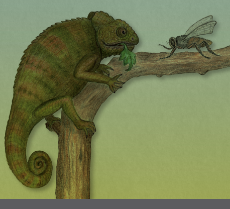
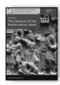
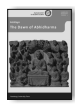
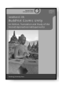
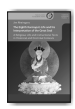
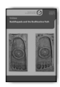
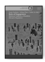
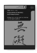
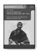
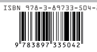

Lambert Schmithausen Fleischverzehr und Vegetarismus im indischen Buddhismus bis ca. zur Mitte des ersten Jahrtausends n. Chr.

Teil 2 · Endnoten

Lambert Schmithausen Fleischverzehr und Vegetarismus im indischen Buddhismus Hamburg Buddhist Studies 12 | Teil 2 Series Editors: Steffen Döll | Michael Zimmermann

for Buddhist Studies Lambert Schmithausen Fleischverzehr und Vegetarismus im indischen Buddhismus bis ca. zur Mitte des ersten Jahrtausends n. Chr.

Teil 2 · Endnoten projektverlag.

Bibliographic information published by the Deutsche Nationalbibliothek The Deutsche Nationalbibliothek lists this publication in the Deutsche Nationalbibliografie; detailed bibliographic data are available in the Internet at http://dnb.d-nb.de.

ISSN 2190-6769 ISBN 978-3-89733-547-9 (E-Book)
ISBN 978-3-89733-504-2 (printed version)
© 2020 projekt verlag, Bochum/Freiburg www.projektverlag.de Cover original design by Benjamin Guzinski; Julia Wrage, Hamburg Cover image: Felicitas Schmithausen Inhalt: 

| Endnoten zur Studie                                                                     | 7                          |
|-----------------------------------------------------------------------------------------|----------------------------|
| Endnoten zu den Texten I–III (Übersetzung)                                              | 360                        |
| Endnoten zur Vorbemerkung                                                               | 360                        |
| Endnoten zur Übersetzung von Text I (Mahāparinirvāṇamahāsūtra: "Fleischverzehr-Abschnitt")                                                                                         | 368                        |
| Endnoten zur Übersetzung von Text II (Aṅgulimālīyasūtra: "Verzicht auf Fleischverzehr") | 415                        |
| Endnoten zur Übersetzung von                                                            | Text III (Laṅkāvatārasūtra |
| Kap. 8)                                                                                 | 432                        |

# Endnoten Zur Studie

1 Vin IV 110 (Pācittiya 51); PrātSa Pātayantika 79 (p. 231,1; Übers.: p. 299; s.a. 

INOGUCHI 1981: 199 Nr. 297); PrātMāL Pācattika 76 (p. 27,8); PrātMū Pāyattika 79; zu den Parallelen in den chinesischen *Vinaya*s s. ROSEN 1959: 49; HEIRMAN /DE RAUW 2006: 60; zur Diskussion in der Theravāda-Tradition KIEFFER-PÜLZ 2005. Merkwürdigerweise fehlt ein Hinweis auf diese Verpflichtung in der Konkretisierung des korrekten Verhaltens (*śīla*) im Rahmen der formalisierten Beschreibung des Heilsweges eines Mönchs in den Lehrreden, jedenfalls in der Pāli-Version und der des Mūlasarvāstivāda-Kanons; sie findet sich dort weder in der Hauptliste ("Abstandnehmen vom Töten lebender Wesen", usw.)1noch in der mittleren Liste (im Pāli: Abstandnehmen vom Beschädigen von Samen und Pflanzen, usw.)2noch in den auf DN/DĀ beschränkten ausführlichen Zusatzanforderungen.3 In den Versionen dieser Beschreibung des *śīla* eines Mönchs im chinesischen *Dīrghāgama* und im chinesischen *Madhyamāgama* hingegen erscheint die Verpflichtung zum Verzicht auf Alkohol als ein Element der mittleren Liste.4 Vgl. auch SCHMIT-HAUSEN 1991a: 8 Anm. 42; ANĀLAYO 2011 (Bd. 1): 190f Anm. 245. 

1 Z.B. DN I 63,19–64,15; MN I 179,22–180,4; AN II 208,33–209,17; SaṅghBhV II 
232,9–233,5. 

2 Z.B. DN I 64,16-33; MN I 180,4-19; AN II 209,18-33; vgl. SN V 470,1–474,2; SaṅghBhV II 233,6-19 (VinMūt P ce 249a2–b2; D nga 271a1–b2).

3 Z.B. DN I 64,34–69,31; SaṅghBhV II 234,3–240,17. 

4 DĀc 83c27 (vgl. MEISIG 1987: 205); vgl. auch 89a5f; MĀc 657b18; vgl. auch 733c3f.

2 Vgl. z.B. Sn 393–398; SN V 395,11-16 (55.37) = AN IV 220,24-29 (8.25) ≈ 
SĀc 236b22-24 (erst durch Aufsichnehmen und Einhalten von fünf Selbstverpflichtungen - deren fünfte das Abstandnehmen vom Alkoholgenuß ist, insofern er zum Verlust von Selbstkontrolle führt - ist ein Laienanhänger vollkommen in seinem sittlichen Verhalten); AN III 203,4–206,3 (5.171–174); 
KaVā p. 54f (\# 6.11: surāmaireyamadyap*ramādasthānād vairamaṇy upāsakasya* śikṣāpadam); DĀc 46c12-14, 72c4-6, 88a24f, 109b22-24 (MEISIG 1987: 366), etc.; 
SĀc 23b24+29f (vgl. AN IV 288,28-32); EĀc 813c23f. Vgl. auch Dhp 246f; DN I 
146,18-26; III 235,1-3; MN II 51,11-15; AN II 57,15–58,38 (4.53); 217 (4.201); 
III 211,22f + 212,1-5 u. 213,19-24 (5.179) ≈ MĀc 616b15–c5 (bes. c4f) u. 617a19-24.; VinMī 116c20-22; DhSk 454a28–b13 (DhSkD 75,11–76,11) u. 455a24–458a17 (speziell ab 457c28); AKBh 218,15–219,9; MPPUL II/1949: 
816–819; GETHIN 1998: 170f; HARVEY 2000: 66–87, bes. 77–79. Zur sekundären Eingliederung des Alkoholverzichts in die Liste der zehn heilsamen 
(*kuśala*) Verhaltensweisen s. NATTIER 2002. 

3 Wenn Vin III 180,6-18 von zwei Mönchen die Rede ist, die mit Frauen und Töchtern aus gutem Hause vertrauten Umgang pflegen, tanzen, singen und Alkohol trinken, und wenn an der entsprechenden Stelle im *Vinaya* der Mahīśāsakas (VinMī 21c11-14) neben dem Alkoholgenuß auch Fleischverzehr genannt wird, so ist das (falls nicht ein Zusatz des chinesischen Übersetzers) 
wohl damit zu erklären, daß auch reichlicher Fleischgenuß als Bestandteil opulenter Feste galt (vgl. En. 6). Ähnlich dürfte auch eine weitere Stelle dieses Vinaya (VinMī 4a1-5) zu verstehen sein, wo Mönche, die am asketischen Wandel keine Freude haben, von den unmoralischen Verhaltensweisen der Weltmenschen und Nichtbuddhisten (also vom Gegenteil der fünf buddhistischen Laienobservanzen) schwärmen und dabei nicht nur Alkoholgenuß und den Besuch von Tanzveranstaltungen etc., sondern auch Fleischverzehr erwähnen. Die Eingliederung von Verzicht auf Alkohol (s.a. En. 2) und Fleisch in die Liste der zehn heilsamen Verhaltensweisen in T 1.81 (*Śukasūtra*, vgl. 

ANĀLAYO 2011: II 767) 897c16 dürfte eine spätere Entwicklung bzw. die chinesischen Verhältnisse (s. § 134.1) widerspiegeln, da die Übersetzung erst gegen Ende des 10. Jh. angefertigt wurde (s. HôbFA 283, s.v. Tensokusai), 
und hat zumindest in den übrigen chinesischen Versionen des Sūtra (T 1.26 Nr. 170; T1.78 –T1.81), in der Pāli-Version (MN Nr. 135) und (soweit ich sehe) 
auch in der Sanskrit-Fassung (*Karmavibhaṅga* [KUDO 2004b] p. 76 \# 19; s.a. 

Kj D mDo sa 281b2f u. 303a4) keine Entsprechung. 

4 Wie bei den meisten *Jātaka*-Versen kommt auch in dieser Versreihe weniger ein spezifisch buddhistisches Anliegen als ein Aspekt säkularer Lebensklugheit zum Ausdruck. 

5 Zu vergleichbaren Aufzählungen von Nachteilen des Alkoholgenusses vgl. 

KUDO 2004b: 241f. Zur Ächtung von Alkoholgenuß im Hindu-Dharma (vor allem bei Brahmanen, oft aber auch bei Kṣatriyas und Vaiśyas) s. HistDhŚ II.ii: 791–799 (König: 798); OLIVELLE 1999 u. 2005, Index s.v. "liquor". 

6In Āryaśūras Nachdichtung dieses *Jātaka* (17.32f: JmK 105, JmV 108f; KHOROCHE 1989: 114) hat dieser letzte Vers bemerkenswerterweise keine Entsprechung. - Zum Thema Fleischverzehr in den (Pāli-)*Jātaka*s s. HOPKINS 
1906 (*Kumbhajātaka*: ibid. 461). Zur Perspektive der säkularen Lebenswelt in den *Jātaka*s bemerkt ALSDORF (1957: 61 = 1974a: 330): "Ein reiches Land heißt mit offenbar stehender Phrase … iddhaṃ phītaṁ janapadaṃ bahu-maṃ*sasurodana*ṃ⌞;⌟ zum Begriff des Wohlstandes gehören also viel Fleisch, *surā* und Reis." Im Normalfall wird hier also, anders als in dem oben zitierten *Jātaka*, 
offensichtlich auch Alkohol (*surā*) als Genußmittel geschätzt und von den Gefahren seines Genusses abgesehen. 

7 Obwohl die Ṛṣis (isi) in den *Jātaka*s vorwiegend von Wurzeln und Früchten leben - vgl. auch den Schlußvers von Nr. 496 (IV 373,23f), wo sie als "gierig auf Wurzeln und Früchte" (*mūlaphale giddhā*) bezeichnet werden - , erklärt der Ṛṣi in Vers 12 (IV 371,25f), daß er von [eigenhändig] gesammeltem Gemüse (*sāka*), Lotuswurzelschößlingen (*bhisa*), Honig und bestimmten Beeren und Früchten (*badarāmalakāni*) lebe, aber auch von Fleisch, was der Prosakommentar (IV 373,9) wohl zu Recht im Sinne von Raubtierbeuteresten (sīhavighāsādi*maṁsa*) versteht (vgl. auch § 102.3 u. § 157). 

8 Dem Prosa-Kommentar zufolge ist er ein *paccekabuddha*, also jemand, der ohne Hilfe einer buddhistischen Lehrtradition selbständig den (buddhistischen) 
Erlösungsweg gefunden und realisiert hat, ohne jedoch seinerseits eine Lehrtradition zu begründen. 

9 Sp 822,8-10 wird *odana* erheblich weiter gefaßt; vgl. auch CPD s.v. ("... 

usually denotes boiled rice or rice-porridge, but may also, according to ct., be used of porridge made from other kinds of grain"). Zu chin. 飯 s. HEIRMAN
2002: II 415f (n. 216). 

10 UPASAK 1975: 176 (s.v. *bhojanīya*): "mixed rice and pulse"; STEVENS 1987: 
27 (≈1985: 443): "a boiled mixture of barley (or rice) and pulses"; KIEFFERPÜLZ 2013: 1359 Anm. 3: "Getreide/Weizen(-brei)"; CPD s.v. odana-*kummāsa*: 
"porridge"; SWTF s.v. *kunmāṁ*sa: "saure Grütze; halbgedämpfte Körner- und Hülsenfrüchte". Sp 823,20-22 heißt es, mit '*kummāsa*' sei im Kontext der Liste der fünf *bhojanīya*s (Vin 83,3f) aus Gerste(nkörnern) (*yava*) zubereiteter kummāsa gemeint, doch könne *kummāsa* auch aus Mungbohnen usw. hergestellt werden; vgl. I-chings Wiedergabe mit 麥豆飯 "Gerste-Bohnen-Brei". 

11 Vgl. APTE p. 1600, s.v. *saktu*: "the flour of barley first fried and then ground, barley-meal"; UPASAK 1975: 176 (s.v. *bhojanīya*): "powder of baked barley or wheat or gram etc"; STEVENS 1987: 27 (≈1985: 443): "baked grain - e.g., barley, wheat, millet, or gram flour - taken in the form of small balls or licked as a paste". ACHAYA 1994: 246: "... the coarse flour obtained by grinding parched barley and later parched rice. These were then made into balls for chewing, or a paste for licking." Ausführlich Sp 823,22–824,5. 

12 Z.B. Vin IV 83,3f; 92,15; 176,21f; 230,20; vgl. ALSDORF 1962: 6 (2010: 4); 
GRÄFE 1974: 72; STEVENS 1987: 27 (≈ 1985: 443). Eine zumindest ähnliche, jedenfalls Fleisch und Fisch enthaltende Liste der fünf *bhojanīya*s findet sich auch in den *Vinaya*s anderer Schulen (vgl. SHIMODA 1991: 544 u. 551 Anm. 3; 1997: 390 u. 660 Anm. 100; HEIRMAN 2002: II 414f), z.B. VinMī 52c11f (飯, 乾飯, 餅麨, 魚, 肉); VinMā 321c10f; 347c7; 350c22; 354c27f; 360a9f; 374a25f (麨, 飯, 麥[/麵]飯, 魚, 肉); VinDh 657a21f, 658c13f, 660b5, 661a3f, etc. (飯, 麨, 乾飯, 魚, 肉); VinSa 91b20f, etc. (飯, 麨, 糒, 魚, 肉; vgl. ROSEN 1959: 154). 

Zur Liste des VinMū s. § 2.3. 

13 In den auf die fünf *bhojanīya*s Bezug nehmenden Regeln (Pācittiya 35 u. 41, Pāṭidesanīya 1 u. Bhikkhunī-Saṅghādisesa 5) geht es nur darum, daß alle diese Speisen (also Speise generell) unter bestimmten Umständen nicht angenommen werden dürfen. Es geht nicht um eine spezifische Ablehnung von Fleisch und Fisch. 

## 14 Vindh 660B4-6:

Von heute an erlaube ich den Mönchen, fünf Arten von Speise zu essen, 
[sc.] Reisbrei (für *odana*), geröstetes Mehl (für *saktu*), trockenen Reis (für *kulmāṣ*a? v.l.: Kuchen) oder Fisch und Fleisch, [u. zw. soviel,] daß sie satt werden. 

自今已去 聽諸比丘 食五種食, 若飯若麨若乾飯(/餅)魚及肉, 令飽足。 

Vgl. aber auch VinMā 353c21 sowie 354a25 u. 28 (Höchstmenge Fisch und Fleisch, die ein Mönch essen darf). 

15 Beachte aber auch § 40.2 u. § 40.4 (+ En. 327). 16 Zur Verwendung der verschiedenen Arten von Fleisch als Heilmittel in der altindischen Medizin (*āyurveda*) vgl. z.B. ZIMMERMANN 1982, Kapitel IV, zur tibetischen Medizin und zum tibetischen Buddhismus BARSTOW 2018: 122– 133. 

17 VinMā 497a3f: 毘舍離 聽乳酪酥。 曠野 聽魚肉。 18 VinDh 866c8-23. Ähnlich VinMī 147c29–148a11 (JAWORSKI 1931: 57f), mit der ausdrücklichen Feststellung, daß Fleisch und Fisch nach Wunsch angenommen und verzehrt werden dürfen (148a7f u. 10f: 或得種種肉。 或得種種 魚。 ... 佛言皆聽隨意受食。). 

19 Die Frage der Einordnung der diesen Namen führenden Gruppierung in das Gefüge der traditionellen Schulrichtungen kann hier offenbleiben (zu der diesbezüglichen Kontroverse vgl. u.a. ENOMOTO 2000: 239–250; YAO 2007; WYNNE 2008). Für die Thematik der vorliegenden Arbeit geht es lediglich darum, diese Gruppierung als Träger einer eigenen Textüberlieferung, insbesondere einer eigenen Version des *Vinaya*, von den übrigen Überlieferungen abzusetzen. 

20 Zur Definition von *khādanīya* in VinDh, VinSa, VinMūc und im Pāli-*Vinaya*
(Vin IV 83,1f u. Sp 832–838; s.a. UPASAK 1975: 76f) s. HEIRMAN 2002: II 412 n. 205. 

21 VinMūc T 24.1451: 249c24-29 (= VinMūt P de 110b7–111a1; D tha 115b6f; S 
ta 175b7–176a2). Vgl. auch T 23.1442: 821b24f u. T 24.1448: 1a22 = GM III.1: 
ii,17f (VinMūt P khe 260b6; S ka 398a7): *mantha*ḥ (so Hs. fol. 91v10 [GM-Vin 46; GBM 6: 765]; Ed. maṇḍaḥ) odanaṁ kul*māṣo māṁsam apūpāś ca*. Meine Wiedergabe von *mantha* folgt Ch. 麨 "grains grillés" (COUV.: 1055) u. Tib. 

phye ma "Mehl" bzw., alternativ, *lde gu*, worunter nach TshCh II: 1455 *phye* ma bskol ba'i skyo ma "Brei aus gekochtem Mehl" zu verstehen ist. Beide Wiedergaben verzeichnet die Mvy (Sak Nr. 5755; Ish Nr. 5735, mit *'de gu* bzw. 

'dag gu für *lde gu*), wo *manthā* Nom.Sg. sein muß (vgl. BHSD s.v. *manthā*). Mit *lde gu* wiedergegeben ist *mantha* in der tib. Version (Tj P wi 39b8 u. 55a3; D dzi 33a7 u. 46a7) von ŚrBhTai I 130,8 u. 180,7f (*manthā vā apūpā vā* [so Hs. 

an beiden Stellen]), wo beide Nomina Nom.Pl. sein müssen (zur pluralischen Verwendung vgl. auch PrātSa 212,4f [Pātay. 33]: *pūpair vā manthair vā*; Vin IV 80,16f [Pāc. 34]: *pūvehi vā manthehi vā*). Vgl. auch GRÄFE 1974: 72: *mantha* ≈ *sattu* "Gerstenmehl". 

22 *Mūlasarvāstivāda*-Vinayasaṁgraha* (T 24.1458) 585b6f: "Fisch ist in Fleisch einbegriffen; deshalb ist [Fisch] nicht eigens genannt" (魚是肉攝 故不別言). 

Vgl. auch Patañjali, *Mahābhāṣ*ya II: 144,17 (dazu WEZLER 1975: 112 mit Anm. 

209). 

23 So z.B. VinMā 244b26-29: 
ʻFleisch': d.h. das Fleisch von Wasser- und Landtieren. ... Fische, Schildkröten ... und dergleichen im Wasser [lebende] Tiere, soweit sie eßbar sind: die werden [hier] ʻWassertiere' genannt ... 

肉者, 水陸虫肉。 ... 魚龜 ..., 如是等水中諸虫可食者, 是名水虫。 

虫 (=蟲) hier offenbar im weiteren Sinne von "Tier (allgemein)": vgl. UNGER
1989: 15; COUV. 816b; vgl. auch En. 2437 und Stellen wie T 3.164: 392a7 u. 

a22: 蟲獸 bzw. 蟲 als Jagdwild, dessen Fleisch man ißt. 

24 VinMūt P de 111a1f (D tha 115b6f; S ta 176a2f; VinMūc T 24.1451: 249c29–
250a2): 
Da sie nicht wußten, mit welchen Currys (*vyañjana*) sie [die Grundnahrungsmittel] essen durften, sprach der Erhabene: "Ihr dürft sie essen mit Milch, Sauermilch, frischer Butter, Butter[öl], Honig (fehlt in Tib.), Fisch, Fleisch, Dörrfleisch und was sonst passend ist; schließlich (d.h. wenn es nichts anderes gibt) könnt ihr sie auch [einfach] mit Wasser befeuchten". 

de dag gis tshod ma gang dag dang | bza' bar bya ba mi shes nas bcom ldan 
'das kyis bka' stsal pa | 'o ma dang zho dang | *mar* (SD : ma P) *sar dang mar* dang | nya dang | sha dang | sha skam dang | gzhan yang rung ba gang yin pa dang (PS : om. D) ste | *tha na chus kyang brlan* (S : *rlan* PD) *par bya ste* | bza' bar bya'o || Vgl. auch ŚrBhSh 84,6-8 (ŚrBhTai I 130,7-10), u. 116,19–117,7 (ŚrBhTai I 180,413), wo Fleisch, Fisch und Dörrfleisch (māṁsaṁ *matsyā vallurā(ḥ*?)) in einer ähnlichen Aufzählung erscheinen, und zwar im Kontext maßvoller und bewußter Nahrungsaufnahme als zwei Elementen des rechten Verhaltens (*śīla*) von Ordinierten, womit impliziert ist, daß ihnen die aufgeführten Nahrungsmittel, also auch Fleisch und Fisch, grundsätzlich gestattet sind, um den Körper am Leben zu erhalten, daß sie aber nicht um des Genusses willen 
(ŚrBhSh 73,19–74,2 [ŚrBhTai I 116,2-4]; cf. MN I 355,19-23) oder achtlos gegessen werden dürfen. 

25 Vin III 236,35–237,7; VinDh 618c22-25. 26 Vin III 80,13f. 27 Vin III 58,31-38 (Näheres s. Anhang A §§ a–b). 

28 VinMī 153a2-5. 29 Vin III 64,25-30 (*Vinītavatthu* ad Pārāj. 2): die Räuber haben das Rind im Andha-Wald geschlachtet, von dem Fleisch gegessen und das übriggebliebene Fleisch (offenbar für späteren Verzehr) beiseite gelegt (paṭi*sāmetvā*). Sie machen den Mönchen, die es gefunden und - in der Meinung, es sei Abfall (paṁsukūla*saññino*) - verzehrt hatten, den Vorwurf, so etwas (gemeint ist wohl: das Ansichnehmen fremden Eigentums) gehöre sich nicht für Asketen. Der Buddha erklärt, es liege kein Vergehen vor. Ähnlich VinSa 428a29–b9
(*Vinītaka* ad Pārāj. 2), wo allerdings nur von nicht näher spezifiziertem 
"Fleisch" (肉) die Rede ist und überdies die Mönche ermahnt werden, bei solchen Funden zu überprüfen, ob es nicht doch einen Besitzer geben könnte. 

Im *Vinītaka* des Mūlasarvāstivāda-*Vinaya* (VinMūUttt D na 300b2) ist der Vor-gang nur angedeutet. VinMā 468c5-13 offerieren die Räuber, die das Rind gestohlen und geschlachtet hatten, persönlich den in der Wildnis meditierenden Mönchen die Reste ihrer Mahlzeit. Die Mönche nehmen das Fleisch mit in ihr Kloster, essen davon und wollen auch ihren Mitbrüdern etwas mitgeben, doch werfen diese ihnen vor, Diebesgut angenommen zu haben. Nach Auffassung des um ein Urteil gebetenen Ältesten liegt aber kein Vergehen vor, da es für die Mönche nicht relevant sei, ob der Spender rechtmäßig oder unrechtmäßig in den Besitz der Gabe gelangt ist. 

30 Vin III 64,30-32 (analog zu En. 29). Vgl. auch VinMā 468c13-20; VinSa 281c15-29 (*Kṣudraka*); 434c20–435a6 (*Vinītaka* ad Pārāj. 2); VinMūKṣudc 282a14-28 ≈ VinMūKṣudt P de 209a1–b1 (D tha 221a5–b5; S ta 330a4–331a2; im *Vinītaka* [VinMūUttt D pa 8a3] nur angedeutet). In diesen Versionen nehmen die Mönche (in VinMū: die berüchtigte Sechsergruppe) die von den Dieben weggeworfenen Teile des Schweines (bzw. der Schweine: *phag dag*) - in VinSa: die Innereien, in VinMā u. VinMū: Kopf, Knochen und Füße - und kochen sie (bzw. lassen sie kochen: *Vinītaka*). In VinMā werden die Mönche wie im Falle des Rindfleischs von ihren Mitbrüdern beschuldigt, wobei ihnen diesmal vorgeworfen wird, sich selbst des Diebstahls schuldig gemacht zu haben. Sie werden aber freigesprochen, weil sie die Fleischreste in der Meinung, es gebe keinen Besitzer, genommen haben. In den Sarvāstivāda- und Mūlasarvāstivāda-Versionen hingegen erscheinen bei der Zubereitung des Fleisches die Hirten, denen das Schwein gestohlen worden war, und bezichtigen die Mönche (zu Unrecht) des Diebstahls, in den Sarvāstivāda-Texten sogar vor einem weltlichen Gericht. Die Mönche werden aber freigesprochen, jedoch ermahnt, in Zukunft solches Abfallfleisch nicht an sich zu nehmen. Ab-schließend erläßt der Buddha (auch in der Mūlasarvāstivāda-Version) ein förmliches Verbot in diesem Sinne. 

31 Genaueres hierzu s. En. 2222 u. En. 2223. 

32 Etwas anders liegen die Dinge in der im *Muktaka* des VinMū überlieferten Parallele, wo das Tier, dessen Fleischreste die Mönche mitnehmen, ein Maultier (Ch. Pferd) des Königs ist (s. § 70.2(c) u. En. 470).

33 Vin III 207,32–208,26; (ad Nissaggiya-pāc. 4); vgl. VinDh 606a28–b11, wo allerdings von Schweinefleisch (nicht Rindfleisch) die Rede ist und Utpalavarṇā das Fleisch für die Mönche zubereiten läßt; ähnlich VinSa 42a25–b16
(Fleisch hier nicht näher spezifiziert). 

34 Vin III 59,13-15. 35 Vin IV 109,15-30 (ad Pāc 51: *surāmerayapāne pācittiyaṁ*). Vgl. auch VinDh 671c21–672a11, VinSa 121a12-20 (vgl. ROSEN 1959: 205) u. VinMūc 859b8-17
≈ VinMūt D nya 33a1-5 (wo der Mönch 善來 bzw. *Legs 'ongs* = *Svāgata heißt). Während Sāgata in VinDh mit verschiedenen Köstlichkeiten und einem berauschenden Getränk (黑酒) bewirtet wird, ist im Pāli-*Vinaya* ist nur von einer Bewirtung mit einem bestimmten Rauschtrank (*kāpotikā*) die Rede, und in beiden *Vinaya*s geschieht dies (gewissermaßen hinter seinem Rücken) auf Vorschlag von Mönchen der berüchtigten Sechsergruppe (*chabbaggiyā bhikkhū*). In VinSa und VinMū wird ihm der Rauschtrank nach einer opulenten Mahlzeit (VinSa: Ghee, Milch und Reisbrei) zwecks besserer Bekömmlichkeit dargereicht, ohne daß er um die berauschende Wirkung weiß. 

36 VinMī 60a22-29 (ad Pāc 57), bes. a26f (... 往到其家 食肉飲酒). 37 VinMī 60b10: 若比丘飲酒 波逸提. 

38 VinSa 85c20–86a15, bes. 86a2f (比丘尼言: 為辦雉肉 鵽肉 1 鶉肉。 比丘食者 波逸提。) u. a13f; an der letzteren Stelle hatte der Haushälter vorgehabt, die Mönche mit Rindfleisch (牛肉) zu bewirten, und soll statt dessen das offenbar höherwertige Rebhuhn-, Tauben- oder Wachtelfleisch verwenden. 

1 鵽 ist nach COUV. 1050b der Name eines taubenähnlichen Vogels. 

39 VinSa 86c15f (... 若為家屬作, 比丘食者不犯。) u. c25-27 (...若先為比丘作, 比丘食者不犯。).

40 VinMūc 810c4f (欲與菜羹。 尼曰: 應與肉羹, 彼苾芻得四果故。) u. c8f; ausführlicher VinMūt P nye 105a6f (D ja 112a5f; S cha 444b7f) u. 105b8f (D ja 113a3f; S cha 445b7–446a2).

41 VinMūc 810c5-10; VinMūt P nye 105b2f u. 106a5 (D ja 112b4 u. 113b1; S 
cha 445a6f u. 446a6f).

42 EĀc 647b1-3 (aber o.E. in der ähnlichen Geschichte in Dhp-a I 366–374). 

Vgl. auch AN IV 187f (8.12; s. § 16 + En. 134), das *Āmagandhasutta* (Sn 239– 252: s. § 21), das *Jīvakasutta* (MN Nr. 55 nebst DĀ-Parallele: s. § 22) und vor allem AN III 49 (5.44: s. § 78.1). 

43 MN II 7,33f (s. § 40.5 + En. 336); AN III 49,31f; vgl. auch MN II 52,10-14
(der frühere Buddha Kassapa erhält *odana* und *sūpa*); 138,18-22 (der Buddha Gotama nimmt maßvoll odana + *byañjana* entgegen). 

44 Vgl. Vin IV 190: *sūpo nāma dve sūpā: muggasūpo māsasūpo*; BhīVinMāL 
292,1f: mudgānāṁ *sūpo ... māṣasūpo ... ca*. 

45 Ps I 150,28-30: ... maccha-maṁsa-mugga-sūpādīhi anekasūpaṁ, nānappakāramaṁsādi*-byañjanehi anekabyañjana*ṁ. Vgl. auch VinMā 398a13f ≈ T 22.1426: 
554a29, wo PrātMāL Prātideś. 3 (p. 29f) iha odanaṁ dehi, iha sūpaṁ *dehi, iha* vyañjanaṁ dehi mit 與是(比丘)飯 與是(比丘)羹(若)魚(若)肉 ("Gib diesen 
[Mönchen] Reisbrei, gib diesen [Mönchen] Suppe/Bouillon, Fisch [oder] 
Fleisch") wiedergegeben ist, *sūpa* und *vyañjana* also (vor allem) im Sinne von 
(Fleisch)brühe, Fisch und Fleisch verstanden wird. Vgl. auch VinMā 407b4-7, wonach die *vyaðjanāni*, die der Mönch nicht mit Reisbrei zudecken soll, weil er mehr davon bekommen möchte (PrātMāL, Śaikṣa-dharma 46; VinMā 407b13f), Fisch und Fleisch enthalten (魚肉羹).

46 Zu einer dezidierten These in diesem Sinne s. Anhang B. 

47 Vgl. z.B. SCHMITHAUSEN/MAITHRIMURTHI 1998: 181f; 2009: 49–52; ELT-SCHINGER 2017a: 378f; HEIRMAN 2019. 

48 Näheres s. SCHMITHAUSEN/MAITHRIMURTHI 1998: 182f; 2009: 52–56.

49 SCHMITHAUSEN/MAITHRIMURTHI 1998: 183f; 2009: 56f. 

50 Z.B. DN I 63,19–64,15 (bes. 63,20-23) ≈ DĀc 83c13-27 (bes. c14f); T 1.22: 
272c8-25 (bes. c11-13); SaṅghBhV II 232,7–233,5 (bes. 232,9-12; vgl. MEISIG
1987: 194–201); MN I 179,22-180,4 (bes. 179,23-25) ≈ MĀc 657a12–b6 (bes. 

a14-16).

51 Vgl. vor allem AN V 249–309 (10.167–216) sowie die Parallelen zu vielen dieser Lehrreden in SĀc 271b1–276a2 (Nr. 1039–1061; SĀc Nr. 1042 entspricht MN Nr. 41, s. ANĀLAYO 2015: 105–119); zu AN 10.206 (bes. V 
292,12-16 u. 294,31–295,6) vgl. MĀc Nr. 15 (bes. 437c1-3 u. 438a3f); vgl. ferner z.B. MN I 489,24–490,8; SN 42.6 (bes. IV 312,14–314,18) ≈ MĀc Nr. 17 (bes. 440a4–c6); SN 42.8 (bes. IV 320,11-15, 21-28 u. 322,25) ~ SĀc Nr. 916 (bes. 232a6-19); DN III 82,6–83,5; 269,1-9; DĀc 119b6-12. In dieser Aufzählung weist das dritte Element "Abstandnehmen von sexuellem Fehlverhalten" 
(*kāmesu micchācāra*) statt "[kompletter] Enthaltsamkeit" (*brahmacarya*) auf Laien als Addressaten; explizit so AN V 287f (10.203–204): *upāsikā*; vgl. auch die in En. 2 angeführten Stellen, ferner z.B. VisM I.40 (upāsaka-upāsikānaṁ *...* paðca sikkhāpadāni sati vā ussāhe dasa), AKBh 217,20f, AS in LI 2013: 251,3-6, ASBh 68,14-19 u. YBht P zi 34a2-6 ≈ YBhc 590c12-18 (vgl. AGOSTINI 2002: 
71–75). Das schließt nicht aus, daß einzelne Laienanhänger die strengere Observanz vollständiger Enthaltsamkeit auf sich nehmen, so etwa MĀc 499b12f
(離非梵行 ..., s. ANĀLAYO 2012: 155–174, bes. 159) und MVu I 326,15 der Töpfer Nandipāla/Ghaṭikāra, während die Pāli-Version (MN II 51,14) auch hier das im Falle von Laien übliche kāmesu micchācārā paṭ*ivirato* hat.1 1 In der Parallelüberlieferung im SaṅghBhV (II 22,19f; 26,24f) hat der Satz keine Entsprechung, ebensowenig in der Fassung des 佛說興起行經 (T 4.197: 172c16f).

52 Pārājika 3 u. Parallelen (s. ROSEN 1959: 42) bzw. Pācittiya 61 u. Parallelen 
(s. ROSEN 1959: 48; HEIRMAN /DERAUW 2006: 61 n. 10; zum Begriff *pārājika* s. En. 2235, zu *pācittiya* Text I, Übers. En. 2764). Zu den jeweils unterschiedlichen Kriterien bei der Bewertung von Tiertötung und Menschentötung im Vinaya einerseits und in den Lehrreden andererseits siehe SCHMITHAUSEN /MAITHRIMURTHI 2009: 90–100. Im Vinaya steht das Ansehen des Ordens und seine gesellschaftliche Stellung im Vordergrund; da wären mordende Mönche fatal und würden zu einem Konflikt mit der Obrigkeit führen, während gelegentliches Töten herrenloser Tiere (etwa: Krähen) lediglich als für Weltentsager unziemlich empfunden wurde. Im Kontext ethischen Verhaltens (und der Karma-Lehre) hingegen ist die Mensch und Tier gemeinsame Empfindungsfähigkeit das Entscheidende (vgl. auch BARSTOW 2018: 71f; STEWART
2016: 19f: "fluidity between humankind and animalkind") und daher absichtliches Töten jeglicher Lebewesen grundsätzlich schlecht /unheilsam; der Unterschied zwischen Mensch und Tier (etwa die für die aktuelle Erreichung des Nirvāṇa unabdingbare, nur in menschlicher Existenz gegebene Einsichtsfähigkeit) kommt erst in zweiter Linie zum Tragen. 

53 Siehe die in En. 2 angeführten Belege. 54 Vgl. hierzu AKBh 215,1–216,8 1 (AKBhLVP IV 70–76; AKBhLoSa II 1345–
1348 u. 1545–1549 Anm. 312–329; vgl. auch DhSk 454a15-27 ≈ DhSkD 73,9–
75,10), wo diskutiert wird, ob man, um ein buddhistischer Laienanhänger 
(up*āsaka*) zu werden, zwangsläufig auch die fünf Selbstverpflichtungen für Laienanhänger (keine Lebewesen töten, usw.) auf sich nehmen muß (so die kaśmīrischen Vaibhāṣikas: AKBh 215,3f) oder ob es hierfür schon ausreicht, seine Zuflucht zum Buddha, seiner Lehre und seiner Gemeinde zu nehmen und auch das Aufsichnehmen lediglich eines Teiles der Selbstverpflichtungen möglich ist. Vgl. hierzu auch MPPUL II/1949: 821 Anm. 1 u. 829f Anm. 3; KaVā p. 53 Anm. 2; zur Bandbreite der Laienanhänger und Unterstützer ferner u.a. HARRISON 1995: 59, FREIBERGER 2000: 140–147, HARVEY 2000: 82–87, und vor allem die eingehende Behandlung des Themas bei AGOSTINI
(2008; s.a. 2002: ch. 1, bes. 1.6 [*Mahāvibhāṣā*, Saṅghabhadra]). 

1 Text zu korrigieren mit AKBh-I Pt. 1: 431. 

55 Ein Verweis auf SCHMITHAUSEN/MAITHRIMURTHI 1998: 185–201 u. 2009: 
59–77 muß hier genügen. Für Tibet vgl. z.B. BARSTOW 2018: 74 (schmerzhafte Methode der Schlachtung von Yaks); 49 u. 119 (Schlachthäuser in Klosternähe); 121 u. 142 (Schlachtenlassen statt selbst Schlachten); 161 (Gebete oder Mantras für eine gute Wiedergeburt des getöteten Tieres oder zur Milderung des Tötungsvergehens). 

56 Siehe AGOSTINI 2002, ch. 2.

57 Anders als bei Regelverstößen von Ordinierten gibt es im Falle der Laienanhänger bei Nichteinhalten der Selbstverpflichtungen keine formellen Sanktionen (HIRAKAWA 1990: 63,1-5).

58 Die negativen Folgen des Zuwiderhandelns stellen sich, jedenfalls nach Auffassung der älteren indischen Tradition, allemal ein: vgl. z.B. AN III 204,23–206,3 (5.174) ≈ IV 406,1-20 (9.27) ≈ V 182,20–183,20 (10.92) ≈ SN II 
68,19–69,17 (12.41) ≈ V 387,27–388,13 (55.28) ≈ SĀc 216a1-6 (Nr. 845) ≈ 
Dharmaskandha (DIETZ 1984) 70,23–73,7 (vgl. auch VinSa 449a21-28); AN III 
204,11-22 (5.173); III 275,30–276,24. 

59 Bei Eiern gibt es Schwierigkeiten, wenn sie als belebt gelten; so schreibt GOMBRICH (1971: 261) über Sri Lanka: "Even educated people think that all eggs are fertilized." 
60 Vgl. die Argumentation in STEWART 2010: 101–110. 61 ALSDORF 1962: 18; 55–63 (2010: 18f u. 59–68). Zur Induskultur ib. 69(/74) 
Anm. 1.

62 ŚB 11.7.1.3: etád u ha vaí paramám anndyaṁ yán māṁsám. Aus späterer Zeit z.B. Mhbh 13.117.6: *na māṁsāt param atrânyad rasato vidyate bhuvi*. 

63 Gleiches muß nicht für alle Bevölkerungsgruppen bzw. -schichten der damaligen Zeit gegolten haben, und erst recht nicht für spätere Perioden: vgl. 

das von ALSDORF (1962: 61; 2010: 66) angeführte Beispiel aus dem Gahapati-*jātaka* (Nr. 199), oder die Hinweise auf 'professionelle' Schlächter und Schlachthöfe (*sūna*) in den buddhistischen Lehrreden und *Vinaya*s (§ 53.2 u. 

§ 87.3). 

64 Das (Haus-)Schwein galt als nicht opferrein und dürfte von den einwandernden Āryas zunächst kaum gehalten worden sein (s. En. 677). Letzteres gilt, aus ähnlichen Gründen, vielleicht auch für das Haushuhn (dessen Verzehr in den hinduistischen Dharma-Texten ebenfalls untersagt ist: s. En. 1864). Für die ansässige Bevölkerung sind jedoch auch domestiziertes Schwein und Haushuhn bezeugt: vgl. ALLCHIN/ALLCHIN 1982: 80; 190f; 263f; 267; 318. 

Wildtiere fanden normalerweise beim Opfer keine Verwendung (OLDENBERG 
21917: 354); in welchem Umfang (und von wem) sie in vedischer Zeit zu Nahrungszwecken gejagt wurden (vgl. MACDONNEL/KEITH 1912 [
31967]: II
172–174, s. v. mṛ*gayu*) und ob ihre Tötung in irgendeiner Weise ritualisiert war, kann hier nicht untersucht werden. Fische konnten offenbar ohne Verbindung mit einem Opferritual getötet werden (vgl. KRICK 1982: 552 u. 557). 

65 Vgl. hierzu KRICK 1982: 94f Anm. 240; SCHMIDT 1997: 209f; OBERLIES 
1998: 274 Anm. 600; 289 Anm. 674; 2012: 279. 

66 Damit soll keineswegs gesagt sein, daß die betreffenden Rituale im 
'emischen' Kontext des religiösen Gedankengebäudes ihrer Veranstalter ausschließlich oder auch nur primär der Verfügbarmachung von Fleisch dienen sollten, auch wenn dies de facto gewiß ein zentrales Motiv war. Als Opfer waren sie jedoch in erster Linie als Gaben an die Götter oder Manen und als Garant für das Wohlergehen der eigenen Sippe und die Aufrechterhaltung der kosmischen Ordnung oder als Mittel zur Erreichung besonderer Ziele, etwa des Aufstiegs des Opferers in die Himmelswelt, konzipiert. 

67 Besonders aufwendige Formen mit Opferung zahlreicher Tiere (abgesehen vom Pferdeopfer vor allem Ziegen, Schafe, Rinder) kennt auch der PāliKanon (wo sie allerdings kritisch gesehen werden), z.B. SN I 76; AN II 43; Sn 303(ff); It 21,12-15; cf. FALK 1988. Vgl. auch Sn 308f u. DN I 127,10-14 (gegenüber Sn 295–297 u. DN I 141,26-28: s. § 10.2 + En. 81 u. En. 82), ferner MN I 343f (bes. 344,5-8) sowie AN II 207f (bes. 207,27-31), mit Entsprechung im *Pudgalasūtra* des DĀ der (Mūla-)Sarvāstivādins (s. T. FUKITA in KARA-SHIMA/WILLE 2009: II.1 304 [= MELZER 2010 Teil 2: 338 \# 38.25]: *tasmi*ṁ khalu{r} yajñe ṛṣabhā hanyante ukṣāṇo mahiṣyo dhenavo vatsā vatsatarā ajā urabhrā vividhā kṣudrānukṣudrāḥ prāṇinaḥ saṁghātam āpadya jīvitād vyapa*ropyante*) und in SaṅgP 406b27f (ad \# IV.44; s. STACHE-ROSEN 1968: 123). 

68 HOUBEN (1999: 117–129) spricht von "embarrassment", MINKOWSKI (1991: 
39) von "inauspiciousness inherent in the animal's death". 

69 Zum Folgenden vgl. z.B. OLDENBERG 1917: 357f; SCHMIDT 1968: 643–649; 1997: 214f (u. 218,26-29; 228,11f); MINKOWSKI 1991: 51; 165; TULL 1996: 225f; OBERLIES 2012: 279. Vgl. auch En. 98. Inwieweit auch die Tatsache, daß die ältere, im häuslichen (gṛ*hya-*) Ritual beibehaltene Form der Tötung des Opfertieres durch Enthaupten im feierlichen (*śrauta*-) Ritual durch Ersticken des Opfertieres ersetzt worden ist (HEESTERMAN 1962–63: 18f; 212; OBERLIES 1998: 288 Anm. 666; 2012: 462 Anm. 257)1, Ausdruck eines zunehmenden (bzw. in bestimmten Kreisen stärker empfundenen) Unbehagens an offener, blutiger Gewalt ist, sei dahingestellt. Nach SCHMIDT 1997: 225 ist der Grund für diesen Wechsel weniger in einer veränderten Einstellung zur Gewalt zu suchen als vielmehr in einer veränderten Einstellung zum Blut; 
(skeptisch dazu HOUBEN 1999: 119 mit Anm. 26). 

1 Vgl. aber WITZEL 1987: 390, wonach wir es hier mit zwei von Anfang an parallel laufenden Strängen zu tun haben, und PARPOLA 1992: 295, der die blutigen Opfer für entlehnt hält. 

70 Vgl. hierzu auch KATAOKA 2012 u. ELTSCHINGER 2017a: 369–372. 71 IZAWA 2008: 119–128. 72 Vgl. z.B. TS 6.3.8.3, zitiert in HOUBEN 1999: 119f (mit Anm. 28): 
The Adhvaryu-priest turns away from the animal as it is slaughtered; he conceals himself from the animals, in order to remain uninjured himself. 

párāṅ  vartate 'dhvaryúḥ paśñḥ saṁjðapyámānāt, paśúbhya evá tán ní hnuta ātmánñ 'nāvraskāya. 

Hierzu paßt auch die TS 6.3.8.1 (vgl. IZAWA 2008: 118) angeführte Auffassung, wonach der Opferveranstalter, würde er sich an dem zur Schlachtung geführten Opfertier von hinten festhalten, ins Verderben geriete (mṛ*tyáve v* eṣá nīyate yát paśús táṁ yád anvārábheta pramyuko yájamānaḥ *syād* …), also offenbar gleichsam vom Opfertier mit in den Tod gezogen würde (und nicht etwa mit in die Himmelswelt, wie die Gegenposition annimmt und der Opferveranstalter es sich offenbar erhofft). 

MS 3.10.1 (128,11-15; SCHMIDT 1968: 647; IZAWA 2008: 119) zufolge bewirkt die rituelle Befreiung des Lebensodems (*prāṇāḥ*) des Opfertieres von Schmerz (śuc), daß es rein (nach ŚB 3.8.2.4 [IZAWA 2008: 120]: lebendig) und den Göttern gefällig (d.h. als Opfergabe annehmbar) wird und (so darf man wohl ergänzen) die vom Opferveranstalter erhoffte Wirkung hat. 

Nach TS 5.1.4.2 (vgl. MS 3.1.5 [III: 6,7f]; IZAWA 2008: 123f) muß - in einem zugestandenermaßen anderen rituellen Kontext - das Fell einer schwarzen Antilope (k*ṛṣṇājiná*) verwendet werden, und nicht etwa das Fell eines Haustieres, damit der [Agni, dem Opferfeuer, inhärente] Schmerz (śuc) nicht auf die Haustiere (das Vieh des Opferveranstalters bzw. seiner Sippe) übergeht, sondern auf die für den Lebensunterhalt weniger wichtigen Wildtiere, die eben dadurch vergleichsweise weniger gut gedeihen. Weitere Rituale mit gleichem Ziel s. IZAWA 2008: 124–128. ŚB 7.5.2.28–37 ist es aber wiederum das Tieropfer, in dessen Rahmen der vom Opferfeuer bewirkte Schmerz (śuc, hier ausdrücklich als Übel *(pāpman)* bezeichnet) auf bestimmte, dem jeweiligen Opfertier ähnliche Wildtiere (und auf verhaßte Personen!) abgeleitet wird, wodurch diese Tiere ungeeignet für das Opfer (amedhy *ayajñiy*ḥ) werden und von Brahmanen nicht gegessen werden dürfen (vgl. auch SCHMIDT 1997: 211, bes. auch zu kiṁ*puruṣa* als Entsprechung für den Menschen als 'Opfertier'). 

Diese Stellen zumindest machen doch den Eindruck, daß trotz der vorauszusetzenden Empathie weniger das Mitleid mit dem Opfertier als vielmehr die nachteiligen Auswirkungen des dem Opfertier zugefügten Schmerzes für den Opferveranstalter im Vordergrund stehen, dergestalt, daß der zugefügte Schmerz dem Opfertier wie eine Art gefährlicher, kontaminierend wirkender Kraft oder Energie anhaftet (für ähnliche Vorstellungen heutiger Hindus vgl. SCHMIDT 1997: 215,3-10), die es mit magisch-rituellen Mitteln zu löschen oder zumindest auf weit genug entfernte Lebewesen oder Objekte (oder eben auf verhaßte Personen) abzuleiten gilt. 

73 *Śāṅkhyāyana-brāhmaṇ*a 11.3, zit. in SCHMIDT 1968: 644 (mit Anm. 1): "Just as men eat cattle in this world, partake of them, so cattle eat men in the yonder world, partake of them." Ferner ŚB 12.9.1.1, zit. ibid. (mit Anm. 2). Analog könnte sich hinter der Aussage von TS 6.3.8.3 (s. En. 72) die später in anderem Zusammenhang (vgl. § 64) durchaus belegte Befürchtung verbergen, daß sich Artgenossen des getöteten Tieres schon im Diesseits an dem Täter rächen könnten. Auch der Brauch, das Opfertier sowie dessen Eltern, Brüder und Gefährten um Einverständnis mit der Opferung zu bitten (SCHMIDT 1997: 
223), mag nicht zuletzt auch darauf angelegt gewesen sein, solchen Racheakten vorzubeugen (vgl. auch WITZEL 2003: 52). 

74 SCHMIDT 1997: 215,1f. 

75 SCHMIDT 1968: 648 mit Anm. 7 (MS 3.1.8 [III: 9,17f]): Wer die [ebenfalls als belebt vorgestellte] Erde aufgräbt (= verletzt), wird Unheil erleiden (rtiṁ sá riṣ*yati*). - ŚB 3.8.5.8–11 heißt es, daß der Schmerz, den das Opfertier bei der Schlachtung erleidet, sich in dessen Herz konzentriert und von dort auf den Spieß, an welchem dieses gebraten wird (hṛdaya*śūlá*), übergehe und man den Spieß deshalb weder auf den Erdboden noch ins Wasser werfen dürfe, da sonst der Schmerz in die (aus der Erde hervorwachsenden) Kräuter und Bäume bzw. in das Wasser eindringen würde. Das aber würde offensichtlich deren Feindschaft provozieren; denn nach der rituellen Entsorgung des Spießes werden Wasser und Pflanzen ausdrücklich gebeten, den Opfernden freundlich gesonnen zu sein (und feindlich den Feinden der Opfernden!). Ähnlich MS 3.1.10 (s. SCHMIDT 1968: 647 mit Anm. 4 u. 5; IZAWA 2008: 119). 

Auch ṚV 10.97.20 (=TS 4.2.6.5 u. Vājasaneyi-sa*ṁhitā* 12.95ab), wo in einem Hymnus an die Heilkräuter der Wunsch ausgesprochen wird, daß weder der, der sie ausgräbt, noch der, für den man sie ausgräbt, zu Schaden kommen1 möge (m vo riṣat khanit yásmai cāháṁ *khánāmi vaḥ*)
2 und daß "alle unsere Zweifüßigen (= Menschen) und Vierfüßigen (= Vieh) unversehrt bleiben sollen",3 ist doch wohl in diesem Sinne zu deuten. 

1 HOFFMANN 1967: 50 u. 59 (mit zahlreichen Parallelen für m + Injunktiv von √riṣ in intransitiver Bedeutung). Demgegenüber glossiert Sāyaṇa (ṚV with Comm. IV: 
323) m *riṣ*at mit *mā hiṁsyāt*, faßt es also transitivisch. 

2 Vgl. auch die Formulierung in *Kauśikasūtra* (ed. H.R. DIWEKAR et al., Poona 1972) 
33.9: *mā te riṣ*at [ms. riṣan̖] khani*tā yasmai ca tvā khanāmasi*. 

3 GELDNER 1951: III 308; JAMISON/BRERETON 2014: III 1554: "Let your digger not suffer harm, nor him for whom I dig you. Let our two-footed and four-footed all be free of affliction." Vgl. auch TICHY 1995: 112 u. 115: "Laßt den nicht zu Schaden kommen, der euch ausgräbt, und auch jenen, für den ich euch ausgrabe", mit der Zusatzbemerkung, daß mit *khanit* angesichts des 2. Pāda gemeint sein muß: "der euch hier ausgräbt (nämlich ich selbst)". In der Tat heißt es in einer Parallele in der Paippalādasa*ṁhitā* des *Atharvaveda* (9.3.2cd): mā te riṣaṁ khanitā yasmai ca tvā khanāmasi ("Nicht zu Schaden kommen möge ich, wenn ich dich ausgrabe, auch jener [nicht], für den wir dich ausgraben" [KIM 2014: 214; freundl. Mitteilung von A. Wezler]). 

76 ŚB 11.6.1; in der Parallele JB 1.42–44 fehlt das Wasser. Vgl. LOMMEL 1950; SCHMIDT 1968: 644f; 1997: 214; BODEWITZ 1973: 99–109. - Es ist für die vorliegende Untersuchung gleichgültig, ob die in diesem Textstück formulierten Vorstellungen ein genuines Element der Gedankenwelt der (spät)vedischen Ritualisten sind oder ob sie einem anderen (volkstümlichen oder indigenen?) Vorstellungskreis entstammen. So oder so waren sie m.E. für die nachfolgende Entwicklung von grundlegender Bedeutung (vgl. SCHMIT-HAUSEN 2000a). Auch die geographischen Fakten konvergieren, da sich das 
(vergleichsweise späte) ŚB in der mittleren Gangesebene (die Kāṇva-Version in Kosala, die Mādhyandina-Version in Videha), also der Heimat von Buddhismus und Jainismus, lokalisieren läßt (WITZEL 1997: 314f). 

77 Siehe SCHMIDT 1997: 211–214. 78 HistDhŚ II: 1138–1140. 

79 Siehe En. 89. 80 Ausführlich hierzu ELTSCHINGER 2017a. 81 Sn II.7 (s.a. ELTSCHINGER 2017a: 375–377), bes. vs. 308–312 gegenüber vs. 

295–297 (≈ MĀc Nr. 156, bes. 679a2-11 gegenüber 678b29–c7; vgl. HAKAMA-YA 2006). Es erscheint mir jedoch problematisch, aus diesem Text ein Verbot von Rindfleischverzehr in frühbuddhistischer Zeit abzuleiten. Der Text richtet sich ja nur gegen das Töten von Rindern im Ritual, also doch wohl vor allem gegen die Vorstellung, der rituelle Rahmen legitimiere die (andernfalls unheilbringende) Tötung. Selbst wenn man im Kontext der vedischen Gesellschaft daraus folgern könnte, daß mit einer solchen Ablehnung auch der rituellen Schlachtung eine Verfügbarmachung von folgenlos verzehrbarem Rindfleisch praktisch unmöglich gemacht wird, läßt sich dies nicht auf die frühbuddhistischen Verhältnisse, wie sie sich in den Texten darstellen, übertragen, da hier überwiegend professionelle Schlächter das Töten übernommen haben: Personengruppen, von denen man Fleisch durch Kauf erwerben kann, ohne den Tötungsakt begehen oder veranlassen zu müssen. Allenfalls der Vergleich der Rinder mit den Eltern, Verwandten und Freunden in Vers 296a-c könnte (analog dem "Verwandtschaftsargument": s. § 176, § 218, § 233.1) Vorbehalte gegen Rindfleischverzehr suggerieren, desgleichen die Bemerkung (Vers 296c), daß die Kühe doch die Quelle von Heilmitteln (doch wohl: den Milchprodukten) seien (freundl. Hinweis von P. Schmidt-Leukel). Ebensogut könnte der Vergleich aber auch nur als eine Art emotionaler Barriere gegen das Töten der eigenen Rinder gedacht sein, und auch die Bezugnahme auf die Heilmittel ließe sich dahingehend verstehen, daß es nicht nur undankbar, sondern auch unvernünftig wäre, derart wohltätige und nützliche Tiere umzubringen. Und falls man aus der Feststellung (Vers 295), daß die Brahmanen in besseren Zeiten ihre Rituale mit Reis, Ghee und Sesamöl vollzogen hatten, schließen darf, daß sie vegetarisch lebten, so würde ich dazu tendieren, dies in den Kontext der Vorstellung von einer fleischlosen Ernährung in idealen Zeitperioden (s. Kap. IV.6.2) einzuordnen. 

82 DN Nr. 5 (I 127–149, bes. 127,10-14, 141,26-36, 142,23-33, 144,9-13, 145,1116, 145,32–146,2, 146,18-26 u. 147,7ff) ≈ DĀc Nr. 23 (96b–101b, bes. 96c27-29, 101b5f u. b27ff); ähnlich auch die Sanskrit-Handschrift des *Kūṭatāṇḍyasūtra*
(bes. 401r5-6, 405v3-6, 408r6–v1 u. 408v2–409v1). Weitere Belege für die buddhistische Ablehnung des vedischen Tieropfers s. En. 67; vgl. auch HAM 2016: 15–21. 

83 Es hat allerdings in der damaligen Zeit auch Bewegungen gegeben, die auch diese Vorstellung ablehnten (vgl. FRAUWALLNER 1956: 297–302) und in deren Augen somit die darauf basierende Gefährlichkeit des mit dem Nahrungsgewinn verbundenen Tötens gegenstandslos geworden sein dürfte. 

84 Daran ändert auch die im älteren Buddhismus nur vereinzelt begegnende 
(MN Nr. 130 = III 178–187) Mitwirkung eines Jenseitsrichters wenig. 

85 Eine gewisse Chance, die üblen Folgen schlechter Handlungen auszugleichen oder zumindest aufzuschieben, bieten vor allem den Laien heilsame Handlungen wie Spenden. Asketen hatten hierzu, solange Besitzlosigkeit zu ihrer Lebensweise gehörte, weniger Gelegenheit (s. jedoch BCA 5.85). Daß sich bei der Mehrheit der buddhistischen Mönche die Situation im Laufe der Zeit grundlegend geändert hat (vgl. z.B. SCHOPEN 1985 = 1997 ch. II), kann im Kontext der hier vorgetragenen Überlegungen wohl außer Betracht bleiben. 

86 Vgl. hierzu METTE 2002. 87 Dem Text zufolge werden sie beim Gewitter vom Donner ("*da da da*") als himmlischer Stimme nachgesprochen. Vgl. JB 2.265, wo allerdings die Stimme des Donners ("*da da da da da da*") als "ich will geben", nämlich den Lebewesen Regen und Nahrung, gedeutet wird. 

88 SCHMITHAUSEN 2000a: 271–274. 89 Unabhängig davon, wie man zu der kontroversen Frage des vedischen oder außervedischen Ursprungs des Asketenwesens (wozu u.a. BRONKHORST 1993; vgl. auch die Besprechung von OLIVELLE in *JAOS* 115/1995: 162–164 sowie BODEWITZ 1999: 21 Anm. 9) steht, bleibt festzuhalten, daß sich auch in (wenngleich vergleichweise späten) vedischen Texten Hinweise auf diese beiden Lebensformen finden. Das Leben von Almosenspeise ist schon ŚB 
11.3.3.5 und in den G*ṛhyasūtra*s (z.B. KāṭhGS 1.4; s. DREYER 1986: 8) für den Veda-Schüler (brahma*cārin*) bezeugt, wobei (auch) ökonomische Gründe 
(Vermeidung einer wirtschaftlichen Belastung des Hausstandes des Lehrers, zumal wenn dieser berühmt war und viele Schüler hatte) bestimmend gewesen sein könnten. Im *Mānavaśrautasūtra* (8.25.14; SPROCKHOFF 1987: 249) ist ein Leben von Almosen auch für die - hier bereits in ritueller Form - aus der Speisegemeinschaft ausgeschiedenen, in die Wildnis davongegangenen Alten bezeugt, als Alternative zum Leben von den Wurzeln und Früchten der Wildnis (und vielleicht auch von Raubtierbeuteresten?). Auch hierbei mögen ursprünglich wirtschaftliche Zwänge bestimmender gewesen sein als asketische Motive oder gar ahiṁsā-Erwägungen. 

90 Mindestens ebenso wichtig ist hier natürlich der Aspekt der asketischen Selbstbeschränkung (vgl. auch WEZLER 1978: 87 Anm. 252). 

91 Nach den 'Rechtstexten' kann allerdings auch der *vānaprastha* noch ein spezielles rituelles Feuer unterhalten: vgl. z.B. ĀpDhS 2.22.8; GauDhS 3.27 (dazu die Anm. in OLIVELLE 1999: 374); BauDhS 2.11.15; VasDhS 9.10–11 (Aufgabe des rituellen Feuers nach sechs Monaten). 

92 Man darf wohl davon ausgehen, daß die begrenzte Entnahme solcher Teile die Pflanze nicht umbringt. Aus jinistischer Sicht jedoch sind auch Wurzeln, Knollen und Früchte als solche, je für sich, lebendig und beseelt (SCHUBRING 1935: 134f), so daß eine solche Ernährung für Jaina-Asketen nicht in Frage kommt. 

93 Hierzu ausführlich WEZLER 1978: 99–102 u. 107f. 94 Z.B. ĀpDhS 2.[9.]22.2–3 (tato mūlaiḥ phalaiḥ parṇais tṛṇ*air iti vartaya*ṁś caret || antataḥ prav*ṛttāni* ||) u. 23.2; BauDhS 2.[6.]11.14–15; 3.3.6, 8 u. 11. Vgl. 

SCHMIDT 1968: 638f; SHEE 1986: 271–274 (Mhbh); vgl. auch DN I 101,5
(*pavattaphala-bhojano*) u. 13 (kanda-mūla*-phala-bhojano*); 166,23f. Zu *pravṛtta* vgl. En. 144. 

95 Z.B. ĀpDhS 2.[9.]22.4 u. 23.2; BauDhS 3.3.13–14. Vgl. Manu 6.31; *Mahābhāṣ*ya I 6,23f (abbhakṣa = apa eva bhakṣayati, vāyubhakṣa = vāyum eva bha*kṣayati*); SHEE 1986: 282–289 (Mhbh). 

96 In diesem Sinne ist jedenfalls nach WEZLER 1991: 218 Anm. 8 BauDhS 
3.3.14 *vāyubhakṣā nirāhārāś ca* trotz des ca zu verstehen. ĀpDhS 2.[9.]22.4 und 23.2 folgt allerdings auf Wind als [einzige] Nahrung noch der leere Raum 
(*ākāśa*), womit die endgültige Einstellung von Nahrungsaufnahme und Atmung erreicht sein dürfte. 

97 BauDhS 2.[6.]11.22 (*parivrājaka*); 2.[10.]17.16–17 u. 18.4–6 (sa*ṁnyāsin*; 
"Deutero-Baudhāyana" nach OLIVELLE 1993: 86f; vgl. auch 1999: 127); 
GauDhS 1.3.10 u. 13 (/3.11 u. 14); vgl. ĀpDhS 2.[9.]21.10. Siehe auch Bṛhad-āraṇ*yaka-Upaniṣad* 3.5.1 (etaṁ vai tam ātmānaṁ viditvā brāhmaṇāḥ putraiṣaṇā-yāś ca vittaiṣaṇāyāś ca lokaiṣaṇāyāś ca vyutthāyâtha bhikṣācaryaṁ *caranti*) u. 

4.4.22. Zur Notwendigkeit, zwischen pari*vrāj(aka)* und sa*ṁnyāsin* zu unterscheiden, vgl. BRONKHORST 1993: 23–29.

98 Vgl. HEESTERMAN 1966: 148: "[T]he sacrificer [d.h. der Opferveranstalter 
(L.S.)] has to abstain, among other things, from meat; the ṛ*tvij* [= Opferpriester 
(L.S)] on the other hand is obliged to consume the meat. The sacrificer eats afterwards." Ähnlich beim Gastmahl (s. auch En. 154): "The guest has to give the order for the killing (or he may order to set the animal free), that is, he takes the onus of the killing upon himself, thus enabling the host to partake of the meat." HEESTERMAN fährt fort: "This is probably the reason why Buddhist and Jain monks, though practising ahiṁsā, originally could accept meat, on the condition that it was not expressly prepared for them (...)." Es ist aber festzuhalten, daß insofern ein Rollentausch stattgefunden hat, als nunmehr –
aufgrund eben dieser Bedingung (condition) - gerade nicht der von außen Kommende (also der Mönch) die Verantwortung für das Töten hat, sondern der Gastgeber/Almosenspender, sofern nicht auch er diese Verantwortung, etwa durch Rückgriff auf ohne sein Zutun verfügbares Fleisch (*pavattamaṁsa*), von sich geschoben hat: s. § 16. 

99 Vgl. BOLLÉE 1971, 76,1-3. 100 ALSDORF 1962: 15 (2010: 15f); BOLLÉE 1971: 76. 101 ALSDORF 1962: 15f (2010: 16). 

102 Vgl. Thī 329 = 349: uttiṭṭ*hapiṇḍo uñcho ca* (NORMAN 1971: 34 u. 36: "leftover scraps and gleanings (as food)"), wobei uttiṭṭha (< *ucchi*ṣṭa, s. OBERLIES
2001b: 88 Anm. 8) besagt, daß es sich um übriggebliebene Speisereste handelt, uñcha hingegen andeuten mag, daß es dem Zufall überlassen ist, was man wo erhält, und die Menge eher gering ist. 

103 Vgl. auch FREIBERGER 2000: 28f. 104 Vgl. VON HINÜBER 1999: 41f; 2009a: I 281. 105 Vgl. Mhbh 12.269.7 (s.a. BOLLÉE 1971: 76): 
[Der nach Erlösung strebende Wanderasket] soll sich, sofern er nicht in einer Notlage ist, nicht auf einen Almosengang begeben, wenn er zuvor 
[dazu] eingeladen worden ist (bhaikṣacaryām anāpanno na gacchet pūrva*ketita*ḥ [Nīlakaṇṭha: pūrva-ketitaḥ prāṅ*-nimantrita*ḥ]).

106 Die Ablehnung von dem Mönch überbrachter (*abhihata*) oder eigens für ihn zubereiteter (*uddissakata*) Speise und von Einladungen (*nimantana*) gilt als Element übertriebener, nicht heilsdienlicher Selbstkasteiung: MN I 77,30f; vgl. BOLLÉE 1971: 75f; s. auch § 30 u. § 39.

107 Z.B. ĀpDhS 2.[7.]17.4f u. 2.[7.]17.11–13; GauDhS 2.6.5–9 ( /15.5–9); 
Manu 3.187–191. 

108 Vgl. SCHUBRING 1935: 173; ALSDORF 1962: 8–13 (2010: 7–13); BHATT 
1994: 81–87; DUNDAS 1992: 153; SCHMIDT 1997: 228 (gegen unzureichende Einwände von CHAPPLE). Daneben aber schon im Jaina-Kanon auch Stellen, denen zufolge ein guter Mönch weder Fisch noch Fleisch ißt oder Fleischverzehr sogar generell verurteilt wird (ALSDORF 1962: 13f; 2010: 13f). Nach ALSDORF (1962: 14) dürften diese Stellen späteren Datums sein, doch könnte sich in einigen von ihnen auch ein alter Strang radikalerer Asketik artikulieren 
(vgl. die buddhistische Schilderung übertriebener Askese [§ 30] und die Forderungen Devadattas [§ 35]). Die von den zeitgenössischen Jainas vorgenommene Rückprojektion des heutigen strengen Vegetarismus auf die Zeit der Anfänge ihrer Bewegung ist sachlich verständlich, aber historisch problematisch und bei strikter Einhaltung der oben (§§ 11–12) skizzierten Prinzipien zumindest für die Mönche unter ethischen Gesichtspunkten letztlich auch unnötig, sofern man die (doch wohl spätere) Vorstellung, daß sich in rohem und auch gekochtem Fleisch ständig Mikroorganismen bilden, die bei der Zubereitung bzw. beim Verzehr getötet würden (s.§ 132 + En. 1321), einmal außer Acht läßt. 

109 Nach der Viy*āhapannatti*-Stelle (JĀG 4 pt. II: 729f \# 121; DELEU 1970: 219 
\# C11), die berichtet, Mahāvīra habe sich einen von der Katze getöteten Hahn zubereiten lassen (ALSDORF 1962: 11; 2010: 11), war der Meister zu diesem Zeitpunkt schwer erkrankt. 

110 Und gestattet zugleich die Beköstigung einer größeren Menge von Personen, sofern die wirtschaftlichen Verhältnisse der einladenden Person dies zulassen. 

111 Vgl. SCHMITHAUSEN 1991a p. 5–65 (\#\# 4–21), bes. 66–78 (\#\# 22–27); 2009 Pt. I. 

112 Vgl. SCHMITHAUSEN 1991a p. 79–104 (\#\#28–38). 

113 Pācittaya 11 (SCHMITHAUSEN 1991a \# 4.1–2) und die Parallele in den Lehrreden (ibid. \# 4.3–4). Vgl. auch die Einschränkungen hinsichtlich des Verzehrs von Früchten (ibid. \# 12) und hinsichtlich des Annehmens von rohem Getreide (ibid. \# 13). 

114 VinSa 190b1-8. 115 VinSa 190b6f: 何以故。 師子殺肥眾生 以肉時時施僧。 116 VinSa 190b8-14; übersetzt in KIESCHNICK 2005: 188. Vgl. auch VinSa 405b16f (Upāliparip*ṛcchā*): 問故為殺畜生肉可食不。 答不得食 (v.l. om. 食)。

117 Ähnlich VinDh 872b7-11 u. 12-15, wo als Anlaß für einen solchen Verdacht neben der Unmoral des Gastgebers der Umstand, daß man in dessen Haus Kopf, Fell, Füße oder Blut des Tieres entdeckt, angeführt wird (vgl. auch VinMā 486a19-21: s. En. 208), während im Falle eines Gastgebers, bei dem sich keine Schlachtreste finden und der dafür bekannt ist, keine Lebewesen zu töten und die zehn heilsamen Verhaltensweisen zu praktizieren, ein solcher Verdacht nicht aufkommen kann. Nach Sp 604,28–605,28 (≈ Ps III 47,8–48,12; ähnlich T 24.1462: 768c15-25) kann z.B. bei Mönchen, wenn sie sehen, wie Leute mit Fangnetzen und Schlingen in der Hand aus dem Dorf losziehen oder im Wald herumlaufen, und ihnen am nächsten Tag auf dem Almosengang Speise mit Fleisch oder Fisch angeboten wird, der Verdacht aufkommen, daß die Tiere ihretwegen getötet worden sind, und das Gleiche kann auch geschehen, wenn sie von dergleichen Aktivitäten bloß gehört haben, oder auch ganz ohne konkreten Anlaß. Nur wenn die Leute diese Befürchtung zerstreuen und erklären, daß sie die Tiere für den Eigenbedarf oder für Bedienstete des Königs o.ä. gejagt bzw. geschlachtet oder schon vorhandenes Fleisch (*pavattamaṁsa*, s. § 16 mit Anm. 144) besorgt und zubereitet haben, ist den Mönchen der Verzehr gestattet (vgl. auch KIEFFER-PÜLZ 2013: 865 Anm. 27). 

118 VinSa 190b14-20. 119 Sūy 1.3.3.12d (BOLLÉE 1988: 17 u. 117), 1.11.14b u. 1.11.26b. 120 Vgl. CPD s.v. *uddissa-kata*; SCHUBRING 1935: 172 (\# 154); 1977: 200 
(Dasav 3.2); 209 (Dasav 5.1.55); BOLLÉE 1971: 76; 1988: 117 (Sūy 1.3.3.12); METTE 1974: 79 mit Anm. 5 ("extra ihretwegen zubereitete Speisen"); 
NORMAN 1969: 176 (ad Th 284). Śīlāṅka ad Sūy 1.9.14: "*uddesika* ist das, was unter Zuweisung an eine heilige Person etc. zum Spenden bestimmt wird" 
(*sādhv-ādy-uddeśena yad dānāya vyavasthāpyate, tad uddeśikam*: SūyṬ p. 120). 

Im Kontext der Schilderung übertriebener, vom Buddha als unnütz abgelehnter Askese (s. § 30), zu der auch die Weigerung, Speise, die *uddissa-kata* ist, anzunehmen (z.B. MN I 77,30), gehört, geht es gewiß primär um die Zubereitung, nicht so sehr um ein damit möglicherweise verbundenes Töten. 

Ausschließlich auf die Zubereitung *ad personam* bezieht sich *uddissa-kata* auch Mil 156,21-23, wo es ausdrücklich im Sinne von Speise, die unter Zuweisung an eine bestimmte Person zubereitet worden ist (ekaccaṁ puggalaṁ *upadisitvā* uddissa bhojanaṁ pariyattaṁ *hoti*), konkretisiert wird, wobei als selbstverständlich vorausgesetzt wird, daß solche Speise statthaft ist (der Empfänger ist der Buddha selbst). 

121 So deutlich Dasav 10.4: 
Es findet dabei ein Töten von beweglichen und ortsgebundenen [Lebewesen] statt ...: *deshalb* soll er (sc. der Asket) eigens für ihn zubereitete 
[Speise] nicht essen. 

vahaṇaṁ tasa-thāvarāṇa hoi ... tamhā uddesiyaṁ *na bhuñje*. 

Vgl. auch Sūy 1.11.14 (JĀG \# 510): 
Speise und Trank jedoch, die, nachdem man [lebende] Wesen getötet hat, eigens für ihn zubereitet worden sind:1 solche soll ein [Asket], der sich voll in der Gewalt hat, nicht annehmen. 

bhūyāiṁ samāraṁbha2sam- (Śīlāṅka: tam) uddissa ya jaṁ kaḍaṁ | *tārisaṁ* tu ṇa geṇhejjā annaṁ pāṇaṁ *susaṁjate* || 1 Vgl. hierzu auch Text III, Übers. En. 3090[5.4]. 

2 Wohl *samārabbha* zu lesen, vgl. Śīlāṅka (SūyṬ 135,6) *samārabhya*; vgl. 

auch Sūy 1.1.2.28, wo die JĀG-Ausgabe ebenfalls samāraṁbha liest, BOLLÉE 1977: 19 hingegen (mit der Cūrṇi, s. ib. 103 mit Anm. 101) samā*rabbha*; auch hier hat SūyṬ (26,17) samārabhya (= *vyāpādya*).

Für den vorliegenden Kontext vgl. Mp IV 102,23 (ad AN IV 187,18f): *uddissa* kaṭan (v.l. °tan) ti attānaṁ *uddisitvā kataṁ, māritan ti attho*. 

122 Vgl. Ps III 46,13-15 (zu dem gleichen Vorwurf in MN I 368,23-25): *yo pi* evarūpaṁ maṁsaṁ paribhuðjati, so pi tassa kammassa dāyādo hoti, vadhakassa viya tassâpi pāṇaghātakammaṁ hoti ti tesaṁ *laddhi*. 

123 VinMūt P nge 23a8–b7 (D ga 25a7–b7; S ga 20a7–21a2); GM III.1 (*Bhaiṣajyavastu*): 236,9–237,5 (teilweise rekonstruiert; die Hs. [fol. 226v6–227r1: s. 

GM-Vin 122f] ist sehr fragmentarisch). In VinMūBhaiṣc hat dieser Teil des Bhaiṣajyavastu keine Entsprechung. Die Wiedergabe der tibetischen Version des Textstückes bei BARSTOW (2018: 47f) ist teilweise irreführend. Dies gilt insbesondere für das in En. 125 + 127 zitierte Textstück. 

124 VinMūt P nge 23b1: "Wenn seine Nachbarn eigens für ihn Fleisch brachten, so pflegte er das dann auch zu essen" (*de'i nye 'khor na gnas pa rnams kyis de'i* ched du sha khyer te 'ongs nas de yang za bar byed do |).1 Die Gilgit-Hs. [s. 

En. 123] hat hier eine Lücke; jðātibhir āhṛtaṁ māṁ*sam paribhuṅkte* in GM III.1: 
236,10 ist eine Rekonstruktion des Herausgebers; VinMūt D nga 84b6 ist *de'i* nye 'khor na gnas pa Wiedergabe von *tatsāmantanivāsin* (SaṅghBhV I 174,17), und statt āhṛtaṁ ist mit 236,11 (s. En. 127) wohl *ānītaṁ* anzusetzen. 

1 YAO 2013: 543 scheint *za bar byed* kausativisch zu fassen (食べさせていた), d.h. 

"... brachten ... Fleisch und gaben es ihm zu essen", was möglich, aber nicht zwingend ist. Bei NEGI (12: 5347) sind die meisten Belege für *za (bar) byed* nicht kausativ: āharati, aśnāti, *bhakṣayati* (10. Klasse), *bhuṅkte*. 

125 Der Text sagt: "Nachdem er [dank der Belehrung] von seiten des Erhabenen die [vier] Wahrheiten geschaut hatte" (VinMūt P nge 23b1: *gang gi tshe* des bcom ldan 'das las bden pa mthong ba de'i tshe ... [Forts. s. En. 127]; GilgitHs. [226v7]: ⌞yadânena?Bhagavato '⌟*ntikāt satyāni dṛṣṭāni, tadā ...*).

126 Es ist kaum anzunehmen, daß Siṁha nach seiner "Bekehrung" zum Buddhismus Vegetarier wird. Denkbar wäre allenfalls, daß er das Fleisch nicht selbst verzehrt, weil er befürchtet, daß das Tier (zumindest auch) für ihn geschlachtet worden ist. Für viel wahrscheinlicher halte ich aber, daß er, wenn ihm Fleisch gebracht wird, dies als eine Gelegenheit betrachtet, die Mönche mit der bestmöglichen Speise (vgl. § 2.1 u. § 6) zu bewirten, und daß er aus diesem Grunde darauf verzichtet, es selbst zu essen. 

127 VinMūt P nge 23b1f: *de'i tshe mi za bas khyer te 'ongs nas* (D : na PS) yang dge slong rnams la sbyin par byed do || dge slong rnams kyis kyang de dag zos pa ... |. In der Gilgit-Hs. (226v7) ist nur der Anfang des Satzes enthalten: ... tadā na paribhuṅkte | ānītāni tu bhikṣūṇā⌞*m anuprayacchati ...*⌟. 

128 BARSTOW (2018: 226 Anm. 11) bezweifelt, daß es sich um Jainas handelt, doch scheint mir abgesehen von der Stoßrichtung und Terminologie der von den nichtbuddhistischen Asketen vorgebrachten Kritik vor allem auch die Bezeichnung dieser Asketen als nigaṇṭha/*nirgrantha* in allen Fassungen der in 
§ 16 behandelten Version deutlich in diese Richtung zu weisen. 

129 VinMūt P nge 23b2f: *sde dpon seng ge'i ched du byas te sha khyer te 'ongs na* ni des (D S : om. P) de dag ma zos la | shā kya'i sras kyi dge sbyong rnams la byin pa dang shā kya'i sras kyi dge sbyong rnams kyis (S : kyi D P) *ched du byas pa'i* sha ni zos so. In der Gilgit-Hs. (226v8) ist nur das Mittelstück überliefert: ⌞... 

śra⌟maṇaśākyaputrīyāṇām anuprayacchati *| śramaṇaśākyaputrīyā uddiśya* ⟨kṛtaṁ māṁsaṁ⟩
a*pari*⌞...⌟. a Fehlt in der Hs., keine Lücke. 

130 Vgl. das *Jīvakasūtra* des *Dīrghāgama*, wo (433V3-8) exakt dieselbe Regel wie im hier zur Diskussion stehenden Textstück formuliert wird, nachdem dem Buddha von einer Diskussion berichtet worden war, bei der unterschiedliche Auffassungen darüber bestanden, ob buddhistische Asketen das Fleisch eigens für sie [für den Verzehr verfügbar] "gemachter" (d.h. eigens für sie getöteter/geschlachteter) Tiere (uddiśyakṛtānāṃ prāṇināṃ *māṃsāni*) essen dürfen oder nicht (433R4-8).

131 Vgl. CPD II: 8a; BHSD 330a; SWTF I: 578a (u. IV: 542a). Mit *ākāra* sind wohl im Sinne von VinSa 190b18-20 (s. die Übers. der Stelle in § 14.1) Sachverhalte gemeint, die als Indizien für oder gegen die Annahme, daß das Tier eigens für den Mönch geschlachtet worden ist, sprechen. 

132 VinMūt P nge 23b3-5 (D ga 25b3-5); Gilgit-Hs. 236v9-10, ergänzt nach Gilgit-Hs. 237r1 u. Jīvaka*sutra* 433v3-8: 
tribhiḥ sthānair akalpikaṃ māṃsaṁ na paribhoktavyam iti vadāmi *| sākṣād* anena dṛṣṭaṃ bhavati mām uddiśya kṛtam iti ... śrāddheyavacaso ⌞'nt⌟*ikāc* chrutaṃ bhavati tvām uddiśya kṛtam iti ... svayam evâsyâkāra*parivitarka* utpanno bhavati mām etad uddiśya kṛtam iti akalpikaṁ māṁsaṁ na paribhokta*vyam iti vadāmi*. 

Vgl. auch das entsprechende Vinayasūtra (8.132): 
Fleisch soll er nicht essen, wenn er weiß, daß es eigens für [ihn selbst] 
"hergestellt" worden ist (*noddiśyakṛtaṃ jðātvā māṃsaṃ bhuðjīt* ⌞a⌟ ||). 

Hierzu heißt es in Prajñākaras Vinaya*sūtra-vyākhyāna* (Tj D ru 215a2): 
Wenn [der Mönch] den Verdacht hat, daß der Haushälter eigens für ihn [das Tier] getötet und ihm das Fleisch gegeben hat, ist es [Fleisch], das er nicht essen darf (*khyim pas bdag gi phyir srog bcad de sha byin par* 'phrigs na ma za shig pa'o ||).

133 VinMūt P nge 23b5-7 (D ga 25b5-7); Skt.-Text analog zu En. 132 herzustellen: ... kalpikaṁ māṁsaṁ paribhoktavyam iti vadāmi *| nânena sākṣād ...* | nânena ... śrutaṁ *... | nâsya svayam* (...). Vgl. auch Dharmamitras *Vinayasūtraṭīkā* (Tj D yu 223a2) ad VinSū 8.132 (s. En. 132): 
Deswegen gestatte [ich], daß die Weltentsager (**pravrajita*) zulässiges 
(d.h. nicht tabuiertes) Fleisch, das von einem Schlachtplatz oder vom Markt [stammt und das sie] durch einen vertrauensvollen (und deshalb verläßlichen) Laienanhänger (**upāsaka*) erhalten haben, essen (*de lta bas* na rab tu byung ba rnams kyis ni shan pa'i gnas sam tshong dus nas sha rung ba dge bsnyen dad pa can gyis blangs te bza' bar rjes su gnang ngo ||).

134 Vin I 233–238, bes. 237,9–238,9.; vgl. AN IV 180–188 (wo aber die *tikoṭiparisuddha*-Regel fehlt; in der Parallele in MĀc 440c–442b [Nr. 18] hat der Schlußteil mit der Einladung des Buddha bei Sīha/Siṁha keine Entsprechung). 

135 VinDh 871b7–872b17, insbesondere ab 872a18; vgl. auch 998b14-16 (nur die trikoṭi).

136 VinMī 149b27–c25; französ. Übers s. JAWORSKI 1931: 71–73; vgl. auch ibid. 

106–108. 

137 Zu weiteren Parallelen zu diesem Teil der Erzählung s. ANĀLAYO 2017b: 
97f. 

138 Vin I 237,5-11 u. 15-21; VinMī 149c3-5 u. 8-10; VinDh 872a16-21. 139 In VinMī hören die auf Siṁhas Einladung hin bei ihm versammelten Mönche die laut in der Öffentlichkeit vorgebrachte Anschuldigung der JainaAsketen und haben Hemmungen zu essen (149c14). Daraufhin beteuert Siṁha gegenüber dem Buddha die Haltlosigkeit des Vorwurfs (149c14-16), und der Buddha beruhigt die Mönche (149c16f). Nach der Rückkehr erläßt er dann eine Regel für derartige Situationen. Dieser Ablauf der Vorgänge wirkt schlüssiger als die Darstellung der ausführlicheren Fassungen (Pāli und VinDh), wo die Vorwürfe der Jaina-Asketen nur Siṁha von einem Informanten - nach der Pāli-Fassung: heimlich (upakaṇṇake) - übermittelt werden und er diesem gegenüber deren Haltlosigkeit beteuert (Vin I 237,26-36; VinDh 872a24-29). Der Buddha und die Mönche bekommen davon offenbar gar nichts mit und können ungestört speisen, und die anschließende Verkündigung der Regel erscheint nur dann motiviert, wenn man voraussetzt, daß dem Buddha die Anschuldigungen nachträglich berichtet worden (oder, in emischer Perspektive, durch seine Allwissenheit bekannt) sind. 

140 VinMī 149c13f: "... hat eigenhändig Rind(er) und Schaf(e) geschlachtet und bewirtet sie (sc. den Buddha und die Mönche) damit" (手殺牛羊 而以供養。); 
VinDh 872a23f: "... hat eigenhändig ein großes Rind getötet und es dem Asketen Gautama und den Mönchen als Speise vorgesetzt" (自殺大牛, 與沙門 瞿曇及諸比丘設飯食。).

141 VinDh 872a24: "Was eigens für sie getötet worden ist, das verzehren sie wissentlich" (為己殺知而故食之). In VinMī ist dieser Satz o.E.

142 Vin I 237,24-26: 
ajja Sīhena senāpatinā thullaṁ pasuṁ vadhitvā samaṇassa Gotamassa bhattaṁ kataṁ, taṁ samaṇo Gotamo jānaṁ uddissa kataṁ *maṁsaṁ paribhuñjati paṭiccakamma*ṁ. 

Meine Übersetzung lehnt sich an ALSDORF (1962: 7; 2010: 5) an, der jedoch kata und °*kamma* direkt mit "getötet" ("killed") bzw. "Tötung" ("killing") wiedergibt, nur daß man natürlich streng genommen Fleisch nicht töten, sondern nur durch Tötung eines Tieres herstellen bzw. verfügbar machen kann; töten kann man nur das Tier. In diesem Sinne wird √kṛ in der Tat in der SanskritVersion des *Jīvakasūtra* (s. En. 176) verwendet, wo es (433R4-7) mehrmals heißt: uddiśyakṛtānāṁ prāṇināṁ *māṁsāni* ("Fleisch von eigens für ihn getöteten Tieren"). 

143 Vin I 237,35f: na ca mayaṁ jīvitahetu pi saðcicca pāṇaṁ *jīvitā voropeyyāmā* ti; VinDh 872a28f: "Niemals, [nicht einmal] um meines Lebens willen, würde ich Lebewesen töten" (我終不為命故斷眾生命); Ähnlich VinMī 149c15f: 我今 乃至絕命終不故殺 (JAWORSKI 1931: 72: "Quant à moi, jamais jusqu'à la fin de ma vie, je ne tuerai intentionellement." 
144 AN 2003: 121 (u. 2006: 60 Anm. 4) versteht *pavattamaṁsa* in Sv II 568,14 als "fresh meat", verweist aber in Anm. 6 auf Bhikkhu ÑĀṆAMOLI's Wiedergabe "meat already on sale in a market"1 und auf Sp 1094,9, wo *pavattamaṁsa*ṁ als "Fleisch eines [Tieres], das bereits tot ist (d.h. nicht erst noch geschlachtet werden muß)" (matass' eva ma*ṁsaṁ*) erklärt wird. Dem entspricht auch die Wiedergabe in VinMī (149c7) mit "Fleisch [bereits] toter [Tiere]" (死 肉) (s. En. 145). Vgl. auch Sārattha*dīpanī* (My.) II 359: *pavattamaṁsa*ṁ = 
"käufliches Fleisch" (vikkāyikamaṁsaṁ); Vimati*vinodanī* (My.) I 295: "auf Märkten usw. verfügbares, käufliches Fleisch [bereits] toter Tiere" (*āpaṇādīsu* pavattaṁ vikkāyikaṁ matama*ṁsaṁ*). Mp IV 102,18f (pakatiyā pavattaṁ *... maṁsa*ṁ, d.h. "auf natürliche Weise verfügbar gewordenes ... Fleisch") erweckt den Eindruck, daß es sich um das Fleisch eines auf natürliche Weise gestorbenen Tieres handelt, das man auf dem Markt (*antarāpaṇ*e) käuflich (*mūlaṁ* gahetvā) erwirbt; in der *Vinayālaṅkāraṭīkā* (My. I 79) wird solches Fleisch offenbar neben dem als Handelsware angebotenen genannt: "auf Märkten usw. 

verfügbares, käufliches [Fleisch] oder Fleisch [auf natürliche Weise?] gestorbener [Tiere]" (āpaṇādīsu pavattaṁ vikkāyikaṁ *vā matamaṁsaṁ* vā). Vgl. auch den Ausdruck *pavatta-phala* (z.B. MN I 78,10; DN I 101,5) für von selbst abgefallene Früchte (Ps II 45,14 u. Sv I 269,6: *patita-phala*; vgl. Haradatta zu ĀpDhS II.[9.]22.3: prav*ṛttāni svayam eva patitāni*; FRIEDRICH 1993: 193: "was gerade kommt"; OLIVELLE 1999: 65: "what he happens to find lying about"). 

1 In diesem Sinne auch W. RĀHULA in WASSON 1982: 602: "meat available [in the market]"; GNOLI et al. 2001: 1197f (Anm. 67): "non ucciso di proposito per essere dato in pasto al Buddha e ai monaci". 

145 Vin I 237,14f (ALSDORF 1962: 7; 2010: 5f): atha kho Sīho senāpati aððataraṁ purisaṁ āṇāpesi: gaccha bhaṇe pavattamaṁsaṁ *jānīhīti* ("«Geh, mein Lieber, stell fest, [ob es ohne unser Zutun] verfügbar gewordenes Fleisch 
[gibt]!»"). Ähnlich VinMī 149c6f: 將軍 ... 勅市買人: 此間所有死肉莫計貴賤 盡皆買之。(JAWORSKI 1931: 72: "Le général ... envoya un serviteur pour acheter, sans regarder au prix, toute la viande ⌞Text 死肉, d.h. "Fleisch [bereits] 
toter [Tiere]", s. En. 144⌟ qu'il trouvait sur le marché."). In VinDh wird nicht gesagt, woher das Fleisch stammt, doch muß es auch hier von anderswo stammen, da Siṁha auch hier ausdrücklich erklärt, grundsätzlich keine Tiere zu töten (s. En. 143).

146 Nur im Pāli: Fisch und Fleisch (*macchamaṁsa*ṁ, vgl. En. 147). Daß das Kompositum *macchamaṁsa* hier nicht als Tatpuruṣa ("Fischfleisch": so RHYS
DAVIDS /OLDENBERG 1882 II: 117: "fish") aufzufassen ist, sondern (wie z.B. in HORNER 1949–66: V 276: "fish and flesh" [ebenso I 298; IV 325: "fish and meat"]; ALSDORF 1962: 7f [2010: 6]: "Fisch und Fleisch"; PRASAD 1979: 290: 
"meat and fish"; SHIMODA 1989: 8a10: 魚と肉) als Fisch und Fleisch umfas-sendes Samāhāra-dvandva zweier verwandter Nahrungsmittel (cf. AiGr II.1: 
164 [\# 69.c.δ]: *dadhi-ghṛta-m*), ergibt sich nicht nur aus dem ersten Satz der Regel - wo nicht von Fisch die Rede ist, sondern nur von Fleisch (wenngleich gewiß im weiteren, auch Fisch einschließenden Sinne: vgl. § 2.3) –, sondern auch aus dem Kontext der Sīha-Geschichte (pavattamaṁsa, thūlaṁ *pasu*ṁ vadhitvā, uddissakataṁ *maṁsa*ṁ). Das Gleiche gilt für die Pāli-Version der Parallele im Rahmen der fünf Regeln Devadattas (Vin II 197,26f u. III 172,4f; s. § 35 u. § 39), da Devadattas radikal-asketische Forderung im Sinne der Charakterisierung extremer Selbstkasteiung in Texten wie DN I 166f (BOLLÉE
1971: 72 [Nr. 10]) die Ablehnung von Fisch und Fleisch (166,9f: na macchaṁ na maṁsaṁ) einschließt. Vgl. auch Sp 604 (ad Vin III 172,4f), wo klargestellt wird, daß das eigens für die Mönche erzeugte *macchamaṁsa* aus der Tötung von [Land]tieren (*miga*, hier doch wohl kaum auf Wildtiere einschränkbar) 
und Fischen (*migamacche vadhitvā*) resultiert. Vgl. ferner Vinayavinicchaya-*ṭīkā* (CSCD \# 429), wo zu *macchamaṁsa*ṁ bemerkt wird: *macchan ti odaka*ṁ | maṁsan ti thalajānāṁ *maṁsa*ṁ |. Zu *macchama*ṁsa- in längeren Komposita vgl. z.B. Jā II 433,24 nānāmacchamaṁsavikatiparivāra*bhojana*ṁ (E. LÜDERS 1961 
(1985): "Reis mit allerlei Fisch- und Fleischgerichten als Zukost") u. 433,26 macchamaṁ*sagandha*ṁ (ibid.: "den Duft von dem Fisch und dem Fleisch"). 

147 VinMī 149c19-22: 
Es gibt drei Arten von Fleisch, die [ein Mönch] nicht essen darf: wenn er gesehen, gehört oder den Verdacht hat, ...daß [das Tier] eigens für ihn getötet worden ist. Wenn er weder gesehen noch gehört noch den Verdacht hat, so ist das reines Fleisch; [ich] erlaube, [solches Fleisch] nach Belieben zu verzehren. 

有三種肉不得食: 若見若聞若疑 ... 為己殺。 若不見不聞不疑, 是為淨肉, 聽隨意食。

Ähnlich VinDh 872b4-7 u. 11f sowie 998b14-16; Vin I 238,5-9 (ALSDORF 1962: 
7f [2010: 6]; vgl. auch En. 304): na, bhikkhave, jānaṁ uddissakataṁ *maṁsa*ṁ paribhuñjitabbaṁ. ... anujānāmi, bhik*khave, tikoṭi-parisuddhaṁ maccha-maṁsa*ṁ: 
adiṭṭhaṁ asutaṁ aparisaṅ*kitan ti* ("... Ich erlaube1 Fisch und Fleisch (s. En. 

146), [sofern sie] ... rein [sind]: ..."). - Zu eben dieser Regel mit abweichender Darstellung des Anlasses s. § 19.2 (VinMā). Ohne Darstellung eines Anlasses erscheint sie VinMtṛ 817a2f. Vgl. auch HYCh 375c4f: 
Fleisch, bei dem man gesehen, gehört oder den Verdacht hat [daß das Tier für einen selbst geschlachtet worden ist]: diese drei Arten von unreinem Fleisch darf [ein Mönch] ebenfalls (d.h. zusätzlich zu an sich unreinen Fleischarten wie Menschenfleisch) nicht essen.2 若見聞疑 三不淨肉 亦不應食。

1 Zu *anu-j*ðā s. VON HINÜBER 2015a: 255–260. An der vorliegenden Stelle sehe ich keinen Grund, über die Grundbedeutung "ich erlaube" hinauszugehen. Faßt man die Erlaubnis als Anordnung, müßte man wohl übersetzen: 
"Ich ordne an, [daß] Fleisch [nur dann angenommen und verzehrt werden darf, wenn es] ... rein [ist]." 
2 Falsch bei PU 2014: 47 n. 37, richtiggestellt in GREENE 2016: 9 n. 20. 

148 SHIMODA 1989: 8–10. Es sei zugestanden, daß die Anwendung des Ausdrucks *parisuddha* auf Nahrungsmittel, zumal in einer übertragenen Bedeutung, im Pāli-Kanon unüblich ist und man hier tatsächlich eher das in der Mūla-sarvāstivāda-Version (s. § 15) verwendete kalpika/*kappiya* ("zulässig, erlaubt", 
oder "[einem Asketen] angemessen") erwartet. Gelegentlich (z.B. MN I 
272,30f) wird immerhin von einem "vollkommen reinen" (*parisuddha*) Lebensunterhalt (*ājīva*) gesprochen, im Zusammenhang mit vollkommen reinem sittlichem Verhalten (*sīla*) bzw. Handeln, Reden und Denken (MN I 271,31–
272,29). 

149 Für eine genauere Bestimmung dieses Zeitpunkts sehe ich leider keine Anhaltspunkte. Der Umstand, daß die Regel in allen *Vinaya*s belegt ist, scheint mir aber doch eher dafür zu sprechen, daß sie zu deren gemeinsamen Überlieferungsbestand gehört. 

150 Nach OLIVELLE (2005: 23–25) wären die *Manusmṛti* und folglich auch die Fleischverzehr generell ablehnenden Verse darin (5.45–55) ebenso wie die entsprechenden Partien des Mhbh (13.116–117) ins zweite oder gar dritte nachchristliche Jahrhundert zu datieren. 

151 Sie wird auch von SHIMODA (1989: 20, Anm. 37) als plausibel bezeichnet. 152 Dasav 5.1.55–56 (JĀG \#\# 152–153): uddesiyaṁ kīyagaḍ*aṁ ... ca vajjae* || uggamaṁ se (v.l. se ya) pucchejjā kass' aṭṭhā keṇa vā kaḍaṁ | soccā nis*saṅkiya*ṁ suddhaṁ paḍigāhejja saṁ*jae ||* 153 Insofern die eigens für die buddhistischen Mönche angerichteten Speisen nicht selten reichlich und von erlesener Qualität gewesen sein dürften - die diesbezüglichen Angaben der Texte (vgl. z.B. die Formel paṇītaṁ *khādanīyaṁ* bhojanīyaṁ *pariyādāpetvā* [z.B. Vin I 213,3; DN I 108,6f; II 88,13f] bzw. *śuciṁ* praṇītaṁ khādanīyabhojanīyaṁ *samudānīya* [MPS \# 6.7]) mögen häufig übertrieben sein, aber völlig aus der Luft gegriffen sind sie wohl kaum - , ist der Verzicht auf solche Speise natürlich nicht nur unter dem Aspekt der ahiṁsā zu sehen, sondern ebensosehr asketisch motiviert. 

154 In der vedischen Tadition obliegt dem Gast (also auch dem als Gast kommenden oder eingeladenen Brahmanen) die Entscheidung über die Tötung oder Freilassung des zu seiner Bewirtung angebotenen Rindes (z.B. ĀśvGS 1.24.30–32; PārGS 1.3.26-28; HirGS 1.13.10-13; vgl. JAMISON 1996: 170; weitere Stellen ebend. 292 Anm. 23; OBERLIES 1998: 550 Anm. 142; GONDA 1980: 99, 159 u. 386; vgl. auch En. 98), und bei bestimmten Anlässen muß er offenbar für die Schlachtung plädieren (so jedenfalls PārGS 1.3.30 = ŚāṅkhGS 2.15.3: [Tier-]Opfer und Hochzeit; GobhGS 4.10.22 ≈ KhādGS 4.4.20: [Tier-]Opfer). 

155 Ich benutze im folgenden die Sanskrit-Form, sofern das Gesagte für alle 
(oder die meisten) Traditionen gilt und nicht nur speziell für die TheravādaSchule. 

156 Vin I 238,7: yo paribhuðjeyya, āpatti dukkaṭ*assa*. In den übrigen *Vinaya*s finde ich keine entsprechende Angabe. Lediglich VinDh 872b17 wird am Ende des Abschnittes (nach der zusätzlichen Bemerkung, daß auch Opferfleisch nicht gegessen werden dürfe) festgestellt, daß [ein Mönch], der [solches Fleisch doch] ißt, [dies] den Regeln entsprechend (*yathādha*rmam*) in Ordnung zu bringen (/wiedergutzumachen) hat (若食如法治).

157 Vgl. § 41.3 + En.349. 158 VinMā 485c21–486a24; vgl. auch SHIMODA 1989: 20 Anm. 37. 

159 Das klingt wie ein Euphemismus; vgl. BARSTOW 2018: 174: "Geoff Childs reports ... that Tibetans living in northern Nepal used 'falling off a cliff' as a euphemism for slaughter." 
160 VinMā 486a11f: 從今日後 不聽為殺。為殺者, 為比丘殺。 161 VinMā 486a15-24. 

162 Nach WITZEL (2003: 54) wäre auch die Tatsache, daß der Buddha Einladungen zum oft nicht vegetarischen Mittagessen durch Schweigen akzeptierte, dahingehend zu verstehen, daß er damit sicherstellen wollte, daß er selbst auch indirekt nicht für eine Tötung verantwortlich war, d.h. (so darf man dies vielleicht interpretieren) vermeiden wollte, durch eine ausdrückliche Annahme der Einladung die implizierte Tötung nachträglich gutzuheißen. 

163 Z.B. *Āyār* p. 2,13-15, 3,16, etc. = JĀG \#\# 13, 24, etc.; Dasav p. 6,20–7,15 u. 

10,8–14,14 (Übers. p. 84 u. 86f) = JĀG \#\# 41 u. 42 (4.10 u. 11); 49–54 (4.18– 23). 

164 Sn 394: pāṇaṁ *na hane* (v.l. u. AN I 214,34: *hāne*; IV 254,17: *haññe*; cf. 

NORMAN 1992: 221) na ca ghātayeyya, na cānujaððā hanataṁ *paresa*ṁ. Vgl. 

auch AN II 253,18-20 (4.261), wo allerdings als viertes Element das Rühmen 
(vaṇṇaṁ *bhāsati*) des Tötens (etc.) hinzutritt. 

165 Siehe § 177 + En. 1681. Vgl. auch LaṅkSN 253,10 (s. § 245.2 u. Text III: 
D.1). 

166 Einer v.l. zufolge: *Bālovāda-jātaka*. 167 Jā II 262f. Vgl. CHAPPLE 1997: 137f, TANIGAWA 2000: 16–19 und vor allem BALBIR 2000: 24–27. In dem Gegenwartsereignis (*paccuppannavatthu*), 
das den Anlaß für die Erzählung des eigentlichen, in der Vergangenheit spielenden Geschehens (*atītavatthu*) bildet, wird bezeichnenderweise auf die SīhaEpisode (s. § 16) Bezug genommen, und in der abschließenden Verknüpfung 
(*samodhāna*) der Vergangenheit mit der Gegenwart wird der Gastgeber des Jātaka als eine frühere Existenz des Nighaṇṭha-Nāthaputta, also des Jina, identifiziert. Das Bindeglied ist der Vorwurf von seiten der Jainas, die buddhistischen Mönche äßen unbekümmert das Fleisch eigens für sie getöteter Tiere. 

Dem versucht die im *Vinaya* im Anschluß an die Sīha-Episode formulierte Regel von der dreifachen 'Reinheit' des Fleisches mit einem formalen Kriterium, das wissentlichen oder zumindest mutmaßlichen Verzehr solchen Fleisches ausschließen soll, entgegenzuwirken. Das *Telovādajātaka* scheint demgegenüber den Absichten und Handlungen des Spenders keinerlei Bedeutung beizumessen und hebt offenbar ganz auf die innere Einstellung des Empfängers ab. Nun gibt es zwar auch bei den Jainas (jedenfalls in späterer Zeit, und vielleicht unter buddhistischem Einfluß?) Zeugnisse für eine solche Priorität der inneren Einstellung (BALBIR 2000: 27–29). Das enthebt jedoch den Jaina-Asketen gewiß nicht seiner in der Tradition verankerten Pflicht zu äußerster Sorgfalt, was im Falle der Almosenspeise bedeutet, daß er sich - im Gegensatz zu den buddhistischen Mönchen, von denen dies nur im Zusammenhang mit verbotenen Fleischarten gefordert wird (s. § 59.2) - durch gezielte Nachfrage ausdrücklich der Tatsache versichern muß, daß keine Tötung und auch keine Zubereitung von Speise eigens für ihn stattgefunden hat. Vielmehr gilt diese Sorgfalt offenbar als ein zentrales und unabdingbares Element seiner inneren Einstellung (vgl. GRANOFF 1992: 37). 

168 Vgl. En. 146. 169 Jā II 262,27f (vs. 190; vgl. BALBIR 2000: 24): 
Wenn (ca) [jemand], nachdem er unbeherrscht [Lebewesen] geschlagen, verletzt und getötet hat, [deren Fleisch usw. als] Gabe spendet, dann wird der, welcher solche Nahrung verzehrt, vom Übel [des Tötens] befleckt. 

hantvā jhatvā vadhitvā ca deti dānaṁ *asaññato |* edisaṁ bhattaṁ bhuñj{am}āno so pāpena͜ *upalippati* || 170 Jā II 263,6f (vs. 191; vgl. BALBIR 2000: 24; TANIGAWA 2000: 16f): 
Sogar wenn einer, nachdem er [seine] Kinder und seine Ehefrau getötet hat, [deren Fleisch als] Gabe spendet, wird der Weise, selbst wenn er [davon] ißt, nicht vom Übel [des Tötens] befleckt. puttadāraṁ pi ce hantvā deti dānaṁ *asaññato* bhuðjamāno pi sappaððo na pāpena͜ *upalippati* || Vgl. auch die Parallele in Sūy I.1.2.28 (BOLLÉE 1977: 19 u. 102f), der *Cūrṇ*i zufolge die buddhistische Position, die im folgenden Vers (I.1.2.29) zurückgewiesen wird (TANIGAWA 2000: 17–19). 

171 Der Wortlaut des Textes schließt ja nicht aus, daß der Asket, wenn er schon vorher um den wahren Sachverhalt gewußt hätte, die Speisung hätte ablehnen müssen; eine explizite Aussage in diesem Sinne enthält der Text aber nicht. In der *Cūrṇ*i zu der Parallele in Sūy I.1.2.28 (s. En. 170) hingegen wird der Asket ausdrücklich als triko*ṭiśuddhabhojin* (vgl. § 14.1 etc.) bezeichnet (TANIGAWA
2000: 17). 

172 Jā II 263,9; vgl. den zweiten Abschnitt des Jīvaka*sutta* (s. § 22.2). 173 Vgl. SEYFORT RUEGG 1980: 240. 174 So explizit Sn-a I 280,18–281,25. Nach diesem Kommentar (280,11-22) 
rezitierte der Buddha Gotama diese Verse, als auch ihm in ganz ähnlicher Weise ein brahmanischer Asket den Verzehr von Fisch und Fleisch zum Vorwurf gemacht hatte. 

175 Sn 249 werden die als rein äußerlich distanzierten asketischen Praktiken mit na macchamaṁsaṁ nânāsa*katta*ṁ eingeleitet, was gewiß nicht bedeuten kann, daß zu diesen Praktiken neben Fasten (an*āsakattaṁ*) auch eine [ausschließlich auf] Fisch und Fleisch [beschränkte Diät] gehört; denn es ist ja gerade der Verzehr von Fleisch (*maṁsabhojana*), der nach Auffassung des brahmanischen Asketen den "Geruch rohen Fleisches", also die unreine Lebensweise, ausmacht. NORMAN (1992: 28) versucht, diese Inkohärenz dadurch zu vermeiden, daß er *macchamaṁsa*ṁ nicht als Dvandva (vgl. En. 225), 
sondern als Tatpuruṣa versteht und den Pāda mit "Not the flesh of fish, nor fasting" wiedergibt. Das würde eine asketische Lebensform implizieren, in welcher der als unrein angesehene Verzehr von Fleisch (*maṁsabhojana*) durch eine nur Fisch zulassende Diät ersetzt worden wäre. Für eine solche Praxis wären aber doch wohl eindeutige Belege beizubringen. Überdies ist schwer einzusehen, wieso "Fischfleisch" nicht (im weiteren Sinne) auch Fleisch ist und wieso der Verzehr von Fisch einer asketischen Lebensweise weniger entgegensteht als der des Fleisches von Landtieren; denn zumindest im Vinaya gilt ja auch Fisch als "erstklassige Speise", und wie Fleisch steht (von Raubtierbeuteresten einmal abgesehen) auch Fisch nicht ohne vorherige Tiertötung als Nahrung zur Verfügung. In der Darstellung übertriebener Askese im buddhistischen Kanon (vgl. En. 146) heißt es folglich, daß von den betreffenden Asketen nicht nur Fleisch, sondern auch Fisch gemieden wird. Es erscheint daher nicht unbegründet, daß die einheimische Auslegungstradition bemüht ist, auch die vorliegende Stelle in diesem Sinne zu deuten. Im Kommentar (Sn-a I 
291,7-9) wird eine Erklärung der "Alten" (*Porāṇā*) angeführt, wonach mit der Aussage "nicht Fleisch und Fisch (führen zur Läuterung)" (na macchamaṁsaṁ (... sodheti)) gemeint sei, daß Fleisch und Fisch, insofern man sie nicht ißt, nicht zur Läuterung führen (akhādiyamānaṁ *macchamaṁsaṁ na sodheti*), also bestritten wird, daß der Verzicht auf den Verzehr von Fleisch und Fisch als Mittel zur Läuterung taugt, und ebensowenig Fasten (*anāsakattaṁ*), d.h. weitgehender oder völliger Verzicht auf Nahrungsaufnahme überhaupt. In diesem Sinne auch z.B. NYANAPONIKA 1955: 75: "Nicht Fisch und Fleisch vermeiden, nicht das Fasten, ...", NAKAMURA 1978 [11958]: 48: "魚肉・獣肉(を食わない こと)も、断食も、..." und MAETANI 1998: 55: "魚や肉〔を食わないこと〕や 断食も...". Der Kommentar (Sn-a I 291,9-15) gibt aber einer anderen Erklärung den Vorzug, die von einer Lesung na macchamaṁsānânāsa*katta*ṁ ausgeht, mit °â° < °aṁ + a° (bzw. °ã a°, °a a°, statt °am⁻a°), also = na macchamaṁsānaṁ (/°nã, °na, °nam⁻) *anāsakatta*ṁ, d.h. "Nicht der Verzicht auf den Verzehr 
[der verschieden Arten] von Fisch und Fleisch (führt zur Läuterung)". In diesem Sinne HONJŌ 1986: 151 (u. 415): "魚肉を断ち, ...". Daß in diesem Fall das "Fasten" in der Aufzählung fehlt, ist nach Meinung des Kommentars unproblematisch, da es in dem später erscheinenden Element "Kasteiung" 
(*tapa(s)*: Sn 249d) enthalten sei. Wenn man dennoch das Element des 
"Fastens" (*anāsakattaṁ*) angesichts Dhp 141 u. SN IV 118,1 (*anāsakā*) beibehalten möchte und die Erklärung der "Alten" für in der Sache treffend, aber sprachlich allzu gezwungen hält, wäre als (zugestandenermaßen etwas gewagte) Alternative vielleicht in Erwägung zu ziehen, von *n' amacchamaṁsa*ṁ auszugehen (eventuell durch Verkürzung von nâ° unter dem Einfluß der folgenden Zeile bzw. der beiden folgenden, zu deren vermutlich ursprünglicher Textgestalt NORMAN 1992: 196 zu vergleichen ist) und *amacchama*ṁsaṁ* entweder als ein substantiviertes Adjektiv ("[Lebensweise/Ernährung] ohne Fisch und Fleisch" oder als Abstraktum (<*matsyamāṁ*s(y)am*) "Fleisch- und Fischlosigkeit" (d.h. Verzicht auf Fleisch und Fisch) zu verstehen; vgl. LalitV
182,26 (s. En. 225) amatsyamāṁ*sakai*ḥ, sc. *ātāpanaparitāpanaiḥ* (oder, nach BHSD 62b, viell. sogar Subst.?). 

176 MN I 368–371 (Nr. 55; cf. WALLI 1974: 193f; HARVEY 2000: 159; KEOWN
2005: 48; ANĀLAYO 2011: I 318–320). Eine Entsprechung zu diesem Sūtra im chinesischen Kanon ist nicht bekannt, doch war das Sūtra Bestandteil des Dīrghā*gama* der (Mūla-)Sarvāstivādins und ist in der Tat, wenngleich mit einigen Lücken, auf den Folios 433r2–435r5 einer Handschrift dieses Textes überliefert (HARTMANN 2002: 138 [Stichwort *jīvaka*] und 147);1 vgl. auch AN-ĀLAYO 2012: 528–530, wo u.a. mit dem Hinweis auf diese Tatsache die auch unabhängig davon abwegige These von MINH CHAU (1991: 31f), das Fehlen einer Entsprechung zum Jīvakasutta im Madhyamā*gama* der Sarvāstivādins 
(also MĀc) sei als Indiz für eine vegetaristische Tendenz in dieser Schule zu werten, mit Recht zurückgewiesen wird. 

1 Eine Edition und Bearbeitung des Textes enthält die kürzlich fertiggestellte Dissertation (Univ. München) von Liudmilla OLALDE: *Vier Lehrreden aus der Langen* Sammlung (*Dīrghāgama*). 

177 MN I 369,7-9: tīhi kho ahaṁ ... ṭhānehi maṁsaṁ *paribhogan* (Ps: paribhuñjitabbaṁ) ti vadāmi: adiṭṭ*haṁ asutaṁ aparisaṅkitaṁ.* Die Sanskritversion des ersten Abschnittes (433r4–433v8) ist ausführlicher, stimmt aber in der Sub-stanz mit der Pāli-Version überein. 

178 Der Text (MN I 370,6–371,2) führt in gleicher Funktion auch die übrigen appamāṇas (Mitleid, Freudigkeit und Gleichmut) auf, doch scheint mir von diesen zumindest die Freudigkeit (*muditā*) überhaupt nicht in den Kontext zu passen. 

179 Vgl. Ps III 50,1-3: paṇītena piṇḍapātenā ti ... idha ... maṁsūpasecano va adhippeto.

180 Vgl. YBhBha 115,4: (a)gṛddho 'grathito 'mūrcchito 'nadhyavasito 'nadhyava-*sāyam āpanna(ḥ*). Zu *gadhita* "greedy" s. OBERLIES 1996: 103 u. 2001b: 76 Anm. 5.

181 In der Sanskrit-Version (434v4-8) wird in diesem Abschnitt (hier dem dritten) lediglich festgestellt, daß ein Mönch, der die sittlichen Verpflichtungen einhält und außerdem Wohlwollen (*maitrī*) gegenüber allen Lebewesen zu üben pflegt und deshalb frei von Feindseligkeit ist sowie frei von Begierde 
(*viraktacitta*), ausschließlich zulässige (*kalpika*), angemessene, reine, einwandfreie Speisen verzehrt. Abschließend wird dann nochmals klargestellt, daß den buddhistischen Mönchen der Verzehr des Fleisches eigens für sie geschlachteter Tiere nicht gestattet ist und sie daher solches Fleisch nicht essen. Das klingt eher wie eine Feststellung, daß für einen Mönch, der sich streng an die sittlichen Verpflichtungen hält, von Begierde frei ist und außerdem die Übung des Wohlwollens pflegt, wissentlicher Verzehr des Fleisches eines eigens für ihn geschlachteten Tieres einfach nicht in Frage kommt. 

182 Zur Vorstellung des Wohlwollens (mettā, *maitrī*) als Mittel zum Schutz vor realen Gefahren vgl. SCHMITHAUSEN 1997a, bes. 41–44; MAITHRIMURTHI
1999: 55–63; HARA 2000; vgl. auch STRAUSS 1912: 276f; WILTSHIRE 1990: 242. 

183 Vgl. "Spitzer Manuscript" 113a3 (FRANCO 2004a: 111; 2004b: 42–45), wo von einem Mönch die Rede ist, der, während er um Fleisch bittet (was er eigentlich nur darf, wenn er krank ist!), zugleich Mitleid (*anukrośa*) mit [dem als] Nahrung [angebotenen Tier] übt, und dies als *droha* (FRANCO: "offence"; 
viell. eher "deceit"?) kritisiert wird. - Vom "Fleisch eines Freundes" (mitra-māṁ*s(a)*) und von Verzicht auf Fleischverzehr (abhakṣyaṁ māṁ*(sam)*) ist in Frgm. 6b dieses Textes (FRANCO 2004a: 55) die Rede, doch sehe ich mich hier ohne eine Parallele angesichts der Bruchstückhaftigkeit des Textes außerstande, Kontext und Argumentationsgang zu rekonstruieren. Es wäre aber nicht unplausibel, wenn dem Mönch, der *maitrī* (freundschaftliches Wohlwollen) mit dem Tier übt, vorgeworfen würde, daß er dann mit dem Verzehr von dessen Fleisch das Fleisch eines Freundes verzehrt. 

184 In der Sanskrit-Version (433v8–434v4) entspricht diesem Teil der zweite Abschnitt. Im Unterschied zur Pāli-Fassung, in der die dem Tier zugefügte Qual einen wichtigen Aspekt darstellt (vgl. auch HARVEY 2000: 159,29-31), 
wird in der Sanskrit-Version (soweit erkennbar) ganz auf die spirituelle Haltung des Gastgebers abgehoben: im Gegensatz zu einem korrekten Gastgeber hegt ein schlechter Gastgeber schon im voraus Übelwollen und Tötungsabsicht gegenüber dem Tier. Er freut sich, wenn er sieht, wie es [zur Schlachtung] herbeigeführt wird (434r2: (ā)n(ī)yamāna(ṁ) d*ṛṣṭvā*?), und wenn er erfährt, daß es geschlachtet worden ist, und er täuscht die Mönche, wenn sie sich erkundigen, ob das Fleisch zulässig (*kalpika*) ist oder nicht. 

185 So SHIMODA (1990b), dem sich SCHOPEN (1992: 30f) anschließt. SHIMODA 
wendet sich vor allem gegen DERRET (1983: 7), nach dessen Auffassung der Text keiner bestimmten Schule zuzuordnen ist. Der Text scheint relativ spät entstanden zu sein: nach ŚrīghṬ, Preface p. 2f, nach dem 4., wahrscheinlich nach dem 6. Jh.; nach DERRET (1983: 7 u. 9) um 500, der Grundtext um 250. 

186 ŚrīghṬ 17,3-7 (DERRET 1983: 28): 
(uddiśyêtyādi |) śrāmaṇeram uddiśya matsyādikaṁ *jīvitād vyaparopayet* | vyaparopya tasya māṁsena yad vyañjanaṁ kṛtaṁ*, tad bhakṣayato yate*ḥ śrāmaṇerasya yasmān nirghṛṇaṁ niṣkṛpaṁ cittaṁ jāyate, ataḥ kadā*cid* uddiśya kṛtaṁ bhakṣayan lobhānalenâpūryamāṇaḥ prāṇi*vadham api kuryād* iti hiṁsâ⌞p?⌟y asya sam*bhāvyate* |. 

Eine Rekonstruktion des hier kommentierten Verses (*uddiśyêtyādi*) ist kaum möglich, doch muß er die Wörter *yate*ḥ und *nirghṛṇa*ṁ enthalten haben. 

187 Vgl. Sp 1249,28-31; CPD II 415a (s.v. *uddesabhatta*). 188 Vgl. VinSa 190b15-19 (s. Zitat in § 14.1); VinMī 149c20f (自見為己殺, etc.); 
VinDh 872b7-10 (若見為我故殺, etc.); GM III.1: 236,18 (mām uddiśya kṛ*tam* iti ...); 236,20 (*tvām uddiśya kṛ*tam iti ...*, cf. VinMūt P nge 23b4: khyod kyi ched du byas pa yin no zhes …); ŚrīghṬ 17,13-16 (*kim ete ... mamoddiśya hatā na* veti ...; tvan-nimittaṁ *tavārthe 'mī mṛgādayo hatā iti ...*). 

189 T 24.1462 (善見律毘婆沙): 769a5-9. Der Text galt früher als Übersetzung der Samanta*pāsādikā*, doch ist diese Auffassung inzwischen bei mehreren Forschern auf Widerspruch gestoßen: vgl. PINTE 2010, mit Hinweisen auf Arbeiten von DEMIÉVILLE, LOTTERMOSER, BECHERT und HEIRMAN (ibid. p. 436 mit Anm. 10–13). 

190 Nach BARSTOW 2018: 49 scheinen auch viele tibetische Mönche keine Bedenken gegen den Erwerb von Fleisch aus in Klosternähe angesiedelten Metzgerläden zu haben, mit der Begründung, daß dort die Tiere zwar für den Verkauf an die Mönche des betreffenden Klosters geschlachtet werden, dabei aber nicht an einen bestimmten Mönch als Individuum gedacht ist. 

191 Sp 606,6-11. 192 Sp 604,25f (vgl. Ps III 49,14f): 
Als 'nicht gesehen' bezeichnet [werden Fisch und Fleisch], wenn man nicht gesehen hat, daß [solche Speise] erlangt (d.h. gewonnen, hergestellt) wurde, indem man Landtiere (vgl. En. 146) oder Fische [eigens] 
für die Mönche tötete (adiṭṭhaṁ nāma bhikkhūnaṁ atthāya miga*-macche* vadhitvā gayhamānaṁ *adiṭṭha*ṁ).

## 193 Sp 605,31–606,4:

Wenn [das Tier] eigens für die Mönche in dem einen Kloster geschlachtet worden ist, ... [und] sowohl diese wie auch andere [Mönche] 
wissen, daß es für erstere geschlachtet worden ist, dann ist [der Verzehr des Fleisches] für alle [beiden Gruppen] nicht in Ordnung. 

sace pana ekasmiṁ vihāre bhikkhū uddissa kataṁ *hoti, ... te pi amhākaṁ* atthāya kataṁ ti jānanti, aððe pi etesaṁ atthāya kataṁ *ti jānanti, sabbesaṁ* pi na vaṭṭati. 

Verzehr in Unkenntnis der Tatsachen würde natürlich kein Vergehen konstituieren. 

194 VinMā 486a12-15 (Kontext: 為殺 = *uddiśya-kṛ*ta, vgl.BhīVinMāL 331,1). 

Vgl. auch Sp 606,5f: *paðcasu hi sahadhammikesu yassa vā tassa vā atthāya* uddissa kataṃ, sabbesaṃ na kappati; dazu Vajirabuddhi*ṭīkā*1p. 205 (KIEFFERPÜLZ 2013: 861: \# 3.3): pañcasu ekaṃ uddissa kataṃ *itaresaṃ na kappatîti* dassanatthaṃ. Im *Vinaya* der Mahīśāsakas heißt es hingegen, daß der Verzehr des Fleisches eines Tieres, das für Mönche geschlachtet worden ist, zwar Mönchen und Novizen verboten, Nonnen, Novizinnen, *upāsaka*s und *upāsikā*s hingegen erlaubt sei, und daß Entsprechendes auch im Falle des Fleisches eines für Nonnen usw. geschlachteten Tieres gelte (VinMī 149c22-24). 

1 Verfaßt zwischen dem späten 9. u. dem frühen 11. Jh. n. Chr.: KIEFFER-PÜLZ 2013: 
106f; vgl. auch 2009: 163f. 

195 Dies scheint die Auffassung von Tao-hsüan (道宣, 596–667 [HôbFA 244]) 
zu sein, wenn er (T 40.1804: 118a17-20) im Anschluß an ein Zitat dieser Stelle feststellt, daß heutzutage diejenigen, welche die Ordensregeln befolgen, im großen und ganzen kein Fleisch essen und darin den Mahāyāna-Mönchen des Landes der Mitte (= Indien) gleichen (... 今學戒者 多不食之, 與中國大 乘僧同例), 
nachdem er zuvor (118a15-17) im Sinne von LaṅkS 252,15f (Text III: C.1; s. 

§ 241) die Mitverantwortung des Fleischessers für die kommerzielle Fleischproduktion deutlich gemacht (und damit auch den Ausweg eines Rückgriffs auf Fleisch vom Markt ausgeschlossen) hatte. 

196 Siehe Text I, Übers. En. 2746. 

197 Vgl. auch die Beschreibung des sittenstrengen Predigers im *Mahāmeghasūtra* (s. § 182). 

198 Vgl. Sp 605,23-28 = Ps III 48,7-12: 
Wenn jedoch die Leute (= die Spender) ... sagen: '... Wir haben [das Tier] für uns selbst bzw. für Beamte des Königs o.ä. geschlachtet ...', 
dann ist es in Ordnung (*sace pana te manussā ...amhehi attano atthāya vā* rājayuttādīnaṁ atthāya vā kataṁ *... ti vadanti, kappati*).

199 Vgl. Sp 605,23-28 = Ps III 48,7-12: 
Wenn jedoch die Leute (= die Spender) ... sagen: '... Wir haben ... verfügbares (s. En. 144) Fleisch, u.zw. ausschließlich erlaubtes (d.h. nicht tabuiertes, s. Kap. I.3.2-5), erworben und für die Mönche zubereitet', dann ist es in Ordnung. 

sace pana te manussā ...pavattamaṁsaṁ ... kappiyam eva labhitvā bhikkhūnaṁ *atthāya saṁpāditan ti vadanti, kappati*. 

200 Siehe §§ 20-21 u.§ 22.2. 201 Vin I 222,11-14: 
Da kam jenem erst seit kurzem [dem Dharma] zugeneigten Groß-Minister folgender Gedanke: 'Wie wäre es wenn ich 1250 Mönchen 1250 Fleischteller zubereiten [ließe] und je einem Mönch je einen Fleischteller darreichte!' 
atha kho tassa taruṇapasannassa mahāmattassa etad ahosi: yan nūn' āhaṁ aḍḍhatelasannaṁ bhikkhusatānaṁ aḍḍhatelasāni maṁsapātīsatāni paṭiyādeyyaṁ, eka-m-ekassa bhikkhuno eka-m-ekaṁ maṁsapātiṁ upa*nāmeyyan* ti. 

Diesen Gedanken setzt der Minister anschließend in die Tat um. Vgl. hierzu auch VinDh 655c29–656b15 (Teil der Einleitung zu Pāc. 32 [Theravāda-*Vinaya*: Pāc. 33]: Verbot wiederholten Essens [bei verschiedenen Gastgebern] 
(paramparabhojana)), wo ebenfalls den eingeladenen Mönchen1 je eine Schüssel mit Fleisch angeboten wird, die sie jedoch zurückweisen, da sie schon vorher gegessen hatten. Im Gegensatz hierzu weichen die Parallelen im *Bhaiṣajyavastu* der übrigen *Vinaya*s (FRAUWALLNER 1856: 94,16-20) in wesentlichen Punkten von der Theravāda-Version ab. Am nächsten kommt der PāliFassung noch die des VinMī (149a25–b6), doch ist selbst hier überhaupt keine Rede von Fleisch, sondern nur von feinen Speisen (desgleichen im entsprechenden Teil der Einleitung zum Verbot wiederholten Essens: VinMī 49b5– c13). VinMā 470c21–471a8 (bzw. a24) hat kaum etwas mit der Pāli-Version gemeinsam; hier geht es nur um zwei Mönche (Nanda und Upananda), denen zwar für den nächsten Morgen eine Bewirtung mit Kuchen oder Fleisch, ganz nach Bedarf (470c27f: 若餅若肉 隧所須), in Aussicht gestellt worden war, die aber dann zur vereinbarten Zeit nicht erscheinen, weil sie die Einladung über andere Angelegenheiten vergessen hatten. Auch VinSa 190b25–c8 weicht erheblich von der Pāli-Version ab. Hier werden die Mönche zur Zeit einer Hungersnot von einem Haushälter eingeladen, erhalten aber vorher in der Frühe anläßlich eines Festtages anderswo reichlich trockenen Reis mit Schweinefleisch (猪肉乾飯). Sie verwahren sich dies aber für später und begeben sich zuerst zu dem Haushälter, der sie eingeladen hatte, und essen dort ordentlich, ohne jedoch (im Sinne von Pātayantika 34: s. ROSEN 1959: 154) Speise zum Rest zu erklären, so daß sie eigentlich die in der Frühe erhaltenen Speisen nicht mehr essen dürften. Der Buddha erlaubt es jedoch angesichts der Hungersnot. Auch in der Einleitung zum Verbot mehrmaligen Essens (Pātayantika 31) ist in diesem *Vinaya* im Falle der eigentlichen Einladung nur von "allerlei reinen (**śuci*) und erstklassigen (*pra*ṇīta*) Speisen und Getränken" (88b24: 種種淨潔多美飲食) bzw. von Reis (飯) und [Bohnen-]-
Curry (羹, **sūpa*: s. En. 721) (88c3f) die Rede, von denen die Mönche aber nur wenig essen wollen, da sie sich vorher an dem anläßlich eines Festtages angebotenen trockenen Reis mit Schweinefleisch (猪肉乾糒) - hier übrigens ausdrücklich als grobe, gewöhnliche Speise (麁食) bezeichnet (88c15) –
sattgegessen hatten (VinSa 88b18–c21; vgl. auch 86c29–87c16 u. ROSEN 1959: 151). Ähnliches gilt auch für die Einleitung zur gleichen Regel im VinMā (352a5–b29): auch hier ist im Falle der zuerst angenommenen Einladung von Fleischspeise nicht die Rede, sondern nur im Zusammenhang mit einer zweiten Einladung, zu welcher die Mönche sich zuerst eingefunden hatten und bei welcher sie mit dem Fleisch eines beim Ziehen eines Wagens gestorbenen Rindes bewirtet worden waren (vgl. § 26). 

1 Eine Zahl wird nicht genannt, doch war in der voraufgehenden Episode von 1250 und wenig später von 500 Mönchen die Rede. 

202 Vin I 223,35-37: "Wie konnten denn nur diese törichten Kerle, wo sie bei jemand eingeladen waren, [vorher] bei jemand anderem Reisbrei essen!" 
(kathaṁ hi nāma te ... moghapurisā aððatra nimantitā aððassa bhojjayāguṁ *paribhuñjissanti*). Zu bhojja-*yāgu* (zu dick gewordene Reisbrühe *(yāgu)*) s. UPASAK
1975: 188. 

203 ŚrīghṬ 17,18–18,2: 
śyenakādihatā vetyādi | atha sa dānapatir evaṁ kuryāt: "**śyenakādi***bhir* amī hatā mṛtāḥ pakṣiṇo hatāḥ | **śāli**-yava-mudga-bhakṣaṇād vā m**ṛtāḥ** |..." ity evaṁ sati do*ṣo 'sti nāśnatām* | 1 1 fett = Wörter, die vermutlich dem Grundtext entstammen. 

Auch im tibetischen Buddhismus läßt sich eine solche Auffassung belegen (s. 

BARSTOW 2018: 9; 21; 39; 174). Probleme konnten sich bei Raubtierbeuteresten lediglich unter dem Aspekt einer damit verbundenen Gefahr oder dem des Besitzrechtes des Beutegreifers ergeben (Näheres hierzu s. Anhang A). 

204 VinMā 352a16–b10. 

205 VinSa 461a12–b27. 206 So auch ALSDORF 1962: 12 (2010: 12) im Zusammenhang mit einer Stelle aus der Viyāha*pannatti*, wonach der erkrankte Mahāvīra das Fleisch eines von einer Katze getöteten Hahnes akzeptiert haben soll (ibid.: 11). Erinnert sei auch an die Zulässigkeit von Raubtierbeuteresten als Nahrung in bestimmten brahmanischen Asketenkreisen (s. § 11.1 u. En. 94). Das Fleisch eines von selbst gestorbenen Haustieres (svayaṁ m*ṛtasya paśor māṁsaṁ*) hingegen soll nach Medhatithi (ad Manu 5.32) nicht gegessen werden, da es ungesund sei. 

207 ŚrīghṬ 18,2f (vgl. DERRET 1983: 28 ; SHIMODA 1990a: 99 u. 107 Anm. 3): 
"... **mātāpitror** yajñasya **kṛte** hatā" ity evaṁ sati do**ṣo 'sti nâśnatām**: evaṁ dātari bruvāṇe sati bhuðjānānāṁ na *kaścid doṣo bhavatīty arthaḥ* |1 1 fett = Wörter, die vermutlich dem Grundtext entstammen. 

Fleisch gehört zum vedischen bzw. vedisch geprägten altindischen-Totenkult bzw. Manenopfer, vor allem im Rahmen der drei a*ṣṭakā*-Feiern, insbesondere der zweiten. Näheres s. CALAND 1893: 166–172; HistDhŚ IV: 353–362: 424; GONDA 1980: 450–455; vgl. auch ALSDORF 1962: 20f; 32; 56–59 (2010: 21; 34; 61–63); OBERLIES 1998: 308 mit Anm. 770; 2012: 280 u. 478 Anm. 391. 

208 VinMā 486a19-23 (Kontext: *uddiśyakṛ*ta, Erklärung der triko*ṭipariśuddha*Formel): 
Falls ein Mönch, der, wenn er zum Hause eines [bestimmten] Spenders 
(dāna*pati*) kam, [dort] stets ein Schaf gesehen hatte, bei einem späteren Besuch nun Kopf und Füße [eines Schafes] auf dem Boden [liegen] sieht und ihm daraufhin Zweifel kommen, soll er fragen: 'Wo ist das Schaf, das ich früher gesehen habe, [jetzt]?' Wenn [der *dānapati*] antwortet: 
'Ich habe es für den Ācārya (den Meister, d.h. den angeredeten Mönch) geschlachtet', dann darf er es nicht essen. Wenn er [hingegen] antwortet: 
ʻIch habe es für ein Opfer an die Götter geschlachtet; was nicht aufge-gessen worden ist, gebe ich [dir]', dann darf er es essen (… 若言: 尊者, 我為祠天故殺, 食不盡與, 得食).

209 Vgl. auch SHIMODA 1990a: 107 Anm. 3. 

210 Vgl. Manu 5.131, wo neben den fleischfressenden Tieren (*kravyād*; Medhātithi: kravyādbhiḥ = śyena-jambūka-prabhṛ*tibhi*ḥ) auch (Jagd-)Hunde (*śvan*) und niedere bzw. von der Jagd lebende (vgl. Medhātithi: dasyavo niṣāda-vyādhādayaḥ prāṇi-vadha-*jīvinaḥ*) Volksgruppen bzw. -stämme genannt sind. 

211 Manu 5.13. Interessant ist auch Medhātithi ad Manu 5.32, der das in diesem Vers von Manu erlaubte gekaufte Fleisch als Fleisch spezifiziert, das von Jägern und Vogelstellern stammt (vgl. auch En. 210), die zum Verkauf ihrer Beute die Häuser der Kunden aufsuchen, und es explizit von Fleisch, das aus Schlachthäusern stammt (*sauna*), absetzt. Wie mir A. WEZLER mitteilt, ist in Nepal bis heute Fleisch vom Schlachter etwas qualitativ anderes; üblich ist Verzehr des Fleisches geopferter Tiere, wobei die Opferung im Tempel, aber auch zu Hause stattfinden kann. 

212 Sp 605,28-30 = Ps III 48,13f: matānaṁ peta-kicc'-*atthāya maṅgalādīnaṁ* vā atthāya kate pi es' eva nayo (i.e.: *kappati*). Zur Begründung stellt der Text fest, daß alles [grundsätzlich zulässige] Fleisch, das nicht ausschließlich für Mönche [durch Schlachtung] hergestellt worden ist und bei dem [der Mönch] diesbezüglich keinen Zweifel hat, erlaubt ist (Sp 605,30f = Ps III 48,14f: yaṁ yaṁ hi bhikkhūnaṁ yeva atthāya akataṁ yattha ca nibbematiko hoti, taṁ *sabba*ṁ kappati). Dies suggeriert, daß Fleisch, das zugleich für Mönche und andere Personen, also für einen gemischten Empfängerkreis, hergestellt worden ist, als erlaubt gilt, und in diesem Sinne ist die Regel tatsächlich von einem Teil der Tradition ausgelegt worden (keci pana "… bhikkhūnaṁ *ca aññesaṁ ca* atthāya kataṁ vaṭṭatī" *ti vadanti*: Sp-ṭ [My.] II 360); s. KIEFFER-PÜLZ 2013: 866 Anm. 33; vgl. auch Vjb [My.] 205: *bhikkhūnað ca aððesað ca atthāya kate* taṁ (sc. kappiyabhāvaṁ) dassetuṁ "matānaṁ petakiccatthāyā" ti-ādiṁ āha). 

Mehrheitlich vertreten wurde aber offenbar eine andere Auslegung, derzufolge eine solche auch die Mönche einschließende Zuweisung zumindest von den Veranstaltern nicht explizit deklariert werden darf (na "tumhākan" *ti vutte* vaṭṭati: Vjb [My.] 205, zit. KIEFFER-PÜLZ 2013: 862,6f + 867,9-11). Aus dieser Perspektive ist in der obigen Begründung (Sp 605,30f) eva fehlpositioniert (aṭṭhāne payutto eva*-saddo*) und das Gemeinte dahingehend zu verstehen, daß das Fleisch (zumindest in der Intention) überhaupt nicht für die Mönche hergestellt worden sein darf (bhikkhūnaṁ *atthāya akatam eva*: Sp-ṭ II [My.] 359: 
s. KIEFFER-PÜLZ 2013: 866 Anm. 33), d.h. - so möchte ich diese Auffassung interpretieren - daß die Herstellung des Fleisches [durch Schlachtung] ausschließlich im Rahmen des jeweiligen Rituals zu sehen ist, bei dem es eigentlich den Verstorbenen bzw. den glückbringenden Gottheiten oder Geistern zugedacht ist und von den Mönchen (oder Brahmanen) nur stellvertretend verzehrt wird. Für eine ausführliche Darstellung und eingehende Diskussion der einschlägigen Texte, insbesondere des recht schwierigen Abschnittes der Vajirabuddhi*ṭīkā* (Vjb [My.] 205,5-25), verweise ich auf KIEFFER-PÜLZ 2013: 
861–873 (vgl. auch ibid. 166). 

## 213 Vinsa 265A7-11:

Ob große Opfer, d.h. Elefantenopfer, Pferdeopfer, Menschenopfer, vājapeya-Opfer, *śamyāprāsa*-Opfer [oder] Wunschopfer (**kāmyeṣṭ*i, d.h. 

Riten zum Zweck der Erfüllung bestimmter Wünsche), oder Opfer [im Rahmen?] weltlicher Veranstaltungen, anläßlich? derer man Lebewesen tötet: bei solchen großen Opfern [und] weltlichen Veranstaltungen ist es einem buddhistischen Mönch nicht erlaubt, Fleisch zu essen. Warum? Weil diese großen Opfer [und] weltlichen Veranstaltungen allesamt für Gäste (/von außen kommende Personen) [veranstaltet und die Tiere daher für diese geschlachtet werden]. 

若大祠, 所謂 象祠馬祠 人祠 和闍毘耶祠 三若波陀祠 隨意祠, 若諸世會 殺生處祠, 如是大祠世會中 不聽沙門釋子噉肉。 何以故。 是大祠世會皆 為客故。

## Ähnlich Vinsa 190B20-24:

Ferner gibt es die Opfer an die Götter. ... Weil das dabei den Göttern dargebrachte Opferfleisch unrein ist, ziemt es sich für buddhistische Asketen (śramaṇāḥ *śākyaputrīyāḥ*) nicht, [solches] zu verzehren. 

Warum? Weil diese Götteropfer [in Wirklichkeit] für Gäste (/von außen kommende Personen) veranstaltet werden. 

復次有諸天祀 ...。 以彼中祀(/祠)天祠肉不淨, 沙門釋子不應噉。 何以故。

是諸天祠為客作故。

VinDh 872b15-17 (vgl. auch das Zitat in T 40.1804: 118a23f): 
Was Fleisch betrifft, das anläßlich? der Veranstaltung eines großen Opfers [angeboten wird], so darf [ein Mönch] es nicht essen. Warum? Jene [Opferveranstalter] denken [ja]: "Wir werden es an alle, die kommen, verteilen." Deshalb darf er es nicht essen. 

若作大祀處肉, 不應食。 何以故。 彼作如是意, 辨具來者當與。 是故不應 食。

## Vinmtṛ 817A3-6:

Angenommen, da ist ein Spender (*dānapati*), der, wenn er den Göttern zu opfern wünscht, meint, daß er allen, die kommen, [Opferfleisch] zu essen geben sollte, und in einer Geisteshaltung, die keinen Unterschied macht (d.h. nicht einen bestimmten Empfänger im Blick hat), [mit dem Fleisch der] geschlachtete[n] Tiere alle, die kommen, erwartet: wenn ein Mönch bei einer solchen Gelegenheit [Fleisch angeboten] bekommt, so darf er es nicht essen. 

若有檀越 欲祀天時作意: 其有來者皆應與食, 無分別心 所殺眾生 俟一 切來者, 比丘若得如此處肉 不應食也。

214 Wenn ein Mönch ihm vorgesetztes Fleisch im guten Glauben verzehrt hat und ihm erst nachträglich bekannt wird, daß das Tier eigens für ihn geschlachtet worden war, hat er sich keines Vergehens schuldig gemacht, das er bekennen müßte; schuldig macht er sich vielmehr nur dann, wenn er es wissentlich verzehrt (Ps III 49,3f = Sp 606,12-16: uddissakataṁ *… ajānitvā* 
(pari)bhuttassa pacchā ðatvā āpattidesanakiccaṁ *nāma n' atthi. … uddissakataṁ* hi ðatvā bhuðjato va āpatti; vgl. auch T 24.1462: 769a9f: 若人為比丘殺, 比丘 不知, 食竟 方知, 如此者 無罪。).

215 Der Gedanke, daß (fast) alles Fleisch die Tötung von Tieren voraussetzt und deshalb auf Fleischverzehr ganz verzichtet werden soll, findet sich in den Vinaya-Materialien nur an einer Stelle des VinMū, wird aber dort Devadatta in den Mund gelegt, also abgelehnt: s. § 45. 

216 Z.B. MN I 354,33; DN II 50,1f (= Dhp 185, ≈ Uv 31.50); III 213,9f, etc.; 
speziell mit Bezug auf den in der Wildnis lebenden (*āraððika*) Mönch: MN I 
471,4-9. 

217 MN I 273,22-26 (≈ SN IV 104,22-29; AN I 114,1-8): *bhojane mattaññuno* bhavissāma, paṭisaṅkhā yoniso āhāraṁ *āhārissāma … yāvad eva imassa kāyassa* ṭhitiyā yāpanāya vihiṁsūparatiyā brahmacariyānu*ggahāya*. So auch SHT (VI) 1226 Fragm. 4 V6: ///*[vihiṁ]soparataye* /// (s.a. *SWTF* IV: 145; nach freundl. Mitteilung von Herrn Dr. Jin-il Chung kann die Lesung *vihi*ṁ° als sicher gelten). Anstelle von vihi*ṁsoparatiyā* ("damit das Verletzen aufhört") heißt es jedoch im Kanon der Mūlasarvāstivādins *jighatsoparataye* "damit der Hunger aufhört": s. ŚrBhTai I 18,10f + 138,3 u. 8-13; vgl. SĀc 73b7 (為止飢渴), SĀc2 375a28 (食以止飢) u. AKṬU P tu 103a3 (*bkres pa bzlog pa*). In eben diesem Sinne erklärt Buddhaghosa (VisM I.92) auch das vihi*ṁsūparatiyā* der PāliVersion: vihiṁsā nāma jighacchā ābādhaṭṭ*hena*, d.h. "'Verletzen' bedeutet hier Hunger, in dem Sinne, [daß dieser] Qualen [verursacht]". 

218 Th 923: paṇītaṁ yadi vā lūkhaṁ appaṁ vā yadi vā bahuṁ *| yāpanatthaṁ* abhuñjiṁsu ...; vgl. auch Thī 329a = 349a u. BuCar 10.13c–14a. 

219 Z.B. AN IV 49; VisM XI.1–26; ŚrBhTai I 116–149; s. auch MPPUL III: 
1431–1433. 

220 Oder: "Kindes", aber in Indien werden nun einmal, *horribile dictu*, Söhne meist mehr geschätzt als Töchter. Vgl. auch BODHI 2000: I 597f ("son's flesh"). 

Im vorliegenden Kontext ist gewiß an ein Kleinkind ("Söhnchen") gedacht, das allein nicht überlebensfähig wäre. 

221 SN II 98f (12.63, mit Spk II 104,17–106,14; vgl. auch Ps I 211,28–212,31); 
SĀc (Nr. 373) 102b21-c6; Th 445; vgl. auch VisM XI.26; Vi 677a27 u. a29–b29; ŚrBhTai I 126,15; YBht P 'i 313b5f (YBhc 839c12f). Siehe auch Text I: B.1.2.a und Text III: B.13.1 u. E.22. Für weitere Parallelen, auch aus Jaina-Texten, und deren eingehende Untersuchung s. TANIGAWA 2000. - In der buddhistischen Formulierung des Vergleichs töten die Eltern das Kind eigenhändig und machen das Fleisch zu Dörrfleisch (*vallūra*) als Proviant für die Weiterreise, da andernfalls alle drei umkommen würden. In der jinistischen (zu einer echten Erzählung ausgestalteten) Parallele in den Nāyadhamma*kahāo* (18. 

Kapitel; vgl. TANIGAWA 2000: 5–7) hingegen ist der (für die eigentliche Intention des Vergleichs, die Illustration extremen Widerwillens, ohnehin irrelevante) Aspekt der eigenhändigen Tötung offenbar als anstößig empfunden und deshalb eliminiert worden: Hier verzehren der Vater und fünf Söhne Fleisch und Blut der Tochter, die von einem Dieb entführt und letztendlich von diesem umgebracht worden war, sind somit für die Tötung nicht verantwortlich und zumindest unter diesem Gesichtspunkt moralisch entlastet. Es wäre aber wohl abwegig, daraus zu schließen, daß im alten Buddhismus das Tötungsverbot weniger Gewicht hatte; es handelt sich ja hier nur um einen Vergleich, in dem eine Extremsituation aus dem wirklichen Leben zu einem ganz bestimmten Zweck (Nahrungsaufnahme ohne Genuß, bloß um den Körper am Leben zu erhalten) herangezogen wird, ohne daß innerhalb des Vergleichs Maßstäbe der buddhistischen Ethik angelegt würden. Eine Außerkraftsetzung des Tötungsverbotes in extremen Notlagen (etwa im Sinne des Hindu-*āpaddharma*: vgl. Manu X.105; vgl. TANIGAWA 2000: 8) ist hier gewiß nicht intendiert. 

222 Vi 840a19–b23 (ad JPH 1013c21-23). Ähnlich SaṅgP 423c14-26 (V.18; STACHE-ROSEN1968: 149). Vgl. auch T 32.1646 (成實論): 348c21–349a27. 

223 Vi 840b7f: 若得魚及肉 作人肉想. 224 Vi 840b3-8. 225 **[1.]** MN I 77,28–78,22: 
acelako homi ..., na uddissakataṁ na nimantanaṁ *sādiyāmi, ...na macchaṁ* na maṁsaṁ na suraṁ na merayaṁ ...; so sākabhakkho vā homi, sāmāka-bhakkho vā homi ...; vanamūlaphalāhāro yāpemi pavattaphala*bhojī ..*. 

Vgl. MN I 307f; 342f; 412,4f; DN I 166,2–167,13; III 40,27–42,8; AN I 295f 
(3.151.2); II 206f (4.198.2). Parallelmaterial: z.B. MĀc 441c17–442a11, 592b7–
c1 u. 712a25–b20, bes. 441c23, 592b13f u. 712b2f (... 不噉魚 不食肉 不飲酒
...); DĀc 47c15–48a3 u. 103b25–c13 (bes. 47c20f u. 103c2: ... 不食魚 不食肉 不 飲酒 ...); AKṬU P tu 177b4–178b2 (D ju 154a2–b5), bes. 177b7 (*sha mi za ba* dang | nya dang shing 'bras1 *mi za ba* ...); *Pudgalasūtra* des DĀ der [Mūla-]-
Sarvāstivādins (MELZER 2010 Teil 2: 326 \# 38.10): *na matsyān khādati* *na* māṃsā⌞ni⌟ *na vallūrā*⌞n/ḥ?

2|⌟ na madyap(ānaṃ) *piba*{n}ti; vgl. auch SHT V: Nr. 

1359 V1: [na māṁ]saṁ khādati na madyaṁ *[pi](bati) ...*);3 SaṅgP 406a11–b10
(STACHE-ROSEN 1968: IV.44, p. 122f), bes. a20: "Sie essen kein Fleisch, sie essen keinen Fisch, sie essen kein Dörrfleisch (**vallūra*) ..." (... 不食肉不食魚 不食脯腊 ...); vgl. auch LalitV 182,23–183,16 (bes. 182,26: amatsyamāṁ*sakai*ḥ
[sc. *ātāpanaparitāpanaiḥ*?]) u. 188,12–189,2 (bes. 188,20f: s. En. 288) sowie MPM Dha 462a10-17, bes. a16: "Sie essen weder Salz noch Fleisch noch die fünf schmackhaften Milchprodukte" (不食鹽肉五種牛味; vgl. § 36). Eine eingehende und informationsreiche Behandlung dieser stereotypen AskeseDarstellung in ihrer Gesamtheit bietet BOLLÉE 1971. 

1*shing 'bras* (P u. D, nach TshCh 3: 2846b = *shing tog* "Baumfrüchte") befremdet; man erwartet eher ein Äquivalent für *vallūra*. 

2 Nach MW (929a) kann *vallūra* n., m. oder f. sein, nach SWTF (IV: 84b) m. oder f. 3 Zu weiteren Sanskrit-Fragmenten der Schilderung übertriebener Selbstkasteiung s. 

ANĀLAYO 2011: I 309 Anm. 2. Vgl. ferner ŚrBhSh 50,5-13 (ŚrBhTai I 80,10-16).

[2.] Vgl. in diesem Zusammenhang auch DĀc 66c23, wo von einem nichtbuddhistischen Asketen gesagt wird, daß er u.a. Alkohol und Fleisch meide 
(不飲酒食肉); in der (nach MAITHRIMURTHI /VON ROSPATT 1998: 170f hier jedoch wohl unursprünglichen) Pāli-Version DN III 9,21 heißt es allerdings ganz im Gegenteil, daß er nur von Alkohol und Fleisch lebe, was ihn allerdings aus buddhistischer Sicht noch mehr diskriminieren dürfte, wie das (Vi 541a14-28 aus einem Sūtra zitierte) Beispiel eines Ājīvika-'Asketen', der sich auf einem Dorffest den Bauch mit Schweinefleisch und Alkohol vollge-schlagen hatte und von Śāriputra zurechtgewiesen wird, bestätigt. Es muß offenbleiben, ob hier (tatsächliche oder vermeintliche) antinomische Praktiken der Ājīvikas (vgl. BASHAM 21981: 122f) kritisiert werden sollen oder lediglich ein unseriöser [Pseudo-]Asket beschrieben wird. In der Parallelüberlieferung der Stelle in den beiden älteren *Vibhāṣā*-Übersetzungen ist übrigens nur in der Prosa (Vi2 348c7f; Vi3 513c11) von Alkohol und (Schweine-)Fleisch (酒 u. 猪 肉 bzw. 酒肉) die Rede, im Vers (Vi2 348c11; Vi3 513c16) hingegen nur von 
"Reiswein" (粳糧酒) bzw. "wohlschmeckendem Alkohol" (美酒). Die (m.W. 

leider ebenfalls nur in chin. Übersetzung überlieferte) kanonische Quelle (SĀc Nr. 1347) spricht auch in der Prosa (SĀc 371a27f) nur von Alkohol (酒), und im Vers (SĀc 371b1) von 米膏, nach HIR. (Nr. 2772)4 = *kulmāṣ*a "saurer Reisschleim", hier wohl vergoren. 

4 Vgl. VinMūBhaiṣc 55a16 = GM III.1: 86,12.

226 Von vegetarischen Asketen in NW-Indien um die Mitte des 5. Jh. v. Chr. 

berichtet auch Herodot (WITZEL 2009: 302). 

227 DN I 167,14–168,12 (Nr. 8 \# 15). 228 MN I 78,32-36 (Nr. 12). 

229 DP 243b: "recoiling from, scrupulousness". 230 MN I 77,28–78,22. Im Kassapa-Sīhanāda*-sutta* des DN (I 165,32ff [Nr. 8 
\# 14]) heißen die Selbstkasteiungspraktiken *tapo-(')pakkama*. Im Udumbarika-Sīhanāda*-sutta* (DN III 40,23ff [Nr. 25 \# 8]) hingegen werden sie unter dem Begriff tapo-*jigucchā* zusammengefaßt, doch umfaßt dieser Begriff auch hier keineswegs die oben erwähnte Bemühung, beim Gehen jegliches Verletzen auch der kleinsten Lebewesen zu vermeiden; von einer solchen Bemühung ist vielmehr weder hier noch in dem vorgenannten Text (DN Nr. 8) die Rede. 

231 In Texten wie MN I 342–349 oder AN II 205–211 (4.198) werden die Formen extremer Askese als selbstquälerische Praxis dem buddhistischen Erlösungsweg, auf dem man weder sich selbst noch andere quält, gegenübergestellt. 

232 Vgl. DN III 42–45 (Nr. 25 \#\# 9–12). 233 DN III 45–52 (Nr. 25 \#\# 13–19); DN I 167f (Nr. 8 \# 15). 234 In DN Nr. 8 ist das der 'Gewandlose' (*acela*) Kassapa, in DN Nr. 25 der Wanderasket Nigrodha, offenbar ebenfalls ein Vertreter harter Selbstkasteiung. 

235 Vin I 305,15-30. 236 Vin I 306,32 u. 305,30–306,7. Vgl. BOLLÉE 1971: 83–85. Vgl. auch VinMū, Cīvaravastu (GM III.2) 94. 

237 Wörtl. entweder "die Qualitäten (d.h. Observanzen) dessen, der [weltliche Bindungen o.ä.] abgeschüttelt/abgewaschen hat" (vgl. BHSD s.v. *dhuta-guṇa* u. dhūta*-guṇa*: "qualities of the purified man") oder "Qualitäten[, die] zum Abschütteln/Abwaschen [weltlicher Bindungen führen]" (*dhuta* n. als Nomen actionis, vgl. DP II 487b). Ausführliche Behandlung und weitere Literatur in DANTINNE 1991; vgl. ferner vor allem RAY 1994: 293–323; BOUCHER 2008: 
40–56; 2011: 209–218 ("qualities of purification"); ŚrBhTai I 274,4-286,1. 

238 Eine Ausnahme wäre T 24.1470, doch ist fraglich, ob bzw. inwieweit der Text, und zumal die relevante Stelle, auf einer indischen Vorlage basiert (Näheres s. § 139). 

239 Vgl. § 41.3 + En. 349, ferner Anhang B (zu ROZENBERG 2002). 

240 Wenn BOLLÉE (1971: 82, s.v. *sāmākabhakkho*) bemerkt: "Hirse, Blätter und Reis sind Nett 141,12* die ausschließliche Gabe an einen Paccekabuddha", so könnte man versucht sein, dies im Lichte von § 174.2 dahingehend zu verstehen, daß man Pratyekabuddhas nur derartige pflanzliche Nahrung anbieten darf, weil sie sich lediglich davon ernähren. Im Kontext besagt die Stelle aber gewiß nur, daß der Sprecher einst einem Pratyekabuddha eine Gabe dargeboten hatte, die lediglich (°*mattam eva*) in Hirse, Blättern (*patta*) und Reisbrei 
(oder vielleicht eher: in einem *prastha* [e. Hohlmaß] Hirsebrei [?]: vgl. CSCD sāmāka*patthodana*°)
1 bestand, und daß er schon für diese geringe Gabe viele Male in (Uttara)kuru und in der Himmelswelt wiedergeboren wurde und letztendlich die Erlösung erlangte. Und bei den von BOLLÉE (1971: 83, s.v. 

pavattaphala*bhojī*) erwähnten, nach Ap 18,24 (vs. 48d) sich von Fallobst ernährenden (*pavattaphalabhojana*) Jüngern Sāriputtas handelt es sich um dessen Schüler in einer früheren Existenz, also um vorbuddhistische, offenbar nach brahmanischen Regeln lebende Asketen (vgl. § 11.1 u. § 157). 

1 Nett-a CSCD \# 98 [My. 231]: "bloß eine *nālikā*[-Maßeinheit] gekochter Körner von Hirse-Rispen" (sāmākatiṇānaṃ nāikodana*matta*ṃ).

241 DN I 101,2-16. Version der (Mūla-)Sarvāstivādins (Sanskrit und Tibetisch) 
in MELZER 2010: I 192–195 (\#\# 35.88–35.93); Version der Dharmaguptakas: 
DĀc (Nr. 20): 86c18–87a7; Version unbekannter Zugehörigkeit: T 1.20: 
263a12-21. 

242 In der Sanskrit-Version ernähren sich die Einsiedler von Wurzeln (*mūla*: 1. 

Stufe) bzw. Blättern (*parṇa*: 2. Stufe), in der Dharmaguptaka-Version von Baumwurzeln (DĀc 86c19 樹木根: 1. Stufe), von selbst abgefallenen Früchten 
(86c26 自落果: 2. Stufe) bzw. Gras und Baumblättern (87a3 草木葉: 3. Stufe), in T 1.20 von Früchten (263a13 果蓏: 1. Stufe), von eingesammelten Kräutern, Zweigen, Blättern, Blüten und Früchten (263a16 採取百草枝葉華實: 2. Stufe), oder sie fasten (263a19 不食: 3. Stufe). 

243 Dagegen DĀc (86c17, c20, etc.) 方便 = **upāya* ("Mittel"), ebenso die tib. 

Fassung im Kṣ*udrakavastu* des VinMū (*thabs*; nur beim ersten Vorkommen [MELZER 2010: I 193] in einem Teil der Überlieferung *thabs ma yin pa* = *anupāya).

244 Vgl. auch Vin I 216,28–218,38, wo nicht etwa die Tatsache, daß ein kranker Mönch um Fleischbrühe bittet, getadelt wird, sondern lediglich der Umstand, daß er ungeprüft Menschenfleisch verzehrt hat (218,29-31; vgl. § 59), oder Vin I 218,38–220,17, wo nicht der Verzehr von Fleisch überhaupt getadelt, sondern nur der Verzehr bestimmter Fleischarten (s. § 60) untersagt wird, was impliziert, daß Fleisch als solches erlaubt ist. 

245 Vgl. VON HINÜBER 1996: 20 (\# 37). Ebensowenig wird ein Verzicht auf Fleisch und Fisch in den asketischen Grundsätzen gefordert, die Vin I 58,10-22 u. 96,1-12 den Mönchen als die vier "Grundlagen" (*nissaya*) ihrer Lebensführung auferlegt werden und die nach VON HINÜBER (1999: 41f) in ihrer nicht abgemilderten Form eine sehr alte (der Fixierung der Prātimokṣa-Regeln wohl vorausgehende) Phase der Mönchsgelübde repräsentieren dürften (s. auch § 40.2 u. § 40.4 + En. 329).

246 Vgl. VON HINÜBER 1999: 26–31. 247 Z.B. DN I 5,12f; 64,22f; MN I 180,10f; s. § 57.

248 Nach der Worterklärung in Vin IV 88,30f sind auch andere Ölsorten einbegriffen: Öl aus Senfkörnern, Öl aus *madhuka*-Samen (Bassia latifolia: SYED 1990: 490–497), Kastoröl und sogar Öl aus tierischem Fett (*vasātela*).

249 Zu diesem Begriff s. VON HINÜBER 1971: 102f (= 2009a II: 783f); KIEFFERPÜLZ 2013: 2037f; INOUE 2017: 1181f ("sugar solution boild down to ¼"). 

250 Eine Erklärung, was genau *sarpis, navanīta* und *dadhi* sind, verdanke ich A. 

WEZLER. Nach GOMBRICH 1992: 177 n. 28 ist jedoch *navanīta* - nach Auskunft von Dr. Sanjukta GUPTA - "the cream which rises to the top as one begins to churn or stir milk". Die Reihenfolge der Entstehung bzw. Erzeugung der Milchprodukte ergibt sich aus DN I 201,25-27 (vgl. auch SN III 264,13-15; 276,16-18; AN II 95,29-31, etc.): khīra → dadhi → navanīta → sappi → *sappimaṇḍa*; vgl. auch VON HINÜBER 2001b: 50 (= 2009a: I 280; *dadhi* "saurer Rahm", *navanīta* "Butter"). 

251 Vin IV 88,23-26 (Pācittiya 39): 
yāni kho pana tāni paṇītabhojanāni, seyyath' īdaṁ sappi navanītaṁ telaṁ madhu phāṇitaṁ maccho maṁsaṁ khīraṁ dadhi: yo pana bhikkhu eva-rūpāni paṇītabhojanāni agilāno attano atthāya viððāpetvā bhuðjeyya, pācittiyaṁ. 

Für Parallelmaterial und eine vergleichende Analyse der verschiedenen Fassungen der Liste der erstklassigen Nahrungsmittel s. Anhang C. Vgl. auch SHIMODA 1991: 544–546; 1997: 390–392. Vgl. ferner Vin IV 193,30f, wo als Anstandsregel (śaikṣ*a-dharma* Nr. 37) formuliert wird, daß ein Mönch nicht für sich selbst [ausdrücklich] Bohnen-Curry (s. En. 721) oder Reisbrei erbitten soll, es sei denn er ist erkrankt (na sūpaṁ vā odanaṁ *vā agilāno attano atthāya* viððāpetvā bhuðjissāmī ti sikkhā karaṇīyā; ähnlich PrātSa p. 249 (Śaikṣ. C24); 
PrātMāL 33,1-3 fügt [Fleisch-?]Curry (*vyañjana*, vgl. En. 720) hinzu. Vgl. auch VinSa 186a29: "Von heute an dürfen [die Mönche] nicht aus geringfügigem Anlaß Fleisch erbitten" (從今小因緣不應索肉).

252 Vin IV 87,26-31. 253 Oder höchstens in Fällen, wo andernfalls die (für die spirituelle Praxis vorausgesetzte) Funktionsfähigkeit des Körpers gefährdet wäre, wie MAETANI 1998: 55f (falls ich ihn recht verstehe) anzudeuten scheint. 

254 In dem einzigen mir bekannten Fall, wo die Regel zunächst so formuliert ist, daß sie (in diesem Fall den Nonnen) uneingeschränkt den Verzehr solcher Speisen verbietet (VinMī 100a24f), wird sie anschließend sogleich im üblichen Sinne präzisiert. In der ersten Formulierung das Relikt einer älteren, strenger asketischen Schicht zu sehen, wäre doch wohl nur im Rahmen zusätzlicher Evidenz vertretbar. - Ob es dem Einfluß der vegetaristischen MahāyānaTexte zu verdanken oder als Nachwirkung einer frühen vegetaristischen Tendenz im chinesischen Buddhismus (GREENE 2016; vgl. § 134.1) zu verstehen ist, wenn im chinesischen Saṅgha des 6. Jh.s auch Mönche der älteren Traditionen dazu tendierten, den Verzehr von Fleisch auf Ausnahmesituationen wie Krankheit einzuschränken (vgl. etwa T 52.2103: 299b14-18), kann hier offenbleiben. 

255 Sp 840,13: paṇīta-bhojana = *uttama-bhojana*; vgl. auch SWTF III 168f. 

Angesichts der Verwendung des Kompositums (paṇītabhoja*nāni*, nicht pa*ṇītāni* bhojanāni; vgl. auch PrātSa Pātay. 40 u. PrātMū Pāy. 40) ist wohl an eine ganz bestimmte Gruppe von grundsätzlich als erstklassig oder hervorragend (KIEFFER-PÜLZ 2013: 1527) geltenden Nahrungsmitteln gedacht. Dies könnte auch mit PrātMāL Pāc. 39 pra*ṇītasaṁmatāni bhojanāni* gemeint sein. 

256 Vgl. einerseits Vin IV 87,30, wo die gleichen Speisen als "vollkommen" 
(*saṁpanna*) und "lecker" (*sādu*, nach Sp 840,15 = *surasa*) bezeichnet werden, andererseits Vin IV 82,8f, wo solche Speisen als Krankenkost fungieren. Explizit ist Sn-a I 284,21f (ad Sn 240): "erstklassig [ist diese Speise], weil sie von bestem Geschmack und gehaltvoll ist und weil sie Festigkeit und Kraft zu verleihen (bzw. aufrechtzuerhalten) imstande ist" (*uttamarasatāya ojavantatāya* thāma-bala-bharaṇa-samatthatāya ca pa*ṇītam*; so CSCD; Ee: -bala-h*araṇa-*). 

Vgl. auch Sv I 99,18f, wo die metaphorische Verwendung von pa*ṇīta* durch einen Vergleich mit einem wohlschmeckenden Gericht verdeutlicht wird 
(sādu*-rasa-bhojanaṁ viya*), während nach *Atthasālinī* (PTS) 403,13-15 Ringund Faustkämpfer ihren Körper mit Fisch und Fleisch stärken und nach Sv III 
927,14-16 der Genuß erstklassiger Speisen zu einer Zunahme von Fleisch und Blut (maṁsalohitaṁ *vaḍḍhati*), zu Körperfülle und zu gutem Aussehen führt. 

Das Antonym von pa*ṇīta* bei Speisen ist *lūkha* "rauh, grob, ärmlich, 'spartanisch'".

257 Nach VinSaVi 552b4f ist ein Nahrungsmittel erstklassig (美 = pra*ṇīta*), 
weil es teuer ist, weil es rar ist [und/oder] weil es Krankheiten heilt (以價貴故, 以難得故, 以愈病故。).

258 So die Wiedergabe von pa*ṇīta* in HÜSKEN 1997: 335 (mit Anm. 8). 

259 VinMī 55b13f: 若不索美食自得而噉, 犯波逸提者, 無有是處。 Vgl. auch VinMī 100a28f: "Nunmehr erlaube ich den Nonnen, Butter, die sie ohne ausdrückliche Bitte bekommen haben, zu essen" (今聽比丘尼不乞得酥應噉。).

Analoges gilt für die übrigen erstklassigen Speisen, also auch Fleisch und Fisch: 100b9f; vgl. auch 148a7f+10f), sowie VinDh 664b17; 778b7; VinSa 97a22 u. 345b26f: 若不索自與, 不犯。; ähnlich VinSa 193c16-19 u. 276b26-29. 

In narrativen Kontexten entsprechen dieser Regelung die recht zahlreichen Stellen (vgl. PTC III 111a6-8), an denen in den Lehrreden und im *Vinaya* von einer Bewirtung des Buddha und der Mönche mit erstklassigen (pra*ṇīta*) 
Speisen berichtet wird. 

260 VinDh 866c17f: 得乳。 佛言: 聽食種種乳。 得酪。佛言: 聽食種種酪; VinMī 148a8 + 10f: 或得種種乳酪。 ... 佛言, 皆聽隨意受食。

261 VinMūt P de 111a1f (s. En. 24).

262 Die Feststellung I-chings, Milch, Yoghurt usw. seien nicht in den 'richti-gen' Speisen (正食) einbegriffen, weil sie in den beiden Fünfergruppen (sc. 

bhojanīya und *khādanīya*) nicht enthalten und im *Vinaya* auch nicht als eigene Kategorie aufgeführt seien (T 54.2125: 210b21-23; WANG 1995: 60: 准知乳酪 等非二五所收,律文更無別號,明非正食所攝。), kann deshalb m.E. kaum bedeuten, daß er sie für unerlaubt hält (TAKAKUSU 1896/1966: 43 "not included in the proper food"; WATTERS 1904–05 [1973] I: 79 "not a lawful article of food to a bhikshu"; KIEFFER-PÜLZ 2000: 346), sondern mag eher dahingehend zu verstehen sein, daß sie nicht als Speisen im strengen Sinne, die nach Mittag nicht mehr genossen werden dürfen, anzusehen sind (worüber, wie mir M. MAITHRIMURTHI mitteilt, auch in Sri Lanka debattiert wurde). Erst recht läßt sich I-chings obige Feststellung nicht als Beleg für eine generelle Ablehnung von Milch bzw. Milchprodukten im Mahāyāna (WATTERS 1904–05 [1973] II 
192) werten, da an der betreffenden Stelle von Mahāyāna-Anhängern gar keine Rede ist und einschlägige Texte wie das Mahāparinirvāṇa*mahāsūtra* (§ 194) 
und das La*ṅkāvatārasūtra* (s. § 250.1.2) das Gegenteil beweisen. Auch in dem in China erstellten *Fan-wang ching* (T 24.1484) findet sich kein entsprechendes Verbot. Allenfalls das A*ṅgulimālīyasūtra* könnte einen impliziten Hinweis für eine weitergehende Meidung feiner Speisen überhaupt enthalten (s. § 216). Hsüan-tsang (s. § 47 + En. 395) verbindet die Meidung von Milchprodukten in einigen Klöstern mit (angeblichen?) Anhängern Devadattas, deren Identität mit einer Mahāyāna-Richtung zwar denkbar (s. § 47), aber nicht gesichert ist. 

263 VinMā 362a23–b9 wird den Mönchen aber gestattet, zumindest Personen, welche Butter, (Sesam-)Öl, Honig, Zucker, Milch oder Yoghurt verkaufen, ganz allgemein um Almosenspeise oder speziell um den entsprechenden noch unverfeinerten Rohstoff (z.B. Zuckerrohrsaft 苷蔗漿 [363b3]) oder um Abfallprodukte (z.B. Rückstände der Sesampressung: 麻滓 [362b5]) zu bitten. Falls die betreffenden Personen erklären, sie hätten leider nur Butter, Öl usw., ist den Mönchen die Annahme dieser Speisen erlaubt. Im Falle von (Sesam-)Öl und Zucker dürfen sogar die Produzenten in dieser indirekten Weise gebeten werden (362b2f u. b5). Für die Nonnen 1 gibt es eine vergleichbare Regelung, doch ist sie hier mit der Sondererlaubnis für den Krankheitsfall (s. § 34 + En. 267) verquickt. Hier sind auch Fisch- und Fleischbrühe einbezogen (VinMā 544b21-26; BhīVinMāL 295,14-23), dergestalt, daß die Nonne [bei Fisch- und Fleischverkäufern?] nur um saure Reisbrühe2 (/Yoghurt-Brühe 酪 漿: 544b23) bzw. Gemüsebrühe (*śākarasa*, 菜汁) bitten darf, ihr aber die Annahme von Fisch und Fleischbrühe gestattet ist, wenn der Spender ihr nur dies anbieten kann. 

1 VinMā 544a29–b26 (HIRAKAWA 1982: 377–379); BhīVinMāL 294,13–295,23
(NOLOT 1991: 326–328). 

2 Im Text āmbūkāṁ*jika*, wofür NOLOT (1991: 328 Anm. 17) *āmlak*° ("eau de cuisson fermentée acide") vorschlägt; vgl. Pā. *ambakañjika*, CPD I 400a ("sour congee") u. 

ambilakañjika (ib. I 403a). Dagegen erwägt OGUIBÉNINE 2005: 51f eine Deutung von āmbūkāṁ*jika* im Sinne von "sour or fermented juice of the mango fruit" (mi. *amba*2 = 
Skt. *āmra*). 

264 Siehe Anhang C. 265 Vgl. Vin IV 87,30f u. 343,8f (kassa sampannaṁ *na manāpaṁ, kassa sāduṁ* na ruccati); VinDha 778a9-12; VinMī 55b3-6 u. vor allem 100a17-20. –
SHIMODA (1991: 545; 1997: 391) macht auf einen interessanten Unterschied zwischen der Kasuistik des Mahāsāṅghika-*Vinaya* und der des Mūlasarvāsti-vāda*-Vinaya* aufmerksam: ersterem zufolge (VinMā 362b14f; vgl. 544b27f) 
liegt kein Verstoß vor, wenn ein Mönch als Kranker um feine Speisen bittet, sie aber als (inzwischen) Gesundeter verzehrt (so auch die Theravādins: Vin IV 89,13f; vgl. auch 347,20f), wohl aber im umgekehrten Fall. Entscheidend ist also der Gesundheitszustand während des Almosenganges, d.h. die Bewertung erfolgt unter dem Gesichtspunkt des Ansehens des Ordens in den Augen der Laien. Nach dem Mūlasarvāstivāda*-Vinaya*1 hingegen ist nicht nur das Erbitten, sondern auch der Verzehr ausschließlich nach dem dann gegebenen Gesundheitszustand zu beurteilen, was bedeutet, daß auch im ersten Fall ein Verstoß gegen die Regel vorliegt. Hier ist somit die asketische Norm als solche die Grundlage der Bewertung, nicht der Eindruck, den ihre Einhaltung bzw. 

Nichteinhaltung auf die Laien macht. Anzumerken ist allerdings, daß der überlieferte Text des Bhikṣuṇī*vinaya* der Mahāsāṅghika-Lokottaravādins dem Standpunkt des Mūlasarvāstivāda-*Vinaya* näher steht als dem der chinesischen Fassung des Mahāsāṅghika-*Vinaya*, insofern auch hier die Zulässigkeit des Verzehrs der als Arznei erbetenen Speise ausschließlich von dem dann gegebenen Gesundheitszustand abhängt.2 Zudem wird in diesem Text sogar ein vorsorgliches Erbitten in gesundem Zustand zugelassen.3 1 VinMūc(T 23.1442) 828b2-4; VinMūt P nye 152b2f; D ja 164a7; s.a. T 23.1443: 
1016c2-4 (mit v.l. 8 u. 9!). 

2 BhīVinMāL 295,26-28; vgl. NOLOT 1991: 328 u. 482 (Textkorrektur nach der Hs.!). 3 BhīVinMāL 295,24-26; NOLOT 1991: 328. 

266 Die *Vinaya*s enthalten Hinweise darauf, daß sogar die spezifische Verwendung der ersten Gruppe von erstklassigen Nahrungsmitteln (Butteröl usw.: s. 

§ 40.4 + En. 327) als Heilmittel (was, da man sie normalerweise nicht pur zu sich nimmt, wohl impliziert, daß man sie zu diesem Zweck ausdrücklich erbitten mußte) bereits eine Aufweichung der ursprünglichen, strenger asketischen Lebensform darstellt (s. § 40.4 + En. 328 u. 329). Noch weitergehende Lockerungen deuten sich an, wenn dem *Vinaya* der Sarvāstivādins zufolge außer im Krankheitsfall auch dann kein Vergehen vorliegt, wenn die Mönche bzw. Nonnen erstklassige Speisen von Verwandten erbitten (so auch VinMī 55b22f) oder [wenn sie sie erbitten, nachdem sie] vorher [dazu?] eingeladen worden waren (VinSa 97a21f: 不犯者, 若病 若親里 若先請; 345b26f: 若從親 里索, 若先請, ... 不犯。; ROSEN 1959: 160; vgl. auch 86 [zu Nais.Pātay. 6]). 

Vgl. auch Vin IV 89,14. 

267 Mönche: VinMā 362a6-9, a11, a13, a15, a16f, a21 u. a23; Nonnen: 544b1f, b6, etc. (HIRAKAWA 1982: 378f); aber keine derartige Bestimmung in BhīVinMāL 
\# 252 (NOLOT 1991: 327f). Im Falle von Milch (乳) fehlt eine solche Einschränkung; Milch darf bei Rinderhirten erbeten werden (VinMā 362a18), 
aber (im Falle der Nonnen) nach VinMā 544b14-17 u. BhīVinMāL 295,1-8 (NOLOT 1991: 327) nicht in direkter Form. 

268 Ch. (VinMā 362a14 u. 544b11) 石蜜 (wozu Text I, Übers. En. 2613), in BhīVinMāL (S. 294,29f) phāṇita (eingedickter Zuckerrohrsaft) u. guḍa ("hard lumps of sugar": KIEFFER-PÜLZ, IIJ 2010: 86). 

269 Vgl. PW u. pw s.v. *madhuhan*, wofür A. Wezler (mdl.) vorschlägt: "der 
[die] den Honig [enthaltenden Waben aus dem Bienenstock heraus]schlägt". 

Ich habe aber doch den Verdacht, daß zumindest bei '*madhughātaka*' auch die Nuance des Tötens mitschwingt: "der um des Honigs willen [die Bienen und deren Larven] tötet (bzw. deren Tötung in Kauf nimmt)"(?); vgl. En. 1809. 

270 Mönche: VinMā 362a10f (Öl: 不得從笮油家乞); a12f (Honig); a14f
(Zucker); a20 (Fischbrühe); a22f (Fleischbrühe: 得乞肉汁, 不得到(/至)屠家 ... 乞 ); Nonnen: 544b5f (Öl); b10 (Honig); b12 (Zucker); b24 (Fleisch); 
BhīVinMāL 294,22 (Öl); 294,27f (Honig); 295,15f (Fischbrühe); 295,20 (Fleischbrühe). 

271 Möglicherweise kann mit dem in En. 263 skizzierten Verfahren dieses Verbot trotz formaler Einhaltung im Effekt bis zu einem gewissen Grad unterlaufen werden. 

272 Siehe En. 1809. 

273 Vgl. § 9 u. § 11. Zum Buddhismus § 13.3. 274 So in der überwiegenden Mehrzahl der Versionen. "Fisch" fehlt jedoch im Skt.-Original der Mūlasarvāstivāda-Version (SaṅghBhV II 259,11 u. 20; ebenso VinMūt P ce 266a5 u. 8 [S nga 398b7 u. 399a3]; aber VinMūSaṅghc 149b13 u. 21 hat 魚肉 = "Fisch und Fleisch"; s.a. § 2.3 u. En. 22). "Fisch" fehlt gleichfalls in VinSa 24c7 u. 16 sowie 259a23f u. b3 (im Gegensatz zu 264c1 u. 

265a14, 18 u. 28: 肉魚) sowie im *Udānavarga*-Kommentar T 4.212 (696b8: 
"Zeitlebens ist es [den Mönchen] nicht erlaubt, Fleisch zu essen und Blut zu trinken " 盡形壽 不得食肉飲血).

275 Zum Problem der Historizität Devadattas s. BOUCHER 2008: 191 Anm. 23. 276 [I.] Vin II 196,27–197,12 (vgl. auch Dhp-a I 141,15-23): 
atha kho Devadatto ... etad avoca: ... etha, mayaṁ, āvuso, samaṇaṁ Gotamaṁ upasa*ṅkamitvā paðca vatthūni yācissāma: ... sādhu, bhante, bhikkhū* ... yāvajīvaṁ maccha-maṁsaṁ na khādeyyuṁ; yo maccha-maṁsaṁ khādeyya, vajjaṁ naṁ *phuseyyā ti.*
Parallelmaterial: [A.] *Saṅghabhedavastu*: VinMī 164a20–b2, bes. a24-29; VinDh 909b8-29 ("fünf Punkte" [五事] Devadattas, ohne Spezifizierung); VinSa 259a9–b10, bes. a21-24; 264b23–c8, bes. b28–c1; vgl. auch 265a11-29; zur Mūla-sarvāstivāda-Version s. Kap. I.2.2.2. [B.] Erklärung des zehnten sa*ṅghāvaśeṣ*aVergehens: Vin III 171,3-25; VinMī 19a5-21 ("fünf Anweisungen Devadattas" 
[調達五法教], ohne Spezifizierung); VinDh 594a19–b15, bes. b2-4, u. 595c2-6; VinSa 24b22–c23, bes. c5-8 (s. En.274; in T 24.1464 [wozu YUYAMA 1979: 7– 8]: 869ff habe ich keine Behandlung der fünf Regeln Devadattas finden können). [C.] VinMtṛ 823a17-20; [D.] Vi 602b26–c3; T 29.1562 (Saṅghabhadra: *Nyāyānu*sāriṇī*) 588a5-7 (= T 29.1563: 886c13-15); T 4.212: 696b4-11. 

- Zu Devadattas fünf Regeln vgl. vor allem MUKHERJEE 1966: 74–86; MPPUL
II: 873; BAREAU 1991, bes. 106–109 (=1995: 221–266, bes. 240–243), u. id. 

1997; RAY 1994: 164; 167; 312–314; BOUCHER 2008: 46–49; vgl. auch YAMA-
GIWA 2001: (78)f u. (82) Anm. 2; STEWART 2010: 124f; 2016: 48f; PU 2014: 41; BARSTOW 2018: 25; 49f; 58f. 

[**II.]** Im Mahāsāṅghika-*Vinaya* kommt Devadatta nur im Kontext der Erklärung des 10. saṅghā*vaśeṣa*-Vergehens vor (nach RAY 1994: 178 Anm. 50 ist selbst dies vielleicht "the result of a later borrowing"), doch fehlt dort der hier zur Diskussion stehende Vorgang. SHIMODA (1989: 12f; 1997: 406f) stellt die Frage, ob dies damit zu erklären ist, daß der Vorgang ursprünglich nicht zum Devadatta-Komplex gehörte, oder ob er von den Mahāsāṅghikas absichtlich eliminiert worden ist. Er scheint letzterer Möglichkeit zuzuneigen und sieht im Fehlen des Vorgangs ein Indiz für eine positivere Einstellung der Mahāsāṅghikas zum Verzicht auf Fleischverzehr, die er auch durch ihre Ablehnung des Annehmens rohen Fleisches (s. § 57 + En. 465) bestätigt findet. Die gleiche Einstellung glaubt er auch der *Vinaya*mātṛkā* (VinMtṛ 823a17-26) entnehmen zu können, wenn dort zu den fünf Forderungen Devadattas bemerkt wird, daß diese eigentlich der Buddha-Lehre gar nicht widersprächen, aber Devadatta gestützt auf sie den Buddha-Dharma spalten wollte (s. En. 342). Es scheint mir jedoch eher, daß die *Vinaya*mātṛkā* mit ihrer sehr knappen Formulierung bloß sagen will, daß (wie es für die meisten Punkte auch andere Versionen bestätigen) es sich um Praktiken handelt, die als solche durchaus auch vom Buddha gutgeheißen wurden, Devadatta sie aber (durch seine Forderung, sie obligatorisch zu machen, oder durch ihre Überbewertung [vgl. VinSa 24c7f u. 264c3f: 
sie führen angeblich schnell zum Nirvāṇa!]) so formuliert hatte, daß sie zum Konfliktpunkt werden mußten (vgl. hierzu auch VinSaVi 524a13-18). Es wäre allerdings zu fragen, ob bei dieser summarischen Formulierung der Vinaya-*mātṛkā* wirklich an alle fünf Punkte in gleicher Weise gedacht war.1 Auch dann würde der Satz aber nur besagen, daß nach diesem Text ein freiwilliger Verzicht einzelner Mönche auf Fleisch und Fisch (desgleichen auf Butteröl und Salz: s. § 36 + En. 286) mit der Buddha-Lehre vereinbar ist (während dies im Falle der Pāli-Version und der des *Saṅghabhedavastu* der Sarvāstivādins offenbleibt: vgl. § 39 u. § 41.2). Daß die *Vinaya*mātṛkā* nicht einem generellen Verbot des Fleischverzehrs das Wort redet, geht jedenfalls aus VinMtṛ 817a26 hervor, wo - wie üblich - [nur] der Verzehr von Tieren verboten wird, die eigens für den Mönch geschlachtet worden sind, sofern er dies gesehen oder gehört hat oder vermutet. Übrigens sind die fünf Forderungen Devadattas in der *Vinaya*mātṛkā* inhaltlich genau die gleichen (nur die Reihenfolge variiert geringfügig [3–4–5 ↔ 5–3–4]) wie im *Vinaya* der Dharmaguptakas (s. § 36); 
diesen oder den ihnen (nach BAREAU 1955: 112 u. 201) nahestehenden Haimavatas ist die *Vinaya*mātṛkā* nach Auffassung der meisten Forscher in der Tat zuzuordnen (vgl. HIRAKAWA 21970: 262–264; DE JONG 1979a: 289 Anm. 6; MAYEDA 1985: 101; ANĀLAYO 2016b: 40 Anm. 3). 

1 Gleiches gilt für die vergleichbare Aussage in VinSaVi 524a14f (s. En. 377), falls es sich hier nicht um einen Zusatz des Übersetzers handelt (zu in China eingefügten Textelementen von VinSaVi vgl. FUNAYAMA 1998: 280,1–283,2).

277 SHIMODA 1989: 11; 14a15–b6; 1997: 405; 417,16–418,2. 

278 Vgl. auch OLDENBERG 131961: 152 ("mit einer rigoroseren asketischen Praxis"); MUKHERJEE 1966: 74 ("Vorschriften für eine streng asketische Lebensweise"); BAREAU 1991: 91, 94f, etc. ("cinq règles/pratiques d'austérité"); RAY 
1994: 167 ("five ascetic practices"); DEEG 1999: 185 ("a stricter and more ascetic course"); HARVEY 2000: 160; BARSTOW 2018: 25 ("a series of five ascetic practices"). 

279 Ohne Entsprechung in den übrigen Versionen (mit Ausnahme von SaṅghBhV, wozu § 43.1 + En. 358).

280 VinSa 264b29 hat zusätzlich "sollen lebenslang [die Observanz] auf sich nehmen, [nur] eine Mahlzeit [am Tag einzunehmen]" (應盡形受一食; vgl. auch 24c6: 盡形壽受一食法). Ebenso Vi 602c2: "sollen sich lebenslang nur einmal [am Tag] zum Essen niedersetzen" (三者, 盡壽唯一坐食: *ekāsanika*). 

Zu den übrigen Versionen s. § 36. 

281 BOLLÉE 1971: 73 (Nr. 15). Nach VisM II.20 sind auch Gewänder, die von Leichenstätten stammen (s*osānika*), einbegriffen. 

282 So VinSa 264c1 (露地住) u. 24c6f (露地坐), desgleichen Vi 602c2f (四者, 盡壽常居逈露) sowie SaṅghBhV II 204,20 (*bla gab med pa nyid* = **ābhyavakāśikatva*); VinMī 164a28f (春夏八月日露坐, 冬四月日住於草菴。) schränkt Devadatta das Gebot, im Freien zu leben (露坐), auf die acht Frühjahrs- und Sommermonate1 ein, und fordert für die vier Wintermonate (so Chin. anstelle der indischen Regenzeit), in einer Grashütte [und nicht etwa in festen, warmen Gebäuden?] zu wohnen (住於草菴).

1 月日 viell. "für die Dauer der ... °monate" (vgl. R*ICCI* 4: 499: "3. saison; periode; temps; ..."). Vgl. T 32.1670A (*Nāgasenabhik*ṣusūtra*): 717c5f (Antwort auf die Frage, wie weit der Himmel der siebenten Stufe der Brahman-Götter von unserer Erde entfernt ist): "Wenn man einen Stein so groß wie der Königspalast vom Himmel der siebenten [Stufe der] Brahman[-Götter] herabfallen ließe, würde er erst nach einer Zeit von sechs Monaten hier auf der Erde auftreffen" (令石大如王殿 從第七梵天上 墮之, 六月日乃墮此間地耳; vgl. DEMIÉVILLE 1925: 167). Die Parallelversion (T 32.1670B: 702a14-16) hat 六日 statt 六月日, womit sich die Dauer des Sturzes auf sechs Tage verkürzen würde. Die Pāli-Version (Mil 82,12-16) stützt jedoch eine Dauer von mehreren Monaten (hier allerdings nur vier): ... catuhi māsehi paṭ*haviya*ṁ patiṭṭhaheyya. Für den Hinweis auf die *Nāgasenabhik*ṣusūtra*-Stelle danke ich Ven. 

Anālayo.

283 Vin II 197,2-4: imāni ... paðca vatthūni anekapariyāyena appicchatāya santuṭṭhiyā sallekhāya dhutatāya ... saṁ*vattanti*. Vgl. auch VinDh 594a29–b2: 
Der Tathāgata hat stets den *dhuta* (d.h. den reinen [Asketen]) gepriesen, den bedürfnislosen, genügsamen, am Entrinnen Gefallen findenden. Ich habe nun fünf *dharma*s (= Verhaltensnormen), die ebenfalls hervorragende Eigenschaften eines *dhuta* sind: [ein solcher, d.h.] einer, der bedürfnislos und genügsam ist und am Entrinnen Gefallen findet, soll zeitlebens von Almosenspeise leben, ... 

如來常稱說頭陀少欲知足樂出離者。 我今有五法 亦是頭陀勝法。 少欲 知足樂出離者, 盡形壽乞食。 ...

284 Vgl. auch Mp III 306,20-24, oder KP \# 124 (BOUCHER 2011: 217 [mit Anm. 

39]; 219). 

285 Die ansonsten in diesen drei Punkten parallele Stelle im SaṅghBhV des VinMū (II 259,6-18; s. § 45.1 + En. 389) hat "Joghurt" (*dadhi* [259,9] bzw. 酪
[VinMūSaṅghc 149b11]) statt "Butteröl" (酥/蘇). Möglicherweise steht 酥 hier für *dadhi* (vgl. BORGLAND 2018: 103 mit Anm. 38). 

286 VinMī 164a26f (statt *āraððika* und pa*ṁsukūlika*): "1. kein Salz essen (不食 鹽); 2. kein Butteröl und keine Milch1 zu sich nehmen" (不食酥[/蘇]乳); 
VinDh 594b3 (≈ 595c5) = VinMtṛ 823a18f (statt *āraððika*): "(zeitlebens) kein Butteröl und kein Salz essen" ([盡形壽]不食酥[/蘇]鹽); Vi 602c3f (von VinMū 
[s. § 45.1] beeinflußte[?] Erweiterung des Verbotes von Fisch und Fleisch): 
"fünftens: zeitlebens kein Verzehr jeglicher wohlschmeckenden [Nahrungsmittel wie] Fisch, Fleisch oder Blut, und [auch kein Verzehr] von Salz, Butteröl, Milch, usw." (五者, 盡壽不食一切魚肉血味鹽酥[/蘇]乳等). - Bei Salz geht es offenkundig um rohes Salz, nicht um Salz als Gewürz in der Almosenspeise (vgl. auch DEEG 1999: 208f Anm. 50). Vgl. die stereotype Phrase in der *Jātaka-aṭṭhakathā* (z.B. Jā I 303,32f; 333,18; 406,13f; auch Ps II 
391,3, Spk III 284,13, etc.), daß Einsiedler sich nach einer gewissen Zeit zu menschlichen Siedlungen begeben, um sich mit Salz und Saurem zu versorgen 
(lo*ṇambilasevanatthāya*). Der Verzicht auf Salz ist daher wohl Ausdruck einer besonders strengen Form der Selbstkasteiung. 

1 DEEG 1999: 209 Anm. 53 gibt 酥[/蘇]乳 mit "buttermilk" wieder. In den hier doch wohl relevanten Listen der "erstklassigen Speisen" (s. Anhang C) und der Milchprodukte (vgl. Vin I 244,34f [s. En. 352] und VinDh 873a17f (乳, 酪, 生[/蘇], 熟酥[/
蘇], 醍醐) stehen 乳 und 酥 aber für unterschiedliche Produkte. Es sind wohl auch hier wie an der entsprechenden VinDh-Stelle ganz allgemein Milchprodukte (DEEG
1999: 209 Anm. 54: "dairy products") gemeint. 

287 Vgl. z.B. BauDhS I.11.38; II.1.22; IV.5.11–14 u. 25. Eine Observanz, bei der man nur von Milch lebt, wirkt reinigend (BauDhS III.7.8; 10.11). 

288 身毛喜豎經 (T 17.757), übers. von Wei-ching 惟淨, der HôbFA 285 zufolge ab 981 wirkte. Das Sūtra dürfte einer DĀ-Version entstammen (vgl. 

HARTMANN 2000: 365 Nr. 6 u. 2004: 126 Nr. 12) und entspricht im PāliKanon dem Mahāsīhanāda*-sutta* des MN (Nr. 12: s. auch ANĀLAYO 2011 I: 
105 mit Anm. 33). Zum Titel auch BRONKHORST 1986: 15: *Romaharṣa*ṇīyasūtra*, nach LÉVI 1932: 158 Anm. 5). 

289 [A.] T 17.757: 597b4-6: 
於所食中, 不食於麨, 亦不食飯, 不食小豆。 不飲華果所造之酒, 不飲米 所造酒。 不食於肉。 不食乳酪及以酥油。 亦不食蜜 (…)。

Vgl. auch (im gleichen Kontext) LalitV 188,20f (varjenti sarpi-tailaṁ phāṇitadadhi-dugdha-matsya-māṁsāni | śyāmāka-śāka-bhakṣāḥ ...).

[B.] In Verbindung mit dem Verzicht auf Milch und Milchprodukte könnte die Vermeidung des Verzehrs von Salz, Fleisch und ggf. Honig auf bestimmte asketische Praktiken der *Jainas* hinweisen: zu Milchprodukten, Honig und Fleisch vgl. SCHUBRING 1935: 175 (\# 156; s. *Ṭhāṇaṅ*ga [JĀG] \#\# 274 u. 674); 
DUNDAS 1992: 152; Utt 30.26; vgl. auch En. 1809. Salz darf lediglich in 'rohem' (für die Jainas: lebendigem) Zustand nicht verzehrt werden (Dasav 3.8: SCHUBRING 1977: 122 u. 201); ein genereller Verzicht auf Salz wird offenbar nicht gefordert, und die Auffassung, daß ein solcher genereller Ver-zicht für die Erlösung relevant sei, wird ausdrücklich zurückgewiesen (Sūy I.7.13). 

[C.] Interessant ist im vorliegenden Zusammenhang auch LaṅkVJbh P 298b5f
(HAD. 517 [D 258a5f]; ZT 69: 1440,16-19), wo zunächst den Kṣapaṇakas (= Jainas, s. BALBIR 2000: 2) darin zugestimmt wird, daß Töten Unrecht ist, unmittelbar anschließend aber Kritik an der Auffassung derer geübt wird, 
"deren Gedanken auf den dharma gerichtet sind" (*chos sems pa can* = **dharmacintaka* od. *-cintika*?, wozu BHSD 278a u. vor allem NOLOT 1991: 457 u. 459; s.a. En. 351) und die lehren, daß man Milch und Fleisch, [da sie letztlich] aus den [Zeugungs-?]Organen entstanden seien (vgl. § 129.1: MHṛd IX.135), nicht verzehren dürfe (dbang po rnam las byung ba'i 'o *ma dang sha bza' bar mi* bya'o). Einige Zeilen später (P 299a8; HAD. 517 [D 258b6]; ZT 69: 1442,4f) wird den Kṣapaṇakas und den 'Stockträgern' (*dByu* [D : NP: rGyu] *gu can*, 
*daṇḍin?) die Lehre zugeschrieben, [der Verzehr von] Honig und Fleisch sei von Natur aus Ursache von schlechtem [Karma] (*sbrang rtsi dang sha ni rang* bzhin gyis sdig pa'i rgyu'o; vgl. Mhbh 12.111.21). - Der Frage, ob sich auch unter den Hindu-Asketen, zumal den śivaitischen, namhafte Gruppen mit ähnlichen Observanzen, zumal der Vermeidung von Milchprodukten und Salz, nachweisen lassen, kann ihm Rahmen dieser Arbeit nicht nachgegangen werden. Was Milch betrifft, so hat es unter den śivaitischen Asketen sogar solche gegeben, die (zumindest zeitweise) nur oder doch hauptsächlich von Milch lebten (SANDERSON 2003/04: 389[f] mit Anm. 143). 

290 Vgl. OLDENBERG 21917: 466; HistDhŚ II.i: 304f; 373; II.ii: 777f; 791; SCHMIDT 1968: 639; GONDA 1980: 139,(6+) 9f; 275,2f. Honig, Fleisch, Gewürze und Salz1 verbietet dem Veda-Schüler ausdrücklich KāṭhGS 1.7–8 
(DREYER 1986: 11 u. 13): na madhu-māṁse aśnīyāt || kṣāra-lavaṇa-*varjī* ||, desgleichen PārGS 2.5.10 u. 12 sowie ĀpDhS 1.[1.]2.22–23 (*na ... bhuðjīta ...* 
kṣāra-lavaṇa-madhu-*māṁsāni*) u. 1.[1.]4.5–6 (OLIVELLE 1999: 9 and 11). –
In mehreren Gṛhya*sūtra*s gilt das Verbot von Gewürzen und Salz allerdings nur für die ersten drei Tage und Nächte nach der Weihe (*upanayana*), z.B. 

KhādGS 2.4.32 (OLDENBERG 1886: 402); GobhGS 2.10.43 (OLDENBERG 1892: 
67: II.10.47): *trirātram akṣāralavaṇāśī bhavati*; ĀpGS 4.11.19–20 (OLDENBERG 1892: 274: 4.11.20–21): try-ahaṁ ..., kṣāra*-lavaṇa-varjanaṁ* ca. In HirGS 
1.[2.]8.1–3 u. 8–9 (vgl. HistDhŚ II.i: 305) wird klargestellt, daß die Abstinenz von Gewürzen und Salz dem Veda-Schüler nur für drei Tage auferlegt wird, während die übrigen Observanzen (also auch der Verzicht auf Honig und Fleisch) auch danach weiterhin einzuhalten sind. Da zumindest der brahmanische Veda-Schüler nach den Gṛhya*sūtra*s zum Zeitpunkt der Weihe erst im 8. 

Lebensjahr steht, ist ein unmittelbarer Zusammenhang des von ihm geforderten Verzichts auf Salz mit einer Hemmung des Sexualtriebs schwer vorstellbar. 

Nach OLDENBERG (21917: 468) und anderen (vgl. OBERLIES 2005: 104 und vor allem SLAJE 1997: 225 Anm. 79) handelt es sich hier um eine Übertragung aus dem Hochzeitsritual (vgl. aber auch JAMISON 1996: 47). ĀśvGS 1.22.19 (Verzicht auf Salz u. Geschlechtsverkehr für drei Nächte, zwölf Nächte oder ein Jahr) scheint sich auf das Ende des Veda-Studiums (ibid. 1.22.18) zu beziehen. - Zum Verbot von Fleisch u. Honig vgl. ferner GauDhS 1.2.19 (/2.13) 
u. Manu 2.177 (varjayen madhu māṁsaṁ ca); BauDhS 3.4.1 erwähnt nur Fleisch. Vgl. auch schon ŚB 11.5.4.18, wo aber nur von Honig die Rede ist 
("Solange man Veda-Schüler ist, soll man keinen Honig essen": *ná brahmacār* sán mádhv aśnīyāt), während Fleisch nicht genannt und das Verbot überdies relativiert wird. - SCHMIDT (1997: 231) vermutet, daß trotz des Schweigens der einschlägigen Quellen der Verzicht auf Fleisch in Analogie zum VedaSchüler auch für brahmanische Weltentsager und Asketen galt. 

1 Das Kompositum k*ṣāralavaṇ*a wird von den Kommentatoren nur teilweise als Dvandva, teilweise hingegen als Karmadhāraya (bestimmte Arten von Salz) aufgefaßt; vgl. z.B. HistDhŚ II.i: 304 n. 723; DREYER 1986: 13. 

291 Z.B. KāṭhGS 1.17 (DREYER 1986: 19): "Er soll jegliche (Körper-?)Kontakte mit Frauen meiden" (*sarvāṇi sāṁsparśakāni strībhis saha varjayet*); HirGS 
1.[2.]8.13; PārGS 2.5.12 (strī*gamana*); ĀpDhS 1.[1.]2.26 (*maithunaṁ na caret*); 
BauDhS 3.4.1; Manu 2.177 (varjayet ... striyaḥ).

292 GobhGS 3.1.15 u. 21 (OLDENBERG 1892: 70f: 3.1.17 u. 23); KhādGS 
2.5.11–13. Vgl. HistDhŚ II.i: 371. 

293 Z.B. GobhGS 3.1.1 (OLDENBERG 1892: 69); ĀśvGS 1.18.1–2; PārGS 2.1.3. 

Nach Manu 2.65 je nach *varṇa* im 16., 22. oder 24. Lebensjahr. Vgl. HistDhŚ
II.i: 402f. 

294 Zu letzteren vgl. GONDA 1980: 120: "Beans are widely believed to produce sexual desire and to stimulate the powers of fecundity ...". Verzicht auf den Verzehr "kleiner Bohnen" ist übrigens im Romaharṣaṇ(īy)a-*sūtra* Bestandteil der als übertrieben gewerteten extremen Askese (T 17.757: 597b4; s. En. 288). Bohnen als Totenspeise: GONDA 1980: 120,19f (vgl. auch 450,6).

295 Vgl. z.B. KRICK 1982: 257; 265; 275; 451f; 466; 502f; HEESTERMAN 1984: 
123f. - Es geht mir hier nur um den Konnex der genannten Nahrungsmittel 
(vor allem Fleisch) mit sexueller Begierde oder Potenz. Ob und inwieweit darüber hinaus die involvierten Vorstellungskomplexe bei den verschiedenen Observanzen - etwa der Observanz des Offizianten (genauer: des *adhvaryu*: 
KRICK 1982: 275f; vgl. auch ĀśvGS 1.23.23) im Unterschied zur "Weihe" 
(*dīkṣā*) des Opferveranstalters (*yajamāna*; vgl. KRICK 1982: 257; SCHMIDT
1997: 226f; 229) - übereinstimmen oder divergieren, steht nicht zur Debatte. 

296 Vgl., abgesehen von den nachstehend angeführten Beispielen, etwa die Regel, daß der Lehrer vor bestimmten Phasen der Unterweisung des VedaSchülers einen Tag und eine Nacht auf Fleisch und Geschlechtsverkehr verzichten soll (ŚāṅkhGS 2.11.6; 6.1.2; vgl. 2.12.8; GONDA 1980: 462,21). Oder die Vorschrift, daß die Angehörigen eines Verstorbenen drei Nächte lang keinen Geschlechtsverkehr haben und ungesalzene, fleischlose Nahrung zu sich nehmen oder ganz fasten sollen (OBERLIES 2005: 104). 

297 Z.B. HirGS 1.[7.]23.10; mit Alternativen bezüglich der Dauer der Keusch-heitsfrist: ĀśvGS 1.8.10–11, PārGS 1.8.21, etc. (s. SLAJE 1997: 221 Anm. 63). 

Vgl. GONDA 1980: 139,5-8 und vor allem SLAJE 1997, bes. 220f mit Anm. 65. 

298 BauDhS 2.[2.]4.7: saṁvatsaraṁ pretapatnī madhu-māṁsa-madya-lava*ṇāni* varjayet. Statt *madya* "berauschende Getränke" lesen einige Hss. *majjana* "Ein-tauchen", wozu viell. PārGS 2.5.12, wo vom Veda-Schüler die Vermeidung von madhu, māṁsa, *majjana* (OLDENBERG 1886: 309: "bathing [for pleasure]") 
etc. gefordert wird. 

299 Vgl. WILLIAMS 21983 (1963): 52 ("For Amitagati, [...] the common characteristic of meat, alcolhol, and honey is their aphrodisiac quality"); LORENZEN 
1972: 89. Zu *Fleisch* Mhbh 13.117.7 ("... und [für die,] die sich an der 'ordinären Verhaltensweise' (= dem Geschlechtsverkehr) ergötzen, ... gibt es nichts Besseres als Fleisch[verzehr]" (grāmyadharma*ratāś ca ye, ... na māṁsād vidyate* param)) u. (wenngleich aus dem japanischen Buddhismus) KAPLEAU 21982: 27. 

Zu Honig GONDA 1980: 107,31-35, zu Salz KRICK 1982: 132f (Salz als Stimulans, Nähr- und Potenzkraft); SLAJE 1997: 221 Anm. 65; WILDEN 2000: 138f u. 

143–145 (Salzerde und Fortpflanzung). Vgl. auch Jā III 435, wo ein Dieb einer Dienerin Fisch, Fleisch u. Alkohol (maccha-ma*ṁsa-surādīni*) spendiert, um sie sexuell gefügig zu machen. In diesem Sinne gewiß auch SaṅgP 381b25–c2 (ad III.29; STACHE-ROSEN 1968: 78): Geruch von Frauen, Wein, Fleisch und Parfüm als Indiz für Unkeuschheit eines Mönches. - Ob im vedischen Kontext der Bewirtung eines Gastes Honig und Fleisch nur als feine und kräftigende Speisen zu sehen sind, ohne Bezug zur Sexualität, sei dahingestellt (vgl. immerhin die Ausführungen bei JAMISON 1996, bes. 172–174 u. 215f). 

Zumindest die analoge Bewirtung der *Ahnen* mit Honig und Fleisch (GONDA 1980: 108,4f) dürfte wohl *auch* im Zusammenhang mit deren Beziehung zu Nachkommenschaft (vgl. z.B. GONDA 1960: 136,24f u. 138,6-9) zu sehen sein. 

Fleisch und Alkohol sind ferner typische Speisen der Dämonen (vgl. auch En. 439), denen auch sexuelle Lüsternheit zugeschrieben wird (vgl. z.B. 

OLDENBERG 21917: 273 mit Anm. 5). Nicht zuletzt wäre schließlich in diesem Zusammenhang auf die wohlbekannte Kombination von Fleisch- (und Fisch-) 
verzehr, Alkoholgenuß und sexuellen Praktiken in 'orgiastischen' bzw. tantrischen Kulten hinzuweisen (vgl. z.B. SNELLGROVE 1987: 160–163; HERR-MANN-PFANDT 1992: 389–394; PARPOLA 1992: 279–281; SANDERSON 1988: 
661; 679f; 2009: 182; 216f; BARSTOW 2018: 92–107).

300 LaṅkVJbh P 299a2 (HAD. 517 [D 258b1f]; ZT 69: 1441,8f): "Andere Mendikanten (bhikṣ*u-jana*) meinen, Milch und Fleisch machten das männliche Glied steif ..." (*dge slong skye bo gzhan dag 'o ma dang shas* [D; P: sha] *pho mtshan* rgyags par byed cing ... zhes rnam par rtog na ...). Vgl. auch ZIMMERMANN 1982 
(183,18-20 u. 184,3), wonach Milch und geklärte Butter spermabildend wirken. 

301 Vgl. BAREAU 1988/89: 538–547; RAY 1994: 169–172. Es liegt auf der Hand, daß die Lockerung der asketischen Strenge zumindest zeitweise zu recht angenehmen, ja luxuriösen Lebensbedingungen führen und fehlmotivierte Personen in den Orden locken konnte (vgl. z.B. Vin I 57,26-31).

302 Vgl. auch ROZENBERG 2002: 21f. 

303 In erweiterter Form erscheinen diese auch in späteren "mainstream"-Texten (z.B. VisM II; vgl. auch AN III 219–221 [5.19]) in Gestalt der 12 oder 13 dhutaṅgas od. *dhutaguṇa*s (s. En. 237) als freiwillige und bei rechter Intention durchaus respektierte asketische Praktiken. 

304 Vin II 197,22-26 (ebenso Vin III 171,34–172,4):
yo icchati, āraððako hotu; yo icchati, gāmante viharatu. yo icchati, piṇḍa-pātiko hotu; yo icchati, nimantanaṁ s*ādiyatu. yo icchati, paṁsukūliko hotu;* 
yo icchati, gahapati-cīvaraṁ sādiyatu. aṭṭha māse kho mayā ... rukkhamūla-senāsanaṁ *anuððātaṁ*. 

305 納衣 neben 衲衣 (vgl. z.B. SĀc2 416b12[ff] mit v.l.) im Sinne von 糞掃衣
(SĀc 301c11[ff]) = *pāṁsukūla* (SN II 202,13); vgl. COUV. 824c: 衲 = vêtement rapiécé. 

306 VinSa 264c20-27: 
癡人, ... 過去諸佛 讚歎納衣 聽著納衣。 我今亦讚歎納衣 聽著納衣。 亦 聽著居士依。 ... 我 ... 聽乞食 亦聽請食。 ... 我 ... 聽一食 亦聽再食。 ... 我 ... 聽露地住 亦聽房舍住。

307 Implizit ist auch VinDh 594b19-24 eine solche Stellungnahme dadurch gegeben, daß der Buddha den Regeln Devadattas die vier *āryavaṁśa*s (四聖種, sc. Zufriedenheit mit jedem beliebigen Gewand, usw.: s. § 40.3) entgegensetzt und Devadatta vorwirft, diese mit seinen (überzogenen, äußerlichen) Forderungen zu untergraben (提婆達 今日欲斷四聖種); vgl. MUKHERJEE 1966: 83f. 

308 Vgl. VinMī 19a6f: "Wenn jemand die Lehre Devadattas, [d.h.] die fünf Regeln, annimmt, dann bedeutet das, daß er den Buddha, den Dharma und den Saṅgha nicht [richtig] sieht" (若受調達五法教者, 彼為不見佛法僧。).

309 Vgl. BAREAU 1991: 126–132 , bes. 130 (= 1995: 260–266, bes. 264); vgl. 

auch GRÄFE 1974: 73; RAY 1994: 168–172; ROZENBERG 2002: 21f; BOUCHER 2011: 209–220. Zur Situation bei den Jainas s. § 13.2 + En. 108. 

310 Gleiches gilt nach den Quellen auch für die Nonnen, denen aber später das Leben in der Wildnis (anläßlich sexueller Belästigungen und wegen des damit verbundenen Ansehensverlustes) ausdrücklich verboten wird: vgl. z.B. Vin II 
278,13-16; BhīVinMāL \# 287; VinMūc 726b9f ≈ VinMūt P je 89b7 (D cha 96b4; S cha 26b7f): *gang gi tshe bcom ldan 'das kyis dge slong ma rnams kyi* (S : *kyis* P) dgon par gnas pa ma bkag pa (…). Im Bhikkhunī*saṁyutta* (SN I 128–135 [5.1–
10]; vgl. SĀc Nr. 1198–1207; SĀc2 Nr. 214–223) wird (noch) kein Anstoß daran genommen, daß sich Nonnen zur Meditation in einem Wald namens Andhavana oder am Fuße eines Baumes aufhalten. 

311 Ähnlich VinMī 166b9–c9; VinDh 936b25–c2 u. c24–29; VinSa 243a21–b5; VinMū III.3: 132,9–133,5 (= ŚayV 10,14-31): Leben in der Wildnis nur in den allerersten Anfängen; wegen der Bedrohung durch Raubtiere erlaubt der Buddha im Anschluß an die Praxis früherer Buddhas die Errichtung von Klostergebäuden. Vgl. FRAUWALLNER 1956: 122. 

312 SN II 208–210 ≈ SĀc 301a20–c6 (Nr. 1140) u. SĀc2 415c18–416b7 (Nr. 115). 

Vgl. auch Th 921–925 neben 929–944 u. 950–977 (bes. 962); s. a. BOUCHER 2008: 68–71.

313 Zur Auffassung, daß das Gewand aus dem Abfall (*pāṁsukūla*) im frühesten Buddhismus die gängige Bekleidung der Mönche gewesen sein dürfte (PRZY-LUSKI, LIN Li-kouang), s. SILK 1994: 71f. Vgl. auch VinSa 194b10f, wo der Buddha zunächst nur das Gewand aus dem Abfall als Kleidung für die Mönche nennt, und diese Regel erst anläßlich eines weiteren Vorfalls lockert (VinSa 194b12–c11). Beachtung verdient auch die große Aufmerksamkeit, die der Beschaffung eines *pāṁsukūla* (zumal von einer Leichenstätte: Vin I 282f) in einigen *Vinaya*s (vor allem VinMī und VinDh: s. FRAUWALLNER 1956: 
97,24–98,2) gewidmet wird. Nach MN II 7,14f u. 21-23 können die Abfallgewänder von einer Leichenstätte, einem Abfallhaufen oder von einem Verkaufsstand (wohl Abfallstücke) stammen. Spätere Texte unterscheiden bis zu 23 Unterarten (VisM II.14–18; zu den Vinaya-Texten der verschiedenen Schulen s. ABE 1985: 166–168; vgl. ferner ŚrBhTai I 178,11-17 [in Z. 15 lies 
°kheṭam*rakṣita*ṁ]).

314 Vin III 230,28–231,6. Parallelen (mit mehr oder weniger erweiterter Liste asketischer Praktiken): VinMī 26a16-21 (zwölf dhuta[*guṇa*]s); VinDh 859c2528 u. 860a22f (ebenso); VinSa 41b2-4 u. 11-17 (+ *ekā*sanika* [od. °*śanika*? 一食] 
u. *ābhyava*kāśika* 空地坐); VinMūc 722c17-26 ≈ VinMūt P je 80b7–81a4 (D 
cha 86a6–b4; S cha 11b5–12a5; + **traicīvarika* u. *v*ṛkṣamūlika*). Vgl. YABU-UCHI 2000: (72); YAMAGIWA 2001: (79)f u. (82) Anm. 4.

315 Vin III 231,6f: sādhu kho tvaṁ*, Upasena, parisaṁ vinesi*. Die nach den asketischen Grundsätzen Upasenas lebenden Mönche erhalten vom Buddha die besondere Erlaubnis, ihn jederzeit aufzusuchen (Vin III 231,19-21). 

Parallelen: VinMī 26a21f u. b2f; VinDh 860a24-26; VinSa 41b25-27; VinMūc 722c26–723a2 u. 723a16-24; VinMūt P je 81a4-7 u. 81b5-7 (D cha 86b4-6 u. 

87a5–b1 ; S cha 12a5–b2 u. 13a4-7; 13 *dhutaguṇa*s). 

316 Vgl. auch YABUUCHI 2000, bes. (72). 

317 SN II 202f ≈ SĀc 301c7-29 (Nr. 1141) u. SĀc2 416b8–c6 (Nr. 116). Ähnlich 
(wenngleich hier um ein längeres Zwischenstück erweitert) VinMūt P nye 98b6–101b1 (bes. 98b7–99a2 + 100b8–101b1; D ja 105a2-5 + 107a6–108a2; S cha 434b7–435a4 + 438a2–439a2) ≈ T 23.1442: 808b4–809a27 (bes. 808b5-10 + 
809a7-26) [*Vibhaṅga* zu Pāyattikā 30]. 

318 Mit der Begründung, daß diese Lebensweise für einen selbst Glück im gegenwärtigen Leben bedeutet und zugleich späteren Generationen als Vorbild dient. 

319 In VinMā 414a8, b15 u. c21 wird dieser Begriff in diesem Kontext mit 
"Erbetteln übriggebliebener Speise" (乞殘食) wiedergegeben, was dem ursprünglichen Konzept (s. § 11.2 + En. 99) entsprechen dürfte. 

320 So VON HINÜBER 1999: 41 (mit Fragezeichen, im Anschluß an einen Vorschlag von A. WEZLER); in AbhisDh I \# 19.42 hingegen übersetzen die Herausgeber (KARASHIMA u. VON HINÜBER) das entsprechende *pūtimūtra* mit 
"stinkender Urin", was dort vom Kontext gestützt wird. Im Gegensatz zu den Mahāsāṅghika-Lokottaravādins (s. auch BhīVinMāL \#\# 51 u. 64) haben an-dere Schulen, zumal die Sarvāstivādins, den Ausdruck als p*ūtimukta*1 (s. *BHSD*
u. *SWTF* s.v.) sanskritisiert, worunter nach Anm. 1 zu AbhisDh \# 19.42 im Sinne chinesischer Wiedergaben "eine abgestandene, weggeworfene Arznei" zu verstehen sein mag. 

1 Angesichts der dort aus UpasJñ zitierten mehrfachen Fehlschreibung bzw. -lesung pratimukta statt *pūtimukta* dürfte auch die Beibehaltung des kaum sinnvoll erklärbaren handschriftlichen *pratyaśubhatā* in ŚrBhTai II 58,11 etc. gegen die mit Tib. 

u. Chin. von SAKUMA (1990 II: 94 Anm. 573) vorgeschlagene Emendation zu pūtyaśubhatā kaum mehr zu rechtfertigen sein. 

321 Vgl. FRAUWALLNER 1956: 133: "rotten urine (of oxen)"; vgl. auch SILK
1994: 70 ("fermented cow's urine"); VETTER 2003: 63 Anm. 33. 

322 Bei den Nonnen werden in einem Teil der Vinaya-Überlieferung im Sinne der in En. 310 angedeuteten Entwicklung nur drei *niśraya*s aufgezählt, da ihnen ein Leben in der Wildnis bzw. am Fuße eines Baumes nicht mehr gestattet war: vgl. z.B. Vin II 274,23f u. 278,11f, mit Vajirabuddhi-*ṭīkā* (CSCD \# 425: tayo nissaye ti rukkhamūlað hi sā na labhati) u. *Sāratthadīpanī* (CSCD \# 
425: tayo nissaye ti senāsananissayaṃ apanetvā apare tayo nissaye; rukkha*mūlasenāsanað hi sā na labhati*); VinMā 472c16–473a4; BhīVinMāL \#\# 48–51 u. 64; VinSa 333b26–c20; T 24.1453 (Mūlasarvāstivāda): 463a15–b13. Im *Vinaya* der Dharmaguptakas (VinDh 758b22–c8 u. 926a5-19) jedoch müssen auch die Nonnen grundsätzlich alle vier *niśraya*s akzeptieren, also auch das Leben am Fuße eines Baumes, im *Vinaya* der Mahīśāsakas (VinMī 189a9-19) gilt dieser niśraya für die Nonnen in modifizierter Form, dergestalt, daß sie bereit sein müssen, sich mit groben und schäbigen (麁弊, **lūha*) Sitzgelegenheiten und Schlafstätten zu begnügen. 

323 Vin I 58,10-22 (1.30.4) u. 96,1-12 (1.77); Parallelen s. En. 328. Vgl. z.B. 

FRAUWALLNER 1956: 74; RAY 1994: 26f; 294f; 315f; SILK 1994: 70(ff) u. 302 Anm. 1; VON HINÜBER 1999: 41f; YAMAGIWA 2001: (76)–(78) u. (81) Anm. 1. 

324 Vgl. DP I: 236a: "a tradition of the noble ones"; "a noble lineage or tradition"; CPD I 428b: "the noble lineage (or tradition)"; BHSD 105a: "the 
(fourfold) attitudes (lit. 'stocks', sources) of the Buddhist saint"; SWTF I 289b s.v.: "die (vierfache) edle Haltung"; VON HINÜBER 1994a: 23 ("edle Traditionen"); anders GOMBRICH 1992: 170f, der den Ausdruck (in AN II 27f) als Bahuvrīhi ("of noble lineage") wiedergibt. Nach Sv III: 1009,3 u. 6 (≈ Mp III 
44,16 u. 19) ist das Kompositum im Sinne von ariyānaṁ vaṁsā zu verstehen und vaṁsa = tanti, *pave*ṇi (lineage). Vgl. ferner AKBh 336,8: "Sie heißen āryava*ṁśāḥ*, weil die Edlen aus ihnen hervorgehen" (āryāṇām ebhyaḥ prasavād āryavaṁśā(ḥ)), und vor allem Vi 907b20–c7, mit acht verschiedene Erklärungen, u.a. als Karmadhāraya im Sinne von "edle (*ārya*, d.h. heilsame bzw. von üblen Einflüssen freie) [Verhaltensweisen] als vaṁśa (d.h. Ursache für Entstehen und Fortbestand) [aller Vorzüge]" (b20-23), oder aber als Tatpuruṣa im Sinne von "vaṁśa (d.h. Ursache für Entstehen und Fortbestand) aller edlen (*ārya*, d.h. korrekten und heilsamen) [Faktoren] (b23f) oder edlen [Personen: Buddhas, Pratyekabuddhas, Śrāvakas] (c2f)", oder im Sinne von "vaṁśa (d.h. tragendes Element [vgl. pw s.v. vaṁśa 1.b] für den Fortbestand) der edlen 
[buddhistischen Lehre, des Dharma]" (c3-6).

325 AN II 27f (Nr. 4.28); DN III 224f; SaṅgP 392b29–c21 (IV.9; STACHEROSEN 1968: 97f); AKBh 336,7–337,6 (ad AK VI.7c–8d); Vi 907a22–909c24; vgl. auch BoBhW 193,2-8 (BoBhD 133,1-5).

326 Vgl. hierzu auch VinDh 594b19-24 (s. En. 307).

327 Vgl. auch En. 347[II]. 328 So in beiden Belegen für die vier *nissaya*s im Pāli-*Vinaya* (s. En. 323). In den übrigen *Vinaya*s findet sich das ausdrückliche Zugeständnis des atireka-*lābha* lediglich in den Parallelen zu Vin I 96 (1.77), d.h. im Rahmen des formellen Wortlauts der Ordinationsprozedur: VinMī 120b12-22; VinDh 815c18–816a3; VinSa 156c5–157a4 (vgl. auch T 23.1439: 501b24–c20); VinMū: EIMER 1983 [Bd. 2]: 150,19–153,14; UpasJñ 19,15–21,14; KaVā(Mū) 65,3–
66,18; T 24.1453: 458a21–b27. Vgl. auch T 24.1482: 970a29–c8. Demgegenüber fehlt ein Hinweis auf *atirekalābha* an den (Vin I 58 [1.30] entsprechenden) 
Stellen, an denen die vier *niśraya*s aus Anlaß bestimmter Vorgänge zur Bedingung gemacht werden: VinMī 112b19ff, bes. 112c2-5; VinDh 811b12–c1; VinSa 283c9-20; VinMūKṣudc 285a7-29, bes. a20-22. Im *Vinaya* der Mahāsāṁghikas folgt auf ein Textstück (VinMā 413c12–414b7), in dem ein Aufsichnehmen der vier *niśraya*s ohne jede Erwähnung von *atirekalābha* gefordert wird, zunächst eines (414b7–c2), in dem ein Aspirant sich außerstande erklärt, die *niśraya*s auf sich zu nehmen, weil er gesehen hat, daß sich die Mönche darüber hinausgehender Annehmlichkeiten erfreuen und nur dies ihn zum Eintritt in den Orden motiviert hatte, und erst in einem dritten Textstück (414c2–415a2) werden diese weitergehenden Annehmlichkeiten im Rahmen der formellen Ordination explizit als *atirekalābha* legitimiert. 

329 In diesem Sinne bemerkt VON HINÜBER (1999: 42): "Danach scheint es so, als ob hier ein sehr altes und strenges Gelübde, das auf die Aufgabe allen Besitzes hinausläuft, im Laufe einer wohl recht frühen Entwicklung aufgeweicht wurde." Und er setzt hinzu (ibid., Anm. 94): "Devadatta greift mit seinen Forderungen auf die strengen alten, in den vier Nissayas niedergelegten Vorschriften zurück und schließt ihre Abmilderung ausdrücklich aus (...)." 
Vgl. auch GRÄFE 1974: 5; 48f; 67; SILK 1994, chapter 3; KIEFFER-PÜLZ 2000: 321–323 (Unterkunft); 340–344 (Kleidung); 345f (Ernährung). 

330 Daraus - mit YAMAGIWA 2001: (78),7-9 u. (80)f \# 5, wenn ich ihn recht verstehe - den Schluß zu ziehen, daß die durch den "zusätzlichen Erwerb
/Besitz" charakterisierte Lebensform als faktischer Zustand der Festlegung der vier *nissaya*s als einem Ideal zeitlich vorausgehe, erscheint mir problematisch, wenn damit ausgeschlossen werden soll, daß (im Sinne von En. 329) die in ihnen fixierte Lebensform (ohne Abmilderung) in einer frühen Phase der Entwicklung des Saṅgha (vor der Fixierung der Prātimokṣa-Regeln) gängige Praxis war. 

331 Daß Upasenas Forderung an seine Schüler, die strengere asketischen Lebensform zu befolgen, vom Buddha mit Beifall bedacht (und nicht etwa abgelehnt) wird (s. oben mit En. 315), ist auch aus der Perspektive der weniger strengen Richtung akzeptabel, da sich diese Forderung nur an Upasenas eigenen Schülerkreis richtet und nicht etwa (wie im Falle Devadattas) als generelle Verpflichtung für den gesamten buddhistischen Saṅgha formuliert ist. 

332 Siehe § 31.2 + En. 237. 

333 MN Nr. 77, bes. II 6,31–8,24; ähnlich MĀc Nr. 207, bes. 782c19–783a15
(engl. Übers. s. ANĀLAYO 2012: 90–92). 

334 MN II 7,30f: *santi kho pana me ... sāvakā piṇḍapātikā sapadānacārino* ucchepake (s. CPD s.v.; Beuðchāsake) *vate ratā*; vgl. MĀc 782c28f (ANĀLAYO
2012: 91: "... some disciples of mine might go begging alms food for their whole life, eating what has been left over."). 

335 Vgl. PRAKASH 1987: 126: *śāli* = fine variety, *vrīhi* = common variety (sc. of rice). Zu *śāli* = Reis von bester Qualität s.a. ALSDORF 1974b: 13 (1998: 767) 
Anm. 4. 

336 MN II 7,32–8,1: ahaṁ *kho pan' ... app' ekadā nimantane pi bhuðjāmi sālīnaṁ* odanaṁ vicitakāakaṁ anekasūpaṁ *anekabyañjana*ṁ; vgl. MĀc 782c27f (ANĀ-LAYO 2012: 91: "I [at times] eat cooked rice and grains without husks and with a limitless variety of tastes."). Nichts spricht dagegen, daß zu den Beilagen auch Fleisch oder Fisch gehören konnte. Vgl. Ps I 150, wo es (wenngleich im Rahmen eines Vergleichs) in der Erkärung der gleichen Phrase heißt: macchamaṁsa-mugga-sūpādīhi anekasūpaṁ, nānāppakāra-maṁsādi*-byañjanehi anekabyañjana*ṁ. 

337 Vgl. z.B. SCHOPEN 1995: 474f. 338 Siehe § 13.1+ En. 107. 

339 Vgl. En. 259. 

340 Vgl. in diesem Zusammenhang die Mūlasarvāstivāda-Version der Geschichte vom Heerführer Siṁha (s. § 15), wonach dieser, nachdem er vom Buddha als upā*saka* gewonnen wurde, das ihm von Verwandten regelmäßig überbrachte Fleisch nicht mehr selbst ißt, sondern den Mönchen vorsetzt. Das Motiv ist ganz offensichtlich Großzügigkeit ("den Mönchen das Beste!"). 

341 Die mit "Sitz und Lager am Fuße eines Baumes nehmen" angesprochene Lebensform eines Wanderasketen wird allerdings Vin II 197,25f (s. § 39) nur außerhalb der Regenzeit gestattet. Nach VinMī 164a28f fordert auch Devadatta ein Leben unter freiem Himmel nur für die übrigen acht Monate des Jahres (s. En. 282).

342 Dies unterstreicht auch HARVEY (2000: 160,26f). Lediglich VinMtṛ 823a25f heißt es pauschal, die fünf von Devadatta [favorisierten] Praktiken [als solche] widersprächen der Lehre des Buddha nicht; [das Problem sei] lediglich, daß Devadatta gestützt auf diese Praktiken den Dharma des Buddha zerstören wollte (上提婆達多五法 不違佛說。 但欲依此法壞佛法也。). Zur Deutung dieser Stelle s. En. 276[II].

343 Daß die Regel vom "dreifach reinen Fleisch" im Kontext der fünf Forderungen Devadattas sekundär ist und aus dem in § 16 behandelten Zusammenhang von Vin I 237f (Buddhas Bewirtung durch den Heerführer Sīha) übernommen worden sein dürfte, wird zunächst einmal dadurch gestützt, daß sie, von an der ahiṁsā orientierten Erwägungen bestimmt, in den dortigen Kontext viel besser paßt als in den der fünf Forderungen Devadattas, bei denen der Gesichtspunkt einer strengeren Aszetik das Entscheidende ist. Zusätzlich läßt sich dies, wie SHIMODA (1989: 11f; 1997: 405f) zu Recht hervorhebt, aber auch mit formalen Gründen stützen. Zunächst einmal mit der Tatsache, daß die Formel vom "dreifach reinen Fleisch" bloß in den zwei Versionen auftritt, in denen der Buddha explizit zu den fünf Forderungen Devadattas Stellung nimmt (s. 

En. 304 u. 305). Hinzu kommt, daß in der großen Mehrzahl der Versionen der fünf Forderungen Devadattas (wie auch in der Schilderung der übertriebenen Askese: s. oben mit En. 225) der Verzicht auf Fleisch und Fisch verlangt wird (s. En. 274), während in der Regel vom "dreifach reinen Fleisch" im Kontext der Bewirtung des Buddha durch den Heerführer Sīha in allen Versionen mit Ausnahme des Pāli in Übereinstimmung mit der Rahmengeschichte nur von Fleisch die Rede ist (s. §§ 14-16). Auch in der (offenbar nicht konsequent durchredigierten) Version der Stellungnahme des Buddha zu den fünf Forderungen Devadattas im *Devadatta*- = Saṅ*ghabheda-vastu* der Sarvāstivādins (s. 

weiter unter mit En. 345) ist nur von dreifach (un)reinem *Fleisch* (三種(不)淨 肉) die Rede, obwohl Devadatta zuvor den Verzicht auf Fleisch und Fisch (斷 肉魚) gefordert hatte (VinSa 264c1), so daß hier die Übernahme aus dem Kontext der Bewirtung des Buddha durch den Heerführer Siṁha (VinSa 190b9, 14 u. 20) offensichtlich ist. Die Redaktoren der Pāli-Version (s. weiter unten mit En. 344) hingegen haben offenbar zunächst im Kontext der fünf Forderungen Devadattas die Regel vom "dreifach reinen Fleisch" der fünften Forderung Devadattas (Verzicht auf Fisch und Fleisch) dadurch angepaßt, daß sie "Fleisch" durch "Fisch und Fleisch" (*maccha-ma*ṁsa) ersetzten, und haben dann diese Formulierung auch im Kontext der Bewirtung des Buddha durch den Heerführer Sīha eingesetzt (nicht hingegen im *Jīvakasutta*: vgl. En. 177). –
Die Feststellung, daß die Bedingung der "dreifachen Reinheit" im Kontext der fünf Forderungen Devadattas sekundär ist und aus dem ahiṁsā-bezogenen Kontext der Bewirtung des Buddha durch den Heerführer Sīha/Siṁha übernommen worden sein dürfte, liefert aber m.E. kein zwingendes Argument für die relative Chronologie der beiden Kontexte als solcher, sondern erweist lediglich die als Sondergut der Pāli-Version und des *Saṅghabhedavastu* der Sarvāstivādins überlieferte Formulierung einer expliziten Antwort des Buddha als später. 

344 Vin II 197,26f (= III 172,4f): tikoṭi-parisuddhaṁ maccha-maṁsaṁ: adi*ṭṭhaṁ* assutaṁ *aparisaṅkitan ti*. 

345 VinSa 264c27–265a7: 癡人, 我不聽噉三種不淨肉, 若見若聞若疑。 ... 癡人, 我聽噉三種淨肉。 何等三。 不見不聞不疑。 ...

346 Zu einer möglichen Ausnahme s. En. 238. 

347 [I.] In diesem Punkt kann ich für MUKHERJEEs (1966: 82) ansonsten zutreffende Auffassung, Devadatta habe "in seinen zum gemeinsamen Kern der Überlieferung gehörenden Regeln nichts grundsätzlich Neues gefordert, da die Regeln als Empfehlung schon vom Buddha gebilligt worden waren", keine hinreichende Grundlage erkennen. - [II.] Auch der Hinweis im Rahmen der vier "Lebensgrundlagen" (niśraya/*nissaya*: s. § 40.2), daß sich die Mönche im Prinzip mit pūti*mutta* als Heilmittel begnügen sollen und Ghee, frische Butter etc. nur sekundär zugelassene Erleichterungen darstellen (s. § 40.4), muß nicht bedeuten, daß ihnen diese Nahrungsmittel in der strengeren, diese Erleichterungen (noch) nicht einschließenden und vermutlich die ursprünglichen Verhältnisse reflektierenden Fassung gänzlich verboten waren und auch der Almosenspeise nicht beigemischt sein durften. Es ist doch wohl eher so, daß die Erleichterung darauf abzielt, daß nunmehr auch sie als Heilmittel, in purer Form, in der sie bis zu sieben Tagen aufbewahrt werden konnten (vgl. Nissagiya-pācittiya 23 und Parallelen)1, angenommen und im akuten Krankheitsfall sogar ausdrücklich erbeten werden durften. Daß Fleisch und Fisch hier nicht genannt sind, ließe sich damit erklären, daß sie eben nicht zu dieser Kategorie von Heilmitteln gehören, da sie im indischen Klima nicht lange aufbewahrt werden konnten. Auch dann, wenn sie als Heilmittel und nicht bloß als kräftigende Nahrung betrachtet werden, fallen sie vielmehr unter die Kategorie der als *yāvakālika* (Skt. *kālika*)
2 klassifizierten Heilmittel, die bis zum Mittag des betreffenden Tages verzehrt werden müssen (so nach Sp IV 839,27f: *yāva* majjhantikasaṅkhāto kālo, tāva bhuñji*tabbato yāvakālikaṁ*). Vgl. auch VinMūUttt (*Nidāna*) P phe 106b7–107a7 (D pa 110a3–b4; S na 157a3–b7; VinMūNidc 427c1-16; KISHINO 2013; 227f u. 403f [\# 3.3.6]), wo diese Einschränkung jedoch aufgrund ärztlicher Anweisung aufgeweicht wird. 

1 Vin III 251,14-16; VinMī 31c11-13 = T 22.1422: 196c5f; VinMā 316c15-18 = 
T 22.1426: 551c21-23 (+ Fett (脂)!); PrātMāL Nissargika-pācattika 23 (S. 17); VinDh 628a15f = T 22.1429: 1018a19f; PrātSa IV.30 (VinSa 61a14-16; ROSEN 1959: 123; T 24.1464: 878c7f + 10f; T 23.1436: 474a8f); PrātMū fol. 20v4-6 (GM-Vin 242); 
T 24.1460 (*Prātimokṣasūtra* der Kāśyapīyas): 662a21-23. 

2 Vgl. z.B. GM III.1: ii,17f; VinMā 244b20f u. b26–c1; VinSa 193c21 + 194a2f; 405c8. 

348 D.h. wenn man von ungehörigen oder unverträglichen Nahrungsgaben einmal absieht. Vgl. die in Kap. I.3 zu behandelnden tabuierten Fleischarten, wenngleich die explizite Fixierung der betreffenden Verbote erst später erfolgt sein mag. Es ist in diesem Zusammenhang vielleicht auch von Belang, daß die Almosengänger (ursprünglich zumindest) von Haus zu Haus gingen (vgl. z.B. 

Mahāvadānasūtra, ed. E. WALDSCHMIDT, Teil II [Berlin 1956] \# 8g.2-5) und die auf diese Weise zusammenkommende Mahlzeit erst nach der Rückkehr zu ihrem Aufenthaltsort zu verzehren pflegten. Eindeutig unzumutbare Nahrung konnte dann immer noch weggelassen werden. 

349 Vgl. AN III 264,5-7 (Nr. 5.235): yaṁ kho pan' assa bhojanaṁ *denti lūkhaṁ* vā paṇītaṁ vā, taṁ *attanā paribhuðjati*. Siehe auch § 19 u. HARVEY 2000: 160f, der feststellt, daß "a monk or nun … must, with a few exceptions, eat what is given to him or her" (160,39–161,1) und daß "the Buddha did not even regard vegetarianism as an optional ascetic practice for monks" (160,26f), und eine Anzahl spiritueller Gründe hierfür beibringt. Vorsichtiger argumentiert STE-WART (2010, bes. 119f). Wenn er aber hinsichtlich der Reaktion des Buddha auf die fünf Forderungen Devadattas bemerkt (p. 125): "... the Buddha follows his original ruling, namely that while a monk may follow these five provisions, none of them are mandatory", so bleibt doch festzuhalten, daß in den beiden Vinayas, die eine explizite Antwort des Buddha auf die Forderungen Devadattas enthalten, eine freiwillige Befolgung nur im Falle der ersten vier Forderungen explizit gestattet wird (s. § 39), im Falle der fünften Forderung (also des völligen Verzichts auf Fleisch und Fisch) hingegen zumindest die ausdrückliche Formulierung einer solchen Erlaubnis fehlt (s. § 41.2; zu VinMtṛ und VinSaVi s. En. 276[II]).

350 Eine in diese Richtung gehende pragmatische Erklärung dafür, daß der Buddha Fleischverzehr nicht grundsätzlich verboten hat, findet sich in einem recht späten Text der Theravāda-Tradition, der Vimati*vinodanī* (wohl um 1200: VON HINÜBER 1996 \#\# 338 u. 354). Dort heißt es (*CSCD* I \# 410 [My. I 295], ad Saṅghādisesa 10), der Buddha habe Fisch und Fleisch (*macchamaṁsa*ṁ) 
nicht völlig verboten, weil die Mönche auf gekochte Almosenspeise angewiesen und Familien, die auf Speisen mit Fisch und Fleisch verzichten, schwer zu finden seien, so daß sich die Befürchtung, die Currys, die man bei ihnen erhält, seien mit Fisch und Fleisch vermischt, kaum ausräumen lasse. Hätte der Buddha den Mönchen Fisch und Fleisch generell verboten, hätte er ihnen, um ihr Überleben zu sichern, die Annahme, Aufbewahrung und eigene Zubereitung von Getreide etc. und den Besitz der erforderlichen Kochgeräte und Dienerschaft gestatten müssen. Damit aber wäre ihre Lebensführung nicht mehr die von Bhikṣus, sondern die von Haushältern (*gaha*ṭṭha) gewesen, wie bei den Nichtbuddhisten (Brahmanen?). 

351 Vgl. LaṅkVJbh P 299a4f (HAD. 517 [D 258b3f]; ZT 69: 1441,14-17): 
Weil [man durch eine Beschränkung auf vegetabile] Speisen [wie] 
Sesam, *laḍḍu* (e. Art v. Süßigkeit), Gemüse, Körner und 'Wildkorn'(?) weder das Haften am Ich (**ātmasneha*) beseitigt noch [den Geist?] zur Ruhe bringt, ist es [bloß] ein arrogantes Festhalten an [äußerlichen] Verhaltensweisen und Observanzen (śīla-vrata-*parāmarśa*), wenn ʻdiejeni-gen, deren Gedanken auf den dharma gerichtet sind' (vgl. En. 289[C]), 
fälschlich annehmen, daß [manche Speisen] unrein und [andere] rein seien. 

til dang | la tu dang | tshod ma dang | 'bru1 dang | *'bru rgod zas ni bdag tu* chags pa zlog2 par byed pa yang ma yin pa zhi bar byed pa yang ma yin pas chos bsam pa can rnams kyis3 btsog4 pa dan | gtsang bar5*rnam par rtog pa*6 'di ni tshul khrims dang brtul zhugs bsnyems7*pa'o* || 1*'bru* PN : 'bru ba D. 2*zlog* D : *bzlog* PN. 3*kyis* PN : om. D. 4*btsog* D : *rtsog* PN. 5bar PN : ba D. 6 PN add. de. 

7*bsnyems* PN : *snyems* D. 

Ibid. P 299b2f (HAD. 519: 259a1; ZT 69: 1442,11-13): 
Deshalb ergibt sich die Erlösung nicht aus dem bloßen [äußerlichen] 
Aufgeben von Milch, Fleisch usw., sondern aus dem [spirituellen] Aufgeben aller Objekte. 

des na 'o ma dang sha la sogs pa spangs pa 'ba' zhig las thar par 'gyur ba ni ma yin gyi | *yul thams cad yongs su spangs* (P : spang D) *na thar par* 'gyur ro || Ibid. P 299b1 (HAD. 517: 258b7; ZT 69: 1442,7f):
Deswegen ist das Töten von Lebewesen und die Gier nach dem Wohlgeschmack sämtlicher Speisen aufzugeben. 

de bas na srog bcad pa yongs su spangs shing kha zas thams cad la ro'i sred pa yong su spang ngo || 352 Den buddhistischen Mönchen sind Milch und Milchprodukte ausdrücklich erlaubt (s. § 32, bes. En. 259; für Kuhmilchprodukte auch Vin I 244,33-35: 
anujānāmi ... paðca gorase: khīraṁ dadhiṁ takkaṁ navanītaṁ *sappi*ṁ; vgl. 

VinDh 873a16-18; VinMī 151b13-15 [warme Kuhmilch]; JAWORSKI 1931: 83), desgleichen auch Salz (VinMī 148a7 + 10f; vgl. VinMā 354c4f u. 355a26-28), vor allem als Heilmittel (Vin I 202,5-11; VinDh 867b13-16; VinSa 156c28f; GM III.1: ii,15-17 + iii,4-6 u. iv,4f; vgl. ZYSK 1991: 81f) und Reiseproviant 
(Vin I 244,35-38). Hier geht es offenkundig um rohes Salz, nicht um Salz als Gewürz in der Almosenspeise (vgl. En. 286). Daß in Thailand den Mönchen der Verzehr von Milchprodukten nicht empfohlen wird (B. Terwiel, mdl.), dürfte kulturell bzw. physiologisch (Laktose-Intoleranz: vgl. HARRIS 1995: 
144) bedingt sein. Zu Milch und Salz in den *Vinaya*s s.a. MUKHERJEE 1966: 79. 

353 Erst nach Abschluß dieses Abschnittes (Jan. 2017) ist die gründliche Untersuchung von BORGLAND (2018) erschienen, die sich vor allem auf die Textstücke 1 und 2 konzentriert, diese aber auch in den weiteren Kontext der Devadatta-Geschichte, insbesondere der VinMū-Version, einordnet, und auf die ich auch für zusätzliche Literaturangaben verweise. Da, wenn ich recht sehe, BORGLANDs Auffassung der Textstücke 1 und 2 im wesentlichen mit meiner eigenen übereinstimmt (auf Textstück 3 geht BORGLAND nur am Rande ein), habe ich, abgesehen von ein paar minimalen, ggf. in den En. angezeigten Änderungen, meine Darstellung unverändert beibehalten. 

354 FRAUWALLNER 1956: 121. 355 Vgl SWTF I: 275 s.v. āyuṣmat: wörtl. "dem langes Leben beschieden sein möge"; in buddh. Skt.-Texten auch "im Gespräch unter Mönchen und Asketen in der gegenseitigen Anrede" gebraucht. 

356 Eines der 12 bzw. 13 Elemente der standardisierten Liste als fakultativ anerkannter strengerer asketischer Praktiken (s. En. 237): MUKHERJEE 1966: 80; DANTINNE 1991: 10f; KIEFFER-PÜLZ 2000: 342–344. Vgl. ŚrBh 159,2-5
(ŚrBhTai I 278,4-6): ... trayāṇāṁ cīvarāṇām atirekam uttaraṁ *na dhārayati* ...; 
VisM II.23; *Vimuttimagga* Kj P śu: 143a3-7 (S ra [Bd. 76] 144a1-7; SASAKI
1958: 20-23; BAPAT 1964: 16-19); T 32.1648: 404c25–405a4 (EHARA et al. 

1977: 29). Im Rahmen einer kürzeren Liste z.B. VinMūt P che 20b5f (VinMūc 628b7f): āraṇyaka, *traicīvarika* (但三衣), pāṁsukūlika, pi*ṇḍapāti*ka, *sāvadānacārika (*mthar chags kyis rgyu ba*).

357 D.h.: der soll seine Ablehnung dieser Einschätzung der fünf Observanzen im Rahmen einer formellen Abstimmung dokumentieren. Zu *śalākagrahaṇ*a
(Pā. *salākaggāha*) in diesem Sinne vgl. Vin II 98f; UPASAK 1975: 228f; FRAU-WALLNER 1956: 115. 

358 SaṅghBhV II 204,15-24 (= VinMūt P ce 231b5-7; D nga 250b4-7; S nga 342a6–b4; VinMūSaṅghc 202c10-16; krit. Neu-Ed. u. engl. Übers. BORGLAND
2018: 107f u. 98: vgl. auch DEEG 1999: 210f Anm. 57): 
sa ... bhikṣūn āmantrayate sma: śramaṇa āyuṣmanto Gautama evaṁ śrāvakāṇāṁ dharmaṁ deśayati: āraṇyakatvena bhikṣuḥ śudhyati, mucyate, nir-yāti, sukhaduḥkhaṁ vyatikrāmati ...; piṇḍapātikatvena, pāṁsukūlika*tvena,* 
⟨traicīvarikatvena, ābhyavakāśi*katvena*⟩
1śudhyati, mucyate, *...; yasya* câyuṣmantaḥ imāni paðca vratapadāni na rocante na kṣamante na saṁ-prakhyānti, sa śramaṇasya Gauta*masya ārād bhavatu, dūreṇ*a (BORGL.) 
bhavatu, śalākāṁ gṛh*ṇātv iti.*
1 Die Ergänzung (nach Tib. chos gos gsum pa nyid dang | bla gab med pa nyid kyis u. Ch. 三衣 u. 露坐) ist notwendig, da der Text anschließend ausdrücklich von fünf Observanzen spricht. In "Textstück 3" erscheint allerdings vṛkṣamūlikatva (*shing drung pa nyid*, 於樹下坐) statt *ābhyavakāśikatva* (s.a. 

BORGLAND 2018: 107 Anm. 59), und auch die Reihenfolge der Begriffe ist nicht ganz die gleiche. 

In VinMūSaṅghc (vgl. MUKHERJEE 1966: 75; BAREAU 1991: 100 = 1995: 234; BORGLAND 2018: 99 mit Anm. 28) ist nur von vier Regeln die Rede; āraṇ*yakatva* (在山: c12) ist hier offenbar als eine Art Oberbegriff verstanden worden. 

359 Vgl. auch ŚayV 35,18–36,3, offenbar ein (erweitertes?) Sūtra-Zitat, vgl. z.B. 

SN IV 133,16-18. 

360 Vgl. auch MUKHERJEE 1966: 78(a), wo hierfür allerdings nur "Textstück 2" 
(d.h. die in § 45 behandelte) Stelle angeführt wird. Von den beiden übrigen Stellen berücksichtigt MUKHERJEE (1966: 80[i] u. 81[b,c,h,i]) nur die chin. Entsprechung zu "Textstück 1" (s. § 43.1 + En. 358).

361 SaṅghBhV II 204,3-15 (vgl. MUKHERJEE 1966: 89f; BORGLAND 2018: 98); 
vgl. auch 204,30–205,1, wo die Mönche erklären: 
In einer derartigen Hungersnot hat sich der Erhabene nicht blicken lassen; [nur] dank Devadatta sind wir nicht umgekommen (d.h. verhungert). 

evaṁvidhe durbhikṣe … Bhagavān adarśano vyavasthitaḥ; vayaṁ Deva-*dattānubhāvāt prāṇair na viyuktāḥ*. 

Zum Zusammenhang von Sorge für kranke Mönche (und ggf. auch Laien) und entsprechend eingerichteten Klöstern (*vihāra*) vgl. SCHOPEN 2004: 7-11. 

362 Vgl. hierzu auch BOUCHER 2008: 45f. 

363 Es verdient Erwähnung, daß VinMū zufolge *vihāra*s, auch kunstvoll konstruierte, auch im *araṇya* stehen konnten (SCHOPEN 2004: 28 [VinMūt D cha 184a1-3]: ein Kloster im *araṇya* mit 60 Mönchen), doch ist daran im vorliegenden Kontext wohl kaum gedacht. 

364 Vgl. BAREAU 1991: 107 = 1995: 241. 365 In diesem Sinne auch BORGLAND 2018: 105. 366 Nach den Hinweisen von SCHOPEN (z.B. 1999: 300 [= 2005: 82 u. 104 Anm. 84]; 2000: 104 [= 2004: 15 u. 18 Anm. 34]; 2004: 26 u. 41 Anm. 37–43; 2006: 323) wäre dies für VinMū eher ungewöhnlich. Meine Kenntnis dieses Textes ist im Unterschied zu SCHOPENs umfassender Vertrautheit leider viel zu punktuell, als daß ich mir ein Urteil erlauben könnte, doch scheinen mir zumindest einige der von SCHOPEN angedeuteten Belegstellen eine eingehendere Prüfung zu erfordern. In dem von SCHOPEN (2006: 323f; vgl. auch 1999: 300 = 2005: 82f) zurecht als Beleg für die gesellschaftliche Bedeutung der äußeren Erscheinung von Mönchen behandelten Textstück GM III.1: 79,3–84,2 etwa verwehren zwar die Bediensteten Anāthapiṇḍadas dem in der Wildnis (*araṇya*) 
lebenden Mahākāśyapa den Zutritt, da sie ihn wegen seiner ungeschorenen Kopf- und Barthaare und seines groben Gewandes für einen nichtbuddhisti-schen Asketen halten, doch ist Mahākāśyapa darüber keineswegs ärgerlich, sondern begreift es als einen Wink, sich lieber um die Armen zu kümmern, indem er bei diesen um Almosenspeise nachzusucht und ihnen so eine Chance bietet, heilsames Karma zu anzusammeln, und er wird ausdrücklich als jemand, der sich um die Unglücklichen, Schutzlosen, Elenden und Bettler kümmert (dīnānāthakṛpaṇavanīpakā*nukampin*), bezeichnet. Für mich zumindest ist hier keinerlei Diskriminierung erkennbar, und eine solche ist ohnehin im Falle einer Person wie Mahākāśyapa doch wohl eher unwahrscheinlich. An zweien der von SCHOPEN genannten Stellen jedoch wird ein Vorbehalt gegen Meditation (*dhyāna*) in der Wildnis deutlich ausgesprochen: An einer Stelle des Poṣ*adhavastu* (GM III.4: 73,16-18; HU-VON HINÜBER 1994: 264f \# 6.5) wird explizit davon abgeraten (na ara*ṇye yogo bhāvayitavyaḥ*), weil dort die Gefahr einer Begegnung mit Räubern, Gaunern und Raubtieren besteht, und eine Passage des *Uttaragrantha* (VinMūKṣudt D da 35b2–36a2) läßt den Buddha anordnen, sich nicht an Stellen, wo es viele gefährliche Wesen gibt, zur Meditation niederzulassen, nachdem ein Mönch in der Wildnis (*araṇya*) 
von einer bösartigen Göttin belästigt und in Lebensgefahr gebracht worden war. Einen genereller Vorbehalt gegen Meditation (*dhyāna*) läßt sich daraus allerdings wohl kaum ableiten; auch nicht aus Stellen, an denen von einzelnen meditierenden Mönchen die Rede ist, die sich aufgrund irgendwelcher Störungen nicht konzentrieren können (GM III.1: 56,20–57,18) oder in der Wildnis sexuelle Probleme haben (VinMūKṣudt D tha 39a6–b5; 102a5–104b2), oder aus Stellen, an denen Meditation ohne rechte Belehrung abgelehnt wird (dge slong gis gdams ng*ag med par bsam gtan mi bya'o*: VinMūt D ja 79b7–80b3; vgl. auch VinMūKṣudt D tha 181a3f). Meditieren (bsam gtan, *dhyāna*) ist ja (neben der Rezitation [von Sūtren]: *klog pa* oder 'don pa, *adhyayana*) gerade auch in diesem *Vinaya* eine der beiden eigentlichen Beschäftigungen der Mönche 
(SCHOPEN 1999: 285–287 = 2005: 69f). Bemerkenswert ist auch, daß sich 
"Wildnis" (araṇya) und Leben in einem Kloster (*vihāra*) offenbar keineswegs ausschließen: ŚayV 36,4-14 zufolge leben Wildnis-Mönche offenbar in (abschließbaren!) Gebäuden, und VinMū D cha 184a1-3 (SCHOPEN 2004: 28) ist sogar die Rede von der Errichtung eines geräumigen und kunstvollen *vihāra* in der Wildnis, in dem dann 60 Mönche lebten. Zur genaueren Bestimmung der Konnotationen des Begriffs "Wildnis" (*araṇya*) in diesem Kontext s. a. SILK
1994: 84–91.

367 Vgl. SCHOPEN 2006: 327–347. Durch ihren Kontakt mit Leichen und die Verwendung von diesen beigegebenen Gegenständen und Kleidungsstücken 
(bzw. Leichentüchern) werden die Leichenstätten-Asketen unrein wie Cāṇḍālas (ib. 344 u. 347) und nehmen überdies den Cāṇḍālas die ihnen zustehenden Grabbeigaben weg (ib. 335f). Wenn sie von Totenspeise leben, können sie überdies in den Verdacht des Kannibalismus geraten (ib. 329–333). 

368 Siehe vor allem SCHOPEN 2006: 342–345 (nach dem Kṣ*udrakavastu*: D tha 224a3–b1; S ta [Bd. 9] 334b1–335a1; VinMūKṣudc 282c27–283a7; vgl. auch SCHOPEN 1995: 474 = 2004: 92 u. KIEFFER-PÜLZ 2000: 340f). Vgl. übrigens auch VisM II.65 (62,8), wo es vom *sosānika* heißt, daß er Häuser der [besseren] Familien nicht betreten dürfe (kulagehaṁ *na pavisitabba*ṁ). Die *Ṭīkā* (VisM ed. 

REVATADHAMMO, Bārāṇasī 1969: I 174) begründet dies damit, daß er nach Leichen bzw. Leichenbrand riecht (wörtl.: vom Rauch der Leichen[feuer] [oder: von der Ausdünstung der Leichen?] stinkend gemacht ist) und ihm fleischfressende Dämonen folgen [könnten] (petadhūmena vāsitattā pisācānu-*bandhattā ca*).

369 SaṅghBhV II 271,26–272,11. 370 "Usually dated to the first decade of the 9th century" (CLARKE 2015: 75b). 

371 VinMūt S nga 409a1-7 (P ce 273a6–b3; D nga 297b2-7). Analog im Falle der Abstimmung (P ce 273b3-8; D nga 297b7–298a5; S nga 409a7–b7):
'di ltar Lha sbyin gyis dge slong rnams la go bar byed … de | tshe dang ldan pa dag **dge sbyong Gau ta ma ni 'di skad ces** *| brtul zhugs kyi gzhi lngas* dge slong dag pa… r 'gyur te | … lnga gang zhe na *| dge slong dgon pa pa* nyid ni dag pa… r 'gyur ro || dge slong shing drung pa nyid dang | bsod snyoms pa nyid dang | chos gos gsum pa nyid dang | phyag dar khrod pa nyid ni dag... par 'gyur ro zhes zer na | tshe dang ldan pa dag khyed cag las gang brtul zhugs kyi gzhi lnga po 'di dag gis dag pa...r mi *bzod pa de dag* dge sbyong Gau ta ma las ring du gyis … shig ces zer ba …. 

372 Diese wäre nach HU-VON HINÜBER 1994: 55 ⌞5⌟ in den Zeitraum von 630–
740 n.Chr. zu datieren. 

373 GNOLI ergänzt (mit Tib.) hier und in dem analogen Abschnitt über die Abstimmung (s. En. 369) zu ⌞na⌟ *kṣamate* und produziert auf diese Weise eine hybride Version; denn die entscheidende Divergenz jeweils am Anfang beider Abschnitte, wo in Tib. (s. § 44.1) Devadatta die Heilswirksamkeit der fünf Observanzen nicht (wie in der Skt.-Hs.) selbst vertritt, sondern sie dem Buddha in den Mund legt, erwähnt GNOLI zwar (p. 271 Anm. a), läßt sie aber in seiner Konstitution des Sanskrittextes unberücksichtigt, obwohl die Negation vor kṣ*amate* nur im Rahmen der tibetischen Version des Textanfangs sinnvoll ist. In der chinesischen Version (s. § 44.3) hingegen entspricht der Textanfang in beiden Textstücken dem Sanskrit, aber die Negation bezieht sich nicht auf *kṣamate*, sondern auf die asketischen Regeln. 

374 Siehe En. 358 Subanm. 1. 375 SaṅghBhV II 271,13-24 (Hs. fol. 521v2 Ende-5 [GM-Vin 226]); analog im Falle der Abstimmung [271,25–272,11; Hs. fol. 521v5-8]):
yathâpi tad Devadatto bhikṣūn ājðāpayati1saṁjðāpayati śikṣayati grāha-yati: paðcabhir āyuṣmanto vratapadair bhikṣuḥ *śudhyati mucyate niryāti,* 
sukhaduḥkhaṁ vyatikrāmati …; katamaiḥ pañcabhiḥ? āraṇyaka*tvena …* 
vṛkṣamūlikatvena ⌞piṇḍapātikatvena⌟ traicīvarikatvena pāṁsukūlikatvena 
...; yeṣāṁ yuṣmākam āyuṣmantaḥ kṣamate ebhiḥ pañcabhir vratapadaiḥ śoddhuṁ moktuṁ niryātuṁ, te śramaṇasya Gautamasyârād bha*vantu, hirug* bhavantu, dūreṇ*a pareṇa bhavantu*. …
1 So Hs. an beiden Stellen; Ed.: °kṣūṇāṁ *jðāpayati*. 

376 Dieser Aspekt kommt auch in der Theravāda-Tradition zum Ausdruck, wenn Dhp-a I 141,22f Devadatta den Vortrag seiner fünf Regeln mit der Aufforderung beschließt, daß "wer sich vom Leiden befreien (/vom Leiden befreit werden) will" (yo dukkhā muðcitukāmo [Be *muccitu*°]), mit ihm kommen möge. 

377 VinSa 24c7f (若比丘受是五法, 疾得涅槃) u. 16f; ebenso 259a24 u. b3f. Vgl. 

dazu VinSaVi 524a14-18: 
Frage: Diese fünf Verhaltensnormen (*dharma*) hat doch der Buddha selbst stets gepriesen. Warum wird [dann Devadattas Regel] als falsche Norm (**adharma*) bezeichnet? Antwort: [Der Grund,] warum der Buddha sie gepriesen hat, ist folgender: Mit der vierfachen 'Tradition' der Edlen (āryava*ṁśāḥ*: s. § 40.3) [zu der zumindest drei der asketischen Verhaltensweisen gehören] kann man den acht[gliedrigen] Weg erlangen und die vier Früchte des Asketentums (*śrāmaṇ*yaphala*) verwirklichen. Devadatta aber lehrt nun verkehrterweise, daß der acht-
[gliedrige] Weg [zwar] auf das Nirvāṇa ausgerichtet, jedoch (反更) 
langsam und schwierig sei; wenn man [hingegen] die fünf [asketischen] Verhaltensweisen übe, um mittels ihrer die Erlösung zu erreichen, so sei dieser Weg sehr schnell. Aufgrund dieser [irrigen Annahme] wird 
[Devadattas Regel] als falsche Norm (**adharma*) bezeichnet. 

問曰。 此五法 佛常自讚歎。 何故名為非法。 答曰。 佛所以讚歎者, 云: 四聖種 能得八聖道 成沙門四果。 今調達倒說云: 八聖道 趣向泥洹 反更 遲難。 修行五法 以求解脫 其道甚速。 是故說為非法。

Vgl. auch VinDh 594b19-24 (s. En. 307) u. VinMtṛ 823a25f (s. En. 276[II] u. 

En. 342).

378 Siehe En. 373. 379 Vgl. hierzu CLARKE 2015: 75. 380 Die Funktion von 如是 ("das Gleiche gilt ...") ist doch gewiß dahingehend zu verstehen, daß in Analogie zum Leben in der Wildnis auch für die übrigen asketischen Verhaltensweisen gilt, daß nach Devadattas Meinung ihre Nichtausübung zur Läuterung und Erlösung führt. 

381 VinMūSaṅghc 153b15-24 (analog im Falle der Abstimmung [153b24–c6]): 
即如提婆達多於諸苾芻告 …。 汝等苾芻。 須知有其五種禁法。 何謂為 五。 具壽。 若有苾芻 不居阿蘭若, 是則清淨 是則解脫, …。 如是 於 樹下坐 常行乞食 但畜三衣 著糞掃服。 … 若 具壽 諸苾芻眾 忍此五 種勝上禁法 是清淨 是解脫 … 者, 應可遠彼沙門喬答摩, … 。

382 Das klingt beinahe so, als werde Devadatta die extreme Auffassung unterstellt, nur solche Mönche, die nicht in der Wildnis leben, könnten die Erlösung erlangen, was wohl kaum intendiert gewesen sein dürfte. Auch dies spricht eher dafür, daß I-chings Version bzw. seine Vorlage als eine sekundäre Umarbeitung der überlieferten Sanskrit-Fassung mit dem minimalen Mittel der Einfügung einer Negation zu bewerten ist. 

383 SanghBhV II 256,21–257,5. 384 Eben dieser Version entspricht auch die Liste der Forderungen Devadattas in Saṅghabhadras **Nyāyānusāriṇī* (T 29.1562: 588a4-7; ebenso T 29.1563: 
886c12-15), doch fehlen dort die Begründungen. 

385 D.h.: in der Leugnung der [Existenz von] Edlen besteht. Vgl. AKBh 247,20-22, wo die Irrlehre des Pūraṇa Kāśyapa (SaṅghBhV II 220f [\# 15]; im Pāli-Kanon die des Ajita Kesakambala: DN I 55), sc. nâsti dattaṁ ... nâsti sucaritaṁ nâsti duścaritaṁ nâsti sucaritaduścaritānāṁ karmaṇāṁ phalavipākaḥ *...* 
na santi loke 'rhantaḥ ..., als "falsche Ansicht, welche [gute und böse] Handlungen, deren Frucht und [die Existenz] Edler Personen leugnet" (karma-*phalāryāpavādikā mithyādṛṣṭiḥ*) bezeichnet wird. AKVy 409,26 bemerkt dazu: 
na santi loke 'rhanta ity āryāpavādikā. 

386 Im Gegensatz zu DEEG (1999: 192: "curdled milk") verstehe ich (wie MUKHERJEE 1966: 79 oder BORGLAND 2018: 101 mit Anm. 33) dadhik*ṣīram* mit Tib. (P ce 266a4: *zho dang 'o ma*) als Dvandva, u. zw. in einem kollektiven, der Intention nach doch wohl alle Milchprodukte einschließenden Sinn. Zur Folge der Glieder vgl. AiGr II.1 \# 71b.β ("bei gleicher Silbenzahl geht das Wort mit geringerer Morenzahl voran") u. c.β ("auf -i- -u- auslautende Stämme haben den Vortritt"). Die chin. Wiedergabe 乳酪 (VinMūSaṅghc 149b11) 
ist uneindeutig, da die Zeichenkombination auch im Sinne von "curds" gebraucht wird (M*ATHEWS* p. 473a, HDC 1: 782b). Die Zeichenfolge ist aber auch im Falle einer asyndetischen Koordination geboten (ju3 *loh*4: steigender Ton geht vor fallenden Ton: UNGER 1985: II 2). Im *antaroddāna* entspricht dem 乳 酪 von VinMūSaṅghc 149b21 im Skt. (SaṅghBhV II 259,21) nur k*ṣīra*. Zu 乳酪 im Sinne von "Milch und Sauermilch" vgl. u.a. VinMūSaṅghc 195b29 = 
SaṅghBhV II 179,8f (kṣīreṇa, *dadhnā*, …) oder VinMūc 828a24 = PrātMū Pāy. 

40 (kṣīraṁ, *dadhi*, ...). Zu *dadhi* s. § 32 + En. 250. BORGLAND (101 Anm. 33): 
"sour milk", mit Hinweis auf Milp 48,14-17, wonach Milch am nächsten Tag von selbst zu *dadhi* geworden ist. Nach VON HINÜBER 2001b: 50 (= 2009a: I 280) ist *dadhi* das Produkt zwischen Milch und Butter ("saurer Rahm"). 

387 Vgl. auch die Sanskrit-Version des *Kūṭatāṇḍyasūtra*, wonach (fol. 406V5) 
bei einem von dem Brahmanen Kūṭatāṇḍya veranstalteten (unblutigen) Opfer außer dem Opferfeuer (/Feuergott) und den am Opfer beteiligten Personen auch das Kälbchen (*vatsaka*) etwas von der als Opfergabe dargebrachten Milch erhält. 

388 Tib. (VinMūt P ce 266a6) *rdul khrod nas byung ba'i phyir ro*. Ch. (VinMūSaṅghc 149b15f): "weil in dem Salz viel Staub und Erde ist" (於其鹽內多塵土 故). BORGLAND (102 Anm. 34) verweist auf eine Parallele zu "Textstück 2" im *Vinayasaṁgraha* (VinSgrt D nu 130b2) und im Udāna*vargavivaraṇa* (Tj D, 
mNgon pa, tu 167b1; Michael BALK: Prajðāvarman's Udāna*vargavivaraṇa,* Bonn 1984: I 368,32f), wonach Salz zu meiden ist, weil es aus Samen (*khu ba*, 
**retas*?) bzw aus dem Samen Maheśvaras (*dbang po chen po'i khu ba*) entstanden sei, während in der chinesischen Version der Vinayasaṁ*graha*-Stelle 
(VinSgrc 546c1f) die Begründung mit der des VinMūSaṅghc identisch ist. 

Beide Begründungen suggerieren Unreinheit; vgl. aber auch En. 393. 

389 SaṅghBhV II 259,7-19 (Hs. fol. 517v4-7 [GM-Vin 222]; krit. Neued. u. engl. 

Übers. BORGLAND 2018: 108f u. 101; VinMūt P ce 266a3-8 [D nga 289a5–c3; S nga 398b5–399a3]; VinMūSaṅghc 149b8-20): 
tato Devadatta āryāpavādikā⟨ṁ⟩ mithyādṛṣṭiṁ pratilabhya samucchinna-kuśalamūlo nāsti paraloka iti niścayaṁ labdhvā paðcabhiḥ padaiḥ śrāvakāṇāṁ dharmaṁ deśayati: śramaṇo bhavanto Gautamo dadhikṣīraṁ paribhuṅkte⌞; a⌟smābhir adyāgreṇa ⌞na⌟ paribhoktavyam, yatkāraṇam ato-nidānaṁ vatsakāḥ klāmyanti. śramaṇo Gautamo māṁ*saṁ paribhuṅkte;* 
asmābhir na paribhoktavyam, yatkāraṇam atonidānaṁ prāṇino g*hātyante.* śramaṇo Gautamo lavaṇaṁ paribhuṅkte; asmābhir na paribhoktavyam, reṇusaṁbhūtam iti kṛtvā. śramaṇo Gautamaś chinnadaśāni vastrāṇi dhāra-yati; asmābhir dīrghadaśāni vastrāṇi dhārayitavyāni, yatkāraṇam atonidānaṁ kuvindānāṁ puruṣakāro dhvasyate1. śramaṇo Gautamo 'raṇye prati-vasati; asmābhir grāme vastavyam, yatkāraṇam atonidānaṁ manu*ṣyāṇām* deya*dharmā na paribhujyanta iti*. 

1 So die Hs.; Ed.: dhvaṁ*syate*. 

Vgl. MUKHERJEE 1966: 77–82; RAY 1994: 177; TINTI 1997: 43f (wo allerdings T 24,1450 = VinMūSaṅghcfälschlich als Mahāsāṅghika-Text bezeichnet wird); DEEG 1999: 192f. 

390 Gewänder mit langen Fransen (*vatthāni dīghadasāni*, Tib. ras kha tsar ring po dag) gelten DN I 66,10-12 (u. 7,23-25) u. SaṅghBhV II 234,27f (vgl. RAMERS 1996: 220f; SWTF s.v. *dīrgha-daśa*) als eine Form von Schmuck, der einem Mönch nicht ziemt, und sind auch im *Vinaya* der Theravādins den Mönchen u. 

Nonnen verboten (Vin I 306,25f u. 30-34 sowie II 267,27f u. 31-34 [Volltext s. 

CSCD Mahāvagga \# 372]): … na *acchinnadasāni cīvarāni dhāretabbāni, na* dīghadasāni cīvarāni dhāretabbāni; ähnlich VinMū (GM III.2: 95,9-11), mit dem Argument, daß solche Kleidung charakteristisch für [bestimmte] nichtbuddhistische Asketen sei (s.a. BORGLAND 2018: 102f). Nach Sp 1135,8f dürfen solche Gewänder nur getragen werden, nachdem man die Fransen abgeschnitten hat (*dasāni (*v.l. *dasā) chinditvā dhāretabbāni*). 

391 Das gleiche Argument referiert KAPLEAU (
21982: 27) aus Japan. Vgl. auch den Vinaya-Meister Tao-hsüan (道宣, 596–667): "Während man das Kalb weggesperrt hat, melkt man [die Kuh]; nachdem man die Bienen räuberisch überfallen hat, stiehlt man [ihnen] den Honig" (T 45.1894: 836c20: 囚犢捋乳。 劫蜂賊蜜。).

392 Man kann sich gerade hier nur schwer des Eindrucks erwehren, daß die Redaktoren des VinMū in der Begründung einen bloßen Vorwand sahen.

393 Zur Mentalität der Jainas, aber auch zu den vegetaristisch orientierten Partien des Mhbh (s. § 232 u. § 242) würde auch die ahiṁsā-orientierte Begründung gut passen. Ob sich auch die etwas befremdliche Begründung für die Vermeidung von Salzgenuß in SaṅghBhV II 259,12f (s. § 45.1 u. En. 388) 
als Relikt der jinistischen Auffassung, daß Salz aus lebenden Erdwesen bestehe (vgl. Pa*ṇṇāvaṇā*, JĀG \# 24: lo*ṇūse* als Untergruppe der puḍhavi-*kāiyā*), 
erklären ließe, sei dahingestellt. 

394 Vgl. LAMOTTE 1958: 374; BAREAU 1991: 123f (= 1995: 257f); RAY 1994: 
172; WANG 1994: 180f; TINTI 1997; DEEG 1999: 187–191; 2005: 316–319; BOUCHER 2008: 48f. 

395 T 51.2087: 928a22f: 別有三伽藍 不食乳酪。 遵提婆達多遺訓也。 Vgl. 

WATTERS 1904–05 [1973] II: 191. 

396 In seinen Anmerkungen zu einem *Karmavācanā*-Text der Mūlasarvāsti-vādins, sc. T 24.1453: 495c13-20, übersetzt und diskutiert in DEEG 1999: 188–
191 (vgl. auch 2005: 316f). 

397 Sic Ed., mit v.l. 食 ([三], [宮]). DEEG (2005: 317 Anm. 1547) hat 飧
(Druckfehler?) und übersetzt: "Sie verzehren keine gegorenen Milchprodukte" 
(ebenso 1999: 189: "They do not consume fermented diary products"). 乳酪 entspricht aber hier dem gleichen Ausdruck in VinMūSaṅghc 149b11, wozu En. 386 zu vergleichen ist. 

398 塢 hier doch wohl in der Bedeutung "village, hameau" (COUV. 177b), nicht 
"dam" (DEEG 1999: 189: "they live between village and dam" → "at the border of the village"); vgl. auch HDC 4: 765b: 村塢 = 村庄 ("village; hamlet"). 

399 T 24.1453: 495c16: "Sie erbetteln ihr Essen, leben [jeder] für sich1 und praktizieren in großem Umfang den reinen Wandel (*brahmacarya*, d.h. asketische Lebensformen)" (乞食自居 多修淨行。). Anders DEEG (2005: 317 Anm. 

1547): "[…sie] … erbetteln Nahrung am Ort, an dem sie leben, üben sich oft in der Meditation im Gehen" (aber 1999: 189 korrekt: "they practice asceticism *(brahmacarya)*"). 

1 Vgl. z.B. VinMūc 809a7 自居闌若 "für sich allein in der Wildnis lebend" und a8 自 居樹下 "für sich allein am Fuße eines Baumes wohnend", oder T 4.193: 84b28: 自居 如象 "für sich allein lebend wie ein Elefant". 

400 T 51.2085: 861a12f (LEGGE 1886/1965: 62; Text: S. 21,3); vgl. BAREAU
1991 etc. (s. En. 394). 

401 Vgl. I-chings Bericht (T 24.1453: 495c16f; DEEG 1999: 189), wonach einer dieser Mönche, von ihm wegen seiner spezifischen Praktiken zur Rede gestellt, die Verbindung mit Devadatta bestritt; daß I-ching (c17f) diesem Mönch Furcht vor Diskriminierung als Motiv unterstellt, ist seine Deutung. 

402 Eine eingehende Diskussion der Frage findet sich in DEEG 2005: 316–319 
(vgl. auch DEEG 1999, bes. 186f u. 199), wo die Angaben der chinesischen Pilger dahingehend interpretiert werden, daß es zu Fa-hsiens Zeit Anhänger einer Sekte gegeben haben mag, die "sich über die Tradition des Schisma des Devadatta legitimierten" und von Fa-hsien offensichtlich als Häretiker angesehen wurden: 
Als *Xuanzang* in Indien war, gab es im Nordosten an einem Ort eigene Klöster dieser Gruppe, die sich durch Regeln von den buddhistischen Mönchen unterschieden, die auf *Devadatta* zurückgeführt wurden. 

Yijings Stand der Dinge war dann offensichtlich, daß die *Devadatta*Sekte sich in einem Reintegrationsprozeß in den buddhistischen *saṅgha* befand. 

Vgl. zu der involvierten Problematik auch BOUCHER 2008: 49. 

403 Zu einer gewissen Aufwertung Devadattas in Mahāyāna-Quellen vgl. 

DEEG 1999: 195–198 (mit Hinweisen auf weitere Literatur). 

404 Vgl. auch En. 262. 405 Es verdient in diesem Zusammenhang Beachtung, daß im Falle der fünf Regeln Devadattas nur die Pāli-Version den Verzicht auf Fleisch und Fisch ausdrücklich mit dem Leben in der Wildnis (*arañña*) verbindet (vgl. En. 279).

406 LaṅkSN 248,8-14, insbes. 8-11 (Text III: B.8) u. 254,12-16 (Text III: D.3.2) 
sowie 259,2f (8.23; Text III: E.23, insbesondere Guṇabhadras Wiedergabe). Vgl. auch § 235.2. 

407 LaṅkSN 248,8 (Text III: B.8) u. 254,10 u. 14 (Text III: D.3.2); s. a. § 235.2. 

408 VON HINÜBER 1996: \#\# 207 u. 250. 409 VON HINÜBER 1996: \#\# 245 u. 250. Zur Problematik der Verbindung dieses Textes mit dem ceylonesischen Abhayagirivihāra s. CROSBY 1999 (wo in Anm. 31 auch die Datierung problematisiert wird). 

410 Dhp-a I 69,13f; VisM II.65 (S. 62,6-8):
amanussānaṁ piyaṁ tilapiṭṭha-māsabhatta-maccha-maṁsa-khīra-tela-guā*di-khajja-bhojjaṁ na sevitabba*ṁ (sc. *sosānikena*). 

Vimuttimagga Kj P shu: 146a5f (S ra [Bd. 76] 151b3+147a6; 1 D mDo-sde sa 136a2f; Tj P u 208a2f [vgl. SASAKI 1958: 42,25 + 44,1-4; BAPAT 1964: 56f]; T 32.1648: 405c27-29 [vgl. EHARA et al. 1977: 34]): 
Ein *sosānika* … soll sich des Genusses von Fisch (*nya sha*: Ch. 魚味 = 
"Fisch-Curry"?), Fleisch, Milch (Ch. 乳酪: Milch und Yoghurt), Kuchen aus zerstampften Sesamkörnern (?)2 und Gerichten aus māṣa-Bohnen 
(fehlt in Ch.) enthalten (**na sevitabba*ṁ). 

dur khrod pas ... nya sha dang | 3 *sha dang* | *'o* (Kj P 'ong) ma dang | til gyi chu(r) bed 4dang | *mon* (Tj P mo) *sran gre'u'i bza' ba bsten* (Tj P bstan) *par* mi bya. 

1 In S ist das Textstück von 150a4 (ab *mtha' ni*) bis 151b3 (bis *spyil bu*) deplaziert und in 147a5 (nach *gnas mal gyi* und anstelle von *spyil bu*) einzusetzen. 

2 So auf Vorschlag von Dorji Wangchuk (briefl.) und im Anschluß an VisM 
tilapiṭṭha, womit nach VisM-mhṭ *tilacu*ṇṇa ("zerstampfte Sesamkörner", 
"Sesammehl") gemeint ist, während Vin IV 341,25f, *tilapiṭṭha* mit *piððāka*
("oil-cake", vgl. ĀpDhS 2.18.1; OLIVELLE 1999: 62) gleichsetzt; vgl. auch Ch. 麻粹 (statt 碎?), aber mit v.l. [宋,元,明,宮] 麻粄 "Hanf/Sesam-Kuchen" 
(so CBETA, aber in T 米半 statt 粄).

3 Kj P om. *nya sha dang*. Vgl. aber auch Ch. 無食魚味 … 不觸肴肉. 4 So Kj D u. BAPAT (mit v.l. *chu ba de*; Übers.: "preparation", ohne lexik. 

Beleg); Kj S *chung ped*; Tj P *chur sed*; Kj P *chur de*; SASAKI *chur ba de*, v.l. 

chur bed (Übers. チ–ズ = cheese, wohl nach JÄ. s.v. *chur ba*; aber de dann unverständlich). 

411 SHIMODA 1998: 6; 13 Anm. 14. Nach mdl. Mitteilung von Herrn Dr. Mehm Hla Aung Gyi essen die birmanischen *sosānika*s jedoch das Fleisch von Tieren, die von Raubtieren getötet worden sind. 

412 Älteste chin. Übersetzung: T 16.658, von *Mandrasena (Anfang 6. Jh.). 

Weitere chin. Übersetzungen: T 16.659, T 16.660 und T 14.489. NAKAMURA
(1980: 220) datiert das *Ratnameghasūtra* ins 3. od. 4. Jh., aber ohne Begründung (ebenso BUSWELL/LOPEZ 2013: 703). Wenn die Erwähnung des Textes in MPPU 756b7f (寶雲經, neben 大雲經 *Mahāmeghasūtra* und 法雲經
**Dharmameghasūtra*) verläßlich ist, müßte der Text spätestens gegen Ende des 4. Jhs. entstanden sein. Das Zeichen 寶 = *Ratna*- ist aber nur in Kr und Jin 
(frdl. Hinweis von Bhikṣuṇī Vinītā) belegt, fehlt hingegen in der "Southern Line" (【宋】【元】【明】【宮】, wozu Text I [Ed.], Vorbem. § 4.2 [SL]) und in allen Versionen in der Aufzählung derselben Texte in MPPU 308a6 u. 394b18f. Ein noch früherer Ansatz wäre zwingend, wenn der Nāgārjuna zugeschriebene Sūtra*samuccaya*, wo das *Ratnameghasūtra* dreimal zitiert wird (SCHOPEN 2006: 
346), tatsächlich vom Verfasser der *Mūlamadhamakakārikā* stammte, was mir aber (mit HARRISON, "Anthologizing the Great Way", Kapitel III) zweifelhaft erscheint. 

413 Vgl. Tib. (s. En. 414) *sha dang 'bags pa med par bya'o* u. SCHOPEN 2006: 
347 ("he must ... be unpolluted by meat"). Zum Bedeutungsspektrum von āmiṣa s. CPD, DP u. BHSD s.v., ferner RAMERS 1996: 139: "(rohes) Fleisch; Speise; Nahrung (von Almosen); Leckereien, Appetithappen; materielle /weltliche Güter (im Gegensatz zu den geistlichen)" u. SWTF I 269b, wo "Gewinn(sucht), Gier" hinzutritt. Vgl. auch JAMISON 1998: 255a u. 256 Anm. 

30 (khaḍga-…-*āmiṣ*a = rhinoceros flesh). An der vorliegenden Stelle ist, im Sinne der tib. und chin. Übersetzungen, gewiß ganz konkret "Fleisch" gemeint, nicht "Speise" oder "weltliche Güter" (im allgemeinen), und auch nicht "Gier" 
(欲望: TOKIWA 2018: 223b). 

414 *Ratnameghasūtra* Mskr. fol. 57a5f: 
śmāśānikena ... bodhisattvena ... śīlaśaucasamudācārasamanvāgatena nir-āmiṣeṇ*a bhavitavyam.*1 1 Für den Sanskrit-Text der hier zitierten Stelle danke ich ganz herzlich Dr. 

Vinita Tseng (Bhikṣuṇī Vinītā), die eine kritische Ausgabe des Textes in Arbeit hat (*śmāśānika* dort \# 2.63). 

Tib.: Kj P dzu 95a3f; S tsa [Bd. 68] 329b5f. Ch.: T 16.658: 232b28–c1: "... ißt niemals Fleisch" (... 終不食肉); 16.659: 269a3f: "... hält sich am Leben, indem er ständig eine einfache (= vegetarische) Diät einhält" (... 恒習素食支持活命); 
T 16.660: 318a17-19: "... läßt keinen Gedanken an Fleischverzehr aufkommen" 
(... 不起食肉之心); T 14.489: 740a17-19: "... und ißt kein Fleisch" (... 而不食 肉); T 10.293 (s.a. En. 427!): 816b18: "darf kein Fleisch essen" (不應食肉). 

Vgl. auch Śikṣ 135,1: Ārya-Ratnameghe 'bhihitaṁ: śmāśānikena nirāmiṣeṇa bhavitavyam iti u., zu der Stelle im Gesamtkontext der Behandlung des auf der Leichenstätte lebenden Bodhisattva, SCHOPEN 2006: 346f. GOODMANs (2016: 131) Wiedergabe der Stelle mit "A charnel-ground practitioner should eat meat *[sic!]* and be free from pollution" beruht auf einem Mißverständnis der von ihm (laut p. 384 Endnote lxviii) zugrundegelegten tib. Version (Śikṣt P ki 89a8–b1: *dur khrod pas sha dang 'bags pa med par bya'o*, wozu En. 413). 

415 Vgl. VisM II.65 (S. 62,4 [mit v.l.]): amanussā rattiṁ *viravitvā viravitvā* āhiṇḍantā (...). Zur durch die Dämonen bedingten Gefährlichkeit der Leichenstätten auch Sv III 969,18-20 (s. auch En. 423), wo es heißt, daß ein Mönch, der zum Zwecke der Dämonenbannung das Āṭānāṭ*iyasutta* rezitiert, nicht auf einer Leichenstätte wohnen solle, da ihm [dort] die Dämonen leichter etwas anhaben könnten: taṁ (sc. Āṭānāṭiya-suttaṁ) bha*ṇantena ... bhikkhunā ... susāne* na vasitabbaṁ. kasmā? amanussā otāraṁ *labhanti*. Der Subkommentar erklärt dazu ausdrücklich, die Leichenstätte sei ein von den Dämonen besonders bevorzugter Ort (Sv-pṭ III 208,24f: attanā ... piyāyitabba-ṭṭhāna*-vasena*). Vgl. 

auch En. 439. 

416 Vgl. Text I, Übers. En. 2583. 417 VINĪTĀ 2018: 523: 
tat kasya hetoḥ? santi kulaputra śmaśānapārisāmantakenâmanuṣyāḥ saṃni-śritāḥ, ye māṃsāśinaṃ bodhisattvaṃ dṛṣṭvā aprasādacittam utpāda*yanti,* 
vihe*ṭhanābhiprāyāś ca bhavanti.*
Tib: Kj P dzu 95a4; S tsa (Bd. 68): 329b6f. Ch: T 16.658: 232c1-3; 16.659: 
269a4-7; 16.660: 318a19-22; 14.489: 740a19-21. T 16.659: 
Was ist der Grund dafür? ... An dieser Leichenstätte (śīta*vana)* gibt es Nicht-Menschen, die dort hausen und die Menschenblut [trinken und Menschen]fleisch fressen (s.a. En. 439); wenn sie den Bodhisattva Fisch und Fleisch essen sehen, dann sinnen sie auf Böses, stürzen sich auf ihn und belästigen ihn. 

所以者何。 ... 是屍陀林 有諸非人 依止中住 (T 14.489: 依止而住) 食人 血肉。 若見菩薩食魚肉者, 而起惡心 來相觸惱。

Zu einem weiteren Motiv s. En. 427. 

418 Siehe En. 410. Auffällig ist die weitgehende Übereinstimmung der in diesem Zusammenhang angeführten Speisen mit solchen, denen eine sexuell stimulierende Wirkung zugeschrieben wird, etwa LaṅkVJbh P ni 299a2f (D ni 258b1f; ZT Bd. 70: 1441,8-11), wo dies von Fleisch und Milch, aber auch von māṣa-Bohnen, Sesam, Sesamöl und Mehl aus roher Gerste (*nas rjen gyi phye*) 
behauptet wird. Ob im Falle von Fleisch, Sesam und Bohnen auch ein Zusammenhang zwischen den Vorlieben der Leichenfeld-Dämonen und der Verwendung dieser Speisen im brahmanischen Totenkult (vgl. z.B. GONDA 1980: 120, 178, 275 [Anm. 4] u. 450; OBERLIES 1998: 308 Anm. 770) besteht, vermag ich nicht zu beurteilen. 

419 VinMī 134c10-12: 有諸比丘 食麻蜜魚肉 往塚間求糞掃衣。 鬼神不喜。 以是 白佛。 佛言。 不應食此諸物往至塚間。 Zu 不喜 im Sinne von *aprasāda* und geradezu "zornig, böse werden" (*kupita*, doṣa) vgl. HIR. p. 57a. - Daß es sich in diesem Text nur um eine Empfehlung und nicht um ein förmliches Verbot handelt, wird dadurch klar, daß der Buddha anschließend (VinMī 134c16f; vgl. 

auch c13-15) Mönchen, die auf der Leichenstätte leben, aber beim Almosengang Fisch und Fleisch erhalten haben, die Rückkehr zur Leichenstätte freistellt, wenn sie keine Angst haben. 

420 Vgl. z.B. SN 20.3 (bes. II 264,10-12; ähnlich SĀc Nr. 1254, bes. 344c12-14): 
durch Wohlwollen wird man schwer angreifbar (*duppaddhaṁsiya*) für Dämonen (*amanussa*, 惡鬼神); AN IV 150,10-16 (bes. 14f): wer Wohlwollen übt, ist den Menschen und den Nichtmenschen (*amanussa*, d.h. den Dämonen) lieb, und die Gottheiten (*devatā*) schützen ihn; ebenso AN V 342,7f; vgl. VisM 
IX.64–70; ohne Nennung der Dämonen: BYL 118f u. 133 [bes. \# 7/8] sowie SHT I Nr. 620 [R2–4]). Vgl. SCHMITHAUSEN 1997a, bes. 35–48; MAITHRI-MURTHI 1999: 55–63; HARA 2000: 14; STRAUCH 2007: 40–47.

421 Skt. (s. En. 414): *śmāśānikena ... bodhisattvena maitracittena bhavitavyaṃ* hitacittena ... sattvā*nukampakena*. Tib.: Kj P dzu: 95a3; S tsa [Bd. 68]: 329b5f. 

Ch.: T 16.658: 232b28f; 16.659: 269a3; 16.660: 318a17f; 14.489: 740a17f. 

Auch an den beiden in En. 406 zitierten Stellen des LaṅkS werden die auf der Leichenstätte bzw. in der Wildnis lebenden Yogins zugleich als *maitrīvihārin* bezeichnet (LaṅkSN 248,10 = Text III: B.8; 254,9 u. 14 = Text III: D.3.1 u. 3.2). 

422 Vgl. SHIMODA 1998: 6 u. 13 Anm. 14, wo aus Myanmar berichtet wird, daß man durch Fleischverzehr auf der Leichenstätte den Angriff von Schakalen auszulösen befürchtet, was SHIMODA aber wohl zu Recht für eine sekundäre (rationalisierende?) Deutung hält. Abgesehen davon mögen sich aber durchaus unter die fiktiven Dämonen gelegentlich Raubtiere, Räuber, Psychopathen oder (später?) vielleicht gar Anhänger blutiger, 'dämonischer' Rituale, die nach einem Opfer suchten, gemischt und die Meditierenden tatsächlich bedroht haben. 

423 Sv III 969,18-20 (vgl. auch GOMBRICH 1971: 204): taṁ (sc. Āṭānāṭ*iya-sutta*ṁ) 
bhaṇantena ... bhikkhunā piṭṭhaṁ vā maṁsaṁ vā na khāditabbaṁ *... kasmā?* 
amanussā otāraṁ *labhanti*. Der Subkommentar (s. En. 415) stellt explizit fest, daß Fleisch zu den von den Dämonen bevorzugten Speisen gehört - sie (sc. 

die Dämonen) könnten ihm etwas anhaben, "weil [er in Gestalt der im Text genannten Speisen Mehl und Fleisch] eine von [ihnen] selbst geschätzte Speise [zu sich nimmt]" (attanā piyāyitabba-āhāra*-vasena*) - , und nennt als weitere bei den Dämonen beliebte Speise u.a. Fisch. 

424 SHIMODA 1998: 10,15-18. 425 [1.] SHIMODA (1998: 6–8) stützt sich auf GOMBRICHs (1996: 135–164) 
Deutung des kanonischen Aṅgulimāla (MN Nr. 86) als Vertreter eines ansonsten nicht nachweisbaren frühen antinomischen Śivaismus, wogegen jedoch schwerwiegende Bedenken vorgebracht worden sind (MAITRIMURTHI /VON ROSPATT 1998: 169–173). Auch an der von GOMBRICH (1996: 162) 
angeführten Stelle des VisM (IX.41), wo (im Sinne einer hypothetischen Situation) von Räubern (*cora*), die nach einem menschlichen Opfer suchen, um ihm die Kehle durchzuschneiden und das Blut als Opfergabe (*bali*) darzubringen, die Rede ist, wird weder (wie GOMBRICH selbst zugesteht) Śiva als Adressat genannt noch eine Verbindung zur Leichenstätte hergestellt. 

[2.] Eher schon dürfte die Erwähnung von Irrlehrern (*pāṣaṇḍ*a), die durch [das Tragen und die Verwendung von] Menschenschädel[n] charakterisiert sind 
(*kāpāl*in), im Vāyu-*Brahmāṇḍa-Purāṇ*a (ELTSCHINGER 2014: 56) eine Präsenz der Kāpālikas im 4. Jh. n. Chr. (ib. 54) belegen. Vgl. auch SaṅghBhV II 34,30 wo sich ein Dieb als Kāpālika verkleidet (kāpālikaveṣaṁ k*ṛtvā*) auf den Leichenverbrennungsplatz begibt. 

[3.] Ob mit den an ein paar *Vinaya*-Stellen erwähnten *pisācillika*s - mit denen die Leute Mönche vergleichen, die für die Regenzeit in Baumhöhlen Wohnung genommen haben, oder solche, die Totenschädel als Almosenschale benutzen oder sich die Nasenhaare lang wachsen lassen - tatsächlich auf Anhänger eines bestimmten Kultes oder einer Asketengruppe, die das Aussehen und Verhalten von Dämonen (*pisāca*) nachahmten (vgl. z.B. MASSON 1942: 
134f; GRÄFE 1974: 43), angespielt wird (°ika dann wohl spöttisch oder verächtlich), vermag ich nicht zu entscheiden. Die späteren Kommentatoren (vgl. 

z.B. *Sāratthadīpanī* [CSCD] Mahāvagga \# 204; Vajirabuddhi*ṭīkā* [CSCD] 
Cullavagga \# 255) erklären den Ausdruck als "Dämonenknaben" (pisāca-*dāraka*), d.h. junge, noch nicht ausgewachsene Dämonen, oder einfach 
"Dämonen" (*pisācā eva*). Vgl. auch VinMī 54a10-12 u. VinDh 662b16-20, wo der Mönch Kālodāyin, der sich in der Abenddunkelheit auf den Almosengang macht (mit schwarzem Gesicht und roten Augen: VinMī), von einer Frau für einen Dämon (毘舍遮 = *piśāca*, 鬼) gehalten und ausgeschimpft wird. Auch wenn es sich bei den *pisācillika*s tatsächlich um Anhänger eines bestimmten Kultes handeln sollte, ist doch bemerkenswert, daß im Zusammenhang mit dem geistesverwirrten Mönch, der rohes Fleisch ißt und frisches Blut trinkt (§ 53), von ihnen nicht die Rede ist. 

426 Vgl. z.B. HERRMANN-PFANDT 1992: 301–394. Vgl. auch *Hevajratantra* I.vii.28 (SNELLGROVE 1959, pt. I: 72: "Those beings, whose flesh is eaten by knowing yogins, are subdued to their power by the yoga of *vajra* and skull."). 

427 Ein solches Motiv wird in der Ga*ṇḍavyūha*-Übersetzung von Prājña (般若, tätig ca. 785–810: HôbFA 253b) angedeutet (vgl. VINĪTĀ 2018, bes. 523). Dort wird dem Bodhisattva, der im Rahmen der asketischen Tugenden (**dhutaguṇa*: T 10.293: 814b14f) auf der Leichenstätte (**śmaśāna*: 816b11f u. b17, **śītavana*: 
b19) weilt, nahegelegt, kein Fleisch zu essen. Als Begründung wird angeführt, daß er auf diese Weise nicht nur vermeidet, daß ihm die Dämonen etwas anhaben können (*avatāraṁ *labh*-), sondern auch, daß er von den *tīrthika*s, d.h. 

den Vertretern anderer, nicht zielführender Heilswege, verspottet oder getadelt wird (816b18-20: 不應食肉。 何以故。 止住寒林 應防二過。 一, 離外道所 譏毀故。 二, 離非人得其便故。). Das Textstück fehlt jedoch in der SanskritVersion des Gaṇḍa*vyūhasūtra* (ed. VAIDYA 367,4 = T 10.293: 814b6; 367,5-9 = 
816c18-23) ebenso wie in den älteren chinesischen Übersetzungen (T 9.278: 769c10/11; T 10.279: 422b10).

428 Vgl. SHIMODA 1991: 547–550; 1998: 2–5. 429 VinDh 868b5-9: 時有顛狂病比丘。 至殺牛處 食生肉飲血。 病即差。 還復本 心, 畏慎。諸比丘白佛。 佛言。 不犯。 若有餘比丘 有如是病 食生肉飲血病得差 者, 聽食。

430 Vgl. KaVā \# 117.1, 5 u. 7. 431 Vgl. SWTF s.v. *prati-pattavya* u. VinSa 228b19f 我當云何 ≈ Vin II 38,8 kathaṁ nu kho mayā paṭ*ipajjitabba*ṁ. - Aus der Formulierung des obigen Textes geht (zumindest für mich) nicht klar hervor, ob der Kranke sich vorab an die anderen Mönche wendet und sie fragt, ob er dem Rat, den er von anderen erhalten hat, folgen soll oder nicht, oder ob er die Mönche erst nachher anspricht, nachdem er wieder bei Sinnen ist und nun wissen möchte, ob er sich durch den Verzehr von rohem Fleisch und Blut eines Vergehens schuldig gemacht hat und eventuell Buße tun muß. Für beide Situationen lassen sich Parallelen anführen (vgl. z.B. VinSa 31c27ff gegenüber 57a14ff). Im Falle der Geistesverwirrung dürfte allerdings die zweite Alternative die näherliegende sein; vgl. auch die zuvor zitierte Version dieser Episode im VinDh (s. En. 429), sowie vergleichbare Situationen wie in VinDh 990a7-13, besonders a12: 
Später, als er wieder zur Vernunft gekommen war, [kamen ihm] Zweifel 
(後還得心, 疑。), 

## Vinmī 182A8F:

Als die [Geistes]verwirrung geheilt war, kamen ihm Zweifel, und er fragte den Buddha, [ob er sich eines Vergehens schuldig gemacht habe] 
(狂差 生疑 問佛。), 
oder VinMā 332a12-16: 
... Diese beiden Mönche waren vormals an Geistesverwirrung erkrankt. 

Während sie krank waren, begingen sie allerhand regelwidrige [Handlungen] (*adharma*). Nachdem sie nunmehr geheilt waren, hielten ihnen die Mitbrüder (**sabrahmacārin*?) gleichwohl [all] das vor, was sie zur Zeit ihrer Geistesverwirrung angestellt hatten. Als die beiden Mönche diese Vorhaltungen hörten, waren sie darüber beschämt. ... 

... 是二比丘 本狂癡病。 病時 作種種非法。 今已差 , 諸梵行人 猶故說其 癡狂時所作。 是二比丘 聞是語時 用為羞愧。 ...

## 432 Vinsa 185A7-15:

長老施越(v.l.曰)狂病。 受他語 噉生肉飲血 狂病當差。 施越語諸比丘。

我狂 受他語 噉生肉飲血。 我今當云何。 諸比丘 以是事白佛。 佛…語諸 比丘。 從今日 若有如是病 聽噉生肉飲血。 應屏處噉 莫令人見。

433 GM III.1: ix,10–x,7 (teilweise unverläßliche Rekonstruktion; vgl. Hs. fol. 

93v2-6 [GM-Vin 48]; VinMūt P khe 263b2–264a1; D ka 281b4–282a4; S ka [Bd. 1] 401b2–402a4 [=804,2–805,4]; VinMūc T 24.1448: 2c8-25; YAO 2013: 16f [1.5]). Vgl. hierzu auch § 56 + En. 462 und En. 463, sowie VinSgrt D nu 179b4f (N phu 214b5; VinSgrc 570a17f1): "Wenn vom Arzt verordnet, ist einem kranken [Mönch] auch rohes Fleisch erlaubt" (*sman pas lung phog na* nad pa la sha rjen yang [D + rung] *rjes su gnang ste*), ferner VinSū 8.125 (94,1719; VinSūFac fol.51a6–b1; vgl. auch VinSū 8.55): pratisevetâma*māṁsaṁ* 2 bhai*ṣajyārthe* | … (VinSūt D wu 77a6f [P zu 84a4f]: sman gyi phyir sha rlon pa bsten [D : brten P] *par bya'o* || …); vgl. auch VinSūSvt D zu 160a3f; VinSūṬ D 
yu 222b3-6; VinSūVy D ru 214b6–215a1; VinSūVṛ D lu 275b2-5. 

1 Statt 人肉 ist angesichts des Tibetischen 生肉 (mit v.l. 【宮】) zu lesen. 2 So Hs. b (= VinSūFac); Hs. a: °māṁsa; Ed. °*veta tāmanāṁsaṁ*. Für eine Abschrift der Lesung beider Hss. (Sūtras 8.125–138) möchte ich meinem chinesischen Kollegen Luo Hong ganz herzlich danken. 

434 SHIMODA 1998: 9. 435 Nach SHIMODA (1998: 9) leidet der kürzlich Bekehrte gewissermaßen noch an einer Sucht nach den alten, Fleischverzehr einschließenden Riten, die wieder aufflammen oder sich in unerträglichen Entzugserscheinungen bemerkbar machen kann und die man durch eine [einmalige?] dem Verlangen entsprechende Verabreichung von rohem Fleisch oder frischem Blut kurieren zu können glaubte. 

436 Vin I 202,31–203,2. 437 Zu Besessenheit und Dämonen (amanussa/amanuṣya, yakkha/*yakṣa* 1) als Ursache für Geistesstörung vgl. z.B. SN I 207,10+19 u. 214,5+10 (= Sn 31,25 + 
32,2), wo ein Yakkha den Buddha mit Geistesverwirrung bedroht: cittaṁ *vā te* khipissāmi ...; SN II 265,18f: tassa ce amanusso cittaṁ khipitabbaṁ *maññeyya ...*; SN I 208,21: *Sānu nāma putto yakkhena gahito hoti* (vgl. BODHI 2000: I 308 mit Anm. 572); DN III 204,17f: ayaṁ yakkho gaṇhāti, ayaṁ *yakkho āvisati* ...; Vin III 85,11f: *bhikkhu amanussena gahito hoti* (vgl. Sp 476,20-26: *amanussa* = yakkha, mit Angabe zulässiger Methoden für dessen Austreibung). Vin III 
84,28f ist davon die Rede, daß ein Exorzismus praktizierender Mönch (bhūta*vejjako bhikkhu*) einen Yakkha tötet (offenbar bei dem Versuch, einen Besessenen von diesem Dämon zu befreien, vgl. Sp 475: bhūtavijjāpāṭhakā yakkhagahitakaṁ mocetu*kāmā*). Die Bezeichnung *rakkhasa* (Skt. rākṣasa) für den Geistesverwirrung bewirkenden Dämon kommt im Theravāda-*Vinaya* nicht vor (MASSON 1942: 134; GRÄFE 1974: 43f), findet sich aber Th 931 in einschlägigem Kontext: te kilesā … *kīanti maððe bālehi ummattehi va rakkhasā*
(Th-a III 77: *yathā nāma kei-sīlā rakkhasā bhisakka-rahite ummatte āvisitvā ...*). 

Zu Geistesgestörtheit durch Einwirkung von Dämonen und aufgrund anderer Ursachen siehe auch Anhang D. 

1 Zur ambivalenten Natur der letzteren im buddhistischen Kanon und außerhalb desselben s. vor allem COOMARASWAMY 1928; MASSON 1942: 126–131; G.H. SUTHER-LAND: *The Disguises of the Demon* (Albany 1991); ZIN 2003: 251–261, bes. 256f. 

438 Vgl. z.B. Mhbh 1.166.33, wo der von einem Dämon (rākṣasa) besessene König visaṁjña wird, d.h. einer, der nicht mehr weiß, was er tut (vgl. SkPur [I] 
17.1: hṛ*tacetas*). Für die vedische Zeit: OLDENBERG 21917: 273 ("Im Geist erregen die Rakṣas Wahnsinn", mit Verweis auf *Atharvaveda* 6.111.3). Zu Wahnsinn (*ummāya*) aufgrund des Besessenseins von einem Yakṣa (*jakkh'-* āvesa) bei den Jainas s. SCHUBRING 1935: 100; DELEU 1976: 284 (s.v. Yakṣa: 
"Dem Volksglauben entstammt … die Vorstellung …, daß eine Art von Wahnsinn auf Besessenheit, nämlich von einem Y. (yak*ṣāveśa)*, beruht; …"). 

Zum Thema des Besessenseins durch nichtmenschliche Wesen bzw. Dämonen und dadurch verursachte Geistesverwirrung (*unmāda*) in den ĀyurvedaTraktaten s. § 54. 

439 [1.] Zu (frischem) Fleisch und Blut - nicht zuletzt auch Menschenfleisch und Menschenblut (s. auch En. 417) - als Nahrung der Dämonen (*amanu*ṣya, Yakṣas [s. auch En. 437], Rākṣasas, Piśācas) vgl. En. 423 sowie, um nur einige Beispiele zu geben: DN II 344,20-22 (ye ca tasmiṁ *satthe ahesu*ṁ manussā vā pasū vā, sabbe so yakkho amanusso bhakkhesi); Jā I 101,19f (... yakkhā ... goṇe ca manusse ca jīvitakkhayaṁ pāpetvā maṁsaṁ *khāditvā ...*); 239,22f (amanussā dārake ca bhariyaṁ ca māretvā maṁsaṁ *khādiṁ*su); V 21f 
(Yakkhas fressen Menschenfleisch, vor allem auf der Leichenstätte, bleiben dabei aber normalerweise unsichtbar); V 91,7 u. 92,7 (*rakkhasa* als Menschenfresser); V 432,6f (*rakkhasī* ist ma*ṁsagiddhā*); VI 549,1 (*... yakkho maṁsalohita-bhojano*); weiteres Material aus den *Jātaka*s bei WODILLA 1928: 48–57; Ps I 120,1-5, wo der Boden eines von Yakkhas und anderen Dämonen frequentierten Ortes beschrieben wird als übersät mit bzw. durchtränkt von den Opfergaben, die in Blumen und Räucherwerk, vor allem aber in Alkohol, Fleisch, Blut und Eingeweiden bestehen; ähnlich Ja I 425,11-13 (MEHLIG 1982: 
64f); JmV 218,25f (JmK 209,23; KHOROCHE 1989: 223; MEILAND 2009: II 334f): 
"... den Dämonen (*bhūta*), die sich an Opfergaben aus Menschenfleisch und - blut laben" (nara-rudhira-piśita-bali-bhugbhyo bhū*tebhya(ḥ)*); SaṅghBhV II 20f, bes. 21,6 u. 9f (Geschichte vom König Maitrībala, s. § 99.1 + En. 899; analog SaṅghBhV II 18f, bes. 19,9 u. 12); VinMūc T 23.1442: 827a8f (ein Yakṣa lebt auf der Leichenstätte vom Fleisch der verstorbenen Menschen); MaṇicūḍaGeschichte: s. GRANOFF 1991, bes. S. 228; SaddhPuV 3.47 (yakṣā manuṣyakuṇapāni vikaḍḍha*mānāḥ*); BhaiṣGu 168,20: māṁsa-rudhira-bhakṣān yakṣa-*rākṣasān*; MVu III 290–300 (weibliche Rākṣasas als Menschenfresser); KarPu II 384,11-16 (cf. I 118; T 3.157: 229a21-26; T 3.158: 284c12-16); MPPU 
160b17-20 (MPPULII: 836); SūryGSt S 304a2f (vgl. SūryGSc 267c21-24): Dämonen (**amanu*ṣya; Ch. 餓鬼等 = *preta*s usw.) leben von Lebenskraft (*mdangs*, 
**ojas*), Fleisch und Blut; T 13.397(15: Candragarbha[-*sūtra*]): 322b26-29; c1719; 323b13f, etc. Siehe auch PTSD s.v. yakkha u. *rakkhasa*; GRÖNBOLD 1976: 
449 (s.v. Rākṣasas) u. 499 (s.v. Yakṣas), ZIN 2003: 251–264, bes. 256 (mit Anm. 38), und für das heutige Sri Lanka STEWART 2016: 32–34. 

[2.] Die Vorstellung fleischfressender Dämonen ist (jedenfalls in der hier relevanten Periode) gemeinindisch, vor allem bei Rākṣasas und Piśācas: vgl. z.B. 

OLDENBERG 21917: 272; HOPKINS 1974 [11915]]: 36f; 39–41; 45; GONDA 1960: 
322; OBERLIES 2012: 108 u. 306; HAMM 1951: 67; Mhbh 1.139 (1b+2a: rākṣasaḥ … m*ānuṣamāṁsādo …*); Yakṣas: ZIN 2003: 256 (mit Anm. 39); SkPur (IIA) 
30.8 u. p. 249 (*kravyādāḥ*, "scavengers"). Nicht zu vergessen Bhavabhūtis Schilderung der Leichenstätte mit ihren leichenfressenden Dämonen (*kauṇapa*, (kaṭa)pūtana, *piśāca*), denen Mādhava frisches Menschenfleisch (das in SkPur [I] 17.19b+23b als rākṣ*asocita* bezeichnet wird) verkaufen will (*Mālatīmādhava* 5.11ff, bes. 12 u. 14; vgl. WEZLER 1978: 18–20). Auch den Āyurveda-Texten zufolge gehört Fleisch (und Blut) zu den Lieblingsspeisen mancher Dämonengruppen, insbesondere der Rākṣasas (s. § 54). [3.] Vgl. in diesem Zusammenhang auch die interessanten Bemerkungen zu Blut und rohem Fleisch als Opfergaben in China bei JANOUSCH (1998: 113f: Verschiedenheit der Opfergaben von menschlicher Nahrung als Ausdruck der Distanz zu und Reverenz gegenüber den verehrten Wesen). 

440 Vgl. Sp 1090,20f: "Nicht der Mönch hat das [rohe Fleisch] gegessen, nicht er hat [das frische Blut] getrunken, sondern der Dämon hat es gegessen und getrunken und ist dann abgezogen" (na taṁ bhikkhu khādi na pivi, amanusso khāditvā ca pivitvā ca pakkanto).

441 Vgl. HAMM 1951: 68 (Saudāsa-Sage [vgl. § 239.3, § 257 u. Kap. V.4.2] der Vasudevahiṇḍi), wo der Zusammenhang zwischen Besessenheit und Heißhunger auf Fleisch (hier konkret: Menschenfleisch) unmittelbar deutlich wird: 
(Von da an) tötete er [sc. Soyāsa (L.S.)] einsam (Leute) und fraß das Menschenfleisch roh oder gekocht. Besessen von einem Rakkhasa ist er auf seiner Wanderung in dies Land gekommen. 

Vgl. auch Mhbh 1.166.31–33, wo der von einem Rākṣasa besessene König zum Menschenfresser wird (s. auch 1.167.17), sowie die entsprechenden Aus-führungen in den Āyurveda-Texten (s. En. 439[2] mit Subanm. 1). 

442 Auch SHIMODA (1991: 548,24ff u. 550,21f) scheint, wenngleich aus anderen Gründen (s. Fn 468), eine Entwicklung Pāli - VinDh - VinSa - VinMū anzunehmen. 

443 Für einen Überblick über den Kontext der im folgenden herangezogenen Stellen sei auf die Zusammenfassungen der betreffenden Kapitel in MEULEN-BELD 1999 Vol. IA (und die jeweiligen Hinweise auf Parallelen und einschlägige Literatur in Vol. IB) verwiesen. 

444 Car Nid 7.3 (*vātapittakaphasannipāta*-); Car Cik 9.9–15; Suśr Utt 62.4 
(ekaikaśaḥ *samastaiś ca doṣ*aiḥ) u. 62.8–11; AṣṭHṛd Utt 6.1 (-pṛ*thag-doṣanicaya*-) u. 6.6–14. 

445 Suśr Utt 62.4c u. 12; vgl. auch 62.35ab; AṣṭHṛd Utt 6.1b (-*ādhi*-) u. 6.15–
16; o.E. in Car Nid 7 u. Cik 9. 

446 Suśr Utt 62.5a u. 13; vgl. auch 62.35cd; AṣṭHṛd Utt 6.1b (-viṣa-) u. 6.17; o.E. in Car. Nid 7 u. Cik 9. 

447 AṣṭHṛd Utt 6.55c–56a (*bhūtānubandham īkṣeta ... yady unmāde, ...*).

448 Car Nid 7.10–16 ; Car Cik 9.16–19 und vor allem 9.20, wo das Verhalten von Personen, die aufgrund [des Besessenseins] von Gottheiten (*deva*), Ahnen (pitṛ), Yakṣas, Rākṣasas u.a. geistesverwirrt (*unmatta*) sind, charakterisiert wird. 

449 An Stellen wie SuśrUtt 60.15 u. 62.33cd könnte eine solche Verbindung aber angedeutet sein. 

450 Suśr Utt 60.14: 
Jemand, der von einem Rākṣasa besessen ist, ist [dadurch] erpicht auf Fleisch, Blut und die verschiedenen Formen von Alkohol, ganz besonders schamlos, überaus grausam, draufgängerisch, jähzornig, von gewaltiger Körperkraft, streift [gern] nachts umher und empfindet Abneigung gegen Reinheit. 

māṁsāsṛg-vividhasurāvikāra-lipsur nirlajjo bhṛśam atini*ṣṭhuro 'tiśūraḥ* | krodhālur vipulabalo niśāvihārī śaucadviḍ bhavati ca rak*ṣasā gṛhītaḥ* ||. 

Ähnlich AṣṭHṛd Utt 4.28–29 (Übers. HILGENBERG/KIRFEL 1941: 538): 
Wenn einer ... Frauen, Blut, Rauschtrank und Fleisch liebt, und nachdem er Blut oder Fleisch gesehen hat, sich die Lippen leckt, ... von dem kann man sagen, dass er von einem Rākṣasa besessen ist. 

...strīraktamadyāmiṣa-priyaṁ dṛṣṭvā ca raktaṁ māṁsaṁ vâlihānaṁ daśanacchadau ... rākṣasādhiṣṭ*hitaṁ vadet*, 
sowie Car Cik 9.20.6: 
Wen es nach ... Blut und Fleisch ... verlangt, ... der ist, so soll man wissen, geistesgestört [aufgrund des Besessenseins] von einem Rākṣasa. 

...śoṇitamāṁsa...-abhilāṣiṇaṁ ... rākṣasonmattaṁ *vidyāt*. 

Auch das Besessensein von einem als Dämon fungierenden Ahnen (*pitṛ-graha*) 
manifestiert sich nach Suśruta (Utt 60.12cd) und Vāgbhaṭa (AṣṭHṛd Utt 4.42) u.a. in Fleischgier, nach Vāgbhaṭa ebenfalls das Besessensein von einem Daitya, Yakṣa oder Piśāca (AṣṭHṛd Utt 4.17, 22 u. 30c+34ab). 

451 Bei Caraka heißt es zwar an einer Stelle (Car Cik 9.78 ≈ AṣṭHṛd Utt 6.46), 
daß man den an Geistesverwirrung Leidenden, nachdem er sich an fettem Fleisch gesättigt hat, an einem windgeschützten Ort (*nivāte*) niederlegen solle, doch hat, soweit ich sehe, die Opferung von (zumal frischem) Fleisch und Blut im Falle dämonenbedingter Geistesverwirrung hier keine Entsprechung. Vgl. 

auch SHIMODA 1998: 3f: 
『チャラカサンヒター』において、... 生き血を精神異常の際に処方 するという記述は認められない。("In der Carakasa*ṁhitā* ... findet sich kein Bericht, der besagt, daß bei Geistesgestörtheit frisches Blut verordnet wurde."). 

Gleiches gilt nach SHIMODA (1991: 549f u. 553 Anm. 19) auch für rohes Fleisch. 

452 So deutlich Suśr Utt 60.32c–37b; vgl. ZYSK (1991: 87f), der hierin eine brahmanische Modifikation einer in den buddhistischen Texten noch faßbaren älteren Praxis sehen zu dürfen glaubt: 
The Buddhists, uninfluenced by brāhmaṇic taboos, included the intake of swine's blood and flesh as a remedy for a disease that the *Suśruta* Sa*ṁhitā* states should be treated by means of a modified therapy: blood and flesh were offered rather than eaten to the accompaniment of mantras and prayers. 

453 Suśr Utt 60.30c–31b: ... māṁsāni rudhirāṇi ca | yāni yeṣāṁ yathe*ṣṭāni tāni* tebhyaḥ pradāpayet. 

454 AṣṭHṛd Utt 5.22 (vgl. HILGENBERG/KIRFEL 1941: 542f): ...vasā-māṁsamadya-kṣīra-gūḍādi ca *| rocate yad yadā yebhyas tat teṣām āharet sadā*.. 455 Nach F. ZIMMERMANN (1982: 188f) wird Fleisch in den Āyurveda-Kompendien nicht in rohem Zustand, sondern nur in Form von Fleischbrühe als Medikament eingesetzt (ib. 189,12f: "Les viandes sont toujours consommées après cuisson"). Die Kompendien kennen aber sehr wohl frisches Blut als Heilmittel, sc. bei starkem Blutverlust (ib. 189–191). 

456 AṣṭHṛd Utt 6.56c–58d (vgl. HILGENBERG/KIRFEL 1941: 550f): 
baliṁ ca dadyāt palalaṁ *... ||* snigdhaṁ madhuram āhāraṁ *taṇḍulān rudhirokṣitān* | pakvāmakāni māṁsāni surāṁ maireyam āsavam || 
... | catuṣpathe gavāṁ tīrthe nadīnāṁ *saṁgameṣu ca* ||.

457 Siehe Text I, Übers. En. 2704. 

458 SaddhSmṛc 286a5-10 (Tib.: Kj mDo P ru 164a4-8; S gi [Bd. 84] 230b3-7; D 
la 160b3-6): 
Ferner: Wenn er einen Kranken sieht, befiehlt er dem Krankenpfleger, ihm (dem Kranken) Fleisch zu geben,1 indem er wie folgt redet: "Es muß das Fleisch eines frisch geschlachteten [Tieres] sein; allzu fettes [Fleisch] darf man nicht verwenden, ebensowenig [Fleisch von einem Tier], das von selbst gestorben, durch eine Krankheit (Tib.: durch Krankheit oder Schwindsucht, *nad dang gcong gis*) gestorben, durch Gift gestorben oder von einer Schlange (Tib.: einem Raubtier *(gcan zan*, 
**vyāla*?)) getötet worden ist; auch Dörrfleisch oder [zu] mageres Fleisch darf man nicht verwenden." In dieser Weise trifft er eine Anordnung. Wenn aufgrund dieser Anordnung jener (= der Krankenpfleger) ein Tier tötet, zieht durch [diese] Tiertötung [auch] er (der Mönch) sich das Vergehen der Tötung eines Lebewesens zu. [Denn] sowohl der, welcher das Töten eines Lebewesens anordnet, wie auch der, welcher das Lebewesen tötet: sie alle beide haben Anteil an der Tötungshandlung und fallen [nach dem Tode] in die Saṁjīva-Hölle. Deshalb sollen [Mönche] nicht die Tätigkeit der Krankenheilung ausüben. 

又見病者 勅瞻病人 令其與肉。 作如是言: 須新殺者。 不用多脂, 不用自 死, 不用病死, 不用毒死, 不用蛇殺, 不用乾者, 不用瘦者。 如是約勅。 以 約勅故 彼則殺生, 以殺生故 得殺生罪。若教殺生, 若殺生者, 彼二種人 同一殺業。 墮活地獄。 是故不應作治病業 ...。

1 Tib.: "Der schlechte Asket (*śramaṇ*a), der sich [lediglich] als Asket ausgibt, verordnet [sogar?] ohne [Vorliegen entsprechender?] Krankheiten Fleisch" 
(dge sbyong ngan pa dge sbyong du khas 'ches pa nad rnams ma gtogs par sha bka' sgo bar byed do ||). 

459 GM III.1: x,7-11 (VinMūt P khe 264a1f; D ka 282a4f; VinMūBhaiṣc 2c25-27; YAO 2013: 17): Nachdem der an Geistesverwirrung erkrankte Mönch durch die Verabreichung von rohem Fleisch gesund geworden war, war eben dies[er Verzehr rohen Fleisches] bei ihm zur Sucht geworden (*tasya sa eva dohada*ḥ saṁvṛttaḥ, Tib. *de de nyid la sred par gyur pa*, Ch. 每憶斯藥). Daraufhin legt der Buddha fest, daß sich [ein erkrankter Mönch], nachdem er gesund geworden ist, wieder an die übliche Regelung zu halten habe (Tib. de'i tshe bslab pa ji ltar bcas pa bzhin yang dag par blangs te 'jug par bya'o; Ch. 若病差已 如常順 行).1 Verstößt er dagegen (indem er weiterhin rohes Fleisch ißt), macht er sich eines Vergehens schuldig (*adhyācarati, sātisāro bhavati*).

1 Skt. lückenhaft [s. En. 433] und, soweit erhalten, überprüfungsbedürftig. 

Vgl. auch VinMūUttt S da 356a2 (D na 258a5): "Ehrwürdiger! Ist es statthaft, rohes Fleisch zu essen? [Nein,] Upāli, es ist [normalerweise] nicht statthaft" 
(*btsun pa sha rjen 'tshal du rung ngam | U pa li mi rung ngo* |); VinSū 94,19f (8.130): *sthūlam anyārthe 'syâsyām* (ich verstehe: asya = āmamaṁ*sasya* [8.125; vgl. En. 433], asyāṁ = *bhuktau* [8.126]; VinSūt D wu 77a7: de gzhan gyi don der na sbom po'o), wozu VinSūSvt D zu 160a4f (P yu 203b4f): "Wenn man 
'dieses' (de = *asya*), dh. das [zuvor genannte] rohe Fleisch, bei anderen 
[Gelegenheiten] als [denen, wo es] als Heilmittel dient, ißt, so bedeutet das ein schweres Vergehen (**sthūlātyaya*)" (de zhes bya ba ni sha rlon pa de sman gyi don las gzhan par za ba la nyes pa sbom por 'gyur ro ||). 

VinSa 347a24-26: 
Frage: Der Buddha hat früher erklärt, es sei [den Mönchen] nicht gestattet, rohes Fleisch und frischen Blut zu verzehren. Wenn eine Krankheit 
[vorliegt und man ihn mit] keine[r] andere[n] Arznei heilen kann, darf [dieser Kranke dann rohes Fleisch etc.] zu sich nehmen? Der Buddha sprach: Er darf es zu sich nehmen. Wenn [man ihn aber mit einer] andere[n] Arznei heilen kann, darf er es nicht zu sich nehmen. Tut er es doch, macht er sich eines gravierenden Vergehens (*sthūlātyaya*) schuldig. 

又問。 佛先說不得食1生肉血。 若病餘藥不能治者, 得食不。 佛言。 得食。

若餘藥能治差者, 不得食。 食者, 得偷蘭遮。

1 Für 食 in allen Fällen v.l. 噉.

Vgl. auch T 24.1483 (wozu HIRAKAWA 21970: 271f): 980a19 = 992a4 (Verzehr von rohem Fleisch ein *pātayantika*-Vergehen). 

460 Vgl. Sp 717,11f: 
Dies (sc. der Verzehr von rohem Fleisch und frischem Blut) ist nur statthaft für einen Kranken, der an eben dieser Krankheit (sc. Besessenheit durch einen Dämon) leidet, nicht aber für jemand anders. 

taṁ ten' eva ābādhena ābādhikassa vaṭṭ*ati, na aññassa*. 

461 VinSa 185a15: s. § 53.1 + En. 432. 462 GM III.1: x,3-7 (Text teilweise rekonstruiert u. problematisch: s. En. 433; VinMūt P khe 263b7–264a1; D ka 282a2-4; S ka 402a1-4; YAO 2013:17): 
Als die Mönche es ihm demgemäß vorsetzten (Tib: dge slong dag gis de bzhin du byin pa dang |), aß er (der geistesverwirrte Mönch) es nicht. Der Erhabene sagte: "Man soll es ihm verabreichen, nachdem man seine Augen mit einem Streifen Tuch verbunden hat." Da verabreichten sie es 
[ihm auf diese Weise]. [Aber] sie banden das Tuch zu früh los. Da sah er, daß seine Hände [blut]beschmiert waren. Da übergab er sich. 

... anuprayacchanti | na khādati | Bhagavān āha | akṣiṇī paṭṭakena baddhvā dātavyam | tair dattam | atiśīghraṁ paṭṭako muktaḥ | *tena hastau liptau* dṛṣṭau *| tena vāntam* | Daraufhin gibt der Buddha die Anweisung, das Tuch erst loszubinden, nachdem man dem erkrankten Mönch reine, erstklassige Speisen (D: bca' ba dang bza' ba gtsang zhing bsod pa dag) vorgesetzt und seine Hände gereinigt hat. 

Vgl. auch VinSgrt D 179b4f (N phu 214b5; VinSgrc 570a17-19) sowie VinSū 8.126–129 (94,17-19; VinSūFac fol. 51b1; VinSūt D wu 77a6f): 
Wenn er es nicht fertig bringt, das [rohe Fleisch] zu essen, [ist] ein 
[geeignetes] Mittel (/eine List) [anzuwenden]. [Man soll ihm] beide Augen mit einem Tuch verbinden. [Man soll das rohe Fleisch] mit einer wohlriechenden [Substanz] durchtränken, damit es ihm nicht hochkommt (d.h. damit er es nicht erbricht). [Erst] wenn die [durch das rohe Fleisch bewirkte] Verunreinigung1 beseitigt ist und köstliche Speisen bereit stehen, [darf das Tuch] losgebunden werden. 

bhuktyai tasyâśaknuvata2upāyaḥ | pidhānam akṣṇoḥ paṭṭakena | *bhāvanaṁ* sugandhinânutthānāya | apetatāyāṁ paligodhasya sthitatve ca manojñasya purataḥ *khādyabhojyasya mokṣaḥ* | 1 Vgl. VinSūVṛ (Tj D lu 275b4) *'bags pa*; VinSūṬ (Tj D yu 222b5) u. 

VinSūVy (Tj D ru 214b7): "jede Spur, jeder Rest (*shan*) von rohem Fleisch". 

2 Ed. °*śakta*°; so offenbar Hs. a [s. Fn 433, Subfn.]; in Hs. b (= VinSūFac) °kta°, aber mit stark nach links verlängertem und insofern u suggerie-rendem unterem Ende. An zwei weiteren Stellen (VinSū 2.715 und 11.1) 
findet sich in der Ed. das Abstraktum *aśaktavattā*. An der ersteren Stelle hat Hs. b (VinSūFac 56b4) offensichtlich in der Tat °kta°, an der letzteren hingegen ist das fragliche Akṣara in Hs.b deutlich als °knu° zu erkennen. Aus diesem Grunde ist doch wohl auch an den anderen beiden Stellen zu °*śaknu*°
zu emendieren. 

463 GM III.1: ix,19: bhadramukha, kim asau puru*ṣādaḥ*? 464 Vgl. in diesem Zusammenhang auch die Feststellung Dharmamitras 
(VinSuṬ D yu 222b6f), daß sich ein Mönch, der ohne medizinische Indikation rohes Fleisch ißt, eines schweren Vergehens in Gestalt des 10. Saṅghāvaśeṣa, nämlich Spaltung des Ordens (*saṅ*ghabheda*), schuldig mache, weil er sich damit in die Dämonen einreihe (*bdag nyid 'dre'i nang du gtogs par byed pa'i* phyir ro).

465 VinMā 478a2-7 (vgl. SHIMODA 1991: 549f; 1997: 394f): 
… Der Erhabene sprach zu den Mönchen: 'Von heute an ist es nicht gestattet, rohes Fleisch anzunehmen' (從今日後 不應受生肉). 

Aus dem Bericht über den Vorfall, der zum Erlaß dieser Bestimmung führte 
(VinMā 478a2-4), geht hervor, daß auch roher Fisch (生魚) eingeschlossen ist. 

Zum Verbot des Annehmens von rohem Fleisch vgl. auch das *uddāna* VinMā 478b26 = BhīVinMāL 330,5f (āma-māṁ*sa-pratigraha-pratiṣedha*ḥ, nach āmadhānya*-pratigraha-pratiṣedha*ḥ), sowie VinMā 424c19-22, wo das Annehmen von rohem Fleisch und rohen Getreidekörnern in einer Aufzählung von Verstößen gegen Regeln von geringerem Gewicht (犯小戒) erscheint, und 430c29–431a1, wo es als Beispiel für einen "Verstoß zum Zeitpunkt des Annehmens" (受時罪) angeführt wird. 

466 Im Zusammenhang mit der dem Mönch Saikata (s. § 53.1) anläßlich seiner Krankheit (Geistesverwirrung) erteilten Erlaubnis, rohes Fleisch zu essen, wird VinMūNidc 420a7-12 (VinMūUttt P phe 79a4-6; S na 116a4-6; D pa 81a6–
b1; KISHINO 2013: 144f u. 346 (\# 10.1.1)) jedoch gefragt, von wem man solches annehmen dürfe, und wer dies tun solle. Die Antwort lautet, daß man es von Schaf-, Hühner- und Schweineschlächtern sowie von Vogelstellern und Jägern bekomme, und daß die Beschaffung ebenso wie die anschließende Verabreichung durch einen frommen Laienanhänger (*dge bsnyen dad pa*) als Mittelsmann zu geschehen habe. 

467 Z.B. DN I 5,12f u. 64,22f; MN I 180,10f (Nr. 27), 268,22f (Nr. 38), 345,30
(Nr. 51) u. III 34,12f (Nr. 112); SN V 471 (56.85); AN II 209,24 (4.198) u. V 205,21f (5.99). Die Regel hat in den mir bekannten Parallelversionen (von denen sich allerdings keine den Mahāsāṅghikas zuordnen läßt) keine Entsprechung (s. En. 1706), doch erscheint das Annehmen von Fleisch und Fisch im MPM unmittelbar nach dem Annehmen roher Getreidekörner in einer Aufzählung von Verhaltensweisen unwürdiger Mönche (s. § 194), die auch sonst stark an diese kanonische Liste erinnert und auf ihr basieren dürfte, so daß die (dem MPM offenbar nahestehende [s. En. 518]) Version der Mahāsāṅghikas in diesem Punkt mit der Pāli-Version übereingestimmt haben mag. 

468 Vgl. VON HINÜBER 1999: 22ff, bes. 29f. - Anders offenbar SHIMODA
(1991: 547–551). Ausgehend von der positiven Bewertung von Fleisch als Nahrungsmittel bzw. Arznei in der frühen Periode (vor der Aufspaltung in unterschiedliche Nikāyas: 550,16-20), interpretiert er die im Gegensatz zum Theravāda-*Vinaya* in VinDh, VinSa und VinMū zunehmend explizite Einarbeitung von Bedenken gegen die Einnahme von rohem Fleisch als Arznei 
(548,24–549,2) im Sinne einer zunehmend negativen Einstellung zu dieser Praxis (548,18). Diese Tendenz, die nach seiner Auffassung in die gleiche Richtung geht wie andere Einschränkungen des Fleischverzehrs (etwa auf 
'unter drei Gesichtspunkten reines' Fleisch oder auf bestimmte Fleischarten: 
550,26f), habe schließlich (ついに) in VinMā (aber eben auch in MN Nr. 27 im Gegensatz zu MĀc Nr. 146 [s. En. 467 u. En. 1706]) zum völligen Verbot der Annahme rohen Fleisches geführt (550,21-24) und sei auch als Ausdruck des gesellschaftlichen Umfelds (社会環境の表現) zu verstehen (551,1).

469 Siehe En. 1705. Auch im *Vinaya* der Mahāsāṅghikas ist das Verbot der Entgegennahme rohen Fleisches mit dem der Entgegennahme roher Getreide-körner assoziiert (VinMā 478a14-19 u. 431a1; vgl. auch das *uddāna* VinMā 478b26 = BhīVinMāL 330,5 [s. En. 465]). Zu letzterem Verbot SCHMIT-HAUSEN 1991a: \# 13.1–3; KIEFFER-PÜLZ 2013: 1394 u. 1639. 

470 VinMūMuktc 439c28–440a9 (VinMūUttt P phe 153a1-7; S na 227b3–228a4; D pa 157b7–158a5) wird geschildert, wie Mönche, weil sie die Reste (Kopf, Füße/Hufe und Schwanz: mgo sug, *mgo dang rkang lag dang mjug ma*, 尾頭蹄) von einem Maultier (*dre'u* = **aśvatara*; Ch. 上馬 = von einem edlen Pferd, 
**aśvavara*?), das Räuber dem König Prasenajit gestohlen und in der Wildnis geschlachtet hatten, als weggeworfenes Gut (*pāṁsu) an sich genommen hatten, in Verdacht geraten, selbst das Tier gestohlen und geschlachtet zu haben. Vgl. auch VinMā 384b27-29, wo als eines der Kennzeichen eines Räubers angegeben wird, daß er nach dem gekochten oder rohen Fleisch [der gestohlenen Tiere?, vgl. VinMā 468c6f u. 14], das er in der Wildnis verzehrt hat, rieche (香者 在曠野中食熟肉生肉氣).

471 Vgl. BhīVinMāL 216,8f (NOLOT 1991: 229 mit Anm. 139), wo es, allerdings nur im Zusammenhang mit dem erneuten Kochen von Speise, heißt: 
"[Wenn] diese Nonne aus Gier nach Wohlgeschmack ihre ... Almosenspeise noch einmal kocht, ..." (sā eṣā bhikṣuṇī rasa-gṛ⌞d⌟*dhyā* [NOLOT: g*ṛdhyāya* od., mit 220,14, gṛddhīya] ... piṇḍapātaṁ *puno ... paceya ...*); VinMā 530a17: "um 
[daraus] eine leckerere Speise zu machen" (為美食故; cf. 530a19: 為美故).

472 Vgl. VinMī 96b29–c1 (als Reaktion der Haushälter [白衣] auf Nonnen, die eigenhändig rohe Nahrungsmittel kochen): 
Wie können die Nonnen nur eigenhändig rohe Sachen (d.h. Nahrungsmittel) kochen! Da sie ihr Essen zubereiten, indem sie selbst kochen, wozu betteln sie dann noch bei anderen? Sie haben nicht das Verhalten von Asket(inn)en, sie brechen die Regeln für Asket(inn)en! 

云何比丘尼自煮生物。 既自煮作食 何為復就人乞耶。 無沙門行, 破沙門 法。

## Vgl. Auch Vinmā 478A3F:

Warum können diese Asketen nicht von [fertiger] Almosenspeise leben, sondern nehmen [rohe] Fleischstücke und rohen Fisch mit sich fort? Diese verdorbenen Personen, die sind doch nicht auf dem [rechten] 
Weg!1 云何沙門不能乞食, 持肉段生魚而行。 此壞敗人 何道之有。

1 Wörtl.: "Was für einen [rechten] Weg gibt es [bei denen]?", "Wieso/Wozu haben die den [rechten] Weg?" (rhetor. Frage). Die Phrase kommt in VinMā häufig vor, in anderen Übersetzungen buddhistischer Texte nur vereinzelt. 

Analoge Formulierungen sind z.B. 何罪之有(乎) (MPPU 182c12 [MPPUL
II 
1006: "Quelle faute as-tu commise?"]; T 3.152: 30a24 [CCC I 198f: "Quel crime a-t-il là?"]), 何常之有(T 3.152: 37c23; CCC I 257: "Comment y aurait-il là de la permanence?"), oder 何賂之有 (T 3.152: 36c19; CCC I 249: "... à quoi lui servirait de faire des présents?"). Zu 有道 als konfuzianischem Terminus im Sinne von "den Rechten Weg haben" = "auf dem Rechten Wege sein" vgl. UNGER 2000: 111f. 

## 473 Vinmā 478A7F:

Wenn ein Mönch krank ist, darf er einen ʻLegalisierer' (*kalpi(ya)kāra*) 
(d.h. einen Laien) wissen lassen, daß er (der Laie) [das Fleisch)für ihn 
(den Mönch) annehmen und] Fleischbrühe1 kochen möge. Nachdem [der Laie die Fleischbrühe gekocht hat], kann er (der Mönch) [diese und das darin gekochte Fleisch] entgegennehmen und darf es [danach gegebenenfalls] auch selbst [nochmals] kochen, um es gar zu machen. 

若比丘病, 得使淨人知煮臉已, 受取, 得自煮令熟。2 Vgl. SHIMODA 1991: 549,12f; 1997: 394,10; 1998: 3,4f. Das Aufkochen bereits gekochter Speise ist auch nach Vin I 211,29 erlaubt (*anujānāmi ... punapākaṁ* pacituṁ).

1 Zu 臉 "Fleischbrühe" s. COUV. 1966: 756a: "bouillon gras"; MOR. Nr. 29954: *atsumono*; HDC 6: 1385a: ⑤ 肉羹. 

2 Lies ...知⌞煮臉。⌟ 煮臉已, ...?? Vgl. VinMā 360c2 = 477c22f: 使淨人知著米。 著米 已, ... 

474 Vgl. z.B. KIEFFER-PÜLZ 2000: 346; dort sogar Hinweis auf ein Kloster des 8. Jh., in dem jede Zelle mit einer Feuerstelle ausgestattet war. Daß nach Vin IV 301,3-6 eine Nonne für sich selbst kochen darf, scheint mir aus dem Wortlaut des Textes allerdings nicht hervorzugehen; sie darf dies nur für ihren Diener tun (*anāpatti ... attano veyyāvaccakarassa ...pacati*).

475 So *expressis verbis* Sp 717,11f (s. En.460). 476 Eine Erlaubnis der Behandlung mit rohem Fleisch bzw. frischem Blut fehlt auch in VinMī.

477 Skt. pāṇḍ*uroga* od. *kāmalā*. Zu pāṇḍ*uroga* (morbid pallor, Bleichsucht) s. 

En. 1085. 

478 VinMā 486c1-13. Vgl. SHIMODA 1997: 666 n. 119; 1998: 3. Die Therapie wird auch hier (wie im VinMū: s. § 53.1) von einem Arzt verordnet. 

479 Daß hier eine medizinische (āyurvedische) Erklärung an die Stelle einer volkstümlichen Vorstellung getreten sein könnte, legt auch Sp 254,34f (s. Anhang D § d.1) nahe, wo immerhin der pathogene Körperbestandteil Galle 
(*pitta*) neben Besessenheit als Ursache für Geistesverwirrung genannt ist. 

480 T 24.1462 (善見律毘婆沙: s. En. 189). 481 T 24.1462: 778c9f: 
Wenn [ein Mönch aufgrund] einer dämon[-bedingten] Krankheit rohen Fleisches oder frischen Blutes bedarf, um geheilt zu werden, ist es [ihm] erlaubt, [solches] einzunehmen. Außer Menschenblut: das darf er nicht einnehmen. 

若鬼病 須生肉生血 得差 聽服。 唯除人血 不得服。

Der entsprechenden Stelle in der Sp (717,9-13), die für diesen Fall ausdrücklich erlaubte (*kappiya*) und nichterlaubte (*akappiya*) Arten von Fleisch bzw. 

Blut zuläßt, ist diese Einschränkung übrigens nicht zu entnehmen, doch dürfte sie sich in Analogie zu Sp 714,4f u. 10 (s. En. 500) ergeben. 

482 VinMā 486c8f: 
Die Leute waren darob entrüstet: 'Dies ist kein Mönch, das ist ein menschenfressender Dämon!' Da bewarfen sie ihn [von weitem: v.l] mit Ziegeln, Steinen und Erdklumpen. Nur mit knapper Not1 gelang es dem Mönch zu entkommen. 

為世人所嫌。 此非比丘, 是噉人鬼。 即以瓦石土塊(v.l.+遙)擲。 是比丘劣 而得脫。

1 HDC 2: 777a, s.v. 劣⑥: 仅, 刚 ("barely"). 

483 Dies erhellt z.B. aus der Geschichte des Königs Saudāsa /Kalmāṣapāda (vgl. 

§ 239.3, § 257 u. Kap. V.4.2), der wegen Menschenfleischverzehrs aus seinem Reich vertrieben und in einigen Versionen der Geschichte sogar zu einem menschenfressenden Dämon wird. Vgl. auch HYCh 375b12f, wo der erzürnte Ehemann der Laienanhängerin Mahāsenā (s. § 59) auf den Straßen ausposaunt, die buddhistischen Mönche äßen Menschenfleisch, wie Kalmāṣapāda, u. 

VinMūc T 23.1442: 827a11-15, wo ein Yakṣa einen Pratyekabuddha dadurch in Mißkredit zu bringen versucht, daß er ihm die Hand eines Toten in die Bettelschale wirft, so daß die Leute denken, er esse Menschenfleisch. Auch in den von JAMISON (1996: 168f; 196f [mit 294 n. 66); 201f) aus dem Mahābhā*rata* angeführten Fällen ist Kannibalismus ganz klar ein Normverstoß, der lediglich im Interesse einer anderen, für höher erachteten Norm in Kauf genommen wird. Analoges gilt auch für etwaigen Verzehr von Menschenfleisch in esoterischen Ritualen bzw. Kulten. Zum Verzehr von Menschenfleisch als verunreinigend im Hindu-Dharma vgl. z.B. ĀpDhS 1.[7.]21.14–15; VāsDhS 23.30; Manu 11.157. 

484 Vin I 216,28–218,38; Parallelen (vgl. FRAUWALLNER 1956: 93f): VinMī 148b10–c11 (s. JAWORSKI 1931: 61–63); VinMā 486a24–c1; VinDh 868c5–
869a18; VinSa 185c5–186b1; VinMūt P khe 265b8–268a1 (D ka 284a4–286b2; S ka 404b6–407b5; YAO 2013: 24–27 [2.1.1]) ≈ VinMūBhaiṣc 3b26–4b1 (GM 
III.1: xiv,9-19 ist nur der Anfang der Erzählung [mit kleineren Lücken] er-halten). VinMūt P khe 268a1–269a1 (S ka 407b5–409a3; D ka 286b2–287b3) ≈ 
VinMūBhaiṣc 4b1–c11 ist eine Vorgeburtsgeschichte analogen Inhalts angefügt. 

Als Parallele gelten kann ferner HYCh 373a21–376b1 (bes. 374c25ff). Nur die Erzählung, ohne das Verbot: Vi 429c18–430a26 (Vi2 323a21–c9; Vi3 498a6–b25) 
sowie MPM Dha 458a24–b12 (s. § 113.3). Vgl. JAWORSKI 1931: 95–101; SHIMODA 1989: 2–4; 1997: 396f; OKADA 1993c; DURT 1998: 59–67. 

485 In VinSa (186a28f) wird neben dem Verzehr von Menschenfleisch auch der von Menschenfett (人脂), Menschenblut (vgl. hierzu auch § 58 + En. 478) und menschlichen Sehnen (人筋) untersagt; der Verzehr von menschlichen Knochen (in Pulverform als Arznei?) hingegen sei kein Vergehen; vgl. VinMā 486c13-16, wonach aber nur eine äußerliche Verwendung von Salbe aus Menschenknochenasche (人骨灰塗) zum Einreiben einer Wunde oder eines Geschwürs (瘡) am Kopf erlaubt ist; VinDh 867b24-27 gestattet bei bestimmten Augenerkrankungen neben der Verwendung von [pulverisierten] Menschenknochen und Menschenhaaren sogar [Einschmieren mit] Menschenblut; ebenso VinMtṛ 828a18f. 

486 Vgl. SWTF IV: 392a (SHT VII Nr. 1700 A3). 

487 So wohl GM 91v3 (pi*ṇḍoddāna*) u. 94v7 (*uddāna*): s. GM-Vin 46 u. 49 
(GBM [III.1: i,2 u. xiv,7] liest beidemal Mahāseno; *Mahāsenā* ibid. xiv,12 ist vom Hrsg. ergänzt). Die Transkription in Vi2 (323a23f, etc.: 摩訶先尼) hinge-gen entspricht *Mahāsenī. In HYCh heißt sie auch *Upasenā (z.B. 375c24-26). 

Die Überlieferung schwankte offenbar hinsichtlich der Zuordnung der Geschichte zu einer bestimmten Person. Siehe auch T 2.126: 834b5-7 [vgl. OKA-DA 1993c: 506=(41), Nr. 11 u. 18 u. 505=(42) \# 2.b-c], wo *Mahāsenā mit der Anfertigung und dem Spenden von Heilmitteln assoziiert wird, *Supriyā hingegen mit Krankenpflege . 

488 So auch, auf ärztliche Verordnung, VinMūt P khe 266b2-4 (D ka 285a1f; S 
ka 405b6f): *sha khu* (= VinMūBhaiṣc 3c16-18: 肉羹). Desgleichen HYCh 374c29: 新熱肉汁 ("Brühe aus frischem, [noch] warmem Fleisch"), 375a24 (臛) 
u. b25 (肉汁) sowie Vi 429c23 (Vi2 323a26; Vi3 498a10). Die übrigen Versionen sprechen nur von Fleisch. 

489 Siehe § 16 + En. 144. 

490 In der Pāli-Version (Vin I 217,9f) und in VinDh (868c11) wird kein Grund für das Schlachtverbot angegeben. Nach VinMī (148b15f) und VinSa (185c15f) hat der König ein solches Verbot erlassen. VinMā (486b7f) zufolge handelt es sich um einen *uposatha*-Tag, desgleichen nach der Version des HYCh (375a413: offizielles, vom König erlassenes Tötungsverbot am 15. Tag des Monats, also einem *uposatha*-Tag). Nach VinMūt (P khe 266b4f [vgl. auch 268a8f]
1; D 
ka 285a2f [287a1f]; S ka 406a1f [408a6f]), VinMūBhaiṣc (3c20f [4b23f]) und Vi (429c25f; Vi2 323a28f) hingegen hat der König das Verbot anläßlich der Geburt eines Sohnes erlassen. Siehe auch § 145.3 + En. 1435 u. En. 1437. 

1 Erzählung von einem parallelen Vorgang in einer früheren Existenz der Mahāsenā. 

491 HYCh 375b26: 天竺國 熱肉不經宿. Ja V 458,16f heißt es allerdings, daß man für einen König, der keine Mahlzeit ohne Fleisch einzunehmen pflegte, sogar für *uposatha*-Tage Fleisch aufbewahrte (uposathadivasatthāya *pi 'ssa* maṁsaṁ gahetvā ṭ*hapenti*), was nichtsdestoweniger impliziert, daß es an solchen Tagen kein frisches Fleisch gab und normalerweise auf Fleischverzehr verzichtet wurde. Zeitweiligen Verzicht auf Fleisch während Fastenperioden mit Tötungsverbot erwähnen auch die Jaina-Quellen (HAMM 1951: 68,27-30; 69,10f; 70,7-10).

492 Vin I 217,10-13; VinMī 148b18f: "... Gestern habe ich [dem Mönch Fleisch] 
versprochen; wenn er keines bekommt, muß er vielleicht sterben" (... 我昨已 許。 若不得者彼或命過。); VinMā 486b8-10; VinDh 868c13-17 (mit zusätzlichen Befürchtungen); VinSa 185c16-19; VinMūt P khe 266b5f (S ka 406a2-4; D 
ka 285a4) ≈ P khe 268b1f (D ka 287a3); VinMūBhaiṣc 3c23-25 ≈ 4b25-28; HYCh 375a14-16; Vi 429c26-28. 

493 Vin I 217,13-16 (potthanikaṁ gahetvā ūrumaṁsaṁ *ukkantitvā* ...); VinMī 148b19f: "Da nahm sie ein Messer, ging ins Haus, schnitt sich [ein Stück] Fleisch aus der Innenseite eines Schenkels und gab es einer Dienerin mit dem Auftrag, es zu kochen und dem Mönch zu bringen" (即持利刀 入屋 割髀裏肉 與婢 令煮 送與比丘); VinMā 486b10-13 (Dienerin soll geschabte Zwiebeln mit Öl durchtränken (磨蕪菁子以油漬之) und das Fleisch, das Supriyā sich aus dem Schenkel schneidet, darin zubereiten und dem Mönch übergeben); 
VinDh 868c17-19; VinSa 185c19-21 (das gekochte Fleisch wird von einem 看 病人 = **glānopasthāyaka* überbracht); VinMūt P khe 266b6f (D ka 285a4f) ≈ P 
khe 268b2f (D ka 287a3f); VinMūBhaiṣc 3c25-28 ≈ 4b28f; Vi 430a1f; vgl. 

HYCh 375a20-25. 

494 VinMī 148b20f: "Nachdem der Mönch [das Fleisch] erhalten hatte, aß er es, und sogleich war die Krankheit geheilt" (比丘得 便食之, 病即除差。); VinDh 868c20; VinSa 185c21f: "Der kranke Mönch aß das Fleisch, ohne zu wissen, was für ein[e Art von] Fleisch es war; daraufhin besserte sich die Krankheit" 
(病比丘 不知是何肉便食。 病從是得差。); VinMūt P khe 266b7 (D ka 285a5) ≈ 
khe 268b3 (D ka 287a4); VinMūBhaiṣc 3c28f ≈ 4b29f; HYCh 375a25f; Vi 430a2f: der kranke Mönch ißt das Fleisch, ohne sich Gedanken zu machen (不 作憶念), und wird gesund. Im Pāli und in VinMā hat der Satz keine Entsprechung, doch bestätigt in beiden Versionen der Mönch, vom Buddha befragt, den Verzehr (Vin I 218,26f; VinMā 486b26-29).

495 Vin I 218,21-32 (kathaṁ hi nāma tvaṁ, moghapurisa, appaṭivekkhitvā maṁ*saṁ paribhuñjissasi ...*); VinMī 148c7-10 (JAWORSKI 1931: 63): "Der Buddha sprach: ʻDu törichter Mensch, wie konntest du Menschenfleisch essen, ohne 
[vorher] nachzufragen [um was für Fleisch es sich handelt]?" (... 佛言。 汝愚癡 人, 云何不問而食人肉。); VinMā 486b27-29 (kein expliziter Tadel); VinDh 869a13-16 (... 汝癡人食人肉); VinSa 186a25-27 (...佛種種因緣訶責 ...); vgl. 

HYCh 375b24–c3. In VinMū (s. § 113.2) ohne Entsprechung. 

496 Vin I 218,33-36 (... na bhikkhave manussamaṁsaṁ *paribhuñjitabbaṁ; yo* paribhuðjeyya, āpatti thullaccayassa); VinMī 148c10f (若食人肉, 偷羅遮); 
VinMā 486c29f; VinDh 869a17; VinSa 186a27-29 (vgl. En. 485); VinMūt P khe 267b7 (D ka 286a7); VinMūBhaiṣc 4a26f. Vgl. auch VinMtṛ 812a1f u. 843a12
(s. DURT 1998: 59f). Ein besonders schweres Vergehen, vergleichbar der böswilligen Zerstörung eines Klosters oder Stūpa, liegt, einem Tun-huangVinayatext (T 85.2792: 668a28f) zufolge, vor, wenn ein Mönch (wie ein Dämon!) Menschenfleisch roh verzehrt (其中亦有重者, 若生噉人肉 及惡心破 僧房破佛塔等。).

497 SHIMODA (1989: 3b13-17) verweist mit Recht auf die Popularität von Geschichten wie der vom König Śibi, der eine Taube vor einem Raubvogel rettet und sich daraufhin, um dessen Anspruch auf die Beute zu befriedigen, ein Stück Fleisch aus dem Schenkel schneidet (s. § 93). SHIMODA schließt nicht aus, daß unter dem Einfluß solcher Geschichten religiöser Eifer wirklich zu Fällen solch extremer Selbstaufopferung geführt hat. Tatsächlich läßt sich im HYCh (375a17f) die Laienanhängerin von der Śibi-Geschichte zu ihrem Entschluß inspirieren. Anderseits könnten die besagten Geschichten natürlich auch den Redaktoren des *Vinaya* als literarische Anregung für die Ausgestaltung des Anlasses des Menschenfleischverbotes gedient haben. Vgl. auch die Geschichten von Maitrībala (SaṅghBhV II 20f: s. § 99.1-3) und Vajrabāhu (ib. II 18f). 

498 VinSa 96b29 : "[Wenn ein Mönch] Unreines [in Gestalt von] Menschen-fleisch [ißt], so ist das eine ʻgravierende Übertretung'" (*sthūlātyaya*)" (人肉不 淨偷蘭遮); der Anlaß für diese Feststellung (vgl. ROSEN 1959: 159) ist ein Mönch, der in Zeiten von Epidemien auf der Leichenstätte von den TotenBeigaben lebt und (zu Unrecht) in Verdacht geraten war, Menschenfleisch zu verzehren (VinSa 96a5-17 u. a22–b1; vgl. auch Vin IV 89,20-27); die durch diesen Vorfall motivierte *prātimokṣ*a-Regel selbst (PrātSa Pātay. 39) besagt aber nur, daß die Mönche nichts verzehren dürfen, was ihnen nicht (formell) 
gegeben worden ist. Vgl. auch VinSa (Upāliparip*ṛcchā*) 405b15f (問。 人肉得 食不。 答。 不得。 若食 得偷蘭遮。), entsprechend VinMūUttt(**Māṇavikā*) D pa 223a1 (S na 322b1): btsun pa mi'i sha 'tshal du rung ngam *| U pā li mi rung ngo* || btsun pa nongs pa cir 'gyur | nyes pa sbom po'o || ≈ VinSaMtṛ 605b5f. Vgl. 

ferner VinMūUttt (*Upāliparipṛcchā*) D na 258a3f (S da 355b7f): Menschenfleisch in einer Reihe mit anderen verbotenen Fleischarten; VinSū 94,20
(8.131): "[Der Verzehr von] Menschenfleisch ist unter allen Umständen (d.h. 

auch als Heilmittel: VinSūSvt D zu 160a5) [ein schweres Vergehen]" (*sarvatra* mānuṣ*amāṁsasya*; VinSūt D wu 77a7: *mi'i sha ni thams cad du'o*). - VinMtṛ 843a12 (in einer Liste von zehn gravierenden Übertretungen (sthūlā*tyaya)*; vgl. 

DURT 1998: 59f) u. 812a1-3 (s. En. 505).

499 Vgl. WEZLER 1992a: 303 Anm. 36, mit Verweis auf G. J. MEULENBELD, 
"Observations on the Arkaprakāśa, a medical Sanskrit text ascribed to Rāvaṇa", in: G. MAZARS (Hrsg.), *Les médecines traditionelles de l'Asie*, Strasbourg 1981: 120. 

500 Vgl. auch Sp 714,4f u. 10 sowie 717,27–718,3 (vgl. ZYSK 1991: 76f; KIEFFER-PÜLZ 2013: 1454f u. 2046 Anm. 13), wonach (als Heilmittel!) auch solche Fette (*vasā*) erlaubt sind, die von Tieren stammen, deren Fleisch nicht erlaubt ist, nicht aber Menschenfett (manussa-*vasā*). Vgl. auch En. 485. 

501 VinMūt P khe 267b6f (D ka 286a6f; S ka 407b2f [816,2f]): sha rnams kyi nang na (D nas) ni 'di lta ste | mi'i sha tha chad yin no || *de lta bas na dge slong* gis mi'i sha bza' bar mi bya'o ||.

502 VinMūc T 24.1448: 4a24f. 

503 Sp 1094,23: ettha ca manussamaṁsaṁ sajāti(ka)tāya paṭ*ikkhitta*ṁ. 504 T 38.1767 (s. En. 674): 88b12: 人是己類. 505 Vgl. auch VinMtṛ 812a1-3, wo es unter dem Stichwort "von der eigenen Art" (自種性) heißt: "Wenn ein Mönch Sandalen aus Menschenhaut besitzt oder Menschenfleisch ißt - wenn er [solches] besitzt bzw. ißt, ist das eine schwere Übertretung (*sthūlātyaya*)", und "von der [eigenen] Art" dahingehend erklärt wird, daß das Fleisch bzw. die Haut eben [Teile des] Körper[s] eines Menschen (also eines Artgenossen) sind (若比丘 畜人皮革屣 食人肉, 若畜食 者, 偷蘭遮。 種性者, 肉及皮 即是人身 故言種性。).

506 Auch unwissentlicher Verzehr der tabuierten Fleischarten ist nach Ausweis der Samanta*pāsādikā* eine Verfehlung (*āpatti*) und, wenn man es nachträglich merkt, als solche zu bekennen: Sp 606,14-17: akappiya-maṁsaṁ *pana ajānitvā* bhuttena pacchā ðatvā pi āpatti desetabbā. ... akappiya-maṁsaṁ *ajānitvā bhuðjantassāpi āpatti yeva*; 1094,29f: *ðatvā vā aðatvā vā khādantassa āpatti yeva*. Der Verzehr von Fleisch, das eigens für den Mönch [durch Schlachtung] hergestellt worden ist, stellt demgegenüber nur dann ein Vergehen dar, wenn er wissentlich erfolgte (Sp 1094,31f: uddissakataṁ *pana jānitvā khādantass' eva* āpatti). 

507 Vin I 218,36f: na ca bhikkhave appaṭivekkhitvā maṁsaṁ *paribhuñjitabba*ṁ; VinMī 148c9f: "Wie konntest du nur ohne zu fragen [um was für Fleisch es sich handelt] Menschenfleisch verzehren?" (云何不問而食人肉。); VinSa 186a29f: "Wenn [ein Mönch] zur Essenszeit Fleisch erhält, muß er fragen: 
'Was für Fleisch ist das?'" (若食時得肉, 應問: 是何等肉。); VinMut P khe: 
267b8 (D ka 286a7f; S ka 407b3f [816,3f]; VinMūBhaiṣc 4a27–b1): "Der [dem Ordinationsalter nach] älteste Mönch des Saṅgha soll, wenn [jemand] Fleisch verteilt, fragen: 'Was für Fleisch ist dies?'" (*dge 'dun gyi gnas brtan gyi dge* slong gis sha 'brim (PDS: *'drim) par byed na 'di ci'i sha zhes 'dri bar bya'o* ||); 
VinSū 8.136. Vgl. auch Sp 606,17-20; 1094,29f (wenn man bewußt ohne nachzufragen Fleisch zum Zwecke des Verzehrs annimmt, macht man sich schon beim bloßen Annehmen solchen Fleisches eines *dukkaṭa*-Vergehens schuldig); 
T 24.1462 (s. En. 189): 769a10-13 u. 795a29–b1; HYCh 375b27–c3. - In VinMā und VinDh ist mir eine entsprechende Festlegung nicht untergekommen. 

508 Vgl. hierzu vor allem JAWORSKI 1931: 63–66; SHIMODA 1989: 4–7; 1997: 
397–400; HEIRMAN /DERAUW 2006: 60f. 

509 Menschenfleischverzehr gilt als "schlimme Übertretung" (*sthūlātyaya*, Pā. 

thullaccaya), Verzehr verbotener Tierfleischarten aber nur als "schlechte Handlung" (*duṣk*ṛta, Pā. *dukkaṭa*) bzw., nach VinMū, als "[einfache] Übertretung" (*atisāra*): Vin I 218,34-36 u. 219,7f etc.; Sp 839,12f (s. KIEFFER-PÜLZ
2013: 1449 Anm. 3); VinMī 148c10f u. 18f etc.; VinDh 869a17f u. 868c5; VinSa 186a27f u. b15f etc.; VinMūt P khe 267b7, 269a8 u. 270b5f (D ka 286a7, 288a2f u. 289b2f). VinMā (486b29f, c24f, etc.) enthält, soweit ich sehe, keine Angabe zur Schwere des Verstoßes. 

510 Vin I 219,1f: "In [einer Gegend], wo Hungersnot [herrschte],1 aßen die Leute Elefantenfleisch und gaben [auch] den zwecks Almosen umherziehenden Mönchen Elefantenfleisch" (manussā dubbhikkhe hatthimaṁsaṁ paribhuñ-janti, bhikkhūnaṁ piṇḍāya carantānaṁ hatthimaṁsaṁ *denti*); analog für Pferde-, 
Hunde- und Schlangenfleisch. VinDh 868b9f: "Damals war Getreide teuer, und Almosenspeise war schwer zu bekommen" (是世穀貴 乞食難得); ähnlich b15, b19 u. c1; VinSa 186b2 (b17; c3; c18): "Damals herrschte Hungersnot, und Almosen waren schwer zu bekommen" (是時飢餓 乞求難得); VinMūt P khe 269a2 u. b2 (D ka 287b3 u. 288a5): "da eine Hungersnot ausgebrochen war" 
(mu ge'i dus byung bas). Kein Hinweis auf einen solchen Anlaß in VinMī und VinMā.

1 Primär: "wo es wenig Almosen gab" (vgl. VON HINÜBER 1968: 274 \#272), aber an der vorliegenden Stelle dürfte der häufigste Grund hierfür, eine Hungersnot, im Vordergrund stehen. 

511 Zu Unterschieden zwischen den einzelnen *Vinaya*s vgl. auch SHIMODA 1989; 1997: 397–400. 

512 Im *Vinaya* der Mahāsāṅghikas steht das Verbot von Schlangenfleisch voran. 513 Vin I 218,38–219,17; VinMī 148c11-19; VinMā 486c27–487a10; VinDh 868b9-18; VinSa 186b2–c2; VinMūt P khe 269a1–b1 (D ka 287b3–288a3; S ka 409a3–b5 [819,3–820,5!]; VinMūBhaiṣc 4c11–5a1; YAO 2013: 28f [2.2.1]). 

514 Vin 219,25–220,3; VinMī 148c26–149a3; VinMā 486c16-26; VinDh 868b1829; VinSa 186c18–187a3; VinMūt P khe 269b1–270b6 (D ka 288a3–289b3; S ka 409b6–411b4 [820,6–824,4!]; VinMūBhaiṣc 5a2–b12; YAO 2013: 29–31 [2.2.2]); 
vgl. OKADA 1993a: 160–166. Nach Sp 1094,21f gilt das Gleiche für das Fleisch jedes beliebigen länglichen fußlosen Tieres. 

515 Vin I 219,17-25; VinMī 148c22-25; VinMā 487a10-14; VinDh 868b29–c5; VinSa 186c3-17; nicht in VinMū (s. § 62.3). Nach Sp 1094,17-21 (s. BOLLÉE
2006: 29 mit Anm. 203) gilt das Verbot - etwas überraschend, angesichts des Verbotes anderer Raubtierfleischarten - nicht für das Fleisch von Wölfen (od. 

Wildhunden?) (*(arañña-)koka*), wohl aber für Kreuzungen von Hund (gāma*sunakha*; BOLLÉE: pye-dogs, d.h. halbwilde, streunende Hunde: vgl. ibid. 15) 
und Wolf (/Wildhund?). 

516 Vin I 220,3-17 (Löwe, Tiger, Panther, Bär und Hyäne); VinMī 148c19-22
(die Hyäne fehlt hier). 

517 VinMā 487a14-23, desgleichen in der in En. 518 angeführten Liste. 518 VinMā 487a23-25: Mensch, Schlange/Nāga (龍), Elefant, Pferd, Hund, Krähe, Geier, Schwein (s. § 75), Affe (vgl. auch § 70.1[d] u. § 70.2[d]), Löwe. Vgl. auch JAWORSKI 1931: 65 Anm. 29; WALDSCHMIDT 1939: 79 (= 1967: 
104) Anm. 2. In einer verwandten Liste im *Mahāparinirvāṇa-mahāsūtra* (MPM 
Dha 473c1f = T 12.375: 716b17f; s. § 212 + En. 1864) sind Geier und Krähe durch Esel und Fuchs (狐, statt Schakal?) ersetzt. (Zu Verbindungen zwischen MPM und VinMā s. auch SHIMODA 1994 (u. 2000: 332,9-12); HABATA 1996.) 
519 Sc. im **Ekottarikā*-Kapitel (s. CLARKE 2015: 68b) gegen Ende des VinDh 
(1006a20f): 師子肉 虎肉 豹肉 熊肉 羆肉; zu 羆 = *tarak*ṣa vgl. AKBh 126,13 = 
T 29.1558: 46c5 u. T 27.1545: 361b4. 

520 Vin I 219,5f u. 14f: rājaṅgaṁ hatthī/asso. sace rājā jāneyya, na nesaṁ attamano assā ti; vgl. auch Sp 1058,24: hatthi-assa-maṁsaṁ *rājaṅgatāya* (sc. paṭikkhittaṁ). Ähnlich VinDh 868b13 u. 17f: "Diese [Tiere] sind [ein Teil der] 
Heeresmacht des Königs. Wenn der König es hört, wird er gewiß ungnädig werden" (此是王之兵眾。 若王聞者 必不歡喜。); VinSa 186b12-14: "Wenn der König Brahmadatta hört, daß die buddhistischen Asketen Elefantenfleisch essen, wird er ungnädig werden. Warum? Weil der Elefant Eigentum der Regierung (= des Königs) ist" (若梵摩達王 聞沙門釋子噉象肉, 心不喜。 何以 故。 象是官物故。); analog b27-29; In diesem Sinne auch T 38.1767: 88b10f: "Elefant und Pferd sind staatstragende Kostbarkeiten" (象馬是濟國之寶). Vgl. 

auch VinMūt P khe 269a7f (s. En. 525).

521 Vgl. VinMūMuktc 439c28–440a9 (s. En. 470).

522 VinDh 868b11f u. 15f (時有信敬沙門鬼神, 即令馬死。). Ähnlich (aber im Detail unklar) wohl auch VinMī 148c12f. 

523 Ich verstehe *gzhan* hier im Sinne von "a certain one, someone" (**anyatama*, 
anyatara (BHSD 41a) od. -*antara* im Sinne von CPD I: 240b, s.v. 2*antara* 3b); 
vgl. VinMūt P khe 269b4 *khyim bdag gzhan zhig* "ein gewisser Hausherr" 
(VinMūc[T 24.1448: 5a9] hat nur 長者 "[irgend]ein Hausherr"). 

524 So YAO 2013: 29 (わたくしの象がみな死に絶えたのだ) sowie Dorji Wangchuk nach Rücksprache mit weiteren tibetischen Gelehrten, mit Hinweis auf Phrasen wie *ngan pa cho dgu* ("alles Schlechte"). Ch.: Deshalb ist mein bester Elefant gestorben (我第一象因此而亡).

525 VinMūt P khe 269a7f (N kha 25a7–b1; D ka 288a1f; Lh kha 22b7–23a1; S ka 409b3-5; Shel-dkar ja 110a2-4; Co ka 328b3f; J ka 292a-b; VinMūc T 24.1448: 
4c25-28): 
gal te khyed kyis glang po che'i sha zos pa rgyal pos thos na khyed la mngon par dad pa'i lha dang klu dang mi dang mi ma yin pa gzhan dag kyang yod pas 'phags pa dag glang po che'i sha za ste | des na bdag gi glang po che cho1 *dgu kha dag*2(S: tog) *go zhes sems par mi 'gyur ram |* 1 Von den mir vorliegenden Versionen hat nur P an der vorliegenden Stelle eindeutig *cho dgu*, desgleichen am Anfang des Absatzes (P khe 269a1), in dem der vorliegenden Stelle vorangehenden Satz aber eher *tsho dgu*. Alle übrigen mir vorliegenden Versionen haben, soweit klar lesbar, an allen drei Stellen *tsho dgu* (Lh kha 22a7, 22b7 u. 23a1: *tsho rgu*).

2*kha dag* "to die" (G*OLDSTEIN*); TshCh 197a: *tshang ma shi ba*, 死尽, 死完
"aussterben"; vgl. auch VinMūc: 亡 "sterben". 

526 VinSa 186b3f u. 18f: arme, niedrige Leute (貧賤人) wie Elefantenwärter 
(象子),1 Pferdeknechte (馬子) und Rinderhirten (牛子), oder bei Bedarf angeheuerte (客) Leichenverbrenner (燒死人人) und Fäkalien-(/Unrat-)entsorger 
(除糞人).

1 Vgl. T 4.207; 523a19; CCC II 5: "cornac". 

527 VinSa 186b5f u. 20f: 
諸人言。 大德。 我此無飯無麨糒。 正有象[/馬]肉。 汝能噉不。

Analog im Falle von Hundefleisch (VinSa 186c5-7) und Schlangenfleisch (s. En. 551).

528 VinMūt P khe 269a3f (D ka 287b5f; S ka 409a6f; vgl. VinMūBhaiṣc 4c16-18):
khyim bdag gi chung mas smras pa | 'phags pa dbul du cung zad kyang ma mchis kyis bzhud cig | de dag gis smras pa | phru ba 'di'i nang na 'tshed cing 'dug na | 'phags pa 'di ni glang po che'i sha lags na ci khyed cag kyang glang po che'i sha gsol lam | Analog im Falle von Pferdefleisch (VinMūt P khe 269b8f) und Schlangenfleisch (s. En. 551).

529 VinMūt P khe 269a2 (D ka 287b3f; S ka 409a4; VinMūc T 24.1448: 4c13f): 
mu ge'i dus byung bas bram ze dang | *khyim bdag rnams kyis glang po che'i sha* za bar brtsams so || 530 Siehe Anhang F. 531 VinMī 148c13-15: 諸居士見譏呵言。 此沙門釋子 無肉不食。 過於鵄烏。 云 何噉此不淨臭檅來入我家。

532 VinMī 148c19: 馬肉亦如是。 533 VinMā 486c28–487a3: 
時耆舊童子 至佛 ... 言。 世尊, 瓶沙王象死。 有諸小姓旃陀羅噉肉。 諸比 丘亦有噉者。 比丘者, 出家人, 人所敬重。 唯願世尊 莫令食象肉。. 

Zu 耆舊 = Jīvaka s. Ch. AKANUMA, Indo-bukkyō koyū*-meishi jiten* 印度佛教固 有名詞辞典, Kyoto: Hōzōkan 1967: 248.

534 Vgl. etwa Mhbh 12.139.53: "Den Hund bezeichnen die Verständigen als das elendeste der Tiere" (mṛgāṇām adhamaṁ śvānaṁ *pravadanti manīṣiṇaḥ*). 

Der Hund ist gleichsam der Cāṇḍāla unter den Vierfüßlern (BOLLÉE 2006: 52; vgl. auch ibid. 59 mit Anm. 517 u. 103 mit Anm. 919 (Chāndo*gya-upaniṣad* 5.10.7)). Ein wesentlicher Grund für diese Einschätzung von Hunden als unrein dürfte, neben ihrer Koprophagie, in dem Umstand zu sehen sein, daß zumindest die "pye-dogs" sich, wie Geier und Krähen, auf Leichenstätten und Schlachtfeldern über menschliche Leichen hermachten (BOLLÉE 2006: 33). Insgesamt ergibt sich allerdings aus BOLLÉE 2006 ein im einzelnen doch erheblich differenzierteres Bild des Hundes in der indischen Gesellschaft. 

535 Vgl. Jā VI 353,19 (gāthā 12c): *na te* (sc. uggaputtarājaputtiyā) sunakhassa adenti ma*ṁsaṁ* (BOLLÉE 2006: 29 Anm. 202). 

536 Vgl. z.B. Sn 137 (Mātaṅga, als ein Caṇḍāla von Geburt, ist eben deshalb ein "Hundekocher" *(sopāka*, wozu OBERLIES 2001b: 68 Anm. 5)); Mhbh 12.139.35; LaṅkSN 246,13f (Text III: B.4.2); BOLLÉE 2006: 29. 

537 Vgl. z.B. Manu 10.106 u. 108 (vgl. Mhbh 13.94–95 u. 13.139); BOLLÉE
2006: 28f. 

538 Vgl. etwa Mhbh 12.139.64d: *śvā hy abhakṣo dvijānāṁ* (s. auch BOLLÉE
2006: 28 Anm. 191); ĀpDhS 1.[7.]21.14–15; vgl. auch VasDhS 23.30 u. Viṣṇ 51.33. Hundefleisch fällt im Hindu-Dharma unter die verbotenen Fleischarten, insofern der Hund zu den verbotenen fünfkralligen Tieren gehört (vgl. insbes. Mhbh 12.139.65–66, wozu LÜDERS 1940: 176; JAMISON 1998: 250a). Dagegen gilt das Fleisch von Tieren, die von (Jagd-)Hunden erbeutet worden waren, im Hindu-Dharma als rein: Manu 5.131 (s. En. 210).

539 Vgl. Vin I 219,17-20, wo es (im Unterschied zu den in En. 540 zitierten Vinaya-Texten) ganz allgemein heißt, daß während einer Hungersnot die Leute (*manussā*) Hundefleisch aßen und den Mönchen beim Almosengang solches gaben. Zugleich heißt es aber im Text (Vin I 219, 20-23) auch, daß der Verzehr solchen Fleisches bei den Leuten Anstoß erregte, was doch wohl so zu verstehen ist, daß selbst in Notzeiten der Verzehr von Hundefleisch in den 
"besseren Kreisen" verpönt blieb und die Spender eher den unteren Schichten angehörten (so auch BOLLÉE 2006: 29 mit Anm. 202). 

540 VinDh 868c1f zufolge erhalten Mönche nach einem erfolglosen Almosengang schließlich bei Caṇḍāla-Familien Hundefleisch. VinSa 186c3-7 heißt es, daß Mönchen während einer Hungersnot bei armen, niedrigkastigen Familien wie Leichenverbrennern u. Fäkalienentsorgern1 Hundefleisch angeboten wird. 

1 Die Liste ist exakt die gleiche wie im Falle von Elefanten- und Pferdefleisch (s. 

En. 526).

541 Vin I 219,22f: jeguccho sunakho pa*ṭikūlo*; Sp 1094,24f: *sunakhamaṁsa*ṁ … 
pa*ṭikūlatāya* (sc. paṭ*ikkhitta*ṁ); T 38.1767 (s. En. 674): 88b11: "Schwein (s. 

§ 75), Hund und Fuchs sind ordinäre (d.h. schmutzige, verabscheuenswerte) 
Tiere" (猪狗狐是鄙惡之畜).

542 Od.: "dann weisen sie euch ab (棄捨汝去); ihr (汝)seid ja wie ...". 543 VinSa 186c13-15: 汝等若至貴人邊, 若貴人來看汝, 若聞沙門釋子噉狗肉, 則棄捨汝去汝 1 如旃陀羅。 1 【聖】om. 汝 544 So VinDh 868c2f u. VinMā 487a11. 545 VinMī 148c22-24.: 諸比丘食狗肉。 諸狗聞氣, 隨後吠之。 諸居士見問言。 狗 何以偏吠比丘。 有人言。 由食狗肉。 便譏呵。 ...

546 Siehe auch En. 515. 547 Siehe § 61.3.1-2 u. En.551 [2]. 548 Siehe § 61.1-2 u. § 63.3. Vgl. auch SHIMODA 1989: 6(b),1-4; 1997: 399,1517. 

549 Vin 219,30: jeguccho ahi pa*ṭikkūlo*; Sp 1094,24f: ahimaṁsaṁ *… paṭikūlatāya*
(sc. *paṭikkhitta*ṁ).

550 Vin I 219,28-30: manussā ujjhāyanti ...: kathaṁ *hi nāma samaṇā Sakyaputtiyā* ahimaṁsaṁ paribhuñjissanti; vgl. auch VinMī 148c26: "Die Mönche aßen Schlangenfleisch. Die Leute waren entrüstet" (諸比丘食蛇肉。 諸居士譏呵。).

551 [1.] VinSa 186c18-22 wird berichtet, daß während einer Hungersnot arme, niedrigkastige Familien (die gleichen wie im Falle von Elefanten- und Hundefleisch, s. En. 526 u. 540) Schlangen töteten und ihr Fleisch aßen und daß sie zunächst gar nicht damit rechneten, daß die Mönche solches Fleisch annehmen würden (gleiche Formel wie bei Elefantenfleisch: s. § 61.3.1 + En. 527). Überdies werden die Mönche, die Schlangenfleisch angenommen hatten, nach ihrer Rückkehr von den übrigen Mönchen mit dem Hinweis, daß der Buddha den Verzehr solchen (offenbar als unziemlich empfundenen) Fleisches nicht erlaubt habe, hart getadelt (VinSa 186c23-25). - [2.] Auch in VinMūt (P khe 269b2f; D ka 288a5f; S ka 410a1f [821,1f]; VinMūBhaiṣc 5a6-8) sind es Leute wie Rinder- und Schafhirten, Gras- und Holzsammler, die Stücke vom Fleisch der Schlange (/des Nāga: s. § 63.3 + En. 561) abschneiden, und auch hier 
(VinMūt P khe 270a2-5; VinMūBhaiṣc 5a10-13) fragt die Hausfrau, bei der die Mönche um Almosen nachsuchen, wie im Falle des Elefantenfleischs (s. 

§ 61.3.1 + En. 528) ganz überrascht: "Eßt etwa auch ihr Schlangenfleisch?" (ci khyed cag kyang klu'i sha gsol lam). - [3.] VinDh 868b19-21 erhalten Mönche, die anderswo nichts bekommen hatten, bei einem Deicharbeiter (能水底行人: 
"einem, der am Grunde des Wassers tätig ist")1 das Fleisch von Schlangen
/Nāgas, nachdem ein den Mönchen ergebener Dämon deren Tod herbeigeführt hatte (vgl. § 61.2). 

1 Vgl. T 1.60: 856c21 (~ Vin II 256,28-30 u. AN IV 279,9-11; s. ANĀLAYO 2016c: 10: 
"worker on dikes"). Die Nāgas leben unter der Erde oder im Wasser (GRÖNBOLD 1976: 431; HÄRTEL 1993: 425b), von daher die Verbindung des im Wasser arbeitenden Deichbauers mit ihnen. 

552 Vgl. z.B. GRÖNBOLD 1976: 431–433; ZIN 2003: 121–130. 

553 VinSa 186c28–187a1: 若諸龍聞沙門釋子噉蛇肉, 心不喜。 何以故。 蛇龍類 故。 Vgl. T 38.1767 (s. En. 674): 88b10: "Die Schlangen gleichen den Drachen /Nāgas" (蛇似龍⌞。⌟). Zur Ambivalenz der Nāgas als einerseits Schlangen und anderseits mythischen Wesen, die (außer im Schlaf) auch in menschlicher Gestalt auftreten können, und der Schlangen als einerseits Tieren und anderseits Nāgas, vgl. z.B. HÄRTEL 1993: 425f; ZIN 2003: 121–130, bes. 124f; VON 
HINÜBER 2015b: 132 Anm. 14. 

554 Vin 219,34f: *santi ... nāgā assaddhā appasannā, te appamattake pi bhikkhū* viheṭheyyuṁ. VinMī 148c29: "Einige [Schlangen] sind imstande, als Nāgas den Mönchen ein Leid anzutun" (或能是龍傷害比丘。). VinDh 868b27f: "Diese Nāgas haben [so] große übernormale Kräfte und Macht, [daß] sie imstande sind, ein ganzes Land in Brand zu setzen oder ein ganzes Land zu schwächen 
(/ruinieren)" (此龍有大神力, 有威德, 能燒一國土, 若減一國土。).

555 Vgl. SHIMODA 1989: 5; 1997: 398f. 

556 VinMā 486c18: 龍女; VinMūt P khe 269b7: *klu'i chung ma*. In letzterem Text handelt es sich um die Frau des großen Nāga, dessen Fleisch die Leute essen (s. En. 561).

557 Eine Auffassung von 殺者 als Nomen actionis scheint mir hier sachlich näherzuliegen als ein Verständnis im Sinne der gängigeren Funktion als Nomen agentis ("die Töter"). 

558 VinMā 486c19-21: 毘舍離人食龍。 諸比丘亦食。 以是故 殺者眾多。 唯願世 尊 勿令諸比丘食龍。

559 Anders YAO (2013: 30,20), der den Ausdruck mit "arbeitslos gewordene Leute" (失業した人) wiedergibt. In VinMūBhaiṣc heißt es statt dessen (5a6f): 
"ausgemergelte, abgemagerte Leute" (羸瘦人), und die Rinderhirten etc. sind diesen koordiniert (及牧牛羊人 并採樵人 ...). Anstelle des entsprechenden Ausdrucks *las ma mthong ba* in P che 146a6 (D ca 161b1; S ca 231a2) hat VinMūc 669a8 "in der Nähe befindliche (/tätige) [Personen]" (近住[/作]者). In Vinītadevas Kommentar (D tshu 66a3) wird jedoch der Ausdruck *las ma* mthong ba bestätigt und mit *dge ba dang mi dge ba'i las ji lta ba bzhin du mi* shes pa ("heilsame und unheilsame Taten nicht wahrheitsgemäß [als solche] kennend") erklärt. Zu *las la mi lta ba* vgl. Ārya-vikurvaṇarāja-parip*ṛcchā* (Kj D, 
mDo-sde, ba 207a1; S ba [Bd. 66] 363b3f): "... [Personen], die falsche Ansichten hegen, nicht auf [ihre] Tat[en] achten, die Reifung der Tat[en] nicht anerkennen (*karmavipākāprat*isara*ṇa
?; vgl. KP \# 8 (8b1) u. ŚikṣB 316,16) ..." 
(... log par lta ba | *las la mi lta ba | las kyi rnam par smin pa la mi rton pa* ...). 

Dorji Wangchuk, der sich die Stelle dankenswerterweise angesehen hat, hat [briefl.] spontan die gleiche Auffassung vorgeschlagen. 

560 Zu dieser Reihe vgl. GM III.1: 52,6f (lies *paśu*° statt *aśva*° mit GM-Vin fol. 

155r3) u. GM III.2: 146,11f (VinMūt P ge 136b2f [gnag rdzi dang | phyugs rdzi ...] u. P nge 110a7f [*ba lang rdzi dang | phyugs rdzi* ...]); ferner VinMūt P 
che 146a6f (D ca 161b1f; S ca 231a2) u. P ge 241a5f (D kha 259b3f; S kha 346a2). An der letzteren Stelle und in VinMūBhaiṣc (5a7) fehlen die Grassammler. - Bei der Wiedergabe von *pathājīva* und *utpathājīva* folge ich BHSD (317a u. 125a), da es sich um zufällig des Weges kommende Personen handeln dürfte.1 Auch VinMūBhaiṣc (5a7f) gibt die beiden Ausdrücke zunächst pauschal mit "Reisende", "des Weges Kommende" (遊行人) wieder,2 dann aber auch je einzeln mit "Personen, die ihren Lebensunterhalt auf geradem Wege (= korrekte Weise) erwerben" (正道活命人) bzw. "Personen, die ihren Lebensunterhalt auf Abwegen (/unkorrekte Weise) erwerben" (邪 [statt 耶] 道 活命人); vgl. auch VinMūc(T 23.1442) 669a8f u. YAO 2013: 30,21 (正しい道 bzw. 誤った道によって生活する者). Eine solche Auffassung legt auch die tibetische Wiedergabe nahe (so auch Dorji Wangchuk, briefl.). Hingegen ist MN I 333,22 (Māratajjanīya*sutta*) in einem vergleichbaren Zusammenhang nur von Reisenden (/des Weges Kommenden) die Rede: "Rinderhirten, Schafhirten, Pflüger und Reisende" (*gopālakā pasupālakā kassakā pathāvi*no)
3; ähnlich die Parallele in MĀc 620c22f: "Rinder- und Schafhirten, Holz- und Grassammler, Reisende (行路人)" und in Vi 782b7f: "Hirten, Brennholzsammler und Reisende" (放牧採樵行人), während es in dem Zitat desselben Sūtra in AKṬU P tu 85b4f (vgl. HONJŌ 2014: I 220) heißt: "... [Personen,] die von Wegen (d.h. Reisen) leben (lam gyi⌞s⌟ *'tsho ba* = **pathājīva*) und [solche,] die auf den Wegen leben (*lam na gnas pa*)". 

1 Vgl. auch SWTF *patha-gata* "auf dem (richtigen) Weg befindlich" (III 72a) neben utpatha-gata "auf einem falschen Wege gegangen, vom Wege abgekommen, außerhalb der Straße befindlich" (I 355a; IV 569a). 

2 Ähnlich VinMūBhaiṣc 49b6f (Wiedergabe von GM III.1: 52,6f), wo zu verstehen sein dürfte: "(Es gab noch weitere) Rinderhirten, Schafhirten, Grasmäher und Brennholzsammler, die sich auf dem Weg befanden (und [den Nanda] sahen) ..." (有 餘牧牛人 及牧羊人 并刈草採柴 在路見者, ...). 

3 Gleiche Phrase auch MN II 98,7f (ANĀLAYO 2011: I 489 n. 234; Ee*padhāvino*) u. 

Vin IV 108,22. 

561 Sc. eines einzigen, riesigen schlangengestaltigen Nāga, der sich nicht wehrt, da er sich im Rahmen der *upavāsa*-Gelübde zu völliger Gewaltlosigkeit verpflichtet hat. Vgl. auch § 105.1. 

562 Zu *bkum* (im Sinne von "abhacken", "abschneiden") in Verbindung mit sha
"Fleisch" vgl. auch AvŚatt P u 133b6-8 (D aṁ 128b6–129a1), wo der Mönch Nandaka dem Buddha berichtet: der bdag gis yi dags mo ... khwa dang bya rgod dang khyi dang wa rnams kyis bskor nas phyogs kun nas sha bkum zhing bkum zhing 'tshal ba ... zhig mthong lags so ||, Skt. (AvŚat I 268,5-8; AvŚatV 118,23-26) 
tatrâhaṁ pretīm adrākṣaṁ ... kākair gṛdhraiḥ śvabhiḥ śṛgālaiś câbhidrutām, ye 'syāḥ samantata utpāṭyôtpāṭya māṁsaṁ bhakṣ*ayanti*. Auch hier gibt Tib (P u 133a7f) an der AvŚat 267,8-10 (AvŚatV 118,11-14) entsprechenden Parallelstelle, wo das Geschehen lediglich erzählt worden war, Skt. samantata utpāṭyôtpāṭya māṁsaṁ *bhakṣayanti* mit *phyogs kun nas sha bcad cing bcad cing za ba* wieder. Daraus läßt sich schließen, daß in bescheidener Redeform *bkum* als Entsprechung für *bcad* gebraucht wird. Das trifft auch für die oben wieder-gegebene VinMū-Stelle zu, wo dem *bkum* im Bericht der Nāga-Frau in der vorangehenden Erzählung des Geschehens (P khe 269b3 u. b6) *bcad* bzw. *gcad* entspricht. 

563 Vgl. VinMūBhaiṣc 5a15: 更多. 

564 Ch (VinMūBhaiṣc 5a24f): "Ich möchte Euch, o Erhabener, bitten, aus Mitgefühl (*anu*kampām upādāya*) festzulegen, daß die Mönche kein Nāga-
/Schlangenfleisch essen sollen" (唯願世尊慈念哀愍制諸苾芻勿食龍肉。).

565 VinMūt P khe 269b6–270a6 (D ka 288b5–289a1; S ka 410b3-6; vgl. auch VinMūBhaiṣc 5a23-25):
mu ge'i dus byung bas las la mi lta ba'i mi phyugs rdzi rnams dang | lug rdzi rnams dang | rtswa thun rnams dang | shing thun rnams dang | lam gyis 'tsho ba rnams dang | lam gol bas 'tsho ba rnams kyis klu'i sha dum bu *dum* bur bkum (Ch. 割) *nas 'tshal ba 'phags pa dag gis gzigs nas 'phags pa* rnams kyis gsol bar brtsams so || *'phags pa rnams kyis gsol la* (S: ba) de dag gis kyang phal (om. P) cher bkum zhing 'tshal bar brtsams na ... | *kye ma* bcom ldan 'das thugs brtse ba nye bar bzung ste | *gang gi phyir 'phags pa* dag klu'i sha mi gsol bar dgongs pa'i rgyu cung zhig bca' bar gsol | Der erste Teil der Stelle ist im wesentlichen eine Wiederholung des vorangehenden Geschehens (P khe 269b2f, etc.). 

566 Vgl. Sp 1094,25f: "Die fünf [übrigen Fleischarten, sc.] Löwenfleisch usw., 
[sind] im Interesse der eigenen Sicherheit [der Mönche verboten worden]" 
(sīhama*ṁsādīni paðca attano anupaddavatthāya* (sc. paṭi*kkhittāni*)). Anders Kuan-ting (bzw. Chan-jan: s. En. 674) in seinem Kommentar zur Liste des Mahāpari*nirvāṇa-mahāsūtra* (s. § 212 + En. 1864): "[Löwenfleisch ist verboten, weil] der Löwe der König der Tiere ist" (T 38.1767: 88b11: 獅子是獸王). Die Liste selbst enthält keine Begründung, ebensowenig die Löwenfleisch ein-schließende Liste im Mahāsāṅghika-*Vinaya* (s. § 60 + En. 518) und die Aufzählung der verbotenen Raubtierfleischarten in der **Ekottarikā* des Dharmaguptaka-*Vinaya* (s. § 60 + En. 519). Im Falle des Raubtierfleischverbotes in der Upāliparip*ṛcchā* des Mūlasarvāstivāda-*Vinaya* (s. § 72[b] + En. 623) ist eine Begründung allenfalls implizit enthalten (sc. in dem Hinweis auf die starken Krallen und Zähne). 

567 Vin I 220,6f: sīhā sīha-maṁsa-*gandhena bhikkhū paripātenti ...*, und analog für die übrigen Raubtiere; VinMī 148c19-21: 
Mönche aßen Löwenfleisch, Tigerfleisch, Pantherfleisch, Bärenfleisch. 

Die Tiere rochen die Ausdünstung und töteten daraufhin die [betreffen-den] Mönche. Als die Haushälter das sahen, fragten sie: 'Warum ist das so [passiert]?' Jemand sagte: 'Weil sie Fleisch von deren Art[genossen] verspeist haben!' Da entrüsteten sich [die Haushälter]. ... 

諸比丘 食師子肉虎肉豹肉熊肉。 諸獸聞氣, 隨殺比丘。 諸居士見, 問何 故爾。 有人言, 由食其類肉。 便譏訶。 ...

568 Vin I 220,3-5: tena kho pana samayena luddakā sīhaṁ *hantvā maṁ*saṁ paribhuðjanti, bhikkhūnaṁ piṇḍāya carantānaṁ sīhamaṁsaṁ *denti.* Analog für die übrigen Raubtiere. In VinMī (148c19f) heißt es lediglich, daß Mönche Löwenfleisch usw. gegessen hatten (諸比丘食師子肉 ...。).

569 Zur Verwendung des Fleisches von Löwen, Tigern und anderen Fleischfressern als (wegen der Kumulation der nährenden Kraft des Fleisches für besonders wirksam gehaltenes) Heilmittel in der altindischen Medizin s. 

F. ZIMMERMANN 1982: 177–198, bes. 191–195. 

570 Als Heilmittel im Krankheitsfall ist nach einer anderen Stelle des *Bhaiṣajyavastu* (Vin I 200,23f; VinMā 244c20; VinDh 627b1f; VinSa 156c26; GB III.1: 
v,15) der Verzehr von Bärenfett gestattet (fehlt VinMī 147b24), nach VinMā 244c21 auch Hyänenfett (羆脂), nach Sp 714,3-10 der Verzehr von allen Fetten außer Menschenfett (s. En. 500).

571 Vin I 220,5f: bhikkhū sīhamaṁsaṁ *paribhuðjitvā araððe viharanti*. 572 VinMī 147a5-7: 有諸阿練若住處比丘 畜皮敷具。 諸惡獸 聞氣 來殺諸比 丘。 諸比丘 以是白佛。佛言。 於阿練若處 不應畜皮敷(v.l.囊)具。

Im Theravāda-*Vinaya* (Vin I 192,20-31 [\# 5.10.6]) wird der Besitz und Gebrauch von Fellen, besonders Raubtierfellen (Löwe, Tiger, Panther), den Mönchen generell verboten, offenbar deshalb, weil es sich hierbei um Luxusgüter handelt, deren Besitz und Gebrauch typisch für Haushälter ist (seyyathā-*pi gihī kāmabhogino*), sich bei Asketen aber nicht schickt und Anstoß erregt. 

Das Gleiche gilt übrigens auch für mit solchen Fellen verzierte Sandalen (Vin I 186,18-27 [\# V.2.4]). Ähnliche Verbote (mit nicht unerheblichen Varianten im Detail) finden sich auch in den übrigen *Vinaya*s, vgl. z.B. VinMā 487b16f; VinDh 846b13-15 u. 1006a13-19 (**Ekottarikā*); VinMtṛ 825c7-10; VinSa 182a22-24, 286c12f, 371a4-7 (**Ekottarikā*) u. 460c19-23 (*Muktaka*); VinMūKṣudt P de 249a1-3 (D tha 264a3-5; S ta 394b4-7; VinMūKṣudc 297a24-27); 
VinMūUttt P phe 78b1-8 (D pa 80b4-81a3; VinMūNidc 419c20-29; KISHINO
2013: 141f u. 345 [\# 1.9.1]). Mehrfach (VinMī, VinSa, VinMū) wird auch der Gebrauch von Elefanten- und Pferdefell ausdrücklich verboten. Eine eingehendere Untersuchung dieses Themas würde jedoch den Rahmen der vorliegenden Arbeit übersteigen. 

573 VinMā 487a15f (比丘 入聚落乞食 或林中經行時 群烏逐鳴。) u. 19f. 

574 Der Vinaya enthält auch sonst gelegentlich Anweisungen, die dem Selbstschutz der Mönche dienen, z.B. den "Schlangenzauber" (Vin II 109,30–110,21; vgl. SCHMITHAUSEN 1997a: 17–23; MAITHRIMURTHI 1999: 55–63). 

575 Vgl. z.B. SCHMITHAUSEN/MAITHRIMURTHI 1998: 215; 2009: 101f. 576 Nach Sp 1094,26-28 sind außer dem Fleisch der betreffenden Spezies auch deren Knochen, Blut, Haut und Körperhaare nicht gestattet; wenn jemand wissentlich oder unwissentlich irgendetwas derartiges ißt(!), ist das in jedem Fall (eva) ein Vergehen (imesaṁ manussādīnaṁ dasannaṁ maṁsaṁ pi aṭṭ*hi pi* lohitaṁ pi cammaṁ pi lomaṁ pi sabbaṁ na vaṭṭati; yaṁ *kiðci ðatvā vā aðatvā vā* khādantassa āpatti yeva; vgl. auch KIEFFER-PÜLZ 2013: 2045 Anm. 7; weiteres Textmaterial u. Diskussion ibid. 2046f). Ähnlich VinMūUttt D pa 154b5
(VinMūMuktc 439a26f): Wenn das Fell [eines Tieres] nicht erlaubt (*mi rung ba*, 
**akalpika*) ist, ist auch sein Fleisch nicht erlaubt, desgleichen seine Sehnen und Knochen (so auch VinSgrt D nu 179b2 ≈ VinSgrc 570a11f). Vgl. auch En. 485 sowie VinSa 347a21f (*Nidāna*): der Verzehr (sic!) von Haut/Fell(!), Fleisch, Blut und Sehnen(!) eines Löwen ist nicht erlaubt (一切不得噉食). Zu Fellen und Häuten vgl. En. 572, zu Fetten En. 500. 

577 Siehe En. 245 u. § 40.2 + En. 323. 578 Z.B. SN I 72,31f; MPS \# 50.2, etc. 579 HARRIS 1995, vor allem 96–100. 

580 In den im vorigen benutzten *Vinaya*-Texten erscheinen als Personengruppen, die Elefantenfleisch (und Pferdefleisch) essen, neben den Caṇḍālas 
(VinMā 486c27f) in Zeiten von Nahrungsknappheit u.a. auch die Elefantenwärter und Pferdeknechte (VinSa 186b2-4 u. b17-19); vgl. auch VinDh 868b1012 u. b15f, wo in einer solchen Situation die Mönche zu einem Elefanten- bzw. Pferdestall kommen, um Almosen bitten und Elefanten- bzw. Pferdefleisch erhalten. Im Theravāda-*Vinaya* heißt es, daß während einer Hungersnot "die Leute" solches Fleisch essen (Vin I 219,1; vgl. En. 539), und dem Mūlasarvāstivāda-*Vinaya* zufolge tun dies sogar Brahmanen (s. § 61.3.2). 

581 Nach den meisten *Vinaya*s tun sie dies nur während einer Nahrungsmittel-knappheit; in VinMī und VinMā ist aber davon keine Rede. 

582 Vgl. SHIMODA 1989: 6(b), Z. 1-4; 1997: 399,15-17. 

583 Nach SCHOPEN (2006: 316f) sind feste Klöster offenbar erst um die Zeitwende archäologisch u. inschriftlich belegbar. 

584 Siehe § 60 + En. 518 sowie § 74.3 u. § 75. 585 Hierzu CLARKE 2001 und 2015: 72a (f) u. 79a (Section 7); KISHINO 2016. 

586 VinSa 461a22-b27. 587 VinSa 461a23f: 烏大烏 1 鷲禿梟角鵄阿羅, d.h. Krähen, Großkrähen 
(= Raben?), Geier, kahle Eulen, gehörnte Eulen (= Ohreulen) und 阿羅 o-lo < 
â lâ, was eine lautliche Wiedergabe von ārā, nach DAVE 1985: 366 die Uferschnepfe (Limosa, Engl. godwit), sein könnte. Im Zusammenhang mit der Frage anderer Mönche, um was für Fleisch es sich handle, ist die Liste (461b3f) 
um zwei Namen erweitert, sc. 鴻 (nach UNGER 1989: 31: Wildgans, nach HIR. Nr. 4287: *sārasa*, Kranich) und 婆娑 (*bhāsa*, eine Geierart, nach DAVE 1985: 
188 u. 191f Bartgeier [Gypaetus barbatus] u. Aasgeier [Neophron percnopterus]). 

1 烏大烏 mit v.l. 【宋】【元】【明】【宮】; ed. 大烏鳥 (statt 大烏烏??). 

588 VinSa 461b1f: 佛言。 烏肉不得噉。 若噉 得突吉羅罪; b6f: 佛言。 不得噉如 是等肉。 一切噉死尸鳥肉 皆不得噉. 

Vgl. in diesem Zusammenhang die Abneigung gegen das Fleisch von Vögeln und Fischen in Tibet, offenbar im Zusammenhang mit deren tatsächlichem oder vermeintlichen Verzehren von Leichen (die entweder im Freien ausgesetzt und aasfressenden Vögeln zum Fraße dargeboten oder im Wasser bestattet werden); vgl. MARTIN 1996: 365; HARVEY 2000: 165. 

589 VinSa 461b26f: "Der Affe ähnelt dem Menschen; was für ein Unterschied besteht zwischen [seinem] Fleisch und Menschenfleisch?" (獼猴似人。 肉與人 肉何異。). Vgl. JAMISON 1998: 249 (Anm. 2) u. 250a. Jā V 235,31f erhält der Bodhisattva (als Waldeinsiedler) von den Leuten Affenfleisch, verzehrt es und läßt sich das Fell des Affen geben. In der entsprechenden Geschichte in der Jm 
(JmV 153,27f [23.22+]) ist bezeichnenderweise von einem solchen Verzehr keine Rede, und der Bodhisattva nimmt das Fell von einem hervorgezauberten 
(*nirmita*) Affen. 

590 VinMūUttt P phe 152a4–153b8 (S na [Bd. 12] 226a6–229a2; D pa 157a2–
158b6) ≈ VinMūMuktc 439b22–440a24 [\# 1.4.3 u. \# 1.5 nach KISHINO 2016: 
242]. 

591 So in dem weitgehend auf der vorliegenden Stelle basierenden VinSū 8.135 
(s. § 73[c]), wobei an der vorliegenden *Muktaka*-Stelle Tib. *chu skyar* mo die fem. Form *balāk*ā bestätigt. Zu *balākā* vgl. THIEME 1975: 24 (= 1995: 876), 
dazu BANDINI-KÖNIG 2002: 45f. 

592 VinMūUttt P phe 152a6 (S na 226b1; D pa 157a3): *de dag gis bya rog dang* 
'ug pa dang bya rgod dang bya chu skyar mo dag blangs te ...; VinMūMuktc 439b27f: "Sie sammelten von selbst (d.h. durch das Unwetter) gestorbene Krähen, Kormorane (s. COUV. 1052c), weiße Kraniche,1 Eulen und Geier ein" 
(收諸自死烏鶿白鷺鵂鶹雕鷲).

1 Offenbar Grus leucogeranus. 

593 VinMūUttt P phe 152a7f (S na 226b3f; D pa 157a5): "Ihr Mönche! Das Fleisch von [Vögeln,] deren Fleisch zu essen sich nicht gehört, z.B. Krähen, sollt ihr nicht essen" (*dge slong dag bya rog la sogs pa* [PD : pa'i S] *sha bzar mi* rung ba'i sha ma za zhig [S : *shig* PD]); VinMūMuktc 439c3f: "Ihr Mönche! 

Krähen, Kormorane, weiße Kraniche, Geier und dergleichen dürft ihr nicht essen" (苾芻不應食諸烏鶿白鶴雕鷲之類). Im einleitenden Vers werden in VinMūUttt P phe 150a4 (S na 223a5; D pa 154b6) nur Krähe, Eule und Geier genannt (*bya rog 'ug pa bya rgod dang || de dag bza' bar mi bya 'o* ||); in VinMūMuktc (439b1: 烏鶿鶴鷲雕 苾芻不應食) sind auch hier Kormoran (鶿) 
und Kranich (鶴) einfügt, während die Eule fehlt. 

594 VinMūUttt P phe 152a8–b7 (S na 226b5–227a7; D pa 157a6–b5); 
VinMūMuktc 439c14-27. Auch hier geht (wie im Bhaiṣ*ajyavastu* bei Elefanten-, 
Pferde- und Schlangenfleisch: s. § 61.3.1 + En. 528) die Gattin des Haushälters, bei der die Mönche um Almosenspeise nachsuchen, davon aus, daß Hundefleisch für die Mönche inakzeptabel ist. 

595 VinMūMuktc 439c25-27: "Der Buddha erklärte: Hund[efleisch] dürfen die Mönche grundsätzlich nicht essen. … Wenn irgendwelche [Mönche] Hundefleisch essen, machen sie sich einer Übertretung [des Vinaya] schuldig (*sāti-*sārā bhavanti*)" (佛言。 凡諸苾芻 不應食狗 …。 若有食者 得惡作罪); ähnlich die tib. Entsprechung in VinMūUttt P phe 152b7 (S na 227a7; D pa 157b5): 
dge slong dag khyi sha ma za zhig (S : *shig* PD) *| dge slong dag gis khyi sha zos* na 'das pa dang bcas par 'gyur ro || 596 Vgl. BOLLÉE 2006: 33 mit Anm. 249 u. 250. 

597 Zu Ch. 鵄 *ch'ih*1 (1. Eule; 2. Milan, Weih) und seinen Entsprechungen in indischen Texten s. Anhang F §§ b–f. In I-chings Übersetzung der Mūlasarvāstivāda-Vinaya-Texte entspricht 鵄 durchweg Tib. *(bya) khra* (kleinerer, allenfalls mittelgroßer Tagraubvogel: s. En. 2311) oder *'ol ba* (vgl. En. 617). 

Wo im Falle des Mūlasarvāstivāda-*Vinaya* das Skt.-Original vorliegt (s. Anhang F § c), erscheint für 鵄 dreimal *śyenaka* (ein eher kleinerer Tagraubvogel), einmal *alika* und einmal gṛ*dhra* (Tib. dort aber *bya rgod*). Angesichts des Umstandes, daß die vorliegende *Muktaka*-Stelle dem sūtra über verbotene Fleischarten im VinSū als Quelle vorgelegen haben dürfte (s. § 73[c]) und dort alika erscheint, dürfte dieses ansonsten seltene1 Wort auch an der vorliegenden Stelle zugrundezulegen sein und könnte angesichts des Kontexts (Leichen bzw. 

Aas fressende Vögel) wie im *Vinayasūtra* im Sinne der zweiten Bedeutung der chin. Wiedergabe (鵄) durchaus in erster Linie Vögel wie den Schwarzmilan 
(und den Brahminenweih) bezeichnen (s. Anhang F §§ i–k). 

1 Außer den hier behandelten Stellen ist mir nur MVy 3275 bekannt, wo Alika (*khra*!) 
der Name eines Nāgakönigs ist. Ob ein Zusammenhang mit vedischem *aliklava* als Bezeichnung bzw. Charakterisierung aas- bzw. leichenfressender Vögel (*Atharvaveda* 11.9.9, JB 2.440, etc., wozu WEZLER 1978: 15f; DAS 1987: 94–98) besteht, vermag ich nicht zu beurteilen. 

598 Zum Problem von Eulen als Aasfressern s. Anhang F § g. 599 In der weitgehend auf dem *Muktaka* basierenden Liste des VinSū (§ 73[c] + 
En. 636) lautet die Skt.-Entsprechung für "Leichen" *kuṇapa*, was auch "Aas" im weiteren Sinne bedeuten kann, von den tibetischen Übersetzern aber auch dort im Sinne menschlicher Leichen gedeutet worden ist (s. VinSūt P zu 84a7: 
mi ro za ba).

600 In VinMūMuktc ist dieses Verbot in das Hundefleischverbot eingebaut 
(439c25f): 凡諸苾芻 不應食狗 及以鵄鴞。 并諸鳥獸食死屍者 咸不應食。In der tib. Entsprechung in VinMūUttt hingegen erscheint das Verbot des Verzehrs des Fleisches von Milanen, Krähen und [sonstigen] leichenfressenden Vögeln als eigener Absatz (P phe 152b7–153a1 [S na 227a7–b3; D pa 157b5-7]): 
gleng gzhi ni mNyan du yod pa na ste | drug sde dag gis khra dang | 'ug pa dang | bya mi sha za ba de dag gi sha yang za ba dang *| … bcom ldan 'das* kyis bka' stsal pa | dge slong dag khra dang | 'ug pa dang | mi sha za ba dag gi bya'i sha1 *ma za zhig* (S : *shig* PD) |).

1 So S u. D; P: *bya mi sha za ba dag gi sha*. 

601 Siehe En. 470. 

602 VinMūMuktc 440a10f: 汝等苾芻。 諸有同蹄之畜 … 並不應食; VinMūUttt P phe 153a8 (S na 228a5; D pa 158a6): *dge slong dag gis srog chags rmig zlum* 
(SD : mig zlam P) *gyi sha ma za zhig* (S : *shig* DP) *| de ste zos na 'das pa dang bcas* par 'gyur ro ||.

603 Tib. wa "Fuchs" steht in Übersetzungen aus dem Skt. durchweg für den Schakal (Skt. kroṣṭaka, śṛgāla, *jambuka*, etc. (MVyIsh 4788-4789; NEGI 11: 
5119); das weitgehend auf der vorliegenden Stelle basierende VinSū 8.135 (s. 

§ 73[a]) bestätigt wa = *śṛgāla*. 

604 In VinMūMuktc ist dieses Verbot in das Verbot des Fleisches von Unpaarhufern eingebaut (440a11: 狐狢 [v.l. 貉]等 類 並不 應食), in der tib. 

Entsprechung in VinMūUttt erscheint es als eigener Absatz (P phe 153a8–b3 [S 
na 228a6–b1; D pa 158a6–b1]: … *wa'i sha ma za shig* | …). Für Ch. 狐狢 gibt MOR. Nr. 20333 (7: 685d) die Bedeutung *kitsune to mujina* = "Fuchs und Dachs(/racoon dog)"; vgl. auch HDC 5:35a. Zumindest 狐 kann aber nach HIR. 

p. 813 auch für Skt. kroṣṭuka u. j*ambūka* "Schakal" stehen. Zu Tib. wa = "Schakal" s. NEGI 11: 5119 (śṛgāla, jambuka, kroṣṭuka, bheruṇḍaka).

605 VinMūMuktc 440a11-24; VinMūUttt P phe 153b3-8 (S na 228b2–229a2; D 
pa 158b1-6).

606 VinMūUttt P phe 153b7f (S na 229a1; D pa 158b6): "Affe[nfleisch] ist ähnlich wie Menschenfleisch" (*spre'u ni mi sha dang 'dra*); VinMūMuktc 440a22f: "weil es beim Aussehen des Affen manches gibt, das der Gestalt des Menschen ähnlich ist" (獼猴之貌有類人形). - Im Mahābodhi*jātaka* (Jā V 235: 
Nr. 528) scheint es noch keinen Anstoß erregt zu haben, daß der Wanderasket Mahābodhi (der Bodhisattva!) Affenfleisch ißt, das ihm von den Leuten gegeben worden war, und das Affenfell mitnimmt (Jā V 235,31–236,2); als unziemlich empfunden wird dies lediglich in Verbindung mit der Annahme, daß der Wanderasket den Affen eigenhändig getötet habe (237,2-5). In der Jātakamālā (JmV 153,27–154,1 [23.22+]) hingegen heißt es, der Bodhisattva habe dank seiner Wunderkraft einen Affen hervorgezaubert (abhi*nirmāya*), 
diesem kraft seiner übernormalen Fähigkeiten (ṛddhi*prabhāvāt*) das Fell abgezogen und sich dieses umhängt, was nahelegt, daß der Verzehr von Affenfleisch (von dem hier keine Rede mehr ist) nun als anstößig empfunden wurde. 

Vgl. auch NAMAI 1993: 311f. 

607 Vgl. CLARKE 2002: 53; 2015: 77b. 

608VinMūUttt P phe 214b2-7 (S na 322a5–b5; D pa 222b6–223a4).Vgl. auch VinSaMtṛ 605b3-9. 

609 VinSa 405b14-20 (vgl. auch SHIMODA 1997: 677 [Anm.]). 610 Erlaubt ist aber ihre Verwendung zum Auswaschen von Geschwüren 
(VinSa 405b14) und zum Einschmieren der Augen (VinSa 405b14f; VinMūUttt D pa 222b6f; VinSaMtṛ 605b4: 得著眼中). Vgl. auch VinSgrt D nu 179b5f (N 
phu 214b6; VinSgrc 570a20f).

611 VinSaMtṛ (605b3 u. 8) wird statt dessen der Verzehr von Aalfleisch (鱔肉) 
verboten. Außerdem erscheint hier unter den Tieren, deren Fleisch verboten ist, auch die Schlange (蛇) (605b8).

612 VinSa 405b18 nennt statt dessen die Schwalbe (鷰), des weiteren Milane 
(鵄) und Geier (als Leichenfresser?); VinSaMtṛ (605b8) hat anstelle des Spechtes Krähen, Elstern und weiße Reiher (烏鵲白鷺).

613 Die in VinMūUttt P phe 214b5 u. 6 (D pa 223a2 u. 3) als *gzugs pa* bzw. 

gzugs pa dag bezeichneten Tiere, deren Fleisch ebenfalls nicht gegessen werden darf, sind mir lexikalisch nicht faßbar; angesichts MVy(Sak) 6934 gzugs pa = *pratoda* erscheint es nicht undenkbar, daß an der vorliegenden Stelle gzugs pa (dag) für Skt. *pratudāḥ* steht, d.h. "birds that feed by thrusting their beaks", wozu auch der Specht zählt, aber nicht nur er (s. En. 658).

614 Siehe CLARKE 2015: 77. 

615 VinMūUttt P pe 241a8–b7 (S da [Bd 11] 355a7–356a3; D na [Bd. 12] 257b6–
258a6; zum *Bhaiṣajyavastu*). In diesem Textstück steht das Verbot des Verzehrs von rohem Fleisch und von uddiśyakṛtaṁ māṁsam ganz am Ende. 

Das Textstück hat, soweit ich sehe, keine Entsprechung in den entsprechenden Abschnitten von VinSa (400a24–401a10) und VinSaMtṛ (580c28–581a9).

616 Hierzu Anhang F § f u. § g.

617 Zu *'ol ba* s. Anhang F § b.4 + En. 2314 u. En. 2315. Nach MVy(Sak) 4905 steht *'ol ba* für *cilla*, nach NEGI 12: 5615b für *cilla* oder *ātāyin*. Beide Ausdrücke bezeichnen nach DAVE 1985: 245f (\# 7, \# 9) vor allem den Schwarzmilan (Milvus migrans; s.a. En. 2315!). Tib. *'ol ba* kann aber auch für Skt. 

alika (s. § 73[c] + En. 642) stehen, desgleichen für kurara/*kulala* (s. Anhang F 
§ e.3 + En. 2350 u. En. 2352), womit im Kontext aas- und leichenfressender Vögel nicht zuletzt auch der Schwarzmilan (und der Brahminenweih) gemeint sein dürfte (s. Anhang F § i.2–3). 

618 Gewöhnlich mit "Reiher" wiedergegeben (nach THIEME 1975: 25 insbesondere "kleiner weißer Reiher"). Demgegenüber schließt DAS (1985: 269–272) 
aus Kontexten, in denen der kaṅka neben Geiern usw. als Aas- bzw. Leichenfresser auftritt (s.a. Anhang F § e.3 + En. 2350), daß es sich um einen Raubvogel handeln dürfte (vgl. auch DAVE 1985: 213, 229, 243 u. 393: Pallas's Fishing Eagle = Haliaeetus leucoryphus, der auch Aas frißt). Nach FITZ-GERALD 1998: 258f (vgl. auch DAS 1985: 271; DAVE 1985: 229, 243 u. 393) hingegen ist in ähnlichen Kontexten (Beschreibung eines blutigen Schlachtfeldes im Mhbh [11.16.4–8] als sṛgāla-baḍa-kākola-kaṅka-kāka*-niṣevita*) mit kaṅka eine auch von Aas lebende Storchenart, sc. Leptopilos dubius ("Adjutant"), vielleicht auch Leptopilos javanicus, gemeint. Die Plausibilität dieser Annahme wird deutlich, wenn es zu ersterem in GRIMMETT et al. 1998: 574 heißt: "Gathers with others of the species, vultures and kites at carcases and refuse dumps." Vgl. auch *Wikipedia* s.v. Greater adjutant, Feeding: "In 19thcentury Calcutta, they fed on partly burnt human corpses disposed along the Ganges river." - Befremdlich ist die Wiedergabe von kaṅka mit *khwa* ("kleine Krähe": WtB p. 49b) neben *bya rog* ("große Krähe, Rabe") für *kāka* im Falle der Gilgit-Version von PañcavD 206,15 und Śat 1432,6 (s. Anhang F § e.3 + 
En. 2350 + En. 2352).

619 Siehe En. 591. Die Nennung kleiner weißer Reiher im vorliegenden Kontext von Vögeln, denen zumindest unterstellt wird, daß sie Leichen fressen, wäre allerdings erklärungsbedürftig. FITZGERALD (ibid. 259 Anm. 13) bemerkt beiläufig, auch eine kleine Reiherart, der Kuhreiher (*Bubulculus ibis*, 
cattle egret), sei häufig an Stätten mit Abfall oder Aas anzutreffen, "but it eats insects rather than flesh" (vgl. auch Wikipedia s.v. Cattle egret, Feeding: "... feeds on ... particularly insects ..., as well as spiders, frogs, and earthworms"), 
was aber den damaligen Beobachtern entgangen sein mag. Wenn man davon ausgehen darf, daß in dem *Upāliparipṛcchā*-Textstück (§ 72) tib. *mi ro* ("menschliche Leichen") Skt. *kuṇapa* wiedergibt und dieses auch "Aas" im weiteren Sinne bedeuten kann (s. En. 599), wäre vielleicht auch an den PaddyReiher (*Ardeola grayii*) zu denken, der in großer Zahl an austrocknenden Gewässern, auch Dorfteichen, auftritt, um sich von gestrandeten Fischen zu ernähren (GRIMMETT et al. 1998: 563). 

620 *bal glang gi sha* (P,D) = *hastimāṁ*sa. S hat *ba glang*, was aber hier nicht 
"Ochse" bedeutet, sondern für *bal glang* steht: vgl. JÄ. 362b (s.v. *ba glang*); MVy(Ish) 4822: ba lang gi phrug gu = *gajapota*ḥ; 4804: ba lang (/*bal glang*) = 
kuñjaraḥ. Vgl. auch VinSūṬ D yu 223b6f (ad VinSū 8.139) wo *glang po* che…*'i 'o ma* mit ba glang mo…*'i 'o ma* erklärt wird, VinSūVy D ru 215a5 (ba glang statt VinSū D wu 77b2 *glang po che*) und VinSūVṛ D lu 275b7 u. 276a3 (*ba lang* bzw. *ba glang* statt VinSū D wu 77b1 u. b2 *glang po che*).

621 Siehe En. 603. 622 Siehe § 60 + En. 516 u. § 64. 

623 VinMūUttt P pe 241b4 (S da [Bd. 11] 355b6; D na 258a3; *uddāna*: … *seng* ge stag dang dom dag dang || sen mo mche ba gang mthu ldan ||) sowie pe 241b5f
(S da 355b7–356a1; D na 258a4): 
Darf [ein Mönch] Löwenfleisch, Tigerfleisch, Bärenfleisch sowie das Fleisch [anderer] solcher vierfüßiger [Tiere], die starke Krallen und Reißzähne haben, essen? [Antwort: Nein,] Upāli, er darf es nicht.

… seng ge'i sha dang | stag gi sha dang | dom gyi sha dang | gzhan yang rkang bzhi pa sen mo dang mche ba (S : ba'i D) *stobs dang ldan pa de dag gi* sha tshal du rung ngam | U pa li mi rung ngo || 624 Siehe § 60 + En. 514 (VinMū). 

625 Verdächtig ist die am Ende der Prosa des mittleren Textteils (VinMūUttt P 
pe 241b3f) zugefügte Gruppe "Krähenfleisch, ferner das Fleisch von sich im Wasser aufhaltenden [Vögeln?] und solchen mit kräftigen Krallen und Schnäbeln sowie von solchen, die Leichen fressen" (bya rog gi sha dang | gzhan yang chu na gnas pa dang | sen mo dang | mche ba [PD : ba'i S] *stobs dang ldan* pa dang | gzhan yang mi ro za ba de dag gi sha), womit überwiegend bereits im ersten Teil des Textes genannte Tiere (bzw. Fleischarten) ein zweites Mal aufgeführt werden. 

626 Vorausgesetzt, es handelt sich bei *kan du sha*, für das ich keine anderen Belege finde, um eine Verballhornung von Skt. *ga*ṇḍūpa(da)* od. °*pa(ka)* (s. 

§ 73[e]). 

627 Vgl. § 71; lexikalisch möglich wäre offenbar auch "Krebs" (*karkaṭaka*: 
NEGI 9: 4117f). 

628 Siehe LÜDERS 1942: 23–50, bes. 31f, = 1973: 490–517, bes. 498f. 

629 Im *Bhaiṣajyavastu* des VinMū (GM III.1: v,15; VinMūt P khe 261b8 = D ka 279b6(f): fünf Arten von als Heilmittel erlaubten Fetten; s.a. YAO 2013: 11 mit n. 4) steht *sbal pa dkar po* ("weißer Frosch[!]", od. viell. "helles Wassertier"?)
für *śuśukā* bzw. *śiśukā* (so die Hs.), wofür BHSD (531b) "alligator" ansetzt (ebenso HORNER 1949–66: IV 271,2 für *susukā* an der Parallelstelle Vin I 
200,23f). Dies dürfte im Sinne des anglo-indischen Wortgebrauchs im Sinne von "Krokodil" zu verstehen sein; Alligatoren im Sinne der wissenschaftlichen Terminologie kommen ja in Indien nicht vor.1 Nach LÜDERS2 ist *śuśukā*
/*susukā* bzw. *śiśuka* gleichbedeutend mit *śiśumāra* (Pā. suṁsu*māra*)
3 und bezeichnet primär den Schnabeldelphin (Platanista gangetica), und erst sekundär, zumal in Gegenden, wo der Schnabeldelphin nicht vorkommt, das Krokodil (in Indien: Leistenkrokodil, Sumpfkrokodil und Ganges-Gavial). Zur Bedeutungsgleichheit von *śiśukā* und *śiśumāra* paßt, daß bei der Aufzählung der fünf Arten von als Heilmittel erlaubten Fetten in den meisten *Vinaya*s entweder *susukā*-Fett4 oder *śiśumāra*-Fett5 genannt wird. An der obigen Stelle aus dem *Bhaiṣajyavastu* des VinMū wird aber bemerkenswerterweise *śiśukā*Fett neben *śuśumāra*-Fett aufgeführt,6 was suggeriert, daß hier zwei Tierarten 
(Schnabeldelphin und Krokodil?) unterschieden werden. Hierzu paßt auch Itsings7 Wiedergabe mit 江豚 ("Flußdelphin") bzw. 鮫魚 ("Hai", wohl statt 
"Krokodil"). 

1 GRZIMEK 1993 (11968) Bd. 6: 130; LÜDERS 1942: 34f = 1973: 501f. 

2 LÜDERS 1942: 61ff, bes. 61f u. 72 (= 1973: 528ff, bes. 528f u. 539); vgl. auch THIEME 1942 (= 1971: 54–56). 

3 Hierzu stimmt auch, daß Tib. *sbal pa dkar po* ausnahmsweise auch für *śiśumāra* stehen kann (so VinSūVṛ D lu 145b7 = VinSū 2.1361), wenngleich letzteres gewöhnlich mit *chu srin byis pa gsod* (so auch VinSūt D wu 36b1) wiedergegeben wird. 

4 Vin I 200,23f. 

5 VinMā 244c20f (修修⌞摩⌟羅脂) u. 318a19f (失修摩羅脂); VinDh 869c15f (失守摩羅 脂) u. 1006a12f (失首摩羅脂); VinDh 627b1f hat *makara*-Fisch (摩竭魚) statt śiśumāra; VinSa (156c26, 333c12f; vgl. auch 499c11 u. 501c15f) nennt nur vier Arten von Fett, wobei śiśukā/*śiśumāra* durch 鱣 (UNGER 1989: 96: "Aal"; COUV. 1046b: 
"esturgeon"; "anguille"; so auch HDC 12: 1267f) vertreten ist. 

6 Ebenso VinSgrt D nu 181a3f: *chu srin dang | chu srin byis pa gsod*. 

7 VinMūBhaiṣc 1c22. 

630 So NIETUPSKI 2012(2013): 225. 631 VinSū 94,17-20 (8.125–130): pratisevetâmamāṁsaṁ bhai*ṣajyārthe* (s. 

En. 433) | … *sthūlam anyārthe 'syâsyām* (s. En. 459).

632 VinSū 94,20 (8.131): s. En. 498. 633 VinSū 94,20f: nôddiśyakṛtaṁ jðātvā māṁsaṁ *bhuðjīta* (Hss. °jītˎ; so auch an anderen Stellen; vgl. auch pratigṛhṇīt u. *udīkṣ*et in den Hss. a u. b in LUO 2009: 
310). Vgl. Kap. I.1.3.1. 

634 Siehe Anhang A § e + En. 2242. 

635 VinSū 94,21: *na hastyaśvanāgānām* (sc. māṁsaṁ *bhuðjīta*; vgl. VinSūt P zu 84a6 [D wu 77b1]: *glang po che dang rta dang klu rnams kyi mi bza'o*).

636 VinSū 94,21-23: naîkakhura-śṛgāla-markaṭa-kākeṭaka-kāka-gṛdhra-balākābhaṣakâlikôlūka-tat-tad-anya-kuṇapa-khādaka-pakṣi-baka-ja{ān}tu{ka}kôpaladdha-gaṇḍūpaka-k*ṛmīṇām* (sc. māṁsaṁ *bhuðjīta*); VinSūt P zu 84a6f (D wu 77b1f); s. auch VinSūSvt P yu 204a2-6 (D zu 160b1-4) sowie VinSūṬ D yu 223a5–b3 (mit einigen Erklärungen!), ferner (mit z.T. abweichenden tib. Wiedergaben) VinSūVy D ru 215a3f u. VinSūVṛ D lu 275b7–276a1. Zur Bewertung der Lesarten dieser Kommentare s. LUO 2009. 

637 VinSūṬ D yu 223a6 nennt neben dem Pferd hier Esel (*bong bu*), Maultier 
(*dre'u*) und Wildesel (*rkyang*).

638 Skt. kākeṭ*aka* (Hs. b), kākoṭaka (Hs. a):1 mir lexikalisch nicht faßbar (ich finde lediglich *kākola* "Rabe": pw, MW, CPD); Tib. *shing rta (mo)* "Specht" (vgl. G*OLDSTEIN* 1097a: "woodpecker"; NEGI 15: 6834: *śatapattra* [u.a. eine Bezeichnung des Spechtes (*dārvāghāṭ*a): vgl. z.B. *Amarako*ṣa 2.5.16d–17a; Abhidhānaviśvalocana 1929]; Tshig-chen III: 2845a: *shing sdong gi khog pa nas* 'bu brus te za mkhan gyi bya zhig, also "ein Vogel, der aus Baumstämmen Gewürm herauspickt und frißt). 

1 Zu den Hss. s. En. 433. 

639 Nach VinSūṬ D yu 223a7 ist *bya rog* Oberbegriff für Krähe (*khwa*) und Rabe (pho rog).

640 Vgl. En. 591 u. En. 619. In VinSūVṛ D lu 276a1 lautet die tib. Entspre-chung allerdings nicht (wie in VinSūt) *chu skyar*, sondern *so bya*, womit nach Tshig-chen III: 2955b ein Fische fangender großer Wasservogel mit schwarzem Gefieder (nya 'dzin pa'i chu bya bongs che zhing spu mdog nag po can zhig) bezeichnet wird. 

641 Das zunächst befremdende Auftreten des Hundes (*khyi*) inmitten der Liste der *aasfressenden Vögel* wird verständlich, wenn man davon ausgeht, daß dieser Teil der Liste ([c]) aus dem *Muktaka* übernommen wurde (s. § 70.2[a,b]). 

VinSūVṛ D lu 276a1 (P su 339a5) hat khyung (garuḍa, *tārkṣ*ya) statt *khyi*, was eine kontextbedingte Fehllesung oder bewußte Glättung sein könnte, allenfalls vielleicht auf einer Lesung *bhāsaka* (nach DAVE 1985: 188 u. 191 eine kleinere Aasgeierart) statt *bhaṣaka* ("Hund") basieren könnte. 

642 Tib. bye'u khra, *bya khra*, aber *'ol ba* in VinSūVy D ru 215a3 u. VinSūVṛ D 
lu 276a1. Zu *alika* s. En. 597. 

643 Vgl. Anhang F § f u. § g.

644 Vgl. VinSūṬ D yu 223a7: *de dag las gzhan pa'i bya mi ro za ba dag ces bya* ba ni | mi ro za ba'i bya sngar bstan pa de dag las gzhan pa'i mi ro za ba thams cad spyir bzung ngo ||. Welche weiteren Vögel konkret gemeint sein könnten, wird leider nicht gesagt. 

645 Nach MVy(Ish) 4888 steht *bya gar* neben *bya dkar* (wörtl. 'Weißvogel'! 

Casmerodius albus??) für Skt. *baka*, worunter nach THIEME (1975: 13f = 1995: 
865f) der Graureiher zu verstehen wäre, während BANDINI-KÖNIG (2002: 45) 
diese Einschränkung für nicht einsichtig hält. Nach DAVE (1985: 95) ist *baka* ein auf alle Störche, Ibisse und Reiher anwendbarer Oberbegriff.

646 VinSū(ed.) °*jāntu*(?)*kako*°, Hs. a °jaṁ*tuko*°, Hs. b °*jāntuko*°; ich emendiere zu °*jatukô*° nach der Transkription in VinSūVy D ru 215a3 (*dza du ka*) u. VinSūVṛ D lu 276a1 (*dza tu ka*) sowie NEGI 8: 3464b: pha wang = *jatukā*. Nach MVy(Sak) 4913 u. 4914 steht *pha wang* auch für Skt. *titīla* oder *carmacaṭaka*
(beide "bat", s. BHSD s.v.). 

647 VinSū(ed.) sowie Ms. a und Ms. b *upaladdhā*, womit ich nichts anfangen kann. VinSūVy D ru 215a3 transkribiert den Ausdruck als *upalāthā* (P shu 255b4: *upalatha*), was mir gleichfalls unverständlich ist. In VinSūt D wu 77b2 (= VinSūSvt D zu 160b2) ist das fragliche Wort mit *skyin gor* wiedergegeben, was nach JÄ. 26b "lizard" bedeutet und = *da byid* ist; letzteres bezeichnet den Waran (C. VOGEL in IIJ 6/1962–63: 291 + Anm. 2). Hierzu paßt, daß *skyin gor* auch für *godhā* stehen kann (LC 146b; NEGI 1: 198a), womit die Warane bezeichnet werden (s. En. 628). Nach VinSūṬ D yu 223a7 sind im Wasser lebende und auf dem Land lebende Echsen gemeint (skyin kor zhes bya ba ni | chu na gnas pa dang skam na gnas pa'i skyin kor ro ||). VinSūVṛ (D lu 276a1; P su 339a6) hat *sbal pa*, was normalerweise "Frosch", hier aber vielleicht 
"Echse" bedeutet. 

648 Nach VinSūṬ D yu 223a7–b1 ein langer 'erdgeborener' Wurm (*dre'u srin* zhes bya ba ni | sa las skyes pa'i srin bu ring po'o ||). MW (344b) verzeichnet ga*ṇḍūpa*da "a kind of worm, earthworm". Vgl auch Pā. ga*ṇḍuppāda* (DP 13a "a worm, an earthworm"). Für die vorliegende Stelle wird ga*ṇḍūpa*ka aber auch durch die Transkription in VinSūVṛ D lu 276a1 (P su 339a6) *'ga' 'dus pa* ka bestätigt. 

649 Skt. gaṇḍūpaka*-kṛmi*- kann entweder (wie in VinSūt D wu 77b2 oder VinSūṬ D yu 223a6) als Dvandva (*dri'u srin dang srin bu (rnams)*) oder (wie in VinSūVy D ru 215a3f und VinSūVṛ D lu 276a1) als Karmadhāraya (srin bu sdig sbur (rnams); *srin bu 'ga' 'dus pa ka (dag)*) aufgefaßt werden. Die Verwendung des Plurals (°k*ṛmīṇām*) bzw. der Pluralpartikel (*rnams*)
1 schließt nach VinSūṬ D yu 223b1f ferner allerlei Getier wie etwa Holzwürmer (*shing srin*, *ghuṇa [NEGI 15: 6845b]) und Tausendfüßler (*srin gyi me*, *śatapadī [NEGI 16: 7261a]) ein, aber auch Schlangen (*sbrul*) und Mungos (*sre mo*, **nakula*) sowie Mäuse (*byi ba*), und in "Gewürm" (im engeren Sinne) sind auch Blutegel (srin bu pad pa) usw. einbegriffen. Für letztere verweist VinSūṬ (D yu 223b2) offensichtlich auf die *Upāliparipṛcchā* (s. § 72[c]), für das Gewürm im weiteren Sinne (*srin bu rnams*) auf eine nicht näher spezifizierte *Vinaya*-Stelle 
(*gzhung kha cig*, vgl. auch VinSūSvt D zu 160b3), wonach das Fett solchen Getiers nicht verzehrt, wohl aber zwecks Heilung einer Krankeit als Salbe verwendet werden darf (*nad dang bral ba'i phyir lus bsku bar ni bya'o*); vgl. 

hierzu VinSaMtṛ 581a6f. 

1 Die Pluralpartikel dürfte natürlich primär (wie in Sūtra 8.134) der Pluralendung des pluralischen Dvandva-Kompositums entsprechen. 

650 Die Liste der verbotenen Fleischarten in Viśeṣamitras *Vinayasaṁgraha* D 
nu 179b2-5 (N phu 214b2-6;VinSgrc 570a9-20) ist etwas kürzer als die des VinSū. In der chinesischen Version beginnt diese Liste mit einer Aufzählung von Vögeln, im wesentlichen den gleichen wie im *Muktaka* (§ 70.2[a-b]) und in der Upāliparip*ṛcchā* (§ 72[a]). Anschließend werden die schon im *Bhaiṣajyavastu* des VinMū tabuierten Tiere aufgeführt (Elefant, Pferd, Schlange: s. 

§ 60), zuzüglich Affe und Hund/Schakal (犬狢, Tib. wa; vgl. En. 604). 

Sodann wird klargestellt, daß leichenfressende Vögel grundsätzlich nicht gegessen werden dürfen, und daß, wenn den Ordinierten das Fell eines Tieres nicht erlaubt ist, ihnen auch sein Fleisch, seine Knochen und seine Sehnen nicht gestattet sind. Es folgen noch das Verbot des Verzehrs von Beuteresten eines Tigers (s. Anhang A § e) und von Menschenfleisch (nebst der Vorschrift, daß bei einer Fleischgabe stets nachgefragt werden muß, um was für Fleisch es sich handelt: vgl En. 576), das Verbot von Fleisch eigens für den Mönch geschlachteter Tiere sowie Vorschriften für die Verabreichung von rohem Fleisch im Krankheitsfall (s. En. 433). Die tibetische Übersetzung stimmt weitgehend mit der chinesischen überein, fügt aber in der Aufzählung der verbotenen Vögel nach den Krähen (*bya rog*) die "(großen) Reiher" (*bya gar* = 
baka; vgl. VinSū: § 73[d]) hinzu und schiebt danach noch Frösche (*sbal pa*) und Blutegel (*srin bu padma*) ein (vgl. *Māṇavikā*: § 71). 

651 Siehe § 70.1[d] + En. 589 und § 70.2[d] + En. 606. 

652 *Muktaka*: § 70.1[a] + En. 588 u. § 70.2[b] + En. 599; *Vinayasūtra*: § 73[c]. 653 In diesem Zusammenhang ist auch eine Stelle aus der chin. Übersetzung der *Lokaprajñapti* (LokPrc 219c17-20) bemerkenswert, wo berichtet wird, daß aufgrund einer jahrelangen Dürre nichts mehr wuchs und die Leute schließlich vor lauter Hunger sogar Krähen, Milane?, Geier, Hunde und Schakale (LokPa 188,10f: *kākā vā gijjhā vā kulalā vā sigālāni vā*) ergriffen und verzehrten –
Tiere, die bislang von den Menschen verabscheut worden waren und die zu essen sie nicht über sich gebracht hatten (繼諸眾生從來人所憎惡不堪食者 謂 烏鵄鵰鷲狗野干 此等禽獸 悉取食之, 由飢逼故。).

654 In der Sarvāstivāda-Version (§ 70.1) sind es die Mitbrüder, die an dem beabsichtigten Verzehr von Krähenfleisch usw. Anstoß nehmen und meinen, daß sich dergleichen für Mönche nicht schicke. Auch dies setzt aber implizit voraus, daß diese Fleischarten in der säkularen Gesellschaft schlecht angesehen waren und ihr Verzehr dem Ansehen des Ordens schaden würde. 

655 ĀpDhS 1.[5.]17.34: *kravyādaḥ* (OLIVELLE 1999: 28: "Carnivorous birds are forbidden"; zu *kravya* s. Text III, Übers. En. 2844); BauDhS 1.[5.]12.2: (abhakṣyāḥ ...) kravyādaḥ śakuna*yaś ca* (OLIVELLE 1999: 152: "It is forbidden to eat ... the carnivorous and birds"; vielleicht läßt sich *śakunayaś ca* als Präzisierung auffassen: "Fleischfresser, [insbesondere] auch [fleischfressende] 
Vögel"); VasDhS 14.48 (OLIVELLE 1999: 288: "Among birds, the following are forbidden: ... carnivorous birds" (*kravyādāḥ*)); Manu 5.11: kravyādaḥ śakunīn sarvān ... vi*varjayet* (Medhātithi: kravyāda āmamāṁsabhakṣakāḥ kaṅkag*ṛdhrādayaḥ*); Viṣṇ 51.28: Sühne für den Verzehr des Fleisches fleischfressender vierfüßiger Tiere und Vögel (kravyāda-mṛga-pakṣi-*māṁsāśane*); Yājñ 1.172a: fleischfressende Vögel (kravyāda*pakṣi*°), soll man nicht essen. Vgl. 

auch Mhbh 12.37.19a: kravyādāḥ pakṣiṇaḥ sarve catuṣpādāś ca daṁṣṭ*riṇa*ḥ (sc. abhakṣyā *brāhmaṇ*aiḥ: 17a). 

656 GauDhS 2.8.29 (/17.29): kāka-kaṅka-gṛdhra-*śyenā(ḥ*) (sc. abhak*ṣyāḥ*: 
17.34); VasDhS 14.48 (u.a. *bhāsa* [s. En. 587], Krähe, *kurara* [s. Anhang F 
§§ g–j], *kaṅka* [s. En. 618] u. Geier) u. 23.30 (Sühne für den Verzehr von u.a. kaṅka-, Geier-, *bhāsa*-, Krähen- und Eulenfleisch); Viṣṇ 51.26: Sühne für den Verzehr von Krähenfleisch; Yājñ 1.174b: *kurara*. Vgl. auch Mhbh 12.37, wo als Vögel, die von Brahmanen nicht gegessen werden dürfen, u.a. bhāsa, *kaṅka*, Geier (*gṛdhra*), Krähe (*kāka*) und Eule (*ulūka*) genannt sind. 

657 GauDhS 2.8.34 (/17.34); VasDhS 14.48; Manu 5.14; Viṣṇ 51.29; Yājñ 1.173b; vgl. auch Mhbh 12.37.18d (*baka*).

658 GauDhS 2.8.34 (/17.34]): *nicudāru*°; VasDhS 14.48: *dārvāghāṭāḥ*. Vgl auch das Verbot des Verzehrs der *pratudāḥ* ("birds that feed by thrusting their beaks": OLIVELLE 1999: 28) in Manu 5.13a, womit nach den Kommentaren 
"Specht usw." (pratudāḥ śatapatrādayaḥ: Medhātithi; pra*tudān iti … dārvāghāṭādīn*: Govindarāja; ähnlich Kullūka) gemeint sind. Zu den pratudaḥ/*pratudāḥ* bei Caraka und Suśruta vgl. DAVE 1985: xv, etc. (COUTURE 1998: 212). 

659 Viṣṇ 51.28: Sühne für den Fall des Verzehrs des Fleisches fleischfressender vierfüßiger Wildtiere oder Vögel (kravyādamṛgapak*ṣimāṁsāśane*), wobei der Kommentar die vierfüßigen Wildtiere (mṛga) als Tiger usw. bestimmt. 

Explizit werden Löwe, Tiger und Bär bei Devala (s. § 75 + En. 681) unter den Tieren, deren Fleisch verboten ist, aufgeführt. 

660 ĀpDhS 1.[5.]17.38–39: abhakṣyaś ceṭo matsyānām | ... mṛduraḥ *kravyādo* ... 

(OLIVELLE 1999: 28f: "Among fish, the Ceṭa is forbidden, as also ... the Mṛdura crocodile, carnivorous fish, ..."); VasDhS 14.41: matsyānāṁ ... śiśumāra-nakra-*kulīrāḥ* ... (OLIVELLE 1999: 288: "These are forbidden to be eaten: 
among fish, ... the porpoise, the alligator [siehe En. 629], and the crab ..."; s.a. 

LÜDERS 1942: 63 = 1973: 530). Vgl. auch Manu 5.14c, wo *matsyādān* (anders als in 5.13c ni*majjataś ca matsyādān* "birds that catch fish by diving" 
[OLIVELLE 2005: 138]) von den Kommentatoren nicht auf Vögel, sondern mehrheitlich auf "Krokodile usw." (*nakrādīn*) bezogen wird. Ob auch bei den "Fischen ohne Schuppen" (matsyāḥ *śakalair ye vivarjitāḥ*), deren Verzehr Mhbh 12.37.17 den Brahmanen untersagt wird, an Tiere wie den Schnabeldelphin oder vielleicht den Aal (vgl. En. 611) zu denken ist, muß offenbleiben. 

661 Z.B. ĀpDhS 1.[5.]17.29 (*ekakhuroṣṭra*°, s. En. 677); GauDhS 2.8.28 
(/17.28): °*ekaśapha*°; 3.5.4 (/23.4): Sühne beim Verzehr eines Stückes vom Kamel oder Esel (°uṣṭrakharāṇām … aṅ*gasya* [sc. *prāśane*]); ähnlich Viṣṇ 51.26; vgl. auch 51.30; Manu 5.11cd: ... ekaśaphān ... vivar*jayet* (Medhātithi: 
ekaśaphā aśvâśvatara*-gardabhâdaya*ḥ); 5.18cd: bhakṣyān … āhur anuṣṭrāṁś caî*katodata*ḥ (OLIVELLE 2005: 139: "… may be eaten; as also animals with incisors in only one jaw [s. ibid. 278, Anm. ad 5.18], with the exception of the camel"; ähnlich VasDhS 14.40); 11.157 (Sühne für den Verzehr von verbotenen Fleischarten, u.a. Kamel- und Eselsfleisch); Yājñ 1.172c. Zum Esel vgl. 

auch Manu 10.51: Hunde und Esel als (typischer) Besitz (*dhana*) von Caṇḍālas und Śvapākas. Vorausgesetzt wird die Tabuierung von Esels- und Kamelfleisch (neben Menschenfleisch) auch SkPur (I) 17.17. 

662 VasDhS 14.48: *māndhāla* (flying fox). 

663 Mhbh 12.37.17d: ma*ṇḍūkā(ḥ*) (sc. *abhākṣyā brāhmaṇaiḥ*).

664 Vgl. Viṣṇ 51.32 (Sühne für den Verzehr von kīṭas). Nach einigen der im Kommentar des Nandapaṇḍita zu dieser Stelle zitierten Quellen ist allerdings hier vor allem an ins Essen geratenes Ungeziefer gedacht. So auch ĀpDhS 
1.[5.]16.26: Für den Verzehr ungeeignet ist Nahrung, wenn Kleingetier, das im Unrat lebt (*kīṭo ... amedhyasevī*), hineingeraten ist; ähnlich GauDhS 2.8.9 
(/17.9).

665 Explizit so Medhātithi ad Manu 5.17: *paðcanakhāś ca vānara-śṛgālâdayaḥ*. 

Vgl. auch F. ZIMMERMANN 1982: 193 (mit Anm. 45). Sühne für den Verzehr von (u.a.) Affenfleisch: Viṣṇ 51.3. 

666 Zum Verbot des Verzehrs des Fleisches fünfkralliger Tiere und den Ausnahmen s. LÜDERS 1907 = 1940: 175–179 sowie JAMISON 1998 u. BRONK-HORST 1985: 1f u. 6f. Zum Aspekt der Menschenähnlichkeit insbesondere im Falle des Affen s. § 70.1[d] u. § 70.2[d]. 

667 Siehe En. 665. 668 Siehe. En. 538. 669 Vgl. F. ZIMMERMANN 1982: 192f. Ebendort (194f) wird zugleich deutlich, daß solches Fleisch massive Ekelgefühle erregte. Zur Verwendung des Fleisches von Fleischfressern als Heilmittel in der altindischen Medizin s. En. 569. 

670 Z.B. ĀpDhS 1.[5.]17.37; GauDhS 2.8.27(/17.27); BauDhS 1.12.5; VasDhS 
14.39; Manu 5.18; Yājñ 1.177ab: s. LÜDERS 1942: 24f (= 1973: 491f); zu Geschichten über den Verzehr von *godhā*-Fleisch in den *Jātaka*s ebd. 25–30 
(491–497). 

671 Wie mir M. Maithrimurthi freundlicherweise mitteilt, wird in Sri Lanka zwar der tala-*goyā* (Varanus monitor) gegessen, nicht aber der - größere –
kabara-*goyā* (Varanus salvator). Nicht undenkbar erscheint mir auch, daß in der *Upāliparipṛcchā* mit *godhā* an den Gecko gedacht sein könnte (vgl. 

LÜDERS 1942: 35f = 1973: 502f). 

672 Z.B. ĀpDhS 1.[5.]17.26; GauDhS 17.32; VasDhS 14.33; Manu 5.5 u. 5.19; Viṣṇ 51.3; Yājñ 1.176. Vgl. HistDhŚ II.ii: 783. 

673 VinMā 487a25-28. Der Verzehr von Knoblauch wird auch in den anderen Vinayas verboten, vor allem den Nonnen (vgl. SCHMITHAUSEN 1991a, \# 14.1–5; HEIRMAN / DERAUW 2006: 61f), aber nicht im Kontext der verbotenen Fleischarten. 

674 Vgl. auch den von dem T'ien-t'ai-Meister Kuan-ting (灌頂, 561–632) 
verfaßten und von Chan-jan (湛然, 711–782) überarbeiteten Kommentar zum MPM (T 38.1767), wo es, ganz im Sinne indischer Wertung und entgegen der chinesischen, heißt, Schwein, Hund und Fuchs (statt Schakal?) seien ordinäre Tiere (88b11: 猪狗狐 是鄙惡之畜).

675 Siehe § 60 + En. 518. 

676 Zur Datierung vgl. OLIVELLE (1999: xxviii–xxxiv), nach dessen Auffas-sung der älteste Text, ĀpDhS, nicht vor dem Anfang des 3. Jh. v.Chr. anzusetzen wäre. 

677 ĀpDhS 1.[5.]17.29: ekakhurôṣṭra-gavaya-*grāmasūkara-śarabha-gavām* (sc. 

māṁ*sam abhakṣyam*: Haradattas Ujjvalā ad locum); vgl. auch 1.[7.]21.14–15 
(als eine der Handlungen, die Unreinheit bewirken): pratiṣiddhānāṁ māṁ*sabhakṣaṇa*ṁ (sc. *aśucikaram*) || śuno manuṣ*yasya ca* (v.l. om. ca) kukkuṭa-sūkarā-ṇāṁ grāmyāṇāṁ *kravyādasām* (OLIVELLE 1999: 32: "eating the meat of forbidden animals, to wit, dogs, humans, village cocks, village pigs, and carnivorous animals"; ähnlich BÜHLER 1879 (1969): 74f; nur FRIEDRICH 1993: 117 trägt dem merkwürdigen ca, das Hunde- und Menschenfleisch - als besonders unrein? - vom Rest abzusetzen scheint, Rechnung: "von Hunden [Text Sg. (L.S.)] 
und einem Mensch(en); von Hähnen und Schweinen, die zum Dorf gehören; von aasfressenden Tieren"; GauDhS 2.8.29 (/17.29): ... grāmya-kukku*ṭa-sūkarāḥ* (sc. abhak*ṣyāḥ*: 2.8.34/17.34); vgl. auch 3.5.5 (/23.5); BauDhS 1.[5.]12.3: 
tathā kukkuṭa-sū*karam* (sc. *abhakṣyam*: 1.[5.]12.1); VasDhS 23.30: śva-kukkuṭa-grāmyasūkara-kaṅka-gṛdhra-...-mānuṣa-kākôlūka-māṁsâdane sapta*rātram upavāso ...*; Manu 5.14: vi*ḍvarāhāṁś ca* (sc. *vivarjayet*: 5.11d); 5.19: chatrākaṁ viḍvarāhaṁ ca laśunaṁ grāmakukkuṭaṁ | palāṇḍuṁ gṛñjanaṁ *caiva matyā jagdhvā pated dvijaḥ*; Yājñ 1.176. Vgl. *Mahābhāṣ*ya I: 5,16f (abhakṣyo grāmyakukkuṭo 'bhakṣyo grāmyaśūkara ity ukte gamyata etad: āraṇ*yo bhakṣya iti*); vgl. 

auch I: 8,10 u. III: 320,22f. Für die vedische Zeit vgl. OLDENBERG 21917: 355 
(Schwein und Hund nicht opferrein). Schweinehaltung dürfte ohnehin für die einwandernden Ārya-Stämme schon wegen ihrer Wanderbewegungen und des eher ariden Klimas der Gegenden, durch die sie nach Indien gelangten, kaum praktikabel gewesen sein (vgl. LÖHR 2000: 77f, mit Verweis auf HARRIS 1988: 74). Nach der Seßhaftwerdung in zunächst noch wald- und wasserreichen Regionen mit autochthoner Schweinehaltung (vgl. En. 65) könnten - wenn eine hypothetische Überlegung hier gestattet ist - brahmanische Kreise die alten Speisegewohnheiten bewußt beibehalten und die Meidung von (Haus-)- Schweinefleisch als Kennzeichen ihres überlegenen Status betrachtet und ausgegeben haben. Später mag dann ein Zusammenwirken sozio-religiöser, ökologischer und ökonomischer Faktoren, jedenfalls in Nordindien, eine Ausbreitung des Schweinefleischtabus auf weitere Kreise bedingt haben. 

678 T 51.2085: 859b9: "In [jenem] Land hält man keine Schweine und Hühner" 
(國中不養猪雞; vgl. LEGGE 1886/1965: 43; DEEG 2005 529). Auch die Meidung von Knoblauch wird von Fa-hsien bestätigt (859b6f: s. En. 1948).

679 VOGEL 1979: 309f. 

680 *Amarakoṣa* 2.10 (Śūdra-varga) vs. 21c–23a; vgl. F. ZIMMERMANN 1982: 
234. 

681 HistDhŚ II.ii: 781: Rind, Esel, Kamel, Pferd, Elefant, Löwe, Tiger, Bär, śarabha (wahrsch. Markhor, Steinbock: vgl. KROTTENTHALER 1996: 34–41; PARPOLA 1992: 290), Schlangen, Ratten u. Mäuse, Mungo (frißt Schlangen!), 
Hausschwein (grāma-*sūkara*), Hund, Schakal, ... verschiedene Affenarten, Mensch. Das Zitat dürfte aus dem von Śaṅkara in seinem (nach HARIMOTO
2006 vermutlich zwischen 756 und 772 verfaßten) Kommentar zum Brahma-sūtra (ad 1.4.28) erwähnten Dharma*sūtra* des Devala1 stammen. - In den älteren Dharma-Werken ergibt sich das Verbot der meisten der obigen Fleischarten aus der pauschalen Ablehnung des Verzehrs des Fleisches von Einhufern und (mit Ausnahmen) fünfkralligen Tieren. 

1 HistDhŚ I.i: 279–284; nicht zu verwechseln mit der offenbar späten *Devalasm*ṛti: 
ibid. 282; vgl. auch Richard W. LARIVIERE in KÖLVER 1997: 108. 

682 T 51.2087: 878a29–b3 (vgl. JULIEN 1857–58: I 93; BEAL 1884 I: 89; WATTERS 1904–05 [1973] I: 178): Rind, Esel, Elefant, Pferd, Schwein, Hund, Fuchs/Schakal, Wolf, Löwe, Affe (牛驢象馬犬狐狼師子猴猨). Zu Esel und Fuchs/Schakal s. § 212 + En. 1864. Auch Hsüan-tsang erwähnt (a27f) die Ächtung des Knoblauchs; vgl. SHIMODA 1997: 414. 

683 Siehe En. 681 u. 682. Ein auf den Anfang des 5. Jh. n. Chr. zu datierendes explizites Zeugnis dafür, daß in *brahmanischen* Kreisen der Verzehr von Rindfleisch anstößig geworden war, liefert Dharmakṣemas Übersetzung des Mahāparinirvāṇa-*mahāsūtra* (s. § 192 + En. 1750): "... so wie [Angehörige der] 
Brahmanen-Kaste kein Rindfleisch annehmen" (MPM Dha 498b28: 如婆羅門 性 [v.l.姓)] 不受牛肉). Daß die Stelle zu den nicht in Fa-hsiens Übersetzung enthaltenen Textteilen gehört, mindert ihren Zeugniswert keineswegs. 

Vorausgesetzt ist die Anstößigkeit von Rindfleischverzehr für Brahmanen auch VinMūt D nya 61a5f (VinMuc 863b10-13), wo der Mönch Udāyin junge Brahmanen dadurch aus dem Konzept bringt, daß mittels seiner übernormalen Kräfte die delikaten Fleischspeisen in deren Gefäßen in Rindfleisch verwandelt und die koscheren Getränke in Alkohol. 

684 VinMā 352a5–c14, bes. a16–b10. Beanstandet wird hier lediglich, daß die Mönche diese Einladung annehmen, nachdem sie zuvor schon die Einladung eines anderen Haushälters angenommen hatten. Auch VinMā 355a18-20 weist ein Mönch Rindfleisch nicht zurück, weil es grundsätzlich unrein wäre, sondern nur deshalb, weil es aufgrund seiner spezifischen "heißen" Qualität (im Sinne des Āyurveda) ihm persönlich nicht zuträglich ist. In der Tat berichtet der Text Analoges auch für andere Fleischarten (Büffel, Reh: 355a20f) und sogar vegetarische Speisen (*saktu*: 355a14). Vgl.auch En. 2222. 

685 Vgl. ALSDORF 1962: 22f; 45; 56–61 (2010: 23f; 48; 61–65). - Zu Rindfleisch in Suśrutas Lehrbuch der altindischen Medizin s. ibid. 61–63 (/66f); auch hier fehlt unter den Haustieren (Sūtrasthāna 46.85) das Schwein.

686 Vgl den vor allem in Vergleichen häufig genannten Rinderschlächter 
(*goghātaka*, z.B. MN I 58,1; 244,15; 364,13f), ferner Vin III 64,25-30 u. 

Parallelen (s. § 3.1 + En. 29); Jā Nr. 199 (II 135,4f): während einer Hungersnot verzehren Dorfbewohner das Fleisch eines alten Rindes (s.a. ALSDORF
1962: 61 [2010: 66]). Vgl. auch VinSa 86a11-14, wo eine Nonne der Gattin eines Haushälters, die Mönche mit Rindfleisch zu bewirten beabsichtigt, davon nicht etwa abrät, weil Rindfleisch tabu ist, sondern weil sie es für zu alltäglich hält und ihr qualitativ bessere Fleischarten (Fasanen-, Rebhuhn- und Wachtelfleisch) angemessener erscheinen. 

687 Vgl. Vin III 64,30-32 u. Parallelen (s. § 3.1 + En. 30); VinDh 618c22-25: 
für einen der Familie nahestehenden Mönch wird von einer abendlichen Mahlzeit ein Stück Schweinefleisch zurückgelegt (Vin III 237,5 ist nur von nicht näher bestimmtem "Fleisch" die Rede); VinDh 606b3-11 (s. En. 33); VinSa 87b16f etc. u. 190b28f (s. En. 201). Zu Vin I 202,31–203,2 (kranker Mönch verzehrt in einem Schweineschlachthaus rohes Schweinefleisch und Schweineblut) s. § 53.2, zur Parallele in VinDh 868b5-9 (Rinderschlachtplatz!) s. § 53.1, zu AN III 49,19-23 s. § 78.1. Zu Schweinefleisch als geschätztem Nahrungsmittel vgl. Jā Nr. 388: Schweine werden um ihres Fleisches willen gemästet (III 289,7); Nr. 30 (I 196f) u. Nr. 286 (II 419f): Schweinefleisch als Leckerbissen beim Hochzeitsmahl (in Nepal ißt man, wie mir A. Wezler mitteilt, bis zum heutigen Tag bei einer kṣ*atriya*-Hochzeit Wildschweinfleisch, das allerdings nicht zwangsläufig unter das Schweinefleischtabu fällt; denn dieses gilt ja dem Hausschwein (vgl. En. 677)). Vgl. auch die mehrfache Erwähnung des Schweineschlächters neben dem Schafschlächter in den Lehrreden (z.B. MN I 343,23; AN III 383,21), ferner die Bestimmung, daß Mönche keine Haustiere annehmen dürfen (z,B. DN I 5,15-17 u. 64,24-27; SaṅghBhV II 233,10-12), wobei neben Ziegen, Schafen, Hühnern, Pferden, Rindern und Elefanten auch Schweine ausdrücklich genannt sind. 

688 Ps III 51,12-14: accha-maṁsaṁ sūkara-maṁsan ti ... khādāpetvā ... akappiyamaṁsaṁ te khāditan ti ghaṭṭeti. Bärenfleisch sieht nach Ps III 51,15f ähnlich aus wie Schweinefleisch (accha-maṁsaṁ nāma sūkara-maṁ*sa-sadisa*ṁ); vgl. auch Sp 606,20f u. 872,21f u. T 24.1462 (s. En. 189): 769a12 u. 786a7. 

689 VinMā 244c20f u. 318a19f; vgl. Vin I 200,23f; VinDh 627b1f; VinSa 156c26; VinMū: GM III.1: v,14-16; VinSaMtṛ 605a24. 

690 VinMā 468c13-20; zu den Parallelen in Vin III 64,30-32 und in VinMū s. En. 

687. 

691 AN III 49,19-23. (5.44); Vgl. auch WALEY 1931–32: 347; WALDSCHMIDT
1939: 80 (= 1967: 105) mit Anm. 1; KOPARKAR 1944: 37f; VON HINÜBER 2000: 116f = 2009a II 631f; LÖHR 2000: 64f; DHADPHALE 2003: 145f; STEWART 2010: 124. Eine chinesische Parallele zu dieser Lehrrede gibt es m.W. nicht. Das Schweinefleischgericht ist eines von vier köstlichen Gerichten, die Ugga dem Buddha anbietet; zwei davon sind (nach Mp III 252,21-25 u. 

253,10-13) lacto-vegetarisch (vgl. auch BODHI 2012: 669 u. 1727 n. 1028 u. 1030), bei dem vierten handelt es sich um gekochtem Reis von bester Qualität 
(BODHI: boiled hill rice) mit verschiedenen Soßen und Curries (*sālīnaṁ* odano ... anekasūpo anekavyaðjano, wozu § 3.2 + En. 44 u. 45). 

692 Vgl. SWTF IV 321b s.v. saṁ*panna-kolaka*; BODHI 2012: 669: "pork embellished with jujubes". - **[a]** *Saṁpanna* wird im Falle der MPS-Stelle (s. 

§ 80) in AKṬU (P tu 258a1 u. 3: s. En. 713) mit *phun sum tshogs pa* "vollkommen, vorzüglich" wiedergegeben, was näher an der Grundbedeutung bleibt; denn diese wäre (nach WEZLER 2000) als "mit allen [bei einer solchen Frucht möglichen] guten Eigenschaften versehen" o.ä. zu fassen. Es versteht sich aber wohl von selbst, daß darin nicht zuletzt ein köstlicher Geschmack einbegriffen ist. - **[b]** Mit *kola* können nach MEULENBELD 1974: 547 unterschiedliche Pflanzen bezeichnet werden, doch dürfte hier, wenn man Buddhaghosa (Mp III 253,6: *sampannabadara*ṁ) folgen darf, bei *kola* an Zizyphus jujuba ("Brustbeere", "Judendorn"), eine Pflanze mit köstlichen und wohlriechenden Früchten (DAS 1988: 230f [vs. 134 mit Anm. 4 zur Übers.]), gedacht sein (vgl. 

auch DP I 737b, s.v. *kola*1); zu badara/ba*darī* DAS 1988: 102 [vs. 29, Anm. 3 zur Übers.]; MEULENBELD 1974: 580. Siehe aber auch En. 748. 

693 Wenn es in der *Aṅguttara*-Lehrrede heißt, der Buddha habe das Gericht aus Fürsorge (anu*kampā*, vgl. MAITHRIMURTHI 1999: 118–124) angenommen, so bedeutet das kaum, daß er es mit Widerwillen oder entgegen einem bereits existierenden Tabu auf Schweinefleisch angenommen hätte; denn die gleiche Formel findet sich auch bei den übrigen in diesem Text dem Buddha angebotenen Gerichten, die völlig unverdächtig sind. Es geht wohl eher darum, auszudrücken, daß der Buddha das köstliche Gericht annimmt, um den Haushälter nicht zu enttäuschen und um ihm das mit der Speisung verbundene religiöse Verdienst zukommen zu lassen, obwohl er selbst auf exquisite Speisen gar keinen Wert mehr legt. 

694 Die von BAREAU (1970: 267) vorgebrachten Bedenken aus der Perspektive brahmanischer Speiseverbote (s. § 75 + En. 677) erscheinen mir für die Zeit des Buddha und des frühesten Buddhismus unangebracht. Selbst wenn sie in engeren Kreisen brahmanischer "Orthopraxis" schon damals gegolten haben sollten (was, wenn man OLIVELLEs [1999: xxxi–xxxiv] Datierung der Dharma-sūtras folgt, keineswegs gesichert erscheint), spricht kaum etwas dafür, daß der Buddha, der den Brahmanen kritisch gegenüberstand und für den die Ordinierten außerhalb der Kastenordnung standen, sich daran hätte gebunden fühlen sollen. Vgl. auch LÖHR 2000: 48. - Aus der Perspektive ROZENBERGs 
(2002: 23), nach dessen Auffassung für heilige Personen in den Lehrreden eine vegetarische Lebensweise gilt (s. Anhang B), soll die Bewirtung des Buddha mit einem Fleischgericht angesichts seiner anschließenden Erkrankung die Unreinheit dieses Nahrungsmittels andeuten ("la consommation d'un plat de viande ... devient symboliquement synonyme d'impureté à l'origine d'une dysenterie"), und die spätere Erklärung des Buddha, in der Cunda von jeglicher Verantwortung für die Erkrankung freigesprochen wird (DN II 135f [\# 42]), sei als Replik der antivegetaristischen Richtung darauf zu verstehen. 

695 Vgl. FRANKE 1913: 179 mit Anm. 2; GETHIN 1998: 26 ("the great discourse of the final passing"). Die einheimische Exegese bezieht jedoch *mahā*auf *parinibbāna*: s. AN 2003: 1 Anm. 1; vgl. auch WALSHE 1987 (21995): 231 
("The Great Passing"); WALDSCHMIDT 1982: 232 ("Der Grosse Heimgang"); ANĀLAYO in BrEncB I: 51b ("Discourse on the Great Decease"). PrincDB s.v Mahāparinibbānasuttanta stellt beide Alternativen nebeneinander. 

696 Zur Funktion von °putta/°*putra* s. ALSDORF 1950: 357–360 (= 1974a: 587–
590). In T 1.5 (167c11f; 168c5) u. T 1.6 (183a28f) wird Cunda nicht als Schmied, sondern als Angehöriger des Malla-Klans (華氏子) bezeichnet (s. 

BAREAU 1970: 255). 

697 DN II 126,19–128,13 = Ud 81,11–82,35. 

698 DN II 127,34-36 u. 128,6-11; ebenso bei Fa-hsien (T 1.7: 197b19-21); vgl. 

auch DĀc 18c26-28. Die Pāli-Tradition legt jedoch Wert auf die Feststellung, daß diese Mahlzeit nicht die Ursache für den Tod des Buddha war (Sv II 568,24-27; Ud-a 401,23-27; zum Motiv vgl. AN 2006), zumindest nicht die eigentliche Ursache (Mil 174,9–176,9; vgl. VON HINÜBER 2000: 112 = 2009a II: 627). In der Tat hatte der Buddha nach der Überlieferung bereits einige Monate zuvor schon einmal starke Schmerzen (DN II 99,3f; MPS \# 14.2; vgl. METTANANDO 2000: 105f; 109; weitere Parallelen: WALDSCHMIDT 1944: 91). Nach METTANANDO (2000) war die Mahlzeit auch aus medizinischer Sicht nicht die unmittelbare Ursache für den Tod des Buddha, sondern hat lediglich indirekt dazu beigetragen. Angesichts der in der Pāli-Version des MPS angedeuteten Symptome und Indizien hält METTĀNANDO eine Nahrungsmittelvergiftung für unwahrscheinlich und plädiert statt dessen für mesenteric infarction. 

Dem widerspricht YOSHITSUGU (2009a, 2009b), der für eine "severe infectious colitis" plädiert und den Genuß von sūkara*maddava* (was immer das gewesen sei) als auslösenden Faktor nicht ausschließen möchte. 

699 Vgl. in diesem Zusammenhang auch Bv-a (8. Jh.? [VON HINÜBER 1996: 
146 \# 301]) 298,40, wonach alle Buddhas am Tage ihres Eingehens ins Erlöschen mit einem Fleischbrühegericht bewirtet werden (*parinibbānadivase* maṁsarasabhojanaṁ; s.a. LÖHR 2000: 70). 

700 Siehe § 16 + En. 144. 

701 Sv II 568,13-15 (vgl. VON HINÜBER 2000: 112f = 2009a II: 627f; AN 2003: 
121f): sūkaramaddavan ti nātitaruṇassa nātijiṇṇassa ekajeṭṭhasūkarassa pavatta*maṁsaṁ. taṁ kira muduñ c'eva siniddhañ ca hoti*. 

702 Ud-a 399,23-25: Sūkaramaddavan ti sūkarassa mudu-siniddhaṁ pavattamaṁsan ti Mahā-aṭṭhakathāyaṁ *vutta*ṁ; s.a. VON HINÜBER 2000: 113 u. 114,17f
(= 2009a II: 628 u. 629,17f). 

703 Zur *Mahā-aṭṭhakathā* vgl. VON HINÜBER 1996: 152 \# 317. 704 Sv-pṭ II 218, s. VON HINÜBER 2000: 113 = 2009a II: 628. 705 Vgl. En. 677. 706 Sv II 568 Anm. 1 ([a] u. [b]) u. Ud-a 399,25–400,4 ([c], [d], [b]). Vgl. 

WALDSCHMIDT 1939: 76f. = 1967: 101f. Zum möglichen Alter der Alternativerklärungen s. VON HINÜBER 2000: 114 (= 2009a II: 629). Zu ähnlichen Umdeutungen in der Kommentarliteratur der Jainas im Falle des dem erkrankten Mahāvīra zubereiteten, von einer Katze getöteten Hahnes und anderer Stellen des jinistischen Kanons, die Fleischverzehr der Mönche beinhalten, s. ALS-DORF 1962: 8–13 (2010: 7–13). Vgl. auch BHATT 1994: 81–88 u. 109–112. 

707 T 1.1: 18b5f (u. c28). Vgl. WALDSCHMIDT 1939: 69f. = 1967: 94f. Zur Schulzugehörigkeit des chinesischen Dīrghā*gama* (DĀc) vgl. ANĀLAYO 2014: 
6 mit Anm. 9 u. 2017a: 2 mit Anm. 3 (mit weiteren Literaturhinweisen). Die in SCHMITHAUSEN 1987: 318 (\# 5.1.2) für eine Verbindung mit den Dharmaguptakas herangezogene Liste von Geisteszuständen hat übrigens tatsächlich in VinDh 965b12-14 die gleiche Gestalt wie in DĀc. 

708 MPS \# 26.12, 15 u. 17: s. En. 713 [A]. 

709 Im Kṣ*udrakavastu* des VinMūt (s. En. 713 [B.1]) und als Zitat in Śamathadevas AKṬU (s. En. 713 [B.2]). 

710 SWTF IV 379a: suk*ṛtānnaka* ... n. "gut zubereitete Speise". 711 Siehe En. 692. 712 Vgl. Sn 240: sukataṁ ... paṇītam **sālīnam** *anna*ṁ (zu *sālīnaṁ* [Gen.Pl.] vgl. 

ALSDORF 1974b: 13 [= 1998: 767] Anm. 4). Vgl. auch LÖHR 2000: 66. 

713 [A.] MPS \# 26.12, 15 u. 17 (ostturkestanische Sarvāstivādins), zu korrigieren nach SHT I: 260 (Kat.-Nr. 587 R 1 u. 4; s. a. SWTF IV 321b). Nur an den ersten beiden Stellen wird in dieser Fassung die Speise für den Buddha von der für die übrigen Mönche unterschieden, während es an der dritten Stelle lediglich (wie bei anderen Anlässen: MPS \#\# 6.9 u. 12.4) undifferenziert heißt: "Nachdem Cunda die Mönchsgemeinde mit dem Buddha an der Spitze mit reiner, erstklassiger fester und weicher Speise erquickt und bewirtet hatte ...". 

[B.] Was die MPS-Version des Mūlasarvāstivāda-Kanons angeht, so dürfte der (indo-)tibetischen Überlieferung eine weitgehend mit der SarvāstivādaVersion übereinstimmende Textgestalt zugrundeliegen, nur daß hier an allen drei Stellen (MPS \# 26.12, 15 u. 17) die nur für den Buddha vorgesehene Speise (sc. *saṁpannakolakaṁ suk*ṛtānnakam*) neben der unspezifischen Speise für die übrigen Mönche (sc. *śuci praṇītaṁ khādanīyabhoja*nīyaṁ*)
1 genannt ist. 

Im einzelnen machen die beiden überlieferten tibetischen Übersetzungen2 aber Schwierigkeiten. 

[1.] Die Wiedergabe im Kṣ*udrakavastu* des VinMū (s. MPS pp. 257a u. 259a)3 unterscheidet zwar durchgängig die dem Buddha zugewiesene Speise von der den übrigen Mönchen dargereichten, doch hatten die Übersetzer anscheinend Verständnisprobleme mit dem Ausdruck *saṁ*pannakolaka*; denn während *suk*ṛtānnaka* mit legs p*ar byas pa'i bza' ba* (\# 26.12) bzw. *bza' ba legs par byas* (/*sbyar*) te (\#\# 26.15 u. 17) nachvollziehbar wiedergegeben ist, sind die (jeweils unterschiedlichen!) Entsprechungen für **saṁpannakolaka* befremdlich. In \# 26.12 heißt es 'bras bzang po'i bza' b*a sbyar te*, was nur dann als inhaltlich halbwegs stimmige Wiedergabe von *saṁpannakolaka* gelten könnte, wenn man 
(entgegen dem spontanen Sprachgefühl eines tibetischen Lesers [Dorji Wangchuk]) den Ausdruck als "unter Zufügung/Verwendung von [in] vorzüglichen Früchten [bestehender] Speise" verstehen dürfte, also *'bras* hier nicht wie üblich "Reis" bedeutet, sondern im Sinne von *'bras bu* "Frucht" gebraucht wäre.4 Das gleiche Problem stellt sich auch in \# 26.15 u. \# 26.17, wo anstelle von *saṁpannakolaka* in Tib von "vorzüglichem Reis, in einer Eisenschüssel5... 

zubereitet" (*'bras bzang po lcags gzhong du ... sbyar ba*) bzw. "vorzüglichem Reis, [gekocht] in mehreren(!) [Eisen]schüsseln" (*gzhong bu du ma'i 'bras* bzang po) gesprochen wird. 

[2.] Demgegenüber ist saṁpannakolakaṁ *sukṛtānnakam* in AKṬU zwar an der ersten Stelle (AKṬU P tu 257b5 = \# 26.12) mit *shing tog dang 'bru dag*
("Früchte und Getreide[speisen]") eher nur paraphrasiert, an den beiden folgenden Stellen (AKṬU P tu 258a1 u. 3 = \#\# 26.15 u. 17; vgl. auch HONJŌ
2014: II 569) aber mit *rgya shug gi 'bras bu phun sum tshogs pa dang legs par* sbyar ba'i 'bru dag, d.h. etwa: "[in Verbindung] mit vorzüglichen (*sampanna*) Jujuben (*kola*) wohl zubereitete (sukṛta) Getreide[speise] (~*anna*)" ziemlich genau wiedergegeben. Hingegen ist die spezielle Zuweisung dieser Speise an den Buddha in der AKṬU-Wiedergabe (absichtlich?) verdunkelt. So heißt es in \# 26.12, Cunda habe Früchte und Getreide zurechtgemacht und [daraus??] für den Erhabenen und die Mönchsgemeinde reine, erstklassige Speisen zubereitet.6 An der zweiten Stelle (AKṬU P tu 258a1f = \# 26.15) heißt es: 
"Daraufhin wartete Cunda eigenhändig mit einer [in Verbindung] mit vorzüglichen Jujuben wohl zubereiteten Getreide[speise] auf. Auch der Mönchsgemeinde setzte er eigenhändig reine, erstklassige Speisen vor." 
... nas | rgya shug gi 'bras bu phun sum tshogs pa dang legs par sbyar ba'i 
'bru dag gis rang gi lag nas 'bul zhing stobs par byed do *|| dge slong gi dge* 
'dun la **yang** gtsang zh*ing bsod pa'i kha zas dag rang gi lag gis 'bul zhing* stobs par byed do || M.a.W.: der Erhabene als Empfänger (Skt. *Bhagavanta*ṁ) ist am Anfang des ersten Satzes einfach weggelassen worden, so daß das "auch" (*yang*) des zweiten Satzes unverständlich wird. Ähnlich wird auch an der dritten Stelle (AKṬU P tu 258a3f = \# 26.17) verfahren, nur daß hier die Bezugnahme auf den Erhabenen (VinMūt *bcom ldan 'das la* [DS : om. P]) durch die Phrase "auf mannigfache Weise" (*rnam grangs du mar*) ersetzt worden ist. 

[3.] Zu VinMūc s. En. 716. 

1 So auch Divy 85,19f u. 24f (DivyV 54,5f u. 8f).

2 Das gesamte Sūtra ist im Kṣ*udrakavastu* des VinMū überliefert (Kj P ne 219b5–
285a5; D da 228a2–301a3; Textedition s. MPS [WALDSCHMIDT]), ein Teilzitat in AKṬU P tu 257a3–258b7 (D ju 225a5–226b5; vgl. HONJŌ 2014: II 567–571 [Nr. 4053]). 

3 Die hier behandelten Stellen (MPS \#\# 26.12, 15 u. 17) finden sich VinMūt P ne 243b8f, 244a3f u. 244a5f; S tha 382a1f, a5f u. b1-3; D da 256b7f, 257a3f u. a5f. 

4 Vgl. Sumatiratna II 334: *'bras bzang ba = sayin ür*-e ("gute Frucht"). 

5 Daß das Essen in Eisenschüsseln (*lohakaroṭaka*) serviert wird, läßt sich \# 26.16 entnehmen, wo berichtet wird, daß ein Mönch eine solche Schüssel entwendet. 

6 AKṬU P tu 257b5 (D ju 225b5f): *de nas mgar ba'i bu Cu nda ... shing thog* (D : *thogs* P)
dang 'bru dag bcos shing bcom ldan 'das dang dge slong gi dge 'dun la gtsang zhing bsod *pa'i kha zas dang ston mo dag bshams te* | ... (zu *ston mo* für *bhojanīya* vgl. NEGI 5: 
1888). 

714 Im MPS (\# 26.12) bewirtet Cunda spontan den Buddha mit dem Extragericht und die Mönche mit den üblichen Speisen, was sich am einfachsten damit erklären ließe, daß er dem Gesundheitszustand des Buddha mit einer besonders kräftigenden Krankenkost Rechnung tragen möchte. Auch in DĀc
(18b5-7) bietet Cunda das Extragericht spontan zunächst nur dem Buddha an, wird aber dann von diesem davon abgehalten, es auch den übrigen Mönchen vorzusetzen. Ein Grund wird nicht genannt. Dies geschieht nur in der PāliVersion (DN II 127, \#\# 17–19), wonach Cunda reichlich (pabhūta) sūkara*maddava* zubereitet hatte (also offenbar für alle Mönche), vom Buddha aber schon im voraus angewiesen wird, nur ihm selbst davon aufzutragen und den Rest zu vergraben, mit der Begründung, daß es sich um eine Speise handle, die kein anderer außer dem Tathāgata vertrage (s.a. VON HINÜBER 2000: 117 = 2009a II: 632). Die Kommentare erklären dies damit, daß die Gottheiten diesem Gericht anläßlich des bevorstehenden Parinirvāṇa eine besondere Nährkraft (ojā) eingeflößt hätten, ähnlich wie seinerzeit der letzten Speise vor dem Erwachen (vgl. Sv II 570f \# 37; Ud-a 400,8-11).

715 Sc. T 1.5 und T 1.6; vgl. hierzu § 148. 

716 VinMūKṣudc (390b14f; vgl. MPS p. 257b u. 259b) spricht nur von einer Zubereitung "verschiedener erstklassiger, wohlduftender, schöner (/schmackhafter) Speisen und Getränke" (種種上妙香美飲食), die dem Buddha und der Mönchsgemeinde dargereicht werden. 

717 T 1.6: 183b2 ("gehaltvolle, erstklassige/wohlschmeckende [Speise]" 濃[/腆]
美); T 1.7 (übers. von Fa-hsien): 197a28 ("viele erstklassige Getränke und Speisen" 多美飲食) u. b2 ("verschiedene feine Speisen" 諸精饌); vgl. WALD-SCHMIDT 1944: 143f; BAREAU 1968: 66 (= 1995: 398). 

718 T 1.6: 183b5. 漿 kann für Skt. *kāðjik* (Pā. *kañjika*) "congee" stehen, d.h. "1: 
the water in which rice has been boiled (...) 2: *China*: rice or millet gruel" 
(W*EBSTER* 478a s.v. 3congee). 719 T 1.5: 167c17 (飯). 720 Zu aus Fleisch (von Fischen usw.) zubereitetem *vyañjana* vgl. ŚrīghṬ 17,4: 
tasya (sc. matsyādikasya) māṁsena yad vyañjanaṁ kṛ*tam* (...).

721 Vgl. KIEFFER-PÜLZ 2013: 1526f (mit Anm. 14): *sūpa* = Curry, im [Pāli-]-
Vinaya auf verschiedene Bohnen-Currys beschränkt; s. aber auch En. 336. 

722 Sn-a I: 159,14-17. 723 Vgl. WALDSCHMIDT 1939: 74f (= 1967: 99f; s. aber auch id. 1939: 75f u. 

82 = 1967: 100f u. 107); BAREAU 1970: 258–264 u. 275; LÖHR 2000: 10–12.

724 MPS \# 26.17–28 (s. HARTMANN 1993: 141–145); DĀc 18b9–c6; T 1.5: 
167c19–168a9; T 1.6: 183b6-27. Den Anlaß zu dieser Belehrung gibt in diesen Versionen der Diebstahl eines Gefäßes durch einen Mönch (MPS \# 26.16; T 1.5: 167c17-19; T 1.6: 183b5f). Zu einem vergleichbaren Vorgang bei Fahsien (T 1.7: 196c12-26, im Rahmen der vorigen Station der Wanderung des Buddha) s. BAREAU 1970: 250; WALDSCHMIDT 1944: 32. 

725 Siehe den Überblick in VON HINÜBER 2000: 112–114 (= 2009a II: 629–631). 726 Eine eingehendere Erörterung der wichtigeren Beiträge enthält die leider unveröffentlichte, aber einsehbare ausgezeichnete Arbeit von S. LÖHR (2000). 

727 Dabei kann im Prinzip offenbleiben, ob dieser Bericht trotz zahlreicher sekundärer Erweiterungen im Kern authentische Reminiszenzen enthält oder zur Gänze als ein nachträgliches Konstrukt zu bewerten ist. Ich für meinen Teil tendiere, bei aller im Detail gebotenen Vorsicht, mit VON HINÜBER (2009b, bes. 60–64), eher zu der ersteren Alternative. 

728 WALDSCHMIDT 1939: 83,7 (= 1967: 108,7). 729 BAREAU 1970: 265–273 u. 276; vgl. auch 1968: 67 = 1995: 399.. 730 WALDSCHMIDT 1939: 82 (= 1967: 107). 731 In diesem Sinne läßt in der Tat die Pāli-Version an etwas späterer Stelle 
(DN II 135f [\# 42] = Ud 84,25–85,19) den Buddha zu Ānanda sprechen; ähnlich MPS \# 29.5–12, DĀc 18c8-25 (hier kurz nach dem Aufbruch aus Pāvā, noch vor den im Pāli-Text die Bewirtung bei Cunda abschließenden Versen [wozu § 83.2 + En. 739 u. 740]), T 1.6: 184a29–b10 u. T1.7: 198c9-23. In T 1.5: 168c5-10 fehlt die Parallelisierung mit der Mahlzeit vor dem Erwachen; es wird nur das 'Verdienst', das sich Cunda durch die Speisung des Buddha vor dessen Parinirvāṇa erworben hat, hervorgehoben. Vgl. WALDSCHMIDT 1944: 163–166; BAREAU 1970: 301–310. 

732 Abwegig erscheint mir BAREAUs (1968: 68f = 1995: 400f; 1970: 267; s. a. 

IRELAND 1993: 24f) Versuch, sūkara*maddava* auf der Basis einer v.l. *sukara*°
als Verbindung von "*sukara*, «facilité» ou «bienveillance, bienfait»" (oder sukara statt sukka < *śukra* «claire, brillant, pur, blanc») und *maddava*
«douceur»" zu verstehen, d.h. im Sinne eines wohlzubereiteten, schmackhaften ("particulièrement bien préparé, bien fait (*sukata*) et doux au goût 
(*maddava*)" bzw. reinen und schmackhaften Gerichtes, und es so auf eine Ausdrucksvariante der üblichen, unspezifischen Wendung śuciṁ praṇītaṁ *khādanīyabhojanīyaṁ* zu reduzieren. Es ist schwer einzusehen, warum in diesem Fall eine gänzlich unübliche Phrase statt der üblichen oder gar neben ihr (vgl. MPS 
\# 26.12) verwendet worden sein sollte. Abgesehen davon ist *sukara* "leicht zu tun" (vgl. AiGr II.1: 176; II.2: 86; 88f) nicht bedeutungsgleich mit *sukata* ("gut gemacht") und wäre allenfalls als unpassende Verderbnis einer mi. Entsprechung von *sukṛta* (vgl. En. 747) denkbar. Ob eine Anaptyxe sukara < *śukra* plausibel ist, muß ich den Spezialisten überlassen. Zu *maddava* s. En. 760; maddava mag "douceur" im Sinne von "Sanftheit" bedeuten, aber ein Bedeutungsansatz "douceur" im Sinne von"doux au goût" ist problematisch. 

733 WALDSCHMIDT 1939: 82 = 1967: 107. 734 Siehe § 80 + En. 713[A]. 735 Siehe § 80 + En. 713[B].

736 WALDSCHMIDT 1939: 77–82 (= 1967: 102–107). 

737 Vgl. auch LÖHR 2000: 17. 

738 DN II 99,3-14 (\# 2.23); MPS \# 14.2-6; DĀc 15a17-20; T 1.5: 164c5-7; T 1.6: 
180a12-17; in T 1.7 o.E.; vgl. WALDSCHMIDT 1944: 91; BAREAU 1970: 139–
141. 

739 DN II 128,6-13, vor allem 10f: "Den Meister aber, der von dem Schweineweich gegessen hatte,1 befiel eine heftige Krankheit" (*bhuttassa ca sūkaramaddavena vyādhi ppabāhā udapādi Satthuno*; Übers. WALDSCHMIDT 1939: 70 
= 1967: 95). 

1*bhuj* c. instr. in der älteren Sprache: pw II 270a. 

740 DĀc 18c26-29, bes. 28: "Obwohl, als er die Sandel(baum)pilze gegessen hatte, die Schmerzen sich noch verstärkten, ..." (雖食栴檀耳 而患猶更增; Übers. WALDSCHMIDT 1939: 70 = 1967: 95). 

741 Vgl. VON HINÜBER 2000: 116 = 2009a II: 631, mit Hinweis auf die Beurteilung dieser Textstruktur durch L. ALSDORF (1967: 60 Anm. 2). 

742 So möglicherweise in I-chings chinesischer Wiedergabe der betreffenden VinMū-Passage, wo der Ausdruck ja sogar den tibetischen Übersetzern Schwierigkeiten gemacht zu haben scheint (s. En. 713[B]). 

743 Dies könnte, wenn man von einer als Schweinefleisch interpretierbaren Bezeichnung ausgeht, im Falle von Fa-hsien zutreffen, da dieser ja auch das Mahāparinirvāṇa-mahāsūtra, das einen dezidiert vegetaristischen Abschnitt enthält, übersetzt hat (s. Kap. V.1 u. Text I); vgl. auch Fa-hsiens Hinweis auf fehlende Schweinehaltung in Madhyadeśa (s. § 75 + En. 678). Zu einem vegetaristischen Element in T 1.6 s. § 148. 

744 Vgl. IRELAND 1993: 24; VON HINÜBER 2000: 117 = 2009a II: 632; LÖHR
2000: 69. 

745 Vgl. VON HINÜBER 2009b: 64. 

746 Hierzu und zum folgenden vgl. auch die ähnlichen Überlegungen in LÖHR
2000: 71f u. 80. 

747 In Anbetracht einer gewissen Nähe und gelegentlichen Vertauschung der Laute r und ḍ (vgl. VON HINÜBER 2001a: 168 \# 201) und der Tatsache, daß die Kharoṣṭhī-Schrift lange und kurze Vokale nicht unterscheidet, erscheint mir eine Notierung bzw. Deutung von *sūkara* als *sukaḍa* und dessen Sanskritisierung als *sukṛta* nicht unwahrscheinlich. 

748 Ob es nur Zufall ist, daß kola (/kroḍa) auch die Bedeutung "Eber" hat? Vgl. 

PW u. pw s.v. kola1, *kroḍa*2 u. *krauḍa* ("aprinus") sowie Nachtr. zu I–IV p. 

1343a (allerdings ohne ältere Belege); *Amarakośa* 2.5.2: varāhaḥ *sūkaro ...* kolaḥ *... kroḍo ... ity api*; s. a. LÖHR 2000: 66. Nach S*HETH* (264c) kommt *kola* in dieser Bedeutung auch im Jaina-Kanon vor (allerdings nicht in den ältesten Texten); vgl. etwa Āyār II.1.5 (JĀG \# 354) *kolasuṇaya*, was von Śīlāṅka (ĀyārṬ 225,3 v.u.) als *mahāsūkara* erklärt wird (JACOBI 1884: 100: "boar"). Wäre es denkbar, daß *saṁpannakolaka*ṁ ursprünglich "vorzügliches (s. En. 692[a]) Schweinernes" bedeutete u. *sūkaramaṁ*saṁ nur eine Glosse dazu war?? 

749 So BAREAU 1970: 266; vgl. auch id. 1968: 69 (= 1995: 401). Ganz abwegig erscheint mir die Hypothese eines dahintersteckenden **candanāsota* "écoulement de santal" (1970: 268; 1968: 69 = 1995: 401). 

750 樹耳 = 木耳 (HDC 4: 1300b u. 664b (zum Verzehr und als Arznei!); R*ICCI*
4: 526; CWTTT 4: 1570b-c (Auricularia auriculae-judae); s. a. LÖHR 2000: 30. 

751 Insofern in DĀc nicht, wie in Ud-a (s. § 79), von im oder am Boden wachsenden Pilzen, die Rede ist, sondern von Baumpilzen (vgl. auch FA CHOW
1942: 129); zu deren Verwendung in der chinesischen Küche vgl. CHANG
1977: 93 u. 332. Vgl. aber auch die zumindest partielle Akzeptanz von Baumpilzen (im Gegensatz zu Bodenpilzen) in den brahmanischen Dharma-Texten 
(s. En. 773). Daß von "Sandelbaumpilzen" gesprochen wird, soll gewiß die Vorzüglichkeit des Gerichtes (als köstlich duftend) unterstreichen. 

752 So auch THOMAS 1948: 3 u. LÖHR 2000: 79. 

753 Die dort vorausgesetzten Auflösungen des Kompositums wirken allerdings etwas gezwungen; s. a. LÖHR 2000: 81. 

754 Im Falle von [a] soll mit dem Hinweis auf *gavapāna* als Name einer gekochten Speise wohl angedeutet werden, daß die dort für sūkara*maddava* vorgeschlagene Bedeutung im Sinne einer konventionellen, nicht mittels einer Etymologie (*nirukti*) ableitbaren Bedeutung (rūḍhi) zu verstehen ist. 

755 So z.B. WALSHE 1987 (21995): 571f (Anm. 417); GNOLI et al. 2001: 1197f Anm. 67; AN 2006: 47; KIEFFER-PÜLZ 2006–2007: 291; YOSHITSUGU 2009a: 
151 ("... sūkara-maddava, whatever it was"); PrincDB s. v. sūkaramaddava (siehe auch s. v. Cunda, Mahāparinibbānasuttanta u. Mallā). Vgl. auch WALDSCHMIDT 1939: 84f (= 1967: 110f). 

756 Außer NEUMANN (s. En. 757) z.B. HOEY 1900: 80 Anm. 1 (= *sūkarakanda*, 
"a bulbous root ..."); RHYS DAVIDS 1910: 137 + Anm. 1 ("truffles"); FA CHOW
1942 ("a plant or fungus liable to poison the body sometimes"); SONI 1958 
("some variety of yam, truffles or mushrooms") und die dort p. 364–366 zitierten Autoren; WASSON 1982 (591b: "a Scleroderma", d.h. eine eßbare BovistArt). Vorsichtiger WALEY 1931–32, bes. 344–346 u. 349f; DEMIÉVILLE 1970: 
302; STEVENS 1985: (28); 1987: 29f; vgl. auch STEWART 2010: 121–124. Aus der Perspektive moderner vegetaristisch orientierter westlicher Buddhisten z.B. KAPLEAU 21982: 24f; PIYASILO 1989: 10f. 

757 NEUMANN 31922: xxxvi–xxxix (1896: xix–xxi); in NEUMANN 21912: 167f mit "Ebermorcheln" übersetzt. 

758 Z.B. WALEY 1931–32: 344 (s. aber auch En. 761); SONI 1958: 362; WALSHE 1987 (21995): 256. 

759 Z.B. Skt. sūkara*-kanda* "a kind of bulbous plant" (MW), *sūkareṣṭ*a "the root of Scirpus Kysoor" (MW), Pā. *sūkara-sāli* "a kind of wild rice" (PTSD); vgl. 

NEUMANN 31922: xxxvii. 760 So auch VON HINÜBER 2000: 115 (= 2009a II: 630) mit Anm. 12. Pā. 

maddava (n.)1, Skt. *mārdava* n., ist normalerweise Abstraktum zu mṛdu "weich, zart, geschmeidig", auch "schwach" (in konkreter Bedeutung), sowie "mild, sanft" (im übertragenen Sinne). *Maddava* kommt aber im Pāli auch als Adjektiv vor (Mil 229,10f: *cittaṁ mudukaṁ hoti maddavaṁ siniddha*ṁ). In dem Ausdruck sūkara*maddava* als Bezeichnung einer Speise dürfte es in konkretem Sinne zu verstehen sein: kollektiv als "weiche Stücke/Teile", oder als substantiviertes Adjektiv "[etwas] Weiches". Eine Bedeutung "Lust" ("delight") oder 
"[etwas] Lustvolles, Angenehmes" läßt sich daraus kaum ableiten. Der Versuch (NEUMANN 31922: xxxviii), hierfür die vedische Wz. mṛḍ/mṛ ("gnädig sein; gnädig behandeln, beglücken") heranzuziehen, erscheint allzu spekulativ, nicht nur, weil diese Wurzel oder Ableitungen von ihr im Pāli sonst nicht nachweisbar sind, sondern auch deshalb, weil auch im Sanskrit m.W. weder ein Adjektiv *mṛḍu*/mṛu bezeugt ist noch ein davon abgeleitetes Abstraktum, das überdies im Pāli maḍḍava, nicht maddava, lauten sollte. 

1 Gelegentlich auch m.: Dhammasa*ṅgaṇ*i (PTS) 230,14f: maddavo = *mudutā*. Cf. CPD 
I s.v. *ajjava*. 

761 Vgl. WALEYs (1931–32: 344) Vorschlag *sūkaramaddava* = "pig's soft-food" im Sinne von "food eaten by pigs". 

762 METTANANDO (2000: 107) hält eine Nahrungmittelvergiftung als Ursache der Erkrankung für unwahrscheinlich, während YOSHITSUGU (2009a: 151; 2009b: 1390) diese Möglichkeit einräumt. 

763 Siehe En. 698. 764 METTANANDO 2000: 106. 

765 Gut drei Monate nach der ersten Erkrankung während der Regenzeit (vgl. 

DN II 99,3f [\# 2.23] + 106,19f [\# 3.9], nach METTANANDO zwischen November und Januar, wozu, wie er weiter ausführt, auch das unzeitgemäße Erblühen der beiden Sāla-Bäume (DN II 137,20f [\# 5.2]) passen würde, da diese im März blühen. 

766 Vgl. auch LÖHR 2000: 44. 767 Abgesehen davon ist, wenn ich nichts übersehen habe, *śarkarā* bzw. 

sakkharā in der Bedeutung "Zucker" weder in der vedischen Literatur noch in den Pāli-Nikāyas belegt. Im Pāli findet es sich in dieser Bedeutung vielmehr erst in späteren Texten wie dem *Apadā*na und in den Kommentaren. Auch für die überlieferten Fragmente des Sarvāstivāda-Kanons verzeichnet SWTF (IV 
191b) neben der Bedeutung "Kieselstein" nur einen Beleg für "Zucker" (śarka*rodaka* "Zuckerwasser"), u.zw. aus der Upāliparip*ṛcchā* (s. SHT X: 316 [Nr. 

4209]), einem doch wohl eher späteren Teil des *Vinaya* dieser Schule. In den älteren Texten des Jaina-Kanons kommt nach dem Index von YAMAZAKI und OUSAKA (1999: 138c) *sakkar* nur zweimal (Dasav 5.1.84c u. Utt 36.74a) vor, beidesmal in der Bedeutung "Kieselstein", "Steinchen". Ob das Vorkommen von *śarkarā* "Zucker" im Artha*śāstra* (2.15.14) und in medizinischen Texten 
(VON HINÜBER 1971: 106f = 2009a II: 787f) als hinreichende Stütze für eine solche Verwendung im 4. oder 3. vorchr. Jh. angesehen werden kann, erscheint mir zweifelhaft. Schließlich wäre auch zu fragen, ob eine Verbindung von *sakk(h)ar* (dem festen Endprodukt der Zuckerherstellung) mit *maddava*
("Weichheit") überhaupt sinnvoll ist. 

768 Dies gilt auch für die bei ALDROVANDI (2006: 381 Anm. 22) erwähnte These, daß die Deutung von *sūkaramaddava* als Schweinefleischgericht durch eine Verwechslung des Schmiedes Cunda mit dem Schweinemetzger (*sūkarika*) 
Cunda (Dhp-a I 125–129, ad Dhp 15) zustandegekommen sei. Letzterer kommt überdies, soweit ich sehe, im Kanon selbst nicht vor. 

769 Siehe En. 760. 

770 Die von Tatsuhiko MAEDA (1999) mit Rückgriff auf vedische und awestische Mythologeme vorgeschlagene Deutung des Ebers (sūkara = *varāha*) als 
"psychopompos" (155) und des Verzehrs seines Fleisches als "makes the Buddha equal to vṛ*trahan*, and means going to heaven" (156) erscheint mir wenig überzeugend und unnötig. 

771 So auch VON HINÜBER 2000: 116f = 2009a II: 631f und LÖHR 2000, vor allem 76–83. Als frühere Vertreter dieser Auffassung wären u.a. zu nennen: 
T.W. RHYS DAVIDS 1881: 71f ("dried boar's flesh", von *maddava* = "withered" 
[Dhp 377] ausgehend; in diesem Sinne übersetzt auch ALDROVANDI 2006: 754 sūkaramaddava mit "carne seca de porco-do-mato", jedoch mit Hinweis auf abweichende Auffassungen in Anm. 30 und auf S. 381 Anm. 22); T.W. RHYS DAVIDS 1890: 243f ("tender pork") u. 244 Anm. 1; E.W. HOPKINS 1906: 458; O. FRANKE 1913: 222f (Anm. 4); H. OLDENBERG 131961: 190 ("Eberfleisch"; ebenso 31897: 228) u. 374 Anm. 101; PTSD s.v. sūkara*(maddava)*; KOPARKAR
1944, mit einer Liste älterer Stellungnahmen; THOMAS 1948; ALSDORF 1962: 5f ("saftiges Schweinefleisch") ≈ 2010: 4; SHIMODA 1991: 544 u. 1997: 389 
(豚肉とおぼしき "anscheinend Schweinefleisch"); GOMBRICH 1994: 1077 ("a dish of pork"). Ein kräftiges (Schweine-)Fleischgericht als eine dem Geist der alten Texte durchaus nicht widersprechende Möglichkeit: WALDSCHMIDT 1939: 77f neben 84f (= 1967: 102f neben 110f). 

772 Jā I 68,21f; 69,19 u.32f; Mp I 402f; Ps II 182f. 773 Siehe § 75 + En. 677. Brahmanische Vorbehalte gibt es allerdings auch im Falle von Pilzen, zumindest Bodenpilzen: Vgl. ĀpDhS 1.5.17.28; GauDhS 
2.8.32 (/17.32); Manu 5.5, 5.19 und (für den *vānaprastha*) 6.14. Baumpilze sind jedoch nach Medhātithi ad Manu 5.5 u. 11.154 nicht verboten; vgl. auch Govindarāja ad 6.14; anders jedoch Kullūka ad 6.14 u. 11.154 und offenbar auch Bhāruci ad 6.14; vgl. auch LÖHR 2000: 29. Aus buddhistischen Texten 
(insbes. den *Vinaya*s) sind mir keine derartigen Vorbehalte bekannt. 

774 Siehe En. 802. 

775 EĀc 649c3f + c13-20 (vgl. AGOSTINI 2002: 24) wird der Buddha gefragt, welche Speisen ein Laienanhänger essen und welche Brühen er trinken dürfe. 

Die Antwort bleibt allgemein: Wenn der Verzehr unheilsame Faktoren entstehen läßt und die heilsamen Schaden nehmen, soll man die betreffende Speise bzw. Brühe meiden, im gegenteiligen Fall darf man sie genießen (親近, *sev).

776 Vor allem Jā Nr. Nr.537 (*Mahāsutasoma*-j.), wo geschildert wird, wie ein König, der keine Mahlzeit ohne Fleisch genießt (V 458,16f: ma*ṁsena vinā* bhattaṁ *na bhuñjati* ...), schließlich zum Kannibalen wird (s. auch § 239.3, 
§ 257 u. Kap. V.4.2). Zu auf Fleischnahrung fixierten Königen vgl. auch Jā Nr. 12 (*Nigrodhamiga-j*., bes. I 149,26f; Näheres zu diesem *Jātaka* s. § 153) sowie Nr. 220 (*Dhammaddhaja-j*.), wo nach dem Kommentar zum Verstext die Fixierung des Königs auf Fleisch (II 193,24) dazu führt, daß der König im Zustand der Trunkenheit das eigene Kind schlachtet und zum Verzehr zubereiten läßt (I 194,4-9).

777 Dies insbesondere im Falle von Hundefleisch. Im Falle von Menschenfleisch dürfte die Tabuierung für alle sozialen Schichten gegolten haben. 

778 Siehe En. 540 u. 551. 

779 Auf einige mit dieser Problematik zusammenhängende Fälle komme ich in Kap. IV.5.1-3 zurück. 

780 VinMā 486a5f: 檀越即牽羊猪雞 羅列 在比丘前殺.Vgl. § 19.2 + En.158. 781 VinMā 487a29–b16, bes. b8-10 (時牧牛人 ... 殺犢 剝皮 與之); Parallelen 
(vgl. FRAUWALLNER 1956: 90): Vin I 192,34–193,38, bes. 193,5-12; VinMī 144c8-20, bes. 13; VinDh 846c6-19, bes. 14; VinSa 182b4-24, bes. 10f (s. auch Vi 520a25–b2; Vi2 375c28–376a6); VinMū (GM III.4) 196,13–197,14, bes. 197,4-6. (VinMūt P khe 252b7–253a5; D ka 269b2–270a2; S ka 385a5–b7 [771,5–772,7!]; VinMūc[T 23.1447] 1054a26–b17). In VinMā lehnt der Mönch das Angebot des Rinderhirten, ihm das Fell eines anderen, bereits toten Kalbes zu geben, ab und möchte unbedingt das Fell des kürzlich geborenen Kalbes haben (VinMā 487b6-8), woraufhin der Rinderhirt das Kalb in Gegenwart des Mönches schlachtet (487b8: 即此比丘前殺犢). In VinMī (144c13) schlachtet er es vor den Augen der Mutterkuh. In VinMū (GM IV.4: 197,4-6) gibt der Aufseher über die Rinderherde (*gavādhyakṣ*a), dem der Mönch seinen Wunsch angedeutet hatte, einem Hirten (*gopāla*) den Auftrag, das Kalb zu schlachten und dem Mönch das Fell zu überbringen. 

782 Vgl. § 25.1 + En. 198. Auch im Falle der von MAITHRIMURTHI (1986: 72) 
unter Hinweis auf ARIYAPALA 1956: 315 erwähnten Angabe des Saddhar*mālaṁkāraya* (14. Jh.), wonach ein *Jäger* einen Mönch mit auf fünf verschiedene Arten zubereitetem Fleisch bewirtet haben soll, dürfte davon auszugehen sein, daß der Jäger das Wild nicht eigens für den Mönch erlegt hatte. - Zur Einstellung der verschiedenen *Vinaya*s gegenüber Opferfleisch s. § 27. 

783 Vin I 192,35 etc.; VinSa 182b4: 時有一惡優婆塞. 784 VinMā 487b6f. 785 Z.B. Vin III 105f = SN 19.1–6 (II 255,28, 256,10, etc.): *goghātako ahosi*, 
sākuṇiko ... *orabbhiko* ... *sūkariko* ... *māgaviko ahosi*, ≈ SĀc 135b6 (屠牛兒 = 
**goghātaka*), c11 (屠牛弟子 = *goghāta*kāntevāsin*), 136a15 (屠羊者 = **aurabhrika*), a23f (屠羊弟子 = **aurabhrikāntevāsin*), c2 (獵師 = **(mṛga)lubdhaka*), 
c11 (屠猪人 = **saukarika*), 137a11 (捕魚師, Fischer: **kaivarta* od. **mātsika*) u. a15 (捕鳥= **śākuntika* u. 網兔 = **śaśavāgurika*); MN I 343,23f = AN II 207,7: 
orabbhiko hoti sūkari*ko sākuntiko* (v.l. sākuṇiko) *māgaviko luddo macchaghātako* ... (neben Räubern, Henkern und Gefängniswärtern in einer Liste von Personen, die anderen [Lebewesen] Qualen zufügen *(parantapa)*); vgl. SHT 3: 129 (Nr. 879 R d-e); SHT 4: 202 (Nr. 165(27) R 5-6); SaṅgP 406b14f (IV.44, s. 

STACHE-ROSEN 1968: 123); DhSkD 81,20f (20 r5): aurabhrikāḥ kaukkuṭikasaukarika-mātsika-mṛgalub*dhakāḥ*, in einer Aufzählung von Personen, deren Hände mit Blut besudelt (*rudhirapāṇ*i) sind. Den Rinderschlächter (go*ghātaka*) 
(samt seinem Lehrling) erwähnt z.B. auch MN I 58,1 (T 1.26: 583b19; T 2.125: 568a26f) u. DN II 294,18, oder MN I 244,15 (MVu II 125,3f); 364,13f (T 1.26: 
774a20f), wo seine Wirkstätte als goghātaka-*sūnā* bezeichnet wird. Jā III 49,1113 hören wir von einem Jäger, der mit einem Wagen voll Fleisch in die Stadt kommt, um es dort zu verkaufen. 

786 Vgl. Thī 242, wo diese Personen als *pāpakammino* bezeichnet werden, u. Jā V 270,3-6, wo ihr qualvolles Nachtodschicksal angedeutet wird, sowie die anschauliche Schilderung der karmischen Folgen in Vin III 105 nebst Parallelen (s. En. 785; s.a. Anhang F § e.2). Vgl. auch TERWIEL 31994: 169: 
"Most farmers shudder to think about the store of bad *karma* a butcher accumulates during his lifetime." 
787 Umso skandalöser klingt Vin II 267,5+8, wo es heißt, daß Nonnen ein Schlachthaus eröffnet hatten (chabbaggiyā bhikkhuniyo ... sūnaṁ ṭ*hapenti*). Das wird ihnen natürlich untersagt (267,17f), aber nur als *dukkaṭa* (relativ geringfügiges Vergehen) bewertet (vgl. 267,23) - was sehr überrascht, da man doch wohl davon ausgehen darf, daß sich ein solches Verhalten auf die gesellschaftliche Reputation des Ordens ziemlich ungünstig ausgewirkt haben dürfte. - In Ceylon und Birma wird die Tätigkeit eines Metzgers überwiegend von Muslimen ausgeübt: vgl. GOMBRICH 1971: 261: "To be a butcher is considered wrong for a Buddhist, and most of the butchers in Ceylon are indeed Muslims"; STEWART 2016: 46; SPIRO 1982: 45: "Almost all slaughterers in Burma are Muslims." 
788 AN III 208,13-17 (5.177); *Arthaviniścayasūtra* (ed. N.H. SAMTANI, Patna 1971) 40,10f. Vgl. auch GauDhS 7.12–13: Brahmanen dürfen nicht mit Fleisch oder mit Tieren, die zur Schlachtung vorgesehen sind, handeln (vgl. SCHMIDT 1997: 210); Manu 3.152: Fleischverkäufer dürfen nicht zum Götter- oder Totenopfer eingeladen werden. 

789 T 51.2085: 859b10f (LEGGE 1886/1965: 43; DEEG 2005: 529): "Auf den Märkten gibt es keine Fleischerläden. ... Nur die Caṇḍālas, [die] Fischer und Jäger [sind], verkaufen Fleisch." (市無屠店 [v.l.估], ... 唯旃茶羅 漁[v.l.om.]獵 師 賣肉耳。). In Ceylon waren (abgesehen von der fürstlichen Jagd) nach KNOX (1981 [1681]: 195) vor allem die in der sozialen Hierarchie niedrig eingestuften Ureinwohner, die Väddās, Jäger. Ebenfalls schlecht angesehen sind bis heute die Fischer. Das gilt noch im 15. Jh. (*Janavaṁsa*) auch für die an der Westküste lebenden Küstenfischer (*karāvō*), deren Kaste offenbar erst während der Kolonialzeit durch Christianisierung und teilweise Tätigkeitsverlagerung zu höherem Ansehen gelangt ist (vgl. ARIYAPALA 1956: 289 u. 291; MAITHRIMURTHI 1986: 31f; STEWART 2016: 21f). Zur Stellung der Fischer in Birma s. SPIRO 1982: 45, zu Thailand TERWIEL 31994: 169. 

790 FICK 1897: 160; 193f; 207. Vgl. auch den in Jā Nr. 315 (III 49–51) auftretenden Jäger (*migaluddaka*), der das Fleisch der von ihm erlegten Tiere in der Stadt verkaufen will (III 49,12f) und am Ende von seiner Tätigkeit abgebracht wird (III 51,3), oder den Vogelsteller (*sākunika*) in Jā Nr. 319 (III 64f), der mit dieser Tätigkeit seinen Lebensunterhalt bestreitet (III 64,24f: jīvikaṁ *kappesi*).

791 Z.B. Jā Nr. 12 (I 149,25f: Bārāṇasirājā migavadhapasuto hoti, vinā maṁsena na bhuñjati); Nr. 483 (IV 267,17: *rājā migavittako ahosi*; 273,5 (vs.): *anna*ṁ migo ... khattiyassa); Nr. 504 (IV 437): ein König erlegt Gazellen, Wildschweine etc. und verzehrt ihr in Holzkohle gebackenes Fleisch (437,21f: 
migasūkarādayo vadhitvā aṅgārapakkamaṁsaṁ khā*danto* …).

792 Vgl. Jā Nr. 12 (s. § 153); Nr. 482 (IV 255–263, bes. 262,1-10); Nr. 483 (IV 
267ff, bes. 269,7f: *paðcasīlesu patiṭṭhāpesi*); vgl. HOPKINS 1906: 461; STEWART
2016: 44f. Diese Spannung ist nicht auf den Buddhismus beschränkt: vgl. KROTTENTHALER 1996, bes. 13–27 u. 89–102. 

793 MN I 343,23f etc.: siehe En. 785. 794 Dessen Veranstalter (König, wohlhabender Brahmane) wird in MN I 
343,27–344,14 etc. (s. En. 785) als "jemand, der sowohl sich selbst als auch anderen Qualen zufügt" (*attantapo ca parantapo ca*) bezeichnet, ersteres angesichts der von ihm einzuhaltenden Observanz, letzteres vor allem in Anbetracht der in großer Zahl geopferten Tiere. 

795 Vgl. Jā Nr. 30 (I 196f) u. Nr. 286 (II 419f): ein Schwein wird gemästet, um sein Fleisch bei einer Hochzeit den Gästen als zusätzliche Delikatesse vorzusetzen. 

796 Z.B. Vin I 213,3 u. 9f; DN I 125,15f u. 22f; 148,29 u. 149,1f; 226,7f u. 227,1-3; II 97,22f u. 28-30; MN I 236,22f u. 28-30; II 145,33 u. 146,5f; AN IV 64,6 u. 19-21. 

797 Siehe § 2.1 u. § 32. 798 Vin I 222,8-17 (s. § 25.2 + En. 201); I 237,14-17 u. 37f (s. § 16). 799 Vgl. auch das in § 1.3 erwähnte *Bhikkhāparamparā-jātaka*. 

800 STEWART 2016: 84f bemerkt im Zusammenhang mit der Tendenz, Mönchen die bestmögliche Nahrung zu geben: "Social conventions dictate that meat should be provided because meat is expensive and therefore an impressive item to serve for a meal." STEWART zitiert anschließend eine Laienanhängerin und einen Laienanhänger, die, obwohl selbst Vegetarier, dennoch den Mönchen Fleisch und Fisch anbieten. 

801 Wichtige Informationen zu Sri Lanka, zumal über die einige Jahrzehnte zurückliegenden Verhältnisse, enthält auch die leider unpublizierte MA-Arbeit von M. MAITHRIMURTHI (1986, bes. 72–76). Aufschlußreich für die Lebenswirklichkeit im ländlichen Thailand ist TERWIEL 1972: 340–342 ≈ 31994: 168–
171. 

802 Dies gilt nicht nur für die regional unterschiedliche Bedeutung von Fleisch und Fisch für die alltägliche Ernährung, sondern nicht zuletzt auch für Fleischtabus. So ist z.B. im Falle von Ceylon der Verzehr von Rind- und Schweinefleisch für das 13. u. 14. Jh. noch bezeugt (MAITHRIMURTHI 1986: 73, nach ARIYAPALA 1956: 316), während heutzutage in buddhistischen Kreisen beides (insbesondere, wohl unter Hindu-Einfluß, Rindfleisch) verpönt ist (MAITHRIMURTHI 1986: 74f; für Rindfleisch bestätigt dies schon KNOX [1981: 236 = 1681: 172]; vgl. STEWART 2016: 26). 

803 Zu Sri Lanka vgl. z.B. MAITHRIMURTHI 1986: 74; STEWART 2016: 22–24, 27–30, 55–64. Zum heutigen Tibet BARSTOW 2018: 187–210. 

804 So nach VETTER (2001: 62–70; vgl. auch WILLIAMS 2000: 96). Nach KARASHIMA 2001b: 215f u. 2015 (bes. 183f) ist der Terminus mah*āyāna* als Sanskritisierung einer Prakrit-Form **mahājāna*, die ursprünglich für mahājñāna "großes Wissen" stand, zu verstehen. 

805 Jātaka: "Geburtsgeschichte" (VON HINÜBER 1998: 1), d.h. Schilderung von Geschehnissen oder besonderen Taten aus einer der früheren Existenzen des Buddha (Śākyamuni), in denen er noch nicht "erwacht", sondern ein "nach dem Erwachen Strebender" (*bodhisatta*: s. En. 806) war. Avadāna: Geschichte über die karmische Auswirkung früherer Taten einer bestimmten Person, bei der es sich um den Buddha, aber auch um andere Personen handeln kann (vgl. M. STRAUBE in BrEncB I: 490f; s.a. WILKENS 2016: I 57f; FUKITA 2018: 
ursprüngliche Bedeutung von ava/apa-*dāna*: "illustration", "precedent"). 

806 Zu diesem Begriff s. Text I: B.8.1 mit Übers. En. 2642[II]. 807 Z.B. Jā I 196f u. II 419 (s. § 88 + En. 795); vgl. auch Jā II 211,3. 808 Vgl. En. 6. 

809 Zu Śāntideva (*Bodhicaryāvatāra* 5.86f neben 7.25f) s. OHNUMA 2000b: 60 u. 72 Anm. 51; BOUCHER 2008: 34; 2011: 204f. Der chinesische Indien-Pilger I-ching (義淨, T 54.2125: 231c7-9) läßt die Opferung des eigenen Körpers (mit explizitem Hinweis auf die Geschichte von der Tigerin und die Śibi-Geschichte) nur für Laien-Bodhisattvas gelten, nicht aber für Ordinierte (OHNUMA
2000b: 66; BOUCHER 2008: 35–38; 2011: 205–208). 

810 Vgl. hierzu OHNUMA 2000b. Zusätzlich zu berücksichtigen wäre aus emischer Sicht aber doch wohl gewiß der Unterschied zwischen weltlichen 
(*laukika*), zeitlich befristeten Gütern auf der einen Seite und überweltlichem 
(*lokottara*), endgültigem Heil auf der anderen. Für den Śrāvaka ist in dieser Perspektive das überweltliche Ziel der eigenen endgültigen Befreiung aus dem Saṁsāra gegenüber der altruistischen, aber weltlichen korrekten Erfüllung aller sozialen Verpflichtungen das höhere Gut. Für den Bodhisattva verbindet sich in dem von ihm angestrebten Ziel der Buddhaschaft mit dem überweltlichen Ziel der eigenen endgültigen Befreiung das ebenso überweltliche Ziel des altruistischen Wirkens im Interesse der endgültigen Befreiung möglichst vieler anderer Lebewesen. Auch am weltlichen Wohlergehen der Lebewesen ist ihm durchaus gelegen, aber in Situationen, wo eine Entscheidung zwischen weltlichen und überweltlichen Gütern gefordert ist, wird diese idealiter letztlich immer zugunsten der höheren (überweltlichen) Ebene ausfallen. Das soll aber keineswegs bedeuten, daß die Zuordnung bestimmter Handlungsmuster zur höheren Ebene in den im folgenden diskutierten Geschichten aus unserer und auch aus buddhistischer Sicht immer eindeutig und unhinterfragbar wäre (vgl. das weitgehende Fehlen der obigen Gruppe B in der Pāli-Überlieferung). 

811 Vgl. SCHMITHAUSEN/MAITHRIMURTHI 1998: 210; 2009: 87f. 

812 Bildliche Darstellungen dieser Geschichte häufig in Zentralasien, selten hingegen im indischen Raum und in Ostasien (SCHLINGLOFF 2000/2013: I 163f). 

813 So spontan auch M. Maitrimurthi in einem Gespräch, in dessen Verlauf er zusätzlich darauf hinwies, daß die Geschichte von der Tigerin srilankanischen Buddhisten aber keineswegs unbekannt ist.

814 Zur Überlieferung in Literatur und Kunst s. SCHLINGLOFF 2000/2013: I 
161–164. Vgl. auch VON HINÜBER 2008: 86f (Anm. 8); J. MATSUMURA 2010; zu Jm Nr. 1: HANISCH 2005: I 3–9; II 5–24; s.a. KHOROCHE 1989: 5–9; MEILAND 2009: I 7–25; zu Divy Nr. 32: HIRAOKA 2007: II 285f; ROTMAN 2017: 189–193; zu BoAvKalp Nr. 51: OHNUMA 2007: 9–14. Die Geschichte hat keine Entsprechung in den Pāli-*Jātaka*s (vgl. § 90.2). Im *Nīlakēci* bzw. 

Samayadivākaras Kommentar dazu wird auf die Geschichte von der Tigerin kritisch Bezug genommen, weil der Bodhisattva hier keine Rücksicht auf das Kleingetier in seinem Körper nimmt, das bei der Selbstaufopferung zu Tode kommt (s. SRINIVASAN 2007: 71f; s.a. § 132 + En. 1320 u. En. 1321).

815 T 3.172: 426c24-26. Vgl. J. MATSUMURA 2012: 51f. 

816 Jm vs. 1.29–31; T 3.172: 427a15-18; T 3.179: 451c18f; Suv 212,4–213,2; Divy 478,20-29 (hier: *satyavacana*, vgl. En. 866).

817 Jm vs. 1.33; T 3.172: 427b2f (投身虎前); Divy 478,15f (ātmānam avasṛjati sma); HYCh 353a3 (投身虎前); vgl. Suv 213,7 (*papāta*) u. BoAvKalp 51.41ab 
(*nyapatat*).

818 T 3.152 (Nr. 4): 2b19. 819 Z.B. HYCh (Nr. 2) 353a3-5. Die gleiche Situation offenbar auch in T 3.178: 
449c9-11, wo es heißt, daß sich der Bodhisattva zunächst mit einem Messer den rechten Arm an sieben Stellen aufschlitzt und das Blut der Tigerin in den Mund fließt, so daß sie es trinken kann, und daß er ihr anschließend seinen Körper zum Fressen vorwirft und stirbt (便復 自投身 食(/飼)餓虎, 則死). Zu Suv 213,3f s. En. 820. 

820 Divy 478,16-18 u. 30 (svayam eva galaṁ *chittvā*). Vgl. auch Suv 213,3f (*tato* vyāghrī maitrīvato bodhi*sattvasya na kiṁcic cakre*), wo der Bodhisattva dieses Nichtreagieren der Tigerin allerdings auf ihre Erschöpfung zurückführt und daraufhin mit einem Bambussplitter seine Kehle durchbohrt (Suv 213,4-7). Eigenhändige Tötung mit einem Messer oder spitzen Gegenstand (aber ohne Angabe eines speziellen Grundes) auch T 3.179: 451c19f u. BoAvKalp 51.41cd. 

821 JmV 5,27f u. 29 (1.33+); T 3.172: 427b3; HYCh 353a5 u. 8; Suv 214,9f; BoAvKalp 51.46ab (āmiṣāharaṇa-śoṇitapāna-mattāṁ *vyāghrīṁ*; so nachträglich auch in Divy 479,5f, s. DIMITROV 2008: 52–59). Vgl. auch die bildlichen Darstellungen in SCHLINGLOFF 2000/2013: II 31f. 

822 T 3.152: 2b20f: "Die Tigerin und ihre Jungen waren allesamt gerettet1" (虎 母子俱全); T 3.178: 449c10f (s. En. 819); T 3.179: 451c20: "[Mit diesem Messer] zerstörte er eigenhändig seinen Körper und gab ihn der hungrigen Tigerin [zum Fressen]" (自壞其身以施餓虎).

1 全 im Sinne von 保全 "save from damage; preserve" (HDC I 1157b). 

823 T 3.152: 2b16: 夫虎肉食之類也. 824 HYCh 352c23f: 此虎今者 當復何食? ... 若得新殺熱血肉者, 乃可其意. Vgl., 
auch T 16.663 (Dharmakṣemas Übersetzung des Suv): 354b6f = 664: 397b11f: "Was für Dinge sind es, die diese Tiger[in] normalerweise frißt? ... Diese Tiger[in] frißt ausschließlich frisches, [noch] warmes Fleisch und Blut" (此虎 經常所食何物? ... 此虎唯食新熱肉血。).

825 Vgl. Tib. *(g)sar pa* (s. En. 827); Skt. wörtl.: "warmes" (uṣṇa). 826 Vgl. Tib. *dron po*/mo (s. En. 827); Skt. wörtl. "heißes"(saṁ*tapta*).

827 Suv 209,2-5: *kim asyās tapasvinyā bhojanam? ... māṁsāny uṣṇāni rudhiraṁ* ca saṁ*tapta*ṁ
?bhaved yad iha etad bhojanam uktaṁ vyāghr{aiṇ}a-tar(a)kṣuṛkṣa-{gṛdhra-}si*ṁhānām*. Die Gazelle (eṇa), die als Pflanzenfresser hier ohnehin fehl am Platz ist, findet sich nur in einer von 7 Hss. und fehlt auch in der tib. Übersetzung (s.u.), und Gleiches gilt auch für den Geier (gṛ*dhra*)
1. Vgl. 

auch T 16.665: 451b20-23 (NOBEL 1958: I 336f: "Tiger, Leoparden, Wölfe und Löwen"). Bezüglich der Syntax der Antwort bin ich mir nicht sicher. EMMERICK (1990: 95) übersetzt: "Warm flesh and hot blood would be what is said here to be the food of tigers ...". Tib. hingegen zieht *yad iha* zum Vordersatz und versteht das Relativpronomen mit konditionaler Nuance: "Wenn es hier frisches Fleisch und warmes Blut geben [sollte], [so] ist das die Nahrung von Tigern, Bären, Hyänen und Löwen - so sagt man" (Suvt 157,2325: 'dir gang sha (g)sar pa dang khrag dron po (/mo) *yod na*( |) de ni stag dang dom dang dred dang seng ge rnams kyi zas yin no | zhes zer ro ||).2 1 Auch der Geier paßt, als Aasfresser, nur bedingt in die Liste, desgleichen die Hyäne. 

2 "Tib. I" (s. Suv Einl. XVIIIf): P: rGyud, pa 274b7f; D: rGyud, pa 265b4f; S: mDosde, ci [Bd. 86] 463a6f; rGyud, na [Bd. 103] 418b7f; "Tib II": P: rGyud, pha 56a4f; D: 
rGyud, pha 54b6f; S: mDo sde, ya [Bd. 75] 164b1f; rGyud, na [Bd. 103] 330b2f. "Tib. 

I" liest '*di ltar* statt 'dir. 

828 Z.B. Jā Nr. 272, bes. II 356,21f (Löwe und Tiger; schützen als Raubtiere den Wald vor Zerstörung durch die Menschen); SaṅghBhV II 102,25-28 u. 

103,27f (Löwe); 152,6f (Löwe; hat eine Gazelle getötet, die er zum Dank für seine vorausgegangene Rettung einem Jäger überläßt); II 106,27–107,17 (Tiger, im Gegensatz zum hilfreichen Bären (dem Bodhisattva)); VinMūt je 224b5– 225a1 (D cha 241b4–242a1) ≈ VinMūc 769a5-15 (Löwe und Tiger). Andere Tiere: z.B. Jā IV 326,5-8 (Falke?*(sena)* frißt Taube). 

829 Jā Nr. 399 (III 330,14-16 u. 18): Bodhisatto gijjhayoniyaṁ *nibbattitvā ...* 
vuddhe ... mātāpitaro ... gomaṁsāni āharitvā posesi. ... Ath' ekadivasaṁ Bodhisatto gomaṁsaṁ pariyesanto **susā**naṁ *pavi*ṭṭho (...). Mit *susāna* ist hier offenbar ein Platz, wo (analog zu den Leichenplätzen) tote Rinder deponiert werden, gemeint: vgl. Jā II 50,25-27 (Nr. 164), wo ein Kaufmann notleidende Geier mit Rindfleisch, das er von einem *gosusāna* holen läßt, füttert: *gosusānam* (Bi purise susānaṁ) pesetvā gomaṁsaṁ *āhārāpetvā tesaṁ* (sc. gijjhānaṁ) *dāpetvā* ...; 
auch hier ist der Bodhisatta einer der Geier (II 50,19f). Vgl. auch die Gāthā Jā 164.1ab = 399.4ab (... gijjho ... ku*ṇapāni avekkhati*). Auch als auf der Leichenstätte (*susāna*) lebende Krähe (Jā Nr. 140, bes. I 485,16f) und als dort wohnender Hund (Nr. 22, bes. I 175,6f) oder Schakal (Nr. 142, bes. I 489,12-14 u. 21-25) 
lebt der Bodhisatta offenbar von Aas. Ausführlich wird ein solcher Verzehr von Aas in geradezu grotesker Weise in Jā Nr. 148 (≈ Nr. 490, IV 326,27–
327,19) beschrieben, wo der Bodhisatta als Schakal am Ufer eines Flusses einen toten Elefanten findet und in eine unangenehme Lage gerät, am Ende aber nicht den Verzehr des Fleisches, sondern nur seine Gier bereut. 

830 Jā Nr. 210, wo zumindest gesagt wird, daß der Specht (= Bodhisatta) einen befreundeten Specht mit Kleingetier (pāṇaka), das er mit seinem Schnabel aus dem Baum herausklopft, bewirtet (Jā II 162,22-26). In der Parallelversion im SaṅghBhV (II 102–104, bes. 103,28–104,1; vgl. PANGLUNG 1981: 107) bittet er einen (ihm zu Dank verpflichteten) Löwen um ein Stück Fleisch von dessen Beute (was ihm allerdings verweigert wird). 

831 Jā Nr. 143 (I 491,18-22: Bodhisatto kesarasi*ṁho hutvā ... mahāmahisaṁ* vadhitvā varamaṁsaṁ *khāditvā* ...; 491,31–492,4); Nr. 152 (II 6,8f + 12-14 u. 

7,3f) ; Nr. 153 (II 10,12f + 16f); Nr. 157 (II 26,7 + 27,5-8); Nr. 335 (III 112,27f u. 113,4f); in Jā Nr. 397 versorgt ein Löwe seine alten Eltern (= den als Löwe wiedergeborenen Bodhisatta und dessen Gattin), seine Schwester und seine eigene Gattin mit dem Fleisch von ihm getöteter Wildbüffel etc. (III 321,22-27). Vgl. auch SaṅghBhV II 196,11-15: in einer frühen Phase seines Heilsweges, als noch offen war, ob er tatsächlich zur Buddhaschaft gelangt (aniyatarāśy*avasthita*), hat der Bodhisattva als Löwe Tiere getötet, ihr Fleisch gefressen und ihr Blut getrunken. 

832 Jā Nr. 426: Leopard (*dīpi(n)*); SaṅghBhV II 255f (GM III.4: 227,17–229,2; vgl. PANGLUNG 1981: 123): Wolf (*vṛka*, mit Devadatta identifiziert). 

833 MahJm Kapitel 50, wozu ibid. Einl. S. 65 zu vergleichen ist. 834 MahJm 50.19c–25d. 

835 Vgl. die dort zu Anfang beschriebene Existenz des Bodhisattva als schlechter (vgl. 50.12a: pradu*ṣṭātman*) Mensch: MahJm 50.7–11.

836 MahJm 50.26. 837 MahJm 50.27. 

838 Inhaltsangebe und Übersicht über die literarischen Quellen und bildlichen Darstellungen in SCHLINGLOFF 1977 (buddh. Texte: 60f Anm. 6), 1987: 86–92 u. 2000/2013: I 222–230 (+ II 43–45); vgl. auch VON HINÜBER 2008: 86 Anm. 8; Literatur zum gesamten Śibi-Komplex s. GREY 1994: 361–365. Vgl. ferner MEISIG 1990 u. 1995 (Rezensionen: s. VON HINÜBER 2008: 86 Anm. 7); H. MATSUMURA 2004; OHNUMA 2007: Index s.v. Śibi; BOUCHER 2008: 31–33 u. 2011: 201–203 (mit engl. Übers. der HYCh-Version). 

839 Vgl. u.a. SCHLINGLOFF 1977: 61 Anm. 7; MEISIG 1995: 3–46 (u. OBERLIES
1999). Zu vedischem Ritual und vedischer Mythologie als Hintergrund der Erzählung (zumal im Epos) vgl. PARLIER 1991 u. OBERLIES 2001a. Zu jinistischen Versionen: MEISIG 1995: 155–160; OBERLIES 2009. 

840 Im Mhbh: Agni. In T 3.152: "Grenz-König" (邊王: 1b24), was MEISIG
(1995: 55 Anm. 59) im Sinne von "Weltenhüter" (dik- od. *lokapāla*) verstehen und auf Agni beziehen möchte. 

841 Vgl. HYCh 351c17 (≈ T 3.160: 333b21f): "[Sein] Entschluß (**adhyāśaya*?) 
ist fest, und er ist tatkräftig (**vīryavat*); er wird gewiß den Buddha-Weg (*budd*hamārga*) vollenden (/das vollkommene Erwachen *(*buddhabodhi)*
zustandebringen)" (志固精進 必成佛道; vgl. MEISIG 1995: 136). 

842 In T 3.152 (1b12) heißt der König nicht Śibi, sondern Sarva(ṁ)dad(a) 薩(/
婆)波達 ("der Alles-Hingebende"). 

843 Vgl. T 3.152[Nr.2]: 1b12f: "Er war freigebig gegenüber den Lebewesen und schenkte ihnen, was sie forderten" (布施眾生 恣其所索). Vgl. auch HYCh 352a1f (= T 3.160: 333c4f): "Ich habe zu Anfang [meiner Bodhisattva-Laufbahn] gelobt, alle [Wesen] zu retten" (吾本誓願當度一切).

844 Vgl. T 3.152[Nr.2]: 1b13: "Mitleidvoll rettete er sie aus [allen] Notlagen" 
(愍濟厄難).

845 In T 3.152 wird die Geschichte vom König und der Taube (Nr. 2: CCC I: 
7–11; MEISIG 1995: 54–58) als Beispiel für die Vollkommenheit der Freigebigkeit (*dānapāramitā*) angeführt, ebenso im MPPU (87c27ff). Im HYCh 
(351c4–352b18) wird sie von Gott Brahman vorgetragen, um den Buddha davon abzuhalten, ins Nirvāna einzugehen, ohne vorher die Lehre zu verkündigen (vgl. Vin I 4,29–7,11: Brahma*yācanakathā*), also als Beispiel für ein altruistisches Hintanstellen eigenen Wohls zugunsten anderer. 

846 Mit *śyena* muß ein Greifvogel gemeint sein, zu dessen charakteristischen Beutetieren die Taube gehört. Dies gilt z.B. für den Habicht (GRZIMEK 1993 [
11968] Bd. 7: 353; in diesem Sinne MEISIG 1995: 4 Anm. 4; kritisch dazu OBERLIES 1999: 108,6-9), aber auch für den Wanderfalken (GRZIMEK 1993 [
11968] Bd. 7: 413; GRIMMETT et al. 1998: 551). Vgl. auch VON HINÜBER
2002: 270, mit Hinweis auf Salim ALI, *The Book of Indian Birds* [Bombay 1979], p. 22 Nr. 44: "Laggar Falcon", wonach Tauben in bewohnten Gebieten die Hauptnahrung dieses Falken sind. Ob bzw. inwieweit sich Bezeichnungen wie *śyena* im Sprachgebrauch von Texten wie dem Mhbh oder auch dem LaṅkS überhaupt auf eine bestimmte Art oder Gattung einengen lassen, muß ich dahingestellt sein lassen (vgl. auch Anhang F § k.1). - Die chin. Versionen (T 3.152[Nr.2]: 1b24; MPPU 88a15; T 4.201: 321b22; T 4.208: 531b27; T 53.2121: 137c14; T 4.202: 351c20; T 3.160: 333b24) haben allesamt 鷹, was nach COUV. 1052c ("aigle, vautour, faucon, épervier, milan et autres oiseaux de proie") ein für alle möglichen Arten von Raubvögeln gebrauchter Ausdruck zu sein scheint. Die tib. Übersetzung von HYCh 351c17 (Kj D mdo-sde a [Bd. 

30]: 136b3) hat *khra* "sparrow-hawk, falcon" (JÄ.); vgl. auch TshCh I 269b. 

847 Vgl. T 3.152[Nr.2]: 1b27f: "Die Taube ist (oder: Tauben sind) meine Nahrung!" (鴿是吾食); T 4.201: 321c19f (... 此鴿是我之食); T 4.208: 531c2; HYCh 351c29. Vgl. auch Mhbh 3.131.18, wonach Tauben die dem *śyena* vom Schicksal bzw. durch göttliche Fügung (*daiva*; Mhbh 13 App. I.8 [41]: von den Göttern: *devai*ḥ) zugewiesene Nahrung (*bhakṣa*) sind, so daß es ein Bruch des dharma wäre, ihm deren Verzehr zu verweigern, und noch deutlicher Mhbh 3.131.19 (= 13 App. I.8 [42]): "*Śyena*s fressen Tauben: dies ist eine ewige Regel" (śyenāḥ *kapotān khādanti sthitir eṣā sanātanī*; vgl. MEISIG 1995: 5f u. 

28,37).

848 HYCh 352a3f (≈ T 3.160: 333c6); vgl. auch T 4.201: 321c27 u. Mhbh 3.131.8(-9). 

849 Vgl. MPPU 88b5f (= T 53.2121: 137c23f; MPPUL I: 258,9f): "Ich brauche 
'frisch getötetes' (d.h. von einem frisch getöteten Tier stammendes?), [noch] 
warmes Fleisch" (我須新殺熱肉); T 4.201: 322a1f: "Nur frisches Fleisch und Blut ist geeignet, mein Leben zu retten" (唯新肉血 可濟我命); T 4.208: 531c6
(CCC II: 70): "Ich habe einen Eid abgelegt, nur ʻfrisch geschlachtetes Fleisch und Blut (/blutiges Fleisch)1 zu fressen" (我作誓 食新殺血肉); vgl. auch 531c8f (我所食者 新殺血肉); HYCh 352a5f: "Nur wenn [ich] 'frisch getötetes', [noch] warmes Fleisch bekomme: dann fresse ich es" (唯得新殺熱肉, 我乃食 之; Tib. Kj D mdo-sde Bd. 30 [a]: 137a2: bdag ni gsar du bkum pa'i sha rlon pa mchis na '*tshal lo*); vgl. T 3.160: 333c7f: "Nur [wenn es] frisches Fleisch und Blut (/blutiges Fleisch) [gibt]: dann fresse ich es" (唯新血肉, 我乃食之); 
T 3.152[Nr.2]: 1c1f: "Ich will nur die Taube, mit anderem Fleisch kann ich nichts anfangen" (吾唯欲鴿, 不用餘肉). Vgl. MEISIG 1995: 79, 137 u. 56. –
Mhbh 1.131.16f lehnt der Greifvogel das Angebot des Fleisches größerer vierfüßiger Tiere - Schwein, Ochse, Büffel, Gazelle und dergleichen - als für ihn ungeeignet ab; ähnlich Mhbh 13 App. I.8 [35]–[40] (S. 855), wo der *śyena* überdies auch andere Vogelarten als Nahrung zurückweist; vgl. auch Mhbh 3 App. I.21.5.79f, wo ihm ein gebratener Stier angeboten wird (vgl. MEISIG 1995: 5, 19 u. 28). 

1 Nach den Belegen in HIR. (S. 1040a) zur urteilen, steht 血肉 (und nach ibid. 962a auch 肉血) für das Dvandva māṁ*sarudhira* oder māṁsaśoṇita, das aber doch wohl als Samāhāra-dvandva (n.: vgl. Pāṇ 2.4.11 u. Gaṇapāṭha 73.20, sowie SWTF s.v.) zu fassen ist und von daher mit einigem Recht wohl auch im Sinne von "blutiges Fleisch" verstanden werden kann. 

850 MPPU 88b6f (= T 53.2121: 137c24f, ≈ T 4.208: 531c9f; CCC II: 70; MPPUL I: 258,11f): "[Da ich] selbst es für falsch halte (非), Lebewesen zu töten, habe ich kein[e Idee], woher [ich solches Fleisch] bekommen könnte 
(/woher könnte ich da ... bekommen?). Wie in aller Welt könnte ich ein [Lebewesen] töten, [um es] einem [anderen zu fressen zu] geben!" (自非殺生 無(/何)
由得也。 我當云何殺一與一。); T 4.201: 322a4f: "Bezüglich aller Lebewesen praktiziere ich stets Schutzgewährung und Fürsorge! [Aber] solches, [nämlich] 
warmes, blutiges Fleisch: ohne daß man tötet, wird es niemals verfügbar!" (一 切諸眾生 我常修護念, 如此熱血肉 不殺終不得); HYCh 352a6f: "Den einen zu verletzen, um einen anderen zu retten, dient nicht der [gerechten] Ordnung" 
(害一救一 於理無益; vgl. T 3.160: 333c8f: 害一救一 於理不然). Vgl. MEISIG
1995: 80 u. 137. 

851 MPPU 88b9-11 (≈ T 53.2121: 137c25-28; MPPUL I: 258,14-19); T 4.201: 
322a6-11 u. b3-5 (MEISIG 1995: 80 u. 83); HYCh 352a8f (≈ T 3.160: 333c10). In T 3.152[Nr.2]: 1c4-6 erklärt der Greifvogel von sich aus (wie in Mhbh 3.131.22f, 3App.I.21.5.84 u. 13App.I.8 [43]–[44], s. MEISIG 1995: 6, 19 u. 28,38-40), sich mit einem Stück Fleisch aus des Königs eigenem Körper zufriedenzugeben, dergestalt, daß das Gewicht dem der Taube entspräche. 

852 In Mhbh 3.131 bleibt das Ende offen (OBERLIES 1999: 106). An mehreren Stellen des Mhbh (und des *Rāmāyaṇ*a) erlangt der König die Himmelswelt 
(OBERLIES 2001a: 246f). 

853 MPPU 307c17-26 (MPPUL V: 2297f, mit weiteren Hinweisen, auch auf bildliche Darstellungen). Eine ausführlichere Version enthält die Sāgaramatiparip*ṛcchā*: T 13.397: 70a23–b18 (übers. v. Dharmakṣema zwischen 414 u. 421; frz. Übers. in MPPUL V: 2297f, Anm. 1), ≈ T 53.2121: 244b16–c9; T 13.400: 515a23–b19 (übers. gegen Ende des 10. Jh.); SāgaramatiPt P pu 101b6–102b1
(D pha: 95a5–b7; S ba [Bd. 66] 136b6–137b6). Vgl. ferner HarJm Nr. 32 
(Si*ṁhajātaka*, ed. HAHN 2007a: 137–150; 2011: 177-196); DKPAM II: 722f 
(weitere Parallelen ibid. I: 96f). 

854 T 13.397: 70b9-15 (T 53.2121: 244c4-9); T 13.400: 515b8-15; SāgaramatiPt P pu 102a4-7 (D pha 95b3-6; S ba 137a7–b3); HarJm 32.47–58.

855 MPPU 307c25f: 師子 ... 自以利爪摑其脇肉以貿猴子; vgl. auch das khotanische *Jātakastava* (Nr. 32, zitiert MPPUL 2298 Anm.): "You tore upon your limbs the delicate skin. Great drops of blood, many and thick, ... you gave away for them ...". 

856 Ebenso in einer Variante der Erzählung von König Śibis Augengabe (vgl. 

SCHLINGLOFF 2000/2013: 233–237), die sich in der chinesischen Version des Avadānaśataka (AvŚatc [Nr. 33]: 218b9–c9, bes. b19ff) findet. Hier fordert Śakra in Gestalt eines Geiers die Augen Śibis - in diesem Fall natürlich zum Fressen, als Delikatesse für den Geier1– und erhält sie auch. In der Sanskrit-Fassung (AvŚat [Nr. 34] I 185,1–186,2; AvŚatV84,31–85,9; APPLETON 2014: 9f; OHNUMA 2007: 82) vertauscht Śakra, bevor er explizit die Augen fordert, im Sinne der gängigen Form der Geschichte von Śibis Augengabe die Gestalt des Geiers mit der eines Brahmanen. 

1 AvŚatc 218b24f: "Ich bedarf nur der (/es genügen mir die) Augen des Königs, als feine Speise; der König möge mir (見, vgl. KARASHIMA 2001a: 131; v.l. 我) jetzt bitte seine beiden Augen schenken!" (唯須王眼 以為美饍。 願王今者見賜雙眼。).

857 Divy (Nr 32: *Rūpyāvaty-avadāna*) 474,13–476,201 (Candraprabha; ROTMAN
2017: 186–189); ähnlich T 3.179: 451a18–b15; vgl. auch T 3.178: 449a21-24; BoAvKalp 51.20–27 (Sattvavara; s. STRAUBE 2009: 269). Vgl. DIMITROV 1996: 10 u. 94–96. 

1 DivyV 309,22–310,29; HIRAOKA 2007: II 281–284.

858 Divy 476,5f (V 310,19): yan nv ahaṁ tiryagyonigatebhyo'pi dānaṁ *dadyām*. 

Vgl. T 3.178: 449a22f; T 3.179: 451b3f: "Ich will nunmehr auch für zweifüßige und vierfüßige [Tiere], für Vögel und Vierfüßler, Rehe usw., Freigebigkeit praktizieren" (我今當為二足、四足、禽獸、鹿等而行布施), wobei allerdings in dieser Aufzählung die Rehe (鹿) als Pflanzenfresser in Anbetracht des Folgenden (Speisung mit dem Blut und Fleisch des eigenen Körpers) unpassend erscheinen. BoAvKalp 51.21cd: "... insbesondere beschäftigte ihn die unerträgliche Hungersnot der Vögel" (duḥsahaṁ pakṣiṇām eva kṣuddu*ḥkhaṁ* samacintayat; Übers. STRAUBE 2009: 269). 

859 Divy 476,6-9 (V 310,19-21); T 3.178: 449a23f (der Bodhisattva begibt sich an einen einsamen Platz im Gebirge); T 3.179: 451b4-8; BoAvKalp 51.22. 

860 Divy 476,9-19 (V 310,21-28; Text problematisch; vgl. HIRAOKA 2007: II 293 n. 42); T 3.179: 451b9-14 (...彼鳥於是噉其二眼); BoAvKalp 51.23–24.

861 Divy 476,19f (V 310,28f); T 3.178: 449a24 ; T 3.179: 451b14f; BoAvKalp 51.27. 

862 T 3.152 [Nr. 3]: 1c26–2a3 (CCC I: 11 [Nr. 3]; OKADA 1992c: 72f). Das Textstück geht der in § 107 wiedergegebenen Episode voraus.

863 T 3.152[Nr.3]: 1c29f: 吾覩海魚, 巨細相吞。

864 SaṅghBhV II 16,28–17,31 (VinMūt P ce 115b6-116b1; D nga 120b6–121b2; S nga [Bd. 4] 160a5–161a6; VinMūSaṅghc 155b13–c10); s. PANGLUNG 1981: 
94f, YUYAMA 1983: xii (1c(ii)), sowie OKADA 1992a u. 1994a; dort auch Hin-weis auf RāṣṭrP vs. 144, wo auf eine ähnliche Geschichte angespielt wird, nur daß der Bodhisattva hier ein Waran (*godha*) ist. Beide Varianten enthält KaŚat P su 193a6–b6 (S ha [Bd. 80] 271a6–272a6) u. 194a4–b7 (272b6–274a1); vgl. 

OKADA 1994a: 58–60. 

865 Zu analogen Aussagen in anderen Texten und deren Bedeutung s. OHNUMA
1998; s.a. DELHEY 2006: 46. Vgl. auch § 99.4 + En. 925. 

866 Die Konnotationen des Begriffs pra*ṇidhāna* lassen sich mit den Wiedergaben "Wunsch", "Vorsatz" oder "Gelübde" nur unvollkommen fassen, insofern 
(zumindest in vielen Fällen) die Formulierung des Wunsches oder Vorsatzes mit der wahrheitsgemäßen Bekundung einer außergewöhnlichen verdienstvollen Handlung oder Haltung verbunden und das dieser Handlung bzw. Haltung inhärente karmische Potential durch die magische Kraft der Wahrheitsformulierung dem in dem praṇi*dhāna* formulierten Ziel gewidmet wird, mit dem Effekt, daß dieses Ziel mit Sicherheit erreicht wird. In diesem Sinne überlappt sich der Begriff praṇi*dhāna* mit dem des "Wahrheitsspruches" (satyavacana, *saccakiriyā*), womit der gleiche Vorgang intendiert ist, nur daß jetzt der wahrheitsmagische Aspekt der Formulierung im Vordergrund steht (Näheres hierzu: SONI 2002; weitere Literatur s. ibid.). 

## 867 Saṅghbhv Ii 17,21-24:

yathā mayā etāni aśītiḥ1kīṭakasahasrāṇi māṁsarudhireṇa saṁtarpitāṇi,2 evam aham anāgate 'dhvani anuttarāṁ samyaksaṁ⟨*bodhim abhisa*ṁ⟩-
budhya3etān4 *saddharmarasena santarpayeyam iti*. 

1 Ed.: °tir | 2 Ed. °*tāni, tāny*; Dittogr.? | 3 Ed. °*ddhya* | 4 Ed. om., aber Hs. 

etāṁ. 

868 MPPU 162a11–b1; MPPUL II: 853–855. Vgl. OKADA 1992a; dort auch Hinweis auf eine Parallele in T 3.153[Nr.8] (bes. 70a1-7) ≈ T 3.160[Nr.7] (bes. 

339b28–c7).

869 Siehe § 145.1 + En. 1424. 870 Das pra*ṇidhāna* gilt nur für das Kleingetier. Die Jäger hingegen werden mit Devadatta und den sechs Irrlehrern identifiziert (MPPU 162a28–b1; MPPUL II: 
855). 

871 AvŚat (Nr. 34) I 184,9-13 (AvŚatV 84,27-30; APPLETON 2014: 9); die Passage geht im Text der in En. 856 erwähnten Episode voran; o.E. in der chin. Übersetzung. 

872 KarPu II 376,11-13; s.a. OHNUMA 2007: 83f u. 222. 

873 KarPu II 378,8 u. 10. 874 KarPu II 379,14–380,16 ≈ T 3.157: 228b25. 875 D.h. auch bei Fleisch und Blut wird nicht gesagt, daß der Bittsteller diese verzehren möchte. Auch in der Bearbeitung des Stoffes in der MahJm 
(40.205–208) ist dies nicht der Fall. 

876 KarPu II 381,4-10 (in Z. 9f wohl *bahirnagar*e [Hs. C; cf. Pā. *bahinagare*] 
und in Z. 10 prakr*āntāḥ* zu lesen) ≈ T 3.157: 228c6-11. 

877 So explizit die chin. Übersetzung (T 3.157: 228c11f). 878 Siehe En. 866. 879 Vgl. KarPu II 382,5-7, wo von der ungeheuren Menge der Zungen, die im Verlauf dieser Selbsthingabe von vierfüßigen Tieren und Vögeln (mṛ*gapakṣibhi*ḥ) gefressen1 worden und wieder nachgewachsen sind, die Rede ist. Vgl. 

auch T3 157: 228c19f: "Die von mir damals dahingegebenen Zungen haben bewirkt, daß alle Tiger, Wölfe, Eulen und Geier durch ihren Verzehr gesättigt wurden" (我於爾時 所捨舌根 令諸虎狼、鵄梟、鵰鷲 食之飽足); In der Bearbeitung des Stückes in der MahJm (Kapitel 40) sind es aber nicht nur Raubtiere und [Greif]vögel (40.240cd) sowie Würmer, Käfer, Mücken und Stechfliegen (40.241ab), die sich von dem riesigen Körper des Bodhisattva ernähren, sondern auch alle Arten von Dämonen und Gespenstern (40.238a– 240b) und auch Menschen (40.241c-f). Zu einer entsprechenden Passage im KarPu s. § 110.3. 

1 Doch wohl eher *paribhuktāḥ* statt *paribhaktāḥ* (Hss. ABE: *parityaktāḥ*).

880 KarPu II 381,15f: *ye kecit sattvā māṁsāhārā rudhirapānās, te* (Tib. ins. me) 
māṁsaṁ bhakṣayantu ⟨*rudhiraṁ pibantu*1⟩. 

1 Ed.: *pibeyantu*, aber angesichts *pibanti* (381,9) und *pibeyu*ḥ (382,1) ist die Wahl des irregulären *pibeyantu* als Rekonstruktion kaum einleuchtend. 

881 KarPu II 381,10–382,4. 

882 KarPu II 381,4f. - Vgl. auch TAcGuhNt P tshi 121b3-7 (D ka 106a7–b3; S 
ka [Bd. 35] 155a4–b1; T 11.310: 44b19-25; T 11.312: 707b17-27), wo beschrieben wird, wie ein Bodhisattva auf einer von zahllosem Getier bewohnten großen Leichenstätte seinen Körper als eine riesige Leiche in Erscheinung treten und von den Tieren fressen läßt, woraufhin diese dank des früheren pra*ṇidhāna* des Bodhisattva nach ihrem Tode im Himmel wiedergeboren werden und schließlich das Nirvāṇa erlangen. 

883 In der Bearbeitung des König-Ambara-Stoffes in der MahJm (s. En. 879) 
werden lediglich die Dämonen und Gespenster als üble Wesen (40.240a: 
du*ṣṭasattvāḥ*) charakterisiert, vor allem aber die an dem Verzehr des Fleisches und Blutes teilnehmenden Menschen, die zwar von Hunger und Durst gequält, aber nichtsdestoweniger übel (duṣṭa), wild (*caṇḍa*), grausam (*krūra*), ohne Mitgefühl (*nirdaya*) und von schlechter Lebensführung (*durācāra*) sind (40.241cf). Andererseits heißt es (40.245; vgl. auch 40.235), daß für alle beteiligten Wesen, also gewiß auch für diese Menschen, der Verzehr von Knochen, Blut und Fleisch des Bodhisattva geradezu heilskonstitutiv ist, insofern sie durch diesen physischen Kontakt eine reine Gesinnung entwickeln und hinfort nach dem Erwachen streben (*pariśuddhāśayā ... babhūvur bodhicāriṇaḥ*).

884 PūrṇaPar (Kj dKon-brtsegs) P zhi 278b5–279b3 (D nga 211b1–212a4; S nga 388a1–389a3); T 11.310[17]: 451c22–452a16. 

885 PūrṇaPar P zhi 279a1f (D nga 211b4; S nga 388a6f): 
Unmittelbar nachdem ich [durch einen Willensakt] gestorben war, wurde ich dort spontan als Tier mit einem riesigen Körper geboren und habe die Fleisch fressenden und Blut trinkenden bösartigen Raubtiere satt und zufrieden gemacht. 'chi ba'i dus byas ma thag tu der dud 'gro lus po cher brdzus (P : *rdzus* DS)
te skyes nas (DS : na P) | gcan gzan ma rungs pa sha za zhing khrag 'thung ba rnams 'grangs (DS : 'd⌞r⌟angs P) *shing tshim par byas pa yin no ||* 886 Vgl. PūrṇaPar P zhi 279a5-8 (D nga 211b7–212a2). 887 PūrṇaPar P zhi 278b7f (D nga 211b3; S nga 388a4f): 
Diese bösartigen Raubtiere töten und fressen ständig kleine Lebewesen und häufen dadurch reichlich Schuld (**avadya*, d.h. schlechtes Karma) 
an, werden aber dennoch nicht satt und zufrieden. gcan gzan ma rungs pa de dag ni rtag par srog chags phra mo gsod cing sha za bar byed (PS : byas D) *pas srog gcod* (PS : bcad D) pa'i kha na ma tho ba mang du (DS : po P) *bskyed* (DS : skyed P) *kyang 'grangs* (DS : *'drangs* P) shing tshim par mi 'gyur bas ...

888 Siehe En. 885 u. En. 887. 889 In den *Jātaka*s und *Avadāna*s weitgehend gleichbedeutend: s. GRÖNBOLD
1976: 499. 

890 Vgl. SCHLINGLOFF 1987: 139–142; 2000/2013: I 238–243; OKADA 1994b; zu Jm Nr. 8 s. En. 905. Meine Wiedergabe der für meine Thematik relevanten Elemente der Geschichte folgt in erster Linie der Version des SaṅghBhV (II 
20,9–21,25) und der Jm (Nr. 8; ähnlich MahJm Kapitel 46); relevante Abweichungen der Fassungen im Karma*śataka*1 und im HYCh2 vermerke ich in den Noten. - Eine (gerade in den für die vorliegende Thematik relevanten Partien weitgehend wörtliche) Parallele liegt in der Geschichte von König Vajrabāhu vor, die im SaṅghBhV der Geschichte von Maitrībala unmittelbar vorangeht 
(II 18,14–19,28). Eine entferntere Parallele enthält T14.426 (千佛因緣經) 
67c10–68b15. Hier bittet ein Yakṣa eine Schar königlicher Weltentsager, die sich in den Himālaya zurückgezogen haben, um Speise und Trank, doch ist letztendlich nur ein Brahmane (der Buddha Dīpaṁkara in einer früheren Existenz: 68b6f) bereit, ihm Fleisch und Blut seines eigenen Körpers zum Verzehr zu überlassen, allerdings (im Sinne der in § 100 behandelten Motivation) 
unter der Bedingung, daß der Yakṣa ihm eine Belehrung zuteil werden läßt. 

Eine systematische Einbeziehung weiterer weniger enger Parallelen (wie etwa der Maṇicūḍa-Legende)3 würde im Rahmen der vorliegenden Arbeit zu weit führen. 

1 KaŚat IV.1: P su 188b6–190b4; D ha 177a1–178b7; S ha [Bd. 80] 263b3–266b6; FEER 1901: 284. 

2 HYCh Nr. 13 (360b8–c13; DzL Nr. 12(p. 54f)); davon abhängig T 3.160 Nr. 8 
(339c8–340a26) u. T 53.2121: 138c27–139a14. 

3 Vgl. ROTHENBERG 1990: 42–45; Ed. u. Übers. der BoAvKalp-Version dieser Legende ibid. 94–97 u. 188–191. 

891 Die Fünfzahl ist dadurch bedingt, daß die Geschichte erklären soll, warum die Fünfergruppe um Kauṇḍinya die ersten Personen waren, denen der Buddha seine Lehre verkündete (s. § 99.4). In T 14.426 ist zunächst (67c14ff) nur von einem riesigen Yakṣa die Rede, doch stellen sich beim Verzehr fünf (weitere?) Yakṣas ein (68a22f).

892 SaṅghBhV II 20,15-18. Ohne Entsprechung in den übrigen Versionen. 893 Im HYCh ist davon keine Rede. Auch in T 14.426 tritt der Yakṣa in seiner furchterregenden wahren Gestalt auf (67c14-17).

894 SaṅghBhV II 21,4f (= 19,7): bubhukṣitāḥ *sma(ḥ)*; ebenso KaŚat P su 189b3
(D ha 177b6; S ha 265a1): (*bdag cag ni bkres kyis ...*). Ähnlich HYCh 360c1f
(Dzl 54,4f; DzlS 65): 
Aufgrund der Unterweisung des Königs halten alle [Leute] an den zehn heilsamen [Handlungsweisen] fest. Seitdem haben wir nichts mehr zu essen und zu trinken. Vor Hunger und Durst sind wir ganz erschöpft. 

Wir möchten [über]leben, [aber] es gibt keinen Weg (/keine Möglichkeit). 

由王教導 咸持十善, 我等自是 無復飲食, 飢渴頓乏, 求活無路
(≈ T 3.160: 340a10-12: 由王教導 一切人民 皆修十善, 我輩從此 不得所 食 ...). 

Vgl. auch T 14.426: 67c17f (我今飢渴, 無所飯食 ...). In der Jm kommen die Dämonen nicht bloß als hungrige Bittsteller, sondern mit bösen Absichten 
(JmV 46,5 [8.15+]: tadapakāracikīrṣavaḥ; vgl. MahJm 46.90). 

895 SaṅghBhV II 21,6 (= 19,8f): etān brāhmaṇān praṇītenâhāreṇa saṁ*tarpayata*. 

Vgl. auch BoAvKalp 3.60 (vividhabhojanam upaninyuḥ *... pānaṁ* ca). In T 14.426 bieten die königlichen Weltentsager dem Yakṣa Wasser und Asketen[nahrung, nämlich] Früchte (仙果) an (67c17-20), was dieser aber empört zurückweist (17c20f).

896 So JmV 46,7f (8.15+; vgl. MahJm 46.95): atha te yakṣāḥ samupah*ṛtaṁ* rājārham api bhojanaṁ haritat*ṛṇam iva vyāghrā naiva pratyagṛhṇ*an. Die Parallelisierung von Dämonen und Raubtieren wird hier ganz deutlich. 

897 SaṅghBhV II 21,6f (= 19,9): māṁsarudhirabhak*ṣā vayam*. 898 SaṅghBhV II 21,8f (vgl. auch 19,11): vīthyā dharmanyāyalabdhaṁ māṁsaṁ rudhiraṁ ca. 

899 SaṅghBhV II 21,9f (= 19,12): sadyohatarudhiramāṁsabhak*ṣā vay*am. Vgl. 

KaŚat P su 189b3f (D ha 177b6; S ha 265a2): "Sättige uns mit frischem (wörtl.: 
frisch zum Ausfließen gebrachtem) Blut!" (*khrag 'phral du phyung* [DS : *byung* P] bas '*grangs par mdzod cig*). Vgl. (in ähnlichem Kontext) auch BoAvKalp 3.61c–62c u. 80.91cd. 

900 SaṅghBhV II 21,11f (= 19,14f): kutas sadyohatasya māṁsarudhirasya saṁbhavaḥ *parasya pīḍām akṛtvā*. Vgl. KaŚat P su 189b5 (D ha 177b7f; S ha 265a3f): "Ohne zuvor den Körper anderer [Lebewesen] zu verletzen kann ich den Nahrungsbedarf dieser [Dämonen] nicht befriedigen ..." (*gzhan dag gi lus* la gnod pa ma byas kyi bar du ni ngas 'di rnams kyi kha zas kyi don bsgrub par mi nus la ...). 

901 SaṅghBhV II 21,12 (= 19,15): *yan nv aham ebhyaḥ svarudhiram anuprayaccheyam*. Vgl. KaŚat P su 189b6 (D ha 178a1f; S ha 265a5).

902 SaṅghBhV II 21,13-16 (= 19,16-19); vgl. KaŚat P su 189b7f (D ha 178a2f).

903 KaŚat (P su 189b9
!) fügt hinzu: "unter Hinzunahme eines Spiegels" (me long blangs nas).

904 SaṅghBhV II 21,17f (vgl. auch 19,20f); ähnlich KaŚat P su 189b9–190a2 (D 
ha 178a4-7; S ha 265b2-6) - mit dem Zusatz, daß Śakra im ganzen Körper des Königs die Lebensenergie (*gzi byin*, **ojas*) vermehrt - und HYCh 360c3f "Der König ... stach daraufhin, sich selbst zur Ader lassend, an fünf Stellen in seinen Körper" (王 ... 即自放脈 刺身五處; vgl. T 3.160: 340a15f). Auch in T 14.426 sticht der Brahmane sich eigenhändig mit einem Schwert in den Hals und bietet dem Yakṣa das Blut an, zerbricht dann seine(n) Brust(korb), reißt das Herz heraus und gibt es dem Yakṣa (68a20f: 以劍刺頸 施夜叉血。 即復破 胸 出心與之。).

905 JmV 43–54 (Nr. 8); beachte HANISCH 2005: I 60–74 u. II 193–231. Übers.: 
SPEYER 1895/1971: 55–71; KHOROCHE 1989: 47–57; MEILAND 2009: I 161– 199; s.a. OHNUMA 2007: 85–89.

906 JmV 8.16: atyakto*ṣmāṇ*i 1 (Ed.: pratyagroṣmāṇi) māṁsāni narāṇāṁ *rudhirāṇ*i ca | ity annapānaṁ ... yak*ṣāṇām* ... ||. Auch im HYCh (360b29f ≈ T 3.160:340a10) 
erklären die Dämonen (die hier von Anfang an unverkappt auftreten: s. 

En. 893), daß sie von dem Blut und der Lebenskraft (**ojas*?) von Menschen 
(人血氣, *mi'i mdangs dang khrag*) leben. Ähnlich T 14.462: 67c21-23, wo der Yakṣa erklärt, daß schon sein Vater sich von menschlicher Lebenskraft ernährt habe (噉人精氣) und seine Mutter stets von Menschenherzen und Menschenblut (恒噉人心 飲人熱血), folglich auch er selbst in seiner Hungersnot unbedingt ein Menschenherz und Menschblut brauche (我今飢急 唯須人 心血).

1 D.h. "aus dem die Wärme noch nicht gewichen ist"; so mit der *Ṭīkā*, wo dies mit pratyagro*ṣmāṇ*i ("mit noch frischer Wärme") erklärt wird (s. HANISCH 2005: 205f; ebenso MEILAND 2009: I 172). 

907 JmV 46,13-15 (8.16+): ity uktvā ... svāny eva vapūṁṣ*i pratyapadyanta*. 

908 Jm 8.22 u. 8.25. Vgl. BoAvKalp 3.68. 

909 Jm 8.23 (= MahJm 46.116). Vgl. auch VinMūSaṅghc 156c12-14 (≈ a17-20), 
wo die Dämonen auf den Auftrag des Königs an seine Bediensteten, keinen Tieren Schaden zuzufügen, sondern nach dem Fleisch und Blut von selbst gestorbener Tiere zu suchen und es den Dämonen vorzusetzen, mit der Feststellung reagieren, daß sie solches Fleisch und Blut nicht äßen (我 ... 不食所有 自死肉血). 

910 JmV 47,15 (8.23+; vgl. MahJm 46.117): jīvato 'pi ca kuto 'ham anyasmān māṁsam ādāsye. Vgl. auch BoAvKalp 3.64c (ahi*ṁsāniyamena*), 65c u. 66–67 (na ca māṁsaṁ śarīrebhyo labhyate vaiśasaṁ *vinā*, etc.). 

911 Jm 8.21 u. JmV 47,15f (8.23+; MahJm 46.114 u. 118–119). Vgl. auch BoAvKalp 3.64d u. 65d (na ca1naiṣphalyaṁ *arthina*ḥ [sc. *sahe*]).

1 Mit ROTHENBERG 1990: 95. 

912 JmV 50,5f (8.39+): āhūya vaidyān paðca sirāḥ *svaśarīre mokṣayitvā*; vgl. 

MahJm 46.180c–182b u. 184. 

913 Jm 8.40 (= MahJm 46.183; nach HANISCH 2005: 218f ist allerdings dem deyasyâsya der Hss. die Lesung deh*asyâsya* [Schøyen-Frgm., Tib.] vorzuziehen; so auch MEILAND 2009: I 184). 

914 JmV 50,9 u. 18 (8.40+ u. 42+; vgl. MahJm 46.186 u. 189): te tathêty uktvā ... 

rājðo ... rudhiraṁ pātum upacakramire | ... vinītatarṣaklamās tu te yakṣāḥ paryāp-*tam anenêti rājānam ūcuḥ* |. Vgl. HYCh 360c4f; BoAvKalp 3.71ab. 

915 JmV 50,24 (8.43+): niśitaṁ nistri*ṁśam ādāya svamāṁsāni cchittvā cchittvā*
(HANISCH 2005. 221; MahJm 46.192) tebhyaḥ *prāyacchat*. 

916 Jm 8.46ab: sa prītimān eva niśācarāṁs tān saṁtarpayan svaiḥ *piśitais* ... āsa
(s. HANISCH 2005: 221). 

917 JmV 44,12f (8.6+: rak*ṣasāṁ* [HANISCH 2005: 199; MEILAND 2009: I 166] 
piśācānāṁ vā nisargaraudrā prakṛtir ...). Vgl. auch BoAvKalp 80.91, wo die von Śakra hervorgezauberten Dämonen mit der (offensichtlich einen zentralen Wesenszug zum Ausdruck bringenden) Bezeichnung "grausame Wesen" (krūrasattvāḥ, *sems can gdug pa*) eingeführt werden. 

918 Vgl. z.B. AN III 204,17-22; AKBh 206,24–207,2. 919 SaṅghBhV II 21,18f (= 19,21f): ... svarudhireṇa saṁtarpya teṣāṁ *tādṛśī* deśanā kṛtā yāṁ śrutvā te yakṣā paðcasu vratapadeṣu prati*ṣṭhāpitāḥ*; Jm 8.60(+) 
(vgl. MahJm 46.225–226). In KaŚat P su 190b1 (s. En. 920) u. HYCh 360c6 werden die Dämonen angehalten, die zehn heilsamen (**kuśala*) [Handlungsweisen] (z.B. DN III 269,5-9; SWTF s.v. *karma-patha*) auf sich zu nehmen; vgl. 

auch T 3.160: 340a17f. 

920 Jm 8.60b: hi*ṁsā ... vivarjyā*. Vgl. KaŚat P su 190a8–b1 (D ha 178b4f; S ha 266a7–b1): 
"Ihr seid ja Mörder, die anderen das Leben nehmen! Wie könnte ich solche [Personen] zu den ersten meiner Hörer machen? ... Nehmt die zehn heilsamen Handlungsweisen auf euch und lebt danach (**samādāya* vartadhvam o.ä.)!" 
khyed rnams ni srog gcod pa pha rol gyi srog '*phrog pa yin na | ji ltar ngas* de 'dra ba dag nyan thos kyi dang por bya | ... dge ba bcu'*i las kyi lam yang* dag par blangs te gnas par gyis shig | 921 Jm 8.46 (= MahJm 46.196): ... krūrāṇi teṣām api mānasāni ... āsur āviṣkṛta-*mārdavāni*; vgl. auch 8.47 (s. HANISCH 2005: 222) u. 8.48. 

922 JmV 51,15 (8.48+; vgl. MahJm 46.201): viramyatāṁ sva*śarīrapīḍāprasaṅgāt*. 

923 Jm 8.(53–)55 (= MahJm 46.213–215); KaŚat P su 190a6f (D ha 178b3; S ha 266a5f); vgl. auch P su 190a3-6 (D ha 178a7–b2; S ha 265b7–266a3).

924 Jm 8.57–58 (= MahJm 46.220–221). In KaŚat P su 190a7f bitten die Dämonen, die ersten Hörer des zukünftigen Buddha werden zu dürfen, und ersuchen in Verbindung damit um Belehrung. 

925 SaṅghBhV II 21,21-25 (ebenso 19,24-28 [Vajrabāhu-Geschichte]); KaŚat P 
su 190b3f (D ha 178b6f; S ha 266b4-6); Jm 8.59cd u. JmV 54,10-12 (66+; vgl. 

MahJm 46.224cd u. 250); HYCh 360c6-12. Siehe auch § 97.1.2 + En. 865. 

926 Zu verwandten Geschichten, in denen eine solche Strophe nur um den Preis von Körperqualen oder schmerzhaften Eingriffen in den eigenen Körper übermittelt wird, s. MPPUL II: 688–691. Vgl. auch EHLERS 1990: 8–12; WILKENS 2016: I 85f (Kāñcanasāra: DKPAM I 468–483) u. 103 (DKPAM II 788–791); OKANO 2008: 58f (Nr. 10–11u. 13–15). 

927 AvŚat Nr. 35 (*Surūpaḥ*; s. APPLETON 2014: 10–12); AvŚatc Nr. 34 (T 4.200: 
218c15–219b17); HYCh (Nr. 1) 349a20–b23; KaŚat P hu 124a8–126b4 (D a 121b3–124a3; S a 227a2–230b2; vgl. OKANO 2008: 127–136, bes. 132ff); 
BoAvKalp Nr. 91 (*Śibisubhāṣitāvadānam*; s. STRAUBE 2009: 171–177 [Text] u. 

281–284 [deutsche Übers.]; s.a. OHNUMA 2007: 49f). 

928 Vgl AvŚat I 188,10f (V 86,4f). 

929 MPM Dha 449b8–451b5. Das Textstück gehört zu dem nur in Dharmakṣemas Version enthaltenen Teil des Sūtra (s. En. 1750).

930 MPM Dha 449b8-10 u. 13f. 931 HYCh 349a29–b3: 毘沙門王, ... 欲往試之, 輒自變身 化作夜叉 (...). 

932 AvŚat I 189,3-5 (V 86,9-11): Śakrasya ca devānām indrasya ... | tato yakṣa-rūpam ātmānam abhinir*māya* ...; AvŚatc 219a9-11; MPM 450a12; KaŚat P hu 125a1 (D a 122a5; S a 228a1); BoAvKalp 91.7–8.

933 So AvŚat I 189,6 (V 86,12: ahaṁ te dharmaṁ vak*ṣyāmi*), AvŚatc 219a12f (我 有妙法) u. HYCh 349b3f (誰欲聞法? 我當為說。).

934 So in MPM Dha 450a15f, KaŚat P hu 125a2 und BoAvKalp 91.9 (wo saṁs-*kārās* [Tib. '*du byed*] statt sa*ṁsārās* zu lesen ist; ebenso in 91.22; so auch OKANO 2008: 87 u. 92; STRAUBE 2009: 172f). 

935 AvŚat I 189,9f (V 86,15): yakṣa āha: sadyohatarudhiramāṁsabhakṣyo1*'ham*; 
AvŚatc 219a16f: "Was meine Nahrung betrifft, so nähre ich mich ausschließlich von warmem Blut und frischem Fleisch" (我所食者, 唯食熱血新肉); KaŚat P 
hu 125a8 (D a 122b4; S a 228b3): "Frisches Fleisch von einem soeben erst getöten Menschen: [das] esse ich, und frisches Blut [von einem solchen Menschen]: [das] trinke ich!" (mi 'phral du bsad pa'i sha dron mo ni za *| khrag dron* mo ni 'thung ngo); BoAvKalp 91.17ab: "Mittel zu meiner Sättigung ist Blut und Fleisch von einem frisch aufgeschnittenen Körper (sadyaḥkṛttasya rudhiraṁ māṁ*saṁ ca mama tarpa*ṇam). Vgl. auch En. 946. 

1 Lies °*bhakṣo*? (vgl. AvŚat I 208,9 [V 94,10] *phalamūlāmbubhakṣ*o); od. X-*bhakṣya* = 
"X zur Nahrung habend"? 

936 Im HYCh (349b8f) fordert der Dämon von sich aus die liebste Gattin und den liebsten Sohn des Königs und frißt sie, nachdem er sie erhalten hat, vor den Augen aller Anwesenden (349b11), gibt sich aber damit zufrieden und rezitiert die Strophe (349b14-17). In der Sanskrit-Fassung des Ava*dānaśataka* fordert er zuerst (AvŚat I 189,10; V 86,16) des Königs einzigen Sohn Sundara –
der angesichts des zögernden Vaters ausdrücklich seine Opferbereitschaft kundtut (I 189,10–190,3) - , frißt ihn (zum Schein: I 190,5f) und erhält, als er mehr fordert, auch noch die Gattin des Königs (190,7f). In AvŚatc (219a17-20) 
hingegen bietet der Königssohn spontan seinen Körper dem Dämon an, nachdem dieser erklärt hat, er nähre sich nur von warmem Blut und frischem Fleisch, und Gleiches tut nachher, als der Dämon nach dem Verzehr des Sohnes (219a24-26) erklärt, er sei noch nicht gesättigt, spontan auch die Königin (219a26-b2). 

937 AvŚat I 190,8–191,1 (V 86,24-27); AvŚatc 219b2-4. 938 AvŚat I 191,1f (V 86,27f); AvŚatc 219b4-6. 939 AvŚat I 191,6f (V 87,3f). 940 AvŚat I 191,8-10 (V 87,5-7); AvŚatc 219b10f (u. 11f). - Angemerkt sei noch, daß die Geschichte in der Form, in der sie im Avadāna*śataka* vorliegt, also mit König Surūpa als Empfänger der Strophe und dessen Sohn, Gattin und eigenem Körper als Speise für den Dämon, auch im Mahā*vastu* angedeutet ist 
(MVu I 92,13-18; vgl. auch I 91,10). Davon, daß der Dämon in Wirklichkeit der Gott Śakra ist, der den König nur prüfen will, sagt die *Mahāvastu*-Stelle nichts. Andererseits kennt dieser Text aber auch eine ganz andere Version, in der Surūpa (der Bodhisattva) kein menschlicher König, sondern der Anführer einer Gazellenherde, ein 'Gazellenkönig' (mṛga*rāja*), ist und Gott Śakra ihn in Gestalt eines Jägers auf die Probe stellt, indem er als Preis für die Mitteilung der Strophe von dem Gazellenkönig dessen eigenes Fleisch (*ātmamāṁ*sa) 
fordert (MVu II 255,11–256,11).1 In der anschließenden Versversion dieser Geschichte (MVu II 256,12-18) ist übrigens auch in diesem Fall keine Rede davon, daß der Jäger in Wirklichkeit der Gott Śakra ist, und die Geschichte endet mit der Mitteilung der Strophe, so daß offenbleibt, ob der Jäger die Gazelle anschließend tatsächlich tötet und verzehrt oder nicht. 

1 Die Strophe (vgl. MVu 256,17f) erscheint hier (256,9f) in Prosaform! 

941 Jā Nr. 547; s. ALSDORF 1957 (= 1974a: 270–339). 942 Der Dämon (in dessen Gestalt Śakra vor den König tritt) stellt hier bloß ganz allgemein fest, daß man ihn nur mit frischem (Menschen-)Fleisch und Blut zufriedenstellen könne (KaŚat P hu 125a8; BoAvKalp 91.17ab: s. En. 935), ihm aber klar sei, daß solches vom König angesichts dessen strikter Beachtung des Nichtverletzens (ahiṁsā) kaum zu erhalten sei (BoAvKalp 91.17cd; vgl. KaŚat P hu 125a7 u. 8f). Das Angebot des Königs, ihn mit aus seinem eigenen Körper herausgeschnittenem blutigem Fleisch zu sättigen 
(BoAvKalp 91.19cd; vgl. KaŚat P hu 125b1f), nimmt er aber an, und der König schneidet ohne Zögern und freudig Fleisch von allen Körpergliedern ab und gibt es dem Dämon (KaŚat P hu 125b5f; BoAvKalp 91.23c–25b). Ob dieser es tatsächlich verzehrt, geht aus dem Text nicht hervor. Statt dessen fragt er den König, ob er in Anbetracht der erlittenen Schmerzen seine Gabe wirklich nicht nachträglich bedaure, was der König mittels einer Wahrheitsformulierung, durch die sein Körper wieder heil wird, glaubhaft verneint 
(KaŚat P hu 126a4–b2; BoAvKalp 91.26–29). 

943 Vgl. MPM Dha 449b17f: "Ich wohnte damals [ganz] allein in diesem 
[Schneegebirge]" (我於爾時獨處其中).

944 MPM Dha 449b18: 唯食諸果. 945 MPM Dha 450c5: "Du solltest lieber nicht fragen; wenn ich es sage, versetze ich die meisten Menschen damit in Angst!" (汝不足問。 我若說者令 多人怖。).

946 MPM Dha 450c7f: "Der Dämon antwortete: 'Meine Nahrung: sie besteht ausschließlich in warmem (= noch frischem) Menschenfleisch. [Mein] Trank: er besteht ausschließlich in heißem (d.h. frisch aus dem Körper ausfließenden) 
Menschenblut'" (羅剎答言: 我所食者唯人暖肉。 其所飲者唯人熱血。).

947 MPM Dha 450c8: 自我薄福唯食此食. 948 MPM Dha 450c9f: 世雖多人皆有福德, 兼為諸天之所守護, 而我無力不能 得殺. 

949 MPM Dha 450c11-14. 

950 MPM Dha 451a7 (即上高樹) + a17f (尋即放身自投樹下). 951 MPM Dha 451a19f. 952 Vielleicht kann dies analog auch für die Ernährungsweise des Jägers im Kontrast zu den harmlosen Nahrungsgewohnheiten der Gazelle in der Mahā*vastu*-Parallele (s. En. 940) gelten. Vgl. MVu II 255,14f: nānāprakārāṇi bhoja-nāni1*caramāṇā śītalāni ca pānīyāni pibamānā* (womit gewiß gemeint ist, daß sie von pflanzlicher Nahrung - car im Sinne von "weiden": PW II: 954a –
und Wasser lebt). 

1 Fehlt in den Hss. Sa u. Sb ; s. YUYAMA 2001: I 98 (195a6a) u. II 98 (105a1). 

953 KarPu II 384,6–385,8. Darauf basierend (aber stark erweitert) MahJm 42.17–224. 

954 KarPu II 385,2-4: tatra ca me sattvā nirmitakāḥ paribhuktā yāṁ1 dṛṣṭvā te sattvā bhayena yāvajjīvaṁ *prāṇātipātād prativiratā(ḥ*), etc. Vgl. MahJm 42.41(ff). 

1Für yān, sc. *sattvān nirmitakān paribhuktān.*
955 MahJm 42.240–243 und vor allem 244–246. 956 Übersicht über literarische Überlieferung und bildliche Darstellungen in SCHLINGLOFF 2000/2013: I 23–25 u. bes. 88–93 (vgl. auch id. 1971 u. 1987: 123–129) sowie WILKENS 2016: II 93–96 (mit Literaturangaben). Zu AvŚat Nr. 37 vgl. auch OHNUMA 2007: 14–17; 27–29; 207–210; APPLETON 2014: 18–22.

957 Jā Nr. 316 (III 51–56); vgl. E. LÜDERS 1961: 333–337; MEHLIG 1982: 117–
122. 

958 In der altuigurischen DKPAM ist der Schakal durch einen Schneeleoparden ersetzt (WILKENS 2016: I 93 [u. 94 Anm. 606] u. II 713), in T 3.152(Nr.21) 
(s. En. 963) tritt statt des Schakals ein Fuchs (狐: 13c6) auf und bringt einen Sack mit gerösteten Körnern (囊麨: 13c12); ähnlich und wohl darauf basierend T 4.206(Nr.45): 518a21 u. 26f. Auch bei Hsüan-tsang (T 51.2087: 907b5-25) ist von einem Fuchs (狐) die Rede, doch bringt er hier den Fisch (b13) und nimmt somit offenbar den Platz des Otters ein, der hier fehlt. Hsüan-tsang spricht in der Tat nur von insgesamt drei Tieren (b5 u. 6f). Vgl. in diesem Zusammenhang auch die Darstellung der Selbstopferung des Hasen in Amarāvatī 
(SCHLINGLOFF 2000/2013: II 14 Nr. 15[2]), wo außer dem Hasen nur zwei Tiere (Schakal und Otter?) zu sehen sind. 

959LÜDERS 1942 = 1973: 490–517. Vgl. auch SCHLINGLOFF 1987: 127 (wonach eher eine kleinere Waranart gemeint sein dürfte) u. WILKENS 2016: I 94 Anm. 606. 

960 So die kommentarielle Erklärung (*veyyākaraṇ*a) Jā III 54,5f: ma*ṁsasūlā ca* dve godhā ti aṅgārapakkāni dve maṁsasūlāni ekā ca godhā; desgl. III 52,21f: dve maṁsasūlāni ekaṁ godhaṁ *... ca ... disvā*. Vielleicht sollte man aber ALSDORF
(1961: 1 = 1974a: 347) folgen, der den Ausdruck als "zwei auf einen Bratspieß gesteckte Godhās" versteht. In der Jm (6.27) bringt der Schakal außer dem Gefäß mit *dadhi* nur éinen Waran (ekāṁ ... *godhāṁ* [mss.]); von Spießen mit Fleisch ist keine Rede. Zu T 3.152, T 4.206 und T 51.2087 s. En. 958. 

961 D.h. nicht nur Teile seines Körpers, sondern seinen ganzen Körper und damit sein Leben, womit diese Gabe in der Pāli-Tradition einzigartig ist: vgl. 

Jā I 45,11-20 [*Nidānakathā*; s. a. VON HINÜBER 2008: 87], wo es heißt, daß der Bodhisatta zwar einer ganzen Reihe von *Jātaka*s zufolge in zahllosen Existenzen die Vollkommenheit des Gebens (*dānapāramitā*) erfüllt habe, diese aber einzig im *Śaśajātaka* durch die Selbsthingabe (*attapariccāga*), d.h. die Hingabe seines eigenen Körpers und Lebens, zu höchster, absoluter Vollkommenheit 
(paramattha*pāramī*) gelangt sei. 

962 Jā III 55,5 (vs. 64cd): iminā agginā pakkaṁ mamaṁ *bhutvā vane vasa*. 963 Übersetzt von K'ang Seng-hui 康僧會 im 2. Viertel des 3. Jh. n. Chr. (s. 

NATTIER 2008: 152f: "... there is no reason to dispute its authenticity"). 

964 T 3.152[Nr.21]: 13c1-23 (CCC Nr. 21 [I 75–77; vgl. IV 95f]). Eine überarbeitete Fassung dieser Version ist T 4.206[Nr.45]: 518a17–b7 (CCC Nr. 139 [I 411f]), und darauf wiederum basiert T 53.2121: 251c4-21. 

965 In mehreren dieser Versionen sind die Nahrungsprobleme des Einsiedlers durch eine extreme Dürreperiode verursacht: vgl. z.B. T 3.153: 65c29–66a3 ≈ T 3.160: 337c26-28 (die Dürre ist die Folge des schlechten Karmas der Menschen); AvŚatc 221c1; AvŚat I 208,12f (AvŚatV 94,13f) ≈ VinMūt P ge 232b1; T 4.203: 454b22f; ŚrīguptS P tsu 287b1f (D pha 274b6f; S zha [Bd.72] 302b6–303a1); HarJm 60,25–61,24; BoAvKalp 8.30a + 31a; 104.9. In einer Fassung (T 3.154: 94b16 u. 21-24) ist die Ursache ein Einbruch winterlicher Kälte. 

966 T 3.152[Nr.21]: 13c4-8 (vgl. CCC I: 76): 
Nach dem Weg/Erwachen (*mārga/**bodhi*) strebend ... lebte er mehrere Jahrzehnte in der Bergwildnis1. ... Damals gab es [dort] vier Tiere: einen Fuchs, einen Otter, einen Affen und einen Hasen. Diese vier Tiere zollten dem Einsiedler täglich Verehrung und hörten ruhigen Sinnes [seiner Rezitation bzw. Erklärung der] Sūtras zu. Als im Laufe der Jahre die Wildfrüchte [schließlich] gänzlich verschwunden/aufgebraucht waren, wollte der Einsiedler wegziehen und nach [einer Gegend] suchen, wo Früchte reichlich vorhanden waren. 

志道 ... 處于山澤 數十餘載。 ... 時有四獸(/禽): 狐、獺、猴、兔。 斯四獸 日2 供養道士 靖(/靜)心聽經。積年之久 山菓都盡。 道士欲徙 尋果所盛。 

Ähnlich T 4.206(Nr.45): 518a20-24 und T 53.2121: 251c8-12. 

1 HDC 3: 795b s.v. 山澤②; vgl. auch HIR p. 407a, wonach 山澤 für *girikandara*, 
"Höhle im Gebirge", aber auch für *araṇya* "Wildnis" stehen kann. 

2 So statt Ed. 曰 mit v.l. ([宋]) und T 4.206: 518a22 (此四獸 日 於道人所 聽經說戒。).

967 Vgl. ŚrīguptS (P tsu 287b4; D pha 275a1; S zha 303a3), wo der Asket dem Hasen erklärt, er wolle aus dem verdorrten dichten Wald in einen anderen dichten Wald ziehen (*nags stug po'di nas nags stug po gzhan du 'gro bar 'dod* do). In anderen Versionen (z.B. AvŚat I 209,1f [AvŚatV 94,16f]; BoAvKalp 104.9cd) will der Asket die Wildnis verlassen und sich in die Nähe einer Siedlung begeben. 

968 Jā III 51,22-26 etc.; Cp 1.10.2; JmV 30,15f (6.3+: *tasya* [sc. *śaśasya*] ... *traya*ḥ
[HANISCH 2005: 133; MEILAND 2009: I 110] sahāyā babhūvur udraḥ *śṛgālo* vānaraś ca) sowie 33,25 + 33,31 + 34,6; MahJm 47.110 etc.; DKPAM II: 717. 

Bei Hsüan-tsang (T 51.2087: 907b5-25) nur drei Tiere (s. En. 958).

969 Vgl. AvŚat I 208,8f = AvŚatV 94,9f (*anyatarasmin girikandare* ... ṛṣiḥ prativasati kaṣṭatapāḥ *... agnihotrika*ḥ) ≈ VinMūt P ge 232a8 (D kha 248b6f); AvŚatc 221b28f; RāṣṭrP vs. 158 (*munir āśramavāsi*); T 3.153: 65b29–c3; T 3.154: 94b10; T 4.203: 454b22; HarJm 60,5-14; BoAvKalp 8.30b u. 104.7cd. 

970 Jā III 53,8-14; Cp 1.10.10; JmV 33,5-17 (6.21+ bis 6.23; HANISCH 2005: 
144–147; MEILAND 2009: I 120f); MahJm 47.146–151; T 51.2087: 907b7f. 

971 Siehe § 145.1 + En. 1424. 

972 Jā III 52,5-10 u. 53,3-8; Cp 1.10.4–9; JmV 31,1-7 (6.5+ bis 6.6+) u. 32,2-18
(6.12+ bis 6.17+; HANISCH 2005: 136f u. 140f; MEILAND 2009: I 112–119); MahJm 47.117–122 u. 131–139. 

973 LÜDERS 1907 = 1940: 175–179, bes. 176f, u. JAMISON 1998: 249–251. 974 T 3.152(Nr.21): 13c3 (CCC I: 76): "Quellwasser und Früchte des Gebirges 
(d.h. wildwachsende Früchte): damit hält er sich so gerade1 am Leben" (泉水 山果趣以支命); vgl. T 4.206 (Nr.45): 518a19 (以水果蓏為食飲 [= v.l.; 
Ed.: 飯 ]); AvŚat I 208,9 (AvŚatV 94,10): ṛṣiḥ ... phalamūlāmbu*bhak*ṣo (≈ VinMūt P ge 232a8; D kha 248b7); AvŚatc 221b29 (食果飲水); T 3.153 
(Nr.6): 65c2: "Er trank Wasser und aß Früchte sowie Wurzeln und Heilkräuter" (飲水食果及諸根藥; vgl. SHT I Nr.26 [K 1069] V5f: tāpasaḥ *...* 
phala-mūla-kanda-śīr[ṇ*a]par*ṇā(?)-puṣpa-māt[r]ā[h]āra-saṁ[dh]ā[r]ita-yaṁtra-*śarīra(ḥ*)); T 3.154(Nr.31): 94b10f (食噉果蓏 而飲山水). Vgl. auch ŚrīguptS P 
tsu 287b3f (D pha 274b7f; S zha 303a1-3), HarJm 4.9 u. BoAvKalp 8.31ab u. 104.9b. 

1 Vgl. KARASHIMA 1998: 338: 趣 "only". Vgl. auch parallele Formulierungen wie T 12.360: 271c14 食趣支命 neben T 12.362: 304b27 食纔支命, etwa: "Er ißt gerade einmal so viel, daß er sich am Leben hält." 
975 Vgl. auch JmV 31,6 (6.6+), wonach die gespendete Speise "auf rechtmäßige Weise erworben" (*nyāyopalabdha*) sein muß (ähnlich MahJm 47.122: nyāyopalabdhāśanaiḥ *śuddhaiḥ*).

976 Jā III 52,12-17: Ein Fischer hatte die Fische am Ufer mit Sand bedeckt und war flußabwärts unterwegs (*gacchati* [v.l.]) bzw. [in den Fluß] gefallen (*bhassi*) 
[und ertrunken?]; der Otter sichert sich durch dreimaliges Rufen nach einem etwaigen Eigentümer ab (52,17f); Jm 6.26: Fische, welche die Fischer aus Vergeßlichkeit liegengelassen hatten (vismara*ṇojjhitāḥ*) oder die vor Angst aus dem Wasser gesprungen und dabei aufs Trockene geraten waren (*trāsotplutā* vā sthalam abhyupetāḥ). Siehe auch ALSDORF 1961: 2 (= 1974a: 348). T 3.152
[Nr.21]: 13c13 獺得大魚("der Otter fand/erwischte einen großen Fisch") ist uneindeutig, erscheint aber in T 4.206: 518a28 als 獺 亦復入水 取大魚來 ("der Otter seinerseits begab sich ins Wasser und kam mit einem großen Fisch 
[zurück]"). Uneindeutig ist auch T 51.2087: 907b13 狐沿水濱 銜一鮮鯉 ("der Fuchs, der am Ufer eines Gewässers entlanggegangen war, trug einen frischen Karpfen im Maul"). 

977 Jā III 52,20-24; vgl. auch Jm 6.27b (*kenâpi saṁtyaktam*). Siehe ALSDORF
1961: 2 (= 1974a: 348). 

978 T 3.153 (Saṅghasena's *Jātaka*-Sammlung) 66b1f: "Was mag dieser Hase heute wohl entdeckt haben? Hat er [etwa] ein sterbendes Reh entdeckt? Oder einen sterbenden Hasen?" (此兔今日為何所見。 見死鹿耶。 或死兔乎。); vgl. 

auch die (nach BROUGH 1964: 36 = 1996: 226) hierauf basierende Stelle T 3.160: 338a13f, wo aber wohl von einem (plötzlich) gestorbenen Reh bzw. einem als Beuterest [eines Raubtiers] zurückgelassenen Tier die Rede ist (... 

或得斃鹿 或遇殘獸); AvŚatc 221c6f: "Der König der Hasen da könnte vielleicht auf irgendeinen Vogel oder ein Bodentier (wörtl.: laufendes [vierfüßiges] Tier) gestoßen sein, dessen Lebensspanne zu Ende gegangen ist 
..." (彼兔王者, 或能值見 飛鳥走獸 命盡之者 ...; zur Übers. vgl. MEISIG 2004: 
59 u. 71). HarJm 4.29 hingegen vermutet der Einsiedler nur, daß der Hase irgendwo Früchte entdeckt hat. 

979 In T 3.152(Nr.21) will der Hase sein Teil dazu beitragen, daß die Tiere (die drei übrigen zumindest) ihren Lehrer nicht verlieren (vgl. 13c8-10). In einigen Versionen meint der Hase, daß ein Leben in Siedlungsnähe (s. En. 967) dem spirituellen Fortschritt des Einsiedlers abträglich wäre (s. auch En. 992). Interessant (wenngleich spät: 11. Jh.) ist auch BoAvKalp 8.31f, wo sich der Hase dem Einsiedler nicht nur aus Mitleid (8.31; vgl. STRAUBE 2009: 337) als Nahrung anbietet, sondern auch (8.32) aus dem Grunde, daß dessen Leib als 
"Mittel für den Dharma" zu schützen sei" (rakṣaṇīyaṁ te śarīraṁ dharma-*sādhanam*; s. DE JONG 1996: 7), was bedeuten dürfte, daß der menschliche Leib, in dem man die höchste Einsicht und das Nirvāṇa erreichen kann, gegenüber dem tierischen Körper, mit dem das nicht möglich ist, Vorrang hat. - In letzter Instanz wird aus buddhistischer Perspektive die Selbstaufopferung des Hasen (= des Bodhisattva) natürlich als Element seines Weges zur Erlangung der Buddhaschaft gesehen: T 3.153: 66b17-19 (Wunsch, daß alle Lebewesen die höchste Einsicht erlangen mögen); AvŚat I 210,12–211,1 (AvŚatV 95,10-13) ≈ VinMūt P ge 233a5f; ŚrīguptS P tsu 288a2-7 (D pha 275a6–b3; S zha 303b3–
304a3: feierliche Erklärung des Hasen, daß er mit seiner Selbstopferung keinerlei weltliches Glück anstrebt, sondern nur die Buddhaschaft im Interesse des Heils aller Lebewesen); HarJm 4.44f; BoAvKalp 104.21–23 (DE JONG
1979b: 263f; STRAUBE 2009: 207); MahJm 47.197. 

980 Dies würde theoretisch auch für den vom Wege abgekommenen Brahmanen (s. § 102.2 + En. 970) gelten, nur daß in dieser Ausgestaltung der Erzählung ein Verzehr von vornherein gar nicht vorgesehen ist. 

981 Übersetzt von Chi-chia-ye 吉迦夜 und T'an-yao 曇曜 im Jahre 472. 

982 T 4.203(Nr.11): 454c1f: 時彼仙人 生大苦惱 即取食之. - Keine derartigen Bedenken läßt eine (dem *Jātaka* vom Hasen ähnliche) Geschichte erkennen, die in dem von Kumārajīva übersetzten bzw. kompilierten *Mahāprajðāpāra-mitā-*upadeśa* (MPPU 143c10-13; MPPUL II: 691) überliefert ist. Hier ist der Bodhisattva eine im Schneegebirge (**himālaya*) lebende Taube, die für einen Wanderer, der durch ein Schneegestöber vom Wege abgekommen und vor Hunger und Kälte dem Tode nahe ist, ein Feuer anfacht und sich hineinstürzt, um dem Hungernden ihren Körper als Nahrung zu überlassen. Von einer Rettung der Taube oder einer Verweigerung des Verzehrs ihres Fleisches hören wir nichts. 

983 T 3.153 (Saṅghasena): 66b28: 即共死兔俱投火坑; analog T 3.160: 338b1: 
即與兔王俱投熾焰. 

984 T 3.154(Nr.31): 94c3: 命過之後 生兜術天. 985 T 3.154(Nr.31): 94c4-6: 仙人見之 ... 絕穀不食。尋時遷神, 處兜率天. 

986 AvŚatc 221c15f: 時彼仙人 ... 不敢食噉, 收其骸骨 起塔供養; vgl. MEISIG
2004: 50. 

987 So auch Jā III 55,14-16, ŚrīguptS P tsu 288a8 (D pha 275b3f; S zha 304a4), 
HarJm 4.32(–35) u. BoAvKalp 8.34f. 

988 T 3.152(Nr.21): 13c17-19 (vgl. CCC I 77): 
[Aber] das Feuer verbrannte ihn nicht. ... Der Brahmane blieb weiterhin 
[in der Wildnis]. Tag für Tag erteilte er Belehrungen über die wunder-baren Sūtren, und die vier Tiere nahmen die Belehrung entgegen. 

火為不然。 ... 道士遂留。 日說妙經。 四獸稟誨。

Vgl. auch T 4.206(Nr.45): 518b4f. 

989 AvŚat I 209,11–210,4 (AvŚatV 94,25–95,3) ≈ VinMūt P ge 232b7–233a2 (D 
kha 249a7–b3). Hier umarmt (upaguhya, *'khyud nas*) der Einsiedler den ins Feuer gesprungenen Hasen, verhindert damit offenbar, daß der Hase verbrennt 
(denn der lebt noch und nennt ihm den Grund für seinen Sprung ins Feuer1) 
und verspricht, lieber das Leben zu verlieren als in die Nähe der Siedlung zu ziehen, worüber der Hase erfreut ist. Vgl. auch die deutlichere und stimmigere Darstellung des Vorgangs in BoAvKalp 104.18f. 

1 Zu dem (in AvŚat und VinMū) hier eingeschobenen Jm-Vers (6.29) s. En. 1537. 

990 AvŚat I 210,5-10 (AvŚatV 95,3-8) ≈ VinMūt P ge 233a2-4 (D kha 249b4-6). 

Vgl. BoAvKalp 104.20. In T 4.203 (s. En. 982) sendet Indra, wie der Hase angekündigt hatte (454b26f), drei Tage nach dem Tode (und Verzehr) des Hasen Regen, so daß der Einsiedler in der Wildnis bleiben und Früchte essen kann (454c2-5).

991 So in T 3.152: s. § 102.2 + En. 966 (斯四獸日供養道士 靖(/靜)心聽經); 
analog T 4.206: 518a22; vgl. auch T 3.152[Nr.21]: 13c9f: 道士去者, 不聞聖典, 吾為衰乎. Beide Texte identifizieren am Ende den Einsiedler mit einer früheren Existenz des früheren Buddha Dīpaṁkara (T 3.152: 13c20; T 4.206: 518b6). Auch in T 3.154 ist der Einsiedler der Freund und Lehrer des Hasen 
(94b13-15) und wird als eine frühere Existenz des Buddha Dīpaṁkara (定[/錠] 光佛) bestimmt (94c7f).

992 Im Falle von T 3.153 (Saṅghasena) legt dies sowohl die weitläufige Schilderung der Belehrung der übrigen Hasen durch den Hasen(könig) (65a5– b28) wie auch die bewundernde Reaktion des brahmanischen Einsiedlers (65c3-29; SHT I Nr. 26 [K 1069] V6–R6) nahe. Analog T 3.160: 337b10–c2 u. 

c5-25. In AvŚatc verkündet, zumindest in der überlieferten Gestalt des Textes, der Hase dem Einsiedler den Dharma (221c5f u. 8f; MEISIG 2004: 49 u. 52). 

Vgl. auch AvŚat I 209,5f (AvŚatV 94,18f) ≈ VinMūt P ge 232b4 (D kha 249a4), 
wo der Hase dem Einsiedler die Nachteile des Lebens in Siedlungsnähe und die Vorteile des Lebens in der Wildnis vorhält. Ebenso und ausführlicher HarJm 4.12–27 u. BoAvKalp 104.10-16. Im AvŚat identifiziert der Buddha den Einsiedler als frühere Existenz eines Mönchs, der erst Arhat wurde, nachdem er, der Buddha, ihn nachdrücklich ermahnt hatte, nicht in Siedlungsnähe sondern in der Wildnis (*araṇya*) zu leben (AvŚat I 207,2-11 + 211,4 [V
93,17-26 + 95,16]; AvŚatc 221b15-22 + c17f; MEISIG 2004: 33f u. 167f + 172). 

Vgl. auch BoAvKalp 104.2–5 + 26 sowie T 4.203(Nr.11): 454b13-16 + c6f (hier sind Einsiedler und Hase nur eng befreundet). In T3.153(Nr.6) wird keine Identifizierung vorgenommen, in der darauf basierenden Fassung T 3.160(Nr.6) ist der Einsiedler eine frühere Existenz des zukünftigen Buddha Maitreya (338b3).

993 Vgl. § 93 bzw., eher noch, die Legende, in der Śakra in Gestalt eines Brahmanen von Śibi dessen Augen erbittet (s. SCHLINGLOFF 2000/2013: I 233–237). 

994 Siehe § 102.2 + En. 970. 995 Jā III 55,14–56,2. In Cp 1.10.17f wird nur gesagt, daß das Feuer dem Hasen, nachdem er hineingesprungen ist, wohltut, so als wäre er in kühles Wasser gesprungen. In Āryaśūras *Jātakamālā* (JmV 35,8-11 [6.33+]; HANISCH 2005: 
48,18-23; MEILAND 2009: I 128f) zieht Śakra den Hasen (offenbar tot) eigenhändig aus dem Feuer und präsentiert ihn den Himmelsbewohnern, was in MahJm (47.197) explizit als Wiedergeburt des Hasen in der Himmelswelt 
(*divaṁ yayau*) verstanden wird. In Hsüan-tsangs Bericht kann Indra nur noch tief bewegt die Gebeine des Hasen einsammeln (T 51.2087: 907b21f; JULIEN 1857–58: I 376; BEAL 1884: II 60; LI 1996: 206), über denen später ein Stūpa errichtet wird (T 51.2087: 907b25), während sie in DKPAM II: 719 von Indra in den Trāyastriṁśa-Himmel gebracht werden. 

996 SCHLINGLOFF 2000/2013: I 120–123. 

997 JmV 209–216 (Nr. 30); SPEYER 1895/1971: 281–291; KHOROCHE 1989: 
213–220; MEILAND 2009: II 299–325; s.a. OHNUMA 2007: 56 u. 281. 

998 JmV 211,5f (30.13+): nāgavane 'pi ca kiṁ tad asti yenaîṣām ekāham api tāvad ... vārtā syāt?

999 JmV 211,6-19 (30.13+ bis 30.17). 1000 JmV 212,7-9 (30.20+). 1001 JmV 212,9 (30.20+), korr. MEILAND 2009: II 312 + 468: *tasya māṁsāni* pātheyārtham ādāya dṛtibhir iva ca tasyântraiḥ salilam upagṛhya (...). 

1002 JmV 212,21f (30.22+); MEILAND 2009: II 312 + 468: ... svaṁ śarīraṁ tasmād giritaṭād ... mumoca. 

1003 JmV 213,25f (30.30+); MEILAND 2009: II. 316 + 468: ... tat saraḥ sam-upetya ... tadavidūre hastiśarīram aciramṛtaṁ dadṛśuḥ. 

1004 JmV 215,11f (30.40+): tat ka idānīm asya ... māṁsam upabhoktuṁ śakṣ*yati?* 1005 JmV 216,1-3 (30.45+): atha te puruṣāḥ *... tasya dviradapater abhiprāyam* anusmarantas tadvacanam apratik*ṣipya tasya mahāsattvasya māṁsāny ādāya* dṛtibhir iva ca tadantraiḥ salilaṁ *... tasmāt kāntārād viniryayuḥ* |. Vgl. auch die bildliche Darstellung der Szene in Ajanta (SCHLINGLOFF 2000/2013: I 121 u. 123). 

1006 VinMūt P ge 240a5–241a3 (D kha 258a7–259b1; S kha [Bd. 2] 344a6–
345b5; YAO 2013: 421–423 [9.10.8.6]; vgl. PANGLUNG 1981: 47); in VinMūBhaiṣc (72b23f) nur Verweis. 

1007 VinMūt P ge 240b1f: ri sul der btsud de | 'bras bu dang | rtsa ba dang | chus tshim par byas shing lam gyis (PD : gyi S) *dub pa bsal nas*| (...). 

1008 VinMūt P ge 240b2f: *ri sul 'di'i pha rol ngos na glang po che'i gtso bo'i ro* zhig (PD : om. S) yod kyis | de'i rgyu lto khrus te chus khong la |S rtsa ba dang *| 'bras bu dag bsdus te dengs* (S : *deng* PD) shig dang | de ltar na 'brog 'di rtol bar 'gyur ro ||.

1009 VinMūt P ge 240b7f: *de nas blon po de rnams kyis glang po che* (PD : *che'i* S)
gtso bo de'i rgyu lto phyung nas bkrus te chus bkang nas |S*rtsa ba dang 'bras bu* rnams khyer nas |S *glang po che* (PD : che'i S) *gtso bo de'i ro la mchod pa byas te*
(PD : nas S) *'brog de rtol* (PD : brtol S)1nas (...). 

1 Vgl. C*HOS GRAGS* 347b: rtol to = *pha rol tu sleb* ... (到彼岸).

1010 Siehe auch GRANOFF 1998: 295; OKANO 2009: 114–121. 1011 *kālena tyaktadehasya ... tasya dantinaḥ*; impliziert nicht zwangsläufig Selbsttötung, sondern kann einfach "sterben" bedeuten (vgl. PW s.v. *tyaj* 6). 

1012... tatas te tasya dantinaḥ | kṛtvā1śarīrasatkāraṁ pūjāṁ cakruḥ *surocitām* ||. 

1DE JONG 1979b: 243. 

1013 STRAUBE 2009: 299. 1014 STRAUBE, loc. cit.; vgl. auch M. HAHN in MahJm, Einl. p. 15.

1015 SaṅghBhV II 104,11–106,18 (VinMūt P ce 172b2–173b4; D nga 182a2–
183a7; S nga [Bd. 4] 245b7–247b4; VinMūSaṅghc 177a26–c18); französische Übersetzung: MPPUL V: 2397–2401. Vgl. auch PANGLUNG 1981: 107; SCHLINGLOFF 2000/2013: I 114. An diese Geschichte schließt sich im SaṅghBhV (II 106–108; vgl. KaŚat P su 115b3–117a7 [D ha 107a1–108b3; S ha 156a1–158a7]) noch eine weitere Bärengeschichte an, in der es ebenfalls um Undank gegenüber einem Wohltäter geht. Hier flüchtet der Holzfäller auf einen Baum, weil er von einem Tiger (in KaŚat: einem Löwen) bedroht wird, und wird auch hier von einem Bären (dem Bodhisattva), der (so KaŚat) ebenfalls auf den Baum geflüchtet war, freundlich aufgenommen und dem Tiger nicht ausgeliefert, nutzt aber seinerseits einen Schlummer des Bären, um ihn vom Baum zu stoßen und auf diese Weise den Tiger loszuwerden. Fleisch frißt in dieser Geschichte nur der Tiger, was als naturgegeben hingenommen wird. 

Eine ähnliche Geschichte findet sich im *Kathāsaritsāgara* (I.5.79–87: KARA-SHIMA/VOROBYOVA-DESYATOVSKAYA 2015: 197 n. 71). 

1016 MPPU 413c26–414a16 (frz. Übers.: MPPUL V: 2398f [Anm.]); Vi 592b3-29; KaŚat P su 114a4–115b3 (D ha 105b2–107a1; S ha [Bd. 80] 154a2–156a1); vgl. 

auch DKPAM II 822–827; Kurzfassungen s. MPPUL V: 2399f (Anm.) u. 

WILKENS 2016: I 106; hinzuzufügen wäre noch AKṬU P tu 293a7–b2 (D ju 257b3-5, jap. Übersetzung in HONJŌ 2014: II 631f); bildliche Darstellungen: SCHLINGLOFF 2000/2013: I 115–117; II 19; WILKENS 2016: I 107. 

1017 Im SaṅghBhV ist es anfangs (II 105,3f: anyatamaś ca mṛ*galubdhaka*ḥ) und auch weiter unten (105,25f *tena mṛgalubdhakena*) nur éin Jäger. Aber während die chinesische Fassung dies konsequent durchhält und von éinem Jäger 
(VinMūSaṅghc 177b12: 一獵師; entsprechend b28 彼獵師 u. c2-3 獵師 ohne Pluralmarkierung) spricht, der auch nur éinen (一分: 177b19f u. c1) der drei Fleischteile erhält, ist im Original an einer späteren Stelle von mehreren 
[Jägern] die Rede (II 105,23: tair = *de rnams kyis*). In der tibetischen Version ist dies auch an der II 105,25f entsprechenden Stelle der Fall (rngon po de rnams kyis), und dazu würde auch passen, wenn anschließend sogar in der Sanskritversion von seinen (bzw. ihren?) Anteilen (*svakān pratyaṁśān*, Pl.!) 
gesprochen wird. Im MPPU (414a4) sind es von Anfang an mehrere Jäger (Pl.: 
諸獵者, "des chasseurs"). Im KaŚat (P su 114b4; D ha 106a2; S ha 154b3) sind es ihrer zwei (*rngon pa gnyis*; vgl. auch En. 1024), ebenso in der *Vibhāṣā* (Vi 592b16 u. 23: 二獵師).

1018 SaṅghBhV II 105,25-27: tatas tena mṛgalubdhakena taṁ *tathā viprakṛtaṁ* dṛṣṭvā hā kaṣṭaṁ *hā kaṣṭam ity uktvā svakān api pratyaṁśān parityajya prakrāntam*. Siehe auch weiter unten mit En. 1022. 

1019 In einem *Jātaka* kann es sich natürlich bei dem Orden nicht um den von Śākyamuni gegründeten handeln, sondern nur um den eines Buddhas früherer Zeiten. Vgl. KaŚat P su 115a5f (D ha 106b3; S ha [Bd. 80] 155b1): "Zu jener Zeit war die Welt dadurch geziert, daß in ihr ein Buddha aufgetreten war" 
(*de'i tshe 'jig rten du* [S: na] *sans rgyas byung bas brgyan te*).

1020 MPPU 414a14f: 莫食此肉! 1021 SaṅghBhV II 106,9-12; MPPU 414a15; KaŚat P su 115b1 (D ha 106b6; S 
155b5f); Vi 592b28f.; DKPAM II 827. 

1022 MPPU 414a13: "Sie schenkten es dem Saṅgha" (持施眾僧); KaŚat P su 115a6 (D ha 106b3f; S ha 155b1f); Vi 592b25; DKPAM II 825. 

1023 MPPU 414a12f: "Die Jäger gerieten in Furcht und wagten nicht, das Fleisch zu essen" (獵者恐怖 不敢食肉).

1024 KaŚat P su 115a4f (D ha 106b2f; S ha [Bd. 80] 155a7–b1): *de gnyis ...* 
bsams pa | 'di ni sems can ngan ngon ma yin te | bdag cag gnyis kyis de lta bu'i sha byams pas yongs su bsgos pa dag bza' *bar mi nus te | 'di dag ni mchod* pa'i 'os yin no snyam mo ||. 

Bei FEER [1901: 100] hat der Satz keine Entsprechung. Vgl. auch DKPAM II 825. 

1025 VinMūt P ge 241a3-8 (D kha 259b1-6; S kha 345b5–346a5; YAO 2013: 423 
[9.10.8.7]; vgl. PANGLUNG 1981: 47). In VinMūBhaiṣc 72b25f findet sich nur ein kurzer Verweis, doch kann für einen Teil der Geschichte auf die parallele Formulierung in VinMūBhaiṣc 5a2-8 zurückgegriffen werden (vgl. § 63.3). 

Eine vergleichende Behandlung des Stoffes unter Berücksichtigung weiterer Versionen (auch solcher, in denen der Verzehr des Fleisches des Nāga kein Thema ist) bietet OKADA 1993b. 

1026 *Tsam pa skyes*, vgl. MVy 3274; VinMūBhaiṣc 72b26 heißt er 矚波 (Campa[ka?]; vgl. MVu II 177,13).

1027 Vgl. § 145.1 + En. 1424. 

1028 VinMūt P ge 241a5: "seinen Körper groß gemacht habend" (*lus chen por* byas nas). Daß der Nāga in dieser Geschichte zumindest in der relevanten Phase seiner *upavāsa*-Praxis seine Schlangengestalt angenommen hat, ergibt sich zwingend aus dem anschließenden Abschneiden seines Fleisches zwecks Verzehr. In VinMūBhaiṣc 5a4f heißt es, daß er sich zunächst in menschlicher Gestalt zu den Mönchen begibt, um die acht Laienobservanzen auf sich zu nehmen, danach aber an einem gut sichtbaren Ort wieder in seiner ursprünglichen (Schlangen)gestalt erscheint (... 從宮而出。 變作人形, 詣苾芻所, 受八支 學處。 受已於顯露處還復本形。). Nach MPPU 162a14f (MPPUL 854) war der Nāga durch die Dauer des Meditierens (nach T 3.153: 69c3: durch das Fasten) ermüdet, war eingeschlafen und hatte dadurch zwangsläufig (GRÖNBOLD 1976: 432) wieder Schlangengestalt angenommen. 

1029 *gnas gsal bar*, 於顯露處; nach Jā 506.7 (IV 460,17) sowie MVu II 177,20 u. 

182,12: an einer Weg- oder Straßenkreuzung (catuppathe, catuṣpathe, catur-*mahāpathe*; vgl. OKADA 1993b: 111). 

1030 VinMūt D kha 259b3 (S kha 346a1; P ge 241a5): *lus* (om. P) *btang ste* (*utoder *ava-sṛṣṭa-*kāya*; vgl. MVu II 177,20: u. 182,13 etc.: os*ṛṣṭakāyo*). In meinem Verständnis des Ausdrucks folge ich der von Wezler und Oberlies (in OBERLIES 2002: 125 mit Anm. 37) vorgeschlagenen überzeugenden Wieder-gabe von Pā. ossa*ṭṭhakāyo (urago)* in den alten Gāthās des Campeyya-*Jātaka*
(506.9–13 [IV 460f]) mit "lowered his body",1 wonach diese Körperhaltung der Schlange (im Gegensatz zur aggressiven Aufrichtung des Vorderkörpers) 
die mit der upa*vāsa*-Praxis verbundene friedvolle Einstellung des Nāga signalisiert, die anschließend ja auch explizit gemacht wird. Aus der Perspektive der buddhistischen Identifikation des Nāga mit dem Bodhisattva könnte der Ausdruck dann sekundär als "nachdem er seinen Körper aufgegeben hatte" verstanden worden sein, d.h. im Sinne der Bereitschaft des Nāga/Bodhisattva, seinen Körper bzw. Teile davon Bedürftigen zur Verfügung zu stellen (vgl. § 105.2 + En. 1040).

1 Vgl. auch CPD s.v. ossa*ṭṭhakāya* 1. "with the body let loose". 

1031 '*gro ba dang gnas pa la*, wohl für **carācara*, was normalerweise "was sich bewegt (Menschen und Tiere) und was sich nicht bewegt (Pflanzen)" bedeutet, aber auch (nach dem Muster *phalāphala*) im Sinne von "was auch immer sich bewegt" verstanden werden könnte (vgl. DP II 115b s.v. [car]'-*ācara*2
"moving"). 

1032 VinMūt P ge 241a5f: gnag rdzi dang | phyug rdzi dang | shing thun dang | lam gyis 'tsho ba dang | lam gol bas 'tsho ba'i mi rnams; siehe § 63.3 + En. 560. 

1033 VinMūt P ge 241a6: *klu'i sha las bcad cing* bcad cing (PD : om. S) bza' bar brtsams te | de nas (PD : na S) *ngas* (Wechsel in die Ich-Form!) dus mang por rang gi shas tshim par byas na yang nga'i sems ma nyams so. 

1034 Vgl. die Kennzeichnung der genannten Personen (zumindest in der tib. 

Version) als solche, "die nicht auf ihre Taten achten" (*las la mi lta ba*), wozu En. 559 zu vergleichen ist. 

1035 Jā V 161–177 (Nr. 524); s.a. Cp 2.10. Vgl. SCHLINGLOFF 2000/2013: I 
279–281; ZIN 2003: 123 mit Anm. 26. Das Campeyya*jātaka* (Jā Nr.506, vgl. OBERLIES 2002) und das *Bhūridattajātaka* (Jā Nr. 543, vgl. ALSDORF 1977 = 
1998: 785–815) können hier ebenso außer Betracht bleiben wie die von HAHN
(1995, bes. 89–98) und SCHLINGLOFF (2000/2013: I 282–288) dazu angeführten Parallelen (vgl. aber En. 1040), da in den betreffenden Geschichten nicht vom Verzehr des Fleisches des Nāga die Rede ist, sondern dieser lediglich von einem Schlangenbeschwörer gefangen und zu Schaustellungen gezwungen wird. 

1036 Jā V 163,5f (Prosa). Vgl. auch Cp 2.10.2ab. 

1037 So Jā V 163,6 u. 9 (Prosa); ebenso Jā VI 174,32 (*Bhūridattajātaka* vs. 27); 
vgl. ALSDORF 1977: 30 = 1998: 790 u. OKADA 1993b: 113. Zum Termitenhügel als Wohnort von Schlangen ausführlich KÖNIG 1984, bes. 210–223. 

1038 Jā V 172,25f (vs. 37ab); 163,1-7; Cp 2.10.2cd. Der Nāga befolgt die *uposatha*-Observanzen, um als Mensch wiedergeboren zu werden, weil nur so die Erlösung von Geborenwerden und Sterben erreichbar ist (Jā 173,9-24 [vs. 40–
43]; vgl. 163,2). Er muß dies aber in der Menschenwelt tun, da er in den NāgaPalästen die Observanzen nicht einhalten kann (Jā 163,3).

1039 Aus diesem Grund erklärt die *Nidānakathā* (Jā I 45,23-27), daß für den Bodhisattva erst durch den Vollzug der in diesem *Jātaka* geschilderten Selbsthingabe (atta*pariccāga*) die Vollkommenheit des korrekten Verhaltens (*sīlapāramitā*) zur absoluten Vollkommenheit (paramattha*pāramī*) gediehen sei, analog zur Selbsthingabe im *Śaśajātaka* als absoluter Vollkommenheit des Gebens (*dāna*, s. En. 961).

1040 Cp 2.10.3: chaviyā cammena maṁsena nahāru-aṭṭhikehi vā | yassa⁀etena karaṇīyaṁ dinnaṁ *yeva harātu so* ||; Jā V 163,7f (nur in der Prosa, nicht in den Versen!). Ähnliche Formulierungen auch in der Prosa des *Bhūridatta*- und des Campeyya-*jātaka* (Jā VI 169,24f u. IV 456,3), wo aber im weiteren Verlauf der Erzählung ein Verzehr des Fleisches (oder Blutes) des Nāga nicht thematisch wird. 

1041 Jā V 172,27–173,4 (vs. 37cd u. 36); Cp 2.10.4-7; Jā V 163,11–164,11. 1042 Jā V 163,22–166,20 (vs. 4–10); 164,11-17 (Prosa). In Cp ist von einer Befreiung des Nāga nicht die Rede.

1043 Die Personen, welche den Nāga gefangen haben, erklären ausdrücklich, daß sie schon viele Schlangen gegessen haben (Jā V 166,14 [vs. 9b]: bahū ca no uragā bhuttapubbā).

1044 Jā V 165,27 (vs. 5b): sa*ṁhaṭṭhalomo ... bhīto*. 1045 "Die Schildkröte und die fünfhundert Kaufleute": YUYAMA 1983: xi–xvi. 

Die hier relevanten Versionen sind: 1b: T 4.203 (Nr. 33): 464b14-28 (CCC III: 29; WILLEMEN 1994: 85f), 1e: RāṣṭrP vs. 152 (BOUCHER 2008: 135), und 1d: BoAvKalp 97.13–17 (wozu OKANO 2009: 127f). Zu 1c(ii) s. § 97.1. 

1046 BoAvKalp 97.15ab; T 4.203: 464b21 (時龜小睡).

1047 RāṣṭrP vs. 152c: taiś ca hataḥ kṣ*udhitai*ḥ; BoAvKalp 97.15cd: manmāṁsāhārakāmās te sarve māṁ *hantum udyayu*ḥ |.

1048 BoAvKalp 97.16: da sich die Schildkröte [zum Schlaf] in ihren starken Panzer zurückgezogen hatte, wird ihr Körper von den Steinen, mit denen die Kaufleute sie bewerfen, nicht verletzt. 

1049 BoAvKalp 97.17: tatas tān kṣutparikṣāmān dṛṣṭvâhaṁ karuṇākulaḥ *| svaya*ṁ tebhyas tanuṁ *dattvā* ... ||. Vgl. auch RāṣṭrP vs. 152d: (ahaṁ) ... *maitra*ḥ. 

1050 Er heißt "Undankbar" (**Akṛtajña*) und wird mit Devadatta (in einer früheren Existenz) identifiziert (T 4.203: 464b15 u. 25f).

1051 T 4.203: 464b21-24 (... 輙[/輒 1]便殺龜 而食其肉). 

1 So T 53.2122: 667a26 u. T 54.2123: 70a22.

1052 T 4.203: 464b24f: 即日夜中 有大群象 蹋殺眾人. Dieses Ende würde allerdings eher zu einer Version passen, in der alle Kaufleute an der Tötung oder doch am Verzehr der Schildkröte beteiligt waren. 

1053 T 3.152[Nr.3]: 2a3-13 (CCC I 11f [Nr. 3]; MPPUL V: 2299 [6.]; OKADA
1992c: 73f). Vgl. auch RāṣṭrP vs. 153 (BOUCHER 2008: 135). 

1054 CCC I 12: mehrere Meilen ("plusieurs li", so auch v.l. [元,明] 數里). Vgl. 

aber COUV. 404b: 十數個 "dix et quelques, plus de dix", 萬數兩銀子 "plus de dix mille onces d'argent".

1055 Im Text: 旬月; CCC I 12: "pendant dix jours ou un mois", was nach HDC 
5: 577a möglich ist (十天至一个月). Dort aber auch die Bedeutungen "ein Monat" (一个月) und "zehn Monate" (十个月); vgl. auch MOR. 5: 5386d u. 

R*ICCI* Nr. 4473. Da es in der obigen Geschichte anschließend heißt, daß die Leute mehrere Monate lang Fleisch abtransportieren, erscheint mir die Bedeutung "zehn Monate" an der vorliegenden Stelle am wahrscheinlichsten. Vgl. 

auch T 4.212: 624a23: 未經旬月便生一息 ("vor Ablauf von zehn Monaten gebar [seine Gattin] einen Sohn") und die Verwendung von 旬日 für "zehn Tage" in T 3.152: 29c22 u. 40a9. 

1056 Zu etwas anders gelagerten (s. En. 1062) Parallelen s. § 110.1-2. 1057 Siehe T 55.2145: 7b23 u. 9b27–c1. 

1058 T 3.154[Nr.55]: 107b8-24. Vgl. CCC IV: 87; MPPUL V: 2299, Anm. (7.); 
OKADA 1992c: 72–75. 

1059 T 3.154: 107b11f; im HYCh (402a19f) erklären die Astrologen gleich zu Anfang, daß eine zwölf Jahre anhaltende Dürre bevorstehe. 

1060 T 3.154: 107b16f: 便閉口不食。 七日命終。

1061 T 3.154: 107b14-16, mit entsprechender Widmung seines karmischen Verdienstes (**puṇya*).

1062 T 3.154: 107b17-20: ... 得生為魚 身長四千里。 ... 便墮海岸上 ...。 舉國皆往, 乃解取食, 得免飢困。 Auf diese Geschichte spielt wohl auch RāṣṭrP vs. 153 
(BOUCHER 2008: 135) an, desgleichen SūryGSt P zhu 246a2f (D zha 232a4; S 
na 375b5): mu ge dag ni byung ba'i tshe || nga ni 'dir yang nyar gyur te || sha dang khrag gis tshim byas pas || ...; die chin. Version (SūryGSc 292c2-7) ist ein wenig ausführlicher. Vgl. auch BoBhD 247,6-9, wo von einem Bodhisattva generell gesagt wird, daß er in Notzeiten als Riesenfisch etc. mit ungeheuer großem Körper wiedergeboren werde, um die ganze Welt mit seinem eigenen Fleisch zu sättigen. Verwandt ist auch die in § 107 behandelte Geschichte; nur daß dort nicht der Bodhisattva als Mensch zuerst aus eigenem Entschluß als Riesenfisch wiedergeboren werden muß, bevor er die Leute vor dem Verhungern bewahren kann; der Bodhisattva ist dort vielmehr bei Eintritt der Hungersnot schon längst Riesenfisch und faßt als Tier den Entschluß, den Verhungernden seinen Körper als Nahrung anzubieten. 

1063 HYCh[Nr.38] 402a5–b24; DzL 171–173 (Kapitel 26; Kj mDo-sde: P hu 
[TT Bd. 40] 222a5-223b7; D a 218a4–219a5; S ci [Bd.86] 134a4–135b5; DzLS 214–217). Vgl. MPPUL V: 2300, Anm. (8.); OKADA 1992c: 72–75; OHNUMA
2007: 18f. 

1064 HYCh 402b3-5: 即上樹端, 自投於地。 即時命終, 於大河中 為化生魚, 其身 長大 五百由旬. [化生= *aupapāduka*, d.h. von Anfang an in voller Größe]
1065 HYCh 402b6f. Ebenso auch in der Kurzversion der Geschichte in SūryGSc 292c2-7 (vgl. En. 1062).

1066 HYCh 402b13-15. 1067 HYCh 402b16f. 1068 HYCh 402b5f u. 10f. 1069 HYCh 402b8f; 18f; 20-23; a11-13. Vgl. § 99.4 + En. 925. 1070 KarPu II 360,10–368,5; Tib.: Kj mDo-sde: P [TT Bd. 29 No. 780] cu 311a4–314a6; D cha: 273b6–276b3; S nga [Bd. 55] 207a7–211a4; Ch.: T 3.157: 225b19–226b28; T 3.158: 281c15–282c8. Vgl. MahJm 36.52–198. 

1071 Sein Name in der Sanskrit-Version ist *Durdhana*, was merkwürdig klingt, aber durch tib. *Nor ngan* u. MahJm 36.63 (etc.) bestätigt wird. In den chin. 

Versionen heißt er aber 難沮壞 (T 3.157: 225b23) bzw. 無勝 (T 3.158: 281c18), 
was YAMADA (KarPu II: 361 Anm. 2) als *Durjaya* rekonstruiert. Graphisch näherliegend und inhaltlich ebenso passend wäre **Durdhara* ("Irresistible", s. 

MW s.v.). 

1072 KarPu II: 362,5-11 (lies °*vivādaṁ* in Z. 11; vgl. Tib *rtsod pa*). Vgl. MahJm 36.101. 

1073 KarPu II: 362,12-16. Vgl. MahJm 36.102–108. 

1074 KarPu II: 362,16–364,3.

1 Vgl. MahJm 36.130–140. 

1363,4: ihāparvata° → *ihā parvata*°
? (metr. Längung iha → ihā); 363,7 wohl: *arthaṁkaro bheṣyi* (1.Sg. Fut.: BHSG \# 31.13) *sadevaloke* (vgl. Hss. CD); 363,11f viell. k*ṛpā* mamôtpann' aya (= ayã für *iyam*, BHSG \# 21.81) *sattvahetoḥ, tarpiṣye* (Hs. B, Tib. 

tshim par bya) sattvāṁ svakamāṁsaśoṇ*itai*ḥ. 

1075 KarPu II: 364,3-5: pra*ṇidhānavaśena mama parvatapramāṇa ātmabhāvaḥ* saṁvṛttaḥ (so mit v.l. CDE; Ed. °*ṇam ātma*°, was sich als °ṇa-m-*ātma*° deuten ließe), yojanaśataṁ vistāreṇ*a yojanam uccatvena* (d.h. 100 'Meilen' in der Breite und 1 Meile in der Höhe). Vgl. MahJm 36.141. 

1076 KarPu II 365,9f (+ Yakṣas); 366,13-15 (+ Yakṣas, Rākṣasas u. 

yāmalaukikāḥ, d.h. [nach T 3.157: 226b9 u. T 3.158: 282b21] *preta*s). 

1077 KarPu II: 364,5f: yāvan manuṣyamṛgapakṣiṇaḥ *ārabdhā mānsarudhiraṁ* bhakṣayitum. Vgl. MahJm 36.153–156. 

1078 KarPu II: 364,6-9; vgl. auch 365,7f. Vgl. MahJm 36.157 u. 181. 1079 KarPu II: 364,9-14 (u. 365,4-6). Vgl. MahJm 36.158–165 (u. 171–177). 

1080 KarPu II: 364,14-17 (u. 365,1-4: mit günstiger Wiedergeburt als zusätzlicher Alternative). Vgl. MahJm 36.166–169 (Buddhaschaft als Endziel) u. 180. 

1081 In MahJm 36.141ff allerdings ist trotz des Anwachsens ins Riesenhafte die Identität des Herabgestürzten mit dem zum Einsiedler gewordenen König noch recht deutlich (vgl. 144a: *sa yatir*; 148a: *sa câpi yatir*).

1082 KarPu II: 365,9–366,3; vgl. auch 382,4f. 1083 KarPu II: 366,5–367,4. Vgl. MahJm 36.188–196. 

1084AvŚat Nr. 31 (I 169,6–172,10; AvŚatV 78,21–80,9; AvŚatt P u 92a4–93b6; D 
aṁ 87b3–89a4; S śa [Bd. 78] 130b1–132b7; AvŚatc 217a18–c4; FEER 1891: 
113–116; DEMOTO 2008: 42–45; APPLETON 2014: 2–4). Parallelen: T 3.155: 119b18-29; HarJm Nr. 8 (ed. HAHN 2011: 298–308); BoAvKalp Nr. 99 (STRAUBE 2009: 180–183 [Text]; 285f [deutsche Übers.]; GRANOFF 1998: 296; 298); DKPAM II 800–805; vgl. auch MPPU 307c26-28 (MPPUL V: 2298–2300, mit Resümee der verschiedenen Versionen auf p. 2298, Anm. 1 [1.–4.]). Vgl. die Hinweise in WILKENS 2016: I 204f sowie die vergleichende Analyse der verschiedenen Versionen in OKADA 1992c (bes. 69–72). 

1085 Nach AvŚat I 169,12 (V 78,26): pāṇḍ*uroga*, eine Krankheit, durch die man gelb und bleich (pītapāṇḍuka), mager und schwach wird und die im Herbst auftritt (ib. 168,7f, V 78,12). Zu pāṇḍ*uroga* ("morbid pallor") vgl. MEULENBELD
1999, Vol. IA: 64 u. Vol. IB: 121 n. 415 (mit umfassenden Literaturangaben); vgl. auch HILGENBERG/KIRFEL 1941: 121 ("Bleichsucht"). 

1086 Nach PW VI 453a: Cyprinus Rohita. 

1087 AvŚat I 170,3f (V 79,5): asty ekabhaiṣajyaṁ *rohito nāma matsyaḥ*; AvŚatc 217b1f: 須得赤魚肉血。 食者, 病乃可差. In T 3.155 (119b23 etc.) wird der Fisch nicht näher spezifiziert. 

1088 AvŚat I 171,1-4 (V 79,14-18); AvŚatc 217b21-25. Ähnlich BoAvKalp 99.9d. 

In T 3.155 (119b24+27) stürzt er sich von einem Baum am Rande des Wassers. 

1089 AvŚat I 171,5 (V 79,19): sa patitamātraḥ kālagato nadyāṁ vālukāyāṁ1 mahān rohitamatsyaḥ *prādurbhūtaḥ*; AvŚatc 217b25: 即便命終, 生彼河中, 作大 赤魚. In den übrigen Versionen ist keine Rede davon, daß er stirbt, bevor er als Fisch in Erscheinung tritt (= wiedergeboren wird). Nach T 3.155: 119b27 verwandelt er sich in einen Fisch (化成魚), nach BoAvKalp 99.10 wird er im Wasser des Flusses augenblicklich zu einem riesigen Rohita-Fisch (... kṣaṇenaîvâham abhavaṁ *sumahān rohitas timiḥ*).

1 Vgl. AvŚat I 171,3 asyāṁ vālukāyāṁ nadyāṁ (mahān rohitamatsyaḥ prādurbha*veyam)*, was FEER (1891: 115) mit "dans ce fleuve sablonneux" wiedergibt. Ebenso OKADA (1992c: 70 [R10]): 砂がちの川に ("in einem sandigen Fluß") und APPLETON 2014: 3 ("in the sandy river"). DEMOTO (2008: 44) übersetzt mit (この)川の砂州に
("auf einer Sandbank des/dieses Flusses"). In Tib (P u 93a3; D aṁ 88b1; S śa 131b6) 
lautet die Entsprechung aber (offenbar mit der v.l. vārukāyāṁ) *chu klung zlog byed*, 
und dies ist doch wohl kaum mit FEER (1891: 115 mit Anm. 1) als "fleuve sinueux" oder mit OKADA (1992c: 71 [links oben]) als 堰止められた川 ("gestauter Fluß") zu verstehen, sondern eher im Sinne eines Namens: "der Fluß 'Hindernis'". Auch in BoAvKalp 99.10b (vārāyāḥ *sarito 'mbhasi*, Tib *chu bo ba ra dag gi chur*, vgl. OKADA 1992c: 71 [rechts oben]) bezieht sich *Vārāyāḥ* offensichtlich auf den Namen des Flusses (für den STRAUBE 2009: 286 [+ Anm. 1] *Varā* ansetzt). In diesem Sinne versteht LAMOTTE (MPPUL V: 2299) auch *Vālukā* in AvŚat I 171,3 u. 5 als den Namen des Flusses. In diesem Zusammenhang sei ferner erwähnt, daß Tib an zwei Stellen (D aṁ 230a3f u. 246a7; AvŚat II 86,3f u. 116,13) auch *nadīcārikā* (BHSD s.v. cārikā 3: "stream, course (of a river)"), und an einer weiteren (D aṁ 276a7; AvŚat II 
181,17) *nadyāṁ* (BHSD: nadyāś?) *cārakāyāṁ*, mit *chu klung zlog byed* wiedergibt, also offenbar auch hier *vārikā* bzw. *vārakāyāṁ* gelesen hat. 

1090 AvŚat I 171,6 (V 79,19f); dagegen T 3.155: 119b27f: von einer Stimme, hier eher dem Fisch zuzuordnen. 

1091 AvŚat I 171,6-9 (V 79,19-22): ... mahājanakāyaḥ ... tīkṣṇaiḥ *śastrair jīvata*1 eva māṁsāny utkartitum ārabdhaḥ; vgl. AvŚatc 217b25-27. 

1 So mit SPEYER (171,8) e.c.; Mss. u. VAIDYA jīvi*ta eva*; AvŚatt D aṁ 88b3 (P u 93a5; S sha [Bd. 78]: 132a2) *nya de gson por ... sha rnams gcod pa la zhugs so*, was *jīvata* 
(eva) tasya matsyasya māṁsāni ... entspräche. 

1092 AvŚatc 217b27: 食其血肉 病皆除愈; vgl. AvŚat I 171,13 (V 79,27).

1093 AvŚat I 171,11 (V 79,24f): ... sattvān dvādaśa varṣāṇi svakena māṁsarudhireṇa sa*ṁtarpayām āsa*; AvŚatc 217b28f: 經十二年給施眾生. 

1094 So AvŚatc 217b29: 無有毛髮悔恨之心. 1095 AvŚat I 171,9 (V 79,23): *tān sattvān* (Ed. sarvān) *maitryā sphuran*; AvŚatt D 
aṁ 88b3 (P u 93a6): sems can de dag la = *tān sattvān* (vgl. auch DEMOTO 2008: 
44 n. 21). 

1096 AvŚat I 171,12 (V 79,25f).

1097 AvŚat I 171,13–172,1 (V 79,27–80,1); lies atyantaṁ *vyādheḥ* mit Tib. u. 

DEMOTO 2008: 44 n. 23.

1098 [1.] Im Tathāgatācintyaguhya*nirdeśa*: TAcGuhNt P tshi 121b8–123b5; D 
ka 106b4–108a3; S ka (Bd. 35) 155b2–157b4; T 11.310[3] (密迹金剛力士會, übers. v. Dharmarakṣa i. J. 288 n.Chr. [T 55.2145: 7b18: 太康九年十月八日 出]): 44b27–45b9; T 11.312 (übers. von Dharmapāla, 1. Hälfte 11. Jh.) 707b28–
708a29. [2.] Im Bodhisattvapiṭaka*sūtra*: BoPiṭ Ms. 102a5–103b4; BoPiṭt P wi 150b2–153a8; D ga 133b2–136a2; 1 S ga (Bd. 37) 260a4–263b6; T 11.310[12] 
(übers. von Hsüan-tsang i. J. 645 [PAGEL 1995: 49]): 281b18–282c13; T 11.316 (übers. von Dharmapāla [s.o.]): 859a11–860a20. [3.] Kurze Bezugnahmen auf diese Geschichte in RāṣṭrP vs. 154 und in T 14.425: 23b16f u. 33a8f sowie in Hsüan-tsangs *Hsi-yü-chi* 西域記 (T 51.2087: 883a18-26; JULIEN 1857–58: I 
137f; BEAL 1884: I 125; WATTERS 1904–05 [1973]: I 235; LI 1996: 86f). 

Dichterische Bearbeitung des Stoffes von Gopadatta in *Jātakamālāvadānasūtra* Nr. 10 "Śvan" (s.a. En. 1120), weitgehend integriert in MahJm Nr. 8 "Soma" (HAHN 2007b: 1045[rl] = (17)). Grundlegend zu diesem Komplex OKADA 1991 und vor allem OKADA 1992b. 

1 Im Original von D Fehlpaginierung der Folios 132–134 (Orig.: "131"–"133"; "131" dort doppelt, "134" fehlt). 

1099 TAcGuhNt P tshi 122a2-4 (D ka 106b5f; S ka 155b4-6); T 11.310[3]: 44c2-4; BoPiṭ Ms. 102b1f (BoPiṭt P wi 150b8–151a2; D ga 133b7–134a1; S ga 260b4-6; T 11.310[12]: 281c1-8).

1100 TAcGuhNt P tshi 122a6 (D ka 107a1; S ka 156a2); T 11.310[3]: 44c10f; BoPiṭ Ms. 102a5f (BoPiṭt P wi 150b3-5; D ga 133b3f; S ga 260a5-7; T 11.310[12]: 281b21-23): der Buddha Dīpaṁkara prophezeit, daß der Bodhi-sattva dereinst der Buddha Śākyamuni wird.

1101 TAcGuhNt P tshi 122a6f (D ka 107a1; S ka 156a2); T 11.310[3]: 44c11; BoPiṭ Ms. 102a6f (BoPiṭt P wi 150b6; D ga 133b4f; S ga 260a7–b2; T 11.310[12]: 281b25-27): so ⟨'⟩haṃ ... Dīpaṅkarasyârvāk Sunetro nāma ś*akro* ⟨'⟩bhūvan= devānāṃ indraḥ trayastriṃśānā*m īśvaro* (...). 

1102 TAcGuhNt P tshi 122a7f (D ka 107a1f; S ka 156a2f); T 11.310[3]: 44c12f; BoPiṭ Ms. 102b3f (BoPiṭt P wi 151a4-6; D ga 134a3f; S ga 261a1-3; T 11.310[12]: 281c13-16).

1103 TAcGuhNt P tshi 122a8–b1 (D ka 107a2f; S ka 156a3f); T 11.310[3]: 44c1316; BoPiṭ Ms. 102b4 (BoPiṭt P wi 151a6-8; D ga 134a4f; S ga 261a4f; T 11.310[12]: 281c16-21).

1104 So BoPiṭ Ms. (s. En. 1106) u. RāṣṭrP vs. 154; vgl. auch Tib. *Des pa* "mild, gut", T 11.310[3] 仁良 "gütig" u. T 11.312 善寂 "gut und ruhig" (s. En. 1106). 

Siehe auch die Übersichtstabelle in OKADA 1991: 449 u. 1992b: 123. 

1105 So wohl T 11.310[12] 蘇摩, T 11.316 蘇牟 (s. En. 1106) u. T 11.310[18]: 
462c9 月 ("Mond"), ferner eindeutig MahJm 8.96a (*Soma*), in 8.87 u. 8.90 aber 
(offenbar sekundär) als Name des Götterkönigs, der absichtlich als Tier wiedergeboren wird, und nicht erst des Tieres selbst (vgl. auch OKADA 1991: 
448,8-13). - Bei aller Verschiedenheit (hier Tier, dort Pflanze) kann man sich doch nur schwer des Eindrucks erwehren, daß in dem Namen "Soma" eine (wenngleich entfernte) Reminiszenz des vedischen Soma mitschwingt; zu dessen besonderer Heilkraft s. OBERLIES 2012: 308, wo u.a. ṚV VIII.79.2 ("er heilt alles, was krank ist") zitiert wird. Vgl. auch OKADA 1992b: 124,24-27. 

1106 TAcGuhNt P tshi 122b1f (D ka 107a3f; S ka 156a4f): *des de ma thag* tu 'dzam bu'i gling gi dbus na grong khyer chen po ku ru zhes bya ba zhig yod pa dang ha cang yang mi ring ba zhig tu srog chags **Des pa** zhes bya bar rdzus te skyes nas ...; T 11.310[3]: 44c16-19: 爾時天下閻浮利中 有一大國城 名曰具留。 彼時 天帝菩薩 去國不遠 化作一蟲獸 名曰仁良, 自然化生在其國界; T 11.312: 707c16-18:即時 帝釋天主, 於此閻浮提中 有一大城 名曰善作, 其去不遠 即自 變身 為男子相 名曰善寂; BoPiṭ Ms 102b4f: yo (lies so?) ⟨'⟩haṃ Śāriputra taṃ mahāntaṃ śakrātmabhāvam antarahāya Kuror mahānagarasya nātidūre *Saumyo* nāma prāṇakajātaḥ *aupapāduka upapanna*ḥ; BoPiṭt P wi 151a8–b1 (D ga 134a5f; S ga 261a5f): ngas brgya byin gyi lus chen po mi snang bar byas nas |Sgrong khyer chen po Ku ru las (P : nas DS) shin tu mi ring ba zhig tu **Des pa** *zhes bya* ba'i srog chags zhig (PD : shin S) *tu brdzus* (D : *rdzus* PS) *te skyes nas* ... ; 
T 11.310[12]: 281c21-23: 便隱帝釋高廣之形, 於贍部洲俱盧大城不遠 受化生 大眾生身 名曰蘇摩; T 11.316: 859b18-20: 我於彼時 隱爍迦羅形, 去俱盧大城 不遠 忽然化生成有情相 名曰蘇牟. 

1107 TAcGuhNt P tshi 122b2-4 (D ka 107a4f; S ka 156a5-7); T 11.310[3]: 44c2329; T 11.312: 707c18-23; BoPiṭ Ms. 102b5f (BoPiṭt P wi 151b1-3; D ga 134a6f; S ga 261a6–b2; T 11.310[12]: 281c23-29; T 11.316: 859b20-24).

1108 TAcGuhNt P tshi 122b4–123a2 (D ka 107a5–b2; S ka 156a7–b6); 
T 11.310[3]: 44c25–45a13; T 11.312: 707c24–708a7; BoPiṭ Ms. 102b6–103a3: 
... Saumyasya prāṇakajātasya kāyān mānsaṁ cchitvā cchitvā haranti sma, na câsya śarīrān mānsaṁ parikṣayaṁ gacchati | ... [ye punaḥ] *... glān*āḥ satvāḥ Saumyasya prāṇakajātasya mānsaṃ paribhuṃjate sma, teṣāṃ sarvavyādhayaḥ pratiprasrabhyante, arogāś *ca bhavanti sukhino nirvikār*āḥ⟨|⟩ ...; 
BoPiṭt P wi 151b3–152a1 (D ga 134b1-5; S ga 261b2–262a2); T 11.310[12]: 
282a1-16; T 11.316: 859b25-c8. 

1109 TAcGuhNt P tshi 123a2-6 (D ka 107b2-4; S ka 156b6–157a3); T 11.310[3]: 
45a13-19; BoPiṭ Ms. 103a3f (BoPiṭt P wi 152a1-4; D ga 134b5-7; S ga 262a2-5; T 11.310[12]: 282a16-24).

1110 TAcGuhNt P tshi 123a6 (D ka 107b4f; S ka 157a3): *de nas srog chags kyi* rnam pa Des pas lus de mi snang par byas te bdag gi (PS : gis D) *brgya byin gyi* lus su 'dug nas; T 11.310[3]: 45a20: 爾時 仁良蟲 自沒其身 現天帝形; T 11.312: 708a15: 隱所變相 還復帝釋之身; BoPiṭ Ms. 103a4f: taṁ mahāntam ātmabhāvam antardhāpya svena Śakraveṣeṇa sthitvā; BoPiṭt P wi 152a5 (D ga 135a1; S ga 262a6): *lus chen po de mi snang bar byas te | rang gi brgya byin gyi* cha byad d*u 'dug nas*; T 11.310[12]: 282a27: 便滅所現蘇摩大身, 復帝釋形住 眾生前; T 11.316: 859c15f. 

1111 TAcGuhNt P tshi 123a6f (D ka 107b5; S ka 157a4); T 11.310[3]: 45a22-24; BoPiṭ Ms. 103a5f, 7f u. 8f; BoPiṭt P wi 152a5-b2, b4f u. b7f (D ga 135a1-4, a7f u. 

135b2f; S ga 262a7–b4, 263a1f u. a4f; T 11.310[12]: 282a28–b8, b16f. u. b22f).

1112 TAcGuhNt P tshi 123a7f (D ka 107b5f; S ka 157a4f); T 11.310[3]: 45a26-29; BoPiṭ Ms. 103a6f, a8 u. b1; BoPiṭt P wi 152b1-4, b5f u. b8 (D ga 135a5-7, b1f u. 

b3f; S ga 262b4-7, 263a2 u. a5f; T 11.310[12]: 282b8-14, 18-21 u. 24f).

1113 BoPiṭ Ms. 103a4f, etc. (s. En. 1110); vgl. auch T 51.2087: 883a22 (s. 

En. 1120).

1114 So RāṣṭrP vs. 154, Tib. *srog chags* (ENSINK 1952: 86,5); s.a. TAcGuhNt D 
ka 107a3 u. 4; BoPiṭt P wi 151b1 u. b7 (D ga 134a6 u. b3); T 11.310[12]: 
281c23: 眾生 "Lebewesen". Zur Verwendung von prāṇaka im allgemeinen Sinne von "Tier" oder "Lebewesen s. BHSD 391a (s.v. prāṇaka 1 u. 2). 

1115 BoPiṭ Ms. 102b5 (s. En. 1106), 102b7 u. 103a1 (s. En. 1108); Tib. srog chags kyi rnam pa: TAcGuhNt D ka 107a6, a7, b1 u. b4; BoPiṭt P wi 151b2 u. b4
(D ga 134a6f u. b1f); vgl. auch T 11.316: 859b19 u. 21: 有情相. Zu *prāṇakajāta*
(im Sinne einer nicht näher bestimmten [bzw. bestimmbaren] Art von Tier?) 
vgl. AṣṭV 26,21 (nach Haribhadra hier = ma*ṇḍūkādiḥ*) u. Śikṣ 211,5 (= PañcavD
206,15).

1116 Auf einem (absichtlichen?) Mißverständnis dürfte es beruhen, wenn in Dharmapālas später chin. Übersetzung des TAcGuhN Saumya (善寂) als Mann (男子: T 11.312: 707c20 sowie 708a9 u. 15), also als Mensch (人: ib. 

707c25f u. 708a2f), aufgefaßt wird. 

1117 T 11.310[3]: 44c21 etc., sowie in den chin. Übersetzungen der RāṣṭrP (s. 

Tabelle in OKADA 1991: 449 u. 1992b: 123). 

1118 T 11.310[3]: 44c18 (s. En. 1106).

1119 Vgl. OKADA 1991: 448,2-5; 1992b: 124,18-21. Auch BOUCHER (2008: 135) 
gibt prāṇaku in RāṣṭrP vs. 154 mit "serpent" wieder. 虫/蟲 bzw. 蟲獸 kann aber auch als generelle Bezeichnung für "Tiere", sogar Jagdwild, gebraucht werden (s. En. 23). 

1120 T 51.2087: 883a21f: 帝釋... 乃變其形 為大蟒身; s. auch a25 (蛇); vgl. 

OKADA 1991: 448,2f; 1992b: 124,21. - Befremdlich wirkt, wie OKADA (1991: 
449f [\# 5]) zu Recht feststellt, die Identifikation der von Śakra willentlich angenommenen Wiedergeburt als Hund in Gopadattas *Jātakamālā* Nr. 16 (elektr. 

Text, ed. M. HAHN; s.a. HAHN 2010): *Śvajātaka* (Kolophon; vgl auch vs. 34 [= MahJm 8.44] u. Prosa nach vs. 62: śvānaṁ *bodhisattvam*); denn abgesehen davon, daß das Tier, als welches Śakra willentlich wiedergeboren wird, um die hungernden Menschen zu ernähren, riesengroß sein muß (vgl. vs. 40c = 
MahJm 8.50c: "feist/massig wie ein Berg", kṣitidhara*pīvara*), ist Hundefleisch ja eine der verachtetsten Fleischarten. In einer Geschichte der *Kalpanāmaṇḍitikā* (T 4.201[Nr. 75]: 342c112f; HUBER 1908: 434) wird allerdings einem Kranken frisches Hundefleisch als Arznei verordnet. In den Versen des Gopadatta-Textes ist jedoch ansonsten nur von einer Wiedergeburt als Tier die Rede,1 und die Bestimmung dieses Tieres als Hund bei Gopadatta bleibt befremdlich. Könnte eine Verschreibung des Names Soma in Gopadattas Vorlage zugrundeliegen: etwa Akk. Somaṁ > *sona*ṁ, das dann als *śvānaṁ* ("Hund") 
gedeutet wurde??? Und in Vers 62, der einzigen Stelle, an welcher der Verstext andeutet (und eigentlich eher als schon bekannt voraussetzt, obwohl nichts dergleichen gesagt worden war), daß der Bodhisattva als Hund wiedergeboren wird (*śvā sa tathā cakāra*, "handelte er als Hund so"), wäre mittels einer geringfügigen Konjektur ein plausiblerer Text herstellbar: avagamya garīyasīṁ tathāpi prakṛtiṁ {*śvā* <} *svāṁ *sa tathā cakāra* ...,
2 d.h. "dennoch handelte er im Bewußtsein seines schwerer wiegenden Wesens[teiles] (d.h. seiner Bodhisattva-Natur) in dieser Weise (d.h. wurde, um den Kranken zu helfen, willentlich als Tier wiedergeboren)." 
1 Gopadatta vs. 28 (MahJm 8.38): tiraścām anukṛtim kari*ṣyāmaḥ*; vs. 30 (8.40): *gatau* tiraścāṁ *... pratisandadhe*; vs. 36 (8.46): tiraścāṁ sābhāgyaṁ *sa ... agamat*. 

2 Auch OKADA (1991: 449,29-33; 1992b: 124,22f) plädiert hier für eine Textkonjektur, doch wäre die von ihr vorgeschlagene Änderung (prakṛti*ṁś cā*) nicht im Einklang mit den Sandhiregeln. 

1121 Um eine solche handelt es sich aber offenbar in der dichterischen Bearbeitung Gopadattas; denn in dessen *Jātakamālā* wird zumindest an einer Stelle (vs. 

30cd = MahJm 8.40cd) ganz eindeutig von einer Wiedergeburt Śakras/Indras als Tier (gatau tiraścāṁ ... pratisaṁ*dadhe*) gesprochen. Dementsprechend verläßt der Bodhisattva in diesem Text (vs. 72 = MahJm 8.84) seinen durch das Herausschneiden der Fleischstücke verunstalteten Körper erst nach der Belehrung und steigt sodann zum Himmel auf (d.h. hier wohl: wird als Gottheit wiedergeboren).

1122 Siehe § 59.1 + En. 495. 1123 VinDh 869a8-10: 佛告言。 不應作是, 不應作是。 ... 當作如是施如是學。 不 自苦痛, 亦不惱彼。 Vgl. DURT 1998: 66, wo der letzte Teilsatz allerdings anders verstanden wird ("and without becoming overly impassioned in her zeal for other people"). 

1124 Nach einigen Versionen verheilt die Wunde der Laienanhängerin beim Anblick des Buddha (Vin I 218,9f; VinMī 148c3), nach anderen schon dadurch, daß er sie rufen läßt (VinSa 186a17; ähnlich VinDh 869a4-7), oder durch den Einsatz seiner übernomalen Macht (*byin gyis brlabs so*, *adhi-√*ṣṭhā*: VinMūt P khe 267a8; D ka 285b7; S ka 407a1f). In der *Vibhāṣā* (Vi 430a19f; Vi2 323b29–
c2; Vi3 498b17f) heilt der Bodhisattva die Wunde durch ein auf übernormale Weise vom Gandhamādana-Gebirge (s. DPPN I: 746f) herbeigeschafftes Heilkraut, im HYCh (376a3-7) beruhigt er die Schmerzen durch von ihm ausstrahlendes Licht, und ein Hausgeist (舍神) reinigt die Wunde und bestreicht sie mit einer Arznei, so daß sie vollständig verheilt. 

1125 VinMā 486b21-23: 時有鬼神 即語比丘。 時比丘聞已 便入慈三昧, 定力感 之 平復如故。

1126 HYCh 375a17f. Anspielung auf die Śibi-Geschichte: s. § 93. 1127 Vi 429c28–430a1: 復念: 世尊 昔菩薩位 為救他命 數捨身肉。 今我亦應學 菩薩行。; ähnlich Vi2 323b3-5, aber ohne Entsprechung in der ältesten *Vibhāṣā*Fassung (vgl. Vi3 498a19).

1128 VinMūt P khe 267b1 (D ka 286a1; S ka 407a3): "Ob wohl diese Gattin des Hausherrn [in ihrem Herzen] die Antriebskraft/Standhaftigkeit1 (*sbungs*) eines Bodhisattva spürt?" (ci [P ce] khyim bdag gi chung ma 'di byang chub sems dpa'i sbungs [P spungs] *nyams su myong bar byed dam*); VinMūc(T 24.1448) 
4a14f: "Was für einen Grund gibt es, daß du imstande bist, auf diesem gefahrvollen Weg des sa*ṁsāra* das Handeln eines Bodhisattva in Gang zu setzen?" 
(汝有何因 能於生死險道 發菩薩行). 

1sbungs = *stobs shugs*: TshCh II: 2017a. YAO 2013: 26,19f: 剛毅 ("Standhaftigkeit, Geistesstärke"). 

1129 VinMūt P khe 266b8–267a3 (D ka 285a6–b2; S ka 406!a5–b2; vgl auch 268b3-5): 
dge slong des 'di ltar bdag la khyim bdag gi chung ma 'dis rang gi shas bsnyen bkur byas par rig nas de 'di snyam du sems te | *bdag dad pas byin pa* longs spyad (DS : spyod P) *nas glos phab ste 'dug pa ni rigs pa ma yin gyi* (PD : gyis S) *| ma la bdag gis ... brtson par bya'o || snyam nas | ... dgra bcom* par gyur te | Auch in VinMūc(T 24.1448: 3c28–4a3) widmet sich der Mönch energisch und erfolgreich der spirituellen Praxis, doch heißt es zuvor, er habe nicht gewußt, daß die Spenderin sich das Fleisch aus dem eigenen Körper geschnitten hatte. In der weitgehend parallelen nachfolgenden Vorgeburtsgeschichte aber stimmt das Chinesische (4c1-5) in der Sache mit dem Tibetischen überein und erklärt die Anstrengung des jungen Brahmanen damit, daß er sich angesichts des vom König erlassenen Schlachtverbotes darüber im klaren ist, daß ihm die Spenderin ihr eigenes Fleisch hat zubereiten lassen. Vin I 218,21-32 u. VinMī 148c8-10 hingegen wird der Mönch, scharf getadelt, weil er das Fleisch ungeprüft verzehrt habe (s. § 59.1 u. En. 495; vgl. DURT 1998: 66f). 

1130 MPM Dha 458a24–b12 (= T 12.375: 700b12–c1); vgl. DURT 1998: 69f; der Text sagt allerdings nicht, daß die Laienanhängerin auf dem Markt Menschen-fleisch kaufen möchte; sie sucht wie im *Vinaya* einfach nach Fleisch (s. 

En. 1133), und der Arzt hatte auch nur Fleisch verordnet (s. En. 1131).

1131 MPM Dha 458a27-29: 
Ein guter Arzt untersuchte ihn [und erklärte:] "Er braucht unbedingt Fleisch als Arznei. Wenn er Fleisch bekommt, dann kann die Krankheit beseitigt (d.h. geheilt) werden. Wenn er kein Fleisch bekommt, wird sein Leben sich nicht vollenden (d.h. wird er vorzeitig sterben; v.l.: wird er nicht mehr lange leben)." 
良醫診之 當須肉藥。 若得肉者 病則可除。 若不得肉 命將不全[v.l.久]。

1132 Sie hatte um Erlaubnis gebeten, den Saṅgha während der 90 Tage des Sommers (= der Regenzeit) mit Heilmitteln (**bhaiṣajya*) versorgen zu dürfen 
(MPM Dha 458a26: 是優婆夷 夏九十日 請命眾僧奉施醫藥。).

## 1133 Mpm Dha 458A29–B2:

Daraufhin begab sich die Upāsikā ... ringsum auf die Marktplätze und rief: "Wer hat Fleisch zu verkaufen? Ich kaufe es mit Gold! Wenn jemand Fleisch [anzubieten] hat, so will ich es mit Gold aufwiegen!" Aber auf sämtlichen Marktplätzen der Stadt war ihre Suche erfolglos. 

時優婆夷 ... 遍至市里1, 唱如是言: 誰有肉賣, 吾以金買。 若有肉者, 當等 與金。 周遍城市 求不能得。

1 So mit v.l. u. T 12.375; eine Alternative wäre die Emendation zu 厘 = 廛
(so T 48.2016: 515c16!) "boutique dans une place de marché" (COUV. 114c u. 

283c). Zu 市里 "Marktplatz" vgl. VinMūBhaiṣc 10a2 = VinMūt P khe 281a1 tshong ⌞'⌟dus. 

## 1134 Mpm Dha 458B4-7:

Als diese Upāsikā, vom Wundschmerz gequält, es nicht länger ertragen konnte, rief sie "namo buddhāya, *namo buddhāya*." Ich (= der Buddha) 
weilte damals in der Stadt Śrāvastī. Ich hörte ihre Stimme. Da empfand ich großes Mitgefühl. 

是優婆夷 患瘡苦惱 不能堪忍, 即發聲言: 南無佛陀 南無佛陀。 我於爾時 在舍衛城。 聞其音聲, 於是女人 起大慈心。

## 1135 Mpm Dha 458B7F.:

Sogleich sah jene Frau, [wie] ich mit einer guten Arznei [in der Hand vor sie hintrat und diese] auf ihre Wunde strich, [woraufhin die Wunde] wieder zusammenwuchs [und der Schenkel heil war] wie vorher. 是女尋見我持良藥塗其瘡上 還合如本。

1136 Vgl. MPPU 150b19-21 (MPPUL II: 752). 

1137 So T 3.169 (s. § 115.1 + En. 1142): 411c14: "Der Prinz seinerseits wurde von selbst wieder gesund" (太子亦自平復); vgl. auch SamādhV 34.22cd u. 

24cd. 

1138 T 3.155 (s. § 117.1): 120c7f. 1139 T 3.156 (s. § 117.2): 138b20 (其命已終). Vgl. auch MPPU 146b19 (s. 

§ 116.1): "Seinen Körper [MPPUL II 716: sa vie], seine Gemahlin, seine Kinder: [das alles] gab er solcherart auf vielfache Weise hin, ohne nachträgliches Bedauern" (如是等種種身及妻子, 施而無悋。).

1140 Was das zeitliche Verhältnis der Jñānāvatī-Geschichte zu der Suppiyā-
/Mahāsenā-Episode der *Vinaya*s betrifft, so vertritt M. OKADA (1993c: (43) 
[=504 rl]) die Auffassung, die *Vinaya*-Fassungen seien später als die Jñānā-vatī-Geschichte des *Samādhirājasūtra* und von dieser abhängig. Sie begründet dies damit, daß das dem betreffenden Kapitel des *Samādhirājasūtra* entsprechende *Yüeh ming pu sa ching* (T 3.169: s. oben; nach OKADA 1993c: (44) 
[= 503rl] zwischen 222 und 228 n. Chr. ins Chinesische übersetzt)1 das älteste existierende Dokument dieser Gruppe und somit der Ausgangspunkt der Entwicklung sei. Der datierbare *terminus ante quem* von Texten kann aber nicht ohne weiteres mit ihrem tatsächlichen Alter bzw. dem einzelner darin enthaltener Überlieferungselemente gleichgesetzt werden. Ich selbst neige, wie offenbar auch DURT (1998: 68), eher dazu die in § 113.1 behandelten *Vinaya*Versionen für den Ausgangspunkt zu halten, möchte aber betonen, daß eine hinreichend begründete Entscheidung eingehendere und umfassendere Untersuchungen voraussetzt, als sie im Rahmen dieser Studie möglich sind. 

1 Vgl. auch NATTIER 2008: 121; 140 Anm. 79 (wonach T 3.169 eine der frühesten Übersetzungen Chih Ch'ien's [† um 252 n.Chr.] zu sein scheint) u. 142. 

1141 In der chin. Übers. von Narendrayaśas (517–589): T 15.639: 599c10–602a7. 1142 T 3.169 ("Sūtra vom Bodhisattva Candraprabha" 月明菩薩經)
1: vgl. 

NATTIER 2008: 121 u. 142; DURT 1998: 73. Candraprabha ist im Samādhirāja-*sūtra* der Gesprächspartner des Buddha. 

1 Resümee in T 53.2121: 163b19–c5 u. T 53.2122: 776b14-27. 

1143 GB II.3: 469,12–470,2 (s.a. DREWES 2011: 354): 
yo 'sya samādher dhārako bhikṣur ... bhavet, sa ca syād ābādhiko bāḍha-glānaḥ, tena (= bodhisatvena ... imaṁ samādhim ākāṅkṣatā) svamāṁsaśoṇitenâpi sa bhikṣus tasmād ābādhād vyutthā*payitum utsoḍhavyaḥ | ...* 
svakaṁ māṁsaśoṇitam api parityajya dharmabhāṇako bhikṣur ābādhād vyutthāpayitavyaḥ |. 

Ähnlich T 3.169: 411a25-28. 

1144 GM II.3: 470,4–475,5 (sowie die anschließenden Verse); T 3.169: 411a29–
c19; Gopadatta: *Jðānavatī*, in *Jātakamālāvadānasūtra* Nr. 38. Vgl. OKADA 
1993c; DURT 1998: 70–74; DIMITROV 2004: 4f u. 15–17. Einen Verweis auf diese Geschichte enthält RāṣṭrP vs. 140 (BOUCHER 2008: 134 u. 231, Anm. 205). 

1145 Vgl. GM II.3: 484,8 (vs. 34.42d) u. T 3.169: 411c21f. 1146 GM II.3: 472,7 etc.: *Jðānavatī*, mit v.l. Jðānā*vatī* (ms. B), was als *lectio* difficilior und in Anbetracht von Rūp(y)ā*vatī* (s. § 120.1 + En. 1199) den Vorzug verdienen mag. - In T 3.169 (411c7f) ist der Bodhisattva ein Prinz namens 若羅衛 = 智止, wofür OKADA (1993c: 505[rl] = (42)) **Jðānavat* ansetzt. Das erscheint aber, selbst wenn man in 羅 la/ra einen Irrtum für na sehen darf, nicht unproblematisch, da im Text doch wohl nicht von der Stammform, sondern vom Nominativ Sg. auszugehen ist. Reguläres **Jðānavān* wäre aber nur möglich, wenn 衛 außer für vat oder vas (vgl SOUTH COBLIN
1983: 241ff: BTD Nr. 3, 120, 227 u. 291) auch für vn stehen kann. Andernfalls käme, in Analogie zu Divy 474,6 (V 309,17) *Rūpāvataḥ* (s.a. BHSD s.v.), 
vielleicht *Jðānā*vata*ḥ in Frage. Unerklärt bliebe aber auch dann die chin. 

Wiedergabe mit 智止; viell. **Jðānvāsī* (od. °*vāsaḥ*)?? - Da der Bodhisattva in den Jātakas/*Avadāna*s nur selten in weiblicher Gestalt auftritt, dürfte in diesem Punkt die Sanskrit-Version das Ursprüngliche bewahrt und der chinesische Übersetzer oder ein Redaktor mit Rücksicht auf seine Addressaten eine Änderung vorgenommen haben (s. DURT 1998: 74). 

1147 In T 3.169 (411c3f) nur dem König. 

1148 Oder: "frisches Menschenfleisch und -blut" (生人肉血: T 3.169: 411c5).

1149 GM II.3: 473,4-7: 
sacet ... etasya bhikṣor navakenâsaṁkliṣṭena (Tib. ma rul pa) mānuṣ*yeṇa* (v.l. mānuṣa-) rudhireṇaîṣa kṛṣṇavaisarpa ālipyeta, navakaṁ câsaṁkli*ṣṭaṁ* mānuṣaṁ (v.l. mānuṣa-) māṁsaṁ nānārasasaṁ*prayuktaṁ bhojana*ṁ (v.l. ne)
dīyeta, evam eṣa bhikṣur asmād ābādhād vyuttiṣṭ*heta*. 

Vgl. auch 476,1-4 (vs. 34.4–5) u. 476,8-10 (vs. 34.7c–8d). 

1150 GM II.3: 473,16–475,2; vgl. auch 477,9-14 (vs. 34.14–16), etc.; T 3.169: 
411c7-12. 

1151 GM II.3: 474,11-13: atha khalu sa bhik*ṣur ajānann aparibudhyamānaḥ* apariśaṅkamānas tad bhaktaṁ *paribhuktavān* |. Ohne Entsprechung in T 3.169. 

1152 Vgl. GM II.3: 480,13-16 (vs. 34.29) und vor allem 481,17–482,2 (vs. 34.34); 
vgl. auch T 3.169: 411b20-23. 

1153 Vgl. auch § 266.1. 

1154 **[1.]** MPPU 146b11-19 (MPPUL II: 715f); der Prinz heißt hier Candraprabha 
(月光); vgl. auch DURT 1998: 74. **[2.]** Maitreyaparipṛcchā*-parivarta* (Tib. P 'i 92b7–93b6; D cha 112a6–113a4; S cha [Bd. 40] 192a7–193b5; Ch. T 11.310 [Nr. 42]: 630c9–631a25), hier verteilt auf zwei Geschichten; in der ersten 
(Spende des Blutes) heißt der Prinz *Sarvārthadarśin (見一切義; Tib. Nor thams cad sbyin pa = *Sarvārthadāyin; RāṣṭrP vs. 135: Sarvadarśin), in der zweiten (Spende des Knochenmarks) Kusuma (Me tog, 妙花; s. RāṣṭrP 
vs. 136); Prinz Candraprabha fungiert in dieser Quelle in einem dritten Textstück als Spender seiner Augen an einen Blinden. **[3.]** BoAvKalp 85.6–15 (STRAUBE 2009: 162–165 [Text] u. 279 [Übers.]; GRANOFF 1998: 290f): König Śibi heilt einen Kranken, indem er diesem (offenbar sechs Monate lang: vs. 85.15) sein eigenes Blut spendet. **[4.]** DKPAM II 588–607: als König Mahendrasena heilt der Bodhisattva einen Kranken mit der Wundflüssigkeit und dem gekochten Fleisch seines eigenen Körpers (s.a. WILKENS 2016: I 90f). 

1155 MPPU 146b14f; BoAvKalp 85.10 (u. 12–13). In der Maitreyaparip*ṛcchā* heißt es lediglich im Anschluß an die Spende, daß der Bodhisattva sein Handeln keinen Moment bedauert (D cha 112b3 u. 113a2; T 11.310: 630c28 u. 

631a22).

1156 Maitreyaparipṛcchā*-parivarta* D cha 112b1f u. b7f; T 11.310: 630c21-23 u. 

631a13-17. 

1157 Maitreyaparipṛcchā*-parivarta* D cha 112b2: ... *khrag ... mi de la btung bar* byin no; MPPU 146b18f: ... 以血飲之; T 11.310: 630c22: 若飲太子血 我必得安 樂. 

1158 Maitreyaparipṛcchā*-parivarta* D cha 113a2: ... *rkang ... mi de'i lus la bskus* so; MPPU 146b18: ... 破骨出髓以塗病人; T 11.310: 631a16f: 若能出身髓 遍塗 於我身 是病乃消除. 

1159 Maitreyaparipṛcchā*-parivarta* D cha 112b2 u. 113a1f; T 11.310: 630c27f u. 

631a21f. 

1160 VinDh 854a23–b19. Vgl. T 4.193: 89b20f (Speisung eines Kranken mit aus dem eigenen Körper geschnittenem Fleisch, Heilung nach 37 Tagen). 

1161 Kj D cha 112a7 (*mthong nas kyang de snying rje bar gyur te*) u. b7; T 11.310: 
630c11 (生悲愍心) u. 631a5; BoAvKalp 85.11b (karu*ṇākīrṇamānasaḥ*); vgl. auch VinDh 854b3f (... 若得慈心菩薩 ...) und den Appell des Kranken an das Mitgefühl des Prinzen in MPPU 146b13f. 

1162 VinDh 854b20: 時病人者, 今提婆達多是。 1163 VinDh 854b20-22: 我前世時 慈心愍之 而無反復。今亦如是 無有反復。 1164 Er stößt sich beim Weggehen an der Schwelle des Tores den Fuß blutig, gibt dem König die Schuld dafür und beschimpft ihn (VinDh 854b13-17).

1165*P'u sa pen hsing ching* (菩薩本行經 "Sūtra von der früheren Lebensführung 
[des Buddha] als Bodhisattva": T 3.155) 119c9–120c26; vgl. Hôb VI: 736a. 

1166 T 3.155: 119c17-21. 1167 T 3.155; 119c21-23. 

1168 T 3.155: 120c21. 1169 T 3.155: 119c29–120a3: 醫答王言: 當得 從生以來仁慈愍眾生 未曾起於瞋 恚意者, 當用其血 和藥 服之, 得其兩眼 用解遣鬼, 眾病乃差。

1170 T 3.155: 120a27f. 

1171 T 3.155: 120b12-14. 1172 Das durch die Rettung der Kranken mit Hilfe einer aus dem eigenen Blut und fleischlichen Auge (*māṁ*sacakṣus*) des Bodhisattva hergestellten Arznei erworbene 'Verdienst' (**puṇya*) wird der Erlangung des Auges der Weisheit (**prajðācakṣ*us) gewidmet, durch dessen Weitergabe die Wesen von ihren körperlichen und geistigen Krankheiten befreit werden: T 3.155: 120a13-15; a25-27; b6-8; c3-6. 

1173 T 3.155: 120b23–c9. 

1174 T 3.155: 120c11-13. 

1175 *Ta fang pien fo pao en ching* (大方便佛報恩經: T 3.156) 137c18–138c4; vgl. 

Hôb VI: 576b–577a. Der Text (nach Hôb FA p. 28 "An. 25–220[?]") ist in NATTIER 2008 nicht aufgeführt und dürfte nach NAKAMURA 1980: 234 (mit Anm. 9) im 5. Jh. n. Chr. in China kompiliert worden sein. 

1176 T 3.156: 137c29–138a1; 138b28f. Vgl. MPPUL I/1949: 264, wo von einem Mönch namens Kṣānti die Rede ist.

1177 T 3.156: 138a6. 1178 Vgl. T 3.156: 138a3-5; a8; a11-14. 1179 T 3.156: 138a17-19: 大臣報言: 『太子當知: 求藥草者, 正是從生至終不瞋 人眼睛(/精) 及其人髓。 若得此藥, 得全王命。 若不得者, 命在不久。...』
1180 T 3.156: 138b9f: 爾時 大臣 即呼旃陀羅, 斷骨出髓, 剜其兩目。 1181 T 3.156: 138b11: 爾時 大臣 即擣此藥, 奉上大王。 1182 T 3.156: 138b11f: 王即服之, 病得除差(/瘥)。 1183 T 3.156: 138b19f: 往到子所, 其命已終。 1184 T 3.156: 138b29–c1. 

1185 Vgl. DURT 1998: 75–77 sowie EBNER VON ESCHENBACH 2000, bes. 216f. 1186 Zu diesem Text s. § 102.2 + En. 963. 

1187Cullapaduma-*jātaka* (Jā Nr. 193; *gāthā*s: II 120); T 3.152: 6c10–7a22 (Nr. 12; CCC Nr. 12 [I 49–52; vgl. IV 93f]). Eine Parallele ist enthalten in BoAvKalp Nr. 32 sowie (offenbar buddhistisch inspiriert: vgl. WINTERNITZ 1920: III 319) 
Kathāsaritsāgara (Bombay, Nirnaya-Sagar Press 1915) vs. 65.2–43. Vgl. auch Pañcatantra (ed. HERTEL, 1908) p. 244–246 (*kathā* 5), doch hat in diesem Text die hier relevante Passage keine Entsprechung. 

1188 Vgl. T 3.152: 6c12f. 1189 Jā II 116,24-26. 

1190 Jā II 116,26-117,2: ... khaggena dakkhiṇajannuṁ *paharitvā "bhadde, ...* 
jannulohitaṁ *pivamānā nisīdā" ti āha. sā tathā akāsi*. 

1191 BoAvKalp Nr. 32, speziell 32.11–12: ... sirāvedha(/vyadha)*samudbhūtaṁ*
("durch Aufstechen einer Ader hervorgequollen")1pāyitā nijaśoṇ*itam* || ... 

svāṅgaṁ niṣkṛtya māṁsena prāṇavṛttim akā*rayat*. Vgl. auch Kathāsarit*sāgara* 65.6bc (... bhāryāṁ klāntāṁ kṣudhā tṛṣā | ajīvayat svamāṁsā*srai*ḥ ...). 

1 Doch wohl eher so, trotz Tib. *spyi bo phug pa* u. DE JONG 1996: 77 *śirovyadha*°.

1192 BoAvKalp 32.10 (*dūrādhvadhāvanaśrāntā mūrcchitā nyapatad bhuvi*) u. 

32.11 (bhartrā prāṇakṣayakṣaṇe ... pāyitā nijaśoṇ*itam*).

1193 In der (der BoAvKalp nahestehenden) Version der Geschichte in Somadevas Kathāsarit*sāgara* wird hingegen mit der Formulierung "... und sie, die Schlechte, verzehrte dies (sc. das Blut und Fleisch ihres Gatten) auch [tatsächlich]" (vs. 65.6d: *pāpā tāny āharac ca sā*) Kritik angedeutet (vgl. auch vs. 

65.35: ... *mānuṣarākṣasī*).

1194 D.h. zuerst werden die Frauen als die sozial niedriger Stehenden geopfert, beginnend mit der des jüngsten Bruders als der untersten in der sozialen Rangfolge der Brüder. 

1195 Jā II 116,11-19 (... evaṁ cha divase cha itthiyo māretvā maṁsaṁ *khādiṁ*su). 1196 Jā II 116,17f u. 19f. Genauer gesagt: sie teilen sich eine der beiden ihnen zustehenden Rationen und sparen sechs Tage lang die zweite auf (ekaṁ ṭhape-tvā dve pi ekaṁ *khādiṁ*su), so daß der Bodhisattva am siebenten Tag, an dem seine eigene Gattin an der Reihe war, jedem der Brüder eine der eingesparten Rationen geben und so für die Gattin einen weiteren Tag Zeit gewinnen kann (116,20-23).

1197 Divy 479,20-24 (V 312,23-25); T 3.178: 449c11f; T 3.179: 451c22f; HarJm Nr. 6 vs. 1. 

1198 Siehe STEINER 2002: 207. 

1199 Divy [Nr. 32] 470,29–474,6 1 (*Rūpyāvatī*, s. DIMITROV 1996: 76; 2004: 10; 2008: 47 n. 8, nach STEINER 2002: 205 < Pkt. *Ruppvaī*). Weitere Versionen 
(s.a. WILKENS 2016: I 101f): [1.] T 3.178 (Zuschreibung an Fa-chü 法炬, tätig ca. 290–306 [HôbFA 255b] eher zweifelhaft, vgl. ZÜRCHER 21972: 70): 448b8449a9 (hier ist die Heldin eine Hetäre von ausgesuchter Schönheit: 448b14); 
[2.] T 3.155 (HôbFA p. 28: An. 317–420): 110b19–111a12 (Padmāvatī, ansonsten ähnlich wie Divy Nr. 32); [3.] T 3.179 (übers. v. Buddhaśānta, nach HôbFA 238a tätig 525–539): 450a24–c25 (銀色 "die Silberfarbige (/wie Silber Aussehende)", **Rūpyvatī*); [4.] BoAvKalp 51.5–16 (Rukmavatī, *Gser ldan ma*); 
s. STRAUBE 2009: 136–139 [Text] u. 268 [deutsche Übers.]; [5.] HarJm Nr. 6 
(HAHN 2007a: 75–80: *Rūpyāvatī*); [6.] RāṣṭrP vs. 141: *Rūpyvatī*, mit Hs. u. 

T 11.310(Nr.18): 462b9 銀色 (s. BOUCHER 2008: 134 u. 231 Anm. 206); aber Tib *gZugs ldan*, was **Rūpvatī* ("von [schöner] Gestalt") entspräche. Vgl. auch DKPAM II: 782–785 (Padmāvatī). - Zur Namensform Rūp(y)ā*vatī* s. Pāṇini 6.3.119–120 u. Candra*vyākaraṇ*a 5.2.134. Eine ausführliche Behandlung inhaltlicher Aspekte und Hintergründe bietet OHNUMA 1997: 226–257 u. 2000a; vgl. auch DIMITROW 2004: 7–15.

1 DivyV 307,23–309,17; vgl. DIMITROV 1996, bes. 6–8 u. 85–92; HIRAOKA 2007: II 
277–281; ROTMAN 2017: 183–186.

1200 Divy 471,2-4 (V 307,24f); T 3.155: 110b22f; HarJm (HAHN 2007a) 75,14-20 sowie Vers 3–10. In den übrigen Versionen ist keine Rede von einer Hungersnot; nach T 3.178: 448b17f hat die Frau einfach nichts zu essen, nach T 3.179: 
450b5f ist dies die (karmische?) Folge davon, daß sie lange sehr geizig war. 

1201 Divy 471,11-15 (V 307,30–308,1): taṁ sā strī kṣutkṣāmaparītā raukṣacittā dārakaṁ gṛhṇāti, icchati ca svāni1 putramāṁsāni bhakṣ*ayitum* | ...; T 3.178: 
448b15-17; T 3.179: 450a29–b3; BoAvKalp 51.7: sā kadācit kṣudhākrāntāṁ prasūtāṁ durgatāṅganām | yātudhānīm ivâpaśyad bālakaṁ bhoktum utsukām ||; HarJm (HAHN 2007a) 76,27-31: ... adhikataraprajvalitakṣudagnisaṁtāpitaśarīrāṁ ... ātmasnehagauravād apetatanayasnehāṁ tad evâpatyaṁ *jighāṁsantīṁ* kāṁcit sairandhrīm apaśyat |. In T 3.155 (110b26-28) entschließt sie sich nur schweren Herzens zu diesem Schritt, stößt Klagelaute aus und bricht in Tränen aus. 

1 HIRAOKA (2007: II 290 n. 13 u. 14) emendiert hier und in Z. 14 *svāni* zu sva°. 

1202 Divy 471,25-27 (V 308,7-9); T 3.155: 110c6-8; T 3.178: 448b20-22; T 3.179: 
450b9f; BoAvKalp 51.9–10; HarJm (HAHN 2007a) 78,4-7. 

1203 Divy 472,11-13 (V 308,16f): tato Rūp⌞y⌟āvatyā1svayam eva śastraṁ tīkṣṇaṁ gṛhītvā tau stanau chittvā tāṁ striyaṁ svakena māṁsarudhireṇa saṁtarpayati sma |; T 3.155: 110c10+13; T 3.178: 448b22f: 婬女人即取利刀自割兩乳與之, 其母便食之; T 3.179: 450b12f; BoAvKalp 51.12; HarJm 6.20. - Daß Rūpyāvatī ausgerechnet ihre Brüste opfert, dürfte nicht zuletzt symbolisieren, daß sie sich mit Blick auf die erstrebte Buddhaschaft von ihrem Frausein befreien will; tatsächlich beweist sie ja im weiteren Verlauf der Geschichte dem Gott Śakra die Wahrhaftigkeit ihrer allein auf die Buddhaschaft gerichteten Motivation mit einem Wahrheitsspruch, durch den sie zum Mann wird (DivyV 309,7-17). 

Ausführlicher hierzu OHNUMA 2000a, bes. 138f (s. aber auch 113f). 

1 Sic! Vgl. BHSG \# 7.41. 

1204 Divy 472,24-291 (V 308,24-27); HarJm (HAHN 2007a) 79,19 + Vs. 29–30. In T 3.178: 448c9-12 ist es ein Freier, der durch einen Wahrheitsspruch die Brüste wiederherstellt, in T 3.179: 450b24-27 u. T 3.155: 110c21-24 geschieht dies durch Rūpyāvatīs (bzw. Padmāvatīs) eigenen Wahrheitsspruch. In BoAvKalp hat der Vorgang keine Entsprechung. 

1 Statt *sahakṛtenâsminn* lies (mit HIRAOKA 2007: II 291 n. 24) *sahakṛte tenâsminn*. 

1205 Lediglich in der Padmāvatī-Geschichte der DKPAM (p. 785) ist die hungrige Frau, der Padmāvatī ihr eigenes Fleisch zu essen gibt, ihre eigene Schwester. 

1206 Divy 473,19–474,2 (V 309,7-14); T 3.155: 110c11-13; T 3.179: 450c15f u. 2022; BoAvKalp 51.11cd; HarJm 6.34ab. In T 3.178 (449a3f) ist das Ziel eher das Geburt, Altern, Krankheit, Sterben und Leid transzendierende Nirvāṇa.

1207 Vgl. Divy 473,14f u. 22f (V 309,4f u.10: *dārakasyârthāya stanau parityaktau*) 
und 479,27 (V 312,27-29) (Identifikation des Knäbleins als eine frühere Exi-stenz von Buddhas Sohn Rāhula).

1208 Man könnte sich an das kanonische Beispiel von dem Paar in der Wildnis, das (wenngleich mit Abscheu) das Fleisch seines eigenen Söhnchens (das ohne Eltern in der Wildnis allemal dem Tode geweiht wäre) verzehrt, um nicht Hungers zu sterben (s. § 29 + En. 221), erinnert fühlen. 

1209 Auch in T 3.178; 448b22 u. T 3.179: 450b10f überlegt Rūpyāvatī, wie sie beide - Mutter und Kind - retten kann. 

1210 Diese Geschichte folgt ja in Divy und BoAvKalp der Geschichte von Rūpyāvatī bzw. Rukmavatī im gleichen *Avadāna* als Vorgang in einer späteren Wiedergeburt des Bodhisattva. Vgl. auch OHNUMA 2000a: 106 u. 114. 

1211 BoAvKalp 51.8d u. HarJm 6.17c (*pāpe*, Vok. fem.). Vgl. auch die Betonung der egoistischen Motivation (*svadehasnehena*: BoAvKalp 51.8c); ähnlich HarJm 76,29f (ātmasneha*gauravāt*, s. En. 1201) u. 77,5 (*ātmasneho hi sattvānāṁ* dharmādharmau na paśyati).

1212 BoAvKalp 51.7c: *yātudhānīm iva*; HarJm (HAHN 2007a) 77,29: *piśācīm iva*. 

1213 HarJm 76,30f (*sairandhrīm*: s. En. 1201).

1214 BoAvKalp Nr. 55 (vgl. OKANO 2008: 60–84; OHNUMA 2007: 121f); Dvāvi*ṃśatyavadānakathā* (OKADA 1985) Kapitel XVI, p. 164–167. Nach SCHLING-LOFF (1984–86: 305–308; vgl. auch id. 2000/2013: 231f) ist die Geschichte jedoch bildlich schon in Ajanta (Höhle XVII) für das 5. Jh. n. Chr. bezeugt. 

1215 Vgl. § 97.4, § 110.1 u. § 116.2. 1216 BoAvKalp 55.10 (u. DE JONG 1979b: 93). 1217 BoAvKalp 55.13–14. 

1218 BoAvKalp 55.15–16. 1219 BoAvKalp 55.24cd. 1220 BoAvKalp 55.25–30. 

1221 BoAvKalp 55.31ab: mṛgayābhihataṁ māṁsam asmākaṁ *jīvitāyate*. Vgl. 

auch 55.14c–15b (iyaṁ naḥ sahajā vṛ*ttir* ..., *nisargasiddham etan me bhojanam* ...). 

1222 BoAvKalp 55.31cd. Genauer gesagt: er verlangt ein Stück Fleisch, das doppelt so viel wiegt wie der Vogel: *tat svadehasamutkṛttaṁ khagadviguṇam* arpyatām. 

1223 BoAvKalp 55.40. 1224 BoAvKalp 55.46. 1225 BoAvKalp 55.52–54. 

1226 Ausdrücklich als schlechte und grausame Tat (kukarman, *krūrakarman*) bewertet wird hingegen der Akt des Herausschneiden des Fleisches des Königs 
(BoAvKalp 55.39c u. 40d), und die Person, die sich (für viel Geld) dazu bereit erklärt, wird als unbarmherzig (dāruṇ*amati*: 55.40a) charakterisiert und als frühere Existenz Devadattas identifiziert (55.56b). 

1227 Vgl. auch die Geschichten, in denen sich der Bodhisattva von Raubtieren oder -fischen fressen läßt, um viele kleinere Beutetiere zu retten (§ 96, § 97.5). 

1228 Auf die Gefahr, daß ein Fleisch essender Buddhist unwissentlich das Fleisch eines 'Bodhisattva-Tieres' essen könnte, weist auch Samayadivākara hin (SRINIVASAN 2007: 71). Auf diese Gefahr bezieht sich wohl auch das an zweiter Stelle einer Zehnerliste angeführte Argument gegen Fleischverzehr in dem von dem T'ien-t'ai-Meister Kuan-ting (灌頂, 561–632) verfaßten und von Chan-jan (湛然, 711–782) überarbeiteten Kommentar zum Mahāparinirvāṇa-*mahāsūtra* (T 38.1767: 88a19f): 
Die 'Verwandlungen' (變化, *nirm*āṇa, übernormale Manifestationen), 
welche die Buddhas und Bodhisattvas in Erscheinung treten lassen, sind grenzenlos (二云, 諸佛菩薩 變化無方).

Nach Fa-tsangs Kommentar zum *Fan-wang ching* ist das Töten eines Tieres, das den Entschluß zum Erwachen gefaßt hat (also eines 'Bodhisattva-Tieres') schlimmer als das Töten eines Menschen mit falschen Ansichten (T 40.1813: 611a14). 

1229 Allenfalls implizit im Falle des Elefanten in § 103.2 und § 103.3, wo ein Verzehr seines Fleisches nicht zur Debatte steht. 

1230 Im tibeto-mongolischen Buddhismus gilt der Vinaya der Mūlasarvāstivādins (vgl. SEYFORT RUEGG 1980: 237). Ganz abgesehen davon dürfte in diesen Regionen eine rein vegetarische Ernährung aller Mönche auch aus klimatisch-ökologischen Gründen kaum möglich gewesen sein. Zu rezenten Entwicklungstendenzen s. BARSTOW 2018: 187–210. 

1231 Zu der Frage, wie dies in der Lebenswirklichkeit der Großklöster gehandhabt wurde, vgl. BARSTOW 2018, vor allem 44–68.

1232 Die Aufteilung in einfache und wohlschmeckende Nahrungsmittel (*khādita* u. *svādita*) ähnelt der Unterscheidung von Grundnahrungsmitteln und Schmackhaftmachern (*vyañjana*) in VinMūt P de 110b7–111a2 (s. En. 21 u. 

En. 24), wobei die ŚrBh allerdings das Nahrungsmittel Fleisch nur einmal, sc. unter den wohlschmeckenden Nahrungsmitteln, aufführt (und nicht, wie VinMū, unter beiden Kategorien) und unter dieser Rubrik einige weitere Elemente zufügt. Die Erwähnung von Dörrfleisch (*vallūra* /°rā) weist jedenfalls eindeutig auf die Sarvāstivāda- bzw. Mūlasarvāstivāda-Tradition (s. § 33 + En. 264; vgl. auch § 2.3 sowie En. 225[1]). 

1233 ŚrBhTai I 180,11-13 (ŚrBhSh 117,4-7).

1234 Vgl. auch die explizite Feststellung dieses Sachverhaltes bei Gyōnin 
(T 62.2247: 179c14f). Auch die in En. 1747 besprochene Stelle impliziert keinen Fleischverzicht seitens des Bodhisattva. Zu Guṇabhadras Bodhisattva-*bhūmi*-Übersetzung (T 30.1582) s. § 144. 

1235 SCHUBRING 1935: 212 (\# 194); ALSDORF 1962: 10 (2010: 9); OSIER
/BALBIR 2004: 25; 165. 

1236 Wörtl.: "in die Almosenschale gefallen ist". 

1237 *Ṣaḍdarśanasamuccaya*, ed. L. SUALI (Nachdruck Calcutta: The Asiatic Society 1986): 24,7f: bhikṣāyāṁ pātre patitaṁ sarvaṁ śuddham iti manvānā māṁ*sam api bhuñjate*. Für einen Hinweis auf diese Stelle danke ich Achim Bayer. 

1238 Vgl. T 24.1474: 937a21, b10 u. 938a10; HIRAKAWA 21970: 283. 

1239 Der Übersetzer ist nicht bekannt, und nach HIRAKAWA (21970: 283) es ist nicht einmal sicher, ob es sich überhaupt um die Übersetzung eines indischen Textes handelt. Die Datierung des Textes in die Han-Zeit (vgl. T 24.1474: 
937a12) geht auf das nicht sehr zuverlässige *Li-tai san-pao chi* (歷代三寶紀: 
T 49.2034: 54c27) zurück und wird von HIRAKAWA (21970: 284) als unglaubhaft zurückgewiesen. 

1240 T 24.1474: 937a16f: 見殺不食, 聞殺不食, 疑殺不食, 為我殺不食。

1241 SūryGSt P zhu 183a4–b7 (S na [Bd. 63] 288a2–289a3; D za 170b3–171a5); 
SūryGSc 263b18–c20. Ähnlich MPPU 231b15–c28 (MPPUL III: 1453–1456). 

1242 Es ist primär doch wohl an Ordinierte gedacht, da zumindest in der tibetischen Version im Falle der Kleidung von chos gos (*cīvara*, "Robe") die Rede ist. 

1243 SūryGSt P zhu 183b3(f) (S na 288b4(f)): sha la '*di ni mi'i sha'o zhes bya* ba ... (de lta bur '*du shes skyed de*); SūryGSc 263c6f: 若得肉者, 作如是念: ⌜此 如人肉⌝。

1244 SūryGSt P zhu 183a7 (S na 288a6): *mkhas pas ji ltar zas la mi mthun* pa'i '*du shes bskyed par bya zhe na*; SūryGSc 263b25f u. c20. 

1245 SūryGSt P zhu 183b1 (S na 288b1): *gal te 'bras can* (PD : chan S) *zhig len* na mi ro srin bus gang ba'o zhes de lta bur 'du shes par 'gyur ro (*... ity evaṁsa*ṁjðī bhavati*); vgl. SūryGSc 263b29 (hier aber auf Nahrung ganz allgemein gemünzt). 

1246 SūryGSt P zhu 183b1 (S na 288b1f): gal te chu zhig len na | de 'di ni mi'i khrag mchog tu skyon du bgrang bar bya'o zhes bya ba ...; o.E. in SūryGSc. Zu skyon du bgrang bar bya (ba) vgl. MVySak 2633 = MVyIsh 2640: *skyon du* bgrang ba = *jugupsā*. 

1247 SūryGSt P zhu 183b2 (S na 288b2): *phye dag la 'di ni mi'i rus pa'i phye* ma'o zhes bya ba; vgl. SūryGSc 263c1. 

1248 SūryGSt P zhu 183b2 (S na 288b2f): khur skya la 'di ni mi'i lpags pa'o zhes de ltar 'du shes par 'gyur ro; vgl. SūryGSc 263c2. 

1249 SūryGSt P zhu 183b3 (S na 288b4): snga sngo la 'di ni mi'i skra'o || 'di ni mi'i so'o zhes bya ba ...; SūryGSc 263c4-6: Gemüse (菜茹) wie Pferde-
(Mähnen)haar (馬髦[v.l.騣]) oder Menschen-(Kopf)haar (人髮), Wurzelgemüse (蘿蔔) und kleingehackte Knollen? (虀) wie Menschenzähne. 

1250 SūryGSt P zhu 183b3f (S na 288b4f): li kha ra dang | bu ram dang | rgun chang dang | bal po se*'u'i* yi (DS : se'u yi P) khu ba la 'di ni mi'i khrag go | mi'i klad (DS : glad P) pa'o || mi'i bad kan no || mi'i rus pa'*i rkang ngo zhes bya ba de* lta bur 'du shes skyed de; SūryGSc 263c7-9 fügt Milch und Milchprodukte hinzu. 

1251 SūryGSt P zhu 183a8–b1 (S na 288a7–b1): snod 'di ni mi mgo'*i thod pa* mchog tu dri nga ba | skyon du bgrang bar bya'o zhes de lta bur 'du shes bskyed
(S : *skyed* PD) do; vgl. SūryGSc 263b27f. 

1252 SūryGSt P zhu 183b7f (S na 289a3): de lta bur '*du shes pa ni* (DS : P na) *'jig* rten thams cad la mngon par mi dga' ba'i '*du shes thob par 'gyur ro*; vgl. auch P 
zhu 178b5f u. 182a5 (S na 281b1 u. 286b3); SūryGSc 261c10 u. 20; 263a21 (一 切世間不可樂想).

1253 SūryGSt P zhu 183a4-7 (S na 288a2-5): 
chos gos ... 'di ni mi'i lpags (P : *pags* DS) pa'*o || de la khrag gis bskus pa'o ||* khrag 'dzag pa'*o || mchog tu dri mi zhim pa'o || thams cad kyis* (DS : kyi P) skyon du (S : om. PD) bgrang bar bya'*o || srin bu dang sbrang bus gang* ba'o || ... zhes de lta bur 'du shes par 'gyur ro (PD : te S). 

Vgl. SūryGSc 263b18-25. 

1254 SūryGSt P zhu 183b5-7 (D za 171a2-4; S na 288b6–289a2): 
mkhas pas ji ltar khyim mam | gnas khang ngam | khang pa rtsegs (P : *brtsegs* D : rtseg S) mar 'jug pa'i tshe 'jigs pa'i 'du shes bskyed par bya zhe na | ... 'jug pa na shing la mir 'du shes pa dang | *'jim pa* (DS : 'jil ba P) la mi'*i shar* 'du shes pa dang | ri mo la mi'i khrag tu '*du shes pa dang | mal cha la mi*'i pags pa nyid du 'du shes pa dang | stan la mi'i rus gong gi phung po 'am | mi ror byin gyis rlob (DS : brlob P) *par byed pa de lta bur* (PD : bu S) '*du shes* pas (S : pa D : de P) '*jug par bya'o*. 

Vgl. SūryGSc 263c11-18: "... und blickt auf die Orte, wo man sitzt, liegt, schläft oder verweilt, wie auf ein Skelett oder wie auf eine Leiche" (又觀坐臥 眠止處所 或如骨鎖 或如死人). Zu byin gyis rlob pa = adhi-√*ṣṭhā* vgl. 

SCHMITHAUSEN 2009: 172f (Anm. 497). 

1255 Kapitel 8 in der chinesischen Version, Kapitel 7 in der tibetischen. Die hier relevanten Aussagen finden sich in der chinesischen Version vor allem in dem Abschnitt SūryGSc 274c9–275c23, während (wenn ich recht sehe) in dem Abschnitt SūryGSc 276a6–280b7 nur eine der angeführten Speisen Fleisch enthält (s. En. 1257). In der tibetischen Version (die im einzelnen ganz erheblich abweicht und im Gegensatz zur chin. Version fast zur Gänze aus Versen besteht) ist der erstgenannte Abschnitt (SūryGSt P zhu 209b6–210b5; D za 195b7–197a3; S na 326a6–328a2) wesentlich knapper und enthält keine Angaben zu Opfergaben. Der zweite Abschnitt (SūryGSt P zhu 210b5–219a5; D za 197a3–205b4; S na 328a2–339a4) hingegen schließt solche Angaben ein und nennt in mehreren Fällen auch Fleischspeisen, bedarf aber einer sehr viel gründlicheren Bearbeitung, als sie mir in diesem Rahmen möglich ist, und kann daher nicht systematisch ausgewertet werden. 

1256 Ähnliches gilt übrigens auch für die Gaben, die nach Mhbh 13.63 im Falle des Monddurchgangs durch die einzelnen *nakṣatra*s besonders günstige Wirkungen haben; auch hier ist vereinzelt Fleischspeise einbegriffen, so im Falle von *Rohi*ṇī (Vers 6) und Uttara-*bhadrapadā* (Vers 32: aurabhraṁ ... māṁsam).

1257 SūryGSc 274c22 (祭用鹿肉, im Falle des nakṣatra 畢 = *Rohi*ṇī); 279c15: 
Blumen und Hirsch-Dörrfleisch (鹿脯) als Opfergabe an die Feuer-Gottheit 
(火神) im Falle des nakṣatra 辟 = Uttara-bhadra*padā*; vgl. auch die entspre-chende Stelle in SūryGSt P zhu 218a6 (D za 204b5; S na 337b7): *ri dags sha* gtor. Auch SūryGSc 275c10 wird im Falle des nakṣatra 辟 (Uttara-*bhadrapadā*) 
Fleisch (肉) als Opfergabe angegeben, wenngleich ohne nähere Spezifizierung. 

Zur Assoziation dieser beiden nakṣ*atra*s mit Fleischgaben s. auch En. 1256. 

Ein Getreidegericht mit Fleisch (麥飯并肉) wird auch im Falle des *nakṣatra* 婁
(*Aśvinī*) als Opfergabe empfohlen (SūryGSc 275c16).

1258 SūryGSc 275b25 (鳥肉), als Opfergabe im Falle des nakṣatra 女 (= *Abhijit*).

1259 SūryGSc 275c7 (肉血), als Opfergabe im Falle des nakṣatra 室 (= *Pūrvabhadrapadā*). Vgl. auch SūryGSt P zhu 218a3 (D za 204b2; S na 337b3): 
Fleisch und Bohnen (*sha sran*) als Speise für dieses nakṣatra (*khrums stod*). 

1260 SūryGSc 275b7 (酒肉), als Opfergabe im Falle des nakṣatra 房 (= Anu-*rādhā*).

1261 Zum Namen vgl. MACDONALD 2015: I 2 Anm. 4 (mit weiteren Hinweisen) 
u. YOSHIMIZU 2016: 651f, zur Datierung zuletzt DELEANU 2019: *13. 

1262 Vgl. MHṛd I–II. 1263 Das Textstück gehört zu dem Kapitel, das der Auseinandersetzung mit der Mīmāṁsā gewidmet ist, wobei Bhāviveka diese Bezeichnung offenbar in einem weiteren, Dharmaśāstra und auf den Dharma bezogene Teile des Mahābhārata einschließenden Sinne faßt (vgl. auch HAM 2016: 76–80). 

1264 MHṛd IX.132–138. Vgl. HAM 2016: 69f. Zur Beurteilung der tib. Übersetzung des MHṛd s. HE / VAN DERKUIJP 2014: 306f. 

1265 Vgl. SEYFORT RUEGG 1990 (= 2010: 145–158); anders ECKEL 2008: 21f; HE / VAN DERKUIJP 2014, bes. 336; HAM 2016: 7 Anm. 18. Vgl. auch ELT-SCHINGER 1998: 57f Anm. 2. 

1266 Das *Mahāparinirvāṇa-mahāsūtra* (MPM) wird bemerkenswerterweise, wie in Guṇabhadras Übersetzung des LaṅkS (s. § 188), nicht namentlich genannt, kann aber als durch das die Aufzählung abschließende "usw." (*la sogs pa*) einbegriffen verstanden werden. Daß das entsprechende Kapitel des MPM zur Zeit der TJv bereits längst existierte, steht angesichts des Datums der chinesischen Übersetzungen (Anf. 5. Jh.: s. § 192) außer Zweifel. 

1267 TJv P dza 352a2-4 (D dza 309a3f): 
Nach der Lehrmeinung des Mahāyāna hat der Erhabene [ihn = Fleischverzehr] keineswegs (**naiva*) erlaubt; in Lehrreden wie dem *Hastikakṣya*, 
Mahāmegha, Laṅkāvatāra, A*ṅgulimālīya* usw. ist Fleischverzehr in jeder Form definitiv (*eva) verboten worden. Nach der Lehrmeinung des Śrāvakayāna [ hingegen] ... theg pa chen po'i gzhung las (D : la P) | bcom ldan 'das kyis ma gnang ba kho na yin te | glang po'i rtsal dang | sprin chen po dang | lang kar gshegs pa dang | sor mo'i phreng ba la sogs pa'i mdo las | sha za ba rnam pa thams cad du bkag pa nyid yin no *|| nyan thos kyi theg pa'i gzhung las ni ...*
1268 Eine ähnliche Schlußfolgerung wird auch bei I-ching (T 54.2125: 213a7-10
(TAKAKUSU 1896/1966: 58f; WANG 1995 (Ed.): 80) angedeutet: Wenn man dreifach reines Fleisch annimmt, liegt kein Verstoß vor, weil man keine Tötungsabsicht hat, wie wenn man sonstige Nahrung annimmt. 

1269 Vgl. F. ZIMMERMANN 1982: 180–185: Nahrungssaft (*anna-rasa*) wandelt sich in Chylus (rasa-*dhātu*), Blut, Fleisch, Fett, Knochen, Mark und Sperma um. TJv 352a6 hingegen bezieht die Umwandlung auf den gesamten Verdauungsvorgang und konkretisiert "usw." als "Urin und Kot?" (gcin dang ngan skyugs); zu *ngan skyugs* s. WtS "Erbrochenes, Gespucktes", aber auch = *uccāra* "Exkremente"; s.a. NEGI 3: 933b: = uccāra, mīḍha ("dung"). 

1270 MHṛd IX.132: 
trikoṭiśuddhaṁ yan māṁsaṁ*, na tad bhakṣitam enase* | rasādipariṇāmitvād, bhaikṣānnaṁ *na yathainase ||* 1271 MHṛd IX.133. Die Hs. liest (nach KAWASAKI 1992: 457): 
na māṁsabhakṣaṇaṁ bhoktuṁ bhujyate pāpakāraṇāt | kṣutpratīkārahetutvād yadṛcchāgata*bhaktavat* | KAWASAKI (ibid.) folgt der Hs., emendiert aber pāpakāraṇāt zu '*pāpakāraṇāt*
(mit Avagraha), unter Berufung auf die tib. Version, die aber nur éine Negation (mi = na) enthält (s.u.). LINDTNER (2001a: 107; 2001b: 46) übernimmt KAWASAKIs Text, unterschlägt aber in seiner Übersetzung eine der beiden Negationen: 
"It is not from an evil motive that one is inclined to eat meat". 

Für LINDTNERs Wiedergabe von *bhujyate* mit "is inclined to" (von √*bhuj*
"biegen"?) finde ich keine Stütze. Auch in KAWASAKIs (1992: 397,1f ≈ 1986: 176,14f) japanischer Übersetzung der Zeile mit 肉の食事を享受することは阻止されるべきではない。 罪の原因では ないのであるから。 ["Fleischspeise anzunehmen sollte nicht verhindert werden; denn es ist nicht Ursache für ein Vergehen."] 
vermag ich die Wiedergabe von *bhujyate* (kursiv) nicht nachzuvollziehen. 

Leider hilft auch Tib für das Verständnis dieses Ausdruckes nicht weiter. Dort 
(P dza 41a7 u. 352a7f; D dza 38a6f u. 309a7; KAWASAKI 1988: 27; 1992: 457) 
lautet die Zeile: 
gang yang sha ni zos pa yis | *sdig pa'i rgyur ni mi 'gyur te* | ... 

Fleisch wird nicht dadurch, daß jemand? [es] verzehrt hat, zur Ursache eines Vergehens, ... 

Klar ist jedoch, daß Tib nur eine Negation (mi = na) enthält und *sdig pa'i rgyur* prädikativ konstruiert ist, also auf einer Lesung *pāpakāraṇ*am (nicht °ṇāt, und ohne Avagraha) basieren dürfte. Nach TJv P dza 352a8f (D dza 309a7f) ist 
"Fleisch" (sha) das Subjekt (*dharmin*) der Schlußfolgerung und "wird dadurch, daß [man es] verzehrt hat, nicht zur Ursache von Übel" (*zos pas* [D : pa P] *sdig* pa'i rgyur mi 'gyur) die zu beweisende Eigenschaft (*dharma*), was ebenfalls mit dem Ablativ und dem ergänzten Avagraha unvereinbar erscheint (und überdies eine Lesung bhak*ṣitaṁ*
? statt °bhakṣaṇaṁ vorauszusetzen scheint), für das problematische bhoktuṁ *bhujyate* aber nichts hergibt. In meinem zugestandenermaßen unsicheren Emendationsvorschlag der Zeile zu na māṁsabhakṣaṇaṁ bhoktur yujyate pāpakāraṇam | k*ṣutpratīkārahetutvād yadṛcchāgatabhaktavat* | entspricht die Lesung *pāpakāraṇ*am der tib. Übersetzung, während *bhoktu*r y*ujyate* (→ "Fleischverzehr *(Vorgang)* als Ursache für eine dem Verzehrer 
[zukommende] Verfehlung *(Resultat)* ist [logisch] nicht stimmig") rein konjektural ist (vgl. aber auch Hs. *bhukta* statt *yukta* in MHṛd IX.2d [KAWASAKI
1992: 407; ELTSCHINGER 1998: 64 Anm. 22; LINDTNER 2001a: 92 u. 164]). 

1272 APTE p. 754, s. v. taṇḍula: "grain after threshing, unhusking and winnowing; (especially rice)". Das Enthülsen macht das Korn keimunfähig und damit leblos. Vgl. WEZLER 1986: 474f (Anm. 68). 

1273 MHṛd IX.137: 
na māṁsabhakṣaṇaṁ duṣṭaṁ, tadānīṁ prāṇyadu*ḥkhanāt* | muktābarhikalāpāditaṇḍulāmbūpayogavat || Im Falle von Wasser wird hier offenbar vorausgesetzt, daß es auch nach Auffassung des Gegners unbelebt ist; andernfalls müßte abgekochtes Wasser gemeint sein, aber dafür gibt der Text (auch die TJv) keinen Anhaltspunkt. 

1274 TJv P dza 354a4f (D dza 310b5): skyon yod na ni shi ba'i ro sreg pa yang sdig pa yod par 'gyur ro. 

1275 In Tib (P dza 41a8 = 352b1f; D dza 38a7 = 309b1) wird der Same selbst als unrein bezeichnet; Skt °*sthānāt* hat hier keine Entsprechung: "[denn sein (sc. des Körpers)] Same und das, was ihn festigt (/stützt), ist unrein, " (*sa bon dang* ni brtan(/*brten) byed pa || mi gtsang*). Der Aspekt der Unreinheit des Samens 
(Sperma und [Zeugungs-]Blut) wird zwar auch in der TJv angeführt (s. En. 1282), doch scheint mir das angeführte Beispiel die Lesung des Sanskrit zu stützen: der "Kot-Wurm" (bzw. das daraus hervorgehende Insekt [s. En. 1278]??) ist unrein, weil er (bzw. die Made) in Kot geboren ist und sich von Kot ernährt (hat). Zur buddhistischen Vorstellung der Unreinheit des Uterus vgl. auch KRITZER 2014: 20–22 u. 73, zum Vergleich des Embryo mit einem in Kot (hier: Kuhdung) entstehenden und aufwachsenden Wurm ib. 47 u. 241f (\# 10). Einen Bezug zu den ebenfalls als *kṛmi* bezeichneten Parasiten, die nach indischer Auffassung im menschlichen Körper (auch im Uterus [ib. 73; 160] und im Körper des Neugeborenen [ib. 24–29]) leben, kann ich in diesem Vergleich nicht erkennen. 

1276 Zur Assoziation von upa-√stabh /*upastambha* und Nahrung (*āhāra*) vgl. 

z.B. Spk II 26,9f u. 22: kabaliṅkārāhāro (kāyaṁ) upatthambhento āhārakiccaṁ sādheti (s. CPD II 450a); ASBh 35,6f, wo *āhāropastambha* damit erklärt wird, daß das Verweilen der Lebewesen in den drei Weltsphären durch die vier 
[Arten von] Nahrung bedingt ist (*catura āhārān pratītya traidhātuke sattvānām* ava*sthānāt*); YBhBha 217,8-10, wo es heißt, daß die Nahrung nicht die Entstehungsursache der "sechsfachen Basis" (d.h. der sechs Sinnesvermögen) sei, sondern nur die Ursache für ihre Stärkung, so daß sie, nachdem sie entstanden sind, weiterbestehen (utpannasya ... sthity-upastambha-*mātra-kāraṇam āhāraḥ*).

1277 In LINDTNERs (2001b: 46) Übersetzung lautet die Begründung: 
It is caused (für °*sthānāt*? [L.S.]) and supported by seeds. 

Bei KAWASAKI (1992: 397 ≈1986: 176) heißt es: 
種子〔穀物〕の状態にあるものから養分を得ている物であるガ故に。

["...weil er seinen Unterhalt (/seine Nahrung) aus etwas, das sich im Zustand von Samen [Getreide(körnern)] befindet (für °*sthāna*? [L.S.]), 
bezieht."] 
Beide Wiedergaben sind sprachlich problematisch, ergeben aber (jedenfalls für mich) auch sachlich keine nachvollziehbare Begründung für die Unreinheit des Körpers. Zur Idee der Unreinheit des Ortes, an dem sich der Embryo entwickelt, vgl. 

auch Medhātithi ad Manu 5.49: aśucisthāne kukṣ*au garbhavṛddhi*ḥ (hier als Argument für die Unreinheit von Fleischnahrung), zu seiner Ernährung mit unreinen Säften *Garbhāvakrāntisūtra* 31.3 (KRITZER 2014: 348,3) *srin grol ma* bzhin mi gtsang ba'i khu bas ni gso, d.h. "(It [sc. der Embryo] is nourished with filthy fluid like intestinal worms" (ibid. 95,30f). 

1278 Vielleicht ist letztlich gemeint: "wie ein Insekt, dessen Made sich in Kot entwickelt hat" (?). Vgl. CDIAL p. 178 (3438 kmi-, *krími*- m. "worm, insect"). 

1279 MHṛd IX.134: 
aśucitvād abhakṣyaṁ cen māṁsa*ṁ, kāyo 'pi cintyatām* | bījasthānād upastambhād aśucir, viṭkrimir yathā || Mit der Lesung *aśuci*r folge ich LINDTNER (2001a: 106; 2001b: 46), verstehe das Wort aber primär nicht als Attribut zu *viṭkrimi* (obwohl es den Wurm natürlich auch kennzeichnet, vgl. die Wiedergabe von *viṭkrimi* mit mi gtsang srin bu in Tib), sondern prädikativ als zu beweisende Eigenschaft des Körpers. 

1280 MHṛd IX.135: 
śukrādi-saṁbhav⌞ān matsya-māṁsādi yadi garhi⌟taṁ | ghṛta-kṣīrādi⌞bhi⌟r hetoḥ syād evaṁ vyabhi*cāritā* || Füllung der Textlücke in Zeile a–b tentativ nach Tib (P dza 41a8 ≈ 353a1f; D 
dza 38a7 ≈ 309b6) nya sha sogs ni dmad (/smad) *ce na*. Als Alternative denkbar wäre vielleicht ...°sa*ṁbhavāt syāc cen* (oder °saṁbhavāc cet syān) matsya-māṁsādi garhitam. Mit "usw." (-ādi, *sogs*) könnte z.B. das in den Sarvāstivāda-und Mūlasarvāstivāda-Texten neben Fleisch und Fisch auftretende Dörrfleisch 
(*vallūra*) eingeschlossen sein. 

KAWASAKI (1992: 457) und LINDTNER (2001a: 107) rekonstruieren, Tib. *sogs* und *ce na* ignorierend, zu °saṁbhav⌞ād eva matsyamāṁsaṁ *vigarhita*ṁ |⌟ und ziehen das taṁ der Hs. zu Pāda c (taṁ ghṛtak*ṣīrādir hetoḥ*), der dann aber, wie KAWASAKI richtig feststellt, metrisch fehlerhaft wäre. Er schlägt vor, die Zeile mit Tib (s.u.) als ghṛtakṣīrādi tad-dhetoḥ (syād evaṁ *vyabhicāritā)* zu rekonstruieren und übersetzt (1992: 397; 1986: 177): 
これ〔= 魚肉〕は酥•乳糜等のごとく〔食せられてよいともいえ る〕。 かくのごとくして, 理由は不確定ということになる。 

["Dieses (= Fisch und Fleisch) [kann] wie Ghee, Milchreisbrei! usw. 

[doch auch als eßbar bezeichnet werden]. Auf diese Weise erweist sich der Grund als unsicher."] 
Diese Wiedergabe setzt aber eine Interpunktion nach tad (nicht tad-) voraus, so daß sich ein Teilsatz *ghṛtak*ṣīrādi tat* ("Das [Genannte, sc. Fisch und Fleisch] ist Ghee, Milch usw.") ergibt. Diesen enigmatischen Satz versucht KAWASAKI durch eine Wiedergabe mit "Das [Genannte, sc. Fisch und Fleisch] 
ist *eßbar wie* Ghee, Milch usw." dem Kontext halbwegs anzupassen, was aber dann doch reichlich gewagt sein dürfte. Auch stützt Tib (s.o.) m.E. kein Demonstrativum in Pāda c. Die Zeile c–d lautet dort: 
mar dang 'o sogs rgyu yin pas *|| 'di ni ma nges pa nyid yin* ||. 

Diese Formulierung ist, für mich zumindest, alles andere als klar und eindeutig. Ich würde aber doch eher zu folgender Wiedergabe neigen: 
Da [er auch im Falle von] Ghee, Milch usw. [als] Grund [für Nichtverzehr anführbar] wäre, ist dieser [Grund] definitiv (*nyid*) uneindeutig. 

Das Demonstrativum ('di) erklärt sich wohl am ehesten durch die Annahme einer Lesung **syād etad-vyabhicāritā* statt syād evaṁ *vyabhicāritā*. LINDTNER (2001a: 107) emendiert die Zeile zu tad ghṛtakṣīrādihetoḥ *syād evaṁ* vyabhicāritā, so daß sich eine ra-Vipulā ergibt, bei der aber die vorgeschriebene Zäsur nach der 4. Silbe (vgl. OBERLIES 1993–94: 164) nicht eingehalten wäre. LINDTNERs (2001b: 46) Übersetzung lautet: 
... then this reason is not compatible with the [fact that] butter, milk etc., 
[also have the same origin]! 

Wie das als Vorderglied mit °*heto*ḥ komponierte ghṛtak*ṣīrādi* so konstruiert werden kann, daß es von *vyabhicāritā* abhängig ist, vermag ich nicht nachzuvollziehen. 

Mein eigener Emendationsvorschlag kann sich bei dieser Verszeile zugestandenermaßen nicht auf Tib stützen, hat aber den Vorteil, daß er inhaltlich, syntaktisch und graphisch (Ausfall eines Akṣara) unproblematisch ist und sich eine parallele Struktur auch in anderen Versen findet (vgl. z.B. IX.130cd; 136cd; 142ab; 145). 

1281 TJv P dza 352b7f (D dza 309b5): *... lus 'di ni ... shin tu mi gtsang ba yin na* sha zos pas mi gtsang ba lhag pa ci zhig tu 'gyur | 1282 TJv P dza 352b6f (D dza 309b4f): 
khrag dang khu ba mi gtsang ba'i sa bon las byung ba | mi gtsang ba'i khu bas nye bar brtan (P: bstan) *cing | phyi sa dang ngan skyugs kyi dangs mas* g-yogs nas | mngal gyi nang nas byung ba'i lus 'di ni ...

Dieser Körper, der aus einem unreinen Samen [in Gestalt von] Sperma und [Zeugungs-]Blut entstanden ist, der [als Embryo] mit unreinen Säften genährt worden ist, der von Kot und Ausscheidungen(?) bedeckt aus dem Mutterleib hervorgekommen ist, ... 

Zuvor war in der TJv (P dza 352b2-6; D dza 309b2-4) die Unreinheit des Körpers auch mit seinem Angefülltsein mit den 36 unreinen Körperbestandteilen (vgl. KAWASAKI 1992: 218 Anm. 12) und der Ausscheidung unreiner Substanzen aus den 9 Körperöffnungen illustriert worden. 

1283 Vgl. SLAJE 1995; DAS 2003: 15–19, etc. (s. Index s.v. blood: menstrual
/procreatory fluid called [blood]). Zur buddhistischen Vorstellung von Sperma und [Zeugungs-]Blut (śukraśoṇita) als materieller Grundlage der Wiederverkörperung vgl. z.B. das *Garbhāvakrāntisūtra* (KRITZER 2014: 6; 46–51; 238–
250); YBhBha 24,1-10 (s. SCHMITHAUSEN 1987: 127f); AKBh 127,3-9 (AKBhLVP III: 51f; AKBhLoSa II 971f). Vgl. auch ELTSCHINGER 2017b: 218 mit Anm. 57 u. 59. 

1284 Zu diesem Argument vgl. Mhbh 13.117.12: śukrāc ca tāta saṁbhūtir māṁsasyeha na saṁśayaḥ | bhakṣaṇ*e tu* (vv.ll. u.a. bhakṣaṇe ca u. *khādanena*) mahān doṣ*o ...*; Medhātithi ad Manu 5.49: śukraśoṇitābhyāṁ *vā 'śucibhyāṁ* prabhavaḥ (sc. māṁ*sasya*). Vgl. auch (allerdings nicht im Kontext des Fleischverzehrs, sondern auf Entwicklungsphasen des Embryo bezogen) Mhbh 12.206.6 (śukraśoṇ*itasaṁbhavam*) u. 308.116 (śukraśoṇitasa*ṁbhavāḥ*). Das von Bhāviveka bekämpfte Argument wird auch im La*ṅkāvatārasūtra* gegen den Fleischverzehr vorgebracht (s. § 233.3; vgl. auch § 174.2 + En. 1659), desgleichen bei den Jainas (Paumac 22.86: jo bhuðjai mūḍhamaī maṁsaṁ ciya sukka-ruhira-sa*ṁbhūyaṁ* ...). 

1285 Im Kontext der Betrachtung der generellen Widerwärtigkeit der Nahrung kann diese Konsequenz buddhistischerseits durchaus akzeptiert werden: vgl. MPPU 231b17 (s. § 174.2 + En. 1660), wo es heißt, daß Milch und (indirekt somit auch) Butter und Yoghurt Umwandlungsprodukte des Blutes seien 
(wohl im Sinne einer Art Erweiterung der medizinischen *dhātu*-Lehre: ZIM-MERMANN 1982: 241). Vgl. schon MN I 266,11f: lohitaṁ *h'etaṁ bhikkhave* ariyassa vinaye yadidaṁ *mātu thaððaṁ*. Vgl. auch STEWART 2016: 114 u. 134. 

1286 Auch diese von Bhāviveka abgewiesene These findet sich in ähnlicher Form im La*ṅkāvatārasūtra* (257,2f: s. § 239.1 + En. 1992 u. Text III: E.7). 

Selbst wenn dort genau genommen nur von "Nahrung" die Rede ist, wird doch durch den dortigen Kontext vor allem Fleischnahrung suggeriert. 

1287 MHṛd IX.138: 
saṁkalpajatvād rāgasya na hetur māṁsabhakṣaṇam | 
⌞tad⌟ *vināpi tadutpatter, gavām iva tṛṇāśinām* || 1288 Uv II.1: kāma, jānāmi te mūlaṁ; sa*ṁkalpāt, kāma, jāyase! ...*; Parallelen s. 

Uv p. 112 u. TRIPĀṬHĪ 1976. 

1289 TJv P dza 353a3f (D dza 310a1f): 
za ba po med na gsod pa po yang med par 'gyur bas des na srog gcod pa ni za ba po nyid yin te | 'tshe bar byed pa'i rgyu mtshan yin pa'i phyir sha'i phyir gsod du 'jug pa lta bu'o || . 

Vgl. hierzu Mhbh 13.116.2c (ahatvā ca kuto māṁsam), 3c–4d u. 26, sowie 29, 37–38, 44 u. 47 (Text u. Übers. s. § 242), ferner Manu 5.48–49 u-5.51. Vgl. 

HARA 1998: 2f (= 291–290 rl). Das Argument wird auch im La*ṅkāvatārasūtra* gegen den Fleischverzehr vorgebracht (s. § 241). 

1290 Zu einer alternativen Deutung dieses Kompositums s. En. 1301. 1291 MHṛd IX.136: 
māṁsādaḥ *prāṇighātī cet tannimittatvato mataḥ* | ajinādidharair hetoḥ syād evaṁ *vyabhicāritā* || 1292 Daß beides eine Rolle spielte, entnehme ich KROTTENTHALER 1996: 34. 1293 MHṛd P dza 41b1-7 (D dza 38b1-7); TJv P dza 353a7–b8 (D dza 310a4–b2); 
krit. Ed. in KAWASAKI 1988: 28–30 u. 1992: 458–460, Versuch einer Übersetzung ins Japanische KAWASAKI 1986: 183f Anm. 18. Zitate im folgenden nach KAWASAKIs Nummerierung. Es muß offenbleiben, ob diese mit *ji ltar* eingeführte Versreihe vom gleichen Verfasser stammt wie der Kommentar oder aus einem anderen Werk übernommen worden ist. Eine ähnliche Versreihe in TJv zu MHṛd IX.147 (TJv P dza 360b8–361a4; D dza 315b5-7) wird ausdrücklich "früheren Lehrern" (sngon gyi slob dpon dag = *pūrvācārya*) zugeschrieben, fehlt allerdings nicht nur im Sanskrit-Original des MHṛd, sondern auch in der tibetischen Übersetzung des Grundtextes (P dza 42a6; D dza 39a6).

1294 Weil ohne den Käufer weder das Töten noch das Verkaufen stattfinden würde, ist er an beidem mitschuldig. 

1295 MHṛd IX, Extra Tib. 57: 
'jal dang srang la g-yo byed dang || *nyo* 1bar 'dod pa mi dge mnyam || 
'tshe2byed nor ni rnyed pa de'i || gang yang sdig pa dag las ni || skyon ni gnyis kyis lhag pa ru || *nyo ba po la 'byung bar 'dod* || 1 So mit v.l. statt nye. ...

2 So mit v.l. statt *'tsho*. 

1296 MHṛd IX, Extra Tib. 60: 
kun dga' ra ba khron pa rdzing || der ni lus can shi gyur na || byed pa'i skye mched yin pa'i phyir || de la skyon 'di yod par 'gyur ||. 

Das in der Übersetzung kursiv gedruckte Stück ist unbefriedigend. Gemeint sein sollte doch wohl, daß der Hersteller für die Existenz von Park, Brunnen und Teich verantwortlich ist und somit indirekt auch für etwaige Unfälle. Vermutlich ließ die Sanskrit-Vorlage eine Deutung in diesem Sinne zu, doch bleiben Überlegungen, wie dies konkret denkbar wäre, spekulativ. Möglich erschiene mir, daß ein Kompositum **kartr*- od. *kārakāyatana(tvāt)* in Tib als Tatpuruṣa wiedergegeben worden ist, eigentlich aber als Bahuvrīhi gemeint war: 
... da [diese] den Hersteller zur Ursache1 haben, ... 

1 Vgl. CPD II 128, s.v. *āyatana* a.(ε).

Alternativ wäre vielleicht (??) auch die Möglichkeit einer Textverderbnis 
(etwa °āyatana° < °*āyatta*° "abhängig von"??) in Erwägung zu ziehen. 

1297 MHṛd IX, Extra Tib. 61: 
gsad bya yod pas gsod yod kyi1|| *gang phyir med na ma yin no* || des na gsad bya gsod pa gnyis || *sdig pa mnyam par thob par 'gyur* ||. 

1 So mit v.l. statt *kyis*. 

Nur um mein Verständnis des Verses zu verdeutlichen, sei ein hypothetischer Rekonstruktionsversuch gestattet: 
*yasmād dhantavyasadbhāve bhaved dhantā, na taṁ *vinā* | *hant*ṛhantavyayos tena prāpnoti samapāpatā* || 1298 Vgl. LaṅkVJbh P ni 301b6-8 (HAD. 523 [D ni 261a1f]; ZT 69: 1447,8-11): 
Wenn [eine Tat auch] aufgrund einer mittelbaren [Auswirkung karmisch] schlecht wäre, erwüchse auch dem Wanderer schlechtes [Karma]; denn wenn der Wanderer nicht auf dem [einsamen] Weg ginge, wie könnte sich dann für den Banditen [die Gelegenheit zum] 
Raube (*adattādāna*) ergeben? [Und] wenn er nicht gezeugt/geboren (und aufgezogen) worden wäre, wie könnte er dann getötet werden; deshalb käme auch [seinen] Eltern schlechtes [Karma] zu. 

brgyud pa las sdig par 'gyur du zin na ni 'gron (P 'grin) *po la yang sdig par* 
'gyur te | gal te 'gron po lam du mi 'gro na ni mi rgod la ma byin par blang bar ji ltar na 'gyur | gal te ma bskyed (P skyed) *na ni ji ltar gsod par 'gyur* | des na pha ma la yang sdig par 'gyur ro || 1299 D.h. als derjenige, welcher den Täter (bzw. Täter und Opfer) bis zum Zeitpunkt der Tat durch seinen Schutz am Leben gehalten hat. 

1300 MHṛd IX, Extra Tib. 63: 
gsal bar byed pa'i nyi ma dang || *skye ba'i rgyu yi pha dag dang* || skyong bar byed pa'i mi bdag dang1|| *de rnams sdig pa'i byed po nyid* ||

## 1 V.L. Rnams

1301 Ein solches Argument ließe sich aus der Kārikā (MHṛd IX.136) herauslesen, wenn man das in der Tat ambivalente Kompositum *tan-nimitta* nicht als Tatpuruṣa, sondern als Bahuvrīhi auflöst und *tannimittatvata*ḥ als "weil [der Fleischverzehr] das [Töten] zur Voraussetzung hat" versteht. 

1302 MHṛd IX, Extra Tib. 62: 
 mthong dang thos dang bsnams pa dang || reg dang dran pa nyid dang ni || sha las (v.l. la) byas na'ang chos min 'brel || *'di lta bur ni 'gyur ba yin* ||. 

Auch hier wieder, nur deutlich zu machen, was etwa ich hinter der tib. Wiedergabe vermute, ein hypothetischer Rekonstruktionsversuch: 
*darśane śravaṇe ghrāṇe sparśe smaraṇa eva ca | kṛte 'py adharmasambandhaḥ *māṁsād* (od. māṁsa) evaṁ *prasajyate* || 1303 Vgl. OETKE 1989: 10–13.

1304 Vgl. hierzu Text III: D.1 mit Übers. En. 3086 u. 3087. Die Voranstellung dieser Triade bei Samayadivākara mag darin begründet sein, daß aus der jinistischen Perspektive die Ethik im Vordergrund steht und auch an buddhistische Laienanhänger gedacht ist, während die zweite Triade die der buddhistischen (primär am gesellschaftlichen Ansehen des Ordens orientierten) 
Vinaya-Texte ist. 

1305 Siehe §§ 14-16 und § 19.2; vgl. auch MHṛd IX.132 (s. § 128.1 + En. 1270). 1306 Von "Reinheit unter sechs Gesichtspunkten" ist weder im MPM noch im LaṅkS die Rede. 

1307 Siehe s. § 195 + En. 1766. 1308 Siehe § 246 + En. 2054. 1309 D.h. mit dem Unterschied, daß das LaṅkS (Text III: E.12) in der ersten Triade "nicht zugedacht/einkalkuliert" statt "nicht gutgeheißen" und in der dritten Triade "nicht gefordert" (*acodita*) statt "nicht gepriesen" hat. Zu letzterem als Zusatz zu Formulierungen, die der ersten Dreiergruppe entsprechen, vgl. AN II 253,18-20 u. V 306,30–307,19. 

1310 Siehe Text III: D.1, E.12 u. E.19. 1311 Siehe ebendort. 

1312 Vgl. SR. p.57f, wo der buddhistische Opponent argumentiert, Fleisch, das man verzehrt, sei nur das Resultat der (zweifellos schuldhaften) Tiertötung und, als bloßes Resultat, selbst nicht schuldhaft. Vgl. auch die ibid. n. 244 angeführte Parallele aus Jinabhadras *Viśeṣāvaśyakabhāṣ*ya (II vs. 2073). 

1313 Bemerkenswert ist in diesem Zusammenhang eine ähnliche Argumentation in einer Versreihe, die der tibetische Meister Dol po pa in seinem kurzen Werk "Āgama-Zitate, in denen Fleisch und(/oder) Alkohol verboten werden" 
(*Sha chang bkag pa'i lung 'dren rnams*,
1 ed. u. übersetzt in MOCHIZUKI 2009) 
anführt.2 Dort heißt es (767,6–768,1 ≈ MOCHIZUKI pp. 53f und 36f): 
Wenn Haushältern dadurch, daß sie für Geld (*rdzas*, **dravya*, auch 
"wealth, money") Fleisch gekauft haben, keine Schuld zukommt, wie kann [ihnen] dann andererseits aus ⌞der Verehrung??⌟
+ einer Buddha-Statue ... 'Verdienst' (*puṇya, gutes Karma) erwachsen? Der Stūpa ist vom Baumeister erstellt worden, und der Fisch vom Fischer getötet worden; der Verehrer des Stūpa ist nicht der Erbauer, [und] derjenige welcher den Fisch gegessen hat, ist nicht der Töter. Wenn es für den Esser keine Schuld [aufgrund] des Den-Fisch-Gegessenhabens gibt, dann gibt es auch beim Verehrer kein 'Verdienst' [aufgrund] der StūpaVerehrung. +Text unklar; lies *mchod* statt *sogs*???

gang tshe rdzas kyi⌞s⌟ *nya nyos pas || khyim gnas rnams la sdig med na || de* bzhin sku gzugs la sogs pa || byas pa'ang ji ltar bsod nams 'gyur *|| mchod* rten rtsig{s
?} mkhan gyis byas dang || nya ni nya pas bsad pa ste || mchod rten phyag byed byed po min || nya zos gsod pa po la min (statt *ma yin* od. yang min?) || *gang tshe nya de zos pa yi || sdig pa za ba por med na || de tshe* mchod rten mchod pa yi || bsod nams mchod byed po la myed || Hier argumentiert also (wenn ich recht verstehe) der Vertreter des vegetaristischen Stranges des Mahāyāna-Buddhismus (s. Kap. V) gegenüber dem Vertreter der traditionellen buddhistischen Position ganz ähnlich wie der Jaina im Nīlakēci mit dem Vorwurf der Inkonsequenz: Wenn der Fleischesser nicht an der Schuld des durch seine Nachfrage nach Fleisch motivierten Tötungsaktes teilhat, dann hat auch der Verehrer einer Buddhastatue oder eines Stūpa durch diesen Akt der Verehrung keinen Anteil an dem 'Verdienst', das aus der (von ihm als Käufer oder Verehrer motivierten) Herstellung der Statue bzw. des Stūpa erwächst. 

1 Originaltext: The 'Dzam-thang Edition of the Collected Works (gsung-'bum) of Kun-Mkhyen Dol-Po-Pa Shes-Rab-Rgyal-Mtshan, Collected and Presented by: Professor Matthew Kapstein, Department of Religion, Columbia University, 1992, Vol. five (yā): 757–778. 

2 Die Quelle der Versreihe habe ich nicht eruieren können. MOCHIZUKIs (2009: 54 n. 72) Verweis auf die chin. Version der *Maðjuśrīparipṛcchā* führt nicht weiter; die von ihm angegebene Stelle (T 14.468: 493a5-22) weist, abgesehen von dem Hinweis auf die Fleischverzehr untersagenden Mahāyāna-Sūtren im Sinne von LaṅkS 8.16, keinerlei Übereinstimmung mit der zitierten Versreihe auf. 

1314 SRINIVASAN 2007: 105. 

1315 SRINIVASAN 2007: 106f. Wäre der Fleischkäufer nicht letztlich doch einverstanden mit der Tötung, müßte er doch protestieren, wenn er erfährt, daß das Fleisch von einem geschlachteten Tier stammt, so wie er protestieren würde, wenn er herausfindet, daß ihm der Verkäufer Hundefleisch unterschoben hat (SR. p. 56). 

1316 Tjv P dza 354a4f (s. En. 1274). 1317 Siehe En. 1235. 1318 Haribhadrasūri, Aṣṭaprakaraṇa: aṣṭaka 17; s. BOLLÉE 1993: 23–25. Eine systematische Sichtung der Jaina-Literatur im Hinblick auf die Auseinandersetzung mit den Buddhisten über das Thema Fleischverzehr kann im Rahmen dieser Arbeit nicht erbracht werden. 

1319 Ein indischer buddhistischer Text, in dem dieses Argument als Begründung für die Legitimität von Fleischverzehr verwendet würde, ist mir nicht bekannt. Wohl aber läßt sich die Verwendung des Grundes "Teil eines Lebewesens" in gegenteiliger Intention, also als Argument gegen Fleischverzehr, in Werken chinesischer Buddhisten belegen (s. Anhang H § b). 

1320 Der Kommentar (BOLLÉE 1993: 24) erklärt: "... weil darin (d.h. in dem Fleisch) Lebewesen, die vom Besitzer des Fleisches (d.h. dem Tier, von dessen Körper das Fleisch genommen wurde) verschieden sind, entstehen" 
(māṁsa-svāmi-vyatirikta-prāṇi-samut*pādena hetunā*). 

1321 Siehe BOLLÉE 1993: 27f (Anm. 10): *āmāsu ya pakkāsu ya vipaccamāṇāsu* maṁsa-pesīsu | sayayaṁ ciya uvavāo bhaṇio nigoya-*jīvāṇ*aṁ. Das Argument klingt auch im *Nīlakēci* an (SRINIVASAN 2007: 64; s.a. 71f). Vgl. hierzu auch WILLIAMS 21983 [1963]: 54: "Even where a bull ... has died a natural death the consumption of its flesh involves the destruction of the minute living organisms (*nigodas*) that have found refuge there and these continue to come into existence in meat either raw or cooked or in process of cooking so that very great hiṁsā is caused even by touching a piece of it." 
1322 Vgl. Vin I 97, etc.; KaVā 54, etc. (s. SCHMITHAUSEN/MAITHRIMURTHI
2009: 52 mit Anm. 20 u. 54 mit Anm. 29). 

1323 Vin IV 125 (Pācittiya 62), etc. (s. SCHMITHAUSEN/MAITHRIMURTHI 2009: 
52 u. 61f mit Anm. 21 u. 73). Siehe auch En. 2504. Eine grundlegend andere, der jinistischen Position ähnliche Einstellung zum Kleingetier im Körper läßt sich in Texten des chinesischen Buddhismus belegen (s. Anhang H, § c.2–3). 

1324 Vgl. STUART 2015: I 100 (33. Prakīrṇakā).

1325 SaddhSmṛc 207c20-23. 

1326 SaddhSmṛt P yu 306b4-7 (D ra 281a5-7; S khi 338a1-4).

1327 So insbesondere im Falle der von PU (2014: 44f mit Anm. 24) aus Lokakṣemas Übersetzung der A*ṣṭasāhasrikā Prajðāpāramitā* zitierten Stelle T 8.224: 
455c9f (KARASHIMA 2011: 318, 5f), deren Wiedergabe von GREENE (2016: 9 Anm. 20) richtiggestellt wird; dort ist lediglich gesagt, daß der Bodhisattva sich nicht an nichtbuddhistischen Ritualen, bei denen Dämonen Alkohol, Fleisch oder Getreidespeise geopfert wird, beteiligen soll. Im überlieferten Sanskrittext (AṣṭV 167,5f) heißt es nur, keinem Rückfall mehr ausgesetzte Bodhisattvas befaßten sich nicht mit Geschichten über Yakṣas, Rākṣasas, Pretas, Piśācas und dergleichen, noch auch mit Geschichten über Dinge wie Speisen, Getränke, Kleidung usw. (na yakṣa-rākṣasa-preta-piśāca-...-kathāyogānuyogam anuyuktā viharanti, nânnapāna-vastra-...-kathānu*yogam ...*).

1328 So z.B. im Falle der Stelle aus dem *Pan-chou san-mei ching* (般舟三昧經: 
T 13.417), wo es heißt, man solle sich hüten, lebende Wesen zu verzehren 
(898c27: 眾生命慎勿食; PU 2014: 45 mit Anm. 25). Dieser Text ist aber nach HARRISON 1990: 250–254 nur eine von einem späteren chinesischen Autor erstellte Kurzfassung. In der auf Lokakṣema zurückgehenden vollständigen Fassung des Pratyutpanna-buddha-saṁmukhāvasthita-samādhi-*sūtra* (T 13.418) 
fehlt die Stelle. 

1329 T 1.6 (般泥洹經): 184a14-16 (PU 2014: 47 mit Anm. 34; GREENE 2016: 8–
10) und T 17.730 (處處經): 528b5-8 (PU 2014: 44 mit Anm. 23; GREENE 2016: 
15–17; s.a. § 174 + En. 1657 u. En. 1663).

1330 [1.] T 1.20 (佛開解梵志阿颰經): 261b4f (GREENE 2016: 10–14); [2.] 
T 14.493 (阿難四事經): 757b11-16 (ibid. 17–19); [3.] T 2.128A (須摩提女經): 
836a3-5 (ibid. 19–21). Anhangsweise (ibid. 42f) wird außerdem noch [4.] 
T 14.544 (辯意長者子經): 837c10 behandelt. 

1331 D.h. sich nicht als Übersetzung indischer Texte ausgebenden oder als solche überlieferten. 

1332 GREENE 2016: 21–29. 1333 GREENE 2016: 35: "... vegetarianism seems to have served as a potent means of establishing a distinctly Buddhist identity vis à vis mainstream Chinese religion, which at both the elite and popular levels was defined above all by rituals of sacrifice." 
1334 GREENE 2016: 41. 1335 Einige weitere Stellen werden in Anhang G diskutiert. 1336 Vgl. § 60 + En. 510. 

1337 Siehe § 31.2 + En. 237. 1338 Zu einer bemerkenswerten Ausnahme s. § 139. 1339 Vgl. auch En. 1342 u. En. 1346. 

1340 Vgl. AN I 23,20 + 25,6; EĀc 557b8f + c16f. 

1341 JPH 1018b10f; Gautama Saṅghadevas Version (JPGS 900a5f) nennt im Falle von Bakkula nur Freisein von Anhaftung sowie Genügsamkeit. 

1342 JPH 1018b12-14: 大迦葉波 所得飲食 若麁若妙 隨次第食 無所簡別。 尊者 薄矩羅 所得飲食 或麁或妙 簡去妙者 而食麁者。 Ähnlich JPGS 900a6-9. Der Umstand, daß der Verzicht auf feine Speisen (also auch Fleisch und Fisch) Bakkula zugeordnet wird und nicht Mahākāśyapa, dem ersten unter denen, welche die *dhutaguṇa*s praktizieren, impliziert, daß dieser Verzicht auch für diesen Text nicht zu den *dhutaguṇa*s gehört. 

1343 Vgl. JPH 1018b14-19 (JPGS 900a9-13).

1344 Vi 906c8–907a22. 1345 Vi 907a15f. 

1346 Vi 907a17f: 若初即不受, 云何名受行次第乞食杜多行者 ("... wie kann er dann als einer bezeichnet werden, der es auf sich genommen hat, die *dhuta*Praxis des Der-Reihe-nach-um-Speise-Bittens (*sāvadānapiṇḍa*pātikatva*) zu praktizieren?"). Zu 次第乞食 als Wiedergabe von *sāvadānapiṇḍapātika* s. 

ŚrBhTai I 274,12 = YBhc 422a15, zu *sāvadāna* BHSD 594a u. SILK 1994: 347 Anm. 4, und zum Begriff *sāvadānapiṇḍapātika* ŚrBhTai I 276,2f: "Von Haus zu Haus (vgl. YBht P wi 75b7: *khang khyim nas khang khyim du*) zu den [einzelnen] 
Familien hin um Almosen bittend die Runde machend verzehrt er, was er gerade als Almosenspeise bekommt, was er gerade erhält" (*veśmânuveś*ma 1 kulāni bhikṣitvā paryaṭitvā yathālabdhaṁ yathopasaṁpannaṁ piṇḍapātaṁ paribhuṅkte).

1 So mit Hs.; ed. °*nuveśya*; vgl. CPD s.v. 1anu (g). Gut möglich wäre angesichts der vorangehenden Textlücke und in Anbetracht von SWTF I 70b auch ⟨anu⟩veśmânu-veśma. 

1347 Vi 907a18f: 若受已棄之, 云何不損壞施主施物。 1348 Vi 907a19-22. 1349 Vgl. z.B. HARVEY 1990: 230; KIEFFER-PÜLZ 2000: 345f. Zu Tibet BARSTOW 2018: 49,1f; 55,5f. 

1350 Vi 907a6f. 

1351 Vi 907a10f.: 有說: 精妙飲食 增長貪愛 多由起諍 是故不食。

1352 Vgl. Vi 379a26f (如戰場中斷百千頭令墮於地) ≈ Vi2 285b1 (猶如殺處 斷 百千眾生頭在地).

1353 Vi 907a12-14: 有說: 美食必因害多生命, 斷百千頭在於地上。 以多身分血 肉所成, 愍彼有情, 是故不食。

1354 Vgl. in diesem Zusammenhang auch Vi 192c29–193a4, wo in einer Liste karmisch unheilsamer (**apuṇya*) Handlungen auch das Trinken von Blut und das Essen von Fleisch (飲噉血肉) enthalten ist, während der hier erklärte JPText (Vi 192c25f = JPH 925b28f) nur von "Verletzen von Lebewesen, Nehmen von Nichtgegebenem, sexuellem Fehlverhalten, absichtlicher Lüge, Alkoholgenuß oder irgendeiner anderen karmisch unheilsamen Handlung (或餘隨一非 福 [o.E. in JPGS 780a3])" spricht und die von Buddhavarman übersetzte Vibhāṣā (Vi2 144c3f) sogar nur die ersten drei der üblicherweise genannten Handlungen anführt. Auch die Aussage von Vi 103a8f, daß nach Auffassung einiger das Töten von Lebewesen Wiedergeburt in einer schlechten Existenzform (**apāya*, **durgati*) zur Folge hat (由害生命 墮諸惡趣), der Verzehr ihres Fleisches hingegen eine kurze Lebensdauer (*alp*am āyuḥ*) in der späteren Wiedergeburt als Mensch (由食彼肉 後生人中 壽量短促), hat in Buddhavarmans *Vibhāṣā*-Übersetzung (Vi2 84b2-16) keine Entsprechung. Es ist allerdings hier eher nicht an Fleischverzehr an sich, sondern konkret an den Verzehr des Fleisches eines Tieres im direkten Zusammenhang mit seiner Schlachtung gedacht, d.h. an den Fleischverzehr von jemand, der die Schlachtung zu eben diesem Zweck durchgeführt oder angeordnet hat. Für solche Personen fällt der Verzehr des Fleisches (ebenso wie das Abhäuten, Zerlegen und Ausnehmen des Tieres sowie das Kochen oder auch der Verkauf des Fleisches) unter die als "Anschlußhandlungen" (pṛṣṭha) der Tiertötung bezeichneten Vorgänge (Vi 583b18f: 食 [Vi2 bricht vorher ab]; AKBh 239,17f: 
khādayati [Tib. *za ba*, Ch. 食]; ADī[Vṛ] 153,7f: *khādati*; o.E. in NA 575b7f). 

Dies gilt aber (jedenfalls im dominanten Strang des "mainstream") nicht für an der Schlachtung nicht beteiligte Konsumenten. Um solche dürfte es sich jedoch vor allem handeln, wenn es Vi 106c4-6 heißt, daß von mehreren Personen, die zusammen das Fleisch eines Schafes essen (食一羊肉) und dadurch ihren Körper kräftigen, diejenigen, die [daraufhin] heilsame Taten vollbringen, in einer günstigen Existenzform wiedergeboren werden, diejenigen, die unheilsam handeln, dagegen in einer schlechten. Hier wird offensichtlich Fleisch als erstklassige Nahrung und sein Verzehr als an sich neutraler Vorgang vorausgesetzt, und bezeichnenderweise hat diese Stelle auch in Buddhavarmans *Vibhāṣā*-Übersetzung ihre Entsprechung (Vi2 87a15-17).

1355 KUWAYAMA/HAKAMAYA 1981: 257: erstellt in der Zeit vom 27. Tag des 7. 

Monats des Jahres 1 der Ära 顯慶 bis zum 3. Tag des 7. Monat des 4. Jahres eben dieser Ära, d.h. in der Zeit von 656 bis 659 n.Chr. (s.a. C. COX in WILLEMEN/DESSEIN/COX 1998: 233). 

1356 Vgl. hierzu auch LaṅkS 8.6a (Text III: E.6). 

1357 T 24.1470: 919b6 + 17f: 十二頭陀者, ... 十二者, 不食肉, 亦不食醍醐, 麻油 不塗身。

1358 HIRAKAWA 21970: 193–196. Der Text fehlt auch in den Listen der mit guten Gründen An Shih-kao oder zumindest seiner Schule zuschreibbaren Texte bei NATTIER (2008: 175f) und VETTER (2012: 7f). 

1359 So nach HIRAKAWA 21970: 128. 1360 HIRAKAWA 21970: 194,17–195,2; 196,8f. 

1361 HIRAKAWA 21970: 196,9f. 

1362Zum Namen des Sūtra vgl. Text III, Übers. En. 3218. 1363 ZACCHETTI 2005: 3. 

1364 T 17.813; eine zweite chin. Übersetzung (T 17.814) stammt von Dharmamitra (tätig zwischen ca. 424 u. 442: HôbFA 243a [s.v. Dommamitta]). 

1365 Kj, mDo, P tsu 99b8–115b5 (TT Bd. 34, Nr. 873); D tsha 95a7–109a5; S da 
(Bd. 62, Nr. 105) 405b2–426a7. 

1366 Kj P tsu 114a3f (D tsha 107b5f; S da 424a4f; T 17.813: 781a6-8; 17.814: 
786c12f): 
Wie ein All-Heilmittel-Baum1 alle Krankheiten der Lebewesen heilt 
(wörtl. zur Ruhe bringt), so heilt - so muß man es betrachten - auch diese Lehrrede (dharma-*paryāya*) alle Krankheiten. 

'di lta ste | dper na sman gyi shing thams cad ni sems can rnams kyi nad thams cad zhi bar bgyid do || de bzhin du chos kyi rnam grangs 'di yang nad thams cad rab tu zhi bar bgyid par (S om.) *blta bar bgyi'o* || 1 So im Sinne von T 17.813: 藥樹名曰普療. Tib.: "alle Heilmittel-Bäume"; 
uneindeutig T 17.814: 諸藥樹. 

T 17.813 interpretiert allerdings die von der Lehrrede geheilten Krankheiten als "sämtliche Plagen der aus den Krankheiten Gier, Haß und Verblendung 
[entstehenden] Vorstellungen" (一切婬怒癡疾眾想之患).

1367 Kj P tsu: 114b3f (D tsha 108a4f; S da 424b6f); T 17.813: 781a23-28 (神咒); 
T 17.814: 786c24–787a1 (陀羅尼 = dhāraṇī).

1368 Kj P tsu: 114a5–115a1 (D tsha 107b6–108b2; S da 424a6–425a6); T 17.813: 
781a11–b9; T 17.814: 786c14–787a7. 

1369 Tib *byams pa'i sems su bya'o* dürfte Skt. **maitracitto bhavet* oder **maitracittena bhavitavyam* entsprechen; vgl. Śikṣt P ki 72b3 (D khi 61a6) *rtag tu* byams pa'i sems su bya = Śikṣ 101,4 *maitracitto sadā bhavet*; AmoghPt D 154b4 byams pa dang | snying rje'i lhag pa'i bsam pa'i sems su bya'o = AmoghP 81a5 (V 180) maitrīkaruṇādhyāśayacittena *bhavitavyam*. 

1370 In Analogie zu *byams pa'i sems su bya'o* (s. En. 1369) steht sems gdug par mi bya'o vermutlich für Skt **na duṣṭacitto bhavet* oder *na duṣṭ*acittena* bhavitavyam. 

1371 Kj P tsu 115a1-4 (D tsha 108b3-5; S da 425a7–b3):
'Jam dpal gyis gsol pa | bCom ldan 'das byang chub sems dpa' rig sngags kyi tshig 'di rnams 'dzin cing 'chang ba dang | *kun chub par bgyid pas ji lta* bur (PD : ltar S) kun tu spyad par bgyi | *bCom ldan 'das kyis bka' stsal pa* | 
'Jam dpal rig sngags 'di dag 'don pa'i byang chub sems dpas gtsang sbra bya ba dang | sha mi bza' bar kun tu spyad par bya'o || *des rkang pa gnyis* kyang mi bsku'o || 'du 'dzi'i nang na gnas par mi bya'o || *sems can thams* cad la yang phyi phyir zhing byams pa'i sems su bya'o || gang dag las 'tshe ba 'ong bar (DS : 'od dpar P) *'gyur ba de dag la sems gdug* (DS : sdug P) *par* mi bya'o || chos kyi rnam grangs 'di yang gtsang sbra ma phyed pas kha ton mi bya'o || *sa phyogs mi gtsang bar gzhag* (DS : bzhag P) *par mi bya'o* || Die chinesischen Versionen (T 17.813: 781b11-19; T 17.814: 787a7-13) stimmen - trotz einiger Abweichungen - an den entscheidenden Stellen inhaltlich mit Tib überein. Vgl. WALEY 1931–32: 349; SHIMODA 1997: 675f (n. 180). 

1372 Siehe § 37 + En. 295. 1373 Vgl. die Liste in SUWA 1988: 187–189, die mehrere im vorliegenden Kontext relevante Belege enthält. 

1374 Nach HôbFA 102 stammt sie von einem anonymen Übersetzer aus der Zeit zwischen 317 u. 420. Dieselbe Version ist auch Bestandteil einer ano-nymen Dhāraṇī-Sammlung aus der Zeit zwischen 502 und 557 (HôbFA 116), 
sc. T 21.1336 (601a19–602c1).

1375 嚙木澡漱. [1.] 嚙木 = "[Zahn]hölzchen kauen", im Sinne von 嚼齒木
(T 16.665 [I-chings Übers. des Suvar*ṇabhāsottamasūtra*] 439c17f; vgl. NOBEL
1958: II 232,13: *so shing bcas te*) oder 嚼楊枝 (MPM Dha 366a10 = MPM Fa 853b1 [v.l.]; Skt. [HABATA 2019: II 7.2, SF 0.4 zu MPM \# 3]: kāṣṭ(h)abhakṣaṇa). [2.] Für 澡漱 gibt HIR. (p. 746a Nr. 2106) als Sanskrit-Entsprechung *snāna* an, doch ist im vorliegenden Kontext 澡漱 eher Wiedergabe von mukhaśauca (vgl. SādhMā I 3,13, 26,3, 28,14, etc.; vgl. auch MPM Fa 853b6 mit Skt. Frgm. 0.4 [s.o.]). Von den beiden tibetischen Übersetzungen von SādhMā I Nr. 1 (3,13) übersetzt die eine (Tj P rGyud-'grel thu 202a2; D phu 164a1) *mukhaśauca* mit *gdong bkru ba* ("Waschen des Gesichts"), die andere (Tj P rGyud-'grel du 77b8; D mu 61a6) mit *zhal bsang ba* ("Reinigung des Mundes/Gesichts"), wobei *zhal* ebenso mehrdeutig ist wie Skt. *mukha* ("Mund"
/"Gesicht"). In MPM \# 3 wird mukha*śoca* mit *kha gdong bkrus (te)* wiedergegeben, was man als "(nachdem sie) Mund [und] Gesicht gewaschen (d.h. ihren Mund ausgespült und ihr Gesicht gewaschen) haben" verstehen könnte. Eindeutig in diesem Sinne wird das Begriffspaar 澡漱 in der südlichen Version von MPM Dha \# 201 (T 12.375: 629b1) interpretiert: 澡面漱口 ("sie waschen ihr Gesicht und spülen ihren Mund aus"; dieselbe Wendung T 10.294: 861c10 für Ga*ṇḍavyūha* [ed. VAIDYA] 167,15 svamukhaṁ prak*ṣālya*); vgl. auch die nördliche Version von MPM Dha (T 12.374: 389a24), die lediglich ein anderes Wort für "waschen" verwendet: 洗面漱口. 

1376 T 20.1138b: 583c11-13. 

1377 Nach HDC 11: 478 bezieht sich 辛 offenbar nur auf den Geschmack, ebenso UNGER 1989: 91 "scharf (von Geschmack)" u. COUV. 913a "saveur âcre". Im Falle der unter 五辛 subsumierten Pflanzen ist aber das, was beanstandet wird, offensichtlich weniger ihr Geschmack als vielmehr ihr übler Geruch, bzw. die üble Ausdünstung, die ihr Verzehr beim Esser auslöst, was der obige Text durch das anschließende 能熏(/薰, 葷) deutlich macht; vgl. auch MPM Dha 432c28: 五辛能熏[/葷], wo Tib (P ju 191b5) 五辛 mit dku ba rnam pa lnga "die fünf übelriechenden [Pflanzen]" (vgl. TshCh I: 60b: = *dri* nga ba'i rigs lnga po) wiedergibt. In diesem Sinne wird auch NAK. I 369d 五辛
(*go-shin*) als "die fünf Arten von Gemüse mit heftigem üblem Geruch (shūmi)" 
(臭味の激しい五種の野菜) erklärt; vgl. auch die Alternativbezeichnung 五葷
(*wu hun*, "the five strong-odored foods": CHANG 1977: 132). 

1378 Ausführlich zu diesem Begriff SUWA 1988: 183–198, mit einer Auflistung der älteren Belege (bis 716 n.Chr.) im chinesischen Kanon (187–190) und einer Tafel mit Stellen zur inhaltlichen Konkretisierung (196f). Für gewöhnlich fallen unter die 五辛 Knoblauch, Zwiebeln, Schalotten und Lauch, wozu an fünfter Stelle meist noch Asa foetida (興渠, hiṅgu) hinzutritt. Nach SUWA
(195f) ist der Begriff 五辛 von den Übersetzern aus der einheimischen chinesischen Tradition entlehnt und als Sammelbegriff für die stark riechenden Gewächse, deren Verzehr in indischen Texten wie den oben behandelten oder dem La*ṅkāvatārasūtra* beanstandet wurde, übernommen worden. Als Gründe für die Beanstandung des Verzehrs dieser Gewächse wird neben dem durch ihren rohen Verzehr verursachten abstoßenden Geruch ihre aphrodisische Wirkung (bei gekochtem Verzehr) angeführt. Überdies ziehen sich die Weisen und die schützenden Gottheiten von einem zurück, und die Dämonen finden Angriffspunkte. Magisch-kräftige Formeln, die man besitzt und anzuwenden versucht, bleiben erfolglos, und Versenkungen (samādhi), die man übt, gelingen nicht. Vgl. z.B. X 88.1644: 84a21f (食之, 獲眾過失。 賢聖遠離。 諸天不 護。 魔鬼得便。 所持呪法 修三摩地, 皆不成就。) oder, ausführlicher, T 19.945 (*Śūraṁgamasūtra* 首楞嚴經) 141c4-10 u. 15-18. 

1379 T 20.1138b: 583c15: 五辛酒肉 所不經口 (ich verstehe: "... [sind etwas,] 
das er nicht durch seinen Mund hindurchgehen läßt").

1380 T 20.1138b: 583c20f; ähnlich T 20.1138a: 582b9, aber ohne die Einschränkung. Diese fehlt auch in T 20.1137: 580c26f. 

1381 T 20.1138b: 583c21 ("... bis hin zum Nirvāṇa"); in T 20.1138a (582b9) ohne Entsprechung. 

1382 T 20.1138b: 583c22-26 (ähnlich T 20.1138a: 582b10-17); vgl. auch 583a1116 (≈T 20.1138a: 581c25–582a1). Eine vergleichbare Liste von 21 (bzw. 20) 
Vorteilen enthält auch der in § 143.4 behandelte *Amoghapāśakalparāja*
(AmoghP I 16f, fol. 2a7–b4; AmoghPt D ma 3b1-7; AmoghPc 228b28–c18; vgl. 

auch das Amoghapāśahṛ*daya*, s. MEISEZAHL 1962: 317f (Skt; Tib: Kj D 
gZungs e 219a6–b7 u. MEISEZAHL 1962: 303f sowie 282 [Tunhuang] u. 293 
[Übers.]; Ch: T 20.1093: 399c19–400a16; T 20.1094: 403b5-25).

1383 Vgl. T 20.1138a (anonyme Übers. 317–420: s. HôbFA 120): 582b8f; T 20.1137 (anonyme Übers. 317–420: s. ibid.): 580c24-27; T 20.1139 (Bodhiruci II, tätig zw. 693 u. 727): 585b13f; T 20.1140 (Fa-hsien 法賢, übers. zw. 

980 u. 1000): 588c27–589a2. 

1384 Kj D Nr. 614: rGyud, ba 48b6; S Nr. 572: rGyud, pa (Bd. 104) 394b3f. 1385 Vgl. auch die in En. 1380 u. 1381 verzeichneten Zusätze in T 20.1138b gegenüber T 20.1138a. 

1386 HôbFA 269b, s.v. Nandai. Die chin. Wiedergabe des Namens lautet allerdings 法喜, was auf *Dharmanandin als volle Namensform hindeutet. 

1387 Zu der hier nicht weiter zu verfolgenden Problematik dieses Namens und seiner chinesischen Wiedergaben vgl. KARASHIMA 1999b u. 2017, NATTIER 2007 u. NATTIER 2008: 101 mit Anm. 249, aber auch SAITŌ 2011 u. 2015. 

1388 Vgl. DAS 1988: 364 Anm. 2; MEULENBELD 1974: 611. Das fünfte Element der Liste der "fünf scharfen [Gewächse]" (s. En. 1378) divergiert; so findet sich z.B. in NAK. I 369d u.a. Ingwer (Jap. *hajikami*) statt Asa foetida (hiṅgu).

1389 T 20.1043: 35c2-5 (= X 88.1644: 84a19f): 若欲誦之, 應當持齋。 不飲酒 不 噉肉 ..., 不食興渠, 五辛能熏(/薰,葷)之物1 悉不食之。 Vgl. PU 2014: 46 mit Anm. 32. 

1 熏之物 T : 薰【宋】, 葷【元】【明】u. X 88.1644. 

1390 D.h. außer in T 20.1043 auch in T 20.1044: 39b1, T 20.1045a: 41a17 u. 

T 20.1045b: 43a12f. 1391 Ṣa*ḍakṣaravidyā* (Kj D Nr. 575: rGyud, pha 202a3–b5; S Nr. 534: rGyud, pa 
[Bd. 104] 193a1–194a1).

1392 T 20.1046 u. T 20.1047. 1393 Der Text ist Teil der Sammlung *Mahāsaṁnipāta* und erscheint im chin. 

Tripiṭaka als 4. Abschnitt des 15. Kapitels, das den Titel *Hsü-mi-tsang* 須彌藏
(T 13.397: 381c–394b) trägt, im tib. Kanon aber unter dem Titel Tathāgataśrīsamaya (*De bzhin gshegs pa'i dpal gyi dam tshig*) separat überliefert ist (Kj, mDo, P tshu 279a1–310a8 [Nr. 896; TT Bd. 35]; D dza 266a1–297a6; S tsa [Bd. 

68] 91a6–134a5). 

1394 T 13.397: 392b28–c6, bes. c1-3: 復以種種好華名香百味飲食 散龍池中, 唯 除酒肉五辛不淨之食。

1395 Kj, mDo, P tshu 306a5f; D dza: 293a5f; S tsa 128b6f. Vgl. aber auch En. 2423. 

1396 AmoghPt (Kj, rGyud) P ma 4a6f (D ma 4a3f; S ba [Bd. 106] 6a5f): *nyin* 
(g)cig bzhin du dus gsum du lan gsum du bzlas brjod bgyi'o || chang dang sha dang kun dong dang ke'u dang sgog skya dang 'dres pa dang1 *| lhag rol dang | 'di* rnams ... spang bar bgyi'o || 1 Beachte En. 1399.

1397 AmoghPc 228b23-26: 若善男子善女人等 受持讀誦此陀羅尼真言者, 應 ... 

食三白食 或復不食。

1398 T 20.1093: 402a16: 當食三種白食: 乳酪粳米; T 20.1094: 405c5f: 食三白 食, 所謂: 乳酪及白粳米. 

1399 AmoghP I 17, fol. 2b5f: dine dine trilkā(ṣkā)*lan trīn vārān pari*-
{va}varttayitavyāḥ1| madya-māṁsa-palāṇḍu-gṛñjanaka2-laśuna*-saṅkara*n kṛtañ3 ce(co)*cchiṣṭaṁ ... ete var*jyāḥ | 1 Lies °*vyam* (sc. amoghapāśahṛ*dayam*)?; so lesen in der Tat die meisten Hss. 

im Falle der Parallelstelle im Amoghapāśahṛ*daya* (MEISEZAHL 1962: 318 n. 

353; im Text aber dort °*tavya*ḥ, sc. ayaṁ *... dharmaparyāyaḥ*?). 2 Ed. °kā°; 3 Lies °rakṛ° (vgl. En. 1400 und die Parallele in En. 1403).

Da auf *ucchi*ṣṭam ("Speise- oder Opferrest") kein koordinierendes ca folgt (s.a. En. 1403), ist es hier wohl als durch attributives °saṁ*karakṛtam* charakterisiertes Substantiv (im Sinne von "Opferrest") zu verstehen. Vgl. die Übersetzung der entsprechenden Stelle der Th-Version des Amoghapāśa-hṛ*daya* in MEISE-ZAHL 1962 (s. En. 1401). In der oben (En. 1396) zitierten tibetischen Übersetzung hingegen sind "mit Alkohol ... vermischte [Speise]" und "Speisereste" offenbar koordiniert.

1400 MEISEZAHL 1962: 318: ... madya-mānsa-palāṇḍu-gṛñjanaka-laśuna-saṅkārakṛtocchi*ṣṭa(ṁ*) ... *(ete varjyāḥ* [mit v.l.]).

1401 [1.] Kj-Version (ed. MEISEZAHL 1962: 304; P (rGyud) ma 258a1f; D
(gZungs) e 220a3f; S (rGyud) pha 279a4f):
... chang dang | sha dang | btsong (P gtsong) dang | sgog skya dang bde byed1*la byin pa'i lhag ma ... rnams spang bar bya'o* || 1 Der Übersetzer hat -śaṅ*kara*- statt -saṅ*kara*- gelesen und könnte dann kṛta im Sinne von "zubereitet" → "dargebracht" gedeutet haben. 

[2.] Tun-huang-Version (ed. MEISEZAHL 1962: 283):
... *sha dang chang dang | sgog pa dang | rug pa dang | sgog skya dang |* 
'dres pa'i zas kyi lhag ma spang bar bgyi 'o || MEISEZAHLs Übersetzung (1962: 294): "... the remaining portions of mixed meals, as meat, alcoholic drinks, onion, leek(?) and garlic must be removed." 
1402 T 20.1093 (Jñānagupta): 400a25f: 若有人能一日三時誦念, ... 當斷酒肉五 辛; T 20.1094 (Hsüan-tsang): 403c4-6: 若善男子善女人等 能斷酒肉及諸熏 辛 ..., 日日三時 轉誦如是不空羂索神呪心經, (...); T 20.1095 (Bodhiruci II): 407a19f: 若善男子善女人等 不食酒肉薰辛 ..., 日日三時 時別三遍 誦此神呪心 法門, (...).

1403 Vgl. z.B. AmoghP IV 50, fol. 57b2f:
tato vidyādhareṇa śucinā susnātena gandhodakapariṣiktena pañcagandhopasṛṣṭena1śucivastraprāvṛtena śucibhojanabhojitena bhavitavyam | madya-māṁsa-palāṇḍu-laśuna-gṛñjanaka-saṁkara-kṛtañ cocchiṣṭaṁ *parivarjjayitavyam* | 1 Tib (AmoghPt D 107b1; S ba 149b7) *ba las byung ba lngas byugs pa* suggeriert pañcagavyopamṛṣṭena oder (mit AmoghP IV 61,2f [fol. 61a2]) 
pañcagavyopaspṛṣṭena.

Im Zusammenhang mit Verhaltensvorschriften für den Maler eines Maṇḍala heißt es AmoghP VI 188f, fol. 84b5f:
śucinā susnātena śucivastradhāriṇā bhavitavyaṁ nānārasa-tri2śuklabhojana-bhuktena bhavitavyaṁ...madya-māṁsa-palāṇḍu-laśuna-gṛñjanakasaṁ*kara-parivarjitena bhavitavya*ṁ. 

2 Ed.(/Hs.) tṛ-.

Vgl. auch AmoghP I 20 (4a3f) ≈ MEISEZAHL 1962: 327,9f, wonach die vor dem Bild Avalokiteśvaras darzubringende Opferspeise (*bali*) frei von Fleisch und Blut (māṁ*sarudhira(vi)varjita*) und der Rezitierende einer, der nur die drei weißen/reinen Speisen ißt (*triśuklabhojin*), sein soll. 

1404 Vgl. außer den in En. 1403 angeführten Stellen z.B. AmoghP IV 16f, fol. 

46b7 (AmoghPt D ma 88a6f; S ba 122b4f): *vidyādhareṇa śucinā śucivastrāṇ*i dhārayitavyaṁ | trisnāyinā bhavita*vyam*. 

1405 Vgl. aber vielleicht AmoghPt D ma 152b5f (S ba 213a6), wo dem Maler des Maṇḍala empfohlen wird, auf mit Fisch (nya = **matsya* statt *madya*
"Alkohol"), Fleisch und Zwiebelgewächsen vermischtes [Essen] zu verzichten, um zu vermeiden, daß die Vināyakas (hier offenbar gefährliche Dämonen) 
nach einer Gelegenheit suchen, ihm etwas anzutun (*log 'dren glags tshol spang* phyir ro). 

1406 Vgl. AmoghP V 156 (fol. 73a5, ≈ AmoghPt D ma 138a5f), wo jemandem, der einen Schatz ausgraben möchte, empfohlen wird, an der Stelle, wo er diesen vermutet, einen Kreis aus Kuhdung zu ziehen ... und eine dreifache Opfergabe darzubringen, wobei neben einer "weißen Opfergabe" (d.h. wohl: einer, welche die drei "weißen Speisen" [s. En. 1398] enthält) und einer aus geröstetem Mehl oder Schrot (*saktu*), Früchten und Lotus[wurzeln?] bestehenden auch eine Opfergabe von Fleisch und Blut genannt ist: 
atha nidhānam utpāṭayitu*kāmena yatra sthāne nidhiśaṁkā bhavati, tatra* sthāne gomayamaṇḍalaṁ kṛtvā ... trividhaṁ1 baliṁ *dadyāt: śuklabali*⟨ṁ⟩
māṁ*sarudhirabali*ṁ 2 *saktuphalapadmabali*ṁ ... 1 Ed. tṛ*vidhi*-; 2 Ed. °*bali*ḥ.

1407 HôbFA 252b; SHIH 1968: 130–132; FUNAYAMA 2004: 107. Zu Guṇavarman als Verfasser des 菩薩善戒經 (T 30.1582 + 1583) vgl. T 55.2145: 
62c22–63a6; T 55.2146: 141c10. 

1408 T 30.1582: 996b29–c5. 1409 T 30.1582: 996c2f: 一者 不食肉。 二者 不飲酒。 三者 不食五辛。

Zusätzlich wird gefordert, auf Geschlechtsverkehr (oder zumindest sexuelles Fehlverhalten) zu verzichten und nicht bei unreinen Familien (wohl Metzgern usw.) zu speisen (ib. c3f: 四者 不婬。 五者 不淨之家不在中食。) 
1410 T 30.1582: 996c5: 諸惡鬼神 諸毒諸病 無不能治. 

1411 BoBhD 185,14-17 = BoBhW 272,23–273,3. 1412 Tj P Sems-tsam zhi 163b8–164a2 (D wi 144a4-6); YBhc 542c26–543a1. 

1413 T 30.1581: 934a10-12. 

1414 T 30.1582: 965b26. 

1415 Vgl. BoBhD 13,20 aparopatāpī? 

1416 So zu Recht GREENE 2016: 5f Anm. 15, wo aber Guṇavarman mit Guṇabhadra verwechselt wird. 

1417 Der Auffassung, daß Guṇavarmans BoBh-Übersetzung eine ältere Fassung des Sanskrit-Textes reflektiert, stehe ich skeptisch gegenüber (vgl. SCHMIT-HAUSEN 2014: Anm. 2252). Da die Übersetzung im Jahre seiner Ankunft in China entstanden ist und er da schon Mitte sechzig war, ist es doch fraglich, ob man der Angabe des *Kao seng chuan* (T 50.2059: 341a27f; SHIH 1968: 131f), 
daß alle seine Übersetzungen absolut originalgetreu seien, vertrauen kann. 

1418 BoBhD 13,13-24 = BoBhW 20,1-20 = WANGCHUK 2007: 374 \# 4.6.0 (ii)–(v). 

1419 Tib. s. WANGCHUK 2007: 388 \# 4.6.0 (ii)–(v); Hsüan-tsang: YBhc 482b1223. 

1420 T 30.1581: 890c8-15 (entspricht - im Gegensatz zu Guṇavarmans Text –
trotz einiger Abweichungen im wesentlichen dem überlieferten Sanskrit-Text). 

1421 T 55.2145: 104b1; T 50.2059: 340a14f (SHIH 1968: 125). Zu 罽賓 s. 

ENOMOTO 1994a. 

1422 Auch nach T. FUNAYAMA (2002: 57 Anm. 2) wurde in China eine vegetarische Diät schon vor dem 5. Jh. (also vor der Übersetzung der programmatisch vegetaristischen Lehrreden ins Chinesische) als asketische Tugend hochgeschätzt. 

1423 Nach AK(Bh) 214,22–215,1 ist als Voraussetzung für die Teilnahme am Fastenritus nur ein temporärer Akt der Zufluchtnahme gefordert, nicht aber der Status eines engagierten Laienanhängers (*upāsaka* [214,24: lies *anupāsako 'pi*]), d.h. das Aufsichnehmen der Selbstverpflichtungen. Nach ASBh 68,20f dient der Fastenritus der allmählichen Einübung der dauerhaften Selbstverpflichtungen der Laienanhänger wie auch derjenigen der Ordinierten. Näheres s. AGOSTINI 2002: 71–81. 

1424 Im Sinne der Bedeutung b bei HU-VON HINÜBER 1994: 9 (= CPD s.v. 1*uposatha* 2.). 1425 Im Gegensatz zur Pali-Tradition wird diese Observanz in den meisten Überlieferungen an letzter Stelle genannt. 

1426 Vgl. z.B. AN I 211f; IV 249–251 u. 254,17-24 (Verse, s.a. Sn 400f); KaVā p. 56f; MĀc 770b24–771a24; T 1.87: 911a16–b12; T 1.88: 912b6–c3; EĀc 625b14–c8 u. c20-23; 756c29–757a3; AKBh 207,2f; 214,13-19; MPPU 159b25–
c13 (MPPULII: 827–829); KIEFFER-PÜLZ 2000: 385. Die ʻFasten'-Observanzen der Laienanhänger unterscheiden sich von den Regeln für Novizen (śrā*maṇera*) in der Substanz nur dadurch, daß letzteren zusätzlich die Annahme von Gold und Silber verboten ist (vgl. KaVā 71f; AKBh 207,4; CHUNG 2011: 38 [\# 2.4a-b], 86 [\# 2.4a-b] u. 113 [\# 2.4]; KIEFFER-PÜLZ 2000: 374). 

1427 ZÜRCHER 21972: 134f; SCHMIDT-GLINTZER 1976: 56f. 1428 ZÜRCHER 21972: 135; 137; 164–176 (engl. Übersetzung des als Zitat im Hung-ming chi 弘明集 [T 52.2102: 86a23–89b2] erhaltenen *Feng-fa yao* 奉法 要). ZÜRCHER (ibid. 135 u. 164) gibt den Titel mit *Essentials of Religion* wieder, kritisiert aber an anderer Stelle (p. 17 (15)) LIEBENTHALs Wiedergabe *Presenting the Essentials of the Dharma* und schlägt *Convert's Vademecum* vor; 奉法 kann in Übersetzungen für *dhammadhara* "one who holds firm to dhamma" 
(DP) bzw. "den Dharma im Gedächtnis habend, vertraut mit dem Dh." (SWTF) stehen, z.B. T 4.212: 721b20 ≈ AN II 8,3. GREENE (2016: 26) übersetzt den Titel mit "Essentials of the Practice of Buddhism". 

1429 Sc. dem 8., 14., 15., 23., 29. u. 30. Tag eines jeden Monats (T 52.2102: 
86b10-12), indem - im Gegensatz zur Pāli-Tradition, die nur vier *uposatha*Tage kennt (zu Abweichungen in späteren Quellen s. HU-VON HINÜBER 1996: 
95f) - der 14. u. 15. und der 29. u. 30. Tag nicht alternativ, sondern kumulativ als Fasttage gerechnet werden. Vgl. MPPUL II: 826 (mit Anm. 1) u. 836 
(MPPU 160b4-12; vgl. auch T 40.1814: 680c2-8); HU-VON HINÜBER 1996; DIETZ 1997b: 63; KIEFFER-PÜLZ 2000: 384f. 

1430 Sc. jeweils die ersten 15 Tage (also die erste Hälfte) des ersten, fünften und neunten Monats (T 52.2102: 86b9f). Vgl. auch Hôb 5: 392–407 (s.v. 

ch*ōsai* 長齋). Zu analogen Vorstellungen in der Pāli-Tradition s. DIETZ 1997b. 

1431 So im *Hung-ming chi* 弘明集 (T 52.2102: [86a20-23 +] 86b8-12). Vgl. 

ZÜRCHER 21972: 164 ("On all fast-days ⟨neither?⟩ meat nor fish should be provided"); MATHER 1981: 421 mit Anm. 30; JANOUSCH 1998: 165 mit Anm. 176; KIESCHNICK 2005: 196 ("On all such fast days one is not to serve fish or meat"); ähnlich GREENE 2016: 26. In einer weitgehend wörtlichen Parallele zu den beiden Absätzen des *Feng-fa-yao*-Zitates im *Hung-ming chi* über die fünf Grundgebote für Laienanhänger und die Fastenregeln lautet der Satz übrigens ein wenig anders: "An allen Fasttagen darf man Fisch und Fleisch nicht genießen [und soll] keinen Verkehr mit [seinen] Frauen (Hauptgemahlin und Nebenfrauen) haben" (凡齋日 不得甞魚肉, 不御妻妾: X 87.1628: 378c6f [in einem Textstück über Hsi Ch'ao und mit Hinweis auf das *Hung-ming chi*]; vgl. 

auch X 75.1512: 120c16f; X 88.1661: 482c16; J 35.B325: 444c34). Zu 御 in der Bedeutung "sexuellen Verkehr haben mit" vgl. HDC 3:1022a: ⑨ 与女子交 合. Auch in der *Hung-ming-chi*-Version des Satzes kann mit 不御 kaum gemeint sein, daß Fleisch und Fisch anderen nicht vorgesetzt werden darf; es geht hier doch gewiß um den eigenen Verzehr. Vgl. VinMūKṣudc 316b10f 七 日七夜不御飲食 ≈ VinMūKṣudt S tha (Bd. 10) 6b5 nyin zhag bdun gyi bar du zas **mi za** *zhing* ("sieben Tage und Nächte lang fasten"). Vgl. auch T 3.187: 
581c27f 蘇油 ... 不御 ≈ LalitV 188,20 **varjenti** *sarpitaila*ṁ; T 16.665: 453a1f 瓔 珞不御 ≈ Suv 224,3f sarvābharaṇāni *vimucya* (v.l. °*ṇān avamucya*; vgl. BHSD 
s.v. *ābharaṇ*a).

1432 Siehe GREENE 2016: 27f. 

1433 T 52.2102: 86b26-29 (...疑有為己殺者 皆不當受); s. GREENE 2016: 27 Anm. 81. 

1434 Zu Thailand bemerkt HARVEY (2000: 161): "Most lay people eat meat, though some abstain on observance days, or during periods of meditation", und zu Tibet: (ibid. 165): "... people often abstain from meat on observance days, when, in pre-Communist Tibet, slaughtering was banned"; detaillierter hierzu BARSTOW 2018: 107–111. 

1435 Vgl. § 59.1 + En. 490 (VinMā, HYCh), sowie MAITHRIMURTHI 1986: 19f. 

Entsprechende Anordnungen schon in den Aśoka-Inschriften (SE 5 H–I: s. 

§ 152), vergleichbare Bestimmungen auch im Kauṭalīya-Artha*śāstra* (\# 13.5.12: cāturmāsyeṣv ardhamāsikam aghātaṁ, paurṇa*māsīṣu ca cāturātrikam*; vgl. 

SCHARFE 1968: 296). Von solchem zeitweiligen Verzicht auf Fleischverzehr während Fastenperioden ist, mit oder ohne Bezugnahme auf ein offizielles Tötungsverbot, auch in Jaina-Quellen die Rede: vgl. z.B. Paumac 22.72; ENSINK
1970-75: 36; HAMM 1951: 68,27-30, 69,10f, 70,7-10 und wohl auch 67,3 u. 35, wo am*āghāa* wohl kaum als [vom König angeordnetes] "Schlachten" zu verstehen ist, sondern mit S*HETH* (p. 68b *amāghāya* → p. 67b amagghāya) als mārinivāraṇ, abhay-ghoṣṇā, also Tötungsverbot (so auch ANDŌ 1992: 102,19 u. 

103,29f: 不殺生). 

1436 HYCh 375b26 (s. En. 491).

1437 Vgl. Ja VI 346,11 u. 25: uposatha-māghāte maṁ*saṁ alabhitv*ā bzw. *alabhantena*; vgl. auch II 194,5f. 

1438 GEIGER 1960: 207 (\# 199). 1439 Vgl. die Suppiyā/Mahāsenā-Geschichte (§ 59.1), wo die Fleischgabe in einem Notfall nur dadurch möglich wird, daß die Spenderin sich ein Stück Fleisch aus dem eigenen Körper schneidet. 

1440 MPPU 160a4-6 u. 24f; vgl. MPPULII: 831 u. 835; vgl. auch T 40.1814: 
680c2-4. 

1441 MPPU 160b18 (MPPUL II: 836). Siehe auch § 53.2 + En. 439. 

1442 MPPU 160b2f (... 割肉出血 以著火中。 以是故 諸惡鬼神 於此六日 輒有勢 力。) + b20f (以是故 於此六日 割身肉血 以著火中 而得勢力。). An der ersteren Stelle (die einem "Sūtra über die urspüngliche Entstehung von Himmel und Erde" 天地本起經 entnommen sein soll: 160a29) ist es der Ahnherr der Dämonen, der im Rahmen einer zwölf Götterjahre währenden Askese (苦行) 
diese Opferung vornimmt (160a29–b2; MPPUL II: 835f), wobei ich offenlassen muß, ob er Fleisch und Blut von seinem eigenen Körper opfert oder von Körpern anderer. Im Rahmen einer Selbstkasteiung läge ersteres wohl näher. Jedenfalls sieht sich sein Vater, der Götterkönig (Brahman: 160a29f), durch die anhaltende Selbstkasteiung seines Sohnes gezwungen, dessen Wunsch nach Söhnen zu erfüllen, bezeichnet die Opferung von Fleisch und Blut aber als üble Praxis (reine Opfergaben wären Weihrauch oder süße Früchte), mit dem Effekt, daß die dadurch bewirkten Söhne üble Dämonen - Fleischfresser und Blutsäufer - sind (160b13-20). An der zweiten Stelle (160b20f) ist unklar, wer aus wessen Körper Fleisch abschneidet und Blut [abzapft] und ins Feuer gibt. Das Nächstliegende wäre wohl, daß die Dämonen an diesen Tagen das Opfer ihres Ahnherrn wiederholen, um sich Macht zu sichern. LAMOTTE
(MPPUL II: 836f) denkt hingegen offenbar an die gängige Opferpraxis der Bevölkerung (oder gar generell an Fleischzubereitung): "Aussi quant, durant les six jours, on découpe de la viande, on extrait du sang et qu'on les met dans le feu, ils (sc. die Dämonen) reprennent des forces." Das käme einer Warnung vor Fleischverzehr an den *uposatha*-Tagen schon recht nahe. 

1443 NATTIER 2008: 132; GREENE 2016: 17. 1444 T 14.493: 757b1-7. 1445 T 14.493: 757b9: 手自(/自手)殺者 中毒即死. 1446 T 14.493: 757b10f: 
Diejenigen, welche diese (sc. diejenigen, welche selbst Lebewesen töten) 
[dazu] ermuntern (*anu-√mud)
1, werden allesamt von unangenehmen Krankheiten heimgesucht, ansteckenden und nichtansteckenden: [das] alles [kommt] daher, daß sie das Fleisch [der getöteten Tiere] verzehren. 

助其喜者 皆更困病, 或相塗污 不相塗污者, 皆由食肉。

1 Vgl. T 8.225:501b2 = AṣṭV 215,22f. 

2 Zu 更 vgl. KARASHIMA 2010: 184. 

1447 T 14.493: 757b11f: 聽聰(/聰明)之士 覺知殺罪 追人不置. Zu 不置 vgl. 

MPPU 100a26f (MPPUL I 347). 

1448 T 14.493: 757b12f: "Sich selbst [zum Maßstab] nehmend mißt er die anderen, ganz [ihm selbst] gleich, ohne Unterschied" (以己度彼 正等無異).

1449 T 14.493: 757b13f: 行四等心 慈悲喜護(/捨). 1450 T 14.493: 757b14f: 若彼殺家 以肉與己, 慎莫食之; s. GREENE 2016: 18. 1451 Vgl. § 180.1, §§ 205–207 u. § 235. 

1452 NATTIER 2008: 116. 1453 Vgl. NATTIER 2008: 126–128. Einer Untersuchung von Jungnok PARK
(2008(2010)) zufolge soll T 1.6 erst um ca. 280 n.Chr. von einem Mitglied der Übersetzergruppe Chih Ch'iens erstellt worden sein, u. zw. als Revision der von PARK Chih Ch'ien selbst zugeschriebenen *Mahāparinirvāṇasūtra*-Übersetzung T 1.5 (佛般泥洹經). Gegen die Annahme einer solchen Abhängigkeit äußert J. NATTIER (loc.cit.) jedoch Bedenken und erwägt die Möglichkeit, daß T 1.5 und T 1.6 beide Überarbeitungen eines verlorenen Originals sein könnten. 

1454 Vgl. KARASHIMA 1994: 75. 1455 GREENE 2016: 9 Anm. 23. 1456 T 1.6: 184a14-16. Vgl. PU 2014: 46f mit Anm. 34. 

1457 Vgl. BAREAU 1970: 295,6f: "... ajoutant le vœu, étrange pour un Bouddhiste, de ne plus manger de viande". 

1458 BAREAU 1970: 292–295. Das Gleiche gilt auch für die Wiedergabe der Putkasa-Episode in T 3.125 (六度集經, übers. v. K'ang seng-hui 康僧會, vgl. 

NATTIER 2008: 149 u. 153): 42b27–43a12, bes. 43a5-10 (vgl. auch 43a1: 
Annahme der fünf *upāsaka*-Selbstverpflichtungen durch den Mann, dem der Buddha mitteilt, daß er im Zustand der meditativen Versenkung das Krachen des Gewitters nicht gehört habe) und in VinMūKṣudc 391a14–b26, bes. b18f. 

1459 Vgl. T 1.5: 168b19-25. 

1460 Vgl. in diesem Zusammenhang die Aufnahme des Verzichts auf Fleischverzehr in die fünf grundlegenden *upāsaka*-Observanzen im Hua-yen Shih-o ching, einem apokryphen Sūtra, das keinen Eingang ins Tripiṭaka gefunden hat. 

Nach Angabe der Herausgeber ist der Text erstmals im *Fa-ching lu* (法經錄, 594 n.Chr.) erwähnt und ein Produkt der vor allem von Kaiser Wu der LiangDynastie (Regierungszeit: 502–549, s. KIESCHNIK 2005: 198; vgl. auch Anhang H § c.2) geförderten vegetaristischen Tendenz im chinesischen Buddhismus des 6. Jh. (*Shih-o ching* 359). 

1461 Vgl. auch die Argumentation bei HEIRMAN / DERAUW 2006: 61 mit n. 11. 1462 Vgl. die Inschriften von Rummindēī, Nigālī Sāgar und (Calcutta-)Bairāṭ
(ed. JANERT 1972: 142–146 u. 252–259 [Facs.]; HULTZSCH 1925: 164f u. 172–
174; BLOCH 1950: 154f u. 157f). 

1463 Kleine Felsenedikte I C–E (s. ANDERSEN 1990, bes. 112f: ... *(y)aṁ haka*ṁ
(/sumi) *upāsake*; zu Lesung von Maski s. FALK 2009: 11f). 

1464 FE IV C (Eṟ[ṟaguḍi] etc.): anālaṁbhe pānānaṁ *avihisā bhūtānaṁ*; s.a. III D; 
IV A; IX G; XI C.

1465 FE I B (Kā[lsī]: *hida no kichi jīve ālabhitu pajohitaviye*. 1466 ALSDORF 1962: 52f (2010: 55f). Dagegen SCHNEIDER 1978: 120f. Vgl. 

auch SILK 2015b: 165f. 

1467 Zur Verbindung dieser *samāja*s mit Volkskulten vgl. FALK 1997: 107f (mit weiterer Lit. in Anm. 7). Vgl. in diesem Zusammenhang vielleicht auch die blutigen Opfer an Baumgottheiten: WODILLA 1928: 11f; 14; 16; VIENNOT
1954: 114–117 (vor allem Menschenopfer; vgl. auch PARPOLA 2000: 210–213). 

1468 Im *Morajātaka* (Nr. 159) ist von einem König die Rede, der Pfauenfleisch essen möchte, weil man dadurch angeblich nicht altert und unsterblich wird 
(Jā II 36,19f: ye tassa maṁsaṁ *khādanti te ajarāmarā honti*).

1469 FE I F–H (Eṟ, Ergänzungen nach Kā): 
pule mahānasasi ... Piya[da]sine [lājine] anudivasaṁ bahuni pānasata-sahasāni [ālabhi(yi)Kā*]su sūpāthāy[e se] idāni ... ti[ṁ]ni [yeva pā]nāni* ālabhiyaṁti [duve majūlā] eke [mi]ge se pi [mi]ge no dhuvaṁ *[e]tāni pi cu* ti[ṁ]ni pānāni pachā n[o] ālabhi(yi)Kā*saṁti.*
1470 Vgl. auch Sn 308: Von den Brahmanen überredet, tötet der König Okkāka beim Opfer "viele Hunderttausende" von Rindern. 

1471 SCHLUMBERGER et al. 1958: 14–16. Vgl. auch EGGERMONT/HOFTIJZER
1962: 42f; ALSDORF 1962: 50 (2010: 53); FUSSMAN 1974: 382–384 (wo deutlich gemacht wird, daß diese Inschrift vor Ort aus Elementen von FE I– VIII zusammengestellt wurde); FALK 2006: 242f; ROUGEMONT 2012: 170f. 

1472 SCHLUMBERGER 1964: 6,15 (=131,15) = BENVENISTE 1964: 138,15 (ἐκέλευεν ἀπέχεσθαι τῶν ἐμψύχων) = SCHLUMBERGER /BENVENISTE 1968: 
194,15; vgl. FALK 2006: 244f; ROUGEMONT 2012: 172. Die Inschrift entspricht FE XII und ca. der ersten Hälfte von FE XIII, doch hat der Satz dort keine direkte Entsprechung, sondern dürfte vom Übersetzer zur inhaltlichen Füllung von FE XIII C dha*ṁmāvāye* "descent, entry into piety" (NORMAN) eingesetzt worden sein und war nach NORMAN 1990: 151 (<*JRAS* 1972: 115) wahrscheinlich die normale Entsprechung für *anālaṁbhe pānānaṁ* "non-killing of living creatures". 

1473 SCHARFE 1971: 219–225. Den Hinweis auf diesen Aufsatz verdanke ich A. 

Wezler. 

1474 ITŌ 1977: 156: "... in regard to the eating of Lord the King, He has lessened the butchers." Dagegen übersetzt DUPONT-SOMMER in: SCHLUMBERGER et al. 1958: 22: "... pour notre seigneur le roi on (ne) tue (que) peu d'animaux)." EGGERMONT/HOFTIJZER 1962: 45: "... those who used to kill a few (animals) as food for our lord the king, have abstained from that ...". 

1475 Auf die beiden aramäischen Inschriften vom Laghman-Fluß (HUMBACH
1973; DAVARY/HUMBACH 1974) einzugehen erübrigt sich, da ihre Zuschrei-bung an Aśoka nicht gerechtfertigt erscheint (FALK 2006: 241, 247 u. 249; 2009: 5). Die von ITŌ (1979: 176f) vorgeschlagene Deutung einer rätselhaften Stelle dieser Inschriften im Sinne eines Verbotes der Tötung von Fischen und 
(anderen) Tieren in Anbetracht ihrer Verwandtschaft mit den Menschen aufgrund der eingeborenen Buddha-Natur aller empfindungsfähigen Lebewesen ist ohnehin für die Aśoka-Zeit doch wohl ein krasser Anachronismus. 

1476 Aśokas Situation wäre dann strukturell vergleichbar gewesen mit der, welche sich für einen vedischen Opferherrn (der für seine Fleischversorgung auf die Schlachtung eigener Tiere angewiesen gewesen sein dürfte) in dem Moment ergab, wo die Legitimation von ritueller Tiertötung bestritten und nur lacto-vegetarische Opfergaben (und damit auch Speisen) für einwandfrei erachtet wurden (s. § 10.2). 

1477 Vgl. KULKE/ROTHERMUND 1998: 92: "So veranstaltete König Pushyamitra erstmals wieder das große vedische Pferdeopfer (*aśvamedha*) - in der Tat eine deutliche Abkehr von Ashokas Verbot der Tieropfer." 
1478 SE 5 B (JANERT 1972: 135; BLOCH 1950: 166,5f): save catupade ye paṭibhogaṁ no *eti no ca khādiyati*. Zu den im einzelnen aufgezählten Tierarten 
(Papageien, Beos, etc.) s. NORMAN 1990: 68–76 (< *JRAS* 1967: 26–32). 

1479 SE 5 C (JANERT 1972: 135f; BLOCH 1950: 166,7f). 1480 SE 5 H–I (JANERT 1972: 136f; BLOCH 1950: 166,12-17). Zu ähnlichen 
(meist befristeten) Verboten späterer buddhistischer Herrscher vgl. SCHMIT-HAUSEN/MAITHRIMURTHI 1998: 194f; 2009: 69 (mit Anm. 126). 

1481 ALSDORF 1962: 59 (= 2010: 64). 1482 Zu parallelen Bestimmungen im Kauṭalīya-*Arthaśāstra* s. HULTZSCH 1925: 
128 Anm. 8. Wie H. SCHARFE (1968: 292–297; 1993: 253–257) überzeugend darlegt, gehen die Einschränkungen im *Arthaśāstra* deutlich weiter als die von Aśoka erlassenen. Da Aśoka beansprucht, in der Frage der Einschränkung von Tiertötung und Fleischverzehr erhebliche Fortschritte gemacht zu haben, kann, mit SCHARFE (1968: 294f; 1993: 255f), das *Arthaśāstra* kaum Verhältnisse der Zeit vor Aśoka widerspiegeln (zu Verfasserschaft, Komposition und zeitlicher Einordnung des *Arthaśāstra* vgl. MCCLISH 2012). Aśokas Verordnungen in PE 5 mögen somit zwar als Versuch, an Regeln des Hindu-Dharma (ALSDORF
1962: 50f; 2010: 54) anknüpfend eine konsensfähige "Minimallösung" gesetzlich durchzusetzen, zu verstehen sein. Aber auch wenn die Verordnungen nichts spezifisch Buddhistisches enthalten, dürfte m.E. angesichts des von SCHARFE herausgearbeiteten Befundes die Tatsache, daß sich Aśoka überhaupt so entschieden für eine möglichst weitgehende Einschränkung der Tiertötung einsetzt - sei es durch Appelle, sei es durch Verordnungen - , doch in höherem Maße durch Aśokas persönliches religiöses Engagement, also durch seine Hinwendung zum Buddhismus, motiviert gewesen sein, als dies ALSDORF (ibid.: 51f [/55]) zuzugestehen bereit ist. Vgl. auch die detaillierte, differenzierte und nach meiner Überzeugung ins Schwarze treffende Diskussion der Problematik in OLIVELLE 2012: 169–179, bes. 177–179. 

1483 SE 7 JJ–NN (JANERT 1972: 141; HULTZSCH 1925: 131 u. 137; BLOCH
1950: 172,2-9; vgl. ALSDORF 1962: 51 [2010: 54]). 

1484 Diese Parallele wird auch in FOUCHER 1955: 111,5-7 gezogen. 

1485 MVu I 359,18–366,8 (re-ed. BHSR 1–5); Jā I 145–153 (Nr. 12: *Nigrodhamiga-j*.); T 3.152 (六度集經): 12b29–13a4 (Nr. 18; CCC I 68–71 [Nr. 18]); 
T 4.201: 338a14–339a25 (*Kalpanāmaṇḍitikā* Nr. 69); MPPU 178b10–c20
(MPPUL II: 972–975); T 4.212: 685b6–c24 (Uv-Komm.; s.a. T 53.2121: 
58c24–59b4); T 4.207 (雜譬喻經): 527a5-24 (Nr. 20; CCC II 35–37 [Nr. 175]); T 51.2087 (大唐西域記): 906a13–b3; HarJm Nr. 11 (Skt. mit deutscher Übers. 

u. tib. Übers. in HAHN/KLAUS 1983: 29–62). Für weitere Angaben sowie eine Zusammenfassung des Inhalts der einzelnen Versionen und nähere Ausführungen zu ihren Unterschieden und zu Ansatzpunkten für eine relative Chronologie s. HAHN/KLAUS 1983: 1–18, ferner SCHLINGLOFF 2000/2013: I 102–106 u. II 18, wo auch bildliche Darstellungen der Geschichte besprochen werden. 

1486 Nach Jā I 149,26 hängt das Versessensein des Königs auf die Jagd damit zusammen, daß er keine Mahlzeit ohne Fleisch einzunehmen bereit ist (*vinā* maṁ*sena na bhuñjati*). T 4.201: 338a26 erwidert der König auf den Vorwurf des Bodhisattva, er töte die Antilopen zum Vergnügen, daß er das Antilopenfleisch als Nahrung brauche (我須鹿肉食). Auch T 3.152[Nr.18]: 12c10-12 wird deutlich, daß die Jagd des Königs vor allem der Versorgung mit Fleisch dient. Vgl. auch MVu I 359,22 etc. (s. En. 1487) u. 361,9f (BHSR 2,16f). 

1487 Vgl. z.B. MVu I 359,22f (≈ 360,2f u. 361,4-6; BHSR 2,5-7, etc.): der König braucht zu seiner Versorgung gar nicht so viele Antilopen wie, von Pfeilen getroffen, im Dickicht verenden und von Krähen und [Raub]vögeln gefressen werden. Ähnlich Jā I 150,19-21; T 3.152[Nr.21]: 13c1-3. T 4.201: 338a18f (u. MPPU 178b13) befürchten die eingekesselten Antilopen (bzw. ihr Leitbock, der Bodhisattva), daß keine von ihnen überleben wird. In einigen Versionen (T 4.201: 338a28; T 4.212: 685b17f; T 4.207: 527a9; T 51.2087: 906a17f) wird dem König vorgehalten, daß er so viel Fleisch, wie er auf einmal erjagt, gar nicht essen könne, da es (angesichts der Hitze: T 4.212) gar nicht haltbar sei und verfaulen würde. 

1488 Nach T 4.207: 527a13 sollen es zwei sein (vgl. aber HAHN/KLAUS 1983: 
14). 

1489 MVu I 361,7f u. 20 (tava/*rājðo mahānasaṁ*), etc.; ebenso HarJm (HAHN
/KLAUS 1983: 31,20); T 4.201: 338c3 etc. (王厨), ebenso T 4.207: 527a14 u. 19 sowie MPPU 178b19; T 4.212: 685b18 u. c4 (厨宰, der für Fleisch zuständige Küchenbeamte; ebenso T 53.2121: 59a6 u. 17).

1490 Jā I 150,24 (dhammagaṇṭhika*ṭṭhāna*, v.l. °*gaṇḍika*°; DP II 469b: "an execu-tioner's block").

1491 Jā I 151,23f (tuyhað ca tassā ca abhayaṁ *dammi*); vgl. T 3.152[Nr.18]: 
12c27f (der Antilopenbock wird in den Wald zurückgeschickt); ähnlich T 53.2121: 59b3 (即遣鹿王還).

1492 Jā I 151,24-26.; T 4.201: 339a15f u. 18-20; vgl. T 4.212: 685c22f. u. 

T 51.2087: 906b1f sowie HarJm (HAHN/KLAUS 1983) 37,10f. 

1493 Jā I 151,26f.; vgl. T 4.201: 339a21f. 

1494 MVu I 365,14f (BHSR 5,15-17); T 3.152[Nr.18]: 12c28; T 4.212: 685c21f
(= T 53.2121: 59b2): "Ordnet an, daß überall in [meinem] Reich, wenn jemand auf der Jagd Antilopen tötet oder verletzt, er schimpflich hingerichtet wird" 
(普令國界 其有遊獵殺害鹿者 當取誅戮。)
1495 T 4.201: 339a16f: 我今發誓願 永更不復食 一切諸鹿肉. 1496 T 4.212: 685c23f (= T 53.2121: 59b3f): "Des weiteren ordnete er an, daß es in [seinem] Reich nicht [länger] erlaubt sei, Antilopenfleisch zu essen; wenn dennoch jemand Antilopenfleisch äße, werde [er hingerichtet und] sein Kopf zur Schau gestellt" (復令國內 不得食鹿肉。 其有食鹿肉者 當梟其首。).

1497 Jā I 151,27–152,5. Vgl. OHNUMA 2017: 84. 1498 Vgl. T 4.207: 527a23: "Er ordnete an, daß im ganzen Land überhaupt nicht mehr gejagt werden durfte" (令一國之內永不射獵).

1499 MPPUL V: v. 

1500 MPPU 178c18: 我從今日始 不食一切肉. 1501 MPPU 178c11f: 若人無慈, 與虎狼無異 (mit v.l. 亦何[以]異 statt 無異). Vgl. 

auch T 3.152[Nr.18]: 12c25-27.; MVu I 365,9f (BHSR 5,9-11); T 4.201: 
339a10(f); MPPU 178c14; T 4.212: 685c20 (v.l. 畜獸, = T 53.2121: 59a29f); 
T 51.2087: 906b1. 

1502 Oder auch, im Sinne von GREENE 2016, des chinesischen Umfeldes. 1503 Die Versreihe (T 4.211: 581b19-24 u. c4-7) entspricht T 4.210 (法句經): 
561b17-19 + 22-24 u. c5-9 und ist dort Bestandteil des 7. Kapitels (慈仁品), das zu den 13 von Chih Ch'ien (支謙) aus einer anderen Quelle zugefügten Kapiteln (NATTIER 2008: 115) gehört. Der erste Vers dürfte Dhp 225, PDhp 240 und Uv 7.7 (T 4.212: 661b20f) entsprechen, der zweite Vers kombiniert die Aussagen von Uv 7.8–9 (T 4.212: 662a14f u. 22f).

1504 T 4.211: 581b4–c10 (vgl. PU 2014: 46 mit Anm. 31; engl. Übersetzung: 
WILLEMEN 1999: 45–47), in teilweise abgekürzter bzw. paraphrasierender Form zitiert in X.75.1511: 87a4-18. 

1505 Obwohl der Text nach neueren Untersuchungen (FUNAYAMA 2013: 151, zitiert in GREENE 2016: 9 Anm. 20) nicht vor dem 5. Jh. zu datieren ist und wahrscheinlich in China kompiliert wurde, erscheint mir eine Berücksichtigung der Episode an dieser Stelle aus inhaltlichen Gründen sinnvoll; dies umso mehr, als die in § 156 angeführte Parallele aus der *Mahāvibhāṣā* zu der Annahme berechtigt, daß indisches Material zugrundeliegt, auch wenn es angesichts der *Mahāvibhāṣā*-Parallele fraglich ist, ob die im vorliegenden Kontext entscheidende Konsequenz, daß die Jägersippe den Fleischverzehr aufgeben und vegetarisch leben soll, dort schon gezogen worden war und nicht vielmehr der innerchinesischen Entwicklung geschuldet ist. 

1506 T 4.211: 581b10f (X 75.1511: 87a7f): 佛為諸母人 說殺生之罪、行慈之福。 1507 T 4.211: 581b11-13 (X 75.1511: 87a8f): 
Die Frauen ... sprachen zum Buddha: Bergbewohner lieben das Töten 
(X 75.1511: 務獵 = obliegen der Jagd) und haben Fleisch zu ihrer Nahrung; wir wollen [Dir etwas davon als] eine bescheidene Gabe zubereiten und hoffen, daß Du sie annehmen wirst. 

諸母人 ... 白佛言: 「山民貪害 以肉為食, 欲設微供, 願當納受。

1」
1 Vgl. VinMūSaṅghc 138a28f 唯願世尊 ... 受我微供 = SaṅghBhV I 165,26f adhi*vāsayatu me Bhagavān ... bhaktena*; T 16.663: 337b22 願當受 = Suv 3.46c pratigṛhṇ*antu* (sc. *buddhāḥ*) 
1508 T 4.211: 581b13f (X 75.1511: 87a9f): 諸佛之法 不以肉食。 吾已(/以)食來 不須復辦(/煩)。

1 Der Teilsatz 吾已食來 fehlt in X 75.1511: 87a10. 

1 Ähnliche Formulierung T 3.190: 911c17f: 我已食訖, 不須備辦。

1509 T 4.211: 581b14-16 (X 75.1511: 87a10f): 夫人生世 所食無數, 何以 ... 殘害 群生 以自濟活, 死墮惡道 ...? 

1510 T 4.211: 581b16f: 人食五穀, 當愍眾生, 蠕動之類 莫不貪生。 In X 75.1511: 
87a12 heißt es demgegenüber, wenn man die fünf Getreidearten esse, so verlängere dies das Leben, während Tiere zu töten und deren Fleisch zu essen viele Krankheiten und vorzeitigen Tod zur Folge habe (人食五穀 增延壽命。 殺生食肉 多病夭亡。).

1511 T 4.211: 581b17f (vgl. X 75.1511: 87a13): 殺 彼 活 已 (lies 己 mit X 75.1511[CBETA]) 殃罪不朽 (bzw. 罪業無量), 慈仁不殺 世世無患 (bzw. 所 適無患 = Pāda d des ersten Verses [T 4.211: 581b20]). Zu 世世 vgl. 

KARASHIMA 2001a: 243: "one existence after another". 

1512 T 4.211: 581b29 (X 75.1511: 87a15f): 佛重為說 不殺之福、殘害之罪。 1513 T 4.211: 581c1f (o.E. in X 75.1511): 吾等 生長深山 以殺獵自居 罪過累 積。

1514 T 4.211: 581c4-7 (Verse); zu den elf günstigen Auswirkungen des Wohlwollens vgl. AN V 342 (11.16); EĀc 806a20-22.; T 2.138: 861a28–b5. 

1515 T 4.211: 581c9: 皆奉持五戒。 1516 T 4.211: 581c9f: 佛語瓶沙王 給其田地 賜與穀食。

1517 Vi 621a10–b15. 1518 Vi 621a10. Vgl. SN I 198,23 u. 30 (Nr. 9.3; SN I2 427,13), wo von einem cheta/*ceta* (nach Spk I 289,30 ein *miga-luddaka*, also ein Jäger; s.a. DP II 162a s.v. *ceta*1) die Rede ist, während das entsprechende Sūtra im chinesischen Sa*ṁyuktāgama* (SĀc Nr. 1339: 369b17–c1) von einem Jäger (獵師) namens tś'äk-tśi? (尺只; SĀc2 491a27 [Nr. 359]: 連迦 län!?-ka; 連 for 車 *tś'a* o.ä.?) 
spricht. In der *Vibhāṣā* (Vi 621a10-12) ist *Cheka der Name eines Angehörigen des Śākya-Clans, der als ein Großvater des Buddha bezeichnet wird und mit seinem Anhang aufgrund einer Streitigkeit in die Schneeberge ausgewichen war. Er ist auch bei der Belehrung der Frauen durch den Buddha zugegen (Vi 621a17-26).

1519 Vi 621a23-25: 取家所有乾濕淨肉 ... 以奉世尊。 爾時世尊告言: 止止, 諸佛 如來不食血肉。 Vgl. auch § 174.3.2. 

1520 Das gilt auch für Spk I 289,30ff (zu SN 9.3 [I 198,20–199,4], s. En. 1518), 
wo der Mönch Kassapagotta einen Jäger ermahnt, das unheilsame Töten von Tieren aufzugeben, da er seine Frau ebensogut mit Ackerbau oder Handel ernähren könne (290,4f). Auch hier wäre durch diesen Wechsel gewiß eine Reduktion des Fleischverzehrs impliziert, aber nicht unbedingt dessen völlige Aufgabe. 

1521 Vi621a10-13: 雖倉庫(*ko*ṣṭhāgāra*, oft ="Kornspeicher")盈溢, 而以畋獵為事。 1522 Der Ausdruck soll nur das Leben in der Abgeschiedenheit der Wildnis ausdrücken, nicht völliges Alleinsein, da diese Einsiedler manchmal mit Frau und Kind und manchmal auch in Gruppen leben. 

1523 Siehe En. 1524. Zur Vorbildfunktion der Lebensweise des *Jātaka*-Einsiedlers (zumal als Bodhisattva) für den vegetaristischen Strang im Saṅgha des heutigen Myanmar s. ROZENBERG 2002: 25f. Die Zulässigkeit von Raubtierbeuteresten in den *Jātaka*s wird dabei offenbar (weil irrelevant in der Lebenswelt der Myanmar-Mönche?) ausgeklammert. Siehe auch Anhang B, § c.

1524 Siehe § 102.3 + En. 974, sowie z.B. Jā II 52,25–53,3 (Bodhisatto ... isipabbajjaṁ pabbajitvā ... vanamūlaphalāhāro Himavantapadese vāsaṁ *kappesi*); 
41,9f +19f; III 37,4f; 110,8-11; IV 123,10-13; MVu II 210,9-11; 211,13-15; AvŚat I 208,8f (V 94,9f: bhūtapūrvaṁ ... anyatarasmin girikandare ... ṛṣiḥ *prativasati ...* phalamūlāmbu*bhakṣo ... agnihotrika*ḥ); II 28,2f (V 186,24f); II 65,16f (V 203,5f: ... 

mūlaphalāmbu*bhakto* [lies °kṣo?] ...); T 3.152(Nr. 14): 2b8f (昔者 菩薩 ... 恒處 山澤 ... 食果飲水); T 3.153: 59b16f; T 4.203 (Nr. 11): 454c5 (仙人 ... 食菓蓏); 
SaṅghBhV II 176,7 (ṛṣiḥ ... phalamūlāmbubhakṣaḥ ajinavalkala*vāsāḥ*). Vgl. 

auch MPM Dha 449b17f. 

1525 T 3.178: 449b26f: 
Das Prinzip der Einsiedler ist, daß sie Baumfrüchte nur dann nehmen und essen, wenn sie von selbst abgefallen sind, sie aber nicht vom Baum pflücken (諸道人法, 樹果(/菓)自墮落者, 乃取食之, 不從樹摘取也。).

In den Lehrreden des alten Kanons wird diese Lebensweise jedoch als ein Element übertriebener Kasteiung, wie sie bei nichtbuddhistischen Asketen zu finden ist, aufgeführt (s. § 30). 

1526 Vgl. § 102.3 u. WEZLER 1978: 98–104. Vgl. auch Jā IV 371,25f (496.12), 
wonach ein Einsiedler (isi: 371,19) neben Wildgemüse, Lotuswurzelschößlingen, Honig, Beeren etc. auch Fleisch (Komm. IV 373,9: Raubtierbeutereste, si*ṁhavighāsādi*) sammelt und ißt. 

1527 Z.B. MVu II 210,15f: maitrīvihārī ṛṣayo ...; Jā VI 73,9-11 (ČIČAK-CHAND
1974: 11,17-12,2); T 3.153: 59b17. 

1528 Z.B. MVu II 210,16: teṣāṁ mṛgapakṣiṇaḥ *na saṁtrasanti*; T 3.174: 436c20f. 1529 Jā VI 73,11-13 (ČIČAK-CHAND 1974: 12,2f); VI 520,27f; Jm 1.8; LokNāṭ III.2 (HAHN 1974: 92f; 1979: 61 [Skt.!]). Vgl. SCHMITHAUSEN 1997b: 32. Diese Vorstellung ist nicht auf den Buddhismus beschränkt: vgl. SHEE 1986: 
314; WEZLER 1991: 225; HOUBEN 1999: 141. 

1530 Vgl. HIR. p. 696b; T 3.175: 442b17f hat 毒蟲 ("giftiges/schädliches/böses Getier") statt 毒獸. 

1531 T 3.174 (anonyme Übersetzung des *Śyāmajātaka*, soll nach HôbFA p. 29 aus der Zeit von 265–316 stammen): 436c19f: 師子、熊羆、虎狼、毒獸,皆自慈 心相向, 無復相害之意, 皆食噉草果。 Ähnlich die spätere Übersetzung T 3.715: 
438c17f: "... fressen Kräuter [statt Fleisch!] und trinken Wasser [statt Blut!]" 
(食草飲水) ≈ 440b29f ≈ 442b17-19: "... sie alle trinken Wasser und fressen Früchte" (皆飲水噉果).

1532 Siehe § 169 + En. 1625. 

1533 SaṅghBhV II 105,20 ≈ KaŚat P su 115a1 (D ha 106a6; S ha 155a3). Vgl. 

auch SaṅghBhV II 104,24 u. 27 (der Bär versorgt auch den Holzfäller mit Wurzeln und Früchten); KaŚat S su 114b2 (D ha 105b7; S ha 154b1): *rtsa ba* dang 'bras bu dag bstabs so; LalitV 117,27 (vs. 13.42c; s. MPPUL V: 2400); 
MPPU 414a1; Vi 592b10 u. 13; AKṬU D ju 257b3f: *rtsa ba dang 'bras bu'i kha* zas dag byin te. 

1534 KaŚat P su 114a7 (D ha 105b4; S ha 154a5): "Da er niemanden verletzen wollte, lebte er von Wurzeln und Früchten" (de su la yang 'tshe bar mi 'dod pas rtsa ba dang 'bras bus 'tsho bar byed de ...).

1535 So KHOROCHE 1989: 107 ("quail"). Ebenso SCHLINGLOFF 2000/2013: I 79f 
("Wachtel") u. 1987: 143f ("quail"); dort auch Hinweise auf Parallelen u. 

bildliche Darstellungen. Es ist bemerkenswert, daß ein Verzicht des Bodhisattva auf Fleischnahrung in keiner der dort angeführten Parallelen erwähnt wird. In mehreren Versionen ist ohnehin nicht von einem Küken,1 sondern von einem erwachsenen Vogel (Papagei2 oder Fasan?3) die Rede, der die herannahende Feuersbrunst nicht mit einem Wahrheitsspruch zum Stillstand bringt, sondern um der anderen Tiere willen versucht, mit seinem Gefieder Wasser herbeizutransportieren und schließlich von einer Gottheit Hilfe erhält 
(s. SCHLINGLOFF, loc.cit.). In VinMūt 4(VinMūc 5 enthält nur einen ganz knappen Hinweis auf die Geschichte) sind beide Versionen in wenig plausibler Weise kombiniert worden: Der Vogel (*sreg pa*, was nach NEGI 16: 7271a var*takā* "Wachtel?", *tittira* "Rebhuhn" [so YAO 2013: 421,1] oder *kapiñjala*
"Fasan" wiedergeben kann) ist offenbar erwachsen, da er mit seinem Gefieder Wasser herbeiholt und es von oben in das Feuer abschüttelt. Zugleich benutzt er jedoch den Wahrheitsspruch des flugunfähigen, von seinen Eltern im Stich gelassenen Kükens, aber das Feuer wird nicht dadurch gelöscht, sondern von Śakra, der dem Vogel zur Hilfe kommt. 

1So auch Jā I 213,14 u. Cariyāpiṭaka 3.9.1 (*vaṭṭapotako*), VinMī 175c25 (Fasanenküken: 雉...鶵), RāṣṭrP vs. 150 (*tittiripotaka*) u. BoAvKalp 8.28 (*tittiriśāvaka*). Vgl. 

auch Mhbh 1.222–223 (vier junge śārṅ*gaka*-Vögel). 

2 T 4.194: 120a28 (鸚鵡); 4.203: 455a18(ff); 4.206: 515a2(ff); T 53.2121: 60b27(–c5).

3 MPPU 178c29 (雉; MPPUL II: 976: "faisan"); Hsüan-tsang, Ta-t'*ang Hsi-yü chi* 大唐 西域記 (T51.2087) 903c2 (雉; WATTERS 1904–05 [1973]: II 29: "francolin"; LI 1996: 
186: "pheasant"). 

4 P ge 239b3–240a3; D kha 257b5–258a6; S kha [Bd. 2] 343b2–344a4; YAO 2013: 
420f (9.10.8.5); vgl. DARGYAY 1981: 46f. 

5 T 14.1448: 72b21f.

1536 JmV 102,7f: mātāpitṛbhyām upahṛtān prāṇino nêcchati smâbhyavahartum | yad eva tv asya tṛṇabījanyagrodhaphalādy upajahratur mātāpitarau tenaîva vartayām āsa | 1537 Einen Terminus ante quem für die Datierung von Āryaśūras Jm liefert nach HAHN (1981: 107; 1993: 36f) die Haribhaṭṭa-*Jātakamālā*, da Haribhaṭṭa in der Einleitungsstrophe seines Werkes Āryaśūra ausdrücklich erwähnt. Für Haribhaṭṭas Werk hält HAHN (1981: 117; 1993: 36; 2007: 8; vgl. auch HA-NISCH 2005: xx) eine Entstehung spätestens in den ersten Dekaden des 5. Jahrhunderts n.Chr. für höchst wahrscheinlich. Daraus folgt nach HAHN (1993: 37), 
daß Āryaśūra, der Autor der Jm, in der Mitte oder sogar am Anfang des 4. Jh. 

gewirkt haben dürfte. Für eine erheblich frühere Datierung plädieren ALS-DORF und SCHLINGLOFF. ALSDORF (1961: 3f = 1974a: 349f) führt als Stütze für seine Auffassung an, daß im AvŚat (I 210,1f [V 94,28f]) ein Vers der Jm 
(6.29) wörtlich zitiert wird und überdies auch die zentrale Stellung des Ideals der kalyāṇa*mitratā*, der Freundeshilfe auf dem Pfade zur Erlösung, im AvŚat (I 
211,4–212,4;[V 95,16-30]; vgl. auch I 210,11 [V 95,9]) von einem diesbezüglichen Hinweis am Ende der Jm-Fassung (JmV 35,28 [6.38+]) angeregt worden sein dürfte. Da das AvŚat aber schon in der ersten Hälfte des 3. Jh. ins Chinesische übersetzt worden sei, lasse sich die Jm mit einiger Sicherheit mit WINTERNITZ (1920: II 216) ins 2. Jh. n. Chr. datieren. Die Zuschreibung der chin. Übers. des AvŚat (T 4.200: 撰集百緣經), zumindest in der überlieferten Form, an Chih Ch'ien 支謙, und damit auch ihre Datierung in die erste Hälfte 
(bzw. das 2. Viertel) des 3. Jh., ist aber unglaubwürdig (vgl. NATTIER 2008: 116–148, bes. 121f), und selbst in der überlieferten Fassung fehlt der Jm-Vers 
(vgl. MEISIG 2004: 77–79). Das Gleiche gilt (ibid. 79f) auch für die kalyāṇ*amitra*tā (deren Erwähnung in Jm 35,28 ebenfalls ein Nachtrag sein dürfte: s. 

HAHN 1992a: 246f u. HANISCH 2005: 160), so daß ALSDORFs Argumente für die Frühdatierung hinfällig werden. SCHLINGLOFFs (1987: 123–125) zusätzliches Argument, daß die Jm älter sei als die *Avadāna*-Sammlung Saṅghasenas, deren Übersetzung ins Chinesische (T 3.153: 菩薩本緣經) in die erste Hälfte des 3. Jh. zu datieren sei, ist gleichfalls kaum schlüssig, da die Zuschreibung dieser Übersetzung an Chih Ch'ien ebenfalls unglaubwürdig ist (vgl. NATTIER, 
loc. cit.). Auch das Argument, daß Saṅghasenas Version später sein müsse als die der Jm, weil im Falle des *Śaśajātaka* bei Saṅghasena im Gegensatz zur Jm von den vier Tieren der ursprünglichen Form der Geschichte (s. § 102) nur noch der Hase vorkommt, erscheint mir nicht zwingend. Man kann doch kaum davon ausgehen, daß die Entwicklung und Ausgestaltung von Erzählstoffen unbedingt linear verlaufen muß, und nicht vielmehr mehrsträngig, dergestalt, daß ein späterer Autor durchaus auch auf eine ältere Gestalt zurückgreifen kann. Und im Falle der Gestalt des Brahmanen dürfte eher Saṅghasena (→ schon länger in der Wildnis ansässiger Einsiedler) als Āryaśūra (→ Gott Śakra in der Gestalt eines vom Wege abgekommenen Wanderers) die ursprüngliche Form (s. § 102) bewahrt haben. 

1538 SāgaramatiPt S ba [Bd. 66] 136b7–137a1 (P pu 101b6f; D pha 95a5f): *seng* ge'i rgyal po ... sems can thams cad la byams pa'i rjes su zhugs pa rtswa (S [= Ch. 

草] : *rtsa ba* PD) *dang lo ma dang me tog dang 'bras bu la mos pa zhig*; T 13.400: 
515a24f: 有一師子獸王 ... 常行慈心 視護一切眾生, 但以草葉花果而為所食. 

Der letzte Teilsatz hat in T 13.397[5] (70a24f) keine Entsprechung . 

1539 VinMūt P nye 183b5–184b4 (D ja 196a2–b7; S ja 15b6–17a3; VinMūc 836a28–b23). Vgl. PANGLUNG 1981: 142. 

1540 VinMūt P nye 184a5f: 
khyod da ltar drag shul can lag pa dmar ba snun pa dang rab tu snun pa la zhugs pa | gzhan gyi srog 'phrog pa | gzhan gyi srog gcod pas '*tsho bar byed* pa yin pas khyod 'di nas shi 'phos pa'i 'gro ba ni cir '*gyur | skye ba ni cir* 
'*gyur | tshe phyi ma ni cir 'gyur* | 1541 Vgl. Anhang A § e + En. 2243. 

1542 VinMūt P nye 184b2f: *de nas ri dags kyi rgyal po seng ge de 'di snyam du* sems te | «... zas za bar byed pa ni bdag gi tshul dang 'thun pa ma yin no» *snyam* nas de zas mi za ba la zhugs so || 1543 VinMūt P nye 184b3f. 1544 VinMūt P nye 184b7–185a3. 1545 Divy Nr. 18, spez. Divy 228–241 (DivyV 142–149; HIRAOKA 2007: I 424–
438; ROTMAN 2017: 3–8); MVu I 244,19–248,4 (JONES 1949–1956: I 200–203; HIRAOKA 2010: I 160–162; vgl. auch id. 2009: 61f); BoAvKalp Nr. 89, spez. 

89.1–60 (vgl. TUCCI 1949: 522); T 4.207[Nr.30]1 (529a18–b8; vgl. T 4.208
[Nr.25] 537b8-29; CCC Nr. 186); vgl. auch EĀc 20.3 (bes. 597a23–b10 u. 

599b26–c3), Ap Nr. 486.15–26 (bes. 15–17) u. T 25.1507: 45b9–c9 (bes. b23ff). Zu den Unterschieden zwischen den einzelnen Versionen vgl. LÜDERS 1941: 
73–79. 1 CBETA: 30 > 31.

1546 Ein timiṁgilagilo1 *nama matsya*ḥ (Divy 230,30) bzw. timiṁ*gilagili(r* matsyaḥ) (BoAvKalp 89.16a u. 29a), was "Verschlinger von GroßfischVerschlingern" suggeriert, also sozusagen ein Super-Monster zweiten Grades; MVu I 245,2 u. 17f sowie 246,18: timitimiṅ*gila*; T 4.207: 529a19: *makara*-Fisch 
(摩竭魚).

1 So zu lesen mit Gilgit-Hs. *03r1 [FE 1456,1: GM-Av 99] und wohl auch 80r1 [FE 
1350,1: GM-Av 30] (*timiṁgilagi[l]*///); vgl. auch Divy 231,16 u. 234,5 (die Gilgit-Hss. 

*05r5 u. 80v9 lesen auch hier *timiṁgilagilo* statt Ed. timis timiṅ*gilo*). Siehe auch OBERLIES 1989–1990: 165f. 

1547 MVu I 245,4f; 247,1f; Divy 230,30–231,5 1 u. 10f; BoAvKalp 89.10–12b; T 4.207: 529a19-22; T 25.1705: 45b25f. 

1 Divy 230,3 lesen die Gilgit-Hss. (*03r2 u. 80r1) mukhadvāram apāvṛṇoti. (Ed.: 
mukham āvṛṇoti). 

1548 MVu I 245,7-9; Divy 231,27–232,4; T 4.207: 529a26f. In BoAvKalp bemerkenswerterweise (vgl. § 103.3 + En. 1014) ohne Entsprechung. 

1549 MVu I 245,9-15; 247,3f; Divy 232,4-9; BoAvKalp 89.21; T 4.207: 529b29f; T 25.1507: 45b27-29. 

1550 MVu I 245,15-19; 247,5f; Divy 232,12-20; 1 BoAvKalp 89.23; T 4.207: 
529b1-4; T 25.1507: 45b29 + c1f. 

1 Divy 232,13 lesen die Gilgit-Hss. (*04r1; 80r11: s. En. 1546) virāvaṁ *śrutvā manaso* vimarśa utpanno. 

1551 MVu I 245,20: *anāhāro kālagato* ...; Divy 232,14f: na mama pratirūpaṁ *syād* yad ahaṁ Buddhasya Bhagavato nāmodghoṣaṁ *śrutvâhāram āhareyaṁ*; 234,4-7: yaś câsau ... timiṁgilagilo nāma matsyo Buddhaśabdaṁ *śrutvânāhāratāyāṁ* vyavasthitaḥ sa ... kṣudduḥkhasyâsahatvāc cyutaḥ *kālagataḥ*; BoAvKalp 89.29: ... virataḥ sattvasaṁhṛteḥ | prāpa ... prāṇasaṁkṣ*ayam* || (s. DE JONG 1996: 211f). 

Ohne Entsprechung in T 4.207[Nr.30]. Zu T 25.1507 s. En. 1556. Vgl. auch das Sterbefasten des *makara* in VinMūt P che 158b7f (D ca 175a6f; VinMūc 673c14-16; vgl. DARGYAY 1981: 130). 

1552 AvŚat Nr. 56 (Mahiṣa). 

1553 AvŚat I 332,9–333,5 (AvŚatV 148,18-31). Den gleichen Verlauf nimmt auch die in En. 1551 angedeutete Geschichte des *makara* in VinMūt P che 158b7–
159b1. 

1554 AvŚat I 332,9 (AvŚatV 148,18): svāśrayaṁ jugupsamāno 'nāhāratāṁ *pratipanna*ḥ. 

1555 Vgl. hierzu (speziell auch zu AvŚat Nr. 56) DELHEY 2006: 44f. 

1556 Vgl. T 25.1507: 45b29–c3: 
Da dachte [der Fisch = das Meeresungeheuer] bei sich: "Der Buddha Śākyamuni ist schon in die Welt hinausgetreten; wieso bin ich da noch in einem Fisch verkörpert?!"... Daraufhin schob sich der Fisch mit seinem halben Körper auf einen Sandstrand. Ohne zu trinken und zu fressen verbrachte er [so] zwei Wochen. [Dann starb er.] Nachdem er gestorben war, ... 

即自惟曰: 釋迦文佛已出世間。 我身云何故在魚中。 ... 時魚即半身出沙 壇(潬)上。 不飲不食 經二七日。命終 ...

1557 MVu I 245,20f; Divy 234,7f (u. 16ff); BoAvKalp 89.32. T 4.208[Nr.25] 
enthält keinerlei Hinweis auf eine Wiedergeburt des Riesenfisches. 

1558 MVu I 246,3f; Divy 236,19-27; BoAvKalp 89.34. 1559 Divy 234,8-16; BoAvKalp 89.30f.; T 25.1507: 45c5-8. 

1560 MVu I 246,4f; 247,17f; Divy 239,23–240,26; BoAvKalp 89.45–53. - In diesem Zusammenhang läßt es sich - obwohl über den Rahmen der vorliegenden Studie hinausgehend - kaum vermeiden, auf gewisse tibetische Tantriker hinzuweisen, die dem Tier diesen Schritt geradezu aufzwangen, indem sie den Anspruch erhoben "that their tantric practice was so powerful that they actually benefited animals by eating them. It was liberation through consumption" (BARSTOW 2018: 105). Vgl. auch CANTWELL 1997: 111: "There are, however, in Vajrayāna mantras which can be recited while eating meat and which are said to benefit the animal." Die Analogie zur Rechtfertigung der Tötung des Opfertieres in der vedischen Religion mit der Erklärung, daß man es in die Himmelswelt versetze (s. § 7 + En. 70), ist offenkundig.1 Auch für Japan ist die Vorstellung belegt, das (an sich soteriologisch chancenlose) Tier könne, indem es durch den Verzehr in den Menschen eingeht und an seinem Karma teilhat, zusammen mit ihm die Buddhaschaft erlangen, so daß sich der Verzehr als ein Akt der Barmherzigkeit darstellen läßt (VOLLMER 2006: 206). Interessant ist in diesem Zusammenhang auch die von den Ainu berichtete Vorstellung, daß ein vom Menschen getötetes Tier in die himmlische Welt zurückkehrt, während es andernfalls endlos auf Erden wandern müßte (PAUL-SON et al. 1962: 74). 

1 Vergleichbar wäre auch das den Saṁsāramocakas - "Personen, die [vorgeben,] 
andere Lebewesen aus dem Daseinskreislauf [zu] befreien [indem sie sie töten]", 
wozu vor allem HALBFASS 1991: 97–111; s.a. SCHMITHAUSEN/MAITHRIMURTHI 2009: 
111; KATAOKA 2012: 356–358 - zugeschriebene Denkmuster, aber ihnen wird, was Tiere betrifft, vorwiegend das Töten von Kleingetier zugeschrieben, und von einem Verzehr des Fleisches der getöteten Tiere ist keine Rede. 

1561 Vgl. Sv III 965,13f: araññe sayaṁ *eva jātaṁ*. 

1562 DN 199,25-34 (vgl. COLLINS 1998: 320f); fragmentarische SanskritParallele: HOFFMANN 1939: 47,18 (+ SANDER 1987: 194 Nr. 2 R2): na te kṛṣanti ... na vapaṁti nâpi yuñjaṁti lāṅ*gala*ṁ; 47,23: *(śā)libhojanam*; chinesische Parallele: ibid. 46; tibetische Parallele: ibid. u. SKILLING 1994: 484+486 (\# 2.24; s. auch 1997: 555f). Vgl. auch CPS 281 (\# 24n.6 [mit SWTF IV 197b s.v. *śāli*] u. 24n.10) sowie MATSUMURA 1989: 77 u. 90 (Āyuḥparyanta*sūtra* vs. 

11). Ebenso dann auch in LokPr 200c6f (s. En. 1564) ≈ LokPa 71,3f u. LokPrt P khu 8a8 (*byang gi sgra mi snyan gyi mi rnams ni ma rmos ma btab pa'i 'bras sā* lu'i 'bru za'o), sowie DĀc Nr. 30: 133b23f (s. En. 1564) u. 118a10f (s.a. T 1.23: 
280b6f; T 1.24: 314c1f; T 1.25: 369c11-13). - Zu sāli/*śāli* s. En. 335. 

1563 DN-ṭ III 203,22-24 erwähnt auch süße Früchte: *tattha ca bahū phalarukkhā* kumbhamattāni phalāni phalanti madhurarasāni, yāni paribhuðjitvā te sattāham pi khuppipāsāhi na bādhīyanti.

1564 Vgl. DĀc Nr. 30 (s. Fn 1568) 133b23f: "In Uttarakuru essen die Menschen ausschließlich von selbst [wachsenden] Reis von himmlischem Wohlgeschmack als feste (*kava*ḍīkāra*-) Nahrung" (欝單曰(/越)人 唯食自然粳米 天味 具足 以為搏[>摶]食); LokPrc 200c6 (北欝單越人 唯食奢利粳米飯 不種自生 無粃無碎 ...). 

1565 Im *L*okotthānasūtra* (DĀc 133b19-24 etc.: s. En. 1568) ergibt sich dies auch aus dem Kontrast zu den übrigen Kontinenten, bezüglich derer ausdrücklich festgestellt wird, daß für die dort lebenden Menschen neben Reis etc. 

auch Fisch und Fleisch zur festen Nahrung gehören. Das Gleiche gilt auch für LokPrc 200b29–c8 ≈ LokPa 70,19–71,71,5, wo lediglich hinzugefügt wird, daß in Aparagodānīya bei eben diesen Speisen der Milch- und Yoghurt-Anteil überwiegt,1in Pūrvavideha der Reisanteil. 

1 LokPrc 200c1-4: 西瞿耶尼人所食飲, 食粳米飯麥飯 及麨魚肉。... 乳酪此中最多。; 
LokPa 71,1f: apara*goyānikā manussā tad eva sabba*⟨ṁ⟩ (sc. kummāsa*sattumacchamaṁsa*⟨ṁ
?⟩ etc. bhuñjanti) khīradadhi*bhatta-ussanna*ṁ (so die Hss.; ed. °nnā).

1566 Drei komplette Versionen sind überliefert: 1. Eine chinesische Übersetzung: LokPrc = T 32.1644, übers. v. Paramārtha im Jahre 559 (so die Mehrzahl der traditionellen chinesischen Kataloge: s. RADICH 2012: 71); nach OKANO 1998: 55–60 ein Sāṁmitīya-Text, der (ibid. 44f) spätestens im 2. Jh. n. 

Chr. entstanden sein dürfte; 2. eine von LokPrc erheblich abweichende, dem Kanon der Mūla-Sarvāstivādins zuzuordnende Version in tibetischer Übersetzung: LokPrt (P Tj khu 1–112a1; D Tj [mNgon-pa] i 1b1–93a7; S Kj [mDo] ji 1–130a7); 3. die LokPrc nahestehende *Lokapaññatti* der südostasiatischen Theravāda-Tradition (LokPa, ed. in DENIS 1977, Bd. I): eine relativ späte (11. 

Jh. oder später: s. VON HINÜBER 1996: 183 \# 395) Kompilation (oder PāliÜbersetzung einer Kompilation), deren Hauptgrundlage das Sanskritoriginal von LokPrc gewesen sein sein dürfte (OKANO 1998: 56). 4. Hinzu kommt noch eine begrenzte Anzahl von Sanskrit-Fragmenten, deren Text der tibetischen Version nahesteht. Nähere Angaben hierzu in DIETZ 1989a, 1989b u. 1996. 

1567 Gleiches wird LokPrc 176a4-12 (vgl. LokPa 10,21–11,3) auch von sechs Gegenden des Jambudvīpa gesagt.

1568 LokPrc 200c29–201a4 1 ≈ LokPa 72,10-132 (Übers.: DENIS 1977: I 70,1-5; s.a. 

COLLINS 1998: 322). LokPrt P khu 8a7f (D i 7a6f; S ji 10b6f) heißt es nur, daß die Menschen hier im Jambudvīpa u.a. auch Fleisch zur Nahrung haben, desgleichen in Pūrvavideha und Aparagodānīya, wohingegen sie in Uttarakuru ohne Pflügen und Säen gewachsene Reiskörner (*ma rmos ma btab pa'i 'bras sa* lu'i 'bru) essen. Ebenso im *Lokotthāna*sutra* der Dharmaguptaka-Schule 
(wozu vor allem OKANO 1998: 47–54; vgl. auch DIETZ 1989a: 492f; ANĀLAYO
2014: 35–44), sc. DĀc Nr. 30 (世記經)
3 133b19-24, 4 T 1.23 (樓炭經): 296c28–
297a2, 5 T 1.24 (起世經): 345b28–c2-4 u. T 1.25 (起世因本經): 400c4-9. 

1 剡浮提人 或自殺生 或令他殺; 死則食肉。 西瞿耶尼 亦復如是。 東弗婆提人 自不殺 生 不令他殺; 若有自死 則食其肉。 北欝單越 自不殺生 不令他殺; 死不食肉。

2jambudīpakā manussā pāṇe hananti pi ghātenti pi, matānaṁ maṁsāni pi paribhuñjanti. 

evaṁ apara*goyānikā. pubbavidehakā manussā pāṇe na ca hananti na ghātenti, matānaṁ* maṁsāni paribhuðjanti. uttarakurūsu manussā pāṇe na hananti na ghātenti, no pi matānaṁ ma*ṁsāni paribhuðjanti*. 

3 Dies wäre wohl eher **Lokaprajðaptisūtra*; OKANO (1998: 48) nimmt aber an, daß 記 ein Schreibfehler für 起 oder 紀 ("Ursprung") ist. Das Sūtra hat weder im DN noch im *Dīrghāgama* der [Mūla-]Sarvāstivādins eine Entsprechung: HARTMANN 2004: 
125–128. 

4 閻浮提人 種種飯、麨麵、魚肉 以為搏(>摶)食, ...。 拘耶尼、弗于逮人 亦食種種飯麨 麵、魚肉 以為搏(>摶)食。 ... 欝單曰(/越)人 唯食自然粳米 ... 以為搏(>摶)食。 ... 

5 閻浮利天下人 食米飯麨麮肉魚。 ... 西方俱耶尼、東方弗于逮天下人 亦如是。 欝單 曰(/越)天下人 食淨潔自然粳米。 ... 

1569 Vi 867a3-5 (vgl. Hôb 4: 311). Nach DĀc Nr. 30: 118a3f (vgl. auch c11f) 
gibt es in Uttarakuru keine [aus der Sicht des Menschen] bösen Tiere wie Mücken, Giftschlangen, Wespen und Skorpione, Tiger und Panther/Wölfe (亦 無蚊虻、蚖蛇、蜂蝎、虎豹[/狼] 、惡獸). Ähnlich LokPrc 180b9f ≈ LokPa 25,4f; DN-ṭ III 202,7-9 (na ca tattha ...ḍa*ṃsamakasa...sarīsapavāādiparissayo atthi*). 

1570 Vi 867a3f (於北拘盧洲中 有二足者, 如鴻雁等。 有四足者, 如象馬等。).

DĀc Nr. 30: 117c17 u. c25 bestätigt die Existenz melodisch singender Vögel; ebenso T 1.24: 314a18f, a24 u. c24 sowie 315a21 u. c4. (desgleichen T 1.25: 
369a29 etc.). Vgl auch DN III 201,20–202,4 (COLLINS 1998: 321; tibet. Version: SKILLING 1994: 496 \# 2.43; Skt: HOFFMANN 1939: 55; 85 [Übers.]; SANDER 1987: 198). Das Vorhandensein von Reit- bzw. Zugtieren dürfte sich für diesen Text aus DN III 200,3-6 u. 18 ergeben, wobei es sich nach der tibetischen Version (SKILLING 1994: 490 \# 2.33-34) ebenso wie nach der chinesischen (T 21.1245: 217c7-9) und wohl auch der Sanskrit-Fassung (HOFFMANN
1939: 51;84 [Übers.]; SANDER 1987: 196) bei den Reitern um Yakṣas bzw. Yakṣiṇīs handelt, was erklären dürfte, daß auch Menschen als 'Reittier' genannt sind (die auf der PTS-Ausgabe basierende Erklärung in COLLINS 1998: 321 stößt selbst für das Pāli angesichts der Textüberlieferung [s. SKILLING 1994: 491 u. 493] auf Schwierigkeiten); Uttarakuru ist ja, zumal in diesem Text, zugleich das Reich des Vessavaṇa/Vaiśravaṇa (= Kubera), des Herrschers über die Yakṣas, aber auch über die Rākṣasas, bei dem sich wie bei seinen Untertanen auch "immer wieder negative, bedrohliche Züge" zeigen 
(ZIN 2003: 278f; zu menschengestaltigen Trägern seiner Sänfte ib. 279f). 

1571 LokPrc200c8-13 ≈ LokPa 71,5-11 (in Z. 11 wohl *sayam eva* [Ch. 自] zu lesen; Übers.: DENIS 1977: 69). Vgl. auch DĀc Nr. 30: 118a12-14 u. 119a9-12 (T 1.23: 
280b7f u. c7-9; T 1.24: 314c1-5 u. 316b7-11; T 1.25: 369c11-16 u. 371b21-25).

1572 LokPrc 200c6-8 ≈ LokPa 71,3-5 (dieser Reis ist süß wie reiner Bienen-honig); vgl. auch DĀc Nr. 30: 118a12 (眾味具足) u. 119a12f (其味具足 如忉利 天食), ferner die tibetische Version des *Āṭānāṭīyasūtra* (SKILLING 1994: 486,1f: 
sa-lu kha dog dang || dri dang ro dang ldan pa ...). 

1573 Sv III 965,21f: aððo sūpo vā vyaðjanaṁ vā na hoti; bhuðjantānaṁ cittānu-*kūlo yeva c'assa raso hoti*; T 1.24: 316b15f (眾味備具 不須羹臛; vgl. T 1.25: 
371c1). 

1574 Die Menschen in Uttarakuru sind frei von Besitzansprüchen (*amamā* appariggahā: DN III 199,27f; vgl. T 1.24: 315c23f, etc.). Vgl. auch die Beschränkung sexueller Vereinigung auf drei- bis vier-, höchstens fünfmal im Leben (LokPrc 201c28–202a1; LokPa 75,6f; vgl. COLLINS 1998: 322f). 

1575 T 1.24: 314a28f (≈ T 1.25: 369b9f): 欝單越洲 … 無…糞穢不淨; ähnlich T 1.23: 280c20f (CBETA: 其地清潔 無有聚糞臭處). Vgl. auch T 1.24: 317a1013 (≈ T 1.25: 372a29–c2; s. auch T 1.23: 280c19f u. DĀc Nr. 30: 119b1f) u. 

LokPr 180b11f ≈ LokPa 25,7f: Exkremente verschwinden sofort in der Erde. 

1576 LokPrc 180b10f ≈ LokPa 25,6f: Es gibt dort keine toten Körper von Schlangen, Hunden oder Menschen. 

1577 Vgl. auch DN-ṭ III 204,10f (... sakuṇā upagantvā mataṃ dīpantaraṃ *nenti.* 
tasmā susānaṃ vā asuciṭṭhānaṃ *vā tattha natthi*).

1578 LokPrc 201a9-11 ≈ LokPa 72,17-19 (Übers.: DENIS 1977: I 70,11-13); T 1.24: 
317a5-8 (≈ T 1.25: 372a23-27; vgl. auch T 1.23: 280c21-23 u. DĀc Nr. 30: 
119a28–b1), mit der ausdrücklichen Begründung, daß die Bewohner von Uttarakuru sich aufgrund ihres reinen Karma an reinen Dingen erfreuen dürfen, so daß auch der Wind keinen üblen Geruch zu ihnen hinweht (T 1.24: 317a8-10 ≈ 
T 1.25: 372a27f). Vgl. auch die bildliche Darstellung der die Leichen wegtragenden Vögel in Bharhut (OKI/ITŌ 1991, Abb. 244: freundl. Hinweis von D. 

Schlingloff, Brief vom 10.10.2007). Im Gegensatz zu Mhbh 6.8.11, wo diese Vögel *bhāruṇḍ*a genannt werden (s. a. KIRFEL 1920: 105), heißen sie in T 1.24 u. T 1.25 憂承伽摩 bzw. 優禪伽摩 (DĀc: 憂慰禪伽; T 1.23: 欝遮), was als 高 逝 bzw. 高行 erklärt wird und *uccaṁgama* entsprechen dürfte: vgl. KARA-SHIMA 1994: 213 (Z.266) u. Anm. dazu (ibid. S. 245), mit Verweis auf BHSD 
s.v.; dort als Beleg Divy 476,10ff (DivyV 310,21ff), wo von einem *uccaṁgama* genannten Vogel, der auf der Leichenstätte wohnt, die Rede ist (s. § 95). 

1579 KVu 20.4; KVu-a 185,19; Dhp-a I 273,14f; vgl. LIN 1949: 38f; Hôb 4: 
311b. 

1580 Vgl. LIN 1949: 38–40; Hôb 4: 310–312; KVu-a 185,20f. 1581 Vi 866c23f u. 867a12f. Vgl. auch NA 517b7-10; Hôb 4: 311a. 

1582 Zu Vögeln in himmlischen Regionen vgl. auch SaddhSmṛc 176a2-18; LIN
1949: 38. 

1583 Vi 867a5-12. 

1584 Nach OKANO 1998 (s. En. 1566).

1585 Z.B. LokPrc 181c26f; 183a21f u. 27; 191a22f u. 28; 194b24f; LokPa 30,20f; 35,12f u. 15; 52,16-18 (lies hatthi-'ssa*-piṭṭhe*?; vgl. LokPrc 194b25: 象馬四兵); 
LokPrt P khu 39b3 u. 40b6f (D i 33a6f u. 34a6f). Śakras Elefant Airāvaṇa: LokPrc 189c17–190a24; LokPa 47,2–48,14; LokPrt P khu 45a6–46b3 (D i 38a2– b2). Nach LokPrt P khu 7b6 (D i 6b6) ist von allem Karma, das in ein Dasein als Tier führt, dasjenige, das Airāvaṇa zu dem gemacht hat, was er ist, das beste (gleichrangig ist lediglich das Karma des Elefanten Rab tu brtan pa, der sich auf übernormale Weise von der Erde in Indras Himmelswelt versetzt, um diesem im Kampf gegen die Asuras zur Hilfe zu kommen: vgl. LokPrt P khu 29b4-7-= D i 25a6f). Airāvaṇa ist hier somit eindeutig ein Tier. Dies ergibt sich auch aus der Feststellung der Kāraṇ*aprajñapti* (Tj P khu 168b5f = D i 140b5f), 
wonach Airāvaṇa und Rab-brtan unverletzlich sind, weil sie den normalen Tieren überlegen sind, so wie der Cakravartin den normalen Menschen überlegen ist (ib. 140b1). Nach der Auffassung des Theravāda hingegen ist Erāvaṇa kein Tier, sondern eine Gottheit (*deva*), die Elefantengestalt angenommen hat (Dhp-a 273,13-17; vgl. LIN 1949: 39). 

1586 LokPrt P khu 34a4f (D i 29a1). Siehe auch En. 1598. 

1587 Siehe En. 1598. 

1588 LokPrt P khu 8b2 (D i 7b1): s. En. 1591 (letzter Satz). 1589 LokPrc 200c20f ≈ LokPa 72,3f. Vgl. auch kanonische Stellen wie DN I 
17,18-23, III 28,22-27, 84,26-31 (SanghBhV I 7,13-18; MĀc 674b15-19 [vgl. 

MEISIG 1988: 105]; AKṬU P tu 219b4-6 [vgl. HONJŌ 2014: I 477,18-20]; 
AKBh 186,19-21) u. Dhp 200cd (Uv 30.49cd; Uvt 30.51bc), wo die *ābhassarā*
/*ābhāsvarāḥ*, die oberste Kategorie dieser Gottheiten, als pītibhakkhā/prītibhakṣāḥ gekennzeichnet werden; s.a. LokPrt P khu 76b3-5 (D i 64a4-6; S ji 91b6–
92a2): *'jig rten 'di ... 'jig pa'i tshe ... sems can phal cher 'od gsal gyi lha'i rigs su* skye ba ... | de dag der ... dga' ba'i bza' ba dang *| dga' ba'i zas za ba...r 'gyur ba* (...). 

1590 LokPrc 200c21f: 上去諸天以意業為食. Damit dürfte gemeint sein, daß ihre Gedankentätigkeit (意業, **manaskarman*), d.h. ihre Versenkungspraxis - die nicht länger mit einem ausgeprägten Glücksgefühl (*prīti*), sondern nur noch mit körperlichem Wohlbefinden (*sukha*) verbunden oder, auf der vierten dhyāna-Stufe und noch weiter oberhalb, überhaupt von angenehmen wie unangenehmen Empfindungen völlig frei ist - ausreicht, um sie am Leben zu halten. LokPa 72,4 heißt es nur: *itare devā kammabhakkhā*, was auch bedeuten könnte, daß diese Gottheiten lediglich ihr [früheres gutes] Karma zur Nahrung haben. Dagegen spricht aber das **Lokotthānasūtra*, wo es in dreien der vier Versionen heißt, daß die Gottheiten oberhalb der Klasse der Paranirmitavaśavartins (also oberhalb der Sphäre der sinnlichen Begierde) keine materielle Nahrung mehr zu sich nehmen, sondern sich vom Glücksgefühl des *dhyāna* bzw. von der Versenkung (*samādhi* und samā*patti*) oder der Gedanken[tätigkeit in] der Versenkung (定意) ernähren (T 1.23: 297a8f; T 1.24: 345c14-16; T 1.25: 400c20-22; in DĀc Nr. 30: 133b29 ist nur vom Glücksgefühl des *dhyāna* die Rede). 

1591 LokPrc 200c17 (四天王天並食須陀味) u. c20 (一切欲界諸天食亦如是); 
LokPa 71,16 (mahārājikā devā sudhaṁ *bhuñjanti*) u. 77,3 (*evaṁ sabbe* kāmāvacarā devā). Ebenso das *Lokotthāna*sutra*: T 1.23: 297a5-8; T 1.24: 
345c8-14; T 1.25: 400c14-20; DĀc 133a27f. 

1592 LokPrt P khu 8b1f (D i 7a7f): 
rgyal chen bzhi'i ris kyi lha rnams ni dri za'i zas dang bdud rtsi'i zas za'o || rgyal chen bzhi'i lha rnams ji lta ba bzhin du sum cu rtsa gsum pa rnams dang | 'thab bral ba rnams dang | dga' ldan pa rnams dang | 'phrul dga' ba rnams dang | gzhan 'phrul dbang byed kyi lha rnams kyang de bzhin no || de yan chad la ni kham gyi zas med do ||. 

Mit "Gandharva-Nahrung" (*dri za'i zas*) könnte gemeint sein, daß sie wie die Gandharva-Genien vom bloßen Geruch der Speise satt werden, ohne diese verzehren zu müssen. 

1593 LokPrc 200c18f: 是須陀味 園林池苑 並自然生; LokPa 72,1f: *saðjāyati* ārāmesu pi uyyānesu pi pokkhariṇīsu pi. 

1594 LokPrc 200c19f: 是須陀味 亦能化作 佉陀尼等八種飲食; vgl. LokPa 72,2f: 
nimminanti pi khādanīyasaṇṭhitaṁ bhojanīyasaṇṭhitaṁ pānīyasaṇṭ*hita*ṁ. Was genau mit den "acht Speisen und Getränken - *khādanīya*s usw. - " gemeint ist, vermag ich nicht zu entscheiden. Erwägenswert erscheint mir ein Bezug auf die im Zusammenhang mit den Bewohnern der drei Kontinente Jambudvīpa etc. (ohne Uttarakuru) aufgeführten Speisen (s. LokPrc 200b29–c5): Reisbrei 
(**odana*), Gerstebrei od. saure Grütze (**kulmāṣ*a), geröstete[r] Gerste[nschrot] (**saktu*), Fisch und Fleisch (d.h. die fünf bhoja*nīya*s: s. § 2.1) und drei Arten von fester Speise (*khādanīya*): Mehl/Körnerschrot? (vgl. LokPa 71,1 piṭṭha-*khādaniyaṁ*), Früchte und Wurzeln. Getränke wären darin allerdings nicht enthalten, d.h. "Speise und Trank" (飲食) wäre im allgemeineren Sinne von 
"Nahrung" zu verstehen. Trifft diese Interpretation das Richtige, so könnte der verwandelte Nektar zwar auch wie Fleisch aussehen und schmecken, wäre aber dennoch kein echtes, von einem Tier stammendes Fleisch. 

1595 Im Gegensatz zu den Göttern der darüberliegenden Himmelswelten, die weder selbst Lebewesen töten noch ihre Tötung veranlassen (und selbstverständlich ebenfalls kein Fleisch essen): LokPrc 201a5-7. 

1596 LokPrc 201a4f: 四天王天 自殺 令他殺 死不食肉。 忉利諸天 自殺 令他殺 死不食其肉。 In LokPa 72,13-16 ist der Satz offenbar in Anbetracht der Thera-vāda-Auffassung, daß es auch in den niederen Himmelswelten keine Tiere gibt, dergestalt umgearbeitet worden, daß auch die dort genannten Götterklassen keine Tiere töten oder töten lassen: mahārājikā devā tāvatiṁsā ca pāṇ*e na* hananti pi na ghātenti pi no pi matānaṁ ma*ṁsāni paribhuðjanti*.

1597 Dies ist schon deshalb ausgeschlossen, weil nach LokPrc 201a11-13
(≈ LokPa 72,19-21) in den Himmelswelten (schon ab der Ebene der Cāturmahārājakāyikas) beim Tode der Körper wie eine Flamme verlöscht und weder eine Leiche noch Gebeine übrig bleiben. Vgl. auch Vi 626b23–c4 (LIN
1949: 39f), wonach in den Himmelswelten des *kāmadhātu* die Leichen von Tieren (in diesem Fall: von Vögeln), deren abstoßender Anblick mit der Natur dieser Welten unvereinbar wäre, gleich nach dem Tode der betreffenden Tiere vom Wind weit weggeweht werden bzw., nach einer anderen Auffassung, diese Vögel spontan entstanden (**aupapāduka*) sind (und infolgedessen beim Tode ebenso spontan verschwinden). 

1598 LokPrc 190b15-17 u. b25-27: 是四頂處 1 多有諸獸。 復有眾鳥, 師子虎豹。

並悉化生。一切皆食天須陀味, 不相殘害; LokPa 50,3f (vgl. auch DENIS 1977: 
II 49 u. III 59 Anm. 2): *tattha tiracchānagatā opapātikā sīhā byagghā dīpī acchā* tara*cchā, sabbe sudhābhakkhāṇaṁ* (em. zu °bhakkhā na?) *kenaci kiðci khādiṁ*su
(?). 1 D.h.. auf den vier Gipfeln des Meru (LokPrc 190b10).

1599 Einen ausgezeichneten Überblick über die einschlägigen Texte und den Forschungsstand bietet V. ELTSCHINGER in BrEncB I: 210–230 (Art. "Pure Land Sūtras"), bes. 215a (Abhirati) u. 217f (Sukhāvatī). Im Rahmen der vorliegenden Studie können nur die hierfür relevanten Aspekte in aller Kürze und ohne Anspruch auf Vollständigkeit angedeutet werden. 

1600 Genauer: Menschen und Himmelsbewohnern (*deva*), wobei jedoch nach Sukh(Vist) 239,6f (s.a. 226,3-5) in Sukhāvatī zwischen diesen kein wirklicher Unterschied besteht. 

1601 Sukh(Vist) 227,6f u. 238,10f; vgl. T 12.361: 281b25f; T 12.360: 268a22f; T 11.310(Nr.5): 93c18f; 97a20. Vgl. das positive Gegenstück in KarPu II 
166,12f. u. AkṣoVyt D kha 23a7 (T 11.313: 755c8f; T 11.310[Nr.6] 105b6f; DANTINNE 1983: 189): 
Alle Lebewesen, die dort (sc. in Abhirati) geboren worden sind (also die dortigen Menschen und Götter), haben (d.h. praktizieren) ausschließlich die zehn heilsamen Handlungsweisen. 

der sems can gang dag skyes par gyur pa de dag thams cad ni dge ba bcu'i las kyi lam dang ldan pa sha stag go | 1602 Fehlen der drei unglücklichen Daseinsformen (a*pāya*): [1.] Abhirati: 
AkṣoVyt D kha 23a6f (≈ T 11.313: 755c7f; T 11.310[Nr.6] 105b5f; DANTINNE
1983: 189); KarPu II 165,20f; STRAUCH 2010: 51f (Text Z. 18, Nr. 4). [2.] Sukhāvatī: Sukh(Vist) 225,29f u. 235,15f;vgl. T 12.362: 301a24-26 u. 303c1f; T 12.361: 281a14-16 u. 283a14f; T 12.360: 267c19f; T 11.310(Nr.5) 
93b14f, 96a22-25 u. 97a21; Sukh(Saṁ) 255,13-15: tat kiṁ manyase ... tiryagyoni-gatās te sattvāḥ? na punar evaṁ draṣṭavyam | tat kasya hetoḥ? nāmâpi tatra buddhakṣetre ... tiryagyonīnāṁ *... nâsti*; T 12.366: 347a17-19 (vgl. INAGAKI 1994: 
355; GÓMEZ 1996: 147 \# 12); T 12.367: 349b8-11. Zu T 12.361 u. 362 vgl. NATTIER 2008: 86f (unter Bezugnahme auf P. HARRISON). 

1603 Sukh(Vist) 235,18f; 237,28-31; Sukh(Saṁ) 255,10-13 + 15f. Vgl. auch T 11.310(Nr.5) 100a9f (是諸眾鳥 皆是化作, 非實畜生) sowie T 12.366: 
347a19f; T 12.367: 349b11f. Vgl. auch OHNUMA 2017: 18. 

1604 T 11.310(Nr.6): 105b19f (DANTINNE 1983: 192f): 
Was die von den Wesen (d.h. Menschen u. Göttern) in jenem [Buddha-]-
Gefilde benötigte Nahrung betrifft, so brauchen sie wie die Trāyastriṁśa-Götter nur daran zu denken, und schon ist sie da! 

彼土眾生所須飲食, 如三十三天 應念而至。 

Ähnlich T 11.313: 755c20-24 u. AkṣoVyt D kha 24a4-6); T 11.313: 757b16-19 (DANTINNE 1983: 240; vgl. AkṣoVyt D kha 31a3-6).

1605 *Sukhāvatīvyūha* (ältere chinesische Versionen, wozu ELTSCHINGER in BrEncB I: 215, mit Verweisen): T 12.362: 301c29–302a3; 303c5-8 ("wie bei den Göttern der sechsten [= höchsten] [Stufe des *kāmadhātu*]", d.h. den Para-*nirmitavaśavartin*-Göttern, vgl. auch Sukh[Saṁ] 238,20); 307a4-20; 310b13-15
(KARASHIMA 1999a: 146f; 2000: 101f; 2004: 78–80; 2005: 12) T 12.361: 281c18f; 283a17f; 287a25–b16; 292b4f. 

1606 Sukh(Vist) 238,20-23 (vgl. GÓMEZ 1996: 88 (\# 72)): 
na khalu punar ... Sukhāvatyāṁ lokadhātau sattvā audārikaṁ kavaḍīkārāhāram1āharanti | api tu khalu punar yathārūpam evâhāram ākāṅkṣ*anti,* 
tathārūpam āhṛtam eva saṁjānanti, prīṇitakāyāś ca bhavanti prīṇita-*gātrāḥ*1. 

1So mit der Ausgabe von A. ASHIKAGA, Kyoto:Hōzōkan 1965 (p. 37 [eText]). 

1607 T 12.360: 271b28–c4 (vgl. INAGAKI 1994: 263; GÓMEZ 1996: 183 \# 91; vgl. 

auch T 12.364: 333b29f). Zur Zuschreibung von T 12.360 an Buddhabhadra (359–429) und Pao-yün (376–449), nicht Saṅghavarman (3. Jh. n.Chr.), vgl. NATTIER 2008: 158f u. ELTSCHINGER in BrEncB I: 215b. 

1608 Z.B. SaddhPuV 129,15-18 (... tasmin buddhak*ṣetre ... dvāv āhārau ... yaduta* dharma*prītyāhāro dhyānaprītyāhāraś ca*) u. 132,5f (T 9.262 [Kumārajīva]: 
27c28f u. 28b18; T 9.263 [Dharmarakṣa]: 96a4f); KarPu II 16,14–17,1 (dhyānāhārāḥ *... dharmāhārā gandhāhārāḥ*); 125,9-11 (*prītyāhārā dharmāhārāḥ*); 
T 11.310 (Nr.6: Ak*ṣobhyavyūha*): 106c27f (vgl. DANTINNE 1983: 246; s.a. ibid. 

270f). 

1609 Pāli-Kanon: DN Nr. 27 (bes. III 84,26ff); Dharmaguptakas: DĀc Nr. 5 (bes. 

37b27ff); Mahāsāṅghikas: T 1.10 (bes. 218b14ff); MVu I 338,13–348,7; Sarvāstivādins: MĀc Nr. 154 (bes. 674b26ff); vgl. auch das Skt.-Fragment in DIETZ
1993: 85–87; Mūlasarvāstivāda-Kanon: AKṬU P tu 216b7–225b4, bes. 219b4ff
(HONJŌ 2014: I 473–486, bes. 477,18ff); SaṅghBhV I 7,11–15,20; VinMūt P che 43a5–45b7 (D ca 48b3–51b2; S ca 67a6–71b2) ≈ VinMūc 635a18–c18; Sāṁmi-tīyas: Zitat eines *āgama* dieser Schule in SaṁAsaṁVin P nyo 26a3–36b5 (D ha 126a7–135a1), krit. Ed. u. Übers. in OKANO 1998: 396–460; nicht zugeordnet: 
EĀc Nr. 41.1 (bes. 737a5ff). Vgl. auch **Lokotthānasūtra* (s. En. 1568) DĀc Nr. 

30: 145a19–b14 + 147c28–148c29 (+149b3–c20), T 1.23: 305b8–c3 + 307c19–
309a3 (+309a26–c9) u. T 1.24: 358b7–c13 + 361c7–363a2 (+364b12–c27) ≈ T 1.25: 413b9–c16 + 416c11–418a4 (+419b12–c27). Siehe auch OKANO 1998: 
193f. Synopse von DN Nr. 27, T 110, DĀc Nr. 5 u. MĀc Nr. 154 in MEISIG
1988 (bes. 104ff). 

1610 LokPrc 225b23–226a6 (unvollständig); LokPrt P khu 70b4–77a3 (D i 59b1–
64b2; S ji 84b6–92b1); LokPa 204,6–216,13. 

1611 Vgl. SCHMITHAUSEN 2005b: 167 u. 175; OKANO 1998: 196–207 u. 404–
407. 

1612 DN III 88,12-14; DĀc Nr. 5: 38a1f; T 1.10: 219a5f; MVu 345,16; MĀc Nr. 

154: 675a20f (MEISIG 1988: 118f); AKṬU P tu 221b3; SaṅghBhV I 10,23-26 = 
13,23-25: akṛṣṭ*opta*ṁ 1 (13,23f °ptam [sic]) taṇḍulaphalaśāliḥ *prādurbhūtaḥ* … 
⌞a⌟*paryavanaddha*ḥ 2; VinMūt P che 45a4 (D ca 50b5f; S ca 70a7f; VinMūc 635c3f); SaṁAsaṁVin P nyo 28a3 (D ha 127b7f; OKANO 1998: 407f = \# 42; vgl. auch P nyo 24b7f = D ha 125a6); EĀc 737a27f; ähnlich DĀc Nr. 30: 148a16-18, T 1.23: 308a10f u. T 1.24: 361c22-24 ≈ T 1.25: 416c25-27; LokPrt P 
khu 73a7f (D i 61b2f; S ji 87b7); LokPa 208,3-6. Vgl. auch VisM XIII.49 
(353,6f); YBhBha 42,4: *akṛṣṭopta*ḥ (ms.) śālir akaṇ*o 'tuṣa*ḥ; AKBh 187,5f: 
akṛṣṭoptaḥ *śālir utpannaḥ*; MaSaṁKa 3.1.7. 

1 Adverb zu *prādurbhūtaḥ*? Tib (P nge 244a5 u. 246a1 = D ga 259b3 u. 260b6 = S ga 355a7 u. 358a6f: *ma rmos ma btab pa'i 'bras sā lu'i 'bru* bzw *'bras bu*) setzt aber ein Attribut, also wohl eine Lesung akṛṣṭ*opta*s ta°, voraus. Auch SaṅghBhV I 11,4, I 
12,18 u. I 13,28 dürfte akṛṣṭ*opta*ṁ Attribut zu °*śāliṁ* (Akk., abhängig von *paribhuktavanta*ḥ) sein. 

2 D.h. "nicht von Hülsen bedeckt". Meine Emendation folgt Tib (VinMūt P nge 244a5) 
shun pa med pa; vgl. *kun nas ma dkris pa* an der parallelen *Vinayavibha*ṅga-Stelle 
(VinMūt che 45a4) u. *yongs su g-yogs pa med pa* in AKṬU (P khu 73a8; D i 61b3).

1613 VisM XIII.50: na tassa sūpena vā byaðjanena vā karaṇīyaṁ *atthi; yaṁ* yaṁ rasaṁ bhuðjitukāmā honti, taṁtaṁ*raso va hoti*. 

1614 Vgl. LokPa 214,12f; OKANO 1998: 422–430 (SaṁAsaṁVin \# 98–101 
[1. Schritt]; \# 117–119 [2. Schritt]; \# 124–126 [3. Schritt]) sowie 251–269 (MaSaṁKa 3.4.1–4 [1. Schritt]; 4.1.7–11 [2. Schritt]; 4.1.16f [3. Schritt]). 

1615 Zu der entsprechenden Vorstellung im Hinduismus s. KIRFEL1927:83 Vers 50 (paśavaḥ pakṣiṇaś *caîva na tadâsan sarīsṛpaḥ*); vgl. auch METTE 1973: 28. 

1616 AKBh 179,17-20. 1617 So zumindest die Sāṁmitīya-Quellen: LokPa 215,10f; SaṁAsaṁVin P nyo 30b2f (D ha 129b6f) = OKANO 1998: 423f \# 102–104; MaSaṁKa 3.4.5–7. Die Tiere dienen den Menschen zunächst freiwillig (LokPa 215,19–216,3; OKANO 1998: 427 \# 113–115; MaSaṁKa 4.1.4–6), erst später müssen sie dazu gezwungen werden (LokPa 216,5-7; OKANO 1998: 428–430 \# 120–123; MaSaṁKa 4.1.11–15). 

1618 SaṁAsaṁVin P nyo 33a2 (D ha 132a1f) = OKANO 1998: 438 \# 152: de'i tshe yang gzhan gyi nor len pa dang lus can rnams bsad nas shas 'tsho ba'i bskal pa 'byung bar 'gyur ro ||.

1619 LokPrc 222b24 u. c2 (s. En. 1621); LokPa 217,7f (… tiracchānagatā jalathalacarā … tato itthattaṁ *āgatā* …); SaṁAsaṁVin P nyo 34b3f (D ha 133a6; OKANO 1998: 449 \# 189); LokPrt P khu 62a1-5 (D i 52b1-4; S ji 74b4–75a2; Sanskrit: SENGUPTA 1975: 205 L.1–3: bhavati ⌞*sa kālo bhavati sa samayo yan* [erg. L.S]⌟ narakeṣu na kaścit sattvo 'vaśiṣṭo bhavati | ... yathā nara*keṣv eva*ṁ tiryakpreteṣu |); Vi 690c10-13; AKBh 178,9-11; AKVy 334,4-6. Nach der Auf-fassung der Vaibhāṣikas (Vi 690c19-22; vgl. AKBh 178,11f1) verschwinden genau genommen allerdings nur die Meerestiere vor den Menschen, während die mit den Menschen zusammenwohnenden Tiere - also wohl in erster Linie die Nutztiere (vgl. AKVy 334,8: gomahiṣā*daya*ḥ), die als Lieferanten von Milch und Milchprodukten und als Zug- und Reittiere benötigt werden (vgl. 

Vi 690c13f) - erst später, gleichzeitig mit den Menschen, verschwinden. Nach einer anderen Auffassung (Vi 690c14-16) sind aber diese Tiere nur unter dem Einfluß des Karma der Menschen in Erscheinung tretende unbelebte ScheinTiere (由人業增上力 有非情物 似傍生現 出乳等味 作諸事業). Vgl. Hôb 4: 
312a; SCHMITHAUSEN 2005b: 177; OHNUMA 2017: 17. 

1 Lies ... tair eva sārdhaṁ *| bhavati sa kālo* ... 

1620 LokPrc 222b19–c5. In LokPa o.E. (Textlücke in194,8?). 1621 Sowohl von den im Wasser lebenden Tieren (LokPrc 222b20-26) wie auch von den auf dem Lande lebenden (LokPrc 222b26–c5) heißt es, daß sie zu dieser Zeit (also in der Endzeit) allesamt die Gesinnung des Wohlwollens entwickeln (皆生慈心), keine Neigung (**dhātu*) zu Feindseligkeit und Verletzenwollen mehr haben (無瞋恚界 無逼惱意界), sondern heilsame und liebevolle Gefühle entwickeln (生諸善心 生愛念心) und nach ihrem Tode aufgrund früheren Karmas, dessen Reifung erst in einem späteren Leben (also nach der Existenz als Tier) erfahren wird (*apara*paryāyavedanīya)*, als Menschen wiedergeboren werden (由於宿世後報善業 捨壽命後 生於人中) und schließlich durch die Übung der zweiten Versenkungsstufe in die Welt der hell strahlenden Götter (勝遍光天 = **ābhāsvarā devāḥ*) gelangen. Vgl. auch SaṁAsaṁVin P nyo 34b3f (D ha 133a6; OKANO 1998: 449 \# 189). 

1622 Die Wassertiere, auch solche wie Krokodile, Fische und Wasserschildkröten, fressen nun nur noch Seetang? sowie [sonstige Wasser]pflanzen1 und Schlamm (LokPrc 222b20f: 唯食水苔 及以草土), die Landtiere, auch Raubtiere wie Löwen, Tiger, Wölfe usw., fallen nicht mehr über andere Tiere her, sondern fressen, wenn sie hungrig sind, zartes Gras, und wenn sie durstig sind, trinken sie klares Wasser [und nicht etwa Blut!] (LokPrc 222b27f: 不相食 噉。飢食嫩草。渴飲清泉。). Zum Verzicht von Raubtieren auf Fleischnahrung in der Gegenwart eines Buddha oder Bodhisattva vgl. § 184 + En. 1714. 

1 Vgl. Jā V 462,15-19 u. 25f., wo die Wasserpflanze *sevāla* (vgl. SYED 1990: 66–76: 
śaivāla = Vallisneria spiralis) einem (anfangs) vegetarisch lebenden (legendären) 
Fisch als Nahrung dient. 

1623 LokPrc 222b21: 自然死者 方取食之; b28f: 有自死者 方食其肉. 

1624 LokPrc 222b29: 寧可餓死 不欲殺他自濟; ähnlich von den Wassertieren 
(b21f): 乃可餓死 不欲害他自食. 

1625 MN III 169,24f = SN V 456,9f: aððamaððakhādikā ettha ... vattati dubbala-mārikā (/°*khādikā*); MĀc 761b24f: "Die Tiere da fressen einander, der Stärkere frißt den Schwächeren, der Größere den Kleineren" (彼畜生者更相食噉, 強者 食弱, 大者食小);1 ähnlich MVu I 27,7f, wo es von den Tieren heißt: anyamanyaṁ khādanti anyamanyasya śoṇitaṁ pibanti anyamanyaṁ *ghātenti*; KarPu II 
74,14: tiryakṣv anyonyabhakṣaṇ*aduḥkham*. Vgl. auch T 3.184: 467b18-23 (ZÜR-CHER 1978: 78f) u. § 96. 

1In SĀc Nr. 406 [108c14-17] heißt es demgegenüber, daß in [allen] fünf Daseinsformen (**gati*) die Lebewesen einander töten (展轉殺害) und der Stärkere den Schwächeren unterdrückt oder mißhandelt (強者陵[/凌]弱).

1626 Vgl. z.B. LEUMANN 1919: 4–23; LAMOTTE 1958: 777–781; NATTIER 1988: 
26–28; LEGITTIMO 2008(2010), bes. 268–272 u. 282–290; zur TheravādaTradition vgl. auch VON HINÜBER 1996: 98f u. COLLINS 1998: 356f. 

1627 EĀc Nr. 48.3 (787c2–789c27) ≈ T 14.453; zu diesem Text vgl. LEGITTIMO
2008(2010). Deutsche Übersetzung des Textes T 14.453 von K. WATANABE in LEUMANN 1919: 245–254. 

1628 EĀc 788a1 wird die Situation der Menschen zur Zeit des Buddha Maitreya ausdrücklich mit der in Uttarakuru verglichen. 

1629 EĀc (Nr. 48.3) 788a4f = T 14.453: 421b9f: 爾時 閻浮地內 自然生粳米 亦 無皮裹(/糩) 極為香美 ... (LEUMANN 1919: 246 \# 20); vgl. auch EĀc 789c22 = 
T 14.453: 423b7 (LEUMANN 1919: 254 \# 64); MaiVyāk vs. 9ab: *akṛṣṭôtpadyate* śāliḥ (v.l. °li) *madhurāð* (sic; v.l. °nāś) *ca sugandhika*ṁ (sic; v.l. °*ndhi ca*; Tib. [GM IV 189]: *mngar zhing dri ni zhim pa yi sa lu ma rmos par skye'*o 1); 
T 14.455: 426a27 (LEUMANN 1919: 238 \# 13); T 14.456: 429c22 (LEUMANN
1919: 260 \# 40); *Maitreyasamiti* vs. 126 (LEUMANN 1919: 83; EMMERICK 1968: 
308f). 

1 Tib. suggeriert *akṛṣṭvôtpadyate śāliḥ *madhuraś ca sugandhikaḥ* od. ... *śāli* (n.?) 
madhurañ ca sugandhikaṁ (bzw. *sugandhi ca*).

1630 T 14.454: 424a16; T 14.456: 429c18 (果樹; LEUMANN 1919: 229 \# 26 u. 

260 \# 39). 

1631 EĀc (Nr. 48.3) 787c26 = T 14.453: 421b1: 甘美果樹 (LEUMANN 1919: 246 
\# 16); vgl. auch MaiVyāk vs. 10ab: pu*ṣpapatraphalotpatā* (v.l. °*lopatā*)
1vṛkṣāḥ. 

1 <*°lopagā*?? Vgl. CPD II 435b s.v. *upa-ga*. (1. ... producing) u. die Komposita pupph'ū° u. *phal'ū*°. Tib. (GM IV 190,1f) hat me tog lo ma 'bras **ldan pa***'i ljon shing*
(= °*upaga* im Sinne von °*upagata*?). 

1632 EĀc 787c23f = T 14.453: 421a28: "Getreide und [sonstige] Nahrungsmittel sind reichlich vorhanden und preisgünstig" (穀食豐賤; LEUMANN 1919: 246 \# 14); T 14.454: 424a18f = T 14.456: 429c23 (穀稼滋茂; LEUMANN 1919: 229 
\# 27 u. 260 \# 40: "Die Korn-Arten gedeihen"). Vgl. auch T 1.44: 830a15: "die 5 Arten von Getreide sind reichlich vorhanden und preisgünstig" (五穀豐賤).

1633 T 14.456: 432a22 spricht von von einer "Periode fünffacher Unreinheit" 
(五濁世, *pañca-ka*ṣāya-kāla*). Vgl. auch NATTIER 1988: 27 u. 39 n. 15 ("Age of Fighting"). 

1634 *Maitreyasamiti* vs. 235 (LEUMANN 1919: 100; EMMERICK 1968: 324f: 
"Beings killed one another. They ate one another's flesh."); T 14.454: 425a15f
= T 14.456: 432b8: 爾時 眾生 ... 無憐愍心 更相殺害 食肉飲血. 

1635 Vgl. DN III 73,3-7, wonach in der "Dolch-Zwischenphase" (*satthantarakappa*) die Menschen einander für Jagdwild (*miga*) halten und in diesem Gedanken einander umbringen. 

1636 LAMOTTE 1958: 778. 1637 Im koreanischen Blockdruck lautet der Titel des Textes 彌勒大成佛經, was aber wohl als sekundär zu betrachten ist (LEGITTIMO 2008(2010): 288). Die Zuschreibung an Kumārajīva findet sich schon in dem 515 n.Chr. von Seng-yu (僧祐) zusammengestellten Ch'*u san-tsang chi-chi* (出三藏記集: T 55.2145: 11a6 + a25-27). Dem K'*ai-yüan shih-chiao lu* (開元釋教錄, T 55.2154, bes. 512c11 u. 595b15f) zufolge war Kumārajīvas Version die Zweitübersetzung des Textes, dessen Erstübersetzung Dharmarakṣa zugeschrieben wird, damals aber bereits verlorengegangen war (LEGITTIMO, op.cit. 

282f; 285; 288). Angesichts dieses Umstandes läßt sich leider nicht mehr feststellen, ob die Vorstellung einer vegetarischen Lebensweise zur Zeit der Buddhawerdung Maitreyas schon in dieser Erstübersetzung belegt war und somit spätestens um die Mitte des 3. Jh. n. Chr. bereits existiert haben müßte. 

1638 T 14.456: 434b1f: 亦名慈心不殺不食肉經; vgl. LEUMANN 1919: 280. 1639 T 14.456: 429b28–c2: 人常慈心 恭敬和順, 調伏諸根。 如子愛父 如母愛子。

語言謙遜。 皆由彌勒慈心訓導 持不殺戒 不噉肉故。 以此因緣 生彼國者 諸根 恬靜 面貌端正。 ....

1640 LEUMANN 1919: 259: 
31. Zu jener Zeit haben die Menschen immer Mitleid, Verehrung und Sanftmut gegen einander, und sie zähmen alle Sinne. Sie sind, wie Söhne ihren Vater lieben, oder wie eine Mutter ihre Söhne liebt. Die Sprache ist demütig. Dies ist eine Folge der Unterweisung durch Maitreya. 32. Wer das ahi*ṁsā-śīla* befolgt und kein Fleisch ißt, wird in jenem Land wiedergeboren und erlangt feste Sinne; ... 

1641 D.h. mir scheint aus syntaktischen Gründen eher folgende Übersetzung des Textstückes (s. En. 1639) angebracht: 
[Zu jener Zeit] sind die Menschen stets mitfühlenden Sinnes, ehrerbietig und höflich; sie beherrschen ihre Sinne. Sie sind wie Söhne, die ihren Vater lieben, wie Mütter, die ihre Kinder lieben. Ihre Rede ist bescheiden. All dies kommt daher (皆由 ... 故), daß sie, von Maitreya im Geiste des Mitgefühls unterwiesen, die Regel des Nichttötens [konsequent] einhalten und kein Fleisch essen. Aus diesem Grunde (以此因緣) 
sind bei denen, die in jenem Lande [wieder]geboren worden sind (生彼 國者), die Sinne ruhig und gelassen, der Gesichtsausdruck würdevoll 
(/anmutig). ... 

Zur (späteren?) Assoziation von Maitreya mit Verzicht auf Fleischverzehr vgl. 

auch den von dem Kaschmirer Prājña (tätig ca. 785–810: HôbFA 253b) übersetzten Text *Pen-sheng hsin-ti kuan ching* 本生心地觀經, wo gesagt wird, daß Maitreya so heiße, weil er [aus Mitgefühl (*maitrī*)] vom Augenblick seines allerersten Entschlusses zur Erlangung der Buddhaschaft an kein Fleisch mehr gegessen habe (彌勒菩薩 ... 從初發心不食肉, 以是因緣名慈氏: T 3.159: 
305c29f). Vgl. auch T 3.183: 459a13-15 (s. § 265.2 + En. 2193).

1642 GENG/KLIMKEIT 1988: 139 + 141. Die Kenntnis dieser Stelle verdanke ich Herrn Kollegen Klaus Röhrborn. Friedliches Zusammenleben an sich verfeindeter Tierarten zur Zeit des Buddha Metteyya lehrt auch das Māleyyadeva*ttheravatthu*: DENIS 1993: 50,8-12; COLLINS 1993: 88; 1998: 468 u. 623. 

1643 In dem im Jahre 730 von Chih-sheng (智昇) erstellten K'*ai-yüan shih-chiao* lu (開元釋教錄, T 55.2154: 595a8 + b15f) wird die "Lehrrede von der Buddhawerdung Maitreyas" (彌勒成佛經: T 14.456) jedenfalls in einer Liste von Texten, die dem *Bodhisattvapiṭaka* angehören, aufgeführt, also offenbar als ein Mahāyānasūtra betrachtet (s. LEGITTIMO 2008(2010): 285). Dies ließe sich mit einer Reihe von Stellen dieses Textes stützen, denen zufolge nicht nur viele Personen die Arhatschaft erlangen, sondern auch zahlreiche Lebewesen den Entschluß fassen, die Buddhaschaft zu erlangen (vgl. T 14.456: 432b28–c1; 432c8-13; 433c27f). In den meisten Maitreya-Texten wie etwa MaiVyāk (Skt.) fehlen hingegen mahāyāna-spezifische Aspekte (NATTIER 1988: 35 u. 45 n. 53; zur Problematik der Zuordnung solcher Texte auch HARTMANN 2013: 47f). 

1644 Vgl. *Anāgatavaṁ*sa vs. 27 (aropitaṁ sayaṁjātaṁ puññakammena jantunaṁ | akaṇaṁ athusaṁ suddhaṁ sugandhaṁ taṇḍulaphalaṁ | akaṭṭhapākimaṁ sāliṁ paribhuðjanti mānusā) gegenüber vs. 42 (bahvannapānā ... bahumaṁsasurodakā Alakamandā va ... Jambudīpo bhavissati): LEUMANN 1919: 185f; COLLINS 1998: 
363f. Ähnlich ambivalent ist die Schilderung der Verhältnisse zur Zeit des Buddha Metteyya im *Māleyyadevattheravatthu*: DENIS 1993: 49,3+10 (*tadā* Jambūdīpo ... macchamaṁsādi*-upabhogaparibhoga-samiddho*) neben 50,12f, wo von sich wunderbar vermehrendem Reis die Rede ist (der Ausdruck sayaṁ-*jātasāli* allerdings nur in der Hs. M5, in der bemerkenswerterweise an der erstgenannten Stelle der Hinweis auf Fisch und Fleisch zu fehlen scheint [p. 49 Anm. 19]); Übers. s. COLLINS 1993: 88 ≈ 1998: 623. Zu eher auf fleischlose Ernährung weisenden Angaben über die Nahrung zur Zeit anderer zukünftiger Buddhas in der Theravāda-Tradition s. COLLINS 1998: 379. 

1645 Vgl. hierzu ANĀLAYO 2017b, bes. Kapitel 2. 

1646 Vgl. § 16 u. Kap. I.4, bes. § 78.1 + En. 693. 

1647 HARRISON 1982: 227f, mit Verweis auf BAREAU 1955: 57–59, 76 u. 301f. 1648 MVu I 169,8-11, wozu HARRISON 1982: 216, vs. 16–17. Vgl. auch die Parallele zu vs. 16 im *Lokānuvartanasūtra* (ibid. 221), dessen chinesische Version (T 17.807) von Lokakṣema in der zweiten Hälfte des 2. Jh. n.Chr. angefertigt wurde (s. ibid. 211). 

1649 *Vimalakīrtinirdeśa* (Tokyo: Taishō University Press 2006) 16,1: annapāna*bhojan*⌞ā
?⌟jīvaḥ saṁd*ṛśyate, sadā ca dhyānāhāraḥ* (Tib. *bsam gtan gyi dga' ba'i* zas za ba).

1650 Unabhängig von einem Fleischverzehr-Verbot: MPM \# 578,8-19 (s. 

En. 1776). Im Kontext einer Argumentation gegen Fleischverzehr: LaṅkSN
255,12-14 (s. Text III: D.5.2). 

1651 Vgl. MPM \# 175,18-21 (Text I: B.8). 1652 Eine fleischlose Ernährung als Ideal könnte sich auch im *Therāpadāna* des Pāli-Kanons und dem Kommentar dazu abzeichnen, wenn man die nach ROZENBERG (2002: 15f; s. Anhang B, § b.3) dort zu beobachtende überwiegend lacto-vegetarische Bewirtung "heiliger" Personen als die Regel und die drei von mir (ibid.) angeführten Gegenbeispiele als durch die jeweilige Spenderperson bedingte Ausnahmen versteht. Beachtung verdient in diesem Zusammenhang vielleicht auch, daß im Kommentar zum *Buddhavaṁsa* (Bv-a 
[PTS] 298) zwar abschließend festgestellt wird, daß bei allen Buddhas die Mahlzeit am Tage der Erlangung des "vollkommenen Erwachens" (*saṁbodhi*) 
in Milchreisbrei (*pāyāsa*) bestehe und die letzte Mahlzeit vor dem Eingehen ins Nirvāna in Fleischbrühe (*maṁsarasa*), in den Darstellungen des Lebens der einzelnen Buddhas aber nur die erstgenannte Mahlzeit erwähnt wird (Bv-a [PTS] 132 [Koṇḍañña], 142 [Maṅgala], 161 [Revata], etc.), die letztere hingegen nie. - Zur Interpretation der Gabe von Hirse, Blättern und Reis an einen Pratyekabuddha in Nett 141,12* s. En. 240. 

1653"Lehrrede über hier und dort [vom Buddha angesprochene Punkte]"(?). 

GREENE 2016: 15: "a text whose title which is none too clear but which might be provisionally interpreted as *Scriptural Miscellany*". Hypothetischer Alternativvorschlag v. Michael Radich (briefl.) im Anschluß an T 17.730: 526b15-22: 
"Lehrrede über die verschiedenen Orte [der Wiedergeburt]"(?). 

1654 Die ideengeschichtliche Beurteilung des aus vielen nicht oder nur locker miteinander zusammenhängenden Abschnitten bestehenden Sūtras bedarf genauerer Untersuchung. In Fa-ching's *Chung-ching mu-lu* 眾經目錄, kompiliert im Jahre 594 (NATTIER 2008: 13), wird der Text als ein Werk des Kleinen Fahrzeugs (小乘) eingeordnet (T 55.2146: 127c21 + 137b16). Manche Abschnitte geben in der Tat Erklärungen zu bestimmten Aussagen der kanonischen Überlieferung und traditionellen Vorstellungen, z.B. warum der Körper des Buddha nach dessen Eingehen ins Nirvāṇa verbrannt wurde (T 17.730: 524b14f), oder warum der Buddha seinen Schüler Śāriputra Sūtras rezitieren läßt (524b29–c5). An einer Stelle (527a21-23) wird hingegen gesagt, daß Mönche, vom Buddha über die Bodhisattva-Praxis belehrt, die anutpattikadharmak*ṣānti* erlangten. An einer anderen Stelle (524c11-14) wiederum heißt es, daß von einer riesigen Menge von Personen, die ursprünglich zusammen den Bodhisattva-Weg zu praktizieren versuchten, nur zweien Erfolg beschieden war, nämlich Śākyamuni und Maitreya, während alle anderen lediglich Arhats oder Pratyekabuddhas wurden; vgl. auch 525a7-17. 

1655 In der Aufzählung der als echt anzuerkennenden Übersetzungen bzw. 

Schriften An Shih-kao's bei NATTIER (2008: 44–72 u. 175f) und VETTER 
(2012: 7f) wird das Ch'u-ch'*u ching* nicht genannt. Es fehlt in der Aufzählung der Schriften, die in der frühesten verfügbaren Quelle, Tao-an's (道安) Katalog von 374, An Shih-kao zugeschrieben werden: vgl. ZÜRCHER 1972 [11959]: 
30f, 33 u. 331 Anm. 82; ders. 1991: 278 and 297f. Ein Sūtra gleichen Namens wird in Seng-yu's (僧祐) Ch'*u san tsang chi chi* 出三藏記集 (fertiggestellt ca. 

515: NATTIER 2008: 11) unter den Texten angeführt, deren Übersetzer Sengyu unbekannt war (T 55.2145: 28b7; GREENE 2016: 16 mit Anm. 47). 

1656 So auch HAYASHIYA Tomojirō 林屋友次郎, *Kyōroku kenkyū* 經録研究, Teil I (Tokyo: Iwanami Shoten 1941): 26 (diesen Hinweis verdanke ich Florin Deleanu). 

1657 T 17.730: 528b5-7 (vgl. GREENE 2016: 15): 佛言。 阿羅漢不食肉者, 計畜 生從頭至足, 各自有字無有肉名。 辟支佛, 計本精所作不淨, 故不食肉。

1658 Vgl. MN I 57,13-34. Man vergleiche insbesondere auch die Wendung "vom Kopf bis zu den Füßen" (從頭至足) im obigen Ch'u-ch'u*-ching*-Zitat mit MN I 
57,14 uddhaṁ *pādatalā adho kesamatthakā*. 

1659 Typisch für die Pratyekabuddhas ist nach dem Ch'u ch'*u ching* die Einsicht in das Entstehen in Abhängigkeit (*pratītyasamutpāda*); vgl. T 17.730: 524c28f; 525a1: "Weil sie durch die Einsicht in Ursachen und Bedingungen (**pratyaya*) 
den [Heils]weg erlangen, gelten sie als pratyeka-(/pratyaya - )*buddha*s" (從見因 緣得道故為辟支佛). Vgl. z.B. auch BHSD s.v. *pratyaya* (3); DBhS 2N (26,2-5); 
T 31.1602: 516b18f. 

1660Vgl. die in § 126.1 behandelte Stelle aus dem *Sūryagarbhasūtra*, oder MPPU 231b15-17: 
Die Vorstellung der Widerwärtigkeit der Nahrung besteht in der Betrachtung dieser Nahrung als aus unreinen Ursachen entstanden. [So führt man sich] beispielsweise [vor Augen, daß] Fleisch aus Sperma und [Zeugungs-]Blut [entstanden und] aus dem ʻWeg des Urins' (d.h. der Vagina) geboren ist, daß es die Wohnstätte von Eiter und Gewürm ist, [oder daß] Butter, Milch und Yoghurt durch eine Umwandlung des Blutes gebildet und [genau genommen] von fauligem Eiter nicht verschieden sind. 

食厭想者, 觀是食從不淨因緣生。 如肉從精血水道生, 是為膿虫住處。 如 酥(/蘇)乳酪血變所成, 與爛膿無異。

LAMOTTE (MPPUL III: 1453) gibt 水道 (ʻWeg des Urins') mit "urine" (*mūtra*) 
wieder, doch bezeichnet der Ausdruck nach VinDh 737c22 u. 27 und T 24.1462: 724a7-11 eine der drei (sexuell relevanten) Körperöffnungen der Frau und steht, wie Sp 268,27-29 bestätigt, für *prasrāvamārga* (s.a. BhīVinMāL 
77,5). Vgl. auch HEIRMANN 2002: II 595 u. 662 Anm. 195 sowie 283 Anm. 64. 

1661 Ähnlich GREENE 2016: 16: "... this passage does not necessarily speak to the assumed daily diet of Buddhist monks and nuns. At the very least, however, it presumes the existence of an ideal of vegetarianism for accomplished practitioners." Vgl. auch den Hinweis in GREENE's Anm. 46, daß die Aussage möglicherweise im Kontext ritueller Opfergaben zu sehen ist, insofern "Buddhist ritual offerings, unlike those of traditional Chinese sacrifice, did not involve meat." 
1662 Vielleicht mit der Nuance: als etwas, bei dem es nichts gibt, das man 
[dauerhaft] haben/besitzen könnte? 

1663 T 17.730: 528b7f (vgl. GREENE 2016: 15): 佛計一切天下皆空無所有, 有便 滅 滅復生, 要歸空故為無所有。

1664 In diesem Sinne auch GREENE 2016: 16 Anm. 45. 

1665 Diesem Ideal ließe sich, mit AKBh 102,9f, als Anti-Ideal die Charakterisierung Rudras im *Śatarudrīya* des *Mahābhārata* (7.203.140) gegenüberstellen, wonach die zerstörerische, gewalttätige Machtfülle dieses Gottes sich auch darin äußert, daß er ein "Fleisch-, Blut- und Knochenmark-Esser" (māṁsaśoṇita*majjāda*) ist. 

1666 Zu der Phrase (不覺)虛中而過 vgl. T 55.2145 (出三藏記集) 102b1f (≈ 
T 55.2154: 516c18, T 55.2157: 813b26f, X 44.744: 408b12 sowie T 49.2034: 
79c25f [v.l.【宮】; Ed. hier: 不覺虛過良時]), ferner T 50.2059 (高僧傳): 334a4 不覺虛(/+中)過於(/-)時, was SHIH (1968: 87) mit "il n'avait pas conscience d'avoir manqué le repas du midi (unique repas de la journée)" wiedergibt. 

1667 Zu der Vorstellung, daß sich der Buddha (z.B. Vin I 27,36–28,2) oder andere mit übernormalen Fähigkeiten ausgestattete Asketen (z.B. Jā VI 
100,22f) Almosenspeise aus Uttarakuru holen, vgl. CPD II 373a (mit zahlreichen Belegen); s. auch CPS 281 (\# 24n.6 u. \# 24n.10; die Skt.-Hs. des SaṅghBhV hat hier eine Lücke: s. ed. GNOLI I 154,1).

1668 Ich verstehe 濟 hier als "fertig sein mit" (MOR. 7: 7222c: 濟(13) = *sumu*, 
owaru) bzw. "genug haben" (HDC 6: 190b: 濟(12) = 充足 "enough, sufficient"), 
"gesättigt sein", "auskommen mit", "nicht (noch) mehr brauchen", also etwa im Sinne von 充濟(/滿). Vgl. JPH 927b5f (Vi 216a1f): 少便能濟 是謂易滿
("Wer sich mit wenig [Speise usw.] begnügt (/zufrieden gibt), der ist 
**subhara*.") u. JPH 927b9 (Vi 216a6): 趣得便濟 是謂易養 ("Wer sich mit jeder beliebigen (*itaretara*)
1 [Speise usw.] begnügt (/zufrieden gibt), der ist 
**supoṣa*."). Zu 充濟 vgl. T 11.310: 461c11: 身肉充濟於八虎 ≈ RāṣṭrP vs. 115b: tyajya tanuṁ paritarpita *vyāghrī*; T 3.158: 264c29: 充濟世間猶時澤 = KarPu II 
222,6 jaga sarvaṁ tarpayasi v*ṛṣṭir ivā*; HYCh 402b2f: 以我身肉 充濟一切 ≈ Kj S ci (Bd. 86) 135a2f (D mDo-sde a 218b5f): *thams cad bdag gi sha la* (D om.) za zhing 'grangs par shog cig ("Mögen alle von meinem Fleisch essen und satt werden!"). - Auch in der Fassung des *Fa-chü-ching*-Kommentars (s. § 154 + 
En. 1509) begründet der Buddha seine Weigerung zusätzlich mit dem Hinweis, daß er bereits gegessen habe. 

1 Vgl. z.B. YBhc 381c15f 趣得衣服飲食臥具 便生喜足 = YBhms 127b3 *itaretare*ṇa cīvarapiṇḍapātaśayanāsanena tuṣṭ*o bhavati*; T 4.212: 692a14 趣得知足 = Uv 13.10c itaretareṇa saṁtuṣyet. 

1669 Vi 621a26f.: 有說。 佛於是日 虛(/空)中而過。 有說。 取北洲食 以濟中時。

1670 T 17.730: 524b21-27. 

1671 T 17.730: 524b24f: 畜生無所食 飼之令得命。 1672 Nach HôbFA 277(r) möglicherweise identisch mit Chih Ch'ien (支謙). 

Vgl. auch NATTIER 2008: 123. Im *Fa ching lu* (法經錄, d.h. Fa-ching's 眾經目 錄, kompiliert im Jahre 594) wird in der Tat Chih Ch'ien als Mitübersetzer genannt (T 55.2146: 144a27; vgl. auch T 55.2147: 161b12; T 55.2148: 196a25). Der genannte Katalog betrachtet das Sūtra übrigens als Mahāyānatext (s. T 55.2146: 144b8).

1673 Siehe Hôb Fasc. 3: 254(r). Das Ch'*u san tsang chi chi* 出三藏記集 (s. 

En. 1655) führt allerdings einen Text mit ähnlichem Namen (佛醫王經: 
T 55.2145: 32b15) nur in der Rubrik der Texte auf, deren Übersetzer dem Verfasser dieses Katalogs, Seng-yu 僧有, unbekannt waren und die er auch nicht selbst gesehen hatte (ibid. 37b14). Die Zuschreibung der Übersetzung an Chu Lü-yen (竺律炎) und Chih Yüeh (支越) bzw. Chih Ch'ien (支謙: s. En. 1672) stützt sich auf Angaben im *Fa ching lu* 法經錄 (T 55.2146: 144a27: 竺律頭炎), 
Li tai san pao chi 歷代三寶紀 (T 49.2034: 57a13, mit Berufung auf den als zuverlässig geltenden Katalog des Pao-ch'ang 寶唱錄) und im K'*ai yüan lu* 開 元錄 (T 55.2154: 487c17; vgl. auch 622b20f u. 668b6). HAYASHIYA Tomojirō 林屋友次郎 (op. cit. [s. En. 1656]: 727) hält, wie mir Florin Deleanu freundlicherweise mitteilt, die Zuschreibung für glaubwürdig, vorausgesetzt, daß sie tatsächlich auf Pao-ch'angs Katalog zurückgeht. 

1674 GREENE 2016, Anm. 20 (p. 8, letzte Zeile von unten bis p. 9, Z. 3). Auch in NATTIER 2008 wird der Text soweit ich sehe, nicht erwähnt, weder im Zusammenhang mit Chih Ch'ien (s. En. 1672) noch anderweitig. 

1675 In diesem Fall wäre der Rückgriff auf das "Verwandtschaftsargument" 
(§ 176) wohl durch eines der vegetaristischen Sūtras (AṅgS oder, wahrscheinlicher, LaṅkS) angeregt. 

1676 SN II 189f (Nr. 15.14–19); SĀc 243a6-12 (Nr. 952); SĀc2 488a26–b5 (wo sich zusätzlich der Gedanke findet, daß es kein Lebewesen gibt, das mich im Laufe des Saṁsāra nicht schon einmal getötet und das Fleisch meines Körpers gegessen hätte); YBhBha 198,4-6; ŚrBhTai III 50,13-16 (ŚrBhSh 379,8-11). Vgl. auch SĀc 241c27–242a7 (Nr. 945). 

1677 Bzw.: [das eigene] Kind. Siehe aber auch Anm. 220. 1678 T 17.793: 737c17-19: 子飯者, 謂人貪味食肉時, 便自校計念, 是肉皆我前 世時父母兄弟妻子親屬, 亦從是不得脫生死。 已得是意, 便止貪。

1679 T 17.793: 737c28f: 人食肉, 譬如食其子。 諸畜生, 皆為我作父母兄弟妻子, 不可說。 

1680 Vgl. auch T 1.20: 261b4 (s. En. 2447). 1681 T 17.793: 737c29–738a3: 亦有六因緣 不得食肉: 一者, 莫自殺。 二者, 莫教 殺。 三者, 莫與殺同心。 四者, 見殺。 五者, 聞殺。 六者, 疑為我故殺。

1682 Angesichts der in § 145.2 erwähnten Stelle aus Hsi Ch'ao's *Feng-fa yao*
(奉法要) läßt sich wohl kaum argumentieren, daß die Aufzählung dieser drei Bedingungen (die auch hier nicht spezifisch auf die Ordinierten bezogen sind) 
die Übersetzung zumindest einer der vollständigen *Vinaya*-Versionen voraussetzt und das *Fo-i ching* schon allein deshalb später entstanden sein müsse. 

1683 Siehe § 19.3 + En. 163 u. 164. 1684 T 17.793: 738a3: 無是六意得食肉。 1685 T 17.793: 738a3f: 人能不食肉者, 得不驚怖福。 1686 Vgl. T. SUZUKI 2001; 2003: 4b–5a (\#\# 4 u. 5). 

1687 T. SUZUKI 2001; 2003: 4b (\# 4). 

1688 Kapitel 1-4 u. 6-7 nach der Kapitel-Zählung bei Fa-hsien (T 12.376), was in HABATA 2013 den Textstücken \#\# 1–107 u. 144–168 entspricht. Die von T. SUZUKI vorausgesetzte Schichtung des MPM basiert auf SHIMODA 1997: 
163–171 (u. 13f) und wird dort auch mit sozialen Veränderungen in der Trägerschaft des Sūtra in Verbindung gebracht (171–210 u. 15-17). Nach RADICH 2015: 207–210 wäre auch Kapitel 5 in diese Schicht einzubeziehen, die dann den gesamten Text bis \# 168 in HABATA 2013 umfassen würde. Für die vorliegende Untersuchung macht das keinen Unterschied, da der "Fleischverzehr-Abschnitt" des MPM erst in Kapitel 8 erscheint. Es ist ohnehin damit zu rechnen, daß die Textgeschichte der beiden Sūtras und ihr Verhältnis zueinander im Detail wesentlich komplexer ist. 

1689 D.h. Kapitel 8–18 bei Fa-hsien (HABATA 2013: \#\# 169ff), nach SHIMODA
auch Kapitel 5 (\#\# 108–143). Kapitel 8 (\#\# 169–293) nimmt bei SHIMODA eine Art Zwischenstellung ein. 

1690 Vgl. RADICH 2011(2012): 266f (Anm. 155); 2015: 98 (mit Anm. 247). 1691 Siehe § 192 + En. 1754. 

1692 MMeght P dzu 133b5–138a7 (S ta [Bd. 60] 18b2–24a4; D wa 124a3–128a4); 
MMeghc 1081a5–1082a10. Ausführliche Diskussion der Stelle und ihres Kontextes in SUZUKI 2003: 3b–4b (\# 3.2). 

1693 MMeght P dzu 136b1f (S ta 21b4f; D wa 126b2f): ... kha zas la brkam par yang mi 'gyur ba dang | sha'i bzas kyang rnam par spong bar 'gyur ba dang | *blo* gros dang ldan par yang 'gyur ba dang | ...

1694 MMeghc 1081a5. 

1695 MMeghc 1081c1-3: 云何能得 ... 不貪飲食, 常修知足, 終不食肉, 於諸眾生 常生愛心。

1696 MMeght P dzu 154a1-3, 158b2f u. 158b6–166b3 (S ta 45a4-6, 50b4-6 u. 

51a2–60b4; D wa 142b2f, 146b2f u. 146b5–153b4), MMeghc 1086a29–1088a9 u. 

b3f. 

1697 MMeght P dzu 156b3 u. 169a2f (S ta 48a7 u. 63b6f; D wa 144b7 u. 155b7): 
im Kontext der ersten und der letzten Versenkungspraxis). 

1698 Vgl. auch SUZUKI 2003, bes. 4b–5a (\# 4). 

1699 MMeght P dzu 136b6 (S ta 22a3; D wa 126b6): byams pa'i sems dang yang ldan par 'gyur ba. 

1700 MMeght P dzu 136b7 (S ta 22a4; D wa 126b7); MMeghc 1081c5. 1701 MMeght P dzu 203b4-7 (S ta 110b5–111a1; D wa 186b2-4): 
Es werden solche auftreten, die Sklaven und Sklavinnen annehmen (und in Besitz behalten: *pari-√*grah*); ... die Geld und Gold annehmen; ... die Muscheln, Kristall und Korallen annehmen; ... die Rinder und Büffel annehmen; ... die Liegenschaften (kṣ*etra-vastu*) annehmen; ... die mengenweise (*du ma*) Gänse, Hühner, Schweine und dergleichen Hausrat (d.h. 

Haustiere?) annehmen; ... die [andere?] veranlassen, die 16 Arten von großen (d.h. karmisch schwerwiegenden) [unheilvollen] Beschäftigungen (s. En. 1703) auszuüben; ... die dem König dienen; ... die Botendienste leisten. 

bran pho dang bran mo yongs su 'dzin pa dag 'byung bar 'gyur ro || dbyig dang | gser yons su 'dzin pa dag 'byung bar 'gyur ro || dung dang | man shel dang | byi ru yons su 'dzin pa dag 'byung bar 'gyur ro || *ba lang dang ma he* yons su 'dzin pa dag 'byung bar 'gyur ro || zhing gi dngos po yons su 'dzin pa dag 'byung bar 'gyur ro || *ngang pa dang bya gag dang phag la sogs pa'i* gnas kyi rdzas du ma yons su 'dzin pa dag 'byung bar 'gyur ro || las chen po rnam pa bcu drug byed du 'jug pa dag kyang 'byung bar 'gyur ro || rgyal po la bsten pa dag kyang 'byung bar 'gyur ro || pho nya byed pa dag kyang 'byung bar 'gyur ro || 1702 Der Text spricht zu Anfang von Personen aus den *vier* Gemeinden 
(MMeghc 1099b23), in Tib. (P dzu 203b2; vgl. a5) ausdrücklich von Mönchen, Nonnen, *upāsaka*s und *upāsikā*s, wobei jedoch aus dem Kontext klar hervorgeht, daß es sich nur um Personen handeln kann, die eigentlich zu einer asketischen Lebensform verpflichtet wären. Mit den *upāsaka*s und *upāsikā*s können also hier nicht einfach buddhistische Haushälter(innen) gemeint sein, auch nicht solche, die durch formelles Aufsichnehmen der fünf Selbstverpflichtungen ihre Ernsthaftigkeit bekundet haben, sondern, ähnlich wie in MPM 
\# 178,3 (Text I: B.10.1.a) und anderwärts, nur Personen, die zwar nicht vollordiniert waren, sich aber doch zu einer weitgehend asketischen Lebensform verpflichtet hatten (s. Text I, Übers. En. 2746). Etwas später (MMeghc 1099c2; vgl. P dzu 203b7) ist nur noch von Mönchen (*bhikṣu*) die Rede. 

1703 Diese 16 unheilsamen 'Observanzen' (~asaṁ*vara*) erscheinen in der tibetischen Version (s. En. 1701) als die "16 Arten von großen Tätigkeiten" (*las* chen po rnam pa bcu drug). Sie werden auch MMeghc 1080c25 erwähnt, wo in der tibetischen Version (MMeght P dzu 132b7 u. 133a2; S ta 17b1 u. 4; D wa 123a6 u. b1) von den "16 Arten von schrecklichen Tätigkeiten" (*las mi bzad pa* rnam pa bcu drug)
1 bzw. von den "16 großen (d.h. wohl: besonders schwerwiegenden) schrecklichen Tätigkeiten" (*las mi bzad pa chen po bcu drug*) die Rede ist. An einer Stelle des nur in Dharmakṣemas Übersetzung überlieferten zweiten Teils des MPM (Dha 538b8-17) werden sie einzeln aufgeführt: 
1.-8. gewinnorientierte Haltung (Aufzucht und Verkauf) sowie Tötung (Ankauf und Schlachtung) von Haustieren (Schafen, Schweinen, Rindern, Hühnern), 9. Fischerei, 10. Jagd, 11. Raub (劫奪), 12. Tätigkeit als Henker (魁 膾, **vadhaka*, **vadhyaghātaka*), 13. Vogelstellerei, 14. Doppelzüngigkeit (兩舌, 
**paiśunya*: Zwietracht stiftende Rede), 15. Tätigkeit als Gefängniswärter (獄 卒), und 16. Tätigkeit als Schlangenbeschwörer (咒龍, *nāgamaṇḍ*alika*).2 Vgl. 

auch MMeght P dzu 189a5-7 (S ta 91a2-6; D wa 173b3-5), wo Handel mit Schweinen bzw. deren Fleisch sowie mit Alkohol offenbar zu den 16 "großen Tätigkeiten" (*las chen po bcu drug*) gehört, über deren negative Folgen der Bodhisattva die damit befaßten Personen aufklären möchte. 

1 Vgl. MPM \# 46,4 (s.a. En. 1839) u. SHIMODA 1993: 91 (mit weiteren Belegen). 

2 Ähnliche Listen z.B. AN III 383,21-23; YBhBha 191,8-11 = AS 58,3-7 (BAYER 2010: 
223 u. 395 Anm. 295); SaṅgP 406b13-18 (STACHE-ROSEN 1968: 123); DhSkD 81,20–
82,2; Vi 607a24-28; AKBh 221,11-13; SaṁAsaṁVin D [dBu-ma] ha 157a2f; vgl. auch MVy 3755–3766.

1704 MMeghc 1099b26-29 (vgl. SUZUKI 2003: 3a [\# 3.1(a)]): 
如禿居士, 畜養奴婢 金銀珍寶錢財 珂貝琉璃頗梨。 貯聚穀米 牛馬畜生 田宅屋舍 雜色臥具。 食肉嗜味。 背捨諸佛。 成就十六不善律儀。 親近國 王大臣長者。 受使鄰國通致信命。

1705 Eine Entsprechung für das Abstandnehmen von rohem Getreide haben SaṅghBhV (II 233,17: *āmadhānyapratigrahāt* ...), das Lohitya*sūtra* des Dīrghāgama der (Mūla-)Sarvāstivādins (vgl. MELZER 2010, Teil 1, p. 16 [\# 1.2(r)]), 
SHT 8: 64, Kat.-Nr. 1873 V2 ((ā)madhānyāt prati*vira{..}to*), SaṅgP 407a15f (終 不受畜穀麥豆等, d.h. "Annehmen und Lagern von [rohem] Getreide, Bohnen usw. kommt für sie nicht in Betracht"), MĀc (499c14f; 552c24f; 657b16f; 733c1-3: 我離受生稻、麥、豆 ...[ANĀLAYO 2012: 238: "I abstained from accepting uncooked rice, wheat and legumes ..."]) und T 1.20 (261b8f: 不得儲 貯米穀); vgl. auch T 1.21: 264c6f 不絕生穀 ("er reißt/schneidet kein frisches 
('lebendiges', noch nicht geerntetes) Getreide ab"), wo eine Vermischung mit dem Abstandnehmen von jeglicher Beschädigung (sam*ārambha*) von Samen 
[und Pflanzen] vorzuliegen scheint. 

1706 Das Abstandnehmen vom Annehmen rohen Fleisches hat in keiner der Parallelversionen eine Entsprechung (vgl. auch ANĀLAYO 2012: 238f Anm. 26, wo zu Recht festgestellt wird, daß daraus natürlich nicht [mit MINH CHAU 1991: 31] folgt, daß dort auch gekochtes Fleisch verboten wäre). Lediglich in T 1.20 (261b4) heißt es, daß ein [wahrer] Asket weder Alkohol trinken noch gierig auf Fleisch sein dürfe und sich nicht nach dem Genuß seines Duftes und Geschmacks sehnen solle (沙門不得飲酒嗜肉 思嘗氣味); in einem Teil der Textüberlieferung fehlt aber auch hier die Bezugnahme auf Fleisch (嗜肉); 
Näheres in Anhang G § d. 

1707 Zum Problem der Wiedergabe von dāsī/*dāsa* mit "Sklavinnen/Sklaven" oder "Dienerinnen/Diener" s. SCHOPEN 1994 (= 2004: 193–218); vgl. auch BOUCHER 2008: 234 Anm. 237. 

1708 Das Abstandnehmen von Botengängen fehlt hier ebenfalls in allen Parallelversionen, findet sich aber in den aus dem Dīrghā*gama* stammenden Versionen in dem DN I 66,37–67,6 (bzw. I 8,19-27) entsprechenden Textstück (vgl. z.B MEISIG 1987: 236f). 

1709 DN I 64,20-28 (vgl. DN I 5,9-20; MN I 180,8-16, etc.: s. En. 467):
uccāsayanamahāsayanā paṭivirato hoti. jātarūparajatapaṭiggahaṇā paṭivi-*rato hoti. āmakadhaðða° ... āmakamaṁsa° ... itthikumarika° ... dāsidāsa° ...* 
ajeḷaka° ... kukkuṭasūkara° ... hatthigavāssavaḷavā° ... khettavatthupaṭiggahaṇā paṭivirato hoti. dūteyyapahiṇagamanānuyogā paṭ*ivirato hoti*. 

Parallelen: SaṅghBhV (Mūlasarvāstivāda) II 233,9-18 (Kj P ce: 249a6–b1); DĀ der (Mūla-)Sarvāstivādins: s. MELZER 2010: 16 \# 1.2 (bes. m–r); SaṅgP 
407a13-16 (ad IV.44: STACHE-ROSEN 1968: 124,49-52); DĀc (Dharmaguptaka) 83c28–84a1 u. 89a6-9; T 1.20: 261b2-9; 1.21: 264c4-7; 1.22: 273a11-20; MĀc
(wohl Sarvāstivāda: ANĀLAYO 2012: 516–521) 657b9-25 (Nr. 146, entspr. MN Nr. 27; vgl. ANĀLAYO 2011: I 191) u. 733b23–c11 (Nr. 187, entspr. MN Nr. 112; übers. ANĀLAYO 2012: 225–245); VinDh 962c22-25. Vgl. MEISIG 1987: 
204–207; RAMERS 1996: 89–93, 97, 99 u. 103–117. Vgl. auch Th 957 
(BOUCHER 2008: 71); RāṣṭrP vs. 180 (BOUCHER 2008: 138 u. 234 Anm. 237). 

1710 MMeght P dzu 204a1f (S ta [Bd. 60] 111a4f; D wa 186b6f): 
Daraufhin wird er unter Einsatz seines Lebens die Verkündigung (**prajñapti*) der Schulungsregeln (*śikṣā*pada*)
1 [durch den Buddha] rühmen. 

Danach wird er [den Aufenthalt] am Fuße eines Baumes rühmen. Desgleichen wird er das Tragen von Gewändern aus dem Abfall, das Leben in der Wildnis und die Ordenszucht (*vinaya*) rühmen und die Zuchtlosen zur Ordnung zwingen (**ni-grah*). 

... mjug tu rang gi srog dang bsdos nas bslab pa'i gzhi bcas pa'i bsngags pa brjod par 'gyur ro || de'i 'og tu shing drung gi bsngags pa brjod par 'gyur ro || de bzhin du phyag dar khrod dang | dgon pa na gnas pa dang | 'dul ba'i bsngags pa rjod cing ma dul ba rnams tshar gcod par 'gyur ro ||. 

1 Vgl. SWTF s.v. *śikṣāpada*. 

1711 MMeghc 1099c5-9 (vgl. SUZUKI 2003: 3a–b [\# 3_1(b)]):讚嘆持戒行頭陀者, 成就具足波羅提木叉。 稱美知足糞掃衣服。 廣為惡人說如是言。 諸大德。 世尊 不聽 受畜一切不淨之物 貪味食肉。 如來常讚持淨戒者, 訶責毀禁。

1712 Vgl. die Beschreibung der laxen Mönche in MPM \# 151,20-22 (Fa 866c15-17; Dh 383c10f), und die eines sittenstrengen Predigers in MPM \# 152,14-16 (Fa 866c26-29; Dha 383c27–384a1).

1713 MMeghc (1080c26) ist hier ganz kurz und stellt nur fest, daß "die bösen Lebewesen alle die fünf *śīla*s annahmen" (諸惡眾生悉受五戒).

1714 MMeght P dzu 133a1 (S ta [Bd. 60]: 17b2f; D wa 123a6f): *sha za zhing srin* po'i rang bzhin lta bur gyur pa'i sems can gang yin pa de dag thams cad kyang sha za ba spangs te ji srid 'tsho'i bar du tshul khrims blangs so ||. 

1715 Einige Zeilen vorher werden allerdings auch verschiedene Gruppen gefährlicher und giftiger Tiere genannt, die sich in die Versammlung einreihen und ihre giftige Natur ablegen und (so MMeghc) eine freundliche, wohlwollende Gesinnung (1080c25: 慈心, *maitrī*-citta*) annehmen, ähnlich wie an der in § 171 erwähnten Stelle aus der uigurischen *Maitrisimit*. 

1716 Siehe § 181.1 + En. 1703. 

1717 MMeght P dzu 132b7f (S ta 17b1; D wa 123a6): *las mi bzad* (S : zad PD) pa rnam pa bcu drug gis 'tsho ba'i sems can rnams. 

1718 MMeght P dzu 133a1f (S ta 17b3; D wa 123a7): *sems can gang dag byi bo* 
(PD : ba S) *byed pa dang | rku 'phrog la zhugs pa gang yin pa*. 

1719 Ebenso in der anschließenden Feststellung (MMeght P dzu 133a2f; S ta 17b4; D wa 123b1): *las mi bzad* (S : zad PD) pa chen po bcu drug gis 'tsho ba dang | sha za1 *dang | byi bo* (PD : ba S) byed pa dang | ma byin par len pa la zhugs pa'i sems can de dag. 

1Im Kontext doch wohl Fleischesser, nicht Piśāca[-Dämonen].

1720 MMeght S ta 91a2f (L ta [Bd. 39] 86b8f; D wa 173b3f; P dzu 189a5f; vgl. 

THUBTEN SOEPA o.J.: 8): *sha za ba dang gsod pa las bzlog pa'i phyir* phag 'tshong ba'i (SLD : 'tshod pa'i P)1*gnas su ... sha 'tshong ba* (SLD : *'tshod pa* P) *lta bur yang snang ngo* ||. 

1 D.h. "gekocht" statt "verkauft", aber gleiche Variante in P auch im Falle des Alkohols. 

Für die allgemeine Verbindlichkeit der Forderung nach Fleischverzicht an dieser Stelle spricht auch, daß anschließend (vgl. auch MMeghc 1094c19f) ein analog motiviertes Sichmanifestieren des Bodhisattva unter Alkoholverkäufern und in [all] den Sippen, die [einer der] 16 großen (= besonders schwerwiegenden?) [üblen] Beschäftigungen (s. En. 1703) obliegen, beschrieben wird. 

1721 Dort heißt es (MMeghc 1094c18f) lediglich: 
Wenn er sieht, daß [Tiere] geschlachtet werden, so zeigt er sich in der Gestalt eines Schlächters, um jene [Personen] zu bekehren, so daß sie keine Lebewesen mehr töten. 

見有屠者, 即現屠像, 為欲化彼 令不殺生。

1722 MMeghc 1079c29. 1723 MMeght P dzu 128a2 (S ta [Bd. 60] 11b3; D wa 119a1).

1724 Die strukturelle Ähnlichkeit von tib. *Sha med zas sbyin* mit tib. mGon med zas sbyin = Anāthapiṇḍada ("der den Schutzlosen Nahrung spendet") könnte 
*Amāṁsa- oder *Nirāmiṣa-piṇḍada oder, angesichts der Nebenform Anāthapiṇḍika (Pā., MVu) und der chin. Wiedergabe mit 斷肉, doppeldeutiges 
*Amāṁsa- oder *Nirāmiṣapiṇḍika suggerieren. 

1725 MMeght P dzu 127b7f u. 128a4 (S ta 11a7 u. b5; D wa 118b7 u. 119a3): 
drang srong mngon par shes pa lnga thob pa; MMeghc 1079c23: 五通仙人. 

1726 Vgl. BHSD s.v. - Auch der Thera Vakkali (vgl. SN III 119–124 [22.87]) 
stammte aus einer Brahmanenfamilie (DPPN II:799). 

1727 MMeght S ta 126a1-3 (L ta [Bd. 39] 119b1-3; D wa 196b2f; P dzu 215a3-5; vgl. MMeghc 1103a20f): 
sems can gang dang gang la ci dang cis don du 'gyur ba de dang de dag la de dang de (SLD : de dang de'i P) *sbyin par bya'o snyam du dam bcas nas ...* 
lag pa 'dod pa rnams la ni lag pa sbyin no || rkang pa 'dod pa rnams la ni rkang pa sbyin no || mig 'dod pa rnams la ni mig sbyin no || sha 'dod pa rnams la ni sha sbyin no || khrag 'dod pa rnams la ni khrag sbyin no || 1728 Zum Problem dieses Sūtranamens s. Text III, Übers. En. 3221. 

1729 LaṅkSN 258,4f (8.16); s. Text III: E.16. 

1730 T 16.671: 564b20: 象腋與大雲, 涅槃 勝鬘經 (mit irrtümlichem 勝鬘 = 
Śrīmālā° statt 指鬘 = A*ṅgulimāla*°: vgl. TAKASAKI 1974: 233 Anm. 93). 

1731 T 16.672: 624c3 : 象脇與大雲, 涅槃 央掘摩. 1732TAKASAKI 1974: 233 Anm. 93. 

1733 LaṅkSGu 514b6f: 縛象與大雲 央掘利魔羅 及此楞伽經 我悉制斷肉. 

1734 文殊師利問經 (T 14.468), übersetzt von *Saṅghabhara od. -varman (僧伽 婆羅, 眾養, 眾鎧) im Jahre 518 (BusshoKD 11: 35b; HôbFA 281; LAMOTTE
1958: 590). 

1735 T 14.468: 493a6: 象龜 1 經 大雲經 指鬘經 楞伽經等諸經. Vgl. TAKASAKI
1974: 219,15-18 u. 233, Anm. 95 (S. 233); TOKIWA 2018: 220b. Zur *Tarkajvālā* s. § 127 + En. 1266; dort wird bemerkenswerterweise das LaṅkS vor dem AṅgS genannt. 

1 TOKIWA (s.o.) möchte 龜/亀 zu 勇 emendieren (vgl. kakṣ(y)a = *rtsal* in LaṅkSt: s. 

Text III, Übers. En. 3218[2]), doch ist vielleicht auch die Möglichkeit einer Wiedergabe von °*kaccha* (s. Text III, Übers. En. 3218[1]) im Sinne von °*kacchapa*
"Schildkröte" (龜) in Betracht zu ziehen. 

1736 MATSUMOTO 1997: 148,24f (『楞伽経』は, 宋訳の段階では,『涅槃経』
が肉食禁止を説くことを知らなかったのではなかろうか) u. 31 (宋訳は『涅 槃経』「四法品」に説かれる肉食禁止の教えを知らなかった).

1737 Vgl. auch die Überlegungen in TOKIWA 2018: 219f [rl]. 

1738 Vgl. [1.] lakto-vegetabile Nahrung als praṇīta*bhojana*: LaṅkSN 250,1-3
(Text III: B.13.2) ≈ MPM \# 174,17-21 (Text I: B.4.2.b); [2.] Fleisch ist nicht als praṇīta*bhojana* gelehrt worden: LaṅkSN 254,5-7 (Text III: D.2.3) ≈ MPM 
\# 174,17 (Text I: B.4.2.a); [3.] Prophezeiung des Buddha, daß in der Zukunft Mönche den Vinaya verfälschen werden: LaṅkSN 253,11–254,4 (Text III: 
D.2.1–2) ≈ MPM \# 176,1-4 + 14-19 (Text I: B.9a.0 + 9b{b}–{d}) ⟨s. aber auch En. 1739[6]⟩; [4.] LaṅkSN 255,2f (lies navôddiśyak*ṛtāni pratiṣiddhāni*: Text III: 
D.4.1) ≈ MPM \# 174,8(f) (Text I: B.3.1.a). [5.] Vgl. auch LaṅkSN 246,16f (Text III: B.4.3: khabhūjalasaṁniśritāḥ *... jantavo*) ≈ MPM \# 175,14f (Text I: B.7.c: chu dang | skam sa dang | nam mkha' la gnas pa'*i skye bo rnams*).

1739 Vgl. [1.] die Ausdünstung des Fleischessers versetzt alle Lebewesen in Schrecken: LaṅkSGu 513c16f u. 514a15 (vgl. Text III: B.4.1 u. E.4c) ≈ MPM 
\# 175,8f u. 12-14 (Text I: B.7.a u. c); [2.] Fleischverzehr verhindert *maitrī*: 
LaṅkSGu 513c18f [u. 514b18] (vgl. Text III: B.4.4 [u. E.23ab]) ≈ MPM 
\# 173,12f (Text I: B.1.2.b); [3.] Fleischverzehr kann unmöglich erlaubt sein, wenn schon normale Nahrung wie das Fleisch des eigenen Sohnes zu betrachten ist: LaṅkSGu 513c26-28 [u. 514b16] (vgl. Text III: B.13.1 [u. E.22ab]) ≈ 
MPM \# 173,11f (Text I: B.1.2.a{γ}); [4.] partielle Fleischverbote als vorläufige Regelung, nunmehr vollständiges Verbot (allerdings mit Divergenzen im Detail): LaṅkSGu 514a8-10, a26f u. b10 (vgl. Text III: D.4, E.12 u. E.19ab) ≈ 
MPM \# 174,1-12 u. 175,2-7 (Text I: B.2, B.3 [ohne B.3.1.a] sowie B.6.a u. c); 
[5.] die Tathāgatas (MPM: die Bodhisattvas!) nehmen überhaupt keine Nahrung zu sich, geschweige denn Fleisch: LaṅkSGu 514a10f (vgl. Text III: D.5.2 u. 3) ≈ MPM \# 175,20f (Text I: B.8.2); [6.] In der Zukunft wird dem Buddha unterstellt werden, er habe Fleischverzehr erlaubt: LaṅkSGu 514b14f (vgl. Text III: E.21) ≈ MPM \# 176,1+16f (Text I: B.9a.0 + B.9b{c}) ⟨s. aber auch En. 1738[3]⟩. 

1740 So ausdrücklich T 37.1764: 665a5-7: 
Warum sagt [der Buddha hier im Mahāparinirvāṇa-*mahāsūtra*] nur 
(wörtl. einseitig, partiell), daß es [seinen] Śrāvaka-Schülern nicht erlaubt sei, Fleisch zu essen? Weil er [dies] für die Bodhisattvas schon vorher festgelegt hatte, gemäß dem, was er im Laṅkāvatāra[*sūtra*] gelehrt hatte, und er es [deshalb] in diesem [Sūtra, sc. dem MPM, nur noch] für die Anhänger des 'Geringeren Fahrzeugs' festzulegen [braucht]. 

何故偏言 聲聞弟子 不聽食肉。 菩薩先制 如楞伽說, 是中但制小乘故也。

## Ähnlich T 37.1763: 427A1F:

Warum werden allein die Śrāvakas mit diesem [Verbot zum Verzicht auf Fleischverzehr] aufgefordert?? [Antwort:] Die Bodhisattvas haben doch von Anfang an kein Fleisch gegessen! 何獨聲聞以此而推。 菩薩本來不食肉也。

T 40.1814: 672a4-6: 
Was die Śrāvakas betrifft, so war es ihnen vor dem Nirvāṇa [des Buddha] erlaubt, dreifach reines [Fleisch anzunehmen und zu essen], anderes als [dieses hingegen] war ihnen nicht erlaubt. Vom Zeitpunkt des Nirvāṇa [des Buddha] an [jedoch] ist [für sie] jegliches [Fleisch] unerlaubt. Für die Bodhisattvas [hingegen war und ist] vorher und nachher jeglicher [Fleischverzehr] unerlaubt. 

聲聞 涅槃已前 聽三種淨, 自餘不聽。 涅槃以後 一切不聽。 菩薩 前後 一 切不聽。

Vgl. auch T 53.2122: 974a25–b1 u. T 54.2123: 159b11-16, wo die traditionelle Einschränkung des Fleischverzehrs im Sinne des Vinaya (erlaubt ist dreifach reines Fleisch sowie [Raub]vogel-[Beute]reste (鳥殘) u. Fleisch von selbst gestorbener Tiere) als vorläufige Lehre (權教) für gewöhnliche Menschen von grober Art von der eigentlichen Lehre (實教), der zufolge der Buddha von Anfang an jeglichen Fleischverzehr untersagt hat, unterschieden wird. T 62.2247: 
179b19f wird die Auffassung berichtet, daß der Buddha den Bodhisattvas gleich nach seinem Erwachen die Verpflichtung, kein Fleisch zu essen, auferlegt habe, ohne daß es hierzu eines Anlasses bedurft hätte, während er für die Śrāvakas das entsprechende Verbot erst bei seinem Eingehen ins Nirvāṇa erlassen habe, [nach vorheriger schrittweiser Einschränkung] aus Anlaß von Verfehlungen. Wenig später (179b24f) jedoch erkärt der gleiche Text, daß nur diejenigen Bodhisattvas, welche [die ganze Lehre] mit einem Schlag zu begreifen imstande waren (頓悟), auf der Stelle (頓) zum völligen Verzicht auf Fleischverzehr verpflichtet worden seien, während den nur schrittweise begreifenden (漸悟) Bodhisattvas diese Verpflichtung nur Schritt für Schritt auferlegt worden sei. 

1741 Für die *Tarkajvālā* scheidet diese Erklärung natürlich aus. Daß das MPM 
hier nicht namentlich erwähnt wird, berechtigt - schon angesichts des erheblich früheren Datums der chinesischen MPM-Übersetzungen (s. § 192) –
natürlich nicht zu dem Schluß, daß dieses Sūtra dem Verfasser der TJv unbekannt war oder gar zu seiner Zeit noch gar nicht existierte. Er hatte wohl eher LaṅkS 8.16 in seiner älteren Fassung im Kopf, hat aber zugleich die Existenz weiterer einschlägiger Sūtren durch Zufügung von "usw." pauschal abgedeckt (s. En. 1266). 

1742 Eine Einordung des (Mahāpari)nirvāṇ*a(sutra)* zwischen dem A*ṅgulimālika*-und dem Laṅkāva*tāra(-sūtra)* erscheint schwer mit dem Metrum vereinbar. 

Eine Einordung nach dem Laṅkāvatāra*(sūtra)* hingegen wäre metrisch ebenfalls möglich gewesen: *La*ṅkāvatāre Nirvāṇ*e (statt La*ṅkāvatārasūtre ca*) wäre eine korrekte ma-Vipulā (x - ⌠ - –' - – x). 

1743 Vgl. auch die ähnliche Argumentation in SUZUKI 2003: 7a, Anm. 4. 1744 Vgl. MPM \# 174,6 (Text I: B.2.2: **deng** *ngas bor ro*) und vor allem \# 175,27 (Text I: B.6), wo der Buddha erklärt, daß er "nunmehr" (Tib. da) bzw. "von heute an" (Fa 869a10 u. Dha 386b3 [{d3}]: 從今日) jeglichen Fleischverzehr, sogar den Verzehr des Fleisches eines natürlichen Todes gestorbener Tiere, untersage. Vgl. auch SHIMODA 1990a: 102f. 

1745 Zum Titel des Textes ausführlich HABATA 2007: xliii–xlix. 1746 SHIMODA 1990a: 99b,11-14 u. 102f (s. En. 1744); vgl. auch SHIMODA 1997: 
407f. 

1747 Vgl. vor allem Kap. IV.6.5.2, mit dem Vorbehalt der Unsicherheit der relativen Chronologie im Detail. Vgl. ferner die Tatsache, daß im MPM schon in dem Textstück, das dem Abschnitt gegen den Fleischverzehr unmittelbar vorhergeht und das die Einfügung des letzteren ausgelöst haben dürfte, von Personen, die kein Fleisch essen, als einem offenbar vorgefundenen Tatbestand die Rede ist (MPM \# 172,7; s. Text I: A.2.1.c): wer als freigebig gelten möchte, ohne etwas hergeben zu müssen, bietet z.B. Personen, die kein Fleisch essen, Fleisch an. Es ist aber völlig offen, ob der Text bei diesen Personen Buddhisten im Auge hat. Vgl. in diesem Zusammenhang übrigens auch BoBhD 84,26–85,3, wo es, im Unterschied zu der soeben angeführten –
zweifellos nicht ohne Ironie formulierten - MPM-Stelle, heißt, ein Bodhisattva gebe niemals etwas, das für die jeweiligen Bittsteller unpassend wäre, indem er etwa Personen, die keine Zwiebeln oder kein Fleisch essen, mit Zwiebeln oder Fleisch durchmischte Speise anböte, oder Anti-Alkoholikern mit Alkohol Vermischtes: 
na ca bodhisattvo yācanakānām apratirūpaṁ dānaṁ dadāti | tadyathā ... apalāṇḍu-bhakṣāṇāṁ palāṇḍu-saṁmiśraṁ palāṇḍu-saṁsṛṣṭam | evam a-māṁsa-bhakṣāṇām | a-madya-pānāṁ madya-miśraṁ *madya-saṁsṛṣṭa*ṁ vā | Die Nennung von Zwiebeln in diesem Zusammenhang scheint eher auf Brah-manen zu weisen (vgl. Manu 5.5), doch kann angesichts VinMā 487a25-28
(s. § 74.4 + En. 673; vgl. auch LaṅkSN 256,7f u. 16f [Text III: E.1 u. E.5; s.a. 

§ 232]) wohl nicht ausgeschlossen werden, daß sich auch unter den Buddhisten einzelne Personen bzw. gewisse Gruppen in diesem Punkt brahmanischen Gepflogenheiten angeschlossen hatten. 

1748 Aus traditioneller Sicht müssen dem MPM, als der letzten Lehrverkündigung des Buddha vor seinem Eingehen ins Parinirvāṇa, natürlich Texte wie Aṅgulim*ālīya*- und La*ṅkāvatārasūtra* vorangehen (s. § 190 mit En. 1740). 

1749 Nach der Kapiteleinteilung der tibetischen Übersetzung (aus dem Sanskrit) 
und der "nördlichen" Version (T 12.374) von Dharmakṣemas chin. Übersetzung. In der abweichenden Einteilung der "südlichen" Version (T 12.375) 
steht der "Fleischverzehr-Abschnitt in Kapitel 7, in Fa-hsiens Übersetzung in Kapitel 8.

1750 Sog. "nördliche Version", wozu HABATA 2007: xl–xli; daneben die geringfügig revidierte "südliche Version" (T 12.375); vgl. YUYAMA 1981: 13f (\# 11b); DURT 1994: 60; HABATA 2007: xl Anm. 75. Auf der ersteren basiert offenbar die tib. Übersetzung von Wang phab shun, Dge ba'i blo gros u. Rgya mtsho'i sde (Dhat; vgl. YUYAMA 1981: 12f [\# 10b]), auf der "südlichen" Bruchstücke einer alttürkischen Übersetzung (ZIEME 1991). Die nur in Dharmakṣemas Fassung enthaltenen Kapitel (Kapitel 6–13 [428b19 bis Ende] in der "nördl. Version", Kap. 18–25 [669c17 bis Ende] in der "südl. Version") haben nahezu den dreifachen Umfang des allen Versionen gemeinsamen Textbestandes, an den sie sich anschließen. Sanskrit-Fragmente von Dharmakṣemas Sondertext sind m.W. bislang nicht aufgefunden worden. 

1751 Siehe HABATA 2007: xl–xli. 1752Vgl. YUYAMA 1981: 9–12 (\# 10a); HABATA 2007: xxxiv–xxxvii. Ich zitiere den Text nach der kritischen Edition von HABATA (2013), jeweils nach Paragraph (bei mir \# statt §) und der Zeilenzählung innerhalb der Paragraphen. 

1753 Neubearbeitung der bisher bekannt gewordenen Fragmente in HABATA
2007 (mit Hinweisen auf frühere Bearbeitungen: ibid. xxiv–xxv; vgl. auch SHIMODA 1993: xxviii) und HABATA 2019(Teil II). 

1754 Siehe Texte (Übers.) Vorbem. § 1.1 (bes. 1.1.5-6). Wenn RADICHs (2015: 
61–83) These, daß die "tathāgata*garbha*-Schicht" des MPM in die Zeit der Śātavāhanas und Kaniṣkas (also ins 2. oder gar 1. Jh. nach Chr.) zu datieren ist, zutreffen sollte (was zu beurteilen ich anderen überlassen muß), so gilt dies angesichts des Einschub-Charakters des "Fleischverzehr-Abschnittes" nicht notwendigerweise auch für diesen. In diesem Zusammenhang ist bemerkenswert, daß ein für RADICHs Datierung entscheidendes Kriterium, sc. die Prophezeiung, daß die Endzeit des Dharma 700 Jahre nach dem *parinirvāṇ*a des Buddha einsetzen werde, im "Fleischverzehr-Abschnitt" nicht in dieser spezifischen, ungewöhnlichen Form erscheint. Hier ist vielmehr, wie in den nach RADICH (2015: 67 Anm. 148) ebendeshalb späteren Sūtras der gleichen Tradition (AṅgS u. *Mahābherīhāraka-sūtra*), lediglich von "vielen Jahrhunderten" die Rede (MPM \# 176,1-3 = Text I: B.9a.0: *lo brgya phrag mang po*; Fa: 
"lange Zeit" 久遠世時, Dha: "zahllose Jahrhunderte" 無量百歲; RADICH 2015: 
66 Anm. 147,1). 

1755 So wohl MPM \# 365,6-9: s. § 202 + En. 1814. Zu \# 343,22f s. § 194 + 
En. 1762. In \# 567 wird die Aussage, daß der Buddha bei einem Jäger eine Fleischmahlzeit einnimmt (s. § 196 + En. 1771), nur in Fa-hsiens Version explizit relativiert (s. § 207.3 + En. 1845).

1756 MPM \# 176,1-5 (Text I: B.9a.0 + 3/4). Der entscheidende Satz 4 hat keine Entsprechung in Fa; in Dha (386b16) nur "gierig auf Speise und Trank". 

1757 MPM \# 174,22f (Text I: B.4.2.c). 1758 MPM Fa 880c13: "Gierig genießen [sie] Speise und Trank (od.: Gierig nach Wohlgeschmack essen und trinken sie), [insbesondere] Delikatessen [wie] 
Fisch und Fleisch" (貪味飲食 魚肉餚饍); MPM Dha 403b27: "Sie sind gierig auf Fisch und Fleisch" (貪嗜魚肉; BLUM 2013: 205: "They ... indulge in 
[eating] the flesh of fish"; vgl. aber Text I, Übers. En. 2609). Zur tibetischen Version siehe En. 1762. 

1759 MPM \# 173,9f (Text I: B.1.2.a{β}). 1760 Siehe Text I: B.9c.1.a, Übers. En. 2690. 

1761 Fa-hsien (869a28f): "und essen Fisch und Fleisch" (及食魚肉); denn natürlich nehmen sie Fisch und Fleisch zum Zwecke des anschließenden Verzehrs an! 

1762 MPM \# 177,1-6 (Text I: B.9c.0, 1.a, 2.d u. 3.a–d). Vgl. auch die Parallele MPM \# 343,22f, wo die tib. Version offenbar nur besagt, daß die unwürdigen Mönche Getreidekörner sowie Fleisch und Fischfleisch ('bru dang | *sha dang* | nya sha) [selbst] zubereiten? (*sbyor ba*). Zu den chinesischen Versionen s. En. 1758. 

1763 MPM \# 176,16f (Text I: B.9b{c}. 1764 MPM \# 176,14-19 (Text I: B.9b{b–d}). 

1765 MPM Fa 868c27f (Text I: B.2.2). Hier wird also das verbreitete Muster der stufenweisen Hinführung zu einer höheren Wahrheit oder Einstellung auf den konkreten Bereich des Fleischverzehrs angewandt. 

1766 MPM \# 174,7-12 (Text I: B.3). Zu den im Text nicht näher spezifizierten neun Arten s. Text I: B.3.1.a, Übers. En. 2603 u. Text III: D.4.1, Übers. En. 3126[4]; vgl. auch § 131.1. Zu den zehn grundsätzlich verbotenen Fleischarten s. Kap. I.3.2-3. Nach T 62.2247: 179b21-24 wird den Śrāvakas aufgrund konkreter Anlässe zunächst Fleisch, das nicht dreifach rein ist, verboten. Sodann werden gewisse tabuierte Fleischarten (Liste verderbt) verboten. Später folgt ein Verbot von zehn Arten, und schließlich, beim Eingehen des Buddha ins Parinirvāṇa, das vollständige Verbot. 

1767 MPM \# 174,17 (Text I: B.4.2.a). Nach T 38.1767: 88b13f handelt es sich 
[bei Fleisch und Fisch] um 'erstklassige Speisen' nur im Sinne des Sprachgebrauchs der anderen; gemäß der eigenen Auffassung [des Buddha] hingegen werden sie nicht als erstklassig bezeichnet (若隨他語 言是美食。 若隨自意 不 言是美。). 

1768 MPM \# 174,17-21 (Text I: B.4.2.b). 1769 MPM \# 175,2-7 (Text I: B.6). Zur Einbeziehung des Fleisches von selbst gestorbener Tiere in das Fleischverzehrverbot vgl. auch Mhbh 13.116.37. 

1770 MPM \# 175,18-21 (Text I: B.8). Zum Fleischverzehr als upāya bei Bodhisattvas s. auch T 62.2247: 177c9-15. 

1771 MPM \# 567,7–568,4 (Dha 427a15-23) wird berichtet, daß der Buddha früher einmal von einem Jäger, der Wild erlegt hatte, zu einem Mahl mit Fleisch eingeladen worden war und dieses auch angenommen hatte, jedoch aufgrund seines Mitgefühls mit den Lebewesen - er betrachtet sie alle wie seinen Sohn Rāhula - den Jäger ermahnt hatte, sich die Furcht der anderen Lebewesen vor gewalt[samer Tötung] (*daṇḍa*) und ihre Liebe zum Leben in Analogie zur seinen eigenen Gefühlen bewußt zu machen und das Töten aufzugeben: 
... des (sc. ri dags kyi rngon pos) *ri dags bsad nas sha dang ldan pa'i zas* kyi sbyin pa la nga (S om.) *spyan drangs nas ngas kyang des spyan drangs* pa la gnang nas sgra can zin dang 'dra bar lta (S: blta) ba'i tshul gyis tshigs su bcad pa 'di skad ces byas so || chad pa dag gis thams cad skrag || *kun la* srog ni 'phangs pa yin || bdag gi nyams las dpag bya zhing || brdeg par mi bya gsad mi bya || (=Dhp 130 bzw. Uv 5.19). 

Aber nur Fa-hsien fügt in seiner Wiedergabe der Stelle ausdrücklich hinzu, daß der Buddha [in Wirklichkeit] noch niemals Fleisch gegessen habe (s. 

§ 207.3 + En. 1845)). Vgl. auch die in § 154 behandelte Geschichte, in welcher der Buddha die Bewirtung mit Fleisch ablehnt und auch die Jäger zum Verzicht auf Fleischnahrung auffordert. 

1772 Zu dieser Implikation von *nitya* im MPM vgl. HABATA 2019: I.3. 1773 MPM \# 144 (Fa 866a16-18; Dha 382c27-29): ... *de bzhin gshegs pa rtag pa'i* sku dang | mi shigs pa'i sku dang | rdo rje'i sku dang | *sha'i sku ma yin pa dang* | chos kyi skur ltos shig |; \# 146,4-7 (Fa 866a23f): de bzhin gshegs pa ni ... sha'i lus ma yin te |; \# 148,4f (Fa 866b27f; Dha 383b17): *de bzhin gshegs pa ni chos kyi* sku ste | rtag pa dang | brtan pa dang | ther zug pa dang | *zhi ba'o ...* |; \# 196,11f (Fa 871a2; Dha 388c3f; der Buddha spricht): *nga ni chos kyi sku yin gyis* (JPDN gyi, F no) | *rus pa dang | rgyus pa dang | sha dang | khrag gi lus ma yin la* | ...; SHIMODA 1993: 245–247; 1997: 239ff u. 20f; RADICH 2011(2012), bes. 259– 262. Mit *vajra* ist ein diamantartiger legendärer Stein von extremer Härte, zugleich die mythische Waffe des Gottes Indra/Śakra bzw. des Yakṣa Vajra-pāṇi, gemeint: RADICH, op.cit. 228 Anm. 5 ("adamant" für *vajra*, und "adamant body" für *vajrakāya*).

1774 MPM \#160,10: de bzhin gshegs pa rdo rje ltar mi shigs pa'i sku dang ldan pa... = vajrābhedya*kāyas tathā(gataḥ*) (s. HABATA 2019: II.7.7, SF 11.11; MATSUDA 1988: 30 [Verso 7]; vgl. Fa 867c9f: 金剛不壞法身; Dha 384c22f: 如 來身者 即是金剛不可壞身; Dhat P ju 55a1f: de bzhin gshegs pa'i sku ni rdo rje'i sku | mi 'jig pa'i sku ste); \# 148,6: *rdo rje lta bur mi shigs pa'i sku*. Vgl auch \# 160,14f: rdo rje ltar mi shigs pa'i sku'i phung po zhes bya ba'i le'u ste gnyis pa'o = vajrābhedyakāyo nāma dvitīya skandhaḥ *sam[āp]t[aḥ*] || (HABATA 2007: 
68 [SF 12.2]; BONGARD-LEVIN 1986: 24 [Recto 1]). Das Kompositum *vajrābhedyakāya* - das theoretisch auch bedeuten könnte: "(einen) Körper (habend), 
der nicht einmal durch einen *vajra* gespalten werden kann", was allerdings nicht zu der Kurzform *vajrakāya* paßt - wird in der tibetischen Übersetzung durchweg im Sinne eines Vergleichs als "(einen) Körper (habend), der unzerstörbar ist wie ein *vajra*"
1 verstanden (s. auch RADICH 2011(2012): 261 Anm. 

132, 133 u. 136). Für den Ausdruck *vajrakāya* läge von daher eine Auffassung als elliptisches Kompositum im Sinne von "*vajra*-[gleicher] Körper" (bzw., wenn adjektivisch gebraucht, "einen *vajra*-[gleichen] Körper habend") nahe, was allerdings in der tib. Wiedergabe mit *rdo rje'i sku* nicht zum Ausdruck kommt. In den chinesischen Übersetzungen hingegen tritt auch bei der Wiedergabe von *vajrābhedyakāya* eine Vergleichspartikel nur ausnahmsweise auf 
(MPM Dha 379c7f = T 12.375: 619b15f; RADICH, op. cit. 261 Anm. 133), fehlt aber in den meisten Fällen. Nach RADICH (op. cit. 270, 273f) liegt hier eine über einen bloßen Vergleich hinausgehende Auffassung zugrunde, nach welcher der wahre Körper des Buddha tatsächlich aus vajra besteht (261 Anm. 132: "the body of the Tathāgatas is adamant"; 273,27: "the body is of adamant"; 
271,37: "Buddhas embodied in adamant"), ähnlich wie dies in manchen Quellen für die Reliquien des Buddha gilt (RADICH, op.cit. 249–251; 271,27f), wobei auch hier Vergleich und Identifikation nebeneinanderstehen. 

1 D.h. *vajrābhedya* nach dem Muster *śukababhru* "rötlich wie ein Papagei" (AiGr II.1: 
235 [\# 95 d, β]).

1775 MPM \# 374,4-7 (vgl. Fa 883b6-8; Dha 407a27–b2): 
de la de bzhin gshegs pa rtag ste sha'i sku ma yin pa la | sha'i sku yin te | sha dang khrag dang rgyus pas sbrel ba (/pa) yin no || mi gtsang ba'o || *...* snyam pa ni gtsang ba la mi gtsang bar phyin ci log pa yin no ||; MPM \# 333,14-16 (Fa 879c21f; Dha 402a16f): 
de bzhin gshegs pa ni sha'i sku yin te | ... zhes bya ba 'di ni nyan thos kyi theg pa yin te. 

1776 MPM \# 578,8–19 (Fa 899a18-24; Dha 427c14-16):
dgra bcom dang ni rang sangs rgyas || byang chub sems dpa' de bzhin gshegs || de dag rtag tu zas med de | 
... zhal zas kyang mi gsol la | sbyin pa 'bum phrag mang po yang bzhes par mdzad do || ... sems can rnams sems can dmyal ba dang | dud 'gro dang | yi dags kyi rgya mtsho las nges par bsgral ba'i phyir sbyin pa'i pha rol tu phyin pa bsngags par yang mdzad la | gsol bar yang mi mdzad do || 1777 Siehe Text I, Übers. En. 2746. 1778 Zu *kalpika* vgl. CHUNG 1998: 256f. 

1779 So ausdrücklich MPM Fa 869b8 (Text I: B.10.1.c). Vgl. auch T 70.2306: 
741a13f: "... ein Land, wo alle Fleisch essen, wo es gar keine Reisspeise gibt, sondern nur Fleisch" (... 純食肉國土, 都無米糧, 但有肉者).

1780 MPM \# 178,1-5 (Text I: B.10.1); Fa 869b7-10; Dha 386c5-8; YAMAMOTO
1973–75, I: 94; BLUM 2013: 114; SHIMODA 1997: 411. 

1781 MPM \# 178,7f (Text I: B.10.2.a). 1782 MPM \# 178,9f u. Dha 386c10f (Text I: B.10.2.b). 1783 MPM Fa 869b12–14 (Text I: B.10.2.b/c). Vgl. auch KIESCHNIK 2005: 190 u. 

209 Anm. 6. 

1784 MPM \# 178,13-15 u. Fa 869b15 (Text I: B.10.2.d). Bei Dha (386c11) nur ein abschließendes generelles Verbot jeglichen Fleischverzehrs. 

1785 MPM \# 178,14 (Text I: B.10.2.d{β} mit Übers. En. 2764).

1786 SHIMODA (1997: 411) sieht in der Vorschrift, die mit Fleisch vermischte Speise durch [Aus]waschen mit Wasser zu reinigen, einen Widerhall von Reinigungsvorschriften des Hindu-Dharma im Sinne von Manu 5.126. Dies ist durchaus möglich, wenngleich man sich auch fragen könnte, womit anders denn mit Wasser sich Fleischbrühe und Fleischgeschmack aus der Speise entfernen ließe. Manu 5.125–126 geht es außerdem nicht um Fleisch, sondern allgemein um Nahrung, die von unreinen Tieren berührt oder mit anderen unreinen Substanzen in Kontakt gekommen ist, und zur Reinigung wird zuerst Erde und erst dann Wasser eingesetzt. Ähnlich auch an der mit Hinweis auf HistDhŚ II 785–787 ebenfalls angeführten Stelle aus dem BaudhDhS (sc. II.12.6: Entfernung des verunreinigten Teils und Reinigung des Restes mit Wasser, Asche und noch einmal Wasser). Aber die zumindest partielle Analogie der Vorschrift des MPM zu dieser Regel ist doch auffällig. 

1787 MPM \# 178,11f (Text I: B.10.2.c). In Fa fehlt diese Regel. Zu Dha s.u. (mit En. 1792).

1788 Siehe § 132 + En. 1320. Vgl. auch Anhang H § c1-c3. 1789 SHIMODA 1990a: 104–107; vgl. auch 1997: 410f. 1790 Umgekehrt tritt der asketische Aspekt des Verzichtes auf Fleischverzehr völlig zurück, wenn in Ostasien die vegetarische Küche raffinierteste FleischImitationen entwickelt hat. 

1791 MPM Fa 869b14 (Text I: B.10.2.b/c{β}). 1792 MPM Dha 386c9f (Text I: B.10.2.c). 

1793 Vgl. § 193 + En. 1756 u. En. 1758. 1794 Schon gar nicht extremen Formen der Selbstkasteiung und des religiös motivierten Suizids, wie sie MPM \# 364,1-5 (Fa 882b19-21; Dha 406a17-19 u. 408c24-26), zusammen allerdings mit magischen Praktiken, aufgezählt und anschließend als von Māra inspiriert abgelehnt werden. Vgl. auch MPM Dha 462a9-23 (in dem nur in Dha überlieferten späteren Textteil). 

1795 Siehe En. 237. 1796 MPM Fa 866c7-18, bes. c8 (修行頭陀九法) u. c12 (行頭陀法); vgl. 

SHIMODA 1997: 178f. 

1797 MPM \# 151 (vgl. HABATA 2019: I.5.3 [p. 49f]; vgl. auch SHIMODA 1993: 
247f [6H, 6I]); Dha 383b27–c16. 

1798 MPM \# 156,12 (vgl. SHIMODA 1993: 251 [6S] u. 280): byis pa'i dge 'dun zhes bya ba ni | *dgon pa pa ... yin te* |; vgl. Dha 384b24f (BLUM 2013: 99): 云何 愚癡僧。 若有比丘在阿蘭若處 ...; in Fa (867b12) hat dgon pa pa (*āraṇ*yaka*) 
keine Entsprechung. Vgl. auch MPM \# 484,7 u. 9 (jüngere Textschicht), wo von törichten, schlechten āraṇ*yaka*-Mönchen die Rede ist, wobei jedoch die chin. Versionen (Fa 892c20-24; Dha 419a19-22) bemerken, daß die betreffenden Mönche zwar im *araṇya* leben, aber die für āraṇ*yaka*s geltenden Verhaltensnormen nicht befolgen. 

1799 Siehe Text I: B.5.1{c} mit Übers. En. 2623. 

1800 MPM \# 174,24–175,2 (Text I: B.5). - Bemerkenswert ist das Fehlen von Eiern in der obigen Aufzählung, desgleichen in der Liste der erstklassigen Speisen in LaṅkS (Text III) B.13.2. Unter traditionellen Buddhisten in Sri Lanka gilt der Verzehr von Eiern (zumindest solchen, die man selbst aufschlagen muß) als problematisch, weniger problematisch zwar als der Verzehr von Fleisch, aber bedenklicher als der von Fisch, und der Hauptgrund dürfte sein, daß sie (zumindest früher) als potentielles Leben angesehen wurden (Näheres hierzu s. STEWART 2016: 93–95; vgl. auch MAITRIMURTHY
1986: 75, der als zusätzlichen Grund die schon Dhp-a III 136f1 bezeugte Vorstellung anführt, daß die karmische Folge des Eieressens Unfruchtbarkeit sei). 

1 Der Buddha erklärt das Faktum, daß dem Prinzen Nachkommen versagt sind, damit, daß er in einem früheren Leben zusammen mit seiner Gattin auf einer Insel gestrandet war und sie sich dort von Vogeleiern (*sakuṇaṇḍaka*) und anschließend von Jungvögeln (sakuṇa*cchāpa*) ernährt hatten. 

1801 MPM Dha 386a28 (s. Text I: B.5.1{g}). 

1802 So bei Tao-hsüan (T 45.1894: 836c20: s. En. 391): "Während man das Kalb weggesperrt hat, melkt man [die Kuh]" (囚犢捋乳).

1803 Zu dieser Vorstellung im Falle von Sesampressung s. Text I, Übers. 

En. 2697[A]. Es liegt nahe, im Falle des Auspressens von Zuckerrohr eine entsprechende Vorstellung anzusetzen, doch habe ich dafür bislang keinen Textbeleg. - Zu Zuckerrohr- und (Sesam-)Ölpresse (manchmal dasselbe Gerät) vgl. VON HINÜBER 1971: 101f (= 2009a II: 782f). 

1804 Vgl. hierzu (für die Jainas) WILLIAMS 21983 [1963]: 120 (Nr. 11, mit ausdrücklicher Erwähnung von Zuckerrohr, Sesam- und Senfsamen). 

1805 Fa 882b23f: 
… [der Tathāgata sei, nachdem er] … mit Bezug auf alle Pflanzen die Vorstellung (*sa*ṁjðā*), [daß sie] Leben [haben], entwickelt hatte, aus Mitleid für lange [Zeit] (= für immer?)1im Nirvāṇa erloschen. 

… 於諸草木作壽命想 慈悲心故 泥洹長滅。

1 Vgl. die parallele Formulierung Fa 870a19: (諸佛如來) 泥洹永滅. 

1806 MPM \# 364,9-13: 
de bzhin gshegs pas ni ba'i bcud rnam lnga dang | sbrang rtsi dang | *'bru* mar la sogs pa dang | zab dar dang | dung dang | lham dang | 'bru la sogs pa spangs te | *shing ngo cog la srog dang 'du shes yod par gzigs nas yongs su* mya ngan las 'das so zhes zer ba de lta bu ni bdud kyis smras pa'i mdo sde dang 'dul ba yin par rig par bya ste | Zu Fa (882b22-25) s. En. 1805. Dha (406a21-25; T 12.375: 647a6-11; BLUM
2013: 219f; Dhat S ka [Bd. 89]: 168a5-b1; D nya 111b4-6) stimmt, von einem hier nicht zu diskutierenden Zusatz abgesehen, in der Sache mit Tib. u. Fa überein, weicht aber strukturell von diesen ab, insofern am Anfang nicht von einer Ablehnung von Milchprodukten, Öl, Honig, Seidengewändern und Ledersandalen als Teil der von Māra dem Buddha unterstellten Position die Rede ist, sondern diese Dinge (im Sinne der echten Buddha-Lehre) als erlaubt bezeichnet werden (佛先聽食 五種牛味 及以油蜜, 憍奢耶衣 革屣等物; vgl. auch Dha 406b1-4 [T 12.375: 647a17-19; BLUM 2013: 220]: 我唯聽食 五種牛 味 及油蜜等。聽著革屣 憍奢耶衣。 ... 若有經律作是說者, 是名佛說。). In einer Dublette des Textstückes (Dha 408c27–409a1) - die sich allerdings nur in einem Teil der Textzeugen findet, auch in T 12.375 u. Dhat fehlt und an der entsprechenden Stelle in Tib. u. Fa keine Entsprechung hat (auch BLUM 2013: 
234 übergeht sie) - ist die Struktur jedoch die gleiche wie an der oben wiedergegebenen Stelle der tib. Version (斷五種味 乳酪酪漿生酥熟酥 油蜜之 等, ... 如是說者 即是魔說。).

1807 Vgl. zu diesem Aspekt auch § 226 (AṅgS), zu Milch als Körpersekret auch 
§ 129.1. 

1808 Siehe En. 1810. 1809 Auch im Falle von Honig (s.a. § 226: AṅgS) kommt neben der Tatsache, daß die traditionelle Honiggewinnung zumeist (zumindest "kollateral") mit der Tötung von Bienen und deren Larven verbunden war,1 auch die Vorstellung von Honig als Körperexkret der Bienen in Betracht. Vgl. hierzu die Begründungen der Ablehnung des Verzehrs von Honig bei den Jainas (WILLIAMS
21983 [1963]: 55: Vertreibung bzw. Tötung der Bienen durch Ausräuchern, Vernichtung der Bieneneier, aber auch Honig als Körperexkret der Bienen). Zur Idee der Honiggewinnung als Diebstahl vgl. En. 391. Zu asketischen Gesichtspunkten s. §§ 36-37. 

1 ZIMMERMANN 2002: 36 Anm. 43, unter Bezugnahme auf E. VALLI & D. SUMMERS, 
Honey Hunters of Nepal, London 1988. Vgl. auch En. 269. 

1810 Vgl. MPM Dha 411b10-12 (BLUM 2013: 246; o.E. in Fa u. Tib.): 
Bedingt dadurch, daß die Kuh Gras frißt, wird [ein Teil] ihr[es] Blut[es] weiß und verwandelt sich ... durch die Kraft des günstigen [Karma] 
(~puṇya) der Lebewesen in Milch. 

是牛食噉草因緣故 血則變白。 ... 眾生福力 變而成乳。

Ähnlich MPM Dha 411a18f: 
Bedingt dadurch, daß die Kuh Wasser und Gras zu sich nimmt, findet in den Blutgefäßen eine Umwandlung statt (?) und [ein Teil des Blutes (?)] 
wird zu Milch.1 是牛食噉水草因緣 血脈轉變 而得成乳。

In der tib. Version (MPM \# 401,22) heißt es hier nur, daß durch einen Defekt des Futters der Kuh die Milch einen üblen Blutgeruch haben kann. So auch Fa 
(886c3f: 牛食過故 乳則血氣), aber mit einer v.l. ("Southern line": s. Text I 
[Ed.], Vorbem. § 4.2 [SL]), nach welcher sich aufgrund eines Defektes der Nahrung der Kuh die Milch in Blut umwandelt (牛食過故 乳變為血).

1 Tentative Wiedergabe. BLUM 2013: 245: "... these things are transformed by her blood vessels and milk is produced". Dagegen scheint YAMAMOTO (1973–75: I 194) 
血脈 einfach als "Blut" zu fassen (vgl. HIR. p. 1040a: 血脈 (nāḍī,) rakta, śoṇita): "... the blood changes and we get milk". Ähnlich TAGAMI (1996–97: I 286): ... 血液が変 化して牛乳となる ("... das Blut wandelt sich um und wird zu Milch"). Auch in Dhat
(D nya 124a2) ist nur von Blut die Rede, nicht von Blutgefäßen(/Adern): "Verursacht und bedingt dadurch, daß die Kuh Gras gefressen und Wasser getrunken hat, bildet sich [neues?] Blut, und aus dem Blut hat sich Milch gebildet" (ba rtswa zos pa dang | chu thungs pa'i rgyu dang | rkyen gyis khrag tu 'gyur te | khrag las 'o mar gyur to ||).

1811 Vgl. TJv P dza 360b4f (D dza 315b2f): 
Ferner: Wenn [Pflanzen] wirklich mit Bewußtsein versehene (*sacittaka*, 
d.h. empfindungsfähige) [Wesen] wären, ergäbe sich [die unerwünschte Konsequenz], daß man auch im Falle eines Verzehrs von Reis, Mehl, Blüten, Früchten, Blättern usw. das Fleisch von Lebewesen verzehrt hätte, und daß man im Falle des Trinkens von Sesamöl, Zuckerrohrsaft usw. Blut, das aus dem Körper von Lebewesen stammt, getrunken hätte. 

yang sems dang bcas pa nyid gcig yin na ni 'bras chan (D : can P) dang | phye ma (D : om. P) dang | me tog dang | 'bras bu dang | lo ma la sogs pa zos na yang sems can gyi sha zos par 'gyur ba yin la | til gyi til mar dang | bur shing gi khu ba la sogs pa 'thungs (D : 'thung P) *na yang srog chags kyi lus* las byung ba'i khrag 'thungs pa yin pas ...|| 1812 Zu "erlauben" als der normalen Bedeutung von anu-jðā und "gutheißen" bzw. "anordnen" als allenfalls kontextuell implizierten Nuancen s. VON HINÜBER 2015a: 255–260. 

1813 **[a]** In der überlieferten Form des tibetischen Textes (s. En. 1814) ist die Häufung der Negationen in {1b} problematisch. Der Sinn kann nicht sein, daß der Buddha erlaubt (bzw. gutheißt, anordnet), nicht die Vorstellung zu haben, alle Bäume (/Pflanzen) seien nicht belebt und nicht empfindungsfähig. Dies würde ja darauf hinauslaufen, daß er erlaubt (bzw. gutheißt), Bäume bzw. Pflanzen als belebt und empfindungsfähig zu betrachten, doch war eben dies unmittelbar vorher (\# 364,11-13: s. § 201 + En. 1806) als Lehre Māras verworfen worden. Der Sinn des Satzes muß also sein, daß der Buddha die Vorstellung, Bäume seien belebt und empfindungsfähig, nicht billigt, bzw. die Vorstellung, sie seien unbelebt und empfindungslos, gutheißt. 

[b] Mit dem Text von JP u. F (*dpa'* < pa) ist dies überhaupt nicht vereinbar, mit dem von DLTS allenfalls dann, wenn man asymmetrisch 
{1a}... sha'i 'du shes med pa (ngas gnang ba) *dang |* {1b} {α} *shing ... la* srog med pa'i 'du shes (ngas gnang ba) *dang* | {β} (shing la) *sems pa'i 'du* shes med pa(r) ngas gnang ngo konstruiert, d.h. wenn gesagt wäre, daß der Buddha einerseits (analog zu {1a}) in {1b.β} erlaubt (/gutheißt, anordnet), mit Bezug auf X nicht die Vorstellung ʻ(besitzen) Y' zu haben, andererseits aber in {1b.α} erlaubt (/ gutheißt, an-ordnet), mit Bezug auf X die Vorstellung 'besitzen nicht Z' zu haben. Eine solche asymmetrische Ausdrucksweise läßt sich nicht ausschließen, wäre aber doch eher ungewöhnlich. [c] Die chin. Versionen haben nur eine Negation, konstruieren diese allerdings mit **anujānāmi*. In Fa (882b27f) heißt es: 
Daß man sich Milch, Honig, Seide, Muschelgehäuse sowie Getreide und Reis [wie] gekochtes (oder 熟→熱: warmes=frisches??) Fleisch vorzustellen habe und alle Pflanzen als belebt: solches zu lehren wird von mir nicht erlaubt. 

乳蜜綿繒 珂貝穀米 作熟肉想, 一切草木 作壽命想, 如是說者 我所不聽。

Dha (406a27+29): 
Überdies habe [ich] auch nicht erlaubt, ... die Pflanzen [für] belebt [zu halten] (BLUM 2013: 220: "I do not allow ... the idea that grasses and trees have individual life spans"). 

又亦不聽 ... 草木有命。

[d] Ein sachlich korrekter und zugleich symmetrischer Text der tib. Version ließe sich wohl nur mittels einer Konjektur herstellen. 

[d1] Eine Möglichkeit (der auch meine obige Übersetzung folgt) wäre, med pa'i in {1b,α} zu *yod pa'i* zu emendieren und im anschließenden Textstück {1b,β} der Lesung von DLTS zu folgen (oder auch hier *sems pa yod pa'i* statt sems pa med pa'i anzusetzen): 
{1b}(em.1) *shing thams cad la* {α} *srog* yod *pa'i 'du shes dang* | {β} *sems* 
(pa yod) pa'i 'du shes med par (F pa) *ngas gnang ngo* || Mit Bezug auf alle Bäume erlaube ich, nicht {α} die Vorstellung, daß sie Leben besitzen, und [auch nicht] {β} die Vorstellung, daß sie empfindungsfähig sind (/Empfindungsfähigkeit besitzen), zu haben. 

Damit wäre für {1a}+{1b} eine durchgängig homogene Struktur gegeben: 
{1a} X la ⌜A-'i 'du shes⌝ *med pa dang* | {1b} Y la ⌜{α} B yod *pa'i 'du* shes⌝ *dang* | ⌜{β} C (yod pa)'i 'du shes⌝ *med pa(r) ngas gnang ngo* ||
[d2] Als Alternative wäre in Betracht zu ziehen, in {1b,α} *med pa'i* beizubehalten, sodann in {1b,β} der Lesung von JPF zu folgen und am Ende *med par* entweder zu tilgen oder zu *yod par* zu emendieren:
{1b}(em.2) *shing thams cad la* {α} *srog med pa'i 'du shes dang* | {β} *sems* pa med pa'i 'du shes (yod pa(r)) *ngas gnang ngo* || Mit Bezug auf alle Bäume erlaube ich(,) {α} die Vorstellung, daß sie un-belebt sind, und {β} die Vorstellung, daß sie empfindungslos sind(, zu haben). 

Struktur: 
{1a} X la ⌜A-'i 'du shes⌝ *med pa dang* | {1b} Y la ⌜{α} B med pa'i 'du shes⌝ *dang* | ⌜{β} C *med pa'i 'du shes*⌝ (yod par) *ngas gnang ngo* ||. 

1814 MPM \# 365,6-9 u. 14-16 (Fa 882b27f u. b1f; Dha 406a27+29 u. b1-4):
{1a} ba'i bcud rnam lnga dang | sbrang rtsi dang | 'bru mar la sogs pa dang | zab dar dang | dung dang | lham dang | *'bru la sogs pa la sha'i 'du* shes med pa dang | {1b} shing thams cad la {α} *srog med pa'i 'du shes* dang | {β} sems pa med1 pa'i 'du shes med par (F pa) ngas gnang ngo || ... 

{2} khams bzhi la ni srog dang 'du shes yod ces nga mi zer ro (zhes zer ba de lta bu'i mdo sde dang 'dul ba ni sangs rgyas kyis gsungs pa yin par rig par bya'o ||). 

1*pa med* JP : *dpa' med* F : om. DLTS 
1815 Ob ein Einfluß von seiten der Jainas für sich allein ausgereicht hätte, erscheint mir eher zweifelhaft, selbst wenn man einmal von der - keineswegs unproblematischen (vgl. ALSDORF 1962: 566–568; 2010: 9–13) - Annahme ausgeht, daß im 4. Jh. n. Chr. nicht nur bei den Jaina-Mönchen (id. 1962: 569; 2010: 13f) ein durch rigidere Askese und ein konsequenteres ahiṁsā-Konzept motivierter Verzicht auf jeglichen Fleischverzehr bereits Standard war, sondern ein solcher Verzicht auch von den jinistischen Laienanhängern erwartet wurde (id. 1962: 569f; 2010: 14). 

1816 MPM \# 173,12f (Text I: B.1.2.b). 1817 MPM \# 175,8-17 (Text I: B.7).

1818 Im *Fan-wang ching* (FWCh 1005b11f) ist es nicht der Geruch der Ausdünstung, sondern allein der Anblick des Fleischessers, der die Wesen zur Flucht veranlaßt (一切眾生見而捨去), was ein Indiz dafür ist, daß dem Fan-wang ching Fa-hsien's Version des MPM vorgelegen haben dürfte; denn bei Dharmakṣema (MPM Dha 386b9f) ist hier nur vom Riechen der Fleisch-Ausdünstung die Rede (und von "Erblicken" lediglich im Rahmen des Vergleiches mit dem Knoblauch-Esser: 386b7). Fa-hsien hingegen benutzt auch im Falle des Fleischessers (MPM Fa 869a14f) das Wort 見 "erblicken". Dies hat in Fatsangs (法藏, 643-712) Kommentar zum *Fan-wang ching* zu der Erklärung geführt, die Tiere sähen auf dem Kopf des Fleischessers Blut-Glanz und könnten ihn so als Fleischesser identifizieren (T 40.1813: 636c8f: 畜生見食肉 人頭上有血光, 念云, ... 彼人食肉 ...). 

1819 Die Reaktion der Geier und Krähen ist wohl einfach in Analogie dazu zu sehen. Es muß offenbleiben, ob ihnen tatsächlich wie den Raubtieren ein sensibler Geruchssinn unterstellt wurde oder stillschweigend eine andere Form der Kenntnisnahme (z.B. durch den Gesichtssinn) vorausgesetzt ist. 

1820 MPM \# 175,13-17 (Text I: B.7.c). Von Flucht ist allerdings nur in Ch. die Rede. 

1821 MPM Dha 386b5f (Text I: B.7.x). 

1822 Auch diese Vorstellung ist wohl nicht zuletzt Ausdruck eines gesellschaftlichen Wertewandels im Hinblick auf Fleischnahrung. 

1823 SCHMIDT 1978. 

1824 SCHMITHAUSEN 1997a: 35–44, bes. 41f; MAITHRIMURTHI 1999: 55–63. Vgl. 

auch § 157. 

1825 SCHMITHAUSEN/MAITHRIMURTHI 1998: 215; 2009: 101f. 1826 MPM \# 175,18f (Text I: B.8.1).

1827 Vgl. T 37.1763: 428a4: "Sogar sonstige Speise ist so, um wieviel mehr Fleisch!" (餘食尚爾。 況復肉乎。) 
1828 Vgl. SN II 98f (s. § 29). 

1829 MPM \# 173,11f (Text I: B.1.2.a{γ}). 1830 MAITHRIMURTHI 1999: 53f. 1831 MPM \# 71,4f: *ba be'u la byams pa'i phyir ...* (Fa 860b16f: 夫愛念者 譬如乳 牛 ...; Dha 374c20f: 夫愛念者, 如彼母(/乳)牛愛念其子). Vgl. VisM IX.72 
(MAITHRIMURTHI 1999: 53 Anm. 27). 

1832 MPM \# 63,1-11 (Skt.-Frgm.: BONGARD-LEVIN 1986: 18f [Verso 3-7]; 
HABATA 2019: II.7.4, SF 8.7–8): 
Wie wenn etwa eine arme junge Frau (*tadyathā nā[ma] kaści daridrā* 
[yu](va)tiḥ)… [zusammen mit ihrem Knäblein] den Gaṅgā-Strom überqueren wollte (ga*ṅgāmahānadīm uttaret*), sie dazu [aber] nicht imstande wäre (*sā na śaknuvaṁtī tartuṁ*) und mit eben diesem Knäblein (*ta[m]* e[va dā](raka)[m] ādāya) in der Gaṅgā stürbe (d.h. weil sie aus Mutterliebe ihr Kind nicht im Stich läßt, ertränke), daraufhin durch das besonders gute Karma der Liebe ((sne)hapuṇya*viśeṣeṇ*a) zu ihrem Knäblein … in der Brahman-Welt wiedergeboren würde (*brahmalokam* upapadyeta), …
dper na bud med gzhon nu dbul mo … gang gā'i klung chen po rgal bar 
'dod pa las des rgal bar ma nus te | khye'u de khyer bzhin du g*ang gā'i* nang du shi nas | bu de la byams pa'i bsod nams kyi khyad par gyis (Fa 860a4: 由是慈心救子功德; Dha 374a18: 慈念功德) … tshangs pa'i 'jig rten du skyes te | …
1833 MPM \# 220,4 (s. En. 1841; Fa 872a28f; Dha 390c15-17). Zur Wiedergabe 
"Sohn" (statt "Kind") s. En. 220 sowie En. 1832 (*dāraka*) und die konkrete Benennung als "Rāhula" im Falle des Buddha.

1834 MPM \# 122,2f: *nga ni sems can thams cad la sgra can zin bzhin du lta'o* || 
(Fa 864a26: 我視一切眾生如羅睺羅; Dha 380c8f: 我於眾生 實作子想 如羅睺 羅; vgl. auch c14f); \# 537,18f u. 26f: de tshe sgra gcan zin bzhin du || *de bzhin* gshegs pas sems can gzigs || (ebenso Fa 896b25 u. Dha 424b29 u. c5); \# 1,14+16f: 
de bzhin gshegs pa ... sems can thams cad la sgra gcan zin dang 'dra bar gzigs pa (ebenso Dha 365c11f; aber Fa hier und an den beiden folgenden Stellen [s. 

En. 1835]: "wie den einzigen Sohn"); \# 180,20f: *sgra can zin bzhin du* = "wie Rahula" (ebenso Dha 387a17f); \# 582,2f (Dha 428a7f) = HABATA 2007: 93 (SF 
24.3): tathāgataḥ sarvbasatvā⟨ṁ⟩{ḥ} rāhulava⟨t*⟩ *paśyati*. Vgl. auch RADICH
2015: 155 mit Anm. 424. 

1835 MPM \# 222,5f (s. En. 1841; Fa 872b9: 我於一切眾生 ... 如一子想; Dha 390c28f: 如來視於一切眾生猶如一子), ferner Fa 853a10-12 (如來 ... 等觀眾生 如視一子: \# 1), 869c12f (\# 180) u. 899b13 (\# 582; Tib. u. Dha an diesen drei Stellen: "wie Rāhula", s. En. 1834).

1836 MPM \# 5,6 + 16-18 (Fa 853b19+27; Dha 366b1+9f): 
byang c*hub sems dpa' thams cad kyang … bu gcig pa la bya ba bzhin du* sems can thams cad la snyoms par lta ba sha stag ste. 

Nach MPM \# 120,9-11 (Fa 864a14f; Dha 380b23-25) soll der Bodhisattva, der eine lange Lebensdauer (d.h. die unbefristete Lebensdauer des Buddha) 
erreichen möchte, mit Bezug auf alle Lebewesen die Vorstellung, daß sie [ihm so nahestehen] wie der einzige Sohn, kultivieren (*byang chub sems dpa' tshe* ring bar 'dod pas kyang sems can thams cad la bu gcig pa'i 'du shes bsgom par bya'o). Vgl. auch \# 128,21f (Fa 864c3-5; Dha 381b7-9).

1837 MPM \# 6,3f+24f (Fa 853c4+12; Dha 366b16+29): *dge bsnyen … thams cad* kyang … bu gcig pa la bya ba bzhin du sems can thams cad la snying rje dang ldan pa sha stag ste |.

1838 Damit sind total verstockte Personen gemeint, die dem Mahāyāna, speziell dem MPM, ablehnend gegenüberstehen und bei denen dieses Sūtra, selbst wenn sie es hören, keine Wirkung zeitigt, da bei ihnen alle heilsamen Wurzeln zerstört sind (~ samucchinnakuśala*mūla*, vgl. MPM \# 473f). Zu *icchantika* vgl. 

PrincDB s.v.; zur Wortbedeutung s. vor allem KARASHIMA 2007a; vgl. auch SILK 2015a: 42f. 

1839 MPM \# 46,3-11 (vgl. SHIMODA 1993: 82 [2Q] u. 91): 
Sogar [böse Wesen wie] die [Schlangen], die Gift in ihrem Blick haben 
(*dṛṣṭ*iviṣa*), die [übrigen] Giftschlangen (**āśīviṣ*a),1 die Skorpione, die Spinnen usw., bis hin zu den [Personen], welche die 16 schrecklichen 
(*ghora, d*āruṇ*a) Beschäftigungen (s. En. 1703) ausüben, fanden sich dort (sc. am Ort des Parinirvāṇa des Buddha) ein. Die Daityas und Asuras, die gewöhnlich Groll hegen, gaben [unter dem Einfluß des Buddha (... *gyur to*)] allesamt ihre schlimmen Handlungen auf und betrachteten einander wie einen Sohn, die Mutter oder eine Schwester. 

SämtlicheWesen, die in diesem Mega-Weltsystem (*trisāhasra-*mahāsāhasra-lokadhātu*)
2 lebten, empfanden füreinander liebevolle Zuneigung 
(*maitrā*yante sma*?) [in dem gleichen Maße,] wie man sie dem einzigen Sohn entgegenbringen würde - [alle] mit Ausnahme der *icchantika*s. 

tha na mig gdug pa3 dang | sbrul gdug pa dang | sdig pa dang | *sdom la sogs* pa las mi bzad pa bcu drug byed pa yan chad kyang der lhags so || sbyin byed ma'i bu dang | lha ma yin rtag tu khon gyi bsam pa can thams cad kyang sdig pa'i las spangs nas | gcig la gcig bu dang | ma dang | *sring mo* dang 'dra bar sems par gyur to || *stong gsum gyi stong chen po'i 'jig rten* gyi khams na 'khod pa'i sems can thams cad kyang | gcig la gcig bu gcig pa la bya ba bzhin du byams par byed de *| 'dod chen po ni ma gtogs so* || 1 Dha 371b17f: "die Giftschlangen, die schon durch ihren Blick Menschen töten können" (毒蛇視能殺人; BLUM 2013: 29: "poisonous snakes that can kill a man on sight"). In dieser Wiedergabe ist d*ṛṣṭiviṣ*a- als Attribut zu āśīviṣa- gefaßt, was von AvŚat 290,1 (V 128,14) gestützt wird, wo von einem reichen Mann die Rede ist, der nach dem Tode als eine große Giftschlange, die Gift in ihrem Blick hat (d.h. schon durch ihren Blick töten kann), 
wiedergeboren worden ist (sa kālaṁ k*ṛtvā ... āśīviṣa utpanno mahān ...* 
dṛṣṭ*iviṣa*ḥ). In der tib. Version des MPM hingegen sind die beiden Begriffe mit *dang* koordiniert. Auch hier ist jedoch *āśīviṣ*a angesichts der Wiedergabe mit *sbrul gdug pa* offenbar als Oberbegriff gefaßt. Sollte an zwei Unterarten von Giftschlangen gedacht sein (1. solche, deren Gift im Blick liegt, und 2. solche, deren Gift in den Zähnen liegt: vgl. CPD s.v. 1āsī "fang of a serpent"), hätte *āśīviṣ*a- eher mit *so gdug pa* (s. Subanm. 3) wiedergegeben werden müssen. Nach MPM Dha 507c29 gibt es vier Arten von Giftschlangen, je nachdem ob ihr Blick, ihre Berührung, ihr Biß oder oder ihr Aushauch giftig ist. 

2 Vgl. hierzu RADICH 2015: 112 Anm. 272. 3 So mit LT gegen HABATA (mit JPCDNS) *mi gdug pa* u. F *mi 'dug pa*. Zu mig gdug pa = *dṛṣṭiviṣa* und *sbrul gdug pa* (neben *so gdug pa*) = *āśīviṣ*a s. 

MVy 5223–5224; zu *dṛṣṭiviṣa* s. pw s.v. u. BHSD s.v. Die Lesungen *mi gdug* pa u. *mi 'dug pa* dürften als Hör- oder Lesefehler zu erklären sein.. 

Dha (371b17-21) stimmt im wesentlichen mit Tib. überein, doch sind die giftigen Tiere bzw. Schädlinge und diejenigen, welche die 16 schlimmen Taten begehen, hier explizit mit "und" (及) koordiniert und dadurch (gewiß zu Recht) 
als zwei verschiedene Gruppen voneinander unterschieden. Die Haltung der Dämonen wird in Dha nicht auf deren Verhältnis zueinander eingeschränkt und ebenfalls als "liebevolle Zuneigung" (慈心, gewöhnlich für *maitrī-citta*) 
bestimmt, wie im Falle der übrigen Wesen, bei denen aber der Hinweis auf den einzigen Sohn in Dha fehlt. In Fa (857c10-12) ist nur von giftigen Tieren und Dämonen die Rede, nicht von allen Lebewesen: 
Zu dieser Zeit entwickelten [sogar] die Giftschlangen, giftigen Insekten 
(etc.) und [sonstigen] Arten von schlimmem Getier, [sowie] die MāraDämonen, Rākṣasas, allerlei Beschwörungsformel[-Dämonen]? und Kākhordas (s. Text I, Übers. En. 2729) allesamt eine liebevolle Gesinnung (*maitrī*-citta*?), attackierten und schädigten einander (und andere) 
nicht [mehr] und [betrachteten vielmehr einander und alle anderen in der gleichen Weise,] wie man den einzigen Sohn betrachtet. [Alle] außer den *icchantika*s [verhielten sich so]. 

爾時 虺蛇毒螫諸惡蟲類, 魔鬼羅剎雜呪蠱道, 皆生慈心 不相侵害 如視 一子。 唯除一闡提輩。

1840 MPM \# 71,4--7: 
Dem Tathāgata kommt nämlich *maitr*ī nicht in solcher Weise zu wie einer Kuh, die, nachdem sie hier und dort [etwas] Gras gefressen hat, aufgrund ihrer Liebe zu ihrem Kalb schon ins Dorf zurückkehrt, [bevor sie ausreichend geweidet hat]; und doch betrachtet er alle Lebewesen als dem Rāhula gleich. 

'di ltar de bzhin gshegs pa ni ba be'u la byams pa'i phyir rtswa zos shing zos shing grong nyid du 'ong ba de lta bu'i byams pa dang ldan pa ma yin gyis (JPDN gyi) | *sems can thams cad la yang sgra can zin dang 'dra bar* gzigs te | (...)
Fa (860b16-19) u. Dha (374c20-23; BLUM 2013: 46) sind expliziter und machen deutlich, daß die Kuh trotz ihres Hungers (und Durstes) zurückkehrt, bevor sie genug Gras gefressen und Wasser getrunken hat. Bei den Buddhas hingegen, so Fa, gebe es solche schmerzhaften Gefühle [wie die, welche die Kuh zwanghaft zu ihrem Kalb zurücktreiben,] nicht (諸佛世尊 無此苦念). Vgl. auch SHIMODA 1993: 106 u. 143 Anm. 65. 

1841 MPM \# 220,2-5 + \# 222,5f (Fa 872a28f + b9 [s. En. 1843]; Dha 390c15f + 
28f [BLUM 2013: 137]). Hier trägt der Buddha zunächst das Gleichnis von einem reichen Haushälter (*gṛhapati*) vor, der aus liebevoller Zuneigung zu seinem einzigen Sohn (dper na khyim bdag ... zhig la bu gcig pa ... yod de | *des ...* bu la byams pa'i phyir ...) diesen das Alphabet lehrt, und fährt dann fort: 
Wie [dieser] an Dienern und Nahrung reiche Haushälter [liebevolle Zuneigung zu seinem einzigen Sohn hegt, so] kultiviere ich in der Tat mit Bezug auf alle Lebewesen die Vorstellung, [daß sie] wie [mein] einziger Sohn [sind], (...). khyim bdag bran bza' can ltar nga sems can thams cad la bu gcig pa'i 'du shes bsgom pa dang ldan mod kyi | (...) 
1842 Ein Beispiel wäre MPM Fa 872b9, wo der Buddha sagt: "Ich gedenke aller Lebewesen liebevoll mit *maitr*ī-Gesinnung, [in der] Vorstellung, daß sie wie 
[mein] einziger Sohn sind" (我於一切眾生 慈心愛念 如一子想。). In Tib (MPM \# 222,5f: s. En. 1841) u. Dha (390c28f: 如來視於一切眾生猶如一子) 
findet sich hier jedoch keine Entsprechung für *maitr*ī. 

1843 Vgl. vor allem MPM \# 445,9-13 (Fa 889b24-27), wo es heißt, der Tathāgata sei tief (d.h. unergründlich); ob er durch die liebevolle Zuneigung (*maitr*ī) [zu allen Wesen] wie zu Rāhula ständig Kummer empfinde (**śocati* o.ä.), sei [so unergründlich?] wie die Frage, ob die Götter des [Bereiches des] Wederbewußt-noch-nicht-bewußt-Seins (naivasaṁjñ*ānāsaṁjñā*) Kummer empfinden; dergleichen sei [nur] Gegenstand [des Wissens] der Buddhas (*de bzhin gshegs* pa yang zab bo || *sgra can zin la bya ba bzhin du byams pas rtag tu mya ngan byed* pa ni 'du shes med 'du shes med min gyi lha rnams mya ngan byed pa dang 
'dra'o || *de dag ni sangs rgyas rnams kyi spyod yul yin te |*). Dha (415a14-18
[BLUM 2013: 264f]) weicht im Detail nicht unerheblich ab: 
Das Wesen (/der Dharma) des Buddha ist … tief und schwer zu ergründen: Beim Tathāgata gibt es in Wirklichkeit keinen Kummer [oder] Schmerz, und doch entwickelt er bezüglich der Lebewesen das Große Mitgefühl und erweckt [nach außen] den Anschein, als sei er bekümmert, [insofern er] alle Wesen wie Rāhula betrachtet. (…). 

佛性(/法)...甚深難解。 如來實無憂悲苦惱。 而於眾生起大慈悲 現有憂 悲。 視諸眾生如羅睺羅。 (...) 
Vgl. in diesem Zusammenhang auch MPM \# 446,5-10 (Fa 889c5-8): 
Wenn es aber [beim Tathāgata] keinen Kummer (im Sinne von MitLeiden) gäbe, wäre [die Aussage], daß er [alle Wesen] wie Rāhula betrachtet, sinnlos; [andererseits] ist der Kummer des Tathāgata dem leeren Raum (*ākāśa*) gleich (...). Wie könnte es denn bei einem, der im 
[Zustand des] vollkommenen Nirvāṇa (Tib. wörtl.: 'vollständig über [allen] Kummer hinaus') ist, [noch] Kummer geben? 

mya ngan med par yang sgra can zin bzhin du gzigs zhes bya ba don med par 'gyur te | *de bzhin gshegs pa'i mya ngan ni nam mkha' dang 'dra'o* || ... yongs su mya ngan las 'das pa lta la mya ngan ga la yod | In Dha (415b3-9 [BLUM 2013: 265f]) lautet die Stelle wie folgt: 
Wenn es [beim Tathāgata] keinen Kummer gäbe, wie könnte man dann sagen, er betrachte in gleicher Weise alle Lebewesen wie Rāhula? Wenn man [hingegen] behauptet, es gebe [bei ihm Kummer], wie kann man dann sagen, sein Wesen sei dem leeren Raum gleich? ... Indem der Tathāgata ... sich der Welt anpaßt, erweckt er den Anschein von Kummer; es gibt [aber bei ihm] keinen wirklichen [Kummer]. Der Tathāgata ist schon ins Parinirvāṇa eingetreten, wie sollte es da Kummer und Leid geben? 

若無憂悲, 云何說言 等視眾生 如羅睺羅。 若言有者, 復云何言 性同虛 空。 ... 如來 ... 隨順世間 示現憂悲 無有真實。... 如來已入於般涅槃。 云 何當有憂悲苦惱。

1844 MPM \# 46,9-11 (s. En. 1839): (...) *sems can thams cad kyang gcig la gcig bu* gcig pa la bya ba bzhin du byams par byed de (...); Fa 857c11f: (...) 皆生慈心 不 相侵害 如視一子。(...). 

1845 MPM Fa 898b28f (vgl. En. 1771): 然佛世尊未曾食肉。等視一切如羅睺羅。

1846 Milch und Milchprodukte: s. En. 287; Muschelgehäuse: z.B. BaudhDhS 
(nach OLIVELLE 1999) 1.8.46; VasDhS 3.51; Seide: BaudhDhS 1.13.12; VasDhS 11.66; Felle: z.B. ĀpDhS 1.3.3–10; VasDhS 11.61–63; zum Antilopenfell (*ajina*) als Kleidung der brahmanischen Asketen s. auch § 129.3. 

1847 MPM \# 173,9f (Text I: B.1.2a{β}; s. § 194 + En. 1759). 1848 MPM \# 176,4f (Text I: B.9a.4: *dge slong ... sha sna tshogs gces par 'dzin pa*) 
u. \# 177,1f+12f (Text I: B.9c.1{1.a} + Ø: sha dang | nya sha len pa ... dag 'byung bar 'gyur te | *de dag spangs pa la ni dge slong zhes nga zer ro* ||).

1849 Vgl. SHIMODA 1997: 332 und 25 [421]: "The proponents [sc. der Schicht 2_1 des MPM] still appear to wander over a fairly wide area …".

1850 Zum Auftreten bzw. Fehlen der Bezeichnung "*bodhisattva*" in den verschiedenen Textschichten des MPM s. SHIMODA 1997: 15 u. 27, aber auch RADICH 2015: 208f. 

1851 Auf das grundsätzliche, programmatische Verbot des Fleischverzehrs für alle Hörer/Schüler (*śrāvaka*, hier eher in umfassendem Sinne) des Buddha in MPM (Text I) B.1 folgt (argumentativ konsequent) die Behandlung der dazu in scheinbarem Widerspruch stehenden Vinaya-Regeln (B.2–6), womit eigentlich nur die Ordinierten angesprochen sein können. In B.7–8 wird gewissermaßen die am Ende von B.1 ausgesprochene Unvereinbarkeit des Fleischverzehrs mit der *mahāmaitrī* durch die Schilderung der Feindschaft signalisierenden Aura des Fleischessers konkretisiert und damit der Grund für die Bodhisattvas, auf Fleisch zu verzichten, geliefert. In B.9a–9c wird, relativ unvermittelt, das Thema der korrupten Mönche der Zeit des Verfalls des Ordens aufgegriffen und durch relativ unaufwendige Modifikationen dem Ziel der Ächtung jeglichen Fleischverzehrs angepaßt. In B.10 schließlich werden spezielle Probleme behandelt, die sich für Almosenempfänger (Ordinierte und upāsakas/*upāsikā*s) aus der Verpflichtung zum Verzicht auf Fleischverzehr ergeben könnten, und das abschließende Textstück B.11 läßt sich als Schlußwort zum Gesamtabschnitt, aber (zumindest in der tibetischen Fassung) 
auch speziell zu B.2–6 verstehen. 

1852 Siehe En. 1750. 

1853 MPM Dha 432c16f. Vgl. die Unterscheidung von *prakṛti*- und *pratikṣepaṇa*- (od. *prajñapti*-)-*sāvadya* (etwa AKBh 218,14–220,2; vgl. auch 273,711; BoBhD 112,20 u. 113,17) und die ähnliche Unterscheidung von *loka*- und paṇṇ*atti-vajja* in der Theravāda-Tradition (z.B. Milp 266,18-30; Sp 228,1-3).

1854 MPM Dha 432c27–433a1: 不食肉 不飲酒。 五辛能熏 悉不食之。 是故其身 無有臭處, 常為諸天 一切世人 恭敬供養 尊重讚歎。

1855 MPM Fa 869b3f (s. Text I: B.9c.3.x): Löwen, Tiger, Panther, Mungos u. 

Katzen. 

1856 猫狸 (auch 貓貍) steht nicht selten für *mārjāra* oder bi*ḍāla* "Katze" (vgl. 

Text I, Übers. En. 2713). So an der vorliegenden Stelle auch Dhat P ju 191b1
(D nya 181a5):... *gzig* (D : gzigs P) dang | **byi la** *dang | phag* .... ("Panther, Katzen und Schweine ..."). Vgl. auch MPM Dha 476a15: "Wie eine Maus, wenn sie gierig auf Nahrung ist, die Katze nicht sieht" (如鼠 貪食 不見猫狸; Dhat P ju 320a1f (D nya 301b5): dper na byi ba zas la chags na **byi la** *mi mthong* ba).

1857 MPM Dha 432c20-22: 不畜象馬 車乘牛羊 駝驢鷄犬 獼猴孔雀 鸚鵡共命 及拘枳羅 ("Er hält/besitzt keine Elefanten und Pferde, Wagen, Rinder und Schafe, Kamele und Esel, Hühner und Hunde, Affen, Pfauen, Papageien, jīvaṁjīvas und *kokila*s"), 犲狼虎豹 猫狸猪豕 及餘惡獸。

1858 MPM Dha 517b23f: 常遊屠獵酤酒之家 及旃陀羅所住之處。 1859 Zur Assoziation der Caṇḍālas mit Fleischverzehr und Fleischbeschaffung s. 

§ 87.3 (+ En. 789). Vgl. auch KHMCh 303b22f (= T 51.2083: 818c6f): "Wenn der Caṇḍāla [die Handlung des] Schlachten[s] ausführt, für was für Leute tötet er [das Tier]? Eben für die, welche Fleisch essen!" (旃陀羅人 為屠肉時 為何 等人殺。 正為食肉 (= v.l.) 者。). 

1860 ŚrBhSh 40,6-8 (ŚrBhTai I 66,16-18; CHOI 2001: 152 \# 6.0) u. 121,9-12
(ŚrBhTai I 188,7-9); YBh, Ābhiprāyikārthagāthā*nirde*śa zu Gāthā 18 (s. ŚrBhTai II 352,14f): pañca sthānāni bhikṣor agocaraḥ: rājakulaṁ ghoṣaḥ p*ānāgāraṁ* veśaś (ŚrBhTai I 188,9: veśyaṁ) caṇḍālakaṭ*hina*ṁ ca. 

1861 MPM Dha 473c5f: 不聽入五種舍。 何等為五。 屠兒 婬女 酒家 王宮 旃陀羅 舍。

1862 YBh, *Ābhiprāyikārthagāthānirdeśa* zu Gāthā 18 (s. ŚrBhTai II 352,15f): tatra ghoṣaḥ sūnā draṣṭavyā. Vgl. auch die tib. Übersetzung von ghoṣa in ŚrBhSh 40,7 (s. En. 1860) mit *shan pa'i gnas*, im Gegensatz zu Hsüan-tsangs Auffassung als 唱令(= 伶)家 "Haus der Sänger und Musikanten" (CHOI 2001: 97 Anm. 61). Zu *sūnā* s. Anhang G § f.2 + En. 2466. 

1863 VinMā 487a23-25 (vgl. En. 518): 一人肉。 二龍肉。 三象肉。 四馬肉。 五狗 肉。 六烏肉。 七鷲鳥肉。 八猪肉。 九獼猴肉。 十師子肉。

1864 MPM Dha 473b29–c3 (Dhat P ju 313a2-4; D nya 295a3f; T 12.375: 716b1619): 
Manche behaupten: Der Tathāgata hat den Mönchen [nur] den Verzehr von zehn Fleischarten untersagt. Welche zehn? Mensch, Schlange, Elefant, Pferd, Esel, Hund, Löwe, Schwein, Fuchs/Schakal (s. En. 604), Affe. Die übrigen [Fleischarten] hat er allesamt erlaubt. Andererseits hat er aber auch gesagt, sämtliche [Fleischarten] seien nicht erlaubt. 或言。 如來不聽比丘食十種肉。 何等為十。 人蛇象馬驢狗師子猪狐獼 猴。 其餘悉聽。 或言。 一切不聽。

In dem Zitat dieser Stelle bei Kuan-ting (bzw. Chan-jan: s. En. 674) (T 38.1767: 88b9f) findet sich jedoch statt des Esels das Huhn, was an das Verbot des Verzehrs des Haushahnes (grāmya*-kukkuṭa*, mask. hier doch wohl für das Haushuhn als Art) in den Hindu-Dharmawerken erinnert: vgl. ĀpDhS 
1.[5.]17.32 with *Ujjvalā*; I.[8.]21.15; GauDhS 2.8.29 (/17.29); 3.5.5 (/23.5); 
BauDhS 1.[5.]12.3; VasDhS 14.48; 23.30; Manu 5.19; Yājñ 1.176b; *Mahābhāṣ*ya I: 5,16f etc. (s. En. 677); vgl auch Fa-hsien (T 51.2085) 859b9 (s. En. 

678).

1865 MPM Dha 462a11: sich zu Tode fasten, sich in einen Abgrund oder ins Feuer stürzen, sich von einer steilen Klippe hinabstürzen (自餓法 投淵赴火 自 墜高巖).

1866 MPM Dha 462a18: 以灰塗身; vgl. auch 462a12 "ständig in Asche [oder] 
auf der [nackten] Erde liegen" (常臥灰土). Ausgiebiges Material zu diesem Thema in HARA 1968. Von den in diesem Textstück aufgeführten radikalasketischen Praktiken seien noch genannt: dauernd auf einem Bein stehen (a11: 
常翹一脚), seinen Körper zwischen fünf Feuern rösten (a11f: 五熱炙身, d.h. je einem in jeder Himmelsrichtung und der Sonne als fünftem: s. MW s.v. *pañcatapas*) und sich durch lange Haar[flechten] (wohl: jaṭā) [von Haushältern und anderen Asketengruppen] abheben (a18: 長髮為相). 

1867 MPM Dha 462a16: 不食鹽肉 五種牛味; Dhat P ju 277a8 (D nya 262a4): 
lan tshwa dang | *sha dang ba'i 'o ma las gyur pa'i ro* (P ro ||) rnam pa lnga myong bar mi byed pa (...). 

1868 DURT 1994: 65f: "... It is probably a product of Indianized Central Asia." 1869 SEYFORT RUEGG 1980: 236f; vgl. auch id. 1973: 15 u. 15–17 Anm. 5.

1870 Zur Herkunft und zum Bedeutungsspektrum des Ausdrucks tathāgata*garbha* vgl. u.a. SEYFORT RUEGG 1969: 499–516, ZIMMERMANN 2002: 39–46, SILK 2015a: 37f und vor allem RADICH 2015: 132–143 u. 159–168 sowie die eingehende Untersuchung in JONES *2021, die mir bei Abschluß der vorliegenden Arbeit leider noch nicht zugänglich war. 

1871 So ganz deutlich AṅgSt P 164b2f (D 157a4f; S 198a2f; F 128a2-4; AṅgSc 526a27-29), etc. (s. § 224.2 + En. 1905): 
Sämtliche Buddhas haben, wie angestrengt sie auch gesucht haben, dennoch keinen tathāgata*garbha*, der [neu] entstanden wäre, finden können. [Vielmehr] ist in allen Lebewesen ein Buddha-Wesenskern 
(**buddhadhātu*) als unentstandener (**ajāta*), geschmückt mit den [32] 
Merkmalen (**lakṣaṇa*) und den [84] Nebenmerkmalen (**anuvyañjana*), 
[seit jeher immer schon] vorhanden. sangs rgyas thams cad kyis shin tu nan tan du btsal kyang de bzhin gshegs pa'i snying po skyes pa ma brnyes te | sems can thams cad la sangs rgyas kyi dbyings ma skyes pa mtshan dang dpe byad bzang pos brgyan pa yod do || Vgl. auch den Vergleich dieses im Inneren von zahllosen moralisch-spirituellen Verunreinigungen (*nyon mongs pa bye ba'i nang na*) verborgenen *dhātu* mit einer in einem Topf verborgenen Lampe (*mar me*, **dīpa*) (AṅgSt P 165a7; AṅgSc 526b24) und mit Sonne und Mond, solange sie von Wolken verdeckt sind (AṅgSt P 165b2; AṅgSc 526b29f). 

1872 Vgl. SHIMODA 1997: 411,19–412,2; vgl. auch 418,18–419,1. 1873 D.h. in der gesamten älteren Textschicht, aber auch in dem unterschiedlich bewerteten (vgl. RADICH 2015: 207–210) Kapitel 5 (nach Fa), d.h. Tib. \#\# 108–143. 

1874 Zur Deutung des Namens als "auf Aṅgulimāla Bezug nehmende, mit Bezug auf Aṅgulimāla verfaßte Lehrrede" (°īya im Sinne v. adhikṛ*tya kṛta-*) - im Gegensatz zu der tib. Wiedergabe als *Sor mo'i phreng ba la phan pa...'i mdo* = 
"dem Heil des A. dienende Lehrrede" (°īya im Sinne v. *tasmai hitam*) - s. 

KANŌ 2000: 59f. 

1875 So nach RADICH 2011(2012): 248. 1876 Siehe Text II (Ed.), Vorbem. § 1 + Fußnote 4. 1877 Zumindest später als der in allen drei Versionen überlieferte Textteil (s. 

§ 192) des MPM. 

1878 Vgl. RADICH 2015: 67 (Forts. v. Anm. 148), 98f (mit Bezug auf T. SUZUKI) 
u. 170. 

1879 Zur Problematik der Eruierung solcher Abhängigkeiten vgl. die berechtigte Skepsis von RADICH (2015: 93f) gegen hierbei oft als selbstverständlich vorausgesetzte Annahmen. Im Falle der "Fleischverzehr-Abschnitte" von MPM und AṅgS gibt es zwar deutliche inhaltliche Berührungspunkte (vgl. insbes. Text II: 2a.1 mit Text I: B.5 und Text II: 2a.2{a–b} mit Text I: B.8), die auf ein gemeinsames Milieu (im weiteren Sinne) hinweisen, hinsichtlich der Frage der Abhängigkeit des einen Textstückes vom anderen aber nur vorsichtige Vermutungen zulassen (s. En. 1913).

1880 Zu Fisch und Fleisch - nebst Milch, süßen Sesambällchen (*til gyi la du*) 
usw. - als kräftigenden, erstklassigen Speisen vgl. auch AṅgSt P 200a5f (S 
248a3f; AṅgSc 539a27).

1881 AṅgSc 536c29–537a2 (vgl. OGAWA 2001: 140,9f): 我 於無量阿僧祇劫 恒河 沙生 捨離一切魚肉美食, 亦教眾生 令捨離故, 生美妙身。

In AṅgSt (P 194b2f; D 186b7f; S 239b6f; F 167b4-6) lautet die Stelle wie folgt 
(vgl. auch THUBTEN SOEPA o.J.: 7): 
ngas tshe rabs grangs med pa mang por sems can bye ba mang po (F: por)
nya dang | sha dang | tshil (F tshig) *dang bsod* (e.c. [mit Ch.] : PDSF gsod) pa'i zas rnams spangs te | sems can rnams kyang de bzhin du spong du bcug pas de las nga'i lus bzang po'i skur (PD *po'i skur* : SF por) *gyur to* ||, wobei sich in Anbetracht der vorhergehenden, weitgehend parallelen Sätze das in Ch. nicht repräsentierte *sems can bye ba mang po* auf andere Lebewesen beziehen muß, so daß man wohl, unter Beibehaltung der anakoluthischen 
(möglicherweise auf einer Störung der Textüberlieferung beruhenden) Konstruktion, wie folgt übersetzen sollte: 
Ich habe in vielen Myriaden (*asaṅkhyeya*) von Existenzen viele koṭis 
(zehn Millionen) von Lebewesen - nachdem [ich selbst] Fisch, Fleisch, Fett und [dergleichen?] erstklassige Speisen aufgegeben habe, auch 
[diese anderen] Lebewesen dazu gebracht, gleichfalls [diese Speisen] aufzugeben; dadurch ist mein [irdischer] Leib zu [diesem] vorzüglichen Körper (PD) geworden. 

1882 AṅgSt P 149b2 (D 142b1; S 177b3f; F 107b8f; AṅgSc 521b15f): *gnas brtan*
(F brten) *'od srung chen po bdud rtsi lta bu'i kha zas sna tshogs dang sha'i ro'i* kha zas spangs te sha med par brtul zhugs kyi spyod pa la yang dag par spyod |. 

1883 AṅgSt P 149b6 (D 142b4f; S 178a1f; F 108a6f; AṅgSc 521b24f): *bran pho*
(SF om. pho) dang | bran mo dang | nor rnam pa (S rnams) mang po dang | *zhing gi* dngos po dang | de bzhin du nyo ba dang | *'tshong ba de ni dge sbyong gi chos* dang 'thun pa ma yin te (F om. te) | (...). 

1884 AṅgSc 521b23f (s. OGAWA 2001: 71,8f): 
Diejenigen, welche dem Dharma der Śrāvakas [folgen], legen nicht in großem Umfang Vorräte an; nicht einmal Salz oder Öl nehmen sie zur Aufbewahrung an (沙門法者, 不多積聚, 乃至鹽油亦不受畜).

AṅgSt P 149b5f (D 142b4; S 178a1; F 108a5f): *til tsam gyi bag sogs pa de yang* dge sbyong gi chos ma yin no || Vgl. die Parallele in MPM \# 225,9-12: 
Bei der Gemeinde der [echten] Hörer (*śrāvaka*) gibt es kein Horten [von Vorräten], um wieviel weniger Besitz von Dienern und Dienerinnen usw. ... Sie halten nicht einmal [Kleinigkeiten (od.: unentbehrliche Dinge) wie] Salz und Sesam auf Vorrat. 

nyan thos kyi dge 'dun la ni yongs su bsags pa yang med na | bran dang bran mo la sogs pa ... yongs su 'dzin pa lta ga la yod de | ... de dag ni lan tshwa dang | *til tsam yang yongs su bsags par mi byed do* || MPM Fa 872b26-28: "... Sie horten nicht einmal Sesamöl, Salz usw." (麻油鹽 等 尚不臧積); Dha 391b15-17: "... Getreide und Reis, Salzgemüse, Sesam, große und kleine Bohnen" (穀米 鹽豉胡麻 大小諸豆).

1885 AṅgSt P 149a4 (D 142a3; S 177a3f; F 107a8; AṅgSc 521b4f): dge sbyong gi chos de bzhin gshegs pas bsngags pa'i sbyangs (F byas) pa'i yon tan (*dhuta-guṇa*) 
bcu gnyis (PD *gnyis* : SF gsum!)1 la spyad par bya'i (F *byas yi*) | (...). 

1 Vgl. DANTINNE 1991: 5–9.

1886 AṅgSt P 149a8–b1 (D 142a7f; S 177b2f; F 107b6f; AṅgSc 521b13f): gnas brtan 'od srung chen po gnas mal nags khrod du 'cha' zhing sbyangs pa'i (P 
sbyang ba'i) *yon tan bcu gnyis kyis* (PD : SF bcu gsum gyis!) bsdams (F bstam) te | *lus* kyis (P kyi) *brtul zhugs spyod pa* (...). 

1887 AṅgSt P 204b1 u. 3f (S 254a4f u. 7; AṅgSc 540c22f u. 26f): Text II: 1 u. 1b. 

Zu *dhātu* s. Text II, Übers. En. 2779. 

1888 AṅgSt P 202b6–203b7 (D 195b1–196b2; S 251b6–253a7; F 179b5–181a5; AṅgSc 540a25–c1). 

1889 AṅgSt P 203b7–204b1 (D 196b2–197a3; S 253a7–254a4; F 181a5–182a2; AṅgSc 540c2-21). Viel Raum wird in diesem Textteil jedoch der Frage gewidmet, wieso dennoch im Falle von bösartigen Irrlehrern (*pāṣ*aṇḍika*) Töten nicht nur erlaubt, sondern geradezu geboten sein kann (s. § 219 + En. 1894).

1890 AṅgSt P 204b1–205a8 (D 197a3–198a3; S 254a4–255b2; F 182a2–183a7; AṅgSc 540c22–541a24). Synoptische Edition und annotierte Übersetzung in Text II. 

1891 AṅgSc 540c23f: Text II: 1a.1{a}. 

1892 AṅgSt P 204b2f: Text II: 1a.2–3. 1893 AṅgSt P 204b2: Text II: 1a.1{b}. Der Satz fehlt in AṅgSc. 1894 AṅgSt P 204a1f (D 196b3f; L 238b1; S 253b1f; F 181a7f; AṅgSc 540c5-7):
Erhabener! Warum hast du, [obwohl du] doch alle Lebewesen (Ch.) als [deinem einzigen Sohn] Rāhula gleich ansiehst, gelehrt, daß man die üblen (*duṣṭa) Irrlehrer (*pāṣ*aṇḍika*), [obschon doch auch sie] den[selben] Wesenskern [wie man/du] selbst (**ātmadhātu*) [in sich] tragen, bestrafen (**ni-grah*) und [sogar] töten solle? 

bcom ldan 'das ci'i slad du sgra can 'dzin1 bzhin du mtshungs par gzigs la | bdag nyid kyi 2 dbyings 'chang ba skyon chags pa 3 ya mtshan can rnams chad 4 pas gcad 5 cing gsad par 6 *bstan* | 1*'dzin* PDLS : zin F. 2*nyid kyi* PDLS : *nyid* P : gi F. 3pa PDLS : *pa'i* F. 4*chad* DLSF : tshad P. 5*gcad* LS : *bcad* PDF. 6 e.c. : *bsad par* PDLS : gsal bar F.

In seiner Antwort unterstreicht der Buddha, daß er alle Lebewesen wie Rāhula ansieht (AṅgSt P 204a2; AṅgSc 540c7f), weist aber die von Mañjuśrī angedeutete Unvereinbarkeit zurück (s. SCHMITHAUSEN 2003: 28–31). Vgl. auch die analoge Problematik im Kontext des traditionell in Grenzen erlaubten Geschlechtsverkehrs im Falle von Laienanhängern (*dge bsnyen* = **upāsaka*) und Laienanhängerinnen (AṅgSt P 203b4-7; D 196a6–b2; S 253a2-7; F 180b7– 181a5; AṅgSc 540b23–c1; s. SCHMITHAUSEN 2003: 26 mit Anm. 17). 

1895 AṅgSc 540c2f (AṅgSt P 203b8); s. § 224.1 + En. 1904. 

1896 Ch.: "alle Männer" (一切男子), wohl sekundär unter dem Einfluß des folgenden Teilsatzes. Es liegt näher, anzunehmen, daß der Text zunächst aus der Tatsache, daß in allen Lebewesen der tathā*gatagarbha* vorhanden ist, den Schluß zieht, daß alle Lebewesen auf einer über-biologischen, 'meta-physi-schen' Ebene Brüder, d.h. enge Verwandte, sind (s. § 223). In Anbetracht des speziellen Kontextes der Begründung von *brahmacarya*, d.h. sexueller Enthaltsamkeit, wird dann, wohl weil nach der sexuellen Enthaltsamkeit des Tathāgata gefragt worden war (P 202b7: *ci'i phyir de bzhin gshegs pas 'dod pa'i yon* tan la rol pa spangs), zusätzlich der Gedanke noch speziell auf die Frauen hin ausformuliert. Im Kontrast zu dieser Aussage könnte Ch. (im Zuge einer spontanen Deutung der sexuellen Enthaltsamkeit des Tathāgata im Sinne eines Vorbildes für alle, Männer wie Frauen) im vorigen Teilsatz "Lebewesen" durch "Männer" ersetzt haben. 

1897 AṅgSt P 202b8f (S 252a1f; F 179b7f; AṅgSc 540a29f): sems can thams cad la (F om.) de bzhin gshegs pa'i snying po yod pas | *sems can thams cad chos kyi* spun yin no || *bud med thams cad ni sring mo yin no* ||. 

1898 Ähnlich auch an anderer Stelle im Kontext der geschlechtlichen Enthaltsamkeit: AṅgSt P 203a8 (s. Text II, Übers. En. 2774).

1899 Bzw. "mein (= des Buddha) eigenes Wesen". 

1900 AṅgSc 540c26f: Text II: 1b. 

1901 Siehe hierzu Text II, Übers. En. 2781[II].

1902 AṅgSt P 204b3f: Text II: 1b. 

1903 D.h., im Kontext, zunächst dem Buddha selbst als dem Sprecher und Vorbild, aber analog eben auch in jedem einzelnen als moralischem Subjekt. 

1904 AṅgSc 540c2-4 (OGAWA 2001: 155,14-16): 以一切眾生界是一界故, 諸佛離 殺生耶。 佛言。 如是。 世間殺生 如人自殺, 殺自界故。

In AṅgSt (P 203b7f; D 196b2f; S 253a7f; F 181a5f) 
'jam dpal sems can thams cad kyi dbyings yin pas na srog gcod pa spangs pa ni sangs rgyas so || rigs kyi bu ji ltar bdag gsod *pa ltar 'jig rten na srog* gcod pa yang de bzhin te | *bdag nyid* (F om. nyid) kyi (F gi) *dbyings 'joms* pa'o || ist die Wiedergabe des ersten Satzes wohl defekt (s. Text II, Übers. En. 

2781[I]). Skt. viell. *sarva-sattva-dhātv-⌞eka-dhatu⌟-*tvāt prāṇātipāta-viratā buddhāḥ*, wobei sattva-*dhātu* auch kollektiv als "Masse der Lebewesen" und ekadhātu als Bahuvrīhi verstanden werden könnte (s. ibid.). 

1905 AṅgSt P 164b2–165a5 (D 157a4–b5; S 198a2–b7; F 128a2–b8; AṅgSc 526a27–b20). Vgl. auch En. 1871. 

1906 Diese Einheit wird hier (Text II: 1b) in AṅgSc durch das im buddh. 

Sprachgebrauch oft als identifizierende Partikel verwendete 即 (vgl. GRAHAM
1990: 326) noch zusätzlich unterstrichen. 

1907 Zu einem Argument im chinesischen *Fan-wang ching* (梵網經), das auf einer ganz anderen Grundlage zu einem ähnlichen Ergebnis kommt, vgl. Anhang H § d.

1908 Das wäre, unter diesen Voraussetzungen, das Gleiche wie wenn man seine eigene Leiche essen würde, oder, etwas schief aber realistischer, den eigenen versehentlich abgehackten Finger. 

1909 Aus der Sicht einer altruistisch orientierten Ethik wäre das Argument allerdings eher kontraproduktiv. Nach Fa-tsang 法藏 (643–712) jedenfalls besteht eine der vier Bedingungen, die erfüllt sein müssen, damit bei Fleischverzehr ein Vergehen vorliegt, darin, daß "es sich um das Fleisch eines anderen [Lebewesens] handelt; denn wenn man sein eigenes Fleisch ißt, gibt es kein echtes Vergehen" (T 40.1813: 636b20f: 二, 是他肉, 以食自肉無正犯故。). Nach Gyōnen 凝然 (1240–1321) kommt es auf das Motiv an. Ißt man sein eigenes Fleisch mit schlechten Gedanken (Selbsthaß?), ist das ein geringfügiges Unrecht. Ißt man es aus quälendem Hunger oder weil man unter einer Krankheit leidet, ist es kein Vergehen (T 62.2247: 177b5f: 食自肉者, 惡心 小罪。 飢急病 苦, 則無犯也。). 

1910 Der japanische Sanron-Meister Chinkai (珍海, 1093–1152) bietet eine explizite Formulierung in diesem Sinne (T 70.2306: 741a16f): 
Alle Lebewesen haben die Buddha-Natur, alle werden Buddhas werden. 

Wie könnten wohl Buddha und Buddha einander essen? 

一切眾生 悉有佛性 皆當成佛。 豈容佛佛自相食。, 
d.h.: Wie könnte ein Wesen, das Buddha-Natur hat, ein anderes, das ebenfalls Buddha-Natur hat und somit mit ihm wesensverwandt ist, essen? 

1911 AṅgSt P 159b7–163b4 (D 152b4–156a5; S 191b5–196b5; F 121b7–126b6). 

In AṅgSc (525c14-28) haben nur ganz wenige der über zwei Dutzend Abschnitte dieses Textstückes eine Entsprechung. 

1912 AṅgSt P 160b6–161a1 (D 153b3f; S 193a3-5; F 123a3-6; vgl. THUBTEN 
SOEPA o.J.: 6f): 
Lebewesen, die früher als (/wie?) Katzen (*m*ārjāra-bhūta*) ständig auf Fleischverzehr erpicht waren und nicht an den tathāgata*garbha* [in allen Lebewesen] glaubten, die sind auch jetzt (d.h. im gegenwärtigen Leben) Dämonen, die die Gestalt von Katzen angenommen haben, auf Fleisch erpicht sind und [dafür] Lebewesen töten. Auch diejenigen Lebewesen in der Zukunft, die als schreckliche (*mi bzad pa* = **ghora* o.ä., vgl. auch AṅgSt P 161a7) Dämonen, welche die Gestalt von Katzen angenommen haben, andere Lebewesen töten und [ihr] Fleisch essen und sich von 
[der] tathāgata*garbha*[-Lehre] abkehren, sind keine anderen, [sondern eben diese gegenwärtigen] Dämonen, welche die Gestalt von Katzen angenommen haben, andere Lebewesen töten und [deren] Fleisch essen. 

sngon byi lar1 gyur pa'i sems can gang rtag tu sha za ba la chags shing | de bzhin gshegs pa'i snying po la yid mi ches pa'i sems can de dag ni da dung yang sha la2 chags shing | srog gcod pa3 byi la'i gzugs su bsgyur ba'i4 *srin* por 'gyur ro || ma 'ongs pa na5 yang sems can gang byi la'i gzugs su bsgyur6 ba'i srin po gzhan gyi srog gcod cing sha za ba mi bzad7 pa de bzhin gshegs pa'i snying po las phyir phyogs pa de dag ni gzhan ma yin te | gzhan gyi srog gcod cing8 sha za ba byi la'i gzugs su bsgyur9 ba'i srin po'o ||. 

1*byi lar* PDS : byis par F. 2*sha la* PDS : *sha za ba* la F. 3pa PDF : *pa'i* S. 

4*bsgyur ba'i* DS : *sgyur ba'i* P : bsgrub pa'i F. 5*pa na* DSF : *pa{'}i na* (' ausgelöscht) P : pa'i dus na S. 6*bsgyur* DS : *sgyur* PF. 7*bzad* DS : zad P : *bcad* F. 

8*cing* PDS : om. F. 9*su bsgyur* DSF : *sgyur* P.

In Anbetracht der übrigen Abschnitte des Gesamttextstückes ist es zwar nicht ganz sicher, aber doch sehr wahrscheinlich, daß im ersten Teilsatz auch im Original hier tatsächlich an eine frühere Existenz als Tier (Katze) gedacht war (und nicht bloß an sich wie Katzen verhaltende Menschen). Im Falle der gegenwärtigen Existenz hingegen würde man angesichts der Parallelen eher erwarten, daß hier (im Unterschied zur zukünftigen Existenz) nicht wirklich katzengestaltige Dämonen gemeint sind, sondern Menschen, die sich wie solche benehmen. Zu der Vorstellung, daß eine Neigung zum Fleischverzehr in der Gegenwart auf Residuen einer früheren Existenz als Raubtier zurückgehen kann, vgl. § 249. Vgl. aber auch die Kalmāṣapāda-Geschichte des Laṅkāva*tārasūtra* (Text III: B.14.3), wo Menschen, die in der Vergangenheit wie Raubtiere gelebt haben, sich in der Gegenwart aufgrund ihrer Gier nach Fleisch (gleichsam?) in Dämonen verwandeln und dann in der Zukunft (tatsächlich) als fleischfressende Tiere und Dämonen wiedergeboren werden. 

1913 Diese Eingrenzung der aufgeworfenen Problematik auf Fälle, die wegen der im Normalfall zumindest indirekt implizierten Tiertötung auch aus buddhistischer Sicht relevant sein könnten, macht gegenüber der etwas breiteren, z.T. 

wohl nichtbuddhistische (/jinistische) Anschauungen voraussetzenden Fächerung der Beispiele im MPM (Text I: B.5) den Eindruck einer Präzisierung, was, falls zutreffend, gut zur Annahme der zeitlichen Priorität des letzteren passen würde. 

1914 Vgl. En. 1809. 1915 Nach dem Vinaya ist den Mönchen Fußbekleidung mit Ledersohlen (Ch. 

革屣), zumindest solche mit einfacher Sohle, mit gewissen Einschränkungen erlaubt: vgl. Vin I 185,24; VinMī 146b15; VinMā 481c27–481a1; VinDh 845a24f (nur innerhalb des Klosters; vgl. VinMtṛ 827c26-29); VinSa 183b2f (u. 

417a13-15); GM III.4: 204,2-4 (VinMū, *Carmavastu*; vgl. VinMūc 1056a10-12). 

Vgl. UPASAK 1975: 51f (s.v. *upāhana*, "a sandal or shoe, made of leather"); 
GRÄFE 1974: 88f. 

1916 AṅgSt P 204b4 (AṅgSc 540c28f): Text II: 2a.1. 1917 Vgl. auch AṅgSt P 196b1 (S 242b2f; F 170b1f; AṅgSc 537c7): der Buddha hat einen Körper ohne Fleisch und Sehnen (*sha dang rgyus pa med pa'i sku*; 
Ch.: ... ohne Körperflüssigkeiten?, Sehnen und Adern, 離津溜筋脈之身; T 54.2128: 600a20: 津溜 = 津液, wozu HDC 5:1191b) . 

1918 AṅgSt P 204b4f: Text II: 2a.2{a-b}. 

1919 Vgl. hierzu auch § 34 + En. 267. 

1920 AṅgSt P 204b5f: Text II: 2a.2{c}. 1921 AṅgSt P 205a5f: Text II: 4a.1. 1922 AṅgSt P 205a6 (AṅgSc 541a19f): Text II: 4a.2 u. Übers. En. 2822. 1923 AṅgSt P 205a6f: Text II: 4b.1. 

1924 AṅgSt P 205a8; AṅgSc 541a23f: Text II: 4b.3 u. Übers. En. 2828. 

1925 Vgl. WALEY 1931–32: 348; ALSDORF 1962: 38f (2010: 40f). 1926 Anders SEYFORT RUEGG 1980: 236f u. 1973: 16f (Anm.), wo ein Einfluß von außerhalb des Buddhismus skeptisch beurteilt und die tathāgata*garbha*Lehre als der entscheidende Faktor für das Aufkommen einer vegetaristischen Richtung im Mahāyāna-Buddhismus angesehen wird. 

1927 Daß zwischen Vertretern der *tathāgatagarbha*-Richtung und brahmanischen Kreisen Kontakte bestanden, dürfte schon angesichts der Terminologie 
(vgl. HARA 1994) und der für buddhistische Verhältnisse doch ungewöhnlichen positiven Verwendung des *ātman*-Begriffs (vgl. z.B. RGV I.35f + Vṛtti; zum MPM SHIMODA 1997: bes. 244–278 u. 20–22; zum AṅgS s. Text II, Übers. 

En. 2782) schwer in Abrede zu stellen sein. Insbesondere viṣṇuitische Texte wie das Vi*ṣṇupurāṇ*a, das die Anwesenheit von Viṣṇu in allen Wesen auch zur Ethikbegründung verwendet (s. HACKER 1960: 607), ähnlich wie das AṅgS 
den tathā*gatagarbha*, wären in diesem Zusammenhang genauer zu prüfen, doch kann dies hier nicht geleistet werden. 

1928 Es verdient bemerkt zu werden, daß eine chinesische Version dieses Kapitels nach Angabe des *Ch'u san-tsang chi chi* 出三藏記集 offenbar auch separat als Exzerpt aus dem LaṅkS in Umlauf war (T 55.2145: 30a10f: 楞伽阿 跋多羅寶一切佛語斷食肉章經一卷 (抄大楞伽經所出或云楞伽抄經)).

1929 LaṅkSN 244,1–259,7 (= Kapitel 8); Übers. u. krit. Edition: **Text III** in Teil 1 bzw. Teil 3. 

1930 Es soll auch eine Übersetzung des LaṅkS von Dharmakṣema, der 412 nach China kam und 433 (od. 436) den Tod fand (HôbFA 243), gegeben haben (vgl. TAKASAKI 1980: 15; TAKASAKI/HORIUCHI 2015: 25; in SUZUKI 1930 [repr. 

1972]: 4 irrtümlich "Dharma*rakṣa*").1 Diese ist aber nicht erhalten. Sie soll wie die Übersetzung Guṇabhadras (LaṅkSGu) aus vier Bänden bestanden haben, was bedeuten würde, daß ihre Vorlage in etwa den gleichen Umfang gehabt haben müßte. Das impliziert jedoch, in Anbetracht der Kürze des Kapitels über den Fleischverzehr in LaṅkSGu, nicht zwingend, daß sie, falls es sie überhaupt gegeben hat, auch dieses Kapitel enthalten haben müßte. 

1 Eine Dharmakṣema zugeschriebene Übersetzung des LaṅkS wird jedoch im Ch'u san-tsang chi chi 出三藏記集 (T 55.2145, kompil. zwischen ca. 505 u. 515) nicht erwähnt, sondern erst im *Li-tai san-pao chi* 歷代三寶紀 (T 49.2034 [kompil. 597]: 
84b7 + b20f) und späteren Katalogen: vgl. T 55.2149: 255c27 + 256a13f; T 55.2153: 387b4-6; T 55.2154: 520a12 + a18-20 u. 629b11-13. 

1931 So auch im *Ch'u san-tsang chi chi* 出三藏記集 (T 55.2145: 12c23). In der Rekonstruktion von TOKIWA (2003b): *Laṅkāvatāra-ratna-*sūtram*. TOKIWA fügt diesem Namen einen weiteren Titel, sc. *Sarva-buddha-pravacana-hṛdayam*, 
hinzu, wozu Text III: F mit Übers. En. 3259. 

1932 LaṅkSN, Preface p. viii; SUZUKI 1930 (repr. 1972): 4; TSUCHIDA 1982: 584 Anm. 31. - Zum Abschnitt über den Verzicht auf Fleischverzehr in LaṅkSGu s.a. Text III (Ed.), Vorbem. § 6.2.1. 

1933 Bei Guṇabhadra, in dessen Übersetzung der Text in vier Kapitel unterteilt ist, steht der Abschnitt über den Verzicht auf Fleischverzehr am Ende von Kapitel 4. 

1934 Das Thema "Verbot des Fleischverzehrs" wird auch in dem Fragenkatalog zu Anfang des II. Kapitels des LaṅkS (LaṅkSN 27,15f = II.45) angedeutet. Dies trifft auch für LaṅkSGu (481b1f) zu (cf. TAKASAKI 1980: 25). 

1935 Was nicht ausschließt, daß zumindest ein Teil des bei Guṇabhadra fehlenden Textbestandes (insbesondere des 10. Kapitels, das nur aus Versen besteht, von denen nicht wenige, oft ganze Gruppen, auch in den übrigen, aus Prosaund Versteilen bestehenden Kapiteln vorkommen) außerhalb seiner Version des LaṅkS bereits existierte. Das Thema "Fleischverzehr" wird jedoch im 10. Kapitel nirgendwo angesprochen. 

1936 Aus chinesischer Perspektive konnte Guṇabhadras Übersetzung als schwer verständlich beurteilt werden: vgl. Fa tsang, T 39.1790: 430b24f (Hinweis v. Florin Deleanu). 

1937 *Kao seng chuan* (高僧傳) T 50.2059: 345a7f (vgl. SHIH 1968: 155,1): "Von seiner Kindheit/Jugend an bis zu seinem Tode war [Guṇa]bhadra Vegetarier" 
(跋陀 自幼以來 蔬食終身). Den Hinweis auf diese Stelle verdanke ich Florin Deleanu. 

1938 Siehe Text III: A.1 mit Übers. En. 2836 u. E.0 mit Übers. En. 3150[1.a]. 

1939 LaṅkSt P ngu 208b2 = S2 (ra [Bd. 76] 355a6. Die Angabe im Kolophon von D (ca 191b7) u. S1 da [Bd. 62] 344a1f), der Text sei von Chos-grub aus dem Chinesischen übersetzt worden, muß auf einer Überlieferungsstörung beruhen (s. Text III [Ed.], Vorbem. Fn. 31). 

1940 Daten nach LaṅkSN, Preface p. viii–ix; ebenso SUZUKI 1930 (repr. 1972): 
6f; TSUCHIDA 1982: 584 (Anm. 32) u. 579. - Zur Lokalisierung des Kapitel 8 entsprechenden Textstückes in der tibetischen Übersetzung und in den chinesischen Versionen s. Text III (Ed.), Vorbem. § 6.1–6.2. 

1941 Siehe § 229.1 + En. 1938. Auch bei Śi sind diese Verse anders eingeordnet als im Skt. (s. Text III: E.1, Übers. En. 3150[1.b]). 

1942 Bei Gu (aber auch in den übrigen chin. Versionen!) fehlen die Verse 10 und 11, und der Vers 18 erscheint am Kapitelende. Vers 24 hat bei Gu eine auch inhaltlich nicht unerheblich erweiterte Form. Ansonsten nur ein paar Abweichungen im Detail, wovon die Nichterwähnung des MPM in Vers 16 (s. § 188) eine der wichtigsten ist. 

1943 Bezeichnung der Abschnitte im folgenden wie in Text III. 

1944 Eine knappe Typisierung der Argumente des LaṅkS gegen den Fleischverzehr findet sich in HARVEY 2000: 163f (vgl. auch schon DIVANJI 1939: 320f), 
ein Resümee auf der Basis von Guṇabhadra in PU 2014: 49. Eine Zusammenfassung der Argumente in einer Zehnerliste auf der Basis von LaṅkSGu-Prosa bietet der Vinaya-Meister Tao-hsüan (道宣, 595–667 [HôbFA 244a]) in seinem Kommentar zu VinDh: T 40.1804: 118a6-14 (= T 62.2247: 178a16-24 [Zitat]); eine erläuternde Paraphrase dieser Zehnerliste enthält Yüan-chao's 
(元照, 1048–1116 [HôbFA 249b]) Subkommentar hierzu (T 40.1805: 378a723). Eine von der soeben genannten erheblich abweichende Zehnerliste von Argumenten auf der Basis von LaṅkSBo (jeweils mit Zitat der entsprechenden Stelle daraus) enthält Tao-shih's (道世, gest. 683 [HôbFA 244a]) *Fa yüan chu* lin (法苑珠林, T 53.2122: 974c21–976a15) und *Chu ching yao-chi* (諸經要集, T 54.2123: 160a17–161b6); vgl. HEIRMAN / DERAUW 2006: 68f. 

1945 LaṅkSN 244,12–245,1 ≈ LaṅkSGu 513c7-9; s. Text III: A.3 (zur Problematik des letzten Satzes von A.3 bei Gu: ibid., Übers. En. 2871[3]). Vgl. auch WALEY 1931–32: 348; SEYFORT RUEGG 1980: 237,16f. 

1946 Ein Druck von dieser Seite soll nicht in Abrede gestellt werden, doch bezweifle ich, daß er das ausschlaggebende Moment war; vgl. auch HARVEY
2000: 163,10-12, wo die Betonung des Mitleids im Mahāyāna als das entscheidende Motiv angesehen wird. 

1947 Vgl. En. 1925. 

1948 Vgl. vor allem Mhbh 13.116 u. 117 sowie 12.257 u. 324 (allerdings nicht durchgängig); Manu 5.44-55 (aber 50 u. 52 wohl auszuklammern); vgl. ALSDORF 1962: 20f u. 38f (2010: 21 u. 40f). Gegenteilige Auffassung bei HARVEY 2000: 164,19f: "This influenced Hinduism so that, today, members of the higher castes are often vegetarian." "This" bezieht sich auf die Verhältnisse in Madhyadeśa (HARVEY: "the Buddhist heart-lands") zu Anfang des 5. Jh., wie sie von Fa-hsien (T 51.2085: 859b6-11; s. LEGGE 1886/1965: 43; DEEG 2005: 528f; KULKE/ROTHERMUND 1998: 115f) geschildert werden. Dort heißt es, daß die Bevölkerung mit Ausnahme der Caṇḍālas keine Lebewesen töte, keinen Alkohol trinke und den Verzehr von Zwiebeln und Knoblauch meide. Auch würden keine Schweine und Hühner gehalten und keine Zugtiere 
(生口) verkauft, und auf dem Markt gebe es keine Metzgerstände und keine Alkoholverkäufer. Es heißt aber auch, daß es dennoch, wenngleich nur unter den Caṇḍālas, Fischer und Jäger gab, und daß diese Fleisch verkauften, so daß keineswegs sicher ist, daß die übrige Bevölkerung strikt vegetarisch lebte. Auch ist nirgendwo gesagt, daß die Bevölkerung überwiegend buddhistisch war, und dies läßt sich auch der im vorigen wiedergegebenen Schilderung der Lebensgewohnheiten kaum entnehmen, in denen ich, in Anbetracht der eingangs genannten Partien aus dem Mhbh und Manu, nichts spezifisch Buddhistisches erkennen kann. Der damalige Herrscher, Candragupta II, war bezeichnenderweise in erster Linie offenbar Viṣṇu-Verehrer (KULKE/ROTHER-MUND 1998: 113). 

1949 Die zentrale Bedeutung dieses Argumentes betont auch HAM (2019), der im übrigen das Aufkommen eines vegetaristischen Stranges innerhalb des Mahāyāna ähnlich beurteilt wie ich selbst (in § 232). 

1950 LaṅkSN 256,7f u. 15f (Text III: E.1 u. 5) ≈ LaṅkSGu 513b23f u. 514a16f; s. 

auch LaṅkSGu 514b13 (s. Text III: E.20 mit Übers. En. 3239). Vgl. SHIMODA 1990a: 105f. Bei Bodhiruci (LaṅkSBo 562b10f; 564a14f) ist die Ablehnung von Zwiebeln, Lauch und Knoblauch auch in die Prosa aufgenommen worden. 

1951 Siehe § 74.4 + En. 672. Vgl. auch SHIMODA 1990a: 105f; 1997: 413f. Zu Fa-hsien (T 51.2085: 859b6f) s. En. 1948. 

1952 Belege aus späterer Literatur in WILLIAMS 21983 [1963]: 113-116. 

Pauschal DUNDAS 1992: 152. In der älteren Überlieferung ist eine negative Bewertung Sūy I.7.13 angedeutet, wenn es dort heißt, der von anderen praktizierte Verzehr von (Alkohol, Fleisch und) Knoblauch bewirke nicht Erlösung, sondern ein "Verweilen anderswo (Śīlāṅka: im Saṁsāra)" (te majja-maṁsaṁ lasuṇaṁ ca bhoccā annattha vāsaṁ parikappayaṁti). Viyāha*paṇṇatti* 8.5 (JĀG p. 

359,6-9; vgl. DELEU 1970: 149) wird von einigen Ājīvika-Laienanhänger lobend berichtet, daß sie u.a. Zwiebeln (*pala*ṁḍu) und Knoblauch (*lhasaṇa*) 
meiden. In der Liste zu vermeidender Nahrungsmittel in Dasav 5.1.70 sind Zwiebeln und Knoblauch wohl in *kanda* ("Wurzelknollen, Zwiebeln") einbegriffen. 

1953 Vgl. LaṅkSN 256,15f (palāṇḍuṁ ca ... | gṛñjanaṁ laśunaṁ *caiva yogī nityaṁ* vivarjayet || ; s. Text III: E.5) mit Manu 5.5 (laśunaṁ gṛñjanaṁ caiva palāṇḍuṁ ... ca | abhakṣyāṇ*i ...* ||) u. 5.19 (... laśunaṁ ... | palāṇḍuṁ gṛ*ñjanaṁ caiva* matyā jagdhvā pated dvijaḥ ||). 

1954 LaṅkSN 245,10-13 u. 256,13 (Vers 4a: *svājanyāt*) ≈ LaṅkSGu 513c13f u. 

514a14; s. Text III: B.1.1 u. E.4. 

1955 LaṅkSN 245,13-17 (Text III: B.1.2). 

1956 Vgl. Manu 5.18. 

1957 Auffälligerweise ist Schweinefleisch hier nicht explizit genannt, doch ist die Liste durch "usw." offengehalten. Bei Bodhiruci (wo der Abschnitt an anderer Stelle eingearbeitet ist: s. Text III: B.2) umfaßt die Liste auch Elefant, Schlange, Affe und Schwein, während Esel und Kamel fehlen (s. Text III, Übers. En. 2901).

1958 Zum Problem der Betrugsmöglichkeiten beim Fleischverkauf und Gegenmaßnahmen vgl. WEZLER 1992a: 303 + Anm. 35. 

1959 LaṅkSN 246,4-9 u. 256,13 (Vers 4a) ≈ LaṅkSGu 513c14-16 u. 514a14; s. Text III: B.2 u. E.4 mit Übers. En. 3162. In T 40.1805: 378a10 (s. En. 1944) wird das Argument bemerkenswerterweise ganz auf die Befürchtung eingeschränkt, daß man [durch einen solchen Betrug unwissentlich das Fleisch eines] Artgenossen, also Menschenfleisch, verzehren könnte, was inhuman wäre (恐食 其同類非仁心也). Bei Śikṣānanda fehlt das Argument in Vers 4, bei Bodhiruci auch in der Prosa, zumindest an der vorliegenden Stelle (s. aber den Einschub Bo 563c16-20 in D.4). Daraus erklärt sich, daß es auch in Tao-shih's (道世) 
Liste (s. En. 1944) nicht erscheint. Es fehlt aber dort bemerkenswerterweise auch eine Bezugnahme auf die übrigen auf die Unreinheit und Gesundheitsschädlichkeit von Fleisch abhebenden Argumente (Text III: B.3, B.7, B.11, B.12.3). Lediglich mit Bezug auf das Argument, daß selbst einfache Nahrung so verzehrt werden solle, als sei sie das Fleisch des eigenen Sohnes (B.13.1: Bo 562c21-25, zit. T 53.2122: 976a2-7), ist bei Tao-shih von "unreinem Fleisch" die Rede (T 53.2122: 976a1f).

1960 LaṅkSN 246,10f u. 256,13 (Vers 4b) ≈ LaṅkSGu 513c16 u. 514a15; s. Text III: 
B.3 u. E.4 mit Übers. En. 3163. Zu Sperma und (Zeugungs-)Blut als physische Ausgangsbasis für das Zustandekommen des Embryo s. KRITZER 1998; 2000; 2014: 13–15 u. 46–51, etc. 

1961 Siehe En. 1284; vgl. auch MHṛd 9.135ab (s. § 129.1). T 40.1805: 378a11f: 
Etwas [wie Fleisch], das beim Sexualverkehr von Tieren aus [deren] Sperma und [Zeugungs-]Blut zustandegekommen, übelriechend und schmutzig ist, in seinen Mund zu nehmen, ist zutiefst widerwärtig. 

禽畜交合精血所成腥臊穢物 自內於口 深可惡也。

1962 LaṅkSN 246,11–247,3 u. 256,14 (Vers 4c) ≈ LaṅkSGu 513c16-18 u. 514a15
(聞氣悉恐怖); s. Text III: B.4 u. E.4 mit Übers. En. 3164. Vgl. auch LaṅkSN
259,4 (vs. 24ab: Text III: E.24). 

1963 Siehe § 206 + En. 1826. 

1964 LaṅkSN 246,16f (lies kha-bhū-jala-saṁniśritāḥ santi sūkṣ*ma-jantavo*). Vgl. 

auch LaṅkSN 247,13 (Text III: B.6.2). 

1965 Die kursiv gedruckte Passage basiert auf LaṅkSGu (513c17f: 憎惡).

1966 Diesen Widerspruch hält auch der Jaina-Kommentator Samayadivākara 
(vgl. § 131.0) in seiner Argumentation gegen Fleischverzehr dem buddhistischen Opponenten vor (SRINIVASAN 2007: 71). 

1967 Vgl. in diesem Zusammenhang auch Mhbh 13.116.12–13 (sowie 583*), 
wo es heißt, derjenige, der kein Fleisch ißt und weder tötet noch töten läßt, sei der Freund (*mitra*) aller Wesen, und durch den Verzicht auf Fleisch[verzehr] 
werde man für alle Lebewesen vertrauenswürdig (*viśvāsya*) und zugleich unangreifbar (adhṛṣya: Selbstschutzfunktion, s. § 235.2). 

1968 LaṅkSN 247,2f (Text III: B.4.4): mahāmaitrīvihāriṇo yoginaḥ (*mahā*° o. E. 

in Tib. und Ch.). Ähnlich LaṅkSGu 514b20f (Text III: E.24, Übers. En. 3257).

1969 LaṅkSN 246,12 (Text III: B.4.1): *maitrīm icchato yoginaḥ*. 1970 LaṅkSGu 513c18f: (s. Text III, Übers. En. 2924). Vgl. auch 514b22: 
"Fleisch zu essen [bedeutet, daß man] kein Wohlwollen [und kein] Mitleid hat" (食肉無慈悲). In T 40.1805 (378a13) wird dies im Sinne des Argumentes des MPM (Fa u. Dha: s. § 205), daß Fleischverzehr den Samen der Großen maitrī zerstöre, interpretiert. 

1971 LaṅkSN 259,2f (Vers 23, mit der Lesung saṁ*vaset*) ≈ LaṅkSGu 514b18f; s. 

Text III: E.23. Vgl. auch die Erklärung im Kommentar des Pao ch'en 寶臣
(T 39.1791: 498a5f): 
Da es in seinem Geist keine [Absicht,] die Kreaturen zu schädigen, gibt, sind [diese], selbst wenn [es sich um] wilde Tiere wie Tiger, Wölfe und Löwen [handelt], stets zahm und unterwürfig. 

既心無害物, 假使猛獸 如虎狼師子者, 而常馴伏。 

In diesem Sinne interpretiert übrigens Bodhiruci (563a19-22) auch die Geschichte (Text III: B.14.3.a) von den "anderen Königen", die sich in der Wildnis verirrten und Verkehr mit einer Löwin hatten: diese Könige waren Vegetarier (有餘王 不食肉者), und dank ihres Verzichtes auf Fleischverzehr entwickelten die Löwen, Tiger und Wölfe ihnen gegenüber (見: KARASHIMA 2001: 131) keine aggressiven Absichten (不食肉故 師子虎狼 見無害心).

1972 Vgl. auch § 240 + En. 2006. 

1973 LaṅkSN 248,8-10 u. 14 (śmaśānikānāṁ ... araṇyavanaprasthāny ... adhyāvasa-tāṁ yogināṁ ... maitrīvi-hāriṇāṁ ... māṁ*sam sarvam abhakṣya*ṁ) sowie 254, 9f
(maitrīvihāriṇāṁ yogināṁ ... śmaśānikānāṁ ...) u. 254,12-16 (k*ṛtavāṁś cāsmi ...* 
śmaśānikānāṁ maitrīvihāriṇām āraṇyakānāṁ yogināṁ ... sarvamāṁ*sapratiṣedham*); s. Text III: B.8.a+c (mit Übers. En. 2967, bes. Abs. [6.2]) und D.3.2. 

1974 LaṅkSN 248,11-14 (mahāyānasaṁprasthitānāṁ kulaputrāṇāṁ kuladuhit*ṝṇāṁ* ca sarvayogasādhanântarāyakaram iti ... māṁsaṁ *sarvam abhakṣya*ṁ); s. Text III: B.8.b–c (mit Übers. En. 2967, bes. Abs. [6.2]); vgl. auch LaṅkSN 254,8-12
(Text III: D.3.1). 

1975 LaṅkSGu 513c1-6, bes. 3f: 當為種種悕望食肉眾生 分別說法, 令彼眾生 慈 心相向. 

1976 LaṅkSN 244,2-12; s. Text III: A.2. 

1977 Genauer gesagt: die chin. Versionen: s. § 205. 

1978 LaṅkSBo 561b15f (如是等利 慈心為本。 食肉之人 斷大慈種。); vgl. auch 561a24, b27f u. 563b18. 

1979 LaṅkSN 247,4 ≈ LaṅkSGu 513c19f; s. Text III: B.5. 1980 LaṅkSN 256,9 ≈ LaṅkSGu 513b26 (愚夫所貪著 臭穢 無名稱); s. Text III: 
E.2. 

1981 Genauer: Fresser von rohem Fleisch und Aas (s. Text III, Übers. En. 2844).

1982 LaṅkSN 256,10 (Text III: E.2) ≈ LaṅkSGu 513b27 (虎狼所甘嗜). Vgl. 

LaṅkSN 244,7 (Text III: A.2): kravyāda*bhojina*ḥ (nur in der Skt.-Version!). 

1983 Vgl. die Wiedergabe von *durgandha* mit "sein Körper ist übelriechend" (身 體臭穢) in LaṅkSŚi 623b14 sowie § 233.4. 

1984 Vgl. LaṅkSBo 561c5-7: 
Wenn meine Schüler meine Belehrung hören, sie sich aber nicht zu Herzen nehmen und dennoch Fleisch essen, sind sie de facto Caṇḍālas; sie sind nicht meine Schüler, und ich bin nicht ihr Meister. 

若我弟子 聞我所說 不諦觀察 而食肉者, 當知即是旃陀羅種。 非我弟子, 我非其師。

1985 LaṅkSN 247,10-15: kiṁ svit teṣāṁ śrāmaṇyaṁ, kuto vā brāhmaṇ*yaṁ, yatra hi* nāmaîte ... kravyādā ivâmiṣāhāraparipūrṇ*akukṣayaḥ ... paryaṭanti*; s. Text III: 
B.6.2. Ähnlich Paumac 22.84: "Geier, Hunde und Schakale fressen Fleisch aus Freßgier; auch Menschen, die [Fleisch] essen, sind diesen zweifellos gleich" 
(giddhā suṇaya-siyālā, maṁsaṁ khāyanti asaṇa-taṇhāe | je vi hu khāyanti narā, te tehi samā na saṁ*deho* ||).

1986 LaṅkSN 248,10f (vidyādharāṇāṁ vidyā⟨ṁ /ḥ?⟩ sādhayitukāmānāṁ vidyāsādhana-...-vighnakara*tvāt*) ≈ LaṅkSGu 513c20-21 (令諸咒術不成就故); s. Text III: B.8.a. Vgl. auch T 40.1805: 378a15: 
Wenn man magisch-kräftige Formeln besitzt (~*vidyādhara*), muß die 
(feinmaterielle) Lebenskraft unbedingt rein sein; [diesen Personen] verbietet man sogar die stark riechenden, scharfen Gemüse (Knoblauch etc.), um wieviel mehr Blut und Fleisch! 

或持呪術 必須精潔, 尚誡葷辛, 何況血肉。

1987 LaṅkSBo 562b25f: 世間邪見諸咒術師 若其食肉 咒術不成。 為成邪術 尚不 食肉。 況 ... 

1988 LaṅkSN 248,14-16 ≈ LaṅkSGu 513c21f; s. Text III: B.9. 

1989 Vgl. T 40.1805: 378a16, wo zu diesem Argument gesagt wird: 
Wann immer sie [etwas, das] die Gestalt eines Haustieres [hat,] treffen, denken sie sogleich an dessen Wohlgeschmack (d.h. an den Wohlgeschmack seines Fleisches (凡遇畜形 即思其味。). 

Ähnlich *Shih-o ching* 368,4f: 
Wer kein Fleisch ißt, ist stets frei von dem Gedanken an Fleisch; der Fleischesser hingegen denkt, sobald er ein Schwein, ein Schaf, ein Huhn oder einen Fasan sieht, sogleich an Fleisch und tut [dem Tier], kaum daß er es erblickt hat, Gewalt an. 

不食肉者, 常無肉想。食肉之人已(/以)見猪羊雞雉, 即生肉想, 見而生害。

1990 LaṅkSN 244,5f sattvānāṁ ... māṁsa-bhojana-gṛd*dhānām* = LaṅkSGu 513c3 悕望食肉眾生. Vgl. Mhbh 13.117.1: ime vai mānavā loke bhṛśaṁ māṁ*sasya* gṛddhinaḥ. 

1991 LaṅkVJvj P pi 304b7 (ZT 70: 637,11f; s. Text III: B.9, Übers. En. 2970). 1992 LaṅkSN 257,2f ≈ LaṅkSGu 514a20f; s. Text III: E.7. 

1993 LaṅkSN 249,7 (āhāre ca mātrāṁ *na jānāti*) ≈ LaṅkSGu 513c2; s. Text III: 
B.12.3; LaṅkSN 258,17 (Vers 22cd: mātrayā ... yogī piṇḍaṁ *samācaret*) ≈ 
LaṅkSGu 514b17 (知足 ... 修行行乞食); s. Text III: E.22. Vgl. auch § 29 + 
En. 217. 

1994 LaṅkSN 249,9f ≈ LaṅkSGu 513c25f; s. Text III: B.12.4; LaṅkSN 258,17
(Vers 22cd: pratikūlaṁ ... yogī piṇḍaṁ *samācaret*) ≈ LaṅkSGu 514b17 (... 生厭離 修行行乞食); s. Text III: E.22. Vgl. auch § 29 + En. 219. 

1995 LaṅkSN 249,10-13 ≈ LaṅkSGu 513c26-28; s. Text III: B.13.1; LaṅkSN 258,16f
≈ LaṅkSGu 514b16f; s. Text III: E.22. Zu *bhaiṣajyavat* vgl. BaudhDhS 
2.[10.]18.10: au*ṣadhavat prāśnīyāt*; SCHMIDT 1968: 637 mit Anm. 8; Nahrung (aber nicht Fisch und Fleisch, weil im LaṅkS verboten) als *satatabhaiṣajya*: Śikṣ 131,13f; zu *putramāṁ*sa: SN II 98 (s. § 29 + En. 221); Th 445cd; MPM 
\# 173,11 (s. Text I: B.1.2.a{γ}); vgl. auch Mhbh 13.115.10cd (mit Vers 573*): 
putramāṁsopamaṁ jānan khādate yo ... | māṁsaṁ ..., puruṣo so 'dhamaḥ *smṛta*ḥ. 

1996 LaṅkSN 257,4f (Vers 8) ≈ LaṅkSGu 514a22f; s. Text III: E.8. 1997 LaṅkSN 258,12f ≈ LaṅkSGu 514b12f; s. Text III: E.20. Vgl. auch LaṅkSN
259,4f: tasmān na bhakṣayen māṁsaṁ ... mokṣa-dharma-*viruddhatvāt*, ≈ LaṅkSGu 514b22: 食肉 ... 永背正解脫; s. Text III: E.24. Auch die Skt.-Prosa kennt die erlösungshinderliche Wirkung des Fleischverzehrs: ...-mokṣa-vighna-*karatvāt ...* 
māṁ*saṁ ... abhakṣya*ṁ (LaṅkSN 248,11+14; s. Text III: B.8). Vgl. auch Paumac 22.85: 
Wer, nachdem er [zuvor] Fleisch gegessen hat, an den heiligen Badeplätzen [ins Wasser] eintaucht und Observanzen einhält, dem bringt das nur Mühsal, wie eine zur Unzeit [aufgehende] Blüte, die [zwangsläufig] ohne Frucht bleibt. 

jo khāiūṇa maṁsaṁ majjai titthesu kuṇai vayaniyamaṁ | taṁ tassa kilesayaraṁ ayālakusumaṁ *va phalarahiya*ṁ). 

Siehe auch die eher indirekte Begründung LaṅkSN 252,9f (Text III: B.14.3.c; s. 

§ 243 + En. 2037).

1998 Zum Siṁhasaudāsa/Kalmāṣapāda(/Sutasoma)-Erzählungskomplex in seinen verschiedenen Versionen vgl. vor allem WATANABE 1909 sowie SCHLINGLOFF 1987: 93–112; 2000/2013: I 251–266; WILKENS 2016: I 81–83 (Parallelen u. Literatur) u. 408–437 (DKPAM-Version; s.a. I 67f). 

1999 LaṅkSN 250,13–251,4 ≈ LaṅkSGu 513c28–514a1; s. Text III: B.14.1. Siehe auch § 257, § 260 u. § 263.1-2. Auf die Gefahr, daß Gier nach dem Wohlgeschmack des Fleisches bis zum Kannibalismus führen könne, weist die Skt.-
Version des Prosateils auch an anderer Stelle hin (LaṅkSN 253,1-3; s. Text III: 
C.2). 

2000 LaṅkSN 251,5-11; s. Text III: B.14.2. Siehe auch § 249, § 258, § 261.1, 
§ 264 sowie § 93. 

2001 Siehe Text III, Übers. En. 3041. Vgl. aber auch die in En. 2128 erwähnte These ANDŌs.

2002 LaṅkSN 251,12–252,10; s. Text III: B.14.3. Siehe auch § 257 u. § 263.3. 

2003 Diesen Gegensatz deutet auch Bo (562c13f) an, wenn er im Zusammenhang mit diesen unerwünschten Wirkungen bemerkt: "Da er die Gesinnung des Wohlwollens nicht hat, fehlen ihm sämtliche heilsamen Kräfte" (無慈心故 乏諸善力).

2004 LaṅkSN 248,16–249,1 ≈ LaṅkSGu 513c22f; s. Text III: B.10. 2005 LaṅkSN 249,3f ≈ LaṅkSGu 513c23f (hat häufig schlechte Träume); s. Text III: B.12.1. 

2006 LaṅkSN 249,4f; s. Text III: B.12.2. So auch Śi (623c6f). Vgl. auch LaṅkSBo 561b29–c2, wo die Dämonen erklären, daß sie diejenigen Schüler des Tathāgata, welche auf Fleisch verzichten, Tag und Nacht begleiten und beschützen, aber denjenigen, die Fleisch essen, großes Ungemach bereiten wollen. 

2007 LaṅkSGu 513c24f (s. Text III, Übers. En. 2980); vgl. auch T 40.1804: 
118a13 u. T 40.1805: 378a17f: "Sein Körper[geruch] gleicht dem Geruch der 
[verspeisten] Tiere; deshalb wird er von Tigern und Wölfen gefressen" (身同 畜氣 故為虎狼所食). Bo (562c14-16; s. Text III, Übers. En. 2980) verbindet die Gefahr, von Dämonen heimgesucht zu werden, mit der, von Raubtieren gefressen zu werden. 

2008 Siehe Text III, Übers. En. 2977. 

2009 AN IV 150,10-15 (vgl. auch V 342,2-8; EĀc 806a18-21): mettāya ... cetovimuttiyā āsevitāya ... aṭṭhânisaṁsā pāṭikaṅkhā. ... sukhaṁ supati, sukhaṁ paṭi-bujjhati, na pāpakaṁ supinaṁ passati; manussānaṁ piyo hoti, amanussānaṁ *piyo* hoti, devatā rakkhanti (...). Vgl. YL 118f u. 133 (wo es allerdings nur heißt, daß die Gottheiten den *maitrī* Übenden im Schlaf schützen und er Göttern und Menschen lieb ist; von den Dämonen ist nicht die Rede). Vgl. ferner ŚrBhTai I 94,13-18 u. 96,4-6 (ŚrBhSh 61,3-8 u. 17-20 [fehlerhaft]), wo der Einhaltung der Moralregeln (*śīla*) ähnliche positive Wirkungen zugeschrieben werden. 

2010 Vgl. z.B. AN II 72f; s. SCHMITHAUSEN 1997a, bes. 35–44. 

2011 LaṅkSN 249,1-3 ≈ LaṅkSGu 513c23; s. Text III: B.11. 

2012 AN V 342,9f: mukhava*ṇṇo vippasīdati*. 

2013 LaṅkSN 249,6f; s. Text III: B.12.2. Vgl. ŚrBhTai I 94,20f (ŚrBhSh 61,9-11): 
na śaṁkī bhavati parataḥ pāpasya, na bhīto na saṁtrasta-*mānasaḥ* (als positiver Effekt von *śīla*). Vgl. auch Mhbh 13.116.583*, wo als Wirkung des Verzichtes auf Fleischverzehr (amāṁsabhakṣaṇe: 13.116.28c) angegeben wird, daß man weder Schrecken verbreitet noch selbst ständig erschrickt (od.: in Unruhe ist): 
anudvegakaro loke (s. En. 1962) *na câpy udvijate sadā*. 

2014 LaṅkSN 249,7-9; s. Text III: B.12.3. 2015 LaṅkSN 252,10-14 ≈ LaṅkSGu 514a2 (wesentl. kürzer); s. Text III: B.Ø. 

2016 LaṅkSN 252,15–253,9; s. Text III: C. 

2017 Ich verstehe: indem sie Schlachtvieh kaufen (so auch DEMIÉVILLE 1940: 
188: "=en les achetant"); vgl. die Erwähnung der (Schaf-)Metzger (*aurabhrika*) 
in LaṅkSN 253,5. In Gut (P ngu 312a5; D ca 283b5) heißt es jedoch: "weil sie Profit anstreben" (*khe 'dod pa'i phyir*), was zwar Skt. mūlya*heto*ḥ entspräche (s. 

Gut ad Gu 514a3 = LaṅkSN 252,16), hier jedoch dem Parallelismus der chinesischen Ausdrucksweise (若以 ... 若以 ...) nicht gerecht wird und deplaziert erscheint.1 Vgl. auch TAKASAKI/HORIUCHI 2015: 215 Anm. 25). 

1 In Gu ist *mūlyahetoḥ* durch 求利 ("und suchen Profit") am Satzende repräsentiert. 

Gut dort passend *khe tshol bar byed do*. 

2018 D.h. als Fischer und Jäger; vgl. LaṅkSN 253,5: Vogelsteller (*śākunika*) ... 

und Fischer (*kaivarta*).

2019 LaṅkSGu 514a3-6: 復次, 大慧, 凡諸殺者 為財利故 殺生屠販。 彼諸愚癡食 肉眾生, 以錢為網而捕諸肉。 彼殺生者, 若以財物 若以鈎網, 取彼空行水陸眾 生, 種種殺害 屠販求利。

Im Skt. (s. Text III) entsprechen diesem Textstück in etwa die Abschnitte C.1 (zweiter Satz) u. C.3. Vgl. auch T 40.1804: 118a15-17. 

2020 LaṅkSN 257,6f (Vers 8.9) ≈ LaṅkSGu 514a24f; vgl. Text III: E.9. 2021 LaṅkSN 252,15f; s. Text III: C.1 (erster Satz). 2022 LaṅkSBo 563b6f: 
Für den Käufer werden [die Tiere] getötet; daher gibt es zwischen dem Käufer und dem Töter1 keinen Unterschied (d.h. beide sind gleich schuldig). Deshalb behindert Fleischverzehr [das erfolgreiche Betreten des] Pfad[es] der Edlen. 

為買者殺。 是故買者與殺無異。 是故食肉能障聖道。

1 Ich fasse 殺 hier als rhythmisch bedingte Verkürzung von 殺者. 

2023 LaṅkSŚi 624a11: "Deshalb ist der Verzehr des Fleisches genau so schuldhaft wie das Töten [des Tieres] (是故食肉與殺同罪).

2024 LaṅkSN 253,1; s. Text III: C.1 (zweiter Satz). 

2025 Mhbh 13.116.38: 
dhanena krāyako hanti khādakaś côpabhogataḥ | ghātako vadhabandhābhyām ity eṣ*a trividho vadha*ḥ || . 

2026 Mhbh 13.116.47: 
āhartā cânumantā ca viśastā krayavikrayī | saṁskartā côpabhoktā ca ghātakāḥ *sarva eva te* || . 

Vgl. Manu 5.51. Den Zusammenhang zwischen Fleischverzehr oder zumindest Gier nach Fleisch und Töten deutet auch Paumac 22.87 an: "Auf Fleischgenuß versessen, tötet man unweigerlich Lebewesen" (maṁsāsāyaṇ*a-nirao,* 
jīvāṇa vahaṁ karei nikkhuttaṁ ...).

2027 Mhbh 13.116.29: 
yadi cet khādako na syān, na tadā ghātako bhavet | ghātakaḥ khādakārthāya taṁ *ghātayati vai naraḥ*1|| 1 v.l. *nânyathā*, was "[doch] nur" entspräche. 

Vgl. auch 13.116.30. 

2028 Mhbh 13.116.37: *yo hi khādati māṁsāni prāṇināṁ jīvitārthinām* | ... yathā hantā tathaiva saḥ || . 

Vgl. auch 13.117.12cd. Nach Mhbh 3.116.44 begeht der Esser sogar ein noch schlimmeres Vergehen als derjenige, der für ihn das Tier tötet. 

2029 Manu 5.45ab: *yo 'hiṁsakāni bhūtāni hinasty ātmasukhecchayā* | ... 2030 In diesem Sinne auch HAM 2019: 140f. 

2031 LaṅkSN 257,6f (8.9) ≈ LaṅkSGu 514a24f; vgl. auch LaṅkSN 257,8-11 (8.10f; fehlt in allen drei chin. Versionen); s. Text III: E.9–11. Vgl. Mhbh 13.117.30: 
kumbhīpāke ca (v.l. °keṣu, °kena) *pacyante* (sc. māṁ*sagṛddhina*ḥ). Nach Mhbh 12.116.42 kommen nur diejenigen in die Hölle, die Fleisch nach Belieben essen, ohne daß es rituell geweiht worden wäre und [daß der Verzehr durch] 
eine Vorschrift [autorisiert wäre] (aprokṣitaṁ vṛthā-māṁsaṁ vidhi-hīnaṁ ... bhakṣayan nirayaṁ *yāti ...*). Das ist die Position des konservativeren Stranges, der lediglich Fleischverzehr (und Tiertötung) außerhalb des Rituals ablehnt. 

2032 LaṅkSN 257,15–258,3 u. 258,6f (8.13c–15d u. 17) ≈ LaṅkSGu 514b1-5 u. 8f; s. Text III: E.13(c)–15(d) u. 17. Vgl. auch Paumac 22.83 u. 86–89 (Fleischverzehr ist schlechtes Karma, das in den Saṁsāra bindet und zur Wiedergeburt in schlechten Existenzformen bzw. in den Höllen führt). 

2033 LaṅkSN 258,8f (8.18) ≈ LaṅkSGu 514b24f; s. Text III: E.18. Vgl. Mhbh 13.116.35 (Reichtum, Ruhm, langes Leben, himmlisches Glück); 74–76 (u.a. Gesundheit, Schönheit, Klugheit); überhaupt stellt Mhbh 13.116 in viel stärkerem Maße die positiven Folgen (guṇa) des Verzichtes auf Fleischverzehr heraus (bes. die Himmelswelt, z.B. 13.116.24; 63; 70f; vgl. auch 117.32), 
während das LaṅkS vor allem auf die negativen Auswirkungen (doṣa) des Fleischverzehrs abhebt. 

2034 LaṅkSN 252,5-8; s. Text III: B.14.3.c. 2035 LaṅkSN 252,8f; s. Text III: B.14.3.c. 

2036 Vgl. auch Bodhiruci (563a27f), der anmerkt: Da die übrigen Lebewesen 
(also die Beutetiere) sich zu schützen suchen und alles daran setzen, daß (die Raubtiere) sie nicht erwischen, leiden die Raubtiere Hunger und entwickeln ständig böse Gedanken, indem sie darauf sinnen, das Fleisch anderer zu fressen (常生惡心念食他肉).

2037 LaṅkSN 252,9f; s. Text III: B.14.3.c (*prāg eva nirvṛṭiḥ*). 2038 LaṅkSN 253,10–256,6; s. Text III: D. 

2039 Siehe En. 2042 u. 2043. 

2040 Vgl. SHIMODA 1997: 412f. 

2041 Vgl. LaṅkSN 254,12-16 (Text III: D.3.2: *sarvayānasaṁprasthitānāṁ*, s.a. 

Übers. En. 3090[5.2]). 

2042 LaṅkSN 258,10f (8.19) ≈ LaṅkSGu 514b10f; s. Text III: E.19. 2043 LaṅkSN 257,12f (8.12) ≈ LaṅkSGu 514a26f; s. Text III: E.12. 2044 LaṅkSGu 514a6-8 (s. Text III: D.1, Übers. En. 3090[3]). 

2045 Zur Problematik der genauen Bedeutung von *a(saṁ)kalpita* in diesem Kontext s. Text III, Übers. En. 3088 u. En. 3090[4.1b]. 

2046 Bodhiruci (564b14) setzt demgegenüber in seiner Wiedergabe des Verses 8.12 die traditionelle Definition ein: 不見聞不疑 = adṛṣṭam aśrutam apariśaṅ*kitam* voraus. 

2047 Vgl. Text III, Übers. En. 3090[4.1a]. 2048 Vgl. Text III, Übers. En. 3090[4.1b]. 

2049 LaṅkSN 253,10f; s. Text III: D.1. 

2050 Siehe Text III, Übers. En. 3090[5.4]. 

2051 Siehe Text III, Übers. En. 3090[5.2]. 2052 Näheres s. Text III, Übers. En. 3090[5.3] u. [5.5b]. 

2053 LaṅkSN 253,10f (na ca ... māṁsaṁ kalpyam asti yad upādāyânujānīyāṁ śrāva*kebhya*ḥ; s. Text III: D.1); vgl. auch 249,11-13 (katham iva ... māṁsarudhiraṁ *śiṣyebhyo 'nujðāsyā*mi; s. Text III: B.13.1). Zur abweichenden Deutung der indo-tibetischen Kommentare s. Text III, Übers. En. 3090[7.1-3]. 

2054 Siehe Text III, Übers. En. 3126. Vgl. auch die Parallele im MPM (s. § 195 
+ En. 1766) u. bei Samayadivākara (s. § 131.1). 

2055 Vgl. auch LaṅkSGu 514a8 (s. Text III, Übers. En. 3129[1]). 2056 LaṅkSN 255,1-4; s. Text III: D.4.1–2. 2057 LaṅkSN 255,4f ≈ LaṅkSGu 514a9f; s. Text III: D.4.3. 2058 LaṅkSN 258,4f (8.16); s. Text III: E.16. Vgl. §§ 187–191. 2059 LaṅkSN 254,8-16; s. Text III: D.3 (mit Übers. En. 3118[2]). 2060 LaṅkSN 254,4-7: praṇītabhojaneṣu coktaṁ ... | na ca ... praṇītabhojaneṣ*u ...* 
deśitaṁ *kalpyam iti*; s. Text III: D.2.2–3. Bodhiruci (563c4) formuliert den Gedanken wie das MPM (s. § 195 + En. 1764): "Ich habe auch nicht gelehrt, daß Fleisch zu den Delikatessen gehöre" (亦不說肉入於食味), wobei sich dies allerdings auf die zuvor (563c2f) genannten Mahāyānasūtren (Hastikakṣya*sūtra* etc.) beziehen könnte. 

2061 LaṅkSN 253,11–254,4 u. 5f (na ca ... kutracit sūtre pratisevitavyam ity anujðātam); s. Text III: D.2; vgl. auch 250,4 (*vividhavinayavikalpavādinām*: s. 

Text III: B.13.3.a). 

2062 LaṅkSN 254,1f + 4f; 255,7-9; s. Text III: D.2.1–2 u. D.5.1. 2063 LaṅkSGu 514a10f (如來 ... 尚無所食, 況食魚肉, ...) ≈ LaṅkSN 255,11-14 (na hi ... prākṛtam apy āhāram āharanti kuta eva māṁsarudhirāhāram ... tathāgatāḥ); 
s. Text III: D.5.2. Vgl. auch LaṅkVJbh P ni 300b8f (s. Text III, Übers. En. 2851).

2064 LaṅkSGu 514a11f (以大悲前行故, 視一切眾生 猶如一子。) ≈ LaṅkSN 256,1f
(sarvasattvaikaputrakasama*darśino mahākāruṇikāḥ*); s. Text III: D.5.4. 

2065 LaṅkSGu 514a12 (是故不聽令食子肉。) ≈ LaṅkSN 256,2f (katham iva svaputra-māṁsam anujðāsyāmi paribhoktuṁ *śrāvakebhyaḥ*); s. Text III: D.5.5. 

2066 LaṅkSN 244,5f: sattvānāṁ kravyāda-sattva-gati-vāsanā-vāsitānāṁ māṁsabhojana-g*ṛddhānām* (s. Text III: A.2); 250,4f: mohapuruṣāṇāṁ ... kravyādakula-vāsanā-vāsitānāṁ rasa-tṛṣṇâdhyavasi*tānām* (s. Text III: B.13.3). Vgl. auch Jā V 458,27f (Prosa; s. SCHLINGLOFF 2000/2013: I 262). 

2067 Siehe En. 846. 

2068 LaṅkSN 251,5-11; s. Text III: B.14.2. Vgl. auch § 258. 

2069 So die grundlegende Erweiterung von B.8 (s. § 235.2 + En. 1973 u. 

§ 235.3 + En. 1974) gegenüber Guṇabhadras Version (s. § 238) und die Weiterführung dieser erweiterten Fassung in D.3 (s. § 247 + En. 2059), die Einarbeitung weiterer Legenden in B.14 (s. § 239.3) und die Ergänzungen im Rahmen der angeblichen Duldung von Fleischverzehr im alten Kanon in Textteil D (s. § 245.2 u. § 247). 

2070 LaṅkSN 248,3-7; s. Text III: B.7. 

2071 LaṅkSN 249,12f, vorausgesetzt, die richtige Lesung ist anṛṣibhojanam apra-*ṇītam* (s. Text III: B.13.1 mit Übers. En.2994).

2072 Interessant in diesem Zusammenhang ist auch DN I 141,26ff, bes. 34-36, wo von einem aus buddhistischer Sicht lobenswerten Opfer eines Königs früherer Zeiten die Rede ist, dergestalt, daß als Opfergabe statt getöteter Tiere Schmelzbutter, Sesamöl, frische Butter, Yoghurt, Honig und Molasse dargebracht werden. 

2073 LaṅkSN 249,14–250,3 (s. Text III: B.13.2; zu den involvierten sprachlichen Problemen der Stelle s. ibid., Übers. En. 2999 u. En. 3004); vgl. auch das auf diese Stelle verweisende idaṁ praṇītaṁ *bhojanam* LaṅkSN 250,5f (s. Text III: 
B.13.3.a). 

2074 LaṅkSN 249,14 (*sarvāryajanasevitam*: s. Text III: B.13.2) u. 247,5f (ṛṣibhoja*nāhāro hi ... āryajano na māṁsarudhirāhāra(ḥ*): s. Text III: B.5). 2075 LaṅkSN 249,14–250,3: anujðātavān ... ahaṁ ... pūrva-rṣi-praṇītaṁ praṇītabhojanaṁ ..., kalpyam iti k*ṛtvā*; s. Text III: B.13.b. 

2076 D.h. einer aus der Sicht des Buddha als dem Verkünder des Sūtra späteren Zeit, die natürlich zur Zeit der tatsächlichen Abfassung des Sūtra bereits eingetreten ist. In diesem Sinne auch der Hinweis auf zukünftige Fleischesser, die sich auf den Buddha berufen, im Verstext (LaṅkSN 258,14f = Vers 8.21; s. Text III: E.21; LaṅkSGu 514b14f). Vgl. HAM 2019: 146f. 

2077 LaṅkSN 250,3-6; s. Text III: B.13.3.a. 

2078 Vgl. hierzu auch § 196 (+ En. 1776) und § 174.2-3.

2079 LaṅkSN 255,11-14 (Text III: D.5.2); vgl. auch 244,7f (Text III: A.2). 

2080 Siehe Text III, Übers. En. 3139. 

2081 LaṅkSN 247,8–248,2 (Text III: B.6). Auf die Verantwortung des Bodhisattva für die Lebewesen hebt auch Bodhiruci (562a25f u. b1f) ab, wenn er im Zusammenhang mit dem Leichenbrandgestank verbrannten Fleisches feststellt, der Bodhisattva dürfe kein Fleisch essen, weil er das reine Buddha-Gefilde sucht und die Lebewesen erziehen (*vi-nī) möchte (為求清淨佛土教化眾生).

2082 LaṅkSN 245,16f (B.1.2: māṁsaṁ katham iva bhakṣyaṁ *syād ... bodhisattvena* mahāsatvena) u. 246,4 (B.1.4: tato 'pi māṁsam abhakṣyaṁ *bodhisattvasya*); 
246,5 u.9 (B.2); 246,11 (B.3); 246,12f (B.4.1) u. 247,3 (B.4.4); 247,7 (B.5), usw. bis 249,2f (B.11). Tib. durchweg ebenso. Bei Bodhiruci hat die explizite Bezugnahme auf den Bodhisattva nur teilweise eine Entsprechung (561c10-12 [B.3]; 561c14f [B.4.1] u. c28f [B.4.4]; 562a1f [B.5]; 562a3 [B.6.1] u. a10f
[B.6.3]; 562a25f [B.7.1] u. b2f [B.7.3]; 562c11 [B.10]), desgleichen bei Śikṣānanda (623a27f [B.1.2] u. 623b1f [B.1.4]; 623b13f [B.4.4]; 623b16f [B.5]; 
b23b17-19 [B.6.1] u. b23-25 [B.6.3]; 623c1f [B.8]; 623c4f [B.9]). 

2083 LaṅkSN 245,8-10; s. Text III: B.0; vgl. auch Bo 561b8f u. Śi 623a21-23. Bei Gu (513c11f) hat (k*ṛpātmano) bodhisattvasya* keine Entsprechung. 

2084 LaṅkSN 252,13f; s. Text III: B.Ø. Hier hat (k*ṛpātmano) bodhisattvasya* nicht nur bei Gu (514a2), sondern auch bei Bo (563b3f) u. Śi (624a8f) keine Entsprechung. 

2085 Vgl. auch TOKIWA 2018: 223a [rl]. 

2086 LaṅkSN 8.4d, 5d, 13a u. 22d (Text III: E.4, etc.): *yogī*; vgl. auch 8.18b 
(Text III: E.18): yogināṁ *kule* (als günstige Wiedergeburtsstätte). 

2087 TOKIWA (2003a: 357–360) scheint anderer Auffassung zu sein, da er in seiner Rekonstruktion von Guṇabhadras Vorlage diese Bezugnahmen durchgängig beibehält. 

2088 LaṅkSN 256,7f (8.1) (wohl zu lesen als: madyaṁ māṁsaṁ palāṇḍuñ ca na bhakṣyaṁ peyam eva vā | bodhisattvair mahā*sattvair ...* ||, s. Text III: E.1) ≈ 
LaṅkSGu 513b23f. 

2089 LaṅkSN 256,11 (8.3ab; Text III.E.3) ≈ LaṅkSGu 513b28. 2090 LaṅkSN 244,2-6 ≈ LaṅkSGu 513c1-4 (Text III : A.2). 2091 LaṅkSN 258,6 ≈ LaṅkSGu 514b8; s. Text III: E.17. 

2092 Siehe § 233.2 + En. 1959. 2093 Siehe § 233.3 + En. 1960 u. § 236 + En. 1979. 

2094 LaṅkSN 246,12 (Text III: B.4.1); 247,3 (B.4.4); 248,7 (B.7.3); 248,9 (B.8); 
254,9f u. 15 (D.3). Eine Entsprechung in Gu (513c18) hat nur LaṅkSN 247,3
(Text III: B.4.4). Zwar heißt es auch Gu 513c25f, daß Yogins kein Fleisch essen sollen, weil sie sonst [die Haltung des] Widerwillen[s mit Bezug auf Nahrung] (d.h. die *āhāre pratikūlasaṁjðā*) nicht zustandebringen, doch hier hat das Sanskrit (LaṅkSN 249,9f; Text III: B.12.4) keine Entsprechung für 修行者
= "Yogins". Zu LaṅkSN 248,8-14 s. Text III: B.8 mit Übers. En. 2967, bes. 

Absätze [4.3]–[6.2]. 

2095 Vgl. HAM 2019: 150, mit Verweis auf Bhāviveka als späteres Beispiel für eine solche Haltung (MHṛd: s. §§ 127-129); anders hingegen die Tjv, wo diese Einstellung ausdrücklich auf die Śrāvakas eingeschränkt wird: s. ibid.§ 127. 

2096 LaṅkSN 245,9 (B.0); 246,4 (B.1.4); 247,9 u. 248,2 (B.6.1 u. 3); 248,15
(B.9); 248,17 (B.10); 249,2 (B.11); 250,10 (B.13.3.b; im Rahmen einer längeren Reihe von Kennzeichnungen der Bodhisattvas); 252,14 (B.Ø). Vgl. 

die Betonung des Mitgefühls (*dayā*) im Kontext der Fleischverzehr-Kritik in Mhbh 13.117.11, 20f u. 31. 

2097 So in den die Argumentenreihe einleitenden bzw. abschließenden Abschnitten LaṅkSN 245,8f u. 252,13f (Text III: B.0 und B.Ø), aber auch 248,16–
249,3 (Text III: B.10 u. B.11). In LaṅkSN 248,14-16 (Text III: B.9) hingegen wäre ein Appell an das Mitgefühl des Bodhisattva gut motiviert, wenn das Argument dahingehend interpretiert werden darf, daß Fleischverzehr eine weitere Steigerung der Gier nach Fleisch und als Folge davon zusätzliches Töten von Tieren zur Folge hat (s. § 239.1). 

2098 LaṅkSN 245,17–246,1 (Text III: B.1.3). Vgl. auch § 184 + En. 1714. 2099 Vgl. auch LaṅkSN 248,(8-)14 (Text III: B.8; s. § 235.3), wo ebenfalls die maitrī eine Rolle spielt und der Bodhisattva in der Schlußphrase als svaparātmahitakāma charakterisiert wird. 

2100 LaṅkSN 246,4-9, 246,10f, 247,4-7 u. 248,3-7 (Text III: B.2, B.3, B.5 u. B.7); 
s. § 233.2-3, § 236 u. § 250.1. 

2101 LaṅkSN 253,7-9 (Text III: C.4). Zur Unbarmherzigkeit des Fleischessers vgl. auch Mhbh 13.117.10. 

2102 LaṅkSN 246,3; 250,10f; 254,11f u. 15f (Text III: B.1.4, B.13.3.b u. D.3.1-2). 2103 LaṅkSN 244,8 (Text III: A.2). 2104 LaṅkSGu 514a11f ≈ LaṅkSN 256,1 (Text III: D.5.4; s. En. 2064; vgl. auch 245,2 [Text III: A.4], hier aber o.E. in LaṅkSGu). Dabei könnte °*darśin* eine tiefersitzende Sichtweise ausdrücken als °sa*ṁjðā*, doch benutzt LaṅkSSkt-Prosa gleich in der nächsten Zeile (256,2 = Text III: D.5.5, o.E. in LaṅkSGu), ebenfalls mit Bezug auf den Buddha, *sarvasattvaikaputrakasaṁjñin* statt °*darśin*. 

Zur sarvasatvaikaputrakasa*ṁjðā* im MPM s. § 207.2. 

2105 So LaṅkSN 250,10f (Text III: B.13.3.b): sarvasatvaikaputrakapriyadarśināṁ bodhisattvānām. 

2106 LaṅkSN 246,3 (Text III: B.1.4): sarvasatvaikaputrakasa*ṁjðābhāvanārtham*; 
ebenso 254,12f u. 15f (Text III: D.3.1 u. D.3.2). 

2107 X-*bhūta* kann durchaus im Sinne einer Analogie ("wie x") gebraucht werden: die anderen Wesen sind für den Bodhisattva der eigenen Person, also ihm selbst, analog und somit gleichsam Teil seines eigenen 'Selbstes', und sind dementsprechend zu behandeln und zu würdigen. 

2108 LaṅkSN 245,15 (lies °*bhūtatām upa*°, s. Text III: B.1.2); die beiden anderen Vorkommen sind 248,15 u. 250,10 (Text III: B.9 u. B.13.3b). 

2109 JmV 1,19 (HANISCH 2005: I 3,1f; II 5) = 6,25f: sarvasattveṣv akāraṇaparamavatsalasvabhāvaḥ sarvabhūtātmabhūtaḥ *pūrvajanmasv api sa bhagavān*. 

Vgl. KHOROCHE 1989: 5, wo sarva*bhūtātmabhūta* mit "identifying himself with every living creature" wiedergegeben wird (ebenso MEILAND 2009: I 9). Die tibetische Übersetzung zu 6,25f (Tj D sKyes-rabs hu 4b6) hat: "für den alle Lebewesen sein eigen (d.h. seine Angehörigen) sind" (sems can thams cad bdag gir gyur pa). Die *Ṭīkā* eines anonymen Autors erklärt (BASU 1989: 
247,15-17; HANISCH 2005: II 5) : 
Für wen alle Wesen, seien sie von Natur aus feststehend oder beweglich,1 er selbst sind, d.h. von ihm selbst nicht verschieden sind, [nämlich] 
aufgrund der [von ihm erreichten Haltung der] Gleichheit seiner selbst und der anderen (od.: der anderen mit ihm selbst; vgl. En. 2119), der ist so; damit ist das Große Wohlwollen ausgedrückt. sarvabhūtāni sthiracalasvabhāvāni *| ātmabhūtāny ātmano na bhinnānîti* yasya svaparasamatayā sa tathā *| anena mahāmaitrī kathitā* | 1 Die feststehenden Wesen sind normalerweise die Pflanzen (*sthāvara*), die beweglichen die Tiere, die Menschen usw. Da im späteren indischen Buddhismus die Pflanzen nicht mehr als Lebewesen gelten, wird das Begriffspaar hier bisweilen in einem spirituellen Sinne verstanden, also etwa im Sinne von "zur Ruhe gekommen" (d.h. erlöst) gegenüber "unstet" (d.h. noch von Leidenschaften getrieben, noch im Saṁsāra umherirrend). Vgl. SCHMIT-HAUSEN 1991a: 59–64.

2110 Dasav vs. 4.9 (JĀG 4.32 = \# 63: savva-bhūy'-appa-*bhūyassa ... dantassa ...*). 

SCHUBRING (1977: 205) übersetzt: "to a man who identifies himself with all beings". Die Cuṇṇi (Indore 1933: 160,6) erklärt den Ausdruck mit der Goldenen Regel: "Wie mir hier Schmerz unerwünscht ist, so allen Lebewesen: in diesem Gedanken fügt er ihnen keine Qualen zu" (*jahā mama dukkhaṁ* aṇiṭṭhaṁ iha, evaṁ savvajīvāṇaṁ ti kāuṁ *pīḍā ṇo uppāyaï* [statt *uppāei*]).

2111 Mhbh 12.254.29–32; 12.261.32; 13.114.5–7; 13.130.27f. 2112 Mhbh 13.105.27: 
ye sarvabhūteṣu nivṛttakāmā amāṁsādā nyastadaṇḍāś caranti | na hiṁṣanti sthāvaraṁ jaṅgamaṁ ca, bhūtānāṁ *ye sarvabhūtātmabhūtāḥ* || Vgl. auch Mhbh 13.116.63f + 70d: ye varjayanti māṁsāni māsaśaḥ pak*ṣaśo 'pi* vā, | teṣāṁ hiṁsānivṛttānāṁ brahmaloko vidhīyate || māṁ*saṁ tu ... varjitaṁ ...* 
rājabhiḥ *| sarvabhūtātmabhūtais tair* ... || ... ta*tas te svargam āpnuvan* ||.

2113 Tib. P ngu 167b8f (D ca 153a6; S2 ra 299a3; S1 da 282a4) wird LaṅkSN
245,15 sarva*bhūtātmabhūtatām upagantukāmena* (Text III: B.1.2) mit 
'byung po1thams cad bdag dang 'dra bar 'gyur bar2*'dod pas* 1 DS1S2: ba P. 2 P : *gyur par* DS1S2 wiedergegeben; ähnlich P ngu 169b7 (D ca 155a3; S2ra 301b5; S1 da 285a1; zu LaṅkSN 250,10; s. Text III: B.13.3.b): 
'byung po thams cad bdag bzhin du red par 'dod pa, d.h. "[der Bodhisattva], der möchte, daß [für ihn] alle Lebewesen ihm selbst gleich werden (bzw. sind)". An der LaṅkSN 248,15 (Text III: B.9) entsprechenden Stelle (P ngu 169a5; D ca 154b1f; S2 ra 300b7; S1 da 284a1f) fehlt die Vergleichspartikel: *'byung po thams cad bdag tu gyur pa* = "für den alle Lebewesen er selbst (od. [sein] Selbst) sind". Auch dies doch wohl primär im Sinne eines rein *spirituell-praktischen* Hineinnehmens der anderen in das "Selbst", etwa im Sinne der "Sicht eines großen Selbstes" (*mahātmadṛṣṭ*i) in MahSūAl XIV.37.

2114 LaṅkSŚi 623a27 (zu LaṅkSN 245,15; s. Text III: B.1.2): 觀諸眾生同於己身, d.h. "er betrachtet alle Lebewesen als ihm selbst gleich"; ähnlich 623c3f (zu LaṅkSN 248,15; s. Text III: B.9) 慈念一切眾生猶如己身 u. 623c17 (zu LaṅkSN
250,10; s. Text III: B.13.3.b) 慈愍一切猶如己身.

2115 LaṅkSBo 562c2-8: 
Man sollte sich vor Augen führen, daß alle [Wesen] in der Welt, die einen Körper und Leben besitzen, jeweils sich selbst (d.h. ihren eigenen Körper und ihr eigenes Leben) für kostbar und wichtig halten, sich vor dem Todesschmerz fürchten, ihren Körper und ihr Leben behüten. Zwischen Menschen und Tieren gibt es [da] keinen Unterschied. Lieber wollen sie in einem räudigen Schakalkörper bleiben, als daß sie ihr Leben aufzugeben vermöchten, um himmlische Freuden zu erlangen. 

Warum? Weil sie den Schmerz des Todes fürchten. Auf diese Weise, Mahāmati, führt man sich vor Augen, daß das Sterben großes Ungemach bedeutet und eine furchtbare Bestimmung ist. Da man für die eigene Person das Sterben fürchtet, wie könnte man da das Fleisch anderer essen (da man sie ja dafür zuvor töten muß)! Deshalb, Mahāmati, sollte sich derjenige, der das Verlangen spürt, Fleisch zu essen, zuerst [bei der] eigene[n] Person vergegenwärtigen, [daß er das Sterben fürchtet,] und sich dann [in Analogie dazu] vor Augen führen[, daß für] die anderen Lebewesen [das Gleiche gilt und] man [daher] kein Fleisch essen darf. 應當諦觀 一切世間 有身命者 各自寶重 畏於死苦 護惜身命。 人畜無別。

寧當樂存疥野干身, 不能捨命 受諸天樂。 何以故。 畏死苦故。 大慧。 以 是觀察 死為大苦 是可畏法。 自身畏死, 云何當得而食他肉。 是故 大慧 欲食肉者 先自念身 次觀眾生 不應食肉。

Bei Tao-shih (道世, ?–683) wird dieses Argument wie folgt zusammengefaßt 
(T 53.2122: 975c12f): 
Die Lebewesen lieben allesamt ihren Körper und ihr Leben. Sie unterscheiden sich [in dieser Hinsicht] nicht von einem selbst. Deshalb soll der Yogin kein Fleisch essen. 眾生 皆愛身命 與己無別。是故行者不應食肉。

Ähnlich heißt es in Kuan-tings (灌頂) von Chan-jan (湛然) überarbeitetem (s. 

En. 674) Kommentar zum *Mahāparinirvāṇa-mahāsūtra* (T 38.1767: 88a21f): 
Wenn man sich selbst zum Maßstab nimmt, kann man nicht [mehr] 
danach verlangen, andere zu (fr)essen (恕己不能而欲啖他。) 
2116 Vgl. MALINAR 1996: 196–203 (vor allem zu Mhbh 6.27.7 = BhG 5.7). 2117 Dies liegt jedenfalls für Mhbh 13.114.7 nahe, da unmittelbar zuvor von der Person, die alle Wesen als ihr selbst gleich ansieht (*ātmopamaś ca bhūteṣ*u), die Rede ist. In Mhbh 12.231.19–23 ist der *sarvabhūtātmabhūta* offenbar einer, für den alle Lebewesen er selbst sind, weil er um die metaphysische Einheit des Großen Ātman in allen Lebewesen weiß.

2118 Vgl. z.B. SCHMITHAUSEN 2000a: 271f. 2119 Vgl. z.B. MahSūAl XIV.30, wonach ein Bodhisattva beim Eintritt in die erste Bodhisattva-Stufe zugleich mit der Schau des alles in gleicher Weise durchdringenden *dharmadhātu* mit Bezug auf alle Lebewesen das ständige Bewußtsein, daß sie ihm selbst gleich sind (sarvasatve*ṣu sadâtmasamacittatām*), 
erlangt, m.a.W.: die "Sicht eines Großen Ich oder Selbst" (s. En. 2113).

2120 Eines der vier Wissen (*jðāna*) eines Buddha ist das aus der Vervollkommnung des entsprechenden Bewußtseins der Bodhisattvas (s. En. 2119) hervorgegangene "Gleichheitswissen" (*samatājðāna*): vgl. MahSūAl IX.70. Vgl. 

NAKAMURA 2016: 99f; 125f; 324f. 

2121 LaṅkSN 248,15 (s. Text III: B.9). 2122 LaṅkSN 245,15 (s. Text III: B.1.2) u. LaṅkSN 250,10 (s. Text III: B.13.3.b). 

2123 Vor allem im 6. Kapitel, besonders LaṅkSN 220,1–224,3 u. 234,16–236,8; vgl. auch die eher kritische Auslegung des Begriffes in LaṅkSN 77,13–79,9 sowie die Verse 746–751 im (bei Guṇabhadra fehlenden) 10. Kapitel. 

2124 Siehe s. § 188 + En. 1733. 

2125 Siehe § 239.3 + En. 1999. 2126 Siehe § 249 + En. 2068. 2127 Siehe § 239.3+ En. 2002. 

2128 Vgl. NAMAI 1993: 307 (I.2.0 u. I.2.1). ANDŌ 1992: 108f vertritt demgegenüber unter Berücksichtigung der jinistischen Versionen der SaudāsaSage die These, daß es ursprünglich zwei unabhängige Erzählstoffe gegeben haben könnte: eine Geschichte vom Menschenfresser Saudāsa (wie sie vor allem in den Jaina-Versionen vorliegt: s. auch HAMM 1951) und eine von der Bekehrung des Menschenfressers Kalmāṣapāda durch Sutasomas heroisches Einhalten seines Versprechens (in welche dann einige buddhistische Versio-nen die Saudāsa-Sage eingearbeitet hätten), und daß LaṅkSGu eher auf die ursprüngliche Saudāsa-Sage Bezug nehmen dürfte, insbesondere auf eine jinistische Fassung. Daß LaṅkSGu direkt oder indirekt auf eine jinistische Fassung zurückgegriffen habe, erscheine auch angesichts des strengen Fleischverzehrverbotes im Jinismus plausibel. Ich möchte diese Möglichkeit keineswegs ausschließen, doch erscheinen mir einige Punkte problematisch. Erstens läßt sich die gleiche selektive Verwendung von Legendenmaterial im LaṅkS auch im Falle der Śibi- und der Kalmāṣapāda-Sage beobachten. Zweitens ist die von ANDŌ angesetzte Chronologie der Jaina-Versionen nicht gesichert. Er datiert Vimalasūris *Paumacariya* (mit JACOBI) ins 3. Jh. und Saṅghadāsas Vasudevahiṇḍi ins 6. Jh. (ANDŌ1992: 99 u. 102). Nach VON HINÜBER 2001a: \# 52 ist jedoch das *Paumacariya* jünger als die (wohl vor 450 verfaßte) 
Vasudevahiṇḍi und vielleicht im Jahre 473 n.Chr. entstanden,1 also später als LaṅkSGu. Eine vegetaristische Bearbeitung des Saudāsa-Stoffes findet sich aber erstmals in der Version des *Paumacariya* (22.72–95, bes. 81–89), nicht in der der *Vasudevahiṇḍi*, und übrigens auch nicht in der Kurzfassung in Haribhadras (ca. 700–770 [BALBIR 1993: 93]) *Āvaśyaka-ṭīkā* (vgl. auch En. 2162). Ferner enden auch die Jaina-Versionen mit der *Bekehrung* des Menschenfressers (Paumac 22.90: *sodāso sāvao jāo*; Haribhadra [HAMM 1951: 72]: 
pavajjā. ... saṁ*buddho*; Raviṣeṇa: HAMM 1951: 70,1f). Lediglich in der (kaum jinistisch gefärbten) Fassung der *Vasudevahi*ṇḍi wird er, ganz im Sinne der Heldensagen, von Vasudeva getötet. Diese Version nennt aber den Menschenfresser (im Gegensatz zum *Paumacariu*) nicht Siṁha-Soyāsa, enthält auch keinen griffigen Ansatzpunkt für diese Benennung, und kommt deswegen als Quelle für LaṅkSGu kaum in Frage. 

1 Auch L. ALSDORF vertrat (nach telef. Auskunft v. Klaus BRUHN) nachdrücklich eine spätere Datierung des *Paumacariya* als JACOBI. 

2129 Solche sind den übrigen Versionen der Geschichte m.W. fremd. 

2130 LaṅkSN 252,5-10; s. Text III: B.14.3.c. 

2131 Siehe En. 2067. 2132 Vgl. SCHLINGLOFF 1987: 89f; 2000/2013: I 231f. Zu unterscheiden von dem ganz verschiedenen Sarva(ṁ)dada-*jātaka*, wie es sich z.B. MPPU 146b611 u. 304c28f (MPPUL II: 714f; 1980: 2251) findet; Hinweise auf weitere Versionen dieses *Jātaka* ibid.; vgl. auch HANDURUKANDE 1984: (20)–(23) u. 

58–87 sowie BOUCHER 2008: 29f u. 187 Anm. 49. 

2133 T 3.164 (392a–393a8). 2134 TSUCHIDA 1982: 578,7. 

2135 So WATANABE 1909: 261, mit JmV 218,20, 22 u. 23 (JmK 209,15, 18 u. 19; MEILAND 2009: II 334). Die chin. Transkription ist allerdings im vorliegenden Text (T 3.164: 392a6: 素駄娑) die gleiche wie im Falle des Namens des Sohnes, sc. *Siṁha-Saudāsa (392a20: 師子素駄娑; vgl. auch c13 u. c20 師子素 駄王). Das Zeichen 素 ist aber HIR. p. 928a als Transkription von s und so belegt. 

2136 T 3.164: 392a13f: 多劫食肉殺生者 夙(/宿)習故入師子胎 便生人身師子首 斑足丈夫如獸王。

2137 Vgl. LaṅkSN 251,12f: siṁhasaṁvāsānvayāt ... pūrvajanmamāṁsādadoṣa-*vāsanatayā*; siehe Text III: B.14.3.a mit Übers. En. 3047[2]. 

2138 T 3.164: 392a21f: 師子展轉惡習故 多劫食肉害眾生 雖居人王不食穀 唯飡 鳥獸水陸蟲。

2139 Daß der chin. Wiedergabe diese Sanskritform zugrundeliegt (WATANABE
1909: 261), bestätigt auch der khotan-sakische *Jātakastava* (DRESDEN 1955: 427f [Verse 42–46]), wo der Bodhisattva *Śrūttasūṁ* heißt und der Dämon wie in T 3.164 Sīha-*saudāysa*, aber auch *Kalmāṣapāda*. 

2140 Zu diesem Namen und seiner Deutung in buddhistischen Texten vgl. 

ENSINK 1970-75: 43f. Die vedische Bedeutung "der den Soma ausgepreßt hat" wird im buddhistischen Kontext obsolet, so daß der Name dort anders verstanden worden ist. Während JmV 217,6 "Sohn [so lieblich anzuschauen] 
wie der Mond" (*somapriyadarśanasya sutasya*; MEILAND 2009: II 328: Somavat priya°) von *suta* = "Sohn" ausgeht, belegt die Pāli-Tradition eine Auffassung von *suta* im Sinne von *śruta*, z.B. Jā V 177,16f sutavitt(ak)o savanasīlo ... tena Sutasomo ... , was ENSINK (ibid. 44) mit "He considered learning as wealth ..." wiedergibt. Wie °*soma* zu dieser Bedeutung kommen soll, ist mir unklar, und Gleiches gilt auch für die Erklärung von -*vitta(ka)* im Sinne von "devoted to" (DP s.v. jūtavittaka, dāna*vittaka*; vgl. AN-ṭ (CSCD Ekakanipāta-Ṭ \# 231, ad Mp I 319,5f): *sutavittako ti dhammassavanapiyo*). Eher nachvollziehbar wäre "berühmt für seine Gelehrsamkeit" (vgl. DP s.v. dāna*vittaka*, wo alternativ "famous for giving" angeboten wird, sowie AiGr II.2: 558: *vitta* "berühmt" u. 

Pāṇ 8.2.58), wenn man von einer Metapher "Mond" = "Leuchte" (der Gelehrsamkeit) ausgehen darf. 

2141 T 3.164: 392c11f: 汝今雖(/唯)肉養其身 究竟無依無善路 殺生無量食噉肉 展轉受苦惡道中。 Lesung 唯: "Indem(/weil) du ... ausschließlich mit Fleisch nährst".

2142 Vgl. T 3.164: 392b10. 

2143 Vgl. die Verwendung von 素食 für vegetarisches Essen (NAK. 859a: 魚肉 などをまぜない粗食, "einfaches Essen ohne Beimischung von Fisch, Fleisch usw"). "Unbelastet von Schuld" besagt natürlich, daß dafür keine empfindungsfähigen Lebewesen (Tiere oder Menschen) getötet werden müssen. 

2144 T 3.164: 392c16: … 辦素味 無辜淨食祭祀天。 2145 T 3.164: 392c21: 合國斷肉不殺生。 2146 T 3.164: 392c25-28. Die weitgehende Übereinstimmung des Wortlautes dieses Textstückes mit Śikṣānandas Übersetzung der entsprechenden LaṅkSStelle (623c22-25) ist nicht zu übersehen. 

2147 T 3.164: 393a1f: 釋試我故尚生惡道。 況餘眾生 無慚專殺 食噉血肉 無止 足時. Vgl. LaṅkSN 251,9-11 (s. Text III: B.14.2, letzter Satz). 

2148 Die Identifikation von Śibi als einer früheren Existenz des Buddha wird schon in Bodhirucis Übersetzung des LaṅkS vorgenommen (563a14f: 我於爾 時 作尸毘王。), desgleichen bei Śikṣānanda (623c24: 我時作王 名曰尸毘。).

2149 T 3.164: 392c28–393a1. 2150 T 3.164: 393a2-4. 2151T 3.164: 393a4f: 食他血肉 展轉償命. Es muß offenbleiben, ob hier nur auf eine mehrfache analoge Vergeltung im Sinne der Karma-Lehre angespielt wird oder auf die Vorstellung der (sich perpetuierenden) Rache des Opfers im Jenseits, wie etwa in dem sogdischen Text gegen Fleischverzehr (BENVENISTE 1940: 11–13) oder in den in Anhang H § a.2–3 angeführten Texten. 

2152 T 3.164: 393a4-6: 若生人間專殺嗜肉, 死墮阿鼻 無時暫息。 Da die AvīciHölle die schlimmste aller Höllen ist, kann dieser Satz als eine Verschärfung der Feststellung des LaṅkS (254,6f u. 11; s. Text III: E.9 u. E.11cd), wonach die Fleischesser "in der 'Wehgeschrei[-Hölle]' (*raurava*) und anderen furchtbaren [Höllen] gekocht werden", gelten. 

2153 T 3.164: 393a6f: 若人能斷一生食肉, 乃至成佛無由再食。 2154 WATANABE 1909: 263: "The text [d.h. Guṇabhadras Fassung des La*ṅkāvatārasūtra*] implies a fuller story as told in the last text [sc. in der Siṁha-Saudāsa-Lehrrede], for the name Siṁhasaudāsa evidently refers to it."
2155 WATANABE 1909: 270: "Thus it is not rash to suppose that the allusion in the later forms of Laṅkāvatāra shows the latest development of the Kalmāṣa-pāda story."
2156 WATANABE 1909: 300f: "Text 20 [d.h. T 164, die Siṁha-SaudāsaLehrrede] may be looked upon as a kind of commentary on the ... eighth chapter of the Laṅkāvatāra. It explains the example of Siṁhasaudāsa given in the Sūtra in full and poetical form. The supplementary prose on the Śivi-jātaka, which is also found in the Sūtra, evidently shows this fact."
2157 Die Geschichte der Bekehrung von Saudāsa/Kalmāṣapāda ähnelt (wie einige Versionen, allerdings nicht die 'Siṁha-Saudāsa-Lehrrede', explizit machen: WATANABE 1909: 250f; 268; NAMAI 1993: 305; 312–315) in diesem Punkt der Geschichte von der Bekehrung Aṅgulimālas durch den Buddha (vgl. auch ENSINK 1970-75: 39). Die mahāyānistisch-vegetaristische Bearbeitung des Aṅgulimāla-Stoffes im AṅgS (s. Kap. V.2) könnte daher durchaus als Anregung für eine analoge vegetaristische Bearbeitung der Saudāsa-Sage, wie sie in T 164 vorliegt, (mit)gewirkt haben. 

2158 Jā V 489,26f (Nr. 537, vs. 425; vgl. 490,1f: *abhakkhaṁ purisamaṁsa*ṁ); vgl. 

auch 468,20f + 469,21-24 (vs. 387–389) u. 505,26-29. 

2159 Jā V 489,17-20 (vs. 424); vgl. Jm 31.50. 2160 Jm 31.88: 
Es gibt [doch genug] Fleischarten: von Haustieren und von [wilden Tieren: solchen,] die in feuchtem Gelände oder im Wasser leben, oder denen des trockenen Geländes, von Ärzten geprüft und von geschickten [Köchen] zubereitet. An diesen iß dich nach Herzenslust satt, [aber] 
nimm bitte Abstand vom Ächtung nach sich ziehenden Menschenfleisch[verzehr]! 

vaidyekṣitāni kuśalair upakalpitāni grāmyāṇy anūpajalajāny atha jāṅgalāni | māṁsāni santi kuru tair hṛdayasya tuṣṭiṁ *nindāvahād virama sādhu* manuṣya*māṁsāt* || 2161 Jm 31.93c. 2162 Einen ähnlichen Eindruck gewinnt man aus den Jaina-Fassungen (HAMM
1951; vgl. auch ANDŌ 1992: 99–104). In der Version der *Vasudevahi*ṇḍi ist keine Spur einer vegetaristischen Tendenz erkennbar, ebensowenig in der in Haribhadras *Āvaśyaka-ṭīkā* gebotenen Kurzfassung (s. En. 2128), die auf älterem Material basieren dürfte. Auch hier nur die Warnung, daß Gier nach Fleischgenuß bis zum Kannibalismus führen kann. Explizit und emphatisch vegetaristisch ist hingegen die Version in Vimalasūris *Paumacariya*, die aber, wenn sie erst in der 2. Hälfte des 5. Jh.s entstanden ist (s. En. 2128), als Quelle für LaṅkSGu nicht in Frage kommt, ebensowenig wie die erheblich spätere Fassung in Hemacandras (geb. 1089: DUNDAS 1992: 115) Triṣaṣṭi-śalākā*puruṣa-carita*. Auch die älteren brahmanischen Fassungen der Saudāsa-Sage lassen keine Bedenken gegen Fleischverzehr als solchen erkennen. Mhbh 1.166.20 erbittet ein Brahmane ausdrücklich Speise mit Fleisch und wird nur deshalb wütend, weil man ihm Menschenfleisch, das man nicht essen darf 
(*abhojya*), vorsetzt (166.27–31). Im R*āmāyaṇ*a (crit. ed. 7.57.20f) ist es zwar nicht der brahmanische Ṛṣi Vasiṣṭha selbst, der Speise mit Fleisch verlangt, sondern ein Dämon, der seine Gestalt angenommen hat, aber das Problem ist, daß er die Fleischspeise unverzüglich haben möchte und es so zu einer Bewirtung mit Menschenfleisch kommt, die den (echten) Ṛṣi erzürnt. Auch SkPur (I) 17.3f bittet der Sohn Vasiṣṭhas ausdrücklich im Rahmen einer Observanz (*vrata*) um ein Fleischgericht, wenngleich ein reines (*śuci*), also unter Ausschluß tabuierter Fleischarten wie Eselsfleisch, Kamelfleisch und vor allem Menschenfleisch (vgl. SkPur [I] 17.17), und ek*ānte* ("in private": SkPur 
[I] p. 92,1), was gewisse Hemmungen zu signalisieren scheint. Das *Viṣṇupurāṇa* (4.4.39–72, bes. 46) läßt den in Vasiṣṭhas Gestalt auftretenden Dämon Menschenfleisch fordern (womit eigentlich hätte klar sein müssen, daß der Bittsteller kein echter Brahmane sein konnte). Im Bh*āgavatapurāṇ*a (9.9.18–39) 
wird die Bitte ganz ausgelassen. Diesen beiden Texten mag die Bitte eines brahmanischen Ṛṣi um Fleischspeise bereits skandalös erschienen sein. 

Übrigens ist dieser Ṛṣi im buddhistischen *Hsien-yü-ching* (賢愚經, übers. 445), 
das die Episode seiner Bewirtung übernommen hat (HYCh [Nr.52] 425b20–c8; DzL [Nr.36] 249,19-250,16; DzLS 313f), tatsächlich Vegetarier, aber offenbar primär aus *asketischen* Erwägungen: 
Er aß keine köstlichen Speisen; er aß frugal und [ließ sich mit] grob[er Nahrung] bewirten. 

不食餚饍, 粗食麤供 (HYCh 425b22; DzL 250,1f: *zas bzang po ni mi 'dod* kyis | *zas tha mal pa tsam zos nas* ...)。

Der große Ṛṣi ... hat bisher stets reine und einfache (清素, *zas tha mal* pa) [Speise] gegessen; deswegen habe ich veranlaßt, keine köstlichen Speisen [wie] Fleisch und Fisch zuzubereiten. 

大仙 ... 恒食清素, 故令不辦肉魚餚饍 (HYCh 425c1f)。

Er ist daher bereits über eine Bewirtung mit *Fleisch* (nicht Menschenfleisch!) 
ungehalten (HYCh 425c4). - Brahmanische Reinheitsvorstellungen dürften zugrundeliegen, wenn in der Prosa des Mahāsutasoma-j*ātaka* von einem jungen Brahmanen die Rede ist, der weder Fleisch noch Fisch ißt und keinen Alkohol trinkt (Jā V 466,12f). Als er später aufgrund schlechten Umgangs seine Enthaltsamkeit aufgibt, ist es bemerkenswerterweise die Sucht nach Alkohol, wegen derer er von seiner Familie verstoßen wird. 

2163 SCHLINGLOFF 1987: 96–101: Ed. u. engl. Übers. der Handschrift T III 
MQR 1069. 

2164 Vgl. WATANABE 1909: 243–248. 2165 So ANDŌ 1992: 112 Anm. 41 (形容的な意味). 2166 Z.B. T 3.152: 22b20f: 力如師子. 2167 Paumac 22.77: 
Seine Nahrung war, wie die eines Löwen, ständig Fleisch. Eben deshalb war er auf der [ganzen] Erde als 'Löwen-Saudāsa' bekannt. 

sīhassa jahā maṁsaṁ āhāro tassa niyayakālammi | te*ṇa ciya vikkhāo* puhaīe sīhasodāso | Ähnlich in Raviṣeṇas *Padmapurāṇ*a (22.147): 
siṁhasyêva yato māṁsam āhāro 'syâbhavat, tataḥ | Siṁhasaudāsaśabdena bhuvane khyātim āgataḥ || Vgl. auch die Hs. T III MQR 1069 (s. En. 2163) fol. 302r2 (SCHLINGLOFF
1987: 97): "Er war auf Fleisch versessen wie ein Löwe" (āmiṣ*e siṅha iva prasakta*ḥ). Beachtenswert ist zugleich, daß in der Version des *Paumacariya* die 
(menschliche!) Mutter des Sodāsa den Namen Sīhiyā (bei Raviṣeṇa: Siṁhikā) trägt (22.71), was als "kleine Löwin" verstanden werden kann und dazu paßt, daß sie während der Abwesenheit ihres Gatten zusammen mit den Kriegern mutig die Residenz gegen einen feindlichen Angriff verteidigt (22.58–60). 

2168 Episode mit der Löwin: JmV 218,20-22 (31.5+; JmK 209,16-18; MEILAND
2009: II 334f). Saudāsa: JmV 218,15 (= Kalmāṣapāda!), 19 u. 25 (31.5+; JmK
209,9, 14 u. 22f; MEILAND 2009: II 332–335). Zur Datierung von Āryaśūra ins 4. Jh. n. Chr. (HAHN) s. En. 1537. 

2169 Wie die Jm (s. En. 2168) enthält auch die Hs. T III MQR 1069 (vgl. En. 

2163) die Episode mit der Löwin und nennt den König "Saudāsa" (fol. 309 r2 u. v6), aber auch "Kalmāṣapāda" (302r2). Im *Hsien-yü-ching* (賢愚經, übers. 

445: s. T 55.2145: 12c15-18; T 55.2149: 256b27–c1; vgl. HôbFA 245b s.v. Ekaku) ist die Episode mit der Löwin ebenfalls bekannt (HYCh 425a23-29), doch heißt hier der König durchgängig "Kalmāṣapāda" (z.B. 425b4f). Auch andere buddhistische Versionen (die allerdings die Episode mit der Löwin nicht enthalten) benutzen nur den Namen "Kalmāṣapāda" (vgl. z.B. MPPU 
88c27–89b11 [MPPUL I: 260–263], T 4.194: 116a9–b10 [WATANABE 1909: 
244f] oder das Mahā-Sutasoma-*jātaka* [Jā Nr. 537; vgl. WATANABE 1909: 
255f]). Es gibt aber auch einige, in denen der Menschenfresser wiederum anders oder überhaupt nicht benannt ist (WATANABE 1909: 243f; 248f; 251; vgl. auch das Jayaddisa-j*ātaka* [ib. 258–260]). Insbesondere eine Version wie die des *Hsien-yü-ching* bzw. seiner Vorlage, die zwar die Episode mit der Löwin, zugleich aber nur den Namen "Kalmāṣapāda" kennt, könnte den/die Verfasser der späteren Textschicht des LaṅkS in diesem Sinne beeinflußt haben. ANDŌ 1992: 108 scheint anzunehmen, daß es sich bei der Geschichte von Saudāsa und der von Kalmāṣapāda um zwei ursprünglich verschiedene Erzählstränge handelt. Nach ENSINK (1968; 1970–75) sind die buddhistischen und jinistischen ("the man-eater converted") Versionen anderen Ursprungs als der brahmanische Strang ("tradition on king Mitrasaha", "the man-eater through execration") und von letzterem nur äußerlich beeinflußt. Im Rahmen der vorliegenden Studie können diese Fragen nicht weiterverfolgt werden. 

2170 TSUCHIDA 1982: 577f. 2171 TSUCHIDA 1982: 581. 2172 TSUCHIDA 1982: 579-581. 2173 Vgl. TSUCHIDA 1982: 581,11; (二)部分 ("Abschnitt 2") ebendort bezieht sich auf dieses Textelement. 

2174 Vgl. auch T 53.2122: 777b3–778a8. 2175 Der Name des Übersetzers ist nicht bekannt. Erstmals verzeichnet ist der Text, soweit ich sehe, im 594 n. Chr. von Fa-ching (法經) u.a. erstellten Katalog *Chung-ching mu-lu* 眾經目錄 (T 55.2146: 121a4), u.zw. in einer Liste von einmaligen Übersetzungen, deren Übersetzer unbekannt ist (121c14: 單本 失譯). Der im Jahre 730 von Chih-sheng (智昇, 669–740) erstellte Katalog K'ai yüan lu 開元錄 (T 55.2154: 518c20) verzeichnet den Text ebenfalls in einer Liste von Werken, deren Übersetzer nicht mehr bekannt waren und die seinem Eindruck zufolge zur Zeit der Ch'in (秦) entstanden sein dürften (519a4f: 似是時譯出), d.h. in der zweiten Hälfte des 4. Jh. oder zu Anfang des 5. Jh., als die früheren Ch'in (351–95) und die späteren Ch'in (384–417) in Ch'ang-an regierten (vgl. HôbFA 364; HDC 8: 58a s.v. 秦④; GERNET 1979: 
161 u. 163), der Stadt, in der auch Chih-sheng wirkte (HôbFA 240a s.v. Chishō (Tche cheng)). Wenn diese Annahme zutrifft, wäre der chinesische Text mindestens so alt wie die beiden chinesischen Übersetzungen des MPM, die ältesten datierbaren Dokumente für eine explizit vegetaristische Bewegung im indischen Buddhismus. Es wäre dann aber wohl auch im Falle von T 3.183 die Frage zu stellen, ob es sich hier tatsächlich um die Übersetzung einer entsprechenden indischen Vorlage handelt. Abgesehen davon ist allemal Vorsicht geboten, da der Text nicht vor dem Ende des 6. Jh.s bezeugt zu sein scheint 
(s.o.). Explizite Hinweise auf ihn finde ich (außerhalb der Kataloge) nicht vor 
(Kuei-)Chi 基 (632–682; s. T 38.1772: 275b10 u. T 38.1772: 295a21f) und Fatsang 法藏 (643–712; s. T 40.1813: 636c11).

2176 Ein Grund für diese Verdopplung ist aus dem Text nicht ersichtlich. Daß der Sohn mit Rāhula, dem Sohn des Buddha, gleichgesetzt wird (T 3.183: 
458c15), ist ja gewiß eher eine Folge des Umstandes, daß die Häsin als frühere Existenz des Buddha (Śākyamuni) identifiziert wird, und nicht der Grund der Verdopplung. Als Grund für die Verdopplung wäre auch die Möglichkeit einer Fehlinterpretation zweier Szenen einer bildlichen Darstellung als einer in Betracht zu ziehen (Hinweis D. Schlingloff, briefl.). 

2177 T 3.183: 458a25-28 u. b23. 2178 T 3.183: 458a29; b2f; b14f. 2179 T 3.183: 458a9-19. 2180 T 3.183: 458a19-23. 2181 T 3.183: 458a23-25 u. 28. 2182 T 3.183: 458a26; vgl. b16 u. c14f. 2183 T 3.183: 458a25–b15. 2184 T 3.183: 458b15-23. 2185 Vgl. den obengenannten (§ 265.1 + En. 2179) Titel der Lehrrede, die der damalige Buddha dem Ṛṣi übermittelt hatte. 

2186 v.l. 當 = Futur-Markierung. 

2187 T 3.183: 458b29–c4: 
寧當然身破眼目 不忍行殺食眾生。 諸佛所說慈悲經 彼經中說行慈者 寧 破骨髓出頭腦 不忍噉肉食眾生。 如佛所說食肉者 此人行慈不滿足 常
(/當)受短命多病身 迷沒生死不成佛。

Zu 寧當 "rather, better" vgl. KARASHIMA 1998: 304. 

2188 Im 'Buddhistischen Yogalehrbuch' wird die Ausstrahlung der *maitrī* als ein Austreten von Milchströmen visualisiert (SCHLINGLOFF 1964: 123). 

2189 T 3.183: 458c5-7: 願我世世不起殺想 恒不噉肉。 入白光明慈三昧。 乃至成 佛 制斷肉戒。 Zu 世世 vgl. KARASHIMA 1998: 407: "one existence after the other". 

2190 T 3.183: 458c16f. 2191 T 3.183: 459a8-10: 所制波羅提木叉, 不行慈者 名犯禁人。 其食肉者 犯於 重禁。

2192 Vgl. einerseits das Mahāparinirvāṇa-*mahāsūtra* (Inkompatibilität von maitrī und Fleischverzehr: §§ 205–207), andererseits die in Kap. IV.6.3 behandelten Texte. 

2193 T 3.183: 459a13-1.: 彌勒成佛 所說戒法, 乃以慈心 制不食肉, 為犯重禁。

2194 T 3.183: 459a15f: 時會大眾 ... 皆共稱讚 彼國眾生 不食肉戒, 願生彼國。 2195 T 3.183: 459a10: 後身生處 常飲熱銅. Flüssiges *Kupfer* wohl in Analogie zur Farbe des Blutes. 

2196 Śikṣ 131,13–135,7 (BENDALL/ROUSE 1922 [21971]: 130–132). Zu den mit Śāntideva, seiner Datierung und den ihm zugeschriebenen Werken zusammenhängenden Problemen jetzt ausführlich SCHMIDT-LEUKEL 2019: 3–12.

Von HARVEY (2000: 163) werden noch zwei weitere im *Śikṣāsamuccaya* aus anderen Quellen zitierte Stellen auf Fleischverzehr bezogen: 
[1.] Śikṣ 31,3f (BENDALL/ROUSE 1922 [21971]: 33; aus dem *Vajradhvajasūtra*) 
wünscht der Bodhisattva allen Lebewesen, daß sie nir*āmiṣāhārāḥ* sein/werden mögen. Das kann "sich von fleischloser Speise nährend" oder "keiner materiellen Speise bedürfend" bedeuten. Obwohl Ch. (T 32.1636: 81c16: 不肉食) für die erstere Möglichkeit spricht, scheint mir das unmittelbar vorhergehende pr*ītibhakṣāḥ* ("Freude essend") die zweite Alternative zu stützen; vgl. LaṅkSN
255,12-16 (Text III: D.5.2–3 u. Übers. En. 3139); BHSD s.v. nir-*āmiṣ*a, 2: nir*āmiṣāhāra* = "living on spiritual substance"). 

[2.] Śikṣ 144,14f (Zitat aus dem Bodhisattva*prātimokṣ*a, vgl. Kj P zhu 49a7–
63a7 [Nr. 914]; S na [Bd. 63] 394b2–413a1; D mdo-sde za 46b1–59a5) heißt es: 
na ... tathāgatena pravrajitasyâmiṣad*ānam anujñātaṁ*. HARVEY (2000: 163; ebenso GREENE 2016: 5 Anm. 15) entnimmt diesem Satz (bzw. der engl. 

Übersetzung in BENDALL/ROUSE 1922 [21971]: 143), daß man einem Mönch keine Fleischspeise (*āmiṣ*a) geben soll. Aus dem Kontext wird aber deutlich, daß *āmiṣadāna* hier wie üblich in Opposition zu dharma*dāna* steht und daß gemeint ist, daß es einem Bodhisattva, der Mönch geworden ist, nicht erlaubt ist, materielle Gaben zu spenden (so auch Tj P ki 95a7f u. Kj P zhu 57b2: ... 

rab tu byung bas zang zing gi sbyin pa bya bar ma gnang ngo; auch Ch. 

[T 32.1636: 103b5] hat 財施 für āmiṣa*dāna*), sondern nur die Gabe der Lehre 
(Śikṣ 144,9-11; in diesem Sinne auch GOODMAN 2016: 140). Der auf den zur Debatte stehenden Satz folgende Satz (Śikṣ 144,15-17) mildert dies dann insofern ab, als dem Mönchs-Bodhisattva jedoch gestattet (oder sogar nahegelegt) wird, die ordnungsgemäß erhaltene Almosenspeise (pātragataḥ pātraparyāpanno lābho ... dhārmiko dharma*labdha*ḥ) mit seinen Mitmönchen zu teilen (von Fleisch, das er, wenn er es denn schon erhält, auch essen müsse 
[HARVEY, ibid.; GREENE, ibid.], sagt der Text nichts). 

2197 Śikṣ 131,13: *tatrâpi na matsya-māṁsena*. 

2198 Śikṣ 132,1 = LaṅkSN 252,13f (Text III: B.Ø).

2199 Übersetzung der im folgenden behandelten Textstücke bei BENDALL
/ROUSE (1922 [21971]: 131f), GOODMAN (2016: 130f) und TOKIWA (2018: 
223b–224a). Mein Verständnis des Textes weicht allerdings in einigen Details von diesen Wiedergaben ab. 

2200 Śikṣ 134,9-12 = Sam*ādhirājasūtra* 34.34. 

2201 Śikṣ 134,13: sa ca mahākaruṇābhiyuktas, tenâsminn amaitrīśaṅkâpi nâstîty adoṣaḥ. 

2202 Dies legt Śikṣ 135,9-11 nahe, wo es heißt, daß nach dem Vinaya der Śrāvakas der eigene Körper unbedingt (und das impliziert: gegebenfalls mit Hilfe der dafür jeweils geeigneten Heilmittel) am Leben zu erhalten ist, damit man für sich selbst den Heilsweg praktizieren kann - um wieviel mehr dann der Körper eines Bodhisattva, der die Ursache für den Schutz zahlloser Wesen ist - , und daß der Buddha selbst, um dies deutlich zu machen, es bei verschiedenen Gelegenheiten so aussehen ließ, als habe er selbst Heilmittel eingenommen (... *Bhagavatā tatra tatra* [Hs.] svayaṁ bhaiṣajyopayogaḥ *pradarśitaḥ*).

2203 Śikṣ 135,1f: *yady* (so Hs.; lies yad?) api ārya-Ratnameghe 'bhihitaṁ: "śmāśānikena nirāmiṣeṇa bhavitavyam" iti, tad anyatraîvaṁjātīya-sattvârtha-saṁdar-*śanârthaṁ*. BENDALL's Text entspricht der Hs. (von welcher mir Jens Braarvig und Paul Harrison freundlicherweise Kopien zur Verfügung stellten). Meine Deutung der Begründung ist tentativ. Tib. [Tj P ki 89b1 = D khi 76b1] ... *de ni* de las gzhan pa'i rang bzhin can gyi sems can gyi don du bstan pa'i phyir ro entspräche eher *tat tad-anyaj*ātīya*-°. Ch. (T 32.1636: 100c11: ... 發生如是利益 眾生 "bewirkt solchen Nutzen für die Lebewesen") stützt Skt. evaṁj*ātīya*, hilft aber im übrigen auch nicht weiter. 

2204 Śikṣ 135,2-4: Vinaye 'pi yad anujðātaṁ, tat tu1 "trikoṭipariśuddha*bhakṣaṇe* na2 prahāṇāntarāya" iti tatparityāgena śuddhidṛṣṭīnām abhimāna*nirāsārtha*ṁ, tadgṛddhatayā3ca bhavyānāṁ śāsanānavatārapari*hārârtham*. 

1 Ed. = Hs. *tat tu*; Tib. [Tj P ki 89b1] de la = *tatra*. Erwägenswert erscheint mir eine Konjektur zu tan "na tri°...°*bhakṣaṇena..." iti.* 
2 Ed. °ṇ*e na* = Tib. *zos na ... mi 'gyur ro*. Siehe vorige Subanm. 3 So Hs.[?], vgl. Tib. *de la chags pas* u. BENDALL/ROUSE 1922 [21971]: 132 n. 4; Ed.: 
tadvṛddha°. 

2205 Vgl. HARVEY 2000: 160. 

2206 Den Hinweis auf diese beiden Stellen verdanke ich P. Schmidt-Leukel (s.a. 

S. 606: Nachtrag). Zu zwei Episoden mit tatsächlichem bzw. nur vorgespiegeltem Fleischverzehr in mehreren Fassungen der (der Rezeptionsgeschichte des BCA zuzuordnenden und von tantrischen Denken mitgeprägten) Legende von Śāntideva s. SCHMIDT-LEUKEL 2019: 16, 21–23, 28 n. 53, 33 u. 36f. 

2207 BCA 8.122(–124): yo māndya-kṣut-pipāsādi-pratīkāra-cikīrṣayā | pakṣimatsya-mṛgān hanti ... (kaḥ paṇḍitas tam ātmānaṁ icched rak*ṣet prapūjaye*t |). 

Ähnlich die Tunhuang-Version (s. SAITŌ 2000: 35f [vs. 6.52(–54)]). 

2208 Merkwürdigerweise ist neben Vögeln und Fischen nur von Wildtieren 
(mṛga) die Rede, nicht von Vieh (*paśu*). Es scheint primär an für den Eigenbedarf Tiere tötende Vogelsteller, Fischer und Jäger gedacht zu sein (vgl. die in 8.122d angedeuteten Wegelagerer), weniger an die primär für die Versorgung anderer tätigen Metzger. 

2209 BCA 10.17ab: anyonyabhakṣaṇabhayaṁ *tiraścām apagacchatu*. 2210 Kamalaśīla, *Second Bhāvanākrama*, ed. K. GOSHIMA, o.J.: 27,2f: *rnal 'byor* pas ni sgom pa'i dus thams cad du nya dang sha la sogs pa spang zhing mi mthun pa ma yin pa dang | *zad tshod zin par bza' bar bya'o* || . 

2211 SANDERSON 1988: 678f; vgl. auch SANDERSON 1994. 2212 Vgl. En. 299 (gegen Ende). 2213 Z.B. Manu 5.131; vgl. auch § 11.1 + En. 93 sowie En. 538. 2214 Die Bezeichnung der Raubtierbeutereste im *Vighāsajātaka* (Jā Nr. 393: vgl. 

WEZLER 1978: 98f) als "Aas" (*kuṇapa*: Jā III 311,14 [vs.]) könnte allerdings einen gewissen Tadel oder Abscheu seitens der Buddhisten implizieren 
(SCHMIDT 1997: 231). In der Tat ist hier von nichtbuddhistischen Einsiedlern, die regelmäßig von solchen Beuteresten leben, die Rede. 

2215 Pāc. 40 (Vin IV 90,1f u. 9f, wonach Trinkwasser von dem Verbot ausgenommen ist); VinMī 53a28f u. b10f (= T 22.1422: 203b20f); VinMā 357b15f (= T 22.1428: 552c15f); PrātMāL Pāc. 35; VinDh 663c15 u. 18-20 (= T 22.1429: 1019a19f); PrātSa Pāt. 39 (s.a. T 24.1464: 885a4f); T 24.1460 
[*Prātimokṣasūtra* der Kāśyapīyas]: 662c17f; PrātMū Pāy. 39. Vgl. auch KIEFFER-PÜLZ 2013: 1478f. 

2216 Vin I 211,7f u. 11f (\# 17.3); 211,26-29 (\# 17.6: Aufkochen erlaubt); 211,37–
212,3 (\# 17.7: Ausnahmeregelung für Notfälle); 238,22-29 (\# 32.2: explizite Einschränkung der Ausnahmeregelung auf Notfälle); Parallelen in den übrigen Vinayas s. FRAUWALLNER 1956: 94f. Nonnen wird explizit verboten, zum eigenen Verzehr Getreidekörner (in einigen Parallelversionen generell: rohe Nahrungsmittel) zu erbitten, zu rösten, zu zermahlen und zu kochen (Vin IV 264: Pāc. 7; Parallelen s. WALDSCHMIDT 1979: 155). Vgl. auch En. 474. 

2217 So BhīVinMāL 202,3 (\# 185), 216,13 (\# 192) u. 270,8-12 (\# 234), auch fem. 

kalpiyakārī, °*kārikā*: ibid. 220,18 (\# 195), 201,28 (\# 185). 

2218 Siehe CPD III: 184 s.v. *kappiyakāra*; SCHOPEN 2004: 206; SILK 2008: 82; 118. 

2219 VinMā 478a8-11: 
Wenn ein Mönch im Wald umhergeht [oder] sich [dorthin] zur Meditation zurückzieht und sieht, daß es unter einem Baum die Reste eines gestorbenen Rehes gibt, darf er [das Fleisch], wenn er es benötigt, nicht selbst nehmen, sondern er muß einen [Laien als] "Legalisierer" wissen lassen [daß er das Fleisch braucht]. Wenn er es selbst nimmt, darf er es nicht selbst essen. 

若比丘林中經行坐禪, 若見樹下有死麞鹿殘, 若須者不得自取。 當使淨人 知。 若自取者, 不得自食。

2220 VinMī 153a2-5 (vgl. JAWORSKI 1931: 93f). 2221 Sp 1100,5-7 fungiert ein Novize als "Legalisierer", indem er für einen Mönch Nahrungsmittel - Reiskörner usw. - annimmt, in der Küche deponiert, am folgenden Tag kocht und anschließend [dem Mönch] darreicht (sāmaṇero bhikkhussa taṇḍulādikaṁ āmisaṁ āharitvā kappiyakuṭiyaṁ *nikkhipitvā punadivase pacitvā deti*).

2222 VinSa 428a29–b9 sowie 434c20–435a7 (*Vinītaka* ad Pārāj. 2; an den entsprechenden Stellen in VinMūUttt [D na 300b2 bzw. pa 8a3] nur angedeutet, aber nicht ausgeführt). Näheres zu dieser Episode s. § 3.1 + En. 29 u. En. 30. 

In der Parallele im *Kṣudraka* des VinSa (281c18f) heißt es nur, daß ein Teil der Mönche aufgefordert wird, die aufgefundenen Innereien zu nehmen (取) und zu kochen (煮), und dies auch tut. Auch in der Fassung des Vorgangs im Mahāsāṅghika-*Vinaya* (VinMā 468c15f) nehmen die Mönche die Fleischreste mit in ihr Kloster (持還精舍), kochen und verzehren sie. Gleiches gilt für die Mūlasarvāstivāda-Version im *Kṣudraka* (VinMūKṣudt D 221b2: *bsdus* nas 'tshed pa; VinMūKṣudc 282a21: 即便自煮), doch sind es hier die Mönche der berüchtigten Sechsergruppe, die die Fleischreste finden und an sich nehmen, so daß es sich in dieser Version eher nicht um eine ungenaue Ausdrucksweise oder weniger strenge Regelung als vielmehr um ein unkorrektes Verhalten der Mönche handeln dürfte. 

2223 Vin III 64,25-32 (*Vinītavatthu* ad Pārāj. 2): ... *bhikkhū paṁsukūlasaððino* paṭiggahāpetvā pari*bhuñjiṁsu*. Die kausative Form pa*ṭiggahāpetvā* dürfte die Zwischenschaltung eines "Legalisierers" implizieren: vgl. z.B. Vin I 206,11-13, wo *sati kappiyakārake paṭiggahāpetuṁ* mit asati kappiyakārake sāmaṁ *gahetvā* paribhuñjituṁ kontrastiert ist, oder I 212,23-26, wonach ein Mönch Früchte selbst nehmen darf (sāmaṁ *gahetvā*), wenn kein "Legalisierer" zur Stelle ist, sie aber nur essen darf, nachdem sie ihm anschließend von einem "Legalisierer" formell übergeben worden sind (kappiyakārakaṁ passi*tvā ... paṭiggahāpetvā paribhuðjituṁ*). Vgl. auch SWTF III 172a (s.v. *pratigrah* 4 caus.): 
"VinVibh Pāt.38.1,5 *(ka)lpikāreṇa pratigrāhay(i)tv(ā) paribhuðjati*".

2224 Vin III 58,31-38 (... sīhavighāsaṁ passitvā **pacāpetvā** *paribhuñjiṁsu.* ...) mit Sp 379,28f (... anupasampannena kappiyaṁ *kārāpetvā paribhuðjiṁ*su). Vgl. 

WEZLER 1978: 39f. Vgl. auch Sp 852,12-15 (s. KIEFFER-PÜLZ 2013: 1477 Anm. 11). 

2225 Vin III 55,21f: *anāpatti ... tiracchānagatapariggahe*. Sp 373,4: tiracchānagatapariggahe ti tiracchānagatānaṁ ... pariggahe; Vinayavinicchaya-*ṭīkā* (CSCD) 
\# 238: *tiracchānapariggahe ti tiracchānehi pariggahitavatthumhi*. Vgl. auch das in § e diskutierte Material. 

2226 Vgl. z.B. Vin III 58,38, wo *tiracchānagatapariggahe* parallel zu dem sīhavighāse (58,34) des unmittelbar vorhergehenden Textabschnitts steht und als Sammelbegriff für die zuvor genannten Beutereste (*vighāsa*) von Tiger, Panther usw. gelten darf. 

2227 Vgl. den Wortlaut von Pārājika 2, wo das betreffende Vergehen explizit als Diebstahl im Sinne einer vom König mit Strafe belegten Tat spezifiziert wird. 

2228 Vin III 58,31-38: 
... Beim Abstieg vom Geiergipfel entdeckten die Mönche die Beutereste eines Löwen, ließen sie sich kochen und verzehrten sie. Daraufhin kamen ihnen Bedenken, etc. [Der Buddha erklärte:] "Im Falle der Beutereste eines Löwen liegt keine Verfehlung vor." 
... bhikkhū gijjhakūṭā orohentā sīhavighāsaṁ passitvā pācetvā paribhuðjiṁsu. tesaṁ kukkuccaṁ *ahosi ... pe... "anāpatti, bhikkhave, sīhavighāse" ti*. 

Analog für die Beutereste von Tiger, Panther, Hyäne und Wolf. 

2229 VinMā 468b27–c5; vgl. auch 359a7f, wo der betreffende Vogel eine Krähe ist. Auch nach VinDh 974a24–b5 (s. auch Anhang F § b.4 + En. 2307) ist die Aneignung des Fleischstückes, das ein Greifvogel hat fallen lassen, als solche kein Vergehen. 

2230 Sp 379,29f: vighāsaṁ pana gaṇhantena khāyitāvasesaṁ chaḍḍitaṁ *gahetabbaṁ.*
2231 Sp 373,7-9: 
Einen Löwen oder Tiger, der eine Gazelle, einen Büffel und dergleichen getötet hat und dabei ist, [seine Beute] zu fressen, soll man nicht gleich zu Anfang - wenn er noch von Hunger gequält ist - [daran] hindern 
(d.h. wegscheuchen); denn er [würde sich das kaum gefallen lassen und] könnte einem sogar etwas zuleide tun (d.h. den Störer angreifen). 

sīho vā byaggho vā migamahisādayo vadhitvā khādanto pi (v.l. om.) 
jighacchāpīito ādito 'va na vāretabbo, anatthaṁ *pi hi kareyya*. 

2232 Sp 373,10f: yadi pana thoke khādite vāretuṁ sakkoti, vāretvā gahetuṁ *vaṭṭati*; 
ähnlich 379,30–380,1: yadi sakkoti khādante chaḍḍāpetvā gaṇ*hituṁ, etaṁ pi* vaṭṭati. Vgl. auch 373,11f: 
Auch Hunde (v.l. Falken/Habichte) usw., die ein Stück Fleisch gepackt haben und [damit] [davon]laufen (bzw. [davon]fliegen), darf man dazu bringen, es fallen zu lassen, und [das Fleisch] dann nehmen. 

so*ṇādayo* (v.l. senādayo) pi āmisaṁ gahetvā gacchante pātāpetvā gaṇ*hitu*ṁ vaṭṭati. 

2233 Sp 379,30–380,2 (vgl. auch SCHMITHAUSEN 1991b: 43): atta-gutt'-atthāya pana parānuddayatāya ca na gahe*tabba*ṁ. 

2234 VinMī 7a16: 畜生物不與取 皆突吉羅. Vgl. vielleicht auch VinSa 6c25-29 u. 7a3-7 (je nach Wert des Gegenstandes *sthūlātyaya* oder *duṣk*ṛta), wo allerdings nur vom Nehmen nichtgegebenen Eigentums von "Nichtmenschen" die Rede ist. Diese werden jedoch VinSaVi 517c24 als "sämtliche Götter und Tiere" definiert (im Gegensatz zu VinMī 7a13 u. 16, wo der Begriff "Nichtmensch" dem des Tieres gegenübersteht). 

2235 Zur Wortbedeutung von *pārājika* ("zum Ausschluß [aus dem Orden] 
führend") s. VON HINÜBER 1985: 62, zu unterschiedlichen Deutungen in der buddhistischen Tradition und zu den konkreten Implikationen im etablierten Saṅgha s. SASAKI 2018 und ANĀLAYO 2019 (weitere Literatur s. ibid.). 

2236 Vgl. VinSa (*Vinītaka*) 430b7-14 u. 431a14-19 ≈ VinMūUttt P phe 4a2-4 (D 
pa 3a4f; S na 4b4-7; sowie VinSaMtṛ 587b17-20) u. VinMūUttt P phe 5b5 (D pa 4b4f; S na 6b7–7a1; o.E. in VinSaMtṛ [588a3/4]).1 Das Zerstören des Nestes 
(d.h. die Vernichtung der Wohnung des Vogels2 als dessen Eigentum) ist zwar kein *pārājika*, aber doch eine "schlechte Handlung" (duṣ*kṛta*).

1 Vgl. auch das (abgekürzte) Zitat der ersteren Stelle und den Verweis auf die letztere in Śākyaprabhas Kommentar *Prabhāvatī* zur Mūlasarvāstivāda-śrāmaṇera-*kārikā* (Tj D shu 117b6f [P hu 131a3f] ad *Kārikā* 67b3 [P 72a6]).

2 Vgl. *Prabhāvatī* (wie. Subanm. 1): *tshang ni bya rnams kyi khyim yin no*. 

2237 So VinMūUttt P phe 5b5 (D pa 4b4f; S na 6b7f): dge slong gis byan lag gi tshang bshig ste sgo nga (S : *sgong nga* P : sgor D) *blangs pa*. Mit *byan lag*1 wird offenbar eine Raubvogelart bezeichnet (vgl. MPM Dhat nya 231a1 ≈ 
MPM Dha 450c13; SaddhSmṛt D ra 2a6 ≈ SaddhSmṛc 105a18). 

1 In dem Verweis auf diese Stelle in der *Prabhāvatī* (s. En. Subfn.1) heißt der Vogel bya chun lag (wozu En. 2359).

2238 VinSa (*Vinītaka*) 430b24-27; VinMūUttt P phe 4a8–b2 (D pa 3b2f; S na 5a57; vgl. VinSaMtṛ 587b27–c1).

2239 VinSa (*Vinītaka*) 431a14-19 ≈ VinMūUttt P phe 5b5–6a2 (D pa 4b5–5a1; S 
na 7a1-6; VinSaMtṛ 588a4-9): Mäuse stehlen den Mönchen eines *vihāra* Geld und Nahrungsmittel; ein Mönch zerstört das Mauseloch und nimmt den Mäusen nicht nur die entwendeten Sachen, sondern alles weg; letzteres ist zwar kein *pārājika*, wird aber vom Buddha untersagt. In einem anderen Fall 
(VinSa 431a29–b11; VinMūUttt P phe 6a2-6; D pa 5a1-5; S na 7a6–b3; VinSaMtṛ 588a10-15) macht sich ein Mönch, der Nahrungsmittel zu sich nimmt, die eine Maus nachts unter seine Liege getragen hat, nicht des Nehmens von Nichtgegebenem schuldig, da die Maus (sie war im vorigen Leben sein Vater) die Nahrungsmittel eigens für ihn gebracht hatte. 

2240 VinSa (*Vinītaka*) 435b14-22. Das Textstück fehlt an der entsprechenden Stelle des VinMūUttt (P phe 9b4; D pa 8b1; S na 12a4; ebenso VinSaMtṛ 589a17/18), obwohl es im *uddāna* (P phe 9a6; D pa 8a3; S na 11b3) angekündigt war (*gzig dang seng ge lnga pa'o*).

2241 VinSa 286a18-25; VinMūt P de 245a6 (D tha 259b6f; S ta 388a6: *stag gi* god ma mi bza' ba'o) + 246a6–b3 (D tha 261a2–b1; S ta 390a3–b5) ≈ 
VinMūKṣudc 295c16 (= T 24.1457: 522a15) + 296a20–b4. 

2242 Vgl. auch VinSū 94,21: "[Ein Mönch darf] die Reste [der Beute] eines Tigers nicht essen" (*na vyāghraśeṣ*am; VinSūt D wu 77b1: stag gi god ma bza' bar mi bya'o); ebenso VinSgrt D nu 179b3 (N phu 214b3: *stag gi god kyi sha mi* 
(b)za'o) ≈ VinSgrc 570a12 (不食彪殘). Wer dem Verbot zuwiderhandelt, begeht nach dem *Vinītaka* des Sarvāstivāda-*Vinaya* (VinSa 435b21) eine 
"schlechte Handlung" (*duṣkṛta*), nach dem Kṣ*udrakavastu* des Mūlasarvāsti-vāda-*Vinaya* (VinMūt D tha 261a6f; VinMūKṣudc 296b1) macht er sich einer Übertretung schuldig (**sātisāro bhavati*).

2243 Vgl. hierzu auch VinMūt P je 224a5–225a1 (D cha 241b4–242a1; S cha 230a5–b3; VinMūc 769a5-13). Siehe auch GRZIMEK 1993 [11968] Bd. 12: 349, wo berichtet wird, daß ein Tiger mehrere Tage bei der Beute verweilte, bis sie verzehrt war, u. 12: 362: der Löwe hält nicht jeden Tag Mahlzeit und tötet andererseits oft mehr, als er selbst verzehrt; dann holen Hyänen etc. einen großen Teil seiner Beute weg. 

2244 VinSa (*Vinītaka*) 435b22. Zu VinMūUttt s. En. 2240. 

2245 T 24.1464: 854a22–b1. Zu diesem Text s. YUYAMA 1979: 7f (\# 1.15.C.1); 
CLARKE 2015: 72a. 

2246 Beachte En. 2235. 2247 Den Hinweis auf diesen Aufsatz, der mir leider erst kurz vor dem Abschluß dieser Studie zugänglich wurde und der daher nur in Gestalt dieses Anhangs (und in ein paar kurzen Hinweisen in späteren Endnoten) verarbeitet werden konnte, verdanke ich einem mir freundlicherweise zugesandten noch unveröffentlichten Manuskript von René van Oosterwijk (Nov. 2018). 

2248 Tj D, sKyes-rabs, ge 87a7f; JOHNSTON 1937: 85; KAJIYAMA et al. 2019 
[
11985]: 276. 

2249 Zu den Milchprodukten s. En. 250. 

2250 Vin IV 343–345 (vgl. HÜSKEN 1997: 334–340): *yā pana bhikkhunī agilānā* sappiṁ ... telaṁ ... madhuṁ ... phāṇitaṁ ... macchaṁ ... maṁsaṁ ... khīraṁ ... dadhiṁ viððāpetvā bhuðjeyya, paṭidesetabbaṁ *tāya bhikkhuniyā* ... 

2251 Text s. En. 251. Vgl. auch DN I 141,34f (Kontext: unblutige Opfergaben): 
sappi-tela-navanīta-dadhi-madhu-phāṇita. 

2252 Siehe En. 189. 2253 Vgl. Hôb, 3me fasc.: 252a. 

2254 Vgl. in diesem Zusammenhang VON HINÜBER 1971: 103 (= 2009a II: 784) 
\# 4.3 (Ende): "Bereits phāṇita kann so fest sein, daß sich Bälle daraus bilden lassen." Vgl. auch ibid. Anm. 38. 

2255 Dagegen DĀc 100b6 (im Kontext unblutiger Opfergaben): Ghee, Milch, Sesamöl, Honig, schwarzer Honig (wohl für phāṇita, eingedickter Zuckerrohrsaft), 'Stein-Honig' (hier brauner Rohrzucker?) (酥 乳 麻油 蜜 黑蜜 石蜜).

2256 Tunhuang-Hs. des *Prātimokṣasūtra* der Sarvāstivādins; s. YUYAMA 1979: 
2 (\#1.11.C.2). 

2257 In der Hs. mit Radikal 羊 statt 酉. 2258 Vgl. BARSTOW 2018: 141 u. 247 Anm. 31. 2259 Zu diesem ansonsten offenbar eher VinSa entsprechenden Text s. 

YUYAMA 1979: 2 (\# 1.11.C.3) u. CLARKE 2015: 70a. 

2260 *Vinayavibhaṅga* der Sarvāstivādins, übers. von Chu Fo-nien im Jahre 383: 
s. YUYAMA 1979: 7f (\# 1.15.C.1); CLARKE 2015: 72a. 

2261 出 ist mir unverständlich. 

2262 Vgl. WALDSCHMIDT 1926: 33–35 (1979: 37–39). 

2263 Wo allerdings Ghee (p. 379, für 酥) und Yoghurt (p. 377, für 酪) 
vertauscht sind. 

2264 Folge 'Fisch, Fleisch' mit dem Hauptteil (b21-26) und c4 v.l. 【宋】【元】【明】
【宮】, während T (= Kr) an der letzteren Stelle 肉魚 ʻFleisch, Fisch' hat. Folge 
'Fisch, Fleisch' auch im Bhikṣuṇī-*Prātimokṣasūtra* (T 22.1427: s.o.). 

2265 Zum Problem der Schulzugehörigkeit des tib. Bhikṣu*ṇīprātimokṣasūtra* und Bhikṣuṇīvinaya*vibha*ṅga s. CLARKE 2015: 73b–74a. 

2266 In R. SĀṄKṚTYĀYANAs Ed. (p. 70, nach Z. 22, vor *prātideśanīyāni*) ist das betreffende Textstück versehentlich ausgefallen. 

2267 So auch VinSūt D wu 54b5 (... *mar sar pa dang zhun mar dang* ...). 

2268 Siehe § 40.2 + En. 320. 2269 Vin I 58,20-22; 96,10-12; 199,22f; III 251,14-16 (Nissagiya-pācittiya 23). 

Vgl. ZYSK 1991: 74–76.

2270 Zu ii und iii vgl. auch VinMī 148a7f; VinDh 866c14f u. 17f. 2271 Interne Differenzen in den einzelnen Quellen sind nicht aufgenommen 
(Mönche: VinMā Vorgeschichte: iii vor i.b; PrātMū: in Ch. fehlt v; Nonnen: 
Vin Mā Vorgeschichte: ii vor iii; VinMūt D ta 233b1: om. i.a und i.b. 

2272 Im Gegensatz zum *Pātimokkha* der Nonnen, wo dieser Zusatz fehlt (vgl. 

auch HÜSKEN 1997: 335 u. 339f). 

2273 VinMī 31c11f: 若比丘病, 得服四種含消藥: 酥油蜜石蜜 (aber in der einleitenden Geschichte "frische und geschmolzene Butter" 生熟酥!); 147b9f; Prātimokṣasūtra der Mönche: T 22.1422a: 196c5f; der Nonnen: T22.1423: 
209a18f. 

2274 PrātSa p. 202, Niḥs. pātay. 30: sarpis tailaṁ *madhu phāṇitaṁ*; PrātMū Naiḥs.pāy. 30 (nach HU-VON HINÜBER 2013; s.a. CLARKE 2014: 242, Prātimokṣa Manuscript 2, 20v5): sarpis tailaṁ *madhu phāṇitaṁ*. 

2275 VinSa 61a14f: "Ich erlaube die Einnahme von vier Arten von einzunehmenden (wörtl. in den Mund zu nehmenden und zu verdauenden) Heilmitteln: 
Ghee, Öl, Honig und phāṇita" (聽服四種含消藥 酥油蜜石蜜); 156c25; 184c4f; 185b6; 416a2. Lediglich VinSa 461c18f fragt ein kranker Mönch seinen Pfleger: "Hast du frische und zerlassene Butter, Öl, Honig und(/oder) phāṇita mitgebracht?" (有比丘病, 語看病人言: 持生熟酥[/蘇]油蜜石蜜來。) 
2276 [A] Mahāsāṅghikas: *Prātimokṣasūtra* (Niḥs.Pāc. 23; Mönche: T 22.1426: 
551c21; Nonnen: T 22.1427: 559b13f): Ghee, Öl, Honig, phāṇita, frische Butter (**navanīta*) und Fette (酥 油 蜜 石蜜 生酥 及脂); ebenso im *Vibha*ṅga
(VinMā 316c16; vgl. auch c27f, aber in der einleitenden Geschichte [316b5, b29] nur die ersten vier); vgl. auch VinMā 244c13f u. 454b21f, sowie 473a3
(Nonnen), aber 515a24 (Bhikṣuṇī*-Vibhaṅga*) werden nur die vier üblichen Grundheilmittel (ohne *navanīta* u. Fett) genannt. [B] Mahāsāṅghika-Lokottara-vādins: BhīVinMāL \# 51 u. \# 64 (p. 48,8): sarpis tailaṁ madhu phāṇitaṁ *vasā* navanītaṁ, aber PrātMāL 17,12 (Niss.Pāc. 23) nur sarpis, taila, madhu u. phāṇita. [C] Dharmaguptakas: *Prātimokṣasūtra* (Niḥs.Pāc. 26; Mönche: T 22.1429: 
1018a19; T 22.1430: 1026a5; Nonnen: T 22.1431: 1034b6): Ghee, Öl, frische Butter (**navanīta*), Honig, phāṇita (酥 油 生酥 蜜 石蜜); ebenso im *Vibhaṅga*
(VinDh 628a15 u. 728b12); VinDh 626c22f u. 869c2f werden Ghee usw. ausdrücklich als die fünf Heilmittel bezeichnet. 

2277 Zur alten Vorstellung von Fleisch als bestem Nahrungsmittel s. § 6 + 
En. 62. 

2278 Zumindest mit Bezug auf letztere erscheint die Bemerkung der Samanta-*pāsādikā* (Sp 840,21-24; vgl. HÜSKEN 1997: 335 Anm. 8), mit den 'erstklassi-gen Speisen' seien nicht Ghee usw. pur gemeint, sondern aus den sieben Getreidearten zubereitete Speisen, die mit solchen erstklassigen Nahrungsmitteln vermischt sind (paṇīta-saṁsaṭṭhāni satta-dhañña-*nibbattāni bhojanāni*), 
durchaus plausibel. 

2279 So z.B. MN I 237,30f: ummādam pi ... pāpuṇ*issati cittakkhepa*ṁ; AN III 
119,10; 219,6 [s.a. Mp III 306,25f]: *ummādā cittakkhepā āraððako hoti*, etc.; 
MN II 108,29-31: sā ... ummattikā khittacittā rathiyāya rathiyaṁ ... upasaṁkamitvā ..., etc.; AKVy 396,5: *sā ... nagnônmattā kṣiptacittā tena tenânuhiṇḍantī*
(~SĀc 317b24); s.a. SWTF II 147 s.v. *kṣiptacitta*. 

2280 Z.B. SN I 126,1: ummādaṁ *vā ... cittavikkhepaṁ* vā. 2281 Dhp-a III 70,21f [ad Dhp 138d]: *cittakhepan ti ummādaṁ*; Thī-a 121,5 [ad Thī 133b]: khitta*cittā ti sokummādena khittahadayā*; Pv-a 39,29f [ad Pv I.8.1a]: ummattarūpo va ti ... cittakkhepaṁ *patto viya*. 

2282 Thī 133–138; AKVy 396,3-32; SĀc Nr. 1178; ENOMOTO 1994b: 36f. 

2283 Vgl. die MN II 108,28–109,25 angeführten Beispiele. 

2284 Z.B. Dhp 137–140 (Uv 26.26–29; T 4.210: 565b8-13 = T 4.211: 591c7-12; T 4.212: 746a17f u. a29–b5 = T 4.213: 792c8-15): Wer anderen, die ihm nichts getan haben, Gewalt antut, wird nicht nur nach dem Tode in der Hölle wiedergeboren, sondern es trifft ihn schon in diesem Leben mannigfaltiges Mißgeschick wie schwere Krankheit und Geistesverwirrung (cittakkhepa/cittakṣepa, 失意恍忽, 心亂). Nach AN IV 248,9-13 besteht die karmische Reifung 
(vipāka) häufigen Alkoholgenusses darin, daß man in einer der schlechten Existenzformen (Hölle, Tier, Totengeist) wiedergeboren wird, oder, im günstigsten Falle, darin, daß man als Mensch geistesgestört (*ummattaka*) ist, ähnlich wie habituelles Töten von Lebewesen im günstigsten Falle dazu führt, daß man als Mensch ein kurzes Leben hat (ib. 247,8-11). Es wird aus dem Text nicht recht deutlich, ob diese Minimalfolge schon in diesem Leben eintritt oder erst im Falle einer Wiedergeburt als Mensch (so BODHI 2012: 1175f). MN III 203,16-25 wird der Sachverhalt in der Tat im Falle des Tötens von Lebewesen (von Alkoholgenuß ist hier nicht die Rede) unmißverständlich dahingehend formuliert, daß man im Falle einer Wiedergeburt als Mensch ein kurzes Leben hat. Ebenso auch ASBh 65,7-14 (ya*thāsūtram*!), bes. 65,8f (vgl. 

auch YBh 184,1f: *saced icchatva*ṁ [= Hs.; vgl. BHSD s.v.] āgacchati manuṣyāṇāṁ sabhāgatā{yā}m, alpāyuṣ*ko bhavati*, sowie Vi 588c9-11 u. AKBh 253,24–
254,1 [Hs. *icchatvam*, AKVy 419,15 u. 18 *itthaṁtvam*, ADīVṛ 177,8 *itthatvam*] u. 

Jā I 275,3-5. Auch Mp IV 128,13-17 versteht die obige AN-Stelle in diesem Sinne, insofern die Kürze der Lebensspanne hier dahingehend konkretisiert wird, daß der Tod schon kurz nach der Empfängnis im Mutterleib oder bei der Geburt eintreten könne. Eine explizite Verbindung der von Alkoholkonsum bewirkten Geistesgestörtheit mit der Wiedergeburt als Mensch findet sich MPPU 158b29–c1 (MPPUL II 818 Nr. 35: "S'il obtient de renaître en tant qu'homme, il sera toujours fou *(unmatta)*."). 

2285 Ähnlich VinMī 5a27: 不犯者, 狂心 亂心 病壞心 初作, 此四種不犯; ; 
VinDh 572b4f: 不犯者, 最初未制戒 癡狂 心亂 痛惱所纏 無犯; VinSa 2b17f: 
若比丘狂時捨戒, 不名捨戒。 若心亂時 病壞心時..., (不名捨戒。); VinMūt D ca 51b4: *las dang po pa dang | smyos pa dang | sems 'khrugs pa dang | tshor ba dag* gis nyen pa la ni ltung ba med do ||; VinMūc 652b28f: 無犯者, 最初未制戒 癡狂 心亂 痛惱所纏; vgl. auch VinMā 253b21f: 若狂心亂 無罪; 257c7f: 不犯者 狂 癡心亂無罪 (aber 236a13 etc. nur 心狂). Vgl. ferner Vin I 121,2 u. 321,12f; VinMūUttt D na 11b3, 14a6, 15b3f, 21a1, etc. 

2286 Vgl. auch Jā III 243,2: *yakkh'-ummattako yakkha-vasagato.* 2287 Vgl. auch Sn-a I 228,10-12. 

2288 VinSa 424b26–c3; VinMūUttt P pe 271b7–272a3; S da 399b7–400a5; D na 289b3-7 (s.a. CLARKE 2016: 116–119); vgl. auch VinSaMtṛ 582c10-17 (Mūlasarvāstivāda!).

2289 Skt. s. En. 2291. 2290 Skt. s. CLARKE 2016: 118 Anm. 2: ///p[ū]*rvakarmavipākato vā* (|) ebhiḥ paṁcabhiḥ kāraṇai(*r unmattako bhavati* |); () = von mir ergänzt.. 

2291 Skt. s. CLARKE 2016: 118 Anm. 3: ///(pañcabhi)ḥ kāra[ṇ](aiḥ) kṣiptacitto bha[v]a[t]i•amanu*ṣyā as*[y]a .. .. ..; () = von mir ergänzt.

2292 JPGS 853b18-21; JPH 981a23-27; s.a. Vi 658a3–b10. 

2293 T 28.1552: 960a27–b11; vgl. DESSEIN 1999: I 736f. 

2294 AKBh 233,16–234,2, bes. 234,1f (IV.58.b-d1); vgl. AKBhLVP IV 125f; AKBhLoSa.II 1389. 

2295 AKBh 234,1. 2296 So in den chin. Übersetzungen: T 29.1558: 83a20f (Hsüan-tsang) u. 

T 29.1559: 239a24f (Paramārtha).

2297 Andrew Nathaniel NELSON, *Japanese-English Character Dictionary*, Revised Ed., Tokyo: Kenkyusha 51969. Der *Japanese Character Dictionary*
(European Ed., Berlin: Japan Media 1991) von Mark SPAHN und Wolfgang HADAMITZKY hat für 鴟/鵄 "SHI kite; owl" u. "*tobi* kite (the bird)" (p. 1598, Nr. 11b5.4). 

2298 広辞苑, ed. SHINMURA Izuru 新村出, 2. verbesserte Aufl. Tokyo: Iwanami Shoten 31978. 2299 Briefl. Mitteilung von Florin Deleanu. So auch in dem Büchlein 野鳥
("Wildvögel", 成美堂出版 2005), das Kurzinformationen zu 225 in Japan vorkommenden Vogelarten bietet. 

2300 Vgl. 梟 bzw. 角鵄 (v.l. 角鴟, =鵄鵂: HDC 10: 1354a) statt 鵄 in der parallelen Aussage in T 12.375: 665c8 und T 12.374: 424b11 (=MPM Dha), 
entsprechend MPM \# 537,14 (gang tshe 'ug pa bya rog rnams || *shing gcig la ni* gnas …).

2301 Ebenso Vi2 293a15f: 
Es gibt Augen, die bei Nacht unbehindert [funktionieren], bei Tag [hingegen in ihrer Funktion] behindert sind, wie etwa [die] der Eulen. 

有眼 夜不障礙 晝則障礙, 如鵄梟等。 

Vgl. auch AKBh 19,12 (Zitat aus der *Prajñapti*): 
Es gibt ein Sehvermögen, das in der Nacht [von sichtbaren Gegenständen] aufgehalten wird (d.h. funktionstüchtig ist)1, nicht aber bei Tag: 
z.B. das [Sehvermögen] von [Tieren wie] Fledermäusen und Eulen. 

asti cak*ṣur yad rātrau pratihanyate, tadyathā titīlolūkādīnām*. 

1 Vgl. AKVy 58,33: *pratihanyata iti ... svaviṣaye pravartata ity artha*ḥ 2302 Vgl. auch T 1.67: 867b19, wo der mit 鵄梟 bezeichnete Vogel, der zwischen den Bäumen nach Mäusen jagt, MN I 334,19 *ulūko* entsprechen dürfte. 

2303 Vgl. KARASHIMA 2001a: 36. 

2304 Suvt 15,13 (S mDo ya [Bd. 75] 14b5); AṅgSt P tsu 160a8; S ta [Bd. 60] 
192b2; F za 122b3; LaṅkSt P ngu 170a8; S ra [Bd. 76] 302b2; AKVy: Tj D, 
mNgon pa, gu 37a7. 

2305 VinMī 180a25f. 

2306 In dem parallelen Vorgang in VinMūUttt (*Vinītaka*) P pe 276b2f (D na 294b7f; S da 406b6f) ist der Vogel ein *'ol ba*, also ein Milan o.ä. (s. En. 2314 u. 

En. 2315).

2307 VinDh 974a26-28. Zu diesem Vorgang s.a. § i.3 + En. 2400 u. Anhang A 
§ d + En. 2229. 

2308 Ich habe dort nur éin Vorkommen notiert, wo 鵄 die Bedeutung "Eule" hat, u.zw. im Rahmen des Binoms 鵄梟: VinMūKṣudc 244c20 wird von einem Mönch gesagt, sein Kopf gleiche dem einer Eule (頭似鵄梟). Und selbst an dieser Stelle ist im Tibetischen (VinMūKṣudt P de 97b7; D tha 101b5; S ta 153b5) nicht von einer Eule die Rede, sondern das Haar des Mönches wird mit einer *spra-ba*-Blüte (*bakapuṣpa*, MVy 6213) verglichen. 

2309 VinMūKṣudc 342b6 sowie b13. 2310 VinMūKṣudt S tha [Bd. 10] 113a6 u. b1 (P ne 74b1 u. 3; D da 78a5f u. b1; P u. D haben an der zweiten Stelle *byas* statt *khras*). Vgl. SCHIEFNER 1876: 
465f (2007: 40): "Falke". 

2311 JÄ. p. 48: "a small bird of prey, sparrow-hawk, falcon"; WtS p. 97: "Falke". 

Nach MVy 4901 kann *khra* für *padeka* (BHSD: "sparrow-hawk, falcon") stehen, nach MVy 3275 auch für *alika* (dort zwar der Name eines Nāgakönigs, s. aber auch § c.2). Gut belegt ist auch khra = *śyena*: Suv-Wb 17; LaṅkS-Index 170a; AKBh-I pt. 3: 19a; s.a. § c.1. 

2312 VinMūKṣudc 343a26-28; VinMūKṣudt S tha 116a7 (P ne 76b2; D da 80b1). 

Vgl. SCHIEFNER 1876: 469 (2007: 43). 

2313 VinMūBhaiṣc 27a14-17 = VinMūt P ge 36a7f (D kha 39b1; S kha 36b4).

2314 TshCh III: 2536f gibt als Bedeutung von *'ol ba*: 
1. *bya ne le* (TshCh II 1528: 鸢/鳶 *yüan*, d.h. "kite" [M*ATHEWS* Nr. 7744], 
"Weihe, Milan" [UNGER 1989: 143], nach NEGI 7: 2873b = *cilla*, wozu En. 2315); 
2. *ping kyur ma* (TshCh II1617: 鷂鷹 *yao-ying*, d.h. "sparrow hawk" [ChED ], 
"kite" [M*ATHEWS* Nr. 7294]; s. a. HIR. Nr. 4305: = *cilla*!); 
3. Chin. 鹞 yao, was nach ChED 805a "harrier" (Weihe) oder "sparrow hawk" 
(Sperber) bedeutet, also einen kleineren bis mittelgroßen Tagraubvogel 
(M*ATHEWS* Nr. 7294: 鷂 "sparrow-hawk, kite, harrier and similar birds"; KARLGREN 1964, Nr. 1144m: "hawk, kite"; siehe aber auch HIR. Nr. 4305: 鷂山
= g*ṛdhrakūṭ*a). 

Vgl. auch S.C. DAS, *Tibetan-English Dictionary* (Repr. Delhi 1973): 1121:*'ol* ba = "kite". Das Bedeutungsfeld von *'ol ba* überschneidet sich offenbar mit dem von *khra*, wofür TshCh (I: 269) ebenfalls Chin. 鹞 yao, aber auch 隼 *sün* 
(ChED 658a: "falcon"; UNGER 1989: 95: "Falke") angibt. Die Bedeutungsangabe "vulture" für *'ol pa* in JÄ. (p. 503) erscheint problematisch. 

2315 Nach MVy(Sak) 4905 steht *'ol ba* für Skt. *cilla*, nach NEGI 12: 5615b (*'ol* pa) für *cilla* oder *ātāyin*. Mit *cilla* dürfte speziell der Schlangenadler (Spilornis cheela) gemeint sein (s.a. KEWA I 390; EWA III 190). Nach DAVE 1985: 
245f (\# 7, \# 9) bezeichnen jedoch beide Ausdrücke vor allem den Schwarzmilan (Milvus migrans). Vgl. auch Hindi cīl = kite; s.a CDIAL p. 262, s.v. 

cilli-. In diesem Sinne gibt auch YAO (2013: 115,13) in seiner Übersetzung von VinMūt P ge 36a8 (D kha 39b1) *'ol ba* mit 鳶 "black kite" wieder. 

2316 So WALDSCHMIDT 1944: 73 für 鵄 in seiner Zusammenfassung der chinesischen Version der obigen Kṣ*udrakavastu*-Stelle, aber ohne Berücksichtigung der tibetischen Übersetzung. Dafür, daß auch tib. *'ol ba* für die Eule verwendet werden kann, ließe sich m.W. allenfalls eine Stelle aus der *Māṇavikā* des Uttaragrantha des VinMū anführen (VinMūUttt P phe 217a1f; S na 326a7f; D 
pa 225b2f). Dort wird das Tragen von drei die Art und Weise des Sichkleidens betreffenden Kennzeichen (**dhvaja*) nichtbuddhistischer Asketen (*tīrthika) 
als schweres Vergehen (*sthūlātyaya*) bewertet: Nackheit, [Bekleidung mit einem] Gewand aus 'ol-ba-Flügelfedern und [Bekleidung mit einer] Decke aus Haaren (**keśakambala*) (mu stegs can gyi rgyal mtshan gos ma mchis pa dang | 
'ol ba'i sgro dang | skra'i la ba dang gsum 'chang na de'i ltung ba gang lags | nyes pa sbom por 'gyur ro ||). Mit *'ol ba'i sgro* müssen hier Eulenflügelfedern gemeint sein. Hierfür spricht nicht nur die Parallele in VinSa (*Māṇavikā*) 
406b11 (著角鵄翅衣, d.h. "Tragen eines Gewandes aus Eulenflügelfedern"; zu 角鵄 s. HCD 10: 1354a: 鸱鸺的别名; ChED: 鸱鸺 = owl), sondern auch VinSū 6.27 (keśamaya-nāgnya-ulūkapakṣikatva-*samādāna*m) und vor allem das in VinSūSvt D, Bd. zu, 123a7–b2 überlieferte Zitat der *Māṇavikā*-Stelle (*Bram* ze'i bu mos zhus pa las ...), wo es eindeutig "[Gewand] aus Eulen[federn]" (*bya 'ug pa pa*) heißt. Dies wird zusätzlich durch ein entsprechendes Verbot im Cīvara*kkhandha* des Theravāda-*Vinaya* gestützt (Vin I 305,33: vāakambalaṁ *...* ulūkapakkhaṁ *nivāsetvā*) sowie durch die Beschreibung der Kleidung nichtbuddhistischer Asketen in AN I 240f (240,34f: kesakambalaṁ *pi dhārenti* vāakambalaṁ pi ... ulūka*pakkhikaṁ* pi ...; vgl. auch I 295,32f u. DN III 41,24f; BOLLÉE 1971: 84f). Ob an der *Māṇavikā*-Stelle *'ol ba* tatsächlich die Eule bezeichnen soll oder ob eine Textstörung zugrundliegt (*alika* statt *ulūka*??) oder vielleicht gar in der Vorlage nicht *ulūka* gestanden hat, sondern *kulāla*, 
das (nach PW auf der Basis von Hemacandra) auch die Bedeutung "Eule" haben kann und von den Übersetzern mit kulala/*kurara* (s. § e–i) verwechselt worden wäre (??), vermag ich nicht zu entscheiden. 

2317 VinMūKṣudc 349c10-15 = VinMūKṣudt P ne 95b4-6 (S tha 143b65-7; D da 98b2f); vgl. VinSa 246a2-4, wo aber nur von einem nicht näher spezifizierten Vogel (鳥) die Rede ist. 

2318 VinMūKṣudc 376b15 + b25: 於一林中 有毒蛇住。 時有鵄來 銜去飡食。, = 
VinMūKṣudt P ne 185b4 + 7 (S tha 287a3 + b1f ; D da 193a4 + b1): de'*i tshe* nags na sbrul gdug pa zhig gnas te | ... *de ma thag tu bya khra zhig gis* (P gir) khyer ro. Vgl. auch VinMī 180a26-28, wo berichtet wird, daß ein Raubvogel 
(拘樓荼鳥, = *kulala*?? [荼 = ḍa, hier a/la?]) eine Schlange, die er im Schnabel trägt, fallen läßt und diese in der Almosenschale eines Mönchs landet. 

2319 VinMūSaṅghc 145b1f u. 188b18f = SaṅghBhV I 204,7-9 u. II 152,13f
(VinMūt P ce 100a4 u. 199a8; D nga 104b6f u. 213a6).

2320 VinMūSaṅghc 188b2 = SaṅghBhV II 151,25 (VinMūt P ce 199a2; D nga 212b7f).

2321 VinMūc 914c29f (Bhik*ṣuṇīvinaya*): 我 ... 見鵄鳥 持肉而飛。 群類隨從 遞相 爭擊。 鵄棄其肉 而向一邊。

2322 Jā III 378,16-19: ath' eko seno sūnāpaṇato maṁsapesiṁ *gahetvā ākāsaṁ* pakkhandhi …; vgl. auch DN-ṭ I 432,12f: "Warum nimmst du [von der Speise], indem du dich darauf stürzest wie ein Milan auf ein Fleischstück?" (seno viya maṁsapesiṁ kasmā okkhanditvā gaṇ*hasi*). Zu *sūnā* s. En. 2466. 

2323 *Wikipedia* (18.06.2014) s.v. Schwarzmilan (Ernährung); ALI/RIPLEY 1983: 
228,3-5; GRIMMETT et al. 1998: 522: "A bold scavenger, snatching food from market stalls and even from human hand." 
2324 BHSD (68a) verzeichnet nur MVy 3275 u. (Mahā-*)Māy(ūrī)* 247,22, wo Alika (*Khra*) der Name eines Nāga ist. - Ob ein Zusammenhang zwischen alika und Tamil *rajali*, Singhal. *rajaliya* bestehen könnte, kann ich nicht beurteilen. Bemerkenswert ist aber allemal, daß mit dem singhal. Ausdruck eine ganze Reihe mittelgroßer Greifvogelarten bezeichnet wird, darunter Rot- und Schwarzmilan, aber auch der Schlangenadler (Spilornis cheela).1 1 http://bnhsenvis.nic.in/Database/VernacularNames_832.aspx [09.12.2018] (frdl. 

Mitteilung von M. Maitrimurti). 

2325 VinMūSaṅghc 191c11-17 = SaṅghBhV II 164,11-18 (VinMūt P ce 206a1-3; D nga 221a8–b3): … *tasya* (sc. kākasya) suvarṇakholānimittaṁ *alikena pakṣi*ṇā śiraś chinnam. Vgl. PANGLUNG 1981: 113 ("Habicht"). 

2326 *Wikipedia* (18.06.2014), s.v. Schwarzmilan (Nahrungsspektrum). 

2327 VinMūBhaiṣc 62a3: 其夜父王 夢見鵄鳥 取王腸肚. 

2328 GM III.1: 141,8f: … rājðā tām eva rātriṁ svapno dṛṣṭaḥ | gṛ*dhreṇâgatya* rājða udaraṁ sphoṭayi*tvā antrāṇy ākṛṣ*ya …
2329 VinMūt P ge 199a2f (D kha 211b2f).

2330 Auch für 鷂 ("hawk, kite") ist in der Verbindung 鷂山 = g*ṛdhrakūṭ*a ein Gebrauch im Sinne von "Geier" bezeugt (s. En. 2314).

2331 MĀc 504b13f: 烏鵄所啄 犲狼所食; ebenso 556b6 (狗 statt 狼), 583b25 u. 

585c28 (Übersetzer: Gautama Saṅghadeva); ähnlich auch T 1.53 (anonymer Übersetzer): 847c26: 若烏啄 若鵄啄, 若狗食 若狐食. Vgl. auch EĀc 1 568b6-8, wo sich im gleichen Zusammenhang neben "Krähen und Elstern" (烏鵲, für kāka: s. En. 2337) ebenfalls nur 鵄 findet: "Wenn wiederum der Mönch die Leichen betrachtet, wie sie von Krähen, Elstern und 鵄-Vögeln gefressen werden …" (若復比丘 觀死屍 烏鵲鵄鳥所見噉食 …).

1 Nach neuerer Forschung von einem anderen Übersetzer als MĀc, vermutlich Chu Fo-nien: s. Jen-jou HUNG u. Bhikkhu ANĀLAYO in DHAMMADINNĀ 2017: 177–196, sowie Michael RADICH and Bhikkhu ANĀLAYO, ibid. 209–237. 

2332 MĀc 774a27-29: 猶去村不遠 有小肉臠 墮在露地, 或烏或鵄 持彼肉去, 餘 烏鵄鳥 競而逐之。

2333 MN I 364,28-30: *seyyathā pi … gijjho vā kaṅ*ko (v.l. kāko!) *vā kulalo vā* maṁsapesiṁ ādāya uḍḍayeyya, tam enaṁ gijjhā pi kaṅkā (/kākā) *pi kulalā pi* anupatitvā anupatitvā vitaccheyyuṁ …; zu kaṅka s. En. 618. In der Vorlage von MĀc hat offensichtlich *kāka* "Krähe" gestanden, und auch das einem vergleichbaren Kontext zugehörige Fragment SHT IV 30 f R5 spricht von Krähen 
(kāka), *kulala*s und Geiern. Vgl. auch Jā 330.2, wo der angegriffene Vogel unbezeichnet bleibt und die angreifenden Vögel *kulala*s sind, während in der vorangehenden Prosa (Jā III 100,15-21) u. einer Parallele dazu (Jā III 378,16-22) 
der Vogel, der sich das Stück Fleisch auf dem Fleischmarkt (*sūnāpaṇ*e) schnappt, ein sena (= *śyena*) ist und die verfolgenden Vögel (*saku*ṇā) entweder gar nicht oder (378,17) als "Geier usw." (*gijjhādayo*) spezifiziert werden. In der von R.O. FRANKE1 angeführten Mhbh-Parallele2 (ähnlich Utt 14.46) ist der Vogel, der das Fleischstück (*āmiṣ*a) erbeutet hat, ein *kurara*, u. die Vögel, die ihm das Fleischstück abjagen wollen und kurz davor sind, ihn zu töten –
wovor er sich nur retten dadurch retten kann, daß er das Fleischstück losläßt –, 
werden nicht spezifiziert, könnten aber ebenfalls *kurara*s sein (*sāmiṣaṁ* kuraraṁ dṛṣṭvā vadhyamānaṁ nirāmiṣaiḥ | āmiṣasya parityāgāt kuraraḥ *sukham* edhate ||).

1 FRANKE 1906: 345 = 1978: 372; vgl. ANĀLAYO 2016a: 225 Anm. 31. 2 Am Ende von Mhbh 12.171, in der krit. Ausgabe Bd. 15, S. 982 [krit. Apparat] 
*475, Z. 3f. 

2334 T 14.441: 302c16f: 目連 見一眾生 舉身無皮 純一肉段 乘空而行, 烏鴟 隨 而喙食。

2335 SHT IV: 89 (s. En. 2345); im Pāli (SN II 256,6-9 [19.2]; vgl. auch 255,1115 [19.1]) mit abweichender Reihenfolge: ... tam *enam gijjhā pi kākā pi kulalā* pi anupati*tvā anupatitvā vitacchenti vibhajenti*. 

2336 T 15.607: 234c25f: …譬如四街 有一臠肉 為鴟鳶烏鵲眾鳥所爭. 2337 So z.B. MPM Dha 367b9 [MPM \# 9,22] u. 396a24 [MPM \# 286,8]: 烏鵲 = 
Tib. *khwa*. 

2338 Meines Wissens auch nicht "Eule". Wenn in T 17.728: 497a14 anstelle von Dharmasamuccaya (ed. LIN Li-kouang, Paris 1973) 17.22b die Wendung kākolūkaiḥ befremdlicherweise mit 烏鳶 wiedergegeben ist, so ist dies angesichts der schlechten Qualität der chinesischen Übersetzung (s. LIN 1949: 155) 
wohl als ein Mißverständnis des Übersetzers zu beurteilen. Im SaddhSmṛc
(101b22) lautet die Entsprechung 雕鷲烏鵄, wobei 烏鵄 *kākolūkaiḥ* wiedergeben dürfte und 雕鷲 ("Geier") wohl ein Zusatz des Übersetzers ist, wofür auch die vorangehende Prosa (101b18f: 烏鵄雕鷲) spricht, wo die Geier auch in der tib. Wiedergabe erscheinen (P mDo 'u 323a4: *bya rog dang 'ug pa dang* bya rgod).

2339 Ebenso HDC 12: 1042b: 鳶 = 鷂鷹 *yao-ying* "kite". 2340 RÜDENBERG/S*TANGE* 745a: "Weih, schwarzer Milan ...". 

2341 Daß mit 鴟 hier "Eulen" gemeint sein könnten (so VETTER 2012: 185: "… 
just like on a crossroads there is a slice of meat which is contended by many birds, such as owls, kites, crows and magpies"), erscheint mir aber schon deshalb unwahrscheinlich, weil die übrigen genannten Vögel Tagvögel sind und daher doch wohl kaum davon auszugehen ist, daß sich Eulen (als Nachtvögel) in den Streit einmischen. 

2342 T 15.606: 188a19f: 如四交道 墮一叚 1 肉, 烏鵄雕狼 各來諍之。

1 叚 ist hier Schreibvariante für 段; vgl. YBhc 577a10 叚食 statt YBhc 409b17 段食
(ŚrBhTai I 130,6: kavaḍa*ṁkāraḥ*) als erste der vier Arten von Nahrung (*āhāra*).

2343 Sicher ist das aber, soweit ich sehe, nicht, da 鵄 dem oben (§ c.3) Gesagten zufolge auch für gṛ*dhra* stehen kann und 雕 nach MOR. 11 Nr. 42080 nicht nur im Sinne von 鷲, also *gṛdhra*, gebraucht wird, sondern, als übergeordneter Begriff (HCD 12: 1132b), auch im Sinne von 鶚 *(ng)oh* ("Fischadler, "Seeadler") und von 鷻 *t'uan*, welch letzteres wiederum nach MOR. 12 Nr. 47360 
(Alternativschreibung von Nr. 47361 鷻) auch "Weihe, Milan" (鳶 *yüan*, Jap. tobi) bedeuten kann. Ich halte es aber für wahrscheinlicher, daß 雕 (= 鵰) hier im Sinne der häufigen Verbindung 鵰鷲 (nach KARASHIMA 1998: 102 auch bei Dharmarakṣa = gṛ*dhra*) verwendet ist und somit für gṛ*dhra* steht. Die Einträge *kaṅka* und *kurara* in HIR. Nr. 4054 雕 u. 4296 鵰 sind leider nicht überprüfbar.

2344 SĀc 136a5-7: 見一大⌞身⌟眾生 舉身無皮 純一肉段 乘空而行, 烏 鵄、鵰鷲、
野干、餓狗 隨而擭食。 Vgl. auch SĀc 135c1-3. 

2345 SHT IV: 89 (Kat.-Nr. 30 (f) R5): kākaiḥ kurarair gṛddhr(ai)[ḥ ś]v/// (mit Ergänzungsvorschlag von ś]v/// zu *ś]v(abhiḥ*), nach freundl. Auskunft von Herr Dr. Jin-il CHUNG sogar ś]v(a)[bh](i)[ḥ s]*ṛ(gāl).*///, mit Verweis auf die gleiche Reihenfolge in ŚrBhTai I 192,13f u. II 64,22); zur Pāli-Parallele (SN II 
255,11-15 [Nr. 19.1]) s. En. 2335. 

2346 T 8.223: 254a11-13: 棄死人身 ... 烏鵄鵰鷲 犲狼狐狗 如是等種種禽獸 攫 裂食之。

2347 PañcavD 206,13-15: mṛtaśarīrāṇi ... śmaśāna utsṛṣṭāni ... kākair vā khādya-mānāni kurarair vā gṛdhrair vā vṛkair vā śvabhir vā tadanyair vā nānāvidhair prāṇakajātaiḥ khādyamānāni. 

2348 Śikṣ 211,4f: Text wie in PañcavD, aber ohne v*ṛkair vā*, welches auch in der Hs. (fol. 97b8) fehlt u. auch in Śikṣt (P ki 140a4) keine Entsprechung hat. 

2349 Śikṣc 117b11: 烏鳶鵰鷲 (für Śikṣ 211,4f kākair vā … kurarair vā gṛ*dhrair* vā).

2350 GBM 10.5 fol. 89a5 (KARASHIMA et al. 2016: 86, fol. 89r5): śiva-pathikāyām ujjhitāni mṛtaśarīrāṇi ... kākair vā khādyamānāni kaṁkair vā kurarair vā gṛdhrair vā vāntāśair vā sṛgālair vā śvabhir vā tadanyair vā …
2351 Śat 1432,5-7; lies *vāntāśair* statt *vāstāśair*; vgl. PW s.v. *vāntāda* (2): 
"a) Hund. b) vielleicht ein best. Vogel". Tib. (s. En. 2352) hat *spyang ki*
("Wölfe"). 

2352 Pañcavt S sTong-nyi ka [Bd. 41] 322b1f; D Kj Sher-phyin [Nyi khri] ka 236a2f u. Tj Sher-phyin ga 228b1; Śatt S 'Bum nga [Bd. 16] 144b6; D Sher-phyin ['Bum] ga 181a6f (ed. II [pt.2] 207,2f): *dur khrod du bor ba'i ro ... bya* rog gam | khwa'am | 'ol ba 'am | bya rgod dam | spyang ki'am | wa'am *| khyi'am* | de ma yin pa'i srog chags kyi rigs sna tshogs kyis bza' ba. 

Śikṣt (P ki 140a4; D khi 119a7) nennt jedoch wie der Sanskrit-Text des Śikṣ und PañcavD nur drei Vogelarten, wobei die Wiedergabe von *kurara* hier ne'u le (für *ne le* [s. En. 2314]) lautet, d.h. "Milan", evtl. sogar "Schwarzmilan". In der tibetischen Übersetzung der entsprechenden Stelle der A*ṣṭādaśasāhasrikā*1 hingegen wird *kaṅka* mit go bo2 (S *mgo bo*) und *kurara* mit *chun lag* (s. 

En. 2359) wiedergegeben. 

1 Kj P: Sher-phyin, ni 148b3; D: Khri-brgyad-pa, ka 157b7; S: Khri-brgyad-stong-pa, ka [Bd. 45] 237a1.

2 WtS: "Geier, Adler"; nach TshCh (1: 366b) ein großer (Greif-)Vogel, der in zwei Formen vorkommt: mit gelbem und mit schwarzem Kopf (*mgo ser mgo nag gnyis su* phye ba'i bya chen zhig), nach der chin. Erklärung ein hundeköpfiger Geier (狗头雕), der sogar Knochen frißt und zu verdauen vermag (食骨能化): Bartgeier? 

2353 EĀc 605c11f: "Wenn [der Mönch] beobachtet, wie sich bei [der Leiche] 
jener Frau Krähen, Elstern, *kurara*s und Geier miteinander streitend/rivalisie-rend einstellen und sie fressen …" (若見彼女人 烏鵲鵄鷲 競來食噉 …。). 

2354 T 17.737: 540b19f: 烏鳥所食, 雕鷲所啄。 2355 Siehe KARASHIMA 1998: 102: 雕鷲 = gṛ*dhra*. 

2356 YBhc 416a4-6: 被諸烏鵲 餓狗鵄鷲 狐狼野干 種種暴惡傍生禽獸 之所食 噉。 Ähnlich 429b9f: 烏鵲餓狗 鵄鷲狐狼 野干禽獸 之所食噉。

2357 ŚrBhTai I 192,13-15 (ŚrBhSh 123,18-20): 
… kākaiḥ kuraraiḥ khādyamānaṁ, gṛdhraiḥ śvabhiḥ sṛgālair vividhair vā tiryagjātigataiḥ prāṇibhir bhak*ṣyamāṇ*am und ŚrBhTai II 64,22 (ŚrBhSh 206,2f): 
kākaiḥ kuraraiḥ khādyamānā1, gṛdhraiḥ śvabhiḥ s*ṛgālaiḥ*. 

1 Sc. *śivapathikā*, hier offenbar konkret im Sinne der dort niedergelegten Leichen. 

Hsüan-tsang hat in seiner Wiedergabe an beiden Stellen die Hunde (Skt. 

śvabhiḥ) als "hungrige Hunde" (餓狗) unmittelbar nach den Krähen und vor den *kurara*s (鵄) eingeordnet. 

2358 YBhc 452b7f: 
若此死屍 為諸狐狼 鵄梟鵰鷲 烏鵲餓狗 之所食噉。

ŚrBhSh 372,3f (ŚrBhTai III 38,3f): 
kākaiḥ kuraraiḥ khādyamānaṁ, gṛdhraiḥ *śvabhiḥ sṛgālair*. 

Auch hier hat Hsüan-tsang die Reihenfolge der genannten Tiere geändert. 

2359 D.h. daß *kurara* von ihm möglicherweise im Sinne von *kulāla* "Eule" (s. 

En. 2316) verstanden wurde (?).– In der tibetischen Übersetzung der Śrāvaka-*bhūmi* wird *kurara* an allen drei Stellen (P wi 58b6, 97b3 u. 164a8) mit chun lag wiedergegeben, was in TshCh 1: 815b als "ein 'Goldhaube' genannter Vogel" (*gser gyi gtsug phud ces pa'i bya zhig*, 金冠鸟) erklärt wird, mit dem Zusatz, es handle sich um eine Eule (鸱鸮, 鵄枭). Ob diese Erklärung zutrifft 
(in WtS fehlt der Ausdruck), bedürfte einer eingehenderen Prüfung, zu der ich mich außerstande sehe. Hier sei lediglich bemerkt, daß *chun lag* als Wiedergabe von *kurara* auch anderweitig belegt ist, so z.B. - ebenfalls im Kontext der Leichenstätte - AvŚatt D aṁ 143a1 (= AvŚat I 298,9 [V 132,21]) und an der entsprechenden Stelle im *Karmaśataka* (D ha 166b1). In VinMūKṣudt P de 142a5 (D tha 148b2; S ta 225a5) findet sich *chun lag* (Skt. ?) in einer Aufzählung von Tieren, die der Geruch von Fäkalien anzieht. In AṣṭHṛdt (Tj D he 56b6, P se 29b5; = AṣṭHṛd 1.6.49) erscheint *chun lag* in einer Liste von als Raubtiere bzw. -vögel (prasahā mṛgapakṣiṇaḥ) angesehenen Tieren neben bya ku ra [P : ru D] (für *kurara*) und ist hier wohl Wiedergabe von cāṣa (pw: 
Coracias indica [i.e. benghalensis, Bengalenracke]). Im *Āṭānāṭiyasūtra* (HOFF-MANN 1939: 54f; SKILLING 1994: 544 \# 13.43; kein Skt.; ~ DN III 202,1 kulīrakā?) schließlich wird der Ruf der mit *chun lag* wiedergegebenen Vögel im Rahmen der Schilderung einer nicht zuletzt durch wohlklingende Vogelstimmen geprägten Naturidylle erwähnt, was gewiß nicht auf Eulen paßt, und letzteres gilt auch für die Nennung der *chun lag* im Rahmen einer Naturschilderung im *Dānapāramitāsūtra* (Kj mDo P mu 87b5; D tsa 77a5; D za 240b7: 
chun lag zwischen khu byug = *kokila* und ne tso = *śuka*).

2360 T 7.220: 78b27f [*Pañca*.] (= 485c28–486a1 [A*ṣṭādaśa*.] u. T 5.220: 
298c22-24 [Śat.]): 為諸雕(/鵰)鷲 烏鵲鵄梟 虎豹狐狼 野干狗等 種種禽獸 或啄 或攫。 Zum Skt. s. En. 2347 u. En. 2350. Ein Äquivalent für *kaṅka* kann ich bei Hsüan-tsang nicht erkennen. 

2361 Vi 705a28f: 
Als er am nächsten Tag nochmals hinging, sah er, daß jene Leiche schon von Schakalen (Ch. Füchsen) und Wölfen, Eulen, Geiern, Krähen (Ch. Krähen und Elstern) und hungrigen Hunden gefressen worden war. 後日重往 見彼屍骸 已為狐狼 鵄梟鵰鷲 烏鵲餓狗 之所噉食。

2362 T 1.7: 194c16-18: 
Und wenn man gestorben ist, … wird [der Körper] von Tigern, Wölfen, Eulen und Geiern verschlungen (又其死時 … 為虎狼鵄梟鵰鷲之所吞噬). 

Auch hier kann jedoch die Möglichkeit, daß mit 鵄梟鵰鷲 vier Sorten von leichenfressenden Vögeln gemeint, also vielleicht auch die Milane eingeschlossen sind, nicht ohne weiteres ausgeschlossen werden. 

2363 WALDSCHMIDT 1944 I: 2; DEEG 2005: 26. 2364 T 14.556 (七女經 *Ch'i nü ching*, vgl. NATTIER 2008: 143) 908b2f: 
Da gibt es Tiger, Wölfe [und andere] wilde Tiere sowie Eulen (/Milane u. Eulen), die das Fleisch und Blut toter Menschen roh fressen. 

有虎狼野獸鵄梟 生1噉死人肉血。 1So mit v.l statt 主/住. 

Vgl. auch T 17.790 (孛經抄 *Po ching ch'ao*, s. NATTIER 2008: 133) 734a26f: 
Eulen (/Milane und Eulen) lieben die Leichenstätte (鵄梟樂塚).

2365 T15.606: 214a25f: 
Geier, Krähen, Schakale (Ch. Füchse) und Wölfe, [andere] wilde Tiere und Eulen (/Milane u. Eulen) halten sich an der Leichenstätte auf und fressen Menschenfleisch roh. 鵰鷲烏鵲狐狼野獸鵄梟 在塚間 生噉人肉。

2366 SaddhSmṛc 366b28–c1: 
今我此身 若至死時 … 棄於塚間 或以火燒 或為雕鷲烏(/梟)鵄狐狗之所 啖(/噉)食。 

Folgt man der Lesung 梟 "Eulen" (【宋】etc., statt 烏 "Krähen"), sind diese auch in der chinesischen Fassung unzweideutig einbegriffen. 

2367 SaddhSmṛt P lu 74a7f (D sha 69b7–70a1): 
bdag 'chi bar gyur pa'i yul dang dus kun tu byung ba (P om.) *na lus 'di …* 
dur khrod du yang mes sreg par byed par 'byung bar 'gyur zhing kun tu drangs nas bya rgod dang 'ug pa dang ce (P lce) spyang dang khwa ta la sogs pa rnams kyis kyang zar bar byed par 'gyur gyis … 
Vgl. auch SDhSmṛt P ru 306b8f (D la 295a7–b1), wo es heißt, daß Leichen-
[teile?] von Vögeln gepackt werden und diese - Krähen, Eulen und Geier –
dann damit in den Luftraum aufsteigen (… *ro de dag rnams kyang bya rnams* nyid kyis 'dzin par byed do || bzung bar gyur nas kyang khwa ta dang 'ug pa dang bya rgod rnams (SaddhSmṛc 338c29: 雕鷲烏鵄) *nam mkha' la 'phur bar 'gyur* te |. In der Palmblatthandschrift des Sanskrit-Originals sind diese Stellen nicht enthalten, da sie nur die erste Hälfte des Textes umfaßt (DEMOTO 2009: 64). 

2368 BhīVinMāL116,1-4 (\# 146 Vers 11): 
yatra gṛdhrā śṛgālāś ca kākolūkās tathā vṛkāḥ | aṅga-m-a*ṅgāni khādanti śmaśāne bahubhīṣaṇ*e || Vgl. auch den folgenden Vers, wo die beiden ersten Zeilen entgegen der Annahme des Herausgebers als authentisch beibehalten werden könnten, wenn in Pāda c *astrān* ("Waffen") eine Korruptel für *antrān* ("Eingeweide") wäre; das Problem Mask. Pl. statt Neutr. Pl. stellt sich in beiden Fällen in gleicher Weise. - In Gopadattas Version des Saptakumārikā*vadana* (HAHN 1992b: 58–
72; Tib. u. deutsche Übers.: DARGYAY 1978: 75–148) werden im Rahmen der Beschreibung der Leichenstätte neben den Geiern (gṛ*dhra*: vs. 37a; 57d) und Krähen (*vāyasa*: vs. 67d) auch die Eulen (*ulūka*) erwähnt; es wird von ihnen allerdings hier nicht ausdrücklich gesagt, daß sie Leichen fressen, sondern nur, daß sie, in den Löchern morscher Nyagrodha-Bäume versteckt, durch ihr Geheul zur unheimlichen Atmosphäre der Leichenstätte beitragen (vs. 37d: 
jīrṇanyagrodharandhravyavahitavividho*lūkahūṁkārabhīmam* [sc. śmaśānam]).–
Vgl. auch das Fragment in SCHLINGLOFF 1955: 38 (Nr. 36, 4; s. a. BhīVinMaL 
115 Anm. 6), wo sich, offenbar auf der Leichenstätte (*śmaśāna*: s.a. Nr. 36, 2), Hunde, Eulen und Krähen um eine Leiche streiten (///[lā]ś ca śvānolūkāś ca vāyasā yuddhyaṁti ku*ṇapasyârth[e] [śma]*///; am Zeilenanfang ließe sich *[lā]ś* sachlich und metrisch passend zu *(śṛgā)[lā]ś* ergänzen). 

2369 MVu I 7,3-5: … tatrâpi sānaṁ kulalā ca gṛdhrā ca kākolūkā ayomukhā … 
māṁsāni khādanti. Vgl. auch die Verse in MVu I 11,9-12, wo die entsprechende Zeile jedoch tam enaṁ *kulalā gṛdhrā kākolā ca ayomukhā ... (khādanti)*
liest (also "Raben" statt "Krähen und Eulen"), während MVu III 456,1 *kākolūkā* stützt. Auch im Saddharmasmṛty*upasthānasūtra* sind, jedenfalls nach Ausweis der tibetischen Übersetzung, an diesen Torturen auch Eulen (*'ug pa*) 
beteiligt: SaddhSmṛt P 'u 187a2 u. 3f; vgl. auch 323a4 u. 5f. (s. En. 2338). 

2370 In GRIMMETT et al. 1998: 429–439 zumindest fehlt bei den Eulen jeglicher Hinweis auf Aasverzehr, desgleichen in GRZIMEK 1993 [11968] Bd. 8 (Vögel 2): 377–406. In *Brehms Tierleben* (Nachdr. Hamburg 1928), Bd. 16: 284 findet sich sogar die ausdrückliche Feststellung, daß Eulen "niemals Aas anrühren". 

2371 *Wikipedia* (7.12.2018) s.v. Uhu (Nahrung): "Gelegentlich gehen Uhus auch an Aas". 

2372 Diese Eule ist nach COUTURE 1998: 225 (s.v. *śyenolūka*) gemeint, wenn es bei DAVE (1985: 180,37–181,2; vgl. auch ib. 175,5f u. 183,8) unter Berufung auf S[tuart] BAKER von der "Forest Eagle Owl" heißt: "It ... will also devour carrion, for I once disturbed it eating the remains of a tiger and once that of a goat". Die einzige von DAVE für die Bezeichnung *śyenolūka* angeführte Belegstelle (Mhbh 12.274.39b) ist allerdings (schon angesichts der zahlreichen Varianten) höchst problematisch. 

2373 *Wikipedia* (7.12.2018) s.v. Brown fish owl [Ecology]; vgl. ALI/RIPLEY
1983: 281 (Nr. 631: Brown Fish Owl [Food]). 

2374 Siehe § f. Aus der nichtbuddhistischen Literatur zitiert DAVE (1985: 183) 
eine Stelle aus dem *Garuḍa*- und *Mārkāṇḍeyapurāṇ*a, an der die Eulen unter den Tieren genannt werden, die in der Hölle die Körper der Übeltäter fressen (aber kaum deren Leichen, sondern bei lebendigem Leib), ferner eine Stelle aus dem *Mahābhārata* ("Mhbh 7.167.83" = crit. ed. 7.1179* [vol. 9, p. 818]), 
wo die Charakterisierung einer Schlacht (*yuddha*) als gṛdhra-kāka-balolūkakaṅka-gomāyu*-harṣaṇa* in der Tat die Vorstellung impliziert, daß [gewisse] 
Eulen zumindest gelegentlich Aas fressen. Ansonsten werden aber Eulen im Mahābhārata in diesem Zusammehang eher nicht aufgeführt (vgl. z.B. Mhbh 7.6.25; 7.59.19; 7.72.13). 

2375 Vgl. ÑĀṆAMOLI/BODHI 1995: 1191 Anm. 150 u. ANĀLAYO 2011: I 84f Anm. 297, wonach in der Pāli-Fassung die verschiedenen Stufen der Leichenbetrachtung "are not necessarily intended as contemplations of actual corpses", 
sondern "as mental images to be created (seyyathāpi passe*yya* …)",1 während die Ausdrucksweise in anderen Versionen (MĀc, EĀc [und auch PañcavD
206,7: yadā śmaśānagataḥ *paśyati* …]) "reads as if the meditator is actually contemplating a corpse". 

1 Die Pā. *seyyathāpi* entsprechende Konjunktion *tadyathā(pi)* kann allerdings sowohl Vergleiche wie auch Beispielfälle (und sogar eine vollständige Aufzählung) einleiten 
(s. SWTF II 354b, s.v. *tadyathā*).

2376 Vgl. auch den Hinweis der *Śrāvakabhūmi* (ŚrBhTai III 138,11–139,2; ŚrBhSh 421,18–422,9), daß im Visualisationsprozeß der Übende regelmäßig das Erscheinungbild des Lichtes (āloka*nimitta*) aktualisieren und seine Übungen mit von Licht begleitetem, strahlend-hellem, von Dunkelheit freiem Geist durchführen solle, damit die Visualisierung klar und deutlich wird. 

2377 SN II 254,15-18 u. 255,7-15; SĀc 135b14-18 u. b28–c3. 

2378 Mit dem Zusatz "also another species of eagle, W.". 2379 Vgl. auch CDIAL s.v. *kurara* (Nr. 3323), mit Hinweis auf entsprechende Ausdrücke in neueren indischen Sprachen. 

2380 Bei DAVE (1985: 342) wird eine Liste von insgesamt sechs Vogelarten erstellt, die in unterschiedlichen Kontexten als *kurara* oder *kurarī* bezeichnet werden, unter ihnen "osprey" u. "fishing eagles", aber auch "demoiselle crane" (Jungfernkranich), Möwen (gull) und Seeschwalben (tern). Dem kann hier nicht weiter nachgegangen werden. 

2381 Vgl. auch CPD s.v. *ukkusa* ("osprey, = *kurara*; Abh 640 ~*o kuraro*"), ferner CHILDERS 1875: 213b (*kuraro* = a sea-eagle or osprey), 522b (*ukkuso* = an osprey), sowie KUMOI 1997: 185a (ukkusa = 鶚, *misago* ["Fischadler", "osprey"]) u. 290b (kurara = 鶚, *misago*, 魚鷹, = *ukkusa*).

2382 Jā [Gāthā] 486.2b (IV 291,15): *ukkusarāja(n)*; s.a. IV 290,3f [Prosa]: 
ukkusasakuṇa*rājā*. 

2383 Jā IV 295,22. 

2384 Differenzierter ist der Wortkommentar (Jā VI 540,6f), wenn er die in den Gāthās (517.423) im Rahmen einer Aufzählung von in der Nähe eines Gewässers lebenden Vögeln genannten *ukkusa*s als "schwarze *kurara*s" (vgl. CPD II 335a) und die *kurara*s als "weiße *kurara*s" erklärt (vgl. auch LÜDERS 1954: 52 Anm. 1) und somit von einer Begriffsüberlappung (*kurara* als *ukkusa* inkludierend) ausgeht. 

2385 CHILDERS 1875: 211b: "a bird of the falcon tribe"; PTSD 223a: "vulture, hawk, falcon"; MYLIUS 1997: 144a: "Falke od. Geier"; PTC 64a: "a vulture". Für die Bedeutung "vulture" entscheidet sich z.B. K.R. NORMAN (1971: 46 u. 166; 1992: 77) in seiner Wiedergabe von Thī 467 (Leichenbetrachtung; Lesung *kimikulala*°) sowie von Sn 675, wo beschrieben wird, wie in der Hölle gierige (paṭ*igiddha*) Hunde, Schakale und Scharen von Raben (*kākoa*) die Übeltäter fressen und *kulala*s sowie Krähen (*vāyasa*) sie zerhacken. Als Begründung ließe sich anführen, daß hier (und übrigens auch Sp II 375,1f: 
kāka-kulala-soṇa-*sigālādīhi*) andernfalls die in diesem Kontext zu erwartenden Geier nicht genannt wären, es sei denn, man faßt, im Falle von Sn 675, pa*ṭigiddhā* im Sinne einer in der Paramatthajo*tikā* erwähnten Alternativerklärung substantivisch als "die Gierigen" = "große Geier": Sn-a II 482,15f: Paṭi*giddhā* ti ... "mahāgijjhā" ti eke.). BODHI (z.B. 1995: 148; 2000: I 701) und ANĀLAYO
(2003: 7,1) hingegen übersetzen im Rahmen der kanonischen Leichenfeldbeschreibungen und ähnlichen Kontexten *kulala* mit "hawk". Hier ist die Bedeutung "Geier" in der Tat unwahrscheinlich, da die Geier (*giddha*) durchweg separat, neben des *kulala*s, genannt werden. Vorsichtiger ist VON HINÜBER (1996 \# 234), wenn er Sv 392,25 *sakuṇan* (DN I 222,25) ti kākaṁ *vā kulalaṁ* vā mit "bird means a crow or hawk (? meaning uncertain)" wiedergibt. 

2386 KUMOI 1997: 290b. 

2387 LÜDERS 1954: 52f (\# 52). Vgl. auch K. MEISIG in: *Asiatische Studien* 57.2/2003 (Besprechung von MYLIUS 1997): 427 (s.v. *kulala*).

2388 Vgl. neben Jā IV 295,22 (vgl. En. 2383) auch Jā IV 397,31 (auch hier dient kurarā als Erklärung von vs. 498.16c *ukkusā*) u. VI 540,6f. 

2389 Die Gāthā Jā 486.6 (IV 293,2f) fällt schon metrisch aus dem Rahmen der umgebenden Strophen und macht (nach LÜDERS 1954: 53 Anm. 1) "keinen altertümlichen Eindruck". Gāthā 547.423 (Jā VI 539,13f: {k}*ukkusā kurarā* ...) gehört zu einer Naturbeschreibung im Rahmen des Vessantara*jātaka*, dessen Verstext, wie alt auch immer, jedenfalls nicht buddhistischen Ursprungs ist (ALSDORF 1957: 60–67 = 1974a: 329–336). Gleiches gilt dann auch für die Gāthās 547.127–129 (Jā VI 501,5-10: *kurarī* ...), deren erste sich in dem Kontext angepaßter Form als Gāthā 543.77 (Jā VI 189,9f) im *Bhūridattajātaka* wiederfindet; ALSDORF (1977: 34 = 1998: 794) spricht hier von "floating stanzas". In den Gāthās 218.2 (II 138,7) u. 330.2 (III 100,24f) und der dazugehörigen Prosa (Jā II 182,3ff [vgl. LÜDERS 1954: 53]; III 101,2) hingegen erscheint das Wort in der Form *kulala*. 

2390 Ap I 17,3 (vs. 1.1.23: Aufzählung von Vogelarten an einem Gewässer im Rahmen der Beschreibung der Naturschönheiten in der Umgebung einer Einsiedelei). 

2391 FITZGERALD 1998: 258ab; 259b u. Anm. 15 mit Verweis auf ALI/RIPLEY
1983: 337 ("Food. Exclusively fish."). Vgl. auch GRIMMETT et al. 1998: 519: "Feeds entirely on fish, captured in a powerful shallow dive with feet first to grasp prey, sometimes submerging completely." 
2392 FITZGERALD (1998: 258a) zitiert Mhbh 11.16.4–8. 2393 FITZGERALD 1998: 260a mit Anm. 22. Vgl. dazu GRIMMETT et al. 1998: 
541: "feeds on carrion and refuse; also on small mammals, birds and reptiles, mainly stolen from other birds of prey ..."; GRZIMEK 1993 [11968] Bd. 7: 374: 
"... findet sich mit den Geiern an Tierleichen ein". 

2394 Der Rotmilan (Milvus milvus) käme ebenfalls in Betracht (vgl. GRIMMETT
et al. 1998: 522: "Flocks gather at carrion and rubbish dumps"), ist aber in Indien nur Wintergast und kommt dann offenbar eher in trockenem Gelände ("lightly wooded semi-desert") vor (ibid.). 

2395 ALI/RIPLEY 1983: 228 u. GRIMMETT et al. 1998: 522: "Voice: a shrill, almost musical whistle ...". 

2396 Vgl. GRZIMEK 1993 [11968] Bd. 7: 351: "Der Schwarzmilan bevorzugt wasserreiche Gebiete, weil er wie der Brahminenweih gern tote Fische und ähnliches Getier aus dem Wasser holt." Zum Brahminenweih GRIMMETT et al. 1998: 522: "Habitat: neighbourhood of water, fresh or salt: marshes, flooded rice fields, tanks, estuaries, ... reservoirs, rivers and jheels". - Zu *kulala* (Pkt.) 
als Bezeichnung eines (jedenfalls oft) in Wassernähe lebenden und Fische fressenden Vogels vgl. auch Sūy 1.11.27 (wobei hier natürlich ebensogut der Seeadler und/oder der Fischadler gemeint sein kann). 

2397 *Wikipedia* (18.06.2014), s.v. Schwarzmilan (Lebensraum). 2398 Zu den Nahrungsgewohnheiten des Brahminenweihs s. ALI/RIPLEY 1983: 
231: "Food. Fish (chiefly dead or near the surface, or stranded high and dry by receding flood) ..., garbage thrown overbord from ships in harbour; rarely also carrion in company with vultures"; GRZIMEK 1993 [11968] Bd. 7: 350. 

2399 *Wikipedia* (18.06.2014) s.v. Schwarzmilan (Nahrungsspektrum, Nahrungserwerb). Bei ALI/RIPLEY 1983: 228,5f heißt es allerdings: "Prefers garbage and offal to sharing large animal carcases with vultures." 
2400 Vin III 63,8-15: "Irgendein Mönch ergriff ein Stück Fleisch, das ein *kulala* aufgeschnappt [und fallengelassen?] hatte, in dem Gedanken: 'Ich werde es den Besitzern [zurück]geben'" (aññataro bhikkhu kulalena ukkhittaṁ maṁsapesiṁ sāmikānaṁ *dassāmī ti aggahesi*).

Vgl. auch § b.4 + En. 2307 sowie VinMī 183a15f, wo ein Mönch einen Raubvogel (拘樓荼, = *kulala*??, vgl. En. 2318) mit einem Stück Fleisch im Schnabel fliegen sieht und ihm zum Spaß nachläuft, so daß dieser das Fleisch fallen läßt. 

2401 Th-a I 154,16-19: aññataro kulalo maṁsapesiṁ ādāya ākāsena gacchati; taṁ bahū kulalā anupatitvā pātesuṁ; pātitaṁ maṁsapesiṁ *eko kulalo aggahesi; ta*ṁ aððo acchinditvā gaṇhi. Vgl. auch Jā 330.2 (III 100,24f) sowie die in En. 2333 angeführte Mhbh-Stelle. An anderen Stellen (s. ibid.) sind es allerdings nicht 
(nur) *kulala*s, sondern (auch) Geier und kaṅkas bzw. Krähen, denen ein solches Verhalten zugeschrieben wird, und zumindest als Verfolger käme hier gewiß auch der Seeadler in Frage (s. En. 2393). 

2402*Wikipedia* (18.06.2014) s.v. Schwarzmilan (Ernährung). 2403 Vin IV 39,35–40,2 u. Sp IV 772,16-20. 

2404 Siehe *Wikipedia* (18.06.2014) s.v. Schwarzmilan (Allgemein- und Sozialverhalten): "Außerhalb der Brutzeit suchen die Milane Schlafbäume auf, wo sich Gesellschaften bis zu mehreren hundert Vögeln versammeln können"; ALI/RIPLEY 1983: 228,12-15; GRIMMETT et al. 1998: 522 (Brahminy kite): "... gregarious where common, and roosts communally." 
2405 Vgl. GRIMMETT et al. 1998: 519 (Osprey: "Usually solitary"); 523 (Whitebellied sea eagle: "usually keeps singly or in pairs"). 

2406 Jā 218.1cd (II 183,6f) u. Prosa 182,16-24: Wenn Mäuse (eiserne [=Prosa]) 
Pflugscharen ((aya)*phāla*) zernagen können, wieso können dann nicht auch kulalas ein Kind wegschleppen? Beides ist offenkundig gänzlich unmöglich, und das impliziert, daß mit den *kulala*s hier keine großen Raubvögel gemeint sein können, sondern bestenfalls mittelgroße wie Fischadler oder eben Milane. 

2407 Siehe En. 2349. Vgl. auch die Wiedergabe einer ähnlichen Phrase bei An Shih-kao (§ e + En. 2336).

2408 Siehe § e + En. 2352 (... *bya rog gam | khwa 'am | 'ol ba 'am | bya rgod* …).

2409 Śikṣt P ki 140a4 (s. En. 2352).

2410 Siehe En. 2314 u. En. 2315. 2411 Mhbh 11.16.4–8: s. § i.1 + En. 2392. 2412 Mhbh 5.139.51: *śvagṛdhrakurarākule … yajðe 'smin* (d.h.: in dieser mit einem Opfer gleichgesetzten Schlacht, wo es von [aasfressenden] Hunden, Geiern und *kurara*s wimmelt). 

2413 Mhbh 5.141.18; 6.2.17; 7.6.25; 7.59.19; 7.72.13; 11.16.29. 2414 Vgl. § 93 + En. 846. 2415 Habichte und Falken kommen aber, da sie normalerweise kein Aas zu fressen scheinen, in diesem Kontext kaum in Betracht. Vielleicht ist aber auch mit der Möglichkeit zu rechnen, daß die Dichter einfach Greifvögel (außer den separat genannten, in ihrer Erscheinung deutlich abweichenden Geiern) im Sinn hatten und nicht daran interessiert waren, diese näher zu spezifizieren, und deshalb pauschal von "*śyena*s" sprechen. 

2416 Ap 1.3.1.22–23 (I 17,1-4): haṁsā koðcā mayūrā ca ... kurarā senakā bahū ... 

upajīvanti taṁ *sara*ṁ. 

2417 Cp 3.10.1–2 [323–324] (32,2-5): ... sare udaka khīyatha1|| tato kākā ca gijjhā ca bakā kulalasenakā *| bhakkhayanti divārattim macche* ... || 1= udakã *khīyatha*?, od. *udak' akhīyatha* zu trennen? 

Vgl. auch Nidd I 50,17-21: *yathā macchā appodake … kākehi vā kulalehi vā* balākāhi vā paripātiyamānā ukkhipiyamānā khajjamānā phandanti …
2418 Siehe En. 618. 2419 Sn-a II 482,16f: kulalā ti ... senānaṁ etaṁ *nāma ti eke*. 

2420 Vgl. Mhbh 1.6.11, 2.62.22, 3.60.19, etc.; vgl. auch Jā 543.77 u. 547.127–
129. 

2421 VinMūt D nga 197b7 = SaṅghBhV II 128,24. 2422 VinMūBhaiṣc 183b27. 

2423 Z.B. T 13.397 (14: *Candragarbha*): 338b17f, wo von Personen die Rede ist, die aus Mangel an Mitgefühl mit den Lebewesen deren Blut und Fleisch verzehren und deshalb in den drei ungünstigen Existenzformen (**durgati*) wiedergeboren werden (於諸眾生 無有慈愍, 食其血肉 趣三惡道 。 ). Oder T 13.397(16): 385b2, wo der Verzehr von Fleisch und Blut (噉食血肉) neben dem Festhalten an üblen Sichweisen (執著惡見) genannt ist. Für letztere Stelle wird der Wortlaut durch die tib. Version des Textes (*Tathāgataśrīsamaya*, Kj S tsa [Bd. 68] 105b5f = D mDo-sde dza 276a2: *lta ngan dag la chags pa sha dang* khra za ba) bestätigt. Die chin. Versionen stammen beide von Narendrayaśas, der nach HôbFA 269f von ca. 557–585 tätig war. 

2424 So ZÜRCHER 1991: 299. 2425 Vgl. HIR. p. 1112b (unter Nr. 3601). Vgl auch T 15.630: 454b6f: 持五戒賢 士; 455b28f: 善明所從五百賢士 (d.h. die Begleiter? des vornehmen Jünglings Shan-ming [s. 451c12], gewiß keine Mönche); 457a11f (賢士 aus vornehmer Familie mit Regierungsfunktion). 

2426 NATTIER 2008: 94–102; GREENE 2016: 8 Anm. 20. Demgegenüber versucht PU (2008) nachzuweisen, daß es sich doch um eine echte han-zeitliche Übersetzung handelt, wogegen NATTIER ihrerseits (2010: 241f Anm. 26) Stellung nimmt und darlegt, daß die Gründe für ihre Bedenken durch seine Argumentation keineswegs ausgeräumt sind. 

2427 Vgl. VETTER 2012: 54: 可眼 "pleasing to the eye", etc., 可口 "pleasing to the mouth". 

2428 Vgl. NAK. I 773d: 身命 ③: 体, 身体 (ātmabhāva, *deha*).

2429 Oder: "[in dem Gedanken: 'ihr Fleisch ist] köstlich'"(?). Zu 可口 s. En. 

2427. 

2430 二者, 一切五味可舌 1 皆是眾生之身 2 命。 終不轉為害生可口。

1 So mit v.l. [明][宮]; Ed.: 否, d.h. "Alle fünf [Arten von] Geschmack sind tadelnswert; sie alle sind ...". 

2 So mit v.l. [宋][元][明][宮]; Ed.: 神. 

Zu 害生可口 s. auch X 1.15: 367c17 (≈ ZW 7.63: 234a13f): 
Sie töten Lebewesen, um den Gaumen zu erfreuen, und kommen 
[deshalb] nach dem Tode in die Hölle (害生可口 死入地獄。) 
sowie X 1.15: 370c24–371a1f (≈ ZW 7.63: 253a5-7): 
Nur weil (坐), wenn ihnen Schweine, Schafe oder Hühner in die Hände fallen, sie diese Lebewesen schlachten, um den Gaumen zu erfreuen, [weil sie] Alkohol trinken [bis sie] verwirrt sind, ... und [weil sie] kein Mitgefühl haben: deshalb wird ihnen dieses Unheil (sc. Wiedergeburt in einer bestimmten Hölle) zuteil. 

但坐得豬羊雞 害生可口, 飲酒迷亂, ... 無有慈心, 以(v.l. 故)獲此殃。

2431 Vgl. T 15.630: 457c15f: "Zweitens: Auch wenn [eine solche Laienanhängerin] hungrig ist oder friert, erträgt sie dies [geduldig] und tötet keinsfalls 
[ein Tier] oder stiehlt, um sich zu sättigen oder zu wärmen" (二者, 雖饑雖寒, 忍不殺盜 以自飽煖。) Vgl. auch 457a17, wo die üblichen Selbstverpflichtungen der Laienanhänger(innen) jeweils durch eine positive Verhaltensweise ergänzt werden, welche im Falle des Nichttötens aber nicht etwa in vegetarischer Ernährung besteht, sondern in "Leben retten" (活生)
1. 

1 Vgl. T 3.152: 37a29f: 佛戒以殺為凶虐之大, 活生仁道之首也; CCC I 253: "D'après les défenses du Buddha, le meurtre est la pire des méchancetés, tandis que le fait de conserver la vie aux êtres vivants est le premier des actes de sagesse." 
2432 So GREENE 2014: 166. 2433 Die Zuschreibung geht auf das notorisch unzuverlässige (NATTIER 2008: 
14f) *Li-tai san-pao chi* (歷代三寶紀) zurück (T 49.2034: 51b8 + 52b23f; HUNG
2007: (122)). Der Text fehlt aber in der Aufzählung der Schriften, die in Tao-an's (道安) Katalog An Shih-kao zugeschrieben werden (s. En. 1655) und erscheint in Seng-yu's *Ch'u san tsang chi chi* 出三藏記集 unter den Texten, deren Übersetzer ihm unbekannt war (HUNG loc.cit.; T 55.2145: 28a15).

2434 Vgl. insbes. ZÜRCHER 1991: 297f; NATTIER 2008: 44–72; ZACCHETTI
2010; VETTER 2012: 6–8 (weitere Hinweise ibid. S. 6). Keiner dieser Autoren zählt das *Ma-i ching* zu den als authentische Übersetzungen An Shih-kao's anzuerkennenden Texten. 

2435 Dies war, nach HUNG (2007: (122)), auch die Auffassung von T. HAYA-SHIYA (s. En. 1656). Zusammenfassend bemerkt HUNG (2007: (126)): "In agreement with Hayashiya Tomojiro's assertion, the *Mayi Jing* seems to be a work of An shigao, but we can not declare this with certainty." 
2436 Auch dieses Werk wird im *Ch'u san tsang chi chi* 出三藏記集 nur unter den Texten, deren Übersetzer Seng-yu unbekannt war, aufgeführt (T 55.2145: 
28a15). In dem von Fa-ching 法經 et al. kompilierten *Chung-ching mu-lu* 眾經 目錄 wird das *Fa-kuan ching* 法觀經, im gleichnamigen Text des Yen-ts'ung 彥琮(/悰) auch das *Ma-i ching* 罵意經 als Text des Kleinen Fahrzeugs (小乘) 
eingeordnet (s. T 55.2146: 127c25 + 137c10; T 55.2147: 169c19 + 171a4 u. 172a6).

2437 Vgl. PU (2014: 43 n. 18): "... domestic animal, like an ox, horse or something else"; 蟲 wäre dann hier in der (älteren) Bedeutung "Tier (allgemein)" (vgl. En. 23) gebraucht. In der Tat paßt die übliche Bedeutung 
"niederes Getier: Reptilien, Insekten, Würmer" allenfalls zu dem Aspekt des Tötens und Zerhackens. Das *Fa-kuan ching* hat zusätzlich noch 象 ("Elefanten"), was zwar den Vierer-Rhythmus herstellt, nach 蟲 jedoch wie eine nachträgliche Zufügung wirkt. 

2438 T 17.732: 533c27–534a2 (vgl. T 15.611: 241c4-8): 
意 汝從無數世以來, 亦為人作妻子、奴婢, 亦作畜生 牛、馬、蟲, 勤苦重 負{債
?}
1, 亦為人所屠剝、膾炙。 今為人復取2人作妻子、奴婢, 亦取畜生 牛、馬、蟲, 屠剝、膾炙3、刺斫自在, 身死 皆當復受。

1 債 *chai* "Schuld(en haben)" fehlt im *Fa-kuan ching* und macht hier Schwierigkeiten. Denkbar wäre allenfalls 債 statt 責 tsê in der Bedeutung "[und bist von ihnen auch noch] ausschimpft/bestraft worden"(?). 

2Im *Fa-kuang ching* 所 (v.l. 與) statt 取. 3 Im Gegensatz zum vorigen Satz fehlt 炙 hier im *Fa-kuang ching*. 

2439 Interessant ist in diesem Zusammenhang eine andere Stelle des Textes 
(T 17.732: 531a27f), wonach einer der Gründe dafür, daß jemand von Flöhen, Läusen und anderen Insekten gebissen wird, darin besteht, daß sie in einem früheren Leben von dieser Person Unrecht erlitten haben müssen (蚤虱蟲蟻齧 人 有四因緣。 一者, 宿命當從受罪。). Hier klingt die alte Idee der Rache des Opfers im Jenseits noch nach. 

2440 In Verbindung mit 蟻 suggeriert 蟲 zweifellos zunächst einmal Insekten und ähnliches Getier, doch wird 蟲 auch im Sinne von "Tier (allgemein)" 
gebraucht (s. En. 2437), so daß im Sinne eines umfassenden Bezugs auf das universale Fressen und Gefressenwerden gemeint sein dürfte: alles Getier, alle Tiere bis hin zu Kleingetier wie Ameisen und Insekten. 

2441 Ich fasse 種 im Sinne von "säen", "[den Samen des Heilswegs] einpflanzen"; vgl. T 13.397: 394b25–c1: 種道栽 (VETTER 2012: 223,5: "planting the saplings of the Way"). 

2442 Ich verstehe 種 wie im vorigen Satz. Während aber dort der Heilsweg zunächst neu begonnen ("gesät, eingepflanzt") werden und dann kultiviert werden muß, ist hier die gewohnheitsmäßige Praxis der Handlungsweise von Tieren der Ausgangspunkt und das "Säen" entsprechender unheilsamer karmischer Samen für eine ungünstige Wiedergeburt die Folge. Dies würde –
vorausgesetzt, meine Deutung trifft das Richtige - auch den Wechsel in der Reihenfolge der Zeichen (dort 種習, hier dagegen 習種) erklären. 

2443 T 17.732: 530a26–b1 (ohne Parallele in T 15.611): 
十方蟲蟻 一切皆噉已。 十方蟲蟻 一切亦噉我。 何不知慚。 十方蟲蟻 一 切我為1作婦。我亦一切取十方蟲蟻作婦。 何不能作2愧。 在生死大久不可 數。 當種習道, 不當習種畜生業。

1 我為=為我 [宋,元,明,宮]. 2 作=不[宋,元,明,宮].

2444 T 1.20: 260c28–261a9. 

2445 T 1.20: 261a14. 

2446 Vollständige Darstellung in DN I 63,13–70,6; SaṅghBhV II 232,7–240,17; DĀc 83c14–84c13; T 1.21: 264b24–265b17; T 1.22: 272c8–274a29; vgl. MEISIG
1987: 194–265; RAMERS 1996; MELZER 2010: I 12–24, bes. 15f. 

2447 T 1.20: 261b4f: 沙門不得飲酒嗜肉 1 思嘗氣味, 不得服藥酒 及詣酒家。 

1 嗜肉 fehlt in 【宋】【元】【明】
Übers. GREENE 2016: 11: "A monk must not drink alcohol or eat meat, or desire to taste their flavors. He must not consume alcohol even as medicine, or visit wine shops." 
2448 Ich muß allerdings gestehen, daß mir nicht alle Aspekte der Begründung einleuchten. Die bewußte Auslassung von zwei inhaltlich höchst bedeutsamen Zeichen (嗜肉) in dem einen der beiden Überlieferungsstränge ist doch etwas ganz anderes als ein auf Zeilenausfall in der gemeinsamen Vorlage, also auf Unachtsamkeit, beruhendes Fehlen längerer Textstücke ebendort (GREENE 2016: 12 mit Anm. 32). Auch erscheint mir, im Gegensatz zu GREENE's (2016: 12f) Darlegungen, eine nachträgliche Einfügung dieser zwei Zeichen, etwa unter dem Einfluß des energischen Eintretens von Liang Wu-ti für eine vegetarische Lebensweise auch der Ordinierten, keineswegs unplausibel. Es liegt nahe, daß man die etablierten Vinaya-Codices nicht ändern, sondern lediglich die in ihnen formulierten Einschränkungen des Fleischverzehrs im Sinne des Mahāparinirvāṇa-*mahāsūtra* (s. § 195) und des La*ṅkāvatārasūtra* (s. 

§ 246) als vorläufige Schritte in Richtung auf ein vollständiges Verbot interpretieren konnte. Bei einem isolierten Sūtra-Text wie T 1.20 hingegen dürften weniger Bedenken bestanden haben, die Verhaltensvorschriften für Mönche durch einen kleinen Zusatz im Sinne der endgültigen Position zu ergänzen. Ich behaupte aber keineswegs, daß es so gewesen sein muß. Ein Verbot von Fleischverzehr (oder zumindest Gier auf Fleisch) könnte u.U. sogar einen Anknüpfungspunkt im zugrundeliegenden indischen Ausgangstext (der sog. "Tathāgata-Predigt") gehabt haben, nämlich in Gestalt des Verbotes der Annahme rohen Fleisches (s. § 57 + En. 467 u. § 181.2 + En. 1706).

2449 Im Kontext der ersten, die Tötung lebender Wesen untersagenden Regel für Mönche (T 1.20: 261a16-21) wird bezeichnenderweise über Fleischverzehr nichts gesagt. 

2450 Vgl. auch das nach GREENE (2016: 13 Anm.35) ebenfalls vor 374 n.Chr. 

anzusetzende *Mahāprajāpatī-bhikṣuṇī-*sūtra* (大愛道比丘尼經: T 24.1478), wo es (953a9f ≈ b23-25) heißt, daß Asketen (沙門, *śramaṇ*a), wenn Nonnen in ihrem Kloster lebten, Gefahr laufen würden, sinnlichen Versuchungen zu erliegen; sie würden gierig werden auf Reichtümer, Wein/Alkohol trinken und Fleisch essen (貪著財寶 飲酒啖[/噉!]肉), sich in bunte Seide kleiden, usw. In diesem Kontext ist es offenbar nicht nur der (gierig genossene) Wohlgeschmack, sondern auch die sexuell stimulierende Wirkung (s. § 37), die (reichlichen?) Fleischverzehr bei Mönchen zu einem Fehlverhalten macht. 

2451 T 1.20: 261a7-9. 2452 T 1.20: 260c23f: 不得殺人、殺牛; s. GREENE 2016: 12, Anm. 31. 2453 T 1.20: 260c29: 不好殺禽獸蠕動之類. Zu 不好 vgl. HDC 1: 411a: ③ 不能
("cannot, must not, should not "). 

2454 SCHMITHAUSEN/MAITHRIMURTHI 1998: 181–183; 2009: 49–56. 2455 T 1.20: 260c8-11: 
不殺、盜、婬、妄語、飲酒、祠祀事邪。... 烹殺祠天 為過滋甚 無所補 也。且夫天意清仁, 豈食人食乎。 

Nicht töten, stehlen, Unzucht treiben, falsch reden, Wein trinken, "performing sacrifices and serving evil spirits. ...There is no transgression more severe than that of cooking and killing [animals] to sacrifice to Heaven. It cannot be atoned for. Indeed, Heaven's will is one of pure benevolence; how could it eat human food?" (GREENE 2016: 12 n. 31). 

Die Idee, daß die "Götter"/Himmelsbewohner kein Fleisch essen, ist auch im indischen Buddhismus belegbar (s. § 166). 

2456 T 55.2145: 17c8; s. GREENE 2016: 19 mit Anm. 58. 2457 T 2.128A: 須摩提 = *Sumā(ga)dhī? Oder *Sumati (vgl. IWAMOTO 1979: 
170 Anm. 4; vgl. auch BHSD s.v. Sumati (8))? 

2458 Siehe IWAMOTO 1979, Appendix (附録) I \#\# 14–16; Appendix II (= 
BoAvKalp Kapitel 93) vs. 13–22; Appendix III \#\# 12–13. 

2459 T 2.129: 843c21-26 (vgl. auch c10); T 2.130: 846b1-7. In dem schon in Tao-an's Katalog erwähnten, also ebenfalls recht alten Fen-ho-*t'an wang ching* 分惒檀王經 ("Sūtra vom König Puṇ(ḍra?)vardhan(a)"), von dem nur ein längeres Zitat in T 53.2121 (155c29–156c13) erhalten ist (vgl. GREENE 2016: 19 Anm. 59), ist es nicht die Nacktheit der eingeladenen Asketen (von einer solchen Einladung ist hier keine Rede), sondern die unzureichende Bekleidung der Bevölkerung, die Anstoß erregt; vgl. 156b2: "Mann und Frau, Alt und Jung treten einander nackt gegenüber" (男女長少 裸形相向).

2460 Lediglich in der beiläufigen Feststellung Sumāgadhās, die Körper der eingeladenen Brahmanen seien häßlich (T 2.128A: 836b4: 醜陋五形), dürfte das verwahrloste Aussehen der nackten Jaina-Asketen nachklingen (vgl. GREENE 2016: 38f). 

2461 T 2.128A: 836b1: 梵志所食 月者(=豬)肉為羹 三釀為酒。 

Übers. GREENE 2016: 39: "What these *brāhmaṇ*as eat is soup made from pork and thrice-fermented wine." 
Auch in der auch sonst wörtliche Anklänge an T 2.128A aufweisenden Fassung der Geschichte in T 2.128B = EĀc 30.3 sind die Gäste Brahmanen, die mit geröstetem Schweinefleisch (豬肉), Schweinefleischbrühe (豬肉羹) und zweimal gegorenem Wein (重釀之酒) bewirtet werden (838b11f u. c13f ≈ 
EĀc 660b29f u. 661a2f), aber hier nimmt Sumāgadhā ähnlich wie in den übrigen Versionen nicht hieran Anstoß, sondern nur an der Tatsache, daß die Kleidung der Brahmanen den halben Körper nackt läßt (838b12-16 u. b21-24 = 
EĀc 660c1-5 u. c9-13; s. GREENE 2016: 39). 

2462 Zu Schweinefleisch s. § 75 + En. 677 u. 674; zum Verbot von Alkoholgenuß für Brahmanen in einigen spätvedischen Texten und vor allem in der Dharma-Literatur s. HistDhŚ II.2: 791–799. 

2463 T 2.128A: 836b4f: 貪嗜美味 無慚無恥 與畜生何別; vgl. GREENE 2016: 
38f. 

2464 T 2.128A: 836a4: 卿家繼屬外神 殺生血食。 Übers. GREENE 2016: 20: 
"Your family has long adhered to non-Buddhist gods, and you kill living beings for bloody food." 
2465 AKBh 221,15 erklärt *aurabhrika* als "[Personen], die Schafe schlachten" 
(*urabhrān ghnantîty aurabhrikāḥ*) und fügt hinzu, entsprechend seien auch analoge Ausdrücke (wie kaukku*ṭikāḥ*) zu verstehen. Nach ASBh 69,1f (BAYER
2010: 223) sind Schlachtung und Verkauf des Fleisches zum Zwecke des Lebensunterhaltes eingeschlossen. Nach dem *Miśraka*-Abhidharmahṛdaya*
(T 28.1552: 890b20f; DESSEIN 1999: I 168) hingegen sind alle Personen gemeint, die die betreffenden Tiere zum Zwecke der Schlachtung aufziehen, verkaufen oder [selbst] schlachten (屠羊者, 謂 殺羊; 以殺心若養若賣若殺, 悉 名屠羊。); vgl. auch Vi 607a28f. Vielleicht lassen sich *saunika* und *aurabhrika*
(etc.) als einander mehr oder weniger überlappende Begriffe verstehen, dergestalt, daß der *saunika* Tiere kauft,1 schlachtet und deren Fleisch verkauft, der aurabhrika (und analog kaukkuṭika usw.) hingegen die betreffenden Tiere züchtet und entweder an den Schlachter verkauft oder selbst schlachtet und das Fleisch an Fleischhändler oder direkt an die Kunden verkauft. Vgl. in diesem Zusammenhang auch Mp II 361,23 (zit. DP I 583b) **orabbhiko** ti urabbhasāmiko, urabbha**ghātako** *ti sūnakāro* neben Thī-a 196,13 (zit. ibid.) orabbhikā ti urabbha*ghātakā*. 

1 Nach DN-ṭ I 368,2-4 (= MN-ṭ My. I 240; AN-ṭ My. II 25) kann er aber offenbar auch selbst Züchter sein: "'Handel mit Fleisch' bedeutet, daß man, nach Art der Schlachter usw., Gazellen, Schweine und dergleichen züchtet, sodann [indem man sie schlachtet] Fleisch herstellt und [dieses] dann verkauft" (maṁsavaṇijjā ti sūnakārādayo viya migasūkarādike posetvā maṃsaṁ *sampādetvā vikkayo*).

2466 Eigentl. "Hackklotz" (vgl. OBERLIES 1995: 163), von daher "Schlachtbank", des weiteren "Schlachthaus", "Schlächterei" (pw), wo das Fleisch dann auch verkauft wird. An der vorliegenden Stelle steht offenbar dieser letztere Aspekt im Vordergrund. 

2467 So nach den zentralasiatischen Hss. (Farhād-Bēg-Mskr.: TODA 1981: 240 
[17b3f]):
saṁstavaṁ *ca vivarjeta sonikorabhrakaibhi* (statt °*bhrikebhi*) ca || 9 vividhā(ṁ) prāṇakā(ṁ) ye ca hi(ṁ)*santi bhogakāraṇ*aṁ | mā(ṁ)sa(ṁ) sūnāṁ prasāre(ṁ*)ti saṁstavaṁ tebhi varjayet* || 10 Das ʻKashgar'-Mskr.1 (TODA 1981: 137 [267b2-4]) hat in Vers 9cd *saṁstava*ṁ tebhi varṇeta (offenbar verderbt aus varjeta) *saunikaurabhrikena ca*. Die GilgitHs. (WATANABE 1975: 253) und die nepalesischen Hss. (TODA 2000: 34f) 
sowie die in JIANG 1988 publizierte Hs. aus Tibet (p. 236) lesen demgegenüber (mit geringfügigen Varianten): 
saṁstavaṁ *ca vivarjeyā saukaraurabhrikehi ca* (v.l. °*kaiḥ saha*) || 9 ye câpi vividhān prāṇīn hiṁseyur bhogakāraṇāt | māṁsaṁ sūnāya vikrenti saṁ*stavaṁ tair vivarjayet* || D.h. hier ist in Vers 9 von Schweine- und Schafsmetzgern die Rede, und in Vers 10a werden die (in erster Linie doch wohl zum Verzehr) getöteten Tiere als *prāṇ*in bezeichnet, und nicht mit dem Wort prāṇaka, das durchaus auch als Bezeichnung von Tieren im allgemeinen gebräuchlich ist (s. BHSD 391a s.v. 

prāṇaka (2)), dessen Wiedergabe mit 蟲蚤 bei Dharmarakṣa aber die Vermutung nahelegt, daß er das Wort in der ebenfalls gebräuchlichen Bedeutung 
"Kleingetier, Insekten" (BHSD 391a s.v. prāṇaka (3)) (miß)verstanden haben könnte. In Vers 10c schließlich könnte das eher ungewöhnliche sūnāṁ *prasārenti* durch *sūnāya vikrenti* ("sie verkaufen es auf dem Schlachtplatz (/Fleischmarkt?, s. En. 2466)") ersetzt worden sein. 

1 Bzw. Kashgar(Khotan)-Mskr.: s. VON HINÜBER 2014: 134. 

2468 T 9.262: 37c2f: 
亦莫親近 屠兒魁膾 畋獵漁捕 為利殺害 販肉自活。 

Er soll auch keinen Umgang pflegen mit Metzgern und Schlächtern(??)1, mit Jägern und Fischern, mit [Personen,] die um des Profits willen töten oder vom Fleischverkauf leben. 

1 So KUBO/YUYAMA 1993: 208 ("Nor should he consort with slaughterers, butchers, ..."); vgl. auch HURVITZ 1976: 211 ("butchers or meat-cutters"). 

Dagegen setzt KARASHIMA (2001a: 157 s.v. 魁膾 *kuí kuài*) auch für die vorliegende Stelle die Bedeutung "a headsman, an executioner" an, die in der Tat in anderen Texten für 魁膾 durch die Sanskrit-Vorlage einwandfrei gesichert ist; vgl. z.B. T 29.1558: 78c6 = AKBh 221,13: vadhya*ghātaka*; 
T 31.1605 (*Abhidharmasamuccaya*): 680b13 = LI 2013: 251,19; T 7.220: 
11b17 欲為魁膾 = PañcavD 37,10: vadhakāḥ *kāmāḥ*; vgl. auch etwa MPM 
Dha 376a4; T 17.745: 558a22; T 28.1552: 890b23 (魁膾者, 主殺人自活; s. 

DESSEIN 1999 I: 168). In Dharmakṣemas Übersetzung des Suvarṇabhāsottama*sūtra* (T 16.663: 347a24) steht 魁膾 für Suv XII.14 ca*ṇḍāla* (offenbar in der Funktion des Henkers bzw. Scharfrichters, wozu HistDhŚ II.1: 81). 

Es wäre aber zu prüfen, ob 魁膾 nicht auch in einem weiteren Sinne von "Schlächter" gebraucht werden kann; vgl. HDC 12: 466b, wonach 魁膾 die Bedeutung 刽子手 *guìzishǒu*, was nach ChED 256a "executioner, headsman", 
aber auch "slaughterer, butcher" bedeuten kann; vgl. auch Bedeutungsangaben wie 魁膾 = "jemand, der Opfertiere schlachtet und ihr Fleisch aufschneidet" (屠割牲[=v.l.]肉之人: T 54.2128: 333a24f), "jemand, der [Tiere] 
schlachtet und zerlegt" (屠割之人: ibid. 371c17) oder "jemand, der [Tiere] schlachtet und [ihr Fleisch] zum Verkauf auslegt" (屠肆人: ibid. 420b22).

## 2469 Siehe En. 2465.

2470 Die meisten Hss. (s. En. 2471) lesen *māṁsikān* oder *mānsikān*, wofür BHSD 428a die Bedeutung "*butcher*, or *meat dealer*" ansetzt (vgl. auch ASBh 66,23: *māṁsikādīnāṁ*; Tj P shi 59b3: *sha la sogs pa 'dod pa rnams*). Tib. (Kj D mdo ja 104a4f) *nya pa* = "Fischer" verweist aber auf *mātsika*, was nach WATANABE 1975: 251 Anm. 26 von der Gilgit-Hs. bestätigt wird. Vgl. auch die chinesischen Versionen in En. 2472 u. En. 2473. Eine Verderbnis *mātsika* > mānsika > māṁ*sika* ist naheliegend. Zu mātsika = *nya pa* vgl. auch AKBh-I I: 
292. Auch an der AS-Stelle in LI 2013: 251,18 ist mit Tib. *nya pa* und Chin. 捕 魚 gewiß *mātsikānāṁ* zu lesen (vgl. BAYER 2010: 223,2 [lies *mātsik*a-]).

2471 Nach dem 'Kashgar'-Mskr. (TODA 1981: 135 [fol. 264a7–b1]), im wesentlichen übereinstimmend mit dem Farhād-Bēg-Mskr. (ibid. 238 [15b4f]): 
na sokarikān satvān sevati, na kokuṭikān̖ na sau{n}*nikān nâurabhrikān* ̖ *na* mṛgalubdhakān̖ na māṁsikān̖ na śākunikān ̖ na jālagrāhakān satvāṁ sevati na bhajati na pary⟨u⟩*pāsati*. 

In der Gilgit-Hs. (WATANABE 1975: 251,18f), den nepalesischen Handschriften (TODA 2001: 6-9) und der in JIANG 1988 publizierten Hs. aus Tibet 
(234,28f) lautet der Text hingegen (ohne Berücksichtigung rein graphischer Varianten): 
na saukarikān na kaukkuṭikān na mṛgalubdhakān na māṁsikān (/mānsi-kān)
1 (sc. *sevate bhajate paryupāste*).

1 Gilgit *mātsikān*; Lüshun A-9[Recto],5 om. (s. JIANG 1997: 71). 

2472 T 9.262: 37a25-27: 又不親近 ... 畜猪羊鷄狗 畋獵漁捕 諸惡律儀 ("Auch pflegt er keinen vertrauten Umgang mit ... [Personen, die [zur Fleischerzeugung] Schweine, Schafe, Hühner oder Hunde (China!) züchten, Jägern, Fischern und [überhaupt] allen [Personen] von üblem Lebenswandel"); vgl. HURVITZ 1976: 209; KUBO/YUYAMA 1993: 205f. 

2473 T 9.263: 107b26f: 
不與屠殺漁1獵、弋射鷄鶩、羅網賊害從事。 Er läßt sich nicht ein2 mit [Personen,] die schlachten und töten, mit Fischern und Jägern sowie [Personen], die mit Schnurpfeilen auf [Wild]-
hühner und Enten schießen oder [sie] mit [Hilfe von] Netzen umbringen3. 

1So mit v.l. [宋, 元, 明]; Ed.: 魚. 

2 KARASHIMA 1998: 58 (從事 = "associates with, gets on with, has relations with"). 

3 HDC 10: 187a: 賊害 = 残害·"cruelly injure or kill" (ChED 63b); KARA-SHIMA 1992: 163: 羅網賊害 = "(one who) assails with nets" . 

2474 Zu 習 im Sinne von 習近 (Skt. √sev) vgl. 習於善友 in Dharmarakṣas(!) 
Übersetzung des Daśabhumika*sūtra* (T 10.285: 462a6 = *Daśabhūmikasūtra* ed. 

J. RAHDER p. 15 \# BB: kalyāṇ*amitraniṣevana*), neben 習近善友 (T 12.381: 
976c28, T 15.585: 3b22 u. T 15.635: 489c1 [alle v. Dharmarakṣa]); vgl. auch 習惡友 (DĀc70c22, etc.) neben 習近惡友 (T 13.416: 879b16, etc.), sowie 習善 知識 (T 9.266: 215b7 u. T 15.635: 490b6 [beide v. Dharmarakṣa], sowie MĀc 751c4, c15f, etc., u. SĀc 26b12) neben 習近善知識 (SĀc 25c15, etc.), und 習惡 知識 (SĀc 96a11-16, etc.) neben 習近惡知識 (EĀc 597a9, T 12.378: 915a4, etc.). 

2475 D.h. 食噉肉 im Sinne von 食噉肉者; vgl. die Phraseologie in En. 2473. 

2476 Siehe § 8 + En. 73 und § 9 + En. 76. 2477 Vgl. SCHMITHAUSEN 2000a: 267f. 2478 Oder (wohl eher): einer Wölfin. 

2479 Vi 60a9-15 u. 521a9-16 (Vi2 45b5-13 u. 376a25–b2). 

2480 Vi 60a26–b2 u. 521a25–b3 (Vi2 45b17-24 u. 376b7-13). 

2481 Zu Liang Wu-ti und seinem Engagement gegen Fleischverzehr vgl. u.a. 

SUWA 1988: 64–91; JANOUSCH 1998, bes. 105–172; PU 2014: 78–99; LAVOIX
2002: 117–125; KIESCHNIK 2005: 198–201; HEIRMAN / DERAUW 2006: 74f. 

2482 Zu diesem Argument vgl. § 176; § 218; § 233.1. 2483 KHMCh 297a22-28 (= T 51.2083: 817b13-18; vgl. JANOUSCH 1998: 150). 2484 KHMCh 297a28f (T 51.2083: 817b18f; JANOUSCH 1998: 150); vgl. auch 297b6f (817b22f) u. 295c25f (817a17f). 

2485 Vgl. den 'Totengeist' (亡靈, 亡過神靈), dem durch Übertragung von 
'Verdienst' (福, *puṇya*) geholfen werden muß (T 40.1814: 677a20-26; zu FWCh 1006b16-18 [vgl. En. 2509]). Vgl. auch § 107.1. 

2486 KHMCh 297a29 (T 51.2083: 817b19): 向者至親還成至怨 (T 51.2083: 冤); 
vgl. auch 297b1f (817b20f). 

2487 KHMCh 297a14-17 (T 51.2083: 817b7-9). 

2488 KHMCh 297a17-20 (T 51.2083: 817b9-12). Nach Hsiao-yen sind die Beispiele einem nicht näher spezifizierten Sūtra entnommen. In T 54.2123: 
155c3-6 werden sie jedoch korrekt dem (Vi)bhāṣā-śāstra zugeordnet. Der Hinweis auf ein zuvor erwähntes Sūtra in Vi2 45b16 bezieht sich nicht auf das zuvor angeführte Beispiel, sondern auf das Sūtra-Zitat ibid. 45a25-29. Im Unterschied zur *Vibhāṣā* tötet im KHMCh die Frau ein Wolfsjunges, aber in der jeweils folgenden Existenz tötet nicht die Wölfin, sondern das Wolfsjunge selbst (als ausgewachsener Wolf?) das Kind der Frau. 

2489 Ausführlich hierzu DEMIÉVILLE 1952: 43–52 (Anm. 3). 2490 T 19.945: 120b8f: 以人食羊, 羊死為人 人死為羊。 2491 T 19.945: 120b9f: 如是乃至十生之類, 死死生生互來相噉。 HSUAN HUA
2003: 90: "... and it goes on that way through ten births and more. Through death after death and birth after birth, they come back to eat one another." 
2492 T 40.1812: 590b28f: 菩薩理忘身濟物。 何容反食眾生身分。

2493 T 40.1813: 636c21-24. 2494 Bzw. Chan-jan: s. En. 674. 2495 T 38.1767: 88b18. 2496 Vgl. z.B. KRITZER 2014: 24–29 (*Garbhāvakrāntisūtra*, verglichen mit den Āyurveda-Quellen); EHARA et al. 174–176 (*Vimuttimagga*). 

2497 Nach Vi 690c16f dienen sie sogar der Aufrechterhaltung des Körpers. 2498 SILK 1994: 350f; Skt. s. BCAP 70,21-24 (vgl. GRANOFF 1992: 40 n. 5). 

2499 AṅgSc 540c8f (AṅgSt P tsu 204a2f; D tsha 196b4f; S ta 253b3f; F za 181b1f):
Wie wenn, Mañjuśrī, ein Mann, der zweimal pro Tag zu essen pflegte, aus Liebe zum Dharma nur noch einmal pro Tag äße [und das] dann [dazu führen würde, daß er] die achtzigtausend (Tib: achtzig) Familien von parasitärem Getier (**kṛmikula*) [in seinem Körper] umbringt. 

譬如士夫常日再食 愛樂法故日唯一食, 則殺八萬戶蟲。 

2500 Zu einem deutlich anders gelagerten Fall, in dem Gewürm im Fleisch dessen Verzehr problematisch macht, s. § 133. 

2501 KHMCh 303a4f: 若食噉眾生, 就一食中 便害無量身命。 況日日餐咀 數若 恒沙。

2502 KHMCh 303a26-28: 凡一眾生具八萬戶蟲。 ... 若斷一眾生命, 即是斷八萬 戶蟲命。 

2503 KHMCh 303a26–b1: 自死眾生又不可食者, 前所(=v.l.)附蟲 雖已滅謝, 後 所附蟲 其數復眾。若煮若炙, 此斷 1附蟲皆無復命。

1 Lies 新 mit T 51.2083: 818b17.

2504 KHMCh 303b2f: 其中小者非肉眼能觀。 其中大者炳然共見。 - Zu für das normale Auge (im Gegensatz zum "himmlischen Auge" (*divyaṁ cakṣu*ḥ)) 
unwahrnehmbaren Tierchen im Trinkwasser vgl. VinSaVi 552b20-25, wo es jedoch heißt, der Buddha habe die Tierchen, die nicht im Trinkwasser enthalten sein dürfen, ausdrücklich auf solche eingeschränkt, die mit dem normalen Auge wahrgenommen werden können, nicht aber an solche gedacht, die nur mit dem "himmlischen Auge" zu sehen sind. Entsprechend war 'Kleingetier' schon VinSa 79c16f u. 97b19f als solches, das man entweder mit dem [bloßen] 
Auge sehen oder mit einem Wassersieb oder -filter herausfiltern kann, bestimmt. Ähnlich VinMī 45a8: "'Wasser mit Kleingetier (das ein Mönch nicht ausgießen oder trinken darf)', d.h. mit [Kleingetier], das mit Hilfe eines Filters aufzufangen [und] mit dem fleischlichen Auge zu sehen ist" (有虫水者, 囊漉 所得, 肉眼所見). - Zur Rücksichtnahme auf Kleingetier vgl. auch Jā III 55,1013, wo der Hase (s. § 102), bevor er ins Feuer springt, sich zunächst dreimal kräftig schüttelt, damit etwa in seinem Fell sitzende Tierchen nicht mitverbrannt werden. 

2505 T 53.2122: 976a26-29 = T 54.2123: 161b17-20; vgl. auch Gyōnen's Kommentar zum *Fan-wang-ching*: T 62.2247: 178c8-11 sowie HEIRMAN/ DERAUW
2006: 69. 

2506 T 53.2122: 976a26f: 若斷一眾生命, 即斷八十萬戶蟲命。 2507 T 53.2122: 976a27-29: 若煮若炙若醃若曝, 皆有小蟲飛蛾蠅蛆而附近之。

如是展轉傍殺無量生命。

2508 T 24.1484. Der Text enthält ein Vinaya-analoges formelles Regelwerk für Bodhisattvas, mit insgesamt 10 schweren (重) und 48 leichteren (輕) Vergehen. Er gilt heute allgemein als 'apokryph', als ein um die Mitte oder in der zweiten Hälfte des 5. Jh.s in China entstandenes Werk (vgl. PrincDB 281f). 

2509 Insbesondere im Kontext von Ritualen anläßlich des Todes enger Familienangehöriger. Bei solchen Anlässen soll man statt dessen das Sūtra mit den Regeln für den Bodhisattva (also das *Fan-wang ching*) rezitieren lassen sowie eine (vegetarische) Fastenspeisung (齋會) veranstalten und dem Verstorbenen das 'Verdienst' (福, puṇya) zuweisen (FWCh 1006b16-18; 1008b11-14). Vgl. 

auch T 40.1814: 677a20 (u. 676c23f), wonach das Thema von FWCh 1006b1618 lautet: "[mit einer] Fasten[speisung verbundene] Rezitation, um dem Totengeist zu helfen" (齋講以資亡靈). 

2510 Ergänzt mit der v.l. 應作是念. 2511 Vgl. HIR. p. 642b: 本 u.a. = pūrva(ka), purāṇa, paurāṇ*a(ka)*. 

2512 FWCh 1006b9-13 (vgl. FWCht P 88a5-8; ISHIDA 1971 [41985]: 179–182): 
若佛子。 以慈心故行放生業。1 一切男子是我父。 一切女人是我母。 我生 生無不從之受生。 故六道眾生 皆是我父母。 而殺而食者 即殺我父母。

亦殺我故身。 一切地水是我先身。 一切火風是我本體。 故常行放生2。... 

1 v.l. add.: 應作是念. 

2 v.l. add.: 業. 

2513 Ǔi-jǒk (T 40.1814: 677a3) bemerkt zu dieser Überlegung: "Zweitens entwickelt [der Bodhisattva] mit Bezug auf alle Wesen die Betrachtung der Einheit" (二, 於一切物 起一體觀). 

2514 Vgl. die Erklärung Ǔi-jǒk's (T 40.1814: 677a9-12): 
Was den Körper der Lebewesen angeht, so sammeln sie die vier Elemente und bilden [daraus ihren] Organismus. Bei der Geburt ballen sich 
[die Elemente] zusammen [und werden] zum Körper, beim Tode trennen und zerstreuen sie sich [und werden wieder] zu [leblosen] Dingen. Obgleich Zusammenballung und Trennung infolge der [jeweiligen] Bedingungen [wechseln], gibt es dennoch in ihrem (= der Elemente) Wesen keinen Unterschied. Wenn man es im großen betrachtet, gibt es [in den Körpern der anderen] kein [Element], das nicht [schon einmal] mein [eigener] Leib [gewesen] ist. 

眾生之身 攬四大而成體。 生時聚集為身, 死時離散為物。 雖集散從緣, 而其性不殊。 大而觀之, 無非我體。

## Endnoten Zu Den Texten I-Iii (Übersetzung) Endnoten Zur Vorbemerkung

2515 Sv 50,20–51,29, etc. (vier *suttanikkhepa*s): s. VON HINÜBER 1996: 115
(\# 230); 2013/14(2015): 372f; BrEncB 423f; SHIMODA 2000: 329f u. 337 Anm. 7.

2516 MPM \# 169. Vgl. hierzu SHIMODA 2000. 

2517 **[1.]** So mit CPD I 97a s.v. att'-*ajjhāsaya*, wo neben der substantivischen Bedeutung ("m. one's own determination or wish") unter ausdrücklichem Bezug auf die in En. 2515 angegebene Stelle eine adjektivische Verwendung ("mfn., due to ~") angesetzt wird. Eine solche liegt auch formal unzweideutig bei Pā. *pucchāvasiko* und aṭṭ*huppattiko* (sc. *nikkhepo*) vor. Diese Auffassung wird auch in der *Ṭīkā* (z.B.DN-ṭ I 73) vertreten, sofern man *nikkhepa* (naheliegenderweise) als Nomen actionis (nikkhipanaṃ *nikkhepo*) oder allenfalls im Sinne des Produktes dieser Handlung (d.h. der jeweiligen Lehrrede selbst: 
nikkhipīyatīti vā nikkhepo, suttaṃ *yeva nikkhepo*) auffaßt: "*attajjhāsaya* [bedeutet] ʻdie eigene Intention'; [im vorliegenden Kontext jedoch] ist *attajjhāsayo* [als ein Bahuvrīhi zu verstehen, dergestalt, daß] die [eigene Intention] ihm (sc. 

dem *nikkhepa*) zukommt, nämlich als Ursache für die Verkündigung der betreffenden Lehrrede" (attano ajjhāsayo attajjhāsayo, so assa atthi suttadesanā-*kāraṇabhūto ti attajjhāsayo*). Eine substantivische Auffassung von *attajjhāsayo* ließe sich, wie die *Ṭīkā* (wohl zu Recht) deutlich macht, nur aufrechterhalten, wenn man *nikkhepa* im Sinne von "dasjenige, wodurch [veranlaßt die betreffende Lehrrede] niedergelegt (d.h. verkündet) wird" (nikkhipīyati suttaṃ *etenā* ti suttanikkhepo) auffaßt. Eine solche Auffassung führt aber bei den Bestimmungen pucchā*vasika* und *aṭṭhuppattika* zu extrem gezwungenen Erklärungen. 

[2.] Im MPM sind auf Sanskrit leider nur der zweite und der dritte Terminus erhalten, u.zw. in der Form *parādhyāśay*ā und p*ṛcchāvaś*ā (s. En. 2520). 

YUYAMA (1981: 22f, Anm. 11 u. 12) sieht darin Pluralformen (°ā = Sandhi für °āḥ) und vermutet eine Fehlschreibung für Sg. *parādhyāśayo* und p*ṛcchāvaśo* (vgl. eṣa *parādhyāśayā nāma* in SF 13.7), die er in seiner Übersetzung 
(1981: 25: "considerateness *(adhyāśaya)* to others", "force of questions (p*ṛcchāvaśa)*") substantivisch interpretiert. Dagegen scheint mir allerdings zu sprechen, daß auch im MPM (\# 169) diese Ausdrücke Bestimmungen eines substantivischen Begriffs (*chos kyi sna grangs*) sein dürften und folglich analog zu der Pāli-Parallele adjektivisch zu interpretieren wären. Falls *chos kyi* sna grangs für *dharma*paryāya* (vgl. SHIMODA 2000: 330) steht, wären in der Tat wie im Pāli maskuline Formen zu erwarten. Alternativ erwägt YUYAMA
(1981: 23 Anm. 12), °*vaśā (nāma)* auf °*vaśān (nāma)* (Sandhi für °*vaśāt (nāma)*) 
zurückzuführen: "by means of, according to questions", was inhaltlich gut passen würde und auch auf das vorangehende Stichwort anwendbar wäre: eṣa parādhyāśayā⟨n⟩ *nāma* = "dies ist [die Belehrungsweise] aufgrund der Intention (/des Wunsches) eines anderen (bzw. anderer Personen)". 

2518 Mp III 44,9: s. DP I 70. 

2519 Vgl. TextIII, Übers. En. 3101. Vgl. auchBhīVinMāL \# 142 (ROTH: "arising of a special case"; NOLOT 1991: 93: "un cas particulier"), 151, 152, etc. 

2520 YUYAMA 1981: 18; HABATA 2019: II.7.8, Sf 13.7–8.

2521 SĀc 372b20–c2 (Nr. 1357); vgl. SHIMODA 2000: 337 Anm. 8. 

2522 Deren Fehlen in Tib. macht eher den Eindruck einer nachträglichen Glättung. 

2523 In MPM \# 182,9-14 wird die Kategorie der p*ṛcchāvaśa*-Belehrungen sogar ausdrücklich dahingehend definiert, daß sie durch Fragen des der gleichen Sippe wie Mahākāśyapa angehörenden Bodhisatva veranlaßt sind. In diesem Textstück geht es aber offenbar nicht um eine allgemeine Definition der vier Belehrungsweisen, sondern um ihre spezielle Ausdeutung im Hinblick auf das Mahāpari*nirvāṇa-mahāsutra* (wobei die vierte Belehrungsweise, sc. *arthotpatti*vaśa*, gar nicht erwähnt wird). Selbst wenn sicher wäre, daß dieses Textstück zum älteren Textbestand gehört (und nicht etwa ein Nachtrag ist), würde dies nicht zwingend implizieren, daß es mit seiner Aussage zu p*ṛcchāvaśa* konkret auf den Fleischverzehr-Abschnitt Bezug nimmt, da die besagte Person im MPM ja allenthalben als Fragesteller auftritt. 

2524 Siehe St. § 196 + En. 1772. 2525 Vgl. St. § 192 + En. 1755. 

2526 Eine englische Übersetzung von B.1–11 in der Version von Dhat enthält das Buch Shabkar: Food of Bodhisattvas. Buddhist Teachings on Abstaining from Meat, transl. by the Padmakara Translation Group, Boston & London: 
Shambhala 2004: 59–64. 

2527 AṅgS P 202b6–203b7; S 251b6–253a7; Ch. 540a25-c1. 2528 AṅgS P 203b7–204b1; S 253a7–254a4; Ch. 540c2-21.

2529 Vgl. MN Nr.86 (II 97–105). Zu Parallelen und Literatur s. WILKENS 2016: 
I 79–81. 

2530 Vgl. SEYFORT RUEGG 1980: 239f; KANO 2000: 58 (\# 2.3) u. 78 Anm. 9(b). 2531 Eine englische Übersetzung von 1, 1a, 1b u. 4a enthält das in En. 2526 angeführte Buch *Shabkar: Food of Bodhisattvas*, p*. 64f.* 
2532 Bei Guṇabhadra ist der Abschnitt zwar nicht als eigenes Kapitel markiert, folgt aber auch hier, als letzter Abschnitt des Sūtra, ohne innere Verbindung abrupt auf den unmittelbar vorangehenden Textteil. 

2533 LaṅkS 2.45 (s. En. 3152[4]). 

2534 Eine umfassende bibliographische Übersicht über diesen Text betreffende Editionen, Übersetzungen und Studien bietet DELEANU 2018.

2535 NANJŌ Bun'yū 南條文雄 and IZUMI Hōkei 泉芳璟: Bonbun Nyū-*ryōga-kyō:* 
hōyaku 梵文 入楞伽經 邦譯, Kyoto: Nanjo Sensei koki kinen shukuga-kai 1927.

2536 *Bonbun hōyaku: Nyū ryōga kyō* 梵文邦譯 入楞伽經. Kyoto: Kōju-kai 光壽 會 honbu, 1936. 

2537 Dwight GODDARD, *Self-Realization of Noble Wisdom: A version Based on* Dr. Suzuki's translation of the Laṅkāvatārasūtra (Thetford 1932); nachgedruckt als D.T. Suzuki tr., Dwight GODDARD, compiled and edited: The Lankavatara Sutra: An Epitomized Version (Varanasi: Pilgrims Publishing 2005). 

2538 William BAGLEY: *A Re-translation of the Eighth Chapter of the Lankavatara* Sutra and Commentary. Published in PDF with permission of the copyright holder, William Bagley, by Shabkar.Org - Amsterdam. 

2539 Ein paar Beispiele, die sich leicht um ein Vielfaches vermehren ließen, mögen genügen: S. 248,18-20 (B.1.1; Na 245,11) übersetzt GOLZIO die Phrase nāsty asau kaścit sattvaḥ sulabha*rūpo (yo ...)* mit "... gibt es kein einziges Wesen, das, wenn es die Form eines lebenden Wesens angenommen hat, ...", 
was offenkundig nur eine Verdeutschung von SUZUKIs (1932: 212,15-17) Wiedergabe ist ("there is not one living being that, having assumed the form of a living being, ..."), nicht aber eine Übersetzung des Originals, das gewiß im Sinne von "es gibt kein solches Lebewesen, das leicht zu finden wäre, das ...", d.h. "es ist gar nicht leicht, irgendein Lebewesen zu finden, das ..." zu verstehen ist (vgl. auch Tib [P ngu 167b7] *sems can de ni rnyed par sla ba'i* rnam pa gang yang med do). S. 249,23f (B.4.2; Na 246,15) lautet die Übersetzung: "... indem er denkt: ‹Das sind Todeshändler, sie werden auch mich töten.›", ganz wie bei SUZUKI (1932: 213,12f): "... thinking, 'They are deathdealers, they will even kill me.'"); Skt. mara*ṇaprāptāś caike bhavanty asmān* api mārayiṣ*yanti* bedeutet aber gewiß: "... und einige [Hunde] sind nahe daran, 
[vor lauter Angst] zu sterben, in dem Gedanken: 'Die werden auch uns töten!'" (vgl. Tib [P ngu 168a8] la la ni bdag cag kyang bsad du 'ong ngo zhes shi la thug par 'gyur ro). Auf S. 250,8 (B.6.1; Na 247,9) wird k*ṛpātmano*, 
wiederum nach SUZUKI (213,30) "whose nature is holy", mit "dessen Natur heilig ist" übersetzt, anstatt - wie S. 248,15 (B.0; Na 245,9) - mit "dessen Wesen Mitleid ist" (SUZUKI 212,13f: "whose nature is compassion"). S. 254,18 (C.1; Na 252,16) hat die deutsche Übersetzung "aus Stolz" anstelle von Skt. 

mūlya*hetor*, was ganz offensichtlich auf SUZUKIs (217,17) "for pride" (Druckfehler für "for price") basiert. C.3 (Na 253,5-7) ist im Text davon die Rede, daß 
"Vogelsteller (*śākunika*), Metzger (*aurabhrika*), Fischer (*kaivarta*) usw. harmlose Lebewesen, die in der Luft, auf der Erde und im Wasser leben, auf mannigfache Weise ... abschlachten" (... śākunikaurabhrikakaivartādayaḥ khecarabhūcarajalacarān anaparādhinaḥ prāṇino 'nekaprakāraṁ *... viśasanti*). In GOLZIOs (254,26-29) Wiedergabe hingegen "werden viele unschuldige Opfer ... vernichtet - solche wie Vögel, Kaurabhrakas, Kaivartas usw., die sich in der Luft, auf dem Land und im Wasser bewegen." Auch hier ist offenbar nicht das Original verdeutscht worden, sondern SUZUKIs Übersetzung (217,24-27: "... many innocent victims are destroyed ... - such as birds, Kaurabhraka, Kaivarta, etc., that are moving about in the air, on land, and in water"), in der die Syntax verkannt wird und die Täter (Vogelsteller, Metzger, Fischer usw.) offenbar als Opfer (Vögel und andere Tiere?) mißverstanden worden sind. 

2540 入楞伽經梵本新譯: hongkong@sungist.com. Der Einleitung zufolge sind auch die japanischen Übersetzungen von YASUI und TOKIWA verwendet worden, doch finde ich im 8. Kapitel keine expliziten Bezugnahmen auf diese. 

2541 Für ein eklatantes Beispiel (C.3: Na 253,5-7) s. Text III (Übers.) En. 3076. 2542 Vgl. z.B. Text III, Übers. En. 2890 (Subanm. 7); En. 2931[2]; En. 2958; En. 2989[2], Subanm. 1; En. 2994; En. 3025; En. 3028. 

2543 Vgl. z.B. YU's Wiedergabe von B.8 (s. Text III [Übers.] En. 2971[2] 
(Subanm.)). 

2544 Vgl. z.B. A.2 (Na 244,7), wo YU's Wiedergabe von NANJIOs *vinādya* rasat*ṛṣṇāṁ* mit без прежнего желания [поглощения] соков [... плоти] 
("ohne das frühere Verlangen nach [dem Einschlürfen von ... Fleisch]säften") wohl kaum von SUZUKIs (1932: 211,11) "abandoning their desire for [its] 
taste" beeinflußt ist, sondern eher den Eindruck erweckt, als sei das *vinādya* in NANJIOs Text als *vinā* + X (*ādya*-) und *rasa* als "Saft" (anstatt "Wohlgeschmack") gedeutet worden. 

2545 Ein paar Beispiele müssen genügen: 
[1.] In A.2 (Na 244,5) übersetzt YU kravyāda-sattva-gati-*vāsanā-vāsitānāṁ* (sc. sattvānām) mit пребывающим во власти васаны поедания плоти [других] существ 
["die sich in der Macht der *vāsanā* des Verzehrs des Fleisches [anderer]
Wesen befinden"]. 

Abgesehen einmal von der etwas irritierenden Wiedergabe von °*vāsita* und dem Fehlen einer Entsprechung für °*gati*° ist vor allem die Wiedergabe von kravyādasattva° im Sinne von "Verzehr des Fleisches [anderer] Wesen" inakzeptabel; es können nur "Fleisch fressende (Lebe)wesen" gemeint sein. Das Element "[anderer] Wesen" (Gen.Pl.) kann auch kaum das dem Kompositum vorangehende *sattvānāṁ* wiedergeben, da dieser Gen.Pl bereits als dativisches Objekt zu dharmaṁ *deśayāma* verbraucht ist (проповедовали Дхарму существам). [2.] In A.3 (Na 244,14–245,1) stellt Mahāmati dem Buddha die (rhetorische) 
Frage, wie es angehen könne, daß man (NANJIOs Text:) kṛ*paikarase samyaksambuddhe* (v.l. °ddha°) pra*ṇīte lokanātha tava śāsane* Fleisch ißt. YU übersetzt: 
что последователи твоего, совершеннопробуждённый, повелитель миров и проводник [к спасению], учения, основанного исключительно на сострадании, ... едят мясо
[... daß die Anhänger Deiner, ⌞o⌟ vollkommen Erwachter, Gebieter der Welten und Führer [zur Rettung], ausschließlich auf Mitgefühl gegründeten Lehre ... Fleisch essen]. 

YU gibt zweifellos zurecht der Lesung *samyaksaṁbuddha* den Vorzug, faßt das Wort jedoch zu Unrecht als Vokativ und kann dann pra*ṇīte* nur unterbringen, indem er es ebenfalls als Vokativ versteht, was aber formal unmöglich ist 
("Führer" wäre pra*ṇetṛ*, Vok. *praṇetar*). Es ist natürlich samyaksaṁbuddhapra*ṇīte* zu lesen und dies auf *śāsane* zu beziehen: "in der von einem vollkommen Erwachten verkündeten Lehre (oder: eingesetzten Lehrtradition)". 

[3.] Problematisch ist YU's Deutung von sarvabhūtātmabhūta(*tām upgantukāma*)-, das er an den drei Stellen, an denen der Ausdruck vorkommt, jeweils verschieden übersetzt: 
[a.] In B.9 (Na 248,15) gibt YU sarvabhūtāmabhūtasya kṛpātmanaḥ (*sarva*ṁ māṁ*sam abhakṣyaṁ bodhisattvasya*) wie folgt wieder: 
... бодхисаттва, преисполненный сострадания к телам всех существ (не ест никакого мяса)
[... der Bodhisattva, ganz erfüllt von Mitleid mit den Körpern aller Wesen, (ißt keinerlei Fleisch)], 
so als ob °ātmabhāva-k*ṛpātmanaḥ* im Text stünde (zu *ātmabhāva* = "body" s. 

BHSD s.v.). 

[b.] Gänzlich anders jedoch die Wiedergabe von *sarvabhūtātmabhūtatām* upagantu*kāmānām* (... *bodhisattvānām ...*) in **B.13**.3b (Na 250,10) : 
(бодхисаттвам ...) желающим всем существам, как и себе, выхода 
[из сансары] ... [(den Bodhisattvas ...,) die allen Wesen, wie auch sich selbst, das Entrinnen [aus dem Saṁsāra] wünschen ...]. 

Wie °bhūtatām upa√gam als "entrinnen [aus dem Saṁsāra]" verstanden werden kann, ist schwer nachzuvollziehen. Vielleicht ist an eine Rückkehr in den Zustand dessen, was sie in Wahrheit sind (*bhūta*), gedacht. 

[c.] Dafür scheint zumindest die Wiedergabe des Ausdrucks in B.1.2 (Na 245,13-16) zu sprechen. Dort heißt es: 
(tasya ... mṛga...yonyantarbhūtasya ...) sarvabhūtātmabhūtatām upāgantu-*kāmena* [Na °*tānūpā*°] (māṁsaṁ katham iva bhakṣyaṁ syād ... bodhi*sattvena?*). 

Dies lautet in YU's Übersetzung wie folgt:
(они явятся среди диких зверей ...) но жаждущих возвратиться к изначальной [пробуждённой] природе всех существ. (Так как же бодхисаттва ... может использовать в пищу мясо ...?)
[(... erscheinen sie inmitten wilder Tiere ...,) aber danach dürstend, zu der von Anfang an gegebenen [auferweckten] Natur aller Wesen zurückzukehren. (Wie könnte da der Bodhisattva ... zur Nahrung Fleisch ... verwenden?)]. 

Allerdings ist hier das Element *ātman* offenbar anders gefaßt als an der vorigen Stelle, d.h. nicht als Bezugnahme auf den Bodhisattva selbst (im Unterschied zu den übrigen Lebewesen), sondern, wenn ich recht verstehe, als das "Selbst" im Sinne des eigentlichen, ursprünglichen Wesens aller Lebewesen, zu dem sie zurückzukehren wünschen. Wie auch immer man diese Auffassung des Ausdrucks unter inhaltlichen Gesichtspunkten beurteilen mag, ganz unwahrscheinlich ist die in YU's Wiedergabe vorausgesetzte Verbindung des Wunsches nach diesem Zustand mit den als Tiere wiedergeborenen Verwandten (bzw. eines solchen Verwandten [im Text Sg.]) (°*kāmena* = 
"wegen [deren/dessen] Wunsch ..."??). In Anbetracht der in [a] und [b] 
angeführten Parallelen ist das Kompositum doch gewiß ein auf den Bodhisattva zu beziehendes Bahuvrīhi. [4.] In C.2-3 (Na 253,3-7) versteht YU zwar (anders als GOLZIO und TAN: s. 

En. 2539 u. 2541) im Gegensatz zu SUZUKI den Ausdruck śākuntikaurabhraka-kaivartā*daya*ḥ korrekt, konstruiert aber, NANJIOs Interpunktion folgend, in syntaktisch nicht nachvollziehbarer Weise den zweiten Teil von C.2 (kiṁ punar ...) mit C.3: 
Тем более, что зачастую, Махамати, омрачённые, причастные к поеданию мяса животных и птиц другими существами, ставящие силки, сети и ограды безжалостные птицеловы, овцеводы и рыбаки, убивают самых разных невинных чувствующих существ ..., [только] ради выгоды.

[Erst recht ⌞führt solch hemmungsloser Fleischgenuß dazu⌟1, daß häufig 
(~*prāyaḥ*), Mahāmati, umnachtete ⌞Personen⌟ (~*mohapuruṣa*), die am Verzehr des Fleisches von Tieren und Vögeln durch andere Wesen beteiligt sind, ⌞indem sie⌟ Schlingen, Netze und Gitter aufstellen - unbarmherzige Vogelfänger, Schafzüchter und Fischer - die verschiedenartigsten schuldlosen fühlenden ⌞d.h. empfindungsfähigen⌟ Wesen ... 

töten, [lediglich] um des Gewinnes willen.] 
1 Eckige Klammern [ ] wie bei YU; spitze Klammern ⌞ ⌟ = von mir ergänzt.

Von kleineren Ungenauigkeiten wie dem Fehlen einer Entsprechung für māṁsarasatṛṣṇā*rtai*ḥ und der Wiedergabe des adverbialen *anekaprakāraṁ* als Attribut der getöteten Lebewesen (prāṇinaḥ) einmal abgesehen, sind vor allem zwei Punkte problematisch: zum einen die Unterdrückung der "*tathā tathā ...* yad ..."-Konstruktion und die (auf den ersten Blick ja durchaus naheliegende) 
Identifikation des in dem *tathā*-Satz genannten Agens (*mohapuruṣaih*) des Aufstellens der Schlingen mit dem Subjekt des yad-Satzes (den Vogelfängern etc.), zum anderen die kaum nachvollziehbare Wiedergabe des (eigentlich zu C.2 gehörigen) Ausdrucks itara-mṛga-pakṣi-prāṇi-saṁbhūta-*māṁsāni* (Neutr. 

Pl.) mit "am Verzehr ... beteiligt" und vor allem dessen Auffassung als Attribut der im folgenden genannten Personen. 

2546 GOODMANs Übersetzung der im *Śikṣāsamuccaya* zitierten LaṅkS-Verse enthält leider neben kleineren Ungenauigkeiten auch einige gravierendere Mißverständnisse, insbesondere die folgenden: 
[1.] GOODMANs Wiedergabe von ŚikṣB 132,2f (= LaṅkS 8.4/E.4) lautet: 
Spiritual practitioners should give up the meat / Of beings who tremble with fear, / Who arose from [drops of] semen and blood, / Born from a mother, because of unchastity. 

Diese Wiedergabe ignoriert nicht nur die parallele Prosa (B.1–4 in meiner Ausgabe), sondern ist auch aus grammatischer Sicht befremdlich: udvejanīyam
("Abscheu erregend", nicht "who tremble with fear") kann beim besten Willen nicht Attribut von *bhūtānām* ("beings") sein, und auch die Wiedergabe der vorangehenden Ablative als Attribute zu *bhūtānām* ist nicht nur sprachlich ungenau, sondern auch inhaltlich problematisch. 

[2.] ŚikṣB 132,8f (= LaṅkS 8.9/E.9) kann lābhārthaṁ *hanyate prāṇī* allenfalls mit "Some kill animals for profit" wiedergegeben werden, aber gewiß nicht mit "Some sell animals for profit" (Druckfehler??), und die Wiedergabe von pacyete rauravādiṣu bzw. (p. 384 Anm. ox) Tib ngu (nicht du!) *'bod byed la* sogs par btso mit "(Others ...) cook animals and make them cry out" ist inhaltlich verfehlt und grammatisch unnachvollziehbar. [3.] Sachlich abwegig und grammatisch allenfalls als freie Wiedergabe einer 
(Hs. u. BENDALLs Konjektur vermischenden) Lesung *tathaiva madya-māṁsādi-antarāyakaro bhavet nachvollziehbar ist GOODMANs Übersetzung von ŚikṣB 133,13 (= LaṅkS 8.20cd/E.20cd) mit "In the same way, you should / 
Create obstacles for meat, liquor, and so on". 

[4.] ŚikṣB 134,1 (bhaiṣajyam iva āhāraṁ putramāṁsopamaṁ *puna*ḥ, ≈ LaṅkS 
8.22ab/E.22ab) lautet bei GOODMAN: "It's like eating as medicine / The flesh of your own son", was aber grammatisch kaum möglich ist, da *āhāraṁ* hier gewiß kein Akkusative regierendes Nomen actionis ist und *putramāṁ*sa nicht das tatsächliche Objekt des Verzehrs, sondern nur etwas, womit die Nahrung verglichen wird. 

2547 Auf Wiedergaben einzelner Abschnitte in der wissenschaftlichen Literatur wird, soweit ich sie vermerkt habe und sie mir relevant erscheinen, gegebenenfalls in den Endnoten zur Übersetzung hingewiesen. Vollständigkeit wird dabei allerdings weder beansprucht noch angestrebt. Hingewiesen sei an dieser Stelle lediglich auf die Übersetzung mehrerer Abschnitte in SHIMODA 1997: 412f und NAMAI 1993: 307f u. 310f. 

2548 Im Falle der tibetischen Übersetzung aus dem Sanskrit (LaṅkSt) lege ich die in Teil 3, Text III (Ed.), Vorbem. § 6.2.5 aufgeführten Textzeugen zugrunde, in der Hoffnung, daß diese Auswahl von Repräsentanten der unterschiedlichen Überlieferungsstränge (Tshal-pa-Gruppe: P, D; Them-spangsma-Gruppe: S1, S2;
+ weder zu der einen noch zu der anderen Gruppe gehörige Kanjurs: Do, Ng, He, F1, F2)
++ für die Ziele der vorliegenden Arbeit ausreicht. 

Meine Stellenangaben beschränken sich jedoch normalerweise auf die jeweilige Stelle in P; für die übrigen Textzeugen sei auf die Konkordanz in Appendix 3 verwiesen. Varianten verzeichne ich nur, soweit sie inhaltlich oder syntaktisch von Bedeutung sind (d.h. Schreibvarianten und offensichtliche Textfehler werden durchweg ignoriert). 

+ In einigen kritischen Fällen habe ich auch L1 u. L2 herangezogen. 

++ Vgl. Text II (Ed.), Vorbem. Fn. 7; zu He: TAUSCHER/LAINÉ 2015: 468–477.

2549 Für das Verständnis von Guṇabhadras Version habe ich auch deren Übersetzung ins Tibetische (LaṅkSGt) herangezogen, ohne jedoch sicher zu sein, daß diese an schwierigen Stellen stets das Richtige trifft. 

2550 LaṅkV(Jbh) P ni 298a3–302a4; D ni 257b4–261a7; HAD. 515–523; ZT 
Bd. 69: 1439,9–1448,1. Jñānaśrībhadras Ausführungen behandeln das Thema Fleischverzehr und damit verbundene Fragen unabhängig vom Text des Sūtra, auf dessen Ideen nur sporadisch indirekt Bezug genommen wird. 

2551 LaṅkV(Jvj) P pi 303b7–307b6; D pi 262b3–265b4; ZT Bd. 70: 635,13–643,2. 

2552 Zur Problematik dieser Kommentare vgl. JIA in BrEncB I: 141b–141a. 

## Endnoten Zu Text I (Übersetzung)

2553 Ch.: "Eine Antwort, bei der sich [der Buddha] einer [ihm gestellten] Frage anpaßt"; s. Texte (Übers.), Vorbem § 1.1.1. - Wie das nachfolgende Beispiel zeigt, handelt es sich hier um den Fall, daß der Buddha auf eine ihm gestellte eher unseriös bzw sophistisch wirkende Frage eine Antwort gibt, die sich ganz dem Niveau der Frage anpaßt und aus der Perspektive der buddhistischen Lehre kaum ernst genommen werden kann. In der Tat ist die in der Antwort mitschwingende Ironie kaum zu überhören. 

2554 Beachte En. 2517. 2555 Zu der vermutlichen kanonischen Basis für dieses Beispiel s. Texte 
(Übers.), Vorbem. § 1.1.3. 

2556 Ich lasse diese Standardbezeichnung des Buddha unübersetzt und verweise auf ANĀLAYO 2017c und die dort verzeichnete Literatur. 

2557 So die eingebürgerte deutsche Wiedergabe von Skt./Pā. *Bhagavat*; vgl. 

auch SWTF III: 273b. Von der indischen Wortbedeutung her wäre vielleicht "Glücklicher" zutreffender; vgl. die häufige engl. Wiedergabe mit "Blessed One", bei der jedoch die aus abendländischer Sicht naheliegende Assoziation einer segnenden metaphysischen Instanz auszuschließen wäre. Zu traditionellen Interpretationen des Ausdrucks vgl. etwa SKILLING/HARRISON 2005: 
[137]–[139] and [147]–[148]; MPPUL I: 115–125; vgl auch SCHMITHAUSEN
2014: 511 Anm. 2151. - Dha: "Von der [ganzen] Welt Geehrter!" (世尊). Zur tib. Wiedergabe mit *bcom ldan 'das* s. TshCh I: 756b ("der die vier Māras überwunden hat *(bcom)*, die sechs Vorzüge besitzt *(ldan)* und die beiden Extreme von Werden und Erlöschen überstiegen hat *('das)*"). 

2558 Tib. "Wie gehandelt habend erlange ich …?", d.h. "Wie muß ich handeln, damit ich ... erlange ...?". 

2559 Skt. wörtlich wohl: "... [solchen] Ruhm erlangen, [daß man von mir sagt] 
'Er ist in der Welt als Spender weithin bekannt, ...". Fa: "Wie bloß kann ich den Ruf eines großen Spenders erlangen - [dergestalt, daß sich dieser Ruf so] 
ausbreitet, daß er in der ganzen Welt vernommen wird - , ohne Güter wegzugeben?" Dha: "Wie bloß kann ich, ohne Geld und Güter wegzugeben, dennoch erreichen, daß ich als großer Gaben [spendender] d*ānapati* bezeichnet werde?" 
2560 Mit der Emendation ta⟨ṁ⟩ folge ich HABATA 2019: II.7.8, SF 13.8. In tathāgatamevaṁ fasse ich m als Hiattilger (BHSG \# 4.59). Alternativ wäre mit HABATA (loc.cit.) m zu tilgen und *tathāgata evaṁ* zu lesen. - Fa fügt eine Anrede (**kulaputra*, s. En. 2583) hinzu. 

2561 Dha: "einem Śramaṇa, Brahmanen usw.". 

2562 Dha: "der wenig Wünsche hat, genügsam ist (wörtl: weiß, was genug ist) 
und unreine (d. h. wohl: sich für Asketen nicht ziemende: **akalpya*, cf. Dhat ma brtags pa) [Dinge] weder annimmt noch aufbewahrt". 

2563 Ich habe *pravāraya* als "beschenke X mit Y" wiedergegeben, um der Sanskrit-Konstruktion (Instr.) nahebleiben zu können. Es ist aber zu beachten, daß hier die Schenkung hier nur als Angebot gemeint ist, ohne daß die Annahme des Geschenks durch den Beschenkten impliziert wäre. Insofern wäre eine Wiedergabe mit "biete dem X Y an" vielleicht sachgerechter. Vgl. 

Tib. X la Y *blang bar stobs shig* = "dem X biete an, Y anzunehmen" ({b}: "dem X mache ein Geschenk von (= bestehend in) Y"). Dha: "einer solchen Person gib männliche und weibliche Sklaven als Dienstpersonal". 

2564 Mong. (126,13) versteht Tib. *bu mo* als "die eigene Tochter" (*ökin-iyen*). 2565 Fa hat {a} und {b} zusammengezogen: "[Wenn jemand absichtlich] nur reine (d. h. sich für Asketen ziemende) und schlichte [Dinge] besitzt, sich keine jungen Bediensteten hält und sich der Einhaltung der Keuschheit befleißigt, dann biete ihm freudig1 Sklaven und Sklavinnen, Frauen und Kebsen an." 
1 Oder viell. im Sinne von: "dann mach dir ein Vergnügen daraus, ihm ... anzubieten"(?) 
2566 Tib. "Einen, der kein Fleisch ißt, gib Fleisch zu essen (*zar chug shig*: 
kausat.)!" Analog in {d}. Nach BoBhD 85,2f sollte ein Bodhisattva Personen, die Zwiebeln, Fleisch oder Alkohol meiden, damit Vermischtes nicht anbieten. 

2567 Dha hat {c} und {d} zusammengezogen: "Wer Alkohol und (/bzw.) 
Fleisch aufgegeben hat, den beschenke mit Alkohol und (/bzw.) Fleisch". 

2568 Fa hat im Relativ- wie im Hauptsatz "Duftstoffe, Blumen und Schmuckmittel", Dha in beiden Fällen nur "Blumen und Duftstoffe". 

2569 Zu 歸 im Sinne von "zurückgeben" vgl. T 4.201: 321c5 (s. MEISIG/MEISIG
2012: 136), wo in der Geschichte von König Śibi und der Taube der Raubvogel sagt: "Ich bitte den König, mir meine Nahrung (d.h die Taube) 
zurückzugeben" (願王歸我食). 

2570 D.h., wenn ich den Satz korrekt verstanden habe: Nachdem die geschenkten Dinge angesichts der Tatsache, daß du den betreffenden Personen jeweils das geschenkt hast, was ihrer Lebensführung bzw. asketischen Observanz widerspricht und was sie daher unter gar keinen Umständen annehmen dürfen, von diesen (höflich, mit Hinweis auf ihre Observanz) abgelehnt oder zurückerstattet worden sind, halten sie (bzw. hält man) dich dennoch für einen großen Spender, da niemand auf die Idee kommt, daß du absichtlich eigens solche Gaben auswählst, die für den jeweiligen Empfänger inakzeptabel sind. - Eine gemeinsame Basis für die Aussagen von Fa und Tib. in A.2.2.a kann ich nicht erkennen. In Dha hat der Absatz keine Entsprechung. 

2571 Fa: "... kommt es dazu, daß dein Ruf als großer Spender (oder: der [aus deinem] groß[artig]en Spenden [resultierende] Ruhm) in der [ganzen] Welt vernommen wird." Dha: "... wird sich [dein] Ruf als Spender (oder: der [aus deinem] Spenden [resultierende] Ruhm) verbreiten und ringsum die anderen Gegenden erreichen (d.h. sich überallhin verbreiten)." 
2572 Tib. und Ch. (Fa, Dha) weichen in {c}grundlegend voneinander ab, wobei sich die chinesische Auffassung der Stelle organischer in den Kontext einfügt, während die tib. Wiedergabe (bzw. der Wortlaut ihrer Vorlage) als ein Versuch zu verstehen sein dürfte, der (ironisch auf die Frage eingehenden) Antwort des Buddha am Ende doch noch eine (im Sinne der buddhistischen Lehre) 
ernsthafte Wendung zu geben. Wie die Sanskrit-Vorlage ausgesehen haben könnte, ist schwer zu sagen, doch ließe sich zumindest hinsichtlich des verbalen Elementes eine Vorlage denken, die im Falle von Tib. *(upa)*caya*ṁ gacchati(/yāsyati) o.ä. enthielt, im Falle der chin. Versionen hingegen **apacaya*ṁ oder *(upa)kṣayaṁ gacchati(/*yāsyati*) o.ä., und als Subjekt hierzu könnte vielleicht Tib. *bsod nams* = **puṇyam* in der Vorlage der chinesischen Versionen **paṇyam* ("Ware, Güter") entsprochen haben(??). 

2573 Ch.: "der *Bodhisattva* Kāśyapa". Ebenso B.2.1 (Fa), 3.1 (Dha), 4.1 (Fa u. 

Dha) u. 5.1 (Fa). 

2574 Vgl HABATA 2007: 101 (Sf 24.12): ma[h]ā[k]āś[ya]pasa[g]o[tra]ṁ *...* 
brāhmaṇaṁ "den ... Brahmanen (Kāśyapa) ..., der den gleichen Gotranamen wie Mahākāśyapa hat"; *2019: II.7.10 (Sf 15.4, ad MPM \# 285): mahā-kāśyapa*sago(tra)*. Vgl. auch AKBh 470,2 Vatsa-*sagotrāya* u. Mhbh 12.308.24a Pārāśarya*-sagotrasya*. 

2575 Wörtl: "der in der [ganzen] Welt Geehrte". Ich behalte aus stilistischen Gründen die im Deutschen eingebürgerte Wiedergabe von Skt. *Bhagavant* mit 
"der Erhabene" (s. En. 2557) auch für chin. 世尊 bei. 

2576 *ched cher bgyid pa* wohl = *asthīkṛ*- (vgl. BHSD s.v. asthīkṛtya [v.l. *āsthī*°] 
"paying careful heed to" sowie CPD u. DP s.v. a*ṭṭhikatvā(na)*); vgl. WtS 268b s.v. ched c*her 'dzin pa* (nach MVy 1809 für asthīkṛtya) "für etwas Besonderes halten". 

2577 In Anbetracht von F *'jud pa* (statt *'dzud pa* : cf. JÄ. 178b) gebe ich der Lesung *gzud pa* den Vorzug vor *gzung ba*, obwohl letzteres besser belegt ist. 

Dabei ist in Rechnung zu stellen, daß *gzung ba* viel geläufiger ist und daß d und ng einander recht ähnlich und leicht verwechselbar sind. Vgl. auch Mong. (126,27) *idegülküi* (kaus.) "zu essen veranlassen". (X *la) gzud pa* kann nach NEGI (12: 5513) für Skt. *sanniyoga* stehen, (X *la) gzud par bya ba* für Skt. 

niyojayitavya. - Im Falle der Lesung *gzung ba* wäre vielleicht zu verstehen: 
"Man sollte [es doch eigentlich] für etwas Besonderes halten, wenn [solche Personen wie die in A.2.1.c erwähnten] am Verzicht auf Fleischverzehr festhalten". Zu (X la) gzud/*'dzud pa* vgl. auch MPM \#\# 210,9 u. 212,2, 6 u. 10. 

2578 *sha 'tshal du stsal na*: Kausativ-Bildung in höflicher Redeweise, gewöhnlichem *zar 'jug pa* entsprechend (vgl. *zar chug cig* in **A.2.**1.c). 

2579 Falls der (auch von T 12.375: 626a4 u. Dhat P ju 58a4 u. Ta 170/27b6
[*sha 'tshal ba la* ...]1 bestätigte) Text authentisch ist, setzt Dha eine Lesung voraus, in der (im Gegensatz zu Tib. u. Fa) die Negation am Anfang des Wortes amāṁ*sabhojin* (s. A.2.1.c) ausgefallen war. 

1 Aber D nya 57a5 u. S ka 84b5 *sha mi 'tshal ba la* ...

2580 In Tib. ist der Gedankengang offenbar folgender: Der Vorschlag des Buddha, einem Vegetarier Fleisch anzubieten, ist ethisch problematisch, weil er –
im Widerspruch zu der von Kāśyapa als gültig vorausgesetzten Verpflichtung, von Fleischverzehr abzuraten - sogar den bereits Verzicht Leistenden in Versuchung führen würde. Bei Fa-hsien liegt der Schwerpunkt darauf, daß der Vorschlag des Buddha eine Bewertung des Fleischverzehrs als unbedenklich nahelegen könnte - was Kāśyapa (als Brahmane?) offenbar für auch dem Buddhismus unangemessen hält - und daß deshalb ein ausdrückliches Verbot erlassen werden sollte. In Dharmakṣemas Wiedergabe schließlich verleiht Kāśyapa seinem Befremden noch prononcierter Ausdruck, indem er erklärt, man dürfe doch nicht einmal Fleischessern Fleisch anbieten, also erst recht nicht jemandem, der den Fleischverzehr bereits aufgegeben hat. Außerdem ersetzt Dha die Andeutung der Schuldhaftigkeit des Fleischverzehrs (bzw. der Anstiftung zu diesem) durch die positive Behauptung, daß der Verzicht auf Fleischverzehr verdienstvoll sei. 

2581 Engl. Übers. von B.1.2 (Fa) in KIESCHNIK 2005: 189. 2582 Fa: "Der Buddha sprach zu Kāśyapa"; Dha: "Der Buddha lobte Kāśyapa". 

Im folgenden wird auf die unterschiedlichen Wiedergaben des gleichermaßen Frage und Anwort einleitenden *āha sma* (s. z.B. HABATA 2007: 70 [12.4 u. 

12.5, zu MPM \# 162]) in Fa und Dha nicht eigens hingewiesen. 

2583 Wörtl. "Sohn aus guter Familie", aber oft nur höfliche Anrede, auch in Fällen, wo der Buddha sich an Laienanhänger wendet. Vgl. auch Text III, Übers. En.2961. 

2584 Siehe En. 2642 [II]. 

2585 Bzw. "die Lehre der Trefflichen": vgl. SWTF s.v. *saddharma* (2); vgl. 

auch ŚrBhTai I 232,16f (ŚrBhSh 139,17): sadbhiḥ *samyaggatair deśitaṁ* (sc. 

dvādaśāṅgavacogataṁ) *saddharma ity ucyate*. - Ch. nur: "die Lehre" (*dharma*). 

2586 D. h. die Almosenspeise, die euch von der Bevölkerung im Vertrauen auf eure sittliche Reinheit gespendet wird; vgl. Dha: "eine im Vertrauen [auf eure Reinheit und auf das aus der Gabe an reine Asketen erwachsende religiöse Verdienst gespendete] Gabe des d*ānapati*", was einer Lesung (oder einer Interpretation von rāṣṭ*rapiṇḍa* im Sinne von) śraddhā*-deya* entspricht. Fa nur: "andere Speise". 

2587 Oder: "Kindes". Vgl. aber St. En. 220. 2588 Vgl. SN II 98,8–99,8 (s. St. § 29). 

2589 Vgl. LaṅkSN 256,2f (Text III: D.5.5): *katham iva …māṁsam anujðāsyāmi* paribhoktum. Der letzte Teilsatz wird bei Dha als Frage Kāśyapas wiedergegeben: "Wenn ihr ... entgegennehmt,1 sollt ihr die Vorstellung kultivieren, daß diese Speise [ebenso widerwärtig] ist wie das Fleisch des [eigenen] Sohnes. 

Darauf fragte der Bodhisattva Kāśyapa den Buddha: Ehrwürdiger! Wieso erlaubt der Tathāgata nicht, Fleisch zu essen?" 
1 Dhat (P ju 58a5f): "Auch wenn sie euch von einem vertrauensvollen *dānapati* gegeben worden ist" (*gal te yon bdag dad pas byin na yang*). 

2590 Dhat (P Ju 58a7) gibt 種 mit *rigs*, d. h. *gotra*, wieder. KIESCHNIK 2005: 189: 
"one's capacity for great compassion"; BLUM 2013: 111: "the seeds of your own great compassion". 

2591 Engl. Übersetzung von B.2 (Fa) in KIESCHNIK 2005: 189f. 

2592 In Ch. wäre hier (und ebenso in B.4.1) auch Nom. statt Vok. möglich: 
"Wieso hat der Erhabene/Tathāgata …?".

2593 Siehe St. Kap. I.1.3.1. 2594 三種肉 steht hier offensichtlich für 三種淨肉, und damit sind natürlich nicht "drei Arten von reinem (d.h. für Asketen zulässigem) Fleisch" gemeint, sondern "Fleisch, das in dreifacher Hinsicht rein ist", da die VinayaBestimmung nicht drei Alternativen unterscheidet, sondern fordert, daß drei Bedingungen zugleich erfüllt sein müssen. 

2595 Vgl. SWTF s.v. *śikṣāpada*; s. auch ibid. s.v. *pada* 4a: "Glied (eines Verses, eines Regelwerkes)". 

2596 Vgl. KIESCHNIK 2005: 190: "I spoke of meat under these three conditions as a provisional regulation that suited the circumstances at that time." 
2597 Vgl. BLUM 2013: 111: "..., in response to specific situations I have been gradually imposing restrictions." Möglich wäre vielleicht auch: "… [so] habe 
[ich] die Bestimmung, [daß sein Verzehr erlaubt sei,] der [damaligen] Situation entsprechend [im Sinne einer] schrittweise[n Annäherung an ein völliges Verbot] erlassen." Vgl. Dhat P 58a7f: 
Die Erlaubnis, die drei Arten von [für Asketen] zulässigem (**kalpita* statt kalpika/kalp(i)ya < *kappiya*?) Fleisch zu essen, habe ich als Mittel [im Rahmen] eines schrittweise1 [einzuführenden völligen] Verbotes ausgesprochen (sha brtags pa rnam gsum zar gnang ba ni bags kyis bcad pa'i thabs su gsungs so).

1bags kyis = śanaiḥ (NEGI 9: 3709b), *krameṇa* (Tj P tsi 184a3 = MahSūAlBh 153,19). 

2598 Die Verwendung des Perfekts (falls bor nicht auch präsentisch verwendet werden kann; die Form 'bor scheint selten vorzukommen; aber Mong. 127,10 oγuruγsan = Perfekt) ließe sich als Bezugnahme auf das bereits in B.1.2.a.β ausgesprochene kategorische Verbot von Fleischverzehr erklären. 

2599 Oder: "... habe ich heute [auch den Verzehr solchen Fleisches] untersagt" 
(*praty-ā-√*khyā*?; vgl. MVy 2603). - Der Satz ist schwierig, meine Interpretation tentativ und gewiß nicht die einzig mögliche. Die bei der kausalen Auffassung von *phyir* etwas befremdende Futurform *bsdam* (Mong. 127,10 ǰanggilaqu) könnte eine finale Deutung von *phyir* nahelegen (vgl. auch B.3.2), doch wäre der Satz dann nur unter Voraussetzung einer gravierenden Ellipse - oder gar einer Überlieferungsstörung, dergestalt, daß nach *phyir* ein Verbum im Sinne von "für erlaubt erklären" o.ä. plus Semifinalpartikel oder adversativem la ausgefallen wäre - verständlich: 
Was das unter drei Gesichtspunkten vollkommen reine Fleisch betrifft, so habe ich, um die [betreffende, letztlich auf völligen Verzicht auf Fleisch abzielende] Schulungsregel Schritt für Schritt festzulegen, 
[seinen Verzehr zunächst provisorisch erlaubt, aber] heute habe ich [diese Erlaubnis?] widerrufen. 

2600 Es muß sich um die neun Arten von Fleisch handeln, die LaṅkSN 255,2
(korrigiert auf der Grundlage des handschriftlichen Befundes: s. Text III: 
D.4.1) als *navôddiśyakṛtāni* bezeichnet werden, wobei die tib. Wiedergabe dort 
(ebenso wie GM III.1: 236,14 etc. = VinMūt P nge 23b2 etc.) *ched du byas pa* lautet. Demgegenüber enthält die Wiedergabe an der vorliegenden Stelle keine Entsprechung zu °kṛta, im Gegensatz zu B.6.b, wo sich im gleichen Kontext don ched du byas pa findet. Wenn dies *uddiśyakṛ*ta repräsentiert, wäre an der vorliegenden Stelle vielleicht das im gleichen Sinne verwendete *uddeśika* bzw. uddiṣṭaka (BHSD 130b) anzusetzen. In diesem Falle wäre *don ched* als eine Art Synonymkompositum zu werten. Andernfalls wäre der Ausdruck *don ched* tentativ als **arthoddeśika* zu rekonstruieren, was sich zur Not vielleicht als 
"(neun Alternativen von Fleisch), das dadurch gekennzeichnet ist, daß es 
[schon bei der Schlachtung des Tieres] dem speziellen Zweck (sc. Almosenempfänger, oder einen bestimmten Almosenempfänger, zu beköstigen) zugedacht war" verstehen ließe. Es wäre aber vielleicht auch die Möglichkeit in Betracht zu ziehen, in **arthoddeśika* die weniger glückliche Sanskritisierung eines mittelindischen Wortes, das eigentlich **ātmoddeśika* ("einem selbst zugedacht", vgl. SWTF I: 247b u. CPD I 102a att'*-uddesika*) entsprach, zu sehen 
(vgl. in diesem Zusammenhang das Nebeneinander von Skt. *samānārthatā* u. 

Pāli samā*natta*tā). Der Ausdruck **arthoddeśika*- wäre sodann in B.6.b zu **artham uddiśya kṛ*ta- aufgelöst bzw. ein mittelindischer Ausdruck **atta*ṁ ud°
als **artham* (statt *ātmānaṁ*) ud° sanskritisiert worden. Dieser zugestandenermaßen ziemlich gewagte Erklärungsversuch setzt voraus, daß **uddiśya* bzw. *udde*śika* hier wie üblich im Sinne von "[dem Almosenempfänger] 
zugedacht" zu verstehen ist, und nicht etwa in einem allgemeineren Sinne ("für [irgendjemand zwecks Verzehr durch Schlachtung verfügbar] gemacht") (s. Text III, Übers. En. 3127). Zur problematischen Wiedergabe des Ausdrucks in Fa s. En. 2602. In Dha hat er keine Entsprechung, weder hier noch in B.6.b; an der vorliegenden Stelle ist in Dha statt dessen von "neun Arten von reinem [Fleisch]" (od. "neunfach reinem [Fleisch]") die Rede. 

Es wird aus dem Kontext der vorliegenden Stelle und auch aus B.6 und der Parallele im LaṅkS (s.o.) leider nicht klar, worin genau die neun Alternativen von **uddiśyakṛ*taṁ (od. uddeśikaṁ) māṁsam bestehen und wie sie sich zu den drei Gesichtspunkten, unter den Fleisch als rein bzw. unrein zu bewerten war, verhalten. Zu Deutungen in der chinesischen Kommentarliteratur s. En. 2603, zu einem eigenen Deutungsversuch im Kontext von LaṅkSN 255,2 s. Text III, 
Übers. En. 3126[4]. 

2601 Siehe St. § 60 u. § 212 sowie Anhang E. 

2602 Meine Wiedergabe folgt dem Text in ZC, wobei ich allerdings das überlieferte 受 nur dadurch mit dem Tibetischen bzw. dem vorauszusetzenden 
**uddeśika* (s. En. 2600) in Übereinstimmung zu bringen vermag, daß ich 受 tentativ als defektive Schreibung oder Fehlschreibung für 授 interpretiere und letzteres im Sinne von ud-√diś "zuweisen" verstehe. Folgt man hingegen der Lesung 有九種受離十種肉 (T, ZC v.l.), so bietet sich als (zugestandenermaßen tentative) Wiedergabe an: 
Warum hat der Buddha gelehrt, daß es {a} neun Arten [von Fleisch] 
gebe, [die man] annehmen [darf] (?),{b} mit Ausnahme der zehn Arten von [gesellschaftlich geächtetem] Fleisch? 

was zwar durchaus Sinn ergibt, wenn man die "neun Arten" von (zunächst) erlaubtem Fleisch im Sinne einer wie auch immer gearteten Differenzierung oder Erweiterung des "dreifach reinen" Fleisches versteht, aber nicht mit der tibetischen Version übereinstimmt. 

2603 Auch der Kommentator Hui-yüan (慧遠, 523–592) erklärt, daß er selbst noch keinen Text [mit einer Spezifizierung dieses neunfach reinen Fleisches 
(bzw. der neun Arten von reinem Fleisch)1] zu Gesicht bekommen habe (T 
37.1764: 665a17: 九種清淨 自未見文). Er gibt anschließend (665a17-21; vgl. 

X 37.662: 414c21-24) aber doch eine Erklärung, u.zw. auf der Grundlage mündlicher Überlieferung (人傳): Der Bedingung, daß es sich um Fleisch von Tieren (mit Ausnahme der zehn grundsätzlich nicht eßbaren) handelt, bei denen man 1. nicht gesehen, 2. nicht gehört und 3. keinen Verdacht hat, daß sie von jemand anders getötet worden sind (他殺), wird 4. der Umstand, daß dies nicht eigens für [den Mönch] selbst (為己) geschehen ist, als weiterer Punkt hinzugefügt; dazu kommt 5. früher (d. h. vor längerer Zeit, auf Vorrat?) getrocknetes Fleisch, 6. Fleisch von auf natürliche Weise gestorbenen Tieren, 7. Beutereste von [Raub-]Vögeln, 8. Fleisch, das man unerwartet durch Zufall bekommt (不期偶[/遇]得), und 9. Fleisch von einem Tier, das jemand für sich selbst geschlachtet hat und das man selbst anläßlich einer Einladung vorgesetzt bekommt (他自殺[/煞]請已而食). Das Verbot auch dieses auf neunfache Weise reinen Fleisches liefe dann allerdings *de facto* auf ein vollständiges Verbot hinaus, was im Rahmen der Argumentation von Dha akzeptabel erscheint, nicht aber im Rahmen des Gedankenganges von Tib., wo die "neun Arten" von Fleisch zweifellos einen erweiterten, aber immer noch durch die Bestimmung *uddeśika* begrenzten Bereich umfassen. Dem entspräche die in dem Pao-liang (寶亮, 444–509) u.a. zugeschriebenen Kommentar zum MPM 
(T 37.1763) gebotene Erklärung, wonach das neunfach reine Fleisch als eine Aufgliederung des dreifach reinen Fleisches aufzufassen ist, indem Nichtsehen, Nichthören und keinen Verdacht haben jeweils entweder auf die Zeit vor, bei und nach dem Genuß des Fleisches bezogen werden (T 37.1763: 428a19f; vgl. X 37.662: 414c17f) oder (nach einer anderen Auffassung) auf die mit der Schlachtung und Verarbeitung zusammenhängenden Vorgänge vor, bei und nach der Tötung des Tieres (T 37.1763: 428a25–b1; vgl. auch T 38.1767: 88b12f u. X 37.662: 414c18-21). Vgl. auch Text III, Übers. En. 3126[4] sowie die Erklärung der neun Gesichtspunkte für die Zulässigkeit von Fleisch (nach buddhistischer Auffassung) bei dem Jaina-Autor Samayadivākara (St. § 131.1). 

1 Wie die erste Erklärung deutlich macht, hängt es von der Konkretisierung dieses Begriffes ab, ob an verschiedene Arten von Fleisch gedacht ist (so Nr. 5 bis 9 in der ersten Erklärung) oder vielmehr an Gesichtspunkte oder Bedingungen, die (kumulativ) erfüllt sein müssen, damit das Fleisch als rein gelten kann (so Nr. 1 bis 3 in der ersten Erklärung und die Erklärung in T 37.1763). 

2604 D.h.: Wenn alles Fleisch zu meiden ist, mit welcher Intention hat dann der Buddha gelehrt, daß bestimmte Kategorien von Fleisch zu meiden seien? Denn das klingt ja so, als sei alles nicht unter diese Kategorien fallende Fleisch erlaubt. 

2605 Vgl. LaṅkSN 255,2 (Text III: D.4.1); von daher wäre, falls die Rekonstruktion **padavinyāsa* korrekt ist und der Ausdruck im Original eine prädikative Deutung zuließ, als Wiedergabe eventuell auch zu erwägen: 
Auch diese beiden [Regeln] habe ich [gewissermaßen] als Trittstufen erlassen, um [euch ...] zu verpflichten, kein Fleisch zu essen. 

In dieser Wiedergabe wird *phyir* final und gcod pa (*bcad*) im Sinne von "entscheiden, festlegen" aufgefaßt. Nimmt man *gcod pa* in der Bedeutung "abschneiden", so ist *phyir* wohl kausal zu verstehen und die Lesung *bsdams*
(SF) vorzuziehen: 
Auch diese beiden Formulierungen sind, da ich euch dazu verpflichtet habe, kein Fleisch mehr zu essen, [nunmehr] außer Kraft gesetzt, oder: 
Auch diese beiden [Regeln] sind, [da sie bloß] als Trittstufen eingerichtet [waren], [nunmehr] aufgrund der Verpflichtung, kein Fleisch mehr zu essen, außer Kraft gesetzt. 

2606 Ich verstehe 則 hier als funktionsgleich mit 即 (s.a. Dha) im Sinne von 
"gerade, eben" (eva).

2607 Zu 即是 X 義 = X *ity artha*ḥ s. SCHMITHAUSEN 2014 \# 401 mit Anm. 1971. 

Zu 即 (hier 即是) als identifizierende Kopula (oft eva im Skt. entsprechend, s. AKBh-I Bd. 2: 310b s.v. 即 u. 即是) vgl. GRAHAM 1990: 326. 

2608 Vgl. Dhat P ju 58b1 (D nya 57b3): 
Auch dies habe ich zum Zwecke eines schrittweisen Verbotes angeordnet. Kurz gesagt: [all dies] ist gelehrt worden, um [letztlich jeglichen] 
Fleisch[verzehr] zu verbieten. de yang bags kyis bcad pa'i don du gsungs te *| mdor na sha gcad pa'i don* du bstan pa yin no || In Übereinstimmung mit Dhat *bstan* fasse ich 現 in Dha verbal, und nicht etwa im Sinne von "jetzt" (so BLUM 2013: 111: "... but it should be understood that my present intention is to end the eating of meat"). Zitate der⁻ Stelle in T 40.1811: 575a19, X 38.676: 16b9, X 38.678: 102a18 u. b1f sowie X 38.679: 
181a24f lesen übrigens 斷現肉義: "... daß ihr den Verzehr [jeglichen] 
sichtbaren (d.h. als solches deutlich erkennbaren) Fleisches aufgeben sollt", offenbar unter dem Einfluß von B.10.2.d.α[Dha].

2609 Tib.: "[in] Fleisch und Fischfleisch [bestehende] Speise"; Ch. nur: "Fisch und Fleisch" (so auch BLUM 2013: 111: "meat and fish"). Dhat (P ju 58b2; D 
nya 57b3) hat nur "Fischfleisch" (*nya'i sha*; ebenso B.4.2.c u. B.9c.1; in B.4.2.a jedoch *nya sha*); d. h.: Dhat hat Ch. 魚肉 hier fälschlich als Determinativkompositum verstanden anstatt als Dvandva (Zeichenfolge wie im Skt., 
aber auch nach der Regel "Ebenton geht vor Schiefton" [UNGER 1985 II: 2]: 
yü2 *juh*4). 2610 Siehe St. § 32 u. Anhang C. 2611 Tib. "Fleisch und Fischfleisch"; Dha: "[alles,] was unter Fisch und Fleisch fällt" (魚肉之屬; Dhat P ju 58b2 *nya sha la sogs pa*).

2612 D.h. Reis, der, im Gegensatz zum (höherwertigen: s. St. En. 335) Naßfeldoder Winterreis, in der Regenzeit bzw. im Herbst reif wird. 

2613 BLUM 2013: 111: "crystallized honey". Nach HDC 7: 998a kann 石蜜 zwar auch Honig von Wildbienen, die zwischen Felsen leben, bedeuten (vgl. 

auch Edward H. SCHAFER in CHANG 1977: 106), doch dürfte in buddhistischen Texten von der im HDC an erster Stelle verzeichneten Bedeutung 
"Rohrzucker" auszugehen sein (vgl. auch schon R*ICCI* V: 348b: 1. miel sauvage; 2. sucre candi). Auch Dhat (P ju 58b2; S ka 85b1; D nya 57b4) 
versteht den Ausdruck als *kha ra* = Zucker. Zu beachten ist jedoch, daß nach HIR. (p. 888a) 石蜜 für *śarkarā* stehen kann, aber auch für Zwischenprodukte der Zuckerherstellung (phāṇita, *guḍa*). Vgl. auch INOUE 2017: 1179 = (141). 

Nach MPM Dha 532c8-10 sind 'Steinhonig' (石蜜) und 'schwarzer Honig' (黑 蜜) jedenfalls Zuckerrohrprodukte (vgl. auch ibid. 599b3f sowie T 13.397: 
54a26f u. 87b15-17). Noch deutlicher ist SaddhSmṛUpc 17a26–b1 (Skt. s. 

STUART 2015: I 396f [\# 4.2.29]), wonach Zuckerrohrsaft durch ein erstes Kochen zu Dicksaft (頗尼多, phāṇita; vgl. VON HINÜBER 2009a: II 778) wird, durch ein zweites Kochen zu Moskovade (巨呂, guḍa) und durch ein drittes Kochen zu "Stein-Honig" (石蜜) von weißer (/heller?) Farbe (其色則白).

2614 Vgl. DAS 1988: 156 u. 306f; MEULENBELD 1974: 589f. 

2615 穀麥 hier wohl als Sammelbegriff für Getreide, wobei 穀 nach COUV. p. 

661 auch Hülsenfrüchte ["haricots"] einschließen kann; ebenso VinMā 244b22-26 (17 Arten von 穀, darunter drei Arten von Bohnen: 小豆, 胡豆 u. 大 豆); Dhat P Ju 58b3: *khre dang nas la sogs pa* ("Hirse, Gerste usw."); BLUM
2013: 111: "all grains". 

2616 [1.] *mngar bag* fehlt in Do, so daß hier nur von kha ra, *li kha ra* und *sbrang* rtsi (*madhu*, Honig) die Rede ist. Der Unterschied zwischen von *k(h)a ra* und li k(h)a ra ist (jedenfalls mir) unklar.1 Nach MVyIsh 5788 (MVySak 5768) gibt li kha ra (/*li ka ra*) Skt. *śarkarā* wieder (vgl. auch VinSūt D wu 75b5 = VinSū 8.23), würde also das Endprodukt der altindischen Zuckerherstellung (kristallisierter brauner Zucker) bezeichnen; vgl. auch Mong. (127,23) *molor šikir*
"kristallisierter Zucker". Tib. kha ra (/*ka ra*) steht aber ebenfalls für *śarkarā* (NEGI I: 7b; WtS I: 19b), ist jedoch auch als Wiedergabe von khaṇḍa belegt 
(NEGI I:7b; WtS I: 20a; in MVyIsh 5819 [MVySak 5838] u. VinSu 8.23 aber khaṇḍa = *hvags*), womit ein anderes Produkt - oder eine frühere Phase - der Rohrzuckerherstellung bezeichnet wird. Meine Wiedergabe folgt J.J. MEYER (zitiert in VON HINÜBER (1971: 105 = 2009a II: 787). Nach INOUE (2017: 1437; vgl. auch 1181f) ist mit khaṇḍa dunkle Abfall-Melasse (blackstrap molasses), 
in der Rohzuckerstücke schweben (粗糖の結晶が浮いた廃糖蜜), gemeint. 

Für eine Triade von (kristallisiertem) Zucker, Rohzucker und Honig spricht auch die Wendung *ka ra | bu ram | sbrang rtsi ste mngar gsum* "Zucker, Roh-zucker und Honig sind die 'drei Süßen'" (WtS I: 19b; vgl. auch JÄ. 132a u. 

TshCh I: 684a). Nach DAGYAB (*Tibetan Dictionary*, Dharmsala o.J., 676f) 
wäre es eher der Begriff *li kha ra*, der eine Auffassung als "Rohzucker" zuließe, da er auch für noch flüssigen und frisch verklumpten Rohzucker (*bu ram*, 
guḍa) stehen könne (bu ram lbu ba dang *| bu ram rlon pa'i rdog po la brjod* cing ...). Vgl. auch Sumatiratna II: 989,5: *li kha ra ni bu ram lbu ba rdog por* byas pa ste, d.h. "*li kha ra* bezeichnet flüssigen Rohzucker, nachdem er verklumpt ist". Folgt man dieser Bedeutungsangabe, wäre in meiner Übersetzung "Brockenzucker und Grießzucker" durch "kristallisierter Zucker und Rohzucker" zu ersetzen. 

1 R*OERICH* 9: 173 gibt für *li kha ra* u.a. die Bedeutung "Khotan sugar (a sort of sugar imported from Khotan)". 

[2.] Im Unterschied zu Do lesen alle übrigen Textzeugen *mngar bag ka ra* (...). 

Die Wiedergabe der Sequenz *mngar bag ka ra dang | li ka ra dang | sbrang rtsi* in der mongol. Übersetzung (127,22f) lautet: 
amta-*tu γulir, šikir kiged molar šikir ba, bal*, d.h. "süßes1 Mehl, Zucker sowie Kristallzucker und Honig" 1amta-tai = *amta-tu* "tasty, sweet" kann für *madhura* stehen: MVyIsh Nr. 

1909. 

Zur der in dieser Deutung vorausgesetzten Auffassung von bag als "Mehl" s. 

TshCh II: 1805a s.v. bag 4: *zan gro zhib*, 面粉 "flour" (vgl. auch Roerich 6: 
163: bag II "meal [generally of barley]"; G*OLDSTEIN* 714c: *bag phye* "flour"). 

Es bleibt dann aber offen, was hier mit "Zucker" im Gegensatz zu "Kristallzucker" konkret gemeint sein könnte. Dieses Problem ließe sich lösen, wenn man die Interpunktion zwischen amta-tu *γulir* und *šikir* ignoriert und die Wortgruppe als "Zucker [in Form von] süßem Mehl (d.h. Pulverzucker?)" deutet. In den mir zugänglichen tibetischen Lexica kann ich eine Verbindung mngar bag k(h)a ra oder *bag k(h)a ra* jedoch nicht finden, ebensowenig brauchbare Parallelstellen. 

[3.] Die Verbindung *mngar bag* allein hingegen ist textlich vergleichsweise gut belegt und steht dann, wenn ich recht sehe, für *madhura* im Sinne von "süße [Nahrungsmittel]", so etwa Aṣṭāṅgahṛdayasa*ṁhitā* 1.24.17 u. 1.8.36; vgl. analoge Ausdrücke (z.B. Aṣṭāṅgahṛdaya-*bhāṣ*ya Tj D gSo-rig he 347a7f, 1 401b1 2 u. 403a1 3) wie snum bag, *skyur bag* oder *drod bag*, wobei letzteres in Sumatiratna I 1047,4 als *dulaγan-u ǰüil* "Arten von Warmem", "Warmes" (kollektiv) erklärt wird, so daß sich für *mngar bag* die Bedeutung "Süßes" 
(koll.), "süße Nahrungsmittel",4ergäbe; vgl. auch die Tatsache, daß in der Aṣṭāṅ*gahṛdaya-vivṛti* mehrfach *mngar bag* anstelle des einfachen *mngar (ba)*
des Grundtextes erscheint5 (z.B. Tj D gSo-rig kho 17a1f; 161a7 + b2; 308a2 + 
4)
6. Die an unserer Stelle auf *mngar bag* folgenden Ausdrücke (*ka ra*, etc.) 
wären dann konkrete Beispiele für Süßes. Meine Wiedergabe folgt tentativ dieser Alternative. 

1mngar bag, snum bag, *bsil bag*, zu AṣṭHṛd 1.3.28ab: *madhuram ... snigdhaṁ hima*ṁ
(sc. *annam*), Tib. (he 49a6) *mngar dang ... snum bsil*. 

2snum bag, drod bag, *mngar bag*, zu AṣṭHṛd 1.12.59; dort keine Entsprechung. 

3mngar bag, skyur bag, drod bag, *snum bag*, zu AṣṭHṛd 1.13.1cd (svādv-amlalavaṇo*ṣṇāni bhojyāni*) u. 2c (*snigdha*).

4 In diese Richtung weist vielleicht auch der Ausdruck *bag chos* (frdl. Hinweis von Dorji Wangchuk), der im Kṣ*udrakavastu* des VinMūt (D ga 221b7) in der Verbindung bag chos 'brim pa belegt ist, welche nach dem offenkundig auf dieser Stelle basierenden Eintrag in MVySak 9059 = MVyIsh 8996 Skt. *khādyakacāraka* wiedergibt, wofür BHSD 205a die Bedeutung "dispenser of cakes" ansetzt. Das paßt zu der Erklärung von *bag chos* als *khur ba* ("eine Speise aus Getreide, besonders Fettgebackenes": 
WbT 58a) in bTsan-lha Ngag-dbang-tshul-khrims: *brDa dkrol gser gyi me long*, Beijing: Mi-rigs-dpe-skrun-khang, 1997: 525 (vgl. auch TshCh 2: 1803: *bag tshos* = snum nang 'tshos pa'i bag leb sogs). Die Einschränkung von *mgar bag* auf süße Mehl-speisen dürfte allerdings in den meisten Kontexten zu eng sein. Es verdient daher Beachtung, daß von den mongolischen Wiedergaben für *bag chos* in MVyIsh 8996 nur eine diesen Ausdruck als "Mehl" (*γulir*) versteht, die andere hingegen allgemeiner als "Nahrungsmittel" (*idegen*). 

5 Ähnlich auch *skyur bag* für *skyur (ba)*, z.B. Tj D gSo-rig kho 15b5 (skyur la *dga'*, = 
AṣṭHṛd 2.1.51c: amle*ṣṭatā*) + 16a1 (*skyur bag la dga'*), u. *drod bag* für *dro ba*, z.B. ib. 

163b3 (*dro ba*, = AṣṭHṛd 3.13.32a: uṣṇa) +b5 (*drod bag*).

6 Zu AṣṭHṛd 2.1.59d (*svādu*), 3.13.13b (*madhurā* [sc. mṛd]) u. 4.10.55d (*madhurāśa*naḥ).

2617 BLUM 2013: 111f: "brown sugar". Siehe En. 2613 2618 Skt. wohl *sarpis* (Butteröl), k*ṣīra* (Milch) u. *taila* (Sesamöl, aber auch andere Arten von pflanzlichem Öl: vgl. VinMā 244c15-18; in Vin III 251 ist sogar flüssiges Fett einbegriffen). - In Dha zusätzlich 酪 = *dadhi* (Yoghurt). 

2619 In Dha spezifiziert als Milch, etc.; Dhat P ju 58b4: 'o ma dang *| zho dang* ⟨|⟩
dar ba ["Buttermilch"] *dang | mar dkar dang | zhun mar*). Vgl. Vin I 244,34f: 
Milch (*khīra*), Yoghurt (*dadhi*), (mit Wasser verdünnte) Buttermilch (*takka*), frische Butter (*navanīta*) und Butteröl (*sappi*). 

2620 Zu erwägen ist die Möglichkeit, daß Fa *gorasa* als "Milch" verstanden und das Zahlwort "fünf" auf die Gesamtheit der anschließend aufgeführten Produkte (Milch, Sesamöl, etc.) bezogen haben könnte, doch scheint der Rhythmus eher für eine enge Verbindung von 五種 mit 乳 zu sprechen. 

2621 *go- ohne Entsprechung in Dha bzw. seiner Vorlage. 2622 Siehe die folgende En. 2623 **[1.]** In den Absätzen {b} + {c} (Tib.) befriedigt weder die Lesung von F u. 

Do (*til dang bu ram shing gi khu ba*) noch die der übrigen Versionen (*til* dang 'bru mar shing gyi khu ba = mong. günǰid ba üre-yin tosun modun-*u šime*). 

Die chinesischen Versionen haben nur eine Entsprechung für {b}: "Sesamöl" 
(**taila*). Für Tib. erwartet man daher in {b} Sesamöl. Für F/Do wäre dies nur zu erreichen, wenn man *khu ba* ("Saft") mit {b} und {c} konstruieren dürfte. 

Das ist aber problematisch, da das Element "Öl" in Verbindung mit Sesam üblicherweise mit mar wiedergegeben wird: taila = til mar (NEGI 5: 1692) oder (wohl im weiteren Sinne von aus Körnern gewonnenem Öl) *'bru mar* (z.B. 

MVy 5785). Vgl. auch MPM \# 442,1f: "Wenn Zuckerrohr oder Sesam 
[respektive] zu Saft bzw. Öl geworden sind ..." (*bu ram shing ngam til yang* rung ste *| khu ba dang mar du gyur pa'i dus* ...). In den übrigen Versionen erscheint zwar der für Sesamöl bzw. aus Körnern gepreßtes Öl übliche Begriff *'bru mar*, ist aber von til = "Sesam" (*tila*) durch *dang* "und" getrennt und mit dem nachfolgenden Element (*shing gi khu ba*, "Baumsaft/säfte") verbunden. Der auf ausgepreßte Körner gemünzte Ausdruck *'bru mar* paßt aber nicht recht zu Baumsäften, die ja wohl durch Anschneiden des Stammes gewonnen werden, und auch an der einzigen weiteren Stelle, an der ich die Verbindung *'bru mar shing* finden konnte (*Vinayasaṁgraha*: Tj D 'Dul ba, nu 181a5f = P phu 140a7), liegt der Verdacht nahe, daß ein Fehler für das gängige bu ram shing = "Zuckerrohr" vorliegt. 

[2.] Die tibetische Überlieferung ließe sich vielleicht erklären, wenn man von einer ursprünglichen Fassung 
*{b} *til dang 'bru mar dang* | {c} *bu ram shing gi khu ba dang* | ausgeht und dies als nicht ganz korrekte Wiedergabe einer mutmaßlichen Sanskritvorlage **tilatailecchurasa*° "{b} Sesamöl und {c} Zuckerrohrsaft" versteht (cf. TJv P dza 360b5 = D dza 315b2: til gyi til mar dang | bur shing gi khu ba), dergestalt, daß die Übersetzer **tilataila* "Sesamöl" (vgl. AiGr II.2: 
695, mit Verweis auf Patañjali) fälschlich als Dvandva aufgefaßt hätten und es anschließend in den beiden Überlieferungszweigen (F/Do auf der einen und die übrigen Textzeugen auf der anderen Seite) durch die Ähnlichkeit von *'bru* mar und *bu ram* zu unterschiedlichen Textausfällen gekommen wäre. [3.] Eine andere Möglichkeit wäre, in F *bu ram* eine durch das geläufige bu ram shing ("Zuckerrohr") eingedrungene *lectio facilior* zu sehen und das von den übrigen Textzeugen gebotene *til dang 'bru mar shing gi khu ba* als unglückliche Wiedergabe einer Vorlage *tilatailavṛkṣa*niryāsa*° zu verstehen, dergestalt, daß die Übersetzer °*taila*° statt mit dem vorangehenden *tila*° (s.o.) fälschlich mit dem folgenden °vṛkṣa° konstruiert hätten. Eine Erwähnung von Baumsäften oder Baumharzen (gewissermaßen das Blut der Bäume) wäre im vorliegenden Kontext ja keineswegs abwegig; man vergleiche die Tabuierung des Verzehrs von Baumsäften/-harzen (*niryāsa*) in den Hindu-Rechtsbüchern, z.B. Manu 5.6: "Man soll gewissenhaft [den Verzehr] rote[r] Säfte, die aus Bäumen ausfließen, vermeiden, sowie solche[r Säfte], [deren Ausfließen] 
durch Einschnitte verursacht sind" (*lohitān vṛkṣa-niryāsān vṛścana-prabhavāṁ*s tathā ... prayatnena vivarjayet; vgl. OLIVELLE 2005: 138; MICHAELS 2010: 101). Vgl. in diesem Zusammenhang auch die Zulässigkeit von Baumharzen (*jatu*, 
niryāsa) als Heilmittel im Vinaya (z.B. Vin I 201,32–202,2 ; VinMū, Bhaiṣ*ajyavastu*: GM III.i p.iii,4-6 u. iii,17–iv,2).

2624 Eine Auffassung von 諸衣服 und 憍奢耶衣 als beigeordnet ("Gewänder und [speziell] Seidengewänder"; vgl. BLUM 2013: 112: "clothing, robes made of *kauśeya* silk") würde implizieren, daß die buddhistischen Mönche wie die Jaina-Asketen eigentlich nackt bleiben müßten. Dies wäre aber aus der dem Absatz zugrundeliegenden Idee schwer zu erklären, wenn es zutrifft, daß es hier vor allem um die Vermeidung von Produkten geht, für deren Gewinnung Lebewesen Schaden zugefügt wird (s. St. § 201). Auch im Kontext von Dha, wo durch den Hinweis auf Gold und Silber (B.5.1.g) auch der Aspekt des asketischen Verzichtes auf wertvolle Güter betont wird, erscheint ein Verzicht auf luxuriöse Kleidung wie Seidengewänder passender als ein Verbot jeglicher Bekleidung. So haben es offenbar auch die Übersetzer gesehen, wenn sie in Dhat P ju 58b5 (D nya 57b6) den gesamten Ausdruck lediglich mit *gos ke'u sha* ya ("Seidengewänder") wiedergeben. 

2625 Dhat P ju 58b5 *do shal*, eher = "Halsband" (niṣka, *hāra*). Nach JÄ. 253a kann es sich auch bei Tib. *dung* um als Schmuck verwendete Muscheln handeln (sk{y}*e dung phreng* = necklace of shells). 

2626 Dhat P ju 58b5: *ko lham* ("Lederstiefel"). 2627 Vgl. Dhat P ju58b5: *gser dngul gyi snod*; BLUM 2013: 112: "gold or silver, and bowls or utensils". 

2628 Zu möglichen Gründen für die von Kāśyapa in Erwägung gezogene Extension des Fleischverzehrverbotes auf die in diesem Paragraphen genannten Gegenstände s. St. §§ 200–202. 

2629 Wörtl. "der zu den nackten [Asketen] Gehörigen", oder: "der [Anhänger] 
des 'Nackten' (sc. des Nirgrantha Jñātiputra)", d.h der Jainas. Die jinistische Selbstbezeichnung *nigaṇṭha* ist allerdings im Sinne von "frei von Knoten = 
hemmenden Befleckungen" gemeint (BALBIR 2000: 3f). 

2630 Fa verstehe ich wie folgt: 
Mache dir nicht, [durch] eine [solche] abweichende (=irrige) Vorstellung (sa*ṁjðā*)(?), die Ansicht der [Anhänger des] Nirgrantha [Jñāti]putra, 
[die] außerhalb des [rechten] Weges [wandeln] (外道, **tīrthika*), zueigen! 

Ich bin aber keineswegs sicher, ob meine Wiedergabe den Sinn des in Fa hier eingefügten 異想 wirklich trifft. Eine Entsprechung findet sich auch in Tib (*'du shes gzhan gyis*) und Dha (異意, 異想故), ist aber dort mit dem folgenden Satz (B.6) verbunden. Vermutlich stand der betreffende Ausdruck ganz am Anfang des folgenden Satzes, so daß er von Fa-hsien mit dem vorhergehenden Satz (B.5.2) konstruiert werden konnte. Eine solche Konstruktion erscheint mir aber wenig glücklich, da der Ausdruck dann sachlich eher redundant ist. In Verbindung mit dem folgenden Absatz erfüllt er hingegen die wichtige Funktion eines Hinweises darauf, daß der Buddha die früheren, lediglich partiellen Verbote nunmehr durch ein totales Fleischverzehrverbot ersetzt, weil er der Meinung ist, daß die Mönche jetzt reif sind für einen solchen radikalen Verzicht, an den er sie mit den früheren Einschränkungen lediglich schrittweise heranführen wollte. 

2631 意 entspräche wohl eher sa*ṁdhā* oder *saṁdhi* als sa*ṁjðā* (vgl. auch Dhat [P 
ju 58b6] *so sor dgongs te*), doch erscheint in den beiden folgenden Sätzen 想 = 
sa*ṁjðā*, und überhaupt bleibt festzuhalten, daß Dha's Wiedergabe in diesem Absatz (B.6) recht frei sein dürfte. 

2632 Ob yang (*api) hier mit "auch" wiederzugeben ist, hängt von der Deutung von Absatz [a] (und [b]) ab, wozu En. 2637. Im Falle der ersten dort in Erwägung gezogenen Deutung wäre *api … api* … im schwächeren Sinne von 
"sowohl … als auch …" gebraucht und müßte deshalb in [a] nicht wiedergegeben werden. Im Falle der zweiten Deutung hingegen hat "auch" schon in [a] 
die stärkere Bedeutung von "zusätzlich", "sogar". 

2633 Siehe En. 2600. 

2634 Es kommt wohl auf das Gleiche heraus, ob man [b/c] und die erste Hälfte von [d] als weitere Objekte von (不聽)食 in [a] auffaßt und 一不得食 in der zweiten Hälfte von [d] als Wiederaufnahme von 不聽食, oder ob man die Rektion von (不聽)食 auf [a] beschränkt und [b/c] sowie die erste Hälfte von 
[d] nur mit 一不得食 konstruiert und als durch 一 (im Sinne von 一切) zusammenfassend aufgegriffen auffaßt. 

2635 Unsicher; vgl. En. 2602. Hält man an 受 "annehmen" fest, wäre wohl zu übersetzen: 
… und daß sie auch Fleisch, das zu den neun Arten, die man annehmen darf, gehört, [ebenso] meiden [sollen] (?) [wie] die zehn Arten von [gesellschaftlich geächtetem] Fleisch. 

2636 Für Dha ergibt sich folgendes, von Tib. wesentlich abweichendes Schema: 
B.2: 
(1.) trikoṭi-*pariśuddha:* erlaubt B.3: 
(2.) 10 Arten von gesellschaftlich geächtetem Fleisch: verboten (3.) sogar 9 Arten von einwandfreiem Fleisch: verboten B.6: 
(1.) triko*ṭi-pariśudda*: erlaubt (a) 
(2.) 10 Arten von gesellschaftlich geächtetem Fleisch: verboten (c) 
(3.) alle Arten von Fleisch: verboten (d1) 
(4.) sogar das Fleisch von selbst gestorbener Tiere ist verboten (d2). 

Mit anderen Worten: In dieser Version werden die Festlegungen von B.2 und B.3 in B.6 lediglich in systematisierter Form wiederholt bzw. Punkt 3 in [d1] dahingehend expliziert, daß nunmehr keinerlei Fleisch übrig ist, dessen Verzehr als unbedenklich gelten könnte, nicht einmal das Fleisch von selbst gestorbener Tiere (d2). Dies scheint ein ziemlich weit gefaßtes Verständnis des "neunfach reinen/einwandfreien Fleisches" vorauszusetzen, etwa im Sinne von "nicht für [irgendjemand zwecks Verzehr durch Schlachtung verfügbar] gemacht") (s. Text III, Übers. En. 3127) - so daß der Vollständigkeit zuliebe nur noch das Fleisch von selbst gestorbener Tiere hinzugefügt werden muß –, oder gar im Sinne der von Hui-yüan angeführten Erklärung (s. En. 2603).

2637 Eine stimmige Interpretation der tib. Version dieses Paragraphen in der überlieferten Fassung bereitet gewisse Schwierigkeiten: Während die Absätze [c] und [d] eindeutig die älteren, den Verzehr bestimmter Arten von Fleisch erlaubenden Bestimmungen außer Kraft setzen, ist dies bei [b] in der überlieferten Gestalt (d.h. ohne die von mir ergänzte Negation) ebenso eindeutig nicht der Fall. Absatz [a] ist in dieser Hinsicht uneindeutig: Versteht man den Ausdruck mu gsum gyi sha ("*triko*ṭi-Fleisch") im Sinne von Fleisch, auf das eine der drei Alternativen - sc. daß man entweder gesehen oder gehört hat, daß das Tier eigens für einen selbst (/für Almosenempfänger) getötet worden ist, oder daß man dies zumindest befürchten muß - zutrifft, so würde das Verbot des Verzehrs solchen Fleisches lediglich die alte Regel bestätigen, ähnlich wie [b] (in der überlieferten Fassung), das sich auf die in B.3.1.a genannten neun Arten von Fleisch beziehen dürfte: 
[a] [Von nun an seid ihr wie bisher] verpflichtet, kein Fleisch, das 
[unter die] drei Kriterien (sc. ʻgesehen', 'gehört', 'begründeter Verdacht') [fällt], zu essen, 
[b] [und] ihr seid [weiterhin] auch verpflichtet [kein Fleisch zu essen], von dem ihr wißt, daß es [im Sinne der neun Alternativen] eigens für 
[euch? durch Schlachtung verfügbar] gemacht worden ist. 

[c] [Darüber hinaus ist euch aber nunmehr] auch Fleisch, das nicht zu den zehn Arten [gesellschaftlich geächteten] Fleisches gehört, verboten, 
[d] und sogar das Fleisch von selbst gestorbener Tiere ist [nunmehr] 
verboten. 

Es erscheint mir aber nicht einleuchtend, daß nur im Falle der alten Einschränkung des Fleischverzehrs auf gesellschaftlich akzeptierte Fleischarten diese (eingeschränkte) Erlaubnis annulliert wird, nicht aber im Falle der Einschränkung auf Fleisch, bei dem man nicht davon ausgehen muß, daß das Tier eigens für den Almosenempfänger (oder für wen auch immer) geschlachtet worden ist, bzw. sicher sein kann, daß dem nicht so ist. Zu erwarten wäre vielmehr, daß die eingeschränkte Erlaubnis in allen Fällen außer Kraft gesetzt wird (vgl. auch die formale Parallelität der vier Phrasen: … yang … yang … yang … yang). Im Falle des Absatzes [a] sprechen dafür auch Fa und Dha, und auch der tibetische Text läßt sich ohne weiteres in diesem Sinne deuten, wenn man den Ausdruck "*triko*ṭi-Fleisch" im Sinne von "Fleisch, das unter [allen] 
drei Aspekten rein ist" versteht: auch dieses darf fortan nicht mehr gegessen werden. Im Falle von Absatz [b] hingegen läßt der überlieferte Text eine solche Deutung nicht zu; sie wird nur dann möglich, wenn man annimmt, daß im Übersetzungsprozeß oder in der Frühphase der Überlieferung eine Negation ausgefallen ist, entweder vor *byas pa* oder vor *rig pa*: 
[a] [Von nun an seid ihr] verpflichtet, nicht einmal unter drei Aspekten [reines] Fleisch zu essen. 

[b] [Auch Fleisch], von dem ihr wißt, das es ⟨nicht⟩ (oder, weniger wahrscheinlich: von dem ihr ⟨nicht⟩ wißt, daß es) [im Sinne der neun Alternativen] eigens für [euch (/für irgendjemand) durch Schlachtung verfügbar] gemacht worden ist: auch dieses [nicht zu essen seid ihr] verpflichtet. 

[c] [Auch Fleisch,] das nicht unter die zehn Arten von [gesellschaftlich geächtetem] Fleisch fällt: auch das ist [von jetzt an] verboten 
(**pratikṣipta* o.ä.). 

[d] Sogar das Fleisch [von selbst] gestorbener Tiere ist verboten. 

Versteht man B.6 in dieser Weise, so beinhaltet dieser Paragraph in den Absätzen [a]–[c] ein schrittweises Verbot der vormals ausdrücklich (s. B.2) bzw. implizit (durch die beschränkten Verbote: s. B.3) für erlaubt erklärten Fleischarten. In Absatz [d] wird der Sicherheit halber auch noch die Möglichkeit, daß wenigstens Fleisch von (in der Gesellschaft als eßbar geltenden) 
Tieren, die überhaupt nicht getötet worden, sondern eines natürlichen Todes gestorben sind, erlaubt sein könnte, explizit ausgeschlossen. Eine schematische Darstellung des Inhalts von B.2, B.3 und B.6 ergäbe dann folgendes Bild: 
B.2: 
(1.) trikoṭi-*pariśuddha*: erlaubt B.3: 
(2.) 9 Arten von **uddeśika*: verboten (impliziert: was nicht [im Sinne dieser neun Alternativen] **uddeśika* ist, ist erlaubt) 
(3.) 10 Arten von gesellschaftlich geächtetem Fleisch: verboten 
(impliziert: nicht geächtete Fleischarten sind erlaubt) 
B.6: 
(1.) auch trikoṭi-*pariśuddha* ist verboten (a) [alternativ: Fleisch, das unter die *trikoṭi* fällt, ist selbstverständlich weiterhin verboten] 
(2.) auch Fleisch, von dem man definitiv weiß, daß es nicht uddiśya*kṛta* ist, ist verboten (b) 
(3.) auch die nicht geächteten Fleischarten sind [unter allen Umständen] verboten (c) 
(4.) sogar das Fleisch von selbst gestorbener Tiere ist verboten (d). 

2638 Vgl. LaṅkSN 246,17f (Text III: B.4.3): *māṁsāśino dṛṣṭvā* (Hs. T1) dūrād eva ... āghrāya gandhaṁ *... drutam apasarpayanti*. 

2639 "Asa foetida" fehlt bei Dha. Ob hier ein Mißverständnis (siṁha statt hiṅgu?) Anlaß zur Einfügung des Textelementes x gegeben hat? 

2640 HIR. p. 994b verzeichnet als eines der Äquivalente von 臭穢 neben *durgandhi* (Adj.) u.a. auch *daurgandhya*. Alternativ: "er ist [derart] übelriechend und abstoßend, [daß] ..."; vgl. BLUM 2013: 112: "he smells foul and repugnant". 

2641 Es liegt nahe, anzunehmen, daß der Text mit dem Ausdruck "aus diesen Gründen" (Ch. nur: "deshalb") unmittelbar an den vorigen Absatz (B.7) anknüpft. Ebensogut könnte aber auch die weiter vorausliegende Argumentation, und besonders das *maitr*ī-Argument von **B.1.**2b, einbegriffen sein. Ich habe es daher vorgezogen, den vorliegenden Passus als eigenen Absatz zu markieren. 

2642 Formelhafte Bezeichnung von Adepten des Mahāyāna. Zum Problem der Schreibung von °*sat(t)va* s. VON HINÜBER 2007: 389 (= 2009a II: 1092) Anm. 

11. Ich habe dennoch in dieser Arbeit aus rein praktischen Gründen die in der westlichen Literatur übliche Schreibung (°*ttva*) beibehalten. 

[I.] 'Mahāsat*(t)va*' (o.E. in Fa u. Dha) am ehesten wohl etwa: "dessen Zielsetzung/Entschlossenheit /(heroische) Gesinnung (sattva = abhiprāya, *citta*; 
Tib. *sems dpa'* "brave mind") groß (oder: auf Großes gerichtet) ist" (vgl. KAJI-YAMA 1982: 261–266 = 1989: 79–84 sowie 1982: 256 = 1989: 74). 

[II.] [1.] '*Bodhisat(t)va*' in diesem Rahmen dann wohl "dessen Zielsetzung 
/(heroische) Gesinnung (*sattva*) auf das [unübertreffliche, vollkommene] Erwachen (also die Buddhaschaft als Ziel) gerichtet ist" (vgl. KAJIYAMA 1982: 
259 = 1989: 77). Zu anderen traditionellen und modernen Deutungen des Begriffs und ihrer Problematik s. außer KAJIYAMA 1982 vor allem DAYAL 1931: 4–9, WANGCHUK 2007: 129–133 u. VON HINÜBER 2007: 387–390 (= 2009a II: 1090–1093), insbes. 389 Anm. 11. [2.] Für die ursprüngliche Bedeutung des Ausdrucks ist aber von der mi. Form 
'*bodhisatta*' auszugehen, und speziell von der in den Lehrreden mehrfach vorkommenden Phrase mayhaṁ ... pubbe va (/ pubbe va me ... /idha me ... pubbe va) sa*ṁbodhā anabhisaṁbuddhassa bodhisattass' eva sato* (z.B. SN II 10,3f; MN 
I 17,6f; 114,25f; 240,18-20; SN III 27,30f; AN I 258,24f; Sprecher ist der Buddha). Hier liegt es doch nahe, °*satta* im Sinne einer der Erklärungen Buddhaghosas (satta = *lagga*) als mi. Entsprechung zu Skt. °*sakta* ("hängend an" im Sinne von "strebend nach") zu verstehen (vgl. VETTER 2000: 182 [ad SN III 27,31]; VON HINÜBER 2007: 387f [mit Verweis auf K.E. NEUMANN]; 
ders. in BrEncB I: 911b; ferner BOLLÉE 1974: 36 Anm. 27 u. NORMAN 1993: 87, ANĀLAYO 2010: 19 Anm. 18, sowie meine eigenen Ausführungen zit. in WANGCHUK 2007: 130f): "Mir, vor meinem Erwachen, als ich [noch] nicht erwacht und nur erst ein nach dem Erwachen Strebender war, ..." (vgl. Ps I 
113,22f: bodhiyaṁ satto laggo ... tadadhigamāya parakkamaṁ *amuñcanto*; zur Wiedergabe von *bodhi* als "Erwachen" statt "Erleuchtung" vgl. NORMAN 1993: 
129; 1997: 29). 

[3.] Zur Möglichkeit der Verwendung von *sakta* in einem positiven Sinn vgl. Mhbh 14.94.1: yajðe saktā nṛpatayas tapaḥsaktā maharṣayaḥ *| śāntivyavasitā* viprāḥ ..., wo zumindest der Sprecher selbst keineswegs beabsichtigt, Kritik an Ritual und Askese zu üben. 

[4.] Im Zuge der zunehmend spirituell negativen Besetzung von *sakta* (→ 
"sich klammernd an", "verhaftet") ist es aber kaum verwunderlich, daß der Ausdruck im Zusammenhang mit einer nach der Buddhaschaft strebenden Person unangemessen erschien. Es konnte dann [a.] entweder eine virtuelle Negation eingeschoben (AṣṭV 10,5-9: yad api bodhicittaṁ ... tatrâpi citte asakto ..., tenârthena bodhisattva ... iti saṁkhyāṁ *gacchati*) oder [b.] die Doppeldeutigkeit des mi. Wortes *satta* zu einer Interpretation im Sinne von bzw. zu einer Sanskritisierung als *sattva* genutzt werden. Letzteres ließ sich dann z.B. 

[b.α] im Sinne von *abhiprāya* deuten (AAĀV 282,9: bodhau ... sattvam abhi-prāyo yeṣāṁ te bodhi*sattvāḥ*; vgl. VON HINÜBER 2007: 387 = 2009a II: 1090), 
oder auch [b.β] im Sinne von *sattva* "Lebewesen" (vgl. den Hinweis auf SN III 
190,3f in VON HINÜBER 2007: 388 = 2009a II: 1091). Im letzteren Fall ergab sich dann aber ein Kompositum, das nur mit Hilfe mehr oder weniger gravierender Umdeutungen sinnvoll erklärt werden kann. Bei Buddhaghosa geschieht dies zum einen dadurch, daß *bodhi* im Sinne innerweltlicher oder vorläufiger Einsicht (Spk II 21,4-7: bodhi = ðāṇa; bodhisatto = *bodhimā* [Be u. 

Ṭīkā] satto = ðāṇavā ... paṇḍ*ito (satto)*, d.h. "ein *bodhi* = Einsicht besitzendes Lebewesen", "ein Weiser") gedeutet wird. Zum anderen wird die Deutung von 
'*satta*' als "Lebewesen" dadurch ermöglicht, daß ʻ*bodhi*-' auf die Person bezogen wird (vgl. auch die Erklärung von '*bojjhaṅga*' als *bodhissa* [sc. ariya-*sāvakassa*] bzw. *bujjhanakassa puggalassa* aṅgo, letzteres unter Berufung auf die Porāṇā/*Aṭṭhakathācariyā*: Ps I 83,7 u. 19-23; Mp II 52,15 u. 53,4-9), so daß 
'*bodhisatta*' hier bedeuten würde: Lebewesen, das durch Erwachen charakterisiert (bodhi = *bujjhanaka*) ist, insofern es [aufgrund seiner spirituellen Praxis zu gegebener Zeit mit Sicherheit zur Einsicht in die vier Wahrheiten] 
erwachen wird (Spk II 21,7-11: ... avassaṁ ... bujjhissatīti bujjhanaka*satto ti ...* 
bodhisatto) bzw. würdig ist, das Erwachen zu erreichen (Ps I 113,18f: bodhisattassa = bujjhanakasattassa = sammāsaṁbodhiṁ *adhigantuṁ arahasattassa*
[mit Be; ed. *arahantassa*]). 

[5.] Im Gegensatz zu satta < *sakta*, das im Vokabular der kanonischen Lehrreden durchaus vorkommt und im Kontext der obigen Stelle einen bestens passenden Sinn ergibt, erweisen sich Alternativen als weniger befriedigend. 

[a.] Zu satta < *sat(t)va* "Lebewesen s. o. (Absatz [4.b]). [b.] Eine Deutung im Sinne von ved. *satvan* "Krieger" ist eher unwahrscheinlich, da *satta* in dieser alten Bedeutung m.W. in den Lehrreden nicht vorkommt; die Bemerkung in den *Ṭīkā*s (ad Ps I 113,19f u. Spk II 21,11), der *bodhisatta* werde *satta* genannt, insofern er aufgrund seiner großen Heldenhaftigkeit usw. in besonderem Maße heroischer Gesinnung besitzt (*mahāvīryatādinā sattavisesayogato* [so SNṭ; MN-ṭ: tattha vi°] *satto*), ist wohl kaum als Reminiszenz vedischer Begriff-lichkeit anzusehen, sondern eher von Mahāyāna-Ideen bzw in diese Richtung gehenden Vorstellungen angeregt. [c.] Weder vom Pāli-Wortschatz noch, soweit ich sehe, vom vedischen Sprachgebrauch gestützt wird auch die von BOLLÉE (1974: 36 Anm. 27) u. NORMAN (1993: 87) als Alternative zu *satta* < **sakta* vorgeschlagene Deutung *satta* < *śakta (√śak); auch erscheint mir "nur erst (oder: und doch?) fähig zum Erwachen" inhaltlich weniger geeignet als 
"nur erst nach dem Erwachen strebend". [d.] Nicht überzeugend in den Lehrreden belegbar ist m.E. auch *satta* < **sapta* als Ableitung von der schon in den Brāhmaṇas recht seltenen altvedischen Wurzel √sap ("pflegen, (ver)ehren" 
[GOTO 1987: 323; WERBA 1997: 251f]) im Sinne des Erklärungsvorschlags von HOTORI (2012, 2013), der '*bodhisatta*' mit "seeking after the right way that awakens me (/to waken me)" wiedergibt. Das paßt zwar inhaltlich 
(vorausgesetzt, daß √sap "seeking after" bedeuten kann), setzt aber zusätzlich eine Auffassung von *bodhi* als Ableitung vom (reflexiven) Kausativum voraus, im Gegensatz zu den in der buddhistischen Tradition geläufigen Erklärungen, und ich muß gestehen, daß ich mit HOTORIs Interpretation bzw. Auswertung der von ihm dafür vorgelegten Belege (u.a. der oben unter 4.b angeführten Stellen) erhebliche Probleme habe. Eine eindeutig kausativische Analyse des Begriffs '*bodhi*' finde ich nur im Rahmen der Erklärung des Terminus bojjhaṅga in Paṭis II 115,14-18 (bodhentîti bojjhaṅgā etc.), und selbst hier handelt es sich nur um eine Alternative unter mehreren. Von den Ps I 54,25f aufgeführten Bedeutungen von *bodhi* legt keine eine kausativische Erklärung nahe, auch nicht die als *magga*, da hiermit konkret die Einsicht in die vier Wahrheiten gemeint ist (vgl. auch Sv II 416,29-31; Spk II 21,12; Mp IV 116,19), also das Erwachen selbst, und nicht etwa der dieses vorbereitende Weg. 

2643 Fa: "... haben Bodhisattvas noch niemals Fleisch gegessen (d.h. essen grundsätzlich niemals Fleisch)"; Dha: "... pflegen die Bodhisattvas kein Fleisch zu essen"; Dhat P ju 59a3 (D nya 58a4): *sha za bar mi rtsol lo*
("bemühen sich nicht um Fleischverzehr"); BLUM 2013: 113: "do not customarily eat meat", was aber suggeriert, daß sie es gelegentlich doch tun. 

Dies wird aber in den folgenden Sätzen als nur dem Anschein nach stattfindend präzisiert. 

2644 Fa: "um die Wesen zur Umkehr zu bewegen ". Dha: " um die Wesen zu retten " . 

2645 D.h. einfache (im Gegensatz zu Fleisch als erstklassigem, luxuriösem Nahrungsmittel). 

2646 D.h. erlaubte (im Gegensatz zu Fleisch als unerlaubtem *(*akalpya)*
Nahrungsmittel). 

2647 Vgl. LaṅkSN 255,11-14 (Text III: D.5.2). Die Wiedergabe des Satzes in BLUM 2013: 113 ("... the pure eating of bodhisattvas is thus not eating") 
erscheint mir angesichts dieser Parallele nicht ganz treffend. 

2648 Vgl. hierzu St. En. 1754. 2649 Oder ist gemeint: "obwohl [sie] als [Personen], die den Weg üben, [in aller Bescheidenheit eben dies und nur dies tun sollten]"? 

2650 D.h. keine schon in diesem Leben vollkommen Erlösten. Tib. *dgra bcom* pa = "die, welche die [in den spirituellen Befleckungen (*kleśa*) bestehenden] Feinde vernichtet haben," setzt eine *nirukti* im Sinne von *ari-han* voraus: s. sGra sbyor bam po gnyis pa Nr. 4 (ISHIKAWA 1990: 7). Dort auch die etymologisch korrekte tibetische Entsprechung *mchod 'os* ("ehrwürdig"), im Sinne von *pūjām arhatîty arhan*. 

2651 Vgl. MPM Dha 473a25f: "Und sie rühmen sich mit den Worten: 'Wir haben die Frucht [des Status] eines *srotaāpanna* usw. bis zu: die Frucht der Arhat[schaft] erlangt'" (復自讚言我得須陀洹果乃至阿羅漢果。).

2652 Siehe En. 2585. 

2653 Dhat P Ju 59a4f (D nya 58a6): "wenn man eine [bloße] Imitation [des Dharma] (*pratirūpaka*) zum Dharma macht" (gzugs brnyan la chos su byed pa na). 

2654 Vgl. MPM Fa 895c5f (MPM \# 527; zu Tib. u. Dha s. En. 2662): "In der Zukunft wird es Mönche geben, die ... [lediglich] aufgrund von Krankheit, Not und Armut in den Orden eingetreten sind (*pravrajita*) ..." (當來之世 有諸比 丘 ... 疾病困苦貧窮出家。). Die hypothetische Verbindung des vorliegenden Absatzes in Fa mit {5} in Tib. stützt sich auf die tib. Version der obigen Parallelstelle, in der sich wie in {5} der Satz *bkres shing skom pas gzir ba* findet. 

2655 Die folgenden Appositionen ({1} bis {16}) sind in Tib. asyndetisch juxtaponiert. Einige (wie etwa {15} und {16}) sind in sich geschlossene Charakterisierungen der hier beschriebenen Mönche, während in anderen Fällen die Möglichkeit eines engeren Zusammenhangs besteht bzw. ein solcher von der einen oder anderen Parallelversion auch syntaktisch zum Ausdruck gebracht wird, so etwa im Falle von {8} und {9} in Dha (umgekehrte Reihenfolge) oder von ({12}?,) {13} und {14} in Fa. Die syntaktische Parallelität zu den Folgen 
{9}{8} sowie {10a}{10b} legt im Falle von Fa auch eine Zusammengehörigkeit von {6} und {7} nahe. Gedankenlogisch lassen sich {1} und {2} gut verbinden. Desgleichen gehören {3} und {4} sachlich zusammen (in Mong [129,1f] sind die Mönche auf Fleisch versessen, um den eigenen Körper zu mästen [... -*yin tula*]), und eventuell läßt sich in Tib. auch {5} daran anknüpfen. 

Der Zusammenhang von {8} und {9} scheint auch durch die in En. 2666 angeführte Parallele gestützt zu werden. Auch {12} und {13} dürften in der Spannung von vorgetäuschtem Status und tatsächlicher Realität stehen, doch ist schwer zu entscheiden, ob sie (mit Fa) zu {14} oder (mit Dhat, s. En. 2669) 
zu {11} zu ziehen sind, oder vielleicht {12} zu {11} und {13} zu {14}: 
Sie behaupten, sie seien vollkommene Heilige, leiden [aber] unter vielen Widrigkeiten; [obwohl] ihr Körper von ihrem eigenen Urin und Kot beschmutzt ist, machen sie sich so zurecht, daß ihre äußere Aufmachung 
(/Kleidung) vorzüglich wie [die von] Munis ist. 

2656 Dieser Ausdruck dürfte im vorliegenden Zusammenhang kaum auf die Begriffsreihen der Abhidharma-Texte zu beziehen sein, sondern entweder auf das *Prātimokṣasūtra* oder - vielleicht noch eher - auf eine listenartige Zusammenstellung von Schlüsselbegriffen des Vinaya (vgl. VON HINÜBER 1996: 
\#\# 10; 15; 131; 1994b: 114-118 = 2009a I: 179–183), wie sie für einige Schulen tatsächlich in umfassender Gestalt überliefert ist (CLARKE 2004: 84– 92). 

2657 Vgl. LaṅkSN 250,4 u. 253,14f (= Text III: B.13.3.a u. D.2.1). 

2658 Im gleichen Sinn T 13.397: 363b7f: "ein solcher [Mönch], der sein *śīla* gebrochen hat und nur noch dem Namen nach ein *bhikṣu* ist" (如是破戒名字比丘; vgl. auch b18f) u. T 17.721: 297a2f: "Jene Person hat nur die äußere Erscheinung eines *bhikṣu*, ist nur dem Namen nach ein *bhik*ṣu" (彼人唯有比丘形服 名 字比丘). Vgl. auch Kumārajīvas Übersetzung des Saddharmapu*ṇḍarīka-sūtra*, 
wo es heißt, ein Bodhisattva solle bestimmte Personen wie z.B. Mönche, die nur dem Namen nach Arhats sind (名字羅漢; vgl. HURVITZ 1976: 210: 
"Arhants in name only"), meiden (T 9.262: 37b24; entspricht SaddhPuV p. 167, Vers 13.4c: *arhantasaṁmat*ān). Positiv gemeint ist der Ausdruck 名字 ("dem Namen nach") dagegen in MPM Fa 877c26-28 (vgl. MPM \# 316,1-7; Dha 399b15-18), wo von einem Laien die Rede ist, der noch nicht die *śrāmanera*Gelübde auf sich genommen hat, aber dennoch zusammen mit den Mönchen eine Einladung annimmt, dabei "leihweise" bereits die Robe trägt (假被袈裟) und wenigstens nominell zur Mönchsgemeinde gezählt wird (名字得入如來僧 數). 

2659 Da es sich um eine Beschreibung von (aus der Sicht des Sprechers = des Buddha) Mönchen in der Zukunft handelt, könnte man (mit BLUM 2013: 113: "... will cravenly delight in ...") hier und im folgenden ebensogut Futurformen verwenden. Im Original dürften nominale Attribute bzw. Appositionen gestanden haben. 

2660 利養 steht oft für Skt. *lābha* (HIR. p. 192a). 

2661 Sc. Wind, Galle u. Schleim, deren Gleichgewicht sie - vermutlich durch ihre undisziplinierten Eßgewohnheiten - in Unordung bringen. 

2662 Im Kontext könnte man denken, daß die kritisierten Mönche mangels asketischen Trainings Hunger und Durst nicht aushalten können. Eine Parallele weist jedoch eher in eine andere Richtung. Die tibetische Version (MPM 
\# 527,9-12) ist zwar auch dort nicht sehr explizit: 
In der Zukunft werden Asketen (**śramaṇ*a) auftreten, die töricht und faul sind ... und die, des Lebensunterhaltes ermangelnd, von Hunger und Durst gequält, unter Hungersnot leidend, nur ihren Körper mästen [wollen], [nur] auf Lebensunterhalt aus sind, ... 

ma 'ongs pa'i dus na dge sbyong blun po g-yel ba | ... *'tsho bas 'phongs pa* | bkres shing skom pas gzir ba | mu ges mnar ba | *rang gi* (LTSF: gis) *lus tsam* gso bar byed pa | *'tsho ba don du gnyer ba ... 'byung bar 'gyur ba ...* | Dha (423b17-19; zu Fa s. En. 2654) jedoch versteht diese Stelle explizit dahingehend, daß diese Mönche bloß aus materiellen Erwägungen bzw. in einer wirtschaftlichen Notlage in den Orden eingetreten sind: 
In der Zukunft wird es Mönche geben, die ..., unter Armut leidend und von Hunger und Durst gequält, eben deshalb das Haus verlassen haben 
(d.h. in den Orden eingetreten sind: **pra-vraj*) und nur ihren Körper mästen ... 

於未來世 有諸比丘 ... 貧窮困苦 飢餓所逼 因是出家 長養其身。

2663 Zu *'jigs 'jigs ltar 'dug pa* s. LC p. 806a ('jigs 'jigs (lta) = subhīma, *bhairava*); Jm (Tib.) Tj D sKyes-rabs hu 119b7 *'jigs 'jigs ltar 'dug pa* = JmV 219,17 raudra; D 122b5 = JmV 224,25 *bhīma*; SaddhSmṛUp (P yu 2a2f; D ra 2a2f): 
seng ge dang stag dang ... sbrul chen po 'jigs 'jigs ltar 'dug pa chen po dag 
'byung bar 'gyur ro (T 17.721: 105a9f: 行色可畏). Die tib. Wiedergabe des Ausdrucks an der vorliegenden MPM-Stelle paßt schlecht zu der chinesischen, wonach die äußere Erscheinung der Mönche elend (/abgemagert/ausgezehrt: 
憔悴) ist. Die letztere Charakterisierung fügt sich m.E. besser in den Kontext ein. Offenbar stand aber im Original ein Wort, das auch im Sinne der tibetischen Wiedergabe verstanden oder verlesen werden konnte. In diesem Zusammenhang könnte es von Interesse sein, daß 憔悴 MĀc 796a17f (etc.) im Rahmen einer negativen Kennzeichnung nichtbuddhistischer Asketen Verwendung findet. Diese werden dort als "mager, elend und sehr schlecht aussehend" (羸瘦憔悴形色極惡) bezeichnet. Die Pāli-Parallele (MN II 121,8 etc.: 
Dhammacetiyasutta) hat *kise lūkhe dubbaṇṇ*e, was in einer tib. Parallele zu dem betreffenden Sūtra (VinMūt [Kṣ*udrakavastu*] D tha 84a5) *sha bri srab pa | nyam* chung ba mdog ngan pa und im Sanskrit k*ṛśān rūkṣān durvarṇān* (vgl. SWTF II 120a [s.v. kṛśa F]) entsprechen dürfte. Sollte auch an der vorliegenden Stelle rūkṣa (oder *raukṣa*
?: vgl. BHSD s.v.) gestanden haben, könnte Tib. den Ausdruck im Sinne von "unfreundlich", "unheimlich" (PW) oder gar "wild, grausam" (vgl. BHSD s.v. *ruccha*) verstanden (oder gar *raudra* gelesen?) 
haben. Ohne zusätzliche Stütze bleibt diese Überlegung aber ganz hypothetisch. 

2664 Dhat P ju 59a6 (D nya 58a7): "Ihre [Haut/Gesichts-?]Farbe ist düster geworden" (*mdog kyang nag por gyur*).

2665 Vgl. Dhat P ju 59a6 (D nya 58a7): "Ihre Haare und Nägel: die haben sie lang wachsen lassen" (*skra dang sen mo ni ring du bskyed pa*); vgl. BLUM 2013: 
113: "They will let their hair and nails grow long". 長利 wird häufig (z.B. DĀc 121c14f; 123a1; T 15.643: 670b11) von Nägel, Zähnen, Schnäbeln und dergleichen ausgesagt und dürfte dann auch deren Schärfe einschließen; es kann sich aber auch lediglich auf Haare beziehen (z.B. T 3.153: 65a23: 頭髮長利).

2666 Vgl. MPM \# 338,2-90 (Dha 402c25-403a2; Fa 880a23-28), wo gesagt wird, in der Zeit des Niedergangs des Dharma werde Māra die etablierte Lehre des Buddha zerstören, indem er die Gestalt von Mönchen und anderen (idealiter) 
reinen Personen annehme, wie ein Vogelsteller (*bya pa*, **śākunika*: vgl. MVy 3757), der sein charakteristisches Aussehen (und Verhalten) tarnt (*bya pa'i* rtags kyi tshul sbed pa bzhin du; Dha: "wie ein Jäger, der sich eine Mönchsrobe überzieht" (譬如獵師身服法衣)), in seinem Inneren aber darauf sinnt, [das Wild] zu töten (T 38.1767: 100b8f: 內懷殺害). Vgl. aber auch VinSa 469a9-15, wo Mönchen, die ihre Füße mit Raubtierfett eingeschmiert haben, vorgeworfen wird, sie glichen Jägern. 

2667 AṅgS P 160b6–161a1 (S 193a3-5; s. St. § 225 + En. 1912) assoziiert die Katze mit Gier nach Fleischnahrung. 

2668 Meine Wiedergabe von 細視 in dem Ausdruck 細視徐行 (der sich auch T 3.156: 162c24 [anonymer Übersetzer] findet) folgt Dhat P Ju 59a7: mig phab la "gesenkten Blickes", was allerdings eher der im Ratnamegha*sūtra* (T 16.658: 
237a29) - ebenfalls im Kontext der Kennzeichnung eines heuchlerischen Mönchs - verwendeten Formulierung 低視徐行(如猫伺鼠) entspricht. BLUM
(2013: 113) gibt den Ausdruck mit "with their eyes narrowed" wieder, was HIR. p. 929a entspräche, wo als Sanskrit-Äquivalent für 細視 ardha-*nimīlita* verzeichnet ist. Diese Äquvalenz ist aber nicht ganz unproblematisch. Die Angabe geht offenbar auf Dharmarakṣas *Lalitavistara*-Übersetzung zurück, wo die Aussage, daß einige der Töchter Māras den Bodhisattva zu verführen suchten, indem sie ihn mit halbgeschlossenen Augen anblickten (ardha-nimīlitair nayanair ... nirīkṣ*ante sma*: ed. VAIDYA 233,28; ed. LEFMANN p. 320), 
mit 嫈嫇細視 wiedergegeben ist (T 3.186: 519b4; vgl. HIR. p. 367a Nr. 821). 

嫈嫇 hat nach HYD (4: 398b) die Bedeutung 娇羞貌 (etwa: "schüchternes Gebaren"). Das könnte, in Verbindung mit 細, eine interpretierende Wiedergabe von ardhanimīlitair naya*nair* sein, während 視 ganz offensichtlich nirīkṣ*ante* entspricht. Mit 細視 dürfte daher im Kontext der *Lalitavistara*-Stelle eher ein verstohlenes Blicken gemeint sein. Im Zusammenhang mit dem (wenngleich heuchlerischen) Betragen eines Mönchs hingegen ist eher an einen gesenkten und dadurch auf ein kleines Wegstück eingeschränkten Blick zu denken, wie ihn die Pāli-Tradition neben *okkhittacakkhu* ("with downcast eyes") auch mit dem Ausdruck *yugamattaṁ va pekkhati* ("he looks ahead a yoke's length only": 
NORMAN 1992: 44, ad Sn 410d) bezeichnet. - Es ist allerdings noch anzumerken, daß nach MOR. 8: 9151a 細視 die Bedeutung komaka-ni miru, *tsubusa ni* miru ("genau hinsehen od. beobachten") hat. Dann wäre gemeint: "[Obwohl sie unauffällig alles] genau beobachten, gehen sie gemächlich, wie Katzen ...". 

2669 Vgl. Dhat P ju 59a7 (D nya 58b1): *bdag ni dgra bcom pa yin no zhes rtag tu* brjod kyang nad dang sdug bsngal ... 

2670 Dhat (P ju 59a7; D nya 58b1) faßt {12} u. {13} als syntaktische Einheit und versteht: "..., werden sie von Krankheit, Schmerzen, Schläfrigkeit und Unreinheit gequält" (*nad dang sdug bsngal dang | gnyid dang | mi gtsang bas gzir* te |).

2671 Zu {11}–{14} s. auch En. 2655. 

2672 Dhat P ju 59a8 allerdings *chos log pa can* "die einen falschen Dharma haben" (auf 惡 statt 瘂 basierend?). 

2673 Vgl. Dhat P Ju 59a8 (D nya 58b2): ... *dge sbyong gi gzugs ston cing* | ... 

2674 Siehe En. 2585. 

2675 熾盛 kann u.a. für *uttapta* ("erhitzt") oder *saṁdhukṣita* ("entflammt"), aber auch für *pracura* ("zahlreich") oder *(abhy)utsada* ("abundant": BHSD s.v. 

utsada 3) stehen. Dhat P Ju 59a8 (D nya 58b2): "Nachdem sie falsche Sichtweisen haben erstarken lassen, ..." (*ngan par lta ba bskyed nas ...*). BLUM
2013: 113: "Their false views will be pursued actively, ...". 

2676 Vgl. Dhat P Ju 59b1 (D nya 58b2f): *tshul khrims dang | 'dul ba*. 

2677 Zur Erklärung dieses kanonischen Ausdruckes vgl. z.B. Vibh 246f (zit. 

VisM I.44–45); ŚrBhSh 38,2–40,10 (ŚrBhTai I 64-67; CHOI 2001: 60-63 u. 149152 [\#\# 3.0–6.0]). Die 'unschicklichen Orte' werden auch MPM \# 343,34
(*chang bsten pa dang | smad 'tshong ma'i khyim du 'gro ba rnams*) angedeutet, wie besonders in der Wiedergabe von Dha (403c4f) deutlich wird: "Sie frequentieren unreine (/unziemliche) Orte, sc. Kneipen, Freuden[häuser] und Spiel[höllen]" (出入遊行不淨之處, 所謂 沽[/酤]酒婬女博弈。). Vgl. auch St. 

§ 211. 

2678 Ganz unsichere Wiedergabe. Die Syntax des tibetischen Satzes läßt mehrere Deutungen zu, ohne daß mir von der Sache her eine sichere Entscheidung möglich wäre. So ließe sich *ngas bcas pa'i* ("von mir festgelegt") ohne weiteres auch auf die Ordenszucht und die korrekte Lebensführung beziehen. Und de kho na nyid (Skt. *tattva*?) oder gar *de kho na nyid kyi yi ge* könnte nur mit der Erlösung (*thar pa*) bzw. dem damit abschließenden (auch in sich etwas merkwürdigen) Ausdruck (*rung ba ... thar pa*) zu konstruieren sein, d.h. statt der in der Übersetzung gewählten Auffassung des Satzes als 
⌜... 'dul ba dang | ... tshul dang | ... thar pa⌝*'i de kho na nyid kyi yi ge* wäre auch eine Interpretation im Sinne von 
⌜... 'dul ba dang *| ... tshul dang* | ⌜... thar pa'i de kho na nyid⌝⌝ *kyi yi ge* oder 
... 'dul ba dang *| ... tshul dang* | ⌜... *thar pa'i de kho na nyid kyi yi ge*⌝ 
denkbar. 

2679 So mit Dhat P ju 59b1f (D nya 58b2f): gang zag de dag gis ... 'dul ba dang | spyod lam dang *| rnam par grol ba'i 'bras bu bstan pa ... yang ma rung bar* byas ⟨|⟩ ...; anders BLUM (s. En. 2681).

2680 說, verbal konstruiert. 

2681 So nach Dhat P ju 59b1f (D nya 58b3): ... rnam par grol ba'i 'bras bu bstan pa dang | ma brtags pa'i chos spang ba bstan pa, wo 不淨 mit *ma brtags pa* = 
**akalpita < akalpika* ("unzulässig", "unziemlich") wiedergegeben ist. Alternativen: 
... [sowie] den Dharma, der die Erlösung als die Frucht lehrt und das Sichfernhalten von Unreinem [als den Weg], 
oder: 
... [sowie] den Dharma, der das Sichfernhalten von unreinen [Praktiken], 
dessen Frucht die Erlösung ist, lehrt. 

Ganz anders BLUM (2013: 113), der 說... 法 nicht als ein weiteres Objekt des einleitenden verbalen 破壞 und das folgende 及壞(...) als diesem koordiniertes Verb auffaßt, sondern mit 說 einen neuen Satz beginnen läßt, mit dem sich der 及壞-Satz dann allerdings nur mühsam verbinden läßt: 
They will preach the goal of liberation and avoiding impurities, even as they destroy the teaching that is profound and hidden. 

2682 Dhat P Ju 59b2 (D nya 58b3): "die sehr tiefe, mit einer verborgenen Intention (*abhisandhi*) formulierte [Lehre]" (*dgongs te gsungs pa shin tu zab mo*). 

Der Ausdruck dürfte *de kho na nyid kyi yi ge* in Tib. entsprechen. Es dürfte sich um die Mahāyāna-Lehrreden, genauer um das Mahāparinirvāṇa-*mahāsūtra* selbst bzw. dessen zentrale Lehren - z.B. die unbefristete Anwesenheit und Unwandelbarkeit des Buddha oder die (im vorliegenden Textstück allerdings nicht ausgesprochene) Buddha-Natur in den Lebewesen - handeln. Vgl. etwa MPM Dha 405b5f: "Was nennt man die geheime Schatzkammer (/[Text-]-
Sammlung)? Die Vaitulya[-Texte, d.h.] die Mahāyānasūtras" (何等名為祕密 之藏。 所謂方等大乘經典); 385a12f (MPM \# 164,3-5): "Die [vom Buddha] 
gelehrten mannigfachen Tore zum geheimen, tiefgründigen Schatz(haus) der vorzüglichen Lehre sind allesamt in das Mahāparinirvāṇa[-*sūtra*] eingegangen" (所說種種妙法祕密深奧藏門 悉皆入於大般涅槃); 411c9-11: "Wenn man dieses Sūtra gehört hat, weiß man, daß alle Lebewesen, ohne Zahl, allesamt Buddha-Natur haben: aus diesem Grund (d.h. weil es dies lehrt) bezeichne [ich, der Buddha,] das Mahāparinirvāṇa[sūtra] als das Schatzhaus der geheimen 
[Lehre] des Tathāgata" (聞是經已即知 一切無量眾生 皆有佛性。 以是義故 說 大涅槃 名為如來祕密之藏。); vgl. auch 422b6-8 (是大乘典大涅槃經 ... 說如來 祕密藏).

2683 BLUM (2013: 113): "The Tathāgatas all allow us to eat meat." Dies ist, wenn man Dha für sich nimmt, rein grammatisch zweifellos die nächstliegende Deutung, da sich das adverbiale 皆 in den meisten Fällen auf das zuvor genannte Subjekt bezieht. In Tib. (*bcom ldan 'das kyis*) ist das Subjekt 
(/Agens) aber eindeutig der historische Buddha (*Bhagavant*), und genau dies ist im Zusammenhang mit einer von ihm erlassenen Vinaya-Bestimmung ja auch zu erwarten. Auch in Dhat (P ju 59b2f = D nya 58b4: de bzhin gshegs pas bdag cag sha za bar gnang ngoD) findet sich keine Pluralmarkierung, und 皆 ist hier ohne Entsprechung. Ich gehe deshalb davon aus, daß sich die totalisierende Funktion des (eher nur aus rhythmischen Gründen eingefügten) 皆 auf ein anderes Element des Satzes bezieht, am ehesten wohl auf die Adressaten der Erlaubnis, wenn nicht gar auf das Fleisch (was allerdings im Widerspruch zu dem Verbot bestimmter Fleischarten stünde). Zu einer ähnlichen Konstruktion vgl. z.B. T 5.220: 50b7f (慈氏如來 皆為授記 當得無上正等菩提), wo das Subjekt (der zukünftige Buddha Maitreya) eindeutig singularisch ist (vgl. Śat I 
309,14: sa ca Maitreyas tathāgatas tān vyākariṣyaty anuttarāyāṁ *samyaksaṁbodhau*), so daß der Satz nur bedeuten kann, daß Maitreya ihnen (為 = 為之) 
allen (sc. den Gottheiten) das vollkommene Erwachen prophezeit. Zwei Beispiele aus dem MPM: Dha 401a13f (MPM \# 328,4f): "Als diese Früchte reif waren, gab es eine Frau, die sie allesamt (d.h. sowohl die ungiftigen wie auch die giftigen; vgl. BLUM 2013: 191) pflückte" (其果熟時 有一女人 悉皆拾 取); 401a29 (MPM \# 329,11f): "Was diese acht Dinge betrifft, so hat der Tathāgata aus Mitgefühl [den Mönchen] erlaubt, sie allesamt [anzunehmen und] aufzubewahren" (如是八事 如來憐愍 皆悉聽畜; vgl. BLUM 2013: 192). 

Vgl. auch T 9.263: 113c14f: "Der Tathāgata sieht alle drei Weltsphären insgesamt" (如來皆見一切三界) = SaddhPuV 190,19f: dṛṣṭaṁ hi tathāgatena trai-dhātukaṁ *yathābhūtam*; T 9.263: 83a26f: "Der Tathāgata sieht Wesen und Handeln der Menschen insgesamt" (如來皆覩眾人性行) = SaddhPuV 83,25f
[vs. 4.62ab]: tathāgataś carya prajānamānaḥ sarveṣa *sattvān' atha pudgalānāṁ*.

1 1*sarve*ṣa wird allerdings nach TODA 1989: 297 nur von zwei nepalesischen Hss. 

gestützt, während die allermeisten *pare*ṣa [oder *paryeṣa*] und vier *ya eṣa* lesen; *pareṣa* auch in einer Gilgit-Hs. (WATANABE 1975: 54) und (zu paṣa verstümmelt) in der Kashgar-Hs. (CHANDRA 1977, fol. 121a2f; TODA 1981: 61), *ye eṣa* in einer Hs. aus Tibet (JIANG 1988: 109). 

2684 Dhat P ju 59b3 = D nya 58b4 (statt "... [Obwohl] ... haben, ..."): "..., und nachdem sie [dies] schriftlich fixiert haben, ..." (*... te | yi ger bris nas | ...*). 

2685 Möglich wäre auch: "... in [einander] widersprechender Weise reden" (vgl. 

Fa u. Dha). 

2686 Die Syntax der tib. Version ist hier problematisch, und in {d} dürfte Ch. 

dem Sinn des verlorenen Originals näherkommen. Ich vermute, daß dem de dag gis am Anfang von **B.9b** im Original ein Relativpronomen entsprach, das eine nachklappende Charakterisierung der in **B.9a** beschriebenen unwürdigen Mönche der Spätzeit einleitete. Das abschließende *'byung bar 'gyur ro* in Tib. könnte eine stilistisch bedingte Wiederholung des *'byung bar 'gyur te* am Ende von **B.9a** sein, die ihrerseits die Nominalisierung des vorangehenden Verbs zu smra ba dag bedingt haben könnte. 

2687 Vgl. Dhat P ju 59b3 (D nya 58b4) *phan tshun du rtsod cing so so nas bdag* ni dge sbyong śā kya'i sras so zhes sgrogs so ||.

2688 Ähnliche Charakterisierungen unwürdig lebender Mönche finden sich in mehr oder weniger ausführlicher Form auch an anderen Stellen des MPM: 
ziemlich kurz \# 151,21f: bran dang | bran mo dang | ba glang dang | *ma he la* sogs pa rdzas ngan pa 'chang ba rnams (Fa 866c15f; Dha 383c10f) u. \# 152,14f (älteste Textschicht nach SHIMODA 1997: 13); ausführlicher \# 335,14-21 (Fa 880a8-12; Dha 401c26-29 [vgl. auch 402b21-29]: unmaßgebliche, gefälschte Sūtra- und Vinaya-Texte, die für Notzeiten den Mönchen Dienstpersonal, Vieh, Vorratshaltung, Handel und Feldbearbeitung gestatten) und vor allem 
\#\# 342–343 (Fa 880b26-c21; Dha 403b9-c8). Vgl. auch die parallele Darstellung im Mahāmegha*sūtra* (s. St. § 181.1) sowie (für **B.9c.**3) LaṅkSN 10.329 u. 

Ratnar*āśisūtra* VII.19 (ed. in SILK 1994: 496f; vgl. auch ibid. 150, 163 u. 379). 

Als Grundstock der Charakterisierung kann die Übertretung der alten asketischen Regeln (s. St. § 181.2), wie sie im Rahmen der korrekten Lebensführung der Mönche im Śrāmaṇyaphala-*sūtra* und anderen kanonischen Lehrreden aufgelistet sind, gelten. Aus dieser Quelle stammen, trotz gewisser Modifikationen, die Elemente [1]{a}, [3]{a} u. {b} sowie [4]{h}, [5]{a}, {b} und {e} (der tib. Version). Andere Punkte (zumal auch in der obengenannten Parallele MPM \#\# 342f) erinnern an die im Śrāmaṇyaphala-*sūtra* etc. auf die genannten asketischen Regeln folgenden Formen falscher Lebensführung (vgl. RAMERS 1996: 126ff u. 287ff; MEISIG 1987: 210–263; VinDh 962c20–963c11). Näheres s. HABATA 2019: I.5.3. 

2689 *'byung bar 'gyur te* (**B.9c.**Ø.1). 2690 Vgl. DN 64,21-23 (ähnl. DN I 5,11-13; s. auch St. § 181.2 + En. 1705). Alle Versionen der vorliegenden Stelle (außer Dhat, wo "roh" keine Entsprechung hat [s. En. 2695]) verbinden das einschränkende "roh" (**āmaka*) nur mit den Getreidekörnern, nicht aber mit Fisch und Fleisch. Damit unterscheidet sich die vorliegende Aussage grundlegend von der kanonischen Formulierung, in der auch bei Fleisch (Fisch ist nicht eigens genannt) nur die Annahme in rohem Zustand untersagt wird. Ob auch das Sanskrit-Original in dieser Hinsicht eindeutig war, muß allerdings, solange dieses nicht wieder auftaucht, offenbleiben. Eine Verbindung von "roh" mit Getreidekörnern und Fleischund-Fisch gäbe an der vorliegenden Stelle gäbe ja durchaus Sinn, wenn die Kritik vor allem dagegen gerichtet ist, daß Mönche diese Speisen selbst zubereiten ({b}). An der Parallelstelle MPM \# 343,22f werden nicht nur Fleisch und Fisch, sondern auch die Getreidekörner ohne die Spezifikation "roh" aufgeführt (*'bru dang | sha dang | nya sha ... sbyor ba*, d.h. "sie verwenden?

Getreidekörner, Fleisch und Fisch"). Die chinesischen Versionen verstehen dies im Sinne der Kritik an Gier nach feinen Speisen (die Getreidekörner werden hier nicht genannt), dergestalt, daß es für Mönche unziemlich ist, "Speise und Trank, [zumal] Delikatessen [wie] Fisch und Fleisch, gierig zu genießen" (貪味飲食魚肉餚饍: Fa 880c13) bzw. "gierig auf Fisch und Fleisch zu sein" (貪嗜魚肉: Dha 403b27; vgl. hierzu auch St. § 193). 

2691 Zu *'bras* (gew. "Reis") als Äquivalent für *dhānya* s. LC-Sup 1339b (
Amarakośa) u. NEGI 9: 4076 ('bras kyi grong khyer = *Dhānyapura*). Vgl. auch MPM \# 343,22f: 'bru dang | sha dang | *nya sha ...*). Zu möglichen Gründen für das Verbot, rohe Getreidekörner anzunehmen, vgl. SCHMITHAUSEN 1991a \# 13.1-3. 

2692 Vgl. St. § 181.2 + En. 1706. 2693 Vgl. MPM \# 323,7 *('bru bsdu ba*) u. \# 335,19: *'bru rnams bsdu ba*; Fa hat an der letzteren Stelle (880a10f) "Annehmen und Horten von ... Getreide und Reis" (受畜 ... 穀米), später (880c1 u. 8f) "Speichern von Getreide und Reis" (積聚穀米); Dha (401c27) "Getreide-und-Reis-Speicher" (穀米倉庫), später (403b13 u. 29) "Speichern von Getreide und Reis" (儲積穀米 bzw. 積聚穀米); 
ähnlich auch die chin. Version des Mahāmegha*sūtra* (T 12.387: 1099b27: 貯聚 穀米).

2694 *snams su sbyor ba*; die Bedeutung von *snams (su)* (bzw. F *smrams bu*) ist mir unklar und lexikalisch nicht überzeugend faßbar. Auch mong. *eng-i* neidledküi (wenn ich richtig lese) hilft mir nicht weiter. YBht D tshi 200b3 u. 4 (P dzi 230b3 u. 5: Schlußabschnitt der *Śrutamayī Bhūmi*, ed. in ŚrBhTai II 
310,18–312,3) erscheint der Ausdruck *snams su bya ba'i bzo* zuerst als Äquivalent von k*ṛṣiśilpa* ("Fertigkeit des Ackerbaus"), und dann als Wiedergabe von *vānaśilpa* ("Webkunst"), wobei P verstörenderweise im ersteren Fall (und nicht etwa, wie eher zu erwarten wäre, im letzteren) *snam bu* statt *snams su* liest. Ob nach Auffassung der tibetischen Übersetzer an der vorliegenden Stelle eine Beschäftigung (*sbyor ba*) mit einer dieser beiden Tätigkeiten intendiert war (vgl. die in **B.9c**[2] auf geführten Tätigkeit; zu Webarbeiten vgl. 

En. 2721), muß dahingestellt bleiben. Die chin. Wiedergaben weisen jedenfalls in eine ganz andere Richtung, nämlich eigenhändige Zubereitung von Speisen statt eines Lebens von Almosenspeise ohne Beteiligung an der Zubereitung. Vgl. hierzu auch MPM \# 343,11f, wo es, ebenfalls im Rahmen einer ausführlichen Charakterisierung unwürdiger Mönche, u.a. heißt: "Sie bereiten 
[sich], indem sie selbst Hand anlegen (s. JÄ. 251b s.v. *dar ba* 2),1 gekochte Speise; sie kochen und lassen [für sich] kochen" (*rang lag dar te g-yos byed pa* dang | tshed pa dang | 'tshed du 'jug pa); Fa 880c9: "Selbst zu kochen und andere zu beauftragen, [für einen selbst] zu kochen, (ist den Mönchen nicht gestattet)" (自熟教熟); Dha 403b21f: "(Den Mönchen ist es nicht erlaubt,) [ihr] 
Essen mit eigener Hand zuzubereiten, [Körner] selbst zu mahlen und zu zerstoßen" (自手作食, 自磨自舂); vgl. auch Dha 401c28f, wonach Lehrreden, in denen der Buddha den Mönchen erlaubt, "sich mit eigener Hand [ihr] Essen zuzubereiten und [somit etwas] zu verzehren, ohne es [von jemand anders] 
entgegengenommen zu haben" (手自作食 不受而噉), unverläßlich (d.h. 

gefälscht) sind. Ob auch *snams su sbyor ba* in diesem Sinne der eigenhändigen Zubereitung zu verstehen ist, vermag ich nicht zu entscheiden; *sbyor ba* im Sinne von "[Speise] zubereiten" ist jedenfalls belegt (vgl. z.B. LC 1746a: *kha* zas sbyar ba = abhisaṁskṛtaṁ *bhojanam*). 

1 Vgl. auch Sumatiratna II 965,5: lag bdar te = γar*-iyar-iyan* ("mit eigener Hand"). 

2695 Dhat P ju 59b3f (D nya 58b4f; Ta 177/22a3f u. 175/8b1): "Sie häufen reichlich Getreide an, und sie verwenden (od. genießen) Fischfleisch (vgl. 

En. 2609), indem sie selbst Hand anlegen" ('bru mang du stsogs shing | nya'i sha la lag dar(d) te spyod do ||). Oder spyod do < *sbyor ro* ("und sie bereiten Fischfleisch eigenhändig zu")?? Zur Verwendung von *lag dar te* im gleichen Kontext in MPM \# 343,11f s. En. 2694. 

2696 Fa bezieht offenbar **akalpya* auf {1}{a} und {b}. 

2697 **[A.]** Fa 習押 (v.l. 壓) 油業 "sich der Arbeit eines Ölpressers widmen" setzt im Sinne von HIR. 307 (Nr. 715) *tilapīḍ*a ("sesame-grinder") oder tailapīḍaka voraus. Nach MPM Dha 473c4 gehört Sesamöl (胡麻油) zu den Dingen, deren Verkauf Ordinierten unter gar keinen Umständen gestattet ist. Vgl. auch VinMī 190a26f, wo den Nonnen sowohl das Pressen von Öl wie auch dessen Verkauf verboten wird. Man könnte hier (wie auch in B.5.1{b}: s. St. § 201) die Möglichkeit eines Nachwirkens der alten Vorstellung, daß auch Pflanzen und Samen lebendig und empfindungsfähig sind, in Betracht zu ziehen, dergestalt, daß das Auspressen der Sesamkörner von der Bevölkerung bzw. Anhängern anderer Religionsgemeinschaften noch als Akt des Quälens und Tötens oder, selbst wenn diese Vorstellung selbst nicht mehr überall lebendig war, immer noch als nicht asketengemäß empfunden wurde. Artha*viniścayasūtra* (ed. 

N.H. SAMTANI, Patna 1971) 40,10-12, wo in der Kategorie "falscher Lebensunterhalt für einen frommen Laienanhänger" (*upāsakasya mithyājīva*) auch das Auspressen von Sesam- und Senfkörnern, ohne daß man sie vorher genau untersucht hat (apratyavekṣita-tila-sarṣapa-pīḍana), aufgeführt ist, läßt jedoch vermuten, daß hier weniger an die Körner selbst gedacht ist als vielmehr an darin verstecktes Kleingetier. Diese Vermutung bestätigt SaddhSmṛUpc 286a2f, wo gegen das Auspressen von Sesamöl angeführt wird, daß dabei viel Kleingetier zu Schaden komme (壓胡麻故 多有虫死; vgl. Tib. P ru 164a4 = S 
gi [Bd. 84] 230b2f = D mDo-sde la 160b3: til kun tu btsir bar gyur pa las kyang srog gcod pa chen po 'byung bar 'gyur te). Dementsprechend wird VinSaVi 508c14 u. 19-21 (s. auch T 3.156: 159c14f u. T 13.411: 744c22–745a2) Ölpressen als Gewerbe (und folglich wohl auch der Handel damit) auch den Upāsakas mit der Begründung untersagt, daß man bei [der] Öl[pressung] in großer Zahl Kleingetier töte (不得壓[/押]油為業, 以油多殺蟲故). Dies gelte zumindest für Indien; von Kashmir/Gandhāra (罽賓) ab (in Richtung Norden bzw. Nordosten) jedoch gebe es im Sesam keinerlei Tiere, so daß in diesen Gegenden das Pressen von Öl nicht mit einer Verfehlung verbunden sei. Ähnlich auch Tao-shih (T 53.2122: 929a4 + 8f; vgl. auch X 60.1129: 686b23).

[**B.]** Im Gegensatz zu Fa setzen Tib u. Dha (油瓶) "Ölkrüge" (viell. **tailapiṭhara*) als Teil eines auf **dharāḥ* od. **dhāriṇaḥ* bzw. (nach Tib.) wohl 
**karāḥ* bzw. **kāriṇ*aḥ endenden Kompositums voraus. Gegen die Version von Tib spricht, daß nicht recht einleuchtet, warum ausgerechnet die Herstellung von Ölkrügen beanstandet wird (und nicht etwa jede Tätigkeit als Töpfer oder jedwede handwerkliche Tätigkeit überhaupt wie anschließend in Fa [2]{x}). Die Unangemessenheit des Besitzes von Ölkrügen (Dha) hingegen wird von MPM \# 155,2 bestätigt, wo es von dem vorbildlichen *ācārya* u.a. 

heißt, daß er "[den Besitz] unziemliche[r Dinge wie] Sonnenschirme, Ölkrüge und verschiedene[r] Arten von Früchten aufgegeben hat" (rung ba ma yin pa'i gdugs dang | 'bru mar gyi snod dang | *'bras bu'i rnam grangs spangs pa*; SHIMO-DA 1993: 278: *tyaktākalpika-cchatra-tailapātra-phala-*paryāya*; Dha [384b12f] 
ebenso, aber zusätzlich "Getreide-und-Reis"; Fa [867a27f] "Öl" statt "Ölkrüge" und im übrigen abweichend). Hier ist also wohl an Vorratshaltung gedacht (Öl wird schon in vedischer Zeit in Krügen aufbewahrt: MACDONELL/KEITH 1912 [
31967] I: 325). Vgl. auch Fa 872b27f: "Nicht einmal Sesamöl und Salz [dürfen die Mönche] auf Vorrat halten" (麻油鹽等 尚不藏積); in Tib. (\# 225,11f: de dag ni lan tshwa | dang til tsam yang yongs su bsags par mi byed do) und Dha 
[391b15f: 鹽豉胡麻] allerdings nur "Sesam", nicht "Sesamöl". 

[C.] An der Parallelstelle MPM \# 343,24 (s. En. 2698) ist kurz vor dem 
"Tragen von Sonnenschirmen und (Leder-)Schuhen" von "Duft-Öl" (spos kyi til mar = **gandha-taila*?) die Rede; Fa (880c13f): "sie mischen Duft-Öle" (合諸 香油). Hier geht es also um Kosmetik (Einreiben mit Sesamöl zur Körperpflege auch Fa 871b12f: 麻油塗身). Dha (403b28) jedoch bezieht sich offenbar auf den Pressvorgang: 治押[/壓]香油 ("press fragrant oils": BLUM 2013: 205); 
Dhat S ka (Bd. 89) 157a2 hat allerdings nur byug pa'i mar bsung *can sbyor ba*, 
wohl: "applizieren wohriechendes Salböl", aber 壓/押油 als Ausdruck für das Pressen von Öl ist gut bezeugt. [**D.]** Auch im Hindu-Dharma gilt der Ölpresser und -verkäufer als unrein, vgl. 

Manu 3.158; 4.85: Von jemand, der eine Ölmühle betreibt (*cakrava(n)t*), soll man keine Gabe annehmen; Kullūka erklärt: cakravān bīja-vadha-vikraya-*jīvī* tailikaḥ, d.h. "der Ölpresser lebt vom Verkauf [eines Produktes, das er durch das] Töten der Samen [gewonnen hat]"). Selbstredend lehnen auch die Jainas das Auspressen von Sesam oder anderen ölhaltigen Pflanzen (ebenso wie übrigens auch von Zuckerrohr) strikt ab (WILLIAMS 21983 [1963]: 120 \# 11). 

2698 Vgl. DN I 66,9 und Sanghabh II 234,26 (chatta/*chattra* als Schmuckmittel; s. RAMERS 1996: 220f u. 234) sowie DĀc 84a18 (寶蓋) und T 1.21: 265a5
("Sie tragen hohe Sonnenschirme" (持高繖蓋)); MPM \# 155,2f (s. En. 2697) u. 

\# 343,24f: "Sie tragen Sonnenschirme, (Leder-)Schuhe und Tālablatt-Fächer 
(*tālavṛnta)" (*gdugs dang | lham dang | ta la'i lo ma'i bsil yab ... 'chang ba*); Fa 
(880c14): den Mönchen ist nicht gestattet, "[sich?] Musikinstrumente, Lederschuhe und Schirme anzufertigen" (作諸樂器革屣繖蓋); Dha (403b28): für Mönche ziemt es sich nicht, "kostbare Schirme und Lederschuhe zu tragen, 
[sich?] Fächer anzufertigen, ..." (捉持寶蓋及以革屣 造扇). Zum Wechsel von 
"tragen" und "[für sich?] anfertigen" s. En. 2697[B]. Für "tragen" spricht Vin II 130f, wo das Tragen (bzw. Benutzen) bestimmter Fliegenwedel verboten und das Tragen von Sonnenschirmen eingeschränkt wird (na ...°vījanī dhāretabbā, na ... chattaṁ dhāre*tabba*ṁ). Ähnliche Einschränkungen auch in anderen Vinayas, z.B. VinMā 487c28–488a26 (überwiegend 持; aber 488a24 heißt es, wenn ein Fächer des Saṅgha - also keiner, der einem einzelnen Mönch privat gehört - bunt gefärbt werde, so sei das kein Vergehen (若僧扇作種種色 無 罪)).

2699 Vgl. MPM \# 343,16-18 (s.a. Dha 403b24f): "Sie lehren die 64 schönen Künste (**kalā*), die 18 Wissensgebiete (**vidyāsthāna*) sowie das [Schmiede-]-
handwerk (cf. MVy 6943: mkhan bzo = *karmāra*) und alle [sonstigen] handwerklichen Kunstfertigkeiten" (*sgyu rtsal drug cu rtsa bzhi dang | rig pa'i gnas* bcwa (S bco) brgyad dang | *mkhan bzo* (JPDN bzo ba) *dang | bzo'i las thams cad* ston pa); Fa 880c10f: Mönchen ist nicht gestattet, "sich in ... handwerklichen Kunstfertigkeiten (**śilpa(karman)*) und Holzarbeiten zu üben [oder] sich im Schreiben, in Traumdeutung und in den 64 Künsten zu schulen" (學 ... 工巧木 作 學書占夢 六十四術).

2700 Siehe En. 2698. 2701 Oder: "Sie dienen Königen". Vgl. MPM \# 343,27 (*rgyal po la (b)sten pa*); 
Dha 403c1: "... mit Königen, Prinzen und Ministern oder Frauen zu verkehren" (親近國王 王子大臣 及諸女人; s.a. Dha 517b21f). Vgl. auch SaddhPuV
167,18 (13.2cd); MMeghc 1099b29 (s. St. § 181.1) ≈ Kj P dzu 203b6 (rgyal po la bsten pa dag). 

2702 D. h. den einflußreichen Personen im Lande. Da es sich hier um eine dem Übersetzer anzulastende Ausschmückung handeln dürfte (vgl. auch En. 2701), 
ist nicht sicher, ob 長者 hier Skt. śreṣṭhin entspricht, also vor allem an Personen gedacht ist, in deren Händen die wirtschaftliche Macht bzw. das Geld lag. 

2703 mo yig = *mo 'debs pa'i dpe cha* (TshCh II: 2121a, s.v. *mo yig* (2)). Vgl. 

MPM \# 343,12-16, wo der Ausdruck in einer längeren Reihe von WahrsageMethoden steht: ltas dang | yan lag gi rig pa (*aṅga-*vidyā*, vgl. RAMERS 1996: 
305f) dang | mo yig dang | kha ton *'don pa dang | bya ltas shes pa* (vgl. śakuna*vidy*ā: RAMERS 1996: 310f) dang | sgra gcan (*rāhu) *dang | nyi ma dang | zla ba* dang | pa ba sangs ("Venus") *dang | gza' lhag* ("Merkur") *rgyu ba ... lta ba ...*; 
vgl. Fa 880c9f; Dha 403b22f, ferner auch MPM Dha 433a14-16. Nach DN I 67– 69 und den Parallelen hierzu (s. MEISIG 1987: 240f, 246f u. 253–261; RAMERS 1996: 287–393) sind den buddhistischen Mönchen alle möglichen Arten von Wahrsagerei, Zeichendeutung und Vorhersage verboten. 

2704 Vgl. DN I 69,25-30 u. Parallelen (s. MEISIG 1987: 242 u. 248; RAMERS
1996: 394–418, bes. 415: *cikitsā*); DĀc: 84b26f = 89c3f (或為醫方 ... 療治眾病); 
eine ausführliche Begründung findet sich SaddhSmṛUpc 285c19–286c27 (Tib. 

Kj P ru 163b4–166b2; S gi [Bd. 84] 230a1–234a2; D la 160a4–162b6; vgl. auch En. 2697[A] u. St. § 55). Zum Verbot für Mönche, außerhalb des Ordens ärztliche Behandlungen durchzuführen, vgl. auch Hôb, Fasc. 3: 226 u. 238f. 

2705 Vgl. HIR. p. 1176b (Nr. 3853): 醫方 = cikitsā, *cikitsita*; denkbar wäre vielleicht auch: "Sie erstellen ärztliche Verordnungen (方)". 

2706 Vgl. SaṅghBhV II 235,14-18: vividha-śabda-śravaṇa-*samārambhânuyogam* anuyuktā viharanti, tadyathā hastiśabde aśvaśabde ... kavite kāveye (em. nach RAMERS 1996: 142 u. 170f; vgl. auch VON HINÜBER 1994a: 35f). 

2707 In der stereotypen Liste asketischer Verhaltensweisen der buddhistischen Mönche in den Lehrreden des alten Kanons (s. En. 2688) werden unter den Dingen, die ein Mönch nicht annehmen soll, neben Dienern und Dienerinnen (/Sklaven und Sklavinnen) ({a}) auch die verschiedenen Arten von Nutztieren (Ziegen und Schafe, Hähne/Hühner und Schweine, Elefanten, Pferde und Rinder) genannt, die im vorliegenden Textstück merkwürdigerweise fehlen. Statt dessen ist hier das (kanonische) Paar "Gold und Silber" ({b}) um eine Liste weiterer Preziosen ({c},{d}) ergänzt worden. Dies könnte mit den zwischenzeitlichen Veränderungen der wirtschaftlichen Situation der Mönche bzw. Klöster zu erklären sein. Allerdings gibt es auch im MPM Stellen, an denen im Rahmen der Dinge, deren Besitz Mönchen nicht ansteht, auch die traditionelle Liste von Nutztieren ({n}) erscheint, so etwa MPM \# 151,21
({a} *bran dang | bran mo dang |* {n} *ba lang dang | ma he la sogs pa*; Fa 866c15f: 
奴婢牛馬畜生 Dha 383c29f: 奴婢牛羊), \# 335,17-19 ({a} bran dang bran mo la sogs pa dang | {b} *gser dngul dang |* {n} *ba lang dang | ma he*; Fa 880a10 牛馬; aber in Dha 402b28 ohne Entsprechung!) und vor allem \#\# 342,3-6 u. 343,3-6
({b} *dbyig dang | gser dang |* {a} *bran dang | bran mo dang |* {n} *ba lang dang |* ma he dang | ra dang | lug dang | bya gag dang | phag dang | khyi dang | byi la dang | sbrul dang *| ne'u le*; Fa 880b27f u. c6; Dha 403b10 u. 17-19). An der zuletzt genannten Stelle findet sich unmittelbar anschließend auch die Liste der Preziosen; ebenso, neben den traditionellen Nutztieren, auch im Mahāmegha*sūtra* (MMeght P dzu 203b4-6; MMeghc 1099b26f).

2708 Dhat P ju 59b5 (S ka [Bd. 89] 173[=107a!],3; D nya 58b6; Ta 175/8b2): mu sa la gal (S Ta : gal P D) ba (P S Ta : bha D) dang | *spug dang | shel* (琉璃 o.E.; 
spug ist allerdings nach MVy 5956 Äquivalent für musāra*galva*; hier für aśma*garbha*?). - Die genaue Bedeutung der einzelnen Ausdrücke dieser Reihe (die in den übrigen Versionen keine Entsprechung hat) kann im Rahmen dieser Arbeit nicht hinreichend geklärt werden. [1.] Zu vai*ḍūrya* = Beryll s. SWTF 
s.v., mit Verweis auf BUDDRUSS 1980, bes. 5f, wo die verbreitete Wiedergabe mit "Lapis Lazuli" zugunsten von "Beryll" abgewiesen, aber auch eine gelegentliche Verwendung für den Chrysoberyll ("Katzenauge") für möglich gehalten wird. Ob dieser Bedeutungsansatz auch für das chin. Lehnwort 琉璃 durchgängig Gültigkeit hat, vermag ich nicht zu entscheiden. [2.] Für 磲 gibt KARASHIMA (2001a: 34, s.v. 車渠) die Bedeutung "giant clam shell". Ob auch das (zumal in Verbindung *aśmagarbha*)
1 naheliegende indische Äquivalent musāragalva (s. BHSD s.v.) diese Bedeutung hat, muß ich dahingestellt sein lassen. [3.] Mit 馬瑙 = aśma-/*aśvagarbha* = "Achat" folge ich KARASHIMA
2001a: 170. [4.] Unproblematisch ist 頗梨 p'o-li (< p'uâ-li) = sphṭika "Bergkristall" (KARASHIMA 2001a: 196). 

1 Vgl. T 3.157 (Dharmakṣema): 187b16f ≈ KarPu II 127,11f; T 30.1581 (Dharmakṣema): 926a13 ≈ BoBhD 161,8f. Vgl. auch die Aufzählung von sieben kostbaren Substanzen in SaddhPuV 149,8f (K 239,7) = T 9.262: 32b22f, wo die Reihenfolge in der chin. Übersetzung (Kumārajīva) der des Sanskrit genau entspricht. Dies ist aber keineswegs die Regel. Nicht selten divergieren in solchen Aufzählungen die chinesischen Übersetzungen hinsichtlich Anzahl und Anordnung der Begriffe erheblich von den überlieferten Sanskrit-Fassungen, so daß große Vorsicht bei der Zuordnung der chinesischen Begriffe zu den indischen angebracht ist. Vgl. auch T 38.1772: 289c27f, wo (Kuei-)Chi (基) ausdrücklich *musāragalva* (牟娑珞揚[/揭]婆) mit 車渠 und *aśmagarbha* (遏濕摩揚[/揭]婆) mit 馬腦 identifiziert, während er T 38.1782: 1010a19f *musāragalva* [fälschlich] mit 珊瑚 [= pravāḍa!] gleichsetzt, und (wie KARASHIMA 2001a: 34) 車渠 mit *karkeṭanaka*. 

2709 Im Original **śaṅkhaśilā* viell. Kompositum ("Perlmutter"??): s. BHSD 522. 2710 "Früchte" (auch in Dha!) überraschen in diesem Zusammenhang und fehlen bei Fa. Das könnte den Verdacht nähren, daß Tib. und Dha ein (im Detail nicht leicht rekonstruierbares) Mißverständnis oder eine Textverderbnis zugrundeliegt, wobei u.a. ein ursprüngliches **muktāphala* "Perle" (bzw. eine Prakṛt-Entsprechung) in muktā + *phala* aufgespalten worden wurde (zu muktāphala vgl. LÜDERS 1940: 179–190 ["Sanskrit muktā, muktāphala, *phala*"]; 
HARA 1999, bes. 168f Anm. 1) Dem steht allerdings entgegen, daß die Parallele in MPM \# 342,6f u. \# 343,6f zwar zunächst nur von "Edelsteinen, Perlen, Muscheln, Kristall (oder *śaṅkhaśilā* = Perlmutter?: s. En. 2709) und Korallen" 
(*nor bu dang | mu tig dang | dung dang | man shel dang | byi ru*, = *maṇi-muktāśaṅkha-*śilā-pravāḍ*a) spricht, sich etwas später (\# 343,25) aber auch dort ebenfalls das "Sammeln/Horten von Früchten" (*shing tog sdud* pa; vgl. Dha 403b29f 積聚 ... 諸果蓏) als Element für Mönche unziemlichen Verhaltens findet, desgleichen SaṅghBhV II 234,12 (RAMERS 1996: 134 u. 139f): *phalasannidhi*. Vgl. auch MPM \# 155,3, wonach sich ein [guter] Lehrer (*ācārya*) u.a. 

dadurch auszeichnet, daß er auf die (bzw. das Annehmen und Horten der) 
verschiedenen Sorten von Früchten verzichtet (*'bras bu'i rnam grangs spangs* pa; Dha 384b13: 終不捉持 ... 種種果蓏). Bemerkenswert ist, daß in Fa auch an diesen beiden MPM-Stellen (sc. 880c13-15 u. 867a28f) die Beanstandung des Annehmens und Hortens von Früchten keine Entsprechung hat. 

2711 Genauer: Baumfrüchte (果) und Früchte von krautigen Pflanzen (蓏). Zur Problematik s. En. 2710. BLUM 2013: 114: "different kinds of fruit and melons". 

2712 犭由 (/鼬)鼠 dürfte nach der in En. 2714 angeführten Parallele Fa 880c6 für Skt. *nakula* stehen. Vgl. auch SaddhSmṛUpc 103c2 u. c12, wo 鼬 = *nakula* nicht nur durch Tib. *ne'u le* (Kj P 'u: 328a7 u. b4), sondern auch durch den Kontext - tödliche Feindschaft zwischen (Gift-)Schlangen und 鼬 - gesichert ist. 

2713 Ob 猫狸 hier wie die vorhergehenden Verbindungen als Binom zu fassen ist (so offenbar HDC 5: 74a u. 10: 1341a, wonach die Verbindung 狸猫 bzw. 貓貍 "eine Art 狸, gewöhnlich 'Wildkatze' genannt" (狸的一种 俗称野猫)
bezeichnet) oder ob zwei verschiedene Tiere (猫 "Katze" und 狸 "Marderhund", jap. *tanuki*) gemeint sind, muß letztlich offenbleiben (vgl. auch, für den ähnlichen Fall 狖狸, KARASHIMA 2001a: 344: "'racoon dogs' or 'weasels and racoon dogs'"). 狸 (/貍) wird offenbar auch im Sinne von "Wildkatze" verwendet: vgl. UNGER 1989: 60: 狸 = "Wildkatze (?), Marderhund (?)". Ganz explizit in diesem Sinne T 54.2128: 458b22f (ähnlich 513a5f), wo im Rahmen der Erklärung der Verbindung 貓貍 das erste Element (貓) als "dem Tiger ähnlich, aber kleiner; wird als Haustier gehalten, um Mäuse zu fangen" (似虎 而小, 人家養畜 令捕鼠。), also als Hauskatze, erklärt wird, das zweite Element (貍) hingegen als "ebenfalls dem Tiger ähnlich, aber kleiner; ein Wildtier, ebenfalls katzenartig, gewöhnlich Wildkatze genannt, das gern Hühner aus den menschlichen Behausungen stiehlt und frißt" (亦似虎而小野獸, 亦猫之類, 俗 謂之野猫; 好偷人家雞 食之). Von daher ergäbe sich für die Verbindung 狸猫 bzw. 貓貍 die Bedeutung "Hauskatzen und Wildkatzen" = "Katzen". In der Tat steht in Übersetzungen 狸猫 (/貓貍) nicht selten einfach für *mārjāra* (so z.B. LaṅkSGu 514b5 = LaṅkSN 258,3 [8.15c]; T 29.1558: 7a24 = AKBh 19,14; T 10.279: 433a28 = Gv 403,21; MPM Fa 880b28 u. c6 = MPM \# 342,5 u. 343,5 byi la) oder bi*ḍāla* (Pā. *biāra*, so z.B. SĀc 345c9 ≈ SN II 270,22). Vgl. auch St. 

En. 1856. 

2714 Vgl. MPM \# 342 (vgl. auch \# 343,4-6), wo festgestellt wird, daß Sūtraoder Vinaya-Texte, denen zufolge der Buddha Gold und Silber, Sklaven und Sklavinnen sowie Rinder, Büffel, Ziegen, Schafe, Hühner, Schweine, Hunde, Katzen, Schlangen und Mungos (... *khyi dang byi la dang sbrul dang ne'u le*) 
angenommen habe (bzw., nach Dha, den Mönchen die Annahme solcher Dinge erlaubt habe), von Māra in Umlauf gebracht seien. Bei Fa (880b28: 象 馬牛羊鷄狗猫狸狖(/犭由)鼠, ebenso c6) und Dha (403b10: 牛羊象馬驢騾鷄猪猫 狗; ebenso b19) erscheinen wie im Kanon auch Elefanten und Pferde (bei Dha auch Esel und Maultiere), aber es fehlen bei Fa die Schweine und die Schlangen, bei Dha die Schlangen und die Mungos. Von den gegenüber der kanonischen Liste neuen Tieren mag der Hund durch die Wortähnlichkeit kukkuṭa "Hahn/'Hühner'" und *kukkura* "Hund" eingedrungen sein. Katzen und Mungos sind plausibel, insofern sie Mäuse und Schlangen im Klosterbereich in Schach halten. Die Schlangen in Tib. dürften durch die Mungos assoziiert worden sein und suggerieren überdies eine unziemliche Betätigung als Schlangenbeschwörer. In Fa's vorliegender Liste scheint es dagegen speziell um fleischfressende Tiere zu gehen (vgl. St. § 210), da hier auch große Raubtiere eingeschlossen sind, deren Haltung in Klöstern allemal ungewöhnlich gewesen sein dürfte, mit dem Aufkommen des Vegetarismus aber zusätzlich anstößig wird. 

2715 Ich gehe davon aus, daß ... *la brtson pa* am Ende von [5] sowohl das ihm unmittelbar vorhergehende *sbyor ba* wie auch das *sbyor ba* am Ende von [4] regiert. Folgt man hingegen am Ende von [4] der Lesung ...ba'i *phyir sbyor ba*, 
so erscheint eine solche Rektion eher unwahrscheinlich, und es wäre als Einleitung der Wiedergabe von [4] nur "Sie bemühen sich um ..." anzusetzen. 

2716 Vgl. COUV. p. 245: "amasser, recueillir, ..."; MOR. 4: 3540b, Nr. 7663,9: 
takuwaeru, *tsumu*. Vgl. CBETA: J 32.B273: 234a24: 居藥之肆 ("ein Marktplatz od. Laden, wo man Heilkräuter angehäuft hat"). 

2717 Vgl. MPM \# 343,23: "Sie verwenden Gifte (oder: bereiten Gifte zu?)" (*dug* sbyor ba); Fa 880c13: "Sie stellen giftige Drogen zusammen" (合諸毒藥; ebenso Dha 403b27f: 和合毒藥); MMeght P dzu 203b7 (S ta 111a1; D wa 186b4) im gleichen Kontext: *dug sbyor du 'jug pa dag* ("[Mönche,] die Gifte verwenden/zubereiten lassen"). Vgl. DN I 67,19 *visa-vijj*ā, womit nach Buddhaghosa (Sv I: 93,25f) dreierlei gemeint ist: "Konservierung von Gift, Bereitung von Gift und Zauberspruch gegen Gift" (RAMERS 1996: 310), wobei die dritte Bedeutung problematisch ist; folgt man statt *visamanta*ṁ der Lesung visatantraṁ, dürfte eher "Traktat über Gifte" gemeint sein, deren Kenntnis natürlich neben dem Wissen über die verschiedenen Arten von Giften sowie ihre Anwendung und Wirkung auch das Wissen über etwaige Gegenmittel inklusive Zaubersprüche umfassen dürfte. Zu *dug sbyor ba* vgl. aber auch MW 
s.v. viṣ*a-prayoga*: "... employment of poison as a medicine". Auch 毒藥 ist nicht eindeutig, sondern kann neben "giftige (d.h. das Leben gefährdende oder verkürzende) Drogen" (能危害生命的药物; 人の寿命を縮めるくすり, 毒を含 む薬) auch "scharfe/bittere bzw. starke, besonders wirksame Drogen/Arzneien" (辛烈的药物; からく苦い薬, 強い薬, よく利く薬) bezeichnen (HDC 7: 
827a–b; MOR. 6: 6511a). 

2718 Wohl solches Wissen, wie es DN I 67,12–69,18 bes. 67,18-20) sowie SaṅghBhV II 237,11–238,2, 238,9-18 u. 239,3–240,17 (bes. 237,14f; vgl. RAMERS 1996: 287–393) im Rahmen der "niedrigen/weltlichen [Arten von Wissen]" (tiracchānavijjā, tiryag*vidyā*) spezifiziert wird, oder die 18 [weltlichen] Wissensgebiete (vgl. MVy Nr. 4953–4971), die MPM \# 343,17 im gleichen Kontext erwähnt werden. Fa hingegen versteht *vidyā* hier im Sinne von "[magisches] Wissen, Zauberformel". 

2719 Während in {a} und {d}–{j} die Wissensgebiete bzw. Tätigkeiten genannt sind, mit denen sich die unwürdigen Mönche beschäftigen, erscheinen in {b} und {c} Personenbezeichnungen ("Betätigung als X" statt "Beschäftigung mit X"?). Ob diese Dissonanz schon im indischen Original vorlag, muß dahingestellt bleiben. 

2720 Vgl. NEGI 12: 5478a u. MW 886a (*rūpakāra* = a maker of images, a sculptor). 

2721 Zu {b} und {c} vgl. auch Fa 880c10f: "Sie üben sich ... in Handwerkskünsten [wie etwa?] Holzschnitzerei (*dāru*karman*? = 'wood-carving' [MW])" 
(學 ... 工巧木作) u. 880c14f: "[Sie machen] Bambusarbeiten und Webarbeiten, Schnitzereien/Gravuren, Gemälde und Stickereien" (竹作織作刻畫文繡; zu 文 繡 vgl. NAK. 1369b), sowie Dha 403b28f: "[Für Mönche ziemt es sich nicht,] ... 

alle möglichen Arten von Gemälden und Statuen herstellen" (造...種種畫像; vgl. BLUM 2013: 205).

2722 D.h. formen aus Ton Figuren (vgl. etwa LaṅkSBo 531b9 泥作諸禽獸 = 
LaṅkSN 88,10 mṛnmayair m*ṛgaiḥ*; T 18.901: 802c2 以泥作阿彌陀佛像 = "Aus Ton macht er eine Amida-Figur"). Oder (mit BLUM 2013: 114: "ceramicists"): 
arbeiten als Töpfer (vgl. MW s.v. *mṛtkara*; vgl. auch T 16.681: 737a5 如陶匠 以泥作瓶 = "Wie ein Töpfer aus Ton Töpfe herstellt"). 

2723 Vgl. SaṅghBhV II 237,22 (*lipikarman* als Betätigung zum Zwecke des Lebensunterhaltes für *śramaṇ*as unstatthaft), wozu RAMERS 1996: 288f u. 317. 

Zu "Schreiben" auch MPM Fa 880c11 (學書; s. En. 2699).

2724 Dhat P ju 59b6 (D nya 58b6f): "[Sie fungieren als] Lehrer, die Schreiben lehren (od.: für das Lernen der Schrift)" (*yi ge slob pa'i slob dpon*). Vgl. auch BLUM 2013: 114: "... become ... teachers". Zu 教學 "unterrichten" < "lehren, X zu lernen") vgl. z.B. MPM Dha 420c11f: 如來如是 於諸弟子 漸漸教學 九部 經法; deutlich ist Fa 872b1f, wo die Aussage, daß ein Vater seinen Sohn das Alphabet?? lehrt (父 ... 教學半字) anschließend (b2) als 其父教子學半字 ("... 

lehrt den Sohn ... zu lernen") erscheint. 

2725 Vgl. viell. MPM \# 364,4f, sowie \# 365,4f, wo als [den Mönchen] vom Buddha nicht erlaubte Tätigkeit u.a. *skrun par byed pa* genannt wird, was für Skt. (ā)ropaṇa/*(ā)ropayati* stehen kann und gern mit Bezug auf den Anbau von Pflanzen gebraucht wird (vgl. NEGI 1: 295b). Fa (882b21 u. b26) hat aber auch an diesen beiden Stellen wie an der vorliegenden 茂羅業 = *mūlakarman* (s. 

En. 2726).

2726 In Fa mit 茂羅業 wiedergegeben, wobei die ersten beiden Zeichen die lautliche Wiedergabe von Skt. mūla sind. Es handelt sich um eine bestimmte Art von Magie (mit Wurzeln[?]: vgl. PW s.v. mūla*karman*), wie Manu 9.290 u. 

11.64 deutlich macht (s.a. OLIVELLE 2005: 340; MICHAELS 2010: 365). 

Medhātithi erklärt: "*mūlakarman* ist Gefügigmachen usw. (va*śīkaraṇādi*)". Tib. 

u. Dha scheinen den Ausdruck nicht verstanden und auf ackerbauliche Tätigkeiten bezogen zu haben. Diese Bezugnahme wiederum konnte im Kontext der für Mönche unziemlichen Tätigkeiten an ein traditionelles Mißverständnis des Ausdrucks bījagrāma-bhūtagrāma-*samārambha* als "sich der Kultivierung (Tib. *rtsom pa*) von Samen und Pflanzen widmen" (SCHMITHAUSEN 1991a 
\# 4.3; RAMERS 1996: 126–129) anknüpfen. 

2727 BLUM 2013: 114: "(There will be those who ... become ...) cultivators of plants." Dhat P ju 59b6: "Sie pflügen und mähen Felder" (*zhing rmo ba dang |* zhing rnga ba). Vgl. MPM \# 335,19 *zhing rmo ba*, dort o.E. in Fa (880a8-11) u. 

Dha (401c26f). Vgl. aber Dha 403b12f: (Sūtras, in denen der Buddha den Mönchen erlaubt,) "Felder zu pflügen, zu säen und zu pflanzen" (耕田種植), 
(sind von Māra verbreitet worden), u. 403b21: (In Wirklichkeit ziemt es sich für Mönche nicht,) "Felder zu pflügen, zu säen und zu pflanzen" (耕田種殖[/ 植]). In Tib. erscheint an diesen beiden Stellen (MPM \#\# 342,8 u 343,9) nur das Stichwort zhing sa (*kṣ*etra*). In den alten kanonischen Lehrreden gehört es zum korrekten Verhalten der Mönche, keine Felder und Grundstücke (*khetta*, kṣetravastu) anzunehmen: DN I 64,27, SaṅghBhV II 233,9, etc. (s. MEISIG
1987: 204–206; RAMERS 1996: 89–91, 97 u. 116f). 

2728 Vgl. SaṅghBhV II 237,21 (lies *mantra-karmaṇi* mit RAMERS 1996: 288 u. 

314f). Zum Murmeln von Zauberformeln (rig sngags dang | gsang sngags zlos pa) als buddhistischen Mönchen unangemessenem Verhalten siehe auch MPM 
\#\# 364,4 u. 365,3f. 

2729 蠱道, s. HIR. 1039b (Nr. 3338). Zu *kākhorda* s. DIETZ 1997a, bes. 89-91. 

(91: "... the ...meaning of the term *kākhorda* ... alternates between 'evil spirit, magician' and 'evil magic, curse, malediction' ..."). Die klassische Bedeutung von 蠱 ist: "(die Sinne) verwirren, verhexen" (UNGER 1989: 51). 

2730 Es bleibt offen, ob es hier um das Sammeln von Heilkräutern bzw. 

Herstellen von Arzneien (so Dha; s. auch Fa [vor {a}] mit En. 2717) oder um deren Anwendung (bei sich selbst oder anderen) oder um beides geht. Zur Anwendung vgl. DN 69,29 (mūlabhesajjānaṁ anuppadānaṁ osadhīnaṁ *paṭimokkho*) u. SaṅghBhV II 238,7 (oṣadhīr vā pr*ayojayanti*) - wozu RAMERS 1996: 
394–397 u. 417f ("Verabreichung von Wurzelarzneien, Auflegen von Heilkräutern") - sowie Fa 880c15 ("Sie schlucken alle möglichen Arzneien") u. 

880c11 (s. En. 2737).

2731 BLUM 2013: 114: "who manufacture medicines". Dhat P 59b6 (D nya 58b7): *sman sbyor ba* (was "zubereiten" und "anwenden" bedeuten kann); 
ebenso D nya 79b6 (*sman sna tshogs sbyar te*, für Dha 394b13 和合諸藥) u. 104b7 *sman la sogs pa sbyor mi shes pa* (für Dha 403c15 不知和合諸藥; MPM 
\# 345,9f: *sman ... gces par mi mdzad do* "er kümmert sich nicht um Arzneien"). 

2732 Vgl. DN I 65,22-30, SaṅghBhV II 235,21–236,4 u. Vin II 10,17-24 (in der zweiten Hälfte offenbar Kinderspiele, vgl. AN V 203,14-18). Näheres zu diesem Material s. RAMERS 1996: 173–200. Vgl. auch [5]{x} (Dha). 

2733 Vgl. HIR. 548b (Nr. 1403) u. BHSD 593f; vgl. auch YBhc 281c29 捔(/角)
力 = YBhBha 18,7 yudhya*māna*. Zu kämpfenden Asketen s. DĀc 84b11f (MEISIG
1987: 247) = 89b17f; im Falle der dort anschließend genannten Kämpfe (von Tieren, aber auch Menschen: 或鬪鷄犬猪羊象馬牛駝諸畜 或鬪男女; s.a. 

T 1.21:265a8f u. T 1.22: 273b16f) geht es aber wohl in erster Linie um das Veranstalten solcher Kämpfe.1 Ähnlich GM III.3: 17,2-5 (Pāṇḍ*ulohitavastu* des VinMū), wo von zwei Mönchen, Aśvaka und Punarvasu(ka), die Rede ist, die Tierkämpfe, aber auch solche von Frauen, Männern, Knaben und Mädchen veranstalten und veranstalten lassen (°yuddhaṁ kurutaḥ *kārayataḥ*). Ähnlich VinSa 26b18-20 (= 223b6-8; vgl. auch 290a10-12 u. 290c2-52), wo die Mönche aber nicht nur Tiere sowie Männer und Frauen kämpfen lassen (令象鬪馬鬪 ... 

狗鬪雞鬪 男鬪女鬪), sondern ausdrücklich auch selbst miteinander mit Faustschlägen und Fußtritten kämpfen (亦自共鬪 手打脚蹋). Auch VinDh 963b4-10 erscheint im Rahmen der Beschreibung unziemlicher Verhaltensweisen die Veranstaltung von Schaukämpfen (鬪戲): (a) Bogen-, Messer- und Stockkämpfe, (b) Tierkämpfe3 und (c) Kämpfe von Frauen, Männern, Knaben und Mädchen (wobei die Asketen in der ersten Kategorie auch selbst als Kämpfer beteiligt sein könnten). Demgegenüber ist DN I 65,15-18 nur von der Teilnahme an Kampfveranstaltungen aller Art als Zuschauer die Rede (°*dassana*ṁ anuyuttā viharanti; s.a. T 1.22: 273b17: 往觀戰鬪), desgleichen in der Parallele SaṅghBhV II 235,3-10 (235,4f; vgl. auch 235,10f: ... vā draṣṭ*um icchanti*; 
Einzelheiten s. RAMERS 1996: 141–147 u. 161–163); vgl. auch VinSa 290c1618 (比丘 往看鬪象, etc.); VinMā 341a28f (ein Mönch sieht sich auf dem Almosengang Elefanten- und Pferdekämpfe an (看象鬪馬鬪)); MPM Dha 433a8-10 (終不觀看象鬪, etc.).

1 鬪 kaum "kämpfen um" [MEISIG], sondern eher kausativisch, vgl. M*ATHEWS* 940c: 鬪 蟋蟀 "to fight crickets" (HDC 12: 718b: 使蟋蟀相斗的一种博戏 "ein Spiel, in dem man Grillen miteinander kämpfen läßt"), 鬪鵪鶉 "to fight quails". 

2 An der letzteren Stelle verbietet der Buddha den Mönchen, Elefanten etc. kämpfen zu lassen (不得鬪象, d.h solche Kämpfe zu organisieren). Er verbietet ihnen aber auch, selbst zu kämpfen (不得自鬪) oder andere zum Kämpfen aufzufordern (不得教 他鬪).

3 Die Formulierung in (b) und (c) folgt überwiegend dem Muster 鬪 X ("X kämpfen lassen), doch heißt es 963b8 犎牛鬪 "Buckelrindkämpfe" und 水牛鬪 "Wasserbüffelkämpfe", und am Anfang von (b) hat T 鷄鬪 "Hahnenkämpfe" und 狗鬪 "Hundekämpfe" gegenüber 鬪鷄 "Hähne kämpfen lassen" und 鬪狗 "Hunde kämpfen lassen" in der Mehrzahl der Drucke ([宋] etc.). 

2734 Vgl. DN I 64,18 u. 65,12f; SaṅghBhV II 235,16 (RAMERS 1996: 142f u. 

149f); DĀc 83c26f (MEISIG 1987: 205), 84b14 u. 89b20. Die Formulierung im MPM läßt, soweit ich sehe, keine Entscheidung darüber zu, ob diese Mönche Gesangs- und Tanzveranstaltungen besuchen bzw. organisieren oder ob sie selbst singen und tanzen. Zu diesen Alternativen vgl. auch RAMERS 1996: 101f 
(mit Belegen für beides); s. auch VinDh 962c21f, wo es heißt, daß ein Mönch weder selbst singt, tanzt und als Schauspieler agiert noch hingeht, um dergleichen zu sehen oder zu hören. Vgl. auch [4]{h}, wo es offenbar die Mönche selbst sind, die sich mit den Elementen der Tanzkunst befassen. Nach MPM Dha 433a10-12 schließt korrektes Verhalten (hier: eines Bodhisattva) ein, daß er nicht absichtlich dem Klang von Musikinstrumenten lauscht, außer im Rahmen der Buddha-*pūjā*. 

2735 Vgl. Dhat P ju 59b6f (D nya 58b7): *glu gar dang | rol mo*. BLUM 2013: 114: 
"produce theatrical performances". Der Ausdruck 作倡伎樂 kommt im chin. 

Kanon öfter vor, so z.B. EĀc 762a13, wo MEISIG (1987: 90) ihn mit "die Freuden der Kurtisanen genießen" wiedergibt, was sich aber an anderen Stellen des EĀc (816b15; 822a25) verbietet, da der Ausdruck dort im Rahmen der Trauerfeierlichkeiten für ins Nirvāṇa eingegangene Personen verwendet wird; EĀc 756c22f dürfte er AN IV 250,17 nacca-gīta-*vādita* (Skt. nṛtta-gīta-*vādita*: SWTF s.v.) entsprechen. 

2736 Vgl. MPM \# 343,19 (s. En. 2739).

2737 D.h. wohl: sie kauen Betel. Vgl. NEGI 16: 7194a: so rtsi = tāmbūla, *pūga*; 
TshCh 3: 2956 s.v. *so rtsi*: 1. *so yun du brtan pa'i rtsi sman* ("Heilmittel 
[bestehend in] Saft, [durch den] die Zähne lange fest bleiben"); 2. "BetelOpfergabe" (*tam bu la'i gtor ma*). Vgl. MPM \# 343,26f: "Sie gebrauchen häufig 
(*√sev) Zahnpflegemittel /Betel, 'Arznei-Fett', schönen gefärbten Puder, kakkola und scharfe (**kaṭuka*) Früchte" (*so rtsi dang | sman mar dang | btso ba'i* phye ma bzang po dang | ka ko la dang | 'bras bu tsha ba sten pa). Vgl. auch Fa 880c11: "[Sie benutzen] Arzneien, [mit denen sie] Lippen und Zähne in Ordnung bringen (od. zurechtmachen?)" (治脣齒藥).

2738 Vgl. auch MPM \# 343,26 (s. En. 2737). Zu sman mar = *sneha* (im mediz. 

Kontext) s. LC-Sup s.v.; nach TshCh 2: 2167a eine Arznei-Mixtur, bei der der milchige Saft eines Heilkrautes (oder die Essenz einer Droge) in Butteröl aufgelöst worden ist (*sman gyi dwangs ma mar la bstims te ... sman sbyor zhig*).

2739 Vgl. DN I 64,18f u. Sanghabh II 234,24f (*mālā-gandha-vilepana*; s. 

RAMERS 1996: 102f, 220f u. 230); VinDh 263a10f; MPM \# 343,18-20: "Sie bestreuen sich mit parfümiertem Puder und tragen/benutzen Blumen, Räucherwerk, Parfüms, Blütenkränze und Salben" (*spos kyi phye mas 'debs pa dang |* me tog dang | bdug pa dang | spos dang | me tog phreng dang | byug pa 'chang ba); 
vgl. Fa 880c10 u. 12: (Den Mönchen ist nicht gestattet,) "sich im Binden von Blumengirlanden zu üben, ... Blumengirlanden [zu tragen] und ihren Körper zu salben" (學結華鬘 ... 花鬘塗身); Dha 403b25f: (Für Mönche ziemt es sich nicht,) "Duftstoffe in Form von zerkleinerten [Substanzen], Puder, Salben und Räucherwerk sowie allerlei Blumengirlanden [zu verwenden]" (散香末香塗香 薰香 種種花鬘). 

2740 Mong. (130,7): "Lehren" (*surγaqui*). 2741 So auch MPM \# 343,30: *'gros 'chos pa*. Vgl. Fa 880c12: "[Um die Leute zu?] täuschen, gehen [sie] gemessenen Schrittes" (諂曲徐步; HIR. 445b [Nr. 1125]: 徐步 = vilamba-*gāmin*). Vgl. auch T 1.21 (Brahmaj*ālasūtra*) 264c13: 
"Gemessenen Schrittes gehen sie ein und aus" (徐行出入).

2742 Dhat P ju 59b7 (D nya 58b7): spos dang | *me tog gis 'jo ba*. Zu *'jo ba* vgl. 

'jo sgeg "coquettish attitude" (JÄ. 179a) u. TshCh 1: 907: 'jo ba ② *mdzes shing* yid du 'ong ba. Die Sequenz {b}+{e}+{f}[Ch.] erinnert an DN I 64,18f mālāgandha-vilepana-dhāraṇ*a-maṇḍana-vibhūsaṇa*. 

2743 Dhat P ju 59b7 (D nya 58b7): *ug shud dang mig mangs*. Zu diesen Termini s. 

RAMERS 1996: 177. Zu Unterhaltungsspielen als unziemlich für Mönche vgl. 

DN I 65,21-30; SaṅghBhV II 235,21–236,4 (RAMERS 1996: 173–175); DĀc 84a19-22 (MEISIG 1987: 226); VinDh 963a14-16; vgl. auch MPM Dha 403c5, 433a12 u. 517b22f. 

2744 Siehe En. 2575. 2745 Tib. *ma brtags pa* scheint **akalpita* zu entsprechen, doch muß *akalp(i)ya* bzw. *akalpika* (s. BHSD 173) gemeint sein, und dies könnte auch im Text gestanden haben: vgl. LaṅkSN 250,3 (Text III, B.13.2), wo *kalpya* in den meisten tib. Versionen mit *brtags pa* (aber S2 ra 301b2 *brtag pa*) wiedergegeben ist (s.a. Text III, Übers. En. 3004[II.1.a]). 

2746 Meine Wiedergabe folgt dem Vorschlag von BOUCHER 2008: 201f, Anm. 

60 ("lay brothers" u. "lay sisters"), da es sich bei den *upāsaka*s und *upāsikā*s hier offenkundig nicht um gewöhnliche Laienanhänger ("Haushälter") handelt, sondern um teilordinierte (semiordained) Personen, "who had undertaken special vows of discipline and assumed close ties with monastics while remaining officially nonrenunciant" (BOUCHER, ibid.; vgl. auch HARRISON 1995: 
59). Vgl. auch die *dharmakathika*s (/-bhāṇakas) der älteren Textschicht des MPM (SHIMODA 1997: 15, 17, 37; RADICH 2015: 60; zu als dharmabhāṇakas allein oder zusammen mit Mönchen umherziehenden *upāsaka*s und *upāsikā*s s. 

auch DREWES 2011: 344f u. 359,9-11). - Zu einer ähnlich speziellen Verwendung von 居士 im späteren chinesischen Buddhismus im Sinne von "des lettrés bouddhisants ... vivant une vie de retraite, d'enseignement, de méditation et d'oeuvres pieuses, qui respectent un végétarisme permanent" s. 

GOOSSAERT 2007: 5. 

2747 Andere Möglichkeit: "Wie können sie [diese] essen [und zugleich] den Reinheitsregeln entsprechen?" (vgl. Dhat P ju 60a1 [D nya 59a2]: ji ltar 'tshal bar bgyi / *cis brtags par 'gyur |*). BLUM 2013: 114: "how can they eat in a way that conforms to the dharma of purity?" 
2748 Offenbar ist hier zunächst an Fleischsoße oder -brühe als Zutat, die durch Auswaschen beseitigt werden kann, gedacht. So wohl auch Dha. Anders aber offenbar Dhat (P ju 59b1f), wonach die Speise gegessen werden darf, nachdem man zunächst das Fleisch entfernt und dann das Übrige mit Wasser ausgewaschen hat (sha dang zas so sor phye la *| chus bkrus te bza' bar bya'o* ||). 

2749 Oder: "... in Wasser legen. [Wenn] sich die Speise [auf diese Weise] von dem Fleisch trennen [läßt], dann darf man sie anschließend essen; ...". 

2750 Tib. *zas dang skom* bedeutet streng genommen "Speise und Trank" (anna-*pāna*), doch dürfte im Kontext eines Vermischtseins mit Fleisch die Speise im Vordergrund stehen; vgl. Suv-Wb 189 s.v. zas, wo *zas-skom* auch für einfaches bhojana belegt ist. Fa und Dha haben an der vorliegenden Stelle nur 食
"Nahrung, Speise". 

2751 Im Text von Dha Absatz b nach Absatz c!! 

2752 Tib. *spong ba* kann für Skt. *(vi-)vṛj* caus., *tyaj*, oder (pra-)hā, aber auch für prati-kṣip oder praty-ā-*khyā* stehen (LC); vgl. Dha 則不應受 "dann darf man sie nicht annehmen". 

2753 Oder viell. genauer: "So erlaube ich, [nur] das Fleisch zurückzuweisen, 
[die Speise selbst aber anzunehmen und lediglich] die Fleischsoße zu entfernen ...". Zu anu-√jðā s. St. En. 1812. 

2754 Im Text Absatz c vor Absatz b!! 2755 BLUM 2013: 114: "If utensils become polluted by contact with meat, just remove any residue of meat flavor and you may then use them without transgression." Demgegenüber hat Dhat (P ju 60a2; D nya 59a3): "Wenn die Almosenschale zwar [durch Kontakt] mit Fleisch verunreinigt wurde, aber keine Spur von [Fleisch]geschmack mehr vorhanden ist, liegt auch bei Benutzung kein Vergehen vor" (*gal te lhung bzed sha dang 'bags kyang bro ba'i ro* med na | *spyod kyang nyes med do* [SD : de P]) ||). Ich verstehe 但使 im Sinne von "laß erst einmal ..." > "solange wie/bis", "sofern (nur)": vgl. VinMā 521b19f: 男子漏心不漏心 何預人事 。 但使汝無漏心 取已 隨因緣用 。

HIRAKAWA (1982: 166) übersetzt: "... Why should you be concerned whether the man has a defiled mind or not? So long as you do not have a defiled mind, you should accept the gifts and use them as the occasion demands." Skt. 

(BhīVinMāL \# 166, Z. 8-10) hat *yato ca* (NOLOT 1991: 139: "puisque"); vgl. 

auch Vin IV 234,14 (*yato ca*). Vgl. ferner VinMā 520c3: 汝且默然, 但使僧集
("Sei zunächst einmal still, solange bis der [Nonnen]-Saṅgha sich versammelt hat."); Skt. (BhīVinMāL \# 164, Z. 6) y*āvat*; NOLOT 1991: 134: "jusqu'à ce que ...". 

2756 Cf. En. 2760 [II]. 2757 Angesichts der Tatsache, daß Fleisch von Gazellen bzw. Wildtieren im folgenden eigens erwähnt wird, könnte das Fleisch von Haustieren (soweit ihr Verzehr gesellschaftlich akzeptiert ist) gemeint sein. In Dha ist nur allgemein von "Fleisch" die Rede, in Fa hingegen beginnt die Reihe mit Fisch(fleisch), 
und das nicht näher spezifizierte "Fleisch" (*sha 'am* ...) am Anfang der tib. 

Version hat hier keine Entsprechung. 

2758 Über die Bedeutung des Ausdrucks *rmig pa skam po* kann ich nur spekulieren. SHIMODA (1997: 411,6) übersetzt ihn ohne nähere Erläuterung mit 驢の 干し肉 "Esel-Dörrfleisch" (*rmig pa* "Huf"= **khura* statt **khara* "Esel"?). Dha hilft nicht weiter (s. En. 2757), und Fa (wenn wir von der v.l. zunächst einmal absehen) auch nicht. Außer "Huf" kann *rmig pa* nach TshCh (2: 2153b) auch na gi ("Pangolin", "Schuppentier", 穿山甲) bedeuten, doch ist kaum einzusehen, warum "trockenes Schuppentierfleisch" hier als eigene Kategorie aufgeführt sein sollte. Eher käme schon *rmig(s) pa* "lizard, of a small kind" (JÄ. 424b), "lizard, gecko" (G*OLDSTEIN* 835a; vgl. TshCh (loc.cit.) *rmig(s) pa* = 
rtsangs pa *kha ral*, Ch. 壁虎 "gecko", 蜥蜴 "lizard") in Betracht, also ein irgendwie in die Speise geratener vertrockneter Gecko; wie mir M. Maithrimurthi mitteilt, ist ihm als jungem Mönch tatsächlich einmal ein solches Tier ins Essen gefallen. Erwägenswert erscheint auch das von der (nur schwer als Fehler zu erklärenden) v.l. in Fa (s. En. 2761) ins Spiel gebrachte Muschelfleisch, vorausgesetzt, daß die in MW für *khura* verzeichnete zusätzliche Bedeutung "a sort of perfume (dried shell-fish shaped like a hoof)" zutreffend ist. Wahrscheinlich ist aber doch von der Bedeutung "trockener Huf", (so auch Mong. 130,25: qataγsan tuγ*ur-a*) als gewissermaßen minderwertigster Form von Fleisch, auszugehen. Der Begriff als solcher wird jedenfalls durch den Eintrag rmig kum = *tuγurai gomuriǰi* ("der Huf war verschrumpelt/vertrocknet") in Sumatiratna 2: 482 gestützt. Außerdem gibt es den Ausdruck *rmig sha* (G*OLDSTEIN* 835a: "the fleshy part of a horse's hoof"; TshCh 2: 2153b: *rmig* pa'i nang gi sha rgyus), in Sumatiratna 2: 483 als *šigira* ("shank, leg [of animals], hoof"), d.h. γaqai ba qonin*-u köl* (der Fuß eines Schweines oder Schafes) erklärt, so daß bei *rmig pa skam po* vielleicht an einen getrockneten 
(oder abgeschabten/ausgekochten?) Fuß eines solchen Tieres zu denken wäre. 

Hierfür könnte die in St. En. 30 u. St. En. 470 angeführten Stellen1 sprechen, wo unter den von Räubern als wertlos weggeworfenen und von Mönchen als Abfall aufgelesenen Stücken eines geschlachteten Schweines bzw. Maultiers dessen Kopf, Knochen, Schwanz und Füße/Hufe (Tib. sug pa, *rkang pa*, Ch. 蹄) 
genannt sind. In diesem Zusammenhang erwähnenswert erscheint mir ferner eine Stelle aus dem Buch von Belle YANG: *Auf den Schultern meines Vaters*
(deutsche Ausgabe: btb 1997), wo (p. 130) von einem armen Mann die Rede ist, der sich lediglich "kleine Stückchen geröstetes Eselfleisch kaufen konnte; das sehnige Fleisch über den Hufen des ... Tieres war alles, was er sich leisten konnte." Mehr als diese zugestandenermaßen spekulativen Überlegungen kann ich auf der Basis des mir zur Verfügung stehenden Materials leider nicht anbieten. 

1 VinMā 468c14f, VinMūKṣudt P de 209a2f; (D tha 221a6; S ta 330a5f; VinMūKṣudc 282a14f) u. VinMūUttt P phe 153a1-7 (D pa 157b7–158a5; S na 227b3–228a4; VinMūMuktc 439c28–440a9). 

2759 Tib. *sha'i bag*. Auch dies ohne Entsprechung in Fa u. Dha. Nach TshCh 2: 
1805a kann bag u.a. die Bedeutungen "ein wenig" (*cung zad*) sowie "Schmutz", 
"Kontamination" (dri ma, *g-ya'*, Ch. 氣味 "smell, flavour") haben. Meine Wiedergabe ist ein Versuch, beide Aspekte anklingen zu lassen. Mong. 

(130,25) hat (miq-a yin) *arasun* ("skin, hide"), was *(l)pags* (statt bag) entsprechen dürfte (vgl. MVyIsh Nr. 4017). 

2760 **[I.]** Die Funktion des Absatzes [d] im Rahmen von **B.10** ist problematisch. 

In der Version von Fa hat er anscheinend den Zweck, klarzustellen, daß das Fleischverzehrverbot nicht nur für Fleisch im engeren Sinne gilt (wobei wohl an das Fleisch von Haustieren, dessen Verzehr üblich ist, gedacht ist), sondern auch für Fisch, Wildbret und dergleichen. Nach Dha hingegen soll der Absatz offenbar abschließend sicherstellen, daß als solche erkennbare Fleischstücke auf keinen Fall verzehrt werden dürfen. In Tib. könnte beides intendiert sein: Wenn die Speise mit Fleisch, aber auch Fisch etc. vermischt und dadurch verunreinigt ist (und man die Fleischstücke etc. nicht entfernt oder nicht entfernen kann), führt ihr Verzehr zu einer *pātayantikā*- bzw. *pācattikā*-Verfehlung (s. En. 2764). Diese Deutung setzt voraus, daß sich *'bags pa rnams* im Sinne der in En. 2566 angeführten Stelle BoBhD 85,2f (*palāṇḍusaṁsṛṣṭaṁ* = 
sgog gtsong gis 'bags pa, etc.; cf. *Vimativinodanī* CSCD I \# 410 [My. I 295, ad Saṅghādisesa 10]: bhattabyañjanesu macchamaṁ*sasaṁsagga*°) auf die Speisen bezieht. 

[II.] Nicht klar ist allerdings in diesem Fall die Funktion von *kyang*. Nimmt man an, daß *kyang* hier Skt. *punar* repräsentiert, so wäre seine Funktion im Sinne einer Absetzung des zum Verbot zurückkehrenden Absatzes [d] gegen den vorangehenden Absatz [c], der in Tib. eine Ausnahme behandelt, zu erklä-ren ("hingegen"). Im üblichen Sinne von "auch" ließe sich *kyang* verstehen, wenn der Absatz [d] wie bei Fa die Funktion hätte, klarzustellen, daß das Fleischverzehrverbot auch für Fisch etc. gilt. Dem steht aber in Tib. die separate Nennung von Fleisch (*sha dang* ...) entgegen. Eine andere Möglichkeit wäre, daß im zugrundeliegenden indischen Original api/*punar* nicht zum ganzen Satz, sondern zum letzten bzw. den beiden letzten der durch "oder" koordinierten Ausdrücke gehörte: 
Im Falle von [Speisen], die durch Fleisch, ... oder auch nur durch (...) 
sonstige Fleischspuren verunreinigt sind (*anyena vāpi* od. *vā punaḥ* ...), kommt es ... zu einer **pācattika*-Verfehlung. 

Ohne Zugang zum indischen Original ist in diesem Punkt wohl kaum Sicherheit zu erreichen. 

2761 Mit der v.l.: "Fisch-, Hirsch- [oder] Muschelfleisch". 

2762 BLUM 2013: 114: "Any meat that is clearly present in your bowl"; Dhat P 
ju 60a2 (D nya 59a3): "Wenn in der Speise Fleisch zu sehen ist" (*gal te zas kyi* nang na sha snang na).

2763 Vgl. Dhat P ju 60a3 = D nya 59a3: *zos na*. 

2764 Tib. *ltung byed* entspricht der Form *pātayantikā* (sc. *āpattiḥ*; zur Wiedergabe s. VON SIMSON 2000: 289 Anm. 1), auf die aber aus Tib. allein nicht geschlossen werden kann, da die Übersetzer diese Wiedergabe auch für andere Formen des Terminus einzusetzen pflegen (vgl. VON HINÜBER 1985: 63–66). Wenn das MPM mit den Mahāsāṅghikas in Verbindung zu bringen ist (vgl. St. 

§ 212), wäre wohl die Form *pācattika* anzusetzen (Pā. *pācittiya*, < *prāyaś*cittika*, "eine Sühneleistung erforderlich machend", vgl. VON HINÜBER, loc.cit.; 
OBERLIES 2001b: 45). Fa und Dha sprechen nur von einer "Verfehlung". 

2765 *don gyi dmigs byung ba* ist mir lexikalisch nicht faßbar, doch ist die Äquivalenz mit *arthotpatti* durch MPM \# 179,1 gesichert, wo don gyi dmigs byung ba'i dbang, als vierter Grund für die Verkündigung einer Lehrrede, Pāli aṭṭ*huppattika* (vgl. VON HINÜBER 1996: 115) entsprechen muß. 

2766 D. h. wohl: unerwünschte spirituelle und karmische Folgen für den Esser. 

Die chinesischen Versionen setzen offenbar eine andere Auffassung (oder Lesung) des Originals voraus (etwa *māṁsa-bhakṣaṇa-hāni- neben Tib.°ṇe hāni- ???), ohne daß ich dieses auch nur halbwegs verläßlich zu rekonstruieren vermöchte. 

2767 Ich folge HDC 6: 1087a: 斷肉 = 不食肉 (analog zu 斷食 = *anśan*a, bhaktaccheda: HIR. p. 581b); vgl. LaṅkSŚi 623a29 斷肉 = LaṅkSN 245,17f māṁsabhakṣaṇaviniv*ṛttāḥ* ("haben aufgehört, Fleisch zu essen"). Die Formulierung 斷肉之制 wäre dann eine nominale Entsprechung zu dem verbalen 制不 食肉 von Fa in {a}. Alternativ ließe sich 斷肉之制 als "Fleisch[verzehr] verbietende Festlegung" verstehen (so BLUM 2013: 114: "rule eliminating meat eating"); vgl. LaṅkSGu 481b1 = LaṅkSBo 520a11 云何制斷肉 = LaṅkN 27,15 kathaṁ māṁsaṁ *niṣidhyate*. 

2768 Wenn Dha den Sinn des Satzes im Prinzip richtig wiedergibt, wäre gemeint: "Dies ist, in Anbetracht des Zeitpunktes - sc. der Tatsache, daß ich im Begriff bin, ins Nirvāṇa einzugehen, also nicht mehr viel Zeit bleibt - , mit den vorangehenden Ausführungen hinreichend ausführlich erklärt worden." 
Mong. (130,30) hat übrigens da (*edüge*) statt nga gelesen: "Dies ist [hiermit] 
jetzt, zum Zeitpunkt [meines] Eingehens ...".. 

## Endnoten Zu Text Ii (Übersetzung)

2769 Ch.: "Mañjuśrī sprach zum Buddha: "Von der Welt Verehrter (~*Bhagavan*)! ...". Ebenso in 2a[1], 2b[1a] (ohne Vokativ), 3[1] u. 4a[1]. 

2770 Vgl. St. § 214 + En. 1870. 2771 Vgl. Text I, Übers. En. 2557. 

2772 Ohne Entsprechung in Ch. 

2773 Der Genitiv ... *'khor ba'i* ist syntaktisch problematisch. Möglicherweise ist ein zweites *tshe* durch Haplographie ausgefallen (Vorschlag v. Dorji Wangchuk: ... 'khor bar 'khor ba'i ⌞tshe⌟ *tshe rabs ...*).

2774 Während Tib. nur Mutter und Schwester nennt, fügt Ch. Vater und Bruder hinzu. Das gleiche Muster findet sich auch AṅgSt P 203a8 (AṅgSc 540b14f; s. 

En. 2775), wo es um die Begründung der geschlechtlichen Enthaltsamkeit geht. In diesem Fall ließe sich der Umstand, daß Tib. (zunächst)1 nur von Mutter und Schwester spricht, eventuell damit erklären, daß der Tathāgata, der hier prima facie sein eigenes Verhalten begründet, selbst ein Mann ist und es daher primär um den Verkehr mit Frauen geht. Im Kontext des Fleischverzehrs hingegen ist eine solche Beschränkung auf Mutter und Schwester doch eher unerwartet, zumal im folgenden Satz (1a.2{b}) auch Tib. auf den Vater Bezug nimmt. 

1 Vgl. auch den anschließenden Hinweis, daß die [fühere?] Mutter [jetzt?] zur Gattin geworden sein [mag] (*ma yang chung mar gyur*; Ch. o.E.). Wenn es dann aber heißt: 
"der Diener [mag] zum Vater (? →Herrn?) geworden sein, und der Vater (/Herr?) 
zum Diener (*bran yang phar gyur | pha yang bran du gyur te* |), so muß ich gestehen, daß mir die Funktion dieser Feststellung im Zusammenhang mit der Begründung geschlechtlicher Enthaltsamkeit rätselhaft bleibt. Das Gleiche gilt auch für die (in sich stimmigere) chin. Version: "Aufstieg und Abstieg sind unbeständig, abwechselnd ist man hochstehend und niedrig" (昇降無常, 迭為尊卑).

2775 Tib. und Ch. divergieren, abgesehen von dem in En. 2774 besprochenen Unterschied, vor allem darin, daß in Tib., wenn meine Wiedergabe zutrifft, das Indefinitpronomen auf die vom Fleischverzehr abzubringenden Personen, in Ch. hingegen auf die möglichen Opfer bezogen ist. Für das Argument ist dies ohne Belang, doch stützt die parallele Stelle AṅgSt P 203a7–b1 (S 252b3-5; F 180b1-4; AṅgSc 540b14-17) eher die chinesische Version: 
Wenn der Tathāgata ... die ganze Welt gründlich betrachtet, [sieht er, daß] es [unter all den Lebewesen (Ch.)] keines gibt, das nicht während des seit anfangloser [Zeit stattfindenden] Wanderns und Kreisens im Saṁsāra [schon einmal die eigene] Mutter oder Schwester (Ch.: Vater oder Mutter, Bruder oder Schwester) gewesen wäre. ... Deshalb prakti-ziert der Tathāgata den reinen Wandel (*brahmacarya*). 

de bzhin gshegs pa ni ... 'jig rten kun (F om.) *la legs par rab tu gzigs na* (S nas) | thog ma med pa tshun chad (F tshul cad) *'khor bar 'pho zhing 'khyam* pa na | mar ma gyur pa med | sring mor ma gyur pa med de | ... *s na | de* bzhin gshegs pas tshangs par spyod pa mdzad do || 如來 ... 觀察世間 一切眾生 無始已來 無非父母兄弟姊妹。 ... 是故如來淨 修梵行。

Vgl. auch Śikṣānandas Wiedergabe von LaṅkSN 245,10-12 (Text III: B.1.1), wo eine ganz ähnliche Konstruktion (T 16.672: 623a23-25: 一切眾生 從無始來 在 生死中 輪迴不息, 靡不曾作 父母兄弟 ...) für Skt. anena dīrgheṇ*âdhvan*ā saṁsaratāṁ prāṇināṁ nāsty asau **kaścit sattvaḥ** *... yo na mātâbhūt pitā vā bhrātā* vā ... steht. 

2776 Dieser Satz hat in Ch. keine Entsprechung. Es ist denkbar, daß er ausgelassen wurde, weil der Eindruck entstehen konnte, er unterstelle den Verzehr von Hundefleisch. Dies dürfte aber das chinesische Publikum kaum schockiert haben, da Hundefleisch in China und Korea nicht tabu ist. Eher schon wäre eine Auslassung des Satzes aus Rücksichtnahme auf indische Hörer verständlich (vgl. St. § 62). Ursprünglich sollte der Satz aber wohl nur darauf hinweisen, daß sogar in einem so verachteten Tier wie dem Hund die Buddha-Natur vorhanden ist, um wieviel mehr in den 'respektableren' Haustieren, die gemeinhin als eßbar gelten! An der ansonsten funktional vergleichbaren Stelle LaṅkSN 245,13-15 (s. Text III: **B.1.**2) ist ganz allgemein von [früheren] Verwandten, die jetzt "Wildtiere, Haustiere oder Vögel" sind, die Rede. 

2777 Vgl. AṅgSt P 203a8f (D 196a3; S 252b5; F 180b3f; AṅgSc 540b16): "In 
[ihren] zahllosen Existenzen sind die Lebewesen (*j*īvaloka*) wie Tänzer
/Schauspieler (*naṭa, d.h. wechseln immer wieder die Rollen: vgl. Ch. 如彼伎 兒數數轉變)" (*tshe rabs bye ba mang por 'tsho ba'i 'jig rten ni gar mkhan bzhin* pas na | ...). Vgl. auch LaṅkSN 220,10f (Subjekt: der *tathāgatagarbha*) u. 224,2
(Subjekt: *citta*); anläßlich einer Lektüre dieses Sūtra Anfang 1999 in Kyoto verwies Muneo Tokunaga auf Sāṅkhyak*ārikā* 42: ... naṭ*avad vyavatiṣṭhate* liṅgam. In anderem Kontext (Heilswirken des Buddha): AṅgSt P 203a4f (AṅgSc 540b9f). Vgl. auch YL 167,7-9 (*161 V1*).

2778 Vgl. JÄ. p. 144: "*gcig pa* ... 3. of one kind, not different or manifold". 2779 Vgl. SILK 2015: 22 sowie 103f (ad \# 14i[d]), wo die Mehrdeutigkeit des Kompositums satva-*dhātu* (das ja auch kollektiv im Sinne der Gesamtheit der Lebewesen gebraucht werden kann) mit der doppelten Wiedergabe "the quintessence/realm of beings" zum Ausdruck gebracht wird. Im vorliegenden Kontext steht deutlich der Aspekt "quintessence", "essential core" im Vordergrund: der Aspekt des das wahre, eigentliche Wesen (*dhātu*) ausmachenden Bestandteils (*dhātu*) eines Lebewesens, den ich mit "Wesenskern" zu fassen versuche. Gemeint ist natürlich die Buddha-Natur der Lebewesen, die ihnen –
in Analogie und zugleich im Kontrast zu einer in einem Stūpa bzw. dessen Reliquienkammer (*garbha*!) eingeschlossenen Buddha-Reliquie (*dhātu*) - als ihr wahres Wesen innewohnt, bei ihnen aber noch unter einer dicken Schicht äußerlicher Befleckungen *(kleśa)* verborgen ist, wie eine Lampe in einem Topf 
(AṅgSt P 165a7 u. 200a3 [D 157b7f u. 192b3f; S 199a3 u. 247b7; F 129a3f u. 175b7f; AṅgSc 526b24; 539a21f]), im Gegensatz zum Tathāgata, wo sie von diesen Schichten befreit ist (so daß ich in seinem Fall nur von "Wesen", und nicht von "Wesenskern", spreche). Wie der Vergleich des buddhahaften Wesenskernes (*dbyings*, **dhātu*) in den Lebewesen mit einer in einem Felsen verborgenen Goldmine (*gser gyi dbyings*, *-*dhātu*) zeigt (s. AṅgSt P 202b4f [D 195a5f; S 251b3f; F 179b1-3; vgl. AṅgSc 540a21-23]), suggeriert *dhātu* im Falle der Lebewesen auch einen ursächlichen Aspekt, so daß man satva*dhātu* auch als die "Mine, d.h. latente Präexistenz, [der Buddhaschaft] in den Lebewesen" verstehen könnte. 

2780 Zu *dharmadhātu* vgl. SCHMITHAUSEN 1969: 145–148 (Anm. 116). 

2781 [I.] An den Parallelstellen im Kontext des Abstandnehmens von (A) Geschlechtsverkehr und (B) Töten lebender Wesen weicht die Formulierung von der hier vorliegenden ab: (A) *sems can thams cad kyi dbyings ni dbyings gcig go*
(AṅgSt P 203b3; D 196a5; S 253a1; F 180b6f [om. *dbyings ni*]) "der Wesenskern (*dhātu*) aller Lebewesen ist ein [und derselbe] Wesenskern (*dhātu*)" 
(AṅgSc 540b21 nur 以一性故); (B) *sems can thams cad kyi dbyings yin pas na* (AṅgSt P 203b8; D 196b2; S 253a7; F 181a5), was nach AṅgSc 540c2f 以一切 眾生界是一界故 doch wohl im Sinne von (A) zu *sems can thams cad kyi* dbyings ⟨ni dbyings gcig⟩ *yin pas na* (oder ... kyi dbyings ⟨gcig ni dbyings⟩ *yin pas* na) zu emendieren sein dürfte. Wenn der zugrundeliegende Sanskrittext mit Ch. als *sarvasattvadhātveka*dhātutvāt* rekonstruiert werden darf (vgl. SCHMIT-HAUSEN 2003: 24 Anm. 14[1.]), könnte die tibetische Wiedergabe auf einer aberratio oculi basieren (*sarvasattvadhā⟨tvekadhā⟩tu*tvāt*). Der rekonstruierte Sanskrittext wäre nach Ch. im Sinne der obigen Wiedergabe von (A) zu verstehen, würde aber auch eine Auffassung als "da die gesamte Welt/Menge der Lebewesen (sattva*dhātu*, = alle Lebewesen) ein und denselben Wesenskern (*dhātu*) hat" zulassen (vgl. En. 2783). 

[II.] An der vorliegenden Stelle (1b{a}) erscheint jedoch in Tib. anstelle des 
"identischen Wesenskerns" (*dbyings gcig*) etwas überraschend der *dharma-dhātu (*chos kyi dbyings*), während der "identische Wesenskern" erst im unmittelbar folgenden Satz (1b{b}) auftaucht. Demgegenüber bietet die chin. Version in 1b{a} im Prinzip den gleichen Text wie an der oben angeführten Parallele (B), lediglich erweitert um den sich zwanglos einfügenden Zusatz 我 界 (**ātmadhātu*?). Da sich der Ausdruck *ātmadhātu (*bdag gi dbyings*) auch anderwärts im AṅgS findet (s. En. 2782), erscheint er unverdächtig und seine nachträgliche Ersetzung durch den Begriff dharma*dhātu* angesichts der Problematik des *ātman*-Begriffs im Buddhismus doch wahrscheinlicher als das Gegenteil. Einen überzeugenden Vorschlag für den mutmaßlichen Wortlaut des Originals von 1b kann ich leider nicht machen. 

2782 Da der Buddha spricht, könnte auch die Nuance "mein (= des Buddha) eigenes Wesen" mitschwingen,1 womit die Identität des *dhātu* mit der als tathāgatagarbha in den Lebewesen anwesenden Buddha-Natur unterstrichen wäre. - Der Ausdruck *ātmadhātu (*bdag gi dbyings*, 我界) kommt im AṅgS 
auch an anderen Stellen vor, durchaus auch mit der Nuance des Bestandteils oder der [Tiefen-]Schicht, die das Selbst eines Lebewesens ausmacht, aber erklärtermaßen nicht im Sinne einer fiktiven individuellen "Seele" nach Art des Volksglaubens (Seele von einer bestimmten Größe [z.B. daumengroß], 
Farbe, Gestalt und Lokalisierung im Körper),2 sondern im Sinne des tathā*gatagarbha* als dem einen, allen Lebewesen innewohnenden und ihr wahres Wesen ausmachenden Wesenskern.3 Mit dieser Deutung distanziert sich der Text ausdrücklich von der traditionellen buddhistischen kategorischen Leugnung eines *ātman* bzw. **ātmadhātu*[!] (*bdag gi dbyings*),4 die als ein Mißverständnis der wahren Intention des Buddha zurückgewiesen wird.5 1 Vgl. auch den offenbar in eben diesem Sinn gebrauchten Ausdruck *nga'i dbyings*
(AṅgSt P 201a7f [S 249b6; D 194a1]: nga'i dbyings su ngas mi g*-yo ba thob pa ltar* ; 
vgl. AṅgSc 539c7f: 我 ... 得佛性不動快樂). 

2 AṅgSt P 158b4-7; S 190a3-7; D 151b1-4; AṅgSc 525b7-14. 

3 AṅgSt P 158a8–b2 (S 189b6–190a1; D 151a6f; AṅgSc 525a29–b4): Weder den Buddhas der Vergangenheit noch denen der Gegenwart oder der Zukunft ist es gelungen bzw. gelingt es oder wird es gelingen, auch nur ein einziges Lebewesen zu finden, in dem der *tathāgatagarbha* = **satvadhātu* = ***ātmadhātu** (**bdag gi khams*, 我 性) nicht vorhanden ist. Vgl. auch AṅgSt P 159a5 (S 190b7; D 152a2f; AṅgSc 525b26f), wonach die Bodhisattvas der 10. Stufe [nicht nur durch Hören der Lehre wissen, sondern] auch selbst sehen, daß der *ātmadhātu* (Ch. 自性) in ihrem eigenen Körper anwesend ist (rang gi lus la bdag gi dbyings yod par bdag nyid kyis kyang mthong ste). Weitere Vorkommen von *ātmadhātu (*bdag gi dbyings*) finden sich in den Stücken vor dem hier bearbeiteten Textstück (AṅgSt P 200a1f [S 247b5f; D 
192b2f] ≈ AṅgSc 539a19, etc.: vgl. KANŌ 2000: 80 Anm. 22). Zu AṅgSt P 204a1f
(AṅgSc 540c5-7) s. St. En. 1894. 

4 AṅgSt P 158a1-6 (S 189a4–b3; D 150b7–151a4; vgl. AṅgSc 525a20-25), im Rahmen der (von dem Zusatz °*dhātu* abgesehen) traditionellen Quasisynonym-Reihe *satva* (1x) bzw. *satvadhātu* (4x), *ātman* (2x) bzw. *ātmadhātu* (1x: P 158a6; S 189b3 ; D 151a4), jīva, pudgala, manuja, *mānava*. 

5 AṅgSt P 158a6-8 (S 189b3-6; D 151a4-6; AṅgSc 525a26-29): "... Indem sie, aufgrund ihres Nichtverstehens der einen tieferen Sinn [verbergenden] Ausdrucksweise des Buddha, die [kategorische] Nichtexistenz eines *ātman* für die [eigentliche] Lehre halten, stürzen sie gleich Motten in die [brennende] Lampe der [durch] Verblendung 
[charakterisierten] Lehre(n) (... *de bzhin gshegs pa'i ldem po ngag mi shes pas bdag* med pa la chos su sems pa ni gti mug gi chos kyi mar me'i nang du phye ma leb ltar ltung ngo ||). 

2783 Oder: "das [im Grunde ebenso wie man selbst] die eine [in alle Lebewesen gleichermaßen anwesende] wahre Wesenheit (**ekadhātu*, vgl. SILK 2015: 32–
34 u. 86f) ist", bzw., wenn man an der vorliegenden Stelle **ekadhatu* als Bahuvrīhi auffassen darf (vgl. En. 2781[I]): "das etwas ist, das ein und denselben Wesenskern (/dasselbe wahre Wesen) hat [wie man selbst]". THUBTEN SOEPA o.J.: 5: "weil es Verzehren des Fleisches der eigenen Sphäre wäre"; SILK 2015: 90: "since it is the flesh of the single realm that is eaten". In diesen Wiedergaben wird allerdings *tu gyur pa* (-**bhūta*?) nicht berücksichtigt. 

2784 Für die Lesung von Kr (所宅之肉) schlägt DEMIÉVILLE (s. Texte [Übers.], 
Vorbem. § 2.3) die Wiedergabe "la viande où l'on est logé" vor. Man müßte dann wohl ergänzen: "Das Fleisch, in dem man wohnt, [und das Fleisch, das man ißt,] sind ein und dasselbe Fleisch." Tib. *za ba* spricht aber gegen diese Lesung und stützt 食. 

2785 In all diesen Fällen handelt es sich um tierische Produkte, deren Gewinnung im Normalfall die Tötung der betreffenden Tiere voraussetzt. Zur traditionellen Honiggewinnung s. St. En. 1809. 

2786 Nur unter Voraussetzung dieses unausgesprochenen Gedankens erscheint mir die unmittelbar folgende Antwort des Buddha verständlich. 

2787 Tib. wörtl. wohl: "... hat die Körper aller weltlichen [Lebewesen] aufgegeben", was auf ein Bahuvrīhi *prahīṇa-sarva-laukika-*kāya* (od. -*ātmabhāva*) 
zurückgehen dürfte. In Ch. ("... hat alles Weltliche aufgegeben") ist Tib. lus ohne Entsprechung. 

2788 Ch.: "Der Tathāgata ißt nicht (d.h. nimmt keine Nahrung mehr zu sich)." 
Vgl. LaṅkSN 255,14-16 (s. Text III: **D.5.**3). Zum Bedeutungsspektrum von āmiṣa s. St. En. 413. 

2789 Sprachlich möglich, aber m.E. weniger wahrscheinlich wäre auch **upāyadharmatā*: "... so [liegt das in der] Natur seiner Heilsstrategien." Ch. hat keine Entsprechung für Tib. *nyid*. 

2790 Subjekt ist hier wohl noch "der Tathāgata". Er ist aber zugleich Vorbild für die Mönche und Bodhisattvas, so daß sein Verhalten in den beiden folgenden Sätzen in die Form einer Regel gegossen werden kann. In Ch. hat schon der vorliegende Satz die Form einer Regel. 

2791 Vgl. NEGI 4: 1674f (s.v. bsnyen pa u*. bsnyen par bya*). 2792 So explizit in dem (im übrigen stark verkürzten) Zitat der Stelle in T 45.1894: 836c6 (繒綿皮物展轉來 ...).

2793 習近, wörtl. "sich vertraut machen und annähern", steht nach HIR. p. 951b u.a. für (ni-, prati-)√sev. 

2794 Zu einer ähnlichen Bestimmung im *Vinaya* der Mahāsāṅghikas s. St. § 34 
+ En. 270. 

2795 Ch.: "jetzt in dieser Stadt". 2796 Ch.: "und es jemand gibt, der sie kauft und [dem Buddha] schenkt (od.: 
kauft, um [sie dem Buddha] zu schenken), ...". 

2797 THUBTEN SOEPA o.J.: 15 sinngemäß: "was durch mehrere Hände gegangen ist". 

2798 Das Problem, das zu dieser Frage führt, ergibt sich offenbar dadurch, daß die Schuhe zwar einerseits direkt vom Hersteller stammen, dieser aber andererseits nicht derjenige ist, der das Tier getötet hat, somit zwischem letzterem und dem Empfänger durchaus ein Zwischenglied existiert. In Ch. ist sogar noch der Käufer dazwischengeschaltet (s. En. 2796), so daß hier noch weniger ersichtlich ist, warum es ein Problem gibt. Dies mag erklären, warum der Buddha (jedenfalls in den vorliegenden Versionen des Textes) zu dieser Frage schweigt und sie auch in seiner Antwort auf die folgende, zugespitzte Frage nicht (jedenfalls nicht explizit) berücksichtigt. 

2799 Ch.: "Ferner, o Erhabener: ...". Daß in Tib. Mañjuśrī erneut als Fragesteller eingeführt wird, obwohl er auf die vorige Frage gar keine Antwort erhalten hat, wirkt etwas befremdlich und könnte in Ch. durch die Umformulierung (insbesondere durch den Zusatz "ferner") geglättet worden sein. 

2800 Caṇḍālas üben auch die Funktion des Abdeckers aus (vgl. z.B. MICHAELS
1998: 180). 

2801 So Ch.; in Tib. erwartet man dafür *la stsal nas* (so Do u. X gegen die Mehrzahl der Textzeugen), wie in der nächsten Zeile. Alternativ wäre zu erwägen, der Lesung *btsal nas* (JDF) zu folgen: "einen Schuster [auf]sucht" 
(so auch THUBTEN SOEPA o.J.: 15). 

2802 Ch.: "..., [daraus] Lederschuhe machen läßt und [diese] ...". Mit der v.l. 師
(statt 使) hingegen entspräche der Satz syntaktisch Tib.: "... der Schuster (師 = 皮師) [daraus] Lederschuhe macht und er (der Besitzer) [diese dann] einer tugendhaften Person schenkt, ...". 

2803 Ch.: "einer die Regeln korrekten Verhaltens (*śīla*) einhaltenden Person"; 
ebenso in 2b.2 Zeile 4. Daß dabei in erster Linie an einen auf korrektes, würdiges Betragen achtenden Mönch gedacht ist, wird in 2b.2 Zeile 6 deutlich. 

2804 Der vorliegende Fall unterscheidet sich von dem vorhergehenden in doppelter Hinsicht: Zum einen dadurch, daß die Gabe von jemand anders als dem Spender verfertigt wurde, dieser jedoch das Rohmaterial (das Leder) geliefert hatte und der Besitzer des Tieres war, die geforderte Mittelbarkeit 
(param*parā*) also hier nur in einer zirkulären Form gegeben ist. Zum anderen trifft jedoch den Spender trotz seiner Identität mit dem 'Ausgangsproduzenten' keine Schuld am Tod des Tieres, da der Büffel auf natürliche Weise gestorben ist. Wäre ausschließlich der Aspekt der implizierten Tötung eines Lebewesens dafür entscheidend, daß gewisse tierische Produkte problematisch sind, so müßte der vorliegende Fall eigentlich unbedenklich sein. Daß es offenbar dennoch Zweifel gibt, macht deutlich, daß sich der ethische Aspekt, zumindest tendenziell, mit einer generellen Tabuierung dieser Produkte verbindet, wie ja auch im Falle des Fleischverzehrs deutlich wird; denn dieser wird ja generell abgelehnt, so daß implizit auch das Fleisch von Tieren, die auf natürliche Weise gestorben sind, eingeschlossen ist (explizit so MPM \# 175,7 [Text I: B.6.d]). Und die obige Argumentation, die auf die Verwandtschaft aller Lebewesen (1a) bzw. auf ihre Wesensidentität (1b) Bezug nimmt, schließt ja neben dem ethischen Aspekt durchaus auch einen emotionalen ein: Fleischverzehr als Endo- bzw. 'Auto'-Kannibalismus (s. St. § 218 u. § 224.3). 

2805 Man erwartet eigentlich nicht, daß der Buddha in seiner Antwort auf die Frage Mañjuśrīs zunächst eine Frage formuliert, die eigentlich schon in Mañjuśrīs Frage impliziert ist. Man erwartet vielmehr, daß er eben diese Frage beantwortet. In Ch. geschieht dies zumindest im Anschluß an die Wiederholung der Frage in eindeutiger Weise. Hier ist lediglich nicht recht einleuchtend, warum die Annahme der Schuhe "kein[e von] Mitleid [bestimmte Handlungsweise]" sein soll, da der Büffel ja nicht getötet worden, sondern eines natürlichen Todes gestorben ist. Soll man wirklich annehmen, daß auch etwa die nachträgliche Verwertung - zumal das Abhäuten - des toten Tieres und das durch die Annahme des Lederproduktes signalisierte stillschweigende Einverständnis damit als Ausdruck eines Mangels an Mitleid charakterisiert werden soll? Noch größere Schwierigkeiten bereitet die auch syntaktisch etwas undurchsichtige tibetische Wiedergabe, nicht zuletzt deshalb, weil sie auf die Doppelfrage (?) nur eine, u.zw. negative, Antwort gibt. Vielleicht lag im Original eine Ausdrucksweise zugrundelag, die als Frage verstanden werden konnte, aber nicht als solche intendiert war (etwa *... pratigr*āhyaṁ* (Ch. + na?) vā; atha na pratigṛhṇīyāt*, ...*, wobei *vā im Sinne von "fakultativ" oder auch im Sinne von eva [vgl. PW s.v. vā (4), BHSD s.v. vā] gebraucht sein könnte). 

Geht man von einer solchen Annahme aus, erschiene die in der rechten Kolumne vorgeschlagene Wiedergabe denkbar, wobei ich den Wortlaut von Tib. zugrundelege, aber mit Ch. den "wenn"-Satz als Aussagesatz fasse (s. 

aber auch En. 2806) und im letzten Teilsatz von einer einfachen Negation ausgehe. Ohne zusätzliche Evidenz bzw. Rückgriff auf das Original bleibt dies jedoch ein rein hypothetischer Versuch, mit dem lediglich eine Möglichkeit offengehalten werden soll. 

2806 Oder, falls mit Tib. der "wenn"-Satz als Frage (viell. als Einwurf?) 
aufzufassen ist: 
Wenn er sie hingegen nicht annähme, wäre das im Einklang mit [den] Mönch[sregeln]? [Im Prinzip ja.] Er wäre [lediglich] ohne Mitgefühl ...

2807 In dem stark verkürzenden Zitat in T 45.1894: 836c6f (s. En. 2792) wird diese Passage unmittelbar an den (verkürzten) Text von 2a.2{c} angeschlossen, wo es (u.a.) um Seidengewänder und Felle geht, die dem Mönch nur mittelbar, und nicht direkt aus der Hand dessen, der den Tötungsakt vollzogen hat, angeboten werden. Im Zitat heißt es (im Gegensatz zu 2a.2{c} des Sūtra), 
daß ein tugendhafter Mönch solche Dinge trotzdem nicht anziehen solle (然持 戒者 不應服著。), und dann folgen die Formulierungen der beiden letzten Zeilen von 2b.2: "Wenn er sie anzieht, dann ist [dies] kein mitleid[volles Verhalten]; er bricht [aber] nicht [die Regeln für] korrektes Verhalten (*śīla*)" (若 服者, 然非悲, 不破戒。). In diesem Kontext ist der Vorwurf der Mitleidlosigkeit nachvollziehbar, da das Tier ja hier nicht von selbst gestorben, sondern 
(von jemand anders als dem Spender) geschlachtet worden ist. 

2808 Zu *rmo (b)rko* ("Pflügen und Graben") = kṛṣi s. NEGI 10: 4594b. 2809 Vgl. *Pātimokkhasutta*, Pācittiya 10 (Parallelmaterial: SCHMITHAUSEN
1991a: \# 15.1 mit Anm. 270); vgl. auch I-ching (T 54.2125) 213b1-24
(TAKAKUSU 1896/1966: 61f). - In Ch. dürfte der überlieferte Text von 3.1 Zeile 2 (亦不得用) angesichts der tib. Version in Analogie zu der an der Parallelstelle in 3.2.b von der "Southern line" der Kanon-Überlieferung (s. 

Text I [Ed.], Vorbem. § 4.2 [SL]) bezeugten Lesung 不得作田 zu 亦不得田 zu emendieren sein, wobei 田 verbal (*tien*4, "cultiver la terre": COUV. 596b), also im Sinne von 作田, zu verstehen sein dürfte: 
[Ein Mönch] darf auch keine Feldarbeit verrichten. ... 

Das überlieferte 亦不得用 hingegen ließe sich nur mit dem Folgenden konstruieren: 
[Man] darf auch nicht unreines Wasser verwenden, [um] Essen [zu] kochen. Die Mönche dürfen [solches Essen] nicht annehmen. 

2810 Dies ist gewiß nicht im Sinne hygienisch sauberen Wassers gemeint. Es muß sich um Wasser, das frei von Kleinlebewesen ist, handeln. Schon im Pātimokkhasutta (Pācittiya 62 u. 20; s. SCHMITHAUSEN 1991a \# 16.3 mit Anm. 311 u. 312) ist den Mönchen das Trinken oder Ausgießen von Wasser, das Kleinlebewesen enthält, untersagt, und daran schließt sich die Forderung, es durchzusieben (Vin II 118f; I-ching [T 54.2125] 208a12–b29 u. 213b24f [TAKAKUSU 1896/1966: 30–33; 62]). Im vorliegenden Textstück geht es um die Frage, ob Mönche unter allen Umständen sicherstellen müssen, daß bei der Herstellung ihrer Nahrung nur Wasser, das frei von Kleinlebewesen ist, verwendet wird bzw. worden ist, da ihre Nahrung andernfalls einen (wenn auch noch so minimalen) Anteil von Fleisch enthalten würde. 

2811 "Bei [manchen] Mönchen" in Ch. hier o.E.; anscheinend hat Ch. das entsprechende Wort der Vorlage (*bhik*ṣūṇām*?) zum vorigen Satz gezogen (s. 

En. 2809).

2812 D.h. wohl: die von Mañjuśrī angeführten Regeln. 2813 Für Ch. folge ich der Lesart der "Southern line" (s. En. 2809) (而不得作 田): 
und sie sollen keine Feldarbeit verrichten. 

Zu 作田 "ein Feld bearbeiten" vgl. MOR. 1: 723a: 田を耕作する. Im Falle der Lesart der "Northern line" (J Kr FSh) hingegen 
... und/aber sie (sc. die Mönche?) dürfen keine Tätigkeit ausüben (而不 得作用) 
bleibt unklar, was damit konkret gemeint sein könnte. 

2814 Sc. so handeln, daß er diese beiden Regeln strikt einhält, bzw. keinerlei Handlungen durchführt, bei denen er unabsichtlich Kleinlebewesen gefährdet. 

2815 So wohl Tib.; Ch. hat statt der negativen (rhetorischen) Frage eine affirmative Aussage: 
Unter diesen Voraussetzungen würde man [auch] in der reinen Lehrtradition (**siddhānta*?) [zwangsläufig] Schlechtes tun. 

Das eigentliche Problem ist hier aber der Umstand, daß statt 淨宗 ("reine Lehrtradition"[?]: Kr [u. N?]) in einem Großteil der Überlieferung 淨肉 ("reines Fleisch") erscheint. Graphisch ist dieser Wechsel angesichts der 宗 sehr ähnlichen Alternativschreibung  (s. HYD 3: 1359a) statt 肉 in J u. FSh leicht erklärbar. Die Frage ist nur, welche der beiden Lesungen die ursprüngliche ist. Auf den ersten Blick spricht die Belegbreite zweifellos für /肉, aber bei genauerer Betrachtung ergeben sich Zweifel. Erstens ist 淨肉 ("reines Fleisch"), wenn ich recht sehe, beim besten Willen nicht mit Tib. (rnam par dag pa grub pa rnams/dag = "dienigen, deren Läuterung vollkommen ist") vereinbar, während 淨宗 ("reine Lehrtradition?", natürlich hier nicht im Sinne der späteren Bedeutung "Schule/Lehrtradition des Reinen [Landes]") in eine ähnliche Richtung weist. Die tibetische Wiedergabe dürfte aber (selbst wenn man annimmt, daß an dieser Stelle eine Fassung der chinesischen Übersetzung hinzugezogen worden sein könnte) allemal den Wert eines von Kr unabhängigen Textzeugen haben, da die tibetische Übersetzung (8. Jh.: s. Text II [Ed.] Vorbem. § 1 + Fn.4) älter ist als Kr (zw. 1236 u. 1251) und auch als deren Vorlage (Kr1: zw. 1011 u. 1087; K'ai*-pao tsang* : ca. 970–980: ZACCHETTI
2005: 96f u. 101). Zweitens ist (zumindest mir) nicht ersichtlich, was der Begriff des "reinen Fleisches" im vorliegenden Kontext zu suchen hat; es geht, wenn ich den Text richtig verstehe, doch offenbar nur darum, daß die Mönche in bestimmten Situationen, in denen sie - in Gegenden, wo es keine Laienanhänger gibt - auf sich selbst gestellt sind, nicht umhin können, sich selbst zu versorgen, auch wenn es sich dabei nicht gänzlich vermeiden läßt, daß Kleingetier zu Schaden kommt. Der Begriff des "reinen Fleisches", der sich normalerweise auf Fleisch, das den Mönchen als Almosenspeise angeboten wird, ohne daß sie davon ausgehen müssen, daß das Tier eigens für sie geschlachtet worden ist (s. St. Kap. I.1.3.1), erscheint hier deplaziert, umso mehr, als in Anbetracht der vegetaristischen Position des Textes ja auch solches Fleisch nicht mehr erlaubt ist. Drittens schließlich erscheint mir eine spontane Verlesung des - in aus dem Indischen ins Chinesische übersetzten Texten ansonsten offenbar nirgendwo belegten - Ausdrucks 淨宗 als 淨 (im Sinne des gängigen "dreifach reinen Fleischs") und deren anschließende Verbreitung durchaus naheliegend, zumal im vorliegenden Kontext der Problematisierung von Fleischverzehr. 

2816 Mit Ch. (s. En. 2817). In Tib., weniger sinnvoll, zum folgenden Satz gezogen (vgl. En. 2819). 

2817 Ch.: "Wie kann man da [überhaupt] in der Welt die reine Lehrtradition(?) 
praktizieren (/instand halten)?" Auch hier ist wegen Tib. *grub pa* die Lesung 淨宗 gewiß vorzuziehen. 

2818 Weil sie, wenn sich nicht fromme Laien um ihre Beköstigung kümmern, auch weniger sorgfältig zubereitete Speisen annehmen oder gar selbst für ihre Ernährung sorgen müßten, so sie denn - wie hier vorausgesetzt zu sein scheint - am Leben bleiben wollen, und sei es auch nur den anderen zuliebe. 

Vgl. auch die (allerdings vom tib. Text her schwer nachvollziehbare) Wiedergabe in THUBTEN SOEPA o.J.: 17, der diesen Satz mit dem folgenden verbindet: 
Die Frage wie man, solange man in der Welt weilt, etwas das nicht völlig makellos sein kann, völlig makellos machen kann, außer den samsarischen Körper aufzugeben, ist eine sinnlose Frage. 

2819 Wohl deshalb nicht, weil die zu Anfang von Abschnitt 3 formulierten Regeln bloß Grenzfälle betreffen und sich überdies, wie der Text darlegt, in gewissen Situationen als impraktikabel erweisen. Tib. hat das dem 世間 des vorigen Satzes entsprechende **loke* zum vorliegenden Satz gezogen: "... daß man sie in der Welt (d.h. in der alltäglichen Praxis?) nicht aufwerfen sollte." 
M.E. weniger wahrscheinlich; vgl. auch AṅgSt P 203b7 (D 196b2; S 253a7; L 
ta 238a7; F 181a5; AṅgSc 540b29-c1): dri ba 'di ni mi dri ba1 *zhes bya'o* ||.

1 Go (25.4: 150b7) hat **'dri** ba 'di ni myi *'dri* ba, Do (wa 69'og-ma b3) *dri ba 'di ni* myi *'dri* ba. 

2820 Damit dürften hier Personengruppen außerhalb des buddhistischen Ordens und seiner Laienanhängerschaft gemeint sein, also nicht zuletzt auch Brahmanen und andere nichtbuddhistische Gruppen. Ch. 世間 kann für *loka* in der Bedeutung von "Welt", "Alltagswelt" stehen, aber auch für *loka* bzw. *prajā*, jana(tā) usw. im kollektiven Sinne von "die gewöhnlichen Menschen", somit wohl auch für substantivisches *laukikāḥ*. 

2821 **[1.]** Im Gegensatz zu Tib., wo die Negation mit dem Hauptverb (*gnas*, Ch. 

立) konstruiert ist, ist in Ch. das Fleischessen (*māṁsabhakṣaṇa) verneint. 

Dies dürfte auf eine geringfügige Divergenz in der jeweils zugrundeliegenden indischen Vorlage zurückgehen, die sich aber kaum verläßlich rekonstruieren läßt, da *gnas* und 立 zu unspezifisch sind. Inhaltlich ist die Abweichung ohnehin nicht von Bedeutung. 

[2.] Die vorliegende Bemerkung Mañjuśrīs ist zwar so gehalten, als konstatierte sie lediglich das Faktum, daß auch [manche, aber wohl repräsentative] 
Nichtbuddhisten seit langem kein Fleisch essen (vgl. LaṅkSN 244,12-14 [Text III: A.3]). Sie impliziert aber, wie die Antwort des Buddha (4b.2) deutlich macht, offensichtlich den Einwand, daß die Buddhisten somit nur eine Praxis der Nichtbuddhisten nachahmen, zumindest aber der Verzicht auf Fleischverzehr nichts spezifisch Buddhistisches ist. 

2822 Dieser Satz läßt unterschiedliche Interpretationen zu: 1. Alles das, was mit der Lehre des Buddha übereinstimmt, ist *de facto* als Buddhalehre zu bewerten. 

2. Alles, was mit der Lehre des Buddha übereinstimmt, ist vom Buddha inspiriert. 3. Alles, was mit der Lehre des Buddha übereinstimmt, ist dem Buddhismus entnommen. Geht man von den folgenden Ausführungen des Textes aus, so würde die dritte Alternative am besten passen, wobei nunmehr die zusätzliche Nuance hinzutritt, daß die gewöhnlichen Menschen (bzw. nichtbuddhistischen Traditionen) die buddhistischen Lehrinhalte nur als leere Hülsen übernommen haben, ohne ihren wahren Gehalt zu erfassen. - Das hier vertretene Prinzip ist im Grundsatz auch anderweitig nachweisbar: s. Mp I 
123,25-28; Adhyāśayasaṁcodana*sūtra*, zit Śikṣ 15,19; s. GETHIN 1998: 47 u. 281 Anm. 20; WANGCHUK 2007: 120f mit Anm. 83. 

2823 In der chin. Version übernimmt es also Mañjuśrī, die Antwort des Buddha zu konkretisieren. Es liegt aber doch wohl näher, daß der Buddha dies selbst tut und die tib. Version in diesem Punkt dem Original entspricht. 

2824 OGAWA (2001:158,4 u. 5) faßt hier und in 4b.2c 是 attributiv: "... ist 
[Erlösung] wirkliche/wahre Erlösung", etc., was in der Sache auf das Gleiche herauskommt wie eine Deutung von 是 als emphatische Kopula ("ist tatsächlich", "ist wirklich"). 

2825 Man könnte 4b.1 etwa wie folgt rekonstruieren: {a} *laukik*ā api mokṣaṁ* varṇ*ayanti* (o.ä.) | {b} *na ca teṣāṁ *mokṣa*ḥ (Ch. *na ca tesāṁ mokṣo mokṣaḥ) | {c} *Bhagavataḥ *śāsane* (Ch. + eva) *mokṣa*ḥ |. Ch. ist nicht eindeutig und könnte auch auf **śāsanam eva* zurückgehen, was aber dann wohl eine Fehlinterpretation von *śāsana-m-eva (= *śāsane* + eva) sein dürfte. Dafür spricht auch die lokativische Wiedergabe des entsprechenden Ausdrucks in 4b.3{c}. - Zu der Auffassung, daß die Erlösungsvorstellungen der Nichtbuddhisten (*tīrthyāḥ*) bloße Einbildungen sind, es aber in Wirklichkeit für sie (d.h. 

in der von ihnen konzipierten Weise) keine Erlösung gibt, vgl. auch LaṅkSN
3.69–72. 

2826 有 kompliziert die Satzkonstruktion, wird aber von allen Textzeugen gestützt; in 4b.1{c} die gleiche Konstruktion ohne 有. 

2827 Rekonstruktionsversuch von 4b.2: {a} *tesām api pravrajyā *(asti*?) | 
{b} *na ca teṣāṁ *pravrajy*ā | {c} *Bhagavataḥ śāsane (*'sti) pravrajy*ā |. Ch. 

könnte *śāsane sati* (+ eva) gelesen haben. Ferner ließe sich in Ch. 出家 wohl auch personal ("in die Hauslosigkeit Gezogene", *pravrajit*āḥ) verstehen, doch entspricht Tib. *rab tu 'byung ba* eher *pravrajy*ā; für *pravrajit*āḥ erwartet man rab tu byung ba (rnams). 

2828 Diese Spalte enthält den zugestandenermaßen tentativen Versuch einer stimmigen Rekonstruktion des Gedankenganges des äußerst schwierigen Absatzes 4b.3 auf der Basis eines kritischen Vergleichs der stark divergierenden Wiedergaben in Tib. und Ch. 

⟪1⟫ In Analogie zu den beiden vorhergehenden Absätzen (4b.1 und 4b.2) darf man auch für den vorliegenden Absatz folgende Gedankenschritte erwarten: {a} die Behauptung der (bzw. gewisser) Weltmenschen /Nichtbuddhisten, etwas zu lehren bzw. zu praktizieren, das einem bestimmten zentralen Element der buddhistischen Lehre bzw. Praxis gleichwertig ist; {b} die Feststellung, daß das betreffende Element bei den Nichtbuddhisten nicht das ist bzw. leistet, was es zu sein bzw. zu leisten beansprucht; {c} eine Erklärung, daß dieses Element nur in der Lehrtradition des Buddha wirklich bzw. in legitimer, wirksamer, voll entwickelter Form existiert. ⟪2.0⟫ Nach diesem Muster muß in 4b.3{a} ein Anspruch der (bzw. gewisser) Nichtbuddhisten formuliert sein, und da von Fleischverzehr die Rede ist, liegt es doch wohl nahe, daß nunmehr auf die in 4a.1 aufgeworfene Feststellung, daß auch unter Nichtbuddhisten der Verzicht auf Fleischverzehr seit langem etablierte Praxis sei, Bezug genommen wird. ⟪2.1⟫ Dieser Erwartung entspricht in vollkommener Weise die chinesische Fassung von 4b.3{a}, derzufolge auch die (bzw. gewisse) Nichtbuddhisten erklären, daß sie selbst kein Fleisch äßen. 

⟪2.2⟫ Die tibetische Fassung der nichtbuddhistischen These hingegen klingt so, als nähme sie die spezifisch buddhistische Auffassung des Fleischverzehrs als Selbstverzehr (d.h. Verzehr des eigenen Fleisches?) vorweg, so daß man sich fragen muß, wodurch sich letztere denn überhaupt von der nichtbuddhistischen abhebt. Ein Ausweg wäre, in dem Ausdruck "Selbstverzehr" das Reflexivpronomen im Sinne nicht des Objekts, sondern des Subjekts des Verzehrens zu verstehen. Das würde aber auf die triviale Feststellung hinauslaufen, daß nach Meinung der Nichtbuddhisten Fleischverzehr ein von ihnen selbst vollzogener Verzehr ist, und außerdem zu der geforderten (oberflächlichen) 
Übereinstimmung mit einer für die Lehre des Buddha in Anspruch genommenen Position (eben dem Verzicht auf Fleischverzehr) in Widerspruch stehen. 

Ich gebe daher in {a} der chinesischen Version den Vorzug. ⟪2.3⟫ Setzt man für Tib. als Vorlage 
**laukikeṣv apy* (od. *loke 'py*
?) ātmano bhakṣaṇaṁ māṁsabhakṣaṇaṁ *varṇayanti* 
(oder gar *... ātmano māṁsabhakṣaṇaṁ *bhakṣaṇa*ṁ ...??) an, so ließe sich die Vorlage von Ch. vielleicht als 4b.3{a} *laukikā apy (/loke 'py?) ātmano māṁsā*bhakṣaṇa*ṁ (/°no 
'māṁ*sabhakṣaṇa*ṁ
?) varṇ*ayanti* o.ä. rekonstruieren, mit *ātmano* als Genit. subjectivus, zumindest vordergründig. Zum Kompositum amāṁ*sabhakṣaṇa* s. LaṅkS in Text III: F sowie Mhbh 13.116.11c [v.l. māṁsasyâbhak*ṣaṇaṁ*] u. 28c, ferner MPM (Text I: A.2.1.c) 
amāṁ*sabhojina*ṁ u. BoBhD 85,3 amāṁsabhak*ṣāṇāṁ* (vgl. auch AiGr II.1: 79 alavaṇabhojin "kein Salz essend"), zu *māṁsābhakṣaṇ*a die analoge Bildung māṁsānaśana (MW 805b). Zum Sg. des Reflexivpronomens *ātman*- bei pluralischem Bezugswort SPEYER 1886/1968: 198 [\# 263]. 

⟪3.0⟫ In 4b.3{b} erwartet man einen Satz, der klarstellt, daß bzw. warum der Verzicht der Nichtbuddhisten auf Fleischverzehr unzulänglich oder oberflächlich ist, und in 4b.3{c} einen Satz, in dem gezeigt wird, daß bzw. warum in der Lehre des Buddha eben dieser Verzicht in seiner tieferen, wahren Bedeutung verstanden und praktiziert wird. Dieser Erwartung entsprechen in der Tat beide Versionen, doch divergieren die Formulierungen so erheblich, daß sie auf unterschiedliche Vorlagen schließen lassen. ⟪3.1⟫ In 4b.3{b} könnte man die Vorlage von Ch. tentativ zu 
*na ca (/punas) teṣām (彼等) ātmā na māṁsā*bhakṣaṇam* (od. nâmāṁ*sabhakṣa*ṇam) 
rekonstruieren. Für Tib. wäre dann wohl 4b.3{b}[A] *na ca (/punas) teṣām ā**tmanâ**tmano māṁsa*bhakṣa*ṇam o.ä anzusetzen. Zwar läßt sich auch der chin. Version, wenn man eine sehr elliptische Ausdrucksweise voraussetzt, ein passender Sinn abgewinnen (s. En. 2829), doch sieht es im Vergleich mit der tib. Version eher so aus, als ob in der für Ch. zu vermutenden Vorlage der Text gestört und **ātmā na* aus ursprünglichem **ātmano* verderbt ist. Korrigiert dürfte die Vorlage von Ch. 

dann 4b.3{b}[B] *na ca (/punas) teṣām ātmano māṁsā*bhakṣa*ṇam (od. °no 
'māṁ*sabhakṣaṇam*) o.ä. 

gelautet haben. Für 4b.3{c} ergäbe sich dann 4b.3{c}[A] *buddhaśāsana ātmano māṁsa*bhakṣaṇaniyama*ḥ (od. °*niśca*yaḥ?). 

4b.3{c}[B] *buddhaśāsana evâtmano māṁsā*bhakṣaṇa*- (od °no 'māṁsabhakṣaṇa-) -*niyama*ḥ (od. °*niścayaḥ*?). 

⟪**3.2.0**⟫ Die in dieser Weise korrigierte hypothetische Vorlage von Ch. würde sich von der für Tib. angesetzten Vorlage immer noch durch zwei Divergenzen unterscheiden: 1. das Fehlen von **ātmanā* in 4b.3{b}, und 2. die Tatsache, daß statt von Fleischverzehr (*māṁ*sabhakṣa*ṇam) in Ch. von NichtFleischverzehr (**māṁsābhakṣaṇ*am od. *amāṁ*sabhakṣaṇam*) die Rede ist. 

⟪**3.2.1**⟫ Was **ātmanā* betrifft, so fehlt dieses auch in 4b.3{c} und könnte als eine verdeutlichende Zufügung verstanden werden, die klarstellt, daß der Genitiv **ātmanaḥ* nun nicht (mehr nur) als Genitivus subjectivus, sondern 
(auch und vor allem) als Genitivus possessivus zu verstehen ist: Es geht nicht einfach um den eigenen Fleischverzehr, sondern darum, daß im Sinne des AṅgS wegen der Einheit des Wesenskernes aller Lebewesen jeglicher Fleischverzehr Verzehr des eigenen Fleisches, des Fleisches seiner selbst oder des eigenen Selbstes, ist. 

⟪**3.2.2**⟫ Die Frage, ob man mit Tib. davon ausgehen darf, daß in 4b.3{b} (und 4b.3{c}) eine Aussage über Fleischverzehr gemacht wird, oder ob man eher Ch. folgen soll, wonach es sich um eine Aussage über das Nichtverzehren von Fleisch handelt, ist schwieriger zu entscheiden. ⟪**3.2.2.1**⟫ Folgt man in diesem Punkte Tib., so könnte die rekonstruierte Vorlage von 4b.3{b} dahingehend verstanden werden, daß den Nichtbuddhisten nicht klar ist, daß man, wenn man Fleisch ißt, nicht einfach selbst Fleisch ißt, sondern immer auch sein eigenes Fleisch ißt. 4b.3{c} würde dann dementsprechend darlegen, daß in der Lehrtradition des Buddha [Fleischverzehr] 
zwangsläufig Verzehr des Fleisches seiner selbst ist (bzw.: klar als solcher erkannt ist): 
4b.3{b}[A] *Für sie (die Nichtbuddhisten) [bedeutet Fleisch zu essen] aber nicht [in* jedem Fall dasselbe wie] (selbst [*ātmanā]) das Fleisch seiner selbst (*ātmanaḥ*, d.h.* 
sein eigenes Fleisch) zu essen. 

4b.3{c}[A] Nur in der Lehr[tradition] des Erhabenen [bedeutet Fleisch zu essen wegen der Einheit des Wesenskerns aller Lebewesen] zwangsläufig [dasselbe wie] sein eigenes *Fleisch zu essen* [bzw. (mit °*niścayaḥ*): ... ist man sich darüber im klaren, daß [Fleisch zu essen ... stets dasselbe bedeutet wie] sein eigenes Fleisch zu essen].

Diese Feststellung paßt gedankenlogisch durchaus auch zu 4b.3{a} in der von Ch. repräsentierten Gestalt, der oben (s. ⟪2.1⟫–⟪2.3⟫) der Vorzug gegeben wurde: Die Nichtbuddhisten rühmen sich ihres (**ātmanaḥ*) Kein-FleischEssens ({a}), tun dies aber nicht in dem Bewußtsein, daß Fleischessen immer Essen des Fleisches seiner selbst (**ātmanaḥ*) ist ({b}); dieser Tatsache ist man sich nur in der Lehre des Buddha (wie sie im AṅgS vorgetragen wird) bewußt ({c}). ⟪**3.2.2.2**⟫ Formal hat diese Interpretation jedoch den Nachteil, daß sie dem Schema der beiden vorhergehenden Absätze (4b.1 und 4b.2) nicht ganz entspricht. Dort hat der Gedankengang die Form 
{a}Auch die Weltmenschen vertreten X; 
{b} Ihr [X] ist aber nicht [wirklich] X (bzw.: sie haben aber nicht [das echte] X) 
{c}(Nur) in der Lehre des Erhabenen ist [X wirklich] X (bzw. gibt es 
[das echte] X). 

D.h.: alle drei Aussagen sprechen von demselben Gegenstand (X), es gibt keinen Wechsel von einem positiven Begriff (X) zu dessen Negation (nicht-X) 
oder umgekehrt (von nicht-X zu X). Bei der zuvor vorgeschlagenen Interpretation von 4b.3{b} und 4b.3{c} würde sich aber ein solcher Wechsel ergeben, da in 4b.3{a} X = Nicht-Fleischessen war, nun aber (in {b} und {c}) X = Fleischessen wäre. Im Gegensatz zu der aus Tib. rekonstruierten Vorlage ist aber in der aus Ch. rekonstruierten (bzw. genauer: der dieser mutmaßlich zugrundeliegenden Formulierung) auch in {b} und {c} X = Nicht-Fleischessen, genau wie in {a}: 
4b.3{b}[B] *Für sie [bedeutet kein Fleisch zu essen] aber nicht [dasselbe wie] nicht* 
(selbst [*ātmanā]) das Fleisch seiner selbst (*ātmanaḥ, d.h. sein eigenes Fleisch) zu essen. 

4b.3{c}[B] Nur in der Lehr[tradition] des Erhabenen bedeutet [kein Fleisch zu essen wegen der Einheit des Wesenskerns aller Lebewesen] zwangsläufig [dasselbe wie] 
nicht sein eigenes *Fleisch zu essen* [bzw. (mit °*niścayaḥ*): "... *ist man sich* darüber im klaren, daß [kein Fleisch zu essen ... stets dasselbe ist wie] nicht sein eigenes Fleisch zu essen].

Folgt man dieser Deutung, würde 4b.3 auch formal dem in 4b.1 und 4b.2 vorgegebenen Schema voll entsprechen. Sprachlich bereitet sie keinerlei Schwierigkeiten, solange man von einer Rekonstruktion zu *na ca (/punas) teṣām ātmano māṁsā*bhakṣaṇam* ausgeht, da eine Konstruktion des Genitivs **ātmano* als vom ersten Glied des Kompositums (also von māṁsa-) abhängigem possessiven Genitiv kein Problem darstellt (zu "case-nouns standing outside the compound" s. SPEYER 1886/1968: 177f [\# 231]). Ob eine solche Konstruktion auch bei einer Rekonstruktion zu *na ca (/punas) teṣām ātmano 'māṁ*sabhakṣaṇam* denkbar wäre, muß ich offenlassen, halte es aber in einem derart elliptischen Text nicht für ausgeschlossen. 

⟪**3.2.3**⟫ Wenngleich unter formalen Gesichtspunkten die Alternative [B] den Vorzug verdient, läuft sie gedankenlogisch auf das Gleiche hinaus wie die Alternative [A] (die Intention dürfte sein: die besagten Nichtbuddhisten verzichten zwar *de facto* auf Fleischverzehr, haben dafür aber nur vordergründige Motive, während ihnen der entscheidende, tiefere Grund, sc. die Wesensidentität oder zumindest Verwandtschaft mit allen Lebewesen, unbekannt ist). 

Ich habe deshalb auf eine Entscheidung verzichtet und beide Alternativen in die rechte Spalte meiner Übersetzung (mit der hypothetischen Rekonstruktion des ursprünglich Gemeinten) aufgenommen. 

⟪4⟫ Wenn die vorgeschlagene Rekonstruktion des ursprünglichen Sanskritwortlauts von 4b.3 im wesentlichen das Richtige trifft, dann wäre auch eine 
(was die Behauptung der Weltmenschen angeht) schwächere Deutung (zumindest theoretisch) denkbar; sie ließe sich für die Alternative [B] etwa folgendermaßen formulieren: 
{a} *Auch die Weltmenschen behaupten, daß sie nicht ihr eigenes Fleisch (und natürlich* auch nicht das ihrer Verwandten) äßen. 

{b} Es trifft aber nicht zu, daß sie nicht (= *niemals) (selbst) ihr eigenes Fleisch essen* (da sie sehr wohl Fleisch von Tieren essen, aber nicht wissen, daß auch dieses Fleisch in Wirklichkeit ihr eigenes Fleisch bzw. das ihrer Verwandten ist). {c} Nur in der Lehrtradition des Erhabenen gibt es definitiv keinen Verzehr des eigenen Fleisches (da im Wissen um diese Wesenseinheit auf jeglichen Fleischverzehr verzichtet wird). 

Diese Auffassung des Abschnittes würde aber voraussetzen, daß auch die eingangs (4a.1) von Mañjusrī gestellte Frage im Sinne dieser schwächeren Deutung von 4b.3{a} verstanden werden müßte. Dem steht aber im Falle von 4a.1 das (hier im wesentlichen einhellige) Zeugnis beider Übersetzungen (der tibetischen wie der chinesischen) entgegen. Auch wäre in diesem Fall der Zusatz "seit langem" schwer erklärbar. Ich halte daher diese Deutung für eher unwahrscheinlich. 

2829 Ich verstehe: kein Selbst, das so konzipiert ist, daß daraus zwangsläufig ein Verzicht auf jeglichen Fleischverzehr folgt. 

2830 Sollte *nges pa* hier *niścaya* wiedergeben, wäre zu übersetzen: 
...ist man sich darüber im klaren, daß [Fleisch zu essen wegen der Einheit des Wesenskerns aller Lebewesen immer dasselbe ist wie] sein eigenes Fleisch zu essen.

2831 Meine Wiedergabe geht von der Annahme aus, daß diese Aussage (in Analogie zu den Absätzen 4b.1 und 4b.2) dem in {a} von den Weltmenschen
/Nichtbuddhisten nicht mit vollem Recht erhobenen Anspruch entspricht, nur eben nunmehr als (durch das Wissen um ihren tieferen Grund) legitimierte Lehre des Buddha. Wollte man die Zeile hingegen vorzugsweise als Gegenstück der vorigen Zeile (4b.3{b}) verstehen, ginge dies wohl nur mit folgender (etwas gezwungener) Wiedergabe: 
Nur in der Lehre des Erhabenen gibt es ein Ich/Selbst [und?] ein zwangsläufig [daraus folgendes?] Kein-Fleisch-Essen. 

2832 Bzw., falls *nges pa* = **niścaya* (vgl. En. 2830): 
... ist man sich darüber im klaren, daß [kein Fleisch zu essen [gleichbedeutend ist mit] 
nicht sein eigenes *Fleisch zu essen*. 

## Endnoten Zu Text Iii

2833 Gu nur: "sprach ... zum Buddha (白佛言), ...". Der Aspekt des Ersuchens ist bei Gu in die Rede Mahāmatis eingebaut: "[Mein] einziger Wunsch ist, daß der Erhabene uns ... darlegen möge" (惟願世尊 為我等說 ...). 

2834 Zu den Begriffen *Bodhisat(t)va* und *Mahāsat(t)va* s. Text I, Übers. En. 2642. 

2835 Im Skt ist *Bhagavanta*ṁ mit beiden Verben (*paripṛcchya* und *adhyeṣate*) 
konstruierbar. So explizit Tib (P ngu 167a3f: bcom ldan 'das la ... zhus nas | yang bcom ldan 'das la gsol ba btab pa |). 

2836 Gemeint sind die ersten drei (bzw., im Skt, zweieinhalb) der im Skt sämtlich an das Ende des Kapitels gerückten Strophen. In Guṇabhadras Version stehen die Strophen mit der Frage Mahāmatis am Kapitelanfang (zum Wortlaut vgl. En. 3150 u. 3152). Daß dies die ursprüngliche Anordnung war, bestätigt auch die Skt-Version mit dem obigen Verweis, der nur so verständlich wird. LaṅkVJvj (P 304a2f; D 262b6; ZT 70: 636,1f) bezieht den Verweis auf die 108 Fragen Mahāmatis zu Anfang des 2. Kapitels des LaṅkS 
(*sngar dri ba brgya rtsa brgyad kyi skabs su zhus nas zhes pa'o*), doch erscheint das allzu weit hergeholt, und außerdem paßt dann der Plural (g*āthābhiḥ*) nicht, da sich in diesem Fragenkatalog nur ein einziger Vers (2.45) auf den Fleisch-verzehr bezieht. In Bo und Śi hat gāthābhiḥ *paripṛcchya* keine Entsprechung 
(d.h. wohl: ist als unpassend weggelassen worden). 

2837 D.h.: in Frageform um eine Klarstellung *in puncto* Fleischverzehr gebeten. 

2838 Vgl. Text I, Übers. En. 2557. 2839 Heute zumeist verstanden im Sinne von: "einer, der so (= in der gleichen Weise wie die früheren Buddhas) gegangen ist" (Näheres s. BHSD 248b; KEWA I: 472; PrincDB s.v.); nach K.R. NORMAN (1993: 163): "(one who is) in that sort of (= very good) way". NYANATILOKA (BW 218): "der Vollendete, wörtl. der So-dahingelangte". Ich lasse den Ausdruck unübersetzt. 

2840 Gu: "uns" (我等, s. En. 2833). 

2841 Vgl. auch A.4 (LaṅkSN 245,3); dort °doṣān, so daß vielleicht auch hier 
°doṣaṁ < °doṣāṁ < °doṣān (?). Gemeint ist offensichtlich: die üblen Folgen und Begleiterscheinungen des Fleischverzehrs, und die günstigen Folgen und Begleiterscheinungen des Verzichtes darauf (vgl. B.Ø [LaṅkSN 252,10f] u. E.3 
[vs. 8.3]). Dem entspricht auch die Wiedergabe in Gu (ebenso Śi): "die Fehler bzw. Vorzüge des Verzehrs bzw. Nichtverzehrs von Fleisch" (im Original chiastische Anordnung: 食不食肉 功德過惡 [bzw. 過失]). Man könnte hieraus für Gu eine Vorlage māṁsabhakṣa*ṇābhakṣ*aṇe (vgl. TOKIWA 1994: II 122 Anm. 4 u. 2003a 354,7: māṁsābhakṣaṇ*abhakṣa*ṇe [/°ṇa°]) erschließen, doch spricht das von den meisten Hss. gestützte erneute Vorkommen der Wendung māṁsabhakṣaṇe guṇadoṣān in A.4 wohl eher dafür, diese Lesung als *lectio* difficilior beizubehalten. Deshalb ist auch die Lesung der Hs. Ryac und der Hss.-Gruppe {B} in A.4, wo in diesen Hss. guṇa° fehlt, doch wohl eher als ein Glättungsversuch zu erklären. Aus dem gleichen Grund dürfte Tib (bzw. dessen Vorlage), vielleicht unter dem Einfluß dieser Lesung in A.4, nicht nur dort (s. En. 2873), sondern auch an der vorliegenden Stelle die "Vorzüge" weggelassen haben: "Der Erhabene ... möge mir darlegen, [wieso] Fleischverzehr als ein Fehler zu betrachten ist" (P ngu 167a7f: *sha za ba nyes par blta* ba [= *māṁsabhakṣaṇe doṣadarśanaṁ?] *bcom ldan 'das ... kyis bdag la bshad du* gsol).

2842 Die folgenden Sätze (bis zum Ende von A.2) haben in Bo hier keine Entsprechung, sondern erscheinen dort (561b10-17), *mutatis mutandis*, im Anschluß an B.0 (also nach der Wiedergabe von LaṅkSN 245,9-10 *tebhyas tu* pradeśamātraṁ vak*ṣyāmi*) als Teil der Rede des Buddha. An der vorliegenden Stelle hat Bo statt dessen Überlegungen zur unheilvollen Auswirkung des Fleischverzehrs eingeschoben. Von Interesse ist dabei vor allem Bo's Hinweis, daß Fleischverzehr bzw. die Gier nach Fleisch [die Lebewesen] dazu bringt, einander umzubringen (561a23 u. b11-12: 更相殺害), und daß jemand, der Fleisch ißt, [bei sich] den Samen des Großen Wohlwollens (*mahāmaitrī*) 
zerstört (561a24 u. b16: 食肉之人 斷大慈種; vgl. MPM \# 173,12f [Text I: 
B.1.2.b]). 

2843 In Tib (P ngu 167a4) *la sogs pa'i*1 ("usw.") statt °*gati*°, was *kravyādasattv*ādivāsanā*° entspräche, falls es sich nicht um eine sehr alte Verderbnis (la sogs pa'i < la song ba'i ??) handelt; vgl. aber auch Bo (561b11) 從無始來食肉 習故 ("aufgrund der anfanglosen Prägung durch Fleischverzehr", < **kravyāda*-
(sattva-)*anādivāsanā* ?). 

1 Ebenso alle mir zugänglichen Textzeugen (in Do *las bsogs*, in Ng F1*las stsogs*).

2844 kravyāda (sonst auch *kravyād*), genauer: "rohes Fleisch oder Aas fressend". 

Hierunter fallen vor allem Raubtiere1 sowie fleisch- bzw. aasfressende Vögel2 sowie bestimmte Dämonenarten3. 

1 Vgl. etwa Jayamaṅgala ad Bha*ṭṭikāvya* 14.97 (gṛdhrāḥ kravyādaś ca): *kravyādaś ca* śṛgālāḥ. 

2 Vgl. etwa Mhbh 2.71.27ab: kravyādā gṛdhra-*gomāyu-vāyasāḥ*; s. a. St. En. 655. 3 Vgl. En. 2845 und E.2 [Gu, Bo]; Mhbh 13.116.27cd: kravyādān rākṣas*ān viddhi*; 
SkPur [IIA] 30.8 u. p. 249: Yakṣas als *kravyādāḥ*, "scavengers"; vgl. auch St. 

En. 439. 

2845 Vgl. auch Bo 562b17f: 
[Es gibt Personen,] die in der Vergangenheit (= einer früheren Existenz) zum Gefolge von Rākṣasas gehörten oder unter [fleischfressenden Tieren wie] Tigern, Wölfen, Löwen und Katzen [wieder]geboren waren. Obwohl sie [nunmehr] zu meinem Dharma gehören, finden sie auf Grund einer Rest-Gewohnheit (餘習, *vāsanā*?) des [früheren] Fleischverzehrs, wenn sie jemand Fleisch essen sehen, Gefallen [daran] und gesellen sich [dazu]. 過去曾作羅剎眷屬 虎狼師子猫狸中生。 雖在我法 食肉餘習 見食肉者 歡喜親近。

2846 Gu:"nach Fleischverzehr trachten" (悕望食肉). Tib (D [ca 152b4] S1 Do Ng He F1 F2) *sha'i* (Do sha) *zas la chags pa* = Skt, aber P (ngu 167a5) u. S2 (ra 298a3) *sha za ba'i zas la chags pa* ("gierig nach der Speise von Fleischfressern"), was **māṁsāda*- (od. **kravyāda*-) -bhojanag*ṛddhānām* entspräche. 

Vgl. Mhbh 1.66.11b: kravyādā māṁsagṛ*ddhina*ḥ. 

2847 Der Begriff *dharma* ist bekanntlich so vielschichtig, daß man ihn wohl besser unübersetzt läßt, zumal bei den verschiedenen Vorkommen jeweils unterschiedliche Aspekte im Vordergrund stehen dürften. *Dharma* bezeichnet zunächst eine Norm (rechten) Verhaltens bzw. die Summe solcher Normen, d.h. die für die Erlangung zeitlichen und endgültigen Heils einzuhaltenden bzw. zu verwirklichenden Handlungsmuster (sowohl im Bereich der Ethik wie auch der spirituellen Praxis), gegebenenfalls auch das demgemäße Verhalten. 

Dharma kann aber auch die dieser Norm zugrundeliegende (bzw. von ihr berücksichtigte) gesetzmäßige Struktur der Wirklichkeit (in diesem Sinne auch *dharmatā*) bezeichnen, darüber hinaus die lehrmäßige Formulierung beider durch den (bzw. einen) Buddha (oder auch andere Personen, vgl. 

En. 2863). Von der Verwendung von *dharma* im Sinne von "Daseinsfaktoren" kann hier abgesehen werden. An der vorliegenden Stelle (und analog in A.4) dürfte vielmehr der Aspekt der (bzw. einer) Norm rechten Verhaltens bzw. 

das normgerechte Verhalten (wozu eben auch gehört, kein Fleisch zu essen) 
im Vordergrund stehen, doch schwingt gewiß auch die Nuance der buddhistischen Lehre als Formulierung dieser Norm mit, und vielleicht auch die Nuance der dieser Norm zugrundeliegenden Wirklichkeitsstruktur (u.a.: die üblen Folgen des Fleischverzehrs und die heilsame Wirkung des Verzichtes darauf). 

2848 Alle Hss. lesen hier *yathā* ca. Formal scheint somit der *yathā*-Satz mittels ca mit dem vorangehenden *yena*-Satz koordiniert zu sein. Tib (P ngu 167a5) ci nas kyang entspricht aber für gewöhnlich *yathā* (ohne ca) in finaler oder konsekutiver Funktion (wozu SWTF IV: 7a s.v. *yathā 2*), z.B. AKBht D ku 38a3 = AKBh 16,18; 81b4 = 77,4; 84a3 = 80,2; 229b5 = 281,22; khu 27a6 = 365,21. Ebenso auch hier im LaṅkS wenige Zeilen später (s. A.4). Auch aus gedankenlogischer Perspektive scheint eine Koordination der beiden Neben-sätze problematisch. Es ist doch gewiß eher so, daß Mahāmati den Buddha um Belehrung bittet, so daß (*yena*) er seinerseits die dem Fleischverzehr verhafteten Lebewesen belehren kann, auf daß (*yathā*) diese ihre Gier nach Fleisch überwinden und den Weg zur Buddhaschaft beschreiten mögen. In diesem Sinne haben auch die tibetischen Übersetzer (P 167a4-7) den Text verstanden, da sie in ihrer Wiedergabe den *yathā*-Satz in den *yena...deśayema*-Satz eingliedern, ihn also diesem unterordnen: 
gang gis ... bdag dang byang chub sems dpa' ... gzhan rnams kyis ... sems can rnams kyi ro1 la sred pa spang ba'i slad du ⌜*ci nas kyang sems can de* dag2 ... de bzhin gshegs pa'i sa ... thob par 'gyur ba'i ⌝ *chos bshad par* ... 

1*kyi ro* P D S1 S2 F1: *kyis ro* He Ng F2: *kyis sha ro* Do . 2 S2 L2 add. gi. 

= yena ... ahaṁ cânye ca bodhisattvā(ḥ) ... sattvānāṁ ... rasatṛṣṇāprahāṇāya dharmaṁ deśayema ⌜yathā ca te ... sattvā(ḥ) ... tāthāgatīṁ *bhūmim* upasarpayeyuḥ⌝ | Die gleiche Auffassung kommt auch in Guṇabhadra's (513c2-6) Wiedergabe zum Ausdruck: 
[Dann] werden [wir, d.h.] ich und die [anderen] Bodhisattvas, ... [unsererseits] den ... Lebewesen ... den Dharma verkünden [können], so daß 
(令 = *yathā*) diese Lebewesen ... die unübertreffliche Bodhi erreichen. 

... 我及諸菩薩...當為...眾生...說法, 令彼眾生...逮成 無上菩提。

Ebenso bei Śikṣānanda (623a1-6): 
... [können wir, d.h.] ich und die [anderen] Bodhisattvas[,] ... es [unsererseits] den ... Lebewesen erklären, so daß sie ... das unübertreffliche rechte Erwachen verwirklichen. 

...我及諸菩薩 ... 為...眾生 而演說之, 令 ... 成無上正覺。

Man könnte von daher versucht sein, das ca hier trotz des einhelligen Zeugnisses der Hss. zu streichen. Ein ähnlich dysfunktionales ca nach *yathā* in finaler Verwendung findet sich allerdings auch LaṅkSN 89,8, wo es (89,1-11) heißt: 
deśayatu me Bhagavān ... °lakṣaṇaṁ sarvadharmāṇāṁ ⌜yathā câ*haṁ cânye* ca bodhisattvā(ḥ) ... sarvaguṇasaṁpattīḥ paripūra*yema*⌝. 

Auch hier bestätigt Tib (P ngu 99a7–b4) zumindest, daß das fragliche ca keine koordinierende Funktion hat: 
bcom ldan 'das chos thams cad kyi ... mtshan nyid ... ⌜ci nas kyang bdag dang byang chub sems dpa' ... gzhan rnams ... bde ba phun sum tshogs pa thams cad yongs su rdzogs par bgyi ba⌝ *bdag la bshad du gsol*. 

Im Gegensatz zu Na (u. z.B. Ry 40a1, T2 43b1f od. N6 52a5) lesen aber die alte Hs. T1 (25a1 a) sowie zumindest N4 (51a5f), N8 (50a3), N14 (35b3) u. N16 
(33b8) *yathâhaṁ cânye ca*, stützen also das problematische ca hier nicht. 

Hinzu kommt, daß auch an der syntaktisch und gedankenlogisch der hier zur Diskussion stehenden Stelle ganz parallelen Stelle LaṅkSN 116,12–117,4 auch in NANJIOs Edition das ca nach *yathā* fehlt: 
deśayatu me Bhagavān ..., yena ... ahaṁ *cānye ca bodhisattvā mahāsattvāḥ*
... sattvebhyo dharmaṁ *deśayeyur, yathā ... pratilabhya ... adhigaccheyuḥ* ... 

Vgl. auch LaṅkSN 224,5-10: 
deśayatu me Bhagavān ..., yenāhaṁ cānye ca bodhisattvā mahāsattvāḥ *...* 
vibhāvayema, yathā ... sarvabuddhadharmānupraveśo bhavet ...

Deshalb bleibt fraglich, ob man auch an der hier zur Diskussion stehenden Stelle ca trotz der einhelligen handschriftlichen Überlieferung als alte Textstörung tilgen oder aber *yathā ca* als Ausdrucksvariante für finales bzw. konsekutives *yathā* in Rechnung stellen sollte, wozu SWTF II 210a s.v. *ca 7*
("emphatisch wie eva", mit Beispielen für nicht-koordinatives ca in *yathā ca* und *yataś ca*) zu vergleichen wäre. 

2849 kravy*ādabhojinaḥ* (zu kravyāda vgl. En. 2844) ohne Entsprechung in Tib u. 

Ch (Gu, Śi; Bo weicht insgesamt stark ab). 

2850 Der Ausdruck *dhammarasa* begegnet schon Dhp 354 (allerdings nicht Uv 26.31), wo es heißt, der Geschmack des Dharma übertreffe alle übrigen Geschmäcke. Vgl. auch SN I 214,23 (s. auch Jā V 491,7), wo die Wahrheit als der süßeste aller Geschmäcke/Säfte bezeichnet wird. Nach AN IV 203,7f (≈ Vin II 239,32f u. Ud 56,2) hat der Dharma(vinaya) (etwa: die Lehre des Buddha als Anleitung zu rechter spiritueller Praxis und korrektem Verhalten) nur einen Geschmack: den der Befreiung (*vimutti*), und dieser bzw. die Buddhaschaft 
(vgl. den Schluß von A.2) dürfte das sein, worauf die Bodhisattvas das Verlangen der Lebewesen richten wollen. Vgl. auch den Ausdruck *amṛtarasa* (z.B. 

AAĀV 271,25: atṛptatayā dharmaśravaṇāmṛ*tarasena*; 413,30f), der auch insofern im vorliegenden Kontext relevant ist, als sich mit *amṛta* neben der Bedeutung "Todlosigkeit" zugleich die Vorstellung eines Lebenselixirs verbindet; vgl. z.B. YL 133 [147 V3] amṛ*ta[rasa]* ('Ambrosiaessenz': SCHLINGLOFF).

2851 Tib (P ngu 167a5) *chos kyi ro'i zas la mos pas*. Im engeren Kontext des vorliegenden Abschnitts läßt sich der Ausdruck "(Wohl-)Geschmack (bzw. Saft, Essenz) des Dharma" zwanglos metaphorisch verstehen. In **D.5.**2-3 (LaṅkS 
255,11-16) ersetzt aber die "[im] Dharma [bestehende] Nahrung" (*dharmāhāra*) 
bei den spirituell Fortgeschrittenen buchstäblich nicht nur die aus Fleisch und Blut bestehende Nahrung (māṁsa*rudhirāhāra*), sondern überhaupt die materielle Nahrung (*āmiṣāhāra*), von der die gewöhnlichen Menschen leben 
(prākṛtamanu*ṣyāhāra*). Nach LaṅkVJbh leben die Tathāgatas vom Lebenselixir 
(**amṛta*) [in Gestalt des] Wohlgeschmack[es] der Versenkung (ting nge 'dzin gyi ro bdud rtsis 'tsho ba: P ni 301a1; HAD. 521 [D ni 260a5]; ZT 69: 1445,14f), und ihre Lebenskraft (jīvite*ndriya*) besteht allezeit kraft der Versenkung fort (*ting nge 'dzin gyi dbang du 'tsho ba'i dbang po dus thams cad du gnas so*: P ni 300b8f; ZT 69: 1445,12). Vgl. auch LaṅkVJvj P pi 304a3f (D pi 262b6f; ZT 70: 
636,2-5):
'Im Verlangen nach dem Wohlgeschmack des Dharma als Nahrung', 
d.h.: [1.] innen (*adhy*ātmam*, d.h. was die eigene Person betrifft) nach dem Wohlgeschmack der Freude des Eingetretenseins in die [transkonzeptuelle] Versenkung [als Nahrung], und [2.], in dem danach erreichten 
(pṛṣṭ*halabdha*) Zustand, nach dem Wohlgeschmack des Mahāyāna als Nahrung, [im Sinne von MahSūAl IV.21, wo von der] "[Freude des] 
Bedachtsein[s] auf das Heil der anderen (parārtha*citta*), [der Freude des] Besitz[es] der Mittel hierfür (tadup*āyalābha*)" usw. [die Rede ist]. 

chos kyi ro'i zas la mos pas zhes pa ni nang du ting nge 'dzin la mnyam par bzhag (D: gzhag) pa'i bde ba'i ro dang | rjes thob kyi gnas skabs na | "*gzhan* don sems dang de yi thabs rnyed dang ||" *zhes pa la sogs pa theg pa chen* po'i ro'i zas so || Man kann sich durch diese Erklärung an die lichthaften Wesen der Urzeit im Aggaññasutta (DN III 84f) erinnert fühlen, die als mano*mayā pītibhakkhā*, also als "sich von Freude nährend", bezeichnet werden, umso mehr, als LaṅkS 
192,1 den Tathāgata als manomaya-*dharmakāya* (Bahuv.) bestimmt und 136,10f sogar von einem samādhi-sukha-samāpatti-manomayaḥ *kāyaḥ* spricht. Vgl. auch Saddhamma*ppakāsinī* II:582,36f (ad Paṭis II 88,34), wo *rasa* (in *dhamma-rasa*) u.a. als die mit der Erlangung des *dhamma* verbundene Freude (*pīti*) erklärt wird. EĀc 772b17-20 (vgl. LIN 1998a: 336) nennt im Rahmen einer Liste von fünf überweltlichen Nahrungsmitteln sowohl die Versenkung (禪 = dhyāna) 
wie auch die (damit verbundene?) Freude (喜 = prīti?). Folgt man diesen Hinweisen, könnte man an der vorliegenden Stelle dharma-*rasāhāra* vielleicht als 
"die Nahrung, die im [Wohl-]Geschmack [der Verwirklichung bzw. versenkungsmäßigen Erfahrung] des Dharma (= der rechten Norm bzw. der dieser zugrundeliegenden Struktur der Wirklichkeit) besteht" verstehen. 

2852 Alternativ: "das einzige Kind"; vgl. aber St. En. 220. Das DiminutivSuffix kann einen noch kleinen Sohn bezeichnen ("Söhnchen"), aber ebenso als Ausdruck der Zärtlichkeit verwendet werden. Letzteres ist m.E. hier wahrscheinlicher. In Gu u. Bo hat der Ausdruck sarvasattvaikaputraka-*premānugatāḥ* keine Entsprechung. 

2853 Skt *mahā*° hat keine Entsprechung in Tib u. Gu (s. En. 2854). Zu Bo s. St. 

§ 235.3 mit En. 1978. 

2854 Gu: "sich einander in der Gesinnung des Wohlwollens zuwenden" (慈心相 向). Jñānavajra (LaṅkVJvj P pi 304a4f; D pi 262b7f; ZT 70: 636,5-8) bemerkt unter Berufung auf MahSūAl IV.9, daß sich die hier beschriebene Haltung "speziell auf den von der ersten Bodhisattva-Stufe an erreichten Zustand" 
(*khyad par du sa dang po la sogs pa'i gnas skabs*) beziehe. 

2855 tāṁ ca e.c.; die alte Hs. T1 hat hier - statt des *pratilabhya sarva*° der Mehrzahl der übrigen Hss. (s. En. 2857) - *pratilabhya tā ca* , was ich im Sinne einer nicht ganz korrekt (d.h. nach *pratilabhya* anstatt davor) vorgenommenen Eingliederung eines in der mutmaßlichen Vorlage von T1 nachgetragenen tāṁ ca interpretieren möchte. Vgl. auch Gu (s. En. 2856), wo das Pronomen durch das entsprechende Substantiv (sc. *maitrī*, Wohlwollen) ersetzt worden sein könnte. Tib scheint zumindest ca zu stützen, insofern die Mehrzahl der Textzeugen (P D S1 S2 F1 F2) thob nas **kyang** (**pratilabhya ca* ...?) liest. In Do, He und Ng fehlt allerding *kyang*, so daß der ursprüngliche Wortlaut von Tib und der seiner Skt-Vorlage letztlich doch unsicher bleibt. 

2856 Gu: "die Gesinnung des Wohlwollens" (慈心). 2857 Na liest mit der Mehrzahl der Hss. *sarva*- = "allen", doch fehlt dieses in der wichtigen Hss.-Gruppe {B} und hat keine Entsprechung in Tib. Die Hs. T1 liest *tā ca* statt *sarva*° (s. En. 2855). Gu (513c4f: 各於住地, DEMIÉVILLE 1940: 
187: "chacun dans les terres où ils résident") hingegen könnte *sarva*° stützen. 

2858 Gu etwa: "sich ... geläutert haben und zu klarer Einsicht gelangt sind" (清 淨明了; DEMIÉVILLE 1940: 187: "ils soient purifiés et éclarés"). Für das Skt gehe ich von einem Bahuv. kṛ*ta-yogya*-, mit *yogy*ā fem. ("preparation; exercise, practice": MW) als zweitem Glied, aus. Vgl. LaṅkSN 55,15: hāsya-lāsya*-...-*
lekhya-*yogyāḥ* "die Praktiken/Kunstfertigkeiten des Späßemachens, Tanzens ... 

und Schreibens"; so auch FORSTEN 2006: 69f mit Anm. 171: "the skills of ...". 

2859 Die der Sanskritform (und auch Pā. *paccekabuddha*) zugrundeliegende problematische Deutung als "Einzelbuddha" (intendiert ist: "a Buddha for himself alone" [BHSD]) ist sekundär. Zur ursprünglichen Form und Bedeutung des Ausdrucks s. NORMAN 1991: 233–248 (statt *pratyayabuddha* "one awakened by an [external] cause": ib. 244) u. VON HINÜBER 2001a: 193 (\# 248: 
<**patteyabuddha* [< **prāpteya*°] "Buddha durch einen glücklichen Zufall" 
(nach HELMER SMITH)). Näheres s. VON HINÜBER, BrEncB II (2019): 348–356. 

2860 Gu (513c5f): "Die Hörer und Pratyekabuddhas, nachdem sie auf der [jeweils] eigenen Ebene Rast gemacht haben, ..." (聲聞緣覺 自地止息已 ...). –
Mit der "Ebene der Hörer" ist hier wohl in erster Linie der den Endpunkt des śrāvakayāna darstellende Status eines Arhat gemeint. Nach der Auffassung des eka*yāna* ist dieser Zustand und das damit verbundene Nirvāṇa, ebenso wie das der Pratyekabuddhas, kein endgültiges Heil, sondern nur eine Etappe oder Vorstufe auf dem Weg zur Buddhaschaft, für Personen, die nicht dazu zu bringen sind, dieses Ziel auf dem direkten Wege anzusteuern. 

2861*upasarpayeyu*ḥ, nicht kausativisch (s. BHSG \#\# 38.18-21); vgl. auch B.4.3 
(LaṅkSN 247,1) *apasarpayanti*. 

2862 Gu: "... dann ebenfalls die Verwirklichung der unübertreffliche Bodhi erreichen (/es dann doch noch schaffen, die ... Bodhi zu verwirklichen)" (亦復逮 成無上菩提).

2863 Oder: "denen der Dharma schlecht (d.h. inkorrekt) dargelegt/verkündet worden ist". Sprachlich möglich wäre auch "von denen der Dharma schlecht
/unkorrekt verkündet worden ist" (vgl. AN IV 83,1: svākkhātadhammo … tathāgato), wenn bei den *anyatīrthika* an die Schulhäupter bzw. führenden Vertreter gedacht sein sollte, und erst in zweiter Linie an deren Anhänger. Zu durākhyātadharma als Bahuvrīhi (vgl. Tib [P ngu 167a8] ngan par bshad pa'i chos can) s. Vin I 137,11-15: 
Sogar die nichtbuddhistischen [Asketen], die [doch im übrigen] einen schlecht dargelegten Dharma haben (= befolgen), suchen doch1 in der Regenzeit einen festen Wohnsitz auf! … Diese buddhistischen Asketen hier hingegen wandern … selbst während der Regenzeit umher! ime hi nāma aððatitthiyā durakkhātadhammā vassāvāsaṁ *allīyissanti …;* 
ime pana samaṇā sakyaputtiyā … vassaṁ pi cārikaṁ *caranti.* 
1 D.h. obwohl man es von ihnen gar nicht erwartet. Diese Nuance entnehme ich der Verwendung des Futurs. Vgl. BECHERT 1958: 65 (Fut. zum Ausdruck des Erstaunens). 

Ähnlich Vin II 258,2f. Vgl. auch VisM VII.73: 
Deshalb (d.h. weil ihre Lehren hinsichtlich der Faktoren, die für die Befreiung aus dem Saṁsāra hinderlich bzw. förderlich sind, unzutreffend sind) sind diese (sc. die *aððatatthiyā*: Ṭīkā) in der Tat [Personen,] die einen unkorrekt erklärten Dharma vertreten/befolgen. 

tena te durakkhātadhammā ye*va honti*. 

Yogācārabhūmi (ms.) 129b5 (*Cintāmayī Bhūmiḥ*: YBhc 383a24f; YBht P dzi 290b7f): pravrajitānāṁ *durākhyātadharmāṇāṁ*. Sieben Aspekte der Fehlerhaftigkeit des unkorrekt dargelegten Dharma: ŚrBhTai II 292,16–294,3 (*Śrutamayī* Bhūmiḥ). Dharma verstehe ich hier wie in A.2 (s. En. 2847) als Inbegriff der Normen rechten (d.h. zeitlichem und endgültigem Heil dienlichen) Verhaltens nebst einem angemessenen theoretischen Rahmen. 

2864 'Lokāyata' ist später die Bezeichnung der materialistischen, insbesondere ein Leben nach dem Tode und damit das Karma-Gesetz leugnenden Denkrichtung, im alten buddhistischen Kanon aber eher ein Sammelbegriff für Positionen "concerned with the examination of fundamental statements about the nature of the world", die auch je für sich als *lokāyata* bezeichnet werden 
(FRANCO/PREISENDANZ 1998: 178b). Hierzu gehören schon SN II 77 u.a. die Positionen "alles existiert" (sabbaṁ *atthîti*) und "alles existiert nicht" (sabbaṁ natthîti) (s. ibid.). Auch im LaṅkS (173,1–182,6) wird der Begriff noch in diesem älteren Sinne verwendet (s. ibid.) und explizit auf alle Lehren der Nichtbuddhisten (*tīrthya*) angewandt (181,11 = vs. III.63ab). Der Begriff, mit weltlichen Gütern (*lokāmiṣ*a: 173,5 u. 8) assoziiert, steht somit in Opposition zur 
[wahren, mahāyāna-buddhistischen] Lehre/Norm (*Dharma*) und schließt alle Ansichten ein, die darauf basieren, daß man nicht erkannt hat, daß [die Erfahrungsinhalte] nur etwas sind, das, Trugbildern oder Traumerscheinungen gleich (LaṅkS 2.3 = 10.2), im eigenen Geist wahrgenommen wird, und daß man sie deshalb für äußere Dinge hält (LaṅkS 173,16f; 181,15f). Das Festhalten an der Vorstellung von äußeren, von der Aktualität ihres Bewußtwerdens abstrahierten Dingen wiederum zieht u.a. deren Beurteilung als existierend oder nichtexistierend nach sich, z.B. in der Form "es gibt einen Ātman" oder "es gibt keinen Ātman", "es gibt eine jenseitige Welt (bzw. ein Fortleben nach dem Tode)" oder "es gibt keine jenseitige Welt (bzw. kein Fortleben nach dem Tode)", etc. (LaṅkS 176,20–177,3), desgleichen die Alternative, daß solche Dinge entweder ewig (*śāśvata*) sind oder der Vernichtung anheimfallen 
(*uccheda*) (LaṅkS 181,2-5; 3.65f = 10.659f), und es schließt folglich auch Positionen der traditionellen Abhidharma-Dogmatiker ein (vgl. LaṅkS 177,3-5).

2865 Gu: "die an falschen Ansichten (statt *lokāyatadṛṣṭ*i-) [und] an den verkehrten Positionen der Vernichtung und der Ewigkeit festhalten" (邪見斷常顛倒計 著).

2866 Gu nur: "gibt es Verbotsregeln, die es nicht erlauben, Fleisch zu essen" 
(有遮法不聽食肉). - NANJIOs Lesung *bhakṣate* (3.Sg. Präs. Ātm.) wird nur von einer Hs. (N8) gestützt und ist syntaktisch kaum konstruierbar, da als logisches Subjekt doch nur die *anyatīrthika*s (Pl.) in Frage kämen, *svayam* also hier pluralisch zu deuten ist. 

2867 Im Gegensatz zu *dharma* ist *śāsana* deutlicher auf die konkrete Formulierung dieser Norm(en) durch den (historischen oder jedenfalls einen bestimm-ten) Buddha fokussiert. Zumindest in der Theravāda-Tradition "wurde *sāsana* immer mehr zu einem Terminus für den Träger der Lehre, nämlich die Gesamtheit des buddhistischen Ordens und seiner Einrichtungen, im besonderen aber den Mönchsorden" (BECHERT 1974: 31 Anm. 1); BRETFELD 2003: 153– 155. 

2868 Quasisynonym von *karu*ṇā: vgl. z.B. MahSūAl IX.71a + MahSūAlBh. 2869 Na hat °*buddhe*, was aber von den Hss. nicht gestützt wird und schwer konstruierbar ist. 

2870 Tib (P ngu 167b1f)... *sangs rgyas kyis gsungs pa*. Vgl. auch *Śālistambasūtra* in SCHOENING 1995: II 734,1: *bhagavatā samyakpraṇītam* (sc. pratītyasamut-*pādam*), Tib (ib. 435) *bcom ldan 'das gyis yang dag par gsungs pa*. 

2871 **[1.]** Aktive Wiedergabe der passiven Konstruktion ("daß [von dir/einem] 
selbst Fleisch gegessen wird" etc.) aus stilistischen Gründen. [2.] Auch hier bin ich mir (ähnlich wie im vorigen Satz: s. En. 2863) nicht sicher, ob sich *svayam* (analog zu den Anhängern der nichtbuddhistischen Lehren) auf die Anhänger der Buddha-Lehre bezieht oder (analog zu den Schulhäuptern) auf ihren Verkünder, also den Buddha selbst: 
Um wieviel weniger [ist es da] ... bei deiner Lehrtradition ... [vorstellbar, daß du] selbst Fleisch ißt und [auch deinen Anhängern] nicht verbietest, 
[Fleisch] zu essen. 

Vgl. zu dieser Deutungsmöglichkeit auch die Zurückweisung der Behauptung, der Buddha habe Fleischverzehr erlaubt und auch selbst Fleisch gegessen, in D.2.2 u. D.5. Sie ist aber nur im Falle der von mir in den Text gesetzten Lesung der Hs.-Gruppe {B} *bhakṣyate* (3.Sg. Präs. Pass.) möglich. Die von NANJIO bevorzugte Lesung *bhakṣante* ({A} etc.) wäre nur auf die Anhänger der Buddha-Lehre beziehbar ("... daß [deine Anhänger] selbst Fleisch essen und nicht verboten wird, es zu essen"). Die von HAM (2019: 137 Anm. 14) 
vorgenommene Emendation zu *bhakṣate* (3.Sg. Präs. Ātm.) ist syntaktisch nicht praktikabel, da als Subjekt weder die Anhänger (Pl.) in Frage kommen noch der Buddha selbst; denn letzterer ist angeredet, so daß in einer aktiven bzw. medialen Aussage das Verb doch wohl in der 2.Person Sg. (*bhakṣase*) 
stehen müßte. 

[3.] Entsprechung in Gu (513c8f) nach DEMIÉVILLE 1940: 187: 
... à plus forte raison l'Ainsi-Venu (Tathāgata), sauveur et protecteur du monde, lui qui a parfait la Loi correcte, mangerait-il de la viande? 況復如來世間救護正法成就而食肉耶。

Ähnlich wohl auch Gut 311a7f: 
Um wieviel mehr wird da der Tathāgata, der Beschützer der Welt (= Lebewesen), dessen korrekter Dharma vollkommen ist, kein Fleisch essen (de bzhin gshegs pa 'jig rten gyi mgon po yang dag pa'i chos yongs su grub pas sha mi gsol ba lta ci smos)! 

Es sind aber vielleicht doch in erste Linie die Anhänger der Lehre des Tathāgata, von denen der Verzicht auf Fleischverzehr erwartet wird. In diesem Sinne übersetzt RED PINE (2012: 263): 
"Can those who would protect the true teaching of the tathagatas in the world do any better while eating meat?" 
Allerdings erscheint mir auch diese Auffassung der Stelle nicht ganz befriedigend: 世間救護 würde ich doch eher als Wiedergabe von *lokanātha* verstehen und auf den Buddha beziehen (vgl. T 11.316: 784b3), möchte daher folgende Übersetzung in Erwägung ziehen: 
Um wieviel weniger können da diejenigen, welche im Vollbesitz des korrekten Dharma des Tathāgata, des Retters und Beschützers der Welt (= der Lebewesen), sind, dennoch Fleisch essen! 

Zu 正法成就 vgl. EĀc 806c11 (如來眾者 正法成就), wo der Ausdruck zweifelsfrei die Gemeinde des Tathāgata (如來眾), also den Saṅgha, qualifiziert. 

Als Skt-Äquivalent käme dort vielleicht *saddharma*samanvāgata* in Frage: vgl. 

MN III 23,9, wo damit eine gute, rechtgeleitete Person (*sappurisa*) charakterisiert wird. 

[4.] Bo 561a27–b1: 
Wie könnte es da bei denjenigen, die im reinen Dharma des Tathāgata brahmacarya kultivieren, nicht gänzlich verboten sein, daß sie selbst oder andere [Fleisch] essen? Wie könnte der Tathāgata, der von [aller] Welt Geehrte, dessen Mitgefühl gegenüber allen Lebewesen gleich ist, erlauben, daß man sich von [deren] Fleisch ernährt? 云何如來清淨法中修梵行者 自食他食一切不制。 如來世尊 於諸眾生慈 悲一等 云何而聽以肉為食。

[5.] Śi 623a8f (≠ CARRÉ 2006: 255f): 
Um wieviel weniger kann da der Tathāgata, der Ehrwürdige, vollkommen Erwachte, der vom Großen Mitgefühl erfüllt(?) und die Zuflucht der [ganzen] Welt ist, sich selbst und anderen gestatten, Fleisch zu essen? 

何況如來應正等覺 大悲含育 世所依怙 而許自他俱食肉耶。

2872 *anukampām upādāya*, wörtl.: "aus Fürsorge"; zu *anukamp*ā vgl. MAITHRI-MURTHI 1999: 118–124. 

2873 In Tib hat wie in A.2 (s. En. 2841), so auch an dieser Stelle, und hier auch in den Hss.-Gruppe {B}, *guṇa* keine Entsprechung (*sha 'tshal ba'i nongs* [F2 nod] pa: P ngu 167b3). Bo (食肉之過 不食功德) und Śi (食肉過惡 不食功德): 
"die Nachteile des Fleischverzehrs und die Vorzüge des Nichtverzehrs". 

2874 Siehe En. 2847. 2875 Die gleiche Formulierung auch DBhS 76,17: tathatvāya sattvebhyo dharmaṁ deśa*yati*. Vgl. auch etwa AN I 189,21f paraṁ *pi tathattāya samādapeti*, 
was in NYANAPONIKA/BODHI 1999: 65 mit "he will also prompt others to do likewise" wiedergegeben wird. Vgl. auch den Ausdruck tatha*tvāya pratipadyate*
(DBhS 19,13f) bzw. Pā. tathattāya paṭ*ipajjanti*, den Sv II 360,22f (ad DN I 175,21) wie folgt kommentiert: yaṁ so dhammaṁ *deseti, tathābhāvāya* dhammānudhammapaṭipatti*pūraṇatthāya paṭipajjantī ti attho*, d.h. sie (die Hörer) 
bemühen sich, so zu sein bzw. zu werden, d.h. die dem Dharma, den er (der Buddha) sie gelehrt hat, entsprechende Praxis zu vervollkommnen. 

2876 Gu und Bo statt dessen: "Trefflich, trefflich (**sādhu sādhu*), ...". 2877 Wörtl.: "Von einem ... Bodhisattva darf jegliches Fleisch nicht gegessen werden" (Gen. des Agens beim participium necessitatis: s. VON HINÜBER 1968: 239f, \#\# 234 u. 236), zugleich aber auch: "Für einen Bodhisattva ist jegliches Fleisch etwas, das [prinzipiell] nicht eßbar ist." Zu *abhakṣya* in der Sprache der Hindu-Dharmatexte als Bezeichnung von Nahrungsmitteln, deren Verzehr prinzipiell verboten ist ("foods forbidden by their very nature"), im Gegensatz zu *abhojya* im Sinne von Nahrungsmitteln, die durch bestimmte Umstände 
(etwa weil sie von einer unreinen Person oder einem unreinen Tier berührt wurden) für den Verzehr ungeeignet geworden sind, s. OLIVELLE 2002; id. 

2005: 278 (ad Manu 5.5). 

2878 Eine partitive Deutung des Genitivs *prāṇinām* ist nach meinem Ermessen die wahrscheinlichste. 

2879 Tib: "seit langem" (*yun ring po nas*: P ngu 167b6); Gu: "seit jeher" (從本以 來, wörtl. "von Anbeginn an"). Śi: "seit anfanglos[er Zeit]" (從無始來). Zu anena dīrgheṇâdhvanā (Pā. *iminā dīghena addhunā*) als Ausdruck zur Kennzeichnung des anfanglosen Saṁsāra vgl. z.B. DN II 50,7; MN I 82,1, etc.; 
CPD s.v. *addha(n)* ("during this long time (i.e. the eternity)"). 

2880 CLEARY's (2012) "flowing in common" für sa*ṁsaratāṁ* ist doch wohl allzu buchstabengetreu (sam = "zusammen", "gemeinsam", sṛ = "fließen"). Die buddhistischen Exegeten verstehen den mit sa*ṁ-sṛ* bezeichneten Vorgang 
(sa*ṁsāra* im Sinne von saṁ*saraṇa*) jedenfalls als "rastlose Hin- und Herbewegung" (*ājavaṁjavībhāva*), d.h. "wechselnde Folge von Geborenwerden und Sterben" (janma-maraṇa-*paramparā*) (AKVy I: 5,28f), also als das Wandern von einer Existenz in die andere, das Herumirren in der Welt des Immerwieder-Geborenwerdens-und-Sterbens (vgl. It-a I 58,16f: imasmiṁ sa*ṁsāre ...* 
saṁsaranti *paribbhamanti*). Hierzu paßt auch ein in den Pāli-Kommentaren 
(z.B. It-a I 58,14f; Sv II 496,15f; s.a. VisM XVII.115) mehrfach zitierter Vers, demzufolge der sa*ṁsāra* darin besteht, daß sich die Kette der das Dasein eines Lebewesens konstituierenden Faktoren, sc. der skandhas, *dhātu*s und *āyatana*s, 
[von einem Leben ins jeweils nächste] fortsetzt, ohne abzubrechen 
(khandhānað ca paṭipāṭi dhātu-āyatanāna ca | abbocchinnaṁ *vattamānā saṁsāro* ti pavuccati). In diesem Sinne schon PW u. pw s.v. sar + sam: "aus einem Leben ins andere wandern ...". 

2881-*rūpa* verstärkendes Quasi-Suffix: vgl. AiGr II.2: 861; L. RENOU, *Grammaire sanskrite*, Paris 1975:117. 

2882 Wörtl.: "... gibt es kein solches Lebewesen, das ganz leicht zu finden wäre, ...". Vgl. Tib (P ngu 167b7) sems can de ni rnyed *par sla ba'i rnam pa* gang yang med do. So auch YASUI (1976: 223,12) und TOKIWA (1994: I 260,9f; 2003b: 453,11; 2018: 216a,5f), während SUZUKI (1932: 212: "having assumed the form of a living being"; vgl. auch NANJŌ/IZUMI 1927: 140,7), CLEARY (2012: "having taken on form"), YU (2008/2013: нет такого воплощённого существа = "gibt es kein solches verkörpertes Wesen") und HUANG (2011: 
499,12f: 众生 ... 很容易获得色身 = "... sentient beings very easily obtain a material body" [Sh. JIA]) den Ausdruck *sulabharūpo* mißverstanden haben. 

2883 Vgl. Gu (513c13) "einander bedingend" (展轉因緣) = "für einander" (vgl. 

Gut P 311b2 *phan tshun gyi rgyu rkyen gyis*; aber DEMIÉVILLE 1940: 187: "en raison des causes-conditions dans l évolution cyclique"). Ähnlich Bo (561b18) 
"einander gebärend/erzeugend und aufziehend wechselseitig ..." (共相生育 迭 ...). 

2884 Vgl. SN II 189f: *anamatagg' āyaṁ* (v.l. °ggo 'yaṁ) bhikkhave sa*ṁsāro; na* so bhikkhave satto sulabharūpo yo na mātābhūtapubbo (pitā°, bhātā°, *bhagini*°, 
putta°, dhītābhūtapubbo) *iminā dīghena addhunā*; ŚrBhTai III 50,13-16 (ŚrBhSh 379,8-11): nâhaṁ taṁ sattvaṁ sulabharūpaṁ samanupaśyāmi yo vo na dīrghasyâdhvano 'tyayān mātā vâbhūt pitā vā bhrātā vā bhaginī vā ācāryo vā upādhyāyo vā gurur vā gurusthānīyo vêti). Gu (513c13f) ist knapper (möglicherweise eine vereinfachende Paraphrase): 
Alle Lebewesen waren seit jeher für einander (s. En. 2883) immer wieder (/früher [schon einmal]) die sechs [Arten von] Verwandten. 

一切眾生 從本已來 展轉因緣 常(v.l.嘗)為六親。

Gut*rtag par* stützt 常, aber Śi 曾 (623a24f: 靡不曾作父母 ...) entspricht eher der v.l. 嘗 (v.l. 【明】), der auch in TAKASAKI/HORIUCHI 2015: 300 (mit Anm. 4) der Vorzug gegeben wird. 

2885 Zur Verwendung von *anyatara* bzw. *anyatarānyatara* in diesem Sinne vgl. 

BHSD 41a. 

2886 LaṅkVJvj P pi 304b5 (D pi 263a6; ZT 70: 637,6): "*svajana* sind Ehefrau usw." (*gnyen bshes ni chung ma la sogs pa'o ||*), also wohl zur engeren Familie gehörige Personen. Mit *bandhu* wären dann hier wohl kaum speziell Verwandte mütterlicherseits (im Gegensatz zu [*svajana* statt] *jðāti* = Verwandte väterlicherseits) gemeint, sondern eher allgemein Verwandte im weiteren Sinne, und mit bandhu*bhūta* Personen, die in einem übertragenen Sinne 
'Verwandte' sind, d.h. solche, mit denen man zwar nicht wirklich verwandt ist, denen man aber so nahesteht, daß man sich ihnen genau so verbunden fühlt wie Verwandten. Śi (623a25f) hat dafür "Freunde, geliebte Personen und Diener" (朋友親愛侍使). 

2887 Syntax und Gedankenlogik dieses Satzes bereiten Schwierigkeiten: Der Genitiv tasya ... bandhu*bhūtasya* muß logisch von māṁsam abhängen und ließe sich zwanglos mit dem Schlußteil des Satzes (māṁsaṁ katham iva bhakṣyaṁ syād dharmakāmena bodhisattvena mahāsattvena) konstruieren, ist aber von diesem durch zwei Attribute getrennt: ein vorgezogenes zu *bodhisattvena* und eines zu māṁsaṁ. Diese beiden Attribute unterscheiden sich nun von dem vorhergehenden Teil des Satzes dadurch, daß sie nicht wie dieser singularisch von einem bestimmten Lebewesen (= Tier), das früher einmal ein Verwandter war, reden, sondern von allen Lebewesen (sarvabhūta-, *sarvajantuprāṇibhūta*-). 

Im gedanklichen Kontext des Gesamtargumentes ist das zwar legitim, da das zunächst singularisch herausgegriffene Lebewesen repräsentativ für alle Lebewesen (= Tiere) steht; formal jedoch ist der Übergang allzu unvermittelt: daß das Fleisch eines einzelnen Lebewesens (Sing.) zugleich als das Fleisch aller Lebewesen bezeichnet wird, kann doch wohl nur als befremdlich bezeichnet werden. Ich für meinen Teil kann mich des Eindrucks nicht erwehren, daß die beiden mit *sarva*- beginnenden Attribute erst in einem zweiten Schritt in den Satz eingefügt worden sein dürften. Sie haben ohnehin, für sich genommen, keinen notwendigen Bezug zum 'Verwandtschaftsargument', sondern würden - und dies gilt insbesondere für den Ausdruck sarva*bhūtātmabhūta*: vgl. St. § 254 - mindestens ebensogut in den Kontext der Goldenen Regel (und vielleicht sogar den des *tathāgathagarbha*-Argumentes?) passen. 

Vielleicht ließe sich die Gedankenlogik des Textstückes im Sinne der mutmaßlichen Überarbeitung etwa wie folgt explizieren: 
Wie in aller Welt könnte da [das Fleisch] eines solchen [Lebewesens], das [in einem früheren Leben] ein Verwandter ... war ... und [jetzt] zur Daseinsform der Wildtiere, Haustiere oder Vögel gehört, - [und, da dies für alle Tiere gilt und der Bodhisattva ohnehin] den Zustand erreichen möchte, wo ihm alle Wesen [wie] das eigene Selbst sind: [überhaupt alles] Fleisch, das von irgendeiner (*sarva-*) lebendigen Kreatur stammt, 
- etwas sein, das von einem Bodhisattva Mahāsattva, dessen Verlangen 
[auf den] Dharma des Buddha [gerichtet ist], gegessen werden dürfte! 

2888 So auch YASUI (1976: 223,13), TOKIWA (1994: I 260,10), CLEARY (2012) 
und YU (2008/2013: они явятся среди диких зверей ..., d.h. "sie erscheinen inmitten wilder Tiere ..."). Tib (P ngu 167b8) ...'i skye gnas gang yang rung bar gyur la (etwa: "zu [einem Wesen in] irgendeine[r] der Daseinsformen von ... geworden") scheint *°*yonyantarabhūtasya* (oder *°yonyanyatarabhūtasya?) 
("das nunmehr [ein Wesen in] irgendeine[r] der Daseinsformen von ... ist") 
gelesen zu haben (zu °*antara* "a certain one" s. CPD I 240 s.v. 2antara *A.3.b*). 

SUZUKIs (1932:212,21) Auffassung von *yonyantarbhūta* als einer vierten Kategorie ("or as a womb-born"; s.a. NANJŌ/IZUMI 1927: 140,9) paßt nicht auf 
°antar*bhūta* und ist auch deshalb unplausibel, weil die Kategorie der aus dem Mutterleib geborenen" Tiere schon mit mṛga und *paśu* vollständig abgedeckt ist. 

2889 Gemeint ist hier wohl konkret: "dessen Verlangen [nicht auf die Gegenstände sinnlicher Begierde, insbesondere den Wohlgeschmack des Fleisches, sondern] auf den Dharma des Buddha (d.h. seine Lehre und die darin zum Ausdruck kommenden Verhaltensnormen und Ziele) gerichtet ist", dergestalt, daß er diesen Dharma zu hören und zu verwirklichen wünscht. Vgl. Sn-a I 
168,8-10, wo dhamma*kāmo* (Sn 92) mit *dasa-kusala-kammapatha-dhamma*ṁ kāmeti piheti pattheti suṇāti paṭ*ipajjati* glossiert wird. 

2890 [1.] Das Kompositum *(sarva)jantuprāṇibhūta*° bezeichnet hier gewiß in erster Linie die (Gesamtheit der) als Nahrung in Frage kommenden tierischen Lebewesen, ist aber im Detail nicht ganz unproblematisch.1 Zwar haben *jantu* und *prāṇ*in unzweifelhaft die Bedeutung "Lebewesen" (wobei im einen Fall der Aspekt des Geboren- oder Gezeugtwerdens, im anderen der der Atmung als Lebensmerkmal im Vordergrund steht) und dürften koordiniert sein. Da auch *bhūta* die Bedeutung "Wesen" im Sinne von "Lebewesen" haben kann, wäre eine Koordination dreier Quasisynonyma durchaus denkbar,2 zumal 
(sarva)*bhūta* ja unmittelbar vorher in dem Kompositum sarva*bhūtātmabhūtatām* in eben dieser Bedeutung vorgekommen war (vgl. auch B.4.1). Gut denkbar erscheint mir, daß der Autor bzw. Redaktor der vorliegenden Stelle durch den Zusatz von *jantu*° und *prāṇ*i° deutlich machen wollte, daß mit den bhūtas hier geborene, atmende Lebewesen (und nicht etwa Elemente oder Pflanzen) gemeint sind, so daß, genau genommen, die drei Begriffe nicht einfach koordiniert sind, sondern die ersten beiden den dritten näher bestimmen: "Wesen im Sinne geborener, atmender Wesen". 

1 Gleiches gilt für die parallele Verbindung *sarvasattvaprāṇibhūta*- (s. Subanm. 3). 2 Vgl. die Juxtaposition von quasisynonymen Ausdrücken für Lebewesen (*sabbe sattā* sabbe pāṇā sabbe bhūtā (...)) an Stellen wie DN I 53,31, MN I 407,34, SN III 210,8 u. 

AN II 73,4 (Näheres dazu s. SCHMITHAUSEN 2009:40f). 

[2.] Auf der anderen Seite ist im Auge zu behalten, daß die Verbindung prāṇibhūta auch für sich belegt ist (z.B. DBhS 23,9f [II B]: *sarvaprāṇibhūteṣ*u 3 hitasukhānu*kampī maitracittaḥ*; YBhBha 172,2; BoBhW 262,5: *tiryagyonigate 'pi* prāṇībhūte)
4. In der buddhistischen Überlieferung ist der Ausdruck wohl als 
"Korrektur" oder "Modernisierung" eines älteren *prāṇabhūta* (Uv 30.18), Pāli pāṇabhū(ta) (z.B. DN I 4,2f; 63,22; vgl. RAMERS 1996: 40), zu sehen, wobei letzteres seinerseits aus ved. prāṇ*abhṛt* ("supporting human life", = *paśu*: WEZ-LER 1992b: bes. 401f) herzuleiten ist, in den buddhistischen Texten aber wohl nur noch "Tier" oder "Lebewesen" bedeutet.5 Die Verbindung mit °*bhṛt* dürfte früh vergessen und p(r)āṇa-*bhūta* im Sinne von "Lebewesen-Wesen" (d.h. 

Wesen, das [genauer als] ein atmendes/lebendiges Wesen [zu bestimmen] ist" verstanden6 oder °*bhūta* als Nomina in Prädikate verwandelndes Quasi-Suffix 
("etwas, das ein atmendes/lebendes Wesen ist") empfunden worden sein. Letztere Auffassung liegt jedenfalls YBhBha 172,1 nahe, wo die Meinung der Nirgranthas (Jainas), auch äußere Dinge wie Bäume seien Lebewesen (vṛkṣā*dayo* bāhyā bhāvāḥ *prāṇibhūtāḥ*), angeführt und ihr entgegengehalten wird, daß sich das buddhistische Tötungsverbot nur auf solche [Wesen (*sattva*)], die [wirklich] Lebewesen sind (*prāṇibhūteṣ*u, vgl. YBhc 315b7: 真實眾生所), beziehe; desgleichen 188,14f, wo von einem Gegenstand, der [in Wirklichkeit gar] kein Lebewesen ist (*aprāṇibhūte vastuni,* YBhc 319a16: 於非情), die Rede ist. Bloß prädikativierend ist °*bhūta* gewiß auch in der Charakterisierung des buddhisti-schen Anātmavāda im Bhāṣya zu *Nyāyasūtra* 3.1.4 (vgl. PREISENDANZ 1994 II: 
210), wo der von Körper, Sinnesvermögen, Erkennen und Empfindungen gebildete Komplex (śarīrendriyabuddhi*vedanāsaṅghāta*) als "das Lebewesen seiend (= ausmachend, konstituierend)" (*prāṇibhūta*) bezeichnet wird. 

3 Daneben aber auch sarvasattva*prāṇibhūteṣ*u: SaṅghBhV II: 232,11 (*dayāvān sarva*°); 
s.a. BoBhD 162,19 [Patna-Hs. 161a4] (sarva° *maitracitta*ṁ, BoBhW 236,6 °*traṁ* ci°).

4 An der entsprechenden Stelle in BoBhD (178,19f) ist fälschlich parīttaṁ *tac ca* aus 178,21 in den Text eingedrungen. 

5 Vgl. Ud-a 102,3 (= Sp V 959), wo *pāṇabhūtesu* mit *sattesu* erklärt wird. Vgl. auch Ṭīkā (I 149,7f) ad Sv I 70,28: pāṇabhūte *ti pāṇajāte*. 

6So Jā(-a) III 473,27f: pāṇabhūtānîti pāṇasa*ṁkhātāni bhūtāni*. Vgl. auch Khp-a (Pj I) 
245,11-13 (ad Khp 9.4a = Sn 146a), wo der Ausdruck zunächst als Karmadhāraya im Sinne von "Wesen, die [zugleich] Lebewesen sind" (*pāṇā eva bhūtā pāṇabhūtā*) 
erklärt wird, dann aber alternativ im Sinne kommentarieller Differenzierung als Dvandva: "solche, die atmen (d.h. alle fünf Skandhas besitzen), und solche, die [ohne atmen zu müssen] zur Entstehung kommen (sc. die nur den einen Skandha Körperlichkeit oder nur die vier geistigen Skandhas besitzen)" (pāṇantīti pāṇā ..., bhavantīti bhūtā ...). 

[3.] Beide im vorigen angedeuteten Deutungsmöglichkeiten des Bestandteils 
°*bhūta*7 spiegeln sich auch in den tibetischen Wiedergaben des Ausdrucks prāṇibhūta: Während sich z.B. die Übersetzer der hier zur Diskussion stehenden LaṅkS-Stelle (P ngu 168a1) ebenso wie die von DBhS 23,9f (Kj P, Phalchen, li 71b5f) für die prädikativierende Funktion von °*bhūta* entschieden haben und den Ausdruck *sarva(jantu)prāṇibhūta*- mit (skye bo) srog chags su gyur pa thams cad übersetzen,8 ist er im Falle der tibetischen Version des Zitates dieser DBhS-Stelle in Candrakīrtis Madhya*makāvatārabhāṣ*ya (ed. DE 
LA VALLÉE POUSSIN p. 34,4) mit *sems can 'byung po thams cad* wiedergegeben9 (RAMERS 1996: 44 Anm. 32), *bhūta* also hier offenbar als "Lebewesen" verstanden worden. 

7 Kaum haltbar ist demgegenüber die Deutung von °*bhūta*° bei CLEARY (2012), wo sarvajantuprāṇibhūtasaṁbhūtaṁ māṁsaṁ mit "flesh born of the being of all living creatures" wiedergegeben ist, was auf einem Mißverständnis von *bhūta* im Sinne von bhāva zu beruhen scheint und auch gedanklich unklar bleibt. 

8 So auch im Falle der in Subanm. 3 zitierten SaṅghBhV-Stelle (VinMūt P ce 248a7 = 
D nga 270a4).

9 Ebenso in Vasubandhus *Daśabhūmivyākhyāna* (Tj P ngi 199a4f), desgleichen an den BoBhD 162,19 (BoBhW 236,6) u. BoBhW 262,5 entsprechenden Stellen (Tj P zhi 142a7f u. 157b5). Überraschend ist die tib. Wiedergabe an den oben (Abs. [3]) zitierten Stellen aus YBhBha: an der ersten (172,1 = Tj P dzi 100a6f) wird der Ausdruck mit srog chags su gyur pa wiedergegeben, gleich darauf (172,2 = P dzi 100a7) dagegen mit srog chags 'b*yung po rnams*, und an der späteren Stelle (188,14f) hat Tib (P dzi 109b4) *srog chags lta bu'i gzhi*, d.h. hat offenbar (tu) *prāṇibhūte vastuni* (statt *(tv)* 
aprāṇi*bhūte vastuni*) vor sich gehabt und dies im Sinne von "ein Gegenstand, der wie ein Tier [ist (= aussieht)]" verstanden. 

2891 Vgl. C.2 (LaṅkSN 253,3).

2892 Zu diesem Ausdruck s. St. § 254; vgl. auch B.9 u. **B.13**.3b. 2893 Die Hss. sprechen für einen Ausgangstext *rakṣāṁsi*, trotz der maskulinen Prädikatsnomina apagatarakṣobhāvāḥ kṛp*ālavaḥ*;
1 vgl. auch das Vorkommen von *rakṣas*- im ersten dieser Prädikatsnomina. In der Hs. N16 ist diese Anormalität offensichtlich mittels einer Ersetzung von rakṣāṁ*sy api* durch rākṣasā api beseitigt worden. 

1 Zu *rakṣas* (allerdings nur im [als Nom.Sing. mask. eines a-Stammes mißdeutbaren] 
Nom.Sing. rakṣaḥ) mit maskulinem Attribut s. auch Rām 7.57.1003* (S. 348: 
rakṣaḥ *... samāsthitaḥ*) u. SkPur 18.14 (S. 232: tato 'sya nirgataḥ kāyād rakṣaḥ parama-*dāruṇaḥ*).

2894 Ich verstehe den Ausdruck tathāgatānām imāṁ *dharmasudharmatām upaśrutya* als eine elliptische Ausdrucksweise für imaṁ dharmam upaśrutya tathāgatānāṁ *ca dharmasudharmatām avabudhya* o.ä.; vgl. den Ausdruck *aho* dhamma*sudhammatā* (Th 479 u. 486). Dharma hier wohl wie in En. 2889 zu verstehen. 

2895 "... verlieren ... ihr dämonisches Wesen": in diesem Sinne auch YASUI
(1976: 223,16), TOKIWA (1994: I 260,13) und TAN Xiyong (2005: 舍離羅刹自 性); vgl. auch Tib (P ngu 168a2) *srin po'i rang bzhin dang bral nas*. Die Wiedergaben bei SUZUKI (1932: 212: "attained the notion of protecting [Buddhism]"), CLEARY ("become ... protectors"), NANJŌ/IZUMI (1927: 140,11: 守護 の性を起し, wörtl. "das Wesen von Schutz entstehen lassend") u. YU
(2008/2013: приняв прибежище [в Дхарме] = "nachdem sie Zuflucht [zum Dharma] genommen haben") sind Versuche, NANJIO's Lesung upagatarakṣa-*bhāvāḥ* einen Sinn abzugewinnen, doch wird diese auch sprachlich nicht unproblematische Lesung von den verläßlicheren Hss. kaum gestützt und von Tib (s.o.) nicht bestätigt. 

2896 Vgl. En. 2889, hier deutlich im Kontrast zu den Rākṣasa-Dämonen, deren Verlangen normalerweise auf Fleischverzehr und Töten gerichtet ist (s. St. § 53.2 mit En. 439) und die somit von Natur aus dem Dharma des Buddha eher abgeneigt sein dürften; zur Opposition von *dhammakāma* und dhammades(s)in (=°*dveṣin*) vgl. Sn 92. 

2897 Bei Bo (561b23-c7) ist dieser Subabschnitt breit ausgestaltet. Hier erklären die Dämonen, daß sie diejenigen Schüler des Tathāgata, welche auf Fleisch verzichten, Tag und Nacht beschützen, den Fleisch essenden hingegen Schwierigkeiten machen wollen. Und der Buddha bezeichnet diejenigen seiner Schüler, die trotz seiner Belehrung am Fleischverzehr festhalten, als Caṇḍālas, die nicht länger zum Kreise seiner Schüler gehören. 

2898 So mit Tib (P ngu 168a3: ... gnyen du gyur pa'i 'du shes kyis ... bu gcig gi 
'du shes su bsgom pa'i phyir). In Gu (513c14) ist °sa*ṁjðayā* kausal gefaßt (und von der Vorstellung aller Lebewesen als dem einzigen Sohn gleich ist nicht die Rede): 
Weil [man] sich [der Tatsache] bewußt ist, daß alle Lebewesen] 
Verwandte sind, soll man kein Fleisch essen (以親想故 不應食肉。). 

Dies dürfte der ursprünglichen Intention des Textes entsprechen. Śi (623b1f): 
Der Bodhisattva Mahāsattva betrachtet überall in den [verschiedenen] 
Geburtsstätten (/Daseinsformen) die Lebewesen allesamt als seine Verwandten, ja er denkt an sie so liebevoll wie an den einzigen Sohn; deshalb soll er keinerlei Fleisch essen. 

菩薩摩訶薩 在在生處 觀諸眾生 皆是親屬, 乃至慈念 如一子想。 是故不 應食一切肉。

Bo (561c7-9) scheint ähnlich wie Gu nur evaṁ Mahāmate svajanabandhu-bhāvasaṁjðayā sarvaṁ māṁ*sam abhakṣyam* vor sich gehabt zu haben, gibt dies aber wie folgt wieder: 
Deshalb, Mahāmati, wenn jemand wünscht, mit mir (= dem Buddha) 'verwandt' zu sein (d.h. zu meiner 'Familie' zu gehören), so [gilt für] sämtliche Fleischarten, [daß er sie] allesamt nicht essen darf. 

是故 大慧 若欲與我作眷屬者, 一切諸肉 悉不應食。 

Dies kann aber kaum als adäquate Wiedergabe des Abschnittes gelten. 

2899 Der gleiche Ausdruck auch in D.3 (LaṅkSN 254,11f u. 15f). Vgl. auch St. 

§ 253. 

2900 Oder: "... wegen der Verwechselbarkeit mit geächteten Fleisch[arten]" 
(vgl.Tib sha1 bzar2 mi3 *rung ba dang 'khrul pa'i phyir*: P ngu 168a4; S2 ra 299a7; Do tsha 141b8f). In den chin. Versionen hat der Ausdruck keine genaue Entsprechung, klingt aber möglicherweise bei Gu an, wenn er am Ende des Abschnittes erklärt, daß man Fleisch nicht essen soll, weil die Metzger geächtetes Fleisch daruntermischen (s. En. 2907; vgl. auch En. 3162 zu E.4a), desgleichen in Śi, wenn es dort abschließend heißt (Śi 623b4f): "Solchermaßen mit Unrat (d.h. geächtetem Fleisch) Vermischtes, wie dürfte man das essen!" 
(如是雜穢云何可食). 

1 om. F2. 

2*bzar* PDS1S2: zar DoNgHe : bza' bar F2: *bza'* F1. 

3 *m(y)i* DS1S2DoNg HeF[ F2: ma P.

Die modernen Übersetzungen treffen, soweit ich sehe, das mit dem Ausdruck vyabhicārād api Gemeinte nicht; SUZUKI (1932: 212) gibt ihn in an der vorliegenden Stelle mit "even in exceptional cases" wieder, in der Versparallele E.4 aber mit "as [the eating] involves transgression"; ähnlich CLEARY ("even as an exception" neben "because of injury"), YU (2008/2013)1 und HUANG
2011 (499,19f: 即使遇到意外情况, d.h. "selbst wenn er in eine unvorhergesehene Lage gerät", aber 513,15 [ad E.4]: 不正当, d.h. "[weil es] unziemlich 
[ist]"). Nach YASUI (1976: 224,4f; 232,13) soll in B.2 der Bodhisattva nicht einmal aus Versehen (過失によってすら, = NANJŌ/IZUMI 1927: 140,14) 
irgendwelches Fleisch essen, in E.2 dagegen, weil es aus einer Missetat (dem Tötungsakt?) entsteht (罪より生じずるから). TOKIWA (1994: I 261,7-9; 272,3) 
schließlich versteht den Ausdruck dahingehend, daß ein Bodhisattva Fleisch auch dann nicht essen darf, wenn es ihm irrtümlich angeboten worden ist (B.2: 
間違って供されたにしても; ähnlich E.4). Zu GOODMANs (2016) Wiedergabe von E.4 s. En. 2546[1]. 

1 B.2: даже в исключительных случаях ("sogar in Ausnahmesituationen"); E.4: 
В ... преступности [существ умерщвления] ("im Falle des Vergehens [der Tötung von Lebewesen]). 

2901 Gu (513c14f) nennt Esel und Maultier (驢騾) , Kamel (駱駝), Fuchs und Hund (狐狗), Rind und Pferd (牛馬), Mensch und Wildtiere (人獸), wobei Gut
(P 311b3) letzteres mit *gcan zan* "Raubtiere" wiedergibt, so daß in erster Linie an solche gedacht sein mag (vgl. St. § 60 u. § 64). RED PINE (2012: 263) 
hingegen versteht unter 獸 offenbar eher die Tiere, deren Fleisch unanstößig ist, unter das die Metzger aber die geächteten Fleischarten mischen: 
...butchers indiscriminately sell the flesh of donkeys ... and humans along with that of other animals. 

Śi (623b3f) nennt nur Hund, Pferd, Mensch und Rind ausdrücklich. In der Liste tabuierter Fleischarten in dem verwandten Textstück bei Bo (563c16-20: D.4) fehlen Esel und Kamel; statt dessen werden zusätzlich Elefant, Schlangen
/Nāgas (龍蛇), Dämonen(!), Affe (獼猴) und Schwein aufgeführt. Bo 563b9f
(C.3) hingegen, wo ganz allgemein Tiere aufgezählt werden, deren Fleisch die Leute essen, bilden Hund, Kamel, Esel, Elefant, Pferd und Schlangen/Nāgas 
(狗 駝 驢 象 馬 龍蛇) offenbar den Block der eigentlich verbotenen Tiere, während das Schwein außerhalb dieses Blockes (neben dem Schaf) genannt ist (vgl. En. 3071). Zum Kamel s. St. § 72[c] u. § 74.3. 

2902 D.h. allgemein in der damaligen indischen "besseren Gesellschaft", von sozial geächteten Gruppen abgesehen. 

2903 Oder: "... dürfen ja [auch] von den gewöhnlichen Menschen nicht gegessen werden" (vgl. Tib 'jig rten gyis1*bza' ba ma yin no*: P ngu 168a4f). Zum Genitiv des Agens beim participium necessitatis s. VON HINÜBER 1968: 239f 
(\#\# 234 u. 236). 1*gyis* alle :pas Do (tsha 142a1).

2904 Die Schafsmetzger stehen hier wohl für repräsentativ für alle Metzger, die 
(zumindest nach eigener Bekundung) nur erlaubtes Fleisch (und dieses ist zu einem Großteil Schafs- bzw. Hammelfleisch) anbieten; vgl. auch BHSD s.v. 

aurabhrika: "*mutton-butcher* (sometimes perhaps *butcher* in general)". Die tib. 

und chin. Wiedergaben (s. En. 2907) jedenfalls sprechen nur generell von "Metzgern" bzw. "Fleischverkäufern", ohne zusätzliche Spezifizierung. 

2905 Vgl. Jā V 453,15 (vs. 72) *visikhantaresu* "in the streets" (BOLLÉE 1970:165; vgl. auch CPD s.v. 2antara B.1); so auch Tib (P ngu 168a5) *srang gi dbus dag tu*; 
Śi (623b3): "an den Kreuzungen und Wegen, auf dem Markt und in Läden" 
(衢路市肆). Vgl. auch SaṅghBhV II 21,8f (ähnlich II 19,11): vīthyā dharmanyāyalabdhaṁ māṁsaṁ (VinMūt P ce 118b8: tshong 'dus nas chos bzhin gyis rnyed pa'i sha), d.h. "vom Markt (*vīthi*: s. APTE s.v.; *tshong 'dus*: s. NEGI s.v.) 
auf vorschriftsmäßige Weise erworbenes Fleisch". 

2906 Zu Gu (雜) s. En. 2907. 2907 [1.] Wenn man der von der Mehrzahl der verläßlicheren Hss. gestützten Lesung vikrī*yante* folgt und davon ausgeht, daß diese Form die übliche passive Bedeutung hat, kann die Satzkonstruktion wohl nur als anakoluthisch verstanden werden (Nom. statt Instr. des Agens mit passivem Verb: s. BHSG \# 7.14 ad locum!), und meine Übersetzung versucht, das zum Ausdruck zu bringen. Alternativ wäre vielleicht die Möglichkeit einer abnormen aktivischen bzw. 

medialen Verwendung der passiven Form (vgl. BHSG \# 37.22-23; PISCHEL 1900 \# 550) zu erwägen: "... und sie daraufhin um des (ihnen selbst zugute kommenden) Erlöses willen verkaufen". Überdies ist anzumerken, daß nicht nur die eher späteren, sondern auch einige der verläßlicheren Hss. (insbesondere N4 sowie N1 u. N6) *vikrīyate* (Sing., nicht konstruierbar) lesen, so daß vielleicht doch die Möglichkeit nicht auszuschließen ist, daß eine frühe Textverderbnis vorliegt und ursprünglich, passend zum Nom.Pl. *aurabhrikāḥ* als Subjekt, *vikrīṇate dagestanden haben könnte. 

[2.] Śi spiegelt eindeutig eine aktive Konstruktion (623b3f: 諸賣肉人 或將犬...

等肉 ... 而販鬻之, d.h. "die Fleischverkäufer nehmen manchmal Hundefleisch ... usw. ... und verkaufen es"). Das Gleiche dürfte auch für Bo gelten 
(563c18f: 屠兒 不問得食不得 一切盡殺 處處衒賣, d.h. "die Metzger schlachten, egal ob man [deren Fleisch] essen darf oder nicht, ausnahmslos alle [Arten von Tieren] und legen [ihr Fleisch] überall zum Verkauf aus"), und ebenso für die tibetische Übersetzung (P ngu 168a5: *shan pa dag ... zhes zer* zhing ...'tshong bar byed pas). Gu (513c14f: 驢...等肉 屠者雜賣) ist uneindeutig. 

Man kann es mit DEMIÉVILLE (1940: 187) passivisch verstehen ("Les viandes d'âne ... sont vendues par le boucher pêle-mêle"), doch ließe es sich wohl ebensogut auch aktivisch (mit exponiertem Objekt) interpretieren ("Fleisch von Esel ... usw.: [das] verkaufen die Metzger, indem sie es [unter einwandfreies Fleisch] mischen"; vgl. Gut P 311b3f: bong bu ... gyi sha la sogs pa ni shan pa dag 'dres par 'tshong bar byed pas ...). Zur Wiedergabe in RED PINE
2012 s. En. 2901. [3.] Von den modernen Übersetzern lösen YASUI (1976: 224,6f), TOKIWA
(1994: I 261,11f; 2003b: 453,18f; 2018: 216a,10f) und TAN (2005) das syntaktische Problem, indem sie im Sinne der in Absatz [2] angeführten Versionen vikrīyante aktivisch verstehen. Dies gilt auch für NANJŌ/IZUMI (1927: 140,15), der jedoch *aurabhrikā(ḥ*) nicht als Satzsubjekt faßt, sondern als auf die Fleischarten bezogenes Adjektiv, und es in das iti-k*ṛtvā*-Syntagma eingliedert, so als ob aurabhrikāṇi bhakṣyāṇîti k*ṛtvā* dastünde: これらの肉を露店に於いて 食ふべき羊(肉)と佯りて ... 販賣す, d.h.: "Diese [sc. die tabuierten] Fleischarten verkauft man an den Verkaufsständen ... als Hammel(fleisch), dessen Verzehr erlaubt ist". Dies tut auch SUZUKI (1932: 213,2f), der aber *vikrīyante* passivisch versteht: "... is sold on the roadside as mutton". Ebenso CLEARY 2012 ("... are sold as edible mutton in market stalls"). YU (2008/2013) 
schließlich versteht die *aurabhrikāḥ* zwar korrekt als Personen (wenngleich als Hirten, nicht Metzger), sieht aber anscheinend keine Schwierigkeit darin, den Nominativ als Agens mit dem passiven *vikrīyante* zu konstruieren: однако предлагается путникам пастухами, объявляющими её пригодной в пищу, и продаётся ими ... , d.h.: "jedoch wird es [sc. das tabuierte Fleisch] 
den Reisenden [Paraphrase von *vīthyantareṣ*u?] von Hirten angeboten, indem diese es als zum Verzehr geeignet deklarieren, und wird [ihnen] von diesen ... verkauft." 
2908 Zu diesem Argument vgl. E.4b (gleiche Formulierung!), ferner St. § 129.1 mit En. 1282–1284. 

Gu (513c16): 不淨氣分所生長故, was DEMIÉVILLE (1940: 187) mit "Elle [sc. la viande] est produite et accrue par les parts d'exhalaisons (Anm.: k'i [i.e. 氣] 
peut désigner les souffles vitaux) impures" wiedergibt, RED PINE (2012: 263) dagegen mit "because animals are raised on impurities" (was in Anbetracht des Sanskrit kaum zutreffen dürfte). Gut (P ngu 311b4: *sha ni khu chu dang* khrag las byung ba'i phyir ...) ist hier identisch mit Tib (S1 da 282b4; S2ra 299b3; Do tsha 142a2f; P ngu 168a5 [om. ni]) und entspricht ganz dem Skt. 

Ebenso TOKIWAs (2003a: 358) Rekonstruktion. 

Śi (623b6): "... ist sämtlich aus dem Schmutz von Samen und Blut zustandegekommen" (皆是精血汚穢所成). 

Bo (561c10f): "... hat den unreinen Körper zur Grundlage, der aus der Verbindung von Rotem und Weißem, [d.h.] aus Unreinem [bestehend in] Eiter 
(= Sperma) und [Zeugungs-]Blut der Eltern, entstanden ist" (皆依父母膿血不 淨赤白和合生不淨身). Zu "Eiter und Blut" s. auch En. 3163 (ad E.3).

2909 Oder: "nach Rein[heit] strebt"; vgl. Th 1152d *sucikāmo* (NORMAN 1969: 
106: "desiring purity"). Der Ausdruck *śucikāma* erscheint auch in B.7 (LaṅkSN
248,6f), ebenfalls im Kontext von Fleisch als unrein. 

2910 Skt *bhūtānāṁ* wird von Tib (P ngu 168a6: *'byung po rnams dngang bar*1 byed pa'i phyir) m.E. zurecht mit *udvejanakaratvāt* konstruiert. Ebenso auch von den chinesischen Versionen, die außerdem ergänzen: "wenn sie seine Ausdünstung riechen" (聞氣: Gu, Bo) bzw. "wenn sie ihn sehen" (見之: Śi) 
(vgl. B.4.3). 1*dngang bar* PDS1S2F1: dngangs par F2: *dang 'dra bar* DoNgHe.

2911 In Gu wird das Wohlwollen an dieser Stelle nicht genannt (zu B.4.4 s. 

En. 2924). In Bo (561c14) erscheint hier statt des Hinweises auf das Wohlwollen, und in B.4.4 (561c28) zusätzlich zu diesem, die Formulierung "um die Lebewesen zu verändern(/erziehen)" (為化眾生) bzw. "um die Lebewesen für sich (d.h. für den rechten Dharma) zu gewinnen" (為攝眾生). Zugleich macht Bo (561b27f) den Grund für die Unvereinbarkeit von Fleischverzehr und maitrī als freundschaftlicher Gesinnung explizit, wenn er feststellt: "Man soll wissen, daß [derjenige, der] Fleisch ißt, ein großer Feind der Lebewesen ist (od.: daß Fleischverzehr bei den Lebewesen große Feindseligkeit [auslöst])" 
(當知食肉眾生大怨).

2912 Ein Ḍomba ist nach PW u. pw "ein Mann niedriger Kaste, der sich mit Gesang und Musik abgibt"; vgl. auch EWA III (> ṛom "Rom, Zigeuner"). Tib 
(P ngu 168b7) gibt ḍ*omba* mit *sme sha can* wieder, was nach C*HOS GRAGS* 655b auch *bshan pa* "Metzger" bedeuten kann; dazu stimmt auch die Wiedergabe von Gu 譚婆 (ḍ*omba*) mit *shan pa* in Gut (P ngu 311b4). Vgl. auch MVySak 3873 = MVyIsh 3866: ḍomba = *g-yung po*, Ch. 屠者 "Metzger", Mong. *yarγači*
"butcher, hangman, executioner" (L*ESSING* 429a). Vgl. aber auch TOKIWA 2018: 220f [rl] (unter Bezugnahme auf Prabhati MUKHERJEE: Beyond the Four Varṇas - *The Untouchables in India*, Delhi: Motilal Banarsidass 1988), wonach es sich bei den Ḍombas um Leute handelt, die in der Nähe von Leichenstätten leben, die Kleider der Toten sammeln und Holz für die Leichenverbrennung suchen. Vgl. auch GOODMAN 2016: 284 Anm. lxii. Bei Śi erscheinen anstelle der Ḍombas Jäger, bei Bo Jäger und Metzger (s. En. 2913). 

2913 Gu: "Caṇḍālas, Ḍombas usw."(旃陀羅及譚婆等); Bo (561c15f): "Caṇḍālas, Jäger und Metzger, Fischer und Vogelsteller" (旃陀羅 獵師屠兒 捕魚鳥人), und "Lebewesen"(眾生!) statt "Hunde"; Śi (623b9): "schlechte Menschen [wie] 
Jäger und Caṇḍālas, Fischer und Vogelsteller" (獵師 及旃陀羅 捕魚網鳥 諸惡 人等). Bemerkenswerterweise erwähnt keine der chin. Versionen, daß es für diese Personen charakteristisch ist, Hundefleisch zu essen. Während dies im Falle der Caṇḍālas (und Ḍombas: vgl. BOLLÉE 2006: 29 mit Anm. 199 u. 200) eine auch anderweitig nachweisbare gängige Vorstellung ist (s. St. En. 536), mögen die Fischer (und Jäger) als von Tiertötung lebende Gruppen am unteren Rand der Gesellschaft *per analogiam* einbezogen sein. 

2914 So auch Gu (513c17f: 狗見 ... 驚怖群吠), Tib (rgyang ma nas mthong yang khyi rnams 'jigs pas zugs *(s)te* [so mit D ca 153b5, S1 da 282b6, Ng tsa 245b2, He la 208a9f]) und Śi (623b9f: 狗見驚吠), wo hinzugefügt wird, daß "[auch andere] Tiere beim Anblick [solcher Personen] die Flucht ergreifen" (獸見奔 走). In Bo (561c15-19) ist von Hunden und deren Gebell keine Rede, sondern nur von Lebewesen (眾生, d.h. Tieren), die, wenn sie Caṇḍālas usw. von weitem sehen, fürchten, daß sie nun sterben müssen. 

2915 SUZUKI (1932: 213) und HUANG (2011: 500) fassen, die Konjunktion ca ignorierend, den Satz als Teil des Gedankens der Hunde: "'They (sc. die Caṇḍālas etc) are death-dealers, ...'", bzw. '他们已经杀死一些, ...', d.h. "'Sie haben schon einige getötet; ...'" (statt wörtl.: "'Einige sind schon [durch sie] 
zu Tode gekommen; ...'"). Vgl. aber Tib (P ngu 168a8): *la la ni* «...» *zhes shi* 
(F2 add. ba) *la thug par 'gyur ro* und das parallele maraṇasaṁdehāś caîke bha*vanti* in B.4.3. Vgl. auch YASUI 1976: 224,14 u. TOKIWA 1994: I 262,5f. 

2916 Bzw., wenn man der Lesung any*ān api* folgt: "noch weitere [von uns]". 2917 Warum gerade diese? Weil sogar sie Angst haben, obwohl sie gar nicht gegessen werden? 

2918 So mit Hs. T1 (d*ṛṣṭvā* statt *darśanād*), gestützt von Tib (P ngu 168a8f) *sha* za ba rnams rgyang ma nas mthong ma thag tu, "sobald sie Fleischesser von weitem erblicken"). Daß den tibetischen Übersetzern d*ṛṣṭvā* vorlag und nicht darśanād, erhellt aus der Wiedergabe von *māṁsāśino* als (Akk.)Pl. (*sha za ba* rnams), während es im Falle der Lesung *darśanād* nur als Gen.Sing. (genitivus objectivus) aufgefaßt werden kann. Folgt man dieser letzteren Lesung, wäre wohl zu übersetzen: 
... Kreaturen, die aufgrund des Anblicks eines Fleischessers, nachdem sie schon von weitem ... dessen Geruch gerochen haben, ... sich ... schleunigst davonmachen ... 

2919 So auch NANJŌ/IZUMI 1927: 141,4. Tib hingegen zieht *dūrād eva* in Analogie zum Vergleich (B.4.2) zu d*ṛṣṭvā* (s. En. 2918; analog SUZUKI 1932: 
213,15f, YASUI 1976: 224,15, NAMAI 1993: 310,18, TOKIWA 1994: I 262,7 u. HUANG 2011: 501,1), was sachlich ebenfalls sinnvoll ist. Es liegt nahe, daß dūrād eva ("schon von weitem") absichtlich zwischen Sehen und Riechen positioniert ist, um anzudeuten, daß es für beide Vorgänge gilt. - Ein gänzlich anderes Verständnis schlägt CLEARY (2012) vor, wenn er māṁsāśino darśanād dūrād eva mit "even far from the sight of a meat eater" wiedergibt, also darśanād als von *dūrād* abhängig auffaßt. In diesem Falle würde der Satz, im Kontrast zum vorhergehenden Vergleich, ausdrücken, daß die kleinen Lebewesen den Fleischesser von weitem riechen, noch bevor sie ihn sehen. Ob allerdings *darśanād dūrād (eva)* in diesem Sinne verstanden werden kann, erscheint mir problematisch; ich würde dann eher *pūrvam* o.ä. statt *dūrād* erwarten. In Verbindung mit der Lesung d*ṛṣṭvā* (statt *darśanād*) scheidet eine solche Auffassung ohnehin aus. Es sei auch bemerkt, daß es bei Bo (561c21) und Śi (623b10f) im Zusammenhang mit den Tieren in der Luft, im Wasser und auf dem Erdboden (in Gu o.E.) nur heißt, daß sie in Angst geraten, wenn sie den Fleischesser sehen, und daß nur Śi hinzufügt, daß sie anschließend denken, sein Geruch sei wie der eines Rākṣasa (s. aber auch En. 2920). 

2920 Die Wahrnehmung des Fleischessers mittels des Geruchssinnes findet sich bei Gu (und ebenso Bo) nicht hier, sondern ist in B.4.1 eingebaut (s. En. 2910). Bei Śi (623b10-12) gehört der Subabschnitt B.4.3 offenbar noch zu dem vorangehenden Vergleich (B.4.2), und die Feststellung, daß Gleiches für den Fleischesser gilt, erfolgt erst am Ende (623b13: 食肉之人 亦復如是。).

2921 Bzw. (bei der Lesung *darśanāt*: s. En. 2918): "[beim Anblick oder Geruch] 
eines Dämons". In Tib (P ngu 168b1) Abl. (*srin po las*) statt des Gen. rākṣ*asasya*, d.h. "wie Menschen vor einem Dämon (eiligst fliehen)". Bo (561c26): 
"genau so wie sich Menschen vor einem Rākṣasa fürchten" (如人畏懼羅剎無 異). Bei Śi (623b11f) ist die Phrase Teil der Befürchtung der verängstigten Lebewesen/Tiere: 
"Der Atem dieses Menschen ist wie der eines Rākṣasa; wenn er jetzt hierher kommt, wird er uns gewiß töten!" 
此人氣息 猶如羅剎, 今來至此 必當殺我。 

Mit meiner Auffassung von *rākṣasasyeva mānuṣāḥ* als Parenthese (so, wie ich nachträglich sehe, auch HUANG 2011: 501,2)
1 weiche ich von den Wiedergaben bei NANJŌ/IZUMI (1927: 141,4f), SUZUKI (1932: 213), BASHAM (in DE 
BARY 1972: 92), YASUI 1976: 224,14-16), NAMAI (1993: 310,17-20), TOKIWA
(1994: I 262,7-9), YU (2008/2013) u. TAN (2005) ab. Dort wird rākṣ*asasyeva* entweder mit dem vorangehenden *gandham* (d.h. mit dem Geruch des Fleischessers, den die kleinen Kreaturen schon von weitem riechen) konstruiert 
(NANJŌ,
2 SUZUKI,
3 BASHAM,
4 TOKIWA,
5 YU
6, TAN7) oder dergestalt mit dem folgenden *mānuṣāḥ* verbunden, als sei es ein Nominativ (YASUI, NAMAI: 羅剎 鬼の如き人々 "Rākṣasa-Dämonen gleichende Menschen"), was grammatisch unmöglich ist. In beiden Fällen macht allemal der Nom. *mānuṣāḥ* ("Menschen") kaum lösbare syntaktische Schwierigkeiten, da diese Menschen nicht mit den eingangs als Satzsubjekt eingeführten "winzigen Kreaturen" (*jantava*ḥ) identifiziert werden können. In BASHAMs (u. TAN's) Wiedergabe wird mānuṣāḥ einfach ignoriert, bei NANJŌ und SUZUKI (analog GOLZIO 1996: 249) 
wird so getan, als stünde ein Ablativ da ("... will run away from such people"; vgl. auch YU 2008/2013 [ad Na 247,1]: прочь от таких "weg von solchen" sowie NANJŌ/IZUMI [s. Subanm. 2]). YASUI, NAMAI und TOKIWA versuchen, das Problem zu lösen, indem sie wie Śi (s.o.) den letzten Teil des Subabschnitts (ab rākṣ*asasyeva* bzw. [TOKIWA] ab *mānuṣā(ḥ*)) als Inhalt der Befürchtung der Kreaturen aus der Konstruktion herauslösen (TOKIWA:《人間どもが 足早に近づいてくる、一部のものには死の危険がある》と、恐れます, d.h. 

"'Menschen nähern sich eilig, bei einigen besteht die Gefahr, [daß wir] 
sterben': so fürchten sie", NANJIOs *upasarpayanti* voraussetzend). Als Verbum des Befürchtens wird offenbar *prabhayanti* aus dem vorigen Subabschnitt ergänzt. Diese Lösung erscheint aber nicht nur in Anbetracht des Fehlens eines den Text als Inhalt einer solchen Befürchtung markierenden iti wenig plausibel, sondern auch auch deshalb, weil im vorigen Subabschnitt nicht (mit NANJIO) *prabhayanti*, sondern prabhaṣ*anti* ("bellen") zu lesen ist. Auch CLEARYs (2012) Wiedergabe ("smelling the demon-like human odor ...") ist grammatisch unhaltbar, da der Nom.Pl. *mānuṣā(ḥ*) nicht mit dem Akk.Sing. 

gandhaṁ kongruiert. 

1 Die Wiedergabe des Gesamtsatzes bei HUANG ist allerdings kaum akzeptabel, insofern auf der Basis des fehlerhaften Textes in Na/Vai (sa*ṁniśritān* statt saṁni*śritāḥ* santi) *khabhūjalaniśritān* nicht auf das Subjekt (anye ... sūkṣ*majantava*ḥ) bezogen werden kann, sondern mit *māṁsāśino* verbunden und als vom Nomen actionis dar*śanāt* regierter Akk. Pl. gedeutet wird (远远看到空中、地上或水下的食肉动物 (d.h. "... 

wenn sie (= die sūkṣ*majantava*ḥ) von weitem in der Luft, auf der Erde oder im Wasser [lebende] fleischfressende Tiere erblicken, ..."). 

2 NANJŌ/IZUMI 1927: 141: 微細な生類は ... 遠方より ... 羅剎娑の如き香を嗅ぎこの 人々を走避す, d.h.: "... die winzigen Lebewesen, ... riechen von weitem ... den rākṣasa-ähnlichen Geruch [der Fleischesser] und fliehen vor diesen Menschen." 
3 SUZUKI 1932 (1973): 213: "even those minute animals ... will perceive in them ... 

the odour of the Rakshasa ...". 

4 In DE BARY 1972: 92: "Even the animalculae ... will detect at a distance the odor of the demons in meat-eaters ...". 

5 TOKIWA 1994: I 262: ... 微細な生物たちは, 肉を食べる人々を遠くから見, 食人鬼 のような匂いを嗅いで, ..., d.h.: "... die winzigen Kreaturen ..., [wenn sie] Fleischesser von weitem sehen und ... ihren Gestank, der dem eines menschenfressenden Dämons gleicht, riechen, ...". 

6 YU 2008/2013 (ad Na 247,1): ... малые существа ... чувствуют издалека в тех, кто питается мясом, дух, [подобный исходящему от] ракшасов, ..., d.h.: "... die kleinen Wesen ... spüren von weitem bei denen, die sich von Fleisch ernähren, den Geruch, [gleich dem, der von] Rākṣasas [ausgeht], ...". 

7 以其氣息如羅刹, 蟲覺其味, 亦即盡快遠離, d.h.: "weil solcher [Leute] Geruch wie der eines Rākṣasa ist, sucht das Kleingetier, sobald es ihren Geruch wahrnimmt, allesamt schleunigst das Weite." 
2922 In Tib (P ngu 168b1: *myur du 'byol ba bzhin te*) ist *drutam apasarpayanti* irrtümlich in den Vergleich hineingezogen worden. Zugleich bestätigt Tib 
'byol ba ("aus dem Weg gehen"), daß *apasarpayanti* (wie *upasarpayanti* am Ende von A.2) hier keine kausativische Bedeutung hat. Vgl. auch Śi 623b12: 
"Um ihr Leben zu retten, laufen sie (die Tiere) allesamt weg" (為護命故 悉皆 走避).

2923 In Bo (561c22-25) ist die Befürchtung der Lebewesen wortreich ausgestaltet: 
'Werde ich jetzt sterben oder am Leben bleiben? Solch ein böser Mensch übt nicht die Geisteshaltung des freundschaftlichen Wohlwollens. Auch läuft er wie ein Schakal oder Wolf in der Welt herum, ständig auf der Suche nach Fleischnahrung. Wie ein Rind, wenn es Gras frißt, oder ein Mistkäfer auf der Suche nach Mist, kann er nicht genug bekommen. Mein Körper ist Fleisch, [also] genau das, wovon er sich ernährt; ich darf nicht in seine Sichtweite geraten!' 
我於今者為死為活。 如是惡人 不修慈心。 亦如豺狼 遊行世間 常覓肉 食。 如牛噉草 蜣蜋逐糞 不知飽足。 我身是肉 正是其食。 不應逢見。

2924 In Gu (513c18f) erscheint dieser Subabschnitt als zusätzliches Argument: 
Ferner: [Fleischverzehr] bewirkt, daß bei dem Yogin die [anzustrebende] Gesinnung des freundschaftlichen Wohlwollens nicht entsteht; 
[auch] deshalb soll er kein Fleisch essen. 又 令修行者 慈心不生 故不應食肉。

Überbleibsel einer solchen Struktur könnte das merkwürdige *api ca* (nach tasmād) im zusammenfassenden Schlußsatz der überlieferten Sanskrit-Version sein. Daß ein entsprechendes zusätzliches Argument keine Entsprechung in Vers 4 des Verstextes hat, ist nicht unbedingt ein Gegenargument, da die abschreckende Wirkung des Fleischverzehrs und seine Unvereinbarkeit mit der maitrī als komplementäre Aspekte zu verstehen sein dürften: eben dadurch, daß der Fleischesser eine abschreckende Aura der Aggressivität ausstrahlt, untergräbt er die Zutrauen erweckende Aura des Wohlwollens. Während in Gu diese beiden Aspekte separat vorgetragen werden, sind sie in Skt-Prosa miteinander verschmolzen. Dabei wäre (wenn eine zugestandenermaßen spekulative Überlegung erlaubt ist) die komplementäre Aussage von Gu's Vorlage in eine Zusammenfassung (*tasmāt* ...) des vorangehenden Argumentes (*udvejanakaratvāt*, in Gu hier o.E.!) umformuliert und die Begründung (Gu's 慈心不生故 = "weil Wohlwollen nicht entsteht") durch ein Attribut (*maitrīvihārin*) zu *yogin* ersetzt worden. 

2925 Siehe En. 2929. 2926 So Tib (P ngu 168b2) *'phags pa ma yin pa'i skye bos bsnyen cing ...* ("von unedlen Personen genossen"), Gu 凡愚所嗜 ("[Fleisch] ist etwas, wonach es gewöhnliche, törichte [Personen] gelüstet") und wohl auch Bo 非聖惡人所 食 ... ("[Fleisch] wird [nur] von unedlen, üblen Menschen gegessen"), mit v.l. 惡 (【三】【宮】) statt 慧; 聖慧 für bloßes *ārya* ist m.W. nicht belegt, und die Verbindung 聖慧人 (TSUN 2011: "sage and wise people") scheint anderweitig nicht vorzukommen. In Śi o.E. Vgl. zu dieser Begründung auch LaṅkSN
249,11 (**B.13**.1): *anāryajanasevitam āryajanavivarjitam* (o.E. in Gu; Bo 562c22f: 
非聖人食 聖人離者) u. Vers 8.2a (E.2). 

2927 Gu: "übelriechend und unrein" (臭穢不淨). Śi: "sein (= des Fleischessers) 
Körper ist übelriechend" (身體臭穢). In Bo o.E. Vgl. auch LaṅkSN 248,3 (B.7) 
u. Vers 8.2a (E.2). 

2928 Gu: "man hat keinen guten Ruf" (無善名稱). Aber Bo und Śi: "ein übler Ruf verbreitet sich" (惡名流布); ebenso Tib (P ngu 168b2) mi snyan par byed pa ("bewirkt, daß man einen schlechten Ruf hat"). 

2929 Mit den "edlen Personen" dürfte in erster Linie der Buddha gemeint sein, der ja in diesem Sūtra als (Lacto-)Vegetarier konzipiert ist, ferner Personen, die seiner Lehre folgen und die von ihm gelehrte Lebensführung praktizieren, also "gute Buddhisten". Es könnte aber auch eine soziale Bedeutungsnuance mitschwingen und auf bereits (lacto-)vegetarisch lebende höhere Schichten der damaligen Gesellschaft (etwa gewisse brahmanische Kreise) angespielt sein. Im Falle der "unedlen Personen" ist dürfte die soziale Nuance hier noch stärker sein und nicht zuletzt an niedrigkastige Bevölkerungsgruppen gedacht sein. 

2930 Bo (561c29f): "von edlen Personen getadelt wird" (聖人呵嘖 = *āryajana-*vigarhitatvāt*). Das Thema "Fleisch als von den Edlen gemiedene (und für Unedle typische) Nahrung" wird in **B.13** nochmals aufgegriffen. 

2931 **[1.]** Die von NANJIO mit den Hss. N16, N3 u. N4 (und, was den Anusvāra 
°ṣṭaṁ betrifft, mit fast allen Hss.) in den Text gesetzte Fassung anāryajanajuṣṭaṁ α durgandhamβakīrtikaratvādγapi Mahāmate āryajanavivarjitatvācδca māṁsam abhakṣyaṁ *bodhisattvasya* | Von unedlen Personen genossen, übelriechend, auch weil es einen schlechten Ruf bewirkt, Mahāmati, und weil es von edlen Personen gemieden wird, ist Fleisch etwas, das ein Bodhisattva nicht essen sollte. 

ist syntaktisch problematisch, ganz im Gegensatz zu der (möglicherweise zugrundeliegenden) Parallele im Verstext (E.2). Dort erscheinen die drei ersten Begriffe (α [ohne °*jana*°], β und γ; der vierte hat hier keine Entsprechung) einheitlich als Attribute des nachfolgenden māṁsa, mit begründender Funktion, wobei es keine Rolle spielt, ob man der überlieferten Version folgt, in der α und β zu einem Kompositum (anāryajuṣṭ*a-durgandha*ṁ) verbunden sind, oder eine ma-vipulā (anāryajuṣṭaṁ *durgandham*) als ursprünglichen Text ansetzt. In der Prosaversion von B.5 hingegen ist der dritte Begriff (γ) durch ein Abstrakt-Suffix im Ablativ auch formal als Begründung markiert und durch ca mit einer vierten, ebenfalls auf diese Weise markierten Begründung 
(δ) verbunden. Hierzu passen dann aber die beiden doch wohl ebenfalls (direkt oder indirekt) als Gründe für Ungeeignetheit von Fleisch als Nahrung gedachten, aber nicht als solche markierten Adjektive (α u. β) am Anfang des Satzes nicht so recht, und das Unbehagen wird durch die äußerst befremdliche Stellung des api (und des Vokativs) hinter dem dritten Element (γ) weiter verstärkt. In allen übrigen Abschnitten (B.2, B.3, B.4, B.6, B.7, B.9), die mit einer nominal formulierten Begründung beginnen, ist diese als solche markiert 
(Abl., bzw. Abl. des Abstraktums), unmittelbar gefolgt von api (und meist auch dem Vokativ), und auch in den anders angelegten Begründungen folgt die anknüpfende Partikel (api, ca oder *api ca*), sofern vorhanden, unmittelbar nach dem ersten Wort (B.8, B.10, **B.11**) bzw. nach der ersten syntaktischen Einheit (**B.13**.1). 

[2.] Es geht auch kaum an, die beiden Ausdrücke *anāryajanajuṣṭaṁ* (α) und durgandham (β) aus der Syntax von B.5 herauszulösen und als selbständige Begründung(en) zu etablieren, da eine derart stichwortartige Aufreihung zur Phraseologie der übrigen Begründungen des Prosateils in allzu krassem Gegensatz stünde. Auch eine Loslösung dieser beiden Ausdrücke von B.5 und ihre Anbindung an B.4 wie in Vai und Du sowie in den Übersetzungen von HUANG (2011: 501,3f) und CLEARY (2012) 
... meat should not be eaten by a ... bodhisattva abiding in great friendliness, as it is enjoyed by unworthy people and has a bad smell. 

ist kaum akzeptabel, da nicht nur die Versparallele dagegen spricht, sondern auch ein inhaltlicher Zusammenhang dieser Gründe mit dem Argument von B.4 nicht erkennbar ist. Auch in Anbetracht des Umstandes, daß im Falle der übrigen Begründungen (von B.1 bis **B.11**) die Phrase māṁsam abhakṣyaṁ *bodhisattvasya* (o.ä.) stets das Argument abschließt, erscheint eine solche Anbindung eher abwegig. Als Stütze ließe sich allenfalls Bo (561c28f) anführen, in dessen Wiedergabe eine Verbindung mit dem Vorangehenden denkbar wäre: 
... Deshalb soll ein Bodhisattva, der Wohlwollen übt ..., jenen von unedlen, schlechten (v.l. 惡) Personen genossenen Leckerbissen (sc. 

Fleisch) nicht essen. 

是故菩薩 修行慈悲 不應食彼 非聖慧[/惡]人所食之味。 

Bei Śi (623b14) hingegen ist durgandhaṁ (*anāryajuṣṭ*aṁ hier o.E.) und in Tib (P ngu 168b2) anāryajuṣṭaṁ *durgandha*ṁ eindeutig mit B.5 konstruiert. 

Gleiches dürfte auch für Gu (513c19) gelten, wo das vorangehende "deshalb soll man kein Fleisch essen" (故不應食肉) durchweg das Ende des betreffenden Argumentes markiert (Gut P ngu 311b6 ist diesbezüglich auch an der vorliegenden Stelle absolut eindeutig). [3.] Es ist somit mit großer Wahrscheinlichkeit davon auszugehen, daß die beiden problematischen Bestimmungen (α und β) in NANJIOs Text zurecht mit B.5 verbunden sind. Hiervon scheint auch SUZUKI (1932: 213; ähnlich TAN 2005) auszugehen, da er in seiner Wiedergabe den Vokativ ("Mahāmati") an den Anfang stellt: 
Mahāmati, meat which is liked by unwise people is full of bad smell and its eating gives one a bad reputation which turns wise people away; let the Bodhisattva refrain from eating meat. 

Es ist allerdings (jedenfalls mir) nicht recht klar, wie SUZUKI die Syntax des Satzes versteht,1 da er die beiden formal als solche markierten Begründungen mit den nicht markierten Bestimmungen einfach koordiniert. Im Gegensatz hierzu gibt YASUI (1976: 225,1f; ähnlich auch TOKIWA 1994: I 262,11f) die nicht markierten Elemente so wieder, als ob sie das logische Subjekt der markierten Elemente ausdrückten: 
マハーマテイよ、聖ならざる人がもつ悪臭は、悪名をまねき、聖なる 人に捨てられるから、菩薩にとって、肉は食うべきものでない。 Mahāmati, weil der üble Geruch [des Fleisches], den unedle Personen an sich haben (TOKIWA: lieben, 喜ぶ), einen schlechten Ruf nach sich zieht und von edlen Personen aufgegeben wird (TOKIWA: edle Personen ihn meiden, 避ける), ist für einen Bodhisattva Fleisch etwas, das er nicht essen soll. 

Abgesehen davon, daß *durgandha* im Sinne von "übler Geruch" mask. sein müßte, lassen sich, wenn man NANJIOs Text beläßt, die beiden Nominative (α und β) kaum in dieser Weise konstruieren (es wären vielmehr Genitive zu erwarten). 

1 Gleiches gilt auch für die stark verkürzende Wiedergabe des Satzes in YU
2008/2013 (ad Na 247,4f).

[4.] Eine mit der Syntax von NANJIOs Text vereinbare Wiedergabe wäre wohl nur möglich, wenn man anāryajanajuṣṭaṁ *und durgandham* als prädikative Attribute von māṁsam (mit impliziter Begründungsfunktion) auffaßt: 
Auch deshalb, Mahāmati, weil es (sc. Fleisch), als [etwas, das nur] von unedlen Personen genossen [wird und] übelriechend [ist], einen schlechten Ruf bewirkt und weil es [deshalb?] von edlen Personen gemieden wird, soll ein Bodhisattva kein Fleisch essen. 

[5.] Auf diese Weise wäre zwar, wenn ich recht sehe, ein syntaktisch einwandfreies Verständnis des Satzes erreicht, doch bleibt die Formulierung mit den vorgeschalteten Nominativen angesichts der im übrigen durchweg (zu B.8 siehe En. 2967[5.1]) einfacheren Struktur der Argumente merkwürdig, und ich kann mich des Verdachts nicht erwehren, daß der Text in irgendeiner Weise eine Modifikation erfahren hat. Geht man nun davon aus, daß auch im vorliegenden Abschnitt vor api ursprünglich nur ein einziges begründendes Wort gestanden hat, so gibt es zwei Möglichkeiten: entweder [a.] die beiden Bestimmungen α und β fehlten in der ursprünglichen Form des Abschnittes und wurden erst sekundär (unter dem Einfluß des Verstextes und ohne viel Rücksicht auf die syntaktische Homogenität) zugefügt, oder [b.] die drei Gründe α, β und γ bildeten ursprünglich eine syntaktische Einheit. Gegen die erste Möglichkeit spricht der Umstand, daß schon in Guṇabhadras Wiedergabe von B.5 alle drei Gründe (α, β u. γ) bezeugt sind. Hingegen fehlt in Gu das vierte Argument (δ: *āryajanavivarjitatvāt*) sowie die darauf bezogene Erklärung (ṛṣibhoja*nāhāro hi ...*). Gu's Wiedergabe lautet wie folgt 
(513c19f): 
凡愚所嗜α 臭穢不淨β 無善名稱γ 故不應食肉。

Dies ließe sich zwar theoretisch im Sinne von NANJIOs Text so interpretieren, daß man die beiden ersten Ausdrücke (α u. β) als eigenen Satz abtrennt. Gedanklich adäquater und sprachlich näherliegend ist es aber doch gewiß, eine Koordination aller drei Gründe (α, β u. γ) anzunehmen:
[Fleisch] ist etwas, wonach es gewöhnliche, törichte [Personen] gelüstet, es ist übelriechend und unrein, [es bewirkt, daß] man keinen guten Ruf hat: Deshalb soll man kein Fleisch essen. 

Nun läßt sich wohl kaum ausschließen, daß schon Gu eine syntaktisch inhomogene Fassung des Originals wie die in den Hss. N16 und N4 bezeugte vorlag und er diese in seiner Wiedergabe sinngemäß geglättet hat. Es ist aber ebensogut möglich, daß wie seine Wiedergabe so auch seine Vorlage syntaktisch homogen war. Eine solche Vorlage ließe sich auf zweierlei Weise rekonstruieren, je nachdem, ob man 故 als Wiedergabe von °*tvād* (am Ende von Grund γ) oder von *ity ato* (am Ende von B.5) auffaßt. Im letzteren Fall ergäbe sich folgende Rekonstruktion: 
**anāryajanajuṣṭaṁ* α durgandhamβ*akīrtikara*m γity ato ('pi) māṁ*sam abhakṣyam |* In diesem Falle wäre °*tvāt* am Ende von Grund γ wohl erst im Rahmen der Erweiterung des Textstückes um einen weiteren Grund (δ) eingesetzt worden, und dabei vielleicht eine syntaktische Unglätte entstanden. Geht man hingegen davon aus, daß 故 bereits in der Vorlage von Gu °*tvāt* entsprach, so wäre eine homogene Formulierung nur auf der Grundlage eines die Gründe α, β und γ in Gestalt eines dreigliedrigen Dvandva koordinierenden Kompositums denkbar. 

Ein solches könnte in der Hs. T1 überliefert sein, wenn man das m zwischen durgandha° und *akīrtikara*° als Hiattilger auffassen darf: 
*anāryajanajuṣṭa-durgandha-m-akīrtikaratvād (api) māṁsam abhakṣ*yam |* Falls tatsächlich dies die Formulierung war, die Gu vorlag, dürfte sie im wesentlichen auch den ursprünglichen Text des Abschnittes repräsentieren, der somit vor seiner nachträglichen Erweiterung wenig mehr denn eine den in der Prosa vorangehenden Argumenten formal angepaßte Nominalisierung der entsprechenden Verszeile 8.2ab (E.2) gewesen wäre. Der Vorteil dieses Ausgangspunktes wäre, daß sich die nachträgliche Erweiterung um das Argument δ (und dessen anschließende Erklärung) syntaktisch problemlos anfügt. Die Lesung der Hss. N16 u. N4 wäre in diesem Fall als eine sekundäre Verderbnis (durch ein Mißverständnis des Hiattilgers?) zu erklären. [6.] In meiner Konstitution des Anfangsstückes des Textes von B.5 habe ich mich, zugegebenermaßen mit einigem Zögern, für eben diese mit der Hs. T1 konforme Lesung entschieden. Sie paßt auch bestens zur tib. Übersetzung von LaṅkSSkt, (P ngu 168b2f; S1 da 283a2f):
'phags pa ma yin pa'i1 skye bos bsnyen2**cing** dri mi3 zhim4la mi snyan5 par byed pa **dang** | 'phags pa'i skye bos rnam par spangs **pa'i phyir** yang byang chub sems dpas sha mi bza'o || Varianten (Auswahl): 1*pa'i* PDS1S2F1F2: pa DoNgHe. 2*bsnyen(d)* PDS1 L1NgHeF1: bsnyad S2 L2: *bsnyems* Do : *bstan* F2. 

3 *m(y)i* alle : om. Ng. 

4*zhim* alle : *zhim pa* L2Do. 5*snyan* PDS1S2: rnyan F1: *snyen(d)* NgHe : 
bsnyen Do : *bsto*?n F2. 

Wenngleich hier eine ausgleichende Wiedergabe einer NANJIOs Text entsprechenden Vorlage nicht völlig ausgeschlossen werden kann, scheint mir die Syntax des tib. Textes doch eher auf den auf der Basis von Hs. T1 erschlossenen Wortlaut als Vorlage zu verweisen. Nach meinem Verständnis jedenfalls sind hier zwei mit *dang* koordinierte Gründe (°*'i phyir*) dafür, daß ein Bodhisattva kein Fleisch essen soll, formuliert, wobei der erste Grund seinerseits wiederum aus drei (mit *cing* und la koordinierten) Elementen (den Gründen α, β und γ) besteht:
⌜α cing β la γ *dang* | δ⌝*-'i phyir* ("aufgrund von α-und-β-und-γ sowie aufgrund von δ").

Analoges dürfte übrigens auch für die Wiedergabe von Gu in Gut gelten (P 
ngu 311b6): 
⌜'phags pa ma yin pa'i skye bo dag brkam **zhing** *dri mi zhim par 'gyur* la snyan pa'i grags pa med pa⌝'i **phyir** *sha bza' bar mi bya'o ||*. 

2932 Siehe auch LaṅkSN 247,11f (B.6.2) u. 249,15-250,3 (**B.13**.2). Vgl. auch Mhbh 13.53.17d (*munibhojana*) u. Manu 3.257 (mit OLIVELLE 2005: 267), 5.54 u. 6.5 (*muny-anna*), sowie Dasav 6.47: cattāri 'bhojjāiṁ isiṇâhāra-m-āīṇi, d.h. "four [things] which, [if not in the prescribed condition], a wise monk may not use, viz. food etc." (SCHUBRING 1977: 217). 

2933 Nomina auf °ana + Instr. des Abstraksuffixes in finaler Bedeutung kommen im LaṅkS mehrfach vor. Als Beispiel genüge hier LaṅkS 100,6–103,6, wo gelehrt wird, daß die Tathāgatas vor allem auf der ersten und auf der zehnten Stufe den Bodhisattvas leibhaftig erscheinen und Einfluß auf sie nehmen 
(adhi*ṣṭhāna*), und sodann (102,14-16) vier mit ca koordinierte Begründungen genannt werden, die alle vier unzweifelhaft jeweils einen Zweck des adhi-*ṣṭhāna* ausdrücken und bei denen Bildungen auf °*(ana)tayā* in einer Reihe mit finalem °*artham* und einem finalen Dativ stehen: 
1. damit sie (= die Bodhisattvas) die Werke Māras und die Befleckungen abstoßen (mārakarmakleśavik*ṣepārthaṁ*)
1, 2. damit sie nicht auf die Ebene (/das Niveau) der Versenkungen2der Śrāvakas herabstürzen (śrāvakadhyānabhūmyaprapatana*tayā*), 
3. damit sie die Ebene der Tathāgatas je für sich erreichen/verwirklichen 
(tathāgatabhūmipratyātmādhigamana*tayā*), und 4. damit das Erreichen der Eigenschaften[, deren] Erlangung [erforderlich ist 
(??),] weiter zunimmt (prāpti3dharmā*dhigamavivṛddhaye*4). 

Auch in Tib (P 105b8f) sind die vier Begründungen formal gleichwertig (⌜A dang B dang C dang D⌝-*'i phyir* [hier gewiß final]), und Gleiches gilt auch für die chinesischen Übersetzungen (Gu 492c24-26: 為 A 故 及 B 故, 為 C 故 及 D 
故 [mit eindeutig finalem 為 ... 故]; Bo 534a4-6: 為 A 故, 為 B 故, 為 C 故, 為 D 故; Śi 602c17-19: 為欲令 A 故, 為令 B 故, 為令 C 故, 令 D 故), die keinen Zweifel am finalen Charakter aller vier Elemente lassen. Auch an der vorliegenden Stelle (B.6) stützen die chin. Wiedergaben die finale Deutung (Bo 562a3 u. Śi 623b17: 為護眾生信心 "um die Geisteshaltung des gläubigen Vertrauens der Lebewesen zu schützen"). Ob die finale Verwendung von °*(ana)-*
tayā als Auswirkung der Fusion der obliquen Kasus bei den Feminina auf -ā im Mittelindischen erklärt werden kann, muß ich dahingestellt sein lassen. 

Eine andere Möglichkeit wäre, von der für die Bildungen auf -ana möglichen Bezeichnung des Werkzeugs oder Mittels (AiGr II.2: 185–187 u. 191 
[\# 85a,δ]) auszugehen: "weil es Mittel ist zu" oder "als Mittel zu" → "um zu". 

Außerhalb des LaṅkS dürfte eine solche finale Verwendung von °*(ana)tayā* YBhBha 230,14 vorliegen, wo °san*darśanatayā* (gegen YBht [P dzi 136a2] 
mthong bas na) nur mit "um zu zeigen, daß ..." sinnvoll wiedergegeben werden kann (vgl. T 30.1579: 328a15f: 顯示 ... 故). 

1 So mit Hss. T1 (28b3 b), N4 (59a5), N8 (57b2), N14 (40b6) u. N16 (39a2; Na °*viyuktā*°); Tib (P 105b8) *mi 'khrugs pa* = °*śāvikṣepā*° od. °*śāvikṣobhā*° "damit sie von ... nicht zerstreut/verwirrt werden". 

2 Tib: "die Versenkungen und die Ebene ..." (*nyan thos kyi bsam gtan dang sar mi ltung* ba). 

3 So die Hss. u. LaṅkSN 118,14f; vgl. auch 239,6 (6.16a = 10.827a); die genaue Bedeutung des Ausdrucks prāptidharmā*dhigama* (Tib versteht 'thob pa'i chos dang khong du chud pa; Gu 所得法) ist mir unklar. LaṅkVJvj P pi 193a8 (D pi 169a6; ad LaṅkSN
118,14f): "das Verstehen des Sinnes der vier Wahrheiten mittels [aus] Hören und Nachdenken [resultierender] Einsicht" (*bden pa bzhi'i don thos pa dang bsam* [D bsams] pa'i shes rab kyis [P kyi] rtogs [ *rtog*] pa).

4 So mit Hss. T1, N4, N8, N14 u. N16; vgl. auch Tib (P ngu 106a1) rnam par 'phel ba phyir. 

2934 Ich sehe die Funktion von api wie in den vorangehenden Abschnitten in der Anknüpfung eines weiteren Argumentes, und die von ca (wie in B.5) darin, daß es, trotz der formalen Ungleichheit (Abstraktum mit finaler Bedeutung [s. En. 2933] gegenüber partizipialem Attribut mit latent begründender Funktion), 
dem ersten Argument ein weiteres hinzufügt. In Bo ist der Abschnitt tatsächlich auch formal in zwei Abschnitte mit je einem eigenständigen Grund aufgeteilt: 1. "um die Geisteshaltung des gläubigen Vertrauens der Lebewesen zu schützen" (562a3: 為護眾生信心); 2. "um die Leute davor zu bewahren, daß sie die drei Kostbarkeiten verunglimpfen" (562a12: 為護世間謗三寶故). 

Die tibetische Übersetzung (P ngu 168b3f; S2 ra 300a3) hingegen ignoriert sowohl api wie auch ca: 
Um die Gedanken vieler Personen zu schützen, soll ein von Mitgefühl beseelter Bodhisattva, der vermeiden möchte, daß sie [die von mir (dem Buddha) begründete] Lehrtradition verunglimpfen, kein Fleisch essen." 
skye bo1 mang po'i2 sems rjes su bsrung3 *ba'i phyir bstan pa la skur*4 *pa* spang bar5'dod pa'i byang chub sems dpa'6snying rje'i7 *bdag nyid can* gyis sha8 *mi bza'o*9|| Varianten (Auswahl): 1 He om. *skye bo*. 

2*po'i* alle : po P. 3*bsrung* PDS1S2 F1F2: *'brang* DoNgHe. 4*skur* PDS1S2DoF1: *bskur(d)* NgHeF2 . 

5spang bar PDS1DoNgF1: *spangs par* S1HeF2 . 

6*dpa'* alle : *dpa'i* S2L2. 

7*rje'i* alle : 
rje ba'i L1. 

8 Ng om. sha. 

9*bza'o* PDS1S2NgHeF1: *za'o* DoF2 . 

Dies dürfte implizieren, daß nach Auffassung der tibetischen Übersetzer ein enger Zusammenhang zwischen der Verunglimpfung der Lehrtradition des Buddha und dem Verlust einer Geisteshaltung gläubigen Vertrauens besteht. Dafür, daß dies in der Sache zutreffend ist (und auch das Original somit eher zwei verschiedene Aspekte ein und desselben Motivs koordiniert hat) spricht auch der Sanskrittext selbst, wenn es im nächsten Subabschnitt (B.6.2) heißt, die Leute verunglimpften die Lehrtradition des Buddha in einer von Abneigung erfüllten Geisteshaltung (*pratihatacetasa*ḥ). Nach Śi (623b17-19) ist der Verlust des gläubigen Vertrauens die Ursache für die Verunglimpfung der buddhistischen Lehrtradition: 
Um die vertrauensvolle Geisteshaltung der Lebewesen schützen, auf daß sie nicht etwa den Dharma des Buddha verunglimpfen, soll ein Bodhisattva aufgrund seines Mitgefühls kein Fleisch essen. 

菩薩 為護眾生信心 令於佛法不生譏謗 以慈愍故 不應食肉。

2935 Hier (siehe Subabschnitt 2) offenbar vor allem ganz konkret im Sinne der vom Buddha gestifteten Gemeinschaft, insbesondere des Mönchsordens (s.a. En. 2867).

2936 Ergänzt mit Śi 623b19 (若我弟子 食噉於肉); vgl. auch Bo 562a13: "Unter den Leuten (世間 = *loke*) gibt es Personen, die, weil sie [meine Schüler] Fleisch essen sehen, …" (世間有人 見食肉故 ...). 

2937 *bhavanti ... vaktāraḥ* "sie pflegen zu sagen" (AiGr II.2: 692, mit weiteren Hinweisen, insbes. Pāṇ 3.2.134–135); so auch etwa AKBh 13,24; 83,4 u. 7; 299,7; AKVy 133,12, etc. In den Lehrreden des Pāli-Kanons (MN I 469,11f etc.; AN IV 283,6; 324,9; V 79,19f u. 28f; vgl. auch Vin II 248,33f etc.) folgt die Phrase durchweg auf einen Bedingungssatz, drückt also eine zu erwartende Folge aus (vgl. auch ÑĀṆAMOLI/BODHI 1995: 572 [ad MN I 469,11f]: 
"there will be those who would say of him ..."), und mehrfach wird dabei auch das Futur benutzt (*bhavissanti vattāro*: DN II 342,14 etc.; III 5,27 [hier ohne Bedingungssatz]; Vin I 185,16f [Be mit Bedingungssatz!]; II 288,19f). In allen Fällen dürfte aber mitschwingen, daß entsprechende Reden von einer Mehrheit von Leuten und wiederholt zu erwarten sind. Meine Wiedergabe versucht, diesem Aspekt Rechnung zu tragen. 

2938 Wörtl.: "Wie [beschaffen] (*kiṁvat*) ist (/Was für eines ist denn (kiṁ *svit)*) 
das Asketentum dieser [Leute], ganz zu schweigen von (*kuto vā*) [ihrem] 
Brahmanentum ...?!" Tib: "O je, was für ein Asketentum haben denn diese? Wie könnte denen gar Brahmanentum ('Streben nach Reinheit') zukommen?" 
(*kye ma 'di dag gi dge sbyong nyid ni ci zhig yod | 'di dag gi tshangs par 'jug pa* yang ga *la yod* (de [om. L1]) |)1. Zu *kuto vā* im Sinne einer Steigerung ("ganz zu schweigen von ...") vgl. Sn 919cd: ajjhattaṁ upasantassa natthi attaṁ *kuto* nirattaṁ vā (NORMAN 1992: 105 [u. 342): "For one who is at peace with himself there is nothing taken up, how much less anything laid down."). - Der Begriff "Brahmanentum" ist hier natürlich nicht im strengen Sinne von Zugehörigkeit zur Brahmanenkaste verwendet, sondern im Sinne eines Idealbildes von Personen, die ernsthaft nach Läuterung und Erlösung streben (oder diese bereits erreicht haben) (s.a. GRÄFE 1974: 31f). Dies wird nicht nur von der tib. Wiedergabe (s.o.) bestätigt, sondern auch von den chin. Übersetzungen: vgl. 

Śi 623b20: "Personen, die den reinen Wandel kultivieren" (修淨行人); Bo 562a15: "solche, die *brahmacarya* kultivieren" (修梵行者). 

1 Text nach S1 da 283a5f (≈ L1 da 250a7f, D ca 154a2, F1 ca 153a5f).

2939 Vgl. LaṅkSN 247,5f (B.5) u. 249,15-250,3 (**B.13**.2). 

2940 D.h. Raubtiere (so Śi 623b21: "wilde/bösartige Tiere" (惡獸)) und/oder Dämonen (so Bo 562a16: "Rākṣasas" (羅剎)); s. auch En. 2844. 

2941 Zum Bedeutungsspektrum von *āmiṣ*a s. St. En. 413. 2942 Emendiert man im Sinne der tib. Übersetzung (P ngu 168b5: *sha'i zas kyis* lto gang zhing) zu āmiṣāhāra*pari*° (was in der Tat den Vorzug verdienen dürfte), so müßte die Wiedergabe lauten: 
"... sich [statt dessen] wie Fleischfresser (d.h. Raubtiere, Dämonen) den Bauch mit Fleischspeisen vollschlagen und ...". 

Vgl. auch CLEARY (2012): "bellies full of meat like carnivores". 

2943 So auch Tib (P ngu 168b7 [= S2 ra 300a6f, S1 da 283b1, F1 ca 153a8]: sdang ba'i sems 'chang ba rnams rnam pa du mas bstan pa la skur to). Bei der Lesung °*prakāra*-° wäre zu übersetzen: "mit in mannigfacher Weise von Abneigung erfüllten Herzen/Gedanken". Vgl. auch Bo (562a20f): "Indem sie zahllose, endlose derartige schlechte, unheilsame Gedanken entstehen lassen, unterbrechen sie [den Lauf des] Rad[es] meiner Lehre ..." (生如是等無量無邊惡不 善心 斷我法輪 ...。) 
2944 D.h. sie belassen es nicht etwa beim Tadel einzelner unwürdiger Mönche, sondern verunglimpfen pauschal die gesamte vom Buddha gestiftete Lehrtradition, konkret: die buddhistische Mönchsgemeinde (sofern bei den Bodhisattvas hier vor allem an Mönche gedacht ist; Nonnen werden im LaṅkS nur in 10.339 u. 341 erwähnt) bzw. die Gemeinschaft aller Buddhisten (unter Einschluß engagierter Laien). 

2945 Wenn ich *durgandha* (bzw. v.l. *durgandhi*) und *pratikūla* als zwei koordinierte Adjektive fasse, so folge ich damit Tib (P ngu 168b8: *dri mi zhim zhing* mi 'phrod pa). Möglich wäre auch "widerwärtig, [weil] übelriechend" bzw., im Falle der Lesung *durgandha*, auch "widerwärtig aufgrund [seines] üblen Geruches (*durgandha*, mask.)". Zu durgandha/*durgandhi* s. a. E.14a mit En. 3205. 

2946 Ich habe api auf den gesamten Satz bezogen, d.h. fasse es als Wiederaufnahme des api im vorangehenden Satz, also in seiner Funktion der Anknüpfung des vorliegenden Argumentes an die vorangehenden, dergestalt, daß diese in Subabschnitt 1 bereits vorgenommene Anknüpfung in der in Subabschnitt 2 gegebenen Erklärung nochmals wiederholt wird. Alternativ wäre zu erwägen, api nur mit mṛtasya manuṣyasya (māṁse) zu verbinden: 
Denn ob nun gar (api) das Fleisch eines verstorbenen Menschen verbrannt wird oder [nur] das Fleisch eines anderen Lebewesens: hinsichtlich des Geruchs besteht keinerlei Unterschied. 

2947 Bo (562a29) u. Śi (623b26) fügen hinzu: 
Wie kann es da bei ihnen [einen Unterschied dergestalt geben, daß man das eine, sc. das Fleisch von Tieren,] ißt und [das andere, sc. das Fleisch eines verstorbenen Menschen,] nicht ißt (云何於中有食不食)!

2948 Es ist offenbar einfach an verbranntes Fleisch gedacht. Hätte der Autor Leichenbrand einerseits und kulinarische Fleischzubereitung andererseits im Sinne, wäre das Argument zumindest für die meisten Fleischesser wohl kaum schlüssig. 

2949 Es geht hier offensichtlich um eine Vermeidung physischer Verunreinigung im Sinne eines alltäglichen Reinheitsbedürfnisses oder allenfalls magisch-ritueller Verunreinigung im Sinne brahmanischer Reinheitsvorstel-lungen. Bei Śi ist bezeichnenderweise in diesem Abschnitt keine Rede vom Bodhisattva; es heißt vielmehr (623b26f): 
Deshalb [gilt für] alle, die an Reinheit Freude haben, daß sie kein Fleisch essen dürfen (是故一切樂清淨者 不應食肉).

Bo (562a25f u. b1f) dagegen interpretiert: 
Deshalb soll ein Bodhisattva, um eines reinen *Buddha-Gefildes* und der Erziehung der Lebewesen willen, kein Fleisch essen. 

是故菩薩 為求清淨佛土 教化眾生 不應食肉。

2950 Die syntaktische Struktur des in der Übersetzung in mehrere Teile zerlegten Abschnittes B.8 verstehe ich wie folgt: 
Und (ca), Mahāmati, [c1] auch (api) [nach Ansicht] derer, die (ein)sehen 
(*samanupaśyatām*), daß (iti) 
[a] weil [Fleischverzehr] bei den Yogins ... behindert, 
[b] er [erst recht] bei den trefflichen Männern und Frauen ... behindert, 
[c2] darf, Mahāmati, ein Bodhisattva ... kein Fleisch essen. 

Die Funktion von api (LaṅkSN 248,13 = p. 69,4 in meiner Edition) sehe ich in Analogie zu **B.11** (... ca ... ity api k*ṛtvā*) darin, daß es zusammen mit dem anfänglichen ca (Na 248,8) der Anknüpfung eines weiteren Argumentes dient, was kaum problematisch sein dürfte, wenn man (wie in **B.11**) den gesamten vorangehenden Text (mit Ausnahme des zu Anfang eingeschobenen ca und des anschließenden Vokativs) als von iti regiert auffassen darf. Möglicherweise ist api einfach durch die beträchtliche Erweiterung des ursprünglichen Textes (s. En. 2967[5] u. [6.1.β]) so weit nach hinten gerückt.

2951 Die Genitive in [a] und [b] habe ich mit "bei den ..." wiedergegeben, um offenzulassen, ob sie (mit Tib, s. En. 2967[4.1]) als subjektive bzw. possessive Genitive zu verstehen sind 
[Fleischverzehr] behindert die erfolgreiche *vidyā*-Anwendung bzw. 

Erlösung der Yogins ... 

oder - was mir näherzuliegen scheint - im Sinne eines Genitivus commodi 
[Fleischverzehr] behindert den Yogins ... die erfolgreiche Anwendung von *vidyā*-Anwendung bzw. die Erlösung. 

2952 *Yogin*s und *yogācāra*s: Quasisynonyme für dieselbe Personengruppe: vgl. 

SILK 2000: 299. 

2953 So auch Tib (s. En. 2967[4.1.a]) *mi ma yin pa rgyu ba*. Möglich wäre auch 
(mit YU 2008/2013 und HUANG 2011: 503) "die nicht zum Lebensraum der [gewöhnlichen] Menschen gehören", "wo keine Menschen leben": vgl. 

En. 2955[2]. 

2954 Zu den in der Wildnis lebenden Asketen (āraṇ*yaka*) vgl. vor allem SILK
1995: 84–93 u. BOUCHER 2008: 40–63. 

2955 [1.] Folgt man dem Bedeutungsansatz des SWTF (I: 141f s.v. *araṇya-vanaprastha* u. III: 222a s.v. *prastha*), wonach das Kompositum als Adjektiv im Sinne von "in Wildnissen und Wäldern (oder: Waldwildnissen) gelegen (°*prastha*) " zu verstehen ist, so erübrigen sich die eckigen Klammern in meiner Wiedergabe. Eine solche Auffassung des Kompositums wäre zwar syntaktisch glatt, sollte aber durch weitere Belege für eine Verwendung von °*prastha* in diesem Sinne abgesichert werden. Die im SWTF (s.o.) angeführte Parallele aus dem *M(ahā)v(ast)u* (III 200; vgl. auch AbhisDh \# 39.29[32A7]) āraṇyakāni śayanāsanāny adhyāvasati prāntāni ist m.E. kaum zwingend, zumal sie keine Entsprechung für *vanaprastha-* enthält. Letzteres erscheint im Pāli-Kanon und auch in buddhistischen Sanskrit-texten nicht nur in der gleichen Wendung wie an der obigen LaṅkS-Stelle, sondern - in vergleichbarem Kontext - auch in Formulierungen, wo *vanaprastha* nur substantivisch aufgefaßt werden kann, so etwa MN I 104,25f: bhikkhu aññataraṁ vanapatthaṁ upanissāya vi*harati*, oder I 269,23-25 (= DN I 71,15-17, AN III 92,20-23, etc.): vivittaṁ senāsanaṁ *bhajati:* araññaṁ rukkhamūlaṁ ... susānaṁ vanapatthaṁ abbhokāsaṁ *palālapuðjaṁ*.

1 Es ist offensichtlich, daß vanapattha/*vanaprastha* hier eine der Örtlichkeiten ist, die als "abgeschiedene Lagerstätte" (vivittaṁ senā*sana*ṁ) gelten, und ich sehe nicht, was dagegen spricht, auch in der Fügung araððavanapatthāni senāsa*nāni* (MN I 16,30f, korrig. nach CPD I 415b) *arañña* und *vanapattha* als Örtlichkeiten, die als Lagerstätten dienen, zu verstehen, desgleichen in der entsprechenden Sanskrit-Phrase an der obigen LaṅkS-Stelle oder z.B. ŚrBhSh 146,19f (ŚrBhTai I 250,5f: araṇyavanaprasthāni prāntāni śayanāsanāny adhyā*vasitum*). Hierfür spricht auch PañcavK V 8,9, wo diese Phrase als araṇyāni vanaprasthāni prāntāni śayanāsanāni erscheint, sowie AṣṭV 194,11f, wo die "in der Wildnis gelegenen, abgelegenen Lagerstätten" (*āraṇyakāni prāntāni śayanāsanāni* ...) der oben zitierten M*ahāvastu*-Formulierung explizit als Höhle im Gebirge, Leichenstätte, Strohschober und eben auch *vanaprastha* konkretisiert werden. 

1 Demgegenüber ist die Formulierung der Sanskrit-Parallele in ŚrBhTai I 20,11-13
(viviktāni śayanāsanāny adhyāvasati araṇyāni vṛkṣamūlāni śūnyāgārāṇi parvatakandara...*śmaśānavanaprasthāni prāntāni śayanāsanāni*) für sich genommen kaum weniger uneindeutig als die zur Diskussion stehende Formulierung im LaṅkS. 

ŚrBhTai III: 16,2-7, wo diese längere Reihe von abgeschiedenen Lagerstätten unter drei Elemente einer kürzeren Reihe (araṇyāni, vṛkṣamūlāni, *śūnyāgārāṇ*i) subsumiert wird, wird jedoch deutlich, daß auch dieser Text *vanaprastha* als Substantiv versteht: 
"Als 'Fuß eines Baumes' wird in jener [kürzeren Liste] das abgelegene Waldstück 
(*vanaprastha*) [der längeren Liste] bezeichnet" (tatra vanaprasthaṁ "vṛk*ṣamūlam" ity* ucyate). 

[2.] Nicht recht klar ist die genaue Bedeutung von *vanaprastha*. Nach pw III 
14c hat das Wort die Bedeutung "ein hoch gelegener Wald". Haribhadra 
(AAĀV 501,26) hat offenbar keine genaue Vorstellung, wenn er sagt: "*vanaprastha* ist eine besondere Form von Wald (*vanaviśeṣ*a)". Die Pāli-Tradition tendiert zur Auffassung von *vanapattha* als Waldstück (*vanasa*ṇḍa) außerhalb des menschlichen Siedlungsbereichs (*manussūpacārātikkanta*), außerhalb landwirtschaftlicher Nutzung (Ps I 112,20-22; II 72,5f). Vgl. auch Vibh 251,23-31, wo *vanapattha* als Bezeichnung von Lagerstätten bestimmt wird, die nicht zum Siedlungsbereich der Menschen gehören (*na manussūpacāra*), abgelegen (*dūra*), schwer zugänglich (*durabhisambhava*) und angsterregend (*bhiṁsanaka*) sind, wo sich einem die Haare sträuben (*salomahaṁsa*). Für eine Auffassung von *vanaprastha* als Dvandva im Sinne von "Wälder und Hochebenen" 
(TOKIWA 1994: I 264,4: 森や台地; ebenso TAN 2005: 森林、高源; vgl. auch HUANG 2011: 503: 林中、旷野) sehe ich in dem von mir eingesehenen Textmaterial keine Grundlage. 

2956 Oder: "[magische Kräfte in sich tragendes geheimes] Wissen". Angesichts der tib. Entsprechung *rig sngags* und der chinesischen Wiedergabe mit 呪術 (Śi) bzw. 諸呪術 (Gu u. Bo; s. En. 2967 [3.2-3] u. [5.1]) sind aber hier doch wohl konkreter "[durch Formulierung geheimen Wissens] magisch-kräftige Formeln" gemeint. 

2957 Die vidyā*dhara*s sind hier zweifellos nicht mythische Wesen (s. ZIN 2003: 
163-172), sondern Personen, die im Besitz magisch-kräftiger Formeln sind. 

Die Stelle dürfte auf den Bodhisattva des *Hastikakṣya-sūtra* (vgl. auch **E.16**) 
anspielen, der über eine Krankheiten heilende magisch-kräftige Formel verfügt und, wenn er diese erfolgreich anwenden will, u.a. kein Fleisch essen darf 
(s. St. § 141). 

2958 Alle mir vorliegenden Hss. lesen *vidyā*, von NANJIO mit *sādhayitukāmānāṁ* zu einem Tatpuruṣa-Kompositum verbunden, was aber m.E. zumindest in einem Text wie dem LaṅkS eher unwahrscheinlich ist. VAIDYA emendiert zu vidyāṁ, doch gebe ich angesichts der tib. und chin. Entsprechungen (s. 

En. 2956) *vidyāḥ* (Akk.Pl.) den Vorzug. - Daß hier (mit CLEARY 2012) im Gegensatz zu dem unmittelbar vorangehenden *vidyādharāṇāṁ* plötzlich nicht mehr von *vidyā* im Sinne magisch-kräftiger Formeln, sondern von "spiritual knowledge" die Rede sein soll, und in dem anschließenden Ausdruck *vidyāsādhana...vighnakaratvāt* von "learning" und "practice", erscheint mir wenig plausibel und widerspricht auch der Auffassung der tibetischen (s. En. 2967[4.1]) und chinesischen Übersetzer (Gu: s. En. 2967[5.1]; Bo: s. En. 

2967[3.2.a2]; Śi's Paraphrase bietet keinen Anhaltspunkt).

2959 Tib (P ngu 169a3) *thar pa*. Damit ist wohl das spirituelle Ziel der zuvor genannten Yogins angesprochen (vgl. Śi 623b29 und vor allem Bo 562b26–c1). 

Anders TOKIWA (1994: I 264,6), der vidyāsādhana*mokṣa* darauf bezieht, daß die betreffenden Personen [jemanden oder etwas] nach Wunsch mit einem Zauber belegen oder auch davon befreien können (呪文をかけたり解いたり すること); vgl. den Ausdruck *śāpamokṣ*a "Befreiung von einem Fluch" (pw s.v.; aber transitiv doch vielleicht eher °*mocana*?). 

2960 Vgl. LaṅkVJbh P ni 300b3 (HAD. 519 [D ni 259b6f]; ZT 69: 1444,17f): 
Den Mantra-Rezitierern ist [Fleischverzehr] ganz besonders verboten, da 
[andernfalls] fleischfressende Dämonen (**piśāca*) [die erfolgreiche Anwendung der magisch-kräftigen Formeln] verhindern und [den Rezitierenden] Schaden zufügen. 

sngags smra ba rnams la ni sha za rnams kyis bar chad byed *cing gnod pa* byed pas na khyad par du bkag go || 2961 Vgl. SWTF II: 93a (s.v. *kulaputra*): "Sohn einer vornehmen Familie, 
(junger) Mann aus gutem Hause; ein edler, gesitteter (junger) Mann"; DP I: 
717a (s.v. *kulaputta*): "the son of a good or nobel family; a noble youth (of whatever birth)"; vgl. MN I 85,30-34, wo auch Handwerker, Bauern und Kaufleute einbegriffen sind. Es geht also nicht so sehr um vornehme Abstammung als vielmehr um edle Gesinnung. Der Ausdruck *kulaputra* (und analog kuladuhitṛ) ist dann einfach nur eine höfliche Bezeichnung bzw. Anrede ernsthafter Buddhisten: Laienanhänger und -anhängerinnen ebenso wie Mönche und Nonnen (vgl. SCHOPEN 1997: 117 u. 139 n. 12). 

2962 Oder (im Sinne von VETTER 2001: 62–70): "sich auf den Großen Weg gemacht haben". Tib (s. En. 2967[4.1]): "in das Große Fahrzeug eingestiegen sind". 

2963 Dieser Ausdruck (sc. sarva-yoga-*sādhana*) erscheint auch in D.3. 2964 Diese Auffassung des Genitivs im Sinne von "XGen. *mate*" (SPEYER
1886/1968 \# 113 Rem.) ist ein Versuch, das schwierige samanupaśyatām
(LaṅkSN 248,13 = p. 69,4 in meiner Edition), das von allen Hss. gestützt wird, so zu deuten, daß es in die Satzsyntax paßt. Tib (s. En. 2967[4.1]) °*r rjes su* mthong nas ("nachdem er (= der Bodhisattva: [c]) (ein)gesehen hat, daß ...", 
oder "in Anbetracht dessen, daß ...") entspricht eher einem Absolutivum, das aber von der nur präsentisch verwendeten Wz. paś- im regulären Sanskrit nicht gebildet werden kann. Man müßte schon eine irreguläre Bildung samanupaśya, °*paśyitvā* o.ä. ansetzen, was in einem buddhistischen Sūtra zwar nicht unmöglich ist (vgl. BHSG \# 35.16: u. p. 220), aber als Konjektur doch gewagt erscheint. Graphisch unproblematischer (aber mit Tib kaum vereinbar) 
wäre die Annahme samanupaśyatāṁ < samanupaśyanāṁ < samanu*paśyanān*= (für samanu*paśyanāt*, Abl.Sing.: "weil er (= der Bodhisattva) beobachtet
/erkennt, daß ..."), doch wäre die Verwendung dieses Substantivs als Neutrum ungewöhnlich (üblich ist das fem °nā, doch kommt im Pāli auch neutrales *anupassana* gelegentlich vor: s. CPD s.v.). Die nächstliegende Konjektur wäre doch wohl die zu samanu*paśya*to, welches sich dann ohne Schwierigkeiten auf bodhisattvasya beziehen und im Sinne einer Begründung interpretieren ließe: 
"(der Bodhisattva,) der (= weil er) (ein)sieht, daß ...". Angesichts des einhelligen Zeugnisses der Hss. habe ich es aber vorgezogen, *samanupaśyatāṁ* beizubehalten, zumal nicht auszuschließen ist, daß es in einer älteren Fassung des Textes organisch mit māṁ*sam abhakṣyam* konstruiert werden konnte (s. 

En. 2967[5.2]). 

2965 Vgl. Tib *bdag dang gzhan gyi lus la* (s. En. 2967[4.1.c]). 2966 Damit könnten die beiden jeweils in B.8[a] und B.8[b] anklingenden Ziele angedeutet sein: erfolgreiche Anwendung von magisch-kräftigen Formeln und (eigene) Erlösung auf der einen Seite, und Mahāyāna (= Einsatz für das Wohl und Heil der anderen Lebewesen) auf der anderen. 

2967 **[1]** Der Abschnitt B.8 ist syntaktisch schwierig. Das problematische samanu*paśyatām* ist bereits in En. 2964 angesprochen worden. Unterschiedliche Auffassungen gibt es aber auch mit Bezug auf die Abgrenzung und das syntaktische Verhältnis der von mir als [a], [b] und [c] markierten Subabschnitte sowie mit Bezug auf das Verhältnis der in diesen Subabschnitten genannten Personengruppen zueinander. [2] Von den modernen Übersetzungen stimmen diesbezüglich die von SILK
(2000: 299) und CLEARY (2012) im wesentlichen mit meiner eigenen Auffassung des Textstückes überein. Die Wiedergaben von SUZUKI,
1 YASUI, 
TOKIWA und NAGAO hingegen weisen grundlegende Abweichungen auf. 

1 Im wesentlichen die gleiche Struktur wie SUZUKIs Wiedergabe hat, trotz gewisser Abweichungen, auch die russische Wiedergabe in YU 2008/2013 (ad Na p. 248,8-14), nur daß hier zunächst die Yogins, die sich auf die Leichenstätte, in Wälder oder an andere menschenleeren Orte zurückgezogen haben, offenbar als eigene Kategorie von Personen vorangestellt werden. 

[2.1] SUZUKI (1932/1973: 214) zieht - wie bereits NANJŌ/IZUMI (1927: 142,1-3) 
und offenbar unter dem Einfluß von Śikṣānanda (s Abs. [3.2]) - mahāyānasaṁprasthitānāṁ kulaputrāṇāṁ kuladuhit*ṝṇāṁ* ca zu [a],1 faßt auch diesen Ausdruck als von °*antarāyakaratvāt* abhängig und macht kulaputrāṇāṁ kuladuhitṝ-ṇāṁ ca zum tragenden Element der pluralischen Genitive, deren übrige er als prädikativ gefaßte nähere Bestimmungen dieses tragenden Elementes im Sinne alternativer spiritueller Ziele bzw. Aufenthaltsorte versteht: 
Mahāmati, when sons or daughters of good family, wishing to exercise themselves in various disciplines (~ yogināṁ *yogācārāṇāṁ* [LS]) such as the attainment of a compassionate heart, ... or the perfecting of magical knowledge, or starting on a pilgrimage to the Mahāyāna, retire into a cemetery or to a wilderness ..., they are hindered [because of their meateating] from gaining magical powers or from obtaining emancipation. 

Der Rest von [b] wird dann als aus dieser Feststellung folgende (~ °*tvāt* am Ende von [a]) Konsequenz mit [c] verbunden, wobei die syntaktische Problematik von *samanupaśyatām* (das bei SUZUKI nur sarvayogasādhanāntarāya*karam* regiert) ebenso mit Stillschweigen übergangen wird wie die Partikel api: 
Mahāmati, seeing that thus that there are obstacles to ..., let the Bodhisattva ... refrain from eating meat. 

Ein Bezug von kulaputrāṇāṁ kuladuhit*ṝṇāṁ* ca auf Anhänger und Anhän-gerinnen nicht nur des Mahāyāna, sondern auch des Śrāvakayāna läßt sich angesichts des in dieser Hinsicht eindeutigen Gebrauchs in D.3.2 nicht von vorneherein ausschließen, doch erscheint mir eine syntaktische Abhängigkeit dieses Ausdrucks von °vighna*karatvāt* parallel zu den diesem vorangehenden Genitiven schwer möglich ohne ein verbindendes ca, das dann aber doch wohl nach mahāyānasaṁpra*sthitānāṁ* stehen müßte, denn das der Verbindung von kuladuhit*ṝṇām* mit kula*putrāṇām* dienende ca kann diese Aufgabe kaum leisten. 

1 Ebenso HUANG (2011: 503), der jedoch die Yogins (...) und die das Mahāyāna praktizierenden trefflichen Männer und Frauen mit 或 ("oder") koordiniert und den Rest von [b] sowie [c] jeweils als selbständige Hauptsätze (ohne Angabe der logischen Beziehung zum jeweils vorhergehenden Satz) wiedergibt. 

[2.2] YASUI (1963: 7b = 1976: 226; ähnlich SHIMODA 1997: 413,10-13) versteht den gesamten Text von [a] und [b] als enge syntaktische Einheit, in der die pluralischen Genitive allesamt von sarvayogasādhanāntarāya*karam* abhängig sind. Dabei wird der Ausdruck vidyāsādhanamokṣavighnakara*tvāt* als von dem folgenden mahāyānasaṁpra*sthitānāṁ* abhängig gefaßt und (gegen alle Hss. und Tib) so wiedergegeben, als stünde °vighnahara*tvāt* o.ä. im Text, ohne daß jedoch eine entsprechende Konjektur vorgeschlagen würde. Im übrigen werden die verschiedenen Personengruppen deutlich unterschieden. Die syntaktische Schwierigkeit von samanu*paśyatām* (das hier den gesamten vorangehenden Text des Abschnittes regiert) bleibt auch bei YASUI undiskutiert: 
Mahāmati! Weil gesehen wird (/man sehen kann), daß für die auf der Leichenstätte lebenden Personen, ferner für die Yoga-Praktiker, welche 
..., ferner für die Besitzer geheimer Formeln (vidyā) ..., ferner für die trefflichen Männer und Frauen, die, um der erfolgreichen Anwendung der geheimen Formeln und der Überwindung der Hindernisse für die Erlösung willen, zum Mahāyāna übertreten, [Fleischverzehr] die erfolgreiche Durchführung [ihres] gesamten *yoga* verhindert: auch 
[deshalb], Mahāmati, ist für den Bodhisattva ... jegliches Fleisch etwas, das er nicht essen sollte. 

マハーマティよ、墓所に住するものたちにとって、また、... 瑜伽行 者たちにとって、また、密呪(vidyā)を持するものたち ... にとって、
また、密呪を完成し解脱の障害を克服するために大乗へ趣入するも ろもろの善男子・善女人にとって、〔肉食は〕一切のヨーガ (yoga) 
の完成を障害するものであると見られるから、また、マハーマティ よ、... 菩薩にとって、一切の肉は食うべきものでない。 

[2.3] TOKIWAs (1994: I 264,4-8) Wiedergabe stimmt mit der meinigen darin überein, daß auch bei ihm [a] als Begründung für [b] gefaßt ist. Im Gegensatz zu mir versteht TOKIWA jedoch samanu*paśyatām* als nachgestelltes Attribut zu kulaputrāṇāṁ kuladuhit*ṝṇāṁ* ca und beschränkt die Rektion des seinen Inhalt markierenden iti auf das unmittelbar vorhergehende sarvayogasādhanāntarāya*karam*. Zu einem vollständigen Satz wird die Genitiv-Reihe bei TOKIWA
dadurch, daß er sie mit dem māṁsaṁ *sarvam abhakṣyam* in [c] konstruiert und die in den so gebildeten Satz nicht integrierbaren singularischen Genitive einfach nachklappen läßt: 
Weil für die auf der Leichenstätte lebenden Personen ... [Fleischverzehr] zu etwas wird, das ... behindert, sollen die ehrenwerten jungen Männer und Frauen, die sich für das Mahāyāna entschieden haben, in dem Gedanken, daß er zum Hindernis für den Erfolg ihrer gesamten spirituellen Praxis wird, jeglichen Fleischverzehr einstellen - eine Person, die ... zusammen mit den [anderen] Menschen zu erwachen gelobt (= 
bodhisattva)!

火葬場に住む人々 ... にとって、[肉食は] ... を妨げることになるので
、大乗に志した尊敬すべき男女の若者、すべての修行の成就には妨 げになると考えて、肉食は一切止めるべきです。... 人々とともに目 覚めることを誓う人は。

Wenngleich eine derartige Lösung in textgeschichtlicher Perspektive (s. Abs. [5.2]) nicht ganz abwegig erscheint, wäre sie für den Text in seiner überlieferten Gestalt allenfalls dann gangbar, wenn das zu [b] gezogene māṁ*saṁ sarvam abhakṣyam* vor den singularischen Genitiven stünde, und nicht zwischen ihnen. [2.4] NAGAO (in SILK 2000: 298 Anm. 118) geht wie SUZUKI davon aus, daß auch kulaputrāṇāṁ kuladuhit*ṝṇāṁ* ca in [b] mit dem vorhergehenden °antarāyakara*tvāt* (Ende von [a]) zu konstruieren ist, behält aber zu Recht die vom Text nahegelegte enge Verbindung der *kulaputra*s und -*duhit*ṛs mit dem Mahāyāna bei und hält sie von den übrigen Personengruppen getrennt. Dem Gen.Pl. 

samanu*paśyatām* versucht er, dadurch gerecht zu werden, daß er vorschlägt, ihn als ein nachklappendes Attribut mit kulaputrāṇāṁ (kuladuhit*ṝṇāṁ* ca) zu verbinden und somit ebenfalls von °antarāyakara*tvāt* abhängig zu machen; das vorhergehende iti regiert dann nur sarvayogasādhanāntarāya*karam*: 
⟨[a]⟩ And moreover, Mahāmati, because for those who dwell in cemeteries, and for those yogins and yogācāras who dwell in wilderness areas ..., and for those upholders of spells ..., it (meat eating) creates an obstacle ..., - ⟨[b]⟩ and also for those gentle sons and gentle daughters who, observing that this causes obstruction to all the perfections of yoga, just set out in the Mahāyāna, (the same is true) - ⟨[c]⟩ ... the bodhisattva 
... should no eat any meat at all. 

Diese Wiedergabe hat den Vorteil, daß sie die syntaktischen Probleme löst und sich [c] in der überlieferten Form problemlos an [a]+[b] anschließt, ohne daß eine Konjektur erforderlich wäre. Es ist aber nicht zu übersehen, daß sich bei dieser Interpretation durch die Wiederaufnahme des Hinweises auf die behindernde Wirkung des Fleischverzehrs eine gewisse Redundanz ergibt; denn die Ergänzung "the same is true" kann sich ja nur auf den Ausdruck 
°*vighnakaratvāt* beziehen, von dem ja auch [b] abhängig sein soll. Nun könnte, zumal wenn es sich bei [b] um einen späteren Einschub handeln sollte, mit der Wiederholung zugleich eine Anpassung verbunden sein, dergestalt, daß es bei den Mahāyāna-Adepten nicht so sehr um eine Behinderung der erfolgreichen Anwendung magisch-kräftiger Formeln und der [eigenen] Erlösung als vielmehr um eine Behinderung der komplexeren, auch das Heil der anderen einbeziehenden spirituellen Praxis des Mahāyāna geht. Schwer einzusehen ist jedoch, warum der Fleischverzehr bei den Mahāyāna-Anhängern als Hindernis wirken soll, obwohl sie sich eben dieser Tatsache bewußt sind und sich gerade deshalb dem Mahāyāna zugewandt haben. Die Beobachtung bzw. Erkenntnis der behindernden Wirkung des Fleischverzehrs gibt doch nur Sinn als Grund für den Verzicht darauf. Eine Abhängigkeit der pluralischen Genitive (einschließlich samanu*paśyatām*) in [b] von °*vighnakaratvāt* in [a] ist daher nicht recht plausibel. 

[2.5] Gedankenlogisch unproblematisch ist die Wiedergabe bei TAN (2005), 
der ebenfalls samanu*paśyatām* als Attribut von kulaputrāṇāṁ (kuladuhitṝṇāṁ *ca)*
[als dem logischen Subjekt des Sehens] zu verstehen scheint: 
⟨[a]⟩ Es gibt solche, die auf Leichenstätten weilen, ... aber [Fleischverzehr] verhindert ... ihre Erlösung. ⟨[b]⟩ Auch die trefflichen Männer und Frauen, die das Große Fahrzeug besteigen wollen, sehen, daß er (der Fleischverzehr) das Gelingen ihrer gesamten spirituellen Praxis verhindert. ⟨[c]⟩ Deshalb sollen die Bodhisattvas ... wirklich aufhören, Fleisch zu essen. 

大慧, 或有人住於冢間 ..., 然〔肉食〕則能 ... 障礙解脫。 欲趣入大乘之 善男子善女人 觀彼障礙一切修行成就, 是故 ... 菩薩衆, 實應斷食肉。 

TAN läßt aber nicht erkennen, wie er den Gen.Pl. (kulaputrāṇāṁ ... samanu-*paśyatām*) syntaktisch in die Gesamtkonstruktion des Abschnittes B.8 eingliedert, um zu dieser Wiedergabe zu gelangen. Ohne eine Konjektur von samanupaśyatām zu **samanupaśyanāt* o.ä. (wozu En. 2964) dürfte dies kaum möglich sein. 

[3.1] Von den chinesischen Übersetzungen ist Guṇabhadras Version sehr viel kürzer und basiert gewiß auf einer älteren Textfassung, worauf ich noch zurückkomme (s. Abs. [5.1]). 

[3.2] Śikṣānandas Wiedergabe (623b27–c2; vgl. CARRÉ 2006: 258f) dürfte zwar ein mit der überlieferten Sanskritfassung mehr oder weniger übereinstimmendes Original zugrundeliegen, doch vereinfacht er die Syntax, indem er [b] 
in [a] integriert: 
[a/b] Die Söhne und Töchter aus guter [Familie], die auf der Leichenstätte, unter einem Baum oder in der Wildnis ruhig meditieren (~ *yogācāra*?), ob sie nun in [der Geisteshaltung des] Wohlwollens verweilen 
(~*maitrīvihārin*) oder magisch-kräftige Formeln besitzen (~ *vidyādhara*), ob sie nun [bloß die eigene] Erlösung anstreben (vgl. *°mok*ṣa° in [a]) 
oder sich dem Mahāyāna zuwenden: durch Fleischverzehr wird [all dies] 
behindert und gelangt nicht zur Vollendung. [c] Deshalb soll ein Bodhisattva, der sich und anderen nützen möchte, kein Fleisch essen. 

諸善男女 塚間樹下 阿蘭若處 寂靜修行, 或住慈心 或持呪術, 或求解脫 或趣大乘, 以食肉故 一切障礙 不得成就。 是故菩薩 欲利自他 不應食 肉。

Wie bei SUZUKI werden hier die *kulaputra*s und -*duhit*ṛs von [b] mit den Yogins bzw. Yoga-Praktikern von [a] gleichgesetzt und in verschiedene Gruppen unterteilt, von denen die, welche bloß die eigene Erlösung anstreben, und die, welche sich dem Mahāyāna zuwenden, einander ausschließen, während die Gruppe der m*aitrī* Übenden und die der *vidyā*-Besitzer sich mit diesen und wohl auch miteinander überlappen dürften. 

[3.3] Auch bei Bodhiruci dürfte in etwa das überlieferte Sanskritoriginal zugrundeliegen, doch wird es von Bodhiruci nur in Gestalt einer lockeren Paraphrase wiedergegeben und überdies durch den Einschub von zwei längeren Textstücken erheblich erweitert. Bodhiruci beginnt (562b3-6) mit der Beschreibung der in der ersten Hälfte von [a] charakterisierten Yogins, die er zu Recht mit dem Ziel der Erlösung aus dem Saṁsāra (vgl. *mokṣa* in [a]) 
assoziiert, überraschenderweise aber zugleich als Bodhisattvas identifiziert: 
[a1] Ferner sollen sich, Mahāmati, die Bodhisattvas, um dem Geborenwerden-und-Sterben (=Saṁsāra) zu entrinnen, auf die Praxis des mitfühlenden Wohlwollens (~*maitrī*) konzentrieren. Anspruchslos und genügsam, der Leiden weltlicher [Existenz] überdrüssig und in dem Wunsche, rasch [davon] erlöst zu werden (~ *mokṣa*), müssen sie die Gesellschaft 
[anderer Menschen] aufgeben und sich in die Einöde begeben. Im Śītavana (N. einer Leichenstätte bei Rājagṛha: s. BHSD) weilend, im araṇya, zwischen Gräbern (~ *śmaśāna*) oder unter einem Baum sollen sie einsam meditieren. 

[a1] 復次 大慧 菩薩 為求出離生死 應當專念慈悲之行。 少欲知足 厭世 間苦 速求解脫 當捨憒閙 就於空閑 住屍陀林 阿蘭若處 塚間樹下 獨坐 思惟。

Die von diesen Personen durchzuführenden alles Weltliche entwertenden Betrachtungen werden anschließend (562b6-10) breit ausgeführt und münden schließlich (562b10-14) in den Verzicht auf Alkohol, Fleisch und stark riechende Zwiebelgewächse (Knoblauch etc.: vgl. E.5), deren Annahme und Verzehr, als Ausdruck von Gier nach Wohlgeschmack, die Asketen/Bodhisattvas des Empfangs vertrauensvoll gegebener Almosen unwürdig machen würde. In einem weiteren Zusatz (562b15-24) beschreibt Bodhiruci unwürdige Mönche, die durch die Residuen früherer Existenzen in Gesellschaft von Dämonen oder als Raubtier (vgl. A.2) auch jetzt ihre Gier nach Fleisch nicht beherrschen können, sich wie Dämonen benehmen und die Lebewesen in Angst versetzen (vgl. B.4.3 u. B.6.2). Hieran schließt sich dann (562b25 c1; vgl. auch WALEY 1931–32: 348) Bodhirucis Wiedergabe des zweiten, auf die vidyā-Besitzer abhebenden Teiles von [a], den er folgendermaßen mit [b] 
verbindet und dann mit [c] abschließt: 
[a2] Ferner haben, Mahāmati, schon im Falle der weltlichen, falsche Ansichten hegenden (d.h. nichtbuddhistischen) Meister magisch-kräftiger Formeln (~*vidyādhara*) die magisch-kräftigen Formeln, wenn [diese Meister] Fleisch essen, keinen Erfolg, [so daß sie] um der erfolgreichen Anwendung dieser falschen Formeln willen kein Fleisch essen. [b] Um wieviel mehr müssen dann meine Schüler, wenn sie um der ... überweltlichen Erlösung willen das Große mitfühlende Wohlwollen (*mahāmaitrī) üben und sich in asketischen Praktiken abmühen, befürchten, daß sie [ihr Ziel] nicht erreichen, [wenn sie Fleisch essen]. Wo könnte es eine solche Erlösung [dergestalt] geben, daß sie von jenen törichten Personen erlangt wird, obwohl sie Fleisch essen? [c] Deshalb, Mahāmati, dürfen meine Hörer um des Glückes der überweltlichen Erlösung willen kein Fleisch essen. 

[a2] 復次 大慧 世間邪見諸呪術師 若其食肉 呪術不成。 為成邪術 尚不 食肉。 [b] 況我弟子 為求 ... 出世解脫 修大慈悲 精勤苦行 猶恐不得。 何 處當有如是解脫 為彼癡人食肉而得。 [c] 是故 大慧 我諸弟子 為求出世 解脫樂故 不應食肉。

Bodhiruci identifiziert also zum einen die Bodhisattvas (von [b]) mit den auf der Leichenstätte oder in der Wildnis lebenden Asketen von [a] und sieht Fleischverzehr als unvereinbar mit deren Spiritualität und deshalb als Hindernis für ihr als "Erlösung" (~*mokṣa*) bestimmtes Ziel. Zum anderen deutet er die *vidyā*-Besitzer als nichtbuddhistische Meister und versteht das Argument des Textes dahingehend, daß aus der Tatsache, daß Fleischverzehr sogar die Wirkung dieser weltlichen magisch-kräftigen Formeln vereitelt, folgt, daß Fleischgenuß dann erst recht das (viel anspruchsvollere) Ziel des buddhistischen Heilswegs, zumal des mit dem Ausdruck "Großes Wohlwollen" angedeuteten Bodhisattva-Weges, die "überweltliche Erlösung", verhindert. 

[4.1] Von besonderer Relevanz für das Verständnis der syntaktischen Struktur des überlieferten Sanskrittextes ist die tibetische Übersetzung (P ngu 169a2-4): 
[a] *blo gros chen po dur khrod pa rnams dang | dgon pa nags 'dab mi ma* yin pa1 *rgyu ba bas mtha'i mal stan la gnas pa'i rnal 'byor pa rnal 'byor la* spyod pa byams pa la gnas pa rnams dang | rig sngags 'chang ba | rig sngags sgrub2 par 'dod pa rnams kyi rig sngags bsgrub pa3 dang | thar pa la bgegs byed pa'i *phyir* 
[b] theg pa chen po la4 *zhugs pa'i rigs kyi bu dang | rigs kyi bu mo rnams* kyi5 rnal 'byor sgrub6pa thams cad kyi bar chad byed7 par 'gyur bar8*rjes* su mthong nas9
[c] *bdag dang gzhan gyi lus la phan par 'dod pa'i byang chub sems dpas*10 sha thams cad mi bza'o || Varianten (Auswahl; Schreibvarianten, da-drag und offenkundige Lücken und Fehler wie *gnas* [Ng] statt nags, *legs* [Do] u. *glegs* [Ng] statt *bgegs* sind nicht verzeichnet): 1 ma yin pa DS1L1: *ma yin pa*r S2L2DoNgHeF1F2: *min* par P. 2sgrub S1L1F1: su grub (< *sgrub*?) NgHe : bsgrub S2L2: *grub* PDF2 Do. 3 *sgrub pa* PDS2L2F1 : b*sgrub pa* DoNgHe : bsgrubs pa F2: sgrub pa rnams S1L1. 

4*po la* alle : por S2 L2. 

5kyi alle : *kyis* NgF2. 

6*bsgrub* S1S2L1L2 DoHeF1: *sgrub* PD : *bsgrubs* NgF2. 

7*byed* PDS1S2L1L2F1F2: *myed* Do NgHe. 8bar PDS1L1F1F2: ba S2L2Do : *ro bar* Ng : *ro || par* He. 9nas alle : 
bas F1. 

10 *dpas* alle : *dpa'* Ng. 

[a] Weil, Mahāmati, [im Falle]1 der Leichenstätten-Asketen und der Yogins, der Yoga-Praktiker, die in der Wildnis, in Wäldern, wo Dämonen umherstreifen, an abgeschiedene Lagerstätten leben [und] in [der Geisteshaltung des] Wohlwollen[s] verweilen, sowie derer, die im Besitz magisch-kräftiger Formeln sind [und] die magisch-kräftigen Formeln erfolgreich anwenden wollen, [Fleischverzehr] die erfolgreiche Anwendung der magisch-kräftigen Formeln und die Erlösung behindert, 
[b] ergibt sich, daß er (= Fleischverzehr) [erst recht? im Falle] der noblen Söhne und Töchter, die in das Große Fahrzeug eingestiegen sind, die erfolgreiche Durchführung der gesamten spirituellen Praxis behindert; 
[c] in Anbetracht dessen sollte ein Bodhisattva, der [ja doch] sowohl der eigenen [Person] wie auch anderen Personen nützen möchte, keinerlei Fleisch essen. 

1 Zufügung nur aus stilistischen Gründen. Im tib. Text sind die Genitive von rigs sngags sgrub pa dang thar pa abhängig: "Weil [Fleischverzehr] die erfolgreiche vidyā-Anwendung und Erlösung der Leichenstättenasketen ... 

und derer, die ... wollen, verhindert, ...". Vgl. En. 2951. 

Sieht man von dem Problem der Entsprechung für das problematische samanu*paśyatām* (s. En. 2964) und dem Fehlen einer Wiedergabe von ca und api einmal ab, so liefert die tibetische Übersetzung eine syntaktisch einwandfreie und inhaltlich konsistente Deutung. Sie scheint mir auch deshalb den Vorzug vor den meisten der oben (Abs. [2]) diskutierten Vorschläge zu verdienen, weil sie dem doch kaum zufälligen syntaktischen Parallelismus von [a] (XG.Pl. Y-vighnakara*tvāt*) und [b] (XG.Pl. Y-antarāya*karam (iti)*) gerecht wird. 

[4.2] Fragen könnte man sich lediglich, ob die von Tib vorausgesetzte Subordination des Subabschnittes [a] unter den Subabschnitt [b], d.h. die Auffassung von [a] als Begründung von [b], zwingend ist. Denkbar wäre ja auch, daß [a] und [b] juxtaponierte Argumente gegen den Fleischverzehr (des Bodhisattva) formulieren (s. auch Abs. [2.5]), wobei das zweite eine Steigerung beinhalten dürfte: 
Weil [Fleischverzehr] bei den Leichenstätten-Asketen ... behindert, in Anbetracht auch (api) [der Tatsache], daß er [dann erst recht?] bei den noblen Söhnen und Töchtern ... behindert, sollte ein Bodhisattva ... kein Fleisch essen. [Vgl. auch SILK 2000: 299.] 
Die von den tibetischen Übersetzern gewählte Auffassung erscheint mir aber die für den überlieferten Sanskrittext syntaktisch unproblematischere zu sein. 

Da sie überdies m.E. auch die Logik des Argumentes (s. Abs. [6.1]) klarer zum Ausdruck bringt, habe ich mich ihr in meiner eigenen Wiedergabe des Abschnittes angeschlossen. [4.3] Was die Personengruppen angeht, so stehen in Tib zumindest formal die das Mahāyāna praktizierenden *kulaputra*s und -*duhit*ṛs (also die Bodhisattvas) 
den in [a] genannten Gruppen gegenüber. Bei letzteren wird - wiederum zumindest formal - klar zwischen den Leichenstätten-Asketen, den in der Wildnis lebenden Yogins und den *vidyā*-Besitzern unterschieden (A rnams dang | B *rnams dang* | C *rnams* ...). Das schließt aber kaum aus, daß sich diese Gruppen überlappen können, daß also z.B. ein auf der Leichenstätte oder in der Wildnis lebender Mönch zugleich über magisch-kräftige Formeln verfügt 
(vgl. auch SILK 2000: 299 Anm. 119). Im *Vimuttimagga* (Kj P shu 147b4f; S ra 
[Bd. 76] 149b3; Tj P u 210a1f) wird ausdrücklich festgestellt, daß der Ausdruck "in der Wildnis leben" (**āraððakatta*, s. D.3.2 āraṇya*kānām*) auch als ein Oberbegriff, der auch die Askeseformen des Lebens am Fuße eines Baumes, im Freien und auf der Leichenstätte (d.h. die der vṛk*ṣamūlika*s, ābhyavakāśikas u. śmaśā*nika*s) einschließt, gebraucht werden könne (shing drung pa nyid dang | bla gab med pa nyid dang | dur khrod pa nyid ni dgon pa pa nyid kyi nang du 'du bar 'gyur ro ||). Eben dieses Sichüberlappen könnte ein Grund dafür sein, daß im Sanskrittext diese Gruppen nicht etwa durch Zwischenschaltung von ca voneinander unterschieden werden, sondern die pluralischen Genitive allesamt asyndetisch aneinandergereiht sind (s.a. SILK 2000: 298 Anm. 118; vgl. auch D.3), weil es dem Text eben nicht auf eine Abgrenzung dieser Gruppierungen voneinander ankommt, sondern um den Hinweis auf (einander durchaus überlappende) Personengruppen, die jeweils in besonderer Weise Grund haben, Fleischverzehr zu meiden. [5.1] Nach Guṇabhadras Zeugnis ist der überlieferte Sanskrittext von B.8 offenbar die stark erweiterte Fassung eines ursprünglich sehr viel kürzeren Textes. In Gu heißt es nämlich nur (513c20f):
Weil es (sc. Fleisch zu essen) dazu führt, daß die magisch-kräftigen Formeln keinen Erfolg haben (/unwirksam bleiben), soll man kein Fleisch essen. 

令諸呪術不成就故 不應食肉。

Dem entsprechen im überlieferten Sanskrit-Text lediglich die Worte vidyāsādhana-...-*vighnakaratvāt* (oder: vidyā-...-*sādhanāntarāyakaram iti*)
1
... māṁsam abhakṣyam | Mit diesem Argument wird mit großer Wahrscheinlichkeit auf das Hastikakṣya*sūtra* Bezug genommen (s. En. 2957). 

1 Wenn ich tatsächlich früher einmal gemeint haben sollte, daß gerade diese Passage in B.8 ein späterer Zusatz sei (SILK 2000: 298f, Ende der Anm. 118), so kann ich diesen Irrtum, der die Verhältnisse auf den Kopf stellt, nur bedauern. 

[5.2] Selbst wenn man in Rechnung stellt, daß sich in Gu's Wiedergabe nicht alle Details seiner Vorlage widerspiegeln müssen (etwa das anknüpfende api: °*karatvād ... api* od. °*karam ity api*), so ist doch nicht wahrscheinlich, daß er wesentliche Sinnträger seiner Vorlage unterschlagen hat (s. St. § 229.1). Es ist deshalb davon auszugehen, daß in seiner Vorlage die Begründung nur aus einem einfachen, sprachlich wie inhaltlich homogenen Satz bestand, in welchem zumindest der erste Teil von [a] (bis *maitrīvihāriṇāṁ*) ebenso noch fehlte wie der erste Teil von [b] (bis *sarvayoga*°), und daß sie nur einen Ausdruck für die Verhinderung des Erfolges enthielt (d.h. entweder vighna*karatvāt* oder antarāya*karam iti*, aber nicht beide). Desgleichen gibt es keinen Grund dafür, anzunehmen, daß Gu's Vorlage bereits den Gen.Sing. *bodhisattvasya*
([c]) enthielt,1 ganz zu schweigen von dem Attribut svaparātmahita*kāmasya*. Es ist doch auffällig, daß in der in fast allen Abschnitten (B.1–B.11 u. B.Ø) 
formalhaft wiederkehrenden Schlußformel māṁ*sam abhakṣyaṁ bodhisattvasya* (bzw. bodhisattvasya māṁ*sam abhakṣyam*) das Wort *bodhisattvasya* in Gu stets ohne Entsprechung ist (s. St. § 251). Dagegen erscheint es denkbar, daß schon der Gu vorliegende Text, wenn wir von °antarāya*karam iti* ausgehen, auch das Wort *samanupaśyatām* enthielt. Syntaktische Probleme ergäben sich dabei jedenfalls nicht, da sich dieses Wort, wenn der Gen.Sing. *bodhisattvasya* noch fehlte, ohne weiteres ganz allgemein auf die Adressaten der Belehrung oder auf die auch in Gu zu Anfang des Kapitels (E.1, A.2) genannten Bodhisattvas (Pl.!) beziehen und als Attribut mit kausaler Nuance zu einem zu ergänzenden Gen.Pl. (z.B. bodhi*sattvānām*) problemlos - wie in der überlieferten Sanskritversion der Gen.Sg *bodhisattvasya* - mit (māṁ*sam) abhakṣya*ṁ konstruieren ließe (Genitiv als Agens beim participium necessitatis: s. En. 2903): 
Auch [weil] sie (sc. die Bodhisattvas) sehen, daß ..., darf Fleisch von ihnen nicht gegessen werden. 

Gu hätte dann *X iti samanupaśyatām* - ebenso wie X iti k*ṛtvā* in **B.11** - der Einfachheit halber mit X 故 wiedergegeben. Aber dies ist natürlich eine rein hypothetische Überlegung; *samanupaśyatām* könnte auch zu einem späteren Zeitpunkt zugefügt worden sein, aber doch gewiß vor der Zufügung des in der Endfassung in allen Abschnitten von B.1 bis **B.11** geradezu formelhaften Gen.Sing. *bodhisattvasya*, mit dem es nur mühsam in Einklang zu bringen ist 
(s. En. 2964).

1 In diesem Sinne ist in TOKIWA 2018: 137,22 das in TOKIWA 2003a: 359,6 noch belassene *bodhisattvasya* zurecht aus der Rekonstruktion entfernt worden. 

[5.3] Die im Falle der komplexeren Textversion, wie sie in der überlieferten Sanskritversion vorliegt, akute Frage nach dem Verhältnis der verschiedenen Personengruppen zueinander stellt sich in der bei Gu bezeugten Version noch nicht. Dort ist ja nur von magisch-kräftigen Formeln die Rede, implizit also von Personen, die im Besitz solcher Formeln sind, aber eben nur von diesen, und angesichts des Hastikak*ṣyasūtra* als der wahrscheinlichen Quelle dieser Passage dürften damit auch in Gu's Text vor allem Bodhisattvas gemeint sein. Solche Bodhisattvas, die im Besitz magisch-kräftiger Formeln sind, sind gewiß auch an einer (bei Gu allerdings noch fehlenden) Stelle im 9. Kapitel des LaṅkS gemeint, wenn es dort (LaṅkSN 261,1-13 ≈ 262,4-15) heißt, daß den vortrefflichen Männern (*kulaputra*) und vortrefflichen Frauen (*kuladuhit*ṛ) kein dämonisches Wesen etwas anhaben könne, wenn sie die im La*ṅkāvatārasūtra* gelehrten magisch-kräftigen Formeln (*mantrapadāni*) lernen und rezitieren. 

[6.] Abschließend stellt sich die Frage, in welcher Weise und aus welchem Grund das knappe und in Ausdruck und Inhalt unkomplizierte Argument der in Gu vorliegenden Textversion in das komplexe Argument der überlieferten Sanskritversion umgestaltet worden sein könnte. [6.1] [α] Bei Gu beinhaltet das Argument lediglich, daß Personen (nicht zuletzt Bodhisattvas), die mit magisch-kräftigen Formeln arbeiten, auf Fleischverzehr verzichten sollten, weil andernfalls die Anwendung dieser Formeln wirkungslos bleibt. M.a.W.: aus einem spezifischen nachteiligen Effekt, der auch Bodhisattvas, zumindest einige von ihnen, betrifft, wird direkt die Empfehlung abgeleitet, daß zumindest diese Personen (und analog auch andere, zumal Bodhisattvas?) Fleischverzehr meiden sollten. Ein Grund dafür, daß die Formeln bei Fleischessern wirkungslos bleiben, wird nicht genannt. [β] In seiner komplexeren Gestalt, wie sie in der überlieferten Sanskritfassung vorliegt, ist dieses einfache Argument - wenn wir von den Zusätzen in [c] (den Elementen im Gen.Sg) einmal absehen - in dreifacher Weise erweitert und verändert worden: Erstens (und dies ist die entscheidende Veränderung) 
ist - wenn wir der Syntax der tibetischen Übersetzung folgen: explizit, andernfalls zumindest implizit (s. Abs. [4.2]) - das Argument um einen Zwischenschritt erweitert worden: statt direkt aus einem spezifischen nachteiligen Effekt die Empfehlung, auf Fleischverzehr zu verzichten, abzuleiten, wird nun aus dem (in [a] als gegeben und bekannt vorausgesetzten) spezifischen nachteiligen Effekt zunächst (in [b]) auf einen viel gravierenderen nachteiligen Effekt, der alle Bodhisattvas betrifft und ihre gesamte spirituelle Praxis in Frage stellt, geschlossen und erst daraus (in [c]) die (nunmehr für alle Bodhisattvas zwingende) Notwendigkeit, auf Fleischverzehr zu verzichten, abgeleitet. Zweitens ergibt sich bei dieser Umformung geradezu automatisch eine Gegenüberstellung der Personen, die aus einem spezifischen Grund auf Fleischverzehr verzichten müssen (also der *vidyā*-Besitzer) auf der einen Seite und der Bodhisattvas auf der anderen. Drittens ist überdies die Gruppe der Personen, die aus bestimmten Gründen auf Fleischverzehr verzichten müssen, durch Zufügung weiterer Personengruppen - auf der Leichenstätte oder in der Wildnis an gefährlichen Orten lebende Asketen - erweitert und, offenbar im Hinblick auf diese Asketen, als zusätzliches Ziel die Erlösung (*mokṣa*) hinzugefügt worden. 

[γ] Die Gegenüberstellung von *vidyā*-Besitzern und bestimmten Asketengruppen auf der einen Seite und Bodhisattvas auf der anderen bedeutet natürlich nicht, daß diese beiden Kategorien einander ausschließen, also z.B. ein *vidyā*Besitzer kein Bodhisattva sein kann und ein Bodhisattva kein *vidyā*-Besitzer. 

Im Gegenteil, die Kategorie der Bodhisattvas überlappt sich mit Sicherheit mit den Kategorien der *vidyā*-Besitzer, der Leichenstätten-Asketen und der Wildnis-Asketen (so wie auch letztere sich untereinander überlappen: s. Abs. [4.3]). 

Aber im Rahmen des Argumentes ist das nicht von Belang. Hier geht es darum, daß es im Falle der *vidyā*-Besitzer, der Leichenstätten-Asketen und offenbar auch anderer an einsamen, gefährlichen Orten lebender Asketen weithin anerkannt war, daß sie kein Fleisch essen durften, wenn sie von Dämonen und Raubtieren unbehelligt bleiben und Erfolg haben wollten (s. St. §§ 48–51 u. § 140), und daß der Text den Bodhisattvas klarmachen möchte, daß ein solcher Verzicht auf Fleisch auch für sie gilt, u.zw. erst recht, angesichts ihrer wesentlich anspruchsvolleren spirituellen Ziele. 

[δ] Diese Stoßrichtung des Argumentes kommt ganz deutlich bei Bodhiruci 
(562b25-28: s. Abs. [3.3]) zum Ausdruck, wenn er die im Text genannten vidyā-Besitzer als Nicht-Buddhisten bestimmt und argumentiert, daß, wenn schon bei diesen Fleischverzehr die Wirksamkeit ihrer magisch-kräftigen Formeln verhindert, er erst recht die auf ein viel erhabeneres Ziel gerichteten spirituellen Übungen der Bodhisattvas zum Scheitern bringt. Mit seiner Bestimmung der *vidyā*-Besitzer als Nichtbuddhisten mag Bodhiruci einen Schritt zu weit gehen; im Hastikak*ṣyasūtra* sind sie ja eindeutig Buddhisten und sogar Bodhisattvas. Aber mit seiner Rekonstruktion der logischen Struktur des Argumentes dürfte er grundsätzlich richtig liegen: wenn schon Personen, deren Praxis auf ein begrenztes Ziel, sei es ein weltliches oder auch die eigene Erlösung (vgl. *mokṣa* in [a]), ausgerichtet ist, dafür auf Fleischverzehr verzichten müssen, so erst recht die Bodhisattvas, die neben dem eigenen Heil auch das der anderen anstreben (vgl. *svaparātmahitakāma* in [c]). 

[6.2] Bei genauerem Nachdenken drängt sich aber doch die Frage auf, warum denn eigentlich aus der Tatsache, daß Fleischverzehr bei den Leichenstättenund Wildnis-Asketen und bei den *vidyā*-Besitzern bewirkt, daß ihre Bemühungen fehlschlagen, folgen soll, daß dies dann erst recht für die Bodhisattvas gilt. 

Gibt es einen Faktor, der für den Erfolg der Bemühungen all dieser Gruppen unabdingbar ist, aber durch Fleischverzehr konterkarriert wird? Der Text macht diesen Punkt nicht explizit, gibt aber einen unmißverständlichen Hinweis, wenn er die in [a] erwähnten Yogins als "in der Geisteshaltung des Wohlwollens lebend" (*maitrīvihārin*) charakterisiert. Dieses Wort ist im Text bemerkenswerterweise - und möglicherweise mit Bedacht - so plaziert, daß man es, wenn man möchte, angesichts des asyndetischen Nebeneinanders der pluralischen Genitive auf alle aufgeführten Personengruppen beziehen kann: 
auf die vorhergehenden Gruppen (die in der Wildnis lebenden Yogins und die Leichenstätten-Asketen: vgl. auch D.3), aber auch auf die anschließend genannten v*idyā*-Besitzer (vgl. St. § 10.1.4 u. § 141). Alle diese Gruppen sind Gefahren ausgesetzt, sei es, weil sie an besonders gefährlichen Orten leben, sei es, weil sie potentiell gefährliche Formeln verwenden. Um sich vor diesen Gefahren zu schützen, müssen sie Wohlwollen (*maitrī*), freundschaftliches Mitgefühl, üben (vgl. SCHMITHAUSEN 1997a: 35–44; MAITHRIMURTHI 1999: 55–63). Fleischverzehr aber signalisiert, wie schon in B.5 deutlich wurde, Aggressivität, ist mit Wohlwollen unvereinbar und zerstört die durch das Wohlwollen erzeugte Aura des Friedens. Zu dieser Selbstschutzfunktion des Wohlwollens, kommt aber, auch bei Asketen, die dem traditionellen Heilsweg folgen, seine spirituelle Funktion hinzu: Wohlwollen als Gegenmittel gegen Haß und Übelwollen (z.B. AN I 201,4-10; III 290,22–291,3), ohne dessen Beseitigung keine Erlösung (vgl. *mokṣa* in [a]) möglich ist. In der spirituellen Praxis der Bodhisattvas aber, denen es nicht nur um das eigene Heil, sondern auch und in erster Linie um das der anderen geht, ist das mitfühlende Wohlwollen von so zentraler Bedeutung, daß seine Verhinderung durch den mit ihm unvereinbaren Fleischverzehr alles zunichte machen würde. Zumindest bei Bodhiruci (562b3f: s. Abs. [3.3]) wird daher auch in diesem Abschnitt die Übung des Wohlwollens gerade von den Bodhisattvas erwartet. 

2968 Vgl. Bo und Śi, die den Fleischverzehr (食肉) bzw. Fleischesser (食肉者) 
als Subjekt ergänzen. Gu ergänzt demgegenüber als Subjekt "[Personen,] die Lebewesen töten" (殺生者), was in C.3 in der Sanskrit-Version śākunikaurabhrikakaivartā*daya*ḥ entspricht (vgl. TOKIWA 2003a: 359 Anm. 358). Daß allerdings (mit TOKIWA, loc.cit. u. 2018: 137,23) Gu's Vorlage auch an der vorliegenden Stelle tatsächlich *śākunikaurabhrikakaivartādīnāṁ rūpā° lautete, scheint mir eher zweifelhaft. Jedenfalls erscheint ein solcher Zusatz im vorliegenden Kontext wenig passend.1 Es geht ja darum, daß der Fleischverzehr als solcher, auch unabhängig vom Tötungsakt, negative Folgen zeitigt. Erwähnung verdient in diesem Zusammenhang noch, daß Bo die vorliegende Aussage auch in C.4 eingebaut hat und dort (im dortigen Kontext durchaus passend) sowohl Personen, die Lebewesen töten, wie auch solche, die bloß das Fleisch essen, zum Subjekt macht. Der Satz lautet dort (Bo 563b15-17): 
[Wenn] Jäger, Metzger [und] Personen, die Fleisch essen, ... Lebewesen (=Tiere) sehen, deren Körper frisch und fett ist und bei denen Haut und Fleisch wohlgenährt2 sind, dann führt das bei ihnen zu der Vorstellung von 'essen und genießen', und sie zeigen sie einander mit den Worten: 'Die können [doch] gegessen werden!' 
獵師屠兒 食肉人等 ... 見諸眾生 形體鮮肥 膚肉充悅 生食味心, 更相指 示 言是可噉。 

1 In Tao-hsüans (道宣, 596–667: HôbFA 244a) Komm. zu VinDh 
(T 40.1804 : 118a12) wird deshalb das Argument so umformuliert, daß nicht von "[Personen]. die Lebewesen töten", sondern von [solchen, die] Fleisch essen (食肉), die Rede ist. 

2 充悅 kann für puṣṭa stehen (vgl. YBhc 324a3 = YBhBha 211,4: puṣṭi), aber auch für saṁ*tarpita* ("erquickt", auf den Körper bezogen: vgl. YBhc 409b25 令身充悅 = ŚrBhTai I 130,16: sa*ṁtarpitagātrāḥ*).

2969 *āsvāda*: "Gefallenfinden an ..." > "Appetit auf ..."; dem entspricht auch die tib. Wiedergabe mit *chags pa*, das oft für rāga, *lobha* etc. steht. Vgl. auch die Wiedergabe in Śi (s. En. 2970).

2970 Gu (513c21f) gibt den Satz wie folgt wieder: 
Weil [bei] jemand, der Lebewesen tötet (s. En. 2968), wenn er eine [entsprechende] Gestalt sieht, [dies] eine Erkenntnis hervorruft, [durch die er allzu] sehr Geschmack daran findet,1... 

以殺生者 見形起識 深味著故 ...。

1 Ich fasse 味(+著) verbal; vgl. HIR. 250a: 味(著) auch = āsvādana, āsvāda*yati*. 

Es liegt nahe, das "Geschmack daran finden" als "Appetit auf Fleisch" zu interpretieren (vgl. auch SUZUKI 1932: 214: "... gives rise to the desire for tasting their delicious flavour"). Hierfür spricht auch Śi (623c2f): 
Wenn der Fleischesser seine (= des Tieres?) Gestalt sieht, so führt [das bei ihm] sogleich zu Gedanken des Verlangens nach dem Wohlgeschmack [des Fleisches] (夫食肉者 見其形色 則已生於貪滋味心). 

Noch deutlicher ist die Wiedergabe des Gedankens bei Bo in C.4 (s. En. 2968). An der vorliegenden Stelle aber ist Bo (562c2) weniger eindeutig: 
Fleischverzehr bewirkt Schönheit und Kraft (d.h. Vitalität?)
2, [und] 
durch den Genuß seines Wohlgeschmacks werden die Menschen zunehmend gierig (食肉能起色力。 食味人多貪著。).

2 Vgl. HDC 9: 13a: 色力 = 气力 ("energy, strength"; HIR. 701a: 氣力 = *ojas*); 
MEISIG 1987: 575: 色力 (DĀc 85b2) ≈ Pā. (DN I 72,7) *balamattā* ("Stärke"). 

TSUN (2011) übersetzt demgegenüber mit "desires". 

Stellt man in Rechnung, daß die mit "Schönheit und Kraft" angedeutete Vitalität auch einen sexuellen Aspekt haben kann, ließe sich der 'Appetit' auf eine entsprechende [reizvolle] Gestalt auch als sexuelles Stimuliertsein verstehen. Dem entspricht LaṅkVJvj P pi 304b7 (D pi 263a7; ZT 70: 637,11f), 
wonach die vorliegende Stelle3 besagt, daß durch Fleischverzehr auch der Geschlechtstrieb zunimmt (*khrig pa'i chags pa la sogs pa 'phel ba*).

3 Die Bezugnahme ist nicht explizit, ergibt sich aber daraus, daß sich die vorangehende Bemerkung mit Sicherheit auf den vorhergehenden Abschnitt B.8 bezieht und die folgende ebenso unmißverständlich auf den folgenden Abschnitt B.10. 

2971 Bo paraphrasiert *sarvabhūtātmabhūta* hier *in extenso* mit einer Aufforderung zur Kontemplation der Goldenen Regel: s. St. § 254.2 mit En.2115. 2972 Bzw., im Sinne eines Appells (s. St. § 252): "für den [doch] alle Lebewesen [wie] die eigene Person sein [sollten] und der von Mitgefühl beseelt 
[sein sollte]". 

2973 Vgl. Tib (P ngu 169a5) *lha rnams kyang*. Gemeint könnte sein: nicht nur die Tiere (s. B.4), sondern auch die Gottheiten. Anders Bo (562c10): "Was den Fleischesser betrifft, so meiden ihn [sogar] die Gottheiten, um wieviel mehr die Edlen!" (夫食肉者 諸天遠離 何況聖人。). Bei Gu u. Śi ist api o.E. 

2974 Mit dieser Wirkung steht der Fleischverzehr in diametralem Gegensatz zum Wohlwollen (*maitrī*): s. St. § 240. 

2975 Diese Charakterisierung des Bodhisattva, die in LaṅkSSkt-Prosa auch bei einigen weiteren Argumenten auftritt (s. St. § 252), wirkt im Rahmen des vorliegenden Argumentes, das ja nur einen Nachteil für den Fleischesser selbst formuliert, eher formelhaft (und ist in der Tat o.E. in Gu und Śi). Die Handschriften der Gruppe {D} lesen bzeichnenderweise *mahātmano* ("der edelmütige") statt des auch von Tib (P ngu 169a5f: *snying brtse ba'i bdag nyid* can) gestützten kṛpā*tmano*. Letzterem ließe sich aber ein präziserer Sinn abgewinnen, wenn man den Ausdruck hier als Platzhalter für die *maitrī* versteht: 
Um sich den Schutz der Gottheiten zu bewahren, soll der Bodhisattva sein mitfühlendes Wohlwollen kultivieren und den dessen Abwesenheit signalisierenden Fleischverzehr meiden. Bo (562c10f): 
Deshalb soll der Bodhisattva, um die Edlen zu sehen/treffen (d.h. um mit den Edlen in 'Sichtkontakt' zu kommen), Wohlwollen und Mitgefühl kultivieren und kein Fleisch essen. 是故菩薩 為見聖人 當修慈悲 不應食肉。

2976 Auch hier erscheint diese Charakterisierung des Bodhisattva als "von Mitgefühl beseelt" eher formelhaft und hat in den chin. Übersetzungen in der Tat keine Entsprechung. Es ist liegt ja nicht gerade nahe, daß der Bodhisattva aus Mitleid mit den anderen den üblen Mundgeruch vermeiden soll. Eher schon, daß er, um den vor allem für ihn selbst peinlichen üblen Mundgeruch zu vermeiden, lieber Mitgefühl üben und kein Fleisch essen soll. Alternativ wäre allenfalls eine Deutung im Sinne von B.4 zu erwägen: der üble Mundgeruch würde andere Lebenwesen bzw. Personen abschrecken, so daß der Bodhisattva keine Möglichkeit hätte, ihnen heilsame Unterweisung zu erteilen. 

2977 D.h. mit unangenehmen Empfindungen? Oder: schwer, mühsam? ŚrBhTai I 
94,13f (ŚrBhSh 61,3-5), wo *sukhaṁ svapiti sukhaṁ pratibudhyate* mit niṣpari-*dāhena kāyena cittena ca* ("ohne physischen und psychischen Schmerz") 
erläutert wird, scheint für die erstere Möglichkeit zu sprechen, desgleichen Mp III 326,24f dukkhaṁ pa*ṭibujjhatī ti paṭibujjhanto pi uttasitvā salomahaṁ*so paṭibujjhati ("'Er wacht schlecht auf': [d.h.] wenn er erwacht, so erwacht er aufgeschreckt, mit gesträubten Haaren"). Vgl. auch Śi (623c6): "Sein Schlaf ist unruhig; sobald er erwacht ist, ist er bedrückt und verängstigt" (睡夢不安 覺已憂悚。). Wenn es hingegen in ŚrBhSh 108,6f (ŚrBhTai I 164,16f) heißt: 
śaknoti laghu laghv evotthānakāle (sic ms.) utthātuṁ, na kālātikrāntaṁ *pratibudhyati* [sic ms.] ("Wenn es Zeit ist, aufzustehen, so vermag er ganz leicht aufzustehen, er wacht nicht zu spät auf"), so stützt dies eher "schwer, mühsam" für den gegenteiligen Fall, desgleichen ŚrBhSh 108,12f (= ŚrBhTai I 166,2) 
laghu laghv eva prativibudhya. Vgl. auch VisM IX.61 = Mp V 82,14-17, wo ein müheloses, störungsfreies Erwachen (vergleichbar dem Sichöffnen einer Lotusblüte) einem mühseligen, mit Stöhnen, Gähnen und Sichwälzen verbundenen Erwachen gegenübergestellt wird. 

2978 Auch diese Wirkung des Fleischverzehrs steht in Opposition zur Wirkung der *maitrī* und signalisiert deren Abwesenheit: s. St. § 240. Gu (513c23f): 
"[Wer Fleisch ißt,] hat häufig schlechte Träume; deshalb soll man kein Fleisch essen" (多惡夢故 不應食肉。). 

2979 Ich rekonstruiere mit Tib1 (mdangs 'phrog pa'i mi ma yin pa2 rnams3 mdangs 'phrog pa) eine Lesung amanuṣy*ā ojohārā ojo haranti* und nehme an, daß diese durch Haplographie zu *ojo haranti* geworden ist, wobei mir Reste des von Tib nahegelegten Wortlautes in den Hss. T1 (ojoh*āro haranti*) und N4 N8 (*ojo hāranti* [aus ojohā<rā *ojo ha>ranti*?]) vorzuliegen scheinen. Zu *ojas*
(feinstofflich gedachte grundlegende Lebenskraft oder Lebensfrische) vgl. 

SILK 1994: 318 Anm. 2 (mit weiteren Hinweisen), zu *ojohāra(ka)* als Attribut von Dämonen ibid. u. BHSD 159a (s.v. ojohāra u. ojoh*āraka*; vgl. z.B. 

SaddhPuV 24.13: ojaharaiḥ ... yakṣa-nāgâsura-bhū*ta-rākṣasai*ḥ). Im 9. Kapitel des LaṅkS (261,11f u. 262,13f) sind Ojohāras und Ojohārīs offensichtlich eine bestimmte Untergruppe von männlichen und weiblichen Dämonen (neben Rākṣasas/Rākṣasīs, Ḍākas/Ḍākinīs u.a.). 

1 P ngu 169a7; D ca 154b4; S1 da 284a5; Do tsha 143a4; Ng tsa 246b1; He la 209b2; F1 ca 154a4; F2ca 143a8f. S2ra 301a3 (L2ra309a8) hat nur mdangs '*phrog pa* (Haplogr.).

2pa DS1HeF1F2: *pa'i* Do Ng : om. P. 3 Do om. *rnams*. 

2980 Gu 513c24f: 
In der [menschen]leeren Wald[wildnis] riechen Tiger und Wölfe seinen 
[Fleischverzehr verratenden] Geruch [und greifen ihn an (vgl. auch St. 

§ 64)]; deshalb soll er kein Fleisch essen (虎狼聞香 故不應食肉).

Bo 562c14-16: 
Wenn er allein an einem einsamen Ort weilt, suchen vielfach NichtMenschen (=Dämonen) nach einer Gelegenheit[, ihn zu packen]; Tiger, Wölfe und Löwen kommen ebenfalls und suchen [nach ihm], um sein Fleisch zu fressen. 

若其獨在空閑之處, 多為非人 而伺其便。 虎狼師子 亦來伺求 欲食其肉。

Fleischverzehr macht den Yogin angreifbar für Raubtiere ebenso wie für Dämonen, während die Übung oder Haltung der *maitrī* ihn vor diesen schützen bzw. ihm diese gewogen machen würde: s. St. § 240. 

2981 Vgl. St. § 29. Gu (513c25) fügt hinzu: "Deshalb soll man kein Fleisch essen." 
2982 Eine Konkretisierung dieser Ausdrücke (Tib [P ngu 169a8]: zos pa dang | 'thungs pa dang | 'chos pa dang *| myangs pa*)
1 bietet andeutungsweise Ps I 
267,6-8 = Sv I 200,7-9; ausführlicher ŚrBhSh 116,19-117,10 (ŚrBhTai I 180,4-16), 
wobei *khādita* und (*ā)svādita* als unter *aśita* fallend bestimmt werden; *khādita* umfaßt u.a. die vegetabilen "Grundnahrungsmittel" (*manthā vā apūpā vā* odana-*kulmāṣ*aṁ vā: vgl. die Liste des VinMū in St. § 2.3 mit En. 21), (ā)svā*dita* hingegen vor allem - wiederum im Einklang mit den Listen des VinMū –
die "erstklassigen" Speisen (s. St. Anhang C) und grundlegenden Heilmittel (s. ibid.: Analyse §§ a[i], d.1 u. d.3), einschließlich Fleisch, Fisch und Dörrfleisch, ferner u.a. Salz. 

1 Die Fußnote bei SUZUKI (1932: 215) "Delete *pītakhādita*" ist abwegig. 

2983 Meine Wiedergabe von rasapari*ṇāma* im Sinne der Umwandlung = Verdauung der in der aufgenommenen Nahrung enthaltenen Nährflüssigkeiten stützt sich u.a. auf AṣṭHṛd Sūtrasthāna 9.20: 
Die weitere Flüssigkeit, die aufgrund der Verbindung mit dem [Verdauungs]feuer im Bauch am Ende [des Vorgangs] der Verdauung der [durch die sechs Arten von Geschmack konstituierten] Nährflüssigkeiten entsteht, gilt als das [Produkt der] Verdauung (d.h. als verdaute Nährflüssigkeit, Chylus). 

jāṭhareṇâgninā yogād yad udeti rasāntaram | rasānāṃ pariṇāmānte, sa vipāka iti smṛtaḥ || Zu den sechs *rasa*s vgl. F. ZIMMERMANN 1982: 21, wo klargestellt wird, daß die sechs Geschmacksarten (*rasa*) nicht so sehr wahrnehmbare Eigenschaften als vielmehr "d'essences qui circulent dans le paysage et se diffusent à travers la chaîne des êtres (d.h. über die Nahrungskette) ... sous la forme d'une multitude de sucs, de sêves, de jus ou de bouillons ..." (vgl. auch ib. 177f). Der Chylus wird dann durch das Verdauungsfeuer weiter in Blut, Fleisch, Fett, Knochen usw. umgewandelt (ib. 180). Vgl. auch ŚrBhSh 76,11-15 (ŚrBhTai I 
118,8-11 [lies āhṛtavat⌞o⌟ *bhukta*°?]), wo es heißt, daß die aufgenommene Nahrung, wenn sie verdaut wird, im Körper der betreffenden Person Blut, Fleisch, Sehnen, Knochen, Haut usw. aufbaut (vivardhayati saṁ*janayati*). Mit puṣṭi dürfte eben dieser Vorgang oder die daraus resultierende Wohlgenährtheit ("embonpoint": ZIMMERMANN 1982: 178), gemeint sein. Der Zusatz 
"usw." könnte sich auf Qualitäten wie Kraft, gutes Aussehen, Gesundheit, Lebensdauer u. dgl. beziehen; vgl. etwa AṣṭHṛd Sūtrasthāna 14.16 (*bala*, puṣṭi u. āmayasaṁ*kṣaya*); Cikitsāsthāna 3.119: puṣṭi, āyus, bala, *varṇa*); 5.81 (puṣṭi, varṇa, *bala*).

Da, wie der oben zitierte AṣṭHṛd-Vers zeigt, auch der Chylus als *rasa* bezeichnet wird, wäre wohl alternativ auch die Möglichkeit in Betracht zu ziehen, rasapari*ṇāma* als "Umwandlung [der genossenen Speisen] in Chylus" zu verstehen. Tib (P ngu 169a8) spricht aber, wenn ich den Text korrekt verstehe, eher für die erstere Möglichkeit. Dort heißt es: 
zos pa...'i bcud legs par 'ju ba'i btsag1*tu mi 'gyur ba* Es kommt nicht zu Wohlgenährtheit2 [als Resultat?] einer einwandfreien Verdauung (*legs par 'ju ba*) der Nährflüssigkeit(en) des Gegessenen (...). 

1 D S1 S2*'tshag*, Do Ng He F2 *mtshag*, F1 *ba tshag* 2*'tshag tu 'gyur ba* steht VinSū 8.287 für ojaskara, *'tshag ldan* für māṁsala (NEGI 11: 5006b).

Bo (562c18): "[Er ist deshalb] unfähig, [die Nahrung] zu verdauen und [so] die vier Elemente [in seinem Körper] zu vermehren/stärken" (不能消化 增益四 大。). In Gu u. Śi ist der Satz o.E.

Eine Auffassung von rasapari*ṇāma* als Dvandva (NANJŌ/IZUMI, SUZUKI, 
YASUI, CLEARY, HUANG) erscheint abwegig; warum sollte dem Fleischesser der Wohlgeschmack (*rasa*) seiner Nahrung entgehen, oder warum sollte er sich nicht um das rechte Würzen und Kochen kümmern (CLEARY: "nor sees to the proper seasoning, cooking [für pari*ṇāma*! (L.S.)], and nutrition of what he eats ..."), wo doch gerade er auf Wohlgeschmack großen Wert legt? 

2984 Zu *jantu* im Sinne von "Gewürm, Ungeziefer, Eingeweidetier" s. pw I 
252b s.v. *jantu* 4. 

2985 Tib (P ngu 169b1; S1 da 284a6f; S2 ra 301a4):
lto1srin bu skyed2pa dang | *mdze mang po'i gzhir 'gyur ba* 1 Do Ng He *lto'i*, F1*ltor*. 

2 S1 *bskyed*, PD *skyes*. 

dokumentiert eine etwas andere Auffassung des Kompositums. Ich verstehe: 
Sein Bauch/Magen wird Grundlage für die Erzeugung von Gewürm und für viel Ausschlag".3 3 Folgt man Do Ng He (*lto'i*) oder F1 (*ltor*), müßte man wohl zu verstehen: 
"[der Fleischverzehr??] wird Grundlage für die Erzeugung von Magenwürmern (bzw. Würmern im Magen) und für viel Ausschlag", oder: "... erzeugt Magenwürmer (/Würmer im Magen) und wird Grundlage für viel Ausschlag)". 

Die Übersetzer haben anscheinend *pracura* als Attribut von *kuṣṭha* gefaßt und möglicherweise °*janma*° (od. °*janana*°?) statt °*jantu*° gelesen. Zu Gewürm im Bauch als Krankheit vgl. auch AṣṭHṛd Sūtrasthāna 18.4 °*kṛmikoṣṭhina*ḥ (Komm.: kṛmikoṣṭhī = kṛmibahulako*ṣṭhaḥ*) 
2986 Vgl. ŚrBhSh 77,5-11 (ŚrBhTai I 118,15-19), wenngleich im Kontext einer Betrachtung der Nachteile von (über das Nötigste hinausgehender) Nahrungsaufnahme im allgemeinen. 

2987 Gu fügt hinzu: "Deshalb soll man kein Fleisch essen." Zum traditionellen Begriff der *āhāre pratikūlasaṁjðā* vgl. St. § 29 (s.a. SWTF s.v.). Daß der Fleischesser keine Abneigung gegen die zuvor aufgezählten Übel empfindet (SUZUKI 1932: 215: "He ceases to entertain any aversion towards all diseases"; CLEARY: "and one doesn't see anything wrong with this"; ähnlich NANJŌ
/IZUMI, YASUI und TOKIWA), ist gänzlich unwahrscheinlich. Auch "Reue" (悔 悟: HUANG 2011: 504,5) ist keine adäquate Wiedergabe des Terminus prati-*kūlasaṁjðā*. 

2988 Vgl. SN II 98f etc. (s. St. § 29). Zu *putram*āṁsa auch Mhbh 13.115.10cd 
(für den Hinweis danke ich Prof. Muneo Tokunaga); der Wortlaut der vorhergehenden Mhbh-Zeile (13.115.10ab) ähnelt übrigens dem von LaṅkS 8.3cd 
(E.3cd). 

2989 [1.] Für den Vergleich von Nahrung mit einer Arznei (*bhaiṣajya*; nicht 
"Gift" 毒 [wie bei TAN (2005), hier u. in E.22a]) habe ich nur wenige Parallelen gefunden: 
1. Im ersten Kapitel des *Visuddhimagga* erscheint der Vergleich mit einer Arznei VisM I.93 (= p. 27,1-6) kurz nach dem Vergleich mit dem Verzehr des Fleisches des eigenen Sohnes/Kindes (VisM I.92 = p. 26,33-37). Dabei soll der Vergleich mit dem Verzehr des Fleisches des eigenen Sohnes/Kindes deutlich machen, daß der Mönch die Almosenspeise nur zu sich nehmen soll, um seinen Körper als Grundlage für die spirituelle Praxis, mittels derer man aus der Wildnis der weltlichen Existenzfolgen herausfindet, zu stärken. Der Vergleich mit einer Arznei hingegen soll zeigen, daß der Mönch Almosenspeise maßvoll zu sich nehmen soll, um einerseits zwar quälendes Hungergefühl zu beseitigen, andererseits aber jegliches Völlegefühl zu vermeiden. Außerdem wird im gleichen Text ein paar Zeilen vorher (VisM I.92 = p. 26,31f) der 
(maßvolle) Verzehr von Almosenspeise zwecks Beendigung der Hungerschmerzen mit dem Bestreichen einer Wunde mit Heilsalbe verglichen. 

Ähnlich im *Vimuttimagga* (T 32.1648: 403b25-28; EHARA et al. 1977: 22). 

2. Der letztgenannte Vergleich findet sich auch im Mahāparinirvāṇa-*mahāsūtra*
(MPM Dha 589a19), wenige Zeilen nach dem Vergleich mit dem Verzehr des Fleisches des eigenen Sohnes/Kindes (ib. 589a11f). 

3. Im *Ratnameghasūtra* (s. St. En. 412) wird dem Bodhisattva, der die asketische Observanz (*dhutaguṇa*) eines spätere Speise Verweigernden (khalu-paścād*bhaktika*)
1 auf sich genommen hat und im Krankheitsfall ausnahmsweise erstklassige Speisen wie Ghee, Sesamöl, Honig u. dergl. zu sich nimmt, auferlegt, dabei den Gedanken gegenwärtig zu halten, daß diese Speisen [für ihn lediglich] eine Arznei sind (sman yin par sems nye bar gzhag pas spyad par bya ste: Kj D mdo wa 87a2-6; vgl. T 16.658: 231c20-26; 660: 317a5-17). Von einer Vorstellung von Nahrung als dem Fleisch des eigenen Sohnes/Kindes vergleichbar ist in diesem Text keine Rede. 

1 Vgl. hierzu BHSD s.v. u. DP I 758a, sowie, zur Wortbildung, AiGr II.2: 653, wonach *khalupaścādbhaktika* als "jemand, der dadurch charakterisiert ist, daß er (zu sich) sagt: *khalu paścādbhaktena* ("Iß nicht später!") zu verstehen ist. Vgl. VisM II.43; DANTINNE 1991: 14. 

[2.] Auch in Anbetracht der Versparallele (E.22ab) ist ziemlich sicher, daß es sich bei dem Kompositum putramāṁsabhaiṣ*ajyavat* um zwei selbständige Vergleiche handelt (so auch SUZUKI 1932: 215, YASUI 1976: 227,2, TOKIWA 2003b: 455,14-16 u. 2018: 216b,15f sowie HUANG 2011: 504,5), d.h. daß putramāṁsa und bhaiṣ*ajya* koordiniert und jeweils mit °vat zu verbinden, anderslautende Auffassungen1 hingegen abzuweisen sind. Vgl. auch Tib (P 
ngu 169b1): 
Ich habe gelehrt, daß man Nahrung [so widerwillig] wie das Fleisch des 
[eigenen] Sohnes und [so abgewogen] wie eine Arznei [zu sich nehmen soll] (*ngas kha zas ni bu sha dang sman bzhin du bshad la* [...]). 

Auch Gu (513c26-28) versteht den Text in diesem Sinne:2 Ich habe stets gelehrt, sich bei allem, was man als Nahrung zu sich nimmt (wörtl.: ißt und trinkt), vorzustellen, man verzehre das Fleisch des [eigenen] Sohnes (/Kindes), [oder] sich vorzustellen, man schlucke eine Arznei (我常說言: 凡所飲食 作食子肉想 作服藥想。). 

1 So vor allem CLEARYs Wiedergabe von putramāṁsabhaiṣajyavad āhāraṁ deśayaṁś câhaṁ mit "And while calling it eating the flesh of one's child as if it were medicine", die auch grammatisch kaum haltbar ist. Vgl. auch NANJŌ /IZUMI 1927: 142,9 u. TOKIWA 1994: I 265,8.

2 In Bo (563a1f) und Śi (623c9f) hat der Vergleich mit einer Arznei keine Entsprechung. 

[3.] Jñānavajra (LaṅkVJvj P pi 305a2f; D pi 263b2f; ZT 70: 637,17-21) geht über den Grundtext hinaus, indem er den Vergleich mit dem Fleisch des eigenen Sohnes auf Fleischspeise bezieht, den Vergleich mit der Arznei hingegen auf sonstige Speisen einschließlich erlaubter erstklassiger Speisen (vgl. auch 

## En. 3250[2]):

Fleischspeise ist wie das Fleisch des [eigenen] Sohnes (/Kindes), die übrigen [Speisen] und [insbesondere] die Speisen der Weisen (ṛṣi), [sc.] 
Milch, Reisbrei usw., sind aufgrund ihres Nutzens wie Arznei; auch sie dürfen nicht in der Geisteshaltung des Haftens an ihrem Wohlgeschmack gegessen werden, sondern in der Vorstellung, daß sie für dieses Leben und für weitere [Leben] nützlich (/heilsam) sind. 

sha'i zas bu'i sha dang 'dra ba dang *| de las gzhan dang drang srong gi zas* 'o ma dang 'bras chan la sogs pa ni phan 'dogs pas sman dang 'dra ba ste | de yang ro la chags pa'i 'du shes kyis ni mi bza' ste *| skye ba 'di dang gzhan* du phan p*a'i 'du shes kyis bza' ba'o* || 2990 Zu diesem Argument vgl. MPM (s. Text I) B.1.2.a.γ. - Gu (513c26-28): 
Ich lehre stets, daß ...; deshalb sollt [ihr] kein Fleisch essen. Daß ich Fleisch zu essen erlauben könnte, diese Möglichkeit besteht nicht. 

我常說言 ... , 故不應食肉。 聽食肉者 無有是處。

Der Ausdruck 無有是處 entspricht meist nedaṁ sthānaṁ *vidyate*, paßt inhaltlich aber auch zu *katham iva* + Fut. 

2991 Siehe En. 2929. 

2992 Nach NANJIOs Text wäre zu übersetzen: " die in der [oben aufgezeigten] 
Weise zahlreiche Übel nach sich zieht. Das Wort *evam* fehlt aber in wichtigen Hss. (T1 {A} {B}) und hat in Tib keine Entsprechung. 

2993 Vgl. Tib (P ngu 169b2) *yon tan du mas rnam par spangs pa*. Gemeint ist aber letztlich wohl: "[durch dessen Verzehr man (= der Esser)] zahlreicher Vorzüge (d.h. der günstigen Auswirkungen und Begleiterscheinungen des Verzichts auf Fleischverzehr) verlustig geht bzw. nicht teilhaftig wird" (SUZUKI 1932: 215: "which ... keeps away many merits"). Vgl. Śi (623c11): 
"die alle Tugenden verdirbt" (敗諸功德); Bo (562c23f) "weil man durch Fleisch[verzehr] ... sämtlicher überweltlichen Tugenden verlustig geht" (以 肉 ... 失於出世一切功德).

2994 So mit der Lesart anṛṣibhojanam apra*ṇītam* der alten Hs. T1 und der Hss.-
Gruppe {B}, die m.E. den Vorzug verdient und gestützt wird von Tib (P ngu 169b2): 
drang srong ma yin pa'i zas mi bsod pa die Speise von Nicht-Weisen, die nicht vorzüglich ist, und Śi (623c11f): 
肉非美好, 肉不清淨 ... 諸仙聖人之所棄捨 Fleisch ist nicht erstklassig (~apra*ṇītam*), Fleisch ist unrein *(akalpyam)*; 
... es wird von den Weisen und von edlen Personen verworfen [Verschmelzung von āryajanavivarjitam und anṛṣ*ibhojanam*]. 

Folgt man NANJIO und den übrigen Hss. (anṛṣibhojanapra*ṇītam*), so würde ich dies am ehesten im Sinne von "die nicht als Speise der Weisen geschätzt wird" oder vielleicht (in einem Text wie dem LaṅkS) "die von den Weisen als Speise nicht geschätzt wird/wurde" (vgl. pw s.v. nī + pra, 14) verstehen. Möglich wäre auch: "die den Weisen nicht als Speise dargereicht wird/wurde" (pw s.v. 

nī + pra, 4; vgl. SUZUKI 1932: 215,16: "which was not offered to the Rishis"; 
vgl. auch TOKIWA 1994: I 265,10 (仙人の食物としては供されない) u. TAN (2005): 非仙人食物之所供). Anders NANJŌ/IZUMI (1927: 142,10): "die keine Speise ist, welche die Weisen zu sich nehmen" (衆仙の受用する食にあらざ る), TANIGAWA (2000: 15,1): "von den Weisen nicht als Speise verwendet" (仙人たちによって食として用いられない), YASUI (1976: 227,4): "als Speise unweiser Personen bestimmt" (仙人でない人の食として定められた; vgl. pw s.v. nī + pra, 11) und (paraphrasierend) YU (2008/2013, ad Na 249,12): "die von den [alten] Ṛṣis abgelehnt wird" (отклоняемую [древними] риши) sowie CLEARY (2012): "not prescribed by seers" und (ähnlich) HUANG 2011: 
不是仙人规定的食物, d.h. "ist keine von den Ṛṣis vorgeschriebene Speise". 

2995 Eine englische Übersetzung von B.13.2 u. B.13.3a enthält ELTSCHINGER
2017a: 374. 

2996 Oder "erstklassigen Speisen", wenn man den hier angesichts der nachfolgenden Aufzählung naheliegenden kollektiven Aspekt des Singulars in der Übersetzung deutlicher zum Ausdruck bringen möchte. Zu praṇīta*-bhojana* im Vinaya s. St. § 32, zur Bedeutung von pra*ṇīta* in diesem Kontext St. En. 255. 

2997 Tib nur: "den". Einige Hss. haben lediglich *sarvaṛṣi*°, was als Haplographie von *sarvapūrva*ṛṣi° interpretierbar ist. Wenn allerdings das Fehlen einer Entsprechung für *sarva*° in Tib nicht bloß ein Lapsus ist, sondern tatsächlich eine Lesung p*ūrvaṛṣ*i° vorlag, könnte die Textgeschichte komplizierter gewesen sein. Denkbar wäre dann auch eine Verderbnis von pūrva° zu *sarva*° und die Mißdeutung einer nachträglichen Korrektur als Zusatz (statt Ersetzung). 

Jedenfalls wird p*ūrva*° auch von Bo 562c28 (過去...聖人) und Śi 623c15 (過去 諸佛) gestützt. 

2998 Śi (623c15) scheint die früheren Weisen (ṛṣi) als die Buddhas der Vergangenheit (過去諸佛) zu interpretieren. Dem Sūtra liegt aber wohl eher eine Vorstellung von früheren (vorbuddhistischen) Weisen/Brahmanen, die noch nicht der Tieropferpraxis verfallen waren, zugrunde, wie sie etwa im Brāhmaṇ*adhammikasutta* des *Suttanipāta* (Sn II.7; vgl. St. § 10.2 mit En. 81) geschildert werden (vgl. vs. 284: *isayo pubbakā*;, u. vs. 295: taṇḍ*ulaṁ ... sappitela*ṁ ca yāciya; ELTSCHINGER 2017a: 372–377). 

2999 Oder: "die von allen früheren Weisen [als erstklassig] geschätzt wurde" 
(vgl. En. 2994). Mein Text (...°praṇītaṁ pra*ṇītabhojanam*) folgt der Lesung der relativ verläßlichen Hss. N16 (+ N3, d.h. {A}), N4 und (wenn man vom Aus-fall des Anusvāra einmal absieht) N14 , in der Annahme, daß der Wortlaut der übrigen Hss. (einschließlich T1 und N8) direkt oder indirekt auf einer *aberratio oculi* basiert. Tib (P ngu 169b3f) *sngon gyi drang srong gi zas* (PD kha zas)
bsod pa ("die erstklassige Nahrung der früheren Weisen") paßt eher zu der allerdings nur von einer der verläßlicheren Hss. (N8) gestützten Lesung 
(°)pūrvarṣipraṇīt*abhojanam* (so auch HAM 2019: 147 Anm. 47: "the excellent food of all the ancient sages"). Die Lesung von T1 etc. (sarvapūrvarṣipra*ṇītaṁ* bhojanam) ließe sich als "Speise, die allen früheren Weisen [als] erstklassig 
[galt]" bzw. von ihnen "[als erstklassig] geschätzt wurde", interpretieren (so auch TAN 2005)1. Inhaltlich wäre dann der Unterschied zwischen den Lesungen nicht allzu gravierend. Die übrigen modernen Übersetzungen geben hier pra*ṇīta* mit "verwendet von" (YASUI 1976: 227,8: によってもたらされた), "erlaubt/empfohlen von" (TAN 2005: 所許) oder "festgesetzt von" (TOKIWA 1994: I 265,14: によって確立された) bzw. "prescribed by" (SUZUKI [1932: 
215,21], CLEARY, HUANG [2011: 505: 规定]) wieder; letzteres könnte dann aber wohl nur bedeuten, daß die früheren Weisen vorgeschrieben haben, nur die im folgenden aufgeführten Speisen als erstklassig gelten zu lassen, nicht aber Fleisch. 

1 почитаемую благою всеми древними риши, d.h. "von allen alten Ṛṣis als gut geschätzt". 

Die chinesischen Versionen sind für die Rekonstruktion und das genaue Verständnis des Skt-Wortlauts der Stelle wenig hilfreich. Śi (623c13-15): "Reine 
(*kalpya*), exquisite (pra*ṇīta*) Nahrung (淨美食) besteht, so muß man wissen, in...; dies ist die von den Buddhas der Vergangenheit (s. En. 2998) erlaubte [und auch] auch von mir gepriesene [Nahrung]." Bo (526c28) sagt nur: "Die Nahrung der früheren und gegenwärtigen edlen Personen, d.h. ..." (過去現在 聖人食者, 所謂 ...), womit wohl einerseits *āryajana*-, andererseits *pūrvarṣ*iaufgegriffen wird, pra*ṇīta* aber nicht zum Ausdruck kommt. 

3000 Fehlt in den ältesten Hss. und hat auch in Tib keine Entsprechung, paßt aber zu Bo 562c28 所謂 und Śi 623c13f 應知則是. 

3001 Nach DAS 1988: 156 (Vers 63 Anm. 4) u. 306 (Vers 215 Anm. 5) sind mudga und māṣa verschiedene Sorten von Phaseolus mungo. 

3002 So VON HINÜBER 1971: 97 (= 2009a: II 778) \# 2.5; vgl. auch INOUE 2017: 
1180; *guḍa* kann auch festen braunen Rohzucker bezeichnen: ib. 98f (/779f) 
\# 2.9 u. 100(/781) \# 3.4 mit Anm. 24; KIEFFER-PÜLZ, IIJ 2010: 86 ("hard lumps of sugar"). 

3003 Zu ähnlichen Listen von Zuckerrohrprodukten und zur Problematik der genauen Bedeutung von matsya*ṇḍikā* (im LaṅkS nach khaṇḍa) vgl. VON 
HINÜBER 1971: 106f (= 2009a: II 787f); INOUE 2017: 1181f ("blackstrap molasses"). Bo (562c29) verzichtet bei *khaṇḍa* und matsya*ṇḍikā* auf eine Übersetzung und transkribiert bloß die Sanskrit-Wörter. Tib (P ngu 169b4) beläßt ebenfalls Skt khaṇḍa und hat *sha kha ra* (sonst = Skt. *śarkarā*) für matsya*ṇḍikā*. 

In Śi hat keines von beiden eine Entsprechung. 

3004 **[I.0]** Der zweite Teil des vorliegenden Subabschnitts bereitet erhebliche Schwierigkeiten, die hier nur diskutiert, aber nicht abschließend gelöst werden können. Erstens ist problematisch, in welcher Bedeutung *samupapadyamānaṁ* hier verwendet ist, und hiermit verbindet sich die Frage, wie der diesem Wort unmittelbar vorangehende Lok.Pl. (°ṣu) zu verstehen ist und wie weit seine Rektion reicht, m.a.W., ob im Sinne von NANJIOs Edition *śāli...ādi* und sarpis...ādi ein im Lok.Pl. stehendes Kompositum (Dvandva) bilden oder ob nach *śāli...ādi* zu trennen und dieses mit *bhojana*ṁ zu konstruieren ist. Zweitens stellt sich die Frage, wie weit die Rektion von iti k*ṛtvā* reicht. 

[I.1.a] Die bisherigen Übersetzer haben, soweit ich sehe, SUZUKI (1932: 215) 
folgend samupapadya*mānaṁ* als "zubereitet" bzw. "was zubereitet wird/ist"1 verstanden. PW (s.v. pad + *sam-upa*) verzeichnet allerdings die Bedeutung 
"fertig machen, zubereiten" nur für das Kausativum (mit dem Beleg Rām 5.14.45, wo das Zubereitete (*samupapādita*) Fleischspeisen sind; vgl. auch SkPur 17.21 [p. 228]: annam asyopap*ādayat*). Von daher wäre auch an der vorliegenden Stelle streng genommen - da die Speise, wenn sie dargereicht wird, ja eigentlich fertig sein sollte (vgl. TOKIWAs Wiedergabe mit *tsukurare*ta) –
samupapāditam zu erwarten, zumindest aber, wenn man davon ausgeht, daß die Zutaten erst bei der Darreichung zugefügt werden, samupapā*dyamānaṁ*, 
und der Text wohl gegen die Hss. im Sinne des letzteren zu emendieren. 

1 "Prepared" (SUZUKI, CLEARY, HAM); 調へたる *totonoetaru* (NANJŌ/IZUMI 1927: 
142,14); *totonoerareru* (YASUI 1976: 227); 作られる *tsukurareru* (SHIMODA 1997: 413,1); *tsukurareta* (TOKIWA 1994: II 266,2); 備 (TAN 2005); приготовленная (sc. 

еда: YU 2008/2013). In der Wiedergabe des Satzes bei HUANG (2011: 505,12f) kann ich keine Entsprechung für °*ṣu samupapadyamānaṁ* erkennen. 

[I.1.b] Hinzu kommt, daß, zumindest wenn von einem Dvandva śāli-...-ādisarpis-...-*ādiṣ*u ausgegangen wird, der Lokativ Schwierigkeiten macht. Entsprechend geben die meisten Übersetzer den Ausdruck so wieder, als stünde ein Instrumental da: "prepared with ..." (SUZUKI, CLEARY, HAM); ... *ni yotte* tsukurareru (SHIMODA 1997); ... de *tsukurareta* (TOKIWA 1994); vgl. auch TAN
(2005) und YU (2008/2013) "aus ... zubereitet" (由 ...備, приготовленная из ...). Nun ist es in einem buddhistischen Sanskrit-Text vielleicht nicht grundsätzlich unmöglich, daß der Lokativ im Sinne des Instrumental verwendet wird (vgl. BHSG \# 7.81, mit einem Beispiel aus dem *Mahāvastu*), aber es geht doch kaum an, dies stillschweigend als normal vorauszusetzen, und zumal im Falle der Prosa des LaṅkS wäre eine solche Verwendung nach Möglichkeit durch weitere Belege oder analoge Fälle zu erhärten. Von daher sollte der Lokativ doch vielleicht ernst genommen werden, wie in NANJŌ
/IZUMI (1927: 142,14) und bei YASUI, wo er mit *ni oite* wiedergegeben wird 
(YASUI 1976: 227: すなわち, ... 米 ... など, および, 酪 (*sarpi*) ... などにおい て調えられる食物). Der als solcher ernst genommene Lokativ führt aber, wenn man von einem Dvandva *śāli...ādi-sarpis...ādi*° ausgeht zu der widersinnigen Vorstellung einer "Speise, die in Reis ... usw. ... zubereitet wird". Er ergibt hingegen einen guten Sinn, wenn man *śāli...ādi* von *sarpis...ādiṣ*u abtrennt und als Attribut von *bhojana*ṁ konstruiert: "Speise [bestehend aus] 
Reis ... usw., die in Butteröl (Ghee) ... usw. zubereitet wird". Die erste Reihe würde dann die erlaubten Grundnahrungsmittel angeben, die zweite die (zumindest überwiegend flüssigen) Zutaten, in welchen diese zubereitet und dadurch schmackhaft gemacht werden. 

[I.1.c] Die einzige Alternative zu dieser Auffassung und der zuvor diskutierten Auffassung des Lokativs in instrumentalischer Funktion, die ich noch sehe, wenn man die Bedeutung "zubereitet" für samupapa(/*ā)dyamāna* beibehalten möchte, wäre, von der v.l. der Hss. N8 und N14 auszugehen, wo die Lok.-Pl.-
Endung fehlt (oder allenfalls diese Endung als alten Fehler für - allerdings in den Hss. nicht belegtes - su° zu deuten). Es ergäben sich dann drei Möglichkeiten: 
1. śāli...ādi-sarpis...ādi-(su)sampa(/ā)dyamānaṁ *bhojana*ṁ "Speise, die mit/aus Reis ... usw. [und] Butteröl ... usw. (gut) zubereitet wird", 
2. śāli...ādi sarpis...ādi-(su)sampa(/ā)dyamānaṁ *bhojana*ṁ "Speise [bestehend aus] Reis ... usw., die mit(/in) Butteröl ... usw. (gut) zubereitet wird", und 3. śāli...ādi-sarpis...ādi (su)sampa(/ā)dyamānaṁ *bhojana*ṁ "(gut) zubereitete Speise [bestehend aus] Reis ... usw. [und] Butteröl ... usw." 
[I.2] Was die Rektion von iti k*ṛtvā* am Ende von **B.13**.2 betrifft, so darf wohl zunächst einmal davon ausgegangen werden, daß das den Subabschnitt einleitende anujðātavāṁ*s (tv aham)* ein Objekt verlangt, d.h eine Angabe, welche Art von Speise der Buddha (im Gegensatz zu der im vorigen Subabschnitt als nicht erlaubt bezeichneten Fleischspeise) denn nun seinen Hörern erlaubt hat, und die Übersetzer sind sich, soweit ich sehe, darin einig, (sarva)pūrvarṣipra*ṇīta*- (bzw. °taṁ) *bhojana*ṁ in diesem Sinne (also als direktes Objekt von anujðātavān) zu verstehen. Mit *śāli*° lassen aber zumindest die meisten von ihnen1 die Rektion von iti k*ṛtvā* beginnen, indem sie letzteres mit *yaduta* verbinden (yaduta ... iti k*ṛtvā*). Bei SHIMODA (1997: 412f) etwa heißt es: 
(...;) d.h.: Speise, die mit/aus (*ni yotte*) Reis ... etc. sowie *sarpis* ... etc. 

gemacht wird, habe [ich] für zulässig erklärt. 

(... 食物を許した。) すなわち、 米 ... など、 また酪 ... などによって作 られる食物を適当であるとした。

Ähnlich NANJŌ/IZUMI (1927: 142,13f) , YASUI (1963: 227), TOKIWA (1994: II 265f) u. HAM (2019: 147 Anm. 47). Dies würde implizieren, daß der Text voraussetzt, daß der Leser schon weiß, worin die "erstklassige Speise der früheren Weisen" konkret besteht. Das ist aber nicht sehr wahrscheinlich. Es ist doch wohl eher so, daß der Text diese Konkretisierung zunächst einmal vornehmen muß, so daß es plausibler erscheint, daß der entsprechende Ausdruck (sc. śāli°*... bhojana*ṁ) syntaktisch an pūrvarṣipra*ṇītaṁ* (bzw. °praṇīta-) *bhojana*ṁ als ein dieses näher erklärendes Syntagma anzuschließen, also in erster Linie als Erweiterung des Objekts von anujðātavān (aham) zu fassen ist: 
Erlaubt habe ich hingegen ... die erstklassige Speise der früheren Weisen (bzw. die Speise, die den früheren Weisen [als] erstklassig [galt]), d.h. Speise, welche .... 

Dies gilt m.E. auch für die in den wichtigen Hss. T1, N16 u. N4 erhaltene Fassung des Textes ohne *yaduta* ("d.h."), und letzteres könnte sehr wohl nachträglich eingefügt worden sein, um eben diese erläuternde Funktion des Ausdrucks śāli°*... bhojana*ṁ explizit zu machen. Für die Rektion von iti k*ṛtvā* würde das bedeuten, daß sie formal auf *kalpyam* eingeschränkt ist, wenngleich natürlich inhaltlich als logisches Subjekt zu diesem Prädikatsnomen die unmittelbar zuvor als Objekt von *anujðātavān (ahaṁ*) eingeführte und anschließend konkretisierte erstklassige Speise der Weisen zu ergänzen ist. 

1 SUZUKIs (1932: 215) diesbezügliche Auffassung wird nicht recht deutlich, da sich seine Wiedergabe syntaktisch zu weit vom Original entfernt. Gleiches gilt für YU und TAN. CLEARY scheint die Rektion von iti k*ṛtvā* auf *kalpyam* zu beschränken. 

[II] Die im vorigen auf der Basis der Sanskrit-Überlieferung angestellten Überlegungen bedürfen der Ergänzung durch einen Blick auf die außerindische Überlieferung, d.h. die tibetische Übersetzung und die chinesischen Wiedergaben von Śikṣānanda und Bodhiruci (bei Guṇabhadra hat der Subabschnitt keine Entsprechung). 

[II.1] Ich gebe zunächst die Texte samt Übersetzungsvorschlag (z.T. in abgekürzter Form): 
[II.1.a] Tib (P ngu 169b3-5 ; D ca 154b6–155a1; S2 ra 301a7-b2):
Erlaubt habe ich ... die ... vorzügliche Speise der früheren Weisen, [sc.]1 Speisen [wie] Reis ... usw. und Butter ... usw., in dem Gedanken, daß [diese Speisen] angemessen und [als Nahrung] in Betracht zu ziehen 
(brtag?pa2 = *kalpya*, d.h. zulässig) sind. 

1 So mit DS1S2 F1F2 gegen PDoNgHe *dang* ("und" statt "[sc.]"). 

2 Alle von mir eingesehenen Textzeugen außer S2 lesen *brtag*s pa, was mir nur verständlich wäre, wenn hier in der Vorlage kalpitam (< *kalpiyam* < 
kappiyaṁ, s. BHSD 173b) statt *kalpyam* gestanden hat. An allen anderen Stellen (B.13.1, D.1, D.2.2, D.2.3, D.3.1, D.4.4, D.5.2) wird (a)*kalpya* von allen mir verfügbaren Textzeugen mit (mi) *rung ba* wiedergegeben. Vgl. 

aber auch *ma brtags pa'i zas* in MPM (Text I) B.10.1.c. 

ngas ni ... sngon gi drang srong gi zas1 bsod2pa |3*'bras dang ... sran chung* la sogs pa dang | mar dang ... sha kha4 ra la sogs pa'i zas rnams 'os5 shing brtag6 pa yin zhes gnang7na8...

Varianten (Auswahl): 1zas alle : *kha zas* PD. 2*bsod* PDS1S2He : *gsod* Do NgF1F2. 

3pa | DS1S2F1F2: pa *dang* | PDoNgHe. 4kha alle : ka S2L2). 5'os PDS1F1
?F2: 'ongs S2L2: zos Do Ng He. 6brtag S2: *brtags* PDS1L1L2Do NgHeF2: *rtags* F1. 

7*gnang* PDS1S2F1F2: *brjod* Do : *bzhed* Ng : *gzhed* He. 

8na alle (auch L1) : om. S1.. 

## [Ii.1.B] Bodhiruci (562C25–563A1):

[Wohl aber] habe ich meinen Schülern erlaubt, diejenige(n) Speise(n) zu essen, die edle Personen essen dürfen. ... Die Speise(n) der edlen Personen der Vergangenheit und der Gegenwart: damit sind Reis, Gerste, Weizen und Bohnen, die verschiedenen Arten von Öl sowie Honig, Zuckerrohr, Zuckerrohrsaft, khaṇḍa, *matsyaṇḍik*ā und dergleichen gemeint. Wenn man diese zur passenden [Tages-]Zeit1 erhält, erlaube ich ihren Verzehr und erkläre sie für rein. 

我聽弟子食諸聖人所應食食。 ... 過去現在聖人食者, 所謂 粳米 大小麥 豆 種種油蜜 甘蔗甘蔗汁 騫陀末千提等。 隨時得者 聽食為淨。

1 D.h. vor Mittag. Die Wiedergabe in TSUN 2011 ("They are seasonal products") trifft m.E. kaum das Richtige. 

[II.1.c] Śikṣānanda (623c13-15): 
... Reine und vorzügliche Speisen: das sind, so muß man wissen, Reis, Hirse, Gerste, Weizen, Bohnen, Butteröl, Öl, Rohrzucker und dergleichen. Diese [vorzüglichen Nahrungsmittel] sind es, die [zu verzehren] alle Buddhas der Vergangenheit erlaubt haben, [und] die [auch] 
ich preise. 

淨美食者, 應知則是 粳米粟(v.l. 粱)米大小麥豆 蘇(v.l. 酥)油石蜜 如是 等類。 此是過去諸佛所許, 我所稱說。

[II.2.a] Betrachtet man diese drei Wiedergaben im Hinblick auf die in [I] 
diskutierten Probleme, so fällt auf, daß keine von ihnen die für samupapa(/ā)- dyamāna angenommene Bedeutung "zubereitet (werdend)" stützt und daß auch der problematische Lok.(Pl.) in keiner von ihnen repräsentiert ist. Es ist vielmehr nur von Reis usw. und Butteröl usw. als erlaubten, reinen und vorzüglichen Speisen die Rede. Alle drei Versionen scheinen somit die in den Hss. 

N8 und N14 vorliegende Lesung śāli...-ādi(-) sarpis-...-ādi vorauszusetzen, wobei es keine Rolle spielt, ob man diese Formulierung als Dvandva oder als zwei asyndetisch juxtaponierte Ausdrücke auffaßt. 

[II.2.b] Was die Rektion von iti k*ṛtvā* betrifft, so geben die beiden chinesischen Versionen den Ausdruck śāli...-ādi(-) sarpis-...-ādi unmißverständlich als Explikation des pra*ṇītabhojana* der früheren Weisen wieder, verstehen ihn also kaum als formal unter die Rektion von iti k*ṛtvā* fallend. Es sieht vielmehr so aus, daß hier im Sinne meines obigen Vorschlags (s. Abs. I.2) die formale Rektion von iti k*ṛtvā* als auf *kalpyam* eingeschränkt gefaßt ist. In der tibetischen Übersetzung hingegen ist der Satz so wiedergegeben, daß die gesamte Charakterisierung der erlaubten Speise(n) sowohl als Objekt von gnang (=*anujðātavān*) fungieren kann wie auch als Subjekt zu "ist zulässig" (brtag pa yin = *kalpyam*), so daß die Frage der Extension der formalen Rektion von iti k*ṛtvā* hier irrelevant ist. Bemerkenswert ist aber, daß die tibetischen Übersetzer *(sam)upapadyamānam*, das sie als "angemessen" (*'os pa*) verstehen, eindeutig der formalen Rektion von iti kṛtvā (*zhes*) unterwerfen, während sie das im Sanskrit-Text darauf folgende *bhojana*ṁ im Sinne der Vielzahl der aufgezählten Speisen pluralisch wiedergeben und mit dem syntaktisch ambivalenten śāli...-ādi(-) sarpis-...-ādi verbinden. 

[II.2.c] Wie soeben angedeutet, versteht die tibetische Übersetzung (sam)upapa*dyamāna* als "angemessen", was sprachlich möglich ist, aber diesen Ausdruck als Quasisynonym von *kalpya* und somit de facto redundant erscheinen läßt. Bei Śikṣānanda ist ein eindeutig als Wiedergabe von samupa*padyamāna* identifizierbares Wort nicht erkennbar. Höchst interessant ist hingegen Bodhiruci, in dessen Übersetzung die Worte "wenn man sie zur passenden Zeit erhält" (隨時得者) als Entsprechung von *(sam)upapadyamāna* gelten dürfen. 

Das klingt wie eine Verbindung der Bedeutung "passend", "angemessen" mit der ebenfalls für upa-*√pad* belegten Bedeutung "zufallen, zuteil werden"1 (PW 
s.v. pad + upa, 5). 

1 Vgl. auch Mhbh 1.166.25, wo *upapādayati* in der Bedeutung "[mit Nahrung] 
versorgen" verwendet ist. 

[II.2.d] Beide Bedeutungen würden auch in dem Vers LaṅkSN 10.791 gut passen, wo upapadyamāna in einem ähnlichen Kontext verwendet wird: 
vastrapūtaṁ jalaṁ peyaṁ ... | upapadyamānaṁ1*kālena bhaikṣaṁ* 2vā nīca*varjitam* || 1°naṁ N16 N4 N8 N14 N6 (ma-*vipulā* mit ⏖ statt - als erster Silbe) : °na° Na; 2°kṣam= N16 : °kṣa N4 N8 N14 : °*kṣya*ṁ Na N6 Er (der Yogin) soll [nur] mittels eines [Seih]tuchs gereinigtes (d.h. von Wassertierchen freies) Wasser trinken ...; [seine Speise sei] nur? (vā m.c. für eva?) Almosenspeise, angemessene?, zur rechten Zeit [erbetene] 
(oder: die ihm zur rechten Zeit zuteil wird?), mit Ausnahme von [solcher, die man bei] niedrigkastigen [Familien erhält (?)]3. 

3 So mit Bo (584a26: 離於下賤家); vgl. auch Śi (638c2: 不至於非處). 

Vielleicht spielt hierbei die Befürchtung eine Rolle, daß ihnen dort verbotene Speisen, etwa Hundefleisch, angeboten werden könnten. 

Die tib. Übersetzung gibt auch an dieser Stelle *upapadyamāna* mit *'os pa* "angemessen" wieder (P ngu 204b8: dus su 'os par gyur pa dang | dma' ba spangs pa'i slongs mo zas). In den chin. Übersetzungen ist leider kein Äquivalent erkennbar (Bo 584a25: "Zur rechten Zeit gehen sie, Speise zu erbetteln ..." 依時 行乞食 ...; Śi 638c2: "der Reihe nach erbetteln sie Speise ..." 次第而乞食 ...), 
und SUZUKI (1932: 286) folgt NANJIOs Text *upapadyamānakālena* und übersetzt dies mit "in due time". Damit wird *upapadyamāna(ṁ*) aber praktisch redundant, da schon *kālena* allein die Bedeutung "zur rechten Zeit" hat (VON 
HINÜBER 1968 \# 136; DP II: 676b). Anderseits ist die Bedeutung "zubereitet" an dieser Stelle eher unwahrscheinlich; denn daß die Almosenspeise zubereitet ist, versteht sich von selbst. Hingegen wäre eine Charakterisierung der Almosenspeise als "zuteil werdend" (upapadya*māna*, intr.!) sinnvoll, wenn damit ausgedrückt werden soll, daß die Yogins bzw. Mönche sich mit dem zufrieden zu geben haben, was ihnen die Laien von sich aus anbieten. Dies gilt insbesondere im Hinblick auf "erstklassige Speisen" (praṇīta*-bhojana*), also wohlschmeckende und wertvolle Nahrungsmittel; denn diese dürfen die Ordinierten zwar annehmen, wenn sie ihnen spontan angeboten werden, doch ist es ihnen nach Pāc. 39 untersagt, solche Speisen ausdrücklich zu erbitten (s. St. § 32). 

[II.2.e] Die Deutung von *upapadyamāna* (bzw. *samupapadyamāna*) als "[spontan, ohne daß sie darum gebeten hätten] zuteil werdend" würde auch in dem hier diskutierten Subabschnitt (**B.13**.2) sehr gut passen, zumal die Bezugnahme auf willkürliche Vinaya-Interpretationen in **B.13**.3.a deutlich macht, daß auch hier nicht zuletzt an Ordinierte gedacht ist. Als "erstklassige Speisen" werden allerdings in Pāc. 39 (abgesehen von Fisch und Fleisch) nur Elemente der zweiten Reihe (Butteröl etc.) aufgeführt, nicht solche der ersten Reihe (Reis etc.). Dies könnte als ein Argument zugunsten des Lokativs gewertet werden, da dieser dahingehend verstanden werden kann, daß Reis, Gerste usw. nur insofern als "erstklassige Speise" gelten, als sie in Butteröl usw. zubereitet sind bzw. den Mendikanten in dieser Zubereitung angeboten werden: 
Erlaubt aber habe ich [meinen Schülern solche] erstklassige Speise, [die schon] allen früheren Weisen [als] erstklassig [galt], nämlich Speise wie Reis ... usw., die [ihnen] in Butteröl ... usw. [zubereitet] zuteil wird (u.zw. ohne daß sie ausdrücklich darum gebeten hätten), ... 

Im MPM (Text I: B.4.2.b) jedoch werden auch Reis, Weizen, Gerste und Bohnen unter die "erstklassigen Speisen" subsumiert, so daß auch an der vorliegenden LaṅkS-Stelle eine einfache Juxtaposition der beiden Reihen ("Reis ... usw." und "Butteröl ... usw.") als "erstklassige Speisen" durchaus denkbar ist. Der Zusatz *samupapadyamānam* (im Sinne von "spontan zuteil werdend") 
wäre dann (wie in Bodhirucis Wiedergabe) als eine Zusatzbedingung für die Erlaubnis zu verstehen: 
Erlaubt aber habe ich [meinen Schülern solche] erstklassige Speise, [die schon] allen früheren Weisen [als] erstklassig [galt], nämlich Speise wie Reis ... usw. [sowie] Butteröl ... usw., [vorausgesetzt, daß sie ihnen spontan, ohne daß sie ausdrücklich darum gebeten hätten,] zuteil wird, ... 

3005 Ebensogut möglich wäre: "In der Zukunft wird aber einigen ... diese erstklassige Speise nicht zusagen". Meine Wiedergabe folgt Tib (P ngu 169b6; S1 da 284b6), wo pra*ṇītabhojanaṁ* prädikativ gefaßt ist und pra*ṇīta* (wie bei TOKIWA [1994 I: 266,4: おいしく]) korrekt in der im Zusammenhang mit Speise gängigen (s.a. En. 2996) Bedeutung "vorzüglich, wohlschmeckend" 
(TshCh III 3053a: bsod pa = legs pa, bzang ba, *bda' ba*) verstanden ist: 
... kha cig ni 'di bsod pa'i kha zas yin par mi1*'dzin te* | 1 S1F1 F2 : om. PDS2DoNgHe] 
Einige ... werden diese [Speise] nicht als erstklassige Speise akzeptieren. 

Zu *pratibhāsyate* s. PW s.v. bhā + *prati*: 5. "gut scheinen, gefallen" u. BHSD 
s.v. pratibhāṣ*yate*. Wenig plausibel erscheint mir hingegen die von der Mehrzahl der modernen Übersetzer vertretene, von NANJIOs Text ausgehende und pratibhāṣ*yate* im üblichen Sinne verstehende Deutung des Satzes, wonach den zuvor genannten Personen die in B.13.b aufgeführte/vorgeschriebene 
(pra*ṇīta*) Nahrung nicht vorgeschrieben/verkündet werde (pratibhāṣ*yate*). 

3006 Ich verstehe hier *vikalpa* sowohl im Sinne von "Alternative" wie auch von 
"willkürlichem Konstrukt". Etwas anders HAM 2019: 147f (ebenso 149 [ad D.2.1]): "who would argue for choice in the case of contradictory *vinaya* rules", im Sinne von "when they encounter contradictory (vividha) *vinaya* rules, they interpret them as options (*vikalpa*) without allowing one to override the other", im Gegensatz zum LaṅkS, wo das Problem gelöst wird "by interpreting two contradictory rules as respresenting two different stages of the same doctrine of vegetarianism". Mein Problem bei dieser Auffassung ist, daß ich keine einander widersprechenden Regeln im Vinaya sehe, sondern nur den Widerspruch zwischen den verschiedenen (miteinander durchaus kompatiblen, einander lediglich ergänzenden) Einschränkungen des Fleischverzehrs im Vinaya und dem totalen Fleischverzehrverbot im LaṅkS. 

3007 Hiermit sind, da gebe ich HAM (2019: 147 Anm. 48) recht, gewiß nicht nur die Ordinierten des "mainstream"/Śrāvakayāna gemeint, sondern auch 
(und vielleicht sogar insbesondere) solche, die sich als Anhänger des Mahāyāna bezeichnen, aber dennoch darauf beharren, daß dem Vinaya zufolge Fleischverzehr grundsätzlich gestattet ist. 

3008 Zu dieser Ergänzung vgl Bo 563a2: 說種種毘尼言得食肉 ("..., die behaupten, verschiedene Vinaya[-Stellen] besagten, man dürfe Fleisch essen"). 

3009 Da *kula* auch auf Tiere bezogen werden kann, dürfte primär an Raubtiere gedacht sein (vgl. Śi 623c18: 諸惡習虎狼性者 = "[Personen,] die [durch] 
schlechte Gewohnheit die Natur von Tigern und Wölfen [angenommen] haben"), daneben aber auch an Dämonen und Fleischverzehr praktizierende niedrige Kasten. 

3010 Meine Wiedergabe basiert auf der Lesung der Hs. N4 (pratibhāṣ*yate tu ...*), 
wobei ich lediglich (analog zu **B.13.**3.a) °ṣya° zu °sya° emendiere. Wenn man dem Text von NANJIO (und der Mehrzahl der Hss.) folgt (*na tu* ... statt prati-*bhāsyate tu*...), so wäre wohl *na pratibhāsyate* aus 3.a zu ergänzen und die doppelte Negation als emphatische Bejahung zu verstehen: "Wohl aber [wird sie] 
denjenigen ... [zusagen], die ..." Diese Lesung ist aber offenkundig das Produkt der "Reparatur" einer Textverderbnis (Ausfall des zweiten *pratibhāsyate* durch Haplologie, vgl. die Hss. N16 N3 u. Ryac). Vgl. auch SCHMITHAUSEN
2010: 90–92. Auch in Hs. T1 liegt m.E. eine (allerdings weniger gravierende) 
Textverderbnis vor (°tu te < °te tu < °*syate tu*, durch Ausfall von °sya°?). 

3011 Zum Kompositum (a)*kuśalamūla* vgl. z.B. Mp II 317,29f, wo *akusalamūlāni* sowohl als Karmadhāraya (*akusalāni ca tāni mūlāni ca*) wie auch als Tatpuruṣa (akusalānāṁ *mūlāni*) aufgelöst wird; ähnlich Sv III 985,16f. Eine Fülle von Erklärungen der Begriffe *akuśala*- und *kuśalamūla*, zumeist eher im Sinne einer Tatpuruṣa-Auflösung, bietet die *Mahāvibhāṣā* (Vi 579c5–580b16 bzw. 

582b16–c20). 

3012 Vgl. BHSD s.v. *avaropayati*; wörtlich wohl "[die Wurzeln] herabwachsen lassen", "Wurzeln schlagen lassen" (Baum) , insofern wohl mit der Nuance der Festigung, Konsolidierung verbunden. 

3013 Vgl. Bo 563a4f: 
Wenn jemand kein Fleisch ißt, so muß [das daher rühren, daß] er in der Vergangenheit die Buddhas verehrt und die Wurzeln der heilsamen [Faktoren fest] eingepflanzt hat und deshalb [nunmehr] imstande ist, den Worten des Buddha zu vertrauen. ... 

不食肉者, 要因過去供養諸佛, 種諸善根, 能信佛語 ...

3014 Vgl. BHSD s.v. *avakalpan*ā. Vgl. SCHMITHAUSEN 2010: 92. Die Einwände von HAM (2019: 148 Anm. 50) gegen diese von den Hss. nahegelegte Lesung überzeugen mich nicht. Vgl. auch DBhS 13,16f, wo in einer Reihe von vier quasisynonymen Ausdrücken ebenfalls *avakalpanābahulatayā* (Nr. 4) auf śraddhādhipateyatayā (Nr. 1) folgt; BoPiṭ Ms. 61b8: *karmavipākaśraddhānatā ...* guru*ṣv avakalpanākriyā*. 

3015 In ihrer Wiedergabe des Ausdrucks śākya(kula)kulīnānāṁ *kulaputrāṇāṁ* kuladuhit*ṝṇām* divergieren die tibetischen Textzeugen erheblich und bereiten dem Verständnis einige Schwierigkeiten. 

Mehrere Fassungen1 juxtaponieren "(edle) Söhne (d.h. männliche Angehörige: vgl. En. 3094) der Śākya-Sippe" (= śākya(kula)*kulīnānām*?) einerseits und "Söhne und Töchter [sonstiger? edler] menschlicher Familien" (= *kulaputrāṇāṁ* kuladuhit*ṝṇām*?) andererseits. In S2 und L2 sind die beiden Gruppen explizit 
(mit *dang*) koordiniert, und die erste Gruppe ist überdies um "edle Töchter 
[der Śākya-Sippe]" erweitert.2 M.a.W.: die "(edlen) Söhne (und Töchter) der Śākya-Sippe" werden hier offenbar von sonstigen edlen Männern und Frauen unterschieden. Ob dies im Sinne einer Differenzierung von buddhistischen Mönchen (und Nonnen) einerseits und Laienanhängern und -anhängerinnen andererseits gemeint ist, muß offenbleiben. 

1 D ca 155a3 (≈ P ngu 169b6f; F1 154b5f; F2 144a2): *shā kya'i* rigs kyi (F1rigs kyi rigs kyi) bu | mi'i (P ma'i) *rigs kyi bu dang | rigs kyi bu mo*. F1 entspricht śākyakula*kulīnānām*. 

2 S2 ra 301b4f (≈ L2 ra 310a2f) : shā kya'i rigs kyi bu dang | rigs kyi bu mo dang *| mi'i*
(L2 ma'i) *rigs kyi bu dang | rigs kyi bu mo*. 

Eine solche Unterscheidung zweier Gruppen wird aber nicht in allen Textzeugen gemacht. In L1 u. S1 ist statt dessen von "Söhnen und Töchtern [edler] 
menschlicher Familien in der Śākya-Sippe (bzw., nach S1, in der [spirituellen] 
Linie der Śākya-Sippe?)" die Rede,3 doch wirkt hier die Rede von "menschlichen" Familien mangels eines Kontrastes deplaziert, so daß die Vermutung naheliegt, daß es sich um eine nachträgliche Überarbeitung handelt. Anders liegen die Dinge im Falle der westtibetischen Textzeugen, in denen nur von 
"Männern (*skyes bu*) der Śākya-Sippe" und "edlen Frauen (/Töchtern aus 
[edler] Familie)" (oder: "edlen Männern und edlen Töchtern der Śākya-
[Familie]") die Rede ist.4 Hier erregt der Ausdruck "Männer" (*skyes bu*) 
Verdacht, da für gewöhnlich in Verbindung mit den (wörtl.) "Töchtern aus 
[edler] Familie" (*rigs kyi bu mo*) auch von (wörtl.) "Söhnen aus [edler] Familie" (*rigs kyi bu*, nicht *skyes bu*) die Rede ist. Denkbar wäre, daß *rigs kyi* skyes bu für °*(kula)kulīnānām* steht und die Entsprechung zu *kulaputrāṇām* durch aberratio oculi ausgefallen ist, doch bleibt dies ohne eine (hier nicht zu leistende) genauere Klärung der Übersetzungsgeschichte des Textes eine bloße Vermutung. 

3 L1 da 251b5f (≈ S1 da 284b7): shā kya'i rigsu (S1rigs kyi rigs su) *mi'i rigs kyi bu pho* dang | rigs kyi bu mo. 

4 Do tsha 143b2 (Ng tsa 246b9; He la 210a2f): *shag* (He shā) *kya'i rigs kyi skyes bu* dang | rigs kyi bu mo. 

3016 Bo (563a7): "die, wenn sie Leute, die [gerade] Fleisch essen, sehen, [nicht etwa Appetit auf Fleisch, sondern] mitfühlendes Wohlwollen [mit den Tieren?] 
entwickeln" (見食肉者 能生慈心).

3017 Zu diesem Ausdruck, der hier in Bo keine Entsprechung hat, s. St. § 254. 

Vgl. auch B.1.2 u. B.9. 

3018 Beachte En. 2852. 

3019 Die Bestimmungen nach dem Gedankenstrich haben in beiden chinesi-schen Übersetzungen (Bo u. Śi) keine Entsprechung. 

3020 Für eine jap. Übersetzung des Abschnittes **B.14**.1 s. auch NAMAI 1993: 
307f, für eine engl. Wiedergabe der chin. Versionen WATANABE 1909: 263 (Gu) u. 269f (Bo, Śi), im Rahmen einer ausführlichen Untersuchung des Legendenkomplexes Siṁhasaudāsa/Kalmāṣapāda (zu letzterem s. **B.14**.3 und En. 3041). Weitere Informationen: SCHLINGLOFF 1987: 93-112; 2000/2013: I 
251-266; WILKENS 2016: I 81–83. Vgl. auch St. § 257, § 260 u. § 263. 

3021 Gu (513c29): "Er aß die verschiedensten Arten von Fleisch" (食種種肉). 

Ebenso Bo (563a8) u. Śi (623c20f).

3022 Vgl. āmiṣ*e siṅha iva prasakta*ḥ in der von SCHLINGLOFF (1987: 97 [302r2]) 
edierten Turfan-Version. Möglich wäre auch: "im Übermaß"; vgl. Bo 563a24
(**B.14**.3b): 太過 "weit über das übliche Maß hinaus". Tib (P ngu 170a1) hat ma 
'os par "in ungebührlicher Weise". 

3023 Tib (P ngu 170a1) ro la sred cing chags pa1*la 'dun pa'i phyir* koordiniert entweder rasat*ṛṣṇā* und adhyavasānaparamatā (⌜ro la sred ⌝ cing ⌜*chags pa* la 'dun ⌝ pa) oder (wahrscheinlicher) tṛṣṇā u. adhyavasāna (⌜ro la sred‿cing‿chags pa⌝ *la 'dun pa*)
2. Angesichts der Wendung rasatṛṣṇādhyava*sita* (**B.13**.3a u. D.2.1) entspricht aber beides kaum der Intention des Sanskrittextes; vgl. auch die abweichende tib. Wiedergabe in **B.13**.3a (ro la sred pa la shin tu chags pa) u. D.2.1 (ro'i sred pa *la chags pa*). 

1S1 (da 285a3, = L1 da 251b8) hat *bag chags* statt *chags pa*. 

2 In diesem Sinne auch YASUI (1976: 228,4) und TOKIWA (1994 I: 266,13f) sowie 
(nach einigem Zögern) Dorji Wangchuk (briefl., angesichts weiterer Belege für die Verbindung *sred cing chags pa*).

3024 Die handschriftliche Überlieferung des Satzes wirft Probleme auf. 

[1.] NANJIOs Text folgt der Mehrzahl der (zumeist weniger verläßlichen) Hss. 

und liest 
... rājābhūt Siṁhasaudāso nāma | sa māṁsabhojanāhārātiprasaṅgena pratisevamāno ... māṁsāni mānuṣyāṇy api bhakṣitavān | Dies müßte man wohl übersetzen mit 
... lebte ein König mit Namen Siṁhasaudāsa. Dieser, mit allzu großer Anhaftung an Fleischspeisen als Nahrung [solche Speisen] genießend, ... aß [schließlich] sogar Menschenfleisch. 

Das klingt allerdings ein wenig merkwürdig. Zwar ist eine Verbindung von Fleischnahrung mit *atiprasa*ṅga als das, woran der König im Übermaß haftet, an sich durchaus passend (vgl. En. 3022), doch ist die Fleischnahrung zu allererst einmal Objekt des Verzehrs, so daß eine Formulierung, in der sie direktes Objekt von *prati-sev* ("genießen") wäre und nur *atiprasaṅgena* für sich allein adverbiale Bestimmung (vgl. auch atiprasaṅgena niṣevam*ānāḥ* in **B.14**.3.b), 
gewiß näherliegend und weniger gezwungen erschiene. Daran ändert sich auch dann nichts, wenn man denjenigen Hss. (sc. {C} {D} N7) folgt, die (wie N8) nach °*prasaṅgena* ein ca hinzufügen (s. Abs. [3]), dessen Position aber bei dieser Interpunktion allemal ungewöhnlich (dritte Stelle statt der zweiten) ist. 

[2.] Die älteste Hs. (T1) bestätigt in der Tat das Kompositum °āhārātipra*saṅgena* nicht. Hier lautet der Satz vielmehr bhūtapūrvaṁ ... 'tīte ⌞'⌟dhvani rājâbhūt Siṁhasaudāso nāma samāṁsabho-janāhāraḥ | atiprasaṅgena seva*māno ... mānuṣmāṁsām api bhakṣitavān* | Dieser Wortlaut wird im wesentlichen auch von der wichtigen Hs. N16 (bzw. 

der Gruppe {A}) bestätigt (°āhārāḥ *ati*°), nur daß sie mit den übrigen Hss. am Satzende *māṁsāni mānuṣyāṇ*i (N16: mă°) statt des (ebenso gut passenden) mānuṣmāṁsam (T1 °*māṁsām*) liest. Folgt man der Interpunktion von T1 (zu der auch die Lesung von N16 [kein Sandhi!] paßt), wäre in dem dem Daṇḍa vorangehenden Satz sa wohl eher nicht als Demonstrativpronomen zu verstehen, sondern mit dem folgenden Wort zu verbinden, also samāṁsabhoja-*nāhāraḥ* zu lesen und dieses als nachgestellte Apposition mit prädikativer Funktion zu verstehen: 
Einstmals, ... in der Vergangenheit, lebte ein König namens Siṁhasaudāsa, der sich von Speisen mit [viel] Fleisch ernährte. [Weil er, diese] 
allzu leidenschaftlich genießend, von ... völlig beherrscht war, aß er [schließlich] sogar Menschenfleisch. 

[3.] Verwandt mit der Version von T1 u. {A} ist die Lesung der Hss. der Gruppe {B}. Im Falle der Hss. N8, N14 u. T6 besteht, von der bloßen Ausdrucksvariante *pratisevamāno* statt *sevamāno* einmal abgesehen, der wesentliche Unterschied darin, daß nicht nur das *nāma* nach Si*ṁhasaudāso*, sondern auch das sa° am Anfang der Apposition fehlt und hinter *atiprasaṅgena* ein ca
(so auch {C} {D} Ry N7 T5) eingefügt ist: 
.*.. rājābhūt*ˎ{|} Siṁhasaudāso māṁsabhojanāhāraḥ *atiprasaṅgena* ca (N8 T6 : va N14) pratis{y}eva*māno ... māṁsāni mă*(!)nuṣyāṇy api bhakṣitavānˎ || 
... lebte der König Siṁhasaudāsa, der sich von Fleischspeise ernährte, und da er [diese] allzu leidenschaftlich genoß, aß er ... [schließlich] 
sogar Menschenfleisch. 

Die Hs. N4 könnte auf einer Zwischenstufe basieren, insofern hier nur das nā° von *nāma sa*° ausgefallen ist, so daß ein sinnloses ma übrigbleibt. Zugleich fehlt im zweiten Teilsatz das se° des seva*māno* der Version von N16, oder es lag eine Lesung wie in N14 (°*saṅgena va (prati)seva*°) zugrunde und der Abschreiber hat aufgrund einer *aberratio oculi* die Akṣaras *va pratise*°
irrtümlich übersprungen: 
.*.. rājābhūt*ˎ{||} Siṁhasaudāso ma samāṁsabhojanāhāraḥ atiprasaṅ*gena* vamā*no ...* 
[4.] Auch im Falle des Textes der Hss. T1 und N16 wäre jedoch eine Auffassung von sa als Demonstrativum keineswegs ausgeschlossen, wenn man nach *nāma* einen Daṇḍa einschiebt: 
... lebte ein König mit Namen Siṁhasaudāsa. Dieser nährte sich [nur
/vorwiegend] von Fleischspeisen (...nāma | *sa māṁsabhojanāhāraḥ* |). 

[Weil] er, diese] allzu leidenschaftlich genießend, von ... völlig beherrscht war, aß er [schließlich] sogar Menschenfleisch. 

Gänzlich unproblematisch wird eine solche Auffassung, wenn die Nichtdurchführung des Sandhi vor atiprasaṅgena (°*raḥ ati*°) nicht als Indikator für eine Interpunktion (bzw. diese als ein sekundäres Mißverständnis) gewertet und der Satz als fortlaufend verstanden wird, also im Sinne von: 
... rājābhūt Siṁhasaudāso nāma | sa māṁsabhojanāhāro 'tiprasaṅgena
(ca) sevamāno ... māṁsāni manuṣyāṇy *api bhakṣitav*ān̖ |
... lebte ein König mit Namen Siṁhasaudāsa. Indem dieser sich von Fleischspeisen ernährte und [diese] mit allzu großer Anhaftung (/im Übermaß) genoß, aß er ... [schließlich] sogar Menschenfleisch. 

Eine solche Lesung ist zwar in keiner der Hss. belegt, wird aber in der Tat von der tibetischen Übersetzung gestützt. Dort heißt es (P ngu 169b8f; S1 da 285a2f):
... rgyal po Seng ge 'bangs bzang zhes bya ba zhig byung ste | de zas1 *su sha* za2zhing ma 'os3par bsten4pas ... mi'i sha5 *'ang zos par gyur ...* 
Varianten (Auswahl): 1zas PDS1S2 F1F2: *kha zas* DoNgHe. 2za S1S2Do NgHeF1F2: zos PD. 3'os PDS2Ng : *'ongs* S1DoHeF1F2. 

4*bsten* PDDoF2 : 
stend Ng : *ston* S1S2HeF1. 

5 *m(y)i'i sha* alle : *mi sha* F1. 

... lebte ein König mit Namen Siṁhasaudāsa. Da er Fleisch als Nahrung aß und [diesem] über Gebühr zusprach, ... kam es [schließlich] dazu, daß er sogar Menschenfleisch aß. 

Diese von Tib gestützte Lesung erscheint mir (nicht zuletzt aus stilistischer Perspektive) letztendlich doch als die plausibelste, und ich habe ihr daher in meiner Textedition den Vorzug gegeben und sie auch in meiner Übersetzung zugrundegelegt.

3025 In dem Kompositum *svarājyaviṣayaparityāgāt* steht svarājyaviṣaya° gewiß für einen Genitivus objectivus, nicht für einen Instrumental wie in CLEARYs Wiedergabe ("deserted by his own kingdom"); vgl. Tib (D ca 155a6): *bdag gi* srid dang yul yongs su btang ba'i phyir rab tu nyon mongs par gyur to ("aufgrund des Verlustes seiner Herrschaft und seines Reiches geriet er in großes Unglück"). Ähnlich Śi (623c22): "... Er ging des Thrones verlustig und erlitt großes Ungemach" (亡失國位 受大苦惱). Die beiden älteren chinesischen Versionen sind etwas freier; Gu (514a1): "Minister und Volk konnten ihn nicht mehr ertragen. Daraufhin zettelten sie einen Aufstand an und kappten seine Apanage (d.h. setzten ihn ab?)" (臣民不堪 即便謀反 斷其奉(v.l.俸)祿。); Bo (563a11): "... und gemeinsam brachten sie ihn um" (共斷其命). 

3026 Das Wort māṁ*saheto*ḥ hat keine Entsprechung in Tib und auch nicht in Śi 
(YASUI 1963:13 = 1976: 343 hält es für entbehrlich). Eine diesem Ausdruck sinngemäß entsprechende Phrase bietet lediglich Bo (563a11f). Sie findet sich jedoch in gleicher Position nahezu wortgleich auch in Gu (514a2) und dürfte von dort übernommen worden sein, gehört aber in Gu nicht zu **B.14**.1, sondern entspricht der Zusammenfassung der Argumentation gegen den Fleischverzehr in Abschnitt B.Ø (die dazwischenstehenden Abschnitte **B.14**.2-3 fehlen ja in Gu!). In den Skt.-Hss. ist māṁ*saheto*ḥ (bzw °*heto(r)*) durchgängig vorhanden, doch interpungieren die meisten davor, ziehen das Wort also zu **B.14**.2, was angesichts des *api ca* nach *indre*ṇa syntaktisch abwegig erscheint. Nur die alte Hs. T1 und die Gruppe {A} haben die korrekte Interpunktion (nach māṁ*saheto*ḥ) bewahrt. 

3027 Zur Geschichte von König Śibi, der dem Falken sein eigenes Fleisch als Ersatz für die Taube gibt, vgl. St. § 93, § 249 u. § 258. 

3028 Tib (P ngu 170a2f; S1 da 285a4f) : 
Sogar [im Falle von Indra] ist es vormals, nachdem er [bereits] die Herrschaft über die Götter erlangt hatte, aufgrund des Übels des Geprägtseins durch [früheren] Fleischverzehr dazu gekommen, daß er, Indra, ... 

Viśvakarman ... sehr gequält hat. 

dBang pos kyang sngon lha'i bdag1 po thob par gyur nas sha za ba'i bag chags kyi nyes pas2 ... Las kun pa3 *... shin tu gtses par gyur te*. 

Varianten (Auswahl): 1*bdag po* S1(=L1) F1: bdag F2: *dbang po* PDS2Do NgHe. 2pas PDS1S2F1F2: par DoNgHe. 3*Las kun pa* PDS1: *Las kun la* F1: Las kun S2 F2: *Lus kun* NgHe : *Sus kun* Do. 

Hier ist °*janma*° o.E. und *pūrva(ṁ*) als Adverb mit der Haupthandlung verbunden. Bo (563a13f: 因於過去食肉習氣) und Śi (623c23: 以於過去食肉餘習) 
stützen aber die Verbindung von *pūrva* mit *māṁsādavāsanā*. - CLEARYs "in a former existence before attaining celestial lordship" ist auch unter Zugrundelegung von NANJIOs verderbtem Text (*pūrvābhūtvā*: vgl. Text III (Ed.), 
Appendix I, Fußnote 78) sprachlich nicht nachvollziehbar. 

3029 Zu *śyena* s. St. § 93 En. 846. 

3030 Das Auftreten des himmlischen Bau- und Handwerksmeisters Viśvakarman in dieser Funktion ist offenbar ein Spezifikum der (Mehrzahl der - überwiegend in chin. Übersetzung - erhaltenen) buddhistischen Versionen der Erzählung (s. MEISIG 1995: 47–153, bes. 71ff), von denen die eine oder andere den Redaktoren des LaṅkS bekannt gewesen sein muß. Ob (mit MEISIG) die buddhistische Ersetzung von Agni (in den 'hinduistischen' Versionen von Mhbh 3.130–131 u. App. I.21) durch Viśvakarman von Agnis Attribut Vaiśvā*nara* (so in Vers 92 der Version in Mhbh 3 App. I.21) (mit)angeregt worden sein könnte, lasse ich dahingestellt; daß dies aber erst bei der Übertragung ins Chinesische aufgrund eines Mißverständnisses des Übersetzers geschehen sein und dieses Mißverständnis dann über Zentralasien in die indische SanskritÜberlieferung und auf diese Weise auch ins LaṅkS eingedrungen sein könnte 
(MEISIG 1995: 113–115), erscheint mir doch (mit DE JONG 1998: 76) extrem unwahrscheinlich, und ein Indiz dafür, daß die Erweiterung des 8. Kapitels des LaṅkS in Zentralasien oder unter Einfluß von dort erfolgt wäre, ist mir nicht bekannt. 

3031 Folgt man der Lesung *°*rūpaveṣ*a° (vgl. Tib u. Hs. T6), wäre auch möglich: 
"ein taubengestaltiges Gewand trug", doch wäre damit Viśvakarmans Verwandlung nur unzulänglich beschrieben; denn zu dieser Verwandlung gehört zweifellos auch die Annahme der Gestalt (und Größe) einer Taube. 

3032 Der Satz ist schwierig, da die handschriftliche Überlieferung in einem entscheidenden Punkt divergiert. [1.] Die obige Übersetzung folgt den (trotz zahlreicher Fehler im einzelnen häufig eine ältere Gestalt des Textes bewahrenden) Hss. T1, N16 (N3) u. N4: 
tulāyāṁ *câtmanam āropita āsīt*1 (bzw. āropitavān2) rājā câ*kasmād anaparādhī ... duḥkhena mahatā lambhitaḥ*3 (bzw. °*tâlambita*ḥ 4).

1 Vgl. T1 *āśīta*; 2 So {A}; N4 *āropitavā*; 3 N16pc; 4 T1 {B}. 

Der entscheidende Punkt ist, daß hier nach *rājā* ein ca eingefügt ist. Daraus folgt, daß mit *rājā* doch wohl ein neuer Satz mit einem neuen Subjekt beginnt und für den vorhergehenden Satz (tulāyāṁ *cātmānam (sam)āropita āsīt* bzw. āropitavān) das Subjekt des vorvorigen Satzes, sc. *Viśvakarmā*, fortgelten muß. 

Das würde bedeuten, daß es nach dieser Version Viśvakarman in Gestalt der Taube ist, der sich auf die Waage stellt (bzw. veranlaßt wird, sich auf die Waage zu stellen: s. En. 3033). [2.] In der Mehrzahl der übrigen Hss. (d.h. in denen der Gruppe {C}, in Ry und in denen der Kat. III) fehlt hingegen das ca nach *rājā*: 
tulāyāṁ câtmanam āropita āsīd *rājâkasmād anaparādhī* ...

Das dürfte implizieren, daß hier mit *rājā* kein neuer Satz beginnt, sondern der mit *tulāyāṁ* ca eingeleitete Satz weiterläuft und *rājā* auch als Subjekt von āropita āsīt fungiert. Das wiederum bedeutet, daß es dieser Version zufolge nicht Viśvakarman, sondern der König (also Śibi) ist, der sich auf die Waage stellt bzw. (durch den von Indra gesteuerten Gang der Ereignisse) dazu gebracht wird, dies zu tun (s. En. 3033):
und [um die Taube auszulösen] hatte der König sich selbst auf die Waage gestellt (bzw.: war der König dazu gebracht worden, sich selbst auf die Waage zu stellen), ohne Grund ... 

In diesem Sinne übersetzen, mit Ergänzungen, TOKIWA (1994: I 267,6-8) und 
(im Detail aber nur schwer mit dem Text vereinbar) YASUI (1976: 228,8-10)
1. 

1 〔そこで、シヴイ王は斑鳩とひとしい〕重さだけ、自己の身体〔の肉〕を〔切 りとって鷹に〕供給した。 ("[Daraufhin schnitt der König Śibi Fleisch des] eigenen Körper[s ab], genau soviel[, daß das] Gewicht [dem der Taube gleich war, und] bot es [dem Falken] an.") 
[3.] NANJIOs Text tulāyāṁ câtmanam āropita āsīt | *yasmād rājânaparādhī* ...

basiert offenbar auf dem der Hss. Ca1 u. R1, sc. 

tulāyāṁ cātmanam āropita āsīt || *kasmād rājā 'naparādhī* ...,
bei der jedoch das (auch von N5, also von der gesamten Gruppe {D}, bezeugte) *kasmād* unverständlich bleibt und deshalb von NANJIO zu *yasmād* emendiert worden sein dürfte. Auch in dieser Version beginnt, jedenfalls NANJIOs den zugrundliegenden Hss. entsprechender Interpunktion (Daṇḍa nach *āsīt*) zufolge, mit *yasmāt* ein Nebensatz mit *rājā* als Subjekt, und Subjekt von āropita āsīt müßte dann auch hier (wie in Abs. [1] der taubengestaltige Viśvakarman sein: 
und [dieser = Viśvakarman als Taube] hatte sich auf die Waage gestellt (bzw.: war veranlaßt worden, sich auf die Waage zu stellen), woraufhin der König (weil er die Taube auslösen wollte) ... dazu gebracht wurde, große Qualen auf sich zu nehmen. 

So auch SUZUKI (1932: 216: "he then chased Viśvakarma ..., who had thus to place himself on the scale."), CLEARY ("Vishvakarman ...,. who then placed himself on a scale") u. MPPULI: 256 Anm. Z. 2f: "Viśvakarman ... monta luimême sur la balance."). 

[4.] Die Frage, welche Fassung die ursprüngliche ist, läßt sich kaum entscheiden. In der Legende müssen ja beide auf die Waage: Zunächst bietet der König dem Falken ein dem Gewicht der Taube entsprechendes Stück seines eigenen Fleisches an (dafür muß die Taube auf die Waage). Weil dieses Stück und weitere Stücke nicht imstande sind, die Taube aufzuwiegen, stellt sich schließlich der König selbst mit seinem ganzen Körper auf die Waage. Man könnte argumentieren, daß in der Legende der Moment, in dem der König selbst die Waage besteigt, den Höhepunkt darstellt und daß es in den meisten Versionen der Erzählung vor allem dieser Vorgang ist, in dessen Zusammenhang von einem Auf-die-Waage-Steigen oder Sich-auf-die-WaageStellen die Rede ist, z.B. Mhbh 3.131.27 (vgl. auch TOKIWA 1994: II 126 Anm. 3): tata utkṛttamāṁso 'sāv āruroha svayaṁ *tulāṁ*; Mhbh 3 App. I. 21.5.87-88 (p. 1073): evaṁ sarvaṁ *samadhigatya śarīraṁ* (v.l. sarvamāṁsam utkṛtya śarīrāt) tulāyām āropayamāsa *| ... atha rājā svayam eva tulām āruroha*; 
MPPU 88c5f (Übers. MEISIG 1995: 89): "Da wollte der Bodhisattva von ganzem Herzen hinaufsteigen, griff erneut nach der Waage und sagte zu jemandem: ʻStütze mich!'" (是時菩薩 一心欲上, 復更攀稱[v.l. 秤], 語人「扶 我」); HYCh 352a15f (Übers. MEISIG 1995: 138): "Da erhob sich der Mahārāja mit seinem ganzen Körper und wollte auf die Waagschale steigen" (爾時 大王 舉身自起 欲上稱盤), was ihm letztlich auch gelingt (352a20: 得上稱盤); 
Jñānayaśas, Jātaka*stava* Vers 16 (s. BAILEY 1954: 26): "Als König Śibi(n) hast du deinen Körper auf die Waage gestellt" (*śibinā rājðā satā ... tulām āropitā te* tanur; angesprochen ist hier natürlich der Buddha, der in einem früheren Leben Śibi war). Von der Taube wird demgegenüber allenfalls gesagt, daß man sie nimmt und auf das eine Ende der Waage setzt (so HYCh 352a12f: 即 時取鴿安著一頭).

[5.] Wie schon TOKIWA (1994: II 126 Anm. 3) feststellt, geben auch Tib u. Bo 
- in Gu hat **B.14**.2 keine Entsprechung, und Śi erwähnt die Waage nicht - die zur Diskussion stehende Stelle dahingehend wieder, daß es der König ist, der sich auf die Waage stellt bzw. veranlaßt wird, dies zu tun. In Tib (P ngu 170a3f) heißt es (wenn ich recht verstehe): 
... und sogar (*kyang*) der König Śivin selbst (*nyid*), der [doch] unschuldig war und voller Mitgefühl mit den Wesen, wurde dazu gebracht, sich selbst auf die Waage zu werfen und großes Leid auf sich zu nehmen. 

rgyal po Zhi ldan nyes pa med pa 'byung po la snying brtse ba can nyid kyang srang la btab cing sdug bsngal chen po thob par byas so || Auch Bo (563a14-17) paraphrasiert seine Vorlage so, daß es Śibi(n) ist, der zunächst ein Stück seines eigenen Fleisches abwiegt und dann mit seinem ganzen Körper auf die Waage tritt: 
Die Taube suchte bei mir Schutz. Ich war damals der König Śibi. Aus Mitgefühl mit den Lebewesen, die einander auffressen, wog ich ein Stück meines eigenen Fleisches ab und gab es dem Raubvogel als Ersatz für die Taube. Da das abgeschnittene Fleisch nicht ausreichte, trat ich persönlich (/mit meinem [ganzen] Körper) auf die Waage und erlitt [daraufhin] große Qualen. 

鴿來投我。 我於爾時 作尸毘王。 憐愍眾生 更相食噉, 稱己身肉 與鷹代 鴿。 割肉不足 身上秤(/稱)上, 受大苦惱。

[6.] Es spricht somit einiges dafür, die Textversion, der zufolge es der König Śibi ist, der sich auf die Waage stellt bzw. veranlaßt wird, dies zu tun, für die authentische zu halten. Auf der anderen Seite kann man aber auch argumentieren, daß diese Version eben deshalb, weil sie aus der Perspektive der Erzähltradition viel näherliegt, eine nachträgliche Glättung sein mag, und daß auch bei der Übersetzung ins Chinesische und Tibetische die Kenntnis der Erzähltradition als Hintergrund mitgewirkt haben könnte. Das würde dann bedeuten, daß die häufig eine ältere Textgestalt reflektierenden Textzeugen (T1 {A} N4) dies auch im vorliegenden Fall tun und von einer Formulierung auszugehen ist, der zufolge sich Viśvakarman in Gestalt der Taube auf die (eine Seite der) Waage stellt bzw. veranlaßt wird, dies zu tun, u. zw. im Rahmen der Forderung des falkengestaltigen Indra an den König, ihm die Taube mit seinem eigenen Fleisch aufzuwiegen. Die durch den Wegfall des ca inhaltlich in die andere Richtung weisenden Lesarten der Hss. N8 und N14 könnten dann als Vorläufer oder Ansatzpunkt der von der Mehrzahl der Hss. (s. Abs. [2]) repräsentierten Umdeutung im Sinne der Erzähltradition gesehen werden. Ob sich die nur durch die Hss.-Gruppe {D} repräsentierte Version (s. 

Abs. [3]) vielleicht als Resultat einer falschen Einordnung von in einer Vorlage nachgetragenen Akṣaras (*kasmād(a)*) erklären läßt, muß ich dahingestellt sein lassen. [7.] Es ist in diesem Zusammenhang auch zu beachten, daß es im Kontext des LaṅkS gar nicht darauf ankommt, den Heroismus Śibis zu rühmen, sondern vielmehr nur darum geht, das durch den früheren habituellen Fleischverzehr ausgelöste Fehlverhalten Indras und die aus diesem Anlaß Śibi zugefügten Qualen (vielleicht sogar: sein qualvolles Abgeschlachtetwerden: s. En. 3037) herauszustreichen. 

3033 "hatte ... sich (*ātmānam*) auf die Waage gestellt": falls *āropita* hier aktivisch zu verstehen ist. Eine solche aktivische Funktion des ta-Partizips auch bei transitiven Verben ist im BHS verbreitet (BHSG \# 34.15) und könnte durch die v.l. ā*ropitav*ān in den Hss. N16 und N4 explizit gemacht worden sein. Die Lesung der Hs Ryac (tulāyāṁ c*ātmāropita āsīt*) wäre dann die passivische Formulierung des gleichen Gedankens, beruht aber wohl eher auf einer versehentlichen Auslassung der Akṣaras °namā° (aberratio oculi). Als Alternative wäre bei der in den Text gesetzten Lesung der Hs. T1 zu erwägen, āropita hier passivisch und in doppelkausativischer Funktion zu verstehen: 
"Daraufhin (ca) war [dieser (sc. Viśvakarman als Taube)] veranlaßt worden, sich (/seinen Körper) auf die Waage zu stellen (/hatte sich ... stellen müssen), ...". 

Inhaltlich würde das sehr gut passen, kommt aber natürlich im Falle der Lesung der Hss. N16 u. N4 (*āropitavān*) nicht in Betracht. 

3034 D.h.: unberechtigterweise, unverdientermaßen. Weder für das *akasmāt* der Hss. noch für NANJIOs *yasmāt*, das von keiner der mir vorliegenden Hss. gestützt wird, ist in Tib eine Entsprechung erkennbar (s. En. 3032[5]). 

3035 In den Hss. Nom.Sing. *Śivī* bzw. Sivī (v und b nicht unterschieden!), also von einem in-Stamm, deshalb Tib *Zhi ldan* (P D S1 S2 F1). Die Stellung des Namens des Königs im Satz - weit hinter dem Titel *rājan* - ist auffällig und könnte die Vermutung nahelegen, daß es sich bei den Attributen anaparādhī bhūtā*nukampaka*ḥ um einen als Erläuterung zu *akasm*āt nachträglich eingefügten Zusatz handeln mag. 

3036 Das Attribut *anaparādhī* kann nicht, wie in NANJIOs Ed. und in den modernen Übersetzungen1 mit *bhūta*° verbunden und ins Kompositum einbezogen werden (auch wenn dies von der Sache her durchaus passend wäre; vgl. auch C.1). In diesem Fall wäre aber doch *anaparadhi*° (so Vai und Du) oder anapa-*rādha*° gefordert.2 Die Hss. lesen aber übereinstimmend °dhī (N3 ṣī ist eine Verlesung des in N16 ähnlich aussehenden dhī), und *anaparādhī* (Nom. Sing.) kann nur Attribut von *rājā* sein. So auch Tib (s. En. 3032[5]). 

1 SUZUKI (1932: 216): "feeling pity for the innocent [pigeon ...]"); CLEARY (2012): 
"pitying an innocent being"; NANJŌ/IZUMI (1927: 143,8): 無辜のものを哀愍し; YASUI (1976: 228,9): 罪なき生類; TOKIWA (1994: I 267,6): 無実の生物; YU
(2008/2013, ad Na 251,8): проникшись состраданием к невинному существу (d.h. "durchdrungen von Mitleid mit dem schuldlosen Wesen"), HUANG 2011: 506,19: 
同情无辜的鸽子 (d.h. "aus Mitleid mit der unschuldigen Taube") und (angesichts der Reihenfolge) wohl auch TAN (2005): 悲憫無辜 (d.h. "voll Mitleid mit der schuld-losen [Taube]", wenngleich theoretisch auch "(Śibi,) der mitleidvolle, schuldlose" möglich wäre). Vgl. auch MPPUL I: 256 Anm., Zeile 4: "qui avait compassion de l'innocent". 2 Eine cvi-Bildung (°ī-*bhūta*) scheidet ja aus inhaltlichen Gründen aus. 

3037 Wörtl. etwa: "wurde großer Qual teilhaftig gemacht" (vgl. PW s.v. *labh* caus.: "1. bewirken, daß Jmd Etwas erlangt, bekommt, teilhaftig wird; mit dopp. acc. ... Statt des acc. auch instr. der Sache"). So wohl auch Tib sdug bsngal chen po thob par byas so. Dem entsprechen dem Sinn nach auch die modernen Wiedergaben1 sowie die Wiedergabe in Bo (563a17: 受大苦惱
"erlitt große Qualen"). Die Lesung der Hss. T1 u. N4 N8 N14 ({B}) 
°*ālambitaḥ* dürfte auf das Gleiche hinauslaufen (etwa: "wurde von großer Qual ergriffen/befallen"). 

1 Vgl. SUZUKI (1932): "King Śivi ... [... had to sacrifice himself to the hawk and thus] 
to suffer great pain"; MPPUL I: 256 Anm., Zeile 4: "... eut à subir une grande douleur"; NANJŌ/IZUMI (1927: 143,8): 大痛苦を得たり; YASUI (1976: 228,10): 大な る痛苦をうけた; TOKIWA (1994: I 267,7f): 王は ... 大変の苦痛を受けました; YU
(2008/2013, ad Na 251,9): принял на себя страданье великое ("nahm großes Leid auf sich"); TAN (2005): 受大痛苦 ("erlitt große Qualen") u. HUANG (2011: 506,19): 遭受巨大的痛苦 ("erlitt schreckliche Qualen"); CLEARY 2012: "was greatly distressed". 

Man könnte allerdings auch versucht sein, °*ālambhitaḥ* zu lesen und dies als Partiz.Pf.Pass. eines Denominativums von *ālamb*ha "Schlachtung" oder eines Kausativums von ā-√*labh* "schlachten" zu verstehen: 
... wurde der König ... [auf Veranlassung Indras] unter großen Qualen abgeschlachtet (bzw. [von Indra] dazu gebracht, sich ... abzuschlachten). 

Inhaltlich würde das ja durchaus passen, da sich der König nach der Erzählung zwar selbst Fleisch aus dem Körper schneidet oder schneiden läßt, der eigentliche Anlaß hierfür aber die Unnachgiebigkeit des Raubvogels (also Indras) ist. In der Bedeutung "schlachten" ist ā-√*labh* jedenfalls im Mhbh noch belegt (s. PW s.v. *labh* + ā), und im buddhistischen Sanskrit die Parallelform *ārambha* zum zugehörigen Substantiv *ālambha* = "Schlachtung (eines Opfertiers)" (vgl. BHSD 103a u. SWTF IV 555b s.v. *ārambha*). Da jedoch weder Tib noch Bo und Śi in diese Richtung weisen und eine vergleichbare Formulierung innerhalb des LaṅkS nicht vorzukommen scheint, bleibt dieser Deutungsvorschlag spekulativ. 

3038 Ich ergänze als Subjekt des Satzes im Sinne des Gesamtkontextes māṁsam oder māṁ*sabhakṣaṇam* und beziehe darauf *anekajanmābhyastam* als Attribut und svaparado*ṣāvaham* als Prädikatsnomen. Die bisherigen Übersetzungen sind syntaktisch unbefriedigend, da sie von einem von keiner Hs. gestützten Substantiv °*āvahanam* ausgehen sowie von der angesichts Tib goms (= *abhyasta*) eher unwahrscheinlichen Lesung anekajanmāt*yastam* (NANJIO), die allenfalls als Adverb konstruierbar wäre (vgl. BHSD s.v.). 

Tib (P ngu 170a4) scheint, wenn ich recht verstehe, meine Wiedergabe des Skt zu stützen: 
Auf diese Weise hat [der Fleischverzehr, weil er für ihn (= Indra)] in vielen [früheren] Leben zur Gewohnheit geworden [war], auch wenn er 
(Indra) [inzwischen] zum Herrn der Götter geworden war, ihm selbst und anderen [als eine Art Spätfolge: *gyur*] Unheil eingebracht; um wieviel mehr [gilt das] dann für andere! 

de ltar tshe du mar goms shing lha'i dbang po brgya byin gyur kyang (S2 na) *bdag dang gzhan la nyes pa 'thob par byed par gyur na* (Do Ng He te) | gzhan dag lta ci smos | Die chinesischen Wiedergaben (Bo und Śi; in Gu fehlt der Abschnitt noch) sind eher Paraphrasen, bringen jedoch den Bezug zum Fleischverzehr explizit zum Ausdruck: Bo (563a17f): 
Auf diese Weise gibt es [schon] aufgrund der prägenden Gewohnheit an Fleischverzehr über zahllose [frühere] Leben hin für die eigene Person und für andere Personen derartige Übel, um wieviel mehr bei jemand, der [sogar im gegenwärtigen Leben] schamlos ständig Fleisch ißt! 

如是 無量世來食肉熏習 自身他身 有如是過, 何況無愧常食肉者。

## Śi (623C26-28):

Der [Götter]könig Śakra (= Indra) hat schon [aufgrund] des gewohnheit[smäßigen Fleischverzehrs] in anderen (= früheren) Leben (餘 = 餘 生) [anderen] Lebewesen Qualen bereitet, um wieviel mehr [tun dies] 
die übrigen [Wesen], die [auch in ihrem gegenwärtigen Leben] schamlos ständig Fleisch essen! Man muß wissen, daß Fleischverzehr sowohl einem selbst wie auch anderen Qualen bereitet. Deshalb soll ein Bodhisattva kein Fleisch essen. 

帝釋餘習 尚惱眾生, 況餘無慚常食肉者。 當知: 食肉 自惱惱他。 是故菩 薩不應食肉。

3039 D.h. für ihn selbst zu Fehlverhalten und indirekt (durch das Karma-Gesetz) 
auch zu Schaden, für andere zu Schaden; *doṣa* enthält beide Aspekte. 

3040 Eine engl. Wiedergabe der chinesischen Versionen des Abschnittes **B.14**.3 
(Bo, Śi) findet sich auch in WATANABE 1909: 269f. 

3041 Auffällig ist in diesem Abschnitt zunächst der Plural. SUZUKI (1932: 216) 
übersetzt singularisch ("another king", mit Anm. "The text has all this in the plural"), doch ist ein Pl. majestatis hier unwahrscheinlich. Vielleicht läßt sich der Plural damit erklären, daß dem Autor (bzw. den Autoren) dieser Erweiterung mehrere Versionen der Erzählung vorlagen, in denen der Name des Königs variierte (vgl. JmV 218,20 [JmK 209,15]: Sudāsa, aber HYCh 425a20f: 
Brahmadatta) oder nicht angegeben war. Plural auch in Tib (P ngu 170a5: *mi'i* dbang por gyur pa gzhan rnams); Bo (563a19: 復有餘王) ist ambivalent, während Śi (623c28: 昔有一王) explizit den Pl. durch den Sing. ersetzt. - Bemerkenswert ist ferner die Tatsache, daß offenbar kein Bezug des von einem der hier genannten Könige gezeugten Kalmāṣapāda zu dem in **B.14.**1 genannten Siṁhasaudāsa, mit dem er normalerweise identisch ist (so z.B. JmV 218,15 = JmK 209,9), gesehen wird. Vgl. WATANABE 1909: 270. 

3042 Der Ausdruck narendrabhūtānāṁ *sat*ām ist offenkundig bewußt in Parallelität (und in einem gewissen Kontrast) zu dem in **B.14**.2 von Indra ausgesagten devendrabh*ūtasya … sataḥ* gewählt. Er parallelisiert (und kontrastiert) somit die irdischen Könige als "Herren der Menschen" mit dem "Herrn der Götter". 

Vgl. auch manuṣyendrabh*ūtā api santo* gegen Ende des vorliegenden Subabschnittes. 

3043 Vgl. Tib *rta shugs drag* (PD: chen) pos. Die meisten Hss. haben nur *aśvena*, 
einige der verläßlicheren jedoch *anyaśvena*, was ich zu *atyaśvena* emendieren und im Sinne von *ati-go* ("excellent cow or bull": EDS 2.1: 966a) und aticora/*caura* ("super-thief": EDS 2.1: 974a) als "Über-Pferd", "besonders temperamentvolles Pferd" verstehen möchte. Tib rta shugs drag (/*chen*) pos dürfte eine interpretierende Wiedergabe ("Pferd von heftigem/großem Ungestüm", 
~*tīvravega*, ~mahā*vega*) sein. JmV 218,20 (JmK 209,16) hat nur *aśvenâpahṛ*to. 

3044 So auch in zwei anderen Versionen der Erzählung (vgl. SCHLINGLOFF
1987: 95: Bhadra*kalpāvadāna* u. HYCh [425a28]). Die tib. Wiedergabe mit 
"wegen ihres Respekts für das Leben" (*srog gi rim gro'i phyir*) ist nicht eindeutig, aber LaṅkVJvj (P pi 305a7f; D pi 263b6; ZT 70: 638,10-12) erklärt sie im Sinne des Sanskrit: "Weil sie, wenn sie keine Verbindung mit der Löwin eingegangen wären, von dieser getötet worden wären, gingen sie eine Verbindung mit ihr ein" (seng ge mo dang ma '*grogs na de yis gsod* [D, ZT] *par 'gyur* bas de dang 'grogs pa'o ||). Bei Bo (563a20f) jedoch heißt es: "Weil sie kein Fleisch aßen, hatten Löwen, Tiger und Wölfe ihnen gegenüber keine aggressiven Absichten" (不食肉故 師子虎狼 見無害心), und es war bereits zu Anfang 
(563a19) von diesen Königen gesagt worden, daß sie Vegetarier (不食肉者) und nur zum Vergnügen ausgeritten waren (乘馬遊戲), und nicht etwa zur Jagd, wie bei Śi (623c28: 乘馬遊獵) und in der *Jātakamālā* (JmV 218,20 = JmK
209,16: m*ṛgayānirgato*). Auch in Śi ist von Angst als Motiv keine Rede, sondern nur davon, daß der König zusammen mit der Löwin umherschweift und ausruht (623c29f: 與同遊處; vgl. HDC 10: 1053a). - YASUI (1976: 228,13: 
生命の恐怖がないので, d.h. "weil sie keine Angst um ihr Leben hatten") 
scheint NANJIOs (251 Anm. 21) (angesichts der oben angeführten Parallelen aber gewiß abwegigem) Vorschlag einer Emendation von *jīvitabhayād* zu °*tābhayād* zu folgen. 

3045 Die Genitive (anyeṣāṁ etc.) lassen sich syntaktisch am ehesten als von 
(siṁha)sa*ṁvāsa* abhängige subjektive Genitive verstehen. Logisch ließen sie sich auch als possessive Genitive mit °*putrāḥ* verbinden, doch wird ein solcher Bezug syntaktisch durch die vielen dazwischenstehenden Satzteile erschwert und überdies durch das °*putrāḥ* spezifizierende nṛpa° gestört (in einem Ausdruck *narendrabhūtānāṁ nṛpaputrāḥ* wäre nṛpa° redundant). Tib (P ngu 170a5; S2 ra 302a5f) übersetzt die Genitiv-Phrase als selbständigen Satz: 
Auch [mit Bezug auf] andere, die irdische Könige waren, [heißt es, daß es], während sie ... in der Wildnis umherirrten, dazu kam, daß sie mit einer Löwin Verkehr hatten, und [daß] ihnen sogar Söhne geboren wurden. 

mi'i dbang por gyur pa gzhan rnams kyang ... 'brog dgon pa na 'khyam 
'khyam pa las ... seng ge mo dang 'tshogs1par gyur te | bu dag kyang skyes par gyur to || 1 DS2HeF2: 'tshos PS1Do : *chos* Ng.

3046 Logisches Subjekt zu *utpāditavantaḥ* müssen die zuvor genannten Könige, die sich mit der Löwin eingelassen hatten, sein; ich kann den Nom. nur als Parenthese konstruieren. 

3047 **[1]** Der Ausdruck siṁhasa*ṁvāsa* ist mehrdeutig, da sa*ṁvāsa* einerseits 
"Zusammenleben" (pw s.v. sa*ṁvāsa* 1) bedeuten kann (vgl. auch E.23d), 
andererseits aber auch "Beischlaf" (pw s.v. sa*ṁvāsa* 2). Im ersteren Falle wäre siṁhasa*ṁvāsa* als "Zusammenleben mit den Löwen (oder: mit der Löwin)" zu verstehen, im letzteren als "Beischlaf mit der Löwin" (zu siṁha- als für die weibliche Form stehend s. AiGr II.1 \# 21.a.γ). In Tib (P ngu 170a6: *seng ge* dang 'grogs pa'i rgyus) ist *'grogs pa* ("Zusammensein") ebenfalls mehrdeutig, doch würde man im Falle der Nuance "Beischlaf" vielleicht doch wie an der in En. 3044 zitierten Stelle aus LaṅkVJvj *seng ge mo* (statt *seng ge*) erwarten. In Bo und Śi hat der Ausdruck keine Entsprechung. 

[2] Faßt man den Ausdruck als "infolge des Zusammenlebens mit den Löwen 
(/der Löwin)", so kann er nur als eine Begründung für die Fleischgier der Königssöhne verstanden werden: weil sie unter Löwen aufgewachsen (bzw. 

von einer Löwin großgezogen) worden sind, haben sie sich ganz an Fleischnahrung gewöhnt. Ein Problem ergibt sich bei dieser Interpretation daraus, daß nach der Nennung des Satzsubjekts, also der Königssöhne, deren Fleischgier unvermittelt noch ein weiteres Mal begründet wird, u.zw. mit ihrem Geprägtsein durch Fleischverzehr in früheren Existenzen (vgl. auch En. 3049). Dies wäre aber eher eine stilistische Härte; denn inhaltlich wären die beiden Begründungen keineswegs unvereinbar, sondern ergänzen einander (vgl. auch T 3.164: 392a21f: s. St. § 260 mit En. 2138). 

[3] Faßt man hingegen siṁhasa*ṁvāsānvayāt* im Sinne von "infolge [des Hervorgegangenseins aus] der [sexuellen] Verbindung mit einer Löwin", so kann auch dies als Grund für die fortdauernde Fleischgier der Königssöhne verstanden werden, dergestalt, daß sie ihr Fixiertsein auf Fleischnahrung von der Mutter geerbt hätten. Diese Deutung ließe sich mit einer Parallele aus Āryaśūras *Jātakamālā* stützen, wo es (JmV 218,23f) heißt: 
Als üble Folge [des Umstandes, daß er eine Löwin zur] Mutter [hatte], 
war er versessen auf [alle Arten von] Fleisch (sa mātṛdoṣād āmiṣeṣv abhisaktaḥ). 

So offenbar auch im *Bhadrakalpāvadāna* (SCHLINGLOFF 1987: 95). Das formale Problem (s. Abs. [2]) zweier durch das Subjekt voneinander getrennter Begründungen für die Fleischgier der Königssöhne bestünde allerdings auch bei dieser Deutung. 

[4] Dieses Problem entfällt, wenn man den Ausdruck siṁhasa*ṁvāsānvayāt* wie in Abs. [3] versteht, aber nicht als Grund für die Fleischgier der Prinzen auffaßt, sondern mit SUZUKI (1932: 216) als Begründung für die gefleckten Füße, denen Kalmāṣapāda seinen Namen verdankt: "Because of their descending from the union with a lioness, the royal children were called Spotted-Feet, etc." (ähnlich NANJŌ/IZUMI 1927: 143,10f, NAMAI 1993: 307 [I.2.1] und wohl auch YASUI 1976: 228,14 u. TOKIWA 1994: I 267,12f). Auch diese Auffassung involviert aber eine gewisse formale Härte; denn kalmāṣapādaprabhṛtayo nṛpa-*putrāḥ* ist doch primär wohl als "die Königssöhne anfangend mit Kalmāṣapāda" zu verstehen, Kalmāṣapāda also zunächst als Eigenname aufzufassen; die Begründung hingegen kann nur auf den von diesem Namen angedeuteten Sachverhalt, d.h. die Sprenkelfüßigkeit des Prinzen, bezogen werden. 

3048 So auch Bo u. Śi 斑足, desgleichen Tib (P D S1 S2 Ng F1) *rkang bkra*
("gescheckte Füße/Beine [habend]"). 

3049 Vgl. Jā V 458,26-28 (im Falle des [Kalmāṣapāda entsprechenden] Königs von Benares ist die Erklärung für seine Gier nach Fleisch und für sein Geschmackfinden an Menschenfleisch in seiner früheren Existenz als menschenfressender Yakṣa zu suchen). Wenn man siṁhasa*ṁvāsānvayāt* im Sinne von En. 3047[2] u. [3] auffaßt, hätte das LaṅkS zwei verschiedene Erklärungen für die Fleischgier des Kalmāṣapāda (vgl. SCHLINGLOFF 1987: 94f) juxtaponiert, ohne jedoch die logische Relation, die ja eigentlich nur eine Kombination sein kann ("... [und] ..."), zum Ausdruck zu bringen. 

3050 D.h. nachdem sie, auf die eine oder andere Weise an den Hof ihres Vaters gebracht (s. SCHLINGLOFF 1987: 95; 99), schließlich selbst Könige geworden waren. 

3051 Ich vermag nicht zu entscheiden, ob damit das (aus der Sicht des Spre-chers, also des Buddha) gegenwärtige Leben von Kalmāṣapāda etc. gemeint ist oder ob *ihaiva janmani* (im Sinne von Bo u. Śi: s. En. 3056) als "in eben diesem Leben (von dem soeben die Rede war)" zu verstehen ist. In letzterem Falle würde man eigentlich *tasminn eva janmani* (statt *ihaiva janmani*) erwarten und müßte den Übergang vom Aorist (*abhūvan* am Ende von Subabschnitt 3.a) zum Präsens (sa*ṁjāyante* am Ende von Subabschnitt 3.b) wohl als von ihaiva janmani induzierte Vergegenwärtigung der hier geschilderten üblen Folgen des exzessiven Fleischverzehrs verstehen. Es ist aber möglich, daß aus der Perspektive der Redaktoren des LaṅkS ein solcher zeitlicher Unterschied in diesem Kontext gar nicht bestand bzw. irrelevant war, so daß der Buddha hier so spricht, als seien die Königssöhne noch am Leben, wenngleich nicht mehr in Amt und Würden (s.a. En. 3052). 

3052 So auch Tib (*khyim bdun pa'i grong na*, s. En. 3056) u. Bo (563a23: 在七家 村); vgl. auch YASUI 1976: 228,16 u. TOKIWA 1994: I 268,2. Reminiszenz an Kalmāṣapādas Leben in der Einöde nach seiner Absetzung und Vertreibung? 

SUZUKI (1932: 216) faßt den Ausdruck als Eigennamen des Dorfes (so auch BHSD 559b u. YU 2008/2013 [ad Na 252,3]). Vgl. aber T 9.270 (*Mahābherī-*hārakasūtra*) 295b16f: 
Wie in einem Dorf mit [nur] sieben Hütten gewiß eine Ḍākinī-Dämonin auftritt, so gibt es dort, wo dieses Sūtra hingelangt, in einer Gruppe von [nur] sieben Personen gewiß [einen,] der es verunglimpft. 

如七家村中必出荼[/茶]夷尼鬼, 如是此[/比]經所行之處, 七人眾中必有 謗者。

Jñānavajra (LaṅkVJvj P pi 305a8–b2; D pi 263b6–264a1; ZT 70: 638,12-17) 
versteht demgegenüber, wohl unter dem Einfluß des Kontexts "exzessiver Fleischverzehr", unter den sieben Hütten Häuser, die untrainierte (*ādi*karmika*) Mönche nicht aufsuchen dürfen und die direkt oder indirekt mit Fleischverzehr assoziiert sind: Metzgerläden, Kneipen, Bordelle, [Behausungen von] 
Vogelstellern und Fischern, Königspaläste und die Behausungen von anderen Niedrigkastigen wie etwa Jägern oder die Häuser von falsche Ansichten habenden Nichtbuddhisten, die gern Tieropfer darbringen (zu einer Liste von fünf derartigen Orten s. ŚrBhTai I 66,16-18 ≈ 188,7-9 ≈ II 352,14-16). Ganz anders Śi (624a2), wo es statt dessen heißt, daß Kalmāṣapāda später, als er König geworden war, über sieben *koṭi*s (700.000 oder gar 70 Millionen) von Familien herrschte (後得作王 領七億家). 

3053 Oder: "im Übermaß" (s. En. 3022). 3054 Alternativ wäre vielleicht zu erwägen, vā nicht in der üblichen Bedeutung von "oder", sondern als für iva oder eva stehend (BHSD 475b) zu verstehen: 
... werden sie [schließlich] gewissermaßen (vā = iva; od.: tatsächlich: vā
= eva) zu Menschenfleisch fressenden schrecklichen Ḍākas und Ḍākinīs, oder: 
... werden sie zu Menschenfleischfressern, gleich den schrecklichen Ḍākas und Ḍākinīs. 

In der tibetischen Übersetzung (s. En. 3056) hat vā keine Entsprechung. 

3055 Hier offenbar Menschenfleisch fressende Dämonen. Daß auch die fem. 

Form genannt ist, dürfte daran liegen, daß bei dieser Dämonenklasse die Vorstellung als weibliche Wesen die gängigere ist. 

3056 In Tib (P ngu 170a6f; S2 ra 302a7f; S1 da 285b3f) lautet der Subabschnitt wie folgt: 
Angesichts dessen, Mahāmati, daß sie auch in eben diesem Leben in einem Dorf mit sieben Häusern allzu gierig auf Fleisch gewesen sind und [ihm] in ungebührlichem Maße zugesprochen haben, werden sie als schreckliche, Menschenfleisch fressende Dämonen und Dämoninnen 
[wieder]geboren. 

Blo gros chen po tshe 'di nyid la'ang khyim bdun po'i1grong2na sha la shin tu brkam3zhing ma 'os4 par bsten na | mi5*sha za ba'i phra men pha*6 dang | phra men ma7 *ma rungs pa dag tu skye'o* || Varianten (Auswahl): 1*po'i* S1S2DoNgHeF2: *pa'i* PD. 2*grong* PDS1F2: 
nang S2DoNgHe 3*brkam* PDS1S2: *rkam* Ng He F2: rke Do. 4 *ma 'os* S2 (=L2) Ng : *mi 'os* PD : *ma 'ongs* S1 HeF2: *sa 'ongs* Do. 5 mi PDS2F2: *mi'i* S1DoNg : *ma'i* He. 6*phra men pha* PD : 'phra men pha S1: *mkha' 'gro* F2: mkha' 'gro ma S2F2: 7*phra men ma* PD : *'phra men ma* S1 DoNg(*myen*)He: 
mkha' 'gro ma F2: *mkha' 'gro* S2(=F2).

Der "Wechsel in eine [neue] Existenz" in **B.14**.3.c müßte sich dann auf die übernächste Wiedergeburt (und ggf. weitere Wiedergeburten) beziehen. Auch ist die vorzeitige Wiedergabe des Pz. präs. niṣeva*māṇā(ḥ*) nicht unproblematisch. Ich ziehe es daher vor, sa*ṁjāyante* gegen Tib nicht als "sie werden als ... 

geboren", sondern als "sie werden zu ..." zu verstehen,1 und sehe in dem Subabschnitt eine (wenngleich etwas verschwommene) Reminiszenz an die Überlieferung, der zufolge Kalmāṣapāda zum Menschenfresser oder gar, nach seiner Absetzung und Vertreibung, zu einem menschenfressenden Dämon (so HYCh 426a15f; vgl. SCHLINGLOFF 1987: 96,2f) in der Wildnis wird. Die chinesischen Übersetzungen von Bo (563a23f) und Śi (624a2f) verbinden den Subabschnitt in der Tat zeitlich mit dem vorigen, d.h. verstehen ihn als Hinweis auf Kalmāṣapādas exzessiven Fleischverzehr, der ihn schließlich zum Kannibalen werden läßt. Der letzte Teil des Subabschnitts wird hier jedoch syntaktisch abgetrennt und dahingehend verstanden, daß die von ihm gezeugten Kinder allesamt Dämonen waren (Bo 563a24f: 生諸男女 盡為羅剎; Śi 624a3f: 所生男女 悉是羅剎). Geht man vom überlieferten Sanskrittext aus, so müßte man in diesem Fall den ersten Teil des Satzes mit dem vorigen Subabschnitt konstruieren, dergestalt, daß *abhūvan* fortgilt: 
... waren sie [weiterhin] Fleischesser (... *māṁsādā abhūvan*) ... und ... [wurden (~*abhūvan*)] in eben diesem Leben hier [schließlich sogar zu] 
Menschenfresser[n] (*mānuṣamāṁsādā*⌞ḥ |⌟). [Als Kinder] werden [ihnen] 
Ḍākas und Ḍākinīs geboren. 

Bei einer solchen (m.E. allerdings reichlich gezwungen wirkenden) Auffassung wäre vā allenfalls im Sinne von eva (s. En. 3054) sinnvoll: "... werden 
[ihnen] ausschließlich Ḍākas und Ḍākinīs geboren". 

1 SUZUKIs Wiedergabe "because they were excessively attached ... to meat-eating they gave birth to Ḍākas and Ḍākinīs who were terrible eaters of human flesh" (vgl. 

auch NANJŌ/IZUMI 1927: 143,12) ist ohnehin mit dem intransiven sa*ṁjāyante* und den Nominativen ḍākā(ḥ) u. *ḍākinyaḥ* nicht vereinbar. Gleiches gilt für die offenbar von SUZUKI abhängige Wiedergabe bei YU (родили даков ...) und TAN (遂生諸空行 ...). 

3057 So auch Tib (*'ug pa*); Bo (563a26f): "Milane? und? Eulen (vgl. St., Anhang F, bes. § f), Geier und [sonstige] Greifvögel" (鵄梟 雕鷲 鷹鷄); Śi (624a5): "Geier" (雕鷲).

3058 Meine Wiedergabe geht von der Lesung °*piśitāśana-rākṣasā*° (T1{A}{B}) 
aus (s.a. YASUI 1963: 13 = 1976: 343). Folgt man NANJIOs Lesung °piśitāśanā rākṣasā°, wäre wohl zu übersetzen: 
... [bzw., wenn sie] besonders reichlich Fleisch gegessen haben, in die noch fürchterlicheren Schöße von Rākṣasas usw. ... (in diesem Sinne TOKIWA 1994: I 268,5). 

Tib (P ngu 170a8: *za mang du za ba'i srin po* ...) stützt die Lesung der Hss. T1
{A}{B}. Bo (563a27f) fügt hinzu: 
Alle Arten von lebenden Wesen [suchen] sich [vor ihnen] zu schützen, geben ihnen keine Chance; [deshalb] leiden sie (die Raubtiere) unter Hunger und Durst und haben ständig böse Gedanken, indem sie [nichts anderes] im Sinn haben, [als] das Fleisch anderer zu fressen. 有命之類 各自護身 不令得便。受飢餓苦 常生惡心 念食他肉。

3059 Bzw., mit Tib (P ngu 170a8–b1: *der lhung ba rnams*): "hinabgestürzt ist". 

Dies entspricht der Lesung vinipă*titānām* der Mehrzahl der Hss., die allerdings von den Hss. der Kat. I (T1{A}{B}) nicht gestützt wird. 

3060 Die Emendation *nirv*ṛti° (statt {A} etc. *nirvṛtti*°) wird nicht nur von Tib (P 
ngu 170b1: *mya ngan las 'das pa |*), sondern auch von den beiden chin. 

Versionen gestützt: Bo (563a19–b1): 
[Selbst] ein menschlicher Körper [als Wiedergeburt] ist für sie schwer zu erlangen; um wieviel weniger werden sie in einer zukünftigen Existenz den Weg zum Nirvāṇa finden (人身難得, 何況當有得涅槃道)!

Śi (624a5f): 
[Selbst wenn] sie Wiedergeburt im Körper eines Menschen wünschen, ist das für sie keinesfalls erreichbar, um wieviel weniger der Weg aus dem Saṁsāra ins Nirvāṇa (欲求人身 終不可得, 況出生死涅槃之道)! 

Die Lesung *nivṛtti*° könnte unter dem Einfluß des Epos, wo der Begriff die Haltung der Weltabgewandtheit (im Gegensatz zu *pravṛtti*) bezeichnet (vgl. 

z.B. STRAUSS 1912), eingedrungen sein. 

3061 Nach den Hss. (māṁsadoṣāḥ): "die aus [jedem Verzehr von] Fleisch [resultierenden] Übel", oder "die mit [jedem Verzehr von] Fleisch [verbundenen] 
Übel". 

3062 In der Intention (vgl. auch CLEARY) folgt meine Wiedergabe des nicht ganz unproblematischen Satzes Tib (P ngu 170b1; D ca 155b4f; S1 da 285b7), 
insbesondere P und D, wo diese Intention besonders deutlich zum Ausdruck kommt. Dort lautet der Satz wie folgt: 
sha za ba'i (P pa'i) *nyes pa 'ang de dag la sogs pa* yin na | 1shin tu bsnyen pa rnams la lta2*los kyang skye mod* | 1 So PDS1S2F2: *yin no* || DoNgHe. 2 So mit S1DoNg : *lta la* PD.

D.h.: 
Wenn schon die Nachteile für den [normalen?] Fleischesser von solcher Art sind, um wieviel mehr entstehen sie dann denen, die sich [dem Fleischgenuß] allzu sehr hingeben! 

Dieser Wortlaut könnte eine Lesung prāg evâtiseva*māṇānāṁ* (vgl. auch C.2) 
suggerieren. Da sich jedoch *shin tu* nur in P u. D findet, in S1S2DoNgHeF2 hingegen keine Entsprechung hat, bleibt diese Möglichkeit unsicher, und es handelt sich vielleicht nur um eine in der tibetischen Textüberlieferung vorgenommene nachträgliche Verdeutlichung. In den chin. Übersetzungen hat nur der erste Teil des Satzes eine Entsprechung; Bo (563b1f): 
Mahāmati, du sollst wissen, daß sich für einen Menschen, der Fleisch ißt, zahllose derartige Fehler (/Übel: ~*doṣa*) ergeben. 

大慧 當知: 食肉之人 有如是等無量諸過。

Ganz ähnlich Śi (624a7: 大慧 夫食肉者 有如是等無量過失。). Bei Gu (514a2) 
sind auch die folgenden Sätze o.E., und der Abschnitt B.Ø beschränkt sich hier auf ein ganz knappes Resümee: 
Weil sich für den Fleischesser (/im Falle von Fleischverzehr) solche Fehler (/Übel) ergeben, deshalb soll man kein Fleisch essen. 

以食肉者 有如是過 故不應食肉。

3063 Gu hat nur eine Entsprechung für die Absätze C.1 (2. Satz) und C.3, weicht aber in C.3 merklich von Textbestand und Syntax des Skt ab (s. St. § 241 mit En. 2019).

3064 [1] Meine Textkonstitution ist nur eine von zwei Möglichkeiten. Sie folgt Tib und den Hss.-Gruppen {A} und {B}, wobei ich den genannten Hss.-
Gruppen die passivische Verbalform und Tib die Ergänzung von prāṇino (vgl. 

auch Bo 殺害眾生) entnehme und *ghātaya*- mit Tib nicht im kausativischen Sinne, sondern als Denominativum von *ghāta* (vgl. SWTF II: 203b; DP II 84a s.v. *ghāteti*, -*ayati*) verstehe. Tib (... na ni *| de'i phyir srog chags rnams kyang* gsod1*par mi 'gyur*: P ngu 170b3; S1 da 286a3) setzt zwar nicht zwingend eine passive Verbalform voraus, paßt aber gut zu ihr: "Wenn ..., [dann] kommt es auch nicht dazu, daß zu diesem Zweck Lebewesen getötet werden" (aber "daß man zu diesem Zweck Lebewesen tötet" wäre wohl ebensogut möglich). Vgl. 

auch E.9a. 1*gsod* DS1S2DoNgF2 : *bsod* PHe.

[2] Gibt man hingegen (mit NANJIO) der Lesung *ghāteran* (Hs. T1 und Mehrzahl der übrigen Hss.) den Vorzug und akzeptiert sie als irreguläre Form des buddhistischen Sanskrit (vgl. BHSG \# 38.28 u. S. 238b [s.v. han- (3) Caus. ghātati]), so ergeben sich zwei Möglichkeiten: 
[2.a] Faßt man gh*āteran* als Form des Denominativums im nicht-kausativischen Sinne von "töten", so wäre zu übersetzen: 
... [dann] würde [auch niemand] aus diesem Anlaß ⟨Tiere⟩ töten. 

Die nach Tib vorgenommene Ergänzung von prāṇino (in diesem Fall Akk.) 
wäre dann nicht unbedingt erforderlich, da sich schon aus dem Kontext ergibt, daß nur Tiere als Objekt des Tötens in Frage kommen (vgl. auch Śi 624a10: 
"Wenn die Leute kein [Fleisch] äßen, gäbe es auch kein Töten" (人若不食 亦 無殺事。)). Als Subjekt könnte das *kecana* der Protasis weitergelten, und wenn man davon ausgeht, daß die Fleischesser die Tiere für den eigenen Verzehr töten, wäre auch die Verwendung des Ātmanepada (ghāt*eran*) nachvollziehbar. Angesichts des folgenden Satzes scheint der Text aber Konsumenten und Produzenten in erster Linie als verschiedene Gruppen im Blick zu haben. 

Dann wären als Subjekt des Tötens bzw. Schlachtens weniger die Fleischkonsumenten (Subjekt der Protasis) als vielmehr die Produzenten (Metzger, Jäger, Fischer usw.) anzusehen. So wohl auch Bo: "dann gäbe es auch keine Leute, die Lebewesen töten" (563b5: 亦無有人殺害眾生。). Die Verwendung des Ātmanepada wäre dann höchstens damit erklärbar, daß diese Leute die Schlachtung in ihrem eigenen geschäftlichen Interesse vornehmen, was aber angesichts mit *tannidānaṁ* explizit angedeuteten Zweckes (sc.: für den Konsum) nicht gerade naheliegt. 

[2.b] Die andere Möglichkeit wäre, *ghāteran* kausativisch zu fassen: 
"... [dann] würde [auch niemand] aus diesem Anlaß für sich ⟨Tiere⟩ töten /schlachten lassen." 
So gefaßt stünde der Satz nicht nur mit dem folgenden bestens im Einklang. Das Subjekt der Apodosis wäre auch sachlich mit dem der Protasis identisch, und auch das Ātmanepada wäre durchaus passend. Die Ergänzung von prāṇino
(als Akk.) wäre auch bei dieser Deutung nicht unbedingt erforderlich. 

3065 Bzw. "solche, die einem nichts zuleide tun bzw. getan haben". Ohne Entsprechung in den chin. Versionen. Der Zusatz soll wohl gefährliche Tiere (Tiger, Giftschlangen etc.), Feldschädlinge und dergleichen, die nicht als Fleischlieferanten, sondern aus anderen Gründen getötet werden, ausklammern. 

3066 Zu Gu und zu einer expliziteren Gleichsetzung der Schuld von Töter, Käufer und Esser bei Bo u. Śi s. St. § 241, zu Parallelen in Mhbh u. *Manusmṛti* s. St. § 242. 

3067 Dieser Subabschnitt fehlt in Gu und paßt eigentlich auch nicht recht zum 
"Konsumenten-Argument", sondern wirkt eher wie die allgemein formulierte Quintessenz der in **B.14** berichteten Einzelfälle. 

3068 So mit NANJIO u. Tib (shin tu = ati° statt des *abhi*° der Hss.). Für ati°
spricht die Wendung atiprasa*ṅgena sevamāno* bzw. niṣevamāno in **B.14**.1 u. 

B.14.3.2 (zur inhaltlichen Beziehung des vorliegenden Subabschnitts zu **B.14** s. 

En. 3067). Für *abhi*° könnte vielleicht ins Feld geführt werden, daß dieses direktionale Präfix gut zu der hier angenommenen Konstruktion des Verbalnomens mit dem Akk. (s. En. 3070) passen würde. Beide Präfixe sind in Verbindung mit der Wz. sev belegt: s. PW s.v. sev + ati ("zu häufig genießen") u. CPD s.v. *ati-sevati*, sowie CPD s.v. *abhisevana* ("pursuit, indulgence in", in pāpakammābhisevana). 

3069 Bo (563b8) erklärt: "wenn [die Situation] eintritt, daß keine Tiere vorhanden (= zum Verzehr verfügbar) sind" (至無畜生).

3070 Zur Syntax des Satzes: NANJIOs Text ist, selbst unter Voraussetzung seiner Lesung ka*ṣṭaṁ*, die aber von keiner der mir vorliegenden Hss. gestützt wird, schwer konstruierbar. Der Gen.Pl. *atisevat*āṁ hängt in der Luft, ähnlich wie *samanupaśyatām* in B.8. Auch wird sev überwiegend im Ātm. gebraucht1 und regiert fast immer den Akk.; für eine Konstruktion mit dem Lok. gibt PW 
(s.v. sev 1 und sev + ni 1) nur drei allesamt vedische Stellen, wobei überdies die dort anzusetzende Bedeutung "verweilen, sich aufhalten, sich gesellen unter" (s.a. GOTO 1987: 328: vier ved. Belege) an unserer Stelle nicht paßt. 

1 Im LaṅkS finde ich abgesehen von der zur Diskussion stehenden Stelle nur Belege für das Pz.Präs. im Ātm.: **B.14**.1 *pratisevamāno*, **B.14**.3.b ni*ṣevamāṇā*, B.Ø niṣevamāṇānāṁ, sowie LaṅkSN 173,5, 173,7 u. 180,12 sevamānasya, *°māno*), aber keine finiten Verbalformen. 

Die tib. Übersetzung der Stelle (P ngu 170b4; S1 da 286a4; S2 ra 302b7f) lautet wie folgt: 
Die Gier nach dem Wohlgeschmack [des Fleisches], o Mahāmati, ist sehr unerträglich; dadurch daß sie ihr [allzu] sehr frönen, kommt es dazu, daß Menschen sogar Menschenfleisch essen. 

Blo gros chen po | ro la sred pa ni shin tu mi bzad pa yin te | *de la shin tu* bsnyen1 pas mi'i2 sha dag kyang mis3bza'4bar 'gyur5*na |* ... 

Varianten (Auswahl): 1*bsnyen* PDS1 S2: *snyems* DoHe : *bsnyems* Ng F2. 2 *mi'i* PDS1S2: myi DoNg : mi He : *ma'i* F2. 

3 mis PD : mi F2: *mi dag* S1S2: 
om. DoNgHe. 4*bza'* PD : za S1S2DoNgHeF2. 

5*'gyur* S2(=L2)Do : *gyur* P
DS1HeF2: *gyurd* Ng. 

Die tib. Übersetzer interpungieren somit nach ka*ṣṭā Mahāmate rasatṛṣṇā* und lassen den anschließenden Satz mit einem anaphorischen Demonstrativum, das als Objekt des verbalen Begriffs *ati-sev*- fungiert, beginnen. Stellt man in Rechnung, daß die tibetischen Übersetzer in nachklappenden Relativsätzen gern das Relativpronomen durch ein Demonstrativum ersetzen, liegt die Annahme nahe, daß sie ka*ṣṭā ... rasatṛṣṇā, yām ati*° vor sich hatten. Damit hätten wir anstelle des befremdlichen Lokativs den in Verbindung mit sev zu erwartenden Akkusativ. 

Es bleibt aber das Problem mit ati- bzw. abhi*ṣevatāṁ*. Für eine gelegentliche Verwendung von sev im Parasmaipada ließen sich zwar aus buddhistischen Texten Beispiele beibringen (vgl. BHSG S. 236 u. SWTF 4: 407a s.v. sev 2: seveyur), und der Gen.Pl. ließe sich zur Not vielleicht als eine Art Genitivus absolutus deuten (so offenbar TOKIWA 1994: I 269,1f, allerdings von der Lesung rasat*ṛṣṇāyām* ausgehend: 美味のものへの渇望に溺れる人々の場合, d.h. "im Falle von Personen, die sich dem Verlangen nach Leckereien hingeben"). Dann wäre etwa wie folgt zu übersetzen: 
Schlimm, Mahāmati, ist die Begierde nach dem [Wohl]geschmack [von Fleischspeise], [denn] wenn [Personen] ihr im Übermaß frönen, [kann es dazu kommen, daß] von Menschen sogar Menschenfleisch gegessen wird, ... 

Näher liegt es aber doch wohl, beide Probleme durch eine geringfügige Textemendation zu beheben, indem man ati(/abhi)sevatāṁ *māṁsāni* als (über abhi(/*ati)sevatān māṁsāni*) aus abhi(/ati)seva*nān māṁsāni* verderbt auffaßt. Dies wird auch durch die Lesung *abhisevatāt*ˎ der wichtigen Hss.-Gruppen {A} und {B} gestützt. Auch Tib *bsnyen pas* ließe sich zwanglos als Instr. des Grundes eines Verbalabstraktums verstehen. Bedenken könnten allenfalls gegen die Konstruktion des Nomen actionis ati(/abhi)*sevana* mit dem Akkusativ (yām) bestehen, da eine solche Konstruktion nur in Verbindung mit dem infinitivischen Dativ der Verbalabstrakta auf °ana gängig ist (VON HINÜBER
1968: S. 54f; BHSG \# 36.15; AiGr II:2: 187f [\# 82.e]). Es gibt aber durchaus auch Belege für eine verbale Konstruktion anderer Kasus der °ana-Nomina, insbesondere aus späteren Pāli-Texten: vgl. AiGr II:2: 188 (\# 82.e): na tappā*mase dassanena ta*ṁ "wir werden nicht satt, dich anzuschauen" (*Vimānavatthu* 17.4); HENDRIKSEN 1944: 88: kuṭimbikassa te gehe bhattaṁ bhuñjanato varataraṁ mīhaṁ *khādituṁ* "it were better for you to feed on excrements than to eat a meal in the rich man's house" (Dhp-a II 53,15f). 

Andere Möglichkeiten, die Stelle zu heilen (z.B. kaṣṭaṁ, Mahāmate, rasatṛṣṇāyā ati-/abhisevanān mānuṣāny api māṁsāni mānuṣ*air bhakṣyante*), implizieren, soweit ich sehe, gravierendere Eingriffe in den überlieferten Text als die von mir vorgeschlagene und passen weniger gut zu Tib. 

3071 In Bo (563b9f) findet sich eine detaillierte Aufzählung von in Frage kommenden Tieren: "Damhirsche, Rehe, Fasane, Hasen, (Haus-)Gänse, Wildgänse, Schweine, Schafe, Hühner, Hunde, Kamele, Esel, Elefanten, Pferde, Drachen
/Schlangen (**nāga*), Fische und Schildkröten" (麞鹿 雉兔鵝鴈 猪羊雞狗 駝驢 象馬 龍蛇魚鼈). Zumal die Sequenz "Hunde ..., Elefanten, Pferde, Schlangen" erinnert an die auch im Vinaya tabuierten Fleischarten (s. St. § 60). Vgl. auch En. 2901. 

3072 °prāṇi-saṁbhūtaṁ māṁsam: vgl. **B.1.**2 (LaṅkSN 245,15f).

3073 Diese Parenthese hat in Tib, Bo u. Śi keine Entsprechung, wird aber von Gu 514a3f (彼諸愚癡) gestützt. 

3074 So deutet jedenfalls Gu die Stelle (s. St. § 241 + En. 2019), wo der Subabschnitt C.3 direkt an den Subabschnitt C.1 anschließt. Vgl. auch Mhbh 13.116.38 (s. St. § 242 + En. 2025). Bo und Śi verstehen dagegen die Netze und Geräte im buchstäblichen Sinne, wodurch dann aber der für den Skt-Text bezeichnende Gegensatz von einerseits Konsumenten und andererseits den Personengruppen, die gewerbsmäßig für den Fleischverzehr der anderen Tiere jagen oder schlachten, verwischt wird. So heißt es in Bo (563b10-14): 
Weil sie am Wohlgeschmack des Fleisches hängen, ersinnen sie alle [möglichen] Strategien, um Lebewesen (=Tiere) zu töten: Sie fertigen die verschiedensten Schlingen, Fallen und Netze an, spannen im Gebirge Netze auf, legen auf dem Boden Schlingen aus, stauen Flüsse und errichten Dämme im Meer, ... [und das alles] zum Zwecke des Fleischverzehrs. 

由著肉味 設諸方便 殺害眾生。 造作種種罝羅機網, 羅山罝地 截河堰海, 
... 為食肉故。

Auch Tib (P ngu 170b5f; D ca 156a1; S2 ra 303a1-3; S1 da 286a5-7) scheint den Text in diesem Sinne verstanden zu haben, versteht aber offenbar die Fleischesser nur als Verfertiger der Fanggeräte, im Unterschied zu den Jägern usw. als deren Verwendern: 
Von der Gier nach dem Wohlgeschmack des Fleisches geplagte Personen verfertigen (s. En. 3075) in dieser oder jener Weise diese Netze und Mechanismen. Mittels derer töten dann (*(... bcas) te |*) die Vogelsteller, Metzger, Fischer usw. auf mannigfache Weise die ... Tiere. 

sha'i ro la sred pas gzir ba rnams kyis rgya1 dang 'khrul 'khor 'di dag de lta de ltar bcas te2| de dag gis ni bya pa dang | shan pa dang | nya pa la sogs pas3... srog chags … rnams4 rnam pa du mas5 *gsod par byed do ||* Varianten (Auswahl): 1*rgya* PDS1 S2Ng He : brgya F2: *rgyud* Do. 2*bcas te* S1S2L1L2: *bca' ste* PDDoNgHe : *byas te* F2 3pas PDS1S2F2: pa DoNgHe. 

4 DoNg He add. *dang*. 

5 mas alle : ma Do. 

3075 Tib (*bcas*, F2 *byas*, s. En. 3074) wohl eher nur "hergestellt, zurechtgemacht" (**ābaddhaṁ*??: vgl. bcas nas = *baddhvā* in D.4.1); vgl. auch Bo 563b11 造作 ("angefertigt") u. Śi 624a13f 處處安施 ("allenthalben aufgestellt"). 

3076 So auch YASUI (1976: 229,16), TOKIWA (1994: I 269,5), HUANG (2011: 
508,18-20), CLEARY und YU (s. aber auch En. 2545[4]).1 Vgl. auch Tib (s. 

En. 3074). Abwegig SUZUKI (1932: 217,25f; s.a. NANJŌ/IZUMI 1927: 144,6), wo die Aufzählung der Täter als Aufzählung von Opfern mißverstanden und das aktive Verb (*viśasanti*) passivisch wiedergegeben ist: "innocent victims are destroyed ... - such as birds, Kaurabhraka, Kaivarta, etc., that are moving about in the air ...". Der Text hat aber *chākuni*- (sandhi für *śākuni*-), nicht chăkuni-, und *kaurabhraka* ist, soweit ich sehe, lexikalisch nicht belegt. 

SUZUKI läßt offen, was für Tiere damit gemeint sein könnten, während TAN
(2005), der SUZUKI folgt, *kaurabhraka* als 駒那羅 ku*ṇāla* (BHSD: "the Indian cuckoo") und *kaivarta* als 釣魚郎 (M*ATHEWS*: "kingfisher") deutet, leider ohne Belege. 

1 In diesen Übersetzungen werden jedoch, anders als in meiner Wiedergabe und ähnlich wie in Bo und Śi, die Vogelsteller etc. und die zuvor genannten "törichten Menschen, die Netze ausgeworfen haben, als identisch oder als einander überlappende Gruppen verstanden. HUANG (2011: 508,18-20) verbindet die beiden Teilsätze mit "oder" (或), was aber dem *"tathā tathā ... yat ..."* des Originals kaum gerecht wird. 

3077 Diese Parenthese (Tib *nyes pa med pa rnams*) hat in den chin. Versionen keine Entsprechung. Vgl. auch C.1 mit En. 3065. Ein entsprechender Ausdruck erscheint jedoch bei Bodhiruci in dem B.2 entsprechenden Textstück Bo 563c16-20 (Bo 563c19: 眾生無過).

3078 m*ūlyahetoḥ* ohne Entsprechung in Tib. Vgl. aber Gu (514a6) 求利 u. Śi 
(624a14f) 為貪價直; zu Gut s. St. En. 2017. 

3079 Zu Gu (514a3-6) s. St. § 241 mit En. 2019. 

3080 Dieser Subabschnitt, der in Gu fehlt, soll offenbar die volle (karmische) 
"Schuldfähigkeit" nicht nur der habituell mit Tiertötung befaßten Personen, sondern auch der Fleischkonsumenten unterstreichen: beide handeln mitleidlos und wissentlich (*prāṇiṣu prāṇisaṁjñay*ā: Vinaya-Terminologie, siehe En. 3082). Von den modernen Übersetzungen trifft die von YASUI (1976: 229,17f) den Sinn des Subabschnitts am besten, da er, im Gegensatz zu TOKIWA (1994: I 269,6-9) und CLEARY, die doppelte Negation in NANJIOs Edition als fehlerhaft erkannt hat (vgl. auch Na 293 Anm. 13 u. HUANG 2011: 508 Anm. 3). Auch die Übersetzungen in NANJŌ/IZUMI 1927 (144,6-8), 
SUZUKI 1932 (217,27-31), TAN (2005 und YU (2008/2013) spiegeln nur eine einzige Negation, sind aber wesentlich ungenauer als die YASUIs.

3081 Bo (563b15) spezifiziert: "bei Jägern, Metzgern, Fleischessern usw." (獵師 屠兒食肉人等).

3082 In Tib hat prāṇiṣu keine Entsprechung (vgl. auch Hss. N10 u. N13). Genau genommen ist pr*āṇiṣ*u mit *prāṇisaṁjðayā* zu verbinden: "wenn sie, mit Bezug auf diese Lebewesen in dem Bewußtsein 'das sind Lebewesen', [diese] 
töten ...". Vgl. Vin IV 125,1: *pāṇe pāṇasaððī jīvitā vorope*ti, etc. Indirekt bezieht sich natürlich auch ghṛṇā am Satzende auf diese Lebewesen (= Tiere). 

3083 Nach Śi (624a17f) entsteht bei den betreffenden Personen, wenn sie Lebewesen /Tiere sehen, deren Körper wohlgenährt sind, sogleich die Vorstellung von Fleisch, und sie sagen: "Die können gegessen werden!" Vgl. auch Bo 563b15-17 (s. En. 2968) und B.9. 

3084 Vgl. Tib (P ngu 170b6) *gsod cing za* "töten und essen"; in Bo und Śi ohne genaue Entsprechung; vgl. aber die Ergänzung von "Jäger, Metzger, Fleischesser usw." als Satzsubjekt in Bo (s. En. 3081). 

3085 Oder: "Das sogenannte (*nāma*) 'weder ... gemachte noch ... in Auftrag gegebene noch zugedachte/erhoffte' Fleisch, das zulässig wäre, so daß ich ... erlauben könnte: das gibt es [überhaupt] nicht!" 
3086 Die Verwendung von *kṛta* mit Bezug auf Fleisch im Sinne von "[durch Tötung des Tieres] hergestellt (od.: [verfügbar] gemacht)" ist im buddhistischen Kanon in der Verbindung *uddiśyakṛ*ta (Pā. *uddissakata*) belegt (s. St. §§ 14–16 u.§ 22; ALSDORF 1962: 7 [2010: 6]). Dem entspricht die unverblümte Wiedergabe mit 不殺 "nicht getötet" in Bo und Śi (s. En. 3090[2a] u. 

[2b]) und Jñānavajras Erklärung mit "[für dessen Verfügbarmachung man 
(bzw. der Spender)] nicht selbst Leben vernichtet (d.h. ein Tier getötet) hat" 
(LaṅkVJvj P pi 305b6 [D pi 264a4; ZT 70: 639,7]: *bdag nyid kyis srog ma bcad* pa; vgl. auch LaṅkVJbh P ni 302a2 [HAD. 523 = D ni 261a4; ZT 69: 1447,16] 
bdag gis ma bsad). Auch die modernen Übersetzer des LaṅkS verstehen den Ausdruck in diesem Sinne,1 so z.B. SUZUKI 1932: 217: "when [the victim] was not killed by himself", WALDSCHMIDT 1967: 105: "[von einem Tier], das man nicht selbst umgebracht hat" oder HAM 2019: 142: "meat ... [for which killing] is not done [by oneself]". Merkwürdig ist an der vorliegenden Stelle allerdings die Verwendung von *(a)kṛtaka* statt des - zumal in Korrespondenz zu 
(a)kārita - zu erwartenden *(a)kṛta*. Ob °kṛ*taka*° schlicht als Ausdrucksvariante statt °kṛta zu bewerten ist oder gegen alle Hss. zu °kṛta° emendiert werden sollte, muß ich dahingestellt sein lassen. Oder soll etwa mit der Verwendung von *(a)kṛtaka* statt *(a)kṛta* zusätzlich angedeutet werden, daß Fleisch (als Nahrungsmittel) grundsätzlich durch Tötung von Tieren hergestellt werden muß, d.h. daß es spontan, ohne fremdes, insbesondere menschliches Zutun verfügbares Fleisch überhaupt nicht gibt? Das wäre allerdings nur dann stimmig, wenn Fleisch von Tieren, die eines natürlichen Todes gestorben sind, nicht (als Nahrungsmittel) in Betracht gezogen wäre. 

1 Eine Ausnahme bildet YU's (2008/2013, ad Na 253,10) semantisch kaum haltbare Wiedergabe von akṛtam akāritam asaṁ*kalpitam* mit добыта, приготовлена и предложена [подающим её] (d.h. "erworben, vorbereitet und angeboten [von dem, der sie (= die Speise) darreicht]"). 

3087 Die Verwendung des kausativen *kārita* neben *kṛta* in Verbindung mit schlechten Handlungen läßt sich auch anderweitig belegen. Meist tritt - vor allem in Jaina-Texten, aber bisweilen auch in buddhistischen - als drittes Element hinzu, daß man der betreffenden Handlung zustimmt oder mit ihr einverstanden ist. So ist etwa ŚikṣB 170,2f in einem Zitat aus der Upāliparip*ṛcchā* von schlechtem Tun die Rede, das man in dieser Existenz oder in anderen Existenzen [selbst] vollbracht, veranlaßt oder - wenn es [von anderen] vollbracht wurde - gebilligt haben mag (yat ... pāpakaṁ karma kṛtaṁ syāt kāritaṁ vā kriyamāṇaṁ *vânumoditaṁ bhavet*); vgl. auch ŚikṣB 176,7; BCA 2.28–29; Tattvārthādhigama*sūtra* 6.9 (kṛtakāritānumata); *Yogasūtra* 2.34 (hiṁsādayaḥ kṛtakāritānumoditā(ḥ); vgl. HAM 2019: 143). Dem entsprechen präsentische Formulierungen wie na karemi na kāravemi karentaṁ pi annaṁ na sama*ṇujāṇāmi* (Dasav JĀG \#\# 42–53 [4.11–22]; SCHUBRING 1977: 125,11f etc.) sowie konkrete Wendungen wie Sn 394: pāṇaṁ na hane na ca ghātayeyya, na cânu-jaððā hanataṁ *paresa*ṁ (in Sn-a I 376,14f als tikoṭiparisuddhā pāṇātipāta*verama*ṇī bezeichnet!) od. Sūy 1.1.1.3 (BOLLÉE 1977: 54): sayaṁ *tivāyae pāṇ*e aduvā aṇṇehĩ ghāyae | haṇantaṁ vâ*ṇujāṇāi ...*; vgl. auch etwa DN III 48,20–49,5
(mit Jaina-Gesprächspartner!); Sv I 71,5f; Spk III 268,20f; Sp II 399,23f; vgl. ferner AN II 253,18-20 u. V 306,30–307,19, wo auf das Einverständnis 
(*samanuñño hoti*) als viertes Element noch das Loben (vaṇṇaṁ *bhāsati*) der betreffenden Handlung folgt. SN V 354,2-6 (55.7) tritt im Rahmen einer Kennzeichnung des Abstandnehmens vom Töten lebender Wesen und von anderen schlechten Handlungen als "unter drei Gesichtspunkten gänzlich rein" 
(*tikoṭiparisuddha*, o.E. in SĀc Nr. 1044) das Loben eines solchen Abstandnehmens sogar als drittes Element an die Stelle der Billigung. An der hier zur Diskussion stehenden LaṅkS-Stelle erscheint aber statt eines eindeutig Einverständnis, Billigung oder Lob ausdrückenden Begriffs der Ausdruck saṁ*kalpita*
(wozu En. 3088).

3088 Der Ausdruck saṁ*kalpita* läßt grundsätzlich mehrere Deutungen zu (s. 

aber auch En. 3090[5.4–5.5]!) und wird, ebenso wie *kalpita* (m.c. statt saṁ*kalpita*?) in dem D.1 entsprechenden Vers E.12, von den alten und modernen Übersetzern unterschiedlich wiedergeben. 

[1.] Eine Möglichkeit ist, *saṁkalpita* (mit Tib *brtags pa*) als "vorgestellt" im Sinne von "erwünscht", "erhofft" oder "[im voraus gezielt oder zumindest billigend] einkalkuliert"1 zu verstehen: vgl. PW s.v. kalp + sam: "nach etwas Verlangen tragen, begehren"; vgl. auch saṁ*kalpa* in E.7–8, viell. auch LaṅkVJbh P ni 302a2 (HAD. 523 [D ni 261a4]; ZT 69: 1447,16), wonach Fleisch 
"in dreifacher Hinsicht völlig rein" (trikoṭipari*śuddha*) ist, wenn [man (bzw. 

der Spender?) das Tier] "weder selbst getötet noch die Tötung veranlaßt hat und auch keine entsprechende Erwartung vorhanden ist" (*mtha' gsum yongs su* dag pa ni bdag gis ma bsad | gsod du ma bcug | (b)ltos pa yang med pa ste). Dem entspricht wohl auch Guṇabhadras Wiedergabe von *a(saṁ)kalpita* mit 不想
(DEMIÉVILLE 1940: 188 [letzte Zeile] u. 190 Anm. 8: "lorsqu'on n'a pas prémédité de s'en procurer"; SUZUKI 1932: 220: "not premeditated"; EDGER-TON (BHSD 257b, s.v. *trikoṭi*): "not intended"; TOKIWA 2003b: 456: "not wished for by them"; 2018: 217a,14f: 欲しいと思ったのではない).

1 Die Hoffnung oder Billigung könnte sich auch auf den Tötungsakt beziehen (vgl. 

En. 3087); so vielleicht HUANG 2011: 509,17f: 也没有想到杀 ("or of which killing is thought about by oneself" [Sh. JIA]).

[2.] Bodhiruci (s. En. 3090[2b]) gibt asaṁ*kalpita* im Sinne des *uddiśya kṛ*taṁ māṁ*sam* mit "nicht von anderen für einen getötet" (他不為殺)
1 wieder, versteht es also wohl als "nicht zugedacht" (vgl. PW s.v. kalp + *sam,* 3). Dem entspricht die Wiedergabe BASHAMs (in DE BARY 1972: 92) mit "when the animal ... was not killed specially for him" und die TANs (2005) mit 非專爲彼 殺. Der Zeitpunkt der Zuweisung des Fleisches an den Empfänger kann aber auch offenbleiben, d.h. sie muß nicht unbedingt schon bei der Tötung des Tieres erfolgen, sondern kann durchaus auch erst später stattfinden, etwa beim Kauf des Fleisches oder seiner Zubereitung. Dem tragen die Wiedergaben von SUZUKI (1932: 217: "not specially meant for him"), WALDSCHMIDT (1939: 80 
= 1967: 105 u 106: "nicht zugedacht"), TOKIWA (1994: I 269 u. 273: 意図して
[/特に] 用意されたのでもない "nicht absichtlich/eigens zubereitet") und CLEARY ("not prepared ... especially for them") Rechnung. Auch die etwas ungenaue Wiedergabe mit "not prepared" (BENDALL/ROUSE 1922 (21971): 131; TOKIWA 2003b: 458) für *akalpita* (in E.12) dürfte im Sinne von "nicht im voraus (/eigens für ihn) zubereitet" gemeint sein (vgl. TOKIWA 2018: 218a,8: 
事前に用意せられたものではない).

1 Die Wiedergabe des Ausdrucks mit "not killed by any other" in HAM 2019: 142 wird m.E. dem Zeichen 為 nicht gerecht (為殺 dürfte für *uddiśya* √kṛ stehen, vgl. 

etwa VinMā 486a12).. 

[3.] Von Śikṣānanda (s. En. 3090[2a]) schließlich wird saṁ*kalpita* im Sinne des pariśaṅ*kita* der traditionellen *trikoṭi*-Formel (s. St. Kap. I.1.3.1) gedeutet (und in TAKASAKI/HORIUCHI 2015: 410 wird offenbar auch Guṇabhadras 不想 = 
a(saṁ
?*)kalpita* so verstanden: 疑い、疑念もない). Der gegenüber der alten trikoṭi veränderten Perspektive (s. En. 3090[4.1.b]) der im LaṅkS verwendeten Dreiergruppen scheint Śi Rechnung zu tragen, indem er den Verdacht auf den Tötungsakt als solchen bezieht und auf diese Weise entscheidend erweitert (so auch HAM 2019: 142: "meat ... [for which the killing] is ... not suspected [to be done by someone]") . Es bleibt aber auch dann das Problem, daß *saṁkalpita* in dieser Bedeutung ungebräuchlich und überdies der Aspekt des Einen-Verdacht-Habens als drittes Element einer mit *kṛta* und *kārita* beginnenden Dreierreihe m.W. nicht geläufig ist. Der erweiterten Perspektive wird aber doch auch dann hinreichend Rechnung getragen, wenn man saṁ*kalpita* im Sinne von "billigend einkalkuliert" versteht, dergestalt, daß der Almosengänger als mögliche Almosengabe Fleisch anzunehmen bereit ist und damit indirekt auch den für dessen Verfügbarmachung normalerweise erforderlichen Tötungsakt hinnimmt. 

3089 So mit der großen Mehrheit der Hss., die fast alle *anujānīyāṁ* lesen (T1 anujātīyām u. {A} anu*jānīyā* sind lediglich leichte Verderbnisse dieser Lesung). NANJIOs *anujānīy*aṁ, das von keiner der mir zugänglichen Hss. gestützt wird, wird von den meisten Übersetzern nicht beanstandet und offenbar als ein irreguläres1 (und m.W. nicht belegtes) Gerundivum aufgefaßt: vgl. SUZUKI
1932: 217: "It is not true ... that meat is proper food and permissible for the Śrāvaka ...", BASHAM in DE BARY 1972: 92: "It is not true ... that meat is right and proper for the disciple ...", und wohl auch TOKIWA 1994: II 269 声聞たち のために許される肉というものは、ありません ("So etwas wie Fleisch, das meinen Schülern erlaubt werden könnte, gibt es nicht"; vgl. TOKIWA 2003a: 
362,7: *anujānīy*aṁ; ebenso 2018: 138,16). Richtig dagegen WALDSCHMIDT
(1967: 105f: "Und nicht ... könnte ich ... den Śrāvakas Erlaubnis geben"), der (ibid. 105 Anm. 3) auch schon die Möglichkeit einer Korrektur von NANJIOs anujānīyaṁ zu °yāṁ erwägt; ebenso HAM 2019: 142 Anm. 33. 

1 YASUIs (1963: 13 = 1976: 343) Korrekturvorschlag (→ *anujðānīyaṁ*) ist nur eine Verschlimmbesserung. 

3090 **[1]** Die tib. Übersetzung des Abschnitts (P ngu 170b7) entspricht weitgehend dem überlieferten Sanskrit-Text: 
blo gros chen po gang nye bar bzung ste nyan thos rnams la gnang bar bya ba1 *ma byas pa dang | byed du ma bcug pa dang | ma brtags pa zhes bya* ba'i sha yang *rung ba med na | ...* 
1ba DS2 DoF2: *ba'i* PS1 NgHe. 

[2] Auch die chinesischen Übersetzungen von Bo und Śi basieren im wesentlichen auf dem überlieferten Sanskrit-Text, interpretieren diesen aber zugleich auch, insbesondere bei der Wiedergabe der drei Schlüsselbegriffe. [2a] So heißt es bei Śikṣānanda (624a18-20; vgl. DEMIÉVILLE 1940: 189, Forts. v. S. 188 Anm. 8): 
Mahāmati! Auf der [ganzen] Welt gibt es kein Fleisch, das weder [das eines] von einem selbst getötet[en Tieres] noch auch [das eines] von anderen getötet[en Tieres] ist und [bezüglich dessen auch] nicht in Gedanken1 (nach CARRÉ: auch nicht für einen Gedanken = Augenblick) der Verdacht aufkommt, [daß für seine Verfügbarmachung ein Tier] getötet worden ist, und das man [somit getrost] essen dürfte. Aus diesem Grunde (d.h. weil es dergleichen gar nicht gibt) habe ich meinen Hörern erlaubt, solches Fleisch zu essen. 

大慧。 世無有肉 非是自殺 亦非他殺 心不疑殺 而可食者。 以是義故 我 許聲聞 食如是肉。

2 1 DEMIÉVILLE: "que l'on soupçonne en esprit". Vgl. VinSa 190b14f: "Fleisch, das unter drei Aspekten rein ist, erlaube ich zu essen. [Unter] welchen drei? Wenn man mit den Augen nicht gesehen, mit den Ohren nicht gehört und in seinen Gedanken (/in seinem Herzen) keinen Verdacht hat [daß das Fleisch durch Schlachtung eigens für den Mönch gewonnen worden ist]" (三種淨肉 聽噉。 何等三。 若眼不見 耳不聞 心不疑。).

2 Die Übersetzung der Stelle in CARRÉ 2006: 261 erscheint mir abwegig. 

Dort heißt es: "... même s'il n'existe pas au monde de chair «morte d'elle même», pas plus que de «chair tuée par quelqu'un autre», j'ai en effet autorisé les Auditeurs à manger la chair d'un animals dont ils ne doutaient pas un instant qu'il ait été abattu pour eux." Damit wird aber die Parallelität der drei Element akṛta, akārita u. *asaṁkalpita* verstellt. Auch kann 自殺 kaum "von selbst gestorben" bedeuten, sondern allenfalls "sich selbst getötet habend", was aber hier nicht paßt. Zu 自殺 im Sinne von "eigenhändig töten" vgl. T 29.1559: 227b23 = AKBh 198,9 svayaṁ *ghnata*ḥ, sowie YBhc 631b2f 自殺害 = YBht P zi 140b4 (D zhi 134a5) *rang gis gsod* ("eigenhändig töten", im Gegensatz zu 令他害 = *gzhan dag gsod du bcug* "andere dazu bringen, einen Tötungsakt zu begehen"). 

[2b] Bodhiruci (563b19-24; vgl. auch HAM 2019: 142 mit Anm. 34) gibt nicht nur die drei negierten Bestimmungen interpretierend wieder, sondern versucht darüber hinaus, die Intention der Stelle explizierend zu verdeutlichen: 
Mahāmati! Wenn ich die Welt betrachte, so gibt es kein Fleisch, das nicht [von] Lebendig[em stammt]. Daß [etwas] Fleisch wäre, ohne daß [man für seine Gewinnung] entweder selbst tötet oder andere zum Töten anhält oder andere [von sich aus] für einen töten, und das nicht von Lebendigem stammt, das kommt nicht vor. Wenn es Fleisch gäbe, das nicht von Lebendigem stammt und doch gute Speise wäre, warum sollte ich den Menschen dessen Verzehr nicht erlauben? Aber [selbst wenn] man die Welt allenthalben durchsucht, gibt es solches Fleisch nicht. Deshalb lehre ich, daß Fleischverzehr eine Verfehlung ist. Weil er den Abbruch des Geschlechtes (*vaṁśa, lineage) der Tathāgatas3 bewirkt, deshalb erlaube ich [Fleisch]verzehr nicht. 大慧。我觀世間 無有是肉 而非命者。自己不殺 不教人殺 他不為殺 不從 命來而是肉者, 無有是處。若有是肉不從命出 而是美食, 我以何故不聽 人食。遍求世間 無如是肉。是故我說 食肉是罪。 斷如來種 故不聽食。

3 Vgl. LaṅkSBo 555a7, wo 斷如來種 *tathāgatakulavaṃśoccheda* (LaṅkSN
212,16f) wiedergibt. HAM 2019: 142 Anm. 34: "Because it severs the seed of tathāgata".

[3] Bei Guṇabhadra (514a6-8) lautet der Abschnitt D.1 folgendermaßen: 
Mahāmati! Es kommt auch nicht vor, daß es Fisch oder Fleisch gäbe, ohne daß man eine Anweisung gegeben, gesucht oder eine Vorstellung gehabt hätte. Aus diesem Grunde soll man kein Fleisch essen. 

大慧。亦無不教 不求 不想而有魚肉。以是義故不應食肉。

Interessant ist hier zunächst das zusätzliche 魚 ("Fisch"), das vielleicht dem Vierer-Rhythmus zu verdanken ist, zugleich aber auch klarstellt, daß sich das Verbot von Fleisch auch auf Fisch erstreckt. Der entscheidende Unterschied zu den übrigen Versionen besteht aber darin, daß Gu im Falle von zweien der drei Schlüsselbegriffe einen anderen Wortlaut voraussetzt, keine Entsprechung für *kalpyam* hat und auch in der Schlußphrase vom Sanskrit abweicht. 

Angesichts der identischen Wiedergabe der drei Schlüsselbegriffe in Gu's Übersetzung von Vers 8.12 (E.12)1 und der weitgehenden Übereinstimmung der Schlußphrase an beiden Stellen ließe sich der Gu vorliegende Text als 
*na ca Mahāmate (a)coditam ayācitam a(saṁ?)kalpitam māṁ*sam asti;* 
tasmān māṁsam abhakṣyam o. ä. rekonstruieren. In Anbetracht dieser weitgehenden Übereinstimmung von Gu's Version von D.1 mit dem auch vom überlieferten Skt-Text bestätigten Wortlaut der Parallele im Verstext (E.12) liegt die Vermutung nahe, daß D.1 im Zuge der späteren Überarbeitung und Erweiterung des Textes nachträglich verändert wurde und deshalb zunächst einmal von der Gu zugrundeliegenden Version auszugehen ist. 

1 Dort im Sanskrit in umgekehrter Reihenfolge (*akalpitam ayācitam acoditam*), bei Gu 無教想求 (was *acoditam akalpitam ayācitam* entspräche). 

[4.1a] Die explizite Bezugnahme auf das Konzept des "dreifach reinen" (trikoṭi*śuddha*) Fleisches in E.12 legt nahe, daß es dort, und analog in der von Gu bewahrten Fassung von D.1, in erster Linie um das Problem des Fleischverzehrs der Ordinierten geht. Dafür spricht auch die Bestimmung ay*ācita* "nicht erbeten", die an Almosenempfänger denken läßt. Da D.1 sich unmittelbar an den Abschnitt C, in dem es um die indirekte Mitverantwortung des Fleischessers für das Töten der Tiere geht, anschließt und Gleiches auch für den Verstext gilt - E.12 folgte, wie die chin. Versionen (s. En. 3190) dokumentieren, ursprünglich direkt auf den dem Abschnitt C entsprechenden Vers E.9 - , 
könnte man sich, als Reaktion auf C, folgenden Einwand der Ordinierten vorstellen: "Wir, die Ordinierten, kaufen doch gar kein Fleisch! Wenn wir Fleisch essen, dann nur solches, das uns die Laien geben und das 'dreifach rein' ist, d.h. bei dem wir sicher sein können, daß das Tier nicht eigens für uns getötet worden ist. Wir sind für die Tötung nicht verantwortlich, auch nicht indirekt." Als Antwort auf einen solchen hypothetischen Einwand der Ordinierten auf der Basis der im Vinaya in diesem Kontext eingeführten *trikoṭi*
("nicht gesehen, nicht gehört, kein Verdacht") ließe sich der Vers E.19 verstehen. In D.1(Gu) u. E.12 werden demgegenüber anstelle der drei traditionellen Bedingungen für die "Reinheit" von Fleisch drei neue, möglicherweise strengere Bedingungen herangezogen und festgestellt, daß auch sie nicht dazu verhelfen, in verläßlicher Weise zulässiges Fleisch von unzulässigem zu unterscheiden, sondern vielmehr (bei strikter Anwendung) sämtliches Fleisch als unzulässig erweisen. Auf welche Weise diese neuen Bedingungen die Existenz von "reinem", zulässigem Fleisch gänzlich ausschließen, wird leider nicht näher ausgeführt. Die im folgenden versuchte Erklärung bleibt deshalb hypothetisch. 

[4.1b] Nach der traditionellen *triko*ṭi ist Fleisch "unrein", wenn der Almosenempfänger weiß oder zumindest aufgrund von Indizien befürchten muß, daß das Tier eigens für ihn getötet worden ist. Demgegenüber legen die beiden ersten der in D.1(Gu) und E.12 genannten Bedingungen für die Zulässigkeit von Fleisch, sc. daß es nicht gefordert (*codita*) und nicht erbeten (*yācita*) sein darf, die Perspektive der Nachfrage nach Fleisch, zumal einer Nachfrage auf seiten des Almosenempfängers, nahe. Dies würde gut zu Abschnitt C passen, wo es ja darum ging, daß Fleischverzehr aufgrund der durch ihn bedingten Nachfrage das Fleischangebot und somit auch das hierfür erforderliche Töten von Tieren befördert. Worin genau der Unterschied zwischen "gefordert" 
(*codita*) und "erbeten" (*yācita*) besteht, vermag ich nicht mit Sicherheit zu sagen. Es liegt aber nahe, daß mit "erbeten" an eine eher diskrete Bitte, etwa im Falle von Krankheit1 oder in Beantwortung eines Angebots des Spenders oder Gastgebers, gedacht ist, während "gefordert" einen gewissen Druck von seiten der Ordinierten2 (in deutlichem Widerspruch zu Pācittiya 39: s. St. § 32) 
suggeriert (vgl. die Bedeutung "2. importunes, presses for..." für *codeti* in DP 
II: 170a). In beiden Fällen jedoch würden die Ordinierten als Empfänger und Konsumenten - mehr oder weniger aktiv - indirekt zu einer Steigerung der Nachfrage nach Fleisch und damit auch des Angebotes und der damit verbundenen Tiertötung beitragen, auch wenn kein Tier eigens für sie getötet, sondern das Fleisch auf dem Markt gekauft wird.3 Noch nicht erfaßt wären damit aber Situationen, in denen das Fleisch spontan vom Spender oder Gastgeber angeboten wird und die Ordinierten ihrerseits keine Bitte geäußert, sondern allenfalls Fleischspeise zu erhalten gehofft, vielleicht auch gezielt Familien, bei denen sie gewöhnlich Fleischspeisen erhalten, aufgesucht, zumindest aber die Möglichkeit, daß ihnen Fleischspeise zugeteilt werden könnte, billigend einkalkuliert haben. Solche Fälle dürften mit saṁ*kalpita* (s. 

En. 3088) angesprochen sein, wobei die Bedeutung "erhofft" bzw. "einkalkuliert" der Perspektive von "gefordert" und "erbeten" entspräche, der komplementäre Aspekt "[vom Spender den Ordinierten] zugedacht" aber durchaus mitanklingen könnte. Auch in diesen Fällen involviert der Fleischverzehr der Ordinierten zusätzlichen Konsum und damit indirekt eine Steigerung der Nachfrage und somit letztlich auch des Angebots. Ganz offensichtlich ist dies im Falle von Einladungen, wo das Fleisch ja zu eben diesem Zweck beschafft (/gekauft) werden muß. Und auch in den Fällen, wo Mönche oder Nonnen auf dem Almosengang spontan um Nahrung bitten, dürfte oftmals ihr Erscheinen schon vorab bei der Nahrungsbeschaffung und –zubereitung einkalkuliert worden sein. 

1 Vgl. St. §§ 32–33. Jñānaśrībhadra (LaṅkVJbh P ni 300b3f; HAD. 519 [D ni 259b6f]; 
ZT 69: 1444,18-20) erklärt im Zusammenhang mit dem Verbot auch des "dreifach reinen" Fleisches für Bodhisattvas und Benutzer magisch-kräftiger Formeln, daß als Heilmittel bei Krankheit auch Butter, Pflanzenöle etc. als Gegenmittel ausreichen. 

2 Oder der Klosterverwaltung? 

3 Entsprechend heißt es in Jñānavajras Kommentar zu Vers 12 (LaṅkVJvj P pi 307a8; D pi 265a7; ZT 70: 642,7f): "... denn generell wird durch die Schuld des Fleischessers auch dann, wenn er nicht direkt [zur Tötung] aufgefordert hat, indirekt der Anstoß dazu gegeben" (spyir sha za ba'i nyes pas dngos su ma bskul yang / *brgyud nas bskul* bar 'gyur bas so (P: *ba'o*) ||). 

[4.2] Die drei in D.1(Gu) und in E.12 angeführten Bedingungen für Fleisch, das man essen dürfte, wenn sie denn erfüllbar wären, sind mir aus anderen buddhistischen Texten nicht bekannt. Eine zumindest partielle Parallele findet sich jedoch BauDhS 2.[10.]18.12, wo es vom Weltentsager (sa*ṁnyāsin*) heißt 
(Übers. OLIVELLE 1999: 207): 
Merely to sustain his life, let him eat a simple meal that he receives without solicitation or obtains from houses not previously selected, or that he comes by accidentally. 

ayācitam asaṁkḷptam upapannaṁ yad*ṛcchayā* | āhāramātraṁ bhuðjīta kevalaṁ prāṇa*yātrikam* ||.

Die Wiedergabe von *asaṁkḷpta* mit "[von] nicht im voraus ausgewählt[en Familien erlangt]" entspricht in etwa der für asaṁ*kalpita* angesetzten Bedeutung "nicht erhofft" bzw., konkreter, "nicht [im voraus gezielt oder doch billigend] einkalkuliert", die auch zu den aus der Perspektive des Almosengängers als handelndem Subjekt formulierten Begriffen *(a)codita* und *(a)yācita* am besten paßt. Ob das Gleiche auch für eine Stelle im Anuśā*sanaparvan* des Mahābhārata zutrifft, wo, wenn ich die Stelle richtig verstehe, im Kontext einer kritischen Bewertung von Fleischverzehr Leute (d.h. bestimmte Asketen?) erwähnt werden, welche, von Gier nach Wohlgeschmack überwältigt, 
[Fleisch?] rühmen, sofern es u.a. *asaṁkalpita* ist,1 vermag ich nicht zu entscheiden; denn hier bringen die unmittelbar vorhergehenden Bestimmungen sowohl den Aspekt des Nicht-Erhofftseins (*acintita* "unerwartet") wie auch den des Nicht-Zugedachtseins (*anuddiṣṭa*) zum Ausdruck, wobei nur ersteres eine (geistige) Handlung des Almosengängers ist, letzteres hingegen eine solche des Spenders. 

1 Mhbh 13.115.14 (freundl. Hinweis von M. Tokunaga): acintitam anuddiṣṭam asaṁkalpitam eva ca | rasagṛddhyâ*bhibhūtā* (so mit v.l.; Ed. rasaṁ gṛ°) vai praśaṁ*santi ...*
[4.3] Zu den drei Handlungen, die nach D.1 (Gu) und E.12 nicht stattgefunden haben dürfen, wenn Fleisch zulässig sein soll, findet sich in T 39.1789 
(Kommentar von Tsung-lei 宗泐 [†1391] und Ju-ch'i 如玘 [1320–1385] zu LaṅkSGu) 423c29–424a6 eine doppelte Erklärung, mit mehrfachen Anklängen an C.3(Gu). Nach der ersten bedeutet 教 (*codita*), daß die Metzger nicht nur selbst töten, sondern auch andere dazu veranlassen; 求 (*yācita*) soll sich darauf beziehen, daß [andere, sc. Jäger und Fischer?] um des Profits willen mit Haken und Netzen Tiere fangen, und 想 (*(saṁ)kalpita*) darauf, daß [den Konsumenten?] beim Anblick von [Tier]körpern Appetit entsteht (vgl. B.9). 

Nach der zweiten Erklärung bedeutet 教 (*codita*), daß törichte Personen, die Fleisch essen, auch wenn sie selbst nicht töten, dennoch durch ihren Konsum das Angebot anheizen; 求 (*yācita*) besagt, daß sie sich mit dem Geld als 'Netz' Fleisch zu ergattern suchen, und 想 (*(saṁ)kalpita*) ist wie in der ersten Erklärung zu verstehen. Beide Erklärungen sind offenbar in China ersonnen worden, da sie zwar auf 求 in der Bedeutung "gesucht", aber nicht auf *yācita*
"erbeten" passen. [5.1] In der überlieferten Sanskrit-Version von D.1 sind gegenüber der in D.1(Gu) dokumentierten und im Verstext (E.12) unverändert belassenen älteren Fassung wichtige Veränderungen vorgenommen worden, wobei diese, wenn ich recht sehe, zwar keine Verschiebung der eigentlichen Intention, wohl aber der Perspektive involvieren. Zum einen sind zwei der Schlüsselbegriffe verändert, d.h. statt acoditam ayācitam a(saṁ*)kalpita*ṁ erscheint jetzt die Reihe akṛtam akāritam asaṁ*kalpitam*. Zum anderen wird aus der Tatsache, daß es kein Fleisch gibt, das diesen Bedingungen gerecht wird und damit zulässig 
(*kalpya*) wäre, explizit gefolgert, daß es somit kein Fleisch gibt, dessen Verzehr der Buddha [seinen] Hörern/Schülern (*śrāvaka*) erlauben könnte. 

[5.2] Schon der Hinweis auf die "Hörer" (*śrāvaka*) könnte suggerieren, daß auch in dieser Textversion, wie ich schon für die ältere Fassung angenommen habe, klargestellt werden soll, daß Verzicht auf Fleischverzehr auch von den Anhängern der älteren Tradition, zumal von den Mönchen und Nonnen, verlangt wird. Die *śrāvaka*s werden in der Tat im LaṅkS durchweg in diesem Sinne verstanden und den Bodhisattvas kontrastierend gegenübergestellt (so z.B. auch in A.2). Im Textstück D ist der Ausdruck aber wohl, wie die Wendung "meine Hörer" in D.3.1 (... *me śrāvakāṇām*) und D.5.2 (mama śrāvakāḥ) zeigt, in einem offeneren Sinn verwendet, als Oberbegriff für alle, die ernsthaft der Lehre des Buddha folgen, gleichgültig, ob traditionelle Ordinierte, fromme Laienanhänger (vgl. SWTF s.v. *śrāvaka*) oder Bodhisattvas (vgl. D.3.2: sarva*yānasamprasthitānām*). Dennoch deutet der für den Vinaya typische Terminus "zulässig" (*kalpya*) darauf hin, daß der Text nunmehr in erster Linie die Ordinierten (gleichgültig, ob sie dem "mainstream" folgen oder dem Mahāyāna) im Blick hat und daß es wie in der älteren Version (s. Abs. [4.1.a]) darum geht, zu zeigen, daß auch ihnen Fleischverzehr nicht gestattet ist. 

In D.2.1 sind es dann ja auch Weltentsager (~pra*vrajitvā*), also Ordinierte, die einwenden, daß im Vinaya der Verzehr von Fleisch zwar Einschränkungen unterworfen, aber doch grundsätzlich erlaubt sei, und auch in D.4.4 wird die Erklärung dieser Einschränkungen als Schritte zu einem völligen Verbot mit der Feststellung abgeschlossen, daß (auch) für Weltentsager (*pravrajita*) jeglicher Fleischverzehr unzulässig sei. 

[5.3] Wenn diese Folgerung zutrifft, sind auch die neuen Schlüsselbegriffe (sc. 

kṛta, *kārita* und saṁ*kalpita*: s. En. 3086–3088) vornehmlich auf die Ordinierten zu beziehen. Nun ist es äußerst unwahrscheinlich, daß Ordinierte, als Almosenempfänger bzw. Eingeladene oder auch als Insassen fester Klöster, um der Fleischnahrung willen eigenhändig ein Tier töten (~kṛ*ta(ka)*) oder eine solche Tötung aktiv veranlassen (~*kārita*). Als Agens dieser Tätigkeiten kämen daher viel eher die Spender oder Versorger in Frage, also die Laien, bei denen die Ordinierten um Almosenspeise nachsuchen, von denen sie zu einer Mahlzeit eingeladen werden oder denen die Versorgung der Klosterinsassen obliegt. Es wäre dann wohl Fleisch angesprochen, für das der Versorger entweder eigenhändig ein Tier geschlachtet oder die Schlachtung in Auftrag gegeben hat, also das anderweitig in buddhistischen Texten als *uddiśya-kṛ*ta bezeichnete Fleisch. Für saṁ*kalpita* liegt aus dieser Perspektive die Bedeutung 
"[vom Versorger den Ordinierten] zugedacht" nahe, aber nicht schon bei der Schlachtung, sondern erst nachher oder aber, wenn das Fleisch durch Kauf erworben wird, beim oder auch nach dem Kauf. 

[5.4] Für diese Annahme spricht auch eine (abgesehen von kaya = *kṛta* statt kṛtaka) exakte Parallele in einem Jaina-Text, u.zw. in einer Prākṛt-Passage in Droṇācāryas1 Kommentar zu *Ohanijjutti* 460, auf die schon A. METTE (1974: 
79 Anm. 8) aufmerksam gemacht hat. Dort heißt es (ibid. 79, mit Anm. 5): 
... vorher zubereitete Milch, Buttermilch, Schmelzbutter usw., solche Dinge läßt er (= der Lehrer [LS]) sie (= die Mönche [LS]) nehmen, nicht (selbst) gemachte, nicht (von ihnen selbst) veranlaßte, nicht (schon bei der Zubereitung ihnen) zugedachte ... 

tattha puvvakayāṇi khīradahighay'āīṇi, tārisāṇi geṇhāvei, akayākāriyā*saṁkappiyāṇi* ... 

Hier ist asaṁ*kappiya* offenbar im Sinne von "nicht (schon bei der Zubereitung ihnen) zugedacht" gebraucht, da unmittelbar vorher die zu meidenden Speisen als *āhākamm'uddesiyāṇ*i, d.h. "unter Verletzung von Leben oder extra ihretwegen zubereitet" (METTE 1974: 79), gekennzeichnet worden waren und āhākamma2 klärlich der Gegenbegriff zu akaya u. *akāriya* (im Sinne von "nicht 
[unter Verletzung von Leben vom Spender selbst] gemacht bzw. veranlaßt") 
ist, so daß asaṁ*kappiya* das Gegenstück zu *uddesiya* sein dürfte. 

1 Zeitgenosse Abhayadevas (11. Jh.); die zahlreichen Prākṛt-Einlagen und Einsprengsel in seiner *Oghavṛtti* bewahren aber offenbar ältereres Material und sind als Reste der als solcher nicht erhaltenen *Cūrṇ*i zur *Ohanijjutti* zu betrachten (METTE 1974: 3 
[Anm. 6] u. 8 [Anm. 23]). 

2 Nach JAIN 1983: 72 ist *āhākamma* (<**āhāyakamma* = Skt *āghātakarman*: ibid. 73f) 
Speise, bei der eine Tötung von Lebewesen der sechs Klassen (wozu außer Tieren nicht zuletzt auch Pflanzen, Samen und Wasser gehören) eigens für den Sādhu (d.h. 

den Jaina-Asketen) erfolgt, während *uddesiya* Speise bezeichnet, die schon vorher leblos gemacht worden ist und erst bei der Zubereitung dem Sādhu persönlich zugedacht wird. In der jinistischen Auslegungstradition ist diese Bedeutung von āhākamma allerdings (wie auch die übliche Sanskritisierung zu *ādhākarman* oder adhaḥkarman zeigt) weitgehend verschüttet und durch andere Erklärungen überlagert 
(s. JAIN 1983: 67–70; SCHUBRING 1935: 172). 

[5.5a] Daß der im vorigen Absatz angeführte Jaina-Text hinsichtlich der drei Kriterien für zulässiges Fleisch mit der hier zur Diskussion stehenden LaṅkSStelle formal übereinstimmt, ist unbestreitbar. Es bestehen zwischen den beiden Textstücken als ganzen und ihrer Intention aber auch Unterschiede. So geht es in dem in Abs. [5.4] zitierten Jaina-Text um "Milch, Buttermilch, Schmelzbutter usw.", im LaṅkS hingegen um Fleisch. Allerdings ist nach dem Ohaniryukti-bṛhad-*bhāṣ*ya (mit "usw.") auch Fleisch prinzipiell eingeschlossen 
(METTE 1974: 79 Anm. 7 u. 8), so daß dieser Unterschied, der mit dem im Vergleich zum Buddhismus viel weiteren Lebewesenbegriff der Jainas zusammenhängt, im vorliegenden Zusammenhang kaum von entscheidender Bedeutung sein dürfte. Von entscheidender Bedeutung ist vielmehr ein anderer Unterschied: der Umstand, daß es dem Jaina-Text nur um eine Einschränkung der angesprochenen Speisen geht, dem LaṅkS hingegen um ein totales Verbot, welches dann in D.4.3 auch in aller Deutlichkeit formuliert wird. Anders ausgedrückt: dem Jainatext zufolge bleibt der Verzehr dieser Speisen (auch der von Fleisch: s. METTE 1974: 79 Anm. 8) dem Asketen erlaubt, sofern die drei Bedingungen - sc. daß sie weder *kaya* (kṛta) noch kāriya (*kārita*) noch saṁkappiya (*saṁkalpita*) sein dürfen - erfüllt sind; im LaṅkS hingegen gibt es Fleisch, das alle drei Bedingungen erfüllt, überhaupt nicht, so daß eine Erlaubnis ins Leere gehen würde. 

[5.5b] Das aber impliziert, daß von den drei Bestimmungen zumindest eine im LaṅkS anders gefaßt sein muß als in der Jaina-Quelle, u.zw. deutlich strenger, so daß kein Fleisch übrigbleibt, das als erlaubt gelten könnte. Auch die spätere Version des Textes enthält hierzu leider keine Hinweise, so daß man auch hier über Mutmaßungen nicht hinausgelangt. So könnten z.B. *kṛta* und *kārita* weiter gefaßt werden, dergestalt etwa, daß alles Fleisch einbegriffen wäre, für das der Spender ein Tier getötet oder seine Tötung veranlaßt hat, unabhängig davon, ob dies für Almosenempfänger geschehen ist oder nicht. Und *saṁkalpita* könnte neben eigens für Almosenempfänger oder geladene Ordinierte gekauftem oder zubereitem Fleisch auch solches einschließen, bei dessen Kauf oder Zubereitung lediglich ein mögliches Auftauchen von Almosenempfängern einkalkuliert worden ist, wobei in zumindest den meisten solcher Fälle zusätzliche Nachfrage nach Fleisch und somit letztlich zusätzliches Töten involviert sein dürfte. Der Ausdruck saṁ*kalpita* mag überdies, trotz des damit verbundenen Wechsels der Perspektive, auch den Aspekt des auf Fleischspeise hoffenden oder doch Fleisch als mögliche Gabe billigend einkalkulierenden Almosenempfängers (s. Abs.[4.1.b]) einschließen. [6] Im vorigen bin ich davon ausgegangen, daß die drei Bedingungen in D.1 so formuliert sind, daß aus ihnen bei strikter Anwendung zwangsläufig folgt, daß es zulässiges Fleisch, dessen Verzehr den "Hörern" des Buddha erlaubt sein könnte, überhaupt nicht gibt und somit ihnen allen, einschließlich der traditionellen Ordinierten, jeglicher Fleischverzehr verboten ist. Die ältere, in D.1(Gu) 
und in E.12 bezeugte Fassung läßt gar keine andere Deutung zu. Im Falle der späteren Fassung von D.1, wie sie der überlieferte Sanskrit-Text bietet, ist die Formulierung jedoch nicht ganz so eindeutig (und Gleiches gilt wohl auch für die tib. Übersetzung (s Abs. [1])). Hier könnte man in der Tat fragen, ob sich das totale Verbot schon daraus ergibt, daß es Fleisch, das weder kṛta noch kārita noch *saṁkalpita* ist und das allein zulässig wäre, gar nicht gibt, oder ob das Verbot darauf basiert, daß selbst solches Fleisch nicht zulässig ist bzw. 

wäre. M.a.W.: Man könnte fragen, ob man neben der naheliegenden Auffassung von D.1 im Sinne von 
[α] Es gibt ... kein Fleisch, das weder kṛta noch *kārita* noch *saṁkalpita* und [somit] zulässig wäre (...), 
nicht auch folgende Deutung möglich wäre: 
[β] Es gibt ... kein Fleisch, das weder kṛta noch *kārita* noch saṁ*kalpita* ist und [überdies] zulässig wäre (...). 

Diese letztere Deutung hätte den Vorteil, daß Fleisch auch in Fällen, in denen ein Nichterfülltsein der drei Bedingungen nur bei einer sehr weiten Auslegung der negierten Begriffe (insbesondere saṁ*kalpita*) denkbar erscheint, dennoch als unzulässig qualifiziert wäre: etwa wenn einem Mönch spontan Fleischreste angeboten werden, die andernfalls weggeworfen würden, oder im Falle von Raubtierbeuteresten oder dem Fleisch eines natürlichen Todes gestorbener Tiere. Ein Nachteil dieser Deutung wäre, daß offenbliebe, was der Grund für diese Unzulässigkeit sein könnte, doch könnte man hierfür wohl auf die in B.1– B.14 vorgetragenen Gründe zurückgreifen. Wie dem auch sei: für die ältere, in D.1(Gu) bezeugte und durch E.12 gestützte Fassung des Abschnittes kommt die Alternative [β], wie schon angedeutet, allemal nicht in Frage, da das Wort 
"zulässig" (*kalpya*) hier keine keine Entsprechung hat. Śi (s. Abs. [2a]) ist gewiß ebenfalls im Sinne von [α] zu interpretieren, auch wenn hier statt eines Verbotes von einer (aber eben ins Leere gehenden) Erlaubnis die Rede ist. Bei Bo (s. Abs. [2b]) hingegen ist könnte man zweifeln, da bei ihm die drei Bedingungen um eine vierte ("nicht von Lebendigem stammend") erweitert sind. 

[7.1] Von besonderem Interesse ist in diesem Zusammenhang aber Jñānavajras Kommentar zu D.1 (LaṅkVJvj P pi 305b5-8; D pi 264a3-5; ZT 70: 639,5-10):
'Im Hinblick auf welches (*yad upādāya*), Mahāmati, ...': [d.h.] das dreifach reine Fleisch, im Hinblick auf welches (*yat sa*ṁdhāya*) ich den Śrāvakas [Fleischverzehr] erlaube, [sc. Fleisch, für dessen Gewinnung man (bzw. der Spender) das Tier] weder eigenhändig getötet hat noch andere veranlaßt hat, [es] zu töten, und das unerwartet (/unverhofft), d.h. ohne daß man es zum Objekt seiner Gedanken gemacht hätte, vom Spender etc. in ein Gefäß wie etwa die Almosenschale geworfen wurde: 
sogar solches Fleisch ist [im Falle von Bodhisattvas usw.] nicht zulässig, da [auch sein Verzehr] direkt oder indirekt eine Schädigung von Lebewesen zur Folge hat - so ist [der Text zu verstehen]. 

Blo gros chen po gang nye bar bzung ste *zhes bya ba ni rnam pa gsum dag* pa'i sha gang zhig la dgongs te *| nyan thos rnams la gnang ba bdag nyid* kyis srog ma bcad pa dang | gzhan gcod du ma bcug pa dang | ma bsams shing blo yis [P: yi] *yul du ma byas par lhung bzed* [P: zed] *la sogs pa'i snod* du {/} sbyin bdag la sogs pas bskur pa [P: bkur ba] *ste | de 'dra ba yang* dngos sam brgyud pas sems can rnams la gnod par 'gyur bas rung ba ma yin zhes pa'o || Bei dieser Deutung sind mehrere Punkte bemerkenswert: [7.1a] Erstens geht aus Jñānavajras Erklärung unmißverständlich hervor, daß es, nach seiner Auffassung des Textes, Fleisch, das den drei Bedingungen 
(akṛta usw.) entspricht, durchaus gibt (etwa unverhofft vom Spender in die Almosenschale gelegtes Fleisch), daß aber auch dessen Verzehr in D.1 unter-sagt wird. Jñānavajra folgt also in seiner Auslegung im Prinzip der Alternative [β]. Daß in seiner Paraphrase *kalpyam* ("zulässig") zum Prädikatsnomen gemacht wird und statt der verneinten Existenzaussage eine verneinte Kopula 
(*ma yin*) erscheint, kann als Vereinfachung der Ausdrucksweise verstanden werden. Es kann aber auch bedeuten, daß er das (na ...) *asti* des Sanskrittextes als (emphatisch negierte?) Kopula verstanden hat,1 was allerdings in einem Text aus der Zeit um 500 n.Chr. eher ungewöhnlich wäre,2 weder von der tib. 

Übersetzung (med) noch von Śi (無有) und Bo (無有[是處]) gestützt wird und im Falle von Gu sowie der Parallele in E.12 angesichts des Fehlens von kalpyam als potentiellem Prädikatsnomen ohnehin ausgeschlossen ist. 

1 So offenbar WALDSCHMIDT 1967: 105: "Und nicht ist Fleisch (von einem Tier), das man nicht selbst umgebracht hat ...., gesetzmäßig, ...", und wohl auch SUZUKI u. BASHAM (s. En. 3089), im Gegensatz zu TOKIWA (s. ibid.). 

2 Vgl. auch COULSON 1976: 78: "The third person forms (asti, staḥ, *santi*) ... are seldom if ever used as a copula but have existential force ('there is', 'there are') ...". 

Für die Auffassung von *asti* als Kopula an der vorliegenden Stelle wären daher zumindest eindeutige Belege für eine entsprechende Verwendung (und nicht etwa nur für die spezielle Verwendung von Partizipia perfecti mit asti/*santi*) aus dem LaṅkS 
oder vergleichbaren Texten beizubringen. 

[7.1b] Zweitens gibt Jñānavajra auch einen Grund dafür an, daß auch solches Fleisch nicht zulässig ist: weil auch es direkt oder indirekt eine Schädigung von Lebewesen zur Folge hat (bzw. mit einer solchen verbunden war). Genaueres sagt er leider nicht, aber man wird annehmen dürfen, daß hier auf die Tatsache, daß auch dieses Fleisch ja irgendwie beschafft werden und dafür 
- wenn nicht vom Spender, dann vom Metzger - ein Tier getötet werden mußte, angespielt wird, oder auch auf die Auswirkung des Fleischkonsums auf das Fleischangebot. 

[7.1c] Drittens - und das ist von besonderem Interesse - geht es nach Jñānavajra in D.1 nicht darum, klarzustellen, daß Fleischverzehr nicht nur den Bodhisattvas, sondern allen "Hörern" des Buddha, insbesondere auch den traditionellen Ordinierten, verboten ist. Er konstruiert den Text vielmehr so, daß das den drei Bedingungen (akṛta usw.) entsprechende Fleisch den Śrāvakas, hier eindeutig im Sinne der traditionellen Hörer bzw. Ordinierten, erlaubt ist. Die Erklärung des Textes, daß auch der Verzehr solchen Fleisches unzulässig sei, kann sich daher nur auf die Bodhisattvas bzw. die "höheren Fahrzeuge" (die ja durchaus auch ordinierte Asketen sein können) beziehen, und entsprechend habe ich dies in meiner obigen Wiedergabe auch ergänzt. Dies wird von einer anderen Stelle (LaṅkVJvj P pi 306a6f; D pi 264b2; ZT 70: 
640,6-8) ausdrücklich bestätigt: 
Auch das den Śrāvakas erlaubte in dreifacher Weise reine Fleisch usw. ist in den höheren Fahrzeugen verboten worden. 

nyan thos rnams la gnang ba byas pa'i rnam gsum dag pa'i sha la sogs pa yang theg pa gong ma rnams su bkag ste | 
 [7.2] Eine ganz ähnliche Auffassung vertritt auch Jñānaśrībhadra. Auch bei ihm heißt es, daß für die gewöhnlichen Ordinierten dreifach reines Fleisch –
solches, für das sie (bzw. die Spender) weder eigenhändig ein Tier getötet noch die Tötung veranlaßt haben und auf das sie es auch nicht abgesehen hatten - , wenn es ihnen als Almosenspeise (*slong ba'i zas*, **bhaikṣa*
?) gegeben wird, ohne daß sie darum gebeten oder es erwartet hätten, vollkommen rein wie Reisspeise und glückbringend wie eine Arznei sei.1 Den mitleidvollen Bodhisattvas hingegen sei auch solches [Fleisch] verboten.2 Insbesondere gelte dieses Verbot für Personen, die sich mit magisch-kräftigen Formeln auskennen (**mantrin*), da sie nur so die Lebewesen für sich gewinnen (**ārādhana*) 
und die Gottheiten gnädig stimmen (*abhipra*sādana*) können, oder weil ihnen andernfalls die fleischfressenden Dämonen *(*piśāca)* Hindernisse bereiten oder Schaden zufügen könnten.3 Eine Mitverantwortung des Almosenempfängers für etwaige indirekt mit der Gabe assoziierte Tötungshandlungen wird hier mit Gründen, die an die Tarka*jvālā* (s. St. § 130) erinnern, abgelehnt.4 1 LaṅkVJbh P ni 302a2f (HAD. 523 [D ni 261a4f]; ZT 69: 1447,16-19): *mtha' gsum* yongs su dag pa ni bdag gis ma bsad | gsod (P gsad) du ma bcug | ltos (P bltos) *pa yang* med pa ste | *rnam pa de ltar 'bras chan lta bur slong ba'i zas ma bslangs pa ma bsams* par byin pa ni yongs su dag pa ste *| sman lta bur shis pa'i zas so* || 2 LaṅkVJbh P ni 302a3 (HAD. 523 [D ni 261a5]; ZT 69: 1447,19): *snying rje can gyi* byang chub sems dpa' la de yang bkag pa'o ||. Vgl. auch LaṅkVJbh P ni 300b4 (ZT 69: 
1444,20f): "Deshalb soll ein mitleidvoller [Bodhisattva] weder unreines noch [nach traditioneller Auffassung] reines Fleisch essen" (des na btsog [P rtsog] *pa dang gtsang* ba i sha snying rje can gyis [P gyi] *mi bza'o* ||), sowie P ni 300b2f (ZT 69: 1444,16f): 
"Dem mitleidvollen Bodhisattva ist in diesem Sūtra (sc. dem LaṅkS) auch das 
[dreifach reine Fleisch] verboten worden" (*snying rje can gyi byang chub sems dpa' la* de yang mdo *sde 'dir bkag pa ste* |).

3 LaṅkVJbh P ni 302a3f (HAD. 523 [D ni 261a5]; ZT 69: 1447,20f): sngags mkhan la khyad par du ste | sems can mgu bar bya ba dang *| lha mngon par dang bar bya ba'i* phyir ro ||; LaṅkVJbh P ni 300b3 (HAD. 519 [D ni 259b6f]; ZT 69: 1444,17f): sngags smra ba rnams la ni sha za rnams kyis bar chad byed cing gnod pa byed pas na khyad par du bkag go || 4 LaṅkVJbh P ni 301b5-8; HAD. 523 [D ni 261a1f]; ZT 69: 1447,3-11.

[7.3] Gegen die in den indo-tibetischen Kommentaren vertretene Deutung wäre allerdings einzuwenden, daß sie den Optativ *anujānīyāṁ* in D.1 nicht gebührend berücksichtigt;1 denn dieser kann doch wohl nur bedeuten, daß es kein zulässiges Fleisch gibt, das der Buddha seinen Hörern/Schülern (śrā*vaka*), 
also auch den traditionell orientierten, erlauben könnte. Auch Jñānaśrībhadra bemerkt an einer Stelle immerhin, daß den Śrāvakas dreifach reines Fleisch, weil es schwer zu bekommen (**durlabha*) ist, zwar nicht verboten, aber doch auch nicht [ausdrücklich] erlaubt worden sei.2 Es kann in der Tat angesichts der unzweideutigen Darlegungen in den folgenden Textabschnitten (**D.2–5**) kaum bezweifelt werden, daß das LaṅkS selbst nicht nur jegliche den Śrāvakas angeblich erteilte Erlaubnis, Fleisch zu essen, bestreitet, sondern dieses Fehlen einer Erlaubnis auch durchaus im Sinne eines totalen Verbotes (vgl. D.3.2 u. D.4.3) versteht, und daß dieses totale Verbot keineswegs nur für die Bodhisattvas gedacht ist, sondern für alle Hörer/Schüler (*śrāvaka*) des Buddha, also auch für "mainstream"-Mönche und erst recht für Mahāyāna-Mönche, Gültigkeit haben soll (vgl. auch D.5.5). 

1 Vgl. in diesem Zusammenhang auch Jñānavajras Paraphrase mit *gnang ba*
(Abs. [7.1]) bzw. *gnang ba byas pa* (Abs. [7.1.c]) gegenüber *gnang bar bya ba* in LaṅkSt. 

2 LaṅkVJbh P ni 300b1-3 (HAD. 519 [D ni 259b5f]; ZT 69: 1444,13-17): *mtha' gsum* yong su dag pa'i sha ni ... gnang ba yang med bkag pa yang med de *| ji ltar zhe na | mtha* gsum yong su dag pa i sha dkon par gsungs so || 3091 Die in kleinerer Schriftgröße gehaltenen Passagen haben in Śi keine Entsprechung. 

3092 Bo (563b25): "Nach meinem Nirvāṇa, in der Zukunft, wenn der Dharma im Begriff ist, zu verschwinden" (我涅槃後 於未來世 法欲滅時).

3093 D.h. konkret: in der von mir begründeten Gemeinschaft von Weltentsagern (*saṅgha*). 3094 D.h. des Buddha als Mitglied des Śākya-Klans (*Śākyaputra*); vgl. ALS-DORF 1950: 359 = 1974a: 589 (*Nāyaputta* = Mahāvīra als Mitglied des Klans der Nāya).

3095 Vgl. LaṅkSN 250,4 (B.13.3.a: s. En. 3006). Śi (624a21f): "Sie legen den Vinaya falsch aus, sie ruinieren den Dharma und bringen ihn in Unordnung" 
(妄說毘尼 壞亂正法); Bo (563b27): "Sie geben sich als Vinaya-Lehrer aus" (自稱律師; vgl. auch En. 3099).

3096 "Falsch" ist sie im traditionellen Verständnis deshalb, weil sie diesen Komplex bzw. die einzelnen der Aneignung unterliegenden Konstituenten 
(upādāna*skandha*) - Körper (*rūpa*), Empfindungen (*vedanā*), Vorstellungen 
(sa*ṁjðā*), voluntative und affektive Impulse (sa*ṁskāra*) sowie Wahrnehmungen (*vijðāna*) - fälschlich als ein einheitliches, dauerhaftes Ich oder Selbst 
(*ātman*), als einem solchen gehörend, als in einem solchen enthalten oder als ein solches enthaltend auffaßt (vgl. MN I 299,8-14 u. 300,4-16; VETTER 2000: 
120f [mit Anm. 39]). AKBh 281,19f ist die *satkāyadṛṣṭ*i auf die Vorstellung von Ich und Mein (*ātma*- und *ātmīyadṛṣṭ*i) reduziert (ebenso schon YBhBha 162,11-13 [s.a. AHN 2003: 62] u. AS 7,8f; desgl. PSk 9,12f), und der Begriff satkāya wird als "Komplex der dem Zerfall unterworfenen [Konstituenten]" (*sīdatîti sat*) gedeutet. Im LaṅkS (Na 117,17–118,13) wird dieser traditionellen, mehr oder weniger spekulativen *parikalpitā satkāyadṛṣṭ*i allerdings eine als 
"angeboren" (*sahaja*) bezeichnete gegenübergestellt (vgl. hierzu auch SCHMIT-HAUSEN 1987: 148–151), die, wenn ich die nicht unproblematischen Formulierungen des Textes richtig deute, vor allem für die Selbstverständlichkeit, mit welcher der *Körper* als wirklich empfunden wird, verantwortlich ist. An diese subtilere Form der *satkāyadṛṣṭ*i ist aber im Kontext einer Beschreibung massiv irregeleiteter, falsche Positionen vertretender Personen wohl kaum in erster Linie gedacht. 

3097 D.h. im Gegensatz zum gänzlich fiktiven substantiellen Ich oder Selbst zumindest auf der Ebene der vordergründigen Wirklichkeit real existierenden. 

3098 Der Ausdruck satkāyadṛṣṭ*ipuṣṭa* findet sich auch AKBh 286,11 (ad V.11c dṛṣṭ*ipuṣṭa*°), wo er allerdings von den verschiedenen Arten der Einbildung 
(*mānavidhā*, vgl. AKBh 285,4-6) prädiziert wird, während er sich an der vorliegenden Stelle auf Personen (die mohapuruṣāḥ) bezieht. Tib.1 (*'jig tshogs la* lta ba rgyas pa) hat den Ausdruck aber offenbar im Sinne von "[bei denen] die satkāyadṛṣṭi stark entwickelt ist" verstanden. Die Wiedergaben bei SUZUKI
(1932: 218: "being addicted to the view of a personal self"), YASUI (1976: 
230,6f: 有身見にまとわれ, d.h. "umwickelt von der *satkāyadṛṣṭ*i."), NAMAI
(1993: 311,5f: 有身見に囚われ, d.h. "gefangen in der *satkāyadṛṣṭ*i", "der sat-kāya*dṛṣṭi* verhaftet") und CLEARY ("attached to the notion of a real body") 
setzen NANJIOs Lesung °*yuktāḥ* voraus, die aber nur von der Hss.-Gruppe {D} 
gestützt wird. 

1 P ngu 171a1; S2 ra 303a6; S1 da 286b3; Do tsha 144b4.; Ng tsa 248a1. 

3099 Bo (563b28f): "Ihren eigenen Gedanken und Ansichten folgend behaupten sie, im Vinaya sei gesagt, daß man [als Ordinierter] Fleisch essen dürfe" (隨自 心見 說毘尼中 言得食肉。). Vgl. auch Bo 563a2f (說 種種毘尼 言得食肉。 ... 

隨自心見 作如是說。).

3100 Tib (P ngu 171a1): "Sie [werden] denken, mich in unzutreffender Weise verleumden [zu dürfen]" (*nga la ... yang dag pa ma yin par skur pa 'debs par* sems so).

3101 Oder, mit Tib (P ngu 171a1f) *don byung ba'i gleng gzhi de dang de dag la*: 
"diesen oder jenen Anlaß ... in Gestalt eines bestimmten Vorfalls" (*tat tad* arthotpattinidānaṁ); der Genitiv in der tib. Wiedergabe dürfte jedenfalls epexegetisch im Sinne von "[in einem] bestimmten Vorfall [bestehender] 
Anlaß [für den Erlaß einer Vorschrift]" zu verstehen sein, und das Skt-Kompositum arthotpatti-*nidāna* als Karmadhāraya. Zu *arthotpatti* s. Texte (Übers.), 
Vorbem. § 1.1.1, und AGOSTINI 2003: 108 ("particular case"), mit Verweis auf ROTH 1970: 109 \# 142 Anm. 1 u. NOLOT 1991: 376 Anm. 2. Zur Verwendung des Ausdrucks *arthotpatti* im Zusammenhang mit Vinaya-Regeln vgl. MPM 
\# 179 u. SHIMODA 2000: 331. Zu *nidāna* SWTF III: 28 s.v. *nidāna* 5 "Gelegenheit". Nach VON HINÜBER 2009a: I 196 (mit Verweis auf Vin II 286,27) könnte nidāna auch als "place" zu verstehen sein; der Ausdruck arthotpatti*nidāna* müßte dann wohl im Sinne von "Ort, an dem ein [bestimmter] Vorfall [stattgefunden hat]" gefaßt werden. Die Wiedergabe bei HAM 2019: 149 ("various grounds for meanings [that would support their position]") erscheint angesichts der spezifischen Verwendung der Ausdrücke *arthotpatti* und *nidāna* im Kontext des Vinaya unangebracht. 

3102 In einigen tib. Textzeugen (PDS1, aber nicht in L1, und ebensowenig in S2 L2 Do F1 F2 Ng He) erscheint hier eine im Kontext sinnwidrige Negation: "[als] 
unzulässig" (*rung ba ma yin*). 

3103 Nicht "permitted" (SUZUKI) oder "prescribed" (SUZUKI, CLEARY; vgl. auch NANJŌ/IZUMI 1927: 144,14: 規定せられたる u. HUANG 2011: 509,23: 规定的), 
siehe En. 2996 u. 3005. 

3104 Der Hinweis auf Fleisch als unter den erstklassigen Speisen (praṇīta*bhojana*) aufgeführt fehlt hier nicht nur bei Śi, sondern auch bei Bo, wo er nur in D.2.3 eine Entsprechung hat (Bo 563c4).

3105 Oder sollte man übersetzen: "nirgendwo im Sūtra"? Vom Kontext her läge es ja nahe, daß hier insbesondere an das Pr*ātimokṣasūtra* (vgl. VON HINÜBER
1996: 12 \# 20 mit Anm. 43) gedacht ist. Bodhiruci (563c2-4) hingegen interpretiert den Satz im Sinne von Vers 8.16 (E.16): 
In [Lehrreden wie] Hastikakṣya-, Aṅgulimālīya-, Nirvāṇa-, *Mahāmegha*-
[*sūtra*] usw.: in all [diesen] Sūtras habe ich den Verzehr von Fleisch 
[ausdrücklich] nicht erlaubt. 我 於象腋.央掘魔.涅槃.大雲等 一切修多羅中 不聽食肉。

3106 Zumindest im Falle des Kanons der Theravādins und der (Mula-)Sarvāsti-vādins steht diese Behauptung allerdings im Widerspruch zum *Jīvakasutta*
(/-*sūtra*) (s. St. § 22) und den entsprechenden Stellen im Bhaiṣ*ajyavastu* (Vin I 
238,7-9 u. GM III.1: 237,1-5 = VinMūt P nge 23b5-7), wo der Buddha den Verzehr dreifach reinen Fleisches ausdrücklich erlaubt. Eine entsprechende Erlaubnis wird auch in den übrigen *Vinaya*s ausgesprochen (VinDh 872b11; VinMī 149c21f, VinSa 190b14), wo allerdings nicht mit absoluter Sicherheit zu entscheiden ist, ob die betreffenden Aussagen als Teil der vom Buddha erlassenen Bestimmung zu verstehen sind oder eher (wie VinMā 486a22f) zum Kommentar gehören und deshalb aus der Sicht des LaṅkS zu den "willkürlichen Auslegungen des Vinaya" (*vinayavikalpa*) zählen dürften. 

3107 Eine Parallele zu diesem Satzstück findet sich in Bodhirucis Paraphrase von **B.13**.3 (Bo 563a3f): 
Es ist nicht so, daß der Buddha und die edlen Personen lehrten, es (sc. 

Fleisch) sei eine erstklassige Speise (非佛聖人說為美食。). 

3108 In einigen tib. Textzeugen (S2 L2 F2) ist im zweiten Teil des Satzes die Negation ausgefallen (*zas bsod pa'i nang du yang rung bar bshad do* [statt ma bshad do]), wodurch der Sinn ins Gegenteil verkehrt wird, indem nach dieser Lesung der Buddha selbst bestätigen würde, er habe Fleisch im Rahmen der erstklassigen Speisen als zulässig gelehrt. 

3109 So in Anbetracht des k*ṛtavāṁś câsmi* in D.3.2; vgl. SPEYER 1886 \# 345. 

3110 In Hs. T1 zusätzlich (wie in D.3.2): "in der Wildnis lebenden" (āraṇya-*kānāṁ*). 3111 Siehe En. 2952. In Tib fehlt übrigens hier eine Entsprechung für yogācārā-ṇāṁ (desgleichen in den wichtigen Hss. N16 u. N4), in D.3.2 dagegen eine Entsprechung für *yogināṁ* (desgleichen in Hs. T1 und in der Hss.-Gruppe 
{B}). 

3112 Siehe En. 2961. 3113 Bzw. "die sich auf den Großen Weg gemacht haben (s. En. 2962). 3114 Oder: "... hätte ich doch für die ... kein Verbot jeglichen Fleischverzehrs erlassen/ausgesprochen (√kṛ)". 

3115 Vgl. die analoge Ausdrucksweise in D.5.5 (*anujðātavān asmi*). Tib (D ca 156b1f; S1 da 287a1-3; Do tsha 144b8f) **ngas** *ni ... yang byas so*1 stützt *asmi* und hat keine Entsprechung für das (ohnehin kaum ungezwungen integrierbare) 
asmin. Zu as (1. u. 2. Sg. u. Pl.) mit dem Participium praeteriti s. SWTF I 195f; wohl zu unterscheiden von der Verwendung von asmi = *aham* mit finiten Verbalformen (OBERLIES 1997: 11 mit Anm. 23). 

1 So D S1 S2 Do Ng He F1 F2; nur P liest *bya'o*. 

SUZUKI (1932: 218), YASUI (1976: 230,14–231,5) und TOKIWA (1994: I 270,614) folgen NANJIOs Interpunktion nach k*ṛtavāṁś ca* (und der Lesung *asmin*), 
müssen daher k*ṛtavān* als Irrealis wiedergeben und haben in D.3.2 das Problem, daß der Akk. pratiṣ*edham* in der Luft hängt und sie das den Akk. regierende Verbum in höchst gezwungener Weise ergänzen müssen. CLEARY löst k*ṛtavāṁś ca* zurecht von dem mit *kuryāṁ* endenden "wenn..., dann..."-Syntagma,2 läßt den Satz dann aber ebenfalls enden ("...; but I have in fact forbidden it.") und hat daher in D.3.2 ebenfalls das Problem des in der Luft hängenden Akkusativs pratiṣ*edham*, das er in seiner Übersetzung mit einer verbalen Wiedergabe ("Here [= *asmin*, L.S], Mahāmati, all meat is forbidden ...") 
stillschweigend überspielt. 

2 Ähnlich HUANG 2011: 510,16f, desgleichen TAN (2005), der aber das k*ṛtavāṁś ca* entsprechende Element in seiner Wiedergabe nach vorne zieht: "Wenn ..., dann gäbe es bei mir kein Verbot. Ich verbiete aber sehr wohl den Yogins ..." (若 ... , 則我即無 戒制。 我非不戒彼等行人 ...). YU's (2008/2013, ad Na 254,9-16) Wiedergabe erlaubt, soweit ich sehe, keine sicheren Rückschlüsse auf sein Verständnis der Syntax des Originals: ..., то не запрещал бы мясное и не отвергал его употребление ... 

йогинами ... [Однако] ... мясная пища запрещена всем стремящимся к постижению Дхармы ..., d.h. "... dann würde ich Fleischspeise nicht verbieten und ihren Gebrauch ⌞als Nahrung⌟ durch die ... Yogins ... nicht ablehnen. [Indessen] ist Fleischnahrung ... allen, die sich um das Verständnis des Dharma bemühen, verboten ...". 

3116 Bzw. (s. En. 2962) "auf welchen Weg auch immer sie sich gemacht haben". 

3117 So mit Tib (P ngu 171a5f: *rnal 'byor thams cad bsgrub* [S2 etc. : PD *sgrub*]
pa dang | ... 'du shes bsgom pa'i phyir); im Skt asyndetisch, wodurch das Verhältnis der beiden Zweckangaben zueinander ("A und [insbesondere] B" / "A, 
damit B" / "B, so daß A") offenbleibt. Siehe aber En. 3118[3.2]. 

3118 Ähnlich wie in B.8 macht auch in D.3 (in Gu ohne Entsprechung und somit offenbar nicht Teil der älteren Textversion!) das Verhältnis der asyndetisch aufgezählten Begriffe zueinander Probleme, und die modernen Übersetzungen (vgl. auch SILK 2000: 300) gehen diesbezüglich mehrfach auseinander. Auch die alten Übersetzungen divergieren erheblich. 

[1] In D.3.1 juxtaponiert Bodhiruci (563c4-8) (α) *maitrī* übende wahrhafte Yo-gins, (β) solche, die auf der Leichenstätte asketische Praktiken (*dhuta*) üben, 
(γ) solche, die das Mahāyāna praktizieren, und[!] (δ) solche, die kein Fleisch essen, als Personengruppen, die der Buddha nicht loben könnte, wenn er seinen Hörern Fleischverzehr erlaubte. Bei Śikṣānanda (624a22-26; vgl. auch X 28.586: 186a12f u. X 508: 504c23f) erscheinen zwar die Kategorien "*maitrī* übend" usw. (mit "die *dhuta*-Praktiken übend" statt *śmaśānika*) in der gleichen Reihenfolge wie im Skt, doch ist die Textstruktur insgesamt erheblich verändert. Eng an den Sanskrittext hält sich nur die tibetische Übersetzung (P ngu 171a3f). Sie unterscheidet die in der Geisteshaltung der *maitrī* verweilenden Yogins, die auf den Leichenstätten meditieren, von den *kulaputra*s und *kuladuhit*ṛs, den trefflichen Männern und Frauen, die sich auf das Mahāyāna eingelassen haben, und koordiniert die beiden Gruppen mit *dang*.

1 Für diese Auffassung spricht, daß sie der Gegenüberstellung der an gefährlichen Orten lebenden Asketen und der Mahāyāna-Adepten in B.8 entspricht, ja, dieser Teil von **D.3.**1 geradezu als Rückgriff auf B.8 verstanden werden kann. Hierzu stimmt auch die Kennzeichnung der hier genannten Gruppe solcher Asketen als in der Geisteshaltung des Wohlwollens verweilend (*maitrīvihārin*: s. B.8.a mit En. 2967 [6.2]). Aber natürlich paßt dieses Attribut in der Sache auch bestens zu den Mahāyāna-Adepten, und ein solcher zusätzlicher Bezug ist in Anbetracht der Stellung des Attributes *maitrīvihāriṇaḥ* ganz am Anfang der Aufzählung auch ohne weiteres möglich. Die asyndetische Juxtaposition der die beiden Personengruppen bezeichnenden Ausdrücke ließe sich wie in B.8 so auch hier in D.3 als ein Stilmittel interpretieren, mit dem angedeutet werden soll, daß die verschiedenen Kategorien einander nicht ausschließen, d.h. daß es unter den auf den Leichenstätten lebenden Yogins auch solche gibt, die zugleich Praktiker des Mahāyāna, also Bodhisattvas, sind, und umgekehrt. 

1 P ngu 171a3f: byams pas gnas pa'i rnal 'byor can dur khrod pa rnams dang | theg pa chen po la yang dag par+zhugs pa'i rigs kyi bu dang *| rigs kyi bu mo rnams*. Analog in D.3.2 (P ngu 171a5): rigs kyi bu ... rnams dang *| dur khrod pa ... rnal 'byor la spyod pa* rnams.

+ DoNgHe om. *dag par*. 

[2] Von der Gedankenlogik her erwartet man nach D.3.1 ("Wenn ich A gewollt hätte, hätte ich nicht B gemacht") in D.3.2 die Aussage "Ich habe aber B 
gemacht!", d.h. eine Aussage gleichen Inhalts wie in D.3.1, nur eben in affirmativer Form. Statt dessen ist die Aussage in D.3.2 aber in mehrfacher Hinsicht entscheidend verändert. Zum einen erscheinen die beiden Personengruppen in umgekehrter Reihenfolge, d.h. die *kulaputra*s und *kuladuhit*ṛs werden nicht nach, sondern vor den Yogins genannt, zum anderen erscheinen beide Personengruppen in modifizierter Gestalt. Der Hinzufügung des Attributs āraṇya*kānām* im Falle der Yogins ist wohl keine allzu große Bedeutung beizumessen, da mit diesem Wort ganz im Sinne von **B.8.**a lediglich eine weitere Gruppe von an gefährlichen Orten lebenden Asketen einbezogen wird (vgl. auch die zusätzliche Nennung dieser Gruppe in D.3.1 in der Hs. T1). 

Gravierend ist hingegen die Ersetzung der mit dem Großen Fahrzeug aufgebrochenen *kulaputra*s und *kuladuhit*ṛs durch solche, die mit welchem Fahrzeug auch immer aufgebrochen sind (sarvayāna*saṁprasthita*). Damit wird - und das scheint das eigentliche Ziel des vorliegenden Abschnitts zu sein - entscheidend über D.3.1 hinausgegangen. Während D.3.1 als eine Art Resümee von B.8 aufgefaßt werden kann, wo der Verzicht auf Fleischverzehr in Analogie zu den an gefährlichen Orten lebenden Asketen (die *vidyā*-Besitzer werden in D.3 bemerkenswerterweise nicht aufgegriffen) auch von den *kulaputra*s und *kuladuhit*ṛs, die dem Mahāyāna folgen, also den Bodhisattvas, verlangt wurde, wird nunmehr in D.3.2 der Kreis derer, denen jeglicher Fleischverzehr verboten ist, ganz offensichtlich erweitert und ausdrücklich auf alle praktizierenden Buddhisten, also auch die Anhänger des konventionellen Heilswegs, ausgedehnt. Daß dies die zentrale Intention des Abschnittes ist, mag auch eine Erklärung für die Umkehrung der Reihenfolge der beiden Personengruppen bieten: die an gefährlichen Orten lebenden Asketen, die traditionell auf Fleisch verzichten und selbstverständlich in der ersten Gruppe ebenfalls enthalten sind, werden unter dem Einfluß von D.3.1 auch in D.3.2 noch einmal eigens genannt, aber nunmehr eher anhangsweise. [3] Die im vorigen Absatz diskutierte Erweiterung betrifft auch den in D.3 angegebenen Zweck des Fleischverzehrverbotes: 
[3.1] D.3.1 zufolge wäre der Zweck dieses Verbotes die Einübung der Vorstellung aller Lebewesen als dem eigenen einzigen Sohn gleich (sarvasattvaîkaputraka-sa*ṁjðā-bhāvanā*). Diese Formulierung ist von den Zweckangaben in B.8 gänzlich verschieden. Sie war aber in genau dem gleichen Wortlaut bereits in B.1.4 im Rahmen des "Verwandtschaftsargumentes" verwendet worden, um deutlich zu machen, warum ein Bodhisattva kein Fleisch essen soll. 

Und in D.5.5 ist es der Buddha, der seinen Schülern unmöglich Fleischverzehr gestatten kann, weil er (wie alle Buddhas: D.5.4) alle Lebewesen als dem einzigen Sohn gleich betrachtet (ähnlich A.4). In **B.13**.3.b heißt es wiederum von den Bodhisattvas, daß sie mit vegetarischen Speisen zufrieden sind, weil ihnen alle Lebewesen so lieb sind wie der einzige Sohn (Na 250,10f), und in A.2 (Na 244,8f) wird diese mit der *maitrī* assoziierte starke Zuneigung zu allen Lebewesen schon vor dem Eintritt in die Bodhisattva-Stufen entwickelt und bildet die Voraussetzung für diesen Eintritt. Es kann somit davon ausgegangen werden, daß mit der Zweckangabe in D.3.1 vor allem an die Bodhisattvas, also die Personen, die mit dem Großen Fahrzeug aufgebrochen sind, gedacht ist,1 und an die Leichenstätten-Asketen eher nur insoweit, als sie ebenfalls Bodhisattvas (oder durch ihr Verweilen in der *maitrī* doch zumindest für den Bodhisattva-Weg offen) sind. 

1 Vgl. Bo 563c9f: "Deshalb ermutige ich [meine Hörer], den Bodhisattva-Weg zu praktizieren, preise den Verzicht auf Fleischverzehr [und] ermutige sie, [alle] Wesen wie ihren einzigen Sohn zu betrachten" (是故我勸修菩薩行 歎不食肉 勸觀眾生應如 一子).

[3.2] In D.3.2 ist nun auch diese Zweckangabe erweitert worden, indem ihr eine weitere Zweckangabe vorangestellt ist, sc. "auf daß sie alle spirituellen Praktiken erfolgreich zuendeführen mögen" (*sarvayogasādhanāya*). Der Ausdruck ist identisch mit sarvayoga*sādhana*- in B.8.b. Aber während er sich dort auf die spirituelle Praxis der Personen, die mit dem Großen Fahrzeug aufgebrochen sind (mahāyānasaṁ*prasthita*), bezieht, ist er hier, in D.3.2, wo statt dessen von den Personen, die mit welchem Fahrzeug auch immer aufgebrochen 
(sarvayānasaṁ*prasthita*) sind, die Rede ist, zweifellos in einem weiteren Sinne gebraucht und soll zeigen, daß der Buddha Fleischverzehr verboten hat, damit alle diese Personen, also auch die, welche mit den anderen Fahrzeugen aufgebrochen sind, ihre jeweiligen spirituellen Praktiken erfolgreich durchführen können (vgl. auch Bo 563c10f: 我為弟子修三乘行者速得果故 遮一切肉). 

Auch für sie ist ja das mitfühlende Wohlwollen, als erstes Element der traditionellen vier "grenzenlosen [Betrachtungen" (*apramāṇ*a), ein integraler Bestandteil der spirituellen Praxis. Daß zugleich auch die speziell auf das Mahāyāna zugeschnittene Zweckangabe von D.3.1 beibehalten worden ist, ist angesichts der vorrangigen Stellung dieses Fahrzeugs kaum verwunderlich, erst recht dann nicht, wenn im Sinne der *ekayāna*-Idee (vgl. LaṅkSN 133f; s. a. 

En. 2860) die übrigen Fahrzeuge letztlich nur als für bestimmte Personen erforderliche Vorstufen des Mahāyāna anzusehen sind. Vielleicht ließe sich dies durch folgende interpretierende Wiedergabe von D.3.2 verdeutlichen: 
D.3.2. Ich habe aber [in der Tat], Mahāmati, [nicht nur] den vortrefflichen Männern und Frauen, [die sich mit dem Großen Fahrzeug auf den Weg gemacht haben], jeglichen Fleischverzehr untersagt, [sondern allen,] die den Dharma lieben, mit welchem [der drei] Fahrzeug[e] auch immer sie sich auf den Weg gemacht haben - [ganz zu schweigen von] 
den Yogins, den Yoga-Praktikern (*yogācāra*), die auf den Leichenstätten 
[leben] und [in besonderem Maße darauf angewiesen sind,] in der 
[Geisteshaltung des] Wohlwollens [zu] verweilen, [sowie] den [übrigen(?)] in der Wildnis lebenden [Yogins, für die das Gleiche gilt] - . 

[Ich habe dies getan (sc. all diesen Personen jeglichen Fleischverzehr untersagt),] auf daß sie [ihre jeweiligen] spirituellen Praktiken alle[samt] erfolgreich zuendeführen [mögen], [und nicht zuletzt] damit sie[, sofern sie Bodhisattvas sind oder Bodhisattvas werden wollen,] die [mit Fleischverzehr unvereinbare, aber für die Erlangung der Buddhaschaft grundlegende] Vorstellung daß alle Lebewesen [ihnen ebenso nahestehen wie ihr] einziger Sohn, kultivieren [können]. 

3119 So mit Tib (P ngu 171a6: *bstan pa brjod pa de dang de la* [Śikṣtlas]). 

Möglich wäre auch: "hier und dort (= bei verschiedenen Gelegenheiten) im [Rahmen der] Formulierung meiner Lehre". Gu: "Bei [früherer] Gelegenheit" 
(有時; s. En. 3128); Bo: "in anderen Sūtras" (餘修多羅中); Śi: "an allen 
[möglichen?] Stellen" (od.: "bei allen [möglichen?] Gelegenheiten": 於諸處). Jñānavajra (LaṅkVJvj P 306a5; D pi 264b1; ZT 70: 640,2f) spezifiziert: "vom Zyklus des Dharma der Vier Wahrheiten [über die Lehrreden des Mahāyāna] 
bis zur Sammlung (*piṭaka*) [der Texte] für die Besitzer [geheimen] Wissens (/magisch-kräftiger Formeln) (*vidyādhara*)" (bden pa bzhi'i chos kyi 'khor lo nas | *rig pa 'dzin pa'i sde snod kyi bar gyi ...*). Zu letzteren vgl. auch B.8, doch reflektiert Jñānavajras Hinweis auf ein Vidyādhara*piṭaka* natürlich eine deutlich spätere Entwicklungsstufe. 

3120 Aktivische Wiedergabe der passiven Konstruktion aus stilistischen Gründen. 

3121 Meine Wiedergabe folgt Tib (= Śikṣt D khi 76b3) skas kyi gdang bu bre ba'i tshul du. Zu *pada* "Stufe [einer Treppe oder Leiter (*nisse*ṇi)]" vgl. VisM 
VIII.62. BENDALL/ROUSE (1922 [21971]: 132): "like putting down the foot on the steps of a staircase" (*pada* = foot, und "the steps of" ergänzt?). 

3122 Im Gegensatz zur großen Mehrheit der Hss. (°*bandha*°) gebe ich wie NANJIO im Sinne der alten Hs. T1 und der Śikṣ-Hs. (°*bandhan*=) der Lesung °*bandha*ṁ den Vorzug. Sie wird, was den Anusvāra angeht, von der ebenfalls wichtigen Hs. N16 (°*batva*ṁ) gestützt. Für diese Lesung spricht nicht zuletzt auch die figura etymologica °*bandhaṁ ... baddhv*ā. Auch Tib (P ngu 171a6f; D 
ca 156b2) stützt diese Auffassung der syntaktischen Struktur des Satzes: 
bslab pa'i gzhi rim pas1bca' 2ba (= *śikṣāpadānām ānupūrvībandhaṁ*?) 
skas kyi gdang3bu bre ba'i 4tshul du (= niḥśreṇīpadavinyāsayogena) *rnam* pa5gsum bcas nas (= trikoṭiṁ *baddhvā*) ... 

Varianten (Auswahl): 1pas alle : par F1 Śikṣt. 

2*bca'* alle : *'cha'* F1. 

3*gdang* DS1S2NgHeF2 Śikṣt(D): *rdang* PDo Śikṣt(P): *ldang* F1. 

4*bu bre ba'i* PDS1 L1 He F1 F2 Śikṣt: *bu bye ba'i* Ng : *bu'i* S2 L2 Do. 5*rnam pa* Ng He Śikṣt: 
rnam PDS1S2L1DoF1F2. : *rnams* L2. 

Im Gegensatz hierzu fügt BENDALL im Text des Zitates der Stelle in ŚikṣB
135,5f mit Śikṣms (aber gegen Śikṣt und sämtliche LaṅkS-Hss.) nach °*yogena* einen Daṇḍa ein und übersetzt auch entsprechend (BENDALL/ROUSE 1922 [
21971]: 132): 
In different places there is in the scripture a succession of rules like putting down the foot on the steps of a staircase. 

Ähnlich GOODMAN 2016: 131 ("... the training precepts were put in place gradually, like the steps of a staircase. ..."). Auch HAM (2019: 144f mit Anm. 42) übernimmt diese Interpunktion und übersetzt entsprechend ("... moral precepts are laid out sequentially in the manner of putting rungs on a ladder. ...". Ich sehe aber nicht, wie sich der Satz in der überlieferten Textgestalt in dieser Weise konstruieren ließe. Man müßte schon °*bandha*ṁ irregulär als neutrales Nomen actionis (Nom. Sg.) auffassen, was kaum akzeptabel erscheint, oder ānupūrvībandhan zu *ānupūrvī baddhā* emendieren, was aber von keiner Hs. gestützt und auch von keinem der Übersetzer vorgeschlagen wird. 

3123 Zu *śikṣāpada* ("Übungsanweisung", "Schulungsregel") vgl. auch MPM in Text I: B.6. An der vorliegenden Stelle legt der Plural in Verbindung mit den angedeuteten Verboten eine Auffassung als "(sprachlich formulierte) Übungsanweisungen" nahe, doch suggeriert der Vergleich mit den Stufen einer Treppe zugleich auch den Aspekt von "Übungsstufen" oder "-schritten". 

3124 Es ist hier wohl primär an die im Zusammenhang mit Fleischverzehr im Vinaya formulierte trikoṭi (adṛṣṭa, aśruta, apariśaṅ*kita*) zu denken, des weiteren aber auch an die im LaṅkS selbst in diesem Zusammenhang formulierten Triaden (s. E.12 und D.1). Ohne Kontextbezug ist YU's (2008/2013, ad LaṅkSN 255,2) Wiedergabe des Ausdrucks mit "drei Vollkommenheiten" (три совершенства), die er (in seiner Anm. 1) im Sinne der Triade "rechtes Denken, rechte Rede und rechtes Tun" (правильная мысль, правильная речь и правильное поведение) expliziert. Vgl. auch YU's Wiedergabe von E.12 (s. En. 3196[e]) sowie sein Mißverständnis von dṛṣṭa-*śruta-viśaṅkābhiḥ* in E.19 (s. En. 3232 Subanm. 1). 

3125 [1] BHSD (s.v. *trikoṭi*) faßt trikoṭiṁ *baddhv*ā als "restraining, suppressing 
(ruling out) the three points". Diese Auffassung von *baddhv*ā halte ich aber angesichts des vorangehenden °*bandha*ṁ (figura etymologica), das - in Anbetracht des parallelen vinyāsa im Vergleich (vgl. auch Jā II 315,24: *nisseṇi*ṁ bandhitvā) - hier wohl nur "erstellen", "festlegen" bedeuten kann, für eher unwahrscheinlich; vgl. auch Tib (s. En. 3122) *bca' ba ... bcas nas* (v. *'cha' ba*
"errichten, [Vorschrift] erlassen" [WtS]). Geht man, für den von der überlieferten Skt-Version und Tib bezeugten Wortlaut des Satzes, von der figura etymologica als Fixpunkt aus, muß der Akk. *triko*ṭim appositionell aufgefaßt werden. Das Problem ist, daß man erwartet, daß in der abgestuften Unterweisung alle Schritte bis hin zum kategorischen Verbot jeglichen Fleischverzehrs eingeschlossen sind. Die Einschränkung des Fleischverzehrs auf das 
"unter den drei Gesichtspunkten reine Fleisch" ist ja nur ein erster Schritt. Aber diese Spannnung erscheint mir hinnehmbar, und ich habe versucht, ihr in meiner Wiedergabe durch eine Ergänzung Rechnung zu tragen. Dies haben auch schon frühere Übersetzer als notwendig erachtet (vgl. BENDALL/ROUSE
1922 [21971]: 132; GOODMAN 2016: 131; HUANG 2011: 511,17). [2] Folgt man der von den Hss. außer T1 und Śikṣms bezeugten (m.E. jedoch sekundären) Lesung °bandha-ni*ḥśreṇī*°, wäre der Satz etwa folgendermaßen zu übersetzen: 
In der einen oder anderen Formulierung [meiner] Lehre habe [ich], 
indem [ich gleichsam] Stufen einer Leiter angelegt habe (vi*nyāsa*), 
[u.zw. dergestalt, daß ich] die [diesen Punkt betreffenden] Übungsunterweisungen (śikṣā*pada*) schrittweise festlegt habe (*bandha*), [zunächst] drei Gesichtspunkte[, unter denen Fleisch 'rein' bzw. 'unrein' ist,] festgelegt und dann ... 

[3] Angesichts des erheblich kürzeren Wortlauts des Satzes in Gu (s. En. 3128 u. 3129) erscheint es denkbar, daß die syntaktischen Schwierigkeiten im Zuge der nachträglichen Erweiterung eines ursprünglich kürzeren Textes entstanden sind. Einen direkten Weg von Gu zum überlieferten Skt-Text scheint es aber angesichts der Zahl "fünf" in Gu (s. auch En. 3126[3]) - vorausgesetzt, daß diese authentisch ist - nicht zu geben. Die (an sich naheliegende) Annahme, daß eine frühere, einfachere Formulierung (etwa tatra tatra deśanāpāṭhe trikoṭiṁ *baddhv*ā ...) nachträglich durch Einschaltung eines (teilweise durch MPM [s. En. 3126[1]] angeregten?) Zusatzes (śikṣāpadānām ānupūrvī*bandha*ṁ niḥśreṇīpadavinyāsa*yogena*) erweitert worden sein könnte, bleibt daher spekulativ. 

3126 **[1]** Ich folge hier der Lesung der wichtigen Hss. N16 (= N3) und N8, von der die übrigen Hss. nur geringfügig abweichen (*nuvo*° N4, *naco*° die übrigen, wobei der Unterschied zwischen den Akṣaras va und ca gering, in einigen Hss. 

wie etwa T1 fast schon Ermessenssache ist). Eine starke Stütze findet die Lesung *navo*° im Fleischverzehr-Abschnitt des MPM (s. Text I: B.2–3 u. B.6), wo in einem ganz ähnlichen Kontext (und ebenfalls zwischen der *trikoṭi* und den zehn Arten von [unreinem] Fleisch) der Begriff *don ched kyi mu dgu*
(MPM B.3.1.a; vgl. auch MPM B.6.b) erscheint, dem im Skt *navôddiśya*koṭaya*ḥ entsprechen dürfte (s.a. SCHMITHAUSEN 2010: 100). HAM (2019: 145 Anm. 41) referiert meinen Vorschlag mit Zurückhaltung. Die enge Beziehung zwischen MPM B.2–3 und dem vorliegenden Textstück D.4 ist aber unbestreitbar und zeigt sich auch in bemerkenswerten phraseologischen Übereinstimmungen (MPM B.2.2 rim gyis bslab pa'i gzhi bsdam pa ≈ śikṣāpadānām ānupūrvī*bandha*, MPM B.3.2 tshig bzhag pa ≈ padavinyāsa?).

[2] In unserem Text hat die Zahl "neun" weder in Tib noch in den chinesischen Übersetzungen eine Entsprechung. In Tib (P ngu 171a7) erscheint in Verbindung mit den verbotenen uddiśyakṛtāni (de'i ched du byas pa('i)1 *rnams*)
2 überhaupt keine Zahl. Śi (624a26f) stellt den verbotenen zehn Fleischarten die erlaubten drei Arten (gemeint ist wohl: das "dreifach reine Fleisch" im traditionellen Sinne) gegenüber, und der Ausdruck *uddiśyakṛtāni* hat hier keine Entsprechung. Das Gleiche gilt für Bo, der lediglich feststellt, manche Personen interpretierten bestimmte Sūtras dahingehend, daß der Buddha den Verzehr dreifach reinen Fleisches (im traditionellen Sinn) erlaubt habe; dies beruhe aber auf einem Mißverständnis des Vinaya, der in Wirklichkeit nur ein schrittweises Verbot bezwecke (Bo 563c13-15; vgl. auch c24f). Es ist offenkundig, daß diese Versionen entweder mit den "neun *uddiśyakṛtāni*" - die, was buddhistische Quellen betrifft, m.W. ansonsten nur im MPM belegt sind und auch dort nicht näher erklärt werden - nichts anzufangen wußten oder der ihnen vorliegende Text bereits verderbt war (so wohl im Falle von Tib [s. En. 3129[3]] und Śi [s. En. 3128]). 

1pa DS1L1DoNgHe : *pa'i* PS2L2F1F2. 

2So auch Śikṣt (P ki 89b3; D khi 76b3); in Śikṣms *tatra uddiśya*° statt des navo/*nacoddiśya*° der LaṅkS-Hss.; NANJIOs Lesung *taduddiśya* wird von keiner Hs. 

gestützt, und auch Tib *de'i ched du* könnte ebensogut auf **tam uddiśya* basieren. 

[3] Schwer zu beurteilen ist hingegen Gu, wo der Text des Satzes erheblich kürzer ist (s. En. 3128) und weder die Zahl "drei" noch die Zahl "neun" erscheint, statt dessen aber von einem Verbot von fünf Arten von Fleisch die Rede ist (514a8: 我有時說遮五種肉; so auch ZC 617b5 u. Gut P ngu 312a7: 
ngas sngar sha rnam pa **lnga** *... bkag la*). Eine Gruppe von fünf Arten verbotenen Fleisches ist mir nur im Kontext der tabuierten Fleischarten bekannt: im Gegensatz zu den zehn Arten im Pāli-*Vinaya* und im *Vinaya* der Mahāsāṅghikas werden im *Bhaiṣajyavastu* des *Vinaya* der Dharmaguptakas und der Sarvāstivādins nur deren fünf genannt: Menschen-, Elefanten-, Pferde-, Hunde- und Schlangenfleisch (s. St. § 60 u. Anhang E). Schon DEMIÉVILLE (1940: 189 Anm. 1) hat vermutet, daß mit den fünf Arten von verbotenem Fleisch bei Guṇabhadra auf einen dieser beiden *Vinaya*s Bezug genommen sein könnte 
(vgl. auch TOKIWA 2003b: 492 Anm. 366). Im Falle des *Vinaya* der Dharmaguptakas wäre auch die anschließende Erweiterung der verbotenen Fleischarten auf zehn erklärbar, da auch im Nachtragsteil dieses *Vinaya* eine solche Erweiterung vorgenommen wird (s. St. § 60 mit En. 519). Daß Guṇabhadra die Fünfzahl aus der alten brahmanischen Speiseregel der Eßbarkeit von fünf fünfkralligen Tieren1 bezogen haben könnte, ist wohl eher unwahrscheinlich; jedenfalls ist mir keine Zurückweisung dieser Regel in einem der überlieferten Vinayas oder in einem buddhistischen Sūtra bekannt2 (und um eine solche müßte es sich ja hier handeln). Eine wirklich gesicherte Deutung von Guṇabhadras fünf verbotenen Fleischarten ist aber ohne zusätzliche Anhaltspunkte3 kaum möglich. Ob eine sehr frühe Textverderbnis denkbar ist, kann ich mangels Erfahrung mit chinesischen Handschriften leider nicht beurteilen. 

1 Vgl. LÜDERS 1907 (=1940: 175–179); JAMISON 1998. Für den Hinweis auf diese Möglichkeit danke ich Werner Knobl. 

2 LaṅkVJbh P ni 298a4-6 (HAD. 515 [D ni 257b6f]; ZT 69: 1439,14-17) enthält zwar eine knappe Zurückweisung dieser Regel, gehört aber einer erheblich späteren Zeit an (11. Jh., vgl. UNEBE 2000: 329). 

3 Bei der Erklärung in einem Kommentar (X 11.267: 151b20) zu dem wohl in China kompilierten Śūraṁgama*sūtra* (T 19.945), wonach es sich um das unter den drei Aspekten reine Fleisch zuzüglich des Fleisches von selbst gestorbener Tiere (自死) 
und der Beutereste von [Greif]vögeln (鳥殘) handelt, dürfte es sich um einen späten Erklärungsversuch handeln, der überdies im Kontext des LaṅkS unpassend erscheint. 

[4] Was den überlieferten Sanskrit-Text (in der von mir konstituierten Gestalt: 
s. Abs. [1]) angeht, so schreibt der Jaina-Kommentator Samayadivākara (s. St. § 131.1) den Buddhisten (neben einer Dreier- und einer Sechser-Liste) auch eine Neuner-Liste von Gesichtspunkten für die Zulässigkeit von Fleisch zu, wobei sich diese im wesentlichen durch eine Addition der drei Dreierlisten in den Abschnitten D.1, E.19 und E.12 der überlieferten Sanskrit-Version des LaṅkS ergibt. Ob dies der in MPM und LaṅkS vorausgesetzten Idee entspricht, läßt sich ohne zusätzliche Belege aus buddhistischen Texten kaum entscheiden. In Betracht zu ziehen wäre vielleicht doch auch, ob sich die Zahl "neun" nicht auch schon aus einer Kombination der traditionellen *trikoṭi* ("gesehen, gehört, vermutet") mit der in D.1 genannten Dreiergruppe ("selbst getan, angeordnet, zugedacht") bzw. der dieser zugrundeliegenden Dreiergruppe ("selbst getan, angeordnet, gutgeheißen") ergeben könnte,3a dergestalt, daß der Mönch (oder die Nonne) weder gesehen noch gehört haben noch den Verdacht hegen darf, daß der Spender (bzw. Versorger) das Tier eigenhändig getötet, die Tötung veranlaßt oder die Tötung gebilligt hat. Auch dies ergäbe ja 3 × 3 = 9 Möglichkeiten.4 Daß der Mönch selbst das Tier getötet, die Tötung veranlaßt oder der Tötung zugestimmt haben könnte, ist im Rahmen der Kategorie uddiśyakṛta = "[vom Spender] eigens für [den Mönch durch Tötung verfügbar] 
gemacht" nicht relevant (und verbietet sich angesichts der Selbstverpflichtung, keine Lebewesen zu töten, ohnehin). 

3a Zu einer etwas anderen Kombination dieser beiden Dreiergruppen in der "Lehrrede vom Buddha als Arzt" (佛醫經) vgl. St. § 177.

4 Zu ähnlichen Kombinationen in der Jaina-Tradition vgl. JAIN 1983: 57: a) neun koṭis: "Selbsttun, Tunlassen und Billigen einer Handlung durch Gedanken, Wort und Tat"; b) "Ein Mönch darf ... weder selbst töten, kaufen oder kochen, noch jemanden veranlassen, dies zu tun, noch es billigen." 
3127 Zur Unzulässigkeit von *uddiśyakṛ*ta s. auch LaṅkS 10.342cd: uddi*śya yat* kṛta*ṁ cāpi na tat kalpati yoginām*. Im buddhistischen Vinaya gilt dies nur für Fleisch (einschließlich Fisch), für dessen Gewinnung das Tier eigens für den betreffenden Mönch bzw. die betreffende Nonne (s. St. Kap. I.1.3.1) oder überhaupt für Ordinierte sowie von Almosen lebende Laienbrüder und Laienschwestern (s. St. § 24) getötet worden ist, bei den Jainas hingegen für eigens für die Mönche (oder Nonnen) zubereitete Speisen aller Art (s. En. 3090[5.4] u. St. § 11.2). Die anschließend in D.4.2 getroffene Feststellung, daß die zehn Arten von tabuiertem Fleisch selbst dann verboten sind, wenn das Tier eines natürlichen Todes gestorben ist (und nicht etwa nur, wenn man es für den Verzehr geschlachtet hat), könnte jedoch die Vermutung aufkommen lassen (zwingend ist das allerdings keineswegs; vgl. aber auch En. 3129[2]), daß mit der vorhergehenden Kategorie (also dem neunfachen *uddiśyakṛ*ta) bereits alles durch Schlachtung verfügbar gemachte Fleisch als verboten gekennzeichnet worden war, *uddiśya* hier also nicht wie gewöhnlich im speziellen Sinn von 
"eigens für den Almosenempfänger", sondern als weiter gefaßt zu verstehen ist, d.h. im Sinne von "für irgendjemand", "für den menschlichen Verzehr". 

Dann wäre außer der Schlachtung speziell für den bzw. die Almosenempfänger auch eine Schlachtung für den eigenen Gebrauch des Spenders, aber auch eine Schlachtung für beliebige Käufer, einbegriffen. 

3128 Gu ist erheblich kürzer: 
Ich habe bei [früherer] Gelegenheit? in meiner Belehrung [nur] fünf Arten von Fleisch verboten (我有時說遮五種肉). 

Sieht man einmal von der Problematik der Zahl "fünf" (s. En. 3126[3]) ab, so scheint zumindest śikṣāpadāṇām ānupūrvībandhaṁ niḥśreṇīpadavinyāsayogena trikoṭiṁ baddhvā in Gu's Vorlage gefehlt zu haben. Der Vergleich mit den Treppenstufen fehlt auch in Bo und Śi. Diese beiden Versionen weichen auch darüber hinaus erheblich vom Skt ab. Śi (624a26f) spricht von einer Erlaubnis der drei Arten von [nicht eigens für den Mönch durch Schlachtung verfügbar gemachtem?] Fleisch (許三種). Bo (563c13-15) betont, daß die Behauptung 
[gewisser Mönche], der Tathāgata habe in anderen Sūtras den Verzehr dieser drei Arten von Fleisch erlaubt, darauf beruhe, daß sie die Intention des Vinaya, Fleisch schrittweise zu verbieten, nicht verstanden haben. 

3129 **[1]** Gu (514a8) wieder kürzer: 
Bei anderer Gelegenheit (或) habe ich zehn Arten [von Fleisch] verboten (或制十種).

Auch bei Śi (624a26) ist nur von einem Verbot von zehn Fleisch[arten] die Rede, das hier der (vorläufigen) Erlaubnis der drei Arten (d.h. des unter den drei Gesichtspunkten einwandfreien Fleisches) gegenübergestellt wird. 

[2] Bo (563c15f u. 20f) stellt Fleisch, das von Tieren stammt, die getötet worden sind, solchem gegenüber, das von Tieren stammt, die von selbst gestorben sind, und identifiziert die erste dieser beiden Kategorien mit dem dreifach unreinen Fleisch, die zweite mit dem dreifach reinen. Entscheidend ist hier somit nicht, ob man gesehen oder gehört hat oder Verdacht hegt, daß das Tier für einen selbst geschlachtet worden ist, sondern ob man gesehen oder gehört hat oder den Verdacht hegt, daß es überhaupt getötet worden ist. [3] Im Falle von Gu und Śi gibt es (ähnlich wie im MPM: s. Text I: B.3.1.b) 
keinen Grund, anzunehmen, daß mit den zehn verbotenen Fleischarten etwas anderes gemeint sein könnte als die tabuierten Fleischarten, von denen ja nicht nur der *Vinaya* der Theravādins, sondern auch der der Mahāsāṅghikas zehn Arten aufzählt (s. St. § 60 u. Anhang E), und im Nachtrag auch der der Dharmaguptakas (s. En. 3126[3]). Auch Bo dürfte an eben diese zehn Arten gedacht haben, wenn er (563c16-19) im Zusammenhang mit dem Fleisch von selbst gestorbener Tiere Material über gesellschaftlich tabuierte Fleischarten aus B.2 einschiebt (vgl. auch En. 2901). Der sogdische Text gegen Fleischverzehr (BENVENISTE 1940: 17f) hingegen bezieht die Zahl 10 auf die Todesart und unterscheidet unter diesem Gesichtspunkt zehn Arten von Fleisch, bei denen das Tier ohne menschlichen Eingriff von selbst ums Leben gekommen ist: Tod durch Altersschwäche, durch Krankheit, durch Kampf zwischen Tieren, ertrunken, in einem Feuer umgekommen, von einem Raubtier getötet, usw. Ähnlich Jñānavajra (LaṅkVJvj P pi 306b1-5; ZT 70: 640,12–641,1).

[4] Erhebliche Schwierigkeiten bereitet dem Verständnis die Wiedergabe des zur Diskussion stehenden Satzes in der Mehrzahl der tibetischen Textzeugen 
(P ngu 171a7; D ca 156b3; S1 da 287a4; S2 ra 303b7; F1 ca 156b7f; F2 146a3). 

Das Hauptproblem besteht darin, daß in dieser Wiedergabe eine in diesem Satz von keiner anderen Textüberlieferung gestützte Negation erscheint. Ein plausibler Sinn ließe sich dieser Wiedergabe wohl nur abgewinnen, wenn man davon ausgehen darf, daß eine ähnliche Auffassung zugrundeliegt wie in dem zuvor behandelten sogdischen Text: 
de'i phyir rang bzhin gyis shi ba bcu'i sha ni ma bkag mod kyi | ('dir ni ...). 

Deshalb habe ich [nur??] das Fleisch der zehn [Arten von] auf natürliche Weise (also durch Altersschwäche usw.) gestorbenen [Tieren zunächst?] 
nicht verboten; aber (hier [in diesem Sūtra] ...) 
In den westtibetischen Textzeugen (Do tsha 145a2; Ng tsa 247a8; He la 211b6f) fehlt jedoch die Negation (ma): 
de'i phyir rang bzhin gyis shi ba bcu'i sha ni bkag mod kyi | 'dir ni ...

Deshalb habe ich [zunächst nur] das Fleisch von zehn [Arten von Tieren unter allen Umständen, selbst dann wenn sie] auf natürliche Weise (also durch Altersschwäche usw.) gestorben [sind,] verboten. Aber hier [in diesem Sūtra] ...

Erklärungsbedürftig bleibt jedoch auch bei dieser Lesung die wenig glückliche Wiedergabe des (im Sanskritoriginal gewiß im Sinne einer zeitlichen Folge gebrauchten *tata*ḥ) mit dem Kausaladverb *de'i phyir*. Vielleicht ist folgendes gemeint: 
Deshalb (d.h. weil ich den Mönchen den Verzicht auf Fleisch schrittweise beibringen wollte) habe ich [zunächst auch nur] das Fleisch von zehn [Arten] auf natürliche Weise gestorbener [Tiere bzw. Lebewesen] verboten. Aber (hier [in diesem Sūtra] ...)
Im Gegensatz zu diesen Wiedergaben entspricht die Wiedergabe des Zitates der Stelle im Śikṣā*samuccaya* in der tibetischen Übersetzung (Śikṣt P ki 89b3f) 
weitgehend dem Sanskrittext des La*ṅkāvatārasūtra*: 
de nas rang shi ba bcu'i sha yang bkag go | Danach habe ich auch das Fleisch der zehn [Arten von Tieren/Lebewesen, selbst wenn sie nicht getötet worden, sondern] von selbst gestorben [sind], verboten. 

Im Sanskrittext des *Śikṣāsamucca*ya (ŚikṣB 135,6f = Śikṣm 67b4) jedoch ist der Satz, in modifizierter Gestalt (d.h. durch Ersetzung von *daśa* "zehn" durch antaśaḥ "schließlich"), funktional an die Stelle des folgenden (B.4.3]) getreten: 
tato 'ntaśaḥ prakṛtim*ṛtāny api pratiṣiddhāni* | Danach [habe ich] schließlich auch [alle Arten von Fleisch] auf natürliche Weise gestorbene[r Tiere] verboten.

[5] Die in der tib. Wiedergabe von D.4.2 von den meisten Textzeugen möglicherweise angedeutete Auffassung, daß der Verzehr des Fleisches auf natürliche Weise gestorbener Tiere eigentlich unproblematisch sei, wird offenbar auch von Jñānavajra vertreten, der bemerkt, diese Tiere seien ja nicht dadurch zu Tode gekommen, daß Śrāvakas oder Bodhisattvas usw. etwas [von ihrem Fleisch] verzehren [wollen], [und würden somit auch nicht durch den Verzicht auf solches Fleisch vor dem Tode bewahrt]: 
LaṅkVJvj P 306b1 (D pi 264b4; ZT 70: 640,12-14):
de la rang bzhin gyis (D : gyi P) *shi ba bcu ni nyan thos sam | byang chub* sems dpa' la sogs pa 'ga' zhig za ba'i dbang gis shi ba ma yin pa (D : om. P) |. 

Ebensowenig werde ja auch dadurch, daß Menschen [generell] auf den Verzehr von Menschenfleisch verzichten, verhindert, daß dennoch Menschen durch die [im Text zuvor aufgeführten] zehn Todesursachen sterben: 
P 306b5 (ZT 70 641,1-3): 
de yang ji ltar mi rnams mi'i sha mi za yang 'chi ba'i rkyen rnam pa bcu po de rnams kyis (D : kyi P) *mi rnams 'chi ba bzhin no ||*. 

Obschon somit der definitive Sinn (*nītārtha*) derart sei, werde im vorliegenden Sūtra jeglicher Fleischverzehr verboten, um jede Möglichkeit direkter oder indirekter Schädigung von Lebewesen auszuschließen und um den [fleischfressenden] Dämonen etc. eine Wohltat zu erweisen (d.h. wohl: um auch sie, die ja bei der Verkündigung des Laṅk*āvatārasūtra* anwesend sind, von der unheilvollen Gewohnheit des Fleischverzehrs abzubringen: vgl. **B.1.**3, insbe-sondere Bo's Version [561b23–c4]); P pi 306b6f (D pi 264b7f; ZT 70: 641,5-8):
nges pa'i don de ni de ltar yin mod kyi | 'dir ni sha'i zas za ba tsam la brten nas sems can la gnod par 'gyur ba srid pa (<(b)sring ba?) *dang | snga ma ltar* srin po la sogs pa rjes su gzung (P bzung) *ba'i don du thams cad bkag pa'o* || Vgl. auch P pi 306a7–b1 (D pi 264b3f; ZT 70: 640,8-12): 
'dir srin po la sogs pa rjes su gzung (P bzung) *ba'am | dngos sam brgyud* (P rgyud) *pas sems can la gnod pa* thag (om. P) bsring bar bya ba'i don du srog chags thams cad kyi sha ... ril gyis bkag pa'o || 3130 Vgl. BHSD 300a (zur vorl. Stelle): "inescapably, absolutely, unconditionally". 

3131 Tib (P ngu 171b1; S2 ra 304a2f) rang gi las kyi1nyes pa'i sgrib2pa la3 *gnas* pa (etwa: "... in der Hülle bzw. dem Hemmnis ... verharren/leben") könnte °*āvaraṇāśritānāṁ* gelesen haben. 

1 PDoNgHe om. *las kyi*. 

2*pa'i sgrib* PDS2L1DoNgHe : pa'i bsgrib F1 : *pa'i sgribs* F2 : *pas bsgribs* S1(=L2). 3la alle (auch S2) : las L2F2. 

3132 Tib: "zum Unheil (don med pa = *anartha*), Schaden (*gnod pa*) und Unglück 
(*mi bde ba*)". Die chinesischen Übersetzungen (Bo und Śi) verstehen dies explizit (auch) im Sinne ungünstiger Wiedergeburt; Bo (564a2f): "für lange Zeit stürzen sie in Orte, wo es einem nicht gut geht, in Orte, wo es keine heiligen Personen gibt, in Orte, wo man die Lehre nicht hört ..." (長夜墮於無 利益處 無聖人處 不聞法處 ...); Śi (624b3f): "gewiß werden sie für lange Zeit in Orte, wo es einem nicht gut geht, stürzen" (必當永墮不饒益處). Da mag CLEARYs "hellfire" mitschwingen. 

3133 Oder: "die Hörer des Edlen (= Buddha)" (ENOMOTO 1996: 316f); aber Tib: 
"meine Hörer, die Edlen" (*nga'i* [om. DoNgHe] 'phags pa nyan thos *rnams*); Śi 
(624b4): "alle meine edlen Schüler" (我之所有諸聖弟子). Zu Gu s. En. 3136. 

3134 D.h. (im Kontext des LaṅkS): lacto-vegetabile Nahrung, im Gegensatz zur problematischen Fleischnahrung. *Prākṛ*ta ist hier im neutralen Sinn von 
"natürlich, normal, alltäglich" verwendet, nicht abwertend im Sinne von 
"vulgär", wie die Wiedergaben von CLEARY ("the food of primitive people") 
und TOKIWA (1994: I 271,5: 野卑な人間の食べるもの, d.h. "die Nahrung gemeiner/niedrig[kastig]er Leute") suggerieren. 

3135 Bo (564a4-6) scheint Schwierigkeiten mit dieser Aussage gehabt zu haben und interpretiert sie dahingehend, daß sogar die Speisen, welche die Hörer normalerweise essen dürfen - Reis, Mehl aus gerösteten Körnern, Öl, Honig, Sesam und Bohnen –, wenn sie entgegen der Vorschrift gehortet oder regelwidrig in Empfang genommen werden, unrein (d.h. unzulässig) seien. 

3136 In Gu (514a10f) lautet der Satz wie folgt (vgl. DEMIÉVILLE 1940: 189; TAKASAKI/HORIUCHI 2015: 302,4f): 
Die Tathāgatas, die ehrwürdigen, vollkommen erwachten, essen nicht einmal irgendetwas [anderes], geschweige denn Fisch und Fleisch, und sie unterweisen auch andere nicht [dergestalt, daß sie ihnen Fleischverzehr erlaubten]. 

如來應供等正覺 尚無所食。況食魚肉, 亦不教人。

3137 Siehe En. 2859. 

3138 Vgl. hierzu auch MPM \# 175,18-21 (Text I: B.8). - Die in den Text gesetzte Lesung der Hss. {C} {D} Ry etc. ist zwar die grammatisch korrekte, doch mag in einem Text wie dem LaṅkS die von den Hss. T1 {A} {B} 
bezeugte Lesung *śrāvakapratyekabuddhabodhisatvāś ca* (Dvandva mit redundantem ca) durchaus die ältere sein. 

3139 LaṅkVJvj P 306b8 (D pi 265a1f; ZT 70: 641,8f) erklärt: 
Dies ist im Hinblick auf diejenigen gesagt, die das Glück der Versenkung erreicht haben. 

ting nge 'dzin gyi bde ba thob pa rnams kyi [D : kyis P] *dbang du byas pa'o ||* Ähnlich T 39.1791: 497b28: 
Die edlen Personen der drei Fahrzeuge nähren sich allesamt von der Freude am Dharma und dem Glück der Versenkung. 三乘聖人皆以法喜禪悅為食也。

Vgl. auch A.2 mit En. 2851, ferner SILK 2000: 280: "he (d.h. der *yogācāra*-Mönch) dwells for the space of ... up to seven days with the bliss of Concentration as his food" (Ratna*rāśisūtra* VI.8: s. SILK 1994: 483). Vgl. in diesem Zusammenhang auch die analoge Vorstellung, daß sich die Lebewesen im Idealzustand am Anfang einer Weltperiode von Freude nähren (pītibhakkhā, prītibhakṣāḥ *prītyāhārāḥ*: DN III 84,29; SaṅghBhV I 7,17; AKBh 186,20f), und erst im Laufe der allmählichen Verschlechterung der Verhältnisse auf (zunehmend gröbere) materielle Nahrung übergehen. 

3140 Zum Bedeutungsspektrum von *āmiṣ*a s. St. En. 413. Hier dürfte der Aspekt der materiellen Nahrung (im Gegensatz zur "geistigen" Nahrung des Dharma bzw. des Glücks der Versenkung) im Vordergrund stehen. Vgl. auch Bo (564a8): "... ernähren sich von der Speise des Dharma; sie ernähren sich nicht von Speise und Trank" (... 食於法食, 非食飲食), desgleichen Tib (P ngu 171b2f): "...ernähren sich von der Speise des Dharma, nicht von materieller Speise" (... *chos kyi zas za ste | zang zing gi zas ni ma yin la*). Die Übersetzung CLEARYs ("... eat for truth, not for enjoyment") dürfte deshalb abwegig sein. 

3141 Ähnlich das MPM: s. Text I: B.8 u. St. § 196. 3142 So mit Tib (P ngu 171b4: ... *la sred pas tshol ba'i bag chags*); alternativ: 
"der Begierde [und] Suche nach ...". 

3143 Nach YBhBha 34,7f umfassen die *upakara*ṇas Nahrungsmittel (*bhojana*), 
Kleidung (*vastra*) und Schmuck (ala*ṅkāra*).

3144 Vgl. VETTER 1993: 66 mit Anm. 51; ZACCHETTI 2005: 242 (\#\# 1.4 u. 1.5). 

Vgl. die Begriffe *ceta*ḥ- und *prajðāvimukti*, von denen letzterer auf die erlösende Einsicht bezogen wird, ersterer dagegen häufig auf Versenkungszustände, zumal auch auf die des Arhat (so z.B. Spk II 175,6f: cetovimuttin ti arahatta-*phalasamādhiṁ, paððāvimuttin ti arahattaphalapaððaṁ*); auch AKVy 607,8f
(vgl. auch Vi 147a14f u. 524c24f) rāgavirāgāc cetovimuktiḥ, avidyāvirāgat prajðā*vimukti*ḥ, ließe sich, nach AAĀV 273,9-12, vielleicht in diesem Sinne verstehen. 

3145 Beachte En. 2852. 

3146 Futur zum Ausdruck einer Unmöglichkeit: BECHERT 1958: 64 (\# f). Gu: 
"Deshalb erlaube ich nicht, ..." (是故不聽 ...). 

3147 Zu *anujðātavān asmi* vgl. D.3.2 k*ṛtavān ... asmi* (s. En. 3115). Tib. (P ngu 171b6) *ngas ... gnang ba* spricht auch an der vorliegenden Stelle für *asmi* und gegen das kaum sinnvolle *asmin*. Eine Korrektur von asmi zu *aham* (YASUI
1963: 13 = 1976: 343) erscheint angesichts der Parallele in D.3.2 unangebracht. 

3148 Statt des letzten Satzes hat Bo (564a14-18) ein Textstück, in dem begründet wird, warum Personen, die den Erlösungsweg einschlagen wollen, auch den Verzehr von Knoblauch und Zwiebelgewächsen sowie Alkohol vermeiden sollen, da diese den Erlösungsweg versperren (能障聖道). Der Hauptgrund gegen den Verzehr von Knoblauch und Zwiebeln ist ihre Unreinheit, die in dem üblen Geruch, den ihr Verzehr bewirkt, zum Ausdruck kommt und schon die im weltlichen Sinne reinen [Wiedergeburts-]Stätten unter Menschen und Göttern blockiert, erst recht eine Wiedergeburt in den reinen Buddha-Gefilden 
(亦障世間人天淨處。 何況諸佛淨土果報。).

3149 Die chin. Übers. des Śikṣ (T 32.1638: 100b28–c6) enthält nur die Verse 4–
6, 9 u. 14–15. Ebenso die Śikṣ-Hs., wo jedoch weitere Verse (10–13 u. 16–24) 
am unteren u. oberen Rand der Folios 67a, 67b und 68a nachgetragen sind. Nur die Verse 1–3 (Frage Mahāmatis und Einleitung der Antwort des Buddha) 
und die Verse 7–8 (Hs.: pe) fehlen. Eben dies gilt auch für die Wiedergabe der Verse in Śikṣt (P ki 88b2–89a6), die im übrigen im Wortlaut nahezu vollständig mit LaṅkSt übereinstimmt und von dort übernommen worden sein dürfte. 

3150 [1.] [a] In Gu stehen die Verse 1–3 (Vers 3 gehört in Gu und Śi vollständig zur Frage Mahāmatis: s. En. 3160) am Kapitelanfang. Die Prosa-Einleitungsphrase lautet hier: 
Da stellte der Bodhisattva Mahāmati in Strophen [folgende] Frage: "...". 

爾時,大慧菩薩以偈問言: ... 

*atha khalu Mahāmatir bodhisattvo ⟨Bhagavantam⟩ gāthābhiḥ paripṛcchati sma: ... 

Da sogar die überlieferte Sanskrit-Fassung am Anfang des Kapitels noch auf diese Strophen mit den Worten gāthābhiḥ paripṛ*cchya* Bezug nimmt (LaṅkSN
244,2: A.1), darf die Textanordnung in Gu und somit auch die Einleitungsformel von Gu als ursprünglich gelten. 

[b] Śi (623a12-19) läßt die Strophen 1–3 auf die Prosa-Rede Mahāmatis (d.h. auf A.4) folgen. Dementsprechend leitet er sie folgendermaßen ein: 
Da[raufhin] sprach der Bodhisattva Mahāmati noch einmal[, diesmal] 
Strophen formulierend: "..." (爾時大慧菩薩重說頌言: ...). 

[c] In Bo (564a18-25) hingegen erscheinen die Strophen 1–3 an derselben Stelle wie im Skt, werden aber im Gegensatz zum Skt vom Buddha gesprochen, dergestalt, daß dieser zunächst die Frage Mahāmatis resümiert: 
Da[raufhin] sprach der Erhabene noch einmal[, diesmal] Strophen formulierend: "[Du,] der Bodhisattva Mahāmati[,] ha[s]t gefragt: '...'"
爾時世尊重說偈言: 大慧菩薩問:『...』
und dann (wie im Skt) in 3cd seine Antwort einleitet. Also (M. = Mahāmati, B. = Buddha):

| Gu:        | E.0-3 (M.)   | A.1-4      | A5   | B–D                 | E.4-24   | F   |
|------------|--------------|------------|------|---------------------|----------|-----|
| Śi:        | A.1-4        | E.0-3 (M.) | A5   | B–D                 | E.4-24   | F   |
| Skt./Tib.: | A.1-4        | A5         | B–D  | E.0-3b (M.)         | E.3c-24  | F   |
| Bo:        | A.1-4        | A5         | B–D  | E.0-3b (B. zit. M.) | E.3c-24  | F   |

[2.] Die Umstellung der Verse mit der Bitte Mahāmatis ans Ende des Kapitels, hinter die Prosa mit der ausführlichen Antwort des Buddha auf diese Fragen, scheint in der handschriftlichen Überlieferung des Textes zu Problemen und teilweise zu Verwirrung geführt zu haben. Während zumindest in einem Teil der Hss. der Kat. I die Verse E.1–3b nach Ausweis der Vokative (bhāṣasva jinapuṅgava [s. En. 3151], *brūhi ... mahāmune*) noch eindeutig Mahāmati in den Mund gelegt sind und in Tib (s. En. 3160[2]) lediglich E.3ab der Antwort des Buddha zugeschlagen worden ist, erscheint in Ry und in den Hss. der Kategorien II u. III in Vers E.1b der Vokativ *Mahāmate*. Für diese Hss. war somit offenbar der Buddha der Sprecher dieses Verses. In der zweiten Zeile von E.1 wird allerdings nur von einem Teil dieser Hss. das ursprüngliche, an den Buddha gerichtete bhāṣ*asva jinapuṅgava* durch eine (allerdings nicht recht passende: s. En. 3152[1]) Instrumentalphrase (bhāṣadbhir jinapuṅ*gavai*ḥ) ersetzt (Spuren davon schon in T1!), und in Vers E.2 ist es nur die auch sonst oft eigene Wege gehende Hs. Po, die das ursprüngliche *mahāmune* durch Mahā*mate* ersetzt und somit (falls es sich nicht um einen bloßen Lapsus handelt) 
auch diesen Vers als vom Buddha gesprochen versteht. 

3151 Statt des von NANJIO (mit T1) in den Text gesetzten *jinapuṅgavai*ḥ liest ein Teil der Hss. (darunter die der Gruppen {A} und {B}) jinapuṅ*gava*ḥ (o.ä.), 
doch läßt sich der Nom. nicht konstruieren und dürfte aus einem Vok. verderbt sein (wohl durch Mißdeutung eines "double dot daṇḍa" als Visarga: vgl. 

KUDO 2004a); vgl. auch LaṅkSN 2.19: brūhi me jinapuṅ*gava* (der Sprecher ist Mahāmati, der Angeredete der Buddha). Zu *jinapuṅgava* als Bezeichnung des Buddha (und nicht etwa der Bodhisattvas) vgl. Bv 22.3 (*sikhimhi jinapuṅgave*) und Namakk*āraṭīkā* (CSCD) ad Vers 9: jinapuṅgavan ti jayantapurisuttamaṁ buddhaṁ (neben Deutung als appositionelles Karmadhāraya: jino ca so puṅ-gavo cā ti jinapuṅ*gavo, buddho*). 

3152 **[1.]** NANJIOs Text von Vers 1 madyaṁ māṁsaṁ palāṇḍuṁ na bhakṣayeyaṁ *mahāmune* (v.l. °*mate*) | bodhisattvair mahāsattvair bhāṣ*adbhir jinapuṅgavai*ḥ || entspricht, wenn man vom Vokativ *mahāmune* (Hs. T1) absieht, im Prinzip dem Text der Hss.(-gruppen) {C}, {D}, Rypc, N7, T4 u. {F} (Vokativ dort aber *mahāmate*: s. En. 3150[2]). Es läßt sich aber bei dieser Lesung die erste Verszeile mit der zweiten nur konstruieren, wenn man *bhakṣayeya*ṁ nicht als 1. Sing. Opt. (von *bhakṣayati*, vgl. Mhbh 13.116.12 etc.) auffaßt, sondern als - extrem irreguläres - Gerundivum (vgl. BHSG \# 34.24??), wie es SUZUKI
(1932: 219) 
Liquor, meat, and onions are to be avoided, Mahāmati,1 by the Bodhisattva-Mahāsattvas and those who are Victor-heroes. 

zu tun scheint, und mit ihm die meisten der modernen Übersetzer.2 In diesem Falle muß *palāṇḍuṁ* als Nom.Sing. gefaßt werden, was voraussetzt, daß das normalerweise maskuline *palāṇḍ*u hier neutrum (vgl. MW s.v.) ist und daß überdies eine BHS-Form (°uṁ statt des regulären °u: s. BHSG \# 12.30) vorliegt (die Lesung palāṇḍ*u na* [Hss. Lc etc.] wäre nur in einer alten [ved.] Anu-ṣṭubh [...⌠ - ⌠ x] metrisch korrekt). Schwer verständlich bleibt jedoch bhāṣ*adbhi*ḥ (Parasm. statt des üblichen Ātm.!), das SUZUKI unübersetzt läßt.3 Auch *jinapuṅgavai*ḥ macht Schwierigkeiten, da damit doch gewiß die Buddhas gemeint sein dürften (s. En. 3151; vgl. auch SUZUKI) und bei diesen eine präskriptive Formulierung (Gerundivum) schwerlich angemessen ist. Diese Schwierigkeiten bleiben auch dann bestehen, wenn man *bhakṣayeya*ṁ regulär als 1. Sing. Opt. faßt und die zweite Zeile syntaktisch von der ersten trennt und statt dessen mit dem folgenden Vers (E.2) zu konstruieren versucht 
(bodhisattvair ... māṁsaṁ *... abhakṣya*ṁ), und selbst wenn man der Lesung bhāṣ*asva jinapuṅgava*{ḥ} den Vorzug gibt, wäre bei einer Konstruktion von 1cd mit Vers 2 bhāṣ*asva* angesichts von *brūhi* in 2d redundant. 

1 SUZUKI (und ebenso HUANG 2011: 513,3: 大慧啊) folgt hier nicht NANJIOs Text, sondern der dort verzeichneten v.l. *mahāmate* der Hss. von Kat. II und III (sowie Ry) 
und versteht den Vers folglich als Rede des Buddha. 

2 Ausnahmen: YASUI und SHIMODA (s. Absatz 2, Subfn. 2). 

3 HUANG (2011: 513,4) übersetzt bhāṣ*adbhi*ḥ wie ein Verbum finitum (菩萨 ... 如是说, d.h. "so lehren die Bodhisattvas ..."). Bei CLEARY, der NANJIOs Text folgt, ist es korrekt wiedergegeben ("...should not be eaten, great sage, by ... victorious heros speaking."), ohne jedoch dadurch verständlicher zu werden. Lediglich TOKIWA (1994: 
I 258,4) bemüht sich um eine sinnvolle Wiedergabe, indem er es von *jinapuṅgavai*ḥ abtrennt und substantiviert: "von Personen, welche die Lehre verkünden" (教えを説 く人々). Zu YASUI und YU s. Absatz [2], Subfn. 1.

[2.] Da eine Koordination von *jinapuṅgava*- mit dem Instr. *bodhisattvai*ḥ auch von Tib und den chinesischen Versionen nicht gestützt wird, gebe ich für Pāda d dem ohnehin besser belegten bhāṣ*asva jinapuṅgava*ḥ den Vorzug und emendiere letzteres, da ein Nom. nicht konstruierbar ist, zu *jinapuṅgava* (Vok.: 
s. En. 3151).1 Für Pāda a lege ich die von den verläßlicheren Hss. gestützte Lesung °*ṇḍuṁ* ca zugrunde, und für Pāda b die aus der Hs. N4 abgeleitete Lesung *na bhakṣyaṁ peyam eva v*ā.

2 Für diese Lesungen, und insbesondere auch die letztere, spricht nicht nur, daß sich so ein gedanklich und syntaktisch (s. Abs. [3]) einwandfreier Text ergibt, sondern auch die Tatsache, daß sie von Tib und (im wesentlichen) auch von Gu gestützt werden. Zu bhakṣyaṁ *peya*ṁ vgl. auch Mhbh 7.114.70b etc. 

1 Entsprechend übersetzen auch YASUI (1976: 232: 勝者の中の雄者よ) und YU
(поведай мне, о лучший из Победителей!), allerdings ohne NANJIOs Text ausdrücklich zu emendieren. 

2 In diesem Sinne übersetzen auch YASUI (1976: 232: 食い、かつ、飲むべきでない) 
und SHIMODA (1997: 413: 飲食べきではない), allerdings ohne NANJIOs Text explizit zu emendieren. 

[2.1] In Tib lautet der Vers (P ngu 171b7): 
Ich bitte [dich,] vortrefflicher Sieger (oder: ich bitte den vortrefflichen Sieger), zu erklären, daß die Bodhisattvas Mahāsattvas Alkohol, Fleisch und Zwiebeln nicht essen bzw. trinken sollen. 

byang chub sems dpa' sems chen gyis1|| chang dang sha dang sgog (b)tsong dag2|| bza' zhing btung bar mi bgyi ba || rgyal ba khyu mchog bshad du gsol || Varianten (Auswahl): 1*sems chen gyis* P DS1 S2 F1 F2(gyi) : *sems dpa' chen* po dag gis (unmetr.) Do : *chen po dag gis* (unmetr.) He : *chen po dag* Ng. 

2dag PDS1S2 F1F2: *dang* DoNgHe. 

[2.2] Bei Gu (513b23-25) wird der Vers wie folgt wiedergegeben: 
Jene Bodhisattvas1, die das Erwachen (道 = *bodhi*)
2 der Buddhas anstreben: Alkohol, Fleisch und Lauch - wie bloß3 können die [so etwas] trinken und essen! Ich bitte den unübertrefflichen Verehrten in aller Bescheidenheit, mir4 [dies] aus Mitgefühl darzulegen.5 彼諸菩薩等 志求佛道者 酒肉及與葱 飲食為云何 惟願無上尊 哀愍為演說。

1 Ich fasse 等 hier als bloße Pluralpartikel, gegen Gut P ngu 310b8 *la sogs pa*. 

2 Vgl. Gut *bla med byang chub.*
3 Zu dieser verstärkenden Funktion von 為 vgl. KARASHIMA 1998: 458; 2001: 277; 2010: 494. Gut (P ngu 311a1) hat übrigens "... dürfen sie ... essen und trinken oder nicht?" (*'tshal zhing btung bar bgyi mi bgyi*). 

4 為 für 為我 (vgl. Vers 3c in Gu und 3d in Śi). 

5 In der Übersetzung von RED PINE (2012: 262 vs. 1) ist der letzte Satz aus-gelassen, weil er keine Entsprechung in Bo und Śi habe. Er ist aber gewiß authentisch und die (etwas erweiterte: s.u.) Wiedergabe von Pāda d des ursprünglichen Sanskrit-Textes. 

Der Hauptunterschied ist, daß Gu in seiner Entsprechung zu Pāda b anstelle der Negation (na) eine (offenkundig rhetorische) Fragepartikel (*kiṁ?)1 hat, was jedoch den Sinn kaum verändert. Auch glaube ich nicht, daß der Zusatz "die das Erwachen (od. den Weg?) der Buddhas anstreben" bei Gu auf eine abweichende Lesung in Pāda d seiner Vorlage zurückgeht, wie TOKIWA vorschlägt (2003a: 354: 彼 ... 志求佛道者 < 1d *tair jina[mārga]puṅ*gavai*ḥ
[Metrum nicht korrekt: –⏖–⌠–⌠–]; TOKIWA 2018: 136: < *jinaurasaiḥ *puṅgavai*ḥ [unmetrisch]). Es scheint mir eher so, daß Gu die Information des Verses nicht in zwei Zeilen unterzubringen vermochte und deshalb einen Dreizeiler wählte, der nun wiederum reichlich Platz bot. Gu füllte diesen, indem er bhāṣ*asva* wortreich mit 惟願 ... 為演說 wiedergab, 哀愍 hinzufügte und in Pāda b die Bodhisattvas als "das Erwachen (/den Weg) eines Buddha anstrebend" kennzeichnete, vielleicht als Paraphrase für *mahāsattva* (im Sinne von "deren Entschlossenheit groß ist"). Entsprechung von jinapuṅ*gava* ist eher 無上尊. 

1 Vgl. TOKIWA 2018: 136: *... palāṇḍuṁ kiṁ caiva bhakṣyaṁ *mahāmune*, wo aber die Rekonstruktion von Pāda b kaum das Richtige trifft; doch wohl eher *... *palāṇḍuṁ* *ca* kiṁ bhakṣyaṁ *peyam eva vā*. 

[3.] Zur Syntax des von mir in den Text gesetzten Sanskritwortlauts wäre zu bemerken, daß, wenn *palṇḍuṁ* ordnungsgemäß als Akk.Sing. mask. gefaßt wird, man die Substantive in Pāda a wohl als Objekt von bhāṣ*asva* in Pāda d aufzufassen hat,1 und na bhakṣyaṁ *peyam eva vā* (sc. *bodhisattvair* ...) als negiertes Prädikatsnomen, oder als prädikatives Syntagma regiert von einem mitzudenkenden iti (X
Akk⌜na bhakṣyaṁ *peyam eva vā* ...⌝ *(iti)* ... bhāṣ*asva*).

1 Auch in Manu 5.5 zwingt die Lesung *palāṇḍ*uṁ (anders als das allerdings seltenere n. *palāṇḍ*u der v.l.) wohl dazu, den gesamten Vers als von *vivarjayet* in 5.6d regiert aufzufassen. 

[4.] So verstanden klingt der Vers wie eine Aufforderung an den Buddha, den Bodhisattvas den Verzehr von Alkohol, Fleisch und Zwiebeln zu verbieten. Dazu paßt nicht nur der folgende Vers, sondern auch die Rede Mahāmatis zu Anfang des Prosateils (A.1–3). Bei Śi (623a15) allerdings fragt Mahāmati, ob Bodhisattvas Alkohol, Fleisch und Zwiebeln verzehren dürfen oder nicht (為 食為不食). Im Fragenkatalog Mahāmatis zu Anfang des 2. Kapitels des LaṅkS 
wiederum setzt Mahāmati die Ablehnung des Fleischverzehrs als gegeben voraus und fragt lediglich nach den Gründen (LaṅkSN 2.45; LaṅkSGu 481b1f):
Wieso soll man Fleisch nicht essen, wieso wird Fleisch[verzehr] verboten? Warum essen die in Fleisch(fr)esser-Sippen geborenen [Personen /Lebewesen] doch Fleisch?" 
abhakṣyaṁ hi kathaṁ māṁsaṁ, kathaṁ māṁsaṁ niṣidhyate | kravyādagotrasaṁbhūtā māṁsaṁ *bhakṣanti kena vai ||* 云何不食肉 云何制斷肉 食肉諸種類 何因故食肉。

3153 Diese Wiedergabe begrenzt den Skopus der Negation auf *ārya* (also an*ārya-juṣṭ*a). So auch Gu (513b26: 愚夫所貪著), Śi (623a16: 愚夫貪嗜肉) und Tib (P ngu 171b7: *'phags pa min pas bsnyen*). Schwächer und m.E. weniger wahrscheinlich wäre eine Deutung als "von edlen [Personen] nicht genossen" 
(an-*āryajuṣṭ*a); vgl. aber auch B.5 āryajanavivarjita*tvāt*. Bo (564a22: 非聖所食 味) läßt zwar beide Deutungen zu, dürfte aber im Sinne der ähnlichen Wiedergabe in B.5 eher als "wird von Unedlen genossen" zu verstehen sein (s. En. 

2926). Daß Bo hier auf B.5 rekurriert, wird auch durch den Zusatz "[und] 
wenn jemand es ißt, so tadeln ihn die Edlen" (564a23: 食者聖呵嘖) deutlich 
(vgl. En. 2930). - Alle Hss. lesen (gegen Na °juṣṭaṁ) °*juṣṭa*° (bzw. °duṣṭa°), 
was aber daher rühren mag, daß der Vers als Pathyā gelesen wurde; °*juṣṭa*ṁ war möglicherweise tatsächlich die ursprüngliche Lesung: ma-Vipulā, mit Zäsur nach der 5. Silbe (vgl. 4c, 12a u. 20a). Oder doch °*juṣṭa*, aber ursprünglich als °*juṣṭã* zu lesen? Vgl. auch den Anfang von B.5, wo zwar die meisten Hss. °ju*ṣṭaṁ* (bzw. °*duṣṭa*ṁ) haben, aber gerade die älteste Hs. (T1) °*juṣṭa*° liest. 

3154 Gu (= Śi): "[bewirkt, daß] man keinen guten Ruf hat" (無名稱); Bo wie in B.5 "und ein übler Ruf verbreitet sich" (及惡名流布). 

3155 Vgl. LaṅkSN 247,4 (s. B.5). Die Wortwahl ist offenkundig von Mhbh 6.24.2 = *Bhagavadgītā* 2.2 (anāryajuṣṭam asvargyam ak*īrtikaram Arjuna*) beeinflußt (den Hinweis verdanke ich Divakar Acharya); die Formulierung steht dort allerdings nicht im Zusammenhang mit Fleischverzehr, sondern im Kontext von Arjunas Bedenken, gegen die eigenen Verwandten zu kämpfen. 

3156 Gu (513b27): "etwas, wonach es Tiger und Wölfe gelüstet" (虎狼所甘嗜); 
Bo (564a22): "das, was die Rākṣasas usw. (d.h. die Dämonen) (fr)essen" (羅剎 等食噉); Śi (623a17): "[Nahrung,] die man mit den bösen [Raub]tieren gemeinsam [hätte]" (與彼惡獸同).

3157 [1.] Was den Vokativ betrifft, so folgt SUZUKI (1932: 220; ebenso HUANG
2011: 513,8) wie schon in Vers E.1b nicht NANJIOs Text, sondern liest wie dort so auch in E.2d *mahāmate* statt *mahāmune*. Er versteht folglich auch E.2a–
3b als nicht von Mahāmati, sondern vom Buddha gesprochen. Im Falle von E.2d wird jedoch eine solche Lesung auch von denjenigen Hss., die in E.1b mahāmate lesen, nicht gestützt. Sie haben vielmehr in 2d allesamt mahāmune. 

Die einzige Hs., die in 2d *mahāmate* liest, ist die (in Vers 1 lückenhafte) Hs. 

Po (s. En. 3150[2]), die SUZUKI allerdings noch nicht bekannt war. Auch Tib 
(*thub chen gsungs*: s. En. 3158) bestätigt *mahāmune*. Zu den chin. Versionen s.u. Abs. [3]. [2.] Als Konsequenz der Annahme, daß auch in E.2a–3b der Buddha der Sprecher der Verszeilen ist, sieht sich SUZUKI (1932: 220 Anm. 1) gezwungen, das überlieferte brūhy a° zu *brūmy a*° zu ändern.1 Diese Änderung wird jedoch von keiner Hs. bestätigt. Auch die Hs. Po, die als einzige in E.2d *mahāmate* liest, hat *brahma*, was graphisch leichter als Korruptel von *brūhy a*° denn als Verderbnis von *brūmy a*° zu erklären ist. Die im *Mahāvastu* bezeugte BHSForm *brūmi* (statt *bravīmi*: BHSG \# 28.64) wäre zwar im LaṅkS denkbar, kommt aber de facto an keiner anderen Stelle vor, während *brūhi* + Vok. in vergleichbaren Fragen mehrfach belegt ist, z.B. LaṅkSN 2.37–39, 2.42, 10.504, 10.691 (... *brūhi mahāmune*). Auch Tib *gsungs* (Respektsform) legt nahe, daß hier der Buddha von Mahāmati zum Sprechen aufgefordert wird. 

1 Ebenso TAN 2005 (我說). Auch CLEARY ("I say") übernimmt diese Änderung, obgleich in seiner Wiedergabe (angesichts der Anrede "great sage" = *mahāmune*) 
Mahāmati der Sprecher des Verses ist. Dann wäre aber in Tib die Respektform gsungs unangebracht. 

[3.] In den chinesischen Wiedergaben von Vers 2 haben Imperativ und Vokativ (brūhi ... mahā*mune*) keine Entsprechung. In Bo (564a24) sind diese Elemente (願佛 ... 說) in die Wiedergabe der Zeile 3ab eingebaut (s. En. 3160[1]). 

In Gu und, ihm folgend, Śi dürften sie hier aus Platzgründen ausgelassen worden sein, zumal in diesen Versionen eine ähnliche Phrase in Vers 3cd erscheint und dort wohl auch in der Gu zugrundeliegenden Vorlage enthalten war (s. En. 3160[3]). 

3158 Vgl. Tib *bzar mi rung bar thub chen gsungs*1. Wenn man die Lesung *brūhi* bhakṣyaṁ vorzieht, wäre der Satz wohl als rhetorische Frage zu verstehen: "... 

sag, großer Weiser, [kann so etwas für einen Bodhisattva] eßbar [sein]?" Gu 
(513b27): "... wie könnte/dürfte [man bzw. ein Bodhisattva so etwas] essen?!" 
(云何而可食). Ebenso auch Śi (623a17). Vgl. auch Gut (P ngu 311a2) ji ltar de ni 'tshal bar rung. In Bo fehlt eine Entsprechung für (a)bhakṣyam. Zum Fehlen einer Entsprechung für brūhi in Gu und Śi s. En. 3157[3]. 

1*gsungs* PDS2F1F2 Br : *gsung* S1DoNgHe. 

3159 Das von der großen Mehrheit der Hss. gestützte *abhak*ṣye steht hier wohl m.c. im Sinne von abhakṣyamāṇe, oder elliptisch im Sinne von "wenn [man es 
(sc. Fleisch) als] nicht eßbar [ansieht/behandelt]". Die Lesung *abhak*ṣe (Hss. Po u. N16/N3={A}) ließe sich als negiertes Nomen actionis (= *abhakṣaṇe*) 
verstehen: "im Falle des Nichtverzehrs", ist aber angesichts des Umstandes, daß die Hss. Po, N16 u. N3 auch in Pāda a kṣa statt kṣya lesen, doch wohl eher sekundär. 

3160 [1] Meine Auffassung der ersten Verszeile (3ab) als Teil der Bitte Mahāmatis und der zweiten Zeile als Einleitung der Antwort des Buddha folgt Bo, der einzigen chin. Übersetzung, in der die Verse 1–3 an der gleichen Stelle des Textes erscheinen wie im überlieferten Sanskrittext (s. En. 3150[1]) und wo die erste Zeile von Vers 3 (564a24) eindeutig mit dem brūhi von 2d konstruiert ist: 
3ab. Ich bitte den Buddha, differenzierend zu erklären, [worin] die Schuld bzw. das Verdienst beim Essen bzw. Nichtessen [von Fleisch besteht]. 3cd. Mahāmati, hör genau zu! Ich werde dir die bei [seinem] Verzehr 
[zu erwartenden] Nachteile erklären. 

願佛分別說 食不食罪福 大慧汝諦聽 我說食中過。

[2] Im Gegensatz hierzu dürfte Tib (P ngu 171b8f; Br 60a1f; ebenso CLEARY) 
schon die Zeile 3ab als Teil der Anwort des Buddha verstanden haben: 
Worin die Fehler/Nachteile bestehen, wenn man es gegessen hat, und die Vorzüge/Vorteile dessen, der keines gegessen hat (/des Nichtgegessenhabens): was [für Vor- und Nachteile] es mit Bezug auf diesen Fleischverzehr gibt, [das] soll[st du,] Mahāmati[,] erkennen! 

zos na nyes pa gang yin dang || ma zos pa yi yon tan dag1|| sha za de la gang yod pa2 || blo gros chen pos3*shes par gyis*4|| Varianten (Auswahl): 1dag PDS1S2F1F2Br : *dang* DoNgHe. 2pa PDS1S2 F1F2 Br (pa') : *dang* DoNgHe. 3pos alle (auch L2) : po S2. 

4*gyis* PDS1F1 DoNgHe Br : bgyis F2: *gyur* S2(=L2).

Auffällig ist sha za **de la** *gang yod pa* gegenüber Skt ye doṣā māṁ*sabhakṣaṇe*
(vgl. Bo 食中過). Wohl nur ein Versuch, die sich bei der Einbeziehung von 3ab in die Antwort der Buddha ergebende einseitige Redundanz (erneute Nennung der Fehler, und nur dieser) zu vermeiden. 

[3] Bei Gu und Śi ist umgekehrt der gesamte Vers 3 Teil der Bitte Mahāmatis. Eine Vers 3cd des überlieferten Sanskrittextes entsprechende Einleitung der Antwort des Buddha fehlt hier. Dies entspricht dem Umstand, daß die Verse 1–3 hier der Prosa-Formulierung dieser Bitte (A.1–4) vorangehen (Gu) bzw. deren metrische Zusammenfassung sind (Śi) (s. En. 3150). In Gu (513b28f) lautet der letzte Vers der Rede Mahāmatis: 
Fleisch zu essen erzeugt [doch] Fehler/Nachteile, es nicht zu essen bedeutet [doch] Glück/Verdienst und gut[es Karma]!1 Bitte erkläre mir die [aus dem] Verzehr [resultierende] Schuld und das [aus dem] Nichtverzehr [resultierende] Glück/Verdienst. 

食者生諸過 不食為福善 惟願為我說 食不食罪福。

1 RED PINE (2012: 262 vs. 3) versteht die beiden ersten Sätze als Fragen. 

Ähnlich Śi (623a18f): 
Welche Fehler/Nachteile es gibt, wenn man es ißt, und was für Vorzüge, wenn man es nicht ißt, das bitte ich den höchst vortrefflichen Verehrten, mir vollständig zu erklären. 食者有何過 不食有何德 惟願最勝尊 為我具開演。

In beiden Versionen entsprechen die beiden ersten Versviertel im wesentlichen der Verszeile 3ab des Sanskrit. Im Falle von Gu ließe sich darüber hinaus das letzte Viertel als interpretierende Wiedergabe von Pāda 3d des Sanskrit (ye doṣā māṁsabhakṣaṇe) verstehen, dergestalt, daß Gu (ähnlich wie in A.2: s. En. 2841) auch in der Bitte an den Buddha beide Aspekte - die Fehler/Nachteile des Fleischverzehrs und die Vorzüge/Vorteile des Nichtverzehrs - zum Ausdruck bringen wollte und den Text entsprechend ergänzte (食 不食罪福; vgl. Gut P ngu 311a2: *'tshal dang ma 'tshal dge sdig rnams*). Falls dem so sein sollte, müßte auch der Pāda 3c in Gu's Vorlage eine Entsprechung gehabt haben, die dann aber im Unterschied zum überlieferten Sanskrittext eine Aufforderung an den Buddha beinhaltet haben muß.2 Ob eine solche Fassung auch Śi vorgelegen hat und von ihm lediglich vereinfacht worden ist oder ob Śi hier den überlieferten Sanskrittext vor sich hatte und aufgrund der von ihm bevorzugten Einordnung der Verse 1–3 nach A.5 lediglich die Zeile 3cd weggelassen und 3ab in Analogie zu Gu und Bo ausgestaltet hat, muß offenbleiben. 

2 **Mahāmune vadāhi tvaṁ*? TOKIWA 2003a: 355 schlägt *Mah*āmune vadahi me* vor 
(na-Vipulā?); der Imperativ *vadăhi* wäre eine BHS-Form (BHSG \# 30.7: "Rare except in L[alita]V[istara], where it is quite common"), kommt aber im LaṅkS 
ansonsten nicht vor (im Gegensatz zu recht häufigem *vadāhi*, das aber in TOKIWAs Rekonstruktion m.c. nicht einsetzbar ist) . Für eine vom überlieferten Sanskrit stärker abweichende Rekonstruktion von 3cd wie in TOKIWA 2018: 136 (*tān guṇado*ṣān* vadahi me māṁsābhakṣ*abhakṣa*ṇe, auch metrisch problematisch) sehe ich keine Notwendigkeit. 

[4] Zu Vers 3 sind, abgesehen den parallelen Phrasen in A.2, auch ähnliche Formulierungen im *Mahābhārata* zu vergleichen: s. Mhbh 13.116.3cd: doṣo bhakṣayataḥ kaḥ syāt, kaś câbhakṣ*ayato guṇa*ḥ |; 116.36d: ye doṣā māṁ*sabhakṣaṇe*; 117.4: tad icchāmi guṇāð śrotuṁ māṁsasyâbhakṣaṇe'pi vā | bhakṣaṇe caîva ye do*ṣās tāṁś caîva* ...; 115.10ab: doṣāṁs tu bhakṣaṇe ... māṁ*sasyêha nibodha me*. 

3161 Ebenso Gu (514a14): "Sie waren allesamt schon einmal seine Verwandten und Angehörigen" (曾悉為親屬; ähnlich Śi 624b12: 悉曾為親屬). In Bo 
(564a26-29) ist das Argument vorgeschaltet, daß Alkohol, Fleisch, Lauch, Schnittlauch und Knoblauch Elemente seien, die den Erlösungsweg (āryamārga) verhindern (酒肉葱韮蒜 是障聖道分), und das *svājanya*-Argument ist breit ausgestaltet: 
Wenn ich die Wesen in den drei Weltsphären (d.h. die gewöhlichen Lebewesen) und diejenigen, die den Weg der Edlen erreicht haben, betrachte, so gibt es keine, die im Laufe des anfanglosen Welt[getriebes] nicht [schon einmal] miteinander (bzw. mit mir) verwandt waren; wie kann es da unter ihnen solche geben, die [man/ich] essen [darf], und solche, die [man/ich] nicht essen [darf]? 

我觀三界中 及得聖道眾 無始世界來 展轉莫非親 云何於其中 而有食不食。

3162 Ohne Entsprechung bei Bo und Śi (die möglicherweise *sv*ājanyāvyabhicārāc* ca gelesen haben, d.h.: "weil alle ausnahmslos [schon einmal] eigene Verwandte waren"). Korrekt hingegen Gu (514a14): 
[Die als eßbar geltenden Fleischarten sind oft] mit ordinären und unreinen [Fleischarten] vermischt (鄙穢不淨雜). 

Zur Wiedergabe in modernen Übersetzungen s. En. 2900 (zu B.2).

3163 Gu (514a15): "aus Unreinem hervorgewachsen" (不淨所生長: "von Unreinem erzeugt und zum Wachsen gebracht"); ähnlich Śi (624b12: 眾穢所 成長); Bo (564b2): "aus der Vermischung von Eiter1 und Blut entstanden und mit Urin, Kot, Eiter und Schleim verbunden" (膿血和雜生 尿屎膿涕合).

1 Abwertende Metapher für Samenflüssigkeit? Vgl. auch B.3, wo der gleiche Ausdruck (śukraśoṇitasa*ṁbhavāt*) in Bo (561c10f) komplexer wiedergegeben ist (s. 

En. 2908).

3164 Zu einer solchen Auffassung des Suffixes °*anīya* berechtigt AiGr II.2: 209 
(\# 97.b: sa*ṁgamanīya* "V[ereinigung] bewirkend"); s. auch PW s.v. udvejanīya: 
"bei Jmd (gen.) ein Schaudern, Zusammenfahren erregend", mit dem an die vorliegende Stelle anklingenden Beleg Mhbh 1.6731 (= 1.166.32c), wo der Menschenfresser als *udvejanīyo bhūtāṇām* bezeichnet wird; vgl. auch Mhbh 13.116.32c, wonach *udvejanīyā bhūtānāṁ* diejenigen sind, welche Lebewesen verletzen/töten [um ihr Fleisch zu essen]. Vgl. ferner B.4 (LaṅkSN 246,11f) 
udvejanakaratvāt ... *bhūtānāṁ* u. Mhbh 13.583*c, wo es heißt, wenn man kein Fleisch ißt (amāṁ*sabhakṣaṇe*: 13.116.28c), sei man *anudvegakaro loke.* 
Gu (514a15): "Wenn sie [seine] (d.h.: des Fleischessers bzw. des von ihm verzehrten Fleisches) Ausdünstung riechen, geraten [die Lebewesen] allesamt in Schrecken" (聞氣悉恐怖). Śi (624b13): "[Der Fleischesser] versetzt alle Lebewesen in Schrecken" (恐怖諸含生). Ohne Entsprechung in Bo. 

3165 Der letzte Pāda ist in Gu ohne Entsprechung. Gut (P ngu 312b2f) konstruiert daher den gesamten Vers 4 als Begründung des in Vers 5 ausgesprochenen Verbotes (so auch RED PINE 2012: 265 vs. 1), wobei die einzelnen Begründungen wohl yath*āyogam* ("wie es jeweils paßt") zu beziehen sind. 

3166 Gu (514a17) setzt (im Sinne der kanonischen Formel surāmerayamajja-*ppamādaṭṭhāna*) hinzu: "[und dadurch zu] Nachlässigkeit /Zügellosigkeit [führenden]" (放逸).

3167 "An unidentified species of onion or garlic" (OLIVELLE 1999:349); Gu u. 

Śi 韮 chiu (kiu3), Tib ki'u (/*ke'u*) "eine Art von kleinem Knoblauch" (TshCh I: 
12a: *sgog pa chung rigs shig*); vgl. auch WtS I: 110, s.v. *ke'u* 1: "e. Lauchgewächs, Knoblauch; vgl. chin. 韭 *chiu* chinesischer Schnittlauch ...". 

3168 Zu Knoblauch, gṛ*ñjana* und Zwiebeln als *abhak*ṣya (s.a. En. 2877) vgl. 

Manu 5.5 u. 5.19. Vgl. auch SHIMODA 1997: 414. Zur unterschiedlichen Beurteilung in den *Vinaya*s s. HEIRMAN/ DERAUW 2006: 61f. 

3169 Da dieser Vers in keinem direktem Zusammenhang mit der Frage des Fleischverzehrs steht, liegt die Vermutung nahe, daß er (zusammen mit dem vorangehenden Vers?) aus einem weiteren, asketisches Verhalten beschreibenden Kontext übernommen worden ist. 

3170 Oder überhaupt Pflanzenöl? Vgl. Tib *'bru mar*. Aber Ch 麻油 Sesamöl; vgl. UNGER 1989: 67: "麻 Hanf (Cannabis sativa); vielleicht auch schon [d.h. 

schon im Klassischen Chin., 3.-5. Jh. v. Chr. (LS)]: Sesam (Sesamum indicum)". 

3171 Der Ausdruck "als Einreibemittel" (*mrakṣaṇa*ṁ) hat in Ch (Gu, Bo, Śi) 
keine Entsprechung, ist aber in Śikṣc (100c2) durch 覆油等 ("sich mit Öl usw. 

bedecken = einschmieren") repräsentiert (vgl. HIR. 1054b [Nr. 3410]: 覆 u.a. 

für mrakṣaṇa, mrakṣita).

3172 Als Grund käme in Frage, daß sich eine solche kosmetische Maßnahme mit der einem Yogin angemessenen asketischen Lebensführung nicht verträgt; vgl. LaṅkVJvj P pi 307a2f (D pi 265a3; ZT 70: 641,14f): 
Weil dadurch der Körper wohlgenährt (d.h. vitalitätsgeladen, s. En. 3178) wird oder man übermütig (od.: großspurig?) wird. 

des lus rgyags par 'gyur ba'am | *long 'chos nyid du 'gyur bas so ||*.

1 Ein anderer möglicher Grund wäre, daß auf der eingeölten Haut Kleingetier festklebt und auf diese Weise zu Tode kommt.2 Nach T 39.1791: 497c8-10
(Komm. von Pao-ch'en [寶臣, 960–1126] zu Gu, wo jedoch der Hinweis auf die Verwendung als Einreibemittel fehlt [s En. 3171]!) ist Sesamöl aufgrund der Herstellungsweise unzulässig: 
Wenn es heißt: 'Er soll Sesamöl meiden', [so deshalb, weil], wenn man nach ausländischer Sitte Sesam stampft, man lebendes Kleingetier beimischt und mitauspreßt, mit dem Ziel, [die] Saft[menge] zu vermehren und [zugleich?] den Fett[anteil] zu erhöhen. Wie dürfte man [so etwas] verzehren? 

言離麻油者, 外國風俗擣麻 使生蟲合壓之 規多汁益肥; 如何可食。

3 1 Die Ausdrücke *rgyags pa* und *longs 'chos pa nyid* finden sich VinSūt D wu 53a7 + b1 als Wiedergabe von *uddhar*ṣa bzw. *līlāyitatva* (VinSū 2.9.21 u. 

2.9.22), beziehen sich dort aber auf Gründe für unziemliches Verhalten von Nonnen: *uddharṣa* = (unkontrollierte) Vergnüglichkeit, die sich in Tanz, Gesang und dem Spielen von Musikinstrumenten äußert, *līlāyitatva* = Koketterie: unnötiges Tragen von Schirmen oder Sandalen, etc. 

2 Für eine Verwendung von Sesamöl als "insecticide" als Grund für das Verbot (RED PINE 2012: 264 Anm. 122) wären doch wohl Belege beizubringen. 

3 Diese Begründung basiert wohl auf Chih-i's (智顗, 538–598) Komm. zum SaddhPu (T 34.1718: 147a8f).

Im Hastika*ṣyasūtra* gehört der Verzicht auf das Einreiben der Füße bzw. des Körpers (mit Öl bzw. Duftöl) zu den Observanzen eines Bodhisattva, der im Besitz einer bestimmten magisch-kräftigen Formel ist (s. St. § 141; SHIMODA 1997: 676). Vgl. auch T 24.1470: 919b17f, wo als letzte von zwölf asketischen Tugenden neben dem Verzicht auf Fleisch und Butteröl auch der auf das Salben des Körpers mit Sesamöl (麻油不塗身) genannt wird (s. St. § 139). 

3173 [1] Offensichtlich handelt es sich um Betten oder Liegen (aber HUANG
2011: 514,9f: 在被箭射穿的地方, d.h. "an von Pfeilschüssen durchbohrten Orten"), doch scheint der von allen Handschriften gestützte Ausdruck śalya*viddheṣu* schon den tibetischen Übersetzern Schwierigkeiten bereitet zu haben, da sie ihn lediglich mit dem unspezifischen *khri* ("seat, chair, ... couch"; NEGI: āsana, pīṭha, mañca, *talpa*, etc.) (ohne Pluralmarkierung) wiedergeben (P ngu 172a2; Br 60a3f; ebenso Śikṣt P ki 88b3): 
Auf einem [erhöhten?] Bett (/auf ... Betten) soll er nicht schlafen (*khri la* nyal bar mi bya'o ||) 
Vgl. auch Śikṣc 100c1: 
Der Yogin soll stets vermeiden, auf Betten [in] glückverheißend[er Haltung] (d.h. auf der Seite mit der rechten Schulter nach unten: vgl. 

NAK. 222c) zu liegen (修行常遠離 於床吉祥臥).

Daß es sich um Betten oder Liegen handelt, wird auch von den chinesischen Übersetzungen des LaṅkS bestätigt, die überdies auch °*viddha* zu stützen scheinen. Bei Gu (514a18) und Śi (624b16) heißt es: 
... und [auch] Betten, in die Löcher gebohrt worden sind,1 [soll ein Yogin stets meiden] ([亦常離...]及諸穿孔床; vgl. Gut P ngu 312b3 [D ca 284a3]: bug phug pa yi khri yang spang).

1 So auch DEMIÉVILLE (1940: 189): "lits percés de trous", während RED PINE
(2012: 265 vs. 3) den Ausdruck mit "beds of thorns" wiedergibt und auf selbstquälerische Kasteiung ("self-mortification") bezieht. 

Ähnlich Bo (564b6): "Auf Betten, in die Löcher gebohrt worden sind, soll er nicht schlafen" (穿孔床不眠).

Von der Gefahr, daß man, wenn man sich auf einen Sitz oder eine Liege niederläßt, wissentlich oder unwissentlich in diesen hausendes Kleingetier tötet, spricht auch Mhbh Bd. 17 p. 947 Zeile 1047f (s. SRINIVASAN 2007: 111 mit Anm. 365): 
ajðānāj jðānato vâpi ye jīvāḥ *śayanāsane* | upāviśan śayānaś ca hanti jīvān anekaśaḥ ||
[2] Von den modernen Übersetzern folgt nur SUZUKI (1932: 220) eindeutig dem Sanskrittext: "... do not sleep on a bed, perforated with spikes." CLEARYs (u. GOODMANs) Wiedergabe "One should ... not sleep on a bed of nails" läßt °*viddha* unübersetzt und suggeriert das Nagelbett eines Selbstkasteiung übenden Fakirs. Die Wiedergabe in BENDALL/ROUSE 1922 (21971): 130 (s. 

En. 3176) ist offenbar eine (eher ungenaue) Paraphrase des Tibetischen, während YASUI (1963: 10; 1976: 232; ähnlich schon NANJŌ/IZUMI 1927: 
146,9) anscheinend den chin. Versionen folgt: 穿孔ある床において眠るべき でない, d.h. "er soll nicht in einem Bett, in dem (/ in Betten, in denen) es gebohrte Löcher gibt, schlafen". Ähnlich TOKIWA 1994: I 272 (vgl. auch 2018: 
217b,15f): 孔のあいた寝床には眠ってはいけません ≈ 2003b: 458: "no one should sleep in a bed with bored openings", wo jedoch zugleich eine Emendation von śalyaviddheṣu zu *śayyāviddheṣ*u vorgeschlagen wird (TOKIWA
1994: II 130 Anm. 3; 2003a: 364,7; 2018: 139,1). Dazu wäre jedoch zu bemerken, daß ein hypothetisches Kompositum *śayyā*viddha* im Sinne von "durchbohrtes Bett" oder "Bett, in das [Löcher] gebohrt worden sind", eine irreguläre Stellung der Glieder aufweisen würde und von daher ohne zusätzliche Evidenz fragwürdig ist. 

[3] Nun könnte man denken, hierfür auf die analoge Bildung *talpaviddha* an der auch inhaltlich parallelen Stelle LaṅkSN 10.330a verweisen (und vielleicht auch an der vorliegenden Stelle eher **talpaviddheṣu* ansetzen) zu dürfen; denn dort heißt es (wiederum vom Yogin): 
talpaviddhe na svaptavyaṁ 
(SUZUKI 1932: 252: "He is not to sleep on a perforated coach"). 

Auch hier lesen aber alle mir für diesen Textteil verfügbaren Hss. (T1 endet leider mit Vers 10.329c) entweder śalyavi*ddhe* (N16 {D} Ry {E} N9 N7 T4 T5 T3 N10 Ca2) oder *śalye viddhe* ({B} = N4 N8 N14 T6), und NANJIOs Lesung dürfte durch die tibetische Übersetzung und die chinesischen Wiedergaben, die ähnlich lauten wie in 8.6/E.6, beeinflußt sein (P ngu 186b7: khri la 
'ang *nyal mi bya*; Bo [573a17] und Śi [630b28]: 不臥穿孔床; in Gu fehlt Kapitel 10 bekanntlich). Will man trotz des einhelligen Zeugnisses der erhaltenen Hss. mit NANJIO śalya zu *talpa* emendieren, müßte dies im Falle von 10.330 nicht unbedingt zu einem fragwürdigen Kompositum **talpaviddhe* führen; man könnte vielmehr der Lesung der Hss.-Gruppe {B} (śaly*e viddhe*) folgend zu *talpe viddhe* emendieren: 
**talpe viddhe na svaptavya*ṁ. 

An der hier zur Diskussion stehenden Stelle (8.6/E.6) wäre eine solche Emendation allerdings nur durch einen massiveren Eingriff möglich, indem man nämlich zusätzlich das °ṣu des (weder in Tib noch in Ch explizit repräsentierten) Lok. Pl. durch eine versfüllende Partikel ersetzte: 
*talpe viddhe tu/*ca na svapet*. 

Der Vorteil einer solchen Emendation wäre die grundsätzliche Übereinstimmung mit den chin. Versionen, insbesondere auch Gu. Aber da *śalya*-, zumal an beiden, weit auseinanderliegenden Stellen, von den Hss. einhellig gestützt und auch von der *Śikṣāsamuccaya*-Hs. bestätigt wird, ist doch wohl eher davon auszugehen, daß das überlieferte śalya*viddhe(ṣu)* authentisch ist, aber schon von Gu entweder nicht ganz verstanden oder bewußt vereinfachend wiedergegeben wurde. 

[4] Eine Klärung der Frage, was mit *śalyaviddha* dann konkret gemeint sein könnte, würde eine eingehendere Beschäftigung mit altindischen Liegen und Betten und ihrer Herstellung erfordern als sie mir im Rahmen dieser Arbeit möglich ist, so daß ich mich auf ein paar sehr vorläufige Überlegungen zur vorliegenden Stelle beschränken muß. Zunächst einmal ist es vom Kontext her eher unwahrscheinlich, daß mit *śalyaviddha* Liegen, die, zwecks selbstquälerischer Kasteiung, "von [nach oben gerichteten] Pfeilspitzen durchbohrt" sind (s. 

Abs. [1] Subn. 2); denn im Kontext von 10.330 geht es nicht gegen übertriebene Selbstkasteiung; vielmehr wird dem Yogin asketische Bescheidenheit statt allzu bequemer, unasketischer Lebensformen auferlegt. Auch im Falle des vorliegenden Verses (8.6/E.6) spricht der erste Pāda für eine ähnliche Intention; und wenn meine von der tib. Übersetzung und den chin. Versionen gestützte Auffassung der zweiten Zeile von 8.6/E.6 (s.a. En. 3176) zutrifft, wird das Liegen auf den in Rede stehenden Betten (überdies?) deshalb untersagt, weil sie Löcher oder Öffnungen (*chidra*) enthalten, in denen sich Kleingetier versteckt, das (wenn man sich hinlegt oder beim Liegen bewegt) zu Schaden kommen könnte. Es ist daher zu vermuten, daß *śalyaviddha* sich auf die Konstruktion der Liegen/Betten bezieht und diese Löcher, Öffnungen oder Lücken impliziert. Angesichts der von EDGERTON (BHSD 524b) für *śalya* angeführten Bedeutung "Seil" hatte ich zunächst erwogen, śalya*viddha* im Sinne von "für [eine Bespannung mit] Seile[n] durchlöchert" o..ä. zu verstehen, und auch die Möglichkeit einer alten Textverderbnis aus *śalya*baddha* ("mit Seilen bespannt") nicht ausgeschlossen. Eine solche Deutung ist aber kaum haltbar, nachdem J. SILK (2010: 908f) wahrscheinlich gemacht hat, daß EDGERTONs Bedeutungsansatz "Seil" für *śalya* keine tragfähige textliche Basis hat und an den beiden dafür angeführten Belegstellen, insbesondere KP \# 153, von der Bedeutung "peg" ("Pflock", "Dübel", o.ä.) auszugehen ist. Es dürfte daher an der vorliegenden Stelle doch eher von mit (lockeren) Pflöcken zusammengefügten Liegen die Rede sein, oder, im Sinne der chinesischen Wiedergaben, von "[Betten (*mañca* o.ä.)], in die mit einem spitzen Gegenstand (??) [Löcher für eine Bespannung mit Seilen oder einem Netz?] gebohrt worden sind" (vgl. 

auch die Phrase *chiddaṁ viddha*ṁ in DP I 347b, Z. 2f). Jñānavajra (P pi 307a3; ZT 70: 641,15f) paraphrasiert das hier diskutierte Versviertel wie folgt: 
Er soll nicht auf hölzernen usw. Betten schlafen, die als Gitterwerk angefertigt sind shing la sogs pa las byas pa'i khri dra [P: gra] mig tu byas pa rnams kyi steng du nyal bar mi bya ste |.

3174 Zu *sattva* als Bezeichnung für Kleingetier (細蟲) vgl. Vi 769a10-16, wo es heißt, daß es einerseits riesengroße, andererseits aber auch winzig kleine Lebewesen (有情 = **sattva*, vgl. T 26.1543: 874b11 眾生) gibt: Mücken, Ameisen, kleine Fliegen und Kleinstgetier im Wasser oder in gärenden Substanzen - Getier, das sogar scharfsichtige Personen, selbst wenn sie noch so konzentriert hinschauen, nicht sehen können (... 身形狹小者, 如蚊蟻蠛蠓 水醋 [v.l.酢]細蟲 諸明眼人 雖極作意 亦不能見。). 

3175 chidr*ācchidra* fasse ich mit BHSD 236a als Āmreḍita-Kompositum, analog zu phal*āphala* ("alle Sorten von Früchten"). Vgl. Tib *bu ga bu gar*. Verfehlt SUZUKI 1932: 220 (s. En. 3176).

3176 [1.] Die modernen Übersetzungen der Zeile 6cd sind, auch wegen des problematischen *yac ca sthānaṁ* in Na u. Śikṣ, mehr oder weniger unbefriedigend. SUZUKIs (1932: 220) Wiedergabe 
"... for the living beings who find their shelter in the cavities and in places where there are no cavities may be terribly frightened." 
setzt überdies ein Mißverständnis des Kompositums *chidrācchidreṣ*u (s. En. 3175) als Dvandva (chidra + *acchidra*) voraus (ebenso NANJŌ/IZUMI 1927: 
146,9, aber in Kōjukai 1936: 233,8f korrigiert). Auch TOKIWAs (1994: I 272 ≈ 2003b: 458; vgl. auch 2018: 217[rl],17) Übersetzung 孔からでたり孔に入ったりする生物がそこにいることが,大変恐ろ しいことですから / For, as an abode of creatures coming out of and staying in the openings, it is a great danger. 

basiert auf einer Fehldeutung eben dieses Ausdrucks, indem er ihn als chidrāc chidreṣu (s. TOKIWA 2003a: 364; 2018: 139,2) auflöst. Die gleiche Auflösung scheint auch CLEARYs Wiedergabe 
(One should ... not sleep on a bed of nails,) a state of great terror to the beings in the spaces, from their space. 

zugrundezuliegen, und vielleicht auch der Übersetzung bei YU (2008/2013, ad Na 257,1), in der allerdings der Wortlaut des Textes kaum wiederzuerkennen ist: 
(... а также спать на местах открытых,) ибо приют покидать и 
[спящими] вне него пребывать для существ может быть крайне опасно, 
... (und ⌞es geht⌟ auch ⌞nicht an,⌟ an offenen Stellen zu schlafen;) denn den Zufluchtsort zu verlassen und sich [als Schlafende?] außerhalb seiner aufzuhalten kann für die Wesen äußerst gefährlich sein. 

Dem Sinn der Stelle näher kommt YASUIs (1976: 232f) Wiedergabe: 
孔の中のもろもろの衆生の住処に大なる恐怖があるから
... weil es an der Wohnstätte der verschiedenen Lebewesen in den Löchern große Furcht gibt. 

Hier wird *chidrācchidreṣ*u zwar so behandelt, als stünde nur einfaches *chidre*ṣu im Text, doch tut das dem Gesamtsinn des Satzes kaum Abbruch. Problematisch bleibt aber die Wiedergabe von *yac ca sthānaṁ* mit 住処に (= "an der Wohnstätte"). Ähnliches gilt auch für TAN (2005), der dieses Element durch einen sachlich passenden, im Text aber nicht repräsentierten Zusatz ersetzt: 
微蟲住孔中 孔閉生驚懼, 
... [denn] in den Löchern lebt Kleingetier, [und] wenn die Löcher [beim Sichniederlegen?] verschlossen werden, geraten diese in Angst. 

In der Intention treffend aber im Detail zu ungenau ist GOODMAN (2016: 128): 
... because doing so frightens the insects who live inside. 

Nicht recht nachvollziehbar ist mir die Wiedergabe der Stelle in BENDALL
/ROUSE (1922 [21971]: 130; Fußnote: "Something like this the Tibetan seems to mean"): 
(He should not sleep on beds with hollow posts) or holes or where there is danger for living creatures. 

EDGERTONs Gegenvorschlag (BHSD 236a, s.v. *chidrāchidra*) für die Übersetzung der Zeile 
(One should not sleep) in all manner of holes of creatures (animals) and (not in) whatever is a place of great danger. 

ist zwar auf der Basis des Śikṣ-Textes grammatisch nachvollziehbar, wird aber von der tib. Übersetzung und den chin. Wiedergaben weder dort noch im Falle des LaṅkS gestützt. Diese bestätigen vielmehr, daß es um den Schutz des in den Betten lebenden Kleingetiers geht, und nicht um den Selbstschutz des Yogin. Vor allem aber stützt keine der mir zugänglichen LaṅkS-Hss. die (von Na wohl aus Śikṣ übernommene) Lesung *yac ca sthānaṁ*. Alle lesen pañ(/ṁ)ca-*sthānaṁ* oder °*sthāna*, Ryac pa*ṁcasthānāṁ*, was ich angesichts Tib (P ngu 172a2; Br 60a3) sowie Śikṣt (P ki 88b3) 
... weil die auf der Liege angesiedelten Lebewesen in den einzelnen Löchern in Angst geraten khri la rten 'cha'i1sems can rnams || bu ga bu gar 'jigs2*'gyur phyir* || 1*rten 'cha'i* PDS2DoNgHe Br : rten cha'i F1: bstan 'cha'i F2: rten *pa'i* S1
(=L1) : *brten pa'i* Śikṣt. 

2*'jigs* S1 F1 Br : *'jig* PDS2 Śikṣt: *'jug* DoNgHe : om. 

F2(der ganze Pāda ist ausgefallen).

zu *maðcasthānāṁ* emendiert habe. Auch die Lesung *yacca sthānaṁ* in Śikṣms ließe sich wohl als Korruptel dieses Wortlautes erklären. [2.] Von den chin. Versionen sind zumindest Gu (514a19) 
... weil all die winzigen Tierchen (Insekten, Würmchen, etc.) darin (= 
die in diesen Betten bzw. den Löchern hausen?) sehr in Angst geraten 
(以彼諸細蟲 於中極恐怖), 
Śi (624b17: 以彼諸細蟲 於中大驚怖) und Śikṣc (100c2)
... weil all die in den Löchern und Ritzen [lebenden kleinen] Lebewesen darin (/dabei?) sehr in Angst geraten (孔隙諸眾生 於中大驚怖) 
mit dieser Emendation kompatibel, wenn sie diese auch nicht erzwingen 
(denkbar wäre viell. auch *yatra*sthānāṁ* "weil die dort lebenden ..."). Sie stützen aber auf jeden Fall das Verständnis der Zeile im Sinne einer von dem Liegen auf solchen Betten ausgehenden Bedrohung des darin lebenden Kleingetiers. Dies gilt auch für Bo (564b7): 
...weil man [dadurch das darin lebende] Kleingetier aufscheucht? und 
[so] das Leben anderer [Wesen] zerstören [könnte] (飛揚諸細蟲 斷害他 命故). 

[3.] In die gleiche Richtung weist auch die Paraphrase des Kommentators Jñānavajra (P pi 307a3f; ZT 70: 641,16-18): 
... weil das in den Löchern des Gitterwerks lebende Kleingetier durch die [bei jeder Bewegung von dem Schlafenden erzeugten] Erschütterungen und Geräusche des [Bettgestells] in Furcht geraten würde. 

dra (P: gra) *mig de dag na gnas pa'i srog chags phra mo rnams de'i bskul*
(P: sdug bsngal) *bskyod dang skad kyis 'jigs* (P: 'jig) *par 'gyur ba'i phyir ro |*|.

[4.] Erwähnenswert ist in diesem Zusammenhang ferner T 24.1473 (übers. v. 

施護 *Dānapāla, tätig 982–1017): 935b19-24, wo im Zusammenhang mit der Pflicht des Novizen (śrāmaṇera), bei seinen Tätigkeiten darauf zu achten, daß kein Kleingetier zu Schaden kommt (b20: 勿令殺害蟲; b22: 救護於含識), auch im Falle von Betten und Stühlen [vor etwaiger Benutzung] jeweils ein gründliches Absuchen gefordert wird (c23f: 或彼床座內 ... 一一子細觀 是名出 家行; 子細 = 仔細 "careful" [Shanshan Jia]). Ebenfalls erwähnt zu werden verdient eine Parallele im Jaina-Kanon (Dasav 6.56), wo es im Zusammenhang mit dem Verbot, bestimmte Sitzgelegenheiten (u.a. āsandī, *mañca*) 
ungeprüft zu benutzen (6.54–55), heißt : 
gambhīra-vijayā ee pāṇā duppaḍilehagā | āsandī paliyaṅkā *ya eya-maṭṭhaṁ vivajjiy*ā ||. 

Those beings (*Cūrṇ*i: Wanzen, *kunthu*s usw. [LS]) are difficult to be seen, as they dwell in places not to be found. For this reason, easy chairs and sofas are to be avoided (Übers. SCHUBRING 1977: 218). 

3177 Gu (514a20) u. Śi (624b18): "Nahrung(saufnahme) (Essen und Trinken /
Speise und Trank: 飲食) erzeugt (生) ...". Bo (564b8): "Fleischverzehr (od. 

Fleischnahrung)1 (肉食) mehrt (長) ...". 

1 Vgl. HDC 8:1062 s.v. 肉食②, wonach damit sowohl Fleischverzehr (以肉类为食物) 
als auch Fleischspeise (肉类食物) bezeichnet sein kann; NAK. 2: 1053a verzeichnet nur die erstere Bedeutung: 鳥獣などの肉を食すること. 

3178 Gemeint ist wohl: strotzende, überschüssige Vitalität (vgl. Bo 長身力
"mehrt die Kraft des Körpers"), verbunden mit Triebdruck. Tib *dregs pa*
"Übermut", auch auf den "sexual impulse" bezogen (Jä.). Gu u. Śi 放逸 = 
"Nachlässigkeit, Sichgehenlassen" (Gut *bag med*).

3179 Ich fasse den Begriff kollektivisch. In Gu tatsächlich Pl. (諸覺), woraus TOKIWA (2003a: 364) für Gu's Vorlage eine Lesung *saṁkalpā darpasaṁ*bhav*āḥ ableitet; möglich, aber bislang von keiner Hs. gestützt, und in TOKIWA
2018: 139,3 wieder durch den Sg. ersetzt. Bo (邪念) und Śi (邪覺): "schiefe, irregeleitete, in die falsche Richtung führende Gedanken".

3180 Zur Abhängigkeit geschlechtlichen Begehrens von Wunschvorstellungen vgl. Jā III 450,3f (Gāthā 421.4); Uv II.1: kāma jānāmi te mūlaṁ, saṁkalpāt kāma *jāyase*; Mhbh 12.171.25. 

3181 Im Kontext des Textes liegt natürlich nahe: insbesondere kein Fleisch (so ausdrücklich Bo: 故不聽食肉), das ja als besonders kräftigendes und den Geschlechtstrieb anregendes Nahrungsmittel gilt (s. St. § 37). Letzteres gilt auch für Alkohol (s. St. En. 299) und Knoblauch1, die ja in den vorangehenden Versen ebenfalls angesprochen waren. 

1 SCHMITHAUSEN 1991a \# 14.5; STEVENS 1987: 28; RED PINE 2012: 262 Anm. 114; T 39.1791: 497a14f: die fünf scharfen Kräuter (五辛), gekocht verzehrt, sind lusterregend (熟食發婬).

3182 So die Hss., Tib (*rtog pa*) und Śi (邪覺). Demgegenüber Gu (514a22) 由食
= "aus Nahrung" (weshalb TOKIWA 2003a: 365 [= 2018: 139,5] für Gu's Vorlage *āhārāj* statt *saṁkalp*āj ansetzt), was Bo (564b10) wiederum zu "aus Fleischverzehr" (由食肉) konkretisiert. Nach der Lesung der Hss. baut Vers 8 auf Vers 7 auf, indem er nur den letzten Schritt der dort beschriebenen Bedingungskette aufgreift und diese dann weiterführt. Nach der Wiedergabe von Gu und Bo wäre Vers 8 eher eine unabhängige Parallelaussage zu Vers 7, die ebenfalls bei der Nahrung ansetzt, aus dieser aber direkt das (geschlechtliche) Begehren und anschließend noch weitere Folgen ableitet. 

3183 D.h. verliert die Orientierung, wird hemmungslos und läßt sich auf unvernünftige Dinge ein (vgl. LaṅkVJvj P pi 307a5-7; D pi 265a4-6; ZT 70: 641,20–
642,4). Gu u. Bo: 迷醉 "wird verwirrt und trunken", "wird betört" (vgl. Śi 所 醉).

3184 Die genaue Bedeutung von *saṅgati* (Tib. *'du ba*) ist schwer zu fassen; es können hier nur provisorisch verschiedene Möglichkeiten erwogen werden:1 1 Kaum zu halten ist SUZUKIs (1932: 220) Wiedergabe des Pāda mit "there is attachment to stupefaction" (vgl. auch NANJŌ/IZUMI 1927: 146: 心酔に就いて執着は あり) und CLEARYs "becoming accustomed to a state of delusion". 

[1.] LaṅkVJvj P pi 307a6f (D pi 265a6; ZT 70: 642,3f) erklärt: 
Weil man hinsichtlich des Unterschiedes dessen, was anzustreben, und dessen, was zu vermeiden ist, verwirrt ist, kommt es zum 'Zusammen-treffen' ('du ba = *saṅgati*, d.h. zu einem neuerlichen Sichbilden eines Komplexes) verunreinigter *skandha*s (*blang bya dang dor bya'i bye brag* la rmongs pas zag pa dang bcas pa'i phung po 'du bar rab tu 'gyur te | ... ). 

Das entspräche in der Sache EDGERTONs Bedeutungsansatz: "(continued) involvement in the saṁsāra, transmigration" (BHSD 547), zu dessen Stützung sich vielleicht LaṅkS 179,2 anführen ließe, wenn man dort mit Tib (P ngu 139b1: *'du ba dang ... mtshams sbyor ba*) und Gu (504a19: 和合相續) *saṅgati*ḥ san*dhānaṁ* statt saṅgatiḥ *sattvānāṁ* (Hss.-Gruppe {B}: *satvāna*) lesen und die beiden Begriffe als quasisynonym auffassen darf. [2.] An anderen Stellen (41,6f u. 10f; 157,15; 163,1 u. 3; 220,11) verwendet das LaṅkS den Ausdruck *trisaṅgati*, nach BHSD 547b: "the three ... involvements in the saṁsāra", aber Tib hat auch hier *gsum 'dus pa* "the coming together of the three [factors]"; vgl. auch Gu 483c4 u. 7, 501a1 u. c15f u. 510b6: 三...合 od. 三(...)和合; YASUI 1976: 38,10: 三和合; TOKIWA 2003b: 40: "the three ... 

come together". Dies erklärt LaṅkVJbh P ni 276b6 (HAD. 479 [D ni 239b3], ad LaṅkSN 220,11) mit "das Zusammentreffen der drei [Faktoren] Unwissen, Durst und Karma" (*ma rig pa dang | sred pa dang (|) las gsum 'dus pa*). Vgl. auch LaṅkS 40,11f ajðāna-tṛṣṇā*-karma-pratyaya-*, was möglicherweise 41,6f mit *trisaṁgati-pratyaya-* aufgenommen wird. YASUI (1976: 233,4) setzt die Bedeutung "Verbindung" (結合) auch an der vorliegenden Stelle (8.8c/E.8c) ein, ohne jedoch deutlich zu machen, um was es sich dabei konkret handeln könnte. [3.] Eine solche Verdeutlichung bietet TOKIWA (2003b: 458,11; 2018: 218a,2), 
indem er saṁ*gati* hier als "sexual union" (性的結合) auffaßt (ebenso YU
2008/2013 [ad Na 257,5]: совокупление; vgl. auch HUANG 2011: 515,5: 爱欲), 
was sprachlich durchaus möglich ist. TOKIWA (2003a: 365 Anm. 374) stützt sich dabei auf Gu (514a23 =Bo 564b11 u. ≈Śi 624b21), wo der Pāda wie folgt wiedergegeben wird: 
Verwirrt/Betört- und Trunkensein läßt die Begierden anwachsen (迷醉 長愛欲). 

Für die im nächsten Pāda angedeutete Wiedergeburt wäre in der Tat weniger der Geschlechtsverkehr selbst entscheidend als vielmehr das auf solchen (und Sinnesgenüsse überhaupt) gerichtete Verlangen (im Sinne des ʻDurstes' der pratītyasamut*pāda*-Formel). Es ist aber schwer zu sehen, wie *saṅgati* "Verlangen" oder "Begierde" bedeuten kann. Man müßte schon annehmen, daß Gu im Sinne des traditionellen Bedingungszusammenhanges anstelle des Geschlechtsaktes selbst die dazu führende Triebkraft eingesetzt hat. 

[4.] Eine unmittelbare Verbindung von Geschlechtsverkehr (bzw. sexuell konnotiertem Zusammentreffen) und Wiedergeburt ergäbe sich, wenn man die Beschreibung des Übertritts von der Zwischenexistenz (antarā*bhava*) in die neue Existenz in Betracht zieht. Nach der ausführlichen Darstellung dieses Vorgangs in der *Yogācārabhūmi* (YBhBha 23,1-12; vgl. auch AKBh 126,18-24) 
tritt die Wiedergeburt ein, wenn das Zwischenexistenzwesen auf seine gerade den Geschlechtsakt vollziehenden zukünftigen Eltern trifft und sich aufgrund seines eigenen sexuellen Verlangens in diesen Akt hineindrängt. Auch das Element der Fehleinschätzung (*moha*) spielt hier eine zentrale Rolle, insofern sich das Zwischenexistenzwesen am Ort der sexuellen Vereinigung Lustgewinn erhofft, in Wirklichkeit ihm aber der Mutterschoß geradezu zur Falle, zum Ort einer neuen Geburt, wird. 

3185 Ch "wird geboren und stirbt" (生死), d.h. verbleibt im Saṁsāra. 3186 Die beiden Lesungen gh*ātyate* und *hanyate* sind gleichbedeutend, da ghātayati sowohl kausativisch als auch nichtkausativisch gebraucht werden kann (s. pw s.v.). M.E. ist *ghātyate*, das von den relativ alten Hss. T1 u. N16 und der Gruppe {B} (N4 N8 N14) gestützt wird, als *lectio difficilior* vorzuziehen, während *hanyate* als Ersetzung des doppeldeutigen gh*ātyate* durch eine eindeutig nichtkausative Form gewertet werden kann. Ch übrigens aktivisch: 
"töten [die Metzger, Jäger und Fischer] Lebewesen" (殺眾生).

3187 Gu (514a24): "Mit Geld besorgt man sich (wörtl.: fängt man wie mit einem Netz) Fleisch" (以財網諸肉); ähnlich Śi 624b22 (取 statt 網). Dagegen Bo 
(564b12), etwas überraschend: "Für Fleisch ist man (sc. die Käufer?) hinter Geld her" (為肉追錢財). Oder könnte gemeint sein: "Für Fleisch fordert man 
(sc. die Metzger) Geld"? In diesem Sinne wird der Satz jedenfalls in dem Zitat der Stelle in X 1.8: 351b8 verstanden (mit Ersetzung des bei dieser Auffassung befremdlichen 為 durch 以): "Mit Fleisch suchen [die Metzger] Geld [zu verdienen]" (以肉追錢財). Vgl. auch TSUN 2011: "...or sell flesh for money". Es wären dann aber in beiden Pādas (a und b) die Metzger das Subjekt, und es fehlt die in cd vorausgesetzte Einbeziehung der Käufer als mitverantwortliche Täter. 

3188 Oder: "... laden sie schlechtes Karma auf sich." Skt *karman* schließt ja beide Aspekte ein: den der Handlung als aktuellem Vollzug und den des von ihr beim Täter hinterlassenen latenten Impulses, der dessen Zukunft, insbesondere die Art seiner Wiedergeburt, gestaltet. 

3189 Gu 514a25 (ähnlich Śi 624b23): 
Beides sind schlechte Taten,1 aufgrund derer [die betreffenden Personen] nach dem Tode in die Wehegeschrei-Hölle fallen (二俱是惡業 死墮呌呼獄).

## Bo 564B13:

Diese beiden Personen[gruppen] fallen [aufgrund ihrer] schlechten Tat nach dem Tode in die Wehegeschrei-Hölle (彼二人惡業 死墮叫喚獄). 

"Fallen in" statt des von Tib (*btso* P D S1 Do Ng Br : *'tsho* S2) bestätigten 
"werden gekocht/gebraten" (*pacyete*) im Skt überrascht etwas. Ob die chin. 

Übersetzer hier lediglich eine im Zusammenhang mit den schlechten Existenzformen gebräuchliche Redeweise (vgl. auch Vers 13d [Gu, Śi]) eingesetzt haben oder ob ihnen eine Textvariante **patsyete* (Fut. v. √pad "geraten in", evtl. assoziativ mit √pat "fallen" verbunden) vorgelegen haben könnte, muß dahingestellt bleiben. 

1 So auch DEMIÉVILLE 1940: 190 ("ces deux choses sont également des actes mauvais, qui à la mort font tomber dans l'Enfer des Cris." Es ist wohl davon auszugehen, daß Gu aus stilistischen Erwägungen einer sinngemäßen Wiedergabe den Vorzug gegeben hat. Im Skt. ist jedenfalls p*āpakarmāṇ*au Bahuv. und auf die betreffenden Personen zu beziehen. In den modernen Übersetzungen kommt dies nur bei SUZUKI (1932: 220), in TOKIWA 2003b: 458 und bei YU (2008/2013 [ad Na 257,7]: Зло творят те и другие, d.h. "Böses tun die ⌞einen⌟ und die anderen") deutlich zum Ausdruck. 

3190 Die Verse 10–11 fehlen in den chin. Übersetzungen. 

3191 Tib (P ngu 172a4; S1 da 288b1; Br 60a6): "in böser Absicht" (*bsam pa ngan* pas1), was durchaus mitschwingen mag (vgl. pw. s.v. 2*durmati*). Ich verstehe den Text als Anspielung auf Personen, die unter Berufung auf die VinayaRegeln behaupten, der Buddha habe den Mönchen den Verzehr von Fleisch 
(sofern es 'dreifach rein' ist: vgl. den übernächsten Vers!) erlaubt. Das würde auch die zweite Vershälfte erklären, wonach sie mit dieser Behauptung die Lehrtradition des Buddha dergestalt pervertieren, daß sie (in der pervertierten, Fleischverzehr erlaubenden Form) nicht zum Heil, sondern ins Unheil führt. 

1pas S1 L1F2: pa PDS2 L2NgHeF1Br (pa').

3192 D.h. die vom Buddha Śākyamuni institutionalisierte Lehrtradition (*śāsana*). 3193 Tib (P ngu 172a5) versteht (ebenso wie die modernen Übersetzer) *vināśa* hier transitiv: *'jig rten gnyis ni gzhig pa'i phyir*, d.h. "um beide Welten zunichte zu machen". Vgl. auch BÖHTLINGK 1870–73 II: 280 (Vers 3598 [1542], aus dem *Pañcatantra*), wo es heißt, der Verzehr verbotener (*abhakṣya*, s. En. 2877) Speisen mache beide Welten zunichte (*lokadvayavināśaka*). Gemeint sein dürfte allemal: für einen Mönch hat Fleischverzehr zum einen zur Folge, daß es ihm in der jenseitigen Welt übel ergeht, weil ihn, wie der folgende Vers explizit macht, ein übles Nachtodschicksal erwartet. Zum anderen schadet der Fleischverzehr seinem Wohlergehen in dieser Welt, d.h. in diesem Leben, weil er sich damit sozial diskriminiert (B.5), den Schutz der Gottheiten verspielt (**B.10**) und allerlei Beschwerden einhandelt (**B.12**). Vielleicht(?) schwingt auch noch mit, daß durch ihn "diese Welt" auch insofern ruiniert wird, als er durch seinen Fleischverzehr indirekt am Tode der Tiere, die dafür geschlachtet werden, schuld ist. Anders Jñānavajra (LaṅkVJvj P pi 307a8; P pi 265a6; ZT 70: 
642,6f), der *lokadvaya* auf die beiden in Vers 9 genannten Personengruppen bezieht, also auf den "Produzenten" und den Konsumenten ('jig rten gnyis zhes pa yang de dag dang sbyar ro; unmittelbar vorher hatte es geheißen: *de dag gñis* ka zhes pa ni bsad nas 'tshong ba dang / nyo ba gnyis ka'o [P *ka'i*]). 

3194 Man könnte die beiden Verse vielleicht auch, trotz des Übergangs vom Singular zum Plural, als syntaktische Einheit auffassen: 
Wer in seinem Unverstand die Worte des Weisen mißachtet und Fleisch ißt, [als ob er nicht zum Zwecke allseitigen Heils] in die Lehre des Śākya[-Weisen] eingeweiht [worden wäre, sondern] um beider Welten (d.h. seines Wohlergehens im Diesseits und im Jenseits) verlustig zu gehen - solche [Personen] ... 

3195 Zum Bedeutungsspektrum von (saṁ*)kalpita* vgl. En. 3088, zur vorliegenden Stelle En. 3090[4.1.b]. 

3196 [a] Die drei in diesem Vers genannten Bedingungen, die Fleisch erfüllen müßte, um bedenkenlos gegessen werden zu können, finden sich auch in Guṇabhadras Wiedergabe von D.1 (s. En. 3090[3]). An der vorliegenden Stelle verstehe ich Gu (514a26f) wie folgt: 
Wenn es keine Anweisung (教), keine Vorstellung (想) und keine Bitte /Suche (求) gibt, dann gibt es [gar] kein Fleisch, [also auch keines,] das drei[fach] rein [wäre], [denn auch] solches gibt es nicht ohne Ursache. 

(Deshalb soll man es (sc. Fleisch) nicht essen.) 
若無教想求 則無三淨肉 彼非無因有 (是故不應食。) 
[b] Śi's Wiedergabe (624b24f) lautet: 
[Fleisch,] das man sich nicht vorstellt, nicht anfordert [und nicht] erbittet /sucht: auf diese dreifache Weise [qualifiziertes Fleisch] bezeichnet man als 'rein'; solches Fleisch gibt es [aber] auf der [ganzen] Welt [überhaupt] nicht. 

不想不教求 此三種名淨 世無如是肉。 

[c] Bo (564b14f) ersetzt die im Text vorgegebene unübliche Bestimmung der dreifachen Reinheit kurzerhand durch die übliche (s. a. DEMIÉVILLE 1940: 190 Anm. 8): 
Unter drei Aspekten spricht man von 'reinem Fleisch': wenn man weder gesehen noch gehört hat noch Zweifel haben [könnte, daß das Tier –
eigens für einen selbst, oder überhaupt?– getötet worden ist]; solches Fleisch gibt es aber auf der [ganzen] Welt nicht. 三種名淨肉 不見聞不疑 世無如是肉。

[d] Zur Interpretation des Verses s. die entsprechenden Ausführungen zu D.1(Gu) in En. 3090[3–4]). [e] Aus semantischen, syntaktischen und inhaltlichen Gründen abzuweisen ist die Wiedergabe bei YU (2008/2013, ad Na p. 257,12f): 
Очищенье от мяса достигается тремя совершенствами - не воображать его, не говорить о нём и не наслаждаться им: его просто не существует. 

Reinigung von ('Abl.'!) Fleisch wird durch drei Vollkommenheiten erreicht: es sich nicht vorstellen, nicht davon reden, und sich nicht daran ergötzen: das gibt es einfach nicht. 

Es ist dies offenbar ein gewaltsamer Versuch, die *trikoṭi* im Sinne der im Zusammenhang mit heilsamen und unheilsamen Handlungen (in umgekehrter Reihenfolge) gängigen Triade "mit dem Körper, mit der Rede, in Gedanken" 
(*kāyena vācā manasā*, cf. CPD III: 408a) zu interpretieren (vgl. En. 3124). 

3197 Gedacht ist hier wohl vor allem an Mönche (und Nonnen), die sich auf die Vinaya-Bestimmung, daß in dreifacher Hinsicht reines Fleisch erlaubt sei, berufen: s. En. 3090[4.1.a]. 

3198 Bo und Śi scheinen hier lückenhaft zu sein: in Bo ist 12d–13c ohne Entsprechung, in Śi 12d-13a (eine Entsprechung zu 12d ist aber zwischen 14ab und 14cd eingeschoben). Vgl. auch die Lacuna in 12d/13a in einigen Skt.-Hss.

3199 Gu (514a28): "Die Yogins meiden [es] deshalb gänzlich (od. [sollen es] 
deshalb ... meiden)" (彼諸修行者 由是悉離遠). Anderer Text (etwa **tasm*ād vivarjayed yogī)? In Gu entsprechen 13a un 13b jeweils zwei Pādas.

3200 Vgl. Śi (624b25): "Wer [es = Fleisch] ißt, [den] tadle ich" (食者我訶責).

3201 Nach LaṅkVJvj P pi 307a8f (ZT 70: 642,8-11) bezieht sich diese Aussage auf die in Vers 16 genannten Texte. - Hs. T1 liest *garhitāḥ*, was man mit der folgenden Zeile konstruieren könnte: "Lebewesen, die ihresgleichen (fr)essen, sind von mir und den [anderen] Buddhas getadelt worden und werden ...". 

3202 Die Bedeutung "einander" (Tib u. Gut *gcig la gcig*; Gu 展轉 1 更相; Śi 更 互相) paßt hier nicht recht. Es ist jedenfalls kaum an Reziprozität im strengen Sinne gedacht; denn im vorliegenden Kontext kann nicht gemeint sein, daß die Fleischesser ihrerseits im Jenseits von den gegessenen Tieren gefressen oder schon im Diesseits Opfer anderer Fleischfresser werden. Eine Nuance der Gegenseitigkeit kann aber darin gesehen werden, daß die Fleisch(fr)esser ihresgleichen, d.h. andere, die ebenso Lebewesen sind wie sie selbst, verzehren: 
anyonya = "die einen die anderen". Oder *anyonya* im Sinne von "immer wieder andere", s. CPD I: 58 s.v. *aññam-añña* (2): "one after the other, now one and now one, various, different", DP I: 45a s.v. (añña)*-m-añña* (2) u. BHSD p. 42 s.v. anyamanya u. *anyonya*. Zur Phraseologie vgl. auch Mhbh 12.140.27 (anyonyaṁ *bhakṣayanto*), 185.23 (anyonyabhak*ṣaṇe saktā(ḥ*)), 290.37 (anyonyabhakṣaṇam) u. 12.67.17 (parasparaṁ *bhakṣayanto*).

1 Auch 展轉 ist doppeldeutig: 1. "one after another", 2. "one another, mutually" 
(KARASHIMA 2010a: 624; vgl. auch HIR. p. 404: paramparayā, *uttarottara, bhūyo* bhūyaḥ etc. neben anyonyam, *parasparam*).

3203 *kula* ist auch auf Gruppen gleichartiger Tiere, sozusagen Tier-Sippen, anwendbar, vgl. PW s.v. *kula* 1: "Heerde, Schwarm, Menge (von vierfüssigen Thieren, Vögeln und Insecten)". 

3204 So auch Tib (P ngu 172a6f: sems can gcig la gcig za ba || sha zan dag gi rigs su skye ||), desgleichen Gu (514b1) 展轉更相食 死墮虎狼類, d.h.: "[Solche, die] 
immer wieder einander (d.h. ihresgleichen) auffressen, fallen nach dem Tode in [die Existenzform von Raubtier-]Arten wie Tiger und Wölfe"1, Śi (624b26) 
死墮惡獸中, i.e. "fallen nach dem Tode in [die Existenzform] bösartige[r] 
Tiere", und Bo (564b15) 生墮食肉中, i.e. "fallen bei der [Wieder]geburt in Fleisch(fr)esser[-Sippen]". Zu saṁbhava = *janman* vgl. BOLLÉE 1993: 26 (7cd). Der Ausdruck kravyād*akulasaṁbhav*āḥ erscheint auch in Vers 19d, wo ein Teil der Überlieferung ihn jedoch nicht im Sinne von "deren Geburt in Fleisch- (fr)esser-Sippen [stattfinden wird]", sondern im Sinne von "deren Geburt in Fleisch(fr)esser-Sippen [stattgefunden hat]", also im Sinne von kravyādagotrasaṁbhū*tā(ḥ)* (in LaṅkSN II.45, s. En. 3152[4]) interpretiert (s. En. 3235). 

Wollte man diese Deutung auch auf den vorliegenden Vers anwenden, wäre er etwa wie folgt wiederzugeben (vgl. auch HUANG 2011: 516,16): 
[Denn die Gewohnheit,] ihresgleichen (d.h. ihre Mitlebewesen: s. 

En. 3202) aufzufressen, haben [ja nur] die in Fleischfresser-Sippen 
[hinein]geborenen Lebewesen (Raubtiere,2 Dämonen und vielleicht auch Angehörige der niedrigsten Kasten3). 

D.h. die Buddhas tadeln den Fleischverzehr, weil er dem Verhalten von Raubtieren, Dämonen und Outcastes entspricht. Die nachfolgenden Verse sprechen aber eher für die andere Deutung. 

1 In Gut (P ngu 312b7) hat "wie Tiger und Wölfe" keine exakte Entsprechung: gcig la gcig ni za bar byed || *shi nas gcan zan rigs su ltung* || 2 Desgleichen Personen wie Kalmāṣapāda (**B.14**.3.a) als unter Löwen aufgewachsener Sohn einer Löwin. 

3 Vgl. BENDALL/ROUSE 1922 (21971): 131: "members of a family that eats carrion flesh, devour each other." 
3205 Die meisten der verläßlicheren Hss. lesen *durgandha*ḥ, die übrigen fast alle *durgandhi*-. Beide Formen sind für die Zeit des LaṅkS als Adjektive mit gleicher Bedeutung belegt (s. PW s.v.). Folgt man der ersten Gruppe, verbindet ca am Ende von Pāda a die beiden Adjektive. Bei der Lesung durgandhi- (bzw. *durgandha*- in Hs. Po) wäre ca als satzanknüpfend oder als dem cāpi von Pāda b korrespondierend ("sowohl ... als auch ...") zu verstehen. 

3206 kutsanīya ohne Entsprechung in Śi (624b27).

3207 [1.] Die Zeile läßt zwei Deutungen zu, je nachdem ob man *durgandha*ḥ kutsanīyaś ca (α) als selbständigen Satz auffaßt oder (β) als zwei analog zu unmattaḥ mit dem nachfolgenden j*āyate* zu konstruierende Prädikatsnomina. 

Für eine explizitere Wiedergabe ergibt sich daraus folgende Alternative: 
(α)Übelriechend und abstoßend [ist er], und überdies wird er geistesgestört (vgl. En. 2284), bzw. als Geistesgestörter wiedergeboren,(...).1 
(β) Als übelriechend und abstoßend und sogar als Geistesgestörter wird er wiedergeboren, (...).2 Eine dritte Möglichkeit ist, alle drei Adjektive auf den Fleischesser in diesem Leben zu beziehen und nur die zweite Verszeile im Sinne im Sinne einer Konkretisierung der zu erwartenden Wiedergeburt (*jāyate*) zu verstehen;3 syntaktisch wäre eine solche Auffassung denkbar, doch stünde ihr die eindeutige Aussage in E.17d entgegen, und man müßte dann an der vorliegenden Stelle unmatta wohl (im Sinne der gängigen Assoziation von Fleischverzehr und Alkoholgenuß) als "[häufig] betrunken"4 oder "geistesgestört [durch häufige Trunkenheit)" verstehen: 
(γ) Übelriechend, abstoßend und [häufig] betrunken [ist er, und] wird wiedergeboren (in einer Sippe von Caṇḍālas ...).

1 So SUZUKI (1932: 221: "... is ill-smelling, contemptuous, and born deprived of intelligence") und TAN 2005 (惡味與可厭 生而成狂亂). 

2 So YASUI (1976: 233): 悪臭と厭患と昏迷とが生じ, sowie YU (2008/2013, ad Na 257,16): Зловонным, мерзким, униженным будет рождаться каждый такой, d.h. "Als stinkend, abscheulich, erniedrigt (für *unmatta*?) 
wird ein jeder derartiger ⌞Mensch wieder⌟geboren." 
3 So TOKIWA 2003b: 459: "Those who are stinking, despicable, and dis-tracted are always reborn among the families of chandālas ..."; ähnlich TOKIWA 1994: I 273,6f u. 2018: 218a,16f. In diesem Sinne wohl auch HUANG 2011: 517,1f. 

4 Vgl. TOKIWA 1994: I 273 (酒に泥酔する).

[2.] Was Tib (P ngu 172a7; Br 60b2) angeht, so paßt der Wortlaut der Mehr-heit der Textzeugen eher zu Alternative (β):
Unter solchen, die übelriechend, verachtet und geistesgestört sind, wird er wiedergeboren. 

dri mi zhim zhing smad pa dang1|| smyon2 pa rnams su3 *skye bar 'gyur ||* Varianten (Auswahl): 1*dang* PDS1S2F1F2 Br : dag DoNgHe. 2*smyon* PD
S1S2F1F2 Br : *bsnyon* DoNgHe. . 3 Pl. wohl ad sensum m.c. 

Vgl. auch Gut P ngu 312b7: 
dri mi zhim pa smad pa dang || *glen pa dag tu skye bar 'gyur ||*. 

Folgt man hingegen in Tib dem Text von Do Ng He, die dag statt *dang* lesen, so entspräche das der Alternative (α):
Übelriechend und verachtet, werden sie unter den Geistesgestörten wiedergeboren. 

[3.] Von den chinesischen Versionen ist Gu (514b2) insofern eindeutig, als jāyate hier nur mit *unmatto* konstruiert wird, was der Alternative (α) entspräche: 
Er ist übelriechend, schmutzig und widerwärtig, und wo immer er geboren wird, stets1 ist er schwachsinnig (臭穢可厭惡 所生常愚癡). 

1 Vgl. **E.17**d unmatto j*āyate sadā*. 

Ähnlich Bo (564b16: 臭穢可厭患 常生顛狂中) und Śikṣc (100c4: 臭惡實可厭 常生倒懸中). Es erscheint aber auch denkbar, daß in diesen Wiedergaben bei 
"er ist übelriechend, schmutzig und widerwärtig" an die zukünftige Existenz gedacht ist (so offenbar RED PINE 2012: 267 vs. 9). So wohl auch in Śi 
(624b27: 臭穢而癲狂 = "übelriechend-und-schmutzig und verrückt/wild"), wo j*āyate* keine Entsprechung hat, die Zeile aber offenbar mit 13cd gekoppelt ist, so daß es naheliegt, den Text dahingehend zu verstehen, daß der Fleischesser, nachdem er als Raubtier wiedergeboren wurde, übelriechend, ekelhaft und wild ist (vgl. CARRÉ 2006: 264). Im engeren Kontext, der - wohl schon in Vers 13d und auf jeden Fall in 14cd und 15 - die unerfreulichen Wiedergeburtsaussichten des Fleischessers thematisiert, liegt in der Tat die Alterna-tive (β) näher. Anderseits besteht (zumal angesichts des Wechsels vom Plural in 13cd zum Singular in 14ab) die Möglichkeit, daß die Verse 13 und 14(–15?) 
unabhängig voneinander entstanden sind und ihr Nebeneinander im überlieferten Skt-Text sekundär ist. Im weiteren Kontext der Ausführungen über Fleischverzehr im 8. Kapitel des LaṅkS (vgl. B.4, **B.5-7** und vor allem **B.11**) wäre es keineswegs unplausibel, den Vers dahingehend zu verstehen, daß er zunächst den Fleischesser als (schon in diesem Leben) übelriechend und abstoßend charakterisiert und dann seine ungünstigen Wiedergeburtsperspektiven andeutet. 

3208 Gu (514b3): "... in Caṇḍāla-, Jäger- und Ḍomba-Sippen" (多生栴陀羅 獵 師譚婆種); Bo (564b17): "... in Caṇḍāla-, Jäger- und Metzger-Familien" (多生 旃陀羅 獵師屠兒家); ähnlich Śi und Śikṣc. In Tib (P ngu 172a7) ist *pukkasa* mit *sme sha can* (nach TshCh II: 2174a Bezeichnung einer niedrigen Kaste in Indien, aber auch = *lus la sme ba'i sha mtshan yod mkhan*, d.h. jemand mit Leberflecken am Körper) wiedergegeben, und ḍ*omba* mit *btso blag mkhan*
("Färber"), in Gut (P ngu 312b8) hingegen steht *sme sha can* für ḍ*omba*, 
während *pukkasa* im Sinne von Gu durch *rngon pa* "Jäger" repräsentiert ist. Zu den Ḍombas s. En. 2912 u. 2913, zu den Pukkasas/Paulkasas PTSD s. v. 

pukkusa; HistDhŚ II.1: 88f (89,2: "subsists by hunting"); BRINKHAUS 1978: 39 u. 48 (vs. 24: "den Pulkasa, der sich von Eseln, Pferden und Elefanten ernährt"!) u. passim; Miyasaka Y*ūshō chosakushū* 宮坂宥勝著作集 Bd. 3, Kyōto: Hōzōkan 1998: 258f (Hinweis M. Tokunaga). Ob die drei in den Pādas a u. b genannten negativen Eigenschaften im Falle der Deutung (β) (s. 

En. 3207) *en bloc* oder yathā*saṁkhya*ṁ auf die drei Personengruppen zu beziehen sind, muß dahingestellt bleiben. 

3209 [1.] Mit der Emendation des in der Mehrheit der Hss. überlieferten °*yony*āś ca (vgl. aber N16 °yony*āṁśca*) zu °*yony*āṁ ca folge ich Tib (P ngu 172a7f: 'phra men rigs kyi 1 *skye gnas ... su*); auch in Gu (514b4: 生陀夷尼) und Bo (564b18: 生羅剎女) dürfte 生X wie in 14cd im Sinne von 生於 X 中 (vgl. Bo 15d 生彼中 u. Gu 15d 於是中生), also lokativisch, zu verstehen sein. Dies ist jedenfalls die übliche Konstruktion von °*yoni* in Verbindung mit j*āyate* (s. 

die Beispiele in PW 3: 17ab, s.v. *jan* II,2); vgl. auch den Lok. °*yonau* in Śikṣ. Eine Konstruktion mit dem Ablativ °*yony*āḥ wäre demgegenüber zumindest ungewöhnlich. Graphisch ist die Emendation von °yonyāśca zu °*yonyāðca* unproblematisch, wenn von einer von śca nur schwer unterscheidbaren Form des Akṣara ñca (ñca1) ausgegangen wird, wie sie etwa in der Hs. N1 (vgl. z.B. fol. 

165a3 [vs.12c: acoditañca] neben 165a4 [vs. 13cd kutsanīyaśca unmattaścāpi]) oder in der ŚrBh-Hs. vorliegt (also °nyāśca < °*nyāñca* = °nyāṁ ca; N16 °nyāṁśca < °*nyāṁñca* für °nyāṁ ca).

1SoPDS1(F1)Br : *'phra men dag gi* DoNgHe : mkha' 'gro'i rigs kyis F2: *'phra men* mkha' 'gro'i S2(=L2).

[2.] Wollte man die Lesung °*yonyā*ś ca beibehalten, so wäre 15ab (mit der Lesart *māṁsād*e) am ehesten wohl so zu verstehen (vgl. auch SUZUKI [1932: 
221] und CLEARY): 
Auch könnte er (= der Fleischesser) aus einem Mutterschoß der [Dämonen-]Gattung der Ḍākinīs in einer Sippe, [in der man habituell] Fleisch frißt (d.h. in einer Dämonensippe), geboren werden. 

Zur Verbindung von °*yonyā*ś ca mit der Lesung *māṁsād*o s. En. 3212[2]. 

3210 Diese sind dafür bekannt, daß sie Menschenfleisch fressen. - In Bo 
(564b18) ist *ḍākinī*° durch 羅剎女 (= *rākṣasī*) ersetzt, so daß diese auch in Pāda c genannte Dämonenklasse hier doppelt auftritt. Śi (624b28f) hat offenbar Vers 15ab mit 14cd zusammengenommen und 15cd ausgelassen, nur daß auch hier statt von einer Geburt im Schoß einer Ḍākinī von einer Wiedergeburt als Rākṣasa die Rede ist: 
Jäger, Caṇḍālas, Metzger und Rākṣasas: in derartigen Sippen wiedergeboren zu werden, all das ist [karmische] Vergeltung für Fleischverzehr. 

獵師旃茶羅 屠兒羅剎娑 此等種中生 斯皆食肉報。

3211 Tib (P ngu 172a7f: ... *dang || sha za'i rigs su*), Gu (514b4: 及諸肉食[v.l.食 肉]性) und Bo (564b18:及諸食肉處) legen durch die Koordinationspartikel "und" (*dang*, 及) nahe, daß mit dieser Angabe eine weitere Möglichkeit 
(Wiedergeburt als Raubtier, oder als Mensch in einer Fleisch essenden sozialen Gruppe?) angedeutet werden soll (vgl. auch YASUI 1963: 12a; 1976: 233) und nicht etwa bloß eine explizite Charakterisierung der Ḍākinīs als "fleischfressende Sippe" intendiert ist (so RED PINE 2012: 267 vs. 10). Von der Sache her wäre aber auch eine solche Intention durchaus plausibel (s. 

En. 3210). Man müßte dann 15ab (mit der Lesung °*yonyāṁ* ca; zu °*yonyāś ca* s. 

En. 3209[2]) etwa wie folgt übersetzen (vgl. auch TOKIWA 1994: I 273,8):
Auch in einem Mutterschoß der [Dämonen-]Gattung der Ḍākinīs, [also] 
in einer Sippe, [in der man habituell] Fleisch frißt, [könnte er wieder]- geboren werden. 

3212 [1.] Ich folge der von den verläßlicheren Hss. bezeugten und auch von NANJIO in den Text gesetzten Lesung māṁsāde. Ein Teil der Hss. liest māṁsādo jāyate *kule*. Sachlich wäre der Fleischesser (māṁsāda) als Satzsubjekt zwar kein Problem (er ist ja tatsächlich gemeint), aber wenn man in Pāda b m*āṁsā*do liest und als Nom.Sg. (Satzsubjekt) versteht, hängt *kule* in der Luft, zumindest dann, wenn in Pāda a die Emendation zu °*yonyāṁ* korrekt ist. Man müßte dann wohl m*āṁsādo* als Gen.Sing. vom konsonantischen Stamm māṁsād- ("in der Sippe eines Fleischessers") auffassen, doch wäre in diesem Falle vielleicht doch eher der Gen.Pl. (m*āṁsādāṁ*) zu erwarten, der aber in den Hss. nicht belegt ist. Hingegen dürfte es kaum Probleme machen, den Ausdruck m*āṁsāde kule* im Sinne der Übertragung einer Eigenschaft der Individuen auf die Gruppe und damit als sachlich gleichbedeutend mit māṁs*ādāṁ* kule zu verstehen, oder als split-compound nach Art von Pā. mara*ṇe kāle*, Nandane vane (2001b: 122) oder Skt kṛ*te yuge* (OBERLIES 2003: 359). Insofern ist nicht nur Tib *sha za'i rigs su* ("in einer Fleischesser-Sippe") mit der Lesung māṁsāde ..*. kule* gut vereinbar, sondern auch Gu 及諸肉食性 ("und in Fleischesser-Sippen"), Bo 及諸食肉處 ("und an Orten, wo man Fleisch ißt", oder 
"und bei Fleischessern") und Śikṣc 食肉諸種類 ("in den Sippen der Fleischesser"). Die Wiedergabe des Verses bei Śi (此等種中生 斯皆食肉報, d.h. 

"Geburt in diesen und ähnlichen Sippen: das alles ist [karmische] Reifung von Fleischverzehr (bzw.: [die] dem Fleischesser [zuteil wird])": s. En. 3210) 
scheint demgegenüber eher auf der Lesung *māṁsā*do (Nom.Sg.) *jāyate kule* zu basieren. 

[2.] Wollte man den Hss., die ḍākinījātiyonyāś ca māṁsādo *jāyate kule* lesen, folgen, so müßte man wohl °*yony*āḥ als Genitiv fassen und mit *kule* konstruieren: 
Auch in der Sippe (*kula*) einer in der Gattung (*jāti*) der Ḍākinīs Geborenen (°*yoni*, Bahuv.) [mag er,] der Fleischesser, wiedergeboren werden ... 

Eine solche Formulierung erscheint mir aber doch recht gezwungen und wenig wahrscheinlich. 

3213 Vgl. das den Vers einleitende 或 in Gu u. Bo, womit die Aussage als für einen Teil des Satzsubjekts geltend ("einige") oder als mögliche Alternative ("oder", "vielleicht") markiert ist. 

3214 Śikṣ 133,3: "Bär[in]" (ṛkṣa-), aber Śikṣc (100c6) 夜叉 = *yakṣa*-. Śikṣt (P ki 88b8) hat wie LaṅkSt (P ngu 172a8; D khi 76a2) srin (po) = *rakṣas*-. 

3215 Zur mask. Form als Vorderglied eines Tatp.-Kompositums auch in Fällen, wo das Weibchen gemeint ist, s. AiGr II.1: 49 (\# 21.a.γ).

3216asau nar*ādhamaḥ* ohne Entsprechung in Gu (s. En. 3217). In Bo (564b19 heißt es statt dessen: "wer [/wenn man] Fleisch ißt" (食肉); zu Śi s. En. 3210. 

Śikṣc 100c6 (是人) stützt *asau* und *nara*-. Mit Tib (*mi yi tha ma de dag ni srin* dang byi la'i rigs su skye) fasse ich *asau narādhamaḥ* als Satzsubjekt, und nicht etwa (wie TAN 2005: 輾轉爲賤民) prädikativ als eine weitere, sich an die zuvor genannten anschließende Wiedergeburtsform, da die Formulierung dies kaum nahelegt. 

3217 Gu (514b5): "... [oder] als Rākṣasa, Katze (od.: Katze und Marderhund?)1 usw.: in all diesen [Existenzformen] werden sie wiedergeboren" (羅剎猫狸等 遍於是中生).

1 Vgl. DEMIÉVILLE 1940: 191: "les chats et les ratons", mit Anm. "Li = nychereutes procyonides". Auch YBhc 501b6 = BoBhD 69,22 entspricht 猫狸 im Skt nur *mārjāra*
(ebenso T 29.1559: 167a26 = AKBh 19,13f), und SĀc 345c9-12 ≈ SN II 270,22 u. 27
(Nr. 20.10: *Biārasutta*!) nur *biāra* "Katze". 

3218 **[1.]** So alle Hss. (auch Śikṣms) außer der Gruppe {D} (°*kacche*; vgl. auch das Fragment Or.15009/672 b1 in LIU/CHEN 2014), aber Na u. ŚikṣB °*kakṣye*
(mit MVySak 1399 = MVyIsh 1404). 

[2.] Die Bedeutung von kakṣ(y)a/*kaccha* im Titel dieses Sūtra war offenbar schon für die tibetischen und chinesischen Übersetzer ein Problem, denn die Wiedergaben divergieren erheblich (s.a. BHSD s.v. *Hastikakṣya*; BusshoKD 
10: 400ab s.v. 無希望經; LIU/CHEN 2014: 299–303). Die tibetische Über-setzung des Sūtra gibt *kakṣya* mit *rtsal* ("Anstrengung, Kraft, Mut") wieder (im Titel1*glang po che'i rtsal zhes bya ba...'i mdo*, im Text selbst2*glang po che'i* rtsal **lta bu** zhes bya (/*bgyi) ba'i chos kyi rnam grangs*). Auch in LaṅkSt übersetzen die meisten Textzeugen3kakṣ*(y)a* mit *rtsal*, aber in Br (60b3) lautet die Wiedergabe *mchan 'chings* , in P (ngu 172a8) u. F1 (ca 158a7) *mtshan [*statt mchan] bcings, was für kak*ṣ(y)* im Sinne von "Leibgurt [eines Elefanten]"4 stehen dürfte. In diesem Sinn ist wohl auch Gu 514b6 縛象 ("[Lehrrede vom] 
"Anbinden/Anschirren? eines Elefanten")5 zu verstehen. Demgegenüber gibt Bo (564b20) im Anschluß an die im Jahre 441 erstellte6 Hastikak*ṣ(y)asūtra*Übersetzung Dharmamitras (T 17.814: 象腋經, so auch im Text7) das problematische Wort mit 腋 ("Achselhöhle")8 wieder, Śi (624c3) hingegen mit 脇
("Rippe", "Flanke")9. In Dharmarakṣas (230–308) chinesischer Übersetzung 
(T 17.813) schließlich lautet der Titel des Sūtra 無希望經 ("Lehrrede vom Keine-Erwartungen-Haben"),10 doch verzeichnet ein Teil der Überlieferung11 einen weiteren Titel, sc. 象步經, d.h. "Lehrrede vom Schreiten eines Elefanten 
(od.: [wie ein] Elefant)", und im Text selbst wird das Sūtra dort als "Sūtra vom Vergleich mit einem Elefanten" (喻象經) bezeichnet,12 ebenso in dem tib. 

Dunhuang-Text Nr. PT-93(4), wo der Name des Sūtra Glang po che dang mtshungs pa'i gzhung gi don lautet.13 Zu der Wiedergabe des Sūtranamens in der *Maðjuśrīparipṛcchā* s. St. En. 1735. 

1 Kj P mDo tsu 99b8 u. 115b5; S mDo da 405b2f u. 426a7; D mDo tsha 95b1 u. 109a5; vgl. auch MVy 1399. Zu kakṣyā = *rtsal* s. Absatz [5] mit Subfn. 18. 

2 Kj mDo P tsu 103a3 u. 5; S da (Bd. 62) 408b7 u. 409a2; D tsha 97b3 u. 4f. Vgl. 

LIU/CHEN 2014: 300f. 

3 D ca 157b4; S2 ra 305a7; S1 da 288b5; Do tsha 146a3; He la 213a1; F2 ca 147b2. 

4 Belege für diese Bedeutung s. Absatz [5] mit Subfn. 20–23. 

5 Vgl. Gut P ngu 312b8 *glang po'i 'ching* = "Elefantenfessel". Vgl. auch GOODMAN
2016: 129: "Elephant's Girth [Sūtra]". 

6 Siehe LIU/CHEN 2014: 294. 7 T 17.814: 782b22 u. b25., 8 Vgl. PW 2: 11, s.v. *kakṣa*, 3; CPD 3: 25a, s.v. 6*kacch*, a. 9 Vgl. PW 2: 11, s.v. *kakṣa*, 5; CPD 3: 25a, s.v. 6*kacch*, b. 10 Nach LIU/CHEN 2014: 307f könnte dieser Titel auf einer Verlesung von Hastikakṣa- als **Nastikak*ṣa- (Skt. *Nāstikāṁkṣ*a-) oder **Asakak*ṣa- (Skt. Asakāṁ*kṣa-*) 
beruhen. 

11 Sc. die in T verwendeten Textzeugen der "Southern Line" (【三】【宮】, d.h. F S Y 
M [s. Text I, Vorbem. \# 4.2: SL]), im Gegensatz zu der in T zugrundegelegten koreanischen Ausgabe (Kr). 

12 T 17.813: 776a13 u. a16. 13 Freundl. Hinweis von Prof. Zhen LIU, für den ich herzlich danke. 

[3.] Sucht man nach einem Anknüpfungspunkt für die Deutung des Titels im Text des Sūtra, so bietet sich, soweit ich sehe, nur eine Stelle gegen Ende des Textes an, und auf eben diese Stelle nehmen auch LIU und CHEN (2014: 303–
306) Bezug. Dort heißt es in der tib. Übersetzung,13a daß Lebewesen/Personen 
(**sattva*), die diesem Lehrtext (**dharmaparyāya*) vertrauen und sich für ihn begeistern (**adhi-muc*), mit der Kraft (/Tatkraft: *rtsal*) eines Elefanten, eines großen Elefanten (**mahānāga*), [alle Feinde/Hindernisse?] zertreten (/überwinden)? 14 und so einherschreiten werden, wie ein Löwe oder ein Stier einherschreitet: 
sems can gang chos kyi rnam grangs 'di la mos pa de dag glang po'i rtsal dang *| glang po chen po'i* (SD) rtsal gyis gnon par 'gyur | ... seng ge'i 'gros dang | khyu mchog gi 'gros su 'gro bar 'gyur ro || In ähnlicher Weise wird auch in Dharmamitras chinesischer Übersetzung 
(T.17.814: 782b29-c3) die Kraft (力) der betreffenden Personen mit der eines großen Elefanten und eines großen Drachen!(**mahānāga*) verglichen, und ihr Schreiten (遊步) mit dem eines Löwen. Daß hier den Wörtern *rtsal* und *gnon* pa bzw. 力 Ableitungen von der Wurzel *kram* zugrundeliegen dürften, wird, wie auch LIU und CHEN (2014: 303) bemerken, durch Suvt V.11 (Kontext: 
verehrende Beschreibung eines Buddha [Akkus.]) nahegelegt, wo der tib. Ausdruck *seng ge 'dra bar rtsal gyis gnon pa'i mchog* im Skt. (Suv IV.11) *siṁha(m)* ivākramavikramaṇāgram entspricht (EMMERICK 1990: 20: "His excellent, heroic gait is like a lion's"; T 16.665: 422c25: "die Majestät seines Ganges gleicht der eines Löwen" (行步威儀類師子)).15 Daß auch an der Hastikakṣ(y)a-*sūtra*-Stelle nicht zuletzt die majestätische Gangart der in Rede stehenden Personen (als Ausdruck des ihnen in Aussicht gestellten spirituellen Ranges) 
illustriert werden soll, belegt auch ein Vers aus der Rāṣṭrapālaparip*ṛcchā*
(RāṣṭP vs. 287ab; vgl. BOUCHER 2008: 98f u. 156 vs. 71; LIU/CHEN 306). Hier ist es zwar ebenfalls der Buddha, dessen Gang beschrieben wird, aber die zum Vergleich herangezogenen Tiere sind die gleichen wie im Hastikakṣa*sūtra*: er schreitet einher mit dem Gang eines Leitelefanten, in der Gangart eines Löwen, elegant wie ein Stier (gajapatigatigāmī siṁhavikrāntagāmī vṛṣabhalalita*gāmī*). Ganz in diesem Sinne heißt es in der Wiedergabe der Hastikakṣa*sūtra*-Stelle bei Dharmarakṣa (T 17.813: 776a24-26), daß Lebewesen/Personen, die dieser Lehrrede vertrauen und Freude an ihr haben (若有眾生信樂斯法), wie ein Elefant, ein großer Elefant, einherschreiten (如象遊步, ... 如大象遊). Als Skt.-
Begriff, der beide Momente - das der Kraft bzw. Tatkraft und das des Schreitens - einschließt, bietet sich eine Ableitung von vi-√kram (*vikrama*, 
vikrānta o.ä) an, so daß sich in Anbetracht der differenzierenden tibetischen Wiedergabe an der oben zitierten Hastikak*ṣyasūtra*-Stelle eine Formulierung wie etwa **hasti*- (od. *nāga*-
?) -*vikrānta-vikrāmī*16 neben siṁhagati*gāmī* und vṛṣabhagati*gāmī* vermuten läßt. 

13a P tsu 115a7f; S da (Bd. 62) 425b6–426a1; D tsha 108b7f. 14 LIU/CHEN 2014: 304: "will share the same superiority as the effort of an elephant ...". 

15 Vgl. auch Kj D Phal-chen ga 306a4f: *stobs bcu'i rtsal gyis rnam par gnon pa(...)* = 
Ga*ṇḍavyūhasūtra* (ed. P.L. VAIDYA) 29,12 daśabalākrama*vikrama*-. 

16 Vgl. den Sūtra- bzw. Bodhisattva-Namen Suvikrāntavikrāmin, tib. Rab kyi rtsal gyis rnam par gnon pa (MVySak 1347); zu *vikrānta* als Nomen actionis vgl. pw s.v. 

vikrānta 4b "Gang, Art zu gehen"; zur Doppeldeutigkeit von -*vikrāmin* s. BHSD s.v. 

Vgl. auch seng ge'i stabs su 'gro ba = siṁha*vikrāntagāmin*, nach MVySak 279 (neben nāga- und vṛṣabha-*vikrānta-gāmin*!) eines der 84 *anuvyañjana*s eines Buddha, im Hastikakṣya*sūtra* der Name eines früheren Buddha, von dem gesagt wird, daß er ebenfalls dieses Sūtra verkündet habe (D tsha 107b7; vgl. LIU/CHEN 2014: 306). 

[4.] Das führt aber noch nicht ohne weiteres zu einer Erklärung des Sūtranamens; denn kaccha/*kakṣ(y)a* hat nicht die Bedeutung "Schreiten". LIU und CHEN (2014: 308f) setzen daher, in Analogie zum (Cūa-, Mahā-)*Hatthipadopamasutta* des Pāli-Kanons (MN Nr. 27 u. 28; im chinesischen MĀ Nr. 146 u. 

Nr. 30, beide 象跡喻經 betitelt), als ursprünglichen mi. Titel **Hatthigaccupama*- an, was Skt. *Hasti**gaty***upama*- entspräche. Dies sei dann über eine Schreibung **Hatthigacchupama*17 als *Hatthigaccha[-*upama*] mißverstanden und als Hastikakṣa[-*uvamu*] ins Gāndhārī bzw. als Hastikaccha-[*upama*] ins BHS übertragen worden. Der alternative Titel des Sūtra in der "Southern line" der Überlieferung von Dharmarakṣas Übersetzung, sc. 象步經, "Lehrrede vom Schreiten eines Elefanten (od.: [wie ein] Elefant)", wäre dann eine (wie auch immer zu erklärende) Reminiszenz des ursprünglichen Sūtranamens. Voraussetzung für die Hypothese von LIU und CHEN ist allerdings, daß der Sūtraname, wenn schon nicht im Titel des Textes, so doch zumindest bei seinen Vorkommen innerhalb des Textes das Element -*upama* enthielt (denn andernfalls wäre der Übergang *gati*- > *gaty*- > *gacc'*- [> *kacc'*- > kaccha-/*kakṣa*-] 
gänzlich unerklärbar). Dies ist, wie aus Absatz [2] ersichtlich, zwar in der tibetischen Übersetzung der Fall sowie bei Dharmarakṣa (wo aber *gati*- keine Entsprechung hat), nicht aber bei Dharmamitra und vor allem nicht in dem von LIU und CHEN edierten Sanskrit-Fragment (b1: ///(ha)[st](i)[ka]cchaṁ nāma [dh]armaparyāyaṁ). 

17 Für die Annahme einer Schreibung von cch statt cc wird auf VON HINÜBER 2001a 
\# 192 verwiesen, wo aber nur gesagt ist, daß im Inlaut niemals ch, sondern nur cch vorkommt, und daß statt cch in bestimmten Situationen (sc. nach einem langen Vokal) 
c eintritt. Von einem Wechsel cc > cch ist keine Rede. 

[5.] Wie dem auch sei: auch bei Annahme der obigen Hypothese bleibt allemal die Frage, ob die überlieferte Gestalt des Sūtranamens bloß das Resultat einer schlicht abwegigen Fehllesung ist oder ob ihr eine nachvollziehbare, sinnvolle Deutung zugrundeliegt. Versteht man *hastikakṣa* (bzw. °*kaccha*) als "Achselhöhle eines Elefanten", so ist (für mich zumindest) ein solcher Sinn nicht erkennbar. Durchaus sinnvoll wäre hingegen, im Lichte der in Absatz [3] 
besprochenen Stelle, die Auffassung von *kakṣya* als "Kraft", "Tatkraft " (*rtsal*) 
im Sinne der tibetischen Übersetzung: "Lehrrede von der elephanten[gleichen] 
Kraft/Tatkraft [des Bodhisattva]" (oder: "Lehrrede, [dank derer ein Bodhisattva] die Kraft/Tatkraft eines Elefanten hat"). Hier gibt es aber, wie auch LIU
und CHEN (2014: 303) zu Recht bemerken, lexikalische Schwierigkeiten: zwar soll kakṣyā f. nach dem PW18 auch "Anstrengung" bedeuten können, doch wird als Beleg hierfür nur Hemacandras (1089–1172) Anekārthasaṁ*graha* angeführt, und es liegt nahe, daß dieser Bedeutungsansatz sekundär von Wendungen wie 
(ā)baddhakakṣya "gegürtet zu", d.h. "bereit zu", "fest entschlossen" abgeleitet ist.19 Erwägenswert erscheint mir hingegen die im Falle des LaṅkS-Verses (s. 

Absatz [2]) von einem Teil der tibetischen Textzeugen und von Guṇabhadra gestützte Bedeutung "Leibgurt (bei Pferden und Elefanten)", die im Sanskrit für kak*ṣ(y)ā* f.,20 aber auch für *kakṣa* m. (statt *kakṣya*?)21 und im Pāli22 wie auch im Prākṛt 23 sowohl für *kacchā* f. wie für *kaccha* m. gut belegt ist und sich in der Verbindung mit *hastin* "Elefant" ja geradezu aufdrängt. Sie paßt auch gut zu der in Absatz [3] wiedergegebenen Stelle, in deren Licht ich vorschlage, den Titel Hastikak*ṣ(y)asūtra* (bzw. Hastikakṣ(y)opama*sūtra*) als "Lehrrede, [die diejenigen, welche ihr folgen,] wie der Leibriemen eines Elefanten (Tatp.) 
[kraftvoll ausschreiten läßt]" zu verstehen, oder als "Lehrrede, [dank derer man (/der Bodhisattva)] wie ein Elefant gegürtet (Bahuv.), [kraftvoll ausschreitet und seine Aufgabe energisch in Angriff nimmt]". 

18 PW 2: 13, s.v. 2*kakṣya*, 2,f; pw 2: 2c, s.v. 2*kakṣya*, 2,i. 

19 PW 5: 1233, s.v. 2kakṣya; pwNachtr 130b. 

20 PW 2: 11, s.v. *kakṣa*, 8: "f. Gürtel, Leibgurt (bei Menschen, Pferden, Elephanten)" 
(mit Belegen für *nāgakakṣā*); 2: 13, s.v. 2*kakṣya*, 2 f. kakṣyā, a: "Gürtel; Leibgurt (bei Pferden, Elephanten)"; pw 2: 2b (s.v. kakṣa, 2, b) und 2: 2c (s.v. *kakṣya*, 2, a); s.a. pw 2: 3c, s.v. *kaccha* 8c. 

21 Vgl. pw 2: 2b, s.v. *kakṣa*, 2 m. f., b: "Gürtel, Gurt, Leibgurt ..." (mit Belegen aus MBh u. R); "m. nur einmal zu belegen"; CDIAL 2592: "*kakṣa* m. 'girdle' MBh, ... 

prob. with kṣ for kṣy". 

22 CPD 3: 25, s.v. 7*kacch*, m. and f., 2c: "girth (of an elephant); with √*bandh*: to harness an elephant", mit Belegen aus Jā und Vin (Vin III 208,31, wo *kacche*, je nachdem ob man der Lesung von Ee od Be folgt, entweder als Akk.pl. m. oder Lok.sg. 

m. zu fassen ist). 

23 S*HETH* 214a, s.v. *kaccha*, 8: *hāthī ko bādhne kī ḍ*or; 214c, s.v. *kacchā*, 2: *... hāthī ke* peṭ *par bādhne kī rajjū*. 

[6.] Zum Verbot von Fleischverzehr im Hastikak*ṣ(y)asūtra* s. St. § 141. 

3219 Siehe St. Kap. IV.6.5.2 (§§ 179–186). 

3220 Der Hinweis auf das *Nirvāṇa[sūtra]* (Tib. Mya *ngan 'das*), d.h. das MPM, 
fehlt in Gu (und Gut)! Siehe St. §§ 188–190. 

3221 Die älteren bzw. verläßlicheren Hss. lesen nirv(v)āṇe*(')ṅgulimāl*ake (Po, Ti, T1(!), die Hss.-Gruppe {B} sowie die Śikṣ-Hs.) bzw. nirvvāṇa*ṅgulimāl*ake (Gruppe {A}); vgl. auch die aṅgulimāla- repräsentierende Transkription des Textnamens in Gu (514b6: 央掘利魔羅). KANŌ (2000: 60f) scheint für die von BENDALL und NANJIO in den Text gesetzte Lesung nirvāṇāṅgulimālike zu plädieren, da diese allein die nach den Regeln der pāṇineischen Grammatik als 
(metrisch bedingtes) Substitut für den eigentlichen Textnamen (a*ṅgulimālīya*) 
zulässige Form ā*ṅgulimālika* enthalte. Er schlägt vor, den Ausdruck nirvāṇāṅguli*mālike* entweder als Lok.Sing. eines Samāhāradvandva aufzufassen oder eine Kontraktion aus *nirvāṇa āṅgulimālike* ("double Sandhi") anzunehmen (ib. 

80 Anm. 17). Ein Samāhāradvandva erscheint mir hier jedoch problematisch, da die beiden Texte ja wohl als einzelne anvisiert sind. Außerdem wird die Lesung *nirvāṇāṅgulimālike* von keiner der mir zugänglichen Hss. gestützt (u. 

ebensowenig von den krit. Apparaten in LaṅkSN und ŚikṣB) und ist allenfalls als Vorstufe des nirmāṇāṅgu° der Mehrzahl der eher späteren Hss. erschließbar. 

Und wenn den Verfassern des LaṅkS schon m.c. ein irregulärer Sandhi zugetraut wird, sollte auch m.c. eine irreguläre Bildung ăṅgulimālaka- (in lockerer Analogie zu Pāṇ 5.2.62?) oder (falls die sonst eher sekundären Hss. in diesem Punkt die ältere Form bewahrt haben sollten) ăṅguli*mālika*- in diesem Text nicht unmöglich sein. Dies umso eher, wenn man angesichts des Befundes bei Gu (s. En. 3220) davon ausgehen darf, daß der Hinweis auf das (*Mahāpari*)- nirvāṇa(-*mahāsūtra*) erst nachträglich eingefügt worden ist und für Gu's Vorlage eher ein Text wie **tathā cāṅgulimālake* bzw. °*like* anzusetzen ist, wo der Sandhi ohne weiteres im Sinne der regulären Form *āṅgulimālika*- aufgelöst werden könnte. - In Bo erscheint übrigens (irrtümlich) anstelle des AṅgS das Śrīmālā(devīsiṁhanāda)sūtra (564b20: 象腋與大雲 涅槃勝鬘經)! 

3222 Gu: "in diesem Laṅkāsūtra [hier]".

3223 *Vivarjitam*, normalerweise "aufgegeben, gemieden", hier vielleicht im Sinne von "[von den erlaubten Speisen] ausgeschlossen" (vgl. WALDSCHMIDT
1967: 107). Gu u. Śi 制斷, wohl = "untersagt, verboten"; vgl. auch Gut (P ngu 313a1) *rab tu bkag* "streng verboten" und Bo 不聽 "nicht gestattet". Hs. Po u. 

ŚikṣB (=ms.) 133,5 lesen *vigarhitam* "getadelt", = LaṅkSt (P ngu 172a8; Br 60b4) *rnam par smad.*
3224 Diese Ergänzung auch in Bo (s. En. 3225). 3225 Gu (514b9): "gegessen hat, ohne [anschließend] Scham zu empfinden" (食 已無慚愧; ebenso Śi 624c1; vgl. auch Bo 564c23: 食肉無慚愧 "Fleisch ißt, ohne Scham zu empfinden"), was leichter mit der Lesung *nirlajja* von Śikṣ 133,7 denn mit LaṅkS *nairlajjyād* vereinbar erscheint. Auch Tib (P ngu 172b1: 
ngo mi tsha bar za ba [F1 na] ni) gibt den Ausdruck modal wieder. 

3226 Gu (514b9): "... ist er von Geburt zu Geburt (d.h. in einer ganzen Reihe von Existenzen) regelmäßig (/immer [wieder]) schwachsinnig und umnachtet" 
(生生常癡冥); Bo (564b23) und Śi (624c1) ebenso, aber "verrückt" (顛狂, 癲狂) 
statt "schwachsinnig und umnachtet". Vgl. auch Vers 14b. Zu Wiedergeburt als Verrückter als karmische Folge von Alkoholgenuß vgl. AN 8.40 (IV 248,913)
1 (HARVEY 2000: 78); MPPU 158b29f (MPPUL II: 818 \# 35). Es ist denkbar, daß diese Vorstellung im LaṅkS auf den Fleischgenuß übertragen worden ist. 

1 Daß sich die dort angegebenen Minimalfolgen (*sabbalahuso ... vipāko*) auf eine anschließende Wiedergeburt als Mensch beziehen dürften, ergibt sich aus einem Vergleich von AN IV 247,8-11 mit MN III 203,16-25: siehe St. Anhang D, En. 2284. 

3227 Dieser Vers steht in den chin. Versionen ganz am Ende des Kapitels 
(Nachtragsvers?). 

3228 Die meisten Hss. stützen direkt oder indirekt den Optativ (j*āyeta*), der durch das Metrum induziert sein könnte und hier wohl lediglich explizit macht, daß die Verwirklichung des Verbalbegriffs an eine Bedingung (eben den Verzicht auf Fleischverzehr) gebunden und insofern, absolut gesehen, bloß eine Möglichkeit und keine unabhängig von dieser Bedingung konstatierbare Tatsache ist. Der Indikativ *jāyate* in T1, Po u. N11 ist metrisch problematisch (alte ved. Triṣṭubh). Eine metrisch passende Alternative zum Optativ *jāyeta* wäre hingegen, mit Śikṣ (B = ms) *jāyante* (Indikativ 3.Pl.) zu lesen, was auch durch Tib (P ngu 172b2) *de dag rnams ni skye bar 'gyur* gestützt wird. Das Problem bei dieser Lesung ist jedoch, daß die Singulare in Pāda c dann nicht passen, und im Falle der Śikṣ-Hs. ebensowenig der Nom.Sg. *vivarjayan*̖ in dem 
(hier allerdings insgesamt gestörten) Pāda d, der deshalb in ŚikṣB durch den Text der LaṅkS-Hss. (außer T1) ersetzt worden ist. 

3229 Wiedergeburt in einer Brahmanenfamilie als Ziel mag aus buddhistischer Perspektive befremdlich erscheinen (vgl. TOKIWA 1994: II 130 Anm. 7), ist aber unter dem Aspekt des Sozialprestiges der Brahmanen und unter der Voraussetzung, daß zur damaligen Zeit nicht zuletzt brahmanische Kreise den Verzicht auf Fleisch zum Programm erhoben hatten, durchaus verständlich. 

Bei der als Alternative (*athavā*) genannten Wiedergeburt in einer Familie von Yogins mag demgegenüber an Familien gedacht sein, die dem Buddhismus, zumal in seiner vom LaṅkS vertretenen Gestalt, nahestanden. 

3230 In Gu (514b24f) leichte Verschiebungen: 
Daß man Wiedergeburt in einer Brahmanen-Familie und bei solchen, die den [Heils]weg kultivieren (= Yogins) erlangt, (1...[und in einer mit] Klugheit, Reichtum und Ansehen [ausgestatteten] Familie,...1), das kommt vom Nicht-Fleischessen. 

得生梵志種 及諸修行處 智慧富貴家 斯由不食肉。 

(1...1) Oder viell. (im Sinne des Skt.) doch eher: "[sowie] Klugheit und 
[Geburt in] eine[r] mit Reichtum und Ansehen [ausgestatteten] Familie"? 

Bo (564c9f) ähnlich: 
Wenn man kein [Fleisch] ißt, wird man in einer Brahmanenfamilie (梵種
= 梵志種) wiedergeboren und unter solchen, die den [Heils]weg kultivieren - Weisheit sowie Reichtum und Ansehen: das kommt vom NichtFleischessen. 

不食生梵種 及諸修行道 智慧及富貴 斯由不食肉。

Śi (624c17f) fügt (im Sinne von Skt °*ādyānāṁ*, das in Gu und Bo keine Entsprechung hat) den Verzicht auf Alkoholgenuß als Ursache hinzu und läßt die Wiedergeburt als Brahmane weg bzw. ersetzt das Begriffspaar "Brahmanen und Yogins" durch das unspezifischere "Weise und Heilige" (賢聖). Befremdlich ist mānsa**śvādi***vivarjanāt* in Hs. T1 ("... daß man Fleisch, Hunde usw. 

meidet"); < māṁs**āsvāda***vivarjanāt*, d.h. "... daß man Fleischgenuß meidet" (??). 

3231 Dṛṣṭa und *śruta* könnte man hier als Nomina actionis fassen (Hinweis W. 

Knobl). 

3232 Die drei Begriffe sind das Gegenstück der traditionellen drei Bedingungen 
(*trikoṭi*), die erfüllt sein müssen, damit Ordinierten die Annahme von Fleisch erlaubt ist (s. St. Kap. I.1.3.1). Das Kompositum ist deshalb gewiß mit Tib (P 
ngu 172b2: *mthong dang thos dang dogs pa yis)* als dreigliedriges Dvandva zu verstehen, und nicht als "with doubts about what is seen and heard" (CLEARY, 
HUANG).1 1 Gänzlich unnachvollziehbar ist mir YU's (2008/2013, ad Na 258,10) Wiedergabe der Zeile E.19ab mit Услышавшим с трепетом здесь поведанное надлежит отвергать мясо любое (d.h. "für die, welche voller Angst das hier Mitgeteilte gehört haben, gehört es sich, jedwedes Fleisch abzulehnen"). 

3233 TOKIWA ergänzt: "daß Fleisch als Speise angeboten wird" (1994: I 273,16: 
肉が食事に供されるのを) bzw. "daß Fleisch gekocht worden ist" (2003b: 
459,17: "meat cooked"), d.h. wohl: daß die angebotene Speise Fleisch enthält. Dann würde man aber doch in Pāda b eher erwarten: "dann soll er die angebotene Speise ablehnen". Keine derartige Ergänzung in TOKIWA 2018: 218b,7. 

3234 Vgl. DUNDAS 1992: 152: "It is of course open to question whether there can be a totally pure act of giving in which donor and recipient are free from any sense of expectation and there is no possibility of any act of violence" (Hervorhebung L.S.).

3235 WALDSCHMIDT (1967: 106) übersetzt: 
Alles Fleisch soll man vermeiden, das verstehen die aus Familien von Fleischessern stammenden Dialektiker mit (ihrer Beschränkung auf) "gesehen", "gehört" und "Verdacht" nicht. 

WALDSCHMIDTs Vorschlag, den Pāda a mit c zu konstruieren, erscheint mir aber doch recht gewagt und wird auch weder von Tib noch von den chinesischen Versionen bestätigt. Letztere (Gu 514b10; Bo 564b24; Śi 624c5) geben die Zeile einheitlich wie folgt wieder: 
Wenn [ich] früher [die Kriterien] 'gesehen', 'gehört' und 'Verdacht' gelehrt habe, so habe [ich damit] bereits alles Fleisch verboten.1 先說見聞疑 已斷一切肉。. 

1 So auch DEMIÉVILLE (1940: 191), TSUN (2011) und CARRÉ (2006: 264); 
anders (und m.E. verfehlt) RED PINE 2012: 207 vs. 13 (mit Anm. 129). 

Mir scheint es daher näher zu liegen, daß unser Text eine strengere Interpretation dieser drei Kriterien (für die Nichtannehmbarkeit von Fleisch) voraussetzt als der alte Kanon, d.h. daß sie hier nicht so gemeint sind, daß es nur darum geht, daß das Tier eigens für den betreffenden Mönch, oder zumindest eigens für die Bewirtung von Ordinierten, geschlachtet worden ist, sondern darum, daß es überhaupt für den Verzehr geschlachtet worden ist. Gerade bei auf dem Markt erworbenem Fleisch kann der Esser niemals sicher sein, daß das Tier nicht doch für den Verzehr getötet worden ist (auch wenn der Verkäufer das Gegenteil behaupten sollte) und daß er somit als Konsument (auch als Mönch!) indirekt für den Tod mitverantwortlich ist (vgl. C u. E.9). Für Pāda d hingegen habe ich WALDSCHMIDTs Deutung übernommen, da sie auch von Tib (P ngu 172b2: *sha zan rigs su skyes pa yi || rtog ge pa rnams*) gestützt wird. 

Es fragt sich aber, wie die Aussage dann zu deuten ist: wird diesen Personen –
d.h. offenbar solchen, die die drei Kriterien im traditionellen Sinne einer Einschränkung des Fleischverzehrs interpretieren, und nicht im Sinne eines totalen Verbotes; vgl. Gu "[Personen mit] falschen Vorstellungen" (妄想) –
unterstellt, daß sie in diesem Leben in Familien, in denen Fleischverzehr üblich ist, aufgewachsen sind, oder wird auf eine Prägung durch frühere Existenzen als Fleischfresser (Raubtiere, Dämonen und vielleicht auch in niedrigen Kasten) angespielt? Śi (624c6:以其惡習故 "wegen ihrer üblen Gewohnheit [Fleisch zu (fr)essen]") ließe sich wohl in beiderlei Weise verstehen. 

Gu (514b11) hingegen gibt den Pāda mit deshalb werden sie unter Fleischfressern [wieder]geboren (故生食肉處; aber Gut [P ngu 313a2]: *de phyir sha zan gnas su skyes* [Pf.!]) 
wieder. Er bezieht also den Ausdruck kravyādakulasa*ṁbhavāḥ* auf das Nachtodschicksal der *tārkikāḥ*; folgt man ihm, wäre, im Sinne von **E.13**d, zu übersetzen: 
Die Räsonnierer verstehen das nicht [und] werden [deshalb] in Fleisch-
(fr)esser[familien] wiedergeboren. 

Bo (564b25) hat Gu's Text übernommen, aber das letzte Zeichen (處) durch 想 ersetzt und dadurch den Sinn völlig verändert: 
Die Räsonnierer verstehen das nicht; deshalb bilden sie sich ein (wörtl.: 
produzieren sie die Vorstellung), man dürfe Fleisch [unter bestimmten Bedingungen] essen (故生食肉想).

Mit dem überlieferten Sanskrit-Text ist das allerdings nicht vereinbar. 

3236 Als Antwort auf das Räsonnement der *tārkika*s in Vers 19 gedacht? 3237 Der Potentialis *bhavet* hier und in der nächsten Zeile ließe sich, wenn man seine Verwendung nicht nur auf die metrischen Zwänge zurückführen möchte, vielleicht als Ausdruck einer implizierten Bedingtheit erklären: Wenn man der Begierde Raum gibt bzw. sich auf Fleisch- und Alkoholgenuß einläßt, dann behindert das die Befreiung. Man kann der Versuchung aber auch widerstehen. Somit ist die Behinderung der Befreiung an eine Bedingung gebunden und insofern nur eine Möglichkeit. 

3238 In sämtlichen LaṅkS-Hss. steht das Subjekt im Pl. (*māṁsamadyādyā(ḥ*), 
mask. statt neutr. [vgl. BHSG \# 8.100] m.c.?), das Prädikat aber m.c. im Sing. 

(vgl. BHSG \#\# 25.5 u. 25.13). Im Falle des Prädikatsnomens (antarāya*kara*-) 
divergieren die Hss. (auch die älteren/zuverlässigeren) und haben teils den Pl. 

(°*karā*), teils den Sing. (°*karo*), so daß eine Entscheidung schwerfällt. Möglicherweise ist °*karo* von der ersten Zeile (und dem Verbum) beeinflußt. Die Śikṣ-Hs. hat (doch wohl sekundär) das Subj. dem Präd.nomen angeglichen und liest māṁsamadyādir antarāya*karo*. Die Lesung in ŚikṣB (māṁsamadyādi antarāya*karaṁ bhavet*) schließlich ist trotz des Hiates zweifellos als editorische Glättung (Ersetzung des des ungewöhnlichen Mask. durch das zu erwartende Neutr.) zu werten. 

3239 Gu (514b13) u. Bo (564b27) setzen statt "usw." ein: "Lauch, Schnittlauch und Knoblauch" (葱韮蒜). 

3240 Gu u. Bo: "den Edlen Pfad" (od. "Pfad der Edlen", s. DP I 236a)" (聖道, d.h. den Heilsweg, *āryamārga*); ähnlich Śi (624c8): "Wenn jemand es (= 
Fleisch) ißt, so vermag er den *āryamārga* nicht zu betreten" (若有食之者 不能 入聖道). 

3241 Vgl. B.8 (°*mokṣavighnakaratv*āt) u. E.24c sowie, implizit, A.2, D.3.2 und E.7-8. Ob der Vers mit der Parallelisierung von Begierde und "Fleisch, Alkohol usw." speziell auf die Vorstellung, daß letztere die sexuelle Begierde stärken (s. En. 3181), anspielt, sei dahingestellt. 

3242 Gu (514b14):"Lebewesen" (眾生) , hier = "Personen". Bo (564b28) und Śi 
(624c9) ebenso. Vgl. aber auch D.2. 

3243 Gu (= Bo u. Śi): "die im Hinblick auf Fleisch[verzehr] einen ... vertreten" 
(於肉愚癡說); auf einer Lesung *m*āṁsādau* ("im Hinblick auf Fleisch usw.") 
statt *māṁsādā(ḥ*) basierend?? Aber Gut (P ngu 313a3) *sha za ... rnams* ≈ Tib (P 
ngu 172b3) sha za ... dag = *māṁsādāḥ*. 

3244 So mit Tib (P ngu 172b3f; Br 60b6–61a1) sowie YASUI (1976: 234) und TOKIWA (1994: I 274): 
Sie behaupten, der Buddha habe gelehrt, Fleisch sei tadellos und zulässig (*sha ni sdig med rung ba'o zhes || sangs rgyas kyis ni bshad ces zer ||*). 

Alternativ ließe sich mit WALDSCHMIDT (1967: 106; ebenso YU 2008/2013 u. 

GOODMAN 2016 und schon BENDALL /ROUSE u. SUZUKI) °*anuvarṇitam* als mit kalpikaṁ *niravadyaṁ ca* koordiniert auffassen: 
... Fleisch(essen) sei in der Ordnung, untadelig und vom Buddha gebilligt. 

Auch Gu (= 514b15; ebenso Bo u. Śi) scheint buddhānuvarṇita so verstanden zu haben: 
... behaupten: 'Dies [sc. Fleisch] ist rein (< *kalpika*) und [sein Verzehr] 
nicht schuldhaft (< *niravadya*); der Buddha hat uns [deshalb (Gut)] 
gestattet, [es] zu essen.' (言此淨無罪 佛聽我等食). 

Gut P 313a3f: *sha ni sdig med rung bas na || sangs rgyas nged la gnang zhes* zer || Zum vorliegenden Vers vgl. D.2. Als ʻp*ūrvapakṣ*a' vorausgesetzt ist die in diesem Vers ausgesprochene Position wohl auch in dem Vers 22 entsprechenden Abschnitt **B.13**.1. 

3245 Bo (564c1) und Śi (624c11) ausdrücklich: "[sogar (Śi)] reine (d.h. zulässige, kalpya/*kalpika*) Nahrung" (淨食[尚: Śi ]...). 

3246 Die Vergleichpartikel (Hss., Tib, Ch) fehlt in den modernen Übersetzungen ebenso wie in NANJIOs Text, wo sie mit Hs. T1 durch māṁsam ersetzt ist. 

Nur YASUI (1976: 234) ergänzt sie (肉食は薬〔の如く〕...). Die Lesung von T1 (bhaiṣajyaṁ *māṁsam āhāram*) wird aber in diesem Fall weder von einer anderen Hs. noch von Tib oder einer der chinesischen Übersetzungen gestützt und erscheint eher wie ein Versuch, eine (ganz im Sinne der buddhistischen Tradition) auf jegliche Nahrung bezogene distanzierende Betrachtung explizit auf die im vorliegenden Text thematisierte Fleischnahrung zu beziehen. Das Ergebnis ist aber kaum im Sinne des Sūtra, da zumindest die Betrachtung von Fleischnahrung als Arznei (oder einer Arznei gleich) als Motiv für einen totalen Verzicht kaum ausreichen würde, ebensowenig wie die traditionelle Betrachtung jeglicher Almosenspeise als (einer) Arznei (gleich) (s. En. 

2989) - oder auch die als dem Fleisch des eigenen Sohnes gleich - einen totalen Verzicht auf Nahrungsaufnahme zum Ziel hat. 

3247 Vgl. hierzu **B.13**.1 mit En. 2988 u. 2989. 3248 Vgl. hierzu **B.12**.3 mit En. 2981. 3249 Vgl. hierzu **B.12**.4 mit En. 2987. Bei HUANG (2011: 519,17) ist *pratikūlaṁ* offenbar durch 不食肉 (d.h. "ißt kein Fleisch") repräsentiert, doch sprengt eine solche Wiedergabe den semantischen Rahmen des Wortes, ignoriert den ideengeschichtlichen Hintergrund (sc. den Begriff der pratikūlasa*ṁjðā*) und ist allenfalls aus der Perspektive der Intention des Verses im vorliegenden Kontext (vgl. En. 3250[2]) vertretbar. 

3250 **[1.]** Die Syntax des Verses macht (jedenfalls mir) gewisse Schwierigkeiten. 

In der zweiten Zeile ließe sich piṇḍaṁ *(samā)caret* gegenüber gängigerem pi*ṇḍāya car*- angesichts Thī 75 piṇḍaṁ cari*tvāna* (NORMAN 1971: 11: "having wandered for alms") und in Analogie zu *bhaikṣaṁ caret* in Hindu-Texten (z.B. 

Manu 2.48-49, etc.; OLIVELLE 2005: 97: "should ... go on his begging round") wohl ebenfalls im Sinne von "sich [auf die Suche] nach Almosen(speise) begeben" oder "sich auf den Almosen(gang) begeben" verstehen. Hiermit ließe sich *mātrayā* modal und *pratikūlam* prädikativ verbinden: "maßvoll und 
[dergestalt, daß er die Almosenspeise] als widerwärtig [empfindet]". Denkbar wäre auch, daß piṇḍaṁ *(samā)caret* den Aspekt des Verzehrs der Almosenspeise mit einschließt, da Dhammapāla in seinem Kommentar zu Thī 75 den Ausdruck piṇḍaṁ *caritvāna* mit bhikkhāhāraṁ *bhuðjitvā* erklärt (vgl. auch Sn-a II 495 [ad Sn 708 piṇḍācāraṁ caritvā]: bhikkhaṁ caritvā bhattakiccaṁ *vā katvā*; ferner pw s.v. car 11: "zu sich nehmen, verzehren, fressen", u. s.v. car + ā 12: 
"verzehren"). Schwieriger erscheint es hingegen, auch die erste Zeile des Verses in die Konstruktion einzubeziehen, wobei vor allem das Substantiv āhāraṁ störend wirkt, denn ohne dieses wäre die Einbeziehung kaum problematisch: 
(Als Speise) wie eine Arznei [und] darüber hinaus (*puna*ḥ) als dem Fleisch des [eigenen] Sohnes vergleichbar, [deshalb] maßvoll und als etwas Widerwärtiges, soll der Yogin die Almosenspeise erbetteln (/verzehren).1 1 So auch BENDALL/ROUSE 1922 (21971): 131, wo jedoch *āhāraṁ* einfach ignoriert wird. Zu GOODMAN s. En. 2546[4]. 

Eine Alternative wäre, zu der ersten Zeile ein virtuelles Verbum cogitandi oder ein iti (k*ṛtvā)* zu ergänzen (vgl. Gu in Abs. [3]): 
Nahrung wie eine Arznei [und] darüber hinaus als dem Fleisch des 
[eigenen] Sohnes vergleichbar [betrachtend], soll der Yogin die Almosenspeise maßvoll und ... erbetteln (/verzehren). 

Bzw.: 
[In dem Gedanken] 'Nahrung ist wie eine Arznei, [und] darüber hinaus dem Fleisch des eigenen Sohnes vergleichbar' soll der Yogin ...

In diesem letzteren Fall wäre *āhāraṁ* wohl irregulär als Nom. aufzufassen, was jedoch in einem buddhistischen Sanskrittext kaum auszuschließen ist (für das Pāli verzeichnet CPD II 254b s.v. 1*āhāra* die Stelle Mil 406,25). Eine Auffassung als Nom. ist allemal erforderlich, wenn man (wie TOKIWA 2003b: 
460,6-8 u. 2018: 218b,16f(?), TAN 2005, YU 2008/2013 und HUANG 2011: 519,16f) die erste Zeile als selbständigen Satz auffaßt. [2.] Gedankenlogisch ist der Vers hinreichend klar: Wenn sich der Yogin auf den Almosengang begibt, so soll er zwei Vorstellungen kultivieren: zum einen die Vorstellung, daß Nahrung wie eine Arznei ist, zum anderen die Vorstellung, daß sie dem Fleisch des eigenen Sohnes vergleichbar ist (s. St. § 29). 

Mittels der ersten Vorstellung soll sich der Yogin dazu bringen, Nahrung nur in dem Maße zu erbitten und zu sich zu nehmen, als dies unabdingbar ist, um den Körper am Leben und funktionsfähig zu erhalten. Mit Hilfe der zweiten Vorstellung soll er diesen Effekt der Beschränkung auf das Allernotwendigste noch dadurch verstärken, daß ihm nunmehr Nahrung extrem widerwärtig wird. 

Ich gehe in diesem Sinne davon aus, daß *bhaiṣajyavad* primär mit *mātrayā* und putramaṁsopamaṁ primär mit prati*kūlaṁ* korrespondiert. Dies ist offenbar auch die Auffassung Jñānavajras (LaṅkVJvj P pi 307b3f; D pi 265b2f; ZT 70: 
642,16-18), der folgende Erklärung gibt: 
Wie oben gelehrt, soll [der Mönch] sogar die 'Speisen der Weisen' 
(ṛṣ*ibhojana*), die wie Arznei sind, nur maßvoll essen und Fleischspeise in dem Bewußtsein, daß sie [wie das Fleisch des eigenen Sohnes (vgl. 

LaṅkVJvj P pi 305a2 = ZT 70: 637,17f: *sha'i zas bu'i sha dang 'dra ba*)] 
widerwärtig ist, [gänzlich] meiden. 

sngar bstan pa ltar sman dang 'dra ba drang srong gi zas rnams kyang ran pa tsam du bza' zhing | sha'i zas la ni mi 'phrod pa'i 'du shes kyis (D : *kyi* P)
spang bar bya'o || Jñānavajra geht allerdings über die von mir vorgeschlagene Wiedergabe insofern hinaus, als er nur *bhaiṣajyavat* auf die gewöhnliche Nahrung, putramāṁ*sopamam* aber speziell auf Fleischnahrung bezieht und auf diese Weise den Bezug des Verses zum Thema Fleischverzehr explizit macht. Ich würde diesen Bezug aber lieber im Sinne von **B.13.**1 und MPM (s. Text I) B.1.2.a dadurch herstellen, daß ich, im Kontext der vorliegenden Argumentation gegen Fleischverzehr (in den der Vers ursprünglich vielleicht gar nicht gehörte?), folgende Untertöne ergänze: 
[In dem Bewußtsein, daß sogar gewöhnliche, lacto-vegetabile] Nahrung 
(vgl. Bo und Śi: s. En. 3245) wie eine Arznei bzw. gar (*puna*ḥ) wie das Fleisch des [eigenen] Sohnes [zu betrachten ist], soll der Yogin [sogar solche] Almosenspeise maßvoll und als etwas Widerwärtiges erbitten (und verzehren), [jedoch Fleisch, in dessen Fall der Vergleich mit dem Fleisch des eigenen Sohnes durch das 'Verwandtschaftsargument' (B.1.1-2) und die Aufforderung an den Bodhisattva, wie der Buddha alle Lebewesen wie den eigenen Sohn anzusehen (B.1.4, D.3, D.5.5), zusätzliches Gewicht erhält, unter gar keinen Umständen annehmen]. 

Auf diese Weise wird auch die Funktion von Vers 22 als Replik auf die in Vers 21 skizzierte irrige Position deutlich. Die Verse 23 u. 24 lassen sich als weitere Elemente dieser Replik auffassen (vgl. Vers 23 mit D.3!), aber auch unabhängig davon als zusätzliche Argumente gegen den Fleischverzehr verstehen (vgl. Vers 23 und 24c mit B.8, Vers 24b mit B.4 und Vers 24d mit B.13.3.b). [3.] Gu (514b16f) verstehe ich wie folgt: 
In der Vorstellung, daß Essen wie das Einnehmen von Arznei [zu erfolgen habe], und überdies wie der Verzehr des Fleisches des [eigenen] 
Sohnes, begibt sich der Yogin genügsam und Abscheu kultivierend1 auf den Almosengang. 食如服藥想 亦如食子肉 知足生厭離 修行行乞食。

1 Für 生 ("hervorbringen") mit Gemütszuständen etc. als Objekt finde ich im Deutschen keine exakte idiomatische Entsprechung. Mit der von mir gewählten Wiedergabe versuche ich anzudeuten, daß der Gemütszustand gewollt und meditativ induziert ist. 

Gu's Wiedergabe des Verses ist mit der oben vorgeschlagenen Wiedergabe und Deutung des Sanskrit-Textes gut vereinbar. Das Gleiche gilt auch für die ganz ähnliche Wiedergabe des Verses in Bo (564c1f), während Śi (624c11f) 
die beiden Vershälften deutlich trennt: 
Sogar mit Bezug auf reine Speisen [hat er] die Vorstellung, daß sie wie eine Arznei, wie das Fleisch des [eigenen] Sohnes sind: deshalb begibt sich der Yogin in Kenntnis des [rechten] Maßes auf den Almosengang (d.h. erbittet nur soviel wie unbedingt nötig). 

淨食尚如藥 猶如子肉想 是故修行者 知量而行乞。

[4.] Die bisherigen Übersetzungen des überlieferten Skt-Textes des LaṅkS (NANJŌ/IZUMI 1927: 147; SUZUKI 1932: 221; YASUI 1963: 12; 1976: 234; TOKIWA 1994: I 274; CLEARY 2012; TAN 2005; YU 2008/2013; HUANG 2011: 519,16f) verstehen den Vers als explizite Aussage über den Fleischverzehr, indem sie NANJIOs Text folgen, wo die Vergleichspartikel mit Hs. T1 durch māṁsam "Fleischspeise" ersetzt ist. Es gibt dann aber Schwierigkeiten mit der zweiten Verszeile, da selbst ein maßvolles oder von Widerwillen begleitetes Annehmen oder Verzehren von Fleisch der Botschaft des LaṅkS, das ja vielmehr konsequenten Verzicht auf Fleischverzehr fordert, nicht entspricht.1 Man müßte dann wohl, mit TOKIWA 1994: I 274 (u. II 130f Anm. 8), den Vers als Fortsetzung der Rede der fehlgeleiteten Mönche von Vers 21 (und nicht als Entgegnung darauf) auffassen. TOKIWAs Deutung der Pādas cd 修行者は、少しずつどころか、逆にたくさん[の肉を]乞うて食べるべ きだ[、と]。 (ʻ... Der Yogin darf nicht nur ein wenig, sondern im Gegenteil reichlich Fleisch erbitten und essen.')
ist aber sprachlich nicht nachvollziehbar. Möglich erscheint mir lediglich etwa folgende Auffassung: 
ʻFleisch als Speise ist [aber wie] eine Arznei und darüber hinaus dem Fleisch des [eigenen] Sohnes vergleichbar. [Deshalb] soll der Yogin [insbesondere Fleisch enthaltende] Almosenspeise maßvoll und als etwas Widerwärtiges erbetteln (und verzehren).'
Es ist aber doch eher unwahrscheinlich, daß der Text die Position irregeleiteter Mönche mit solch milden Worten darstellt, so daß ich einer Interpretation, die diesen Vers als Antwort auf den vorhergehenden Vers versteht, den Vorzug gebe. 

1 Vgl. die wohl aus diesem Grunde ungenaue Wiedergabe des Pāda c bei YASUI
(1963: 13; 1976: 234): 〔故に〕、ヨーギンは〔肉に〕したがわず、乞食を行すべ きである ("[Deshalb] soll sich der Yogin auf den Almosengang begeben, ohne hinter Fleisch her zu sein (?) "). 

3251 Vgl. B.8 und D.3. Bei Gu (514b18) lautet die erste Zeile des Verses: 
Denen, die in der Gesinnung der *maitrī* verweilen, predige ich ständige Abkehr (wörtl. Abscheu-und-Abkehr) [vom Fleischverzehr]. 

安住慈心者 我說常厭離。 

Es sei dahingestellt, ob Gu's Wiedergabe auf einer vom überlieferten Skt-Text abweichenden Vorlage basiert, wie TOKIWA (2003a: 368) annimmt. Statt **...* nityodvegaṁ *varṇitaṁ may*ā wäre dann aber m.c. eher **... nityam udvego varṇito* mayā anzusetzen. 

3252 **[1.]** Eine solche Deutung der Zeile (vgl. auch TAN 2005: 能同獅虎遊) 
dürfte von Gu (514b19; ähnlich Bo 564c4) gestützt werden: 
[Mit] Tigern, Wölfen [und anderen derartigen normalerweise] bösartigen Tieren ist es [ihm dann] ständig möglich zusammenzuleben (wörtl.: 
umherzugehen und zu verweilen) (虎狼諸惡獸 恒可同遊止). 

Vgl. die Wiedergabe in DEMIÉVILLE 1940: 192: "... toujours il peut résider et se promener en leur compagnie," sowie T 39.1791: 498a5f (St. En. 1971) u. X 17.330: 799a14f (=X 17.331: 927b18f): "Sogar mit Tigern, Wölfen [und anderen] bösartigen Tieren kann er gemeinsam umherziehen" (雖虎狼惡獸可 與同遊). Vgl. auch GOODMAN (2016: 130), wo allerdings der Optativ nicht beachtet und so wiedergegeben wird, als stünde dort ein Partizip ("... for those who abide in lovingkindness and live together ... with lions ..."). Zur Schutzfunktion der *maitr*ī-Übung, insbesondere für in der Wildnis lebende Mönche, vgl. B.8 und En. 2967[8]. 

[2.] Eine gänzlich andere Deutung der Zeile bietet LaṅkVJvj P pi 307b4f (D pi 265b3; ZT 70: 642,19f):
Sie werden unter diesen geboren und leben mit deren Sippen zusammen. 

de de dag tu skye zhing de'i rigs dang 'grogs pa'o || Dies ist wohl auch der Sinn der von den meisten Hss. gebotenen und an das kravy*ādakulasambhavāḥ* von E.13d und 19cd (Gu und Bo, s. En. 3235) anklingenden Lesung saṁ*bhavet*: 
[Andernfalls, d.h. wenn man doch Fleisch ißt,] wird man zusammen mit Löwen, Tigern, Wölfen usw. an ein und demselben Ort wiedergeboren. 

So SUZUKI 1932: 221, TOKIWA 1994: I 274, YU 2008/2013 (будут рождаться львами etc., d.h. werden als Löwen ... geboren werden"), und wohl auch YASUI 1963: 12 = 1976: 234 sowie HUANG 2011: 520,2 (食肉将成为狮虎豺狼 的同类, d.h. "Wenn man Fleisch ißt, wird man zu einem Artgenossen von Löwen, Tigern, Schakalen und Wölfen werden"). Vgl. auch TOKIWA 2003b: 
460 (Gu, Lesung *saṁvaset*): "for[, otherwise,] they would come to cohabit with …" (ähnlich TOKIWA 2018: 218b,21), CLEARY ("... will join the company of ...") und Śikṣt P ki 89a5 (D khi 76a5) : ... dang 'grogs **'gyur** *bas*. 

[3.] Śi (624c16) zufolge ist hingegen gemeint, daß für den Fleischesser nicht Menschen, sondern Raubtiere die passende Gesellschaft wären: 
[Andernfalls, d.h. wenn man Fleisch ißt,] sind Löwen, Tiger und Wölfe [diejenigen], mit denen man zusammenleben sollte.

師子及虎狼 應共同遊止。

So auch BENDALL/ROUSE 1922 (21971): 131: 
"... [such an one] should keep company with lions and tigers and other beasts." 
Auch im Falle von Tib (P ngu 172b4; Br 61a1f) könnte man eine solche Deutung erwägen: 
Weil sie [andernfalls eigentlich] mit Löwen ... usw. zusammenleben sollten, habe ich bei [Personen], die [vorgeblich?] in [der Haltung des] Wohlwollen[s] leben, [Fleischverzehr] stets in jeder Hinsicht getadelt. 

seng ge dag ... la sogs dang1 'grogs bya bas2 || nga ni byams pas gnas pa la || rtag par rnam par kun tu smad || 1*dang* alle : pa S2L2F1
 . 

2*bya bas* S1L1DoNgHeF1F2Br : *bya ba* PD : byas pas S2L2 Passender wäre aber doch wohl eine Deutung im Sinne von Absatz [1]: 
Weil sie [gefahrlos] mit Löwen ... usw. zusammenleben wollen/müssen, habe ich bei denen, die [in der Wildnis?] in [der Haltung des] Wohlwollen[s] leben, [Fleischverzehr] ... getadelt. 

3253 Aber Gu "Lebewesen" (vgl. En. 3257), ebenso Śi (Bo o.E.), was an die Formulierung von E.4 (udvejanīyaṁ *bhūtānāṁ*) erinnert, sowie an B.4 und B.6.2 (*sūkṣmāṁs trāsayanto jantūn*), wonach ja gerade die kleinen, winzigen 
(*sūkṣma*) Lebewesen vor dem Fleischesser zurückscheuen, d.h. Angst bekommen. Im Falle der Menschen hingegen kann es sich kaum um Angst handeln, sondern eher um Abscheu. M.a.W.: es dürfte gemeint sein, daß Fleischesser, zumal fleischessende Mönche, zumindest in den inzwischen vegetarisch lebenden höheren Gesellschaftsschichten Anstoß erregten (vgl. B.6.2: "Was sind das bloß für Asketen ...!"). Da n*ṛṇām* durch das Metrum gestützt wird und sich sattvānām, *bhūtānām* o.ä. kaum unterbringen läßt, dürften Guṇabhadra u. 

Śikṣānanda die Zeile im Sinne von B.4 bzw. E.4 uminterpretiert haben. 

3254 Doch wohl eine bewußte Anspielung auf den Mokṣadharma-Abschnitt des Śāntiparvan des *Mahābhārata*. Zu *dharma* s. En. 2847. 

3255 Vgl. E.20. 

3256 LaṅkVJvj P 307b5 (D pi 265b3; ZT 70: 642,20f): "Das Zeichen des Geschmücktseins mit einwandfreiem Verhalten (*śīla*) und des Sieges über den Gegner [in Gestalt von] Māra" (tshul khrims kyis brgyan cing | *pha rol bdud las* rgyal ba'i mtshan ma'o ||). Vgl. LaṅkSN 10.791b buddhānām eṣ*a vai dhvaja*ḥ (sc. 

die Verkündigung der Lehre und bestimmte Observanzen); ŚikṣB 68,12
(Kṣitigarbha*sūtra*), wo das rotgelbe Gewand [der buddhistischen Mönche] als das "Banner der Erlösung" (*mokṣadhvaja*) bezeichnet wird; s. a. CPD II: 314f s.v. *isiddhaja*. 

3257 In Gu (514b20-23) erscheint der Vers in erweiterter (kursiv) Gestalt: 
Wenn [jemand] sich von Blut und Fleisch ernährt, fürchten sich die Lebewesen (s. En. 3253) allesamt [vor ihm]. Deshalb ißt der Yogin [im Einklang mit seiner] wohlwollenden Geisteshaltung kein Fleisch. Fleisch zu essen [bedeutet nämlich, daß man] kein Wohlwollen [und kein] Mitleid hat, daß man für lange Zeit der wahren Befreiung den Rücken kehrt, und ist das Gegenteil des Erkennungszeichens der Edlen. Deshalb soll [man 
(/der Yogin) es] nicht essen. 

若食諸血肉 眾生悉恐怖 是故修行者 慈心不食肉 食肉無慈悲1 永背正解 脫 及違聖表相 是故不應食。 

1 Gut 313a6 *shes rab* basiert auf der (abwegigen) Lesart 慧 . 

Ähnlich Bo (564c5-8): 
Wenn man Fleisch ißt, so fürchten sich [die Lebewesen], wenn sie einen sehen; wie könnte [man da Fleisch] essen! Deshalb ißt der Yogin [im Einklang mit seiner] wohlwollenden Gesinnung kein Fleisch. Fleisch zu essen zerstört [nämlich] die wohlwollende Gesinnung, entfernt einen von der Erlösung, [d.h.] vom Nirvāna, und widerspricht der Lehre der Edlen. 

Deshalb erlaube [ich] nicht, Fleisch zu essen. 

食肉見者怖 云何而可食 是故修行者 慈心不食肉 食肉斷慈心 離涅槃解 脫 及違聖人教 故不聽食肉。

M.E. besteht hier keine Notwendigkeit, mit TOKIWA 2003a: 368,7-10 ≠ 2018: 140,5-7 für Gu eine andere Skt-Vorlage anzusetzen (von den metrischen und grammatischen Problemen seiner Rekonstruktionsvorschläge einmal ganz abgesehen). Mein Eindruck ist eher, daß Gu den Vers in seiner Wiedergabe ausgestaltet und vor allem im Sinne von B.4 die *maitr*ī als Verständnishintergrund explizit gemacht hat. Es wäre ja kaum zu erklären, warum die Redaktoren der überlieferten Skt-Version eine solche Bezugnahme auf die *maitr*ī nachträglich hätten tilgen sollen. Allenfalls in Pāda d erscheint mir die Möglichkeit etwas größer, daß Gu einen abweichenden Text vor sich hatte (*°ṇāṁ naiṣ*a vai dhvaja*ḥ
??, wobei eṣa in diesem Fall auf den Fleischverzehr, nicht auf den Verzicht darauf, zu beziehen wäre). 

3258 Gu (514b26): "dem kostbaren Sūtra Laṅk*ā-avatāra*" (楞伽阿跋多羅寶經); 
so auch am Ende der vorangehenden Kapitel. 

3259 In Gu wird der Text jeweils zu Beginn der vier Kapitel (in die er hier eingeteilt ist) mit diesem (und nur diesem) Namen (一切佛語心品: 480a16, 489a25, etc.) bezeichnet (vgl. auch TAKASAKI 1980: 14; TAKASAKI/HORIUCHI
2015: 24). Dabei könnte der Zusatz 品 ("Kapitel, Sektion") den Eindruck erwecken, als ob LaṅkSGu als Teil eines umfangreicheren Textes oder Textkorpus angesehen worden wäre. Noch deutlicher kommt dies in LaṅkSGt (P 
ngu 313a7; D ca 284b6f) zum Ausdruck, wo der Schlußkolophon ausdrücklich von dem "Kapitel 'Essenz der Verkündigung aller Buddhas' aus dem *Laṅkā-vatāra-ratna-*sūtra*" (*Lang kar gshegs pa rin po che'i mdo las sangs rgyas thams* cad kyi gsung gi snying po'i le'u zhes bya ba rdzogs so) spricht. Der überlieferte Wortlaut des Sanskrit-Kolophons läßt eine solche Deutung zwar zu, doch liegt es zweifellos näher, sarva-...-h*ṛdayāt* hier als Apposition zu La*ṅkāvatārāt* (dem Namen des Sūtra) verstehen; so auch eindeutig LaṅkSt (P ngu 172b5f; Br 61a3): Lang kar gshegs pa sangs rgyas thams cad kyi gsung rab kyi1 sning po las sha mi bza' ba'i le'u (...)2. 

1 F2 om. *thams cad kyi gsung rab* u. hat *kyis* statt kyi. 

2 Zu der in Do, Ng und He [sowie in Basgo] diesem Kolophon vorangehenden Bezeichnung des La*ṅkāvatāra* als sum khri drug stong pa (ṣaṭtri*ṁśatsāhasra*: LaṅkSN
135,16) vgl. TAUSCHER (im Druck). 

3260 So auch in Śi (622c28). In Tib endet hier teils das siebente Kapitel (so DS2 L2F1F2: *le'u ste bdun pa'o*), teils das sechste (so PS1DoNgHeBr: *le'u ste drug* pa'o (PS1L1Br go[sic!]). Bo hat eine völlig andere Kapiteleinteilung; hier ist das Textstück gegen den Fleischverzehr das 16. Kapitel: 561a20. In Gu ist es überhaupt nicht als eigenes Kapitel markiert, sondern der letzte Teil des 4. Kapitels (und des gesamten Sūtra). 

3261 Alle Hss. mit Ausnahme der allerdings recht alten Hs. N16 (und deren Kopie N3) stützen die Negation, desgleichen Tib (*sha mi bza' ba'i le'u*), Bo 
(561a20) "Kapitel über das Verbot des Fleischverzehrs" (遮食肉品) und Śi (622c28) "Kapitel über das Beenden des Fleischverzehrs" (斷食肉品). In Gu gibt es keinen speziellen Titel für diesen Textteil. Zum Kompositum *amāṁsabhakṣaṇa* vgl. Mhbh 13.116.11c u. 28c.§ 
Nachtrag zu § 267: BCA 5.11 heißt es, daß konsequentes Unterlassen des Tötens lebender Wesen nicht dadurch erreichbar ist, daß man sämtliche potentiellen Opfer 
(Fische usw.) außer Reichweite schafft. Das angeführte Beispiel suggeriert, daß primär an Töten zwecks Fleischgewinnung gedacht ist, doch impliziert dessen Unterlassung nicht zwingend eine vegetarische Ernährung: zumindest das Fleisch von Tieren, für deren Tod man keine Verantwortung trägt (z.B. verunglückte Tiere), bliebe ja erlaubt. 

Hamburg Buddhist Studies (ISSN 2190-6769)
Series Editors: 
Steffen Döll | Michael Zimmermann Band 1

 Anālayo The Genesis of the Bodhisattva Ideal 178 pp., 12 illustrations, hardcover, 22,80 EUR ISBN 978-3-937816-62-3 (printed version)
http://hup.sub.uni-hamburg.de/purl/HamburgUP_HBS01_Analayo Band 2

 Anālayo The Dawn of Abhidharma 229 pp., 12 illustrations, hardcover, 25,80 EUR ISBN978-3-943423-15-0 (printed version) http://hup.sub.uni-hamburg.de/purl/HamburgUP_HBS02_Analayo Band 3

 Lin, Chen-kuo / Radich, Michael (eds.) A Distant Mirror Articulating Indic Ideas in Sixth and Seventh Century Chinese Buddhism 565 pp., hardcover; 39,80 EUR ISBN 978-3-943423-19-8 (printed version)
http://hup.sub.uni-hamburg.de/purl/HamburgUP_HBS03_LinRadich Band 4

 Silk, Jonathan A. Buddhist Cosmic Unity An Edition, Translation and Study of the "Anūnatvāpūrṇatvanirdeśaparivarta" 252 pp., hardcover, 28,80 EUR ISBN978-3-943423-22-8 (printed version)
http://hup.sub.uni-hamburg.de/purl/HamburgUP_HBS04_Silk Band 5

 Radich, Michael The "Mahāparinirvāṇa-mahāsūtra" and the Emergence of "Tathāgatagarbha" Doctrine 266 pp., hardcover, 28,80 EUR ISBN 978-3-943423-20-4 (printed version)
http://hup.sub.uni-hamburg.de/purl/HamburgUP_HBS05_Radich Band 6

 Anālayo The Foundation History of the Nuns' Order 278 pp., hardcover, 29,80 EUR ISBN 978-3-89733-387-1 (printed version)
https://www.buddhismuskunde.uni-hamburg.de/pdf/4-publikationen/ hamburgbuddhist-studies/hamburgup-hbs06-analayo.pdf Band 7

 Jim Rheingans The Eighth Karmapa's Life and his Interpretation of the Great Seal A Religious Life and Instructional Texts in Historical and Doctrinal Contexts 243 pp., hardcover, 25,80 EUR ISBN 978-3-89733-422-9 (printed version)
https://www.buddhismuskunde.uni-hamburg.de/pdf/4-publikationen/ hamburg-buddhist-studies/hamburgup-hbs07-rheingans.pdf Band 8

 Anālayo Buddhapada and the Bodhisattva Path 180 pp., hardcover, 18,80 EUR ISBN 978-3-89733-415-1 (printed version)
https://www.buddhismuskunde.uni-hamburg.de/pdf/4-publikationen/ hamburg-buddhist-studies/hamburgup-hbs08-analayo.pdf Band 9

 Susan Andrews/Jinhua Chen/Cuilan Liu (eds.)
Rules of Engagement Medieval Traditions of Buddhist Monastic Regulation 522 pp., hardcover, 26,60 EUR ISBN 978-3-89733-428-1 (printed version)
https://www.buddhismuskunde.uni-hamburg.de/pdf/4-publikationen/ hamburg-buddhist-studies/hamburgup-hbs09-full.pdf Band 10

 Mario Poceski (ed.) Communities of Memory and Interpretation Reimagining and Reinventing the Past in East Asian Buddhism XIV; 217 pp., hardcover, 25,80 EUR ISBN 978-3-89733-425-0 (printed version)
https://www.buddhismuskunde.uni-hamburg.de/pdf/4-publikationen/ hamburg-buddhist-studies/hamburgup-hbs10-poceski.pdf Band 11

 Achim Bayer The Life and Works of mKhan-po gZhan-dga' (1871–1927) rDzogs-chen Master and Educational Reformer of Eastern Tibet XXI; 435 pp., hardcover, 32,80 EUR ISBN 978-3-89733-495-3 (printed version)
Die vorliegende Arbeit behandelt zunächst die traditionelle Einstellung des Hauptstroms des älteren indischen Buddhismus zum Thema Fleischverzehr. Hier sind Fleisch und Fisch sowohl den Ordinierten wie auch den Laien grundsätzlich erlaubt, und es besteht kaum Anlass für die Annahme, dass dies im ältesten Buddhismus anders war. Es treten jedoch im Kontext von Ethik (Nichtverletzen), 
Aszetik und gesellschaftlichen Konventionen Probleme auf, die zu Einschränkungen und Dissensen geführt haben. Trotz mancher Ansatzpunkte in der älteren Tradition wird eine durch eigene Texte dokumentierte dezidiert (lacto-)vegetaristische Bewegung aber erst um 400 n. Chr. innerhalb des indischen MahāyānaBuddhismus fassbar. Die Darstellung und Interpretation der Gedanken, Argumente und Motive dieser Bewegung steht im Zentrum der vorliegenden Arbeit, und die entscheidenden Abschnitte der einschlägigen Texte sind in Gestalt ausführlich annotierter Übersetzungen und kritischer Editionen beigefügt. Die Arbeit besteht aus drei Teilen. Der erste Teil umfasst eine eingehende Studie zur Thematik Fleischverzehr und Vegetarismus im indischen Buddhismus bis ca. 500 n. Chr. sowie Übersetzungen der wichtigsten vegetaristischen Texte. Der zweite Teil enthält, in Gestalt von Endnoten, Belegmaterial sowie Begründungen und Erläuterungen zu dieser Studie und zu den Übersetzungen, der dritte Band kritische Editionen der in Teil 1 übersetzten Texte sowie ein Abkürzungs- und Literaturverzeichnis.

Numata Center for Buddhist Studies HAMBURG
BUDDHIST STUDIES 12 Lambert Schmithausen HAMBURG
BUDDHIST
STUDIES
Fleischverzehr und Vegetarismus im indischen Buddhismus bis ca. zur Mitte des ersten Jahrtausends n. Chr.

Teil 2 · Endnoten Lambert SchmithausenFleischverzehr und Vegetarismus im indischen Buddhismus**Teil 2**
12 ISSN 2190-6769

