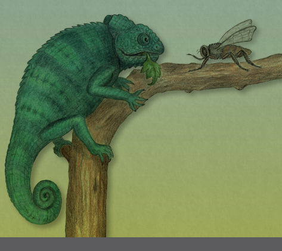
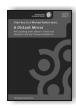
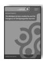
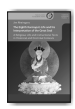
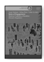
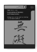
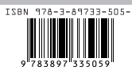

Lambert Schmithausen Fleischverzehr und Vegetarismus im indischen Buddhismus bis ca. zur Mitte des ersten Jahrtausends n. Chr.

Teil 3 · Editionen

Lambert Schmithausen Fleischverzehr und Vegetarismus im indischen Buddhismus Hamburg Buddhist Studies 12 | Teil 3 Series Editors: Steffen Döll | Michael Zimmermann

for Buddhist Studies Lambert Schmithausen Fleischverzehr und Vegetarismus im indischen Buddhismus bis ca. zur Mitte des ersten Jahrtausends n. Chr.

Teil 3 · Editionen projektverlag.

Bibliographic information published by the Deutsche Nationalbibliothek The Deutsche Nationalbibliothek lists this publication in the Deutsche Nationalbibliografie; detailed bibliographic data are available in the Internet at http://dnb.d-nb.de.

ISSN 2190-6769 ISBN 978-3-89733-548-6 (E-Book)
ISBN 978-3-89733-505-9 (printed version)
© 2020 projekt verlag, Bochum/Freiburg www.projektverlag.de Cover original design by Benjamin Guzinski; Julia Wrage, Hamburg Cover image: Felicitas Schmithausen Inhalt:

## Texte (Editionen)

| Texte (Editionen) Text I: Mahāparinirvāṇa-mahāsūtra        | ("Fleischverzehr     |
|------------------------------------------------------------|-----|
| Abschnitt")                                                | 7   |
| Vorbemerkung                                               | 7   |
| Synoptische Edition                                        | 13  |
| Text II: Aṅgulimālīyasūtra ("Verzicht auf Fleischverzehr") | 33  |
| Vorbemerkung                                               | 33  |
| Synoptische Edition                                        | 35  |
| Text III: Laṅkāvatārasūtra (Kapitel 8)                     | 41  |
| Vorbemerkung                                               | 41  |
| Kritische Edition                                          | 55  |
| Appendix I: Versuch einer Gruppierung der Sanskrit-Handschriften                                                            | 105 |
| Appendix II: Konkordanz der Sanskrit-Handschriften         | 136 |
| Appendix III: Konkordanz der tibetischen Textzeugen        | 140 |
| Abkürzungsverzeichnis                                      | 143 |
| Verzeichnis der zitierten Literatur                        | 165 |

Text I: Mahāparinirvāṇa-mahāsūtra 
("Fleischverzehr-Abschnitt")

## Vorbemerkung

1. Das vorliegende Textstück (Text I) enthält eine synoptische Edition von drei Versionen des "Fleischverzehr-Abschnittes" (s. St. § 192) des Mahāparinirvāṇa-*mahāsūtra* (MPM): 1. der zu Anfang des 9 Jh.s1von Jina-mitra, Jñānagarbha und Devacandra aus dem Sanskrit übersetzten tibetischen Übersetzung (Tib); 2. der chinesischen Übersetzung von Fa-hsien und Buddhabhadra (Fa), sowie 3. der chinesischen Übersetzung von Dharmakṣema (Dha), beide ebenfalls auf der Basis von Sanskrit-Fassungen. 

Eingeschlossen ist auch der im Sūtra unmittelbar vorangehende Textabschnitt, da er den Anknüpfungspunkt für die Eingliederung des "Fleischverzehr-Abschnittes" in das Sūtra enthält.2 Der erste Teil dieses Textabschnittes ist sogar in einem Sanskrit-Fragment überliefert.

2. Für die nachstehende Edition des "Fleischverzehr-Abschnittes" des MPM wurden folgende Textzeugen und Editionen verwendet: 
Skt.: YUYAMA 1981: 18,8-13 u. 20,24–21,2; HABATA 2019: II.7.8 (Sf 13.8).

Tib.: 
Tibetische Übersetzung aus dem Sanskrit (Tib): HABATA 2013: \#\# 
172–178, basierend auf P (mDo, tu 54b1–56b1), S (mDo, wa [Bd. 71] 
112a6–115a1), J, C, D, N, L, T u. F (s. HABATA 2013: 418).

Nur in den erklärenden Anmerkungen (Endnoten) verwendet habe ich die tibetische Übersetzung von Dharmakṣemas chinesischer Übersetzung (Dhat):
P: mDo, ju 57b7–60a4 S: Mya ngan 'das, ka [= Bd. 89] 84b5–87b5 D: mDo, nya 57a1–59a4 Ta (= Tabo-Hss.): 170/27b2-8 (Textanfang bis B.1.b), 177/21a1–22b2
(B.1.b bis Textende); 175/8a1–b7: B.6.d3 bis Textende.3 Chin.: 
Fa-hsien (Fa): T 12.376: 868c11–869b17; Kr 16.361: 383c11–384c20; ZC 
(= J) 15.114: 35a11–36a20.

Dharmakṣema (Dha): 'nördliche' Version: T 12.374: 386a2–c13; ZC 
(= Kr) 14.112: 36c14–38a4; FSh (s. unten: § 5); 'südliche' Version: 
T 12.375: 625c25–626c11; ZC 14.113: 494c13–496a4.

3. Meine Wiedergabe des tibetischen Textes folgt (mit einer Ausnahme: 
s. B.1.1.a) im Wortlaut der ausgezeichneten kritischen Ausgabe von H. 

HABATA (s. oben § 2). Im kritischen Apparat am Ende der einzelnen Paragraphen (A.1, etc.; zu meiner Einteilung des Textes s. § 6) verzeichne ich nur eine Auswahl mir inhaltlich oder grammatisch relevant erscheinender Varianten, die ich überwiegend dem kritischen Apparat von HABATAs Ausgabe entnommen habe. Für weitere Varianten darf ich den Leser auf eben diesen kritischen Apparat verweisen. Zusätzlich eingefügt habe ich jedoch Varianten aus zwei handschriftlichen Kanjurs:4dem zur Themspangs-ma-Gruppe gehörigen Kanjur von Shey5(Z, allerdings nur für Textteil B: mdo, wa 125b1–128a4) und dem weder zur Tshal-pa- noch zur Them-spangs-ma-Gruppe gehörigen handschriftlichen Kanjur von Dolpo6
(Do: mDo, tsha 236b3–238b4). Nicht eigens vermerkt habe ich die in Do durchgängige Verwendung des ya-btags (myi, myed, *rmyig*) und des dadrag in bka' *stsald* und *gsold* sowie die dort übliche Schreibung *gi(s)* statt gyi(s), desgleichen *'ang* statt *yang* in Z.

4.1. Im Falle der chinesischen Versionen folge ich (mit einer Ausnahme in B.3.1 [Fa]) dem Text von T, im Falle von Dha dem der "nördlichen Version" (T 12.374), und notiere die dort verzeichneten Varianten sowie abweichende Lesungen von ZC (und ggf. dort zusätzlich verzeichnete Varianten) jeweils am Ende der Paragraphen. Auch abweichende Lesungen der "südlichen Version" sind dort verzeichnet. Während T bekanntlich den im 13. Jh. erstellten koreanischen Druck des chinesischen Tripiṭaka 
(Kr)7zugrundelegt, ist ZC nach Möglichkeit eine Faksimile-Reproduktion des Chin(/Jin)-Kanons (金藏, 12. Jh.: J)8, und lediglich dort, wo dieser Kanon fehlt oder beschädigt ist, wird auf den koreanischen Druck zurückgegriffen. Dies trifft bei dem hier behandelten Textstück im Falle von Dha zu (u.zw. sowohl bei der "nördlichen" wie bei der "südlichen" Version).9Im Falle von Fa hingegen ist in ZC der Chin-Druck (J) 
reproduziert.10 Abgesehen von den genannten Ausgaben habe ich für Dha zwei weitere Textzeugen durchverglichen: 1. die Faksimile-Ed. der in Stein gemeißelten Sūtras von Fang-shan (房山石經: FSh)11, doch ist der Text dort leider teilweise durch Beschädigung unlesbar; im Wortlaut entspricht er, soweit lesbar, in dem hier bearbeiteten Textstück im wesentlichen der "nördlichen" Version; 2. den handschriftlichen Kanon des Kongōji (金剛寺), Japan (Ko); die mir vorliegende Kopie des relevanten Textstückes ist allerdings recht unscharf und mehrfach kaum lesbar, so daß meine Angaben nicht erschöpfend sind. Außerdem weicht die Schreibweise dieser Hs. häufig nicht unerheblich von der Standardform der Zeichen ab, ohne daß ich das hier hätte verzeichnen können. Auf eine Durchsicht noch weiterer Textzeugen glaube ich, angesichts des damit verbundenen unverhältnismäßigen Aufwandes im Rahmen dieser vor allem auf inhaltliche Fragen und Zusammenhänge ausgerichteten Arbeit verzichten zu dürfen. 

4.2. Die Angaben im kritischen Apparat beziehen sich im Falle von Dha wie gesagt in erster Linie auf die "nördliche Version" (Nö) und sind dann nicht eigens gekennzeichnet. Angaben zur "südlichen Version" sind stets durch (Voranstellung von) "Sü" markiert, also z.B. Sü(Kr), Sü(SL). Im übrigen folgen meine Sigla weitgehend ZACCHETTI 2005 (im folgenden: 
ZAC): 
ZC = Zhonghua Dazangjing (Chung-hua Ta-tsang-ching) 中華大藏經. In dem hier bearbeiteten Textstück berücksichtigt der Variantenapparat des ZC im Falle von Fa (= J): S, Q, Y, M, Qing u. Kr, im Falle von Dha (= Kr): 
S, Q, Y, Nz2, M u. Qing. FSh ist in den Variantenapparat zur "südlichen Version" einbezogen worden, obgleich dies problematisch erscheint (vgl. etwa Anm. 3 zu A.2[2]). Der Variantenapparat von ZC ist im Vergleich zu dem von T bisweilen unvollständig (vgl. ZAC 75). Schreibvarianten werden in ZC offenbar überwiegend nicht verzeichnet, so daß die betreffende Schreibung nur für die jeweils faksimilierte Version gilt. In Fällen, wo ZC eine in T verzeichnete varia lectio nicht bestätigt, markiere ich die entsprechende Sigle mit hochgestelltem T (MT, SLT, etc.).

F = Fuchou (福州)-Ausgabe(n), Sigle 宮 in T (ZAC 110f: \# 3.2.2.3.1)
Fsh = Fang-shan 房山石經 (s. § 5.1), 隋唐刻经 Bd. 1: 155,13[22]ff; Fsh 0 = 
Stelle in Fsh durch Beschädigung unlesbar J = Chin tsang (Jin zang) 金藏 (s. § 5.1) 
Ko = handschriftl. Kanon des Kongōji (金剛寺), Japan12 Kr = koreanischer Kanon 高麗藏 (s. § 5.1) 
M = Ching-shan tsang (Jingshan zang) 徑山藏 (ZAC 117, \# 3.2.2.3.5d); Sigle in T: 明, in ZC: 徑 N = die Lesung der im Variantenapparat von T mit der Sigle 聖 markierten Handschrift(en) (vgl. ZAC 84f). Nur in MPM Fa und AṅgS.

Nz2 = Yung-lo nan tsang (Yongle nan zang) 永楽南藏 (ZAC 116, 
\# 3.2.2.3.5b); Sigle in ZC: 南 Q = Ch'i-sha tsang (Qisha zang) 磧砂藏 (ZAC 115, \# 3.2.2.3.3); Sigle in ZC: 
磧 Qing = Lung tsang 龍藏 (ZAC 117, \# 3.2.2.3.5 e); Sigle in ZC: 清 S = Szu-hsi tsang (Sixi zang) 思溪藏, auch Tzŭ-fu tsang (Zifu zang) 資福藏
(ZAC 112–115, \# 3.2.2.3.2); Sigle in T: 宋, in ZC: 資 SL = die Versionen der "Southern line" der Kanon-Überlieferung (s. ZAC
127), d.h. F, S, Q, Y, Nz2, M u. Qing, 13 im Unterschied zu "Northern line", 
zu der Fsh, J u. Kr zählen (s. ZAC 123–125)
T = Taishō-Ausgabe; hochgestelltes T bedeutet, daß die betreffende(n) 
Lesung(en) nur in T verzeichnet sind, eine entsprechende Angabe in ZC aber fehlt.

Y = P'u-ning tsang 普寧藏 (ZAC 116, \# 3.2.2.3.4); Sigle in T: 元, in ZC: 普 Ω = alle übrigen Versionen (außer den als abweichend vermerkten) 
5. Mit der *synoptischen Edition* des Textstückes soll ein genauer Vergleich des Textbestandes der verschiedenen Versionen sowie ihrer Übereinstimmungen und Divergenzen erleichtert werden. Zu diesem Zweck ist der Text zunächst in seine syntaktischen bzw. gedanklichen Einheiten und Subeinheiten analysiert, darüber hinaus aber z.T. bis unterhalb der Satzebene in Einzelelemente aufgegliedert worden. Die einzelnen Einheiten, Subeinheiten und Bauelemente wurden durch ein hierarchisches System von Ziffern und Buchstaben markiert. Nur so war es möglich, die Synopse auch dort (ohne Eingriff in die Textfolge einzelner Versionen) übersichtlich zu halten, wo die Versionen Textelemente in unterschiedlicher Reihenfolge anordnen.

6. Meine Gliederung des Textes versucht, den Aufbau des Textstückes deutlich zu machen. Sie weicht daher von der pragmatisch orientierten Paragrapheneinteilung in HABATA 2013 ab. Im folgenden eine Konkordanz:

HABATA 2013 meine Ed. HABATA 2013 meine Ed.

#172 A # 176 B.9a u. B.9b

# 173 B.1 # 177 B.9c # 174 B.2–5.1 # 178 B.10-12

| # 175   | B.5.2–8   |
|---------|-----------|

# Synoptische Edition

| Skt.                                                                                                                 | Tib.                                                                                                                                                                               | Fa                                                                    | Dha                    |
|----------------------------------------------------------------------------------------------------------------------|------------------------------------------------------------------------------------------------------------------------------------------------------------------------------------|-----------------------------------------------------------------------|------------------------|
| 0. pṛcchāvaśā                                                                                                        | 'dri ba'i dbang zhes                                                                                                                                                               |                                                                       |                        |
| nāma                                                                                                                 | bya ba ni                                                                                                                                                                          | 能隨問答者。                                                           | [386a2]能1隨問 答者2 。 |
| A.1. iha kaścit tathāgatam arhantaṁ samyaksaṁbuddhaṁ paripṛcchet:                                                                                                                      | 猶若有人                                                                                                                                                                           | 若有人來                                                              |                        |
| 'di na la la zhig  de bzhin gshegs pa dgra  bcom pa yang dag par  rdzogs pa'i sangs rgyas  la zhu [S7] bar byed de | | 來問如來。                                                                                                                                                                          | 問佛。                                                                 |                        |
| katham ahaṁ  bhagavan                                                                                                | bcom ldan 'das                                                                                                                                                                     | 世尊。                                                                 |                        |
| ji ltar bgyis na1 bdag [P2]  gis                                                                                     | 我當[868c12]云                                                                                                                                                                     | 我當云[386a3]                                                         |                        |
| 何                                                                                                                   | 何                                                                                                                                                                                 |                                                                       |                        |
| su la yang ci yang2 ma                                                                                               | 不捨錢財                                                                                                                                                                           |                                                                       |                        |
| stsal3 bar4                                                                                                          |                                                                                                                                                                                    |                                                                       |                        |
| 1                                                                                                                    |                                                                                                                                                                                    |                                                                       |                        |
| kīrttiṁ prāpnuyāṁ                                                                                                    | 'jig rten du5 sbyin pa  por6 grags pa'i gtam7 snyan pa thob8 par  'gyur lags |                                                                                                     | 得大施之名                                                            | 而得名為大             |
| 流聞天下                                                                                                             | 施檀越。                                                                                                                                                                            |                                                                       |                        |
| loke dāyako  viśruta iti, na ca dadyāṁ 2                                                                             | 而不捨財。                                                                                                                                                                          |                                                                       |                        |
| kasmiṁścit ⟨|⟩ 1  Hs. °yāt*. 2  Hs. °dyāt*.                                                                          | 1 bgyis na : S bgyis nas : F bgyid na. 2 F om. ci yang. 3 Do rtsal.  4 L T par (vgl.  B.10.1.b!). 5 F om. du. 6 pa  por : F pa'i bdag por.  7 gtam : Do rtam.  8 thob : F Do thos. | 1 能 Kr Fsh :  云何能 SL : 迦 葉。云何能 2 者 Sü, Ko.  Ω : om. Sü(SL). |                        |

| A.2. ta⟨ṁ⟩ tathāgata-m-evaṁ vadet:                                                                      | de bzhin gshegs pas  de [S 112b] la 'di1 skad  ces bka' 2 stsal to ||   | 佛告。 [868c13]                         | 佛言。                        |
|----------------------------------------------------------------------|-------------------------------------------------------------------------|----------------------------------------|------------------------------|
| 族姓子。                                                              |                                                                         |                                        |                              |
| [1]                                                                  | [1]                                                                     | [1]                                    | [1] 若[386a4]有 沙門婆羅門等 |
| {a} niḥsaṁgaṁ                                                        | {a} chags pa med pa  {a-b} 唯 1有清 la  素 不畜童僕                     | {a} 少欲知足 不受不畜 不 淨[386a5]物者 |                              |
| pravāraya dāsīdāsaparigraheṇa                                                                      | bran3 dang bran4 mo  [P3] blang bar stobs  shig |                       | 當施其人 奴 婢 1 僕使。                 |                              |
| {b} atyantabrahmacāriṇaṁ                                                                      | {b} gtan du tshangs  par spyod pa la                                    | 修持梵行                               | {b} 修梵行者                 |
| kumārīdānena                                                         | bu mo'i 5 sbyin pa  gyis shig |                                         | 而 2 [868c14]樂 施彼 奴婢妻 妾。        | 施與女 [386a6] 人2 。         |
| {c} amāṁsabhojinaṁ                                                                      | {c} sha mi za ba la                                                     | {c} 斷除肉味                           | {c-d} 斷酒肉                 |
| māṁsabh⌞ojane-                                                       | 者                                                                      |                                        |                              |
| sha zar chug shig6 |                                                 | 而樂施以肉。                                                             |                                        |                              |
| na |⌟ {d} ...                                                        | {d} chang mi [S2]                                                       | {d}避[868c15]酒 不飲                   | 施以 3 酒肉。                 |
| 'thung ba la7 chang 'thung du8                                       | 而樂勸 3 以酒。                                                          |                                        |                              |
| chug shig9 |                                                         |                                                                         |                                        |                              |
| {e} dus su za ba la                                                  | {e} 常習時食                                                            | {e} 不過中食                           |                              |
| dus ma yin par zas byin cig |                                        | 而施以非時。                                                             | 施過中食。                              |                              |
| {f} me tog [P4] phreng ba10                                          | {f} [868c16]離諸香華                                                    | {f} [386a7]不著花 4                    |                              |
| 嚴 4 具器物                                                          |                                                                         |                                        |                              |
| dang | rgyan mi thogs pa la                                          | 香                                                                      |                                        |                              |
| phye ma dang| spos dang | me  tog dang | bdug11 pa rnams  byin cig | | 施以 3 花 4 香。                                                         |                                        |                              |
| 悉以香花莊嚴之具 而[868c17]施與之。                                   |                                                                         |                                        |                              |

| [2] {a} de [S3] dag gi dus shes  par gyis la12 | mgron du bos  shig dang |                                                                                                                                                                                          | [2]{a} 如是等類 隨 其所施 皆悉歸已 為大[868c18]施主。                                 | [2]                                                                                                                                                                                               |
|---------------------------------------------------------------------------------------------------------------------------------------------------------------------------------------------------------------------------------------------------------------------|--------------------------------------------------------------------------------------|---------------------------------------------------------------------------------------------------------------------------------------------------------------------------------------------------|
| {b} khyod kyis de ltar byas                                                                                                                                                                                                                                         | {b} 若如是者                                                                         | {b} 如是施者                                                                                                                                                                                      |
| na13 'jig rten 'dir sbyin bdag gi  rgyal po [P5] yin no14 zhes  grags pa chen por 'gyur te | S                                                                                                                                                                      | 便得大施名聞天下。                                                                    | 施名流布, (5 遍 [386a8]至他方。                                                                                                                                                                    |
| {c} bsod nams 'phel bar ni15                                                                                                                                                                                                                                        | {c}未曾損[868c19]己                                                                  | {c} 財寶之費 不失                                                                                                                                                                                 |
| [S4] mi 'gyur ro || ||                                                                                                                                                                                                                                              | 一毫之費。                                                                            | 毫釐。5)                                                                                                                                                                                           |
| [3] 如是比說能隨問                                                                                                                                                                                                                                                  | [3] 是則名為能隨                                                                     |                                                                                                                                                                                                   |
| 答。                                                                                                                                                                                                                                                                 | [386a9]問答。                                                                         |                                                                                                                                                                                                   |
| 1 "di : JPDN de.                                                                                                                                                                                                                                                    | 2 Do om. bka".                                                                       |                                                                                                                                                                                                   |
| 3 bran : Do dran pa.  4 bran mo : Do blon mo.  5 mo"i : Do mo.  6 shig: NS  cig.  7 F om. la.  8 F om. du.  9 shig :  10 JPDNDo om. ba.  NS cig.  11 bdug : Do gdug, L gdugs. 12 la : F  shig.  13 F om khyod kyis de ltar  bya na.  14 LTS om. no.  15 DoF om. ni. | 1 唯 Kr J : 惟 SLT .  2 而 Kr J : 而眾人 SL N.  3 而樂勸 Ω : 勸樂 J.  4 嚴 Ω : 飾 N. | 1 Ko om. 婢.  2 女人 Nö (Fsh 0) : 女色 Sü,  Ko.  3 以 Nö, Fsh (c/d:  0), Sü(Kr), Ko : 與 4 花 Ω : 華 Sü(SL). Ko. (5...5) = Nö, Fsh  (毫 =豪) : 聲(Ko 遍) 聞天下 未曾損己 (ZC 已)一毫之費 Sü,  Ko. |
| 1 bam po lnga pa2 1 NLTSF add (vor bam): 'phags pa yongs su mya ngan las 'das pa theg  pa (F om. theg pa) chen po'i mdo  las.  2 Do om. lnga pa.                                                                                                                    |                                                                                      |                                                                                                                                                                                                   |

| B.1. [1] de nas 'od srung1 chen  po dang rus gcig pas [S5] 'di skad  ces gsol to ||                                             | [1] 爾時 迦葉 [868c20]菩薩 白佛 言。                                             | [1] 爾時 迦葉菩 薩 白佛言。                      |
|---------------------------------------------------------------------------------------------------------------------------------|---------------------------------------------------------------------------------|-------------------------------------------------|
| 如世尊說                                                                                                                        | 世尊                                                                            |                                                 |
| {a} sha mi 'tshal [P6] ba la2 gzud  pa3 ni ched cher bgyi ba lags na | {b} sha mi 'tshal ba la4 sha5                            | {b} 不食肉者而                                                                  |                                                 |
| 'tshal du stsal6 na |                                                                                                           | 以肉施,                                                                         | {b|c} 食肉之[386a10] 人 不應施肉。               |
| {c} nongs par mi 'gyur lags                                                                                                     | {c}[868c21]其食肉                                                               |                                                 |
| sam |                                                                                                                           | 者得無 1 大過。 {x} 豈不增長外 道邪見。 {a} 是[868c22]故應                        | {a} 何以故。 我見                                |
| 立不食肉法。                                                                                                                     | 不食肉者                                                                        | 有大功                                          |
| [386a11]德。                                                                                                                     |                                                                                 |                                                 |
| [2] bka' stsal pa |                                                                                                             | [2] 佛告迦葉。                                                                   | [2] 佛讚1迦葉。                                  |
| [a] {α} rigs kyi bu [S6] legs so                                                                                                | [a] {α}善哉善哉                                                                 | [a] {α}善哉善哉。                                |
| legs so ||                                                                                                                      | 善男[868c23]子。 善察佛意。                                                       | 汝今乃能善知我 [386a12]意。                      |
| dam pa'i [P7] chos srung bas7 ni                                                                                                | 護法菩薩 法應如                                                                 | 護法菩薩 應當如                                 |
| de ltar8 bya dgos9 so ||                                                                                                        | 是。                                                                             | 是。                                             |
| khyod kyis nga'i dgongs pa rig  ste | {β} rigs kyi bu da10 phyin chad 10a                                                       | {β}善男子。[868c24] 我從今日 制諸弟 子 不聽食肉。                                 | {β} 善男子。 從今 日始[386a13]不聽聲 聞弟子食肉。 |
| nga'i nyan thos rnams sha za bar11 mi gnang ngo || {γ} yul 'khor gyi bsod [S7] snyoms ni bu'i sha dang dra'o  zhes bya12 na | S | {γ} 設得餘食                                                                    | 常                                              |
| [868c25]當應作食子 肉想,                                                                                                        | {γ} 若受檀越信施 之時, 應[386a14]觀是 食 如子肉想。 [b] 迦葉菩薩 復白 佛言。世尊。 |                                                 |
| sha bza' bar13 ngas ji ltar gnang |                                                                                             | 云何弟子而聽食 肉。                                                              | [386a15]云何如來 不 聽食肉。                     |

| 善男子。                                                                                                                                                                                                                                                                                                                                                                                                              |                       |                   |
|----------------------------------------------------------------------------------------------------------------------------------------------------------------------------------------------------------------------------------------------------------------------------------------------------------------------------------------------------------------------------------------------------------------------|-----------------------|-------------------|
| [b]                                                                                                                                                                                                                                                                                                                                                                                                                  | [b] 諸佛[868c26]所 說 |                   |
| sha za ba ni                                                                                                                                                                                                                                                                                                                                                                                                         | 其食肉者              | 夫食肉者          |
| [P8] byams pa chen po chad par  'gyur ro                                                                                                                                                                                                                                                                                                                                                                             | 斷大慈種。             | 斷大[386a16]慈種。 |
| zhes ngas14 bstan15 to || 1 srung : S DoZ srungs.  2 Do om. la.  3 HAB gzung ba mit JPLTSZ : DN Do gzud pa : F 'jud pa. 4 Z om. la.  5 F  om. sha. 6 stsal : Do gsal.  7 srung bas :  NSZ bsrung bas : F srung ba. 8 de  ltar : F de de ltar. 9 dgos : Z dgongs.  10 S om. da. 10a chad : JPCDDo cad.  11 za bar : F zar.  12 bya : F byas.  13 bza' bar : Do bzar : F za ba.  14 Do om. ngas.  15 bstan : Do stand. | 1                     | 無 T : 无 J Kr    |
| (Schreibvar.).                                                                                                                                                                                                                                                                                                                                                                                                       | 1                     | 讚 Ω (Fsh 0) : 贊 |
| Sü(ST ).                                                                                                                                                                                                                                                                                                                                                                                                             |                       |                   |
| B.2. [1] gsol pa |                                                                                                                                                                                                                                                                                                                                                                                                   | [1] 迦葉菩薩 白       | [1] 迦葉又言。     |
| 佛言。 [868c27]                                                                                                                                                                                                                                                                                                                                                                                                       |                       |                   |
| bcom ldan 'das 'o na ji ltar1                                                                                                                                                                                                                                                                                                                                                                                        | 云何世尊              | 如來 何故         |
| mu gsum [S 113a] yongs su dag pa'i                                                                                                                                                                                                                                                                                                                                                                                   | 聽食三種淨肉。         | 先聽比丘 食三     |
| sha bza' 2 bar gnang3 lags |                                                                                                                                                                                                                                                                                                                                                                                         | [386a17]種淨肉。       |                   |
| [2] bka' stsal pa |                                                                                                                                                                                                                                                                                                                                                                                                  | [2] 佛告迦葉。         | [2] 迦葉,         |
| mu gsum yongs su dag pa 'di ni |                                                                                                                                                                                                                                                                                                                                                                                     | 此三種[868c28]肉      | 是三種淨肉        |
| [P 55a] ngas rim gyis4 bslab pa'i  gzhi bsdam pa'i 5 phyir deng ngas  bor [S2] ro6 ||                                                                                                                                                                                                                                                                                                                                | 隨事漸制 故作是說。    | 隨事漸制。         |
| 1 F om. ltar.  2 F za.  3 LTSZ add. ba. 4 rim gyis : TF S Z rims kyis : L rims  5 Z om. gzhi bsdam pa"i.  kyi : Do rims .  6 bor ro : F bod do.                                                                                                                                                                                                                                                                      |                       |                   |

| B.3. [1] gsol pa |                                                                                                                                           | [1] 迦葉復問。                                     | [1] 迦葉[386a18]菩薩 復白佛言。        |        |
|--------------------------------------------------------------------------------------------------------------------------------------------------------------|---------------------------------------------------|---------------------------------------|--------|
| bcom ldan 'das ci las1 dgongs te |                                                                                                                           | 何因 1 佛言[868c29]                               | 世尊。何因 1 緣故                      |        |
| (2 離                                                                                                                                                        |                                                   |                                       |        |
| {a} don ched kyi mu dgu dang |                                                                                                                               | {a} 九種受                                        |                                       |        |
| {b} sha rnam pa bcu                                                                                                                                          | {b} 十種肉。2)                                     | {b} 十種不淨 [386a19] {a}乃至九種清淨 |        |
| spang ba2 bka stsal lags | 3                                                                                                                                 | 而復不聽。                                         |                                       |        |
| [2] bka' stsal pa |                                                                                                                                          | [2] 佛告迦葉。                                     | [2] 佛告迦葉。                         |        |
| tshig [P2] bzhag pa de dag kyang                                                                                                                             | 此亦漸制。                                         | 亦是因[386a20]事漸 次而制。            |        |
| sha mi bza'4 [S3] bar bsdam5 pa'i                                                                                                                            | 當[869a1]知則現不                                 | 當知即是現斷肉                        |        |
| phyir bcad6 do ||                                                                                                                                            | 食肉也。                                           | 義2 。                                 |        |
| 1 las : Do la.  2 spang ba : F spangs par :  Do spangs te.  3 Do om. bka" stsal lags |.  4 bza" : FDo za.  5 bsdam : SFZ bsdams.  6 bcad : Do gcad : F gcod. | 1 因                                              | J Kr S N : 因不                       |        |
| 受 Q Y M Qing. (2...2) 離九種受十種 肉 J : 有九種受 離 十種肉 Kr SL N.                                                                                       | 1 何因 Ω (Fsh 0) : 因 何 Nz2 .  2 義 Ω : 善義 Ko. |                                       |        |
| B.4. [1] gsol pa |                                                                                                                                           | [1] 迦葉菩薩 又白                                 | [1] 迦葉菩薩                          |        |
| 佛言。                                                                                                                                                        | [386a21]復白佛言。                                 |                                       |        |
| bcom ldan 'das ci las dgongs  te | sha dang nya sha bza' ba yang1 kha zas bzang por gsungs  lags |                                                           | 云何[869a2]世尊 稱歎                              | 云何如來                              | 稱讚 1 |
| 魚肉 以為美食。                                                                                                                                               | 魚肉 為美食耶。                                    |                                       |        |
| [2] bka' stsal pa |                                                                                                                                          | [2] 佛告迦葉。                                     | [2] [386a22]善男子。                   |        |
| [a] ngas ni sha dang nya sha2 [S4] kha [P3] zas bzang por ma  gsungs kyi |                                                                                   | [a] 我不說[869a3]魚肉                             | [a] 我亦不說 魚                       |        |
| 以為美食。                                                                                                                                                    | 肉之屬 為美食 也。                                 |                                       |        |

| [b] ngas ni                                                                                                                                                                                                                                                                   | [b] 我說                                          | [b] 我說                            |
|-------------------------------------------------------------------------------------------------------------------------------------------------------------------------------------------------------------------------------------------------------------------------------|---------------------------------------------------|-------------------------------------|
| {α} bu ram shing dang |  {β} 'bras sā lu3  dang | 'bru  dang |                                                                                                                                                                                                                | {α} 甘蔗 {β} 粳米                                 | {α} [386a23]甘蔗 {β} 粳米 {δ1} 石蜜 |
| {γ} gro dang | nas dang |                                                                                                                                                                                                                                                     | sran                                              |                                     |
| snge'u4  dang | sran gre'u5 rnams dang |                                                                                                                                                                                                                                      | {γ} 一切穀麥                                      |                                     |
| {δ} mngar6  bag7  ka8  ra dang |  li ka8  ra dang | sbrang [S5] rtsi  dang |                                                                                                                                                                                                  | {δ} 石蜜                                          | {δ2} 及黑石蜜                       |
| {χ} 及諸甘[869a4]果                                                                                                                                                                                                                                                           |                                                   |                                     |
| {ε} mar dang | 'o ma dang |                                                                                                                                                                                                                                                   | {ε} 乳酪蘇 2                                      |                                     |
| 'bru [P4] mar rnams                                                                                                                                                                                                                                                           | [386a24]油                                        |                                     |
| kha zas bzang por gsungs so ||                                                                                                                                                                                                                                                | 以為美食。                                         | 以為美食。                           |
| [c] ngas ni                                                                                                                                                                                                                                                                   | [c] 如我稱歎                                      | [c] 雖說                            |
| lus g-yog9 pa'i phyir                                                                                                                                                                                                                                                         | gos sna                                           |                                     |
| tshogs kyang                                                                                                                                                                                                                                                                  | 種種衣服 為莊嚴具。                                | 應畜種種衣服,                       |
| kha dog10 ngan par bsgyur bar  bya'o                                                                                                                                                                                                                                          | [869a5]又歎三種 壞色                              | 所應畜[386a25]者                    |
| 之服。                                                                                                                                                                                                                                                                         | 要是壞色。                                         |                                     |
| zhes bstan11 na | sha bza' 12 ba'i ro la [S6] chags                                                                                                                                                                                                                           | 當知 魚肉 隨順貪欲                                | 何況貪著是魚肉                      |
| pa13 lta ci smos |                                                                                                                                                                                                                                                            | 腥[869a6]穢食耳。                                  | 味。                                 |
| 1 bza' ba yang : F za ba rnams.                                                                                                                                                                                                                                               | 2 Do                                              |                                     |
| add. dang.  3 sā lu : Do F sa lu.  4 sran  5 gre"u : Do nge"u : Do sran bu.  khre"u : JP dre'u. 6 mngar : D F dngar.  7 Do om. mngar bag.  8 ka:  JPDNFDo kha. 9 g-yog : DSZ g-yogs : F dag. 10 kha dog : Do kha  11 bstan : Do stan. 12 bza" : SFZ don.  13 pa : Do par. za. | 1 讚 Ω : 贊 Sü(ST ). 2 蘇 Ω (Fsh 0) : 酥 Sü(MT ). |                                     |

| B.5. [1] gsol pa |                                                                                                                                                                   | [1] 迦葉菩薩白                  | [1] 迦葉復言。              |
|--------------------------------------------------------------------------------------------------------------------------------------------------------------------------------------|---------------------------------|----------------------------|
| 佛言。                                                                                                                                                                                |                                 |                            |
| de ltar1 na ni                                                                                                                                                                       | 若世尊制不食肉 [869a7]者,       | [386a26]如來若制不 食肉者, |
| {a} ba'i2 [P5] bcud rnam3  lnga                                                                                                                                                      | {a} 彼五種乳                    | {a} 彼五種味               |
| dang |                                                                                                                                                                               | 乳酪酪漿 生[386a27] 酥 1 熟酥 1 |                            |
| {b} til dang |                                                                                                                                                                       | {b} 麻油                        | {b} 胡麻油等               |
| {c} 'bru mar (FDo: bu ram) shing gi khu ba dang | {d} dung4  dang |  {e} zab dar5                                                                                                    | {e} 繒綿                        | {e} 及諸衣服 憍 奢耶衣     |
| {d} 珂貝                                                                                                                                                                             | {d} 珂 2 貝                     |                            |
| {f} 皮革                                                                                                                                                                             | {f} [386a28]皮革  {g} 金銀盂器  |                            |
| la sogs pa yang6                                                                                                                                                                     | 如是等物                        |                            |
| khrims su bca' ba'i rigs lags so ||                                                                                                                                                  | 亦不應受。                       | 亦不應受 3 。               |
| [2] bka' stsal pa |  [S7]                                                                                                                                                            | [2] [869a8]佛言。                | [2] 善男[386a29]子。        |
| 異想                                                                                                                                                                                 |                                 |                            |
| gcer bu pa'i lta ba ma7 'dzin cig |                                                                                                                                                  | 莫作外道尼揵子                  | 不應同彼尼乾 4 所          |
| 見。                                                                                                                                                                                  | 見。                             |                            |
| 1 ltar : JPDNDo lta.  2 F om. ba'i.  3 rnam : F rnam pa. 4 dung : Do ngul.  5 zab dar : Do dar zab.  6 la sogs pa  yang : Do sna tshogs pa yang : F  dang | gos pa ni.  7 Do om. ma. | 1 酥 Ω : 蘇                     | Fsh : 蘓                   |
| 2 珂 Ω : 軻 Fsh.                                                                                                                                                                     |                                 |                            |
| Ko. 3 受 Ω : 畜 S T . 4 乾 Ω : 楗 Sü(ST ) : 犍 Sü(YT ,M T ).                                                                                                                         |                                 |                            |

| B.6.                                                                                                                                                             | 迦葉菩薩 白[869a9] 佛言。 世尊 今當云何。 佛告迦葉。 善男 子。   |                                                       |
|------------------------------------------------------------------------------------------------------------------------------------------------------------------|--------------------------------------------------------------|-------------------------------------------------------|
| nga ni 'du shes gzhan [P6] gyis da1 khyod la bslab pa'i gzhi bca' bar  bya ste |                                                                                 | 我[869a10]從今日                                             | 如來所制 一切禁                                       |
| 制諸弟子                                                                                                                                                         | 戒 [386b1]各有異意。                                          |                                                       |
| {a} mu gsum gyi sha yang mi                                                                                                                                      | {a} 不聽食三種                                               | {a} 異意故 聽食三                                     |
| 2 bar bsdams3 so ||                                                                                                                                              | 淨肉                                                         | 種淨肉。                                               |
| bza' {b} don ched du4 ⌞ma??⌟ byas pa5 khyod kyis rig pa de6 yang bsdams [S 113b] so ||                                                                           | {b-c} 及離 九[869a11]種受                                    |                                                       |
| {c} sha7 rnam pa bcu la ma                                                                                                                                       | 十種肉                                                       | {c} 異想故 斷[386b2]                                  |
| gtogs8 pa de yang spangs so ||                                                                                                                                   | 十種肉。 {d1} 異想故 一切 悉斷                                |                                                       |
| {d} [P7] shi ba'i sha yang spangs                                                                                                                                | {d} 乃至自死 一                                              | {d2} 及自死者。                                        |
| so ||                                                                                                                                                            | 不得食。                                                      | {d3} 迦葉。[386b3]我 從今日 制諸弟子 不得復食一切肉也。 |
| 1 da : P nga : F om.  2 bza" : Do bza : F  za.  3 bsdams : Do sdams.  4 du : Do du  5 pa : F pa de.  6 rig pa de : F pha.  du.  7 F om. sha.  8 gtogs: Do rtogs. |                                                              |                                                       |

| B.7.                                                                        | 所以者何。                                                      | 迦[3864b]葉。                |
|-----------------------------------------------------------------------------|----------------------------------------------------------------|-----------------------------|
| [1] sha za ba ni                                                            | [1] [869a12]其食肉                                             | [1] 其食肉者                |
| 者  若行住坐臥                                                              | 若行若住若坐若臥                                               |                             |
| 'gro yang rung 'dug kyang rung  ste | srog chags thams cad                  | 一切眾生                                                       | 一切眾[386b5]生             |
| de'i dri tshor nas des 'jigs te | 1                                         | 見皆怖畏 [869a13]                                              | 聞其肉氣 悉生恐             |
| 聞其殺 1 氣。                                                                | 怖1 。 [x] 譬如有人 近師 子已 [386b6]眾人見之 聞師子臭亦生恐怖。 |                             |
| [2]                                                                         | [2]                                                            | [2][386b7]善男子。           |
| dper [S2] na mis shing kun nam                                              | 如人食興蕖 2 及                                                | 如人噉 2 蒜                 |
| sgog skya2 zos na |                                                         | 蒜。                                                            | 臭穢可惡。                   |
| mi 'o cog3 gi sems ma dad par4 'gyur [P8] zhing | mi mthun par  'gyur la5 | | 餘人見之 聞臭[386b8]捨去。                                      |                             |
| mi mang po 'tshogs6 pa 'am7 | skye bo mang pos gang8 ba'i  nang du          | 若入眾會 悉皆[869a14]憎 3 惡。                                  |                             |
| sems can de dag gis9  che ge mo [S3] zhig gis zos so zhes shes pa10         | 設遠見者 猶不欲視 況當近之。                                    |                             |
| [3]                                                                         | [3] 其食肉者                                                   | [3] 諸食[386b9]肉者         |
| de bzhin du                                                                 | 亦復如是。                                                      | 亦復如是。                   |
| srog chags thams cad kyis                                                   | 一切眾生                                                       | 一切眾生                    |
| sha za ba'i mi ngo11 shes [P 55b] te | de dag gis dri tshor nas             | 聞其殺 1 [869a15]氣                                            | 聞其肉氣                    |
| 'chi ba'i 'jigs pas skrag par 'gyur  te |                                   | 恐怖畏死。                                                      | 悉皆恐[386b10]怖 生 畏死想。 |

| de rgyu zhing 'gro ba na [S4] chu dang | skam sa dang | nam  mkha' la gnas pa'i skye bo rnams                                                                                                                                                                                                                                                                                                                                                                            | 水陸空行有命之                                                          | 水陸空行有命之類     |
|--------------------------------------------------------------------------------------------------------------------------------------------------------------------------------------------------------------------------------------------------------------------------------------------------------------------------------------------------------------------------------------------------------------------------------------------------------------------------|-------------------------------------------------------------------------|----------------------|
| 類                                                                                                                                                                                                                                                                                                                                                                                                                                                                       |                                                                         |                      |
| skrag ste12 |                                                                                                                                                                                                                                                                                                                                                                                                                                                            | 見皆馳走。                                                               | 悉捨之走。            |
| bdag cag 'dis gsad du13 'ong                                                                                                                                                                                                                                                                                                                                                                                                                                             | [386b11]咸言 此人是                                                     |                      |
| ngo14 snyam nas | [P2]                                                                                                                                                                                                                                                                                                                                                                                                                                                   | 我等怨 3 。                                                              |                      |
| 'khams15 pas16 kyang 'chi bar  'gyur ro || 1 "jigs te | : Do "jig rte.  2 skya : L kya : J PN pa. 3 mi "o cog : Do myi bo gcig.  4 dad par : P dang bar. 5 "gyur la :  6 "tshogs : JPDNFDo Do gyurd pa.  tshogs.  7 F om. "am.  8 gang : F gang  gda'.  9 gis : F gi. 10 zhes shes pa : Do zhes bya.  11 ngo : F om. : Do ngo.  12 ste :  13 gsad du : F bsad du : L bsad :  Do te.  14 "ong ngo : SZ "ongs.  TS Z bsad de.  15 "khams : LDo khams.  16 pas : JPDN  nas. | 1 殺 T : 煞                                                             | J Kr                 |
| (Schreibvar.).                                                                                                                                                                                                                                                                                                                                                                                                                                                           | 2 蕖 J                                                                  |                      |
| Kr : 渠                                                                                                                                                                                                                                                                                                                                                                                                                                                                  | SLT .  3 憎                                                             |                      |
| Ω : 增 N.                                                                                                                                                                                                                                                                                                                                                                                                                                                                | 1 恐怖 Ω : 怖畏 Fsh. 2 噉 Ω : 敢 Ko : 啖 Sü(SLT ). 3 怨 Ω : 冤 Sü(ST ). |                      |
| B.8. [1] rgyu de dag gis na                                                                                                                                                                                                                                                                                                                                                                                                                                              | [1] [869a16]是故                                                        | [1] 是故             |
| byang chub [S5] sems dpa'                                                                                                                                                                                                                                                                                                                                                                                                                                                | 菩薩                                                                    | 菩薩                 |
| sems dpa' chen po rnams  sha mi za'o 1 ||                                                                                                                                                                                                                                                                                                                                                                                                                                | 未曾食肉。                                                               | 不習食肉。            |
| [2]gdul bar bya ba'i dbang gis ni                                                                                                                                                                                                                                                                                                                                                                                                                                        | [2] 為化眾生                                                            | [2] 為[386b12]度眾生 |
| sha za ba 2 lta bur 3yang ston mod  kyi |                                                                                                                                                                                                                                                                                                                                                                                                                                | 隨時現食。                                                               | 示現食肉。 雖現食 之  |
| 其[869a17]實不食。                                                                                                                                                                                                                                                                                                                                                                                                                                                        | 其實不食。 善男[386b13]子。 如 是菩薩                                     |                      |
| kha zas tha mal pa4 [P3] yang mi za na                                                                                                                                                                                                                                                                                                                                                                                                                                   | 清淨之食猶尚不食                                                        |                      |
| sha lta ci smos |                                                                                                                                                                                                                                                                                                                                                                                                                                                        | 況當食[386b14]肉。                                                       |                      |
| 1 za"o : Do bza"o.  2 ba : Do ba"i.  3 bur :  4 pa : L la : Do par.F bu.                                                                                                                                                                                                                                                                                                                                                                                                 |                                                                         |                      |

| B.9a. rigs kyi bu                                                                                                        | 復次 善男子。                                         | 善男子。                                                            |
|--------------------------------------------------------------------------------------------------------------------------|------------------------------------------------------|--------------------------------------------------------------------|
| {0} nga 'das pa'i [S6] 'og tu lo                                                                                         | {0} 我般泥洹 1 後                                    | {0} 我涅槃後 無                                                    |
| 久遠世[869a18]時                                                                                                         | 1 量百歲                                             |                                                                    |
| brgya phrag mang po 'das pa na |                                                                                         | 當有比丘 雖為學道而自貢高                            |                                                                    |
| rgyun du zhugs pa dang | lan cig  phyir 'ong ba dang | phyir mi  1 dgra bcom pa  'ong ba dang | rnams med par gyur2 la | | 言: 我是須 2 [869a19] 陀洹 斯陀含 阿那 含 阿羅漢 3 。 | 四道聖人[386b15]悉 復涅槃                                          |
| dam [P4] pa'i chos gtan3 zhig pa'i  tshe |                                                                               | 於惡世中                                             | 正法滅後 於像法 中                                                 |
| ? } 流離[869a20]貧乏                                                                                                     |                                                      |                                                                    |
| {5 困苦出家。                                                                                                             |                                                      |                                                                    |
| dge [S7] slong                                                                                                           | 當有比丘                                             |                                                                    |
| {1} 'dul ba dang ma mo 'dzin4                                                                                            | {1}似 2 [386b16]像                                   |                                                                    |
| pa |                                                                                                                     | 持律少讀誦經。                                        |                                                                    |
| {2} rtog pa5 sna tshogs can |                                                                                            | {2} 種種妄解, {1? } 名字比丘。                        | {4? } 貪嗜飲食                                                     |
| {3} rang gi lus gso bar byed pa | 6                                                                                      | {3}為利養[869a21]故 恭敬白衣。                        | {3}長養其身。                                                       |
| {4} sha sna tshogs gces par 'dzin4 pa | {5} khams 'khrugs7 pa dang | bkres8 pa dang | skom pas [P5] gzir  ba |           | {6a}身所[386b17]被 服麁陋醜惡。                       |                                                                    |
| {6} cha lugs9 [S 114a] 'jigs 'jigs ltar                                                                                  | {6} 形狀憔悴 4                                       | {6b}形容憔悴 3 無 1 有威德。                                        |
| 'dug pa| {7} ba lang10 rdzi11 'dra ba |                                                                                  | {7} 如放牧者。                                        | {7}放畜牛[386b18]羊 {7.1} 擔負薪草,  {7.2} 頭鬚 4 髮爪 5 悉皆長利。 |
| {9}身著袈裟[869a22]                                                                                                      | {9}雖服袈[386b19]裟                                  |                                                                    |

| {8} bya pa12 'dra ba |                                                                                                                                                                                                                                                                                                                                                                                                                                                                                                                                                                                                                                                                                                                | {8} 如獵 5 師像。                                                                                                                                                                | {8} 猶如獵師。                                                                                                                                                                                                                                               |
|---------------------------------------------------------------------------------------------------------------------------------------------------------------------------------------------------------------------------------------------------------------------------------------------------------------------------------------------------------------------------------------------------------------------------------------------------------------------------------------------------------------------------------------------------------------------------------------------------------------------------------------------------------------------------------------------------------------------------------------|---------------------------------------------------------------------------------------------------------------------------------------------------------------------------------|-------------------------------------------------------------------------------------------------------------------------------------------------------------------------------------------------------------------------------------------------------------|
| {9} chos gos tshon13 can gyi rtags14 'chang ba15 |                                                                                                                                                                                                                                                                                                                                                                                                                                                                                                                                                                                                                                                                                    | {10a}悕望世利,                                                                                                                                                                  | {10a}細視徐行,                                                                                                                                                                                                                                              |
| {10} byi la'i brtul zhugs16 spyod                                                                                                                                                                                                                                                                                                                                                                                                                                                                                                                                                                                                                                                                                                     | {10b} 如猫 6 捕鼠。                                                                                                                                                              | {10b}如猫伺鼠。                                                                                                                                                                                                                                              |
| pa| {11} bdag ni dgra bcom pa yin                                                                                                                                                                                                                                                                                                                                                                                                                                                                                                                                                                                                                                                                                                     | {11}常唱是言:                                                                                                                                                                   |                                                                                                                                                                                                                                                             |
| no [S2] zhes khas 'che17 [P6] ba18 |                                                                                                                                                                                                                                                                                                                                                                                                                                                                                                                                                                                                                                                                                                  | [386b20]我得羅漢。                                                                                                                                                               |                                                                                                                                                                                                                                                             |
| {12} gnod pa mang pos nyen pa |                                                                                                                                                                                                                                                                                                                                                                                                                                                                                                                                                                                                                                                                                                       | {12} 病瘦疥癩,                                                                                                                                                                  | {12} 多諸病苦,                                                                                                                                                                                                                                              |
| {13} 身[869a23]體不                                                                                                                                                                                                                                                                                                                                                                                                                                                                                                                                                                                                                                                                                                                   | {13} 眠臥糞穢。                                                                                                                                                                  |                                                                                                                                                                                                                                                             |
| {13} rang gi gcin dang phyi sas  lus gos pa |                                                                                                                                                                                                                                                                                                                                                                                                                                                                                                                                                                                                                                                                                         | 淨,                                                                                                                                                                             |                                                                                                                                                                                                                                                             |
| {14} thub19 pa bzhin du cha lugs                                                                                                                                                                                                                                                                                                                                                                                                                                                                                                                                                                                                                                                                                                      | {14} 而被牟尼賢                                                                                                                                                                 | {14} 外現賢善,                                                                                                                                                                                                                                              |
| bzang por20 'chos21 pa22 |                                                                                                                                                                                                                                                                                                                                                                                                                                                                                                                                                                                                                                                                                                            | 內[386b21]懷貪嫉 6 ,                                                                                                                                                            |                                                                                                                                                                                                                                                             |
| 聖被服。                                                                                                                                                                                                                                                                                                                                                                                                                                                                                                                                                                                                                                                                                                                               | 如受瘂 7 法婆羅 門等。                                                                                                                                                           |                                                                                                                                                                                                                                                             |
| {x} 形如餓鬼 貧窮 [869a24]寒悴。                                                                                                                                                                                                                                                                                                                                                                                                                                                                                                                                                                                                                                                                                                       |                                                                                                                                                                                 |                                                                                                                                                                                                                                                             |
| {15} 23 dge sbyong ma yin par                                                                                                                                                                                                                                                                                                                                                                                                                                                                                                                                                                                                                                                                                                         | {15} 非真沙門 為                                                                                                                                                                | {15} 實非沙門                                                                                                                                                                                                                                               |
| dge sbyong24 ltar 'chos21 pa |                                                                                                                                                                                                                                                                                                                                                                                                                                                                                                                                                                                                                                                                                                        | 沙門像。                                                                                                                                                                         | 現沙[386b22]門像。                                                                                                                                                                                                                                           |
| {16} dam pa'i chos [S3] ltar bcos                                                                                                                                                                                                                                                                                                                                                                                                                                                                                                                                                                                                                                                                                                     | {16} 邪見熾盛                                                                                                                                                                   |                                                                                                                                                                                                                                                             |
| ma'i 25 yi ge [P7] 'chang ba dag                                                                                                                                                                                                                                                                                                                                                                                                                                                                                                                                                                                                                                                                                                      | 誹謗正法。                                                                                                                                                                       |                                                                                                                                                                                                                                                             |
| {Ø} 'byung bar 'gyur te | 26 1 F om. phyir mi 'ong ba dang | (aberratio oculi). 2 gyur : Do gyurd : F 'gyur.  3 gtan : Do rtan.  4 "dzin : Do "dzind.  5 rtog pa : FDo rtogs pa :  Z om.  6 pa | : Do pa"o ||.  7 "khrugs : Do khrugs.  8 bkres : P skres : LT bskres.  9 lugs : Do lug.  10 lang : SDo glang.  11 rdzi :  12 pa (so deutlich SZ) : F om.  13 tshon :  Do ji.  Do mtshon : F chos.  14 rtags : LDo rtag.  15 S Z om. ba.  16 zhugs : L shugs : Do zhugs pa? :  F om. 17 "che : F phye.  18 ba : LTSZ la. 19 thub : F thob. 20 por : Do pos.  21 "chos :  Do bcos. 22 pa: F la.  23 Do add. dge slong  ma yin par.  24 F om. ma yin par dge sbyong (aberratio oculi).  25 bcos ma"i : LT gcos pa'i.  26 te | : F ro || | 1 般泥洹 J Kr N : 涅槃 SL.  2 須 T : 氵頁 J Kr  (Schreibvar.).  3 漢 J Kr : 漢道 SL N.  4 悴 T : 忰 J Kr  (Schreibvar.).  5 獵 T SL : 獦 J Kr (Schreibvar.).  6 猫 Ω : 描 M T . | 1 無 Ω : 无 Fsh  (9a{6b}) Ko. 2 似 Nö, Fsh, Ko : 貌 Sü. 3 憔悴 Fsh, T(Nö, Sü), Ko : 顦 卆頁 ZC = Kr(Nö, Sü).  4 鬚 Ω : 鬢 Sü(S Q). 5 髮爪 Kr S Y,  Sü(Kr) : 髮抓 Ko :  髮扴(für 抓?) Fsh :  爪髮 Q Nz2 M, Sü(SL). 6 嫉 Ω : 疾 Sü(ST ). 7 瘂 Ω : 啞 Fsh, Ko. |

| B.9b.                                                                                         | 於當來世正法壞 [869a25]時   |                             |
|-----------------------------------------------------------------------------------------------|-----------------------------|-----------------------------|
| de dag gis                                                                                    | 如是等人                    |                             |
| {a}                                                                                           | {a}                         | {a} 破壞                    |
| ngas bcas pa'i 'dul ba dang | cho  ga dang | spyod yul dang ldan  pa'i tshul dang |           | 於我所制法律行              | 如[383b23]來所制戒          |
| 處                                                                                            | 律正行威儀                  |                             |
| rung ba ma yin pa la chags pa las1                                                            | 說解脫果 離 1 不淨          |                             |
| rnam par grol [S4] ba2 | thar3 pa'i                                                           | 2 [386b24]法 及壞           |                             |
| de kho na nyid kyi yi [P8] ge                                                                 | 經典正論                    | 甚深祕密之教。               |
| bshig4 nas                                                                                    | 皆悉違反。                   |                             |
| {b} 'dul ba dang | mdo sde so so                                                              | {b} [869a26]各各自          |                             |
| nas ci dga' mgur5 'chos6 shing                                                                | 造經論戒律                  | {b} 各自隨意反說 經律,      |
| {c} smra bar byed de | 7 'di 8 ltar                                                           | {c} 言:                     | {c} [386b25]而作是 言:      |
| bdag cag gi9 'dul ba las |                                                                    | 我戒律                      |                             |
| bcom ldan 'das kyis sha'i bcud  kyi10 [S5] sbyin pa ni rung ba yin  no zhes gsungs [P 56a] so | 食肉清淨 是佛               | 如來皆聽我等食              |
| [869a27]所說。                                                                                 | 肉。                         |                             |
| zhes zer zhing | {d} shā11 kya'i bu'i12 dge sbyong                                            | {d}                         | {d}                         |
| rnams bdag nyid kyis rang bzor byed  cing                                                     | 自造頌論                    | 自生此論 [386b26]言 是佛說, |
| 'gal bar smra13 ba dag                                                                        | 各相違反,                   | 互共諍 3 訟,                |
| 皆稱沙門釋迦弟                                                                                | 各自稱是沙門釋              |                             |
| [869a28]子。                                                                                   | 子。                         |                             |
| 'byung bar 'gyur ro ||                                                                        |                             |                             |

| 1 F om. las.                                                                                                                                                                                                                                                      | 2 F om. ba.  3 thar : Do   |                                |
|-------------------------------------------------------------------------------------------------------------------------------------------------------------------------------------------------------------------------------------------------------------------|----------------------------|--------------------------------|
| thard.  4 bshig : Do bshigs : F shig. 5 mgur : LT dgur : Do bgur.  6 "chos :  Do chos.  7 de | : FDo do || 8 "di : F de.  9 bdag cag gi : SZ bdag cag gis : F bdag  11 shā : Do shag.  gi. 10 kyi : Do kyis.  12 bu"i : Do bu : F om.  13 smra : Do { ? b}? smra. | 1 離 Ω : 雜 S.             | 2 不淨                         |
| Kr(Nö,Sü) Fsh S Y :  清淨 Q Nz2 M Qing, Sü(SL), Ko. 3 諍 Ω  (Fsh 0) : 爭 Sü(ST ).                                                                                                                                                                                 |                            |                                |
| B.9c. [0] rigs kyi bu gzhan yang                                                                                                                                                                                                                                  | [0] 復次 善男子。           | [0] 善[386b27]男子。            |
| 我說教法                                                                                                                                                                                                                                                          | 爾時復有諸沙門等           |                                |
| [1] {a} rung ba ma yin [S6] pa'i                                                                                                                                                                                                                                  | [1]                        | [1]                            |
| 'bras rjen pa dang |                                                                                                                                                                                                                                              | {a} 受生穀米               | {a} 貯聚生穀,                  |
| sha dang nya sha len pa [P2] dang |                                                                                                                                                                                                                               | 及食魚[869a29]肉,          | 受取魚[386b28]肉,              |
| {b} snams su1 sbyor ba dang|                                                                                                                                                                                                                                      | {b} 自手作食,              | {b} 手自作食。                  |
| 則非清淨。                                                                                                                                                                                                                                                         |                            |                                |
| [2]                                                                                                                                                                                                                                                               | [2]                        | [2] 執持                       |
| {a} 'bru mar gyi snod dang |                                                                                                                                                                                                                                      | {a} 習押 1 油業。           | {a} 油瓶                       |
| {x} 學諸技 2 [869b1] 術 工巧木匠,                                                                                                                                                                                                                                 |                            |                                |
| {b} gdugs byed pa dang |                                                                                                                                                                                                                                          | {b} 寶蓋                   |                                |
| {c} lham byed pa dang | 2                                                                                                                                                                                                                                         | {c} 皮革之師。              | {c} 革屣。                      |
| {d} rgyal po la sten3 pa dang |                                                                                                                                                                                                                                   | {d} 往來國王。              | {d}親近國[386b29] 王 大臣長者。 |
| {e} mo yig 'chang ba dang | [S7]                                                                                                                                                                                                                                  | {e} 觀星曆,                | {e} 占相星宿,                  |
| {f} sman pa'i dpyad4 la brtson pa                                                                                                                                                                                                                                 | {f} 造[869b2]醫方。         | {f} 勤修醫道。                  |
| dang |                                                                                                                                                                                                                                                            | {y} 學音聲論  巧世文辭。    |                                |
| [3]                                                                                                                                                                                                                                                               | [3] 畜                     | [3] 畜養                       |
| {a} bran dang bran mo dang |                                                                                                                                                                                                                                      | {a} 奴婢,                  | {a} 奴婢                       |
| 聚 {b1} 錢財                                                                                                                                                                                                                                                      |                            |                                |

28 Text I: Mahāparinirvāṇa-mahāsūtra (synoptische Edition)

| {b} gser dang | dngul5 dang | [P3]                            | {b2} 金[869b3]銀                           | {b} [386c1]金銀 {c1} 琉 1 璃 車𤦲2 馬瑙 3 頗梨 4 {d} 真珠   |
|---------------------------------------------------------------|--------------------------------------------|-------------------------------------------------------------|
| {c} byi6 ru dang| dung dang|7                                 | {c} 珊瑚 珂貝玉                            | {c2} 珊瑚 虎珀 璧                                           |
| man shel dang|                                                | 石                                         | 玉 [386c2]珂貝                                              |
| {d} mu tig gi do shal dang |                                  | {d} 真珠寶物。                              |                                                             |
| {e} shing thog8 rnams                                         | {e} 種種果 5 蓏。                           |                                                             |
| len pa dang |                                                 | {x} 畜 3 養師子虎 豹[869b4]犭由 4 鼠猫 狸。 |                                                             |
| [4]                                                           | [4] {f} 居毒藥                             | [4]                                                         |
| {a} rig9 pa dang | [S 114b]                                   | {a} 持呪術。                                | {x}(~g?) 學諸伎 6 藝                                        |
| {b} ri mo mkhan dang |                                        | {b} 作畫師                                 | {b} 畫師                                                    |
| {c} gzugs mkhan dang |                                        | {c} 泥作。                                  |                                                             |
| {y} 造書牒。                                                   | {y} 造書教[386c3]學 7 ,                    |                                                             |
| {d} skyed10 shing 'dzugs pa                                   | {d} [869b5]茂羅業                          | {d} 種植 8 根栽。                                            |
| dang | {e} gsang sngags dang |                                | {e} 起蠱道。                                | {e} 蠱道呪幻 9 ,                                            |
| {f} sman dang | S                                             | {f} 和合諸藥。                              |                                                             |
| {g} byis pa'i rtsed mo [P4] dang |                            | {z} 歌 (vgl. 5.a)                          |                                                             |
| {h} gar thabs kyi yan lag dang |                              | {h} 舞 5                                   |                                                             |
| {i} mig11 'phrul dang |                                       | {i} 幻惑                                   |                                                             |
| 12 [S2]                                                       | {j} 捔 6 力。                               |                                                             |
| {j} rengs par bya ba'i sbyor ba dang | [5] {a} glu gar dang | | [5] (vgl. 4.z)                             | [5] {a}作倡 10 伎 [386c4]樂。                                |
| {b} me tog phreng13 (ba) 13a dang |                           |                                            |                                                             |

Text I: Mahāparinirvāṇa-mahāsūtra (synoptische Edition) 29

| {c} so rtsi dang |                                                                                                                                                                                                                                                                                                                                                                                                                                                                                                                                                                        | {c} 染齒                                                                                                                          |             |            |
|-------------------------------------------------------------------------------------------------------------------------------------------------------------------------------------------------------------------------------------------------------------------------------------------------------------------------------------------------------------------------------------------------------------------------------------------------------------------------------------------------------------------------------------------------------------------------------------------|-----------------------------------------------------------------------------------------------------------------------------------|-------------|------------|
| {d} sman mar chen po bskol ba14 dang |  {e} spos dang15 byug pa 'chang                                                                                                                                                                                                                                                                                                                                                                                                                                                                                                                    | {e} 香熏塗[869b6]                                                                                                                 | {e} 香      |            |
| ba dang |                                                                                                                                                                                                                                                                                                                                                                                                                                                                                                                                                                                 | 身。 {b}著花鬘                                                                                                                     | {b} 花 11   |            |
| {f} 'gros 'chos pa16 rnams [P5]                                                                                                                                                                                                                                                                                                                                                                                                                                                                                                                                                           | {f} 治形體。                                                                                                                       | {f} 治身。   |            |
| slob pa dang |                                                                                                                                                                                                                                                                                                                                                                                                                                                                                                                                                                            | {x} 樗蒱圍碁                                                                                                                      |             |            |
| {g} sgeg17 pa'i sbyor ba                                                                                                                                                                                                                                                                                                                                                                                                                                                                                                                                                                  | {g} 學諸工巧。                                                                                                                     |             |            |
| {y} 及餘種種 非法像類 非法[869b7]器服。                                                                                                                                                                                                                                                                                                                                                                                                                                                                                                                                                    |                                                                                                                                   |             |            |
| la brtson [S3] pa dag  [Ø.1] 'byung bar 'gyur te | [Ø.2] de dag spangs pa la18 ni dge  slong zhes nga zer ro || 我說斯等 非清淨                                                                                                                                                                                                                                                                                                                                                                                                                                                           | 若有比丘 [386c5]能                                                                                                                |             |            |
| 法。                                                                                                                                                                                                                                                                                                                                                                                                                                                                                                                                                                                       | 離如是諸惡事者,  當說是人 真我弟 子。                                                                                              |             |            |
| 1 snams su (so auch Z Do) : F smrams  bu.  2 F om. lham byed pa dang | 3 sten :  PF rten : N brten.  4 dpyad : LTSZDo spyad. 5 dngul : Do rngul.  6 byi :  NSFZ byu. 7 dung dang | : F om. : in  8 thog : NLTDo tog.  Z nachgetragen. 9 rig : SZ rigs.  10 skyed : JPD bskyed : N skye.  11 mig : Do dmyig.  12 bya  ba'i : F byed pa'i : DLTSZ bya ba'i  13 phreng : L TSZ Do "phreng.  phyir.  13a ba : add. F Do (u. HAB.). 14 bskol  ba : LT bskol pa : FDo skol ba. 15 Z  om. dang. 16 "gros "chos pa : L 'gros  chos pa : F 'gro ba{'i}.  17 sgeg : Do 18 F om. la. sgyeg : T sgog. | 1 押 J Kr N : 壓 SLT . 2 技 J Kr : 伎 F T S T N.  3 畜 Kr : om. J  4 犭由 J Kr :  SL N.  鼬 SL.  5 舞 T : 儛 J 6 捔 Ω : 角 N. Kr. | 1 琉 Ω : 瑠 | Ko. 2 車𤦲 |
| Ω (Fsh 0) : 車渠 SüT :  硨磲 (ohne 氵) Ko. 3 瑙 Ω : ? Ko. 4 梨 Ω : 利 Ko. 5 果 Nö,  Sü(SLT ) : 菓 Sü(Kr),  Ko. 6 伎 Nö (Fsh 0),  Ko : 技 Sü. 7 學 Ω :  樂 Ko (danach 4{d}– 5{a} nachgetragen). 8 植 Ω : 殖 Ko. 9 幻 Kr S (Fsh 0), Sü, Ko :  術 F Q Y Nz2 M Qing.  10 倡 Ω (ZC Sü liest 偈) : 唱 Fsh F MT . 11 花 Ω : 華 Fsh, Ko.                                                                                                                                                                                                                                                          |                                                                                                                                   |             |            |

| B.10. [1] gsol pa |                                                                | [1] 迦葉菩薩 白                                           | [1] 爾[386c6]時迦葉                  |
|------------------------------------------------------------------------------------|-----------------------------------------------------------|--------------------------------------|
| 佛言。                                                                              | 復白佛 1 言。                                              |                                      |
| [869b8]世尊。                                                                       | 世尊。                                                     |                                      |
| bcom ldan 'das  'o na ji ltar bgyi lags |                                          | {c} 若有國土 多 食肉者, {d} 一切乞食 皆 悉雜 1 [869b9]肉, |                                      |
| {a} dge slong ngam | dge slong  ma 'am | dge bsnyen [P6] nam | dge [S4] bsnyen ma1 | {a} 諸 2 比丘比 丘尼 優婆塞優婆夷                         | {a} 諸比丘比丘尼 優婆[386c7]塞優婆夷 |
| {b} gzhan gyis stsal2 pas 'tsho ba                                                 | {b} 因他而活                                              |                                      |
| rnams kyis {c} yul gang ma brtags3 pa'i zas  mod pa {d} der bsod snyoms4 sha dang  | {d} 若乞食時 得                                           |                                      |
| 'dres pa5                                                                          | 雜肉食,                                                   |                                      |
| {e} ji ltar dag par bgyi6 lags |                                                   | {e} 云何於[869b10]                                        | {e} 云[386c8]何得食                  |
| 中 應清淨命。                                                                       | 應清淨法。                                                 |                                      |
| [2] bka' stsal pa |                                                                | [2] 佛告迦葉。                                             | [2] 佛言迦葉。                        |
| rigs kyi bu                                                                        | 善男子 。                                                  |                                      |
| [a]                                                                                | [a] 若食雜肉,                                             | [a]                                  |
| ci nas 'dul [S5] ba [P7] dang mi 'gal  bar  chus bkrus te                          | 應[869b11]著水中。                                         | 當以水洗                             |
| 食與肉別,                                                                          | 令[386c9]與肉別。                                          |                                      |
| bza' bar bya'o                                                                     | 然後可食。                                                 | 然後乃食。                            |
| 非越比尼 3 。                                                                       |                                                           |                                      |
| zhes ngas bstan7 to ||                                                             |                                                           |                                      |

| [b/c]{α}迦葉[869b12] 菩薩 復白佛言。 若食與肉不可分者 此當云[869b13]何。 {β}佛告迦葉。善 男子。                                                                                                                                                                                                                                                                                                                 | [c] 若其食器 為肉 所污, 但[386c10]使無 2 味, 聽用無 2 罪。                                                               |                               |    |
|-------------------------------------------------------------------------------------------------------------------------------------------------------------------------------------------------------------------------------------------------------------------------------------------------------------------------------------------------------------------------------------------------------------|-------------------------------------------------------------------------------------------------------------------------|-------------------------------|----|
| [b] yul de8 lta bu na zas dang skom sha'i zas kyis9 shas cher 'dres par snang ba10                                                                                                                                                                                                                                                                                                                          | 若常食肉國一切 食 皆[869b14]有肉 現,                                                                                    | [b] 若見食中 多有肉者,        |    |
| de lta bu ni spang bar bya'o ||                                                                                                                                                                                                                                                                                                                                                                             | 我聽却肉去汁 壞                                                                                                         | 則不[386c11]應受。             |    |
| 其本味,                                                                                                                                                                                                                                                                                                                                                                                                     |                                                                                                                         |                               |    |
| [c] snod gcig11 la gcig11 reg ste | [S6] kha zas dngos ma [P8] 'dres pa  de la ni nyes pa med do ||                                                                                                                                                                                                                                                                                                         | 然後可食。                                                                                                               |                               |    |
| [d]{α} sha 'am | nya sha 'am | ri  dags12 kyi sha 'am | rmig pa13 skam14 po 'am | sha'i 15 bag gzhan  gyis 'bags16 pa rnams kyang                                                                                                                                                                                                                                                                           | [d]{α} [869b15]若 魚鹿 4 肉等自分 可知,                                                                                 | [d]{α} 一切現肉 {χ} 悉不應食。 |    |
| {β}  ltung byed du 'gyur ro                                                                                                                                                                                                                                                                                                                                                                                 | {β} 食者 得罪。                                                                                                          |                               |    |
| {γ} zhes nga [S7] zer ro ||                                                                                                                                                                                                                                                                                                                                                                                 | {β} 食者 得罪。                                                                                                          |                               |    |
| 1 F add. 'am.  2 stsal : Do brtsal.  3 brtags : L brtag.  4 snyoms : Do nams.  5 F om. pa. 6 bgyi : F bgyid.  7 bstan :  Do stand.  8 de : Do "di. 9 kyis : L kyi : F  10 "dres par snang ba : L "dres pa.  om.  11 gcig : Do cig.  12 dwags : J P C D N S  Z Do dags : F bdags. 13 rmig pa : Do rmyig pa : F smig ma.  14 skam : L T S Z 15 sha"i : F sha; L shi.  16 "bags :  rkam.  Do "phags : T "gags. | 1 雜 J Kr N : 離 SL.  2 諸 J Kr : om. SL.  3 比尼 T : 比𡰱 J Kr  (Schreibvar.) : 毘尼 4 鹿 SL : 比丘 N.  Ω : 鹿貝 F T . | 1 佛 Ω : 佛佛                 | Ko |
| (Dittogr.). 2 無 Ω : 无 Fsh, Ko.                                                                                                                                                                                                                                                                                                                                                                            |                                                                                                                         |                               |    |

| B.11.                                                                                                               | {b1} 我今日 [869b16]說:   |                                           |    |
|---------------------------------------------------------------------------------------------------------------------|---------------------------|-------------------------------------------|----|
| {a} sngar ni  don gyi dmigs byung ba'i [P 56b]                                                                      | {a} 有因緣者              |                                           |    |
| skabs su  bstan1 to ||                                                                                              | 制不食肉。 {b0} 無因緣者   |                                           |    |
| {b1} da2 'dir ni                                                                                                    | {b1/c2} 因說大            | {b1}我今                                  |    |
| 般[869b17]泥洹                                                                                                      |                           |                                           |    |
| {b2} sha za ba las gnod par                                                                                         | {b2} 亦復制令不           | {b2}唱[386c12]是斷                        |    |
| 'gyur bar3 ngas bstan1 to ||4                                                                                       | 應食肉。                   | 肉之制。 {c3}若廣說者,  {x}則 1 不可 2 盡。 |    |
| {c1} 'di ni  {c2} nga5 yongs su mya ngan las                                                                        | (s. b1)                   | {c2}涅槃時到。                             |    |
| 'da' ba'i tshe |                                                                                                    | [386c13]是故略            |                                           |    |
| {c3} mang du bshad pa yin te |                                                                                      | {y} 說。                   |                                           |    |
| 1 bstan : Do stand.  2 da : P nga; F de.  3 bar : F ba  4 to || : P te ||; F te |;  5 Mong. edüge = da (statt nga). | 1 則                      | Kr (aber 即                               | in |
| T!) FSh, Sü, Ko : 即 2 可 Ω : 訶 S T . SL.                                                                          |                           |                                           |    |
| Ø. [S 115a] 'di ni 'dri ba'i dbang  zhes bya'o ||                                                                   | 是名能隨問答。             | 是則名為能隨問 答。                        |    |

# Text Ii : Aṅgulimālīyasūtra ("Verzicht Auf Fleischverzehr")

## Vorbemerkung

1. Das AṅgS ist leider im Skt.-Original wohl verloren und nur in Übersetzungen überliefert. Die chinesische Übersetzung wurde zwischen 435 und 453 von Guṇabhadra,1also demselben Meister, dem wir auch die älteste erhaltene chinesische Übersetzung des Laṅk*āvatārasūtra* verdanken 
(s. St. § 229.1), erstellt, die tibetische im 8. Jh. von dem indischen Meister Śākyaprabha, 2dem tibetischen Lo-tsha-ba Dharmatāśīla sowie dem chinesischen3 Lo-tshā-ba Tong Ācārya und anderen (*la sogs pa*).4In den Tabo-Fragmenten des AṅgS ist das speziell mit dem Thema Fleischverzehr befaßte Textstück nicht enthalten.5In welchem Umfang die Mitwirkung des chinesischen Ācārya tatsächlich die Beiziehung einer chinesischen Vorlage impliziert,6kann hier nicht geklärt werden. Falls eine solche mitbenutzt wurde, ist ihr Einfluß, zumindest wenn es sich um die obengenannte chinesische Übersetzung von Guṇabhadra gehandelt hat, in dem hier bearbeiteten Textstück kaum spürbar. Ganz im Gegenteil: die Differenzen sind beträchtlich, zum Teil kaum vereinbar.

2. Wie im Falle des Fleischverzehr-Abschnittes aus dem *Mahāparinirvāṇa-mahāsūtra* (MPM) lege ich auch hier eine synoptische Edition der auf Sanskrit-Vorlagen basierenden Textzeugen vor. Hierfür wurden folgende Textzeugen verwendet:
Tib.:7 J ('Jang sa tham): mdo, tsha 219a–220a P (Peking): mDo-sna-tshogs, tsu 204b1–205a8 D (Derge): mDo-sde, tsha 197a3–198a3 L (Shel-dkar bKa'-'gyur: British Library OR 6724) Bd. 39 (mDo-sde, ta) 
239a3–240a6 S (sTog): **mDo-sde, ta (**Bd. 60) 254a4–255b2 (= p. 507,4 - 510,2)
Do (Dolpo): mDo, wa *yang*69a4–*yang*69ciga4 Go (Gondhla): 25.4, 151a6-152a4 Ng (rNam rgyal): mDo, sha 166b5–167b3 X (Basgo): mDo Sa 193b2-194b6 F (Phug-brag): mDo, za 182a2–183a7 Chin. (Näheres s. Text I, Vorbemerkung § 4.1–2): 
T 2.120: 540c22–541a24 ZC: Bd. 23: 78c16–79b8. Reproduziert der Angabe auf p. 84a3-5 zufolge in dem hier relevanten Textstück den Text von J (金).

FSh: 辽金刻经 Bd. 12: 496b18–497a22.

Kr: Bd. 24: 499c16–500b8.

In der Edition des tibetischen Textes verzeichne ich im Apparat aus Platzgründen lediglich die abweichenden Lesungen, was impliziert, daß die übrigen Textzeugen der in den Text gesetzten Lesung folgen. Nur bei mehrere Silben umfassenden Einträgen wird, um Mißverständnisse zu vermeiden, das betreffende Textstück (ggf. in Klammern) im Apparat wiederholt. Mir besonders bemerkenswert erscheinende Varianten (zumal solche, die möglicherweise in den Text gehören) sind durch Fettdruck markiert.

## Synoptische Edition

| 1. [1] 'jam dpal gyis1 gsol2 pa |                                                                                                                                                                                                                                                                                                                                                                                                                                                              | 文殊師利白佛言。世 尊。    |
|------------------------------------------------------------------------------------------------------------------------------------------------------------------------------------------------------------------------------------------------------------------------------------------------------------------------------------------------------------------------------------------------------------------------------------------------------------------------------------------------|--------------------------|
| ci3 de bzhin gshegs pa'i snying po'i4 slad du |                                                                                                                                                                                                                                                                                                                                                                                                                                                | 因如來藏故, 諸佛不       |
| sangs rgyas rnams sha5 mi6 gsol lam7 |                                                                                                                                                                                                                                                                                                                                                                                                                                                         | 食[540c23]肉 1 耶。       |
| [2] bcom ldan 'das kyis [S254a5] bka' stsal8 pa |                                                                                                                                                                                                                                                                                                                                                                                                                                              | 佛言。                    |
| 'jam dpal shin9 tu10 de bzhin te11 |                                                                                                                                                                                                                                                                                                                                                                                                                                                           | 如是。                    |
| 1a. [1] {a}                                                                                                                                                                                                                                                                                                                                                                                                                                                                                    | 一切眾生                 |
| thog ma dang tha ma12 med13 pa'i14 [P 204b2] 'khor                                                                                                                                                                                                                                                                                                                                                                                                                                             | 無始生死 生生[c24]輪     |
| bar 'khor15 ba'i tshe rabs de ⌞dang de?⌟ dag16 la                                                                                                                                                                                                                                                                                                                                                                                                                                              | 轉,                      |
| sems can thams cad17 mar ma gyur18 pa dang | sring mor ma gyur18 pa                                                                                                                                                                                                                                                                                                                                                                                                                            | 無非父母兄弟姊妹。        |
| gang19 yang [S254a6] med13 do || {b} khyir20 gyur18 pa yang phar gyur18 te | 21   [2] 'tsho22 ba'i 'jig rten23 ni24 bro mkhan bzhin                                                                                                                                                                                                                                                                                                                                                            | 猶如伎2兒 變易[c25]無    |
| no25 ||                                                                                                                                                                                                                                                                                                                                                                                                                                                                                        | 常。                      |
| [3] de bas na bdag gi sha dang | gzhan [P 204b3] gyi                                                                                                                                                                                                                                                                                                                                                                                                                                           | 自肉他肉 則是一肉。       |
| sha yang26 sha27 gcig pa yin pas |  sangs rgyas rnams sha28 mi29 [S254a7] gsol lo ||                                                                                                                                                                                                                                                                                                                                                                                                           | 是故諸佛 悉不食[c26] 肉。 |
| 1 Do gis.  2 Do Go Ng gsold.  3 Go ji.  4 F om. snying po'i.  5 F shi.  6 Go Ng myi.  7 F gsod dam.  8 Do Go Ng stsald.  9 Go Ng shind.  10 J P F du.  11 F du.  12 Go om. dang tha  13 Do Go Ng myed.  14 Do om. pa'i.  15 X F  ma : Do om. ma.  16 S bdag.  17 cad : Go la.  18 Do Go Ng gyurd.  om. bar 'khor.  19 Go om. gang.  20 Go F khyim.  21 X L to || 22 Go 'tsho'.  23 rten : F pa.  24 Go no.  25 F to.  26 Ng F 'ang.  27 Do 28 Go shar(/d) 29 Do Go Ng myi.  gzhan : F om. sha. | 1 J u. Kr schreiben durchgängig 𡧢 statt 肉.  2 伎 T MT .Ω : 技 Y                          |

| 1b. gzhan yang30 'jam dpal                                                                                                                                            | 復次 文殊師利。                         |
|-----------------------------------------------------------------------------------------------------------------------------------------------------------------------|----------------------------------------|
| {a} sems can thams cad kyi dbyings ni chos kyi                                                                                                                        | 一切眾生界我界 即是                    |
| dbyings te |31                                                                                                                                                        | 一[c27]界。                             |
| {b} dbyings32 gcig tu gyur18 pa'i sha za bar 'gyur                                                                                                                    | 所食 3 之肉 即是一肉                   |
| bas33 |                                                                                                                                                               | 。                                      |
| {c} sangs rgyas rnams34 [P 204b4] sha mi35 gsol lo ||                                                                                                                 | 是故諸佛 悉不食肉。                     |
| 30 Do om. gzhan yang.  31 F so || : Do om. te | : Go om. ni  chos kyi dbyings.  32 Do om. dbyings.  33 Do gyurd pas : L S  gyur pas.  34 Ng om. rnams.  35 Go Ng myi. | 3 食 Ω : 宅 Kr.                        |
| 2a. [1] [S 254b1] 'jam dpal gyis1 gsol2 pa |                                                                                                                          | [c28]文殊師利白佛言。 世尊。             |
| sbrang rtsi dang | dung dang | lham3 dang | dar  gyi4 srin bu la5 sogs6 pa rang gi dbyings kyi7 sha  ma8 lags sam | 9                                                 | 珂貝蠟 1 蜜皮革繒綿 [c29]  非自界肉耶。 |
| [2] bcom ldan 'das kyis10 bka' stsal11 pa | 'jam  dpal                                                                                                                | 佛告文殊師利。                          |
| {a} de [S 254b2] skad ma zer [P 204b5] cig |                                                                                                                          | 勿作是語。 如來[541a1]遠離一切世        |
| sangs rgyas ni 'jig rten pa thams cad kyi lus  spangs pa yin12 te |                                                                                                   | 間。                                    |
| sangs rgyas ni13 zang zing med14 pa yin na |                                                                                                                          | 如來不食。                              |
| chags pa'i rdzas ci15 la yang16 [L 239b] sten17 pa                                                                                                                    | 若言習近世間物[541a2] 者,              |
| de ni gnas ma yin te |                                                                                                                                                | 無有是處 2 。                           |
| {b} zang zing [S 254b3] la sten18 pa ni thabs kyi chos                                                                                                                | 若習近者, 是方便法。                    |
| nyid [D 197b] do ||  {c} 'di rdzas gcig19 [P 204b6] nas gcig20 tu 'ongs pa                                                                                            | 若物展轉[541a3]來者,                   |
| la bsnyen21 par byed de | 22                                                                                                                                          | 則可習近。                              |
| [F 182b] rdzas gang nas 'byung ba de dang der                                                                                                                         | 若物所出處 2 , 不可習                  |
| bsnyen23 par mi24 bya'o ||                                                                                                                                            | 近。                                    |
| gsod pa'i25 lag ma yin par26 gcig nas [S 254b4] gcig                                                                                                                  | 若展[541a4]轉來離殺 3                  |
| tu 'ongs pa ni bsnyen du27 rung ngo ||                                                                                                                                | 者手, 則可習近。                        |

| 1 Do gis.  2 Go Ng gsold.  3 Go ldam (Do l?am). 4 Do dar gi :  Ng om. dar gyi. 5 Ng las.  6 Do Go Ng stsogs.  7 Do om. kyi.  8 Do myi sha : F om. sha ma.  9 sam | (D L S) : J P Do Go Ng X F so ||.  10 Go X om. kyis.  11 Do Go Ng stsald.  12 Do om.  pa yin.  13 F om. 'jig rten pa thams cad kyi lus spangs pa  yin te | sangs rgyas ni.  14 Do Go Ng myed.  15 Go ji{g}? .  16 J  P Do Ng X 'ang. : Go 'di? .  17 Do Go Ng stend.  18 sten (L S  F) : P bsten : Go bstend : J D Ng X bsnyen : Do bsnyend.  19 P S Go cig.  20 Ng cig : Go gnas (!).  21 Do bsnyend : Go F  snyed.  22 L byedo ||.  23 Do Go bsnyend.  24 Do Go Ng myi.  25 F gsol ba'i : Do gso{l}d pa'i.  26 Go bas.  27 Go bsnyend  tu : X bsten du : Ng sten du.                                     | 1 蠟 T : 臈 J : 虫葛 Kr FSh,  ZC v.l. Q Nz2 M Qing (Schreibvar.). 2 處 T : 𩂜 J Kr FSh (Schreibvar.).  3 殺 T : 𤋣 J Kr FSh  (Schreibvar.).   |
|-------------------------------------------------------------------------------------------------------------------------------------------------------------------------------------------------------------------------------------------------------------------------------------------------------------------------------------------------------------------------------------------------------------------------------------------------------------------------------------------------------------------------------------------------------------------------------------------------------------------------------------------------------------------------------------------------------------------------------------------------------------------------------|-----------------------------------------------------------------------------------------------------------------------------------------------|
| 2b. [1a] 'jam dpal gyis1 gsol2 pa | 3                                                                                                                                                                                                                                                                                                                                                                                                                                                                                                                                                                                                                                                                                                                                         | 文殊師利白佛言。                                                                                                                               |
| tshong 'dus4 [P 204b7] gcig5 na                                                                                                                                                                                                                                                                                                                                                                                                                                                                                                                                                                                                                                                                                                                                               | [541a5]今此城中                                                                                                                               |
| lham mkhan6 gyis7 ko ba las lham drubs te8 |                                                                                                                                                                                                                                                                                                                                                                                                                                                                                                                                                                                                                                                                                                                                  | 有一皮師 能作革屣。                                                                                                                            |
| de bzhin gshegs pa dgra bcom pa yang dag par                                                                                                                                                                                                                                                                                                                                                                                                                                                                                                                                                                                                                                                                                                                                  | 有人買施。                                                                                                                                     |
| rdzogs [S 254b5] pa'i sangs rgyas la phul na |  gcig nas gcig tu mchis9 pa de bzhes10 sam |                                                                                                                                                                                                                                                                                                                                                                                                                                                                                                                                                                                                                                                                                   | 是[541a6]展轉來佛當受 不。                                                                                                                     |
| [1b] 'jam dpal gyis1 gsol11 pa | [P 204b8]                                                                                                                                                                                                                                                                                                                                                                                                                                                                                                                                                                                                                                                                                                                                    | 復次世尊。                                                                                                                                     |
| gal12 te ma he rang13 chos bzhin du gum nas |                                                                                                                                                                                                                                                                                                                                                                                                                                                                                                                                                                                                                                                                                                                                 | 若自 1 死牛,                                                                                                                                  |
| 14 bdag po gdol15 pa las ko ba [S 254b6]                                                                                                                                                                                                                                                                                                                                                                                                                                                                                                                                                                                                                                                                                                                                      | 牛主[541a7]從旃陀羅取                                                                                                                         |
| ma he'i blangs te16 |                                                                                                                                                                                                                                                                                                                                                                                                                                                                                                                                                                                                                                                                                                                                                         | 皮,                                                                                                                                           |
| lham mkhan la17 stsal18 nas lham du19 drubs te20 |                                                                                                                                                                                                                                                                                                                                                                                                                                                                                                                                                                                                                                                                                                                            | 持付皮師,使 2 作革屣,                                                                                                                         |
| tshul khrims dang ldan21 pa la stsal22 na23 |                                                                                                                                                                                                                                                                                                                                                                                                                                                                                                                                                                                                                                                                                                                                 | 施持戒[541a8]人,                                                                                                                              |
| de gcig24 nas gcig tu mchis25 pa lags sam |                                                                                                                                                                                                                                                                                                                                                                                                                                                                                                                                                                                                                                                                                                                                   | 此展轉來 可習近不。                                                                                                                            |
| 1 Do gis.  2 Do Ng gsold.  3 In Go statt dieser Zeile gcig nas  gcig tu mchis pa de shes sam | 'jam dpal gyis gsold pa | gal  te ma he rang chos bzhin du gum nas | (aus dem Folgenden  verschleppt).  4 Go Ng dus.  5 Ng cig.  6 Go mkhas.  7 Do gis : X kyis : S gyi.  8 drubs te (J P D S Ng) : L brubs te : F  drub ste : Go X drubs ste : Do grub ste.  9 S 'chis.  10 Go 11 Go Ng gsold.  12 Do gald.  13 P dang.  14 ma he'i zhes.  (Go) : J P D L S Do Ng X F ma he.  15 Go gdold.  16 X ste.  17 la Do X : J P D L S Go Ng F om. 18 stsal (P L S X) : Go stsald : J D F btsal : Do Ng gsal.  19 F om. du.  20 L brubs  21 Do lhan.  22 Go stsald : Do te : X drubs ste : Do grub ste.  23 Do Go nas.  24 Do cig.  25 mchis :  Ng gsal : F sbyin stsal.  Do ma mchis. | 1 自 Ω : 有 FSh. 2 師使 Ω : 師師 J.                                                                                                           |

| [2] [P 205a1] bcom ldan 'das kyis bka' stsal26 pa |                                                                                                                                                                                                                                                                                                                       | 佛告文殊師利。                                     |       |
|---------------------------------------------------------------------------------------------------------------------------------------------------------------------------------------------------------------------------------------------------------------------------------------------------------------------------------------------------------------------------|---------------------------------------------------|-------|
| ma he [S 254b7] chos bzhin du shi bar gyur la27 |                                                                                                                                                                                                                                                                                                                         | 若自[541a9]死牛                                   |       |
| ma he'i28 bdag pos29 lham30 'drub31 tu32 bcug nas                                                                                                                                                                                                                                                                                                                         | 牛主持皮 用作革屣                                 |       |
| tshul khrims dang ldan pa la33 byin34 na35                                                                                                                                                                                                                                                                                                                                | 施持戒人,                                         |       |
| blang bar36 bya 'am |                                                                                                                                                                                                                                                                                                                                                     | 為應受[541a10]不。                                 |       |
| 'on te ma blangs na dge slong dang mthun37                                                                                                                                                                                                                                                                                                                                | 若不受者, 是比丘法。                               |       |
| nam38 | [P 205a2] snying rje med39 pa yin [S 255a1] te |                                                                                                                                                                                                                                                                                                                  | 若受者, 非悲。                                     |       |
| tshul khrims ral bar40 mi41 'gyur ba42 ma yin no ||                                                                                                                                                                                                                                                                                                                       | 然不破[541a11]戒。[541a12]                         |       |
| 26                                                                                                                                                                                                                                                                                                                                                                        | Do Go Ng stsald.  27 Do Ng gyurd la : Go gyurd pa | 28 ma |
| he'i (D) : J P L S Go Do Ng X F ma he.  29 Ng po.  30 Go slab.  31 'drub D S F : P drubs : Go Ng drub : L Do 'grub.  32 tu (J D Go Ng) : P L S Do X F du.  33 L om. la.  34 Go 35 Go nas.  36 Go blan par.  37 'thun P D  byind : Do phyin.  L S X F.  38 Go X nas.  39 Do Go Ng myed.  40 Do ba : Go par.  41 Do Go Ng myi.  42 F bar. 3. [1] 'jam dpal gyis1 gsol2 pa | | 文殊師利白佛言。 世 尊。                            |       |
| rmo brko3 yang bgyir mi4 rung ngo5 ||                                                                                                                                                                                                                                                                                                                                     | 亦不得田 1 ⟨。⟩                                    |       |
| chu mi4 gtsang bas6 btsos7 pa'i zas kyang mi4                                                                                                                                                                                                                                                                                                                             | 不淨水熟[541a13]食, 比                            |       |
| blang ngo || [S 255a2]                                                                                                                                                                                                                                                                                                                                                    | 丘不應受。                                         |       |
| de lta8 lags na dge slong dag la9 de lta bu [P 205a3] gda'o ||                                                                                                                                                                                                                                                                                                            | 若如是者如是現。                                   |       |
| [2] bcom ldan 'das kyis bka' stsal10 pa |                                                                                                                                                                                                                                                                                                                                 | 佛告文[541a14]殊師利。                             |       |
| {a} de ni 'jig rten gyi11 'du shes zhes12 bya13 ste |                                                                                                                                                                                                                                                                                                                     | 此名世間想。                                       |       |
| {b} gal te dge bsnyen14 yod15 na16 ni                                                                                                                                                                                                                                                                                                                                     | 若有優婆塞者,                                     |       |
| zas dang skom chu17 gtsang18 ma19 [S 255a3] dang20                                                                                                                                                                                                                                                                                                                        | 以淨水[541a15]作食                                |       |
| sbyor21 cig22 |  gang na23 dge bsnyen24 yod par25 rmo26 brko27                                                                                                                                                                                                                                                                                                            | 而不得作田 2 。                                    |       |
| mi4 bya'o || {c} gang na dge [P 205a4] bsnyen28 med29 pa                                                                                                                                                                                                                                                                                                                  | 若無優婆塞者,                                     |       |
| der [L 240a] sangs [F 183a] rgyas kyis30 kyang ji31 ltar                                                                                                                                                                                                                                                                                                                  | 諸佛其如[541a16]之何。                             |       |
| bya | 32                                                                                                                                                                                                                                                                                                                                                                  |                                                   |       |

| thang la yang srog chags yod |                                                                                                                                                                                                                                                                                                                                                                                                                                                                                                                                                                                                                                                                                                                                                                                                                                                                    | 陸蟲 3                                                                                                                                                                                                |
|---------------------------------------------------------------------------------------------------------------------------------------------------------------------------------------------------------------------------------------------------------------------------------------------------------------------------------------------------------------------------------------------------------------------------------------------------------------------------------------------------------------------------------------------------------------------------------------------------------------------------------------------------------------------------------------------------------------------------------------------------------------------------------------------------------------------------------------------------------------------------------------------------|-------------------------------------------------------------------------------------------------------------------------------------------------------------------------------------------------------|
| 33                                                                                                                                                                                                                                                                                                                                                                                                                                                                                                                                                                                                                                                                                                                                                                                                                                                                                                | 水蟲 3 ,                                                                                                                                                                                              |
| chu'i nang na yang srog chags yod | [S 255a4] nam mkha' la yang srog chags yod do | 34|                                                                                                                                                                                                                                                                                                                                                                                                                                                                                                                                                                                                                                                                                                                                                                                                           | 虛空亦蟲 3 。 若如是者, 於淨宗(?)4                                                                                                                                                                     |
| gal te de ltar rnam par dag pa grub pa rnams la  sdig [P 205a5] par mi4 'gyur ram35 |                                                                                                                                                                                                                                                                                                                                                                                                                                                                                                                                                                                                                                                                                                                                                                                                             | [541a17]為惡。                                                                                                                                                                                         |
| rnam par dag pa grub pa36 de37 dag ji ltar rgyu |                                                                                                                                                                                                                                                                                                                                                                                                                                                                                                                                                                                                                                                                                                                                                                                                                                                 | 世間云何得修淨宗 (?)4 。                                                                                                                                                                               |
| {d} de ni38 'jig rten na39 mi40 dri ba41 zhes [S 255a5]                                                                                                                                                                                                                                                                                                                                                                                                                                                                                                                                                                                                                                                                                                                                                                                                                                           | 此名非問論。                                                                                                                                                                                           |
| bya ba'i42 dri ba'o43 || 1 Do gis.  2 Ng gsold.  3 Go brko" : Do Ng F rko : L brko ba.  4 Do Go Ng myi.  5 Go "gyur ro.  6 F btsab pas.  7 P bcos : F  8 S Do ltar.  9 Go om. la.  10 Do Go Ng stsald.  11 Do rtsod.  gi.  12 J D L Go P shes.  13 Ng bya ba.  14 Go X snyen.  15 F  yin.  16 Do pa.  17 Do cu.  18 Do rtsang.  19 L S ba.  20 Go om.  dang.  21 F sbyar.  22 S gcig : Go cing? .  23 Go F ni.  24 Go 25 Do pa.  26 F rmos : Go rom.  27 Do Go bsnyend : X snyen.  28 X snyen.  29 Do Go Ng myed.  30 X kyi : Go Ng X F rko.  31 Ng ci.  32 F bya'o ||. 33 Ng yod do ||. 34 yod  om. kyis.  do || : Go yod | 35 ram : S ro ram (sic!). 36 Do om. grub pa.  37 Go om. de.  38 P dag.  39 Do ? (undeutl. Nachtrag). 40 Do 41 dri ba (L S Ng X) : J P D 'dri ba :  Ng myi : Go ma.  42 Go ba ni.  43 (dri  Go "dri pa : Do 'dra ba'i : F drin pa.  ba'o :) Go dri pa"o : J P 'dri'o. | 1 e.c. (so auch OGAWA  2001: 157,14 mit  2 田 SL Anm. 8) : 用 Ω.  N : 用 Kr J FSh.  3 蟲 T :  虫 J Kr FSh  (Schreibvar.). 4 宗 Kr (u.  N?) : 𡧢/肉 J FSh SL (u.  OGAWA 2001: 157,18f  [mit Anm. 10]). |
| 4a. [1] 'jam dpal gyis1 gsol2 pa | bcom ldan 'das                                                                                                                                                                                                                                                                                                                                                                                                                                                                                                                                                                                                                                                                                                                                                                                                                                                 | [541a18]文殊師利白佛 言。世尊。                                                                                                                                                                         |
| jig rten pa 'ang3 ring4 zhig tshun5 chad6 bdag nyid  世間久來亦自立不 sha za ba [P 205a6] [D 198a] la mi7 gnas so ||  [541a19]食肉。 [2] bcom ldan 'das kyis8 bka' stsal9 pa | [S 255a6] 佛告文殊師利。 gang 'jig rten pa la10 sangs rgyas kyi tshig dang  若世間有 1 隨順佛語 mthun11 pa yod pa  者,  de yang12 thams cad du thams13 cad sangs rgyas  kyi tshig tu14 rig par bya'o || [541a20]當知皆是佛語。                                                                                                                                                                                                                                                                                                                                                                                                                                                                                        |                                                                                                                                                                                                       |

| 1 Do Go gis.  2 Go Ng gsold.  3 'ang : P 'di.  4 F ri.  5 S tshud.  6 Go F cad.  7 Do Go Ng myi.  8 Go kyi.  9 Do Go Ng stsald.  10 L Do Ng X las.  11 mthun (Do Go) : J P D L S Ng X F  12 Do 'ang.  13 cad du thams : L cad tu thams : F om.  'thun.  14 Go tshigs su.                                                                                                                                                                                                                                                                                                                                  | 1 有 Ω : 又 J.                |
|-----------------------------------------------------------------------------------------------------------------------------------------------------------------------------------------------------------------------------------------------------------------------------------------------------------------------------------------------------------------------------------------------------------------------------------------------------------------------------------------------------------------------------------------------------------------------------------------------------------|-------------------------------|
| 4b. 'jam dpal                                                                                                                                                                                                                                                                                                                                                                                                                                                                                                                                                                                             | 文殊師利白佛言。世 尊。         |
| [1] {a} 'jig rten pa [P 205a7] rnams kyang thar15 pa                                                                                                                                                                                                                                                                                                                                                                                                                                                                                                                                                      | 世間[541a21]亦說有解          |
| brjod de | 16                                                                                                                                                                                                                                                                                                                                                                                                                                                                                                                                                                                             | 脫。                           |
| {b} [S 255a7] de dag la thar17 pa med18 kyi |                                                                                                                                                                                                                                                                                                                                                                                                                                                                                                                                                             | 然彼解脫非解脫。               |
| {c} bcom ldan 'das kyi19 bstan20 pa la thar17 pa  yod do ||                                                                                                                                                                                                                                                                                                                                                                                                                                                                                                                                               | 唯佛法是解[541a22]脫。         |
| [2] {a} de dag la yang21 rab tu 'byung22 ba yod                                                                                                                                                                                                                                                                                                                                                                                                                                                                                                                                                           | 亦有出家。                     |
| 23                                                                                                                                                                                                                                                                                                                                                                                                                                                                                                                                                                                                        |                               |
| de | {b} de dag gi24 rab tu 'byung25 ba ma26 yin no ||27                                                                                                                                                                                                                                                                                                                                                                                                                                                                                                                                                  | 而非出家。                     |
| {c} bcom ldan 'das kyi bstan28 pa la [S 255b1] ni rab                                                                                                                                                                                                                                                                                                                                                                                                                                                                                                                                                     | 唯有佛法是出家。               |
| tu [P 205a8] 'byung29 ba yod do ||  [3] {a} 'jig rten pa la yang30 sha za ba ni bdag                                                                                                                                                                                                                                                                                                                                                                                                                                                                                                                      | 世[541a23]尊。 世間亦說        |
| nyid za ba'o31 zhes brjod de | 32                                                                                                                                                                                                                                                                                                                                                                                                                                                                                                                                                                         | 我不食肉。                     |
| {b} de yang bdag nyid bdag nyid33 kyi sha la mi7 za ste |                                                                                                                                                                                                                                                                                                                                                                                                                                                                                                                                                 | 彼等無我 亦無不食 [541a24]肉。 |
| {c} bcom ldan 'das kyi34 bstan35 pa la ni bdag                                                                                                                                                                                                                                                                                                                                                                                                                                                                                                                                                            | 唯世尊法中 有我決定           |
| nyid kyi36 sha za bar37 [S 255b2] nges so38 ||                                                                                                                                                                                                                                                                                                                                                                                                                                                                                                                                                            | 不食肉。                       |
| 15 Go Ng thard.  16 X S F brjod do || : Do rjod do ||.  17 Do Go 18 Do Go Ng myed.  19 Do L kyis.  20 Do Go bstand.  Ng thard.  21 L om. yang.  22 Do Go byung.  23 Do Go do ||. 24 de dag gi :  X de dag la yang.  25 Do Ng X byung.  26 F om. ma.  27 yin  no || : L yino || : Go F yin gyi |.  28 Do Go Ng bstand.  29 Ng 30 Do ni.  31 Do za' ba'o : Go za'o.  32 Go do ||.  X byung.  33 bdag nyid bdag nyid (J P D L) : S Do Go Ng X bdag  nyid : F om. za ba'o zhes brjod de | de yang bdag nyid bdag  nyid (aberratio oculi). 34 X kyis.  35 Go bstand.  36 Do om.  kyi.  37 Do bas.  38 L ngeso. |                               |

# Text Iii: Laṅkāvatārasūtra (Kapitel 8)

## Vorbemerkung

1. Der überlieferte Sanskrit-Text des 8. Kapitels des La*ṅkāvatārasūtra*1 nimmt in der durchaus bewundernswerten Edition2 von B. NANJIO (1923, Nachdruck 1956; Sigle: Na) die Seiten 244–259 ein. Diese Ausgabe basiert 
(soweit das 8. Kapitel betroffen ist) auf 4 Handschriften3 und einem Vergleich mit der tibetischen Übersetzung aus dem Sanskrit (LaṅkSt: s. 

§ 6.2.5) und den drei chinesischen Übersetzungen (s. § 6.2.1-3). Die Textausgabe von P.L. VAIDYA (Darbhanga 1963: 100–105; Sigle: Vai) legt NANJIOs Ausgabe zugrunde und unterscheidet sich von dieser lediglich durch das Weglassen des kritischen Apparates und gelegentliche stillschweigende Textänderungen. Eine Anzahl weitergehender, allerdings nicht in allen Fällen akzeptabler Konjekturen findet sich bei YASUI (1963: 
13; 1976: 342f; Sigle: Ya), bei TOKIWA (1994 II: 121–131; Sigle: To; zu To2 s. § 6.2.1) und in der (auf VAIDYA basierenden) Ausgabe von Y.P 
DUBEY (2006: 116–122; Sigle: Du),4 während der Text in HUANG 2011 (p. 

496–521) mit dem von VAIDYA identisch ist. Inzwischen sind aber, vor allem durch das Nepal German Manuscript Preservation Project (NGMPP), 
zahlreiche weitere Hss. zugänglich geworden,5 die, jedenfalls für das 8. Kapitel, doch eine nicht unbeträchtliche Anzahl von Textverbesserungen erlauben und daher eine Neuedition notwendig machen.6 2.1. Das Handschriftenmaterial, das mir bekannt und zugänglich war und auf das sich die hier vorgelegte Edition stützt, ist in der nachstehenden Liste aufgeführt. Es handelt sich um 17 Hss. aus Nepal, die im Rahmen des Nepal German Manuscript Preservation Project (NGMPP) verfilmt und im Rahmen des Nepal German Manuscript Cataloguing Project (NGMCP) katalogisiert worden sind (N1–N17). Hinzu kommen sechs Hss. aus den Beständen der Tokyo University Library (T1–T6), eine Hs. aus der Library of Ryukoku University, Kyoto (Ry), eine Hs. aus dem Besitz der Royal Asiatic Society, London (R1 = Hodgson Skt Ms. no. 5), zwei Hss. der University Library, Cambridge (Ca1 = Add. 915 u. Ca2 = 
Add. 1607), sowie eine von Lokesh CHANDRA in Facsimile edierte Hs. aus Nepal (Lc). 7 Für den Abschnitt D.4.1–2 des Textes sowie für den Schlußsatz von B.Ø und den Versteil (ab E.4) ist auch das Zitat im Śikṣā*samuccaya* (ŚikṣB 135,5-7 u. 132,1–134,6) unter Hinzuziehung der Handschrift (Cambridge University Library ms. Add 1478,8fol. 67b3f
[**D.4.**1–2] u. 67a5–b1 9[Verse]) (Śikṣms) verglichen worden. Den Verstext enthält ferner eine Hs. aus dem Potala, die von Bhikṣuṇī Vinītā 10 beschrieben und ediert worden ist (Po). Ein Teil der Verse findet sich schließlich auch in einer weiteren wohl aus Tibet stammenden Hs (CTRC Box 118, sheet 5, fol. 15a2-b2: Ti), offenbar im Rahmen einer Auswahl von Passagen aus dem LaṅkS.

2.2. In der folgenden Tabelle verzeichne ich die Hss. nach Gruppen entsprechend ihrer derzeitigen Lokalisierung unter Angabe meiner Sigle, der von J. TAKASAKI (1981) (Tak) und B. NANJIO (Na) verwendeten Siglen, der Signaturen der jeweiligen Bibliotheken bzw. der Reel no. des NGMPP sowie der weiter unten (§ 2.4) vorgenommenen Gruppenzuordnung:

| Sigle   | Tak.             | Na             | Reel no.            | Gruppe                             | Kap. 8: fol.   | Bemerkungen11   |
|---------|------------------|----------------|---------------------|------------------------------------|----------------|-----------------|
| N1      | E 625/14         | {C}            | 157a1–166a1         | N(epal) S(aṁvat)  955 (1834) [JIA] |                |                 |
| N2      | B 88/2           | 152b1-162a3    | NS 950 (1830) [JIA] |                                    |                |                 |
| N3      | A 1(0)12/8       | {A}            | 152b4-161a5         | N3 < N16; NS 966  (~1846)          |                |                 |
| N4      | A 1(0)12/10      | {B}            | 143a4-151b2         | NS 819 (1698) [JIA]                |                |                 |
| N5      | A 1(0)12/9       | {D}            | 92b2-98a4           | NS 972 (~1852)                     |                |                 |
| N6      | N12              | (E 3/3 +) E4/1 | {C}                 | 141b2-149b4                        | Devanāgarī-Hs. |                 |
| N6bis   | E 1308/4         |                |                     |                                    |                |                 |
| N7      | N16              | D 16/2         | 111b2-118a1         |                                    |                |                 |
| N7bis   | E 1725/5– 1726/1 |                |                     |                                    |                |                 |
| N8      | D 58/6           | {B}            | 132a5-140a2         |                                    |                |                 |
| N9      | N13              | D 73/8         | 41b12-44a7          | 58½ Fol.s à 12 Zeilen              |                |                 |
| N10     | N14              | D 52/5         | {F}                 | 88b1-93b3                          |                |                 |
| N1112   | E446/15-447/1    | 115b4-121b6    | NS 941 (~1821)      |                                    |                |                 |
| N12     | N17              | C 13/7         | {E}                 | 108a4-113b6                        | NS 873 (~1754) |                 |
| N13     | D 55/3           | {F}            | 99a6-105a2          | NS 996 (~1876)                     |                |                 |
| N14     | E 1200/8         | {B}            | 94b2-100a1          | NS 818 (~1698)                     |                |                 |
| N15     | E 712/4          | {F}            | 92b1-97b7           | NS 981 (~1861)                     |                |                 |
| N16     | H 45/6           | {A}            | 90b1-96a6           | ? 13                               |                |                 |

| N17          | A 917/6                                 | {E}                                                                   | 117a5-124a2    |             |                     |                     |
|--------------|-----------------------------------------|-----------------------------------------------------------------------|----------------|-------------|---------------------|---------------------|
| Lc14         | {E}                                     | 114a5-120a3                                                           | NS 972 (~1852) |             |                     |                     |
| Sigle        | Tak                                     | Na                                                                    | MatsunamiCat.  | Gruppe      | Kap. 8: fol.        | Bemerkungen         |
| T1           | T1                                      | T.                                                                    | no. 333        | 66b4-70b3   | 12. Jh.(?)15        |                     |
| T2           | T2                                      | K.                                                                    | no. 331        | {E}         | 119a6-126a6         | NS 857 (~1737)      |
| T3           | T3                                      | no. 328                                                               | {F}            | 152b2-162a5 |                     |                     |
| T4           | T4                                      | no. 329                                                               | 99a2-105a2     |             |                     |                     |
| T5           | T5                                      | no. 330                                                               | 124a3-131a2    |             |                     |                     |
| T6           | T6                                      | no. 332                                                               | {B}            | 120a1-127a3 |                     |                     |
| Ry16         | 109a3-115a3                             | von zweiter Hand (Rypc)  korrigierte Hs. (Ryac),  NS 767 (1646) [JIA] |                |             |                     |                     |
| Sigle        | Tak                                     | Na                                                                    | Signatur       | Gruppe      | Kap. 8: fol.        | Bemerkungen         |
| R1           | R10                                     | A.                                                                    | Hodgson Skt.   | {D}         | 115a2-121a5         |                     |
| ms. no. 5    |                                         |                                                                       |                |             |                     |                     |
| Ca1          | C8                                      | C.                                                                    | Add. 915       | {D}         | 110b7-117b6         | NS 916 (1795) [JIA] |
| Ca2          | C9                                      | Add. 1607                                                             | {F}            | 154a5-163b5 | NS 902 (1781) [JIA] |                     |
| Sigle        | Tak                                     | Na                                                                    | Signatur       | Gruppe      | Kap. 8: fol.        | Bemerkungen         |
| Po           | nur Versteil, ed.  Bhikṣuṇī Vinītā 2010 |                                                                       |                |             |                     |                     |
| Ti           | CTRC Box                                | nur Teile des Versteils                                                                       |                |             |                     |                     |
| 118, sheet 5 |                                         |                                                                       |                |             |                     |                     |

 
13 Nachträglicher Eintrag am unteren Rand des letzten Folios: NS 754 (~1634). Im Kolophon der Hs. selbst (fol. 131v) aber eine im Katalog (s. Fn. 17) als 1732 gedeutete Datierung (so auch JIA), andererseits aber (s. ibid.) zu Anfang des Kolophons die Feststellung, daß die Hs. während der Regierungzeit des Königs Śrī-jayasiddhi-narasiṁha 
(1619–1653) geschrieben worden sei.

14 La*ṅkāvatārasūtra: Sanskrit Manuscripts from Nepal,* reproduced by Lokesh CHANDRA
from the Collection of Prof. Raghuvira (=Śatapiṭaka Series, CCXXXIV), New Delhi: Sharada Rani - International Academy of Indian Culture 1977.

15 Vgl. Sh. JIA in BrEncB I: 138b.

16 La*ṅkāvatārasūtra*-Hs. der Ryūkoku University Library (Kyoto); s. INOKUCHI Taijun 井ノ口泰淳 (ed.): *Sanskrit Manuscripts of the Buddhist Sutras from Nepal* (= Facsimile Series of Rare Texts in the Library of Ryukoku University, IX), Kyoto: Hōzōkan 1990: 
251–326 [nach A. YUYAMA in *ARIRIAB* 8/2005: 18].

Zu den Siglen Du, Na, To, To2, Vai und Ya s.o. (§ 1). Eine entsprechend der Paragrapheneinteilung meiner Edition gegliederte *Konkordanz* der benutzten Sanskrit-Hss. findet der Leser weiter unten in Appendix II.

2.3. Für eine eingehendere formale Beschreibung der Hss. aus Nepal fehlen mir leider die hierfür erforderlichen umfassenden paläographischen und kodikologischen Erfahrungen, so daß ich mich damit bescheiden muß, für die nepalesischen Hss. auf die Angaben im Rahmen des NGMCP17 und 
(teilweise) in TAKASAKI 1981: 2 zu verweisen, für die (mittlerweile online zugänglichen) Hss. aus Tokyo sowie für die aus London (s.a. COWELL
/EGGELING 1876: 6f [Nr. 5]) und Cambridge (s.a. BENDALL 1883/1992: 
20–22 u 136) auf TAKASAKI 1981: 1f, für die Ryūkoko-Hs. auf INOKUCHI 1990 (s. Fn. 16), für die Potala-Hs. auf VINĪTĀ 2010: xv–xix.

2.4. Auch das Verhältnis der Hss. zueinander kann im Rahmen dieser Arbeit nicht erschöpfend untersucht werden. Es können hier lediglich einige vorläufige Beobachtungen mitgeteilt werden. Hierzu gehört, daß sich, zumindest in dem hier bearbeiteten Textstück, einzelne Hss. aufgrund gemeinsamer Sonderlücken, Sonderfehler und Sonderlesungen zwecks Vereinfachung des Variantenapparates zu Hss.-Gruppen zusammenfassen lassen, wobei der Grad der Übereinstimmung innerhalb dieser Gruppen allerdings erheblich variieren kann, worauf im einzelnen weiter unten einzugehen sein wird. Zunächst seien lediglich die von mir angesetzten Hss.-Gruppen aufgelistet: 
{A}: N16 N3 {B}: N4 N8 N14 T6
{b}: N4 N8 N14
{C}: N1 N6
{D}: Ca1 N5 R1
{d}: Ca1 N5
{E}: T2 N12 N17 Lc 
{e}: T2 N12 N17 
{F}: T3 N10 N13 N15 Ca2
{f}: T3 N10 N13 2.5. Die Reihenfolge, in der ich diese Hss.-Gruppen angeordnet habe, ist nicht absichtslos; denn grob gesagt erscheint mir, aus primär pragmatischen Erwägungen, eine Einteilung der Hss. in drei Abteilungen oder Kategorien sinnvoll. Unter Kat. I subsumiere ich die Palmblatt-Hs. T118 und die Hss. der Gruppen {A} und {B}. Diese drei sind zwar einerseits durch eine beträchtliche Anzahl individueller Sonderlesungen, Sonderfehler und Sonderlücken voneinander abgehoben, 19 und einige auffällige Fehler in Hss. der Gruppe {B} und vor allem in {A} finden sich zugleich auch in Hss. von Kat. II (u. Ry);20 andererseits haben T1, {A} und {B} 
aber an einer Reihe von markanten Stellen als einzige einen - soweit erkennbar auch von der tibetischen Übersetzung (LaṅkSt) gestützten —
ursprünglicheren Wortlaut bewahrt als die übrigen Hss.-Gruppen.21 Das schließt allerdings nicht aus, daß es auch Stellen gibt, wo die Lesungen mehrerer oder gar aller Hss. der Kat. I eindeutig verderbt sind und der korrekte Wortlaut in anderen Hss. bewahrt ist, insbesondere in den Hss. 

der Gruppen {C} und {D},22 die auch sonst noch relativ oft eine gewisse Nähe zu den (bzw. einem Teil der) Hss. der Kat. I aufweisen und die ich deshalb als Kat. II zusammenfasse.23 Die übrigen, für die Konstitution des mutmaßlich ursprünglichen Textes meist weniger hilfreichen Hss.(gruppen) 
habe ich der Kat. III zugeordnet. Eine Sonderstellung nimmt jedoch die Hs. Ry ein, nicht zuletzt auch deshalb, weil sie (anders als die übrigen Hss.) 
zahlreiche nachträgliche Korrekturen enthält24 und insofern zwei verschiedene Stufen bzw. Stränge der Textentwicklung repräsentiert. Vielfach eigene Wege geht auch die partielle Hs. Po, welche nur den Versteil (ab E.4) enthält. Für eine eingehendere Untersuchung des Verhältnisses der Hss. bzw. Hss.-Gruppen zueinander verweise ich auf **Appendix I**.

3. Vorausgesetzt, daß die im vorigen skizzierte und in Appendix I näher ausgeführte und begründete Beurteilung der Hss. und ihres Verhältnisses zueinander im wesentlichen das Richtige trifft und die Verhältnisse im 8. Kapitel des Textes repräsentativ für die übrigen Textteile sind, ergäbe sich, daß für eine kritische Edition des Gesamttextes, die eine nach Möglichkeit von nachträglichen Verderbnissen befreite Gestalt des Textes anvisiert, die Hss. der Kat. III (außer vielleicht N9) kaum von Bedeutung sind (es sei denn als Hilfe für die Beurteilung übermalter Stellen in der Hs. 

Ry). Von den übrigen Hss. sind N3, N6 sowie R1 und auch N5 deutlich sekundär. Als Grundlage einer kritischen Edition dürften somit in erster Linie die Hss. T1, N16, N1 und Ca1, die Hss. der Gruppe {B} (N4 N8 N14 T6) und natürlich die Hs. Ry in Frage kommen.

4. Bei der Erstellung der vorliegenden *Edition* des 8. Kapitels konnte dieser Befund allerdings noch nicht vorausgesetzt werden, sondern ergab sich erst im späteren Verlauf der Arbeit. Es sind daher alle Hss. verglichen und in den kritischen Apparat einbezogen worden. Was die Reihenfolge der dort aufgeführten Lesarten betrifft, so lasse ich sie mit der für optimal erachteten Lesart (ggf. auch mit einer von mir oder schon von NANJIO
vorgeschlagenen Emendation) beginnen und führe die weiteren Lesungen nach Möglichkeit in der Reihenfolge ihrer größeren oder geringeren Nähe zu der ausgewählten Lesung an. Bei der Auflistung der jeweils eine bestimmte Lesung bezeugenden Hss. gilt folgende Reihung: 
(Na) T1 {A} {B} {C} {D} Ry {E} N2 N9 N11 N7 T4 T5 {F}, 
wobei natürlich an die Stelle von {A} etc. die jeweils dieser Gruppe zugeordneten Hss. treten können, wenn sie unterschiedliche Lesungen enthalten.

5.1. Angesichts der großen Zahl der Hss. und der zahlreichen Abweichungen im Großen wie im Kleinen wurde bald deutlich, daß eine erschöpfende Angabe aller Lesevarianten den kritischen Apparat in einem gänzlich impraktikablen Ausmaß anschwellen lassen würde. Ich habe mich daher entschieden, rein orthographische Varianten (wie etwa die Verwen-dung von Klassennasalen statt des Anusvāra und umgekehrt) und Interpunktionszeichen nur in Ausnahmefällen aufzuführen bzw. lediglich durch Alternativschreibungen (z.B. māṜ*(/n)saṜ(/m)*) anzudeuten. Im Falle zumal der sehr fehlerhaften Hss. N2 und Lc habe ich auf die Aufzeichnung minimaler Fehlschreibungen wie der Auslassung eines Anusvāra oder r-Superskripts verzichtet, wenn alle übrigen Hss. die korrekte Lesung bieten. Um den Apparat zu entlasten, wird ferner in Fällen, wo nur eine einzige Hs. 

oder nur ein kleiner Teil der Hss. abweicht, die große Mehrzahl hingegen eine einheitliche Lesung bietet, für letztere Hss. das Zeichen Ω im Sinne von "alle Hss. außer den eigens angeführten" verwendet.

5.2. Da die Hss., zumindest die mir vorliegenden Fotos bzw. Kopien, nicht in allen Fällen klar lesbar sind, habe ich dort, wo ich Probleme habe, der Sigle ein (oder auch zwei) hochgestellte Fragezeichen beigefügt, ggf. 

auch in einer nachgestellten Klammer angedeutet, wo das Problem liegt. Unklarheiten können auch darin begründet sein, daß in manchen Hss. 

manche Zeichen einander sehr ähnlich sind (etwa ta und bha, oder die Vokalzeichen für u und ū) oder Markierungen (insbesondere die von e und o statt a und ā) undeutlich ausfallen. Ein Unterschied zwischen v und b wird in den Hss. nicht gemacht; sie schreiben stets v. Ich setze im Text 
(und ggf. auch im Variantenapparat) stillschweigend das jeweils Passende ein. Desgleichen schreibe ich im Text bodhisattva, mahāsattva u. *sattva* etc., 
obgleich die Hss. durchgängig °*satva* haben.

5.3. Im Variantenapparat bezeichne ich mit ñc1 eine Schreibung des Akṣara *ñc(a)*, die dem Akṣara *śc(a)* sehr ähnlich sieht, während ñc2 unverwechselbar ist. Statt der üblichen Schreibung des langen ā wird dieses, zumal wo es nachgetragen ist, gelegentlich durch einen rechts oberhalb des Konsonantenzeichens angebrachten Kringel markiert, wofür ich dann ggf. ā2 einsetze. Endkonsonanten (mit Virāma) werden im Variantenapparat (nicht aber im Text) grundsätzlich als solche markiert (kˎ tˎ nˎ mˎ). 

Die Darstellung eines auslautenden m durch das Zeichen °̖umschreibe ich mit mˎ2. Unmarkierte Konsonanten am Ende eines Eintrags sind in der Orginalschrift anfängliches oder mittleres Element eines Akṣara, d.h. es folgt ihnen entweder ein Vokal (a, i, u, etc.) oder ein weiterer Konsonant, auch in Fällen, wo ich in der Umschrift die Wortgrenze durch eine Leerstelle andeute. Auf eine Markierung dieses Sachverhaltes durch Zufügung des Zeichens = (wie in SHT) habe ich verzichtet. Einträge, die nicht vollständige Wörter, sondern nur Teile von solchen (bzw. von Komposita) 
sind, werden durch voran- und/oder nachgestelltes ˚ als solche gekennzeichnet. Bei der Wiedergabe der Lesungen der Hss. bedeutet {} bzw. ⌞⌟, 
daß die darin eingeklammerten Akṣaras in der betreffenden Hs. nachträglich getilgt bzw. zugefügt worden sind (sei es vom Schreiber selbst oder von zweiter Hand).

5.4. Kursivdruck in der Textedition soll andeuten, daß die Lesung unsicher (oder jedenfalls nicht die einzig mögliche) ist. Beachtenswerte Alternativlesungen sind im Apparat gegebenenfalls durch Fettdruck hervorgehoben.

5.5. Die Gliederung des Textes in Abschnitte und Unterabschnitte stammt von mir und hat keine Basis in den Hss. Zur Begründung meiner Gliederung sei auf die Analyse des Aufbaus des Textes in St. § 231 verwiesen.

6.1. Während die Skt.-Hss. überwiegend relativ späten Ursprungs sind und selbst die Palmblatt-Hs. T1, wenn sie aus dem 12. Jh. stammt, schon eine Textgeschichte von mindestens 600–700 Jahren voraussetzt, führen uns die tibetischen und vor allem die chinesischen Übersetzungen des Textes deutlich weiter zurück.

6.1.1. Von den drei überlieferten chinesischen Übersetzungen (s. St. 

§ 229) ist die späteste (die von Śikṣānanda: LaṅkSŚi) zwischen 700 u. 704 entstanden,25 die mittlere (von Bodhiruci: LaṅkSBo) im Jahre 513 und die älteste (von Guṇabhadra: LaṅkSGu) im Jahre 443.

6.1.2. In tibetischer Übersetzung ist der Text im Kanjur in zwei Versionen überliefert. 

[a] Eine von diesen (P Nr. 776: Gut) ist eine Wiedergabe der chinesischen Übersetzung von Guṇabhadra, angefertigt von 'Gos Chos-grub.26 Da nach Auskunft des Kolophons König Ral pa can (815–838) 27 der Auftraggeber gewesen sein soll28 und diese Version schon im Lhan-karma-Katalog aufgeführt wird,29 dürfte sie im frühen 9. Jh. entstanden sein. 

[b] Der zweiten Version (Lang kar gshegs pa"*i mdo*: P Nr. 775, LaṅkSt)
30 liegt demgegenüber (und ganz offensichtlich auch im Falle des hier bearbeiteten Textstückes) im wesentlichen der gleiche Sanskrittext zugrunde, wie er uns (von späteren Korruptelen einmal abgesehen) in der Sanskrit-Handschriftentradition überkommen ist.31 Daran ändert auch die Tatsache nichts, daß einige Kanjurs zwei Fassungen dieser Version enthalten, da diese nur in Einzelheiten divergieren, die, soweit ich sehe, zumindest zum allergrößten Teil als Verderbnisse oder nachträgliche Änderungsversuche erklärbar sind und jedenfalls keine nennenswert abweichende Sanskrit-Vorlage erkennen lassen. Inwieweit diese auf dem Sanskrit basierende Version mit der zweiten im *lHan-dkar-ma-*Katalog genannten und ebenfalls aus dem Sanskrit übertragenen La*ṅkāvatāra*-Übersetzung (*Lang kar gshegs pa*)
32 identisch ist, muß offenbleiben. Ein in Dunhuang unter dem gleichen Titel erhaltener Text unterscheidet sich jedoch 
(auch im Falle des dort erhaltenen Teils des hier bearbeiteten Textstückes) 
nur unwesentlich von der Kanjur-Version.33 Anzumerken ist noch, daß schon im 8., vielleicht sogar bereits im 7. Jh. eine tibetische Übersetzung des La*ṅkāvatārasūtra* (aus dem Sanskrit) existiert zu haben scheint und die überlieferte Version möglicherweise lediglich eine überarbeitete Fassung dieser alten Übersetzung ist.34
[c] Die tibetische Übersetzung35 der LaṅkS-Zitate im Śikṣā*samuccaya* (s. 

oben § 2.1) ist im Falle des Schlußsatzes von B.Ø identisch mit LaṅkSt und stimmt auch im Falle der zitierten Verse (E.4–6 u. 9–24) weitgehend wörtlich mit LaṅkSt überein. Von den recht seltenen Abweichungen machen einige den Eindruck von Korrekturen,36 z.T. im Sinne später etablierter Übersetzungsäquivalente.37 Ähnlich zu beurteilen ist auch die Wiedergabe von D.4.1–2, wo in Śikṣt das unpassende *de"i phyir* für *tata*ḥ
(D.4.2) durch *de nas* ersetzt ist und am Satzende in sha ni ma *bkag (mod kyi)*
die sinnwidrige Negation (ma) fehlt (wie in Do Ng He!), ferner ni durch yang (Skt. api!) ersetzt ist.38 In D(erge) ist zudem (nach *de nas*) noch *tha na* eingefügt worden, was *antaśaḥ* (so ŚikṣB=ms statt LaṅkS *daśa*) entspricht, doch ist bcu = *daśa* auch hier beibehalten worden. Insgesamt ist die Wiedergabe der La*ṅkāvatāra*-Zitate in Śikṣt offenkundig HARRISONs (2018: 

## 229) Kategorie B Zuzuordnen.

6.2. Das hier bearbeitete Textstück (Kapitel 8 im Sanskrit-Text) findet sich in den genannten chinesischen und tibetischen Übersetzungen sowie darauf basierenden alten und modernen Übersetzungen an folgenden Stellen: 
1. LaṅkSGu: T 16.670: 513b22–514b25; ZC 17.168: 616c4–617c16 (das 8. 

Kapitel der überlieferten Sanskrit-Version fungiert hier als letzter Teil von Kapitel 4);
französ. Übersetzung: P. DEMIÉVILLE in BENVENISTE 1940: 186–192; engl. Übers.: RED PINE 2012: 262–267; japanische Übers.: TAKASAKI/HORIUCHI 2015: 298–304.

Eine *sogdische* Übers. von LaṅkSGu ist enthalten in einem sogdischen Text gegen den Genuß von Fleisch und Alkohol (BENVENISTE 1940) und findet sich dort mit franz. Übers. auf S. 29–43.

Versuch einer Rekonstruktion der Sanskrit-Vorlage von LaṅkSGu 513b22–
514b25 in TOKIWA 2003a: 354–369, überarbeitet in TOKIWA 2018: 136– 140 (Sigle To2); 
engl. Übers. auf der Basis des rekonstruierten Textes in TOKIWA 2003b: 
451–461, jap. Übers. auf der Grundlage der überarbeiteten Rekonstruktion in TOKIWA 2018: 215–219 (rl).

2. LaṅkSBo: "Kapitel 16: Über die Zurückweisung des Fleischverzehrs"
(遮食肉品第十六): T 16.671: 561a20–564c10; ZC 16.169: 699c8–
704b10; engl. Übers. in TSUN 2012.

3. LaṅkSŚi: "Kapitel 8: Über das Aufgeben des Fleischverzehrs" (斷食肉 品第八): T 16.672: 622c28–624c18; ZC 16.672: 789c10–792a15; französ. Übers.: CARRÉ 2006: 255–265.

4. LaṅkSGt P ngu 310b8–313a8 (D ca 282b3–284b8).

5. LaṅkSt(hier als letzter Teil von Kapitel 6 bzw. 7):39 P = Peking (Suzuki Research Foundation): mdo, ngu 167a3–172b6 D = Derge: mdo, ca 152b3–158a2 S1 = sTog: mdo, da (Bd. 62 Nr. 96) 281a1–289a6.

S2 = sTog: mdo, ra (Bd. 76 Nr. 245) 298a1–305b7 Do = Dolpo: mdo, tsha 141a1–146b1 He = Hemis: mdo, la 207a2–213b1 Ng = rNam rgyal: mdo, tsa 244a9–249b7 F1 = Phug brag (F 86): mdo, ca 151a2–158b7 F2 = Phug brag (F 87): mdo, ca 140b2–148a2 40 L1 = Shel-dkar (London): mdo, da: 248b2–255b4 L2 = Shel-dkar (London): mdo, ra 306a6–314b2 Br = Dunhuang-Hs. PT 608 (British Library), fol. 60a1–61a3; enthält nur den Schluß des hier bearbeiteten Textteils, beginnend mit E.2b (= Vers 8.2b).

Eine entsprechend der Paragrapheneinteilung meiner Edition gegliederte Konkordanz der *tibetischen* Textzeugen (ohne Śikṣt) findet sich in Appendix III. Die den einzelnen Paragraphen entsprechenden Stellen in den chinesischen Versionen (Gu [u. Gut], Bo und Śi) hingegen habe ich in der Übersetzung jeweils vor den betreffenden Paragraphen vermerkt.

6.3. Für die Edition des überlieferten Sanskrit-Textes ist angesichts ihrer engen Anlehnung an den Originaltext vor allem die tibetische Übersetzung aus dem Sanskrit wichtig, da sie, soweit das Tibetische den Sanskritwortlaut widerzuspiegeln imstande ist, in Zweifelsfällen eine durchweg zuverlässige Stütze für die Wahl der besseren Lesart darstellt. Für die chinesi-
Textkonstitution durchaus hilfreich sein können. Im Falle der Prosa des 8. 

Kapitels basiert seine Wiedergabe jedoch offenkundig auf einem erheblich kürzeren Original (s. St. § 229.1). Selbst wenn man, wie ich glaube, davon ausgehen darf, daß sich Guṇabhadra auch hier enger an seine Vorlage hält als dies bei Bodhiruci und auch Śikṣānanda der Fall ist, erscheint es mir doch reichlich gewagt, diese Vorlage als ganze im Original rekonstruieren zu wollen, wie es TOKIWA (2003a, 2018) versucht hat. Zu meinem eigenen Versuch, die von Guṇabhadras Wiedergabe gestützten Textelemente zumindest in meiner Übersetzung kenntlich zu machen, s. Teil 1, Texte 
(Übers.), Vorbemerkung § 3.4.1.

## Kritische Edition

A.1. atha khalu Mahāmatir1bodhisattvo2 mahāsattvo2 (3...Bhagavantaṁ gāthābhiḥ 4paripṛcchya5punar apy adhyeṣate6sma | A.2. deśayatu me Bhagavāṁs 7tathāgato 'rhan samyaksaṁbuddho māṁsabhakṣaṇe 8guṇadoṣaṁ 9⌞,⌟ yenāhaṁ cānye10 ca bodhisattvā mahā-sattvā...3) anāgatapratyutpanne 11 kāle 12 sattvānāṁ 13 kravyādasattvagati-vāsanāvāsitānāṁ 14 māṁsabhojanagṛddhāṇāṁ 15 rasatṛṣṇāprahāṇāya 16 dharmaṁ deśayema17, yathā18 ca te kravyādabhojinaḥ 19 sattvā vinodya20 rasatṛṣṇāṁ 21 dharmarasāhārakāṅkṣayā22 sarvasattvaikaputrakapremānugatāḥ 23 parasparaṁ 24 mahāmaitrīṁ 25 pratilabheran26, tāṜ ca27 pratilabhya bodhisattvabhūmiṣu kṛtayogyāḥ 28 kṣipram anuttarāṁ 29 samyaksaṁbodhim abhisaṁbudhyeran, 30 śrāvakapratyekabuddhabhūmyor 31 vā viśrāmyānutta-rāṁ 32 tāthāgatīṁ 33 bhūmim34 upasarpayeyuḥ 35 |
 
20 vinodya T1 {A} {B} {C} {D} {E} N2 N9 N11 N7 T4 T5 N15 (so auch TUCCI 192325: 574) : vino(/ā)dya Ry : vinādya Na (Fn.: "virāgya? Tib", *aber* bsal te *stützt* vinodya) 
{f} Ca2 : virāgya Vai Du : vināśya To 21 tṛṣṇāṁ(/n) Na Ω : tṛṣṇā {B}
22 °rasāhā° Na Ω : °rasā° Ca2 - °rakāṅkṣayā Na : °rakāṁkṣayā T1 {A} {B} : °raṁ-kāṁkṣayā {C} : °ra{ṅ}kākṣayā Ry : °raṁkākṣayā T5 : °rakakṣayā {E} N2 N9 N11 N7 : °rakṣayā {d} T4 : °rasāhārakṣayā R1 *[Dittogr.]* : °radhimakṣayā {F} *[Fehleinordnung einer Randkorrektur in Ry (s. Fn. 30)!]*
23 °nuga° Na Ω : °ṇuga° {B} 24 ° raṁ Na T1 {A} {B} {C} N2 : °ram {D} Ry {E} N11 N7 T4 T5 {f} N15 : °raḥm Ca2 : °ra N9 25 mahā° Na Ω : *o.E. in* Tib u. Gu - °maitrīṁ Na {A} {b} {C} : °maitrīm {D} : °maitrīn Ry {E} (T2 °t/n?) N2 N9 N11 N7 T4 T5 {f} Ca2 : °maitrīt N15 : °maitrī T6 : °metrī T1 26 °labheranˎ Na T1 {B} {C} {D} N9 N11 T4 : °rabheranˎ Ry {E} N2 N7 T5 
{F}: °labhya⌞ranˎ⌟ḥ N16 (*Nachtrag v. 2. Hd.*) : °labhyaranaḥ N3 27 tāṁ ca pratilabhya e.c. (vgl. Übers. En. *2855*) : pratilabhya tā ca T1 :: pratilabhya 
{B} :: pratilabhya sarv(v)a° Na {C} {D} Ry {E} N2 N9 N11 N7 T4 (°latpa°?) T5 
{F} : ⌞pratilabhyaḥ⌟ *(2. Hd.)* sarvva° N16 : pratilabhyaḥ sarva° N3 28 °yogyāḥ Na T1 {A}{C} : °yogyā {B} {D} Ry {E} N2 N9 N11 N7 T4 T5 {F} 29 ° rāṁ Na Ω : °rāyāṁ {F} 30 °bodhim abhi° Na Ω (Rypc °b{u}o{dhyā}⌞dhim a⌟bhi°) : °budhyābhi° Ryac : °budhim abhi° {f} N15 : °buddhim abhi° Ca2 : °budhyim abhi° T5 - °budhyeranˎ Na T1 {C} {D} Ry T2 Lc N2 N9 N11 N7 T4 T5 T3 N15 : °budhyerana N12 N10 N13 : °budhyaranˎ N8 N14 T6 : °budhyerenˎ N17 : °dhyerana Ca2 *[Ausfall von* °bu°
bei Zeilenwechsel] : °buddheranˎ {A} N4?

31 °bhūmyor T1 N4 T6 To2 : °bhūmyo {A} : °bhūmyār N14 : °bhūmyā Na : °bhūmyām To (*e.c.*) : °bhūmaur Ryac Lc N11 N7 T4 T5 {F} : °bhūmer {C} {D}: °bhūmair 
(od. °bhūmer?)⁺ Rypc : °bhūmair {e} N2 N9 : °bhū N8 (om. °myor)
⁺ Deutliche Tilgungsmarkierung am Fuße des ā-Zeichens (d.h. au > ai *[od. gar* au > 
e*??], und vielleicht(??) auch eine am Fuße des Zusatzzeichens für* o > au *bzw.* e > ai.

32 vā viśrāmyānu° T1 {A} N4 N14 T6 : v(v)ā viśrămyānu° Na {C} {D} Ry {E} N2 N7 T4 T5 {F} : vā viśrāmyănu° N11 :: °myānu° N8 (om. vā viśrā) :: vā niyamyānu° N9 33 tāthāgatīṁ(/m) Na N1 (°t{i}īṁ) N6 {d} Rypc N7 : tāthāgatī T1 : tāthāgatiṁ T4 : 
tăthāgatīṁ(/m) N4 N8 T6 R1 T2 N17 : tăthāgatī {A} N14 N12 Lc N2 N9 : tăthāgatāṁ {F} : tăthāgata° N11 :: samyaksaṁbodhiṜ Ryac : samyaksaṁbodhitāthāgatīṁ T5 34 bhūmim Na Ω : bhūmīm N11 :: om. Ryac 35 upasarp(p)ayeyuḥ(/r) Na {C} {D} Rypc T2 N12 N7 T3 N15 Ca2 : upasaryy(/pp)ayeyuḥ N16 : upasaryyayeyuḥ N3 (*eindeutig*) : upasarpayeyu T4 : upasarp(p)ayeya N17 N2 N9 N11 : usarppayeyur T5 : upasapaye Lc : upasarpeyur N14 T6 : upasarye-
A.3. durākhyātadharmair36 api tāvad Bhagavann anyatīrthikair37 lokāyatadṛṣṭyabhiniviṣṭaiḥ 38 sadasatpakṣocchedaśāśvatavādibhir39 māṁsaṁ nivāryate40 (41...bhakṣyamāṇaṁ 42 svayaṁ ca na43 ...41)bhakṣyate44, prāg eva kṛpaikarase45 samyaksaṁbuddhapraṇīte46 lokanātha47 tava śāsane48 māṁsaṁ svayaṁ ca49 [Na245] bhakṣyate50 bhakṣyamāṇaṁ 51 ca na52 nivāryate53 | A.4. tat 54 sādhu Bhagavān 55 sarvalokānukampakaḥ sarvasattvaikaputrakasamadarśī 56 mahākāruṇiko 57 ⌞'⌟nukampām 58 upādāya māṁsabhakṣaṇe 59 guṇadoṣān60 deśayatu me?61 yathāhaṁ cānye62 ca63 bodhisattvās tathatvāya64 sattvebhyo65 dharmaṁ deśayema66 | A.5. Bhagavān āha | tena hi Mahāmate śṛṇu sādhu ca suṣṭhu ca67 manasikuru, bhāṣiṣye ⌞'⌟haṁ te | sādhu Bhagavann68 iti Mahāmatir bodhisattvo mahāsattvo Bhagavataḥ pratyaśrauṣīt69 ||70 B.0. Bhagavāṁs tasyaitad avocat | aparimitair Mahāmate71 kāraṇair72 māṁsaṁ sarvam73 abhakṣyaṁ kṛpātmano74 bodhisattvasya ⌞|⌟ tebhyas tu pradeśamātraṁ 75 pravakṣyāmi76 | B.1.1. iha Mahāmate 'nena77 dīrgheṇādhvanā78 saṁsaratāṁ prāṇināṁ 79 nāsty asau80 kaścit sattvaḥ sulabharūpo 81 yo82 na mātābhūt 83 pitā 84 vā bhrātā85 vā bhaginī vā86 putro vā87 duhitā vā88, anyatarānyataro89 vā svajanabandhur bandhubhūto90 vā 〈|〉
B.1.2. tasyānyajanmaparivṛttāśrayasya 91 mṛgapaśupakṣiyonyantar-bhūtasya92 (93...bandhor94 bandhubhūtasya95...93)vā sarvabhūtātmabhūtatām upagantukāmena 96 sarvajantuprāṇibhūtasaṁbhūtaṁ 97 māṁsaṁ 98 katham iva bhakṣyaṁ 99 syād buddhadharmakāmena 100 bodhisattvena 101 mahāsattvena ⌞|⌟ 
B.1.3. rakṣāṁsy api 102 Mahāmate tathāgatānām imāṁ dharmasudharma-tām103 upaśrutyāpagatarakṣobhāvāḥ 104 kṛpālavo105 bhavanti māṁ
[Na246]sabhakṣaṇavinivṛttāḥ, 106 kimuta dharmakāmā107 janāḥ 108 | B.1.4. evaṁ tāvan109 Mahāmate teṣu teṣu 110 jātiparivarteṣu sarvasattvasvajanabandhubhāvasaṁjñayā 111 sarvasattvaikaputrakasaṁjñābhāvanārthaṁ 112 māṁsaṁ 113 sarvam abhakṣyaṁ 114 kṛpātmano bodhisattvasya ⌞||⌟115
 
gatarakṣa° Na : °tya upagatarakṣa° Vai Du : °bhyopagatarakṣo° {C} {D} {E} [bhyo u. tyo sehr ähnlich, *außer in* N6]
105 °lavo Na Ω : °lavā Vai Du 106 °bhakṣaṇa° Na Ω (N14 °⌞bha⌟kṣaṇa°) : °bhakṣa° Ryac 107 dharm(m)a° Na Ω : dhamma° Lc : dhama° N2 - °kāmā Na Ω : kārmā N4 108 janāḥ Na T1 {A} {B} {C} {D} Ry N7 T4 T5 {F} :: jarāḥ {E} N2 N9 : jarā N11 109evaṁ tāvan Na : evan tāvan {C} {D} Ca2 : evaṁ tāvat T1 {A} N7 : evaṁ tāvatˎ 
{B} : evan tāvat Ry {E} N2 N9 N11 N7 T4 T5 {f} N15 110 °te teṣu teṣu Na N16 N1 {d} Ry T2 N12 N9 N7 T4 T5 {F} : °te {tathāgatānām i}⁺
teṣu teṣu R1 : °te teṣu tepu N3 : °te teṣu te N17 N2 N11: teṣu teṣu T1 N4 N8 : °te teṣu T6 N6 Lc : teṣu N14. ⁺ *Vgl. B.1.3* (...) Mahāmate tathāgatānām imāṁ (...).

111 sarvasattva° e.c. :: sarvasattvāḥ Na : sarv(v)asatvāḥ T1 N16 {B} {C} {D} Ry {E} 
N2 N9 N7 T4 T5 {F} : sarvasatvāḥ | N3 : sarvvaṁ sarvvasatvāḥ N11 : sarva-sattvānāṁ Du - °ban(/ṁ)dhu° Na Ω :: °b(/v)atva° Ryac : °bandha° T5 *[Fehllesung der* Korrektur ndhu in Rypc ?] - °saṁjñayā Ω (*vgl.* Tib *[P ngu 168a3]* 'du shes kyis) : °saṁjñāyā N14 : °saṁjñā Na (*mit Anm*. "saṁjñayā or saṁjñāsarva°?") : -°saṁjñāḥ Vai : °saṁjñānāṁ Du 112 °putraka° Na Ω : °putra° T4 Ca2 - saṁjñā° Na Ω : °saṁjña° N8 - °bhāvanā° Na Ω : °bhāvā° R1 113 °rthaṁ māṁ(/n)saṁ Na T1 N4 T6 {C} {D} Rypc N7? T4 T5?(°rthaṜ
?? māṜ
??saṁ) 
{F} : °rtha māṁ(/n)saṁ {A} N8 N14 {e} N9 N11 : °rtha māṁsa N2 : °rtha māsa Lc : °th(/dh)armmaṁsaṁ Ryac 114 sarv(v)am abhakṣyaṁ(/m) Na T1 {A} {C} {d} {E} N9 N7 T4 : sarvvam abhakṣyaṅ Ry T5 {f} N15 : sarvvam akṣyaṅ Ca2 *[om.* °bha°] : sarvam abhakṣya R1 : sarvva-sabhakṣyaṁ N2 : sarvvaṁ sabhakṣyaṁ N11 : sarv(v)am abhakṣaṁ N8 N14 T6 : 
sarvvabhakṣaṁ N4 115 °sya || a° [siehe B.2, Anfang] e.c. mit Ya *[vgl.* Tib*, s. Fn. 116]* :: °syā° Na Ω
B.3. śukraśoṇitasaṁbhavād132 api Mahāmate śucikāmatām133 upādāya bodhisattvasya134 māṁsam135 abhakṣyam ⌞|⌟
B.4.1. udvejanakaratvād136 api Mahāmate...130)bhūtānāṁ maitrīm 137 icchato138 yogino māṁsaṁ sarvam abhakṣyaṁ bodhisattvasya | B.4.2. tadyathāpi Mahāmate ḍombacaṇḍālakaivartādīñ 139 chvapiśitāśinaḥ 140 sattvān dūrata 141 eva dṛṣṭvā 142 śvānaḥ 143 prabhaṣanti bhayena144 maraṇaprāptāś caike145 bhavanti: asmān146 api mārayiṣyantīti147, B.4.3. evam eva Mahāmate 'nye148 'pi khabhūjalasaṁniśritāḥ 149 santi150 sūkṣmajantavo151 ye māṁsāśino152 d*ṛṣṭvā*153 dūrād eva paṭunā154 ghrāṇenā-ghrāya155 [Na247] gandhaṁ 156 rākṣasasyeva157 mānuṣā 158 drutam apasarpayanti159 maraṇasaṁdehāś caike bhavanti | B.4.4. tasmād api 160 ca 161 Mahāmate udvejanakaratvān 162 maitrī-vihāriṇo 163 yogino164 māṁsam abhakṣyaṁ 165 bodhisattvasya ⌞||⌟
B.5. anāryajanajuṣṭa-durgandh*a-m-a*kīrtikaratvād 166 api Mahāmate 167 āryajanavivarjitatvāc 168 ca māṁsam abhakṣyaṁ 169 bodhisattvasya | ṛṣi-bhojanāhāro170 hi Mahāmate āryajano171 na172 māṁsarudhirāhāra173 ity ato 
'pi174 bodhisattvasya māṁsam abhakṣyam175 || B.6.1. bahujanacittānurakṣaṇatayāpi176 apavādaparihāraṁ cecchataḥ 177 śāsanasya 178 Mahāmate māṁsam abhakṣyaṁ 179 kṛpātmano 180 bodhisattvasya | B.6.2. tadyathā181 Mahāmate bhavanti loke śāsanāpavādavaktāraḥ 182:
«kiṁvat (od. kiṁ *svit* ?)183 teṣāṁ 184 śrāmaṇyaṁ 185 kuto vā186 brāhmaṇyaṁ 187 ⌞,⌟ yatra 188 nāmaite pūrvarṣibhojanāny 189 apāsya kravyādā 190 ivāmiṣāhārāḥ 191 paripūrṇakukṣayaḥ 192 khabhūmijalasaṁniśritān 193 sūkṣmāṁs 194 trāsayanto 195 jantūn 196 samuttrāsayanta 197 imaṁ 198 lokaṁ samantataḥ paryaṭanti; 199 hatam200 eṣāṁ śrāmaṇyaṁ 201, dhvastam202 eṣāṁ brāhmaṇyaṁ⌞,⌟203 nāsty eṣāṁ 204 dharmo205 na vinaya» ity anekaprakāraṁ 206 pratihatacetasaḥ 207 śāsanam208 evāpavadanti209 | B.6.3. tasmād bahujanacittānurakṣa
[Na248]ṇa⟨ta⟩yāpi210 apavādaparihāraṁ cecchataḥ 211 śāsanasya Mahāmate māṁsaṁ 212 sarvam abhakṣyaṁ 213 kṛpātmano bodhisattvasya ⟨||⟩
 
200 hatam Na T1 {A} N14 T6 {C} {D} Rypc N7 T4 T5 N10 N13 N15 : haṁtam T3?

Ca2 : hatām N8 : hatyam N4 : habham Ryac {E} N9 N11 : ham N2 201 śrā° Na T1 {A} {B} {C} {D} N11 : srā° Ry {E} N2 N9 N7 T4 T5 {F} 202 °ṇyaṁ dhvastam Na {A} : °ṇyaṁ | dhvastam T1 : °ṇyaṁ ṣastam eṣaṁ brāhmaṇyaṁ ṣastam N4 *[Dittogr.]* : °ṇyaṁ stam N8 N14 T6 :: °ṇyerthastam {C} {d} Ry(pc?)
(ṇyertha°
?, Ryac ṇyarXya°??) {E} N2 N9 N11 N7 T5 (r
?tha) : °ṇye*dhye*?rthasta{X}m R1 :: °rthastam T4 N15 : °rthamtam T3 Ca2
?: °rthantam N10 N13 203 °ṇyaṁ Na {A} {B} {C} : °ṇyan T1 N5 R1 Rypc
? N7 : °ṇyen Ryac
?{E} N2 N9 N11 T4 T5 N10 N13 N15 Ca2 : °ṇy{e}n Ca1 T3?

204 eṣāṁ Na T1 {A} {B} {C} {D} Rypc
?[Tilgungsmarke am ai*-Bogen?]* : aiṣāṁ(/n)
Ryac
?{e} Lc? N2 N9 N11 N7 T4 T5 {f} Ca2 : ain N15 205 dharm(m)o Na T1 {A} {B} {C} {D} Ry (dharmo {na vinaya} [getilgte u. 

geschwärzte Dittographie des Folgenden]) T4 :: dharm(m)e {E} N2 N11 : dharma N9?: 
dhamā T5 : dhame N7 {F} (T3 e/a
??)
206 °ty anekaprakā° Na T1 N4 N14 {C} {d} N12 N17? T2 N2 N9 N11 T5 : °ty enekaprakā° {A} N8 R1 Rypc
? Lc N7 T4 {F} : °ty anekā° T6 [Ausfall von °kapra°] :: °ty ekaprakā° Ryac
?● °raṁ T1 {A} {B} {C} Ry {e} N2 N9 T4 : °ra°
Na {D} Lc N11 N7 T5 {F} 
207 pratihataceta° Na T1 {A} {B} {C} {D} Rypc N11 N7 T4 T5 {F} : pratihatace° {e} 
N2 N9 : prahātaceta° Ryac : pratihace° Lc 208 śāsa° Na Ω : sāsa° {B} : śrāsa° T4 209 °vāpavada° Na {C} Ca1 Ry {E} N2 N11 N7 T4 T5 {F} : °vāpravada° T1 
{B} : °vāyavada° {A} : °vāpavāda° N5 : °vapavada° N9 : °vāpava° R1 210 bahu° Na Ω (va°) : va?jrahu° N6 - °jana° Na Ω : °ja {e} N2 N9 : °ja⌞na⌟° Lc 
●° °kṣaṇatayā° e.c. mit Na *[s. B.6.1;* Tib (P ngu 168b3 u. 7) *an beiden Stellen* rjes su bsrung ba'i phyir] : °kṣaṇayā° T1 : °kṣayā° {A} N8 N14 T6 {C} Ry {E} N2 N9 N11 N7 T4 T5 {F} : °kṣayo N4 : °ktayā° {d} : °ktoyā° R1 - °pi Ω *[s. Absatz* 1] : °p/yi N16 : °yi N3 : °py Na 211 °raṁ ce° Na T1 {A} {B} {C} {D} : °rañce° Ry {E} N2 N9 N11 N7 T4 T5 {F} 
- °cchataḥ Na {A} {C} {D} Lc T4 : °cchataḥ | |? Rypc {e} N2 N9 : °taḥ || N11 
(om. °*ccha*°) : °cchata N7 {F} : °cchatāḥ {B} Ryac T5 :: °cchayāḥ T1 212 māṁsaṁ Na {D} Rypc N7 T4 T3 N15 Ca2 : mānsaṁ {C} {E} N2 N9 N11 : māṁsa 
{B} N10 N13 : mānsa T1 {A} : sāṁsaṁ Ryac T5 213 °m abhakṣyaṁ Na T1 {A} {B} {C} {D} N9 : °m abhakṣaṁ {E} N2 N11 T4 : °m akṣàṁbhà N7 : °m abhakṣaṅ Ry (kṣa{X}ṅ) {F} : sabhakṣaṅ T5 B.7.1. mṛtaśavadurgandhipratikūlasāmānyād 214 api Mahāmate māṁsam215 abhakṣyaṁ bodhisattvasya | B.7.2. mṛtasyāpi hi Mahāmate manuṣyasya216 māṁse217 dahyamāne218 tadanyaprāṇimāṁse219 ca na220 kaścid gandhaviśeṣaḥ | samam221 ubhayamāṁsayor dahyamānayor222 daurgandhyam223 ⌞|⌟
B.7.3. ato 'pi Mahāmate224 śucikāmasya225 yoginaḥ sarvaṁ 226 māṁsam abhakṣyaṁ bodhisattvasya || B.8. śmaśānikānāṁ 227 ca Mahāmate 'raṇyavanaprasthāny228 amanuṣyāvacarāṇi 229 prāntāni śayanāsanāny230 adhyāvasatāṁ 231 yogināṁ yogācārā-
B.10. devatā251 api cainaṁ 252 parivarjayantīti253 kṛtvā254 Mahāmate kṛpātmanaḥ 255 sarvaṁ 256 māṁsam257 abhakṣyaṁ 258 [Na249]bodhisattvasya259 | 260 B.11.

261 mukhaṁ 262 cāsya 263 paramadurgandhi 264 ihaiva tāvaj 265 janmani 266 yata 267 ity api kṛtvā Mahāmate 268 kṛpātmanaḥ 269 sarvaṁ 270 māṁsam abhakṣyaṁ 271 bodhisattvasya | 272 B.12.1. duḥkhaṁ 273 svapiti274 duḥkhaṁ 275 prativibudhyate,276 pāpakāṁś ca277 romaharṣaṇān278 svapnān279 paśyati280 | B.12.2. śūnyāgārasthitasya281 caikākino282 rahogatasya283 viharato 'syāmanuṣyā284 ojohārā ojo285 haranti286 | uttrasyaty287 api kadācit saṁtrasyaty api288 saṁtrāsam289 akasmāc290 cāpadyate291 |
 
273 duḥ° Na Ω : du° Lc T4 274 khaṁ svapiti Na {A}{C} {D} Rypc (khaṁ{miti}⌞svapiti⌟) N7 T4 T3 N10 N15 Ca2 : 
khaṁ supiti {B} : °kha svapiti N13 °khaṁ svapini T1 :: °khaṁ? miti Ryac [°mi° < °pi° 
u. Ausfall von sva°?] : °khaṁ mi svapiti {E} N2 N11 :: °khaṁ T5 : °kha N9 *[Textlücke]*
275 duḥkha° Na Ω :: om. N9 *[Textlücke]* 276 °ṁ prativi° T1 {A} T6 : ṁ prati° Na {b} {C} {D} N7 : °m prati° Ry {E} N2 N11 T4 T5 {F} : spati° N9 277 °kāṁś ca Na T1 {B} {C} : °kāś ca N16? N3 {D} Ry {E} N2 N9 N11 N7 T4 T5 {F} 278 °ṇān Na {C} {D} Rypc N7 T4 {F} : °ṇāṁ T1 {A} : °ṇāt Ryac T5?: °ṇăṁ {B} : °ṇā 
{E} N2 N9 N11 279svapnān Na {D} : svapnānˎ {C} : svapnāṁ {A}{B} : svapnām Ry {E} N2 N9 N11 N7 T4 T5 {F} : svapnā T1 280 paśyati {A}{B} {C} {D} Ry T2 N12 N9 N7 T4 T5 {F} : paśyanti Na T1 : pati N17 Lc N2 N11 281 °gāra° Na Ω : °tāra N3 - °tasya Na Ω : °tasy{ai}? T6 282 caikākino Na Ω : caikākinaḥ T1 : raikākino N3 : caikākinā N12 283 rahogata° Na Ω : hòràgata° N1 : rahota° N10 N13 284 °sya viharato 'syā° Na {d} {F} : °sya viharatosyā° T1 {A} {B} {C} Rypc (⌞sya viharato⌟syā) T4 T5 : °sva viharatosyā° N7 : °sya viharatāsyā° R1 (°tā 'syā°) {E}
(°tā/to
?) N2 N9 N11 (°tā/to
?) :: syā° Ryac - °manu° Na Ω : °mānu° {D}
285 °ṣyā ojohārā ojo **e.c.** (s. Übers En. *2979; s.a.* To2) : °ṣyā ojohāro T1+: °ṣyā ojo {B} 
N1 {d} Rypc {E} N2 N9 N11 N7 T4 T5 {F} : °ṣyo o
?jo R1 : °ṣyā ujo {A} Ryac : °ṣyā ṿajo (*sic!*) N6 : °ṣyās tejo Na 
⁺ *Vgl. auch* T1 fol. 70b6cu. 71a3c; NANJIO*s Apparat fälschlich* ḍaṇḍāhāro.

286 haranti Na Ω : hāranti {B} 287 utrasyaty {A}{B} Ryac
?⁺ Lc T5 N15 Ca2 :: uttrasyanty Na {C} : uttrasyaṁty {D} : 
utrasyanty T1 : °utrasyaṁty Ry(pc?) {e} N2 N9 N11 N7 T4 : utrasya{nti}ty T3 : utrasyantaty N10 N13 
⁺ *Form des Anusvāra* in °syaṁ° *untypisch für* Ryac 288saṁ(/n)trasyaty api {b} {D} Ryac
? ⁺ T4? T5 {F} :: saṁtrasyate pi N16 (°syate pi) 
N3 :: santrasyanty api Na (saṁ°) T1 : santrasyaṁty api N1 N6 (sattra°) Ry(pc?) {E} 
N2 N9 N11 N7 :: om. T6 *[aberratio oculi]* 
⁺ *Form des Anusvāra* °syaṁ° *untypisch für* Ryac 289saṁtrā° Na Ω : santrā° T1 : satrā° N10 N13 290 °sam akasmāc Na Ω : °sa̐⌞m a⌟kasmāc T3 : °saṁm akasmāc Ca2 : °sam akasmā T2 : °sam ekasmāc N8 T6 : °saṁm ekasmāc N4 : sanekasmāc N14 291 cāpadyate T1 {A} Ryac {E} N2 N9 N11 T5 : cāpapadyate {b} : ca papadyate T6 :: 
cotpadyate {C} {D} (R1 co/āt°) Rypc N7 T4 (cotˎ°) {F} :: cāpadyante Na B.12.3. āhāre292 ca mātrāṁ na jānāti, nāpy293 aśitapītakhāditāsvāditasya 294 samyagrasapariṇāmapuṣṭyādi 295 samāsādayati 296 , krimijantupracurakuṣṭhanidānakoṣṭhaś297 ca298 bhavati vyādhibahulaḥ 299 | B.12.4. na ca pratikūlasaṁjñāṁ 300 pratilabhate301 ||
 
292 āhāre Na Ω : āhāra N9 293nāpy Na Ω : napy T1 : nārpy (*oder* nāry
?y) Ryac
?(nār
??py) N7 T4 {F} 
294aśita° Na Ω : asita° T1 {B} {D} : aṇita° T4⁺ - °pīta° Na T1 {A} N8 N14 T6 {C} {D} 
Ry N7 T5 {f} N15pc Ca2 : °pita° N4 : om. {E} N2 N9 N11 N15ac - °khāditāsvādi° Ω
Ya : °khāṭhi?{kā}tāsvādi° N12 : °khāditākhādi° Na : °khādi° R1 - °tasya Na Ω : ta Ryac
⁺ Vgl. Ry, wo ṇ und ś recht ähnlich *sind.*
295 °pariṇāma° Na Ω : °pariṇāme N13 : °parimāṇa° Ryac - °puṣṭyādi Na T1 T6 {C} 
{D} : °puṣṭvādi⁺ {A} {b} Ry {E} N2 N9 N7 T4?(pu/ṣu
?) T5?: °ṣuṣṭvādi°
{F} : °puṣṭādi N11 : °puṣṭyādīm To (*e.c.*)
⁺ Alternativschreibung von °ṣṭyā° *oder dadurch induziert? Vgl. Fn. 38.*
296samāsādayati Na {A}{C} {D} (N5 saṜ
?mā°) Ry N7 T4 T5 {F} : samāṁsādayati T1 : 
samāsādayadi N4 : samāsvādayadi N8 N14 T6 : samādayati {E} N2 N9 N11 297 krimi° Na {D} : kṛmi° Ω - °pracura° Na Ω : °pracara {A} - °kuṣṭha° e.c. (*mit* Na) : °kuṣṭa° Ω - °nidāna° Na Ω : °nihāna° N11 : °ni[101b1]nidāna° T4 - °koṣṭha° Na T1 {B} {C} Ca1
? Ry N7 T4 {f} : °koṣṭa° {A} N5 R1 {E} N2 N9 N11 T5 N15 Ca2 298 °ś ca Na Ω : sva {B}
299 °laḥ Ω (N12 *uneindeutig*) : °laṁ Na T1 : °naḥ N7 300 prati° Na Ω : pti° Ryac
?{F} - °klasaṁjñāṁ Na {C} {D} Ry(pc?) [Anusvāra nach*träglich hinzugefügt?]* T4 T5 T3 N15 Ca2 : °kūlaṁ saṁjñā T1 N16 : °klasaṁjñā N3 
{B} N17 N2 N9 N11 N7 N10 N13 : °krasaṁjñā T2 N12 Lc 301 °labhate Na Ω : °laṁbhate N4 : °labhaṁte N14 T6 : °labhante N8 B.13.1. putramāṁsabhaiṣajyavad302 āhāraṁ deśayaṁś cāhaṁ 303 Mahāmate katham304 ivānāryajanasevitam305 (306...āryajanavivarjitam307 anekadoṣāvaham 308 anekaguṇavivarjitam anṛṣibhojanam 309 apraṇītam 310 akalpyaṁ 311 māṁsarudhirāhāraṁ 312 śiṣyebhyo313 'nujñāsyāmi314 || B.13.2. anujñātavāṁs tv315 ahaṁ Mahāmate sarvāryajanasevitam316 ...306)
anāryajanavivarjitam anekaguṇāvāhakam 317 anekadoṣavivarjitaṁ318 sarvapūrvarṣi
[Na250]praṇītaṜ pra*ṇīta*bhojanaṁ 319 śāliyavagodhūmamudga-māṣamasūrādi 320 sarpistailamadhuphāṇitaguḍakhaṇḍamatsyaṇḍikādiṣu 321 samupapadyamānaṁ 322 bhojanaṁ 323 kalpyam324 iti kṛtvā | B.13.3a. na ca Mahāmate325 'nāgate326 'dhvany ekeṣāṁ 327 mohapuruṣāṇāṁ 328 vividhavinayavikalpavādināṁ 329 kravyādakulavāsanāvāsitānāṁ 330 rasatṛṣṇādhyavasitānām331 idaṁ 332 praṇītabhojanaṁ 333 pratibhāsyate334 | B.13.3b. pratibhāsyate tu 335 Mahāmate pūrvajinakṛtādhikārāṇām 336 avaropitakuśalamūlānāṁ 337 śraddhānām 338 avakalpanā-
( 339 bahulānāṁ 340 śākya*kula*kulīnānāṁ 341 kulaputrāṇāṁ kuladuhitṝṇāṁ 342 kāyajīvitabhogānadhyavasitānām arasagṛddhānām343 alolupānāṁ 344 kṛpālūnāṁ 345 sarva-
 
u. BHSD 479a s.v. vāsitā) : °vāsanāvăsita (*sic!*) T1 : °vāsanāṁvāsitānāṁ N4 N14 : °vāsitānāṁ N8⁺ Lc (°tānā) N2 (°tāṁnāṁ) : °vāsanāṁ T6 *[Ausfall v.* °nā(ṁ)-
vāsitā°] :: °vāsitāvāsitānāṁ Na {C} {D} Ry {e} N9 N11 N7 T4 T5 {F} 
⁺ *Nachtrag von* vāsanā in der Vorlage hier falsch eingeordnet? *s. Fn. 337!*
331 rasatṛṣṇādhyavasitānāṁ : om. Ryac - °dhyava° T1 {B} : °pyava° {A} : °vyava° Na 
{C} {D} Rypc {E} N2 N9 N11 N7 T4 T5 {F} 
332 idaṁ Na Ω : idra
? R1 333 °ṇītabho° T1 {A} {B} Lc : °ṇītaṁ bho° Na {C} {D} Ry T2 N17 N2 N9 N11 N7 T4 T5 {F} : °ṇītaṁ ṇītaṁ bho° N12 334 pratibhāsyate T1 Ry {E} N9 N11 N7 T4 T5 {F} (*vgl.* Tib *[P ngu 169b6]* 'dzin te; s. 

auch BHSD s.v. pratibhāṣyate) : pratibhāṣyate Na {A}{B} {C} {D} : prabhāsyate N2 335 pratibhāsyate tu e.c. (*vgl.* Tib 'dzin pa, wie in **B.13***.3[a]*) : pratibhāṣ**yate tu** N4 :: tu⁺
{A} Ryac :: **na tu** Na (natu) N8 N14 T6 {C} {D} Rypc {E} N2 N9 N11 N7 T4 T5 
{F} :: **pratibhātu te** T1. ⁺ pratibhās(/ṣ)yate *durch Haplogr. ausgefallen!*
336 °jina° Na Ω : °jana° {A} 337 °ṇām ava°Na Ω : °nāṁm ava° T1 N3 T6 T4 Ca2 : °ṇāṁ sava° Ryac T5 - °kuśala° Na Ω : °kula° N11 - °mū(/u)lānāṁ Na Ω : °mrānā Lc :: mūlavāsanāṁ N8 *[vgl. Fn. 330!]*
338 śra° *[vgl.* BHSD s.v. śraddha] Na {B} : śrā° T1 {A}{C} {D} N10 N13 Vai Du : śār°
{E} N9 N11 N7 T4 : sār° Ryac : śā° N2 : śrār°Rypc (s *mit Korrekturmarke* ̃̃̃̃̃̃→ ś) T5 T3 N15 Ca2
(339 ... 339)bahulānāṁ .... sarvabhū° om. N9.

340 avakalpanābahulānāṁ *e.c.* : avakalpanāṁbahulānāṁ° T1 {B} T5 (°lā?nā) : 
avakalpānāṁ bahulānāṁ N16pc N3 {C} {d} Rypc {e} (N17: Ṝ
? ) N2 N11 T4 {F} : 
avakalpānā bahulānāṁ Lc : avakalānāṁ bahulānāṁ N7 : avikalpānāṁ bahulānāṁ
+
Na : avakalpanānāṁ Ryac : avakalpānāṁ N16ac R1 N9 [s. Fn. *339]*
+*Vgl.* Tib (S2 ra 301b4 u. F1 *ca 154b5)* rnam par rtog pa mi mang ba = *avikalpanābahulānām?. Die Mehrzahl der Textzeugen (P ngu 169b6; D ca 155a3; S1 *da 284b7; Do* tsha 143b2; Ng tsa 246b8f; He la 210a2) liest jedoch rnam par rtog pa mi mnga' ba [F2 144a1f: 'da'ba*], was **avikalpānām *entspräche, aber vielleicht doch eher als Textverderbnis zu werten ist.*
341 °kulakulīnānāṁ Na {C} {D} Ry {e} N2 N11 N7 T4 T5 {F} : kulalīnānā Lc : °kulakulīnāṁ {B} : °kulīnānāṁ {A} : °kulīnāṁ T1 *[zu* Tib s. Übers. En. *3015]*
342 kuladuhitṝṇāṁ Na T1 {A} N1 {D} : kuladuhitṛṇāṁ N6 {e} N2 N11 : kuladuhitṛṇā Lc : kuladuhitrīṇāṁ Ry N7 T5 {F} : kuladuhitriṇāṁ T4 :: om. {B}
343 °rasa° Na T1 {C} Rypc {E} N2 N11 : °rasaṁ° {A} : °ra° N4 :: om. N8 N14 T6 {D} 
Ryac N7 T4 T5 {F} - °gṛddhānām T1 {A} {B} : °gṛddhānāṁ Ry {e} N2 N11 N7 T4 T5 {F} : °gṛddhānā Lc :: °gṛdhrāṇām Na : °gṛdhrāṇāṁ {C} : °gṛddhrāṇāṁm {D}
344 alo° Na Ω : vāsaśca lo° Ryac - °lu(/ū)pānāṁ Na (°lū°) Ω : °lpānā Lc N15 : °lupānăṁ T1 :: °rupānāṁ N11 345 kṛpālnāṁ Na (°lū°) Ω : kṛpālnā Lc : kṛpāluṇāṁ T5 :: kṛpānāṁ N10 N13 : om. N11 bhū339)tātmabhūtatām 346 upagantukāmānāṁ sarvasattvaikaputrakapriyadarśināṁ 347 bodhisattvānāṁ 348 mahāsattvānām iti vadāmi349 || B.14.1. bhūtapūrvaṁ Mahāmate 'tīte350 ⌞'⌟dhvani351 rājābhūt Siṁha-saudāso352 nāma | 353 sa māṁsabhojanāhāro 354'tiprasaṅgena355 sevamāno356
[Na251]rasatṛṣṇādhyavasānaparamatayā357 *māṜsāni mānuṣyāṇ*y 358 api bhakṣitavān 359 | tannidānaṁ 360 ca mitrāmātyajñātibandhuvargeṇāpi361 parityaktaḥ prāg eva paurajānapadaiḥ 362
⌞,⌟ svarājyaviṣayaparityāgāc363 ca mahad364 vyasanam āsāditavān365 māṁsahetoḥ ||366 B.14.2. Indreṇāpi ca367 Mahāmate devādhipatyaṁ 368 prāptena369 bhūtvā370 pūrvajanma(371...māṁsādavāsanādoṣāc372 chyenarūpam373 āsthāya374 kapotaveṣarūpadhārī375 Viśvakarmā376 samabhidruto 'bhūt⌞,⌟ tulāyāṁ 377
 
361 °varg(g)eṇāpi Na {B} {C} {D} Rypc {e} N2 N9 T5 {f} Ca2 : °varg(g)enāpi {A} 
N15 : vargo??ṇāpi Lc : °varggeṇapi N7 T4 : °varggeṇa Ryac : °vargeṇāmapi N11 : °vargānyapi T1 362paura° Na Ω (*vgl.* Tib *[P ngu 170a2]* grong khyer pa) :: pauruṣa° T1 - jāna° Na {C} 
{d} Ry {E} N2 N9 N11 N7 T4 T5 {F} : **jana**° T1 {A} {B} R1 *[dies viell. doch die* ursprüngl. Lesung: vgl. DP II: 203b s.v. janapada] - °daiḥ Na Ω : °dai {b} 
363 °tyāgāc Na Ω : °tyāgoc N7 : °tyāc T1 364 mahad Na Ω : mahata {A} :: mad T1 365 °nam āsādi° Na Ω : °namāṁsādi° {A} N15 : °nasāsādi° N2 - °vān Na {A} : °vānˎ T1 N9 : °vānˎ |(|) {B} {C} {D} Ry {E} N2 N11 N7 T5 {F} : °vatˎ | T4 366 °toḥ || Na : °toḥ | T1 {A} : °toḥ Ry {E} N2 N9 N11 N7 T4 T5 T3 N10 N15 Ca2 : °tor 
{B} {D} : °to {C} N13 :: *o.E. in* Tib 367ca Na Ω : na ca N11 368 devādhipatyaṁ Na N8 T6 {D} Ry {e} N2 N9 N11 N7 T4 T5 {F} : devādhipatya°
{C} Lc : devādhipratyaṁ N14 : devārthipratya° N4 : devāpipatya° N16pc N3 : vāpipatya° N16ac :: bodhipatya°T1 369 prāptena Na Ω : praptena T4 370 bhūtvā T1 {A} N8 N14 T6 {C} Rypc {E} N2 N9 N11 : bhūtva N4 : pūrvvā RyacT4 : pbhūtvā N7 (ū) T5 {f} Ca2 : pū⌞rvaṁ⌟ bhūtvā N15 : pūrvābhūtvā Na {D} 
(dazu TUCCI *1923-25: 574:* "togliere pūrvābhūtvā"*; so auch* Vai Du)
(371...371) māṁsāda°... cākasmād : mānsamardd N11 (*Textausfall von* °āda° bis °cākas°)
372 °janma° Na {b} {C} {D} N9 N11 N15pc : °janama° T1 : °jatma° {A} T6 Ry {E} 
N2 N7 T4 T5 {f} N15ac Ca2 : om. Tib [wo pūrva(ṁ) mit prāptena bhūtvā konstruiert ist: sngon ... thob par gyur nas; s. Übers. En. *3028]*
373 °doṣāc chyena° Na : °doṣātˎ(|) śyena° {C} {D} Rypc {E} N9 T4 {F} : doṣāta śyena°
N2 : °doṣātˎ | syena° N8 N14 T6 : °doṣātˎ syaina° N4 Ryac N7 : doṣāta syaina° T5 : °doṣātˎ syainya° {A}: °doṣāna syena° T1 374 °sthāya Na Ω : °sthāna {C} 375 kapota° Na T1 {A} {B} {C} {D} Rypc T5 : kapeta° N7 T4 : kapeti° Ryac : kape° {E} 
N2 N9 {F} - °veṣarūpa° Na {C} {D} Ry {E} N2? N7 T4 T5 {F} : °vesarūpa° T1 N9 :: °*rūpaveṣa° (*vgl.* Tib *[P ngu 170a3]* gzugs dang cha byad) : °**rūpavesa**° T6 : °r*vava*° [°vava < °veṣa?] N8 N14 : °rūpa° {A} : °r° N4 376 Viśva° Na {A} {B} {C} {D} : Visva° T1 Ry {E} N2 N9 N7 T4 T5 {F} 377 tulāyāṁ Na : T1 {b} N1? N2 : tlāyāṁ Ry {E} N9 N7 T4 T5 {F} : tulāyā T6 : 
turāyāṁ {A} : bhulāyāṁ N6 ; bhūlāyāṁ {D} 
cātmānam āropita378 *āsīt*,
379 rājā cākasmād380...371)ana-parādhī381 bhūtānukampakaḥ 382 Śibī383 duḥkhena384 mahatā lambhitaḥ 385 | tad evam aneka-janmābhyastam 386 api 387 Mahāmate devendrabhūtasya 388 Śakrasyāpi 389 sataḥ 390 svaparadoṣāvaham391 abhūt⌞,⌟
392 prāg eva tadanyeṣām393 || B.14.3a. anyeṣāṁ ca 394 Mahāmate 395 narendrabhūtānāṁ satām 396 atyaśvenāpahṛtānām397 aṭavyāṁ 398 paryaṭamānānāṁ 399 siṁhyā saha maithunaṁ gatavatāṁ 400 jīvitabhayād apatyāni cotpāditavantaḥ siṁhasaṁ-vāsānvayāt 401 Ka[Na252]lmāṣapādaprabhṛtayo 402 nṛpaputrāḥ 403 pū( 404 ...rvajanmamāṁsādadoṣavāsanatayā 405 manuṣyendrabhūtā api santo māṁsādā406 abhūvan407 | B.14.3b.ihaiva ca408Mahāmate janmani409 saptakuṭīrake410'pigrāmake411 pracuramāṁsalaulyād 412 atiprasaṅgena 413 niṣevamāṇā414 mānuṣamāṁsādā415 ghorā ḍākā vā416 ḍākinyaś ca417 saṁjāyante418 | B.14.3c. jātiparivarte419 ca Mahāmate420 tayaiva421 māṁsarasādhyavasānatayā 422 siṁhavyāghradvīpivṛkatarakṣumārjārajambkolūkādipracura-māṁsādayoniṣu 423 pracuratarapiśitāśanarākṣasādighoratarayoniṣu 424 vini-pātyante425, yatra vinipātitānāṁ 426 duḥkhena427 mānuṣayonir428 api samāsādyate,429 prāg eva430 nirvṛtiḥ ⌞||⌟431
 
412 °laulyād Na {A} N8 N14 T6 {C} {D} : °lolyād N4 Ry {E} N2 N9 N7 T5 
{F} : °lolyad T4 : °lotyād T1 413 ati° Na {A} {C} {D} Rypc {E} N9 N7 T4 : api° N2 : abhi° T1 [< ati°] :: iti Ryac T5 
{F} :: avi° {B} - °ṅ(ṁ/)gena Na Ω : °gena Lc : °gana° Ryac 414 ni° Na Ω : vi° N7 T4 - °va° Na T1 {A} {B} : °vya° {C} Ca1
?(°v*{y}a*??°) R1 Ry {E} 
N2 N9 N7 T4 T5 {F} : °ṣṭa N5 [< Ca1?] - °ṇā {A} {B} Du : °nā Na R1 : °nāḥ
{d} : °nāḥ |(|) {C} Ry {E} N2 N9 N7 T4 T5 {F}: °no T1 415 mānuṣa° Na T1 {A} {C} {D} Rypc {E} N2 N9 N7 T4 T5 {F} : mānuṣā Ryac : 
mānuṣya° {B} 
416 °rā ḍākā vā Na T1 N8 N14(°kā/o) T6 R1 : °rāḥ ḍākā vā {C} {d} Rypc2: °rā ḍāko vā 
{A} :: °rāḥ tā??vā??ḥ Ryac : °rāḥ ḍ(/tr)
?āk
??ā⌞vā⌟ḥ Rypc1(ḍā u. trā *sehr ähnlich*! vā *über* ḥ *zugefügt*) : °rāḥ ḍākā vāḥ N7 T5 : °rāḥ trāvāḥ vā {E} N2 N9 : °rāḥ trākā T4 : °rāḥ ḍ(/tr)āvāḥ T3 N13: °rāḥ trāvāḥ N10 N15 Ca2 [trā < ḍā]:: °rā jāṭakā vā N4 417 ḍāki° Na Ω : ḍāni° R1 - °ś ca Na Ω : °sva Ryac 418 °yante Na T1 {C} {D} {F} : yaṁte {A} Ry T4 T5?(Ṝ
??) : °yate {B} {E} N2 N9 N7 419 °rte Na : °rtte T1 {B} {C} {D} Ry N7 T4 T5 N10? Ca2 : °rtta(/e
?) T3 : °rtta {A} 
N15 : °tte {E} N2 N9 N13 420 mahā° Na Ω : mahāmahā° Ca2 421 tayaiva T1 {B} : bhayaiva {A} : tathaiva Na {C} {D} Ry {E} N2 N9 N7 T4 T5 {F} 422 °sādhyavasānatayā Na T1 {B} {C} {D} Ry(pc?) T4 : °sādhyavasānayā N16 
(dhya⌞va⌟sā) N3 : °sāpyavasānatayā⁺ Ryac
?(pya *oder* yya?) {E} N2 (°yā2ta1) N9 
{F} : °sāpyavasāpyavasānatayā N7 *[Dittogr. v.* pyavasā] : °sāvasānatayā T5 
⁺ pya < dhya; pya u. yya *teilweise kaum unterscheidbar.*
423 siṁha° Na Ω : siha Lc : śiṁha° T1 - °dvīpi° Na {C} {D} Ry {E} N2 N9 N7 T4 T5 
{F} : °dvīpa° {A} {B} : °dīpa° T1 - °tarakṣu° Na Ω : °tarakṣa° N7 {F} : °rakṣ
?u N2 
- °mārjāra° Na T1 {A} {C} {D} Ry N9 T4 T5 : °mārjāla° {B} : °mājāra° {E} N2 N7 {f} Ca2
?: °mākṣāra° N15 [kṣ < jj (< rjj)?] - °jam(/ṁ)buko° Na Ω : jaṁbujaṁbuko°
Ca2 - °dipracu° Na Ω : °dipradipraca° N2 - °māṁ(/n)sāda° Na Ω : mānsā2
[158a3]da°
T3 : mānsādi° T1 424 °tara° Na Ω : °tama° N14 - °piśitāśa° Na {A} {C} : °piśitāsa° T1 {D} : °pisitāsa°
{B} Ry {E} N2 N9 N7 T4 T5 {F} - °narākṣa° T1 {A} {B} Ya : °nā rākṣa° Na : °nāḥ rākṣa° {C} {D} Ry {E} N2 N9 N7 T4 T5 {F} - °ghoratara° Na T1 N16 (⌞gho⌟ra) N3 N1 {D} Ry {E} N9 N7 T4 T5 {F} : °ghauratara° N6 : ghorata° N2 : °ghora° {B} 
425 vini° Na Ω : ni° Ryac 426 vini° Na Ω : vivi° N10 N13 - °pātitā° T1 (°t ā°) N14 T6 : °yātitā° {A} : °pāti{tā}nā°
N8 : °pātinā° N4 :: °patitā° Na {C} {D} Ry {E} N2 N9 N7 T4 T5 {F}
B.Ø. ity 432 evamādayo Mahāmate māṁs⟨ād?⟩adoṣāḥ 433 prāg eva niṣevamāṇānāṁ 434 samupajāyante 435 , viparyayāc ca 436 bhūyāṁso 437 guṇāḥ | 438 na ca Mahāmate bālapṛthagjanā etāṁś 439 cānyāṁś ca440 guṇadoṣān 441 avabudhyante 442 | evamādiguṇadoṣadarśanān 443 Mahāmate 444 māṁsaṁ sarvam445 abhakṣyaṁ 446 kṛpātmano447 bodhisattvasyeti vadāmi ||
 
427 duḥkhena Na Ω : duḥkhana N4 : duḥkhama N14 428 mānuṣa° T1 N4 N14 T6 : mānuṣe N8 Ryac
?(a od. e?) : mānuṣya° Na {C} {D} N7 T4 Ca2 : manuṣya° Du : mānuṣye {A} Rypc
?(a od. e?) {E} N2 N9 T5 {f} N15 429 °sādyate T1 {A} : °sādyante N4N14 : °sāsādyate Ryac *[od. schon hier* {sā}sā°?] : °pasādyate N7 T5 : °padyate Na {C} {D} Rypc {E} N2 N9 T4 {F} : °padyante N8 T6 430prāg eva Na Ω : prāgevā Ryac : prāpyag
?eva T1 431 nirvṛtiḥ || Na (**e.c.**?; *vgl.* Tib *[P ngu 170b*1] mya ngan las 'das pa |) :: nirvṛttir {A} {D} 
N9 N7 : nirvṛrtti Ryac : nirvṛrttir Rypc {e} N2 : nirvṛrttin {C} T4 T5 : nirvṛrttiv T3 N15 Ca2 : nivṛrttiv N10 N13 :: nivṛ**ttir** T1 {b} Lc : vinivṛttir T6 432 ity e° Na Ω : ityˎ e° T5 : ity a° {F} : ihe° N12 :: e° Ryac : itye e° (sic!) N7 433 māṁsāda° Na (*vgl.* Tib sha za ba'i [D S2 S1: pa'i P; *vgl.* B.14.2 u. 3]; Gu Śi 食肉者, Bo 食肉之人) :: māṁ(/n)sa° Ω
434 °ṣeva° Na Ω : seva° {B} : °ṣe⌞va⌟° Ryac! - °māṇānāṁ T1 {b} {C} Du : °mānānāṁ T6 To Vai : °mānāṁ Na {A} Ry {e} N2 N9 N7 {F} : °mānā Lc : °mānān {D} : °mānāṁn T4 T5 435 samupajāyan(/ṁ)te Na T1 N16 {C} {D} Rypc {E} N2 N9 T4 T5 {F} : samupajāyate N3 : skamupajānante N7 : samupayāyante N14 : samupayante N8: samupāyante T6 :: samu N4 :: jāyante Ryac 436 vipary(y)ayāc ca Na Ω : viparyyāc ca Ryac : viparyy{ā}yāc ca Rypc : viparyyāyāc ca T5 : niparyyayāc ca N3 437 °yāṁ(/n)so Na Ω : °yonso N3 : °yātso N4? N8 N14 : °yāso Lc 438guṇāḥ | Na {C} : guṇāḥ {d} Ry {E} N2 N9 N7 T4 {F} : guṇā T1 {A} R1 : guṇa 
{b} : gu T6 439 °tāṁś cā° Na {A} {C} {D}Ry {e} N9N7T4T5 {F} : °tāṁś ca° {B} : °tāś cā° T1LcN2 440 °nyāṁś ca Na T1 {C} {D} : °nyāṁḥ ca {f} Ca2 [ḥca < śca] : °nyāṁ{ḥ}
?ca N15 : °nyāṁ ca Rypc {e} N2 N9 N7 T4 : °nyā ca Lc T5 : °nyāś ca {A} {b} : °bhyāṁ Ryac : om. T6 [*aberratio oculi*]
441guṇa° Na Ω : svaguṇa° T1 (sva° *o.E. in* Tib*; < Dittogr. v*. śca?) 442 °n ava° Na T1 {A} N4 N8 {C} {D} Ryac : °ṇava° N14! : °n anava° Rypc {e} N2 N9 N7 T4 T5 {f} Ca2 : °n ana° Lc : °{na}n⌞ā?⌟va° N15 : °n a° T6 443 °doṣa° Na Ω : °doṣā° Ryac - °nān Na Ω : °nāt N4 T6 : °nāṁ T1 444 Mahāma° Na Ω : Mahāma[128a4]hāma° T5 445 °māṁ(/n)saṁ sarv(v)a° Na Ω: mātsaṁ sarvva° N7 : mānsa sarvva° Lc {F}: nsa sarva° N2 : māṁsa° T6 446 °m abhakṣyaṁ Na T1 {A} N8 N14 T6 {C} {D} : °m abhakṣaṁ Rypc N7 T4 T5 
{F} :: bhakṣyaṁ N4 : bhakṣaṁ Ryac {E} N2 N9 447 kṛpātma° Na Ω : kṛpānma° {E} : kṛpāṁma° N2 C.1. yadi ca Mahāmate māṁsaṁ na kathaṁcana448 kecana449 bhakṣayeyur450 na451 tannidānaṁ 452 ⟨prāṇino?⟩
453 ghāty
?eran454 | mūlyahetor455 hi Mahāmate 456 prāyaḥ 457 [Na253] prāṇino niraparādhino 458 vadhyante 459 svalpās tadanyahetoḥ 460 | C.2. kaṣṭā 461 Mahāmate 462 rasatṛṣṇā yām 463 atiṣevanān 464 mā...404)ṁsāni465 mānuṣyāṇy 466 api mānuṣair467 bhakṣyante468 | kiṁ punar itaramṛgapaśupakṣiprāṇisaṁbhūtamāṁsāni469 | C.3. prāyo 470 Mahāmate māṁsarasatṛṣṇārtair 471 idaṁ tathā tathā 472 jālayantram 473 āviddhaṁ 474 mohapuruṣair 475 yac chākunikaurabhrikakaivartādayaḥ 476 khecarabhūcarajalacarān 477 anaparādhinaḥ prāṇino 478
'nekaprakāraṁ 479 mūlyahetor480 viśasanti481 |
 
465 māṁsāni Na N4 N14 T6 : māsāni N8 : mānsāni T1 {A} {C} {D} Ry {e} N2 N9 T4 
{F} : mānsānī Lc : mātsāni N11 N7 (tsāni [*nach Lücke*]) T5 466 °ṣyāny T1 : °ṣāṇy {A} {B} R1 : °ṣāny Na {C} {d} Rypc {E} N2 N9 N11 N7 T4 {F} 
[< °ṣyāny?] : °ṣāty Ryac 467 °ṣair Na T6 {C} {d} Ry {E} N2 N7 T4 T5 {F} : °ṣai {A} {b} N9 N11 R1 :: °**ṣyai** T1 468 °kṣya° Na Ω : °kṣ
?a° N2 469 itara° Na {A} {C} Ca1 R1 Ry {E} N2 N9 N7 T4 T5 {F} :: ita° T1 {B} N5 N11 
- °paśupakṣi° T1 {A} T6 (*vgl. auch* Tib *[P ngu 170b4]* phyugs dang bya) : °pasupakṣi°
{b} :: °pakṣipaśu° {C} {D} Ry {E} N2 N9 N11 N7 T4 T5 {F} :: °pakṣi° Na 470prāyo Na Ω, *aber ohne Entspr. in* Tib u. Ch. 471 māṁ(/n)sarasa° Na Ω : °mānsarasaṁ N11 : mānsara° Lc : māṁsa° T6 :: saṁsāra°
Ryac - °rtair Na : °rttair T1 {D} Ry N7 T4 {F} : °ttair {A} {E} N2 N9 N11 T5 : °ntair {B} : °rtter {C} 
472 °daṁ tathā tathā Na {A} {C} {d} Ry T2 N17 N9 N11 N7 T4 {F} : °daṁ tathā tatā R1 : °dathā tathā Lc : °daṁ tathā{ga}tathā T1 :: °daṁ tathā {B} N12 N2 473 °yantram Na T1 {B} {C} {D} Ry N7 T4 {F} : °yaṁtram {A} :: yatintram {E} N2 N9 N11 474 āviddhaṁ Na T1 *[aber* ddha u. dva *recht ähnlich]* : āviddha {B} {C} {D} N9 T4 N15 Ca2 : āvidva {A} Ry N17 Lc N2 N7 T5 {f}?: ovidva N12 (dva
?) T2 N11 475 moha° Na Ω : mohā T5 : yo moha° N3 - °ruṣair Na Ω : °ruṣai T6 : °ruṣe Lc - 
mohapuruṣair *ohne Entspr. in* Tib, Bo u. Śi; *vgl. aber* Gu 愚癡 ... 眾生.

476 chākuni° Na T1 {C} {D} Rypc {E} N2 N9 N11 N7 T4 N10 N13 N15 :: chākauni°
T6 : chākaunti° {b} : chākrani° {A} : chākuli° Ryac T5 T3 Ca2 - °kau° Na °T1 {A} 
{B} {C} : °ko° {D} Ry {E} N2 N9 N11 N7 T4 T5 {F} (T3 ko/kau?) - °rabhrika°T1 
{B} N1 {E} N2 N9 N11 T4 (bhri/tri?) To : °ratrika° N6 [tri < N1 bhri] : °rabhraka°
Na Ca1 (°raX{tra}bhraka°) N5 R1 Ryac T5 : °rabhr i?ka° *oder* °raṜbhraka°
Rypc : °raṁbhraka° {F} : °ranibhrika° {A} : °rabhrama° N7 - °kai° Na Ω : om. N2 - °vart(t)āda° Na Ω : °varttā{ya}da° T1 : °va[128b1]da° T5 477 khecara° Na Ω : khacara ° N4 T6 : kheya ° N3 - °bhūcara° om. Ca2 - °carān Na Ω : °carā N11 :: °calān N17 Lc : °calāṁ N2 478anaparādhinaḥ prāṇino T1 {A} {B} : prāṇino Ryac : prāṇino (')naparādhino Na {C} 
{D} Rypc {E} N2 N9 N11 N7 T4 T5 {F} 
479 'neka° Na : neka°T1 {A} {B} : naika° {C} {D} Ry {E} N2 N9 N11 N7 T5 {F} 
(N15 naikaṁ?) : naiva° T4 - °kāraṁ Na Ω : °kāra {E} N2 N11 :°raṁ T6 : °kālaṁ N4 480 mūlya° Na T1 {A} {B} {C} {D} T4 T5 : t(/m)ūlya° Ry : tūlya° N7 : tulya° N11 : 
bhūlya° {E} N2 N9 {F} - °hetor Na T1 {B} {C} {D} Ry(pc?) {E} N2 N9 N11 N7 T4 {F} : °heto {A} Ryac
?● mūlyahetor *ohne Entspr. in* Tib.

481 vi° Na Ω : vvi° {E} {F} :: pi Ryac
?● °śasanti Na T1 N8 N14 : °śasanni N4 : °sasanti N16 {C} {D} Rypc {E} N2 N9 N11 N7 T4 : °śanti T6 : °sayanti Ryac
?: °sanyanti T5 : °sasayanti {F} : °saranti N3 C.4. na caiṣāṁ 482 Mahāmate kiṇīkṛtarūkṣacetasāṁ 483 rākṣasānām iva gataghṛṇānāṁ 484 kadācid485 api prāṇiṣu 486 prāṇisaṁjñayā487 ghātayatāṁ 488 bhakṣayatāṁ 489 ca490 ghṛṇotpadyate491 || D.1. na ca Mahāmate akṛtakam492 akāritam493 asaṁkalpitaṁ nāma494 māṁsaṁ kalpyam asti495, yad upādāyānujānīyāṁ 496 śrāvakebhyaḥ.|497 D.2.1. bhaviṣyanti tu498 Mahāmate 'nāgate499 'dhvani mamaiva500 śāsane 501 pravrajitvā 502 śākyaputrīyatvaṁ 503 pratijānānāḥ 504 kāṣāyadhvaja-dhāriṇo 505 mohapuruṣā 506 mithyāvitarkopahatacetaso 507 vividhavinayavikalpavādinaḥ 508 satkāyadṛṣṭipuṣṭā 509 rasatṛṣṇādhyavasitās510 tāṁs tān511 māṁ
[Na254]sabhakṣaṇahetvābhāsān512 granthayiṣyanti 513 | mama cābhūtābhyākhyānaṁ 514 dātavyaṁ 515 maṁsyante516 | D.2.2. tattadarthotpattinidānaṁ 517 kalpayitvā vakṣyanti518 | iyam arthotpattir 519 asmin nidāne Bhagavatā māṁsabhojanam anujñāta( 520 ...ṁ 521 kalpyam522 iti | praṇītabhojaneṣu 523 coktaṁ svayaṁ ca524 kila525 tathāgatena paribhuktam iti | D.2.3. na ca Mahāmate kutracit526 sūtre pratisevitavyam527 ity anuj-ñātaṁ 528 praṇītabhojane...520)ṣu vā deśitaṁ 529 kalpyam530 iti || D.3.1. yadi tu Mahāmate 'nujñātukāmatā531 me syāt532 kalpyaṁ 533 vā me śrāvakāṇāṁ 534 pratisevituṁ 535 syān nāhaṁ 536 maitrīvihāriṇāṁ 537 yogi-nāṁ 538 yogācārāṇāṁ 539 śmaśānikānāṁ 540 mahāyānasaṁprasthitānāṁ 541 kulaputrāṇāṁ 542 kuladuhitṝṇāṁ ca sarva(543sattvaikaputrakasaṁjñābhāvanārthaṁ 544 sarvamāṁsabhakṣaṇapratiṣedhaṁ 545 kuryāṁ 546 ⟨|⟩
D.3.2. kṛtavāṁś cāsmi547Mahāmate dharmakāmānāṁ 548 kulaputrāṇāṁ kuladuhitṝṇāṁ 549 ca sarva543)yānasaṁprasthitānāṁ śmaśānikānāṁ 550 maitrīvihāriṇām551 āraṇyakānāṁ 552 yogināṁ 553 yogācārāṇāṁ 554 sarvayogasādhanāya sarvasattvaikaputrakasaṁjñābhāvanārthaṁ sarvamāṁsapratiṣedham555 || D.4.1 [Na255]tatra tatra 556 deśanāpāṭhe śikṣāpadānām 557 ānupūrvībandhaṁ 558 niḥśreṇīpadavinyāsayogena559 trikoṭiṁ 560 baddhvā561 navoddiśyakṛtāni562 pratiṣiddhāni563 | D.4.2. tato daśa 564 prakṛtimṛtāny api565 māṁsāni566 pratiṣiddhāni567 | D.4.3. iha tu568 sūtre sarveṇa 569 sarvaṁ 570 sarvathā571 sarvaṁ 572 nirupāyena573 sarvaṁ 574 pratiṣiddham575, D.4.4. yato 'haṁ 576 Mahāmate māṁsabhojanaṁ 577 na kasyacid anujñātavān nānujānāmi nānujñāsyāmi 578 | akalpyaṁ 579 Mahāmate pravrajitānāṁ 580 māṁsabhojanam iti vadāmi | D.5. 1. yad api581 ca Mahāmate mamābhyākhyānaṁ 582 dātavyaṁ 583 maṁsyante584 tathāgatenāpi585 paribhuktam iti, tad apy eṣāṁ 586 Mahāmate mohapuruṣāṇāṁ 587 svakarmadoṣāvaraṇāvṛtānāṁ 588 dīrgharātram 589 an-arthāyāhitāya590 saṁvartakaṁ 591 bhaviṣyati | D.5.2. na hi Mahāmate āryaśrāvakāḥ 592 prākṛtam593 apy āhāram594 āharanti595, kuta eva596 māṁsarudhirāhāram akalpyam597 | dharmāhārā598 hi 
 
580 °vraji° Na Ω : °var(j
?)ji° N7 : °vaji° R1 581 yad api Na Ω : yad ami N3: yadāpi N4 : yād api T4 : yapi Ryac 582 mamābhyākhyānaṁ(/n) Na T1 {A} N8 N14 T6 N1?(bhyā ≈ tyā) {D} Rypc
?(m
?a° < 
sa°?, sieht ya° *ähnlich*) : mamātyākhyānaṁ N6 : manobhyākhyānaṁ N4 : 
yamābhyā(/tyā?)khyānaṁ N7 : samābhyā(/t
?yā)khyānaṁ T4 {F} : samākhyānaṁ Ryac
?

(s
??a°) T5 : samābhyākhyāṁ {E} N2 N11: sabhyākhyā N9 583 °vyaṁ Na {A} {B} {C} : °vyam T1 {D} Ry N7 T4 T5 {F} (N15 °vyaṁm) : °ṣvam T2 N17 Lc N2 N9 : °ṣvarm N12 : °ṣva N11 584 maṁsya° {A} N8 N14 T6 Vai Du : mansya° Na T1 {C} {d} {E} N2 N9 : matsya°
R1 Ry N11 N7 T4 T5 {F} : sasya° N4 585 °nāpi Na T1 {A} {B} {C} {D} Rypc (n⌞ā2⌟⌞pi⌟) N7 T4 : °nā {E} N2 N9 N11 : °nă Ryac (*oder* n⌞ā2⌟?) T5 : °năpi {F}.

586 °d apy eṣāṁ T1 {A} {B} Ryac (*vgl.* Tib *[P ngu 172b1]* de yang ... de dag la) :: °d anyeṣāṁ Na {C} {D} Rypc {E} (Lc °ṣā) N2 N9 N11 N7 T4 T5 {F} 
587 °ṇāṁ Na Ω : °ṇā Lc N9 588 °karm(m)a° Na Ω : °kama° N14 - °raṇāvṛtā° Na Ω : °raṇāṁvṛtā° T1 : °raṇāvṛttā° {B} 589 dīrgha° Na Ω :: na dīrgha° N4 [s. hierzu auch Fn. *590!]* 590 °tram anarthāyāhi° Na N8 {C} {D} Rypc (°m
?ana°) {e} N2 N9 N7 T3(pc?) N10 N13 Ca2 (*vgl.* Tib *[P ngu 172b1]* don med pa dang| gnod pa dang | mi bde ba [+ *asukhāya?]) : °tra anarthāyāhi° T6 : °tram anathāyāhi° Lc : °trasanarthāyāhi° T4 T3ac?

N15 : °trasatar
?thāyāhi° Ryac : °trasanathāyāhi° T5 :: °tram anarthāya hi° N16 : °tram anarthāya di° N3 :: °tram arthāyāhitāya N14 :: °tram arthāya hi° T1 N4 [beachte Fn.589!] N11 591 °rtakaṁ Na : °rttakaṁ T1 {A} {B} N1 {D} Ry N7 T4 T5 {F} : °ttakaṁ N6 : °rttaka 
{E} N2 N9 N11?

592 °kāḥ Na T1 {A} {b} : °kaḥ T6 : °kā {C} {D} Ry {E} N2 N9 N11 N7 T4 T5 {F} 593 prākṛta° Na T1 {B} {C} {D} Ryac {e} N9 N11 T5 : pākṛta° Lc : prāvṛta° N2 :: 
prākṛtya° {A} Rypc N7 T4 {F}
594 °m apy āhāram {B} {C} {D} Ry T2 N17 Lc N2 N9 N7 T4 T5 {F} (*vgl.* Tib *[P ngu* 172b2] kha zas tha mal pa'ang) : °m avyāhāram N11 : °m apy āhā N12 : °m apyohām
{A} :: °**manuṣyāhāram** Na T1 595 āharanti Na T1 {C} {D} Ry T2 N17 Lc N2 N9 N11 N7 T4 T5 {F} : oharanti {B} :
āranti {A} : ranti N12 *[Ausfall von* °ram āha°: s. auch Fn. *594]*
596eva Na {C} {D} Ry {E} N2 N9 N11 N7 T4 T5 {F} : evaṁ T1 {A} {B} 597 akalpyam | Na : akalpyaṁ Ω : akalpya Lc : akalpāṁ N11 T5 598 dharm(m)āhārā Na T1 {A} {C} {D} Ry {E} N2 T4 T5 {F} : dharm(m)ăhārā N9 N11 : dharmmāhāră N7 Mahāmate mama 599 śrāvakāḥ 600 pratyekabuddhā 601 bodhisattvāś ca nāmiṣāhārāḥ prāg eva tathāgatāḥ | 602 D.5.3. dharmakāyā603 hi Mahāmate tathāgatā604 dharmāhārasthitayaḥ 605, nāmiṣakāyā606 na sarvāmiṣāhārasthitayaḥ 607, D.5.4. vāntasarvabhavabhavopakaraṇatṛṣṇaiṣaṇāvāsanāḥ 608 sarvakleśadoṣavāsanāpagatāḥ 609 suvimuktacittaprajñāḥ 610 sarva[Na256]jñāḥ 611 sarvadarśinaḥ sarvasattvaikaputrakasamadarśino612 mahākāruṇikāḥ 613 | D.5.5. so 'haṁ 614Mahāmate sarvasattvaikaputrakasaṁjñī615 san katham616 iva svaputramāṁsam617 anujñāsyāmi (618...paribhoktuṁ śrāvakebhyaḥ⟨,⟩
kuta eva svayaṁ
...618)paribhoktum | 619 anujñātavān asmi620 śrāvakebhyaḥ svayaṁ vā paribhuktavān621 iti Mahāmate622 nedaṁ sthānaṁ 623 vidyate || E. tatredam ucyate ||624 1. madyaṁ 625 māṁsaṁ 626 palaṇḍuṜ
627 ca628 nabhakṣyaṜ peyam eva vā629 |
 
614 'haṁ Na : haṁ(/m) Ω : harm N12 615 °jñī Na {A} {B} {d} {E} N2 N9 N11 N7 T4 {F} : °jñī?/*jñāṜ*
? Rypc : °jñāṁ
{C} : °jñā T1 R1 : jjī Ryac
?? T5 616 san katham N14 T6 {C} {D} Rypc T2 N12 T4 T5 {f} Ya Vai Du : saṁ katham Na T1 
(Na App.: "saṁ = sanˎ") : sat katham {A} N4 N8 N17 Lc N2 N9 N11 N15 Ca2 : 
satka(≈kṣu)tham Ryac : san kakṣutham N7 617 °māṁ(/n)sam Na Ω : mānsām T5 618 paribhoktuṁ śrāvakebhyaḥ kuta eva svayaṁ Na Ω : om. {A} {B} 619 °bhoktumˎ | Na : °bhoktuṁ Ω : °bhoktum T1 T6 : °bhoktuṁm {b} : °bhokta T5 (= 
Ryac??)
620 °jñātavān asmi {C} {D} Rypc
?(°...vātasmi + na *unterhalb von* smi) Lc N9 N7 Vai Du : °jñātavātasmi Ryac T4 T5 T3 N15 Ca2 : °jñātavānˎ smi {e} N2 : °jñātavān asminˎ 
T1 : °jñātavān asmiṁ {B} : °jñātavān asmiñ Na : °jñātavātasminˎ N3 : °jñāta-vātasmiṁ N10? N13 : °jñātavānˎ sminˎ? N16 : °tavānˎ smiṁ N11 (om. °jñā°)
621 °bhukta° Na Ω : °bhuktu° N11 : °bhu(/tu)° T6 622 Mahāmate Na T1 {B} :: om. {A} {C} {D} Ry {E} N2 N9 N11 N7 T4 T5 {F} 623 sthānaṁ(/m) Na Ω : sthādaṁ T6 : sthāna {A} Lc 624 [1.] Die Verse 1–3 (zur Problematik von 3cd s. Übers. En. 3160[3]) stehen in Gu am Anfang des 8. Kapitels, in Śi *am Ende der einleitenden Rede des Bodhisattva* Mahāmati (d.h. sie wären in der von Śi repräsentierten Version zwischen A.3 und A.4, in NANJIO*s Text auf S. 245,5 nach* deśayema *einzufügen)*. [2.] Hs. Ti enthält nur die Verse 5, 7–8, 10–11, 16, 20 u. 21c–22b. In Hs. Po fehlen die Verse 6 u. 15. [3.] Im Śikṣāsamuccaya werden die Verse 4–6 und 9– 24 zitiert, wobei allerdings die Verse 10–*13 u.* 
16–24 in der Hs. nachgetragen sind und in der chinesischen Übersetzung (T *32.1636:* 
100b28–c6) fehlen (s. a. Vorbem. § *2.1)*.

625 madyaṁ Na T1 N16 {C} {d} Ry {e} N2 N9 N7 T4 T5 : madya° Po N3 {B} Lc N11R1 {F} 626 māṁ(/n)saṁ Na T1 N8 N14 T6 {C} {D} Ry {E} N9 N7 T4 T5 {F} : mānsam {A} : 
māṁ(/n)sa Po N4 N2 N11 627 pală° T1 {A} Ca1
?? [s. Fn. 628] Ryac (vgl. Pāli palaṇḍu(ka) *und ĀpDhS I.(5.)15.26* palăṇḍu) :: palā° Na Po N8 N14 {C} N5 R1 Rypc
?(ā2) N17 Lc N2 N9 N11 N7 T4 T5 
{F} : palo° T2 N12 : valā° N4 : parā° T6 628 °ṇḍuṁ ca N16 (*vgl.* Tib [s. Übers. En. *3152[2.1]]* dang und Gu 及與; Negation bzw. 

Fragepartikel erst im nächsten Pāda) : °ṇḍuñca (ñca2) T1 Po : °ṇḍu ca N3 : °rṇḍuñca(2) 
N8 :°rṇṇañca(2) N14 : °rṇṇaṁñca(2) N4 : °ṁṇḍu ca T6 :: °ṇḍuṁ na Na : °ṁḍuṁ na N9 : °ṇḍun na {C} : °ṇḍūn na Ca1 (ṇḍū 2l{ā}
1n n{i}) N5 R1 : °ṇḍu na Ry(ac?) T2 N17 Lc N7 T5 : °ṇḍa na N12 N2 N11 {F}: ṇḍu ne T4 :: in Ry(pc?) rechts von ṇḍu eine Markierung und über dem Akṣara ein unleserlicher (getilgter?) Eintrag (ñca???) 
bodhisattvair mahāsattvair630 bhāṣasva631 jinapuṅgava 632 || 2. anāryajuṣṭa⟨Ṝ
?⟩ durgandham633 akīrtikaram634 eva ca | kravyādabhojanaṁ 635 māṁsaṁ 636 brū*hy a*bhakṣyaṁ 637 mahāmune638 ||
 
629 na bhakṣyaṁ peyam eva vā **e.c.** (*vgl.* Tib [s. Übers. En. *3152[2.1]]* bza' zhing btung bar mi bgyi ba; *vgl. auch* Gu 飲食為云何 *[Fragepartikel statt Negation*: *bhakṣyaṁ peyaṁ kathaṁ nu vai *o.ä.?]*) : na bhakṣam (sic!) peyam eva vā N4 : na bhakṣyayeyam eva vā {A} :: na bhakṣayemmah**āvaro** N8 : na bhakṣaya/er mmahāvaro N14 :: na bhakṣyāmī mahāmune T1:: na bhakṣyaṁ madadāyakaṁ Po :: bhakṣayeyaṁ mahāmate {C} {D} {e} N2 N9 N11 N7 T4 N10 N13 N15?(kṣa/u?) : bhakṣayeya mahāmate Lc : bhakṣuyeyaṁ mahāmate Ry T3 Ca2 : kṣuyeyaṜ mahāmate T5 : 
bhakṣayaṁ mahāmate T6 :: bhakṣayeyaṁ mahāmune Na : bhakṣaṇīyaṁ mahāmune Du 630 bodhisat(t)vair m(m)ahāsat(t)vair Na {b} {C} {D} : bodhisatvair m(m)ahāsatvaiḥ T1 T6 Ry T2 N17 N2 N9 N7 T4 T5 {f} N15 : bodhisatvai mmahāsatvaiḥ Ca2 : bodhisatver mmahāsatvaiḥ N12 : bodhisatvai mahāsatvaiḥ Lc N11 : bodhisatvai mahāsatvai {A} :: om. Po (*freigelassenes Zeilenstück*) 
631 bhāṣasva {A} {B} N11 : bhāsasva Ryac {E} N2 N9 : bhāṣaiḥsva T1 :: bhāṣa**dbhir**
Na {D} : bhāsadbhir {C} ; bhāsadbhi Rypc N7 T4 {F} : bhāsasvadbhi T5 :: om. Po 
(*freigelassenes Zeilenstück*)
632 jina° Na Ω : om. Po (*freigelassenes Zeilenstück*) - °puṅgava *e.c.* : °puṅgavaḥ Po N16 N11 : °puṁgavaḥ {B} Ryac
?? {E} N2 N9 : °puṅ
?galaḥ N3 :: °puṅgavaiḥ Na T1 N15 : °puṁgavaiḥ {D} Ry+[s. aber auch Fn. *633]* N7 T4 T5 {f} Ca2 : °puṁgalaiḥ
{C} :: Gu "(von den Bodhisattvas,) die nach dem Weg/*Erwachen eines Buddha* (Śi: nach dem höchsten Erwachen 無上覺) *streben*" (志求佛道者). 

+ Ob die Vokalmarkierung ai schon in Ryac vorhanden war oder erst in Rypc zugefügt wurde, ist nicht erkennbar.

633anārya° NaT1 Po {B} {C} {D} T5 : anāryya° {A} {E} N9 N11 : arnārya° N2 : °r anāryya° N10 N13 : °r anāryyaṁ⁺ Rypc (*oder* °ryya{ṁ}
??) N7 T3 N15 Ca2 (°Ṝ
??) : 
anāy(/d
??)yaṁ Ryac
?? : °r anādyaṁ T4 - °juṣṭaṁ To : °juṣṭa
(°
) Na T1 Po {D} Ryac T5 
{F} (*vgl.* Tib bsnyen) [s. Übers. En. *3153]* : °jaṣṭa° {A} :: °duṣṭa° {B} {C} Rypc {e} 
N2 N9 N11 N7 T4 :: om. Lc *[aberratio oculi]* - (°
)durg(g)andham Na {A} {b} N6 {d} 
N9 N11 N7 T4 T3 N15 Ca2 : °durgga{ma}ndham Po : °durgaṁdham Ry T5 : °durgandhaṁ N1 : °dugandham N10 N13 : °durgaṜndha T6 : °durgadham {E} 
N2 : °rgandham R1 :: °duṣṭandham T1 
⁺ Rypc °vaiḥ anā° mit ra über a° *ist wohl als* °vai{ḥ}r anā° *zu interpretieren*.

634 akīrtikaram Na :akīrttikaram Ω : ahārttikara Po 635 kravyāda° Na Ω : kravyāḍa° T6 636 māṁsaṁ Na N8 N14 T6 : mānsaṁ T1 Po N16 {C} {D} Ry {E} N9 N11 N7 T4 T5 
(Ṝ
?) T3 N15 Ca2 : māṁsa N4 : mānsa N3 N2 N10 N13 637 brūhy abha° Na T1 {A} {B} {C} {D} Rypc
? ⁺ {F} (*vgl.* Tib [s. Übers. En. *3158*] bzar mi rung bar ... gsungs) :: **brūhi bha**° Ryac {E} N2 N9 N11 T5 (*vgl.* Gu: 云何而可食) : 
brūhyi bha° N7 T4 *[vgl*. Rypc!] :: brahma bha° Po - °kṣyaṁ Na {A} {B} : °kṣya T1 : °kṣaṁ Po :: °ktaṁ {C} {D} Ry {E} N2 N9 N11 N7 T4 T5 {F} 
⁺ i *durch Kreuzchen darunter getilgt, und* h→hya *? Vgl.* hya *in vs. 8b = fol. 114b1.*
638 mahā° Na Ω : ma[148b1]mahā° N6 - °mune Na T1 {A} {B} {C} {D} N9 N15 : °muṇe Ry {E} N2 N11 N7 T4 T5 {f} Ca2 :: °**mate** Po 3. bhakṣyamāṇe 639 ca640 ye doṣā 641 abhakṣye 642 ca643 guṇāś ca644 ye | mahāmate nibodha645 tvaṁ ye doṣā 646 māṁsabhakṣaṇe || 4. svājanyād647 vyabhicārāc648 ca śukraśoṇitasaṁbhavāt,649 | udvejanīyaṁ 650 bhūtānāṁ yogī651 māṁsaṁ 652 vivarjayet653 || 5. māṁsāni ca palaṇḍuṜ
?654 ca655 madyāni656 vividhāni657 ca | gṛñjanaṁ 658 laśunaṁ 659 caiva660 yogī661 nityaṁ 662 vivarjayet ||
 
639 °kṣyamāṇe Na {B} {C} {D} N9 N7 N15pc
?( ̃̃̃̃̃̃über ne *als Korrekturmarkierung?*) : °kṣyamāne T1 Ry (°ne/a?) {E} N2 N11 T4 T5 T3? N10 N13 N15ac Ca2 : °kṣamāṇe Po : °kṣamāne {A}
640ca Na Ω : tu Po 641 doṣā Na T1 Po {A} {b} {C} R1 : doṣāḥ T6 {d} Ry {E} N2 N9 N11 N7 T4 T5 {F} 642 °kṣye Na T1 {B} {C} {D} (R1 °kṣye/a
?) Ry N7 T4 T5 {F} : °kṣya {E} N2 N9 N11 :: °kṣe Po {A}
643 ca Ω : tu Na Po {D} 644guṇāś ca Na T1 Po {A} N8 N14 T6 : guś ca N4 :: guṇās tu {C} {D} Ry {E} N2 N9 N11 N7 T4 T5 {F} 
645 °mate nibodha Na Ω : °ma{tibo | dha}te nibodha N4 :: °mate nirvedha Po 646 ye doṣā Na Ω : ye do N12 647svājanyād Na Po {A} {B} N1 {D} Ry {E} N2 N7 T4 T5 {f} Ca2 Śikṣ : svājanmād N6 N11 : svājanād N9 : svăjanyād N15 :: sv**ăjātyā** T1 648 vyabhi° Na Ω Śikṣ : vyati° R1 : nyabhi° T1 - °cārāc ca Na Ω Śikṣ : °cārārc ca Lc : °cālāc ca N8 N14 T6 : °cāsac ca N4 (sa < rā?) :: °cārāt Po (om. ca; tˎ *in dieser Hs.* 
stets wie ta*, d.h. ohne Virāma*)
649 śukra° Na Ω : śukla° Ca2 - °śoṇita° Na Ω Śikṣ : °soṇita° T1 : °śonita° {C} - °vātˎ 
Na Ω Śikṣ :: °vāḥ T1 650 udve° Na Ω Śikṣ [dve und ddhe *in manchen Hss. schwer unterscheidbar]* : uddhe° {C} 
(*eindeutig*) - °nīyaṁ Na Ω Śikṣ : °nīya T1 [=°yã (Pathyā statt ma-Vipulā*)??]*
Lc : °niyaṁ T6 651 yogī Na Ω Śikṣ : yogi T6 652 māṁsaṁ Na : māṁsam Śikṣ : mānsaṁ Po {C} {d} Ry {e} N2 N9 N11 N7 T4 T5 
{F} : māṁsa {B} : mānsa T1 {A} R1 Lc 653 vivarj(j)a° Na Ω Śikṣ :: na bhakṣa° Po 654 pala° T1 Ryac N7 (*vgl.* E.1a) : palā° Na Ω Śikṣ : palā° (ā2) Rypc T5 : parā° N3 655 °ṇḍuṁ ca Ti T6 : °ṇḍuñca (ñca2) T1 Po {A} : °ṇḍañca N8 N14 (ñca2) : °nañca N4 
(ñca2) :: °ṇḍuśca N1 (śca *ähnelt* ñca1) N6 Ry N9 N7 T4 T3 N10 Ca2 : °ṇḍaśca {E} (Lc Ṝ
??śca) N2 N11 T5 N13 N15?: °**ṇḍūṁśca** Na {D} Śikṣ(B=ms)
656 madyāni Na Ω Śikṣ : sadyāni Ryac 657 vi° Na Ω Śikṣ : ścī° {C} 658 gṛñ(/ṁ)ja° Na Ω Śikṣ : gṛja° {F} (N13: g/m
?ṛ°) : gṛ° N4 659 °naṁ laśu° Na Po Ti {A} N8 N14 T6 {C} {d} Rypc {E} N9 N11 T4 T5 (Ṝ
??) {F} 
[ śu *in einigen dieser Hss*. ṇḍa sehr ähnlich oder durch ṇḍa *ersetzt, z.B. in* Ca2]
6.663 mrakṣaṇaṁ 664 varjayet tailaṁ 665 *śalyavi*[?]ddheṣu 666 na667 svapet |
[Na257]chidrācchidreṣu 668 sattvānāṁ mañcasthānāṁ 669 mahad670 bhayam || 7.671 āhārāj jāyate672 darpaḥ 673 saṁkalpo darpasaṁbhavaḥ 674 |
 
ŚikṣB : °naṁ lasu° T1 Śikṣms : °naṁ lastra° Ryac : °na laśu° R1 : °naṁ lalaśu°
N7 : °nalataśu° N4 :: om. N2 *[aberratio oculi]*
660naṁ cai° Na T1 Po Ti {B} {C} R1 Ry {e} N2 N9 N7 T4 T5 (Ṝ
?) {F} (N10 Ṝ
?) : °nañ cai° {d} (ñc2) Śikṣ :: °naś cai° {A} : °na cai° Lc N11 - caiva Na Ω Śikṣ :: 
*caivaṁ Tib (*P ngu 172a1f:* ... dang ... de bzhin te; Śikṣt *P ki 88b3 = D khi 75b4:*
dang ... de bzhin du)
661yogī Na T1 Po Ti {B} {C} {D} Ry?(°gī/gāṜ
?) T4 T5 Śikṣ : yogi {A} :: yogāṁ
[<°gī] {e} N9 N11 N7 {f} N15 : yogā Lc N2 Ca2
?

662 nityaṁ Na Ω : nityam Śikṣ : nitya Lc :: nītyaṁ {A} 663 *Vers 6 fehlt in Po*. 664 mra° Na Ω : pra° T4 T5? 665 °rj(j)ayet tai° Na T1 {A} {B} {C} {D} N9 Śikṣ : °rj(j)ayen tai° Ry (ai *mit* zusätzlicher Markierung) {E} N2?(≈ °ye kai°) N11 N15?: °rj(j)ayen te° T4 T5 {f} 
Ca2 : °jjayen ta° N7 - °laṁ Na Ω Śikṣ : °la N4 Lc 666 śalyaviddheṣu⁺ Na Ω Śikṣ : śalyaciddheṣu N3 :: *śayyāviddheṣu (*e.c.*) To ⁺⁺
⁺ lya u. lpa *in manchen Hss. kaum unterscheidbar.*
⁺⁺ Zu Tib, Ch und der Parallele Laṅk X.330a s. Übers. En. *3173.*
667na Na Ω Śikṣ : ṇa Ryac : ra T5 668 chidrācchidreṣu Na Śikṣms (ŚikṣB Du: chidr*āchi*°) : cchidrācchidreṣu {A} {B} N1 {d} 
Rypc {e} N2 N9 N11 N7 T4 T5 {F} : cchidracchidreṣu Ryac : chidrāchidreṣu N6 : 
chidāc
?chidreṣu Lc?: kṣidrākṣidreṣu R1 :: nidrānidreṣu T1 669 mañcasthānāṁ e.c. (*vgl.* Tib khri la rten 'cha'i sems can rnams: s. Übers. En. *3176*) : 
paṁcasthānāṁ Ryac T5 : pañcasthānaṁ T1 (ñca2) N1 (ñca1) N11 (ñca2) : 
paṁcasthānaṁ(/m) N8 N14 T6 N6 {D} Rypc {e} N2 N9 N7 T4 {F} : pañcasthāna 
(ñca2) N16pc N3 Lc : paṁcasthāna N4 : paṁścasthāna N16ac : yac ca sthānaṁ Na ŚikṣB=ms :: 於中 Gu Śi (*yatra(-sthānāṁ)??)
670 mahad bha° Na Ω : mahād bha°T1 : mahambha {A} : mahābha° Śikṣ 671 *Die Verse 7-8 fehlen in* Śikṣ. 672 °hārāj jā° Na Ω : °hārā jā° T1 N6 Ryac
? N11 T5: °dārāj jā° Lc?

673 darp(p)aḥ NaΩ (vgl. Tib *[P ngu 172a*2] dregs pa) : dalpaḥ T5 :: om.Ryac [*aberratio* oculi] :: sarppa T1 674saṁkalpo darp(p)a° Na Ti {A} N4 N14 T6 {C} {D} Rypc T2 N17 N2 N7 T4 T5 
{F} : sakalpo darp(p)a° N8 Lc N11 : saṁkalpo drappa° T1 : saṁkalpā darppa° N12 :: 
darppa° Ryac *[aberratio oculi, s. Fn. 673]* :: saṁkarppa° N9 (om. °lpo da°):: **drappātˎ**
saṁkalpa° Po - °saṁ(/m)bha° Na Ω : sabha° N10 N13 Lc : °bha° N14 saṁkalpajanito675 rāgas676 tasmād api na bhakṣayet677 || 8. saṁkalpāj jāyate678 rāgaś679 cittaṁ 680 rāgeṇa 681 muhyate682 | mūḍhasya683 saṅgatir bhavati684 jāyate vai na685 mucyate686 || 9. lābhārthaṁ 687 ghātyate688 sattvo689 māṁsārthaṁ 690 dīyate dhanam | ubhau tau pāpakarmāṇau691 pacyete692 rauravādiṣu 693 ||
 
675 °lpaja° Na Ω : °lpasa° Ryac : °lpo ja° {A} - °nito Na T1 Ti {A} N8 T6 {C} {D} Ry 
(to/ā
?) {E} N2 N9 N11 N7 T4 : °nitā Po N14? T5 {F} : °nīto N4 676rāgas Na Po {A} {b} R1 : rāgaḥ T1 Ti T6 {d} Ry {E} N9 N7 T4 T5 {f} N15 : rāga N2 N11 :: rogas {C} : rogaḥ Ca2 677 na bhakṣayetˎ Na Po Ti {A} {B} {C} {D} N9 N7 T4 T5 N13 N15 Ca2 : na bhakṣyayetˎ T1 : na bhakṣeyatˎ T2 N17 Lc N2 : na bhakṣe
?yata N12 : na bhakṣeyetˎRy⁺
N11 T3 N10
⁺ °yetˎ *am Zeilenende offenbar nachträglich von anderer Hand zugefügt, davor Auslassungszeichen und Nachtrag von* °na bhakṣe *unterhalb der Zeile*.

678 °lpāj jā° Na Po Ti {A} {B} {C} {D} Ry {e} N2 T4 (jjā) {F} : °lpā jā° T1 Lc N9 N11 N7 T5 679rāgaś Na Po Ti (°ś/s
?) {A} {C} : rāgaḥ T1 {D} {E} N2 N9 N7 T4 T5 : rāga {B} 
N11 : rā(/o
?)gaḥ Ry T3 : rogaḥ N10 N13 N15 Ca2 680 cittaṁ Na Ω (T5 aṜ
??): citta {A} Ca2 681 rāgeṇa Na Po Ti {B} {D} N17 Lc N11 : rāgena T1 {A} {C} Ry T2 N12 N 9 N7 T4 T5 {F} : rāṇa N2 682 muhyate Na Ω :: śukṣati Po 683 mūḍhasya Na Ω : mūhasya {B} [ū/u *meist schwer zu unterscheiden]*
684saṅgatir bhava° Na : saṁgatir bhava°⁺ Po Ti {B} {C} {D} Rypc {E} N2 N9 N11 T4 T5 {F} : saṁgati bhava° {A} N7 : saṁtir bhava° Ryac :: **sarga** bhava° T1
⁺ *Das Metrum ist korrekt, wenn* bhavati als bhoti *gelesen wird.*
685 vai na T1Ti {A} {b} : naiva T6 :: **na ca** Na Po {C}{D}Ry{E}N2 N9N11N7 T4T5 {F} 686 mucyate Na Ω (vgl. Tib *[P ngu 172a4]* 'grol bar ... 'gyur ro) :: **budhyate** Po {B} 687 lābhā° Na Ω Śikṣ : lālā° N7 - °rthaṁ Na Ω Śikṣ : °rtha T1 N12 Lc 688 ghātyate T1 {A} {B} **:: hanyate** Na Po {C} {D} Ry {E} N2 N9 N11 N7 T4 T5 {F} Śikṣ 689 sat(t)vo Na T1 Po {A} {E} {C} {D} Ry N2 N9 N11 N7 T4 T5 T3 N10?: satvā {B} 
N13? N15? Ca2 :: prāṇī Śikṣ 690 māṁ(/n)sārthaṁ Na Po {A} N4 N14 T6 {d} Rypc T2 N17 N2 N9 N11 N7 {F} (N10 māṁnsā°) :: māṁ(/n)sārthan {C} R1 Śikṣ : mātsārthaṁ T4 : mānsārtha T1 N12 : mānsātha Lc : māsārthaṁ N8 :: mānsābhi Ryac T5 691pāpa° Na Ω Śikṣ (*mit atypischem* p in °pa°) : papā° N14 : yādya° N8 : cayā° N4 
- °karm(m)ā° Na Ω Śikṣ :°kammā° Lc :: °karmmă° Po - °ṇau Na Ω Śikṣ : °ṇo T1 N12 Lc N2 N11 692pacye° Na T1 Śikṣ (in der Hs. e *nachgetragen?*) : pacya° Po {A}{B} {C} {D} Rypc
{E} N2 N9 N11 N7 {F} (N13 cya/e
?) : tp(/ty)acya° Ryac : np(/ny)acya° T4 T5 :: Ch. 

墮 (*patsyete?)
693rauravā° Na Ω Śikṣ : rauravāravā° N2 10. yo 'tikramya muner694 vākyaṁ 695 māṁsaṁ 696 bhakṣeta697 durmatiḥ 698 | lokadvayavināśārthaṁ 699 dīkṣitaḥ 700 śākyaśāsane701 || 11. te yānti702 paramaṁ 703 ghoraṁ 704 narakaṁ pāpakarmiṇaḥ 705 | rauravādiṣu raudreṣu 706 pacyante707 māṁsakhādakāḥ 708 || 12. trikoṭiśuddhaṜ māṁsaṁ 709 vai710 akalpitam711 ayācitam712 |
 
694 mune(°) Na T1 Po Ti {A} {B} {C} {D} Śikṣ : muṇe(°) Ry {E} N2 N9 N11 N7 T4 T5 {F} 695 °r v(v)ākyaṁ Na Ω Śikṣ (aber N9 *eher* vakyiṁ als °rvākyaṁ) : vākyaṁ {B} : 
vācyaṁ T1 696 māṁ(/n)saṁ Na T1 Ti N4 N14 T6 {C} {D} Ry {e} N2 N9 N7 T4 T5 {F} Śikṣ : 
māṁ(/n)sa Po {A} N8 Lc N11 697 bhakṣeta T1 Śikṣ : bhakṣyeta Ti N16 : bhakṣyata N3 : bhakṣate *[unmetr.!]* {b} : 
bhakṣata T6 :: bhakṣyati {C} {D} Ry {E} N2 N9 N11 N7 T4 T5 T3 N15 Ca2 : 
bhakṣati Na N10 N13 :: bhakṣayetˎ Po *[unmetr.!]*
698 °rm(m)atiḥ (*vgl.* Tib *[P ngu 172a4]* bsam pa ngan pa) Na T1 Po Ti {A} N1 Śikṣ :: °rg(g)atiḥ {B} N6 {D} Rypc {E} N2 N9 N11 N7 T4 T5 (°tiṜ
?ḥ) T3? N10 N15 Ca2 : °rgati Ryac N13 699 loka° Na Ω Śikṣ : lo° N2 (*Zeilenende*) - °dvaya° Na Ω Śikṣ : °dvayaṁ Po 
- °vināśārthaṁ Na Po Ti (ś/s
?) {A} N8 (vi|nā°) {C} {d} : °vināśārthan Śikṣ : °vinā-śāthaṁ R1 : °vināsārthaṁ T1 N4 N14 T6 Ry N7 T4 {F} : °vināsārtha T2 N17 N2 N9 N11 T5 : °vināsātha N12 Lc 700 dīkṣitaḥ Na Po {C} Śikṣ : dīkṣitā Ti {A} {b} {D} Ry {E} N2 N9 N7 T4 T5 {F} :
dikṣitā T6 : dīrkṣitāṁ N11 : dīkṣatā T1 701 śākya° Na Ω Śikṣ :: **so 'tra** Po - °śāsane Na Ω Śikṣ : °śāsano T6 702 te yānti Na Ω Śikṣ (vgl. Tib *[P ngu 172a5]* de dag 'dong) : te yāṁti {D} : te jāti Po ::
teṣāṁ taṁ T1 (NANJIO*s Apparat:* "tesāṁ te T.").

703paramaṁ Na Ω Śikṣpc :: narakaṁ Ryac, Śikṣ ac :: om. {F} 704 ghoraṁ NaT1PoTi{A}{B}{e}{C}{D}RyN2N9N11N7T4T5Śikṣ : ghora Lc :: om.{F} 705 pāpa° Na Ω : pāpaṁ Ca2 - °karm(m)iṇaḥ Na T1 Ti {B} {C} {D} Ry N7 T4 T5 
{F} :: °karm(m)iṇāḥ {E} N2 : °karmiṇā N9 :: °karm(m)aṇaḥ Po {A} : °karmmāṇāḥ N11 :: °kāriṇaḥ Śikṣ 706 °diṣu raudreṣu Na Ω : °di raudreṣu T6 :: °diṣu jāyante Śikṣ (*nach* ŚikṣB
v.l. für pacyante*, in der Hs. aber statt* raudreṣu vor pacyante)
707 pacyante Na Ω Śikṣ (pa *im Foto beschädigt*) :: pacyate {B} 708 °khāda° Na Ω Śikṣ : °ṣāda° T4 (mit waagerechtem Strich [= *Korrekturzeichen?] über dem* ṣ) 709 tri° Na T1 Po {B} {C} Śikṣ : tṛ° (z.T ≈ bhṛ°) {A} {D} Ry {E} N2 N9 N11 N7 T4 T5 {F} - °ddhaṁ mā° Po {B} {C} {D} Ry {E} N2 N9 N11 N7 T4 {f} Ca2 Śikṣ *[maVipulā]* : °rddhaṁ mā° {A} :: °ddhamā° Na T1 T5 N15 - māṁ(/n)saṁ Na T1 {A} N4 N14 T6 {C} {D} (R1 nsa/tma
?) Ry?(nsaṜ) T4 N15 : māṁsam Śikṣ : māsaṁ N8 : 
māsan Po : mānsa {E} N2 N9 N11 N7 T5 {f} Ca2 710 vai Na Ω Śikṣ : cai N9 :: tu Po 711 aka° Na Ω Śikṣ : ka° {F} 712 °lpitam ayā° Na Ω Śikṣ : °lpitaṁm ayā Po :: °lpitayā° N14 - °citamˎ Na : °citaṁ acoditaṁ ca713 naivāsti714 tasmān māṁsaṁ 715 na716 (717bhakṣayet || 13. māṁsaṁ na bhakṣayed717)yogī mayā buddhaiś ca garhitam718 | 
(719anyonyabhakṣaṇāḥ 720 sattvāḥ 721 kravyādakulasaṁbhavāḥ 722 || 14. durgandhaḥ 723 kutsanīyaś ca724 unmattaś725 cāpi jāyate |
[Na258]caṇḍālapukkasakule726 ḍombeṣu 727 ca728 punaḥ 729 punaḥ ||719)
 
T1 Po {A} {B} {C} {D} Rypc N11 N7 T4 Śikṣ : °cita T5 :: °cittaṁ Ryac {E} N2 N9 
(°ciṜttaṁ) Ca2 : °citattaṁ⁺ T3 N10 N13 : °cittataṁ N15
⁺ < Rypc, Korrektur *als Ergänzung mißverstanden?*
713aco° Na Ω Śikṣ : Xco° Ry - °taṁ ca Na T1 {B} N6 R1 :°tañca Po N1 {d} Ry {E} 
N2 N9 N11 N7 T4 T5?{f} Ca2 Śikṣms? (ñca2, *undeutlich*) : °taṁñca N15 :: °taśca {A} 
714 naivāsti Na Ω ŚikṣB :: vai nāsti Po Śikṣms 715 tasmān māṁsaṁ Na {b} {D} Śikṣ : tasmāt māṁsaṁ T6 : tasmān mānsaṁ Rypc {e} 
N11 T4 T5 {F} : tasmān mānsan N7 : tasmān mānsa Po {A} Lc : tasmāt mānsaṁ {C} 
N2 N9 : tasmānsaṁ Ryac :: tasmānma (sic!) T1 716na Na Ω Śikṣ :: om. Po 717 bhakṣayetˎ || māṁ(/n)saṁ(/n) na bhakṣayed Na T1 {A} {B} (N4: māṁsa) {C} {D} 
N7 : bhakṣaye⌞n mānsaṁ na bhakṣaye⌟d Rypc : bhakṣayen mānsaṁ na bhakṣayed T4 T5 : bhakṣayetˎ || mānsa na bhaXXXXd Po : bhakṣyayetˎ || māṁsaṁ na bhakṣyayed Śikṣ :: bhakṣayed [Textausfall durch *aberratio oculi]* Ryac {E} N2 {f} Ca2 : bhakṣayetˎ
N9 N15 : bhakṣaye N11 718 garhi° Na Ω Śikṣ :: **deśi**° Po - °tamˎ(/ṁ) Na Ω Śikṣ : °ta Lc :: °tāḥ T1 (vgl. Śi 食者我 訶責; *s. Fn. zur Übers.*)
719 **13c–14d:** om. N10 N13 720anyonya° Na Ω Śikṣ : aṁnyonya° N14 : anyonyaḥ T6 : {trikoṭiśuddhaṁmya} 
anyonya° Po :: anyo° Ryac - °kṣaṇāḥ Na T1 {A} {C} Śikṣ : °kṣaṇātˎ Po : °kṣanāḥ N7 : °kṣaṇaḥ {B} : °kṣyamānāX Ryac (X = tˎ??) : °kṣyanāḥ {D} Rypc
?(°ḥ
?? verschmiert; als °tu *deutbar?*) {E} N2 N9 N11: °kṣyamātu T5 : °kṣyanātu T3 N15 Ca2 : °kṣya{nā}nā T4 721 sat(t)vāḥ Na Ω Śikṣ : satvā Po R1 722 kravyāda° Na Ω Śikṣ : kravāḍa° T6 - °kulasam(/ṁ)° Na Ω Śikṣ (T5 °saṜ
??) : °kulasa°
Lc :: °kusaṁ° N2 : °lasaṁ° R1 :: °kuśalaṁ° {C} 
723 °ndhaḥ T1 {A} {B} Śikṣ Du : °ndha° Po :: °ndhi° Na {C} {D} Ry {e} N2 N9 N11 N7 T4 T5 T3 N15 Ca2 : °ndhiḥ Vai : °dhi° Lc 724 kutsa° Na Ω ŚikṣB (in Śikṣms t *beschädigt*) : kunsa {A} - °yaś ca Na Ω Śikṣ : °yāś ca 
{D} :: °yañ ca T1 725 unmatta° Na Ω Śikṣms : utmatta° N12 ŚikṣB : utsatta° RyacT5T3 N15Ca2 : unsatta° N11 726ca° Na Ω Śikṣ :: cā° T1 Po : ci° N3 - °pukkasakule Na T1 {B} Śikṣ : °pukkasakula°
Po : °putkaśaṁkule {A} : °puṣkaśakule {C} : yuktasakule {D} Ry {E} N9 N11 N7 T5 T3 N15 Ca2 : °yuktasakula° N2 : yusakule T4 727 ḍombeṣu Na T1 {A} {B} {C} {D} Śikṣ : ḍombekṣ
?u Po : ḍo
?ṁvep
?u Ry (p/ṣ
??) T5 
(ḍoṜ
??vapu) : troṁvepu N7 : trāṁveṣu T4 T3 N15 : trāveṣu Ca2 : tr(/ḍ
?)āṁvepu {E} 
N9 : trāvapu N11 : putrāṁvepu N2 ⁺
⁺ In den *Hss.* b = v, ferner ḍ und tr oft schwer unterscheidbar.

15.730 ḍākinījātiyonyāṜ ca731 māṁsāde732 jāyate733 kule734 | rakṣomārjārayonau735 ca jāyate 'sau narādhamaḥ 736 || 16. Hastikakṣ⟨y
?⟩e 737 Mahāmeghe738 Nirvāṇe 'ṅgulimāla
?ke739 | Laṅkāvatārasūtre740 ca mayā māṁsaṁ 741 vivarjitam742 || 17. buddhaiś ca bodhisattvaiś743 ca744 śrāvakaiś ca vigarhitam745 |
 
728ca Na Ω Śikṣ :: om. T1 N12 729punaḥ punaḥ Na Ω Śikṣ :: naḥ punaḥ N12 N7 730 Vers 15 fehlt in Po.

731 °yonyāṁ ca *e.c.* : °yonyāś ca Na Ω [°śca < ñca1?] :: °yonyāṁś ca {A} :: °yonau ca Śikṣ To 732 māṁ(/n)sāde Na T1 {A} {B} Śikṣ Ryac
?{F} (*vgl.* Tib *[P ngu 172a7f]* sha za'i rigs su) :: mānsādo {C} {D} Rypc
?{E} N2 N9 N11 T4 T5 : sāṁsādo N7 733 jāyate Na Ω Śikṣ : jāyata N14 734 kule Na Ω Śikṣ : kale N15 735 rakṣo° {A} {C} {D} : rakṣā/o
?? Ry(pc?) : rakṣā° {E} N2 N9 N7 ? N11 : rakṣasāra Ryac
?: rakṣa° T4 T5 {F} : rākṣo° {B} :: ṛkṣa° ŚikṣB (= ms., aber ṛ° und rā° *recht* ähnlich) :: rākṣase T1 : rākṣasī° Na - °mārj(j)āra° Na Ω Śikṣ; Ca2 eher °mājjari°) : °māra° Ryac T5 - °yonau Na Ω Śikṣ : °nau T6 - Du *ändert Pāda a zu* mārjārarākṣasīyonau *(ohne ca)*
736narādhamaḥ T1 {A} {C} {D} Rypc N9 T5 Śikṣ (°ma (iti)) : naro 'dhamaḥ Na T4 
(ro/rā
?) : narādharm(m)aḥ Ryac
?(°dharm?maḥ) {E} N2 N11 : narāmaḥ⁺ N7 : 
narābhirmmaḥ⁺⁺ {F} (N13 °bhimmaḥ) : nasadhamaḥ N8 N14 : nasaddhamaḥ T6 : 
nasadharmanaḥ N4 [sa < rā]
⁺ Wohl < *Fehlinterpretation von* Rypc ⁺⁺ Wohl ebenfalls < *Fehlinterpretation von* Rypc 737 Hasti° Na Ω Śikṣ : Kasti° Ryac - °kakṣe Ω (*so auch* Po; TSENG *2010 [I,1: 8]:* °kākṣa°) 
Rypc Śikṣms : °kakṣye Na ŚikṣB(em.; vgl. MVy 1399 [Ish 1404]) : °kakṣo Ryac
(*od.* °kṣā?) T5 : °kacche {D}. 

738 °meghe Na Ω Śikṣ : {ghore}meghe T1 :: °megha° {A} N4 T6 T5 N15 739 nirv(v)āṇe 'ṅgu° Po N8 Śikṣms (*vgl. auch* Tib *[P ngu 172a8]* Mya ngan 'das dang Sor ('
)phreng) : nirv(v)āṇeṅgu° T1 Ti N4 N14 T6 :: nirvāṇāṅgu° Na ŚikṣB : 
nirvvāṇaṁgu° N16? N3 :: nirm(m)āṇāṅ(/ṁ)gu° N1 N6?{D} Ry {E} N2 N9 N11 N7 T4 T5 {F} :: nirvāṇe **ohne Entspr. in** Gu *[vgl. Studie § 22.2–4]* - °māla° T1 Po Ti {A} 
{B} Śikṣms : °māli° Na {C} {D} Ry {E} N2 N9 N11 N7 T4 T5 {F} ŚikṣB (em.) [Siehe Übers. En. *3221]*
740 °tāra° Na T1 Po Ti {A} {B} {C} {D} N9 N11 N7 N13 Śikṣ : °tāla° Ry {E} N2 T5 T3 N10 N15 Ca2 : °la° T4 - °tre Na Ω Śikṣ : °trai T2 741 māṁ(/n)saṁ(/m) Na Ω Śikṣ : mānsa T1 Lc : mānsāṁ Ryac T5 (Ṝ
??)
742 °varj(j)i° Na Ω :: °**garhi**° (vgl. Tib *[P ngu 172a8]* rnam par smad) Po Śikṣ (*aber* Śikṣt P ki 89a1 rnam par spangs = vivarjitam)
743 bodhi° Na Ω Śikṣ : boddhi° Po 744 °ś ca Na Ω Śikṣ : om. N11 745 °garhi° (vgl. Tib *[P ngu 172b1]* smad pa, Gu 所呵責) Na Ω Śikṣ : °gahi° N4 :: °**varji**°
T1 - °tamˎ Na : taṁ Ω Śikṣ : °tamˎ(mˎ2) T1 Ry :: °taḥ N7 T5 N15 : °ta {f} Ca2 khādate746 yadi nairlajjyād747 unmatto748 jāyate749 sadā || 18.750 brāhmaṇeṣu ca jāyeta751 athavā752 yogināṁ 753 kule | prajñāvān754 dhanavāṁś caiva755 māṁsādyānāṁ 756 vivarjanāt757 || 19. dṛṣṭaśrutaviśaṅkābhiḥ 758 sarvamāṁsaṁ 759 vi*varjayet*760 |
 
746 khādate Na Ω Śikṣ : khādyate Po : khāda N4 747 nairlajjyād Na : nairlajyād {b} nairlajyātˎ T6 : nailarjyād (*sic!*) T1 : nailajyād {A}: 
nairlajjād R1 Ry N7 T4 T5 : nairllajjād {d} : nailajjād {F} : nairlajjăd T2 N12 N9 : 
nailajjăd N17 N11 : nelajjăd Lc : nailarjăd N2 : nirlajjād {C} :: nirlajja ŚikṣB (ms. 

Doppelvokalisierung i + e, *statt* ai?; zu nirlajja(ḥ) vgl. Tib *[P ngu 172b1]* ngo mi tsha bar *(modal, nicht kausal)*) **:: naiva** Po 748 unmatto Na T1 {A} {b} {C} {D} N9 Śikṣ : utmatto T6 :: unmanto Ry T2 N17 Lc N2 N7 T4 T5 : unyanto N12 :: unmato N11 :: urmmatto N15: ummanto T3 N10 : 
ur
??mmanto Ca2 : urmmanto N13 **:: dāvyeṣ**u Po 749 jāyate Na Ω Śikṣ : yāyate Lc 750 *Dieser Vers steht in allen chin. Versionen am Ende des Kapitels!* 751 ca jāyeta Na N16 N1 {D} Rypc {E} N2 N9 N7 T4 {f} N15 °ye
?te) : ca jāyate T1 N11 : ca yejāte {B} : ca jāyete N3 N6 Ca2 :: ca jāyante ŚikṣB=ms :: jāyeta Ryac T5 : 
jāyate Po 752 athavā Na Ω : 'thavā (sic!) Po Śikṣ : tmathavā Ryac 753 °gināṁ Na Ω Śikṣ : °gīnāṁ N11 : °gīnā Po Lc 754 prajñāvān(/ṁ) Na Ω Śikṣ : prajñăvān N4 : prajñāvā T1 755 dhanavāṁś caiva Na {A} {C} {D} ŚikṣB (≠ ms) : dhanavāṁ caiva T1 {B} : 
dhanavāñ caiva N9 (ñc2) : dhanavāṁ ⌞ccaiva⌟ Rypc : dhanavāc caiva {E} N2 N11 : 
dhanavāṁstāpi Ryac : dh/v
?āṜ
??ścāpi Śikṣms [< *dhanavāṁś cāpi] : dhanavāṁccaivapi⁺ T4 {F} (N15 °vā2pi): dhanavāccaivapi T5 : dhanavāṜrccā{va}pi⁺⁺
N7 **:: bala**vāṁś caiva Po 
⁺ Wohl < Rypc, da Tilgungsmarkierung in Rypc *nur über* stā.

⁺⁺ Ebenfalls wohl < Rypc, *mit Lesefehler u. nachträglicher Athetierung von* va.

756 māṁ(/n)sādyānāṁ (vgl. Tib *[P ngu 172b1]* sha la sogs pa) Na {A} {B} {C} {D} Ry T2 N17 N2 N9 N11 N7 T5 {F} ŚikṣB (ms. māṁsānma?dyān) : mānsādyānāmˎ2 N12 :
mānsādyānā Lc : māṁsādānāṁ Du :: mānsaśvādi° T1 :: mānsamānsamadyānāṁ Po 757 °vivarj(j)anātˎ Na Ω ŚikṣB : vivarjinātˎ N4 : vivarjayanˎ Śikṣms : vi{rjayetˎ}varjanātˎ Po 758 dṛṣṭa° Na Ω (N4 °ṣṭha
?) Śikṣ : dṛṣṭaḥ Po {A} - °śruta° Na Ω :: sarva° Po - °viśaṅkā°
Na : °viśaṁkā° T1 {C} {D} Śikṣ : °visaṅkā° {A}: °visaṁkā° Ry {e} N2 N9 N11 N7 T4 T5 {F} : °visakā° Lc : °viśankā° T6 : °viṁśatkā° N4 N8 : °viṁśankā°
N14 :: °śaṅkā° Po - °bhiḥ Na Ω⁺ ŚikṣB (≠ms) :: °yā Ryac : °yāḥ N7 T5 {F}⁺⁺ :: °jaṁ?

Śikṣms
⁺ In Rypc *Nachtrag von* bhi unterhalb von Ryac yā, sowie (deutlich nachträglicher) 
Zusatz von ḥ.

⁺⁺ In {F} *Korrektur von* yā zu bhi am unteren Rand von Ry *falsch zugeordnet: s.* 
Fn. *736.*
759 °rv(v)amāṁ(/n)saṁ(/m) Na Ω Śikṣ : °rvamānsa T1 Po : °rvaṁ māṁsaṁ Vai Du tārkikā761 nāvabudhyante762, kravyādakulasaṁbhavāḥ 763 || 20. yathaiva764 rāgo mokṣasya antarāyakaro (765...bhavet | tathaiva766 māṁsamadyādyā antarāyakarā
?767 ...765)bhavet768 || 21. vakṣyante 'nāgate769 kāle māṁsādā mohavādinaḥ | kalpikaṁ 770 niravadyaṁ ca771 māṁsaṁ 772 buddhānuvarṇitam773 ||
 
760 °varj(j)ayetˎ Na T1 {A} {B} {C} {D} Rypc N9 N7 Śikṣ : °vajayetˎ {E} N2 : °vajayetˎḥ T4 : °vajayetā N11 :: °varjjitaḥ Ryac T5 {F} :: °**garhita**ṁ Po (vgl. Tib [P ngu 172b2] rnam par smad, aber F2[ca 147b5] *liest* rnam par spang!)
761 tārk(k)ikā Na T1 Po {A} {b} {C} {D} N9 Śikṣ : tārkikāḥ Ry T4 T5 {F}: tākiṁkāḥ T2 N12 : tākiṁkā' N11 *[Avagraha statt Visarga?]*) : tākikāḥ N17 Lc N2 N7 : tārki T6 762nāva° Na Po {A} {B} {C} {D} Ry N7 T4 T5 {F} Śikṣ : nāna° N9 N11 : nānu° {E} 
N2 : nānta° T1 763 kravyāda° Na Ω Śikṣ : kravyāḍa° T6 N15 : kravyāta° Po - °vāḥ Na T1 Po {A} {B} 
{C} {D} Śikṣ : °vā Ry {E} N2 N9 N11 N7 T4 T5 {F}
764 yathaiva Na Ω : yathaiṣa Śikṣ(B=ms)
(765...765) Ca2 om. bhavet ... karā.

766 tathaiva Na Ω Śikṣ : tathaita N8 : tathaira Po 767 °madyādyā an(/ṁ)tarāyakarā Ti N4 {C} Rypc N7 T4 T3 N10 (°nta|rā°) N13 
(°nta||rā°) N15 Du : °mādyādyā an(/ṁ)tarāyakarā {D} :: °madyā antarāyakarā Po Ryac T5 : °madyā antarāyakalā(/o
?) Lc :: °madyādyā antarāya**karo** Na T1 N16pc N8 N14 T6 : °madyāyā antarāyakaro N3 :: °madyā antarāyakaro N16ac T2 N12 N17 (°rā/oya°) 
N2N9N11 :: °madyādi{ḥ}r antarāyakaro Śikṣms : °madyādi antarāyakaraṁ ŚikṣB (*e.c.*)
768 bhavetˎ Na Ω Śikṣ : bhave {C} :: 'bhūvan Po⁺ :: sarvveṣu(!) Ryac T5 :: ime Du (*e.c.*)
⁺ *Offenbar Versuch einer Anpassung an plur. Subjekt, allerdings unmetrisch, es sei* denn man liest 'bhūvan *irregulär als* 'bhŭvan.

769 vakṣyante 'nā° {A}: vakṣyantenā° T1 {B} :: vakṣyan(/ṁ)ty anā° Na {C} {D}
Śikṣms : vakṣan(/ṁ)ty anā° Rypc {E} N2 N9 N11 N7 T4 (ve°
?) T5 {f} N15 ŚikṣB (≠ 
ms) : yakṣanty anā° Ca2 : cakṣu
?bhya
?nā° Ryac :: rakṣa**ṇānā**° Po - °gate Na Ω 
Śikṣ : °gare N11 :: °gata° {A}
770 °lpikaṁ Na Po {C} {D} Ry {e} N2 N9 N7 T4 T5 {F} ŚikṣB (≠ ms) : °lpika Lc :: °**lpita**ṁ Ti N16? N3 {B} N11 Śikṣms : °lpita T1 771 dyaṁ(/ñ) ca Na Ω Śikṣ (ms: ñca2) : °dyacaṁ Lc : °dyaṁ v
?a Ry? N7 T4 T5 772 māṁ(/n)saṁ Na Ω Śikṣ : māsaṁ N8 : mānsa N11 773 °varṇitamˎ Na : varṇ(ṇ)itaṁ Ω Śikṣ : °varṇṇita {A} N12 : °varṇṇitatˎ 
{B} :: °**mantrita**ṁ Po 22. bhaiṣajyavad āhāraṁ 774 putramāṁsopamaṁ 775 punaḥ |
[Na259]mātrayā776 pratikūlaṁ ca777 yogī piṇḍaṁ 778 samācaret779 || 23. maitrīvihāriṇāṁ 780 nityaṁ sarvathā garhitaṁ 781 mayā | siṁhavyāghravṛkādyaiś782 ca saha ekatra783 saṁvaset784 || 24. tasmān na bhakṣayen785 māṁsam786 udvejanakaraṁ 787 nṛṇām | mokṣadharmaviruddhatvād 788 āryāṇām789 eṣa vai dhvajaḥ 790 || F. *ārya*-Laṅkāvatārāt 791 sarvabuddhapravacanahṛdayād 792 Amāṁsabhakṣaṇaparivarto793'ṣṭamaḥ 794 ||
 
787 °m udveja° Na Ω (u/ū, dve/ddhe) : °ṁ udveja° T1 T6 Śikṣ : °m uveja° N3 :: °ṁ tu tatra Po - °nakaraṁ Na {A} N4 N14 T6 {C} {d} N9 : °nakaran T1 R1 : °nakara N8 :: °nakaraṇaṁ Ry {E} N11 N7 T4 T5 {F} : °nakaraṇa N2 :: °janakaṁ ŚikṣB
(Śikṣms. °Xnakaṁ) :: **naraka**ṁ Po 788 °viru° Na Ω Śikṣms :: °niru° T1 N9 ŚikṣB
789 °d āry(y)āṇā(ṁ)m Na Ω Śikṣ : ° tˎ āryāṇām T6 : °d āryoṇām {b} : °pāry(/p)ā
??ṇām Ryac : °m āryāṇām N9 790 dhvajaḥ || Na T1 Po {A} {B} {D}Rypc
?(°jaṁ|| → °ja{ṁ}ḥ|
?) N13N15 Śikṣ :: dhvajaṁ || {C}Ryac
?{E} N2N9N11N7 : dhvajaṁḥ || T3N10Ca2 : dhvaja || T4 : dhva || T5 791 ārya° T1 : āryyasaddharmma° {A} :: iti Na N4 N14 {D} N11 : iti śrī° T6 {C} N17 Lc N2 :: om. N8 Ry T2 N12 N9 N7 T4 T5 {F} - °tārāt Na T1 {A} N4 N8 {D} : °tārān N9 N13 : °tārot {C} :: °tālān N14 Ry {E} N2 N11 N7 T4 T3 N10 N15 Ca2 : °talān(/t) 
T5 :: °tāre T6 Du 792 °hṛda° Na Ω : °dada° N14 : °hṛdahṛda° T1 793 °yād amāṁ(/n)sa° (*vgl.* Tib *[P ngu 172b6]* sha mi za ba'i le'u) T1 {b} {C} Ca1 R1 N7 T5 : °yāmāṁsa° T6 (Akṣara da *ausgefallen? Oder* °yā° > °ye '°?) : °yod amānsa°
N5 Ry?{E} N9 N11 T4 {f} N15 : °yomānsa° Ca2 (Akṣara da *ausgefallen*) : °yodayod amānsa° N2 :: °yān māṁsa° Na : °yāt mānsa° {A} :: °ye māṁsa° Du 794 °varto 'ṣṭamaḥ Na : °vartto 'ṣṭamaḥ {b} Ca1
? N5 R1 : °varttoṣṭamaḥ {C} : °vartta aṣṭamaḥ T1 : °varttaḥ aṣṭamaḥ N7 N15 : °varttaḥ astamaḥ Ry T2 T4 T5 {f} Ca2 : °varttaḥ astama N12 : °varttaraṣṭamaḥ {A} :: °vartto nāmāṣṭamaḥ T6 ::°varttaḥ aṣṭamodhyāyaḥ Lc : °varttaḥ astamodhyāyaḥ N17 N2 : °vartta aṣṭamodhyāyaḥ N11 :: °varttaḥ N9 Appendix I: Versuch einer Gruppierung der SanskritHandschriften 1. Unter **Kategorie I** subsumiere ich die Hs. T1 sowie die Hss. der Gruppen {A} und {B}.

1.1. Die wohl älteste Hs., und m.W. die einzige Palmblatt-Handschrift, T1, ist eben deshalb von besonderem Wert, und sie bietet in der Tat an nicht wenigen Stellen als einzige Hs.1oder zusammen mit wenigen anderen2die vermutlich authentische Lesung oder eine bedenkenswerte oder zumindest interessante Alternativlesung.3 Man muß sich aber der Tatsache bewußt sein, daß selbst diese Hs., auch wenn ihre mutmaßliche Datierung ins 12. Jh. zutrifft, von der Redaktion des SanskritTextes in der Form, wie sie im Prinzip schon Bodhiruci und Śikṣānanda vorgelegen haben muß, immer noch durch mehr als ein halbes Jahrtausend getrennt ist. Es nimmt daher kaum wunder, daß auch die Hs. T1 trotz ihrer formal sorgfältigen Abfassung schon eine ganze Reihe von Fehllesungen4und gelegentlich auch kleinere Lücken5aufweist. Dabei handelt es sich vielfach um Sonderfehler, die T1 als direkte Vorlage irgendeiner der übrigen Hss. ausschließen und auch einen signifikanten indirekten Einfluß kaum plausibel erscheinen lassen.

aber kein Zweifel, daß die vergleichweise alte Hs. N16 der Prototyp ist und N3 eine (direkt oder indirekt?) darauf basierende Abschrift. Dies ergibt sich aus einer zusätzlichen Lücke in N311 und vor allem aus der gedankenlosen Art, wie der Schreiber von N3 an einer Stelle mit einer nachträglich in N16 vorgenommenen Korrektur umgegangen ist.12 Auch sonst lassen sich die meisten der (überwiegend geringfügigen) Abweichungen in N3 leicht als Abschreibfehler oder Mißverständnisse des Befundes von N16 erklären.13 1.3. In der Gruppe {B} fasse ich die Hss. N4, N8, N14 und T6 zusammen, da sie eine signifikante Menge von *gemeinsamen* Sonderlesungen bzw. Sonderfehlern14 und auch einige nur ihnen gemeinsame 
 
794), der in N16 u. N3 abweichend von allen anderen Hss. āryya**saddharmma**Laṅkāvatārāt sarv(v)a...hṛdayāt mānsabhakṣaṇaparivarttaraṣṭamaḥ lautet.

10 Z.B. A.3 (Tfn. 39) °śā*svata*°(statt °ś*āśvata*°); B.4.4 (Tfn. 164) *yogina*ḥ | (statt yogino); B.8 (Tfn. 242) °pas*yatāṜ* (statt °paś*yatāṜ*).

11 Ausfall von *sarvajñāḥ* in D.5.4 (Tfn. 611) durch aberratio oculi (°prajñāḥ sarva-jñāḥ *sarva*°). Die hiermit identische Lücke in Ryac und Lc dürfte unabhängig davon zustandegekommen sein. Vgl. auch B.6.2 (Tfn. 182) °*pada*° (N3) statt °*pavāda*°
(N16).

12 Vgl. A.2 (Tfn. 26 u. 27), wo N16 (statt pratilabheranˎ *pratilabhya*) die defekte Lesung *pratilabhya*ḥ bietet, von zweiter Hand vor und nach dem Visarga eine Markierung (Kreuzchen) eingesetzt und am unteren Rand xranˎ und xx*pratilabhya*ḥ nachgetragen ist; in N3 wird dies gedankenlos als pratilabhyaranaḥ *pratilabhya*ḥ wiedergegeben. Auch sonst hat der Schreiber von N3 Korrekturen und sonstige Nachträge der Hs. N16 durchweg eingearbeitet, auch in Fällen, wo dies abwegig war (s. Tfn. 19), und nicht immer korrekt (vgl. E.20c [Tfn. 767]: N3 *madyāyā* statt N16 *madyādyā*).

13 Neben fehlenden Anusvāras und ähnlichen Minimalia zumeist Verwechslung ähnlich aussehender Akṣaras, z.B. B.1.2 (Tfn. 91) *jatma* statt *janma*, B.1.4 (Tfn. 110) 
tepu statt teṣu, oder B.14.1 (Tfn. 357) °*pyavasāna*° statt °*dhyavasāna*° (zu dh/p vgl. auch Tfn. 573) oder Ausfall einzelner Akṣaras, z.B. B.6.2 (Tfn. 182) *śāsanāpada*°
statt *śāsanāpavāda*°. Vgl. auch Fälle wie N3 °*yāyi* statt °*yāpi* in B.6.3 (Tfn. 210), wo das pi in N16 einem yi nahekommt und deshalb in N3 als yi gelesen werden konnte. Schwerer erklärbar sind C.3 yo *moha*° statt *moha*° (Tfn. 475), *kheya*° statt *khecara*°
(Tfn. 477) u. *visaranti* statt *visasanti* (Tfn. 481) sowie E.1d (Tfn. 632) °puṅ*gala*ḥ
(statt N16 puṅ*gava*ḥ). B.8 (Tfn. 238–240) könnte N3 kulaputrāṇā kuladuhit*ṛṇāñ* ca das defekte °dut*ṝṇāñ* von N16 in der gängigen Wendung spontan komplettiert haben.

14 Z.B. A.2 *pratyutpann*a° statt *pratyutpann*e (Tfn. 11) u. °premāṇ*ugatāḥ* statt °premānu*gatāḥ* (Tfn. 23); B.1.2 (Tfn. 96) *upāsantu*° statt upā(/*a)gantu*°; B.4.3 (Tfn. 

148) °te cānye statt °*te 'nye* bzw. °*te anye*; B.7.1 (Tfn. 214) °*vasa*° statt °*śava*°; B.8 
(Tfn. 239) °duhi*trīṇāṜ* statt duhit*ṝṇāṜ*; B.11 (Tfn. 269) k*ṛtvātmanaḥ* statt k*ṛpātmanaḥ*; B.12.1 (Tfn. 274) *supiti* statt *svapiti*; B.13.3a (Tfn. 330) °*kuśala*° statt °*kula*°; B.14.3a (Tfn. 402 u. 403) kalp(/y)āṣaprabhṛtayo n*ṛputrāḥ* (N4: ... t*ṛputrāḥ*) statt Textlücken15 aufweisen. Da diese Gruppe, und besonders die Hs. N4 
(s.u.), trotz dieser Sonderentwicklungen gerade an einer Anzahl besonders problematischer Stellen den Lesungen von T1 und/oder {A} 
nahesteht,16 möchte ich sie aus pragmatischen Erwägungen der Kat. I 
zuordnen. Es muß allerdings betont werden, daß die Hss. der Gruppe {B} intern nicht unerheblich divergieren, und es erscheint ausgeschlossen, daß eine von ihnen als direkte und alleinige Vorlage der drei übrigen oder einer von diesen gedient haben könnte. Zumal die Hs. N4 enthält nicht wenige Sonderfehler17 und individuelle Lücken;18 sie bietet aber 
 
kalmāṣapādaprabhṛtayo n*ṛpaputrāḥ*; B.14.3c (Tfn. 423) °*mārjā*la° statt °*mārjāra*°; 
E.8c (Tfn. 683) *mūhasya* statt mūḍ*hasya*; E.18a (Tfn. 751) *yejāte* statt *jāyeta*. Vgl. auch Fälle wie A.4 (Tfn. 60): {B} Ryac do*ṣā(Ṝ*/n) statt guṇadoṣān; E.8d (Tfn. 686): 
{B} Po *budhyate* statt *mucyate*).

15 B.7.2 (Tfn. 222): {B} om. d*ahyamānayor*; B.13.3b (Tfn. 342): {B} om. kuladuhit*ṝṇāṜ*. Kleinere Lücken z.B. B.1.2 (Tfn. 91): {B} (aber auch T1 Ryac) °*āśrayamṛ*ga° (N4 sogar nur *āśramṛ*ga) statt °*āśrayasya mṛ*ga°; B.7.2 (Tfn. 220): {B} *kaścid* statt (des sachlich geforderten) na *kaścid*; B.8: {B} *śayanāny* statt *śayanāsanāny*
(Tfn. 230), °*kāmāṜ* statt °*kāmānāṜ* (Tfn 235) u. ity anu*paśyatāṜ* statt ity api samanu-*paśyatāṜ* (Tfn. 242). Zu der {A} und {B} gemeinsamen größeren Lücke in D.5.5 s.o.(Fn. 8).

16 Z.B. A.3 (Tfn. 36): T1 {A} {B} *durākhyāta*° gegen {C} etc. *durākhyāna*°; A.5 
(Tfn.°69): T1 {A} {B} pratya*śrauṣīd* gegen {C} etc. *pratyaśroṣīd*); B.6.1 (Tfn. 177): 
{A} {B} *cecchata*ḥ (T1 *cecchanta*ḥ) gegen {C} etc. *cecchruta*ḥ und {E} etc. *cecchuta*ḥ; B.13.2 (Tfn. 319): {A} N4 °praṇītaṜ pra*ṇītabhojanaṜ* (vgl. N14 T6) gegen {C} 
{D} Ry etc. (allerdings auch T1) °praṇītaṜ(/*m) bhojana(Ṝ)*; D.5.4 (Tfn. 608): T1 N16 {B} (u. Ryac) °*bhavabhavopa*° gegen {C} {D} Rypc etc. °*bhavopa*°; E.9a (Tfn. 688): T1 {A} {B} *ghātyate* gegen {C} {D} Ry etc. *hanyate*; E.16b (Tfn. 739): 
T1 {B} (und Po Ti Śikṣms) Nirv*(v)āṇe (")gulimāl*ake ({A} °ṇāṜgu°) gegen {C} {D} 
Ry etc. Nirm(m)āṇāṅ(/*Ṝ)gulimāl*ike; E.23c (Tfn. 782): T1 {A} {B} (u. Śikṣms) °vṛkā°
gegen {C} {D} Ry etc. °mṛgā°. Gelegentlich scheinen einzelne Hss. der Kat. I, insbesondere der Gruppe {B}, eine Übergangsphase oder Zwischenform widerzuspiegeln, so z.B. B.14.2 (Tfn. 380): T1 {A} N4 *rājā cākasmād* neben N8 N14 T6 rājā akasmād und {C} Ry etc. *rājākasmād*; vgl. auch E.1ab (s. Fn. 21). 

17 Z.B. A.2 (Tfn. 14): N4 *kamāda*° statt *kravyāda*° (N8 T6; vgl. N14 *kranmāda*°); 
B.5 (Tfn. 170): °bhojanā*karo* statt °*bhojanāhāro* (Ω, auch N8 N14 T6); B.6.2 (Tfn. 

200) *hatyam* statt des korrekten *hatam* in N14 T6 (aber N8 *hatām*); B.10 (Tfn. 254): kṛpā statt k*ṛtvā*; B.14.3b (Tfn. 416): *jāṭakā vā* statt *ḍākā vā*; D.3.1 (Tfn. 532) ist in N8 N14 T6 me *syāt* ausgefallen, während es in N4 zu *mithyā* verderbt ist; D.4.1 
(Tfn. 561): N4 varṣā statt *ba(d)dhvā* (Ω); E.15d (Tfn. 736) *nasadharmana*ḥ statt N8 N14 T6 *nasa(d)dhama*ḥ (Fehllesung für *narādhamaḥ*); E.22cd (Tfn. 777 u. 778): statt pratikūlaṜ *ca yogī piṇḍ*aṜ liest N4 prati*kūla yogīni sa ca piṇḍaṜ*. D.5.1 (s. Tfn. 590 u. 

589) wird im Falle der Phrase *dīrgharātram anarthāyāhitāya* der durch die Lesung °...*m arthāya hitāya* (wie T1!) entstandene sinnstörende Fehler in N4 durch Zufügung einer Negation (na) vor *dīrgha*° ausgeglichen.

andererseits an einer Anzahl von Stellen deutlich eine bessere oder zumindest weniger stark entstellte19 Lesung als die übrigen Hss. dieser Gruppe, manchmal im Einklang mit T1 und/oder {A},20 gelegentlich aber sogar über diese hinausgehend.21 Auch die Hs. T6 weicht relativ 
 
18 Vgl. A.2 (Tfn. 35) *aryayeyu* (N4; ähnlich T1: ar
??*payeyu*ḥ!) statt *upasarpayeyur* (in N14 T6 N8 *upasarpeyur* bzw. und *upasaryeyur*); in A.3 (Tfn. 41) ist bhakṣyamāṇaṜ
svayaṜ *ca na* in N4 (und nur hier) ausgefallen; in B.1.2 (Tfn. 91) fehlt in dem Wort °parivṛttāśra*yasya* in N4 nicht nur (wie in N8 N14 T6) °sya, sondern auch °ya°; in B.2 (Tfn. 119) hat N4 *sarvvabhakṣya*Ṝ statt sarv(v)am abhak*ṣyaṜ* (so N8 u.N14; T6 om. sa°); B.8 (Tfn. 233) maitrīvihāriṇāṜ vi*dyādharāṇāṜ*: N4 om. °vih*āriṇāṜ*
(aberratio oculi); B.14.1 (Tfn. 355) hat N4 °prasa*Ṝgena vamāno*, wobei offenbleibt, ob hier noch ein Wortlaut wie in T1 {A} (°...*gena seva*...) zugrundegelegen hat und lediglich °se° ausgefallen ist, oder mit N8 T6 bzw. N14 von °*prasaṜgena ca*/va pratisyeva*māno* auszugehen ist und eine aberratio oculi vorliegt; B.14.2+3a 
(Tfn. 393): N4 tadanye*ṣāñ ca* statt tadanye*ṣām anyeṣāñ ca*; D.3.1 (Tfn. 536): N4 syāhaṜ statt *syān nāhaṜ*; E.22b (Tfn. 775): *putramāṜsopama*Ṝ: N4 om. °*pama*Ṝ.

19 Vgl. z.B. B.6.2 (Tfn. 196 u. 197): statt *jantūn samuttrāsa*° hat N4 immerhin *janun* samutrāsa°, während sich in N8 nur *jatrāsa*° und in N14 u. T6 nur *utrāsa*° findet; B.13.3b (Tfn. 343) ist in dem Ausdruck arasag*ṛddhānāṜ* in N8 N14 T6 °*rasa*° ausgefallen, während in N4 °ra° noch vorhanden ist. In B.14.1 (Tfn. 353 u. 354) 
ist °*saudāso nāma* in N4 zu °*saudāso ma* verstümmelt, aber das nachfolgende sa(°) erhalten, während in N8 N14 T6 zusätzlich ma u. sa(°) ausgefallen sind und nur °*saudāso* übriggeblieben ist.

20 So z.B. B.5 (Tfn. 166) ju*ṣṭaṜ* in N4 (u. {A}; T1 *juṣṭa*-) gegenüber verderbtem du*ṣṭaṜ* in N8 N14 T6 (etc.); B.13.2 (Tfn. 320 u. 321), wo *yaduta* (N8 N14 T6 etc.) in N4 (wie auch in T1 u. {A}) fehlt und N4 (gegen N8 N14 NT6 °matsyaṇḍi*kādi*) den Lok.Pl. °...*diṣu* (= T1 {A} {C} etc.) stützt; C.1 (Tfn. 460) liest N4 (wie T1) richtig svalpās tadanya° gegenüber svalpād an(/m
?)ya° in N8 N14 u. *svalpād apy anya*° in T6; D.1 (Tfn. 492 u. 493) wird N4 ak*ṛtakam akāritam* von {A} gestützt, im Gegensatz zu N8 N14 T6, wo der Text zu ak*ṛtakarmakāritam* (T6 'kṛ°) verderbt ist; D.2.3 
(Tfn. 527) hat N4 (wie T1) das korrekte *pratisevitavyam*, während in N8 N14 °se° ausgefallen und in T6 dafür °*viśe*° (falsch eingearbeitete Korrektur?) eingetreten ist. 

21 Vgl. z.B. [1.] B.1.3 (Tfn. 102), wo angesichts der (verderbten) Lesungen in N8 N14 T6 Ryac rak*ṣasyāpi*, {C} *rākṣasyāpi*, {D} *rākṣasasyāpi* und vor allem T1 rakṣaṜsy api N4 mit rakṣāṜ*sy api* die ursprüngliche Lesart bewahrt haben dürfte, während diese in {A} aus syntaktischen Erwägungen zu *rākṣasā api* geändert worden sein dürfte.

[2.] B.13.3b (Tfn. 335) liest N4 pratibhāṣ*yate tu*, was der zu erschließenden ursprünglichen Textform (*pratibhāsyate tu*) näher kommt als selbst T1 (*pratibhātu te*). 

In {A}, Ryac und vielleicht auch in einem gemeinsamen Vorgänger von N8, N14 und T6 ist *pratibhāsyate* (durch Haplographie: vgl. das Ende von B.13.3a) 
ausgefallen und in N8, N14 und T6, ebenso aber auch in den Hss. der Kat. II im Sinne der Gedankenlogik zu *na tu* geändert worden.

[3.] Eine ähnliche Situation liegt in E.1b (Tfn. 629) vor, wo nur N4 mit *na bhakṣam* peyam eva vā in etwa den mutmaßlichen ursprünglichen Wortlaut (na bhakṣyaṜ
häufig von den übrigen dreien ab, allerdings oft nur durch minimale Unterschiede. Es gibt in T6 aber auch einige bemerkenswertere Abweichungen,22 vereinzelt sogar auffällige Übereinstimmungen mit Kat. II,23 sowie zahlreiche kleinere individuelle Lücken.24 Die Hss. N8 und N14 stehen einander näher,25 doch gibt es auch zwischen ihnen signifikante 
 
peyam eva vā) bewahrt hat, während dieser in {A} (na bhak*ṣayeyam eva vā*) 
verdunkelt ist; die übrigen Hss. der Gruppe {B} haben dann (offenbar durch Ausfall eines Akṣara) *bhakṣayem* (N8 N14) bzw. *bhakṣaya*Ṝ (T6) statt bhakṣ*ayeya*Ṝ, und anstelle der (metrisch wie sachlich unpassend gewordenen) Kadenz (*eva vā*) 
erscheint in N8 u. N14 ein unverständliches *mahāvaro*, in T6 hingegen *mahāmate*
(wie in Ry und in den Hss. der Kat. II u. III!).

22 B.4.2 (Tfn. 139): T6 ca*ṇḍāra*° statt ca*ṇḍāla*°; B.12.1 (Tfn. 276) hat T6 (im Unterschied zu N4 N8 N14 *pratibudhyate*) die (angesichts T1 u. {A}) möglicherweise ältere Lesung *prativibudhyate*; B.13.2 (Tfn. 320): in T6 (wie in T1) die Standardform °*mudga*°, während N4 N8 N14 °muṅ*gala*° lesen; zu B.13.3b °*putravatpriya*° u. 

B.14.2 °*rūpavesa*° s.u. Fn. 25; B.14.3c (Tfn. 431): T6 vinivṛ*ttir* statt N4 N8 N14 nivṛttir (wohl statt ursprünglichem nirv*ṛtiḥ*); C.1 (s. Tfn. 454): T6 (mit T1, aber auch 
{C} etc.) *ghāteran* gegenüber N8 N14 (mit {A}; vgl auch N4) *ghātyeran*; E.8d (Tfn. 685): T6 *naiva* statt N4 N8 N14 (mit T1 {A}) vai na; E.22a (Tfn. 774): T6 
(und nur T6) versucht offenbar, durch Einfügung eines ca am Ende des Pāda die 
(zumindest vordergründig) defiziente Silbenzahl aufzufüllen, doch ist das Ergebnis metrisch nicht ganz befriedigend (zu einer ma-Vipulā stimmt die Zäsur nicht, und °vad müßte trotz des folgenden Vokals als Länge gelesen werden).

23 E.1b (Tfn. 629): T6 *mahāmate* (mit {C} etc. gegen N8 N14 *mahāvaro*, welches aber seinerseits schon eine Neuerung sein dürfte (s.o. Fn. 21). Ähnliche Übergänge sind auch in B.4.2 (*asmān* T1, *asyān* {A}, *āsyān* N4 N14, *ānyān* N8, *anyān* T6 {C} 
etc.: s. Tfn. 146) und B.14.2 (*rājā cākasmād* T1 {A}, *rājā vākasmād* N4, rājā akasmād N8 T6, *rājākasmād* {C} Ry etc. : s. Tfn. 380) zu beobachten. Vgl. auch T6 iti śrīlaṅkā° in F (Tfn. 791) mit {C} etc. gegen N4 N8 N14, wo śrī°(in N8 auch iti) 
ohne Entsprechung ist (wie auch in T1 u. {A}).

24 Z.B. fehlt in A.3 (Tfn. 52) bhakṣyamāṇaṜ *ca na nivāryate* in T6 die Negation; in B.0 (Tfn. 75) hat T6 *tes tu* statt *tebhyas tu*; B.2.1 (Tfn. 119) *sarvam*: T6 om. sa°; B.6.2 (Tfn. 195): im Falle von *trāsayanto* liest T6 zwar (im Gegensatz zu N4 N8 N14 °Ṝbho) korrekt °Ṝto, doch ist hier versehentlich (Folio-Wechsel) °sa° ausgefallen; B.6.2 (Tfn. 206): statt anekapra*kāraṜ* hat T6 *anekāraṜ*; B.7.2 (Tfn. 216): T6 om. *manuṣyasya*; B.12.2 (Tfn. 288): T6 om. *saṜtrasyaty api* (aberratio oculi); B. Ø: 
statt guṇāḥ lesen N4 N8 N14 *guṇa*, während T6 nur gu hat (Tfn. 438), und etāṜś cānyāṜś ca (N4 N8 N14 etāṜś că*nyāṜś ca*) ist in T6 zu *etāṜś* ca verkürzt (Tfn. 439 u. 440); D.3.1 (Tfn. 542): T6 om. *kulaputrāṇāṜ*; D.4.3 (Tfn. 571 u. 572): T6 om. 

sarvathā sarvaṜ; D.5.4 (Tfn. 608) ist °*bhavopakaraṇa*° in N4 N8 N14 zu °*bhavopara*ṇa° verkürzt, in T6 noch weiter zu °*bhavopaṇa*; im Kolophon (F, s. Tfn. 793) 
hat T6 °h*ṛdayāmāṜ*sa° statt °hṛdayād amāṜsa° (N4 N8 N14 = T1 etc.).

25 Vgl. insbesondere das eigenartige *mahāvaro* in E.1b (s.o. Fn. 21), ferner z.B. 

B.13.3b (Tfn. 347), wo N8 °putra**kavat***priya*° liest, was N14 °putra**kava***priya*° entspricht (t ist ausgefallen), während es in N4 (mit T1 u. {A} etc.) °putrakapriya°
Abweichungen, angesichts derer eine lineare Abhängigkeit einer der beiden Hss. von der anderen kaum denkbar ist.26 1.4. Die aus dem Potala stammende Hs. Po ist eine Sammelhand-schrift mit 20 Sūtras,27 die im Falle des LaṅkS aber nur den Versteil (E) 
enthält. Sie kommt deshalb als Vorlage der übrigen Hss. nicht in Frage und weist auch inhaltlich eine ganz beträchtliche Anzahl von (z.T 
gravierenden) Sonderlesungen, 28 Sonderfehlern 29 und spezifischen 
 
und T6 °putravat*priya*° heißt; B.14.2 (Tfn. 375) ist °ve*ṣarūpa*° in N8 u. N14 zu °r*vava*° verderbt (N4 nur °r°, T6 °*rūpavesa*°); in C.1 (Tfn. 454) lesen N8 N14 
(wie {A}!) *ghātyeran* gegenüber T6 *ghāteran* und verderbtem ghon
?*yeran* in N4, und 
(Tfn. 460) svalpād an(/m
?)ya° statt N4 (= T1) *svalpās tadanya*° u. T6 *svalpād apy a*°; 
C.4 (Tfn. 484): N8 N14 *vāta*° (vgl. N4 *rāta*°) statt T6 (= T1 {A} etc.) *gata*°; D.2.3: N8 N14 *prativitavyam* statt *pratisevitavyam* (s.o. Fn. 20).

26 [1.] Gegen N8 als (alleinige u. direkte) Vorlage für N14 dürften vor allem folgende Stellen sprechen: A.2 (Tfn. 31 u. 32) °*bhumyor vā viśrāmyā*° (N4 u. T6, wie T1) und °bhūmyā*r vā viśrāmyā*° in N14, aber nur °*bhūmyā*° (aberratio oculi) in N8; B.13.3a (Tfn. 330) °*vāsanāvāsitānāṜ*, in N4 u. N14 °*vāsanāṜvāsitānāṜ*, in T6 nur °*vāsanāṜ* (Ausfall von °*nā(Ṝ)vāsitā*° durch aberratio oculi?), in N8 nur °*vāsitānāṜ*, mit Ausfall von °*vāsanā*°, vielleicht(?) schon in der Vorlage und dort nachgetragen, in N8 aber falsch eingeordnet, da es hier und nur hier völlig unpassend in B.13.3b in °*kuśalamūlavāsanāṜ* (statt °*kuśalamūlānāṜ*) auftaucht (s. Tfn. 337); in B.Ø (Tfn. 435) erscheint *samupajāyante* in N14 als samupa*yāyante*, N8 hingegen hat nur *samupayante* (T6 sam*upāyante*, N4 sogar nur *samupa*).

[2.] Auch gegen die Annahme, daß N14 als (direkte und alleinige) Vorlage für N8 fungiert haben könnte, lassen sich Stellen anführen, z.B. B.14.3a (Tfn. 407), wo N14 *avan*ˎ anstelle von N8 (= N4 T6 etc.) *abhūvan*ˎ hat ; B.14.3c (Tfn. 424) liest N14 *pracuratama*° statt N8 (= N4 T6 etc.) *pracuratara*°; in D.3.2 (Tfn. 552) ist N8 āraṇyakāṇāṜ (= N4 T6) in N14 zu *āraṇāṜ* verkürzt, in D.5.1 (Tfn. 590) N8 *dīrgharātram anarthāyāhitāya* in N14 zu *dīrgharātram arthāyāhitāya* verderbt (Ausfall von °na°); in E.7b (Tfn. 674) liest N14 *darpabhava*ḥ statt N8 (= N4 T6 etc.) darpasaṁ*bhava*ḥ.

27 Vgl. VINĪTĀ 2010 I,1: xv–xxvii.

28 Z.B. E.1b (Tfn. 629) na bhakṣyaṜ *madadāyakaṜ*; E.2d (Tfn. 638) *mahāmate* (statt mahāmune); E.4d (Tfn. 653) *na bhakṣayet* (statt *vivarjayet*); E.7b (Tfn. 674) dra*ppāt* saṜkalpasaṜbhavaḥ (statt saṜkalpo darpasaṜ*bhava*ḥ); E.10d (Tfn. 701) *so 'tra* śāsane (statt *śākyaśāsane*), etc.

29 Z.B. E.2b (Tfn. 634) *ahārttikara* (statt *akīrt(t)ikaram*); E.2d (Tfn. 637) brahma bhakṣaṜ (statt *brūhy abhakṣ*yaṜ); E.8b (Tfn. 682) śukṣati (statt *muhyate*); E.10b (Tfn. 697) *bhakṣayet* (unmetr., statt *bhakṣeta*); E.11a (Tfn. 702) *te jāti* (statt *te yānti*); 
E.17c (Tfn. 747) *naiva* (statt nair*lajjyād*); E.17d (Tfn. 748) *dāvyeṣ*u (< ?, statt *unmatto*); E.19a (Tfn. 758) °*sarva*° (statt °*śruta*°); E.21a (Tfn. 769) rakṣaṇānā*gate* (statt vakṣyante '*nāgate*); E.23d (Tfn. 784) *madyam etat* (statt saṜvaset/saṜ*bhavet*); E.24b (Tfn. 787) *tu tatra naraka*Ṝ (statt udvejanakaraṜ).

Lücken30 auf. Sie kann daher auch nicht die Vorlage des entsprechenden Stückes der Śikṣā*samuccaya*-Hs. gewesen sein, stützt aber in zwei Fällen eine ansonsten nur in letzterer bezeugte, in einem der beiden Fälle auch von der tibetischen Übersetzung bestätigte *varia lectio*.

31 Ansonsten teilt Po zwar mehrfach eine Lesung der (bzw. einer der) Hss. der Kat. I
32–
bemerkenswert ist E.8d *budhyate* = {B} statt *mucyate*33–, geht aber auch mehrfach mit den Hss. der Kat. II ({C} {D}).34 1.5. Eine erhebliche Anzahl von individuellen Sonderlesungen enthalten auch die beiden Zitate aus dem 8. Kapitel des LaṅkS (D.4.1–2 sowie E.4–6 u. 9–24) im Śikṣā*samuccaya* (Hs. **Śikṣ**ms), wobei neben Textverderbnissen 35 auch sinnvolle (wohl der mündlichen Überlieferung geschuldete) Varianten und motivierte Änderungen36 stehen. Im übrigen stimmen die Lesungen von Śikṣ(ms) überwiegend zu solchen, die in Hss. 

von Kat. I bezeugt sind,37 doch finden sich auch ein paar Fälle, in denen Śikṣ eine Lesung bietet, die den Hss. der Kat. II entspricht.38 Spezifische Übereinstimmungen mit Hs. Po gibt es nur wenige.39 1.6. Eine Auswahl aus dem Versteil (E) enthält, im Rahmen ausgewählter Passagen aus verschiedenen Kapiteln des LaṅkS, auch die Hs. Ti. Ihre Lesarten stimmen durchweg mit zumindest einer, meist aber mehreren Hss. der Kat. I überein,40 während individuelle Sonderlesungen bzw. -fehler nicht zu verzeichnen sind und auch Sonderlesungen von Po und Śikṣ hier keine Entsprechung haben.

2. Unter **Kategorie II** subsumiere ich die Hss.-gruppen {C} und {D}.

2.1. Die Gruppe {C} besteht nur aus den Hss. N1 und N6. Deren enge Verwandtschaft ergibt sich nicht nur aus gemeinsamen spezifischen Lücken 41 und Sonderlesungen bzw. Sonderfehlern, 42 sondern auch daraus, daß die beiden Hss. auch sonst durchweg übereinstimmen; denn abgesehen von zwei (am oberen Rand von zweiter Hand ergänzten) 
größeren Lücken43 (*aberratio oculi*) weicht die Hs. N6 (eine Deva-nāgarī-Hs.) nur ab und zu geringfügig von N1 ab.44 Meist handelt es sich dabei um leicht erklärbare Fehler, so daß eine (mehr oder weniger) direkte Abhängigkeit der Hs. N6 von der Hs. N1 wahrscheinlich ist.

2.2. In der Gruppe {D} fasse ich die Hss. Ca1, N5 und R1 zusammen, wobei sich auch hier die Zusammengehörigkeit aus gemeinsamen spezifischen Lücken45 und spezifischen Lesungen bzw. Textfehlern46 ergibt. Ganz eng ist die Verwandtschaft der Hss. Ca1 und N5. Letztere weicht von Ca1 nur an sehr wenigen Stellen durch leicht erklärbare Fehler ab.47 Die Hss. R1 dagegen enthält eine nicht unerhebliche Anzahl eigener Lücken48 und Textfehler,49 teilt hingegen die Sonderfehler von N5 im allgemeinen nicht.50 2.3. Die Hss.-Gruppen {C} und {D} enthalten zwar kaum *spezifische* gemeinsame Textfehler,51 ähneln einander aber insofern, als sich in beiden zwar einerseits ein Teil der für Kat. III typischen, in Hss. der Kat. I hingegen nur in geringerem Umfang auftauchenden fehlerhaften oder zumindest abweichenden Lesungen findet,52 an anderen Stellen jedoch unkorrekten Lesungen der Hss. der Kat. III in {C} und {D},53 manchmal auch nur in {C}54 oder {D}55, ein korrekter Text gegenübersteht, meist56 in Übereinstimmung mit Hss. der Kat. I.

 
(Tfn. 688) *hanyate* (statt T1 {A} {B} *ghātya*te); E.15b (Tfn. 732) *māṜsādo* (statt T1 
{A} {B} *māṜsāde*); E.23a (Tfn. 780) °*vihāriṇā* (statt T1 {A} {B} °*vihāriṇāṜ*); 
E.23c (Tfn. 782) °mṛgā° (statt T1 {A} {B} °vṛkā°).

53 Vgl. z.B. A.1 (Tfn. 1): {C} {D} °matir *bodhi*° (= T1 {A} {B}) gegenüber °mati bodhi° in (Ry,) T2 u.a., sowie (Tfn. 25) maitrīṜ*(/m) pra*° (mit {A} {b}) gegenüber maitrīn pra° u. (Tfn. 26) °*labheran* (= T1 {B}) gegenüber °r*abheran* in (Ry,) {E} 
etc.; 
B.2 (Tfn. 131) °*sam abhak*ṣyam (= T1 {A} N4 T6) gegenüber °*sam abhakṣam* in (Ry,) 
N7 etc. u. °*sabhakṣam* in {E} etc.; ähnlich B.6.3 (Tfn. 213) u. B.9 (Tfn. 250); 
B.13.3b (Tfn. 342): N1 {D} °duhit*ṝṇāṜ* (= T1 {A}) gegenüber °duhit*ṛṇā(Ṝ*) in {E} 
etc. u. °*duhitrīṇāṜ* in (Ry,) N7 etc.; 
B.14.2 (Tfn. 376) *Viśvakarmā* (= {A} {B}) gegenüber Vis*vakarmā* in (T1, Ry,) {E} 
etc., sowie (Tfn. 384) duḥ*khena* (= T1 {A} {B}) gegenüber duḥkhyena in (Ry,) N7 etc.; 
B.14.3b (Tfn. 412) *laulyād* (= {A} N8 N14 T6) gegenüber *lolyād* in (N4, Ry,) {E} 
etc.; 
C.1 (Tfn. 458) *niraparādhino* (= T1 {B}) gegenüber nirapa*rādh*īno in (Ry,) {E} etc.; 
D.3.2 (Tfn. 553) *yogināṜ* (= {A}) gegenüber *yogi*ṇāṜ in (Ry,),E etc.; E.16c (Tfn. 740) °*vatāra*° (= T1 {A} {B}) gegenüber °*vatāla* in (Ry,) {E} etc.; 
E.24b (Tfn. 787) *udvejanakara*Ṝ (= {A} N4 N14 T6) gegenüber *udvejanakaraṇa*Ṝ in 
(Ry,) {E} etc..

54 Vgl. vor allem A.4 (Tfn. 65): {C} *satvebhyo* (= T1 {B}) gegenüber {D} T2 etc. 

sarvebhyo u. Ry N12 etc. *sarv(v)abhyo*, B.Ø (Tfn. 434): {C} °*māṇānāṜ* (= T1 {b}) gegenüber {D} °*mānān* u. {A} Ry {e} etc. °*mānāṜ*, sowie D.2.1 (Tfn. 505): {C} °*dhvaja*° (= T1 {B}) gegenüber {D} Ry {E} etc. 

dhvaji°. Vgl. ferner A.2 (Tfn. 7): {C} BhagavāṜ*s ta*° (= {A} {b}; vgl. T1 °*vāns ta*°) 
gegenüber {D} °văṜs ta° u. Ry {e} etc. °vān ta°; 
A.2 (Tfn. 28): {C} °*yogyāḥ* (= T1 {A}) gegenüber {D} {B} Ry {E} etc. *yogyā*; B.12.1 (Tfn. 277): {C} *pāpakāṜś* ca (= T1 {B}) gegenüber {D} {A} Ry {E} etc. pāpakāś ca; B.13.1 (Tfn. 312): {C} °*hāraṜ* (= T1 {A} {B}) gegenüber {D} Ry {E} etc. °hārāṜ; 
D.3.1 (Tfn. 537): {C} °*maitrī* (= T1 {A} {B}) gegenüber {D} Ry {E} etc. °*maitrā* E.10d (Tfn. 700): {C} dīkṣitaḥ (= Po Śikṣ) gegenüber {D} {A}Ry {E} etc. *dīkṣitā*.

55 Vgl. A.3 (Tfn. 37): {D} anyatīrthikai(r) (= {A} {B}, ≈ T1) gegenüber {C} etc. 

anyatīrthyakaiḥ (korrekte Alternative) u. Ry T4 etc. *anyatīthyekaiḥ* etc. (verderbt); B.4.3 (Tfn. 151): {D} sūkṣma° (= T1 {A}) gegenüber {C} Ry {E} etc. śūkṣma°; 
D.4.2 (Tfn. 565): {D} api (= T1 {A} {B}) gegenüber {C} Ry(pc?) N7 etc. avi; E.2a (Tfn. 633) hat {D} das korrekte °*juṣṭa*° (= T1; vgl. {A} °*jaṣṭa*°), während {C} (wie Rypc u. die meisten Hss. der Kat. III, aber auch {B}) °duṣṭa° liest; 3. Von besonderem Interesse ist die Hs. Ry, da sie eine große Anzahl von Korrekturen aufweist, die teils durch Übermalung (seltener Abschwächung) oder Ergänzung der betreffenden Akṣaras57 bzw. durch an diesen angebrachte (oft schwer erkennbare) Markierungen58 zum Ausdruck gebracht sind, teils durch Korrekturen bzw. Ergänzungen zwischen den Zeilen59 oder am oberen und unteren Foliorand,60 ausnahms-
 
E.8b (Tfn. 681): {D} *rāge*ṇa (= Po Ti {B}) gegenüber {C} T1 {A} Ry T2 etc. 

rāgena.

56 Eine Ausnahme ist B.4.3 (Tfn. 157) rākṣ*asasy*eva (korrekte Lesung nur in {C}). 

Vgl. auch B.6.2 (Tfn. 193) *sanniśritā*n ({D}) gegenüber *sanniśritā(Ṝ*) in T1 {A} {B} 
{C} u. sannis*ṛtā(Ṝ*) in Ry {E} etc.; 
B.12.1 (Tfn. 279) *svapnān* ({C} {D}) gegenüber *svapnā* in T1, svapnāṜ in {A} {B}
u. *svapnām* Ry {E} etc., 
sowie D.4.1 prati*ṣiddhāni* u. D.4.3 *pratiṣiddham* (gegenüber *pratisi*°), wo im ersteren Fall allein {D}, im letzteren allein {C} die korrekte Lesung bietet (s. Text . Fn. 563 u. 575).

57 (1.) Übermalung z.B. Ry 109a4 (A.2: Tfn. 12) kāni? → *kāle*; 109a5 (A.2: 
Tfn. 14): °sarvva° → °*satva*°; ib. (Tfn. 17) °yati
? → °*yāma*; 111b2 (B.12.4: Tfn. 300): 
pūti° → *prati*°; 112a5 (B.14.2: Tfn. 387): °*bhyas*v
?ay(/p
?)asi → °*bhyas*t
?*am api*; 
(2.) Tilgung durch Schwärzung (+Tilgungsmarkierung) [möglicherweise schon vom Schreiber von Ryac]: 110b5 (B.6.2: Tfn. 205; *{na vinaya} na vinaya*; 110b6 (B.6.3: 
Tfn. 213): bhakṣa{X}ṅkṛpā°; (3.) Tilgung durch Abschwächung : 110a7 (B.4.3: 
Tfn. 157 u. 159): °syauva → syaiva, °m upa° → °*m apa*°; (4.) Ergänzung: z.B. 111a7 (B.12.2: Tfn. 285) ujo → ojo; Übermalung + Ergänzung (+Tilgungsmarkierung): 
109a7 (A.2: Tfn. 30): °bu° → °bo°.

58 (1.) Tilgungsmarken: z.B. 

(a) kleiner senkrechter oder schräger Strich (oder auch mehrere) über (ganz oder teilweise) zu tilgendem (oder zu ersetzendem) Akṣara (bzw. über mehreren solcher Akṣaras), z.B. 109a7 über *samyaksaṜbodhi* (A.2: Tfn. 33); 110a6 über tā in bhūtājala (B.4.3: Tfn. 149); 
(b) kleiner Schrägstrich an Teilen von Akṣaras zwecks Tilgung des betreffenden Teilelementes, z.B. 109b4 (B.0: Tfn. 72) kāru° → *kāra*°; 111b2 (B.13.1: Tfn. 

307) °tasārya° → °*tam ārya*°; 111b6 (B.13.3b: Tfn. 337) °kārāṇāṜ sava° → °*kārāṇām* ava° (durch je einen kleinen Strich am Anusvāra und am unteren Teil des sa); 114b4 (E.14b: Tfn. 725) utsatta → *unmatta*; 
(c) klammerartiges Zeichen links und rechts oberhalb der zu tilgenden (bzw zu ersetzenden) Akṣaras: 112a6 (B.14.3a: Tfn. 400). 

(2.) Korrektumarke ̃̃̃̃̃̃über s → ś: 110a6 (B.4.2: Tfn. 143); 111a1 (B.7.3: Tfn. 225); 
111b3 (B.13.1: Tfn. 313); 111b6 (B.13.3b: Tfn. 338); ̃̃̃̃̃̃über śa → sa: 112a5 (B.14.2: 
Tfn. 390).

(3.) Anzeiger für eine Randkorrektur: ̐o.ä.; Randkorrektur oft mit nachgestelltem Zeilenhinweis (jeweils Z. 2 etc. von oben bzw. von unten).

59 Korrektur: z.B. 109b2 (A.3: Tfn. 52) Rypc °māṇ*e ca* statt Ryac °māṇ*añca* (wobei e vor ṇ eingefügt, ca hingegen über ñca eingetragen ist).

weise auch auf dem rechten oder linken Rand.61 Der unkorrigierte Text 
(Ry bzw. Ryac) bietet, ähnlich wie die Hss. der Kat. II, teilweise Lesarten, die als ursprünglich gelten dürfen und dann meist62 denen der Kat. 

I entsprechen,63 teilweise aber auch solche, die zwar auch in Hss. der Kat. I und/oder II bezeugt, aber als sekundäre Textentwicklungen bzw. 

Verderbnisse zu beurteilen sind.64 Hinzu kommen unverhältnismäßig viele Fehler65 und kleinere (nur ausnahmsweise durch ein Spatium 
 
60 Oberer Rand: z.B. 109b (B.0: Tfn. 71) *Mahāmate 4* (4 = Angabe der Zeile [von oben], auf die sich die Korrektur bezieht); unterer Rand: z.B. 109a7 (A.2: Tfn. 33–
35 [Ersetzung + Ergänzung]); 109b (B.1.2 : Tfn. 91) *sya 2* (2 = Angabe der Zeile 
[von unten], auf die sich die Korrektur bezieht). Im Idealfall sollte die Korrekturmarke ̐im Falle einer Ergänzung zwischen den diese flankierenden Akṣaras stehen; im Falle einer Ersetzung sollte sie über dem zu ersetzenden Akṣara stehen bzw. im Falle mehrerer zu ersetzender Akṣaras dies durch Tilgungsmarkierungen deutlich gemacht sein, doch sind die Markierungen nicht immer klar erkennbar.

61 Linker Rand: 111b7 (B.13.3b: Tfn. 340): *bahulānāṜ*; rechter Rand: 113a2 (D.1: 
Tfn. 494): saṜkalpitaṜ *nāma*.

62 D.2.2 (Tfn. 514) ist Ryac die einzige Hs., die korrekt *abhūtābhyākhyānaṜ* liest.

63 Z.B. B.1.1 (Tfn. 89) *anyatarānyataro* (vgl. T1 [°rau statt °ro]); B5 (Tfn. 171) 
āryajano (= {A} N4, vgl. Tib); B.12.2 (Tfn. 291) *cāpadyate* (= T1 {A}); D.1 
(Tfn. 494): ohne Dittogr. (= T1 {B}); D.5.1 (Tfn. 586) tad apy eṣāṜ (= T1 {A} {B}); D.5.4 (Tfn. 608) *bhavabhavo*° (= T1 N16 {B}); E.1a u. 5a (Tfn. 627 u. 654) *palăṇḍ*u
(= T1, statt Standard *palāṇḍ*u); E.1d (Tfn. 631) *bhāsasva*, was abgesehen von s/ṣ {A} 
{B} bhāṣ*asva* entspricht; E.15b (Tfn. 732) *mānsāde* (= T1 {A} {B}).

64 Z.B. A.3 (Tfn. 36) *durākhyā*na° (wie {C} {D}, statt T1 {A} {B} dur*ākhyā*ta°); 
B.1.3 (Tfn. 102) *rakṣasyāpi* (wie N8 N14 T6, statt N4 rakṣāṜ*sy api*, vgl. auch T1 rakṣăṜ*sy api*); B.4.2 (Tfn. 146): *anyān* (wie T6{C} {D}, statt T1 *asmān*); 
B.5 (Tfn. 166): duṣṭa- (mit N8 N14 T6 {C} {d}, statt T1 {A} N4 *juṣṭa-*); 
B.8 (Tfn. 228 u. 229) °prasthānām manuṣyā° (wie {C} {D}, statt T1 {A}{B} °pra-*sthāny amanuṣyā*°); 
B.13.3a (Tfn. 330) °*vāsitāvāsitānāṜ* (mit {C} {D}, statt {A} *vāsanāvāsitānāṜ*, vgl. auch N4N14 *vāsanāṜvā*°); B.14.1 (Tfn. 353) °*so dāmaḥ* (mit Ca1 R1 [N5 zusätzlich verderbt], statt °*so nāma*); 
B.14.3a (Tfn. 400) *bhagavanta*ḥ (vgl. {A} {C} {D} *bhagavatāṜ*, statt T1{B} gata-*vatāṜ*); 
D.2.1 (Tfn. 512) °*hetū* (vgl. N1 *hetūn*, statt *hetvābhāsān* [vgl. T1 {A} {B} Tib]); 
E.1ab (Tfn. 628–629) na ˈ bhakṣuyeyaṜ *Mahāmate* (vgl. {C}{D} [na ˈ *bhakṣa*°], statt: 
ca ˈ na bhakṣyaṜ *peyam eva vā* [vgl. N4 {A} Tib]); 
E.10b (Tfn. 698) *durgati* (vgl. {B} {D} *durgati*ḥ, statt T1 {A}N1 *durmati*ḥ).

65 (a) Nur in Ry(ac): z.B. A.2 (Tfn. 30) *budhyābhi*° (statt *bodhim abhi*°); A.3 (Tfn. 53) 
niryyāte (statt *nivāryyate*); B.1.1 (Tfn. 83) *rūpobhūt*ˎ (statt *mātābhūt*); B.1.3 (Tfn. 104) °*tāsupasu*° (statt °*tām upaśru*°); B.3 (Tfn. 132) *stakra*° (statt *śukra*°); 
angedeutete) Textlücken,66 die entweder der Hs. Ry(ac) eigentümlich sind oder sich ansonsten nur in Hss. der Kat. III finden. In den nachträglichen Korrekturen (Rypc) werden viele dieser Fehler und Lücken korrigiert bzw. ausgefüllt, allerdings nicht alle,67 und die Korrekturen erfolgen nur teilweise im Sinne des ursprünglichen bzw. korrekten Wortlautes,68 in anderen Fällen hingegen im Anschluß an sekundäre, fehlerhafte Lesungen.69 Manchmal werden sogar korrekte Lesungen 
 
B.4.2 (Tfn. 140) °*piśinaḥ* (statt *piśitāśinaḥ*); B.8 (Tfn. 231) °*ni dhyānagatānāṜ*
(statt °*ny adhyāvasatāṜ*); C.3 (Tfn. 471) sa*Ṝsāra*° (statt māṜ*sarasa*°). 

(b) Auch in Hss. der Kat. III: z.B. A.2 (Tfn. 26) °*rabheran*ˎ (statt °*labheran*ˎ); A.2 
(Tfn. 31) °*bhūmaur* (statt °*bhūmyor*); A.2 (Tfn. 33–34) *samyaksaṜbodhi*Ṝ (statt tāthāgatīṜ *bhūmim*); A.3 (Tfn. 39) *śvāśvata*° (statt *śāśvata*°); B.2 (Tfn. 120): s° (statt śva°); B.13.3b (Tfn. 342) °*duhitrīṇāṜ* (statt °duhit*ṝṇāṜ*); B.14.2 (Tfn. 384) 
duḥkhyena (statt duḥ*khena*); E.20d (Tfn. 768) *sarvveṣu* (statt *bhavet*).

66 (a) Nur in Ry(ac): z.B. A.2 (Tfn. 35) *XXXr* (statt *upasarpayeyur*); B.3 (Tfn. 134): 
om. *bodhisatvasya*; B.4.3 (Tfn. 149): om. kha°; B.4.3 (Tfn. 153): om. *darśanāt*; B.8 
(Tfn. 236): om. °*vighna*°; B.12.1 (Tfn. 274) °khaṜ *miti* (statt °khaṜ *svapiti*); B.12.2 (Tfn. 284): om. °*sya viharato*; B.13.3a (331): om. rasat*ṛṣṇādhyavasitānāṜ*; D.3.2 
(Tfn. 550): om. *śmaśānikānāṜ*; 
(b) Auch in Hss. der Kat. III: z.B. B.2 (Tfn. 119) om. *sarvam a*°; E.12d–13a 
(Tfn. 717): om. bhakṣayetˎ māṜsaṜ na (aberratio oculi).

67 Z.B. A.2 (Tfn. 26) °*rabheran*ˎ; A.3 (Tfn. 36) *durākhyāna*°; A.3 (Tfn. 39) *śvāśvata*°; 
B.4.2 (Tfn. 146) *anyān*; B.5 (Tfn. 166) duṣṭan; B.8 (Tfn. 228) °*prasthānām manuṣyā*°; B.13.3a (Tfn. 330) °*vāsitāvāsitānāṜ*; B.13.3b (Tfn. 342) °*duhitrīṇāṜ*; B.14.1 (Tfn. 

353) °*so dāmaḥ*; B.14.2 (Tfn. 384) *duḥkhyena*; E.1b (Tfn. 629) bhakṣuyeyaṜ Mahā*mate*.

68 Z.B. A.2 (Tfn. 30) budhyābhi° zu *bodhim abhi*°; A.2 (Tfn. 33–35) samyaksaṜbodhiṜ *XXXr* (zu tāthāgatīṜ *bhūmim upasarpayeyur*); A.3 (Tfn. 53) niryyāte zu nivār*yyate*; B.1.1 (Tfn. 83) rūpobhūtˎ zu *mātābhūt*ˎ; B.1.3 (Tfn. 104) °tāsupasu° zu °*tām* upaśru°; B.2 (Tfn. 119): + *sarvam a*°; B.2 (Tfn. 120) s° zu śva°; B.3 (Tfn. 132) stakra° zu *śukra*°; B.3 (Tfn. 134): + *bodhisatvasya*; B.4.2 (Tfn. 140) °pi*śinaḥ* zu piśitāśinaḥ; B.4.3 (Tfn. 149): + kha°; B.4.3 (Tfn. 153): + *darśanāt*ˎ; B.8 (Tfn. 

231) °ni dhyānagatānāṜ zu °*ny adhyāvasatāṜ*; B.8 (Tfn. 236): + °*vighna*°; B.12.1 (Tfn. 274) °khaṜ miti zu °khaṜ *svapiti*; B.12.2 (Tfn. 284): + °*sya viharato*; C.3 (Tfn. 

471) saṜsāra° zu māṜ*sarasa*°; D.2.1 (Tfn. 512) °hetū zu *hetvābhāsāṜ* (statt °sān); 
D.3.2 (Tfn. 550): + *śmaśānikānāṜ*; E.12d–13a (Tfn. 717): + bhakṣayetˎ *māṜsaṜ* na; E.20d (Tfn. 768) *bhavet* (statt *sarvveṣu*).

69 Z.B. A.2 (Tfn. 31) *bhūmaur* (statt *bhūmyor*) zu bhūmair od. °mer; B.1.3 (Tfn. 102) 
rakṣasyāpi zu *rākṣasāpi*; B.4.3 (Tfn. 157) rākṣasasyo(/au)va zu rākṣ*asasyaiva*
(statt °*syeva*); B.13.3b (Tfn. 335) wird in Rypc nicht etwa das in Ryac ausgefallene pratibhāsyate ergänzt, sondern statt dessen (wie in N8 N14 T6 {C} {D}) ein na eingesetzt; B.14.3a (Tfn. 400) bhagavantaḥ zu *bhagavatāṜ* (statt *gatavatāṜ*); D.2.3 
(Tfn. 527) pratiṣedhakrā° zu *pravitavya*° (vgl. {A} {C} {D} (statt *pratiṣevitavya*°).

durch fehlerhafte ersetzt,70 woraus sich schließen läßt, daß auch die für die Korrektur herangezogene Vorlage bereits diese Fehler enthielt. Ob alle Korrekturen in einem Arbeitsgang durchgeführt wurden oder zumindest einige erst später zugefügt wurden,71 muß ich dahingestellt sein lassen.

4.1. Was das Verhältnis der Hss.-Gruppen {C} und {D} zu Ryac betrifft, so gibt es einerseits zwischen Ry(ac) und diesen beiden Gruppen72 bzw. je einer von ihnen73 einige durchaus bemerkenswerte Übereinstimmungen, die eine gewisse Verwandtschaft bzw. Partizipation an bestimmten Textentwicklungen signalisieren. Auf der anderen Seite erscheint jedoch eine engere Abhängigkeit angesichts einer beträchtlichen Anzahl von jeweils unterschiedlichen spezifischen Lücken und Sonderfehlern bzw. -lesungen74 nahezu ausgeschlossen.

4.2. Schwieriger zu beurteilen ist das Verhältnis der beiden Hss.-
Gruppen zu Rypc. Im Falle von {C} kann ich kein schlüssiges Indiz für eine Abhängigkeit von Rypc erkennen,75 und die vergleichsweise große Zahl von Stellen, an denen {C} einen gegenüber Ry(pc) korrekteren Wortlaut bietet, 76 scheint mir, auch wenn es sich meist nur um graphisch geringfügige Unterschiede handelt, bis auf weiteres doch eher gegen eine solche Abhängigkeit zu sprechen. In {D} hingegen finden sich solche Stellen in etwas geringerer Zahl,77 und einige eigenartige Fehler in {D} ließen sich in der Tat plausibel erklären, wenn man Rypc als Ausgangspunkt nimmt.78 Für ein abschließendes Urteil wäre aber eine gründlichere Untersuchung auf einer breiteren Materialbasis erforderlich.

mit dem in {C} (bzw. N1) überlieferten Text diesem vergleichsweise nahegestanden haben.

5. Demgegenüber sind, wenn ich recht sehe, die verbleibenden, in Kategorie III zusammengefaßten Hss. direkt oder indirekt von der Hs. 

Ry abhängig oder hängen zumindest irgendwie eng mit dem in ihr dokumentierten Strang der Textüberlieferung zusammen.

5.1. Ganz deutlich greifbar ist eine (direkte oder zumindest indirekte) 
Abhängigkeit von Ry(pc) bei den Hss. T4, T5 und N7, wobei sich jedoch nicht unerhebliche Unterschiede dadurch ergeben, daß diese Hss. neben gemeinsamen charakteristischen Übereinstimmungen mit Ry81 recht häufig jeweils unterschiedliche Lesungen bzw. Deutungen der Hs. Ry und der darin vorgenommenen Korrekturen82 dokumentieren. Eine 
 
B.12.1 (duḥkhaṜ *svapiti*: Tfn. 274) hat Ryac statt *svapiti* nur *miti*; dieses ist in der vorliegenden Fassung von Ry deutlich als getilgt markiert und wird in T5 denn auch ausgelassen, ohne daß jedoch (wie in T4 u. N7) statt dessen das in Rypc am unteren Rand zugefügte *svapiti* eingesetzt worden wäre.

B.14.2 (Tfn. 387) ist der Text von Ryac nachträglich stark übermalt worden, wobei °*bhyastam api* intendiert sein dürfte, während zuvor °bhyasvap(/*y)asi* dagestanden haben könnte; dies erscheint (von der Verwechselbarkeit von *bhya* und tya einmal abgesehen) in T5 als °*bhyasvam api*, in T4 hingegen als °*bhyasvamami* und in N7 als °*bhyasvayasi*.

B.14.2 (Tfn. 391) läßt sich N7 *svana* 2ya 1doṣā°(statt *svaparado*ṣā°, so auch T4 u.. N7) 
auf der Basis von Ry als Vorlage erklären, wenn man annimmt, daß das dortige pa/ya als ya und das darüber nachgetragene ra als na gelesen und vom Abschreiber zunächst falsch eingeordnet wurde.

D.2.1 (Tfn. 512) ist Ryac *hetū* in Rypc zu *hetvābhāsāṜ* (so auch T4 u. T5) korrigiert, doch hat N7 nur he (sic!), da die Korrekturmarkierung über tū offenbar als Tilgungszeichen mißverstanden wurde.

Besondere Beweiskraft für die Abhängigkeit der Hss. T4, T5 u. N7 von Ry(pc)
haben Fälle, in denen die Lesung von Ryac und die eigentlich als deren Korrektur gedachte Lesung von Rypc, einfach juxtaponiert worden sind, was in allen drei Hss. vorkommt, wenngleich an unterschiedlichen Stellen. So wird etwa in A.2 (Tfn. 33) das in Ryac offenbar durch das vorangehende anuttarāṜ eingedrungene *samyaksaṜbodhi* in T5 nicht (wie in T4 und N7) im Sinne der Korrektur in Rypc durch *tāthāgatīṜ* (T4: °...tiṜ) ersetzt, sondern einfach mit diesem zu samyaksaṜbodhi*tāthāgatīṜ* kombiniert. B.2 (Tfn. 120) lesen T5 u. N7 mit der Korrektur von Rypc śva°, während T4 die Korrektur als Zusatz auffaßt und mit der Lesung von Ryac zu *suśva*° verbindet. 

B.7.1 (Tfn. 214) behält T5 den unkorrigierten Text von Ryac (°*sarvva*°) bei; N7 korrigiert dagegen mit Rypc zu °*śava*°, und T4 fügt beide Lesungen zu *śavasarva*°
zusammen. B.13.2 (Tfn. 323) mißversteht T5 (im Gegensatz zu T4 u. N7) die als Korrektur von Ryac bhoru zu *bhojana*Ṝ gedachte Einfügung von *jana*Ṝ (oberhalb von ru) in Rypc als Zusatz und liest *bhojanaṜru*.

Ein besonders krasser Fall findet sich in B.14.3a, wo Rypc eine längere Phrase von Ryac durch einen Eintrag am unteren Folio-Rand geändert wissen möchte. Im Gegensatz zu T4, wo diese Änderung korrekt ausgeführt ist, wird aber in T5 die geänderte Fassung der ganzen Phrase der unkorrigierten Phrase (von Ryac) einfach voranstellt (s. Tfn. 400), d.h. die in der (vorliegenden) Hs. Ry deutlich erkennbare Ersetzungsmarkierung bleibt unberücksichtigt. In der Hs. N7 hingegen ist sie als Tilgungsmarkierung gewertet und die athetierte Phrase nicht etwa durch die von Rypc vorgeschlagene Änderung ersetzt, sondern einfach ausgelassen worden.

D.2.1 (Tfn. 498) liest Ryac °*nti punar*, und Rypc fügt über dem pu von *punar* ein tu hinzu. Während in T5 diese Korrektur nicht berücksichtigt und Lesung von Ryac beibehalten ist, erscheint in N7 u. T5 °*nti tu nar*, d.h. die Korrektur tu wird nicht als Zusatz erkannt, sondern als Ersatz für das darunterstehende pu mißverstanden. D.5.5 (Tfn. 616) kombiniert N7 im Falle von *san katham* (so auch T4 u. T5) die am linken Rand oberhalb von tka?(Zeilenanfang) eingetragene Korrektur nka mit der als sa[114a3]kṣ*utham* gedeuteten Lesung von Ryac zu sankakṣutham.

Abhängigkeit der Hss. T4, T5 und N7 voneinander erscheint von daher ausgeschlossen. Auch zusätzliche Sonderfehler sind durchweg auf jeweils eine dieser Hss. beschränkt.83 5.2. In der Gruppe {F} fasse ich die Hss. T3, N10, N13, N15 und Ca2 zusammen, die trotz interner Divergenzen (s.u.) doch auch eine ganze Reihe spezifischer gemeinsamer Fehler bzw. Lücken aufweisen. 84 Einige der gemeinsamen Fehler signalisieren eine zumindest indirekte Abhängigkeit von der Hs. Ry(pc).

85 Innerhalb der Gruppe {F} heben sich 
 
E.1d (Tfn. 631) lesen N7 u. T4 mit Rypc *bhāsadbhi*, während T5 die Lesung von Ryac (*bhāsasva*) und die Randkorrektur bhi in Rypc in Gestalt von bhāsa*svadbhi* juxtaponiert. 

In E.2d bewahrt T5 die mutmaßliche Lesung von Ryac (*brūhi bhakṣyaṜ*), im Gegensatz zu N7 und T4, wo sie mit der Korrektur in Rypc (*brūhy{i}abhakṣyaṜ*) zu brūhyi bhakṣyaṜ kontaminiert wird, indem die kleine Tilgungsmarkierung am Fuße des i-Zeichens unberücksichtigt bleibt.

83 T4: z.B. B.1.2 (Tfn. 95) ba° statt *bandhu*°; B.1.4 (Tfn. 112) °*putra*° statt °*putraka*°; 
B.14.2 (Tfn. 369) pră*ptena* statt *prāptena*; ib. (Tfn. 388) *deva*° statt *devendra*°; D.3.1 
(Tfn. 541) prasthitānāṜ *prasthitānām* (Dittogr.).

T5: z.B. A.2 (Tfn. 35) *usarppa*° statt *upasarpa*°; B.5 (Tfn. 167) *Mahāma* statt Mahāmate u. *ayya*° statt *āry(y)a*°; B.7.2 (Tfn. 217) nāṜ
?sa statt Ry māṜsa; C.3 
(Tfn.476) °*kaivadaya*ḥ statt *kairvarttādayaḥ*; D.3.2 (Tfn. 549) *dula*° statt *kula*°; E.6b 
(Tfn. 667) ra statt Rypc na.

N7: z.B. B.1.1 (Tfn. 85) trā statt Ry bhrātā (tra u. *bhra* sehr ähnlich); B.2 (Tfn. 125–
126) tīrthy*antaratri*° statt Ry *tīrthyanta*raiṣṭau*ratri*° (aberratio oculi?); B.13.3b (Tfn. 347) °*putrakaputraka*° (Dittogr.); B.14.2 (Tfn. 378–379) ātmānavo*ropita ās*ād statt Rypc ātmānamā*ropita āsīd*; C.3 (Fn. 476) °*orabhrama*° statt Ry°oraṁ?*bhra*ka°
(für °*aurabhrika*°).

84 Z.B.: A.2 (Tfn. 29) *anuttarāyāṜ* (statt a*nuttarāṜ*); B.1.1 (Tfn. 89) *anyatarā* (statt anya*tarānyataro*); B.5 (Tfn. 168) °*jama*° (statt °*jana*°); B.13.1 (Tfn. 305) *ivāmārya*° (statt ivānārya°); B.14.3c–B.Ø (Tfn. 431–432) °vṛrttiv ity a° (statt °vṛttir ity e°
bzw. °vṛtir ity e°); D.5.1 (Tfn. 585) °*gatenăpi* (statt °*gatenāpi*); E.11a (Tfn. 703 u. 704): om. *parama*Ṝ (Ryac narakaṜ) *ghora*Ṝ; E.12b (Tfn. 711) *kalpitam* (statt akalpitam).

85 A.2 (Tfn.17) liest {F} *deśayata* (statt *deśayema*), was der in Ry (pc: *deśayāma*) 
noch durchschimmernden Lesung von Ryac *deśayati* (vgl. auch T4) bei gleichzeitiger Auffassung des schwächer gefärbten i-Zeichens als getilgt entspricht.

A.2 (Tfn. 22) hat {F} °āhāra**dhima**k*ṣayā* (statt āhārakāṅk*ṣayā*), was sich wohl nur erklären läßt, wenn man von Ry (Ryac 109a6: °*āhāraṅkākṣayā*) ausgeht und annimmt, daß die *Tilgungs*markierung über dem Akṣara ṅkā als Zeichen für eine *Ersetzung* dieses Akṣara durch die unterhalb auf dem Zeilenrand eingetragene Korrektur °*dhima*° mißverstanden worden ist, obwohl diese sich in Wahrheit auf die Zeile darunter bezieht. Die Korrektur wird in der Tat in {F} dort ein zweites Mal eingesetzt, dergestalt, daß Ry(pc) saṜb{u}o{dhyā}dhimabhi° (Tfn. 30) in {F} als °saṜ-
vor allem die Hss. N10 und N13 durch gemeinsame Sonderfehler und Sonderlücken - eine davon drei Verszeilen (E.13c–14d, s. Tfn. 719) 
 
budhim (Ca2 sek. °ddhim) *abhi*° erscheint (die Änderung von bu zu bo bleibt hier unbemerkt).

B.0 (Tfn. 72) hat {F} (im Gegensatz zu Ryac, N7, T4 u. T5 kāruṇair) das korrekte kāraṇair, was sich zwanglos aus der in Rypc deutlich erkennbaren Tilgungsmarkierung an dem u-Zeichen erklärt.

B.5 (Tfn. 174) *alopi* statt des in Ry atypisch geschriebenen (aus *anopi* korrigierten??) 
atopi (N7 T4 *anopi*, T5 *asopi*).

B.6.2 (Tfn. 196–197) *janta sumu*° (statt *jantūn samu*°), erklärbar durch die (als Tilgung interpretierte?) starke Verschmutzung des Vokalzeichens unter nt in Ry sowie den Umstand, daß der anschließende Konsonant dort ebenfalls verschmutzt und am Fuß durch einen schwachen (getilgten?), aber noch erkennbaren und als uZeichen interpretierbaren Schrägstrich markiert ist. 

B.6.2 (Tfn. 199) *paryatanbhi* (in N10 u. N13 zu °...*mbhi* assimiliert): Fehldeutung des in Rypc zu °nti korrigierten nni von Ryac. B.12.4 (Tfn. 300): pti° (statt *prati*°) erklärt sich leicht aus Ry, wo man auf den ersten Blick leicht pū (= Ryac
?) lesen kann, während die Korrektur von p zu pra in Rypc erst bei genauerem Hinsehen deutlich wird.

B.13.1 (Tfn. 302) °yāṜsa° (so auch N7) statt °māṜsa° ist angesichts des hier yāṜ
sehr ähnlich sehenden māṜ in Ry ein naheliegender Abschreibfehler.

B.13.3b (Tfn. 347) {F} *sarvvasatvairvika*° (statt *sarvasatvaika*°) ist kaum anders als auf der Grundlage von Ry erklärbar, indem {F} zunächst Rypc (*sarva*° statt Ryac satva°) folgt, dann aber Rypc *tvai* und Ryac rvi zu *tvairvi* kombiniert hat, anstatt rvi durch *tvai* zu ersetzen. B.14.2 (Fn. 375) hat {F} *kape*° statt *kapota*°, was sich bestens als Mißverständnis der Hs. Rypc erklären läßt, insofern Ryac dort *kapeti*° liest und in Rypc über dem iBogen eine Tilgungsmarkierung angebracht ist. Anstatt diese nur auf den i-Bogen zu beziehen (kapeti → *kapota*, so T5), ist sie in {F} fälschlich auf das gesamte Akṣara ti bezogen worden (und in N7 u. T4 auf das gesamte i-Zeichen, aber nicht auf das Akṣara ta, d.h. kapeti → *kapeta*).

Für das bereits im Zusammenhang mit den Hss. N7, T4 und T5 diskutierte °*bhyastam api* in B.14.2 (Tfn. 387) lesen T3 und N10 wie N7 °*bhyasvayasi*, 
während dies in N13, N15 und Ca2 als °*bhyasvapasi* erscheint. 

E.1d (Tfn. 631) liest {F} (wie N7 u. T4) mit Rypc *bhāsadbhi*. E.13c (Tfn. 720) anyonyabhak*ṣyanātu* (T3 N15 Ca2; in N10 u. N13 Lücke) wird auf der Grundlage von Rypc *anyo* nyabhak*ṣya{mā}nāḥ* verständlich, wenn man annimmt, daß das in Rypc als Visarga zu deutende, durch Übermalen des betreffenden Akṣara 
(tˎ??) in Ryac zustandegekommene unklare Zeichen in {F} (wie auch in Hs. T5) als tu gelesen wurde. 

E.15d (Tfn. 736) narābhi*(r)mma*ḥ erklärt sich als Fehlplazierung der Korrektur bhi am unteren Rand in Rypc, die eigentlich als Berichtigung von E.19a (Tfn. 758) 
visa*Ṝkāyāḥ* (so Ryac und auch {F}, desgl. N7 u. T5) zu °*visaṜkābhi*ḥ gedacht sein dürfte, in {F} aber auf das zwei Zeilen höher plazierte °dha{r?*m}ma*ḥ bezogen worden ist, wohl weil die über dha sichtbare, aber zur Zeile darüber gehörende Tilgungsmarkierung (tsa → nma) irrtümlich auf dha bezogen wurde.

umfassend - von den übrigen Hss. der Gruppe ab,86 divergieren aber gelegentlich auch voneinander,87 nicht zuletzt durch eine fast den gesamten Abschnitt B.11 umfassende Lücke in N13 (s. Tfn. 261). Der Abschnitt B.11 fehlt aber auch in der Hs. Ca2 (s. ibid.), die ansonsten keine sonderlich enge Beziehung zu N13 aufweist und zahlreiche individuelle Lücken88 und Fehllesungen89 enthält. Auch die Hs. N15 nimmt aufgrund gelegentlicher Sonderfehler90 und einer größeren Sonderlücke 
(s. Tfn. 306) eine Sonderstellung innerhalb der Gruppe {F} ein, außerdem auch dadurch, daß hier gelegentlich fehlerhafte Lesungen korrigiert worden sind,91 während dies in den übrigen Hss. von {F} nur ganz vereinzelt zu beobachten ist.92 5.3.1. Auch in den übrigen Hss. der Kat. III (T2 N12 N17 Lc N2 N9 N11) lassen sich, wenngleich weniger deutlich, Lesungen aufzeigen, die eine (allerdings noch genauerer Klärung bedürftige) Beziehung zu der Hs. Ry nahelegen.93 Dabei ist festzustellen, daß auch diese Hss. nur an 
 
91 In A.1 (Tfn. 1) lesen T3, N10, N13 (d.h. {f}) u. Ca2 wie Ry (etc.) Mahāmati bodhisatvo, in A.3 (Tfn. 39) śv*āśvata*°, während dies in N15 stillschweigend durch das korrekte Mahāmatir *bodhisatvo* bzw. *śāśvata*° ersetzt worden ist. 

In A.4 (Tfn. 58) ist in N15 die Dittographie °ṇikonukonu*kampām* (T3 N10 Ca2: s. 

Fn. 87) durch Athetierung von *nuko* nachträglich korrigiert worden, in B.14.3a 
(Tfn. 402) °*prabh*ṛyo (T3 N10: s. Fn. 87) zu prabhṛ*tayo*, und in B.1.1 (Tfn. 81) intendiert eine Markierung (̃̃̃̃̃̃
) über ra gewiß die Korrektur von surabha° zu *sulabha*. 

In B.9 (Tfn. 250) hat N15 statt *abhakṣam* ({f} Ca2 =Ry) korrektes abhakṣyam. 

B.14.2 (Tfn. 370) lesen alle Hss. der Gruppe {F} *prāptena pū bhūtvā*, offenbar auf der Grundlage von Ry, wo Ryac *prāptena pūrvvā* liest, in Rypc jedoch am oberen Rand *bhūtvā* nachgetragen und offenbar als Ersatz für *pūrvvā* gedacht ist, bei diesem aber nur *rvvā* deutlich markiert ist, pū hingegen weniger deutlich, so daß letzteres in 
{F} beibehalten wurde. In N15 ist dann das unverständliche pū (wohl spontan) durch den zwischenzeiligen Zusatz von rvaṜ zu *pūrvaṜ* ergänzt worden. D.2.1 (Tfn. 498) liest {F} wie die Hss. N7, T4 u. T5 °*nti tu nar*, wobei jedoch in N15 das sinnlose nar mit einer Tilgungsmarkierung versehen ist.

92 In B3 (Tfn. 132) liest T3 (wie N10 N13) fälschlich °*śonita*° statt °śoṇita°, doch ist durch eine Markierung (̃̃̃̃̃̃
) über ni dessen Korrektur zu ṇi signalisiert. In B.12.2 
(Tfn. 287) hat T3 *utrasyantity*, mit einer Tilgungsmarkierung über nti, so daß die 
(korrekte) Lesung *utrasyaty* intendiert sein dürfte, welche sich in N15 auch tatsächlich findet. N10 und N13 haben hingegen *utrasyantaty*, was sich aus der Lesung von T3 erklären ließe, wenn die Tilgungsmarkierung als nur auf das i-Zeichen bezogen verstanden wurde. Ob dies als Indiz für eine Abhängigkeit der Hss N10 und N13 von T3 ausreicht, muß dahingestellt bleiben; im Falle von N13 wären dann aber die in Fn. 87 verzeichneten korrekten Lesungen dieser Hs. erklärungsbedürftig. 

93 In A.2 (Tfn. 7) etwa haben die o.g. Hss. (außer N12) wie Ry °*mati* statt °*matir* (so T1 {A} {B} {C} {D}), 
ferner (Tfn. 7) °vān [N9 °vānˎ, Lc°văn] *tathā*° statt °vāṜ(/*n)s tathā*°, 
sowie (Tfn. 8) °*bhakṣaṇa*° (Lc °*bhaṇa*°) statt °*bhakṣaṇe*, u. (Tfn. 26) (außer N9 N11) °*rabheran* (statt °*labheran*);
in A.3 (Tfn. 37) hat nur N9 korrektes *anyatīrthyakaiḥ* (= {C}) während die übrigen o.g. Hss. ähnlich wie Ry (anyatīthekaiḥ) anyatīthyai(/*e)kai(*/e)ḥ (Lc *atīthyekaiḥ*) lesen; B.1.2 (Tfn.°96) entspricht in den o.g. Hss. °*bhūtām upā*° (statt *bhūtatām upā*°) 
Ry °*bhūtāṜm upā*°; 
B.13.2 (Tfn. 320) lesen sie mit Ry °*māsa*° (statt T1 °māṣa°), 
B.Ø (Tfn.°442) mit Rypc °doṣān anavabudhyante [Lc *anabu*°] statt des richtigen °doṣān ava*budhyante* (T1{A}N4N8{C} {D}), 
einem Teil der Stellen, an denen in der überlieferten Fassung von Rypc Korrekturen vorgenommen worden sind, mit diesen Korrekturen 
(zumeist allerdings auch mit {C} und/oder {D}) übereinstimmen,94 in nicht wenigen Fällen hingegen (durchweg *gegen* {C} und {D}) dem unkorrigierten Text von Ryac entsprechen.95 Bemerkenswert ist insbe-
 
und C.1 (Tfn. 458) mit Rypc nir*aparā*dhīno (N2 *nirap*ā°, N11 Lücke) statt des korrekten nirapa*rādh*ino (T1{A} {B} {C} {D}).

94 Z.B. A.2 (Tfn. 30) °*bodhim a*° (statt Ryac °*budhyā*°) u. (Tfn. 33) ta(!)thāgatī(Ṝ)
[N11 °gata°] bhūmim upasarpayeyur [/°*yeya*, °ye] (statt Ryac samyaksaṜsaṜ*bodhi*ṁ XXXr); 
A.3 (Tfn.°52) °māṇ*e ca* (statt Ryac °ṇ*añ ca*); 
A.4 (Tfn. 60) guṇadoṣān (statt Ryac doṣān); 
B.0 (Tfn.°71) °*tair* [N9 N11 tai!] *Mahāmate* (statt Ryac tai); 
B.1.2 (Tfn.°91) °*śrayasya* [N2 °*śayasya*] (statt Ryac °*śraya*°); 
B.1.3 (Tfn. 102) *rākṣasāpi* (Ryac răkṣasyāpi; {C} hier rākṣasyāpi, {D} rākṣasasyāpi); 
B.4.3 (Tfn.°150) *santi* (Ryac om.) u. (Tfn. 153) darśanāta [<°nātˎ, so Rypc u. N9] 
(Ryac om.; {C} {D} *darśanād*); 
B.14.1 (Tfn.°351) *dhvani* (Ryac *veti*); B.14.2 (Tfn.°370) *bhūtvā* (Ryac *pūrvvā*); 
B.Ø (Tfn.°442) °do*ṣān anavabudhyante* [Lc *anabu*°] (statt Ryac °do*ṣān avabudhyante*; so auch {C} {D}); C.1 (Tfn.°458) *nirapa*° [N2 *nirapā*°] (Ryac om. ni°); 
D.1 (Tfn.°494): Dittographie wie in Rypc (aber auch in {A}{C} {D});
D.4.1 (Tfn.°559) °padavinyāsa*pada*° (statt Ryac °padavi*nyāsa*°); D.4.3 (Tfn.°573) nirudhā*yena* (statt Ryac *nirupāyena*); 
D.5.1 (Tfn.°586) tadanyeṣāṜ (statt Ryac tad apy eṣāṜ); 
D.5.4 (Tfn. 608) *bhavo*° (statt Ryac *bhavabhavo*°); E.15b (Tfn. 732): *māṜsādo* (gegen Ryac *māṜsāde*); 
E.16a (Tfn. 737) *Hasti*° (Ryac *Kasti*°). 

95 Z.B. A.4 (Tfn. 61) *deśayatu* (gegenüber Rypc {C} {D} *deśayatu* me); 
A.5 (Tfn.°68) °*vānn* (gegenüber Rypc {C} {D} °*vann*); B.0 (Tfn. 72) kāruṇair (gegenüber Rypc {C} {D} kāraṇair); B.2 (Tfn.°119) *bhakṣyañ* (gegenüber Rypc {C} {D} *sarvam abhakṣyañ(*/Ṝ/Ṝñ
!)); 
B.2 (Tfn. 120) s° (gegenüber Rypc {C} {D} śva°); 
B.6.2 (Tfn. 199) *paryaṭanni* [LC °ṭaṜni] (mit Ryac {C} {D}, gegenüber Rypc paryaṭanti); 
B.12.2 (Tfn. 291) *cāpadyate* (gegenüber Rypc {C} {D} *cotpadyate*); B.14.2 (Tfn.°387) °*stapasi* (gegenüber Rypc {C} °stam api); 
B.14.3c (Tfn. 422) °*rasāpyavasāna*° (gegenüber Rypc
?{C} {D} °*rasādhyavasāna*°); 
D.1 (Tfn.°493) °karm(m)a*kāritam* [N12 °kāli°] (gegenüber Rypc {C} {D} °*kam* akāritam); 
E.1d (Tfn.°631) *bhāsasva* [N11 bhāṣ*asva*] (gegenüber Rypc {C} {D} bhās(/ṣ*)adbhi(*ḥ); 
E.2d (Tfn.°637) *brūhi bha*°(gegenüber Rypc {C} {D} *brūhy abha*°); 
E.12c–13a (Tfn. 717): Textlücke wie in Ryac.(gegen Rypc {C} {D}).

sondere, daß es auch in diesen Hss. ein paar Lesungen gibt, die eine Erklärung als falsche Einarbeitung der in Rypc vorgenommenen Korrektur zumindest nahelegen.96 Hinzu kommen zusätzliche Varianten und Fehler.97 Hier und da finden sich auch bessere Lesungen.98 5.3.2. In Anbetracht einer relativ breiten Übereinstimmung habe ich der Übersichtlichkeit zuliebe die Hss. T2, N12, N17 und Lc zu einer Gruppe (Sigle: {E}) zusammengefaßt. Dabei unterscheiden sich, abgesehen von einer größeren Sonderlücke in N12 (D.2.2-3: s. Text Fn. 520), 
die Hss. T2, N12 und N17 voneinander nur durch eine begrenzte Anzahl überwiegend vergleichsweise geringfügiger Divergenzen, dergestalt, daß in N12 und N17 jeweils unterschiedliche Fehler (bzw. Abweichungen von Ry) auftreten,99 während T2 in diesen Fällen zumeist die korrekte (bzw. die Ry entsprechende) Lesung bietet.100 Im Gegensatz hierzu stimmt die Hs. Lc in diesen Fällen meist zu N17 (mit gelegentlichen minimalen Abweichungen).

101 Sie enthält aber darüber hinaus nicht nur eine größere Sonderlücke (u.zw. in B.2 [Tfn. 122], also an einer ganz anderen Stelle als N17), sondern überdies viele kleinere Lücken und sonstige Fehler,102 von einer Unzahl minimaler Fehllesungen (wie z.B. a statt ā, na statt nˎ, i/ī statt ī/i, etc.) einmal abge-sehen (wobei allerdings einige der vielen fehlenden Anusvāras und r-
Superskripte auf das Konto der nicht sehr guten Reproduktion der Hs. 

gehen mögen). Aufgrund dieser Sonderstellung der Hs. Lc verwende ich in den Fällen, wo nur die Hs. T2, N12 und N17 übereinstimmen, Lc aber abweicht, die Sigle {e}.

5.3.3. Als verwandt mit der Gruppe {E} erweisen sich aufgrund zahlreicher charakteristischer Übereinstimmungen103 die Hss. N2, N9 und N11. An Stellen, wo die Hss. der Gruppe {E} divergieren, stimmen N2 und N11 meist mit der Hs. N17 (z.T. auch mit Lc) überein,104 während N9 ähnlich wie T2 eine deutliche Tendenz zeigt, die jeweiligen Sonderfehler der Hss. N12 und N17 nicht zu teilen.105 Alle drei Hss. enthalten jedoch zugleich jeweils eigene (z.T. beträchtliche) Lücken106 sowie eine erhebliche Anzahl von spezifischen Dittographien107 und zusätzlichen Textfehlern.108 Die Hs. N9 bietet aber andererseits in einer ganzen Reihe von Fällen anstelle problematischer Lesungen von {E} einen kor-
 
106 N2: vgl. z.B. Tfn. 659 (3 Akṣ.: om. °naṜ *laśu*°), 17 (2 Akṣ.: deśa *yathā* statt {E} 
deśayăma [für °yema] *yathā*), 124 (2 Akṣ.: om. *Mahā*°) u. 487 (2 Akṣ.: om. *prāṇ*i°), 
sowie zahlreiche 1-Akṣara-Lücken, z.B. Tfn. 154 (om. pa°), 165 (om. °m a°), 193 (om. °mi), etc. 

N9: große Lücke in B.13.3b (s. Tfn. 339) u. in D.3 (s. Tfn. 543); kleinere Lücken z.B. Tfn. 248 (6 Akṣ.), 274-272 (5 Akṣ.), 87 u. 120 (3 Akṣ.: om °*mānuṣ*a°), 74 (1 Akṣ.: om. kṛ°). 

N11: große Lücke in B.2–B.4 (Tfn. 130) u. B.14.3a–C.2 (Tfn. 404); kleinere Lücken z.B. Tfn. 345 (4 Akṣ.), 96 (3 Akṣ.), sowie zahlreiche 1-Akṣara-Lücken, z.B. Tfn. 59
(om. °ṇa°), 78 (om. °nā), 120 (*mātsādī* statt *mānsādīni*), 124 (om. °te), 211 (om. °*ccha*°), etc. F
107 N2: umfangreiche Sonder-Dittographie in D.3.1-2 (s. Tfn. 543); kleinere Sonder-Dittographien: Tfn. 574 (7 Akṣ.) u. 423 (2 Akṣ.: °*dipradipra*°). Vgl. auch B.14.3a (Tfn. 396), wo in in den Hss. N17 u. Lc vorgefundene Dittographie in N2 noch einmal verdoppelt worden ist. N9: Sonder-Dittographie in B.4.3 (Tfn. 159: 7 Akṣ.).

N11: Vgl. sarvaṜ *sarvasatvāḥ* (statt *sarvasatvāḥ*) in B.1.4 (Tfn. 111).

108 N2: z.B. Tfn. 100 °*dharmakāyena* (statt °*dharmakāmena*), 114 sarvvasabhak*ṣyaṜ*
(statt sarvam *abhakṣya*Ṝ; vgl. auch N11), 166 *durgandhāma*° (statt {E} Ry *durgandhama*°), 180 kṛtā*tmano* (statt k*ṛpātmano*), 307 °*janasevivarjitam* (statt °*janavivarjitam*), 355 °rīti° (statt Ry {E} °*rāti*), 593 *prāvṛ*ta° (statt *prākṛ*ta°), 727 putrāṜ*vepu*
(statt N17 T2 trāṜvepu < ḍ*ombeṣu*), 775 °māmo° (statt {E} °māso° < °māṜso°). N9: z.B. Tfn. 32 niyamyā°(statt *viśramyā*° [Ry {E} etc.] bzw. *viśrāmyā*° [T1 {A} etc.; vgl. N11 *viśrāmyă*°]), 136 *udvedajana*° (statt *udvejana*°), 166 *durgandhasa*° (statt Ry {E} *durgandhama*°), 302 °*bhaiṣajyasuvad* (statt °bhaiṣ*ajyavad*), 309 apra*ṇītatam*
(statt apra*ṇītam*), 647 *svājanād* (statt *svājanyād*), 674 *saṜkarppa*° (statt saṜ*kalpa*°), 
762 *nānabudhyante* (= N11, statt {E} N2 *nānu*° bzw. Ry *nāva*°), 788 °*niruddha*° (vgl. T1, statt Ry {E} etc. °*viruddha*°), 789 °*tvām āryāṇāṜ* (statt °*tvād āryāṇāṜ*). N11: z.B. Tfn. 17 *deśayam*ˎ (statt {E} N9 *deśayama* [für °*yema*]), 114 *sarvva*Ṝ sabhakṣyaṜ (statt *sarvam abhakṣya*Ṝ; vgl. auch N2), 144 °bhāṣ*anti* (statt bhaṣ*anti*), 
194 *sūkṣ*ma (statt {E} N2 N9 sūkṣmī [< sūkṣmāṜ(s)], 236 °*sākṣ*a° (statt °mokṣa°), 
246 °tvaṜ*vana*° (statt °*laṜbana*°), 324 *kalpām* (statt *kalpyam*), 344 *alorupānāṜ* (statt alolupānāṜ), 355 °rātri° (statt {E} Ry °*rāti*), 367 *na ca* (statt ca), 503 °*putrīyastvaṜ*
(statt °*putrīyatvaṜ*), 590 *arthāya hitāya* (wie T1 u. N4!, statt anar*thāyāhitāya*), 
705 °*karmmāṇāḥ* (statt {E} °karmmiṇāḥ, Ry °*karmmiṇa*ḥ), 751 *jāyate* (wie T1!, statt jāyeta), 760 *vajāyetā* (statt {E} N2 *vajayet* [für *varjayet*]), 762 *nānabudhyante* (wie N9, statt {E} N2 *nānu*°), 769 *anāgare* (statt anāgate).

rekten (bzw. korrigierten) Wortlaut,109 und an einigen Stellen trifft dies auch auf die Hs. N11 zu.110
 
109 Vgl. z.B. Tfn. 26 °*labheran* (wie N11, statt Ry {E} N2 °*rabheran*), 37 anya-*tīrthyakaiḥ* (statt Ry *anyatīthyekaiḥ*, T2 *anyatīthyaikaiḥ*, etc.), 423 °*mārjāra*° (statt {E} 
N2 °*mājāra*°), 474 *āviddha* (statt Ry N17 *āvidva* bzw. T2 N12 *ovidva*), 540 ś*maśā*°
(wie Rypc, statt {E} N2 N11 s*maśā*°), 553 *yogi*nāṜ (wie N11, statt Ry {E} N2 yogiṇāṜ), 569 *sarveṇa* (wie N11, statt {E} N2 *sarv(v)a*ṇa), 610 *suvimukta*° (wie N11, statt {E} *suvimuvimukta*° u. N2 *suvimumukta*), 639 bhak*ṣyamā*ṇe (statt Ry {E} N2 N11 bhak*ṣyamā*ne), 677 *na bhakṣayet* (statt {E} N2 na bhakṣ*eyat(a)*), 736 *narādha*maḥ (wie Rypc, statt {E} N2 N11 narādharmaḥ), 740 La*Ṝkāvatāra*° (wie N11, statt Ry {E} N2 La*Ṝkāvatāla*°), 760 *varjayet* (wie Rypc, statt {E} N2 *vajayet*), 761 *tārkikā*
(statt T2 N12 N17 N2 *tāki(Ṝ)kāḥ*), 787 °*kara*Ṝ (statt Ry {E} N2 N11 °kara*ṇa(Ṝ*)).

110 Vgl. Tfn. 26 °*labheran* (wie N9, statt Ry {E} N2 °*rabheran*), 207 *pratihatacetasa*ḥ (mit Rypc, statt {e} N2 N9 *pratihatacesah*, Lc *pratihacesa*ḥ), 553 *yogināṜ*
(wie N9, statt {E} Ry N2 yogiṇāṜ), 569 *sarvveṇa* (wie N9, statt {E} N2 *sarv(v)aṇa*), 
610 *suvimukta*° (wie N9, , statt {E} *suvimuvimukta*° u. N2 *suvimumukta*), 631 bhāṣ*asva* (statt Ryac {E} N2 N9 bhās*asva*), 712 *ayācitaṜ* (mit Rypc, statt Ryac {E} N2 N9 ayācittaṜ), 740 La*Ṝkāvatāra*° (wie N9, statt Ry {E} N2 La*Ṝkāvatāla*°), 775 °māṜso° (statt {E} N9 *māso*°, N2 māmo°).

Appendices II und III

Ed. Ca1 Ca2 Lc N1 N2 N3 N4

A.1 110b7 154a5 114a5 157a1 152b1 152b4 143a4 A.3 111a4 154b5 114b2 157a5 153a1 153a4 143b3 B.1 111b2 155a6 114b6 157b5 153b2 153b3 144a3 B.2 111b8 155b6 115a3 158a5 154a2 154a3 144b2

B.4 112a3 156a4 115a5 158b2 154a5 154a6 144b5 B.5 112a7 156b3 115b2 159a1 154b4 154b4 145a3

B.6 112b1 156b4 115b3 159a2 154b6 154b6 145a5

B.7 112b6 157a4 115b6 159b2 155a5 155a5 145b4 B.8 113a1 157a6 116a2 159b4 155b1 155b1 145b5 B.9 113a4 157b3 116a4 160a1 155b5 155b3 146a3

B.12 113a6 157b5 116a6 160a4 156a1 156a1 146a5

B.13.1 113b2 158a3 116b2 160b2 156a5 156a4 146b2

B.13.3 113b6 158b1 116b5 160b5 156b3 156b2 147a1

B.14.1 114a2 158b5 117a1 161a3 157a1 156b6 147a4 B.14.2 114a5 159a2 117a3 161a5 157a4 157a2 147b1

B.14.3 114a8 159a4 117a5 161b3 157b1 157a5 147b3 B. Ø 114b6 159b4 117b3 162a3 158a2 157b5 148a3 C. 115a1 160a1 117b4 162a5 158a4 158a1 148a4

D.1 115a6 160a6 118a1 162b4 158b3 158a5 148b3 D.3 115b4 160b6 118a5 163a4 159a4 158b5 149a2

D.4 115b8 161a4 118b2 163b2 159b3 159a2 149a5 D.5.1 116a4 161b2 118b4 163b5 160a1 159a5 149b3 D.5.3 116a7 161b5 118b6 164a3 160a4 159b2 149b5

E.1 116b3 162a3 119a3 164b1 160b2 159b6 150a3 E.5 116b6 162b1 119a5 164b3 160b6 160a2 150a5

E.10 117a2 162b4 119b1 165a1 161a3 160a6 150b3 E.15 117a5 163a2 119b3 165a4 161b1 160b3 151a1 E.20 117b1 163a6 119b7 165b2 161b4 161a1 151a4 F 117b5 163b4 120a2 165b5 162a2 161a4 151b2

Ed. N5 N6 N7 N8 N9 N10 N11

A.1 92b2 141b2 111b2 132a5 41b12 88b1 115b4b A.3 92b6 141b6 111b6 132b3 42a3 88b5 116a2a

B.1 93a3 142a5 112a4 133a3 42a6 89a2 116a6c B.2 93a7 142b4 112b2 133b2 42a9 89a6 116b4c B.4 93b2 143a1 112b5 133b4 42a10 89b1 116b6b B.5 93b5 143a5 113a2 134a2 42b1 89b4 117a3b B.6 93b7 143b1 113a3 134a3 42b1 89b6 117a5a B.7 94a3 143b5 113b1 134b2 42b4 90a2 117b2c B.8 94a5 144a1 113b2 134b4 42b5 90a4 117b4c

B.9 94a7 144a4 113b5 135a1 42b7 90a6 118a1a B.12 94b2 144b1 113b7 135a3 42b8 90a7 118a3a

B.13.1 94b5 144b4 114a3 135a5 42b10 90b3 118a5c

B.13.3 95a1 145a1 114a6 135b3 42b12 90b5 118b2c B.14.1 95a4 145a5 114b3 136a1 43a1 91a1 118b6a

B.14.2 95a6 145b1 114b5 136a3 43a3 91a3 119a2a B.14.3 95b1 145b4 115a1 136a5 43a4 91a5 119a3c

B. Ø 95b6 146a3 115a5 136b4 43a8 91b2 Lücke C. 95b7 146a5 115a7 137a1 43a9 91b3 119a5a D.1 96a4 146b4 115b5 137a5 43a11 91b7 119b1c D.3 96b1 147a4 116a2 137b4 43b3 92a4 119b6b

D.4 96b4 147b2 116a6 138a2 43b4 92a6 120a3b D.5.1 96b7 147b5 116b1 138a4 43b6 92b1 120a6a

D.5.3 97a2 148a2 116b4 138b1 43b8 92b3 120b2 E.1 97a5 148a5 116b7 138b4 43b10 92b6 120b5b E.5 97a7 148b2 117a2 139a1 43b11 93a1 121a1b

E.10 97b3 148b5 117a5 139a3 44a1 93a4 121a4a E.15 97b5 149a3 117b1 139b1 44a3 93a5 121a6c

E.20 98a1 149a6 117b4 139b3 44a5 93b1 121b3b F 98a4 149b4 117b7 140a1 44a7 93b3 121b6b

Ed. N12 N13 N14 N15 N16 N17 R1

A.1 108a4 99a6 94b2 92b1 90b1 117a5 115a2 A.3 108b1 99b3 94b6 92b6 90b6 117b2 115a6

B.1 108b5 99b7 95a3 93a3 91a3 118a1 115b4 B.2 109a2 100a4 95a7 93a7 91a9 118a6 116a2 B.4 109a5 100a7 95b2 93b2 91b3 118b1 116a4 B.5 109b1 100b4 95b5 93b5 91b8 118b6 116b1 B.6 109b2 100b5 95b7 93b7 91b9 118b7 116b2 B.7 109b6 101a2 96a3 94a3 92a5 119a5 116b6 B.8 110a1 101a4 96a5 94a5 92a7 119a7 117a2

B.9 110a3 101a6 96a7 94a7 92b1 119b2 117a4 B.12 110a5 101b1 96b2 94b1 92b3 119b5 117a6

B.13.1 110b1 101b3 96b4 94b4 92b8 120a1 117a8

B.13.3 110b4 101b6 96b7 94b6 93a2 120a4 117b3 B.14.1 110b7 102a2 97a3 95a1 93a6 120b1 117b6

B.14.2 111a2 102a4 97a5 95a4 93a9 120b3 118a1 B.14.3 111a4 102a6 97a7 95a6 93b3 120b6 118a4

B. Ø 111b1 102b4 97b4 95b3 93b8 121a4 118b2 C. 111b3 102b5 97b6 95b5 94a1 121a6 118b3 D.1 111b7 103a2 98a2 96a1 94a6 121b4 119a1 D.3 112a3 103a6 98a6 96a5 94b2 122a2 119a6

D.4 112a6 103b2 98b2 96b1 94b6 122a5 119b2 D.5.1 112b2 103b4 98b4 96b3 94b9 122b1 119b5

D.5.3 112b4 103b7 98b7 96b5 95a3 122b4 120a1 E.1 112b7 104a3 99a2 97a1 95a7 122b7 120a4 E.5 113a2 104a5 99a4 97a3 95a9 123a3 120a7

E.10 113a5 104b1 99a7 97a6 95b3 123a6 120b3 E.15 113a7 104b3 99b2 97b1 95b7 123b2 120b6

E.20 113b3 104b5 99b5 97b3 96a1 123b5 121a2 F 113b6 105a1 99b7 97a6 96a5 124a1 121a5

Ed. Ry T1 T2 T3 T4 T5 T6

A.1 109a3 66b4b 119a6 152b2 99a2 124a3 120a1 A.3 109a7 67a1a 119b4c 153a2 99a6 124b1 120a5

B.1 109b5 67a3b 120a3a 153b2 99b4 124b6 120b4 B.2 110a2 67a6a 120b1c 154a3 100a1 125a4 121a3 B.4 110a4 67b1b 120b3c 154a5 100a4 125b1 121a5 B.5 110b1 67b3b 121a1a 154b4 100a7 125b4 121b3 B.6 110b2 67b4b 121a2b 155a1 100b1 125b6 121b4 B.7 110b6 67b6c 121a6b 155b1 100b6 126a4 122a2 B.8 111a1 68a1c 121b2a 155b3 101a1 126b5 122a4

B.9 111a4 68a3a 121b4c 155b5 101a3 126b2 122a6 B.12 111a6 68a4b 121b6c 156a3 101a5 126b4 122b3

B.13.1 111b2 68a6a 122a3a 156b1 101b1 126b7 122b5

B.13.3 111b5 68b1c 122a6b 156b5 101b4 127a3 123a3 B.14.1 112a1 68b3b 122b3c 157a3 101b7 127a6 123a6

B.14.2 112a3 68b4c 122b5c 157b1 102a2 127b2 123b2 B.14.3 112a6 68b6a 123a2a 157b3 102a5 127b5 123b5

B. Ø 112b3 69a2b 123a6c 158a4 102b2 128a2 124a3 C. 112b5 69a3b 123b2b 158b1 102b4 128a4 124a5 D.1 113a2 69a5b 123b6c 159a1 103a1 128b2 124b3 D.3 113a7 69b1c 124a5b 159b1 103a6 129a1 125a2

D.4 113b3 69b3b 124b2b 159b5 103b2 129a4 125a5 D.5.1 113b5 69b4c 124b5a 160a2 103b4 129a6 125b1

D.5.3 114a1 69b6a 125a1 160a5 103b7 129b3 125b4 E.1 114a4 70a1b 125a4c 160b4 104a3 129b6 126a1 E.5 114a6 70a2c 125b1a 161a1 104a5 130a2 126a4

E.10 114b2 70a4a 125b3c 161a5 104b1 130a5 126a6 E.15 114b4 70a5c 125b6b 161b3 104b3 130b2 126b3

E.20 115a1 70b1a 126a3b 162a1 104b6 130b5 126b6 F 115a3 70b2c 126a6a 162a5 105a2 131a2 127a3

Ed. P ngu D ca S1 da S2ra L1 da L2ra

A.1 167a3 152b3 281a1 298a1 248b1 306a6 A.3 167a8 152b7 281b1 298a7 248b7 306b5 A.4 167b2 153a1 281b3 298b2 249a1 306b8 B.0 167b5 153a4 281b7 298b6 249a5 307a4 B.1.1 167b6 153a4 282a1 298b7 249a6 307a6 B.1.3 168a1 153a7 282a5 299a4 249b2 307b2 B.2 168a4 153b2 282b1 299a7 249b4 307b5 B.3 168a5 153b3 282b3 299b2 249b7 307b7 B.4 168a6 153b4 282b4 299b3 249b8 307b8 B.5 168b2 153b5 283a2 300a1 250a4 308a5 B.6 168b3 154a1 283a4 300a3 250a6 308a8

B.7 168b8 154a4 283b2 300b1 250b3 308b6

B.8 169a2 154a6 283b5 300b3 250b5 309a1 B.9 169a4 154b1 284a1 300b6 250b8 309a4 B.12 169a6 154b3 284a4 301a2 251a3 309a7

B.13.1 169b1 154b5 284a7 301a5 251a6 309b3

B.13.3 169b5 155a1 284b5 301b2 251b3 309b8 B.14.1 169b8 155a4 285a2 301b6 251b7 310a5

B.14.2 170a2 155a6 285a5 302a2 252a2 310a8

B.14.3a 170a5 155b1 285b1 302a5 252a5 310b3 B.14.3c 170a7 155b3 285b4 302b1 252b1 310b7

B. Ø 170b1 155b4 285b7 302b3 252b3 311a2

C.1 170b3 155b6 286a2 302b6 252b5 311a4 C.3 170b5 155b7 286a5 303a1 252b8 311a7

D.1 170b7 156a2 286b1 303a4 253a3 311b3 D.2 170b7 156a3 286b2 303a5 253a4 311b4

D.3 171a3 156a6 286b6 303b2 253b1 312a1 D.4 171a6 156b2 287a3 303b6 253b5 312a6

D.5.1 171a8 156b4 287a6 304a2 253b8 312b1

D.5.3 171b3 156b6 287b2 304a5 254a3 312b5 D.5.5 171b5 157a1 287b5 304b1 254a6 312b8

E.1 171b7 157a2 287b7 304b2 254a8 313a3

E.7 172a2 157a6 288a5 304b7 254b5 313b1 E.13 172a6 157b2 288b3 305a5 255a2 313b6

E.19 172b2 157b6 289a1 305b2 255a7 314a4

F 172b5 158a2 289a6 305b7 255b4 314b2

Ed. Do tsha Ng tsa He la F1 ca F2 ca

A.1 141a1 244a9 207a2 151a2 140b2 A.3 141a6 244b5 207a8 151b1 141a1 A.4 141a7 244b7 207b2 151b3 141a3 B.0 141b2 245a1 207b5 151b8 141a7 B.1.1 141b3 245a2 207b7 152a1 141a8 B.1.3 141b6 245a5 208a1 152a5 141b4 B.2 141b8 245a7 208a4 152b1 141b7 B.3 142a2 245a9 208a7 152b3 142a2 B.4 142a3 245b1 208a8 152b4 142a2 B.5 142a6 245b5 208b3 153a1 142a7 B.6 142a8 245b6 208b5 153a3 142b1 B.7 142b4 246a2 209a1 153b2 142b7 B.8 142b6 246a4 209a4 153b4 143a2 B.9 142b8 246a7 209a7 153b8 143a5 B.12 143a2 246a9 209b1 154a3 143a8 B.13.1 143a(2f+)5 246b3 209b4 154a6 143b3 

B.13.3 143a8 246b7 209b8 154b3 143b7

B.14.1 143b3 247a1 210a4 154b8 144a4 B.14.2 143b6 247a3 210a8 155a3 144a7

B.14.3a 143b8 247a6 210b1 155a6 144b2

B.14.3c 144a2 247a8 210b4 144b5 B. Ø 144a4 247b1 210b6 144b7

C.1 144a6 247b3 210b9 145a2

C.3 144a8 247b5 211a2 145a5 D.1 144b2 247b8 211a4 145a7 D.2 144b2 247b8 211a5 145a8

D.3 144b6 248a3 211b1 156b2 145b5

D.4 145a1 248a7 211b5 156b6 146a2 D.5.1 145a3 248a9 211b8 157a1 146a5

D.5.3 145a6 248b3 212a2 157a5 146b1

D.5.5 145a8 248b6 212a5 157a8 146b4 E.1 145b2 248b7 212a8 157b2 146b6

E.7 145b6 249a2 212b3 157b7 147a3

E.13 146a1 249a7 212b7 158a5 147a8 E.19 146a5 249b2 213a3 158b2 147b5 F 146b1 249b6 213a81 158b6 148a2

# Abkürzungsverzeichnis

AAĀV = Haribhadra, *Abhisamayālaṅkārālokā*: s. AṣṭV
AbhisDh = Die Abhisamācārikā Dharmāḥ: Verhaltensregeln für buddhisti-sche Mönche der Mahāsāṃghika-*Lokottaravādins*, herausgegeben, mit der chinesischen Parallelversion verglichen, übersetzt und kommentiert von Seishi KARASHIMA unter Mitwirkung von Oskar VON HINÜBER (3 Bde.), Tokyo: IRIAB 2012 Abs. = Absatz (bes. im Sinne der Untergliederung einer Endnote oder Fußnote)
ADī[Vṛ] = Abhidharmadīpa with Vibhāshāprabhā⟨v⟩*ṛitti*, ed. Padmanabh S. 

JAINI, Patna: Kashi Prasad Jayaswal Research Institute 1959 AiGr = J. WACKERNAGEL, A. DEBRUNNER, *Altindische Grammatik*, vol. IIII, Göttingen: Vandenhoeck & Ruprecht 1896–1957 AKBh = Vasubandhu: Abhidharmakośa-*bhāṣ*ya, ed. P. PRADHAN, Patna 1967 AKBh-I = Akira HIRAKAWA: Index to the Abhidharmako*śabhāṣ*ya, pt. 1-3, Tokyo: Daizo Shuppan 1973–1978 AKBhLVP s. DE LA VALLÉE POUSSIN 1923–1930 AKBhLoSa s. DE LA VALLÉE POUSSIN / LODRÖ SANGPO 2012 AkṣoVyt = Ak*ṣobhyavyūha*: Kj, dKon-brtsegs, P dzi 1–80a5 (Nr. 760.6; TT 
Bd. 22: 127-1-1 bis 160-2-5); D kha 1–70a7 (Nr. 50); S kha (Bd. 36) 
1b1–102b5 (Nr. 11.6)
AKVy = Yaśomitra: Sphu*ṭārthā Abhidharmakośavyākhyā*, ed. Unrai WOGIHARA, reprint Tokyo: Sankibo 1971 AmoghP = *Amoghapāśakalparāja*. Pt. I ed. T. KIMURA, N. ŌTSUKA, T. 

SUGIKI, in: *Taishō daigaku sōgō bukkyō kenkyūjo nenpō* 大正大学綜合仏 教研究所年報 (*Annual of the Institute for Comprehensive Studies of* Buddhism, Taishō University); Bd. 20 (1998): 13–54 (304–251 rl); Pt. II 
ed. Y. ITO, R. KOUDA, Y. MATSUNAMI, ibid. Bd. 21 (1999): 88–128 
(154–107 rl); Pt. III ed. A. SUZUKI, N. ŌTSUKA, H. KIMURA, ibid. Bd. 22 (2000): 1–64 (372–309 rl); Pt. IV ed. Y. ITŌ, H. YAITA, T. MAEDA, 
ibid. Bd. 23 (2001): 1–64 (406–331 rl); Pt. V ed. N. ŌTSUKA, ibid. Bd. 

26 (2004): 120–183; Pt. VI ed. Y. ITŌ, ibid. Bd. 32 (2010): 170–207 AmoghPc = chin. Übers. des AmoghP: T 20.1092 AmoghPt = tibet. Übers. des AmoghP: Kj, rGyud, P ma 1–255b2 (Nr. 365; TT Bd. 8: 1-1-1 bis 104-3-2); D ma 1b1–316a6 (Nr. 686); S: ba (Bd. 106) 1b1–515b3 (Nr. 646) 
AN = A*ṅguttaranikāya*, ed. R. MORRIS, E. HARDY, 5 Bde., PTS 1885–1900 AṅgS = A*ṅgulimālīyasūtra* AṅgSc = chin. Übersetzung des AṅgS: T 2.120 AṅgSt = tibetische Übersetzung des AṅgS: Kj, mDo, P tsu 133b2–215a1 
(Nr. 879; TT Bd. 34: 307-4-2 bis 340-1-8); D tsha (Bd. 62) 126a1– 206b7 (Nr. 213); L: Shel-dkar bKa'-'gyur, ta 146a3–251b8 (Nr. 58); 
S ta (Bd. 60) 155b2–268b1 (Nr.82); F: Phug-Brag Kanjur, za 86b8–
196a3 (Nr. 224) 
Anm. = Anmerkung Ap = *Apadāna*, ed. M.E. LILLEY, London: PTS 1925–27 ĀpDhS = *Āpastamba Dharmasūtra*, ed. G. BÜHLER, Bombay 1932 (mit Auszügen aus Haradattas *Ujjvalā*; vollständige Ausgabe des Kommentars in: Āpastamba-Dharma-*sūtra with the 'Ujjvalā" Commentary*, ed. 

Umeśa Chandra PĀṆḌEY, Varanasi: Chowkhamba Sanskrit Series Office 1969)
ĀpGS = Āpastamba-G*ṛhyasūtr*a, ed. Umesh Chandra PĀṆḌEY, Kashi Sanskrit Series no. 59. Varanasi: Chowkhamba Sanskrit Series Office 1971; engl. Übers. v. F. Max MÜLLER in: OLDENBERG 1892 (repr. 

1973): 247–297 APTE = Vaman Shivram APTE: *The Practical Sanskrit-English Dictionary*. 

Revised and enlarged edition by P.K. GODE, C.G. KARVE, Poona: 
Prasad Prakashan 1957–1959 ARIRIAB = Annual Report of The International Research Institute for Advanced Buddhology at Soka University (Sōka daigaku kokusai bukkyōgaku kōtōkenkyūjo nenpō 創価大学国際仏教学高等研究所年報)
AS = *Abhidharmasamuccaya* of Asaṅga, ed. P. PRADHAN, Santiniketan 1950. Siehe auch LI 2013.

ASBh = Abhidharmasamuccaya-*bhāṣ*ya, ed. Nathmal TATIA, Patna: Kashi Prasad Jayaswal Research Institute 1976 AṣṭHṛd = Vāgbhaṭa, Aṣṭāṅgahṛdayasa*Ṝhitā*. (1.) Ed. Rahul Peter DAS & 
Ronald Eric EMMERICK, Groningen: Egbert Forsten 1998; (2.) *With the* Commentaries (Sarvāngasundarā) of Aruṇadatta and (Āyurvedarasā*yana)* 
of Hemādri, collated by Annā Moreśwar Kunte and Krisna Rāmchandra Śāstrī Navre, ed. by Bhisagāchārya Hariśāstrī Parādkar Vaidya, Bombay 1939. Utt = *Uttarasthāna*.

AṣṭV = A*ṣṭasāhasrikā Prajñāpāramitā, with Haribhadra"s Commentary* Called Āloka, ed. P.L. VAIDYA, Darbhanga 1960 ĀśvGS = Āśvalāyana-G*ṛhyasūtra*, zit. nach OLDENBERG 1886 (repr. 1973):
151–259 ATBSt = Arbeitskreis für tibetische und buddhistische Studien Universität Wien AvŚat = *Avadānaśataka*, ed. J.S. SPEYER, St.-Petersburg 1902 AvŚatc = chin. Übers. des AvŚat: T 4.200 (撰集百緣經), angeblich übers. 

von Chih Ch'ien 支謙, aber in der vorliegenden Form nicht authentisch 
(vgl. NATTIER 2008: 116–148 u. 177f ; vgl. auch MEISIG 2004: 11-15)
AvŚatt = Gang po la sogs pa"i rtogs pa brjod pa brgya pa (*Pūrṇapramukhāvadānaśataka*, tib. Übers. von AvŚat): Kj, mDo, P u 1b1–297b7 (Nr. 

1012; TT Bd. 40: 129-1-1 bis 249-2-7); D aṁ 1b1–286b7 (Nr. 343); S śa (Bd. 78) 1b1–414a7 (Nr. 252).

AvŚatV = *Avadānaśataka*, ed. P.L. VAIDYA, Darbhanga 1958 AWLMainz = Akademie der Wissenschaften und der Literatur (Mainz), 
Abhandlungen der geistes- und sozialwissenschaftlichen Klasse Āyār = Āyāraṅ*gasutta*. Walther SCHUBRING, Ācārâṅga-sūtra, Erster Śruta*skandha*, Leipzig 1910. JĀG = JĀG Bd. 1. - Engl. Übers. in: JACOBI
1884: 1–213.

ĀyārṬ = Śīlāṅka's *Ṭīkā* zu Āyār, ed. in: Ācārāṅgasūtram and Sūtrakṛtāṅga-sūtram, with the Niryukti of Ācārya Bhadrabāhu svāṜī and the com*mentary* of Śīlāṅkācārya, re-edited with appendices by Muni JAMBŪVIJAYAJĪ, 
Delhi: Motilal Banarsidass 1978 BauDhS = Baudhāyana-*Dharmasūtra*, hrsg. v. E. HULTZSCH, Leipzig 1922 BCA(P) = Bodhicaryāvatāra *of Śāntideva with the Commentary Pañjikā* of Prajñākaramati, ed. P.L. VAIDYA, Darbhanga 1960 BEFEO = Bulletin de l"École Française d"Extrême-Orient BEI = *Bulletin d"études indiennes* BhaiṣGu = Bhaiṣajyaguru-vaiḍūryaprabharāja-*sūtra*, ed. in: P.L. VAIDYA,
Mahāyānasūtra*saṜgraha*, Darbhanga 1961:165–173 BhīVinMāL = Bhikṣuṇī-Vinaya [of the Mahāsāṅghika-*Lokottaravādin* (L.S.)]:
Manual of Discipline for Buddhist Nuns, ed. Gustav ROTH, Patna 1970 BHSD = Franklin EDGERTON: *Buddhist Hybrid Sanskrit Grammar and* Dictionary. Vol. II: Dictionary, New Haven: Yale University Press 1953 BHSG = Franklin EDGERTON: Buddhist Hybrid Sanskrit Grammar and Dictionary. Vol. I: Grammar, New Haven: Yale University Press 1953 BHSR = Franklin EDGERTON: *Buddhist Hybrid Sanskrit Reader*, New Haven: Yale University Press 1953 (Repr. Delhi: Motilal Banarsidass 1972)
BIS = *Berliner Indologische Studien* BKWU = Bulletin of Kobe Women"s University (*Kōbe joshi daigaku bungakubu kiyō* 神戸女子大学文学部紀要)
Bo = Bodhiruci: s. LaṅkSBo BoAvKalp = (Bodhisattva-)*Avadānakalpalatā*, ed. P.L. VAIDYA, Darbhanga 1959 (2 Bde.); s.a. STRAUBE 2009; Inhaltsangabe in: TUCCI 1949: 422–
543 BoBhD = Bodhisattvabhūmi, Being the XVth Section of Asangapada"s Yoga*carabhumi*, ed. Nalinaksha DUTT, Patna 1966 BoBhW = *Bodhisattvabhūmi*, ed. Unrai WOGIHARA, Tokyo 1930–36 BoPiṭ = Bodhisatvapi*ṭakasūtra*. Ms: Sanskrit-Manuskript, verwendet in Gestalt einer Abschrift, die mir dankenswerterweise von Prof. Dr. Jens Braarvig, Oslo, zur Verfügung gestellt wurde; Tib. [BoPiṭt]: Kj, dKonbrtsegs, P dzi 281b4 - wi 234a3 (Nr. 760.12; TT Bd. 22: 240-5-3 bis Bd. 

23: 95-5-2); D kha 255b1 - ga 205a7 (Nr. 56); S ga (Bd. 37) 1b1–369a5 (Nr. 11.12); *Chin*.: T 11.310 Nr. 12 (übers. v. Hsüan-tsang); T 11.316 
(übers. v. *Dharmapāla, 1. Hälfte 11. Jh.)
BrEncB = Jonathan A. SILK (editor-in-chief): Brill"s Encyclopedia of Buddhism. *Volume I: Literature and Languages*, Leiden/Boston: Brill 2015 BSOAS = *Bulletin of the School of Oriental & African Studies* BuCar = *Buddhacarita* des Aśvaghoṣa, ed. and transl. E(dward) H(amilton) 
JOHNSTON: *The Buddhacarita or Acts of the Buddha*, reprint Delhi 1972 
(1st ed. Lahore 1936).

BusshoKD = ONO Genmyō 小野玄妙 (ed.): *Bussho kaisetsu daijiten* 佛 書解説大辭典, 13 Bde, revised edition Tokyo: Daitō shuppansha 1964
(reprint 1977).

Bv = *Buddhavaṃsa*, in: Buddhavaṃsa, Cariyāpiṭaka , ed. R. MORRIS, PTS 
1882 Bv-a = Buddhadatta, *Madhuratthavilāsinī nāma BuddhavaṜsaṭṭhakathā*, ed. 

I. B. HORNER, PTS 1946 BW = NYANATILOKA, *Buddhistisches Wörterbuch*. Konstanz: Verlag Christiani 1953 Car = Carakasa*Ṝhitā*, with Hindī Comm. by Pt. Kāśīnātha Śāstrī and Dr. 

Gorakhanātha Chaturvedī, Varanasi: Chowkhamba Vidyabhawan 21969 (Pt. 1), 121984 (Pt. 2). Cik = *Cikitsāsthāna*; Nid = *Nidānasthāna*.

CBETA = Chinese Buddhist Electronic Text Association (CD-ROM, 
enthält T Bd. 1–55 u. 85, X Bd. 1–88, und andere Sammlungen; Version April 2011)
CCC = Édouard CHAVANNES: *Cinq cent contes et apologues, extraits du* Tripiṭaka chinois et traduits en Français, Bd. I–IV, Paris: Imprimerie Nationale 1910–1934 CDIAL = Ralph L. TURNER: A Comparative Dictionary of the Indo-Arian Languages, London: Oxford University Press 1966 ChED = A Chinese-English Dictionary (*Han ying cidian* 汉英词典), Chief editor: Wu Jing-rong 吴景荣, Peking: Shangwu yinshu guan 商务印书 馆 61988 C*HOS GRAGS* = CHOS (KYI) GRAGS (PA): *brDa dag ming tshig gsal ba* (蔵文 辞典), Peking: Publishing House of the Minorities 民族出版社 1957. Nachdruck: Tokyo: Saizō Bukkyō Kenkyūkai 西蔵仏教研究会 1972.

COUV. = COUVREUR, F.S.: *Dictionnaire classique de la langue Chinoise*,
[Repr.] Taipei: Kuangchi Press 1966 Cp = Cariyāpiṭaka, PTS-Ed. (s. Bv)
CPD = A Critical Pāli *Dictionary*, by V. TRENCKNER, ed. D. ANDERSEN, H. 

SMITH et al. Copenhagen 1924–2011 CPS = Catuṣpari*ṣatsūtra*, ed. Ernst WALDSCHMIDT, Berlin: AkademieVerlag 1952 CSCD = Chaṭṭha Saṅgāyana CD-ROM, Version 3. Vipassana Research Institute, Dhammagiri, Igatpuri 422403, India CWTTT = Chung-wen ta tz"ŭ-tien (*Zhōngwén dà cídiǎn*) 中文大辭典 (The Encyclopedic Dictionary of the Chinese Language), published by: Chinese Culture University, Hwakang, Yangminshan, Taipei 1973 (9. Aufl. 1993)
DĀc = *Dīrghāgama* (chin.): T 1.1 Dasav = Dasaveyāliyasutta. The *Dasaveyāliya Sutta*, edited by Dr. Ernst LEUMANN and translated, with Introduction and Notes, by Dr. Walther SCHUBRING, Ahmedabad 1932. Repr. in SCHUBRING 1977:109-248. 

JĀG = JĀG Bd. 15:1-81.

DBhS = *Daśabhūmikasūtra*, ed. J. RAHDER, Paris / Louvain 1926.

Dha: s. MPM
Dhp = *Dhammapada*, ed. Suriyagoḍa Sumaṅgala Thera, PTS 1914 Dhp-a = Dhammapada-a*ṭṭhakathā*, ed. H.C. NORMAN, 5 Bde., PTS 1906–
1914 DhSk = *Dharmaskandha* (chin.): T 26.1537 DhSkD : s. DIETZ 1984 Divy = *Divyāvadāna*, ed. E.B. COWELL, R.A. NEIL Cambridge 1886 DivyV = *Divyāvadāna*, ed. P.L. VAIDYA, Darbhanga 1959 DKPAM = *Daśakarmapathāvadānamālā*: s. WILKENS 2016 DN = *Dīghanikāya*, ed. T.W. RHYS DAVIDS, J.E. CARPENTER, 3 Bde., PTS 
1890–1911 DP = Margaret CONE: A Dictionary of Pāli, Oxford: PTS 2001 (Part I), 
Bristol: PTS 2013 (Part II)
DPPN = G.P. MALALASEKERA, *Dictionary of Pāli Proper Names*, 2 Vols., 
London: Luzac & Co. 1937-38 (repr. 1960)
DzL = mDo mDzangs *blun* (tib. Übers. von HYCh), ed. in: (I.J.) SCHMIDT
1843, Bd. 1 DzLS = deutsche Übersetzung von DzL, in: (I.J.) SCHMIDT 1843, Bd. 2 EĀc = *Ekottarikāgama* (chin.): T 2.125 En. = Endnote (der vorliegenden Arbeit)
EWA = Manfred MAYRHOFER: *Etymologisches Wörterbuch des Altindoarischen*, Heidelberg: Carl Winter 1992 (I), 1996 (II), 2001 (III)
Fa: s. MPM
FE = Aśoka, Große Felsenedikte (s. HULTZSCH 1925: 1–91 u. 101–111; BLOCH 1950: 90–134; SCHNEIDER 1978) 
Fn. = Fußnote (der vorliegenden Arbeit)
FWCh = *Fan wang ching* 梵網經 (**Brahmajālasūtra*): T 24.1484 FWCht = tib. Übersetzung des *Fan-wang ching*: Kj, mDo, P zhu 79a7-98a1
(Nr. 922; TT Bd. 36: 167-5-7 bis 175-3-1); D za 74a4–91a7 (Nr. 256); S 
da (Bd. 62) 375b1–401b3 (Nr. 103)
GauDhS = Gautama-*Dharmasūtra* (Ānandāśrama Sanskrit Series Nr. 61, 1966). Stellenangaben zunächst nach der Sūtra-Zählung dieser Ausgabe, sodann (in Klammern nach Schrägstrich) die Zählung bei BÜHLER
1879 und OLIVELLE 1999.

GBM = Raghu VIRA and Lokesh CHANDRA, Gilgit Buddhist Manuscripts 
(Facsimile Edition), 10 Bde., New Delhi 1959-1974 GM = *Gilgit Manuscripts*, ed. Nalinaksha DUTT, 4 Bde., Calcutta, Srinagar 1939-1959 GM-Av = *Gilgit Manuscripts in the National Archives of India, Facsimile* Edition, Vol. III: Avadānas and Miscellaneous Texts, ed. by Noriyuki KUDO, New Delhi: The National Archives of India /Tokyo: IRIAB 2017 GM-Vin = *Gilgit Manuscripts in the National Archives of India, Facsimile* Edition, Vol. I: Vinaya Texts, ed. by Shayne CLARKE, New Delhi: The National Archives of India / Tokyo: IRIAB 2014 GobhGS = Gobhila-G*ṛhyasūtra*, ed. Chintamani BHATTACHARYA, 2nd ed. 

New Delhi: Munshiram Manoharlal 1982 (1st ed.: 1936); engl. Übers. in OLDENBERG 1892 (repr. 1973): 1–132 G*OLDSTEIN* = Melvyn C. GOLDSTEIN (ed.): *The New Tibetan-English Dictionary of Modern Tibetan*, Berkeley / Los Angeles / London: University of California Press 2001 Gu = Guṇabhadra: s. LaṅkSGu Gv = Ga*ṇḍavyūhasūtra*, ed. P.L. VAIDYA, Darbhanga 1960 HAD. s. LaṅkVJbh HarJm = Haribhaṭṭa's *Jātakamālā*, ed. in HAHN 2007a HDC = LUO Zhufeng 罗竹风 (ed. in chief): *Hanyu dacidian* 漢語大詞典, 12 vols., with index. Shanghai: Hanyu dacidian chubanshe 1990–1994 HIR. = HIRAKAWA, Akira: *Buddhist Chinese-Sanskrit Dictionary*, Tokyo: 
The Reiyukai 1997 HirGS = Hira*ṇyakeśi-Gṛhyasūtra*, zit. nach OLDENBERG 1892 (repr. 1973): 
133–246 HistDhŚ = KANE, P.V., *History of Dharmaśāstra*, 2nd ed., Poona 1968ff Hôb = Hôbôgirin, Dictionaire encyclopédique du bouddhisme d"apr*ès les* sources chinoises et japonaises, ed. S. LEVI, J. TAKAKUSU, P. DEMIÉ-VILLE et al., Tokyo/Paris 1929ff HôbFA = *Hôbôgirin, Fascicule annexe*, compilé par Paul DEMIÉVILLE, 
Hubert DURT, Anna SEIDEL, Tokyo/Paris 21978 HYCh = *Hsien yü ching* 賢愚經: T 4.202; tib. Übers. dieses Textes s. DzL.

IBK = Indogaku Bukkyōgaku Kenkyū 印度学仏教学研究 (*Journal of* Indian and Buddhist Studies)
ICPBSt = The International College for Postgraduate Buddhist Studies 
(Tokyo)
IeT = Indica et Tibetica (Indica et Tibetica Verlag), mit Bandnummer.

IIBSt = The International Institute for Buddhist Studies (Tokyo)
IIJ = Indo-Iranian *Journal* IRIAB = The International Research Institute for Advanced Buddhology 
(Soka University, Tokyo)
J = Jiaxing-Kanon (嘉興藏), digitalisierte Version in CBETA
JA = *Journal Asiatique* JÄ. = H.A. JÄSCHKE, *A Tibetan-English Dictionary*, repr. London: Routledge & Kegan Paul 1958 (1st ed. 1881)
Jā = Jātaka*, together with its Commentary*, hrsg. v. V. FAUSBØLL, London 1877–1896 JĀG = *Jaina Āgama Granthamālā*, Bombay: Shri Mahāvīra Jaina Vidyālaya JAOS = *Journal of the American Oriental Society* JB = *Jaiminīya-Brāhmaṇ*a, ed. Raghu Vira and Lokesh Chandra, Delhi etc.: 
Motilal Banarsidass 21986 (11954) 
JBE = Journal of Buddhist Ethics JIABS = *Journal of the International Association of Buddhist Studies* JICABS = *Journal of the International College for Advanced Buddhist Studies*
(= Bezeichnung der Bände 1–8 von *JICPBS*)
JICPBS = Journal of the International College for Postgraduate Buddhist Studies (Kokusai bukkyōgaku *daigakuin daigaku kenkyū kiyō* 国際仏教学 大学院大学研究紀要)
JIPh = Journal of Indian Philosophy JKWU = Journal of Kobe Women"s University (Kōbe joshi daigaku kyōikugakka *kenkyūkai [kyōiku shogaku ronbun shū]* 神戸女子大学教育学科 研究会 [教育諸学論文集])
Jm = Āryaśūra, *Jātakamālā*; JmK: ed. H. KERN, Boston 1891 (HOS 1); 
JmV: ed. P.L. VAIYA, Darbhanga 1959; Stellenangaben nach dem Muster 8.15+ bedeuten "Prosa nach Vers 8.15" Journal of Indian and Buddhist Studies: s. IBK
JPGS = *Jñānaprasthāna*, übers. von Gautama Saṅghadeva: T 26.1543 JPH = *Jñānaprasthāna*, übers. von Hsüan-tsang: T 26.1544 JPTS = *Journal of the Pali Text Society* KarPu = Karu*ṇāpuṇḍarīka*, ed. with introduction and notes by Isshi YAMA-DA, University of London: School of Oriental and African Studies 1968 KaŚat = *Karmaśataka*: Kj, mDo, P su 1b1 bis hu 131a8 (Nr. 1007; TT 
Bd. 39: 133-1-1 bis Bd. 40: 54-4-8); D ha 1b1 bis a 128b7 (Nr. 340); S ha [Bd. 80] 1b1 bis a [Bd. 81] 237b4 (Nr. 274)
KāṭhGS = Kāṭhaka-G*ṛhyasūtra*: s. DREYER 1986 KaVā = Herbert HÄRTEL: Karmavācanā. *Formulare für den Gebrauch im* buddhistischen Gemeindeleben aus ostturkistanischen Sanskrit-Handschriften, Berlin: Akademie-Verlag 1956 KaVā(Mū) = Bhik*ṣukarmavākya* [Mūlasarvāstivāda], in: Anukul Chandra BANERJEE: Two Bud*dhist Vinaya Texts in Sanskrit. Prātimokṣa Sūtra and* Bhikṣu*karmavākya*, Calcutta: The World Press Private Limited 1977: 
57–73 KEWA = Manfred MAYRHOFER: Kurzgefaßtes etymologisches Wörterbuch des Altindischen, Heidelberg: Carl Winter 1956 (I), 1963 (II), 1976 (III), 
1980 (IV)
KhādGS = Khādira-G*ṛhyasūtra*, zit. nach OLDENBERG 1886 (repr. 1973): 
369–435 KHMCh = *Kuang Hung ming chi* 廣弘明集, v. Tao-hsüan 道宣 (596–
667): T 52.2103 Kj = Kanjur (*bKa"-"gyur*). P = (Otani-)Peking-Kanjur (Nachdruck von 1717-1720 unter Kaiser K'ang-hsi 康熙), s. TT; D = Derge; S = sTog.

Siehe auch Teil 3 der vorliegenden Arbeit: Text I (Ed.) Vorbem. § 3, Text II (Ed.), Vorbem. § 2 (mit Fn. 7) u. Text III (Ed.), Vorbem. § 6.2.5.

KP = *Kāśyapaparivarta*, ed. A. VON STAËL-HOLSTEIN, Shanghai 1926 KPVD = The Kāśyapaparivarta, *Romanized Text and Facsimiles*, [hrsg. v.] M.

I. VOROBYOVA-DESYATOVSKAYA in collaboration with Seishi KARA-SHIMA and Noriyuki KUDO, Tokyo: IRIAB 2000 LalitV = *Lalitavistara*, ed. P.L. VAIDYA, Darbhanga 1958 LaṅkS = La*ṅkāvatārasūtra* LaṅkSBo = Bodhirucis chin. Übersetzung des LaṅkS: T 16.671 LaṅkSGu = Guṇabhadras chin. Übersetzung des LaṅkS: T 16.670 LaṅkSGt = tib. Übersetzung von LaṅkSGu: Kj, mDo P ngu 208b3–313a8
(Nr. 776; TT 29: 85-4-3 bis 127-3-8); D ca 192a1–284b8 (Nr. 108); s. Text III, Vorbem. \# 6.1.2[a]
LaṅkS-Index = *An Index to the Lankavatara Sutra*, compiled by Daisetz Teitaro SUZUKI. 2nd, revised and enlarged edition, Kyoto 1934 LaṅkSN = La*ṅkāvatārasūtra*, ed. Bunyiu NANJIO, repr. Kyoto 1956 (1st ed. 

1923)
LaṅkSŚi = Śikṣānandas chin. Übersetzung des LaṅkS: T 16.672 LaṅkSt = tib. Übersetzung der überlieferten Sanskrit-Version des LaṅkS: 
Kj, mDo, P ngu 60b7–208b2 (Nr. 775; TT 29: 26-3-7 bis 85-4-2); D ca 56a1–191b7 (Nr. 107); S ra [Bd. 76] 153a5–355a7 (Nr. 245)) u. da [Bd. 62] 125b6–344a1 (Nr. 96). Näheres s. Text III, Vorbem. \# 6.1.2[b]
LaṅkVJbh = Jñānaśrībhadra, Ārya-Laṅkāvatāravṛ*tti:* Tj, mDo-'grel, P ni 1b1–303a8 (Nr. 5519; TT Bd. 107: 61-1-1 bis 183-3-8); D ni 1b1–262a7
(Nr. 4018); ed. Hakuyu HADANO, Sendai: Tibetan Buddhist Text Society 1973 (basierend auf Facsimile von D). Zitiert nach P, HADANO (HAD.) u. ZT (Bd. 69)
LaṅkVJvj = Jñānavajra, Laṅkāvatārasūtra-vṛtti (*Tathāgatahṛdayālaṅkāra*): 
Tj, mDo-'grel, P pi 1b1–362b8 (Nr. 5520; TT Bd. 107: 185-1-1 bis 3313-8); D pi 1b1–310a7 (Nr. 4019); ZT Bd. 70 LC = Lokesh CHANDRA: *Tibetan Sanskrit Dictionary*, 12 vols., New Delhi 1958-1961, repr. in 2 vols., Kyoto 1961 LC-Sup = Lokesh CHANDRA: *Tibetan Sanskrit Dictionary*, Supplementary Volumes (1-7), New Delhi 1992-1994 L*ESSING* = Ferdinand LESSING: *Mongolian-English Dictionary*, Berkeley and Los Angeles: University of California Press 1960 LokNāṭ = Lokānandanāṭaka des Candragomin (tib.), ed. in HAHN 1974 LokPa = *Lokapaññatti*, ed. in DENIS 1977, Bd. I
LokPrc = *Lokaprajñapti* (chin.): T 32.1644 (übers. v. Paramārtha, tätig zwischen 549 u. 569)
LokPrt = *Lokaprajñapti* (tib.): [1.] Tj, mNgon pa, P khu 1b1–111b8 (Nr. 

5587; TT Bd. 115: 1-1-1 bis 46-5-8); D i 1b1–93a7 (Nr. 4086); [2.] Kj, mDo, S ji [Bd. 88] 1b1–133a7 (Nr. 313)
MĀc = *Madhyamāgama* (chin.): T 1.26 Mahābhāṣya = Patañjali, Vyākaraṇa-*Mahābhāṣ*ya, ed. F. KIELHORN, 3rd rev. 

ed., Poona 1962-1972 MahJm = Maha*jjātakamālā*: s. HAHN 1985 MahSūAl(Bh) = Mahāyānasūtrālaṅkāra(-*Bhāṣ*ya), ed. Sylvain LÉVI, Paris 1907 MaiVyāk = *Maitreyavyākaraṇ*a, ed. LI Xuezhu u. Jundo NAGASHIMA, in: 
ARIRIAB 16 (2013): 217–231 Manu = *Manusmṛti*, ed. J. H. DAVE, 6 Bde., Bombay 1972–1984 MaSaṁKa = Sarvarakṣita, *MahāsaṜvartanīkathā*, ed. u. übers. in OKANO
1998 MATHEWS = Mathews" Chinese*-English Dictionary*, revised American Edition, Cambridge, Mass.: Harvard University Press 1956 Mhbh = *Mahābhārata*, crit. ed. by V.S.SUKTHANKARet al., Poona 1933-41 MHṛd = Bhavya (/Bhāviveka), *Madhyamakahṛdayam*, ed. Chr. LINDTNER, 
Adyar, Chennai: The Adyar Library and Research Centre 2001. Zu Kapitel IX des MHṛd s.a. KAWASAKI 1992 MiAjKg = *Minami Ajia Koten-gaku* 南アジア古典学 (*South Asian Classical Studies*)
Mil = *Milindapañha*, ed. V. TRENCKNER, London 1880, repr. 1962 (PTS)
MMegh = *Mahāmeghasūtra*: MMeghc = T 12.387; MMeght: Kj, mDo, P 
dzu 121a4–237a6 (Nr. 898; TT Bd. 35: 220-4-4 bis 267-1-6); D wa 113a1-214b7 (Nr. 232); S mDo-sde ta [Bd. 60] 1b1–155b1 (Nr. 81); L 
(Shel-dkar [London]) ta [Bd. 39] 1b1–146a3 (Nr. 57)
MN = *Majjhimanikāya*, ed. V. TRENCKNER, R. CHALMERS, 3 Bde., PTS 
1888–1899 MOR. = MOROHASHI Tetsuji 諸橋轍次: *Dai kan-wa jiten* 大漢和辞典, 12 Bde., Tokyo: Taishukan Shoten 1984–1986 [/1955–1960]
Mp = Buddhaghosa, *Manorathapūraṇī Aṅguttaranikāya-aṭṭhakathā*, ed. M. 

WALLESER, H. KOPP, 5 Bde., PTS 1924-1956 MPM = *(Mahāyāna-)Mahāparinirvāṇa-mahāsūtra*, hrsg. in HABATA 2013 
(zitiert nach Paragraph [\# statt §] in HABATAs Ed. + Zeilenzahl innerhalb des jew. Paragraphen)
MPM Dha = Dharmakṣemas chin. Übersetzung des MPM: T 12.374 
(≈ T 12.375)
MPM Dhat = tib. Übersetzung von MPM Dha: Kj, [1.] mDo, P ju 1b1–nyu 355a5 (Nr. 787; TT Bd. 30: 133-1-1 bis Bd. 31: 144-2-5); D nya1b1–ta 339a7 (Nr. 119); [2.] Mya-ngan-'das, S ka1b1 bis ga338a7 (Nr. 333, Bd. 89–91); [3.] Ta = Hss. aus Tabo (s. Text I [Ed.], Vorbem. \# 2)
MPM Fa = Fa-hsien's chin. Übersetzung des MPM: T 12.376 MPPU = *Mahāprajñāpāramitā-Upadeśa*: T 25.1509 MPPULs. LAMOTTE 1949, 1970, 1976, 1980 MPS = *Mahāparinirvāṇasūtra*, hrsg. v. Ernst WALDSCHMIDT, Berlin 1950–
1951 MS = Maitrāyaṇī-Sa*Ṝhitā*, hrsg. v. Leopold VON SCHROEDER, Nachdruck Wiesbaden: Franz Steiner 1970–1972 (Erstausgabe 1881–1886)
MVu =*Mahāvastu-(Avadāna)*, 3 Bde., ed. É. SENART, Paris 1882–1897 Mvy = *Mahāvyutpatti* Ish = ISHIHAMA Yumiko, u. FUKUDA Yoichi, *A New Critical Edition of* the *Mahāvyutpatti*, The Toyo Bunko 1989 Sak = SAKAKI Ryōzaburō 榊 亮三郎, *Mahāvyutpatti*, 2 Bde., Kyōto 1916, repr. 1962 MW = Monier MONIER-WILLIAMS, *Sanskrit-English Dictionary*, Oxford: 
Clarendon Press 1951 NA = Saṅghabhadra, **Nyāyānusāriṇī* (阿毘達磨順正理論): T 29.1562 NAK. = NAKAMURA, Hajime 中村 元: Bukkyō*-go dai-jiten* 仏教語大辞典, Tokyo 1950 NEGI = J.S. NEGI: *Tibetan-Sanskrit Dictionary*, 16 vols., Sarnath, Varanasi: 
Central Institute of Higher Tibetan Studies 1993–2005 Nett = Mahākaccāyana, *Nettippakaraṇa*, ed. E. HARDY, PTS 21961 (11902)
Nidd I = *Mahāniddesa*, ed. L. DE LA VALLÉE POUSSIN and E.J. THOMAS, 
PTS 1916 ÖAW = Österreichische Akademie der Wissenschaften o.E. = ohne Entsprechung OLZ = *Orientalistische Literaturzeitung* Pāṇ = *Pāṇini"s Grammatik*, hrsg., übers. u. erläutert von Otto BÖHTLINGK, 
Leipzig: H. Haessel 1887 PañcavD = Pañcavi*ṃśatisāhasrikā Prajñāpāramitā*, ed. Nalinaksha DUTT, 
Calcutta: Calcutta Oriental Press 1934 PañcavK = Pañcavi*ṃśatisāhasrikā Prajñāpāramitā*, ed. Takayasu KIMURA, 
Tokyo: Sankibo Busshorin 1986 (II-III), 1990 (IV), 1992 (V), 2006 
(VI–VIII)
PārGS = *Pāraskara-Gṛhyasūtra*, ed. Mahādeva Gangādhar BĀKRE, 2nd ed. 

New Delhi: Munshiram Manoharlal 1982 (1st ed. Bombay 1917); engl. 

Übers. in OLDENBERG 1886: 261–368 Paṭis = Pa*ṭisambhidāmagga*, ed. A.C. TAYLOR, 2 Bde., PTS 1905–1907 Paumac = Ācārya Vimalasūri's *Paumacariya*Ṝ (Pt. I), ed. H. JACOBI, 2nd ed. revised by Muni Shri PUNYAVIJAYAJI (Prakrit Text Society Series No. 6) Varanasi 1962 PDhp = *Patna-Dharmapada*, ed. Gustav ROTH in: Heinz BECHERT (Hrsg.): 
Die Sprache der ältesten buddhistischen Überlieferung, Göttingen: Vandenhoeck & Ruprecht 1980: 97–135; ed. Margaret CONE in: *JPTS*
13/1989: 101–217 PrātMāL = Prātimokṣasūtram of the Lokottaravādimahāsāṅ*ghika School*, ed. 

Nathmal TATIA, Patna 1976.

PrātMū = Bhikṣu-*Prātimokṣasūtra* der Mūlasarvāstivādins: s. HU-VON 
HINÜBER 2003 PrātSa = *Prātimokṣasūtra* der Sarvāstivādins, hrsg. von Georg VON 
SIMSON, Teil II, Göttingen: Vandenhoeck & Ruprecht 2000 PrincDB = Robert E. BUSWELL Jr. and Donald S. LOPEZ Jr.: The Princeton Dictionary of Buddhism, Princeton and Oxford: Princeton University Press 2014 Ps = Buddhaghosa, Papañcasūdanī Majjhimanikāya-a*ṭṭhakathā*, ed. J.H. 

WOODS, D. KOSAMBI, I.B. HORNER, 5 Bde., PTS 1922-1938 PSk = Vasubandhu's *Pañcaskandhaka*, crit. ed. by LI Xuezhu and Ernst STEINKELLNER, Beijing–Vienna: China Tibetology Publishing House / Austrian Academy of Sciences Press 2008 PTC = Pāli TipiṭakaṜ *Concordance*, ed. F.L. WOODWARD, E.M. HARE, 
London: PTS 1952ff PTS = Pāli Text Society PTSD = *The Pali Text Society"s Dictionary*, ed. T.W. RHYS DAVIDS, W. 

STEDE, London 1921-1925 PW = Otto BÖHTLINGK, Rudolph ROTH, *Sanskrit-Wörterbuch*, 7 Bde., St. 

Petersburg 1855–1875 pw = Otto VON BÖHTLINGK, *Sanskrit-Wörterbuch in kürzerer Fassung*, 7 Bde., St. Petersburg 1879–1889, repr. Delhi: Motilal Banarsidass 1991 pwNachtr = Richard SCHMIDT, *Nachträge zum Sanskrit-Wörterbuch in kürzerer Fassung von Otto Böhtlingk*, Leipzig 1928, repr. Delhi: Motilal Banarsidass 1991 Rām = (Vālmīki-)*Rāmāyaṇ*a, crit. ed. by G.H. BHATT et al., 7 Bde., Baroda: 
Oriental Institute 1960–1975 RāṣṭrP = *Rāṣṭrapālaparipṛcchā*, ed. P.L. VAIDYA in: Mahāyānasūtra*saṜgraha*, Darbhanga 1961: 120–160 RGV = Ratnagotra*vibhāga*, ed. E.H. JOHNSTON, Patna 1950 RICCI = *Grand dictionnaire Ricci de la langue chinoise*, Paris: Institut Ricci de Paris, 2001 rl = Seitenzählung von rechts nach links fortlaufend (in japanischen Publikationen)
R*OERICH* = ROERICH, Y.N.: *Tibetan-Russian-English Dictionary with Sanskrit parallels*, Moskau: Nauka Publishers, 10 Bde., 1983–1987 (Bd. 11 
[Sanskrit-Index] 1993) 
RÜDENBERG/S*TANGE* = Werner RÜDENBERG: *Chinesisch-deutsches Wörterbuch*, dritte erweiterte, völlig neu bearbeitete Auflage von Hans O.H. 

STANGE. Hamburg: de Gruyter & Co. 1963 ṚV = Ṛgveda: *Hymns of the Rig-Veda in the Samhita and Pada Text*, repr. 

from the editio princeps by F. Max MÜLLER. 3rd ed. Varanasi: Chowkhamba Sanskrit Series Office 1965 ṚV with Comm. = *The Rig-Veda Samhitâ. The Sacred Hymns of the* Brâhmans together with the Commentary of Sâyanâkârya, ed. by F. Max MÜLLER, 2 nd ed London 1892 SĀc = Sa*Ṝyuktāgama*: chin. Übersetzung von Guṇabhadra : T 2.99 SĀc2 = Sa*Ṝyuktāgama*: partielle chin. Übersetzung (anonym): T 2.100 SaddhPuV = Saddharmapu*ṇḍarīkasūtra*, ed. P.L. VAIDYA, Darbhanga: The Mithila Institute of Post-Graduate Studies and Research in Sanskrit Learning 1960 SaddhSmṛ = Saddharmasm*ṛtyupasthānasūtra* SaddhSmṛc = T 17.721 SaddhSmṛt = Kj, mDo, P 'u 87b8 - lu 251a3 (Nr. 953; TT Bd. 37: 119-2-8 bis Bd. 38: 268-4-3); D ya 82a1 - sha 229b7 (Nr. 287); S ki [Bd. 82] 
1b1 - ngi [Bd. 85] 416b7 (Nr. 280) 
SādhMā = *Sādhanamālā*, ed. Benoytosh BHATTACHARYA, Baroda: Orien-tal Institute 1968 (Gaekwad's Oriental Series No. 26 [Bd. I], No. 41 
[Bd. II]).

SāgaramatiPt = *Sāgaramatiparipṛcchā*: Kj, mDo, P pu 1b1–124a5 (Nr. 819; TT Bd. 33: 43-1-1 bis 93-5-5); D pha 1b1–115b7 (Nr. 152); S ba 
[Bd. 66] 1b1–166a3 (Nr. 134)
SamādhV = *Samādhirājasūtra*, ed. P.L. VAIDYA, Darbhanga 1961 SaṁAsaṁVin = Daśabalaśrīmitra, SaṜskṛtāsaṜskṛta-*viniścaya*: Tj, P: Ngomtshar, nyo 5b1–270b3 (Nr. 5865; TT Bd. 146: 4-3-1 bis 110-3-3); D: 
dBu-ma, ha 109a1–317a7 (Nr. 3897)
SaṅghBhV = The Gilgit Manuscript of the *Saṅghabhedavastu*, ed. Raniero GNOLI, Roma: Is.M.e.O. 1977-78 SaṅgP = Sa*ṅgītiparyāya*: T 26.1536 ŚāṅkhGS = Śāṅkhāyana-G*ṛhyasūtra*, ed. S. R. SEHGAL, Delhi: Munshi Ram Manohar Lal 1960; engl. Übers. in OLDENBERG 1886 (/1973) 1–150 Śat = *Çatasāhasrikā Prajñāpāramitā*, Pt I. Fas.1.(I)–(II), ed. Pratāpacandra GHOṢA, Calcutta: Baptist Mission Press 1902 Śatt(ed.) = Śes rab kyi pha rol tu phyin pa sTong phrag brgya pa (*Śatasāhasrikā Prajñāpāramitā*), Calcutta: Baptist Mission Press 1888 ŚayV = The Gilgit Manuscript of the Śayanāsanavastu and the Adhikaraṇa-*vastu, Being the 15th and 16th Sections of the Vinaya of the Mūlasarvāstivādin*, ed. Raniero GNOLI, Roma: Is.M.e.O. 1978 ŚB = *Śatapathabrāhmaṇ*a, ed. A. WEBER, Berlin-London 1855 SE = Aśoka, Säulenedikte; Ed. s. HULTZSCH 1925(1977): 119–160; BLOCH 1950: 160–172; JANERT 1972: 127–141 u. 173–251 (Faksimile)
S*HETH* = Hargovind Das T. SHETH, Pāia-sadda-mahaṇṇavo, Varanasī: Prakrit Text Society 21963 Shih-o ching = Ta fang-kuang hua-yen shih-o-*p"in ching* (大方廣華嚴十惡品 經), in: *Zangwai Fojiao Wenxian* 藏外佛教文獻 ("Buddhist Texts Not Contained in the Tripitaka") Bd. 1, hrsg. v. FANG Guangchang 方廣錩, Peking: Zongjiao wenhua chuban she 宗教文化出版社 1995: 359-368 SHT = E. WALDSCHMIDT et al.: *Sanskrithandschriften aus den Turfanfunden*, Teil 1–12, Wiesbaden/Stuttgart: Franz Steiner 1965–2017 Śi = Śikṣānanda: s. LaṅkSŚi Śikṣ(B) = Śikṣāsamuccaya: Çikṣāsamuccaya, a Compendium of Buddhistic Teaching com*piled by Çāntideva*, ed. by Cecil BENDALL, Reprint s-Gravenhage 1957 Śikṣc = chinesische Übersetzung (11. Jh.) des Śikṣ: T 32.1636 Śikṣt = tib. Übersetzung des Śikṣ: Tj, dBu-ma, P ki 3a8–225a8 (Nr. 5336; TT Bd. 102: 183-3-8 bis 272-2-8); D khi 3a2–194b5 (Nr. 3940)
SkPur = *Skandapurāṇ*a, Vol. I, crit. ed. by R. ADRIAENSEN, H.T. BAKKER, 
H. ISAACSON, Groningen: Egbert Forsten 1998; Vol. IIA, crit. ed. by H.T. BAKKER, H. ISAACSON, Groningen: Egbert Forsten 2004 Sn = *Suttanipāta*, ed. D. ANDERSEN, H. SMITH, PTS 1913 (zit. nach Verszahlen)
Sn-a = Paramatthajjotikā II Suttanipāta-a*ṭṭhakathā*, ed. H. SMITH, 3 Bde., 
London: PTS 1916-1918 SN = Sa*Ṝyuttanikāya*, ed. L. FEER, 5 Bde., PTS 1884–1898 SN I2 = Sa*Ṝyuttanikāya* Bd. I, ed. G.A. SOMARATNE, PTS 1998 Sp =Samantapāsādikā Vinaya-a*ṭṭhakathā*, ed. J. TAKAKUSU, M. NAGAI, 7 Bde., PTS 1924-1947 (repr. 1975–1981)
Sp-ṭ = *Sāratthadīpanī* (Sp-*ṭīkā*) (CSCD, zit. nach My. [Myanmar Ed.])
Spk = *Sāratthappakāsinī SaṜyuttanikāya-aṭṭhakathā*, ed. F.L. WOODWARD, 
3 Bde., PTS 1929–1937 SR. = SRINIVASAN 2007.

ŚrBhSh = *Śrāvakabhūmi of Ācārya Asaṅ*ga, ed. Karunesha SHUKLA, Patna: 
K.P. Jayaswal Research Institute 1973 ŚrBhTai = Śrāvakabhūmi*, Revised Sanskrit Text and Japanese Translation*, ed. 

by the Śrāvakabhūmi Study Group, The Institute for Comprehensive Studies of Buddhism, Taishō University. Tokyo: Sankibo 1998 (Bd. I), 2007 (Bd. II), 2018 (Bd. III)
ŚrīghṬ = Sphuṭārthā Śrīghanācārasaṅgraha*ṭīkā*, ed. SANGHASENA, Patna 1968 ŚrīguptS = *Śrīguptasūtra*: Kj, mDo, P tsu 281a6–298a3 (Nr. 883; TT Bd. 

35: 27-3-6 bis 34-2-4); D tsha 269a1–284a2 (Nr. 217); S zha [Bd. 72] 294a3–317a4 (Nr. 192)
St. = Studie (in Teil 1 der vorliegenden Arbeit)
StII = *Studien zur Indologie und Iranistik* Sukh(Saṁ) = Sukhāvatīvyūha (SaṜk*ṣiptamātṛkā*), ed. P.L. VAIDYA, in: 
MahāyānasūtrasaṜ*graha* I, Darbhanga 1961: 254–257 Sukh(Vist) = Sukhāvatīvyūha (*Vistaramātṛkā*), ed. P.L. VAIDYA, in: Mahā-yānasūtrasaṜ*graha* I, Darbhanga 1961: 221–253 Sumatiratna, *Bod hor gyi brda yig ming tshig don gsum gsal bar byed pa"i* mun sel sgron me, redigit Prof. Dr. RINTCHEN (Corpus Scriptorum Mongolorum Instituti Linguae et Litterarum Comiteti Scientiarum et Educationis Altae Reipublicae Populi Mongoli, Tomus VI u. VII, Ulanbator 1959 SūryGSc = Sūryagarbha(*sūtra*), Teil 14 des *MahāsaṜnipāta*: T 13.397(14).

SūryGSt = *Sūryagarbhasūtra*, tib. Version ("phags pa śin tu rgyas pa chen po"i sde Nyi ma"i snying po zhes bya ba"i mdo): Kj, mDo, P zhu 98a2–
259b3 (Nr. 923; TT Bd. 36: 175-3-2 bis 240-1-3); D za 91b1–245b1 (Nr. 

257); S na [Bd. 63]: 161b6–394b1 (Nr. 108) 
Suśr = *SuśrutasaṜhitā*, ed. Nārāyaṇ Rām Āchārya "Kāvyatīrth(a)", 
Bombay: Nirṇaya Sāgar Press 1945. Utt = *Uttaratantra* Suv = Suvar*ṇabhāsottamasūtra*, ed Johannes NOBEL, Leipzig 1937 Suvt = Johannes Nobel: Suvarṇaprabhāsottamasūtra. Das Goldglanz-sūtra, ein Sanskrittext des Mahāyāna*-Buddhismus. Die tibetischen Übersetzungen* mit einem Wörterbuch. Erster Band: Die tibetischen Übersetzungen. 

Leiden: E.J. Brill u. Stuttgart: W Kohlhammer 1944 Suv-Wb = Johannes NOBEL, Suvarṇaprabhāsottamasutra. Das Goldglanz-sūtra, ein Sanskrittext des Mahāyāna*-Buddhismus. Die tibetischen Übersetzungen mit einem Wörterbuch*. Zweiter Band: Wörterbuch TibetischDeutsch-Sanskrit. Leiden: E.J. Brill 1950 Sūy = SūyagaḍaṜgasuttaṜ (*Sūtrakṛtāṅgasūtram*), ed. Muni JAMBŪVIJAYA. 

Bombay 1978 (JĀG Bd. 2). Engl. Übers. in: JACOBI 1895: 233–435. 

Siehe auch BOLLÉE 1977, 1988.

SūyṬ: s. ĀyārṬ
Sv = Buddhaghosa, Sumaṅgalavilāsinī Dīghanikāya-a*ṭṭhakathā*, ed. T.W. 

RHYS DAVIDS, J.E. CARPENTER, W. STEDE, 3 Bde., London (PTS) 
1886-1932 Sv-pṭ = Dhammapāla, Suma*ṅgalavilāsinī-purāṇaṭīkā Līnatthapakāsinī I*, ed. 

Lily DE SILVA, 3 Bde., PTS 1970.

SWTF = *Sanskrit-Wörterbuch der buddhistischen Texte aus den TurfanFunden*, begonnen von Ernst WALDSCHMIDT, hrsg. v. Heinz BECHERT, 
Klaus RÖHRBORN, Jens-Uwe HARTMANN, Göttingen 1973–2018 T = *Taishō Shinshū Daizōkyō* 大正新脩大蔵經, 100 Bde., Tokyo 1924 ff. 

Zitiert nach dem Muster T 14.489: 740a20 = Bd. 14, Text Nr. 489, Seite 740, obere Spalte, Zeile 20. Zeilenzählung stets unter Mitzählung von Leerzeilen.

TAcGuhN = *Tathāgatācintyaguhyanirdeśa*. **Tib.** (TAcGuhNt): Kj, dKonbrtsegs, P tshi 113b4–233a1 (Nr. 760.3; TT Bd. 22: 47-4-4 bis 95-3-1); 
D ka:100a1–203a7 (Nr. 47); S ka [Bd. 35] 145b7–308b2 (Nr. 11.3); 
Chin.: T 11.310[3] u. T 11.312 Tfn. = Fußnoten zur Edition des 8. Kapitels des La*ṅkāvatārasūtra* in Teil 3.

Th = *Theragāthā*, ed. Hermann OLDENBERG and Richard PISCHEL, 2 nd ed. 

by K.R. NORMAN and L. ALSDORF, London: PTS 1966 Th-a = Dhammapāla, Theragāthā-a*ṭṭhakathā*, ed. F.L. WOODWARD, 3 Bde., 
London: PTS 1940-1959 Thī = *Therīgāthā*, ed. Hermann OLDENBERG and Richard PISCHEL, 2nd ed. 

by K.R. NORMAN and L. ALSDORF. London: PTS 1966 Tj = Tanjur (bsTan-*"gyur*). P = (Otani-)Peking-Kanjur (Nachdruck von 1717–1720 unter Kaiser K'ang-hsi 康熙), s. TT; D = Derge TJv = Tarkajvālā (*Madhyamakahṛdaya-vṛtti*): Tj, dBu-ma, P dza 43b7–
380a7 (Nr. 5256; TT Bd. 96: 19-4-7 bis 154-2-7); D dza 40b7–329b4
(Nr. 3856)
TS = Taittirīya-Sa*Ṝhitā*, ed. Albrecht WEBER, Leipzig 1871, 1872 TshCh = ZHANG Yisun (KRANG dByi-sun) et al.: Bod rgya tshig mdzod chen mo. Beijing: Mi-rigs-dpe-skrun-khang 1993 TT = *The Tibetan Tripiṭaka*, Peking Edition (repr.), ed. D. T. SUZUKI, 168 Bde., Tokyo-Kyoto 1955-1961 Ud = *Udāna*, ed. P. STEINTHAL, PTS 1885 Ud-a = Dhammapāla, Udāna-aṭṭhakathā (*Paramatthadīpanī I*), ed. F.L. 

WOODWARD, PTS 1926 UpasJñ = Upasa*Ṝpadājñaptiḥ*, Critically Edited with Notes and Introduction by Dr. B. JINANANDA, Patna: Kashi Prasad Jayaswal Research Institute 1961 (Tibetan Sanskrit Works Series Vol. VI)
Utt = *Uttarādhyayanasūtra*, ed. Jarl CHARPENTIER, 1st Indian edition New Delhi: Ajay Book Service 1980. Engl. Übers. in: JACOBI 1895: 1–232 Uv = *Udānavarga*, ed. Franz BERNHARD, Bd. I, Göttingen 1965 Uvt = *Udānavarga* Bd. III: Der tibetische Text, unter Mitarbeit von Siglinde DIETZ herausgegeben von Champa Thupten ZONGTSE, Göttingen: 
Vandenhoeck & Ruprecht 1990 VasDhS = Vasiṣṭha-*Dharmasūtra*, ed. A.A. FÜHRER, Bombay 1883 Vi = (Abhidharma-)Mahā-Vibhāṣā(-*śāstra*), chin. Übersetzung von Hsüantsang: T 27.1545 Vi2 = (Abhidharma-)Vibhāṣā(-*śāstra*), chin. Übersetzung von Buddhavarman (zwischen 437 u. 439 n.Chr.): T 28.1546 Vi3 = Vibhāṣā(-*śāstra*), chin. (Teil-)Übersetzung der *Vibhāṣā* des Sitapāṇi 
(/Śītapāṇi) von Saṅghabhadra et al. (übers. 383 n.Chr.: C. COX in WILLEMEN et al. 1998: 232): T 28.1547 Vibh = *Vibhaṅga*, ed. C.A.F. RHYS DAVIDS, PTS 1904 Vin = *Vinayapiṭaka*, ed. H. OLDENBERG, 5 Bde., PTS 1879–1883 VinDh = (chin. Übersetzung des) Dharmaguptaka-*Vinaya*: T 22.1428 VinMā = (chin. Übersetzung des) Mahāsāṅghika-*Vinaya*: T 22.1425 VinMī = (chin. Übersetzung des) Mahīśāsaka-*Vinaya*: T 22.1421 VinMtṛ = **Vinayamātṛkā*: T 24.1463 VinMū = Mūlasarvāstivāda-*Vinaya*: Skt. s. GM (III.1–4), ŚayV u. 

SaṅghBhV; die Gilgit-Hs. wird zitiert nach der Folio-Nummerierung in CLARKE 2014 VinMūc = chin. Übersetzung des Mūlasarvāstivāda-*Vinaya* (außer Bhai-ṣajya-, *Saṅghabheda*- und Kṣ*udraka-vastu*): T 23.1442 bis T 23.1447 VinMūt = tib. Übersetzung des Mūlasarvāstivāda-Vinaya: [1.] *Vinayavastu*: 
Kj, 'Dul-ba, P khe–ce (Nr. 1030; TT Bd. 41: 1-1-1 bis Bd. 42: 139-1-4); 
D ka–nga (Nr. 1); S ka–nga [Bd. 1–4] (Nr. 1); [2.] *Vinayavibhaṅga*: Kj, 
'Dul-ba, P che 18b2 - te 254a5 (Nr. 1032; TT Bd. 42: 149-4-2 bis Bd. 43: 243-3-4); D ca 21a1 - nya 269a6 (Nr. 3); S ca [Bd. 5] 29b7 - ja 
[Bd. 7] 555a7 (Nr. 3)
VinMūBhaiṣc = chin. Übersetzung des Bhaiṣ*ajyavastu* des Mūlasarvāstivāda-*Vinaya*: T 24.1448 VinMūKṣudc = chin. Übersetzung des Kṣ*udrakavastu* des Mūlasarvāstivāda-*Vinaya*: T 24.1451 VinMūKṣudt = tib. Übersetzung des *Kṣudrakavastu* des Mūlasarvāstivāda-*Vinaya*: Kj, 'Dul ba, P de–ne (Nr. 1035; TT Bd. 44); D tha–da (Nr. 6); S 
ta–tha [Bd. 9–10] (Nr. 6) 
VinMūMuktc = Mūlasarvāstivāda*-Vinaya-Muktaka* (根本說一切有部目得 迦): T 24.1452, zweiter Teil (ab 435c; s. CLARKE 2001; Konkordanz von VinMūMuktc u. VinMūUttt[*rKyang pa*] in CLARKE 2002: 56f)
VinMūNidc = Mūlasarvāstivāda-Vinaya-*Nidāna* (根本說一切有部尼陀那): 
T 24.1452, erster Teil (bis 435b27; s. CLARKE 2002; Konkordanz von VinMūNidc u. VinMūUttt[*Gleng gzhi*] ib. 55f)
VinMūSaṅghc = chin. Übersetzung des *Saṅghabhedavastu* des Mūlasarvāstivāda-*Vinaya* (T 24.1450)
VinMūUttt = Mūlasarvāstivāda*-Vinaya-Uttaragrantha* (tib.): Kj, 'Dul-ba, P 
pe 87a3 - phe 296a8 (Nr. 1037; TT Bd. 45: 37-1-3 bis 236-4-8; D na 92b1 - pa 313a5 (Nr. 7, 2. Teil); S da [Bd. 11] 127a2 - na [Bd. 12] 
453a6 (Nr. 8)
VinSa = (chin. Übersetzung des) Sarvāstivāda-*Vinaya*: T 23.1435 VinSaVi = *Sarvāstivāda-Vinaya-*Vibhāṣā*: T 23.1440 VinSaMtṛ = *Sarvāstivāda-Vinaya-*Mātṛkā*: T 23.1441 (nach CLARKE 2015 
[BrEncB I 80b] ein Mūlasarvāstivāda-Text!)
VinSgr = Viśeṣamitras (Mūlasarvāstivāda-)*Vinaya-saṜgraha* (vgl. hierzu CLARKE 2016: 52f); VinSgrc = T 24.1458; VinSgrt = Tj, 'Dul ba, P phu 121a1–346a8 (Nr. 5606; TT Bd. 120: 164-4-1 bis 254-4-8); N phu 110a2-317a2; D nu 88a1–268a7 (Nr. 4105)
VinSū = *Vinayasūtra*, ed. R. SĀṄKṚTYĀYANA: *Vinayasūtra of Bhadanta* Guṇaprabha, Bombay: Singhi Jain Śāstra Śikṣāpīṭha 1981 (Singhi Jain Series 74).

VinSūFac = *The Facsimile Edition of a Collection of Sanskrit Palm-leaf* Manuscripts in Tibetan dBu med Script (チベットウメ字転写梵文写本集 成影印版), The Institute for Comprehensive Studies of Buddhism, Taisho University, Tokyo, 1999.

VinSūFacIntr = Study Group of Sanskrit Manuscripts in Tibetan dBu med Script: *Introduction to the Facsimile Edition of a Collection of Sanskrit* Palm-leaf Manuscripts in Tibetan dBu med Script, The Institute for Comprehensive Studies of Buddhism, Taisho University, Tokyo, 2001.

http://www.tais.ac.jp/related/labo/sobutsu/sobutsu_book/vinayasutra.html VinSūt = tib. Übersetzung des VinSū: Tj, 'Dul ba, P zu 1–109b8 (Nr. 

5619; TT Bd. 123: 195-1-1 bis 240-2-1); D wu 1b1–100a7 (Nr. 4117);.

VinSūSvt = Svavyākhyānābhidhāna-Vinayasūtravṛtti (Autokommentar Guṇaprabhas zum VinSū): Tj, 'Dul ba, P 'u 1 - yu 342a8 (Nr. 5621: TT 
Bd. 124: 1–273); D zhu 1b1 - zu 274a7 (Nr. 4119) 
VinSūṬ = Dharmamitra, *Vinayasūtra-ṭīkā*: Tj, 'Dul ba, P ru 1 - lu 464a8
(Nr. 5622; TT Bd. 124: 275 bis Bd. 126: 46); D 'u 1b1 - yu 388a7 (Nr. 4120)
VinSūVṛ = Vinayasūtravṛtti (Guṇaprabha zugeschrieben): Tj, 'Dul ba, P su 1–429a8 (Nr. 5624: TT Bd. 126: 175 bis Bd. 127: 51); D lu 1b1-344a7
(Nr. 4122)
VinSūVy = Prajñākara, Vinayasūtra-*vyākhyāna*: Tj, 'Dul ba, P shu 1–314a6
(Nr. 5623; TT Bd. 126: 47–173); D ru 1b1–263a7 (Nr. 4121) 
VisM = Buddhaghosa, *Visuddhimagga*, ed. H.C. WARREN u. Dharmananda KOSAMBI, Cambridge, Mass. 1950 Viṣṇ = *Viṣṇusmṛti*, ed. V. KRISHNAMACHARYA. 2 Bde. Adyar: The Adyar Library and Research Centre 1964 Vjb = Vajirabuddhi-*ṭīkā* (CSCD, zit. nach My. [Myanmar Ed.])
Vorbem. = Vorbemerkung (zur Übersetzung von Text I-III in Teil 1 bzw. 

zu den Editionen von Text I-III in Teil 3 der vorliegenden Arbeit)
WEBSTER = Webster"s Third New International Dictionary of the English Lan*guage*, ed. Philip Babcock GOVE and the Merriam-Webster editorial staff, 1961, repr. Cologne: Könemann 1993 WtS = *Wörterbuch der tibetischen Schriftsprache*, hrsg. von Herbert FRANKE, Jens-Uwe HARTMANN, Thomas HÖLLMANN. München: Verlag der Bayerischen Akademie der Wissenschaften 2005–
WZKS(O) = Wiener Zeitschrift für die Kunde Süd(- *und Ost)asiens* X = Xuzang-Kanon (*Shinsan zokuzōkyō* 卍新纂續藏經), digital. Version in CBETA
Yājñ = Yājñavalkyasmṛti*, with the Commentary Mitākṣarā of Vijñāneśvara*, 
ed. Narayan Ram Acharya, Bombay: Nirnaya Sagar Press 51949 YBhBha = *The Yogācārabhūmi of Ācārya Asaṅ*ga, ed. Vidhushekhara BHATTACHARYA, pt. I, University of Calcutta 1957 YBhc = Hsüan-tsangs chin. Übersetzung der *Yogācārabhūmi*: T 1579 YBht = tibetische Übersetzung der *Yogācārabhūmi*: Tj, Sems-tsam, P dzi 1b1 - yi 82a6 (Nr. 5536–5543; TT Bd. 109: 211-1-1 bis Bd. 111: 253-16); D tshi 1b1 - 'i 68b7 (Nr. 4035–4042)
YL = Dieter SCHLINGLOFF: *Ein buddhistisches Yoga-Lehrbuch*. Unveränderter Nachdruck der Ausgabe von 1964 unter Beigabe aller seither bekannt gewordenen Fragmente, hg. von Jens-Uwe HARTMANN u. Hermann-Josef RÖLLICKE, Düsseldorf: Haus der Japanischen Kultur 2006 ZC = *Zhonghua Canon (Chinese Texts)* 中華大藏經 (漢文部分), Beijing: 
Zhonghua shuju 中華書局 1984–1997 ZDMG = Zeitschrift der Deutschen Morgenländischen Gesellschaft ZT = Zhonghua Canon (Tibetan Texts): *The Buddhist Canon of China, Tanjur* 
(Collated Edition: Tibetan Texts) 中华大藏经 丹珠尔 (对勘本: 藏文).

Tripiṭaka Collation Bureau of China Tibetology Centre (中国藏学研究 中心《大藏经》对勘局), Beijing: Zhongguo zangxue chubanshe, 1994–
ZW = *Zangwai fojiao wenxian* 藏外佛教文獻 (CBETA)

# Verzeichnis Der Zitierten Literatur*

ABE, Jion 阿部 慈園 (1985): "Funzōe-kō" 糞掃依考 ("Paṁsukūla"), in:
Tōhō 東方 (*The East*), 1: 162–173.

ACHAYA, K.T. (1994): Indian Food: *A Historical Companion*, Oxford University Press.

AGOSTINI, Giulio (2002): *Indian Views of the Buddhist Laity: Precepts and* Upāsaka Status, PhD thesis, University of California, Berkeley.

- (2003): "On the Nikāya Affiliation of the Śrīghanācārasaṅgraha and the Sphuṭārthā Śrīghanācārasaṅgrahaṭīkā", in: *JIABS* 26.1: 97–114.

- (2008): "Partial Upāsakas", in: Richard GOMBRICH, Cristina SCHER-RER-SCHAUB (eds.): *Buddhist Studies*, Delhi: Motilal Banarsidass, 1–34 
(Papers of the 12th World Sanskrit Conference, Vol. 8).

AHN, Sung-doo (2003): Die Lehre von den Kleśas in der *Yogācārabhūmi*,
Stuttgart: Franz Steiner.

ALDROVANDI, Cibele Elisa Viegas (2006): *As exéquias do Buda Śākyamuni:* 
morte, lamento e transcendência na iconografia indiano-budista de Gan-*dhāra*, Tese (Doutorado), Museu de Arqueologia e Etnologia, Universidade de São Paolo, São Paolo.

ALI, Sálim, and S. Dillon RIPLEY (1983): *Handbook of the Birds of India* and Pakistan. Compact Edition. Delhi: Oxford University Press.

ALLCHIN, Bridget, and Raymond ALLCHIN (1982): *The Rise of Civilization* in India and Pakistan, Cambridge etc.: Cambridge Univ. Press.

ALSDORF, Ludwig (1950): "Pañcatantra-Miszellen", in: *ZDMG* 100: 356–
361. Nachdruck in ALSDORF 1974a: 586–591.

- (1957): "Bemerkungen zum Vessantara-Jātaka", in: *WZKSO* 1: 1–70.

Nachdruck in ALSDORF 1974a: 270–339.

- (1961): "Śaśa-Jātaka und Śaśa-Avadāna", in: *WZKSO* 5: 1–17. 

Nachdruck in ALSDORF 1974a: 347–363.

▸— (1962): Beiträge zur Geschichte von Vegetarismus und Rinderverehrung in Indien (AWL Mainz Jg. 1961, Nr. 2), Wiesbaden: Franz Steiner. 

Nachdruck in ALSDORF 1998: 833–899.

- (1967): Die Āryā-Strophen des Pāli*-Kanons metrisch hergestellt und* textkritisch untersucht, AWL Mainz 1967, No. 4.

- (1974a): *Kleine Schriften*, hrsg. von Albrecht WEZLER, Wiesbaden: 
Franz Steiner. 2. Auflage Stuttgart: Franz Steiner 2001.

- (1974b): "The Impious Brahman and the Pious Caṇḍāla", in: L. 

COUSINS et al. (eds.): *Buddhist Studies in Honour of I.B. Horner*, Dordrecht: D. Reidel, 9–13. Nachdruck in ALSDORF 1998: 763–767.

- (1977): "Das Bhūridatta-Jātaka: ein anti-brahmanischer Nāga-Roman",
in: *WZKS* 21: 25–55. Nachdruck in ALSDORF 1998: 785–815.

- (1998): Kleine Schriften, *Nachtragsband*, hrsg. von Albrecht WEZLER. 

Stuttgart: Franz Steiner.

▸— (2010): *The History of Vegetarianism and Cow-Veneration in India*, 
translated from the German [sc. ALSDORF 1961] by Bal PATIL*, revised by* Nichola HAYTON, edited with additional notes, a *bibliography and four* appendices by Willem B*OLLÉE*, London/NewYork: Routledge.

AN, Yang-Gyu (2003): The Buddha"s Last Days: Buddhaghosa"s Commen-tary on the Mahāpari*nibbāna Sutta*, Oxford: PTS.

▸— (2006): "Did the Buddha Die of His Last Meal?", in: *Bukkyō Kenkyū* 佛教研究 (*Buddhist Studies*) 34: 48–62.

ANĀLAYO (2003): Satipaṭṭhāna, *The Direct Path to Realization*, Birmingham: Windhorse Publications.

- (2010): *The Genesis of the Bodhisattva Ideal*, Hamburg: Hamburg University Press.

- (2011): A Comparative Study of the Majjhima-*nikāya*, 2 vols., Taipei: 
Dharma Drum Publishing Corporation.

- (2012): Madhyama-*āgama Studies*, Taipei: Dharma Drum Publishing Corporation.

- (2014): "Three Chinese Dīrgha-āgama Discourses without Parallels",
in: DHAMMADINNĀ (ed.): Research on the Dīrgha-*āgama*, Taipei: 
Dharma Drum Publishing Corporation, 1–55.

- (2015): Sa*Ṝyuktāgama Studies*, Taipei: Dharma Drum Publishing Corporation.

- (2016a): Ekottarika-*āgama Studies*, Taipei: Dharma Drum Publishing Corporation.

- (2016b): The Foun*dation History of the Nuns" Order*, Bochum/Freiburg: 
projekt verlag (Hamburg Buddhist Studies 6).

- (2016c): "The Going Forth of Mahāpajāpatī Gotamī in T 60", in: JBE
23: 1–31.

- (2017a): *Dīrgha-āgama Studies*, Taipei: Dharma Drum Publishing Corporation. 

- (2017b): *Buddhapāda and the Bodhisattva Path*, Bochum/Freiburg: 
projekt verlag (Hamburg Buddhist Studies 8).

- (2017c): "Some Renditions of the Term Tathāgata in the Chinese Āgamas", in: *ARIRIAB* 20: 11–21.

- (2019): "Pārājika Does Not Necessarily Entail Expulsion", in: *ARIRIAB*
22: 3–8.

ANDERSEN, Paul Kent (1990): *Studies in the Minor Rock Edicts of Aśoka*: I. 

Critical Edition, Freiburg: Hedwig Falk.

ANDŌ, Mitsuru 安藤充 (1992): "Hansoku-ō shokujinniku-dan no tenkai ni tsuite" 斑足王食人肉譚の展開について ("On the Variation of the Story of the Man-Eater Kalmāṣapāda"), in: *Bukkyō Kenkyū* 佛教研究
(*Buddhist Studies*) 21: 99–112.

APPLETON, Naomi (2014): "The Fourth Decade of the Avadānaśataka", in: 
Asian Literature and Translation Vol. 2, No. 5: 1–35.

ARIYAPALA, M.B. (1956): *Society in Mediaeval Ceylon*, Colombo: The Ceylon Government Press.

BAILEY, D. R. Shackleton (1954): "The Jātakastava of Jñānayaśas", in: 
Asiatica, Festschrift Friedrich Weller, Leipzig: Otto Harrassowitz, 22–29.

BALBIR, Nalini (1993): Āvaśyaka-Studien, *1. Introduction générale et Traductions*, Franz Steiner Verlag: Stuttgart (Alt- und Neu-Indische Studien, hrsg. v. Institut f. Kultur u. Geschichte Indiens und Tibets an der Universität Hamburg, Bd. 45.1).

- (2000): "Jain-Buddhist Dialogue: Material from the Pāli Scriptures", in: 
JPTS 26: 1–42.

BANDINI-KÖNIG, Ditte (2002): "Von Kranichen, Brachvögeln und 'Wildenten': Einige Anmerkungen zu ornithologischen Bestimmungen auf der Grundlage von Sanskrit-Texten", in: *StII* 23: 27–50.

BAPAT, P.V (1964): Vimuktimārga Dhutaguṇa-nirdeśa, *A Tibetan Text* Critically Edited and Translated into English, Bombay etc.: Asia Publishing House.

BAREAU, André (1955): *Les sectes bouddhiques du Petit Véhicule*, Saïgon: 
École Française d'Extrême-Orient.

▸— (1968): "La nourriture offerte au Buddha lors de son dernier repas", in: 
Mélanges d"Indianisme à la mémoire de Louis Renou, Paris, 61–71.

Nachdruck in: BAREAU 1995: 393–403.

- (1970 [Bd. i], 1971 [Bd. ii], 1995 [Articles complémentaires]): 
Recherches sur la biographie du Buddha dans les Sūtrapiṭaka et les Vinayapiṭaka anciens, II. Les dernier mois, le parinirvāṇa *et les funérailles*, 
Paris: École Française d'Extrême Orient.

- (1988/89): "Etude du bouddhisme", in: Annuaire du Collège de France 1988–1989, *Résumé des cours et travaux*, 533–547.

- (1991): "Les agissements de Devadatta selon les chapitres relatifs au schisme dans les divers *Vinayapiṭaka*", in: *Bulletin de l"École Française* d"Extrême*-Orient* 77: 87–132 (Nachdruck in BAREAU 1995: 221–266).

- (1995): s. (1970, 1971, 1995).

- (1997): "Devadatta and the First Buddhist Schism", in: *Buddhist Studies* Review 14.1: 19–37.

▸BARSTOW, Geoffrey (2013): "Buddhism Between Abstinence and Indulgence: Vegetarianism in the Life and Works of Jigmé Lingpa", in: JBE
20: 74–104.

▸— (2018): Food of Sinful Demons: Meat, Vegetarianism, and the Limits of Buddhism in Tibet, New York: Columbia University Press.

DE BARY, Wm. Theodore (ed.) (1958): *Sources of Indian Tradition*, Vol. I, 
II, New York, London: Columbia University Press.

- (ed.) (1972): *The Buddhist Tradition in India, China and Japan*, New York: Random House (Vintage Books). Original edition: The Modern Library, 1969.

BASHAM, A.L. (1951; 21981): History and Doctrine of the *Ājīvika*s, Delhi: 
Motilal Banarsidass.

BASU, Ratna (1989): Eine Literatur-kritische Studie zu Āryaśūras Jātaka-mālā, zusammen mit einer kritischen Edition der anonymen Jātakamālāṭīkā und einer kritischen Edition der Jātakamālāpañjikā des VīryasiṜha, Diss., 
Univ. Bonn.

BAYER, Achim (2010): *The Theory of Karma in the Abhidharmasamuccaya*, 
Tokyo: IIBSt.

BEAL, Samuel (1884): Si-yu-ki, *Buddhist Records of the Western World*, 2 vols., London: Trübner.

BECHERT, Heinz (1958): "Über den Gebrauch der indikativischen Tem-pora im Pāli", in: *Münchener Studien zur Sprachwissenschaft* 3 (1953) 
1958: 55–72.

- (1974): "Sāsana-Reform im Theravāda-Buddhismus", in: A. Sri GNANAWIMALA Maha Thera et al. (Hrsg.): *50 Jahre Buddhistisches* Haus, Berlin-Frohnau 1974.

- (Hrsg.) (1985 [Teil 1], 1987 [Teil 2]): *Zur Schulzugehörigkeit von* Werken der Hīnayāna*-Literatur*, Göttingen: Vandenhoeck & Ruprecht.

BECHERT, Heinz, u. Richard GOMBRICH (Hrsg.) (1984): *The World of* Buddhism, London: Thames and Hudson.

BENDALL, Cecil (1883): Catalogue of the Buddhist Sanskrit Manuscripts in the University Library of Cambridge, Cambridge. Reprint: ed. A. 

WEZLER, Stuttgart: Franz Steiner 1992.

BENDALL, Cecil, and W.H.D. ROUSE (1922): Śikṣā-samuccaya: A Compen-dium of Buddhist Doctrine, compiled by Śāntideva, Translated from the Sanskrit, London. 2 nd ed. Delhi 1971, Reprint: Delhi: Motilal Banarsidass 1981.

BENVENISTE, Émile (1940): *Textes Sogdiens: édités, traduits et commentés*, 
Paris: Paul Geuthner (Mission Pelliot en Asie Centrale, III).

- (1964): "Édits d'Asoka en traduction grecque", in: JA 252: 137-157.

BHATT, Bansidhar (1994): *Ahimsa in the Early Religious Traditions of India*, 
Rome: Centre for Indian and Inter-religious Studies.

BLOCH, Jules (1950): *Les inscriptions d"Asoka*, Paris: Société d'édition 
«Les belles lettres».

BLUM, Mark L. (2013): The Nirvāṇa Sutra (Mahāparinirvāṇa-*sūtra), Volume* I, Translated from the Chinese, Berkeley: Bukkyo Dendo Kyokai America, Inc. (BDK English Tripiṭaka Series).

BODEWITZ, Henk W. (1973): Jaiminīya Brāhmaṇ*a I,1–65*, Leiden: E.J.

Brill.

- (1999): "Hindu ahiṁsā and Its Roots", in: HOUBEN/VAN KOOIJ 1999, 17–44.

BODHI, Bhikkhu (1995): s. ÑĀṆAMOLI/BODHI
- (2000): The Connected Discourses of the Buddha: A New Translation of the SaṜyutta Nikāya, Boston: Wisdom Publications.

- (2012): The Numerical Discourses of the Buddha: A Translation of the A*ṅguttara Nikāya*, Boston: Wisdom Publications.

BÖHTLINGK, Otto (1870–73): *Indische Sprüche*, Sankt Petersburg. Nachdruck: Osnabrück: Otto Zeller Verlag 1966.

BOLLÉE, Willem (1970): Ku*ṇālajātaka: Edition and Translation*, London: 
Luzac & Company.

- (1971): "Anmerkungen zum buddhistischen Häretikerbild", in: *ZDMG*
121: 70–92.

- (1974): "Buddhists and Buddhism in the Earlier Literature of the Śvetāmbara Jains", in: L. COUSINS et al. (eds.): *Buddhist Studies in Honour* of I. B. Horner, Dordrecht: Reidel, 27–39.

- (1977 [Bd.1], 1988 [Bd.2]): *Studien zum Sūyagaḍ*a, Bd. 1: Wiesbaden: 
Franz Steiner, Bd. 2: Stuttgart: Franz Steiner.

▸— (1993): "Le végétarisme défendu par Haribhadrasūri contre un bouddhiste et un brahmane", in: Narendra K. WAGLE / F. WATANABE
(Hrsg.): *Studies on Buddhism in Honour of Professor A.K. Warder*, 
Toronto: University of Toronto, 22–28.

- (2006): *Gone to the Dogs in Ancient India*, München: Verlag der Bayerischen Akademie der Wissenschaften.

BONGARD-LEVIN, G.M. (1986): New Sanskrit Fragments of the Mahāyāna Mahāparinirvāṇasūtra *(Central Asian Manuscript Collection at Leningrad)*, Tokyo: IIBSt.

▸BORGLAND, Jens W. (2018): "Devadatta and the Extracurricular Ascetic Practices: Some Highlights from the Story of the First Buddhist Schism as Told in the Saṃghabhedavastu of the Mūlasarvāstivāda Vinaya", in: EDZARD et al. 2018, 89–114.

BOUCHER, Daniel (1996): Buddhist Translation Procedures in Third-Century China. A Study of Dharmarakṣa and His Translation Idiom, PhD thesis, Univ. of Pennsylvania.

- (2008): *Bodhisattvas of the Forest and the Formation of the Mahāyāna. A* 
Study and Translation of the Rāṣṭrapālaparipṛcchā-*sūtra*, Honululu: University of Hawaii Press.

- (2011): "Sacrifice and Asceticism in Early Mahāyāna Buddhism", in:
Steven E. LINDQUIST (ed.): Religion and Identity in South Asia and Beyond. Essays in Honor of Patrick Olivelle, London /New York /Delhi: 
Anthem Press, 197–223.

BRETFELD, Sven (2003): "Zur Institutionalisierung des Buddhismus und der Suspendierung der ethischen Norm der Gewaltlosigkeit in Sri Lanka", in: *Zeitschrift für Religionswissenschaft* 11.2: 149–165.

BRINKHAUS, Horst (1978): *Die altindischen Mischkastensysteme*, Wiesbaden: Franz Steiner.

BRONKHORST, Johannes (1985): "The Origin of an Indian Dietary Rule: 
Evidence for a Lost Mānava Work on Dharma", in: *Aligarh Journal of* Oriental Studies 2.1–2 (Ram Suresh Tripathi Commemoration Volume): 
123–132.

- (1986): The Two Traditions of Meditation *in Ancient India,* Stuttgart: 
Franz Steiner.

- (1993): *The Two Sources of Indian Asceticism*, Bern: Peter Lang.

BROUGH, John (1964): "The Chinese Pseudo-translation of Āryaśūra's Jātaka-mālā", in: *Asia Major*, NS XI.1: 27–53.

- (1996): *Collected Papers*, ed. by Minoru HARA and J.C. WRIGHT, 
University of London: School of Oriental and African Studies.

BUDDRUSS, Georg (1980): "Zum Lapis Lazuli in Indien. Einige philologische Anmerkungen", in: *StII* 5/6: 3–26.

BÜHLER, Georg (1879 [Bd.1], 1882 [Bd.2] / 1969): *The Sacred Laws of the* Āryas as Taught in the Schools of Āpastamba, Gautama, Vāsishtha, and Bau*dhāyana*, Clarendon Press (Sacred Books of the East, Bd. 2 u. 14). 

Reprint: Delhi: Motilal Banarsidass 1969. 

BUSWELL, Robert, and Donald S. LOPEZ (2013): s. PrincDB
CALAND, W. (1893): *Altindischer Ahnencult*, Leiden: E.J. Brill.

CANTWELL, Cathy (1997): "To Meditate upon Consciousness as Vajra", 
in: H. KRASSER, Michael TORSTEN-MUCH, Ernst STEINKELLNER, Helmut TAUSCHER (Hrsg.): *Tibetan Studies*, vol. I, Wien: ÖAW: 107–118.

CARRÉ, Patrick (2006): Soûtra de l"Entrée à Lankâ (La*ṅkāvatārasūtra).* 
Traduit de la version chinoise de Shikshânanda (Dasheng ru lengjia jing),
Paris: Fayard.

CHANDRA, Lokesh (1977): Saddharma-puṇḍarīka-sūtra, Kashgar Manuscript, ed. by Prof. Dr. Lokesh Chandra, with a foreword by Prof. Dr. 

Heinz Bechert, 2 nd impression Tokyo: The Reiyukai (1st ed. New Delhi: 
The International Academy of Indian Culture 1976).

CHANG, K.C., ed. (1977): Food in Chinese Culture, *Anthropological and* Historical Perspectives, Taipei: SMC Publishing Inc.

CHAPPLE, Christopher Key (1993): *Nonviolence to Animals, Earth and Self* in Asian Traditions, Albany: State University of New York Press.

- (1997): "Animals and Environment in the Buddhist Birth Stories", in:
Mary Evelyn TUCKER and Duncan Ryūken WILLIAMS (eds.): *Buddhism* and Ecology, Cambridge, Mass.: Harvard University Press, 131–148.

CHAVANNES, Édouard (1920–1934): s. CCC
CHILDERS, Robert Caesar (1875/1976): *Dictionary of the Pāli Language*,
London 1875. Reprint: Kyoto: Rinsen Book Company 1976.

CHOI, Jong-nam (2001): *Die dreifache Schulung (Śikṣā) im frühen Yogācāra*,
Stuttgart: Franz Steiner.

CHOJNACKI, Christine, Jens-Uwe HARTMANN, Volker M. TSCHANNERL
(Hrsg.) (2000): Vividharatnakaraṇḍaka, *Festgabe für Adelheid Mette*,
Swisttal-Odendorf: IeT 37.

CHUNG, Jin-il (1998): "Daśa vastūni und der Begriff kalpa", in: IIJ 41: 
255–267.

- (2011): Handbuch für die buddhistische Mönchsordination bei den Mūla-*sarvāstivādins*, Gimpo-si (Gyeonggi-do, Korea): Institute for Buddhist Scriptures in Korean Translation.

ČIČAK-CHAND, Ružika (1974): Das Sāmajātaka: *Kritische Ausgabe, Übersetzung und vergleichende Studie*, Diss., Univ. Bonn.

CLARKE, Shayne (2001): "The Mūlasarvāstivāda Vinaya Muktaka 根本 說一切有部目得迦", in: Buddhist Studie*s (Bukkyō Kenkyū)* 30: 81–107.

- (2002): "The Mūlasarvāstivādin Vinaya: A Brief Reconnaissance Report", in: Early Buddhism and Abhidharma Thought: *In Honour of Doctor* Hajime *Sakurabe on His Seventy-seventh Birthday*, Kyoto: Heirakuji Shoten, 45–63.

- (2004): "Vinaya Mātṛkā - Mother of the Monastic Codes, or Just Another Set of Lists? A Response to Frauwallner's Handling of the Mahāsāṅghika Vinaya", in: IIJ 47: 77–120.

- (2014): s. GM-Vin
- (2015): "Vinayas", in: BrEncB: 60–87. - (2016): "The 'Dul bar byed pa (Vinītaka) Case-Law Section of the Mūlasarvāstivādin Uttaragrantha: Sources for Guṇaprabha's Vinayasūtra and Indian Attitudes towards Sex and Sexuality", in: *JICPBS* 20: 
49–196 (= 194–47 rl).

CLEARY, Thomas (2012): *Lankavatara Sutra, The Heart of Buddhism,* 
Translated from the original Sanskrit. Nur als e-book veröffentlicht.

COLLINS, Steven (1993): "The Story of the Elder Māleyyadeva", in: *JPTS*
18: 65–96.

- (1998): Nirvāṇ*a and Other Buddhist Felicities*, Cambridge University Press.

COOMARASWAMY, Ananda K. (1928 [vol. I], 1931 [vol. II]): *Yakṣas*, 
Washington: Smithsonian Institution.

COULSON, Michael (1976): Sanskrit: An Introduction to the Classical Language, London: Hodder and Stoughton (Teach Yourself Books).

COUTURE, André (1998): "'Birds in Sanskrit Literature' de K.N. Dave: un index sanskrit-latin-anglais-français", in: BEI 16: 179–229.

COUVREUR: s. Abkürzungsverzeichnis COWELL, E.B. and J. EGGELING (1876): "Catalogue of Buddhist Manuscripts in the Possession of the Royal Asiatic Society (Hodgson Collection)", in: *Journal of the Royal Asiatic Society* 1876: 5–50.

VON CRIEGERN, Oliver, Gudrun MELZER, Johannes SCHNEIDER (Hrsg.) 
(2018): Saddharmāmṛtam, *Festschrift für Jens-Uwe Hartmann*, Wien: 
ATBSt.

CROSBY, Kate (1999): "History versus Modern Myth: The Abhayagiri-vihāra, the Vimuttimagga and Yogāvacara Meditation", in: *JIPh* 27: 
503–550.

DANTINNE, Jean (1983): La Splendeur de l"Inébranlable (Akṣobhyavyūha), 
Traduit et annoté, Tome I: Chapitres I–III: Les Auditeurs (Śrā*vaka)*, Louvain-la-neuve: Université Catholique de Louvain, Institut Orientaliste.

- (1991): *Les qualités de l"ascète (Dhutaguṇ*a), Thanh-Long.

DARGYAY, Jampa Losang (1978): Die Legende von den sieben Prinzessin-nen (Saptakumārikā-Avadāna): In der poetischen Fassung von *Guhyadatta* 
/*Gopadatta aufgrund der tibetischen Übersetzung herausgegeben, übersetzt* und bearbeitet, Wien: ATBSt.

- (1981): Die Erzählstoffe des Mūlasarvāstivāda-Vinaya, analysiert auf Grund der tibetischen Übersetzung, Tokyo: The Reiyukai Library (Studia Philologica Buddhica, Monograph Series III)
DAS, Rahul Peter (1985): "Altindoarisches kāca- '(Joch-)Strick; Joch' und die Sippe um tamilisches kā 'Stange, Joch'", in: *Die Sprache, Zeitschrift* für Sprachwissenschaft 31.2: 256–278.

- (1987): "Ai. alíklava- und Verwandtes", in: *Die Sprache, Zeitschrift für* Sprachwissenschaft 33.1–2: 94–101.

- (1988): *Das Wissen von der Lebensspanne der Bäume*, Wiesbaden: Franz Steiner.

- (2003): Origin of the Life of a Human Being: *The Conception and the* Female, According to *Ancient Indian Medical and Sexological Literature,* 
Delhi: Motilal Banarsidass.

DAVARY, G. Djelani, H. HUMBACH (1974): *Eine weitere aramäoiranische* Inschrift der Periode des Aśoka aus Afghanistan (AWLMainz Jg. 1974, Nr. 1), Wiesbaden: Franz Steiner.

DAVE, K.N. (1985): *Birds in Sanskrit Literature*, Delhi etc.: Motilal Banarsidass.

DAYAL, Har (1931): *The Bodhisattva Doctrine in Buddhist Sanskrit Literature*, London: Routledge & Kegan Paul. Reprint: Delhi: Motilal Banarsidass 1970.

DEEG, Max (1999): "The Saṅgha of Devadatta: Fiction and History of a Heresy in the Buddhist Tradition", in: *JICABS* 2:183–218.

- (2005): *Das Gaoseng-Faxian-Zhuan als religionsgeschichtliche Quelle*, 
Wiesbaden: Harrassowitz.

DELEANU, Florin (2018): "The Laṅkāvatārasūtra: A Bibliographical Survey", in: Bulletin of the International Institute for Buddhist Studies
(*BIIBS*) 1: 15–43.

- (2019) "Revisiting the Dates of Dignāga", erscheint in: *Bulletin of the* International Institute for Buddhist Studies 2.

DELEU, Jozef (1970): Viyāhapannatti (Bhagavaī), The Fifth Anga of the Jaina Canon, Brugge: 'De Tempel'.

- (1976): "Die Mythologie des Jinismus", in: HAUSSIG 1984, 205–284.

DELHEY, Martin (2006): "Views on Suicide in Buddhism: Some Remarks", in: M. ZIMMERMANN 2006, 25–63.

DEMIÉVILLE, Paul (1925): *Les versions chinoises du Milindapañha*, Hanoi 
(*BEFEO* 24/1924: 1–258).

▸— (1940): "Laṅkāvatārasūtra, chapitre sur la consommation de la viande, version chinoise de Guṇabhadra (440 p. c.), traduit par P. Demiéville", 
in: BENVENISTE 1940, 186–192.

- (1952): *Le Concile de Lhasa*, Paris: Imprimerie Nationale.

- (1970): Rezension von R. Gordon WASSON, *Soma, Divine Mushroom of* Immortality, New York 1968, in: *T"oung Pao* 56: 298–302.

DEMOTO Mitsuyo 出本充代 (2008): "'Avadānashataka' wayaku (2): dai 31, 33, 34, 35 wa" 『アヴァダーナシャタカ』和訳 (2): 第31, 33, 34, 35話 ("A Japanese Translation of the Avadānaśataka [chs. 31 etc.]", 
in: *MiAjKg* 3: 39–56.

- (2009): "Die 128 Nebenhöllen nach dem Saddharmasmṛtyupasthāna-sūtra", in: STRAUBE et al. 2009, 61–88.

DENIS, Eugene (1977): *La Lokapaññatti et les idées cosmologiques du bouddhisme ancien, Tome I, II*, Paris: Librairie Honoré Champion.

- (1993): "Braḥ Māleyyadevattheravatthuṁ [ed.]", in: *JPTS* 18: 19–64.

DERRET, J.D.M. (1983): A Textbook for Novices: Jayarakṣita"s «*Perspicuous* Commentary on the Compendium of Conduct by Śrīghana», Torino: 
Pubblicazioni di« Indologica Taurinensia».

DESSEIN, Bart (1999): SaṜyuktābhidharmahṛdaya: Heart of Scholasticism with Miscellaneous Additions, Delhi: Motilal.

▸DHADPHALE, M.G. (2003): "Sūkaramaddava: A New Interpretation", in:
Indologica Taurinensia 29: 145–149 DHAMMADINNĀ Bhikkhunī (ed.) (2017): *Research on the Madhyamāgama*, 
Taipei, Taiwan: Dharma Drum Publishing Corporation.

DIETZ, Siglinde (1984); *Fragmente des Dharmaskandha*, Göttingen: Vandenhoeck & Ruprecht.

- (1989a): "Die verschiedenen Versionen der Lokaprajñapti", in: Einar VON SCHULER (Hrsg.): Deutscher Orientalistentag vom 16. bis 20. 

September 1985 in Würzburg, Stuttgart: Franz Steiner, 489–498 (*ZDMG*
Suppl. XXIII).

- (1989b): "A Brief Survey on the Sanskrit Fragments of the Lokapra-jñaptiśāstra", in: Annual Memoirs of the Otani University Shin Buddhist Comprehensive Research Institute 7: 79–86.

- (1993): "The Language of the Turfan and Gilgit Buddhist Sanskrit Texts", in: GRÜNENDAHL et al. 1993, 77–100.

- (1996): "Remarks on the textual transmission of four stanzas from the Lokaprajñaptiśāstra", in: Michael HAHN, Jens-Uwe HARTMANN, Roland STEINER (Hrsg.): Suhṛllekhāḥ: *Festgabe für Helmut Eimer*, SwisttalOdendorf: IeT 28, 7–15.

- (1997a): "The meaning of kṛtyā-kākhorda-mantra-vetāḍa", in: Bhikkhu Tampalawela DHAMMARATANA, Bhikkhu PĀSĀDIKA (Hrsg.): Dharma-dūta: Mélanges offerts au Vénérable Thích Huyên-*Vi à l"occasion de son* soixante-dixième anniversaire, Paris: Éditions You Feng, 83–94.

- (1997b): "Anmerkungen zum buddhistischen Fastentag", in: KIEFFERPÜLZ/HARTMANN (Hrsg.) 1997, 63–70.

DIMITROV, Dragomir (1996): Rūpāvatyavadāna: Translated into English, Annotated, and Compared with its Sanskrit Versions, Saarbrücken: Universität des Saarlandes, Philosophische Fakultät, Fachrichtung 7.1.

- (2004): "Two Female Bodhisattvas in Flesh and Blood", in: Ulrike ROESLER and Jayandra SONI (eds.): Aspects of the Female in Indian Culture: *Proceedings of the Symposium in Marburg, Germany, July 7*–8, 2000, edited by , Marburg: IeT 44, 3–30.

- (2008): "Some Remarks on the Rūpyāvatyavadāna of the Divyāvadāna-
(mālā)", in: Dragomir DIMITROV, Michael HAHN, Roland STEINER
(eds.): Bauddhasāhityastabakāvalī*: Essays and Studies on Buddhist Sanskrit Literature Dedicated to Claus Vogel*, Marburg: IeT 36, 45–64.

DIMITROV et al. (2002): Dragomir DIMITROV, Ulrike ROESLER, Roland STEINER (eds.): Śikhisamuccayaḥ, Indian and Tibetan Studies (Collectanea Marpurgiensia Indologica et Tibetica), Wien: ATBSt.

▸DIVANJI, P.C. (1939): "Laṅkāvatārasūtra on Non-vegetarian Diet", in:
Annals of the Bhandarkar Oriental Research Institute 20/1938–39: 317–
322.

DRESDEN, Mark J. (1955): The Jātakastava or "Praise of the Buddha"s Former Births", Philadelphia (Transactions of the American Philosophical Society, N.S. 45, Part 5).

DREWES, David (2011): "Dharmabhāṇakas in Early Mahāyāna", in: IIJ 54: 
331–372.

DREYER, Carin (1986): Das Kāṭhaka-Gṛhya-Sūtra: *Kritische Edition mit* Anmerkungen, Teil I, Stuttgart: Franz Steiner.

DUBEY, Yadunātha Prasād (2006): The Saddharma La*ṅkāvatārasūtra* 
(Vaipulya sutra), Varanasi: Bauddha Bharati.

DUNDAS, Paul (1992): *The Jains*, London and New York: Routledge.

DURT, Hubert (1994): Problems of Chronology and Eschatology: *Four* Lectures on the "Essay on Buddhism" *by Tominaga Nakamoto (1715*–
1746), Kyoto: Istituto Italiano di Cultura.

- (1998): "Two Interpretations of Human-flesh Offering: Misdeed or Supreme Sacrifice", in: *JICABS* 1 : 57–83.

EBNER VON ESCHENBACH, Silvia Freiin (2000): "Speise für die Toten –
Speise aus den Toten: Ahnenopfer und Kannibalismus in China", in: Perry SCHMIDT-LEUKEL 2000, 203–223.

ECKEL, Malcolm David (2008): Bhāviv*eka and His Buddhist Opponents*, 
Cambridge, Massachusetts and London: Harvard University Press.

EDZARD, Lutz, Jens W. BORGLAND, Ute HÜSKEN (eds.) (2018): *Reading* Slowly: *A Festschrift for Jens E. Braarvig*, Wiesbaden: Harrassowitz.

EGGERMONT, P.H.L., J. HOFTIJZER (1962), *The Moral Edicts of King Aśoka*
(Textus Minores vol. XXIX), Leiden: Brill.

EHARA, N.R.M., SOMA Thera, KHEMINDA Thera (transl.) (1977): *The Path* of Freedom (Vimuttimagga) by the Arahant Upatissa, Kandy: Buddhist Publication Society.

EHLERS, Gerhard (1990): "Kurzfassungen buddhistischer Legenden im Alttürkischen", in: Jens Peter LAUT, Klaus RÖHRBORN (Hrsg.): *Buddhistische Erzählliteratur und Hagiographie in türkischer Überlieferung*, 
Wiesbaden: Otto Harrassowitz, 1–14.

EIMER, Helmut (1983): Rab tu 'byuṅ ba'i gži*: Die tibetische Übersetzung des* Pravrajyāvastu im Vinaya der Mūlasarvāstivādins (2 Bde.), Wiesbaden: 
Otto Harrassowitz.

ELTSCHINGER, Vincent (1998): "Bhāviveka et Dharmakīrti sur āgama et contre la Mīmāṃsā", in: *Asiatische Studien* 52.1: 57–84.

- (2014): Buddhist Epistemology as Apologetics: Studies on the History, Self-understanding and Dogmatic Foundations of Late Indian Buddhist Philosophy, Wien: ÖAW.

- (2017a): "The Yogācārabhūmi against Allodoxies (paravāda): 2. Ritual Violence", in: IIJ 60: 365–411.

- (2017b): "The Yogācārabhūmi against Allodoxies (paravāda): 3. The Caste-Classes", in: *Acta Orientalia Belgica* 30: 203–240.

EMMERICK, Ronald E. (1968): The Book of Zambasta: A Khotanese Poem on Buddhism, London: Oxford University Press.

- (1990): *The Sūtra of Golden Light*, Oxford: PTS.

ENOMOTO, Fumio 榎本文雄 (1994a): "A Note on Kashmir as Referred to in Chinese Literature: Ji-bin", in: IKARI 1994, 357–365.

- (1994b): A Comprehensive Study of the Chinese Saṃyuktāgama: Indic Texts Corresponding to the Chinese Sa*ṃyuktāgama as Found in the* Sarvāstivāda-Mūlasarvāstivāda Literature; Part 1: *Sa*ṃgītanipāta*, 
Kyoto: Kacho Junior College.

- (1996): Rez. von SWTF Bd. 1, in: *Oriens* 35: 314–317.

- (1998): "«Kompon-setsuissaiu-bu» to «Setsuissaiu-bu»" 「根本説一切 有部」と「説一切有部」 ("'Mūlasarvāstivāda' and 'Sarvāstivāda'"), 
in: IBK 47.1 [93]: (111)–(119) = 400–392 rl.

- (2000): "'Mūlasarvāstivādin' and 'Sarvāstivādin'", in: CHOJNACKI, 
HARTMANN, TSCHANNERL 2000, 239–250.

ENSINK, Jacob (1952): The Question of Rāṣṭrapāla, Translated and Anno*tated*, Zwolle: J. J. Tijl.

- (1968): "Mitrasaha, Sudāsa's Son, with the Spotted Feet", in: HEESTER-MAN et al. 1968, 573–584.

- (1970–75): "The Man-eater Converted", in: Ṛtam: Prof. K.A.S. Iyer Felicitation Volume, 33–53.

▸FA CHOW (1942): "Sūkara-maddava and the Buddha's Death", in: Annals of the Bhandarkar Oriental Research Institute 23: 127-133.

FALK, Harry (1988): "Vedische Opfer im Pali-Kanon", in: BEI 6: 225–254.

- (1997): "The Preamble at Pāṅgurāriā", in: KIEFFER-PÜLZ/HARTMANN
(Hrsg.) 1997, 107–121.

- (2006): Aśokan Sites and Artefacts*, A Source-book with Bibliography*, 
Mainz: Verlag Philipp von Zabern.

- (2009): "The Diverse Degrees of Authenticity of Aśokan Texts", in: P. 

OLIVELLE (ed.): Aśoka in H*istory and Historical Memory*, Delhi: Motilal Banarsidass, 5–17.

FEER, Léon (1891): *Avadâna-çataka, cent légendes (bouddhiques)*, Paris: 
Ernest Leroux (Annales du Musée Guimet, 18). Nachdruck Amsterdam 1979.

- (1901): Le Karma-*Śataka*, in: JA neuvième série XVII: 53–100, 257–
315, 410–486.

FICK, Richard (1897): Die *sociale Gliederung im nordöstlichen Indien zu* Buddha"s Zeit*, mit besonderer Berücksichtigung der Kastenfrage, vornehmlich auf Grund der Jâtaka dargestellt*, Kiel: Haeseler. Unveränderter Nachdruck: Graz: Akademische Druck- und Verlagsanstalt 1974.

FITZGERALD, James L. (1998): "Some Storks and Eagles Eat Carrion; Herons and Ospreys Do Not: Kaṅkas and Kuraras (and Baḍas) in the Mahābhārata", in: *JAOS* 118.2: 257–261.

FORSTEN, Aucke D. (2006): *Between Certainty and Finitude, A Study of the* La*ṅkāvatārasūtra Chapter Two*, Berlin: LIT Verlag. (Leipziger Studien zu Kultur und Geschichte Süd- und Zentralasiens Bd. 2).

FOUCHER, Alfred (1955): *Les vies antérieures du Bouddha, Choix de contes* présentés par Alfred Foucher et illustrés par Jeannine Auboyer, Paris: 
Presses Universitaires de France.

FRANCO, Eli (2004a): *The Spitzer Manuscript, The Oldest Philosophical* Manuscript in Sanskrit, Wien: ÖAW.

- (2004b): "Did the Buddha Have Desires?", in: H.W. BODEWITZ and Minoru HARA (Hrsg.): *Gedenkschrift J.W. de Jong*, Tokyo: IIBSt, 39–47.

FRANCO, Eli, u. Karin PREISENDANZ (1998): Artikel "Materialism, Indian School of", in: Edward CRAIG (general editor): Routledge Encyclopedia of philosophy, London, 178–181.

FRANCO, Eli, u. Monika ZIN (eds.) (2010): From Turfan to Ajanta:
Festschrift for Dieter Schlingloff on the Occasion of his Eightieth Birthday, 2 vols., Lumbini International Research Institute.

FRANKE, Rudolf Otto (1906): "Jātaka-Mahābhārata-Parallelen", in: *Wiener* Zeitschrift für die Kunde des Morgenlandes 20: 317–372. Nachdruck in: 
Franke 1978: I 344–399.

- (1913): Dīghanikāya, Das Buch der Langen Texte des buddhistischen Kanons in Auswahl übersetzt, Göttingen: Vandenhoeck & Ruprecht.

- (1978): *Kleine Schriften*, hrsg. v. Oskar V. HINÜBER, Wiesbaden: Franz Steiner.

FREIBERGER, Oliver (2000): *Der Orden in der Lehre*, Wiesbaden: Otto Harrassowitz.

FRIEDRICH, Elvira (1993): Das Āpastamba-Dharmasūtra: Aufbau und Aussage, Frankfurt etc.: Peter Lang.

FRAUWALLNER, E. (1953 [Bd. 1], 1956 [Bd. 2]): *Geschichte der indischen* Philosophie, Salzburg: Otto Müller. [En. 201: statt 1856 lies 1956]
FUKITA, Takamichi (2018): "The Original Meaning and Role of Avadāna",
in: VON CRIEGERN et al. 2018, 139–148.

FUSSMAN, Gérard (1974): "Quelques problèmes Aśokéens", in: JA 262: 
369–389.

FUNAYAMA, Tōru 舟山徹 (1998): "'Mokuren-mon-kairitsu chū gohyaku kyōjū-ji' no genkei to hensen" 『目連問戒律中五百軽重事』の原形と 變遷, in: *Tōhō gakuhō* 東方學報 70 (Kyoto): 203–290.

- (2002): "Goroku-seiki no bukkyō ni okeru hakai to itan" 五六世紀の 仏敎における破戒と異端 ("Breaking the Precepts and Committing Heresy in Buddhism of the 5th and 6th Centuries"), in: MUGITANI Kunio 麥谷邦夫 (Hrsg.): *Chūgoku chūsei shakai to shūkyō* 中國中世社會と宗 敎 (*Religion in Medieval Chinese Society*), Kyoto: Dokisha, 39–58.

- (2004): "The Acceptance of Buddhist Precepts by the Chinese in the Fifth Century", in: *Journal of Asian History* 38.2: 97–120.

- (2013): *Butten wa dō kanyaku sareta no ka: sūtora ga kyōten ni naru toki* 仏典はどう漢訳されたのか: スートラが経典になるとき , Tokyo: 
Iwanami shoten. [Mir nicht zugänglich.]
GEIGER, Wilhelm (1960): *Culture of Ceylon in Mediaeval Times*, ed. Heinz BECHERT, Wiesbaden: Otto Harrassowitz.

GELDNER, Karl Friedrich (1951): Der Rig-Veda, aus dem Sanskrit ins Deutsche übersetzt und mit einem laufenden Kommentar versehen, Cambridge, Mass.: Harvard University Press.

GENG Shimin, u. Hans-Joachim KLIMKEIT (1988): Das Zusammentreffen mit Maitreya, Teil I, Wiesbaden: Harrassowitz.

GERNET, Jacques (1979): *Die chinesische Welt*, Frankfurt am Main: Insel Verlag.

GETHIN, Rupert (1998): *The Foundations of Buddhism*, Oxford University Press.

GNOLI, Raniero (Hrsg.) et al. (2001): La Rivelazione del Buddha, Volume primo: *I testi antichi, a cura ... di R. Gnoli; traduzione e commento di* Claudio CICUZZA, Raniero GNOLI e Francesco S*FERRA*, Milano: Arnoldo Mondadori.

GOLZIO, Karl-Heinz (1996): Die makellose Wahrheit erschauen: Die Lehre von der höchsten Bewußtheit und absoluten Erkenntnis, das LankavataraSutra, aus dem Sanskrit von Karl-Heinz Golzio, Bern, München, Wien: 
Scherz Verlag.

GOMBRICH, Richard F. (1971): *Precept and Practice*, Oxford: Clarendon Press .

- (1992): "The Buddha's Book of Genesis?", in: IIJ 35: 159–178. - (1994): "The Buddha and the Jains", in: *Asiatische Studien* 48 (1994): 
1069–1096.

- (1996): How Buddhism Began: The Conditioned Genesis of the Early Teachings, London and Atlantic Highlands, N.J.: Athlone.

GÓMEZ, Luis O. (1996): The Land of Bliss: The Paradise of the Buddha of Measureless Light, Sanskrit and Chinese Versions of the *Sukhāvatīvyūha* Sutras, Honululu: University of Hawaii Press, and Kyoto: Higashi Hon-ganji Sinshū Ōtani-ha.

GONDA, Jan (1960): *Die Religionen Indiens* I, Stuttgart: Kohlhammer.

- (1980): Vedic Ritual: *The Non-solemn Rites*, Leiden-Köln: E.J. Brill 
(Handbuch der Orientalistik, 2. Abt., 4. Bd., 1. Abschnitt).

GOODMAN, Charles (2016): The Training Anthology of Śāntideva: A Trans-lation of the Śikṣā*-samuccaya*, Oxford University Press.

▸GOOSSAERT, Vincent (2007): "Les sens multiples du végétarisme en Chine", in: Aïda KANAFANI-ZAHAR, Séverine MATHIEU, Sophie NIZARD (eds.): *A croire et à manger, Religions et alimentation*, Paris: 
L'Harmattan, 65–93.

GOTO, Toshifumi (1987): Die "I. Präsensklasse" *im Vedischen, Untersuchungen der vollstufigen thematischen Wurzelpräsentia*, Wien: ÖAW.

GRÄFE, Udo Heiner (1974): Systematische Zusammenstellung kulturgeschichtlicher Informationen aus dem Vinayapitakam der Thera*vādin*, Diss.,
Univ. Göttingen.

GRAHAM, A.C. (1990): Studies in Chinese Philosophy and Philosophical Literature, State University of New York Press.

GRANOFF, Phyllis (1991): "The Sacrifice of Maṇicūḍa: The Context of Narrative Action as a Guide to Interpretation", in: V.N. JHA (ed.): 
Kalyāṇ*a-mitta: Professor Hajime Nakamura Felicitation Volume*, Delhi: 
Sri Satguru Publications, 225–239.

- (1992): "The Violence of Non-Violence: A Study of Some Jain Responses to No-Jain Religious Practices", in: *JIABS* 15.1: 1–43.

- (1998): "Cures and Karma II: Some Miraculous Healings in the Indian Buddhist Story Tradition", in: *BEFEO* 85, 285–304.

GREENE, Eric M. (2014): "Healing Breaths and Rotting Bones: On the Relationship Between Buddhist and Chinese Meditation Practices During the Eastern Han and the Three Kingdoms Period", in: *Journal of* Chinese Religions 42.2: 145–184.

▸— (2016): "A Reassessment of the Early History of Chinese Buddhist Vegetarianism", in: *Asia Major* (3rd Series) 29.1: 1–43.

GREY, Leslie (1994): *A Concordance of Buddhist Birth Stories*, revised and enlarged edition, Oxford: PTS.

GRIMMETT, Richard, Carol INSKIPP, Tim INSKIPP (1998): Birds of the Indian Subcontinent, London: Christopher Helm (A & C Black).

GRÖNBOLD, Günter (1976): "Die Mythologie des Buddhismus", in:
HAUSSIG 1976, 287–504 (+ Nachtrag).

GRÜNENDAHL, Reinhold, Jens-Uwe HARTMANN, Petra KIEFFER-PÜLZ
(Hrsg.) (1993): Studien zur Indologie und Buddhismuskunde: *Festgabe für* Professor Dr. Heinz Bechert, Bonn: IeT 22.

GRZIMEK, Bernhard (Hrsg.) (1993): Grzimeks Tierleben: *Enzyklopädie des* Tierreichs, München: Deutscher Taschenbuch Verlag (Originalausgabe: 
Zürich: Kindler Verlag 1968).

HABATA, Hiromi 幅田裕美 (1996): "Daijō Nehangyō ni okeru agon no in'yō ni tsuite" 大乗涅槃経における阿含の引用について ("On the āgama quoted in the Mahāyāna Mahāparinirvāṇasūtra"), in: Indotetsu-*gaku Bukkyōgaku* 印度哲学仏教学 (Hokkaido Journal of Indological and Buddhist Studies) 11: 77–93.

- (2007): Die zentralasiatischen Sanskrit-Fragmente des Mahāparinirvāṇa-*Mahāsūtra*, Marburg (IeT 51).

- (2013): *A Critical Edition of the Tibetan Translation of the Mahāparinirvāṇa-mahāsūtra*, Wiesbaden: Dr. Ludwig Reichert Verlag.

- (2019): Aufbau und Umstrukturierung des Mahāparinirvāṇasūtra: Unter-suchungen zum Mahāparinirvāṇa-*mahāsūtra unter Berücksichtigung der* Sanskrit-Fragmente, Bremen: Hempen Verlag.

HACKER, Paul (1960): Prahlāda: Werd*en und Wandlungen einer Idealgestalt*, Wiesbaden: Franz Steiner (AWL 1959 Nr. 9).

HAHN, Michael (1974): Candragomins Lokānandanāṭaka, Wiesbaden: Otto Harrassowitz.

- (1979): "The Play Lokānandanāṭaka by Candragomin", in: Kailash, Journal of Himalayan Studies 7.1: 51–67.

- (1981): "Das Datum des Haribhaṭṭa", in: Klaus BRUHN, Albrecht WEZLER (Hrsg.): *Studien zum Jainismus und Buddhismus, Gedenkschrift* für Ludwig Alsdorf, Wiesbaden: Franz Steiner, 107–120.

- (1985): Der große Legendenkranz (Mahajjātakamālā), Eine mittelalterliche buddhistische Legendensammlung aus Nepal, nach Vorarbeiten von Gudrun Bühnemann und Michael Hahn herausgegeben und eingeleitet von Michael Hahn, Wiesbaden: Otto Harrassowitz.

- (1992a): "Variant Readings on Āryaśūra's Jātakamālā as Found in the Jātakamālāṭīkā", in: *The Journal of Oriental Research*, Madras, vols. 

LVI–LXII (1986–92: *Dr. S. S. Janaki Felicitation Volume*), 233–253.

- (1992b): Haribhaṭṭ*a and Gopadatta*, Tokyo: IIBSt.

- (1993): "Notes on Buddhist Sanskrit Literature: Chronology and Related Topics", in: MAYEDA 1993, 31–58.

- (1995): "Der duldsame Nāgakönig, Gopadattas *Nāgajātaka*", in: BIS 8: 
87–135.

- (2007a): Haribhaṭṭa in Nepal, Ten Legends from His Jātakamālā and the Anonymous ŚākyasiṜhajātaka, Tokyo: IIBSt (Studia Philologica Buddhica, Monograph Series XXII).

- (2007b): "Gopadatta's *Jātakamālā*, On the first complete edition of its 16 extant legends", in: *IBK* 55.2: (15)–(23) = 1043–1051 rl.

- (2010): "Ein neuer Handschriftenfund aus Nepal und seine Konsequenzen für die Gopadatta-Hypothese", in: *StII* 27: 71–140.

- (2011): *Poetical Vision of the Buddha"s Former Lives: Seventeen Legends* from Haribha*ṭṭa"s Jātakamālā*, New Delhi.

HAHN, Michael, u. Konrad KLAUS (1983): Das Mṛgajātaka (Haribhaṭṭa-jātakamālā XI), Bonn (IeT 3).

HAKAMAYA Noriaki 袴谷憲昭 (2006): "Brāhmaṇadhammika-sutta no hi-kaku kenkyū" Brāhmaṇadhammika-sutta' の比較研究, in: Komazawa tanki-*daigaku kenkyū kiyō* 駒沢短期大学研究紀要 34: 87–118.

HALBFASS, Wilhelm (1991): Tradition and Reflection: *Explorations in Indian Thought*, Albany: State University of New York.

HAM, Hyoung Seok (2016): *Buddhist Critiques of the Veda and Vedic* Sacrifice: A Study of Bhāviveka"s Mīmāṃsā Chapter of the Madhyamakahṛdayakārikā and *Tarkajvālā*, PhD thesis, Univ. of Michigan.

▸— (2019): "Manipulating the Memory of Meat-Eating: Reading the Laṅkāvatāra's Strategy of Introducing Vegetarianism to Buddhism", in:
JIPh 47: 133–153.

HAMM, Frank-Richard (1951): "Jaina-Versionen der Sodāsa-Sage", in:
Beiträge zur indischen Philologie und Altertumskunde: *Festschrift für W.* 
Schubring, Hamburg, 66–73.

HANDURUKANDE, Ratna (1984): *Five Buddhist Legends in the Campū Style,* 
From a Collection Named Avadānasāra*samuccaya*, Bonn: IeT 4.

HANISCH, Albrecht (2005): Āryaśūras Jātakamālā: Philologische Untersuchungen zu den Legenden 1 bis 15; Teil 1: Einleitung, Textausgabe, Anhänge, Register; Teil 2: Philologischer Kommentar, Marburg (IeT 
43/1–2).

HARA, Minoru 原 実 (1968): "Hai"「灰」("Ashes in Sanskrit Literature"), in: *Proceedings of Faculty of Letters, Univ. of Tokyo* 1968: 385–
448.

- (1994): "Devagarbha und Tathāgatagarbha", in: *The Buddhist Forum* 3 /1991–1993, London 1994: 37–55.

- (1998): "Fusesshō-kō" 不殺生考 ("A Note on ahiṁsā"), in: *JICABS* 1:
1–37(= 292–256 rl).

- (1999): "The Pearl in Sanskrit Literature", in: Memoirs of the Research Department of the Toyo Bunko 57: 155-174.

- (2000): "Jishin no chikara" 慈心の力 ("The Power of maitrī"), in:
JICABS 3: 9–47.

HARIMOTO, Kengo (2006): "The Date of Śaṅkara: Between the Cālūkyas and the Rāṣṭrakūṭas", in: *Journal of Indological Studies* 18: 85–111.

▸HARRIS, Marvin (1995 [
11988]): *Wohlgeschmack und Widerwillen*, Aus dem Amerikanischen von Ulrich Enderwitz, München: Klett-Cotta/dtv 
(Originalausgabe: *Good to Eat, Riddles of Food and Culture*, New York: 
Simon and Schuster 1985).

HARRISON, Paul (1982): "Sanskrit Fragments of a Lokottaravādin Tradition", in: HERCUS et al. (eds.) 1982, 211–234.

- (1990): The Samādhi of Direct Encounter with the Buddhas of the Present, An Annotated English Translation of the Tibetan Version of the Pratyutpanna-Buddha-Saṃmukhāvasthita-Samādhi-*Sūtra*, Tokyo: IIBSt (Studia Philologica Buddhica, Monograph Series V).

- (1995): "Searching for the Origins of the Mahāyāna: What Are We Looking For?", in: *The Eastern Buddhist*, N.S. 28.1: 48–69.

- (2018): "A Reliable Witness? On the Tibetan Translation of the Śikṣā*samuccaya,*" in: EDZARD et al. 2018, 227–242.

- (im Druck): "Anthologizing the Great Way: Remarks on the Sūtra-samuccaya attributed to Nāgārjuna and its congeners". Erscheint in der Gedenkschrift für Helmut Krasser.

HÄRTEL, Herbert (1993): *Excavations at Sonkh*, Berlin: Dietrich Reimer.

HARTMANN, Jens-Uwe (1993): "Der Buddha über die vier Arten von Asketen: ein Beitrag zum Text des Mahāparinirvāṇasūtra", in: GRÜNEN-DAHL et al. 1993, 131–150.

- (2000): "Zu einer neuen Handschrift des Dīrghāgama", in: CHOJNACKI
/HARTMANN/ TSCHANNERL 2000, 359–367.

- (2002): "Further Remarks on the New Manuscript of the Dīrghāgama", 
in: *JICABS* 5: 133–150 (98–81 rl).

- (2004): "Contents and Structure of the Dīrghāgama of the (Mūla-)-
Sarvāstivādins", in: *ARIRIAB* 7: 119–137.

- (2013): "Die Schulzugehörigkeit von Maitreyasamitināṭaka und Maitrisimit", in: Y. KASAI, A. YAKUP, D. DURKIN-MEISTERERNST (Hrsg.): 
Die Erforschung des Tocharischen und die alttürkische Maitrisimit (Silk Road Studies, 17), Turnhout: Brepols: 37–50.

HARVEY, Peter (1990): An Introduction to Buddhism: *Teachings, History and* Practices, Cambridge University Press.

- (2000): *An Introduction to Buddhist Ethics*, Cambridge University Press 
▸(pp. 157–165: "Meat eating").

HAUSSIG, Hans Wilhelm (Hrsg.) (1984): Wörterbuch der Mythologie, Abteilung I: Die alten Kulturvölker, Bd. 5: Götter und Mythen des indischen Subkontinents, Stuttgart: Klett-Cotta.

HE Huanhuan u. Leonard VAN DER KUIJP (2014): "Further Notes on Bhāviveka's Principal Oeuvre", in: IIJ 57: 299–352.

HEESTERMAN, J.C. (1962–63): "Vrātya and Sacrifice", in: IIJ 6: 1–37.

- (1966): Rez. von ALSDORF 1962, in: IIJ 9: 147–149. Nachgedruckt als Appendix I in ALSDORF 2010: 90–93.

- (1984): "Non-violence and sacrifice", in: *Indologica Taurinensia* 12: 
119–127.

HEESTERMAN, J.C, G.H. SCHOKKER, V.I. SUBRAMONIAM (eds.) (1968): 
Pratidānam: Indian, *Iranian and Indo-European Studies Presented to* Franciscus Bernardus Jacobus Kuiper on His Sixtieth Birthday, The Hague & Paris: Mouton.

HEIRMAN, Ann (2002): "The Discipline in Four Parts", Rules for Nuns according to the Dharmaguptavinaya, Part I–III, Delhi: Motilal Banarsidass.

- (2019): How to Deal with Dangerous and Annoying Animals: A Vinaya Perspective, MDPI (Basel, Switzerland), religions (http://creativecommons.org/licenses/by/4.0/).

▸HEIRMAN, Ann, u. Tom DE RAUW (2006): "Offenders, Sinners and Criminals: The Consumption of Forbidden Food", in: Acta Orientalia Academiae Scientiarium Hung. 59.1: 57–83.

HENDRIKSEN, Hans (1944): Syntax of the Infinite Verb-*Forms of Pāli*, 
Copenhagen: Einar Munksgaard HERCUS, L.A., F.B.J. KUIPER, T. RAJAPATIRANA, E.R. SKRZYPCZAK (eds.) 
(1982): Indological and Buddhist Studies: Volume in Honour of Professor J.W. de Jong on his Sixtieth Birthday, Canberra: Faculty of Asian Studies HERRMANN-PFANDT, Adelheid (1992): Ḍākinīs: *Zur Stellung und Symbolik* des Weiblichen im tantrischen Buddhismus, Bonn (IeT 20).

- (2008): Die lHan kar ma, ein früher Katalog der ins Tibetische übersetzten buddhistischen Texte: *Kritische Neuausgabe mit Einleitung und Materialien*, Wien: ÖAW.

HILGENBERG, Luise, u. Willibald KIRFEL (1941): Vāgbhaṭa"s Aṣṭāṅgahṛdayasaṃhitā*, ein altindisches Lehrbuch der Heilkunde*, Leiden: E.J. 

Brill.

VON HINÜBER, Oskar (1968): *Studien zur Kasussyntax des Pāli, besonders* des Vinaya-piṭaka, München: Kitzinger.

- (1971): "Zur Technologie der Zuckerherstellung im alten Indien", in:
ZDMG 121: 93–109. Nachgedruckt in: VON HINÜBER 2009a: II 774–
790.

- (1985): "Die Bestimmung der Schulzugehörigkeit buddhistischer Texte nach sprachlichen Kriterien", in: BECHERT (Hrsg.) 1985, 57–75. 

Nachgedruckt in: VON HINÜBER 2009a: I 38–56.

- (1994a): Untersuchungen zur Mündlichkeit früher mittelindischer Texte der Buddhisten, Stuttgart: Franz Steiner (AWLMainz 1994, Nr. 5).

- (1994b): "Vinaya und Abhidhamma", in: *StII* 19/1994: 109-122. 

Nachgedruckt in: VON HINÜBER 2009a: I 174–187.

- (1996): *A Handbook of Pāli Literature*, Berlin & New York: de Gruyter .

- (1998): Entstehung und Aufbau der Jātaka*-Sammlung*, Stuttgart: Franz Steiner (AWLMainz Jg. 1998, Nr. 7).

- (1999): Das *Pātimokkhasutta der Theravādin*, Stuttgart: Franz Steiner 
(AWLMainz Jg. 1999, Nr.6).

▸— (2000): "The Last Meal of the Buddha: A Note on sūkaramaddava 
(Appendix to METTĀNANDO 2000)", in: *JPTS* 26: 112–117. Nachgedruckt in: VON HINÜBER 2009a: II 627–632.

- (2001a): *Das ältere Mittelindisch im Überblick*, 2., erweiterte Auflage, Wien: ÖAW.

- (2001b): "Nochmals über das Pātimokkhasutta. Anmerkungen zu K. 

Klaus: 'Zur Entstehung des *Pātimokkhasutta* der Theravādin'", in: *WZKS*
45: 41–58. Nachgedruckt in: VON HINÜBER 2009a: I 271–288).

- (2002) Rez. von MEISIG 1995, in: *WZKS* 46: 269f.

- (2007): "Ein Meilenstein in der Erforschung des zentralasiatischen Buddhismus: Zu einem neuen Katalog khotan-sakischer Handschriften", 
in: *ZDMG* 157: 385–394. Nachgedruckt in: VON HINÜBER 2009a: II 
1088–1097.

- (2008): Rez. von OHNUMA 2007, in: IIJ 51: 85–90.

- (2009a): *Kleine Schriften*, Teil I, II, Wiesbaden: Harrassowitz Verlag.

- (2009b): "Cremated like a King: The Funeral of the Buddha within the Ancient Indian Cultural Context", in: *JICPBS* 13: 33–66.

- (2013/14 (2015)): "Building the Theravāda Commentaries: Buddha-ghosa and Dhammapāla as Authors, Compilers, Redactors, Editors and Critics", in: *JIABS* 36/37: 353–388.

- (2014): "A Saddharmapuṇḍarīkasūtra Manuscript from Khotan: The Gift of a Pious Khotanese Family", in: *The Journal of Oriental Studies* 24: 134–156.

- (2015a): Rez. von: Heinz BECHERT: Der Buddhismus in Süd- und Südostastien, Geschichte und Gegenwart, hrsg. v. Ernst Steinkellner 
(Stuttgart 2013), in: IIJ 58: 255–262.

- (2015b): "Der Buddha und seine Anhänger: Von den ersten Schülern bis zur Wiederbelebung des Buddhismus im heutigen Indien," in: 
Martin FUCHS, Antje LINKENBACH, Wolfgang REINHARD (Hrsg.): 
Individualisierung durch christliche Mission?, Wiesbaden: Harrassowitz 2015, 125–138.

HIRAKAWA, Akira 平川 彰 (
21970): *Ritsuzō no kenkyū* 律蔵の研究 (A 
Study of the *Vinaya-piṭaka*), Tokyo: Sankibo.

- (1982): *Monastic Discipline for the Buddhist Nuns*, Patna: Kashi Prasad Jayaswal Research Institute.

- (1990): A History of Indian Buddhism, From Śākyamuni to Early Mahā-yāna*, Transl. and Ed. by Paul Groner*, University of Hawaii Press.

HIRAOKA, Satoshi 平岡聡 (2007): Budda ga nazotoku sanze no monogatari: Diviya-*avadāna zen"yaku* ブツダが謎解く三世の物語『ディヴ ィヤ•アヴアダーナ』全訳, 2 Bde., Tokyo: Daizō shuppan 2007.

- (2009): "Textcritical Remarks on the *Divyāvadāna* (1)", in: *ARIRIAB* 12: 
29–72.

- (2010) *Buddha no ōi naru monogatari: Bonbun Mahāvastu zen"yaku* ブツ ダの大いなる物語 梵文『マハーヴアストウ』全訳, 2 Bde. Tokyo: 
Daizō shuppan 2010.

HOEY, W. (1900): "On the identification of Kusinara, Vaisali and other places mentioned by the Chinese pilgrims", in: Journal of the Asiatic Society of Bengal 69 pt. I (1900 [/1901]): 74–92.

HOFFMANN, Helmut (1939): Bruchstücke des Āṭānāṭikasūtra *aus dem zentralasiatischen Sanskritkanon der Buddhisten*, Leipzig: F.A. Brockhaus.

HOFFMANN, Karl (1967): *Der Injunktiv im Veda*, Heidelberg: Carl Winter.

HONJŌ Yoshifumi 本庄良文 (1986): "Suttanipāta daini shō" スッタニパ ータ 第二章 ("Suttanipāta, Varga 2"), in: KAJIYAMA Yūichi 梶山雄一 et al. (Hrsg.): *Buddha no shi* ブツダの詩 (I), Tokyo: Kodansha Shuppan (Genshi bukkyō 原始仏教 7).

- (2014): Kusharon-*chū Upāyikā no kenkyū* 倶舎論註ウパーイカーの研 究, 2 Bde., Tokyo: Daizō Shuppan.

▸HOPKINS, E.Washburn (1906): "The Buddhistic Rule Against Eating Meat", in: *Journal of the American Oriental Society* 27: 455–464.

- (1915): *Epic Mythology*, Straßburg (Grundriß der indoarischen Philologie und Altertumskunde, III.I Heft B). Reprint Delhi: Motilal Banarsidass 1974.

HORIUCHI, Toshio (2015): "Toward a Critical Edition of the Laṅkāva-tārasūtra: The Significance of the Palm-leaf Manuscript", in: Indo ronri-*gaku kenkyū* インド論理学研究 8: 276–286.

HORNER, I.B. (1949-66): *The Book of the Discipline (Vinaya-Piṭaka)*,
London: Luzac & Co. Bd. I: 1949 (11938); Bd. II: 1957 (11940); Bd. III: 
1957 (11942); Bd. IV: 1962 (11951); Bd. V: 1963 (11952); Bd. VI 1966.

HOTORI Rishō 阿 理生 (2012): "bodhisatta; bodhisattva (bosatsu) no gogen to hensen" 'bodhisatta;bodhisattva'(菩薩)の語源と変遷 ("The Original Meaning and History of bodhisatta / bodhisattva"), in: IBK 60.2 
[126]: (188)–(193) = 937–932 rl u. 60.3 [127]: 1395 (English summary).

- (2013): "bodhisatta;bodhisattva (bosatsu) no gogen to hensen: gogi, yōgohō no saranaru kōsatsu" 'bodhisatta;bodhisattva' (菩薩)の語源と 変遷 --- 語義•用語法のさらなる考察--- ("The Original Meaning and History of 'bodhisatta / bodhisattva': A Further Research"), in: IBK 61.2 
[129]: (225)–(230) = 834–829 rl u. 61.3 [130]: 1357f (English summary).

HOUBEN, Jan E.M. (1999): "To Kill or Not to Kill the Sacrificial Animal 
(yajña-paśu)? Arguments and Perspectives in Brahminical Ethical Philosophy", in: HOUBEN/VAN KOOIJ 1999: 105–183.

HOUBEN, Jan E.M., and Karel R. VAN KOOIJ (eds.) (1999): Violence Denied: Violence, Non-Violence and the Rationalization of Violence in South Asian Cultural History, Leiden/Boston/Köln: Brill.

HSUAN HUA (2003): The Shurangama Sutra: *Sutra Text and Supplements*, 
Burlingame: Buddhist Text Translation Society.

HU-VON HINÜBER, Haiyan (1994): *Das Poṣadhavastu, Vorschriften für die* buddhistische Beichtfeier im Vinaya der *Mūlasarvāstivādin*s, Hamburg: 
Dr. Inge Wezler, Verlag für Orientalistische Fachpublikationen.

—(1996): "Aśoka und die buddhistische Uposatha-Zeremonie (I)", in:
WZKS 40: 87–99.

- (2003): Das Bhikṣu-Prātimokṣasūtra der Mūlasarvāstivādins, anhand der Sanskrit-Handschriften aus Tibet und Gilgit sowie unter Berücksichtigung der tibetischen und chinesischen Übersetzungen kritisch herausgegeben, http://www.freidok.uni-freiburg.de/volltexte/9535. [En. 2274: lies 2003]
HUANG Baosheng 黄宝生 (2011): 梵汉对勘入楞伽经 Fan-han duikan Ru Lengqie jing, Beijing: Zhongguo shehui kexue chubanshe. [SanskritText des La*ṅkāvatārasūtra* hrsg. auf der Basis von VAIDYA 1963 mit moderner chinesischer Übersetzung sowie Reproduktion von Gu und Śi.]
HUBER, Édouard (1908): Açvaghoṣa: Sūtrālaṃkāra, *traduit en français sur* la version chinoise de Kumârajîva, Paris: Ernest Leroux.

HULTZSCH, E. (1925): *Inscriptions of Asoka*, Oxford (reprint: Tokyo 1977).

HUMBACH, Helmut (1973): "Die aramäische Aśoka-Inschrift vom Laghman-Fluss", in: Herbert HÄRTEL u. Volker MÖLLER (Hrsg.): *IndologenTagung 1971*, Wiesbaden: Franz Steiner, 161–169.

HUNG, Hung-lung (2007): "Continued Study of An Shigao's Works: The terminology of the Mayi jing T 732 and the Faguan jing T 611", in: IBK
55.3 [112]: (122)–(127).

HURVITZ, Leon (1976): *Scripture of the Lotus Blossom of the Fine Dharma* 
(The Lotus Sūtra), Translated from the Chinese of Kumārajīva, New York: 
Columbia University Press.

HÜSKEN, Ute (1997): Die Vorschriften für die buddhistische Nonnengemeinde im Vinaya-Pi*ṭaka der Theravādins*, Berlin: Dietrich Reimer Verlag.

IKARI, Yasuke (Hrsg.) (1994): A Study of the Nīlamata: *Aspects of Hinduism* in Ancient Kashmir, Kyoto: Institute for Research in Humanities, Kyoto University.

INAGAKI, Hisao (1994): The Three Pure Land Sutras: *A Study and Translation*, Kyoto: Nagata Bunshodo.

INOGUCHI Taijun 井ノ口泰淳 (1981): Chūō-Ajia shutsudo no ritsuten 中央アジア出土の律典, in: SASAKI Kyōgo 佐々木教悟 (ed.), *Kairitsu* shisō no kenkyū 戒律思想の研究 , Kyoto: Heirakuji Shoten: 183–204.

INOUE, Ayase (2017): "Sugar in the Vinayas", in: IBK 65.3 [142]: (141)–
(146) = 1179–1184 u. (399) = 1437 (Nr. 191).

▸IRELAND, John D. (1993): "Sūkaramaddava, the Buddha's Last Meal", in:
Buddhist Studies Review 10.1: 24-26.

ISHIDA Mizumaro 石田瑞麿 (1971, 41985): *Bommō-kyō* 梵網経, Tokyo: 
Daizō Shuppan (仏典講座 Butten Kōza Nr. 14).

ISHIKAWA, Mie (1990): *A Critical Edition of the sGra sbyor bam po gnyis* pa, *An Old and Basic Commentary on the Mahāvyutpatti*, The Toyo Bunko 
(Studia Tibetica No. 18).

ITŌ, Gikyō (1977): "A New Interpretation of Aśokan Inscriptions, Taxila and Kandahar I", in: *Studia Iranica* 6: 151–161.

- (1979) : "Aśokan Inscriptions, Laghmān I and II", in: *Studia Iranica* 8: 
175–183.

IWAMOTO Yutaka 岩本裕 (1979): Sumāgad(h)ā-*avadāna kenkyū* スマー
ガダーアヴァダーナ研究, Tokyo: Kaimei shoin.

IZAWA Atsuko 井澤敦子 (2008): Veda saishiki ni okeru itami ni taisuru kyōkan ni tsuite ヴェーダ祭式における痛みに対する共感について
("Empathy for Pain in VedicRitual"), in: *JICPBS* 12: 115–136 (=78–57rl).

JACOBI, Hermann (1884 [Pt. I], 1895 [Pt. II]): *Jaina Sutras*, Oxford: 
Clarendon Press (Sacred Books of the East vol. XXII, vol. XLV).

JAIN, Rajendra Prasad (1983): Piṇḍasuddhi: Das sechste Kapitel von Vaṭṭa-keras Mūlācāra und der āhā*kamma-Abschnitt der Piṇḍa-nijjutti*, New Delhi: Rajendra Prasad Jain.

JAMISON, Stephanie W. (1996): *Sacrificed Wife and Sacrificer"s Wife*, New York /Oxford: Oxford Press.

- (1998): "Rhinoceros Toes, Manu V.17–18, and the Development of the Dharma System", in: *JAOS* 118: 249–256.

JAMISON, Stephanie W., u. Joel P. BRERETON (2014): *The Rigveda, The* Earliest Religious Poetry of India, 3 vols, Oxford University Press.

JANERT, Klaus L. (1972): Abstände und Schlußvokalverzeichnungen *in den* Aśoka*-Inschriften*, Wiesbaden: Franz Steiner.

JANOUSCH, Andreas Ernst (1998): *The Reform of Imperial Ritual during the* Reign of Emperor Wu of the Liang Dynasty (502-549), PhD thesis, Cambridge University.

JAWORSKI, Jan (1931): "La Section de la Nourriture dans le Vinaya des Mahīśāsaka", in: *Rocznik Orientalistyczny* 7: 53-124.

JIANG Zhongxin (1988): A Sanskrit Manuscript of the Saddharmapu*ṇḍarīka* Kept in the Library of the Cultural Palace of the Nationalities, Beijing, Beijing: China Social Sciences Publishing House.

- (1997): *Sanskrit Lotus Sutra Fragments from the Lüshun Museum Collection*, Lüshun: Lüshun Museum u. Tokyo: Soka Gakkai.

DE JONG, J.W. (1979a): *Buddhist Studies*, hrsg. v. G. SCHOPEN, Berkeley, California: Asian Humanities Press.

- (1979b) Textcritical Remarks on the Bodhisattvāvadānakalpalatā (Pallavas 42–*108)*: Tokyo: The Reiyukai Library (Studia Philologica Buddhica, Monograph Series II).

- (1996): "Notes on the Text of the Bodhisattvāvadānakalpalatā (Pallavas 7–9 and 11–41)", in: *Hokke Bunka Kenkyū* 法華文化研究 22: 1–93.

- (1998): Rez. von MEISIG 1995, in: IIJ 41: 73–76.

JOHNSTON, E(dward) H(amilton) (1937): "The Buddha's Mission and Last Journey: Buddhacarita XV to XXVIII", in: *Acta Orientalia* 15: 26–62; 85–111; 231–252; 253–286.

JONES, Christopher V. (*2021 [voraussichtlich]): *The Buddhist Self: On* Tathāgatagarbha and Ātman, University of Hawaii Press: Honululu.

JONES, J.J. (1949 [vol. I], 1952 [vol. II], 1956 [vol. III]): The Mahāvastu, Translated from the Buddhist Sanskrit, London: Luzac & Co.

JULIEN, Stanislas (1857–58): *Mémoires sur les contrées occidentales, traduit* du Sanscrit en Chinois, en l"an 648, par Hiouen*-Thsang, et du Chinois en* Français, 2 Bde, Paris: Imprimerie Impériale.

KAJIYAMA, Yuichi (1982): "On the Meanings of the Words Bodhisattva and Mahāsattva in Prajñāpāramitā Literature," in: HERCUS et al. (eds.) 
1982, 71–88.

- (1989): *Studies in Buddhist Philosophy (Selected Papers)*, ed. Katsumi MIMAKI et al., Kyoto: Rinsen Book Co.

KAJIYAMA, Yūichi, et al. (2019 [11985]): KAJIYAMA Yūichi 梶山雄一, KOBAYASHI Nobuhiko 小林信彦, TACHIKAWA Musashi 立川武蔵, MIMAKI Katsumi 御牧克己: *Kanyaku Budd(h)acarita* 完訳ブッダチャ リタ, Tokyo: Kōdansha gakujutsu bunko 講談社学術文庫.

KANE, P.V.: *History of Dharmaśāstra*: s. HistDhŚ.

KANŌ Kazuo 加納和雄 (2000): "Ōkutsumarakyō no kenkyū: zentai no kōsei to naiyō gaikan" 『央掘魔羅経』の研究---全体の構成と内容概 観 ("A Study of Aṅgulimālīyasūtra"), in: Kōyasan Daigaku Daigakuin Kiyō 高野山大学大学院紀要 4: 57–82.

▸KAPLEAU, Philip (1981): To Cherish All Life: A Buddhist View of Animal Slaughter and Meat Eating, Rochester, New York: Zen Center. Republished: Harper and Row 1982.

KARASHIMA Seishi 辛嶋静志 (1992): The Textual Study of the Chinese Versions of the Saddharmapuṇḍarīkasūtra in the light of the Sanskrit and Tibetan Versions, Tokyo: Sankibo.

- (1994): *Jōagongyō no gengo no kenkyū* 『長阿含經』の原語の研究, Tokyo: 平河出版社.

- (1998): A Glossary of Dharmarak*ṣa"s Translation of the Lotus Sutra*, 
Tokyo: Soka University, IRIAB.

- (1999a, etc.): "Dai Amidakyō yakuchū" 『大阿弥陀経』訳注 (1)–(9) 
("An Annotated Japanese Translation of the Earliest Chinese Version of the Sukhāvatīvyūha"), in: Bukkyō daigaku sōgō *kenkyūjo kiyō* 佛教大学 総合研究所紀要 6 (1999a): 135–150; 7 (2000): 95–104; 8 (2001c): 
133–146; 10 (2003): 27–34; 11 (2004): 77–96; 12 (2005): 5–20; 13 
(2006): 1–11; 14 (2007b): 1–17; 17 (2010b): 1–13.

- (1999b): "Hokkekyō no bunkengakuteki kenkyū (2): Kannon Avalokitasvara no gogi-kaishaku" 法華経の文献学的研究(二): 観音 Avalokitasvaraの語義解釈 ("Philological Remarks on the Lotus Sutra 
(2): On the Name Avalokitasvara"), in: *ARIRIAB* 2: 39–66.

- (2001a): *A Glossary of Kumārajīva"s Translation of the Lotus Sutra*, 
Tokyo: Soka University, IRIAB.

- (2001b): "Some Features of the Language of the Saddharmapuṇḍarīkasūtra", in: IIJ 44: 207–230.

- (2007a): "Who were the *icchantika*s?", in: *ARIRIAB* 18: 67–80.

- (2010a): A Glossary of Lokakṣema"s Translation of the Aṣṭasāhasrikā Prajñāpāramitā 道行般若經詞典, Tokyo: Soka University, IRIAB.

- (2011): A Critical Edition of Lokak*ṣema"s Translation of the Aṣṭasāhasrikā Prajñāpāramitā* 道行般若經校注, Tokyo: Soka University, IRIAB.

- (2013): "Manuscript Fragments of the Prātimokṣasūtra of the Mahāsāṃghika(-Lokottaravādin)s (2)", in: *ARIRIAB* 16: 47–90.

- (2015): "Vehicle (yāna) and Wisdom (jñāna) in the Lotus Sutra - the Origin of the Notion of yāna in Mahāyāna Buddhism", in: *ARIRIAB* 18: 
163–196.

- (2017): "On Avalokitasvara and Avalokiteśvara", in: *ARIRIAB* 20: 139–
165.

KARASHIMA, Seishi, u. Klaus WILLE (Hrsg.) (2006, 2009): Buddhist Manuscripts from Central Asia: *The British Library Sanskrit Fragments*, Tokyo: 
IRIAB, Vol. I: 2006, vol. II.1 u. II.2: 2009.

KARASHIMA, Seishi, u. Margarita I. VOROBYOVA-DESYATOVSKAYA
(2015): Buddhist Manuscripts from Central Asia: The St. Petersburg Sanskrit Fragments (StPSF), Volume I, Tokyo: IRIAB.

KARASHIMA, Seishi, Youngjin LEE, Jundo NAGASHIMA, Fumio SHOJI, 
Kenta SUZUKI, YE Shaoyong and Stefano ZACCHETTI (eds.) (2016): 
Mahāyāna Texts: Prajñāpāramitā Texts (1), New Delhi: The National Archives of India, Tokyo: IRIAB (Gilgit Manuscripts in the National Archives of India, Facsimile Edition, Vol. II.1).

KARLGREN, Bernhard (1964): *Grammata Serica Recensa*, repr. Göteborg: 
Elanders Boktryckeri Aktiebolag (Erstausgabe: Stockholm: The Museum of Far Eastern Antiquities 1957).

KATAOKA, Kei (2012): "Is Killing Bad? Dispute on Animal Sacrifices between Buddhism and Mīmāṃsā", in: Chikafumi WATANABE, Michele DESMARAIS, Yoshichika HONDA (eds.): Saṃskṛta-sādhutā, Goodness of Sanskrit: *Studies in Honour of Professor Ashok N. Aklujkar*, New Delhi: 
D.K. Printworld: 349–367.

▸KAWASAKI, Shinjō 川崎信定 (1986): "Nikujiki to Bhāvaviveka" 肉食 とBhāvavikeka ("Flesh-Eating and Bhāvaviveka"), in: Tōhō 東方 *(The* East) 1: 174–184.

- (1988): "The Mīmāṃsā Chapter of Bhavya's Madhyamaka-hṛdaya-kārikā: Sanskrit and Tibetan Texts (3), with the Sarvajña Chapter", in: 
Tetsugaku Shisōgaku R*onshū* (Tsukuba daigaku) 哲学思想学論集 (筑波 大学) 13: 1–42.

- (1992): *Issaichi shisō no kenkyū* 一切智思想の研究 (A Study of the Omniscient Being (sarvajña) in Buddhism), Tokyo: Shunjūsha.

KEOWN, Damien (2005): Buddhist Ethics: *A Very Short Introduction*, Oxford: Oxford University Press.

KHOROCHE, Peter (1989): Once the Buddha Was a Monkey: *Ārya Śūra"s* J*ātakamālā*, Chicago/London: The University of Chicago Press.

KIEFFER-PÜLZ, Petra (2000): "Die Buddhistische Gemeinde", in: Heinz BECHERT et al., *Der Buddhismus* I, Stuttgart: Kohlhammer : 281–402.

- (2005): "Die Klassifizierung des Alkoholverbots in der buddhistischen Rechtsliteratur der Theravādin", in: Peter SCHALK (editor-in-chief): Im Dickicht der Gebote, Uppsala Universitet: 153–223.

- (2006-2007): "Ein Musterbeispiel 'komplexen, multiperspektivischen religionswissenschaftlichen Denkens ... auf der Höhe der Zeit'?", in:
BEI 24-25: 281–308.

- (2009): "The Ganthārambhakathās of Upasena's Saddhammapajjotikā and Vajirabuddhi's Vajirabuddhiṭīkā", in: IIJ 52: 143–177.

- (2013): *Verlorene Gaṇṭhipadas zum buddhistischen Ordensrecht*, 3 Bde, Wiesbaden: Harrassowitz.

KIEFFER-PÜLZ, Petra u. Jens-Uwe HARTMANN (Hrsg.) (1997): Bauddha-vidyāsudhākaraḥ: *Studies in Honour of Heinz Bechert on the Occasion of* His 65th Birthday, Swisttal-Odendorf (IeT 30).

▸KIESCHNICK, John (2005): "Buddhist Vegetarianism in China", in: Roel STERCKX (Hrsg.): *Of Tripod and Palate: Food, Politics, and Religion in* Traditional China, New York: Palgrave: 186–212.

KIM, Jeong-Soo (2014): Die PaippalādasaṜhitā des Atharvaveda, Kāṇḍa 8 und 9: *Eine neue Edition mit Übersetzung und Kommentar*, Dettelbach a.M.: H Röll GmbH.

KIM, Suah (2002): A Study of the Indian Commentaries on the Laṅkāvatārasūtra: Madhyamaka and *Mind-Only Philosophy*, PhD thesis, Harvard University.

KIRFEL, Willibald (1920): *Die Kosmographie der Inder*, Bonn/Leipzig: 
Kurt Schroeder.

- (1927): Das Purāṇ*a Pañcalakṣaṇa*, Leiden: Brill.

KISHINO, Ryoji (2013): A Study of the Nidāna: An Underrated *Canonical* Text of the Mūlasarvāstivāda*-vinaya*, PhD thesis, Univ. of California, Los Angeles.

- (2016): "A Further Study of the Muktaka of the Mūlasarvāstivāda-vinaya: A Table of Contents and Parallels", in: *Bukkyō daigaku* bukkyōgakkai kiyō 佛 教 大 学 佛 教 学 会 紀 要 (The Bulletin of the Association of Buddhist Studies, Bukkyo University) 21: 227–283.

KNOX, Robert: *An Historical Relation of Ceylon* (1981/1681), Repr. (with an introduction by S.D. SAPARAMADU), 3rd ed. Dehiwala: Tisara Prakasakayo (1st ed. in: Ceylon Historical Journal vol. V: 1958; orginal edition: London 1681).

Kōju-kai 光壽會 (1936): Bonbun hōyaku: *Nyū ryōga kyō* 梵文邦譯 入楞 伽經, Kyoto: Kōju-kai honbu.

KÖLVER, Bernhard (1997): Recht, Staat und Verwaltung im klassischen Indien, hrsg. von Bernhard KÖLVER unter Mitarbeit von Elisabeth MÜL-LER-LUCKNER, München: R. Oldenbourg Verlag.

KÖNIG, Ditte (1984): Das Tor zur Unterwelt, *Mythologie und Kult des Termitenhügels in der schriftlichen und mündlichen Tradition Indiens*, Wiesbaden: Franz Steiner.

▸KOPARKAR, D.G. (1944): "Sūkaramaddava", in: *Poona Orientalist* 9: 34–
42.

KRICK, Hertha (1982): *Das Ritual der Feuergründung*, Wien: ÖAW.

KRITZER, Robert (1998): "Semen, Blood, and the Intermediate Existence", 
in: IBK 46.2 [92]: (30)–(36) = 1031–1025 rl.

- (2000): "Rūpa and the antarābhava", in: *JIPh* 28: 235–272.

- (2014): *Garbhāvakrāntisūtra, The Sūtra on Entry into the Womb*, Tokyo: 
IIBSt (Studia Philologica Buddhica, Monograph Series XXXI).

KROTTENTHALER, Robert (1996): *Die Jagd im alten Indien*, Frankfurt am Main etc.: Peter Lang (Europäische Hochschulschriften, Reihe XXVII, 
Bd. 49).

KUBO, Tsugunari, and Akira YUYAMA (1993): *The Lotus Sutra, Translated* from the Chinese of Kumārajīva, Berkeley, California: Numata Center for Buddhist Translation and Research.

KUDO Noriyuki (2004a): "Remarks on the Orthography of the Kāśyapaparivarta Manuscripts: ʻVisarga-daṇḍa' in Verses", in: Shoun HINO and Toshihiro WADA (eds.): Three Mountains and Seven Rivers: *Prof. Musashi Tachikawa Felicitation Volume*, Delhi: Motilal Banarsidas,: 73–95.

- (2004b): *The Karmavibhaṅga, Transliterations and Annotations of the* Original Sanskrit Manuscripts from Nepal, Tokyo: IRIAB.

- (2017): s. GM-Av KULKE, Hermann., u. Dietmar ROTHERMUND (1998): *Geschichte Indiens*, 
München: C.H. Beck.

KUMOI Shōzen 雲井昭善 (1997): *Pāri-go Bukkyō jiten* パーり語佛教辞 典 (*Dictionary of Pāli Buddhism*), Tokyo: Sankibo 1997.

KUWAYAMA Shōshin 桑山正進 und HAKAMAYA Noriaki 袴谷憲昭
(1981): *Genjō* 玄奘, Tokyo: Daizō shuppan.

LAMOTTE, Étienne (1958): *Histoire du Bouddhisme Indien*, Louvain: Publications Universitaires, Institut Orientaliste.

- (1949 [Bd. I u. II], 1970 [Bd. III], 1976 [Bd. IV], 1980 [Bd. V]): Le Traité de la grande vertu de sagesse de Nāgārjuna (Mahāprajñāpāramitā-*śāstra)*, Louvain-la-Neuve: Institut Orientaliste.

DE LA VALLÉE POUSSIN, Louis (1923–1931): L"Abhidharmakośa de Vasu*bandhu, traduit et annoté*, Paris: Paul Geuthner, Louvain: J.-B. Istas.

DE LA VALLÉE POUSSIN, Louis, and LODRÖ SANGPO (2012): Abhidharma-kośa-Bhāṣ*ya of Vasubandhu, Translated into French by Louis de La Vallée* Poussin, Annotated English Translation by Gelong Lodrö Sangpo, With a New Introduction by KL Dhammajoti, 4 vols., Delhi: Motilal Banarsidass.

▸LAVOIX, Valérie (2002): "La contribution des laïcs au végétarisme: 
croisades et polémiques sous les Six Dynasties", in: Catherine DESPEUX
(ed.): *Bouddhisme et lettrés dans la Chine médiévale*, Paris/Louvain: 
Éditions Peeters: 103–143.

LEGGE, James (1886): *A Record of the Buddhist Kingdoms*, Oxford. 

Unaltered reprint New York 1965.

LEGITTIMO, Elsa I. (2008 (2010)): "Reopening the Maitreya-files", in:
JIABS 31.1–2: 251–293.

LEUMANN, Ernst (1919): *Maitreya-samiti, das Zukunftsideal der Buddhisten*, 
Straßburg: Karl J. Trübner.

LI Rongxi (1996): *The Great Tang Dynasty Record of the Western Regions,* 
Translated by the Tripiṭaka-*Master Xuanzang ... (Taishō, Volume 51,* 
Number 2087), Translated into English by Li Rongxi, BDK English Tripiṭaka 79, Numata Center for Buddhist Translation and Research.

LI Xuezhu (2013): "Diplomatic Transcription of Newly Available Leaves from Asaṅga's Abhidharmasamuccaya ---Folios 1, 15, 18, 23, 24---", in:
ARIRIAB 16: 241–253.

▸LIN Boqian 林伯謙 (1998): "Sushi yu fofaxingchi" 素食與佛法行持, in: 
ZHANG Yuxin 張玉欣 (ed.): 第五屆中國飮食文化學術研討會論文集, Taipei: Foundation of Chinese Dietary Culture: 331‒358.

LIN Li-kouang (1949): L"Aide-mémoire des la Vraie Loi (Saddharma-smṛty-upasthāna-sūtra), *Recherches sur un Sūtra Développé du Petit Véhicule*, 
Paris: Adrien-Maisonneuve.

LINDTNER, Christian (2001a): *Madhyamakahṛdayam of Bhavya*, Adyar, Chennai: The Adyar Library and Research Centre.

- (2001b): Bhavya on Mīmāṃsā (Mīmāṃsātattvanirṇayāvatāraḥ*), With* English Translation, Adyar, Chennai: The Adyar Library and Research Centre.

LIU, Zhen, u. Huaiyu CHEN (2014): "Some reflections on an early Mahāyāna text Hastikaṣyasūtra", in: *BSOAS* 77.2: 293–312.

▸LÖHR, Sabine (2000): *Das Problem der letzten Mahlzeit des Buddha*, MAArbeit, Univ. Hamburg (unveröffentlicht).

LOMMEL, Herman (1950): "Bhṛgu im Jenseits", in: Herman LOMMEL: 
Kleine Schriften, hrsg. v. Klaus L. JANERT, Wiesbaden: Franz Steiner 1978, 211–227.

LORENZEN, David N. (1972): *The Kāpālikas and Kālāmukhas*, Delhi: 
Thomson Press.

LÜDERS, Else (1961): *Buddhistische Märchen aus dem alten Indien, Ausgewählt und übertragen von Else Lüders, Nachwort von Heinrich Lüders*, 
Köln: Diederichs (1. Aufl.: Jena 1922).

LÜDERS, Heinrich (1907): "Eine indische Speiseregel", in: *ZDMG* 61: 641–
644.

- (1940): *Philologica Indica*, Göttingen: Vandenhoeck & Ruprecht.

- (1941): *Bhārhut und die buddhistische Literatur*, Leipzig: F.A. Brockhaus.

- (1942): "Von indischen Tieren", in: *ZDMG* 96: 23–81.

- (1954): *Beobachtungen über die Sprache des buddhistischen Urkanons*, 
aus dem Nachlass hrsg. v. Ernst WALDSCHMIDT, Berlin: AkademieVerlag.

- (1973): *Kleine Schriften*, hrsg. v. Oskar VON HINÜBER, Wiesbaden: 
Franz Steiner.

LUO Hong (2009): "A Brief Survey of the Tibetan Translation of the Vinayasūtra in the 'Dul Ba'i Mdo'i 'Grel Pa", in: KL DHAMMAJOTI, Y 
KARUNADASA (eds.): *Buddhist and Pali Studies in Honour of the* Venerable Professor Kakkapalliye Anuruddha, The University of Hong Kong, Centre of Buddhist Studies: 299–341.

MACDONALD, Anne (2015): In Clear Words: *The Prasannapadā, Chapter* One; Vol. I: Introduction, Manuscript Description, Sanskrit Text; Vol. II: 
Annotated Translation, Tibetan Text, Wien: ÖAW.

MACDONELL, Arthur Anthony, and Arthur Berriedale KEITH (1912): Vedic Index of Names and Subjects, 3 rd reprint Delhi: Motilal Banarsidass 1967.

▸MAEDA, Tatsuhiko 前田龍彦 (1999): "Sūkara-maddava ni tsuite : IndoIran bunka o haikei to shita kaishaku" スーカラ•マッダヴァについ て ---インド•イラン文化を背景とした解釈--- ("Interpretation of Sukala [sic] Maddava in Indo-Iranian Context"), in: *Oriento* オリエント 42.1: 155–170.

MAETANI, Akira Keishō 前谷彰恵紹 (1998): 食生活と仏教との関わり Shoku seikatsu to bukkyō to no kakawari ("The Mutual Relation between Āhāra and Living throughout the Buddha's Teachings" [sic]), 
in: *Nihon Bukkyō Gakkai Nempō* 日本仏教学会年報 63: (49)–(63).

MAITHRIMURTHI, Mudagamuwe (1986): Das Verhalten der ceylonesischen Buddhisten gegenüber Tieren und Pflanzen, MA-Arbeit, Univ. Hamburg 
(unveröffentlicht).

- (1999): Wohlwollen, Mitleid, Freude und Gleichmut: Eine ideengeschicht-liche Untersuchung der vier apramāṇ*as in der buddhistischen Ethik und* Spiritualität von *den Anfängen bis hin zum frühen Yogācāra*, Stuttgart: 
Franz Steiner.

MAITHRIMURTHI, Mudagamuwa, u. Alexander VON ROSPATT (1998): Rez. 

von GOMBRICH 1996, in: IIJ 41: 164–179.

MALINAR, Angelika (1996): Rājavidyā: Das königliche Wissen um Herrschaft und *Verzicht: Studien zur Bhagavadgītā*, Wiesbaden: Harrassowitz.

MARTIN, Dan (1996): "On the Cultural Ecology of Sky Burial on the Himalayan Plateau", in: *East and West* 46.3-4.

MASSON, Joseph S.J. (1942): *La religion populaire dans le canon bouddhique pâli*, Louvain: Bureaux du Muséon.

MATHER, Richard B. (1981): "The Bonze's Begging Bowl: Eating Practices in Buddhist Monasteries of Medieval India and China", in: *JAOS*
101: 417–424.

MATSUDA Kazunobu 松田和信 (1988): Indoshō toshokan shozō chūōajia shutsudo Daijō Nehangyō bonbun dankanshū インド省図書館所蔵中央 ア ジ ア 出 土 大 乗 涅 槃 経 梵 文 断 簡 集 (*Sanskrit Fragments of the* Mahāyāna Mahāparinirvāṇasūtra*, A Study of the Central Asian Documents* in the Stein/*Hoernle Collection of the India Office Library, London*), 
Tokyo: Tōyōbunko 東洋文庫.

MATSUMOTO Shirō 松本史郎 (1997): Nehangyō to ātoman 『涅槃経』
とアートマン, in: «Ga» no shisō: Maeda Sengaku hakase *kanreki kinen* ronshū «我»の思想 前田専学博士還暦記念論集, Tokyo 1991, 139–
153.

MATSUMURA Hisashi 松村 恒 (1989): "Āyuḥparyantasūtra: Das Sūtra von der Lebensdauer in den verschiedenen Welten. Text in Sanskrit und Tibetisch." In: Sanskrit-Texte aus dem buddhistischen Kanon: Neuentdeckungen und Neueditionen, bearbeitet von Fumio Enomoto, Jens-Uwe Hartmann und Hisashi Matsumura, Sanskrit-Wörterbuch der buddhistischen Texte aus den Turfan-Funden, Beiheft 2, Göttingen: Vandenhoeck & Ruprecht, 69–100.

- (2004): "Shibi honshōgo to shashin kuyō シビ本生語と捨身供養
("The Śivi Jātaka and Self-sacrifice"), in: IBK 52.2: (76)–(82) = 879–
873 rl.

MATSUMURA Junko 松村淳子 (2010): "The Vyāghrī-Jātaka Known to Sri Lankan Buddhists and its Relation to the Northern Buddhist Versions", in: IBK 58.3: 1164–1172.

- (2012): "A Unique Vyāghrī-jātaka Version from Gandhāra: The Foshuo pusa toushen (yi) ehu qita yinyuan jing 佛說菩薩投身(飴)餓虎起塔因 緣經 (T 172)", in: *JICPBS* 16: 49–68.

MAYEDA, Egaku 前田恵学 (1985): "Japanese Studies on the Schools of the Chinese Āgamas", in: BECHERT (Hrsg.) 1985, 94–103.

- (ed.) (1993): Genshi-*bukkyō to Daijō-bukkyō: Watanabe Fumimaro* hakase *tsuitō kinen ronshū* 原始仏教と大乗仏教 渡辺文麿博士追悼記 念論集 (Studies in Original Buddhism and Mahāyāna Buddhism in Com*memoration of late Professor Dr. Fumimaro Watanabe*), Kyoto: Nagata Bunshodo 1993.

MCCLISH, Mark (2012): "Is the Arthaśāstra a Mauryan Document?", in: 
OLIVELLE et al. 2012, 280–309.

MEHLIG, Johannes (1982): *Buddhistische Märchen*, Wiesbaden: Drei Lilien Verlag.

MEILAND, Justin (2009): *Garland of the Buddha"s Past Lives, by Āryaśūra*, 
Transl., Vol. I, II, New York University Press.

MEISEZAHL, R.O (1962): "The Amoghapāśahṛdaya-dhāraṇī: The Early Sanskrit Manuscript of the Reiunji, Critically Edited and Translated",
in: *Monumenta Nipponica* 17, No. 1/4: 265–328.

MEISIG, Konrad (1987): Das Śrāmaṇyaphala-*sūtra*, Wiesbaden: Otto Harrassowitz.

- (1988): Das Sūtra von den vier Ständen: das Aggañña-Sutta im Licht seiner chinesischen Parallelen, Wiesbaden: Otto Harrassowitz.

MEISIG, Konrad, u. Marion MEISIG (2012): *A Buddhist Chinese Glossary* / 
Buddhistisch-Chinesisches Glossar, Wiesbaden: Harrassowitz.

MEISIG, Marion (1990): "Zu den chinesischen Versionen der ŚiviLegende", in: *Festgabe für Professor Dr. Ulrich Unger zum 60. Geburtstag*, hrsg. vom Ostasiatischen Seminar Münster, 87–95.

- (1995): *König Śibi und die Taube*, Wiesbaden: Otto Harrassowitz.

- (2004): Urspünge buddhistischer Heiligenlegenden: Untersuchungen zur Redaktionsgeschichte des 撰集百緣經 Chuan4tsih2 pêh2yüan2*king*1, Münster: Ugarit-Verlag.

MELZER, Gudrun (2010): *Ein Abschnitt aus dem Dīrghāgama*, 2 Bde., Diss.,
Univ. München.

▸METTANANDO Bhikkhu (2000): "The Cause of the Buddha's Death", in:
JPTS 26: 105-111.

METTE, Adelheid (1973): Indische Kulturstiftungsberichte und ihr Verhältnis zur Zeitaltersage, Wiesbaden: Franz Steiner.

- (1974): Piṇḍ"esaṇā*, Das Kapitel der Oha-nijjutti über den Bettelgang*, 
Wiesbaden: Franz Steiner (AWLMainz Jg.1973, Nr. 11)
- (2002): "Selbstbeherrschung - Freigebigkeit - Erbarmen", in: Denken + 
Glauben, Zeitschrift der Katholischen Hochschulgemeinde für die Grazer Universitäten, Nr. 117/118 (März/ April 2002): 33–37.

MEULENBELD, G. Jan (1974): The Mādhavanidāna and its *chief commentary*, Leiden: E.J. Brill.

- (1999): *A History of Indian Medical Literature*, Groningen: Egbert Forsten.

MICHAELS, Axel (1998): *Der Hinduismus*, München: C.H.Beck.

- (2010): Manusmṛti, Manus Gesetzbuch, aus dem Sanskrit übersetzt und herausgegeben von Axel Michaels unter Mitarbeit von Anand M*ISHRA*, 
Berlin: Verlag der Weltreligionen.

MICHIHATA Ryōshū 道端良秀 (1979): Chūgoku bukkyō shisō no kenkyū: 
Chūgoku minshū no bukkyō juyō 中国佛教思想の研究: 中国民衆の仏教 受容, Kyoto: Heirakuji shoten. ▸[Zum Thema Vegetarismus bes. pp. 

271-325].

MINH CHAU, Thich (1991): The Chinese Madhyama Āgama and the Pāli Majjhima Nikāya, Delhi: Motilal Banarsidass.

MINKOWSKI, Christopher Z. (1991): Priesthood in Ancient India, *A Study of* the Maitrāvaruṇa *Priest*, Wien: Publications of the De Nobili Research Library Vol. XVIII.

MOCHIZUKI, Kaie 2009): "On the Scriptures Introducing the Prohibition of Meat and Alcohol by Dol po pa", in: *Acta Tibetica et Buddhica* (Faculty of Buddhism, Minobusan University, Japan) 2: 25–64.

MUKHERJEE, Biswadeb (1966): *Die Überlieferung von Devadatta, dem* Widersacher des Buddha, in den Kanonischen Schriften, München: J. 

Kitzinger (Münchner Studien zur Sprachwissenschaft, Beiheft J).

MYLIUS, Klaus (31987): *Wörterbuch Sanskrit-Deutsch*, Leipzig: VEB 
Verlag Enzyklopädie.

- (1997): Wörterbuch Pāli*-Deutsch*, Wichtrach: Institut für Indologie.

NAKAMURA, Ayako (2016): *Das Wesen des Buddha-Erwachens in der* frühen Yogācāra*-Schule*, Hamburg: Department of Indian and Tibetan Studies, Universität Hamburg.

NAKAMURA Hajime 中村元 (1978, 11958): Buddha no kotoba: Sutta-*nipāta* ブッダのことば: スッタニパータ, Tokyo: Iwanami Shoten.

- (1980): *Indian Buddhism, A Survey with Bibliographical Notes*, Tokyo: 
Sanseido (KUFS Publication).

NAMAI, Chishō Mamoru 生井 智紹 (1993): "'Sutasoma honshō' to sono shūhen: setsuwa ōyō no hensen to iu sokumen kara" 「Sutasoma 本生」
とその周辺 --- 説話応用の変遷という側面から --- ("On Sutasoma-jātaka: Its Changing Phases in the Buddhist Tradition"), in: MAYEDA
1993, I: 303-326.

ÑĀṆAMOLI, Bhikkhu, and Bhikkhu BODHI (1995): The Middle Length Discourses of the Buddha, *A New Translation of the Majjhima Nikāya*, 
Original Translation by Bhikkhu Ñāṇamoli, Translation Edited and Revised by Bhikkhu Bodhi, Boston: Wisdom Publications.

NANJŌ Bun'yū 南條文雄 and IZUMI Hōkei 泉芳璟 (1927): *Bonbun Nyū* ryōga *kyō: hōyaku* 梵文入楞伽經邦譯, Kyoto: Nanjo Sensei koki kinen shukuga-kai.

NATTIER, Jan (1988): "The Meaning of the Maitreya Myth, A Typological Analysis", in: Alan SPONBERG and Helen HARDACRE (eds.): *Maitreya,* 
the Future Buddha, Cambridge University Press, 23–47.

- (2002): "The 'Eleven Precepts' for Laity in the Ugradattaparipṛcchāsūtra", in: Early Buddhism and Abhidharma Thought: *In Honor of Doctor* Hajime Sakurabe on His Seventy-seventh Birthday, Kyoto: Heirakuji Shoten, 33–43.

- (2007): "Avalokiteśvara in Early Chinese Buddhist Translations: A 
Preliminary Survey", in: William MAGEE and Yi-hsun HUANG (eds.): Bodhisattva Avalokiteśvara and Modern Society: Proceedings of the Fifth Chung-Hwa International Conference on Buddhism, Taipei: The ChungHwa Institute, 181–212.

- (2008): *A Guide to the Earliest Chinese Buddhist Translations*, Tokyo: 
IRIAB.

- (2010): "Re-Evaluating Zhu Fonian's *Shizhu duanjie jing* (T309): 
Translation or Forgery?", in: *ARIRIAB* 13: 231–258.

NEUMANN, Karl Eugen (21912): Die Reden Gotama Buddhos aus der Länge-ren Sammlung Dīghanikāyo des Pāli*-Kanons*, Bd. 2, München: R. Piper 
- (
31922): *Die Reden Gotama Buddhos aus der Mittleren Sammlung* Majjhimanikāyo des Pāli*-Kanons*, 3 Bde., 3. Auflage München: Piper 
(1. Auflage: Leipzig: Wilhelm Friedrich 1896/1900/1902).

NIETUPSKI, Paul K. (2012(2013)): "Atha niryāṇavṛttam: Reflections on the First Sūtra and the Opening Passages of Guṇaprabha's Vinayasūtra and Autocommentary - With Reference to Indian and Tibetan Commentaries", in: *JIABS* 35.1–2: 225–258.

NOBEL, Johannes (1958): Suvarṇabhāsottama-sūtra, *Das Goldglanzsūtra,* 
ein Sanskrittext des Mahāyāna-Buddhismus, I-*tsing"s chinesische Version* und ihre tibetische Übersetzung, 2 Bde., Leiden: E.J. Brill.

NOLOT, Édith (1991): *Rêgles de discipline des nonnes bouddhistes*, Paris: 
Diffusion de Boccard.

NORMAN, K.R. (1969): The Elders" Verses I, *Theragāthā*, London: PTS.

- (1971): *The Elders" Verses II, Therīgāthā*, London: PTS.

- (1990): *Collected Papers I*, Oxford: PTS. - (1991): *Collected Papers II*, Oxford: PTS.

- (1992): The Group of Discourses (Sutta-nipāta)*, vol. II: Revised Translation with Introduction and Notes*, Oxford: PTS.

- (1993): *Collected Papers IV*, Oxford: PTS.

- (1997): *A Philological Approach to Buddhism*, The Buddhist Forum, vol. 

V, London: School of Oriental and African Studies.

NYANAPONIKA (1955): *Sutta-nipata, Früh-buddhistische Lehr-Dichtungen* aus dem Pali-Kanon, Mit Auszügen aus den alten Kommentaren übersetzt, eingeleitet und erläutert, Konstanz: Christiani.

NYANAPONIKA Thera u. Bhikkhu BODHI (1999): Numerical Discourses of the Buddha, An Anthology of Suttas from the Aṅguttaranikāya, Transl. and edited, Walnut Creek / Lanham / New York / Oxford: Altamira Press.

OBERLIES, Thomas (1989–1990): "Miscellanea Palica", in: BEI 7–8: 157–
184.

- (1993–94): "Der Text der Jātaka-Gāthās in Fausbölls Ausgabe", in: BEI
11–12: 147–170.

- (1995): "Beiträge zum Pali-Lexikon (Miscellanea Palica III)", in:
Historische Sprachforschung (Historical Linguistics) 108.1: 127–164.

- (1996): "Stray Remarks on Pali Phonology, Morphology, and Vocabulary", in: *Münchner Studien zur Sprachwissenschaft* 56: 91–130.

- (1997): "Pali, Pāṇini and 'Popular' Sanskrit", in: *JPTS* 23: 1–26. - (1998): *Die Religion des Ṛgveda, Erster Teil: Das religiöse System des* Ṛ*gveda*, Wien: Ernst Becvar (Publications of the de Nobili Research Library, vol. xxvi).

- (1999): Rez. von MEISIG 1995, in: OLZ 94.1: 101–108. - (2001a): "König Śibis Selbstopfer", in: BEI 19: 241–250.

- (2001b): Pāli, A Grammar of the Language of the Theravāda Tipiṭaka, Berlin / New York: de Gruyter.

- (2002): "A Study of the Campeyya Jātaka, Including Remarks on the Text of the Saṅkhapāla Jātaka", in: *JPTS* 27: 115–146.

- (2003): *A Grammar of Epic Sanskrit*, Berlin / New York: de Gruyter.

- (2005): "Der Gandharva und die drei Tage währende 'Quarantäne'", in:
IIJ 48: 97–109.

- (2009): "'König Śibi' bei den Jainas", in: STRAUBE et al. 2009, 305–
322.

- (2012): *Der Rigveda und seine Religion*, Berlin: Verlag der Weltreligionen.

OETKE, Claus (1989): "Rationalismus und Mystik in der Philosophie Nāgārjunas", in: *StII* 15: 1–39.

OGAWA Ichijō 小川一乗 (2001): Ōkutsumara kyō, Shōman gyō, Nyoraizō kyō, Fuzōfugen gyō 央掘魔羅経•勝鬘経•如来蔵経•不增不減経, Tokyo: Daizōshuppan (新国訳大蔵経, ⑧如来蔵•唯識部 1).

OGUIBÉNINE, Boris (2002, 2005): "Materials for the Lexicography of Bud-dhist Sanskrit of the Mahāsāṁghika-Lokottaravādins", in: Chūō Gakujutsu Kenkyujo Kiyō (*Bulletin of the Chūō Academic Research Institute*) 31: 
44–92 (I) u. 34: 45–20 (II).

OHNUMA, Reiko (1997): *Dehadāna: The "Gift of the Body" in Indian* Buddhist Narrative Literature, PhD thesis, Univ. of Michigan.

- (1998): "The Gift of the Body and the Gift of Dharma", in: History of Religions 37.4: 323–359.

- (2000a): "The Story of Rūpāvatī: A Female Past Birth of the Buddha." 
In: *JIABS* 23.1: 103–145.

- (2000b): "Internal and External Opposition to the Bodhisattva's Gift of His Body", in: *JIPh* 28: 43–75.

▸— (2007): *Head, Eyes, Flesh, and Blood: Giving Away the Body in Indian* Buddhist Literature, New York: Columbia University Press.

- (2017): Unfortunate Destiny: *Animals in the Indian Buddhist Imagination*, 
Oxford University Press OKADA, Mamiko 岡田 真美子 (1985): Dvāviṃśatyavadānakathā: Ein mittelalterlicher buddhistischer Text zur Spendenfrömmigkeit, nach zweiundzwanzig nepalesischen Handschriften kritisch herausgegeben, Bonn: 
IeT (24).

- (1991): "Mahajjātakamālā dai 8 shō: Soma honshō - yakuse shashin setsuwa" Mahajjātakamālā 第8章 Soma本生 ---薬施捨身説話---, in:
IBK 40.1: (65)–(69) = 452–448 rl.

- (1992a): "Ryū-honshō (1): kyūchū shashin tan - R[āṣṭrapāla-]P[aripṛcchā] 33 wa no shinshutsu heikō wa" 龍本生(1) 救虫捨身譚 ---RP
〔33〕話の新出並行話--- ("Former-birth Stories of the Buddha as a Dragon (1)"), in: IBK 41.1: (73)–(77).

- (1992b): "Yakuse shashin setsuwa (1): Soma yakushin honshō" 薬施捨 身説話(1) ---Soma 薬身本生---, in: *BKWU* 25: 119–136.

- (1992c): "Yakuse shashin setsuwa (2): Rohita (aka)uo honshō to uo honshō" 薬施捨身説話(2) ---Rohita (赤)魚本生と魚本生---, in: *JKWU*
6: 67–81.

- (1993a): "Ryū honshō (2): kyūki shashin tan to ryūnikujiki setsuwa –
Kompon-issaiu-bu Yakuji o chūshin ni" 龍本生(2) 救飢捨身譚と龍肉 食説話 ---根本説一切有部薬事を中心に--- ("Former-birth Stories of the Buddha as a Dragon (2)"), in: *BKWU* 26: 157–168.

- (1993b): "Ryū honshō (3): ryū jikai no fusatsu setsuwa" 龍本生(3) ---
龍持戒の布薩説話--- ("Former-birth Stories of the Buddha as a Dragon (3)"), in: *JKWU* 7: 107–117.

- (1993c): "Yakuse shashin setsuwa (3): yakuyō jinniku no mondai –
Rāṣṭrapālaparipṛcchā zenseikatsu dai 29 no heikō wa" 薬施捨身説話
(3) 薬用人肉の問題 ---Râṣṭrapâlaparipṛcchâ 前生活第29の平行話---
("Remedial Cannibalism: 'Parallel Stories to Rāṣṭrapālaparipṛcchā Jātaka 29'"), in: IBK 42.1: (40)–(44) =507–503 rl.

- (1994a): "Karmaśataka ni okeru futatsu no 'kyūgi shashin tan' - 'kame honshō' to 'tokage honshō'" Karmaśataka における2つの「救蟻捨身 譚」---「亀本生」と「トカゲ本生」---, in: *Journal of Kobe Women"s* University 8: 53–65.

- (1994b): "Chi no fuse monogatari (1): Jiriki-ō setsuwa - Karmaśataka 48 wa no heikō wa" 血の布施物語 (1) 慈力王説話 ---Karmaśataka 48 話の並行話--- ("Blood-giving (1): Maitrī(a)bala"), in: IBK 43.1: (207)–
(211) = 318–314rl.

OKANO, Kiyoshi 岡野潔 (1998): Sarvarak*ṣitas MahāsaṜvartanīkathā*, 
Sendai: Seminar of Indology, Tohoku University.

- (2008): "Avadānakalpalatā 55章, 91–92章とKarmaśataka125–126話:
Sarvaṁdada, Śibi, Maitrakanyakaの校訂・和訳", in: *MiAjKg* 3: 57–155.

- (2009): "Avadānakalpalatā 94–97章 と SMRAM 23章. Yaśomitra, Vyāghrī, Hastin, Kacchapa の校訂・和訳", in: *MiAjKg* 4: 95–177.

OKI, Morihiro 沖 守弘 (photograph) u. Shōji ITŌ 伊東照司 (text) (1991): 
Genshi bukkyō bijutsuzuten 原始仏教美術図典 (Ancient Buddhist Sites of Sanchi & Barhut [sic]), Tokyo: Yūzankaku Shuppan 雄山閣出版.

OKUMURA Motoyasu 奥村元康 (2014): "Ryōga-kyō no bunkengakuteki kenkyū: «Rabana ō kanjō hon» bon-zō-kan kōtei tekisuto (sono 1)"『楞 伽経』の文献学的研究 ---「羅婆那王勧請品」梵蔵漢校訂テキスト (その1) ---, in: *Sengokuyama bukkyōgaku ronshū* 仙石山佛教學論集 7: 53-151.

OLDENBERG, Hermann (transl.) (1886, 1892): The Gṛihya-sūtras, Rules of Vedic Domestic Ceremonies, 2 vols., Oxford (Sacred Books of the East Bd. 29 u. 30). Reprint Delhi 1973.

- (
21917): *Die Religion des Veda*, Stuttgart/Berlin.

- (
131961): *Buddha: sein Leben, seine Lehre, seine Gemeinde.* Nachdr. der 13. Auflage, hrsg. v. H. VON GLASENAPP, München: Goldmann (1. 

Aufl.: 1881; 31897 = 3. vermehrte Aufl. Berlin: Wilhelm Hertz 1897).

OLIVELLE, Patrick (1993): The Āśrama System: *The History and Hermeneutics of a Religious Institution*, Oxford University Press.

- (1999): Dharmasūtras: *The Law Codes of Ancient India*, Oxford: 
University Press.

- (2002): "Abhakṣya and abhojya: An Exploration in Dietary Language", 
in: *JAOS* 122: 345–354.

- (2005): Manu"s Code of Law: *A Critical Edition and Translation of the* Mānava-Dharmaśāstra, Oxford: University Press.

- (2012): "Aśoka's Inscriptions as Text and Ideology", in: OLIVELLE
/LEOSHKO/RAY 2012, 157–183.

OLIVELLE, Patrick, Janice LEOSHKO, Himanshu Prabha RAY (eds.) (2012): 
Reimagining Aśoka, Oxford: University Press.

OSIER, Jean Pierre, et Nalini BALBIR (2004): Haribhadra: *Ballade des* coquins, Paris: Flammarion.

▸Padmakara Translation Group (2004): Shabkar: *Food of Bodhisattvas,* 
Buddhist Teachings on Abstaining from Meat, Boston & London: 
Shambhala.

PAGEL, Ulrich (1995): *The Bodhisattvapiṭaka, Its Doctrines, Practices and* their Position in Mahāyāna Literature, Tring, U.K.: The Institute for Buddhist Studies.

PANGLUNG, Jampa Losang (1981): Die Erzählstoffe des Mūlasarvāstivāda*Vinaya, analysiert auf Grund der tibetischen Übersetzung*, Tokyo: The Reiyukai Library 1981 (Studia Philologica Buddhica, Monograph Series III).

PARK, Jungnok (2008 (2010)): "A New Attribution of the Authorship of T5 and T6 Mahāparinirvāṇa-sūtra", in: *JIABS* 31.1–2: 339–367.

PARLIER, Edith (1991): "La légende du roi du Śibi: du sacrifice brahmanique au don du corps bouddhique", in: BEI 9: 133–160. PARPOLA, A. (1992): "The Metamorphoses of Mahiṣa Asura and Prajāpati", in: A.W. VAN DEN HOEK, D.H.A. KOLFF, M.S. OORT (eds.): 
Ritual, State and History in South Asia, Essays in Honour of J.C. Heesterman, Leiden etc.: E.J. Brill, 275-308.

- (2000): "The Religious Background of the Sāvitrī Legend", in:
TSUCHIDA/WEZLER :193–216.

PAULSON, Ivar, et al. (1962): *Die Religionen Nordeurasiens und der amerikanischen Arktis*, Stuttgart: Kohlhammer.

PINTE, Gudrun (2010): "On the Origin of Taishō 1462, the Alleged Translation of the Pāli *Samantapāsādikā*", in: *ZDMG* 160: 435–449.

PISCHEL, Richard (1900): Grammatik der Prākṛ*t-Sprachen*, Straßburg: Karl J. Trübner. Nachdruck: Hildesheim / New York: Georg Olms Verlag 1973.

▸PIYASILO (1989): *The Nearer the Bone, the Sweeter the Meat? Buddhism* and the Meatless Diet, Petaling Jaya: The Friends of Buddhism Malaysia 
(The Neo-Buddhist Series No. 7).

PRAKASH, Om (1987): Economy and Food in Ancient India, Part II: *Food*, 
Delhi/Varanasi: Bharatiya Vidya Prakashan.

▸PRASAD, Ch.Sh. (1979): "Meat-Eating and the Rule of *Tikoṭiparisuddha*", 
in: A.K. Narain (ed.): *Studies in Pali & Buddhism (A Homage Volume to* the Memory of Bhikkhu Jagdish Kashyap), Delhi, 289-295.

PREISENDANZ, Karin (1994): *Studien zu Nyāyasūtra III.1 mit dem Nyāyatattvāloka Vācaspatimiśras II*, Stuttgart: Franz Steiner.

PU Chengzhong (2008): "Notes on the Chengju guangming jing, 'Sūtra of Achieving the Bright Light Concentration'", in: *Buddhist Studies Review* 25.1: 27–53.

▸— (2014): *Ethical Treatment of Animals in Early Chinese Buddhism: Beliefs* and Practices, Cambridge Scholars Publishing.

RADICH, Michael (2011 (2012)): "Immortal Buddhas and Their Indestructible Embodiments: The Advent of the Concept of vajrakāya", in: *JIABS*
34.1-2: 227–290.

- (2012): "External Evidence Relating to Works Ascribed to Paramārtha, with a Focus on Traditional Chinese Catalogues", in: FUNAYAMA Tōru 船山徹 (ed.): *Studies of the Works and Influence of Paramārtha* (真諦三 蔵研究論集), Kyoto: Institute for Research in Humanities, Kyoto University: *39–102*.

- (2015): The Mahāparinirvāṇa-mahāsūtra and the Emergence of Tathā*gatagarbha Doctrine*, Hamburg: Hamburg University Press (Hamburg Buddhist Studies 5).

RAMERS, Peter (1996): Die "Drei Kapitel über die Sittlichkeit" im Śrāmaṇyaphala-*sūtra*, Diss., Univ. Bonn.

RAY, Reginald A. (1994): *Buddhist Saints in India*, New York, Oxford: 
Oxford University Press.

RED PINE [Bill PORTER] (2012): The Lankavatara Sutra, A Zen Text: *Translation and Commentary by Red Pine*, Berkeley, California: Counterpoint.

RHYS DAVIDS, T.W. (1881): *Buddhist Suttas*, Oxford: Clarendon Press 
(Sacred Books of the East, XI).

- (1890): *The Questions of King Milinda*, Oxford: Clarendon Press (Sacred Books of the East, XXXV).

RHYS DAVIDS, T.W. and C.A.F. (1910): *Dialogues of the Buddha, Part II*, 
London: Oxford University Press.

RHYS DAVIDS, T.W., u. Hermann OLDENBERG (1882; 1885): *Vinaya Texts,* 
transl. from Pāli, Oxford University Press, Bd. I u. II: 1882; Bd. III: 
1885 (Sacred Books of the East, Bd. XIII, XVII u. XX).

ROSEN, Valentina (1959): Der Vinayavibhaṅga zum Bhikṣuprātimokṣ*a der* Sarvāstivādins, Berlin: Akademie-Verlag.

ROTH, Gustav (1970): s BhīVinMāL
ROTHENBERG, Bonnie Lynne (1990): Kṣemendra"s "Bodhisattvāvadānakalpalatā": A Text-critical Edition and Translation of Chapters One to Five, PhD thesis, Univ. of Wisconsin - Madison.

ROTMAN, Andy (2008 [Pt. 1], 2017 [Pt. 2]): Divine Stories: *Divyāvadāna*, 
Boston/Somerville: Wisdom Publications.

ROUGEMONT, Georges (2012): Inscriptions grecques d"Iran et d"Asie cen*trale*, Corpus Inscriptionum Iranicarum Pt. II: Inscriptions of the Seleucid and Parthian Periods and of Eastern Iran and Central Asia, Volume I: Inscriptions in Non-Iranian Languages, London: School of Oriental and African Studies.

▸ROZENBERG, Guillaume (2002): "Végétarisme et sainteté dans le boud-dhisme du Theravāda: Pour une relecture des sources anciennes à la lumière de la réalité contemporaine", in: Archives de sciences sociales des religions, 47e Année, No. 120: 5–31.

SAITŌ Akira 齋藤明 (2000): A Study of the Dūn*-huáng Recension of the* Bodhisattvacaryāvatāra. A Report of Grant-in-Aid for Scientific Research (C), Mie University, Faculty of Humanities.

- (2011): "Kannon (Kanjizai) to Bonten kanjō" 觀音(觀自在)と梵天勸 請 ("Avalokiteśvara and Brahmā's Entreaty"), in: *Tōhōgaku* 東方學
(*Eastern Studies*) 122: 1–12.

- (2015): "Avalokiteśvara in the Saddharmapuṇḍarīka-sūtra", in: Acta Asiatica (Bulletin of the Institute of Eastern Culture) 108: 1–17.

SAKUMA, Hidenori (1990): Die Āśrayaparivṛtti-Theorie in der *Yogācārabhūmi*, Stuttgart: Franz Steiner.

SANDER, Lore (1987): Nachträge zu "Kleinere *Sanskrit-Texte, Hefte III*–V", 
Stuttgart: Franz Steiner (Monographien zur indischen Archäologie, Kunst und Philologie, hrsg. v. Herbert HÄRTEL, Bd. 3).

SANDERSON, Alexis (1988): "Śaivism and the Tantric Traditions", in:
Stewart SUTHERLAND et al. (eds.): *The World"s Religions*, London: Routledge, 660–704. Nachgedruckt in: Friedhelm HARDY (ed.): *The World"s* Religions, The Religions of Asia, London: Routledge 1990, 128–172.

- (1994): "Vajrayāna: Origin and Function", in: Buddhism into the Year 2000, International Conference Proceedings, Bangkok / Los Angeles: 
Dhammakaya Foundation, 87–102.

- (2003/04):"The Śaiva Religion among the Khmers, Pt. I", in: *BEFEO*
90–91: 349–462.

- (2009): "The Śaiva Age", in: Shingo EINO (ed.): *Genesis and Development of Tantrism,* Institute of Oriental Culture, Univ. of Tokyo.

SASAKI, Genjun H. (1958): *Vimuktimārga Dhutanganirdeśa* [sic!], Kyoto: 
Hozokan.

SASAKI, Shizuka (2018): "Who Used the Sarvāstivāda Vinaya and the Mūlasarvāstivāda Vinaya?" In: EDZARD et al. 2018, 357–373.

SCHARFE, Hartmut (1968): *Untersuchungen zur Staatsrechtslehre des Kauṭalya*, Wiesbaden: Harrassowitz.

- (1971): "The Maurya Dynasty and the Seleucids", in: Zeitschrift für Vergleichende Sprachforschung 85.2: 211–225.

- (1993): Investigations in Kau*ṭalya"s Manual of Political Science*, Wiesbaden: Harrassowitz .

SCHIEFNER, Anton von (1876): "Indische Erzählungen", in: *Bulletin de* l"Académie Impériale des Sciences de Saint*-Pétersbourg* XXII, 433–499.

- (2007): Übersetzungen aus dem tibetischen Kanjur: *Beiträge zur Buddhismuskunde und zur zentralasiatischen Märchenforschung*, hrsg. von Hartmut WALRAVENS, Wiesbaden: Harrassowitz.

SCHLINGLOFF, Dieter (1955): *Buddhistische Stotras aus ostturkestanischen* Sanskrittexten, Berlin: Akademie-Verlag.

- (1964): s. YL
- (1971): "Das Śaśa-Jātaka", in: *WZKSO* 15: 57–67.

- (1977): "Der König mit dem Schwert, Die Identifizierung einer Ajantamalerei", in: *WZKS* 21: 57–70.

- (1984–86): "Śibi–Sarvaṃdada", in: Ṛtam 16–18: 299–308.

- (1987): *Studies in the Ajanta Paintings*, Delhi: Ajanta Publications.

- (2000): *Ajanta, Handbuch der Malereien*, Wiesbaden: Harrassowitz.

- (2013): *Ajanta, Handbook of the Paintings*, New Delhi: Indira Gandhi National Centre for the Arts u. Aryan Books International.

SCHLUMBERGER, Daniel (1964): "Une nouvelle inscription grecque d'Açoka", in: *Comptes rendus des séances de l"Académie des Inscriptions* et Belles-Lettres, Paris: Librairie C. Klincksieck, 126–140.

SCHLUMBERGER, D. / E. BENVENISTE (1968): "A New Greek Inscription of Asoka at Kandahar", in: *Epigraphia Indica* 37.5: 193–200.

SCHLUMBERGER, D., L. ROBERT, A. DUPONT-Sommer, É. BENVENISTE
(1958): "Une bilingue gréco-araméenne d'Asoka", in: JA CCXLVI: 1–
48.

SCHMIDT, Hanns-Peter (1968): "The Origin of AhiṜsā", in: *Mélanges* d"Indianisme, *à la mémoire de Louis Renou*, Paris : 625–655.

- (1978): "Indo-Iranian Mitra Studies: The State of the Central Problem", 
in: *Monumentum H. S. Nyberg II = Acta Iranica* 5: 345–393.

- (1997): "Ahiṁsā and Rebirth", in: M. WITZEL (Hrsg.), Inside the Texts, Beyond the Texts, Cambridge (Harvard Oriental Series, Opera Minora 2), 207–234.

SCHMIDT, I.J. (1843): "Dzangs blun oder Der Weise und der Thor: *Aus dem* Tibetischen uebersetzt und mit dem Orignaltexte herausgegeben, I. der tibetische Text nebst der Vorrede, *II. die Übersetzung*, Leipzig: Leopold Voss.

SCHMIDT-GLINTZER, Hellwig (1976) : *Das Hung-ming chi und die Aufnahme des Buddhismus in China*, Wiesbaden: Franz Steiner.

▸SCHMIDT-LEUKEL, Perry (Hrsg.) (2000): *Die Religionen und das Essen*, 
Kreuzlingen: Heinrich Hugendubel (Diederichs Gelbe Reihe, Bd. 163).

- (2019): Buddha Mind - *Christ Mind, A Christian Commentary on the* Bodhicaryāvatāra, with a new translation by Ernst STEINKELLNER and Cynthia PECK-KUBACZEK, Leuven–Paris–Bristol, CT: 2019.

SCHMITHAUSEN, Lambert (1969): Der Nirvāṇa-Abschnitt in der ViniścayasaṜgraha*ṇī der Yogācārabhūmiḥ*, Wien: ÖAW.

- (1987): "Beiträge zur Schulzugehörigkeit und Textgeschichte kanonischer und postkanonischer buddhistischer Materialien", in: BECHERT
(Hrsg.) 1987, 304–406.

- (1991a): *The Problem of the Sentience of Plants in Earliest Buddhism*, 
Tokyo: IIBSt (Studia Philologica Buddhica, Monograph Series VI).

- (1991b): Buddhism and Nature, The Lecture Delivered on the Occasion of the EXPO 1990, An Enlarged Version with *Notes*, Tokyo: IIBSt (Studia Philologica Buddhica, Occasional Paper Series VII).

- (1997a): *Maitrī and Magic*, Wien: ÖAW.

- (1997b): "The Early Buddhist Tradition and Ecological Ethics", in: JBE
4: 1–74.

- (2000a): "A Note on the Origin of Ahiṁsā", in: TSUCHIDA/WEZLER 
2000, 253–282.

▸— (2000b): "Essen ohne zu töten. Zur Frage von Fleischverzehr und Vegetarismus im Buddhismus", in: SCHMIDT-LEUKEL 2000, 145–202.

▸— (2002): "The Case of Vegetarianism - A Buddhist Perspective", in:
印度哲學 (Bharat Darśan / *Journal of Indian Philosophy*, Korean Society for Indian Philosophy, Seoul: Dongguk University) 12.1: 309–329.

- (2003): "Einige besondere Aspekte der 'Bodhisattva-Ethik' in Indien und ihre Hintergründe", in: *Hōrin* 10: 21–46.

▸— (2005a): "Meat-eating and Nature: Buddhist Perspectives, in: *Supplement to the Bulletin of the Research Institute of Bukkyo University*, March 2005: 183–201.

- (2005b): "Man and World: On the Myth of Origin of the Aggaññasutta", in: *Supplement to the Bulletin of the Research Institute of* Bukkyo University, March 2005: 165–182.

- (2009): *Plants in Early Buddhism and the Far Eastern Idea of the BuddhaNature of Grasses and Trees*, Lumbini: Lumbini International Research Institute.

- (2010): "Some Philological Remarks on Chapter VIII of the Laṅkāvatārasūtra", in: Koshakyō kenkyū no saizensen: shinpojiumu kōen shiryō shūsei 古写経研究の最前線---シンポジウム講演資料集成---
[Neueste Forschungen zu alten buddhistischen Handschriften: Sammlung von Vortragsmaterialien von Symposien (2005–2009)], Tokyo: ICPBS,
Abteilung 2006: 85–107.

- (2014): The Genesis of Yogācāra-Vijñānavāda: Responses and Reflec*tions*, Tokyo: IIBSt (Kasuga Lectures Series I).

SCHMITHAUSEN, Lambert, u. Mudagamuwe MAITHRIMURTHI (1998):
"Tier und Mensch im Buddhismus", in: P. MÜNCH (Hrsg.), Tiere und Menschen, Paderborn etc., 179–224.

- (2009): "Attitudes Towards Animals in Indian Buddhism", in: Nalini BALBIR et Georges-Jean PINAULT (Hrsg.): *Penser, dire et représenter* l"animal dans le monde indien, Paris: librairie Honoré Champion, 47–
121. [Auf S. 53 ist avicchinna zu *avacchinna* zu korrigieren, und in Fn. 28 sollte statt "by caste (determining one's occupation)" doch wohl "in terms of species 
(*jāti*)" eingesetzt werden.]
SCHNEIDER, Ulrich (1978): Die Großen Felsen-*Edikte Aśokas*, Wiesbaden: 
Otto Harrassowitz.

SCHOENING, Jeffrey D. (1995): The Śālistamba Sūtra and Its Indian Com*mentaries*, 2 vols., Wien: ATBSt.

SCHOPEN, Gregory (1985): "Two Problems in the History of Indian Buddhism: The Layman/Monk Distinction and the Doctrines of the Transference of Merit", in: *StII* 10: 9–47.

- (1992): "On Avoiding Ghosts and Social Censure: Monastic Funerals in the Mūlasarvāsti-vinaya", in: *JIPh* 20: 1–39.

- (1994): "The Monastic Ownership of Servants or Slaves", in: *JIABS*
17.2: 145–173. Nachdruck in SCHOPEN 2004: 193–218.

- (1995): "Deaths, Funerals, and the Division of Property in a Monastic Code", in: Donald S. LOPEZ (Hrsg.): *Buddhism in Practice*, Princeton: 
Princeton Univ. Press, 473–502.

- (1997): Bones, Stones, and the Buddhist Monks: *Collected Papers on the* Archeology, Epigraphy, and Texts of Monastic Buddhism in India, Honululu: University of Hawaii Press.

- (1999): "The Bones of a Buddha and the Business of a Monk: 
Conservative Monastic Values in an Early Mahāyāna Polemical Tract", 
in: *JIPh* 27: 279–324.

- (2000): "The Good Monk and His Money in a Buddhist Monasticism of 
'the Mahāyāna Period'", in: *The Eastern Buddhist* n.s. 32.1: 85–105. 

Nachdruck in SCHOPEN 2004: 1–18.

- (2004): Buddhist Monks and Business Matters: *Still More Papers on* Monastic Buddhism in India, Honululu: University of Hawaii Press.

- (2005): Figments and Fragments of Mahāyāna Buddhism in India: More Collected Papers, Honululu: University of Hawaii Press.

- (2006): "A Well-Sanitized Shroud: Asceticism and Institutional Values in the Middle Period of Buddhist Monasticism", in: Patrick OLIVELLE
(ed.): *Between the Empires, Society in India 300 BCE to 400 CE*, Oxford: 
University Press, 315–347.

SCHUBRING, Walther (1935): *Die Lehre der Jainas*, Berlin/Leipzig: Walter de Gruyter.

- (1977): *Kleine Schriften*, hrsg. v. Klaus BRUHN, Wiesbaden: Franz Steiner.

SENGUPTA, Sudha (1975): "Fragments from Buddhist Texts", in: 
Ramchandra PANDEYA (ed.): *Buddhist Studies in India*, Delhi: Motilal Banarsidass, 137–208.

SEYFORT RUEGG, David (1969): La *théorie du tathāgatagarbha et du gotra*, 
Études sur la Sotériologie et la Gnoséologie du Bouddhisme, Paris: École Française d'Extrême-Orient.

- (1973): Le Traité du Tathāgatagarbha *de Bu ston Rin chen grub*, Paris: 
École Française d'Extrême-Orient.

▸— (1980): "Ahiṁsā and Vegetarianism in the History of Buddhism", in:
Buddhist Studies in honour of Walpola Rahula, London, 234–241.

- (1985): "Über die Nikāyas der Śrāvakas und den Ursprung der philosophischen Schulen des Buddhismus nach den tibetischen Quellen", in:
BECHERT (Hrsg.) 1985,111–126.

- (1990): "On the Authorship of Some Works Ascribed to Bhāvaviveka
/Bhavya", in: David SEYFORT RUEGG and Lambert SCHMITHAUSEN
(eds.): *Earliest Buddhism and Madhyamaka*, Leiden etc.: E.J. Brill, 59–
71.

- (2010): *The Buddhist Philosophy of the Middle: Essays on Indian and* Tibetan Madhyamaka, Boston: Wisdom Publications.

▸Shabkar Tsogdruk Rangdrol: *Food of Bodhisattvas*. Siehe Padmakara Translation Group (2004).

SHEE, Monika (1986): *tapas und tapasvin in den erzählenden Partien des* Mahābhārata, Reinbek: Inge Wezler.

SHIH, Robert (1968): *Biographies des moines éminents (Kao seng tchouan)* 
de Houei-kiao, Louvain: Institut Orientaliste.

▸SHIMODA, Masahiro 下田正弘 (1989): "«Sanshu no jōniku» saikō" 「三 種の浄肉」再考 ("On the Subject of 'Trikoṭipariśuddhamāṁsa'"), in:
Bukkyō Bunka 22: 1–21.

▸— (1990a): "Higashi-Ajia bukkyō no kairitsu no tokushoku: nikujiki kinshi no yurai o megutte" 東アジア仏教の戒律の特色. 肉食禁止の 由来をめぐって ("The Origin of Vegetarianism in the Buddhism of Far East Asia"), in: *Tōyō Gakujutsu Kenkyū* 東洋学術研究 (The Journal of Oriental Studies) 29.4: 98–110.

- (1990b): "The Spuṭārthā Śrīghanācārasaṁgraha-ṭīkā and the Chinese Mahāsāṅghika Vinaya", in: IBK 39.1: (11)–(14) = 495–492 rl.

▸— (1991): "Buha ni okeru 'kusuri' to shite no nikujiki no shosō" 部派に おける「薬」としての肉食の諸相, in: «Ga» no shisō: Maeda Sengaku hakase kanreki *kinen ronshū* «我»の思想 前田専学博士還暦記念論集, Kyoto 1991: 543–553.

- (1993): Zōbun wayaku «*Daijō Nehangyō*» 蔵文和訳『大乗涅槃経』(I)
(*An Annotated Japanese Translation of the Tibetan Version of the* Mahāyāna Mahāparinirvāṇasūtra (I)), Tokyo: Sankibo.

- (1994): "The Relationship between the Mahāyāna Mahāparinirvāṇasūtra and the Mahāsāṅghika", in: IBK 42.2 [84]: (22)–(27).

▸— (1997): Nehan-*gyō no kenkyū: Daijōkyōten no kenkyū hōhō shiron* 涅槃 経の研究 大乗経典の研究方法試論 (A Study of the Mahāparinirvāṇa-*sūtra, With a Focus on the Methodology of the Study of Mahāyānasūtras*), 
Tokyo: Shunjū-sha. ▸[Zum Fleischverzehrverbot: pp. 388–419].

- (1998): "Arannya-sho ni arawareta bukkyōsha no sugata: rinriteki jiseikei to jujutsuteki tōsuikei" 阿蘭若処に現れた仏教者の姿 倫理的 自制型と呪術的陶酔型 ("A Conflict in Āraṇyaka between Ecstasy and Enstasy"), in: Nihon bukkyō gakkai n*empō* 日本仏教学会年報 (The Journal of the Nippon Buddhist Research Association) 63: 1–13.

- (2000): "Chūshakusho to shite no «Daijō Nehangyō»: Nikāya att(h)akat(h)ā to no itchi ni miru Nehangyō no tenkai keitai" 註釈書としての
⌞大乗涅槃経⌟: ニカーヤ·アッタカターとの一致にみる涅槃経の展開 形態 ("The Mahāparinirvāṇasūtra as a Commentary on Early Buddhist Texts"), in: Abidaruma bukkyō to Indo shisō: Katō Junshō hakase *kanreki* kinen ronshū アビダルマ仏教とインド思想 加藤純章博士還暦記念 論集: (Abhidharma and Indian Thought: *Essays in Honour of Professor* Doctor Junsho Kato on His Sixtieth Birthday), Tokyo: Shunju-sha 2000, 327–339.

SILK, Jonathan Alan (1994): The Origins and Early History of the Mahāratnakūṭa Tradition of Mahāyāna Buddhism, with a Study of the Ratnarāśisū*tra and Related Materials*, PhD thesis, Univ. of Michigan. [En.2954: lies 1994]
- (2000): "The Yogācāra Bhikṣu", in: Jonathan A. SILK (ed.): *Wisdom,* 
Compassion, and the Search for Understanding: *The Buddhist Studies* Legacy of Gadjin M. Nagao, Honululu: University of Hawaiʻi Press, 265–314.

- (2008): Managing Monks: *Administrators and Adminstrative Roles in* Indian Buddhist Monasticism, Oxford etc.: Oxford University Press.

- (2010): "Test Sailing the Ship of the Teachings: Hesitant Notes on Kāśyapaparivarta §§ 153-154", in: FRANCO/ZIN 2010, II 897–924.

- (2015a): Buddhist Cosmic Unity: *An Edition, Translation and Study of the* Anūnatvāpūrṇatvanirdeśa*parivarta,* Hamburg: Hamburg University Press.

- (2015b): Rez. von: Johannes BRONKHORST, Buddhism in the Shadow of Brahmanism, in: IIJ 58: 163–169.

VON SIMSON, Georg (2000): s. PrātSa.

SKILLING, Peter (1994 [Bd. I], 1997 [Bd. II]): Mahāsūtras: Great Dis*courses of the Buddha*, Oxford: The Pali Text Society.

SKILLING, Peter, and Paul HARRISON (2005): "What's in a Name? 

Sarvāstivādin Interpretations of the Epithets 'Buddha' and 'Bhagavat'", 
in: Buddhism and Jainism: Essays in Honour of Dr. Hojun Nagasaki on His Seventieth Birthday, Kyoto: Heirakuji Shoten, [131]–[156] (= 700–
675 rl).

SLAJE, Walter (1995): "Ṛtú-, tv(i)ya-, Ārtavá-: Weibliche 'Fertilität' im Denken vedischer Inder", in: Journal of the European Āyurvedic *Society* 4: 109–148.

- (1997): "Zur Erklärung der sog. 'Tobiasnächte' im vedischen Indien," 
in: *StII* 21: 207–234.

SNELLGROVE, David L. (1959): *The Hevajra Tantra*, 2 vols, London: Oxford Univ. Press. Repr. 1971.

- (1987): *Indo-Tibetan Buddhism*, London.

SONI, Luitgard (2002): "Bemerkungen zum 'Akt der Wahrheit'", in:
DIMITROV et al. 2002, 185–202.

SONI, R.L (1958): "What is Sukara-Maddava?", in: *The Maha Bodhi* 66, Nov. 1958: 361–366.

SOUTH COBLIN, W. (1983): *A Handbook of Eastern Han Sound Glosses*, 
Hong Kong: The Chinese University Press.

SPEYER, J.S. (1886/1968): *Sanskrit Syntax*, Leyden 1886. Reprint: Kyoto: 
Rinsen Shoten 1968.

- (1895/1971): The Jātakamālā: Garland of Birth-Stories of *Āryaśūra*, 
London: Henry Frowde 1895 (Sacred Books of the Buddhists, vol. 1).

Nachdruck Delhi etc.: Motilal Banarsidass 1971.

SPIRO, Melford E. (1982): *Buddhism and Society, A Great Tradition and its* Burmese Vicissitudes, 2 nd expanded ed, Berkeley etc.: Univ.of California Press.

SPROCKHOFF, Joachim Friedrich (1987): "Kaṭhaśruti und Mānavaśrautasūtra - ein Nachlese zur Resignation", in: *StII* 13/14: 235–257.

▸SRINIVASAN, S.A. (2007): Nonviolence and Holistically Environmental Ethics: Gropings While Reading Samayadivākaravāmanamun*i on Nīlakēci*, 
Berlin: LIT (Leipziger Studien zu Kultur und Geschichte Süd- und Zentralasiens).

STACHE-Rosen, Valentina (1968): Das Sa*ṅgītisūtra und sein Kommentar* Sa*ṅgītiparyāya*, Berlin: Akademie Verlag.

STEINER, Roland (2002): "Zum ursprünglichen Titel der 'Rūpyāvatī'-
Geschichte", in: DIMITROV et al. 2002, 203–210.

▸STEVENS, John (1985): "What Kind of Food Did Śākyamuni Buddha Eat?", in: IBK 34.1 [67]: (25)–(28) = 444–441 rl.

▸— (1987): "What Did the Buddha Eat?" In: *Buddhist Studies Review* 4.1: 
25–30.

▸STEWART, James J. (2010): "The Question of Vegetarianism and Diet in Pāli Buddhism", in: *JBE* 17: 99–140.

▸— (2016): *Vegetarianism and Animal Ethics in Contemporary Buddhism*, 
London and New York: Routledge. Review: Amy DEFIBAUGH, in: 
JBE 24/2017: 401–407.

STRAUBE, Martin (2009): Studien zur Bodhisattvāvadānakalpalatā: *Texte* und Quellen der Parallelen zu Haribha*ṭṭas Jātakamālā*, Wiesbaden: Harrassowitz.

STRAUBE, Martin, Roland STEINER, Jayandra SONI, Michael HAHN und Mitsuyo DEMOTO (Hrsg.) (2009): PāsādikadānaṜ: Festschrift für Bhik-*khu Pāsādika*, Marburg (IeT 52).

STRAUCH, Ingo (2007): The Bajaur Collection: A New Collection of Kharo-ṣṭhī Manuscripts, *A Preliminary Catalogue and Survey*, Online version 1.0 
(August 2007).

- (2010): "More Missing Pieces of Early Pure Land Buddhism: New Evidence for Akṣobhya and Abhirati in an Early Mahāyāna Sūtra from Gandhāra", in: *The Eastern Buddhist* (New Series) 41.1: 23–66.

STRAUSS, Otto (1912): *Ethische Probleme aus dem «Mahābhārata»*, 
Firenze: Tipografia Galileiana.

STUART, Daniel M. (2015): A Less Traveled Path: Saddharmasmṛtyupa-sthānasūtra *chapter 2,* 2 vols., Beijing/Vienna: China Tibetology Publishing House / Austrian Academy of Sciences Press.

▸SUWA Gijun 諏訪義純 (1988): *Chūgoku chūsei bukkyōshi kenkyū* 中国中 世仏教史研究, Tokyo: Daitō shuppansha. ▸[Zum Verbot von Fleisch und Knoblauch etc. im chin. Buddhismus bes. Kapitel 1: pp. 39-201].

SUZUKI, Daisetz Teitaro (1930/1972): *Studies in the Lankavatara Sutra*, 
London/Boston: Routledge & Kegan Paul. Reprint: 1972.

- (1932/1973): *The Lankavatara Sutra, A Mahayana Text, Translated for* the First Time from the Original Sanskrit, London: Routledge & Kegan Paul. Reprint: 1973.

SUZUKI, Takayasu 鈴木隆泰 (1998): "Daiun-gyō no mezashita mono"
『大雲経』の目指したもの ("The Background to the Compilation of the Mahāmeghasūtra"), in: *Indo Tetsugaku Bukkyōgaku Kenkyū* インド 哲学仏教学研究 (*Studies in Indian Philosophy and Buddhism*, Tokyo University) 5: 31–43 u. 102 (engl. Zusammenfassung).

- (2001): "The Recompilation of the Mahāparinirvāṇasūtra under the Influence of the Mahāmeghasūtra", in: IBK 49.2 [98]: (34)–(38) = 1007–
1003 rl.

▸— (2003): "Daiun-gyō ni okeru danniku setsu" 大雲経における断肉説
("The Ban on Meat-Eating in the Mahāmeghasūtra"), in: *Yamaguchi* kenritsu daigaku kokusai bunka gakubu kiyō 山口県立大学国際文化学部 紀要9: 1–8.

SYED, Renate (1990): *Die Flora Altindiens in Literatur und Kunst*, Diss. 

Univ. München.

TAGAMI Taishū 田上太秀 (1996–97): *Buddha rinjū no seppō: kan"yaku* Daihatsunehan-gyō ブッダ臨終の説法 完訳大般涅槃経, 4 Bde., 
Tokyo: Daizō Shuppan.

TAKAKUSU, J. (1896/1966): A Record of the Buddhist Religion as Practised in India and the Malay Archipelago by I-tsing, London 1896. Reprint Delhi: Munshiram Manoharlal 1966.

TAKASAKI, Jikido 高崎直道 (1974): *Nyoraizō shisō no keisei* 如来蔵思 想の形成 (Formation of the Tathāgata*garbha Theory*), Tokyo: Shunjūsha.

- (1978): "Some Problems in the Tibetan Translations from Chinese Materials", in: Louis LIGETI (ed.): *Proceedings of the Csoma de Kőrös* Memorial Symposium Held at Mátrafüred, Hungary, 24-30 September 1976, Budapest: Akadémiai Kiadó, 459–467.

- (1980): *Ryōgakyō* 楞伽経, Tokyo: Daizō Shuppan (Butten kōza 仏典 講座, 17).

- (1981): A Revised Edition of the Laṅkāvatāra-Sūtra: Kṣaṇ*ika-Parivarta*, 
Tokyo. Nachgedruckt in: TAKASAKI 2014: 9–98.

- (2009): *Studies on the Awakening of Faith in Mahāyāna (*Mahāyānaśraddhotpāda) and the Laṅkāvatāra* 大乗起信論 楞伽経, Tokyo: Shunjusha 
(Nachdruck in: Buddhism and Indian Culture: *Collected Works of Professor Jikido Takasaki* 高崎直道著作集, vol. 8, Tokyo: Shunjusha 2009).

- (2014): *Collected Papers on the Tathāgatagarbha Doctrine*, Delhi: 
Motilal Banarsidass.

TAKASAKI Jikidō 高崎直道 u. HORIUCHI Toshio 堀内俊郎 (2015):
Ryōgakyō (Ryōga abatara hōkyō) 楞伽経 (楞伽阿跋多羅寶經), Tokyo: 
Daizōshuppan. [Annotierte japanische Übersetzung von Guṇabhadras chinesischer Übersetzung des La*ṅkāvatārasūtra.*]
TAN Xiyong 談錫永 (2005): *Ru lenqie jing fanben xinyi* 入楞伽經梵本新 譯, Taipei: Quanfo wenhua; e-Text: hongkong@sungist.com.

TANIGAWA Taikyō 谷川泰教 (2000): "Shiniku no tatoe 子肉の喩 (Puttamaṁsūpamā)", in: *Kōyasan Daigaku Ronsō* 高野山大学論叢 35: 1–22.

TAUSCHER, Helmut (2007): The Rnal 'byor chen po bsgom pa'i don Manuscript of the 'Gondhla Kanjur', in: Deborah KLIMBURG-SALTER, 
Kurt TROPPER and Christian JAHODA (eds.): Text, Image and Song in Transdisciplinary Dialogue, Leiden/Boston: Brill, 79–103.

- (im Druck): "Chinese Whispers? Transmitting, Transferring and Translating Buddhist Literature." Erscheint in der *Gedenkschrift für Helmut* Krasser. Als Orientierungshilfe gebe ich Seiten- und Anm.-Zahlen 
(mit *) nach der mir vorliegenden Mskr.-Fassung.

TAUSCHER, Helmut, u. Bruno LAINÉ (2008): "Western Tibetan Kanjur Tradition", in: Deborah KLIMBURG-SALTER, LIANG Junyan, Helmut TAUSCHER, ZHOU Yuan (eds.): *The Cultural History of Western Tibet:* 
Recent Research from the China Tibetology Research Center and the University of Vienna (Wiener Studien zur Tibetologie und Buddhismuskunde, Bd. 71), Wien: ATBSt, 339–362.

- (2015): "The 'Early Mustang Kanjur' and its Descendents", in: Erika FORTE, LIANG Junyan, Deborah KLIMBURG-SALTER, ZHANG Yun, and Helmut TAUSCHER (eds.): *Tibet in Dialogue with its Neighbours: History,* 
Culture and Art of Central and Western Tibet, 8th to 15th *Century* (Wiener Studien zur Tibetologie und Buddhismuskunde, Bd. 88), Wien: ATBSt, 463–481.

TERWIEL, B.J. (1972): "The Five Precepts and Ritual in Rural Thailand", 
in: *Journal of the Siam Society* 60.1: 333–343.

- (
31994): Monks *and Magic, An Analysis of Religious Ceremonies in* Central Thailand, Third Revised Edition Bangkok: White Lotus.

THIEME, Paul (1942): "Śiṃśumāra 'Schnabeldelphin'", in: *ZDMG* 96 (NF 
21): 418–420. Nachdruck in: THIEME 1971: 54–56.

- (1971): *Kleine Schriften*, Teil 1–2, hrsg. v. Georg BUDDRUSS, Stuttgart: 
Franz Steiner.

- (1975): "Kranich und Reiher im Sanskrit", in: *StII* 1: 3–36. Nachdruck in: THIEME 1995: 855–888.

- (1995): *Kleine Schriften II*, hrsg. v Renate SÖHNEN-THIEME, Stuttgart: 
Franz Steiner.

▸THOMAS, E. J. (1948): "Buddha's Last Meal", in: *Indian Culture* 15: 1–3. ▸Geshe THUBTEN SOEPA (o.J.): Zwei Texte in der Tradition des Buddha Shakyamuni: Die Udambara[sic]-Lotusblume, die das Leben hilfloser Wesen beschützt: Aussagen aus den Sutras zum Thema Fleischessen und Buddha-Puja: Rezitation für buddhistische Feiertage, Aus dem Tibetischen übersetzt von Cornelia Krause, München: Aryatara Institut e.V.

TICHY, Eva (1995): *Die Nomina agentis auf -tar im Vedischen*, Heidelberg: 
C. Winter.

TINTI, Paola G. (1997): "Did Hsüan-tsang Meet the Followers of Devadatta?", in: *Buddhist Studies Review* 14.1: 39–47.

TODA Hirofumi (1981): Saddharmapuṇḍarīkasūtra*, Central Asian Manuscripts, Romanized Text*, Tokushima: Kyoiku Shuppan Center.

- (1989): "A Classification of the Nepalese Manuscripts of the Saddharmapuṇḍarīkasūtra (6)", in: Tokushima daigaku kyōyōbu kiyō (Jimbun shakai kagaku) 徳島大学教養部紀要 (人文社会科学) 24: 253–298.

- (2000): "Saddharmapuṇḍarīkasūtra, Romanized Text (XIII Kn.278.8282.8)", Kenkyū-hōkokusho 研究報告書 VII, Tokushima-daigaku Sōgōkagaku-bu 徳島大学総合科学部: 27–49.

- (2001): "Saddharmapuṇḍarīkasūtra, Romanized Text (XIII Kn 275.1276.11)", Kenkyū-*hōkokusho* 研究報告書 *VIII*, Tokushima-daigaku Sōgō-kagaku-bu 徳島大学総合科学部: 1–11.

TOKIWA Gishin 常盤義伸 (1994): «Lankā ni hairu»: Bonbun Nyūryōga kyō no zenyaku to kenkyū 『ランカーに入る』---梵文入楞伽経の全訳 と研究--- (The Laṅkāvatāra Mahāyānasūtram Rendered into *Modern* Japanese with Studies), 2 vols., [Kyoto:] The International Research Institute for Zen Buddhism, Hanazono University.

- (2003a): The Laṅkāvatāra-Ratna-Sūtram Sarva-Buddha-Pravacana-Hṛdayam: A Sanskrit Restoration (A Study of the Four-Fascicle La*ṅkāvatāra* Ratna Sūtram), Osaka: Meibunsha Printing Co.

- (2003b): The Laṅkāvatāra Sūtram, *A Jewel Scripture of Mahāyāna* Thought and Practice: An English Translation (A Study of the FourFascicle La*ṅkāvatāra Ratna Sūtram*), Osaka: Meibunsha Printing Co.

- (2018): Laṅkāvatārasūtram Sarvabuddhapravacanahṛ*dayam, A Sanskrit* Text in Four Volumes Restored from The Laṅkāvatāra Sūtra *Edited by Dr.* 
Bunyiu Nanjio, The Otani University Press, Kyoto 1923, so as to Accord with Gunabhadra"s Chinese *Version*, Kyoto: The Institute for Zen Studies.

TRIPĀṬHĪ, Chandrabhal (1976): "On a Verse Cited by Agastyasiṁha", in:
Sambodhi 5.2–3: 132–134.

TSUCHIDA, Ryūtarō 土田龍太郎 (1982): "Chigon-yaku «Shishisodasha-ō danniku kyō»" 智厳訳『師子素駄娑王断肉経』, in: *Bukkyō kyōri no* kenkyū: Tamura Yoshirō hakase kanreki kinen r*onshū* 佛教教理の研究 田村芳郎博士還暦記念論集, Tokyo: Shunjūsha 1982: 575–584.

TSUCHIDA, Ryutaro, u. Albrecht WEZLER (Hrsg.) (2000): Harānandalaharī: *Volume in Honour of Professor Minoru Hara on His Seventieth* Birthday, Reinbek: Dr. Inge Wezler Verlag.

TSUN, Silfong (2011): *Lankavatara Sutra*, http://www.fodian.net/world/-
671_16.html (Aug/11/2011). [Englische Übersetzung von Bodhirucis chinesischer Version des La*ṅkāvatārasūtra*, Kapitel 8].

TUCCI, Giuseppe (1923–25): "Studi Mahāyānici", in: *Rivista degli Studi* Orientali X: 521–590 (II. Una nuova edizione del «Laṅkāvatāra»: 567–
576).

- (1949): *Tibetan Painted Scrolls*, Bd. II, Roma: La Libreria dello Stato.

TULL, Herman W. (1996): "The Killing that is Not Killing: Men, Cattle, and the Origins of Non-Violence (ahiṜsā) in the Vedic Sacrifice", in:
IIJ 39: 223–244.

UNEBE, Toshiya (2000): "Jñānaśrībhadra's Interpretation of Bhartṛhari as Found in the Laṅkāvatāravṛtti (*"Phags pa langkar gshegs pa"i "grel pa*)", 
in: *JIPh* 28: 329–360.

UNGER, Ulrich (1985): *Einführung in das Klassische Chinesisch*, Wiesbaden: Otto Harrassowitz.

- (1989): *Glossar des Klassischen Chinesisch*, Wiesbaden: Otto Harrassowitz.

- (2000): *Grundbegriffe der altchinesischen Philosophie*, Darmstadt: 
Wissenschaftliche Buchgesellschaft.

UPASAK, C.S.: *Dictionary of Early Buddhist Monastic Terms*, Varanasi: 
Bharati Prakashan 1975.

VAIDYA, P.L. (1963): Saddharmala*ṅkāvatārasūtram*, Darbhanga: Mithila Institute.

VETTER, Tilmann (1993): "Compounds in the Prologue of the Pañcaviṁśatisāhasrikā", in: *WZKS* 37: 45–92.

- (2000): The 'Khandha Passages' *in the Vinayapiṭaka and the Four Main* Nikāyas, Wien: ÖAW.

- (2001): "Once Again on the Origin of Mahāyāna Buddhism", in: *WZKS*
45: 59–90.

- (2003): "Arhat und Bodhisattva im Daoxing 道行", in: *Hōrin* 10: 47–
71.

- (2012): *A Lexicographical Study of An Shigao"s and His Circle"s Chinese* Translations of Buddhist Texts, Tokyo: IIBSt (Studia Philologica Buddhica, Monograph Series XXVIII).

VIENNOT, Odette (1954): *Le culte de l"arbre dans l"Inde ancienne*, Paris: 
Presses universitaires de France.

VINĪTĀ (Bhikṣuṇī Vinītā TSENG) (2010): A Unique Collection of Twenty Sū*tras in a Sanskrit Manuscript from the Potala*, Vol. I,1–2, Beijing and Vienna: China Tibetology Publishing House, Austrian Academy of Sciences Press (Sanskrit Texts from the Tibetan Autonomous Region, No. 7/1 and 7/2).

- (2018): "The Dhutaguṇa Passage in the Avataṃsaka Translation by Prajñā (般若) and the Ratnameghasūtra", in: VON CRIEGERN et al. 2018: 
511–526.

VOGEL, Claus (1979): *Indian Lexicography* (= Jan GONDA [Hrsg.]: A 
History of Indian Literature V.4), Wiesbaden: Harrassowitz.

VOLLMER, Klaus (2006): "Buddhism and the Killing of Animals in Premodern Japan", in: ZIMMERMANN 2006: 195–211.

WALDSCHMIDT, Ernst (1926/1979): Bruchstücke des Bhikṣu*ṇī-prātimokṣ*a der Sarvāstivādins, mit einer Darstellung der Überlieferung des Bhikṣuṇī-prātimokṣ*a in den verschiedenen Schulen*, Leipzig: Deutsche Morgenländische Gesellschaft 1926. Nachdruck: Wiesbaden: Franz Steiner 1979.

- (1939): "Beiträge zur Textgeschichte des *Mahāparinirvāṇasūtra*", in:
Nachrichten der Göttinger Akademie der Wissenschaften 1939: 48–91.

Nachdruck in: WALDSCHMIDT 1967: 80-119.

- (1944 [1. Teil], 1948 [2. Teil]): Die Überlieferung vom Lebensende des Buddha, Göttingen: Vandenhoeck & Ruprecht.

- (1967): *Von Ceylon bis Turfan*, Göttingen: Vandenhoeck & Ruprecht.

- (1979): Bruchstücke des Bhikṣuṇī-*prātimokṣa der Sarvāstivādins*, Wiesbaden: Franz Steiner.

- (1982): *Die Legende vom Leben des Buddha*, Graz: Verlag für Sammler. 

Vermehrter und verbesserter Nachdruck der Ausgabe von 1929 (Berlin: 
Wegweiser-Verlag).

▸WALEY, Arthur (1931–32): "Did Buddha Die of Eating Pork?", in: 
Mélanges chinois et bouddhiques 1: 343-354. Nachdruck in: Ivan MORRIS (ed.): Madly Singing in the Mountain: An Appreciation and Anthology of Arthur Waley, London 1970 and New York 1974.

WALLI, Koshelya (1974): The Conception of Ahi*Ṝsā in Indian Thought* 
(According to Sanskrit *Sources)*, Varanasi: Bharata Manisha.

WALSHE, Maurice: *The Long Discourses of the Buddha, A Translation of the* Dīgha Nikāya, Boston: Wisdom Publications 1987 (21995).

WANG, Bangwei 王 邦维 (1994): "Buddhist Nikāyas through Ancient Chinese Eyes", in: Frank BANDURSKI et al.: *Untersuchungen zur buddhistischen Literatur*, Göttingen: Vandenhoeck & Ruprecht: 165–203
(Sanskrit-Wörterbuch der buddhistischen Texte aus den Turfan-Funden, Beiheft 5).

- (1995/2000) 南海寄歸內法傳校注 *Nanhai jigui neifa zhuan jiaozhu* 
[
❉Kommentierte kritische Ausgabe von I-chings 'Bericht über den buddhistischen Dharma, heimgesandt aus dem Südlichen Meer' (i.e. T 
51.2066)], Beijing: Zhonghua shuju 中華書局. Nachdruck 2000.

WANGCHUK, Dorji (2007): The Resolve to Become a Buddha: A Study of the Bodhicitta Concept in Indo-Tibetan Buddhism, Tokyo: IIBSt (Studia Philologica Buddhica, Monograph Series XXII).

▸WASSON, R. Gordon (1982): "The Last Meal of the Buddha", in: *JAOS*
102.4: 591-603. Mit einem Nachwort von W. DONIGER O'FLAHERTY.

WATANABE, K. (1909): "The Story of Kalmāṣapāda and Its Evolution in Indian Literature", in: *JPTS*: 236-310.

WATANABE, Shoko (1975): Saddharmapu*ṇḍarīka Manuscripts Found in* Gilgit, Pt. 2: Romanized Text, Tokyo: The Reiyukai.

WATTERS, Thomas (1904–05/1973): On Yuan Chwang"s *Travels in India*, 
London: Royal Asiatic Society. Reprint Delhi: Munshiram Manoharlal 1973.

WERBA, Chlodwig H. (1997): Verba Indoarica: *Die primären und sekundären Wurzeln der Sanskrit-Sprache*, Wien: Verlag der ÖAW. WEZLER, Albrecht (1975): Bestimmung und Angabe der Funktion von Sekun-därsuffixen durch Pāṇini, Wiesbaden: Franz Steiner.

- (1978): *Die wahren "Speiseresteesser"*, Wiesbaden: Franz Steiner (AWL
Mainz Jg. 1978, Nr. 5).

- (1986): "Cattle, Field and Barley: A Note on Mahābhāṣya I 337.24-27", 
in: *Adyar Library Bulletin* 50: 431–477.

- (1991): "A Note on the Class of Ascetics Called 'unmajjaka'", in: BEI
9: 217–234.

- (1992a): "Paralipomena zum Sarvasarvātmakatvavāda II", in: *StII*
16/17: 287–315.

- (1992b): "Sanskrit 'prāṇabhṛt' or What Supports What?" In: A.W. VAN 
DEN HOECK, D.H.A. KOLFF, M.S. OORT (eds.): Ritual, State and History in South Asia, Essays in Honour of J.C. Heesterman, Leiden, NewYork, Köln: E.J. Brill: 393–413.

- (2000): "'Sampad' of Bhagavadgītā XVI Reconsidered", in: TSUCHIDA
/WEZLER 2000: 433–455.

WILDEN, Eva (2000): *Der Kreislauf der Opfergaben im Veda*, Stuttgart: 
Franz Steiner.

WILKENS, Jens (2016): Buddhistische Erzählungen aus dem alten Zentralasien: Edition der altuiguri*schen Daśakarmapathāvadānamālā* (Teil 1–3), 
Turnhout, Belgium: Brepols.

WILLEMEN, Charles (1994): *The Storehouse of Sundry Valuables, Translated* from the Chinese of Kikkāya and Liu Hsiao-piao (Compiled by T"an*-yao)* 
(Taishō, Volume 4, Number 203), Berkeley: Numata Center for Buddhist Translation and Research (BDK English Tripiṭaka 10-I).

- (1999): *The Scriptural Text: Verses of the Doctrine, with Parables,* 
Translated from the Chinese of Fa-li and Fa-*chü (Taishō Volume 4,* 
Number 211), Berkeley: Numata Center for Buddhist Translation and Research (BDK English Tripiṭaka 10-II).

WILLEMEN, Charles, Bart DESSEIN, Collett COX (1998): *Sarvāstivāda* Buddhist Scholasticism, Leiden etc.: Brill (Handbuch der Orientalistik, 2. 

Abt.: Indien, Bd. 11).

WILLIAMS, Paul (2000): *Buddhist Thought*, London / New York: Routledge.

WILLIAMS, R. (1963/1983): *Jaina Yoga*, Oxford University Press 1963. 

Reprint Delhi: Motilal Banarsidass 1983.

WILTSHIRE, Martin G. (1990): *Ascetic Figures before and in Early Buddhism*, Berlin, New York: Mouton, de Gruyter.

WINTERNITZ, Moriz (1908 [Bd. 1], 1920 [Bd. 2 u. 3]): *Geschichte der* indischen Literatur. Unveränderter Nachdruck Stuttgart: K. F: Koehler Verlag, 1968.

WITZEL, Michael (1987): "The Case of the Shattered Head", in: *StII* 13/14: 
363–415.

- (1997): "The Development of the Vedic Canon and its Schools: The Social and Political Milieu", in: Harvard Oriental Series, Opera Minora, Vol. 2, Cambridge: Department of Sanskrit and Indian Studies, Harvard University, 257–345.

- (2003): *Das Alte Indien*, München: C.H. Beck.

- (2009): "Moving Targets?", in: IIJ 52: 287–310.

WODILLA, Paul (1928): *Niedere Gottheiten des Buddhismus, dargestellt auf* Grund der Jātakas, Diss. Erlangen: Junge & Sohn.

WYNNE, Alexander (2008): "On the Sarvāstivādins and Mūlasarvāstivādins", in: *The International Journal of Buddhist Studies* 9: 243–266.

YABUKI, Keiki (1930): *Rare and Unknown Chinese Manuscript Remains of* Buddhist Literature Discovered in Tunhuang Collected by Sir Aurel Stein and Preserved in the British Museum, 2 parts, Tokyo: Rinsen shoten.

YABUUCHI Satoko 薮内聡子 (2000): "Shoki bukkyō ni okeru biku no seikatsu yōshiki: zudagyōja no keifu" 初期仏教における比丘の生活様 式---頭陀行者の系譜 ("The Roles of dhutadharas in Early Buddhist Monasteries"), in: IBK 48.2: (71)–(73) = 1082–1080 rl..

YAMAGIWA Nobuyuki 山極伸之 (2001): "Ritsuzō ni kiteisarenai shie" 律蔵に規定されない四依 ("Prescription or Description: cattāra*nissaya* [sic!] in the Vinaya-piṭaka"), in: IBK 50.1 [99]: (76)–(82) = 453–
447 rl.

YAMAMOTO, Kosho (1973–1975): *The Mahayana Mahaparinirvana-sutra*, 3 Bde., Tokyo: Karinbunko.

YAMAZAKI, Moriichi, and Yumi OUSAKA (1999): *A Word Index and* Reverse Word Index to Early Jain Canonical Texts: Āyāraṅga, *Sūyagaḍ*a, Uttarajjhāyā, Dasaveyāliya, and *Isibhāsiyāiṃ*, Tokyo: The Chūō Academic Research Institute.

YAO Fumi 八尾史 (2007): "«Kompon-setsuissaiu-bu» to iu meishō ni tsuite" 「根本説一切有部」という名称について ("On the Name ʻMūlasarvāstivādin'"), in: *IBK* 55.2: (132)–(135) = 897–894 rl; English abstract: *IBK* 55.3: (246)–(247) = 1274–1273 rl.

- (2013): *Kompon-setsuissaiu-bu-ritsu Yakuji* 根本説一切有部律薬事, Tokyo: Rengō shuppan 連合出版. [Annotierte jap. Übers. des Bhaiṣ*ajyavastu* des Mūlasarvāstivāda*-vinaya*]
YASUI, Kōsai 安井広済 (1963): "Nyūryōga-kyō ni okeru nikujiki no kinshi" 入楞伽経における肉食の禁止 ("Prohibition of Meat-eating in the Laṅkāvatāra-Sūtra"), in: *Ōtani Gakuhō* 43.2: 1–13.

- (1976): Bonbun-wayaku Nyūryōga-kyō 梵文和訳入楞伽経, Kyoto: 
Hōzōkan. [Jap. Übers. des Laṅkāvatārasūtra (Skt.).]
YOSHIMIZU, Chizuko (2016): "Transmission of the *Mūlamadhyamakakārikā* and *Prasannapadā* to Tibet from Kashmir", in: Eli FRANCO and Isabelle RATIÉ (ed.): Around Abhinavagupta, Aspects of the Intellectual History of Kashmir from the Ninth to the Eleventh Century, Berlin: LIT
(Leipziger Studien zu Kultur und Geschichte Indiens und Zentralasiens, Bd. 6), 645–663.

YOSHITSUGU Michiyasu 吉次通泰 (2009a): "Pāri Mahāparinibbānasuttanta ni okeru Seson no shi-in" パーリ Mahāparinibbānasuttanta に おける世尊の死因 ("A Study on the Cause of the Buddha's Death in Mahāparinibbānasuttanta"), in: Minami-*ajia kenkyū* 南アジア研究 21: 
133–150 u. 151 (engl. Zusammenfassung).

- (2009b): Budd(h)a no shi-in ni kansuru ichi kōsatsu ブツダの死因に 関する一考察 ("A Study on the Buddha's Cause of Death"), in: IBK
57.2 [117]: (227)–(230) u. 57.3 [118]: 1390f (engl. Zusammenfassung).

YU Kan (2008/2013[korrig.]): Ланкаватара-сутра или Сутра явления 
[Благого Закона] на Ланке. Перевод с санскритского текста, подготовленного Бунъю Нандзё. Available at: http://daolao.ru/
Lankavatara/lanka_full/lanka_ogl.htm YUYAMA, Akira (1979): *Systematische Übersicht über die buddhistische* Sanskrit-Literatur, Erster Teil: Vinaya-Texte, Wiesbaden: Franz Steiner .

- (1981): Sanskrit Fragments of the Mahāyāna Mahāparinirvāṇasūtra*, 1.* 
Koyasan Manuscript, Tokyo: The Reiyukai Library (Studia Philologica Buddhica, Occasional Paper Series IV).

- (1983): Kacchapa-Jātaka*, Eine Erzählung von der Schildkröte und dem* Kranzwinder, Tokyo: IIBSt (Studia Philologica Buddhica, Occasional Papers Series V).

- (2001): The Mahāvastu-Avadāna in Old *Palm-Leaf and Paper* Manuscripts, 2 vols., Tokyo: The Centre for East Asian Cultural Studies for Unesco, The Toyo Bunko.

ZACCHETTI, Stefano (2005): In Praise of the Light: *A Critical Synoptic* Edition with an Annotated Translation of Chapters 1–3 of Dharmarak*ṣa"s* Guang zan jing 光讚經, Being the Earliest Chinese Translation of the Larger Prajñ*āpāramitā*, Tokyo: IRIAB.

- (2010): "Defining An Shigao's 安世高 Translation Corpus: The State of the Art in Relevant Research", in: *Historical and Philological Studies* of *China"s Western Regions*, No. 3: 249–270.

ZIEME, Peter (1991): "Bruchstücke einer alttürkischen Übersetzung des Mahāyāna Mahāparinirvāṇasūtra aus Turfan", in: *Altorientalische Forschungen* 18: 297–303.

ZIMMERMANN, Francis (1982): *La jungle et le fumet des viandes*, Le Seuil: 
Gallimard.

ZIMMERMANN, Michael (2002): A Buddha Within: The Tathāgatagarbha-sūtra, The Earliest Exposi*tion of the Buddha-Nature Teaching in India*, 
Tokyo: IRIAB.

- (ed.) (2006): *Buddhism and Violence, ed. by Michael Zimmermann with* the assistance of Chiew Hui Ho and Philip Pierce, Lumbini: Lumbini International Research Institute.

ZIN, Monika (2003): *Ajanta, Handbuch der Malereien, Bd. 2: Devotionale* und ornamentale Malereien, Wiesbaden: Otto Harrassowitz.

ZÜRCHER, Erik (1959/1972]): *The Buddhist Conquest of China*, Leiden: 
E.J.Brill.

- (1978): *Het leven van de Boeddha*, Amsterdam: Meulenhoff.

- (1991): "A New Look at the Earliest Chinese Buddhist Texts", in:
Koichi SHINOHARA and Gregory SCHOPEN (eds.): *From Benares to* Beijing: Essays on Buddhism and Chinese Religion in Honour of Prof. Jan Yün-hua, Oakville, Ontario: Mosaic Press.

ZYSK, Kenneth G. (1991): *Asceticism and Healing in Ancient India:*
Medicine in the Buddhist Monastery, Oxford University Press.

Hamburg Buddhist Studies (ISSN 2190-6769)
Series Editors: 
Steffen Döll | Michael Zimmermann Band 1

 Anālayo The Genesis of the Bodhisattva Ideal 178 pp., 12 illustrations, hardcover, 22,80 EUR ISBN 978-3-937816-62-3 (printed version)
http://hup.sub.uni-hamburg.de/purl/HamburgUP_HBS01_Analayo Band 2

 Anālayo The Dawn of Abhidharma 229 pp., 12 illustrations, hardcover, 25,80 EUR ISBN978-3-943423-15-0 (printed version) http://hup.sub.uni-hamburg.de/purl/HamburgUP_HBS02_Analayo Band 3

 Lin, Chen-kuo / Radich, Michael (eds.) A Distant Mirror Articulating Indic Ideas in Sixth and Seventh Century Chinese Buddhism 565 pp., hardcover; 39,80 EUR ISBN 978-3-943423-19-8 (printed version)
http://hup.sub.uni-hamburg.de/purl/HamburgUP_HBS03_LinRadich Band 4

 Silk, Jonathan A. Buddhist Cosmic Unity An Edition, Translation and Study of the "Anūnatvāpūrṇatvanirdeśaparivarta" 252 pp., hardcover, 28,80 EUR ISBN978-3-943423-22-8 (printed version)
http://hup.sub.uni-hamburg.de/purl/HamburgUP_HBS04_Silk Band 5

 Radich, Michael The "Mahāparinirvāṇa-mahāsūtra" and the Emergence of "Tathāgatagarbha" Doctrine 266 pp., hardcover, 28,80 EUR ISBN 978-3-943423-20-4 (printed version)
http://hup.sub.uni-hamburg.de/purl/HamburgUP_HBS05_Radich Band 6

 Anālayo The Foundation History of the Nuns' Order 278 pp., hardcover, 29,80 EUR ISBN 978-3-89733-387-1 (printed version)
https://www.buddhismuskunde.uni-hamburg.de/pdf/4-publikationen/ hamburgbuddhist-studies/hamburgup-hbs06-analayo.pdf Band 7

 Jim Rheingans The Eighth Karmapa's Life and his Interpretation of the Great Seal A Religious Life and Instructional Texts in Historical and Doctrinal Contexts 243 pp., hardcover, 25,80 EUR ISBN 978-3-89733-422-9 (printed version)
https://www.buddhismuskunde.uni-hamburg.de/pdf/4-publikationen/ hamburg-buddhist-studies/hamburgup-hbs07-rheingans.pdf Band 8

 Anālayo Buddhapada and the Bodhisattva Path 180 pp., hardcover, 18,80 EUR ISBN 978-3-89733-415-1 (printed version)
https://www.buddhismuskunde.uni-hamburg.de/pdf/4-publikationen/ hamburg-buddhist-studies/hamburgup-hbs08-analayo.pdf Band 9

 Susan Andrews/Jinhua Chen/Cuilan Liu (eds.)
Rules of Engagement Medieval Traditions of Buddhist Monastic Regulation 522 pp., hardcover, 26,60 EUR ISBN 978-3-89733-428-1 (printed version)
https://www.buddhismuskunde.uni-hamburg.de/pdf/4-publikationen/ hamburg-buddhist-studies/hamburgup-hbs09-full.pdf Band 10

 Mario Poceski (ed.) Communities of Memory and Interpretation Reimagining and Reinventing the Past in East Asian Buddhism XIV; 217 pp., hardcover, 25,80 EUR ISBN 978-3-89733-425-0 (printed version)
https://www.buddhismuskunde.uni-hamburg.de/pdf/4-publikationen/ hamburg-buddhist-studies/hamburgup-hbs10-poceski.pdf Band 11

 Achim Bayer The Life and Works of mKhan-po gZhan-dga' (1871–1927) rDzogs-chen Master and Educational Reformer of Eastern Tibet XXI; 435 pp., hardcover, 32,80 EUR ISBN 978-3-89733-495-3 (printed version)
Die vorliegende Arbeit behandelt zunächst die traditionelle Einstellung des Hauptstroms des älteren indischen Buddhismus zum Thema Fleischverzehr. Hier sind Fleisch und Fisch sowohl den Ordinierten wie auch den Laien grundsätzlich erlaubt, und es besteht kaum Anlass für die Annahme, dass dies im ältesten Buddhismus anders war. Es treten jedoch im Kontext von Ethik (Nichtverletzen), 
Aszetik und gesellschaftlichen Konventionen Probleme auf, die zu Einschränkungen und Dissensen geführt haben. Trotz mancher Ansatzpunkte in der älteren Tradition wird eine durch eigene Texte dokumentierte dezidiert (lacto-)vegetaristische Bewegung aber erst um 400 n. Chr. innerhalb des indischen MahāyānaBuddhismus fassbar. Die Darstellung und Interpretation der Gedanken, Argumente und Motive dieser Bewegung steht im Zentrum der vorliegenden Arbeit, und die entscheidenden Abschnitte der einschlägigen Texte sind in Gestalt ausführlich annotierter Übersetzungen und kritischer Editionen beigefügt. Die Arbeit besteht aus drei Teilen. Der erste Teil umfasst eine eingehende Studie zur Thematik Fleischverzehr und Vegetarismus im indischen Buddhismus bis ca. 500 n. Chr. sowie Übersetzungen der wichtigsten vegetaristischen Texte. Der zweite Teil enthält, in Gestalt von Endnoten, Belegmaterial sowie Begründungen und Erläuterungen zu dieser Studie und zu den Übersetzungen, der dritte Band kritische Editionen der in Teil 1 übersetzten Texte sowie ein Abkürzungs- und Literaturverzeichnis.

Numata Center for Buddhist Studies HAMBURG
BUDDHIST
STUDIES 12 Lambert Schmithausen HAMBURG
BUDDHIST
STUDIES
Fleischverzehr und Vegetarismus im indischen Buddhismus bis ca. zur Mitte des ersten Jahrtausends n. Chr.

Teil 3 · Editionen Lambert SchmithausenFleischverzehr und Vegetarismus im indischen Buddhismus**Teil 3**
12 ISSN 2190-6769

