CENTER FOR BUDDHIST STUDIES

 UNIVERSITY OF HAMBURG
HAMBURG
BUDDHIST
STUDIES 1 Analayo The Genesis of the Bodhisattva Ideal Hamburg University Press Anālayo The Genesis of the Bodhisattva Ideal Hamburg Buddhist Studies 1 General editor: Michael Zimmermann

Anālayo The Genesis of the Bodhisattva Ideal Hamburg University Press Verlag der Staats- und Universitätsbibliothek Hamburg Carl von Ossietzky Bibliographic information published by the *Deutsche Nationalbibliothek* (German National Library). The *Deutsche Nationalbibliothek* lists this publication in the Deutsche Nationalbibliografie; detailed bibliographic data are available in the Internet at http://dnb.d-nb.de The online version is available online for free on the website of Hamburg University Press (open access). The *Deutsche Nationalbibliothek* stores this online publication on its Archive Server. The Archive Server is part of the deposit system for long-term availability of digital publications. Available open access in the Internet at: Hamburg University Press - http://hup.sub.uni-hamburg.de PURL: http://hup.sub.uni-hamburg.de/purl/HamburgUP_HBS01_Analayo URN: urn:nbn:de:gbv:18-3-1036 Archive Server of the *Deutsche Nationalbibliothek* - http://deposit.d-nb.de ISBN 978-3-937816-62-3 (printed version) ISSN 2190-6769 (printed version)
© 2010 Hamburg University Press, publishing house of the State and University Library Hamburg Carl von Ossietzky, Germany Printing house: Elbe-Werkstätten GmbH, Hamburg, Germany http://www.ew-gmbh.de Cover design: Benjamin Guzinski, Hamburg Figure on cover: The Meeting with Dīpaṃkara.

The image on the cover combines successive moments of the meeting between the bodhisattva, who was to become the Buddha Gautama, and the former Buddha Dīpaṃkara: the bodhisattva buys flowers; he scatters these flowers over Dīpaṃkara; and he spreads his hair on the ground for Dīpaṃkara to step on. Gandhāra; courtesy Kurita Isao.

 Contents List of Figures 7 Foreword 9 Michael Zimmermann Introduction 11

| 1 Gautama as a Bodhisattva                                     | 15   |
|----------------------------------------------------------------|------|
| 1.1 Gautama's Progress to Awakening                            | 15   |
| 1.2 Gautama's Motivation                                       | 20   |
| 1.3 Gautama's Marvellous Qualities                             | 28   |
| 1.4 The Lineage of Former Buddhas                              | 47   |
| 2 Meeting the Previous Buddha                                  | 55   |
| 2.1 The Jātaka Genre                                           | 55   |
| 2.2 Gautama meets Kāśyapa                                      | 71   |
| 2.3 The Meeting with Kāśyapa as a Jātaka                       | 74   |
| 2.4 Gautama's Vow under Kāśyapa                                | 84   |
| 3 The Advent of the Next Buddha                                | 95   |
| 3.1 Maitreya in the Discourse on the Wheel-turning King        | 95   |
| 3.2 The Maitreya Episode in Comparative Perspective            | 107  |
| 3.3 Maitreya in the Discourse on an Explanation about the Past | 113  |
| 3.4 The Prediction of Maitreya                                 | 118  |
| Conclusion                                                     | 129  |
| Abbreviations                                                  | 133  |
| References                                                     | 135  |
| Index                                                          | 173  |

List of Figures Figure on cover: The Meeting with Dīpaṃkara. 

Figure 1.1 (p. 23): The Entreaty to Teach the Dharma.

Figure 1.2 (p. 31): The Birth of the Bodhisattva. Figure 1.3 (p. 40): The First Proclamation of the Bodhisattva. 

Figure 1.4 (p. 52): The Awakening-tree of the Buddha Gautama. 

Figure 2.1 (S. 57): The Departure of Rāma and Sītā. 

Figure 2.2 (S. 64): The Ṛṣi and the Nāga. 

Figure 2.3 (p. 66): The Tale of Prince Long-life. Figure 2.4 (p. 89): The Awakening-tree of the Buddha Kāśyapa. Figure 3.1 (p. 98): The Bodhisattva Maitreya. Figure 3.2 (p. 110): The *Cakravartin* Ruler. Figure 3.3 (p. 119): The Buddha Gautama and Maitreya. Figure 3.4 (p. 126): The Seven Buddhas and Maitreya. 

## About Hamburg Buddhist Studies

Buddhism has enjoyed a prominent place in the study of Asian religious ideas at Hamburg University for almost 100 years, ever since the birth of Buddhist Studies in Germany. We are proud that our program is housed in one of the pioneering academic institutions in Europe at which the study of Buddhism became a core subject for students focusing on the religious dimensions of South and Central Asia.

With this new publication series, the Center for Buddhist Studies at Hamburg University aims to honor this long-standing commitment to research and share the results of this tradition with the community of scholars and the wider public. Today, Buddhist Studies as an academic discipline makes use of a broad variety of approaches and methods. The field now covers contemporary issues as much as it delves into the historic aspects of Buddhism. Similarly, the questions shaping the field of Buddhist Studies have broadened. It has become clear that understanding Buddhist phenomena as they occur today, as well as how these phenomena are rooted in a distant past, is not a luxury. Rather, such understanding is one of the many challenging duties of modern multicultural societies in a globalized world. 

Buddhism is one of the great human traditions of religious and philosophical thought. This new series aims to discuss aspects of the wide variety of Buddhist traditions that will be of interest to scholars and specialists of Buddhism, but it will also confront Buddhism's rich heritage with questions whose answers might not be easily deduced using a more traditional perspective. Such questions require the penetrating insight of scholars who approach Buddhism from a variety of disciplines building upon and yet going beyond the study of textual materials. We are convinced that the new series of Hamburg Buddhist Studies will contribute to opening up Buddhist Studies to those who are not necessarily trained in the classical languages of the Buddhist traditions but want to approach the field with their own disciplinary interests in mind. We very much hope that this series will lead to a wider audience taking interest in the academic study of Buddhist phenomena. 

## About This Publication

It is my great pleasure to introduce this first volume of this new series, a study by the Venerable Bhikkhu Anālayo, member of the academic staff at Hamburg University. In this book he investigates the genesis of the bodhisattva ideal, one of the most important concepts in the history of Buddhist thought. Bhikkhu Anālayo brings together material from the corpus of the early discourses preserved mainly in Pāli and Chinese that appear to have influenced the arising of the bodhisattva ideal. He takes his inquiry in a direction not yet explored and draws on material that up until now has received little attention from scholars of Mahāyāna Buddhism. 

Anālayo convincingly shows that the early sources do not present compassionate concern for others as a motivating force for the Buddha's quest for awakening. He further offers an analysis of the only reference to Maitreya in the Pāli canon, showing that this reference is most likely a later addition. Anālayo also examines a Madhyamāgama discourse in which Śākyamuni Buddha predicts the future buddhahood of Maitreya and explores the possibility that this could be the first instance of such a prediction in Buddhist literature. In sum, Bhikkhu Anālayo is able to delineate a gradual genesis of central aspects of the bodhisattva ideal by documenting (1) an evolution in the bodhisattva concept reflected in the early discourses,
(2) the emergence of the notion of a vow to pursue the path to buddhahood, and (3) the possible background for the idea of a prediction an aspirant to buddhahood receives from a former buddha.

I am extremely grateful to Bhikkhu Anālayo for his willingness to inaugurate this new series with his fine contribution. It is my hope for the future of Hamburg Buddhist Studies that many more excellent volumes will follow.

Michael Zimmermann

## Theme

The notion of a bodhisattva is such a central motif in Buddhist thought that the way in which this basic idea may have come into existence is almost beyond being questioned. Intending to do just that, I invite the reader to join me in a search for what could be found in the textual corpus of early Buddhist discourses that may be related to the arising of this conception.

My frame of reference is that of the thought-world of the early Buddhist discourses themselves, whose perspective forms the point of departure for my attempt to collect indications relevant to the genesis of the bodhisattva ideal.

My examination falls into three chapters. In the first chapter I investigate the bodhisattva conception as such, surveying relevant passages from the early discourses. With the second chapter I turn to the meeting between the previous Buddha Kāśyapa and the bodhisattva Gautama, examining the relation of this meeting to the notion of a vow the bodhisattva took to pursue the path to Buddhahood. The future Buddha Maitreya is the theme of the third chapter, in which I take up the notion of a prediction a bodhisattva receives in assurance of his future success. 

## Sources

The chief material on which my study is based are the discourses found in the four main Pāli *Nikāya*s, together with material from the fifth *Nikāya* that may reasonably be held to belong to roughly the same textual stratum
(Dhammapada, Udā*na, Itivuttaka* and *Sutta-nipāta*). These "early discourses", transmitted by the Theravāda tradition, have counterparts in a number of Sanskrit fragments and in the Chinese Ā*gama*s, in particular in a Dīrgha-ā*gama* (長阿含經) generally held to stem from the Dharmaguptaka tradition,1 a *Madhyama-āgama* (中阿含經) probably from the Sarvāstivāda tradition,2 a Saṃ*yukta-āgama* (雜阿含經 / T 99) usually associated with the (Mūla-)Sarvāstivāda tradition,3 and a partial *Saṃyukta-āgama* (別譯雜阿含經 /
T 100) whose school affiliation is at present still under discussion.4 Besides these collections, several individual discourse translations are extant in Chinese, in which case the respective school affiliation is, however, difficult to ascertain. In addition to the material preserved in Chinese translation, discourses from the (Mūla-)Sarvāstivāda tradition are also extant as quotations in the Tibetan translation of a commentary by Śamathadeva on the Abhidharmakośabhāṣya. It is this range of material that I refer to with the expression "early discourses".

When, on comparison, parallel versions of an early discourse differ, at least one of them must have suffered from some alteration or error. Though in this way different textual layers can be discerned - and whenever possible I will point out aspects that suggest a relative chronology between individual texts or passages - as a whole this corpus of early discourses nevertheless does seem to contain the earliest layer of Buddhist textual activity and thus has the potential of taking us back to the beginnings of Buddhist thought, in as much as it has left its traces in literature.5 The Chinese translation of an *Ekottarika-āgama* (增壹阿含經) of uncertain school affiliation differs from the above delineated textual corpus, in that material found in this collection stems from a longer time span than what is reflected in the other Ā*gama*s and the four Pāli Nikāyas. While the Ekottarika-ā*gama* does contain a number of early texts, other passages found in this collection pertain to a much later period, showing that the collection must have remained open to the integration of new material and ideas for a considerable time span.6 This collection is therefore best considered on a par with texts like the *Mahāvastu*, a *Vinaya* text from the LokottaravādaMahāsāṃghika tradition that similarly contains a mixture of early and late material. For my present study these two works, together with several Buddha-biographies, are also of considerable relevance, as they tend to show further developments of what manifests in an incipient stage in the early discourses.

My research in the following pages is based on consulting three Asian editions alongside the PTS edition for passages from the Pāli discourses and the Pāli *Vinaya*, for other passages from commentaries etc. I employ only the PTS edition. In the case of the Chinese canon, I have relied on the Taishō edition, conveniently accessible through the digital CBETA edition, though in the case of quotations in footnotes I double-checked with the printed edition. For Tibetan sources, I have consulted the Derge and Peking editions, quotations from which I give following the system devised by Wylie.7 In general, when quoting various text editions, I have occasionally standardized, adjusted punctuation etc., for the sake of readability. 

## Acknowledgement

The present booklet originates from several articles originally intended for independent publication. My study of the meeting of the bodhisattva Gautama with the previous Buddha Kāśyapa had in fact already come out,8 and I was on the verge of submitting another two articles to academic journals, when it became clear that it would be preferable to combine the different strands of my research in a single volume. During various stages of my work, I benefited from valuable suggestions made on some of these article drafts or on the whole of the present publication by Bhikkhu Bodhi, Bhikkhu Brahmāli, Bhikkhu Pāsādika, Rod Bucknell, Jan Nattier, Lambert Schmithausen, Peter Skilling, Ken Su and Michael Zimmermann. I am especially indebted to Giuliana Martini for assisting the coming into being of this publication in a number of ways. It goes without saying that I remain solely responsible for any error or omission in my presentation. At this point I would also like to mention that my ignorance of Japanese has prevented me from taking into account research published in that language
(except for editions of Sanskrit texts).

In the present chapter, I explore the usage and significance of the term bodhisattva in the way it is employed in the early discourses to designate Gautama as a Buddha-to-be. My intention is to trace a development that led from a concept standing for the unawakened Gautama who sets out in quest for awakening to the notion of Gautama as a bodhisattva who is invariably destined to become a Buddha. 

My examination covers four topics: the bodhisattva Gautama's progress to awakening (1), his motivation (2), his marvellous qualities (3), and the lineage of former Buddhas (4). 

## 1.1 Gautama'S Progress To Awakening

In the discourses collected in the Pāli *Nikāya*s of the Theravāda tradition, the term bodhisattva (or more precisely its Pāli counterpart *bodhisatta*) is used predominantly by the Buddha Gautama to refer to his pre-awakening experiences, the time when he was 'the bodhisattva' par excellence. Such usage occurs as part of a standard formulaic phrase, according to which a particular event or reflection occurred "before (my) awakening, when still being an unawakened bodhisattva", *pubbe va (me) sambodhā anabhisambuddhassa bodhisattass' eva sato* (henceforth referred to as the 'before awakening' phrase).

Counterparts to this phrase in texts belonging to the Sarvāstivāda tradition(s) do not employ the term bodhisattva.1 Bapat takes this to be a deliberate omission in order "to show greater respect to the Buddha" by applying a honorific term like 'the Blessed One' already to the period of his life that preceded his awakening.2 The same tendency can in fact be seen in several Pāli discourses. In passages where the Buddha is not the speaker, the Pāli term *bodhisatta* tends to be replaced by expressions like 'Blessed One' or 'Buddha', even though the period in question clearly precedes his awakening.3 The majority of occurrences of the 'before awakening' phrase in the Pāli discourses are related to various aspects of the bodhisattva Gautama's meditative development. The relevant instances, which I now briefly survey, cover three main themes: 
- the bodhisattva's overcoming of unwholesome states of mind, - his development of mental tranquillity, 
- the growth of his insight. 

An aspect of the bodhisattva's struggle with unwholesome mental qualities is taken up in a Pāli discourse and its *Ekottarika-āgama* parallel, which describe how he faced fear that had arisen while he was living in seclusion.4 Another Pāli discourse and its *Madhyama-āgama* parallel record how the bodhisattva developed a clear distinction between those of his thoughts that were unwholesome and those that were wholesome.5 Out of various possible types of unwholesome thoughts, several discourses highlight in particular the bodhisattva's struggle with sensuality.6 The bodhisattva's development of mental tranquillity appears to have stood in close relationship to the roads to [psychic] power (ṛddhipāda), as three Pāli discourses mention these as central aspects of his pre-awakening development.7 As a meditation technique, according to a discourse in the Saṃyutta-nikāya he predominantly engaged in the practice of mindfulness of breathing.8 Other discourses report that, with deepening concentration, he experienced mental light and meditative forms,9 whose stabilization enabled him to attain full absorption (*dhyāna*).

The growth of the bodhisattva's insight appears to have been based on his pre-awakening investigation of the dependent arising of duḥ*kha.*10 Other discourses describe his examination of the true nature of feelings,11 of the four elements,12 of the five aggregates,13 of the six senses and their objects,14 and of the world.15 These passages thus highlight various aspects of Gautama's development of insight, which in turn became facets of the comprehensive realization he attained on the night of his awakening.16 In sum, the above surveyed texts, in which the 'before awakening' phrase occurs, depict the bodhisattva Gautama's struggle with unwholesome thoughts - in particular fear and sensual desire - as well as his development of tranquillity and insight. These stand out as the central aspects of his progress to awakening. 

The descriptions given in these discourses are fully within the scope of standard accounts given in early Buddhist discourse of an arhat's progress towards awakening.17 The central import of the term bodhisattva that emerges from these passages could thus be summed up as presenting the individual Gautama as a bodhisattva in the sense of being "in search of awakening".18 To the bodhisattva's quest I turn next.

## 1.2 Gautama'S Motivation

The 'before awakening' phrase occurs in some discourses in relation to the bodhisattva Gautama's going forth. These instances record his reflection that the confinement of the household life does not offer the appropriate conditions for fully dedicating oneself to progress towards liberation.19 That is, from the bodhisattva's perspective, going forth was a necessary foundation for his awakening.20 Additional detail on the bodhisattva Gautama's reflection that motivated him to set out on his quest can be gathered from another occurrence of the 'before awakening' phrase, found in the Discourse on the Noble Quest, the *Ariyapariyesanā-sutta*,
21 and in its *Madhyama-āgama* parallel.22 The two discourses contrast an average person's quest for worldly things that are subject to decay and death to the noble quest for what is not subject to decay and death. Both reveal that this noble quest motivated the bodhisattva to go forth in search of awakening, presenting his reflection in nearly identical terms: 
"Being myself subject to old age … and death, now suppose I were to search for what is free from old age … and death, for the unsurpassable peace from bondage, Nirvāṇa."23
"Being myself truly subject to old age and death … suppose I were to search … for what is free from old age and death … for the unsurpassable peace from bondage, Nirvāṇa."24 This appears to be the only passage in the Pāli Nikāyas that explicitly formulates what motivated the bodhisattva Gautama to set out in search of awakening. Notably, this formulation does not in any way reflect a concern for others. Rather, according to this autobiographical report the bodhisattva Gautama's motivation was to find a solution for the problem of being "himself", *attanā/*自, subject to old age and death etc.25 The same trait recurs in the description of the successful completion of the bodhisattva's quest, given in the *Ariyapariyesanā-sutta* and its parallel.

According to both versions, having arrived at the unsurpassable peace from bondage that is free from old age and death, Gautama realized that he had fully liberated himself from the prospect of future birth and existence.26 Here, too, there is no reference at all to being able to save others. Instead, the way the Buddha perceived his own awakening - according to early Buddhist discourse - is formulated entirely in terms of having freed himself.

The conspicuous lack of any concern for others becomes even more prominent with the next episode recorded in the *Ariyapariyesanā-sutta*, according to which the newly awakened Buddha was disinclined to teach others and decided to rather remain content with having reached liberation himself.27 Notably, this entire episode is not found in the *Madhyama-āgama* parallel. Thus this part of the Ariyapariyesanā*-sutta*, with its report of an intervention by Brahmā in order to convince the Buddha to spread the message of liberation, could be a later addition.28 Be that as it may, given that Brahmā's intervention is documented in a range of other sources,29 the implications of this episode deserve further attention.

The Pāli commentary on the *Ariyapariyesanā-sutta* explains that the Buddha only hesitated to teach because on examination he had realized the degree to which people were under the influence of defilements. The commentary adds that the Buddha also wanted Brahmā to invite him, since this would instil respect for the Buddha's teachings among people in the world.30

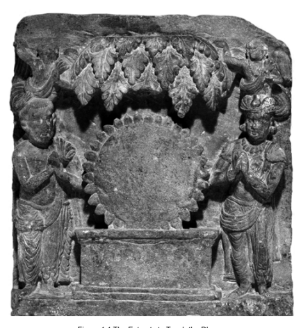

Figure 1.1 The Entreaty to Teach the Dharma The figure above shows an aniconic representation of the recently awakened Buddha, flanked on his sides by Brahmā and Śakra, who with folded hands appear to be inviting him to teach.

31 Gandhāra; courtesy Trustees of the British Museum.

prompted by Brahmā to preach his doctrine", which would have been a rather convenient argument to be used in encounters with Brahmins.

31 As the above figure 1.1 shows, the motif of Brahmā's entreaty is reflected relatively early in Indian sculpture (for another example cf. e.g. Foucher 1905: 425 figure 214), making use of a form of representation that still belongs to the aniconic tradition when the presence of the Buddha was only symbolized (on aniconism cf. also Dehejia 1991 and Linrothe 1993). 

The first of these explanations seems to confuse the temporal sequence of events in the Ariyapariyesanā*-sutta*, where the Buddha's reluctance to teach occurs before he surveyed the degree to which beings are defiled.32 On surveying their condition, according to the *Ariyapariyesanā-sutta*'s report, the Buddha realized that some would understand his message, which motivated him to accept Brahmā's invitation to teach.

The second explanation would imply that the Buddha acted with the ulterior purpose of enhancing his reputation by getting Brahmā to invite him, an idea not easily compatible with the total detachment from fame and glory which the discourses usually associate with the condition of being fully awakened. Besides, according to an earlier section of the *Ariyapariyesanāsutta* the Buddha quite explicitly informed the monks listening to his autobiographical report of his initial disinclination to teach: "Considering like this, monks, my mind inclined to inaction, not to teaching the Dharma."33 This does not give the impression that he was anticipating an invitation from Brahmā. The passage reads more naturally if one were to assume that it means precisely what it says, that is: the Buddha was reluctant to teach.

Such reluctance on the part of the newly awakened Buddha is not easily reconciled with the notion common to all Buddhist traditions that he had prepared himself over immense periods of time with the sole intention of executing the task of leading others to liberation.34 Judging from the account given in the *Ariyapariyesanā-sutta*, the reason for the Buddha's disinclination to teach was that it would be fatiguing (*klamatha*) and vexing (*viheṭh*ā) for him if others should fail to understand the profound truth he had realized. Similar reasons recur in other reports of his initial hesitation to teach, found in an *Ekottarika-āgama* discourse, in the Catuṣpariṣ*at-sūtra*, and in the *Vinaya*s of the Dharmaguptaka, Lokottaravāda-Mahāsāṃghika, Mahīśāsaka and (Mūla-)Sarvāstivāda traditions.35 That is, when reflecting on the possibility of sharing his discovery with others, according to a range of sources the Buddha considered the matter entirely from the perspective of how it would affect himself. This ties in with the observations made above regarding his motivation and his reaching of the final goal. Throughout, according to these texts the Buddha's predominant concern is with himself, when he forms his initial motivation to set out for awakening, when he successfully completes his quest, and even when he reflects about what course of action is to be taken next. 

This certainly does not imply that from the perspective of the early discourses the Buddha was not compassionate. The *Ariyapariyesanā-sutta* reports that, once Brahmā intervened, the Buddha surveyed the world out of compassion.36 Another discourse clarifies that compassion is a quality inherent in the Buddha's attainment of full awakening.37 However, the early discourses do not give any indication that a concern for others was part of the motivation of the bodhisattva Gautama to set out on his quest for awakening,38 nor does the successful reaching of this goal show any immediate relationship to teaching activity. This applies also to the Madhyama-ā*gama* parallel to the *Ariyapariyesanā-sutta* which, though lacking the Brahmā episode, nevertheless agrees with the Pāli account in presenting the future Buddha's motivation and his successful reaching of the goal entirely in terms of finding liberation for himself and having liberated himself.

The passages surveyed above reveal that the early Buddhist conception of the bodhisattva's motivation did not allot a prominent role to compassionate teaching activity for the sake of delivering others, a quality that only becomes evident after the bodhisattva has reached awakening and decided to teach. This is intriguing in view of the way some early Buddhist discourses depict an arhat. 

In line with the above noted parallelism between the progress towards awakening of the bodhisattva and of arhats in general, in the early discourses compassion for others appears to be a result of awakening, whether this be the awakening of the bodhisattva or the awakening of an arhat. 

An example could be found in an episode recorded in a range of sources, according to which the first arhats, as soon as they had reached awakening, were sent by the Buddha to tour the country so that they may teach others.39 Another example for the importance given to concern for others occurs in a discourse in which the Buddha dismisses a group of newly-ordained monks for having created too much noise. Śāriputra fails to realize that it is now his duty to look after and provide guidance to this group of monks, as a consequence of which he has to face the Buddha's stern rebuke.40 Another discourse records Śāriputra being vexed by another monk who repeatedly contradicts what Śāriputra has been teaching the monks. Instead of intervening in support of Śāriputra, Ānanda thinks it better to keep quiet, a lack of compassion for which he incurs the Buddha's public censure.41 Given that elsewhere in the discourses these two chief disciples are often praised, the fact that in these two instances they are rebuked for their lack of compassionate concern for others underlines the degree to which the early discourses consider their unconcerned attitude as inappropriate.42 Intervening in support of someone who is being vexed, like in the above case involving Ānanda, as well as teaching others was apparently expected not only of arhats, but also of those who are on the path to arhat-ship. Several discourses indicate that teaching others is of such importance for a monastic that neglecting to do so will obstruct progress on the path.43 In fact, one out of several possible occasions for attaining liberation, according to the early discourses, is precisely while teaching others.44 Judging from this presentation, it would be possible to become an arhat at the time of being engaged in the compassionate activity of teaching others the Dharma, provided earlier practice has sufficiently matured the mind for the final breakthrough to liberation to take place.

In sum, in early Buddhist thought the compassionate impulse to become active for the sake of others was associated with the Buddha as well as with arhats and those who aspire to become arhats, but was not seen as a quality that motivated the bodhisattva's quest for awakening.

The lack of a prominent role played by compassion in the conception of what motivates the quest for becoming a Buddha is not confined to the early discourses. De La Vallée Poussin (1915: 330) notes that the same applies to the *Mahāvastu*. According to the findings by Fronsdal (1998: 220) and Nattier (2003a: 146), compassion remains a relatively marginal aspect in the conception of a bodhisattva reflected in early *Mahāyāna* texts like Lokakṣema's translation of the Perfection of Wisdom in Eight-thousand Lines, Aṣṭasāhasrikā Prajñāpā*ramit*ā, or the Inquiry of Ugra, Ugraparipṛcchā. 

## 1.3 Gautama'S Marvellous Qualities

Instead of compassion, the emphasis in the early discourses is on a range of other qualities of the bodhisattva. A detailed exposition of what tradition considered to be particularly inspiring about the bodhisattva can be found in the Discourse on Wonderful and Marvellous Qualities, the *Acchariyabbhutadhamma-sutta* of the *Majjhima-nikāya*, and in its *Madhyama-āgama* parallel, the Discourse on Marvellous Qualities ( 未 曾 有 法 經 ).45 As these two discourses are of central importance for my exploration of the conception of the bodhisattva, in what follows I briefly survey the Pāli version in comparison with its Chinese counterpart. Then I examine the function of this discourse, after which I turn to its contribution to the development of the bodhisattva concept. 

The speaker of the *Acchariyabbhutadhamma-sutta* is Ānanda, who lists a series of wonderful and marvellous qualities of the Buddha. In the Pāli version, he begins by describing that the bodhisattva Gautama was endowed with mindfulness and clear comprehension when arising in Tuṣita,46 during his sojourn - which lasted for the whole of his lifespan - and when departing from this realm. The *Madhyama-āgama* parallel does not mention his mindfulness or clear comprehension when being reborn in Tuṣita. Instead, this version reports that he outshone other heavenly beings (*deva*) with respect to lifespan, appearance and glory. The two versions agree, however, that the bodhisattva entered into his mother's womb with clear comprehension, an event that was accompanied by an earthquake and the manifestation of a great light.

The *Acchariyabbhutadhamma-sutta* continues by depicting the conditions of the bodhisattva's sojourn in his mother's womb, reporting that four heavenly beings protected him; that his mother was virtuous, free from sensual thoughts, but at the same time endowed with the five types of sense pleasures; and that she was able to see the bodhisattva in her womb, comparable to seeing a beryl strung on a coloured thread.47 None of these marvellous qualities occur in the *Madhyama-āgama* version. Though the Madhyama-ā*gama* discourse also describes the conditions of the bodhisattva in the mother's womb, it instead notes that inside the womb he rested on his right side, with his body fully stretched.

Next the *Acchariyabbhutadhamma-sutta* reports that the mother passed away seven days after giving birth, followed by indicating that the pregnancy lasted ten months and that the mother gave birth while standing.

None of these qualities is found in the Chinese parallel.

The two versions agree that on being born the bodhisattva was not sullied by any bodily impurities and was received by four deities. They also agree that two streams of water appeared in the sky to bathe him, and that on being born the bodhisattva took seven steps. The Pāli version records a declaration made by the newly born bodhisattva on this occasion, in which he proclaims his superiority in the world and his transcendence of future existences, a declaration absent from the *Madhyama-āgama* parallel. 

The two versions agree again that the birth was accompanied by another earthquake and the manifestation of a great light. While in the Pāli version the listing of marvellous qualities by Ānanda comes to an end at this point, in the Madhyama-āgama account he continues by mentioning several remarkable events that took place during the Buddha's youth and after his awakening. The two versions agree in concluding the discourse with the Buddha highlighting another marvellous quality of his, namely his ability to be aware of the arising, continuity and disappearance of feelings, perceptions and thoughts.

As this brief survey shows, the two versions differ considerably from each other. The bodhisattva's descent from Tuṣita into his mother's womb and the extraordinary form and circumstances of his birth seem to be their common starting points,48 from which the two versions appear to have developed the theme of the marvellous qualities of the bodhisattva in independent ways. 

As a result of these independent developments, their present listings of marvellous qualities show more differences than similarities.49 The two discourses thereby diverge from each other to a greater degree than usually found between discourses in the *Majjhima-nikāya* and their *Madhyama-āgama*parallels.50 This circumstance suggests a comparatively late date for the coming into being of each version in its final form.

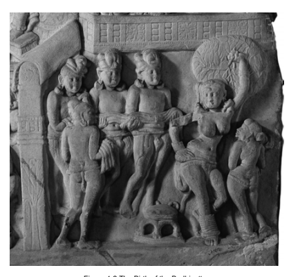

Figure 1.2 The Birth of the Bodhisattva
The figure above shows an aniconic representation of the bodhisattva's birth. Queen Māyā stands in a posture expressive of a sense of ease, gracefully holding on to a tree with her left arm. Her right waist, the side where according to tradition the infant emerges,51 is marked by a little swelling. To her right stand what appear to be four gods, holding a long cloth in their hands to receive the newborn. The presence of the bodhisattva is indicated by footprints on the cloth held by the god closest to Māyā and by an empty stool beneath. 

Amarāvatī; courtesy Trustees of the British Museum.

Regarding qualities found in only one of the two versions, given that the presentation in both discourses conveys the same attitude towards the marvellous nature of the Buddha, the possibility that a quality now found in only one version was on purpose omitted in the parallel version can safely be set aside. Since both discourses otherwise show no sign of textual loss, it seems also improbable that one version lost a whole series of qualities, which are now found only in the other version. Thus in the case of qualities that occur in only one of the two versions, the most straightforward explanation would be that these are later additions.

A sign of later addition in the Pāli version can in fact be found in relation to the passing away of the mother seven days after giving birth to the bodhisattva.52 The placing of this particular event in the *Acchariyabbhutadhamma-sutta* is out of sequence, as it occurs after several marvels that, in a chronological order, depict his birth and life in Tuṣita, his descent from Tuṣita and his subsequent sojourn in his mother's womb. In continuation of this pattern, the bodhisattva's birth should be the next marvel, yet in the Acchariyabbhutadhamma-sutta his birth is mentioned only after the passing away of his mother has been described. 

As the Madhyama-ā*gama* parallel does not refer to her passing away at all, it seems safe to assume that the reference to the death of the mother is a later addition. In fact, one would not naturally place the early death of the bodhisattva's mother under the heading of being a marvel of her son.53 A
discourse in the Udāna reckons her early death as a marvel in general, a probably more straightforward way of qualifying this event.54 Perhaps due to a growing interest in marvellous qualities of the Buddha, at some point during oral transmission this *Udāna* passage may have come to be added to the account of marvels in the *Acchariyabbhutadhamma-sutta*. If that should indeed be the case, then this addition took place without awareness of the chronological sequence of marvels otherwise observed in this discourse.

The function of this listing of marvellous qualities in the *Acchariyabbhutadhamma-sutta* and its *Madhyama-āgama* parallel is reflected in a peculiar feature found in both versions, which rarely occurs in other early discourses. Both follow each quality with a remark by Ānanda that he keeps this marvel in mind.55 In this way, each marvellous quality is described twice, once as an actual description and again as something that Ānanda keeps in mind.56 Now in the thought-world of the early discourses, Ānanda stands out as the disciple foremost in memory.57 The same quality is also reflected in the circumstance that, according to the account of the so-called first council in the different *Vinaya*s, he had memorized all the discourses spoken by the Buddha.58 Thus the fact that he keeps each of the Buddha's marvellous qua56 The same pattern recurs in the next discourse in the *Majjhima-nikāya*, which also follows a listing of marvellous qualities - in this case the qualities of the monk Bakkula - with a similar type of acclamation by the reciters. Thus in MN 124 at MN III 125,18, for example, after the monk Bakkula has proclaimed that during the eighty years of his monkhood he has never had a single perception of sensuality, the reciters of the discourse state: "that the venerable Bakkula does not recall to have ever had the arising of a sensual perception for eighty years; this we remember as a wonderful and marvellous quality of the venerable Bakkula",
yam p' āyasmā Bakkulo asītiyā vassehi nābhijānā*ti kāmasaññaṃ uppannapubbaṃ, idam pi maya*ṃ āyasmato Bakkulassa acchariyaṃ *abbhutaṃ dhammaṃ dhārema* (Be reads Bā*kulo* and consequently also *Bākulassa*; Be, Ce and Se read *abbhutadhamma*ṃ). The parallel MĀ 34 at T I 475b4 proceeds similarly, though without repeating the quality itself: "'friends, during the eighty years that I have been practising the path in this right teaching and discipline, I never had a perception of sensuality'. That the venerable Bakkula makes such a declaration, this [we]
reckon a marvellous quality of the venerable Bakkula", 諸賢, 我於此正法律中學道已來八十 年, 未曾有欲想, 若尊者薄拘羅作此說, 是謂尊者薄拘羅未曾有法. Now the circumstance that the protagonist of MN 124 has been a monk for eighty years implies that the discourse took place at least thirty-five years after the Buddha's demise. In fact the commentary, Ps IV
197,2, explains that MN 124 was included in the canon only at the second 'council' or communal recitation, *saṅg*īti. Given that MN 123 and MN 124 share the feature of following each marvellous quality with a refrain-like indication that this is being kept in mind by the reciter(s), another aspect of this refrain might be related to the need to ensure the text's preservation during oral transmission. Gombrich 1990: 26f has suggested that in the early stages of the Buddhist oral tradition "it must have been difficult, if not impossible, to slip a new text into the curriculum", so much so that "any text which … introduces something which is palpably new has no chances of survival." Could these refrain-like statements have originated as the result of precisely such difficulties, in that the relative lateness of MN 124 and of considerable sections of MN 123 required an explicit indication - expressed in these refrain-like statements –
to the effect that the respective material is worthwhile memorizing? If this should have been the case, then the indications given in this way would be in line with a tendency prominent in later times of building into a text protective measures that assure its survival. 

57 AN 1.14 at AN I 24,32 and EĀ 4.7 at T II 558a26; cf. also Th 1024.

58 Dharmaguptaka *Vinaya*, T 1428 at T XXII 968b15; Mahāsāṃghika *Vinaya*, T 1425 at XXII
491c2; Mahīśāsaka *Vinaya*, T 1421 at T XXII 191a18; (Mūla-)Sarvāstivāda *Vinaya*, T 1451 at T XXIV 407a3; Sarvāstivāda *Vinaya*, T 1435 at T XXIII 449a20; Theravāda *Vinaya,* Vin II 287,12.

lities in mind would not require any explicit highlighting. Besides, this much is anyway self-evident, since otherwise he would not have been able to list them. 

In addition to stating an obvious fact, these refrain-like statements would have the effect of indicating to the audience that each of these qualities is worth being memorized. In this way, the pattern observed throughout both versions - where hearing that the bodhisattva had such-and-such a quality is followed by remembering that the bodhisattva had such-andsuch a quality - would encourage others to keep this quality in mind. 

Another noteworthy feature of the *Acchariyabbhutadhamma-sutta* is its recurrent use of visual stimulants. The first of these is the description of an earthquake accompanied by a great light of such intensity that it outshines even the moon and the sun, reaching areas of utter darkness where beings for the first time are able to see each other. The second image illustrates the mother's ability to see the bodhisattva in her own womb with the example of seeing a coloured thread strung through a well-cut beryl of pure quality. The third image compares the newly born bodhisattva to a gem placed on Kāśī cloth, and the fourth image again depicts the appearance of a great light together with an earthquake.59 These visual stimulants, with their symbolic allusion to the dispelling of darkness through the teaching activity of the Buddha (whom tradition considers the first of the three 'gems'), are set in a frame that alludes to meditation: The first marvel in the *Acchariyabbhutadhamma-sutta* highlights the bodhisattva's possession of mindfulness and clear comprehension on appearing, remaining in and leaving Tuṣita. The last marvel, mentioned by the Buddha in reply to Ānanda's exposition, describes the Buddha's awareness of feelings, perceptions and thoughts as they arise, are present and disappear - an ability elsewhere in the discourses presented under the heading of clear comprehension.60 Thus underlying the listing of qualities in the *Acchariyabbhutadhammasutta* a circular pattern can be discerned that moves from the bodhisattva's clear comprehension via the manifestation of a great light to the description of a jewel, and then continues from another jewel via another manifestation of a great light to the Buddha's clear comprehension. That is, the recollection of the Buddha's marvellous qualities in the *Acchariyabbhutadhamma-sutta* proceeds in an almost rhythmic pattern that takes off and concludes with meditative qualities, and whose trajectory progresses through a set of images that have a strong visual and symbolic component. In this way, the discourse exhibits considerable evocative qualities, revealing that the purpose of the *Acchariyabbhutadhamma-sutta* is probably best understood as inviting recalling, perhaps even visualizing, in a rather lively manner the marvellous qualities of the Buddha.61 The recollective and evocative message of the *Acchariyabbhutadhammasutta* would have been of particular importance for the early Buddhist community after their founder had passed away, especially for disciples who had never met the Buddha. Lacking the experience of a personal encounter with the living Buddha, and given that during the early period the Buddha was not represented in sculpture or painting, discourses like the *Acchariyabbhutadhamma-sutta* would have enabled new converts to engage in some form of emotional contact with their teacher, by memorizing and perhaps even visualizing his marvellous qualities. 

Now the act of becoming a Buddhist involves taking the three refuges.

Yet, new converts would have lacked an opportunity to establish a direct rapport with the first refuge, the Buddha, once he had passed away.62 In line with a general trait of religious traditions, the passing away of the founder inevitably creates a vacuum not easily filled. In the case of early Buddhism, this vacuum would have been particularly challenging for those who could not find all the inspiration they needed in the teachings alone, who were in need of something more personal that touches the heart. 

The *Acchariyabbhutadhamma-sutta*'s taking up of common events like pregnancy and birth can be understood as a means of addressing such needs by uplifting and inspiring its audience through a stimulating description of the marvellous way the Buddha-to-be passed through these experiences, common to all human beings. By treating events familiar to anyone who had lived or still lived in an ancient Indian household, the *Acchariyabbhutadhamma-sutta* treads common ground and at the same time creates distance and evokes awe through the medium of the marvels that accompany these events.63 Thus, the didactic function of the *Acchariyabbhutadhamma-sutta* would have been to stimulate and strengthen devotion based on the superior nature of the Buddha, evident in the marvels that accompany his god-like descent from heaven to the world of human beings.64 The important function that the marvels would have assumed in this respect may also help to appreciate why marvels came to be part of the traditional listings of canonical texts. Judging from the function of the marvels suggested above, it is hardly surprising that discourses on marvels should have been considered important enough to be included in the register of Buddhist texts in terms of nine or twelve "limbs", aṅgas.

65 This function of the marvels provides the background for the coming into being of a rather significant development in regard to the bodhisattva concept that manifests in the *Acchariyabbhutadhamma-sutta*. This occurs in the discourse's description of how, on just being born, the bodhisattva takes seven steps and then proclaims: 
at DN II 145,3 and AN 4.129 at AN II 132,17. According to von Hinüber 1994: 131, however, the aṅga of marvels should more specifically be understood to represent the incipient Buddha legend. In fact, a Chinese *Udāna* collection, T 212 at T IV 643c9, defines this aṅga in the following way: "the eleventh [aṅga] is called 'marvellous qualities', like venerable Ānanda extolling the Blessed One's virtues as marvellous qualities",十一名曰未曾有法, 若尊者阿難以 未曾有法歎如來德. According to one of the definitions quoted in the *Mahā*vibh*āṣā, T 1545 at T XXVII 660b2, examples of this aṅga are "disciples extolling the Blessed One's marvellous virtues, like Śāriputra extolling the Blessed One's supreme virtues, [or] venerable Ānanda extolling the Blessed One's extremely marvellous qualities", 諸弟子等讚歎世尊希有功德, 如 舍利子讚歎世尊無上功德, 尊者慶喜讚歎世尊甚希有法 (this is preceded by an alternative definition mentioning marvels related to the three jewels; a definition that recurs in the Udā*navarga-vivaraṇa* in Balk 1984: 31,19). The *Mahāprajñāpā*ramitā(-upadeśa)-śāstra*, in its definition of this aṅga, lists several marvels that accompanied the Buddha's birth, T 1509 at T XXV
308a13: "at the time of just being born he took seven steps without needing any support, wherever he placed his feet there were lotuses, and he made the declaration: 'I shall deliver all sentient beings from old age, disease and death'" (cf. also Lamotte 1980b: 2301f), 又生 時不須扶持而行七步, 足跡之處皆有蓮華, 而發是言, 我是度一切眾生老病死者. The (*Mahāyāna*)
Mahāparinirvāṇa-mahāsū*tra* (on the title of this work cf. Habata 2007: xliii-li) begins its definition of this aṅga with the same marvel of the bodhisattva's ability to walk at birth, T 374 at T XII 452a9: "what are texts called marvels? Like when just after being born the bodhisattva took seven steps without anyone supporting him", 何等名為未曾有經, 如彼菩薩初出生時, 無 人扶持, 即行七步, continuing with other marvels related to the Buddha; cf. also T 375 at T XXII 694a10 and the Tibetan counterpart in D *mdo sde, nya* 234a3 or Q ju 247a5: rmad du ' byung ba zhes bya ba ni byang chub sems dpa thog ma btsas ma thag tu sus kyang ma bstan par gom pa '
bdun song ba dang. Guang Xing 2002b: 19 note 80, after quoting the definitions given in T 212, T 1509 and T 1545, concludes that "*adbhuta-dharma* originally only included the miracles of the Buddha." Though this may indeed have been the original implication, already with the treatment in MN 123 the conception of 'marvels' can be seen to evolve from qualities of the Buddha to marvels that, strictly speaking, are no longer his own qualities - such as the early death of his mother (cf. above note 53) - which makes an expansion of the concept of this aṅga to include marvellous qualities of others a natural development. An example in case would be the discourse that follows MN 123 in the *Majjhima-nikāya*, MN 124 at MN III
124‒128, which highlights the wonderful and marvellous qualities of the monk Bakkula in a way that has much in common with the presentation in MN 123 (cf. above note 56). The par-
"I am supreme in the world, I am the highest in the world, I am the first in the world; this is my last birth, there will be no further existence."66 The marvellous character of this quality in the Pāli version appears to be in particular what the bodhisattva said, since according to the *Ambaṭṭha-sutta* another boy was also able to speak right after his birth. Instead of making a majestic proclamation, however, he asked his mother to wash him, because he had such dark skin. The *Ambaṭṭha-sutta* reports that people who witnessed his ability to speak at birth drew the conclusion that he must be a goblin (piśāca).67 allel to MN 123, MĀ 32, heads a whole chapter in the *Madhyama-āgama* dedicated to the theme of marvels, 未曾有法品, which besides the marvellous qualities of Ānanda and Bakkula also has discourses depicting the marvellous qualities of some lay disciples (MĀ 38–41 at T I
479c12‒485a2, with their Pāli counterparts in AN 8.21‒24 at AN IV 208,17‒220,13). The *Abhidharmasamuccaya* in fact begins its definition of marvels with disciples, cf. Hayashima 2003:
610,6 (= Pradhan 1950: 79,6): "what are marvels? Expositions regarding highly marvellous and extraordinary qualities of disciples, bodhisattvas and *Tathāgatas", adbhutadharmaḥ katamaḥ?* yatra śrāvakabodhisattvatathāgatānaṃ paramādbhutāścaryadharmāṇāṃ de*śanā*. A definition of marvels in the Śrā*vakabhūmi*, though beginning its listing with marvels of Buddhas, continues by listing disciples, monks, nuns, probationary nuns, male and female novices, male and female lay followers, even including those outside of the Buddhist community, cf. Matsunami 1998: 232,1: yatra buddhānāṃ ca buddhaśrāvakāṇāṃ ca bhikṣūṇāṃ ca bhikṣuṇī*nāṃ ca* śikṣamāṇānāṃ śrāmanerāṇāṃ śrāmaṇerikāṇām upāsakānām upāsikānāṃ sādhāraṇāsādhāraṇāś ca tadanya prativiśiṣtāś cāścaryādbhutasaṃmatā guṇaviśeṣā ākhyātāḥ*, ima ucyante 'dbhutā dharm*āḥ.

Cooray 1963: 172 notes that, in the case of Ud 5.5 at Ud 54,33, "qualities of the *Dhammavinaya* have also been admitted in the category of the wondrous and miraculous", hence the category of marvels was "not confined to qualities pertaining to individuals". In sum, though the qualities of the Buddha must have played a central role in regard to the implications and the importance of this particular aṅga, the conception of marvels appears to have soon acquired a rather broad scope. 

66 MN 123 at MN III 123,21: aggo 'ham asmi lokassa, seṭṭho 'ham asmi lokassa, jeṭṭho 'ham asmi lokassa, ayam antimā jā*ti, n'atthi dāni punabbhavo* (Be and Se differ in as much as they have jeṭṭho as their second and seṭṭho as their third part of the proclamation).

67 DN 3 at DN I 93,11: "on being born this one spoke, a dark one has been born, a goblin has been born", *ayaṃ sañjāto paccābhāsi, kaṇho jāto pisāco jāto* (Be, Ce and Se read *ayaṃ jāto pabyāh*āsi); cf. also Printz 1925: 127. One of the parallels to this passage, DĀ 20 at T I 83a10, reports that people even tend to be frightened by an infant's ability to speak. For another instance where a baby is able to speak soon after being born cf. Ud 2.8 at Ud 17,27. 

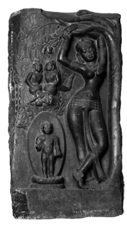

The figure above shows Queen Māyā at the time of giving birth, standing in a posture that conveys a sense of ease and comfort, elegantly stretching up her arms to hold on to the bough of a tree on her left side. To her right the bodhisattva stands on a lotus, his whole body surrounded by an aureole, with his right hand raised as if he is making a proclamation.68 Above the bodhisattva two celestial beings are pouring out water, presumably mixing cold and hot water to bathe him.

North India; courtesy National Museum of Nepal.

Thus the mere ability of an infant to speak at birth was in itself not necessarily seen in a positive light. Besides, according to the Pāli Jā*taka* collection already in two previous existences the bodhisattva was able to speak right after being born.69 Since these instances are not explicitly reckoned as marvels, in the present case the marvel would be the content of his proclamation.

The *Madhyama-āgama* version differs from the *Acchariyabbhutadhammasutta* in as much as it only records the seven steps, without any proclamation made at all.70 Nakamura (1980/1999: 18) is probably right when he concludes that "the verse claimed to have been proclaimed by the Buddha at his birth was composed very late."71 In addition to the *Acchariyabbhutadhamma-sutta*, a range of sources record a proclamation made by the newly-born bodhisattva Gautama, though varying on its precise content.72 Variations can also be found in regard to the proclamation made by the former Buddha Vipaśyī right after being born. While the Pāli version of this stanza is identical to the declaration made according to the *Acchariyabbhutadhamma-sutta* by the bodhisattva Gautama, the Dīrgha-ā*gama* record of the words spoken by the newly born bodhisattva Vipaśyī contains a reference to delivering sentient beings.73 This brings in the notion of concern for others that is so conspicuously absent from the passages discussed so far.

When considered from the perspective of the didactic function of the Acchariyabbhutadhamma-sutta, the proclamation made by the bodhisattva Gautama may at first have come into being as just another facet in the overall scheme of exalting the Buddha. Yet, this particular marvel has consequences that originally may have been neither intended nor foreseen. 

The significance of this proclamation emerges once it is compared with the passages examined in the first part of the present chapter. These passages invariably indicate that the bodhisattva was not yet awakened, *anabhisambuddho*, which holds true even in the case of those versions that do not employ the term bodhisattva. Thus, from the perspective of this general consensus among early Buddhist discourses, the bodhisattva would have been able to make the claim that "this is my last birth, there will be no further existence" only once he had become a Buddha. 

In the Pāli discourses in general, the claim that this is one's last birth etc.

is invariably a statement made after someone has reached full awakening.74 The majority of these passages describe the Buddha's own awakening, introducing the proclamation "this is my last birth, there will be no further existence" by indicating that on that occasion "knowledge arose" of having reached this condition.75 One discourse explicitly indicates that this knowledge attained by the Buddha was "born of awakening".76 On considering these formulations, it seems safe to conclude that when these descriptions of the Buddha's awakening came into being, the idea had not yet arisen that already at his birth he knew that this was going to be his last birth. In other words, the proclamation made by the infant bodhisattva in the *Acchariyabbhutadhamma-sutta* involves a clear shift of a claim, originally made after awakening, to the time when the bodhisattva Gautama had just been born.

77 As the passages surveyed in the first part of this chapter make clear, in his progress towards awakening the bodhisattva had to struggle with various mental defilements, such as fear and sensual desire, whose roots must thus have been present in his mind at the time of his birth.78 From the perspective of these passages, the bodhisattva would not have been able to claim supremacy in the world, neither when he was a newly born infant nor when he eventually went forth in quest of awakening. 

In contrast, from the perspective of the *Acchariyabbhutadhamma-sutta* the simple fact of being the bodhisattva, however much he may be just a newly born infant, enables him to profess to be foremost in the whole world and to have already transcended future becoming. In this way, the bodhisattva's announcement of having reached the last birth and his proclamation of being foremost in the world reflect a clear change in the conception of the nature of the bodhisattva. 

An inevitable outcome of this shift of perspective is that the bodhisattva's progress to awakening - depicted in the passages surveyed in the first part of the present chapter - loses importance. Once Gautama is already accomplished at birth, the stages of his progress must necessarily have taken place earlier, that is, in some former life or lives. An evident expression of this shift of perspective in the *Acchariyabbhutadhamma-sutta* itself is its employment of the term bodhisattva for the previous life of the Buddha in Tuṣita, whereas in the discourses surveyed earlier the same term was only used in relation to his last life as a human.

Besides this temporal expansion of the usage of the term bodhisattva, the proclamation of superiority and final accomplishment has a rather weighty ramification, as it establishes the notion that the bodhisattva was already at birth invariably destined to become a Buddha.79 The same is also reflected in a listing of five great dreams of the bodhisattva in the *Aṅguttara-nikāya*, another passage that employs the 'before awakening' phrase.

These five dreams are portents of his future success in reaching full awakening, in teaching the path to awakening, in having a substantial congregation of lay disciples, in having monastic disciples from all four castes, and in receiving ample support without being attached to it.80 From the perspective of such passages, the bodhisattva's quest for awakening, described in the *Ariyapariyesanā-sutta* and elsewhere, was anyway destined to end successfully.81 In sum, the *Acchariyabbhutadhamma-sutta* reflects a significant change in the bodhisattva conception.82 Already at birth the bodhisattva is in possession of the supreme degree of perfection that other discourses consider the final result of his prolonged quest for awakening. As a consequence of this shift of perspective, the superiority associated with the status of the Buddha now becomes a birthright of the bodhisattva.

The *Acchariyabbhutadhamma-sutta* is not unique in this respect, as other texts also show signs of a tendency to endow the bodhisattva with qualities whose full development the early discourses reckon as something the Buddha attained in the night of his awakening. Thus the *Saṅghabhedavastu* suggests that the bodhisattva was already at birth endowed with the divine eye.83 According to the *Divyāvadāna*, the bodhisattva was in possession of this ability even in a previous birth.84 The *Mahāvastu* proclaims that the bodhisattva reached dispassion already at the time of Dīpaṃkara and had attained the perfection of wisdom since countless crores of aeons.85 The Great Discourse on the Life History [of Buddhas], the Mahāpadā*nasutta*, takes a position similar to the *Saṅghabhedavastu* in relation to the former Buddha Vipaśyī. It indicates that Vipaśyī, too, was already in possession of the divine eye when he was born.86 This takes me to the next step in my inquiry, to the lineage of former Buddhas described in the Mahāpadā*nasutta*.

## 1.4 The Lineage Of Former Buddhas

The whole of the *Acchariyabbhutadhamma-sutta*'s description of the bodhisattva's marvellous qualities recurs in the Mahāpadā*na-sutta*'s depiction of the pre-awakening period of the six previous Buddhas. According to Gombrich (1980: 65), the *Mahāpadāna-sutta*'s "account of … six predecessors is patterned on the story of Gotama's own life".87 Support for this suggestion can be gathered from a closer inspection of the *Mahāpadāna-sutta*'s description of the former Buddha Vipaśyī. Passages in this description that parallel the *Acchariyabbhutadhamma-sutta* refer to Vipaśyī as the "bodhisattva", whereas other passages that portray events of his youth refer to him as "prince".88 The same pattern also manifests in the Sanskrit parallel and to some degree in the Chinese parallels.89 Once the infant Vipaśyī is qualified as a bodhisattva, it is difficult to imagine a cogent reason for discontinuing that qualification when describing his childhood and youth. Hence this pattern gives the impression that an earlier account of the experiences of 'prince' Vipaśyī was subsequently expanded by adding the description of marvels from a discourse like the *Acchariyabbhutadhamma-sutta*.

90 Whatever may be the final word on this suggestion,91 what the *Mahāpadāna-sutta* definitely does is that it places the theme of the wonderful qualisatvo in the Sanskrit prose section, whereas the Sanskrit verse reads kumāro, cf. Fukita 2003:
90. Similarly, the first part of DĀ 1 at T I 3c15 narrates the descent from Tuṣita etc. of the
"bodhisattva" Vipaśyī, 毗婆尸菩薩 (with a single usage of the term 'prince' in a verse at T I
4b10), but once it begins to describe his experiences after birth, DĀ 1 employs the expression
"prince", T I 4c20: 太子, eventually using both terms. In T 2 the pattern is less evident, as though the discourse starts at T I 152b19 by describing the descent etc. of the "bodhisattva",
菩薩, from T I 153a20 onwards it also makes use of the expression "prince", 童子, and thereafter both are used. A comparable pattern can be found in two biographies of the Buddha, T 184 (修行本起經) and T 185 (太子瑞應本起經), noted by Rhi 1994: 219, though here, too, the general tendency of not using the term bodhisattva for the period from birth to renunciation is not without some variations. Thus in the case of T 184, after frequent occurrences of "prince", 太 子, T 184 at T III 467b22 employs "bodhisattva", 菩 薩, when describing his famous first experience of absorption while being seated under a tree (on which cf. also Foucher 1903: 277‒285; Horsch 1964; Durt 1982; Schlingloff 1987; and Klimkeit 1990: 73). Similarly, in the case of T 185 at T III 476c4 a reply given by the young prince to his father during a discussion is introduced with the phrase "the bodhisattva answered", 菩薩答曰.

90 However, in the case of the famous four encounters with an old man, a sick man, a dead man and a recluse, described in DN 14 at DN II 21,13, according to Bareau 1974: 240, 245 and 254 the tale would originally have developed as part of a fictional account of the former Buddha Vipaśyī, which was then subsequently held to exemplify the rule for all Buddhas and was thereupon also applied to Gautama, cf. Jā I 58,31. This account may in turn have its origins in AN 3.38 at AN I 145,21 and its parallel MĀ 117 at T I 608a3; cf. also Bodhi in Ñāṇamoli 1995/2005: 1342 note 1207 and Anālayo 2007b: 22f.

91 Lamotte 1946b: 55 instead suggests that the marvels originated with Vipaśyī and were subsequently applied to Śākyamuni. Though my above findings suggest the opposite, it is noteworthy that the presentation in DN 14 of the various marvels as a general rule for any Buddha, *dhammat*ā, also appears to be implicit in the use of the present tense in the corresponding section in MN 123 (noted by Thomas 1927/2003: 30 note 2; cf. also Windisch 1908: 95). Thus, even though it seems to me probable that the description of marvels in MN 123 was first of all applied as such to DN 14, the resultant idea of an inherent rule applicable to all Buddhas in turn appears to have influenced the wording in MN 123 during the prolonged period of oral transmission. This goes to show the complexity of textual interrelation during oral transmission, making it less important to establish beyond ties of a Buddha-to-be within a wider framework, indicating that such marvels are to be expected of all those who are about to become Buddhas.92 That is, while the discourses surveyed so far spoke of a single individual, the bodhisattva Gautama, the *Mahāpadāna-sutta* employs the term bodhisattva in a generic manner, informing its audience of the qualities of bodhisattvas who became Buddhas in the past. Independent of whether this discourse constitutes the historically first occasion for these developments, it does constitute a testimony to them and thus exemplifies with considerable probability the basic pattern of what took place. 

Buddhist literature reflects an increasing interest in the lineage of former Buddhas, which may well be related to its function, highlighted by Gombrich (1980: 71), "to authenticate the Buddha's message".93 In this way, the Buddha could be shown to have had a line of predecessors comparable to the tī*rthaṃkara*s of the Jaina tradition,94 or to the Vedic sages of the Brahmanical traditions.95 In view of this purpose a perhaps unintended side-effect of the application of the bodhisattva's marvels to the *Mahāpadāna-sutta*'s scheme of former Buddhas is to ascribe the acquisition of these marvellous qualities to anyone who is about to become a Buddha. That is, with the marvels in the Mahāpadāna-sutta's account of previous Buddhas, the *Acchariyabbhutadhamma-sutta*'s presentation of an individual case becomes the norm for anyone on the path to Buddhahood. 

This is a significant step in the direction of the bodhisattva concept becoming an ideal to be emulated. It needs to be noted, however, that at this stage the idea of a direct relationship between a bodhisattva and a former Buddha has not yet made its appearance. The *Mahāpadāna-sutta*'s portrayal of former Buddhas does not refer to any meeting between a Buddha of the past and the bodhisattva Gautama and thus provides no indication of a direct relationship between them.96 All it does is to show that all these individual instances conform to the general pattern that governs the life of a Buddha.

Nevertheless, once the proclamation "I am supreme in the world, I am the highest in the world, I am the best in the world" is made in the *Mahāpadāna-sutta* by all bodhisattvas, it naturally follows that the same claim can be made by anyone who is about to become a Buddha. In this way, worldwide superiority becomes a birth right of a bodhisattva in his last life. Due to being a bodhisattva already at birth - provided this is going to be one's last birth - one is the foremost, highest and best being in the whole world. 

The resultant sense of superiority can be seen to pervade the development of the bodhisattva conception in later texts. In the case of the Mahā*vastu*, Rahula (1978: 54) observes that "'future *bodhisattvas*' seem … to have been more influenced by the Buddha's personality and glory than by serious contemplation of the woeful condition of the suffering masses. The enthusiastic desire to become equal of the present Buddha predominates their thoughts in the moment of *bodhi-citta-utpāda* … attaining of personal beauty and transcendental glory plays a prominent part in the formula of resolve (*praṇidhāna*)."97 A sense of supremacy is also a prominent feature of early Mahāyāna discourses, where Nattier (2003a: 146) highlights that "a stimulus to pursuing the bodhisattva path" is "the goal of becoming the highest being in the universe". According to Harrison (1995b: 19), in some Mahāyāna texts the bodhisattva ideal involves "a kind of power fantasy, in which the Buddhist practitioner aspires … to the cosmic sovereignty and power represented by complete Buddhahood - not the destruction of ego, but its apotheosis."

## Summary

The starting point of the development examined in the present chapter are those early discourses that describe the period from going forth to awakening of the Buddha Gautama, when he was a being in quest of awakening.

Passages that reflect his motivation indicate that Gautama's chief concern was to find liberation for himself. His compassionate concern for others appears to have arisen only as a consequence of his awakening, instead of having motivated his quest for liberation. 

Gautama's decease must have created a vacuum that needed to be filled.

Bereft of the possibility of having a personal encounter with the living Buddha, for disciples in need of some form of emotional contact with the object of their first refuge, recollecting his marvellous qualities would have been of considerable importance.

The Discourse on Wonderful and Marvellous Qualities, the *Acchariyabbhutadhamma-sutta*, reflects such concerns and reveals a significant development, where the superiority and freedom from future rebirth the Buddha acquires after having successfully reached awakening is already part of a proclamation he makes at the time of his birth. With this marvel, the bodhisattva becomes a being inevitably destined to awakening, and in some respects even an already awakened being.

The vacuum created by the teacher's demise would have had its effect not only on the internal level - within the community of disciples - but also on the external level, namely in relation to other contemporary religious groups and practitioners.

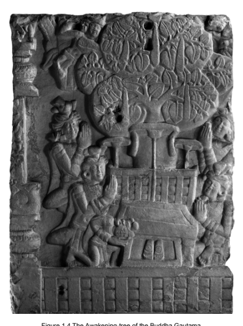

The figure above shows the Buddha's seat of awakening, standing at the root of the Aśvattha-tree under which according to tradition he won liberation. The seat and tree are flanked by worshippers expressing their reverence with folded hands. A fifth worshipper pays respect to footprints found in front of the seat. 

The footprints carry wheel marks and, together with an umbrella above the seat, stand for the Buddha's presence.

Amarāvatī; courtesy Trustees of the British Museum.

Here the need to authenticate the Buddha as an eminent spiritual teacher would have fostered an increasing interest in the details of his spiritual lineage, the Buddhas of the past. Such an interest underlies the Great Discourse on the Life History [of Buddhas], the *Mahāpadāna-sutta*, and its parallels. With these discourses, the marvels of the bodhisattva Gautama become the norm for a bodhisattva in general. This prepares the ground for the bodhisattva notion to become a generic term, thereby laying the foundation for the bodhisattva concept eventually evolving into an ideal to be emulated. 

The development surveyed so far does not yet involve an incipient stage of the bodhisattva ideal, an ideal that as such is not found within the textual corpus of early Buddhist discourses. Though in regard to matters of conduct the Buddha at times sets himself as an example to be imitated,98 when it comes to the spiritual quest the models to be followed are other disciples who have reached the final goal by becoming arhats.99 Nevertheless, with the above described shift in the bodhisattva conception the necessary foundation is laid and based on this foundation the next steps can take place.

These involve the idea of a vow for Buddhahood - taken at some time in the past when the decision to pursue the career of a bodhisattva was taken - and the prediction received thereupon from another Buddha that this quest will meet with its successful conclusion. These two ideas - the vow and the prediction - are the central themes of the next two chapters. 

The central theme of the present chapter is the notion of a vow taken by the bodhisattva when he decided to pursue the goal of Buddhahood. Of central relevance for my exploration of this topic is the tale of a meeting between the bodhisattva Gautama and the previous Buddha Kāśyapa. 

In order to provide background to my study of this meeting, I first examine the jā*taka* genre in general (1), then turn to the discourses that record this meeting (2), followed by examining the nature of this tale as a *jātaka* (3).

With these preliminaries in place, I then turn to the theme of the bodhisattva's vow (4). Though I believe these explorations are required as a background for my subsequent discussion, readers interested exclusively in the theme of the bodhisattva ideal may, if they so wish, skip the first parts of the present chapter (1‒3) and turn directly to page 84.

## 2.1 The Jātaka Genre

In the previous chapter of my investigation into the genesis of the bodhisattva ideal, I suggested that the application of the Buddha's qualities to the newly-born bodhisattva, evident in the *Acchariyabbhutadhamma-sutta*, has significant consequences. Once the bodhisattva is perceived as being already accomplished at birth, his progress towards such accomplishment must have taken place earlier, before his birth. 

In this way, the development of the bodhisattva conception evident in the *Acchariyabbhutadhamma-sutta*'s exposition of marvels would in turn have invested the previous lives of the Buddha with increasing importance. In other words, the shift in the bodhisattva conception evident in the marvels would have stimulated interest among early generations of Buddhists in another member of the traditional listing of canonical texts (aṅga): the jā*taka*s. The significance of this genre of text is well corroborated by its abundant representations in ancient sculpture and inscriptions,1 and also by the circumstance that reciters of jā*taka*s are reckoned as a class of bhāṇakas on their own.2 The *jātaka*s, perceived by tradition as records of the bodhisattva's experiences and struggles during his gradual acquisition of the qualities that would enable him to become a Buddha,3 would have played a central role for those interested in and attracted by the bodhisattva conception.4 In fact the *Mahāvastu*, itself a repository of numerous jā*taka*s, associates the delivery of such tales with the revealing of a bodhisattva's course of practice.5 A well-known feature of jā*taka* tales is the integration of various ancient Indian fables, anecdotes and parables, which become jā*taka*s through the simple act of identifying one of the protagonists - usually though not always the most heroic and exemplary one - with the Buddha in one of his former lives.6

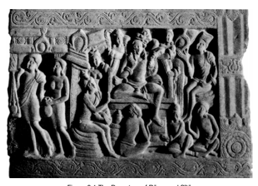

Figure 2.1 The Departure of Rāma and Sītā The figure above seems to depict Rāma and Sītā, both in plain dress and apparently just about to depart for their exile; while the remainder of the image would show their father, the king, who is seated at his court.7 Nāgārjunikoṇḍa; courtesy Parimal Publications.

6 This tendency has been noted by several scholars. Thus e.g. Alsdorf 1977: 25 points out that the majority of the Pāli *jātaka* verses are, if not pre-Buddhist, at least non-Buddhist, "die übergroße Mehrzahl der Jātaka-Gāthās [ist], wenn nicht vor-, so doch jedenfalls unbuddhistisch"; cf. also Norman 1983: 79. Regarding jā*taka* prose, Franke 1906 offers a survey of narrative material shared in common between the Pāli Jā*taka* collection and the *Mahābhārata*. Kulasuriya 1996: 10 notes that "stories of the Jā*taka* Book occur in the *Pañcatantra, Kathāsaritsāgara* and other Indian story books. Some stories have parallels in the Mahābhā*rata* and in the Rāmāyaṇa, and still others in Jaina literature." Laut 1993: 503 sums up that most *jātaka*s are popular tales with a Buddhist veneer, "bei den meisten Jātakas handelt es sich … um volkstümliche Erzählungen … denen der Buddhismus als Firnis aufgetragen wurde." According to Winternitz 1920/1968: 90, the tendency of turning popular tales into jā*taka*s had the result that at times rather worldly narrations became 'Buddhist' even though they may have had little in common with Buddhist thought, "so konnte jede noch so weltliche, dem buddhistischen Ideenkreise noch so ferne stehende Geschichte zu einer 'buddhistischen' werden."
7 For descriptions and plates related to this representation cf. e.g. Longhurst 1938: 49‒51 and plate 45a; Ray 1965 plate 18; Murthy 1987: 7‒9; Lal Nagar 1993: 143‒145 and plates 39‒41; and Rama 1995: 108‒110 and plate 40, who holds that the above picture rather represents Rāma's brother Lakṣmaṇa and Sītā.

To mention just one example, a version of the Rāmā*yaṇa* found in the Pāli Jā*taka* collection presents the exploits of its hero Rāma as past life experiences of the bodhisattva.8 The same holds for a Chinese version of this tale,9 whereas another Chinese version does not take the form of a jā*taka*.

10 Similar variations can be found with other manifestations of this tale that have made their way into various Asian cultures, which only at times appear as a jā*taka*s.11 For a proper appreciation of the formation of jā*taka*s, of particular interest are those stories that are already found among the early discourses and in the *Vinaya*, which take us to the beginning stages of *jātaka* literature.12 In what follows, I survey several examples that illustrate how some of these stories originated.13 In his study of the jā*taka* genre, Rhys Davids (1903/1997: 194) takes up a tale found in a discourse from the Saṃ*yutta-nikāya*.

14 In agreement with its Saṃyukta-āgama counterpart,15 this discourse reports the Buddha narrating how a quail strays outside of its proper resort and is thereupon caught by a falcon. The moral of the story is that, just as the quail should have kept to its proper resort, so the monks should keep to the practice of mindfulness as their proper resort in order to withstand Māra. 

While in the discourse versions in the Saṃ*yutta-nikāya* and in the Saṃyukta-āgama the whole story takes the form of a parable, in the Pāli Jātaka collection the same tale is a jā*taka*, which identifies the clever quail with the bodhisattva.16 Rhys Davids (1903/1997: 195) comments that "there can be no question as to which is the older document; for the Jā*taka* quotes as its source, and by name and chapter, the very passage in the Saṃyutta in which the fable originally occurs." A version of this tale found in an Udāna collection preserved in Chinese agrees with the two discourses in as much as it does not identify any of the animals in this story with the bodhisattva.17 In the context of a study of the history of the Buddhist canon, Oldenberg
(1912a: 192) draws attention to two tales found in the Discourse to Pāyāsi, the Pāyā*si-sutta* of the Dī*gha-nikāya,* which recur similarly in a Dī*rgha-āgama* and a *Madhyama-āgama* version of this discourse. The setting at the background of these two tales is a discussion between a sceptic and a Buddhist monk. During this discussion, the monk employs several examples to illustrate his arguments. One of these examples contrasts a clever caravan leader to a foolish one;18 another describes how someone tries to cheat when playing dice.19 Both tales also occur in the Pāli Jā*taka* collection, which identifies the chief protagonist in each parable with the bodhisattva.20 As the Discourse to Pāyāsi and its *Madhyama-āgama* parallel explicitly introduce these tales as
"parables"21 it can safely be assumed that they became *jātaka*s only at a later time. For the second tale to become a jā*taka* is in fact not unproblematic, as this requires identifying one of the two dice players with the bodhisattva.

Yet, one dice player is a cheat, while the other dice player poisons his opponent. The Pāli jā*taka* tale chooses the second player and solves the problem by reporting that, though the bodhisattva did poison his opponent, he then administered a cure to save the other player's life.22 Another relevant case would be the tale of a flying horse that saves a group of ship-wrecked merchants from being devoured by ogresses, which in the *Madhyama-āgama* is explicitly qualified as a simile.23 A version of this tale in an Udāna collection preserved in Chinese also does not take the form of a jā*taka*.

24 Yet, in the Pāli Jā*taka* collection, as well as in a discourse in the Ekottarika-āgama, this story records a previous life of the Buddha.25 The same is the case for several other versions of this tale, which differ, however, on whether the flying horse or the leader of the group of merchants should be identified with the bodhisattva.26 In his detailed examination of the Pāli Jā*taka* collection, von Hinüber
(1998: 188) highlights a case where a tale in the Pāli Vinaya is presented as a story of a former life of the Buddha in the Jā*taka* collection.27 This parable describes how a bird, a monkey and an elephant live together in harmony by giving foremost respect to the eldest among them, which turns out to be the bird.

According to the Theravāda *Vinaya* account, the Buddha had addressed this story to a group of notoriously misbehaving monks who had occupied all dwellings without leaving room for elder monks. The Pāli *Jātaka* collection concludes the same tale with the Buddha identifying the elephant and the monkey as former existences of Mahāmaudgalyāyana and Śāriputra, while he was the bird in one of his past lives.28 Versions of the same tale in the Mahāsāṃghika, (Mūla-)Sarvāstivāda and Sarvāstivāda *Vinaya*s agree with the Pāli Jā*taka* collection on presenting this tale as a jā*taka.* While the (Mūla-)Sarvāstivāda and Sarvāstivāda *Vinaya*s also identify the bird with the bodhisattva,29 according to the Mahāsāṃ-ghika *Vinaya* he had been the elephant.30 Versions of this tale in the Dharmaguptaka and Mahīśāsaka *Vinaya*s, as well as a in an Udāna collection preserved in Chinese, do not identify any of these animals with the bodhisattva, so that here this tale does not take the form of a *jātaka*.

31 In principle, such variations could be the result of a parable turning into a *jātaka* or else of a *jātaka* becoming a parable. Yet, the context shows that the purpose of the story was to deliver a teaching on the need of according proper respect to elders. For this purpose, the form of a parable would suffice, without needing any of its protagonists to be identified with the bodhisattva. Given that those *Vinaya*s that do present this tale as a *jātaka* differ in regard to the animal with which the Buddha should be identified, it seems safe to assume that these identifications are a later feature. In fact, in the thought-world of the early discourses the Buddha's former lives usually involve human rebirths instead of rebirth as an animal,32 making it more probable that the tale of the harmonious living together of these animals was originally not meant to record former experiences of the bodhisattva. 

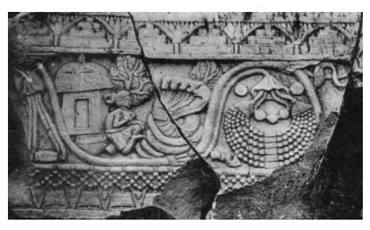

Figure 2.2 The Ṛṣi and the Nāga The figure above shows a ṛṣi with what appear to be matted hairs bound together, seated cross-legged to the side of a hut. His right hand is raised and he appears to be in conversation with a five-headed nāga that wears a square object on its throat. The feet of the ṛṣi still touch the coils of the nāga whose heads are bent back as if to convey a sense of withdrawal. The various details of this scene would fit the assumption that it may be depicting the request for the nāga's jewel.

Bhārhut; courtesy Abhinav Publications.

33 Another comparable *Vinaya* instance revolves around the theme of contentment. According to the Theravāda *Vinaya*, some monks had been asking for this and that from the local population to such an extent that at the mere sight of a monk people would quickly take another road or even run away. 

To teach these monks a lesson, the Buddha delivered the tale of a nāga ('serpent') king who used to visit a ṛṣi (seer) regularly, but stopped his visits and never came again when the ṛṣi asked to be given the nāga's jewel.

The Mahāsāṃghika and (Mūla-)Sarvāstivāda *Vinaya*s agree with the Theravāda *Vinaya* in presenting this tale as a parable.34 In the Dharmaguptaka and Mahīśāsaka *Vinaya*s, as well as in the Pāli Jā*taka* collection, this story records a past life of the bodhisattva.35 In this case, too, the tale need not originally have been a record of a past life of the Buddha to serve its purpose, so that those versions that do not identify the protagonist with the Buddha in a past life may be more original in this respect.

Yet another *Vinaya* case is concerned with the topic of patience. The Theravāda *Vinaya* reports that a bitter quarrel had broken out among the monks of Kauśāmbī in relation to a minor issue of proper conduct. In order to inspire the disputing factions to patience, the Buddha delivered the tale of a prince who, wishing to avenge the cruel killing of his father by a king who had conquered their kingdom, enrolled in the services of this king without being recognized. When an occasion arose to carry out his plan, however, he decided to spare the king.

Versions of this story in the Madhyama-ā*gama* and the *Ekottarika-āgama*,
36 in an *Udāna* collection preserved in Chinese,37 as well as in the Dharmaguptaka, Mahīśāsaka and Theravāda *Vinaya*s, do not take the form of a jā*taka*.

38

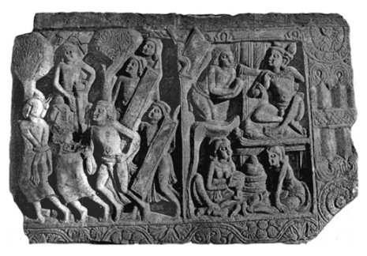

Figure 2.3 The Tale of Prince Long-life The figure above appears to depict scenes from the tale of Prince Long-life. In the larger section soldiers can be seen leading away two prisoners, probably the parents of the prince that are being brought to the place of execution. In the remaining section of the panel the upper part shows a person respectfully approaching a king, which would be the prince enrolled in the services of the king who had ordered his parents to be executed.

Nāgārjunikoṇḍa; courtesy Parimal Publications.

The Pāli Jā*taka* collection, however, identifies the prince with the bodhisattva.39 A Chinese *Jātaka* collection instead identifies the father of the prince with the bodhisattva, indicating that the prince was Ānanda in a past life.40 The disagreement between the two Jā*taka* collections on who should be identified with the bodhisattva and the absence of any such identification in the other versions gives the impression that this tale was probably not a jātaka from the outset.41 While in the cases surveyed so far, the Theravāda *Vinaya* version differed from the Jā*taka* collection of the same tradition in that it does not identify the respective tales as jā*taka*s, it does so in another case. The story in question is about an ox that refuses to perform a particular feat because its owner has addressed it in insulting words. According to the *Vinaya* report, the Buddha had delivered this tale in order to stop monks from abusing each other.

The way the Theravāda *Vinaya* concludes this story implicitly indicates that this ox was the bodhisattva in a former life;42 hence in this case the Theravāda *Vinaya* is in agreement with the corresponding Pāli jā*taka* tale.43 Versions of this story in the Dharmaguptaka, Mahīśāsaka and (Mūla-)Sarvāstivāda *Vinaya*s, as well as in a Chinese *Udāna* collection, do not have such an identification.44 The present tale in the Theravāda *Vinaya* appears to be the sole instance within the corpus of Pāli discourses and canonical *Vinaya* texts where a former life of the Buddha as an animal is recorded. Given that in other *Vinaya*s the tale does not appear as a jā*taka*, it is possible that at some point during oral transmission the wording of the present passage in the Theravāda Vinaya was influenced by the tendency - clearly apparent in the earlier surveyed instances - of considering tales from the past as records of former existences of the bodhisattva. 

The logic behind this tendency would have been based on the assumption that, when delivering teachings, the Buddha drew on such tales based on recollections from his previous lives.45 When considered from this perspective, it would not be at all surprising if during oral transmission some of the above tales should have acquired a more explicit statement of what tradition had come to believe to be anyway implicit in them, namely that each of these tales records a past life experience of the Buddha.

The reasoning underlying such assumptions can be seen in the Kūṭ*adanta-sutta* and its parallels, which report the Buddha describing a magnificent sacrifice undertaken in the past by a king and his Brahmin chaplain. One hearing this description, an eminent Brahmin present among the audience wonders if the circumstance that the Buddha does not claim to have heard of this event could imply that he had witnessed this sacrifice himself.46 The Buddha confirms that this is indeed the case. This tale thus gives canonical sanction to the reasoning that when the Buddha relates a tale without explicitly indicating that he has heard it from somewhere, then this can be assumed to be an event he remembers from his own past.

In addition to providing this precedent, the Kūṭ*adanta-sutta* and its parallels also exemplify the above-described pattern underlying the formation of some jā*taka* tales, as the Pāli version identifies the bodhisattva with the Brahmin chaplain who led the sacrifice, the Chinese version instead identifies him with the king on whose behalf the sacrifice was undertaken, and Sanskrit fragments of this discourse identify him with both.47 The tale itself has evident comic traits which,48 together with its absence from the Pāli Jātaka collection and the variations among the parallel versions on who should be identified with the bodhisattva, make it safe to assume that it was not a jā*taka* from the outset.

Nevertheless, with some of the other cases discussed above a degree of uncertainty prevails, since one may wonder if the mere lack of explicit identification makes it really certain that the tale was from the outset not conceived of as a *jātaka* - except for those cases where these tales are explicitly introduced as parables. 

Another somewhat ambivalent example would be the story of the Brahmin Mahāgovinda. In the Dī*gha-nik*āya and *Dīrgha-āgama* versions of this tale, the Buddha identifies the story of the Brahmin Mahāgovinda as a record of one of his former lives.49 In an individual translation of the same discourse, however, no such identification is found.50 This leaves open the possibility that Mahāgovinda was identified with the bodhisattva only at a later stage, thereby turning this story into a jā*taka*.

In fact, references to the same Brahmin in a discourse in the *Aṅguttara-nikāya* do not present his tale as a record of a former life of the Buddha; the same is also the case for a Madhyama-ā*gama* parallel.51 In the case of another teacher, mentioned similarly in this Aṅ*guttara-nik*āya discourse and in other Pāli discourses without being identified with the bodhisattva,52 the parallel version in the *Madhyama-āgama* does provide such identification.53 Another ambiguous case can be found in relation to the Discourse about
[the Brahmin] Velāma, the *Velāma-sutta*. The different versions of this discourse describe the lavish offerings made by a Brahmin in the bygone past, highlighting that through lack of adequate recipients the merits of this fabulous offering were no match to an act as simple as taking refuge in the Buddha. 

In the Pāli version and most of its parallels, the Buddha concludes the tale by indicating that he had been that Brahmin in the past.54 Yet, one version preserved as an individual translation does not provide such an identification.55 Thus it seems at least possible that the tale of this Brahmin and his sumptuous offerings may not always have been recognized as a past life experience of the bodhisattva.

In sum, despite some ambiguity prevailing in certain cases, the instances surveyed so far do point to a tendency for parables and similes to become jātakas by identifying one of their protagonists with the bodhisattva.

Though in several instances this tendency emerges with considerable clarity through comparative studies, in other cases the evidence does not suffice for coming to a definite conclusion.

## 2.2 Gautama Meets Kāśyapa

Keeping in mind the way some canonical jā*taka*s appear to have come into being, as well as the fact that at times only indications of this process can be found that do not allow a definite conclusion, we are now ready to turn to the record of the bodhisattva Gautama's meeting with the previous Buddha Kāśyapa. This meeting takes place at a time when Gautama's own Buddhahood is close at hand. Hence, from the traditional perspective of his prolonged career towards Buddhahood, the maturation of his spiritual qualities should manifest in an evident manner on this occasion of meeting his predecessor. 

The meeting between the two is recorded in the Ghaṭīkā*ra-sutta* of the Majjhima-nikāya, which has a parallel in the *Madhyama-āgama*.

56 Besides these two discourses versions, further parallels can be found in the *Mahāvastu* of the Lokottaravāda Mahāsāṃghika tradition, in the *Saṅghabhedavastu* of the
(Mūla-)Sarvāstivāda tradition, and in a Chinese *Avad*āna collection.57 In what follows, I survey the general narrative progression of the tale, based on the two discourse versions.

The Ghāṭīkā*ra-sutta* and its *Madhyama-āgama* parallel begin with the Buddha displaying a smile, whereon Ānanda inquires about the reasons for this smile.58 The Buddha thereupon relates a tale from the past of two friends, a potter and a young Brahmin, who live at the time of the former Buddha Kāśyapa. The potter invites the young Brahmin to come with him to visit the Buddha Kāśyapa. In reply, the young Brahmin refuses, a refusal reported in the *Ghāṭīkāra-sutta* and in its *Madhyama-āgama* parallel in the following manner:
"What [use] of [going to] see that shaven-headed petty recluse?"59
"I do not want to see [that] bald-headed recluse."60 The other versions record him using the same type of derogatory expression to refer to the Buddha Kāśyapa.61 In the Ghāṭīkā*ra-sutta*, the potter then repeats his invitation two times, and once the young Brahmin has refused these as well, they go to bathe.

After bathing the potter again invites the young Brahmin three times, and the latter again refuses up to the third time.62 The *Madhyama-āgama* version does not report any repetition of the invitation, as here the potter follows up his invitation by right away taking hold of the topknot of the young Brahmin, forcing him to descend from the chariot in which he was driving. The Ghāṭīkā*ra-sutta* depicts a more gradual build-up of the potter's physical attempts to overcome his friend's resistance. After his repeated verbal invitations have proved unsuccessful, he at first takes hold off the young Brahmin by the belt, only seizing the freshly washed hair of the young Brahmin when the latter undoes his belt.63 In both versions, the young Brahmin finally agrees to come along and thereon gets to hear a discourse from the Buddha Kāśyapa. On their way back home, the young Brahmin expresses his wish to go forth. The potter brings him back to the Buddha Kāśyapa, who at the request of the potter ordains the young Brahmin.

Next the scene shifts to Vārāṇasī, where the Buddha Kāśyapa is visited by the local king, to whom he delivers a teaching. After providing Kāśyapa and his monks with a meal on the next day, the king invites Kāśyapa to stay with him for the rains retreat period, but Kāśyapa does not accept the invitation. 

Asked by the saddened king if there is another supporter that equals him, Kāśyapa mentions the potter, who has insight into the four noble truths and is endowed with exceptionally virtuous conduct. Kāśyapa relates how on two former occasions he helped himself to food in the potter's house, having been invited to do so by the blind parents of the potter, who was away; and how on another occasion he told his monks to remove the roofing from the potter's workshop to repair his own hut. In all these instances, the potter reacted with joy and delight on finding out what had happened. Having heard this good report of the potter, the king of Vārāṇasī decides to send food supplies to the potter, which the potter politely declines - with which the tale concludes.

Considering the Ghaṭīkā*ra-sutta* and its *Madhyama-āgama* parallel as a whole, a central theme in both discourses appears to be the contrast between the potter and the king of Vārāṇasī, in the sense that due to his virtues the potter is - from the perspective of the Buddha Kāśyapa - a superior lay supporter than the wealthy and powerful king of the country. In fact, throughout the discourse the potter is the main protagonist, exhibiting the exemplary conduct of an ideal lay disciple.64 In contrast, the young Brahmin plays a role only in the first part of the tale and does not occur at all in the second part of the discourse. 

The central purpose of the Ghaṭīkā*ra-sutta* thus appears to be the depiction of an ideal lay disciple and his deep devotion to the Buddha Kāśyapa, throwing into relief how this exemplary lay follower is able to convince even a reluctant and somewhat arrogant Brahmin to pay a visit to the Buddha.

## 2.3 The Meeting With Kāśyapa As A Jātaka6 5

The *Ghāṭīkāra-sutta* and all of its parallel versions conclude by identifying the young Brahmin with the Buddha Gautama in one of his former lives.66 A discordant note in this otherwise unanimous identification comes from a passage in the *Ekottarika-āgama* preserved in Chinese, which identifies the young Brahmin from the time of the Buddha Kāśyapa with a monk who lived at the time of the Buddha Gautama.67 This would make it impossible for the young Brahmin to be the bodhisattva at the same time.

Though the indication provided in the *Ekottarika-āgama* is not decisive, it does provide a hint sufficiently strong to warrant further investigation, in that it suggests that the present tale may not always have been considered a jātaka. To explore this possibility, in what follows I examine the proposed identification of the young Brahmin with the bodhisattva from its two possible perspectives, namely from the perspective of the young Brahmin and from the perspective of the bodhisattva.

When evaluated from the perspective of the young Brahmin, a problem arises owing to his manifest lack of interest in meeting the Buddha Kāśyapa. When considered from the perspective of the developed bodhisattva ideal, for a bodhisattva to be able to meet a Buddha would be the most significant event imaginable, providing the occasion for the initial resolve to follow this path and for subsequent reaffirmations of this aspiration.68 According to a well-known tradition, whose Theravāda version is found in the *Buddhavaṃsa*, at a time in the remote past the bodhisattva Gautama was a Brahmin by the name of Sumedha. Merely hearing about the former Buddha Dīpaṃkara filled the bodhisattva with such inspiration and faith that, aspiring to become a Buddha in the future himself, he lay down in the mud as a plank so that the Buddha could walk over him.69 The Mahā*vastu* records how, at an even earlier time, in an extravagant act of pious devotion the bodhisattva scattered flower-powder worth a hundred-thousand as an offering over the Buddha Sarvābhibhū and his disciples,70 at the same time aspiring to become a Buddha himself. 

What these two tales have in common is their depiction of the deep respect and faith the bodhisattva Gautama had towards Buddhas in the distant past; something not easy to reconcile with the description in the Ghāṭīkā*ra-sutta* and its *Madhyama-āgama* parallel of the young Brahmin's reluctance even to visit the Buddha Kāśyapa, the last Buddha to arise before the advent of the Buddha Gautama. 

Regarding the young Brahmin's reluctance, while according to the *Madhyama-āgama* version of this encounter the young Brahmin refuses the potter's invitation to visit the Buddha Kāśyapa only once, in the other versions he refuses repeatedly. In the *Madhyama-āgama* account his disinclination is also more easily understandable, as according to this version he is just about to give teachings to a group of five hundred disciples, who have gathered to study under him. If he were to go and visit the Buddha Kāśyapa, as suggested by the potter, all these disciples would not be getting the instructions they are expecting of him. The same pattern continues when according to the *Madhyama-āgama* discourse he is willing to visit the Buddha Kāśyapa after his friend has taken hold of him once, whereas in the Ghaṭīkā*ra-sutta* and other versions, he only acquiesces after being taken hold of several times. The different versions agree, however, that the potter eventually took hold of the young Brahmins hair. 

In his detailed study of the implications of seizing someone's hair in ancient India, Hara (1986: 71f) explains that in a fighting situation "the seizure of the hair in single combat means complete control over one's adversary",
as "once he succeeds in holding his adversary's hair, he is in a position to behead him." Hence "being held by the hair is an unbearable humiliation." 
The Ghaṭīkā*ra-sutta* in fact makes a point of noting the extraordinary nature of this deed, reporting that the young Brahmin was rather surprised at the audacious act undertaken by someone of considerably lower social standing than himself.71 Thus it would be quite surprising for the potter to act in the way depicted in the *Madhyama-āgama* version, where after a single refusal he immediately gets onto the chariot, grabs the young Brahmin's hair and pulls him down from the chariot, an act undertaken in front of a company of five hundred disciples of the young Brahmin. When viewed from an ancient Indian perspective, this narration seems highly unlikely.72 The *Madhyama-āgama* discourse's presentation of the young Brahmin as being quickly convinced to approach the Buddha Kāśyapa could thus be an attempt to iron out the difficulty underlying this episode, according to which the potter had to be quite insistent in order to overcome the young Brahmin's reluctance to visit the Buddha. 

Another aspect of the same problem would be the way the young Brahmin formulates his objection, giving vent to his unwillingness to visit one of those "bald-headed recluses". Thus according to this episode, in a life close to the time of becoming a Buddha himself,73 the bodhisattva was not only disinclined to visit another Buddha, but even went so far as to disparage a Buddha.74 In the *Madhyama-āgama* account, the potter in fact quite explicitly tells the Buddha Kāśyapa that the young Brahmin has no faith or respect for the Buddha.75 The original point of this whole episode may have been to depict the lengths to which a faithful lay disciple like the potter is willing to go in order to convert others, in that he would even dare to seize a Brahmin's hair for the sake of getting him to pay a visit to the Buddha. Once the young Brahmin is identified with the bodhisattva Gautama, however, the episode becomes problematic.

The difficulty caused by the young Brahmin's disrespectful attitude towards a Buddha is also reflected in several works that present the six years of asceticism spent before the Buddha's awakening as the karmic result of the disparaging remark he had made about the Buddha Kāśyapa in his former life as a young Brahmin.76 The title of the Chinese *Avad*āna version reflects the same theme, announcing the contents of the tale to be on "the causes in former existences [for the Buddha's undertaking of] ascetic practices".77 In the Saṅ*ghabhedavastu*, the Buddha delivers the tale of the potter and his young Brahmin friend in reply to an inquiry by the monks about the former deeds responsible for his having to spend six years undertaking ascetic practices.78 That is, in these versions the main purpose of the present story is to explain why the Buddha practised asceticism before reaching awakening. Evidently, the for a bodhisattva rather surprising conduct did not go unnoticed.

Thus, on considering the supposed identity of the young Brahmin with the bodhisattva from the perspective of the young Brahmin, this identification can be seen to result in several difficulties.

Turning to the other aspect of this identification, when considered from the perspective of the life of the bodhisattva, a problem related to this identification is raised in the *Kathāvatthu*. This problem is: Could the Buddha Gautama claim to have been without a teacher, if not too far back in the past he had been a disciple of the Buddha Kāśyapa?79 According to the account of the Buddha's awakening given in the Mahāsaccaka-sutta and its parallels, Gautama's attainment of liberation was preceded by developing the ability to recollect past lives.80 The standard descriptions of such recollection indicate that through exercising this supernormal knowledge one will remember such information as one's name and social standing in a former life, the food eaten and the pleasurable and painful experiences one had at that time.81 Given that in the case of the bodhisattva this recollection of past lives was part of an attempt to reach awakening, one would expect his recollection soon to focus on his former life as a monk under the Buddha Kāśyapa.

The period of training as a monk under Kāśyapa would have been the nearest instance in the past where the bodhisattva had been in contact with a teaching capable of leading to liberation. According to the Pāli commentary on the Ghaṭīkā*ra-sutta*, the young Brahmin had in fact learned all of the Buddha Kāśyapa's teachings and had practised insight meditation right up to the brink of stream-entry.82 By recollecting the teachings of the Buddha Kāśyapa, the bodhisattva Gautama would have had a firsthand experience of the liberating teachings of a Buddha, which would have shown him how to proceed in order to reach awakening himself. From this perspective, it would follow that Gautama's own awakening did not really take place independently of a teacher.

Such a conclusion would to some degree conflict with the Ariyapariyesanā*-sutta* and a range of other sources, which agree in reporting that, right after his awakening, the Buddha claimed to have no teacher.83 Though one might take this to refer to the absence of a living teacher, another difficult passage would be his claim to having realized what was "unheard before",
made according to the *Dhammacakkappavattana-sutta* and a range of parallels when, soon after having reached awakening, he began to teach his five earlier companions.84 For Gautama to have heard similar teachings during his earlier lifetime under the Buddha Kāśyapa would not fit too well the way the present statement is worded, according to which he had realized what was "unheard before", not something that was just "unheard at present".

In view of the esteem accorded in ancient India to being the successor of a lineage of teachers, it would have been rather convenient for Gautama to be able to point to a past Buddha as his teacher.85 This would have enhanced his claim to having reached full awakening rather than detracting from it.

Thus, if on the night of his breakthrough to awakening he had indeed recalled the instructions received from the previous Buddha Kāśyapa, it would have been natural as well as convenient for him to indicate this when proclaiming his realization.

In fact, according to a discourse in the Saṃ*yutta-nikāya* and its parallels the Buddha considered his awakening to be a rediscovery of an ancient path, trodden by awakened ones of the past.86 This puts his assertion of having realized what was "unheard before" in perspective: He did not claim to have discovered something entirely new; instead, he considered his own realization to be a rediscovery. In view of this, his claim to have realized what was "unheard before" must be intending to highlight that he accomplished awakening independent of any direct instructions from a teacher
(which in the ancient Indian context would necessarily have been oral instructions "heard" by the disciple). It is precisely this entirely self-reliant manner of discovering the path to realization that makes him a Buddha.87 Though these considerations are in themselves not conclusive, the above discussed passages do not give the impression that the early discourses present the Buddha's awakening as simply a matter of having remembered teachings received from the previous Buddha Kāśyapa. These passages would read more naturally if one were to assume that at the time when they came into being the idea that the Buddha had been a monk disciple of the previous Buddha had not yet arisen. Thus, on considering the life of Gautama from the perspective of his supposed identity with the young Brahmin who went forth under the Buddha Kāśyapa, it seems quite possible that this identification may have come into being only at a later time. 

It is also worthy of note that the young Brahmin's encounter with the former Buddha Kāśyapa has not made its way into the Pāli Jā*taka* collection.

This stands in contrast to cases like the *Mahāsudassana-sutta* or the *Makhādeva-sutta*, for example, where besides the discourse proper a version of these former lives of the Buddha can also be found in the Jā*taka* collection.88 This absence from the Jā*taka* collection would support the impression that the present discourse may not have been considered a jā*taka* from the outset.

When considered against the background of the above studied cases of several canonical *jātaka*s, the Ghaṭīkā*ra-sutta* would not be the only instance where a didactic tale was subsequently identified as a record of a former life of the Buddha. Unlike most of the above studied jā*taka* tales, however, in the case of the Ghaṭīkā*ra-sutta* such a conclusion is less straightforward, since all extant versions agree on identifying the young Brahmin who goes forth under the Buddha Kāśyapa as the Buddha Gautama in a former life.89 Hence it is only the indication given in the *Ekottarika-āgama* and the difficulties that result from this identification that would support the assumption that the tale of the young Brahmin may not always have been held to be recording past experiences of the bodhisattva Gautama. 

Whatever may be the final word on this hypothesis, tradition clearly identifies the young Brahmin with the bodhisattva. This identification, together with an awareness of the difficulties it involves, provides the background for the remainder of the present chapter, in which I turn to the notion of the bodhisattva's vow.

## 2.4 Gautama'S Vow Under Kāśyapa

In the previous chapter of my study, I discussed a passage in the *Acchariyabbhutadhamma-sutta* of the *Majjhima-nikāya* that points to a development of considerable significance for the bodhisattva conception, where qualities a Buddha acquires through awakening are attributed to the newly born bodhisattva. 

The counterpart to the *Acchariyabbhutadhamma-sutta* in the *Madhyamaāgama*, entitled 'the Discourse on Marvellous Qualities' (未曾有法經), also contains a passage that reflects a rather important idea in relation to the bodhisattva conception. The passage in question reports the vow taken by the bodhisattva Gautama to become a Buddha in the future. This vow occurs as the first of the marvels listed in the *Madhyama-āgama*'s Discourse on Marvellous Qualities. According to this first marvel, the bodhisattva took his initial vow to become a Buddha when he was a monk under the Buddha Kāśyapa: 
"The Blessed One, at the time of the Buddha Kāśyapa, made his initial vow to [realize] Buddhahood [while] practising the holy life."90 The circumstance that the present quality is without a counterpart in the Pāli version makes it quite probable that this particular marvel is a later addition, similar to the case of the proclamation made by the bodhisattva right after being born, which is found only in the Pāli version. 

The assumption that this particular marvel may be a later addition receives further support from a closer examination of the Discourse on Marvellous Qualities in the Madhyama-ā*gama*. The bodhisattva's initial vow to pursue Buddhahood occurs not only as the first marvellous quality, but is repeated again in relation to the second marvel (the bodhisattva's rebirth in Tuṣita) and in relation to the third marvel (the bodhisattva excelling other heavenly inhabitants of Tuṣita, where moreover his rebirth in Tuṣita is also repeated). From the fourth marvel onwards, however, the discourse simply lists each marvel singly, without repeating those that had been mentioned earlier.91 The irregularity found at the beginning of the listing in relation to the bodhisattva's vow gives the impression that some form of change took place during the transmission of the discourse, quite probably caused by the inclusion of the bodhisattva's initial vow to pursue Buddhahood in the listing of marvels. 

Such an inclusion of the marvel of the bodhisattva's initial vow, taken under the previous Buddha Kāśyapa, would have been a natural result of the temporally wider frame adopted in the *Madhyama-āgama* discourse. While the *Acchariyabbhutadhamma-sutta* lists marvels that occurred from the time of the bodhisattva's arising in Tuṣita to his birth, the Madhyama-ā*gama* version covers marvels that happened before his arising in Tuṣita and marvels that took place after his birth.92 As according to the Sarvāstivāda tradition the bodhisattva's life in Tuṣita was preceded by his monkhood under the Buddha Kāśyapa,93 it is only natural that the temporally expanded framework adopted in the *Madhyama-āgama* version brings in a marvel that took place at that time. 

Another argument in support of the assumption that the bodhisattva's initial vow is a later addition to the *Madhyama-āgama* listing of marvels can be gained from the above discussed Madhyama-ā*gama* parallel to the Ghaṭīkāra-sutta that records the meeting between the Buddha Kāśyapa and the bodhisattva Gautama, who at that time was a young Brahmin. This *Madhyama-āgama* discourse does not in any way mention that the young Brahmin, who was to become the Buddha Gautama, decided to pursue the career of a bodhisattva. This is remarkable, given that this decision is reported in the Discourse on Marvellous Qualities in the same *Madhyama-āgama* collection. Such a decision would be too important to be overlooked in an account of the meeting between the bodhisattva and the Buddha Kāśyapa.

This suggests that the *Madhyama-āgama* parallel to the Ghaṭīkā*ra-sutta* may well stem from a time when the idea of a decision taken by the bodhisattva at the time of the Buddha Kāśyapa to pursue the path to Buddhahood had not yet come into being. 

Other texts associate the bodhisattva's embarking on the quest for Buddhahood with a considerably more remote lifetime. As mentioned earlier, according to the *Buddhavaṃsa* Gautama had already received a prediction of his future Buddhahood at the time of the Buddha Dīpaṃkara, the first in a series of twenty-four former Buddhas, of which Kāśyapa is the last.94 Other traditions vary, some also associating such a prediction with the time of Buddha Dīpaṃkara,95 while others allocate it to an even earlier time.96 A
general tendency apparent in these accounts is that Gautama's embarking on the quest for Buddhahood shifts ever more into the distant past. 

As a consequence of this shift, with works like the Avadānaś*ataka*, the Buddhavaṃsa, the Jā*takanidānakath*ā, the *Mahāvastu* and the Saṅ*ghabhedavastu*, the bodhisattva's meeting with the Buddha Kāśyapa acquires the function of confirming his quest.97 Such confirmation of the bodhisattva Gautama's future attainment of Buddhahood by the Buddha Kāśyapa then forms the last in a series of such proclamations made by former Buddhas. 

Now most of the sources that record the taking of such a vow by the bodhisattva Gautama or the predictions he received from other Buddhas belong to a later textual stratum than the early discourses. This makes it reasonable to assume that the *Madhyama-āgama* Discourse on Marvellous Qualities may have preserved a remnant of an incipient stage in the development of the idea that in a former life the bodhisattva Gautama made a vow to follow the path to Buddhahood. That is, in the beginning stages of the development of this idea the vow was - quite naturally one might say - associated with the Buddha that immediately preceded the Buddha Gautama.

With the passing of time and the increasing glorification of the Buddha Gautama, the period he was held to have required for developing the necessary qualifications would naturally have expanded, causing a shift of the starting point of his quest for Buddhahood to a more distant time in the past.98 In sum, the encounter between the bodhisattva and the previous Buddha Kāśyapa seems to have gone through three main stages: 
- In the first stage, represented by the Ghaṭīkā*ra-sutta* and its *Madhyamaāgama* parallel, the bodhisattva Gautama is simply identified with a young Brahmin who goes forth under the Buddha Kāśyapa. 

- With the second stage, represented by the *Madhyama-āgama* Discourse on Marvellous Qualities, this meeting inspires the bodhisattva to take a vow to become a Buddha himself. 

- With the third stage, the bodhisattva's meeting with the Buddha Kāśyapa serves to reconfirm his impending Buddhahood through a prediction, as his decision to pursue Buddhahood has already been taken much earlier.99

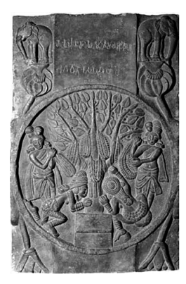

Figure 2.4 The Awakening-tree of the Buddha Kāśyapa The figure above shows the Nyagrodha tree under which the previous Buddha Kāśyapa is held to have reached his awakening. The tree is surrounded by worshippers who express their adoration with folded hands and hang garlands on its branches.100 Bhārhut; courtesy Abhinav Publications. 

100 The inscription at the top of figure 2.4 identifies the tree to be the one under which the previous Buddha Kāśyapa gained awakening, reading *bhagavato Kasapasa bodhi*, cf. Barua 1934/1979: 4; Coomaraswamy 1956: 66 (pl. 23 fig. 60); Lüders 1963: 86 (no. 760); or Tsukamoto 1996: 571 (no. 75). The significance of the Buddha Kāśyapa for early Buddhist generations in general is reflected in different *Vinaya* accounts related to his worship, cf. Bareau 1960: 257‒ 261; Schopen 1985/1997: 29; and Strong 2004: 32‒39, accounts that may well reflect actual practice during the period when these *Vinaya* passages came into being. According to Roth 1987: 292, "it appears that in the earliest period of the spread of Buddhism in India, say during the fourth and third centuries B.C., the worship of the shrine of the Śākyamuni Buddha had not yet become a common practice. Instead of this, the shrines of Śākyamuni's predecessors, as of Kāśyapa Buddha … are reported to be worshipped."
On the assumption that the Discourse on Marvellous Qualities in the *Madhyama-āgama* testifies to an incipient stage in the development of the notion that the bodhisattva took a vow to pursue the path to Buddhahood, the question could be asked whether the context in which this vow occurs provides any rationale for the arising of such a notion. In other words, does the tale found in the Ghaṭīkā*ra-sutta* and its *Madhyama-āgama* parallel give any indication as to what might have been responsible for the arising of the idea of a vow, taken by the bodhisattva at that time? 

When considered from this perspective, it is noteworthy that, after reporting that the bodhisattva went forth under the Buddha Kāśyapa, the Majjhima-nikāya and Madhyama-ā*gama* discourses give no further information about him. That is, in these two discourses the potter shows exemplary conduct and exhibits praiseworthy qualities, whereas nothing particularly inspiring is recorded about the bodhisattva. This is remarkable, since the bodhisattva usually, though not exclusively, assumes the role of a shining example in a jā*taka*, as from the perspective of tradition the events portrayed serve to highlight some particular quality he developed during that life in the past.101 In the present case, however, in a former life of the bodhisattva Gautama at a very close temporal distance to his lifetime as a Buddha, he plays only a secondary role in the story. Instead of exhibiting an inspiring conduct, the bodhisattva does not even want to meet a Buddha and makes a derogatory remark about him. Another noteworthy aspect of this tale is that, once he has developed faith and has gone forth as a monk under the Buddha Kāśyapa, nothing more is heard about him. No exemplary deed or attainment worth recording is reported in the Ghaṭīkā*ra-sutta* or in its Madhyama-ā*gama* parallel from the period that the bodhisattva spent as a monk under the Buddha Kāśyapa. Instead, both discourses focus on the inspiring qualities of the potter. 

Now with the *Madhyama-āgama* Discourse on Marvellous Qualities, this somewhat uninspiring record of the bodhisattva's monkhood under the previous Buddha Kāśyapa turns into a marvellous and wonderful quality through a simple but ingenious shift of perspective: It is only natural that no further attainment or distinction achieved during his life as a monk under the Buddha Kāśyapa has been recorded, as at that time he decided to pursue the career of becoming a Buddha in the future. That is, far from being a failure, his period as a monk under the previous Buddha becomes inspiring and marvellous since "at the time of the Buddha Kāśyapa, [he]
made his initial vow to [realize] Buddhahood [while] practising the holy life."102 This marvel thus explains why he did not take full advantage of the instructions on the path to awakening, directly available to him from a fully awakened Buddha, to attain liberation himself. 

The *Mahāvastu* tackles the same issue in a more explicit manner. It reports that, on an occasion after the young Brahmin had gone forth, the Buddha Kāśyapa assembled his monks and told them to sit in meditation without getting up until their defilements were destroyed.103 This instruction quite dramatically highlights the type of conduct that, from the perspective of the early discourses, would be appropriate for someone who goes forth under a Buddha. The *Mahāvastu* proceeds by recording that the young Brahmin instead aspired to become a Buddha himself. This obviously excuses him from not carrying the determined sitting to its successful conclusion.

The way the *Mahāvastu* quite directly confronts the problem of the bodhisattva's lack of attainment highlights the ingenuity of the solution to this dilemma through the idea that at that time he had decided to pursue the path to Buddhahood. In this way, a clear precedent is set for later developments, and it is only a further step to assume that the bodhisattva became a monk under the Buddha Kāśyapa precisely to promote his own progress towards Buddhahood, a step taken in the *Kathāvatthu* and in the Saṅ*ghabhedavastu*.

104 In this way, the Discourse on Marvellous Qualities in the Madhyama-ā*gama* may well testify to an important intermediate stage in the development of the bodhisattva concept, when the idea of a vow to embark on the path to Buddhahood emerges. Notably, the listings of former Buddhas in the Mahāpadāna-sutta and its parallels have not yet taken this step, as they do not establish a direct relationship between the bodhisattva and any of the former Buddhas.105 Thus the *Madhyama-āgama* Discourse on Marvellous Qualities appears to reflect a rather significant development of the bodhisattva conception, which lays a crucial foundation for the emergence of the bodhisattva ideal.

## Summary

The Ghaṭīkā*ra-sutta* and its parallels narrate how a potter convinces his reluctant friend, a young Brahmin, to visit the former Buddha Kāśyapa. The young Brahmin decides to go forth, after which the discourse no longer pays attention to him. In line with a pattern that emerges from studying several other canonical jā*taka*s, this tale could originally have been simply a didactic tale depicting the potter as an exemplary lay disciple. Nevertheless, according to the nearly unanimous account of tradition, the young Brahmin is identified with the bodhisattva Gautama in one of his former lives. 

The problem caused by the uninspiring account of the conduct of the bodhisattva at the time of the Buddha Kāśyapa, and thus in a past lifetime in close proximity to his own attainment of Buddhahood, receives an ingenious solution through a perspective proffered in the *Madhyama-āgama* Discourse on Marvellous Qualities. According to this discourse, at that time Gautama took the decision to pursue the goal of Buddhahood. With this marvel, another important ingredient of the bodhisattva ideal falls into place: the resolve to become a Buddha in the future. 

Still missing in the development surveyed so far within the textual corpus of the early discourses is the idea of a prediction of future Buddhahood given by a Buddha to an aspiring bodhisattva. Among the early discourses, a record of Gautama receiving such a prediction is not found. Nevertheless, the missing piece in the puzzle can be discovered within the same textual corpus, namely in another discourse in the *Madhyama-āgama*. In this discourse, the Buddha Gautama gives such a prediction to Maitreya, the next Buddha to arise in the future. This prediction and the role of the Buddha Maitreya in the early discourses in general is the theme of the next chapter.

The present chapter's theme is the notion of a prediction given by a Buddha to an aspiring bodhisattva, assuring his future success. Among the early discourses, the only passage in which such a prediction makes its appearance occurs in the Discourse on an Explanation about the Past (說本經) in the Madhyama-ā*gama*, whose second part describes the advent of the future Buddha Maitreya. A monk, present in the assembly hearing this description, aspires to become the Buddha Maitreya and thereupon receives a corresponding prediction from the Buddha Gautama.

Before embarking on a closer study of the discourse in question, I first survey another textual reference to the Buddha Maitreya, found in the different versions of the Discourse on the Wheel-turning King. After a summary of this discourse and a translation of the episode in question (1), I examine the implications of the differences found between the parallel versions
(2). This forms the background to my subsequent study of the Discourse on an Explanation about the Past in the *Madhyama-āgama* (3), and of the prediction received by the monk who aspires to become the future Buddha Maitreya (4). Readers interested exclusively in the theme of the bodhisattva ideal may skip the first part of the present chapter (1‒2) and turn directly to page 113.

## 3.1 Maitreya In The Discourse On The Wheel-Turning King

The future Buddha Maitreya has been a source of religious inspiration and aspiration during much of the history of Buddhism. Manifestations of his cult are evident in sculptures from ancient India and other Buddhist countries.1 According to the Theravāda chronicle *Cūlavaṃsa*, for example, several Sri Lankan kings constructed Maitreya statues;2 and from Făxiăn's (法 顯) travel records we know of a large wooden Maitreya statue in the area of modern Dardistan.3 Maitreya seems to have been not only an object of popular worship, but also appears to have exerted considerable influence on several famous Buddhist scholars. Thus the eminent Theravāda commentator Buddhaghosa concludes his magnum opus with the hope that the merit accrued by compiling the *Visuddhimagga* will enable him to reach final liberation at the time of the Buddha Maitreya.4 According to Tāranātha's History of Buddhism, during a sojourn in Tuṣita Asaṅga received teachings on Mahāyāna directly from Maitreya.5 Besides being a teacher, Maitreya also has a protective function. This can be seen in the biography of Xuánzàng (玄奘), for example, which documents how fervent devotion to Maitreya saved the Chinese pilgrim from a band of robbers intent on killing him.6 These instances exemplify only some of the multiple functions fulfilled by Maitreya throughout Buddhist history, showing him as a future teacher once he becomes the next Buddha, as a teacher who at present dwells in Tuṣita and delivers teachings, and as a source of protection for those who are devoted to him.7 Indubitably, Maitreya is a figure of considerable importance in the history of Buddhism. In the present chapter, however, my concern is solely with what can be found on him among the early discourses. Besides the Discourse on an Explanation about the Past (說本經), Maitreya occurs in the Discourse on the Wheel-turning King,8 which contains what is probably the historically earliest textual reference to the future Buddha. The Discourse on the Wheel-turning King is extant in three versions: 
- The Discourse on (the Lion's Roar of) the Wheel-turning King (*Cakkavatti-(sīhanāda)-sutta*) in the Dī*gha-nikāya*;
9
- the Discourse on the Conduct of the Wheel-turning King (轉輪聖王修行經)
in the Dī*rgha-āgama*;
10
- the Discourse on the Wheel-turning King (轉輪王經) in the *Madhyamaāgama.11*

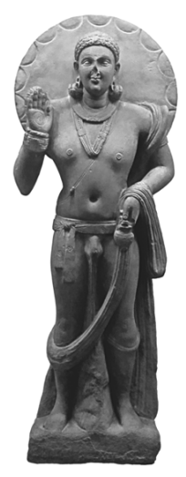

The above figure shows a standing Maitreya wearing earrings, a necklace and bracelets; his upper torso is surrounded by a halo and a thinly incised sacred thread (yajñopavīta) passes from the left shoulder to the right waist. His right hand displays the gesture of fearlessness (abhayamudrā), with a small wheel incised in the palm, while his left hand holds a little vase (kamaṇḍalu).

Mathurā; courtesy Daniel Waugh.

In what follows, I first summarize the main part of the discourse shared in common by these three versions, followed by translating the Maitreya episode from the Dī*gha-nikāya*, the *Dīrgha-āgama* and the *Madhyama-āgama* discourses respectively. Though this involves some degree of repetition, I believe that the conclusions to be drawn from comparing the three versions are weighty enough to justify such detailed treatment. 

The three versions of the Discourse on the Wheel-turning King begin with the Buddha encouraging his disciples to be self-reliant, with the Dharma as their sole refuge. The *Dīgha-nikāya* and Dīrgha-ā*gama* versions indicate that, in order to follow this advice, the monks should practise the four establishments of mindfulness (smṛ*tyupasthāna*). By keeping to their own resort in this way, Māra will not be able to get at them.

After this introductory instruction, the three versions continue with a story that serves as an illustration of the advice just given.12 This story begins with a detailed description of the splendid conditions and exceedingly long lifespan of human beings during the reign of a former wheel-turning king, who is endowed with seven treasures of magical property. One of these is the wheel-treasure, which slips from its place when the wheel-turning king's life is about to come to an end. 

On realizing that the wheel has slipped from its place, the wheel-turning king decides to abdicate the throne in favour of his crown prince and live as a recluse for the remainder of his life. The newly crowned king finds that the wheel-treasure has completely disappeared. On consulting his father he finds out that the wheel-treasure will reappear if he governs by relying on the Dharma, which will enable him to conquer the whole world peacefully and become a wheel-turning king himself. Following his father's advice, he becomes a wheel-turning king and in turn hands over power to his crownprince when the wheel slips from its place.

The same pattern continues until eventually a crown prince, on ascending the throne, does not follow the advice of his father. Instead, he governs according to his own ideas, which causes a decline in the prosperity of the country.13 Being admonished by his ministers he mends his ways, but neglects to care for the poor, as a result of which poverty spreads. Driven by poverty someone commits theft, is caught and brought before the king. On finding out that the man has stolen out of dire need, the king lets him go and gives him some wealth so that he need not steal again.14 News spreads that the king rewards those who commit theft, as a result of which stealing increases. On realizing the unintended effect of his benevolent action, the king has another thief punished, which in turn leads to a general increase of violence among the population. As a result, the lifespan of people becomes shorter and their former beauty disappears. Falsehood manifests when another thief, on being caught, denies his deed to avoid punishment.15 Things continue to get worse, people's lifespan becomes ever shorter and a continuous decline in morality and external conditions prevails. This reaches the condition of present times and continues further until at a future time a low point is reached when people live only up to ten years and morality completely disappears.16 An Armageddon type of battle ensues for seven days, during which people kill each other indiscriminately.17 During this battle period some go into hiding and decide to abstain from killing. Their practice of this moral restraint results in an increase in their lifespan and beauty, motivating them to abstain from theft,18 due to which their lifespan further increases. The same pattern continues, with improvements in morality resulting in an increase in lifespan and beauty, until eventually a peak of long lifespan and wellbeing is reached again. It is at this point, in the context of the description of the glorious condition of this future time, that Maitreya makes his appearance. In what follows, I translate the relevant section from each version.

## A) The Dīgha-Nikāya Version19

"Among people who have a lifespan of eighty thousand years, monks, a King by the name of Saṅkha will arise in the royal capital of Ketumatī. He will be a wheel-turning king, a dharmic king of the Dharma, conqueror of the four quarters, who has achieved stability in his realm and is endowed with the seven treasures. He will possess these seven treasures, namely: the wheel-treasure, the elephanttreasure, the horse-treasure, the jewel-treasure, the woman-treasure, the householder-treasure and the counsellor-treasure as the seventh. 

He will have more than a thousand sons who, being courageous and of heroic stature, will be defeaters of enemy forces. He will rule having conquered this world, surrounded by the ocean, without rod or sword, [just] by means of the Dharma.

Among people who have a lifespan of eighty thousand years, monks, a Blessed One by the name of Metteyya will arise in the world. He will be an Arhat, a Fully Awakened One, endowed with [perfect] knowledge and conduct, a Well-gone One, a knower of the world, an unsurpassed trainer of persons [capable] of being tamed, a teacher of gods and humans, a Buddha, a Blessed One; just as I now have arisen in the world, being an Arhat, a Fully Awakened One, endowed with [perfect] knowledge and conduct, a Well-gone One, a knower of the world, an unsurpassed trainer of persons [capable] of being tamed, a teacher of gods and humans, a Buddha, a Blessed One. 

He will proclaim, having himself realised with higher knowledge,
[the true nature of] this world with its gods, its Māras, its Brahmas, its recluses and Brahmins, this generation with its gods and humans; just as I now proclaim, having myself realised with higher knowledge, [the true nature of] this world with its gods, its Māras, its Brahmas, this generation with its recluses and Brahmins, its gods and humans. 

He will teach the Dharma good in the beginning, good in the middle and good in the end, with [appropriate] meaning and expressions, and will make known a holy life that is entirely perfect and pure; just as I now teach the Dharma good in the beginning, good in the middle and good in the end, with [appropriate] meaning and expressions, and make known a holy life that is entirely perfect and pure. He will be surrounded by a community of several thousands of monks;20 just as now I am surrounded by a community of several hundreds of monks. 

Then, monks, the King by the name of Saṅkha will re-erect the palace that had been constructed by the King Mahāpanāda and will live in it. 21 [Later] he will give it away and relinquish it, and making an offering to recluses, Brahmins, beggars, mendicants and the needy, he will shave his hair and beard, put on the yellow robes, and go forth from the home life to homelessness in the presence of the Blessed One Metteyya, the Arhat, the Fully Awakened One. Having gone forth in this way and dwelling alone, secluded, diligent, energetic and resolute, he will soon enough dwell having himself by direct knowledge achieved realization here and now of the supreme consummation of the holy life, for the sake of which clansmen rightly go forth from the home life to homelessness. 

Monks, dwell as islands to yourselves,22 with yourselves as a refuge, with no other refuge; dwell with the Dharma as an island, with the Dharma as a refuge, with no other refuge."
The *Dīgha-nikāya* version continues with the Buddha explaining that in order to dwell with themselves and the Dharma as an island and a refuge the monks should practice the four establishments of mindfulness. As long as the monks keep to their own resort in this way, they will grow in lifespan, beauty, happiness, wealth and strength. The Buddha then identifies lifespan to refer to the monks' practice of the roads to [psychic] power, beauty to their upholding of the precepts, happiness to their attaining meditative absorption, wealth to their practice of the divine abodes and strength to their destruction of the influxes.

## B) The Dīrgha-Āgama Version23

"At the time [when people live eighty thousand years], a Buddha will appear in the world by the name of Maitreya (Mile) Tathāgata,24 who has attained the truth and is fully awakened, endowed with the ten epithets, just as now I am a Tathāgata endowed with the ten epithets. 

In this world with its gods and humans …25 he will attain direct realization himself; just as now I in this world with its gods and humans … have attained direct realization myself.

He will teach the Dharma, which is good in the beginning, good in the middle and in the end, which is endowed with [appropriate]
meaning and expression,26 [and he will teach] the pure practice of the holy life; just as now I teach the Dharma that is [good] in the beginning, in the middle and in the end, all completely genuine, endowed with [appropriate] meaning and expression, a holy life that is pure. 

He will have a community of innumerable thousands of tenthousands of disciples; just as I nowadays have several hundred disciples. At that time, people will address those disciples by the epithet 'Sons of Maitri', just as my disciples are addressed by the epithet 'Sons of the Śākyan'.27 At that time there will be a king by the name of Śaṅkha (Rangga),28 a head-anointed warrior and wheel-turning king, who will rule over the four quarters of the world by means of the right Dharma, without any force. He will be endowed with seven treasures: the first is the golden wheel-treasure, the second is the white elephant-treasure, the third is the purplish horse-treasure, the fourth is the lustrous jewel-treasure, the fifth is the jade woman-treasure; the sixth is the householder-treasure, the seventh is the counsellor-treasure. 

The king will have a thousand sons, who will be courageous and heroic, capable of overcoming enemy forces, who will be respected in the four directions naturally and peacefully, not [needing to rely on]
soldiers equipped with weapons.29 At that time, the noble king will raise a great jewelled pillar of sixteen fathoms circumference, a thousand fathoms high.30 The pillar will be adorned and ornamented with a thousand different colours, it will have a hundred edges, each edge having a hundred sub-sections, all embroidered with jewels and with many jewels attached in between. 

Then, having destroyed this pillar, the noble king will offer it as a gift to recluses and Brahmins and to the destitute in the country. Then he will shave off his hair and beard, put on the three monastic robes and leave the home life to practise the path. Practising the supreme path he will directly realize by himself here and now that birth and death have been extinguished, the holy life has been established, what had to be done has been done, there will be no more becoming hereafter.

The Buddha told the monks: 'You should diligently cultivate wholesome conduct. Through cultivating wholesome conduct, your lifespan will be prolonged, your complexion will improve, you will be happy, richly provided with wealth and endowed with awesome strength. 

Just as kings who conducted themselves according to the ancient customs of wheel-turning kings had a prolonged lifespan, their complexion improved, they were happy, richly provided with wealth and endowed with awesome strength; in the same way, monks, by diligently cultivating wholesome customs you will have a prolonged lifespan, your complexion will improve, you will be happy, richly provided with wealth and endowed with awesome strength.'"
The *Dīrgha-āgama* version continues with the Buddha indicating that lifespan represents the monks' practice of the roads to [psychic] power, beauty their upholding of the precepts, happiness their attaining meditative absorption, wealth their practice of the divine abodes and strength their insight into the four noble truths.

## C) The Madhyama-Āgama Version31

"Monks, at the time when people have a lifespan of eighty thousand years, there will be a king named Śaṅkha (Conch-shell). He will be a wheel-turning king, intelligent and wise, who with his fourfold army will rule over the whole world, according to his wish. He will be a dharmic king of Dharma who possesses the seven treasures. These seven treasures are: the wheel-treasure, the elephant-treasure, the horse-treasure, the jewel-treasure, the woman-treasure, the householder-treasure, and the counsellor-treasure - these are reckoned to be the seven. He will have a thousand sons, who will be handsome, courageous and without fear, capable of defeating the troops of others.

He will definitely rule over the whole earth, up to the great ocean, without relying on sword or rod, [just] by teaching the Dharma, so as to achieve the well-being [of others]. Monks, he will become chief of all head-anointed warrior kings and rule over the entire world by keeping to his own resort, inherited from his forefathers. Because he keeps to his own resort, inherited from his forefathers, his lifespan will not decrease, his beauty will not deteriorate, his happiness will not disappear, and his strength will not decline.

Monks, you too should act like this. [Now that you have] shaved off your hair and beard, put on the yellow robes and out of faith left the home life to go forth and practise the path, [you should] keep to your own resort inherited from your forefathers. Monks, because of keeping to your own resort inherited from your forefathers, your lifespan will not decrease, your beauty will not deteriorate, your happiness will not disappear, and your strength will not decline."
The *Madhyama-āgama* version continues with the Buddha indicating that in order to keep to their own resort inherited from their forefathers the monks should practise the four establishments of mindfulness. He then explains that lifespan stands for the monks' practice of the roads to [psychic] power, beauty for their upholding of the precepts, happiness for their attaining meditative absorption, and strength for their destruction of the influxes.

## 3.2 The Maitreya Episode In Comparative Perspective

Besides some minor differences, the main point that emerges from comparing the above translated versions is that the placing of the occurrence of the Maitreya episode shows the following variations:
- after the description of the wheel-turning king (Dī*gha-nikāya)*; - before the description of the wheel-turning king (Dī*rgha-āgama)*;
- not found at all *(Madhyama-āgama)*. 

The complete absence of the Maitreya episode from the Madhyama-ā*gama* version could in principle be either because of a loss of text in this version or else due to an addition in the other two versions. The possibility that a reference to Maitreya was intentionally omitted by those who transmitted the Madhyama-ā*gama* can safely be set aside, as a more developed version of the advent of Maitreya can be found in the Discourse on an Explanation about the Past (說本經), to which I turn later on. Once a description of the future Buddha Maitreya exists elsewhere in the *Madhyama-āgama*, there would have been little reason for the transmitters of the *Madhyama-āgama* to eliminate a reference to the future Buddha Maitreya in the present discourse.

The *Madhyama-āgama* version also does not give the impression that an accidental loss of text has occurred. In fact, its transition towards the final advice runs smoothly, where the beginning section "Monks, you too should act like this" directly takes up the theme of the preceding paragraph on the proper conduct of the wheel-turning king who keeps to his own resort, inherited from his forefathers. In contrast, in the Theravāda version in the Dīgha-nikāya the injunction "Monks, dwell as islands to yourselves" does not have such a direct connection to the preceding paragraph. The same applies to the Dī*rgha-āgama* version's injunction to the monks that they
"should diligently cultivate wholesome conduct." The somewhat less smooth transition in these two versions could easily have occurred if the reference to Maitreya should have been subsequently added to the discourse.

This hypothesis would also fit the circumstance that in the *Dīgha-nikāya* and Dī*rgha-āgama* versions the reference to Maitreya occurs at different places vis-à-vis the depiction of the wheel-turning king. This does give the impression that a portion of text has been added in different ways. Compared to these two versions, the *Madhyama-āgama* discourse appears to testify to a state of the discourse when this addition had not yet happened.

A problem with the present passage in all versions is that, if taken literally, it presents a precise prediction of the names and actions of individuals at a rather distant time in the future. In the Pāli discourses, the present passage is thus not only the sole reference to the Buddha Maitreya, but also the sole instance where such a type of prediction is given.32 From the perspective of the early Buddhist conception of causality, to make precise predictions that at some remote time in the future someone named so-and-so will do such-and-such a thing to some degree conflicts with the notion of dependent arising (pratī*tya-samutpāda*), according to which things are conditioned but not wholly determined. To predict the far away future in such detail would require a strong form of predeterminism.33 There should not be any free will or choice operating in the lives of the people concerned - in particular in the lives of the two individuals that will become the wheel-turning king and the Buddha in the future - otherwise they might end up doing something that differs from what has been predicted. 

As Gombrich (1993: 144) has pointed out, in early Buddhist thought the kind of prediction one finds is more "what we would call prognosis."
Though in the case of an arhat a definite prediction can be given that no future life will be experienced, already when one moves beyond the time span of a single life, the situation becomes more difficult. In the cases of non-returners and once-returners, a prognosis can be given that these will reach final liberation within a single lifetime, yet some uncertainty prevails, as they might also progress further in their present life and still become arhats. Of someone who has reached stream-entry, all that can be said is that within a maximum of seven lives the final goal will be reached, but whether it will actually take that much time or less remains uncertain.34 In other contexts, the type of prognosis given in the discourses appears to be of a somewhat symbolic nature. Thus proper practice of mindfulness is said to lead to non-return or full awakening after a variable period. The description of the time it may take to reach the decisive breakthrough counts down from a period of seven years via six years, five years, four years, three years, two years, to one year, but then continues with seven months, six months, five months, four months … etc.35 The circumstance that eleven months, ten months, nine months and eight months are not mentioned makes it clear that such listings are of a symbolic type and were probably not meant to be taken literal. That is, awakening may happen even after practice has been undertaken for eight months, for example. 

 The description of the future wheel-turning king - found in all versions of the present discourse - may similarly not have been intended in a strictly literal sense. Its purpose need not have been to make a precise prediction of what will certainly happen in the far away future, but may rather have been to employ the ancient Indian symbolism of a world ruler in the context of an allegorical tale.36

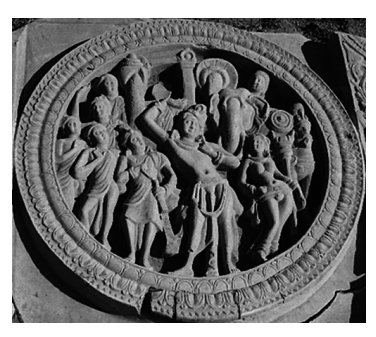

Figure 3.2 The Cakravartin Ruler The figure above shows a wheel-turning king (cakravartin), surrounded by his seven treasures. Mounted on top of the pole right behind the head of the cakravartin appears to be the jewel-treasure. Above his left shoulder the head of the elephant-treasure can be seen, standing by his side the women-treasure, and further to his left the wheel-treasure and the horse-treasure; while among the persons standing to his right are the householder-treasure and the counsellor-treasure. 

Phaṇigiri (Andhra Pradesh); courtesy Peter Skilling.

This is in fact the conclusion arrived at by Collins (1998: 481) in his detailed study of the Pāli version of the Discourse on the Wheel-turning King, in that according to him the whole narration should be considered a parable, a suggestion also made by other scholars.37 According to the Pāli commentary, when delivering the discourse the Buddha was surrounded by a large congregation of laity, monks and gods.38 With such a variegated audience, it would have been quite apt to employ an extended allegorical narration in order to convey a teaching.

The actual teaching given in the Discourse on the Wheel-turning King in its various versions is to encourage its listeners to keep to their proper resort,39 which is the central theme of the introductory advice and of the conclusion of the discourse. The Pāli commentary draws attention to this theme, quoting an extract from another discourse that employs a parable to make the same point.40 This parable describes a quail that strays outside of its proper resort and is thereupon caught by a falcon.41 The clever quail, however, is able to outwit the falcon by returning to its proper resort. Just as the quail should keep to its proper resort, so the monks should keep to the practice of mindfulness as their proper resort. 

As already mentioned in my study of the *jātaka* genre in the previous chapter,42 discourse versions of this narration found in the *Saṃyutta-nikāya* and in the Saṃyukta-ā*gama*, as well as a version of this tale in a Chinese Udāna collection, takes the form of a parable. In the Pāli Jā*taka* collection, however, the same tale has become a jā*taka*, with the clever quail identified with the bodhisattva. That is, from the perspective of the Jā*taka* collection the story of the quail describes something that actually happened at some point in the past and the bodhisattva was one of the protagonists of this event. Yet, in the discourse versions this tale appears to be simply a parable.

In fact, from the perspective of the purpose of the tale - inculcating the importance of keeping to one's own resort - to identify the quail with the Buddha in a former life would not be required.

Similarly, in the case of the Discourse on the Wheel-turning King the Madhyama-āgama version's description of the wheel-turning king who keeps to his own resort fully serves its purpose of illustrating that the monks should keep to their own resort. 

This purpose is common to the three versions, which agree that the Buddha delivered this tale to highlight the benefits of keeping to one's own resort by maintaining the ancient custom established by one's forefathers.

Following this advice, the monks can expect to experience growth in relation to a number of qualities, similar to the well-being experienced by the wheel-turning king. The qualities whose growth depends on keeping to the proper resort of mindfulness practice range from upholding the precepts via the roads to [psychic] power to meditative absorption, culminating in insight into the four noble truths or the destruction of the influxes - key aspects of the early Buddhist path to liberation. Thus the injunction given through the medium of the image of the wheel-turning king points to the very heart of the teachings of early Buddhism. 

In order to progress on the path to liberation, the monks should keep up the ancient tradition of practice transmitted to them, instead of neglecting it and following their own ideas. Though a departure from ancient customs could be well intentioned - as in the case of the king who gives wealth to a thief - swerving from tradition out of personal preferences or idiosyncrasies runs the risk of ushering in a gradual moral decline. 

In order to make this point, Maitreya need not appear at all. In fact, Maitreya does not play any role in the final advice in the three versions of the discourse, which constitutes the culmination point of the exposition. 

Collins (1998: 494) remarks that "it may seem odd, indeed unacceptable, to the dour-faced and humorless positivism with which these texts are so often read … that the earliest text-place where a reference to the future Buddha is found should be a humorous parable." Yet, Collins' interpretation receives support from a comparative study of the extant versions, which make it quite probable that the reference to the future Buddha Maitreya is a later addition. That is, the Discourse on the Wheel-turning King in its original form may not have been concerned at all with prophesying the advent of the next Buddha. 

## 3.3 Maitreya In The Discourse On An Explanation About The Past

Though Maitreya does not occur in the Discourse on the Wheel-turning King in the *Madhyama-āgama*, he does make his appearance in another discourse in the same collection, the Discourse on an Explanation about the Past (說本經). In what follows, I briefly survey the entire discourse, followed by translating the episode in question.

The Discourse on an Explanation about the Past begins with the monks discussing whether a lay person would derive greater benefit from giving alms to a virtuous monk or from making a fortune.43 To illustrate the superiority of providing a virtuous recipient with food, Anuruddha describes how in a past life as a poor scavenger he offered a meal to a Pratyekabuddha, as a result of which he was reborn seven times as a king of gods and seven times as a king of men.44 The Buddha, who has overheard the conversation with his divine ear, joins the monks. Being told that Anuruddha has been delivering a tale of the past, the Buddha proposes to teach a tale of the future, to which the monks happily agree. 

The Buddha thereupon narrates in detail how in a future time, when human lifespan will reach up to eighty thousand years, a wheel-turning king by the name of Śaṅkha will arise, who eventually will go forth and reach liberation. On hearing this description, a monk by the name of Ajita stands up and, with hands held in respectful gesture towards the Buddha, aspires to become the wheel-turning King Śaṅkha at that future time. The Buddha rebukes Ajita for postponing what could already be accomplished now - namely attaining liberation - after which he nevertheless predicts that Ajita will indeed become the wheel-turning King Śaṅkha.

The Buddha continues by describing the Buddha Maitreya under whom Śaṅkha will go forth. Another monk by the same name of Maitreya stands up and, with hands held in respectful gesture towards the Buddha, formulates the aspiration of becoming the future Buddha Maitreya. The Buddha praises him for making such an aspiration, predicts that he will indeed become the future Buddha Maitreya, and bestows a golden coloured robe on him.45 Māra enters the scene, trying to confound the listening assembly of disciples with a set of stanzas in praise of being reborn as a handsome, well adorned and merry-making citizen in the realm of the future King Śaṅkha.

The Buddha immediately recognizes him and replies with a set of stanzas in praise of living the holy life under the future Buddha Maitreya for the sake of liberation. The discourse ends with the disappearance of the defeated Māra and the delight of the listening monks.

A significant difference between the present discourse and descriptions of the future wheel-turning King Śaṅkha and the Buddha Maitreya in the versions of the Discourse on the Wheel-turning King is that the latter do not record anyone who, while listening to this tale, forms the aspiration of becoming either the future wheel-turning king or the future Buddha.46 The same is also the case for partial parallels in the Ekottarika-ā*gama* and in an Udāna collection extant in Chinese translation.47 An exception to this pattern is a discourse preserved as an individual translation into Chinese, which in other respects is so similar to the Discourse on an Explanation about the Past in the *Madhyama-āgama* that it quite probably stems from a closely related transmission lineage.48 Thus, apart from the Madhyama-ā*gama* Discourse on an Explanation about the Past and this parallel version, within the textual corpus of the Pāli *Nikāya*s and Chinese Ā*gama*s such future aspirations do not appear to be recorded. Given that the presentation in this *Madhyama-āgama* discourse differs from the version of the Discourse on the Wheel-turning King found in the same Madhyama-ā*gama* collection, the present case appears to be comparable to the two *Madhyama-āgama* discourses discussed in the previous chapter of my study, which appear to reflect subsequent stages in the textual evolution of the meeting between the bodhisattva Gautama and the previous Buddha Kāśyapa. 

In the present case, two discourses in the *Madhyama-āgama* collection similarly seem to testify to different moments in the development of a tale that appears to have gone through three main stages:
- In the first stage, reflected in the *Madhyama-āgama* Discourse on the Wheel-turning King, the future realm of the wheel-turning King Śaṅkha is just described without a reference to Maitreya at all. 

- With the second stage, represented by the Dī*gha-nikāya* and Dī*rgha-āgama* versions of the Discourse on the Wheel-turning King, the future advent of Maitreya has become part of the narration. 

- The third stage appears to manifest with the Discourse on an Explanation about the Past in the *Madhyama-āgama* (說本經), where the description of the advent of the future Buddha Maitreya becomes the occasion for a listener to aspire to becoming the Buddha at that future time.

The tale of the future King Śaṅkha suits the Discourses on the Wheel-turning King quite well, which begins with the reign of another wheel-turning king in the past, followed by depicting a gradual decline of living conditions in the world that in turn leads over to a gradual improvement of conditions that eventually culminate in the reign of the wheel-turning King Śaṅkha.

In contrast, judging from its title the *Madhyama-āgama* Discourse on an Explanation about the Past may initially have been concerned only with the past, namely with the *avad*āna of Anuruddha.49 This tale of Anuruddha's past life experiences also fits the introductory narration of the discourse, as it provides an illustration of the benefits of giving alms to a virtuous monk, whose merits excel any material wealth.

For the Buddha then to come in and propose to relate a tale of the future is unusual in view of a standard pattern found in other early discourses. According to this standard pattern, on coming to join a group of monks the Buddha will continue with the theme the monks have been discussing.50 The present case differs, in that here the Buddha right away broaches a different subject.51 This gives the impression that the tale of Śaṅkha and Maitreya may have been appended to a discourse that originally was only concerned with the former life of Anuruddha, the two parts being fused together through the introduction of a proposal by the Buddha that he may give a teaching related to the future.52 50 Among passages that I have been able to locate among the Pāli *Nikāya*s and the Chinese Ā*gama*s, which report the Buddha joining a group of monks in discussion, none depicts him as broaching a different topic in the way this happens in MĀ 66. Instead, two patterns can be observed on such occasions. One is that the Buddha delivers further teachings on the topic the monks had been discussing, examples for which are: DN 1 at DN I
2,33 and its parallels DĀ 21 at T I 88c9, T 21 at T I 264b12, Weller 1934: 8,28 (§ 8) and D
(4094) *mngon pa, ju* 142a7 or Q (5595) tu 163b3; DN 14 at DN II 2,6 (cf. also DN II 10,16)
and its parallels Sanskrit fragment 363 folio 115 R in Fukita 2003: 4, DĀ 1 at T I 1b26, T 2 at T I 150a17, T 4 at T I 159b9, and EĀ 48.4 at T I 790a23; MN 26 at MN I 161,34 and its parallel MĀ 204 at T I 776a1; MN 119 at MN III 89,8 and its parallel MĀ 81 at T I 555a6; MN
123 at MN III 119,15 (here the Buddha encourages Ānanda to expand on the topic that has been discussed by the monks); AN 4.195 at AN II 197,19 and its parallels SHT V 1348 V in Sander 1985: 235 and MĀ 12 at T I 434b14 (here the Buddha continues a discussion that took place between a single monk and a visitor); DĀ 30 at T I 114b22; MĀ 59 at T I 493c5; MĀ 160 at T I 682c1; and EĀ 40.1 at T II 735c10. The other pattern is that the Buddha rebukes the monks for engaging in unbefitting conversation, such as in: AN 10.50 at AN V
89,13; AN 10.69 at AN V 128,29; Ud 2.2 at Ud 11,15; Ud 3.8 at Ud 31,12 (cf. also T 212 at T IV 629a5); Ud 3.9 at Ud 32,11; SĀ 408 at T II 109b10; SĀ 409 at T II 109b23; SĀ 410 at T II 109c4; SĀ 411 at T II 109c15; SĀ 412 at T II 109c29; SĀ 413 at T II 110a10; SĀ 414 at T II 110a25; SĀ 415 at T II 110b12; EĀ 47.4 at T II 781c7; EĀ 47.5 at T II 782a14 (here the rebuke comes after giving some explanations); EĀ 47.6 at T II 782c5; EĀ 47.7 at T II 783a14; cf.

also SĀ 1108 at T II 291c11 and SĀ2 37 at T II 385b21 (here the Buddha rebukes a monk for not accepting an apology). In both types of case, however, the Buddha takes up the topic that the monks have been discussing.

51 After the Buddha has joined the monks and inquired about the reason for which they have gathered, the monks reply, MĀ 66 at T I 509c1: "we were sitting together in the assembly hall today because the venerable Anuruddha has been teaching the Dharma in relation to a past event", 我等今日以尊者阿那律陀因過去事而說法故, 集坐講堂, whereupon the Buddha asks them: "do you wish to hear the Buddha teach the Dharma right now in relation to a future event?", 汝等今日欲從佛聞因未來事而說法耶, to which they agree. 

52 In fact another version of the Anuruddha tale, found in T 190 at T III 928b19 (translated in Beal 1875: 383‒385), similar to MĀ 66 reports that the Buddha overheard the tale told by Anuruddha with his divine ear (T III 929c25), but concludes at that point, without the Buddha giving a discourse on future events. Other parallel versions found in Th-a III 72,20, com-
Whatever may be the final word on the evolution of the *Madhyama-āgama* Discourse on an Explanation about the Past (and by implication of its individually translated parallel), to be sure a rather significant contribution to the development of the bodhisattva notion can be discerned at this point, even though the term 'bodhisattva' itself is not used: In these twin discourses, a monk disciple of the Buddha Gautama reveals himself as being a bodhisattva, who not only formulates his aspiration to become the next Buddha, but is also given a corresponding prediction. 

This involves a shift from a retrospective perspective prevalent in the conception of a bodhisattva representing former experiences of the present or past Buddhas to a forward perspective: a monk disciple of the present Buddha will in future become a Buddha. Though this shift is a logical consequence of the notion of multiple Buddhas,53 it is only once this shift has taken place that the bodhisattva conception can become an ideal to be emulated by others. 

## 3.4 The Prediction Of Maitreya

The prediction given according to the Discourse on an Explanation about the Past by the Buddha Gautama in reply to this monk's aspiration reads as follows:

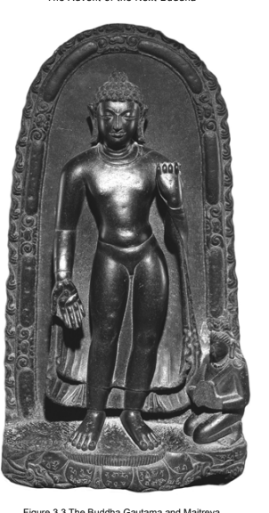

The figure above depicts Buddha Gautama standing with his right hand in the gesture of conferring a boon
(varadamudrā). He is flanked by the respectfully kneeling Maitreya, identifiable by the small stūpa he carries in his hair.

Sulṭāngañj (Bihar); courtesy Trustees of the British Museum.

"Maitreya, in the distant future, at a time when human lifespan will be eighty thousand years, you will become a Buddha called the Tathāgata Maitreya, free from attachment and fully awakened, endowed with knowledge and conduct, a Well-gone One, a knower of the world, an unsurpassable person, charioteer of the path of Dharma,54 a teacher of gods and men, called a Buddha, an assembly of blessings –
just as now I am a Tathāgata, free from attachment and fully awakened, endowed with knowledge and conduct, a Well-gone One, a knower of the world, an unsurpassable person, charioteer of the path of Dharma, a teacher of gods and men, called a Buddha, an assembly of blessings. 

In this world with its gods, Māras, Brahmas, recluses and Brahmins, from men to gods, you will understand and awaken by yourself, and dwell achieving realization by yourself - just as I now in this world with its gods, Māras, Brahmas, recluses and Brahmins, from men to gods, have understood and awakened by myself, dwell having achieved realization by myself. 

You will teach the Dharma that is sublime in the beginning, sublime in the middle, and also sublime in the end, with the [right] meaning and phrasing, revealing a holy life that is endowed with purity - just as I now teach the Dharma that is sublime in the beginning, sublime in the middle, and also sublime in the end, with the
[right] meaning and phrasing, revealing a holy life that is endowed with purity.

You will spread the holy life extensively, to countless great assemblies, from men to gods, revealing it well - just as I now spread the holy life extensively, to countless great assemblies, from men to gods, revealing it well. 

You will have a community of countless hundreds and thousands of monks - just as I now have a community of countless hundreds and thousands of monks."55 In the above translated section, each of the qualities of the future Buddha Maitreya recur in the present Buddha's indication that he possesses the same qualities now. Besides this internal repetition, which emphasizes that the future Buddha Maitreya will have all the qualities and achievements with which the present Buddha Gautama is endowed, the whole above text occurs four times (with the appropriate changes between the expressions
"there will be", "I shall be" and "you will be"): 
- at first the Buddha describes the future Buddha Maitreya, - then the monk Maitreya aspires to become the future Buddha,
- then the Buddha quotes the aspiration made by Maitreya, - and lastly the Buddha predicts Maitreya's future Buddhahood. 

That is, the basic themes taken up in the above passage are brought to the notice of the audience for eight consecutive times.56 Even for those used to repetition as a characteristic feature of early Buddhist discourse, this does convey a considerable degree of emphasis by repeatedly confirming and reinforcing the central message given in this passage.57 Quite obviously it is impossible to be certain that the Discourse on an Explanation about the Past and its parallel constitute the historically first occasion for the arising of the idea of a prediction. Yet, in view of the fact that this appears to be the only instance of such a prediction within the textual corpus of the early discourses, it seems reasonable to explore the possibility that these twin discourses could be testimonies to the arising of this idea, at least until evidence - be this epigraphic, textual or iconographic –
for an earlier occurrence of this notion can be located.58 If the notion of a prediction given to a bodhisattva by a Buddha should indeed have originated in relation to the text now available to us in the Discourse on an Explanation about the Past and in its parallel, the question could be asked if the present case provides any rationale for the arising of such a notion.

Now the central message underlying the above declaration centres on the three refuges. This starts with the standard listing of the qualities of the Buddha, elsewhere employed in the discourses for recollecting the Buddha; followed by affirming realization reached on one's own, the quality that makes someone a Buddha. Next the passage describes the Dharma with another standard set of epithets, and then turns to the community of disciples, with particular emphasis on a large following of monks. 

These themes are already part of the description of the future Buddha Maitreya in the Discourses on the Wheel-turning King in the Dī*gha-nikāya* and the Dī*rgha-āgama*.

59 With the Discourse on an Explanation about the Past and its parallel, however, these same themes become considerably more tangible and alive. This takes place on the one hand through the active intervention of the two monks who will take up the central roles in this future eutopia,60 and on the other hand through the repetition of the same message again and again, something that in an oral performance situation of the text would not have failed to leave a strong impact on the audience.

The import of this passage seems to be related to a point I mentioned in the first chapter of my study: the need of the faithful to engage in some form of direct rapport with the three refuges, especially with the first refuge of the Buddha, after he has passed away. Underlying the above passage the same need makes itself felt, reflected in the description of a future time when all three refuges can be encountered again. At the time of the glorious reign of a wheel-turning king (whose description is given with the same number of repetitions), there shall be another Buddha, endowed with the same qualities as Gautama Buddha.61 Needless to say, these qualities are precisely what a faithful disciple would have been evoking regularly when recollecting the Buddha. This future Buddha will teach the Dharma to a large assembly of disciples - a rather heartening prospect at a time when the Buddha Gautama has become a fading memory of the past and his disciples are struggling to ensure their continuity amidst competing religious groups. 

Besides giving an assurance of the advent of a future Buddha, the prediction given by the Buddha Gautama establishes Maitreya as a bodhisattva, even though the term itself is not used.62 This implies that he becomes part of the lineage of Buddhas and therewith shares their qualities. Thus at the time of his last birth he will be endowed with the same superior qualities that the Discourses on Marvels attribute to the newly born Gautama, sharing the nature (*dharmat*ā) of all those who are about to become Buddhas.63 As part of the same pattern, he will also take birth and live in Tuṣita before becoming a Buddha, as is the rule for all Buddhas. 

That is, besides the explicit promise of the advent of the Buddha Maitreya, underlying the prophecy of Maitreya's future Buddhahood is also an implicit assurance of the bodhisattva Maitreya's taking up residence in Tuṣita. Thus the present passage already contains the germs of two aspects of Maitreya: the future Buddha and the present bodhisattva dwelling in Tuṣita.64 This rather effectively fills up the vacuum created by the Buddha's demise.65 In sum, the primary purpose of the above translated passage in the Discourse on an Explanation about the Past appears to be similar in kind to the two Discourses on Marvellous Qualities, in that each of these discourses addresses the needs of the faithful in search of a way of compensating for the loss of leadership and inspiration after the demise of the teacher. The Discourses on Marvellous Qualities do this by nurturing a sense of awe in regard to the qualities of the deceased Buddha. The Discourse on an Explanation about the Past more directly addresses the dilemma of the teacher's disappearance by providing a substitute for the deceased Gautama: the bodhisattva Maitreya who will continue the lineage of Buddhas by becoming the next fully-awakened Buddha.66

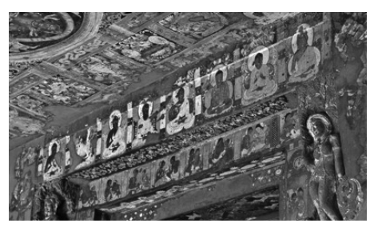

Figure 3.4 The Seven Buddhas and Maitreya The above figure shows a row of seated Buddhas, with the Buddhas of the past beginning with Dīpaṃkara up to the present Buddha Śākyamuni, to whose left sits the future Buddha Maitreya.

Ajaṇṭā; courtesy Namit Arora.

The underlying message would be an assurance of continuity. Such an assurance would be especially important for those who fail to make substantial progress now - perhaps precisely because they lack the guidance of a Buddha - reassuring them that there is no need to despair by offering them a guarantee that there is someone else ready to help those who need assistance.67 The final episode with Māra entering the scene builds on this by clarifying that the purpose of aspiring to come to the presence of Maitreya should not be for the sake of enjoyment, but rather in order to progress towards awakening. 

From this perspective, the number of repetitions of the above quoted passage in the Discourse on an Explanation about the Past - achieved through the narrative frame of an intervention by the aspiring monk and the consequent prediction by the Buddha - seem to serve mainly to strengthen the impact of the message of assurance in an oral setting. That the fourth repetition of the above paragraph takes the actual form of a Buddha giving a prediction that confirms a bodhisattva's aspiration to future Buddhahood does not appear to be central to the discourse, in fact the monk who aspires to become the future wheel-turning king receives the same type of prediction that his aspiration will be successful. The central point rather seems to be the providing of encouragement and reassurance to the audience through the medium of repeating the prophecy over and over again. 

Thus the prediction of a bodhisattva's future Buddhahood might be a by-product of the main purpose of the discourse. If the present instance should indeed be the original occasion for the arising of the notion of a prediction, which is at least possible, then the tale of the Buddha Maitreya in the Discourse on an Explanation about the Past would have had an effect similar to the tale of the meeting between Gautama and the last Buddha Kāśyapa, which may well have occasioned the arising of the notion of a vow taken by the bodhisattva to pursue the path to Buddhahood. 

The relationship between these two tales becomes particularly evident in one of the numerous versions of the Maitreya legend, in which Upāli questions the Buddha about the monk who has been predicted as the future Buddha Maitreya. In his query, Upāli expresses his puzzlement about the fact that this monk neither engages in the development of concentration nor eradicates his defilements.68 This brings to mind the problem underlying the tale of the bodhisattva Gautama's period spent as a monk disciple of the former Buddha Kāśyapa, which the *Madhyama-āgama* Discourse on Marvellous Qualities resolves through the notion of a vow taken by him at that time to pursue the path to Buddhahood. 

Building on the elements surveyed so far, discourses in the *Ekottarika-āgama* complete the picture.69 Two *Ekottarika-āgama* discourses record the Buddha presenting Maitreya, who is explicitly introduced as a bodhisattva, as an example for the monks, who should emulate his diligence.70 Another discourse in the same collection then reports how the bodhisattva Maitreya approaches the Buddha for instructions on the bodhisattva path, in particular on the development of the six perfections (*pāramit*ā).71

## Summary

A comparative study of the three extant versions of the Discourse on the Wheel-turning King suggests the earliest canonical reference to the advent of the future Buddha Maitreya to be a later addition to a narration that originally had the function of a parable. 

A more developed version of the advent of the future Buddha Maitreya, found in the Madhyama-ā*gama* Discourse on an Explanation about the Past, reports the Buddha Gautama giving a prediction to a monk who aspires to become the Buddha Maitreya in the future, assuring his future success.

With this prediction, another important element for the genesis of the bodhisattva ideal has come into being.

The starting point of my exploration were passages that describe the period from Gautama's going forth to his becoming a Buddha, depicting Gautama as a bodhisattva in quest of awakening. With the *Acchariyabbhutadhammasutta*'s exposition of marvels, qualities of the Buddha's awakening are associated with the time of his birth. This marvel reflects a shift of the bodhisattva concept in the direction of standing for a being inevitably destined to reach awakening. With the *Mahāpadāna-sutta* and its parallels, the marvels of the bodhisattva Gautama become the norm for a bodhisattva in general, thereby introducing the generic concept of a bodhisattva who is destined for awakening.

The problem caused by the uninspiring canonical record of Gautama's past life meeting with the previous Buddha finds an ingenious solution in the Discourse on Marvellous Qualities in the *Madhyama-āgama* through the idea that the bodhisattva vows to become a Buddha at the time of that meeting.

The advent of the future Buddha then could have led to the idea of a prediction given to the one who aspires to become the next Buddha, a development reflected in the Madhyama-ā*gama* Discourse on an Explanation about the Past.

With these various strands of thought - the generic notion of a bodhisattva, the idea that a bodhisattva is inevitably destined to reach awakening, the notion that a bodhisattva takes a vow to pursue the path to Buddhahood, and the prediction a bodhisattva receives from a former Buddha - the basic ingredients of the bodhisattva ideal seem to fall into place.1 A central factor behind these various strands of development that appear to have contributed to the genesis of the bodhisattva ideal seems to be the gradual apotheosis of the Buddha, evident already in the early discourses.2 This tendency to exalt the Buddha would have been a natural consequence of the vacuum created by his decease, manifesting in an increasing concern with his marvels and with his predecessors and successor(s).

In a recent study, Fujita (2009: 103) draws attention to a passage in the
*Mahāprajñāpā*ramitā(-upadeśa)-śāstra* that indicates "the existence of renunciate bodhisattvas in Nikāya Buddhism who practice the bodhisattva path while conforming, like śrā*vaka*s, to works that have been transmitted by Nikāya Buddhism."3 Similar indications can be found in the Aṣṭasāhasrikā Prajñāpā*ramit*ā.

4 Fujita's finding could point to the practical result of the above delineated development, to bodhisattvas practising based on a framework provided by the early discourses.5 Taking the early discourses as the starting point would also explain quite naturally why the bodhisattva ideal became a pan-Buddhist phenomenon that drew followers from most, if not all, of the Buddhist schools,6 including the Theravāda tradition.7 Skilling (2004: 143) explains:
"Available scriptures of the eighteen schools allow all three options: it is one's own decision whether [to] become an Arhat, a Pratyekabuddha, or a Buddha, and to practice accordingly. That is, the eighteen or four schools embrace the three yānas. At an uncertain point, let us say in the first century BCE, groups of monks, nuns and lay-followers began to devote themselves exclusively to the Bodhisattvayāna.

Eventually some of them exalted this yāna to the point of asserting that everyone else should do the same. For them the Bodhisattvayāna became the Great Vehicle, the Mahāyāna."8 Similar to the elusive beginnings of the Mahāyāna, certainty about the precise way in which the bodhisattva ideal has come into being may continue to elude us, especially since what we have at our disposal for studying the earliest period of Buddhist history are mainly textual records that are the final products of a prolonged period of oral transmission. Nevertheless, I hope that my survey of relevant material from the early discourses has yielded a new perspective and led to a viable hypothesis on how the genesis of the bodhisattva ideal may have come into being, forming the starting point for further discussion and research that will correct and refine my findings and suggestions.

Abbreviations

| Abhidh-k   | Abhidharmakośabhāṣya                       |
|------------|--------------------------------------------|
| AN         | Aṅguttara-nikāya                           |
| Ap         | Apadāna                                    |
| Be         | Burmese edition                            |
| Bv         | Buddhavaṃsa                                |
| Ce         | Ceylonese edition                          |
| Cv         | Cūlavaṃsa                                  |
| D          | Derge edition                              |
| DĀ         | Dīrgha-āgama (T 1)                         |
| Dhp-a      | Dhammapada-aṭṭhakathā                      |
| Dīp        | Dīpavaṃsa                                  |
| DN         | Dīgha-nikāya                               |
| EĀ         | Ekottarika-āgama (T 125)                   |
| Ee         | PTS edition                                |
| It         | Itivuttaka                                 |
| Jā         | Jātaka                                     |
| Kv         | Kathāvatthu                                |
| MĀ         | Madhyama-āgama (T 26)                      |
| Mil        | Milindapañha                               |
| MN         | Majjhima-nikāya                            |
| Mp         | Manorathapūraṇī                            |
| Paṭis      | Paṭisambhidāmagga                          |
| Pj         | Paramatthajotikā                           |
| Ps         | Papañcasūdanī                              |
| Q          | Peking edition                             |
| SĀ         | Saṃyukta-āgama (T 99)                      |
| SĀ2        | 'other' Saṃyukta-āgama (T 100)             |
| Se         | Siamese edition                            |
| SHT        | Sanskrithandschriften aus den Turfanfunden |
| SN         | Saṃyutta-nikāya                            |
| Sn         | Sutta-nipāta                               |
| Spk        | Sāratthappakāsinī                          |
| Sv         | Sumaṅgalavilāsinī                          |

134 The Genesis of the Bodhisattva Ideal

| T        | Taishō edition (CBETA)   |
|----------|--------------------------|
| Th       | Theragāthā               |
| Th-a     | Theragāthā-aṭṭhakathā    |
| Ud       | Udāna                    |
| Vin      | Vinaya                   |
| Vism     | Visuddhimagga            |
| Vism-mhṭ | Paramatthamañjūsā        |

Abegg, E. 1946: "Der Buddha Maitreya", *Mitteilungen der schweizerischen* Gesellschaft der Freunde ostasiatischer Kultur, 8: 7‒37.

Abeynayake, Oliver 1984: A Textual and Historical Analysis of the Khudddaka Nikāya, Colombo: Tisara Press.

Adhikari, Ruwan Bandara 1996: "Jātakabhāṇaka", in *Encyclopaedia of Buddhism*, W.G. Weeraratne (ed.), Sri Lanka: Department of Buddhist Affairs, 6 (1): 23.

Adikaram, E.W. 1946/1994: *Early History of Buddhism in Ceylon*, Dehiwala:
Buddhist Cultural Centre.

Ahir, D.C. 2000: "The Jatakas in Indian Art", in The Influence of the Jatakas on Art and Literature, D.C. Ahir (ed.), Delhi: B.R. Publishing Corporation, 1‒30.

Akanuma, Chizen 1930/1994: *A Dictionary of Buddhist Proper Names*, Delhi:
Sri Satguru.

Alsdorf, Ludwig 1977: "Das Bhūridatta-Jātaka. Ein anti-brahmanischer Nāga-Roman", *Wiener Zeitschrift für die Kunde Südasiens*, 21: 25‒55.

Anālayo 2007a: "The Arahant Ideal in Early Buddhism - The Case of Bakkula", *Indian International Journal of Buddhist Studies*, 8: 1‒21.

― 2007b: "The Divine Messengers", in *Buddhist Studies in Honour of Kirindigalle Dhammaratana*, S. Ratnayaka (ed.), Colombo: Felicitation Committee for Vihārasthāna Kāryasādhaka Samitiya, 15‒26. 

― 2008: "The Chinese Madhyama-āgama and the Pāli Majjhima-nikāya –
In the Footsteps of Thich Minh Chau", Indian International Journal of Buddhist Studies, 9: 1‒21.

― 2009a: "The Bodhisattva and Kassapa Buddha - A Study Based on the Madhyama-āgama Parallel to the Ghaṭikāra-sutta", Indian International Journal of Buddhist Studies, 10: 1‒33.

― 2009b: "Zeng-yi A-han", in *Encyclopaedia of Buddhism*, W.G. Weeraratne
(ed.), Sri Lanka: Department of Buddhist Affairs, 8 (4): 822‒827.

― 2010a: "Once Again on Bakkula", Indian International Journal of Buddhist Studies, 11: 1‒28.

― 2010b: "Teaching and Liberation - Rāhula's Awakening in the Saṃyuktaāgama", *Felicitation Volume for Professor Samtani*, L. Shravak (ed.) (forthcoming).

― 2011: *A Comparative Study of the Majjhima-nikāya*, Taipei: Dharma Drum Publ. (forthcoming). 

― 2012: "The Historical Value of the Pāli Discourses", (forthcoming).

Appleton, Naomi 2006: "The Story of the Horse-King and the Merchant Siṃhala in Buddhist Texts", *Buddhist Studies Review*, 26 (2): 187‒201.

― 2007: "A place for the Bodhisatta, The Local and the Universal in jātaka Stories", *Acta Orientalia Vilnensia*, 8 (1): 109‒122.

Armelin, I. 1975: *Le roi détenteur de la roue solaire en révolution (Cakravartin)*
selon le Brahmanisme et selon le Bouddhisme, Paris: Paul Geuthner.

Auboyer, Jeannine 1949: *Le trône et son symbolisme dan l'Inde ancienne*, Paris:
Presses Universitaires de France.

Bailey, H.W. 1939a: "The Jātaka-Stava of Jñānayaśas", Bulletin of the School of Oriental and African Studies, 9 (4): 851‒860.

― 1939b: "The Rāma Story in Khotanese", Journal of the American Oriental Society, 59 (4): 460‒468.

― 1940: "Rāma" and "Rāma II", Bulletin of the School of Oriental and African Studies, 10 (2): 365‒376 and (3): 559‒598.

― 1945/1969: *Khotanese Text I, Second Edition*, London: Cambridge University Press.

Balbir, Jagbans Kishore 1963: L'histoire de Rāma en Tibétain, D'après des Manuscrits de Touen-Houang, Édition du texte et traduction annotées, Paris:
Adrien-Maisonneuve.

Balk, Michael 1984: *Prajñāvarman's Udānavargavivaraṇa, Transliteration of its* Tibetan Version, Bonn: Indica et Tibetica.

Bapat, P.V. 1957: "Atta-dīpa in Pali Literature", in *Liebenthal Festschrift*,
Sino-Indian Studies, Volume V parts 3 & 4, K. Roy (ed.), Santiniketan: Visvabharati, 11‒13.

Bareau, André 1960: "La construction et le culte des stūpa d'après les Vinayapiṭaka", *Bulletin de l'École Française d'Extrême Orient*, 50: 229‒274.

― 1963 (vol. 1): Recherches sur la biographie du Buddha dans les Sūtrapiṭ*aka et* le Vinayapiṭaka anciens, De la quète de l'éveil a la conversion de Śā*riputra et de* Maudgalyāyana, Paris: École Française d'Extrême-Orient.

― 1966a: "Le Dīpaṃkarajātaka des Dharmaguptaka", in Mélanges de Sinologie offerts à Monsieur Paul Demiéville, Paris: Presses Universitaires de France, 1: 10‒16.

― 1966b: "L'Origine du Dīrgha-āgama traduit en Chinois par Buddhayaśas", in *Essays Offered to G.H. Luce by his Colleagues and Friends in* Honour of his Seventy-fifth Birthday, B. Shin et al. (ed.), Switzerland, Ascona: Artibus Asiae, 49‒58.

― 1974: "La jeunesse du Buddha dans les Sūtrapiṭaka et les Vinayapiṭaka anciens", *Bulletin de l'École Française d'Extrême Orient*, 61: 199‒274.

Barret, E.C.G. 1963: "Further Light on Sir Richard Winstedt's 'Undescribed Malay Version of the Ramayana'", Bulletin of the School of Oriental and African Studies, 26: 531‒543.

Barth, A. 1899: [Review of Senart 1882a, 1890, 1897], *Journal des Savants*,
453‒469, 517‒531 and 622‒631.

Barua, Benimadhab 1934/1979: Barhut Book II, Jā*taka-Scenes*, Patna: Indological Book Corporation.

Baruch, Willy 1946: "Maitreya d'après les sources de Sérinde", *Revue de* l'histoire de religions, 132: 67‒92.

Basak Radhagovinda 1963: *A Study of the Mahāvastu-avadāna*, University of Calcutta: Alumni Association.

Basham, A.L. 1951: History and Doctrine of the Ājī*vikas, A Vanished Indian* Religion, London: Luzac.

― 1981: "The Evolution of the Concept of the Bodhisattva", in The Bodhisattva Doctrine in Buddhism, L.S. Kawamura (ed.), Calgary:
Canadian Corporation for Studies in Religion, 19‒59. 

Beal, Samuel 1875: 佛本行集經, The Romantic Legend of Sâkya Buddha, From the Chinese-Sanscrit, London: Trübner.

― 1884/2001a (vol. 1), 1884/2001b (vol. 2): *Si-yu-ki, Buddhist Records of the* Western World, Translated from the Chinese of Hiuen Tsiang (A.D. 629),
Delhi: Motilal Banarsidass.

― 1911/2008: *The Life of Hiuen-Tsiang, By the Shaman Hwui Li*, Delhi: Low Price Publications. 

Bechert, Heinz, 1961: Bruchstücke buddhistischer Verssammlungen aus zentralasiatischen Sanskrithandschriften, Die Anavataptagāthā *und die Sthaviragāth*ā, Berlin: Akademie Verlag.

― 1964: "Zur Frühgeschichte des Mahāyāna-Buddhismus", *Zeitschrift der* Deutschen Morgenländischen Gesellschaft, 113: 530‒535.

― 1973: "Notes on the Formation of Buddhist Sects and the Origins of Mahāyāna", in *German Scholars on India, Contributions to Indian Studies*,
New Delhi: Chowkhamba Sanskrit Office, 1: 6‒18.

― 1978: "On the Popular Religion of the Sinhalese", in *Buddhism in Ceylon* and Studies on Religious Syncretism in Buddhist Countries, H. Bechert (ed.), Göttingen: Vandenhoeck & Ruprecht, 217‒233.

Beckh, Hermann 1911: Udānavarga, Eine Sammlung buddhistischer Sprüche in tibetischer Sprache, Berlin: Reimer.

Behm, Allan J. 1971: "The Eschatology of the Jātakas", *Numen*, 18 (1): 30‒44.

Bentor, Yael 1988: "The Redactions of the Adbhutadharmaparyāya from Gilgit", *Journal of the International Association of Buddhist Studies*, 11 (2): 21‒52.

Bernhard, Franz 1965 (vol. 1): *Udānavarga,* Göttingen: Vandenhoeck & Ruprecht.

Bernhard, Franz 1969: "Zum Titel des sogenannten 'Udānavarga'", *Zeitschrift der Deutschen Morgenländischen Gesellschaft*, Supplementa I (3):
872‒881.

Bhattacharya, Gouriswar 2000: Essays on Buddhist, Hindu, Jain Iconography and Epigraphy, Dhaka: International Centre for Study of Bengal Art.

Bingenheimer, Marcus 2008: "The Suttas on Sakka in Āgama and Nikāya Literature - With Some Remarks on the Attribution of the Shorter Chinese Saṃyuktāgama", *Buddhist Studies Review*, 25 (2): 149‒173.

― 2009: "More Suttas on Sakka and why the Shorter Chinese Saṃyuktāgama should not be Attributed to the Kāśyapīya School", *Buddhist* Studies Review, 26 (1): 127‒153.

Biswas, Sampa 2009: "Depiction of Dīpaṅkara Jātaka in North-West India, Afghanistan and Central Asia", in The Art of Central Asia and the Indian Subcontinent in Cross-Cultural Perspective, A. Pande (ed.), Delhi: Ariyan Books International, 97‒102.

Bloch, Jules 1950: *Les inscriptions d'Asoka, Traduites et commentées,* Paris: Société d'Édition Les Belles Lettres.

Bodhi, Bhikkhu 2003: "The Early Canonical Conception of the Buddha, An Antinomy of Historical Reflection", in Praṇāmalekhā, Essays in Honour of Ven. Dr. Medagama Vajiragnana, W. Wimalajothi et al. (ed.), London: Buddhist Vihara, 288‒304.

Bollée, Willem B. 2005: "Physical Aspects of Some Mahāpuruṣas, Descent, Foetality and Birth", *Wiener Zeitschrift für die Kunde Südasiens*, 49: 5‒34.

Bongard-Levin, Gregory et al. 1996: "The Nagaropamasūtra, An Apotropaic Text from the Saṃyuktāgama", in *Sanskrit-Texte aus dem buddhistischen Kanon, Folge 3*, Göttingen: Vandenhoeck & Ruprecht, 7‒103.

Boucher, Daniel 2008a: *Bodhisattvas of the Forest and the Formation of the* Mahāyāna, A Study and Translation of the Rāṣṭrapālaparipṛcchā-sūtra, Honolulu: University of Hawai i Press. '
― 2008b: "Is there an Early Gandhāran Source for the Cult of Avalokiteśvara?", *Journal Asiatique*, 296 (2): 297‒330.

Brockington, J.L. 1985: *Righteous Rāma, The Evolution of an Epic*, Delhi:
Oxford University Press.

Brough, John 1962/2001: The Gāndhārī *Dharmapada, Edited with an Introduction and Commentary*, Delhi: Motilal Banarsidass. Bucknell, Roderick S. 2006: "Samyukta-āgama", in *Encyclopaedia of Buddhism*, W.G. Weeraratne (ed.), Sri Lanka: Department of Buddhist Affairs, 7 (4): 684‒687.

Burnouf, Eugène 1844/1876: *Introduction à l'histoire du Buddhisme indien*,
Paris: Maisonneuve. 

Chakravarti, N.P. 1930: L'Udā*navarga Sanskrit, Texte sanscrit en transcription,*
avec traduction et annotations, suivi d'une étude critique et de planches, Paris:
Paul Geuthner.

Chakravarti, Uma 1996: *The Social Dimensions of Early Buddhism*, Delhi:
Munshiram Manoharlal.

Chandawimala, Rangama 2008: "Bodhisattva Practice in Sri Lankan Buddhism with Special Reference to the Abhayagiri Fraternity", *Indian International Journal of Buddhist Studies*, 9: 23‒43.

Chaudhary, Angraj 1994: "Causes of Variety in Buddhist Thought", in Essays on Buddhism and Pāli Literature, A. Chaudhary (ed.), Delhi: Eastern Books, 61‒67.

Chavannes, Édouard 1910 (vol. 1), 1911a (vol. 2), 1911b (vol. 3): *Cinq cents* contes et apologues, Extraits du Tripiṭ*aka chinois et traduits en Français*,
Paris: Ernest Leroux.

Choong, Mun-keat 2000: *The Fundamental Teachings of Early Buddhism, A*
Comparative Study Based on the Sūtrāṅga Portion of the Pāli SaṃyuttaNikāya and the Chinese Saṃyuktā*gama*, Wiesbaden: Harrassowitz.

Chung, Jin-Il 2006: "Dharmacakrapravartana-dharmaparyāya of the Sarvāstivāda and Mūlasarvāstivāda tradition", in *Jaina-Itihāsa-Ratna, Festschrift für Gustav Roth zum 90. Geburtstag*, U. Hüsken et al. (ed.), Marburg: Indica et Tibetica, 75‒102.

Ciurtin, Eugen 2009: "The Buddha's Earthquakes [I]. On Water, Earthquakes and Seaquakes in Buddhist Cosmology and Meditation, With an Appendix on Buddhist Art", *Stvdia Asiatica*, 10 (1‒2): 59‒123.

Clarke, Shayne 2009, "Locating Humour in Indian Buddhist Monastic Law Codes, A Comparative Approach", *Journal of Indian Philosophy*, 37: 311‒
330.

Clouston, W.A. 1887 (vol. 2): Popular Tales and Fictions, Their Migrations and Transformations, Edinburgh: William Blackwood and Sons.

Cohen, Richard S. 1995: "Discontented Categories, Hīnayāna and Mahāyāna in Indian Buddhist History", Journal of the American Academy of Religion, 63 (1): 1‒25.

Collins, Steven 1998: *Nirvana and Other Buddhist Felicities, Utopias of the Pali* Imaginaire, Cambridge: University Press.

Cone, Margaret et al. 1977: The Perfect Generosity of Prince Vessantara, A
Buddhist Epic, Oxford: Clarendon Press.

Coomaraswamy, Ananda K. 1928: "The Buddha's cūḍā, Hair, uṣṇīṣa, and Crown", *Journal of the Royal Asiatic Society*, 815‒841.

― 1956: *La sculpture de Bharhut, Annales du Musée Guimet*, Paris: Vanoest.

Cooray, H.S. 1963: "Acchariya-abbhuta-dhamma Sutta", in *Encyclopaedia of* Buddhism, G.P. Malalasekera (ed.), Sri Lanka: Department of Buddhist Affairs, 1 (2): 171‒172.

Cowell, E.B. et al. 1886: *The Divyâvadâna, A Collection of Early Buddhist* Legends, Now First Edited from the Nepalese Sanskrit Mss. in Cambridge and Paris, Cambridge: University Press.

Cowell, E.W. 1895‒1907/2000: The Jā*taka or Stories of the Buddha's Former* Births, Translated from the Pāli by Various Hands, Delhi: Asian Educational Services. 

Criegern, Oliver von 2002: Das Kūṭatāṇdyasūtra, Nach dem Dīrghā*gama Manuskript herausgegeben und übersetzt*, M.A. thesis, München: LudwigMaximilians-Universität.

Cummings, Mary 1982: *The Lives of the Buddha in the Art and Literature of* Asia, Ann Arbor: University of Michigan, Center for South and Southeast Asian Studies.

Cunningham, Alexander 1879: *The Stûpa of Bharhut, A Buddhist Monument* Ornamented with Numerous Sculptures Illustrative of Buddhist Legend and History in the Third Century B.C., London: Allen and Co.

Cutler, Sally Mellick, 1997: "Still Suffering After All These Aeons, The Continuing Effects of the Buddha's Bad Karma", in *Indian Insights,* Buddhism, Brahmanism and Bhakti, P. Connoly et al. (ed.), London: Luzac, 63‒82.

Dayal, Har 1932/1978: *The Bodhisattva Doctrine in Buddhist Sanskrit Literature*, Delhi: Motilal Banarsidass.

Deeg, Max 1995: "Origins and Development of the Buddhist Pañcavārṣika –
Part I, India and Central Asia", *Nagoya Studies in Indian Culture and Buddhism*, 16: 67‒90.

― 1999: "Das Ende des Dharma und die Ankunft des Maitreya; Endzeitund Neue-Zeit-Vorstellungen im Buddhismus mit einem Exkurs zur Kāśyapa-Legende", *Zeitschrift für Religionswissenschaft*, 7: 145‒169.

― 2005: Das Gaoseng-Faxian-Zhuan als religionsgeschichtliche Quelle, Der älteste Bericht eines chinesischen buddhistischen Pilgermönchs über seine Reise nach Indien mit Übersetzung des Textes, Wiesbaden: Harrassowitz.

― 2006: "Unwirkliche Gegner, Chinesische Polemik gegen den HīnayānaBuddhismus", in Jaina-Itihāsa-Ratna, Festschrift für Gustav Roth zum 90.

Geburtstag, U. Hüsken et al. (ed.), Marburg: Indica et Tibetica, 103‒125.

Dehejia, Vidya 1990: "On Modes of Visual Narration in Early Buddhist Art", *The Art Bulletin*, 72 (3): 374‒392.

― 1991: "Aniconism and the Multivalence of Emblems", *Ars Orientalis*, 21:
45‒66.

Deleanu, Florin 2000: "A Preliminary Study on Meditation and the Beginnings of Mahāyāna Buddhism", *Annual Report of the International Research Institute for Advanced Buddhology at Soka University*, 3: 65‒113.

Demiéville, Paul 1920: [Review of Leumann 1919], *Bulletin de l'École Française d'Extrême Orient*, 20 (4): 158‒170.

― 1950/1973: "Sur le traité de la grande vertu de sagesse traduit par É. Lamotte, t. 2", in *Choix d'Études Bouddhiques*, Leiden: Brill, 470‒490.

― 1951: "À propos du concile de Vaiśālī", *T'oung Pao*, 40: 239‒296.

Demoto, Mitsuyo 2009: "How it All Began (II), The Prabhāsa Legends of the Xianyujing", *Journal of the Centre for Buddhist Studies, Sri Lanka*, 7: 1‒
20.

Desai, Santosh N. 1970: "Rāmāyaṇa - An Instrument of Historical Contact and Cultural Transmission between India and Asia", The Journal of Asian Studies, 30 (1): 5‒20.

Deydier, Henri 1952: "Le 'Rāmāyaṇa' au Laos", *France-Asie*, 78: 871‒873.

Dhammajoti, Bhikkhu K.L. 1987: "The Mahāpadāna Suttanta and the Buddha's Spiritual Lineage", *Sri Lanka Journal of Buddhist Studies*, 1: 187‒196.

― 1995: The Chinese Version of Dharmapada, Translated with Introduction and Annotations, Sri Lanka: University of Kelaniya, Postgraduate Institute of Pali and Buddhist Studies.

Dhani Nivat 1969: "The Rama Jataka, A Lao Version of the Story of Rama",
in *Collected Articles by H.H. Prince Dhani Nivat Kromamun Bidayalabh* Brdihyakorn, Reprinted from the Journal of the Siam Society on the Occasion of his Eighty-fourth Birthday, Bangkok: The Siam Society, 73‒90.

Dietz, Siglinde 1984: Fragmente des Dharmaskandha, Ein Abhidharma-Text in Sanskrit aus Gilgit, Göttingen: Vandenhoeck & Ruprecht.

― 2007: "The Saptasūryodayasūtra", in *Indica et Tibetica 65, Festschrift für* Michael Hahn zum 65. Geburtstag von Freunden und Schülern überreicht, J.U. Hartmann et al. (ed.), Wien: Arbeitskreis für tibetische und buddhistische Studien, Universität Wien, 93‒112.

Dihle, Albrecht 1965: "Buddha und Hieronymus", *Mittellateinisches Jahrbuch*,
2: 38‒41.

Dohanian, Diran Kavork 1977: The Mahāyā*na Buddhist Sculpture of Ceylon*,
New York: Garland Publishing.

Drekmeier, Charles 1962: *Kingship and Community in Early India*, California, Stanford: Stanford University Press.

Dresden, Mark J. 1955: "The Jātakastava or 'Praise of the Buddha's Former Births', Indo-Scythian (Khotanese) Text, English Translation, Grammatical Notes, and Glossaries", Transactions of the American Philosophical Society, New Series, 45 (5): 397‒508.

Drewes, David 2007: "Revisiting the Phrase 'sa pṛthivīpradeśaś caityabhūto bhavet' and the Mahāyāna Cult of the Book", *Indo-Iranian Journal*, 50: 101‒143.

Dumont, Louis 1962: "The Conception of Kingship in Ancient India", *Contributions to Indian Sociology*, 6: 48‒77.

Duroiselle, Charles 1912/1990: "Pictorial Representations of Jātakas in Burma", *Archaeological Survey of India, Annual Report 1912*‒13, Delhi: Swati Publications, 87‒119.

Durt, Hubert 1982: "La 'Visite aux laboureurs' et la 'Méditation sous l'arbre Jambu' dans les biographies Sanskrites et Chinoises du Buddha", in Indological and Buddhist Studies, Volume in Honour of Professor J. W. de Jong on his 60th birthday, L. A. Hercus (ed.), Canberra: Faculty of Asian Studies, 95‒120.

― 1991: "Bodhisattva and Layman in the Early Mahāyāna", *Japanese Religions*, 16 (3): 1‒16.

― 2003: "The Pregnancy of Māyā, II, Māyā as Healer", *Journal of the International College for Advanced Buddhist Studies*, 6: 43‒61 (190‒171).

― 2004: "On the Pregnancy of Māyā, III, Late Episodes, A Few More Words on the Textual Sources", Journal of the International College of Postgraduate Buddhist Studies, 7: 55‒72 (216‒199).

― 2006: "The Shijiapu of Sengyou, The First Chinese Attempt to Produce a Critical Biography of the Buddha", *Journal of the International College for* Advanced Buddhist Studies, 10: 51‒86 (154‒119).

Dutt, Nalinaksha: 1984a (vol. 1), 1984c (vol. 3). *Gilgit Manuscripts, Mūlasarvāstivāda Vinayavastu, vol. III part 1‒4*, Delhi: Sri Satguru.

Ecke, Gustav et al. 1935: *The Twin Pagodas of Zayton, A Study of Later Buddhist Sculpture in China*, Cambridge, Mass.: Harvard University Press.

Eckel, Malcolm David 2008: *Bhāviveka and his Buddhist Opponents*, Cambridge, Mass.: Harvard University Press.

Edgerton, Franklin 1953/1998 (vol. 2): *Buddhist Hybrid Sanskrit Grammar and* Dictionary, Delhi: Motilal Banarsidass.

Eliade, Mircea 1948: "Sapta padāni kramati", *Bhāratiya Vidy*ā, 9: 180‒188. Emmerick, R.E. 1968: The Book of Zambasta, A Khotanese Poem on Buddhism, Edited and Translated, London: Oxford University Press.

Endo, Toshiichi 1996: "Bodhisattas in the Pāli Commentaries", *Bukky*ō Kenkyū, 25: 65‒92.

― 1997/2002: Buddha in Theravāda Buddhism, A Study of the Concept of Buddha in the Pali Commentaries, Dehiwala: Buddhist Cultural Centre.

Enomoto, Fumio 1984: "The Formation and Development of the Sarvāstivāda Scriptures", in *Proceedings of the Thirty-First International Congress of* Human Sciences in Asia and North Africa, T. Yamamoto (ed.), Tokyo: Tōhō Gakkai, 197‒198.

― 1986: "On the Formation of the Original Texts of the Chinese Āgamas",
Buddhist Studies Review, 3: 19‒30.

Feer, Léon 1875: "Études Bouddhiques, Les Jātakas", *Journal Asiatique*, 7 (5):
357‒434 and (6): 243‒306.

Filigenzi, Anna 1999: *Il Bodhisattva Maitreya nell'arte rupestre dello Swat,*
Appunti sull'iconografia e sul culto del Buddha venturo, Roma: Istituto Italiano per l'Africa e l'Oriente.

Finot, L. 1901: Rāṣṭ*rapālaparipṛcchā, Sūtra du Mahāyāna*, St. Peterburg: Academy of Sciences.

Foucher, Alfred 1903: "Les bas-reliefs du Stûpa de Sikri (Gandhâra)",
Journal Asiatique, 10 (2): 185‒330.

― 1905 (vol. 1): L'art Gréco-bouddhique du Gandhâra, Étude sur les origines de l'influence classique dans l'art Bouddhique de l'Inde et de l'Extrême-Orient, Paris: Ernest Leroux.

― 1919: "Les représentations des Jātaka dans l'art Bouddhique", Mémoires concernant l'Asie Centrale, 3: 1‒52.

― 1921: "Lettre d'Ajaṇṭā", *Journal Asiatique*, 11 (17): 201‒245.

― 1949: La vie du Bouddha, *d'après les textes et les monuments de l'Inde*, Paris:
Payot.

― 1955: *Les vies antérieures du Bouddha, d'après les textes e les monuments de* l'Inde, Choix de Contes, Paris: Presses Universitaires de France.

Fournereau, Lucien 1908 (part 2): *Le Siam ancien, archéologie - épigraphie –*
géographie, Paris: Ernest Leroux. 

Franke, R. Otto 1894: "Der drughaṇa des Mudgala Liedes (Rv. X, 102) und das Nandivisâlajâtaka", *Wiener Zeitschrift für die Kunde des Morgenlandes*,
8: 337‒343.

― 1906: "Jātaka-Mahābhārata Parallelen", Wiener Zeitschrift für die Kunde des Morgenlandes, 20: 317‒372.

― 1913: Dī*ghanikāya, Das Buch der langen Texte des buddhistischen Kanons, in* Auswahl übersetzt, Göttingen: Vandenhoeck & Ruprecht.

― 1929: "Die Legende vom Mönche Abhiya", in Königsberger Beiträge, Festgabe zur vierhunderjährigen Jubelfeier der Staats- und Universitätsbibliothek zu Königsberg Pr., Königsberg: Grage und Unzer, 115‒124.

Frauwallner, Erich 1956: *The Earliest Vinaya and the Beginnings of Buddhist* Literature, Rome: Istituto Italiano per il Medio ed Estremo Oriente.

Freiberger, Oliver 2000: *Der Orden in der Lehre, Zur religiösen Deutung des* Saṅgha im frühen Buddhismus, Wiesbaden: Harrassowitz.

Fronsdal, Egil 1998: The Dawn of the Bodhisattva Path, Studies in a Religious Ideal of Ancient Indian Buddhists with Particular Emphasis on the Earliest Extant Perfection of Wisdom Sutra, PhD thesis, Stanford University.

Fujita, Kotatsu 1982: "The Doctrinal Characteristics of Karman in Early Buddhism", in *Indological and Buddhist Studies, Volume in Honour of Professor J.W. de Jong on his Sixtieth Birthday*, L.A. Hercus et al. (ed.), Canberra:
Faculty of Asian Studies, 149‒159.

Fujita, Yoshimichi 2009: "The Bodhisattva Thought of the Sarvāstivādins and Mahāyāna Buddhism", *Acta Asiatica, Bulletin of the Institute of Eastern Culture*, 96: 99‒120.

Fukita, Takamichi 1986: "On and Around Hybrid Sanskrit in the Mahāvadānasūtra and the Saṅghabhedavastu", *Indogaku Bukkyōgaku Kenky*ū, 35
(1): 490‒488.

― 2003: *The Mahāvadānasūtra, A New Edition Based on Manuscripts Discovered in Northern Turkestan*, Göttingen: Vandenhoeck & Ruprecht.

Gaeffke, Peter 1954/1965: "The Snake-Jewel in Ancient Indian Literature",
in *Indian Linguistics, Journal of the Linguistic Society of India, Reprint* Edition of Volumes 1‒15, Poona: Deccan College, Centre of Advanced Study in Linguistics, 581‒594. 

Geiger, Wilhelm 1925/1980: Cū*lavaṃsa, Being the More Recent Part of the Mahāvaṃsa*, London: Pali Text Society.

Gethin, Rupert 2006: "Mythology as Meditation, From the Mahāsudassana Sutta to the Sukhāvatīvyūha Sūtra", *Journal of the Pali Text Society*, 28: 63‒112. 

Getty, Alice 1914: The Gods of Northern Buddhism, Their History, Iconography and Progressive Evolution Through the Northern Buddhist Countries, Oxford:
Clarendon Press.

Giteau, Madeleine 1976: *The Civilization of Angkor*, New York: Rizzoli International Publications. 

Glasenapp, Helmuth von 1925/1999: *Jainism, An Indian Religion of Salvation*,
S.B. Shrotri (trsl.), Delhi: Motilal Banarsidass.

Gnoli, Raniero 1977 (vol. 1), 1978 (vol. 2): The Gilgit Manuscript of the Saṅ-*ghabhedavastu, Being the 17th and Last Section of the Vinaya of the Mūlasarvāstivādin*, Rome: Istituto Italiano per il Medio ed Estremo Oriente.

Godakumbura, C.E. 1946: "The Rāmāyaṇa, A Version of Rāma's Story from Ceylon", *Journal of the Royal Asiatic Society of Great Britain and Ireland*, 1: 14‒22.

Gokuldas, M.A. de 1951: Significance and Importance of Jātakas, With Special Reference to Bhārhut, Calcutta: University Press.

Goloubew, Victor 1927: "Le cheval Balāha", *Bulletin de l'École Française* d'Extrême Orient, 27 (1): 223‒237.

Gombrich, Richard F. 1971/2008: Buddhist Precept and Practice, Traditional Buddhism in the Rural Highlands of Ceylon, Delhi: Motilal Banarsidass.

― 1980: "The Significance of Former Buddhas in the Theravādin Tradition", in *Buddhist Studies in Honour of Walpola Rahula*, S. Balasooriya et al.

(ed.), London: Fraser, 62‒72.

― 1985: "The Vessantara Jātaka, the Rāmāyaṇa and the Dasaratha Jātaka",
Journal of the American Oriental Society, 105 (3): 427‒437.

― 1988: *Theravāda Buddhism, A Social History from Ancient Benares to Modern* Colombo, London: Routledge & Kegan Paul.

― 1990: "How the Mahāyāna Began", *The Buddhist Forum*, 1: 21‒30. ― 1993: "Buddhist Prediction, How Open is the Future?", in Predicting the Future, L. Howe (ed.), Cambridge: University Press, 144‒168.

Gómez, Luis O. 1975: "Some Aspects of the Free-will Question in the Nikāyas", *Philosophy East and West*, 25 (1): 81‒90.

Gonda, Jan 1966: *Ancient Indian Kingship from the Religious Point of View*,
Leiden: E.J. Brill.

― 1973: "Mitra and Mitra, the Idea of 'Friendship' in Ancient India",
Indologica Taurinensia, 1: 71‒107.

Goonesekera, Lakshmi R. 1968: "Bhāṇaka", in *Encyclopaedia of Buddhism*,
G.P. Malalasekera (ed.), Sri Lanka: Department of Buddhist Affairs, 2 (4): 688‒690.

Gowans, Christopher W. 2003: *Philosophy of the Buddha*, London: Routledge. Griffiths, Paul J. 1994: *On Being Buddha, The Classical Doctrine of Buddhahood*,
Albany: State University of New York Press.

Grünwedel, Albert 1897: *Buddhistische Studien*, Berlin: Dietrich Reimer.

Guang Xing, 2002a: "The Bad Karma of the Buddha", *Buddhist Studies Review*, 19 (1): 19‒29.

― 2002b: "The Concept of the Buddha in Early Buddhism", *World Hongming Philosophical Quarterly*, 1‒21.

― 2004: "An Enquiry into the Origin of the Mahāsāṅghika Buddhology",
Indian International Journal of Buddhist Studies, 5: 41‒51.

Habata, Hiromi 2007: Die zentralasiatischen Sanskrit-Fragmente des Mahāparinirvāṇa-Mahāsūtra, Kritische Ausgabe des Sanskrittextes und seiner tibetischen Übertragung im Vergleich mit den chinesischen Übersetzungen, Marburg: Indica et Tibetica.

Hahn, Michael 2006: "How it All Began, The Very Beginning of the Buddha's bodhisattva Career, I. Haribhaṭṭa's Version of the Prabhāsa Legend", *Journal of the Centre for Buddhist Studies, Sri Lanka*, 4: 1‒81.

― 2009: "How it All Began (III), Gopadatta's Version of the Prabhāsa Legend", *Journal of the Centre for Buddhist Studies, Sri Lanka*, 7: 21‒71.

Hak, Hang Thun 1969: Ramker ou Ramayana Khmer, *Ses formes artistiques et* littéraires, Ses caractéristiques dans la vie culturelle khmère, Phnom-Penh:
Imprimerie Sangkum Reastr Niyum.

Halbfass, Wilhelm 2000: *Karma und Wiedergeburt im Indischen Denken*, Kreuzlingen: Hugendubel (Diederichs).

Haldar, J.R. 1977: *Early Buddhist Mythology*, New Delhi: Manohar.

Hamilton, Clarence H. 1950: "The Idea of Compassion in Mahāyāna Buddhism", *Journal of the American Oriental Society*, 70 (3): 145‒151.

Hara, Minoru 1980: "A Note on the Buddha's Birth Story", in *Indianisme et* Bouddhisme, Mélanges offerts à Mgr. Etienne Lamotte, Louvain-la-Neuve:
Institut Orientaliste, 143‒157.

― 1980/1989: "Textual Theme of Rāmāyaṇa in Japan", in The Ramayana Tradition in Asia, V. Raghavan (ed.), Delhi: Sahitya Akademi, 334‒347.

― 1986: "The Holding of the Hair (keśa-grahaṇa)", *Acta Orientalia*, 47: 67‒92.

― 1997: "A Note on the Buddha's Asceticism", in Bauddhavidyāsudhākaraḥ, Studies in Honour of Heinz Bechert on the Occasion of his 65th birthday, J.U.

Hartmann et al. (ed.), Swisstal-Odendorf: Indica et Tibetica, 249‒260.

― 2009: "Divine Procreation", *Indo-Iranian Journal*, 52: 217‒249.

Harrison, Paul 1978a: "Buddhānusmṛti in the Pratyutpanna-buddhasaṃmukhāvasthita-samādhi-sūtra", *Journal of Indian Philosophy*, 6: 35‒57.

― 1978b: *The Tibetan Text of the Pratyutpanna-buddha-saṃmukhāvasthitasamādhi-sūtra*, Tokyo: International Institute for Buddhist Studies.

― 1987: "Who Gets to Ride in the Great Vehicle? Self-Image and Identity Among the Followers of the Early Mahāyāna", Journal of the International Association of Buddhist Studies, 10 (1): 67‒89. 

― 1990: *The Samādhi of Direct Encounter with the Buddhas of the Present, An* Annotated English Translation of the Tibetan Version of the PratyutpannaBuddha-Saṃmukhā*vasthita-Samādhi-Sūtra with Several Appendixes relating to* the History of the Text, Tokyo: International Institute for Buddhist Studies.

― 1992: "Commemoration and Identification in Buddhānusmṛti", *In the* Mirror of Memory, Reflections on Mindfulness and Remembrance in Indian and Tibetan Buddhism, J. Gyatso (ed.), Delhi: Sri Satguru.

― 1995a: "Searching for the Origins of the Mahāyāna, What Are We Looking For?", *Eastern Buddhist*, 28 (1): 48‒69.

― 1995b: "Some Reflections on the Personality of the Buddha", *Otani* Gakuho, 74 (4): 1‒29.

Hartmann, Jens-Uwe 2006: "Maitreyavyākaraṇa", in *Buddhist Manuscripts,*
Volume III, J. Braarvig et al. (ed.), Oslo: Hermes Publishing, 7‒9.

Harvey, Peter 2007a: "Bodhisattva Career in the Theravāda", in *Encyclopedia of Buddhism*, D. Keown et al. (ed.), London: Routledge, 83‒87.

― 2007b: "'Freedom of the Will' in the Light of Theravāda Buddhist Teachings", *Journal of Buddhist Ethics*, 14: 35‒98. 

Hayashima, Osamu 2003: *Abhidharmasamuccaya and Abhidharmasamuccayabh*āṣya, Shiga, Japan, published in 3 vols. at http://www.shiga-med.ac.jp/
public/yugagyo/.

Hershock, Peter D. 2005: "Valuing Karma, A Critical Concept for Orienting Interdependence Toward Personal and Public Good", *Journal of Buddhist* Ethics, *On-line Conference on 'Revisioning Karma',* http://www.buddhistethics.org/karma12/hershock01.pdf.

Hinüber, Oskar von 1994: "Die Neun Aṅgas, Ein früher Versuch zur Einteilung buddhistischer Texte", Wiener Zeitschrift für die Kunde Süd- und Ostasiens, 38: 121‒135.

― 1996/1997: A Handbook of Pā*li Literature*, Delhi: Munshiram Manoharlal.

― 1998: Entstehung und Aufbau der Jātaka-Sammlung, Studien zur Literatur des Theravāda-Buddhismus I, Stuttgart: Franz Steiner.

― 2007: "Ein Meilenstein in der Erforschung des zentralasiatischen Buddhismus, Zu einem neuen Katalog khotan-sakischer Handschriften", in Zeitschrift der Deutschen Morgenländischen Gesellschaft, 157 (2): 385‒394. 

Hirakawa, Akira 1960: A Study of the Vinaya-Piṭaka, Tokyo: SankiboBusshorin.

― 1963: "The Rise of Mahāyāna Buddhism and its Relation to the Worship of Stupas", *The Memoirs of the Toyo Bunko*, 57‒106.

― 1990/1998: *A History of Indian Buddhism, From Śākyamuni to Early Mahāyāna*, P. Groner (trsl.), Delhi: Motilal Banarsidass.

― 1997: *Buddhist Chinese-Sanskrit Dictionary*, Tokyo: Reiyukai.

Hiraoka, Satoshi 2000: "The Sectarian Affiliation of Two Chinese Saṃyuktāgamas", *Indogaku Bukkyōgaku Kenky*ū, 49 (1): 506‒500.

― 2003: "The Structure of the Mahāvastu-avadāna", in *Buddhist and Indian* Studies in Honour of Professor Sodo Mori, Hamamatsu, Japan: Kokusai Bukkyoto Kyokai, pp. 349‒362. 

Holt, John Clifford 1993: *Anāgatavaṃsa Desanā, The Sermon of the ChronicleTo-Be*, Delhi: Motilal Banarsidass.

Horner, I.B. 1936/1979: *The Early Buddhist Theory of Man Perfected, A Study of* the Arahan Concept and of the Implications of the Aim to Perfection in Religious Life, Delhi: Oriental Books.

Horsch, Paul 1957: "The Wheel, An Indian Pattern of World-Interpretation", in *Liebenthal Festschrift, Sino-Indian Studies, Volume V parts 3 & 4*,
K. Roy (ed.), Santiniketan: Visvabharati, 62‒79.

― 1964: "Buddha's erste Meditation", *Asiatische Studien*, 17: 100‒154.

Huber, E. 1906: "Études de littérature Bouddhique", *Bulletin de l'École* Française d'Extrême Orient, 6 (1): 1‒43.

Hultzsch, E. 1886: "Ueber eine Sammlung indischer Handschriften und Inschriften", *Zeitschrift der Deutschen Morgenländischen Gesellschaft*, 40: 1‒80. 

― 1912: "Jatakas at Bharaut", Journal of the Royal Asiatic Society of Great Britain and *Ireland*, 399‒410.

Huntington, John C. 1984: "The Iconography and Iconology of Maitreya Images in Gandhara", *Journal of Central Asia*, 7 (1): 133‒178.

Huntington, Susan L. et al. 2001: The Art of Ancient India, Buddhist, Hindu, Jain, Boston: Weatherhill.

Inchang Kim 1992: *The Future Buddha Maitreya, An Iconological Study*, Delhi:
D.K. Printworld Ltd.

Irwin, John 1980: "The Axial Symbolism of the Early stūpa, An Exegesis",
in *The Stūpa, Its Religious, Historical and Architectural Significance*, A.L.

Dallapiccola et al. (ed.), Wiesbaden: Franz Steiner, 12‒38.

― 1981: "The Mystery of the (Future) Buddha's First Words", Annali dell' Istituto Universitario Orientale di Napoli, 41: 622‒660.

Ishigami, Zenno 1989: "ネパール本 'Maitreyavyākaraṇa' / Nepāru bon
'Maitreyavyākaraṇa'",インド哲学と仏教, 藤田宏達博士還暦記念 論集 / Fujita Kōtatsu Hakushi Kanrekikinenronshū*, Indotetsugaku to Bukky*ō, Kyoto: Heirakuji Shoten, 295‒310.

Iwamoto, Yutaka 1967: 佛教說話研究序說 / *Bukkyō setsuwa kenkyū josetsu*,
Kyoto: Hōzōkan. 

Jacobi, Herman 1893/1970: *Das Râmâyaṇa, Geschichte und Inhalt nebst Concordanz der gedruckten Recensionen*, Darmstadt: Wissenschaftliche Buchgesellschaft.

Jacobs, Joseph 1896: *Barlaam and Josaphat, English Lives of Buddha*, London:
David Nutt.

Jaini, Padmanabh S. 1970/2001: "Śramaṇas, Their Conflict with Brāhmanical Society", in *Collected Papers on Buddhist Studies*, P.S. Jaini (ed.),
Delhi: Motilal Banarsidass, 47‒96.

― 1988/2001: "Stages in the Bodhisattva Career of the Tathāgata Maitreya",
in *Collected Papers on Buddhist Studies*, P.S. Jaini (ed.), Delhi: Motilal Banarsidass, 451‒500.

Jayatilleke, K.N. 1968: "The Buddhist Doctrine of Karma", *The Mahābodhi*,
76: 314‒320.

Jayawardhana, Bandula 1988: "Determinism and Indeterminism", in *Encyclopaedia of Buddhism*, W.G. Weeraratne (ed.), Sri Lanka: Department of Buddhist Affairs, 4 (3): 392‒412.

Jing Yin 2005: "The Bodhisattva Precepts and the Origin of the Mahāyāna School", *Journal of the Centre for Buddhist Studies, Sri Lanka*, 3: 169‒189.

Johnston, Edward Hamilton 1936/1995: Aśvagoṣa's Buddhacarita or Acts of the Buddha, Delhi: Munshiram Manoharlal.

Jones, John Garrett 1979: Tales and Teachings of the Buddha, The Jātaka Stories in Relation to the Pāli Canon, London: Allen & Unwin.

Jones, J.J. 1949/1973 (vol. 1), 1952/1976 (vol. 2), 1956/1978 (vol. 3): *The Mahāvastu, Translated from the Buddhist Sanskrit*, London: Pali Text Society.

Jones, Dhivan Thomas 2009: "Why Did Brahmā Ask the Buddha to Teach?", *Buddhist Studies Review*, 26 (1): 85‒102.

Jong, Jan Willem de 1968: "The Magic Wall of the Fortress of the Ogresses, Apropos of āsīyati (Mahāvastu III, 86.3)", in *Pratidānam, Indian, Iranian* and Indo-European Studies Presented to Franciscus Bernardus Jacobus Kuiper on his Sixtieth Birthday, J.C. Heesterman et al. (ed.), The Hague: Mouton, 484‒487.

― 1971/1994: "Un fragment de l'histoire de Rāma en Tibétain", in *Tibetan* Studies, J.W. de Jong (ed.), Swisttal-Odendorf: Indica et Tibetica, 15‒32.

― 1972/1994: "An Old Tibetan Version of the Rāmāyaṇa", in Tibetan Studies, J.W. de Jong (ed.), Swisttal-Odendorf: Indica et Tibetica, 1‒14.

― 1982: [Review of The Stū*pa, Its Religious, Historical and Architectural Significance*, Edited by Anna Libera Dallapiccola … 1980], *Indo-Iranian Journal*,
24: 316‒318.

― 1983/1994: "The Story of Rāma in Tibet", in *Tibetan Studies*, J.W. de Jong
(ed.), Swisttal-Odendorf: Indica et Tibetica, 45‒61.

Kajiyama, Yuichi 1982: "On the Meanings of the Words Bodhisattva and Mahāsattva in Prajñāpāramitā Literature", in *Indological and Buddhist* Studies, Volume in Honour of Professor J. W. de Jong on his Sixtieth Birthday, L.A. Hercus et al. (ed.), Canberra: Faculty of Asian Studies, 253‒270.

Karashima, Seishi 2009: "The Sanskrit Fragments Or. 15010 in the Hoernle Collection", in Buddhist Manuscripts from Central Asia, The British Library Sanskrit Fragments, S. Karashima et al. (ed.), Tokyo: International Research Institute for Advanced Buddhology, Soka University, 2.1: 335‒550.

Karetzky, Patricia Eichenbaum 1992: *The Life of the Buddha, Ancient Scriptural and Pictorial Traditions*, Lanham: University Press of America.

Kariyawasam, A.G.S. 1972: "Bodhisattva", in *Encyclopaedia of Buddhism*,
G.P. Malalasekera (ed.), Sri Lanka: Department of Buddhist Affairs, 3
(2): 224‒233.

Karunaratna, Upali 1973: "Buddhology", in *Encyclopaedia of Buddhism*, G.P.

Malalasekera (ed.), Sri Lanka: Department of Buddhist Affairs, 3 (3): 490‒503.

Kats, J. 1926: "The Rāmāyaṇa in Indonesia", Bulletin of the School of Oriental and African Studies, 4: 579‒585.

Kitagawa, Joseph M. 1981: "The Career of Maitreya, With Special Reference to Japan", *History of Religions*, 21: 107‒125.

Klimkeit, Hans-Joachim 1990: *Der Buddha, Leben und Lehre*, Stuttgart:
Kohlhammer.

Kloppenborg, Ria 1982: "The Place of Maitreya in Early and Theravāda Buddhism and the Conditions for Rebirth in his Time", in *Proceedings of* the 30th International Conference of Human Sciences in Asia and North Africa 1976, México: El Colegio de México, 37‒48.

Krom, N.J. 1927 (vol. 2): Barabaḍ*ur, Archaeological Description*, The Hague:
Martinus Nijhoff.

Kudo, Noriyuki 2004: *The Karmavibhaṅga, Transliterations and Annotations of* the Original Sanskrit Manuscript from Nepal, Tokyo: International Research Institute for Advanced Buddhology, Soka University.

Kulasuriya, Ananda Salgadu 1996: "Jātaka", in *Encyclopaedia of Buddhism*,
W.G. Weeraratne (ed.), Sri Lanka: Department of Buddhist Affairs, 6 (1): 2‒23.

Kulkarni, V.M. 1990: The Story of Rā*ma in Jain Literature (As Presented by the* Ś*vetāmbara and Digambara Poets in the Prakrit, Sanskrit and Aprabhraṃśa* Languages), Ahmedabad: Saraswati Pustak Bhandar.

Kuznetsov, B.I. 1966: Rgyal Rabs Gsal Ba'i Me Long (The Clear Mirror of Royal Genealogies), Tibetan Text with Transliteration, With an Introduction in English, Leiden: E.J. Brill.

Lal Nagar, Shanti 1993: Jā*takas in Indian Art*, Delhi: Parimal Publications.

Lalou, Marcelle 1936: "L'Histoire de Rāma en Tibétain", *Journal Asiatique*,
228: 560‒562.

Lalwani, Kastur Chand 1973 (vol. 1): Sudharma Svāmī's Bhagavatī Sūtra, Prakrit Text with English Translation and Notes Based on the Commentary of Abhayadeva Sūri, Calcutta: Jain Bhawan. 

Lamotte, Étienne 1944/1981 (vol. 1), 1949/1981 (vol. 2), 1970/1976 (vol. 4),
1980b (vol. 5): Le traité de la grande vertu de sagesse de Nāgārjuna (Mahāprajñāpāramitāśā*stra)*, Louvain-la-Neuve: Institut Orientaliste.

― 1946a: "La conduite religieuse du faisan dans les textes Bouddhiques",
Le Museon, 59: 641‒653.

― 1946b: "La légende du Buddha", *Revue de l'Histoire des Religions*, 134: 37‒71. ― 1954: "Sur la formation du Mahāyāna", in *Asiatica, Festschrift Friedrich* Weller zum 65. Geburtstag gewidment von seinen Freunden, Kollegen und Schülern, J. Schubert et al. (ed.), Leizig: Harrassowitz, 377‒396.

― 1958: *Histoire du Bouddhisme Indien, Des origines à l'ère Śaka*, Louvain-laNeuve: Institut Orientaliste.

― 1980a: "Conditioned Co-production and Supreme Enlightenment", in Buddhist Studies in Honour of Walpola Rahula, S. Balasooriya et al. (ed.),
London: Fraser, 118‒132.

Lancaster, Lewis R. 1987/2005: "Maitreya", in The Encyclopedia of Religion, Second Edition, L. Jones (ed.), Detroit: Thomson Gale, 8: 5618‒5622.

Latourrette, Louis 1926: *Maîtreya le Bouddha futur*, Paris: Lemercier.

Laut, Jens Peter 1993: "Jātaka", in *Enzyklopädie des Märchens, Handwörterbuch zur historischen und vergleichenden Erzählforschung*, R. Wilhelm (ed.),
Berlin: de Gruyter, 7: 500‒507.

― 1996: "Zur neuen Hami-Handschrift eines alttürkischen buddhistischen Legendenzyklus", in Turfan, Khotan und Dunhuang, Vorträge der Tagung
'Annemarie v. Gabain und die Turfanforschung', veranstaltet von der BerlinBrandenburgischen Akademie der Wissenschaften in Berlin (9.-12. 12. 1994),
R.E. Emmerick et al. (ed.), Berlin: Akademie Verlag, 189‒199.

La Vallée Poussin, L. de 1909: "Bodhisattva", in Encyclopædia of Religion and Ethics, J. Hastings (ed.), Edinburgh: T. & T. Clark, 2: 739‒753.

― 1915: "Mahāvastu", in *Encyclopædia of Religion and Ethics*, J. Hastings
(ed.), Edinburgh: T. & T. Clark, 8: 328‒330.

Law, Bimala Churn 1930a: "Chronology of the Pāli Canon", *Annals of the* Bhandarkar Oriental Research Institute, 12 (2): 171‒201. 

― 1930b: A Study of the Mahā*vastu (Supplement)*, Calcutta: Thacker, Spink &
Co.

Le Coq, Albert von et al. 1928/1975: *Die Buddhistische Spätantike in Mittelasien,*
Ergebnisse der Kgl.-Preussischen Turfan Expeditionen, VI, Neue Bildwerke II,
Mit einem Beitrag über die Darstellungen und den Stil der Wandgemälde aus Qyzil bei Kutscha, Graz: Akademische Druck- und Verlagsanstalt.

Lefmann, S. 1902: *Lalita Vistara, Leben und Lehre des Çâkya-Buddha*, Halle:
Verlag der Buchhandlung des Waisenhauses.

Legge, James 1886/1998: *A Record of Buddhistic Kingdoms, Being an Account* by the Chinese Monk Fa-Hein of Travels in India and Ceylon (AD 399‒*414) in* Search of the Buddhist Books of Discipline, Delhi: Munshiram Manoharlal.

Leumann, Ernst 1919: *Maitreya-samiti, das Zukunftsideal der Buddhisten, Die* nordarische Schilderung in Text und Übersetzung nebst sieben andern Schilderungen in Text oder Übersetzung, Mit einer Begründung der indogermanischen Metrik, Strassburg: Karl J. Trübner.

― 1933/1966: *Das nordarische (sakische) Lehrgedicht des Buddhismus, Text und* Übersetzung, M. Leuman (ed.), Nendeln, Liechtenstein: Kraus Reprint Ltd. 

Lévi, Sylvain 1903: "La légende de Râma dans un Avadâna chinois", *Album* Kern, Opstellen geschreven ter eere van Dr. H Kern, hem aangeboden door vrienden en leerlingen op zijn zeventigsten verjaardag, Leiden: Brill, 279‒281.

― 1910: "Documents de l'Asie centrale, (Mission Pelliot), Textes Sanscrits de Touen-Houang", in *Journal Asiatique*, 10 (16): 433‒456.

― 1925: "Le Sūtra du sage et du fou dans la littérature de l'Asie Centrale",
Journal Asiatique, 207: 305‒332. 

― 1932a: Mahā*karmavibhaṅga (La grande classification des actes) et Karmavibhaṅgopadeśa (Discussion sur le Mahā Karmavibhaṅga), Textes Sanscrits* rapportés du Népal, édités et traduits avec les textes parallèles en Sanscrit, en Pali, en Tibétain, en Chinois et en Koutchéen, Paris: Ernest Leroux.

―1932b: "Maitreya le Consolateur", *Études d'orientalisme publiées par le Musée Guimet à la mémoire de Raymonde Linossier*, Paris: Ernest Leroux, 2:
355‒402.

Lewis, Todd T. 1993: "Newar-Tibetan Trade and the Domestication of Siṃhalasārthabāhu Avadāna", *History of Religions*, 33 (2): 135‒160.

― 2000: *Popular Buddhist Texts from Nepal, Narratives and Rituals of Newar* Buddhism, Albany: State University of New York Press.

Lienhard, Siegfried 1985: *Die Abenteuer des Kaufmanns Siṃhala, Eine nepalische Bilderrolle aus der Sammlung des Museums für indische Kunst Berlin*,
Berlin: Staatliche Museen Preußischer Kulturbesitz.

― 2003: "A Jaina Version of the Siṃhalāvadāna", in *Jainism and Early Buddhism, Essays in Honor of Padmanabh S. Jaini*, O. Qvarnström (ed.), Freemont: Asian Humanities Press, 505‒509.

Ling, Trevor O. 1973/1976: *The Buddha, Buddhist Civilization in India and Ceylon*, Harmondsworth, Middlesex (UK): Penguin Books.

Linrothe, Rob 1993: "Inquiries into the Origin of the Buddha Image, A
Review", *East and West*, 43 (1‒4): 241‒256.

Lohuizen-de Leeuw, Johanna Engelberta van 1995: The 'Scythian' Period, An Approach to the History, Art, Epigraphy and Palaeography of Northern India From the 1st Century B.C. to the 3rd Century A.D., Delhi: Munshiram Manoharlal.

Longhurst, A.H. 1938: The Buddhist Antiquities of Nāgārjunakoṇḍa, Madras, Presidency, Delhi: Manager of Publications. 

Luce, Gordon H. 1970 (vol. 3): *Old Burma - Early Pagán*, New York, Locust Valley: Augustin Publ.

Lü, Cheng 1963: "Āgama", in *Encyclopaedia of Buddhism*, G.P. Malalasekera
(ed.), Sri Lanka: Department of Buddhist Affairs, 1 (2): 241‒244.

Lüders, Heinrich 1897/1940: "Die Sage von Ṛṣyaśṛṅga", in Philologica Indica, Ausgewählte kleine Schriften von Heinrich Lüders, Festgabe zum siebzigsten Geburtstag am 25. Juni 1939 dargebracht von Kollegen, Freunden und Schülern, Göttingen: Vandenhoeck & Ruprecht, 1‒43.

― 1912: A List of Brahmi Inscriptions from the Earliest Times to about A.D. 400 with the Exception of those of Aśoka, Calcutta: Government Print.

― 1913: "Die Praṇidhi-Bilder im neunten Tempel von Bäzäklik", Berliner Sitzungsberichte, Sitzung der phil.-hist. Classe v. 31. Juli 1913, 864‒886.

― 1940: "Das Würfelspiel im alten Indien", in *Philologica Indica, Ausgewählte kleine Schriften von Heinrich Lüders, Festgabe zum siebzigsten Geburtstag* am 25. Juni 1939 dargebracht von Kollegen, Freunden und Schülern, Göttingen: Vandenhoeck & Ruprecht, 106‒175.

― 1941/1966: *Bhārhut und die buddhistische Literatur*, Nendeln, Liechtenstein:
Kraus Reprint Ltd.

― 1963: *Bhārhut Inscriptions*, Ootacamund: Government Epigraphist for India. 

Lutzker, Mary-Ann 1977: "Jātaka Tales at Tjandi Mendut", *Artibus Asiae*, 39
(1): 5‒12.

MacQueen, Graeme 1982: "Inspired Speech in Early Mahāyāna Buddhism II", *Religion*, 12: 49‒65.

Maggi, Mauro 2009: "Khotanese Literature", in The Literature of Pre-Islamic Iran, Companion Volume I to A History of Persian Literature, R.E. Emmerick et al. (ed.), London: Tauris, 330‒417. 

Mahony, William K. 2005: "Cakravartin", in The Encyclopedia of Religion, Second Edition, L. Jones (ed.), Detroit: Thomson Gale, 3: 1350‒1352.

Mair, Victor H. 1993: The Linguistic and Textual Antecedents of the Sūtra of the Wise and the Foolish, *Sino-Plantonic Papers* 38, Philadelphia: University of Pennsylvania, Department of East Asian Languages and Civilizations.

Majumder, Prabhas Chandra 1948: "The Kāraṇḍa Vyūha, Its Metrical Version", *Indian Historical Quarterly*, 24 (1): 293‒299.

Martini, François 1952: "Note sur l'empreinte du bouddhisme dans la version Cambodgienne du Rāmāyaṇa", *Journal Asiatique*, 240: 67‒69.

― 1961: "Quelques notes sur le Rāmker", *Artibus Asiae*, 24 (3‒4): 351‒362.

― 1978: La gloire de Rāma, Rāmakerti, Rāmāyaṇ*a Cambodgien*, Paris: Société d'Édition 'Les Belles-Lettres'.

Matsumura, Junko 2008: "The Sumedhakathā in Pāli Literature, Summation of Theravāda-tradition Versions and Proof of Linkage to the Northern Textual Tradition", *Indogaku Bukkyōgaku Kenky*ū, 56 (3): 1086‒1094.

Matsunami, Yasuo 1998: Śrā*vakabhūmi, Revised Sanskrit Text and Japanese* Translation, the First Chapter, Śravakabhūmi Study Group (ed.), Tokyo:
Sankibo.

Mayeda, Egaku 1985: "Japanese Studies on the Schools of the Chinese Āgamas", in Zur Schulzugehörigkeit von Werken der Hīnayāna-Literatur, Erster Teil, H. Bechert (ed.), Göttingen: Vandenhoeck & Ruprecht, 94‒
103.

McDermott, James P. 1989: "The Kathāvatthu Niyāma Debates", *Journal of* the International Association of Buddhist Studies, 12 (1): 139‒146.

Meech-Pekarik, Julia 1981: "The Flying White Horse, Transmission of the Valāhassa Jātaka Imagery from India to Japan", *Artibus Asiae*, 43 (1‒2): 111‒128.

Mette, Adelheid 1997: Die Gilgitfragmente des Kāraṇḍ*avyūha*, Swisstal-Odendorf: Indica et Tibetica.

Minh Chau, Thich 1991: The Chinese Madhyama Āgama and the Pāli Majjhima Nikāya, Delhi: Motilal Banarsidass.

Mitra, Rājendralāla 1882/1971: *The Sanskrit Buddhist Literature of Nepal*, Calcutta: Sanskrit Pustak Bhandar. 

Monier-Williams 1889/1995: Buddhism, In its Connexion with Brāhmanism and Hinduism and in its Contrast with Christianity, Delhi: Munshiram Manoharlal.

Mori, Sodo 1990: "The Origin and History of the Bhāṇaka Tradition", in Ā*nanda, Papers on Buddhism and Indology*, Y. Karunadasa (ed.), Colombo, 123‒129.

Murthy, K. Krishna 1987: *Glimpses of Art, Architecture and Buddhist Literature in Ancient India*, Delhi: Abhinav Publications.

Mus, Paul 1935: *Barabudur, Esquisse d'une histoire du Bouddhisme fondée sur la* critique archéologique des textes, Hanoi: Imprimerie d'Extrême-Orient. 

Myer, Prudence R. 1986: "Bodhisattvas and Buddhas, Early Buddhist Images from Mathurā", *Artibus Asiae*, 47: 107‒142.

Nakamura, Hajime 1960: "The Deification of Gotama the Man", in *Proceedings of the IXth International Congress for the History of Religion*, Tokyo:
Maruzen, 152‒160.

― 1980/1999: *Indian Buddhism, A Survey with Bibliographical Notes*, Delhi:
Motilal Banarsidass.

― 2000a (vol. 1), 2000b (vol. 2): Gotama Buddha, A Biography Based on the Most Reliable Texts, G. Sekimori (trsl.), Tokyo: Kosei Publishing Co.

Nakatani, Hideaki 1987: Udānavarga de Subaši, Édition critique du manuscrit Sanskrit sur bois provenant de Subaši, Paris: Collège de France, Institut de Civilisation Indienne.

Ñāṇamoli, Bhikkhu 1995/2005: *The Middle Length Discourses of the Buddha, A*
Translation of the Majjhima Nikāya, Bhikkhu Bodhi (ed.), Boston: Wisdom.

Ñāṇaponika Thera 1975: "Reflections on Kamma and its Fruit", in *Kamma* and its Fruit, Ñāṇaponika (ed.), Kandy: Buddhist Publication Society, 86‒95.

Ñāṇatiloka 1952/1988: *Buddhist Dictionary, Manual of Buddhist Terms and* Doctrines, Kandy: Buddhist Publication Society.

Nanayakkara, S.K. 1977: "Cakravartin", in *Encyclopaedia of Buddhism*, G.P. Malalasekera (ed.), Sri Lanka: Department of Buddhist Affairs, 3 (4): 591‒
596.

Nattier, Jan 1988: "The Meaning of the Maitreya Myth, A Typological Analysis", in *Maitreya, the Future Buddha*, A. Sponberg et al. (ed.), Cambridge:
University Press, 23‒47.

― 2003a: *A Few Good Men, The Bodhisattva Path According to The Inquiry of* Ugra (Ugraparipṛcchā), Honolulu: University of Hawai i Press. '
― 2003b: "The Ten Epithets of the Buddha in the Translations of Zhi Qian 支 謙", Annual Report of the International Research Institute for Advanced Buddhology at Soka University, 6: 207‒250.

― 2004a: "Buddha(s)", in *Encyclopedia of Buddhism*, R.E. Buswell (ed.), New York: Macmillan, 1: 71‒74.

― 2004b: "Dīpaṃkara", in *Encyclopedia of Buddhism*, R.E. Buswell (ed.),
New York: Macmillan, 1: 230.

― 2008: A Guide to the Earliest Chinese Buddhist Translations, Texts from the Eastern Han 東漢 and Three Kingdoms 三國 *Periods*, Tokyo: Soka University.

Nelson, Eric Sean 2005: "Questioning Karma, Buddhism and the Phenomenology of the Ethical", Journal of Buddhist Ethics, On-line Conference on
'Revisioning Karma', http://www.buddhistethics.org/karma12/ nelson01.pdf.

Neumann, Karl Eugen 1896/1995: Die Reden des Buddha, Mittlere Sammlung, Aus dem Pāli Kanon übersetzt, Herrnschrot: Beyerlein & Steinschulte.

Norman K.R. 1969: The Elders' Verses I, Therag*āthā*, London: Pali Text Society.

― 1983: Pā*li Literature, Including the Canonical Literature in Prakrit and Sanskrit of all the Hīnayāna Schools of Buddhism*, Wiesbaden: Harrassowitz.

― 1990/1993: "Pāli Philology and the Study of Buddhism", in *Collected Papers, Volume IV,* K.R. Norman (ed.), Oxford: The Pali Text Society, 80‒91.

Odani, Nobuchiyo 2007: "The Apotheosis of Buddha in Early Buddhist Scriptures", in *Studia Indologica, Professor Satya Ranjan Banerjee Felicitation Volume*, J.R Bhattacharyya (ed.), Delhi: Eastern Book Linkers, 434‒
442.

Ohnuma, Reiko 2004: "Jātaka", in *Encyclopedia of Buddhism*, R.E. Buswell
(ed.), New York: Macmillan, 1: 400‒401.

Okano, Kiyoshi 1998: Sarvarakṣitas Mahāsaṃvartanīkathā, Ein Sanskrit-Kāvya über die Kosmologie der Sāṃmitīya-Schule des Hīnayāna-Buddhismus, Japan:
Tohoku University, Seminar of Indology.

Oldenberg, Hermann 1879: The Dīpavaṃsa, An Ancient Buddhist Historical Record, London: Williams and Norgate.

― 1912a: "Studien zur Geschichte des buddhistischen Kanon", Nachrichten von der königlichen Gesellschaft der Wissenschaften zu Göttingen, philologisch-historische Klasse aus dem Jahre 1912, Berlin: Weidmansche Buchhandlung, 155‒217.

― 1912b: "Studien zum Mahāvastu", in Nachrichten von der königlichen Gesellschaft der Wissenschaften zu Göttingen, philologisch-historische Klasse aus dem Jahre 1912, Berlin: Weidmansche Buchhandlung, 123‒154.

Oltramare, Paul 1923: *L'Histoire des ideés théosophiques dans l'Inde, La* théosophie Bouddhique, Paris: Librairie Orientaliste Paul Geuthner.

Panglung, Jampa Losang 1981: Die Erzählstoffe des Mūlasarvāstivāda-Vinaya, Analysiert auf Grund der tibetischen Übersetzung, Tokyo: Reiyukai Library.

Pāsādika, Bhikkhu 2001: "The Origins of Mahāyāna", in Life, Thought and Culture in India (from c. 600 BC to c. AD 300), G.C. Pande (ed.), Delhi:
Centre for Studies in Civilizations, 722‒739. 

― 2007: "Grundpositionen des Buddhismus zum Problem der menschlichen Willensfreiheit", in *Hat der Mensch einen freien Willen? Die Antworten der großen Philosophen*, U. an der Heiden et al. (ed.), Stuttgart: Philipp Reclam jun., 309‒323.

Penzer, N.M. 1926 (vol. 6): *The Ocean of Story, Being C.H. Tawney's Translation of Somadeva's Kathā Sarit Sāgara (Or Ocean of Streams of Story)*,
London: Chas. J. Sawyer Ltd.

Peris, Merlin 2004: *Greek Story Motifs in the Jatakas*, Colombo: Godage International Publishers.

Pou, Saveros 1975: "Les traits Bouddhiques du Rāmakerti", *Bulletin de* l'École Française d'Extrême Orient, 62: 355‒368.

― 1977: Rā*makerti, Traduit et commenté*, Paris: l'École Française d'Extrême Orient.

― 1982: Rāmakerti II (deuxième version du Rāmāyaṇ*a khmer)*, Paris: École Française d'Extrême-Orient.

Pradhan, Prahlad 1950: *Abhidharmasamuccaya of Asaṅga*, Santiniketan: VisvaBharati.

― 1967: *Abhidharmakośabhāṣya,* Patna: K.P. Jayaswal Research Institute.

Printz, Wilhelm 1925: "Buddha's Geburt", *Zeitschrift der Deutschen Morgenländischen Gesellschaft,* 79: 119‒132.

Przyluski, Jean 1926: Le concile de Rājagṛha, Introduction a l'histoire des canons et des sectes Bouddhiques, Paris: Paul Geuthner.

― et al. 1936: "Récits populaires et contes Bouddhiques", *Journal Asiatique*,
228: 177‒191.

― 1937: "The Horse Balaha and the Indian Kings", *Indian Historical Quarterly*, 13: 218‒229.

Pulleyblank, Edwin G. 1991: Lexicon of Reconstructed Pronunciation in Early Middle Chinese, Late Middle Chinese and Early Mandarin, Vancouver: UBC Press.

Puri, Swami Satyananda 1940/1998: *The Ramakirti (Ramakien), The Thai* Version of the Ramayana, Bangkok, Thammasat University: Indian Studies Centre.

Raghavan, V. 1975: The Rāmāyaṇ*a in Greater India, The Rao Bahadur Kamalashankar Pranshankar Trivedi Memorial Lectures*, Surat: South Gujarat University.

Rahula, Telwatte 1978: A Critical Study of the Mahā*vastu*, Delhi: Motilal Banarsidass.

Rahula, Walpola 1971: "L'idéal du Bodhisattva dans le Theravāda et le Mahāyāna", *Journal Asiatique*, 259: 63‒70.

Ratnayaka, Shanta 1985: "The Bodhisattva Ideal of the Theravāda", Journal of the International Association of Buddhist Studies, 8 (2): 85‒110.

Rawlinson, Andrew 1983: "The Problem of the Origin of the Mahāyāna", in Traditions in Contact and Change, Selected Proceedings of the XIVth Congress of the International Association for the History of Religions, P. Slater et al.

(ed.), Calgary: Canadian Corporation for Studies in Religion, 163‒170. 

Ray, Amita 1965: "Sculptures of Nagarjunakonda", Mā*rg, Pathway, A Magazine of the Arts*, 18 (2): 9‒40. 

Ray, Reginald A. 1994: *Buddhist Saints in India, A Study in Buddhist Values &*
Orientations, New York: Oxford University Press.

Reynolds, Frank E. 1972: "The Two Wheels of Dhamma, A Study of Early Buddhism", in The Two Wheels of Dhamma, Essays on the Theravāda Tradition in India and Ceylon, G. Obeyesekere et al. (ed.), Chambersburg:
American Academy of Religion, 6‒30.

― 1991: "Rāmāyaṇa, Rāma Jātaka, and Ramakien, A Comparative Study of Hindu and Buddhist Traditions", in Many Rāmāyaṇas, The Diversity of a Narrative Tradition in South Asia, P. Richman (ed.), Berkeley: University of California Press, 50‒63.

― 1997: "Rebirth Traditions and the Lineages of Gotama, A Study in Theravāda Buddhology", in *Sacred Biography in Buddhist Traditions of* South and Southeast Asia, J. Schober (ed.), University of Hawai i Press, '
19‒39.

Rhi Ju-hyung 1994: "From Bodhisattva to Buddha, The Beginning of Iconic Representation in Buddhist Art", *Artibus Asiae*, 54 (3‒4): 207‒225.

― 2003: "Early Mahāyāna and Gandhāran Buddhism, An Assessment of the Visual Evidence", *Eastern Buddhist*, 35 (1‒2): 152‒202.

Rhys Davids, T.W. 1880/2000: *Early Buddhism*, Delhi: Bharatiya Publishing House.

Rhys Davids, T.W. 1903/1997: *Buddhist India*, Delhi: Motilal Banarsidass.

― 1899 (vol. 1), 1910 (vol. 2), 1921 (vol. 3): *Dialogues of the Buddha,*
Translated from the Pāli of the Digha Nikāya, London: Oxford University Press.

Robinson, Richard H. et al. 1970/1982: The Buddhist Religion, A Historical Introduction, Belmont, California: Wadsworth Publishing Company.

Rosen, Valentina 1959: Der Vinayavibhaṅga zum Bhikṣuprātimokṣa der Sarvā*stivādins, Sanskritfragmente nebst einer Analyse der chinesischen Übersetzung*,
Berlin: Akademie Verlag.

Roth, Gustav 1987: "The Physical Presence of the Buddha and its Representation in Buddhist Literature", in *Investigating Indian Art*, M. Yaldiz et al.

(ed.), Berlin: Museum für Indische Kunst, 291‒312.

Rotman, Andy 2009: *Thus Have I Seen, Visualizing Faith in Early Indian Buddhism*, New York: Oxford University Press.

Rouse, W.H.D. 1895/2000 (vol. 2): *The Jātaka or Stories of the Buddha's Former* Births, Translated from the Pāli by Various Hands, E.B. Cowell (ed.), Delhi:
Asian Educational Services. 

Sahai, Sachchidanand 1976: Rāmāyaṇa in Laos, A Study in the Gvā*y Dvóra*ḥbī, Delhi: B.R. Publishing Corporation. 

― 1996 (vol. 2): *The Rama Jataka in Laos, A Study in the Phra Lak Phra Lam*,
Delhi: B.R. Publishing Corporation. 

Saibaba, V.V.S. 2005: *Faith and Devotion in Theravāda Buddhism*, Delhi: D.K.

Printworld.

Samuels, Jeffrey 1997:"The Bodhisattva Ideal in Theravāda Buddhist Theory and Practice, A Reevaluation of the Bodhisattva-Śrāvaka Opposition", *Philosophy East and West*, 47 (3): 399‒415.

Sander, Lore et al. 1980: *Sanskrithandschriften aus den Turfanfunden, Teil IV*,
Wiesbaden: Franz Steiner.

― 1985: *Sanskrithandschriften aus den Turfanfunden, Teil V*, Wiesbaden: Franz Steiner.

Sarkar, Sadhan Chandra 1990: Studies in the Common Jātaka and Avadāna Tales, Calcutta: Sanskrit College.

Sasaki Shizuka 1997: "A Study on the Origin of Mahāyāna Buddhism", The Eastern Buddhist, 30 (1): 79‒113.

― 2004: "Araṇya Dwellers in Buddhism", *Bukkyō Kenky*ū, 32: 1‒13.

― 2009: "A Basic Approach for Research on the Origins of Mahāyāna Buddhism", *Acta Asiatica, Bulletin of the Institute of Eastern Culture*, 96:
25‒46.

Sastri, K.A. Nilakanta 1940: "Cakravartin", *New Indian Antiquary*, 3: 307‒
321.

Schiefner, Antonius 1868: *Târanâthae, de doctrinae Buddhicae in India propagatione narratio, Contextum Tibeticum e codicibus Petropolitanis*, Petropoli:
Eggers.

― 1876: "Indische Erzählungen", *Mélanges Asiatiques*, 89‒188.

Schlingloff, Dieter 1981: "Erzählung und Bild, Die Darstellungsformen von Handlungsabläufen in der europäischen und indischen Kunst", Beiträge zur allgemeinen und vergleichenden Archäologie, 3: 87‒213.

― 1987: "Die Meditation unter dem Jambu-Baum", *Wiener Zeitschrift für die* Kunde Südasiens, 31: 111‒130.

― 1988: *Studies in the Ajanta Paintings, Identifications and Interpretations*,
Delhi: Ajanta Publications.

Schmithausen, Lambert 1987: "Beiträge zur Schulzugehörigkeit und Textgeschichte kanonischer und postkanonischer buddhistischer Materialien", in *Zur Schulzugehörigkeit von Werken der Hīnayāna-Literatur, Zweiter* Teil, H. Bechert (ed.), Göttingen: Vandenhoeck & Ruprecht, 304‒406.

― 1997: "The Early Buddhist Tradition and Ecological Ethics", *Journal of* Buddhist Ethics, 4: 1‒74.

― 2000a: "Zur Entwicklung der Gestalt des Buddha" (lecture transcript), in Buddhismus in Geschichte und Gegenwart, University of Hamburg, AsiaAfrica-Institute, Department for Indian and Tibetan Studies, 4: 5‒22. 

― 2000b: "Gleichmut und Mitgefühl, Zu Spiritualität und Heilsziel des älteren Buddhismus", in *Der Buddhismus als Anfrage an christliche* Theologie und Philosophie, A. Bsteh (ed.), Mödling: St. Gabriel, 119‒136.

― 2002: "Grundbegriffe buddhistischer Ethik" (lecture transcript), in *Buddhismus in Geschichte und Gegenwart*, University of Hamburg, AsiaAfrica-Institute, Department for Indian and Tibetan Studies, 7: 1‒16. 

― 2005: "Man and World, On the Myth of Origin of the Aggaññasutta",
Supplement to the Bulletin of the Research Institute of Bukkyo University, 165‒182.

Schneider, Ulrich 1980/1992: *Der Buddhismus, Eine Einführung*, Darmstadt:
Wissenschaftliche Buchgesellschaft.

Schopen, Gregory 1975: "The Phrase 'sa pṛthivīpradeśaś caityabhūto bhavet' in the Vajracchedikā, Notes on the Cult of the Book in the Mahāyāna", Indo-Iranian Journal, 27: 147‒181.

― 1985/1997: "Two Problems in the History of Indian Buddhism, The Layman/Monk Distinction and the Doctrines of the Transference of Merit", in Bones, Stones and Buddhist Monks, Collected Papers on the Archaeology, Epigraphy, and Texts of Monastic Buddhism in India, G. Schopen (ed.), Honolulu: University of Hawai i Press, 23 ' ‒55.

― 2007: "The Learned Monk as a Comic Figure, On Reading a Buddhist Vinaya as Indian Literature", *Journal of Indian Philosophy*, 35: 201‒226.

― 2009: "On Emptying Chamber Pots Without Looking and the Urban Location of Buddhist Nunneries in Early India Again", *Journal Asiatique*, 292 (2): 229‒256.

Schubring, Walther 1962/2000: *The Doctrine of the Jainas, Described after the* Old Sources, W. Beurlen (trsl.), Delhi: Motilal Banarsidass.

― 1978: Nāyādhammakahāo, Das 6. Anga des Jaina-Siddhānta, *Einführung,*
Kritische Nacherzählung mit Ausgabe wichtiger Textpartien, Kommentar und Glossar, Wiesbaden: Franz Steiner.

Schwarzbaum, Haim 1979: The Mishle Shu'Alim (Fox Fables) of Rabbi Berechiah Ha-Nakdan, A Study in Comparative Folklore and Fable Lore, Israel, Kiron: Institute for Jewish and Arab Folklore Research.

Senart, Émile 1882a (vol. 1), 1890 (vol. 2), 1897 (vol. 3): Le Mahāvastu, Texte Sanscrit publié pour la première fois et accompagné d'introductions et d'un commentaire, Paris: Imprimerie Nationale.

― 1882b: *Essai sur la légende du Buddha, Son caractère et ses origines*, Paris:
Ernest Leroux.

Sharma, Jagdish P. 1999: "The Jinasattvas, Class and Gender in the Social Origins of Jaina Heroes", in Approaches to Jaina Studies, Philosophy, Logic, Ritual and Symbols, N.K. Wagle et al. (ed.), Toronto: University of Toronto, Centre for South Asian Studies, 72‒85.

Shaw, Sarah 2006: *The Jātakas, Birth Stories of the Bodhisatta*, Delhi: Penguin Books.

Shih, Robert 1968: Biographies des moines éminents (Kao Sen Tchouan) de Houei-Kiao, Traduites et annotées, Louvain: Institut Orientaliste.

Shiraishi, Shindo 1958: "A Study of the Mahāvastu", Indogaku Bukkyōgaku Kenkyū, 6 (1): 311‒306.

Siderits, Mark 1987: "Beyond Compatibilism, A Buddhist Approach to Freedom and Determinism", *American Philosophical Quarterly*, 24 (2): 149‒159.

Silk, Jonathan A. 2002: "What, if anything, is Mahāyāna Buddhism? Problems of Definitions and Classifications", *Numen*, 49: 355‒405. 

― 2003a: "The Fruits of Paradox, On the Religious Architecture of the Buddha's Life Story", *Journal of the American Academy of Religion*, 71 (4):
863‒881.

― 2003b: "Dressed for Success, The Monk Kāśyapa and Strategies of Legitimation in Earlier Mahāyāna Buddhist Scriptures", *Journal Asiatique*, 291
(1‒2): 173‒219.

Silva, Lily de 1987: "The Buddha and the Arahant Compared (A Study Based on the Pali Canon)", in Pratidāna Mañjarī, Papers on Buddhism and Sri Lankan Studies in Commemoration of Gate Mudaliyar W.F. Gunawardhana, M.H.F. Jayasuriya (ed.), Dehiwala: Gate Mudaliyar W.F. Gunawardhana Felicitation Committee, 37‒52.

― 1991: "Freedom", in *Encyclopaedia of Buddhism*, W.G. Weeraratne (ed.),
Sri Lanka: Department of Buddhist Affairs, 5 (2): 272‒277.

Singh, Madanjeet 1965: *The Cave Paintings of Ajanta*, London: Thames and Hudson.

Siridhamma Thero, Labuduwe 1998: *The Theory of Kamma in Early Theravāda* Buddhism, Peradeniya: Dharmacakra Vidyapitha.

Sircar, D.C. 1976: "The Rāmāyaṇa and the Daśaratha Jātaka", *Journal of the* Oriental Institute Baroda, 26: 50‒55.

Skilling, Peter 1996: "The Sambuddhe Verses and Later Theravādin Buddhology", *Journal of the Pali Text Society*, 22: 151‒183.

― 1997a: "Citations from the Scriptures of the 'Eighteen Schools' in the Tarkajvālā", in Bauddhavidyā*sudhākaraḥ, Studies in Honour of Heinz* Bechert on the Occasion of his 65th birthday, J.U. Hartmann et al. (ed.),
Swisstal-Odendorf: Indica et Tibetica, 605‒614.

― 1997b (vol. 2): Mahāsū*tras, Great Discourses of the Buddha*, Oxford: Pali Text Society.

― 2003: "Three Types of Bodhisatta in Theravādin Tradition, A Bibliographical Excursion", in *Buddhist and Indian Studies in Honour of Professor* Sodo Mori, Hamamatsu, Japan: Kokusai Bukkyoto Kyokai, 91‒102.

― 2004: "Mahāyāna and Bodhisattva, An Essay towards Historical Understanding", in *Photisatawa barami kap sangkhom thai nai sahatsawat mai*,
P. Limpanusorn et al. (ed.), Bangkok: Thammasat University Press, 140‒
156.

― 2005: "Unsettling Boundaries, Verses Shared by Śrāvaka and Māhāyana Texts", *Journal of the International College for Advanced Buddhist Studies*, 9:
99‒112.

― 2006a: "Jātaka and Paññāsa-jātaka in South-East Asia", *Journal of the Pali* Text Society, 28: 113‒173.

― 2006b: "Le Jātaka, Vies antérieurs et perfection du Bouddha", *Religions* et Histoire, 8: 52‒57.

― 2008: "Narrative, Art and Ideology, Jātakas from India to Sukhotai", in Past Lives of the Buddha, Wat Si Chum - Art, Architecture and Inscriptions, P.

Skilling (ed.), Bangkok: River Books, 59‒104.

Snodgrass, Adrian 1985: *The Symbolism of the Stupa*, New York: Cornell University, Southeast Asia Program.

Soper, Alexander Coburn 1959: *Literary Evidence for Early Buddhist Art in* China, Ascona: Artibus Asiae.

Sørensen, Per K. 1994: Tibetan Buddhist Historiography, The Mirror Illuminating the Royal Genealogies, An Annotated Translation of the XIVth Century Tibetan Chronicle, rGyal-rabs-gsal-ba'i me-long, Wiesbaden: Harrassowitz.

Speyer, J.S. 1906/1970 (vol. 1), 1909/1970 (vol. 2): Avadā*naçataka, A Century* of Edifying Tales Belonging to the Hīnayāna, Osnabrück: Biblio Verlag.

Story, Francis 1975: "Karma and Freedom", in *Kamma and its Fruit*, Ñāṇaponika (ed.), Kandy: Buddhist Publication Society, 74‒80.

Strong, John S. 1983: The Legend of King Aśoka, A Study and Translation of the Aśokavadāna, Princeton: University Press.

― 2001: *The Buddha, A Short Biography*, Oxford: Oneworld. ― 2004: *Relics of the Buddha*, Princeton: University Press.

Stutterheim, Willem 1925: Rā*ma-Legenden und Rāma-Reliefs in Indonesien*,
München: Georg Müller.

Tanabe, Kazuko 2003: "Some Remarks on the Stories Beginning with the Word Bhūtapubbaṃ", in *Buddhist and Indian Studies in Honour of Professor* Sodo Mori, Hamamatsu, Japan: Kokusai Bukkyoto Kyokai, 43‒53.

Tatz, Mark 1994/2001: The Skill in Means (Upā*yakauśalya) Sūtra*, Delhi: Motilal Banarsidass.

Taw Sein Ko 1906/1990: "The Plaques Found at the Petleik Pagoda, Pagan",
Archaeological Survey of India, Annual Report 1906‒7, Delhi: Swati Publications, 127‒136.

Thein Han, U 1963: "The Ramayana in Burma", Studies in Indo-Asian Art and Culture, 2: 71‒83.

Thomas, Edward J. 1927/2003: *The Life of Buddha as Legend and History*,
Delhi: Munshiram Manoharlal.

― 1933/2004: *The History of Buddhist Thought*, Delhi: Munshiram Manoharlal.

Tripāṭhī, Chandrabhāl 1962: Fünfundzwanzig Sūtras des Nidānasaṃ*yukta*,
Berlin: Akademie Verlag.

Tsukamoto, Keisho 1996: *A Comprehensive Study of the Indian Buddhist* Inscriptions, Part I, Text, Notes and Japanese Translation, Kyoto: HeirakujiShoten.

Tucci, Giuseppe 1922/1923: "La redazione poetica del Kāraṇḍavyûha", *Atti* della reale accademia delle scienze di Torino, Classe di scienze morali, Storiche e filologiche, 58: 605‒630.

Vaidya, P.L. 1960: Aṣṭasāhasrikā *Prajñāpāramitā, with Haribhadra's Commentary called Āloka*, Darbhanga: Mithila Institute.

― 1961: Mahāyā*na-Sūtra-Saṃgraha, Part 1*, Darbhanga: The Mithila Institute of Postgraduate Studies and Research in Sanskrit Learning.

Vasant, Suresh 1992: "Dīpaṅkara Buddha at Ajanta", in *The Age of the* Vākātakas, A.M. Shastri (ed.), Delhi: Harman Publishing House, 209‒217.

Velder, Christian 1962: *Der Kampf der Götter und Dämonen, Aus dem thailändischen Ramakien übertragen und mit einem Nachwort versehen*, Schweinfurt: Verlag Neues Forum. 

Vetter, Tilmann 1988: *The Ideas and Meditative Practices of Early Buddhism*,
Leiden: E.J. Brill.

― 1994: "On the Origin of Mahāyāna Buddhism and the Subsequent Introduction of Prajñāpāramitā", *Asiatische Studien*, 48: 1241‒1281.

― 2001: "Once Again on the Origin of Mahāyāna Buddhism", *Wiener* Zeitschrift für die Kunde Südasiens, 45: 59‒90.

Vogel, J.Ph. 1909: "The Mathurā School of Sculpture", *Archaeological Survey* of India, Annual Report, 63‒79.

― 1926: *Indian Serpent-Lore or the Nāgas in Hindu Legend and Art*, London:
Arthur Probsthain.

― 1954: "The Past Buddhas and Kāśyapa in Indian Art and Epigraphy", in Asiatica, Festschrift Friedrich Weller zum 65. Geburtstag gewidmet von seinen Freunden, Kollegen und Schülern, J. Schubert et al. (ed.), Leizig: Harrassowitz, 808‒816.

Waldschmidt, Ernst 1932: *Bruchstücke buddhistischer Sūtras aus dem zentralasiatischen Sanskritkanon*, Leipzig: Brockhaus.

― 1950 (vol. 1), 1951 (vol. 2): Das Mahāparinirvāṇasūtra, Text in Sanskrit und Tibetisch, Verglichen mit dem Pāli nebst einer Übersetzung der chinesischen Entsprechung im Vinaya der Mūlasarvāstivā*dins*, Berlin: Akademie Verlag.

― 1952 (vol. 1), 1957 (vol. 2): *Das Catuṣpariṣatsūtra, Eine kanonische Lehrschrift* über die Begründung der Buddhistischen Gemeinde, Berlin: Akademie Verlag.

― 1956/1967: "Ein Fragment des Saṃyuktāgama aus den 'Turfan-Funden'",
in Von Ceylon bis Turfan, Schriften zur Geschichte, Literatur, Religion und Kunst des indischen Kulturraums, E. Waldschmidt (ed.), Göttingen: Vandenhoeck & Ruprecht, 279‒287.

― 1980: "Central Asian Sūtra Fragments and their Relation to the Chinese Āgamas", in *The Language of the Earliest Buddhist Tradition*, H. Bechert
(ed.), Göttingen: Vandenhoeck & Ruprecht, 136‒174.

Walleser, Max 1914: Prajñāpāramitā, Die Vollkommenheit der Erkenntnis, *Nach* indischen, tibetischen und chinesischen Quellen, Göttingen: Vandenhoeck &
Ruprecht. 

Walser, Joseph 2009: "The Origin of the Term 'Mahāyāna' (the Great Vehicle) and its Relationship to the Āgamas", Journal of the International Association of Buddhist Studies, 30 (1‒2): 219‒250.

Walshe, Maurice 1987: *Thus Have I Heard, The Long Discourses of the Buddha*,
London: Wisdom.

Walters, Jonathan S. 1990: "The Buddha's Bad Karma, A Problem in the History of Theravāda Buddhism", *Numen*, 37 (1): 70‒95.

― 1997: "Stūpa, Story, and Empire, Constructions of the Buddha Biography in Early Post-Aśokan India", in Sacred Biography in Buddhist Traditions of South and Southeast Asia, J. Schober (ed.), University of Hawai i Press: 159 ' ‒192.

Wangchuk, Dorji 2007: *The Resolve to Become a Buddha, A Study of the* Bodhicitta Concept in Indo-Tibetan Buddhism, Tokyo: International Institute for Buddhist Studies.

Warder, A.K. 1988: Indian Kā*vya Literature, Volume V, The Bold Style (Śaktibhadra to Dhanapāla)*, Delhi: Motilal Banarsidass.

Weber, Albrecht 1870: "Über das Rāmāyaṇa", in *Abhandlungen der Königlichen Akademie der Wissenschaften zu Berlin 1870*, Berlin: Buchdruckerei der Königlichen Akademie der Wissenschaften, 1‒88.

Webster, David 2005: "The Weary Buddha or Why the Buddha Nearly Couldn't Be Bothered", *Buddhist Studies Review*, 22 (1): 15‒25.

Weller, Friedrich 1934: *Brahmajālasūtra, Tibetischer und Mongolischer Text*,
Leipzig: Harrassowitz.

Wenzel H. 1888: "A Jātaka Tale from the Tibetan", *Journal of the Royal* Asiatic Society of Great Britain and Ireland, 20 (4): 503‒511. 

Werner, Karel 1991: "Enlightenment and Arahatship, from Early Buddhism to Early Mahāyāna", *Middle Way*, 66: 13‒19.

Wijesekera, O.H. de A. 1957: "The Symbolism of the Wheel in the Cakravartin Concept", in Felicitation Volume Presented to Professor Sripad Krishna Belvalkar, S. Radhakrishnan et al. (ed.), Banaras: Motilal Banarasi Dass, 262‒267.

Willemen, Charles 1978: The Chinese Udānavarga, A Collection of Important Odes of the Law, Fa Chi Yao Sung Ching, Translated and Annotated, Bruxelles: Institut Belge des Hautes Études Chinoises.

― 1994: *The Storehouse of Sundry Valuables, Translated from the Chinese of* Kikkāya and Liu Hsiao-piao (Compiled by T'an-yao), (Taishō, Volume 4, Number 203), Berkeley: Numata Center for Buddhist Translation and Research.

Williams, Paul 1989/2009: Mahāyā*na Buddhism, The Doctrinal Foundations, Second Edition*, London: Routledge. ― et al. 2000: *Buddhist Thought, A Complete Introduction to the Indian Tradition*, London: Routledge.

Wiltshire, Martin G. 1990: *Ascetic Figures Before and in Early Buddhism, The* Emergence of Gautama as the Buddha, Berlin: Mouton de Gruyter. 

Windisch, Ernst 1908: *Buddha's Geburt und die Lehre von der Seelenwanderung*,
Leipzig: Teubner.

Winternitz, Moriz 1908: *Geschichte der indischen Literatur, Erster Band,*
Einleitung, Der Veda, Die volkstümlichen Epen und die Purāṇas, Leipzig:
C.F. Amelangs.

― 1920/1968: Geschichte der indischen Literatur, Band 2, Die buddhistische Literatur und die heiligen Texte der Jainas, Stuttgart: K.F. Koehler.

Wogihara, Unrai 1971a: Bodhisattvabhūmi, A Statement of Whole Course of the Bodhisattva (Being Fifteenth Section of Yogācā*rabhūmi)*, Tokyo: Sankibo.

― 1971b: Sphuṭārthā Abhidharmakośavyākhyā*, The Work of Yaśomitra*, Tokyo:
Sankibo.

Woolner, Alfred C. 1924/1993: *Asoka Text and Glossary*, Delhi: Low Price Publications.

Wright, J.C. 2000: "Pāli dīpam attano and attadīpa", in *Harānandalaharī,*
Volume in Honour of Professor Minoru Hara on His Seventieth Birthday, R. Tsuchida et al. (ed.), Reinbek: Dr. Inge Wezler Verlag für Orientalistische Fachpublikationen, 481‒503.

Wylie, Turrell 1959: "A Standard System of Tibetan Transcription", *Harvard* Journal of Asiatic Studies, 22: 261‒267.

Yazdani, Ghulam 1955: *Ajanta, The Colour and Monochrome Reproductions of* the Ajanta Frescoes Based on Photography, Part IV, Text, London: Oxford University Press.

Zhang, Lixiang 2004: Das Śaṃkarasūtra, Eine Übersetzung des Sanskrit-Textes im Vergleich mit der Pāli Fassung, M.A. thesis, München: LudwigMaximilians-Universität. 

Zieme, Peter 1978: "Ein Uigurisches Fragment der Rāma-Erzählung", *Acta* Orientalia Academiae Scientiarum Hung., 32 (1): 23‒32.

Zieseniss, Alexander 1928: Die Rāma-Sage bei den Malaien, Ihre Herkunft und Gestaltung, Hamburg: De Gruyter.

Zimmer, Heinrich 1951: *Philosophies of India*, J. Campell (ed.), New York:
Pantheon Books.

Zin, Monika 2003: *Ajanta, Handbuch der Malereien, 2, Devotionale und ornamentale Malereien, Vol. 1 Interpretationen*, Wiesbaden: Harrassowitz.

Zongtse, Champa Thupten 1990: Udānavarga, Band III, Der tibetische Text, unter Mitarbeit von Siglinde Dietz herausgegeben von Champa Thupten Zongtse, Göttingen: Vandenhoeck & Ruprecht.

Zürcher, Erik 1991: "A New Look at the Earliest Chinese Buddhist Texts",
in From Benares to Beijing, Essays on Buddhism and Chinese Religion in Honour of Prof. Jan Yün-Hua, K. Shinohara et al. (ed.), Oakville: Mosaic Press, 277‒304.

| A abhayamudrā 98, 124 Acchariyabbhutadhamma-sutta …... 28, 36, 84, 129 Adbhutadharma-paryāya … 45 Ajita 113 Ambaṭṭha-sutta 39 anabhisambuddho 42 Ānanda 27, 33, 72 ancient path, Buddha discovers 82 aṅgas 37 aniconic 13, 23, 31 Anuruddha 113 Apaṇṇaka-jātaka 60 apotheosis of the Buddha 130 arhat 26 Ariyapariyesanā-sutta 20, 81 Asaṅga 96 Aśokan inscription 16 Aṣṭasāhasrikā Prajñāpāramitā … 28, 130 Aśvattha-tree 52 attadīpa 103 Avalokiteśvara 62 B Bakkula 34, 38 bald-headed recluse 72 beryl 29, 35 bhāṇakas, jātaka 56   |
|-----------------------------------------------------------------------------------------------------------------------------------------------------------------------------------------------------------------------------------------------------------------------------------------------------------------------------------------------------------------------------------------------------------------------------------------------------------------------------------------------------------------------------------------|

Index

| bird, simile of 62 birth, lateral 31 bodhicitta, in Ekottarika-āgama 13 bodhisattva and jātakas 56 change of concept 44 death of mother 32 destined to awaken 45 disparages Buddha 78 etymology of 19 generic concept of 49 ideal in Theravāda 131 in mother's womb 29 predominantly males 20 superiority of 46 takes seven steps 29 term in Sarvāstivāda 15 usage of term 16, 28, 33, 47 bodhisattva's awakening 18 birth 29 development of tranquillity 17 going forth 20 insight development 18 motivation 20 proclamation 39 progress to awakening … 16, 44 struggle with unwholesomeness ... 17   |
|--------------------------------------------------------------------------------------------------------------------------------------------------------------------------------------------------------------------------------------------------------------------------------------------------------------------------------------------------------------------------------------------------------------------------------------------------------------------------------------------------------------------------------------------------------------------------------------------------------|

# 174 The Genesis Of The Bodhisattva Ideal

| superiority 39                                     | D                                  |
|----------------------------------------------------|------------------------------------|
| Bodhisattvabhūmi 68                                | Dasaratha-jātaka 58                |
| Brahmā's invitation 22                             | Dhammacakkappavattana-sutta 81     |
| Brahmin chaplain, tale of 68                       | dice player, simile of 60          |
| Buddha                                             | Dīghitikosala-jātaka 66            |
| and teaching 22                                    | Dīpaṃkara, Buddha 46, 76, 86       |
| as example 53                                      | Dīrgha-āgama, school of 12         |
| as refuge 36                                       | divine eye 46                      |
| exaltation of 42, 130                              | Divyāvadāna, tale of two kings 114 |
| lineage of 47                                      | dreams, propitious 45              |
| no teacher of 81                                   | E                                  |
| surveys world 24                                   | earthquake 29, 35                  |
| Buddha's                                           | egoism 22                          |
| awakening tree 52                                  | Ekottarika-āgama, school of 12     |
| hesitation 22                                      | elephant, simile of 62 F           |
| Buddhacarita 24 Buddhaghosa 96                     | falcon, simile of 59, 111          |
| Buddhavaṃsa 76                                     | Făxiăn 96                          |
| C                                                  | five dreams 45                     |
| caitya 29                                          | flying horse, story of 61          |
| Cakkavatti-(sīhanāda)-sutta 97                     | Fronsdal 28                        |
| cakravartin 109                                    | Fujita 130 G                       |
| caravan leader, simile of 60 Catuṣpariṣat-sūtra 24 | Ghaṭīkāra-sutta 71, 86             |
| claim to last birth 42                             | going forth 20                     |
| Collins 110, 112                                   | golden robes, gift of 114          |
| compassion 21, 26, 43, 122                         | Gombrich 47, 49, 108               |
| contentment, Vinaya tale about 64                  | H                                  |
| Cūlavaṃsa 95                                       | hair, seizing of 77                |

Index 175

| Hara 77                                                      | M                                             |
|--------------------------------------------------------------|-----------------------------------------------|
| Harrison 51                                                  | Madhyama-āgama, school of 12                  |
| Hieronymus 31                                                | Mahāgovinda 69                                |
| Hīnayāna 13                                                  | Mahāgovinda-sutta 26                          |
| Hinüber, von 62                                              | Mahāmaudgalyāyana 53, 62                      |
| I                                                            | Mahāpadāna-sutta 46, 92, 129                  |
| initial vow, bodhisattva's 85, 91                            | Mahāprajñāpāramitā(-upadeśa)-śāstra .. 130    |
| insult, Vinaya tale about 67                                 | Mahāsaccaka-sutta 80                          |
| J                                                            | Mahāsaṃvartanīkathā 24                        |
| jātaka, as aṅga 55                                           | Mahāvastu ... 13, 28, 46, 50, 56, 76, 91, 122 |
| Jotipāla 70, 75                                              | Mahāyāna                                      |
| K                                                            | and jātakas 56                                |
| Kāśī cloth 35                                                | and superiority 51                            |
| Kāśyapa                                                      | beginnings of 131                             |
| awakening tree of 89                                         | lay origin of 20                              |
| Buddha 71                                                    | teachings from Maitreya … 96                  |
| Kathāvatthu 79, 91                                           | Mahosadha 41                                  |
| Kauśāmbī quarrel 65                                          | Maitreya                                      |
| Khemā 53                                                     | statues 96                                    |
| kings, tale of two 114                                       | absence of 107                                |
| Kosambī-jātaka 66                                            | monk 114                                      |
| Kūṭadanta-sutta 68                                           | Maitreyasamiti 124                            |
| L                                                            | Maitreyavyākaraṇa 124                         |
| La Vallée Poussin 28                                         | Maṇikaṇṭha-jātaka 64                          |
| Lakṣmaṇa 58                                                  | Māra 114                                      |
| last birth 42                                                | marvel as aṅga 38                             |
| laymen Bodhisattvas 20                                       | Marvellous Qualities, MĀ Discourse  on 85     |
| lie down in the mud, simile of 76 light, manifestation of 35 | marvels 28                                    |

# 176 The Genesis Of The Bodhisattva Ideal

| Māyā 16, 29, 32                                  | Pratyutpanna-Buddha-saṃmukhāvasthita-samādhi-sūtra 50                                                 |
|--------------------------------------------------|-------------------------------------------------|
| merchants, story of 61                           | predeterminism 108                              |
| mindfulness of breathing 17 monkey, simile of 62 | prediction  of Buddhahood 114                   |
| mud, simile of lieing down in 76                 | of future 108                                   |
| N nāga, story of 64                              | Prince Long-life, tale of 65                    |
| Nakamura 41                                      | Pūrvāparāntaka-sūtra 116 Q                      |
| Nandivisāla-jātaka 63, 67                        | quail, simile of 59, 111                        |
| Nattier 28, 51                                   | R                                               |
| Nirvāṇa 21 O                                     | Rahula 50 Rāmāyaṇa 58                           |
| ogresses, story of 61 old age and death 21       | recollection of past lives, the Buddha's 68, 80 |
| Oldenberg 60                                     | refuge 36, 123                                  |
| ox, simile of 67                                 | Rhys Davids 59                                  |
| P                                                | right side 31                                   |
| Pabbajā-sutta 16                                 | S                                               |
| Padhāna-sutta 16                                 | sacrifice, tale of past 68                      |
| pāramitā 128                                     | Śakra 23                                        |
| patience, Vinaya tale about 65                   | sakta 19                                        |
| Pāyāsi-sutta 60                                  | Sakuṇagghi-jātaka 60                            |
| piśāca 39                                        | Śākyamuni, statue of 13                         |
| playing dice, simile of 60                       | Śamathadeva : 12                                |
| potter                                           | Saṃyukta-āgama, school of 12                    |
| reborn as deva 84                                | Saṅghabhedavastu 46, 79, 91                     |
| tale of 72                                       | Śāriputra 26, 53, 62                            |
| praṇidhāna 50                                    | Sarvābhibhū, Buddha 76                          |
| Pratyekabuddha 113                               | satta 19                                        |

Index 177

| seven steps 29, 38                    | Upāli 127                             |
|---------------------------------------|---------------------------------------|
| seven, symbolic value of 109          | Upāyakauśalya-sūtra … 79              |
| shaven-headed recluse 72              | Uppalavaṇṇā 53                        |
| ship-wrecked merchants, story of 61   | Uttara 75 V                           |
| Sītā 58 Skilling 131                  | Valāhassa-jātaka 61                   |
| speaking at birth 39                  | Velāma-sutta 70                       |
| Sunetta 70                            | Vessantara 41, 78                     |
| T                                     | vihesā 25                             |
| Tāranātha's History 96                | Vipaśyī 41, 46, 47                    |
| teaching and awakening 27             | visual imagination 36                 |
| thief, tale of 100                    | Visuddhimagga 96, 126                 |
| three higher knowledges, the          | Viyāhapaṇṇatti 19                     |
| Buddha's 80                           | vow taken under Buddha Kāśyapa 85     |
| tīrthaṃkara 49                        | welfare of mankind 43                 |
| Tissametteyya 97                      | wheel-treasure 99                     |
| Tittira-jātaka 62                     | wheel-turning king 109                |
| trividyā 18                           | Wheel-turning King, Discourse on … 97 |
| Tuṣita 29, 44, 78, 85, 96, 124        | X                                     |
| T                                     | Xuánzàng 96                           |
| Udāna, marvel in 33                   | Y                                     |
| Ugraparipṛcchā 28                     | yūpa 102                              |
| unheard before, Buddha's awakening 82 |                                       |

## About The Author

Bhikkhu Anālayo was born in Germany in 1962 and ordained in Sri Lanka in 1995. In the year 2000 he completed a Ph.D. thesis on the Satipaṭṭhā*na-sutta* at the University of Peradeniya (published 2003 by Windhorse in the UK).

In the year 2007 he completed a habilitation research at the University of Marburg, in which he compared the *Majjhima-nikāya* discourses with their Chinese, Sanskrit, and Tibetan counterparts (forthcoming with Dharma Drum Publishers in Taiwan). At present, he teaches at the Center for Buddhist Studies, University of Hamburg, and researches at Dharma Drum Buddhist College, Taiwan. Besides his academic activities, he regularly conducts meditation courses in Sri Lanka.

In this book, Bhikkhu Analayo investigates the genesis of the bodhisattva ideal, one of the most important concepts in the history of Buddhist thought. He brings together material from the corpus of the early discourses preserved mainly in Pali and Chinese that appear to have influenced the arising of the bodhisattva ideal. Analayo convincingly shows that the early sources do not present compassionate concern for others as a motivating force for the Buddha's quest for awakening. He further offers an analysis of the only reference to Maitreya in the Pali canon, showing that this reference is most likely a later addition. In sum, Bhikkhu Analayo is able to delineate a gradual genesis of central aspects of the bodhisattva ideal by documenting (1) an evolution in the bodhisattva concept reflected in the early discourses, (2) the emergence of the notion of a vow to pursue the path to buddhahood, and 
(3) the possible background for the idea of a prediction an aspirant to buddhahood receives from a former buddha.

