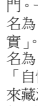
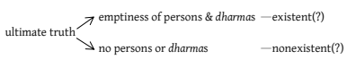
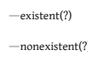
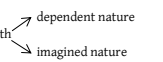
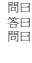

Chen-kuo Lin/Michael Radich (eds.)
A Distant Mirror Hamburg Buddhist Studies 3

 Series editor: Michael Zimmermann Chen-kuo Lin / Michael Radich (eds.)
A Distant Mirror Articulating Indic Ideas in Sixth and Seventh Century Chinese Buddhism Hamburg University Press Publishing house of the Hamburg State and University Library Carl von Ossietzky Imprint Bibliographic information published by the *Deutsche Nationalbibliothek* (German National Library). The *Deutsche Nationalbibliothek* lists this publication in the *Deutsche* Nationalbibliografie; detailed bibliographic data are available in the internet at http://dnb.d-nb.de. The online version is available online for free on the website of Hamburg University Press (open access). The *Deutsche Nationalbibliothek* stores this online publication on its Archive Server. The Archive Server is part of the deposit system for long-term availability of digital publications. Available open access in the Internet at: Hamburg University Press - http://hup.sub.uni-hamburg.de Persistent URL: http://hup.sub.uni-hamburg.de/purl/HamburgUP_HBS03_LinRadich URN: http://nbn-resolving.de/urn/resolver.pl?urn:nbn:de:gbv:18-3-1467 Archive Server of the *Deutsche Nationalbibliothek* - http://dnb.d-nb.de ISBN 978-3-943423-19-8 ISSN 2190-6769 © 2014 Hamburg University Press, Publishing house of the Hamburg State and University Library Carl von Ossietzky, Germany Printing house: Elbe-Werkstätten GmbH, Hamburg, Germany http://www.elbe-werkstaetten.de/ Cover design: Julia Wrage, Hamburg Contents Foreword 9

| Michael Zimmermann   |
|----------------------|

Acknowledgements 13

Introduction 15 Chinese Translations of *Pratyakṣa* 33

Funayama Toru 

| Michael Radich and Chen-kuo Lin   |
|-----------------------------------|

63 Epistemology and Cultivation in Jingying Huiyuan's *Essay on the Three Means of Valid Cognition* Chen-kuo Lin The Theory of *Apoha* in Kuiji's *Cheng weishi lun Shuji* 101 Shoryu Katsura A Comparison between the Indian and Chinese Interpretations of the Antinomic Reason (*Viruddhāvyabhicārin*)
121 Shinya Moriyama The Problem of Self-Refuting Statements in Chinese Buddhist Logic Jakub Zamorski A Re-examination of the Relationship between the Awakening of Faith and Dilun School Thought, Focusing on the Works of Huiyuan 183 Ching Keng 217 A Pivotal Text for the Definition of the Two Hindrances in East Asia: Huiyuan's "Erzhang yi" Chapter A. Charles Muller On the Notion of Kaidaoyi (**Avakāśadānāśraya*) as Discussed in Xuanzang's *Cheng weishi lun* 271 Junjie Chu Yogācāra Critiques of the Two Truths 313 Zhihua Yao Philosophical Aspects of Sixth-Century Chinese Buddhist Debates on "Mind and Consciousness" 337 Hans-Rudolf Kantor The Way of Nonacquisition: Jizang's Philosophy of Ontic Indeterminacy Chien-hsing Ho 151 397 Divided Opinion among Chinese Commentators on Indian Interpretations of the Parable of the Raft in the *Vajracchedikā* Yoke Meei Choong Ideas about "Consciousness" in Fifth and Sixth Century Chinese Buddhist Debates on the Survival of Death by the Spirit, and the Chinese Background to **Amalavijñāna* 471 Michael Radich The Process of Awakening in Early Texts on Buddha-Nature in India 513 Michael Zimmermann About the Authors 529 Index 535 419 in memoriam John R. McRae (1947-2011)

## About Hamburg Buddhist Studies

Buddhism has enjoyed a prominent place in the study of Asian religious ideas at the University of Hamburg for almost 100 years, ever since the birth of Buddhist Studies in Germany. We are proud that our program is housed in one of the pioneering academic institutions in Europe at which the study of Buddhism has become a core subject for students focusing on the religious dimensions of South and Central Asia. 

With this publication series, the Numata Center for Buddhist Studies at the University of Hamburg aims to honor this long-standing commitment to research and share the results of this tradition with the academic community and the wider public. Today, Buddhist Studies as an academic discipline makes use of a broad variety of approaches and methods. The field covers contemporary issues as much as it delves into the historic aspects of Buddhism. Similarly, the questions shaping the field of Buddhist Studies have broadened. Understanding present-day Buddhist phenomena, and how such phenomena are rooted in a distant past, is not a matter of indulgence. Rather, it has become clear that fostering such an understanding is one of the many crucial obligations of modern multicultural societies in a globalized world. 

Buddhism is one of the great human traditions of religious and philosophical thought. The *Hamburg Buddhist Studies* series aims to discuss aspects of the wide variety of Buddhist traditions that will be of interest to scholars and specialists of Buddhism, but it also wants to confront Buddhism's rich heritage with questions whose answers might not be easily deduced by the exclusive use of philological research methods. Such questions require the penetrating insight of scholars who approach Buddhism from a variety of disciplines building upon and yet going beyond the solid study of textual materials. We are convinced that the Hamburg Buddhist Studies series will contribute to opening up Buddhist Studies to those who are not necessarily trained in the classical languages of the Buddhist traditions but want to approach the field with their own disciplinary interests in mind. We very much hope that this series will encourage a wider audience to take interest in the academic study of the Buddhist traditions. 

## About This Publication

It is my great pleasure to introduce the third volume in the Hamburg Buddhist Studies series, which is edited by Prof. Chen-kuo Lin and Michael Radich, and presents the work of an international team of fourteen scholars. In this book, the authors investigate a range of topics and materials in the Chinese reception of Indian Buddhist ideas, focusing on the broad period centering on the sixth and seventh centuries. The topics investigated include Buddhist logic and epistemology (pramāṇ*a, yinming*); commentaries on Indian Buddhist texts translated into Chinese, or composed in Chinese; Chinese readings of doctrines and systems as diverse as Madhyamaka, Yogācāra and *tathāgatagarbha*; the working out of Indian concepts and problematics in new works by Chinese scholiast monks; and previously under-studied Chinese evidence for developments in India. 

Through this work, the authors collectively aim to push back against a certain parochializing tendency to relegate the study of Chinese materials to the study of questions pertaining to China alone. Instead, they strive to consider the ways that Chinese materials, even those beyond translation texts, might furnish evidence of broader Buddhist trends. In so doing, they also aim to problematize a prevalent notion of "sinification", which has led scholars to consider the relation of Indic to Chinese materials predominantly in terms of the ways Indic ideas and practices were transformed into something ostensibly distinctive to China, which supposedly reflected perduring features of Chinese civilization as a whole. In the same spirit, the volume also tries to go beyond another paradigm, that of seeing the sixth and seventh centuries in China primarily as the age of the formation and establishment of the so-called 
"sects" or "schools" of "Chinese" Buddhism (such as Tiantai, Huayan, Chan, and Faxiang). Instead, by bracketing out possibly essentializing notions of "India" and "China", these studies attempt to view the ideas they study on their own terms - as valid Buddhist ideas, finding their existence in a rich, "liminal" space of interchange between two large traditions. 

Michael Zimmermann

# Acknowledgements

This volume is the result of the project "Indian Buddhist Thought in 6th7th Century China" (NSC 98-2410-H-004-182-MY3) sponsored by the National Science Council, Taiwan. Special thanks go to Norman Teng and Ming-Huei Lee for their extraordinary vision, and to Ms. Nien-yi Wei for administrative support. Following upon another project on Buddhist epistemology in early 2007, this project was originally designed to nurture the talents of young scholars in Buddhist philosophy. In addition, we made the ambitious move of organizing an international research team to explore boundaries between South Asian and East Asian Buddhist philosophy. We were successful in creating a platform for promising scholars in Taiwan to work together with prominent scholars around the globe. We were also fortunate to be able to invite quite a few young local scholars to work together. The goals of the project could not have been realized if it had not been for the active participation of those scholars, namely Chun-ying Wang, Su-an Lin, Sing Song Liu, Wei-hong Yen, Tungming Chao, Chih-chiang Hu, Jakub Zamorski, Jenyou, Tsai-jung Lin, Hsun-mei Chen, Mo-yun Chang, and Ernest Brewster.

From the outset, the project was deliberately designed to bring Indian Buddhist philosophy, especially epistemology and logic, into dialogue with the Chinese mind. With this strategic consideration in mind, numerous lectures and workshops were held, and many eminent scholars kindly accepted our invitation to help cultivate this virgin territory during the four-year lifespan of the project at National Chengchi University. 

In addition to those scholars who participated directly in the full project, we would like to thank Tom Tillemans, Eli Franco, Malcolm David Eckel, Jan Nattier, Robert Kritzer, Mario D'Amato, John Taber, Parimal G. Patil, Birgit Kellner, Dan Arnold, Christian Coseru, Jonardon Ganeri, Bart Dessein, William Magee, James Apple, Steven Weinberger, Marcus Bingenheimer, Robert Gimello, Leonard W. J. van der Kuijp, Jeson Woo, Lance Cousins, and Bhikkhu KL Dhammajoti. This collection bears the subtle imprint of their expertise in many aspects of Buddhist Studies, and especially in the philosophical traditions of Indo-Tibetan Buddhism. We also appreciate the enthusiastic participation of Dan Lusthaus. 

We also take this opportunity to express our gratitude to the Hamburg University Numata Zentrum für Buddhismuskunde, and to its Director, our colleague Michael Zimmermann, for including this work in the *Hamburg Buddhist Studies* series; and to Frau Isabella Meinecke of the Hamburg University Press for her patient and meticulous help in seeing the volume through to eventual publication. We are also grateful for the diligent assitance of Su-an Lin and Sophie Florence in compiling the Index. 

Finally, we would like to mention our good friend, John McRae, who was unfortunately unable to continue working together with us to the end of this project. John's Chan-like wit will forever echo in the sky of emptiness. 

Michael Radich and Chen-kuo Lin The title of this book, *A Distant Mirror,* ultimately refers back to Barbara Tuchman's work of the same title on the history of fourteenth-century Europe (Tuchman, 1978). Tuchman uses this evocative phrase to convey her claim that the fourteenth century can be read as reflecting the twentieth century, and thus, more broadly, to evoke the idea that the study of history can be a kind of study, by reflection, of ourselves. However, although we gratefully acknowledge our debt to Tuchman for the phrase, we do not intend it to have this connotation. We are alluding to a more proximate model. 

In her *A Few Good Men,* Jan Nattier borrows Tuchman's phrase to refer to the problem of investigating the contents of Indian Buddhism through Chinese (and Tibetan) translations of Buddhist texts.1 In borrowing the title from Nattier in turn, then, we intend both to generalise the problematic Nattier points to, and to problematise it further. Nattier herself does not discuss the problem of views on Indian Buddhism that might be obtained through other dimensions of the Chinese tradition, including topics investigated in the present volume, such as: the independent creative thought of Chinese Buddhist thinkers; or the possibility that Chinese reports might be accurately based upon information obtained through extra-textual channels like oral reports. However, we do use the phrase in this considerably extended sense. We intend our title to encapsulate a methodological intuition, which we believe runs as a common thread through almost all of the studies collected here - that scholars should -------------------------------------------------- 
1 Nattier, 2003: 70-72, "A Distant Mirror: Studying Indian Buddhism through Chinese and Tibetan Texts."
seriously consider the possibility that a wider set of features of the Chinese tradition, treated carefully, might serve us as a "distant mirror", 
accurately displaying features common to Buddhism in India and elsewhere outside China. 

In other words, the studies in this volume typically set out to explore, in some detailed case, the possibility that even where Chinese Buddhism appears in some respect or degree to depart from what we know of its Indian counterparts, Chinese developments might still in some ways inform us about "genuine" Buddhism (to use a dangerous turn of phrase), 
rather than representing mere distortions of, or departures from, an Indian gold standard. 

The counterpart and foil to this view, of course, is a simplistic understanding of Chinese Buddhism as a product of so-called "sinification", or 
"making Chinese", which, at a hypothetical extreme (which may not be fully realized in any actual scholarship), sees Indian Buddhism as a norm; any difference between Chinese and Indian Buddhism is read as a failure in China to approximate that Indian norm, often under the pressure of distinctive presuppositions, ideas and tendencies endemic to and characteristic of Chinese culture as a whole. 

Of course, this is no simple matter, and we do not mean to deny that Buddhism did indeed change greatly in the complex transition from its Indian (and other) points of origin into China. Indeed, the real challenge for any full consideration of the overall formation and character of Chinese Buddhism (an ambitious project we do not pretend to essay here) 
would be to balance the treatment of Chinese Buddhism as "a distant mirror" with the problematic encapsulated by the notion of "sinification" in its broad sense. Fortuitously, in fact, this opposite interpretation of Chinese developments and evidence has also been expressed through another variation on the conceit of the mirror. To borrow a phrase from a forceful argument by Gregory Schopen (without implying that this is entirely what Schopen meant), we must also consider the possibility that rather than furnishing us with a clear if distant "mirror" for Buddhism in India (and at large), Chinese evidence gives us a view "through a Chinese looking-glass".

2 By this apt and wry allusion to Lewis Carroll (Carroll, 1871), Schopen suggests the troubling possibility that Chinese evidence might present us with mere caricatures, bordering on the satirical, of the Indian Buddhism it represents, and perhaps, that only a fool would mistake this image for sober reality. 

In the article in which he speaks of the "Chinese looking-glass", Schopen makes a very strong point, and we certainly would not deny his conclusions or ignore his prudent warning. Chinese evidence must be used with great care if it is to lead us to any reliable conclusions about Indian Buddhism; and historically, the field has sometimes gone astray through simplistic, insufficiently rigorous use of Chinese evidence. The studies in the present collection, however, tend to focus on, and work to correct, an equally salient, opposite type of methodological error. At the same time that Chinese evidence has sometimes been regarded as too directly reflecting Indian developments, on other occasions, scholars can too hastily conclude (and have concluded) that developments in China must be unique and parochial, and thereby overlook ways that Chinese evidence might reflect, even if distantly and indirectly, important features of Buddhism that also held beyond Chinese borders. The studies gathered here attempt in various ways to correct this bias. 

Perhaps the most significant sense in which the present studies treat Chinese evidence as capable of teaching us new things about Indian systems is in considering the ideas of Chinese authors and thinkers as independent or alternate developments, equally valid, of ideas and systems also known in India. Various contributors explore this approach in different ways. 

For example, Chen-kuo Lin's study employs the novel strategy of put-ting Jingying Huiyuan and Dignāga side by side, as two roughly contemporaneous Buddhist thinkers, inheriting and working out different consequences from a similar body of material (with due allowance, in the case of Huiyuan, for differences of both selection and nuance conditioned by the process of translation from Indic sources). Both the Indian and the Chinese thinker alike are regarded as creative individuals, working out different possible responses to a common inherited problematic. 

On this approach, the Chinese alternative, instead of merely "failing to be Indian", can be seen, rather, as representing alternate possibilities implicit within the common stock of Buddhist tradition - as exploring a 
"path not taken" in India, perhaps. In the reflected light of this approach, we might even appreciate anew the creative energy of the Indian tradition itself, instead of misperceiving it as plotting the only possible line of development from its historical roots and premises. 

Similarly, Shinya Moriyama examines Xuanzang and Kuiji's theories of the fallacy known as virudd*hāvyabhicārin,* as instances of alternative lines of development from the same premises as the Indian system. That is to say, he too treats the Chinese thinkers as having pursued lines of development possible in the system of Dignāga, but different from those pursued by Dharmakīrti, which became authoritative in the Indo-Tibetan tradition. 

A slightly different tack is taken by Jakub Zamorski. Zamorski refrains from treating unparalleled Chinese ideas about Buddhist logic as products of "sinification", suggesting that such interpretations might "reveal the inherent limitations of the system [Chinese scholars] were working within, rather than their own misunderstandings of this system". Following Chmielewski and Harbsmeier, Zamorski argues that in fact, in some respects, Chinese syntax harboured the potential to *clarify* some logical issues, so that it did not necessarily function as a constraint on the understanding of Chinese thinkers. He concludes that "Chinese commentators were capable of clarifying some ambiguous aspects of the Indian 'science of reasons' (*hetuvidyā*)."
Several other studies demur from the models used by theorists of 
"sinification" in treating Chinese authors and thinkers as making deliberate and self-aware choices about the doctrinal directions they took, in ways that potentially cast light on the issues already inherent in their Indic source materials. 

For example, Yoke Meei Choong shows that Chinese scholiast monks were quite capable of picking and choosing among the sources available to them with acute critical acumen, and artfully spinning those sources in the service of their own doctrinal agendas. Choong carefully studies the intricate complexities of interpretation in a few short passages from the *Vajracchedikā,* in both Indian texts (mainly preserved in Chinese translation), and further Chinese commentaries. A picture emerges of Chinese authors not as dupes to Chinese cultural presuppositions, misunderstanding Indic sources, but rather, as equal and sophisticated contributors to an ongoing, pan-Buddhist discussion about the most consequential questions in large doctrinal systems, engaging with debates that were already conducted in similar terms between the Prajñāpāramitā literature itself and Yogācāra authors in India.

Similarly, Hans-Rudolf Kantor's study takes Chinese Buddhist thinkers seriously as qualified and incisive contributors to the elucidation of fundamental doctrinal questions, focusing on what Kantor regards as a fundamental Buddhist problematic - the relation between reality and delusion, awakened and non-awakened mind - which cuts across large Mahāyāna doctrinal currents. At the outset of his study, Kantor explicitly brackets out all questions of whether or not Chinese texts and thinkers represented continuations or transformations of Indic positions. Rather, he approaches the texts on the assumption that they may be able to teach us profound lessons about Mahāyāna Buddhism - not "Indian" or "Chinese" Mahāyāna, but just Mahāyāna, pure and simple. 

Quite possibly, the results of Kantor's approach speak for themselves. 

Following his medieval Chinese authors, Kantor argues that from a soteriological perspective, the Mahāyāna "ultimate" (whether we call it śūnyatā, nirvāṇa, tathatā, or a number of other names) is thoroughly interwoven with and interdependent upon the relative/conventional (saṃ-*sāra,* ignorance, falsehood etc.), just as much as the reverse is also true. 

Insight into this interdependence has the power to transform the mundane world into an avenue, rather than a barrier, to liberation. Given that the notion of the dependence of the conditioned world upon the unconditioned, let alone the reverse, is sometimes presented as a typically "sinified" position, Kantor's argument potentially has a more general significance, implying that inflections upon common Buddhist problematics that have been regarded as typically Chinese do not demonstrate that Chinese thinkers were prevented by their own cultural limits from accurately understanding Indian Buddhist systems. Rather, they may represent new and genuine insights into actual dimensions of those problematics, which may have been brought out less clearly by the treatments they received in other parts of the Buddhist world. 

Zhihua Yao studies the Yogācāra understanding of emptiness. Yao takes this understanding to be more balanced than the interpretations of the Madhyamaka, which he claims can justly be characterized as "nihilistic". Although Yao himself does not address it from this angle, the problem he studies touches upon what some scholars have sometimes characterized as a basic distinction or difference in emphasis between Indian and Chinese Buddhism - where Indian Buddhism tends to be more apophatic, Chinese Buddhism tends to be more kataphatic. However, like other scholars in this volume, Yao tends to treat the positions in his Chinese source texts as authentic Indian positions, or coherent organic developments of Indian positions, even though the evidence for those positions happens to be preserved in Chinese. The case of the Fo-xing lun/*Buddhadhātu-*śāstra* presents this problem particularly sharply 
(and the text is quite central to Yao's argument, representing, for Yao, the best development of the position he wants to characterise as typic-ally Yogācāra). As Yao himself mentions, some scholars have regarded this text as a Chinese composition. Yao, however, chooses to adhere to the traditional ascription of the text to Vasubandhu. He thereby demonstrates the kind of difference that is made by such apparently technical questions of ascription, in considering matters related to common claims about the types of doctrine that most typically characterise "sinified" Buddhism. 

Some of the present studies also scrutinise Chinese texts in light of the possibility that they might record information transmitted orally to Chinese authors. This possibility should arguably be considered more often, even in cases where Chinese texts record ideas or positions for which we have no extant Indic evidence. For example, Jakub Zamorski discusses the possibility that works by Xuanzang's disciples could reflect information about the Dignāgan system of Buddhist logic transmitted in this manner. Indeed, Shoryu Katsura shows that Kuiji did in fact have a better knowledge of Dignāga's *apoha* theory than previously thought. In this case, then, ideas outside translated texts must have made their way into the Chinese tradition (i.e. the works of Kuiji) via oral transmission by a known route - the teaching of Xuanzang. Similarly, Junjie Chu's study of *avakāśadānāś*raya* shows that ideas of Indic provenance very probably did underlie discussions in the *Cheng weishi lun* (成唯識論) and Kuiji (but at the same time, that Kuiji's discussion of *krāntāś*raya* also shows that not all this information is necessarily reliable). 

One of the original impulses behind this project was to do justice to the true diversity and heterogeneity of Buddhist thinking in China during the sixth and seventh centuries. We have therefore used the device of tracing the reception and transformation of Indian elements more as a heuristic. We do not pretend thereby that this theme is somehow more central to the overall course of Buddhism in that period than other rubrics that might equally have been chosen. The original project plan provisionally divided the problem into three main strands, and the ultimate shape of this volume, we believe, can still be understood quite well in terms of those strands: (1) Buddhist logic and epistemology in China; (2) Buddhist developments in China and Korea falling under the broad head of "Yogācāra" (this category naturally overlaps somewhat with the first); and (3) other Indian elements in Chinese Buddhist systems. The selection of scholars for the project naturally also ensured that the center of gravity would be in Buddhist ideas, doctrines and texts. 

Beyond these common threads, however, the focus on the heterogeneity and complexity of the materials has meant that we have not striven to superimpose an artificial uniformity or unity on contributions to the project. For example, just as we have tried to avoid the pitfalls of a simplistic "sinification" paradigm, as explained above, we have equally tried to avoid sifting through the period for putative "origins of the schools" of Chinese Buddhism. We have preferred to think that often, equally valuable historical lessons can be learned by examining "roads not taken" in the long-term historical trends of East Asian Buddhism as a whole; or by scrutinizing those respects in which Chinese Buddhism approaches its Indic predecessors and parallels most closely, rather than focusing exclusively on what is ostensibly most distinctive to China. 

Thus, without laying artificial claim to excessive thematic unison, the remainder of this introduction will introduce the papers in the volume in précis, and then allow the individual authors and papers to speak for themselves. 

## Logic And Epistemology

Funayama Toru analyzes the term *xianliang* (現量) as a translation for Sanskrit *pratyakṣa* ("direct perception"). This translation is best known as that used by Xuanzang (玄奘, 600/602-664), but Xuanzang was not the first person to use this term. *Xianliang* is, strictly speaking, not a literal translation of *pratyakṣa,* and this opens up larger questions about how and why such Buddhist concepts might have changed in the transition to China. Funayama studies the historical situation both before and after Xuanzang's adoption of the term, with special attention to some Chinese interpretations of *xianliang* in the post-Xuanzang period. After Xuanzang, as Funayama shows, Chinese scholar-monks analyzed the term *xianliang* using such terms of Sanskrit grammatical analysis as "*tatpuruṣa* compound" (*yishi shi* 依士釋) and "*karmadhāraya* compound" (*chiye shi* 持業 釋). However, these interpretations differed significantly from those usual in Sanskrit. Funayama argues on this basis that during the Tang and the Ming, Chinese scholars began to develop distinctive Chinese interpretations of the term, but that it is beside the point to ask whether such Chinese interpretations make sense from a Sanskrit point of view; we are better to consider these Chinese interpretations from the perspective of the Chinese language, in which light they look extremely attractive. Thus, Funayama contends, it is almost meaningless to say that Chinese understandings of *xianliang* are "mistakes". They are better regarded as a new type of development, and it is in this sense that we might productively think about the "sinification of Buddhist concepts". 

Chen-kuo Lin presents a textual and doctrinal study of Jingying Huiyuan's 淨影慧遠 (523-592) Essay on the Three Means of Valid Cognition (San liang zhi yi 三量智義). Lin contends that we can fully understand the soteriological project at this early stage of Chinese Buddhist logicoepistemology only in light of links between epistemology and meditation. Unlike Dignāga, who attempted to lay down logic and epistemology as the *universal* foundation for all Indian philosophical systems, Buddhist and non-Buddhist, Huiyuan rather attempts to demonstrate that epistemology is *relative* to the various stages of intellectual and spiritual cultivation. Everything, including cognition, is condition-dependent: as the path of mental cultivation progresses, perception differs from beginner to advanced practitioner; and so too for inference; and for authoritative teaching (Huiyuan's three *pramāṇ*as). Thus, for Huiyuan, *pram*āṇas are indeed *instruments* to soteriological ends, and cannot be taken as autonomous domains and universal disciplines. For Lin, this means that Huiyuan is faithful to the authentic intent of Indian Buddhist epistemology. 

Lin also discusses a striking peculiarity in Huiyuan's theory of knowledge, namely, his use of a pair of sinitic notions, "principle" (li 理) and "phenomenon/phenomena" (shi 事), to develop the pre-Dignāgan theory of pramāṇa. Huiyuan uses li to refer to the "universal" (sāmānyalakṣaṇa) and shi to refer to the "particular" (svalakṣaṇa), adopting these ontological concepts to stand in for the Indic notions of *paramārtha* and saṃ*vṛti*. 

Huiyuan's application of this hermeneutics of li and shi to the epistemological enterprise might appear to constitute a classic proof-case for the theory of sinification: Huiyuan might easily be regarded as simply looking at Indic materials through a sinitic lens. However, Lin concludes that a better interpretation might understand that Huiyuan's interpretation operates dialectically, that is to say, such transformations as it might affect in the Indian concepts at issue also redound to reframe the semantics of li and shi in the terms of an Indian Buddhist epistemological context. 

Shoryu Katsura discusses little-studied materials reflecting Chinese understandings of Dignāga's (Chenna 陳那 ca. 480-530) *apoha* theory 
(i.e. his theory of meaning). Given that Yijing's (義淨, 635-713) transla-tion of Dignāga's masterwork, the Pramāṇasamuccaya (*Ji liang lun* 集量論) 
and its accompanying *Svavṛtti*, did not survive, it has been easy for modern scholars to assume that classical Chinese Buddhist scholars did not know *apoha* theory. However, Kuiji (窺基, 632-682), Xuanzang's direct disciple, refers to *apoha* in his Cheng weishi lun *shuji* (成唯識論述 記). Katsura shows that Kuiji knows that there are two means of valid cognition (*liang* 量): perception (*xianliang* 現量), taking as its object the particular characteristic (*zixiang* 自相); and inference (*biliang* 比量), taking the general characteristic (*gongxiang* 共相). Further, Kuiji defines the general characteristic as "exclusion of others" (*zheyu* 遮餘), and says that both types of conceptual cognition, namely, inference and verbal cognition, take this general characteristic as object by "exclusion of others". This makes the exclusion of others the nature and function of conceptual cognition in general. Moreover, only this general characteristic can be expressed verbally; the particular characteristic (the object itself) is beyond the reach of conceptual cognition, and cannot be expressed by verbal designation (*yanshuo* 言説). However, in an interesting development, Kuiji holds that even the general characteristic cannot ultimately be expressed by any verbal designation. Katsura observes that this idea might not have been endorsed by Dignāga and other Indian Buddhist logicians, but points out a similar development in the late work of Jñānaśrīmitra. Finally, Katsura shows that another possible new development in Kuiji is his understanding that the distinction between particular and universal is relative, just as in the hierarchy of the Vai-śeṣika categories. This understanding, again, might not have been endorsed by Dignāga, for whom only universal characteristics are relative to each other and constitute a hierarchy. 

Shinya Moriyama examines Kuiji's (窺基) commentary on Śaṅkara-svāmin's *Nyāyapraveśa*(ka), which had the greatest impact on the later development of Chinese and Japanese *hetuvidyā*. Moriyama examines Kuiji's peculiar interpretations of the topic of the antinomic reason (virud*dhāvyabhicārin*). This is a type of fallacy that takes the unique position of fulfilling the triple characteristics of a valid reason (*trairūpya*, 因三 相); what makes it invalid, rather than its internal structure, is the fact that it contradicts other presuppositions in the declared position of its proponent. Moriyama argues that contrary to expectation, Kuiji understands very well the background of this category in the *vāda*-tradition of debate, and correctly sees its practical significance in various debates among Buddhist insiders, such as debates on "non-manifested matter" (*avijñaptirūpa*) between a Sarvāstivādin and a Mahāyāna Buddhist. However, Moriyama also shows that on the whole, Kuiji's interpretation of the category seems to reflect a complex mix of insight, original thought, and misunderstanding of Indian ideas; and in particular, that Kuiji seems in fact to construct a new set of rules for debate, which seem to be motivated in part by the particular exigencies of a proof given by Xuanzang for consciousness-only. Thus, this example in Kuiji's thought shows that the dynamics at work in the production of distinctive East Asian interpretations of Buddhist ideas can be complex, and irreducible to simplistic models. 

Jakub Zamorski analyzes a chapter in the history of the so-called "science of reasons" (*hetuvidyā, yinming* 因明) with significance for the comparative study of logic. Both of the Indian *hetuvidyā* treatises translated into Chinese by Xuanzang in the seventh century contain examples of fallacious statements which are untenable on logical grounds alone, and therefore unacceptable as topics of debate, regardless of the philosophical affiliation of the disputant and opponent. Zamorski argues that all Chinese (and other East Asian) commentators regarded these two sentences as examples of one and the same fallacy, which they followed the *Nyāyapraveśa* in labeling "opposition to one's own words" (*svavacanaviruddha*). Primarily through the analysis of three Tang commentaries, Zamorski argues that Chinese authors achieved genuine original contributions to the issue of self-refutation, of significance to the history of logic even in a broad historical perspective reaching beyond China; but at the same time, that the arguments of these authors also reveal some peculiarities of a "sinified" understanding of the *hetuvidyā* system. 

## Yogācāra Ideas And Authors

Ching Keng's paper challenges the prevalent assumption that the *Awakening of Faith* was composed under the influence of the Dilun School. 

Keng aims to show that in the representative works of Huiyuan, arguably the most important Dilun master, we do not find the essential doctrinal feature of the *Awakening of Faith*, namely, the compromise or even the total obliteration of the distinction between unconditioned (*asaṃskṛta*) 
and conditioned (saṃskṛta) *dharma*s. Keng observes that almost all available studies of Huiyuan focus on a small piece entitled "Bashi yi" (八識義, 
"On the Meaning of the Eight Consciousnesses"), which shows strong influence from the *Awakening of Faith;* but that other works of Huiyuan outline a very different conceptual scheme. Taking these other works as representing Huiyuan's earlier thought, and therefore Dilun thought, Keng argues that the hallmark of Huiyuan's thought is a dualist scheme, in which the inherently pure aspect is unambiguously unconditioned, with no blending with conditioned *dharma*s; this inherently pure aspect can adjust to falsity (*suiwang* 隨妄) and give rise to misconception, but without compromising its unconditioned nature. Upon this basis, Keng contends that the compromise between unconditioned and conditioned in the *Awakening of Faith* should be regarded as an innovation, rather than a direct outgrowth from Dilun thought. An important broader implication of Keng's argument is that Huiyuan's thought, Dilun thought, and even the thought of the La*ṅkāvatāra-sūtra* has been anachronistically misinterpreted through the later, typically Chinese lens of the *Awakening* of Faith. This suggests the sobering possibility that typically "sinitic" (or even "sinified") developments became so pervasive in the later East Asian tradition that their stamp may still lie heavy upon parts of modern Buddhology itself, and that we might therefore overlook both evidence and products of "sinifying" processes, and even the actual features of Indic materials. 

Charles Muller presents a full annotated translation of Jingying Huiyuan's (淨影慧遠, 523–592) *Erzhang yi* (二障義, "System of the Two Hindrances"), accompanied by a lengthy introduction to the major issues surrounding the two hindrances, and the role played by Huiyuan in defining their future course. Muller situates this work in a broad current in Buddhism, especially its meditative forms, whereby it pays unique attention, among religious traditions, to the psychological aspect of human problems, and distinguishes to an unusual degree between the categories of emotional and cognitive in the analysis of such problems. Muller argues that the general patterns of this distinction are discernible in early Buddhism, and become clearer in Abhidharmic scholasticism; but that it is only with the maturation of the Mahāyāna that afflictive and cognitive obstacles to liberation are formally organized under the rubrics of the *two hindrances* - the afflictive hindrances (*kleśa-āvaraṇ*a 煩惱 障, 煩惱惑) and the cognitive hindrances (jñeya-*āvaraṇ*a; 智障, 智惑, 所知障). Against some discussion in modern scholarship that has tended to cast the pair as a fundamentally Yogācāra construction, Muller contends that a significant portion of their development - at least in East Asia - occurred in the works of Dilun or Tathāgatagarbha scholars. This is exemplified by Huiyuan's essay, which subsequently deeply informed later work on the hindrances by the Silla scholiast Wonhyo (元曉, 617–
686), and even the interpretations of the Chinese Weishi school by such figures as Kuiji (窺基, 632–682). 

Junjie Chu presents a close analysis of a passage in Xuanzang's Cheng weishi lun discussing the term *kaidaoyi* (開導依). The text presents three different opinions concerning the interpretation of this special term. Chu's main aim is to examine the meaning of the two elements in the term, namely *kaidao* and yi, with reference to their possible origins in both Abhidharma and Yogācāra Indian sources. He argues that *kaidaoyi* reflects an alternate name for the concept of the *samanantarapratyaya*, 
viz. **avakāśadānāśraya* (widely used both Abhidharma and Yogācāra), referring to the awareness that has passed away in the immediate antecedent moment, called "mind", which has the function of giving way so that the subsequent awareness can arise. This shows that *kaidaoyi* cannot be a translation of the Sanskrit word **krāntāśraya,* as Kuiji's phonetic transcription *jielanduo* (羯爛多) suggests. Chu also studies the information given in the *Cheng weishi lun* about controversies between three different interpretations of the function and nature of this *avakāśa-*dānāśraya*. In so doing, he shows that the Chinese texts of Xuanzang and his disciples preserve important information that can cast fresh light on key terms in Indian systems. 

Zhihua Yao's paper sets out from the observation that due to the prevalent influence of Madhyamaka philosophy, the paradigm of the two truths has become a convenient way to characterize the Buddhist approach to reality. Yao argues that this two-tiered paradigm contributed to a great extent to a view of the world as fundamentally illusory, to which the majority of Mādhyamikas subscribe. He contrasts this with the Yogācāra theory of the three natures, which he contends was intended to improve on this two-tiered paradigm, and restore a more robust and holistic worldview. To this end, Yao examines scattered sources from Maitreyanātha, Asaṅga, and Vasubandhu, and seeks to analyze their criticisms of the Madhyamaka version of the two truths on the basis of the Yogācāra theory of the three natures. Yao's study thus aims to correct misconceptions concerning the Buddhist approach to reality among contemporary scholars, who he argues have fallen under the influence of Madhyamaka; and to champion a Yogācāra perspective that he regards as more plausible and fruitful. 

## Other Indian Ideas

Hans-Rudolf Kantor presents a philosophical and comparative analysis of various constructivist approaches to the problem of "mind and consciousness" (*xinshi* 心識), developed by sixth-century Chinese Buddhists in debates based on the Indian Mahāyāna scriptures and treatises available to them. The paper falls into two parts. First, Kantor discusses a selection of influential Chinese Madhyamaka, Yogācāra, and Tathāgatagarbha sources translated from Sanskrit between the fifth and seventh centuries. Kantor then focuses on the varying interpretations of the ideas in those sources propounded by Chinese Dilun, Tiantai, and Huayan masters. For Kantor, all the Mahāyāna texts he discusses stress that "mind and consciousness" must be discussed on the basis of the insight that "truth and falsehood are inseparable", as they pertain to the way we relate to and exist in our world. In other words, Kantor contends, all these discussions feature in common a key coincidence of epistemological and ontological issues, even as each presents a different view on the nature of "mind and consciousness". 

Chien-hsing Ho studies Jizang's (吉藏, 549−623) Chinese Madhyamaka philosophy of ontic indeterminacy. On this view, all things are empty of determinate form or nature: given any thing x, no linguistic item can truly and conclusively be applied to x, in the sense of positing in it some determinate form or nature. This ontic indeterminacy is closely connected with Jizang's notion of the Way (dao 道) - also termed the correct Way (*zhengdao* 正道) or the Real (*shixiang* 實相) - which Ho sees as indicating a kind of ineffable principle of reality. However, even as he thus propounds a "Way", which in other hands refers to a kind of metaphysical ultimate, Jizang also equates the Way with nonacquisition, as a conscious state of freedom from any attachment or conception whatsoever. Ho therefore considers the question: Does Jizang's notion of the Way indicate some metaphysical principle or reality? Or is it actually a skillful expedient designed to lead us to the consummate state of complete spiritual freedom? Ho argues that Jizang does not clearly posit any nonempty metaphysical reality or principle. Jizang does speak of the Way as nonempty (as well as empty), but Ho interprets this as aiming to highlight the claim that the Way cannot be determined as empty, or reduced to emptiness. Nonetheless, for Ho, Jizang's Way is not any reality metaphysically higher than the myriad things (*wanwu* 萬物); it is nothing more than the ineffable, indeterminable, nondual quiescence wherein both oneself and (the myriad) external things are conceptually undifferentiated. In light of Jizang's debt to Sengzhao (僧肇, 374?−414), 
Ho argues that this Way *qua* quiescence is only revealed in nonconceptual experience, which entails a state of forgetting speech and cessation of thought (*yan wang lü jue* 言忘慮絕), and harbors within itself the myriad things in their undifferentiated state. The Way is thus beyond conceptual determination and attachment, and so accessible only to a mind of nonacquisition (*wude* 無得); it is therefore realized only when one's mind ceases to approach things in a spirit of acquisition (*youde* 有得). 

Yoke Meei Choong studies various interpretations of the "parable of the raft" in an early canonical *sūtra* of the *Majjhima-nikāya* (and parallel Chinese Ā*gama*s), which appears again in the *Vajracchedik*ā, focusing on discussions of the terms *dharma* and *adharma* in both Indian commentaries (mainly preserved in Chinese translation) and Chinese authors and commentators. She shows that key textual variants are distributed in a complex pattern through both translations and commentaries, in both Indian and Chinese texts. Her careful analysis shows that all texts containing the variant readings contain Yogācāra thought, and thus, that the variants probably stemmed from Yogācāra circles in India. Moreover, the diverse interpretations of the term *adharma,* in particular, differentiate themselves along the lines of sectarian divisions between Mādhyamika and Yogācāra authors. This sectarian coloring of interpretation continues in China, where Zhiyi and Jizang explain the root text's notion of "abandoning *adharma*" to mean the abandonment of even the ultimate reality, that is, non-existence, whereas Kuiji follows Vasubandhu and interprets the notion to refer to the denial of the non-existence of the ultimate truth. Thus, the Chinese commentators accept the ideas in Asaṅga's and Vasubandhu's commentaries only selectively, depending upon their own doctrinal preferences; and the fact that Jizang aligns himself more closely with Asaṅga on several points shows, interestingly enough, that Asaṅga's interpretation was more acceptable to the Chinese Mādhyamikas. As already discussed above, these subtly nuanced choices on the part of Chinese commentators clearly show them to be aware and insightful contributors to a debate continuous with concerns that were also vital in India. 

Michael Radich attempts to provide a fresh perspective on fifth- and sixth-century debates in the Chinese Buddhist world about whether or not some part of the sentient being does or does not survive death, to transmigrate and reap *karmic* rewards. Chinese Buddhist thinkers argued, against their non-Buddhist opponents, that something does survive death. Seen against the background of normative Indian Buddhism, this turn of events has struck scholars as odd and even heretical (as a kind of "*ātmavāda*"); unsurprisingly, then, the debate and its fruits have often been regarded as evidence of the supposed "sinification" of Buddhist ideas. Radich suggests that this way of reading the debates is probably misleading. A significant thread running through Buddhist contributions to these debates is the use of terms meaning "consciousness" (esp. equivalents to Skt. vijñāna) for the transmigrating entity, and Radich aims to show that the uses of vijñ*āna* in this debate have a longer prehistory in China than has usually been recognized, and ultimately, can be traced in part to a minority strand of ideas in Indic traditions. The center of Radich's study is a new interpretation of Liang Wudi's (梁武帝, r. 502-549) Shenming cheng fo yi (神明成佛義) and its relation to its scriptural sources and intellectual-historical context. This study is intended as part of a larger project examining possible antecedents to Paramārtha's 
(Zhendi 真諦, 499-569) doctrine of *amalavijñāna (*amoluoshi* 阿摩羅識, 
"taintless consciousness"). As such, this paper attempts to contribute to a larger reconsideration of outdated interpretations of the development of Chinese Buddhist doctrine in terms of "sinification", by arguing that continuities with Indian materials often prove on closer scrutiny to be greater than scholars have sometimes thought. 

On the basis of the Tathāgatagarbha-*sūtra,* Michael Zimmermann studies two different models of Buddha-nature in Indian sources, both of which can be read into the Sanskrit term *tathāgatagarbha*: a theory of disclosure, and a theory of development. The disclosure model is built on the idea that living beings already carry within themselves a full-fledged Buddha, whose efficacy has only to be disclosed, without any essential modification of the living being. The developmental model, by contrast, perceives this Buddha-element in sentient beings as something which has to be nourished and can transform into full buddhahood only after a process of development. Over the course of subsequent centuries, Zimmermann contends, these two models became two prototypes of the theory of Buddha-nature, and influenced the intellectual history of the spread of Buddha-nature teaching throughout Central and East Asia. 

Zimmermann argues that at the early stage of Buddha-nature thought in India, the authors of the texts obviously had no intention to promote their message along philosophically refined lines, but rather, seem mainly to have aimed to spread the idea that all sentient beings have the potential to become a Buddha, by arguing that sentient beings carry all they need for that end within themselves, albeit hidden and unknown to themselves; the texts also do not outline concrete modes of practice by which this aim can be realized. 

Carroll, Lewis (1871). *Through the Looking-Glass, and What Alice Found There*. 

London: Macmillan. 

Nattier, Jan (2003). *A Few Good Men: The Bodhisattva Path according to* The Inquiry of Ugra (Ugraparipṛcchā). Studies in the Buddhist Traditions. Honolulu: University of Hawai'i Press. 

Schopen, Gregory (2000). "The Mahāyāna and the Middle Period in Indian Buddhism: Through a Chinese Looking-Glass." *The Eastern Buddhist,* n.s. 32:2, pp. 1-25. [Reprinted in Schopen, *Figments and Fragments* of Mahāyāna Buddhism: More Collected Papers. Studies in the Buddhist Traditions. Honolulu: University of Hawai'i Press, 2005, pp. 3-24.] 
Tuchman, Barbara (1978). *A Distant Mirror: The Calamitous 14th Century.* 
New York: Alfred A. Knopf. 

# Chinese Translations Of Pratyakṣa 1

Funayama Toru The theory of direct perception was one of the most fundamental topics in Buddhist epistemology. It became more important particularly with Dignāga (ca. 480-540 C.E.), who advocated the ground-breaking theory of pramāṇa (lit. "measure", "scale", or "standard") or the "means of valid cognition". As is well known, *pratyakṣa* ("direct perception") and anu-*māna* ("inference") constitute the two most important elements of this theory. 

It was Xuanzang (玄奘, 600/602-664) who laid the foundation for the study of *pramāṇ*a in China. In the Chinese context this study was called yinming (因明, "science of logic", **hetuvidyā*), which is often counted as one of five sciences (Skt. *pañcavidyā,* Ch. *wuming* 五明), by contrast to pramāṇavāda ("the theory of *pramāṇ*a") which belongs to the Sautrāntika and/or the Yocācāra position in Buddhist logic and epistemology.2 Although Xuanzang was not the first person to bring Dignāga's views to China,3 it was with him that study of this topic in China began in earnest. 

Xuanzang translated pratyakṣa as *xianliang* (現量). In this paper I 
would like to consider the historical situation before and after Xuanzang's adoption of this translation. The first half of this paper will be spent examining earlier appearances of the term in question, before Xuanzang's time. As I will show, this topic is important for at least two reasons. First, the term *xianliang* is, strictly speaking, not a literal translation of *pratyakṣa,* despite Xuanzang's general tendency to give fully literal translations. Second, it is not yet clear who first used this term. It is clear, however, that Xuanzang was not the first person. In the second half of this paper, I will shift to the post-Xuanzang period, paying special attention to some Chinese interpretations of *xianliang*. Developments in this period are possibly related to the process of the "sinification of Buddhism", in the sense that Chinese works during the Tang and Ming dynasties showed some serious discrepancies from the Indian Buddhist tradition, and began to develop peculiar Chinese interpretations of this word. 

## 34 Funayama 1 Xianliang As Translation

I will begin with some observations about Xuanzang's usage of *xianliang*. This term is used in some important translations by Xuanzang, such as the *Yinming zhengli men lun* (因明正理門論, *Nyāyamukha* of Dignāga), the Yinming ru zhengli lun (因明入正理論, *Nyāyapraveśa*[ka] of Śaṅkarasvāmin) and the *Apidamo jushe lun* (阿毘達磨倶舍論, Abhidharmakośa[bhāṣya] of Vasubandhu), in which *xianliang* is obviously used as a translation of *pratyak*ṣa. For example, Dignāga's well-known definition of direct perception, viz., pratyakṣaṃ kalpanāpoḍham ("Direct perception is free from conceptual construction"), is rendered by Xuanzang as *xianliang chu fenbie* (現量除分別). 

-------------------------------------------------- 
3 Prior to Xuanzang, the Tripiṭaka Master Paramārtha had already translated Dignāga's epistemological text entitled *Ālambanaparīkṣā* ("An Examination of Epistemic Objects"), 
under the title *Wuxiang sichen lun* (無相思塵論, T1619). For a discussion of this issue, see Funayama, 2010: 147. 

Modern readers of Xuanzang's translations generally take *xianliang* as an unproblematic translation of *pratyakṣa.* Strictly speaking, however, the term *xianliang* is not a literal translation, because *liang* (量), which literally means "measure", "measurement", "scale", or "amount/quantity", as either a verb or a noun, corresponds to *pramāṇ*a. According to the *Index to the* Abhidharmakośabhāṣya compiled by Hirakawa *et al.,* the word *pratyakṣa* corresponds in some of Xuanzang's texts to other Chinese terms as well: e.g., *xianjian* (現見).4 The *Xianyang shengjiao lun* (顯揚聖教 論), one of Xuanzang's earliest translations, is consistent in the usage of xianliang for *pratyakṣa*. On the other hand, yet another important text, the *Yuqie shi di lun* (瑜伽師地論, *Yogācārabhūmi*), the search for which inspired Xuanzang's journey to India, occasionally has *xian* (現) and *xianzheng liang* (現證量) as translations of *pratyak*ṣa, although in many cases it prefers *xianliang*.

5 These examples show that for Xuanzang, though xianliang was certainly a well-established translation of *pratyak*ṣa, it was not necessarily the only Chinese translation, as modern scholars often assume. 

The matter of wording with or without *liang, per se,* is not at all a serious problem, but it is interesting to imagine why Xuanzang might have wanted to add it to his translation of *pratyak*ṣa. As a rigorous Sanskritist, Xuanzang by and large preferred literal translation; he did not like adding words and thereby embellishing the meaning of the original term. In this sense, it is worthwhile to ask whether *xianliang* was a translation newly created by Xuanzang himself. As it turns out, it was not. There are some noteworthy examples of *xianliang* before Xuanzang's time. 

Before Xuanzang came back from India, Prabhākaramitra (波羅頗蜜 多羅, 565-633, also called 波羅頗迦羅蜜多羅) had employed *xianliang*
(現量) and *yanliang* (驗量) for *pratyak*ṣa and *anumāna*, respectively, in his translation of Bhāviveka's commentary, *Prajñāpradīpa,* on the *Middle Treatise*.

6 Even prior to this time, at the end of the sixth century, members of the Dilun (地論) school had already used the term. A typical example is found in Jingying Huiyuan's (淨影寺慧遠, 523-592) doxographical compendium entitled *Dasheng yi zhang* (大乘義章). Huiyuan summarizes the theory of the threefold classification of *pramāṇ*a as follows: 
First, the Exposition of Names [as follows:] The doctrine of the three measurements [of valid cognition] comes from the Saṃdhinirmocana-*sūtra*. When the mind of wisdom grasps entities, each has its own portion. Therefore it is called "measurement" [or "amount"]. There are manifold ways of distinguishing [types of] "measurement": 
one says that there are three: first, direct measurement; second, measurement as inference; and third, measurement as teaching. 

(第一釋名。三量之義出於《相續解脱經》中。慧心取法,各有分 限,故名為量。量別不同,一門説三:一是現量,二是比量,三是 教量; T44:1851.670c7-9) 
It is clear here how Huiyuan understands *xianliang*. Further, the term fenxian 分限, which appears here in the explanation of *liang,* is also interesting, because *fenxian* means "portion" or "amount", which reminds us more of Sanskrit words like *parimāṇ*a, rather than *pramāṇ*a. At least, it seems true that by *liang* Huiyuan took the term to mean "measure" in the broad sense, and not specifically "a means of valid cognition", as it was defined in later texts composed by Dignāga and his followers. 

Moreover, members of the Dilun school used *xianliang* in other texts too. For example, the Dunhuang manuscript S.613v mentions, as a Dilun theory, a fourfold classification of pramāṇa: xianliang (現量), *biliang* (比 量), *xinyanliang* (信言量), and *jiaoliang* (教量).7 Further, in the above quotation, Huiyuan refers to the Saṃdhinirmocana-*sūtra,* but this *sūtra*'s wording is not the same as his. Guṇabhadra's (求那跋陀羅, 394-468) translation has *xianqian* (現前) for **pratyakṣa* (Tib. *mṅon sum*) and *xianqian* liang (現前量) for *pratyakṣaṃ *pramāṇ*am (Tib. *mṅon sum gyi tshad ma*).8 Bodhiruci's (菩提流[/留]支, d. 527) translation, on the other hand, has xianqianjian (現前見) and *xianjian* (現見) for *pratyakṣa*.

9 Returning to Xuanzang, we may assume that his use of *xianliang* was influenced by the preceding scholastic tradition, as found in Huiyuan's compendium, and also in Prabhākaramitra's translation. 

Here a question arises. Though it is evident that the Dilun employed the term *xianliang* in their writings, what kind of textual basis did they have in translated texts? This is an interesting question because, as stated just above, in spite of Huiyuan's explicit reference to the Saṃdhinirmocana-*sūtra* as the source for the theory of the threefold classification, neither Guṇabhadra's nor Bodhiruci's translations have *xian-*
liang.

10 Therefore, it is still unclear at this juncture what source Huiyuan drew upon in employing *xianliang*. In what follows, I will try to survey translations of *pratyak*ṣa in the Six Dynasties period. 

The earliest texts in which I have identified translations of *pratyakṣa* and *pramāṇ*a are attributed to Kumārajīva. Investigation into the question of whether there exist any earlier translations than Kumārajīva will be a task for future research. 

(a) Kumārajīva (鳩摩羅什, ca. 350-409) - xin (信) or *kexin* (可信) for 
*pramāṇa; *xianshi* (現事) or *xianzai* (現在) for **pratyakṣa*
《中論》 3, 觀法品(青目釋): 信有四種。一現事可信。二名比 知可信,如見烟知有火。三名譬喩可信,如國無鍮意志,喩之如金。 四名賢聖所説故可信。如説有地獄,有天,有欝單曰,無有見者, 信聖人語,故知 (T30:1564.24a28-b3).11
《成實論》 8: 有三種信。見名現在信。聞名信賢聖語。知名比知…
(T32:1646.304a7-8). 

(b) Tanwuchen (曇無讖, 385-433) - *xianzhi* (現智) for *pratyakṣa* 12
《菩薩地持經》 1, 真實義品: 云何學所知真實義耶。如世智人依 現智比智及從師聞思量修學,彼決定智所行處事,結集建立。是名 學所知真實義也 (T30:1581.893a1-3). 

Bodhisattvabhūmi, Tattvārthapaṭ*ala* (Wogihara, 1936: 37, 22-38, 1; Dutt, 1966: 25, 17-21): yuktiprasiddhatvaṃ katamat. satāṃ yuktārthapaṇḍitānāṃ vicakṣaṇānāṃ tārkikāṇāṃ mīmāṃsakānāṃ tarkaparyāpannāyāṃ bhūmau sthitānāṃ svayaṃ pratibhānikyāṃ pārthagjanikyāṃ mīmāṃsānucari-tāyāṃ pratyakṣam anumānam āptāgamaṃ pramāṇaṃ niścitya suviditasuvi-*niścitajñānagocarajñeyeyaṃ* [D: suviniścitajñānagocaro jñeyeyaṃ W] *vastū*-
papattisādhanayuktyā prasādhitaṃ vyavasthāpitam, i*dam ucyate yuktiprasiddhaṃ tattvam.* 
Cf. 玄奘譯《瑜伽師地論》 36, 菩薩地・真實義品: 云何道理極成 真實。謂諸智者有道理義。諸聰叡者諸黠慧者。能尋思者能伺察者。

住尋伺地者具自辯才者。居異生位者隨觀察行者。依止現比及至教 量極善思擇決定智所行所智事。由證成道理所建立所施設義。是名 道理極成真實 (T30:1579.486b27-c3). Cf. 求那跋摩 (367-431) 譯《菩薩善戒經》2: 云何名方便流布。如 世智人先以籌量,然後造作經書論義,是名方便流布 (T30:1582.

968b7-9). 

《菩薩地持經》 3, 力種性品: 現智比智,從師具聞而為人説,非 不思量13 (T30:1581.904c23-24). 

Bodhisattvabhūmi (Wogihara, 1936: 106, 24-25; Dutt, 1966: 75, 10-11): 
pratyakṣānumānāptāgamayuktāṃ ca kathāṃ karoti, *nāpramāṇayuktām*.

Cf. 玄奘譯《瑜伽師地論》38, 菩薩地力種姓品: 又依現比至教道理 而説正法,非不依彼三量道理 (T30:1579.503b10-11). 

No corresponding passage exists in Guṇavarman's translation (cf. T30: 1566.78c). 

(c) Guṇabhadra (求那跋陀羅, 394-468) - *xianqian* (現前) for **pratyakṣa*; xianqianliang (現前量) for *pratyakṣaṃ pramāṇ*am.* See the above paragraph.14 (d) Jijiaye (吉迦夜, ca. 472)15– *xianjian* (現見) for *pratyak*ṣa
《方便心論》: 凡欲立義,當依四種知見。何等為四。一者現見, 二者比知,三以喩知,四隨經書 (T32:1632.23c29-24a2). 

Ibid.: 知因有四。一現見,二比知,三喩知,四隨經書。此四知中, 現見為上 (T32:1632.25a26-27). (e) Bodhiruci (菩提流[/留]支, d. 527) - *xin* (信) for pramāṇa; *xianjian*
(現見) for pratyakṣa; *xianxin* (現信) for pratyakṣaṃ *pramāṇ*am
《唯識論》: 問曰。依信説有。信者有四種。一者現見,二者比知, 三者譬喩,四者阿含。此諸信中,現信最勝 (T31:1588.68b25-27). 

See also (f) Paramārtha's translation of the same text below. 

(f) Paramārtha (真諦, 499-569, also called Kulanātha 拘羅那他) –
liang (量) for pramāṇa; *zheng* (證) or *zhengliang* (證量) for *pratyakṣa*; 
zhengliang (證量) for pratyakṣaṃ *pramāṇ*am16
《大乘唯識論》: 一切量中,證量最勝 (T31:1589.72c22-23). 

Vi*ṃśikā/Viṃśatikā*:
17 sarveṣāṃ ca pramāṇānāṃ pratyakṣaṃ pramāṇaṃ gariṣṭ*ham iti* (Lévi, 1925: 8.23).

Cf. 玄奘譯《唯識二十論》: 一切量中,現量為勝 (T31:1590.76b15-16).

Thus, it is clear that none of the translators above uses *xianliang* as the translation of *pratyakṣa.* Among the translations we do encounter in these texts, Paramārtha's term *zhengliang* (證量) is peculiar. It translates either pratyakṣa or pratyakṣaṃ pramāṇ*am,* in which *zheng* signifies "something vivid, clear or direct".

18 As mentioned above, this wording is sometimes, though not very often, found even in Xuanzang's translation of the *Yogācārabhūmi,* in the form of *xianzheng liang* (現證量).19 There is, however, a text in which the term *xianliang* does appear as a translation - the *Huizheng lun* (迴諍論) or *Vigrahavyāvartanī* of Nāgārjuna. 

According to the Translation Record attached to the head of the translation (T32:1631.13b11-21), the Chinese translation was made in the third year of Xinghe 興和 of the Eastern Wei dynasty, i.e. 541 CE. The translators were Pimuzhixian 毘目智仙20 and Qutan liuzhi 瞿曇流支 (alias Prajñāruci 般若流支). The relevant section is as follows, shown together with the corresponding Sanskrit text: 
(g) 《迴諍論》: 又復有義。偈言: 若彼現是有,汝可得有迴。 彼現亦是無,云何得取迴。

此偈明何義。若一切法有現可取,汝得迴我諸法令空。而實不爾。 何以知之。現量入在一切法數,則亦是空。若汝分別依現有比,現 比皆空,如是無現比,何可得現之與比,是二皆無,云何得遮。汝 言一切諸法空者,是義不然。

若汝復謂: 或比或喩,或以阿含,得一切法。如是一切諸法自體, 我能迴者。此我今説。偈言: 
 説現比阿含 譬喩等四量 現比阿含成 譬喩亦能成 此偈明何義。比喩阿含現等四量若現能成,比阿含等皆亦能成,如 一切法皆悉是空,現量亦空… (T32:1631.16a5-21). 

ki*ṃcānyat.*
 pratyakṣe*ṇa hi tāvad yady upalabhya vinivartayasi bhāvān* | tan nāsti pratyakṣaṃ *bhāvā yenopalabhyante* || [5]
yadi pratyakṣataḥ sarvabhāvān upalabhya bhavān nivartayati - śūnyāḥ sarvabhāvā iti, tad anupapannam. kasmāt. pratyakṣam api hi pramāṇaṃ sva-*bhāvāntargatatvāc chūnyam. yo 'pi sarvabhāvān upalabhate so 'pi śūnyaḥ*. 

tasmāt pratyakṣeṇa pramāṇena nopalambhabhāvaḥ. anupalabdhasya ca pratiṣedhānupapattiḥ - śūnyaḥ sarvabhāvā iti, tad anupa*pannam.* 
syāt te buddhir anumānenāgamenopamānena vā sarvabhāvān upalabhya sarvabhāvavyāvartanaṃ *kriyata iti. atra brūmaḥ*. 

anumānaṃ pratyuktaṃ pratyakṣe*ṇāgamopamāne ca* | anumānāgamasādhyā ye 'rthā dṛṣṭāntasādhyāś ca || [6]
anumānam apy upamānāgamāś ca21 pratyakṣeṇa pramāṇena *pratyuktāḥ*. 

yathā hi pratyakṣaṃ pramāṇaṃ śūnyaṃ sarvabhāvānāṃ *śūnyatvāt…* (Yonezawa, 2008: 228, 230 with stylistic modification by FT).

Here, it is evident that *xianliang* (現量) appears as the translation of pratyakṣaṃ pramāṇ*am,* and not *pratyakṣa.* This distinction is obvious because pratyakṣa is translated as *xian* (現). 

As far as I know, the *Huizheng lun* is the only translation text prior to Huiyuan which employs *xianliang.* However, the exact reason for the Dilun school's preference for the term *xianliang* is still not entirely clear, because the *Huizheng lun* is not a major text for the Dilun school, and it is scarcely cited in Dilun compositions. In any case, I find it interesting that even though the actual usage of *xianliang* is rather limited in translations, the Dilun school preferred it over other options, and that it was then adopted even by Xuanzang, in spite of the fact that the element *liang* is superfluous as a literal translation of *pratyak*ṣa. In fact, the use of this term meant that Xuanzang could not distinguish between *pratyakṣa* and pratyakṣaṃ *pramāṇ*am in his translation, since both are translated in the same way as *xianliang*. This is certainly a small point, but I think it is noteworthy when we take into account the generally rigorous character of Xuanzang's translations. 

In ending this first section, I would like finally to refer to the usage of xian liang in Guṇabhadra's translation of the Laṅkāvatāra-sūtra (Lengqie jing 楞伽經, T670). In fact, we find that the phrase *zixin xian liang* (自心 現量) appears forty times in the *Lengqie jing.* In addition to this, a similar expression, *zixin xian* (自心現, without *liang*), also appears many times in the same text. When we compare Guṇabhadra's translation with the extant Skt. text, we can identify *zixin xian liang* with svacitta-dṛśya-*mātra,* which means "nothing but what is experienced by one's own mind".

22 That is, *xian liang* is not a single term in this case; *xian* signifies "to appear, manifest itself" and *liang* is a translation of *mātra* "merely, only, nothing but", often rendered in other translations as *wei* (唯). 

The usage of *xian liang* in the following passage from the Chinese La*ṅkāvatāra* is also noteworthy in connection with *pramāṇ*a theory: 
O Mahāmati! The Nirvāṇa that I teach means the following: one understands with one's superior awareness what is none other than the manifestation of one's mind. (*Note*: Measurement is of four kinds: one, direct perception; two, inferential understanding; three, analogy; and four, what is transmitted by distinguished predecessors. All those non-Buddhists [mentioned previously in the *sūtra*] are not trustworthy on [the topic of] the four [types of] mensuration.) One does not become attached to the external nature [of ontic entities]; is free from 
[denial by the method of] the tetralemma (*catuṣkoṭi*); perceives the condition of what exists in accordance with reality, without falling into the two delusory extremes manifested by one's own mind, so that neither cognizer nor cognized is apprehended; and the nonperception of all [types of] mensuration is accomplished. When one is ignorant of true reality, one is not able to apprehend [it] at all. When one discards [the above-stated erroneous condition of mind], one attains the truth of self-awakened sages; understands the two kinds of no-self; transcends the two kinds of affliction; purifies the two obstacles and removes them; and becomes eternally free from the two deaths. [Being equipped with] numerous kinds of profound *samādhi* such as the shadow-and-illusion-like [*samādhi* that are acquired in] 
higher and higher grounds (or stages, *bhūmi*) [of *bodhisattva*s and the final] ground of the Thus Come One, one becomes entirely free from mind (*citta*), mentation (*manas*) and mental consciousness (mano-*vijñāna*). This is called "Nirvāṇa".

23
(大慧,如我所説涅槃者[1],謂善覺知自心現量[2]〈量[3]有四種。一現 見,二比知,三譬喩,四先勝相傳。彼外道,於四度量[4],悉皆不 成[5]也〉,不著外性,離於四句,見如實處,不墮24自心現妄想[6]二 邊,攝所攝不可得,一切度量[7]不見所成[8]。愚於真實,不應攝受。

棄捨彼已,得自覺聖法,知二無我,離二煩惱,淨除二障,永離二 死,上上地如來地如影幻等諸深三昧,離心意意識,説名涅槃, 25 T16:670.505a8-15; underlining and index numbers [1]-[8] added by FT 
for convenience.) 
There is an interlinear note (shown by the angle brackets: 〈…〉) after zixin xian liang (自心現量)[2].

26 This note is a reference to a fourfold classification of pramāṇa (*liang* 量[3]) which is most probably maintained by the Nyāya school.27 First of all, I do not find any strong reason to regard this note as a later interpolation. In other words, in my view, this is probably a kind of commentary added by the translators themselves, i.e., 
Guṇabhadra *et al.*28 In this case, a question will naturally follow: Did the translators mistake *zixin xian liang* "what is none other than the manifestation of one's mind" for "direct perception of one's own mind"? To this question, my answer is definitely, "No." We should not confuse the meanings of the two occurrences of the character *liang*, i.e., *liang* for Skt. 

mātra in the translation and the four kinds of *liang* for *pramāṇ*a in the interlinear note. 

This passage corresponds to the following Sanskrit passage, though the two are not entirely identical:29 anye punar Mahāmate varṇayanti - sarvajñasiṃhanādanādino yathā svacittad*ṛśyamātrā*[2]-vabodhād bāhyabhāvābhāvānabhiniveśāc cātuṣkoṭikara-hitād yathābhūtāvasthānadarśanāt svacittad*ṛśyavikalpasyā*[6]-ntadvayāpatanatayā grāhyagrāhakānupalabdheḥ sarvapramāṇā[7]-grahaṇāpra*vṛttidar-*
śanāt[8]
30 tattvasya vyāmohakatvād agrahaṇaṃ tattvasya, tadvyudāsāt svapratyātmāryadharmādhigamān nairātmyadvayāvabodhāt kleśadvayavinivṛtter āvaraṇadvayaviśuddhatvād bhūmyuttarottaratathāgatabhūmimāyādiviśvasamādhicittamanomanovijñānavyāvṛtter nirvāṇaṃ *kalpayanti* (Vaidya, 1963: 75.3-8; cf. Nanjio, 1923: 184.15-185.6. The index numbers [2], 
[6], [7] and [8] correspond to the same index numbers in the above Chinese translation). 

Obviously svacittad*ṛśyamātra*- is translated as *zixin xian liang* in Chinese, and there is no note in Skt. I direct the reader's attention to the term pramāṇa (Index Number [7]) which is translated as *duliang* (度量) in Chinese. The context reveals that *pramāṇ*a here clearly signifies a foil theory of *pramāṇ*a (which the author will ultimately reject). The Chinese wording *bujian suocheng* (不見所成[8] in the translation) and *xijie bu cheng* ye (悉皆不成[5]也 in the note) also seems worthy of our attention. Both have the negative particle bu and the verb *cheng*. Taking it into consideration that these appear after the reference to pramāṇa/*liang,* I think that the Chinese interlinear note is placed in the wrong position: it must be a brief commentary on the word *pramāṇ*a (Index Number [7]), and not svacittad*ṛśyamātra.* The mislocation of the note may also possibly be caused by the fact that the word *liang* appears twice in Chinese ([2] and 
[7]), as does the wording zixin xian/svacittad*ṛśya*- ([2] and [6]). To sum up, in my view, in this passage of the Laṅkāvatāra-sūtra*, zixin xian liang* has nothing to do with xianliang as *pratyak*ṣa, though at first glance it appears that it does, because the interlinear note on the fourfold classification of pramāṇa was put in the wrong place. 

## 2 The Sinification Of The Concept Of Xianliang

So far we have examined earlier usages of *xianliang* and reached the following conclusions: that *xianliang* had already been used before Xuanzang in texts by the Dilun school; and that as a translation, *xianliang* corresponds to pratyakṣaṃ pramāṇam, and not to *pratyakṣa* in the strict sense. 

In what follows, I would like to consider how this term was construed by Chinese scholar-monks, focusing on the "evolution" of their interpretations. 

The Sanskrit word *pratyakṣa* is a compound which consists of two elements: *prati-* ("towards", "in the vicinity of", or "with regard to") and akṣa ("the eye", or "the sense organ" in the broad sense); hence *pratyakṣa* means either "perception" as a neuter compound noun pratyakṣam, signifying a type of cognition (Skt. *jñāna, vijñāna,* etc.), or "perceptible" as an adjective, or even "that which is perceptible", namely "the object of perception" (in the form of nt. pratyakṣam, m. pratyakṣaḥ, or f. *pratyak*ṣā). Of these two, the former case, viz., a neuter noun meaning a kind of cognition, is predominant over the latter; the former usage as a neuter compound noun is much more popular in many texts. In other words, it is a common, generic word for perception or the object of perception. 

In the context of the Buddhist Pramāṇa school (i.e., the Sautrāntika and/or Yogācāra), Dharmottara (ca. 740-800), in his *Nyāyabinduṭīkā* ad Nyāyabindu I 3, explicates direct perception as *pratigatam āśritam akṣ*am
("that which depends on - namely is based on - the sense organ"). He also states that the term can be taken as any gender (sarvaliṅgaḥ pratyakṣa-*śabdaḥ*). In his commentary on Dharmottara's *Nyāyabinduṭīkā,* Durveka-miśra explicitly states that akṣa here means the sense organ (*akṣam indriyam*).31 In spite of its frequent use among modern Buddhist scholars, the Chinese term *xianliang* is a strange word. Once we have been informed that it is a translation of Skt. *pratyakṣa,* or that it means "perception" in English, we usually do not inquire any further. But in fact, as a Chinese word, the meaning of *xianliang* as it is remains totally unclear.32 One of the problems lies in the fact that it was created artificially, most probably for the purpose of translation, and no actual usage can be found in pre-Buddhist Chinese literature. Another difficulty for us in understanding the term is that both elements, *xian* and *liang,* each being a single graph, have various senses; for example, it is not entirely clear whether liang in this term is a verb or a noun, and in fact it can be used in both ways as a Chinese word, as we will see in some of the examples below. 

Moreover, the exact relationship between *xian* and *liang* is also not selfevident. 

As indicated above, Xuanzang often employed the term as a single equivalent to *pratyakṣa.* Probably he had no difficulty in understanding the term himself, because he knew the meaning and the usages of *pratyakṣa* in Sanskrit very well. However, the technical term *xianliang* started its own journey when Chinese scholar-monks began to comment on it. 

We start our examination from the pre-Xuanzang period. In his *Dasheng yi zhang*, Jingying Huiyuan of the Sui dynasty, one of the earliest scholars of Chinese *pramāṇ*a theory, gives the meaning of *xianliang* as follows: 
What is called "direct measurement" [is the following]: Direct understanding (*xianzhi* 現知) of entities is termed "direct measurement". 

Further, [another explanation is the following:] Understanding of direct (i.e., present) entities (*xianfa* 現法) is also called "direct [measurement]". 

(言現量者,現知諸法,名為現量。又知現法,亦名為現, T44:1851.670 c11-13.)
Here, Huiyuan gives two different interpretations to the term. One is to take *xian* in the sense of *xianzhi* 現知, "to understand directly", or alternatively, "to understand vividly". The other is to understand *xian* in the sense of *xianfa* 現法, "present entities (*dharma*s)". The former means that *xian* is an adverb (or alternatively, that *xianzhi* is a single verb), and the latter that it is an adjective. Giving two different meanings to a single notion looks ambiguous, but it is a typical working method in commentarial literature to present as many interpretations as possible. Further, in this context, Huiyuan pays attention to *xian* only; he does not give any comment on *liang.* 
Another notable text which reports the meaning of *xianliang* is the She dasheng lun chao (攝大乘論抄, T2806). This text is a commentary on Vasubandhu's *She dasheng lun shi lun* (攝大乘論釋, *Mahāyānasaṃgrahabhāṣ*ya,* T1595) translated by Paramārtha. It belongs to what is called the Shelun (攝論) school. Although the exact date of the activity of the author of this text is not certain, it probably belongs to either the late Sui or the early Tang dynasty. This anonymous commentary has recently been re-edited by Ikeda Masanori. Consulting his new edition, let me refer to a line which gives the literal meaning of *xianliang.* It says: 
Names and Bodies (Essences) of the Three Measurements - [First,] Name(s). 1) Present (or Direct) Measurement. What ordinary and holy people cognize is neither [entities] in the past, nor in the future, 
[hence] it is termed "present". "Measurement" (*liang*) means precisely 
"mensuration" (*liangdu*). [Thus the word *xianliang*] is so called in terms of the time of engagement... 

(三量名體。名。一現量。凡聖所知,事非過未,名現。量即量度。

從事時義為名… T85:2806.1003c20-21; Ikeda, 2009: 18.) 
It is remarkable that the author explicates the meaning of *xian* by saying that it refers to present entities to be cognized by ordinary and holy persons, distinguishing them from past (*guo* 過) and future (*wei* 未) entities. 

This interpretation of *xian* as referring to the present object corresponds to the second of Huiyuan's interpretations. The other element, *liang,* is defined as "mensuration" (*liangdu* 量度). 

Huiyuan and the author of the *She dasheng lun chao* were aware of the significance of the threefold classification of *pramāṇ*a as found in Vasubandhu's texts. They were not, however, in any position to get access to the new theory of Dignāga, who opened up a new era of *pramāṇ*a in Indian Buddhism; Dignāga's views on *pramāṇ*a were first translated into Chinese only later, by Xuanzang. 

Xuanzang's translations of the *Nyāyamukha* and the *Nyāyapraveśa*, in particular, were the most important texts for East Asian studies of *yinming.* Both the *Nyāyamukha* and the *Nyāyapraveśa* give the same etymology of *pratyakṣa,* that is: akṣam akṣaṃ *prati vartata iti pratyakṣam,* "Because it occurs in connection with each sense organ, it is (called) direct perception." Xuanzang translated this passage, xian xian bie zhuan, gu ming xianliang (現現別轉,故名現量).33 If we compare the Chinese translation with Sanskrit, we can safely conclude that *xian* (現) is a translation of akṣa.34 Namely, 

| xian   | xian   | bie   | zhuan   | gu ming   | xianliang   |    |    |    |      |
|--------|--------|-------|---------|-----------|-------------|----|----|----|------|
|        | 現     |       | 現      |           | 別          | 轉 | 故 | 名 | 現量 |

$\varphi$ . 
akṣam akṣam prati vartate iti φ pratyakṣam It is evident that the expression *xian xian* is a translation of akṣ*am akṣam* (that is, *xian* means *akṣa*), and that *xianliang* is used for *pratyak*ṣa. On the other hand, as we have verified in "I. *Xianliang* as translation" above, in his translation of the Yog*ācārabhūmi*, Xuanzang sometimes uses *xian* (and sometimes even *xianjian*) for *pratyak*ṣa. Moreover, he also uses *xianliang* as a translation of pratyakṣaṃ *pramāṇ*am in his translation of the *Twenty* Stanzas.

35 Here we encounter a somewhat confusing result of Xuanzang's terminology: the word *xian* can be used for either akṣa or *pratyakṣa* and xianliang for either pratyakṣa or pratyakṣaṃ pramāṇam. Thus, in sum, Xuanzang translated Skt. *pratyakṣa* in two ways: as *xian* and *xianliang.*
It seems to be the case that this ambiguity opened the way to a new phase of interpretation, which guided later scholars in the direction of philosophical developments different from those seen in Indian Buddhism. 

In his commentary on the Ny*āyapraveśa,* Kuiji (窺基, alias Dashengji 大乘基 or Ji 基, 632-682) gives an intricate explanation of the passage in question in terms of the fourfold classification of non-conceptual cognition (*wushishen* 五識身, *wujuyi* 五倶意, *zhuzizheng* 諸自證, and xiudingzhe 修定者) and five kinds of sensory cognition (pañca-*vijñāna*).36 Further, in his commentary on the Viṃśikā/Viṃśatikā (*The Twenty Stanzas*), the same author gives a different type of elucidation in terms of differences between schools. According to him, there were at least eight ways of interpreting *xianliang:* the views of Vasumitra of the Sarvāsti-vāda school; of Dharmatrāta of the same school; of Ghoṣa of the same school; of the Saṃmitīya/Saṃmatīya school; of the Sautrāntika school; of the non-Buddhist Vaiśeṣika and Sāṃkhya schools; and finally, of the Mahāyāna. In briefly introducing the gist of each idea, Kuiji even gives a formal analysis of *xianliang* as a compound, after the manner of Sanskrit grammar, using terminology such as "kar*madhāraya* compound" (*chiye shi* 持業釋) and "*tatpuruṣa* compound" (*yishi shi* 依士釋, also called *yizhu shi* 依主釋).37 
-------------------------------------------------- 
36 The original passage in Kuiji's *Yinming ru zhengli lun shu* (因明入正理論疏, 下) reads as follows: 論。現現別轉,故名現量。述曰。此顯名也。此四類心,或唯五識,現 體非一,名為現現。各附境體,離貫通縁,名為別轉。由此現現各別縁故,名現量。

故者,結上所以,是名現量 (T44:1840.139c1-4).

37 The original passage in Kuiji's *Weishi ershi lun shuji* (唯識二十論述記) reads as follows: 
言現量者,諸部説異。且薩婆多,用世友説:以根名見,根體是現量。以顯現義是 根義故。此能量境,故名現量。是持業釋。法救説:識名見。能量境故。識名現量。 持業如前。妙音:慧名見,能量法,勝慧名現量。正量部説:心心所法和合名見, 心心所法合名現量。經部師説:根識和合,假名為見,假能量境,假名現量。吠世 史迦、徳句義中覺為現量。數論師説:十一根中五根是現量。若歸於本,自性是現 量。大乘師説:根名為現,依・發・屬・助・如根五義勝餘故。然是色法不能量境。 唯心心所能量度故。心心所法,正是量體。依現之量,名為現量。此依士釋 (T43:1834.999a11-24; translation omitted). This is Kuiji's explanation of the word xianliang as it is used in the *Twenty Stanzas* in the form *yiqie liang zhong, xianliang wei* sheng (一切量中,現量為勝, T31:1590.76b15-16; Skt. sarveṣāṃ ca pramāṇānāṃ pratyakṣaṃ pramāṇaṃ gariṣṭ*ham iti*). In other words, in this context, *xianliang* is used primarily as a translation of pratyakṣaṃ *pramāṇ*am. In the above commentary, it seems certain that Kuiji takes *xian* (現) in the sense of *jian* (見) and *liang* (量) in the sense of nengliang (能量, "to measure" as a verb). The critical point here is that Kuiji uses terms such as *xian, liang,* and *xianliang* as explanations of different views held in the Indian context by Vasumitra (Shiyou 世友), Dharmatrāta (Fajiu 法救) and Ghoṣa (Miaoyin 妙音) of the Sarvāstivāda school (*sapoduo* 薩婆多), the *Sammitīya school (zhengliang I am not able to give here a precise survey of these detailed discussions, but Kuiji's exposition is fascinating, inasmuch as it is, to some extent, certainly based on contemporaneous philosophical development in India, that is, on information most probably stemming from Xuanzang's oral instruction.38 However, at the same time, we should not overlook the Chinese flavor of his exposition. I want to draw special attention to one point: Kuiji reports that Indian followers of the Mahāyāna take *xianliang* as a *tatpuruṣa* compound, construing xianliang as *yi xian* zhi liang (依現之量), "measure (*liang*) which is based on the actual 
(*xian*)".

39 Throughout the same discussion, Kuiji paraphrases "measure-
[ment]" (*liang*) by "mensuration" (*liangdu*), and explains the meaning of 
"the actual (*xian*)" as "the sense organ (gen 根)".

40 The first point is in line with the view expressed in the *She dasheng lun chao,* and the second point is probably based on Xuanzang's own view, which was based on the pramāṇa-tradition founded by Dignāga. 

These points reveal without any doubt that Kuiji takes *xian* and *liang* as a compound(!) consisting of two elements, and understands *xian* as corresponding to *pratyakṣa,* and liang to *pramāṇ*a.41 We know this because reference to a kind of compound makes sense only if the word *xianliang* is interpreted as a single compound noun. It looks as though Kuiji assumed an underlying form such as *pratyak*ṣapramāṇ*a, as a single compound. 

Now, such a form is not attested in any Sanskrit Buddhist texts on pramāṇa: we have many examples of pratyakṣaṃ *pramāṇ*am as two nouns, but, as far as I know, the form *pratyak*ṣapramāṇ*a as a *tatpuruṣa* compound is unattested. On the other hand, Kuiji's statement does not make sense if we assume that the form *pratyakṣa* was the compound Kuiji meant, for in that case, we cannot find any reason why he would add the interpretation(s) of pramāṇa (*liang*). Thus, we might suppose that Kuiji is mixing up two different things: the analysis of pratyakṣa (< *prati*+akṣa) 
and the analysis of xianliang (< xian+*liang*). I do not mean that Kuiji's endeavor is nonsense. Rather, I would like to see this complicated exegesis as a new idea, which makes sense only in the Chinese language, and not in Sanskrit. If this is the case, we have here an example of the "sinification" of Buddhist terms. 

Another interesting interpretation of the above-mentioned passage, common to the *Nyāyapraveśa* and the *Nyāyamukha,* is found in Jingyan's 
(淨眼) commentary entitled *Yinming ru zhengli lun hou shu* (因明入正理 論後疏, Pelliot chinois No. 2063). This text was edited by Takemura Shōhō (武邑尚邦) and subsequently studied by Shen Jianying (沈劍英).42 According to Takemura, Jingyan is a commentator who lived between Wengui (文軌, d.u.) and Huizhao (慧沼, d. 714).43 Regarding the latter, Wei Jen Teng (Teng, 2011: 117) has recently pointed out that Huizhao explains that *xianliang* is a *tatpuruṣa* compound in his Dasheng fayuan lin zhang bu que (大乘法苑林章補闕) 8.44 Jingyan first introduces the three interpretations of the passage in question already mentioned. Though I cannot describe them all here, the second interpretation is similar to Kuiji's, construing *xianliang* as a *tatpuruṣa* compound. The phrase *yi xian zhi liang* appears in that context.45 According to the third interpretation, the term *xianliang* should be interpreted as a *karmadhāraya* compound (*chiye shi* 持業釋), in the sense that xian itself is *liang.*46 After introducing these different types of interpretation, Jingyan further proceeds to present his own view (*jin jie* 今解) in two ways: namely that it can be either a *tatpuruṣa-* or a karma*dhāraya* compound. Here we can see a further development in interpretation. 

Next, in the second half of the eighth century, Tankuang (曇曠) composed the *Dasheng bai faming men lun kaizong yiji* (大乘百法明門論開宗義 記) at Dunhuang.47 In this work, he describes the meaning of *xianliang* as follows: 
rect" (or "real", *xian* 現) means that which is really existent in front of one (*xianqian* 現前). "Measurement" (*liang*) means "mensuration"
(*liangdu*). That is to say, when colors and so forth are clear and determinate and directly exist in front of one, one is not deluded by an erroneous form, attains a determinate cognition, and is free from the conception of various designations, species and classes, [thus] illuminating [the object] clearly. Therefore this is called "direct measurement". It is "direct", on the one hand, and at the same time it is "measurement", on the other. [Hence] it is an action-carrying 
(*karmadhāraya*) compound. 

(謂八識量,總有三種。一者現量。現謂現前。量謂量度。謂於現 前明了色等,不迷亂相,而得了知,離諸名言種類分別,照鏡明白, 故名現量。現即是量,持業釋也, T85:2810.1053a8-11.) 
Tankuang construes the term as a *karmadhāraya* compound, and states that *xian* means *xianqian* 現前, "(that which is) before one['s eyes]", 
which is a vividly manifesting, non-erroneous object of cognition; and that *liang* means *liangdu* "mensuration". 

Thus, Chinese scholar-monks developed the interpretation of the term *xianliang* by considering the relationship between *xian* and *liang.* 
This viewpoint would not have been possible in Sanskrit literature, because *pratyak*ṣapramāṇ*a is not a common compound, even if it is not entirely impossible; and because the normal form pratyakṣaṃ *pramāṇ*am is not a compound at all. 

Finally, let me introduce a Chinese attempt to associate *xianliang* as pramāṇa with the teaching of the Laṅkāvatāra-*sūtra.* Such an idea is found in the commentary entitled *Lengqie abaduoluo bao jing xuan yi* (楞伽阿跋 多羅寶經玄義), composed by Zhixu (智旭, 1599-1655). Very interestingly, this important monk of the Ming-Qing period explicates the meaning of *xianliang* in yet another way: 
What is called "direct measurement" [means the following:] "Direct" means direct manifestation. "Measurement" means amount. This implies that, regarding all entities such as the five entities, the three kinds of intrinsic nature, the eight kinds of consciousness, the two kinds of no-self, and so on, to [as many as] ten realms (jie 界), a hundred realms, or a thousand, all of these various entities [that are mentioned in the La*ṅkāvatāra-sūtra*] are, as a whole, nothing but what is directly manifested (*xianxian* 顯現) by one's own mind, and do not go beyond [what the mind can] discern and measure (*fenliang* 分量). Therefore it is called "direct measurement (*xianliang* 現量)". (言現量者,現謂顯現,量謂分量。言一切五法三自性八識二無我, 乃至十界百界千,如等種種諸法,總是唯心所現,不出心之分量, 故名為現量也, Z1,1,26,1, 49, recto, b15-18; X17:328.484b.) 
Here, Zhixu states that *xian* signifies "directly manifest" (*xianxian* 顯現) 
as a verb, and *liang* means "[what the mind can] discern and measure"
(*fenliang* 分量) as a noun. As a whole, he claims, the term *xianliang* signifies that all the mental categories, such as the five entities (*pañcadharma*), the three natures, and so forth, are nothing but the manifestation of one's own mind, and they all remain within the scope of the mind. Although similar wording regarding *xian* in the sense of *xianxian* had existed previously,48 such a combination of *pramāṇ*a theory and Mind-Only theory is a unique result of the Chinese Buddhist exegetical tradition, and cannot be found in Indian literature. We should also bear in mind that the idea developed here has a special connotation because, as a commentator on the La*ṅkāvatāra,* Zhixu needed to integrate the tenets of this *sūtra* with the notion of *pramāṇ*a. His unique exegesis of *liang* as *fenliang* is influenced by the notion of *liang,* which is a translation of Skt. *mātra* in the *sūtra* in question (as we saw above). 

## Conclusion

In the Six Dynasties period, *pratyakṣa* was translated by various words, such as *xian, xianqian, xianjian, zheng,* and so forth. The earliest reference to *xianliang* meaning "direct perception" is found in the *Huizheng lun* (Skt. 

Vigrahavyāvartanī) of Nāgārjuna, in which *xianliang* is a translation of pratyakṣaṃ pramāṇam, and not *pratyak*ṣa as a single word. Soon thereafter, at the end of the Six Dynasties period, the Dilun school started to use xianliang as a technical term. 

This is probably what influenced Xuanzang's usage of *xianliang.* He employed it alternately as a translation of both *pratyak*ṣa and of pratyakṣaṃ pramāṇam.49 To put it another way, the term *xianliang* has a double meaning in Xuanzang's translations, and without consulting the original Sanskrit text, it is impossible to determine in which of these two senses each instance of *xianliang* is being used. 

We also saw that it is hard to imagine that any term like *pratyak*ṣapramāṇ*a, as a single compound, prevailed in the Indian Buddhist world. In Sanskrit texts, the most popular form is undoubtedly pratyakṣaṃ pramāṇam, i.e. two words in apposition. Though I hesitate to say that the form *pratyak*ṣapramāṇ*a never existed in Sanskrit, even if, hypothetically, the term did exist, I do not think it would be possible to regard such a compound as a *tatpuruṣa*, for as long as *pratyak*ṣapramāṇ*a is intended as a synonym of pratyakṣaṃ pramāṇ*am,* the compound would have to be a *karmadhāraya*. 

However, after Xuanzang, Chinese scholar-monks began to analyze the meaning of *xianliang* by dividing it into *xian* and *liang,* and in so doing, they made use of their knowledge of classes of Sanskrit compounds like tatpuruṣa and *karmadhāraya*. The results of their analyses look somewhat unacceptable to the eyes of anyone familiar with Sanskrit grammar, because these Chinese scholars conflated the construction of *xianliang* with that of *pratyak*ṣapramāṇ*a. However, it would not be correct to criticize their views only with reference to Indian modes of analysis, because these Chinese monks used the Chinese language and thought in Chinese. 

Here, we should bear in mind that Chinese scholar-monks after Xuanzang applied such terms as yishi shi (*tatpuruṣa*) or chiye shi (*karma-*
dhāraya) to Chinese terms or Chinese translations, and not directly to original Sanskrit terms or their phonetic transcriptions. Under such circumstances, earlier monks such as Kuiji probably had sufficient knowledge of the Sanskrit equivalents of the Chinese words they analyzed, while later - for example, in the Ming - scholar-monks no longer had any interest in, or knowledge of, the original Sanskrit terms, nor of the relationship between a Chinese translation and its Sanskrit equivalent. This implies that many of these later figures just applied Sanskrit words such as yishi shi or *chiye shi* to the explanation of Chinese terms in the Chinese context. In other words, they used the names of Sanskrit compounds to talk about the Chinese language. This being the case, it would be beside the point or meaningless to ask whether such Chinese interpretations make sense from a Sanskrit point of view. Rather than harshly criticizing those Chinese views, it would be better to take them differently; such Chinese interpretations look extremely attractive when we view them in a different light, as a matter of the Chinese language. 

It is almost meaningless to say, on the basis of Indic language, that the Chinese way of understanding *xianliang* was a mistake. Rather, it can be evaluated as a new type of development. In this sense it is an interesting example of what is called the "Sinification of Buddhist Concepts".

50 

Aoki Takashi (青木隆) (2000). "Jiron shū no yūsoku ron to engi setsu" (地 論宗の融即論と縁起説). In Hokuchō Zui Tō Chūgoku Bukkyō *shisō shi* 
(北朝隋唐中國佛教思想史), edited by Aramaki Noritoshi (荒牧典 俊). Kyoto: Hōzōkan, pp. 179-204. 

Dutt, Nalinaksha, ed. (1966). Bodhisattvabhūmiḥ: Being the XVth Section of Asa*ṅgapāda'*s Yogācārabhūmiḥ. Tibetan Sanskrit Works Series Vol. 7. 

Patna: K. P. Jayaswal Research Institute. 

Funayama, Toru (1992). "A Study of *Kalpanāpoḍ*ha: A Translation of the Tattvasaṃ*graha* vv. 1212-1263 by Śāntarakṣita and the Tattvasaṃgraha*pañjikā* by Kamalaśīla on the Definition of Direct Perception." *Zin-*
bun (*Annals of the Institute for Research in Humanities, Kyoto University*) 27, pp. 33-128.

―― (船山徹) (2000). "Jiron shū to nanchō kyōgaku" (地論宗と南朝教 學). In Hokuchō Zui Tō Chūgoku Bukkyō *shisō shi* (北朝隋唐中國佛教思 想史), edited by Aramaki Noritoshi (荒牧典俊). Kyoto: Hōzōkan, pp. 

123-153.

―― (2010). "The Work of Paramārtha: An Example of Sino-Indian Cross-cultural Exchange." *Journal of the International Association for* Buddhist Studies 31:1-2 (2008), pp. 141-183.

Ikeda Masanori (池田將則) (2009). "Tonkō bon *Shō daijō ron shō* no genpon (Moriya korekushon bon) to kōzoku bubun (Sutain 2554) to ni tsuite: honkoku to kenkyū (zenpen)" (敦煌本『攝大乘論抄』の原本 (守屋コレクション本)と後續部分(スタイン 2554)とについ て──翻刻と研究(前篇)). *Bukkyō shi kenkyū* (佛教史研究) 45, pp. 

1-75.

Hirakawa Akira *et al.,* eds. (1973). *Index to the* Abhidharmakośabhāṣya (P. 

Pradhan Edition)*. Part One: Sanskrit-Tibetan-Chinese.* Tokyo: Daizō shuppan. 

――(1977). *Index to the* Abhidharmakośabhāṣya (P. Pradhan Edition). Part Two: Chinese-Sanskrit. Tokyo: Daizō shuppan. 

Johnston, E. H. and Kunst, Arnold, eds. (1986). *The Dialectical Method of* Nāgārjuna: Vigrahavyāvartanī. Second Edition (*Revised and Enlarged*). Translated from the original Sanskrit with Introduction and Notes by Kamaleswar Bhattacharya. Text Critically edited by E. H. Johnston and Arnold Kunst. Delhi: Motilal Banarsidass. 

Kano, Kazuo (2008). "Two Short Glosses on Yogācāra Texts by Vairocanarakṣita: Vi*ṃśikāṭīkāvivṛ*ti and *Dharmadharmatāvibhāgavivṛti." In Manuscripta Buddhica, Vol. I: Sanskrit Texts from Giuseppe Tucci's Collection, Part I, edited by Francesco Sferra. Serie Orientale Roma. Roma: IsIAO, pp. 343-380.

Katsura Shōryū (桂紹隆) (1982). "*Inmyō shōri mon ron* kenkyū [go]" (因明 正理門論研究 [五]). *Hiroshima daigaku bungakubu kiyō* (廣島大學文 學部紀要) 42, pp. 82-99.

Lamotte, Étienne (1935). Saṃdhinirmocana Sūt*ra: L'explications des mystères.* 
Louvain: Bureaux du recueil, Bibliothèque de l'Université. 

Lévi, Sylvain (1925). Vijñaptimātratāsiddhi, Deux trait*és de Vasubandhu,* 
Viṃśatikā (la Vingtaine) *accompagnée d'une explication en prose et* Triṃśikā (la Trentaine) avec le commentaire de Sthiramati, 1ère *partie, texte.* 
Paris: H. Champion. 

Malvania, Dalsukhbhai, ed. (1955). Pa*ṇḍita Durveka Miśra'*s Dharmot-tarapradīpa [*Being a Sub-Commentary on Dharmottara's* Nyāyabinduṭīkā, a Commentary on Dharmottara's Nyāyabindu]. Patna: Kashiprasad Jayaswal Research Institute. 

Nagao Gadjin (長尾雅人) (1987). Shō daijō ron: *Wayaku to chūkai* (ge) (攝 大乘論 和譯と注解[下]). Tokyo: Kōdansha.

Nakamura Hajime (中村元), ed. (1975). *Bukkyō go dai jiten* (佛教語大辭典).

Tokyo: Tōkyō shoseki.

Nanjio, Bunyiu, ed. (1923). The La*ṅkāvatāra sūtra.* Kyoto: Otani University Press. 

Radich, Michael (2008). "The Doctrine of **Amalavijñāna* in Paramārtha 
(499-569), and Later Authors to Approximately 800 C.E." *Zinbun* (Annals of the Institute for Research in Humanities, Kyoto University) 41, pp. 45-174.

Sasaki Gesshō (佐々木月樵) (1931). Kan*'yaku shi hon taishō* Shō daijō ron
(漢譯四本對照攝大乘論). Tokyo: Hōbunsha.

Sharma, Sarveswara (1985). "What Kind of Compound is the Word Pratyakṣa?" *Adyar Library Bulletin* 49, pp. 14-29.

Shen Jianying (沈劍英) (2008). *Dunhuang yinming wenxian yanjiu* (敦煌因 明文獻研究). Shanghai: Shanghai guji chubanshe. 

Taber, John (2005). *A Hindu Critique of Buddhist Epistemology. Kumārila on* Perception: The "Determination of Perception" *Chapter of Kumārila Bhaṭṭa'*s Ślokavārttika*, Translation and Commentary.* London/New York: RoutledgeCurzon. 

Takasaki Jikidō (高崎直道) (1980). *Ryōga kyō* (楞伽經). Tokyo: Daizō shuppan. 

Takemura Shōhō (武邑尚邦) (1986). Inmyō gaku*: kigen to hensen* (因明學 起源と變遷). Kyoto: Hōzōkan. (Cf. Yang Jinping [楊金萍] and Xiao Ping [肖平], tr. (2008). *Yinming xue de qiyuan yu fazhan* [因明學的起源 與發展]. Peking: Zhonghua shuju.)
Teng, Wei Jen (2011). Recontextualization, Exegesis, and Logic: Kuiji's (*632-682*)
Methodological Reconstruction of Chinese Buddhism. PhD dissertation, Harvard University. 

Ueyama Daishun (上山大峻) (1990). Tonkō Bukkyō *no kenkyū* (敦煌佛教の 研究). Kyoto: Hōzōkan.

Vaidya, P. L., ed. (1963). Saddharmala*ṅkāvatārasūtram*. Buddhist Sanskrit Texts No. 3. Darbhanga: Mithila Institute of Post-Graduate Studies and Research in Sanskrit Learning. 

Wogihara, Unrai (1936). Bodhisattvabhūmi: *A Statement of Whole Course of* the Bodhisattva (*Being Fifteenth Section of* Yogācārabhūmi). Tokyo: 
Sankibo Buddhist Book Store, 1971 [reprint of the 1st ed. published in 1936]. 

Yanagi Mikiyasu (柳幹康) (2011). "Ryōga kyō to *Ninyū shigyō ron*: 'Ryōga shū' no shisō to soko ni shimeru *Ryōga kyō* no ichi" (『楞伽經』と『二 入四行論』──「楞伽宗」の思想とそこに占める『楞伽經』の位 置). Indo tetsugaku Bukkyō *gaku kenkyū* (インド哲學佛教學研究) 18, pp. 71-85.

Yokoyama Kōitsu (横山紘一) and Hirosawa Takayuki (廣澤隆之), eds. 

(1996). Yuga shi ji ron *sō sakuin* (瑜伽師地論總索引). Tokyo: Sankibō. 

Yonezawa, Yoshiyasu (2008). "*Vigrahavyāvartanī*: Sanskrit Transliteration and Tibetan Translation." Naritasan Bukkyō *kenkyūjo kiyō* (成田山佛教 研究所紀要) 31, pp. 209-333. 

Epistemology and Cultivation in Jingying Huiyuan's *Essay on* the Three Means of Valid Cognition Chen-kuo Lin It is a wide-spread impression that Buddhist epistemology (pramāṇ*avāda*) never received any serious attention outside of the development of Indo-Tibetan Buddhism. Current scholarship clearly shows that Chinese textual sources in this field have been totally ignored, owing to the belief that they are unhelpful, if not perhaps entirely useless, for our understanding of Buddhist epistemology in its original form. According to this belief, all that we find of this particular aspect of Indian Buddhism in the Chinese heritage is the scholastic tradition of *hetu-vidy*ā ("the science of reason"), and especially the early system of Dignāga (ca. 480-540), which was brought back to China by Xuanzang in the seventh century. Before Xuanzang, as Giuseppe Tucci noted nearly a century ago, there were also some Chinese translations of pre-Dignāga texts, which are only useful for reconstructing the early history of Buddhist logic in India.1 In this paper, however, I will demonstrate that the Chinese record preserves more than this. I will present a textual and doctrinal study of Jingying Huiyuan's 淨影慧遠 (523-592) *Essay on the Three Means of Valid* Cognition (*San liang zhi* yi 三量智義, hereafter SLZY), a gem among early Chinese Buddhist epistemological treatises. I will aim to show that the 64 Lin Chinese reception of Indian Buddhist epistemology before the era of Xuanzang was far more significant than has been previously assumed.2 Before exploring Huiyuan's contribution, I will give a brief historical picture of the way that Buddhist epistemology was introduced from India to China during the fifth and sixth centuries. This picture will be drawn from two angles: first, a brief chronological sketch; and second, a topical reconstruction. 

As far as the chronological background is concerned, it is important to look into Kumārajīva's (350-413) early fifth century translations of Āryadeva's Ś*ata-śāstra*, Qingmu's (青目 *Piṅgala) *Commentary* on Nāgārjuna's Mū*lamadhyamakakārik*ā, and the *Satyasiddhi-*śāstra*. In those early translations, Indian logic and epistemology was introduced to China for the first time. Some early materials relating to Buddhist logic and epistemology were also preserved in the last chapter of the Saṃdhinirmocana-*sūtra* and the *Bodhisattvabhūmi*, where four methods of reasoning (*yukti*) 
were found. These texts were first translated in the first half of the fifth century. 

Subsequently, before Huiyuan composed the SLZY, some other early Indian texts of logic and epistemology were also translated into Chinese. 

In 472, Jijiaye (吉迦夜) and Tanyao (曇曜) translated the *Upāyahṛdaya-śā*stra* (方便心論), the authorship of which is disputably ascribed to Nāgārjuna. In 538-541, *Gautama Prajñāruci (瞿曇般若流支) translated Vasubandhu's Viṃś*atik*ā and co-translated with *Vimokṣa Prajñārṣi (毘目 智仙) Nāgārjuna's *Vigrahavyāvartan*ī. In 542, Vimokṣa Prajñārṣi translated Asaṅga's **Madhyāntānugama-śāstra* (順中論). In 550-569, Paramārtha translated Vasubandhu's **Tarka-śāstra* (如實論), retranslated the same author's Viṃś*atik*ā, and translated Dignāga's Ālambanapar*īkṣā*. It seems that most of those early translations were not accessible to Huiyuan. However, those materials provide us with useful sources to reconstruct the ways Chinese thinkers viewed Indian debates on some philosophical and religious topics. As we will see later, translation always 
-------------------------------------------------- 
2 To my knowledge, Takemura Shōhō (武邑尚邦) is the only scholar who has briefly mentioned the pioneering contribution of Huiyuan's *San liang zhi yi* in the Chinese reception of *hetu-vidy*ā. See Takemura, 1986.

implicitly embodies the pre-understanding of the recipient. Those early Chinese translations are no exception. 

In order to present a topical background to the subject of the present study, I have chosen three topics that were pervasive in these early translation texts: first, theological issues, such as arguments for the existence of a soul (ātman, *puru*ṣa) and cosmic creators (Īśvara, Viṣṇu); 
second, the metaphysical problem of the existence of the external world; and third, the relationship between epistemology and meditation, in which, as my study will show, Huiyuan is much more interested. 

## Theological Topics

In Kumārajīva's translation of Qingmu's (*Piṅgala) Commentary on MMK, 
four means of valid cognition (*pramāṇa*) are employed for the first time to argue for the non-existence of the soul (ā*tman*). The word ā*tman* is either rendered by wo (我) or *shen* (神) in Chinese. It was through Kumārajīva's translation that Chinese readers came to know that belief in the ā*tman* played a significant role in ancient Indian religions. For Indians, one achieves spiritual liberation only when the ā*tman* is liberated from the cycle of rebirth. However, whether the ā*tman* exists or not is an issue of debate between various Indian systems. A famous example can be found in the earliest record of Indian logic, the *Carakasaṃhit*ā, where the five-step syllogism was used to argue for the eternity (*nitya*) of the soul (*puruṣa*) (Kajiyama, 1984: 11). 

In Qingmu's *Commentary*, four *pram*āṇas are used rather to argue against the ā*tmav*āda. These *pram*āṇas are mentioned as being: (1) perception (*pratyakṣa*); (2) inference (*anumāna*), which is subdivided into inference from effect to cause (*pū*rvavat*), inference from part to whole (*ś*eṣavat*) and inference from general correlation (*sāmānyato*ḍṛṣṭ*a); (3) 
analogy (*upamāna*); and (4) authority (ā*ptāgama*). Inference, analogy and authority are all said to function on the basis of perception. Qingmu argued that, given this epistemic priority of perception, and given that no one has seen a soul, there is no epistemic ground upon which knowledge of the existence of the soul could arise through the other three means of cognition.3 It is worthy of note that Kumārajīva rendered the Sanskrit term pramāṇa by *xin* (信), which literally means "trust", "warrant", and 
"assurance".

4 This rendering was replaced by zhi (智 *jñāna*, cognition) 
in later Chinese translations. Both xin and zhi refer to a certain form of mental state, which is considered the foundation of cognition. However, Kumārajīva's rendering preserves the early Chinese understanding of the meaning of *pramāṇa,* namely, that the means of knowledge must be trustworthy. 

After Kumārajīva, logical arguments against the existence of a soul and a cosmic creator are also found in more detail in such early Buddhist logical texts as the Upāyahṛ*daya*, the Madhyāntānugama-śā*stra,* and the Abhidharmasamuccaya-bhāṣya. 

Metaphysical topics In addition to such theological issues, Buddhist philosophical schools, such as Sarvāstivāda, Sautrāntika, Madhyamaka, and Yogācāra, turned their attention to metaphysical questions: What is an existent (*dharma*)? 

Do existents possess essence or substance (*svabh*āva)?5 Does the world exist independent of mind? In response to these questions, the Sarvāstivādin argues for a form of direct realism, while the Sautrāntika argues 
-------------------------------------------------- 
3See *Zhong lun* (中論), T30:1564.24a-24b. 

for indirect realism. In contrast, the Mādhyamika claims that all objects are empty, in the sense of being void of substance, whereas the Yogācārin takes an idealist position, contending that existents should be understood as mental representations only. In India, these philosophical controversies were to be settled only on the basis of logical argument and epistemological justification. Even though the early Mādhyamikas questioned the legitimacy of logic and epistemology, they still needed to argue for their positions according to certain rules of dialectics. The best evidence of this fact can be found in Nāgārjuna's *Vigrahavyāvartan*ī, a philosophical text that was translated, but unfortunately ignored throughout the entire history of Chinese Buddhism. 

On the side of Yogācāra, Vasubandhu's *Viṃśatik*ā was first translated by Gautama Prajñāruci in 538-541. In this text, Vasubandhu employed four *pram*āṇas to argue for idealism (*vijñaptimātra*) and against realism, by appealing to the same epistemological premise: "The existence and nonexistence [of objects] are to be determined by means of valid cognition" (pramāṇavaśād astitvaṃ nāstitvaṃ vā *nirdhāryate*).6 That is to say, metaphysical questions with regard to the existence of external objects can be answered only through epistemological justification. As we can see from Huiyuan's writings, this typical Indian philosophical practice did not win much appreciation from early Chinese Buddhists. 

## Topics On Epistemology And Meditation

Now we come to Huiyuan's SLZY which can be viewed as an example showing interest in the relationship between epistemology and meditation. In contrast to the persistence of Indian Buddhist philosophers in engaging in theological and metaphysical debate, Huiyuan clearly does not show interest in the practice of logic and epistemological analysis. 

His writing style shows itself more in favor of hermeneutic exegesis than argumentation. In his exegesis, moreover, he places great stress on the meditational context in which he believes epistemology is properly to be situated. By "meditational context", I mean that he refers to the stages of meditational cultivation as explained in the *Abhidharmavibhāṣā and Yogācāra texts. According to those early texts, various stages of meditation practice correspond to various levels of mental experience, which are depicted according to the system of the three realms (*tridh*ātu). That is, mental experience at the level of the desire-realm (*kāmadhātu*) is considered different from that in the form- and formless realms (*rūpadhātu,* 
ārūpyadhātu). Accordingly, when we analyze perception, we have to differentiate the various forms of perception in accordance with the various levels of mental experience that can be observed at the various stages of meditational practice. 

Similarly, Huiyuan contends that when we are doing epistemological analysis, we have to ascertain the meditational stage at which the object is discerned. Our mental experience, including perception and inference, depends upon the various levels of mental development. Hence, perception and inference cannot be conceived as something universal and unchanging. In this regard, Huiyuan is more concerned with cognitive variation in mental cultivation than with the *a priori* conditions of knowledge as they might be conceived, for example, in Kantian epistemology. 

Huiyuan did not have any knowledge of Dignāga's system. Rather, he attempted independently to derive an understanding of Buddhist logic and epistemology from pre-Dignāgan sources. It will be illuminating, therefore, if we strategically place Huiyuan and Dignāga side by side, to see the different paths they took in confronting the same tradition of hetu-vidyā. 

The most apparent difference between the two thinkers is that Dignāga admits two means of valid cognition only (i.e., *pratyakṣa* and *anumāna*), while Huiyuan admits three (adding ā*gama* to Dignāga's two). 

Dignāga accepts only two means of cognition, perception and inference, for the reason that the object itself only presents two aspects to cognition, namely, the particular (*svalakṣaṇa*) and the universal (*sāmānyalakṣaṇa*). Dignāga argues that no third means of cognition can be accepted because ontologically, there is no other aspect of the object, beside the particular and the universal, that could serve as the object of cognition.7 On the other hand, Huiyuan contends that each of the three means of cognition has both the particular (shi 事) and the universal (li 理) as objects of cognition. That is, perception is directed at both the particular and the universal as the object of cognition; and the same is also true for inference; and for authoritative teaching. At first sight, this theory looks to be totally at odds with Dignāga's system. How can this be explained? 

In order to explain Huiyuan's theory of cognition, I suggest that we should look into his ontology of the *prameya*, which takes both li and shi as the object of each means of cognition. 

## Text, Author, And Context

The text under study is Huiyuan's Essay on the Three Means of Valid Cognition (SLZY), a chapter in his magnum opus, A Compendium of the Great Vehicle (*Dasheng yizhang* 大乘義章 = DSYZ). As recorded in Daoxuan's 道 宣 (596-667) Further Biographies of Eminent Monks (*Xu gaoseng zhuan* 續高 僧傳), Huiyuan composed DSYZ in fourteen fascicles, and the text consists of two hundred and fifty-nine entries in five categories of doctrine: (1) the Canon; (2) Foundational Doctrine; (3) Defiled Dharmas; (4) 
Purified Dharmas; and (5) Miscellaneous Dharmas. Daoxuan describes this text as follows: "The essentials of the Buddha's teaching are all laid out here, for scholars who want to grasp the gist of the teaching" (T50: 2060.491c). 

However, the genre of DSYZ, that is, Mahāyāna Abhidharma, was not invented by Huiyuan. Rather, it can be traced back to the writings of Kumārajīva, who is said to have authored a text with the same title in three fascicles. The same title of "compendium" (*yizhang*) was also seen in many works by Huiyuan's contemporaries, such as Fashang (法上, 495-580) (T50:2060.485c), Shi Lingyu (釋靈裕, 518-605) (T50:2060.497c), Shi Tanwuzui (釋曇無最, d.u.) (T50:2060.624c), Shi Daobian (釋道辯, d.u.) 
(T50:2060.471c) and Shi Baoqiong (釋寶瓊, 504-584) (T50:2060.479c). This 
-------------------------------------------------- 
7 This is exactly why Candrakīrti took issue with Dignāga in the opening chapter of the Prasannapadā. 

shows that the genre of the Mahāyāna compendium was widely adopted by Chinese Buddhists during the fifth and sixth centuries, in order to systematize their understanding of the Dharma.8 Within the overall structure of DSYZ, SLZY is included under the category of Purified Dharmas. The SLZY can be considered an independent work, but this does not mean that it does not need to be properly contextualized within the historical process of the scriptural transmission of DSYZ as a whole. As we can see from the SLZY itself, Huiyuan composed this chapter by citing from various early translations of Indian texts, such as: 
(1) Xiangxu jietuo rulai suozuo suishun liaoyi jing (*Saṃdhinirmocanatathāgatakṛtyā*nuṣṭhānanītārtha-sūtra* 相續解脫如來所作隨順了義經), 
translated by Guṇabhadra (394-468) in the middle of the fifth century. 

This text can be identified as the last chapter of the Saṃdhinirmocana-*sūtra*, where four methods of reasoning (*yukti*) are discussed, placing it among the oldest materials in Buddhist logic and epistemology. It is also important to note that the problem of the three pramāṇas is found in the same context as the four *yukti*s. 

(2) The Bodhisattvabhūmi (*Pusa dichi jing* 菩薩地持經), translated by Dharmakṣema (曇無讖) in 418. Huiyuan also refers to a passage on the four *yukti*s which appears in this text. 

(3) The *Satyasiddhi-śāstra (*Cheng shi lun* 成實論), translated by Ku-mārajīva in 411-412. 

(4) Āryadeva's *Śataka-śāstra (*Bai lun* 百論), also translated by Ku-mārajīva.

(5) The *Abhidharmavibhāṣā (*Apitan piposha lun* 阿毘曇毘婆沙論), translated by Daotai (道泰) and Buddhavarman (佛陀跋摩) in 425-427.

## Doctrinal Analysis

In the SLZY, Huiyuan lays out an exposition of the three *pramāṇa*s in the scholastic style. The essay as a whole is divided into three sections: (1) 
"Exposition of terminology", which defines the meaning and usage of the three *pramāṇa*s; (2) "Examination of characteristics", which gives further clarification; and (3) "Analysis in accordance with the ranks of cultivation", where issues of *pram*āṇa are placed in the context of meditative cultivation. The first two sections are often combined, as in many other entries in the DSYZ. 

Instead of presenting Huiyuan's doctrine of *pram*āṇas within his own hermeneutic framework, I will focus on Huiyuan's epistemology as it relates to ontology and meditation. For Huiyuan, epistemology and ontology will make no sense if they are not placed within the context of meditation. Hence, it is the main aim of this paper to demonstrate that only when the context of epistemology and meditation has been properly exposed are we able to fully understand the soteriological project in the early stage of Chinese Buddhist logico-epistemology. 

In the first section of SLZY, Huiyuan elucidates the meaning of the pramāṇas, treating pratyakṣa, *anumāna* and ā*ptāgama* respectively. In this discussion, he refers to Guṇabhadra's translation of the *Saṃdhinirmocana-sūtra*, Dharmakṣema's translation of the *Bodhisattvabhūmi* and Kumārajīva's translation of the **Satyasiddhi-śāstra.* Based on these early texts, Huiyuan uses the term *liang* (量, "measure of cognition"), which is the Chinese rendering of *pram*āṇa, to refer to "the specific capacity of the discerning mind which apprehends the specific aspect of the object" (慧 心取法,各有分限,故名為量; SLZY, T44:1851.670c7-8). That is, the mind with the various functions of discernment (*praj*ñā), which is none other than the mind of cognition, apprehends specific aspects of the object of cognition. It is also called "*praj*ñā-mind" (*huixin* 慧心) due to its capability to cognize with certainty at the stage of seeing (*darśana-mārga*) (DSYZ, 
T44:1851.642b, 672c). Once again, we note that by referring to the various stages of meditation the analysis of cognition is clearly conducted within the context of cultivational practice. 

The first means of cognition is named *pratyakṣa*, which is rendered in Chinese by *xian* (現), with various connotations. In Huiyuan's own words, pratyakṣa is defined either as the immediate cognition (*xianzhi* 現知) of existents, or as the cognition of present existents (*xianfa* 現法).9 Here we see the difference between Huiyuan's interpretation and Indian etymological exegesis. In India, as Masaaki Hattori points out, both the Naiyāyikas and Dignāga agreed that *pratyak*ṣa is so named either because it is closely connected with (*prati*) each sense faculty, or because it is the function of each sense faculty (*akṣa*) toward (*prati*) its object. That is, pratyakṣa literally means what immediately appears to the sense faculty.10 Although Indian etymological exegesis of this sort would have been beyond Huiyuan's knowledge, it is not surprising to see that his interpretation is not too far from the conventional Indian etymology of *pratyakṣa* as "direct apprehension" (sākṣātkārijñāna) (Chattopadhyay, 2007: 8182). 

Huiyuan further analyzes perception into two types. The first type of perception is cognition of a particular ("fact", "thing", shi 事), while the second type is cognition of a universal ("truth", "principle", li 理). Here we see the most striking peculiarity in Huiyuan's theory of knowledge, for he brings a pair of Sinitic notions, li and shi, to bear upon the theory of *pramāṇa*. As we will see below, the terms li and shi play a central role in Huiyuan's doctrinal system. Now, we have to bear in mind that this usage is not confined to Huiyuan's theory of knowledge; basically, this pair of ontological concepts was used by Chinese Buddhists to account for the theory of the Two Truths. In the context of SLZY, however, it is quite certain that the term li refers to the "universal" and the term shi refers to the "particular", as generally used in Indian epistemology. At this point, we have to be cautious; reading Chinese phrases by merely tracing back to the Sanskrit "origin" is not enough, because we might lose the subtle nuances of terms that have been shaped by Chinese semantic contexts. 

Huiyuan first treats perception as cognition of shi (the fact/thing, i.e. 

the particular), defining it as "cognition without the aid of inference and verbal testimony". It is obvious that this definition of *pratyakṣa* merely distinguishes it from the other means of valid cognition. Comparison shows that at least on the surface, this definition is reminiscent of Dignāga's definition in PS (V).I.3c-d: "Perception is free from conceptual construction, the association of name, genus, etc." (pratyakṣaṃ kalpanāpoḍhaṃ *nāmajatyādiyojan*ā) (Hattori, 1968: 25; Steinkellner, 2005), in which 
"free from conceptual construction" can be taken to match Huiyuan's 
"without the aid of inference", and "free from the association of name, genus, etc." corresponds to Huiyuan's "without the aid of verbal testimony". The difference is that Huiyuan was not as well-informed as Dignāga about the grammarians' and epistemological interpretations of *kalpan*ā (conceptual construction). 

Huiyuan goes on to define another aspect of perception as cognition of li (the universal), claiming that perception of li (the universal) occurs in the realm of desire (kā*ma-dhātu*) only, while perception of shi (the particular) can occur in any realm and at any time. Now, the question arises: 
Why have these epistemological issues been brought into relation with the scheme of the *tridhātu*? 

In answering this question, we should bear in mind that Huiyuan was quite well versed in Abhidharma literature. According to the Abhidharma teaching, the *tridhātu* system corresponds to various mental states, which are achieved in accordance with various levels of meditation; the various modes of contemplation take place at particular stages on this gradated path of practice. Huiyuan illustrates the perception of li by citing a passage from the *Abhidharma*vibhāṣā* (translated by Buddhavarman and Daotai) which refers to the stage of *laukikāgra-dharma* (世第一 法) just preceding the entry into the outflow-free darśana-mārga.

11 In the stage of laukikā*gra-dharma* (and in three other stages, viz. uṣ*magata*, mūrdhan, and kṣānti) the practitioner is trained to contemplate sixteen aspects (ākāra) of the Four Noble Truths. In regard to the truth of suffering, for instance, four aspects of phenomena are taken as the objects of contemplation: that they are impermanent (*anitya*), suffering 
(duḥkha), void (śūnya), and selfless (*anātmaka*).12 These sixteen aspects of the Four Noble Truths are also called "general marks" (*zongxiang* 總相) 
in the *Vibhāṣā, whereas the nature of specific phenomena, such as the nature of rūpa, *vijñāna*, etc., is called "particular marks" (*biexiang* 別相).13 In the DSYZ, Huiyuan characterizes the sixteen aspects of the Four Noble Truths as li (the universal), while characterizing individual object as shi (the particular), as can be seen in his exposition of the ten forms of knowledge (jñāna): 
According to the Abhidharma, "knowledge of suffering" refers to knowing the universal (li 理) comprising the four aspects of suffering by means of understanding (*praj*ñā) with outflow (sā*srava*). "Knowledge of the cause of suffering" refers to knowing the universal comprising the four aspects of the cause of suffering. "Knowledge of cessation" refers to knowing the universal comprising the four aspects of cessation. "Knowledge of the path" refers to knowing the universal comprising the four aspects of the path…" Dharma knowledge (*dharma-j*ñāna 法智) and inferential knowledge" (*anvaya-jñāna* 比智) refers to knowing the universal (li) of the sixteen aspects of the Four Truths by means of the understanding without outflow. "Conventional knowledge" (saṃvṛ*ti-jñ*āna 等智) refers to knowing either the universal or particular [aspect] of all existents with outflow. Four types of mind in the stages of warmth (uṣ*magata*), etc., and the rest of conventional knowledge, which take the universal of the Noble Truths as the object of knowledge, are called "knowing the universal"
(*zhi li* 知理), while the other types of knowledge are called "knowing the particular" (*zhi shi* 知事).14 It should be noted that Huiyuan here employs the Sinitic concepts, li and shi, to interpret these Abhidharma doctrines. The term li is used to refer to the sixteen aspects of the Four Noble Truths as the universal characteristics of phenomena, while shi refers to phenomena which can be further defined by their different natures. Li and shi refer respectively to the two aspects of the object of meditation, the "universal" (sāmānyalakṣaṇa) and the "particular" (*svalakṣa*ṇa), as can be demonstrated by comparison of Huiyuan's treatment with Vasubandhu's account of the four methods of mindfulness in the *Abhidharmakośa-bhāṣya*.

15 (Although the categories of universal and particular are applied to the analysis of the object of meditation in the Abhidharma literature, it seems that a theoretical account of corresponding parallels between the universal and inference, on the one hand, and the particular and perception, on the other, appeared no earlier than the age of Dignāga's epistemology.) 
In his account of Buddhist epistemology, Huiyuan clearly states that each object of cognition consists of both li and shi. It is commonly granted that shi refers to existents (*dharma*s) categorized as skandhas, *dhātu*s and ā*yatana*s. As to li, according to Huiyuan's classification of the teachings (*panjiao* 判教), the Vaibhāṣikas hold that li refers to the sixteen aspects of the Four Noble Truths, while the Sautrāntikas, Mādhyamikas and Tathāgatagarbha thinkers each hold different theories.16 (Huiyuan also investigates the ontology of li and shi in his analysis of the Twofold Truth. We will come back to this issue later.17) In the context of the classification of teachings Huiyuan analyzes different accounts of the various modes of perception that occur at the different stages of meditation: 
(1) the Vaibhāṣika Theory: "'Perception' is named for the vividness of perception in the realm of desire only. In the realm of desire, there are two kinds of perception. The first is called 'perception detached from desire', while the second is called 'direct perception by oneself'." (2) the Sautrāntika Theory: "According to the teaching in the 
**Satyasiddhi*, perception is analyzed into two types in terms of time: 
The first type of perception refers to the contemplation of the nonsubstantiality of *prajñapti* right at the initial stage of practice, which is conducted during the present moment before the Realization of Truth 
(dṛṣṭa-satya, *jiandi* 見諦). The second type of perception refers to intuition of the principle of emptiness (*kongli* 空理) in the existents of the past, the present and the future, which occurs after the Realization of Truth." (3) the Mahāyāna Theory: "Perception is analyzed in terms of the four stages of meditation. 

i) "At the initial stage of meditation, perception refers to the seeing of the *tathatā* of present existents in the realm of desire. 

ii) "At the subsequent stage of meditation, perception refers to either the seeing of the *tathatā* of existents in the realm of desire in the past, the present and the future, or to the seeing of the tathatā of present existents in the three realms. 

iii) "At the completion of meditation, perception refers to the intuitive seeing of the *tathatā* of all existents by the practitioner himself in all three time-periods. 

iv) "At the cessation of meditation, perception refers to the intuitive seeing of all existents in the three time-periods during the stage of awakening (*bodhi*), whether by oneself or by others."
In the above account, the theory of perception is further explained according to the classification of teachings. Although each teaching has its own theory of perception, they all agree in analyzing perception in terms of the stages of meditation, which are arranged according to different teachings. 

## Inference

Huiyuan defines "inference" as "knowing *dharma*s through analogical reasoning (*pidu* 譬度)". Nothing about this definition looks peculiar. 

What is peculiar is that, unlike Dignāga, Huiyuan once more includes both the universal/principle (li) and the particular/thing (shi) as the object of inference. As in the above exposition of perception, Huiyuan explains the inferential cognition of the particular first, claiming that it is the cognition of existents that are known through inference in any realm and any time. Then, Huiyuan proceeds to explain the inferential cognition of the universal, using the hermeneutical framework of the classification of teachings. (1) According to the Abhidharma, inference refers to cognition of the universal (li) of the Four Noble Truths in the upper realms (the realm of form and the formless realm) only. (2) According to the **Satyasiddhi*, inference refers to the cognition of the nonsubstantiality of conventional existents (prajñapti, jia 假) in the past and the future, which takes place before the path of insight. (3) According to Mahāyāna doctrine, inference can be further analyzed in accordance with the three progressive stages of meditation. In the process of cultivation, the practitioner is trained to inferentially cognize Suchness (*tathat*ā) either in other realms, or in other time-periods, through his knowledge of truth in the realm of desire. In the final state of enlightenment, by contrast, one does not need any inference to cognize the truth; one intuitively perceives the truth. In short, for Huiyuan, inference is mainly conceived as the means for cognizing Suchness (*tathat*ā), which is the same as li, during the progressive course of cultivation. 

Huiyuan goes on to analyze the method of inference into three types: 
(1) The first type of inference is called "analogy from the same species". 

That is, through knowing one item in a given category, one analogically knows the rest of the items in the same category. (2) The second type of inference is called "giving a case of lower quality in order to know other cases of higher quality". For instance, one uses copper as an analogy for those who have never seen gold. (3) The third type of inference is called "giving a case of higher quality in order to know other cases of lower quality". For instance, one uses gold as an example for those who have never seen copper. Another example is that in the scriptures, the hypothetical case of a king being sentenced to death is taken as an example for knowing neither the existence nor the non-existence of supreme *nirvāṇa*.

18 Under the first type of inference, "analogy from the same species", 
Huiyuan lists three sub-types, which are adopted from Qingmu's (青目
*Piṅgala) account of *pramāṇa* theory as preserved in the Zhong lun (Commentary on MMK). (In the SLZY, Huiyuan obviously mistakes Āryadeva's Śata-śā*stra* for Qingmu's *Zhong lun*.) The three sub-modes of inference are listed as follows: 
(1) Inference from part to whole (*śeṣavat, *rucan* 如殘). For instance, one can infer the saltiness of the water of the entire ocean by tasting the saltiness of a single drop. For another instance, one can infer that all existents are characterized by suffering, impermanence, emptiness and no-self, by cognizing these same characteristics in one existent. 

(2) Inference from effect to cause (*pūrvavat, *ruben* 如本). For instance, when one sees the smoke from a fire, he knows that there must be fire whenever there is smoke. (3) Inference from common relation (*sāmānyatoḍṛṣṭa, *gongxiang bizhi* 共相比知). For instance, someone observes the movement of a man from the east to the west. When he similarly observes the movement of the sun in the sky from the east to the west, he then analogically infers that the sun also moves, like human beings. For another instance, someone observes the impermanence of material form (*rūpa*) 
by observing the production and destruction of that [same] material form. He then infers the impermanence of conception, feelings, volitions, etc., by observing the production and destruction of these same elements. 

We know that the above three sub-types of inference, as recorded in the oldest Chinese translations of Indian texts, namely the *Zhong lun*, the 
*Upāyahṛdaya (*Fangbian xin lun* 方便心論) and the *Suvarṇasaptati-śāstra
(*Jin qishi lun* 金七十論), are also found in parallel sources in the *Nyāyasūtra*s and Vātsyāyana's Nyā*ya-bhāṣya* (Ui, 1944: 71-72; Katsura, 1998: 
36-39; Potter, 1977: 184, 223, 242; Jhā, 1983: 153-155). Although there is some discrepancy and inconsistency of interpretation among these texts, it is quite certain that the old theory of inference found in the early Chinese translations was inherited from pan-Indian logical sources which were accepted in common by the Buddhists, the Naiyāyikas and the Sāṃkhyas. 

## Authoritative Teaching

The third means of valid cognition is authoritative teaching (ā*ptāgama*). Unlike Dignāga, who incorporated āgama/*śabda* as part of the inference, Huiyuan still holds fast to the independent value of authoritative teaching handed down from the tradition. He defines "authoritative teaching" as "that by which one knows profound *dharma*s that it is beyond one's own capability to learn". By means of this third *pramāṇ*a of authoritative teaching, one is, once again, able to know both li and shi; and once again, li and shi are viewed in the theoretical framework of the Two Truths. 

Knowledge of shi, whether acquired by perception, inference, or authoritative teaching, belongs to the conventional realm. On the other hand, knowledge of li belongs to the trans-conventional realm. 

In terms of its application, Huiyuan emphasizes that authoritative teaching (ā*gama*) allows us to penetrate the most profound teachings, such as the teaching of Buddha-nature or *tathāgatagarbha*, which is regarded by Huiyuan as the most profound teaching. It seems that Huiyuan endorses the value of authoritative teaching simply for the reason that he wants to make sense of the seemingly unfathomable thought of *tathāgatagarbha*. 

## Concluding Remarks

How did Huiyuan contextualize his understanding of *pramāṇavāda* with the very limited sources available in sixth-century China? As probably the first Chinese scholar-monk to systematize Indian Buddhist epistemology, Huiyuan did not construct his knowledge of *pramāṇavāda* by means of hermeneutic speculation only. In his efforts at systematization, rather, he relied upon the textual and doctrinal sources available to him. Huiyuan arranges those Buddhist doctrines, ranging from Abhidharma to Yogācāra, and from Madhyamaka to Tathāgatagarbha, according to a peculiarly Sinitic mode of classification (*panjiao*). In this regard, Huiyuan can be counted as one of the pioneers in creating a Buddhist hermeneutics of reading and practice. Unlike Dignāga, who attempted to lay down logic and epistemology as the *universal foundation* for all Indian philosophical systems, including Buddhist and non-Buddhist, Huiyuan rather attempted to demonstrate that epistemology is relative to the various stages of intellectual and spiritual cultivation. Everything, including cognition, is condition-dependent. Hence, perception for the beginner in the path of mental cultivation is naturally different from perception for the practitioner at an advanced stage. The same is true for inference and authoritative teaching. For Huiyuan, then, *pramāṇa*s are indeed *instruments* to soteriological ends. They cannot be taken as autonomous domains and universal disciplines, as we see logic and epistemology are treated as modern academic fields of inquiry. In this sense, Huiyuan did preserve the authentic intent of Indian Buddhist epistemology. 

The most striking feature of Huiyuan's *pram*āṇa theory is that it brings into epistemological discourse the ontological categories of li and shi ("particular" and "universal", but with special Chinese overtones). 

Huiyuan's application of this hermeneutics of li and shi to the epistemological enterprise might appear to make for a classic proof-case for the theory of Sinification; he might be regarded as simply looking at Indic materials through a Sinitic lens. On such an interpretation, the ontological terminology of li and shi, which are deliberately employed by Huiyuan as equivalents to the notions of *svalakṣa*ṇa and sāmā*nyalakṣaṇa*, 
would constitute strong evidence in support of the theory of Sinification. 

However, before we jump to this conclusion, we should carefully examine Huiyuan's ontology of li and *shi* in detail. 

To anticipate my conclusion, Huiyuan's *pram*āṇa theory can be seen as the result of a dialectical interplay between Sinification and Indianization. The main reason we might ascribe Huiyuan's project to Sinification is the fact that he adopts typical Sinitic terms, especially li and shi, equivalents of which had never been seen in Indian Buddhist systems. 

However, as we have seen in detail above, Huiyuan is justified in employing the notions of li and shi by his move in viewing the problem of *pram*āṇas within the context of the progressive course of meditation as described in the Abhidharma literature. Li refers to the sixteen aspects of the Four Noble Truths, while shi refers to the individual object of meditation. In virtue of this move, instead of reading Indian literature through a Sinitic lens, Huiyuan arguably reads conversely: that is, he reframes the semantics of li and shi in the terms of an Indian Buddhist context. As we have seen above, the categories of li and shi and the categories of svalakṣaṇa and sāmā*nyalakṣaṇa* are taken to be compatible with each other. This is, then, a case of Indianization. 

On the other hand, the phenomenon of Sinification did take place at the level of the very basis of Huiyuan's hermeneutical project, namely, the framework of *panjiao*, or "classification of teachings". If we do not take Huiyuan's hermeneutical project of *panjiao* into account, we cannot properly understand the theory of *pram*āṇas in SLZY. That is to say, Huiyuan's theory of cognition should be viewed from the perspective of his ontology. 

As can be seen in the chapter on the Two Truths (*erdi* 二諦) in the DSYZ, Huiyuan deals with the problem of the ontological relationship between li and shi, or between *svalakṣaṇa* and *sāmānyalakṣa*ṇa, within the hermeneutical framework of *panjiao*. He examines the relationship between li and shi in four Buddhist schools. Briefly, according to Huiyuan's account, the relationship between li and shi is treated by the Sarvāstivādins as indeterminate; on the one hand, they are identical, because li is the ontological principle of the variety of phenomena (shi); on the other hand, however, they are different, because phenomena (shi) are not unconditioned existents. For the Sautrāntikas, li and shi are conceived as both identical and different; they are differentiated, because shi exists as convention (psycho-linguistic construction, *prajñapti*), and is therefore not ultimately empty in the sense of li. For the Mādhyamikas, li and shi are regarded as completely identical. Finally, for the Tathāgatagarbha school, the relationship between li and shi is conceived in terms of ti (體 substance) and *yong* (用 function). Ontologically, principle (li) serves as the transcendental ground of phenomena (shi). The relationship between li and *shi* is also conceived to be both identical and different on the Tathāgatagarbha interpretation (DSYZ, T44:1851.485). 

We might be tempted to speculatively identify the Sinitic and the Indic ways of thinking with ontological and epistemological thinking respectively. If we adopt this view, then Huiyuan's system demonstrates the feasibility of creatively weaving both Sinitic ontology and Indic epistemology into one system. This possibility may provide a clue toward an answer to the question raised at the beginning of this chapter, namely: Is it justifiable for both li and shi to be taken as the object of cognition for each of the *pramāṇ*as, namely, perception, inference and authoritative teaching? 

The seeds of a resolution of this apparent difficulty may lie in the fact that, quite apart from factors proper to Indic systems, li and shi are always considered by Huiyuan as ontologically both identical and different. 

For Dignāga, however, sāmā*nyalakṣaṇa* and *svalakṣa*ṇa (or li and shi) 
should be kept strictly separate, because according to the theory of the Two Truths that he adopted from the Abhidharma, *svalakṣa*ṇa is conceived as ultimately real, while sāmā*nyalakṣaṇa* is conceived as merely prajñapti-sat.

19 This means that according to Huiyuan's classification, Dignāga would be considered as still belonging to the lowest rank of teaching, namely the teaching of svabhāva (*li xing zong* 立性宗), while Huiyuan considers his own position to be the final teaching, that of disclosing reality (*xian shi zong* 顯實宗). For Huiyuan, the enterprise of epistemology should be taken only as a step on the path to the full disclosure of ontological reality. 

Appendix: English translation of Huiyuan's *Essay on the Three Means* of Valid Cognition 大乘義章 *Treatise on the Meanings of the Great Vehicle* 遠法師撰 Dharma Master Yuan 三量智義三門分別 (釋名義一 辨相二 就位分別三) 
Threefold Analysis of the Three Means of Valid Cognition (Exposition of Terminology, Examination of Characteristics, and Analysis According to the Ranks of Cultivation) 

## 第一釋名 1 Exposition Of Terminology

三量之義出於《相續解脫經》中。慧心取法,各有分限,故名為量。

量別不同,一門說三。一是現量,二是比量,三是教量。《地持》《成 實》,亦有此相。《地持》說言,現智、比智及從師同聞。《成實論》 言,見、聞及比,猶此三矣。

The meaning of the three means of valid cognition (*pramāṇ*a) is found in the Saṃdhinirmocana-s*ūtra*.

20 These are termed "means of valid cognition" because each [aspect of] cognitive mind apprehends the specific aspect of objects. Regarding the number of the means of valid cognition, there are different theories. One theory holds that it [i.e., the means of valid cognition] can be divided into three types: (1) perception (*pratyak*ṣa), (2) inference (*anumāna*) and (3) scripture (āpt*āgama*). This typology is also seen in the *Bodhisattvabhūmi* and the *Satyasiddhi-*śāstra*. In the Bodhi-*sattvabhūmi*, [the three means of valid cognition are named as] perceptual knowledge (*xianzhi* 現智), inferential knowledge (*bizhi* 比智) 
and [the knowledge of] hearing from the teacher (*cong shi tong wen* 從師 同聞).21 According to the *Satyasiddhi-*śāstra*, the three are called "seeing"
(*jian* 見), "hearing" (wen 聞) and "inferring" (bi 比).22 言現量者,現知諸法,名為現量。又知現法,亦名為現。於中分別, 有其二種。一者知事,二者知理。言知事者,隨在何時何處法中, 不因比度,不藉他言,而能知者,同名現量;事相麁近,隨在何時 何處之中能現知故。言知理者,毘曇法中,就處分別,知欲界法, 名之為現。

Regarding perception (*pratyakṣa*), it is so named because [it refers to] the immediate cognition of objects. It is also named "perception" (*xian* 現) 
for the reason that it refers to cognition of *present* objects (*xianfa* 現法). 

Perception can be further analyzed into two types: (1) cognition of the particular/thing (shi 事), and (2) cognition of the universal/principle (li 理). Regarding "cognition of the particular/thing", the cognition of objects in any time and any place without the aid of reasoning and verbal testimony is also named "perception", because the characteristics of the particular/thing are coarse and near (i.e., observable), and can be immediately perceived anytime and anywhere. In terms of "cognition of the universal/principle", according to the Abhidharma theory of place 
(chu 處), "perception" is so named because it refers to the cognition of objects in the realm of desire. 

| 以何義故,知欲界法,偏名為現?《毘婆沙》云:得正決定必在欲 界,要先見於欲界苦等,後見上界。良以欲界法麁易見,故先見之。 先見分了,故偏名現。上界不爾,故知上界不名為現。又復行者於 欲界苦有二現見:一、離欲現見,以離欲道現照知故;二、自身現 見,欲界之苦身現覺故。於上界苦但有一種,離欲現見,身不在彼, 不覺知故。如兩擔物,一則自擔,二使人擔。於自所擔,有二現見: 一知是物,二知輕重。知欲界苦,其狀似此。於他所擔,但有一種   |
|--------------------------------------------------------------------------------------------------------------------------------------------------------------------------------------------------------------------------------------------------------------------------------------------------------------------------------------------------------------------------------------------------------------------------------------|

知物現見,不知輕重,上界如是。以知欲界,其二現故,偏名為現。 上界唯一,故不名現。

In what sense is "perception" specifically named for the cognition of objects in the realm of desire only? It is stated in the **Abhidharmavibhāṣā*
(T28:1546.10c, 303c) that correct certainty (samyaktvaniyata, *zhengjueding* 正決定) must be attained in the realm of desire. A practitioner is able to perceive [suffering and so forth] in the upper realms only after he has perceived suffering and so forth in the realm of desire. One perceives the objects in the realm of desire first, for the reason that they are coarse and easy to perceive (i.e., observable). "Perception" is so named specifically due to the vividness of initial perception. Due to the lack of vividness in the upper realms, knowledge in the upper realms is not named 
"perception". 

Further, the practitioner has two types of perception of suffering in the realm of desire: The first is called "perception detached from desire"
(*li yu xianjian* 離欲現見) for the reason that [suffering] is immediately cognized in the path of detaching from desire. The second is called 
"direct perception by oneself" (*zishen xianjian* 自身現見) for the reason that suffering in the realm of desire is perceived by oneself. Regarding suffering in the upper realms, there is only one type of perception, that which is detached from desire, because the physical body is not in that 
[i.e., pain]. This is just as there are two ways of carrying an object: one way is to carry the object yourself, while the other way is to ask someone to carry the object for you. With respect to an object that you are carrying yourself, there are two forms of perception: one is perception of the object, while the other is perception of its weight. The situation when we cognize suffering in the realm of desire is similar to this. As for an object that is being carried by someone else, there is only one form of perception, i.e., perception of the object, without the awareness of its weight. The same is true in the upper realms. Accordingly, perception is so named for two types of perception [i.e., perception detached from desire and perception by oneself] in the realm of desire. Since there is only one type of perception in the upper realms, it is therefore not named "perception". 

《成實》法中,約時分別。彼現有二,一據修始,見諦已前,現在 時中,觀假無性,名之為現。二據修成,見諦已上,三世法中,現 見空理,同名為現。大乘通就時處分別,義釋有四:一據修始,唯 於欲界現在法中見諸法如,名為現量。欲界現法易觀察故。二者修 次,或於欲界見三世如,或於三界見現在如,同名現量。三者修成, 於自分中現見三世一切法如,悉名現量。四據修息,到菩提時現見 三世一切諸法,皆名現量。不簡自分他分之別。故《地持》言:諸 佛如來於一切法現知見覺,現量如是。

According to the teaching in the **Satyasiddhi*, perception is analyzed into two forms in terms of time: The first form of perception refers to the contemplation of the non-substantiality of *prajñapti* right at the initial stage of cultivation, which is conducted during the present moment before the [the moment of] Insight into the Truth (*jiandi* 見諦). The second form of perception refers to intuition of the Principle of Emptiness 
(*kongli* 空理) in the objects of the past, the present and the future, which occurs after the Realization of Truth. This is also termed "perception". 

According to the Mahāyāna exposition in terms of time and place, perception refers to that which takes place at four stages: 
(1) At the initial stage of cultivation, perception refers to seeing present objects as they are (*tathat*ā) in the realm of desire, for it is easier to investigate present objects in the realm of desire. 

(2) At the subsequent stage of cultivation, perception refers either to seeing the *tathatā* of objects in the realm of desire in the past, the present and the future, or to seeing the *tathatā* of present objects in the three realms. 

(3) At the completion of cultivation, perception refers to the intuitive seeing of the *tathatā* of all objects by the practitioner himself in all three time-periods. (4) At the cessation of cultivation, perception refers to the intuitive seeing of all objects in three time-periods during the stage of awakening (*bodhi*), either by oneself or by another. Hence it says in the Bodhisattvabhūmi that the Buddhas are directly aware of all *dharma*s. 

Thus is explained perception. 

言比量者,譬度知法,名之為比。於中分別,亦有二種。一者知事, 二者知理。言知事者,隨在何時何處法中比度而知,悉名比量。言 知理者,毘曇法中,約處分別,知上二界四諦之理,名為比量。《成 實》法中,約時分別,見諦已前,過未法中,觀假無性,名為比量。 大乘通就時處分別,義釋有三:一據修始,以彼欲界現在法如,比 知他界他世法如,名為比量。二據修次,或以欲界三世法如,比上 二界,或以三界現在法如,比知過未,名為比量。三據修成,以自 分中所知三界三世法如,比他分中未所見處三界三世一切法如,名 為比量。以何義故不說修息?到菩提時,無復比故。然此比量,經 中亦名譬喻量也。通釋是一,於中分別,同類相比,名為比量;異 類相比,名譬喻量。

As to inference, it refers to the knowing of *dharma*s through analogy and reasoning, which can be analyzed into two kinds: (1) knowing the particular/thing and (2) knowing the universal/principle. Regarding "knowing the particular/thing", knowing objects anytime and anywhere through reasoning is named "inference". Regarding "knowing the universal/principle", according to the Abhidharma theory of place, "inference" is so named because it refers to reasoning that knows the universal aspect of the Four Truths in the two upper realms. According to the **Satyasiddhi*'s analysis in terms of time, inference refers to the contemplation of the non-substantiality of *prajñapti* in the objects of the past and the future right before the [the moment of] Insight into the Truth. 

According to the Mahāyāna exposition in terms of time and place, inference refers to that which takes place in three stages: 
(1) At the initial stage of cultivation, inference is named for that which analogically knows the *tathatā* of objects in other realms and time-periods by knowing the *tathatā* of present objects in the realm of desire. (2) At the subsequent stage of cultivation, inference is named either for that which analogically knows [the *tathatā* of objects in the three time-periods] in the two upper realms through knowing the *tathatā* of objects in the three time-periods in the realm of desire, or for that which analogically knows [the *tathatā* of objects] in the past and the future through knowing the *tathatā* of objects in the present in all three realms. 

90 Lin 
(3) At the completion of cultivation, inference refers to analogically knowing the *tathatā* of all objects in the three realms and the three time-periods, which has not been realized by others, through one's own knowledge of the *tathatā* of objects in the three realms and the three time-periods. 

[Question:] For what reason is the cessation of cultivation not included [in the Mahāyāna exposition of inference]? [Answer:] It is because there is no inference at the stage of awakening. However, according to the sūtras, inference is also called "analogy" (upamā, *piyu liang* 譬喻量). Generally speaking, both are the same. On further analysis, however, inference is named for inferring analogically between members of the same species, while analogy is named for inferring analogically between members of different species. 

言教量者,有法玄絕,自力不知,藉教以通,名為教量。於中分別, 亦有二種:一者知事,二者知理。於世諦中,藉教知者,名為知事。 二諦理中,藉教知者,名為知理。此之教量法中亦名信言量也。通 釋是一,於中分別,法隣自分,藉言入者,名信言量。法大玄絕, 依教知者,名為教量。有人就此分量為四:現量為一,比量為二, 教量為三,信言為四。此亦無傷,但非經論名義如是。

Regarding teaching (*āgama*) as a means of valid cognition, this refers to those teachings by which one knows profound *dharma*s that it would be beyond one's capacity to learn on one's own. It can be further analyzed into two forms: (1) knowing the particular/thing (shi) and (2) knowing the universal/principle (li). The knowledge of the particular/thing refers to the conventional truth (saṁvṛ*ti-satya*) which is attained through teachings. The knowledge of universal/principle refers to those universals/principles of the Two Truths which are attained through teachings. 

Teachings in this sense are also called "verbal testimony" (*xinyan liang* 信言量). Generally speaking, these two are the same. If we analyze more precisely, "verbal testimony" refers to those words by which one is led to apprehend *dharma*s that are close to one's own [knowledge], while 
"authoritative teaching" refers to that by which one is led to know profound and unfathomable *dharma*s. Accordingly, some classify means of valid cognition into four types: (1) perception, (2) inference, (3) authoritative teaching and (4) testimony. Although this classification does no harm, it is not the way the scriptures and treatises define things. 

## 次辨其相 2 Analysis Of Characteristics

現量可知,比量有三:一、同類相比。相似之法,以此比餘。如《百 論》中,義別有三:一者如殘,如人海中取一滴水,甞之知醎,則 知餘者一切皆醎。亦如有人於一法中見苦、無常、空、無我等,知 餘皆爾,如是一切。二者如本,如人先曾見火有煙,後見餘煙,必 知有火。亦如有人曾見諸法無常故苦,後見法苦,必知無常。如是 一切。三共相比知,如似人見從東至西人有行動,類天上日從東至 西,當知亦動23。亦如有人見色生滅,色性無常,後見其餘想受行 等,有生滅故,性亦無常。如是一切。此三合為同類比也。二、以 劣比勝,如國無金,用鍮比之。亦如經中以世虛空不生不滅比況佛 性。如是一切。三、以勝比劣,如國無鍮,將金比之。亦如經中以 大涅槃非有非無,譬王殺罪。如是一切。此後兩門通釋,亦是共相 比也,少分同故,比量如是。

First, perception, which requires no further analysis. Second, inference is of three types: 
(1) Analogy from the same species. That is, by knowing one example in a category of similar objects, one analogically knows the remaining objects. As is pointed out in *The Treatise in One Hundred Verses* 
(*Śata-śāstra, *Bai lun* 百論), there are three such modes of inference:24 i) The first mode is called "inference from part to whole" (*śeṣ*avat*, 
rucan 如殘).25 For instance, someone infers the saltiness of the water of the entire ocean by tasting the saltiness of a single drop. 

For another instance, someone infers that all objects are characterized by suffering, impermanence, emptiness and non-self by cognizing [these same characteristics] in one object. 

ii) The second mode is called "inference from effect to cause"
(*pūrvavat, *ruben* 如本). For instance, when someone sees the smoke that comes from a fire, he knows that there must be fire whenever there is smoke, and so on for all objects. For another instance, when someone knows that all objects are characterized by suffering because they are impermanent, he comes to know that a certain object must be impermanent when he sees that the same object is characterized by suffering, and so on for all objects. 

iii) The third mode is called "inference from common relation"
(*sāmānyatodṛṣta, *gongxiang bizhi* 共相比知). For instance, someone observes a man moving from the east to the west. He then analogically infers (lei 類) that the sun must also move, because he has also observed the sun shift its position in the sky from the east to the west. For another instance, someone observes the impermanence of material form (*rūpa*) by observing the production and destruction of the [same] material form. He then infers the impermanence of conception, feeling, volition, etc. through observing the production and destruction of these same elements; and similarly for all cases. 

The above three modes are named "analogy from the same species". 

(2) The second mode of inference is called "giving an example of lower quality for other cases of higher quality". For instance, one uses copper as an analogy for those who have never seen gold. Another instance is that in the scriptures the Buddha-nature is made known by using the analogy of the non-production and non-destruction of space; and similarly for all cases. 

(3) The third mode of inference is called "giving an example of higher quality for other cases of lower quality". For instance, one uses gold as an example for those who have never seen copper. Another example is that in the scriptures, the fact that supreme *nirvāṇ*a neither exists nor does not exist is taken as a case similar to the case of a king being sentenced to death ; and similarly for all cases. 

The last two modes of analogy are also subsumed under the general category of "analogy between two parties", for both parties share a common feature. Thus is explained the inference. 

次辨教量,義別有三:一、異時法,藉教以知,如過未法不現見故, 因說方知。二、異處法,藉教以知,如他方事不現見故,因說乃知。 三者、同時同處之法,藉教以知,如說身中如來性等。教量如是。

此教量中所知不定,或深勝法,藉教方知,如彼佛性涅槃道等。或 中間法,藉教方知,如苦集等。或麁淺法,藉教方知,如世間中難 識事等(此二門竟)。

Third, the teaching as a means of cognition can be analyzed into three types: 
(1) Objects in another time can be known through teaching. For instance, the objects of the past and the future can be known only through teaching, because they are not directly perceived. (2) Objects in another place can be known through teaching. For instance, objects in another place can be known only through hearsay, because they are not directly perceived. (3) For that which exists in the same time and the same place, teachings can also be required for cognition, such as when it is explained that the nature of the Tathāgata [exists] in the body. 

Thus is explained the teaching as a means of cognition. 

That which is known by the teaching as the means of cognition varies in nature. Some profound *dharma*s can only be known through the teaching, such as Buddha-nature, *nirvāṇ*a, the path, etc.26 Some *dharma*s of middling quality, such as suffering, the causes of suffering, etc., can 
[also] be known only through the teaching. Some superficial and coarse dharmas, such as points in the mundane world that can be known only with difficulty, can [also] be known only through teaching. 

次就位別 *3 Analysis* [of Pramāṇa] *in terms of the rank of cultivation* 位謂習種、性種、解行、十地、佛地。於此位中,辨義有三。一、 開始合終,習種為一,性種為二,解行已上合為第三,同觀如故。

於此門中,或以三位共望一法以辨三量。所謂望於解行已上所觀之 法,習種望彼,是其教量。在彼玄絕,藉教知故。性種望彼,是其 比量。位分相隣,可比知故。解行已上,望自所得,是其現量,現 證知故。或以一位別望三法以辨三量。習種還望自所證法是其現量, 現證知故。望性種地所證之法是其比量,位分相隣,可比知故。望 解行上所證之法是其教量,法玄絕故。向前門中教淺現深,於此門 中現淺教深。或以三位別望三法。向前三位自望所得皆是現量,是 則現量是通深淺。

"Rank" refers to [the rank of cultivation attained by]: (1) the *gotra* formed by learning (xizhong 習種, samudānītaṃ *gotram*); (2) the *gotra* formed by nature (xingzhong 性種, prakṛtisthaṃ *gotram*); (3) determinate comprehension [of the trans-mundane path] (jiexing 解行, adhimukti-*caryā*); (4) the ten stages (*bhūmi*); and (5) the stage of Buddhahood. There are three ways of analyzing the meaning [of *pram*āṇa] in terms of ranking. 

First, the five ranks can be re-arranged into three. The rank of the gotra formed by learning and the rank of the *gotra* formed by nature remain unchanged, while Ranks 3, 4 and 5 are combined as one, for all of the [last] three take *tathatā* as the object of contemplation. According to this mode of ranking, on one interpretation, the three *pramāṇ*as can be explained with reference to an object [of contemplation] common to [all] three ranks [Ranks 1, 2 and 3-5 respectively]. That is to say, from the perspective of the *gotra* formed by learning [Rank 1], the object of contemplation in Ranks 3-5 is taken as [the object known through] the teaching as a means of cognition, because it is so profound that it can be apprehended only through teaching; from the perspective of the *gotra* formed by nature [Rank 2], the object of contemplation in Ranks 3-5 is taken as the [object known through the] inference as a means of cognition, because that rank is close to the next rank and can know it by inference; [whereas] from the perspective of determinate comprehension and beyond [Ranks 3-5], their own object of contemplation is taken as the [object perceived by] perception as a means of cognition, because it is directly perceived. 

On an alternate interpretation, the three *pramāṇ*as can be explained with reference to viewing separately three [different] objects [of contemplation] from the perspective of a single [given] rank. That is to say, the *gotra* formed by learning reflectively views by perception the object which it directly perceives itself, because it is directly perceived; [the same *gotra*] views by inference the object perceived by the *gotra* formed by nature, because the ranks are close to each other, and [that object] 
therefore can be known by analogical inference; [the same *gotra*] views by means of the teaching the object perceived by determinate comprehension and beyond [i.e., Ranks 3-5], for the object is profound and unfathomable. [Similarly], as the stage of cultivation advances, the teaching becomes shallower, while perception deepens;27 however, in this stage, perception is [yet] shallow, while the teaching is deep. 

On yet another interpretation, [the three *pramāṇ*as can be explained with reference to] separately viewing three objects of contemplation from the perspective of the three [re-arranged] ranks of cultivation. From the perspective of the advanced three ranks, [the object attained at each stage itself respectively] is [known by] perception. Accordingly, perception [in the three ranks] is common to all ranks of cultivation, whether shallow or profound. 

二、開中間以合初後。如《地持》說,習種性種,合之為一,種子 同故。解行為二,初地已上合為第三,同證如故。於此門中亦得三 位共望一法,望初地上所證之法,種性位中是其教量,解行比量, 地上現量。亦得一位別望三法,亦得三位別望三法。類上可知。

In the second analysis, the first two ranks and the last two ranks are combined as one respectively, while the middle is left unchanged. As is mentioned in the *Bodhisattvabhūmi* (T30:1581.888a), the rank of the *gotra* formed by learning and the rank of the *gotra* formed by nature are combined as one [rank], because they are equally rooted in seeds. [According to this re-arrangement,] adhimukti-*caryā* is the second rank. The first *bhūmi* and beyond are combined as the third rank, because they all perceive *tathatā*. According to this mode of analysis, also, the same object of contemplation can be viewed from the [perspective of all] three ranks; from the perspective of the rank of the *gotra*s, the object perceived in the first *bhūmi* and beyond is [known] by the teaching as the means of cognition; from the perspective of the rank of adhimukti-*caryā*, [it is known] 
by inference as the means of cognition; and from the perspective of the rank of the *bhūmi*s, it is [known] by perception as the means of cognition. 

As explained in the above analysis, the objects of the three ranks can also be viewed from the perspective of each particular rank respectively; or the three objects [of contemplation] can be viewed from the perspective of each of the three stages of cultivation respectively. 

三、合始開終。種性解行,合之為一,信地同故。十地為二,佛地 為三。於此門中亦得三位共望一法,望佛所證,地前名教,相去玄 絕,信教知故;地上名比,以自所得,上比佛故;佛地名現,現證 性故,亦得一位別望三法,地前還望地前之法是其現量,望地上法 是其比量,望佛所得是其教量,以玄絕故。亦得三位別望三法,皆 是現量,同現見故。三量如是。

In the third analysis, the first [three ranks] are grouped as one, while the last [two] are left unchanged. The ranks of the *gotra* and the rank of adhimukti-*caryā* are combined as one, because they belong alike to the stage of faith; the ten stages belong to the second [rank]; and the stage of Buddhahood to the third [rank]. According to this mode of analysis, also, the same object of contemplation can be viewed differently from the perspective of each of the three ranks. From the viewpoint of the preparatory rank [i.e., the rank prior to the ten stages], at the rank before the 
[ten] stages, the realization at the stage of Buddhahood is termed "teaching", because it is so profound and unfathomable that it can only be known through faith in the teaching. At the rank of the [ten] *bhūmi*s, what is realized by the Buddha is termed "inference", for it is analogically known through what is realized [in the *bhūmi*s]. At the rank of Buddhahood, [what is realized by the Buddha] is named "perception", because the nature [of *dharma*s] (*dharmat*ā) is directly realized. The object of contemplation in each of the three ranks can be also viewed from the viewpoint of each particular rank. From the viewpoint of the rank prior to the ten stages, the object of cognition in that same rank is [known by] perception as a means of cognition, the object of cognition in the rank of ten *bhūmi*s is [known by] inference as a means of cognition, and the object of cognition in the rank of Buddhahood is [known by] the teaching as a means of cognition, because it is so profound and unfathomable. Also, the objects of cognition in the three ranks can be viewed separately from the viewpoint of each of the three ranks as [known by] perception as a cognitive means, because they are all directly cognized. 

Thus are explained the three means of cognition. 

## Abbreviations

| DSYZ   | Dasheng yizhang (大乘義章) T1851             |
|--------|----------------------------------------------|
| MMK    | Mūlamadhyamakakārikā                         |
| NMukh  | Nyāyamukha                                   |
| PS     | Pramāṇasamuccaya                             |
| SLZY   | Sanliang zhiyi (三量智義) T44:1851.670c-672a |

Bibliography Primary sources Apidamo jushe lun (阿毘達磨俱舍論 *Abhidharmakośa-bhāṣ*ya) T1558 Apitan piposha lun (阿毘曇毘婆沙論 **Abhidharmavibhāṣā*) T1546 Bai lun (百論 **Śataka-śāstra*) T1569 Cheng shi lun (成實論 *Satyasiddhi-*śāstra*) T1646 Pusa dichi jing (菩薩地持經 *Bodhisattvabhūmi*) T1581 Xiangxu jietuo rulai suozuo suishun liaoyi jing (相續解脫如來所作隨順了義 經 *Saṃdhinirmocanatathāgatakṛtyānuṣṭhānanītārtha-*sūtra*) T679 Secondary sources Aoki Takashi (青木隆), Fang Guangchang (方廣錩), Ikeda Masanori (池田 將則), Ishii Kōsei (石井公成), Yamaguchi Hiroe (山口弘江), eds. 

(2012). Changoe chinonjong munhŏ*n chips*ŏng (藏外地論宗文獻集成). 

Seoul: Ssiaial. 

Arnold, Dan (2005). *Buddhists, Brahmins, and Belief: Epistemology in South* Asian Philosophy of Religion. New York: Columbia University Press. 

Chattopadhyay, Madhumita (2007). *Walking along the Paths of Buddhist* Epistemology. New Delhi: D. K. Printworld. 

Dhammajoti, Bhikkhu KL (2004). "Logic in the Abhidharma-*mahāvibhāṣā*."
Journal of Buddhist Studies 2, pp. 180–197. 

―― (2007). *Sarvāstivāda Abhidharma*. Hong Kong: Centre of Buddhist Studies, The University of Hong Kong. 

Hattori, Masaaki (1968). *Dignāga, On Perception*. Cambridge: Harvard University Press. 

Hirakawa, Akira (1990). A History of Indian Buddhism: From Śākyamuni to Early Mahāyāna. Honolulu: University of Hawai'i Press. 

Jhā, Gaṅgānātha (1983). *The* Nyāyasūtras *of Gautama with Vātsyāyana'*s Bhāṣya and *Uddyotakara's* Vārttika. Kyoto: Rinsen Book Co. 

Kajiyama Yūichi (梶山雄一) (1984). "Bukkyō ninshikiron no keisei (仏教 認識論の形成)." In *Ninshikiron to ronrigaku* (認識論と論理学), edited by Hirakawa Akira (平川彰), Kajiyama Yūichi, Takasaki Jikidō (高崎 直道). Tokyo: Shunjūsha. 

Katsura Shōryū (桂紹隆) (1998). *Indojin no ronrigaku* (印度人の論理學). 

Tokyo: Chūōkōron.

Matilal, Bimal (1986). Perception: An Essay on Classical Indian Theories of Knowledge. Oxford: Clarendon. 

Patil, Parimal (2009). *Against a Hindu God: Buddhist Philosophy of Religion in* India. New York: Columbia University Press. 

Potter, Karl H. (1977), ed. *Indian Metaphysics and Epistemology: The Tradition* of Nyāya-Vaiśeṣika up to Ga*ṅgeśa*. Princeton: Princeton University Press. 

Schuster, Nancy (1972). "Inference in the Vaiśeṣikasūtras." *Journal of Indian* Philosophy 1:4, pp. 341-395.

Steinkellner, Ernst (2005). *Dignāga'*s Pramāṇasamuccaya, *Chapter 1*. 

 http://ikga.oeaw.ac.at/Mat/dignaga_PS_1.pdf. 

Takemura Shōhō (武邑尚邦) (1986). *Inmyōgaku: kigen to hensen* (因明學: 
起源と變遷). Kyoto: Hōzōkan.

Ui Hakuju (宇井伯壽) (1944). *Bukkyō ronrigaku* (佛教論理學). Tokyo: 
Daitō shuppansha. 

Wayman, Alex (1984). "The Sixteen Aspects of the Four Noble Truths and Their Opposites." In Alex Wayman, *Buddhist Insight*. Delhi: Motilal Banarsidass, pp. 117-127.

Westerhoff, Jan (2009). *Nāgārjuna's Madhyamaka: A Philosophical Introduction*. Oxford: Oxford University Press. 

# The Theory Of Apoha In Kuiji'S Cheng Weishi Lun Shuji1

Shoryu Katsura 1 The fifth- to sixth-century Indian Buddhist logician, Dignāga (Chenna 陳 那 ca. 480-530), is often regarded as the founder of "New Logic" in India. 

As a matter of fact, in his main work, the Pramāṇ*asamuccaya* (PS, *Ji liang* lun 集量論) with *Svavṛtti* (PSV),2 Dignāga integrated two traditions of Indian logic, viz., the tradition of debate (*vāda, lun* 論), and the tradition of the theory of knowledge, which deals with the means of valid cognition (pramāṇ*a, liang* 量), into a single system, which we may call "Epistemological Logic". What he achieved in this work becomes clear when we compare its internal structure with that of the *Nyāyamukha* (NMukh, Yinming zhengli men lun 因明正理門論, T1628), one of Dignāga's earlier works.3 NMukh is essentially a manual of debate like the *Nyāya-sūtra* of Gautama, the Vādavidhi (*Lun gui* 論軌) of Vasubandhu, and other similar works; it deals with two main subjects, viz. proof (*sādhana, nengli* 能立) and refutation (dūṣaṇ*a, nengpo* 能破). According to Dignāga, a proof consists of three propositions/members (*avayava*): thesis (pakṣ*a, zong* 宗), 
reason (*hetu, yin* 因) and example (d*ṛṣṭānta, yu* 喩).4 In the first half of NMukh, Dignāga discusses these elements of the proof, together with their fallacious counterparts: the pseudo-thesis (pak*ṣābhāsa, sizong* 似宗), the pseudo-reason (*hetvābhāsa, siyin* 似因) and the pseudo-example (d*ṛṣṭāntābhāsa, siyu* 似喩). He then inserts a brief description of the two means of valid cognition (pramāṇ*a, liang* 量), viz., perception (*pratyak*ṣa, xianliang 現量) and inference (*anumāna, biliang* 比量), together with pseudo-perception (pratyak*ṣābhāsa, sixianliang* 似現量). In the second half of NMukh, Dignāga discusses refutation and pseudo-refutation (dū-*ṣaṇābhāsa, sinengpo* 似能破). He simply defines refutation as pointing out the incompleteness of a proof formulation (*nyūnatā, que* 闕) and other points of defeat (*nigrahasthāna, fuchu* 負處), or an error in one of the members of a proof, such as being a pseudo-thesis. Dignāga does not give any detailed description of the points of defeat, although it is one of the most important topics in the tradition of debate in India; but he gives a full discussion of fourteen types of erroneous criticisms (*jāti, guolei* 過 類).5 Now, PS and PSV have a completely different structure from NMukh. 

That is to say, PS/PSV consists of six chapters: (1) Perception (*pratyakṣa*), 
(2) Inference for Oneself (*svārthānumāna*), (3) Inference for Others (*parārthānumāna*), (4) Example (d*ṛṣṭānta*), (5) *Apoha* and (6) Erroneous Criticisms (*jāti*). Unlike Vasubadhu, who accepted three *pramāṇ*as, viz. perception, inference and scripture/verbal testimony (āgama/ś*abda*), Dig-nāga admits only the first two *pramāṇ*as, and discusses them respectively in the first two chapters of PS & PSV. He regards the proof as a kind of inference that is verbally expressed for the sake of others; hence, he names inference proper "inference for oneself" and the proof "inference for others". In this way, he succeeds in integrating the theories of proof developed by the tradition of debate into his new system of epistemological logic. The third and fourth chapters of PS & PSV, which deal with thesis and pseudo-thesis, reason and pseudo-reason, and example and pseudo-example, naturally inherited a lot of verses, passages and ideas from NMukh. The same is true of the sixth chapter, which deals with erroneous criticisms. The remaining chapter, the fifth, deals with Vasubandhu's third *pramāṇ*a, i.e., verbal testimony (ś*abda*), and identifies it with inference; at the end of the chapter, Dignāga declares that other pramāṇas maintained by other schools of Indian philosophy, such as analogy/identification (*upamāna*), are also included in the category of inference in his system. Thus it is clear that the theories of debate formulated in NMukh are completely embedded in the framework of the theory of the *pramāṇ*as in PS & PSV. 

The main theme of the fifth chapter of PS & PSV is the theory of *apoha* or "exclusion/negation", or more precisely, "exclusion/negation of others" (anyāpoha/anyavyāvṛtti), which is in fact a feature common to both inference and verbal testimony, as well as to conceptual cognitions (*vikalpa* 分別) in general. In other words, verbal testimony and the other pramāṇas are included under the category of inference because they all share the same function of "excluding others". 

Since, as we have seen above, NMukh does not discuss the theory of apoha, and since PS & PSV are not available in the Chinese Tripiṭaka,6I 
previously assumed that Chinese Buddhist scholars in the classical period had no idea about *apoha*. Subsequently, I was told that Prof. Dr. Makio Takemura (竹村牧男; formerly of Tsukuba University, now President of Tōyō University) once remarked in a lecture at Kōyasan University that Kuiji (窺基, 632-682), the direct disciple of Xuanzang (玄奘, 602-664), re-
-------------------------------------------------- 
6 Please see fn. 1 above. 

fers to the theory of *apoha* in his extensive commentary (*shuji* 述記) on his master's *Cheng weishi lun* (成唯識論). In this paper, I would like to show the traces of the transmission of Dignāga's theory of *apoha* in Kuiji's work, which will indicate that Xuanzang, though he did not trans-late PS & PSV into Chinese, must have discussed some of Dignāga's important theories, including his *apoha* theory, during his lectures, in order for Kuiji to have been able to utilize that theory in his explications of his master's work. 

2 The theory of *apoha* mainly deals with the problem of the meaning of a linguistic item/word (*śabdārtha*). According to Dignāga, a linguistic item refers neither to an individual object (*vyakti*) nor to the universal (*sāmānya/jāti*) that is shared by the individual members of the same class, but refers rather to *apoha*, or more precisely, *anyāpoha* (exclusion of others), which is nothing other than our mental construction. Thus, *apoha* is an imaginary existent, but it possesses all the properties of the universal 
(jāti*dharma*), viz. singularity (*ekatva*), eternality (*nityatva*) and existence in all the members of the same class (*pratyekaparisamāpti*).7 Therefore, according to Dignāga, a linguistic item in fact refers to the universal, which is our mental construction, and is not a real existent, as was imagined by his opponents.8 Before I present a brief outline of Dignāga's theory of *apoha*, I would like to mention that NMukh at least once refers to the idea of "exclusion of others" (*jianbieyu* 簡別餘) in the context of the Inference, as E. Frauwallner pointed out long ago9. The seventeenth verse of NMukh reads as follows: 
A real entity (*shi* 事) possesses many properties, which the inferential mark (*xiang* 相) does not indicate all together [at the same time]. It reveals only through the exclusion of others (*jianbieyu* 簡別餘) 
whatever necessarily follows [from that which is to be inferred]. 

一事有多法 相非一切行 唯由簡別餘 表定能隨逐 (T1628:32.3c 10-11).

10 In this connection, Dignāga is discussing the essential nature of inferential cognition. For example, when a puff of smoke rises from the top of a hill, we may infer the existence of a fire on the hill, which produced the smoke. Here, the smoke is the inferential mark (liṅ*ga, xiang/nengxiang* 相
/能相), and the fire is that which is to be inferred from the smoke. Now, Dignāga argues that an inferential mark reveals its object (liṅ*gin, suoxiang* 所相), i.e., that which is to be inferred (*anumeya, suobi* 所比), through the exclusion of others (*anyavyavaccheda/anyāpoha*), as e.g. smoke reveals a fire by excluding non-fire. In other words, when we infer a fire from smoke, the inferential mark, i.e., smoke, does not reveal the real fire itself, but it does reveal the existence of a fire in general, by excluding non-fire. By contrast, if a fire exists in front of us, we directly perceive the fire itself as it really is. If the fire is out of reach of our senses, however, and we cannot perceive the real fire, we may infer the exis-tence of a fire in general, and it is this that Dignāga names "exclusion of non-fire". Therefore, "exclusion of others" is a mode of indirectly knowing an object. As discussed immediately below, the object of such an indirect cognition itself is regarded as "exclusion of others" as well. 

## 2.1

According to Dignāga, there are only two *pramāṇa*s, viz. direct perception (*pratyakṣa, xianliang* 現量) and inference (anumā*na, biliang* 比量). 

The former cognizes the unique and particular object itself (svalakṣaṇa, zixiang 自相), and the latter the general or universal characteristics (sāmā*nyalakṣaṇa, gongxiang* 共相) of that object. Thus the "exclusion of others" is nothing but the general characteristic of an object, which other schools of Indian philosophy call the universal (sāmā*nya/jāti*) and which they regard as real. Dignāga, on the other hand, regards it as a mere mental construction. As I mentioned above, in the fifth chapter of PS and PSV, Dignāga deals with the third possible *pramāṇ*a, i.e., verbal testimony, and identifies it with inference. Therefore, for him, a verbal cognition is a kind of inference in which a linguistic item plays the role of an inferential mark. Thus, a linguistic item refers to its referent by excluding others, and the referent, or what is meant by the linguistic item, is "exclusion of others", i.e., the general characteristic. 

In this connection, it is to be noted that Dignāga classifies our cognitions into two kinds, viz., (1) immediate perception or sensation, and (2) 
mediated conceptual cognition. The former is regarded as *pramāṇa*; 
while the latter, on the other hand, includes both *pramāṇ*as, such as inference and verbal cognition, and non-*pramāṇ*as or erroneous cognitions. 

Thus, the "exclusion of others" is a general principle that pertains to any conceptual cognition. In other words, whenever we make a certain judgment, whether it is right or wrong, we do so in the form, "It is certainly a cow, not a horse and so on"; generally speaking, "It is certainly A, 
not non-A (A *evāyam, nānyaḥ*)." 

## 2.2

In order to specify what the "others" are for each linguistic expression, Dignāga presupposes a certain hierarchy of universal concepts, which reminds us of the Vaiśeṣika hierarchy of the six categories (*padārtha*s) and their sub-categories. According to Dignāga, the highest category of universal is "the knowable" (*jñeya, suozhi* 所知), which is divided into two sub-categories, viz., "existent" (*sat, you* 有) and "non-existent" (asat, wu 無). The existent is further divided into three groups, viz., "substance" (*dravya, shi* 實), "quality" (guṇ*a, de* 徳) and "action" (*karman, ye* 業).11 Substance is divided into things which are "made of the earth element" (*di suocheng* 地所成), "made of the water element" (*shui suocheng* 水所成), etc. Things that are made of the earth element may be divided into "trees", "pots", etc. Trees are classified into cherry trees, pine trees, etc., and pine trees are further divided into those "with flowers", "with fruit", etc. 

In like manner, quality is divided into "color", "sound", etc.; and action is divided into "upward motion", etc. 

Now, let us take as an example the word "tree". The word "tree" directly excludes pots, etc., that belong to the same level of the hierarchy, by sharing the same universal of "being made of the earth element". It also indirectly excludes things that are made of the water element, because they are excluded by the universal of "being made of the earth element". Generally speaking, a given word X excludes the referents of those words that share the same universal with the referents of X, and it further excludes whatever is excluded by the words that express the universals shared by the referents of X. Thus, the "others" in the expression "exclusion of others" does not mean just anything "other than itself", but rather, is limited to "others" that belong to the same level of the hierarchy as those referred to by a given word, and to "others" of those universals belonging to higher levels of the hierarchy, which are possessed by the referent of that word. 

Furthermore, Dignāga proposes that a given word, by excluding 
"others" at higher orders, engenders definite knowledge (*niścaya*) of the universals of higher orders. For example, the word "tree" determines that its referent (i.e., a tree) is made of the earth element, that it is a kind of substance, that it is existent and that it is knowable. A given word also 
-------------------------------------------------- 
11 For a brief description of Dignāga's *apoha* theory, see Katsura, 1979. 

awakens the expectation (*ākāṅkṣaṇ*a) that it will determine which particular it actually refers to, as e.g. whether the tree designated by the word "tree" is a cherry tree, a pine tree, or something else. A given word is indifferent (*upek*ṣā) to the subsets of the referents excluded by words of higher orders. For example, the word "tree" (being made of the earth element) is not concerned with the question of whether or not its referent is milk (being made of the water element), for that is simply out of the question. Thus, the "exclusion of others" is not the sole function of a linguistic item or a word; a word, by excluding others, also produces a definite cognition, and it may also entail expectation or indifference to other things. 

So far, I have discussed Dignāga's theory of *apoha* mainly from the perspective of epistemology. The "exclusion of others" (or "excluding others") is the function of conceptual cognition in general, which includes both inferential and verbal knowledge. It is also the object of conceptual cognition, which is called the general characteristic (*sāmānyalakṣaṇa*), and which is nothing but a mental construction, unlike the real universals (*sāmānya/jāti*) maintained by other schools of Indian philosophy. Nonetheless, the "exclusion of others", according to Dignāga, possesses some of the essential features of the universal, viz. "singularity", "eternity" and "being present in all the members of the same class". 

Now let me explain some of the semantic aspects of Dignāga's theory of *apoha*. I have mentioned that for him, the exclusion of others is the referent or meaning of a word. As a matter of fact, at the very beginning of the fifth chapter of PS & PSV, he examines four possible candidates for the meaning of words, viz., an individual (*bheda*), a universal (*sāmānya*), a relation (*sambandha*) between the two, and a thing possessing a universal 
(*tadvat*). He rejects all four of these possibilities, and comes to the conclusion that the meaning of a word is the "exclusion of others". Furthermore, he discusses how the theory of *apoha* can explain linguistic phenomena in which two words refer to one and the same object (sāmānādhi*karaṇya*), and in which two words are in the relation of the modifier and the modified (viśeṣaṇaviśe*ṣyabhāva*). He also refers to the semantic theo-ries of other schools, especially that of the Sāṅkhyas, and demonstrates the supremacy of his semantic theory. 

I will now discuss the problem of the extent to which Kuiji knows Dig-nāga's theory of *apoha*. 

## 3.1

When he refutes the Sarvāstivādin categories of nāma*-, pada-,* and vyañjana-kāya (mingshen 名身, jushen 句身, *wenshen* 文身, namely, word, phrase/sentence and syllable), Kuiji discusses the question of what constitutes the object of each. He refers to the two kinds of objects proposed by Dignāga, viz., the particular or "own" characteristic (*zixiang* 自相, svalakṣaṇa) and the general characteristic (gongxiang 共相, sāmān*yalakṣaṇa*); and he clearly states that the former is the object of direct perception (xianliang 現量, *pratyak*ṣa) and cannot be referred to by a verbal designation, while the latter is the object of the word (*ming* 名), as well as a conventional cognition (jiazhi 假智, *prajñapti/saṃvṛti-*jñāna*). He lays out these views in the following passages: 
[1] The particular characteristics of *dharma*s are not expressed by the word. They are realized by perception only. A word expresses the general characteristic only. 

諸法自相非名等詮、唯現量證。名唯詮共相 (T1830:43.288a17-18). 

[2] Question: For what reason are they named "particular characteristic" or "general characteristic"? 

Answer: The essences of *dharma*s are known by direct perception only, and verbal designations do not refer to the particular characteristic. 

Those properties of *dharma*s that are referred to by verbal designations and taken as the objects of conventional cognition are the general characteristics [of *dharma*s]. 

問曰。何故名自相共相。 答曰。法自體唯證智知、言説不及是自相。若法體性言説所及、假 智所縁、是爲共相 (T1830:43.288a20-23). 

Kuiji is well aware of the fact that there are two different usages of the expression sāmānyalakṣaṇa (*gongxiang* 共相). Namely, the Sarvāstivādins understand it to refer to "suffering" (ku 苦), "emptiness" (*kong* 空), and other properties which pertain to all *dharma*s; while Dignāga and other Buddhist logicians define it as the "exclusion/negation of others". Kuiji says that when we use the word "fire", we exclude non-fire (*zhe feihuo* 遮非火), and that the exclusion of non-fire is the property that is shared by all fires. He distinguishes the two different usages of the general characteristic in Buddhist literature in the following passage: 
[3] Objection: If all *dharma*s are not referred to by verbal designations, and yet, at the same time, you say that that which is referred to by the verbal designation is the general characteristic, is this not an egregious contradiction? 

Answer: The general characteristic is something superimposed upon the essence of the *dharma*, and there is no separate entity apart [from the *dharma,* that is called the general characteristic]. Whenever a word denotes fire or other *dharmas*, it [actually] excludes/negates non-fire, etc. This meaning [i.e., "exclusion/negation of non-fire"] is common to all fires. Only thus can the term "general/common characteristic" be meaningful. It does not [mean, in this context,] the principle (li 理), [that is,] general characteristics such as "suffering", 
"emptiness", and so on [which are characteristics of all *dharma*s according to the Sarvāstivādins].

問曰。如一切法 皆言不及。而復乃云言説及者是爲共相。一何乖 返。 答曰。共相是法自體上義、更無別體。且如名詮火等法時、遮非火 等。此義即通一切火上。故言共相得其義也。非苦空等之共相理 (T1830:43.288a23-27). 

In this connection, it is most interesting that Kuiji, like the Vaiśeṣikas and Dignāga as mentioned above, also refers to the hierarchy of *dharma*s in terms of universals and particulars, although he puts this remark in the mouth of an opponent. Namely, when the "defiled" ([you]lou[有]漏, sāsrava) and "undefiled" (wulou 無漏, *anāsrava*) are regarded as universals (lit., *gongxiang* 共相, general characteristics), "matter" (*seyun* 色蘊, rūpaskandha) is regarded as the particular (lit., *zixiang* 自相, particular characteristics). However, when matter is regarded as the universal, color-sphere (sechu 色處, *rūpāyatana*) and so on is regarded as the particulars; when color is regarded as the universal, blue and so forth (*qing deng* 青等, *nīlādi*) is regarded as the particular; when blue and so forth is regarded as the universal, trees and so forth (*shu deng* 樹等, *vṛk*ṣādi*) are regarded as the particulars; when trees and so forth are regarded as the universals, branches and so forth (zhi deng 枝等, **śākhādi*) are regarded as the particulars; and when branches and so forth are regarded as the universals, atoms (jiwei 極微, *paramāṇ*u) are regarded as the particulars. 

Here we see a clear hierarchy of *dharma*s, beginning with "defiled" and "undefiled" [*dharma*s], and ending with atoms. In Kuiji's own words: 
[4] Question: If *rūpaskandha* is the particular, then defiled and undefiled [*dharmas*] are the universals; within rūpaskandha, *rūpāyatana* and so forth are the particulars, and *rūpaskandha* is the universal; within *rūpāyatana*, blue and so forth are the particulars, and rūpāya*tana* is the universal; furthermore, if blue and so forth are the universals, each [blue-colored thing, such as] a tree and so forth, is the particular; if the tree and so forth are the universals, branches and so forth are the particulars; if the branch and so forth are the universals, atoms are the particulars. 

Now, when you say that [a word] cannot [refer to] the particular characteristic, do you mean that it cannot refer to the particular characteristic of *rūpa* "common" to [all] *rūpaskandhas*, or that it cannot refer to the particular characteristic of *rūpa* "specific" to blue and others? 

Answer: It can refer neither to rūpa[*skandha*], nor to blue and so forth, because all [such *dharma*s] are not referred to by [verbal] designations. 

問曰。如色蘊是自相、漏無漏是共相。色蘊之中色處等是自相、色 蘊是共相。色處中青等是自相、色處是共相。又青等是共相、隨一 樹等是自相。樹等是共相、枝等是自相。枝等是共相、極微爲自相。 今言不得自相、爲是不得色蘊色總自相。爲不得青等色別自相。

答曰。倶不得色及青等。皆詮不及故 (T1830:43.288b8-14). 

Towards the end of the following discussion, Kuiji further refers to the Mahāyānistic conviction that no words can ever refer to anything in any way, and that, ultimately, even the general characteristic cannot be expressed by words: 
[5] Question: In that case, how can [verbal] expressions refer to the "defiled", "undefiled", and so forth? For example, when the Buddha speaks of "the defiled", his statement [itself] is not defiled; and when ordinary worldlings (*pṛthagjana*) speak of "the undefiled", their statements are not undefiled, just as when someone speaks of "fire", it also does not burn his mouth. How can [verbal expressions] refer to the 
"defiled" and "undefiled"? [Answer:] Well, when we say that a word can refer to the essence of the general characteristic, we only mean to negate the ability [of the word] to refer to the particular characteristic, and do not assert that the word can in fact refer to the general characteristic. Thus, the essence of *dharma*s is ineffable [and] it is [only] in terms of conventional language [that we] speak of particular and general characteristics; the particular and general characteristics are expressed by means of conventional language. That is to say, within a certain limit, we provisionally speak of "general characteristics", but that is not to say that we assert that the particular and general characteristics are [in fact] referred to by words. 

問曰。若爾即漏無漏等豈詮得及。如佛言有漏、佛言非有漏。凡夫 言無漏、凡夫言非無漏。如詮火時、亦不燒口。豈得漏無漏耶。

而言名得共相之自性、此義但遮得自相、非謂名即得共相。然法體 不可説、自相共相以假言詮也。謂有定量且名共相。非謂自共相者 名言所及 (T1830:43.288b15-21).

## 3.2

Kuiji discusses the referent or meaning of a word again when he comments upon the concept of "metaphorical transference" (*upacāra, jiashuo* 假説), which appears in the very first verse of the Triṃśikā vijñaptimātratāsiddhi of Vasubandhu.12 In this context, he defines the general characteristic in terms of the exclusion/negation of others (*zheyu* 遮餘) in the following manner: 
[6] When we speak of the "general characteristic", [it means:] when one speaks of "color", one [in fact] excludes/negates other things, 
[namely,] non-color; all "color" *dharma*s are included in what is spoken of; and so on, [so that, similarly,] when one speaks of "blue", one 
[in fact] excludes/negates non-blue; all blue [colors] are included in what is spoken of. [The exclusion of others] holds generally for all dharmas and does not exist only in one entity [of the whole class]; 
hence, it is called the "general characteristic" and regarded as a concept; it can be termed "general characteristic" by negation of the possibility that it refers to the particular characteristic. 

言共相者。如言色時遮餘非色。一切色法皆在所言。乃至言青遮非 青。一切青皆在所言。貫通諸法。不唯在一事體中。故名共相 説 爲假也。遮得自相 名得共相 (T1830:43.296b21-25). 

Kuiji also refers to a hierarchy of *dharma*s, as we already mentioned above. The hierarchy consists of: (1) at the uppermost level, such general characteristics as "emptiness" and "non-self" (*kong wuwo deng* 空無我等, śūnyatā, nairātmya, etc.), which are shared by all *dharma*s; (2) the "five aggregates" (wuyun 五蘊, *pañcaskandha*), such as "matter" (*seyun* 色蘊, rūp*askandha*), which consists of 10 sub-categories (viz. the five senseorgans and their respective objects); (3) the twelve "spheres" (*chu* 處, āyatana) such as "color-sphere" (sechu 色處, *rūpāyatana*), which consists of the "different kinds" (*leibie* 類別) of colors, such as blue and yellow; 
(4) kinds/classes (*lei* 類) of various "entities" (*shiti* 事體, **vastu*), such as 
"[a tree] with blue fruits" and "[a tree] without flowers"; (5) entities, which consist of many "atoms" (jiwei 極微, *paramāṇ*u); and finally (6) 
atoms, at the bottommost level of all. However, even atoms, insofar as they are expressible (*keshuo* 可説), are not particulars, but rather, are also another instance of a general characteristic. Therefore, particulars are ineffable (*bukeshuo* 不可説), and whatever is effable is a general characteristic. Moreover, in the final analysis, there exists neither the general nor the particular characteristic. Kuiji lays out this view as follows: 
[7] Within the [category of the] the five *skandha*s, if the entities [called] the five *skandha*s are regarded as particular characteristics, principles such as "emptiness" and "non-self" are regarded as general characteristics. When we analyze the *skandha*s, they consist of *āyatana*s, [and then] *rūpa* is divided into ten [sub-categories]; [then] *āyatana*s are called "particular characteristics" and the *skandha* is called the "general characteristic", because the one *rūpaskandha* embraces all ten [āya*tana*s]. Within one *āyatana* there are different kinds [of colors], such as blue and yellow; the kinds [of colors] are called "particular characteristics", and the *āyatana* is called the "general characteristic". Within one kind [of color], such as blue, there are many entities, such as 
[trees] with blue fruits, [trees] without flowers, etc.; the kind is regarded as the "general characteristic", and the entities are called 
"particular characteristics". Within one entity, there are many atoms; the entity is regarded as the "general characteristic", and the atoms are regarded as "particular characteristics". 

By developing [this line of analysis] in this way, we reach the 
"ineffable", which is regarded as the "particular characteristic", while the effable "atoms" and so forth are regarded as "general characteristics". Therefore, if we proceed according to logic, there [ultimately] 
exists no essence of the "particular characteristic". 

Provisionally, we call the essence of *dharma*s, which [itself] is ineffable, the "particular characteristic", and expressible [things] "general characteristics". Strictly speaking, [however,] the general 
[characteristic] is not general, and neither is the particular [characteristic] particular. We speak of them separately only in order to 
[show how they] exclude/negate each other. 如五蘊中以五蘊事爲自相。空無我等理爲共相。分蘊成處。色成於 十。處名自相、蘊名共相。一色蘊該十故。於一處中青黄等類別。

類名自相、處名共相。於一青等類中有多事體。菓青非華等。以類 爲共相。事名爲自相。一事中有多極微。以事爲共相。以極微爲自 相。

如是展轉至不可説爲自相。可説極微等爲共相。故以理推無自相 體。

且説不可言法體名自相。可説爲共相。以理而論、共既非共、自 亦非自。爲互遮故。但各別説 (T1830:43.296b27-c9). 

Kuiji further identifies the conceptual cognition of "blue" with inference 
(*biliangzhi* 比量知). According to him, visual perception (*yanshi* 眼識) 
takes a certain color-sphere as its object, but it does not form a judgment of the form, "This is a color-sphere," because the direct object of perception is not the general characteristic (*gongxiang* 共相), but the particular characteristic (*zixiang* 自相). By contrast, mental and conceptual cognition (*yishi* 意識), which occurs immediately after perception, does take the general characteristic of color as its object, and makes a judgment like, "This is blue," because it does not continue to take the color in general as its object. Kuiji declares that one forms a judgment that something is "blue" by excluding others, i. e., things that are not blue. In this connection, it is interesting to note that he quotes Verse 16 of Vasubandhu's *Viṃśik*ā to support his argument. However, Vasubandhu is there arguing that the external object cannot be directly perceived by perception, and thereby criticizing the Sautrāntika theory of perception, which is generally accepted by Dignāga. Therefore, for the moment, I am not so convinced by Kuiji's reference to *Viṃśik*ā v. 16. 

[8] Now, taking a blue thing as object, if one forms a judgment [that it is] "blue", this is [a case of] inferential cognition. It is not adequate to the *dharma* in front [of the cognizer]. If visual perception takes color as its object, because it is adequate to the particular characteristic [of color], it does not form a judgment of [the form] "color". Mental cognition, which arises [immediately] after perception, takes the general characteristic of color as its object, and since it does not continue to take color [in general as its object], it makes a judgment of [the form] "This is blue." It forms this judgment of [the form] "This is blue" by excluding others, i.e., non-blue things; it is not the case that to make a judgment of [the form] "This is blue" is adequate to the blue thing. 

Therefore, in a verse of the Vi*ṃśikā*, it says: "Perception is like a dream, etc.; when perception has arisen, there is neither object nor direct vision [of that object]; how can it be the valid means of knowledge called Perception?"
今縁於青作青解者、此比量知。不稱前法。如眼識縁色、稱自相故、 不作色解。後起意識縁色共相。不著色故、遂作青解。遮餘非青之 物、遂作青解。非謂青解即稱青事。故二十唯識伽他中言。現覺如 夢等。已起現覺時。見及境已無。寧許有現量 (T1830:43.296c17-22).

13 Kuiji concludes that conventional cognition (*jiazhi* 假智) takes only the general characteristic as its object, because the unique and particular characteristic of a *dharma*, in short, the *dharma* itself, is not the object of conceptual cognition. The same is true with verbal cognition. It refers to the general characteristic only, just as the expression "blue lotus" (qing lianhua 青蓮華) is possible because "blue" and "lotus" share what is to be excluded/rejected in common. It is interesting to notice that Kuiji refers here to the expression "blue lotus", which is discussed so many times by Dignāga in his *Apoha* chapter. 

[9] This is because conventional cognition arises only by taking the general characteristic as its object, because the particular characteristic of the *dharma* is devoid of conceptual construction. This is also true of verbal designations; they are not adequate to the real *dharma,* 
and they are applied to the general characteristic alone, just as a verbal designation such as "blue lotus" is [applied to the general characteristic], which is excluded [by both "non-blue" and "non-lotus"]. 

此14謂假智唯縁共相而得起故。法之自相離分別故。言説亦爾。不 稱本法。亦但只於共相處轉。如説青蓮華等。有所遮故 (T1830:43.

296c23-25). 

Let me summarize Kuiji's knowledge of *apoha* and other theories in Dig-nāga's epistemology. 

1) Kuiji knows that there are two means of valid cognition (*liang* 量), 
viz., perception (*xianliang* 現量) and inference (*biliang* 比量); and that the former takes the particular characteristic (*zixiang* 自相) as its object, while the latter takes the general characteristic (*gongxiang* 共相).

2) Kuiji defines the general characteristic as "exclusion of others"
(*zheyu* 遮餘), and both inference and verbal cognition take the general characteristic as their object by "excluding others". Therefore, the exclusion of others is the general nature and function of conceptual cognition, including both inference and verbal cognition. 

3) The particular characteristic of an object, or the object itself, is beyond the reach of conceptual cognition. Thus, it cannot be expressed by any verbal designation (*yanshuo* 言説). Only the general characteristic can be expressed verbally. 

4) However, ultimately speaking, even the general characteristic cannot be expressed by any verbal designation. This idea might not have been endorsed by Dignāga and other Indian Buddhist logicians. However, Jñānaśrīmitra, who enters the discussion on *apoha* at the final stage of Indian Buddhism, declares that he expounds *apoha* theory in order to show that nothing can be verbally expressed (see the introductory verse of his *Apohaprakara*ṇa 15).

5) Kuiji seems to understand the distinction between the particular and the universal as relative to one another, just as in the hierarchy of the Vaiśeṣika categories. This understanding again might not have been endorsed by Dignāga, because for him, only the universal characteristics are relative to each other and constitute a hierarchy. In any case, it is important that Kuiji refers to the hierarchical construction of Buddhist *dharma*s when he discusses verbal and conceptual cognition. 

## Abbreviations

| NMukh   | Nyāyamukha               |
|---------|--------------------------|
| PS      | Pramāṇasamuccaya         |
| PSV     | Pramāṇasamuccayasvavṛtti |

Frauwallner, Erich (1959). "Dignāga, sein Werk und seine Entwicklung."
Wiener Zeitschrift für die Kunde Süd- und Ostasiens und Archiv für indische Philosophie, 3, pp. 83-164. 

Gnoli, Raniero (1960). The Pramāṇavārttikam of Dharmakīrti: The First Chapter with the Auto-Commentary. Text and Critical Notes. Roma: Istituto Italiano per il Medio ed Estremo Oriente. 

Hattori, Masaaki (1968). Dignāga, On Perception, Being the Pratyakṣa-*pariccheda of Dignāga'*s Pramāṇasamuccaya from the Sanskrit Fragments and the Tibetan Versions. Harvard Oriental Series Vol. 47. Cambridge, MA: Harvard University Press. 

Kajiyama, Yūichi (1991). "On the Authorship of the UPĀYAHṚDAYA." In Studies in the Buddhist Epistemological Tradition: Proceedings of the Second International Dharmakīrti Conference, June, 11-16, 1989, edited by Ernst Steinkellner. Wien: Verlag der Österreichischen Akademie der Wissenschaften, pp. 107-117.

Katsura, Shōryū (1979). "The Apoha Theory of Dignāga." *Journal of Indian* and Buddhist Studies 28:1, pp. 16-20(L). 

―― (1986). "Jñānaśrīmitra on Apoha." In Buddhist Logic and Epistemology, Studies in the Buddhist Analysis of Inference and Language, edited by B. K. 

Matilal & R. D. Evans. Studies of Classical India 7. Dordrecht: Springer, pp. 171-184. 

―― (1991). "Dignāga and Dharmakīrti on *Anyāpoha*." In Studies in the Buddhist Epistemological Tradition: Proceedings of the Second International Dharmakī*rti Conference, June, 11-16, 1989*, edited by Ernst Steinkellner. 

Wien: Verlag der Österreichischen Akademie der Wissenschaften, pp. 129-146. 

―― (2011). "*Apoha* Theory as an Approach to Understanding Human Cognition." In *Apoha: Buddhist Nominalism and Human Cognition*, edited by Mark Siderits, Tom Tillemans, and Arindam Chakrabarti. New York: Columbia University Press, pp. 125–133. 

Lévi, Sylvain (1925). Vijñaptimātratāsiddhi: *Deux traités de Vasubandhu*: 
Viṃśatikā et Triṃśikā. Paris, Honoré Champion. 

Pind, Ole H. (2009). "Dignāga's Philosophy of Language: Dignāga on Anyāpoha. Pramāṇ*asamuccaya* V: Texts, Translation, and Annotation."
PhD diss., Universität Wien. Web version: http://www.scribd.com/ doc/30091599/Ole-Holten-Pind-Dinnaga-s-Philosophy-of-Language. Accessed 10 June 2013.

Steinkellner, Ernst (2005). *Dignāga'*s Pramāṇasamuccaya*, Chapter 1*. http://ikga.oeaw.ac.at/Mat/dignaga_PS_1.pdf. Accessed 10 March, 2011.

Steinkellner, Ernst, Helmut Krasser and Horst Lasic, eds (2005). *Jinendrabuddhi's* Viśālāmalavatī Pramāṇasamuccayaṭīkā *Chapter 1, Part 1: Critical Edition*. Sanskrit Texts From the Tibetan Autonomous Region 1. 

Beijing-Vienna, China Tibetology Publishing House - Austrian Academy of Sciences Press. 

A Comparison between the Indian and Chinese Interpretations of the Antinomic Reason 
(V*iruddhāvyabhicārin*)
1 Shinya Moriyama Introduction: *Viruddhāvyabhicārin* in Dignāga and Dharmakīrti As is well known, the tradition of Chinese Buddhist logic, that is, the study of logical reasons (*hetuvidyā*, Chin. *yinming*, Jap. *immy*ō 因明), started with the translations by Xuanzang (玄奘, 600/602–664) of Dignāga's *Nyāyamukha* (=NM, *Yinming zhengli men lun* 因明正理門論, T1628) and Śaṅkarasvāmin's *Nyāyapraveśa*[ka] (=NP, *Yinming ru zhengli lun* 因明入正理論, T1630).2 While a number of Xuanzang's pupils then wrote commentaries on these two texts, it was the commentary by Kuiji 
(窺基, 632–682) on the NP that had the greatest impact on the later development of the Chinese and Japanese *hetuvidyā*.

3 This commentary contains several interesting topics, on which Kuiji provided his own interpretations of logical terms and argumentations, including the topic of the so-called antinomic reason (*viruddhāvyabhicārin*). The antinomic reason is one of the fallacious reasons (*hetvābhāsa*) that fail to establish the intended thesis. The aim of this paper is to demonstrate the originality of Kuiji's interpretation when compared to various interpretations by Indian commentators on the NP. 

Before undertaking this comparison, however, we shall start with a brief overview of the historical development of the interpretations of this fallacious reason in Indian Buddhism (see Ui, 1966: 227-230; Kitagawa, 1965: 192-199; Tani 1987; Tillemans, 2000: 92-95; Ueda, 2008; and Ono, 2010). Dignāga, considered the founder of Buddhist logic, classifies the fallacious reason called "antinomic" (*viruddhāvyabhicārin*) as an "inconclusive" reason (*anaikāntika*). It takes a unique position, however, within the group of "inconclusive" reasons: whereas the inconclusive nature of the others is based on their not fulfilling the three characteristics of a valid logical reason (*trairūpya*, 因三相), the antinomic reason does fulfill the three characteristics. Why, then, is it considered an "inconclusive" reason? In response to this question, Dignāga states the following:
PSVK (ad PS 3.23b, Kitagawa, 1965: 495): *gang gi phyir bshad pa'i mtshan* nyid can gyi 'gal ba dag gcig la the tshom bskyed pa dag mthong ste | *dper na* byas pa dang mnyan par bya ba dag las sgra la rtag pa dang mi rtag pa dag nyid la the tshom za ba bzhin no.4
= Ono, 2010: 127, fn. 4: yasmād uktalakṣaṇābhyāṃ viruddhābhyām ekasmin saṃśayo dṛṣṭaḥ, tad yathā kṛtakatvaśrāvaṇatvābhyāṃ ś*abde nityānityatvena saṃśayaḥ.* 
Because doubt is observed in respect to the same subject on account of two contradictory [reasons], both fulfilling the above-stated [triple] characteristics of [a valid logical reason], for instance, one might 
-------------------------------------------------- 
Wenbei 文備, Wengui 文軌, Bigong 壁公, etc.) developed a great deal of interest in this new field and began to write their own commentaries on these two works. 

4See PSVV (ad PS 3.23b, Kitagawa, 1965: 495): *gal te gang phyir 'gal ba mtshan nyid gnyis su* brjod pa dag las grangs gcig par ni mthong ba nyid de | dper na sgra la byas pa nyid dang mnyan bya dag las (em.: la ed.) *rtag pa dang mi rtag pa nyid du the tshom za ba yin no zhe na* | doubt whether sound is impermanent or permanent on account of [the two contradictory reasons:] "because it is a product" (*kṛtakatva*) 
and "because it is audible" (śrāvaṇ*atva*) (see Kitagawa, 1965: 194; Tillemans, 2000: 93, fn. 332; Ono, 2010: 127). 

From this description, one can reconstruct two proofs whose reasons result in the following antinomy: 

| Proof 1    | Proof 2                  |                        |
|------------|--------------------------|------------------------|
| [Thesis:]  | Sound is impermanent,    | Sound is permanent,    |
| [Reason:]  | because it is a product, | because it is audible, |
| [Example:] | like a pot.              | like sound-hood.       |

As Kitagawa (1973: 194), Tillemans (2000: 93) and Ono (2010: 131) have explained, in this debate, a Vaiśeṣika advocate who accepts the impermanence of sound presents Proof 1. In response, another disputant, who does not accept the impermanence of sound, presents Proof 2 to show that the Vaiśeṣika's logical reason is antinomic. This is because the two reasons, both acceptable to the Vaiśeṣika, lead to mutually contradictory theses, namely, in the first case, that sound is permanent, and in the second, that it is impermanent. Since the Vaiśeṣika accepts the existence of universals (*sāmānya*) like sound-hood (ś*abdatva*) which are grasped by the sense organs, the example of Proof 2 is well-formed. Thus, the Vaiśe-ṣika is now unavoidably confronted with a contradiction between two conclusions that are both justified by valid logical reasons. 

In the above procedure, it is noteworthy that taken as a whole, its logical structure constitutes a prasaṅga (*reductio ad absurdum*) style of reasoning: the proponent's claim is rebutted by a counter-proof, which reveals the absurdity of the proponent's metaphysical presuppositions. 

In other words, to establish *viruddhāvyabhicārin*, the proponent's ontological system must contain some inconsistencies or absurdities. In the case of the Vaiśeṣika ontology, universals are categorized as eternal entities, which is directly perceived by the sense organs; yet the similarity between sound-hood and sound itself leads one to the conclusion that sound is eternal, which is contrary to their own position. This implies that the fallacy of *viruddhāvyabhicārin* only occurs when a proponent presents a proof that relies on an inconsistent metaphysical system. Dignāga says: 
PSVK (ad PS 3.24cd, Kitagawa, 1965: 498:) gal te 'di la yang mi rtag pa nyid kyi gtan tshigs byas pa nyid la sogs pa 'ga' *zhig ston par mi byed na ni 'gyur* na | gnyi ga dmigs pa na 'gal ba dag don gcig la mi srid pa'*i phyir the tshom* gyi rgyu yin no || '*di la yang mngon sum dang lung stobs dang ldan pa'i phyir* de kho na las nges pa btsal bar bya 'o zhes bya ba'i...

5 
= Ono, 2010: 133, fn. 16, 134, fn. 18: yady atrānityatvahetuṃ kṛtakatvādi kaścin na nidarśayet. dvayor upalabdhayor viruddhaikārthāsambhavāt saṃśayahetuḥ. atra ca pratyakṣāgamasya balīyastvam. tata eva niścayo 'nveṣya iti. 

[One might argue: "The reason, 'because of being audible' (i.e., the fifth reason in Dignāga's wheel of reason) would be a valid logical reason for the Vaiśeṣika school if one presents 'sound' as its subject and 'permanence' as the property to be proved." To this, the following reply is given: "It would be so,] if on this [subject,] no one presents the reason 'being a product,' etc., as the reason for impermanence. 

[However,] if the two [reasons] are cognized [together], this is a cause for doubt, because it is impossible to [apply] two contradictory [reasons] to the same object. And in this case, a scripture based on perception (*pratyakṣāgama*)
6is more powerful. Only from this [kind of scripture] is a determination [of truth] to be sought" (see Kitagawa, 1965: 203f.; Ono, 2010: 132). 

Here, Dignāga is discussing the problem of the fifth reason in the wheel of reason, asādhāraṇā*naikāntika*, which is, as is well known, the most problematic part when considering the generation of the theory of internal pervasion (*antarvyāpti*). The proof "sound is permanent because it is audible, like sound-hood" seems to be a valid reason, at least for the Vaiśeṣika. But when its contradictory proof, "Sound is impermanent because it is a product, like a pot," is taken into consideration, the reason in this proof forms a viruddhāvyabhicārin, an antinomic reason, which causes doubt in the minds of the audience. It is noteworthy that here, Dignāga does not mention the sequence of the two proofs; for him, it does not matter which proof is presented first. This point will be mentioned again when we examine Kuiji's interpretation of this type of reason. 

Moreover, the last sentence of the above argument is also remarkable: 
Dignāga concludes that scripture based on perception is necessary to determine whether or not sound is permanent. On this point, Kitagawa 
(1965: 204) has provided the following comment: 
It should be noted here that the phenomenon of *viruddhāvyabhicārin*, 
in which two different reasons establish contradictory conclusions on one and the same subject, occurs only when one presents a reason that relies on incorrect teachings; it does not occur when one presents a reason that relies on teachings that are coherent with perceptions, etc. This implies that Dignāga implicitly accepts that all entities in this universe exist within a mutually logical harmony. This is because one can probably say that if the entities in this universe maintained this kind of logical harmony with one another, and if one only used reasoning based on correct teachings, namely, correct cosmology, a phenomenon such as *viruddhāvyabhicārin* would not occur.7 126 Moriyama Dignāga's philosophical endeavor is sometimes considered to be aiming at a certain kind of formal logic that would be acceptable to any religion or school, beyond the framework of Buddhism (see Katsura, 2012: 44). 

However, inasmuch as *viruddhāvyabhicārin* is concerned, we need an additional note about the exceptional case in which Dignāga dogmatically distinguishes between "correct" teachings and "wrong" teachings. 

In the above sketch of Dignāga's treatment of *viruddhāvyabhicārin*, we might ask why, in the context of the wheel of reason, Dignāga needed to discuss the antinomic reason and classify it as an "inconclusive" reason. 

On this point, his follower Dharmakīrti found a clear answer by separating the discussion of *viruddhāvyabhicārin* from the context of the wheel of reason. According to Dharmakīrti, the antinomic reason should be considered part of "scripturally based inference" (ā*gamāpekṣānumāna*), 
not "inference functioning by the force of real entities" (*vastubalapravṛttānumāna*). In his *Nyāyabindu*, Dharmakīrti says: 
NB 3.110-114: viruddhāvyabhicāry api saṃśayahetur uktaḥ | *sa iha kasm*ān noktaḥ ||110|| anumā*naviṣaye 'sambhavāt* ||111|| na hi sambhavo 'sti kāryasvabhāvayor uktalakṣaṇ*ayor anupalambhasya ca viruddhatāy*āḥ ||112|| na cā*nyo 'vyabhicār*ī ||113|| tasmād avastudarśanabalapravṛttam āgamāśrayam anumānam āśritya tadarthavicāreṣu viruddhāvyabhicārī sādhanadoṣa uktaḥ ||114||
[Question:] The antinomic reason is also stated [by Digānga] as a cause producing doubt. Why is it not mentioned here (i.e., in the classification of the inconclusive reason)? 

[Reply:] Because [the antinomic reason] cannot occur with regard to an object of inference [that relies on the triple characteristics of reason]. For there can be no [other reasons] contradictory to *kāryahetu*, 
sva*bhāvahetu*, and *anupalabdhihetu*, [which fulfill] the above-mentioned [triple] characteristics, and there is no non-deviating reason other than [these three kinds of reasons]. Therefore, only when one investigates the meaning of [scripture] by relying on scripturally based inference that does not presuppose the observation of reality is *viruddhāvyabhicārin* stated as a fallacy of reason (NB III 110-114).

As is well known, Dharmakīrti found the foundation of the inference in the necessary connection through the essential nature [of entities] (svabhā*vapratibandha*), namely, causal relation (*tadutpatti*) or essential identity (tādā*tmya*). From the viewpoint of this necessary connection, a valid reason can be restricted to only three types, namely, kāryahetu, svabhā*vahetu*, and *anupalabdhihetu*. As far as inferences on the basis of empirical reality are concerned, there is no room for the fallacy of viruddhā*vyabhicārin*. According to Dharmakīrti's thinking, this fallacy occurs only in relation to a metaphysical world accepted by other religions and philosophical schools that are supposed to exist outside empirical reality. 

Since such metaphysical worlds were invented speculatively by the respective founders of the various religions and philosophical schools, they contain numerous contradictions that can be revealed through the fallacy of *viruddhāvyabhicārin*. To exemplify such a contradiction, Dharmakīrti uses the theme of universals (sāmānya), accepted by the Vaiśeṣika school, and constructs an example of *viruddhāvyabhicārin* that establishes two contradictory conclusions, namely, the omnipresence (*sarvatraga*) of universals and their non-omnipresence (see NB 3.117-120; Moriyama, 2013). 

In this manner, in Dharmakīrti's system of logic, *viruddhāvyabhicārin* was removed from the wheel of reasons and occupied its own domain outside of empirical reality. At the same time, *viruddhāvyabhicārin* ended its role as a useful means for driving an opponent to self-contradiction, because in Dharmakīrti's logic there is little room for open discussion about religious issues beyond empirical reality.8 However, until Dharmakīrti's interpretation, it seems that Dignāga's *viruddhāvyabhicārin* was quite useful as a tool of debate. Since Xuanzang and Kuiji's periods of activity fall exactly in the period between these two thinkers, by examining their ideas, another development of this same logical concept, in a place far to the east of India, comes into view. 

Following Dignāga's system of logic, the author of the NP, Śaṅkarasvāmin,9 presents *viruddhāvyabhicārin* as one of six kinds of inconclusive reason as follows: 
NP 6.13-15: viruddhāvyabhicārī yathā–anityaḥ śabdaḥ kṛtakatvād ghaṭavad iti. nityaḥ śabdaḥ śrāvaṇatvāt śabdatvavad iti. ubhayoḥ *saṃśayahetutvād dvāv apy etāv eko 'naikāntikaḥ bhavati samuditāv eva.* 
The antinomic reason (*viruddhāvyabhicārin*) is, for example: "Sound is impermanent because it is a product, like a pot," and "Sound is permanent because it is audible, like sound-hood." [Together] these two 
[reasons] become a cause of doubt, since if the two [reasons] are combined they form a single inconclusive reason (*anaikāntika*).

This statement conveys almost the same meaning as Dignāga's argument in his PS. As we will see below, Kuiji's interpretation of this statement has some unique features. However, in order to understand the special character of his interpretation, we should first look at the Indian understanding of this concept. At present we have only two Sanskrit commentaries on the NP, namely, a commentary called Śiṣyahitā or Nyāyapraveśakavṛtti (NPV) ascribed to the Jain author Haribhadrasūri (eighth century), 
and the sub-commentary thereto called Nyāyapraveśakavṛtti*pañjikā*
(NPVP) by Pārśvadevagaṇi (thirteenth century). What follows is a summary of their arguments, especially focusing on those points that are comparable to Kuiji's interpretation.10 Analysis of the compound viruddhāvyabhicārin: The compound is analyzed by Haribhadra as a *tatpuruṣa*, which means "[a reason] that does not deviate from a contradictory [reason, i.e., the other reason that proves what is contradictory to the intended conclusion]" (*viruddhaṃ na vyabhicarati*).11 In addition, he criticizes the other option of interpreting the compound as a karmadhā*raya*, namely, "the reason that is contradictory and non-deviant" (viruddhaś cāsā*v avyabhicār*ī ca), because being contradictory and being non-deviant are opposed to each other, and because this interpretation would result in the theory of perspectivism (*anekāntavāda*) (see NPV 37.13-14). On the other hand, Pārśvadeva shows a way to accept both interpretations. In order to defend the *karmadhāraya* interpretation, he explains the compound as follows: "[A reason] is a contradictory 
[reason] because it proves that which is contradictory to what is to be proved by another reason; [the same reason] is non-deviant from what is to be proved by [the reason] itself."
12 These two interpretations are also held by certain followers of Dharmakīrti, as for example Jinendrabuddhi and Dharmottara.13 Explanation of the two proofs: According to Haribhadra, while the first proof is presented by a Vaiśeṣika, the second is presented by a Mīmāṃsaka. With regard to the example of "sound-hood", Haribhadra notes that it is a lower universal (sā*mānyaviśeṣa*) by means of which one is able to express and cognize "sound" with regard to the various particular sounds that are produced by musical instruments (see NPV 37.14-19). Pārśvadeva does not provide any information concerning the two disputants of the debate. 

Explanation of the phrase "cause of doubt": With regard to the phrase "cause of doubt" (*saṃśayahetu*), Haribhadra explains that when the two reasons are combined, the complex reason becomes a cause of doubt about whether sound is permanent or not. If the two reasons were combined (*samasta*), the first reason would also be an over-exclusive, inconclusive reason (asādhāraṇānaikā*ntika*) like the second; on the other hand, if the two reasons were separate (*vyasta*), each reason would be considered a valid logical reason because they both fulfill the necessary triple characteristics. It is only when the two reasons are mutually dependent (parasparas*āpekṣ*a) that they become *viruddhāvyabhicārin* (see NPV 37.19-38.7). 

## 2 Kuiji'S Explanation Of The Viruddhāvyabhicārin Section In Np

Kuiji, one of the great pupils of Xuanzang, wrote an extended commentary on NP. Although we know little about his knowledge of Sanskrit and Buddhist logic as transmitted from his master Xuanzang, his commentary is clearly good material for understanding the actual state of Chinese Buddhist logic in its early stages (see Ui, 1966: 294; Nakamura, 1960). 

In the following, we shall examine Kuiji's commentary on Śaṅkarasvāmin's argument about viruddhāvyabhicārin, which is divided by Kuiji into three parts: (1) the problem of the name (*biao ming* 標名), (2) the presentation of two proofs (*xian zong yin* 顯宗因), and (3) a conclusion. 

## 2.1 Analysis Of The Compound

First of all, let us start with Kuiji's interpretation of the compound *viruddhāvyabhicārin*: 
YRZLS: 具三相因, 各自決定, 成相違之宗, 名相違決定。相違之決 定, 決定令相違, 第三第六兩囀, 倶是依主釋也 (T44:1840.126a2123).

[A pair of reasons] are called an "antinomic reason", when each [reason] is determinative due to [its] fulfilling the triple characteristic [for a valid logical reason] and when [each reason] establishes [a mutually] 
contradictory thesis. [The compound can be analyzed as] a "determinative [reason] of the contradictory [thesis]" or a "[reason] that causes [its thesis] to contradict [the other thesis] through [its] determinative [reason]", namely, [it is either] a genitive *tatpuru*ṣa or an instrumental *tatpuruṣa*. 

Here Kuiji provides two interpretations of the compound. Of the two, analyzing the compound as a genitive tatpuruṣa (*xiangwei zhi jueding* 相 違之決定) seems less problematic, even though there are other possible ways to connect the first component (i.e., xiangwei 相違, *viruddha*) to the second (i.e., jueding 決定, *avyabhicārin*) through other case-endings. 

However, Kuiji's second analysis (*jueding ling xiangwei* 決定令相違) is unreasonable, not because it is an instrumental *tatpuruṣa*, but because it interprets the second component as possessing the instrumental caseending "by means of *avyabhicārin*". In this case, by means of a determinative (or non-deviant) reason such as kṛ*takatva*, in combination with another reason such as śrā*vaṇatva*, we arrive at a contradiction between the permanence and the impermanence of sound. What this exposition intends to claim is perfectly understandable. In Sanskrit grammar, however, a compound is interpreted as an instrumental *tatpuruṣa* when the first component, in the instrumental case, determines the second. Thus, Kuiji's analysis, which reverses the order of the two components, is impossible.14 Presumably, Kuiji understood that a compound can be classified as an instrumental *tatpuru*ṣa if it is possible to analyze either of its two components as instrumental to the other, but this would show that his knowledge of Sanskrit was limited.

15 2.2 Explanation of the two proofs Next, we turn to the problem of identifying the opponent who presents the second proof. The Jain commentator Haribhadra identifies the opponent as a certain Mīmāṃsaka, but Kuiji takes a different stance: 
YRZLS: 此乃勝論對聲生論。義如前説, 若對聲顯隨一不成 (T44:
1840.126b4-5).

That is to say, [the first proof] is [presented] by the Vaiśeṣika (Shenglun 勝論) against those who claim that sound is produced (*śabdotpattivā*din, shengshenglun* 聲生論). As has been argued previously, if 
[the proof] were [presented] against those who claim that sound is 
[merely] made manifest (ś*abdābhivyaktivādin, shengxianlun* 聲顯論), it would be a [reason] that is not established for either the proponent or the opponent (*anyatarāsiddha, suiyi bu cheng* 隨一不成). 

Certainly, Śaṅkarasvāmin had already claimed that the reason "because it is a product" constitutes an *anyatarāsiddha* fallacy when that reason is presented against a Śabdābhivyaktivādin.16 Therefore, in order to avoid this fallacy, it seems necessary to assume a different figure/school who/
which is claiming the permanence of sound. Kuiji introduces this figure/
school with the name "those who claim that sound is produced" (*Śabdotpattivādin, *shengshenglun* 聲生論); this figure is different from the Śabdābhivyaktivādin. 17 These two advocates of the permanence of sound are mentioned by Kuiji in several discussions in his *Yinming ru* zhengli lun shu (因明入正理論疏, hereafter YRLZS) and *Dacheng fayuan yi* lin zhang (大乘法苑義林章).18 It should be noted here that "sound" or sheng (聲) in Kuiji's terminology is a complex concept that can be interpreted not only as a "physical sound" but also as a "signifer" and as 
"sound-hood". I will use the term "sound" in the broad sense covering those aspects. By contrast, to indicate more precisely the first sense only, I will use "mere sound": 
1) YRZLS:聲生説聲總有三類:一者響音。雖耳所聞, 不能詮表。如 近坑語, 別有響聲。二者聲性。一一能詮, 各有性類。離能詮外, 別 有本常。不縁不覺。新生縁具, 方始可聞。不同勝論。三者能詮。

離前二有。響及此二皆新生。響不能詮。今此新生聲是常住。以本 有聲性爲同品 (T44:1840.126b10-16).

The Śabdotpattivādin claims that "sound" generally has three aspects: 
[1] Mere sound, which is audible, but cannot denote [an objectmeaning], just as, when one speaks in the vicinity of a cave, there is an additional [set of] word[s] in the echo; [2] Sound-hood. There is both a class and a genus (*xing, lei* 性類) in each signifer (*nengquan* 能 詮, **abhidhāna*?). Outside of the signifer, [sound-hood] exists originally in permanence. It is not cognizable without a condition (*yuan* 縁). Once it comes into conjunction with the [appropriate] conditions 
[to make it] newly come into being, it becomes audible. [This] is different from the [idea of the] Vaiśeṣika; [3] Signifer (*nengquan* 能詮), 
which exists separately from the first two (i.e., mere sound and sound-hood). The mere sound and this signifer both come into being anew. This mere sound cannot denote [an object]. Now [i.e., when the Śabdotpattivādin presents the subject], this sound (i.e., signifer), 
which has newly come into being, is permanent [after it has arisen]. 

[The Śabdotpattivādin] can [therefore] present originally existing sound-hood (*ben you sheng xing* 本有聲性) as the similar example (*tongpin* 同品, **sapakṣa*). 

2) YRZLS: 聲論師中總有二種:一聲從縁生即常不滅。二聲本常住。

從縁所顯今方可聞。縁響若息。還不可聞。聲生亦爾。縁息不聞。

縁在故聞。此二師皆有一分一切内外異性,一體多體能詮別故。若 佛弟子對聲生論立:聲無常, 所作性因, 便具三相。對聲顯論言: 所作性, 隨一不成。若對聲顯言:勤勇因, 便具三相。對聲生論立:
一切聲皆是無常, 勤勇爲因。宗法非遍兩倶不成。今顯對聲生, 所 作爲因。若對聲顯, 勤勇爲因 (T44:1840.108a27-b7).

Among the Śabdavādins (*shenglunshi* 聲論師), there are generally two types: First, [the *Śabdotpattivādin claims that] sound comes into being in accordance with conditions, and [that] it is eternal and nonperishing. Second, [the Śabdābhivyaktivādin claims that] sound is originally permanent; it becomes manifest in accordance with conditions, and only then is it audible; when the conditions, together with the mere sound, cease, it returns [to its original nature] and becomes inaudible. It is the same in the case of the *Śabdotpattivādin: when the condition ceases, [the sound] is inaudible; because the condition exists, it is audible. These two masters both [accept] that there are differences [in the sound] concerning the parts, the whole, [what is] internal [to it], and [what is] external [to it], because of distinctions between single essence and multiple essences in the signifer.19 If the Buddhist claims the impermanence of sound against the *Śabdotpattivādin, the reason "being a product" (**krtakavta*) fulfills the triple characteristics [of a valid reason]. However, if [the same thesis] is pre-sented against the Śabdābhivyaktivādin, [the reason] "being a product" constitutes [the fallacious reason called] *anyatarāsiddha*. If 
[the thesis] is presented against the Śabdābhivyaktivādin, [the reason] "[coming into being] immediately after intentional effort" (*prayatnānan*tarīyakatva*) fulfills the triple characteristics [of a valid reason]. If [the thesis] "all sounds are impermanent" is presented against the *Śabdotpattivādin with the reason "[coming into being] 
immediately after intentional effort", [the reason] does not pervade the property of the subject [i.e., it does not fulfill the first characteristic of a valid reason, pakṣ*adharmatva*] and thus, it constitutes [the fallacious reason called] *ubhayāsiddha*. It is now clear that one 
[should] present the reason "being a product" against the *Śabdotpattivādin, and the reason "[coming into being] immediately after intentional effort" against the Śabdābhivyaktivādin.

3) *Dacheng fayuan yi lin zhang*: 聲顯論者, 聲體本有, 待縁顯之, 體性 常住。此計有二:一者隨一一物, 各各有一能詮常聲, 猶如非擇滅。

以尋伺等所發音顯。音是無常。今用衆多常聲爲體。二者一切法上, 但共有一能詮常聲, 猶如眞如。以尋伺等所發音顯。此音無常。今 者唯取一常聲爲體。其音響等但是顯縁, 非能詮體 (T45:1861.251 b2-8).

The Śabdābhivyaktivāda [claims that] the nature of sound originally exists, and then becomes manifest in reliance upon its conditions. This nature is permanent. When one examines this nature, there are two types: [1] First, there is a permanent sound that signifies [each object] in accordance with the [corresponding] entity, like non-analytical cessation (apratisaṅkhyā*nirodha*).20 In terms of what is made manifest by sounds pronounced on the basis of reasoning (**vitarka*) and reflection (**vicāra*), etc., [mere] sound is impermanent; here, [however,] these plural [sounds] take the eternal sound (i.e., signifer) 
as their essence; [2] second, there is a single, permanent sound that signifies [an object] that exists commonly in all entities (*dharma*s), like suchness. In terms of what is made manifest by sounds pronounced on the basis of reasoning and reflection, etc., the [mere] sound is impermanent; here, [however,] we take only the singular, eternal sound as the essence. The mere sounds, etc., are only conditions for the manifestation [of the single, eternal sound], and [the single, eternal sound] is not the essence of the signifer. 

4) *Dacheng fayuan yi lin zhang*: 其聲生論計, 聲本無, 待縁生之, 生已 常住。由音響等所發生故, 此計有二:一計體多, 猶如非擇滅。二 計體一, 猶若眞如。音響生縁體無常法。今取新生常聲爲體, 以能 詮故。響非能詮 (T45:1861.251b12-16).

When we examine the *Śabdotpattivāda, [its doctrine is as follows:] Sound originally does not exist, but it comes into being in reliance upon conditions. Once it has come into being, it is everlasting. Because [sound] is brought into being by mere sounds, etc., there are two ways of enumerating [it]: [1] First, we can count it as multiple in nature, like non-analytical cessation; [2] second, we can count it as singular in nature, like suchness; here, [however,] we take the sound that is everlasting after newly coming into being (xin sheng chang sheng 新生常聲) as the essence [of sound] because it signifies [each object]. The mere sound is not the signifer. 

From these descriptions - despite the fact that they contain a number of expressions that are difficult for me to understand - we can see how the two figures/schools differ: 
The Śabdābhivyaktivādin does not accept the reason "being a product"
(kṛ*takatva*); he only accepts "coming into being immediately after intentional effort" (*prayatnānantarīyakatva*). According to this belief, the essences/essence of sound - either multiple in accordance with the objects being signified, or having a single nature - are/is eternal and become/-s manifest in reliance upon conditions such as mere sounds produced by reasoning and reflection. The Śabdābhivyaktivādin seems to equate the signifer with the eternal essence of sound. 

The *Śabdotpattivādin accepts the reason "being a product". Unlike the Śabdābhivyaktivādin, he claims that sound is produced by mere sound. Thus, for him, the permanence of sound means that a sound continues eternally after it is produced. According to the description in the NP-commentary, he distinguishes sound-hood from mere sound and signifer. However, in the *Dacheng fayuan yi lin zhang*, it is said that for him, sound does not originally exist (*sheng ben wu* 聲本 無). It is significant that this *Śabdotpattivādin claims that sound-
Supposing this *Śabdotpattivādin as the opponent, Kuiji provides a clear picture of a specific debate in which the two disputants share concepts relating to the proofs, including the reason "being a product" and the example "sound-hood". 

## 2.3 How Do We Determine The Winner Of The Debate?

As seen in the previous section, when commenting on the antinomic reason, Kuiji aims at reconstructing a debate between a Vaiśeṣika and a 
*Śabdotpattivādin. However, if this is a real debate, one should be able to determine who the winner is. In the case of the debate under discussion, a Vaiśeṣika first presents a proof of the impermanence of sound, whereupon the opponent presents a counter-proof. Of the two antinomic reasons, then, neither kṛ*takatva* nor śrā*vaṇatva* results in a decisive conclusion. 

In this situation, Śaṅkarasvāmin simply says, "both [reasons] are a cause of doubt; these two combined constitute a single inconclusive [reason]" (ubhayoḥ saṃśayahetutvād dvāv apy etāv eko 'naikāntikaḥ *bhavati* samuditāv eva). Commenting on this passage, Kuiji explains that the author's intention consists in avoiding the misconception that in the case of *viruddhāvyabhicārin*, the one who presents the counter-proof gains the advantage and becomes the winner. Indeed, this was the idea expressed by Wengui (文軌, d.u.), a predecessor of Kuiji.21 Kuiji points out the error in this idea by quoting Dignāga's statement: 
"And here, since pratyakṣā*gama* predominates, exactly by this [means] 
one should seek a determination [as to whether sound is permanent or not]" (又於此中現教力勝故応依此思求決定).22 The compound pratyakṣāgama (*xianjiao* 現教) is analyzed by Kuiji in three different ways: (1) 
what is experienced in common by the world (xian 現=*shijian* 世間) and the Buddha's teaching (jiao 教=*fojiao* 佛教), (2) teaching based on Śākyamuni Buddha's direct experience (*Shijia fo xianzheng* 釋迦佛現證), 
and (3) teaching based on what is accepted by the world (*shijian xian* 世 間現) (see T44:1840.126c9-17). In each case, Kuiji judges the Vaiśeṣika to be the winner of the debate. However, as Kuiji explains, to eliminate the misconception that victory always goes to the one who presents the counter-proof, Śaṅkarasvāmin concludes the section with the words, 
"both are inconclusive [reasons]". 

In the above exposition, Kuiji seems to ignore the importance of the 
"antinomy" of *viruddhāvyabhicārin*. Certainly, in a real debate, one must decide who the winner is. As we have seen in the introduction, from a logical viewpoint, this type of fallacious reason has the destructive function of driving the opponent's position into self-contradiction. As in other *prasa*ṅga-style arguments, it is important to reveal the failure of the opponent's implicit presupposition logically, and yet, Kuiji's interpretation does not seem to do this. Nonetheless, we must refrain from concluding that Kuiji has completely ignored the "antinomy" in viruddhāvyabhicārin until we have examined his three types of inference. 

## 2.4 Kuiji'S Typology Of Viruddhāvyabhicārin

Soon after the exposition of the concluding passage of this section, Kuiji adds some additional arguments concerning his own ideas on *viruddhāvyabhicārin*. These contain, in my view, three remarkable points: 
of the debate, namely: (1) a situation in which one is refuting the other's proof from one's own position; (2) a situation in which one is defending one's position from the other's refutation; and (3) a situation in which two disputants argue while commonly accepting the concepts used in their proofs. 

B) The relation between *viruddhāvyabhicārin* and *anumānaviruddha*: The fallacy of viruddhāvyabhicārin is encompassed in the fallacious thesis called "thesis contradicted by another inference" (*anumānaviruddha*). 

C) Four kinds of *viruddha* and viruddh*āvyabhicārin*: In the NP, the contradictory reason (*viruddha*) is classified into four types, namely, dharmasvarūpaviparītasādhana, dharmaviśeṣaviparītasā*dhana, dharmisvarūpaviparītasādhana*, and dharmiviśeṣaviparītasā*dhana*. Kuiji claims that these four categories are also applicable in classifying viruddhā*vyabhicārin* into four types. These types depend upon which element of the thesis is contradictory to the decisive reason. 

Of the above three points, we will focus only on point A, in order to look for the basis of Kuiji's understanding of *viruddhāvyabhicārin*. According to this typology, one can construct a counter-proof in three different situations, namely, when refuting the other's position, when defending one's own position, and during a discussion based on common acceptance. 

Of these three situations, the two proofs exemplified in the NP concerning the permanence/impermanence of sound are understood as representing the third situation, namely, based upon common ground accepted by both disputants. In this case, all of the elements constituting the proof(s), such as the reason and the example, are expressed by concepts that are held in common by both the proponent and the opponent. 

In this case, the inference is called "inference based on commonly accepted grounds" (共比量), and the fallacy of *anyatarāsiddha* should not occur. 

There remain the other two cases, in which the fallacy of *anyatarāsiddha* is not ruled out. Kuiji explains these two cases using the terms sv*ārthānumā*na ("inference based on grounds one accepts oneself", *zibiliang* 自比量) and *parārthānumāna* ("inference based on grounds accepted by the other", *tabiliang* 他比量), in a different way than they are commonly understood based on the writings of Dignāga and Dharmakīrti. 

According to Kuiji, a *zibiliang*-inference is constructed with a logical reason containing the qualifier "we accept" (*zi xu* 自許); in a *tabiliang*-inference, the reason contains the qualifier "you believe" (*ru zhi* 汝執).23 Based on this classification, Kuiji distinguishes three patterns of viruddhāvyabhicārin:
24

| Proponent                                                                                                                                                                    | Opponent                                                                                                                                                 |                                |
|------------------------------------------------------------------------------------------------------------------------------------------------------------------------------|----------------------------------------------------------------------------------------------------------------------------------------------------------|--------------------------------|
| Pattern 1: gongbiliang vs.  gongbiliang                                                                                                                                      | [the Vaiśeṣika claims:]                                                                                                                                  | [the Śabdotpattivādin claims:] |
| Sound is non-eternal because  it is a product, like a pot.                                                                                                                   | Sound is eternal because it is  audible, like sound-hood.                                                                                                |                                |
| Pattern 2: tabiliang vs.  zibiliang                                                                                                                                          | [the Mahāyāna claims:]                                                                                                                                   | [the Hīnayāna claims:]         |
| Non-manifested matter  (avijñaptirūpa), which you  believe in, is not in fact  matter (rūpa), because you  believe that it is non-resistant  (apratigha), like consciousness | Non-manifested matter, which  we accept, is in fact matter,  because we accept that it has  the nature of matter, like color  and sound, which we [also] |                                |

| and mental acts.25                                                                                                                                      | accept. 26                                                                                                                                              |
|---------------------------------------------------------------------------------------------------------------------------------------------------------|---------------------------------------------------------------------------------------------------------------------------------------------------------|
| [the Hīnayāna claims:]                                                                                                                                  | [the Mahāyāna claims:]                                                                                                                                  |
| Non-manifested matter, which we accept, is in fact matter, because we accept that it has the nature of  matter, like color and sound,  which we accept. | Non-manifested matter, which  you believe in, is not in fact matter, because you believe that it is non-resistant, like  consciousness and mental acts. |

On first reading, the two disputants in Patterns 2 and 3 (i.e., a Mahāyāna Buddhist, and a Hīnayāna Buddhist as represented by a Sarvāstivādin) seem to be talking at cross purposes, but when one looks closer at the text, one soon notices that these two patterns illustrate typical examples of *viruddhāvyabhicārin*: If one ignores the qualifiers "we accept" and "you believe in", the two proofs are concerned with the same subject, "nonmanifested matter", and aim to establish mutually contradictory conclusions, "being matter" or "not being matter", based on different reasons, namely "being non-resistant" or "having the nature of matter". 

What draws our attention is the proof presented by a Mahāyana Buddhist to refute the Hīnayāna's concept of *avijñaptirūpa*. In this proof, which Kuiji calls *tabiliang* 他比量, the Mahāyana Buddhist constructs a counter-argument against the opponent's position accepting the reality of *avijñaptirūpa* by using exactly the notions acceptable to the opponent. 

We can see here one of the most representative usages of viruddhā*vyabhicārin*: to reveal a self-contradiction in an opponent's ontological/metaphysical system. Thus, Kuiji was probably aware of the importance of 
"antinomy" in the cases of Patterns 2 and 3. Only in Pattern 1, however, does he ignore its importance, changing *viruddhāvyabhicārin* into a mere indicator of two opposite opinions in a common debate. 

Why, then, did Kuiji regard Pattern 1 as a case of *viruddhāvyabhicārin*? 

To reply to this question, we shall in closing investigate the relation between Kuiji's interpretation of *viruddhāvyabhicārin* and Xuanzang's proof of consciousness-only (*weishi biliang* 唯識比量).

## 3 Xuanzang'S Proof Of Consciousness-Only And Its Relation To Viruddhāvyabhicārin

The famous proof of consciousness-only ascribed to Xuanzang is documented in the *Yinming ru zhengli lun shu* as follows: 
YRZLS: 大師立唯識比量云:眞故極成色不離於眼識宗,自許初三攝 眼所不攝故因, 猶如眼識喩 (T44:1840.115b25-26).

Master (Xuanzang) presented an inference for consciousness-only as follows: "From the ultimate viewpoint (*zhen gu* 真故, *paramā*rthatas*), 
commonly accepted colors and forms are not separate from the visual consciousness (*yanshi* 眼識, *cak*ṣurvijñāna*), because while being included in the first three [of the eighteen elements] that we accept, they are not included in the visual sense-faculty (yan 眼, *cakṣus*), like the visual consciousness" (see Ui, 1966: 321-325; Ejima, 1980: 205; Franco, 2004: 205; Teng, 2011: 149-154). 

Commenting on the qualifier of the thesis "from the ultimate viewpoint", 
Kuiji explains that due to this qualifier, this inference can avoid the fallacious theses called "what is contradictory to what is accepted in common by the world" (*shijian xiangwei* 世間相違) and "what is contradictory to one's own teaching" (*zijiao xiangwei* 自教相違). In addition, he explains the qualifier for indicating the inference as a type of *gongbiliang.* In doing so, he defends the inference from the criticism of the brilliant Korean monk Wŏnhyo (元曉, 618-686) (see Franco, 2004: 211f.; Moro, 2007). In a letter written to Xuanzang, Wŏnhyo challenged Xuanzang's proof by formulating the following counter-proof, which leads to a pair of reasons constituting a *viruddhāvyabhicārin*: 
YRZLS: 眞故極成色定離於眼識, 自許初三攝眼識不攝故, 猶如眼 根 (T44:1840.116a20-21).

From the ultimate viewpoint, commonly accepted colors and forms are separate from the visual consciousness, because while included in the first three [of the eighteen elements] that we accept, they are not included in the visual consciousness, like the visual sense-faculty (see Franco, 2004: 211f.). 

Using the basic framework of Xuanzang's proof, Wŏnhyo has clearly constructed a counter-proof based on the Sarvāstivādin's viewpoint. As Franco (2004: 212) has remarked, "At least as far as the three characteristics are concerned, it seems that Wŏnhyo succeeded, after all, to annul Xuanzang's brilliant inference." However, Kuiji did not think this was the case. He claims that this counter-proof cannot be considered a viruddhāvyabhicārin. Why not? The following is Kuiji's reply: 
YRZLS: 凡因明法若自比量, 宗因喩中皆須依自。他共亦爾。立依自 他共, 敵對亦須然。名善因明無疎謬矣。前云唯識依共比量。今依 自立。即一切量皆有此違。如佛弟子對聲生論立:聲無常, 所作性 故, 譬如瓶等。聲生論言:聲是其常, 所聞性故, 如自許聲性。應是 前量決定相違。彼既不成。故依自比, 不可對共而爲比量 (T44:1840.

116a22-29). Generally speaking, in Buddhist logic, "inference based on grounds one accepts oneself" (*zibiliang* 自比量) is [an inference where] thesis, reason, and example, are all dependent on the grounds of one's own [position]. The same is [true] for [the other two types of inference, namely,] *tabiliang* and *gongbiliang*. When [the proponent] presents a zibiliang, *tabiliang*, or *gongbiliang* [type of inference], the opponent should also reply with the corresponding [type of inference]. This is what is called "good logic", which is free of fallacies. The above-mentioned [inference for] *vijñaptimātratā* is [presented] as a *gongbiliang*
[type of inference]. Nevertheless, [Wŏnhyo] presents [as a counter-proof] a *zibiliang* [type of inference]. If this were allowed, the same fallacy would occur for all means of valid cognition. For instance, when the Buddhist claims against a Śabdotpattivādin [a *gongbiliang* type of inference such as] "Sound is impermanent, because it is a product, like a pot," [to this,] the Śabdotpattivādin could claim [a zibiliang type of inference:] "Sound is permanent, because it is audible, like sound-hood, which we accept." Exactly [this reason presented by the Śabdotpattivādin] would be an antinomic reason to the previous means of valid cognition [i.e., the previous inference by the Buddhist], 
but this [antinomic reason] is not established. Therefore, it is impossible to reply to a *gongbiliang*-inference by making a *zibiliang*-inference. 

In this manner, supposing Xuanzang's proof to be a *gongbiliang*-inference, Kuiji criticizes Wŏnhyo by pointing out the impossibility of constructing a counter-proof in the form of a *zibiliang*-inference. However, it is undeniable that this critique of Kuiji's is unfair. In fact, he classifies Wŏnhyo's proof as a *zibiliang*-type just because of the expression "we accept"
(*zi xu* 自許), which qualifies the reason. But in that case, why does he not classify Xuanzang's proof as a *zibiliang*-type for the same reason, since it also uses the term "we accept" as a qualifier of the reason? Kuiji replies that the qualifier "we accept" plays a different role in Xuanzang's proof, namely, the role of avoiding the fallacy of *dharmiviśeṣaviparītasādhana;* thus, it does not indicate that it is a *zibiliang*-inference. This is certainly a lame excuse, and yet, for Kuiji, there was probably no other way to defend the glory of his master's proof from Wŏnhyo's criticism, within the innovative schema of three patterns of *viruddhāvyabhicārin*.

28

## 4 Conclusion

We have examined here a significant logical concept, *viruddhāvyabhicārin*, 
from various trans-cultural viewpoints, from India to China, as developed over a timespan of five to seven centuries. The findings of this study can be summarized as follows: 
1. With regard to the analysis of the compound *viruddhāvyabhicārin*, 
Kuiji's first interpretation of it as a genitive *tatpuru*ṣa is basically the same as the Jain commentators' interpretations, even though they did not specify the sub-class of *tatpuruṣa* in question. Kuiji's second interpretation, which understands the second component of the compound (jueding 決定, avyabhicārin) as having an instrumental case-ending, seems grammatically impossible. 

2. Kuiji's identification of the opponent who claims the permanence of sound with the *Śabdotpattivādin reveals Kuiji's systematic understanding of the NP as a manual for practical debate. By introducing the *Śabdotpattivādin, whose actual historical nature is still uncertain, as the opponent, Kuiji clearly presents a debate in which the two disputants present their proofs without committing the fallacy of anyatarā*siddha*. 

3. To win a debate, it does not matter which proof is presented first, especially in the case of inference based on other-accepted grounds (*gongbiliang* 共比量). According to Kuiji, the winner of a debate is determined on the basis of "perception and scripture/
scripture based on perception" (*xianjiao* 現教). In the case of the two example proofs, the Vaiśeṣika's position wins due to its reliance upon what is accepted in common by the world and the Buddha's teaching. On this point, Kuiji seems to misunderstand the destructive function of the "antinomy", namely, its ability to drive the opponent into the corner of self-contradiction. 

4. Kuiji's typology of *viruddhāvyabhicārin* presupposes his classification of inference, namely, inference based on grounds one accepts oneself, inference based on grounds accepted by the other, and inference based on commonly accepted grounds. By using this classification system, Kuiji has constructed a new set of rules for debate, that is, in accordance with the type of the first proof, the type of the counter-proof should be restricted to one of three patterns. Of these, Patterns 2 and 3 can be understood as typical examples of *viruddhāvyabhicārin* being used as a method for a *prasaṅga* style of argument. 

5. Kuiji's special interpretation of *viruddhāvyabhicārin* is related to Xuanzang's proof of consciousness-only. According to Kuiji's commentary and other sources, Xuanzang's proof was criticized by Wŏnhyo, who presented a counter-proof that leads to viruddhāvyabhicārin. In order to avoid this fallacy, Kuiji interprets Xuanzang's proof as an inference based on commonly accepted grounds (*gongbiliang* 共比量). Thus, any counter-proof must also be presented as a *gongbiliang*-inference. However, since Wŏnhyo's inference is interpreted as a *zibiliang*-inference, his challenge is judged to be illegitimate in its form. 

## Abbreviations

| AK/AKBh   | Abhidharmakośa/-bhāṣya (Pradhan, 1967)                             |                                       |
|-----------|--------------------------------------------------------------------|---------------------------------------|
| DhPr      | Dharmottarapradīpa (Malvania, 1971)                                |                                       |
| Dōgakushō | Yuishikiron dōgaku shō (唯識論同學鈔) of Ryōsan (良算),  T2263     |                                       |
| HB        | Hetubindu (Steinkellner, 1967)                                     |                                       |
| Myōtōshō: | Inmyōron so myōtō                                                  | shō (因明論疏明灯抄) of Zenju (善珠), |
| T2270     |                                                                    |                                       |
| NB        | Nyāyabindu of Dharmakīrti: see DhPr                                |                                       |
| NBṬ       | Nyāyabinduṭīkā of Dharmottara: see DhPr                            |                                       |
| NM        | Nyāyamukha (Yinming zhengli men lun 因明正理門論) of Dignāga, T1628                                                                    |                                       |
| NP        | Nyāyapraveśa[ka] (Jambuvijaya, 2001)                               |                                       |
| NPV       | Nyāyapraveśakavṛtti of Haribhadrasūri: see NP                      |                                       |
| NPVP      | Nyāyapraveśakavṛttipañjikā of Pārśvadevagaṇi: see NP               |                                       |
| PS/PSV 3  | Pramāṇasamuccaya/-vṛtti (3rd chapter) of Dignāga (Kitagawa,  1965) |                                       |

T *Taishō shinshū daizōkyō* 大正新修大蔵経 YRZLS *Yinming ru zhengli lun shu* (因明入正理論疏) of Kuiji (窺基), 
T1840 

## References

Ejima Yasunori (江島恵教) (1980). Chūgan shisō *no tenkai* (中観思想の展 開). Tokyo: Shunjūsha.

Franco, Eli (2004). "Xuanzang's Proof of Idealism (Vijñaptimātratā)." Hōrin 11, pp. 199-212.

Frankenhauser, Uwe (1996). Die Einführung der buddhistischen Logik in China. Wiesbaden: Harrassowitz Verlag. 

Harada Takaaki (原田高明) (1993). "Yuishiki hiryō to Indo Bukkyō" (唯 識比量とインド仏教), Indotetsugaku Bukkyō*gaku* (印度哲学仏教学) 
8, pp. 145-151. 

Harbsmeier, Christoph (1998). *Science and Civilisation in China. Volume 7* Part 1: Language and Logic. Cambridge: Cambridge University Press. 

Hōjō Kenzō (北条賢三) (1980). "Koe shō ron kanken" (「声生論」管見), 
Tetsugaku nenshi 哲学年誌 (*Taisho University* 大正大学) 4, pp. 107124.

Inami Masahiro (稲見正浩) (2011). "Indo Bukkyō ronrigaku no juyō to tenkai–Chibetto, Chūgoku, Nihon" (インド仏教論理学の受容と展 開―チベット・中国・日本―), Ibunka rikai kyōiku to sh*ūkyō* 異文化 理解教育と宗教 *Report of Tokyo Gakugei University Priority Research* 2010, pp. 1-32.

Jambuvijaya, Muni, ed. (2001). Nyāyapraveśakaśāstra of Baudh Ācārya Diṅnāga. Bhavnagar: Jain Atmanand Sabha.

Kitagawa Hidenori (北川秀則) (1965). Indo koten ronrigaku no kenkyū: 
Jinna (Dignāga) *no taikei* (インド古典論理学の研究―陳那[Dignāga]
の体系). Tokyo: Suzuki Gakujutsu Zaidan. 

Katsura Shōryū (桂紹隆) (1977). "Inmyō *shōri mon ron* kenkyū [ichi]" (因 明正理門論研究[一]). *Hiroshima daigaku bungakubu kenkyū kiy*ō (広 島大学文学部研究紀要) 37, pp. 106-127.

Malvania, D. ed. (1971). Paṇḍ*ita Durveka Miśra's* Dharmottarapradīpa. 

Patna: K. P. Jayaswal Research Institute [1st edition 1955]. 

Moriyama, Shinya (2013). "On the Role of *Abhyupagama* in Dharmakīrti's Scripturally Based Inference." In *Scriptural Authority, Reason and Action,* 
edited by V. Eltschinger & H. Krasser. Wien: Verlag der Österreichischen Akademie der Wissenschaften, pp. 183-207.

Moro, Shigeki (2007). "Xuanzang's Inference of Yogācāra and Its Interpretation by Shilla Buddhists." In Korean Buddhism in East Asian Perspective. Korean Studies Series No. 35 compiled by the Geumgang Center for Buddhist Studies, Geumgang University. Seoul: 
Jimoondang, pp. 321-331.

Nakamura Hajime (中村元) (1960). "Inmyō nisshō*ri ron* kaidai" (因明入正 理論解題). *Kokuyaku issaikyō ronsobu nijūsan* (国訳一切経論疏部二十 三). Tokyo: Daitō shuppansha.

Nemu Kazuchika (根無一力) (1983). "Yuishiki hiryō o meguru shomondai" (唯識比量をめぐる諸問題). *Indogaku Bukkyōgaku kenky*ū (印度 学佛教学研究) 32:1, pp. 124-125. 

Ono Motoi (小野基) (2010). "Sōiketsujō (*viruddhāvyabhicārin*) o megutte"
(相違決定[*viruddhāvyabhicārin*]をめぐって). *Indo ronrigaku kenky*ū インド論理学研究 1, pp. 125-143.

Ōtani Yuka (大谷由香) (2004). "Jion daishi Ki no muhyōshiki kaishaku"
(慈恩大師基の無表色解釈). *Ryūkoku daigaku daigakuin bungaku* kenkyūka kiyō 龍谷大学大学院文学研究科紀要 26, pp. 56-68.

Pradhan, P. ed. (1967). Abhidharmakośabhāṣya *of Vasubandhu*. Patna: K. P. 

Jayaswal Research Institute.

Sako Toshiho (佐古年穂) (1985). "Muhyōshiki ni kansuru ichikōsatsu"
(無表色に関する一考察). Indogaku Bukkyō*gaku kenky*ū (印度学佛教 学研究) 33:2, pp. 136-137.

Shen Jianying (沈剣英) (2008). *Dunhuang yinming wenxian yanjiu* (敦煌因 明文献研究). Shanghai: Shanghai guji chubanshe. 

Steinkellner, E. ed. *Dharmakīrti's* Hetubinduḥ *Teil I: Tibetischer Text und* rekonstruierter Sanskrit Text. Vienna: Kommissionsverlag der Österreichischen Akademie der Wissenschaften, 1967. 

Tachikawa, Musashi (1971). "A Sixth-Century Manual of Indian Logic (A 
Translation of the Nyāyapraveśa)." *Journal of Indian Philosophy* 1, pp. 

111-145.

Takemura Shōhō (武邑尚邦) (1986). Inmyōgaku–*kigen to hensen* (因明学 起源と変遷). Kyoto: Hōzōkan. 

Tani, Tadashi (谷貞志) (1987). "Dharmakīrti's Interpretation of Antinomic Indicators (Viruddhāvyabhicārin)." Indogaku Bukkyō*gaku kenky*ū
(印度学佛教学研究) 36:1, pp. 1-10.

Teng, Wei Jen (2011). "Recontextualization, Exegesis, and Logic: Kuiji's 
(632-682) Methodological Restructuring of Chinese Buddhism." PhD Dissertation, Harvard University. 

Tillemans, Tom J. F. (2000). Dharmak*īrti'*s Pramāṇavārttika: An Annotated Translation of the Fourth Chapter (Parārthānumāna) Volume 1 (*k. 1-148*). 

Vienna: Verlag der Österreichischen Akademie der Wissenschaften. 

Ueda Noboru (2008). "A Minimal Model of Viruddhāvyabhicārin." *Indogaku* Bukkyōgaku kenkyū (印度学佛教学研究) 56:3, pp. 100-108.

Ui Hakuju (宇井伯寿) (1966). Bukkyō *ronrigaku* (仏教論理学). Tokyo: Daitō shuppansha.

Yamazaki Tsugihiko (山崎次彦) (1960). "'Ricchaku gūko' to sono genkai"
(「立敵共許」とその限界). *Indogaku Bukkyōgaku kenkyū* (印度学佛教 学研究) 8:2, pp. 593-597.

Yao, Zhihua (2009). "Empty Subject Terms in Buddhist Logic: Dignāga and His Chinese Commentators." *Journal of Indian Philosophy* 37, pp. 383-398.

The Problem of Self-Refuting Statements in Chinese Buddhist Logic Jakub Zamorski 

## Introductory Remarks

The famous pilgrim and translator Xuanzang's (玄奘, 602-664) translation of Śaṅkarasvāmin's Introduction to Logic (Nyāyapraveśa, Yinming ru zhengli lun 因明入正理論) around 647 marks the beginning of the systematic study of Indian Buddhist logic or the "science of reasons" (hetu-vidyā, *yinming* 因明) by Buddhist monks in China. This terse treatise deals with methods of defending and refuting disputed theses by adducing sound arguments. Although it addresses examples of correct and fallacious inferences, its subject matter would be better described as rules of rational debate between representatives of competing philosophical schools, rather than formal logic.1 This pragmatic concern is readily apparent in the section of the treatise that lists nine examples of "pseudo-theses" (pakṣa-ābhāsa, *sizong* 似宗), i.e. theses which are unaccep-table as topics of debate. Śaṅkarasvāmin labels as "pseudo-theses" various kinds of statement which the opponent might refuse to discuss, e.g. 

theses incompatible with experience or common sense, or those that contain concepts and terms whose meanings cannot be agreed upon by both sides. A thesis inconsistent with the philosophical views of the school to which the disputant belongs is also dismissed as invalid. It is within such a context that the following sentence appears, without any further explanation: 
Sentence [1] 
自語相違者,如言: 「我母是其石女」 (T32:1630.11c2-3).

svavacana-*viruddho yathā: mātā me vandhyā iti* (Guo, 1999: 43). 

[The fallacy of] "inconsistency with one's own words" occurs in statements such as this: "My mother is that barren woman."
2 Around 655, Xuanzang decided to translate a more substantial Indian logical work by Dignāga, called The Gate of Logic (Nyāyamukha, *Yinming* zhengli men lun 因明正理門論). This treatise provides a different, shorter list of "pseudo-theses", consisting of only five categories. Although the sentence above is not among them, Dignāga quotes another example of a thesis that is internally inconsistent: 
Sentence [2] 
若相[?]3違義言聲所遣,如立: 「一切言皆是妄」(T32:1628.1a19-20).

*yadi viruddhārthavācinā svavacanena bādhyate yathā: sarvam uktaṃ *mṛṣêti*.

4
(A thesis is invalid) if one's own words and meaning exclude each other, for example, when someone claims: "All statements are false."
5 It seems that all Chinese (and in fact all East Asian) commentators of Indian treatises on Buddhist logic regarded Sentences [1] and [2] as two samples of one and the same fallacy, labeled according to the text of the Introduction to Logic as "inconsistency with one's own words" (*zi yu xiangwei* 自語相違, after Sanskrit *svavacanaviruddha*).6Even though it is not entirely clear to what extent this classification reflected the previous views of Indian Buddhist logicians,7 it is fairly understandable in the 
-------------------------------------------------- 
yan (言) as referring to *yanlun* (言論) "discourses", i.e. sentences that express some claims. 

6 It is difficult if not impossible to find a term from contemporary logic that could be applied to both examples. The term "self-refutation" is probably the most appropriate choice, partly due to the fact that it has no universally accepted definition. The broadest definitions of this term largely match the meaning intended by the Buddhist authors discussed in this article. For example, Simon Blackburn defines the term as follows: "A self-refuting utterance is one which is shown to be false in the very fact of its being made" (Blackburn, 1996: 345). In modern Western philosophical literature, selfrefuting statements have been defined by some authors (Passmore, 1970: 59, 80; Perrett, 1984: 237, 239) as statements which are self-contradictory in themselves, rather than inconsistent with some remote implications or other statements uttered by the same person. This is analogous to the rationale behind distinguishing the fallacy of "inconsistency with one's own words" from "inconsistency with one's own teachings" (āgamaviruddha, *zijiao xiangwei* 自教相違) in Buddhist logic. Contemporary discussions of selfrefutation also include so-called "pragmatic self-refutation", exemplified by such statements as "I cannot speak" (Mackie, 1964; Passmore, 1970: 62). As is shown below, precisely this kind of statement was counted by East Asian commentators as one of the subtypes of the fallacy in question. However, it should be noted that on some definitions, statements such as Sentence [1] are classified as self-contradictory but not selfrefuting (Castagnoli, 2010: 5-6; Chmielewski, 1981: 67, 70). Even though self-refutation is sometimes considered to be a sub-category of self-contradiction, as a translation of technical expression used in Chinese Buddhist logic, the term "self-contradiction" could be misleading. It might be argued that the system of Buddhist logic does not seem to have a clear counterpart of the Western notion of contradiction, understood as a relation between two statements (Chmielewski, 1981: 71). The term *viruddha*, translated by Xuanzang as *xiangwei*, has broader application, as it refers to a relation between the thesis and any kind of counter-evidence that renders it problematic, including the testimony of perception. Moreover, neither sentence *directly* exhibits "contradiction" in the most common current meaning of this term, i.e. a conjunction of two opposing statements (p and not-p), and Buddhist logicians generally did not try to resolve both of them into this self-contradictory form. 

7 An anonymous Indian treatise translated into Chinese around 550 as The Treatise on Accordance with Truth (*Rushi lun* 如實論 **Tarka-śāstra*), in a passage that appears to be an context of the principles of the "science of reasons". Both Sentences [1] and [2], unlike other types of "pseudo-theses", exemplify statements which are *internally* flawed, i.e. untenable on logical grounds alone. Anyone who proposes a thesis of either kind at the same time inadvertently proposes its refutation. For this reason such theses are unacceptable regardless of the philosophical affiliation of the disputant and opponent. 

That being said, the issues represented by Sentences [1] and [2] have generally been distinguished in the history of logic in the West. "My mother is a barren woman" - hereafter referred to simply as Sentence [1] 
- is a case of what in traditional Western logic would be classified as contradictio in terminis or *contradictio in adiecto*, a statement whose predicate is in conflict with its subject. This kind of fallacy was discussed in detail by medieval scholastics (Rieger, 2005: 74-76). "All statements are false" –
hereafter referred to as Sentence [2] - is a canonical example of a statement that is both self-referential and self-refuting. Although it never gained the notoriety of the much knottier "Liar's Paradox" ("This statement is false"), its variants have often appeared in Western logical literature of the ancient, medieval and modern periods (Chmielewski, 1981; Castagnoli, 2007).8 Both of the aforementioned Indian treatises were studied by the disciples of Xuanzang, who attempted to write their own commentaries in order to clarify the meaning of these notoriously difficult texts. 

Needless to say, Chinese monks had no training in formal logic whatsoever. Their most reliable clues as to the interpretation of Sentences [1] 
and [2] was a rather random selection of Chinese translations of Indian works dealing with the art of argumentation, and possibly some pieces of oral commentary transmitted by their master Xuanzang, who had reportedly studied the "science of reasons" in India. Although ancient Chinese thinkers occasionally took issue with self-contradictory and self-refuting statements (Chmielewski, 2009: 269-296; Graham, 1978: 445, 453; Harbsmeier, 1998: 212-218; Sun, 1999: 51-53, 258-259), there is no trace of this indigenous legacy in the writings of Xuanzang's disciples. 

The aim of the present paper is to analyze the interpretations of Sentences [1] and [2] provided by the Chinese commentators to see how they approached the logical problems involved in these sentences. The focus will be placed on commentaries from the early Tang period, written by three direct disciples of Xuanzang: Wengui (文軌, d.u.), Shentai 
(神泰, d.u.) and Kuiji (窺基, 632-682), since their works contain the most original and insightful treatment of this problem in the whole history of Buddhist logic in East Asia. Even though the fragments discussed below certainly belong to the history of logic as such, it is to be remembered that their authors did not conceive of themselves as "logicians" in the contemporary sense of the word. They perceived the fallacy of "inconsistency with one's own words" primarily as a rhetorical tool that could be used to denounce heterodox views. Therefore, the final section of this paper will examine cases of the practical application of this notion in the context of doctrinal polemics typical of seventh-century East Asia. 

Secondary scholarship on this subject is scarce. Sueki Takehiro (末木 剛博, 2001: 71-73) briefly mentioned Sentence [2] in his book devoted to the history of rationalism in Asia, and offered an interpretation of it in modern symbolic notation. Janusz Chmielewski (Chmielewski, 1981: 6072) scrutinized relevant passage from Kuiji's commentary in a voluminous article about historical approaches to Russell's "principle of reductio ad absurdum", thus placing Kuiji's work in a very broad comparative perspective. Unfortunately, Chmielewski's paper, which was published only in Polish, is virtually unknown to specialists in related fields. The same passage was discussed by several contemporary Chinese scholars of Buddhist logic, most notably Chen Daqi (陳大齊, 1974: 118-122) and Shen Jianying (沈劍英, 1985: 180-182), and more recently by Zheng Weihong (鄭偉宏, 1997: 368-371; 1999: 9-12; 2010: 353-356), who aligned it with the corresponding fragment of Shentai's work.9 Generally speaking, the remarks of Chinese authors are not as extensive as Chmielewski's, and less informative in terms of the comparative history of logic. 

## The Interpretation Of Wengui

One of the earliest extant Chinese commentaries on Śaṅkarasvāmin's Introduction to Logic is the Yinming ru zhengli lun *shu* (因明入正理論疏) by Wengui, a disciple of Xuanzang. Wengui's grasp of the Indian "science of reasons" is known to be remarkable (Shen, 2007; Takemura, 1968; 1986: 
32-34, 217-246). Even though his treatment of these problematic statements appears to be significant in historical and comparative terms, it is relatively little known among contemporary scholars. For this reason it will be discussed first and in the most detail. 

[3a] 「自語相違」者,如言: 「我母是其石女」。述曰:「我母」是 有法,「石女」是法。法及有法和合為宗。然,有法之言即違其法。

法言復反有法。若言: 「我母」,即知非虗。既言: 「石女」,明非 我母。更相反故。故名「相違」。

[The error of] "inconsistency with one's own words" - as in My mother is that barren woman. 

Says the commentary: [In the sentence above] "my mother" is the dharmin (*youfa* 有法) and "barren woman" is the *dharma* (fa 法). 

When *dharmin* and *dharma* are in agreement with each other, there is [a valid] thesis. [Here,] however, what is said to be the *dharmin* opposes its *dharma* and what is said to be the *dharma* counters its dharmin. If one says: "my mother", it is understood that she is not an infertile woman; by saying: "barren woman", it is made clear that [the woman in question] is not my mother. In such a case, there is a mutual conflict [between *dharmin* and *dharma*]. This is what is meant by "inconsistency with one's own words". 

[3b] 如外道立言: 「一切言論」是有法,「皆是妄語」是法。此立 宗之言意許非妄有法中攝。 若言: 「一切言論」,即意許一分非妄, 何得云: 「皆是妄語」? 若云: 「皆是妄語」,何得言「一切言論」? 

以「一切」之言攝此宗意許非妄故。 [Furthermore, some] non-Buddhists make a claim [in which] "all statements" is the *dharmin,* and "are all false talk" is the *dharma*. [But] 
if someone sets forth such a thesis, [then] what is intended by his words, [i.e.] the non-falsity [of his own thesis], is [also] included in the dharmin. If someone says [something about] "all statements", then that person [already] implicitly acknowledges [that] some [statements] (i.e. at least his own statement) are not false; how can he [further] 
maintain that they "are all false talk"? If someone says "are all false talk", how can he make [this] statement about "all claims"? [This is inadmissible,] because the word "all" (in "all claims") includes the intended non-falsity of his own thesis. 

[3c] 若救言: 「除我言外,餘一切言皆悉是妄者」,更有一人聞汝所 說,便言: 「汝語非妄,諦實」。彼所發言,為妄為實? 若言: 「是 妄語」,則汝語虗。若言: 「是實」,即違自語。

Suppose you try to defend [the above claim] by stating [it thus]: "Apart from my own statement, all other statements are false." Then another man, after hearing your words, states that it is indeed as you say. Is his utterance false or true? If you reply that it is false, then it follows that your own words are false [lit. in vain]. If you reply that it is true, then you oppose your own words [that all statements are false]. 

[3d] 若復救云: 「除我言及說我言實者,餘言妄者」。若爾,此即 與比量相違。謂: [宗]: 餘一切言不必是妄 
 [因]: 是語性故 
 [喻]: 如汝所言。

Suppose you still try to defend [the above claim] by stating [it thus]: "Apart from my own statement, and the statements of those who say that what I say is true, all other statements are false." Such a thesis would [be unacceptable because it is] opposed by inference, namely: 
 Thesis [*zong* 宗]: All other statements are not necessarily false. 

 Reason [yin 因]: Because of their having the nature of speech. 

 Example [yu 喻]: Like what you yourself say (X53:848.690b7-19).

In the first paragraph, Wengui introduces a pair of key concepts in the Indian "science of reasons" - *dharma* and *dharmin* (literally "that which has the dharma" or "*dharma*-possessor"). There is no consensus among contemporary scholars as to exactly how Indian authors understood this opposition. English translations from Sanskrit include: "subject" and "predicate" (Tucci, 1930), "property-bearer" and "property" (Tachikawa, 1971), "substrate" and "superstrate" (Gillon & Love, 1980), "locus" and 
"locatee" (Matilal, 1998) etc. How Chinese commentators on Indian treatises understood these terms is of course yet another issue. 

Wengui himself in his commentary discusses three possible interpretations of *dharma* and *dharmin*, but seems most committed to the one that defines *dharma* as "that which specifies" (*nengbie* 能別), and *dharmin* as "that which is specified" (*suobie* 所別) (X53:848.682a4 ff.).

10 He explains their mutual relation by the analogy of wax and seal.11 When we attribute a certain *dharma* to a certain *dharmin,* the latter becomes 
"specified" or "differentiated" (*chabie* 差別), i.e. characterized by a particular quality that distinguishes it from other *dharmins*, just as a round seal distinguishes a piece of wax to which it was applied from a piece of wax in which a square seal was stamped. According to the principles of Buddhist logic, it is the presence of this distinguishing quality 
(*dharma*) in a given locus (*dharmin*) that is to be proved by disputants engaged in a debate. For example, an argument for the case that "sound is impermanent" has to convince one's opponent that the *dharma* of 
"impermanence" inheres in the *dharmin* identified as "sound". 

-------------------------------------------------- 
10 Other interpretations mentioned by Wengui are "difference" (*chabie* 差別) vs. "essence" (*zixing* 自性) and "comment" (*houshu* 後述) vs. "topic" (*xianchen* 先陳). 

11 It appears that the character 臘 in the text of the Xuzangjing should be emended to 蠟. 

What Wengui seems to understand by "inconsistency with one's own words", in the case of Sentence [1], is that a statement which attributes the *dharma* of "being infertile" to the *dharmin* described as "my mother" cannot become the subject of any meaningful debate, since it is known a priori that no "mother" can be a possible locus for such a quality. This is because the very term "mother" denotes someone who is not a barren woman, and the very term "barren woman" denotes someone who is not a mother. Whereas the disputant's objective is to prove the connection between *dharmin* and *dharma*, in the case of Sentence [1], the possibility of such a connection is implicitly refuted. It can be inferred that such a fallacy occurs whenever the subject and predicate of a thesis are mutually contrary or contradictory terms.12 Wengui's explanation of the fallacy inherent in Sentence [1] resembles the refutation of a similar statement, "A virgin has a child," in the Chinese translation of an early Indian work on Buddhist logic known as The Treatise on Accordance with Truth (*Rushi lun* 如實論, *Tarka-*śāstra*), 
traditionally ascribed to the half-legendary sage Vasubandhu: 
[4] 若是童女,不得有兒。若有兒,則非童女。「童女」、「有兒」, 此 二相違。 是故,稱有言說無道理。

If she is a virgin, she cannot have a child. If she has a child then she is not a virgin. "Being a virgin" and "having a child" are two mutually opposed [qualities]. Thus it is said that this kind of discourse is illogical (T32:1633.29a18-21).

13 From the comparative point of view, it should be noted that unlike the Indian author, Wengui clearly emphasizes the mutual semantic incongruence between the words or terms (yan 言) that constitute the two parts of the thesis. He does not elaborate any ontological reasons for which the quality of being a "barren woman" cannot be predicated of anyone's mother. Moreover, from the structure of his argument in Passage [3a], it is clear that he focuses on the symmetrical relation between the two terms, rather than on the relation between subject and predicate.14 Wengui's analysis of Sentence [2] in Passage [3b] is clearly meant to follow the same scheme of explanation as his interpretation of Sentence [1] in Passage [3a]. Namely, he suggests that the *dharmin* "all statements" is incompatible with the *dharma* "are [all] false" and *vice versa*. In spite of this misguided premise, Wengui manages to pinpoint some essential differences between the two statements. He seems to be aware that the problem with Sentence [2] lies not in the mutually exclusive semantic fields of the terms in question (there is nothing outright contradictory in predicating falsehood of a statement), but in the use of the universal quantifier "all", which renders the whole statement self-referential and eventually self-refuting. Moreover, Wengui seems to believe that someone who states that "all statements are false" at the same time makes the tacit assumption that his own statement is true. It is the opposition between this assumption (the "intended meaning" *yixu* 意許) and the statement itself ("what is said" yan 言), rather than the opposition between the subject and predicate of the statement, that Wengui turns to in his analysis.15 
-------------------------------------------------- 
14 The extent of difference between Wengui's understanding of *contradictio in terminis* and that of Western traditional logic merits further investigation. According to the thirteenth-century classification proposed by Peter of Spain (Petrus Hispanus), statements such as Sentence [1] are considered as propositions *in materia remota*, i.e. propositions whose predicates and subjects can never agree with each other. His contemporary, Lambert of Auxerre, argued that in propositions of this kind, the predicate "naturally disagrees" with its subject (*predicatum naturaliter disconvenit subiecto*) (Alessio, 1971: 19; Rieger, 2005: 74-75). An early twentieth-century German philosophical dictionary (Eisler, 1927) defines *contradictio in adiecto* as a "proposition in which the predicate term cancels the subject term" (*Urteil, in welchem der Prädikatsbegriff den Subjektsbegriff aufhebt*). Interestingly, in another fragment of his commentary, Wengui goes against Indian sources (and the Aristotelian approach) by saying that in some sense, the dharmin also "specifies" its *dharma* (X53:848.683a1-3; Harbsmeier, 1998: 369 n. 1). 

15 The distinction between the explicit content of what is said in a thesis ("that which is expressed by words" yanchen 言陳 or *yanxian* 言顯) and its intended meaning ("that which is implicitly accepted" *yixu* 意許) is an important one in the system of the "science of reasons". How Chinese authors understood this distinction, and the extent to Wengui's main argument - that someone who denies the truth of all statements at the same time asserts the truth of his own statement and thus contradicts himself - has respectable parallels in the history of Western logic.16 Interestingly, it appears that Indian Buddhist debaters started to apply the germinal form of this argument very early. Wengui might have taken this idea either directly from Dignāga's description of the fallacy represented by Sentence [2] in the *Gate of Logic,* or from his master Xuanzang's Chinese translation of The Gem in the Palm of the Hand
(Zhang *zhen lun* 掌珍論, *Karatalaratna-*śāstra*) by the sixth-century philosopher Bhāviveka:
[5] 如梵志言: 「世尊,一切我皆不忍」。佛言: 「梵志忍此事不」? 此中,梵志固忍此事而言: 「一切我皆不忍」。彼言違自所許事故, 可有違害自所言過。

-------------------------------------------------- 
which they followed Indian discussions on this subject, is a topic that requires a separate study. Wengui comes closest to defining this pair of concepts in a fragment of his commentary which is preserved as a quote in the Japanese monk Zōshun's (藏俊, 1104-1180) *Inmyō daisho shō* (因明大疏抄). His explanation suggests that the main purpose of this distinction is to separate the literal or general meanings of terms that constitute a thesis (their "substance" *zixiang* 自相) from the specific meanings of those terms, which reflect the debater's hidden philosophical assumptions (their "specificities" *chabie* 差別). For example, when a Mahāyāna Buddhist utters the word "impermanence", his intended meaning may be "impermanence [of something] which is only a manifestation of Consciousness" (T68:2271.713b23-c5). However, Wengui's use of these concepts appears to be somewhat broader than his definition would suggest. In the surviving portion of his commentary he invokes the notion of "intended meaning" to explain how a Buddhist who argues that "sound is impermanent" at the same time establishes that sound is devoid of permanent self (*wuwo* 無我): since everything that is impermanent is also devoid of permanent self, the latter quality "follows" (*shun* 順) 
from the former without being explicitly mentioned (X53:848.686a16-21). Seen in this light, [2] represents a case in which a speaker's intended meaning - the non-falsity of his own statement - cannot be consistently attributed to either part of the explicitly stated thesis. 

16 Somewhat similar (although more theoretically sophisticated) refutations of sentences equivalent to Sentence [2] were discussed by Sextus Empiricus (ca. 160-210) and Bonaventure (1221-1274) (Castagnoli, 2010: 132-135). This type of argument was further refined by Thomas Bradwardine (ca. 1290-1349) and, more famously, John Buridan (ca. 1300-1362) (Hughes, 1982: 45-51, 100-112; Prior, 1976; Read, 2002; Spade, 1982: 
249). 

A [non-Buddhist] *brahmacārin* said [to the Buddha]: "World-Honored One, I do not assert anything." The Buddha replied: "*Brahmacārin*, do you assert this thing [you said] or not?" The *brahmacārin* firmly asserted the thing [he said], but [still] maintained that he did not assert anything. His words were in opposition with a thing he assumed [彼 言違自所許事]. This is what is called the fallacy of violating one's own statement (T30:1578.27b10-12).17 In Passage [3c], Wengui discusses the possibility of defending the "nonBuddhist's" claim by explicitly excluding the statement "All statements are false" from the set of "all statements", in order to avoid self-reference and the self-refutation it entails. This idea might also have been inspired by an Indian antecedent, contained in *The Treatise on Accordance* with Truth: 
[6] 若汝言: 「一切所說我皆不許」,我今共汝辯決是處。 汝說: 「不 許一切」,此說為入一切數? 為不入一切數? 若入一切數,汝則自 不許汝所說。 若自不許者,我義則是汝所許。我義自成,汝言便 壞。若不入一切數者,則無一切。若無一切,汝不許一切。若不許 一切,我義便非汝不許。我義亦成,汝言終壞。

If you say that you reject all that is said, I will now settle this issue with you. You say that you reject "all"; is what you say counted among "all" or is it not? If it is counted among "all", you yourself reject what you say. If you yourself reject it, then what I propose is what you do not reject. What I propose is established by itself, and your words are thus refuted. If it is not counted among "all", then there is no "all" [i.e. it is not "all" that you are making a statement about]. In such a case, you reject the "all" [in your own statement], and what I 
propose is not what you reject. What I propose is again established, and your words are finally refuted (T32:1633.30b17-23).18 According to Janusz Chmielewski, this short fragment has ground-breaking significance in the history of logic. It suggests a way of avoiding selfreference which was not endorsed by ancient Greek or Chinese authors, and in fact, may be regarded as the earliest known anticipation of Russell's revolutionary approach (Chmielewski, 1981: 47-49, 86). The possibility of construing potentially self-referential statements as self-excepting, rather than literally universal, was discussed in the Western logical literature of the fourteenth and fifteenth centuries (Ashworth, 1974: 104106; Spade, 1982: 248) and has been suggested by a contemporary author as one of the most viable approaches to the elimination of the paradoxes occasioned by self-reference (Rescher, 1968: 16). In this context, it is certainly worth noticing that Wengui not only appears familiar with this possibility, but also discusses it at considerable length within the conceptual framework of the Buddhist "science of reasons". 

In Passage [3c], the Chinese commentator argues that an improved version of Sentence [2]: "All statements are false, apart from this very statement," is untenable, since every other statement that affirms the truth of the speaker's sentence also cannot be false. For this reason, in Passage [3d], Wengui's imaginary non-Buddhist opponent once more rephrases his claim. The proposition he is now trying to defend is: "All statements are false, apart from this very statement and those statements that affirm the truth of this very statement." Wengui argues that such a thesis is still unacceptable, even though it belongs to a different category of "pseudo-thesis", namely "a thesis opposed by inference"
(anumānaviruddha, *biliang xiangwei* 比量相違). 

The "inference" presented by Wengui follows the three-membered scheme expounded by Dignāga.19 The crux of this reasoning is that statements arbitrarily excluded from the set of "all statements" by the opponent share with the remaining elements of this set a property described as "the nature of speech" (*yuxing* 語性). In the technical vocabulary of Xuanzang's disciples, this term apparently denotes the meaningful use of language.20 By uttering his statement, the opponent demonstrates that meaningful sentences spoken by humans are not necessarily false. It is therefore illogical for him to maintain that all other statements, which are also meaningful sentences, are necessarily false. 

It is not entirely clear, however, if Wengui's conclusion, "All other statements are not necessarily false" (餘一切言不必是妄) should be interpreted as a simple particular negative ("Some other statements are not false") or a modal statement ("All other statements are possibly not false"). Dignāga's "science of reasons", the only system of rules of inference known to Wengui, has little to say regarding quantification of theses, and has nothing commensurable with the modal syllogistic of traditional Western logic. 

## The Intepretation Of Shentai

Shentai's (神泰) commentary to the Gate of Logic, *Li men lun shuji* (理門論 述記), contains an interesting explanation of Sentence [2] that does not make explicit reference to Sentence [1]: 
-------------------------------------------------- 
[7a] 謂有外道立: 「一切語皆悉不實」。此所發語便自[語]相[違]。 何故? 說: 「一切語是妄者」,汝口中語為實為妄? 若言是實,何因 言「一切皆是妄語」? 若自言是妄,即應一切語皆實。

[The fallacy of "inconsistency with one's own words"] refers to the claims of non-Buddhists that all statements are not true. Whoever utters such a statement opposes his own words. Why is that? [If] you say that all statements are false, then are the words you speak true or false? If they are true, what are your grounds for maintaining that all statements are false? If your own words are false, then all statements turn out to be true. 

[7b] 若復救云: 「解我口中所語,餘一切語皆妄者」,更有第二人 聞汝所說「一切語皆是妄」即復發言: 「汝此言諦實」。彼人發語為 妄為實? 若言是妄,汝語即虛。若言是實,何故便言「除我所說」? 

Suppose you try to defend your claim by stating [it thus]: "Apart from what I am saying now, all other statements are false". If there is another man who, having heard you saying that all statements are false, replies: "It is indeed as you say," is his utterance true or false? If it is false, then your own words are false (lit. in vain). If it is true, how can you maintain that "Apart from what I am saying now [all other statements are false]"? 

[7c] 若復救言: 「除道我語此一人是實,除一切悟皆悉是妄」,若爾 受有第三人復云: 「此第二人語亦是實」,此第三人語為虛為實? 若 言是虛,此第二人並初人語是實應妄。若第三人語是實,何故言「除 我及此人餘虛妄」耶? 

Suppose you still try to defend your claim and state [it thus]: "What that man says about my words is true; apart from this, all other statements are false." [Now,] suppose you are confronted by a third man, who says that the second man's statement [about your words] is true. Is the statement of the third man false or true? If you reply that it is false, then it must be false that the words of the two previous speakers are true. If the statement of the third man is true, then why do you say that apart from your statement and the statement of the second man, all [other statements] are false? (T44:1839.78c28-79a12).

What Shentai says in Passage [7a] can be paraphrased as follows: if Sentence [2] is assumed to be true, it is untenable; if it is assumed to be false, it implies that all other propositions are true. The latter statement contains a rather blatant logical error, since the negation of a universal affirmative (all S are P) results in a particular negative (some S are not P) 
and not a universal negative (all S are not P). However, it should be noted that Shentai does not content himself with rejecting Sentence [2] as a statement that implies its own falsehood, and therefore is false. It looks as if he is trying to present this sentence as a sort of paradox that yields unacceptable conclusions, on the assumption that it is true and on the assumption that it is false. As stated earlier, this approach is rather unique in the history of logic. 

Zheng Weihong (Zheng, 2007: 79) rightly points out that Shentai's refutation of Sentence [2] appears to be indebted to the passage from the Treatise on Accordance With Truth quoted above as Passage [6]. Granted, the arguments employed in Passages [6] and [7a] are formally very similar: the skeptical opponent is confronted with two horns of a dilemma implied by his statement and forced to admit self-refutation.21 Nevertheless, the two authors use this form of argument in slightly different way. Whereas the reasoning presented in the Indian treatise is meant primarily to force the opponent to admit defeat,22 the explanations of Shentai, although not correct in terms of formal logic, are more focused on demonstrating the inherent fallacy of the proposition in question. 

In Passage [7b], Shentai tackles the issue raised by Wengui in Passage 
[3c]. He differs from his co-disciple in that he does not resort to inference as the ultimate refutation of "non-Buddhist" theses. Instead, he seems to suggest that exclusion of the problematic statement from the scope of "all" sentences eventually leads to infinite regress. Unlike Wengui, Shentai does not consider the refutation of the claim, "All statements are false, apart from this very statement and all those statements that assert this very statement." It is not clear whether he is not aware of 
-------------------------------------------------- 
this possibility, or if he assumes that it would also be susceptible to infinite regress. 

Shentai's discussion of Sentence [2] demonstrates even more clearly than parallel passages in Wengui's commentary that the opponent's theses are problematic not only because they involve self-reference but also due to the fact that they predicate truth (*shi* 實) and falsity (*wang* 妄) of other statements. While it is unlikely that the modern idea of relegating this category of statements to a higher level in a hierarchy of meta-languages could have emerged among Chinese monks studying the "science of reasons", it is certainly regrettable that later East Asian commentators on the *Introduction to Logic* were not interested in investigating this aspect of Shentai's argument any further. 

## The Interpretation Of Kuiji

Kuiji (窺基), the most renowned of Xuanzang's disciples, was credited with compiling the standard early Tang commentary on Śaṅkarasvāmin's *Introduction to Logic,* which became known in East Asia as the "Great Commentary" or *Da shu* (大疏). The following fragment was therefore regarded by the majority of subsequent commentators as the most authoritative explanation of the fallacy of "inconsistency with one's own words": 
[8a] 述曰: 宗之所依謂法、有法。有法是體,法是其義。義依彼體。

不相乖角,可相順立。今言: 「我母」,明知有子。復言: 「石女」,
明委無兒。我母之體與石女義,有法及法,不相依順。自言既已乖 反,對敵何所申立? 故為過也。

The commentary says: "A thesis depends on a *dharmin* and a *dharma*. A 
dharmin is its subject (lit. substance [ti 體]). A *dharma* is its predicate 
(lit. meaning [yi 義]). A predicate depends on a subject. They cannot be at variance with each other and they have to be mutually reconcileable. Now, when someone says "my mother", it is clearly understood that she has a child. When someone says "a barren woman", it is clearly implied that she has no child. The subject "my mother" and the predicate "a barren woman", the *dharmin* and the *dharma*, do not support each other in mutual accord. If one already contradicts himself in his own words, what [thesis] could he establish for the opponent [to respond to]?23 It is for this reason that such a sentence is fallacious (…).

[8b] 理門論云: 『如立一切言皆是妄』,謂有外道立: 「一切言皆是 虛妄」。陳那難言: 『若如汝說: 「諸言皆妄」,則汝所言稱可實事。

既非是妄,一分實故,便違有法「一切」之言。若汝所言自是虛妄, 餘言不妄。汝今妄說。非妄作妄。汝語自妄,他語不妄。便違宗法 言「皆是妄」。故名自語相違』。

It is said in The Gate of Logic (Nyāyamukha): When someone states: *All* statements are false. This refers to [those] non-Buddhists who claim that all statements are false. Dignāga refuted [such a view] in the following way: 
"If you say that every statement is false, then you utter [another] 
statement, [assuming] that it is in accord with the facts. [Your statement itself] not being false, [it turns out that] one part [of "all statements"] is true, [i.e. that some statements are after all not false]. That means that your statement is in opposition with the word "all" in the *dharmin* (subject) of your thesis [i.e. "all statements"]. If your own statement is itself false, [then] the other statements are not false, and by saying that they are false, you mistake what is not false for false; your own statement is itself false and the statements of others are not false. This [in turn] is in opposition with the *dharma* (predicate) of your thesis: "are all false". For this reason [such a fallacy] is called "inconsistency with one's own words" (T44:1840.116b21-c4).

Kuiji's initial comments resemble those of Wengui in Passage [3a]. However, his interpretation of the mutual incongruence between *dharmin* and *dharma* is somewhat different. Rather than the co-existence of two contrary terms within a statement, it is the co-existence of two mutually exclusive attributes ("having a child", *you zi* 有子, and "childlessness", 
wu er 無兒) in one subject (not mentioned explicitly) that renders such a thesis inadmissible. In this sense, Kuiji's understanding of the fallacy underlying Sentence [1] resembles the Aristotelian notion of contradiction 
(Höffe, 2005: 51) much more closely than Wengui's. The last sentence of the paragraph is also worthy of attention, since it very directly states that the Chinese author rejects Sentence [1] mainly because of its lack of pragmatic value. An opponent cannot really take issue with a statement that is self-contradictory. Perhaps he would not even understand what the controversy is about in the first place. 

In the dense Passage [8b], Kuiji proceeds to analyze Sentence [2]. Just as in Wengui's commentary, this sentence is mentioned and analyzed after Sentence [1], even though it does not belong to the treatise which is the object of the commentary. Moreover, Kuiji takes the notion that both statements represent one and the same kind of fallacy even more seriously than his predecessor. He seems to believe that just as in the case of Sentence [1], the problem with Sentence [2] lies in the mutual disagreement between *dharmin* and *dharma*, corresponding to subject and predicate respectively. His argument can be paraphrased as follows: If Sentence [2] is true, then it contradicts the *dharmin* "all sentences", since it is no longer all sentences that are false. If Sentence [2] is false, then it contradicts the *dharma* "are [all] false", since it is not the case that *all* statements are *false*. In either case, the whole thesis is inconsistent because of the conflict between itself and one of its two constituent parts. 

Curiously, Kuiji explicitly attributes this argument to the great Indian logician Dignāga. This attribution was challenged by Janusz Chmielewski, who pointed out that the piece of reasoning presented by Kuiji presupposes redundant quantification of the predicate in the Chinese sentence: 
"All statements are *all* false" (一切言皆是妄). According to Chmielewski, since this peculiar grammatical feature of literary Chinese is absent in Sanskrit, it is extremely unlikely that an argument of this form was really proposed by Dignāga, or for that matter, by any native user of an IndoEuropean language (Chmielewski, 1981: 63-66). 

Even though Chmielewski's remarks cast serious doubt on the Indian origin of the ideas expressed in Passage [8b], it might be argued that they are not decisive, as the argument in question still makes sense under the assumption that the phrase "*dharma* of your thesis" originally referred only to the predicate "false" (Skt. *mṛṣā), to which the adverbial quasi-quantifier "all" (jie 皆) was added later in the Chinese text. Nevertheless, Chmielewski certainly does have a point that there is something distinctively Chinese about the rhetoric of the whole passage, especially about the parallel structure of its main argument. On the other hand, if we delete problematic references to "oppositions" with *dharmin* and dharma, what remains is essentially nothing other than a slightly extended and improved version of Shentai's Passage [7a], supplied with an idea probably borrowed from Wengui's Passage [3b]. It might be conjectured that this common pattern of refutation of Sentence [2] was transmitted by Xuanzang to his disciples as a part of an oral commentary he had learned in India, and as such, was associated with the name of Dignāga himself.24 In the concluding paragraph of his commentary (not translated here) 
Kuiji remarks that the fallacy of "inconsistency with one's own words" can also be attributed to a thesis that in any way contradicts the philosophical stance of its proponent (*zijiao* 自教). This means that a materialist who states to his Buddhist (i.e. idealist) opponent that "The four elements (earth, water, fire and wind) are unreal" and a non-Buddhist skeptic who claims that "All statements are false" can be regarded as guilty of the same kind of fallacy. They both destroy their credibility as representatives of one of the sides in the debate, by proposing a statement that goes against the tenets of their side, the only difference being that the skeptic simultaneously undermines the opponent's stance as well (即違 自語,又違他語) (cf. T44:1840.116c). Kuiji's opinion was already challenged in the eighth century by the monk Dingbin (定賓, d.u.), who underlined the necessity of distinguishing between "inconsistency with the tenets of one's own school" (自教相違) and "inconsistency with one's own words" proper, which occurs regardless of the speaker's philosophical assumptions (T68:2270.325a20; Chen, 1974: 119). 

## Later Japanese And Chinese Interpretations

By the beginning of the eighth century, Xuanzang's translations of the two Indian manuals, complete with a whole set of Chinese commentaries, were transmitted to Japan, which contributed to the development of an independent scholastic tradition. In the Japanese commentaries on logical works that were included in the modern edition of the Buddhist ca-non, the Taishō Tripiṭaka, the fallacy of "inconsistency with one's own words" is mentioned quite often. However, Japanese authors were definitely not interested in challenging existing interpretations. For the most part they merely repeated in their own words the arguments of their Chinese predecessors, especially Kuiji. Exceptions can be found in the *Inmyō ron sho myōtō shō* (因明論疏明燈抄) compiled by Zenju (善珠, 723-797), a monk of the Hossō (法相) school, the Japanese counterpart of the so-called "Faxiang" (法相) school founded by Xuanzang. Zenju offers an explanation of the distinction between "total inconsistency with one's own words" (全分自語相違 or 自語全相違) and "partial inconsistency with one's own words" (一分自語相違 or 自語分相違), which was only hinted at in Kuiji's commentary (T44:1840.116c17). The first type is represented by Sentence [1] and a new example, "I am currently dumb" (我今瘖瘂).25 The second type is illustrated by Sentence [2] and the non-Buddhist claim "I do not affirm anything" quoted from Passage [4] (T68:2270.324c). Apparently, the terms "total" and "partial" refer - in the manner of Kuiji - to the extent of consensus between debaters.26 In the first case, no agreement can be reached on the thesis, and thus the fallacy is "total". In the second case, it might still be admitted by the opponent that *some* statements are false, and this makes the fallacy "partial". 

After flourishing briefly in the seventh century, the study of Buddhist logic in China lost most of its original impetus. The scarce and repetitive scholarship of later periods produced hardly any original approaches to the subject of fallacious theses. During the brief period of revival of the 
"science of reasons" in the late sixteenth century the issue of "inconsistency with one's own words" resurfaced once again, albeit treated in a very cursory way. Ming dynasty Chinese students of Buddhist logic had no access to early Tang commentaries, some of which were preserved only in Japan. Their writings, amounting to a handful of commentaries on the *Introduction to Logic*, are generally criticized by contemporary scholars as rife with simplifications and misunderstandings (Frankenhauser, 1996: 203-205; Zheng, 2007: 278-292). The following quote from the *Yinming ru zhengli lun jie* (因明入正理論解, written around 1590 by the monk Zhenjie 真界, d.u.) can be treated as representative of the approach of Ming authors: 
[9] 鞠我育我,方為我母。石女無能養育,實非我母。而言我母是 其石女。豈不與自語相違哉。

It is only she who "nourished me and supported me" that can be called my mother.27 An infertile woman cannot bring up and rear children. It is [evidently] true that she is not my mother. Now, to say that my mother is that barren woman - is this not a case of "inconsistency with one's own words"? (X53:856.912a4-7).28 The sheer contrast between the informal language of this passage and the technical vocabulary employed in Passages [3a] and [8a], written a thousand years earlier by the disciples of Xuanzang, speaks volumes about the decline of post-Tang Chinese Buddhist logic. Needless to say, this fragment offers no new insights concerning the logical aspect of the fallacy it attempts to explain. 

The fallacy of "inconsistency with one's own words" as a rhetorical tool One of the first recorded cases of an East Asian author using the accusation of "inconsistency with one's own words" in the context of an actual debate appears in the Critical Discussion on Inference (*P'an piryang non* 判比 量論) by the Korean monk Wŏnhyo (元曉, 617-686). Ironically, in this work Wŏnhyo employed Dignāga's "science of reasons" partly in order to challenge tenets specific to Xuanzang's school (Lusthaus, 2012: 284). The fallacy in question is ascribed to an unidentified opponent who holds that "words do not reveal the Pure Land". Wŏnhyo asks whether this statement was intended to deny the possibility of obtaining any sort of knowledge about the Pure Land by means of language, or rather, the possibility of conveying the "essence" (ch'e 體) of the Pure Land through words. On the first interpretation, the opponent cannot avoid the charge of "inconsistency with one's own words", as what he says is in fact yet another doctrinal statement about the Pure Land. On the second interpretation, his claim does not pose any challenge to the stance which, as may be surmised, Wŏnhyo regards as the orthodox Buddhist view (X53:
860.951a7-15; Lusthaus, 2012: 286).29 The distinction made by Wŏnhyo implies that his approach to self-refuting statements was more nuanced than that proposed by Xuanzang's disciples in their discussions of Sentence [2]. This points to the specifically Buddhist context of this issue, which was not directly tackled by Wengui, Shentai and Kuiji, but which nevertheless was perceived by most Buddhist authors as much more significant than its purely logical dimension. 

In all of the commentaries quoted above the self-refuting Sentence [2] 
is attributed to unspecified non-Buddhist "heretics" (tīrthika, *waidao* 外 道). This rhetoric somewhat obscures the fact that Indian Buddhist debaters were skilled not only in refuting this kind of claim, but also in defending their own claims against similar refutations. This pertains especially to the so-called Mādhyamikas, followers of the legendary sage Nāgārjuna (ca. 150-250?), who propounded the teaching of universal 
"emptiness" (Skt. *śūnyavāda*). Whereas the point of this core Buddhist doctrine is that nothing exists of itself and independently of something else, non-Buddhist opponents often misunderstood Nāgārjuna's thesis as a nihilist denial of existence as such. In a polemical work called The Refutation of Criticisms (Vigrahavyāvartanī, *Hui zheng lun* 回諍論) Nāgārjuna responds to the argument that by calling all phenomena "empty" he implies that no statement, including his own, can be true (T32:1561.15b; Perrett, 1984: 249-254). In Bhāviveka's Light of Wisdom (Prajñāpradīpa, *Banruo deng lun* 般若燈論), an anonymous opponent ridicules the Mādhyamikas, saying that their talk of all phenomena being empty of their own nature is as illogical as stating that someone is the child of a barren woman and a celibate monk (T30:1566.93b). 

It appears that at least some Chinese commentators on logical treatises were aware that condemnation of Sentence [2] had some risky implications for the Buddhist standpoint. A response to this problem can be found in a commentary to the *Introduction to Logic* by Zhizhou (智周, 668723), one of the last exponents of early Tang scholarship on the "science of reasons": 
[10] 問: 「准佛法中,所有言詮亦不得法體亦是虗妄,與外道計而 何別耶」? 答: 「准外道計,即喚言語總是妄語,無詮表也。今佛 法言即不同彼,雖不得實體,能詮召法,還有作用。」
Question: According to the Buddhist teachings, no verbal discourse can reach the essence of phenomena, and [as such] it is false. How is this any different from the schemes of the non-Buddhists [who say that all statements are false]? 

Answer: According to the schemes of the non-Buddhists, all the words and sentences that are uttered are [only] false talk. They do not convey [*quanbiao* 詮表] anything. Now, what Buddhism says is different: 
although we cannot reach the real essence [of phenomena by means of language], we can refer to phenomena [at the conventional level]. [Therefore, verbal discourse] still has [some] function […] (X53:854. 858b23-c2). 

Zhizhou concedes that the Buddhist view of language superficially resembles the self-refuting views of skeptical "heretics", as it stipulates that linguistic concepts cannot reflect reality as it really is. However, he stresses that unlike their opponents, Buddhists admit the possibility of meaningful communication by the means of words. This rather obscure fragment deals with crucial tenets of the Buddhist philosophy of language, and for this reason demands study in its own right. In the context of the present discussion, the most important observation regarding its content is that Zhizhou differentiates his stance from the self-refuting position exemplified by Sentence [2] by introducing a more nuanced understanding of the predicate "false". This approach is opposite to the one adopted by the fictional non-Buddhist opponent in Passages [3] and 
[7], where self-refutation is avoided by excluding the statement about all statements from the range of the universal quantifier "all". 

## Conclusions

One of the most interesting aspects of research into Chinese commentaries on the Indian treatises about the "science of reasons" is the issue of specifically Chinese developments within the system transmitted from India, that is, the "sinification" of Indian Buddhist logic. Unfortunately, as far as the topic of the present article is concerned, any conclusion regarding this point can only be tentative, due to the fact that we cannot be certain to what extent the ideas expressed by Chinese commentators in the Passages [3], [7] and [8] are really their own. As previously noted, it is not improbable that Xuanzang's disciples utilized some "unwritten" Indian sources, pieces of oral commentary which their master had learned in India. This hypothesis could be reliably tested only by pursuing a much more in-depth survey of Indian logical literature than has been attempted in the present paper. The comparison between Chinese approaches to the fallacy of "inconsistency with one's own words" and their possible models extracted from Indian works extant in the Chinese Buddhist canon suggests that the interpretations of Chinese monks are not only original, but also in many ways superior to their antecedents in Indian literature. 

The Indian source of inspiration that presents itself as the most conspicuous in most cases is *The Treatise on Accordance with Truth* attributed to Vasubandhu. This work presents refutations of the sentences "A 
virgin has a child" and "I reject all that is said" in a section devoted to 
"sophisms" (dūṣaṇa, *wudaoli nan* 無道理難). It is not concerned with the thorough analysis of those propositions, but merely suggests a way to address claims of this kind so as to make the opponent concede defeat in debate. On the other hand, in their comments on the sentences "My mother is that barren woman" and "All statements are false" Chinese monks try to elucidate the exact nature of the fallacies exemplified therein using the technical vocabulary of the fairly advanced theoretical system of Dignāga's science of reasons. In doing this, they achieved remarkable results. 

Wengui's commentary offers a convincing explanation of the difference between the two exemplifications of "inconsistency with one's own words", which is apparently unparalleled in the history of East Asian Buddhist logic before the twentieth century. He explicates Sentence [1] 
as a thesis whose subject and predicate are contrary terms, and Sentence 
[2] as a thesis that entails contradiction between itself and its "intention", which amounts to the assertion that "All statements are false" is a true statement. While these may not be Wengui's original ideas, their precise formulation is probably his own achievement. 

Wengui's co-disciple Shentai views Sentence [2] as a paradoxical statement that forces its proponent to admit a self-defeating or absurd conclusion regardless of whether it is true or false. The structure of his argument resembles a similar refutation in the text attributed to Vasubandhu. Nevertheless, his own comments (logically erroneous as they are) are more profound than those of the Indian author. For one thing, Shentai's commentary deals with the abstract and difficult problem of predicating truth and falsity of statements about all (remaining) statements, and does it to a considerable level of sophistication. 

The interpretation of Kuiji, historically the most influential, is noteworthy for the clear spelling out of the contradiction underlying Sentence [1]. Otherwise it does not add much to the opinions of the two aforementioned commentators, except for a rather convoluted fragment which attributes the self-refutation of Sentence [2] to incongruence between the thesis itself and its two constituent parts. The fact that this argument was attributed by Kuiji to the "*bodhisattva*" Dignāga, and further enshrined by his own authority for the centuries to come, appears very unfortunate for the development of the East Asian tradition of Buddhist logic, especially given that the theoretical grasp of its principles clearly deteriorated after the Tang period. 

The findings of the present paper confirm the view that the development of Buddhist logic in East Asia was severely hindered by a lack of sustained interest in the theory of reasoning among the Chinese. Both secular Chinese culture and Chinese interpretations of Buddhist doctrine provided relatively few incentives and conceptual tools to identify and pursue the purely logical issues underlying the system of the "science of reasons". There is no way of knowing how Wengui's commentary would have looked if he had been acquainted with a living commentarial tradition on the ancient Mohist Canons (*Mo bian* 墨辯), where the selfrefutation of Sentence [2] is noted and exposed. It is futile to speculate on the direction in which further commentaries on passages such as Shentai's Passage [7c] could have evolved if some more analyticallyminded Chinese author had wanted to bother himself with carrying the fictional debate further. In fact, even accomplished scholar monks from the school of Xuanzang, often touted as the most "intellectual" and "philosophical" strand in the history of Chinese Buddhism, did not regard the logical aspect of the fallacy of "inconsistency with one's own words" as an issue of importance. As demonstrated by the case of Zhizhou, if the statement "All words are false" attracted any attention outside the context of word-by-word commentaries on Dignāga's treatise, it was not because of its self-refuting character, but rather because it could serve as an example of heterodox views concerning the relation between language and reality. 

178 Zamorski This being said, it should be noted that whenever the interpretations of Chinese commentators appear unsatisfactory or incorrect, they reveal the inherent limitations of the system they were working within, rather than their own misunderstandings of this system. Granted, if Chmielewski's criticism of Kuiji's pseudo-Dignāgan argument is accepted, Kuiji's argument could be regarded as a case of logical confusion due to the grammatical structure of the Chinese sentence (double quantification) and the typically Chinese tendency to structure arguments in parallel fashion (after all, Kuiji erroneously assumes that "inconsistency with one's own words" has to be explained as "inconsistency with the *dharmin*"
and "inconsistency with the *dharma*").30 However, the commentary of Wengui discussed above provides some examples of formulations which are linguistically or conceptually more precise than the Indian text that might have inspired them. For example, whereas in Paramārtha's translation of *The Treatise on Accordance with* Truth a self-excepting statement is said to refer to "not all" statements, Wengui in a similar context uses the more explicit phrase "all other statements" (餘一切言). Although the Indian author mentions only an unspecified "mutual opposition" between the two parts of the thesis "A 
virgin has a child" (此二相違), Wengui explains this kind of fallacy in a more precise manner, as a semantic conflict between subject and predicate terms ([有]法之言). 

These observations might be taken to suggest that, far from being constrained or limited by their language or "patterns of thought", the Chinese commentators were capable of clarifying some ambiguous theoretical aspects of the Indian "science of reasons" using their own words. 

However, a more definite statement regarding the independent contributions of Chinese monks would have to be corroborated by a thorough survey of passages from South Asian works that deal with similar subject matter. One of the purposes of the present article is to provide reference -------------------------------------------------- 
30 Chmielewski himself, in his discussion of ancient Chinese logical thought, maintained that the rules of quantification in Classical Chinese and the frequent use of parallelism as a stylistic device have a potentially positive role in "spontaneous logical thinking" (Chmielewski, 2009: 244, 260-268). 

points for those who are more competent to carry this discussion further. 

Alessio, F., ed. (1971). Logica (*Summa Lamberti*). Firenze: Nuova Italia. 

Ashworth, E. J. (1974). *Language and Logic in the Post-Medieval Period*. Dordrecht: D. Reidel. Blackburn, Simon (1996). *The Oxford Dictionary of Philosophy*. Oxford: Oxford University Press. 

Bocheński, I. M. (1970). *A History of Formal Logic*. Indiana: Notre Dame Press. 

Castagnoli, Luca (2007). "'Everything is True', 'Everything is False': SelfRefutation Arguments from Democritus to Augustine." *Antiquorum* Philosophia 1, pp. 11-74. 

―― (2010). *Ancient Self-Refutation: The Logic and History of the Self-Refutation* Argument from Democritus to Augustine. Cambridge: Cambridge University Press. 

Chen Daqi (陳大齊) (1974). *Yinming da shu lice* (因明大疏蠡測). Taipei: 
Zhonghua dadian bianyinhui. 

Chmielewski, Janusz (1981). "Zasada redukcji do absurdu w perspektywie porównawczej [The Principle of *Reductio ad Absurdum* in a Comparative Perspective]." *Studia Semiotyczne* 11, pp. 21-106. 

―― (2009). "Notes on Early Chinese Logic." In *Language and Logic in Ancient China: Collected Papers on the Chinese Language and Logic*, edited by Marek Mejor. Warsaw: Polska Akademia Nauk, pp. 175-339. 

Eisler, Rudolf (1927). *Wörterbuch der philosophischen Begriffe*. Berlin: E. S. 

Mittler. 

Frankenhauser, Uwe (1996). Die Einführung der buddhistischen Logik in China. Wiesbaden: Harrassowitz Verlag. 

Gillon, Brendan S. and Martha L. Love (1980). "Indian Logic Revisited: 
Nyāyapraveśa Reviewed." *Journal of Indian Philosophy* 8, pp. 349–384.

Graham, A. C. (1978). *Later Mohist Logic, Ethics and Science*. Hong Kong: The Chinese University Press. 

Guo Liangyun (郭良鋆) (1999). "*Yinming ru zhengli lun* Fan Han duizhao 
(1)" (因明入正理論梵漢對照 (I)). *Nanya yanjiu* (南亞研究) 2, pp. 4048. 

Harbsmeier, Christoph (1998). *Science and Civilisation in China* (7:1). *Language and Logic*. Cambridge: Cambridge University Press. 

Höffe, Otfried (2005). *Aristoteles-Lexikon*. Stuttgart: Alfred Kröner Verlag. Hughes, G. E., trans. and comm. (1982). John Buridan on Self-Reference: 
Chapter Eight of Buridan's Sophismata. Cambridge: Cambridge University Press. 

Jayatilleke, K. N. (1963). *Early Buddhist Theory of Knowledge*. Delhi: Motilal Banarsidass. 

Katsura Shōryū (桂紹隆) (1977). "*Inmyō shōri mon ron* kenkyū (1)" (因明 正理門論研究(I)). *Hiroshima daigaku bungakubu kiyō* (広島大学文学 部紀要) 37, pp. 106-126. 

Legge, James, tr. (1967). The Chinese Classics. With a Translation, Critical and Exegetical Notes, Prolegomena and Copious Indexes. Vol. 4. The She King. 

[New York: Agency Publications; reprinted:] Taipei: Wenshizhe chubanshe. 

Luo Zhao (羅炤) (1985). Budala Gong suocang beiye jing mulu (Danzhuer), vol. 

1 (布達拉宮所藏貝葉經目錄(丹珠爾),第一本). Unpublished catalogue. 

Lusthaus, Dan, tr. (2012). "Critical Discussion on Inference (P'an piryang non)". In Wŏnhyo'*s Philosophy of Mind*, edited by Charles Muller and Cuong T. Nguyen. Honolulu: University of Hawai'i Press, pp. 263-299.

Mackie, J. L. (1964). "Self-Refutation: A Formal Analysis." Philosophical Quarterly 14, pp. 193-203. 

Matilal, Bimal K. (1998). *The Character of Logic in India*. Albany, N.Y.: State University of New York Press. 

Passmore, John (1970). *Philosophical Reasoning*. London: Duckworth. Perrett, Roy W. (1984). "Self-Refutation in Indian Philosophy." Journal of Indian Philosophy 12:3, pp. 237-263.

Prior, Arthur (1976). "Some Problems of Self-Reference in John Buridan."
In *Papers in Logic and Ethics*, edited by P. T. Geach and A. J. P. Kenny. 

Amherst: University of Massachusetts Press, pp. 130-146.

Read, Stephen L. (2002). "The Liar Paradox from John Buridan Back to Thomas Bradwardine." *Vivarium* 40, pp. 189–218. 

Rescher, Nicholas (1968). *Topics in Philosophical Logic*. Dordrecht: D. Reidel. Rieger, Reinhold (2005). *Contradictio*. Tübingen: Mohr Siebeck. 

Russell, Bertrand and Alfred N. Whitehead (1963). *Principia Mathematica*, 
vol. 1. Ann Arbor, Michigan: University of Michigan Library. 

Shen Jianying (沈劍英) (1985). *Yinmingxue yanjiu* (因明學研究). Shanghai: Zhongguo da baikequanshu chubanshe. 

―― (2007). "Wengui ji qi *Yinming ru zhengli lun shu* (文軌及其因明入正理 論疏)." Shijie zongjiao yanjiu (世界宗教研究) 1, pp. 15-25.

Spade, Paul V. (1982). "Insolubilia." In *The Cambridge History of Later Medieval Philosophy*, edited by Norman Kretzmann, Anthony Kenny and Jan Pinborg. Cambridge: Cambridge University Press, pp. 246-254.

Stcherbatsky, Th. (F. I.), ed. (1918). Nyāyabindu: *buddiiskii uchebnik logiki,* 
sochinenie Darmakirti i tolkovanie na nego Nyāyabinduṭīkā, sochinenie Dar*mottary*. Petrograd (St. Petersburg): Ross. Akad. Nauk. 

―― (2004). *Buddhist Logic*. Vol.2. Delhi: Motilal Banarsidass. 

Sueki Takehiro (末木剛博) (2001). *Tōyō no gōri shisō* (東洋の合理思想). 

Tokyo: Hōzōkan.

Sun Zhongyuan (孫中原) (1999). *Zhongguo luojixue* (中國邏輯學). Taipei: 
Shuiniu chubanshe. 

Tachikawa, Musashi (立川武蔵) (1971). "A Sixth-Century Manual of Indian Logic: A Translation of the Nyāyapraveśa." *Journal of Indian Philosophy* 1:2, pp. 111-145.

Takemura Shōhō (武邑尚邦) (1968). "Bunki no Inmyō nyū *shōri ron sho* (文 軌の因明入正理論疏)." *Bukkyōgaku kenky*ū (仏教学研究) 25-26, pp. 

163-190. 

―― (1986). *Inmyōgaku: kigen to hensen* (因明学: 起源と变遷). Kyoto: Hōzōkan. 

Tucci, Giuseppe (tr.) (1930). The Nyāyamukha of Dignāga*: The Oldest Buddhist Text on Logic*. Heidelberg: Harrassowitz Verlag. 

―― (1981). Pre-Diṅnāga Buddhist *Texts on Logic from Chinese Sources*. 

Madras: Vesta. 

Zheng Weihong (鄭偉宏) (1997). *Fojiao luoji tonglun* (佛教邏輯通論). 

Taipei: Shenghuan tushu gongsi. 

―― (1999). *Yinming zhengli men lun zhijie* (因明正理門論直解). Shanghai: 
Fudan daxue chubanshe. 

―― (2007). *Han chuan Fojiao yinming yanjiu* (漢傳佛教因明研究). Beijing: 
Zhonghua shuju. 

―― (2010). *Yinming da shu jiaoshi, jinyi, yanjiu* (因明大疏校釋、今譯、研 究). Shanghai: Fudan daxue chubanshe. 

A Re-examination of the Relationship between the *Awakening* of Faith and Dilun School Thought, Focusing on the Works of Huiyuan1 Ching Keng 

The Awakening of Faith (*Dasheng qixin lun* 大乘起信論, T1666) is widely recognized to have been a seminal text for the development of East Asian Buddhism from the Tang dynasty onwards. In at least one sense, the Awakening of Faith initiated a completely new direction in Buddhist thought, namely, the idea that defiled phenomena are modes of the Truth or Thusness (*tathatā*). In my 2009 PhD dissertation, I argued that it is unlikely that the *Awakening of Faith* originated with Paramârtha (Zhendi 真諦, 499-569) and his group, and that the distinctive doctrinal difference between Paramârtha and the *Awakening of Faith* lies in the question of whether a strict distinction is made between unconditioned (*asaṃsk*ṛta) and conditioned (saṃskṛta) *dharma*s. Paramârtha makes a strict distinction between the Dharma-body (*dharmakāya*) and the Enjoyment-body (sa*ṃbhogakāya*), and between innate Buddha-nature (prakṛtistha[-buddha]*-gotra*) and cultivated Buddha-nature (samudānīta[-buddha]*-gotra*); 
whereas the *Awakening of Faith* does not maintain these distinctions (Keng, 2009: 129ff. and 307ff.). 

For example, the *Awakening of Faith* claims that defiled *dharma*s arise because ignorance permeates Thusness. As the text says: 
(Quotation 1) 
How is it that the permeation [of ignorance] gives rise to defiled *dharma*s without interruption? This means that because it is based upon the *dharma* of Thusness, ignorance exists. Because ignorance exists as the cause of defiled *dharma*s, it [ignorance] then permeates Thusness. 

Due to [this] permeation, deluded mind exists. Because deluded mind exists, it [deluded mind] then permeates ignorance. Because [the deluded mind] does not understand the *dharma* of Thusness, unenlightened thoughts arise and make manifest objects of delusion. 

云何熏習起染法不斷?所謂以依真如法故,有於無明;以有無明染 法因故,即熏習真如;以熏習故,則有妄心;以有妄心,即熏習無 明;不了真如法故,不覺念起,現妄境界 (T32:1666.578a21-25).

2 Here, the *Awakening of Faith* claims that ignorance can permeate Thusness; but the problem is that Thusness cannot be permeated, because it is unconditioned. This *Awakening of Faith* notion that Thusness can be permeated is a clear deviation from Indian Abhidharma-Yogâcāra Buddhist schools, all of which subscribe to the basic distinction between unconditioned (*asaṃskṛta*) and conditioned (saṃskṛta) *dharma*s.

Now, if the *Awakening of Faith* was not in fact translated or transmitted by Paramârtha, then what was the origin of its most distinctive doc-trines? Scholars such as Mochizuki Shinkō (望月信亨),3 Takemura Makio (竹村牧男) (Takemura, 1990), and Lü Cheng (呂澂)
4– all strong 184 Keng supporters of the Chinese provenance of the *Awakening of Faith* - trace the *Awakening of Faith* back to the Dilun School (地論宗).5 According to them, the *Awakening of Faith* was composed under the influence of Dilun School doctrines, which were greatly influenced by the Chinese translation of the La*ṅkâvatāra-sūtra*. 

However, even if we agree with these scholars, we still need to answer the question of why the *Awakening of Faith* could hold this view that Thusness, an unconditioned *dharma,* is itself the basis of conditioned and defiled phenomena. This view is an apparent deviation from the basic distinction between conditioned and unconditioned *dharma*s. Now, if it is true that the *Awakening of Faith* was based on the Dilun School reading of the La*ṅkâvatāra-sūtra*, then unless we could somehow show that the Dilun School misinterpreted this *sūtra*, we would be forced to adopt the interpretation that the La*ṅkâvatāra-sūtra* itself, an authentic Indian Buddhist text, also blurs the distinction between conditioned and unconditioned *dharma*s. On the other hand, if we hesitate to accept such an interpretation of the Laṅkâvatāra*-sutra*, then we should probably also consider the possibility that this interpretation is actually a result of reading the La*ṅkâvatāra-sūtr*a through the lens of the *Awakening of Faith*.

6 This paper argues that Huiyuan (慧遠, 523-592 CE) has a very different understanding of the origin of defiled phenomena from that described in the *Awakening of Faith*. In short, according to the Awakening of Faith, defiled phenomena are modes of Thusness; but for Huiyuan, they are constructed by false discrimination (*wangqing* 妄情), with Thusness as the basis. Only to the extent that Thusness serves as the ultimate basis for false discrimination can Thusness be said to be related to defiled phenomena. This doctrinal difference between the *Awakening of Faith* and Huiyuan as the best-known master of the Dilun School entitles us to conclude that the *Awakening of Faith* is not a direct outgrowth of Dilun School thought. 

The difficult issue at hand is to clarify how, according to Huiyuan, Thusness as an unconditioned *dharma* could serve as the ultimate basis for defiled phenomena, without itself being relegated to the status of a conditioned state. In what follows, I shall first show that, like Paramârtha, Huiyuan also draws a strict distinction between conditioned and unconditioned *dharma*s, as reflected in his distinction between two aspects of Thusness: the aspect of "natural purity" (*xingjing* 性淨) and the aspect of "expedient means" (*fangbian* 方便). Second, regarding the former aspect, Huiyuan employs the term "true consciousness" (*zhenshi* 真 識) to refer to the perfect wisdom of the Buddha or the "cognition" of Thusness; and in this connection, Huiyuan cites the scriptures to insist that the true consciousness is unconditioned and unchanging. Third, I 
shall give an interpretation of Huiyuan's notion of the true consciousness "adjusting to falsity" (*suiwang* 隨妄), and, based on this, an interpretation of how the true consciousness serves as the substance (ti 體), 
i.e., the basis, of defiled phenomena. Fourth, at the end of this paper, I 
shall draw a few possible larger ramifications from my thesis. 

## Methodological Remarks

Through an examination of Huiyuan's works, this paper aims to investigate whether the key doctrinal feature of the *Awakening of Faith* discussed above is already present in the Dilun School. A major difficulty is that we do not know much about the precise dates of Huiyuan's works, nor when he became familiar with the *Awakening of Faith*. Some of the works traditionally attributed to him apparently cite the *Awakening of Faith*, 
using the title *Qixin lun* (起信論, "The Awakening of Faith"), Maming lun
(馬鳴論, "The Treatise of Aśvaghoṣa"), or simply the name Maming (馬 鳴, Aśvaghoṣa), as shown in the Table below:7

| Attributed to Huiyuan of Aśvaghoṣa") Maming lun ("The Treatise   | but not Maming lun Maming ("Aśvaghoṣa")   | Mahāyāna") Awakening of Faith in the  Dasheng qixin lun ("The   | qixin lun  of Faith") but not Dasheng  Qixin lun ("The Awakening   |    |
|------------------------------------------------------------------|-------------------------------------------|-----------------------------------------------------------------|--------------------------------------------------------------------|----|
| T1745                                                            | 0                                         | 0                                                               | 0                                                                  | 0  |
| T1749                                                            | 0                                         | 0                                                               | 0                                                                  | 0  |
| T1764                                                            | 1                                         | 3                                                               | 0                                                                  | 0  |
| T1776                                                            | 0                                         | 0                                                               | 0                                                                  | 1  |
| T1793                                                            | 0                                         | 0                                                               | 0                                                                  | 0  |
| T1843                                                            | 0                                         | 3                                                               | 2                                                                  | 1  |
| T1851 ex "Bashi"                                                 | 5                                         | 11                                                              | 0                                                                  | 8  |
| "Bashi yi"                                                       | 4                                         | 6                                                               | 2                                                                  | 17 |
| X351                                                             | 2                                         | 6                                                               | 0                                                                  | 0  |

| X704   | 0   | 0   | 0   | 0   |
|--------|-----|-----|-----|-----|
| X753   | 0   | 1   | 0   | 0   |

Legend: texts T1745: *Wuliangshou jing yishu* 無量壽經義疏 T1749: *Guan Wuliangshou jing yishu* 觀無量壽經義疏 T1764: *Da banniepan jing yiji* 大般涅槃經義記 T1776: *Weimo yiji* 維摩義記 T1793: *Wenshi jing yiji* 溫室經義記 T1843: *Dasheng qixin lun yishu* 大乘起信論義疏 T1851 ex "Bashi": *Dasheng yi zhang* 大乘義章, excluding "Bashi yi" 八識義 "Bashi yi": 八識義 in *Dasheng yi zhang* 大乘義章 T1851 X351 *Shengman jing yiji* 勝鬘經義記 X704 *Dichi lun yiji* 地持論義記 X753 *Shidi jing lun yiji* 十地經論義記 Despite the evidence of these citations, we also have a few good reasons to believe that Huiyuan composed some of his texts before he learned about the *Awakening of Faith.* (1) Some of his works do not cite the *Awakening of Faith*. (2) Despite the troubling statement in the *Xu gaoseng zhuan*
(續高僧傳, T2060) that Tanqian (曇遷, 542-607) had studied the *Awakening of Faith* before he fled to the South, all other historical evidence points to the likelihood that the *Awakening of Faith* came to light in the North only after Tanqian came back to Chang'an (長安) in 587.8 Given this date, and given that Huiyuan died in 592, it is virtually certain that some of Huiyuan's works must have been composed before he knew about the *Awakening of Faith*. (3) Some of Huiyuan's works, notably his encyclopedic *Dasheng yi zhang* (大乘義章, T1851) and his commentary on the *Mahāparinirvāṇa-sūtra (*Da banniepan jing yiji* 大般涅槃經義記, T1764), appear to have undergone ongoing revision, either by Huiyuan himself or by his disciples.9 So despite the fact that the *Dasheng yi zhang* quotes quite a few times from the *Awakening of Faith*, this does not mean that this whole large work (20 fascicles in total) was written under the influence of the *Awakening of Faith*. 

-------------------------------------------------- 
8 For the early circulation of the *Awakening of Faith*, see Kashiwagi, 1981: 183ff. 

9 See, for example, the report in the *Xu gaoseng zhuan* that a disciple named Shanzhou 善 胄 (d.u.) began revising Huiyuan's commentary on the *Mahāparinirvāṇa-*sūtra* even before Huiyuan died; T50:2060.519b11-20. 

In light of this difficulty, my working hypothesis is that if I find in Huiyuan's works any passages that show no doctrinal similarity with the Awakening of Faith, then I have good reason to believe that these passages could have been written before Huiyuan learned about the *Awakening of* Faith, and hence could be authentic samples of Dilun School thought before the appearance of the *Awakening of Faith*. In other words, the fact that there are elements in Huiyuan's works that go against the fundamental tenet of the *Awakening of Faith* should be strong evidence for my thesis that the *Awakening of Faith* was not a direct outgrowth from the Dilun School. 

On the basis of this hypothesis, I shall avoid citing any passages from works by Huiyuan in which the influence of the *Awakening of Faith* is most obvious. These include: the "Chapter on the Eight Consciousnesses" ("Bashi yi" 八識義) in Fascicle Three of the *Dasheng yi zhang,* and *An Exegesis* of the Meaning of the Awakening of Faith (*Dasheng qixin lun yishu* 大乘起信 論義疏, T1843). In addition, I shall also avoid citing passages where direct or indirect reference to the *Awakening of Faith* appears in neighboring passages. 

## A Brief Review Of Recent Scholarship

Under my working hypothesis mentioned above, most recent scholarship turns out not to be so illuminating, because it proceeds on the assumption that it is legitimate to read Huiyuan in light of the Awakening of Faith. Here I briefly review the work of three scholars who have studied Huiyuan extensively: Yoshizu Yoshihide (吉津宜英), Aoki Takashi (青木 隆), and Ibuki Atsushi (伊吹敦). 

Yoshizu (1975) investigates Huiyuan's notion of "dependent origination [based on] Buddha-nature" (*foxing yuanqi* 佛性緣起). Yoshizu remains completely silent about the tension between Buddha-nature as an unconditioned *dharma* and Buddha-nature as the basis of dependent origination. He explains that the reason Huiyuan came up with the notion of "dependent origination [based on] Buddha-nature" was because Hui-yuan was influenced by the Yogâcāra doctrine that identifies Buddha-na190 Keng ture or tathāgatagarbha (*Rulaizang* 如來藏; literally, "Tathāgata-containing [sentient beings]"
10) with the storehouse consciousness (*ālayavijñāna*), 
and hence regards Buddha-nature as the substance (ti 體) of dependent origination (Yoshizu, 1975: 175). 

The best explanation I can think of for Yoshizu's silence about the tension mentioned above is that he uncritically thinks that it is legitimate to interpret Huiyuan in terms of the doctrine of the Awakening of Faith. The identification between Buddha-nature and the storehouse consciousness referred to by Yoshizu can be fairly regarded as a distinctive doctrine of the *Awakening of Faith*. 

Yoshizu's uncritical attitude is also reflected in the fact that he frequently cites from the "Chapter on the Eight Consciousnesses" while discussing the notion of "dependent origination [based on] Buddha-nature". 

For example, when Yoshizu discusses Huiyuan's interpretation of a passage from the *Śrīmālādevīsiṃhanāda-sūtra*, viz. the passage stating that 
"both birth and death are *tathāgatagarbha*" (T12:353.222b8-9), he links Huiyuan's interpretation to the "Chapter on the Eight Consciousnesses". According to Yoshizu, Huiyuan coins the notion of "the mixture of Truth and falsity" (*zhenwang hehe* 真妄和合), and uses it to establish that, occasioned by causes and conditions, Buddha-nature (i.e., the Truth) is transformed into the storehouse consciousness (i.e., falsity), which projects the illusion of birth and death (Yoshizu, 1975: 180-181).

As mentioned above, Huiyuan's "Chapter on the Eight Consciousnesses" - whether it was written by Huiyuan himself or not - is heavily influenced by the *Awakening of Faith,* and hence must not be taken as representative of Huiyuan's earlier thought, nor of Dilun School thought in general. Yoshizu's frequent or even exclusive reliance on the "Chapter on the Eight Consciousnesses" betrays his unawareness of the danger of -------------------------------------------------- 
10 I agree with Michael Zimmermann (Zimmermann, 2002: 39-46) that *tathāgatagarbha* does not mean a womb or a matrix from which a Tathāgata develops. The term -*garbha* at the end of the compound should be interpreted as a marker of a *bahuvrīhi* com-pound, meaning "to contain".

reading Huiyuan exclusively from the perspective of the Awakening of Faith.

11 Similarly, Ibuki (1998) overtly claims that Huiyuan introduces into his system the doctrines of the *Awakening of Faith* (Ibuki, 1998: 87). Moreover, Ibuki also relies almost exclusively on the "Chapter on the Eight Consciousnesses" in his interpretation of Huiyuan (Ibid.: 88ff.). 

In a somewhat different manner, Aoki Takashi is careful to limit himself to Dilun School sources when interpreting Huiyuan. Aoki (1997) 
claims that there are three kinds of dependent origination according to Huiyuan: *youwei yuanqi* (有為緣起); *wuwei yuanqi* (無為緣起) and *ziti* yuanqi (自體緣起). The last, according to Aoki, contains both of the others, and is identified with "dependent origination based on tathāgatagarbha" (*Rulaizang yuanqi* 如來藏緣起) (Aoki, 1997: 9). When it functions wrongly, the third type of dependent origination becomes the first, i.e., "birth and death [i.e., sa*ṃsāra*]"; but when it functions correctly, the third becomes the second, i.e., *nirvāṇ*a (Ibid.). 

Thus, Aoki concludes by claiming that, for Huiyuan, "T*athāgatagarbha* is the basis of all *dharma*s, and all kinds of defilements and false discrimination are born from Thusness, *tathāgatagarbha*. But at the same time, the storehouse consciousness is born together [with defilements and false discrimination] and becomes the foundation (*konpon* 根本) of all defilements, namely, becomes the basis that holds [others] (eji 依持)"
(Ibid.: 10). 

Aoki is cautious not to link the *Awakening of Faith* too quickly with Dilun School thought. Nevertheless, his interpretation is still not far from the idea of "dependent origination [based on] Buddha-nature" as characterized by Yoshizu. He also fails to pay sufficient attention to the question of how defilements could be born from Thusness. More importantly, he fails to doubt whether our current reading of Dilun School thought has been heavily biased by later doctrinal schemes such as that of the *Awakening of Faith*. 

To conclude, recent scholarship on Huiyuan has not taken seriously enough the issue of how unconditioned Buddha-nature or tathāgata*garbha* could serve as the basis for dependent origination, which by definition is conditioned. Scholars have also not worked hard enough to dissociate Huiyuan from later doctrinal schemes such as that of the Awakening of Faith. In what follows, I shall venture to provide a fresh interpretation of Huiyuan's notion of "dependent origination [based on] tathāgata*garbha*". 

The distinction between the aspect of "natural purity" (*xingjing* 性 淨) and the aspect of "expedient means" (*fangbian* 方便) 
That Huiyuan subscribes to a dualistic scheme, instead of a monistic scheme like that seen in the *Awakening of Faith*, is evident from his repeated employment of the contrast between the aspect of "natural purity" and the aspect of "expedient means". For example, when discussing bodhi ("wisdom") in Fascicle 18 of his *Dasheng yi zhang*, Huiyuan distinguishes these two aspects [of *bodhi*]:

## (Quotation 2)

Next, the third aspect, under which two [further] aspects are differentiated, i.e., the aspect of natural purity (*xingjing* 性淨) and the aspect of expedient means (*fangbian* 方便)…Regarding *bodhi* from the aspect of expedient means, its arising is initiated by conditions, and its realization is made out of its substance (ti 體) [i.e., Buddha-nature]. 

If we apprehend the merits [of *bodhi*] from [the aspect of] conditions, then [all its merits] are born from conditions, just as an ornament is made by a craftsman; if we apprehend the merits [of *bodhi*] from [the aspect of] its substance, then [all the merits] are made out of Buddhanature (*foxing* 佛性), the True Mind (*zhenxin* 真心), just as the ornament is made of gold. Conditions can indeed make [merits], but such making must base itself on the substance; the substance can indeed make [merits], but such making must be accomplished through conditions. 

Regarding *bodhi* from the aspect of natural purity, the nature [of bodhi] proceeds from the remote past, but it only becomes manifest through conditions.12 次第三門,性淨、方便二門分別…方便菩提,集從緣發、成由體起。

攝德從緣,皆從緣生,如莊嚴具工匠所為;攝德從體,皆是佛性真 心所作,如莊嚴具真金所作。緣雖能作,作必依體;體雖能為,為 必藉緣…性淨菩提,性出自古,從緣始現13 (T44:1851.830a1-18).

Following this, Huiyuan further divides his discussion of "*bodhi* [from the aspect of] natural purity" into two dimensions: (1) investigation of reality with reference to conditions (*yue yuan lun shi* 約緣論實); and (2) [investigation] in terms of reality [alone] without reference to conditions 
(*ju shi wang yuan* 據實亡緣). Under (1), Huiyuan repeats what he has already pointed out above: the manifestation of this *bodhi* must be based on the substance, and conversely, its manifestation must also be accomplished with the help of conditions. In this latter aspect, *bodhi* is likened to seven jewels lined up in a dark room, which cannot become manifest without a light (T44:1851.830a18-24). Under (2) Huiyuan says something even more illuminating: 
(Quotation 3) 
[Secondly,] if we [investigate] in terms of reality [alone] without reference to conditions, then [*bodhi* from the aspect of natural purity] is neither hidden nor disclosed. Under this head, two senses can be differentiated. First, if we set aside the [perspective of] person and simply investigate *dharma*s, then the nature of *dharma*s is originally calm and without conditions from beginningless time, namely, there are no conditions outside reality. With reference to what then should it be known that we talk about [its being] "hidden or disclosed", [or about] "cause and effect"? This is *bodhi* [that exists due to] the nature of dharmas (**dharmatā*), which should be included under the aspect of 
-------------------------------------------------- 
12 All English translations of Chinese passages are mine. 13 The Taishō shinshū daiz*ōkyō* has "從緣始起" instead. Here I follow the variant edition marked by 【甲】, which, according to T44:1851.465, n. 1, refers to 延寶二年刊,村 上專精氏藏, which means "published in the second year of Enbō (1674), included in the collection of Murakami Senshō (1851-1929)".

principle (*limen* 理門) and has nothing to do with the merits of practice (*xingde* 行德). Second, if we apprehend *dharma*s from the [perspective of the] person, then the nature of *dharma*s mentioned above is realized when one attains Buddhahood. When one has realized it 
[i.e., the nature of *dharma*s], one looks back and realizes that, from beginningless time, there never were any conditions [for its being hidden or for its being disclosed]. Since there were no conditions from the very beginning, the state in original time without beginning was not defiled, and [the state of Buddhahood] at this time is not newly purified, and is the same nature of *dharma*s as before. [This state is] 
neither hidden nor disclosed; neither cause nor effect. 

據實亡緣無隱顯中,義別亦二。一、廢人論法,法性本寂,從來無 緣,實外無緣。知復約何說隱說顯、說因說果?此則是其法性菩提, 理門可收,不關行德。二、攝法從人,則前法性至佛乃證,證已返 望從來無緣。本無緣故,本則非染,今非新淨,同前法性,非隱非 顯,非因非果 (T44:1851.830b3-9, my emphasis). 

Here, Huiyuan emphasizes again and again that *bodhi* from the aspect of natural purity is not changed even if it is hidden or covered by defilements.14 This is because *bodhi* that exists due to the nature of *dharma*s is unconditioned. On the side of expedient means, in contrast, *bodhi* that exists through cultivation is subject to conditions and hence is conditioned.15 In other words, to investigate a certain *dharma* from the side of natural purity means to focus on its aspect of being unconditioned; and to investigate it from the side of expedient means boils down to focusing on its aspect wherein it somehow gets involved in a chain of conditioned causality. The crucial point here is that underlying Huiyuan's differentiation into the two aspects of natural purity and expedient means is 
-------------------------------------------------- 
14 Cf. also T44:1851.476b24-28. 

15 This means that according to Huiyuan, for example, wisdom in a specific verbal or conceptual form (e.g. calculus in the Newtonian formulation instead of the Leibnizian formulation) results from specific conditions (e.g. different teachers, different methods, etc.). It would be interesting to explore whether these two aspects of *bodhi* cor-respond to the two kinds of wisdom prominent in several Yogâcāra texts, namely the non-discriminating wisdom (nirvikalpa-*jñāna*) vs. the subsequently-acquired wisdom (pṛṣṭhalabdha-*jñāna*).

his subscription to the strict distinction between unconditioned and conditioned realms. 

Furthermore, we can also detect that Huiyuan makes a clear distinction between the conditioned and unconditioned realms through the contrast he makes between the Enjoyment-body (saṃbhoga-*kāya*) and the Dharma-body (dharma-*kāya*). We can easily tell that the former is conditioned for Huiyuan from his claim that the Enjoyment-body is the fruit of *bodhi* from the aspect of expedient means. 

(Quotation 4) 
Some people say that *bodhi* [from the aspect of] expedient means exists even when one is still a worldling [i.e., has not attained buddha-hood]. This interpretation is not correct…Moreover, the fruit of *bodhi*
[from the aspect of] expedient means is the Enjoyment[-body of the] 
Buddha. It is termed "enjoyment" (bao 報) because it is a reward following upon certain causes. If [*bodhi* from the aspect of expedient means] existed eternally from beginningless time, then there would be no cause prior to its existence. Of what, then, could enjoyment be the reward? 

有人說言:方便菩提凡時亦有。是義不然…又復、方便菩提之果即 是報佛。酬因名報,本來恒有,有前無因,酬誰名報? (T44:1851.832 a28-b22).16 Along the same lines, Huiyuan also differentiates between two kinds of nirvāṇa: *nirvāṇ*a [from the aspect of] natural purity and *nirvāṇ*a [from the aspect of] expedient means. Under this distinction, again, we find that Huiyuan maps the Dharma-body onto the former, in contrast with the Enjoyment-body, which maps onto the latter: 
(Quotation 5) Third, if we discuss reality in general terms, then [we claim that] the aspect of natural purity and the aspect of expedient means are equally shared by three things.17 What does this mean? [It means] the Dhar ma-body18 has these two aspects: first, the d*harmatā*-body (*faxing shen* 法性身; *svābhāvika-kāya*?), which was originally hidden but now becomes disclosed…second, the Real-enjoyment-body (*shibao shen* 實 報身), which is born from cultivation as an expedient means. Here, the d*harmatā*-body is included under [*nirvāṇ*a from the aspect of] 
natural purity and the Real-enjoyment-body is subsumed under [nir-vāṇa from the aspect of] expedient means. 

三、就實通論,性淨、方便齊具三事。是義云何?法身有二:一、
法性身,本隱今顯…二、實報身,方便修生。其法性身性淨所收; 實報身者方便所攝 (T44:1851.822b24-29). 

Huiyuan's view in these two passages may be summarized as follows: 

| Worldlings                                                           | After attaining  Buddhahood                                                                                                                                                     |    |
|----------------------------------------------------------------------|---------------------------------------------------------------------------------------------------------------------------------------------------------------------------------|----|
| The aspect of natural  purity (i.e., aspect of  being unconditioned) | nirvāṇa from the  aspect of natural  purity = the  dharmatā-body                                                                                                                |    |
| The aspect of expedient means (i.e., aspect  involved in conditioned causal chain)                                                                      | bodhi from the aspect  of natural purity =  bodhi that exists due to  the nature of dharmas bodhi from the aspect  of expedient means =  bodhi that exists  through cultivation | nirvāṇa from the  aspect of expedient  means = the Realenjoyment-body    |

As mentioned earlier, the fundamental difference between Paramârtha's thought and the *Awakening of Faith* lies in whether a strict distinction is maintained between conditioned and unconditioned *dharma*s (see my Introduction above). To the extent that both Paramârtha and Huiyuan maintain this distinction, it is likely that, doctrinally speaking, Huiyuan is actually closer to Paramârtha than to the *Awakening of Faith*! 

An objection may be voiced here that Huiyuan's contrast between the aspect of natural purity and the aspect of expedient means corresponds quite nicely to the contrast between the "aspect of Thusness" (zhenru men 真如門) and the "aspect of birth and death" (*shengmie men* 生滅門) 
in the *Awakening of Faith*. This can be refuted by pointing out that Huiyuan never suggests that the aspect of expedient means derives directly from the aspect of natural purity. This point will become even clearer in the following sections. 

## The Notion Of The "True Consciousness" (Zhenshi 真識)

Now let us concentrate on how Huiyuan characterizes an investigation from the side of natural purity, or from the side of the investigated *dharma,* wherein it is unconditioned. Immediately following the above Quotation (5), Huiyuan goes on to discuss how wisdom (Ch. *banruo* 般若; Skt. 

prajñā) can also be differentiated into two types based on the contrast between the aspect of natural purity and that of expedient means. Under 
"the aspect of natural purity", further, he introduces the intriguing notion of the "true consciousness" (*zhenshi* 真識). Also glossed by Huiyuan as *tathāgatagarbha*19 or the "nature that cognizes [Reality]" (*nengzhi* [zhi]
xing 能知[之]性)
20, the "true consciousness" refers to the inherently pure mind whose nature is to shed light on the Dharma-realm (dharma-*dhātu*). He says: 
(Quotation 6) Wisdom also has these two [aspects, i.e., the aspect of natural purity and the aspect of expedient means]. The first is the wisdom that illuminates by its own nature (*xingzhao banruo* 性照般若), also termed the "realized wisdom". What does this mean? [It means] that the mind, viz. the true consciousness, is pure by its own nature, but it looks as if it is impure in appearance (*xiangsi* 相似) because it is covered and veiled by false defilements (*wangran* 妄染). Only after false defilements cease is this mind disclosed for the first time. The now disclosed true mind, corresponding to its own nature, inwardly sheds light on the Dharma-realm (*dharmadhātu*), and is [therefore] named "the wisdom that illuminates due to its own nature". It is [also] 
named "realized wisdom" because this [illumination] matches its own nature. The second [type of wisdom is] the wisdom that illuminates by means of contemplation (*guanzhao banruo* 觀照般若)…The wisdom that illuminates due to its own nature is included under [the aspect of] natural purity; the wisdom of illuminating by means of contemplation is subsumed under [the aspect of] expedient means. 

般若亦二。一、性照般若,亦名「證智」。是義云何?真識之心本 性清淨,而為妄染之所覆蔽,相似不淨。後息妄染,彼心始顯。始 顯真心,如其本性,內明法界,說之以為「性照般若」。由稱本性, 故名「證智」。二、觀照般若…性照般若,性淨所收;觀照般若,方 便所攝 (T44:1851.822b29-c10).

Note that Huiyuan does not claim here that the true consciousness itself becomes impure. Rather, he says that the true consciousness only looks as if it is impure in appearance, and the reason is that it is covered and veiled by false defilements. Again, we confirm that there is a clear difference between Huiyuan and the *Awakening of Faith*. 

Following the above Quotation (6), Huiyuan goes on to emphasize that the true consciousness is covered but not defiled, and hence "does not only now first begin to be pure" (*jin fei shi jing* 今非始淨) when one becomes liberated, i.e., when defilements are removed: 

## (Quotation 7)

Liberation also has these two [aspects, i.e., the aspect of natural purity and the aspect of expedient means]: First, liberation [from the aspect of] its own nature, which can also be termed "liberation [from the aspect of] natural purity". The mind - in its literal sense (*zhishuo* 直說) 
- is pure by its own nature, but because it is hidden by falsity it is also said to be in bondage (*xifu* 繫縛). Later, when it eliminates the false defilements, its nature emerges from [beneath] the layers [of defilements]. This is what is termed "liberation [from the aspect of] its own nature". Moreover, when it has attained liberation, it looks back [and realizes that] the afflictions and impurities never existed from beginningless time, and it did not only now first begin to be pure (*jin fei* shi jing 今非始淨). For this reason, it is termed also as "liberation 
[from the aspect of] its own nature". Second, liberation [from the as-pect of] expedient means…Liberation [from the aspect of] its own nature is included under [the aspect of] natural purity; and liberation 
[from the aspect of] expedient means is subsumed under [the aspect of] expedient means. 

解脫亦二。一、自性解脫,亦得名為「性淨解脫」。直說之心,本 性雖淨而妄隱21,說為繫縛。後除妄染,彼性出累,名「性解脫」。

又得脫已,返望惑染,從來不有,今非始淨,故亦名為「自性解脫」。

二、方便解脫…自性解脫,性淨所收;方便解脫,方便所攝 (T44:1851.

822c10-17).22 Again, what is emphasized here is that the mind, the true consciousness, is never defiled nor impure. It is simply covered or hidden by defilements. With respect to the disclosure of the true consciousness, there is a beginning.23 But with respect to its original natural purity, there is no beginning, nor is there an end. This is very different from the *Awakening* of Faith, which argues that it is the pure mind itself that is agitated by ignorance and projects deluded phenomena. 

My point here is that, unlike Thusness as it is understood in the *Awakening of Faith*, the true consciousness as Huiyuan understands it never shares in the nature of conditioned *dharma*s. If Huiyuan had ever subscribed to the conceptual scheme of the *Awakening of Faith*, he would not have put so much emphasis on the idea that, even if a sentient being in sa*ṃsāra* is tainted by defilements, the true consciousness does not become tainted and, when that sentient being becomes liberated, the true 
-------------------------------------------------- 
21 A character seems to be missing here. The variant edition marked by 【甲】reads: 而 為妄隱, see T44:1851.822, n. 8. For 【甲】, see above, n. 13. 

22 Cf. also T37:1764.816b18-20.

23 Cf. also T44:1851.822, c21-29; T37:1764.850c14-20. 

consciousness does not only then begin to be pure. According to the Awakening of Faith, by contrast, Thusness can be agitated by ignorance, and then it becomes defiled; and when the defilements are eliminated, Thusness does begin to become pure again. 

Various formulations of the dubious idea of "adjusting to falsity"
(*suiwang* 隨妄) 
So far, I have shown that Huiyuan carefully distinguishes two aspects, and that the true consciousness as he understands it is unmistakably unconditioned. Now I must tackle the further issue of whether the true consciousness can be modified by ignorance, in the same way as Thusness can be agitated by ignorance according to the *Awakening of Faith*. 

In order to investigate this issue, let me first note that in Huiyuan's works, there are at least five notions that seem to point to the involvement of the true consciousness in the conditioned realm: (1) [the notion that the true consciousness] adjusts to falsity (*suiwang* 隨妄); (2) [the notion that the true consciousness] adjusts to conditions (*suiyuan* 隨緣 or yuanqi 緣起); (3) the notion of "dependent origination [based on the] 
substance of tathāgatagarbha" (*Rulaizang ti yuanqi* 如來藏體緣起); (4) the notion that defiled consciousness is based on (yi 依) the true consciousness; and (5) the function (*yong* 用) of the true consciousness. For each notion, I will cite one passage from Huiyuan. 

## 1 [That The True Consciousness] Adjusts To Defilements:

(Quotation 8) With regard to their ultimate nature, the twelve links of dependent origination arise from the true mind, just as that [illusion] which occurs in a dream arises from the mind [that is conditioned by] karmic payback (*baoxin* 報心). Therefore, the *Daśabhūmika-sūtra*24 says that the twelve links of dependent origination are all made by the true mind. [This] true mind itself is the nature, i.e., *tathāgatagarbha*
(*Rulaizang xing* 如來藏性) which is clear at all times, pure and unchangeable. How could there be arising and function [of it] due to causes and conditions? Hence it is not existent. [But on the other hand,] it evolves by adjusting to defilements, and hence birth and death [i.e., sa*ṃsāra*] arise. For this reason it is said to be not non-existent. It is neither existent nor non-existent, and therefore, we speak of [it as] the "middle path". 十二因緣,窮其本性,真心所起,如夢所作皆報心起。故《地經》 說:十二因緣皆真心作。真心即是如來藏性,古今常湛,清淨不變, 何有因緣起作可得?所以非有。隨妄流轉,集起生死,說為非無。

非有非無,故名中道 (T37:1764.825b11-16, my emphasis). 

## 2 [That The True Consciousness] Adjusts To Causes And Conditions:

(Quotation 9) Despite the fact that [things] such as wisdom and ignorance are distinguished and different, their real nature (*shixing* 實性) is not different. [This is because:] the same substance of the true mind (yi zhenxin ti 一真心體) is transformed into various *dharma*s by adjusting to conditions…First, the same substance of the true consciousness (yi zhenshi ti 一真識體) is transformed into wisdom and ignorance by adjusting to conditions, and hence there is no other [i.e., different] nature [in the true consciousness]. In just the same manner, water of the same nature can become clear or turbid by adjusting to conditions, and yet there is no other [i.e., different] nature of the water. 

明、無明等雖復別異,實性不二。一真心體隨緣轉變為諸法故…一 真識體隨緣轉變為明、無明,故性無二。如一水性,隨緣清濁,水 性無二 (T37:1764.702c2-19, my emphasis).25 3 The notion of "dependent origination [based on the] *substance of* tathāgatagarbha":
(Quotation 10) 
Now if we explain these two [i.e., the conventional and the ultimate truth] by recourse to dependent origination, then [we note that] it is the dependent origination [based on] the substance of the pure Dharma-realm, i.e., the *tathāgatagarbha*, that constructs "birth and death 
[i.e., sa*ṃsāra*]" and *nirvāṇ*a. [Here] the substance of the true nature itself (*zhenxing ziti* 真性自體) is said to be the ultimate truth; its function, i.e., dependent origination, is said to be the conventional truth. 

若就緣起以明二者:清淨法界如來藏體,緣起造作生死涅槃。真性 自體說為真諦;緣起之用判為世諦 (T44:1851.483c19-21, my emphasis).26 

## 4 That The Defiled Consciousness Is Based On (Yi 依) The True Consciousness

(Quotation 11) Fourth, the permanent gives birth to the impermanent. This means that based on the true consciousness, false consciousness is produced, and that based on the permanent body [i.e., the Dharma-body], birth and death [i.e., sa*ṃsāra*] are tranformed [by false consciousness]. 

四、常生無常,謂依真識,發生妄識,依於常身,起化生滅 (T44:1851.

480c24-25, my emphasis). 

## 5 The Function Of The True Consciousness:

(Quotation 12)27 Regarding the aforementioned dependent origination [based on] the true consciousness, we can differentiate two senses: first, dependent origination [which is] the function of the true [consciousness] (*zhenyong yinyuan* 真用因緣). [This means that] the nature, i.e., tathāgatagarbha (*Rulaizang xing* 如來藏性), becomes defiled even while [remaining all the while] undefiled (*bu ran er ran* 不染而染), and [together with it] arise the twelve links of dependent origination. Therefore the Scripture [i.e., the La*ṅkâvatārasūtra*28] says, "The nature, i.e., 
tathāgatagarbha (*Rulaizang xing* 如來藏性), is the cause of all good and bad. It can pervasively create [re]births in all destinies, just as an actor (ji'er 伎兒) can manifest himself in [the forms of] various destinies." And another Scripture [*Foshuo wushangyi jing?*29] also says, "Just these five destinies [arising from] spinning through the Dharmarealm are termed 'sentient beings'." [The above two passages, etc.] all refer to dependent origination [which is] the function of the true 
[consciousness]. [Second, regarding] dependent origination [which is] 
the substance of the true [consciousness, I claim], the nature, i.e., ta-thāgatagarbha (*Rulaizang xing* 如來藏性), is the substance of dependent origination. This is why [*tathāgatagarbha*] is named "dependent origination". But in this substance the marks (*xiang* 相) of dependent origination are absent. Just because this real nature of tathā*gatagarbha*
(*zhenshi Rulaizang xing* 真實如來藏性) is the substance of dependent origination, the Scripture (i.e., the *Mahāparinirvāṇa-sūtra*30) proclaims, 
"The twelve links of dependent origination are regarded as the Buddha-nature," and hence seeing the twelve links of dependent origination is termed seeing the Buddha, the Dharma, and the Saṅgha. 

於前真識因緣之中,義別亦二。一、真用因緣。如來藏性不染而染, 起十二緣。故經說言:「如來藏性是其一切善、不善因,能遍興造 一切趣生,猶如伎兒31變現眾趣。」又經亦言:「即此法界輪轉五道, 名曰眾生。」此等皆是真用因緣。[二、]真體因緣。如來藏性是因 緣體,名曰因緣。而此體中,無因緣相。32良以真實如來藏性是緣 體故,經中宣說:「十二因緣以為佛性」,見十二因緣名為見佛、見 法、見僧。 (T38:1776.429c17-26, my emphasis).33 Despite slight differences in formulation, what is common to all of the above passages is the idea that the inherently pure true consciousness or the nature, i.e., tathāgatagarbha (*Rulaizang xing* 如來藏性) can somehow follow dependent origination or adjust to conditions, and that from this adjustment, false phenomena arise. In what follows, I shall try to show that, despite its seeming similarity with the *Awakening of Faith*, this idea of "adjusting to falsity" actually says quite the opposite. 

## A Clear Separation Of Huiyuan From The Awakening Of Faith?

Now the issue is: How could we reconcile the idea that the true consciousness is unchanging with the idea that it could also become related to dependent origination, which always implies change? From the above passages, it might appear that Huiyuan does side with the Awakening of Faith, and tries to downplay the strict distinction between the true consciousness, which is unconditioned, and false phenomena, which are conditioned. I argue that we must firmly reject this interpretation, because I believe that Huiyuan has come up with a subtle way to deal with this difficulty without compromising the strict distinction between conditioned and unconditioned *dharma*s. But before I show how Huiyuan deals with this problem, I should note that this is not a new challenge faced by Huiyuan alone. This difficulty had already been posed in a famous passage from the *Śrīmālādevīsiṃhanāda-sūtra*: 
(Quotation 13) O World Honored One! Tathāgat*agarbha* is "that which contains the Dharma-realm", "that which contains the Dharma-body", "that which contains the supreme supramundane [*dharma*s]", and "that which contains inherent purity". [That] this *tathāgatagarbha*, whose nature is pure, is nonetheless affected by adventitious defilements and tainted by defilements, is something inconceivable, that can be known only by the Tathāgata. Why? The mind [associated with] good mental *dharma*s is momentary, [and is therefore] not tainted by defilements; [so too,] the mind [associated with] bad mental *dharma*s is momentary, [and] is also not tainted by defilements. Defilements do not touch the mind, nor does the mind touch defilements. How could a *dharma* that it does not touch be able to defile the mind? O World Honored One! Nonetheless, there are [indeed] defilements, and there is indeed a mind tainted by defilements. [That] the mind is inherently pure and there are nonetheless taints is [something] very difficult to understand; only the Buddha, the World Honored One - who has the eye of truth and true wisdom, who is the foundation of all *dharma*s, who 世尊!如來藏者,是法界藏、法身藏、出世間上上藏、自性清淨藏。

此性清淨如來藏而客塵煩惱上,煩惱所染,不思議如來境界。何以 故?剎那善心非煩惱所染;剎那不善心亦非煩惱所染。煩惱不觸心, 心不觸煩惱。云何不觸法而能得染心?世尊!然有煩惱、有煩惱染 心。自性清淨心而有染者,難可了知。唯佛世尊,實眼實智、為法 根本、為通達法、為正法依、如實知見 (T353:12.222b22-c1, my emphasis). 

Given this total heterogeneity between pure mind, i.e., the true consciousness, and defilements, how then might Huiyuan try to resolve the problem of how these two could be combined without compromising their heterogeneity? 

The key here is the notion of "false discrimination" (*wangqing* 妄情), 
as stated in the following passages: 
(Quotation 14) Question: Dependent origination is a false *dharma*.

35 How could it 
[then] serve as the cause of *bodhi*? [Answer:] Those twelve links of dependent origination [within the realm of] birth-and-death [= sa*ṃsāra*] 
arise due to false discrimination and are established in dependence upon Thusness. Therefore the Scripture36 says, "All the twelve links of dependent origination are based on true mind, i.e., mind at the level of the ultimate truth." If we speak about their false aspect [i.e., 
of the twelve links of dependent origination], it is true that they are unreal constructions. But if we speak about their true aspect, then because they are governed by conditions, none of them is unreal. If one exhaustively explores conditions and comes to know reality, then he will attain great awakening; for this reason, it is possible for dependent origination to be the cause of buddhahood. 

問曰:因緣是虛妄法,云何能與菩提作因?然彼生死十二因緣,起 由妄情,託真如立。故經說言:「十二因緣皆依真實第一義心。」
就妄論之,雖是虛搆,據真緣攝,斯無不實。窮緣悟實,便成大覺, 是故因緣能為佛因 (T44:1851.473c6-11, my emphasis). 

(Quotation 15) 
If we analyze reality according to the "Mahāyāna teaching of the disclosure of Reality" (*dasheng xianshi jiao* 大乘顯實教), then there are two [kinds of reality]: one, empty [reality]; the other, existent [reality]. To further distinguish each of these two, [in each] we can briefly differentiate [the following] two aspects [i.e., of the basis and of dependent origination]. First, the aspect of the basis (*yichi men* 依 持門): Suffering, the arising of suffering, the cessation of suffering, and the path leading to the cessation of suffering, which are grasped by false imagination (*wangxiang* 妄想), and hence appear to be existent for [those with false] discrimination, but are non-existent for 
[those who know] the Principle (li 理), are what is called "empty reality". The nature, i.e., tathāgatagarbha (*Rulaizang xing* 如來藏性), that is taken as the basis of false discrimination, which, although its mark 
(*xiang* 相) cannot be seen, nevertheless exists in reality, is what is called "existent reality". Therefore the Scripture37 calls this "nonempty [tathāgata-]garbha" (*bukong zang* 不空藏). Second, the aspect of dependent origination (*yuanqi men* 緣起門): The nature, i.e., tathāgatagarbha (*Rulaizang xing* 如來藏性), whose substance (ti 體) is Thusness (ru 如) and hence is uniform in flavor, is what is called "empty reality". The functioning (*yong* 用) of dependent origination 
[in terms of] suffering, the arising of suffering, the cessation of suffering, and the path leading to the cessation of suffering, is what is called the "existent reality". Hence the Scripture says, "Natural purity is defiled even while [remaining all the while] undefiled;" "The twelve links of dependent origination are all made of the one mind;" "The two *dharma*s - birth and death - are spinning through the Dharmarealm, i.e., *tathāgatagarbha*, and are [respectively] called the Dharmabody and sentient beings." These and other similar passages refer to suffering and the arising of suffering [due to] dependent origination 
[based on] true reality [i.e., *tathāgatagarbha*]. The disclosure of the nature, i.e., tathāgatagarbha (*Rulaizang xing* 如來藏性), to become the Dharma-body, bodhi, *nirvāṇ*a, and the merits of practice through the stages (*bhūmi*), is the cessation of suffering and the path leading to the cessation of suffering [due to] dependent origination [based on] true reality [i.e., *tathāgatagarbha*]. 若就大乘顯實教中辨實亦二:一、空;二、有。於中分別,略有二

 門。一、依持門。妄想所取苦、集、滅、道,於情為有,於理實無, 名為「空實」。妄情所依如來藏性,相雖叵見,而實是有,名為「有 實」。故經說為「不空藏」矣。二、緣起門。如來藏性,體如一味, 名為「空實」。緣起苦、集、滅、道之用,名為「有實」。如經中說:
「自性清淨,不染而染」、「十二因緣,皆一心作」、「生死二法是如 來藏法界輪轉,名曰法身、眾生。」如是等言,是其真實緣起苦、 集。如來藏性顯成法身、菩提、涅槃、諸地行德,即是真實緣起滅、
道 (T1851:44.512a5-16).38 What is impressive about Huiyuan's resolution of this difficult issue is that false discrimination works in exactly the same sense as "adventitious defilements" (*āgantuka-kleśa*): discrimination covers the true consciousness and out of the "combination" of the two all defiled phenomena - birth and death [i.e., sa*ṃsāra*] - arise. 

-------------------------------------------------- 
38 Cf. also T1764:37.704c3-6; X753:45.43b22-c8; T1776:38.474b17-23. 

To explain further, I construe what Huiyuan says as follows: the ultimate substance (ti 體) is Thusness or *tathāgatagarbha*, which refers to nothing other than Reality as governed by the principle of dependent origination. Originally, we are endowed with the correct "cognition" of Thusness, namely, the true consciousness. But due to ignorance, false discrimination is superimposed upon the true consciousness, and hence Reality is falsely grasped and designated in terms of concepts (such as "a pot"). But even when false concepts are applied to Reality, it merely *appears* to be defiled, but in fact is not changed whatsoever, inasmuch as it arises and ceases according to dependent origination. In the same way, even when false discrimination is superimposed upon the true consciousness, the true consciousness itself is never tainted. It is simply hidden or covered. That is to say, there is no real mixture between the true consciousness and false discrimination, because when these two come together, the latter does not change the nature of the former at all. In fact, Huiyuan follows the *Śrīmālādevīsiṃhanāda-sūtra* to claim that these two do not touch each other even while being combined with one another: 
(Quotation 16) 
The sentence, "Defilements do not touch the mind; the mind does not touch defilements" 39 is meant to explain what was mentioned earlier, 
[namely, the idea of "the mind being] untainted". Defilements originate from false discrimination, and do not impinge upon the true consciousness, and hence they do not touch the mind. Since [the mind] 
stays in its truth without falsity, it does not touch any defilements. 

This is as when a worldling mistakenly sees a rope and takes it for a snake. The [cognition of the] snake arises from false discrimination, and hence it does not touch the rope; the substance of the rope is forever pure, and also does not touch the snake. 

「惚40不觸41心,心不觸惚」,釋前不染。惚出妄情, 不及真識,故 不觸心。據真无妄,故不觸惚。其猶世人見繩為虵42,虵出妄情, 故不觸繩。繩躰常淨,亦不觸虵 (X19:351.894b2-5).

The idea that false discrimination does not taint the true consciousness is strong evidence that for Huiyuan, false discrimination is not a mode of the true consciousness. False discrimination is of a totally different nature from the true consciousness, and hence cannot taint it. False discrimination remains nothing more than adventitious defilements. Conversely, the true consciousness does not touch false discrimination, either. This does not imply anything like the idea that the true consciousness is somehow agitated or transformed into false consciousness, as suggested by the *Awakening of Faith*. Rather, Huiyuan simply means that false discrimination is superimposed upon the true consciousness, and hence Reality is falsely conceptualized and reified. In this sense, Huiyuan can make the claim that the true consciousness adjusts to falsity without subscribing to the doctrinal scheme of the *Awakening of Faith*. 

We should certainly investigate further the problem of whether Huiyuan successfully resolves this difficulty, or whether he should be subject to a further request to provide an explanation of how and why false discrimination comes into existence in the first place, if it is not a direct derivative of the true consciousness.43 But my point here is that Huiyuan does not come anywhere near to suggesting that false discrimination is a mode or an aspect of the true consciousness, which is the idea that characterizes the *Awakening of Faith*. Instead, Huiyuan emphasizes that the true consciousness remains untainted despite the superimposition of false discrimination upon it. 

## The Simile Of Snake And Rope: The Indispensability Of The Substance

Another reason for arguing that, according to Huiyuan, false discrimination is not a mode or an aspect of the true consciousness is that Huiyuan also claims that defiled phenomena never really exist. Their seeming existence is in reality non-existence; their seeming cessation is also noncessation. Huiyuan puts it thus: 
(Quotation 17) 
The substance of [all] *dharma*s, which [alone] is true, remains the same and is named "Thusness". As Thusness adjusts to false discrimination, birth and death [i.e., sa*ṃsāra*] arise. That defilements arise by 
[Thusness] adjusting to falsity is named "birth", and that purity [i.e., 
of Thusness] is hidden is named "death". Further, that purity manifests by adjusting to the antidotes is named "birth", and that defilements stop is named "death". Birth [in accordance with] dependent origination is [in reality] a non-birth [falsely taken as] birth, but [in reality] this [falsely taken] birth is a non-birth. Death [in accordance with] dependent origination is [in reality] a non-death [falsely taken as] death, but [in reality] this [falsely taken] death is a non-death. It is just as someone in the dark of night might see a rope and think it a snake. The arising of the [false idea of a] snake is named "birth" [of the snake], but [in reality] this [falsely taken] birth is a non-birth; when the dawn comes, the [false idea of a] snake dies, but [in reality] this [falsely taken] death is a non-death. 

| 真法體同,名之為如。如隨妄情,集起生滅。隨妄起染,名之為生, 淨隱稱滅。又隨對治,淨起名生,染息云滅。緣起之生,非生為生, 生則無生;緣起之滅,非滅為滅,滅則無滅。如人夜闇見繩為蛇。 蛇起名生,生則無生;至明蛇滅,滅則無滅 (T38:1776.462a1-6).   |
|---------------------------------------------------------------------------------------------------------------------------------------------------------------------------------------------------------------------------------------------------|

Thus, according to Huiyuan, the generating cause (*shengyin* 生因) for the arising of defiled phenomena is false discrimination. Since false discrimination never really touches the true consciousness, the latter cannot be regarded as the direct generating cause for defiled phenomena. Again, this reveals that for Huiyuan, defiled phenomena are neither modes of Thusness, nor its direct derivatives. This is a clear difference from the *Awakening of Faith*. 

In the passage above, Huiyuan refers to the simile of the snake-rope, a commonly cited simile in classical Indian Yogâcāra texts. Based on Huiyuan's citation of this simile, we can better understand Huiyuan's famous claim of "joining together of truth and falsity" (*zhenwang hehe* 真 妄和合), which means that neither truth nor falsity alone can produce defiled phenomena; defiled phenomena arise only by means of the 
"joining together" of the two.44 In the simile, the misconstructed image of a snake cannot arise unless there is a basis, namely, the rope. Similarly, without truth, falsity would have no basis or *locus* to reside in or attach to.45 A few significant ramifications follow from my thesis that the *Awakening* of Faith has a very different conceptual scheme from that of Huiyuan. 

First, we should try separating two kinds of works traditionally attributed to Huiyuan: those evincing little or no influence from the *Awakening of Faith,* and those showing its strong influence. The former come closer to authentic Dilun School thought, but the latter, whether they were written by Huiyuan or not, should not be regarded as characteristic of Dilun School thought. 

Second, we need to consider the extent to which scholars have tended to misinterpret Dilun School works by viewing them through the lens of the *Awakening of Faith*. In particular, we need to question the prevalent reading of the La*ṅkâvatāra-sūtra.* For example, when we read in the Laṅkâva*tāra-sūtra* that "T*athāgatagarbha* is the cause of both good and bad" 46 or that "T*athāgatagarbha* is permeated by badness due to beginningless conceptual proliferation of various kinds, and is named 'storehouse consciousness',"
47 we must not quickly jump to the conclusion that these passages claim that *tathāgatagarbha* and the storehouse consciousness are two sides of the same coin, and hence, that these passages are necessarily genuine precursors of the kind of thinking seen in the *Awakening of* Faith. We need to ask whether our overall understanding of the Laṅkâva-*tāra-sūtra* is informed and biased by our habit of associating the *Awakening of Faith* with Dilun School doctrines. 

## Conclusion

This paper argues that, contrary to most scholarly opinion, there are major doctrinal differences between Huiyuan, as the best known Dilun School master, and the *Awakening of Faith*. For this reason, we must not treat the most distinctive doctrinal feature of the *Awakening of Faith* - i.e., 
its blurring of the strict distinction between the conditioned and unconditioned realms - as a direct outgrowth of the Dilun School. 

More broadly, we should maintain a cautious and keen awareness of the influence of the *Awakening of Faith* on our fundamental understanding of such key notions in Buddhist thought as foxing 佛性 (buddhagotra), *Rulaizang* 如來藏 (*tathāgatagarbha*), etc. Much more effort is required to separate later interpretations from the earlier tradition, in order for us better to understand the development of Buddhist thought in sixth century China. 

Aoki Takashi (青木隆) (1997). "Jironshū Nandōha no shinshū enshū setsu to shinnyo eji setsu" (地論宗南道派の真修·緣修說と真如依持說).

Tōhōgaku (東方学) 93, pp. 1-14.

Geumgang Center for Buddhist Studies (金剛大學校佛教文化研究所), 
ed. (2010). *Jiron shisō no keisei to hen'yō* (地論思想の形成と変容). Tokyo: Kokusho kankōkai.

Girard, Frédéric (2004). Traité sur l'*acte de foi dans le Grand Véhicule*. Tokyo: 
Keio University Press. 

Hakeda, Yoshito S. (1967). *The Awakening of Faith*. New York: Columbia University Press. 

Ibuki Atsushi (伊吹敦) (1998). "Jironshū Nandōha no shinshiki setsu ni tsuite" (地論宗南道派の心識說について). *Indogaku Bukkyōgaku kenkyū* (印度学仏教学研究) 93 (47:1), pp. 86-92.

Johnston, E. H. (1950). *The Ratnagotravibhāga Mahāyānottaratantraśāstra*. 

Patna: Bihar Research Society. 

Kashiwagi Hiroo (柏木弘雄) (1981). Daijō kishin ron *no kenkyū:* Daijō kishin ron *no seiritsu ni kansuru shiryōronteki kenkyū* (大乗起信論の研 究:大乗起信論の成立に関する資料論的研究). Tokyo: Shunjūsha.

Keng, Ching (2009). "Yogâcāra Buddhism Transmitted or Transformed? 

Paramârtha and His Chinese Disciples." PhD Dissertation, Harvard University. 

Lü Cheng (呂澂) (1978). "Qixin yu chan - duiyu *Dasheng qixin lun* laili de tantao" (起信與禪 - 對於大乘起信論來歷的探討). In *Xiandai Fojiao* xueshu congkan (現代佛教學術叢刊), edited by Zhang Mantao (張曼 濤). Taipei: Dasheng wenhua chubanshe, pp. 299-313.

Nanjio Bunyiu (南條文雄) (1923). The La*ṅkāvatāra Sūtra*. Kyoto: Otani University Press. 

Okamoto Ippei (岡本一平) (2010). "Jōyō-ji Eon no chosaku zengo kankei ni kansuru shiron" (淨影寺慧遠の著作前後関係に関する試論). In Jiron shisō no keisei to hen'yō (地論思想の形成と変容), edited by the Geumgang Center for Buddhist Studies. Tokyo: Kokusho kankōkai, pp. 162-183.

Seok Gil-am (石吉岩) (2010). "*Daijō kishin ron* no Jiron Shū senjutsu ni taisuru iken (大乗起信論の地論宗撰述に対する異見)." In Jiron shi-*sō no keisei to hen'yō* (地論思想の形成と変容), edited by the Geumgang Center for Buddhist Studies. Tokyo: Kokusho kankōkai, pp. 247267.

Takasaki, Jikidō (高崎直道) (1966). *A Study on the* Ratnagotravibhaga (Uttaratantra)*, Being a Treatise on the Tathagatagarbha Theory of Mahayana* Buddhism. Roma: Istituto italiano per il Medio ed Estremo Oriente. 

Takemura Makio (竹村牧男) (1990). *Jiron shū to* Daijō kishin ron (地論宗 と大乘起信論). In *Nyoraizō to* Daijō ki shin ron (如来蔵と大乗起信 論), edited by Hirakawa Akira (平川彰). Tokyo: Shunjūsha, pp. 335375. 

Yoshizu Yoshihide (吉津宜英) (1974a). "Jōyō-ji Eon no shinshiki kō" (浄 影寺慧遠の「真識」考). *Indogaku Bukkyōgaku kenkyū* (印度学仏教学 研究) 44 (22:2), pp. 321-324. 

―― (1974b). "Jōyō-ji Eon no mōjiki kō" (浄影寺慧遠の「妄識」考). 

Komazawa daigaku Bukkyō *gakubu kenkyū kiyō* (駒沢大学仏教学部研究 紀要) 32, pp. 197-214.

―― (1975). "Eon no busshō engi setsu" (慧遠の仏性縁起説). Komazawa daigaku Bukkyō *gakubu kenkyū kiyō* 駒沢大学仏教学部研究紀要 33, pp. 173-194.

Zimmermann, Michael (2002). A Buddha Within: The Tathāgatagarbhasūtra: *The Earliest Exposition of the Buddha-nature Teaching in India*. Tokyo: 
International Research Institute for Advanced Buddhology, Soka University. 

A Pivotal Text for the Definition of the Two Hindrances in East Asia: Huiyuan's "Erzhang yi" Chapter A. Charles Muller 

Buddhism, especially in its meditative forms, is unique among religious traditions for the attention that it pays to the psychological aspect of human problems, and for the extent to which it distinguishes these problems into the categories of emotional and cognitive. While the general patterns of this distinction between these two aspects of mental function are discernible in early Buddhism, and become clearer in Abhidharmic scholasticism,1it is not until the maturation of the Mahāyāna that afflictive and cognitive obstacles to liberation are formally organized under the rubrics of the "two hindrances" - the afflictive hindrances (kleśa-āvaraṇ*a, fannaozhang* 煩惱障) and the cognitive hindrances (jñeya-*āvaraṇ*a; zhizhang 智障, *suozhizhang* 所知障2).

While the two hindrances are understood by many scholars as hallmark concepts of the Yogâcāra school, they are actually broad Mahāyāna categories, and as we will see here, the process of refinement and fleshing out of their contents was in some cases more extensive within the texts of the Tathāgatagarbha tradition.

## 1.1 Parameters For The Two Hindrances

Throughout the Mahāyāna texts where the hindrances are invoked, their most common function is to serve as a means of distinguishing the con-tent of the Mahāyāna and Hīnayāna paths. The general characterization describes the practices of the adherents of the two vehicles (śrā*vaka*s and pratyekabuddhas) to be limited in their focus and application of contemplation to the afflictive hindrances, while the practices of the bodhisat-tvas can be applied to both. In Yogâcāra, this accords with the basic doctrine that understands that the practitioners of the two vehicles are limited in their enlightenment to the realization of selflessness, i.e. recognition of *anātman*, and thus only attain the Hīnayāna *nirvāṇ*a, whereas the bodhisattvas penetrate further, to the realization of śū*nyatā,* and can hence attain *bodhi* equal to the buddhas. While the Tathāgatagarbha texts do not define the causes of the hindrances so clearly in terms of this model of attachment to the selfhood of persons and *dharma*s, their descriptions of the hindrances basically agree with this general framework. 

The development of a comprehensive systematic description of the hindrances in both Yogâcāra and Tathāgatagarbha occurs rather late in comparison with the finalization of other facets of their respective doctrines. The hindrances are mentioned only rarely and sketchily at first, but then with increasing frequency in a broad range of texts over a period of a couple of centuries. At the earliest stages, the hindrances are mentioned with almost no explanation, usually as simple markers to indicate the completion of a certain set of practices, or the attainment of a certain stage. I have outlined the general progression of the two hin-drances framework in the Yogâcāra system in another work (Muller, 2013), so I will just summarize it briefly here. 

In the Yogâcāra system proper (as accepted by Kuiji [窺基, 632–682] 
and his colleagues) the hindrances are mentioned only briefly, and with no serious intention of establishing a system, in the Saṃdhinirmocana-sūtra, Yogâcārabhūmi*-śāstra* (hereafter YBh), and Mahāyānasaṃ*graha*.

3 The Madhyânta-*vibhāga*, while featuring an entire chapter entitled "The Two Hindrances" (the second chapter), articulates the hindrances in a way that barely relates to the rest of the Yogâcāra system at all. The full and complete definition of the two hindrances as they end up being taught in the Weishi (唯識) system appears in Xuanzang's (玄奘, 602?–664) translation of the *Fodijing lun* (佛地經論, *Buddhabhūmi-sūtra-śā*stra*, T1530, hereafter *FDJL*). This definition is copied almost verbatim into the Cheng weishi lun (成唯識論, T1585, hereafter *CWSL*), with a few minor, but very interesting tweaks. 

As is now fairly well known, the most comprehensive articulation of two hindrances systems in the known history of Buddhism was carried out by the Korean scholiast Wonhyo (元曉, 617–686) in his *Ijang ui* (二障 義, "System of the Two Hindrances", hereafter IJU).4 This substantial 220 Muller treatise (twenty-five pages in the *Hanguk bulgyo jeonseo* 韓國佛教全書 –
translating out to over 200 pages in English), started out as a digression written in the process of the composition of a commentary to the Awak-*ening of Mahāyāna Faith* (大乘起信論 T1666, hereafter AMF), but grew to such a length that Wonhyo apparently decided to publish it separately. The *IJU* is of critical importance, not just for hindrances discourse, but for its thorough, non-sectarian analysis of East Asian Buddhist philosophy of mind at that point in history, in that Wonhyo was one of the first to clearly identify and discuss the two major forms of Mahāyāna philosophy of mind in a thoroughgoing, comparative, and impartial manner.5 These two are what we now call the Yogâcāra tradition (viz., Yogâcāra as understood by the East Asian Weishi/Faxiang lineage, established based on such works as the Saṃdhinirmocana-*sūtra*, YBh, *FDJL*, etc.), and the Tathāgatagarbha tradition (in East Asia largely developed out of the Dilun 地論 tradition, based on such texts as the *Śrīmālādevī-sūtra* [hereafter ŚDS], *Ratnagotravibhāga*, AMF, etc.). 

Wonhyo's work is typically thorough. He first distinguishes hin-drances discourse into these two main streams, calling the Yogâcāra system the "explicit" (*xianliao men* 顯了門; *nītârtha*) approach and the AMF's system and approach, which "requires further explanation" (yinmi men 隠密門; *neyârtha*). He constructs a system for each of these, based on the prominent texts from within their respective traditions. Then - as is typical for Wonhyo - he tries his best to find the ways in which key elements of the two systems can be matched up with each other. To flesh out the Yogâcāra system, he relies primarily on Xuanzang's recently-completed translations of the YBh, Saṃdhinirmocana-sūtra, Mahāyāna*saṃgraha* and so forth. And although he does not cite the *FDJL* by name, it seems that he must have had access to some draft of this text, or perhaps a draft of some of its counterpart passages that were to be included in the *CWSL*, as portions of these critical passages - the most important in -------------------------------------------------- 
5 Basically, Wonhyo was the only major scriptural commentator of the period who did not belong to, and did not in an unbalanced way support, a particular school of Buddhism. I discuss this important aspect of Wonhyo's career in Muller and Nguyen 
(2012a): 24–42. 

forming the final definitions for the hindrances in the Weishi system –
appear in the IJU unidentified.6 For his articulation of the AMF's system of the hindrances, Wonhyo relies on Tathatāgarbha-oriented works such as the ŚDS, the Ratnagotravi-*bhāga*, and works central to the Dilun school, such as the Bodhisattvabhū*mi-śāstra* (菩薩地持經 T1581, hereafter BBh), along with the AMF. Those familiar with the course of translation history in East Asian Buddhism will recognize that there is also a difference of almost a century in the texts being relied on to establish these two systems, with the texts for the Yogâcāra system being almost exclusively the translations of Xuanzang, and the texts for the Tathāgatagarbha system being works that were for the most part available a century or more earlier. 

In terms of relative degree of systematicity between the two systems, it is fairly easy to map out an orderly structure for the Yogâcāra system once one has access to the detailed articulation of the hindrances that appeared in the *FDJL* and *CWSL*, as one can then work from this material to locate textual support and to flesh out the development in prior Yogâ-cāra texts such as the Ybh; hence Wonhyo's label of "explicit". Doing the same for the Tathāgatagarbha system is not as easy, since where Weishi Yogâcāra is eminently systematic, the Tathāgatagarbha texts do not in themselves readily form such a tight doctrinal system when it comes to describing the causes, factors, paths, and antidotes that are related to nescience and affliction. Despite this difficulty, Wonhyo, engaging in 
"further explanation" creates a reasonably systematic map for the Ta-thāgatagarbha hindrances. But he had some help. 

The earliest effort in East Asia to thoroughly define and systematize the hindrances was made by Jingying Huiyuan (淨影慧遠; 523–592) in the form of a chapter in his *Dasheng yi zhang* (大乘義章, T1851, hereafter DSYZ) entitled *Erzhang yi* (二障義) - the same title chosen by Wonhyo for his IJU (Huiyuan's text is translated in full below, p. 236 ff.). The essay in the *DSYZ* is copied as-is (aside from the unfortunate new insertion of a few dozen scribal errors) into Huiyuan's commentary on the *AMF,* the Dasheng qixin lun yishu (大乘起信論義疏 T1843, hereafter *DQLY*).7 This discussion, occupying three full pages in the Taishō canon, appears as a long digression within the commentary. In the AMF itself, the hindrances are invoked in a terse and cryptic manner, with almost no explanation. It is obviously the cryptic aspect of this presentation, along with its dissonance with the clearly articulated Yogâcāra framework, that motivated Wonhyo to conduct his own inquiry. In the case of Huiyuan's commentary, it would appear that when he (or his ghost writer) arrived at the cryptic section on the hindrances in the process of the commentary on the AMF, he copied in the essay that had been previously written in the DSYZ, adding a few sentences before and after for contextualization. 

Around the same time (and probably a little after), Zhiyi (智顗, 538–
597) composed a much shorter, but nonetheless valuable analysis of the hindrances in his *Mohe zhi guan* (摩訶止觀, T1911).8 1.2 Discrepancies In a general sense, the systems of the two hindrances are quite similar in their structure and function in Yogâcāra and Tathāgatagarbha. In both cases they serve to distinguish between afflictive and cognitive problems. Both systems also generally agree that the afflictive hindrances can be remedied by the practices of Hīnayāna adherents, whereas cognitive hindrances can only be removed by the compassion and insight into emptiness possessed by bodhisattvas. They are also subjected to and intertwined with the whole range of other concepts that these two systems hold in common, such as the role and extent of perfuming (*xunxi* 薰習); 
distinctions between manifest activity and latency; embeddedness at various depths of consciousness; their removal at certain stages of the path; and their treatment by the primary antidotes of ś*amatha* and *vipaśyan*ā. 

There are also a few telling *problematic* areas in defining the hindrances that the two traditions have in common, and their respective approaches to the resolution of these can tell us much about their distinctive interpretations of the function of consciousness and the applications of practice. One of the most prominent of these problems is the very basic matter (in Yogâcāra) of identifying any given negative mental factor as being specifically afflictive or cognitive. In many cases the categorization of an affliction is obvious (such as lying, jealousy, etc.); but there are mental factors, such as views (*jian* 見),9 doubt (yi 疑), and pride (*man* 慢), which in Yogâcāra are usually labeled as afflictions, but which also have obvious cognitive dimensions. 

Another question that arises is that regarding the limitations in potential attainment assumed regarding the practitioners of the two vehicles, who (as virtually every single reference work tells us) are only capable of removing the afflictions, and not the cognitive hindrances. Does this mean that *śrāvaka*s and *pratyekabuddha*s are utterly incapable of dealing with cognitive issues, and that the cognitive problems dealt with by bodhisattvas are entirely bereft of afflictive implications? Finally, how firm is the line between these two broad categories of hindrances? 

Do they not in some way influence each other, or function like each other? If so, to what extent? 

These were precisely the sorts of questions that seem to have impelled Huiyuan to conduct his investigation of the hindrances - an investigation the likes of which was unprecedented at his time. Mainly, he wanted to understand how the Mahāyāna viewed and defined the relationship between the afflictive and the cognitive. What he found out was that there was not a single set position or framework. The understanding of this relationship depended on a variety of factors, including: to what system the practitioner was an adherent (Hīnayāna, Mahāyāna); how far he or she was along the path; what kinds of antidotes were being applied, and even the context of any given discussion. 

Huiyuan establishes the precedent (later followed by Wonhyo and scholars of Tiantai 天臺 and Huayan 華嚴) of explaining the basic framework of the hindrances relying primarily on the doctrine of the four afflictive entrenchments (*si zhudi* 四住地) and the nescience entrenchment (*wuming zhudi* 無明住地) as first articulated in the ŚDS, and later invoked in the Ratnagotravibhāga (*Bao xing lun* 寶性論), *Foxing lun*
(佛性論), and so forth. The four entrenchments10 as taught in these Ta-thāgatagarbha texts can be understood as four underlying bases from which manifestly active afflictions are generated - and which retain the afflictions when they are in a dormant state. In other words, they are the latent aspects of the hindrances - comparable in connotation to the concept of *bīja* (seeds) in Yogâcāra.11 In the ŚDS they are contrasted with active, or "arisen" afflictions (*qifannao* 起煩惱 - analogous to the Yogâcā-
-------------------------------------------------- 
ra active afflictions, chan 纏 or *xianxing fannao* 現行煩惱). The four entrenchments are: 
1. *jian yichu zhudi* (見一處住地) entrenchment of identity-view (lit. 

"seeing a single basis").12 2. *yuai zhudi* (欲愛住地) entrenchment of attachment to objects in the desire realm. 

3. *seai zhudi* (色愛住地) entrenchment of attachment to things in the form realm. 

4. *youai zhudi* (有愛住地) entrenchment of attachment to objects in the formless realm. 

The fifth entrenchment is entrenched nescience (*wuming zhudi* 無明住 地; avidyâvāsa-*bhūmi*), referring to nescience in its latent aspect as something innate and deeply embedded in the mind, which is extremely difficult to remove. It serves as the basis for the other four entrenchments, and thus forms the basis for the production of afflictions. When entrenched nescience is added to the previous four, they are spoken of as the five entrenchments (*wu zhudi* 五住地).13 Taking these five entrenchments as his basic framework, Huiyuan perceives in the source texts a sliding scale of three levels of interpretation, wherein the border between afflictive and cognitive steadily advances toward the cognitive end. These are: 
1. The first level, which is the most straightforward and readily apprehensible, is the one that takes the four afflictive entrenchments (si zhu fannao 四住煩惱) to be directly equivalent to the afflictive hindrances, and the nescience entrenchments to be directly equivalent to the cognitive hindrances. 

2. In the second approach, the intrinsic natures of all five entrenchments are collectively understood to constitute the afflictive hindrances, while the inability to properly cognize distinct phenomena 
(*shizhong wuzhi* 事中無知) constitutes the cognitive hindrances. In this approach, nescience is distinguished into two types: confusion in regard to principle, and confusion in regard to distinct phenomena. Huiyuan identifies this interpretation as equivalent to the presentation of the hindrances in the AMF (T44:1843.191a29). 

3. In the third approach, the essences of the five entrenchments, as well as obscuration of cognition in regard to both principle and phenomena, are taken to be the afflictive hindrances, leaving only the function of object-discriminating cognition itself as the cognitive hindrances (T44:1843.188c3–9). 

| afflictive hindrances (fannaozhang 煩惱障)                                                                                | cognitive hindrances (zhizhang 智障)                       |
|---------------------------------------------------------------------------------------------------------------------------|------------------------------------------------------------|
| four entrenchments of                                                                                                     | nescience entrenchments (wuming                            |
| afflictions (si zhufannao 四住煩惱)                                                                                       | zhudi 無明住地)                                            |
| natures of the five entrench                                                                                                                           |                                                            |
| ments, plus confusion in regard to  principle (wu zhuxingjie 五住性結 +  mili wuming 迷理無明)                            | nescience in regard to distinct                            |
| phenomena (shizong wuzhi 事中無知)                                                                                        |                                                            |
| natures of the five entrench                                                                                                                           |                                                            |
| ments, plus nescience in regard to  principle and phenomena (wu  zhuxing 五住性 + shiwuzhi 事無知 + mili wuming 迷理無明) | object-discriminating cognition (fenbie  yuanzhi 分別緣智) |

At the first level, cognitive problems are clearly distinguished from afflictive problems. But as we move to the second and third levels, the cognitive hindrances tend to be constituted by a narrower and subtler slice of the cognitive, with relatively coarse cognitive functions tending toward relegation in the afflictive category. At the second level, cognitive error is defined as *delusive* object-discriminating cognition, and at the third level, as object-discriminating cognition itself. 

The straightforward afflictive/cognitive distinction provided at the first level, which separates the nescience entrenchments from the four entrenchments of desire and aversion toward the world, can be readily mapped in a general way to the basic Weishi-Yogâcāra explanation –
which Wonhyo will later label as the "explicit" (*nītârtha*) approach.14 The second level is the one that Huiyuan maps to the description of the hindrances in the AMF (T44:1843.191a29). This is in general the category that Wonhyo will later label as the approach "requiring further explanation" (*yinmi men* 隱密門).

Interesting here is the third level, which is not directly discussed by Wonhyo. This is the definition where all five of the entrenchments, plus obscuration of both principle and phenomena, comprise the afflictive hindrances, with the cognitive hindrances consisting only of object-discriminating cognition. The bar is again raised, such that the cognitive hindrances are identified in their impedimentary effect to an even narrower range of mental function, one that in itself usually carries no inherent negative connotations at all. One could argue, however, that it is not incommensurate with the basic view in the Tathāgatagarbha texts that any movement of the mind whatsoever is impedimentary to the enlightenment of the Buddha. In terms of textual sources for these three types of interpretation, it is not the case that one interpretation refers to a reading given in any particular text, or family of texts. It is a matter of Huiyuan perceiving a certain way of explaining the relationship between various forms of defilement and cognitive distortion from different sections in what is sometimes even the same text. Nonetheless, it does indicate that although Wonhyo seems to have developed the core part of his 
"*neyârtha*" explanation following Huiyuan's previous work, there are differences between the two in terms of their schemas of the hindrances, since, although the first level can be fairly easily mapped to that of the standard Yogâcāra model, and the second to the AMF, the third is problematic.15 Huiyuan's analysis constitutes, until the time of Wonhyo's IJU and Xuanzang's translation of the *FDJL*, the most highly developed articulation of the two hindrances of any kind in East Asia, since, as noted, none of the sutras or śā*stra*s available at that time, in Tathāgatagarbha or Yogâcāra, contain any systematic discussion comparable to this. From the East Asian perspective, the fully developed Yogâcāra/Weishi definition of the hindrances (in the FDJL, *CWSL*, etc.) actually appears *after* that of the crystallization of the Tathāgatagarbha version in the form of Huiyuan's above-introduced work. In fact, we even have cause to wonder if Huiyuan's work may have spurred some Yogâcāra scholars into action on this matter. As I discuss fully in Muller (2013), there is a radical leap in precision and detail in the systematic articulation of the hindrances in the texts of the Weishi-Yogâcāra tradition. That tradition starts with the vague and sketchy passages found in the *Saṃdhinirmocana*, YBh, and Ma-hāyānasaṃ*graha*, and then makes a sudden leap to the comprehensive systematic exposition seen in the *FDJL* and *CWSL*. There is no pure Yogâ-cāra text at our disposal containing an intermediate level of development of a hindrances system that would readily serve as a bridge between these two stages. Yet during this interim period, the model of the hindrances in the Tathāgatagarbha texts undergoes significant development in such works as the ŚDS, Ratnagotravibhāga, *Benye jing* (本業經), 
AMF, and most importantly, in the analyses of Huiyuan and Zhiyi. Given this fact, it may be quite possible that even if the masters of the Yogâ-cāra/Weishi school did not really want to apply the Tathāgatagarbha structure to their own articulation of the hindrances, they may have felt pressure to flesh out their own argument to demonstrate their own level of sophistication on the matter. Argumentation attempting to support this will be given below. 

## 3 The Completed Yogâcāra System Of The Hindrances

Since I have already elaborated the history of the development of the Weishi-Yogâcāra system of the hindrances (Muller, 2012a, 2013), I will not repeat that information again here. The reader should mainly be aware that there is no fully developed systematic explanation of the hindrances in East Asia until the appearance of Xuanzang's translation of the *FDJL* (repeated in the *CWSL*), and that version has been handed down to the present, through Wonhyo and others in Korea, and in such works as the Kanjin *kakumushō* (觀心覺夢鈔, T2312) in Japan. As articulated in Yogâcāra works, the term *afflictive hindrances* refers primarily to all the mental factors (*xinsuo* 心所) that are of unwholesome (*bushan* 不善) 
quality - which bring suffering and anxiety to sentient beings. Included here are the factors enumerated in such categories as the six fundamental afflictions (*liu fannao* 六煩惱) and twenty secondary afflictions (*suifannao* 隨煩惱), along with their further derivatives. In the most stan-dard Yogâcāra definition (as one will find in the YBh, FDJL, *CWSL*, etc.), 
the afflictive hindrances are said to originate in the view of the selfhood of persons (wozhi 我執, wojian 我見; ātma-grāha, *ātma-dṛṣṭ*i, etc.). They are said to be eliminated by the practices of the śrā*vaka*s and *pratyekabuddha*s. The cognitive hindrances are said to be derived from the fundamental error of understanding phenomena (*dharma*s) to have intrinsic reality (fazhi 法執, *fawozhi* 法我執; dharma-*grāha*). They are conceptual errors, the most subtle of which can only be permanently eliminated by bodhisattvas who have a thoroughgoing awakening to emptiness. The cognitive hindrances serve as the basis for the afflictive hindrances. The five levels of Weishi practice (*weishi xiudao wu wei* 唯識修 道五位) are distinguished in terms of the bodhisattva's ability to quell and eliminate the active manifest forms, seed forms, and karmic impressions of these two kinds of hindrances. 

The *FDJL* has a couple of fairly long sections that treat the hindrances in detail from the most important perspectives, including their content, function, and removal. It is quite clear that the summary of the hindrances in the *CWSL* is derived directly from the *FDJL*, or from a common source - one that was also apparently accessible to Wonhyo, as many of the descriptions of the hindrances found in the *FDJL* also appear in similar, but unreferenced, form in the IJU. 

However, the *CWSL* contains one vitally important line that shows us that Huiyuan's work was read by Xuanzang and his circle, and was considered important enough for mention, even though they did not formally consider it as part of their own tradition. The critical passage on the hindrances in the *CWSL* starts as follows: 
煩惱障者。謂執遍計所執實我薩迦耶見而爲上首、百二十八根本煩 惱、及彼等流諸隨煩惱。此皆擾惱有情身心能障涅槃名煩惱障。

What are the afflictive hindrances? With the attachment to the pervasive imputations of an identity-view attaching to a true self at their head, [they include] the 128 fundamental afflictions,16 as well as all the derivative afflictions that flow out from them. Since they all bring discomfort to the bodies and minds of sentient beings, and are able to obstruct *nirvāṇ*a, they are called the afflictive hindrances (T31:1585.48 c6–9). 

所知障者。謂執遍計所執實法薩迦耶見而爲上首。見、疑、無明、 愛、恚、慢、等覆所知境、無顚倒性、能障菩提、名所知障。

What are the cognitive hindrances? With the attachment to the pervasive imputations of an identity-view attaching to real *dharma*s at their head, *views, doubt, nescience, attachment, anger, pride* and so forth obscure the undistorted nature of objects of cognition, and are able to obstruct *bodhi*. Therefore they are called the cognitive hindrances (T31:1585.48c10–12; emphasis mine). 

It is of critical importance to note here that in listing "views, doubt, nescience, attachment, anger, pride, and so forth", a set of mental factors from the same set of *fundamental afflictions* has been included in both the afflictive and *cognitive* categories of mental disturbances, which means that a careful reader who is intimate with the Yogâcāra system of the hindrances should be aware of a considerable unexplained overlap between afflictive and cognitive here. This does not go unnoticed by Kuiji, who explains this by saying that although these afflictions are listed in both places, we should understand that there are differences in their subtlety, intensity, and amount in each situation.17 Interestingly, this way of explaining away the ambiguity is not all that different from the way that Huiyuan deals with the same problem. And in fact, the author of this passage (Xuanzang?) is himself well aware of the ambiguity, and feels compelled to address it below. This brings us to the next passage, which constitutes the crux of the present paper. 

若所知障有見、疑、等、如何此種契經說爲無明住地。無明增故總 名無明。非無見等。如煩惱種立見一處、欲、色、有愛、四住地名、
豈彼更無慢無明等。

If the cognitive hindrances include views, doubt, and so forth, how is it that this type18 [of mental factor] is explained in the scriptures as 
[being included in] the nescience entrenchments?19 As the effects of nescience expand, [these too] are generally termed nescience. Views and so forth are not excluded. [On the other hand, in] the case of hindrances of the afflictive type constituting the four entrenchments of identity-view, and attachment to desire, form, and formlessness,20 how could they lack pride or nescience [which are understood in the CWSL as cognitive hindrances]? (T31:1585.48c23–26; emphasis mine). 

This is a very interesting passage - one somewhat rare in the *CWSL*. First, 
"the scriptures" (*qijing* 契經) being referred to are obviously the ŚDS
(and perhaps the *Ratnagotravibhāga*). But in fact, those sutras, while introducing the entrenchments, do not actually go as far as mapping the entrenchments to either afflictive or cognitive hindrances. This is done by Huiyuan, which means that the editor of this section of the *CWSL* was well aware of Huiyuan's scheme - which has here apparently even achieved the status of scriptural authority! Since the corresponding passages in the *FDJL*, which seem to be the source of this material in the CWSL, contain everything else *except* this statement, this has to be an insertion made at the time of the composition of the *CWSL*, in response to this specific concern. And while we would not be especially surprised to see notes to this effect in later commentaries by Kuiji *et al.* (and there are), to see mention here of the Tathāgatagarbhic entrenchments, in this, the definitive text of East Asian Weishi-Yogâcāra Buddhism, is notable. This is just one of many examples of the difficulties that Xuanzang and his colleagues were having in dealing with the scriptural authority of Tathāgatagarbha-oriented texts. -------------------------------------------------- 
Thus, between Huiyuan's analysis of the hindrances, based on Tathāgatagarbha texts, and the *CWSL*'s analysis, based on Yogâcāra texts, we have a basic disparity in understanding the meaning of, and relationship between, afflictive and cognitive obstructions. 

As noted above, this point ends up, for obvious reasons, being intertwined with a couple of related issues, which are: (1) Is it true that the practitioners of the two vehicles do not remove the cognitive hindrances at all? And are the bodhisattvas handicapped when it comes to dealing with afflictions? (2) Are the hindrances really two strictly separate categories? Or do cognitive and afflictive problems influence each other? If so, to what extent? 

The commentators of both traditions quite readily concede that they certainly do function in both ways, but they do not necessarily agree on the depth of the overlap. Regarding point \#1, the *CWSL* says: 
二乘但能斷煩惱障。菩薩倶斷。永斷二種唯聖道。

The practitioners of the two vehicles are only able to remove the afflictive hindrances. The bodhisattvas remove both. It is only the holy path that is able to permanently eliminate both kinds (T31:1585.48 c29).21 Huiyuan takes a more nuanced position, when he writes (cf. Translation below, §1.3.1.1): 
The adherents of the two vehicles only remove the afflictive hindrances, and only bodhisattvas extinguish the cognitive hindrances. It is not the case that the adherents of the two vehicles do not partially remove the cognitive hindrances. But since the hindrances that are removed are negligible, the subtle is de-emphasized in favor of the coarse, and thus they are not discussed. It is not the case that the bodhisattvas do not remove afflictions. But since those that are removed 
-------------------------------------------------- 
21 Note that this somewhat rigid categorization, which disallows any removal of cognitive hindrances by adherents of the two vehicles, does not hold true for all of Yogâcāra. 

As we will see below, Wonhyo cites passages from the YBh that acknowledge that the practitioners of the two vehicles eliminate some cognitive hindrances. Kuiji also takes a looser position in his comment on this passage, acknowledging that the line is not so hard and fast. See T43:1830.562c17–19. 

are relatively insignificant, the coarse is de-emphasized in favor of the subtle, and therefore they are not mentioned. (T44:1843.188c29–
a2). 

On the other hand, regarding point \#2, that of the mutual relationship between the hindrances, the *CWSL* allows for a virtual overlap in function between the two, saying: 
所知障亦障涅槃。如何但說菩提障。說煩惱但障涅槃。豈彼不能障 菩提。應知聖教依勝用說。理實倶能通障二果。

The cognitive hindrances also obstruct *nirvāṇ*a. Why is it said that they only obstruct *bodhi*? And it is said that the afflictions only obstruct *nirvāṇ*a. How could they not be capable of obstructing *bodhi*? 

You should know that the holy teaching relies on the most prominent function in explaining the matter. In principle, both are able to overlap in their obstruction of the two realizations (T31:1585.56a3–6). 

This in itself would seem to problematize the rigid position taken above regarding the distinctions between adherents of the various vehicles. Nonetheless, on this present point, the *CWSL* has no disagreement with Huiyuan, who in fact explains it even more clearly, when he writes (cf. Translation below, §1.2): 
Why is it that the four entrenchments are together labeled as the afflictive hindrances, and nescience alone is taken to constitute the cognitive hindrances? 

Answer: In principle, they actually function to obstruct both. However, in this case, in order to distinguish between the two hindrances, certain aspects are emphasized or de-emphasized in their naming. In the proper application of emphasis and de-emphasis, each receives its own name according to its most prominent function. The binding of the four afflictive entrenchments in their active state instigates activity that gives rise to distress. Since this connotation is strong, the tendency is to call them afflictions. The mental disturbances in the minds of unenlightened beings are substantially different from liberation. But their distant obscuration of cognition is weak and hence they are not called cognitive hindrances. Nescient obscuration directly distorts clear understanding, and closely shrouds. Here the meaning of cognitive obstruction is strong, and hence they are called cognitive hindrances. Innate nescience is not active here, and is not able to instigate activity or invite painful retribution. The distress it brings about is slight, and thus it is not called afflictive hindrances (T44:1843. 188c18–25). 

Thus, both Huiyuan and the *CWSL* readily acknowledge the fact that the naming of the hindrances refers to their more prominent tendencies, and that at a deeper level of analysis, it is obvious that they cannot be separated out from each other. 

## 4 Observations

We have focused here on a very narrow set of categories, through which we attempted to shed some light on the interactive character of the development of the two hindrances in Yogâcāra and Tathāgatagarbha thought. Evidence of mutual influence and cross-fertilization is somewhat obvious, in the sense that the vast majority of what each of the two traditions have to say about the hindrances is not at odds with the other. 

Most telling in this regard is the shared understanding that both descriptions of the hindrances are a kind of *prajñapti* - a designatory label used to indicate distinctions among things that in reality cannot be clearly discriminated. The human mind, after all, cannot be cut into pieces, any more than reality can be cut into pieces with distinctions between the two truths, essence and function (*tiyong* 體用), or emptiness and existence, all of which just refer to distinctive aspects within a larger whole. 

# Appendix: Translation22 Of The Two Hindrances

## Preface

惑體有四。一、無明地。二、無明起。三、四位23地。四、四住地 起。四種中無明住地、定不相應。故勝鬘云。心不相應無始無明住 地也、妄識之心體是無明故不相應。無明前起經說相應。故勝鬘云。

於此起煩惱刹那相應。而隨義細論於中亦有不相應義。是云何知。

如此論中業轉現識是不相應染。智識、相續識是相應染。然而此五、
皆此無明所起故、有無相應義。

Mental disturbances have four kinds of substance: (1) entrenched nescience; (2) active nescience;24 (3) the four entrenchments [of affliction]; (4) 
the four states of activity [of affliction]. Among the four, entrenched nescience is definitely not concomitant [with mind]. As is explained in the ŚDS: As for beginningless entrenched nescience not being concomitant with mind: since the mental substance of the deluded consciousness is nescience, it is not concomitant. The sutra explains that which is arisen prior to nescience as being concomitant.25 Therefore the ŚDS says that when it is active, affliction is momentarily concomitant. Yet if we investigate the meaning carefully, we can also discern an interpretation that allows for concomitance. How do we know this? In this treatise [the AMF], 
the activity consciousness,26 transforming consciousness,27 and manifest consciousness28 are defiled without being concomitant with the mind. The discriminating consciousness29 and the continuing consciousness30 are defiled and concomitant. Yet since all five of these are produced by nescience, they are also interpreted as being non-concomitant. 

-------------------------------------------------- 
25 The discussion of the nescience entrenchment (*wuming zhudi* 無明住地) in the ŚDS is at T12:353.220a2–b28. 

26 The "activity consciousness" (*yeshi* 業識) in the *AMF* is the mental state where, through the agency of nescience, an unenlightened mind begins to be disturbed. Because of the nescience that does not perceive that the suchness of all *dharma*s is originally equal and of a single taste, there is the rising of this unenlightened, mistakenly conceptualizing consciousness. It is the first of the five kinds of consciousness explained in the AMF. The following four are also mentioned here in sequence. See T32:1666.577b7. 

27 In the AMF, the "transforming consciousness" (*zhuanshi* 轉識) is a mental state where with awareness having been stirred, the external world enters into consciousness. 

This is the second of the three subtle marks (*san xi* 三細) of mental evolution. See T32:
1666.577b8. 

28 The manifesting consciousness (*xianshi* 現識) or "representation-consciousness" in the AMF refers to the perception of an external world; the aspect of consciousness as reflecting the myriad forms in the objective realm, the way a clear mirror reflects all the objects that appear in front of it. This is the third of the three subtle marks (*san xi* 三細) taught in the AMF. T32:1666.577b10. 

29 The discriminating consciousness (*zhishi* 智識) is a subtle form of cognition that is capable of differentiating pure and impure *dharma*s in the objective realm. It is the fourth of the five kinds of consciousness taught in the AMF. Wonhyo correlates it with the *manas* (seventh) consciousness taught in Yogâcāra. T32:1666.32.577b12; HBJ 1.763 c8. 

30 In the system of the AMF, the continuing consciousness (*xiangxushi* 相續識 - which Wonhyo correlates to the Yogâcāra mental consciousness - mano-*vijñāna* 意識) is thinking that continues unbroken without cessation. For example, once a deluded thought arises, it continues without limit, thus carrying karma along with it. This is the fifth of the five kinds of consciousness taught in the *AMF.* T32:1666.577b13.

問曰。若爾、勝鬘何故一向說爲相應。

Question: If this is the case, then why does the ŚDS consistently maintain that they are concomitant? 

答曰。爲別無明故偏言耳。四住地者總相麤論唯心相應。隨義細分 倶有二義。現起之惑共心相應。性成之惑與心同體、名不相應。以 有此義故、雜心中 一家使定心相應、一家說使定不相應。義旣兩 偏、不可偏執。四住所起一向相應。以彼麤起與心別故。故勝鬘云。 四住起者刹那相應也。此論中就妄識明相應不相應義。

Answer: In order to specifically distinguish nescience, [the ŚDS] just focuses on one aspect. When one explains roughly the general aspects of the four entrenchments, they are said to be concomitant with the mind. 

If one investigates the meaning in detail, both interpretations are included. Active mental disturbances are all concomitant with the mind. Innate mental disturbances share the same essence with the mind, and are said to be non-concomitant. It is based on this interpretation that within the *Saṃyuktâbhidharma-hṛdaya-śā*stra,* one master says that [the mental disturbances] are definitely concomitant with the mind, and another says that [they] are not.31 Since this doctrine has both aspects, we should not attach to one of them. The active afflictions produced from the four entrenchments are uniformly concomitant. This is because they arise in a coarse manner distinguished from the mind. Therefore the ŚDS
says that the active afflictions produced from the four entrenchments are momentarily concomitant.32 This treatise elucidates the interpretations of concomitance and non-concomitance from the perspective of the deluded consciousness.33 自下第四就二障辨。前明六重攝爲二障。根本無明以爲智障。業識 以下爲煩惱障。然此二障且應廣論。夫、二障者、諸衆生等沒生死 中重網羅也。衆惑之根源、遮涅槃路之剛關也。能障聖道名之爲障。 障乃無量、取要言之凡有二。

There now follows the fourth section, where the two hindrances are explained. The previously-elucidated six levels include both hindrances.34
[In the AMF] fundamental nescience is taken to be the cognitive hindrances, and everything after the activity consciousness is taken to be the afflictive hindrances. Yet these two hindrances merit a detailed elaboration. To wit, the two hindrances are the great net that keep sentient beings submerged in birth and death; they are the source of myriad mental disturbances, the hard barrier that blocks the road to *nirvāṇ*a. Since they hinder the holy path, they are called "hindrances". While the hindrances are beyond counting, they generally can be summarized into two types. 

一者煩惱障、二者智障。此二障義有三番釋。一者四住煩惱爲煩惱 障、無明住地以爲智障。二者五住性結35爲煩性障、事中無知以爲 智障。無明有二。一迷理無明、二事無知。迷理無明是性結也。三 者五住性結及事無知同爲煩惱障。分別緣智以爲智障。就初番中四 門分別。一、定障相。二、釋障名。三、明斷處。四、對障辨脫。

The first are the afflictive hindrances; the second are the cognitive hindrances. These two hindrances have three levels of interpretation. In the first, the afflictive entrenchments comprise the afflictive hindrances and the nescience entrenchments comprise the cognitive hindrances. In the second, the binding of the five entrenchments at the level of their nature constitutes the afflictive hindrances; ignorance36 in regard to phenomena constitutes the cognitive hindrances. There are two kinds of nescience: the first is the nescience of confusion in regard to principle; the second is ignorance regarding phenomena. At the third level, the binding of the five entrenchments at the level of their nature as well as ignorance in regard to phenomena comprises the afflictive hindrances; discriminating conditioned cognition constitutes the cognitive hindrances. 

Starting from the first level, I will analyze each in four ways: (1) determining the characteristics of the hindrances; (2) defining their terminology; (3) clarifying the levels of their removal; and (4) the application of their antidotes. 

## 1 First Level 1.1 Defining The Characteristics Of The Hindrances

言定相者云何得知四住煩惱爲煩惱障、無明住地以爲智障。以勝鬘 經對地持論驗之知矣。勝鬘經中就二乘人但斷四住、不斷無明住地。

地持論中說、二乘人煩惱障淨非智障淨。煩惱淨者、猶勝鬘中所斷 四住。非智障淨者、猶彼不斷無明住地。故知四住爲煩惱障、無明 住地爲智障也。

In defining their characteristics, how do we know that the four entrenchments of affliction comprise the afflictive hindrances and the entrenchment of nescience comprises the cognitive hindrances? We can test this by juxtaposing the ŚDS with the BBh. The ŚDS teaches that the adherents of the two vehicles are only able to eliminate the four entrenchments, and are unable to eliminate the nescience entrenchment.37 In the BBh it is explained that the adherents of the two vehicles cleanse themselves of the afflictive hindrances but not the cognitive hindrances.38 This "cleansing of the afflictive hindrances" is equivalent to the removal of the entrenchments of afflictions in the ŚDS. The "noncleansing of the cognitive hindrances" is equivalent to the non-elimination of the entrenchment of nescience. Hence we know that the four entrenchments are equivalent to the afflictive hindrances and the nescience entrenchment is equivalent to the cognitive hindrances. 

## 1.2 Explanation Of Terminology

次釋其名。五住之結通能勞亂、齊能障智。何故四住遍名煩惱障、 無明獨爲智障。

Next is the explanation of terminology. The bindings of the five entrenchments are all able to bring about distress as well as hinder cognition. [Question:] Why is it that the four entrenchments are together labeled as the afflictive hindrances, and nescience alone is taken to constitute the cognitive hindrances? 

答。理實齊通。但今爲分二障差別隱顯爲名。等就隱顯各隨功強以 別兩名。四住煩惱現起之結、發業生勞亂。義強偏名煩惱。異心之 惑與解別體。疏遠翳障智微劣、故不名智障。無明闇惑正遠39明解、
親近翳障智義強、故名智障。任性無知非是現起 不能發業招集苦 報。勞亂微劣故、不名煩惱障也。

Answer: In principle, they actually function to obstruct both. However, in this case, in order to distinguish between the two hindrances, certain aspects are de-emphasized or emphasized in their naming. In the proper application of emphasis and de-emphasis, each receives its own name according to its most prominent function. The binding of the four afflictive entrenchments in their active state instigates activity that gives rise to distress. Since this connotation is strong, the tendency is to call them afflictions. The mental disturbances in the minds of unenlightened beings are substantially different from liberation. But their distant obscuration of cognition is weak and hence they are not called cognitive hindrances. Nescient obscuration directly distorts clear understanding, and shrouds closely. Here the meaning of cognitive obstruction is strong, and hence they are called cognitive hindrances. Innate nescience is not active here, and is not able to instigate activity or invite painful retribution. The distress it brings about is slight, and thus it is not called afflictive hindrances. 

## 1.3 Stages Of Their Elimination

次明斷處。略有二階。第一大小相對分別。二者直就大乘世出世間 相對分別。

Next is the elucidation of the stages of elimination. There are two main levels. The first is that of the distinctions between the greater and lesser vehicles. The second is the direct access to the distinctions between the mundane and transmundane within the greater vehicle. 

1.3.1 Distinction between Greater and Lesser Vehicles 大小對中義別三門。

The distinction according to greater and lesser [vehicle] is set out in three parts. 

1.3.1.1 The contrast between what is de-emphasized and what is emphasized 一者隱顯互論。二乘之人但除煩惱、菩薩之人唯滅智障。二乘非不 分除智障。所斷微劣隱細從麤、是故不論。菩薩非不除斷煩惱。所 斷相微隱麤從細、是故不說。

First is the contrast between what is de-emphasized and what is emphasized. Adherents of the two vehicles only remove the afflictive hindrances, and only bodhisattvas extinguish the cognitive hindrances. It is not the case that the adherents of the two vehicles do not partially remove the cognitive hindrances. But since the hindrances that are removed are negligible, the subtle is de-emphasized in favor of the coarse, and thus they are not discussed. It is not the case that the bodhisattvas do not remove afflictions. But since those that are removed are relatively insignificant, the coarse is de-emphasized in favor of the subtle, and therefore they are not mentioned. 

## 1.3.1.2 Mutual Defining Of Superior And Inferior

二者優劣相形。二乘解劣但斷煩惱。菩薩治廣二障雙除。故地持云。 聲聞緣覺煩惱障淨非智障淨。菩薩種姓具足二淨。

Second is the mutual defining of superior and inferior. Adherents of the two vehicles are inferior in their understanding, and only remove the afflictions. Bodhisattvas subdue [mental disturbances] broadly, removing both kinds of hindrances together. Therefore the BBh says: "Śrā*vaka*s and pratyekabuddhas cleanse afflictive hindrances; they do not cleanse cognitive hindrances. Bodhisattvas thoroughly cleanse both kinds of hindrances" (T30:1581.888b10–11). 

## 1.3.1.3 Comprehensive View From The Perspective Of Reality

三者據實通論。二乘菩薩二障雙除。

Third is the comprehensive view from the perspective of reality. In actuality, the adherents of the two vehicles and the bodhisattvas both remove both kinds of hindrances. 

1.3.2 Distinctions between mundane and supramundane in the Greater Vehicle 言就大乘世間出世間相對辨者、解行已前名爲世間。初地以上名爲 出世。於中分別乃有四門。

As for the distinctions between the mundane and supramundane in the Greater Vehicle, all stages up to the stages of understanding and practice are called "mundane". The stages from the first ground and upward are called "supramundane". There are four further distinctions to be made here. 

## 1.3.2.1 Ignoring The Coarse And Elaborating The Subtle

一廢麤論細。地前菩薩於彼二障一向未斷。初地以上二障竝除。故 涅槃中宣說。地前具煩惱性。

First, ignoring the coarse and elaborating the subtle. Bodhisattvas who have not yet entered the grounds do not in any way eliminate the two kinds of hindrances. But from the time they enter into the first ground and above, they remove both kinds of hindrances together. Therefore the *Nirvāṇa Sutra* says that bodhisattvas prior to their entry into the grounds are fully afflicted in their nature (see T12:374.396c25 ff.), 1.3.2.2 The contrast between what is de-emphasized and what is emphasized 二者隱顯互論。地前世間但斷煩惱。初地以上唯除智障。

Second is the contrast between what is de-emphasized and what is emphasized. Those who are in the mundane levels prior to the grounds only remove the afflictive hindrances. Those in the first ground and above only remove the cognitive hindrances. 

## 1.3.2.3 Mutual Defining Of Superior And Inferior

三者優劣相形。地前解劣唯除煩惱。地上解勝二障雙斷。

Third is the mutual defining of superior and inferior. Those who are in the stages prior to the grounds are weak in their understanding and only remove afflictive hindrances. Those who are in the first ground and above are of superior understanding and remove both kinds of hindrances together. 

## 1.3.2.4 In Actuality

四者據實。通世及出世二障雙除。相狀如何。

Fourth is the actuality of the situation. In fact, practitioners at both the mundane and supramundane levels remove both kinds of hindrances. How is this explained? 

## 1.3.2.4.1 Afflictive Hindrances

煩惱障中有其二種。一者子結。二者果結。子結煩惱地前所斷。果 縛煩惱地上所除。

There are two kinds of afflictive hindrances: those that are bound at the level of seed, and those that are bound at the level of fruition. Seedbound afflictions are removed prior to the grounds. Fruition-bound afflictions are removed from the first ground and above. 

## 1.3.2.4.1.1 Seed-Bound

子結之中復有二種。一者正使作意而生。二者餘習任性而起。正使 煩惱聲聞緣覺乃至性種斷之周盡。習起之結40種性以上乃至初41地斷 之畢竟。故地持云。「初阿僧祇過解行住入歡喜地。」 斷增上中惡 趣煩惱。不善正使名爲增上、習名爲中。入歡喜時悉皆斷也。

Within the seed-bound afflictions there are two further types. The first are afflictions proper that arise with intentional activity. The second are habit energies that arise without effort. The afflictions proper are fully eliminated by śrāvakas, *pratyekabuddha*s, and those with the nature [for bodhisattvahood]. The habitually-bound afflictions are finished from the stage of seed-nature up to the first ground. Therefore the Bodhisattva-bhūmi-śā*stra* says: "During the first asaṃkhya *kalpa* one passes through the stages of understanding and practice42 and enters into the ground of joy43" (T30:1581.945a23). One eliminates the predominating tendencies within the afflictions of negative rebirths. Unwholesome afflictions proper are called "predominating"; habituation is called "within". These are all eliminated upon entry into the ground of joy. 

## 1.3.2.4.1.2 Fruition-Bound

果縛之中亦有二種。一者正使作意而生。二者習氣任運而起正使煩 惱。所謂愛佛愛菩提等、始從初地次第斷除。至不動地斷之周盡。 故地持云。「第二阿僧祇過第七住入第八地。」微細煩惱皆悉斷滅。

八地以上除彼餘習。故地持云。「第三阿僧祇斷除習氣入最上住。 」 
Within the fruition-bound, there are also two types. The first are the afflictions proper that are produced consciously. The second are the afflictions proper that arise naturally by habituation. Attachment to the Buddha, attachment to *bodhi* and so forth are gradually removed starting from the level of the first ground, up to the level of the ground of immovability (the eighth ground, *acalā-bhūmiḥ*), at which point they are completely extinguished. As the BBh says: "During the second asaṃkhya kalpa one passes from the seventh abode and enters into the eighth ground" (similar to T30:1581.952b25). With the extremely subtle afflictions all extinguished without remainder, at the eighth ground and above one removes his habit energies. As the BBh says: "In the third asaṃkhya *kalpa*, one removes the remaining habit energies and enters into the highest abode" (T30:1581.952b27). 

## 1.3.2.4.2 Cognitive Hindrances

智障之中亦有二種。一者迷相、二者迷實。情所趣法名之爲相。不 能悟解、云其本無、說以爲迷。如來藏性說以爲實。不能窮達說以 爲迷。迷相無明地前所除。迷實無明地上所遣。

There are also two kinds of cognitive hindrances. The first is confusion in regard to appearances; the second is confusion in regard to reality. 

The *dharma*s pursued by unenlightened sentient beings are called appearances. Not able to understand these and asserting them to be originally nonexistent is called confusion. The nature of the tathā*gatagarbha* is said to be real; not being able to fully fathom this is called confusion. The nescience of confusion in regard to appearances is removed before the grounds; nescience of confusion in regard to reality is removed after entry into the grounds. 

1.3.2.4.2.1 Nescience of confusion in regard to appearances 迷相無明復有二種。一者迷相立性、二者迷性立相。言迷相者妄法 虛集以之爲相。不知虛集建立定相名之迷也。言迷性者、情而起法 無性爲性。迷此性故、立因緣相也。迷相無明聲聞緣覺乃至性種斷 之窮盡。迷性無明習種性以上乃至初地皆悉斷除。

There are two kinds of nescience of confusion in regard to appearances. The first is when, in one's confusion in regard to appearances, one posits natures. The second is when, in one's confusion in regard to natures, one posits appearances. "Confusion in regard to appearances" means that one takes the vacuous conglomerations of delusive *dharma*s as appearances. Not knowing that these are vacuous conglomerations and constructing definite appearances is called confusion. "Confusion in regard to natures" means that the *dharma*s that arise from unenlightened discrimination, while not having a nature, are understood to have a nature. 

Misconstruing these [natureless *dharma*s], one posits dependently-arisen appearances. The nescience of confusion in regard to appearances is fully extinguished by śrāvakas, *pratyekabuddha*s, and bodhisattvas in the stage of seed-nature. The nescience of confusion in regard to natures is thoroughly and completely eradicated from the stages of cultivation of the seed-nature up to the first ground. 

## 1.3.2.4.2.2 Confusion In Regard To Reality

迷實無明亦有二種。一者迷實相、二者迷實性。空寂無爲是其實相、
不能知是寂泊無爲故、名迷相。如來藏中恆沙佛法眞實元有是其實 性。不能窮證說爲迷性。此二無明說斷不定。若依地經、初地以上 乃至六地除其迷相。是故得爲明別順忍。七地以上斷迷實性。是故 證得無生忍體。若依涅槃、九地以還斷其迷相。是故說爲聞見佛性。 十地以上斷迷實性。是故說爲眼見佛性。 以驗求二障皆是始終通 斷。治斷麤爾。

There are also two kinds of nescience of confusion in regard to reality. The first is confusion in regard to the appearance of reality; the second is confusion in regard to the nature of reality. The quiescent unconditioned state is the appearance of reality. Since one is not able to know this still unconditioned state, it is called confusion in regard to appearances. 

Buddha *dharma*s as numerous as the grains of sand in the Ganges in truth originally have this reality. Not being able to thoroughly realize this is called delusion in regard to the nature [of reality]. 

Explanations of the removal of these two kinds of nescience are not firmly set. If we rely on the DBh, then the confusion in regard to appearances is removed from the first ground up to the sixth ground. Therefore, its attainment is understood to clarify the tolerance of accordance.44 In the seventh ground and above one removes the confusion in regard to the nature of reality. Therefore one realizes the essence of the tolerance based on the realization of the nonarising of all *dharma*s. If we follow the Nirvāṇa Sutra, the confusion in regard to the appearances of reality is removed at the ninth ground and below. Therefore it is called "seeing the Buddha Nature with one's ears". From the tenth ground and above, one removes the confusion in regard to the nature of reality. Therefore it is called "seeing the Buddha Nature with one's eyes" (T12:374.528a6). In order to seek out the two hindrances and thoroughly remove them from beginning to end, we must indeed remove the coarse! 

## 1.4 Antidotes To The Hindrances

次辨第四對障辨脫。斷煩惱得心解脫。斷除智障得慧解脫。是義云 何分別有二。

Next is the fourth part, the explanation of the antidotes to the hindrances. When one removes the afflictive hindrances, one attains the mental liberation. When one removes the cognitive hindrances, one attains the wisdom liberation.45 How is it that liberation comes to be bifurcated into two distinct types? 

1.4.1 The contrast between what is de-emphasized and what is emphasized 一者隱顯互論。斷煩惱障、諸佛菩薩世諦心脫。斷除智障、眞諦慧 解脫。何故如是。煩惱染事故、斷煩惱、世諦心脫斷煩惱。理實雖 隨有一切德脫就主爲名、偏46言心脫。無明障理故、斷無明、眞諦 慧脫斷無明。時卽理所成一切德脫就主作名、偏名慧脫。

[This is explained] first [from the perspective] of that which is deemphasized and that which is emphasized. With the elimination of the afflictive hindrances one attains the mental liberation of the buddhas and bodhisattvas at the level of the conventional truth. With the elimination of the cognitive hindrances one attains the wisdom liberation at the level of the ultimate truth. How so? Since the afflictions defile at the level of phenomena, the elimination of affliction is the mental liberation at the level of conventional truth, [which] eliminates affliction. Even though in principle one is liberated while pursuing all kinds of merit, it is named based on its primary focus, and therefore is one-sidedly called mental liberation. Since nescience obstructs the principle, the elimination of nescience is the wisdom liberation at the level of the ultimate truth, [which] eliminates nescience. At this time, in principle one is liberated in the consummation of all kinds of merit, but it is one-sidedly called wisdom liberation. 

## 1.4.2 Distinguishing The Broadly And Narrowly Applied Antidotes

二者對障寬狹分別。斷煩惱障 唯除事中染愛心故、世諦心脫。斷 智障時、除無明地、及斷事中麤無明。故二諦慧脫。此初番竟。

Second is the distinction of broadly and narrowly applied antidotes. 

Since the elimination of the afflictive hindrances only entails the removal of attached defiled mental states with respect to phenomenal activity, it is the mental liberation in the conventional truth. When one eliminates the cognitive hindrances, one removes the entrenchment of nescience, as well as the coarse nescience that functions with respect to phenomenal activity. Therefore the wisdom liberation occurs at the level of both truths. This ends the first level of interpretation. 

## 2 Second Level

第二番中亦有四門。一、定障相。二、釋障名。三、明斷處。四、 對障辨脫。

In the second level of interpretation there are also four parts: (1) defining the hindrances; (2) explanation of terminology; (3) stages of elimination; and (4) antidotes to the hindrances. 

## 2.1 Defining The Hindrances

言定相者、云何得知 五住性結爲煩惱障、事中無知以爲智障。如 涅槃說。斷除一切貪瞋癡等得心解脫。一切所知無障礙故 得慧解 脫。貪瞋癡者、卽是五住性結煩惱。一切所知得無礙者、當知卽是 除事無知。又、如地經以佛無礙爲慧解脫。當知卽是除事無知。遠 離癡染爲心解脫。當知卽是五住性結爲煩惱障。又雜心云。「如來 除二種無知。一者斷染汚、二者斷不染汚。」 染汚無知卽是五住 性結煩惱。不染汚無知卽是事中無明之心。准驗斯等當知。以彼五 住性結爲煩惱障、事中無知以爲智障。

As for determining their characteristics, how do we know that the binding at the level of nature of the five entrenchments constitutes the afflictive hindrances and nescience in regard to phenomena constitutes the cognitive hindrances? As the *Nirvāṇa Sutra* says: "When one eliminates all craving, ill-will, and delusion, etc., one attains the mental liberation. 

When there is no obstruction to be found in all knowables, one attains the wisdom liberation" (T12:374.515b14–17). Craving, ill-will, and delusion are none other than the afflictions of the five entrenchments binding at the level of nature. When one attains nonobstruction of all knowables, you should know that it constitutes the removal of ignorance in regard to phenomena. Furthermore, the DBh takes the nonobstruction of the Buddha's [wisdom] as the liberation wisdom. You should know that this is none other than the removal of nescience in regard to phenomena. 

Extricating oneself from delusional defilement is the mental liberation. You should know that this [delusional defilement] is none other than the binding of the five entrenchments at the level of nature, which is, in turn, the afflictive hindrances. As the *Saṃyuktābhidharmahṛ*daya-śāstra* says: "The Tathāgata removes two kinds of nescience: the first is defiled; the second is undefiled" (T28:1552.921b26-27). Defiled nescience is equivalent to the afflictions bound to the natures of the five entrenchments. 

Undefiled nescience is equivalent to the mental state of nescience in regard to phenomena. If you see it in this way, it will be clear that the binding at the level of nature in the five entrenchments constitutes the afflictive hindrances, and the nescience that occurs in regard to phenomena constitutes the cognitive hindrances. 

## 2.2 Explanation Of Terminology

次釋其名。五住性結能起分段變易生死。勞亂人故、名煩惱障。事 中闇惑能障如來種知明解、是故說此爲智障也。

Next is the explanation of terminology. The binding at the level of the natures of the five entrenchments serves to bring about both delimited sa*ṃsāra* and the sa*ṃsāra* of subtle transformation.47 Because they bring distress to people, they are called the afflictive hindrances. Obscuration with regard to phenomena serves to obstruct the clear understanding of the Tathāgata's lineage. Therefore they are called the cognitive hindrances. 

## 2.3 Stages Of Elimination

次辨斷處。處別有三。一者、世出世間相對分別、二者、功用無功 用相對分別、三者、因果相對分別。

Next is the articulation of the stages of elimination. There are three kinds of distinctions in these stages. The first is the distinction between mundane and transmundane. The second is the distinction between application of effort and effortlessness. The third is the distinction between causes and effects. 

2.3.1 Distinction between mundane and transmundane 就初對中義別有二。

Within the first there are two further connotations. 

2.3.1.1 Contrast between what is de-emphasized and what is emphasized 一者、隱顯互論。地前斷除五住性結。以彼捨相趣順如故。初地以 上斷除智障。以彼地上契合法界了達諸法無障礙故。故地經云。「於 初地中一切世間文誦48咒術不可窮盡。」 
The first is the contrast between what is de-emphasized and what is emphasized. Prior to the grounds one removes the binding to the five entrenchments at the level of nature. This is because the practitioner abandons appearances and orients himself to thusness. From the first ground and above he removes the cognitive hindrances. This is because once one is in the grounds, he aligns himself with the *dharma* realm of cognitive experience, thoroughly penetrating all *dharma*s without impediment. Therefore the DBh says: "At the level of the first ground one cannot fully extinguish all kinds of worldly [essays, technology,] verses, and magical arts" (T26:1522.201a16–17).

## 2.3.1.2 Mutual Defining Of Superior And Inferior

二者優劣相形。地前菩薩唯除煩惱。初地以上智行寬廣、二障雙除。

Second is the mutual defining of superior and inferior. Bodhisattvas at the level prior to the grounds only remove afflictive hindrances. From the first ground and above wisdom functions broadly, and they remove both hindrances. 2.3.2 Distinction between application of effort and effortlessness 第二對中義別有二。

Within the second, there are also two further distinctions in connotation. 

2.3.2.1 The contrast between what is de-emphasized and what is emphasized 一者隱顯互論。七地以前唯除煩惱。八地以上滅除智障。如八地中 淨佛國土、斷除一切色中無知。九地之中了初心行、滅除一切心行 無知。第十地中於諸法中得勝自在、斷一切法中無知。此等皆是除 事無知。

First is the contrast between what is de-emphasized and what is emphasized. At the level of the seventh ground and below, one only removes the afflictive hindrances. From the eighth ground and above, one extirpates the cognitive hindrances. It is like the purification of Buddha lands that takes place within the eighth ground, where one removes nescience with respect to all kinds of physical existence. In the ninth ground one gets through the initial mental functions, extirpating all nescience associated with the mental functions. In the tenth ground one attains mastery in regard to all *dharma*s, eliminating all nescience associated with all dharmas. These are all part of the removal of nescience in regard to phenomena. 

## 2.3.2.2 Mutual Defining Of Superior And Inferior

二者優劣相形。七地以還唯除煩惱。八地以上二障雙除。

Second is the mutual defining of superior and inferior. In the seventh ground and below one only removes the afflictive hindrances. In the eighth ground and above one removes both hindrances. 2.3.3 Distinction between causes and effects 第三對中義別有二。

Third is the distinction between causes and effects, which has two connotations. 

2.3.3.1 The contrast between what is de-emphasized and what is emphasized 一者隱顯互論。金剛以還斷煩惱障。如來地中種智現起。了達一切 差別諸法、斷除智障。以事無知難除斷故、至佛乃盡。

The first is the contrast between what is de-emphasized and what is emphasized. Up to the adamantine stage49 one eliminates the afflictive hin-drances. While within the ground of the Tathāgata, omniscience becomes active, and one thoroughly understands the distinctions among all phenomena, eliminating the cognitive hindrances. Since nescience in regard to phenomena is difficult to remove, it is not completely removed until one achieves Buddhahood. 

## 2.3.3.2 Mutual Defining Of Superior And Inferior

二者優劣相形。金剛以還、唯斷煩惱。如來果德二障雙斷。

Second is the mutual defining of superior and inferior. From the adamantine ground and below, one removes only the afflictive hindrances. 

From the point of the fruition of the merit of the Tathāgata, one removes both hindrances. 

## 2.4 Antidotes To The Hindrances

次辨對障明脫。除煩惱障、得心解脫。滅除智障、得慧解脫。言心 脫者其有二種。一佛菩薩世間心。二佛菩薩第一義心。斷四住故、
世諦心脫。除無明故、眞諦心脫。言慧脫者、諸照世間一切種知得 解脫也。

Next is the elucidation of the antidotes to the hindrances. When one removes the afflictive hindrances, he attains the mental liberation. When one removes the cognitive hindrances, he attains the wisdom liberation. 

There are two kinds of mental liberation. The first is the conventional mental state of buddhas and bodhisattvas; the second is the ultimate mental state of buddhas and bodhisattvas. Because one eliminates the four entrenchments, he attains liberation from the perspective of the conventional truth. Because one eliminates nescience, he attains the mental liberation from the perspective of the ultimate truth. As for the wisdom liberation, one attains liberation by the illumination of the all-inclusive understanding of mundane phenomena. 

## 3 Third Level

第三番中亦有四門。一、定其障相。二、釋障名。三、明斷處。四、 對障辨脫。

The third level again has four parts: (1) defining the characteristics of the hindrances; (2) explanation of terminology; (3) stages of their elimination; and (4) antidotes applied to specific hindrances. 

3.1 Defining the characteristics of the hindrances 言定相者云何得知。五住性結及事無知爲煩惱障。分別之智以爲智 障。如勝鬘云。「五住及起同名煩惱。」 明知五住及事無智是煩惱 障。言分別智爲智障者、如寶性論說。「有四種障不得如來淨我樂 常。一者緣相謂無明地。以是障故不得如來究竟眞淨。二者因相謂 無漏業。以是障故不得眞我。三者生相謂意生身。以是障故不得眞 樂。四者壞相謂變易生死。以是障故不得眞常。」 
How are the characteristics defined [in this level of interpretation]? The binding of the five entrenchments at the level of their nature as well as nescience in regard to phenomena comprise the afflictive hindrances, while discriminating cognition is regarded as the cognitive hindrances. 

As the ŚDS says: "The five entrenchments along with their arisen states are collectively called affliction."
50 From this we know that the five entrenchments and nescience in regard to phenomena constitute the afflictive hindrances. As for the association of discriminating cognition with the afflictive hindrances, this is like the passage in the Ratnagotra-*vibhāga*, which says: 
There are four kinds of hindrances that impede the attain-ment of the Tathāgata's purity, self, bliss, and permanence.51 The first is the appearance of dependent origination, which is called the ground of nescience. It is due to this hindrance that one does not experience the authentic bliss of the Tathāgata. The second is the appearance of causation, which is called uncontaminated activity. It is due to this hindrance that one does not experience the authentic self. The third is the appearance of arising, which is called the mind-made body.52 It is due to this hindrance that one does not experience authentic bliss. The fourth is the appearance of disintegration, which is called sa*ṃsāra* of subtle transformation. It is due to this hindrance that one does not experience authentic permanence (T31:1611.830 b1–9). 

彼旣宣說無漏業障不得眞我。是故定知分別緣智是其智障。又如地 經六地中說智障淨因事謂不分別空三昧。以不分別爲智障淨。明知 卽用分別之智以爲智障。

Since it has been stated that the hindrance of uncontaminated activity obstructs the experience of the authentic self, we can know for certain that the object-discriminating cognition is the cognitive hindrance. This interpretation can also be seen in the teaching on the sixth ground in the DBh, where the causal condition for the purification of the cognitive hindrances is the nondiscriminating *samādhi* of emptiness. By not discriminating, the cognitive hindrances are purified (T26:1522.172b21–22). 

From this, we can clearly know that discriminating cognition constitutes the cognitive hindrances. 

又楞伽經云。「妄想爾炎慧彼滅得我涅槃。」滅爾炎慧方名涅槃。 明 知所滅妄慧是障。又、龍樹說、「如彼覺觀、望下爲善、望第二禪 卽是罪過。乃至非想望下爲善。望出世道卽是罪過。」 緣智如是。 望世爲善。望其實性亦是罪過。旣言罪過何爲非障。

Additionally, the Laṅkâvatāra-*sūtra* says: "I attain my *nirvāṇ*a/ In the cessation of the deluded intelligence that cognizes the knowable."
53 When one extirpates the intelligence that cognizes the knowable, then that is called *nirvāṇ*a (T16:670.496b2). By this we clearly know that the deceptive intelligence that is extinguished is a hindrance. Furthermore, Nāgârjuna says: "This kind of initial mental application and subsequent discursive reasoning, when seen from below, is good, but when seen from the level of the second meditation, it is faulty. This is the case up to the nonconceptual state, which when seen from below is good, but when seen from the perspective of the supramundane path, is faulty" (source not located). The discriminating cognition is like this. When seen from the conventional perspective it is good, but when seen from the perspective of reality it is also faulty. Since it has been identified as being faulty, how could it not be a hindrance? 

## 3.2 Explanation Of Terminology

次釋其名。五住性結及事無知體 是闇惑勞亂之法故、名煩惱。緣 智礙眞故名智障。

Next is the explanation of terminology. Since binding at the level of the natures of the five entrenchments as well as the essence of nescience in regard to phenomena are all *dharma*s of delusion and travail, they are called afflictions. Since discriminating cognition obstructs reality, it is called cognitive hindrance. 

問曰。此智能顯眞、故經中說爲了因也。何故今說爲智障乎。多義 如眞故復名障。如藥治病。若藥不去、藥復成患。此亦如是。云何 妨眞。如維摩說。「寂滅是菩提、滅諸相故。」此智是相、所以是 障。「不觀是菩提、離諸緣故。」此智是緣、所以爲障。「不行是菩 提、無憶念故。」此智憶念、所以爲障。「斷是菩提。斷54諸見55故」、 此智是見、所以是障。「離是菩提、離妄想故。」此知56妄想、所以 是障。「障是菩提、障諸願故。」 此智是願、所以是障。菩提眞明。

此智性闇、所以是障。如世樂受 性是行苦。如是等過、不可具陳。

皆違眞德故、說爲障。

Question: This cognition is able to disclose reality, which is why it is described in the scriptures as a "cause of understanding". Why then do you here call it a cognitive hindrance? 

It is because there are multiple interpretations of reality that it is called a hindrance. It is like medicine being used to cure a disease. If you do not get rid of the medicine (after the disease has been cured), then the medicine turns into an affliction. This is the same kind of case. How does it obstruct the truth? It is as the Vimalakīrti-*sūtra* says: "Extinction is bodhi, since it extinguishes all appearances." In this case, cognition is appearance, and hence it constitutes a hindrance. "Non-contemplation is bodhi, since it is free from all connections to objects." In this case, cognition is connection to objects, and thus it constitutes a hindrance. "Nonactivity is *bodhi*, since there is no memory." In this case, cognition is memory, and hence it constitutes a hindrance. "Elimination [of views] is bodhi, since views are abandoned." In this case, cognition consists of views, and hence it constitutes a hindrance. "Extrication is *bodhi*, since one is freed from deceptive thought." In this case, cognition consists of deceptive thought, and hence it constitutes a hindrance. "Obstructions are *bodhi*, since they obstruct all wishes." In this case, cognition is a wish, and therefore it constitutes a hindrance (T14:475.542b23–28). *Bodhi* is true illumination. The nature of this cognition is obscuration, and therefore it is a hindrance. It is like the way the experience of suffering at the conventional level is in nature suffering induced by the changes that occur in conditioned existence. Examples of this sort [are so numerous that they] cannot be explained in detail, but since all act contrary to authentic virtue, they are called hindrances. 

## 3.3 Levels Of Elimination

次辨斷處。斷處有二。一者地前地上相對分別。二者直就地上世出 世間相對分別。就初對中義別有二。

Next is the articulation of the levels of elimination, of which there are two: the first is discrimination between being prior to the grounds or in the grounds. The second is the discrimination of mundane and transmundane directly attained in the grounds. 

3.3.1 Comparison of elimination prior to the grounds and in the grounds 3.3.1.1 The contrast between what is de-emphasized and what is emphasized 一隱顯互論。解行已前增相修故斷煩惱障。初地以上捨相修故斷除 智障。云何增相能除煩惱。煩惱正以闇惑爲患。從初已來修習明解 緣智轉增闇惑漸捨。至解行時明解增上惑障窮盡、說之爲斷。云何 捨相能斷智障。智障正以分別爲過。初地以上窮證自實緣修漸捨。

分別過滅名斷智障。

First is the contrast between what is de-emphasized and what is emphasized. At the stages of understanding and practice and prior, the appearances of increase are cultivated. Hence one eliminates the cognitive hindrances. From the first ground and above the appearances of abandonment are cultivated, and hence one removes the cognitive hindrances. How is it that the appearances of increase are able to remove the afflictions? The afflictions bring distress precisely because of their obscuring activity. Up to the first ground one has cultivated clear understanding; the discriminating consciousness continues to expand as obscuration is gradually removed. When one reaches the stages of understanding and practice, one's clear understanding increases, and obscuring hindrances are totally extinguished; this is what is called "elimination". How is it that the appearances of abandonment are able to eliminate the cognitive hindrances? The cognitive hindrances are problematic precisely due to discrimination. From the first ground and above, one totally realizes the truth for oneself, and the cultivation of conditions is gradually removed. The extirpation of the error of discrimination is called the elimination of the cognitive hindrances. 

## 3.3.1.2 Mutual Defining Of Superior And Inferior

二優劣相形。地前菩薩唯斷煩惱。初地以上對治深廣二障雙除。若 論事識解滅者、地前亦得。但不論耳。

The second is the mutual defining of superior and inferior. Before the grounds, bodhisattvas only eliminate afflictions. From the first ground and above they counteract both kinds of hindrances extensively, such that both are removed. 

3.3.2 Discrimination between mundane and transmundane in the grounds 次就地上世出世間相對分別。初二三[地名]爲世間。四地以上名爲 出世。於中亦有二門分別。

Next is the discrimination between mundane and transmundane in the grounds. The first, second, and third grounds are called mundane. The fourth ground and above are called transmundane. 

3.3.2.1 The contrast between what is de-emphasized and what is emphasized 

## 3.3.2.1.1 Afflictive Hindrances

一者隱顯互論。三地以還世間之行斷煩惱障。四地以上出世眞慧斷 除智障。云何世間除煩惱障。如地論說初地斷除凡夫我相障。凡夫 我障卽是見一處住地。第二地中斷除能犯戒57煩惱。犯戒煩惱卽是 欲愛、色愛、有愛三種住地。第三地中斷除闇相聞思修等諸法妄障。

闇相卽是無明住地。是故明地世間但斷煩惱障也。

First is the contrast between what is de-emphasized and what is emphasized. The mundane practices from the third ground and below remove the afflictive hindrances. The supramundane authentic wisdom operating in the fourth ground and above removes the cognitive hindrances. 

Why is it that the mundane practices remove the afflictive hindrances? As the DBh explains, in the first ground, one eliminates the hindrances of the appearance of self that is experienced by the unenlightened worldlings (T26:1522.127a12). The hindrance of the unenlightened view of self is none other than the entrenchment of reifying views. In the second ground, one removes the afflictions that have the potential to lead to infractions of the Vinaya. Afflictions that lead to infractions of the Vinaya are included in the entrenchments of attachment to desire, attachment to form, and attachment to objects in the formless realm. In the third ground one removes the hindrances of delusion in regard to *dharma*s such as those that obscure the marks of hearing, consideration, and practice of the Buddha's teachings. Obscuration of marks is equivalent to the entrenchment of nescience. Hence it is clear that in the mundane level of the grounds one only eliminates the afflictive hindrances. 

## 3.3.2.1.2 Cognitive Hindrances

云何出世能斷智障。智障有三。

How is it that [supramundane wisdom] is able to remove the cognitive hindrances? There are three kinds of cognitive hindrances. 

## 3.3.2.1.2.1 Hindrance Of Knowing

一是智障、所謂空有之心。

First is the hindrance of knowing, which means the mental states of [attachment to] emptiness and existence. 

## 3.3.2.1.2.2 Hindrance Of Essence

二是體障、所謂建立神智之體。相狀如何。謂彼緣智正觀諸法非有 非無、捨前分別有無礙。雖捨分別有無之礙而猶見已以爲能觀、如 爲所觀。見已能觀、心與如異。如爲所觀。如與心別。由見已心與 如別故、未能泯捨神知之礙、說爲體障。

The second is the hindrance of essence, which means the essence of constructed spiritual cognition. What sort of thing is this? It means that this object-discriminating cognition accurately observes that all phenomena are neither existent nor nonexistent, which means that one lets go of the prior obstruction of discrimination between existence and nonexistence. Even though one lets go of the obstruction brought about by the discrimination between existence and nonexistence, it is still the case that seeing is already taken to be subjective observation, with thusness being the object of that observation. When seeing is already subjective observation, the mind differs from thusness. When thusness is taken as the object of observation, thusness is distinguished from the mind. Since, in seeing, the mind is already distinguished from thusness, one is not able to dissolve the obstruction of the constructed spiritual cognition and this is called the hindrance of essence. 

## 3.3.2.1.2.3 Hindrance Due To Notions Of Correction

三是治想。通而論之向前二種倶是治想。但此一門治中究竟偏與治 名。然此治想58亦是緣智。對治破前神智之礙、實心合如。雖復合 如論其體、猶是七識生滅之法。障於眞證無生滅慧故、名爲障。

The third is the [hindrance due to] notions of correction. If we discuss 
[all three types] together, we can say that the prior two kinds of cognitive hindrances also include this notion of correction. It is just that in this particular case, this aspect is disclosed thoroughly, and thus it is one-sidedly labeled "[hindrances due to the notion of] correction". Yet this notion of correction is also [a kind of] discriminating cognition. In getting rid of the prior obstruction of the spiritual cognition, the true mind merges with thusness. Even though it returns to its unity with thusness, if we discuss its essence, it is none other than a *dharma* of the arising and ceasing of the seventh consciousness. Since it obstructs the authentic realization of the wisdom of neither arising nor cessation, it is called a hindrance. 

障別如此。治斷云何。始從四地乃至七地斷除智障。入第八地斷除 體障。八地以上至如來地斷除治想。

So much for the distinctions between the cognitive hindrances. What about their removal? Starting from the first ground, continuing up to the seventh ground, the hindrance of knowing is eliminated. Entering into the eighth ground, one removes the hindrance of essence. From the eighth ground up to the ground of the Tathāgata, one removes the hindrance of the notion of correction. 

3.3.2.1.3 Removal of the three kinds of cognitive hindrances 3.3.2.1.3.1 Removal of the hindrance of knowing 云何斷智障。四五六地觀空破有。捨離分別取有之智。故地經中廣 明。四地觀察諸法不生不滅、捨離分別解法慢障。第五地中觀察三 世佛法平等、捨離分別身淨慢心。第六地中觀法平等、捨離分別染 淨慢心。此等皆是觀空破取有之心。第七地中觀諸法如、捨前分別 取空之心。離如此等名斷智障。

How does one remove the hindrance of knowing? At the fourth, fifth, and sixth ground one contemplates emptiness and refutes existence, discarding the cognition that discriminates and grasps at existence. Therefore this is elaborated in detail in the *DBh.* At the fourth ground one penetratingly observes that all *dharma*s neither arise nor cease, discarding the hindrance of pride in one's understanding of the Dharma. In the fifth ground one penetratingly observes the equality of the Buddhadharma of the three divisions of time, and thus discards the pride resulting from discriminating the purity of one's body. In the sixth ground one penetratingly observes the equality of all *dharma*s, and thus discards the pride resulting from the discrimination of defilement and purity. These are all states of mind where the observation of emptiness destroys attachment to existence. In the seventh ground one observes the thusness of *dharma*s, discarding the prior mental state of discriminating and grasping at emptiness. Freedom from these obstructions is called the elimination of the hindrances of knowing. 

## 3.3.2.1.3.2 Removal Of The Hindrance Of Essence

云何八地斷除體障。前七地中、雖觀法如、猶見已心、以爲能觀、 如爲所觀。以是見故、心與如異、不能廣大任運不動入第八地。破 此等礙、觀察如外由來無心、心外無如。如外無心、無心異如。心 外無如、無如異心。無心異如、不見能知。無如異心、不見所知。

能所旣亡、泯同一相。便捨分別功用之意。捨功用故行與如等、廣 大不動名入八地。此德成時名斷體障。

What is the removal of the hindrance of essence in the eighth ground? 

While in the prior seventh ground, even though one observes the thusness of *dharma*s, this is still a mental state of "having seen", and is to be regarded as a subjective observation, with thusness being that which is observed. It is based on this seeing that the mind differs from thusness, and one is unable to exercise the vast, effortless immovability that places one into the eighth ground. In breaking this kind of obstruction, one penetratingly observes that outside of thusness, there is originally no mind, and that outside of the mind, there is no thusness. [Given that] 
outside of thusness, there is no mind, there is no mind that differs from thusness; [given that] outside of the mind, there is no thusness, there is no thusness that is different from the mind. With there being no mind that differs from thusness, one does not see subjective knowing. With there being no thusness that differs from mind, one does not see that which is known. With subjective and objective already gone, they vanish into the same single mark. This is the meaning of directly abandoning the exertion of discrimination. Since one abandons this exertion, activity is the same as thusness, and the resultant vast immovability is called entry into the eighth ground. The moment this merit is complete it is called the elimination of the hindrances of essence. 

3.3.2.1.3.3 Removal of the hindrance due to the notion of correction 云何八地至如來地斷除治想。向前八地雖除體障、治想猶存。故八 地云。此第八地雖無障想59非無治想。然此治想八地以上漸次除至 佛乃盡。彼云何斷者。分別息故眞相現前。覺法唯眞本末無妄。以 此見眞、無妄力故能令妄治。前不生後。後不起前。於是滅盡也。

How does one eliminate the notion of correction from the eighth ground up to the ground of the Tathāgata? Even though one has been removing hindrances of essence up to the level of the eighth ground, the notion of correction still lingers. Therefore the exegesis of the eighth ground says: "At this level of the eighth ground, even though there are no notions of hindrance, it is not the case that there are not notions of correction"
(source not found). Yet this notion of correction is, from the eighth ground, gradually removed, until it is fully exhausted at the ground of the Tathāgata. How is it eliminated? Because discrimination subsides, the real appears directly before one. The *dharma* of enlightenment is only real; from beginning to end it lacks falsity. With this vision of the real there is no power in the false, and therefore one is able to cause the false to be corrected. The former does not produce the latter, and the latter does not give rise to the former. In this, they are completely extinguished. 

## 3.3.2.2 Mutual Defining Of Superior And Inferior

二者優劣相形。初二三地對治微劣、唯斷煩惱。四地以上對治深廣 二障雙除。若通言之、始從初地乃至佛地當知念念二障竝斷。緣智 漸明斷煩惱障。眞法漸顯滅智障。治斷如是。

The second is the mutual defining of superior and inferior. In the first, second, and third grounds one overcomes the weaker hindrances, only eliminating the afflictions. From the fourth ground and above one deeply and widely treats the two hindrances, removing both of them. Comprehensively speaking, you should know that from the first ground up to the Buddha ground both hindrances are removed together in every thought-moment. Discriminating cognition gradually clarifies, eliminating the afflictive hindrances. Real *dharma*s gradually manifest, extinguishing the cognitive hindrances. Correction and elimination occur like this. 

## 3.3.3 Application Of Antidotes

次對障辨脫。就此門中除斷煩惱二脫倶生。息除智障二脫倶顯。相 狀如何。前修對治斷煩惱時能治之道必依眞起。所依之眞恆隨妄轉。

故以妄修動發眞心。令彼眞中二脫德生。眞德雖生、與第七識緣智 和合、爲彼隱覆眞德不顯。息除彼智眞德方顯。其猶臘60印印與泥 合、令彼泥上文像隨生。泥文雖生臘印覆61之不得顯現、動去臘印 其文方顯。彼亦如是。二障之義難以測窮。且隨大綱略標62旨況。

Next is the articulation of the application of antidotes. From this perspective, when one eliminates the afflictive hindrances, both kinds of liberation arise together. When one removes the cognitive hindrances, both kinds of liberation appear together. How does this happen? When the previously applied corrective practices eliminate the afflictive hindrances, the path that is the agent of the elimination must arise in dependence on the real. The real that is depended upon always adjusts according to falsity. Therefore, based on deluded practice, one motivates the real mind. This allows it to be that within this reality, the qualities of the two kinds of liberation are produced. Even though the qualities of the real are produced, they become blended in with the discriminating cognition of the seventh consciousness, and due to this, they cover the real so that its true qualities are not apparent. When one removes this cognition, the qualities of the real become apparent. It is like when one presses a seal of completion of the summer retreat onto clay, giving rise to text and image on the clay. Even though there is now text on the clay, while the seal is still on the clay it is not yet visible - and it only becomes visible after one removes the seal. The result of removing the discriminating cognition is like this. 

The system of the two hindrances is difficult to fathom, so for the time being let us just be satisfied with a brief summary of the main points. [This is where the discussion of the hindrances in the *DSYZ* ends. 

The initial part of the discussion that continues from this in the commentary on the AMF still has some relevance, so we follow this a bit further, stopping at the point where the commentary on the AMF returns to the explication of the main text (*ci sui wen shi* 次隨文釋).] 
今此論中辨二障者是第二番也。 五住相望四住及起同爲煩惱障、
無明及起齊爲智障。故地持無明以妄同爲智障。就無明中隨義更論、 所起恆沙復爲煩惱。無明住地獨爲智障。故此論中。但無明地以爲 智障、染心恆沙以爲煩惱障也。

The two hindrances as introduced in the AMF are the same as those of the second level of interpretation provided here. i.e., the manifest aspects of the five entrenchments (the four entrenchments, including their active manifestations) are equivalent to the afflictive hindrances, and nescience, including its active manifestations, is equivalent to the cognitive hindrances. Therefore the in BBh, nescience, regarded as delusion, is equivalent to the cognitive hindrances. If we discuss this again following the interpretation from the perspective of nescience, then the myriad troubles that arise from nescience can also be called afflictions, with the entrenchment of nescience alone being regarded as the cognitive hindrances. Therefore in this treatise, the nescience entrenchments alone are regarded as the cognitive hindrances, while the myriad troubles that defile the mind are the afflictive hindrances. 

問曰。於彼事識之中取性無明是何地收。妄識之中所有愛見是何地 收。斷言。不定、略有二義。一隱顯互論。彼事識中取性無明。以 本後末攝爲四住。彼妄識中所有愛見。以末從本收爲無明。二隨義 通論。妄識之中所有見皆四住收。事識中所有無明亦無明攝。

Question: In this case, into which of the entrenchments does the nescience of grasping at natures within the phenomenal consciousnesses fall? And into which of the entrenchments does the view of attachment to desire within the false consciousness fall? 

Answer: There is no fixed answer to this, but there are two general interpretations. The first is that from the perspective of what is deemphasized and what is emphasized. The nescience of grasping at natures within the phenomenal consciousnesses prioritizes what is fundamental, and subordinates what is derivative in assimilating the four entrenchments. The view of attachment to desire within the false consciousness prioritizes the derivate and subordinates the fundamental in assimilating all into nescience. If these two interpretations are considered together, all of the views in the false consciousness are included in the four entrenchments, and the nescience within the phenomenal consciousness is also included within nescience. 

## Abbreviations

| AMF   | The Awakening of Mahāyāna Faith, Dasheng qixin lun (大乘起信 論) T1666                                   |
|-------|----------------------------------------------------------------------------------------------------------|
| BBh   | Bodhisattvabhūmi-śāstra (菩薩地持經) T1581                                                               |
| CWSL  | Cheng weishi lun (成唯識論) T1585                                                                        |
| DBh   | *Daśabhūmika-sūtra-śāstra (十地經論) T1522                                                               |
| DDB   | Digital Dictionary of Buddhism.                                                                          |
|       | http://www.buddhism-dict.net/ddb. A. Charles Muller, ed.  (2012).                                        |
| DQLY  | Dasheng qixin lun yishu (大乘起信論義疏) T1843                                                           |
| DSYZ  | Dasheng yi zhang (大乘義章) T1851                                                                        |
| FDJL  | Fodi jing lun (佛地經論) T1530                                                                           |
| HBJ   | Hanguk bulgyo jeonseo [The Collected Texts of Korean Buddhism]  (1984). Seoul: Dongguk University Press. |
| IJU   | Ijang ui (二障義)                                                                                        |
| T     | Taishō shinshū daizōkyō (大正新脩大藏經) [Japanese Edition of  the Buddhist Canon] (1924–35). Tokyo: Taishō issaikyō kankōkai.                                                                                                          |
| ŚDS   | Śrīmālādevī-(siṃhanāda-)sūtra                                                                            |
| YBh   | Yogâcārabhūmi-śāstra                                                                                     |

Bibliography East Asian canonical sources Apitan piposha lun (阿毘曇毘婆沙論) (*Abhidharma-mahāvibhāṣā-śā*stra*)
Kātyāyanīputra (迦多衍尼子). 60 fasc. T1546. 

Baoxing lun = Jiujing yisheng bao xing lun (究竟一乘寶性論) (Ratnagotra-vibhāga-mahāyānôttaratantra-śā*stra*). 4 fasc. T1611. 

Benye jing = *Pusa yingluo benye jing* (菩薩瓔珞本業經). 2 fasc. T1485. Bian zhongbian lun (辯中邊論) (Madhyânta-*vibhāga*). Xuanzang (玄奘), 
trans. 2 fasc. T1600. 

Cheng weishi lun (成唯識論). Xuanzang trans. 10 fasc. T1585. 

Dasheng qixin lun yishu (大乘起信論義疏). Huiyuan (慧遠). 2 fasc. T1843. Dasheng yi zhang (大乘義章). Huiyuan. 2 fasc. T1851. 

Fodi jing lun (佛地經論). *Bandhuprabha (親光). 7 fasc. T1530. 

Foxing lun (佛性論). Attrib. Vasubandhu (世親), trans. by Paramârtha (眞 諦). 4 fasc. T1610. 

Huayan wujiaozhang zhishi (華嚴五教章指事). T2337. Ijang ui (二障義) (System of the Two Hindrances). Wonhyo (元曉). HBJ 
1.789c–814b. 

Jie shenmi jing (解深密經) (Saṃdhinirmocana-*sūtra*). Xuanzang, trans. 5 fasc. T676. 

Kanjin kakumushō (觀心覺夢鈔). Ryōhen (良遍). T2312. Shengman shizi hou yisheng da fangbian fangguang jing (勝鬘師子吼一乘大 方便方廣經) (Śrīmālādevī-siṃha-*nāda-sūtra*). Guṇabhadra (求那跋陀 羅), trans. 1 fasc. T353. 

Shidi jing lun (十地經論) (*Daśabhūmika-sūtra-śāstra; *Daśabhūmika-*bhāṣ*ya). 

Vasubandhu. Bodhiruci (菩提流支) *et al.*, trans. 12 fasc. T1522. 

Tiantai sijiao yi (天台四教儀). Chegwan (諦觀), 1 fasc. T1931. 

Yuqie shidi lun (瑜伽師地論) (Yogâcārabhūmi*-śāstra*). Xuanzang, trans. 100 fasc. T1579. 

## Modern Works

Cook, Frances H. (1999). *Three Texts on Consciousness Only*. BDK English Tripiṭaka 60-I, II, III. Berkeley: Numata Center for Buddhist Translation and Research. 

Hirakawa Akira (平川彰) (1973). *Daijō kishin ron* (大乗起信論). Tokyo: Daizō shuppan. 

Johnston, E. H., and T. Chowdhury (1950). The Ratnagotravibhāga Mahā-yānôttaratantraśā*stra*. Patna: Bihar Research Society. 

Keenan, John P., trans. (2000). *The Scripture on the Explication of Underlying* Meaning. BDK English Tripiṭaka 25-IV. Berkeley: Numata Center for Translation and Research. 

Muller, A. Charles (2004). "The Yogâcāra Two Hindrances and their Reinterpretations in East Asia." Journal of the International Association of Buddhist Studies 27:1, pp. 207–235. 

―― (2006). "*Kishinron* nishō ni okeru Eon to Gangyō" (『起信論』二障に 於ける慧遠と元曉). *Indogaku Bukkyōgaku Kenkyū* (印度學佛教學研 究) 55:1 (December): 506–512.

―― (2007). "Explanation of the Essence of the Two Hindrances through Ten Canonical Texts." In *Korean Buddhism in East Asian Perspectives*, edited by Sang-hyon Kim *et al.* Seoul: Jimoondang, pp. 191–213. 

―― (2011). "An Inquiry into Views: Lessons from Buddhism, Behavioral Psychology, and Constructivist Epistemology." In *Global Forum on Civilization and Peace: Beyond National Boundaries: Building a World Without* Walls, edited by the Centre for International Studies. Seongnam-si, Korea: Academy of Korean Studies Press, pp. 159–201. 

―― , and Cuong T. Nguyen, ed. (2012a). Wonhyo'*s Philosophy of Mind*. Honolulu: University of Hawai'i Press. 

―― , ed. (2012b). Digital Dictionary of Buddhism. 

 http://www.acmuller.net/ddb. 

―― (2013). "The Contribution of the *Yogâcārabhūmi* to the Development of the System of the Two Hindrances." In *The Foundation for Yoga* Practitioners: The Buddhist Yogācārabhūmi Treatise and Its Adap*tation in* India, East Asia, and Tibet, edited by Ulrich Timme Kragh. Cambridge: Harvard University Press, pp. 1192-1211. 

Paul, Diana Y. (2004). The Sūtra of Queen Śrīmālā *of the Lion's Roar*. BDK English Tripiṭaka 20-I. Berkeley: Numata Center for Buddhist Translation and Research. 

Seok Giram 石吉岩 (2010). "Gangyō *Nishōgi* ni okeru onmitsu mon no keisei ni kansuru sai kentō" (元暁『二障義』における隠密門の形成 に関する再検討). *Indogaku Bukkyōgaku kenkyū* (印度學佛教學研究) 
59:1, pp. 47–51. 

Swanson, Paul L. (1983). "Chih-I's Interpretation of *jñeyāvaraṇ*a: An Application of the Three-Fold Truth Concept." *Annual Memoirs of the Ōtani* University Shin Buddhist Comprehensive Research Institute 1, pp. 51–72. 

Takasaki, Jikidō (1966). *A Study on the* Ratnagotravibhāga (Uttaratantra): 
Being a Treatise on the Tathāgatagarbha Theory of Mahāyāna Buddhism. 

Serie Orientale Roma; 33. Rome: Istituto italiano per il Medio ed Estremo Oriente. 

Wayman, Alex, and Hideko Wayman, trans. (1974). *The Lion's Roar of Queen* Śrīmālā. New York: Columbia University Press. 

Yoshizu Yoshihide (吉津宜英) (1972). "Eon no *Kishinron-sho* o meguru sho mondai" (慧遠の『起信論疏』をめぐる諸問題). *Komazawa* daigaku Bukkyō *gakubu ronshū* (駒沢大学仏教学部論集) 3. 

On the Notion of Kaidaoyi (**Avakāśadānāśraya*) as Discussed in Xuanzang's *Cheng weishi lun*1 Junjie Chu 

In Xuanzang's (玄奘, 602–664) *Cheng weishi lun* (成唯識論, hereafter CWSL), a kind of digest of commentarial materials on Vasubandu's Tri*ṃśikākārikā* (hereafter TrK), in the context of an explanation of the basis 
(*āśra*ya) of the seventh awareness, i.e. the defiled mind, a general discussion of the three bases of thought and thought concomitants (*cittacaitta*) 
is presented, namely, **hetupratyayāśraya*, *adhipati*pratyayāśraya*, and 
*saman*antarapratyayāśraya* (cf. below §3.1. and n. 28). In the case of the third basis, the whole discussion is interestingly held under the heading of *kaidaoyi* (開導依, literally, "opening-leading basis", or "basis in terms of opening the way for the subsequent awareness and leading it to arise", 
cf. Kuiji's explanation quoted below in n. 5). Three different opinions concerning the interpretation of this special term are presented, with sources to back each up, and detailed argumentation on the issues at the center of the debate. This discussion is important because it concerns the way we should understand this technical term, which is otherwise called the "similar-immediate condition" (*samanantarapratyaya*), as it is in the Abhidharma system. That is to say, this discussion is related to the controversy about the function of the awareness in the antecedent moment, in respect of the awareness subsequent to it, namely the controversy about the relationship between two kinds of awareness in a thought series (cittasa*ṃtāna*), such as sensory awareness and mental awareness. This topic was hotly discussed in the Buddhist epistemological school beginning with Dignāga (c. 480–540), which flourished particular-ly with Dharmakīrti (c. 600–660). 

The main purpose of this paper is to examine the meaning of the two elements of the term *kaidaoyi*, namely *kaidao* and yi, analyzing their possible origin in the Indian sources of both the Abhidharma and the Yogā-cāra, and to propose a reconstruction of their original Sanskrit forms. 

Further, the controversy between the three opinions about this term will also be discussed. It is hoped that this study will shed some light on the above-mentioned issue as it was discussed in the Buddhist epistemological tradition. 

## 272 Chu 2 Kaidao = Avakāśadāna -------------------------------------------------- 2 Kuiji Seems First To Confuse Krānta With Krama, Which Is Usually Translated As Cidi (次第), And Then To Confuse Cidi With The Same Characters In The Compound Cidiyuan (次第緣), Another Standard Translation Of Samanantarapratyaya Used In Paramārtha'S (真諦, 499-

2.1 In CWSL, although three different interpretations of the function and the nature of this *kaidaoyi* are introduced, the exact meaning of this term is not explicitly explained. Kuiji (窺基, 632–692), who is traditionally regarded as the most authoritative interpreter of Xuanzang, offers us quite a comprehensive explanation of the term *kaidaoyi* in his commentary on CWSL, *Cheng weishi lun shuji* (成唯識論述記, hereafter CWSL-SJ), where he explains the sentence on the third basis, **samanantarapratyayāśraya,* in CWSL. Let us begin with his explanation, which reads as follows: 
Now, the word kai means that [the preceding awareness] leaves its place, i.e., makes way for the [subsequent awareness]. Again, the word dao means that [the former] leads [the latter] to arise; [that is to say,] leads and causes [the latter] to be born in its place. 

Thus, in Sanskrit [*kaidao*] is said *jielanduo* (羯爛多, **krānta*). Here 
[in China], this can be rendered as *cidiyuan* (次第緣, *krāntapratyaya*?

2). 

For example, "in reverse order" is said *anukrānta; anu means "reverse", **krānta* means "in order"; "in due order" (順次第: 須次第) is said *pratikrānta; *prati* means "due".

3 When the condition is referred to as *samanantara*, it refers to *dengwujianyuan* (等無間緣), "similar-immediate condition", because *sam-* means "similar", a- means "un-", 
antara means "mediate".

4 2.2 The first part of this passage is just a literal explanation of the two Chinese characters (*kai-dao*) in the first element of the term. In the second part of this passage, interestingly, a phonetic transcription of the Sanskrit form of the term is provided. In this regard, two points should be clarified. 

First, based on Kuiji's phonetic transcription of the Sanskrit form, jielanduo, 5 given in this explanation, La Vallée Poussin suggeststhat the term *kaidaoyi* can be reconstructed in Sanskrit as **krānta* (cf. La Vallée Poussin, 1928: 228, n. 2). This is of course correct, and I also follow this reconstruction. However, this Sanskrit term, used in this sense, is not to my knowledge attested in any Indian sources, and Kuiji's phonetic transcription is dubious. 

Second, two terms appear here: *krān*tapratyaya* (according to Kuiji!) 
and *samanantarapratyaya*; in this passage, Kuiji seems not to care about the difference between yi=*āśraya* (依) and *yuan=pratyaya* (緣), but rather, tries to differentiate **krānta*- from *samanantara*-. He emphasizes that here kaidaoyi (**krāntāśraya*) can be understood as **krāntapratyaya,* while *samanantara*- refers to the "similar-immediate condition". That is to say, according to him, it is not correct to use the term kaidaoyi (**krāntāśraya*) or 
**krāntapratyaya* (次第緣) to refer to *samanantarapratyaya*, "similar-immediate condition". Although the form *cidiyuan* (次第緣) is also well attested as a Chinese translation of *samanantarapratyaya* in texts of both the Abhidharma and the Yogācāra, according to Kuiji this Chinese phrase can only be used as the translation of **krāntapratyaya*. The sub-commentary authored by Ruli (如理, whose dates are unknown), in explaining this sentence in Kuiji (羯爛多至是間義故者), also says that, here, Kuiji's intention is to point out the mistake of the "old tradition" in calling the similar-immediate condition *cidiyuan*; thus, the Sanskrit term is introduced as a comparison, for the purpose of differentiating what is correct from what is wrong.6 This assertion that *krānta*pratyay*a should be separated from *samanantarapratyay*a also seems implausible to me. 

2.3 Indeed, the words *kaidao,* "making way and leading to arise", in the term *kaidaoyi,* express a very common idea, which had already taken root in the old Abhidharma tradition, where the similar-immediate condition is often described as performing the function of "giving way" or "leading to arise" in respect to thought and thought concomitants in the subsequent moment. According to a principle widely accepted by Buddhist philosophical systems from the Sarvāstivāda down to the Yogācāra, the awareness that passed away in the antecedent moment is called "mind"
(*manas*). This principle is based on the idea that the five types of sensory awareness have two kinds of "basis", namely, the material sense faculties and the mental faculty. This is explained in AKBh as follows: 
Of these [six awareness-elements] (ṣa*ḍvijñānadhātu*)], the visual sense is the co-nascent basis of the visual awareness, and so on, up to the tactile sense [which is the co-nascent basis] of the tactile awareness. 

In addition, for these [five types of sensory awareness], mind also 
[constitutes] a past basis. Thus, these five groups of [sensory] awareness have two faculties as their bases.7 This idea can be traced back to the scriptural tradition - the widely quoted scriptural statement: "Bhikṣus! Visible matter is grasped by means of two [things], i.e., by visual awareness and by mind (*manas*) which is brought into use (*ākṛṣṭ*a) by that [visual awareness]."
8 Here, "visual awareness" refers to the present awareness, and "mind" refers to the previous awareness. 

2.4 The statements of this principle can be found in various Abhidharma treatises. PVVibh already speaks of the five sensory awarenesses as each having two kinds of "basis", the one arising simultaneously, i.e., the five sense faculties such as visual sense, and the other ceasing in the immediate antecedent moment, i.e., the mental sense.9 In AMV there is a more detailed discussion. There, a question is asked: "Why is it only said that the thought series (*cittasaṃtati*) of the living being in the sensual realm 
(kāma*dhātu*) and the form realm (*rūpadhātu*) takes a body as its basis (*āśra*ya), although it also takes [conditioning forces dissociated from thought] such as the vital faculty (*jīvitendriya*) and group-commonality 
(*nikāyasabhāga*) as its basis (*niśritya*)?"
10 In answering this question, one explanation is noted as follows: For living beings in these two realms, the present (*pratyupasthita*) sensory awarenesses, such as visual awareness, take both sense faculties, i.e., the visual sense and the mind that ceased in the immediately antecedent moment (*anantaranirodhamanas*), as the basis (with the exception that there is no olfactory awareness and gustatory awareness in the form realm); and in the formless realm (ārūpya-*dhātu*), the present mental awareness takes the mind that has ceased in the immediately antecedent moment as its basis.11 A clear and straightforward expression of this principle can be found in Vasubandhu's AK 1.17ab: "In fact, [the element of] mind is any of the six [groups of] awareness that has passed away in the immediately antecedent moment."
12 Vasubandhu further explains the relativity of the awareness that passed away in the immediately antecedent moment to the present awareness, saying that just like a person who is himself a son, but is also the father of another person, the awareness that itself is a fruit is also the seed of another fruit.13 And Saṅghabhadra also explains the same idea. In answering the question of why the awareness that has ceased to exist is called the basis of the present awareness, he says that this is because this ceased awareness is the immediate condition (*linjinyuan* 鄰近緣) for the present awareness to arise; just as visual awareness, even though it has visible matter [as its condition *qua* object-support (ālam*banapratyaya*)], needs the visual sense as its basis for arising, in the same way, the awareness in the subsequent moment needs the mind that ceased to exist in the immediately antecedent moment as its basis for arising; therefore, the phrase "the mind that ceased to exist in the immediately antecedent moment" (read 前念無間滅意 for 前言無間滅意) 
serves the purpose of excluding the thought interrupted in the antecedent moment. Although [this mind] gives way [in order for the subsequent awareness to arise] (read 開避 for 聞避), it does not directly produce the subsequent awareness; for this reason, the six awarenesses that ceased to exist in the immediately antecedent moment provide the basis for the present awareness and are called the "element of mind"
(mano*dhātu*).14 2.5 This principle is also clearly stated in the *Yogācārabhūmi* as follows: 
Then what is the similar-immediate condition? Those factors of thought and thought concomitants (*cittacaittā dharmāḥ*) from which [other] factors of thought and thought concomitants arise are called 
"the similar-immediate condition" of the latter. Thus, those six awarenesses which are the similar-immediate condition of the [other] 
six awarenesses are mind, designated as "mind" (*manas*) [i.e. the mental faculty (*manaindriya*)], "mental sphere" (mana*āyatana*) and "mental element" (*manodhātu*).15 A similar statement can also be found in a passage of MS, where Asaṅga explains two aspects of the meaning of "mind" (*manas*): (1) the term refers to the "mind" (*manas*) or thinking faculty in accordance with the theory shared generally also by the Sarvāstivāda and the Sautrāntika, which holds that thought (*citta*), mind (*manas*) and awareness (*vijñāna*) have the same meaning (*paryāyā*); and (2) it also refers to the defiled mind (kliṣṭ*amanas*), in accordance with the theory unique to the Yogācāra. Asaṅga says with regard to the first aspect: "Because it comprises the basis (*āśrayībhūta*) by virtue of performing the function of the immediate condition, the awareness that ceased to exist in the immediately antecedent moment (*anantaraniruddha*), named 'mind' (*manas*), is the basis for the arising of awareness."
16
-------------------------------------------------- 
16 MS 5.10-13: de ma thag pa'i rkyen byed pas | gnas su gyur pa'i phyir | rnam par shes pa 'gags ma thag pa yid ces bya ba rnam par shes pa skye ba'i gnas dang... Cf. also YBh (ed.) 11.6-7: 
manaḥ katamat. yat ṣaṇṇām api vijñānakāyānām *anantaraniruddha*ṃ... Xuanzang's translation of this passage is worth discussing briefly. According to the Tibetan translation, it is only stated here that the awareness in the immediately antecedent moment is the similar-immediate condition for "awareness", that is, any kind of awareness. However, in Xuanzang's translation, this "awareness" is specified as "mental awareness" (*yishi* 意識, *manovijñāña*, cf. MS (X) 133c6-7: 第一與作等無間緣所依止性。無間滅識能與意 識作生依止); but Paramārtha's translation is similar to the Tibetan (MS (P) 158a21-22: 一能與彼生次第緣依故。先滅識為意。又以識生依止為意). Based on the Tibetan translation, the last part of this sentence can be reconstructed as something like *anantaraniruddhaṃ vijñānaṃ *mano nāma vijñānasyotpādāśrayaḥ*; probably Xuanzang had a text something like …**manovijñānasyotpādāśrayaḥ*, that is to say, *manas* is not construed with the first part of this sentence. This interpretation is also followed by Lamotte in his translation (cf. Lamotte, 1973: 16: "…est le support de naissance [*utpattyāśraya*] de la connaissance mental [*manovijñāna*]"). Nagao does not accept this interpretation, and maintains that *manas* provides the basis for the arising of all of the first six kinds of awareness (Nagao, 1982: 92, n. 2; 93-94, n. 4). Xuanzang's translation is probably influenced by Vasubandhu's interpretation. In MSBh Vasubandhu explains this sentence as follows: "Of these [different meanings of "mind"], because of the fact that it performs the function of the similar-immediate condition, the awareness that already ceased to exist in the immediately antecedent moment comprises the cause of the mental awareness [in the subsequent moment]; this is one [meaning] of 'mind';" MSBh 150b1-2: de la mtshungs pa de ma thag pa'i rkyen byed pa nyid gyi phyir rnam par shes pa gang de ma thag par 'gags pa nyid ni yid kyi rnam par shes pa'i rgyu 'gyur bas de ni yid gcig go (cf. also Xuanzang's own translation of this sentence in MSBh (X) 325b15: 謂無間滅 識與意識為因是第一意). However, Paramārtha's translation of MSBh is different from that of Xuanzang; the second part of this sentence is translated by Paramārtha as: "Again, the mind is the basis for the awareness that is currently arising" (MSBh (P) 
158a24: 復有意能作正生識依止). Ui Hakuju (宇井伯壽) interpreted this "awareness that is currently arising" as referring to *ālayavijñāna*, but as is pointed out in Nagao, 1982: 93, n. 2, this is not correct. Nagao interpreted it as referring to "the six awarenesses that are arising". However, the reading 正生識依止 = *vijñānasyotpadyamāna2.6 Already in the Sarvāstivāda tradition, the similar-immediate condition had been linked with the function of "giving way". For example, in AMV it is said that the similar-immediate condition is like the [preceding] factor (*dharma*) that gives way [to the subsequent factor].17 Saṅghabhadra also mentions this idea. However, based on the Sarvāstivāda/
Vaibhāṣika's theory that a factor is present when it exercises its activity (*kāritra*) (cf. Dhammajoti, 2009: 126ff), he emphasizes that only a present factor can perform the function of giving way. Needless to say, this present factor is a past factor by the time the result it brings about is active. 

Saṅghabhadra says: 
It is called "similar-immediate condition" on account of its power of giving way. It is not the case that [something] in the state of just arising (**utpadyamānāvasthā*) has the capacity of giving way; it has the power of giving way only when it has been already produced; and when it is already in the state of having ceased to exist, it is said to have already performed the function of giving way.18 The same idea is also stated in AK(Bh) 2.63, starting with the question: In respect to a factor in what temporal state (*kimavastha*) do these [four] conditions (*pratyayāḥ*)
19 perform their activity (*kāritra*)?20 Different temporal relationships between the conditions and the conditioned factors are discussed. It is said that of the five types of condition *qua* cause 
(*hetupratyaya*),21 the co-existent cause and the associated cause perform their activities in respect to factors that are "ceasing to exist", i.e., the 
"present" factors, while the homogeneous cause, omnipresent cause and maturation cause perform their activities on the factors that are "arising", i.e., the "future" factors.22 The text then turns to discuss the other three conditions. It is said that the similar-immediate condition performs its activity in respect to factors that are arising, i.e., future factors; the condition of object-support performs its activity in respect to factors that are ceasing to exist, i.e., present factors; further, the dominant condition performs its activity in respect to factors in all temporal states. Interestingly, in talking about the similar-immediate condition, it is explained why this condition performs its activity in respect to "arising" or 
"future" factors: "because it gives way [to the factors in respect to which it performs its activity]" (*avakāśadānāt*).23 These factors refer to thought and thought concomitants caused by this condition. 

2.7 In the *Bodhisattvabhūmi* section of YBh this idea is described as follows: 
Only the factors of thought and thought concomitants have both a similar-immediate condition and a condition *qua* object-support.24 To wit: the factors of thought and thought concomitants, being supported (parig*ṛhīta*)
25 by [thought and thought concomitants] born previ-
-------------------------------------------------- 
24 This statement can be compared with AK 2.34bcd quoted below at the end of n. 42. 

25 Here the word parigṛhīta or *parigraha*, used also below in the compound *parigrahahetu*, 
has a special meaning, different from its normal use in the sense of "taking possession" as in the compound *ātmabhāvaparigraha* (the meaning and use of this compound is discussed at length in Schmithausen, 1987: 552-566). *Parigrahahetu*, as the fourth or fifth cause of the ten causes (*daśa hetavaḥ*), is explained elsewhere in YBh in the context of discussion of the ten causes along with four conditions (catvāraḥ *pratyayāḥ*) and five fruits (pañca *phalāni*). It seems to me that, in this context, this term is used to encompass all secondary causes, apart from the main cause that is usually referred to as the 
"generative cause" (*nirvṛttihetu*) or "seed" (*bīja*). In the BBh, seed (*bīja*), which should be understood as condition *qua* cause (*hetupratyaya*), is regarded as the projecting cause (ākṣ*epahetu*) or the generative cause (*nirvṛttihetu*), while *parigrahahetu* refers to other conditions that are separate from "seeds" (cf. BBh 97.24-26: tatra bījam āvasāni-kasya svaphalasyākṣepahetuḥ. bījanirmuktaḥ tadanyaḥ pratyayaḥ parigrahahetuḥ. tad eva bījaṃ *svaphalasaya nirvṛttihetu*ḥ). Furthermore, *parigrahahetu* is explained in another passage as "conditions in the manner that earth and rain [are conditions] for the appearance of a sprout" (BBh 99.22-23: pṛthivīvṛṣṭyādikaḥ pratyayo 'ṅkuraprādurbhavāya pari*grahahetu*ḥ). In the *Maulī bhūmi* section it is said: "Of them, that which produces is the generative cause. The remainder are causes of means. Any (ekatya) *parigrahahetu* is a coexistent cause. Just as the visual sense is [the *parigrahahetu*] of the visual awareness, in the same way also the auditory sense, etc., [are the *parigrahahetu*] of the other awarenesses [respectively]" (YBh (ed) 111.9-11: tatra janako abhinirvṛttihetuḥ. avaśiṣṭā upāyahetavaḥ. saha*bhūtāḥ* [em: *sahabhūhetuḥ*, Tib.: lhan cig 'byung ba'i rgru] tad yathā *ekatya*ḥ parigrahahetuḥ. tad yathā cakṣuś cakṣurvijñānasya, evaṃ śrotrādayas tadanyeṣāṃ vijñānā-nām). In another passage of this section *parigrahahetu* is explained in more detail, and it is connected with "the basis of cause that passed away contiguously" (śliṣṭanirodhaṃ hetvadhi*ṣṭhānam*), and "the basis of cause which is the object-field, sense faculty, action, human effort, and view of reality" (cf. YBh (ed) 108.12-20: tatra śliṣṭanirodhaṃ hetvadhi-ṣṭhānam adhiṣṭhāya tathā viṣayam indriyaṃ kriyāṃ puruṣakāraṃ tattvadarśanaṃ ca hetvadhiṣṭhānam adhiṣṭhāya parigrahahetuḥ prajñāpyate. tat kasya hetoḥ. tathā hi. kāmapratisaṃyukteṣu dharmeṣu samanantaranirodhaparigṛhītā saṃskārāṇāṃ pravṛttir bhavati. viṣayaparigṛhītendriyaparigṛhītā kriyāparigṛhītā puruṣakāraparigṛhītā ca. yathā kāmapratisaṃyuktānām evaṃ rūpapratisaṃyuktānām ārūpyapratisaṃyuktānāṃ. tattvadarśanaparigṛhītā vā punas tadanyeṣām apratisaṃyuktānāṃ dharmāṇāṃ pravṛttir bhavati. tasmāc chliṣṭ*anirodha*ṃ viṣayam indriyaṃ kriyāṃ puruṣakāraṃ tattvadarśanaṃ cādhiṣṭhāya parigrahahetuḥ prajñā*pyate*); cf. also La Vallée Poussin, 1928: 457ff., where he translated the passage talking about the ten causes, among which *parigrahahetu* is translated "cause adjuvante". 

ously which give way to (*avakāśadāna*) [their successors] and [also being] supported by the object-support, become manifest and come forth. For this reason, the similar-immediate condition and the condition *qua* object-support are to be known as included in the supporting cause (*parigrahahetu*).26 In this passage, the phrase *avakāśadāna* is translated in the Chinese version as *kaidao* (開導), the same characters that comprise the first part of the term *kaidaoyi*; and as we have seen above (§2.1 and n. 5), the idea of 
"making room" or "giving way" is also employed by Kuiji when explaining the meaning of this term.

## 3 Kaidaoyi = *Avakāśadānāśraya27

3.1 With regard to the causes of the arising of thought and thought concomitants, in the Yogācāra system, another set of terms, with "basis" (°*āśraya*) at end of the compound, is introduced, although the old terms of the Abhidharma system with "condition" (°*pratyaya*) at the end are also still in use. Under this circumstance, we need to explain why "basis" is preferred instead of "condition". The reason is probably that, accord-ing to the Yogācāra, awareness needs a basis (*āśraya*) or substratum 
(adhi*ṣṭhāna*) to perform the function of a condition, and the notion of "basis" is also somewhat related to the gradual development of the idea of the substratum awareness (*ālayavijñāna*) which is finally regarded as the basis of personal existence.28 As we have mentioned above, in CWSL, 
in the context of explaining the basis (*āśraya*) of the seventh awareness, i.e. the defiled mind, a general discussion of the basis of thought and thought concomitants (*cittacaitta*) is provided, and there the word "basis" (*āśraya*) is added to a term ending with "condition" (*pratyaya*). It is said there that all thought and thought concomitants have their basis, and three kinds of basis are mentioned: (1) **hetupratyayāśraya*, or "basis of condition *qua* cause", which refers to each individual seed (*svabīja*) of conditioned factors (*saṃskṛta*), because the latter arise on this basis and do not arise without their condition *qua* causes; (2) *adhipatipratyay*āśra*ya, or "basis of dominant condition", which refers to the six internal cognitive spheres (ādhyātmikaṃ *ṣaḍāyatanaṃ*, i.e., five material sense faculties and one mental sense faculty), because all thought and thought concomitants arise on this basis and do not arise without the co-existent 
(*sahabhū*) sense faculties; and (3) **samanantarapratyayāśraya*, or "basis of similar-immediate condition", which refers to the mind that ceased to exist in the previous moment (*pūrvaniruddhamanas*), 29 because all thought and thought concomitants arise on this basis and do not arise 3.2 From the perspective of the structure of the text, this discussion in CWSL seems to be an unnatural insertion - independent of the main context of discussing the basis of the defiled mind; and indeed, it is just an adapted version of the idea stated in YBh. Actually, in YBh, the relationship between "basis" (here, adhi*ṣṭhāna*, "substratum" is used instead of ā*śraya*) and "condition" is explained as follows. 

Further, based on the seed as the substratum *qua* condition (pratyayādhi*ṣṭhāna*), the "condition *qua* cause" is designated; based on [the factor that has] passed away immediately (śliṣṭ*anirodha*) as the substratum *qua* condition, the "similar-immediate condition" is designated; based on the object as the substratum *qua* condition, the "condition of object-support" is designated; based on the substratum *qua* condition other than these [i.e., sense faculties], the "dominant condition" is designated.31
"Substratum *qua* condition" refers surely to the substratum (adhi*ṣṭhāna*) based on which the conditions perform their function; probably it implies here the idea which is expressed later with the term *ālayavijñāna*, the substratum from which the various psycho-physical factors arise. 

3.3 In the standard Yogācāra texts, these three bases are usually mentioned as *bījāśraya* ("basis in the sense of seed"), *sahabhūr āśrayaḥ*
("co-existent basis") and *samanantara āśrayaḥ* ("similar-immediate basis") respectively. In fact, these three bases are already mentioned in the Maulī bhūmi of the YBh, where it is said that for visual awareness, the visual sense is the co-existent basis, and mind is the similar-immediate basis, while the substratum awareness (*ālayavijñāna*), qualified as "containing all seeds", "appropriating the basis of personal existence" and 
"comprised in the category of maturation", is the basis in the sense of seed.32 The "mind" is further described as "the awareness [i.e. any one of the six kinds of awareness] that passes away immediately before the visual awareness [arises]".

33 It seems to be quite possible that, in the discussion of CWSL mentioned above, in the context of discussing the "basis" of the arising of thought and thought concomitants, the theoretical model of "four conditions" that was available in the traditional Abhidharma system was replaced with the new model of "three bases". Of the four Abhidharma conditions, the Yogācāra texts fail to take up only the 
"condition *qua* object-support" (*ālambanapratyaya*), for the reason that this condition, which the realistic systems maintained was eternally existent, does not serve the purposes of an idealistic analysis of the arising of thought and thought concomitants.34 The traditional term *hetupratyaya* is now newly defined as the "basis in the sense of seed" (*bījāśraya*), referring the new element *ālayavijñāna*; while the other two elements, *adhipatipratyaya* and *samanantarapratyaya*, are described as saha-*bhūr āśrayaḥ*, "co-existent basis", and *samanantara āśrayaḥ*, "similar-immediate basis" respectively. In the case of these last two bases, notably, 
-------------------------------------------------- 
32 Cf. YBh (ed.) 4.6-7: cakṣurvijñānasya āśrayaḥ katamaḥ. cakṣuḥ sahabhūr āśrayaḥ*, mana*ḥ samanantara āśrayaḥ, sarvabījakam āśrayopādātṛ vipākasaṃgṛhītam ālayavijñānaṃ *bījāśra*yaḥ. This passage is also quoted and analyzed in the context of discussion of the occurrence of *ālayavijñāna* in Schmithausen, 1987: 110ff. 

33 Cf. ibid. 4.11-12: manaḥ katamat. yac cakṣurvijñānasyānantarātītaṃ *vijñānaṃ*. 34 As is well-known, in Dignāga's ĀP all possibilities for the existence of an external 
"condition *qua* object-support" are negated. 

286 Chu only the temporal aspect is taken into consideration, i.e., the fivefold material sense faculty is regarded as the present basis and the mental faculty ("mind") as the past basis. Also worth mentioning is that the traditional *samanantarapratyaya* is now referred to as *āśraya*; however, the function it performs is still the same, viz. *avakāśadāna*, "giving way". 

3.4 Thus far, we can conclude that *kaidaoyi* refers to a preceding awareness that has ceased to exist, which is called "mind" (*manas*);35 this mind 
"gives way" in order for the subsequent awareness to arise. It is also worthwhile to note that the idea that the awareness that had passed away in the previous moment is called "mind" with the function of giving way to the subsequent awareness, although it is well accepted in Yogācāra texts, is in fact an old traditional interpretation of the similarimmediate condition in the Abhidharma tradition. Indeed, this generally accepted idea is now expressed by the term **avakāśadānāśraya* in the commentarial materials on Vasubandhu's TrK passed down to Xuanzang.

For this reason, it seems to me that we should probably put aside Kuiji's rendering of *kaidaoyi* with *jielanduo* or **krānta*, and take the Sanskrit word **avakāśadānāśraya*, "basis that gives way to [the subsequent awareness]", or more concisely, "basis that gives way", as the original form of the Chinese term *kaidaoyi*. It seems to me also possible that "basis that gives way" is a new expression used in Yogācāra texts to describe a factor that is understood as the "basis" (*āśraya*) and performs the function of *avakāśadāna, "*giving way [to subsequent awareness]", which is parallel to *samanantarapratyaya,* "similar-immediate condition", in traditional Abhidharma texts. That is to say, it is new only in the terminological sense, while the idea expressed by the term is adopted from the old system. 

As for Kuiji's phonetic rendering of the first part of the compound kaidaoyi as *jielanduo* = **krānta*, if we assume that he has some kind of information from commentarial materials which are not available to us, the form **krāntāśraya* could be at most a variant of samanantara *āśraya*. In that case, the word **krānta*, "preceding", was probably used in these 
-------------------------------------------------- 
35 Thus, *manas* or "mind" has a double nature: it refers to the mental faculty, the sixth cognitive sphere; and it is also the designation of all awareness that has passed away in the immediately antecedent moment. 

commentarial materials to explain the word *samanantara,* "immediately antecedent", in the term *samanantara āśrayaḥ*. This probably led Kuiji to consider that *krāntāś*raya* should be rendered as *cidiyuan*, and samanantara āśraya as *dengwujianyuan*.

36 3.5 With regard to the difference between **avakāśadānāśraya* or "basis that gives way" and the traditional form, *samanantarapratyaya*, "similarimmediate condition", we find some interesting discussions. In fact, the former is easily confused with the latter.37 However, if we read the materials carefully, we find that they differ. 

According to the interpretation attributed to Dharmapāla, the basis that gives way must be a special kind of similar-immediate condition, but not that condition itself. He states clearly that being a similar-immediate condition is only one of three *sine quibus non* of being a basis that gives way. He says: 
Being a basis that gives way means: (1) being a factor that possesses an object-support (**sālambana*)
38; (2) being the principal [thought, i.e. 

citta, opposed to *caitta*, "thought concomitant"]
39; and (3) having the function of similar-immediate condition.40 Kuiji, in commenting on this passage, also says: 
The basis that gives way (*krāntāśraya=cidiyuan*) is different from the similar-immediate condition (*samanantarapratyaya=dengwujianyuan*), 
which is one of four conditions (catuḥ*pratyaya*). Any basis that gives way must be a [similar-]immediate condition, but some of the [similar-]immediate conditions are not a basis that gives way.41 3.6 The difference between the terms "basis that gives way" and "similar-immediate condition" is obvious: The former term indicates the function and the latter the temporal property; the former has "basis" (*āśraya*) 
-------------------------------------------------- 
bcd: cittacaitasāḥ | sāśrayālambanākārāḥ sa*ṃprayuktāś ca*; "Thought and thought concomitants have a basis, an object support and an aspect, and are associated"); thus, the dissociated conditioning factors ([citta]viprayuktasa*ṃskāra*) cannot be the similarimmediate condition. Cf. AMV 52b3-7: 問何故不相應行。非等無間緣。答若法相應。

有所依有行相。有警覺有所緣。彼法可立等無間緣。不相應行不爾。故非等無間緣 (partly translated in Dhammajoti, 2009: 174). In another place in AMV, in replying the objection that the factors of thought and thought concomitants (cittacait*tā dharmāḥ*) in the antecedent moment could not be the similar-immediate condition of those in the subsequent moment, since such factors arise spontaneously on the strength of the retributive cause (**vipākahetubalāt*), the same idea is repeated, but there it is added that these kinds of associated factors in the antecdent moment can serve the function of the similar-immediate condition, because they have the power of leading-arising and giving way to those in the subsequent moment, while the dissociated factors do not have such power, so they cannot be the similar-immediate condition. Cf. AMV 
52c7-11: 問若爾異熟心心所法。由異熟因勢力引起。任運而轉。前應非後等無間緣。

答心心所法。是相應有所依。有行相有警覺。有所緣故。前念於後有勝勢力。引發 開避。故皆是後等無間緣。不相應行與此相違。不可為例. On the issue of whether or not, in order to serve as the similar-immediate condition, the factor in the antecedent moment must be of the same kind as that in the subsequent moment, a divergence of opinions is presented in AMV; there an opinion related to this topic is reported (相似 相續沙門說曰), which seems to maintain that only the principal thought (and not thought concomitants such as *vedanā*) can serve the function of the similar-immediate condition, and it is also emphasized that the capacity of giving way is the characteristic of the similar-immediate condition. Cf AMV 50c19-26: 問為心與心。作近等無間緣 非受等。受等與受等。作近等無間緣非心等。為不爾耶。相似相續沙門說曰。心與 心作近等無間緣非受等。受等與受等。作近等無間緣非心等。彼不應作是說。所以 者何。前已說能開避義是等無間緣相。開避義中。無遠近故。應作是說。前生心聚 與後生心聚。作等無間緣。無有差別。如豆等聚. 

41 CWSL-SJ 390a8-10: 開導依者。與四緣中無間緣別。但是開導依必是無間緣。有是無 間緣非開導依. 

at the end and the latter has "condition". Besides this, the difference lies also in the fact that the former has a narrower extension than the latter 
- the former is included in the latter, but not *vice versa*. Indeed the term āśraya in the sense referring to past mind is used in AKBh. In AKBh 34.

9-16 (ad AK 1.44d) there is a discussion about the difference between the basis and the similar-immediate condition. It is said first that the five types of sensory awareness have the sense faculties as their co-nascent basis (*sahaja āśrayaḥ*), and also have "mind" as their past basis (atīta āśra*yaḥ,* cf. AKBh 34.9-10 quoted above in n. 6). Next, a dialectical apparatus of four alternatives (*catuṣkoṭi*) is used to explain the relationship between them. They are represented respectively by: 
(A) the visual sense; (B) the mental function (*caitasika*)
42 as the element of factor (dharma-dhātu)
43 that has passed away in the immediately antecedent moment; 
(C) the mind that has passed away in the immediately antecedent moment; and 
(D) factors other than those mentioned above.44 the five sense faculties and the mind, are accepted as the basis of awareness. In the case of (C), the mind that has passed away in the immediately antecedent moment can be both basis and similar-immediate condition. And in the case of (D), factors other than those mentioned above refer to the dissociated factors, such as unconditioned factors.45 This discussion in the *catuṣkoṭi*-form can also be found in AMV46 and ADV.47 moment) must be B (all mental factors including both thought and thought concomitants), but only part of B can be C, this part referring to 
"principal thoughts", namely the first six awarenesses; thus, C has a narrower extension than B. This coincides nicely with Kuiji's statement quoted immediately above. 

In summary, the relationship among the **avakāśadānāśraya* or basis that gives way, the similar-immediate condition and their product, that is, awareness including visual awareness and mental awareness, can be illustrated as follows: 

moment 1 → moment 2 samanantarapratyaya = (citta [*manas*: **avakāśadānāśraya*] 

+ *caitta*)

→ citta/*caitta* (indriyavijñāna/*manovijñāna*)

## 4 Three Interpretations Of *Avakāśadānāśraya

4.1 As mentioned above, in Xuanzang's CWSL it is reported that there are three divergent opinions about the nature and function of the *avakāśa-*dānāśraya*, "basis that gives way", which reflect in fact the different understandings of the relationship between two awarenesses in a thought series. 

It is well known that in CWSL, when a topic is under discussion, if there are a number of different interpretations they are normally reduced to several opinions attributed to groups headed by important interpreters, such as Nanda, Sthiramati and Dharmapāla. Also, Dharmapāla's opinion is normally given after that of Sthiramati or others, and is regarded as the final and decisive voice; for Dharmapāla is seen as the orthodox interpreter of Vasubandhu's TrK, among the ten interpreters whose views are canvassed.48 Furthermore, throughout the whole work, on numerous topics, the opinion of Sthiramati is reported as a criticism of Nanda's interpretation, and Dharmapāla's interpretation is in turn presented as a criticism of Sthiramati. Indeed, there are controversies between Sthiramati and Dharmapāla regarding many crucial issues; however, as we will see below, in the case of the interpretation of the function of the basis that gives way, they do not differ sharply. 

4.2 The first opinion is attributed in Kuiji's commentary to Nanda *et al*.

49 The main position of this opinion is explained in CWSL as follows: 
Some say: The five [sensory] awarenesses cannot continue from a previous moment to a subsequent moment as the same type [such as visual awareness in the previous moment and subsequent moment] or as different types [such as visual awareness in the previous moment and auditory awareness in the subsequent moment], since they come into being necessarily through the projecting force (*yinsheng* 引生, 
*ākṣepābhinirvṛtta) of the sixth awareness [in the previous moment]; 
therefore, they take exclusively the sixth awareness as their basis that gives way. [On the other hand,] because the sixth awareness can continue as the same kind [of awareness in previous and subsequent moments], and because it also comes into being through the projecting force of the five [types of] awareness [in the previous moment], it takes the first six types of awareness [in the previous moment] as its basis that gives way. [Furthermore,] because the seventh and eighth awarenesses can maintain continuity as the same [type of awareness in previous and subsequent moments], and because they do not come into being through the projecting force of other awarenesses, they take only themselves as the basis that gives way.50 4.3 Nanda's opinion can be summarized as follows: The five types of sensory awareness cannot continue for two moments; consequently they come into being in dependence on the "projecting force" (ākṣepa) of mental awareness and take only this awareness as their basis that gives way; while mental awareness takes the five types of sensory awareness as well as another mental awareness, i.e., the same kind of awareness in the antecedent moment, as its basis that gives way. This opinion is indeed, as I see it, close to the *Maulī bhūmi* of YBh, which reflects the realis-tic aspect of the earlier Yogācāra, where it is said:
And it is not the case that the five groups of awareness arise simultaneously (*saha*) in two moments, nor is it the case that they arise one from the other immediately one after the other; [rather] immediately subsequent to the five groups of awareness that arise in a single moment, mental awareness necessarily arises. Sometimes, immediately subsequent to these [five groups of awareness, attention (ma*naskāra*)] 
is distracted [elsewhere], and an auditory awareness or any other one of the five groups of awareness may arise thereafter. When this [attention] is not distracted, only mental awareness, called "discerning 
[thought]" (*niścita*), [would arise] thereafter. Two kinds of mental awareness, i.e., searching [thought] (paryeṣakaṃ [*cittam*]) and discerning [thought] (niścitam [*cittam*]), conceptualize the object.51 As a matter of fact, in the earlier period of development of the Yogācāra system, to which the *Maulī bhūmi* of the YBh belongs, the Yogācāras share the same doctrines in many aspects with the realistic systems, the Sautrāntika, or the Sarvāstivāda. In AMV we read an interesting passage which mentions the different opinions between the Yogācāra and the Abhidharma teachers with regard to the same topic: 
Question: Does [each type among] the five awarenesses, such as visual awareness, come forth (**pratyupasthita*) immediately one after the other (*anyonyasamanantaram*) [and thus maintain its continuity]? An-swer: The Yogācāra teacher says that [each type among] the five awarenesses, such as visual awareness, does not come forth immediately one from the other, because they all arise immediately from mental awareness. However, the Abhidharma teachers say that [each of] the five [types of] awarenesses, such as visual awareness, can arise immediately [one from the other].53 Here, it is also clearly said that Yogācāra maintains that the five groups of awareness do not arise from the same kind of awareness; rather, they are necessarily produced by mental awareness, a position similar to Nanda, *et al.* This can be regarded as the position of the Yogācāra at its early stage.54 Disregarding the point that mental awareness can additionally have an awareness of the same kind in the immediately antecedent moment as its basis that gives way, the salient point of Nanda *et al*.'s position is that the five types of sensory awareness (symbolized as "S") and mental awareness (symbolized as "M") come forth one after another in succession, which can be represented thus: 
Nanda: S(/M)→M→S(/M)→M→ …
["(/M)" indicates the disregarded requirement that mental awareness can have another mental awareness in the antecedent moment as its basis that gives way.] 
4.4 This opinion is criticized and refuted by the second opinion, attributed in Kuiji's commentary to a group of interpreters headed by Sthiramati *et al*.

55 The refutation starts straightforwardly as follows: 
Some [others] maintain: The above-mentioned opinion is not characterized by thorough reasoning (*pariniṣṭ*hayukti*). Granted that, when the first five groups of awareness are in the state (*avasthā*) of not possessing supernatural power (*a-*vaśitā*), obtaining (**lābha*, etc.) [an object spontaneously] or [obtaining] a non-distinctive object (*a-viśiṣṭārtha), [they can be non-continuous], as [the opponent] says.56 But, when they are in the state of possessing supernatural power, as in the case of Buddhas and so on who possess the supernatural power in respect to the object, [i.e., cross-modality,] employing any sense faculty 
[in respect to any object] interchangeably, determining [objects] effortlessly (*anābhogena*) without the medium of seeking [thought] 
(*paryeṣakaṃ [*cittam*]), why [then] would these five groups of awareness not be continuous?57 As we mentioned above, the key point of the opinion of Nanda *et al.* is that the five types of sensory awareness and mental awareness take each other as their basis, and arise one after the other; that means, of course, that the five types of sensory awareness are not continuous, but rather, are interrupted by mental awareness while proceeding from the first moment to the second moment in the series. By contrast, according to Sthiramati *et al.*, sensory awareness, accompanied by mental awareness, can be continuous; only in the special cases where sensory awareness grasps the object spontaneously or the object is not a distinctive one, so that cognition involves no mental activity such as attention (which is mental awareness by nature), can sensory awareness be non-continuous; but, even so, this holds good only for those who have not arrived at the stage of possessing the supernatural power of controlling their sense faculties, and not for the Buddha, and so on. 

Further, according to the principle of mental awareness accompanying sensory awareness, the opinion of Nanda *et al.* is challenged by Sthiramati *et al.* as follows: 
When the five [types of] awareness arise, there must be a mental awareness to give rise to the mental awareness of the subsequent moment. Why does [this later mental awareness] need the five [types of] awareness as its basis that gives way?58 4.5 In the opinion of Sthiramati *et al.*, the five types of sensory awareness take the same kind of awareness in the antecedent moment as their basis that gives way, so that they maintain their continuity; and immediately after their arising they are accompanied by mental awareness.59 The conclusion of Sthiramati *et al.* is summarized in CWSL as follows: 
It should be said that the five [types of] awareness take all six awarenesses in the antecedent moment as their basis that gives way; [because the five types of sensory awareness are themselves continuous, and also come into being through the projecting force of another awareness, i.e., the mental awareness, they can arise without interruption60]. The sixth awareness takes the antecedent [awareness] of its own kind as its basis that gives way, or takes the seventh and the eighth awarenesses [when it arises in the five thought-free (*acittakam*) 
states, i.e. the ideationless realm, absorption in ideationlessness, absorption into the cessation of ideation, sleep, and fainting].61 That is to say, the relationship between sensory awareness and mental awareness is that they are not temporally separated in two different moments; rather, they exist in tandem in both moments: in the antecedent moment, both of them serve the function of the basis that gives way for their successors in the subsequent moment; in the subsequent moment, sensory awareness, being the extension of the same kind of awareness in the antecedent moment and continuously produced by mental awareness in the antecedent moment as its basis that gives way, is further accompanied upon its arising by a mental awareness which takes the awareness of its own kind in the antecedent moment as its basis that gives way. This opinion can be presented as follows: 
Sthiramati: S/M→S/M→S/M→ …
4.6 Finally, this second opinion, in its turn, is criticized and refuted by the third opinion attributed to the group of interpreters led by Dharma-pāla.62 This third opinion reads as follows: 
Some say: This theory is not reasonable, either…One [awareness] can be explained as having the power of giving way to the other [awareness], when it does not occur simultaneously with the latter. Since the eight awarenesses in one personal existence (**ekakāye*) are accepted as arising simultaneously, how can these heterogeneous [awarenesses] 
(**visabhāga*) be the basis that gives way [of one other]? If they are regarded as the basis [that gives way for one other], they should not occur simultaneously; but then, [the resulting doctrine] would fall into line with the other [Hīnayāna] schools (**parapakṣa*),63 which maintain that thoughts do not occur simultaneously.64 Here, Dharmapāla's point is that awarenesses of different kinds, such as sensory awareness and mental awareness, since they exist simultaneously, cannot serve as the basis that gives way for one other. 

Dharmapāla continues by saying that in one personal existence different kinds of awareness occur simultaneously, and their number is indeterminate, i.e., the substratum awareness (*ālayavijñāna*) exists together with anything from one to seven kinds of awareness; if they are all regarded as similar-immediate conditions of one another, then the number of the antecedent awarenesses serving as similar-immediate condition and of the subsequent awareness would be unequal, and also matter, etc. (*rūpādi*) could be a similar-immediate condition, as is maintained in the Hīnayāna system; this would be contradictory to the noble treatise 
(聖說, *śāstra*) that accepts only thought and thought concomitants as the similar-immediate condition.65 Here, the argument apparently has as its background a discussion presented in the Mahāyānasaṃ*graha*. In that text, the Hīnayāna66 idea is refuted that material and thought (*rūpacitta*) is the "seed" (*bīja*) or the condition *qua* cause (*hetupratyaya*), and thus the substratum awareness (*ālayavijñāna*) postulated by the Yogācāra does not need to exist; in this context it is said that material and thought can be at most the similar-immediate condition, but never the condition *qua* cause.67 Thus, it is said in CWSL that in that text the mentioning of matter as similar-immediate condition is a concessionary statement for the sake of argument; that is to say, it grants the Hīnayāna idea that matter and thought in the antecedent and subsequent moments are in the relation of similar-immediate condition, for the purpose of refuting the claim that they are the condition *qua* cause (*hetupratyaya*); but, in fact, matter cannot be regarded as the similar-immediate condition, for in that case the number of the antecedent awarenesses serving as similarimmediate condition would be unequal to the number of the subsequent awareness (since besides thought, matter would also be taken as a similar-immediate condition), and thus the element "similar" (*sam-*) in the term "similar-immediate condition" would serve no purpose; if Sthiramati *et al.* were to say that *sam-* does not limit the number of similar-immediate conditions, but simply indicates the homogeneity (sa*bhāga*) of similar-immediate conditions, this would be contradictory to their own assertion that a heterogeneous awareness can be the similar-immediate condition.68 4.7 Dharmapāla *et al.*'s position concludes as follows: 
Therefore, each of the eight kinds of awareness has only the [awareness] of its own kind (**svajāti*) as its basis that gives way. This conforms very well to the scriptural tradition as well as to reasoning, because [awareness], insofar as it is of the same kind, cannot occur simultaneously.69 Thus, Dharmapāla *et al.*'s position is that mental awareness cannot be caused by sensory awareness as its similar-immediate condition, or *vice* versa. That is to say, Dharmapāla *et al.* hold to the strict principle that each kind of awareness can only have its own kind of awareness in the antecedent moment as its similar-immediate condition. This opinion can be represented thus: 
Dharmapāla: S→S→S→ … / M→M→M→ …
["/" means the parallelism of the two series of events] 
4.8 For Sthiramati, when the five awarenesses take awareness of their own kind in the antecedent moment as their basis that gives way, being always accompanied by mental awareness, they by definition also take mental awareness in that moment as their basis that gives way, since mental awareness and sensory awareness are never separated. However, Dharmapāla perceives a contradiction between the fact that one awareness is the basis that gives way of another awareness, and the fact that these two still occur simultaneously. 

In fact, however, the difference between these two interpreters is trifling. Both of them accept the simultaneous arising of multiple kinds of awareness. The point on which Dharmapāla disagrees with Sthiramati is that Sthiramati accepts that five types of awareness also take mental awareness, in addition to sensory awareness, as their similar-immediate condition; that is to say, Sthiramati does not strictly enforce the principle that the function of the similar-immediate condition can be performed only by an awareness of its own kind. Indeed, Sthiramati himself does not reject the idea of "similarity" (*sam-*) between the antecedent awareness functioning as the similar-immediate condition and the subsequent awareness conditioned by the antecedent one, for he also stipulates, in his own work, that a thought, being the similar-immediate condition of the subsequent thought, cannot be separated from that subsequent thought by any other kind of thought;70 however, in contrast to Dharmapāla, he places the emphasis on the continuity of thought. In the case of the five awarenesses, as discussed above, even though they take mental awareness in the antecedent moment as their similar-immediate condition, they can maintain continuity under the condition that they are accompanied by mental awareness, and are not separate from the latter. 4.9 The fact that Dharmapāla does not disagree with Sthiramati on the fundamental point that sensory awareness and mental awareness can arise simultaneously, and thus can have a common object, can be con-firmed in his commentary on Dignāga's ĀP. Commenting on the meaning of the word "etc." (等 = *la sogs pa*) in the first sentence "those who maintain that the external object is the object-support of the visual cognition, etc.",
71 he introduces an interesting discussion. Although the meaning of this passage is not completely clear to me in every detail, the gist is surely as follows. According to Dharmapāla, realistic systems hold that the object of the five types of sensory awareness is real, while that of mental awareness is unreal - they make a clear-cut distinction between the nature of the object of sensory awareness and that of mental awareness.72 Based on this assumption, it is held that the target of Dig-nāga's refutation is merely the existence of the object of the five types of sensory awareness, and not the object of mental awareness, because the latter does not need refutation.73 However, according to Dharmapāla, such a clear-cut distinction is problematic in respect to the relationship between sensory awareness and mental awareness. He continues by pointing out that in that case the following problem would arise: 
If this were the case [i.e. if mental awareness never grasped the real object that is cognized by sensory awareness], how could it be possible that mental awareness in every case comes into being through the projecting force (*ākṣepābhinirvṛtta) of sensory awareness? [Mental awareness cannot come into being through the projecting force of sensory awareness, for in that case] this [mental awarenesses] could neither [arise] simultaneously with sensory awareness, nor in the immediately subsequent moment, because in both cases it takes the visible matter, etc., that have ceased to exist (**niruddha*), as its objectsupport. Or [you may say:] it takes the present thing as its objectsupport; then, because this [object-support] has not been experienced 
(**anubhūta*) by sensory awareness, the mental awareness itself would take the external object *per se* directly as its object-support [independent of the sensory awareness]. This would lead to the unwanted consequence (**iti prasajyate*) that there was no blindness, deafness, etc.74 regards the object of sensory awareness as equally unreal with that of mental awareness, can solve this problem easily by maintaining that mental awareness, as a phase of the continuum, is caused by the awareness of the same kind that arose simultaneously with sensory awareness in the antecedent moment, and accompanies the present sensory awarenesses. Thus, mental awareness and sensory awareness share the same object. Dharmakīrti's solution is different: he says that mental awareness arises from sensory awareness as its immediate condition, and it grasps a different object than that which has been grasped by sensory awareness. 

Thus, since mental awareness also depends on sensory awareness, the unwanted consequence that a blind man would also perceive the object is avoided.76 This approach is evidently based on the Sautrāntika position. 

## 5 Conclusion

On the basis of the above study, we can arrive at the following conclusions: 
1. The Chinese term *kaidaoyi* reflects a different version of *samanantarapratyaya*, referring to the awareness that has passed away in the immediately antecedent moment, called "mind", which has the function of giving way in order for the subsequent awareness to arise. The first part of the compound, *kaidao,* expresses exactly this function; thus, it must be a translation of the Sanskrit word *avakāśadāna*. This word is widely used in the texts of both the Abhidharma and the Yogācāra to describe the function of the so-called "mind" that passed away in the immediately antecedent moment. 

2. In the Yogācāra system, a set of terms is used to describe the cause of the arising of thought and thought concomitants (*cittacaitta*), which end with "basis" (*āśraya*), such as "basis in the sense of seed" (*bījāśraya*), "co-existent basis" (*sahabhūr āśrayaḥ*) and "similar-immediate basis"
(sam*anantara āśrayaḥ*). This is parallel to the fourfold "condition" (*pratyaya*), i.e., condition *qua* cause (*hetupratyaya*), dominant condition (*adhipatipratyaya*), similar-immediate condition (*samanantarapratyaya*) and objective condition (*ālambanapratyaya*), which was already used in the old Abhidharma texts. It is exactly the "similar-immediate condition" that is now named in CWSL the "basis that gives way"; both of them refer to the same thing: that awareness that has passed away in the immediately antecedent moment, which is called "mind". Thus, the special term *kaidaoyi*, 
which is introduced into the discussion of the relationship between mental awareness and the five types of sensory awareness in Xuanzang's CWSL, is not a translation of the Sanskrit word **krāntāśraya*, as Kuiji's phonetic transcription *jielanduo* suggests, but rather, of *ava*kāśadānāśra*ya, "basis that gives way". 

3. Concerning the function and the nature of this **avakāśadānāśraya,*
controversies among three different interpretations are reported in CWSL. The first opinion, represented by Nanda *et al*., holds that the five types of sensory awareness cannot continue for more than one moment, and come into being in each moment in dependence on the "projecting force" (ākṣepa) of mental awareness, taking only mental awareness as their basis that gives way; while mental awareness takes the five types of sensory awareness as well as another mental awareness (of its own kind) in the antecedent moment as its basis that gives way; thus, the five types of sensory awareness and mental awareness come forth one after another in succession. The second opinion, attributed to Sthiramati, *et al.*, 
maintains that the five types of sensory awareness take the same kind of awareness as well as mental awareness that accompanies the sensory awareness in the antecedent moment as their basis that gives way, so that they maintain their continuity; and upon their arising they are accompanied by a further mental awareness; thus, sensory awareness and mental awareness are not temporally separated in two different moments, but rather, always arise in tandem. Finally, the third opinion, promoted by Dharmapāla, *et al.*, holds that each of the eight kinds of awareness has only the awareness of its own kind as its basis that gives way; thus mental awareness cannot be caused by sensory awareness as its similar-immediate condition, or *vice versa*; this opinion adheres to the principle that each kind of awareness can only have its own kind of awareness in the antecedent moment as its similar-immediate condition. The difference between the last two opinions is not significant; both of them accept the simultaneous arising of multiple kinds of awareness. The point on which they differ is that the second opinion accepts that the five types of awareness also take mental awareness, in addition to sensory awareness, as their similar-immediate condition, while the third opinion strictly adheres to the principle that the awareness serving as similar-immediate condition must be of the same kind as the subsequent awareness. However, Dharmapāla does not differ on the fundamental point that mental awareness and sensory awareness arise simultaneously, for he also considers that the mental awareness, arising simultaneously with sensory awareness, can share the same object with the latter. 

## Abbreviations And Primary Literature

| ADV                                                                 | Abhidharmadīpa with Vibhāṣāprabhāvṛtti. Edited by Padmanabh S. Jaini. Tibetan Sanskrit Works Series 4. Patna: Kashi  Prasad Jayaswal Research Insititute, 1977.                                                                                                                                                                                                |
|---------------------------------------------------------------------|------------------------------------------------------------------------------------------------------------------------------------------------------------------------------------------------|
| AKBh                                                                | Abhidharmakośabhāṣya: in Abhidharmakośabhāṣyam of Vasubandhu. Edited by P. Pradhan. Patna: Kashi Prasad Jayaswal  Research Institute, 1975.                                                                                                                                                                                                |
| AKBh/Ejima Abhidharmakośabhāṣya                                     | of Vasubandhu, Chapter I: Dhātu                                                                                                                                                                                                |
| nirdeśa. Edited by Yasunori Ejima. Tokyo: The Sankibo Press,  1989. |                                                                                                                                                                                                |
| AKBh P                                                              | Abhidharmakośabhāṣya = Apidamo jushe shilun (阿毘達磨俱舍 釋論), Chinese translation made by Paramārtha (真諦),  T1559.                                                                        |
| AKBh X                                                              | Abhidharmakośabhāṣya = Apidamo jushe lun (阿毘達磨俱舍論),  Chinese translation made by Xuanzang (玄奘), T1558.                                                                                |
| AKV                                                                 | Abhidharmakośavyākhyā: in The Abhidharmakośa & Bhāṣya of  Ācārya Vasubandhu with Sphuṭārthā Commentary of Ācārya  Yaśomitra. Edited by S. D. Śāstrī. 2 vols. Varanasi: Bauddha  Bharati, 1998. |

308 Chu

| AMV                                                           | *Abhidharmamahāvibhāṣā = Apidamo dapiposha lun (阿毘達磨 大毘婆沙論), Chinese translation, T1545.   |                                         |
|---------------------------------------------------------------|-----------------------------------------------------------------------------------------------------|-----------------------------------------|
| ANA                                                           | Abhidharmanyāyānusāra = Apidamo shun zhengli lun (阿毘達磨 順正理論), Chinese translation, T1562.   |                                         |
| ĀP                                                            | Ālambanaparīkṣāṭīkā, Ālambanaparīkṣā in Frauwallner, 1930:  176–179.                                |                                         |
| ĀPṬ                                                           | Ālambanaparīkṣāṭīkā                                                                                 | = Guan suoyuan lun shi (觀所緣論釋),    |
| Chinese translation, T1625.                                   |                                                                                                     |                                         |
| ĀPV                                                           | Ālambanaparīkṣāvṛtti                                                                                | = dMigs pa brtag pa'i 'grel pa, Tibetan |
| translation, in D Ce, 86a5-87b2 (= TP Vol. 130, 177b5-179a3). |                                                                                                     |                                         |
| AS                                                            | Abhidharmasamuccaya, in Abhidharma Samuccaya of Asanga.  Critically edited and studied by P. Pradhan. Santiniketan: VisvaBharati, 1950.                                                                                                     |                                         |
| ASBh                                                          | Abhidharmasamuccayabhāṣya, in Abhidharmasamuccaya-Bhāṣya. Deciphered and edited by N. Tatia. Patna: K. P. Jayaswal  Research Institute, 1976.                                                                                                     |                                         |
| BBh                                                           | Bodhisattvabhūmi, in Bodhisattvabhūmi, a Statement of Whole  Course of the Bodhisattva (Being Fifteenth Section of Yogācārabhūmi). Edited by U. Wogihara. Tokyo: [press unknown],  1930-1936. Reprint: Tokyo: Sankibo Buddhist Book Store,  1971.                                                                                                     |                                         |
| CWSL                                                          | Cheng weishi lun (成唯識論) = Vijñānamātrasiddhiśāstra, by  Xuanzang, T1585.                        |                                         |
| CWSL-SJ                                                       | Cheng weishi lun shuji (成唯識論述記), by Kuiji (窺基). T1830.                                      |                                         |
| CWSL-SYY                                                      | Cheng weishi lun shu yiyan (成唯識論疏義演), by Ruli (如理).  X815.                                 |                                         |
| D                                                             | Tibetan Tripiṭaka, Derge Edition, in Sde dge Tibetan Tripiṭaka  Bstan 'gyur - preserved at the Faculty of Letters, University of Tokyo. Edited by J. Takasaki, Z. Yamaguchi, Y. Ejima. Tokyo: Sekai Seiten Kanko Kyokai Co., Ltd. for the Faculty of Letter,  University of Tokyo, 1981 ff.                                                                                                     |                                         |
| GSYYL-SJ                                                      | Guan suoyuanyuan lun shiji (觀所緣緣論釋記), by Mingyu (明 昱). X832.                               |                                         |
| JSLS-Slb                                                      | Jushe lun song shu lun ben (俱舍論頌疏論本), by Yuanhui (圓 暉). T1823.                             |                                         |

Kaidaoyi (**Avakāśadānāśraya*) 309

| JSMJS     | Jie shenmi jing shu (解深密經疏), by Yuance (圓測, Wŏnch'ŭk). X369.                                                                                                                                                                                                                   |    |                  |                |
|-----------|-------------------------------------------------------------------------------------------------------------------------------------------------------------------------------------------------------------------|----|------------------|----------------|
| MS        | Mahāyānasaṃgraha = Theg ma chen po bsdus pa, Tibetan translation, in Lamotte, 1938 (= TP 5549, vol. Li, 215.1.1-226.5.6)                                                                                                                                                                                                                   |    |                  |                |
| MS (P)    | Mahāyānasaṃgraha = She dacheng lun (攝大乘論), Chinese  translation made by Paramārtha, T1593.                                                                                                                    |    |                  |                |
| MS (X)    | Mahāyānasaṃgraha = She dacheng lun ben (攝大乘論本), Chinese translation made by Xuanzang, T1594.                                                                                                                                                                                                                   |    |                  |                |
| MSBh      | Mahāyānasaṃgrahabhāṣya, in La Somme du Grand Véhicule d' Asaṅga (Mahāyānasaṃgraha), Tome I: Versions Tibétaine et  Chinoise (Hiuan-Tsang), Louvain-la-Neuve: Université de  Louvain, Institut Orientaliste, 1973. |    |                  |                |
| MSBh (P)  | Mahāyānasaṃgrahabhāṣya = She dacheng lun shi (攝大乘論釋),  Chinese translation by Paramārtha, T1595.                                                                                                             |    |                  |                |
| MSBh (X)  | Mahāyānasaṃgrahabhāṣya = She dacheng lun shilun (攝大乘論 釋), Chinese translation by Xuanzang, T1597.                                                                                                            |    |                  |                |
| NBṬṬ      | Nyāyabinduṭīkāṭippaṇī: Tolkovanie na sočinenie Darmottary Nyāyabinduṭīkā. Sanskritskij tekst s priměčanijami. Ed. F. I. Ščerbatskoj. St. Pétersbourg: Académie Impériale des Sciences,  1909.                                                                                                                                                                                                                   |    |                  |                |
| PSṬ       | Pramāṇasamuccayaṭīkā.                                                                                                                                                                                             | In | Jinendrabuddhi's | Viśālāmalavatī |
| Pramāṇasamuccayaṭīkā, Chapter 1, Part I: Critical Edition.  Edited by E. Steinkellner et al. Beijing–Vienna: China Tibetology Publishing House, Austrian Academy of Science, 2005.           |                                                                                                                                                                                                                   |    |                  |                |
| PV        | Pramāṇavārttika: in PVV.                                                                                                                                                                                          |    |                  |                |
| PVin 1, 2 | Dharmakīrti's Pramāṇaviniścaya, Chapter 1 and 2. Edited by E.  Steinkellner. Beijing–Vienna: China Tibetology Publishing  House, Austrian Academy of Science, 2007.                                               |    |                  |                |
| PVV       | Pramāṇavārttikavṛtti: in Dharmakīrti's Pramāṇavārttika, with a  Commentary by Manorathanandin. Edited by R. Sāṅkṛtyāyana.  Patna: Journal of the Bihar and Orissa Research Society: New  Series 24-26, 1938–1940. |    |                  |                |
| PVVibh    | *Pañcavastukavibhāṣā-śāstra = Wushi biposhalun (五事毘婆沙 論), Chinese translation by Xuanzang, T1555.                                                                                                           |    |                  |                |
| T         | Taishō Tripiṭaka, in Taishō shinshū daizōkyō (大正新脩大藏 經). Edited by Takakusu Junjirō (高楠順次郎) and Watanabe                                                                                              |    |                  |                |

| Kaikyoku (渡邉海旭). Tokyo: Taishō Issaikyō Kankōkai,  1924–1932.             |                                                                                                                                                |                        |
|-------------------------------------------------------------------------------|------------------------------------------------------------------------------------------------------------------------------------------------|------------------------|
| TBh                                                                           | Tarkabhāṣā, in Tarkabhāṣā and Vādasthāna of Mokṣākaragupta  and Jitāripāda. Edited by H. R. Rangaswami Iyengar. Mysore:  The Hindusthan, 1952. |                        |
| TrK                                                                           | Triṃśikākārikā, in TrBh.                                                                                                                       |                        |
| TrBh                                                                          | Triṃśikāvijñaptibhāṣya: in Sthiramati's Triṃśikāvijñaptibhāṣya: Critical Editions of the Sanskrit Text and its Tibetan Translation. Edited by H. Buecher. Wien: Verlag Österreichischen  Akademie der Wissenschaften, 2007.                                                                                                                                                |                        |
| X                                                                             | Shinsan zokuzōkyō = 卍                                                                                                                         | Xuzangjing (卍續藏經). |
| YBh (ed.)                                                                     | Yogācārabhūmi, Sanskrit edition, in The                                                                                                        | Yogācārabhūmi of       |
| Ācārya Asaṅga. Edited by V. Bhattacharya. Calcutta: Univ. of  Calcutta: 1957. |                                                                                                                                                |                        |
| YBh (C)                                                                       | Yogācārabhūmi = Yuqieshi dilun (瑜伽師地論), Chinese translation. T1579.                                                                                                                                                |                        |
| YBh (T)                                                                       | Yogācārabhūmi = rNal 'byor spyod pa'i sa, Tibetan translation,  in D Vol. 39-40, nr. 4035-4042 (Tshi 1a-, Dzi, Wi, Zhi, Zi, 'I  68b7).         |                        |

Chu, Junjie (forthcoming). "On Sthiramati and the Thesis of Mental Awareness Accompanying Sensory Awareness."
Cox, Collett (1995). *Disputed Dharmas: Early Buddhist Theories on Existence:* 
An Annotated Translation of the Section on Factors Dissociated from Thought from Saṇghabhadra's Nyāyānusāra. Tokyo: The International Institute for Buddhist Studies. 

Dhammajoti, Bhikkhu KL (法光) (2009). Sarvāstivāda Abhidharma. Hong Kong: Centre for Buddhist Studies, the University of Hong Kong, 2009.

Frauwallner, Erich (1930). "Dignāgas *Ālambanaparīkṣā*. Text, Übersetzung und Erläuterungen." *Wiener Zeitschrift für die Kunde des Morgendlandes* 37, pp. 174–179. 

Lamotte, Étienne (1938). La somme du grand véhicule d*'Asaṅ*ga (Mahāyānasaṃgraha), Tome I, Versions tibétaine et chinoise (Hiuan-tsang), Fascicule I 
(*Chapitres I et II*). Louvain-la-Neuve: Université de Louvain Institut Orientaliste. 

―― (1973). Lamotte, *La somme du grand véhicule d'Asaṅga* (Mahāyānasaṃgraha), *Tome II, Traduction et commentaire*. Louvain-la-Neuve: 
Université de Louvain Institut Orientaliste. 

La Vallée Poussin, Louis de (1928). *La siddhi de Hiuan-Tsang, traduite et* annotée. Tome I-II. Paris: Librairie Orientaliste Paul Geuthner. 

Nagao Gadjin (長尾雅人) (1982). Shō daijō ron: W*ayaku to chūkai* (jō) (『摂 大乗論 』- 和訳と注解(上)). Tokyo: Kōdansha.

Pulleyblank, Edwin G. (1991). Lexicon of Reconstructed Pronunciation in Early Middle Chinese, *Late Middle Chinese, and Early Mandarin*. Vancouver: University of British Columbia Press. 

Schmithausen, Lambert (1987). Ālayavijñāna: On the Origin and the Early Deve*lopment of a Central Concept of Yogācāra Philosophy*. Part I: Text. Tokyo: The International Institute for Buddhist Studies. 

Yao, Zhihua (2005). *The Buddhist Theory of Self-Cognition.* London: Routledge. 

# Yogācāra Critiques Of The Two Truths

Zhihua Yao 

More than a decade ago, I went to Boston University to study Buddhist philosophy with M. David Eckel. In one of our first conversations, he said to me, "Madhyamaka is easy. On the level of the ultimate truth, you can say nothing. But on the level of the conventional truth, you can say anything."
1 Even if Madhyamaka can be put as simply as that, however, I have still had problems with it over the years. Why two truths? What could it mean for there to be two truths? Two different perspectives? Or two different realities? If the former, then the notion of two truths implies perspectivism. But in that case, why is truth limited to only two types? Why not three, or four, or more? If it is the latter, then it is even more troublesome. Reality is reality; how can there be two different realities? And can both claim to be true? 

The Mādhyamikas seem to insist that "truth" (*satya*) here implies both perspective and reality. But this intertwinement between perspective and reality only makes things worse. It leads at least to this problem: 
to claim that there are two truths, in the perspectivist sense, is a way of evaluating or prioritizing different views or perspectives, and of passing judgment on right or wrong views, desirable or undesirable perspectives. 

In this sense, it might be possible for us to commit to a wrong view or perspective; but how can reality itself be wrong? 

Yijing (義淨, 635-713), a Chinese pilgrim to India in the seventh century, pinpointed the main difference between the two philosophical schools of Mahāyāna Buddhism. He said, "For Yogācāra, what pertains to the ultimate [level] exists, but what pertains to the conventional [level] 
does not exist; and [Yogācāra] takes the three natures as foundational. For Madhyamaka, what pertains to the ultimate [level] does not exist, but what pertains to the conventional [level] does exist; and it is in fact the two truths that are primary."
2 This suggests that if there were any key disagreements between these two schools, they should have to do with the two truths and the three natures. As Eckel (2008: 68) points out: 
"At its most basic level, the dispute between these two traditions (as it was formulated in the sixth century) can be understood as a conflict between these two interpretive principles: the Yogācāra doctrine of 
'three natures' versus the Madhyamaka doctrine of 'two truths'." 
On the Madhyamaka side, Bhāviveka, who is believed to be the first thinker who explicitly engaged in Madhyamaka-Yogācāra controversy, did fiercely attack the Yogācāra theory of the three natures in Chapter 5 of his Madhyamakahṛdaya-*kārikā* and *Tarkajvālā,* and in Chapter 25 of his Pra*jñāpradīpa*. The other major Yogācāra theory under attack was the doctrine of mind-only. It is only reasonable to assume that the Yogācāra side should have fired back, as turns out in fact to be the case with Dharmapāla, who is believed to be responding to Bhāviveka's criticism in the last chapter of his commentary to Āryadeva's *Catuḥśataka* (see Keenan, 1997). 

However, it has been a matter of debate among contemporary scho-lars whether Bhāviveka, being a rather energetic critic of almost all Buddhist and non-Buddhist philosophical schools of his time, started his attack without warning, or was responding to some criticisms of Madhyamaka that were initiated by the Yogācāras themselves.3If the Yogācāras had ever criticized the Mādhyamikas before Bhāviveka, then the theory of the two truths would have been an obvious target; the other target, as I will show later, was the concept of emptiness. 

-------------------------------------------------- 
2 瑜伽則真有俗無,以三性為本。中觀乃真無俗有,寔二諦為先; T40:1817.783a29-b1. 

3See Hanson, 1998 for a summary of the view that Bhāviveka initiated the controversy. 

For the opposite view, see Eckel, 1985; Eckel, 2008: 65-81.

In his recent study of the two truths in early Yogācāra, Lusthaus (2010) 
focuses on the writings of Asaṅga (and Maitreyanātha, if we follow the Chinese tradition of ascribing the encyclopedic *Yogācārabhūmi* to Maitre-yanātha rather than Asaṅga). In this rather comprehensive survey of the writings of these founding masters of Yogācāra, however, Lusthaus says nothing about this conflict with the Mādhyamikas. Instead, he demon-strates that the Yogācāras incorporated the two truths rather neatly into their more complex conceptual frameworks, where we can find paradigms of one, two, three, four, five, six, seven, eight, nine, and ten truths. 

They even admit that "such distinctions can be extended without limit 
(*apramāṇ*a)" (Lusthaus, 2010: 105). 

Is it really true that the early Yogācāras did not say anything negative about the two truths as understood by the Mādhyamikas? Is there any trace of Yogācāra-Madhyamaka controversy before Bhāviveka formally launched his criticism of Yogācāra? To answer these important questions, I turn to some texts of Maitreyanātha, Asaṅga, and Vasubandhu that have escaped Lusthaus's attention. 

## 2 Against Nihilism

First of all, a passage from the Tattvārtha Section of the *Bodhisattvabhūmi*, which is part of the *Yogācārabhūmi* ascribed to Maitreyanātha, holds great importance for the Madhyamaka-Yogācāra controversy. It was quoted indirectly in the *Tarkajvālā* 5.83ab by Bhāviveka, who thinks that "These angry words are like vomit, [which] shows the undigested pride 
[of the Yogācāras]."4 The original passage from the *Yogācārabhūmi* reads: 
Therefore, when some people hear the difficult and profound Mahā-yāna *sūtra*s that deal with emptiness and are considered to convey a meaning that needs to be interpreted, they do not discern the correct meaning of that which is spoken [in the *sūtra*s]. They develop false concepts, and with mere logic (*tarka*) that is unreasonably performed, they come to have the following view and make the following statement: "All is nothing but a designation (pr*ajñaptimātra*), and that is reality. Whoever sees it this way, sees correctly." For these people there is no real thing itself (*vastumātra*) that serves as the basis of that designation. [But] this means that there cannot be any designation at all. 

Moreover, how can reality be nothing but a designation? In this way, they end up denying (*apodita*)
5 both designation and reality. Someone who denigrates (*apavāda*) designation and reality should be known as the worst kind of nihilist (*nāstika*).

Since he is a nihilist, those who are wise and practice a religious life should not speak or share their living community with him. He causes himself to fall, and [causes] people who follow his views to fall as well.6 themselves did not normally describe their view of reality in terms of 
"nothing but a designation" or "designation-only" (prajñapti*mātra*). Instead, they were fond of two other key terms, i.e., "emptiness" (*śūnyatā*) 
and "the middle way" (*madhyama*); therefore, they were known as Śūnyavāda or Madhyamaka. But as shown in Nāgārjuna's statement, "designation" is a concept as fundamental as "emptiness" and "the middle way" to the Mādhyamikas. 

The Yogācāras seem less upset when Madhyamakas couch their claims in terms of "emptiness" and "the middle way", as the Yogācāras have their own way of using these terms that eventually asserts the existence of consciousness (see further below). However, they are very critical of the notion that "all is nothing but a designation". The reason for this criticism is a foundationalist dogma inherited from the Abhidharma tradition: there has to be some real thing (*vastu*) that can serve as the basis of the designation. For instance, both the Yogācāras and the Ābhidharmikas would agree with the Mādhyamikas in regarding a "person" as a designation. They would further hold that a person is designated on the basis of real *dharma*s, which, in the current case, include all the five aggregates, namely, form, feeling, conception, volition, and consciousness. But the Mādhyamikas would plainly deny this. They see the five aggregates as just as unreal as a person; therefore, all of reality is only a designation. For the Yogācāras, by contrast, this would mean the denial of real things, and therefore the denial of reality itself. In terms of their own position, as the Yogācāras are committed to foundationalism, if there is no real thing to serve as the basis of designation, then there cannot be any designation at all. In this way, the Mādhyamikas also have to deny designation itself. By holding that "All is nothing but a designation," the Mādhyamikas are led into a paradoxical situation in which both designation and reality are denied. 

## 3 The Nihilists'S Two Truths

In the Viniścaya-saṃ*graha*ṇī Section of the Y*ogācārabhūmi*, another passage is devoted to arguing against the Mahāyāna nihilists. In his commentary on the *Yogācārabhūmi*, Dunnyun (遁倫, d.u., alias Doryun 道倫),
quoting contemporaneous Yogācāra scholars of the Tang Dynasty, identifies this passage as a hypothetical dispute between Maitreyanātha and Bhāviveka *et al.*8 This time it focuses on their theory of the two truths, which is here formulated in a similar way as in Yijing: "Some nihilists in the Mahāyāna9 hold that [seen] from the [standpoint of the] conventional [truth], all things exist; [seen] from the [standpoint of the] ultimate [truth],10 nothing exists."
11 The proponent further requests clarification of the two truths, and proposes a hypothetical answer for the opponent as follows: 
If they [i.e., nihilists] would answer: The fact that all *dharma*s are devoid of intrinsic nature (*svabhāva*) is called the ultimate [truth]. The fact that intrinsic nature can be apprehended within these *dharma*s that are [thus] devoid of intrinsic nature is called the conventional 
[truth].12 Why? Because conventions (shisu 世俗, *kun rdzob*, *saṃ*vṛti*), 
designation (jiashe 假設, 'dogs pa, **prajñapti*), linguistic expressions (mingyan 名言, *mngon par brjod pa*, **abhilāpa*), and verbal conventions 
(shuo 說, *tha snyad*, **vyavahāra*) are imposed on nonexistents.13 As we see, the latter formulation is more in line with the terms of Madhyamaka itself. Viewed from the perspective of the ultimate truth, all *dharma*s are devoid of intrinsic nature, and therefore they are empty. This emptiness is in turn understood by their Yogācāra opponent to mean that "nothing exists" (*yiqie jie wu* 一切皆無, *thams cad med*). Those who are sympathetic to the Madhyamaka position may find this characterization inaccurate. But as I have argued elsewhere (Yao, 2010: 84-85), 
although Nāgārjuna and his followers were not willing to commit to this position, their view of emptiness eventually leads to this nihilist end. 

The two parties do not exchange too much fire over the ultimate truth. Instead, they argue more extensively about the conventional truth. 

The Yogācāra again asks of designation by means of linguistic conventions: "Do you mean to say that linguistic expressions and conventions arise from a causal relation, and intrinsic nature can be apprehended therein; or that they are merely linguistic expressions and conventions?"
14 In his commentary, Dunnyun quotes another Yogācāra scholar of the Tang Dynasty named Huijing (慧景, d.u.) to explain the implications of this question. If conventional existents arise from material or mental elements (*dharma*s) that are dependent in nature (paratantra-sva-*bhāva*), then they are in a causal relation and have an identity or intrinsic nature (*svabhāva*). On the other hand, if conventional existents are merely words, that means that they arise without a cause and are not bound by a causal relation (see T42:1828.770b22-24). 

If the Mahāyāna nihilist holds to the former alternative, that is, that linguistic conventions arise from a causal relation, then the Yogācāra would say, "If linguistic expressions and conventions arise from a causal relation, then it is unreasonable to regard [such] linguistic expressions The Mādhyamika might refer to Nāgārjuna's foundational verse 24.18 in the *Mūlamadhyamaka-kārikā* (already cited above): "We state that whatever is dependent arising, that is emptiness;" and argue that even that which causally arises can be empty. The Yogācāra would further ask whether that which causally arises is an existent or a nonexistent. If it is a nonexistent, then absolute nonexistents, such as the hair of a turtle or the horn of a rabbit, would also arise from a causal relation. But this is certainly absurd. If that which causally arises is an existent, on the other hand, then it is an existent *dharma,* and cannot be empty or nonexistent. 

Dunnyun again explains the dispute in the explicitly Yogācāra terms of the three natures: "Any *dharma* that arises causally is dependent [in nature, **paratantra*]. There is in a dependent *dharma* neither the determinacy nor the nature of spontaneous arising, and therefore [Nāgārjuna] 
says: 'We state that [whatever is dependent arising], that is emptiness.'"
16 Here, Dunnyun interprets that which causally arises in terms of the dependent nature, and he also gives a Yogācāra account of "emptiness" by reference to the "non-arising-ness" (utpatti-ni*ḥsvabhāvatā*) of the dependent nature, one of the "three naturelessnesses" (triniḥsva*bhāva*).

If the Mādhyamika holds to the latter alternative, namely, that linguistic conventions are merely words, the Yogācāra would say that "It is unreasonable that linguistic expressions and conventions should exist without a real thing (*vastu*) [as their basis (*gzhi*)]."
17 This objection ech-oes the passage from the Tattvārtha Section of the *Bodhisattvabhūmi* that we discussed earlier. The rationale is that any linguistic convention or designation has to be based on something real (*vastu*). Now, if linguistic 
-------------------------------------------------- 
15 若名言、世俗從因有者,名言、世俗從因而生,而非是有,不應道理, T30:1579.713 b10-11; gal te mngon par brjod pa dang | kun rdzob kyi rgyu las byung ba yin na ni des na mngon par brjod pa dang | *kun rdzob kyi rgyu las byung ba yin pas yod pa ma yin pa zhes byar* mi rung ngo, D4038: zi 43a1-2. 

16 因緣生法者,即是依他。依他法上無決定無自然生性,故云「我說即是空」, 
T42:1828.770c1-3. 我說即是空 = śūnyatāṃ tāṃ pracakṣ*mahe,* i.e. MMK 24.18b (cited above n. 7).

17 名言世俗無事而有,不應道理, T30:1579.713b12; *des na gzhi med par mngon par brjod pa* dang | *kun rdzob ces byar mi rung ngo,* D4038: zi 43a2. The Tibetan translation reads alternatively: "without [a real thing as] their basis" (*gzhi med par*).

conventions are merely words and bear no causal relations, then no dharma can arise from causal relations. But these *dharma*s are exactly the real things that would serve as the basis of linguistic conventions and designations. 

The Yogācāra then puts forward a second question, regarding an epistemological issue: "Venerables, why is it that knowables (zhu *kede zhe* 諸 可得者, gang *dmigs pa*) are devoid of intrinsic nature?"
18 In other words, if things are knowable, then they should not be nonexistent or empty. 

The Mādhyamika opponent hypothetically answers: "Because of the perverted view [that there are] real things (*vastu*)."
19 According to the Buddhist teachings, sentient beings are always perverse, owing to their ignorance. It is this perversion that contributes to our attachment to notions of self, permanence, and happiness, with regard to a reality that is in fact without self, impermanent, and characterized by suffering. So the Mādhyamika is saying that things are in reality empty and devoid of intrinsic nature, but because of our perversion, they are known as something, or are something knowable. 

The Yogācāra goes on to ask, in the same manner as for designation, 
"Do you mean to say that this perversion (*phyin ci log*)
20 is existent, or that it is nonexistent?"
21 As in the earlier case of linguistic expressions and conventions, the Yogācāra again forces the Mādhyamika into a dilemma, and thereby claims victory over his opponent. If the Mādhyamika says that perversion is existent, "then it is unreasonable to say that all *dharma*s are devoid of intrinsic nature in the sense of the ultimate 
[truth]".

22 This is because if perversion is admitted to be an existent thing, then all causally-based *dharma*s would also be existent, and it would be self-contradictory to say that they are ultimately empty or nonexistent. Note that the Yogācāra here does not embrace the twotiered perspectivist analysis of the conventional and the ultimate, as adopted by the Mādhyamika. Instead, by "ultimate" or "ultimately" the Yogācāra usually means the Abhidharmic sense of "analyzing things to their ultimate end". 

If the Mādhyamika holds to the other horn of the dilemma, namely, that perversion is nonexistent, "then it is unreasonable [to say] that because of the perverted view of real things, these knowables are devoid of intrinsic nature".

23 This again calls for an epistemological consideration of the question of whether nonexistents can be knowable. In this context, the Yogācāra seems to hold that nonexistents cannot be knowable. For him, if perversion is nonexistent, then it should be as inapprehensible as the horn of a rabbit, a standard example of something that absolutely does not exist. This position is stated more explicitly in Dunnyun's commentary: "If the perverted view of real things is absolutely nonexistent, then it should be as inapprehensible as the horn of a rabbit. Now it is evident that [perversion] can be apprehended, so it is unreasonable to say that it is nonexistent."
24 Note, however, that as I have discussed else-where, a variety of Yogācāra arguments do claim that it is possible to cognize nonexistent objects (Yao, 2014). For the present, I have no idea how to make sense of this discrepancy. 

## 4 The Two Truths And The Three Natures

The passage from the Viniścaya*-saṃgraha*ṇī Section of the *Yogācārabhū*mi that we have just discussed is quoted in its entirety in the *Buddhadhātuśāstra (*Foxing lun* 佛性論 T1610), a work ascribed to Vasubandhu and translated into Chinese by Paramārtha (Zhendi 真諦, 499-569) between 557 and 569.25 Compared to its original form in the *Yogācārabhūmi*, this quotation features a number of important variations. First of all, as we have seen, the target of the criticism is identified as "some Mahāyānas who are attached to [their own] wrong views" (dasheng zhong xue you pianzhi zhe 大乘中學有偏執者, T31:1610.793c8; see n. 9 above), rather than explicitly as "Mahāyāna nihilists". This expression of Paramārtha's is supported by the Tibetan translations: "some Mahāyānas who grasp their own wrong views" (*theg pa chen po pa la la rang gi nyes pa gzung nas;* 
see n. 11 above). Nonetheless, we can safely assume that the opponents are the Mādhyamikas.

In the first set of arguments, i.e., about whether linguistic conventions and designations exist or not, Vasubandhu's recension is barely intelligible to me. Maybe the translation is corrupt, and we should simply follow the clearer expression in the *Yogācārabhūmi*. 

However, in the introduction to the second set of arguments, i.e., 
about whether perversion exists or not, Vasubandhu's recension seems a bit clearer. He says: "Again, you state that there is a designation of intrinsic nature on the basis of that which lacks intrinsic nature; this is called conventional [truth]. [But] if the designation exists, how could it be nonexistent?"
26 In his answer, Vasubandhu gives some further details that are not found in the *Yogācārabhūmi*: 
Those [things which are designated] actually do not exist, and they are only considered existents provisionally. Such a designation is part of the four perversions. Therefore, although the designation exists, what is designated does not.27 Subsequently, the two horns of the dilemma are also formulated in a slightly clearer way: 
Question: Does perversion exist or not? If it does, then it contradicts [your view] that all *dharma*s are devoid of intrinsic nature. If it does not, then designation cannot be considered a perversion, and it is wrong to hold that the conventional truth is a designation of intrinsic nature where there is [in fact] no intrinsic nature.28 After this long quotation, we come to Vasubandhu's own rather sophisticated remarks: 
Why [does the text give the above criticism of the two truths]? We can say neither that the two truths exist, nor that they do not exist, because they are neither existent nor nonexistent. As for the fact that we cannot say that the ultimate truth exists or does not exist: 1) we cannot say that [the ultimate truth] exists, because there are no persons or *dharma*s; [but] 2) we cannot say that [the ultimate truth] does not exist, because of the demonstration of the emptiness of the two 
[i.e., persons and *dharma*s]. The same is true of the conventional truth. Because of its imagined nature, we cannot say that [the conventional truth] exists. Because of its dependent nature, we cannot say that it does not exist. Moreover, the ultimate truth is not definitely existent or nonexistent. Persons and *dharma*s do not exist, and yet they are not nonexistents. The emptiness of the two [i.e., persons and *dharma*s] exists, and yet it is not existent. The same is true of the conventional truth. It is not definitely nonexistent because of its imagined nature. 

Nor is it definitely existent because of its dependent nature.29 These remarks of Vasubandhu's are probably the very first attempt on the Yogācāra side to incorporate the two truths into their more complicated structure of the three natures. Based on these remarks, we can draw the following diagram: 

 dependent nature —existent(?) 

conventional truth imagined nature —nonexistent(?) 
As we see, the conventional truth is described as having two aspects. Viewed as the imagined nature (parikalpita-*svabhāva*), it does not exist; while viewed as the dependent nature (*paratantra-svabhāva*), it does exist. So conventional reality cannot be one-sidedly taken as purely imaginary or illusory; this would be to fall into nihilism. Nor can conventional reality be taken as utterly existent, on the other hand, because the imagined nature does not exist. That is why the Yogācāra criticizes both of the extremes into which his Madhyamaka opponent tends to fall. 

As compared to the Madhyamaka theory of the two truths, one of the major contributions of the Yogācāra paradigm of the three natures is to introduce the dependent nature to the picture, thereby reinstating a more robust worldview against the illusory worldview to which most Mādhyamikas are committed. Kenshū (賢洲, ?-1812), a Japanese commentator on the **Buddhadhātu-śāstra*, explicitly pointed out that the Madhyamaka theory of the two truths implies an illusory worldview. He says: 
-------------------------------------------------- 
29 何以故?二諦不可說有,不可說無,非有非無故。真諦不可說有,不可說無者,無 人法故,不可說有;顯二空故,不可說無。俗諦亦爾,分別性故,不可說有;依他 性故,不可說無。復次真諦不定有無,人法無、不無,二空有、不有。俗諦亦爾, 分別性故,非決定無;依他性故,非決定有, T31:1610.793c25-794a2. 

326 Yao However, the two truths, as delineated by the beginning teaching [of the Mahāyāna], take the ultimate and the conventional truths as sharply distinct from each other. The so-called "conventional truth" is imagined illusory phenomena, which are conventionally taken to be real existents. In conformity with [the usage of] worldly persons, the sage calls them the conventional truth. In conformity with his own understanding, [however,] the sage calls that which is ultimately nonexistent the ultimate truth. These are the two truths as established on the basis of the imagined nature.30
-------------------------------------------------- 
30 然始教分齊之二諦,真俗條然不融。所言俗諦是偏計妄法,世俗認爲實有。聖順世 間說者為之俗諦,依自所知說畢竟無體者為之真諦,是於分別性所立二諦. Quoted from Takemura, 1977: Appendix, 29. 

Having learned that the Madhyamaka theory of the two truths is actually based on the imagined nature, and therefore commits to an entirely illu-sory worldview, we can now understand better why the Yogācāra criticism of the two truths focuses exclusively on the conventional truth, and especially on issues such as whether designation or linguistic conventions exist or do not. This is because in the Yogācāra system, designation or linguistic conventions themselves are of the dependent nature and therefore exist, but whatever is designated by linguistic conventions is of the imagined nature and does not exist. When Maitreyanātha, Vasubandhu and Yijing characterize the Madhyamaka position by saying, 
"Viewed from the perspective of conventional truth, all things exist,"
this does not mean that the Madhyamaka sense of the conventional truth embraces the dependent nature and takes it as genuinely existent. Rather, things are seen as real existents only conventionally, by those worldlings who dwell in the imagined nature. Therefore, this characterization does not contradict the Yogācāra criticism of the Mādhyamikas as nihilists, since a commitment to an illusory worldview necessarily leads to nihilism. 

Note that Yijing characterizes the Yogācāra view, by contrast, by saying, "What pertains to the ultimate level exists, but what pertains to the conventional level does not exist." Here the "conventional", which does not exist, refers to the aspect of the imagined nature, and the "ultimate", 
which does exist, refers to the third perfected nature (pariniṣpanna-*svabhāva*). In the above diagram, this third nature is not explicitly indicated. The perfected nature is roughly equivalent to the ultimate truth. But unlike the ultimate truth, the perfected nature is not a distinctive layer of reality or perspective. Instead, it is usually defined as the dependent nature when it is devoid of the imagined nature, so the perfected nature can be the same as the dependent nature when the latter is not affected by the imagined nature. In this very subtle way, the Yogā-cāra theory of the three natures rejects the two-tiered reality suggested by the Madhyamaka theory of the two truths, and restores the holistic worldview that prevails among the mainstream Buddhist philosophical schools. This is probably the reason that the perfected nature cannot be separately indicated in the diagram. 

Although the perfected nature is roughly equivalent to the ultimate truth, as pointed out by Yijing, there is at least one major difference be-tween the two, that is, for the Yogācāras what pertains to the ultimate, i.e., the perfected nature, exists, but for the Mādhyamikas what pertains to the ultimate, i.e., the ultimate truth, does not exist. In Vasubandhu's remarks, and my diagram characterizing them, this point is shown by acknowledging that the ultimate truth means first and foremost that self and *dharma* do not exist. The standard Madhyamaka expression of the ultimate truth would be that intrinsic nature or self-nature (*svabhāva*) does not exist. Since the Yogācāras still adhere to the positive Ābhidharmika usage of self-nature, e.g., in the usage of the terminology of the three 
"natures" (*trisvabhāva*), they substitute the often negatively colored terms "self" and *dharma* for self-nature. But what they mean is the same: 
imagined illusory things do not exist. The ultimate truth in this sense means merely the negation of what does not exist at all, so that the ultimate truth is negative and nonexistent in its very nature. This is why we say that for the Mādhyamikas, what pertains to the ultimate does not exist. But for the Yogācāras, this purely negative characterization of reality falls into nihilism. According to Vasubandhu, there does exist one way to restore a robust sense of ultimate reality. He thinks that "the emptiness of self and of *dharma*s" is something existent, and he therefore presents a positive characterization of the ultimate reality. 

Some may wonder what on earth is the difference between these two expressions: "Self and *dharma*s do not exist" and "the emptiness of self and *dharma*s". And why is one negative, while the other becomes posi-tive? This has to do with the way the Yogācāras treat "emptiness" as a positive concept, and their distinction between the right and wrong understandings of emptiness. In the Tattvārtha Section of the Bodhisattva-*bhūmi*, we see a classical definition of two conceptions of emptiness: 
[This (x)] is empty of that (y), because that (y) does not exist. And this 
(x) is empty, because this (x) does exist.31 In this way, emptiness is justified. If everything does not exist, what is empty? Where is it empty? What is it empty of? For [the notion of] emptiness of exactly this 
(x) itself (eva) of this (x) [itself] is not coherent. Hence, this is a wrong understanding of emptiness (durg*ṛhītā śūnyatā*). 

What, then, is the right understanding of emptiness (sugṛhītā śūnyatā)?32 One rightly observes that because something (y) does not exist in a given place (x), [therefore] this [place] (x) is empty of that [thing] (y). Moreover, one knows in accordance with reality that whatever remains in this place (x) [apart from that thing (y)] still exists, and it is something that exists in this place (x). This is called the unmistaken understanding (*avakrānti*) of emptiness, which is in accordance with reality.33 Here, the Yogācāra advocates the right understanding of emptiness, which is actually rooted in our ordinary usage of this term: This (x) is empty of that (y), which means that that (y) does not exist in this (x), but this (x) does exist. For instance, when we say, "The bottle is empty (of water)," we mean that water does not exist in the bottle, but the bottle is certainly there. But if the sentence is understood to mean that "x itself is empty of x," then the bottle would not exist either, which would sound absurd. 

The Yogācāra definition of the right understanding of emptiness can be rephrased in the following way: If something (y) does not exist in such-and-such a place (x), one rightly observes this place (x) to be empty of that thing (y). Moreover, whatever remains in this place (x), apart from that thing (y), still exists; it is known in accordance with reality to be something that exists in this place (x). This definition (yad yatra na bhavati tat tena śūnyam iti samanupaśyati | yat punar atrāvaśiṣṭ*aṃ bhavati tat* sad ihāstīti yathābhūtaṃ *prajānāti*) is actually a direct quotation from the Cūḷasuññata-sutta: iti yaṃ hi kho tattha na hoti, tena taṃ suññaṃ samanupassati, yaṃ pana tattha avasiṭṭhaṃ hoti, taṃ santaṃ idaṃ *atthīti pajānāti.*34 Interestingly, in all their rather extensive discussions on emptiness, the Mādhyamikas never referred to this passage, even though it is attributed to the Buddha himself and makes more sense in light of our ordinary usage of the term "empty"; probably because it would undermine their interpretation of emptiness (see Nagao, 1991: 210). 

Another classical definition of the Yogācāra sense of emptiness is found in the *Madhyāntavibhāga*, a work ascribed to Maitreyanātha and transmitted by Asaṅga: "The defining characteristic of emptiness is the nonexistence of the duality [of subject and object], and the existence of that nonexistence."
35 In their epistemologically oriented project, subject and object are regarded as conceptual constructions on the basis of existent processes in consciousness. The concept of emptiness denies the existence of these conceptual constructions, yet asserts the existence of consciousness (*vijñāna*), thusness (*tathatā*), or the *dharma*-realm (dharma-*dhātu*). In this respect, emptiness is a positive characterization of reality. 

The Madhyamaka and Yogācāra senses of emptiness were characterized rather neatly by later Tibetan scholars as respectively "self-emptiness" (*rang stong,* i.e. the emptiness of the thing itself) and "other-emptiness" (*gzhan stong,* i.e. the emptiness of the thing of anything other than it); and the mainstream Tibetan Buddhists considered the former 
(i.e., "x is empty of x") to be the authentic Madhyamaka understanding of emptiness, while condemning the latter (i.e., "x is empty of y") as heretical. For the Yogācāras, however, the Madhyamaka sense of emptiness is a wrong understanding of emptiness and leads to nihilism. Their own sense of emptiness, i.e. "other-emptiness", by contrast, is the right understanding of emptiness, and is capable of retaining the positive character of ultimate reality as existent. Therefore, in the above diagram, 
"the emptiness of self and *dharma*s" is characterized as something existent, and acts as a distinctive aspect of the ultimate truth. 

## 6 A Holistic Worldview

The four question marks in the brackets in my diagram are a way of capturing the latter part of Vasubandhu's remarks, where he seems to cast doubt on everything he said earlier. Self and *dharma*s do not exist, and yet they are not nonexistents; the emptiness of self and *dharma*s exists, and yet does not exist. The imagined nature is not definitely nonexistent, and the dependent nature is not definitely existent either. Everything becomes indefinite now. So what is going on here? 

In order to understand this, we need to move on to a passage from the 
*Madhyamakānusāra (*Shun zhong lun* 順中論 T1565), a work ascribed to Asaṅga, and translated into Chinese by Gautama Prajñāruci (Jutan Boreliuzhi 瞿曇般若流支, fl. 538-543) in 543. This text is intended to be a commentary on Nāgārjuna's *Mūlamadhyamaka-kārikā*, but it does not comment on the entire work. Instead it only explains a few important verses from this work. After a lengthy introduction to and debate on proper methods of argumentation, which takes up more than half of the entire text, Asaṅga jumps to two verses in Chapter 24 that discuss the foundational Madhyamaka view of the two truths. He says: 
Proponent: What *dharma* does not cease? What *dharma* does not arise? 

Opponent: The ultimate truth. 

Proponent: If this is the case, then there are two truths, i.e., the socalled conventional and ultimate truths. If there are two truths, then your thesis will be proven. Opponent: If there is ultimate truth distinct from conventional truth, then it proves my thesis. What is wrong with that? As [Nāgārjuna] 
says in the following verses: 
When the Tathāgata teaches the *dharma*, he relies on the two truths: first, conventional truth; second, ultimate truth. Those who do not thus know the two kinds of reality (*liangzhong shi* 兩種實) [expressed] by the two truths cannot understand the real truth (*shidi* 實諦) in the Buddha's profound teaching.36 The opponent here can be identified as a Mādhyamika, who supports himself with verses 24.8-9 of the *Mūlamadhyamaka-kārikā*. As we know, these two verses are one of the few occasions when Nāgārjuna elaborates his theory of the two truths, and they thus hold great importance for the Madhyamaka tradition. I have translated them literally, closely following the Chinese, which apparently overinterprets these verses by holding that there are "two kinds of reality" (*liangzhong shi* 兩種實) expressed by the two truths. Interestingly, verse 24.9 is quoted again by the Yogācāra 

proponent in his response, but with slightly different wording, which does not imply two levels of reality: "Those who do not know the meaning (yi 義) of the two truths cannot understand the true reality (*zhenshi* 真實) of the Buddha's profound teaching."
37 Asaṅga goes further, to criticize the two truths by means of a focus on non-duality: 
Proponent: Your thesis is pleasing; but so is mine; it is based upon the two truths, a doctrine expounded by the Tathāgata. When [the Tathāgata] teaches the thusness of *dharma*s through the two truths, he does not destroy non-duality. If there were two [truths], then the conventional thusness of *dharma*s would be distinguished from the ultimate thusness of *dharma*s. Now, even one thusness of *dharma*s is inapprehensible; how, then, could one apprehend two thusnesses of *dharma*s? 

If we are to talk about the two truths, we should say that there is no ultimate truth other than the conventional truth, because there is only one characteristic, which is no characteristic at all.38 A few lines later, Asaṅga again emphasizes this point of non-duality: "Opponent: What is not destroyed by these two truths? Proponent: The one characteristic, which is no characteristic and no intrinsic nature."
39 Finally, he overthrows Nāgārjuna's claim that the Buddha's teaching relies on the two truths by insisting: "All the Tathāgatas have nothing that they rely on; [they] rely upon neither the conventional truth nor the ultimate truth. When the Tathāgatas teach, their minds have nothing that they rely on. What use is there in saying any more?"
40 As we see, Asaṅga tries to maintain a holistic and yet non-dualistic worldview, by refusing the Madhyamaka paradigm of two truths, which tends to introduce a two-tiered structure into reality. This, as I see it, is one of the main agendas of the Yogācāra arguments against the Mādhyamikas. In this light, we can now understand that Vasubandhu's earlier remarks are also intended to resist a dualistic tendency towards positing existence versus nonexistence, and to maintain a holistic worldview by going beyond this dualistic tendency. 

## 7 Conclusion

In the wake of the widespread influence of Madhyamaka philosophy, the paradigm of the two truths has become a common way of characterizing the Buddhist approach to reality. But, as I have shown, this two-tiered paradigm contributed to a great extent to the illusory worldview to which the majority of Mādhyamikas subscribe. 

One of the goals of the Yogācāra theory of the three natures was to improve on this two-tiered paradigm, and to restore a more robust and holistic worldview. My study of some scattered sources from Maitreya-nātha, Asaṅga, and Vasubandhu has demonstrated that they criticized the Madhyamaka version of two truths doctrine on the basis of the Yogācāra theory of the three natures. I hope that this study will help correct some misconceptions concerning the Buddhist approach to reality among contemporary scholars who have fallen under the influence of Madhyamaka.41 

Dutt, Nalinaksha, ed. (1978). *Bodhisattvabhūmiḥ*, 2nd ed. Pāṭaliputram: Kāśīprasāda-Jāyasavāla-Anuśīlanasaṃsthānaṃ. 

Eckel, M. David (1985). "Bhāvaviveka's Critique of Yogācāra Philosophy in Chapter XXV of the Prajñāpradīpa." In *Miscellanea Buddhica* edited by Christian Lindtner. Copenhagen: Akademisk Forlag, pp. 25-75. 

―― (2008). Bhāviveka and His Buddhist Opponents: Chapters 4 and 5 of Bhā*viveka's* Madhyamakahṛdayakārikāḥ *with* Tarkajvālā *Commentary*. Harvard Oriental Series 70. Cambridge, Mass.: Harvard University Press. 

Hanson, Elena France (1998). Early Yogācāra and Its Relation to Nagārjuna's Madhyamaka: Change and Continuity in the History of *Mahāyāna Buddhist* Thought. PhD dissertation, Harvard University. 

Keenan, John P. (1997). Dharmapāla's Yogācāra Critique of Bhavāviveka's Mā*dhyamika Explanation of Emptiness: The Tenth Chapter of* Ta-ch'eng Kuang Pai-lun shih lun, *Commenting on Āryadeva'*s Catuḥśataka *Chapter* Sixteen. Lewiston, NY: Edwin Mellen Press. 

La Vallée Poussin, Louis de (1913). Mūlamadhyamakakārikās (Mādhyamikasūtras) *de Nāgārjuna, avec la* Prasannapadā Commentaire de Candra-*kīrti*. Bibliotheca Buddhica IV. St. Petersburg: The Imperial Academy of Sciences. 

Lusthaus, Dan (2010). "The Two Truths (*Saṃvṛti-satya* and Paramārtha*satya*) in Early Yogācāra." *Journal of Buddhist Studies* 7, pp. 101-152. 

Nagao, Gadjin (1964). Madhyāntavibhāga-bhāṣya: A Buddhist Philosophical Treatise Edited for the First Time from a Sanskrit Manuscript. Tokyo: Suzuki Research Foundation. 

―― (1991). *Mādhyamika and Yogācāra: A Study of Mahāyāna Philosophies*, 
edited, collated, and translated by L. S. Kawamura in collaboration with G. M. Nagao. Albany: State University of New York Press. 

Ñāṇamoli, Bhikkhu and Bodhi, Bhikkhu (1995). The Middle Length Dis-*courses of the Buddha: A New Translation of the Majjhima Nikāya*. Boston: 
Wisdom Publications. 

Takahashi Kōichi (高橋晃一) (2005). Bosatsuji 'Shinjitsu gi bon' kara 'Shō ketchaku bun chū bosatsuji' e no shisō tenkai: vastu *gainen o chūshin to* shite (『菩薩地』「真実義品」から「摂決択分中菩薩地」への思想 展開: *vastu* 概念を中心として). Tokyo: Sankibō Busshorin.

Takemura Shōhō (武邑尚邦) (1977). Busshō ron *kenkyū* (佛性論硏究). 

Kyoto: Hyakkaen. 

Willis, Janice Dean (1979). *On Knowing Reality: The Tattvārtha Chapter of* Asaṅga's Bodhisattvabhūmi. New York: Columbia University Press.

Wogihara, Unrai, ed. (1930-1936). Bodhisattvabhūmi: A Statement of Whole Course of the Bodhisattva (*Being Fifteenth Section of* Yogācārabhūmi). Tokyo: Seigokenkyukai. 

Yao, Zhihua (2005). *The Buddhist Theory of Self-Cognition*. London and New York: Routledge. 

―― (2010). "Typology of Nothing: Heidegger, Daoism and Buddhism."
Comparative Philosophy 1:1, pp. 78-89.

―― (2014). "Cognition of Nonexistent Objects: Five Yogācāra Arguments."
In *Nothingness in Asian Philosophy*, edited by JeeLoo Liu and Douglas L. 

Berger. New York and London: Routledge, pp. 133-147. 

Philosophical Aspects of Sixth-Century Chinese Buddhist Debates on "Mind and Consciousness" Hans-Rudolf Kantor 

Buddhist treatises and s*ūtra* commentaries composed in the sixth century in China often deal with the nature, potential, and functioning of 
"mind and consciousness" (*xinshi* 心識), and discuss the process of salutary transformation and liberation called "becoming (a) Buddha" (*chengfo* 成佛). Many of these scriptures hold that the realization of truth and Buddha wisdom cannot be separated from the experience of the delusive world of sentient beings. This is also clearly expressed in early Mahāyāna sūtra texts. The *Vimalakīrti-nirdeśa-sūtra*, for example, explains that delusion is the inversion of wisdom, just as wisdom is the transformation of delusion (T14:475.544c3-7; 548c29-549b15). To "become (a) Buddha" is to perform a turn (*zhuan* 轉) from a non-awakened to an awakened state of mind, which implies seeing both of these aspects of mind as a whole. In the sixth century, the Chinese Dilun masters (*Dilun shi* 地論師) created the term "conjunction of truth and falsehood" (*zhen wang hehe* 真妄和 合) to hint at the inseparability of these opposite aspects in/of our mind and understanding. 

This expression seems first to be mentioned in those parts of the Dilun master Huiyuan's (慧遠, 523-592) works which elaborate on the relationship between the doctrines of *ālaya*-consciousness and tathā*gatagarbha*. However, the fact that the term was adopted not only by the Huayan 
(華嚴) masters, but also by the Sanlun (三論) master Jizang (吉藏 549623), as well as later Tiantai (天臺) thinkers - all descending from different exegetical traditions - shows that it may point in the direction of an 338 Kantor essential and general feature of Chinese Mahāyāna thought, and that in a broader sense, it also refers back to the conceptual roots developed in many of the Chinese Buddhist scriptures prior to that period. The present paper therefore uses the English term "*inseparability* of truth and falsehood" to signify this general issue, whereas the expression "*conjunction* of truth and falsehood", in a more specific or narrow sense, is rooted in Huiyuan's view of the relationship of *ālaya*-consciousness and t*athāgatagarbha* (a view Huiyuan probably shared with other Dilun masters). In the exegetical traditions and indigenous schools of China, the understanding of this inseparability nevertheless differs considerably, and is variously discussed. Zhiyi (智顗, 538-597) and other Tiantai masters, for example, hold that "ignorance and the [true] nature of *dharma*(s) are indivisible"; the notion of the "single mind disclosing the two *dharma*gates of arising and non-arising" is first developed in the *Treatise on the* Awakening of Faith in the Great Vehicle (*Dasheng qi xin lun* 大乘起信論) and then adopted by the Huayan masters and combined with the doctrine of the "conjunction of truth and falsehood"; the relationship between the mind as *ālaya*-consciousness and the "three natures" accounts for the Yogācāra view of truth and falsehood; and the differentiation between 
"two truths" discussed in almost all Chinese Madhyamaka scriptures also implies a notion of inseparability. 

All these examples together reveal both the general relevance of that idea, and the diversity of the ways in which it was interpreted. Inseparability correlates with the basic insight of Mahāyāna soteriology that falsehood is a heuristic principle which is essential in disclosing to us the path of liberation from suffering. Moreover, this also implies the ambiguity of falsehood, as is expressed by the famous Huayan master Fazang 
(法藏, 643-712): 
If we follow the stream [and transmigrate through] life/birth and death, then falsehood has effect; [but] although [in these circumstances] it is falsehood that has effect, it cannot arise apart from truth. 

If we go against the stream [of life/birth and death], and are released from its fetters, then truth has effect; [but] although [under these circumstances] it is truth that has effect, it cannot be manifested apart from falsehood…It is like the water of the great ocean: there is the motion of the waves owing to the wind, but the mark of the wind and that of the water are inseparable.1 Falsehood can be deceptive and harmful, as it entails suffering experienced in the form of birth and death; and yet, it may be seen as a heuristic principle, disclosing by inversion the path to true liberation. It thus hints at its opposite and harbors a hidden potential to instruct us; in this sense its ambiguity correlates with the inseparability of truth and falsehood. 

Moreover, due to this ambiguity, there are a variety of Buddhist terms throughout the Mahāyāna scriptures accentuating various connotations of falsehood. Characterizing it as unawareness of the delusory state of mind in which sentient beings dwell, falsehood is referred to as 
"inversion" (*diandao* 顛倒), in the sense of mistaking the unreal for the real. Inversion represents a mode of falsehood in which the very falsehood of falsehood is concealed, and it is thus deceptive. The Chinese term *xuwang* (虛妄), often used in conjunction with inversion, signifies that this soteriologically negative falsehood is deceptive. According to the *Prajñāpāramitā-sūtra*s, "inversions and deceptive discrimination"
(*diandao xuwang fenbie* 顛倒虛妄分別) prevent sentient beings from understanding true emptiness, leading them astray so that they form harmful attachments and clinging.2 Like falsehood, the term "discrimination" (*fenbie* 分別) seems to be ambiguous as well. On the one hand, as we have just seen, discrimination can be soteriologically negative; but on the other hand, Nāgārjuna paradoxically teaches us to differentiate between two realms of truth, precisely in order to understand the profundity of the Buddha-*dharma* beyond all deceptive discrimination (*Zhong lun* 中論 Chapter 24, T30:1564.

32c18-19). In a similar manner, in the Tiantai teaching, the highly ambiguous term "false/provisional" (*jia* 假) includes the sense of a pragmatic instructiveness, that is, a positive falsehood similar to the useful fiction of "skillful means".

3 The Huayan term "illusory existence" (*huanyou* 幻 有) seems to hint at the existential relevance and ontological status of a falsehood which inevitably pervades the way we relate to our worlds. 

Moreover, in contrast to truth or reality, falsehood is never associated with such meanings as indestructibility, permanence, invariability and immutability; the only things that display these features, on a Mahāyāna view, are reality and truth. 

Thus, Buddhist discussions of the meaning of truth often analyze falsehood as an inevitable and essential factor in our existence, which bears not only a negative but also a positive significance for our salutary transformation. Hence, the present article attempts to highlight the philosophical implications of the "inseparability of truth and falsehood", as they were understood by Chinese Buddhist masters elaborating on Madhyamaka, Yogācāra, and Tathāgatagarbha sources from India. This paper also tries to show that many of the philosophical views that address ontological issues are, in fact, closely bound up with a soteriology which tends to ultimately suspend and deconstruct apodictic claims, or metaphysical positions concerning the nature of reality. 

The next three sections of this paper (Sections 2 to 4) discuss sources from the Madhyamaka, Tathāgatagarbha, and Yogācāra traditions which deal with the relationship between truth and falsehood in various ways and from different points of view. Section 5 outlines the positions of Huiyuan (Dilun) and Zhiyi (Tiantai). This article does not attempt to trace the chronological development of thought, nor does it try to reconstruct the transmission of Indian Buddhist doctrines into the Chinese context, or determine the degree of continuity or transformation which that process entailed. Rather, it aims to discuss, analyze, compare, and identify, from a philosophical point of view, similarities and differences between the various views of the relationship between truth and falsehood prevalent in Mahāyāna Chinese Buddhist debates on "mind and consciousness" in the sixth century. 

## 2 Truth And Falsehood According To The Madhyamaka View In The Zhong Lun4

Mahāyāna Buddhism primarily examines the issue of mind from the soteriological point of view. Deluded, mind accounts for the source of our suffering; enlightened and awakened, it guarantees liberation. According to Yogācāra and Tathāgatagarbha doctrine, mind is both the agent and the object of our soteriological transformation, which is called "becoming (a) Buddha". However, the Mādhyamika's notion of transformation does not stress the concept of mind and consciousness; instead, proper understanding of the emptiness of all things is much more important and fundamental than insight into this issue. In Madhyamaka, then, the issue of "mind and consciousness" is subordinated to that of "emptiness", owing to the fundamental and sustaining significance of the latter for things rooted in interdependent arising. 

Many Mahāyāna Buddhists emphasize that the way things appear to us is contingent upon the way our perceptions, thinking, and language refer to them. Everything we encounter or experience in the world we inhabit comes to our attention as a referent of our own intentional acts. 

This implies that all things are compound phenomena, built upon a manifold of interrelated components. The apparently particular identity which each such thing implies for us in fact involves patterns of interdependence and extrinsic relationships. The first chapter of the *Zhong* lun illustrates this by the example of the correlative dependency be-
-------------------------------------------------- 
4 The Chinese *Zhong lun* (中論) is Kumārajīva's (344-413) translation of Nāgārjuna's (ca. 

150) Mū*lamadhyamaka-kārik*ā, transmitted together with *Piṅgala's (3rd century) commentary. The Chinese tradition considered the *Zhong lun* as a unitary and homogeneous text. Together with the *Da zhi du lun* 大智度論 (Sanskrit: *Mahāprajñ*āpāramitopadeśa*) –
a commentary on one of the large Prajñāpā*ramitā sūtra*s, also translated by Kumārajīva –
the *Zhong lun* belongs to those early Madhyamaka sources only known and transmitted in the Chinese tradition. These two texts were fundamental for the development of the Chinese Sanlun, Tiantai, Huayan, and Chan schools. 

tween "causes and results" (*yinguo* 因果): A certain thing may appear to be a cause only if there is another thing identified as the result following it; the same also applies in reverse, that is, without a cause preceding it, a certain thing cannot be identified as a result; the identity of things cannot be established beyond such mutual dependency, and nor can their existence.5 Emptiness sustains the interdependent arising of all things, thus making it impossible that any particular or specific thing in our world abides in an intrinsic, independent, or invariant nature.6 None of the particular things which we identify in virtue of our intentional acts, and to which we refer by means of linguistic expression, is intrinsically, ultimately, and really the thing it appears to be, nor is it self-identical due to the irreversible and unceasing changing in/through time. In other words, none of these things is inherently existent. This emptiness of inherent existence accounts for the unreality or falsehood of all ephemeral things rooted in interdependent arising, and yet it does not equate with the complete nonexistence of things either. Rather, such unreality does have a certain existential relevance, as is proven by the unenlightened or non-awakened way that each of us exists in this world. 

In light of that relevance, the interdependent arising of things cannot be confused with the realm of ultimate truth, and hence does not reach beyond the conventional realm of our existence. Pervading the way we conventionally exist, unreality persists, and rests upon true emptiness in the specific sense that emptiness ultimately sustains the interdependent arising of things in our illusory and ephemeral world. In other words, emptiness implies that truth and falsehood are inseparable. Yet according to the *Zhong lun,* a genuine understanding of true emptiness cannot confuse the two, and therefore must differentiate between the realms of 
-------------------------------------------------- 
5 See Piṅgala's commentary in the first chapter of the *Zhong lun* (T30:1564.2c13-18). 

6 Chapter 24 in the *Zhong lun* expresses the sustaining significance of emptiness: "[Only because] there is the meaning of emptiness/ Can all *dharma*(s) [interdependently arising] be complete" (T30:1564.33a22). Similarly, the chapter on "Sentient Beings" in the Kumārajīva version of the *Vimalakīrti-nirde*śa states: "All *dharma*(s) are set up owing to 
(the root of) non-abiding" (T14:475.547c22). Here, emptiness means "non-abiding" [= not abiding in an intrinsic nature], which is the "root" of the interdependent arising of all things. 

the conventional and ultimate.7 This differentiation between the two truths realizes and expresses an insight into the inevitable falsehood of the language upon which we must rely even while explicating that sense of true emptiness. 

The term "conventional truth" is ambiguous, as truths of this kind are only modifications of the ultimate meaning of the Buddha-*dharma*, and thus cannot be taken literally. Ultimately, they are not true, but false. However, conventional falsehood may inversely point back towards or lead to that truth, and in this sense, it is instructive and not deceptive.8 As an instructive sign, such conventional falsehood may carry a truth value in a provisional and limited sense, and only in view of those limitations can we refer to the "conventional" as "truth".

9 By the same token, such truth does not become even provisionally true until its limitations are made completely transparent; that is to say, like the deceptive views of the heretics, it must finally be deconstructed - its falsehood must be revealed, as is demonstrated, for instance, by Nāgārjuna's refutations of the viewpoints of "Small Vehicle" or Abhidharma Buddhists in his Middle Stanzas and Vigrahavyāvartanī (*Huizheng lun* 迴諍論).10 
-------------------------------------------------- 
7See Chapter 24 in the *Zhong lun*: "If a person does not understand how to differentiate between the two truths, he/she does not understand the true meaning of the profound Buddha-*dharma*" (T30:1564.32c18-19). 

8 The Buddhist notion of "dependent co-arising" is an example of this. From a Madhyamaka point of view, all arising involves patterns of interdependence, and interdependent arising is sustained by emptiness, which yet denies the reality of things based on those patterns. Hence, ultimately, there is no real arising. Dependent arising is a conventional truth which points back to what ultimately is non-arising. See for example the *Da zhi du lun*: "A 'mark of arising' is not really comprehensible; therefore, it is called 'non-arising'" (T25:1509.319a13). 

9 This conforms to Brook Ziporyn's explanation, according to which the conventional is 
"locally coherent, but globally incoherent" (Ziporyn, 2009: 238). 

10 The major content of the Zhong lun (*Middle Stanzas*) deals with the refutation of the views ascribed to heretics and the critique of Abhidharma concepts. The first chapter, Contemplating Causes and Conditions, for example, starts by refuting heretical views of 
"arising" (*sheng* 生). These are the four notions of "self-arising", "arising in virtue of something else", "both self-arising and arising in virtue of something else", and "arising without any cause", classified according to the four alternatives of the cā*tuṣkotika*
(*si jufa* 四句法).The next step embraces the critique and deconstruction of the Abhidharma understanding of "arising" which is based on the "four conditions" (catvāraḥ 344 Kantor All referents of our linguistic expression(s) imply conventional falsehood, as they are built upon interdependencies and correlative oppositions (*xiangdai* 相待) sustained by (their) emptiness. Like "up" and 
"down", Buddhist terms such as "suffering" and "liberation", sa*ṃsāra* and *nirvāṇ*a, "ignorance" and "wisdom", "sentient being" and "Buddha", 
or "noble" (*sheng* 聖) and "common" (fan 凡) are merely correlative opposites, exclusively referring to each other via mutual negation, and thus mutually implying one another. Given that each of these pairs is rooted in emptiness, neither part of each pair can be independently sustained; either one, separate from the other, lacks a core of reality; neither is real; both are empty. If they were not empty, but real, they would not be constituted as opposites via correlative dependency. This means, as was 
-------------------------------------------------- 
pratyayāḥ, *si yuan* 四緣). Similarly, the following chapters deconstruct other Abhidharma categories such as the "five aggregates", "cause and effect", "three marks of time", etc. However, there is a significant difference between refuting heretical views and deconstructing Abhidharma notions. While all heretical views must be abandoned, the usage of Abhidharma terms cannot completely be denied. The critique or deconstruction of the latter just clarifies, outlines, and specifies the limited validity of the conventional truths upon which we must rely to realize the ultimate truth. In other words, the deconstruction of the Abhidharma concepts discloses the permissible and salutary way of dealing with the conventional, and prevents us from mistaking it for the ultimate. Hence, in order for us to realize the true sense of "non-arising", that is, ultimate truth or true emptiness, it is necessary to maintain a certain sense of "arising", cleansed from the distorting views of the heretics and the inverse use of the conventional. The *Zhong lun's* strategy of "deconstruction" (po 破) is a constructive critique which grounds the conventional truths in this specific sense of ultimate truth. Piṅgala's commentary on the first chapter expresses this (T30:1564.1b23-c7), stressing that the initial verse of the "eight negations" (*babu* 八不) fully realizes ultimate truth 
(T30:1564.1c12). This initial verse is the point of departure from which the *Zhong lun* proceeds with its deconstruction, which discloses and sets up the realm of the conventional truths and justifies their correct use. This also fits with Zhiyi's Tiantai view in the Great Calming and Contemplation (*Mohe zhiguan* 摩訶止觀) where he stresses the 
"indivisibility of deconstructing and setting up" (jipo jili, *jili jipo*, 即破即立,即立即破), 
in order to clarify the relationship between the two truths (T46:1911.55a15-24). Also, the whole text of the Vigrahavyāvartanī (*Huizheng lun* 迴諍論) consists of Nāgārjuna's invalidating the objections and arguments of his opponents, which serves the purpose of strengthening and revealing his own view. The sense of truth that these two texts address requires a deconstructive strategy exploiting the instructive force of falsehood. Hence, their compositional structure incorporates the method of refutation as a means of constructive critique. 

stated by the early Chinese Mādhyamika Sengzhao (僧肇 374-414), that names are not in conformity with reality, and things designated by names are not real.11 Moreover, the unreality of names and linguistic expressions also applies to the term "emptiness"; hence true emptiness or ultimate truth is inexpressible, inconceivable, and irreducible. "Ultimate emptiness" cannot be conceived of as correlatively opposed to or dependent on non-emptiness, because emptiness itself sustains correlative oppositions such as "emptiness" and "non-emptiness". In order to accomplish our liberation from suffering via insight into ultimate truth, however, we must terminate our clinging onto such conventional falsehood, including even the term "emptiness", and realize ultimate true emptiness even within the realm of our ordinary world. We must find the path that dissociates our understanding from all the deceptive influences of the falsehood and reifications which inevitably pervade the linguistic means by which we shape and relate to our world. In spite of these problems, all Mādhyamikas insist on using the "false" expression "emptiness" when disclosing and explicating the realm of liberation. They even admit that this term may become deceptive and harmful to our understanding and path of liberation, if used in an improper way, that is, if taken literally.12 In other words, the differentiation between the conventional and ultimate must also be applied to the term "emptiness". Understood or seen as a "provisional/false name" (*jiaming* 假名), "emptiness" may have an instructive effect on our efforts to realize ultimate truth,13 for in most cases, conventional falsehood evades our awareness; even if we point to it, we do this, too, by means of our conventional language. Like a blind 
-------------------------------------------------- 
11 See Sengzhao's dictum, "names and reality do not conform to each other" (*ming shi wudang* 名實無當) (T45:1858.152c23).

12 *Zhong lun*, in Chapter 1 and 24, points to the deceptive and harmful implication of the term emptiness: "Those of lower capabilities do not properly master the contemplation of emptiness, and thus may harm themselves, just like those who are not skilled in using magic spells or those who unskillfully grasp a poisonous snake" (T30:1564.33 a8-9). 

13 See *Zhong lun* (T30:1564.30b23). The Sanskrit term is *prajñapti*, and the Chinese translation according to Kumārajīva is *jiaming* (假名). The Chinese term *jia* implies two meanings, "false" and "borrowing". We will return to this ambiguity in the term below.

spot, it is concealed from us on the level of linguistic expression(s). However, the term "emptiness" may shed light on this problem by falsifying even itself. It paradoxically denies what it simultaneously signifies, to bring about our genuine understanding of the true and ultimate meaning beyond linguistic expression(s). Such self-falsification via "performative contradiction" reveals what the term "emptiness" truly is: It is a 
"false name" which lays out the inseparability of truth and falsehood in our understanding. 

When we attempt to ascertain the ontological status of that falsehood, we also see that emptiness of inherent existence implies ontological indeterminacy. The specific term for this indeterminacy is the "middle way" (*zhongdao* 中道), which denies both the real existence and the complete nonexistence of things rooted in patterns of interdependence. 

Furthermore, no thing that pertains to the conventional realm has any invariant or definite identity (*juedingxiang* 決定相), which also means that those things are ontically indeterminate. All this correlates with the pragmatic sense of the Buddhist soteriology of detachment and liberation. For instance, a given person may appear to be a teacher in a certain regard and a student in another; ultimately, however, this person must be empty, in order to be constantly ready to adopt either role, contingent upon the ever-changing circumstances. 

In a similar fashion, falsehood, though it persists in the conventional realm, is empty or devoid of any invariant or definite quality, since it can be either deceptive or instructive, depending upon the circumstances. 

Concealed from us, falsehood is deceptive, and may entice us to cling onto the unreal as if it were real, which entails harmful effects. However, falsehood revealed, as is the case with the self-falsifying and conventional term "emptiness", can be instructive - it may cause us to dissociate our understanding from all deceptive influences or reifying tendencies, and thus trigger or inspire our realization of ultimate truth. 

What is crucial here is our insight into this ambiguity of falsehood, which may convert the deceptive into something instructive, as when a medicine is made from poison. Consequently, the *Zhong lun* stresses that we depend upon the conventional, in order to accomplish the ultimate: 
To accomplish ultimate truth is to reveal all conventional falsehood, precisely on the basis of the instructiveness of this self-same falsehood.14 This same approach also seems to be expressed in the way the *Lotus* Sūtra talks about the "ultimate meaning", the "rare treasure", or the 
"One Vehicle". On the one hand, we are recommended not to take the Buddha's teachings literally, and not to regard his performances as reflecting the way he truly is in his nature. On the other, the *sūtra* stresses that all the Buddha's words and appearances are nonetheless trustworthy and not deceptive; indeed, they are even indispensable or essential to our understanding. Because it is inexpressible, the definite content of the "ultimate meaning" is nowhere directly explicated in this sūtra; instead, our understanding is guided by the instructiveness of conventional falsehood, here termed "skillful means" (*fangbian* 方便), and the deployment of those means obviously restricts the devaluation of the negative sides of our life. 

In a similar way, the *Da zhi du lun* stresses that there is no medicine without sickness; the two, as opposites, are correlatively dependent; also, the *Vimalakīrti-nirdeśa* and other *sūtra*s state that delusions incorporate wisdom. Inversely pointing back to its opposite, the negative aspect of things reveals an instructive, salutary, or positive aspect, which high-lights the inseparability of truth and falsehood in Mahāyāna soteriology. 

Consequently, to understand the positive significance of true emptiness, and thereby to discern an indestructible core that sustains reality in our existence, is always to see fully pervasive falsehood and ever-changing illusion as a constantly present inverse form of instructiveness. However, this realization does not really reach beyond the soteriological point of view in our understanding; any attempt to interpret that reality in ontological or metaphysical terms inevitably provokes us to cling onto reifications, which, instead of revealing falsehood, conceal it, and thus entail further "inversions" and other harmful effects. 

Our "inversions", which are closely bound up with our clinging, mistake falsehood for truth. In other words, we confuse the conventional, upon which we rely, with the ultimate. Therefore, we must constantly differentiate between the two truths, to avoid clinging onto the unreality and reifications which inevitably arise from the conventional level of our linguistic expression(s). To differentiate between the two truths is to rely upon the conventional, and yet maintain the awareness of its emptiness and falsehood. This, effectively, brings about our insight into the ultimate - that is, paradoxically enough, differentiating in this manner in fact *realizes* inseparability, whereas separating, or seeing truth and falsehood as independent or mutually excluding realms, entails reifications *confusing* the two. Such differentiation does not really reach beyond the level of linguistic expression, and thus cannot be taken literally; yet in a provisional sense, it is necessary, in order for us to highlight the inevitable falsehood in our linguistic way of understanding true emptiness. 

From the viewpoint of the Chinese sources, the differentiation between the two truths suspends any apodictic claim implying metaphysical or ontological significance. According to Jay Garfield's and Graham Priest's dialetheist reading of the Indo-Tibetan sources of Nāgārjuna's thought, the realms of the conventional and ultimate account for the inconsistent nature of reality; however, even that view contravenes the sense of true emptiness.15 From the pragmatic point of view in the Chinese *Zhong lun*, by contrast, differentiating in this manner realizes "the profundity of the true Buddha-*dharma*", enacting an awareness of the inseparability of truth and falsehood in our understanding (*Zhong lun,*
Chapter 24, T30:1564.32c18-19). 

## 3 Reality And Falsehood According To Tathāgatagarbha Doctrine

As explained above, emptiness sustains the interdependent arising of things, while denying that any of those things inherently or really exists. 

In order to understand fully, we must realize both the sustaining and the nullifying significance of emptiness. Deconstructing the views of heretics (non-Buddhists) and the Abhidharma, the *Zhong lun* stresses the "skill of extinguishing discursive fiction" (*shan mie zhu xilun* 善滅諸戲論), and seems thereby to expound the nullifying or negative significance of emptiness. On the other hand, the explication of the eighteen types of emptiness in the *Da zhi du lun* includes an account of the positive aspect of emptiness, which it calls "the nature of *dharma*(s)" (faxing 法性, **dharma-*tā) and "the real characteristic of all *dharma*(s)" (*zhufa shixiang* 諸法實 相) etc. However, these exceptions in the *Zhong lun* aside, the sustaining aspect of emptiness seems more to be the primary focus of the scriptures expounding t*athāgatagarbha* doctrine, and the texts of the Chinese Dilun and Huayan masters influenced by that teaching.16 
-------------------------------------------------- 
16 T*athāgatagarbha* scriptures often incorporate elements of Yogācāra and Madhyamaka teachings, which represent the two major Indian Mahāyāna schools. Yet tathāgata*garbha* certainly also implies specific characteristics distinct from these other views. In his discussions on the classification of doctrines, Fazang seems to be the first observer to set the particular features of *tathāgatagarbha* doctrine apart from those of Yogācāra and Madhyamaka. In his commentary on the *Awakening of Faith,* he reviews the debates between the Indian Madhyamaka and Yogācāra and concludes: "Sūtras and śā*stra*s nowadays prevalent in the East encompass the Small and the Great Vehicles; this includes the paths of four [types of] school: first, schools which follow marks and cling to *dharma*(s), namely, all the Abhidharma of the Small Vehicle; second, schools which teaches true emptiness and the nonexistence of the marks, as explicated by the Prajñāpāramitā-*sūtra*s and the Mūlamadhyamaka-k*ārikā* etc; third, the school teaching the dharma-marks of mere consciousness, as explicated by the Saṃ*dhinirmocana-sūtra* as well as the *Yogācārabhūmi* etc; fourth, the school teaching dependent co-arising sustained by tathā*gatagarbha*, as explicated by the Laṅkāvatārasūtra, the *Ghanavyūha-sūtra,*
the *Awakening of Faith*, and the *Ratnagotra-vibh*āga" (T44:1846.243b23-27). 

Huayan Buddhists stress the inseparability of "illusory existence and true emptiness" (*zhen kong huan you* 真空幻有).17 Things that arise interdependently, and are thus ever changing, are illusorily and not inherently existent; thus each, in its specific way, manifests what truly sustains all unreality - namely, "true emptiness" (*zhenkong* 真空), which is not the same thing as complete nonexistence. Such a manifestation of true emptiness is an inexhaustible and yet inverse form of instructiveness, which we can only disclose if we fully realize the ambiguity of all falsehood - that is, if we always see the instructive and salutary side of unreality, in addition to its deceptive and harmful aspects. According to those who expound t*athāgatagarbha* doctrine, this means that there *really* is an indestructible and all-pervasive potential to become (a) Buddha in every sentient being, since our ever-changing and unreal world, which we constantly produce, must be seen as inverse manifestations of buddhahood.18 Hence, the potential for buddhahood indestructibly persists in our world and, in that sense, is equivalent to the reality that constitutes the positive aspect of true emptiness, sustaining our realm of falsehood and impermanence. This notion calls for further clarification. Buddhists correctly argue that things cannot really exist if they are contingent upon something unreal; hence, the idea of a reality correlatively opposed to and thus dependent upon falsehood is not coherent. Rather, what is meant - reality in the proper sense - is "ultimate emptiness" (*bijing kong* 畢竟空) which is "devoid of both falsehood and reality" (*fei xu fei shi* 非 虛非實).19 As demonstrated in the *Da zhi du lun*, terms such as reality or emptiness must be used in this ambiguous way, to reveal their inseparability from falsehood and to realize the inconceivability of what is intended. Consequently, the only thing that can truly constitute the sustaining ground of such opposites as sa*ṃsāra* and *nirvāṇ*a, as well as all types of interdependence, is reality in this inconceivable sense. 

This seems to be the view that may have inspired the discussion about 
"birth/life and death" in the chapter "Inversion and Reality" in the Śrīmālādevī-s*ūtra*, a part of which will be examined below. The sūtra text refers to inconceivable and indestructible reality as t*athāgatagarbha,* specifying that without it, neither our transformation into the state of liberation, nor the interdependent arising of things, could be grounded and sustained. If we seek to properly comprehend the intention behind the doctrine of this chapter, we must become fully aware of both our inversions, which shape the way we exist in our world, and the real ground which sustains it all. Moreover, on the ordinary or conventional level, which does not consider these crucial issues, our existence seems to be a constant alternation of arising and deceasing, that is, we regard birth/ life and death - synonymous with *saṃs*āra - as real. 

However, according to both Mahāyāna scriptures expounding true emptiness, as well as the Śrīmālādevī-s*ūtra,* which deals with related issues, our concepts of beginning and ending, such as birth and death, are false constructions, since no thing that really exists arises from or completely disappears into nonexistence. Consequently, finitude or temporality, in the sense of the limited duration of our existence, as well as discontinuity, interruption, separation, and difference, are all falsely constructed. Many Mahāyāna scriptures stress a) that the interdependent arising of all things entails continuity; and b) that we must face impermanence, or the unceasing change in our worldly realm, in order to achieve liberation from suffering. 

As pointed out in the *Zhong lun*, continuity cannot be confused with duration, and the temporality of our existence is devoid of marks qualifying and quantifying time.20 Like any change, the whole process of transformation from an unenlightened into an enlightened being implies both continuity and impermanence. The *Zhong lun* calls all this "neither arising nor cessation, neither permanence nor discontinuity", and according to the *Da zhi du lun*, Fazang, Chengguan (澄觀, 738-839), Jizang, Zhiyi, and Zhanran (湛然, 711-782), this insight constitutes one of the hallmarks of Mahāyāna thought.21 On this basis, sū*tras* such as the Śrīmā-lādevī-s*ūtra* as well as the Northern and the Southern versions of the Mahāparinirvāṇa-s*ūtra* point to two types of inversions: 1) those of worldly beings who mistake the unreal for the real, that is, they deludedly ascribe duration or permanence to things that are in fact unceasingly changing; and 2) the mistake of taking the real for the unreal, which means not seeing the indestructibility, continuity, permanence and reality of t*athāgatagarbha,* in addition to having insight into worldly impermanence.22 These considerations seem to aim at a deeper understanding of emptiness. The term *tathāgatagarbha* in the *Śrīmālādevī-sūtra,* and the concept of "Buddha-nature" in the two versions of the Mahāparinirvāṇa-s*ūtra*, though not completely identical with one another, are predicated upon the same argument, namely, that the term "emptiness", if taken only as the denial of the reality of all the referents of our intentional acts, tends to overshadow the positive or sustaining significance implicit in the same concept.23 These two scriptures, as well as the *Awakening of Faith*, 
stress both "emptiness" (kong 空, *śūnya*) and "non-emptiness" (*bukong* 不空, a*śūnya*). According to all these texts, these two terms do not exclude one another, but rather, complement each other. "Non-emptiness" highlights the sustaining aspect of ultimate emptiness, while 
"emptiness" highlights its nullifying aspect. The two terms thus seem to relate to each other in a dynamic way; the complete nullification of all reifications in our understanding turns into full insight into the sustaining aspect, and *vice versa*; "emptiness" which nullifies all deceptiveness, discloses "non-emptiness", which is what truly sustains our becoming a Buddha in this specific way. 

According to the Mahāparinirvāṇa-s*ūtra*, those holding to a view that excludes non-emptiness one-sidedly cling onto insights into impermanence, while others, who do not realize emptiness at all, are one-sidedly attached to views of permanence. Therefore, the right view (*zhengjian* 正 見, *saṃyagdṛṣṭi), which is empty of all clinging, does not fall prey to either type of inversion, instead realizing the dynamics of "the wisdom of the supreme meaning of emptiness" (*diyi yi kong* 第一義空, **para-*
Similarly, the Śrīmālādevī-s*ūtra* mentions two sides of the "emptinesswisdom of t*athāgatagarbha*". There is "empty t*athāgatagarbha*" and "nonempty t*athāgatagarbha*", and the opposition between these two seems to correlate with the distinction between "emptiness in accordance with reality" and "non-emptiness in accordance with reality" in the *Awakening of Faith*. These two scriptures thus explain the significance of "emptiness" in a very similar way: Emptiness, understood as the emptiness of our false views, seems to reflect a kind of *a posteriori* viewpoint. Defiled by inversions as we are, reality can only be achieved or accomplished for us *after* our understanding of t*athāgatagarbha* has been dissociated from or *emptied* of the deceptive influences in our thought (*liwang* 離妄). This is important to mention, because as soon as we refer to it in our usual conceptualizing way, t*athāgatagarbha* is inevitably covered up by falsehood and reifications. Consequently, prior to the view of tathāgata*garbha* emptied from inversions, there is also the unaffected way tathā*gatagarbha* originally and constantly is. This is invariable reality, which is devoid even of an emptiness nullifying unreality, and is thus called "non-emptiness".

25 Yet, unless we empty our inverse views, we cannot really disclose that aspect of non-emptiness. 

These dynamics in our understanding mean that our emptying, or becoming aware of, all inversions, and our seeing the reality of *tathāgatagarbha* are coextensive; this might be the reason why the chapter of the Śrīmālādevī-*sūtra* in question is called "Inversion and Reality". In other words, when we see that t*athāgatagarbha* is the true and real nature of what we inversely consider as life and death, we realize that we perceive, think and talk in such inverse ways only on account of that reality. This level of insight reveals the side of reality which Huiyuan, in his commentary on the *Śrīmālā,* calls the "functioning of the ground" (*yiyong* 依 用) (X19:351.892c11-893a20). Huiyuan emphasizes that all falsehood is sustained by reality in this manner, in the same way that when we mistake a rope for a snake in the dark, the snake that we mistakenly see is only seen in virtue of the fact that the rope in fact exists.26 Without a reality of this sort as their basis, none of our misperceptions could arise from our deluded mind. Similarly, the chapter "Inversion and Reality" explains: 
O World Honored One, birth/life and death means to be grounded on tathā*gatagarbha*. On account of tathā*gatagarbha*, we say that their initial limit is unknowable. O World Honored One, since there is tathā*gatagarbha*, we speak of birth/life and death; this may be called speaking in a skillful way. O World Honored One, when we say, "birth and death, birth and death", this means that the sense faculties (*gen* 根, 
**indriyāṇ*i) already apprehending [the sensory realms] pass out of existence, and subsequently, sense faculties that have not [yet] apprehended arise; this is called birth/life and death. O World Honored One, these two *dharma*(s) [called] birth/life and death are, [in fact], tathā*gatagarbha*. According to worldly speech, there is death and there is birth/life, [where] "death" means the passing away of sense faculties, while "birth/life" implies the arising of new sense faculties. However, it is not [really] the case that there is birth/life and death [in the realm of] t*athāgatagarbha* (T12:353.222b5-10). 

In order to see what really grounds our false constructions, such as birth/life and death, we must dissociate our understanding of *tathāgatagarbha* from all those views. Hence, the text proceeds: 
Tathāgatagarbha is beyond the mark of [false] construction(s); tathā*gatagarbha* constantly endures and never changes; therefore, tathā*gatagarbha* grounds, sustains, and sets up; O World Honored One, it neither leaves, nor interrupts, nor separates, nor differs; it is the inconceivable Buddha-*dharma*; O World Honored One; what reaches beyond interruption, separation, difference, and [thus] grounds, sustains and sets up the constructed *dharma*(s), is t*athāgatagarbha* (T12:
353.222b11-14).27 The phrase describing the nature of t*athāgatagarbha* as "neither leaving, nor separating, nor differing, thus being the inconceivable Buddha-*dharma*" occurs in this sūtra three times, and has also been incorporated into the texts of the *Ratnagotravibhāg*a and the *Awakening of Faith*. Furthermore, most of the eminent Chinese Buddhist masters, such as Huiyuan, Jizang, Fazang, Kuiji (窺基, 632-682) and many others, quote or comment on it. The Chinese wording is rather ambiguous, and allows for different readings. However, all those Chinese commentaries understand this phrase as a predication about the nature of t*athāgatagarbha*, which exposes five of its major properties.28 Perhaps Kuiji's reading might best represent the way the phrase has been usually understood: 
-------------------------------------------------- 
28 The Chinese wording of the sūtra text reads: 是故如來藏,是依、是持、是建立。世 尊。不離、不斷、不脫、不異(、)不思議佛法。世尊。斷、脫、異外有為法依持、 建立者,是如來藏. If related to the slightly differing phrase in the *Ratnagotravibhāga* 
(T31:1611.839a24-29), this would mean that *tathāgatagarbha* is the ground of both what is never different or separate from the Buddha-*dharma,* and what is different and separate from it. Therefore, it could be also translated as "(2)": "T*athāgatagarbha* is the ground, support, and basis, O World Honored One, of what neither leaves, nor interrupts, nor separates, nor differs from the inconceivable Buddha-*dharma*; O World Honored One, tathā*gatagarbha* is [also] the ground, support, and basis of [all] constructed dharma(s), in addition to [the views that there is] interruption, separation, and difference." The crucial point is the Chinese *wai* (外) in the second part of the phrase. According to the reading of the *Ratnagotravibhāga,* it would mean "besides" or "in addition to." However, the commentaries of Huiyuan, Jizang, and Kuiji obviously read wai in a different sense, though their understanding of the whole phrase does not really or fundamentally differ from that of the *Ratnagotravibhāga*. Jizang, Huiyuan, and Kuiji univocally state that "interrupting, separating, differing (duan 斷, *tuo* 脫, yi 異)" are the features of the inverse and constructed realm of life and death from which our understanding of *tathāgatagarbha* must be dissociated. According to them, the character wai indicates precisely that *tathāgatagarbha* goes "beyond" that realm characterized by these three aspects. 

There is also a third possible reading "(3)" suggested by some of the commentaries: 
"*Tathāgatagarbha*…is the inconceivable Buddha-*dharma* which neither leaves, nor interrupts, nor separates, nor differs…" 
Nevertheless, all three readings do not differ in essence. The translation first given in the main text of the present article "(1)", following the Chinese commentaries, stresses that *tathāgatagarbha* is the ground of the realm of life and death; the subsequent phrase in the sūtra proceeds with the explanation that it is also the ground of the path leading to *nirv*āṇa. In the *Ratnagotravib*hāga, however, that explanation precedes the phrase in question. The differing compositional arrangements in the two scriptures, therefore, suggest differing understandings; however, the two are, nevertheless, unanimous concerning the meaning of *tathāgatagarbha* as the ground of both the constructed and unconstructed realm. See Huiyuan's commentary on the Mahāparinir*vāṇa-sūtra* (T37:1764.701c9-15) as well as his commentary on the Śrīmālādevī-sūtra (X19:351.888a3-b2), both of which come close to (3), while his remarks at X19:351.

893a21-b12 come close to (1); Jizang's commentary on the *Śrīmālā* actually suggests two opposite readings (T37:1744.74a24-b2, T37:1744.83a19-28; the latter is also mentioned in Shōtoku Taishi's 聖徳太子 commentary, X19:353.970c21-24); Kuiji's *Śrīmālā* commentary comes close to (1) (X19:352.922b13-23); and an anonymous Dunhuang *Śrīmālā* commentary also fits this reading (T85:2762.276c24-277a2). Of course, practically speaking, the English translation must choose one of the three readings, but the Chinese phrase can be and has been understood in this ambiguous yet consistent way; The second phrase outlines the essentials of this *dharma* of the ground: Owing to its true suchness, permanence, and oneness, it is called "not leaving"; as no falsehood can defile it, it is called "not interrupting"; 
as it is non-constructed, it is called "not separating"; it is homogeneous and therefore called "not differing"; it is incomprehensible to any of our sense consciousnesses, and thus is called "inconceivable Buddha-*dharma*" (X19:352.922b13-23). 

Again, the Chinese sūtra passage as a whole describes t*athāgatagarbha* as that which really sustains our experiences of birth/life and death. Those apparent experiences are features empty of an intrinsic nature, and are thus not essentially different from t*athāgatagarbha*. All arising and cessation, as well as all finitude, separation, and discontinuity are unreal; there is only the "non-arising and non-cessation" of t*athāgatagarbha*, 
which is the true nature of all inversions. However, as inverse modes, our views, constructions, and experiences of birth and death veil that nature and conceal its reality; therefore they are not really and completely identical to it. According to Huiyuan's commentary, birth/life and death are constructed or inverse "marks" (*xiang* 相), while tathā*gatagarbha* is the non-constructed and real "ground" (yi 依). The constructed and non-constructed realms relate to each other as marks and ground, which are "neither different nor identical" (bu yi bu yi 不異不 一). This means, for our defiled understanding, that they are inseparable, and yet must nonetheless be differentiated from each other.29 Huiyuan further points out that this passage refers to t*athāgatagarbha* not only as the "ground in its defiled mode" (*ranyi* 染依), but also as the 
"ground in its pure mode" (*jingyi* 淨依) (X19:351.893b9-11). Indeed, the Śrīmālādevī-sūtra text goes on to explain that without t*athāgatagarbha,*
our "dislike of suffering" and "delight in the search for *nirvāṇa*" would be groundless (T12:353.222b14-16). "T*athāgatagarbha*" signifies what really sustains the entire continuing yet changing process of our transformation from a non-awakened into an awakened being: Our ignorance and inverse views are the causes and conditions which lead to harmful fruits full of suffering and our dislike of it, and this in turn triggers or brings about delight in the search for *nirv*āṇa and its ultimate realization, as well as the exploration of the Buddha-*dharma*. In such a way, the "functioning of the ground" (*yiyong* 依用) embraces both the "defiled" and the "pure mode". The two are interdependent and opposite links, neither of which alone can express a true understanding of the functioning of tathā*gatagarbha* as a whole. 

When we understand t*athāgatagarbha* as the ground of both the defiled and the pure mode, it also means that those opposites are not essentially different, that is, not different in nature. Yet the two cannot be viewed as identical either, since as soon as our conceptualizing mind construes identity in seeking to comprehend the inconceivable sense of that reality, we must realize that this is a construction which differs from what is not constructed. In the process of adopting and internalizing the Buddha-*dharma*, we must see our own (mis-)understanding(s) 
as being sustained by the functioning of t*athāgatagarbha,* which is constantly present to us in the form of such inverse instructiveness. The viewpoint from which the sūtra expounds that doctrine is that of our non-awakened mind. As it undergoes the transformation into the state of awakening, this defiled understanding must realize the inseparability of reality and falsehood, precisely by means of differentiating between the constructed and the non-constructed realms. 

Consequently, for Huiyuan, who explains that the two stand in a mutual relation of "neither identity nor difference", such differentiation does not constitute a real duality, nor does their inseparability imply any sense of monism. It would be misleading to propose a polarized opposition between a dualistic pattern in this sūtra and a monistic scheme in the *Awakening of Faith,* which stresses the aspect of inseparability. The Awakening of Faith expounds the "single mind disclosing the two *dharma*gates of arising and non-arising", and thus takes the aspect of differentiation into account, just as our passage from the *Śrīmālā* also considers inseparability. The viewpoints expressed in the two scriptures are not contradictory, nor do they imply a metaphysical position. 

Rather, according to the sūtra's view of t*athāgatagarbha*, the seemingly paradoxical coincidence of inseparability and differentiation accounts for the dynamics of the awareness which is essential if we are to realize the inconceivability of the Buddha-*dharma*. Such a realization must be aware of both the inevitable inversions defiling our understanding and the coextension of those defilements with the undefiled ground sustaining them. In other words, t*athāgatagarbha* must be seen as the intrinsic nature of our ordinary mind, because all the falsehood that inevitably arises as soon as we act upon our conceptual understanding also enfolds within itself an inverse instructiveness embodying the truth and reality that sustains such inversions. Consequently, tat*hāgatagarbha,* as the intrinsic nature of our delusions, is the pure mind; in the following section, the sūtra speaks of the "intrinsically clear and pure mind which is nonetheless covered up by defilements".

30 Fazang also elaborates on this idea. In his commentary on the Avataṃsaka-*sūtra*, the *Huayan jing tan xuan ji* 華嚴經探玄記, he uses the sūtra's image of an artisan painting on the surface of a wall to illustrate the way that our defiled understanding can be grounded in the functioning of pure mind. In this same connection, he also quotes the well-known passage expounding the "single mind disclosing the two gateways" (*yixin* kai ermen 一心開二門) from the *Awakening of Faith*. 

The *Awakening of Faith* says: "There are two gateways based on the dharma of one single mind: first, the mind as the gateway to reality; second, the mind as the gateway to arising and cessation." However, this statement only expresses the point that the two gateways equally embrace all *dharma*(s) [only seen from different points of view]. The image of the painting in the *sūtra* text, further, implies these two meanings: first, on the basis of the wall [itself,] there is nothing more than an even surface; second, it only seems that there are differences of high and low due to the skillful mind of the artisan (T35:1733.215 b17-21).

According to Fazang, in actual fact, there exists nothing but the even surface of the wall; yet we tend to see the three-dimensional objects in the painting, because we falsely separate these figures from that wall. Conversely, without the wall, which is in fact even, no image of those illusorily three-dimensional objects would be possible; the three-dimensional space, which is unreal, is grounded upon the even wall, which is real. In the same way, our defiled mind, and its unreal world of the arising and cessation of entities, is grounded upon the intrinsically clear and pure mind, which is devoid of those apparent entities. 

The focus on the nature of this pure and clear mind reveals a major difference between the t*athāgatagarbha* view of the process of becoming 
(a) Buddha, and the Madhyamaka understanding of the same transformation. Both the Madhyamaka teaching of the two truths, and the tathā*gatagarbha* doctrine alike, are based on the "inseparability of reality/
truth and falsehood". However, they deal with this underlying common ground in opposite ways. The Madhyamaka view seems to emphasize that our realization of truth relies upon the instructiveness of falsehood, while the tathāga*tagarbha* doctrine, conversely, holds that all falsehood rests upon a reality which, though beyond conceptualization, is essential to our understanding. In other words, the two seem to represent two opposite approaches: The Mādhyamika tries to completely unveil falsehood as falsehood, and seems thereby to focus on the nullifying significance of emptiness; whereas those following the *tathāgatagarbha* doctrine intend to expose reality as reality to/in our understanding, that is, they elaborate on the sustaining significance of emptiness, pointing to our indestructible potential to become (a) Buddha. However, this does not necessarily imply that they are contradictory and exclude each other. Rather, the two probably simply stress the epistemic conditions of our realization of the ultimate realm of liberation from opposite points of view. Nevertheless, the two seem to be equally based on the ambiguity of falsehood. The t*athāgatagarbha* approach to transformation develops the view that we must restore an original purity, by seeing that this is the intrin362 Kantor sic nature of our deluded mind, which is also our potential for becoming (a) Buddha. 

However, we still must reconsider the question of why this pure mind undergoes action and falls into the defiled mode, construing illusory worlds inhabited by suffering beings. If there is nothing real apart from pure mind itself, from where does the impulse emerge that stirs up the pure mind's unreal alter ego? These are the questions which inevitably occur when reading, for example, The *Awakening of Faith,* a Chinese scripture that blends t*athāgatagarbha* doctrine with the Yogācāra concept of ālaya-consciousness. 

This text simply explains that the pure mind, which is originally devoid of arising and cessation, turns into the *ālaya*-consciousness, which performs the functions of arising and cessation, when it is exposed to the influences of ignorance and delusions. Thus covered by delusions, it gives rise to the various realms of our sensory world, and all the unreal apparitions that make up this world, as well as to the ongoing experience of suffering, and birth and death. The concept of mind expounded in this text, also, follows the paradigm of the inseparability of truth/reality and falsehood. The *Awakening of Faith* coins the notion of "the single mind disclosing two gateways" - mind as the gateway to the illusory realm of arising and cessation, and mind as the gateway to the true realm of nonarising and non-cessation. The illusory realm is said to arise from "ignorance without beginning" - a gloss on *ālaya*-consciousness, which, however, does not seem a satisfying or clear answer. In that case, then, can we find an explanation that ultimately clarifies the previously mentioned questions, and yet is consistent with the true meaning of this doctrine? 

Indeed, from the viewpoint of the t*athāgatagarbha* doctrine, any question involving concepts of beginning and ending, or arising and cessation, is just symptomatic of the delusion of our mind; and yet such an aporetic condition may push our conceptual understanding to the limits of thought and induce an "initial awakening" (*shijue* 始覺), as is described by the *Awakening of Faith*. The scripture discusses the mind's original, pure, and undefiled nature in terms of "original awakening" (*benjue* 本覺) and the "source of the mind" (*xinyuan* 心源), while it calls the actual and true understanding "ultimate awakening" (*bijing jue* 畢竟覺). 

The scripture explains: 
The expression "awakening" means that the essence of mind is separate from thought [= our conceptual understanding]. [In] this mark of being separate from thought, [it] is like the element of space, which extends everywhere; [it is] the unitary mark of the realm of [all] dharma(s), which is the same as the identical *dharma*-body of [all] the t*athāgata*s. On the ground of this *dharma*-body, we refer to it in terms of "original awakening". Why is it so? The doctrine of original awakening is taught as a counterpart to "initial awakening"; initial awakening means becoming identical with original awakening. [As for] 
the doctrine of initial awakening, "non-awakening" exists on the basis of original awakening, and on account of such non-awakening we say that there is initial awakening. Again, awakening to the "source of the mind" is called "ultimate awakening"; not being awakened to the source of the mind is not ultimate awakening (T32:1666.576b11-18). 

When the text says that "non-awakening exists on the basis of original awakening", this is another expression for the "inseparability of truth/ reality and falsehood". "Original awakening" constitutes the reality that sustains falsehood or "non-awakening"; this falsehood, in turn, manifests the reality that grounds it in its role as inverse instructiveness. 

Such falsehood or non-awakening constantly points back to reality or original awakening, and so implies that there must be an initial awakening which will accomplish the ultimate awakening after it has restored or become equal to the original nature of mind, that is, original awakening. The original nature of mind is thus what sustains the whole process of transformation from the non-awakened into the awakened state of mind. This passage simply explains that transformation as the restoration of our mind's original nature is based on the paradigm of the "inseparability of truth/reality and falsehood". 

This section discusses truth and falsehood as they are viewed according to the Yogācāra concept of mind in Asaṅga's *Compendium of the Great* Vehicle (Mahāyānasaṃgraha-śāstra, *She dasheng lun* 攝大乘論) which centers on the doctrine of *ālaya*-consciousness. This scripture is extant in Chinese and Tibetan. In the sixth century, Paramārtha's (Zhendi 真諦, 499-569) translation of this treatise (T1593), along with the commentary by Vasubandhu (T1595), had a major influence on the doctrinal development of Chinese Buddhist thought. In addition to this and Buddhaśānta's translation of that time (T1592), there is also Xuanzang's (玄奘, 602-664) 
version (T1594), produced almost one century later; in addition, Xuanzang also retranslated the commentary of Vasubandhu (T1597),31 and another by *Asvabhāva (T1598). Modern scholarship does not regard all of Paramārtha's explanations and the views transmitted in the commentaries of his disciples (known as the the Shelun 攝論 masters, after the Chinese title of the *Compendium*) as identical with Asaṅga's interpretation of the text.32 The term *ālaya*-consciousness, as is discussed in the Compendium of the Great Vehicle, obviously does not imply the notion of a pure mind, constituting reality/truth, and at the same time sustaining worldly falsehood. However, seen from the viewpoint of the Yogācāra conception of transformation, the *ālaya*-consciousness is a crucial link in the process of transforming our deluded mind into a state of true wisdom and realizing the realm of liberation. In this sense, it also has to do with the relationship of the two aspects of reality/truth and falsehood. 

Ālaya-consciousness, according to the second chapter of the *Compendium*, refers to a subtle or deeper level of our consciousness, which evades the surface level of our conventional, ordinary, or everyday awareness. Moreover, it is the receptacle of all of our impressions and 
"habitual forces" (xiqi 習氣, *vāsanā*),33 which shape the way we act, speak, think, and feel, as well as the way we perceive, respond to and build up the world in which we live. Another related term is that of "defiled seeds" (*zaran zhongzi* 雜染種子). In a metaphorical sense, the *ālaya*consciousness is like a storehouse where those impressions and habitual forces are collected and stored, like seeds in the ground, until all the conditions necessary for their fruition are fulfilled. In this process of ripening, they turn into the fruits that surface on the level of our sensory consciousness, and make up the delusory world of external objects. In addition, our sensory perception, experience, and discrimination of these external but unreal objects are also subject to the same process. Collected and stored as habitual forces, they too undergo the process of ripening, like seeds developing into fruits, and turn into the varying types of sensory consciousness that unfold their cognizing activity on the surface of our conventional awareness. All sensory function and all objects of conventional experience arise from that subtle level of mind. In this sense, *ālaya*-consciousness is called the "ground", the "storehouse consciousness", and also "fundamental consciousness". 

In analyzing the surface level of our conventional awareness, Yogācāra scriptures, such as the *Jie shen mi jing* (解深密經 T676, Saṃdhinirmocana-*sūtra*), generally enumerate six types of sensory consciousness. 

These are specified as the five sense-organs and, sixth, "intentional consciousness", which performs the function of "discrimination" as soon as at least one of the other five is activated. To be present as a particular object means for us that some item or component of our sensory environment comes into sharp focus for our awareness; identified as a certain single thing, it overshadows other things also belonging to its immediate environment. This selection and concentration on the part of our awareness consists of an intentional act of discrimination ascribed to this sixth sense (T16:676.692b20-28). Its function is inseparable from that of the other five, though distinguishable from them; however, all six of these senses are fruits that arise on the surface level of our mind from its more subtle levels. 

The *Compendium* designates the *ālaya*-consciousness as the cause which gives rise to both our sensory capacities and to the world of external objects disclosed by the senses. As that which is capable of resuming the influential or habitual forces from such sensory functioning, this same *ālaya*-consciousness is then in addition called "fruit", or result. This is because its content consists of those impressions which, in a metaphorical sense, it collects and stores like seeds in the ground. In other words, there is a dynamic or interactive relationship between the two levels: The subtle level gives rise to the surface level of our sensory manifold, and the habitual forces of that fruition, in turn, "fumigate" (*xunxi* 熏習) or permeate the subtle level, which is receptive to all impressions. 

This model of mutual conditioning seems to constitute a circular system of self-perpetuating unreality, which also fits the image of sa*ṃsāra* - the defiled and self-perpetuating world in which we live. Hence, ālaya-consciousness also accounts for the continuous and unceasing process whereby things arise and cease. Moreover, *ālaya*-consciousness is also considered the principle which sets up the life of sentient beings. 

The external world, as it is presented to our sensory capacities, is called "defiled" or deceptive, because its unreality and emptiness evades our sensory awareness. Things are mistaken as real entities belonging to an external and independent world; hence, the unreality with which the sensory realm is shot through is beclouded on that level of awareness. Moreover, not only are the external objects of our perceptions illusory and deceptive; the perceiving subject, believed to be the "self" sustaining our sensory functioning, is so, too. The falsehood of this self, which also evades our awareness, represents a source of defilements or deception even deeper than the world of external objects. Chinese Yogācāra scriptures, such as the *Compendium*, often refer to this false self as "defiled intentionality" (*ranwuyi* 染污意, kliṣṭ*amanas*). It designates a level of consciousness which clings onto an illusive self, taking the continuous functioning of the *ālaya*-consciousness as the object of its clinging.34 Though it is the ground of the defiled or deceptive realm that we experience as the world we inhabit, *ālaya*-consciousness does not constitute subjectivity in the sense of a persistent or real self. Our false assumption of a self or subject sustaining our experiences of arising and cessation results from the habitual influences of "defiled intentionality". Moreover, defiled intentionality is also involved in all delusions related to both selfhood and selfishness. 

In many Yogācāra scriptures transmitted in the Chinese tradition, the concept of mind and consciousness is often discussed in terms of three successive levels: 1) Chinese xin (心, *citta*), translated as "mind", represents the level that collects and stores, that is to say, is receptive to the impressions and habitual forces of the other levels and gives rise to them; 2) Chinese yi (意, *manas*) constitutes "defiled intentionality", 
which constructs selfhood and selfishness; and 3) Chinese shi (識, vijñāna) refers to the sensory functioning of our conventional awareness.35 Furthermore, perceived objects as well as the perceiving subject or self, both of which make up the world experienced and disclosed through the senses, are nothing but an illusory projection arising from the *ālaya*-consciousness. Given the unreality that permeates our sensory functions, the world, as we experience it, amounts to nothing more than "mere consciousness" or "mere imagination" (weishi 唯識, vijñaptimātra/vijñāna*mātra*). Viewed from this standpoint, there in fact exists only the projecting activity of self-perpetuating unreality, of which we are unaware on the sensory level.36 368 Kantor In addition to "ā*laya*-consciousness", the *Compendium* also uses other terms, dependent upon the aspect of the subtle level of our mind and consciousness to which the respective characterization refers. In virtue of its receptiveness to both defiled and pure forces, that mind stores the seeds of our future positive and negative karmic retribution. Defiled seeds are divided into good, evil, or neutral qualities. From the perspective of our transformation, this receptive capacity itself is neutral and unobstructive (*wufu wuji* 無覆無記) to the sacred path (*āryamārga*, 
shengdao 聖道), and hence it is called "consciousness as result of differing maturation".

37 The Chinese term used by Xuanzang stresses that the 
"result of karmic maturation" (*yishuguo* 異熟果) *differs* from its causes, even though the two correspond to each other. Evil karma, for instance, precipitates (*gan* 感) a sorrowful existence, but this existence itself is neither evil nor good, otherwise our future states of existence could never change to become blissful (in other words, if the results of karmic maturation were always of the same type as their causes, we would be doomed to suffer forever). The last section in the second chapter of the Compendium explains: -------------------------------------------------- 
37 The Chinese terms for the Sanskrit *vipāka-vijñāna* mentioned in the compendium are yishushi 異熟識 and *yishuguoshi* 異熟果識; Schmithausen translates *vipāka-vijñāna* as the "subliminal mind as the result of karmic maturation" (Schmithausen, 1987: 372, n. 

580). The Sanskrit term for the Chinese *wufu wuji* (無覆無記) is anivṛtāvyākṛta. 

Why are good and evil *dharma*(s) capable of precipitating (gan 感) 
maturation that differs [in kind from the *dharma*s themselves, as cause] (*yishu*)? [Why is] the "otherwise [i.e. differently] maturing result" (*yishuguo*) neutral, and without obstruction [for the sacred path]? Because the result of differing maturation is neutral and without obstruction, it contradicts neither the good nor the evil, whereas good and evil are contradictory with one another. If the result of differing maturation were good or evil by nature, the extinction of defilements could not be completed. Therefore, consciousness as result of differing maturation [yishuguoshi = *ālaya*-consciousness] is only neutral and without obstruction (T31:1594.137c14-18). 

In other words, if *ālaya*-consciousness were not thus karmically neutral, it would unceasingly continue to produce either negative or positive karmic retribution. Defiled consciousness could not be turned into pure wisdom, nor could our world of suffering be transformed into the realm of liberation. Equally, the Buddha would never have experienced the transformation from a non-awakened into an awakened being. Again, this means that the receptive function of subtle mind itself is always neutral, even while the defiled seeds contained by it differ in terms of 
"moral" quality. From the viewpoint of their function, then, mind and seeds can and must be distinguished, even though in fact, they are not really separate entities. The *Compendium* describes their dynamic functioning in terms of interdependent causation (*genghu wei yin* 更互為因). 

This is similar to the way pieces of bamboo set in an upright bundle support one another, so that the whole bundle does not fall over; or, more dynamically, like the mutual interdependence, in the burning of a lamp, between the flame that continues to come into being, and the candle wick that gradually disappears to make the flame possible.38 The functions and patterns of activity ascribed to the *ālaya*-consciousness are expounded from the soteriological point of view; this implies a concept of transformation, by which deluded sensory consciousness turns into true wisdom. The model of this transformation envisioned by the Yogācāra masters emphasizes that this turn or shift concerns the tendency or quality of the "fumigating" (influential) forces (*xunxi* 熏習). 

The negative forces or defiled seeds must be diminished by increasing the positive or pure seeds, because the quality of fruition generated by the *ālaya*-consciousness corresponds to and depends upon the quality of the forces to which this receptive level of consciousness has been exposed. However, how can such a shift in quality be accomplished, if the ālaya-consciousness has been generating defiled fruition for all time, and thus is constantly exposed to nothing but the negative tendencies of these influential forces? In other words, how can this self-perpetuating If…consciousness as result of differing maturation is the cause for all defiled *dharma*(s), how can it also serve as the seed for the pure mind, 
[which is] beyond worldliness and capable of healing all defilements? Again, if the mind beyond worldliness has never been cultivated, those habitual forces certainly would not exist. Since there are [then] no habitual forces, from where does [the mind beyond worldliness] 
arise? Therefore, we respond: It arises from the seeds and influential forces of correct listening [to the Dharma], which stem ["flow"] directly from (dengliu 等流, **niṣyanda*) the clearest and purest *dharma*realm (T31:1594.136b29-c4). 

It is listening to the Buddha-*dharma* that generates the seeds and habitual tendencies based upon which the purified mind gradually evolves. 

The text proceeds to explain the heterogeneity between those pure seeds and the nature of *ālaya*-consciousness: the seeds merely reside in ālaya-consciousness, without really merging into it. Conjoined in mutually conditioning function and operation, the two poles of this relation, seeds and *ālaya*-consciousness, are described as differing from one another like the two constituents in a mixture of milk and water (T31:1594.

136c8-11). However, the pure seeds impede the further collection and storage of defiled seeds, and thus exert a healing effect upon the *ālaya*consciousness, and induce a qualitative transformation in the nature whereby it sustains our world. The increase of the pure seeds thanks to the "habitual forces of correct listening" entails the decrease of the defiled seeds. This gradually terminates the functioning of "consciousness as result of differing maturation", since that consciousness ceases to function as the cause of all arising defilements.40 With the ultimate disappearance of the defiled seeds, the qualitative change of the root of the life of sentient beings is completed, and no further life of suffering arises from the defiled *ālaya*-consciousness; instead, the realm of the existence of sentient beings is now sustained by pure and true wisdom. 

This concept of transformation, which is also called "turning deluded consciousness into true wisdom", implies the replacement of the defiled with the pure seeds. The *Compendium* uses various terms to expose the complexity of the subtle mind, which not only sustains our unreal world but also undergoes this purifying transformation. The terminology seems to differ in accordance with the varying features characteristic of the respective part of the whole process. We encounter such terms as 
"fundamental consciousness", "consciousness of all [defiled] seeds", "consciousness as result of differing maturation" (also referred to as the cause of all defilements), and "*ālaya*-consciousness", which stresses the function of appropriation and storing; yet the distinctions between these expressions are not always clear or consistent. 

However, all of these terms point to the essential role of the consciousness in question, as it is named in the title of this second chapter of the *Compendium*, as "the ground of what is known" (*suozhiyi* 所知依, 
*jñe*yāśraya*). The whole process of purification culminates in "transforming the ground" (zhuanyi 轉依, āśrayaparāvṛtti/āśrayaparivṛtti), but this does not mean that there is no ground any more after the defiled seeds has been replaced with pure seeds. Despite the fact that it undergoes this purifying transformation, the nature of this consciousness whereby it is a ground does not really change. Both purified wisdom and defiled consciousness arise from the ground qualified by the seeds each respectively contains. 

This makes it somewhat difficult to determine whether or not the ālaya-conciousness is held to continue to "exist" after the transformation of the ground. In characterizing the process of transforming the ground(s), the scripture sometimes hints at the limitations of using a certain term denoting a specific function or feature of mind, such as "consciousness as result of differing maturation". However, the text mentions no explicit restriction with regard to the use of the term "*ālaya*-consciousness". This could mean that the ground it denotes may also include its mode of transformation, because that transformation, radical though it may be, nonetheless does not really affect the basic nature of that consciousness whereby it is a ground. This is indeed a contentious question; however, it could be misleading to say that *ālaya*-consciousness completely ceases to exist after the transformation of the ground, as this would imply discontinuity. 

According to the *Compendium*, the aforementioned "neutrality and non-obstruction" of the ground(s) that undergoes transformation is a conditio sine qua non for this very process of purifying transformation. The nature of the ground(s) simply consist(s) in containing either kind of seeds and giving rise to the corresponding fruition. The pure seeds are generated by correct listening to the teaching, which issues like a stream directly from "the purest and clearest [*dharma-*]realm"; and the reality of true wisdom seems to be embodied in this realm, which is not imbued with any of the falsehood arising from the *ālaya*-consciousness. In this sense, reality/truth and falsehood seem to constitute a duality, as they represent two realms which do not mutually permeate or penetrate one another. Yet the existence of sentient beings, as it emerges within the circular system of self-perpetuating unreality, cannot completely be separated from that reality/truth, otherwise correct listening would bear no fruit, and transformation would be impossible. The existence of sentient beings must therefore somehow include the potential for both reality/truth and falsehood. The teaching of the "three natures" repre-sents the Yogācāra attempt to elucidate this potential of/in the existence of sentient beings. 

Compared to that of Madhyamaka and Tathāgatagarbha, the Yogācāra interpretation of the relationship between truth and falsehood seems to resort to a more dualistic explanatory pattern. According to the Tathāgatagarbha model, reality/truth sustains falsehood; while the Yogācāra view excludes relationships such as dependency or interfusion between the two terms of the relation. Again, this does not really imply that the negative and positive are completely separated from each other. Based on the teaching of the "three natures" (*trisvabhāva, svabhāvatraya*) or 
"three marks" (trilakṣaṇa, lakṣaṇ*atraya*), the *Compendium of the Great Vehicle* explains that the negative and positive, though neither interfused nor interdependent, are also not completely separated from each other. 

This scripture discusses the concept of *ālaya*-consciousness in conjunction with the doctrine of the "three natures" called "the nature of other-dependent arising" (*yitaqixing* 依他起性, *paratantrasvabhāva*), "the nature of attachments to what is thoroughly imaginary" (*bianji suozhixing* 遍計所執性, *parikalpitasvabhāva*), and "the nature of perfected reality"
(*yuancheng shixing* 圓成實性, parini*ṣpannasvabhāva*). 41 These "three aspects" characterize the nature of the existence of sentient beings as it arises from the *ālaya*-consciousness. This schema also implies the inseparability of emptiness and unreality. Moreover, the relationship between the "three natures" reflects the Yogācāra view of the relationship between truth/reality and falsehood, or the defiled and pure aspects of the existence of sentient beings. The *Compendium* explains the first "nature"
(of other-dependent arising) thus: 
This refers to all the various consciousnesses embraced by unreal discrimination (*xuwang fenbie* 虛妄分別), which have the *ālaya*-consciousness as their seeds…In this way, the various consciousnesses 
[and things perceived by the senses] all fall within the embrace of unreal discrimination; their nature is mere consciousness [= imagination]; they are devoid of [real] existence; they are not intrinsically real and true; [and] they manifest that which they are dependent upon. This is what is called the mark of other-dependent-arising (T31:
1594.137c29-138a11). 

The term "mark of other-dependent-arising" thus implies that things are not really what they seem to be, but rather, are mere images or mere consciousness. These things thus point back to what sustains them or sets them up, or manifest that upon what they depend, which is the ālaya-consciousness that is receptive to the habituating forces of these images. If the unreality of these things, which is sustained by the "nature of other-dependent-arising", is not realized, and instead, is confused with reality - that is, if things are seen as real entities inherently existing - then this nature is not pure but veiled or defiled; it appears in the deceptive mode of falsehood called "the nature of attachments to what is thoroughly imaginary". However, complete awareness of the unreality and emptiness of these apparent things amounts to the realization of the true, pure, or undefiled mode called "the nature of perfected reality". 

The *Compendium* also explains that these three natures must be distinguished, and yet they are in truth inseparable. 

However, the crucial point is that the other-dependent nature cannot itself be viewed as neutral, or neither defiled nor undefiled, since it is not a mode beyond or separate from the other two natures; it appears either in the defiled (deceptive) or in the undefiled/purified mode. Hence, it potentially includes both components - the pure (true) and the defiled 
(deceptive) (T31:1594.140c7-11). The way in which sentient beings exist in their unreal world that arises from the *ālaya*-consciousness includes the potential for both of these opposites; they are not interfused, and once ripened to fruition, they stand out against each other. The two are opposite and potential modes built into the nature of our existence, which does not extend beyond mere consciousness, and which emerges from the seeds or habitual forces that are collected and stored in the ālaya-consciousness. 

This key concept accounts for the circle of self-perpetuating unreality in the world of sentient beings. In conjunction with the doctrine of the "three natures", it also addresses the soteriological conditions of our transformation, implying the potential to develop in the direction of the opposite aspects of truth and falsehood according to which sentient beings variously shape their existence. 

## 5 Truth/Reality And Falsehood In The Chinese Debates On Mind The Viewpoint Of Huiyuan

In addition to the Chinese *Awakening of Faith*, the earlier Indian La*ṅkāvatāra-sūtra* also discusses the t*athāgatagarbha* doctrine in conjunction with the Yogācāra term "*ālaya*-consciousness". This habit was also adopted by the sixth-century Chinese Dilun masters, who elaborated on the concept of "*ālaya*-consciousness" under the influence of the La*ṅkāvatāra-sūtr*a. 

Several decades earlier than Paramārtha's translation of Asaṅga's Compendium, in 509, Bodhiruci and Ratnamati translated Vasubhandu's commentary on the *Daśabhūmika-sūtra* (Chinese *Dilun* 地論, whence the name for the eponymous exegetical tradition), and this was the first time that the term "*ālaya*-consciousness" was transmitted from India to China. 

Their disciples, who were known as the "Dilun masters", shaped an exegetical tradition in China which focused on scriptures closely related to Yogācāra and t*athāgatagarbha* doctrines. This section discusses the concept of mind according to Huiyuan, known as a third generation Dilun master; and Zhiyi, the principal founder of the Tiantai school, who criticized the Dilun viewpoint. 

 Several sources indicate that the Dilun masters split into two groups, called the "Southern" and "Northern Way" (beidao 北道*, nandao* 南道), 
and that their differences probably had to do with differing interpretations regarding the concept of "*ālaya*-consciousness". According to the account of the ninth Tiantai Patriarch Jingxi Zhanran (荊溪湛然, 711-782), one of the contentious points that they debated was the question of whether the *ālaya*-consciousness is constituted of both reality and purity, and is identical with the pure mind (Southern Way), or whether it comprises exclusively falsehood, and is a mind of defilements giving rise to the unreal world of sentient beings (Northern Way). 

As Mou Zongsan (牟宗三) points out, it is very likely that this controversial question results from the ambiguous nature of occasional remarks about the meaning of *ālaya*-consciousness in the *Daśabhūmika-sūtra-*śāstra*. Mou further claims that the author of the *Daśabhūmika-*sūtra-śāstra*, Vasubandhu, must have written the text during the early period of his career, when his understanding of Yogācāra concepts still lacked systematic consistency, and was immature, i.e. not as fully developed as in his later works (Mou, 1981: 277).42 Vasubandhu's commentary apparently does not provide a consistent view of ālaya-consciousness, nor is it a crucial term in this scripture, being mentioned only occasionally - even though it became a key concept in the Chinese exegetical traditions based upon the text. This is why Mou considers the question of whether the split of the Dilun masters took place on account of this inconsistency; at least some of the ancient records, like that of Zhanran, seem to support Mou's interpretation. 

In Buddhist debates on "mind and consciousness" in sixth-century China, the Dilun and the Shelun masters agreed in assuming that the mind was fundamentally pure, even though they obviously defended contrary positions regarding the interpretation of the concept of *ālaya*consciousness. On the other hand, the notion of a pure mind was also criticized by those who defended Madhyamaka views based on Kumārajīva's translations, and developed the teachings of the early Chinese Buddhist schools of the Sanlun and Tiantai. These critics developed their own views about the issue of mind, and often framed their views as criticisms of the Dilun and Shelun masters. In contrast to this again, the Huayan masters, at the beginning of the Tang, adopted and further developed the way the idea of pure mind had been previously expounded by the Dilun masters. Another of their sources in this endeavor was the *Awakening of Faith*, which modern scholarship generally agrees must have been composed by authors closely related with the Dilun and Shelun exegetical traditions. 

As previously mentioned, the *Awakening of Faith* combines the doc-trine of the fundamental purity of mind with the Yogācāra doctrine of ālaya-consciousness. However, unlike the *Compendium*, this text considers the pure mind and not the *ālaya*-consciousness as fundamental; the pure mind is devoid of arising and cessation, and the *ālaya*-consciousness gives rise to the modification into the defiled "gateway of arising and cessation". Many of the functions ascribed to the *ālaya*-consciousness in the *Compendium* are attributed to the other levels of mind in the *Awakening of Faith*; moreover, this scripture does not mention the expression 
"defiled intentionality" (ranwuyi, kliṣṭ*amanas*). 

Huiyuan seems to be partly influenced by the *Awakening of Faith*,
43 but when he explicates his concept of mind and consciousness in his famous Treatise on the Meaning of the Great Vehicle (*Dasheng yi zhang* 大乘義章), he also quotes from and refers to the *Compendium*.

44 Though he also adopts and modifies the three-level scheme of mind and consciousness, which is variously expounded in the *Awakening of Faith* and the *Compendium*, his interpretation of *ālaya*-consciousness obviously follows the viewpoint of the Southern Way, identifying it with pure mind and t*athāgatagarbha*. 

Quoting the La*ṅkāvatāra-sūtra* (T44:1851.524b26-27),
45 Huiyuan distinguishes eight aspects of consciousness divided into three levels (T44:1851.

525a1-8): first, the eighth aspect, viz. the *ālaya*-consciousness, which is identical with pure mind; second, the seventh aspect, viz. *ādāna*-consciousness, which is the source of falsehood and similar to "defiled intentionality";
46 and, third, the six sensory aspects of consciousness (T44:
1851.524b29-c3). Moreover, in the section about mind and consciousness in his *Treatise*, he also lists eight alternative designations for the *ālaya*consciousness, all of which emphasize its purity and the sense of its reality and truth, or the fact that it is the root or sustaining ground, and the storehouse of all accomplishments (T44:1851.524c18-525a1); whereas the eight alternative names for the *ādāna*-consciousness point rather to a complex range of features and functions of falsehood (T44:1851.524c718). Alternatively, in other sections of his *Treatise,* Huiyuan also discusses the three-level scheme of mind and consciousness in terms of "consciousness of reality/truth" or "true consciousness" (*zhenshi* 真識), 
"consciousness [full of] falsehood" (*wangshi* 妄識), and "consciousness of particular things" (*shishi* 事識) (T44:1851.568a26-28, 686b8-10, 718 b17-18, 815c16-29). 

In these discussions, Huiyuan emphasizes the significance of the 
"inseparability of truth/reality and falsehood".

47 Although he uses many technical expressions from the Yogācāra tradition, his understanding obviously differs from that tradition, and essentially represents the tathā*gatagarbha* scheme of the pure mind and the inseparability of truth/ reality and falsehood. The following passage may exemplify this: 
It is as the *Compendium of the Great Vehicle* says: first, [there is] the fundamental consciousness; second, the *ādāna*-consciousness; third, the six operative types of sensory consciousness. These three are like the differentiation that has been previously used with regard to the nature of being dependent on others.48 Because falsehood embraces truth/reality, truth/reality develops in accord with falsehood, and, in conjunction (*gong* 共), [the two] constitute sentient beings. Within this conjunction (*gong*), the mind of true consciousness, imbued with the negative karmic habituation that [has existed from] beginningless time, generates the "ground" [or "stage"] of ignorance (*wumingdi* 無 明地); but the ignorance so generated [in reality] never departs from the mind of truth/reality; in conjunction, they comprise the root of the spirit (*shenben* 神本), which is called fundamental consciousness (benshi 本識, **mūlavijñāna*), which is also called "*ālaya*-consciousness". 

Therefore the *Awakening of Faith* explains: "*Tathāgatagarbha* is a dharma beyond arising and cessation, which, in conjunction (he 合) 
with arising and cessation, is called '*ālaya*-consciousness'."
49 Permeated by the false view that there is a self [which has existed] from beginningless time, this *ālaya*-consciousness constitutes the seeds of self. 

On account of the influential force of these seeds, the mind of [the] 
ādāna[-consciousness], which clings onto the self, emerges. Based on this [false] mark of a self, the view [that there is] a self, the conceit of self, and self-love arise. What [then] can be taken to be this self? Based on that fundamental consciousness, a transformation [takes place which] produces the body comprising the [physical and mental traits] of the five aggregates; [sentient beings] are not aware of the fact that this [self] does not [really] exist, and, instead, cling onto it as if it were a [real] self. Again, this fundamental consciousness, because it is permeated from beginningless time by the names of the six sensory consciousnesses, [their respective] sense-organs, and [their respective] objects, constitutes the seeds of those [consciousnesses, sense-organs and sense-objects]; and due to the force of those seeds, 
[it is] transformed [so that] the six operative consciousnesses, the six sense-organs, and the six sense-objects arise (T44:1851.529c9-21). 

Though this passage uses patterns of explanation rooted in the Yogācāra tradition, it clearly stresses the t*athāgatagarbha* concept of a true and fundamental mind. This also implies the inseparability of reality/truth and falsehood. On these points, Huiyuan's view actually differs from the viewpoints of the *Compendium*. Liao Minghuo claims that Huiyuan's remarks on the *ālaya*-consciousness are not consistent, as this concept seems to be understood in terms of the "pure mind", but also, as described in the passage quoted above, in terms of the fundamental consciousness implying falsehood. Hence, Liao distinguishes between two different threefold schemes, according to which Huiyuan discusses two different versions of mind and consciousness which are not exactly con380 Kantor sistent with one another. Liao thinks that Huiyuan's inconsistency has to do with the fact that he alternates between resorting to Yogācāra and tathā*gatagarbha* sources to develop his views (Liao, 1999: 63). 

However, as I explained above, the t*athāgatagarbha* doctrine of the 
"pure mind" implies the "inseparability of truth/reality and falsehood". "Purity by nature", that is, "intrinsic purity" does not really exclude "inseparability". When he interprets the *ālaya*-consciousness in the sense of the pure mind, Huiyuan realizes this, and therefore takes into account the mind's relationship to the aspects of both reality/truth and falsehood. Hence, his exposition is not really inconsistent, just because the way he explains *ālaya*-consciousness varies. His exposition merely indicates that it is necessary for him to adopt various or different viewpoints in the course of his deliberations. The fundamental or sustaining aspect of the mind must be seen in combination with the functions whereby it becomes manifest, which means that it must be seen in terms of inseparability of reality/truth and falsehood. 

Huiyuan further specifies how he understands the meaning of the 
"inseparability of reality/truth and falsehood". He discusses the abovementioned threefold scheme of the "consciousness of truth/reality, consciousness full of falsehood, and consciousness of particular things"
(*zhenshi, wangshi, shishi*) from multiple points of view, and includes in his deliberations such issues as "dependency and sustaining" (*yichi* 依持) 
and "root and branch" (*benmo* 本末). However, Huiyuan's discussion of these points does not really go beyond the idea of t*athāgatagarbha*; nor does it bring to light any essentially new thought. It simply testifies to his attempt to reconcile or harmonize the t*athāgatagarbha* concept of a pure mind, on the one hand, with the Yogācāra doctrine of the *ālaya*consciousness that constitutes the circle of self-perpetuating unreality, on the other. Huiyuan's threefold model of consciousness interprets the conjunction of reality/truth and falsehood in terms of the fundamental mind, which is truth/reality, and yet nonetheless grounds the circle of self-perpetuating unreality. 

Thus, when Huiyuan expounds the relationship between reality/truth and falsehood in terms of "dependency and sustaining" or "root and branch", he just reiterates the argument that the "pure mind" implies the "inseparability of reality/truth and falsehood". For instance, Huiyuan says: 
[Discussion of the] branch (mo 末) arising from the root (*ben* 本) can be divided into three parts: 1. Discussing [only] the root and setting aside the branch, meaning that the nature of mind, which is originally pure, through interdependent conditions gives rise to and constitutes the inexhaustible *dharma*-realm; this is the consciousness of truth/
reality (*zhenshi*). 2. The arising of the branch based on the root, meaning mistaking the real for the illusory and considering what does not 
[really] exist as if it [really] exists; this is the consciousness full of falsehood (*wangshi*). 3. [Once more] the arising of the branch based on the root, which also means mistaking the illusory for the real, and considering unreality as reality; this is the consciousness of particular things (*shishi*) (T44:1851.526a26-29). 

This passage emphasizes precisely that the "consciousness of truth/
reality" (*zhenshi*) must be discussed in terms of two inseparable yet distinguishable aspects: the nature of intrinsic purity beyond falsehood, and the falsehood which it sets up and sustains. This is important, because we cannot avoid falsehood when discussing that truth/reality. The first aspect, which is called the "root" (ben) represents the viewpoint of the "sustaining ground"; and the second, which is referred to as the "branch" (mo), accounts for that which is "dependent" upon this root. The "consciousness full of falsehood" (*wangshi*), which corresponds in Huiyuan's understanding to the *ādāna*-consciousness, confuses the reality of that sustaining ground with the illusory self, while the "consciousness of particular things" (*shishi*) mistakes the unreal apparitions of external objects on the level of our sensory awareness for real things. Similarly, the relationship between reality and falsehood in terms of "depending and sustaining" (*yichi*) means both that reality sustains falsehood, and that falsehood is dependent upon reality, which just reiterates the point that this reality is inseparable from the unreality dependent upon it (cf. T44:1851.532c17-533b4). 

Huiyuan also discusses a threefold scheme of "dependent origination" in a similar way as he deals with the concept of mind and consciousness, and there too, he articulates a notion of "interdependence between truth/reality and falsehood" (*zhen wang xiang yi* 真妄相依), which is compatible with the relationship of "depending and sustaining" (*yichi*) 
(T44:1851.551a3-25). Truth/reality, which equals emptiness but not complete non-existence, is dependent upon falsehood only insofar as falsehood manifests emptiness in its role as inverse instructiveness; this is not the same thing as the way that falsehood is dependent upon or rooted in that reality. This anticipates the explanation we already encountered above in Fazang, which holds that the two are inseparable from each other like the water and waves of the ocean.50

## The Tiantai Viewpoint Of Zhiyi

In this final part of this section, we will discuss the Tiantai critiques of the Dilun concept of mind, and elucidate Zhiyi's view regarding the "indivisibility of truth/reality and falsehood". Unlike Jizang, Zhiyi never explicitly mentions Huiyuan in his critiques; nor does he directly refer to the *Awakening of Faith* in his works. His comments on the Dilun masters are exclusively polemic, and often appear in his discussions about mind and consciousness. He does not explicitly mention the split into the two groups of "Northern" and "Southern Way"; he only states that the Shelun and Dilun masters hold opposing positions concerning the concept of the "sustaining ground". In what follows, I will explain how Zhiyi presents the views of these two exegetical traditions as he develops his Tiantai doctrine of mind. 

In the section "Contemplating the Mind as the Inconceivable Realm"
("Guan xin jishi busiyi jing" 觀心即是不思議境) in his Great Calming and Contemplation (*Mohe zhi guan* 摩訶止觀), Zhiyi holds, based on his understanding of Madhyamaka thought, that the root of the interdependent arising of all things cannot simply be reduced to the sustaining function of a pure mind devoid of falsehood, but nor can the source of all things be viewed as solely constituted by the *ālaya*-consciousness that sustains self-perpetuating falsehood without including the realm of purity (T46:
1911.54a23-b8).51 He claims that the Dilun masters nevertheless adhere to the first view, and the Shelun masters defend the second. Moreover, the Dilun view that the pure mind is the ground amounts to saying that the "[true] nature of all *dharma*(s)" (faxing 法性, **dharmatā*) sustains all things, while the Shelun position, that the ground is the *ālaya*-consciousness, equals the view that "ignorance" (wuming 無明, **avidyā*) is the source from which everything arises.52 Zhiyi presents the two in such a way that they deny and exclude each other. 

Quoting the *Zhong lun*, Zhiyi emphasizes that these mutually exclusive ways of discussing the source of all things imply the same type of fallacy: 
Given that they deny each other, *dharma*-nature and ignorance are correlative opposites, no one of which can be regarded as the ultimate source of all *dharma*(s) apart from the other. The fact that we cling to either one while excluding the other prevents us from seeing the "inconceivable realm" (*busiyi jing* 不思議境), which is devoid of all reifications. 

Dharma-nature, that is, the true nature of all things, in which they are equally empty and unreal, does not reach beyond the ignorance which is the source of that unreality. Conversely, such ignorance cannot be separated from the nature of things, in which they truly are empty, which sustains the interdependent arising of all unreal things. Briefly, *dharma*nature and ignorance are indivisible, and the same also applies to truth/
reality and falsehood. Only if we understand that *dharma*-nature and ignorance are indivisible can we realize insight into the "inconceivable realm". This means that when we see all things in each single thing, we really are aware of the falsehood of everything we see, and are thus capable of responding to all contingency in the most salutary possible way. It is the Tiantai contemplation of the "perfect/round teaching"
(*yuanjiao* 圓教) that accomplishes the "inconceivable realm". According to Zhiyi, the Dilun and the Shelun expositions, by contrast, do not realize this crucial point, and thus cannot achieve or enact the ultimate or inconceivable realm. Thus, so long as they are presented as mutually exclusive opposites, the two views are prey to the same type of fallacy. 

This is not to say that Zhiyi denies the relevance of the concept of mind in his vision of soteriological transformation. However, like Jizang, he denies the reality of what is signified by the name "mind".

53 Though he denies the existence of a real mind, he points out that we cannot deny the existential relevance of this false view, as it ineradicably shapes the way we perceive and think of ourselves and our world. We cannot avoid thinking that all things that concern our life, existence, and awareness are comprehended, understood, and judged by an entity that we believe to be our real mind. He therefore holds that, in our practice of contemplation and introspection, the "false/provisional mind" may provide a point of departure for the realization of the full awareness of that falsehood which constantly pervades the way we relate to our world. Zhiyi's 
"Contemplating the Mind as the Inconceivable Realm" examines and uses "mind" as a provisional means or useful fiction, by means of which we can reveal the persistent falsehood that would otherwise evade our conventional awareness like a blind spot. 

Zhiyi calls the skillful and wholesome way of contemplating "mind"
"the threefold contemplation" (*san guan* 三觀). The first mode of this contemplation, which is called "contemplation of emptiness" (*kong guan* 空觀), realizes truth/reality by deconstructing the falsehood of all linguistic expression(s). This nullifies all reifications, but overlooks the instructiveness of that falsehood. Hence, the second mode of contemplation, in opposition to the first, is called "contemplation of the false/provisional" (*jia guan* 假觀), and terminates the previous and one-sided devaluation of falsehood, realizing instead its ambiguous and instructive side. The Chinese jia, which I have translated as "false/provisional", mirrors this ambiguity, since it means both "false" and "to borrow [as a skillful means]". However, these first two modes are correlative opposites, and hence do not embody the inconceivable realm, nor do they completely realize the indivisibility of *dharma*-nature and ignorance. For this reason, the third mode of contemplation, called "contemplating the middle way" (*zhongdao guan* 中道觀), goes beyond both the emptiness that terminates or nullifies falsehood, and the provisional that reifies false names. Its primary focus is the "real mark" (*shixiang* 實相), because the middle way sees the fallacy and limitations in the notion of the first two contemplations and their contents as mutually exclusive, and thus goes beyond both. Even so, it too still does not truly realize the indivisibility between truth/reality and falsehood, or *dharma*-nature and ignorance. 

The ultimate step thus consists of realizing that emptiness and the provisional are equally relevant, since each restricts and complements the other. It is this reciprocal relationship that is called the "middle way"; that is to say, the understanding that emptiness and the provisional are *opposite* modes that nevertheless *include* each other. Each of the three terms in this schema - emptiness, the provisional, and the middle 
- simultaneously incorporates and reveals all three. To realize this dynamic is to contemplate mental activity on the ultimate level, and this is what is called the "threefold contemplation". It contemplates the nature of the mind as inverse instructiveness, that is, it achieves insight into the indivisibility of truth/reality and falsehood, and realizes the inconceivable realm in the sense of seeing all things in each single thing that we see. The ambiguous Chinese expression "one-moment-thought [as/and/
in/of] three-thousand-worlds" (*yi nian sanqian* 一念三千) is the epitome of this insight. It denotes exactly the utmost skill in responding dynamically to all kinds of contingency as we contemplate the "provisional/
false, empty, and middle" mind. 

To find support in canonical sources for this understanding of mind or mental activity, Zhiyi uses the Avataṃsaka-s*ūtra* and also resorts, according to Zhanran's commentary, to Vasubandhu's *Abhidharmakośa*
(T46:1912.318c10-14); he does not, by contrast, rely on Yogācāra or tathā*gatagarbha* scriptures. For Huiyuan and others, pure mind in the sense of the *tathāgatagarbh*a doctrine, and *ālaya*-consciousness according to the Yogācāra teaching, represent a Mahāyāna insight into the nature of mind, which is superior to that of the Small Vehicle Buddhists who lack those terms. In his threefold contemplation, however, Zhiyi simply addresses the sixth consciousness of intentionality, as is evident from the discussions in the *Great Calming and Contemplation* (T46:1911.63c23-64a4)
and Zhanran's commentary (T46:1912.318c10-14). This aspect of consciousness, he argues in a pragmatic way, is always accessible to those who are ready to cultivate mind-contemplation, because it certainly operates in each moment of their awareness, and is present as long as the five aggregates arise (T46:1911.52a24-b1). The basis or starting point of his argument is the passage in Buddhabhadra's translation of the *Avataṃsaka* that states that there is no essential difference between Buddha 
(truth, reality), sentient beings (falsehood), and mind, and that all things are modifications arising from our mind.54 Each single moment of our mental activity and awareness contains the potential to transform itself into any of the existential possibilities implicit in the "tenfold *dharma*realm" (*shi fajie* 十法界), which embraces the whole range of all beings, from those dwelling on the lowest stage of ignorance up to the highest Buddha-wisdom. 

Unlike Huiyuan's view, which stresses that truth/reality sustains falsehood and that falsehood is dependent upon truth/reality, the Tiantai concept of indivisibility thus implies the mutual inclusion of both sides; truth/reality and falsehood are completely interfused. In the dynamic performance of the "threefold contemplation within/of/*qua* one-instant-of-mental-activity" (*yi xin san guan* 一心三觀), mind recognizes itself as the source of all delusions and falsehood, and at the same time, thereby realizes that this same delusion is precisely identical to the true potential for our transformation. This is regarded as the ultimate skill in dealing with all types of contingency in a soteriologically salutary manner. Achieving the insight that this ambiguity or ontological indeterminacy of mental activity is irreducible - that it is neither mere falsehood nor mere reality/truth - is precisely what is referred to, in the title of Zhiyi's work, as "mental activity contemplated as the inconceivable realm". 

## 6 Conclusion: The Buddhist Constructivist Approach To The Sense Of Reality

The conceptual context in which Buddhists discuss the nature, activity, and functioning of mind and consciousness concerns the soteriological process of our transformation and liberation, called "becoming a Buddha". From this point of view, Buddhists further develop a specific way of dealing with the ontological and epistemological implications of truth, reality, and falsehood. Buddhists emphasize that our epistemic stance to the world we inhabit gives rise to the constructive force which shapes this world and all the things existing in it. This ground of all construction is called "mind". Most importantly, reality in the sense of what constitutes this world and the way in which things and sentient beings exist in it incorporates falsehood sustained by that mind. The functioning of the *ālaya*-consciousness, for instance, enforces our bondage to a circle of self-perpetuating unreality pervading the worldly realm, while the tathā*gatagarbha* sense of truth and pure mind accounts for reality, which grounds the false world of the arising and cessation of entities, as well as the realm of liberation. 

In other words, Mahāyāna Buddhists describe our transformation as a turn from the non-awakened to the awakened state of being, and thereby, uphold a constructivist position, according to which ontological and epistemological issues coincide. The "inseparability of truth/reality and falseness" is an epitome for this type of Mahāyāna constructivism. Yet the aforementioned Buddhist models differ considerably regarding their respective understandings of inseparability. However, none of them harmonizes with a metaphysical approach which conceives of ultimate reality as a transcendent realm of truth separated and independent from our illusory world. The true and real nature of mind is empty of any characteristic, and thus cannot be conceptualized in a distinctive way, because falsehood sustained by that mind is never nonexistent in our conceptualizations. Consequently, we must become aware of the inseparability of our mind from falsehood, always seeing its persistent delusiveness. Paradoxically, such awareness consists in constantly differentiating falsehood from the true sense of reality. 

Viewed from the constructivist models discussed in the present paper, 
"ultimate reality" is ontologically indeterminable, due to its inclusion of, or inseparability from, falsehood. Neither the monistic interpretation of a sustaining and real mind, nor the dualistic view of truth separated from the realm of falsehood reaches beyond our conceptualizing way of understanding. The true sense of reality, according to the previous discussions, just evades those forms of mental construction, which, again, does not mean that our illusory and constructed world constitutes a separate realm of itself. "Ultimate truth", in this specific sense of inseparability from falsehood, is simply inconceivable, and this excludes the metaphysical concept of transcendence. Zhiyi hints at this, quoting the Avataṃsaka-s*ūtra'*s statement that there is no essential difference between Buddha, mind, and non-awakened beings. Yet, this does not deny a sense of difference from the epistemological and soteriological point of view. We dynamically realize inseparability by constantly differentiating our never-ending constructions from what is unconstructed. 

The *tathāgatagarbha* and Madhyamaka teachings explicitly point to this dynamic manner in which our understanding must deal with the conjoined aspects of truth and falsehood. If we are to realize inseparability *qua* differentiation, we must constantly perform a change of aspects in our understanding, since to understand ultimate truth is to understand persisting falseness, and *vice versa*. Hence, in contrast to the Yogācāra viewpoint, the two teachings take the ambiguity of falsehood into account, and explore this inverse form of instructiveness to acquire wisdom and truth. Our discernment of ambiguity is a crucial step towards this wisdom, and the insight that fully realizes inseparability. The resulting dynamic or reciprocity in our understanding is similar to the way in which sickness and healing relate to one another. Only if we entirely understand the state of sickness can we really master the process of healing, which also requires the reverse: In our controlling the whole process of healing, we fully realize the nature of sickness. To truly understand the one side is to thoroughly discern the nature of the other. 

This dynamic could be described as a hermeneutical circle, which our understanding must adopt to realize the full sense of ultimate truth. 

In the last section of his famous treatise on the meaning and teaching of the One Vehicle (*Huayan yisheng jiaoyi fenqi zhang* 華嚴一乘教義分齊 章), Fazang - influenced by *tathāgatagarbha*, Yogācāra, and Madhyamaka alike - illustrates the dynamics between "truth embracing the branches of falseness, and falseness pervading the source of truth" (T45:1866.499a 22-23):
It is like the bright surface of the mirror, which causes purified and defiled images to appear upon it. Even though the purified and defiled images appear on this surface of the mirror, it never loses its brightness and purity. Only thanks to the brightness and purity of the mirror, which is never lost, can the purified and defiled images appear. We realize the brightness and purity of the mirror due to the appearing of purified and defiled images. Conversely, thanks to the brightness and purity of the mirror, we realize that the purified and defiled images are just apparitions. Hence, the two meanings are of one single nature. Despite the apparition of purified *dharma*s, the brightness of the surface does not intensify. Even though defiled *dharma*s appear, the purity of the surface remains undefiled. Not only is the surface undefiled, on the contrary, it is just because of these [images] that the brightness and purity of the mirror become evident. 

We must realize that the principle and way of true suchness is like this. Not only does its immutability and intrinsic purity bring about defiled and purified arising, but also, it is due to this accomplishment of defiled and purified [states] that its intrinsic purity becomes fully evident. Not only does the defiled and purified [arising], which never fully passes away, shed light on that intrinsic purity, but also, it is on account of the intrinsic purity that the defiled and purified [arising] can be accomplished. Therefore, the two meanings entirely embrace each other within one single nature, which is devoid of duality (T45: 1866.499b2-12).

This explanation presents Fazang's view of the three natures (*trisvabhāva*) interpreted after the doctrine of *tathāgatagarbha*. The two meanings or aspects of purified truth and defiled falsehood embody non-duality *qua* polarity (inseparability *qua* differentiation), which characterizes not only each of the three natures (*trisvabhāva*), but also all three together as one dynamic nature in the interplay of distinguishable aspects 
(T45:1866.499a13-b12).55 In the same section, Fazang extends this dynamic perspective also to Madhyamaka and *tathāgatagarbha* doctrines, quoting from the *Dazhi du lun* and the Mahāparinirvāṇa-sūtra. The two aspects of truth and falsehood, or purified and defiled *dharma*s, are correlative opposites, which in fact are equally unreal and empty, like all apparitions. The two are not essentially different from each other, even though they must be differentiated to point back to what truly sustains their interdependency, which is true emptiness (not the same thing as nonexistence), and is here called "intrinsic purity". Hence, the way in which Fazang describes this dynamic of non-duality *qua* polarity involves three aspects: the two correlative opposites, and intrinsic purity; however, he mentions only two aspects - the two correlative opposites, on the one side, and intrinsic purity, on the other - which actually implies the same meaning. Their interplay in a dynamic whole is also called "the single one nature devoid of duality". None of the three can be constituted and understood apart from the other two, and neither can the single one nature. 

However, the whole section aims at portraying the dynamics of the 
"*dharma*-realm as interdependent arising" (*fajie yuanqi* 法界緣起) which basically implies the endless interplay of an infinite number of elements, viewpoints, and perspectives mutually constituting, referring to, and mirroring each other, explained in terms of "interpenetration and integration without obstruction and obstacles" (通融無障無礙 *tongrong wuzhang wuai*) (T45:1866.499a23) etc. In order to describe and analyze its differing but interrelated parts, Fazang often uses the two opposite categories "sustaining force of identity" (*tongti* 同體; literally "common body") and "sustaining force of difference" (*yiti* 異體; literally "differing bodies"), both of which are coextensive and coexistent and, therefore, without mutual obstruction. To apply these insights to the previous discussion, these two are inseparable in constituting "the single one nature devoid of duality". In their dynamic interplay, all the differing elements together realize the "one single nature devoid of duality" due to this "sustaining force of identity". Conversely, in this form of interplay there are differing elements relating to one another only thanks to the "sustaining force of difference". The two aspects are equally relevant for this dynamic as a whole, which not only integrates but also specifies all elements; in this way, the two also specify each other, while mutually integrating without obstruction. 

Oneness in terms of wholeness, on the one side, and diversity in the sense of complexity, on the other, are interdependent. All the uncountable aspects together constitute the dynamic of the interplay between them, in the same way that their interplay constitutes each of those aspects. This is also the case with each single event that arises due to the concurrence of multiple circumstances. Even though those circumstances occur prior to the event that they cause, their meaning and identity as certain circumstances becomes evident only due to the event that follows after them. Both sides must equally be taken into account if we are to see either one of them; non-duality must be seen in terms of polarity in the same way that we must see non-duality to understand polarity; the same is true of inseparability and difference, and of past, present, and future, etc. In our efforts to see and understand our world detached from delusions, clinging, and reifications, we must adopt this dynamic, by constantly performing a change of aspects in our understanding. In the same section, Fazang explains that the number "ten" is the numeric symbol for the complexity in the interplay of differing aspects, while the number "one" stands for the oneness and wholeness of its dynamic nature (T45:1866.503c4-20). Hence, the two are mutually complementary and each embraces the other. This further means that each of the ten embraces all ten, since oneness (= the one) contains all ten, and each of the ten contains the one (T45:1866.503c19). Such mutual embracement marks the oneness of the "*dharma*-realm" as an "inexhaustible complexity of mutually constitutive layers" (*chongchong wujin* 重重 無盡). 

392 Kantor If adapted to a strategy by means of which the meaning of "*dharma*realm as interdependent arising" can be fully presented, this insight must be explicated according to ten aspects or viewpoints that simultaneously realize both the infinite complexity and the oneness of that meaning. This furthermore implies that each of these ten aspects must be capable of mirroring or embracing all ten of them. A presentation of this kind would truly realize the sense of "*dharma*-realm as interdependent arising", and thus conform to the way in which the enlightened being sees the realm of enlightenment - ultimate truth, according to Fazang. With the intention of clarifying this ultimate viewpoint, at the end of the same section, Fazang discusses his master Zhiyan's (智儼, 602-668) 
scheme of "interdependent arising viewed from the [perspective of the] 
tenfold profundity" (*shixuan yuanqi* 十玄緣起) (T45:1866.505a11-507c3). 

In the tradition of the Huayan school, this scheme is considered to embody the essential tenet of the Huayan jing (Avataṃsaka-sūtra) - the immediate and most complete expression of the viewpoint from which the enlightened being sees the realm of enlightenment. 

Fazang's discussion of the ninth link in this scheme refers to the aspect of mind and the way it functions as the unifying and diversifying force in the complex dynamic of interdependent arising (T45:1866.507a815). This short passage particularly emphasizes that all the other nine meanings variously manifest "the one single *tathāgatagarbha* as the intrinsically pure and clear mind". Diversified into ten virtues (*shide* 十德), 
this mind is the single force that embraces all ten, in the same way that each of the ten also embraces this mind; thus, it fully realizes the inexhaustible sense of the *dharma*-realm. However, Fazang's view, which represents the way in which the fully awakened being realizes ultimate truth/reality, does not allow for the ontological primacy of mind, since all ten aspects are equal in realizing their mutual embracement, even though they vary from each other. This could have been the major reason why, in his commentary to the Huayan jing (*Huayan jing tanxuan ji* 華 嚴經探玄記), Fazang replaced the ninth link, the "gateway of skillful accomplishing through the rotating manifestation of mere-mind" (weixin huizhuan shancheng men 唯心迴轉善成門), with the term "gateway of embracing all virtues through the perfect illumination of the mutuality between the primary and secondary" (*zhuban yuanming jude men* 主伴圓 明具德門).56 In this scripture, Fazang's comments on the *sūtra* chapter of the ten bhūmi discuss the topic of mind in a modified way, which he calls "mereconsciousness according to the ten gateways" (*shimen weishi* 十門唯識) 
(T35:1733.346c26-347c24).57 The term "mere-consciousness" is explained in the light of various meanings, based on Fazang's fivefold classification of the doctrine: (1) Small Vehicle Teaching; (2) Initial Great Vehicle Teaching of [*Prajñāpāramitā* and Yogācāra]; (3) Final Great Vehicle Teaching of [*tathāgatagarbha*]; (4) Sudden Teaching [of the Vimalakīrti-nirdeśa-*sūtra*]; and (5) Perfect Teaching [of the *Avataṃsaka-sūtra*]. The varying meanings of "mere-mind" refer only to the four teachings of the Great Vehicle. In the explication of the "perfect teaching", the two terms 
"mind and consciousness" do not occur any more, since this ultimate level discloses the "*dharma*-realm as interdependent arising", and hence accomplishes the "inexhaustible complexity of mutually constitutive layers". In other words, this level, which presents the viewpoint from which the fully awakened being sees the nature of ultimate reality in its inexhaustible complexity, sublates the concept of "mere-mind". Fazang seems to see the difference between his teaching (= the perfect teaching of the *Avataṃsaka-sūtra*) and the tathāgataga*rbha* meaning of pure mind as a question of viewpoint. 

The t*athāgatagarbha* doctrine aims at disclosing a sense of ultimate reality for that type of understanding which, even while it is defiled, seeks to accomplish transformation into the state of full awakening by restoring the sense of the intrinsically pure and true nature of mind. By contrast, Fazang's understanding of reality suspends and goes beyond the distinction between defiled and pure mind. His inexhaustible sense of "*dharma*-realm as interdependent arising" accounts for the perspective through which the already fully awakened being entirely oversees the realm of awakening, devoid of any limits and without obstruction and discrimination. This is complete insight, in the sense that such a view embraces not only the t*athāgatagarbha* meaning of ultimate truth, but also the Madhyamaka, Yogācāra, and Hīnayāna (= Small Vehicle) 
types of understanding. According to this completely awakened state of being, diversity in manifesting the full sense of ultimate reality is coextensive with oneness realized via the mutual reflecting and mirroring of all the various views that aim at disclosing the nature of reality. In other words, Fazang does not really deviate from the constructivist paradigm that understands reality and truth as a system of mutually constituting views and aspects of observation. 

This also comes close to Zhiyi's Tiantai view of "contemplating the mind as the inconceivable realm", which highlights the Mahāyāna sense of ontic-ontological indeterminacy. Yet, in contrast to Fazang, Zhiyi's discussion does not really integrate the *tathāgatagarbha* and Yogācāra doctrines of mind into the Tiantai classification of teachings. However, the common basis of all the models discussed in the present paper is the constructivist approach to the sense of reality, which specifically examines the inseparability of truth and falsehood in both our understanding and the way we exist in our world. In this particular respect, all the aforementioned viewpoints are incompatible with the metaphysical concept of transcendence. Constructivist theory in Chinese Mahāyāna Buddhism thus claims that cognitive systems of sentient beings are not capable of distinguishing between the conditions of real objects and the conditions of their cognition, because their cognition does not have independent access to a reality extrinsic to that cognition. According to those models, without this fundamental insight into the nature of our cognition, which shapes the way we exist in our world, the Mahāyāna sense of awakening, as well as its soteriological significance, cannot be fully realized. 

Deguchi, Yasuo, Jay Garfield, and Graham Priest (2008). "The Way of the Dialetheist: Contradictions in Buddhism." *Philosophy East and West* 57:2, pp. 395–402. 

Garfield, Jay L. (2002). Empty Words: *Buddhist Philosophy and Cross-Cultural* Interpretation. New York: Oxford University Press. 

Kantor, Hans-Rudolf (2009). "Zhiyi's Great Calming and Contemplation: 
Contemplating Mental Activity as the Inconceivable Realm." In Buddhist Philosophy: Essential Readings, edited by William Edelglass and Jay Garfield. New York: Oxford University Press, pp. 334-348. 

Liao Minghuo (廖明活) (1999). *Jingying Huiyuan sixiang shuyao* (净影慧远 思想述要) [*A Survey of Jingying Huiyuan's Thought*]. Taipei: Xuesheng shuju (學生書局). 

Mou Zongsan (牟宗三) (1981). *Foxing yu bore* (佛性與般若) [Buddha-*nature and Prajñā*]. Taipei: Xuesheng shuju (學生書局). 

Priest, Graham (2002). *Beyond the Limits of Thought*. New York: Oxford University Press. 

―― (2005). Towards Non-Being: *The Logic and Metaphysics of Intentionality*.

New York: Oxford University Press. 

Schmithausen, Lambert (1987). Ālayavijñāna: On the Origin and Early Develop*ment of a Central Concept of Yogācāra Philosophy*. Tokyo: The International Institute of Buddhist Studies. 

Tillemans, Tom J. F. (2009). "How Do Mādhyamikas Think? Notes on Jay Garfield, Graham Priest, and Paraconsistency." In Pointing at the Moon: 
Buddhism, Logic, Analytic Philosophy, edited by Mario D'Amato, Jay Garfield, and Tom J. F. Tillemans. New York: Oxford University Press. 

Ziporyn, Brook (2009). "The Deluded Mind as World and Truth." In *Buddhist Philosophy: Essential Readings*, edited by William Edelglass and Jay Garfield. New York: Oxford University Press, pp. 238-251. 

The Way of Nonacquisition: Jizang's Philosophy of Ontic Indeterminacy1 Chien-hsing Ho 1 Jizang (吉藏, 549−623) is the principal philosophical exponent of the Sanlun (三論) tradition of Chinese Buddhism and is the most creative and important Chinese Mādhyamika thinker. In developing his philosophy, he drew to a great extent on his reading of the works of Nāgārjuna (c. 

150−250), the founder of the Madhyamaka school of Indian Buddhism, and some other Indian Mādhyamikas. His thinking was also shaped by the ideas and teachings of several Sanlun thinkers before him, chiefly Sengzhao (僧肇, 374?−414), Sengquan (僧詮, d.u, early fifth century), and Falang (法朗, 507−581). Most notable among these thinkers was Sengzhao. A key forerunner of the Sanlun tradition, Sengzhao set the tone for the development of Sanlun thought with his widely influential work, the Zhao lun (肇論). He was influenced in his philosophical thinking and phrasing by the contemporary current of thought known as "arcane learning" (*xuanxue* 玄學). Jizang, by contrast, may appear consciously to distance himself from non-Buddhist Chinese thought. However, inheriting a tradition of somewhat Sinicized Mādhyamika thought, Jizang's own philosophy remains different in a few aspects from that of Indian Madhyamaka. 

According to Jizang, all things are empty of determinate form or nature. For him, much of what things are taken to be is such only relative to the current situation and the observer's conceptual scheme or perspective; there is no ultimate, perspective-free determination of things as they truly are. We may thus ascribe to Jizang the indeterminacy thesis, such that all things are ontologically indeterminate: given any x, no linguistic item can truly and conclusively be applied to x in the sense of positing a determinate form or nature therein. 

Jizang's philosophy of ontic indeterminacy is connected closely with his views on the Way (dao 道) and nonacquisition (*wude* 無得).2 In his construal of the Indian Mādhyamika doctrine of twofold truth, the conventional and supreme truths are actually two expedient teachings meant to make explicit the Way, which seems to be a kind of ineffable principle (li 理) of actuality. However, Jizang also equates the Way with nonacquisition, which is roughly a conscious state of freedom from any attachment and definite understanding whatsoever.3 The issue then becomes pressing as to how we are to understand Jizang's notion of the Way. Does it indicate some metaphysical principle or reality? Is it actually a skillful expedient to lead one to the consummate state of complete spiritual freedom? Again, how is this issue related to Jizang's conception of ontic indeterminacy? Unlike Nāgārjuna, whose works have been studied intensively by modern scholars, Jizang's philosophy has received only scant attention. Herein, I examine Jizang's key writings in an attempt to clarify his ontological position. 

-------------------------------------------------- 
2 Jizang's notion of nonacquisition will be explained in Section 3. Briefly, the terms 
"nonacquisition", "nonabidingness" (*wuzhu* 無住), "nonattachment" (*wuzhi* 無執), and "nondependence" (*wuyi* 無依) are, for him, interchangeable; see his *Bai lun shu* (百論 疏), T42:1827.234c21–22. Given this interchangeability, and because Jizang occasionally couples "nonacquisition" with "correct intuition" (*zhengguan* 正觀), it would seem that the notion concerns a certain conscious state of mind. 

3 Definite understanding (*jueding jie* 決定解) is basically people's conventional understanding that takes things as definitely such and such. Regarding the Mādhyamika notion of linguistic fabrication (*prapañca*) as a root cause of our being entangled in the cycle of rebirth, Jizang distinguishes between linguistic fabrication (*xilun* 戲論) based on craving and that based on understanding: the former concerns people's grasping attachment to things, the latter refers to people's definite understanding. See *Zhongguan* lun shu (中觀論疏), T42:1824.12b25−27.

The remainder of this paper is organized as follows. In Section 2, I 
first elucidate briefly Nāgārjuna's doctrine of emptiness, and then, in view of the remarkable resemblances between Sengzhao's and Jizang's Sanlun thought, I elaborate on Sengzhao's interpretation of the doctrine. 

In Section 3, I discuss and examine Jizang's philosophy in relation to nonacquisition and ontic indeterminacy. Section 4 deals with the central issue of this paper; here, I offer a sustained analysis of Jizang's notion of the Way, in order to clarify his ontological position. Section 5 concludes the paper with final remarks. 

2 As noted above, Sengzhao had a tremendous influence on the subsequent development of the Sanlun tradition, so it is advisable in any investigation of Jizang's thought first to present Sengzhao's. Now, both Jizang's and Sengzhao's thought owe a great debt to the works of early Indian Mādhyamika thinkers, so we first review the doctrine of emptiness propounded by Nāgārjuna in his *magnum opus*, the Mū*lamadhyamaka-kārik*ā. 

For Nāgārjuna, all things originate dependently (pratī*tyasamutpanna*) 
in that their coming to be, changing, and perishing depend on various causes and conditions. The relationship of dependency includes not only sequential causal relations, and mereological relations between an object and its parts, but also relations of notional codependence.4 On the ground that they originate dependently, things are said to be empty 
(śūnya) in the sense of being devoid of self-nature (*svabh*āva) where by 
"self-nature" Nāgārjuna means, roughly, a self-existent, causally unconditioned, and unchanging nature or existence that a thing may be believed to possess. In his view, putative self-natures are conceptual constructs that are illicitly reified and embedded in the world. 

Significantly, the dependent origination and consequential emptiness of a thing strips it of any unchanging, substantial ground, and allows its deeply illusory character to be recognized. Thus, Nāgārjuna resorts to the analogies of a phantom, a dream, a reflection, bubbles, and so forth, to indicate the ultimately illusory character of things. However, he upholds a doctrine of twofold truth, which draws a thin line between supreme truth (*paramārthasatya*) and conventional truth (saṃvṛ*tisatya*). 

From the perspective of conventional truth, things in the world are (conventionally) real. It is only from the perspective of supreme truth that they are said to be illusory. 

For Nāgārjuna, it seems, supreme truth is simply Suchness (*tattva*) as the true nature of things, the way things really are, the characteristics of which are indicated in MMK 18.7, 18.9 to be that they are ineffable, inconceivable, quiescent, and undifferentiated. Later Mādhyamikas equate Suchness with *emptiness*. However, Nāgārjuna also holds that emptiness is itself empty. This, above all, has led a number of contemporary scholars to interpret him as repudiating anything metaphysical and to contend on his behalf that the supreme truth is that there is no supreme truth, that there is no such thing as the way things really are (Siderits, 1989; Garfield, 2002; Westerhoff, 2009). This interpretation is in direct contrast to the metaphysical interpretation, adopted by some scholars, that takes Suchness to be an objective reality or principle, the intuition of which can bear one across the ocean of saṃsāra. However, I shall not discuss this intricate issue here (see Ho, 2012). 

Kumārajīva (鳩摩羅什, 344−413), a prestigious scholar and translator of Indian extraction, and a teacher of Sengzhao, translated into Chinese the MMK together with a commentary attributed to an Indian commentator named *Piṅgala (青目). The resultant work is known as the Zhong lun (中論), the *Middle Treatise*. Remarkably, Kumārajīva translates the Sanskrit term *svabhāva* in the MMK as "determinate nature" (*dingxing* 定 性) as well as as "self-nature" (*zixing* 自性). In addition, he uses the term "determinate form" (*dingxiang* 定相) not infrequently in his translation of the commentary.5 Such usages must have influenced the direction of Chinese Mādhyamika thinking. For Sengzhao, the myriad things, when apprehended by the mind or intellect, appear to have various forms, which prompt people to use nominal words to designate them. However, they are codependent, nonsubstantial, and devoid of any determinate form or nature; they are then said to be empty and nonreal. A human face, for instance, is neither beautiful nor ugly in itself. It is through delusional conception that we apprehend in it a determinate form, cognize it as definitely beautiful or otherwise, and come to have an attachment thereto.6 In Sengzhao's system, there is no ready-made mind-independent world with a determinate structure that empirical investigation can reveal to us, a world that houses properly sliced res waiting to be labeled accurately by the corresponding words. The way the myriad things ordinarily appear to us is already saturated with concepts, which yet cannot accurately represent the way things really are. Following Indian Madhyamaka, Sengzhao emphasizes the notion of notional codependence. We know that many concepts are interdependent and complementary, forming such pairs as "long" and "short", "something" and 
"nothing", "life" and "death", and so on. Indeed, given any word X, we can always coin a word, say, *non-X* to form a pair of codependents. Just as Nāgārjuna takes a father and a son to be interdependent, Sengzhao claims that there is no existence without nonexistence, and no nonexistence without existence.7 This claim probably derives from the idea that, given the ubiquity of concepts in our daily experience, we cannot really bypass notional codependence and focus solely on existential causality in order to attend to things in the world. Thus, we can cognize something as existent, involving the concept of existence, only when we are aware of nonexistent items of which the concept of nonexistence can be predicated. Consequently, or so it seems, there is no *existence* without nonexistence, and *vice versa*. 

It is presumably on such grounds, together with the thought that words cannot match anything real, that Sengzhao argues for the nonreality of all things:8 The *Zhong lun* says, "Things are neither this nor that."
9 Yet, one person takes this to be *this* and that to be *that*, while another takes this to be *that* and that to be *this*. This and that are not determined by one word [say, "this" or "that"], but deluded people think they must be so. Thus, *this* and *that* are originally nonexistent, whereas to the deluded they are existent from the beginning. Once we realize that *this* and that do not exist, then, is there anything that can be considered existent? Thus, we know that the myriad things are not real; they have always been provisional appellations! 

A thing may be referred to by the demonstrative "this" and taken by the speaker as *this*. Yet, it would be the referent of "that" and taken as *that* in respect of another speaker some distance away. The thing is not fixed by "this" or "that", not definitely this or *that*. Sengzhao can then apply this observation to all referential expressions and their intended referents. 

Things conventionally referred to by the word X are not to be determined by the word: they are not things endowed with a determinate X-form. 

They are not definitely so and so, and there cannot be any sharp demarcation between them and things referred to by the word *non-X*. 

From the ontic indeterminacy of things, Sengzhao appears to conclude, rather hastily, their nonexistence. However, his overall philosophy does not support such a one-sided conclusion. For him, the myriad things are neither existent nor nonexistent, though they can be said provisionally to be existent and nonexistent. They can be said to be nonexistent on the grounds that they are codependent and empty of permanent and determinate nature. They can be said to be existent because they arise endowed with forms and are responsive to causal conditions. 

They are neither permanent entities nor sheer nothings (*Zhao lun*, T45: 1858.152b18−c20, 156b11−13; *Zhu Weimojie jing*, T38:1775.332c27−29). 

Therefore, we should read the above-quoted passage as primarily asserting the nonexistence of things qua linguistically determined. Since the myriad things, unlike the ineffable supreme truth discussed below, are properly expressible and so tend to be mistaken as determinate, they are here provisionally said to be not real. 

Meanwhile, Sengzhao appears to acknowledge the completely quiescent true nature of the myriad things, which is typically termed supreme truth (*zhendi* 真諦). This supreme truth is characterized as formless, nameless, and real, which means that it is conceptually indeterminable. 

It is said that a sage's sacred mind illuminates formless supreme truth. 

Thus, we seem to arrive at *something* as how things really are, independent of the concepts we happen to employ. As the way things really are goes beyond the grip of concepts, it is simultaneously structureless, perhaps like an amorphous lump, to be carved up using our conceptual scheme into the things that we take to be constitutive of our world. 

Significantly, Sengzhao's stance is to emphasize the nonduality of the way of supreme truth and the myriad things of conventional truth (*sudi* 俗諦). For him, the fact of there being two truths does not dictate that there be two types of thing. Equating the supreme and conventional truth respectively with nonacquisition and acquisition (*youde* 有得),10 he contends that the two principles designated by the two terms, "nonacquisition" and "acquisition", are not different.11 This may explain why Sengzhao famously avers that people have the real (*zhen* 真) right before their eyes without their knowing it, and that the real is precisely where we are in contact with things (*Zhao lun*, T45:1858.151a27−28, 153 a4−5).

As we just saw, Sengzhao seems to equate supreme truth with nonacquisition, and conventional truth with acquisition. He states, elsewhere, that the real arises by dint of nonattachment, whereas the unreal occurs on account of attachment. He repudiates any acquisition of nonacquisition. All this indicates that Sengzhao may deny the existence of any higher reality or objective truth, and affirm and find soteriological value only in the subjective state of freedom from any acquisition whatsoever. 

However, it is also implied in the *Zhao lun* that supreme truth is the ineffable and formless *principle*, the profoundly quiescent pinnacle of all things, which is to be illuminated by the sacred mind. This is a puzzling issue, similar to the one we mentioned at the beginning of the paper in respect of Jizang's notion of the Way. The difficulty of resolving the issue lies in the fact that Sengzhao does not explain his notion of supreme truth in detail. 

The best way to solve the problem, I believe, is by considering Sengzhao's understanding of the notion of *nirv*āṇa, because the latter presumably concerns that which is considered ultimate in his philosophy. 

Indeed, he cites approvingly a line from a sūtra to the effect that supreme truth is the way of *nirv*āṇa.

12 Sengzhao discusses *nirv*āṇa fairly extensively, so we are in a position to ascertain his conception of supreme truth. In this context, the following passage is the most noteworthy:13 Things [in reality] have no form of existence or nonexistence. Sages have no knowing of existence or nonexistence…There is no figure outside [us], no [objectifying] mind in within. Both [exterior and interior] are quiescently ceased; both things and oneself are harmoniously one. Being tranquil and traceless, this state is termed *nirv*āṇa. 

Clearly, Sengzhao takes *nirv*āṇa to be a state of quiescence in which oneself and things, heaven and earth, and even past and present, are undifferentially equal and harmoniously one. Here, presumably, the myriad things lose their identities; there is nothing to be acquired, not even nonacquisition itself.14 Arguably, Sengzhao's notion of supreme truth signifies such a nondual and indeterminable state of quiescence. If so, supreme truth is formless, without being an objective, higher reality. It can be characterized as nonacquisition, and yet is not purely mental or subjective. 

This observation provides us with a significant clue for interpreting Jizang's notion of the Way. 

3 Just as Nāgārjuna sought to render explicit some implications of the Buddha's teaching about the causally conditioned state of things by emphasizing their emptiness, Jizang deepened Nāgārjuna's teaching about the emptiness of things by highlighting nonacquisition as the main intention behind all Mahāyāna scriptures.15 The term "nonacquisition" recurs in Kumārajīva's translations of Mahāyāna *sūtra*s. There, it often implies that because all things are in reality empty and illusory, there is no real and substantial thing as such that can be conceptually apprehended, or even attained.16 In Jizang's thought, to have acquisition with respect to a thing is to take it as having a determinate and substantial nature such that one abides in its presumed determinate reality and depends on that reality in daily life, thereby becoming attached to it and losing one's spiritual freedom.17 Alternatively, to have acquisition with respect to a view is to affirm it as definitely true of reality and become attached to it. Jizang is emphatic that one must not abide in, or attach oneself to, anything in a spirit of acquisition. 

For Jizang, just as for Sengzhao, the myriad things are ontologically indeterminate. One and the same thing can be existent for an ordinary unenlightened person, yet nonexistent for a sage. It may look impure and disgusting to a human, yet pure and attractive to an animal (*Erdi yi*, 
T45:1854.81b6–8; *Jingming xuan lun* [淨名玄論], T38:1780.897a14–29). Indeed, what one human being takes to be a tree may be just food for treeeating bugs, a post ablaze for some meditating yogis, or a great mass of particles of indeterminate nature for a stubborn quantum physicist. 

Thus, much of what things are taken to be is such only relative to the current situation and the observer's conceptual scheme or perspective; there is no ultimate, perspective-free and context-free determination of things as they truly are. Here, to take a thing to be determinate is to delineate it, setting it in opposition to other things, which results in harmful dualistic views about things. Meanwhile, Jizang's contention that what we take to be things are not really different from the ineffable, indeterminable middle Way also reinforces the indeterminacy thesis that we have ascribed to him. 

Now, if the two truths in Nāgārjuna's doctrine are taken as singly determinate and mutually distinct principles of actuality, there is a strong temptation to treat them as objects of acquisition and become attached to them.18 For those who have not yet begun to follow the path to liberation, attachment to conventional truth is the *de facto* mode of being, whereas those who are already on the path will be tempted to attach themselves to supreme truth; meanwhile, those who *misconstrue* the doctrine may become attached to both of the truths. In order to counter acquisition and attachment, Jizang avers that the two *truths* are just two provisional, expedient teachings meant to make explicit the nondual middle Way, which is neither supreme nor conventional:19 The reason for taking the middle Way to be the *body* (ti 體) of the two truths is that the two truths are meant to make explicit the nondual principle. As when one points toward the moon with a finger, his intention is not to highlight the finger, but to let others see the moon, so also with the teaching of the twofold truth. The two truths are meant to make explicit the nondual; the intention is not in the duality, 408 Ho but to enable others to access the nondual. Thus, we take the nondual [principle] to be the body of the two truths. 

Here, the Way is variously named the correct Way (*zhengdao* 正道), the nondual principle, the correct principle, the Real (*shixiang* 實相), and so forth. Significantly, it is also equated with nonabidingness, nonacquisition or the like. 

In line with his emphasis on nonacquisition, Jizang proposes the doctrines of "three levels of the two truths" and "four levels of the two truths". The main concern here is to oppose any definite understanding that views the referent of a term as determinate in nature and determinable by the term; such a referent is an object for acquisition and attachment. At the first level, Jizang takes *existence* and *emptiness* to be the conventional and supreme truths, respectively. To counter people's probable determination and acquisition of emptiness, duality of *existence and* emptiness is regarded as the conventional truth at the second level, while nonduality of existence and emptiness is the supreme truth at this level. At this level, one may make the mistake of delineating *nonduality* from *duality*, treating it as determinate, and becoming attached to it. Against such a practice, Jizang takes *both duality and nonduality* to be the conventional truth at the third level and regards *neither duality nor nonduality* as the supreme truth at this level. Even so, one may come to have acquisition in respect of the supreme truth at this third level. Thus, finally, all the truths of the three levels are said to be the conventional truth at the fourth level, which indicates that they are expedient teachings for pedagogic and therapeutic purposes, while the supreme truth at this level is the state or principle of forgetting speech and ceasing thought (*yan wang* lü jue 言忘慮絕).

Jizang, it seems, is here distinguishing between teaching and principle. Whatever truth can be expressed in language belongs to the domain of *teaching*, which coincides with the conventional truth of the fourth level; by contrast, the supreme truth of this level, which lies beyond the reach of words, is the ineffable *principle* of nonacquisition. The distinction between teaching and principle, then, corresponds to that between what can be said using language and what cannot. A parallel distinction holds between what Jizang refers to as the provisional (jia 假) and the middle (*zhong* 中).

For Jizang, the myriad things are codependent, indeterminate, and interrelated. He highlights the role that notional codependence plays in our understanding of things. Since the words X and *non-X* are notionally codependent, X and non-X, which are signified by these words, respectively, are not definitely X and non-X, that is, they are not what is demarcated and determined by the words when considered independently. 

For example, speech is speech only relative to silence (or nonspeech). It cannot be identified and fixed by the word "speech" independently, without regard to silence as signified by the word "silence". It is not something fittingly determined by "speech" and definitely differentiated from silence. Thus, speech is not definitely speech and not definitely different from silence; and likewise for silence. Similarly, existence and emptiness, being notionally interdependent, are not definitely existence and emptiness. Rather, the one is provisional existence, the other provisional emptiness.20 The notion of *the provisional* refers to that which is interdependent, nonreal, indeterminate, and conceptually differentiated. The provisional X is not definitely X, and the provisional non-X not definitely non-X; 
they are only provisionally said to be X and non-X. According to Jizang, however, they also point to a state that is neither X nor non-X, which is the middle as the ineffable, real, and ever-indeterminable Way.21 Now, we may approach the middle conceptually or nonconceptually. 

If we approach it conceptually, then the middle, being notionally dependent on the provisional, is simply provisional in character. Beyond this again, however, the middle and the provisional in turn point to a state that is neither middle nor provisional. So long as we are engaged in discussion like the present discussion, of course, we cannot really approach the middle nonconceptually. However, we can at least assume that we are referring to the middle as such, taken precisely as the aforesaid state of forgetting speech and ceasing thought. Here, based on textual evidence such as MMK 24.18, Jizang proclaims the nonduality of the middle and the provisional, which amounts to the nonduality of the Real and the illusory, and of what cannot be said using language and what can be so said. Indeed, to draw a clear-cut distinction between the middle and the provisional is to delineate them and fall prey to a harmful dualistic thinking. Jizang's philosophical practice aims at transcending all types of dualistic thought. Just like Sengzhao, he dismisses as inadmissible any acquisition of nonacquisition. 

## 4

We began this paper with the question of how to understand Jizang's notion of the Way. Does it indicate some metaphysical principle or reality? Or is it rather a useful expedient to lead one to the consummate state of complete nonacquisition? Apart from equating the Way with nonacquisition, Jizang appears to take the correct principle to be a state of mind in which any form of teaching, whether Buddhist or not, is quiescent. In addition, he refers to the Real as the complete nondependent state of the mind that is free from any judgment (*San lun xuanyi* [三論玄 義], T45:1852.6c12–16; *Zhongguan lun shu*, T42:1824.124a4–5). All this suggests that he probably dispenses with any notion of higher reality and attends merely to the subjective state of complete freedom from any acquisition whatsoever. This explains his therapeutic use of words and his claim that once one has freed oneself from acquisition, nonacquisition must be relinquished as well. 

According to Hsueh-li Cheng, the Mādhyamika notion of emptiness is mainly a soteriological device that is meant to empty the mind of cravings and to suggest that enlightenment is the abandonment of conceptual thinking. In his view, for Jizang and other Sanlun thinkers, no reality is really real, no truth is truly true. All truths taught by the Buddha are merely provisional instruments used to eradicate extreme views; they are pragmatic in nature and eventually must be dispensed with (Cheng, 1984: 53, 98–99). Endorsing a similar position, Ming-Wood Liu writes, In thus making non-attachment the sole criterion of truth, [Jizang] empties the concept of truth of any determinate content. And if he still refers to some statements and beliefs as true, he makes it perfectly plain that his primary consideration is their efficacy in refuting false views and cultivating non-attachment (Liu, 1994: 103). 

Liu points out that for Jizang, words such as "Way" and "principle" express only the spirit of nonacquisition, rather than any ineffable absolute Way or principle. Indeed, to think otherwise and to affirm the Way or principle as real would only contravene the spirit of nonacquisition itself. 

Both Cheng and Liu rightly highlight the therapeutic and pragmatic dimensions of Jizang's thought. Their stance somehow echoes that of a number of contemporary scholars of Indian Madhyamaka, who hold that Nāgārjuna's insistence on the groundlessness of all things invalidates any positing of a higher metaphysical reality in the system. Nevertheless, Jizang usually refers approvingly to the Way without directly equating it with some subjective state, and for him, though words have a therapeutic use, they also function as an expedient device that can indicate the ineffable principle.22 He clearly characterizes the Way as real, and when he appears to repudiate the Way or the like, he may be repudiating the linguistic determination imposed thereon or any conceptual acquisition thereof. All this seems to indicate that he acknowledges the existence of some real ineffable principle. Thus, we face a problem similar to that which we encountered in Nāgārjuna and Sengzhao concerning the ontological status of supreme truth. 

We saw in Section 2 that Sengzhao takes *nirvāṇa* to be an indeterminable nondual state of complete quiescence, wherein both oneself and things are undifferentially equal and harmoniously one, and this seems to be what he has in mind when speaking of supreme truth. This point provides us a valuable clue for resolving our problem. 

To begin with, Jizang occasionally refers, approvingly, to the above-quoted *Zhao lun* passage to explicate the notion of *nirvāṇa*, which he identifies with the Way. In addition, commenting on MMK 18.9, he appears to rephrase the passage to explain the notion of the Real:23 By getting rid of the two kinds of linguistic fabrication, one knows that things [in reality] have no different forms of existence and nonexistence, and the mind has no conception of existence and nonexistence. Thus…there is no [objectifying] mind within…no figure without. 

Both [interior and exterior] are quiescently ceased, and both alike attain to a great equality. This is named the Real. 

It seems plausible that Jizang follows Sengzhao closely in taking the Real to be an ineffable nondual quiescence wherein both oneself and things are equal and conceptually undifferentiated. 

In fact, Jizang's phrasing is much less Daoistic than Sengzhao's, and he does not stress the harmonious oneness of oneself and things as Sengzhao does. However, Jizang, like Sengzhao and other Sanlun thinkers before him, approaches the issue from the subject-object perspective. He frequently refers to a state in which both interior and exterior, apprehension and apprehended, have ceased, becoming quiescent. This, for him, is one significant point that distinguishes the Buddhist from the non-Buddhist teaching: "The outsiders [Confucians and Daoists] do not realize the abeyance of both object and cognition, while the insiders [Buddhists] have reached the quiescence of both the apprehended and apprehension."
24 Alternatively, he speaks of the nonduality of object and cognition. 

For Jizang, the notion of the middle requires that one transcend both the (one-sided) subjective and objective dimensions of human experience. Thus, he comments on MMK 1.8:25 The real subtle *dharma* lies beyond object and cognition. As it lies beyond object, there is no object to be apprehended; as it lies beyond cognition, there is nothing that apprehends…being neither the apprehended nor apprehension…[the Real] is provisionally named the middle. 

The fact is probably not that no reality is really real, but that the Real is nowhere apprehensible in a conceptual experience. Surely, what is transcended here is the cognitive mind, not the mind of nonacquisition. 

However, while the Way can be indicated as a nondependent mental state of nonacquisition, to reduce the former to the latter would be to fall one-sidedly on the subjective dimension, which does not tally well with Jizang's emphasis on the nonduality of subject and object. 

The discussion so far may suggest that the Way is completely quiescent and negative. However, Jizang also holds that if one approaches the Way with an attitude of nonacquisition, it is virtually the same as the myriad things:26 Because the great way of equality is ubiquitously nonabiding, all [its determinations] are to be negated. Because it is ubiquitously nonhindering, all things can be equated with it. If one views affirmation as affirmation, and negation as negation, all affirmations and negations are to be negated. If one knows that there is no affirmation or non-affirmation, no negation or non-negation, that they are only provisionally said to be so and so, then, all affirmations and negations are to be affirmed. 

As the Way is nonabiding, it is neither exclusively the exterior nor the interior, but both at once. It is quiescent and negative, primarily because all conceptual determinations have ceased or are negated in relation to it. Herein, the myriad things are not erased; rather, they are conceptually undifferentiated. This partially explains the aforesaid nonduality of the middle (the Way) and the provisional (the myriad things). In line with this nonduality, Jizang contends that, for a sage, the quiescence of both the apprehended and apprehension goes hand in hand with the apparent manifestation of object and cognition.27 According to Jizang, the myriad things are ontologically indeterminate in that nothing is endowed with a determinate form or nature. Another aspect of his philosophy of ontic indeterminacy is that the ineffable Way is fully indeterminable, which reinforces our attribution of the indeterminacy thesis to Jizang. As the Way is indeterminable and nonabiding, all its conceptual determinations are to be negated; it cannot be determined as X or non-X, say, as empty or nonempty, as Buddha-nature or non-Buddha-nature. In addition, it cannot be confined to the subjective or objective dimension of human experience. It supposedly contains all things in an undifferentiated nondual state of quiescence. Once this is understood, one can indirectly and provisionally refer to the Way as empty or nonempty, and so forth. Presumably, this allows Jizang to speak of it sometimes objectively and sometimes subjectively, which makes it difficult to ascertain his genuine stance. We see here that Jizang's conception of ontic indeterminacy is closely related to the issue of the nature of the Way. 

5 In this paper, I have, in light of Sengzhao's discussion on *nirvāṇa*, interpreted Jizang's puzzling notion of the Way. In my opinion, Jizang's ontological system can roughly be said to consist of two interwoven layers: 
the layers of the middle and of the provisional. The middle is the conceptually indeterminable nondual quiescence of oneself and things, which is known, above all, as the Way. It is only revealed in fully nonconceptual experience and is indicated to be forgetting speech and ceasing thought. 

It harbors within itself the myriad things in their undifferentiated state. 

The middle is intimately interwoven with the provisional, which comprises the myriad things in their conceptually differentiated and interdependent mode. Though empty of determinate form and nature, the things are properly and directly expressible in provisional language. 

Jizang does not clearly posit any nonempty metaphysical reality or principle. He does speak of the Way or the like as nonempty (as well as empty). Here, however, one of his purposes is to highlight that the Way cannot be determined as *empty*. Another is to indicate that the Way cannot be reduced to emptiness; after all, it contains within itself all things in their undifferentiated and quiescent state.28 The Way is not any reality metaphysically higher than the myriad things. Although it is characterized as real, it is nothing more than the ineffable quiescence wherein both oneself and external things are conceptually undifferentiated. 

On the other hand, while we should respect the practical spirit in Jizang's writing, his notion of the Way does not merely concern a conscious state of freedom from any acquisition whatsoever. It does not seem correct to hold that all his truth-claims are corrective and pragmatic instead of (indirectly) indicating the Way as well. The fact is that, for him, the Way is only realized when one's mind ceases to approach things in a spirit of acquisition;29 being beyond conceptual determination and attachment, it is accessible only to a mind of nonacquisition. 

Needless to say, the Way is also the preeminent source of soteriological value, the realization of which, according to Jizang, abolishes linguistic fabrication and the wheel of suffering. 

There are merits in Jizang's notion of the Way as elucidated here, although it is hardly attractive to an analytical mind. In line with a philosophical reconstruction of his thought, we may take the notion to point to a pre-subjective, pre-objective experience of nonacquisition. This nondual experience is equally correlated with the mind and the world of things, yet irreducible to either. Being ineffable and conceptually undifferentiated, it is still nothing like our quotidian experience, but then, this follows inevitably from its putative soteriological functions. Meanwhile, Jizang's philosophy of ontic indeterminacy is intriguing and worthy of further investigation. However, exploring these issues would require a separate effort, which must wait for another occasion. 

## 416 Ho Abbreviations Mmk Mūlamadhyamaka-Kārikā. In La Vallée Poussin (1992). T Taishō Shinshū Daizōkyō 大正新脩大藏經. In Takakusu And Watanabe (1924−1935). Bibliography 29 Weimo Jing Yishu, T38:1781.962B19−23. Jizang Has Identified The Way With Supreme Wisdom (Bore 般若, Prajñā) And Profound Meditation (Sanmei 三昧, Samādhi), But This Rather Suggests The Comprehensiveness Of The Notion Of The Way.

Bai lun shu (百論疏) (*A Commentary on the* Śataśāstra). Jizang. T1827.

Cheng, Hsueh-li (1984). Empty Logic: Mādhyamika Buddhism from Chinese Sources. New York: Philosophical Library. 

Dasheng xuan lun (大乘玄論) (*A Treatise on the Profound Teaching of the* Mahāyāna). Jizang. T1853.

-------------------------------------------------- 
Dazhidu lun (大智度論) (*Mahāprajñāpāramitā-śā*stra*). Trans. by Kumārajīva. T1509.

Erdi yi (二諦義) (*The Meaning of the Two Truths*). Jizang. T1854.

Garfield, Jay L. (2002). Empty Words: Buddhist Philosophy and Cross-Cultural Interpretation. New York: Oxford University Press. 

Ho, Chien-hsing (2008). "The Finger Pointing toward the Moon: A Philosophical Analysis of the Chinese Buddhist Thought of Reference."
Journal of Chinese Philosophy 35:1, pp. 159−177.

―― (2012). "The Nonduality of Speech and Silence: A Comparative Analysis of Jizang's Thought on Language and Beyond." *Dao: A Philosophical Journal of Comparative Philosophy* 11:1, pp. 1−19. 

Jingming xuan lun (淨名玄論) (*A Treatise on the Profound Teaching of Vimalakīrti*). Jizang. T1780. 

La Vallée Poussin, L. de, ed. (1992). Mūlamadhyamakakārikās *de Nāgārjuna avec la* Prasannapadā *commentaire de Candrakīrti*. Delhi: Motilal Banarsidass. 

Lindtner, Chr. (1987). Nagarjuniana: Studies in the Writings and Philosophy of Nāgārjuna. Delhi: Motilal Banarsidass. 

Liu, Ming-Wood (1994). *Madhyamaka Thought in China*. Leiden, New York, and Köln: E. J. Brill. 

Nagao, Gadjin (長尾雅人) (1989). *The Foundational Standpoint of Mādhyamika Philosophy*. Translated by John P. Keenan. Albany: State University of New York Press. 

San lun xuanyi (三論玄義) (*The Profound Meaning of the Three Treatises*). Jizang. T1852. 

Siderits, Mark (1989). "Thinking on Empty: Madhyamaka Anti-Realism and Canons of Rationality." In Rationality in Question: On Eastern and Western Views of Rationality, edited by Shlomo Biderman and Ben-Ami Scharfstein. Leiden: E. J. Brill, pp. 231−249.

Takakusu Junjirō (高楠順次郎) and Watanabe Kaigyoku (渡邊海旭), eds. 

(1924−1935). Taishō shinshū daiz*ōkyō* (大正新脩大藏經). Tokyo: Taishō Issaikyō Kankōkai. 

Vimalakī*rtinirdeśa-sūtra* (2006). In Vimalakīrtinirdeśa*: A Sanskrit Edition* Based upon the Manuscript Newly Found at the Potala Palace, edited by Study Group on Buddhist Sanskrit Literature, the Institute for Comprehensive Studies of Buddhism, Taisho University. Tokyo: Taisho University Press. 

Weimojie suoshuo jing (維摩詰所說經) (*The Vimalakīrtinirdeśa-sūtra*). Trans. 

by Kumārajīva. T475.

Weimo jing yishu (維摩經義疏) (*A Commentary on the Meaning of the* Vimalakīrtinirdeśa-sūtra). Jizang. T1781. 

Westerhoff, Jan (2009). Nāgārjuna'*s Madhyamaka: A Philosophical Introduction*. New York: Oxford University Press. 

Yang Huinan (楊惠南) (1989). *Jizang* (吉藏). Taipei: Dongda tushu (東大 圖書). 

Zhao lun (肇論) (*The Treatise of Sengzhao*). Sengzhao. T1858. 

Zhongguan lun shu (中觀論疏) (*A Commentary on the* Middle Treatise). Jizang. T1824.

Zhong lun (中論) (*The Middle Treatise*). Trans. by Kumārajīva. T1564.

Zhuangzi yinde (莊子引得) (*A Concordance to* Chuang Tzu) (1956). Harvard-Yenching Institute Sinological Index Series, Supplement no. 20. 

Cambridge, MA: Harvard University Press. 

Zhu Weimojie jing (注維摩詰經) (*A Commentary on the* Vimalakīrtinirdeśa-sūtra). Sengzhao. T1775. 

Divided Opinion among Chinese Commentators on Indian Interpretations of the Parable of the Raft in the *Vajracchedikā*1 Yoke Meei Choong 

The parable of the raft in the *Vajracchedikā* stems from an early discourse, MN I 134-135.2 At the climax of the parable, and as the moral of its story, the Buddha says, "You should abandon even [things that are] *dhamma* 
(Skt. *dharma*); how much the more so [things that are] *adhamma* (Skt. *adharma*)" (*dhammāpi vo pahātabbā, pageva adhammā*). In both MN and the Vajracched*ikā,* the denotations of *dharma* and *adharma* here are ambiguous. This ambiguity has led to a range of differing interpretations. 

In the Pali tradition, the commentator to MN I 134-135, Buddhaghoṣa 
(Ps II 109), interprets dharma (*dhamma*) as concentration and insight, while adharma (*adhamma*) is interpreted as desire and attachment. Among modern scholars, Gombrich (1996: 24-26) differs from the commentator, and interprets *dharma* as the teaching of the Buddha and *adharma* as what is not taught by the Buddha. Jaini (1977: 412) is of the opinion that *dharma* denotes all the objects of the right view (*samyagdṛṣṭi*), while *adharma* represents all the objects of false views (*mithyādṛṣṭ*i).

Malalasekera (2003: 186) interprets *dharma* as "good things" and *adharma* as "bad things". Coomaraswamy and Horner (2000: 31-32) take them to denote right behavior and wrong behavior respectively. In his translation of the *Vajracchedikā*, Conze (1973: 69) left these terms untranslated. 

Variations in the interpretation of *dharma* and *adharma* are also seen in the Indian and Chinese commentaries on the *Vajracchedikā*. As we will see below, there are three main Chinese commentaries, by Zhiyi, Jizang, and Kuiji. These three authors base their commentaries on the same Indian commentary, but oddly enough, they nonetheless differ from each other in their interpretations of the root text. This divergence of views is further complicated by the fact that the Indian commentators (understood by the Chinese tradition to be Asaṅga and Vasubandhu) also differ. 

The purpose of this paper is to unravel the interrelationship of the Indian and Chinese interpretations of *dharma* and *adharma* in the parable of the raft in the *Vajracchedikā,* and thereby to reveal the attitudes and behavior of the Chinese commentators toward Indian *sūtra*s and commentaries. 

Consideration of this problem is further complicated by the fact that various versions of the *Vajracchedikā* parable of the raft contain variant readings of two passages about *dharma/adharma*. We find these variants not only in the Chinese translations of the *Vajracchedikā* itself, but also in citations of the text in the Chinese commentaries.3 Thus, in order to fully understand the nature and origin of Chinese interpretations of *dharma/adharma*, it will also be necessary to investigate the distribution and provenance of these various readings. On the basis of such an investigation, I attempt to show in the following discussion that the variants might have originated as early as Indic versions of the *Vajracchedikā*, and probably in a Yogācāra context.

In order to determine the extent to which the Chinese commentaries modify the Indian interpretations, then, the argument will proceed as follows: First of all, in Section 2, I will show which of the readings was the original reading in the Indian commentaries. Then, in Section 3, I attempt to show that the two variant readings probably stem from Yogācāra circles in India. In Sections 4 and 5, I will deal with the Chinese com-
-------------------------------------------------- 
3 As I will show below, two variants occur in the context of the parable of the raft. 

mentaries, and show how the Chinese interpreted *dharma* and *adharma* in two distinct directions, that is, Madhyamaka and Yogācāra. Then, in Section 6, I will show that the difference between the Madhyamaka and Yogācāra interpretations can also be discerned even in the Chinese translations of the *Vajracchedikā*. In Section 7, I will look into the interpretations of *dharma* and *adharma* in the Indian commentaries; here I will also find a suitable definition for *dharma*, which is used to mean both "things" and "teachings". Finally, in Section 8, I summarize the meanings of *dharma* and *adharma* in various commentaries, and give an explanation for the variants in the context of the parable of the raft. 

Before we turn to the argument proper, it will be useful to provide a list of the commentaries that will be discussed in this paper: 
1. The commentary ascribed to Vasubandhu (Bodh/Yi) is extant neither in a Sanskrit original nor in a Tibetan translation. There are two Chinese translations : 
 *Jin'gang banruo boluomi jing lun* (金剛般若波羅蜜經論), trans. 

by Bodhiruci in 508-534 C.E., T1511 (hereafter abbreviated as Bodh).

 Nengduan jin'*gang banruo boluomiduo jing lun shi* (能斷金剛般 若波羅蜜多經論釋), trans. by Yijing in 635–713 C.E., T1513 
(hereafter Yi).

2. The verse summary ascribed to Asaṅga:4 The Sanskrit has been edited in Tucci, 1956 (hereafter Tucci), which also incorporates a Tibetan translation. 

There are two Chinese translations of the verse summary: 
 The translation by Bodhiruci is incorporated into his translation of the Vasubandhu commentary (Bodh above) (hereafter Verse-Bodh).

 *Nengduan jin'gang banruo boluomiduo jing lun song* (能斷金剛般 若波羅蜜多經論頌), trans. by Yijing in 635–713 C.E., T1514. 

This text is also incorporated in his translation of the Vasubandhu commentary (Yi above) (hereafter Verse-Yi).

3. The commentary ascribed to Asaṅga (hereafter Asg) 
 *Jin'gang banruo lun* (金剛般若論), trans. by Dharmagupta after 604 C.E.,5 T1510a and T1510b (hereafter Asg-a and Asg-b). 

There also exists a Tibetan translation. 

4. Other Chinese translations of or lectures on Indian commentaries: 
 *Guṇadāna's (Gongdeshi 功德施) commentary on the *Vajracchedi*kā, translated by Divākara 地婆訶羅 in the late seventh cent. C.E., T1515 (hereafter Gu);
 *Jin'gangxian lun* (金剛仙論), the so-called "commentary of 
*Vajrarṣi" (Jin'gangxian 金剛仙), actually a "lecture text" composed in China,6 T1512 (hereafter Vaj).

5. Chinese commentaries on the *Vajracchedikā*
 *Jin'gang banruo jingshu* (金剛般若經疏), composed by Zhiyi 
(智顗, 538-597) in 538-597 C.E., T1698 (hereafter Zhi);
 Jin'*gang banruo jingxu* (金剛般若經序), composed by Jizang 
(吉藏, 549-623) in 549-623 C.E., T1699 (hereafter Ji);
 *Jin'gang banruo jing zanshu* (金剛般若經贊述), composed by Kuiji (窺基, 632-682) in 630-682 C.E., T1700 (hereafter Kui).

It will also be relevant to bear in mind the access that the Chinese commentators had to the work of their Indian predecessors. Naturally, these Chinese authors were able to refer to the Indian commentaries only via translations. The three Chinese commentators make use of the two main Indian commentaries by Vasubandhu and Asaṅga (Bodh and Asg above) as follows. Zhiyi (Zhi) referred to Bodh as he composed his commentary on the *Vajracchedikā*,
7 but he was not able to consult Asg, because it was translated after him. The other two Chinese commentators rely on the Indian exegetes to a larger extent than Zhiyi. Jizang's commentary (Ji) shows close similarities at some points with Bodh, and as we will see, he might also have consulted Asg-b, because he comments only on a variant characteristic of Asg-b.8 Kuiji (Kui) consulted both Indian commentators, and follows Bodh/Yi more closely than Asg. 

## 2 Variant Readings In The Parable Of The Raft In The Vajracchedikā

In the Taishō Edition there are six Chinese translations of the Vajracche-*dikā*, listed below in chronological order: 
 Kumārajīva, ca. 401 C.E. (T235, hereafter Ku) 
 Bodhiruci, ca. 508-535 C.E. (T236, hereafter Ruci).9 There are two versions, T236a (Ruci-a) and T236b (Ruci-b).

 Paramārtha, ca. 557-569 C.E. (T237, Pa) 
 Gupta, ca. 581–618 C.E. (T238, Gup) Xuanzang, ca. 600-640 C.E. (T220(9), Xuan) 
 Yijing, ca. 635–713 C.E. (T239, Jing) 
The terms *dharma* and *adharma* occurs several times in the context of the parable of the raft, namely, in the following passages: 
(Passage a:) The Buddha assures Subhūti that even 500 years after his complete *nirvāṇa*, there will still be persons who believe in the teachings of the Buddha. The Buddha sees and knows these persons to have attained immeasurable merits, because they no longer have any conceptions 
(sa*ṃjñā*) of a self, a living being, a soul or a person, nor of *dharma* and adharma (無法相,亦無非法相). The reason is this: If these persons have conceptions of *dharma*, they will grasp at a self, a living being, a soul and a person. If these persons have conceptions of *adharma*, they will [likewise] grasp at a self, a living being, a soul and a person. 

Ku: 何以故?是諸眾生無復我相、人相、眾生相、壽者相。「無法 相,亦無非法相…若取法相,即著我、人、眾生、壽者。何以故? 若取非法相,即著我、人、眾生、壽者. 

Skt: …nāpi teṣāṃ subhūte bodhisatvānāṃ dharmasaṃjñā pravartsyate nādharmasaṃjñā nāpi teṣāṃ saṃjñā nāsaṃjñā pravartsyate | *tat kasya heto*ḥ | sacet subhūte teṣāṃ bodhisatvānāṃ dharmasaṃjñā pravartsyate sa eva teṣām ātmagrāho bhavet | satvagrāho jīvagrāhaḥ pudgalagrāho bhavet | *saced* adharmasaṃjñā pravarteta sa eva teṣām ātmagrāho bhavet | satvagrāho jīvagrāhaḥ *pudgalagrāha iti*. 

(Passage b:) Therefore one should neither grasp at *dharma*, nor grasp at adharma (不應取法,不應取非法).

Ku: 是故不應取法,不應取非法. 

Skt: tat kasya hetoḥ | na khalu punaḥ *subhūte dharmodgrahītavyo nādharmaḥ*. 

(Passage c:) Referring to this [teaching] the Tathāgata tells the parable of the raft, [which implies that] the wise one should abandon even *dharma*, 
not to mention *adharma* (法尚應捨,何況非法).

Ku: 以是義故,如來常說:「汝等比丘,知我說法,如筏喻者,法 尚應捨,何況非法」. 

Skt: tasmād idaṃ saṃndhāya tathāgatena bhāṣitaṃ kolopamaṃ dharma-paryāyaṃ ājānadbhiḥ dharmāḥ eva prahātavyāḥ *prāg evādharmāḥ*. 

(Passage d:) The Buddha asks Subhūti whether the Tathāgata attained the supreme perfect Awakening and gives teachings. Subhūti gives a negative answer, and explains that what the Buddha teaches is not to be grasped and not to be spoken of; it is neither *dharma* nor *adharma* (非法、 非非法).

Ku: 何以故?如來所說法,皆不可取,不可說,非法,非非法. 

Skt: …yo 'sau tathāgatena dharmo deśitaḥ | agrāhyaḥ so 'nabhilapyaḥ | *na sa* dharmo nādharmaḥ.

10 As mentioned above, the translation of the *Vajracchedikā* by Bodhiruci (Ruci) exists in two versions, Ruci-a and Ruci-b. Ruci-a differs from all the other versions in two readings: 
Variant (b): In place of Passage (b), viz., "one should neither grasp at dharma, nor grasp at *adharma*" (不應取法,不應取非法), the text has "one should neither grasp at *dharma*, nor not accept *dharma* (不應取 法,非不取法)" ; 
Variant (c): In Passage (c), in place of "one should abandon even *dharma*, not to mention *adharma*" (法尚應捨,何況非法), the text has 
"because these *dharma*s should be abandoned, [but] not rejected [altogether] (是法應捨,非捨法故)" 
Not only do these variants occur in Ruci-a; they are also found in the citations of the *sūtra* in some of the Indian commentaries. The variants, as they appear in all these various sources, are listed below:11 Variant (b) 
Ruci-a: 何以故?須菩提,不應取法,非不取法 (Why is it so? Subhūti, one should neither grasp at *dharma*, nor not accept *dharma*).

Bodh: 何以故?須菩提,不應取法,非不取法 (Why is it so? Subhūti, one should neither grasp at *dharma*, nor not accept *dharma*).

Asg-b:「須菩提,不應取法,非不取法」者… (Subhūti, one should neither grasp at *dharma*, nor not accept *dharma*).

Ji: 第三「何以故」云「不應取法,非不取法」。此明理教之義。以 得理忘教,得月捨指故。故云「不應取法」。而藉教悟理,因指得 月,故「非不取法」 (The third [question:] "What is the reason" that 
[the Buddha] preached: "one should neither grasp at *dharma*, nor not accept *dharma*"? This explains the purpose of the teachings. Because, having attained the truth, one forgets the teachings, [just as] having got the moon, one sets aside the finger [that pointed to the moon]. Therefore [the *sūtra*] says: "One should neither grasp at *dharma*…" On the other hand, one realizes the truth in reliance on the teachings, 
[just as] one depends upon the finger to apprehend the moon, [and] therefore [the *sūtra*] says: "…nor not accept *dharma*".) 
Variant (c) 
Ruci-a: 以是義故,如來常說栰喻法門:「是法應捨,非捨法故」
(Referring to this, the Tathāgata always expounds the parable of the raft: "These *dharma*s should be abandoned, [but] not rejected *dharma*s 
[altogether]") 
Bodh: 以是義故,如來常說筏喻法門:「是法應捨,非捨法故」
(Referring to this, the Tathāgata always expounds the parable of the raft: "These *dharma*s should be abandoned, [but] they should not be rejected [altogether]"). 

Thus, the *sūtra* citations in Bodh support Variants (b) and (c) (see discussion below). Of the two versions of Asg, Asg-b cites Variant (b). Ji also comments on Variant (b), which shows that he is obviously following Asg-b. 

There is no mention in the Chinese sources of how the two versions of both Ruci and Asg, i.e. Ruci-a, Ruci-b and Asg-a, Asg-b respectively, came into being. However, it is at least clear that someone must have emended the translations, either from Ruci-a to Ruci-b, or the other way around. 

The same too is true of Asg-a and Asg-b. Since Jizang, the earliest commentator who consulted Asg, has the same reading as Asg-b, Asg-b must be the original. However, it is not so straightforward in the case of Ruci. Though Ruci and Bodh were both translated by Bodhiruci, Ruci need not contain the same variants as Bodh, because Ruci, a translation of the *Vajracchedik*ā, does not necessarily show the same influence of the Yogācāra commentary, Bodh. As shown in Table 2 below (p. 451-452), no translations of the *Vajracchedik*ā other than Ruci-a contain the variants, and it is therefore most probable that Ruci-b, without the variants, could be the original. 

Significantly for our purposes, this means that at least within the limits of the Chinese evidence, Variants (b) and (c) are the original readings in Asg (only Variant (b)) and Bodh. The next question we must address is whether all the various readings were also known in the Indic tradition, and if so, which readings were original in that context. To that end, it is necessary for us now to look more closely into both Asg and Bodh/Yi. 

## 3 Chinese Translations Of Asaṅga'S Verses Of Passages (B) And (C)

The discussion in Section 2 has shown that in the Chinese translations, Variants (b) and (c) were original. However, there are two possible reasons that the variants might occur in the Chinese translations: One is that the variants could have existed already in the Indian sources; the other is that they were inserted at the time that Bodh was translated, and Asg-b was later influenced by this earlier translation. Since we possess neither a Sanskrit version nor a Tibetan translation of Bodh/Yi, it is worth looking into Asaṅga's verses twelve and fourteen, and the corresponding Chinese translations, in order to determine which variants were original in the Indian contexts. 

Sanskrit verse 12, corresponding to Passage (b), reads as follows: 
Verse Twelve (Passage and Variant b)
Out of strong inclination [and] out of faith, they have correct conception (12ab)/ Because of not grasping [things] as they are in speech, and because of the correct apprehension of what has been correctly taught (12cd).

adhimuktivaśāt teṣāṃ *bhūtasaṃjñā prasādataḥ* | (Tucci 12ab)
yathārutāgrahāt saṃyagdeśitatvasya codgrahāt || (12cd).

彼人依信心,恭敬生實相。聞聲不正取,正說如是取 (Verse-Bodh). 

由彼信解力,信故生實想。不如言取故,取為正說故 (Verse-Yi).12 The verse compares the difference between one who has faith (12ab) and one who follows insight (12cd). The former gains correct conception of the truth through faith; the latter, by contrast, obtains it by grasping the teachings, but not according to concepts induced by words. Only the latter (12cd) is crucial for the discussion of Passage (b) and its variant. 

In this verse, "apprehension" (qu 取) is the translation of *udgraha*
"grasping". Interestingly, Asaṅga's verses here mention thus "grasping" what is correctly taught. It is necessary to look into the two Chinese translations of Vasubandhu's commentary on Asaṅga's verses, Bodh and Yi, in order to ascertain what they understand this verse to mean. Bodh and Yi each give a different explanation of Verse 12cd. 

Bodh: The statement "one should neither grasp at *dharma*…" means one should not grasp things according to [the literal meanings of] words. The statement "…nor not accept *dharma*" describes one who is in accordance with the knowledge of absolute truth and "grasps it in the manner of the proper teaching", because the *bodhisattva* gains true understanding by hearing the teachings of the *sūtra*s.13 Yi: Having said this, the Buddha said "One should neither grasp as dharma, nor grasp as *adharma*." This means one should neither take the literal meanings of words to be things [in reality], nor should one be entirely wedded to the view that there is non-existence of things.14 By the [avoidance of these extremes] one is able to comply with the knowledge of absolute truth [and so, the verse] "Because one does grasp by reason of that which is correctly taught", which refers to the sentence in the *sūtra* where [Subhūti] asks "whether one would give rise to true understanding having heard this *sūtra*".

15 It is interesting to note that the two translations of the same commentary, Bodh and Yi, deviate from each other in their attempts to explain this verse, not only in the version of the *dharma/adharma* formula they cite, but also in their attempts to explain what it means. Bodh gives the explanation of the verse in terms of Variant (b), while Yi interprets in terms of Passage (b). According to Bodh, taking things according to the literal meanings of words is wrong, so that "one should [not] grasp at dharma"; but apprehending them in the manner of the proper teaching is in accordance with the knowledge of absolute truth, and so nor should one "not accept *dharma*". Yi, by contrast, renders correct grasping as follows: "one should neither take the literal meanings of words as things [in reality], nor should one be entirely wedded to the view that there is non-existence of things". In other words, Bodh and Yi deviate from one another by rendering the object of correct grasping differently. Nevertheless both renderings advocate "grasping" that is in compliance with the supreme insight, in support of Variant (b). 

The same difference is also observed in their renderings of verse 12: 
Bodh: With the support of faith and respect, one gives rise to true understanding. Grasping at the spoken word is incorrect, [whereas, by contrast one should] apprehend in accordance with what is correctly taught. 

Yi: Due to the power of their strong inclination, and due to their faith, true understanding arises, because one does not grasp literally, and because one does grasp by reason of that which is correctly taught.16 Both translations speak of "grasping" in the correct manner. The discussion above shows that correct grasping is implied in Verse-Bodh, VerseYi, Bodh and Yi. In view of the fact that Variant (b) appears in commentaries by different Indian commentators (Verse-Bodh/Yi, Asg and Bodh/
Yi) and in translations by different Chinese translators (Bodh and Yi), and in one version of the second early translation of the Vajra*cchedikā*, Ruci-a, it is obvious that the variant does not stem from translations; Variant (b) stems from India. 

Verse 14, corresponding to Passage (c), reads as follows: 
Verse Fourteen (Passage and Variant (c)) 
Because of not abiding in phenomena and because of conformity with attainment, the intention with regard to the teaching is considered as similar to the abandonment of the raft. 

asthānād ānukulyāc ca dharmeṣ*v adhigamasya hi* | kolasyeva parityāgo dharme saṃ*dhis tato mata*ḥ || (Tucci 14).

彼不住隨順,於法中證智,如人捨船栰,法中義亦然 (Verse-Bodh). 

證不住於法,為是隨順故,猶如捨其筏,是密意應知 (Verse-Yi).17 Asaṅga does not comment on the verse in his self-commentary (Asg). In the first half of the verse, the relation between the four elements - not abiding, conformity, attainment and phenomena - is grammatically ambiguous, and this results in different translations in Verse-Bodh and Verse-Yi. Verse-Bodh translates the verse in the same word-order as the Sanskrit as follows: 
Verse-Bodh: He does not abide in, and conforms to, attainment with respect to *dharma*s. The meaning with respect to the teaching is just as [it is with respect to] the person abandoning the raft. 

In Verse-Yi, "not abiding" and "conformity" are not treated as two parallel reasons, unlike in Sanskrit, where they are connected by the connective particle ca "and". Verse-Yi renders the verse as follows: 
Verse-Yi: "Because attainment without abiding in *dharma*s conforms, the concealed intention is to be understood on the analog to abandoning raft."
When we turn to the explanation that Bodh/Yi gives for this verse, moreover, "conformity" is explained in connection with "attainment".

18 Bodh reads as follows: 
Bodh: After one has attained insight, one abandons the *dharma*, just as one abandons the raft after having reached the other shore. [The phrase] "in conformity with" refers to *dharma*s in conformity with the attainment of insight, which is to be grasped (彼法應取), just as one who has not reached the other shore should grasp the raft.19 Yi too has a very similar reading: 
One should abandon the *dharma*s, just as one abandons the raft after having reached the other shore. Because [the *dharma*s] conform with the highest attainment, one should grasp [them], just as one who has not reached the other shore should grasp the raft. This is called "the concealed intention". It is called "concealed", because there is grasping and abandoning with regard to the same raft.20
"conformity" as referring to the second part of the sentence "[but] they should not be rejected [altogether] (非捨法故)". Obviously Vasubandhu, in both Bodh and Yi alike, is explaining Variant (c) instead of Passage (c). Since Verse-Bodh, Verse-Yi, Bodh and Yi support Variant (c), Variant (c), 
like Variant (b), is the original reading in these texts. 

Thus, the investigations in this section have shown that both Variants 
(b) and (c) in Asg and Bodh/Yi can be traced back to India, and probably originated in Yogācāra circles, as evidenced by the fact that they are witnessed by commentaries ascribed to Asaṅga and Vasubandhu. In this and following sections, we turn to tracing the ways these variant formulations of *dharma/adharma* passages, and interpretations of them, played out in the Chinese commentaries. 

## 4 The Chinese Madhyamaka Interpretation

In their treatment of variant readings of the *dharma/adharma* passages, Chinese sources pertaining to the parable of the raft in the *Vajracchedikā*, including both translations and commentaries, display an intriguing set of relationships. In considering the distribution of these variants, it is relevant to bear in mind the fact that Zhiyi and Jizang were affiliated with the Madhyamaka, while Kuiji, like the Indian commentators Asaṅga and Vasubandhu, was associated with the Yogācāra. Before looking at each commentator in detail, it will be useful to have a brief overview of the distribution of variants among the commentators. 

Among the Chinese commentators, Zhiyi seems to have no knowledge of any variants in the parable of the raft. Jizang, by contrast, explains Variant (b), doing so with reference to the Madhyamaka interpretation of the division between the two truths. Interestingly enough, however, Kuiji interprets the parable of the raft just like Bodh/Yi, which explains Variants (b) and (c); but the variants are absent from both of the texts upon which Kuiji comments, namely, Kumārajīva's (401-413 C.E.) and Xuanzang's (602-664 C.E.) translations of the *Vajracchedikā*. 

The above divergence of views is complicated further by differences between the Indian commentaries. Vasubandhu's commentary (Bodh/ Yi) displays stronger Yogācāra thinking than Asaṅga's commentary (Asg). 

The Chinese commentators assimilated both Asaṅga's and Vasubandhu's interpretations, but not to the detriment of their own schools of belief. As a result, they arrived at various and conflicting interpretations of the Indian commentaries. 

With this overview in hand, we will now look in detail at the two Mādhyamika commentators in China, Zhiyi and Jizang. As we proceed, we will also keep an eye on how their interpretations relate to those of the Indian commentators. 

As we saw above, the two terms *dharma* and *adharma* are repeated in Passages (a), (b), (c) and (d). The meaning and interpretation of these terms differs not just between the Chinese commentators, but even within the same commentary - particularly in the case of Jizang. 

It will be helpful to start from Zhiyi, as a point of comparison. Zhi comments on Passages (a), (b) and (c) together: 
Zhi: Next, the list of the emptiness of phenomena is enumerated, and there are only two items: *dharma* and *adharma*. First, "*dharma*": the statement that the five aggregates are empty is *dharma*, whereas [grasping at the] characteristics of the five aggregates is *adharma*. To take the aggregates as empty is like medicine, and thus, that is called dharma; while taking the aggregates as existing is like sickness, and so is called *adharma*; once the sickness of the aggregates is cured, the medicine of emptiness will also be removed. When *adharma* falls away, dharma cannot exist either. Furthermore, upholding the precepts is dharma, and breaking the precepts is *adharma*. Another view: either upholding or breaking [precepts] is *adharma*, neither holding nor breaking is *dharma*; this is the middle way.21 Zhi understands *dharma* and *adharma* in several ways: 1) *dharma* denotes medicine, that is emptiness, and stands in opposition to *adharma*, that is sickness, i.e. grasping at the characteristics of the five aggregates; 2) dharma denotes behavior that conforms with the teaching of the Buddha, such as upholding the precepts, vs. *adharma*, which is breaking them; and 3) *dharma*, the Middle Path, is neither holding to nor breaking the precepts, whereas *adharma* is grasping at extremes, like holding or breaking precepts. Despite the different meanings he thus gives to *dharma* and adharma, there is one thing common to all these understandings, that is, Zhi understands *dharma* as positive, and *adharma* as immorality or unrighteousness according to the Buddha's teachings; that is, he understands *adharma* as a *tatpuruṣa*. 

On the basis of these interpretations of *dharma* and *adharma* Zhi interprets the parable of the raft as follows: 
Zhi: First, citation of the *sūtra* as evidence: The simile tells of someone who wishes to cross a river and constructs a raft to carry himself across, and then, once he arrives at the other shore, abandons the raft and goes away. This is similar to one who wishes to cross the round of birth and death, and makes use of innumerable practices, but then abandons all wholesome acts once he has attained *nirvāṇ*a. If even those things/*dharma*s that are in accordance with the path should thus be abandoned, how much the more is that true of those not in accordance with it? First, one makes use of things that are wholesome in order to abandon the unwholesome; subsequently, both should be abandoned.22 Here, Zhi explains the parable of the raft with *dharma* denoting wholesome acts or practices taught by the Buddha, and *adharma* defilements or unwholesome acts that are to be eliminated by *dharma*. Interestingly, Zhi seems to have ignored the variants, though the Bodh translation, which he mentions in his commentary, contains these variants. He might have instead followed Passages (b) and (c) as given in Ku. The reason he gives for the abandonment of both *dharma* and *adharma* is a totally Mādhyamika one. Since wholesome acts and right views are merely antidotes for unwholesome mental and physical factors that do not conform with the Buddha's teachings, they are like medicine, which is no more real than sickness. Thus, once the sickness is cured, the antidotes cannot exist either. With this, Zhi emphasizes the emptiness of wrong grasping (nā*dhar-*
ma) as well as the emptiness of emptiness (*na dharma*), a typical Mādhyamika view. According to Zhiyi's Mādhyamika view, both *dharma* and *adharma* should be abandoned. 

When we turn to Jizang, we find a more complex picture. Ji makes selective use of various readings of the root text, and positions himself variously in relation to the interpretations of other commentators (especially Asg), in order to construct his own unique interpretation of the terms at issue. 

First, we see that in the interpretation of *dharma* and *adharma* in Passage (a), Ji is very close to Zhi: 
Ji: [The sentence in the *sūtra*:] "...they have conceptions of neither dharma nor *adharma* (無法相,亦無非法相)" is the second sentence that expounds the emptiness of phenomena. [Someone may think that] although [*bodhisattva*s] do not see [the existence of] the self, they may still see the existence of phenomena, that is, of the five aggregates; therefore, [in order to clear away any such doubts,] it declares, "They have conceptions neither of *dharma...*" [On the other hand,] since phenomena, that is, the five aggregates, do not exist, [the fact that] the five aggregates never existed in the first place23 is called *adharma*. [However, because *bodhisattva*s do not have] even the sickness of emptiness, therefore it is taught: "...nor [do they have conceptions of] *adharma*".

24 In this interpretation of the negation of *dharma* as the abandonment of the concept that phenomena exist, and the denial of *adharma* as eliminating the sickness of emptiness, i.e. grasping at non-existence, Ji also stands close to Asaṅga. The corresponding passage in Asg reads as follows: 
Asg-b: First, the giving rise to the conception of the self, etc.; second, giving rise to the conception of *dharma*s; third, giving rise to the conception of impurity - [all] these still consist in grasping at *dharma*s. 

"[However,] because grasping at *dharma*s" [also] means grasping at no-*dharma*s [too, therefore, additionally:] fourth, giving rise to the conception of existence; and fifth, giving rise to the conception of non-existence - the *bodhisattva* gives rise to none of these.25 And again, Asg-b: In terms of the conventional truth, there are Awakening and attainments; [that is to say,] for the purposes of helping [sentient beings] by skillful means, both exist. According to the intention of the teachings of the Buddha, [however,] neither exists.26 Obviously, Ji uses *dharma* to denote phenomena, that is, the five aggregates, and *adharma* to denote the non-existence of *dharma*s, or emptiness. 

This is similar to Asg, where the *bodhisattva* grasps at neither *dharma*s nor no-*dharma*s. Like Asg, Ji interprets *adharma* as a *bahuvrīhi*, meaning no-*dharma*s, but adds further something that is not said in Asg: that not only are phenomena empty, but emptiness itself is empty too. In this way, though he accepts Asg's explanation of Passage (a), he reinterprets it in line with the Middle Way. In so doing, he stands close to Zhi's first interpretation, insofar as he ascribes emptiness to both *dharma* and *adharma*, that is, holds that neither are ultimately real. Further, however, and exactly contrary to Zhi, he employs *dharma* to denote phenomena and *adharma* as emptiness, whereas Zhi treats *dharma* as emptiness and adharma as existence. 

Ji and Zhi again agree with one another in the interpretation of na dharma and nā*dharma* in Passage (d): 
Zhi: All phenomena are empty and inexpressible [not to be spoken of]. [The words] "not dharma" (*na dharma*) mean that phenomena do not exist, while "not not dharma" (*nādharma*) means that it is also not the case that they do not exist [altogether].27 Ji: This sentence concludes the above [discussion of] the meaning of imperceptibility and inexpressibility. The true nature of all phenomena is neither to exist nor not to exist. Since they do not exist, "not dharma" (*na dharma*) is taught; neither do they not exist, and so "nor not dharma" (nā*dharma*) is taught.28 This negation of both existence and non-existence is a typical Mādhyamika mode of negation. The Mādhyamika mode of negation to which Ji and Zhi resort here is conducive to the interpretation of *dharma* and *adharma* as opposite pairs, such as wrong views vs. right views; existence vs. non-existence; or extremes vs. the middle way. For Zhiyi and Jizang both conventional and ultimate truths "do not stand for two objective 
'realms'", but "serve in the teaching of the Buddha mainly as tentative devices to negate standpoints".

29 However, Zhi's interpretation of *dharma* in Passage (d) to mean existence does not correlate with his previous use of *dharma* to denote emptiness and medicine in Passage (a). Neither does *adharma* as non-existence fit well with unwholesome acts and wrong views. By contrast, Ji's interpretation of Passage (d) is consistent with his interpretation of *dharma* and *adharma* in Passage (a), because *dharma* is grasped as existence, and *adharma* as non-existence, which serves as an antidote against such grasping. 

However, though Ji may thus be self-consistent in his interpretation of Passage (d), this time, he precisely does not follow Asg, which reads as follows: 
Asg-b: ..."not *dharma*s", because [*dharma*s] are of the nature of discrimination; "not *adharma*s", because *dharma*s are without self.30 For the Yogācārins, the nature of No-self itself exists. At this point, Ji (naturally enough) deviates from the Yogācāra interpretation. 

When we turn to Passage (b), we find that Ji again picks and chooses to suit his own commentarial purposes. This time, Ji selects actively among different readings of the root text; he follows Bodh/Yi, and comments upon Variant (b), "nor not accept *dharma*" (非不取法). 

-------------------------------------------------- 
31 T33:1699.107a19-22: 故云不應取法非不取法,此明理教之義。以(read 已)得理忘教, 得月捨指故,故云不應取法。而藉教悟理,因指得月,故非不取法。如到岸捨栰故, 不應取栰。為欲度河故,非不取栰也. 

Ji: Therefore [the *sūtra*] says, "One should neither grasp at *dharma*, nor not accept *dharma*." This clarifies the meanings of the truth and the teachings. When one has attained the truth, one forgets the teachings, just as when one sees the moon, one leaves behind the finger [that pointed to it]. Therefore [the *sūtra*] says, "One should neither grasp at dharma..." On the other hand, one depends on the teachings in order to realize the truth, just as it is thanks to the finger that one apprehends the moon. Therefore [the *sūtra*] says, "...nor not accept *dharma*". 

This is just as one should not take the raft [away with him], because the raft is to be abandoned when he arrives at the shore; [but] he should [also] not not take the raft, because he wishes to cross the river.31 Here, Ji uses *dharma* to denote the teachings of the Buddha, and takes the first and second part of the statement "one should neither grasp at *dharma*, nor not accept *dharma*" to denote two attitudes toward *dharma,* on the ultimate level and the conventional level respectively. His explanation here is very similar to the exposition of the two truths of the Madhyamaka, as can be seen from the following passage from *Piṅgala's commentary on the *Mūlamadhyamaka-kārikā*: 
The supreme [truth] is [made known] entirely through speech, and speech is [a kind of] mundane [object]. Hence, [it is said that] without having recourse to the mundane [truth], the supreme [truth] cannot be taught. And without obtaining the supreme [truth], how can *nirvā-*
438 Choong ṇa be attained? Hence, although *dharma*s are non-originating, there are [two forms of] truth.32 This shows that Ji follows Bodh/Yi on Passage (b) because the inter-pretation of the parable of the raft at this point is in line with some Mādhyamika commentaries on the two truths. 

For Passage (c), however, Ji adopts a different strategy again. This time, instead of commenting on the variant (Variant c), he comments on the normal reading (法尚應捨,何況非法) : 
Ji: [The statement:] "One should abandon even *dharma*, not to mention *adharma*" clarifies that even existence, which is the support of the senses, should be abandoned; how, then, can one grasp at nonexistence, which is not an object of the six senses?33 Here, Ji deviates from Bodh and yields to the traditional reading. In so doing, he also gives a different meaning to *dharma* and *adharma* from that we just saw him use in application to Passage (b), interpreting them as 
"existence" and "non-existence" or "nothing" respectively. 

This is also very different from the Indian interpretation of the same passage (Passage b). In Asg-a, the sentence in the *sūtra*, "One should neither grasp at *dharma*, nor grasp at *adharma*" (不應取法,不應取非法) is interpreted as referring respectively to the nonduality of the entity (ti 體)
34 in the phenomenon and the nature of No-self in the phenomenon.35 That means Asg takes *dharma* as the phenomenon and *adharma* as the nature of the phenomenon; but the nature of the phenomenon is the highest truth, and this means that *adharma* is not reduced to a tentative device, as it was in Ji's reading of Passage (b).

In short, Ji is selective and strategic in his acceptance of both Asg and Bodh. He follows Asaṅga for Passages (a) and (d), and uses *dharma* and adharma to mean the "existence" and "non-existence" of phenomena respectively, where the latter is equivalent to "emptiness". Meanwhile, he follows Bodh/Yi for Variant (b), and interprets *dharma* as the "teachings of the Buddha". (The interpretation of *dharma* in Variant (b) differs from that of other passages, because Variant (b) does not feature the opposition of *dharma* to its opposite, *adharma*.) In all passages other than Passage (b), however, Ji is consistent in the interpretation of *dharma* and *adharma*, that is, he aligns himself more closely with Asg's interpretation of Passage (a), which seemed to be more acceptable to the Chinese Madhyamaka. 

We now turn to examine the interpretation of the same material put forward by Kuiji, whom we will take as representative of Chinese Yogācāra.

## 440 Choong 5 The Chinese Yogācāra Interpretation

In his commentary on the *Vajracchedikā* (Kui), Kuiji interprets *dharma* and *adharma* in conformity with Yogācāra philosophy. In the context of Passages (a) and (d), he apparently understands *dharma* and *adharma* in the same way as they are understood in Passage (d) by his predecessors, Zhiyi and Jizang. He accepts the interpretations of Ji with regard to na dharma and nā*dharma*, that is, "not *dharma*" means the non-existence of phenomena and their characteristics, while "not non-*dharma*" means not to grasp at non-existence. 

There is a twist, however: Kui ascribes grasping at non-existence to persons who hold that the perfected nature does not exist. As we know, according to the Yogācāra, the perfected nature (parini*ṣpannasvabhāva*) is the ultimate reality. In this way, Kui seems to follow his predecessors, that is, he also states that grasping at non-existence is to be abandoned; but his actual intention is to advocate the *existence* of the perfected nature: 
Kui: The "conception of dharma" (*faxiang* 法相)
36 is so-called because fools, out of false imagination (*wang* 妄), grasp the self of phenomena as an existent. As soon as this is understood to be empty, one knows that the entity (ti 體) of the phenomenon does not really exist, and this is called "without the conception of dharma" (*wufaxiang* 無法相). 

The "conception of non-dharma" (*feifaxiang* 非法相, adharmasa*ṃjñā*), 
which means "[the conception] of something empty (*kong* 空) and without entity (*wu youti* 無有體)", is so-called because fools claim that the perfected nature (*yuancheng* 圓成) is non-existent. Since the wise comprehend this perfected nature as existing, [it is called] "without the conception of non-dharma" (*wu feifaxiang* 無非法相, nādharmasa*ṃjñā*), because there is no conception of emptiness (*kongxiang* 空 相) that is grasped by them. The truth of the twofold Selflessness 
(*erwuwo li* 二無我理) truly exists.37 Like his predecessors, Kuiji employs *dharma* and *adharma* to denote two extreme views, viz. grasping at existence and non-existence respectively. 

In contrast to Zhiyi and Jizang, however, he understands "nor not *dharma*" to imply not simply a negation of non-existence, but rather, an affirmation of the existence of the perfected nature. This twist of interpretation is influenced by Bodh/Yi. The corresponding passage in Bodh/Yi on Passages (a) and (d) reads as follows: 
Bodh: (Passage a:) What is the meaning of this? Since all phenomena [which are considered to be] existent, [both those that are] grasped and [those that] grasp [i.e. object and subject], do not exist, it is said: 
"There is neither conception of *dharma*s…" because nothing [of the Bodh: (Passage d:) [The text] states, "neither *dharma...*" because all phenomena have no substantial nature. On the other hand, it also states, "...nor *adharma*", because the [ultimate] nature, that is, Suchness and No-self, truly does exist.38 Thus, the claim in Kui that *adharma* denotes the nature of No-self, which is wrongly thought to be non-existence, derives from Bodh/Yi. 

The interpretation of Passage (d) in Kui is in the same vein: 
Kui: The reason "it can neither be described as not dharma (*fei fa* 非法, na dharma) nor as not non-dharma (*fei feifa* 非非法, *nādharma*)" is as follows: "*dharma*" is so called, because fools grasp at the existence of the person and phenomena; "*adharma*" is so-called, because they assign non-existence to the perfected nature. Since the wise person comprehends the non-existence of the person and phenomena, the text speaks of "not dharma" (fei fa 非法, *na dharma*); since he understands the perfected nature as existing, therefore the text speaks of "not non-dharma"(*fei feifa* 非非法, *nādharma*). The Dharma-body (*fashen* 法身) is calm and pure, and can be spoken of neither as not dharma, nor as not non-*dharma*.

39 Though Kui is seemingly in line with the first interpretation of Zhi in the explanation of *dharma* and *adharma* in Passages (a) and (d), he follows Bodh/Yi and adds a twist to the interpretation of the ultimate purpose of this parable of the raft. It is clear that Kuiji preferred Bodh/Yi to Asg. 

Despite the fact that the Chinese ascribe both Indian commentaries to Yogācārins, namely, Asaṅga and Vasubandhu respectively, the way Kuiji gives more weight to "Vasubandhu's" commentary (Bodh/Yi) shows that he considered it a stronger support for the Yogācāra perspective. In other words, Kuiji subtly admits that Asg contains less Yogācāra thought.

Kui again follows Bodh/Yi closely in his explanation of Passages (b) 
and (c): 
Kui: "Grasping in accordance with [teachings] means that by relying on sayings [of the *sūtra*s] one attains Awakening…When one wishes to realize the truth, he must depend on the words [of the *sūtra*s]."
40 Here, Kui is obviously commenting on Variants (b) and (c) (非不取法, 非 捨法故, the readings found in Ruci-a and Bodh), instead of the readings that actually appear in Ku (不應取非法, 何況非法, T8:235.749b7-8), the translation Kui is supposedly commenting upon. 

In this commentary on the *Vajracchedikā*, it is not clear how Kui justifies Bodh/Yi's explanation of the reliance on the teachings of the *sūtra*s in the context of Passages (b) and (c); however, an answer to this question appears in his sub-commentary on Bodh/Yi, the Jin'gang banruo lun huishi (金剛般若論會釋). There, Kuiji comments again on these variants: 
Vasubandhu explains as follows: 
"The statement 'one should neither grasp at *dharma*…' means that one should not grasp at things as [they seem according to] the literal meanings of words, because attachment is to be abandoned. 

The statement '...nor should one not accept *dharma*' describes one who is in accordance with the supreme insight, [and means] 'grasping in accordance with what is rightly taught'" (Verse-Yi 12d). 

Nor can supreme insight be obtained apart from the teachings, because supreme insight arises [in one who is] in accordance with the teachings. The meaning of this commentary is as follows: The statement "one should neither grasp at *dharma*…" [means] there is no difference between grasping at the existence of phenomena and grasping at the nature of No-self in the phenomena; one should not grasp at any attachment [formed] in accordance with words. The statement 
"...nor should one grasp at *adharma*" [means this]: Although the commentary does not explicate this phrase, it emphasizes that conversely, [supreme insight] should also not be sought apart from the teachings, because supreme insight arises [in one, who is] in accordance with the teachings, and this is how the truth is attained. This [statement] is 
[thus] the same as the previous one. Another explanation for the statement "one should neither grasp at *dharma...*" is as follows: One should grasp neither at the entity (ti 體) of *dharma*s nor take the dharmas exactly as it is designated. [As for] the statement "...nor should one grasp at *adharma*": This teaching preaches that *dharma*s have the nature of No-self, and supreme insight arises [in one, who is] 
in accordance with this teaching; [thus,] supreme insight should not be sought apart from the teachings. One should not give rise to attachment in reliance on the teaching and conceive of an entity (ti 體) 
in *dharma*s, nor should one seek the nature of No-self in *dharma*s outside the teaching, and give rise to attachments and conceptions. This 
[statement] is [thus] the same as the previous one. Though the citation of the *sūtra* is abbreviated, and cites only the statement "one should neither grasp at *dharma...*", the statement "...nor should one grasp at *adharma*" is included in [Vasubandhu's] explanation.41 Curiously, Kuiji here stubbornly insists that Passage (b) is the statement Bodh/Yi comments on, and fails to see that Bodh/Yi is explaining Variant (b). In the attempt to fit Passage (b) "nor should one grasp at *adharma*"
into the interpretation of Bodh/Yi, Kui comes out with *adharma* meaning "the act of seeking the nature of No-self outside the teaching". With this interpretation, Kuiji is obviously aiming at Jizang, the master of the Sanlun School (*sanlun zong* 三論宗), who advocates that the ultimate truth is inexpressible and unfathomable (*yan wang lü jue* 言亡慮絕); that all the teachings of the Buddha are intended only to deny what is false; that one can reveal the truth only by negation; and that one cannot take any positive position oneself (*wei po bu li* 唯破不立).42 In short, in Jizang's view, the purpose of all the *sūtra*s is not to affirm the truth, but to negate what is false. Kuiji makes this position of Jizang's an object of ridicule, and compares it with seeking the truth apart from the teachings. 

As Kuiji continues his critique against Jizang, he attempts a unique synthesis of Asg's explanations of Passages (c) and (d). As the occasion for this critique, Kui takes the fact that when Asg comments on Passage 
(c), he introduces the Dharma-body of the Buddha (*dharmakāya*). In his comment, however, Kui uses the wording of Passage (d), and thereby, unlike Asg, implicitly identifies the *dharmakāya* with the *dharma* in the wording of the *Vajracchedikā* itself. Thus, Kui begins by saying (as we already saw at the end of the passage cited above, p. 442): 
Kui: The Dharma-body (fashen 法身, *dharmakāya*) is calm and pure, it should be spoken of neither as not *dharma,* nor as not non-*dharma* (不 可說非法、亦不可說非非法).43 However, in using the wording of Passage (d) here, Kui seems again to overlook the fact that in his own talk of the *dharmakāya,* Asg in fact comments on Passage (c) (何況非法). Not only that, but Asg's Passage (c) is different from Variant (c), which features in Bodh/Yi, the text that Kui usually follows. Thus, Asaṅga in fact comments on Passage (c) as follows: 
Asg: It is said, "The wise one should abandon even *dharma,*" because correct conception arises [in him]; [while the next statement says] 
"...not to mention *adharma*", because that would be unreasonable. In short, it shows that the *bodhisattva*, who wishes to attain the so-called Dharma-body (fashen 法身, *dharmakāya*), should not give rise to incorrect conceptions.44 446 Choong Kui: [The statement:] "'The wise one should abandon even *dharma*', because correct conception arises" [is explained as follows:] Correct conception arises by following the teachings. Having attained the truth [by means of] correct conception, the teachings are no longer necessary. These teachings are to be abandoned after having attained the truth - "...not to mention *adharma*". It is reasonable not to hold to practices that are *adharma*, because seeking [the truth] outside the teaching would be contrary to the truth; thus it is reasonable that 
[these practices] are to be abandoned.45
-------------------------------------------------- 
45 T40:1816.739b17-21: 「法尚應捨,實想生故。」由依教法實相得生。實想證真已, 更不須教故。此教法證真尚捨,「何況非法」。非法之事,理不應留教外別求。背真 理故,理應除棄. 

Here, Kui interprets the first statement of Passage (c), "The wise one should abandon even *dharma,*" to refer to one who has attained the truth, and interprets *dharma* as either the teachings of the Buddha, or specific items taught in the teachings, which lead to the truth; he then interprets adharma in the second statement, "...not to mention *adharma*", as the act of seeking the truth outside the teachings, which would not lead to the truth, just as he interpreted *adharma* in Passage (b). 

With this interpretation in hand, we can now see that his statement on the Dharma-body, already cited above, means something like this: "Since the Dharma-body is pure and tranquil, one should neither say that the Dharma-body is not existence, nor should one say that the Dharma-body is not non-existence." 
But this means that Kuiji has (purposely?) distorted the relevant passage in *Vajracchedikā* Passage (d), so that the phrase "not to be spoken of"
(*bukeshuo* 不可說), which is used in the *Vajracchedikā* of the *dharma* itself 
(and even that is not exactly the same as the Dharma-body), instead is used of existence. What the *Vajracchedikā* itself actually says, let us recall, is this: 
Ku, Passage (d): Whatever *dharma* is preached by the Tathāgata, it is neither to be grasped nor to be spoken of; it is neither *dharma* nor *adharma*.

46 By means of this distortion, the expression "not to be spoken of" (*bukeshuo* 不可說) comes to be used to reject the application of any negation to the Dharma-body, rather than to mean, as it did originally in the Vajra*cchedikā,* that one cannot speak of the Dharma[-body] itself, at all. Kuiji has turned the passage into an *affirmation* of the Dharma-body as pure and tranquil, and a *rejection* of the refutation of its existence and nonexistence. 

So how does all this work to continue Kuiji's critique of Jizang? It is obvious that in making this move, Kuiji has Jizang in his sights. Jizang, or the Chinese Madhyamaka in general, had claimed that the ultimate truth is neither existence nor non-existence, and that none of the *sūtra*s ever said anything about the ultimate truth; instead, the *sūtra*s only ever refute what is not the truth.47 According to Kuiji, when Chinese Mādhyamikas say this, it is equivalent to seeking the truth outside the teachings. 

Kuiji advocates, rather, that the ultimate truth should indeed be taught: 
Kui: On this point, we should say that [it is susceptible to] "neither conception nor non-conception". We say that it is "not [susceptible to] 
conception", because the truth, that is to say, No-self, cannot be proclaimed by means of language to be either existent or non-existent. 

When immature *bodhisattva*s impetuously claim that [the truth of Noself] can be explained, this is called "conception"; when the holy ones 
(**ārya*) understand that it is not to be spoken of, we speak of "nonconception". [The other statement, that] "...nor is it [susceptible to] 
non-conception" means "describing what is inexpressible by using speech and signs". This is [further explained] as follows: Once the spiritually immature hear that [the truth] is not to be spoken of, they reject all speech as wrong. Since the wise ones have thorough knowledge of the [truth], they teach [it] using words and speech, but they have no attachments [to it]. This is the reason that we say "nor is it [susceptible to] non-conception".

48 According to Kui, though the ultimate truth, the Dharma-body, is inexpressible ("not to be spoken of"), it should still be taught by words and speech. This emphasis on teachings has close similarity to the reliance on teachings for liberation that features in Variants (b) and (c). This makes it clear that Kui incorporates the explanation of Variants (b) and 
(c) given in Bodh/Yi into the interpretation of the Dharma-body in Asg's Passage (d). Though Kui cites Asg, then, he in fact bases himself on Bodh/
Yi. This shows again that Kuiji indirectly acknowledges that Asg's expla-nation is insufficiently Yogācāra, so to speak - that it stands closer to Madhyamaka than to Yogācāra.

Interestingly enough, then, Kuiji, like Jizang, makes use of Asg, but comes out with an interpretation that criticizes Jizang's thought. Both follow Asg in claiming that ultimate truth is inexpressible, but Kuiji uses adharma to denote the false understanding of the Sanlun School, against Jizang's treatment of *adharma* as a tentative device, which should be abandoned upon arriving at the ultimate truth. This shows that Jizang and Kuiji each uses Asg differently for his own interpretation of the parable of the raft. The Chinese commentators were more faithful to their respective schools than they were to the texts they based their commentaries on. 

According to Kui, *dharma* and *adharma* in Passages (a) and (d) mean 
"existence" and "non-existence" respectively. Of these, *dharma* is the wrong conception that phenomena exist, exactly as it is interpreted in Ji; but *adharma* is assigned a meaning a little different from that in Ji. By 
"non-existence", Kui means the wrong conception that the perfected nature (parini*ṣpannasvabhāva*) does not exist. However, in commenting on Passages (b) and (c), Kui actually comments on Variants (b) and (c) with-
-------------------------------------------------- 
48 T33:1700.134c21-28: 此中更應云無相、亦非無相。言「無相」者,謂無我理不可以 言宣說為有為無,諸小菩薩乍謂可說,名之為「相」。聖者了之為不可說故云「無 相」也。「亦非無相」者,以於無言處依言相說也。謂愚者既聞不可說故,即謂有 言皆非。智人達之故,依言辭而說,然不執著故,言亦「非無想」也.

out knowing it. Since Variants (b) and (c) do not feature the second part of the formula (i.e. the statement that like *dharma, adharma* is also to be abandoned - indeed, all the more so) where *dharma* actually means "the words of the *sūtra*s", Kuiji comes out with an interpretation of *adharma* as the act of seeking the nature of No-self outside the teaching. 

At this juncture, it will be convenient to summarise the use of variant readings in all the commentators. As the discussion above has shown, the Indian Yogācāra commentaries comment on Variants (b) and (c). Zhi never mentions the variants, though Zhiyi could have consulted Bodh. Ji comments on Variant (b) but not Variant (c).49 Kui, oddly enough, uses comments on Variants (b) and (c) from Bodh/Yi, but treats them as if they are explanations of the non-variant Passages (b) and (c). (Only a later commentary, Yan, actually contains Variants b and c.50) 
I summarize whether or not all the commentaries cite one or both variants, or show knowledge of them, in the Table below: 

| commentaries   | Variant (b)   | Variant (c)   |     |
|----------------|---------------|---------------|-----|
| Indian         | Bodh          |             |   |
| Yi             |              |              |     |
| Verse-Bodh     |              |              |     |
| Verse-Yi       |              |              |     |
| Asg-a          |              |              |     |
| Asg-b          |              |              |     |
| Chinese        | Ji            |              |    |
| Vaj            |              |              |     |
| Yan            |              |              |     |

 citation of *sūtra*-wordings of the variants arguments that imply the variants absent from the passage concerned Yan Jin'*gang banruo boluomi jing lueshu* 金剛般若波羅蜜經略疏, T1704, commentary by Zhiyan (智儼, 602-668) 
Thus, though the Chinese commentators had access to Ruci-a and Bodh, which contain both Variants (b) and (c), Ji follows instead Asg-b, which contains only Variant (b), while Zhi and Kui give preference to Kumārajīva's translation, which gives the non-variant Passages (b) and (c). This shows how stubborn the Chinese commentators before Zhiyi are; although they either mention or consult Bodh, they are so familiar with the readings in earlier translations that they overlook the variants. 

## 6 Dharma And Adharma In The Chinese Translations

The division observed above into Madhyamaka and Yogācāra trends did not first appear in the Chinese commentaries; rather, it is already discernible in the Chinese translations of the *Vajracchedikā* itself. This is evinced in the rendering of Passage (a): nāpi teṣāṃ *subhūte bodhisatvānāṃ* dharmasa*ṃjñā pravartsyate nādharmasaṃjñā*. While the phrase na dharmasa*ṃjñā* is translated unanimously into Chinese as "no conception of *dharma*s" (*wu faxiang* 無法相), the rendering of na adharmasa*ṃjñā* is divided into two groups: 
 "not without the conception of dharmas" (*fei wu faxiang* 非無法相; hereafter Statement Y[ogācāra]); 
 "without the conception of non-dharmas" (*wu fei faxiang* 無非法相; hereafter Statement M[adhyamaka]). 

These two versions of this key phrase differ significantly in nuance. The first statement (Y) affirms that imagination itself does exist, while the second (M) denies the existence of the conception of even non-*dharma*s. 

These statements, further, are distributed among two groups of translators in a significant manner. The first group coincides with the translators who translated the Indian *sūtra*s or commentaries containing one or both variants, that is, texts influenced by the Yogācāra. The other group is exactly the opposite, i.e. is free of such influence. 

All translations and citations in the commentaries are grouped together in accord with their affinity with the Madhyamaka and Yogācāra in the Table below: 

| citation in   | Statement M   | Variant (b)   | Variant (c)   | Statement Y   |
|---------------|---------------|---------------|---------------|---------------|
| commentaries  |               |               |               |               |
| Bodh          |              |              |              |               |
| Vaj           |              |              |              |               |
| Yi            |              |               |               |               |
| Gu            |              |               |               |               |
| translations  |               |               |               |               |
| Ruci-a        |              |              |              |               |
| Pa            |              |               |               |               |
| Ku            |              |               |               |               |
| Ruci-b        |              |               |               |               |
| Xuan          |              |               |               |               |
| Jing          | 非非法想      |               |               |               |
| Gup           |              |              |               |               |

Statement M: Madhyamaka-influenced version: "without the conception of non-*dharma*s" (*wu fei faxiang* 無非法相) 
Statement Y: Yogācāra-influenced version: "not without the conception of dharmas" (*fei wu faxiang* 非無法相) 
 Presence of the variant Absence of the statement Since Gup cites neither the passage with dharmasa*ṃjñā* nor the one with adharmasa*ṃjñā*, nothing can be said about this translation. Setting aside for the moment Pa and Yi, all other versions consistently show one of two patterns: 1. the Mādhyamika rendering of adharmasa*ṃjñā*, without the variant readings of Passages (b) and (c); or 2. the Yogācāra rendering, coinciding with the variants. 

The two exceptions to this pattern are Pa and Yi. In the case of Pa, we do find the rendering of adharmasa*ṃjñā*; but we also find Passages (c) and 
(d), instead of the variants. This may be explained by the fact that Para-mārtha, being a Yogācāra, shows a bias in rendering the term adharmasa*ṃjñā*, despite the fact that he had an original without the variants as the basis for his translation. 

With regard to Yi, we find that Yijing in fact gave various translations, which are mutually inconsistent. In Jing (his translation of the Vajracche-*dikā*), he renders the statement in question very differently from other translations: "not the conception of non-dharmas (*fei fei faxiang* 非非法 想)". In Yi, however (Yijing's translation of Vasubandhu's commentary), 
he gives the Yogācāra rendering: "not without the conception of *dharma*s 
(*fei wu faxiang* 非無法相)". He further interprets this reading as follows: 
Yi: This means that because no *dharma*s, either those that grasp or those that are grasped [i.e. subject or object], exist, the conception of dharmas does not arise; this is [called] "no conception of dharmas" (wu faxiang 無法相). The non-existence of these [*dharmas* is due to the fact that] *dharmas* have no intrinsic nature, [but] since emptiness exists, [thus the text says] "not without the conception of *dharma*s" (*fei* wu faxiang 非無法相).51 Yi thus expounds the phrase "not without the conception of *dharma*s"
(*fei wu faxiang* 非無法相) as referring to the existence of emptiness, that is, from a Yogācāra perspective similar to that of Bodh, which has been discussed above. 

Similarly, Vaj clearly interprets from the Yogācāra perspective. One passage of Vaj reads: 
Vaj: The statement "no conception of *dharma*s" explains that the twelve bases (*āyatana*s), that is, the six consciousnesses that grasp, and the six objects that are grasped, are all empty and tranquil, and have not arisen…Furthermore, the statement "not without the conception of *dharma*s" acts as an antidote against "the conception of non-*dharma*s". Having heard that the twelve bases are empty, doubters claim that Suchness, the Buddha nature, and unconditioned *dharma*s are all intrinsically empty.52 It is clear that Vaj here interprets "not without the conception of *dharma*s" (非無法相) as meaning that it is not true that there are absolutely no *dharma*s. 

In sum, the above discussion shows clearly that all those who follow the rendering we have called "Statement Y" also propound Yogācāra interpretations of the text. On the other hand, texts that adopt "Statement M", viz., the rendering "without the imagination of non-*dharma*s" (無非 法相), do not have such a clear Yogācāra inclination. For instance, Gu explains Passage (a) as follows: 
Gu: In the ultimate sense, *dharma*s have not arisen, [and thus the text states] "no conception of *dharma*s". Since they have not arisen, they have not ceased either. Therefore [the text states] "without the conception of non-*dharma*s".

53 If "without the conception of non-*dharma*s" is interpreted as referring to the knowledge that there is no cessation of *dharma*s, then "non-*dharma*s" here denotes passing from existence to non-existence, which constitutes an opposite number to the notion of coming into existence. This interpretation shows no influence from the Yogācāra, but instead, is compatible with the Madhyamaka. 

The discussion above shows that the Chinese translators rendered 
"not" (*fei* 非) and "no/without" (wu 無) with a keen awareness of the difference between them. In these choices of translation, the school to which the translator was affiliated played a decisive role. 

## 7 Indian Interpretations Of Dharma And Adharma

In contrast with the Chinese commentators, the Indian commentaries sometimes treat *adharma* as referring to the ultimate nature of phenomena. As we shall see below, although this interpretation is unknown in China, it is true to the original sense of the term *adharma* as it was used in the *Prajñāpāramitā* literature, of which the *Vajracchedikā* itself forms such an important part. 

For instance, Asaṅga occasionally54 interprets *adharma* as referring to the true nature of phenomena or the ultimate nature, that is, No-self. 

This can be seen from the following passages in which Asaṅga discusses the four root passages mentioning *adharma*: 
Asg-a on Passage (b): "One should grasp at neither *dharma* nor *adharma*," because one does not discriminate between the entity (ti 體) of the phenomena and the nature of No-self in the phenomena.55 It is clear that Asaṅga here interprets *adharma* as referring to the nature of No-self in phenomena. 

Asg-b on Passage (a): This statement [means that whenever] there is inverted grasping, conception of *dharma* and *adharma* arises; [there is] 
conception of No-self, etc.,56 because the conception of the self and the body does not arise.57 But since the propensity to imagine a self has not yet been given up, there is still grasping at the self.58 The statement, "There is conception of No-self, etc., because the conception of the self and the body does not arise" reads differently in the Tibetan translation: "Even though one does not (sic!) enter into conceptions of No-self etc., he still has the conception of the self…" Nevertheless, both translations explain "the conception of No-self" after having mentioned the conception of *dharma* and *adharma*. They could well be explaining how inverted grasping gives rise to the conception of *adharma*, that is, of No-self. In other words, Asaṅga uses *adharma* to denote Noself. 

As shown above (see n. 44), when Asg comments on Passage (c), *dharma* and *adharma* are used differently from the way they are explained in Passages (a) and (d). There, *dharma* refers to the correct way of seeking the Dharma-body. As for *adharma* in Passage (c), Asg does not explain what is meant by the *adharma* which it is unreasonable not to abandon. 

So nothing could be said about *adharma* in Passage (c) in Asg. Nevertheless, *adharma* is used again in Asg to denote No-self in a passage immediately after the passages under discussion: 
Asg-b on a passage immediately after the root passages: The statement "not abiding in *adharma*" has the following meaning: *Adharma* denotes No-self. In order to accomplish non-abiding, one should abide in neither *adharma* nor the nature of No-self in phenomena.59 Here too, Asaṅga states clearly that *adharma* denotes No-self. 

However, this apparently clear picture is complicated by the fact that when he comments on Passage (d), Asaṅga seems to use *adharma* to denote the negation of *dharma,* or non-existence: 
Asg-b on Passage (d): It is "not *dharma*", [because *dharma*] has the nature of discrimination; it is "not *adharma*", because the phenomena have no Self [as their nature].60 Here, *adharma* is denied. It therefore does not stand for No-self, but rather, for non-*dharma* or no-*dharma,* meaning probably "non-existence". 

This means that Asaṅga is not univocal in his interpretation of *adharma,* 
even though his dominant tendency is to read it as referring to the nature of No-self in phenomena. 

In sum, in Passages (a) and (b) (the latter in Asg-a only), Asaṅga interprets *adharma* as referring to the nature of No-self in phenomena; in Passage (d), he interprets *adharma* as referring to non-existence. However, Asaṅga does not make himself clear about *adharma* in Passage (c). 

This interpretation of *adharma* on Asaṅga's part seems consistent with the most likely meaning of the term in the text under comment, that is, in the *Vajracchedikā* itself. The most widespread usage of the term *dharma* in early Buddhism is to denote simple mental and physical states.61 This usage continues into the early *Prajñāpāramitā* literature, where "*dharma*s" stands for the five aggregates,62 that is, corporeality (*rūpa*), sensations 
(ve*danā*), conceptions (sa*ṃjñā*), volitions (sa*ṃskāra*) and consciousness (vi*jñāna*). In the *Prajñāpāramitā*, the negation of these five aggregates is used to stand for the true nature of each; for example, for corporeality 
(rūpa), the formula takes the form of either na rūpa or *arūpa*, "not corporeality" or "no corporeality", and is used to stand for the true nature of rūpa.

63 This being so, Asaṅga derives his interpretation of *adharma* as the true nature of phenomena in the *Vajracchedikā* (except in Passage d) from the early Mahāyāna; and this true nature of phenomena, which is called No-self by the Yogācāra commentators, is something that is not/no phenomena, in the sense that No-self is not identical with phenomena produced by concepts, or it is without such phenomena. 

Where this "*Prajñāpāramitā*-style" interpretation sees *adharma* as referring to a *correct* understanding of the true nature of phenomena, however, as shown above, Bodh/Yi uses *adharma* in Passages (a) and (d) to mean non-existence, which is understood to be a *false* conception.64 Such a usage of *adharma* does not accord with the original meaning of emptiness (*śūnyatā*) in the *Prajñāpāramitā*.

65 When it is opposed to adharma, *dharma* is used consistently by Asg and Bodh/Yi to denote phenomena or existence. In Variants (b) and (c), however, in which *adharma* does not occur, *dharma* is interpreted by Bodh/Yi as "the teachings of the *sūtra*s". Against the background of the meaning given to its opposite number, *adharma* - that is, as meaning "not/no phenomena" - this interpretation certainly looks odd. Nonetheless, the apparent incongruity can easily be resolved by taking *dharma*s (*xiuduoluo* deng fa 修多羅等法, *jing deng fa* 經等法) to mean "objects like the aggregates, sense faculties, elements, concentrations, insights, paths and fruits that are *taught in* the *sūtra*s". 

Asg and Bodh/Yi tend to interpret *adharma* as meaning "non-existence", in the sense of either (i) "the true nature of phenomena" (upon which only conceptions of phenomena are denied) or (ii) "extreme negation" (in virtue of which they do not in fact exist). According to Asg and Bodh/Yi, *dharma* in the *Vajracchedikā* bears the meaning of "all phenomena" or "all phenomenal and spiritual objects/items taught in the *sūtra*s". 

In the case of *adharma,* Asaṅga, though he does not make it clear in Passage (c), explains it in Passages (a) and (b) as "the nature of No-self", and in Passage (d) as a misconception of "non-existence". The reason lies in the different sentence structure of Passage (d), which denies both *dharma* and *adharma*. Bodh/Yi, however, comments on *adharma* in only Passages (a) and (d), and assigns it the meaning of "non-existence", which is wrongly attributed to the nature of No-self. 

## 8 Dharma And Adharma In The Vajracchedikā

The discussion of the various commentaries above throws light on the interpretation of the parable of the raft in the *Vajracchedik*ā. In order to find out which is the most plausible interpretation of the parable of the raft, it is necessary first to sort out the complicated meanings of *dharma* and *adharma* in each of the commentaries discussed above.

The denotations of *dharma* and *adharma* in the four passages discussed above can be summarized as in the Table below. For ease of comparison, I have tried to put similar meanings of *dharma* together; I have also ordered the Table to progress from Indian to Chinese commentaries: 

| (a), (b), (c) and (d)                                                                   |               |                                               |               |                     |
|-----------------------------------------------------------------------------------------|---------------|-----------------------------------------------|---------------|---------------------|
| Version                                                                                 | Passage       | dharma                                        | adharma       | implications        |
| Asg-a                                                                                   | a, b          | phenomena                                     | nature of     | existence is        |
| No-self                                                                                 | misconception |                                               |               |                     |
| Asg-a                                                                                   | d             | existence                                     | non-existence | both are            |
| misconceptions                                                                          |               |                                               |               |                     |
| Asg-b                                                                                   | d             | existence                                     | non-existence | both are            |
| misconceptions                                                                          |               |                                               |               |                     |
| Yi                                                                                      | b             | existence                                     | non-existence | both are            |
| misconceptions                                                                          |               |                                               |               |                     |
| Zhi                                                                                     | a, b, c       | medicine                                      | sickness      | neither has reality |
| Ji                                                                                      | a             | grasping                                      | antidotes     | neither has reality |
| Zhi                                                                                     | d             | existence                                     | no-existence  | neither has reality |
| Ji                                                                                      | d             | existence                                     | no-existence  | neither has reality |
| Ji                                                                                      | c             | existence                                     | no-existence  | neither has reality |
| Bodh                                                                                    | a, d          | existence                                     | non-existence | both are            |
| misconceptions,  denial of adharma with assertion of  the existence of the true nature  |               |                                               |               |                     |
| Kui                                                                                     | a, d          | existence                                     | non-existence | both are            |
| misconceptions,  denial of adharma with assertion of  the existence of the  true nature |               |                                               |               |                     |
| Asg-b                                                                                   | Var (b)       | phenomena and  nature of No-self  are nondual |              |                     |
| Asg-a,                                                                                  | (c)           | teachings                                     | meaning       |                     |
| Asg-b                                                                                   | unclear       |                                               |               |                     |
| Bodh                                                                                    | Var (b)       | teachings                                     |              |                     |
| Bodh,                                                                                   | Var (c)       | teachings                                     |              |                     |

| Yi Ji   | Var (b)   | teachings   |    |
|---------|-----------|-------------|-----|
| Kui     | b, c      | teachings   |    |

 absent from the passage concerned The above Table shows clearly that Kui comments on Variant (b) and Variant (c), although Passages (b) and (c) appear in his commentary. It is noteworthy that Ji comments on Variant (b), but features Passage (c), exactly like Asg-b. As shown in Section (4), the explanation Ji gives for Variant (b) follows that of Bodh, and not Asg-b. The above Table shows clearly that the commentators who explain *adharma* on the basis of Passage (b) are Asg-a, Yi and Zhi, while those who comment on *adharma* on the basis of Passage (c) are Zhi and Ji. Though Asg mentions *adharma* in discussing Passage (c), it does not explicate it. There is consistently no comment on *adharma* for Variant (b) and (c), because the Variants do not have them. Only in the Indian commentary Asg-a does *adharma* denote the true nature. Asg-b mentions the nature of No-self just as Asg-a, though Asg-a comments on Passage (b) and Asg-b on Variant (b). But Asg-b does not identify *adharma* with No-self: 
Asg-a: The statement "Subhūti, one should grasp at neither *dharma* nor *adharma*" is clear; it refers to the time when one is absorbed in concentration and when one's mind is distracted [respectively]. "One should grasp at neither *dharma* nor *adharma*," because one does not discriminate between the entity (ti 體) of the phenomena and the nature of No-self in the phenomena. 

Asg-b: The statement "Subhūti, one should neither grasp at *dharma* nor not grasp at *dharma*" is clear; it refers to the time when one is absorbed in concentration and when one's mind is distracted [respectively]. "One should neither grasp at *dharma...*" because one does not discriminate between the entity (ti 體) of the phenomena and the nature of No-self in the phenomena.66 According to Asg-a, Passage (b) means that one should grasp neither at dharma, that is, the phenomena, nor at *adharma*, that is, the nature of Noself in the phenomena, both at the time when one is absorbed in concentration as well as when one is not in concentration. But Variant (b), according to Asg-b, means that one should not discriminate between phenomena and the nature of No-self in the phenomena when one is absorbed in concentration only; instead, one should follow the *dharma* when one is not absorbed in concentration. As shown in Section (2), Variant (b) in Asg is original, so the text in Asg-a must have undergone modification to fit it to Passage (b). 

With the above Table in mind, we turn first to the interpretation of the Variants, because they are more straightforward. Variants (b) and (c) in the parable of the raft in the *Vajracchedikā* should read as follows: 
Why is it so? If these persons have a conception of *dharma*, they will grasp at a self, a living being, a soul and a person. If these persons have imaginings of *adharma*, they will grasp at a self, a living being, a soul and a person. (Variant b:) Therefore one should neither grasp at dharma, nor not accept *dharma* (不應取法,非不取法). (Variant c:) 
Referring to this, the Tathāgata tells the parable of the raft, because these *dharma*s should be abandoned, [but] not rejected [altogether] 
(是法應捨,非捨法故).67 This could be interpreted as follows: 
On the one hand, if these persons falsely imagine that the items taught in the *sūtra*s exist, they will grasp at a self, a living being, a soul and a person. On the other hand, if these persons wrongly imagine that these items do not exist, they will grasp at a self, a living being, a soul and a person. (Variant b:) Therefore one should neither imagine that these items taught by the Buddha exist, nor not accept these i462 Choong tems by rejecting them as nothing. (Variant c:) Referring to this, the Tathāgata tells the parable of the raft, because these items taught by the Buddha should be abandoned at the ultimate stage, but not rejected at the stage of preparation. 

-------------------------------------------------- 
68 See Ruci-b, T8:236b.758a1-5:何以故?須菩提!是諸菩薩若有法想,即是我執,及 眾生、壽者、受者執。須菩提!是故菩薩不應取法,不應取非法。為如是義故如來 說:『若觀行人解筏喻經,法尚應捨,何況非法。』
On the other hand, Passage (b) and (c) in the *Vajracchedik*ā read as follows: 
Why is it so? If these persons have a conception of *dharma*, they will grasp at a self, a living being, a soul and a person. If these persons have imaginings of *adharma*, they will grasp at a self, a living being, a soul and a person. (Passage b:) Therefore the *bodhisattva* should neither grasp at *dharma*, nor grasp at *adharma* (不應取法,不應取非法). 

(Passage c:) Referring to this, the Tathāgata says: "If the meditator understands the parable of the raft, he should abandon even *dharma*, 
not to mention *adharma* (法尚應捨,何況非法).68 As for Passage (b) and (c) in the *Vajracchedik*ā, there is no unanimity of interpretation. The interpretation depends on the actual meaning of *adharma* in Passage (c). If *dharma* in Passage (c) bears the same meaning as it does in Variant (c), that is, "objects like the aggregates, sense faculties, elements, concentrations, insights, paths and fruits that are taught in the *sūtra*s", then *adharma* should be the opposite of *dharma,* and, according to all the commentaries discussed above, could therefore mean either a) "items not taught by the Buddha", that is, *adharma* taken as a *tatpuru*ṣa; or b) the "non-existence of these items", when *adharma* is taken as a *bahuvrīhi*. Furthermore, "non-existence" could stand either for (i) 
the non-existence of conceptual imaginations, that is, the term could still allow for the existence of the true nature of phenomena; or for (ii) 
extreme negation, that is, a position upon which all phenomena do not in fact exist. This being so, out of the three possible meanings, we have seen that Kui adopted the first meaning (a); Asg suggests (b i), the true nature of *dharma;* and Zhi and Ji, by contrast, are close to (b ii). 

Against this, some might think that the term *adharma* could hardly mean the true nature of phenomena, because it is given in the plural in Passage (c).69 There are two possible responses to this objection: First, adharma in the plural could mean the negation of each and every item taught in the *sūtra*s; second, *adharma* in the plural could mean the nature of No-self in each and every item taught in the *sūtra*s.

The implications of Passage (b) and (c) differ significantly, depending upon the meaning of *adharma*. As for *dharma*s, from all Buddhist perspectives, there can be no question that they in fact have no reality, since phenomena do not exist as they appear. However, as we have seen repeatedly, the denial of *adharma* is not so straightforward, because *adharma*, as summarized above, can mean either 1. items not taught by the Buddha; 2. the true nature of things whereby they are devoid of the conception of *dharma;* or 3. the misconception that something does not exist. 

In the first case, the denial of *adharma* is a claim that teachings outside Buddhism are not conducive to the realization of the truth; in the second case, even if *adharma* is comprehended correctly as the true nature of a dharma, no grasping of it is possible; in the third case, the denial of *adharma* is a refutation of the extreme negation that the *dharma* does not exist at all. Many scholars adopted the first meaning. The Prajñāpā*ramit*ā in general advocates the second one, which could mean the letting go of all concepts, including the concept of the truth. The third meaning, however, is close to the interpretation of Variants (b) and (c), where *dharma* should not be rejected altogether as non-existence. It is also similar to the interpretation of Passages (a) and (d) by Bodh/Yi and Kui. 

Against this background, the differences between the various commentators emerge in their true light. Vasubandhu (Bodh/Yi) and Kui employ the second strategy, in which *adharma* denotes the misconception that the true nature does not exist. Among the three interpretations, the third obtains a slight twist in the Chinese Mādhyamikas, Zhi and Ji. 

According to them, *adharma* acts only as a provisional antidote against 464 Choong grasping, and as such, remains a concept, which should itself ultimately be denied. This interpretation of *adharma* as an antidote, however, does not occur in the Indian commentaries under discussion.70 This allows us to see that Zhi and Ji deviated from the (Yogācāra) Indian commentaries known to the Chinese tradition, proffering instead unique interpretations more in line with their own (Madhyamaka) doctrinal affiliations. 

-------------------------------------------------- 
70 The only case in the Indian commentaries where the nature of No-self is also said not to be grasped is the interpretation of Passage (b) in Asg-a, but here, there is no mention of *adharma* as an antidote. *Adharma* is not denied; rather, the text just warns that it should not be grasped conceptually. See the discussion above (n. 66 and the translations in the main text). 

9 Conclusion Close examination of the commentaries preserved in the Chinese Tripi-ṭaka shows that those affiliated to the Yogācāra tradition favor the Variants over the ordinary Passages (b) and (c). These Variants in the parable of the raft can be traced back to the Indian Yogācāra commentaries, which could have in turn initiated the change in the parable of the raft in the *Vajracchedik*ā. 

However, the change could not have been initiated by the actual meaning of the parable of the raft in the *Vajracchedik*ā, because we arrived at an interpretation that is compatible with both the traditional parable of the raft and its variant in the *Vajracchedik*ā. According to the interpretation of the Variants by the Yogācāra, the purpose of the parable of the raft in the *Vajracchedik*ā is to admonish against falling into the two extremes of grasping at the items of the Buddha's teachings, and of annulling the items of the teaching altogether, with the consequence of not following the teachings. That is to say, not rejecting *dharma,* in Variants (b) and (c), means that the items taught by the Buddha should not be rejected altogether as nothing. 

Along similar lines, the Yogācāra could have commented on Passages 
(b) and (c), if they had used *adharma* in these passages to denote nonexistence the same way as Asg-b on Passage (d), and Bodh/Yi and Kui on Passages (a) and (d). If *adharma* was taken to denote non-existence, the denial of *adharma* in Passages (b) and (c) would be a refutation of the extreme negation that holds that the *dharma* does not exist at all, and would thus be in line with the interpretation of the Variants. Thus, the traditional parable of the raft and its variant can be interpreted in just the way the Yogācāra wish to interpret it. This being so, the change of Passages (b) and (c) to their Variants could not have been initiated by the content of the parable itself, but rather, must have been initiated by the interpretation of the parable in some other schools like the Madhyamaka. 

The reason for the change reveals itself clearly through observation of the usage of *adharma* in the Indian and Chinese commentaries: First of all, the commentaries interpreted "not *adharma*" in Passages (a) and (d) as the negation of non-existence, but with different implications. Bodh/
Yi tries to explain non-existence as the wrong grasping of non-existence in regard to the doctrine of No-self; Asg uses *adharma* to denote the nonseparation of the true nature of phenomena, that is, No-self. It is clear that Asg and Bodh/Yi assume the existence of No-self. Ji, however, also uses *adharma* to denote non-existence. But this non-existence, according to Ji, is not the same as the misconception to which *adharma* refers for Asg and Bodh/Yi; rather, it is emptiness, an antidote against the misconception of existence, and it itself also does not exist ultimately. As shown above, Ji's interpretation is close to the Mādhyamika's position. It is exactly this interpretation of emptiness as an antidote that the Yogācāra commentaries try to avoid, because emptiness in the Mahāyāna is usually identified with the true nature of phenomena, which for the Yogācāra truly exists. 

Second, the interpretation of *adharma* as the true nature of phenomena begins already in the *Prajñāpāramit*ā. This usage of *adharma* to denote the true nature of phenomena continues into the later Mahāyāna. Asg-a, for example, used *adharma* in Passage (b) to denote the nature of No-self. 

This shows that the *adharma* of the parable of the raft could also easily be interpreted by the Madhyamaka in line with the *Prajñāpāramit*ā. According to the Yogācāra, the true nature of phenomena, that is, emptiness or No-self, exists, whereas Passages (b) and (c) advocate the abandonment of *adharma*, which could mean the abandonment of emptiness. This is another reason why the Yogācāra could have changed Passage (b) and (c) to the Variants. 

As to the relation between those versions that contain the Variants: 
Verse-Bodh and Verse-Yi and their commentary Bodh/Yi are earlier versions, which contain Variants (b) and (c). On the other hand, Asg, as evinced by the favor it found among the Chinese Mādhyamikas, evinces weaker Yogācāra influence, and could have incorporated Variant (b) not from Bodh/Yi, since Asg shows no knowledge of Bodh/Yi, but most probably, from a lineage of the *Vajracchedik*ā which has not been transmitted to us. Variant (b) in the orginal Asg (i.e. Asg-b) was then changed back to Passage (b), probably out of familiarity with the traditional parable of the raft, to give Asg-a. Last but not least, the Variants (b) and (c) in Ruci-a hint at the possibility of a lineage of the *Vajracchedik*ā which contains the Variants instead of Passages (b) and (c). 

Thus, it has been shown that the selective attitude in the Chinese translations of the *Vajracchedik*ā and its Chinese commentaries has its precursor in the Indian transmission of the *Vajracchedik*ā and the Indian commentaries. 

## Abbreviations

| Asg     | Dharmagupta's translation of Asaṅga's commentary on the  Vajracchedikā, T1510   |
|---------|---------------------------------------------------------------------------------|
| Asg-a   | first version of Asg, T1510a                                                    |
| Asg-b   | second version of Asg, T1510b                                                   |
| Bodh    | Vasubandhu's commentary on the Vajracchedikā, trans. Bodhiruci, T1511                                                                                 |
| Bodh/Yi | Vasubandhu's commentary on the Vajracchedikā                                    |
| Gu      | Guṇadāna's commentary on the Vajracchedikā, trans. Divākara, T1515                                                                                 |
| Gup     | Gupta's translation of the Vajracchedikā, T238                                  |
| GM      | Gómez and Silk, 1989                                                            |
| HW      | Harrison and Watanabe, 2006                                                     |
| Ji      | Jizang's (吉藏) commentary on the Vajracchedikā, T1699                          |
| Jing    | Yijing's (義淨) translation of the Vajracchedikā, T239                          |
| Ku      | Kumārajīva's translation of the Vajracchedikā, T235                             |

| Kui    | Kuiji's (窺基) commentary on the Vajracchedikā, T1700                                                   |
|--------|---------------------------------------------------------------------------------------------------------|
| MA     | Madhyama-āgama (中阿含經), T26                                                                          |
| MMK    | Mūlamadhyamaka-kārikā                                                                                   |
| MN     | Majjhima-nikāya                                                                                         |
| Pa     | Paramārtha's translation of the Vajracchedikā, T237                                                     |
| Ps     | Papañcasūdanī (Majjhimanikāya-aṭṭhakathā)                                                               |
| Ruci   | Bodhiruci's translation of the Vajracchedikā, T236                                                      |
| Ruci-a | first version of Ruci, T236a                                                                            |
| Ruci-b | second version of Ruci, T236b                                                                           |
| Skt    | Sanskrit                                                                                                |
| T      | The Taishō Edition of the Chinese Tripiṭaka.                                                            |
| Tucci  | Sanskrit edition of Asaṅga's summary verses on the Vajracchedikā; Tucci, 1956                                                                                                         |
| Vaj    | the so-called commentary of *Vajrarṣi (Jin'gangxian 金剛 仙), a "lecture text" composed in China, T1512 |
| Verse-Bodh Bodhiruci's translation of Asaṅga's summary verses on the  Vajracchedikā, the verse portion in Bodh  Verse-Yi Yijing's (義淨) translation of Asaṅga's summary verses on  the Vajracchedikā, T1514 and the verse portion in T1513  Xuan Xuanzang's (玄奘) translation of the Vajracchedikā, T220(9)  Yan Zhiyan's (智嚴) commentary on the Vajracchedikā, T1704  Yi Vasubandhu's commentary on the Vajracchedikā, trans. Yijing, T1513  Zhi Zhiyi's (智顗) commentary on the Vajracchedikā, T1698        |                                                                                                         |

Primary sources Aṣṭasāhasrikā prajñāpāramitā–Haribhadraviracitayā *Ālokākhyavyākhyayā sahitā*. Vaidya (1960). 

Majjhima-n*ikāya*. Rhys Davids, Chalmers and Trenckner (1977-1979). 

Pañcaviṃśatisāhasrikā prajñāpāramitā *IV.* Kimura (1990). 

Papañcasūdanī (Majjhimanikāya-a*ṭṭhakathā*). Woods, Kosambi, and Horner 
(1933-1938). 

Vajracchedikā prajñāpāramitā, edited by Conze, Edward (1973). Roma: 
IsMEO. 

Zhonghua dazangjing (中華大藏經) editors (1987). *Zhonghua dazangjing* (中 華大藏經). Shanghai: Zhonghua shuju. 

## Secondary Sources

Choong, Yoke Meei (2006). *Zum Problem der Leerheit* (śūnyatā) in der Pra-*jñāpāramitā*. Frankfurt: Peter Lang Verlag. 

Coomaraswamy, Ananda Kentish and I. B. Horner (2000). The Living Thoughts of Gotama the Buddha. New York: Dover Publication. 

Funayama, Toru (2006). "Masquerading as Translation: Examples of Chinese Lectures by Indian Scholar-Monks in the Six Dynasties Period."
Asia Major, Third Series, 19:1-2, pp. 39-55.

Gethin, Rupert (2004). "He Who Sees *Dhamma* Sees Dhammas: *Dhamma* in Early Buddhism." *Journal of Indian Philosophy*, 32, pp. 513-542.

Gombrich, Richard F. (1996). *How Buddhism Began: The Conditioned Genesis* of the Early Teachings. New Delhi: Munshiram Manoharlal. 

Gómez, L. O. and J. A. Silk. (1989). "The Manuscript of the *Vajracchedikā* Found at Gilgit." In *Studies in the Literature of the Great Vehicle: Three* Mahāyāna Buddhist Texts, edited by Luis O. Gómez and Jonathan A. Silk, pp. 89-139.

Harrison, Paul and Watanabe Shōgo (2006). "*Vajracchedikā Prajñāpāramitā*."
In *Buddhist Manuscripts in the Schøyen Collection*, vol. III, edited by Jens Braarvig. Oslo: Hermes Academic Publishing. 

Jaini, Padmanabh S. (1977). "Prajñā and Dṛṣṭi in the Vaibhāṣika Abhidharma." In Prajñāpāramitā and Related Systems: Studies in Honor of Edward Conze, edited by Lewis Lancaster. Berkeley: The University of California, pp. 403-415.

Kimura, Takayasu, ed. (1990). Pañcaviṃśatisāhasrikā Prajñāpāramitā *IV.* Tokyo: Sankibo Busshorin Publishing Co. 

Liu, Ming-Wood (1993). "A Chinese Madhyamaka Theory of Truth: The Case of Chi-tsang." *Philosophy East and West* 43: 4, pp. 649-672.

Malalasekera, G. P. (2003). *Dictionary of Pali Proper Names: Pali-English*. New Delhi: Asian Educational Services. 

Rhys Davids, Caroline A. F., contd. by Robert Chalmers and V. Trenckner, eds. (1977-1979). Majjhima-n*ikāya*. London: Pali Text Society. 

Takehashi Futoshi (竹橋太) (1992). "*Kongō hannya kyō* no kenkyū: hō to sō ni tsuite" (『金剛般若経』の研究 法と想について). *Ōtani daigaku* daigakuin kenkyū kiyō (大谷大学大学院研究紀要) 9, pp. 1-18(L). 

Tucci, Giuseppe (1956). "The Triśatikāyāḥ Prajñāpāramitāyāḥ *Kārikāsaptatiḥ* by Asaṅga." In *Minor Buddhist Texts*, Part I. Roma: IsMEO, pp. 5-171.

Vaidya, P. L. (1960). Aṣṭasāhasrikā prajñāpāramitā–Haribhadraviracitayā Ālo-*kākhyavyākhyayā sahitā*. Buddhist Sanskrit Texts No. 4. Darbhanga: 
The Mithila Institute. 

Wang Junzhong (王俊中) (1995). "Zhongguo Fojiao zaoqi 'zongpai' wenti yanjiu de xiangguan tantao: yi Jizang jiqi sanlun jiaoxue wei zhongxin" (中國佛教早期「宗派」問題研究的相關探討─以吉藏及其三 論教學為中心). *Diguan zazhi* (諦觀雜誌) 81, pp. 107-129.

Woods, J. H., D. Kosambi, and I. B. Horner, eds. (1933-1938). *Papañcasūdanī*
(Majjhimanikāya-a*ṭṭhakathā*). London: Pali Text Society. 

Zhao Weimin (趙偉民) (1993). "Shilun Jizang de fangfalun he zhenli guan"
(試論吉藏的方法論和真理觀). *Zhongguo wenhua yanjiu* (中國文化研 究) 2, pp. 44-48.

Ideas about "Consciousness" in Fifth and Sixth Century Chinese Buddhist Debates on the Survival of Death by the Spirit, and the Chinese Background to *Amalavijñāna Michael Radich 

As is well known, the Chinese Buddhist world in the fifth through early sixth centuries was the scene of debates about whether or not some part of the sentient being does or does not survive death, to transmigrate and reap *karmic* rewards. Buddhist thinkers were concerned to argue, against what seems to have been the default position of their opponents, that something does survive death. This should not surprise us, since it was understood that otherwise the doctrine of *karma* was incoherent.1 A significant thread running through Buddhist contributions to these debates is the use of terms meaning "consciousness" for the transmigrating entity. In the present paper, I will explore this aspect of the debates. 

This study is part of a larger project in which I am examining possible antecedents to the *amalavijñāna (*amoluoshi* 阿摩羅識, "taintless consciousness") doctrine of Paramārtha (Zhendi 真諦, 499-569) in both India and China.2 Through this research, I hope to address possible relations between *amalavijñ*āna* and the so-called "sinification" of Buddhist concepts. Through this case study, in turn, I hope to address larger methodological problems in the study of so-called "sinification" itself. Consequently, I will make a few preliminary remarks in the present paper about the significance of my findings as part of the background to *amalavijñāna. 

In the main, however, the present paper will focus on tracing the place of concepts of consciousness in the debates in question, from the early fifth through to the early sixth centuries; and, particularly, on presenting a new interpretation of Liang Wudi's (梁武帝, r. 502-549) Shenming cheng fo yi (神明成佛義, "On the Attainment of Buddhahood by the *Shenming*") and its relation to its scriptural sources and intellectualhistorical context. The debates on the survival of death, themselves, have also sometimes been taken as part of the process of the so-called 
"sinification" of Buddhism. On the basis of my examination of the role of the concept of consciousness in those debates, I will also suggest that this way of reading the debates is probably misleading. 

As the story is usually told, the debates in question can be traced back as far as the generation of Xi Chao (郗超, 336-377) and Dai Kui (戴逵, ca. 

335-396),3 through the writings of Lushan Huiyuan (廬山慧遠, 334-416) 
and a piece by the shadowy Zheng Daozi (鄭道子, d.u.); and then through Zong Bing (宗炳, 375-443); He Chengtian (何承天, 370-447); a debunking Confucian riposte from Fan Zhen (范縝, ca. 450-515); and reactions against the latter, lasting through to the early Liang, including contributions by Xiao Chen (蕭琛, 478–529), Cao Siwen (曹思文, d.u.), Fayun (法 雲, 467-529), Lu Chui (陸倕, d. 517), Liang Wudi, Shen Ji (沈績, d.u.) and Shen Yue (沈約, 441-513). 

-------------------------------------------------- 
2 The first part of this study has already appeared as Radich, 2008. I presented earlier versions of other parts of the study as Radich, unpublished, at both the 2010 meeting of the present project, and the June-July 2011 meeting of the International Association of Buddhist Studies; and as a draft paper at the June 2011 meeting of the present project. I am grateful to an anonymous reviewer for Hamburg University Press for suggesting several improvements. 

3 See also Itō, 1986: 221-222 for a very interesting early passage, around the time of this same generation, from Yuan Hong's (袁宏, 326-379) *Hou Han ji* (後漢紀). 

Before beginning our discussion, I would like first to set aside as misleading the most common label in English-language scholarship for the issue at stake in these debates: "the *immortality* of the *soul*". The most common phrase used in Chinese is *shen bu mie* (神不滅) (and variants thereon). It is true that this wording implies a limited kind of "immortality", in that it refers to something that "does not perish/is not extinguished" at the moment of a given death, in a chain of multiple lifetimes. 

However, in English, "immortality" typically has the additional connotation of surviving death and then "*living" for ever more*, and I do not believe that this connotation is necessarily entailed by the Chinese Buddhist claims under discussion. In addition, to translate "soul" for *shen* is perhaps understandable, but I believe that the Chinese has stronger connotations of the mental component in the human being (as in the opposition between *shen* [神] and *xing* [形], roughly "mind" and "body") than 
"soul" has, at least to the ears of modern English speakers. In an attempt 
(doubtless fated to be less than perfectly successful) to avoid some of these connotations, I will speak instead of the "survival of death" by the "spirit".

4 The debates on the survival of death can be regarded as part of the background to *amalavijñ*āna* in two respects: in terms of the general outline of the Chinese Buddhist views at play; and more specifically, in terms of certain key terminology that appears in places in the relevant texts. 

In more general terms, I believe that we must be careful not to exaggerate the similarities between the general contours of the ideas at stake in this debate, and of *amalavijñ*āna* doctrine. In particular, we must avoid a simplistic interpretation of the "immortality of the soul" debates (the popularity of this term to label the debates is itself indicative of the problem I have in mind) that sees in them a Chinese failure to understand basic Buddhism, and a lapse into heterodox "*ātmavāda*". For a start, 
-------------------------------------------------- 
4 The phrase "survive death" might sound oxymoronic. Throughout this paper, however, following the usage in my primary materials, I use the phrase "survive death" to indicate that the pertinent part of the sentient being is understood *not* to be destroyed by death. On one occasion, the Ch. *Dhammapada* even states that "spirit does not die" (shen bu wang 神不亡, T4:210.574b4). Typically, in these contexts, texts understand "death" to be primarily a corporeal matter, i.e. something that happens to the body. 

as we will see in part here, there was a sound basis in translated Buddhist scriptures (or texts that appeared as such to Chinese readers) for the notion that some constituent of the person does transmigrate (this constituent was often called "consciousness"). More broadly, as I hope to show elsewhere - and indeed as should be well known - it is not apostasy for Buddhists to admit *some* kind of notional hook on which to hang the idea of such continuity across multiple incarnations (e.g. saṃtāna, saṃtati, karma - and, of course, concepts closer to the heart of the present study like *gandharva* and vijñ*āna* itself). Second, the terms at issue (*shen* etc.) are not personal pronouns, nor words that were used in Chinese to denote the ego, identity or self-understanding of the person; other such terms, which did exist, were avoided (we will touch below on one such term, shenwo 神我). Rather, as I have already mentioned, *shen* has overtones of the mental constituent in the human constitution. Third, we must remember that all polemical utterance is "targeted", that is, it is molded to the contours of the position it aims to refute. In this case, the Buddhists' opponents propounded an absolute extinction of the person at death, and the concomitant discontinuity of moral responsibility beyond the frame of a single earthly lifetime. Against this, in order for basic Buddhist concepts to cohere and prevail, it was necessary to argue that there was indeed some thread of continuity between multiple rebirths, and this is what *shen* and related notions achieved (retooled for the purpose from the uses they served in the older Chinese background). Thus, Chinese assertions that a *shen* survived death had a stronger warrant in Indic Buddhist materials, and are less necessarily congruent with doctrines supposedly "heterodox" to Indian Buddhism, than prior scholars have often assumed. 

With these caveats, we can still recognize that a few key features of the Chinese Buddhist views formed and displayed through these debates anticipate *amalavijñ*āna* doctrine. The putative transmigrating entity in question is said to be mental; it is a thread of continuity between successive incarnations; it becomes entangled with the phenomenal world through ignorance; and sometimes, it is depicted as a kind of "subject" of liberation. In all of these respects, the surviving component of the person, by whatever name, has structural similarities to vijñ*āna* as it features in *amalavijñ*āna* doctrine and its contexts. 

On occasion, however, a more specific set of terms was used that brings us closer to meaningful antecedents to *amalavijñāna doctrine. In particular, we can trace a subset of contributors to the debate who use 
"consciousness" (*shi* 識) in a recognizably Buddhist sense, or *shishen* (識 神, "consciousness-cum-spirit")/*shenshi* (神識, "spirit-cum-consciousness") to refer to the transmigrating entity in question.5

## Lushan Huiyuan

thick of the debates took some time to discover those resources and deploy them accordingly. 

## Zheng Daozi

At the next discernible stage, in Zheng Daozi, we find a curious situation: the term "consciousness" is only used by the opponent, and not by Zheng himself. From the outset of the essay, the opponent frames his questions in terms of consciousness (*shi* 識) (among other terms), referring to the concept three times.8 It is difficult to know what to make of this fact, partly because of difficulties in dating the text; however, if it is as early as Liebenthal thinks,9 it may represent the first mention of consciousness in these debates. Again, the fact that consciousness enters almost through the back door, so to speak - in the mouth of an opponent 
- may indicate that the Buddhists who spoke on behalf of Buddhism in the debates had not yet realized the potential use of the term in defending their claims. 

## Zong Bing

We finally see the connection between the transmigrating entity and consciousness clearly made in Zong Bing's *Ming fo lun* (明佛論). It is clear that at least in places, Zong Bing uses *shi* (識) to mean vijñāna in a specifically Buddhist sense, as a member of the twelvefold nid*āna* chain and a key link in the process of reincarnation.10 According to Zong Bing, reincarnation occurs because the continued functioning of mind keeps *vijñāna* active, so that successive vijñānas follow one after another (presumably, through multiple lifetimes) (*Hong ming ji* [hereafter "HMJ"] T52:11 a16-17, Makita, 1973-1975: 2:98, Liebenthal, 1952: 392-393). "The structure [comprising] saṃskāra and vijñāna [ensures] the subtle continuity between new and old [lifetimes]" (情識之搆既新故妙續, HMJ T52:11a1819, Makita, 1973-1975: 2:98, Liebenthal, 1952: 393; cf. Makita 2:317 n. 6). 

However, this vijñāna, described as "the vijñāna that thinks and constructs" (*siying zhi shi* 思營之識), is missing in the enlightened being, who possesses (or is) only *shen* (神); and liberation is described as a process whereby saṃsk*āra* and vijñ*āna* cease (upon the cessation of mental functioning), and the *shenming* (神明, "spirit-cum-awareness/illumination"; see below) is complete (HMJ T52:11a12-18, Makita, 1973-1975: 2:98, Liebenthal, 1952: 393).11 Zong Bing further explains the relation between vijñ*āna* and the approach to awakening by the old analogy of a mirror obscured by dust, where vijñ*āna* is the dust: just as a mirror can be obscured by a thin or a thick layer of dust, so spirit (*shen* 神) can be obscured by fine or coarse vijñā*na,* which "sticks" (fu 附) to spirit and obscures its original nature 
(like the "original brightness" [*benming* 本明] of the mirror). However, practicing (contemplation of) emptiness works to reduce the layer of obscuring vijñ*āna,* and when it is eliminated entirely, "original spirit" (*benshen* 本神) is consummated (*qiong* 窮). The resulting state is *nirvāṇa*
(HMJ T52:11b1-7, Makita, 1973-1975: 2:100, Liebenthal, 1952: 394).12 In one or two places, further, Zong Bing also discusses consciousness, as the subject of transmigration, in a manner that seems to connect it to Buddha-nature, or, more broadly, to the possibility of attaining buddhahood - another respect in which he breaks new ground. (Recall that the Mahāparinirvāṇa-mah*āsūtra* [hereafter "MPNMS"], which more or less introduced "Buddha-nature" to a Chinese readership, had only been translated a decade or two before Zong Bing wrote.) For instance, Zong Bing says that it is in virtue of the fact that the unperishing spirit (*shen* 神), 
transmigrating through multiple lifetimes, contains awareness (*shi* 識, 
"consciousness", here conceivably simply "knowledge") of Yao['s virtue], 
that it is ultimately possible to become Buddha (今以不滅之神含知堯之 識…由此觀之,人可作佛,其亦明矣; HMJ T52:10b25-c1, Makita, 19731975: 2:92; Liebenthal, 1952: 387-388). In the most striking passage in this respect, he says: 
If consciousness (shi 識) can make lucid (*cheng* 澄) the origin (*ben* 本) 
that does not become extinct (*bu mie* 不滅, [i.e. survives through various incarnations]), and accept the learning/practice that daily reduces, "reducing ever more day by day, until it necessarily arrives at non-action",
13 then it will no longer have any greedy passionate impulses (*yuyu qing* 欲欲情),14 so that only the spirit (*shen* 神) shines, and there will then be no more rebirth. Where there is no rebirth, there is no body; and where there is no body but there is still spirit, we term it dharmakāya (識能澄不滅之本,稟日損之學,「損之又損, 必至無為」,無欲欲情,唯神獨映,則無當於生矣,無生則無身。

無身而有神,法身之謂也; HMJ T52:10c7-10, Makita, 1973-1975: 2:9394; Liebenthal, 1952: 388). 

This passage is also notable because it features the motif of the return to the origin, and also (though in quite unusual terms) of the luminosity of liberated mind ("so that only the spirit *shines*…"). 

It is of interest to note that Zong Bing also emphasizes a kind of rough idealism, i.e. the doctrine that all *dharma*s are created by mind, citing the Vimalak*īrti-nirdeśa* and a *Dhammapada* verse already connected with the Yin chi ru jing (HMJ T52:11a3-6, Makita, 1973-1975: 2:95-96, Liebenthal, 1952: 391-392);15 and, in the same passage, emphasizes "purification of mind" (*qing xin* 清心) (though here as a means to rebirth in a "wondrous, glorious realm", not to final liberation) (HMJ T52:11a6). 

In sum, Zong Bing represents an important watershed in the developments we are tracing. He specifically makes vijñ*āna* the thread of continuity in transmigration; he discusses it, implicitly, in terms of the removal of defilements, through the analogy of the mind as a mirror; he may include inklings of a connection to Buddha-nature, or the potential of attaining buddhahood; and he links his ideas to the claim that all that exists is mind only. 

## An Anonymous Liu Song Text

A next important step is found in a brief, anonymous Liu Song text (perhaps by Huiguan 惠觀, d. 443-447?) (X77:1523.354a8-b7).16 This essay makes an unusual contribution to these debates by *denying* the doctrine of a *shen* that survives death, but doing so in *defense* of correct Buddhism 
(usually, Buddhists defend the survival of the spirit against non-Buddhist critics). However, the terms used here are different from those usually deployed, and show that the author - and it is possibly significant that this author was a monastic17– is attempting to defend a more "correct" view, inspired by MPNMS. 

The entity the essay denies is called a *shen* (眾生…無常住之神, X77:
1523.354a16), but also, tellingly, a *shenwo* (神我, "spirit-*ātman*") (four times at X77:1523.354a8-15). This shows clearly that the author is concerned about *ātmavāda* heresy. By the time this text was written, *shenwo* had emerged in Chinese Buddhist contexts as a technical term for the ātman. The use of this term may also have recalled to contemporary readers' minds the discussion in SA 196 (corresponding to the MN *Aggivacchagotta-sutta*) of whether or not a sentient being has a *shenwo* that exists after death (the use of the term *shenwo* here is unique in the Chinese Āgamas).

18 It also features in this role in such seminal texts as the 
*Tattvasiddhi (which was the focus of intense scholastic activity in this period, alongside MPNMS);19 commentaries on MPNMS (collected in the Da banniepan jing ji jie 大般涅槃經集解, hereafter "DBJJJ") by Fayao (法 瑤, fl. ca. 423-462),20 Sengzong (僧宗, 438-496)21 and Baoliang (寶亮, 444-509) (who mentions the concept by far most frequently out of these three authors);22 and a few other texts.23 In many of these contexts, it is clear that *shenwo* corresponds to *ātman* (as a concept that heretics propound, and Buddhism denies). In MPNMS commentaries, it is also sometimes opposed (as here) to Buddha-nature (as a "true" self), and discussed in distinction to it. 

The predicate denied of *shenwo* in the essay under discussion is not 
"extinction" (mie 滅), as is more usual, but "eternity" or "permanence" (*chang* 常, **nitya*), echoing the preferred phraseology of the MPNMS. Against this false construct, the essay opposes Buddha-nature (*foxing* 佛 性) and simply *buddha* (fo 佛), which is said to be the "true self" (*zhenwo* 真我), in terms again redolent of MPNMS (X77:1523.354a9, 354a11, etc.).24 
-------------------------------------------------- 
19 T32:1646.254b19 - clearly corresponding to ā*tman* (Katsura, 1974: 22, 36); also 323b15; 363b10; 372c3-4. 

20 DBJJJ T37:462b16-19, distinguishing between Buddha-nature and the false *ātman*.

21 Clearly referring to Pudgalavādins (*duzi daoren* 犢子道人, 460a13-14; also 577a13).

22 Opposed (by Baoliang) to Buddha-nature as the "true" self of MPNMS (DBJJJ T37:447b 19-20); distinguishing between the case of the ordinary sentient being and that of the Buddha (459a13-18, 459b5-8; see also 443b21; 491a10; 524c6; 548c17-23; 577a15, a18). 

23 In the *Bodhisattvabuddhānusmṛtisamādhi (*Pusa nian fo sanmei jing* 菩薩念佛三昧經), 
trans. *Guṇabharman? (功德直, fl. ca. 462) (T13:414.801a7-9); Kumārajīva's *Qian fo yinyuan jing* (千佛因緣經) (seemingly with reference to a "Vedic" *ātman*) (T14:426.71b58); and in the *Upāyahṛdaya (*Fangbian xin lun* 方便心論) ascribed to Jijiaye (吉迦夜, fl. 

ca. 472) (T32:1632.24b18-23) (Tucci back-translates *ā*tmabhāva,* Tucci, 1929: 9.7). The term also appears in the Scripture of Brahma's Net (*Fan wang jing* 梵網經) (composed in China in this same period) (T24:1484.998c17-19, 999c27-1000a3). 

24 Outright discussion of the "true self" is relatively unusual even in MPNMS itself, but see the following passages: "The 'true self' now expounded by the Tathāgata is termed 
'Buddha-nature'" (今日如來所說真我,名曰佛性, MPNMS T12:412c25-26, Yamamoto, 1973-1975: 1:200) (where nothing corresponds exactly to this phrase in either Faxian 
[法顯, 320?-420?] or Tib.); "Those without the heavenly eye (**divyacakṣus*) do not recognize the 'true self', and arbitrarily conceptualize it as a self (**ātman*)" (無天眼者不 知真我橫計我, 415c17, Yamamoto 1:214; Tib. lha'i mig med pa'*i mi rnams kyis ni bdag la* bdag yod du zin kyang mi mthong ste); (see also 590a20, Yamamoto 3:942; unique to *Dharmakṣema, no parallels). 

In part, as elsewhere, the issue here hinges on the efficacy of moral action - phrased in terms of **brahmacary*ā (X77:1523.354a14-16). Significantly for our purposes, when the essay denies that a *shen* exists, it proposes instead, as a thread of continuity guaranteeing the efficacy of moral acts, "mind" (*xin* 心). In an echo of a rough "mind-only" doctrine, this mind is said to be the factor that governs (or perhaps even creates?) 
"heaven and hell", i.e. all rebirth destinies (眾生雖無常住之神,而有善 惡之心).25 The essay winds up by puzzling somewhat inconclusively over the problem of how mind can secure this continuity between rebirths, when it is also momentary (*niannian bu zhu* 念念不住; X77:1523.

354a19-20). In this detail, this small essay may constitute a key step in the development of the ideas we are tracing here (or at least reflect such a key turning point, which might also have been more broadly current in texts lost to us): as we will see immediately below, the problem of the relation between a momentary (surface layer of) mind and an underlying constant substratum is pivotal to the important essay by Liang Wudi, who may have been in part reacting to the ideas seen here. 

This short essay is also important because for the first time, it clearly connects these debates to MPNMS and the doctrine of Buddha-nature. In so doing, it also connects the "entity" in question more clearly than previously to the problem of becoming Buddha, as well as that of ordinary transmigration and the efficacy of ordinary karmic action. 

## 482 Radich Liang Wudi And Shenji'S Shenming Cheng Fo Yi, And Its Contexts -------------------------------------------------- 25 This Xin Is, Moreover, The "Master" (Or Source?) (Zhu 主) Of All Conditioned Things, The "Root" (Ben 本) Of Rebirth In The Five Destinies, Etc. (善惡之心為萬行之主,天堂地獄 以心為本, X77:1523.354A16-18).

These ideas reached a watershed in the time of Emperor Wu of the Liang dynasty. Soon after coming to the throne (between 502 and 508), Wudi is supposed to have written a very short treatise entitled *Shenming cheng fo* yi (神明成佛義, "On the Attainment of Buddhahood by the *Shenming*", 
HMJ T52:54a8-c20),26 which is accompanied in HMJ by learned interlinear notes by Shen Ji. Much about this text, as I will demonstrate below, is representative of broader trends in the Buddhist thought of its time, and the essay is thus a useful lens through which to examine an important phase in the history that concerns us here. 

In both the text and commentary of *Shenming cheng fo yi*, we see two broad developments. First, for the first time in these debates, we see the influence of the wave of **Tattvasiddhi* and MPNMS scholarship that famously swept the south in the fifth through sixth centuries.27 We also see consciousness linked much more closely to the problem of attaining buddhahood, and to Buddha-nature more specifically. However, in order to fully appreciate the ideas espoused by Wudi and Shen Ji, it will be necessary for us to look more closely than previous scholars into the scriptural background of their work, especially in MPNMS and the Śrīmālādevīsiṃhanāda-*sūtra* (hereafter "Śrīm"); and its more immediate historical background in the exegetical scholasticism of their time. 

Wudi uses the term *shenming* (神明, "spirit-cum-awareness/illumination")
28 for the single, fundamental ground of all the mind's various 
"functions" (*yong* 用), which is unchanging (夫心為用本,本一而用殊。

殊用自有興廢,一本之性不移…一本者,即無明神明也; HMJ T52:54b1921, Makita, 1973-1975: 3:478, Lai, 1981b: 172). Throughout his essay, he also calls this mental instance simply "mind" (*xin* 心). However, Wudi approaches this "undying" entity with a new question: "Who achieves buddhahood?" (*shui cheng fo hu* 誰成佛乎, HMJ T52:54b14, Makita, 19731975: 3:477-478, Lai, 1981b: 171). In answer, Wudi implicitly identifies this substrate of mind with Buddha-nature - in part via two references to MPNMS (one of which, as we will see, is actually inaccurate, and one of which harbors problems of translation!). One of these passages, moreover, hinges on the notion of the "primary cause" or "cause proper"
(*zhengyin* 正因) of the attainment of buddhahood, reference to which, as we will see below, helps us contextualize Wudi's ideas among those of his contemporaries.29 Thus, Wudi builds upon the connection to Buddhanature drawn by the anonymous Liu Song author discussed above, and more broadly, also builds further on anticipatory moves in that same author, and perhaps even Zong Bing, to connect the thread of continuity through transmigration to the "subject" of liberation. 

Wudi also uses the term "consciousness" (*shi* 識). To some extent, both Liang Wudi and Shen Ji treat *shi* as synonymous with "mind" (xin 心) (the latter explicitly so, citing the **Tattvasiddhi*) (HMJ T52:54b5-6, Makita, 1973-1975: 3:487, Lai, 1981b: 171; citing **Tattvasiddhi* T32:1646.274 c19).30 We must therefore be careful not to exaggerate the significance of this choice of vocabulary. However, the way this consciousness is discussed is informed by the new scholastic flavor of Wudi and Shen Ji's writings; central to their discussion is the fact that this consciousness is momentary (HMJ T52:54b14, Makita, 1973-1975: 3:477, Lai, 1981b: 171). In this detail, too, Wudi's essay may betray connections with our anonymous Liu Song author; but he may also be showing the influence of 
*Tattvasiddhi scholarship and its Abhidharmic categories. 

In his interlinear comments on Wudi's essay and his Preface, Shen Ji speaks of the entity that does not perish at death as both *shenshi* (神識) and *shishen* (識神) (HMJ T52:54a12-13, Makita, 1973-1975: 3:475, Lai, 1981b: 170; HMJ 54b15, Makita 3:478, Lai 171; HMJ 54b16-17 [twice], Makita 3:475, Lai 171).31 In glossing Wudi's comment that "consciousness" is impermanent, further, he states that the "essence of shenshi" (*shenshi zhi* xing 神識之性) is limpid and unmoving (*zhanran bu yi* 湛然不移, HMJ 
T52:54b15, Makita, 1973-1975: 3:478, Lai, 1981b: 171). When Wudi states that mind has a single, unchanging, underlying essence, moreover, Shen Ji says that if one removes defilements and impurities, the "fundamental consciousness" (*benshi* 本識) will shine/be clear (陶汰 [var. 沐, Song, Yuan, Ming] 塵穢,本識則明; HMJ T52:54b20, Makita, 1973-1975: 3:478, Lai, 1981b: 172). This is, moreover, Shen Ji's reading of the "transformation" (from ignorance to the liberated state) spoken of in Wudi's second MPNMS quote.32 Similarly, Shen Ji also states, "Illumination is 
[our] fundamental nature, and we are therefore susceptible to becoming illuminated; but because consciousness is defiled by objects without, we cannot avoid delusion within" (明為本性,所以應明。識染外塵故,內 不免惑; HMJ T52:54b26, Makita, 1973-1975: 3:479, Lai, 1981b: 172). Thus, it is clear that for Wudi and especially Shen Ji, consciousness is the transmigrating entity, and also the "subject" of liberation. 

Shen Ji's comments are also the first time we have so clearly seen the language of an underlying "clear essence" of mind/consciousness in the context of these debates. We will see below that debts to Śrīm in both these essays and their wider context make it likely that this trope can be connected quite directly with tath*āgatagarbha* doctrine. Moreover, whereas Wudi identifies a generic "mind" as the "cause proper" (*zhengyin*) of buddhahood, for Shen Ji, the cause proper is specifically *shenshi* 
(略語佛因其義有二:一曰緣因,二曰正因。緣者,萬善是也。正者, 神識是也。萬善有助發之功,故曰緣因。神識是其正本,故曰正因; HMJ 
T52:54b16-17, Makita, 1973-1975: 3:478, Lai, 1981b: 171). Thus, the link between consciousness (specifically, rather than a more general notion of "mind") and liberation is drawn closer than ever before. 

Shen Ji also cites a key work of Zhi Qian (支謙, fl. 223-253) as an authority for the claim that "spirit does not perish" (HMJ T52:54b8-9, Makita, 1973-1975: 3:477, Lai, 1981b: 171).33 This shows that his comments have deeper roots than modern scholars have usually recognized in the history we are tracing here. In what follows, I will trace in some detail other, hitherto largely unrecognized connections between Wudi and Shen Ji's work and three important reference points: Śrīm; MPNMS; and the exegetical practice and theories of some of their most important contemporaries. In light of these connections, we can see the full significance of Wudi and Shen Ji's use of the concept of consciousness as a possible antecedent to *amalavijñ*āna* doctrine. 

First, it is significant that a pivotal concept underlying Wudi's essay –
namely, *avidyāvāsabhūmi* (Ch. *wumingzhudi* 無明住地) - ultimately de-rives from Śrīm (in Guṇabhadra's [Qiunabatuoluo 求那跋陀羅, 394-468] 
translation).34 It is natural enough that Wudi would have taken up a key concept from Śrīm, given the interest in the text in the period, as indicated by the series of (now lost) commentaries mentioned or cited in Jizang's (吉藏, 549-623) commentary, the *Shengman bao ku* (勝鬘寶窟, T1744) (Tsurumi, 1977).35 It is difficult to find a simple, clear translation of avidy*āvāsabhūmi* into English. *Āvāsa* means "dwelling-place, residence", and *bhūmi* has a broad range of meanings centered on the notion of "place";
36 basically, then, the term suggests a type of ignorance (*avidyā*) so profound and fundamental that it is as if the sentient being has set up residence (*āvāsa*) in it, so that it operates as a "home base" or place of identification, which is the point of departure and reference for all of the sentient being's more specific knowledge and acts. We might perhaps translate *āvāsabhūmi*, more loosely, "[ignorance in/of/as] the very condition of existence".

37 
-------------------------------------------------- 
bhūmi is known from citation of Śrīm in the *Ratnagotravibhā*ga (Johnston, 1950: 33-34, Takasaki, 1966: 217). 

35 The term *avidy*āvāsabhūmi* appears nowhere else in HMJ (nor *Guang hong ming ji* [廣弘 明集] T2103). However, evidence of interest in the concept is seen in such luminaries of Wudi's time as Fayun (who some have suggested might have ghost-written Wudi's essay) (T33:1715.573b3-9; 588a2-3, 603c9-11, 606b28-c5, 654b18-19); Baoliang (DBJJJ T37: 392a10, 404c22-25, 526b3-12, 551a4-5, 600b13-14, 611a4); and Sengzong (413b4, 485 a15-16, 551a17); and it appears in the Liang *Cibei daochang chanfa* (慈悲道場懺法) (T45:
1909.927c4-7, 946b24-25, 947c24-26). 

36 I take *bhūmi* here to refer primarily not to anything analogous to the more familiar bhūmi of the *bodhisattva* path, but to the "earth"; the text speaks in several passages of this fundamental defilement as a kind of soil from which the other particular defilements grow. 

37 Wayman and Wayman (1974) translate by the somewhat impenetrable phrase "nescience entrenchment". Exploiting a useful etymological ambiguity in English, we might also translate *āvāsa* as "habitat", i.e. somewhere that the sentient being "inhabits" (ā/ vas), and say that "dwelling" in this habitat also "habituates" us to commit particular defiled (morally harmful) acts (compare the Yogācāra term *vāsanā,* perhaps from the same root). In both these senses, the notion of "habitat" could even be fruitfully understood on the basis of a selectively retooled use of the term *habitus* (after Mauss, Merleau-Ponty and Bourdieu). Thus, **āvāsakleśa* might be something like a latent global tendency to karmically negative action, including, perhaps most saliently, the very basic act of taking rebirth itself; whereas "active *kleśa*s" are explicitly realized acts instantiating that underlying tendency. There are apparent structural analogies be-tween this deeper layer of defilement in Śrīm and the notion of *ālayavijñāna* in early Yogācāra texts.

We realize that Wudi has this concept in mind when he says: 
The coming into being and passing out of being [of things] takes place over and above the essence of "ignorance" [non-illumination, *wuming* 無明 = *av*idyā*]. This coming into being and passing out of being consists in the various functions [of fundamental "ignorance"], but the character (yi 義) of mind qua "ignorance" (*wuming*) remains unchanged. However, there is a danger that, seeing the variety in its functions, [people] will say that mind passes out of existence along with its object (*jing* 境, **viṣaya*). For this reason, the term "dwellingplace" (*zhudi* 住地, **āvāsabhūmi*) is added immediately after the word 
"ignorance" (*wuming*). This shows that "ignorance" is identical with shenming (神明), and the nature (*xing* 性) of *shenming* is unchanging.38 In his interlinear comments, Shen Ji reiterates the same point: "By attaching [the term] 'dwelling-place' to 'ignorance', the intention is to chastise those whose minds are muddled; but fools who are full of doubts have never understood this [point]."
39 In other words, both writers seem to have had in mind some text (other than their own) in which *wuming* appeared together with the term zhudi (住地) *= āvāsabhūmi*. 

Śrīm discusses this *avidyāvāsabhūmi* at some length (T12:353.220a1-c7, Ogawa, 2001: 189-191, Wayman and Wayman, 1974: 84-89). It is presented as one of five *āvāsabhūmi,* the remaining four of which, briefly, are similar, existentially foundational defilements through attachment respectively to 1) incorrect views; and 2-4) existence in each of the three realms (*kāmadhātu, rūpadhātu, ārūpyadhātu*). These five foundational defilements are the basis upon which "active defilements" (*qi fannao* 起煩 惱) arise in turn. 

Significantly for our purposes, these "active defilements" are defined in Śrīm thus: "'Active [defilements]' refers to the momentary (**kṣaṇika*) 
mind and its momentary concomitant factors (**caitta*)" (此四種住地,生 一切起煩惱。起者,剎那心,剎那相應; T12:353.220a4-5).40 This gives us a clue as to where Wudi gets his concern with the momentariness of mind, already touched on above. At the opening of the essay, he says (ventriloquizing an imaginary interlocutor): 
The wondrous result [of the path of practice, i.e. buddhahood], the ultimate acme of essence, is eternal; but subtle spirit cannot but be impermanent. "Impermanent" means that a prior [entity] goes out of existence and a latter one comes into existence, without enduring even for a kṣaṇa (moment) (妙果體極常住,精神不免無常。無常者, 前滅後生,剎那不住者也; HMJ T52:54b10-12, Makita, 1973-1975: 3:477, Lai, 1981b: 171).41 This leads to the conclusion that each moment of mind (*shi,* "consciousness") should differ from its predecessor, and go out of existence together with its object; and this in turn sets up the central question of Wudi's tract: "Who becomes *buddha*?" (若心用心於攀緣,前識必異後者, 斯則與境俱往,誰成佛乎; HMJ T52:54b13-14, Makita, 1973-1975: 3:477478, Lai, 1981b: 171). In the argument that he gives in answer to this question, Wudi distinguishes between a momentary, changeable, phenomenal layer of mental content, and an underlying substrate of the essence or nature of mind - very much as Śrīm distinguishes, in the passage where *avidyāvāsabhūmi* features, between incidental phenomenal instances of defilement, and underlying, enduring structural conditions for it. 

Indeed, the underlying nature of the basic question Wudi uses this doctrine to answer ("Who becomes Buddha?" or how buddhahood is attained) bears further resemblances to the question at issue in Śrīm's avid*yāvāsabhūmi* passage. Śrīm is at pains to stress that the *avidyāvāsa*-
-------------------------------------------------- 
40 A few lines later, Śrīm clearly says that *avidyāvāsabhūmi,* by contrast, is dissociated from thought (*cittaviprayukta*) (心不相應無始無明住地, T12:353.220a6). 

41 We should note that the use of technical Buddhist terms, especially transcription terms from Skt. like kṣaṇa, is very unusual in the debates we are following here (which tend to be dominated rather by reference to non-Buddhist Chinese terms and texts); 
and indeed, Shen Ji feels a need to gloss kṣaṇa. This makes it all the more likely that the word kṣ*aṇa* derives from some other textual source that Wudi is taking as the occasion of his argument. 

bhūmi is by far the most "powerful" of all the *āvāsabhūmi*s (如是無明住 地力,於有愛數四住地,無明住地其力最大 etc. [at some length]; T12:
353.220a9-10 ff.; Ogawa, 2001: 189 ff., Wayman and Wayman, 1974: 84 ff.). This difference in power lies in the fact that Arhats, Pratyekabuddhas and lower-level Bodhisattvas are capable of destroying the other āvāsa-*bhūmi*s, and are therefore exempt from ordinary embodiment; but they are, nonetheless, prone to embodiment in a "body made of mind" (manomaya*kāya*), and this is because they have not broken the type of attachment to existence constituted by the *avidyāvāsabhūmi* (T12:353.220a16-18 ff.; Ogawa, 2001: 189 ff., Wayman and Wayman, 1974: 85 ff.; evam eva bhagavann avidyāvāsabhūmipratyayā anāsravakarmahetukā arhatāṃ pratyekabuddhānāṃ vaśitāprāptānāṃ ca bodhisattvānāṃ manomayā trayaḥ *kāyāḥ* saṃbhavanti etc., Johnston, 1950: 33-34, Takasaki, 1966: 217). In fact, the only power that can destroy the *avidyāvāsabhūmi* is the awakening and wisdom of the Tathāgata (阿羅漢辟支佛智所不能斷。唯如來菩提智之 所能斷; T12:353.220a13-15, Ogawa, 2001: 189, Wayman and Wayman, 1974: 85). But this means, of course, that the elimination of the avid*yāvāsabhūmi* is the key to the process of attaining buddhahood - precisely the problem that preoccupies Wudi. 

Thus, Śrīm - one of the most seminal tath*āgatagarbha* scriptures - is a pivotal reference point for Wudi and Shen Ji's ideas. We will see further below, moreover, that it was also a key reference point for their prominent contemporaries when they discussed closely allied ideas. This alone is sufficient to show a close, direct textual link between Wudi's ideas and tathāgatagarbha doctrine. However, comparison with his source in Śrīm shows that Wudi's use of the idea of avidy*āvāsabhūmi,* and indeed, his use of the term wuming/avidyā/"ignorance" itself, seems unusual and problematic at first blush. The problem lies in the fact that Wudi poses a radical and startling underlying identity between this "ignorance" and *shenming*, 
whereas these two terms would more normally look like opposites (一本 者,即無明神明也; HMJ T52:54b21, Makita, 1973-1975: 3:478, Lai, 1981b: 172; 無明即是神明; 54c5-6, Makita 3:479, Lai 172). This leads us in the direction of a second key element among Wudi's sources, namely MPNMS and its Buddha-nature doctrine. 

It is tempting, perhaps, at first, to think that Wudi's strategy of identification here is based upon the fortuitous fact that *shenming* ("spiritcum-*illumination*") and *wuming* ("ignorance", more literally, "lack of *illumination*") contain the same constituent syllable, *ming* (明, "illumination", 
"awakening", "awareness"), and that this furnishes Wudi with a hinge by which to join the two. However, Wudi is able to cite scriptural authority, again from MPNMS, in support of this identity, so that it is not at all idiosyncratic (善男子,明與無明,亦復如是。若與煩惱諸結俱者,名為無 明,若與一切善法俱者,名之為明; MPNMS T12:411b17-19, Yamamoto, 1973-1975: 1:195). It is significant that this quote forms a pair with one of his earlier quotes from MPNMS.42 If we back up a little, moreover, the MPNMS passage in question as a whole begins by saying (in the Chinese Wudi would have been referring to43): 
If we say that conditioned things have ignorance as their cause and conditions, then ordinary people, hearing this, will falsely imagine the concept of a duality between "illumination" (*ming*) and "non-illumination" (*wuming*) [i.e. ignorance]. The wise, however, understand that in essence, they are not dual, and that this non-dual essence is the true nature [of things] (若言無明因緣諸行,凡夫之人聞已分別生 二法想,明與無明,智者了達其性無二,無二之性即是實性; MPNMS 
T12:410c20-22, Yamamoto, 1973-1975: 1:192-193).44 The entire passage that follows (ending with Wudi's second quote) explains a series of such non-dualisms, which are taken by the ignorant as dual, in light of the paradoxical identity-in-difference of causes and effects, using the metaphor of various dairy products. (The concern with the mysteries of causation, and the elaborate dairy metaphors, are both prominent features of MPNMS as a whole.) The connection between this problem and Wudi's concern with the problem of the "cause proper"
(*zhengyin*) of buddhahood is obvious. Thus, it would scarcely be an exaggeration to say that Wudi's entire essay is a comment on the larger MPNMS passage we have identified here, by way of the Śrīm concept of avidy*āvāsabhūmi* as the ultimate impediment to the attainment of buddhahood. 

These echoes of Śrīm and MPNMS help us make better sense of other aspects of Wudi and Shen Ji's ideas. Wudi unpacks the MPNMS non-dualism between ignorance and illumination by saying that there is a surface level at which mind merely functions (*yong* 用) to engage with phenomenal objects, whereas beneath this level, there is an underlying substratum of substance (ti 體) which remains untouched.45 In glossing the Emperor's comments, Shen Ji specifies further that mind/consciousness falls prey to delusion because it is defiled by external objects;46 elsewhere, he specifies that the reverse process is also possible, and consciousness can be purified of defilements to return to its pristine illumination.47 The broad lineaments of these ideas should be familiar. They bear a close resemblance to the idea of a fundamental purity covered by 
"adventitious defilements" (*āgantukakleśāḥ*) elaborated in various Indic texts (even though the usual, more exact translation terms associated with that doctrine are not used here). It is significant, in this light, that Wudi's key MPNMS quotes come from a context where the text is explaining Buddha-nature (*foxing yi er* 佛性亦爾, MPNMS T12:411b21-22, Yamamoto, 1973-1975: 1:195);48 in fact, immediately following the second of his quotes, the text goes on to state that the reason sentient beings cannot see their Buddha-nature is that it is covered by adventitious defilement (煩惱覆故眾生不見…但為煩惱客塵所覆; Tib. *nyon mongs pa* rnams ni glo bur du byung ba yin te etc.; MPNMS T12:411b23-c1, Yamamoto, 1973-1975: 1:195-196). Thus, although Wudi's tract mentions Buddha-nature nowhere, Shen Ji seems to be right when he alludes to it in his Preface as the issue at stake (至於佛性大義,頓迷心路; HMJ T52:54a22-23, Makita, 1973-1975: 3:476, Lai, 1981b: 170).49 Another key context, without reference to which we cannot hope to fully understand Wudi and Shen Ji's ideas, is the ideas of their learned contemporaries.50 We have already mentioned the fact that Wudi and Shen Ji's interest in Śrīm (as shown by appeal to the notion of avidy*āvāsabhūmi*) was fairly typical of this period. This is also true of their concern with the problem of the "primary cause". We saw above that Wudi identifies "mind" (*xin* 心) as the "cause proper" of buddhahood, and that Shen Ji further specifies that this "cause proper" is *shenshi*.

51 This state-
-------------------------------------------------- 
48 Comparison shows that the last words of the passage are unique to *Dharmakṣema. 49 As Itō has pointed out, MPNMS contains one remarkable passage that seems to make exactly the equation Wudi and Shen Ji are hinting at here: "Again, there is an interpretation that holds that vijñ*āna* is Buddha-nature (*shi wei foxing* 識為佛性), and that because of vijñ*āna* as a cause, it is possible to attain the undifferentiated mind of the Tathāgatas. Although the mind and vijñ*āna* of sentient beings is impermanent, the succession of vijñānas [comprises] an unbroken continuum, and this is why it is possible to attain the true, eternal mind of the Tathāgata. It is like [the relation between] heat and fire: although the fire is impermanent, heat is not impermanent. So it is, too, with sentient beings and Buddha-nature, and this is why it is held that vijñ*āna* is Buddhanature" (MPNMS T12:556b17-21, Yamamoto, 1973-1975: 3:800, Itō, 1986: 235 n. 3). The context is a passage that argues by turn that all the *skandha*s are identical to Buddhanature, and so the claim for vijñ*āna,* in particular, is not especially significant; nonetheless, it could have been a useful proof-text for Wudi's claims. In fact, however, the passage seems to have disappeared without a trace in the later Chinese tradition, except that it is quoted once in Guanding's (灌頂, 561-632) commentary (X36:659.747c 7-9). 

50 Attention is given to aspects of this problem by Itō (1986), for which see immediately below; and Nakanishi (1983: 109-117). 

51 See above n. 29 and p. 488. 

ment can be further illuminated by reference to the works of eminent exegetes roughly contemporary with Wudi and Shen Ji, who also evinced considerable interest in the problem of the "cause proper" of buddhahood. 

As Itō Takatoshi has shown, evidence preserved in the *Silun xuan yi*
(四論玄義)
52 reports that Sengrou (僧柔, 431-494) and Zhizang (智藏, 458-522) declared that the "cause proper" of buddhahood was "mindconsciousness" (*xinshi* 心識), which "ultimately becomes the great sage"
(*zhong cheng dasheng* 終成大聖, X46:784.601c15-23, Itō, 1986: 226);53 Fa'an (法安, 454-498) held that the cause proper was mind (*xin* 心), which he contrasted with a deluded **manas* (yi 意) and *vijñāna/*shenshi* which are functions and susceptible to change (601c1-3; Itō 227); and Baoliang is supposed to have held that "true spirit" (*zhenshen* 真神) is the cause proper (601b20-c1; Itō 227);54 or that the "principle of Thusness" (*zhenruxing li* 真如性理) is the cause proper, where ordinary mind is produced on the basis of a substratum of Thusness (601b15-20; Itō 227)
55 (this view is also supposed to have been shared by Fa'an, Fayun and Huiyan [慧琰, d.u.]; 601c4-9; Itō 228). In commenting on MPNMS, 
further, Baoliang connects *zhengyin* to mind, and in support, cites Śrīm on *prakṛtiprabh*āsvaracitta* (DBJJJ T37:447c11-20; Itō 238.).56 Sengzong calls *shenming* (神明) itself the *zhengyin* (DBJJJ T37:586c20-23; Itō 239; Nakanishi, 1983: 112-113; cf. also DBJJJ 454b26). 

As this last comment of Sengzong's suggests, Wudi's essay is also representative of the views of the scholarly elite of its time in the very use of its titular concept of *shenming* (神明). Surprisingly, to my knowledge, scholars who have worked on Wudi's essay have not generally explored the background of this term in any depth (but cf. Nakanishi, 1983: 110117). One possible remote source of the term is in An Shigao - where, remarkably for our purposes, it is already used for the transmigrating entity, in a manner that may sometimes correspond to vijñāna - but this single passage is unique in the Āgamas and separated from the period under discussion by many years, and so we should probably not make too much of it.

57 *Shenming* is also used at least once, in the GSZ biography of *Dharmamitra (曇摩密多), as an ordinary word for the spirit or intelligence of a person (T50:2059.342c8-9; translated as *seishin* 精神, Yoshikawa and Funayama, 2009: 310). In the "apocryphal" "Consecration sūtra", *shenming* is the name for the transmigrating entity.58 On the whole, however, *shenming*, in any sense close to Wudi's, is a relatively rare term in Buddhist texts outside the present debates. By contrast, within those debates, it begins to appear in senses more closely related to Wudi's as early as Zheng Daozi (*shenming zhi ben* 神明之本, HMJ 
T52:28a1-3, Makita, 1973-1975: 2:251, Liebenthal, 1952: 347; *shenming lingji* 神明靈極, HMJ 28b7-9, Makita 2:254, Liebenthal 349). It is especially frequent in Zong Bing. In his "Letter to He Chongtian", for instance, it appears as a general term for spirits; and also in a formulation describing liberation as "making luminous the *shenming* and directing it towards the birthless state" (HMJ T52:18a9-12, Makita, 1973-1975: 2:163; HMJ 18c3-5, Makita 2:169).59 One key passage in Zong Bing is particularly telling for our purposes; describing accession to the liberated state, the text says: 
The spirit (*shen* 神) of the sage illuminates [things] in a sublime manner, while remaining free of the [ordinary] consciousness that thinks and constructs (無思營之識); this is because when the mind (*xin* 心) 
withdraws from [association with external] things, only spirit [remains], and nothing more. For this reason, the source of empty illumination (*ming* 明) endures at all times (lit: "from start to finish"), 
and cannot perish. If, on the one hand, one engages with [external] 
things, and does not maintain unity with the spirit, then even though one might have the subtlety of a Yan Hui, one must nonetheless strive diligently, "loving benevolence and delighting in mountains" (好仁樂 山),60 [and yet still] falling short and suffering penury. All this is [because] the function of the mind (*xinyong* 心用) is consciousness/cognizing (識, **vi√jñ*ā); one function necessarily follows another imperceptibly, so that consciousness after consciousness join in an imperceptible continuum, just as in a fire, flame after flame join in succession to constitute a blaze. If, on the other hand, one awakens to emptiness and extinguishes mind, then mental functions are extinguished and volition and consciousness cease, and then *shenming* is complete.61 Thus, already before it is taken up by Wudi, *shenming* refers to a key component of the mind of sentient beings, which others had already asserted survives death, and was in some sense the subject of liberation. 

In comparison to the relatively scant and non-technical ways it was used previously, however, the term *shenming* saw an explosion of technical usage in the hands of the eminent exegetes of Wudi's day,62 and it is in their writings that we find the most illuminating background to Wudi's own use. 

For example, not only does Sengzong claim that *shenming* is the cause proper, as we just saw above; he also uses it in his explanation of the sense in which MPNMS can say that there is a "great self" (*dawo* 大我, 
*mah*ātman*). If we hold that there is absolutely no self, we fall into the extreme of nihilism; if we hold that there is an eternal, unperishing (bu mie 不滅) self within saṃs*āra,* we fall into the opposite extreme of eternalism. Between these two extremes, Sengzong suggests, we should recognize that even though there is no self, "The essential principle is not destroyed, and upon the basis of it, the *shenming* [continues] without being cut off."
63 Elsewhere, Sengzong uses the notion of *shenming* as cause proper to explain how sentient beings in sa*ṃsāra* can be spoken of as having "[the Buddha] nature", even though sa*ṃsāra* is impermanent 
(DBJJJ T37:545a13-16). 

Baoliang speaks of *shenming* as the "ineffable essence" (*shenming miaoti* 神明妙體), and the one, true, unconditioned *dharma* (DBJJJ T37:488c 13-15).64 He also speaks of *shenming* as the new knowledge that is taught, for the first time, by MPNMS itself (strongly suggesting that he identifies it with Buddha-nature); he alludes in this connection to the Śrīm doctrine that saṃs*āra* is based upon tath*āgatagarbha*.

65 In another telling passage, Baoliang glosses the idea that buddhahood does not arise *ex nihilo*
(非本無今有) with reference to the Śrīm doctrine that saṃs*āra* is based upon *tathāgatagarbha,* and says that the *shenming* is the "nature/essence"
(*xing* 性) of the cogitating intellect (lüzhi 慮知); saṃs*āra* only arises because the *shenming* becomes entangled in causes and conditions, whereas if it can disentangle itself, "the false dies out, and the true remains" (DBJJJ T37:521c19-22). Elsewhere, he describes the highest kind of faith as faith in the ineffable essence of *shenming* and the highest [truth?] of Thusness (信神明妙體真如之第一; DBJJJ T37:538b3). 

Such relations between Wudi's essay and its milieu are thrown into particularly sharp relief if we examine Baoliang's comments on exactly the main MPNMS passage that I have argued lies behind Wudi's essay. In explaining the opening of this passage, Baoliang says that its non-dualist understanding of the relation between ignorance and "illumination" is a middle path, which presents things in their true aspect. He then goes on immediately to say, "It recognizes the Thusness of the ineffable essence of *shenming* as true reality" (識神明妙體真如為實; DBJJJ T37:460c3-5).66 Baoliang returns to the topic of *shenming* in commenting on the passage immediately following Wudi's second quote, in which MPNMS explains that Buddha-nature is not seen because it is covered over by adventitious defilements. The terms of his comment closely echo those of Wudi's essay: 
[When MPNMS says,] "Buddha-nature is not a conditioned *dharma,*" [it] 
means that Buddha-nature, as the cause proper (*zhengyin*), is not affected by good or bad [actions]; how [then] could it be created? Thus, we know that the essence of the *shenming,* at its fundament, has this **dharmat*ā as its source…If the *shenming* in all cases arose from that which is constructed out of causes and conditions, and it did not have this as its essence, how then would it be possible for [the s*ūtra*] now to say that there is a wondrous king of all medicines within the poisonous body? …Thus, we know that [the s*ūtra*] is speaking in reference to the cause proper (*zhengyin*). If it was of the nature of a causal product, then that would automatically mean that the principle (li 理) 
would not exist within the poisonous body. On the other hand, we also should not make the result dependent upon the cause. If it were indeed the case that result is dependent upon cause, then the *Śrīmālādevī* should say "On the basis of saṃ*sāra,* there is tathāgata*garbha;*"
whereas it actually says, "On the basis of tath*āgatagarbha,* there is saṃs*āra"* (DBJJJ T37:462a25-b7).67 Aspects of this comment are admittedly obscure. For our purposes, however, it suffices to note the following points, which are clear: like Wudi, Baoliang understands the key issue to be the "cause proper" of buddhahood; like Wudi, he closely identifies *shenming* with the cause proper; in the background, via MPNMS, is the doctrine of Buddha-nature; like Wudi, Baoliang links the MPNMS passage to ideas from Śrīm; and as with Wudi, his explanation has echoes of the doctrine of the aboriginal purity of mind. 

In fact, we even find echoes of Wudi and Shen Ji's treatment of consciousness/*shenshi* in Baoliang and Sengzong. For instance, in another passage also discussing the "cause proper" (*zhengyin*), Baoliang speaks of a type of "middle path with reference to principle" (*li zhong zhongdao* 理 中中道) which he sees instantiated in the fact that all [beings] possessed of *shenshi* know in every moment (**kṣaṇa*) to avoid suffering and seek happiness (*pi ku qiu le* 避苦求樂),68 and this understanding in them is Buddha-nature, as the "cause proper" (DBJJJ T37:545a24-27).

69 Again discussing the "cause proper", Baoliang reiterates that all [beings] with shenshi have an innate understanding of the principle of seeking happiness and avoiding pain (DBJJJ T37:554c28-555a8).70 In another passage, the Bodhisattva Lion's Roar asks (in MPNMS): "If the five *skandha*s comprising the sentient being are empty and do not exist, then who is it that receives teachings and practices the path?" (眾生五陰空無所有。誰有受 教修習道者; MPNMS T12:537a28-29, Yamamoto, 1973-1975: 2:714). Commenting on this passage, Sengzong paraphrases the problem thus: 
If the essence [= Buddha-nature?] [already] exists within the cause, and is enwrapped by ignorance, then [since the progression] from cause to result, to eliminate ignorance, is called "practice", [and] the capacity to eliminate ignorance is already [inherent] within [the essence], it is established that it is meaningful to practice the path; but if no essence exists within the cause, then there is only arising and extinction, which is momentary and impermanent, and even in its substance, [the sentient being] becomes extinct, [in which case,] who is there to practice the path, and attain *nirv*āṇa? (若因中有性,為惑所 纏,從因至果除惑說修,既有除惑之功,則修道義立。若因中無性, 則唯是生滅,念念無常,當體自滅,誰有修道至涅槃耶? DBJJJ T37:
560b2-5). 

The echoes with Wudi's problematic are obvious: the meaning and nature of practice; and the problem of "Who becomes Buddha?" in face of the momentariness of the constituents of the ordinary sentient being. 

Even further echoes of Wudi and Shen Ji are heard when Baoliang says, in discussing this same passage, "One intent of this passage is to show that it is possible for the sentient being to practice the path, even though its *shenshi* is extinguished from moment to moment" (第一明眾生,神識 雖念念滅,得有修道之義, DBJJJ T37:560b12-13). 

These examples could be further multiplied, but full treatment of the background of Wudi's essay in the Buddhist exegetical studies of his time would require broaching unstudied problems in Chinese Buddhist doctrinal history, which lie far beyond the scope of this study. Even this cursory examination, however, should suffice to show that Wudi's essay is merely the tip of an iceberg of ideas current in his time, and quite representative of contemporary developments. Indeed, as Itō points out, facts like those discussed above, and the way Wudi made use of the expertise of such leading clerics in other textual projects and on other doctrinal issues, makes us suspect that the *Shenming cheng fo yi* might have been written with the input of some of these figures, and even represent a kind of collective, official position on the issues it addresses (Itō, 1986: 
239). Hopefully, the above examination will also serve to demonstrate that Wudi's essay has deep roots in scripture, and the scholastic engagement with those sources that animated his Buddhist world; indeed, that his essay cannot properly be understood without reference to this broader intertextual framework. 

In sum, then, Wudi's essay, in conjunction with Shen Ji's more expansive comments, marks a significant new stage in the development of the ideas we are examining. These ideas had formed in the hands of the learned Southern exegete monks that Wudi gathered around him early in his reign, out of the encounter between the topics of earlier controversies about survival of death, as sharpened by the provocative polemic of Fan Zhen, with the new scholastic engagement with the Abhidharmic categories of the **Tattvasiddhi,* the Buddha-nature and causality doctrines of MPNMS, and the tath*āgatagarbha* doctrine of Śrīm. In this new synthesis, the focus is now upon consciousness less as the thread of continuity between ordinary incarnations, but rather, as the thread of continuity between the deluded and the liberated state. The distinction between an underlying, substantial or essential ground and a surface, epiphenomenal level of functioning in mind allows for an attempted resolution of the relation between ordinary momentary *vijñāna* (in a sense apparently indebted to Abhidharma) and an original, pure mind/consciousness which enables liberation and perhaps, by implication, endures into the liberated state. The texts clearly claim that this underlying essential substratum of mind-cum-consciousness is aboriginally pure and luminous. Obviously, in this latter dimension of the doctrines, the old theme of liberation as a return to the origin endures, even if it remains largely implicit. 

## Conclusion

In conclusion, the notion of "consciousness" (vijñāna), under a variety of labels, but most importantly called *shenshi/shishen,* became increasingly important in medieval Chinese debates about the survival of death. Related developments were seen in the use of the broader term "mind" (xin), 
and in the use of the term *shenming*. This study has traced those developments, most importantly, through Zong Bing; an anonymous Liu Song monastic author; Liang Wudi and Shen Ji; and previously under-explored context for the latter in the exegetical scholarship of the late fifth and early sixth century, especially Baoliang and Sengzong. These authors all ground their arguments more in Buddhist scripture than other contributors to the debates (including Huiyuan), who, by contrast, had a tendency to appeal to Chinese classics (with an emphasis on the neo-Daoist canon). These developments therefore seem to be linked to an ongoing process of increasing engagement with new scriptural sources translated around the turn of the fifth century, especially MPNMS, Śrīm and the 
*Tattvasiddhi; and especially with developments in scholastic comment and system-building on the basis of those sources. 

Already from Zong Bing, these authors link vijñ*āna* to the twelvefold chain of dependent origination, where, of course, the concept already played a pivotal role in theories of the precise mechanism of rebirth (see below). Vijñ*āna* was understood by these authors to be a continuum or succession of momentary states of mind, a dimension of its significance which puzzled our anonymous Liu Song monastic author; the resolution of the dilemma posed by survival of death by a momentary entity is a central agenda for Wudi. Again beginning with Zong Bing, we see indications of the trope of a fundamentally pure mind which needs cleansing from adventitious defilements, and this aspect of the doctrine merely increases in strength over time as well. Behind this doctrine, we can discern the shadowy presence of liberation as a "return to the origin". As this dimension of these ideas suggests, from Zong Bing onwards, the concepts of vijñ*āna* and mind in question were not only applied to resolve the dilemma of rebirth for ordinary sentient beings, and the continuity through successive lifetimes of ordinary *karma*; they were also connected to the problem of liberation, and there was a growing sense in which the entities so named figured as a kind of "subject" of liberation. Throughout these developments, further, the link to Buddha-nature doctrine grows increasingly clear, until in Wudi, Shenji, Baoliang and Sengzong, it is made explicit by clear and pivotal reference to MPNMS and Śrīm. 

Previous scholars have often taken these entire debates about the survival of death by the spirit as evidence for, and an important part of, the "sinification" of Buddhist concepts. According to such a reading, Chinese Buddhists did not appreciate an*ātma*n doctrine, and could not understand the ins and outs of a theory of reincarnation without an essence of the person to act as the vehicle of rebirth. They thus wound up ironically propounding an "*ātmavāda*" in the name of Buddhist apologetics; that is, they attempted to convince their skeptical non-Buddhist contemporaries that a transmigrating person *did* exist, when the essence of Buddhist orthodoxy in India was precisely to hold, controversially, that it did not. 

I hope that this study will help to show that such a reading is excessively simplistic (cf. Nakanishi, 1983: 120-121). First, such arguments typically overlook the fact that key terms in the more sophisticated versions of the Buddhist position that developed over time were linked to vijñ*āna,* not to a "self", a "person" or any concept directly commensurable with the polemical targets of an*ātma*n doctrine. Second, it can be shown that important aspects of ideas about vijñ*āna* and related concepts in India were directly comparable to important parts of the doctrines of consciousness traced in this paper.71 Third, the uses of vijñ*āna* traced here through fifth and sixth century debates also have a longer history in China than is usually recognized.72 As Itō Takatoshi has suggested, these notions may have had their origin in the translation of jātaka/ava-*dāna* literature, which required, in the Chinese context, that readers be given an explanation of how a person could be "the same" across multiple lifetimes, merely in order that the plotlines of the literature in question could be understood (Itō, 1986: 219-200). Examination of these deeper roots in Chinese Buddhist texts strengthen the claim that Chinese Buddhist doctrines about the "survival of death" could legitimately trace their provenance and pedigree back to India; as indeed, as we have seen, this is also the case when we more accurately trace the actual scriptural sources of the ideas of Wudi and his contemporaries. In this light, it is far from certain that we require a hypothesis of "sinification" to account for the ideas under study. 

As I mentioned in opening, this paper is intended as part of a larger study into the possible background of *amalavijñ*āna* doctrine in both India and China, also taken as a case study in the problem of supposed 
"sinification" of Buddhist ideas. The ideas traced in this paper have many resonances with the shape eventually assumed by *amalavijñ*āna* doctrine: they concern a type of vijñāna, specifically linked to the problem of rebirth in saṃsāra through the *karmic* efficacy of defilements; but this vijñ*āna,* in a Janus-faced manner, also has an aspect that is directed towards liberation, which is understood as a purification of an original or underlying substrate of the mind, and so has possible connections to tathāgatagarbha, Buddha-nature, Thusness, and so forth. I certainly think it is true, then, that the ideas traced here could be regarded as forerunners to, and possible influences upon, the eventual formation of *amalavijñ*āna* doctrine, as is also true of a number of other ideas current in China in roughly the same period, such as the antecedents to "survival of death" debates already mentioned; the trope of liberation as a "return to the origin"; aspects of the doctrines of the early *Buddhāvataṃ*saka* commentator Lingbian (靈辯, 477–522) and of the Dilun master Fashang (法 上, 495–580); and so on. By the same token, however, I also hold that we can identify similarly ample possible antecedents to *amalavijñ*āna* in Indian materials.73 It is therefore not possible to claim simply that *amalavijñ*āna* is necessarily either entirely Indian or entirely Chinese (though this has been the typical strategy of most scholars who have analyzed the concept and its history to date). This leads to methodological reflections on the ways the problem of the possible "sinification" of Buddhist ideas might be addressed, but such considerations will have to await future research. 

| AKBh   | Abhidharmakośa-bhāṣya                           |
|--------|-------------------------------------------------|
| AN     | Aṅguttara-nikāya                                |
| Ch.    | Chinese                                         |
| D      | Derge                                           |
| DBJJJ  | Da banniepan jing ji jie (大般涅槃經集解) T1763 |
| DN     | Dīgha-nikāya                                    |
| GSZ    | Gao seng zhuan (高僧傳) T2059                   |
| HMJ    | Hong ming ji (弘明集) T2102                     |
| MN     | Majjhima-nikāya                                 |
| MPNMS  | Mahāparinirvāṇa-mahāsūtra (T374 etc.)           |
| PTS    | Pali Text Society                               |

| SA   | Saṃyuktāgama T99, T100     |
|------|----------------------------|
| Skt. | Sanskrit                   |
| Śrīm | Śrīmālādevīsiṃhanāda-sūtra |
| T    | Taishō shinshū daizōkyō (大正新脩大藏經). Chinese Buddhist  Electronic Text Association, 2008. References to the Taishō  follow the order: volume number: text number. page/register/line number. Thus, e.g. T8:225.483b17 is volume 8, text  number 225, page 483, second register, line 17. I omit text  numbers when using abbreviated titles, e.g. MPNMS, DBJJJ,  HMJ.                            |
| Tib. | Tibetan                    |

Anālayo (2011). *A Comparative Study of the* Majjhima-nikāya. 2 vols. Taipei: 
Dharma Drum Publications. 

Balazs, Etienne (1932). "Buddhistische Studien. Der Philosoph Fan Dschen und sein Traktat gegen den Buddhismus." *Sinica* 7, pp. 220234. 

―― (1964). *Chinese Civilization and the Bureaucracy.* Edited by Arthur Wright, translated by H. M. Wright. New Haven: Yale University Press. 

Chang, Aloysius (1973). "Fan Chen and His 'Treatise on the Destruction of the Soul'." *Chinese Culture* 14:4, pp. 1-8.

Chen Guying (陳鼓應), ed. (1987). *Laozi zhushi ji pingjie* (老子注釋及評介). 

Hong Kong: Zhonghua shuju. 

Chinese Buddhist Electronic Text Association (2008). Taishō shinsh*ū daizōkyō* (大正新脩大藏經). Edited by Takakusu Junjirō (高楠順次郎) and Watanabe Kaigyoku (渡邊海旭). Tokyo: Taishō shinshū daizōkyō kankōkai/Daizō shuppan, 1924-1932. CBReader v. 3.7. 

Cone, Margaret, ed. (2001-2010). A Dictionary of P*āli.* Part I. Oxford: The Pali Text Society, 2001. Part II. Bristol: The Pali Text Society, 2010. 

Forke, Alfred (1964). *Geschichte der mittelalterlichen chinesischen Philosophie.* Reihe B. Völkerkunde, Kulturgeschichte und Sprachen Band 41. 

Hamburg: De Gruyter and Co. 

Frisch, Matthew Ezra (1985). "The 'Illumination of Buddha' in the Context of the Social/Political Milieu of the Chin-Liu Song Period." M.A. 

Thesis, University of British Columbia. 

Guo, Hong Yue (2007). "Rebirth and Karmic Retribution in Fifth-Century China: A Study of the Teaching of the Buddhist Monk Lu Shan Huiyuan 廬山慧遠." PhD dissertation, Indiana University. 

Hachiya Kunio (蜂屋邦夫) (1973). "Han Shin *Shin metsu ron* no shisō ni tsuite" (范縝『神滅論』の思想について). *Tōyō bunka kenkyūjo kiyō* (東 洋文化研究所紀要) 61, pp. 63-118.

Hurvitz, Leon (1957). "'Render unto Caesar' in Chinese Buddhism: Huiyüan's Treatise on the Exemption of the Buddhist Clergy from the Requirements of Civil Etiquette." *Sino-Indian Studies* (Santiniketan) 5:
3-4, pp. 80-114.

Itō Takatoshi (伊藤隆寿) (1986). "Ryō Butei Shinmyō jō *butsu gi* no kōsatsu: *Shin fu metsu ron* kara *Ki shin ron* e no ichishiten" (梁武帝『神明成 仏義』の考察 「神不滅論」から『起信論』への一視点). *Komazawa* daigaku Bukkyō *gakubu kenkyū kiyō* (駒沢大学仏教学部研究紀要) 44, pp. 217-249(L). 

Jansen, Thomas (2000). Höfische Öffentlichkeit im frühmittelalterlichen China: 
Debatten im Salon des Prinzen Xiao Ziliang. Freiburg: Rombach Verlag. 

Johnston, E. H., ed. (1950). "The Ratnagotravibhāga Mahāyānottaratantra-śāstra." In *The* Uttaratantra *of Maitreya*, edited by H. S. Prasad. Bibliotheca Indo-Buddhica Series No. 79. Delhi: Sri Satguru Publications, 1991.

Karetzky, Patricia Eichenbaum (1992). *The Life of the Buddha: Ancient Scriptural and Pictorial Traditions*. Lanham, Maryland: University Press of America. 

Katsura, Shōryū (1974). "A Study of Harivarman's *Tattvasiddhi*." PhD 
dissertation, Toronto University. 

Kimura Eiichi (木村英一) (1960-1962). *Eon kenky*ū (慧遠研究). 2 vols: 
"Texts and Translations" (*Ibun hen* 遺文篇); "Studies" (Kenky*ū hen* 研究篇). Kyoto: Research Institute for Humanistic Studies, Kyoto University. 

Lai, Whalen (1981a). "Beyond the Debate on 'The Immortality of the Soul': Recovering an Essay by Shen Yue." *Journal of Oriental Studies* 19:2, pp. 138-157. 

―― (1981b). "Emperor Wu of Liang on the Immortal Soul, Shen Pu Mieh."
Journal of the American Oriental Society 101:2, pp. 167-175. 

―― (1986). "The Early Chinese Buddhist Understanding of the Psyche: 
Chen Hui's Commentary on the Yin Chih Ju Ching." *Journal of the International Association of Buddhist Studies* 9:1, pp. 85-103.

Lau, D. C., trans. (1963). *Lao Tzu, Tao Te Ching*. Harmondsworth: Penguin.

La Vallée Poussin, Louis de (1980). L'Abhidharmakośa de *Vasubandhu.* Brussels: Institut Belge des Hautes Études Chinoises. 

Liebenthal, Walter (1952). "The Immortality of the Soul in Chinese Thought." *Monumenta Nipponica* 8, pp. 327-396.

Liu, Ming-Wood (1987). "Fan Chen's 'Treatise on the Destructibility of the Spirit' and Its Buddhist Critics." *Philosophy East and West* 37:4, pp. 402428.

Lo, Yuet Keung (1991). "The Destiny of the 'Shen' (Soul) and the Genesis of Early Medieval Confucian Metaphysics (221-587 AD)." PhD dissertation, University of Michigan. 

Makita Tairyō (牧田諦亮), ed. (1973-1975). Gumyōshū *kenkyū* (弘明集研 究). 3 vols. Kyoto: Kyōto daigaku jinbun kagaku kenkyūjo.

―― (1976). Giky*ō no kenkyū* (疑經の研究). Kyoto: Kyōto daigaku jinbun kagaku kenkyūjo.

Mizuno Kōgen (水野弘元) (1981). Hokku kyō *no kenkyū* (法句経の研究). 

Tokyo: Shunjūsha.

Muller, A. Charles, ed. (2008). *Digital Dictionary of Buddhism*. 

 <http://buddhism-dict.net/ddb>. Editions of 2008-2010. 

Nakanishi Hisami (中西久美) (1983). "Rikuchō Sei Ryō no 'shin fu metsu ron' oboegaki: Busshō setsu to no kōryū yori" (六朝齊梁の「神不滅 論」覚え書―佛性說との交流より). Chūgoku shisō*shi kenky*ū (中国思 想史研究) 4, pp. 105-130. 

Ñāṇamoli, Bhikkhu, and Bhikkhu Bodhi, trans. (1995). The Middle Length Discourses of the Buddha: A New Translation of the Majjhima Nikāya. Boston: Wisdom Publications. 

Nattier, Jan (2008). *A Guide to the Earliest Chinese Buddhist Translations: Texts* from the Eastern Han 東漢 and Three Kingdoms 三國 *Periods.* Tokyo: 
The International Research Institute for Advanced Buddhology. 

Ogawa Ichijō (小川一乗), trans. and ed. (2001). *Ōkutsumara kyō, Shōman* gyō, Nyoraizō kyō, Fu zō fu *gen gyō* (央堀摩羅経・勝鬘経・如来蔵経・不 増不減経). Shin kokuyaku daizōkyō (新国訳大蔵経). Nyoraizō, Yuishiki bu (如来蔵・唯識部) 1. Tokyo: Daizō shuppan.

Pachow, Wang (1978). "The Controversy over the Immortality of the Soul in Chinese Buddhism." *Journal of Oriental Studies* 16:1-2, pp. 21-38.

Park, Jungnok (2012). *How Buddhism Acquired a Soul on the Way to China.* 
Edited for publication by Richard Gombrich. Sheffield: Equinox. 

Pradhan, Prahlad, ed. (1967). Abhidharmakośabhāṣya *of Vasubandhu.* Patna: K. P. Jayaswal Research Institute. 

Priestley, Leonard C. D. C. (1999). Pudgalav*āda Buddhism: The Reality of the* Indeterminate Self. South Asian Studies Papers, no. 12. Toronto: University of Toronto Center for South Asian Studies. 

Radich, Michael (2008). "The Doctrine of **Amalavijñāna* in Paramārtha 
(499-569), and Later Authors to Approximately 800 C.E." *Zinbun* 41, pp. 45-174.

―― (2013). Review of Park 2012. *The Journal for Asian Studies* 72:2, pp. 

457-458.

―― (unpublished). "Pure Mind in India: Indian Background to Paramārtha's *Amalavijñāna." 
―― (in preparation). "A 'Prehistory' to Chinese Debates on Survival of Death, with a Focus on the Term Shishen 識神/*Shenshi* 神識."
de Rauw, Tom (2008). "Beyond Buddhist Apology: The Political Use of Buddhism by Emperor Wu of the Liang Dynasty (r. 502-549)." PhD Dissertation, Ghent University. 

Robinson, Richard H. (1978). Early M*ādhyamika in India and China.* Delhi: 
Motilal Banarsidass. 

Schmidt-Glintzer, Helwig (1976). *Das* Hung-Ming Chi und die Aufnahme des Buddhismus in China. Wiesbaden, Franz Steiner Verlag. 

Study Group on Buddhist Sanskrit Literature, The Institute for Compre-hensive Studies of Buddhism, Taishō University, ed. (2006). Vimala-kīrtinirdeśa: A Sanskrit Edition Based upon the Manuscript Newly Found at the Potala Palace. Tokyo: Taishō University.

Takasaki, Jikidō (1966). *A Study on the* Ratnagotravibhāga (Uttaratantra), 
Being a Treatise on the Tathāgatagarbha *Theory of Mahāyāna Buddhism*. 

Rome: Serie Orientale Roma. 

Tsurumi Ryōdō (鶴見良道) (1977). "Kichizō Shōman hō kutsu to Shōman gyō Chūgoku shochūshakusho" (吉蔵『勝鬘宝窟』と『勝鬘経』中 国諸註釈書). *Indogaku Bukkyōgaku kenkyū* (印度学仏教学研究) 26:1, pp. 273-275.

Tucci, Giuseppe (1929) [1981]. Pre-Diṅnā*ga Buddhist Texts on Logic from Chinese Sources, Translated with an Introduction, Notes and Indices*. Madras: 
Vesta Publications. 

Vande Walle, Willy (1979). "Lay Buddhism Among the Chinese Aristocracy during the Period of the Southern Dynasties: Hsiao Tzu-Liang 
(460–494) and His Entourage." *Orientalia Lovaniensia Periodica* pp. 275297.

Vetter, Tilmann (2000). *The 'Khanda Passages' in the Vinayapiṭaka and the* Four Main Nikāyas. Wien: Verlag der Österreichischen Akademie der Wissenschaften. 

Wagner, Rudolf G. (1969). "Die Fragen Hui-yuans an Kumārajīva." Inaugural-Dissertation, Ludwig-Maximilians-Universität München. Wiesbaden. 

Walshe, Maurice, trans. (1987). *The Long Discourses of the Buddha: A Translation of the* Dīgha Nikāya. Boston: Wisdom Publications. 

Wayman, Alex, and Hideko Wayman, trans. (1974). *The* Lion's Roar of Queen Śrīmālā*: A Buddhist Scripture on the Tathāgatagarbha Theory*. New York: Columbia University Press. 

Woodward, F. L., and E. M. Hare, trans. (1995) [1932-1936]. The Book of the Gradual Sayings (Anguttara-Nikāya), *or More-Numbered Suttas*. Oxford: Pali Text Society. 

Yamamoto, Kosho, trans. (1973-1975). *The Mahayana Mahaparinirvana-sutra: A Complete Translation from the Classical Chinese in 3 Volumes, Annotated and with Full Glossary, Index and Concordance by Kosho Yamamoto.* 
Ube: Karinbunko. 

Yoshikawa Tadao (吉川忠夫) and Funayama Tōru (船山徹), trans. (2009).

Kō sō den (*ichi*) (高僧伝(一)). Tokyo: Iwanami shoten. 

Zacchetti, Stefano (2010). "Some Remarks on the Authorship and Chronology of the *Yin chi ru jing zhu* 陰持入經註: The Second Phase in the Development of Early Chinese Buddhist Exegetical Literature." In Buddhist Asia 2: Papers from the Second Conference in Buddhist Studies Held in Naples in June 2004, edited by Giacomella Orofino and Silvio Vita. Kyoto: Italian School of East Asian Studies, pp. 141-198. 

The Process of Awakening in Early Texts on Buddha-Nature in India Michael Zimmermann 

The aim of this paper is to throw some light on the question of how the authors of early texts on buddha-nature (tathāgatagarbha, *buddhadhātu* etc.) in India, in the first centuries of the Common Era, perceived the process of awakening, i.e., how they imagined the actual realization of this buddha-nature, and how they described this process in terms of their own underlying vision. As far as I can see, the discussions of the last twenty years or so about the question of whether buddha-nature thought might actually be Buddhist at all1 have lost their immediate punch and relevance, and might already have become an historical topic to be studied in its own right. New approaches have entered the world of academic Buddhist Studies. They have shown Buddhism to be a multilayered phenomenon to be studied on many diverse levels, and honored it as such, taking into consideration not only doctrinal aspects of the religion, but also the contexts in which these doctrines came into existence, as much as their assumed social ramifications. I have never doubted that the idea that all sentient beings have buddha-nature, alongside other notions, has always been of central interest for the Mahāyāna movement. It is an idea which can be found expressed in many of the sūtras of the Mahāyāna - not only those explicitly dedicated to the elucidation of this issue, but also in texts which in certain passages subscribe to the theory in passing, so to say.2

## Descriptions Of Buddha-Nature In Early Indian Texts

For the topic at issue here, I would like first of all to recall the essence of what buddha-nature theory in India looked like. Regarding this point, it is probably safe to say that in terms of the fundamental structure, we are confronted with at least two quite distinct branches - and both of them seem already to have been present in what can be considered one of the oldest texts, if not the oldest text, dealing explicitly with the idea of buddha-nature in India: the *Tathāgatagarbha-sūtra* (TGS). 

The TGS probably came into existence in third-century India, and thus is not part of the oldest layer of Mahāyāna literature. However, it counts as one of the basic texts which form the earliest stage of the Indian development of buddha-nature thought.3 A detailed analysis of the basic concepts contained in the TGS brings some interesting conclusions to light. First, the *sūtra* is structured as a series of similes, and does not allow for a consistent analysis along strict philosophical lines. This, however, is in any case not to be expected, given that the *sūtra* style is that of a narrative, aiming to draw the attention of its listeners directly to its main message. As in the TGS, the best way to do this is by means of similes, in which situations from daily life, with which the audience is well acquainted, illustrate metaphorically the spiritual concepts the text tries to promulgate. It is in these illustrations in the TGS, then, that two basic concepts of how buddha-nature should be imagined come to light. 

Buddha-nature as already present, and only requiring disclosure The first of these basic conceptions could be termed a *theory of disclosure*. 

Here, the underlying notion is that living beings already carry perfect buddhahood within themselves, just as is indicated by the term tathā*gatagarbha,* which, in the context of this *sūtra,* bears the sense of "containing a Buddha".

4 The main point of comparison (tertium *comparationis*) is that a precious and pure element is hidden within all living beings. 

However, this core is unknown to the living beings themselves; they are in need of some agent with supernatural faculties who can inform them about their precious essence, and only then will they take up the work of setting it free. This precious element, which all sentient beings have carried within themselves since beginningless time, is already perfect. In itself, it needs no transformation, no refinement, no change at all. Its nature is forever unchanging, just as gold will forever remain gold without ever losing the nature of gold, so that even if, as the *sūtra* has it, the piece of gold were to fall into a pit of excrement and lie hidden there for more than a thousand years, it would still be the very same gold.5 Parallel to this, in the spiritual realm, this element is identified with the buddha-nature of all living beings. This buddha-element is present in each sentient being, and in its essence, does not need any treatment in order to come to fruition. Living beings and buddhas are, in their essence, of the same eternally unchanging nature, i.e., they all carry the state of full awakening within themselves. However, even though this buddhaelement is within them, nonetheless, its efficacy is blocked - because sentient beings are not aware of its existence, and, as a consequence of this unawareness, sentient beings have not turned to cleansing the buddha-element from external impurities, namely, the excrement of the simile, corresponding to the kleśas, i.e., the emotional and cognitive defilements which completely cover these living beings' precious buddha-like nature. Once these defilements have been cleared away, the buddhanature can unfold its full potency, and a being that has realized this stage would be called a buddha in the full and unrestricted sense of the word. 

This theory of disclosure bears striking similarities to other doctrines with which we are acquainted from elsewhere in the Indian religious world, such as, for instance, the Pāśupata doctrine of *abhivyakti*, which characterizes liberation as the manifestation of one's innate Śiva-like perfection through the removal of impurities (*mala*). It is therefore not so surprising to find similar ideas in the Buddhist doctrinal world as well. 

We will later come back to the question of how the process of disclosure of one's buddha-nature is imagined in detail. 

## Buddha-Nature As Something Which Has To Be Developed

Let us now turn to the second of the two basic concepts of how buddhanature is imagined in the early *sūtra*s on *tathāgatagarbha,* which could be termed a *theory of development*. As I have shown at some length (Zimmermann, 2002: 50-67), in the very same TGS, we also find the idea that buddha-nature is an element, which is, however, not yet fully developed, but rather, is a germ or an embryo which still needs further ripening and appropriate nurturing in circumstances which would allow this element to come to full perfection. Here we are clearly talking about a different idea, i.e., the idea that living beings carry nothing more than a potential within themselves - a potential which is illustrated in the language of the *sūtra* by the image of a sprout inside the kernel of a plant, which will become a huge tree; or an embryo in the belly of a despised and ugly woman, where the embryo is destined in future to become a universal ruler 
(*cakravartin*). No doubt, the compound *tathāgatagarbha* conveniently allows for such an interpretation, given that the term *garbha* at the end of the compound also has the meaning of "embryo", which would bring the meaning of the whole term to "embryo of a tathāgata". 

I am fairly sure that the authors of this early text did not spend too much time pondering the evolving implications of such different conceptions of buddha-nature. Rather, I suspect that at this early stage, the authors were probably aiming merely to convey to an audience, in terms as easily apprehensible as possible, the idea - which at that time was not so common - that all sentient beings can somehow attain full awakening. 

Similes brought together from different fields of the experience of the audience served well to accomplish this task. However, it was only natural that not all of the similes chosen in this process would prove to imply the same underlying conception of how exactly this buddha-nature or buddha-germ should be imagined. 

Of course, the implications resulting from this alternative model were to become rather significant. The actual process of awakening would not be seen any more as a disclosure of an essence assumed to have hitherto been latently present in living beings, as I described it above; rather, we could call the underlying idea a *theory of development*, in the sense that the buddha-constituting characteristics would now have to be brought to ripening by the sentient being, and awakening would only become effective once this had been done. 

In sum, the first formulations of buddha-nature thought in India deal with two rather diverse concepts: that of *disclosure* on the one hand, and that of *development* on the other. This is the first conclusion that we can draw from an analysis of the earliest texts on buddha-nature in India. 

## Awakening From The Perspective Of Sentient Beings

Let us look at some other issues which come to light in the TGS, in the context of our discussion of the process of awakening. Here, I would like to focus on the perspective from which the awakening is described, and contrast it to that found in what can be counted as one of the *sūtra*'s most direct forerunners: the *Tathāgatotpattisaṃbhava-*nirdeśa* (TUSN), 
first translated into Chinese by the Indo-Scythian monk Dharmarakṣa under the title *Fo shuo rulai xingxian jing* 佛說如來興顯經, 6 with later translations as a part of the Avataṃsaka-*sūtra*. Dharmarakṣa's translation was made at the end of the 3rd century CE, which is about the same time that the first translation into Chinese of the TGS is reported to have been produced.7 In a famous simile in the TUSN, which is structurally identic-al with the nine similes of the TGS, tathāgata-knowledge (*tathāgatajñāna*), 
which is said to permeate all sentient beings without exception, is compared to a piece of cloth with the whole universe painted on it in its original size.8 We are to imagine what would happen if the cloth were then to be compressed to the size of a tiny particle. In this form, it would be completely useless; only a person with god-like vision would be able to perceive how rich the content of this particle was, whereupon they might break it open with a diamond, and so make it useful for the whole world. In the same way, the Tathāgata is then said to teach living beings and induce them to practice the Noble Path, so that in the end, they will recognize the pervasive nature of the Buddha's knowledge and attain 
"equality" (*samatā*) with the tathāgatas.9 Setting aside the obvious structural parallelism to the similes of the TGS, what makes the passage in the TUSN distinctly different from our sūtra is the viewpoint from which the whole scenario is described. The TGS is based on the viewpoint of individual sentient beings each equipped with buddha-nature, which in several passages is also called tathāgata*jñāna*; that is to say, each single sentient being is seen as the "owner" of his or her own internal buddha-knowledge, with this knowledge neatly packaged in confined personal units. The main point of reference here is the sentient being and the fact of his or her inherent buddhahood. All this is in clear contrast to the TUSN, whose mission is to illustrate and glorify the unfathomable qualities of the Tathāgata: his unlimited and undifferentiated outreach to all living beings; his supreme compassion and active engagement in liberating sentient beings; the omnipresence of his body, voice, and knowledge; and his never changing, eternal nature. Living beings merely happen to fall within the sphere of his efficacy, without ever stepping into the foreground. They are the *objects* of the Tathāgata's all-pervasiveness, like everything else, profiting from his beneficial work irrespective of any differentiation. It is the quasi-totalistic 
-------------------------------------------------- 
7 For a discussion of the dates see Zimmermann, 2002: 69–75.

8 The illustration is cited in Sanskrit in the Ratnagotra*vibhāga-vyākhyā* (RGVV), 22.10–24.8. 

All references to the RGVV are from the text as edited in Johnston, 1950.

9 A part of the Sanskrit text is provided below. 

eternal realm of the Tathāgata, the *dharmadhātu*, which is portrayed in these passages of the TUSN. 

The author(s) of the TGS, however, were not interested in this dimen-sion of the Tathāgata. They took up the task of thinking through what this all-pervasiveness of buddha-knowledge would mean when seen from the individual perspective of sentient beings, and how this idea would work out in a concrete form: that is, how this buddha-knowledge in each being is to be imagined; why it does not manifest itself imme-diately; what the Tathāgata's role in the whole process would be; and not least, how, on this model, it would be possible to become awakened at all. 

In other words, this new perspective shifted to a view from "below", so that the more abstract doctrine of an all-pervading Tathāgata, of which the TUSN is just one representative, was turned upside down. What seems important here is that in contrast to the TUSN, the early beginnings of buddha-nature thought in India were based on a view which focused on the individual as the major anchoring point and described the issue of awakening from this perspective - a remarkable step towards setting aside the Buddha's beneficial influence as the major or even the only source for the attainment of awakening by sentient beings. 

## The Role Of The Buddha On The Path To Realization

This leads to a third point worth mentioning: in the TGS, the exact role of the Buddha on the path to realization is not completely clear. In my view, the *sūtra* seems to follow in the footsteps of the Lotus *Sūtra,* in which the standard portrayal of the Buddha is that of an almighty father figure, who takes care of and protects living beings just as he would his own children.10 In many passages, however, the TGS is not very explicit, and it is left to the reader to figure out the exact impact of the salvific activities of the Tathāgata, and where the individual striving of the sentient being itself has to be involved. It seems that the emphasis fluctuates: some particular passages seem to go so far as to present the role of the Tathāgata as that of the decisive person in charge of liberating senti- -------------------------------------------------- 
10 On the relation between the TGS and the *Lotus Sūtra* see Zimmermann, 1999. For a completely different view cp. Kariya, 1979. 

ent beings - he envisions the benefit of sentient beings and, so it seems, does the job of liberating them all by himself; whereas in other passages, the role of the Buddha is more restricted, and he functions merely as somebody who stimulates or encourages sentient beings to strive for awakening.

This brings us to a fourth interesting observation regarding the question how the path leading to liberation is conceived of in the early sūtras on buddha-nature. Strikingly, no concrete descriptions of this path are found in the texts, and no particular recommendations for moral or spiritual practices are provided. This problem does not even seem to be on the radar for the authors, that is, it seems not to attract their interest whatsoever. As I said earlier, the main point seems merely to be to promulgate the new idea that all sentient being have buddha-nature. In place of such concrete models, all we find in the TGS (towards the end) 
are some fairly stereotypical Mahāyāna-like encouragements to memorize the *sūtra*, copy it and propagate it to other people, which is supposed to result in beneficial results and finally lead to awakening (TGS 10A– 10D). 

One very interesting question, in this respect, is that of the terms in which the realization of awakening is portrayed in the texts. The TUSN 
passage I already mentioned earlier, which has come down to us in Sanskrit through citation in the *Ratnagotravibhāga-vyākhyā* (RGVV),11 employs the verbal root pratyabhi-jñā with respect to the realization of ta-*thāgatajñāna*. This term is remarkable in this context, as it suggests a kind of recollection of the vision of a buddha, in precisely the sense of rediscovering something which one has always been connected with inside of oneself, albeit not knowingly. Let us look at the TUSN passage in question in some more detail: 
Suppose now that by teaching [them] the Noble [Eightfold] Path, I remove from these sentient beings all the fetters that are caused by 
[their wrong] conceptions, so that through attaining power [by following] the Noble Path, they remove this great knot of [wrong] conceptions by themselves, recognize tathāgatajñāna [which penetrates them through and through], and attain equality with the tathāgatas. Then, thanks to the Tathāgata's teaching [them] the Path, they will get rid of all the fetters caused by [wrong] conceptions (RGVV 24.4–7).

yan nv aham eṣāṃ sattvānām āryamārgopadeśenaA sarvasaṃjñākṛtabandhanāpanayanaṃ kuryāṃ yathā svayam evāryamārgabalādhānena mahatīṃ saṃjñāgranthiṃ vinivartya tathāgatajñānaṃ pratyabhijānīran | tathāgatasamatāṃ cānuprāpnuyuḥ | te tathāgatamārgopadeśena sarvasaṃjñākṛta*bandhanāni vyapanayanti* | 
[
A*āryeṇa mārgo°* emended to *āryamargo°* according to Takasaki, 1966: 397]
This passage is very clear in attributing the actual process of purification to sentient beings alone (*svayam eva*). The Tathāgata's role is limited to teaching them the Eightfold Path, thereby setting their purifying activities in motion. The text stresses that it is sentient beings themselves who remove their misconceptions and finally realize *tathāgatajñāna*. The verb used to describe this realization is praty*abhijānīte*. It is here used in the sense of "to become aware of" or "recognize" something which living beings have always been carrying around within them, namely tathāgata-*jñāna*. This recognition is the result of living beings' practice along the Noble Path, and coincides with the full manifestation of their tathāgata-*jñāna*, the realization of their buddhahood. 

The verb *pratyabhijānīte* implies, then, more than just the pure act of recognizing. According to this TUSN passage, recognition can only take place when living beings follow the Noble Path. It is thus clear that the meaning of *pratyabhijānīte* in this passage goes far beyond the process of abstractly remembering the fact that one possesses buddha-nature. Here, the term implies a fundamental change brought about by the adoption of certain rules and corresponding behaviors that lead to the full manifestation of buddhahood. In the lines preceding the passage translated above, the Buddha had stated that as long as living beings are defiled by wrong conceptions, they would not "be aware of" or "realize" their ta-*thāgatajñāna*. Four verbs are used in these lines, and we can see that they cover the meaning contained in the verb *pratyabhijānīte*. These verbs are jānanti, prajānanti, *anubhavanti* and *sākṣātkurvanti* (RGVV 24.1). It is quite possible that any such Sanskrit term could be understood in both ways, i.e., "to become aware of" and "to accomplish". The former alternative would entail that knowledge of the presence of a buddha within was considered extremely important on the path leading to awakening. 

The importance of religious confidence and motivation (*śraddhā*) for the process of awakening This fourth point leads to another question, that is, the role of *śraddhā* in the awakening process.12 In one of its verses, the RGV(V), the most important systematic treatise on buddha-nature in India, argues that just as a blind person cannot see the blazing sun, in the same way, the highest truth can only be grasped (*anugantavya*) by means of religious confidence and motivation (RGV I.153). The immediately following commentary adds that *dharmatā*, i.e., absolute reality, cannot be the object of deliberative thinking (na *cintayitavyā*) nor of conceptual construction (na vikalpa*yitavyā*), but can only be approached by means of conviction and delight (*adhimoktavyā*). This idea is further discussed in the commentary to verse I.36, which has it that the cultivation of conviction and delight in the teachings of the Mahāyāna (*mahāyānadharmādhimuktibhāvanā*) is one of the causes of the purification of the *tathāgatadhātu*, the buddhaelement, from the adventitious defilements which obscure it in the state of non-awakening. Conviction and delight is here deemed necessary as an antidote to break the doubts of those who do not find pleasure in the teachings of the Mahāyāna, and in particular, to break the hostile resistance of the so-called *icchantika*s. 

In other passages, it is made clear that religious confidence and motivation (*śraddhā*) is understood as a necessary means for approaching absolute reality not only for worldly persons, but also for *śrāvaka*s and *pratyekabuddha*s, who can comprehend only in this way the inconceivable 
-------------------------------------------------- 
12 I understand the complex Sanskrit term *śraddhā* in this context as "religious confidence and motivation". It partly overlaps with the term *adhimukti* ("conviction and delight") as can be seen from the passage immediately below. A comprehensive analysis of both of these terms and their exact connotations in the context of Mahāyāna Buddhism is, to my knowledge, still a desideratum. In my attempt to render *śraddhā* I aimed at avoiding the standard translation "faith", which has deep roots and implications in the Christian theological traditions. My understanding and translation of śraddhā owes a great deal to Hacker, 1963. 

fact that mind is both naturally pure (prak*ṛtipariśuddhacitta*), that is, that it is buddha-nature; and that it is defiled (upakli*ṣṭatā*) at the same time. 

This, by the way, is also said to hold true for the *bodhisattva* who has freshly set out on the Mahāyāna path (navayānasaṃ*prasthita*).13 On the other hand, the texts are largely silent about the question of whether this same *śraddhā* can also function as the decisive (and maybe even exclusive) means for attaining awakening. In one passage, the RGVV emphasizes that only *bodhisattva*s endowed with great qualities 
(ma*hādharmasamanvāgata*) are able to understand the highest truth, whereas others need to base themselves on confidence in the buddhas 
(tathāgata*śraddhā*).14 My impression is that in the earliest texts on buddha-nature, we do not find a homogenous position on the question of how *śraddhā*, on the one hand, and discriminative knowledge (*prajñā*) or non-conceptual gnosis (*jñāna*), on the other, are linked, in the process of attaining awakening. That different interpretations of their relation exist is demonstrated, for instance, by much later Tibetan commentators and schools, from a period when buddha-nature doctrine became a topic of vivid debate in Tibet, spawning a wide range of diverse positions. 

Now, we do not know the exact historical developments through which Indian texts on buddha-nature came into existence, and even texts like the RGV and its commentary seem to be end products of complex developments in both their compilation and their diverse interpretative strategies, as Takasaki Jikidō and Lambert Schmithausen have convincingly shown.15 Given this, I tend to conceive of the oldest layer of buddha-nature texts as belonging to a branch of Mahāyāna Buddhism which is more oriented towards factors of religious emotionality as crucial in the process of attaining liberation - a branch whose main emphasis lies on the non-rational recognition of the overwhelmingly positive and absolute character of buddhahood and buddha-nature. Especially in two other early texts on buddha-nature, the Mahāyānist Mahāparinirvāṇa-*sūtra* and the *Śrīmālā-sūtra,* we find buddhahood exposed in very positive terms, such as claims that it is permanent (*nitya*), blissful (*sukha*), 
pure (*śubha*) and even self (*ātman*).16 These characterizations are cited in the RGV(V), and lead me to assume that the beginnings of buddha-nature thought in India lie more in the direction of an orientation towards particular religious emotions, such as confidence, and a resulting positive motivation, or, in Schmithausen's terms, a "positive-mystical" direction, rather than in a direction which has been labeled a "negative-intellectual" conception of liberation and awakening.17 The RGV understands itself as an attempt to correct the failure to positively appreciate the factors that constitute buddhahood, which are, according to the RGV, truly existent; while at the same time correcting the foolish assumption that other *dharma*s are real, whereas in fact, they have no existence in themselves.18 Indeed, the topics of confidence in buddhahood, the supporting power of one's buddha-nature, and the need to engage with full motivation emerge as a principal theme in one of the similes found in the TGS, i.e., the simile of the pregnant woman who, ugly and despised though she feels, unknowingly carries a future world-emperor in her womb.19 This same issue of the importance of confidence and motivation undergoes a more lengthy treatment in another *sūtra*, which, according to Takasaki, is also part of the oldest layer of texts on buddha-nature: the Śrīmālā-*sūtra*. However, the Śrīmālā-*sūtra* also does not seem to expound a unified structure in terms of which the awakening process should be imagined, and which stipulates a definitive position for these factors in this process. 

One of the underlying problems which seem to pervade the history of buddha-nature thought can already be felt here: How can the buddha- -------------------------------------------------- 
16 See the commentary and the citation of the Śrīmālā-*sūtra* in RGVV 30.9–31.6. 17 This is, of course, a topic far too extensive to touch upon in more detail. Suffice it to point out some of the works dealing with this topic from one perspective or another: la Vallée Poussin, 1937; Schmithausen, 1981; Vetter, 1988. 

18 See RGV verses I.36, 37 with the prose commentary. 

19 See TGS 8A-C and corresponding verses, in Zimmermann, 2002. 

element, which is ultimately transcendent in character and is of the same nature with the buddhas, be realized cognitively in this world?20 Soteriologically, the buddha-nature of all sentient beings implies, no doubt, the immanence of the absolute. On the other hand, the source texts claim that this pure absolute reality, which at the same time is also defiled, is beyond rational thinking (*acintya*) and accessible only to an omniscient being (sarvajñaviṣaya). 21 How then should this absolute, which is immanent only from a soteriological standpoint, be cognitively grasped? I am afraid that the texts are not explicit enough to allow for an answer to this question. My impression is, once again, that the proponents of the theory did not focus on expounding an exact Abhidharmastyle framework for the process of awakening, but rather, aimed at producing a new and inspiring spiritual concept, which would be understood by practitioners and encourage them on their path to spiritual emancipation. 

## The Efficacy Of Buddhahood

In closing this paper, I would like to deal with the question of how the awakened state, and the characteristics of an individual who has undergone this transformative process, will become manifest. Here, I think, we are on more solid ground, given that the texts abound with descriptions of how the state of buddhahood is to be imagined, and how the activities of a buddha are to be described. RGV(V) alone dedicates the last two of its five chapters to the qualities of a buddha (*buddhaguṇa*) and the acts of a buddha (*jinakriyā*). The author(s) of the TGS, similarly, do not tire of emphasizing that the realization of one's buddha-nature leads to the performance of the tasks of a buddha by the awakened individual.22 The texts obviously consider this fact as an automatic consequence of the manifestation of one's buddha-nature, and in several passages it is stated that this activity is a characteristic of buddhahood. 

This in itself demonstrates that efficaciousness was a key category in the early stage of *tathāgatagarbha* thought. The reason for describing a buddha primarily in terms of dynamic activity may well lie in an attitude in which worldly engagement predominates over more theoretical concerns. At the same time, we encounter another characteristic of the buddha-nature teaching, namely, that the attributes of a buddha are thought of as inseparably linked to absolute reality, which, of course, also constitutes the buddha-nature of sentient beings. This makes the buddha qualities *per se* unconditioned (*asaṃsk*ṛta) elements.23 Consequently, once living beings realize their true nature, their buddha qualities, being inseparably linked with it, automatically become active too. This is by no means a general matter of course, given that in other soteriological systems, the buddha qualities count as additional elements which, after one has realized ultimate reality, can be produced in a kind of supplementary process in order for one to count as a full buddha. The Yogācāra teaching of the five *gotra*s, where different levels of awakening are taken into consideration and not all of them lead to complete buddhahood, is just a sophisticated reflection of this old Buddhist idea, completely alien to our buddha-nature texts. At the same time, the *tathāgatagarbha* texts thus seem to promote the idea of a perfect uniformity of buddhahood in terms of the full arrangement of all buddha qualities, without leaving any room for individual traits. In terms of the buddha-nature theory, all these uncreated buddha-qualities will always unfold their efficacy, independent of the particular exercises the individual predominantly cultivated before his awakening. 

This, however, is just as should be expected, given that the idea that all beings have buddha-nature implies that there cannot be an alternative level of liberation, be it above or below that of a buddha. Just like the sun, so will each buddha, once awakened, shine indifferently on all other sentient beings, without needing to activate a particular function in order to do so.24 I consider this last point - that buddha qualities are uncreated and latently present in all living beings - particularly worth mentioning, given that it is exactly this somewhat this-worldly dimension of the *tathāgatagarbha* strand of Mahāyāna Buddhism, and its view of the liberated individual, that positions it in contrast to some of its doctrinal predecessors and competitors. 

## Abbreviations

| RGV(V)   | Ratnagotravibhāga(vyākhyā)       |
|----------|----------------------------------|
| TGS      | Tathāgatagarbha-sūtra            |
| TUSN     | *Tathāgatotpattisaṃbhava-nirdeśa |

Hacker, Paul (1963). "śraddhā." *Wiener Zeitschrift für die Kunde Süd- und* Ostasiens 7, pp. 151–189.

Hubbard, Jamie and Paul L. Swanson, eds (1997). Pruning the Bodhi Tree: 
The Storm over Critical Buddhism. Honolulu: University of Hawai'i Press. 

Johnston, Edward H., ed. (1950). The Ratnagotravibhāga Mahāyānottaratantra*śāstra*. Patna: The Bihar Research Society. 

Kariya Sadahiko (苅谷定彦) (1979). "Hokke kyō to *Nyoraizō kyō* - 'issai shujō kai shitsu bosatsu' to 'shitsu u busshō'" (法華經と如來藏經 一切眾生皆悉ぼさつと悉有佛性). In Tōyōgaku ronshū: Mori Mikisabu-*rō hakase shōju kinen* (東洋學論集: 森三樹三郎博士頌壽記念, edited by the Mori Mikisaburō Hakase Shōju Kinen Jigyōkai (森三樹三郎博 士頌壽記念事業會). Kyoto: Hōyū shoten, pp. 1127–1140. 

La Vallée Poussin, Louis de (1937). "Musîla et Nârada: Le chemin du nirvâṇa." *Mélanges chinois et bouddhiques* 5, pp. 189–222. 

Ruegg, David Seyfort (1969). *La théorie du* tathāgatagarbha *et du* gotra. 

Paris: Publications de l'École Française d'Extrême-Orient 70. 

―― (1989). *Buddha-nature, Mind and the Problem of Gradualism in a Comparative Perspective: On the Transmission and Reception of Buddhism in India* and Tibet. London: School of Oriental and African Studies. 

Schmithausen, Lambert (1971). "Philologische Bemerkungen zum Ratna-gotravibhāga." *Wiener Zeitschrift für die Kunde Südasiens* 15, pp. 123–
177.

―― (1973). Review of Ruegg, 1969. *Wiener Zeitschrift für die Kunde* Südasiens 17, pp. 123–160. 

―― (1981). "On Some Aspects of Descriptions or Theories of 'Liberating Insight' and 'Enlightenment' in Early Buddhism." In *Studien zum Jainismus und Buddhismus: Gedenkschrift für Ludwig Alsdorf*, edited by Klaus Bruhn and Albrecht Wezler. Wiesbaden: Franz Steiner, pp. 199–250. 

Takasaki, Jikidō (1966). *A Study of the* Ratnagotravibhāga (Uttaratantra): 
Being a Treatise on the Tathāgatagarbha Theory of Mahāyāna Buddhism. 

Serie Orientale Roma 33. Rome: IsMEO. 

―― (高崎直道) (1974). *Nyoraizō shisō no keisei* (如来蔵思想の形成). 

Tokyo: Shunjūsha.

Vetter, Tilmann. *The Ideas and Meditative Practices of Early Buddhism*. Leiden, New York, Copenhagen: Brill. 

Zimmermann, Michael (1999). "The *Tathāgatagarbhasūtra*: Its Basic Structure and Relation to the Lotus Sūtra." Annual Report of the International Research Institute for Advanced Buddhology 2, pp. 143–168. 

―― (2002). *A Buddha Within: The* Tathāgatagarbhasūtra, *The Earliest* Exposition of the Buddha-Nature Teaching in India. Bibliotheca Philologica et Philosophica Buddhica 6. Tokyo: The International Research Institute for Advanced Buddhology.

# About The Authors

Yoke Meei Choong 宗玉媺 currently teaches as an Associate Professor in the Department of Buddhist Studies at Fo Guang University, Taiwan. Her research combines Buddhist philological study with the historical study of Buddhist thought. Her interest lies mainly in the derivation, adaptation and development of Mahāyāna concepts or thought from the ideas of mainstream Buddhism. Her chief publications include "*Nirvāṇ*a and *Tatha-*tā in Yogācāra Texts: The Bodhisattva's Adaptation of the *Śrāvaka*-Path", 
"To Realize or Not to Realize the Supreme Truth: A Change of the Conception of Realization", "On the Interpretation of na śūnyatayā śūnya", and a book, *Zum Problem der Leerheit* (śūnyatā) in der *Prajñāpāramitā*. 

Junjie Chu 褚俊傑 is an Indologist and Tibetologist, and teaches IndoTibetan Buddhist philosophy, Sanskrit and classic Tibetan in the Department of Indology and Central Asian Studies at the University of Leipzig, Germany. His current research centers on the Yogācāra system, especially its epistemological theories. He is the author of "On Dignāga's Theory of the Object of Cognition as Presented in PS(V) 1" (*Journal of the International* Association of Buddhist Studies) and "A Study of *Sataimira* in Dignāga's Definition of Pseudo-Perception (PS 1.7cd-8ab)" (Wiener Zeitschrift für die Kunde Südasiens/*Vienna Journal of South Asian Studies*). 

Funayama Toru 船山徹 is Professor in the Institute for Research in Humanities, Kyoto University, Japan. He specializes in medieval Chinese Buddhism in the Six Dynasties period, as well as in the scholastic tradition of the Yogācāra school of Indian Buddhism during the sixth through tenth centuries. His recent works include Butten wa dō *kan'yaku sareta no* ka: Sūtora ga kyō*ten ni naru toki* (仏典はどう漢訳されたのか――スートラ が経典になるとき; *Making Sutras into "Classics*" [jingdian]: *How Buddhist* Scriptures Were Translated into Chinese), Kōsō *den* (高僧伝, a four-volume Japanese translation of the *Biographies of Eminent Monks,* co-authored with Yoshikawa Tadao), and Shin*tai sanzō kenkyū ronshū* (真諦三蔵研究論集; Studies of the Works and Influence of Para*mārtha*).

Chien-hsing Ho 何建興 is an Associate Professor in the Graduate Institute of Religious Studies at Nanhua University, Taiwan. He received his doctorate in philosophy from the University of Delhi, India in 1999. He specializes in Indian and Chinese Madhyamaka, Buddhist epistemology, and the Buddhist philosophy of language, with additional research interests in Chan Buddhism, Daoist philosophy, Indian philosophy, and comparative philosophy. He has published articles in such international refereed journals as Philosophy East and West; Dao: A Journal of Comparative Philosophy; *Asian Philosophy;* the *Journal of Chinese Philosophy;* and the Journal of Indian Philosophy. He is currently planning a book in English on Chinese Madhyamaka. 

Hans-Rudolf Kantor is Associate Professor at Huafan University's Graduate Institute of East Asian Humanities, Taipei. His fields of specialization are Chinese Buddhism, Chinese philosophy, comparative philosophy, and Chinese Intellectual History. He has published numerous articles on these topics and is also author of Die Heilslehre im Tiantai-Denken und der philosophische Begriff des Unendlichen bei Mou Zongsan (1909-1995): Die Verknüpfung von Heilslehre und Ontologie in der chinesischen Tiantai (1999).

Shoryu Katsura 桂紹隆 is a Professor in the Faculty of Letters at Ryūkoku University, and Professor Emeritus at Hiroshima University. His main research interests lie in Buddhist epistemology and logic and Nāgārjuna and Madhyamaka philosophy. Among his major publications are Nāgārju-*na's Middle Way* (co-authored with Mark Siderits, 2013); *The Role of the Example* (dṛṣṭānta) *in Classical Indian Logic* (co-edited with Ernst Steinkellner, 2004); and *Indojin no ronrigaku* (インド人の論理学; *Indian Logic*; 1998). He received his BA and MA in Buddhist Studies from Kyoto University, and his PhD from the University of Toronto; he is also the holder of a D.Litt. 

from Kyoto University. He taught Indian Philosophy at Hiroshima University for more than 27 years before moving to his current post at Ryūkoku University. 

Ching Keng 耿晴 is Assistant Professor at the Department of Philosophy, National Chengchi University, Taipei, Taiwan. His field of research is Yogâcāra and Tathāgatagarbha thought in India and China during the medieval period. He has been part of various research projects studying Dharmapāla's Commentary on the Vi*ṃśikā of Vasubandhu* and Dharmapāla's Commen*tary on the Ālambanaparīkṣā of Dignāga*, Wŏnch'uk's *Commentary on* the Saṃdhinirmocana-*sūtra*, and the development of the Three-Nature theory (trisvabhāva-*nirdeśa*) in Yogâcāra. Among his publications are: his PhD 
dissertation, entitled "Yogâcāra Buddhism Transmitted or Transformed? Paramârtha (499-569 CE) and His Chinese Disciples" (2009); and journal articles such as "A Fundamental Difficulty Embedded in the Soteriology of Tathāgatagarbha Thought? - An Investigation Focusing on the Ratnagotravi*bhāga*" (2013), and "The Dharma-body as the Disclosure of Thusness: On the Characterization of the Dharma-body in the *Nengduan jin'gang banruo* boluomi jing shi" (2014) (both written in Chinese).

Chen-kuo Lin 林鎮國 is joint Professor of Buddhist philosophy in both the Department of Philosophy and the Graduate Institute of Religious Studies at National Chengchi University. His recent research focuses on the reception of Buddhist epistemology in Medieval China. His publications include *Emptiness and Modernity: From the Kyoto School and New Confucianism to Multivocal Buddhist Hermeneutics* (空性與現代性: 從京都學派, 新儒家到多音的佛教詮釋學, 1999) and *Emptiness and Method: Explorations in Cross-Cultural Buddhist Philosophy* (空性與方法:跨文化佛教哲學十 四論, 2012); and several articles in the Journal of Chinese Philosophy; *Dao: A* 
Journal of Comparative Philosophy; and the *Journal of the International Association of Buddhist Studies*. 

Shinya Moriyama 護山真也 is an Associate Professor in the Department of Philosophy at Shinshu University in Japan. His main research interests lie in the Buddhist epistemology of Dharmakīrti and his followers. He has recently published a book entitled *Omniscience and Religious Authority: A* 
Study on Prajñākaragupta's Pramāṇavārttikālaṅkārabhāṣya ad Pramāṇavārttika *II 8-10 and 29-33* (2014).

A. Charles Muller received his doctorate from the Department of Comparative Literature at SUNY Stony Brook in 1993. He is presently Professor in the Graduate School of Humanities and Sociology, University of Tokyo. 

His main work lies in the fields of Korean Buddhism, East Asian Yogâcāra, East Asian classical lexicography, and online scholarly resource development. Among his major book-length works are The Sūtra of Perfect Enlight-*enment: Korean Buddhism's Guide to Meditation* (1999) and Wŏnhyo's Phi*losophy of Mind* (2012). He has also published over two dozen articles on Korean and East Asian Buddhism. He is the editor and primary translator of three volumes published in the *Collected Works of Korean Buddhism*, and is the Publication Chairman for the Numata BDK sutra translation project. Among the online digital projects he has initiated are the Digital Dictionary of Buddhism (*http://www.buddhism-dict.net/ddb*), the *CJKV-E Dictionary* 
(*http://www.buddhism-dict.net/ddb*), the *H-Buddhism* Buddhist Scholars Information Network (*http://www.h-net.org/~buddhism),* and most recently, the H-Buddhism Bibliography Project (*https://www.zotero.org/groups/h-buddhism_bibliography_project*).

Michael Radich is Senior Lecturer in Religious Studies at Victoria University of Wellington, New Zealand. He received his PhD in 2007 from Harvard for a dissertation entitled *The Somatics of Liberation: Ideas about Embodiment in Buddhism from Its Origins to the Fifth Century C.E.* He is also the author of How Ajātaśatru Was Reformed: The Domestication of "Ajase" and Sto*ries* in Buddhist History (2011), and *The* Mahāparinirvāṇa-mahāsūtra *and the* Emergence of Tathāgatagarbha*/Buddha-Nature Doctrine* (forthcoming); and he has published major articles in the *Journal of the International Association* of Buddhist Studies; the *Annual Report of the International Research Institute for* Advanced Buddhology at Soka University; and *Zinbun*. 

Zhihua Yao 姚治華 is Associate Professor of Philosophy at the Chinese University of Hong Kong. His research interests cover Buddhist philosophy, Indian philosophy, and philosophy of religion. His publications include *The Buddhist Theory of Self-Cognition* (Routledge, 2005) and various articles in the Journal of Indian Philosophy; *Philosophy East and West;* the *Journal* of the Indian Council of Philosophical Research; the *Journal of Chinese Philosophy;* the *Journal of Buddhist Studies;* and *Comparative Philosophy*. 

Jakub Zamorski is a PhD candidate and research assistant at National Chengchi University. His research interests are in the areas of modern Buddhist thought in East Asia, particularly modern (re-)interpretations of the Pure Land tradition, and the history of Buddhist logic and epistemology in East Asia. 

Michael Zimmermann is Professor for Indian Buddhism at the AsienAfrika-Institut of the University of Hamburg and Director of the Numata Center for Buddhist Studies. His research focuses on aspects of Mahāyāna Buddhism in India, in particular its textual-historical dimension, based on the study of primary sources in the Buddhist canonical languages of India, Tibet and China. He is also interested in questions of Buddhist ethics such as the relation of Buddhism to political ideas and violence. His publications include A Buddha Within: The Tathāgatagarbhasūtra: *The Earliest Exposition of the Buddha-Nature Teaching in India* (2002). He is editor of the volume Buddhism and Violence (2006) and the forthcoming Wiley-Blackwell Companion to South and Southeast Asian Buddhism. 

Index abhidhāna 能詮, 134 Abhidharma, 27, 69, 73-77, 78, 81, 82, 83, 86, 89, 184, 217, 248, 255, 271, 272, 274, 275, 282, 285, 286, 294, 305, 306, 317, 343, 344, 349, 503, 525; see also Abhi-dharmadīpa, Abhidharmakośa[-bhāṣya, -
vyākhyā], Abhidharmasamuccaya[-bhāṣya], Abhidharmanyāyānusāra, Cheng shi lun, *Saṃyuktābhidharmahṛdaya- śāstra, Ābhidharmikas, **Mahāvibhāṣā,* Sautrāntika, Sarvāstivāda, Vaibhāṣika Abhidharmadīpa, 290 Abhidharmakośa, 34, 40, 50, 75, 136, 142, 275, 276, 280, 281, 287, 289, 290, 302, 385; see also Abhidharmakośabhāṣya, Abhidharmakośavyākhyā, Jushe lun song shu lun ben Abhidharmakośabhāṣya, 34, 35, 75, 136, 273, 274-275, 276, 279, 280, 287, 289, 485 Abhidharmakośavyākhyā, 290, 302 *Abhidharmamahāvibhāṣā[-*śāstra*]: see 
**Mahāvibhāṣā* Abhidharmanyāyānusāra, 279 Abhidharmasamuccaya[-*bhāṣya*], 66, 301 **Abhidharmavibhāṣā:* see **Mahāvibhāṣā* Ābhidharmikas, 317; see also Abhidharma, Sarvāstivāda, Vaibhāṣika, Sautrāntika, Saṅghabhadra, Vasubandhu
*abhilāpa, *mngon par brjod pa,* "linguistic expressions", 318-321 abhivyakti, 516 activity consciousness: see *yeshi* ādāna-consciousness: see *ādānavijñāna* ādānavijñāna, 377, 378, 381 adharma (in the parable of the raft), 
Choong (*passim*) 419-466 adharmasaṃjñā, 424, 441, 450, 451 adhimukti, 522 adhimukticaryā 解行, 94, 95-96 adhipatipratyaya, 279, 280, 284, 285, 306
**adhipatipratyayāśraya*, 271, 283, 284 adventitious defilements: see āgantuka-*kleśa* afflictive hindrances: see "two hindrances", kleśāvaraṇa, fannaozhang āgama, āptāgama, āptavacana ("words of a reliable person", "testimony"), 信言 量, 37, 38, 40, 45, 65, 68, 71, 80-81, 85, 90-91, 93, 104, 126; see also *āgamāpekṣānumāna, āgamaviruddha, pratyakṣāgama* Āgamas, 29, 480, 496 āgamāpekṣānumāna, 126 āgamaviruddha, 153 āgantukakleśa, adventitious defilement, 205, 208, 210, 493, 499, 504, 522 Aggivacchagotta-sutta, 480 ākāṅkṣaṇa, 109 ākāra, 74, 290 ālambana, 287; see also Ālambanaparīkṣā, ālambanapratyaya; cf. "object" Ālambanaparīkṣā, 34, 64, 285, 302; see also Ālambanaparīkṣāṭīkā, Ālambanapa-rīkṣāvṛtti, Guan suoyuanyuan lun shiji Ālambanaparīkṣāṭīkā, 302, 304 Ālambanaparīkṣāvṛtti, 302 ālambanapratyaya, 276, 279, 281, 282, 284, 285, 306 ālaya-consciousness: see ālayavijñāna ālayavijñāna: 190, 191, 213, 278, 282, 285, 298, 299, 337-338, 339, 362, 364-382, 383, 386, 387, 488 Alessio, Franco, 160
**amalavijñāna* 阿摩羅識, 30, 471-475, 480, 487, 505-506 Amoghavajra: see Renwang huguo bore boluomi jing amoluoshi 阿摩羅識: see *amalavijñāna anaikāntika, 122, 128; see *asādhāraṇaikāntika* Anālayo, Bhikkhu, 480 Analects, 497 anāsrava 無漏, 111; cf. *sāsrava* anātmaka, 74, 218, 441; see also *antāman,* 
Non-self anātman, 218, 504, 505; see also *anātmaka,* Non-self Aṅguttara-nikāya, 480 anitya: see "impermanence" anivṛtāvyākṛta: see wufu wuji antarvyāpti, 125 anu√bhū, "experience": see *anubhavanti*, 
521, **anubhūta*, 304 anumāna: see "inference"; also anumā-naviruddha, *svārthānumāna, parārthānumāna, vastubalapravṛttānumāna, biliang,* 
yanliang anumānaviruddha 比量相違, 140, 163 anupalabdhihetu, 126, 127 anuśaya 隨眠, 231, 454-455 anutpattikakṣānti, 247 anuttarasamyaksaṃbodhi 阿耨多羅三藐 三菩提, 484
*Anuttarāśraya-sūtra: see Wushangyi jing anyāpoha, 104, 105, 106; cf. "exclusion of others" anyatarāsiddha 隨一不成, 133, 135, 140, 146 anyavyavaccheda, 106; cf. "exclusion of others" Aoki Takashi 青木隆, 37, 70, 189, 191 Apidamo dapiposha lun 阿毘達磨大毘婆 沙論 T1545: see **Mahāvibhāṣā* Apidamo jushe lun 阿毘達磨俱舍論 T1558, 34, 75; see Abhidharmakośabhāṣya Apidamo shun zhengli lun 阿毘達磨順正 理論 T1562; see *Abhidharmanyāyānusāra* Apitan piposha lun 阿毘曇毘婆沙論 T1546: see *Mahāvibhāṣā apoha, 21, 23, 24, Katsura (*passim*) 101119; cf. *Apohaprakaraṇa* Apohaprakaraṇa, 118 āptāgama: see āgama āptavacana: see āgama arhat, 240, 289, 299, 352, 491 Arnold, Dan, 83 artha, 295 ārūpyadhātu 無色界, 68, 276, 489 Āryadeva, 64, 70, 79, 162, 314; see also Catuḥśataka asādhāraṇānaikāntika, 124, 130 asaṃkhya, 245, 246 asaṃskṛta, 25, 183, 184, 303, 526 Asaṅga, 27, 30, 64, 277-278, 315, 329, 330-333, 364, 374, 420, 421, 422, 423, 426-427, 428-432, 435-436, 439-440, 442-443, 445, 448, 449-450, 454-458, 459-462, 465-466; see also Abhidharmasamuccaya, Nengduan jin'gang..., Shun zhong lun, Madhyānta-vibhāga, Mahāyānasaṃgraha, Xianyang shengjiao lun, Yogācārabhūmi Ashworth, E. J., 163 āsrava: see *sāsrava, anāsrava* āśraya, 271, 274, 275, 282-289, 306; see also *adhipatipratyayāśraya, āśrayapari-vṛtti, *avakāśadānāśraya, *hetupratyayā-śraya, *jñeyāśraya, *krāntāśraya, saman-*antara āśrayaḥ, *samanantarapratyayāśraya* āśrayaparivṛtti, 371 Aṣṭasāhasrikā prajñāpāramitā, 456, 457 *Asvabhāva, 364 ātmabhāva, 455, 481 ātmadṛṣṭi, 229 ātmagrāha, 229, 238 ātman, 65, 480, 481, 524; see also *anātmaka, anātman, ātmavāda, ātmadṛṣṭi, ātmabhāva, ātmagrāha* Ātmatattvaviveka, 171 ātmavāda, 30, 65, 473, 480, 504 atom(s), *paramāṇu*, 極微, 112, 114-116, 303 avakāśadāna, 272, 280, 282, 286, 305; see also **avakāśadānāśraya*
**avakāśadānāśraya* 開導依, 21, 27, and Chu (*passim*) 271-307; see also avakāśadāna āvaraṇa: see "afflictions", "two afflictions", *kleśāvaraṇa, jñeyāvaraṇa* āvāsabhūmi 住地, "entrenchment", 224228, 231-232, 234, 236-241, 249, 250252, 254-255, 257, 260, 266-267, 488, 489, 491; see also *si zhudi,* "five entrenchments", avidyāvāsabhūmi Avataṃsaka-sūtra/**Buddhāvataṃsaka* 350, 360, 385, 388, 392, 393, 506, 517; see also *Da fangguang Fo huayan..., Huayan* jing tanxuan ji, Huayan wujiaozhang zhishi, *Huayan yisheng jiaoyi fenqi zhang,* Huayan you xin fajie ji, Shimen weishi, Huayan, Fazang avidyā, 383, 488, 489, 491; see also "ignorance", "nescience", *avidyāvāsabhūmi,* 
wuming, wuzhi avidyāvāsabhūmi 無明住地, also "nescience entrenchment", 224, 225-227, 228, 231-232, 236-237, 239-242, 249, 250, 260, 266, 487-491, 493, 494 Awakening of Faith 大乘起信論 T1666, Keng (*passim*) 183-214, Muller, Appendix (*passim*) 236-267, also 25, 26, 139, 220-222, 226-229, 338, 339, 349, 353, 354, 356, 358, 359-360, 362-363, 374, 376-377, 379, 382; see also Dasheng qixin lun yishu āyatana, 76, 114, 115, 287, 452 bahuvrīhi, 130, 190, 436, 462 Bai lun 百論 T1569, **Śataka-śāstra,* 64, 70, 79, 91, 162; see also Bai lun shu Bai lun shu 百論疏 T1827, 162, 398 Balazs, Etienne, 471 Bandhuprabha 親光: see *Fodi jing lun* banre 般若: see prajñā Banruo deng lun 般若燈論: see *Prajñāpradīpa* Baochang 寶唱, 479 Baochen 寶臣, 56 Baoliang 寶亮, 481, 488, 495, 498-502, 503, 504; see also Da banniepan jing ji jie Baoxing lun 寶性論: see *Ratnagotravibhā*-ga
"Bashi yi" 八識義, 25, 187, 188, 189 basis of dominant condition: see **adhipatipratyayāśraya* beidao 北道, "Northern Way" faction of the Dilun School, 375; see also Dilun School, 375 benshi 本識: see *mūlavijñāna Benye jing 本業經: see Pusa yingluo benye jing Bhāviveka (Bhavaviveka, Bhāvya), 36, 161, 174, 314, 315-316, 318 bheda, 109 Bian zhongbian lun 辯中邊論: see Madhyānta-vibhāga bianji suozhi[-*xing*] 遍計所執[性]: see parikalpitasvabhāva bianyi shengsi 變易生死, 251, 255 Bigong 壁公, 122 biliang 比量, 24, 36, 40, 85, 103, 107, 118; see also "inference", *weishi biliang, biliang xiangwei* biliang xiangwei 比量相違: see anumāna-*viruddha* Blackburn, Simon, 153 blissful: see *sukha* Bocheński, I. M., 151 Bodhiruci 菩提流[/留]支, 37, 40, 44, 184, 185, 374, 421, 422, 423, 425-432, 434, 438-445, 448-452, 457-466, 495; see also **Daśabhūmika-sūtra-śāstra,* Jin'gang banruo boluomi jing lun, Jin'gang xian lun, Laṅkāvatāra-sūtra, Saṃdhinirmocana-*sūtra, Vajracchedikā,* Dilun School bodhisattva, 44, 177, 218, 223, 227, 229, 230, 233, 241, 242, 243, 244, 245, 247, 249, 252, 253, 254, 255, 256, 259, 428, 435, 436, 445, 447, 462, 488, 491, 501, 523 Bodhisattvabhūmi 菩薩地持經 T1581, 38, 39, 64, 70, 71, 72, 76, 77, 85, 86, 88, 95, 97, 221, 240, 241, 243, 245, 246, 266, 280-282, 315, 320, 328; see also *Dichi* lun yiji Bore deng lun shi 般 若 燈 論 釋: see Prajñāpradīpa brahmacaryā, 482 Brahmanism, 50 Buddha bodies, 255; see also *dharmakāya, dharmatā*-body, *saṃbhogakāya;* cf. 

manomayakāya Buddha-nature, 31, 80, 92, 93, 183, 189192, 204, 248, 255, 353, 354, 414, 453, 478, 479, 481-485, 491, 494, 498-503, 504, 506, Zimmermann (*passim*) 513527; see also tathāgatagarbha, Foxing lun, Mahāparinirvāṇa-mahāsūtra Buddhabhadra, 386, 517 **Buddhabhūmi-sūtra-śāstra*: see *Fodi jing* lun Buddhacarita, 487 **Buddhadhātu-śāstra*: see Foxing lun buddhaguṇa, 525 Buddhavarman 佛陀跋摩, 70, 73
**Buddhāvataṃsaka*: see *Avataṃsaka-sūtra* Buddhist logic, Moriyama (*passim*) 121147, Zamorski (*passim*) 151-179, also 18, 21, 23-25, 33, 49, 63, 64, 66, 68, 70, 71, 101, 102, 111, 118; see also hetu-vidyā, yinming, *immyō, pramāṇa,* "inference", *Nyāyamukha, Nyāyabindu, Nyāyapraveśa, Pramāṇasamuccaya, Pramāṇavārttika, Pramāṇaviniścaya, Ru shi lun,* 
Shun zhong lun, Tarkabhāṣā, Vādanyāya, Dignāga, Dharmakīrti, Dharmottara, Jinendrabuddhi, Jñānaśrīmitra, Manorathanandin, Prajñākaragupta, Śākyabuddhi, Śaṅkarasvāmin, "debate" bukeshuo 不可說, 115, 446, 447 Bukong 不空: see Amoghavajra bukong 不空*, *aśūnya,* "non-empty", 207, 353 bukong zang 不空藏, 207 Buridan, John, 161 busiyi jing 不思議境, 382, 383 buwuran wuzhi 不污染無知, 217 Buzhen kong lun 不真空論, 348 cakṣurvijñāna 眼識, 52, 116, 143, 144, 275 Candrakīrti, 69, 141 Cao Siwen 曹思文, 472, 475 Carakasaṃhitā, 65, 103 Carroll, Lewis, 17 Castagnoli, Luca, 153, 154, 161 catuḥpratyaya, 288

Index 539

| Catuḥśataka, 314  catuṣkoṭi, 43, 289, 290, 343 catvāraḥ guṇa: see si de catvāraḥ pratyayāḥ 四緣, 281, 344 causality, 194, 304, 402, 503 chana 剎那: see kṣaṇika Chang, Aloysius, 471 Chattopadhyay, Madhumita, 72 Chegwan 諦觀: see Tiantai sijiao yi Chen Daqi 陳大齊, 156, 171, 172 Chen Guying 陳鼓應, 478  Cheng shi lun 成實論 T1646, *Satyasiddhi,  *Tattvasiddhi, 38, 64, 70, 71, 85, 86, 480,  481, 483, 485, 503, 504 Cheng weishi lun 成唯識論 T1585, 21, 27,  101, 105, 219, 220, 221, 224, 228, 229- 235, 271; Chu (passim), esp. 272, 282,  284, 285, 287, 291, 292, 295-301; 367;  see also Cheng weishi lun shu yiyan,  Cheng weishi lun shuji Cheng weishi lun shu yiyan 成唯識論疏義 演 X815, 274 Cheng weishi lun shuji 成唯識論述記 T1830, 24, 52, 110-117, 164, 231, 233,  272, 273, 283, 287, 288, 291, 292, 295,  297, 298, 300 Cheng Hsueh-li 鄭學禮, 410, 411 Chengguan 澄觀, 350, 352, 393 Chenna 陳那: see Dignāga chiye shi 持業釋: see karmadhāraya chongchong wujin 重重無盡, 391 Choong Yoke Meei 宗玉媺, 19, 29-30,  419-469 Christianity, 522  Chu sanzang ji ji 出三藏記集 T2145, 39 Chu Junjie 褚俊傑, 21, 27, 271-311 Cibei daochang chanfa 慈悲道場懺法 T1909, 488 cidiyuan 次第緣, 272, 274, 287, 288; see  *krāntapratyaya   | citta, 44, 45, 206, 278, 283, 287, 288, 289,  291, 293, 295, 296, 301, 367, 485; see  also cittacaitta, cittasaṃtāna, cittaviprayukta, vyutthānacitta, "mind" cittacaitta, 271, 277, 280, 283, 288, 289,  305 cittasaṃtāna, 272 cittaviprayukta, 490 cognitive hindrances: see "two hindrances", jñeyāvaraṇa, suozhizhang compound, Sanskrit compound analysis, 47, 52-55, 57-58, 124, 129-130, 131- 132, 139, 146, 190, 272, 281, 282, 283, 286-287, 305-306, 350, 425, 436, 457,  463, 515, 516; see also karmadhāraya,  tatpuruṣa, bahuvrīhi, dvandva condition qua object-support: see ālambanapratyaya Cone, Margaret, 480 consciousness, 25, 26, 28, 30, 44, 47, 51,  52, 54, 55, 74, 116, 141, 142, 143-145,  147, 161, 186, 189, 190, 191, 197-213,  223, 236-238, 239, 256, 259, 262, 265- 267, 275-278, 279, 281, 282, 285, 290,  291, 293, 294, 298, 299, 304, 305, 316,  317, 329, 330, 332, Kantor (passim) 337- 394, 452, 456, Radich (passim) 471-506;  see also vijñāna, "consciousness only",  "eight consciousnesses", ādānavijñāna,  ālayavijñāna, *amalavijñāna, *mūlavijñāna, manovijñāna, vipākavijñāna, cakṣurvijñāna, viññāṇaṭṭhiti, shenshi, shishi,  wangshi, xiangxushi, zhenshi, zhuanshi,  wushishen consciousness only, vijñaptimātra, vijñānamātra, 25, 27, 67, 143-145, 147, 218- 221, 227, 228, 229, 230, 232, 367, 393;  see also "idealism"; cf. Cheng weishi  lun, Shimen weishi, Weishi ershi lun, Weishi ershi lun shuji, weishi biliang contradictio in adiecto, 154, 160 contradictio in terminis, 154, 160   |
|--------------------------------------------------------------------------------------------------------------------------------------------------------------------------------------------------------------------------------------------------------------------------------------------------------------------------------------------------------------------------------------------------------------------------------------------------------------------------------------------------------------------------------------------------------------------------------------------------------------------------------------------------------------------------------------------------------------------------------------------------------------------------------------------------------------------------------------------------------------------------------------------------------------------------------------------------------------------------------------------------------------------------------------------------------------------------------------------------------------------------------------------------------------------------------------------------------------------------------------------------------------------|---|

conventional, conventions etc., 19, 27, 28, 72, 74, 75, 76, 78, 80, 82, 83, 90, 110, 113, 117, 175, 202, 235, 249, 254, 257, 258, 303, Yao (*passim*) 313-333, 341349, 351, 365, 367, 384, 398, 400, 402405, 407-409, 436-438; see also "conventional truth", "conventional and ultimate truths", "conventional know-ledge", "two truths", *saṃvṛti, saṃvṛtijñāna, saṃvṛtisatya, kun rdzob, sudi;* cf. 

also "provisional" conventional and ultimate truths: see 
"two truths" conventional knowledge, 74, 75, 117; see saṃvṛtijñāna conventional truth: see "conventional"; 
see also *saṃvṛtisatya* Cook, Frances, 231 Coomaraswamy, Ananda Kentish, 420 Cox, Collett, 276 Critical Buddhism: see hihan bukkyō Cūḷasuññata-sutta, 329 Da banniepan jing 大般涅槃經 T374, T375: see Mahāparinirvāṇa-mahāsūtra Da banniepan jing ji jie 大般涅槃經集解 T1763, 481, 488, 495, 498-502; see also Fayao, Baoliang, Sengzong Da banniepan jing yiji 大般涅槃經義記 T1764, 187, 188, 197, 199, 201, 208, 212, 357 Da bannihuan jing 大般泥洹經 T376: see Mahāparinirvāṇa-mahāsūtra Da bore boluomiduo jing 大般若波羅蜜多 經 T220, 339, 423, 447, 451, 457 Da fangguang Fo huayan jing Baowang Rulai xingqi pin 大方廣佛華嚴經寶王 如來性起品 T278, 386, 517 Da fangguang Fo huayan jing Rulai chuxian pin 大 方 廣 佛 華 嚴 經 如 來 出 現 品 T279, 517 Da fangguang Fo huayan jing shu 大方廣 佛華嚴經疏 T1735, 350 Da piposha lun 大毘婆沙論 T1545: see 
*Mahāvibhāṣā Da shu 大疏: see Yinming ru zhengli lun shu Da zhi du lun 大智度論: see *Mahāprajñā-*pāramitopadeśa* Dacheng 大乘..., see *Dasheng...*
Dai Kui 戴逵, 472 Dao de jing 道德經, 414 Daoji 道基, 364 Daotai 道泰, 70, 73 Daoxuan 道宣, 69 darśanamārga, 71, 73 Dārṣṭāntika, 298
*Daśabhūmika-sūtra: see *Daśabhūmikasūtra-śāstra
*Daśabhūmika-*sūtra-śāstra* 十地經論 T1522, 200, 206, 225, 247, 250, 251, 252, 256, 260, 262, 374, 375; see also *Shidi* jing lun yiji, Dilun School Dasheng bai faming men lun kaizong yiji 大 乘百法明門論開宗義記 T2810, 54, 55 Dasheng fayuan lin zhang bu que 大乘法 苑林章補闕 X882, 54 Dasheng fayuan yi lin zhang 大乘法苑義 林章 T1861, 134, 136, 137 Dasheng qi xin lun 大乘起信論: see 
"Awakening of Faith" Dasheng qixin lun yishu 大乘起信論義疏 T1843, 187, 188, 189, 221, 222, 226, 227, 234, 235, Muller, Appendix (*passim*) 236-267 Dasheng xuan lun 大乘玄論 T1853, 407, 409, 413 Dasheng yi zhang 大乘義章 T1851, 36, 37, 48, 63-97, 187-189, 192-200, 202, 203, 207, 208, 212, 221, 222, 225, 236-267, 376-382; see also "Bashi yi", "Erzhang yi", "San liang zhi yi" Daśottara-sūtra, 496 de 徳, 108, 255; see *guṇa;* see also *si de* debate: on mind and consciousness in sixth-century China, Kantor (*passim*) 337-394; on survival of death by the spirit, Radich (*passim*) 471-506; dynamics, rules and tradition of debate, 101-104, 138-143, 146-147, 151, 158159, 161, 166, 170-176, 330-331, and Moriyama (*passim*) 121-147, Zamorski (*passim*) 151-179; see also *Vādavidhi,* 
Vādavidhāna, Nyāyamukha, viruddhāvyabhicārin defiled ignorance: see *wuran wuzhi* defiled mind: see *kliṣṭamanas* defiled seeds: see *zaran zhongzi* definite understanding: see *jueding jie* Deguchi Yasuo 出口康夫, 348 deluded consciousness: see wangshi dengjue 等覺, 253 dengliu 等流: see *niṣyanda dengwujianyuan 等無間緣: see samanan-*tarapratyaya* dependent arising: see *pratītyasamutpāda* dependent nature: see *paratantrasvabhā*-va dependently-arisen: see *pratītyasamutpāda* Dhammajoti, Bhikkhu, 74, 75, 271, 276, 279, 280, 288 Dhammapada, 473, 479 dharma: Kuiji's theory of *dharma*s, 110119; *dharma* and *dharmin,* 156-164, 167171; conditioned and unconditioned dharmas, Keng (*passim*) 183-214; emp-tiness etc. of *dharma*s in relation to the two truths, Yao (*passim*) 313-333, dharma and *adharma* in the parable of the raft, Choong (*passim*) 419-466; see also "existent" Dharma-body: see dharmakāya dharmadhātu, 197, 198, 289, 290, 330, 519 dharmagrāha, 229, 238 Dharmagupta 達磨笈多, Gupta 笈多, 41, 364, 422, 423; see also *Mahāyānasaṃgraha, Jin'gang banruo lun* 金剛般若 論 dharmajñāna 法智, 74 dharmakāya, 183, 195, 196, 202, 206, 208, 352, 442, 445-448, 455, 478; see also dharmatā-body Dharmakīrti, 18, 103, 105, 121, 126-127, 128, 129, 130, Moriyama (*passim*) 121147, 272, 275, 293, 305; see also He-*tubindu, Nyāyabindu, Pramāṇavārttika,* 
Pramāṇaviniścaya, Vādanyāya
*Dharmakṣema 曇無讖, 38, 70, 71, 86, 481, 484, 492, 494
*Dharmamitra 曇摩密多, 496 Dharmapāla, 287, 291, 292, 295, 298, 300-304, 306, 307, 314 Dharmarakṣa, 487, 517 dharmatā 法性, 96, 193, 349, 383, 499, 522; see also *dharmatā*-body dharmatā-body 法性身, 196 Dharmatrāta 法救, 51, 52 dharmin, 102, 156-164, 167-171, 178 dharmiviśeṣaviparītasādhana, 140, 145 Dharmottara, 47, 50, 130, 170 Dharmottarapradīpa, 60, 275 dhātu, 73, 76; see also *tridhātu, kāmadhātu, rūpadhātu, ārūpyadhātu, dharmadhātu,* 
dialetheism, 348 Dichi lun yiji 地持論義記 X 704, 188 Dīghanakha-sutta, 162 Dīgha-nikāya, 496 Dignāga, 18, 21, 23, 24, 33, 34, 36, 49, 50, 52, 63, 64, 68, 69, 72, 73, 76, 78, 80, 81, 83, 101-111, 116, 117, 118, 121-128, 138, 141, 151, 152, 161, 164, 168, 169, 170, 173, 176, 177, 178, 272, 285, 295, 302; 

| see also Ālambanaparīkṣā, Nyāyamukha,  Nyāyapraveśaka, Pramāṇasamuccaya,  Pramāṇavārttika                                                                                                                                                                                                                                  |                                                                                                                                                                                                                                                                                 |
|----------------------------------------------------------------------------------------------------------------------------------------------------------------------------------------------------------------------------------------------------------------------------------------------------------------------------|---------------------------------------------------------------------------------------------------------------------------------------------------------------------------------------------------------------------------------------------------------------------------------|
| Dilun School, 25, 37, Keng (passim) 183- 214; see also Jingying Huiyuan, beidao,  nandao Dingbin 定賓, 170 direct perception: see "perception"  Dīrghanakha, 162  dMigs pa brtag pa'i 'grel pa, 302; see Ālambanaparīkṣāvṛtti Dōgakushō: see Yuishikiron dōgakushō 'dogs pa: see prajñapti don dam: see also paramārthasatya Doryun 道倫: see Dunnyun dravya, 108 dṛṣṭānta, 102, 103 dṛṣṭāntābhāsa 似喻, 103 dṛṣṭasatya 見諦, 77, 88 dṛṣṭi, 223, 225, 229, 406 duḥkha, 74 Dunhuang manuscript, 36, 70 Dunnyun 遁倫 (a.k.a. Doryun 道倫),  317, 319, 320, 322 Durvekamiśra, 47 dūṣaṇa 能破, 102 Dutt, Nalinaksha, 38, 39, 316 duzi daoren 犢子道人: see pudgalavāda dvandva, 124                                                                                                                                                                                                                                                                                                                            | 341-349, 349-355, 358, 361, 366, 373,  382, 383, 384-385, 387, 390, 398-403,  405, 406, 407, 408, 409, 410, 414-415,  428, 433-437, 440-442, 452-453, 457,  465, 477, 497, 501, 517; see also aśūnya, śūnya, śūnyatā, śūnyavāda, kong guan,  kongli, Madhyamaka, Prajñāpāramitā |
| Enjoyment-body: see saṃbhogakāya entrenchment: see āvāsabhūmi, avidyāvāsabhūmi, "five entrenchments" epistemology, 21, 22, 23, 33, Lin (passim)  63-97, 109, 118; see pramāṇavāda erdi yi 二諦義, 405, 406, 407  ershi suifannao 二十隨煩惱, 230 "Erzhang yi" 二障義, 26, 217, 221 "Essay on the Three Means of Valid  Cognition": see "San liang zhi yi" essential identity, 127; see tādātmya eternality: see nityatva example: see dṛṣṭānta exclusion of others, 24, 105, 106, 107,  108, 109, 114, 118; see also anyavyavaccheda, anyāpoha, jianbieyu, zheyu existent (= dharma), 66, 67, 72, 74-79, 83;  conventional existents and absolute  nonexistents, 318-326, 330; existent  and nonexistent = 有無, 303, 402-403,  404, 406, 435, 441, 447; see also "selfexistent", svabhāva Fa'an 法安, 495 Fahu 法護, 364 Fahua xuan yi 法華玄義 T1716, 383 faith, 96, 427-430, 499; see also adhimukti, adhimukticaryā; cf. Awakening of  Faith, śraddhā fajie yuanqi 法界緣起, 390 Fajiu 法救: see Dharmatrāta Falang 法朗, 397 Fan wang jing 梵網經 T1484, 481                                                                                                                                                                                                                                                                                                                            |                                                                                                                                                                                                                                                                                 |
| Eckel, M. David, 313-314, 315, 316 eight consciousnesses, 25, 26, 189 Eightfold Path, 520, 521 Eisler, Rudolf, 160 Ejima Yasunori 江島惠教, 143, 276 emptiness, 19, 20, 28-29, 42, 67, 74, 75,  76, 77, 79, 83, 88, 91, 111, 114, 115, 174,  207, 208, 218, 223, 229, 235, 255, 261,  262-263, 314, 315-322, 323-330, 339, |                                                                                                                                                                                                                                                                                 |

fangbian 方便*, upāya, upāyakauśalya* etc., 
186, 192, 347; cf. upāyāntara, *Upāyahṛdaya Fangbian xin lun 方便心論: see *Upāya-*hṛdaya* fannaozhang 煩惱障, 217, 218, 226; see also "afflictive hindrances", *kleśāvaraṇa*, "two hindrances" Fashang 法上, 69, 506 fashen 法身: see *dharmakāya* Faxiang 法 相 School, 171; see also Xuanzang, Huizhao, Kuiji, Wengui, Wŏnch'ŭk faxing 法性: see **dharmatā* faxing shen 法性身: see *dharmatā*-body Fayao 法瑤, 481 Fayun 法雲, 472, 488, 495 Fazang 法藏, 388-394; see also Shimen weishi Fazun 法尊, 101 Fei bu si liang 非不思量, 39 feishishi jia 吠世史迦, 52; see also Vai-śeṣika fenbie 分別, 34, 41, 226, 339, 373, 378; see also *vikalpa, kalpanā* fenliang 分量, 56 fenxian 分限, 36 five aggregates: see "five *skandha*s" five entrenchments, five *āvāsabhūmi,* 五 住地, 187, 225-226, 236, 239-240, 241, 250-252, 255-257, 266, 489 five sciences: see *pañcavidyā* five *skandha*s, 114, 115, 256, 317, 344, 379, 386, 433, 435, 436, 456, 457, 501 Fodi jing lun 佛地經論, *Buddhabhūmi-*sūtra-śāstra,* 219-221, 228, 229-232 Forke, Alfred, 471, 476 form realm(s): see *rūpadhātu* formless realm(s): see *ārūpyadhātu* Four Noble Truths, 74-76, 78, 82 Foxing lun 佛性倫 T1610, 20, 40, 203, 224, 318, 321, 323-326 foxing yuanqi 佛性緣起, 189 Franco, Eli, 121, 143, 144 Frankenhauser, Uwe, 172 Frauwallner, Erich, 106 Frisch, Matthew Ezra, 471 fuchu 負處: see *nigrahasthāna* Funayama Tōru 船山徹, 22, 33-61, 102, 121, 133, 422, 496 Gao seng zhuan 高僧傳 T2059, 496 Garfield, Jay, 348, 400 Gautama, 102 Gautama Prajñāruci: see Prajñāruci general characteristic: see *sāmānyalakṣaṇa* general marks 總相, 74 Gethin, Rupert, 456 Ghanavyūha-sūtra, 349 Ghoṣa 妙音, 51-52 Gillon, Brendan S., 158 Girard, Frédéric, 184 Gnoli, Raniero, 105 Gombrich, Richard F., 419 Gómez, Luis, 425 gongxiang 共相, 24, 107, 110, 111, 116, 118; see *sāmānyalakṣana* gongxiang bizhi 共相比知: see *sāmānya-*toḍṛṣṭa* gotra, 94-97, 183, 526 grammar, Sanskrit, 42, 51, 57, 132, 146, 169; Chinese, 169, 178; see also "compound", "syntax"
"Great Vehicle": see Mahāyāna Guan suoyuanyuan lun shi 觀所緣緣論釋 T1625, 302, 304; see Ālambanaparīkṣāṭīkā Guan suoyuanyuan lun shiji 觀所緣緣論

| 釋記 X832, 302, 303, 304                                                                                                                                                                                                                                                                                                                                                                   | Hetubindu, 127   |
|--------------------------------------------------------------------------------------------------------------------------------------------------------------------------------------------------------------------------------------------------------------------------------------------------------------------------------------------------------------------------------------------|------------------|
| Guan Wuliangshou jing yishu 觀無量壽經 義疏 T1749, 187, 188 Guanding 灌頂, 494; cf. Zhiyi Guang hong ming ji 廣弘明集 T2103, 488 guanzhao banruo 觀照般若, 198 guṇa, 108, 255; cf. de, si de Guṇabhadra, 37, 39, 43, 45, 70, 71, 85,  203, 377, 487 *Guṇabharman 功德直, 481 Guo Hong Yue, 475, 497 Guo Liangyun 郭良鋆, 152 guolei 過類: see jāti Gupta: see Dharmagupta gzhan stong, 330 | hetupratyaya, 279, 280, 281, 284, 285, 299,  300, 306 *hetupratyayāśraya, 271, 283 *hetuvidyā 因明, "science of reason(s)",  18, 24, 25, 33, 49, 63, 64, 68, 102, 121,  141, 151, 154, 155, 156, 158, 163, 164,  167, 172, 173, 174, 175, 176, 177, 178;  see also "Buddhist logic" hetvābhāsa 似因, 103, 122 hihan bukkyō 批判仏教, "Critical Buddhism", 513 Hīnayāna, 141-143, 218, 222, 224, 298,  299, 300, 394 Hinduism, 50 Hirakawa Akira 平川彰, 35, 40, 74, 222 Hirosawa Takayuki 廣澤隆之, 35 Ho Chien-hsing 何建興, 28-29, 33, 397- 418 Höffe, Otfried, 169 Hōjō Kenzō 北条賢三, 133 Hong ming ji 弘明集 T2102, 475-479, 482- 498; see also Shenming cheng Fo yi Horner, I. B., 420 Hossō 法相 School, 171; cf. Faxiang  School Hou Han ji 後漢紀, 472 huanyou 幻有, 340 Huayan 華嚴, 28, 224, 232, 337, 338-339,  340, 341, 349, 350, 360, 376, 389-394;  see also Fazang, Chengguan, Da fangguang Fo huayan..., Huayan jing tanxuan  ji, Huayan wujiaozhang zhishi, Huayan yisheng jiaoyi fenqi zhang, Huayan you xin  fajie ji, Shimen weishi; cf. Avataṃsaka-sūtra Huayan jing tanxuan ji 華嚴經探玄記 T1733, 361, 392, 393 Huayan wujiaozhang zhishi 華嚴五教章 指事 T2337, 232 Huayan yisheng jiaoyi fenqi zhang 華嚴一                  |
| Hachiya Kunio 蜂屋邦夫, 471 Hacker, Paul, 522 Hakeda Yoshito 羽毛田義人, 184 Hanguk bulgyo jeonseo 韓國佛教全書,  220 Hanson, Elena France, 314 Harada Takaaki 原田高明, 141 Haradatta, 50 Harbsmeier, Christoph, 18, 141, 155, 160 Hare, E. M., 480 Haribhadra (Haribhadrasūri), 128-132 Harrison, Paul, 425, 441, 447 Hattori Masaaki 服部正明, 47, 72, 73,  102 He Chengtian 何承天, 472, 475 hetu, "evidence", "reason", 102, 103, 104, 122, 123, 124, 125, 127, 130, 132,  135, 137, 138, 140, 141, 142, 144, 145,  158, 280; see also hetupratyaya, hetvābhāsa, *hetupratyayāśraya, anupalabdhihetu, kāryahetu, svabhāvahetu, xian zong  yin, viruddhāvyabhicārin, asādhāraṇānaikāntika, trairūpya; cf. also hetuvidyā, kāraṇahetu, jñāpakahetu, yin                                                                                                                                                                                                                                                                                                                                                                                            |                  |

| 乘教義分齊章 T1866, 389-392   | also anitya; cf. nitya, "permanence"   |
|-------------------------------|----------------------------------------|
| Inami Masahiro 稲見正浩, 121, 128 Indian Buddhism, 15-18, 20, 30, 31, 49,  50, 63, 118, 122, 397, 474 Indo-Tibetan tradition, 18 ineffability, 28, 29, 113, 115, 398, 400,  403, 404, 407-410, 411-412, 414, 415,  416, 498, 499 inference (anumāna), 23, 24, 33, 35, 36,  37, 40, 42, 45, 65, 68, 69, 71, 73, 76, 78- 80, 81, 83, 85, 86, 89-90, 91-93, 94, 95,  96, 102-104, 106, 107, 116, 118, 126,  127, 139, 140-147, 151, 158, 163, 164,  166, 173; see also anumānaviruddha, svārthānumāna, parārthānumāna, biliang, yanliang inference for oneself: see svārthānumāna inference for others: see parārthānumāna inmyō 因明: see hetuvidyā, "Buddhist logic", Inmyō daisho shō, Inmyōron so  myōtō shō Inmyō daisho shō 因明大疏抄 T2271, 161 Inmyōron so myōtō shō 因明論疏明灯抄 T2270, 132, 171 interdependent [co-]arising: see pratītyasamutpāda "Introduction to Logic": see Nyāyapraveśa Īśvara, 65 Itō Takatoshi 伊藤隆寿, 471, 494, 495,  502, 505                               |                                        |
| Huayan you xin fajie ji 華嚴遊心法界記 T1877, 350 Hubbard, Jamie, 513 Hughes, G. E., 161 huijietuo 慧解脫: see prajñāvimukti Huiguan 惠觀, 479 Huijian 惠簡, 496 Huijing 慧景, 319 Huijun/Hyegyun 慧均: see Si lun xuan yi Huikai 慧愷, 364 Huilin 慧琳, 475 Huiyan 慧琰, 495 Huiyuan 慧遠: see Jingying Huiyuan;  Lushan Huiyuan Huizhao 慧沼, 54 Huizheng lun 迴諍論: see Vigrahavyāvartanī Hurvitz, Leon, 471 Ibuki Atsushi 伊吹敦, 189, 191 icchantika, 522 idealism, 67, 479; see also "consciousness only" ignorance, avidyā, 無明 (also "nescience"), 無知, 19, 184, 199-201, 209,  217, 219, 221, 224-228, 230-231, 232,  234-242, 246-250, 252-255, 257, 260,  266-267, 321, 338, 344, 359, 362, 378,  383, 385, 386, 474, 483-493, 499, 501;  see also avidyā, "nescience" Ijang ui 二障義, 219, 220, 221, 228, 229,  230 Ikeda Masanori 池田將則, 49 imagined nature: see parikalpitasvabhāva immyō 因明: see inmyō impermanence, 66, 74-76, 79, 91, 92,  123, 124-125, 132, 135, 138, 145, 146,  156, 158-159, 161, 202, 321, 323, 350,  351-354, 486, 490, 494, 498, 501; see                               | Jain, 121, 128, 132, 146 Jaini, Padmanabh S., 419 jānanti, 521 Jansen, Thomas, 471 jātaka/avadāna literature, 505 jāti 過類, 103, 104  jāti, "universal", 105, 107, 109; cf. sāmānya, sāmānyalakṣaṇa, "universal"                                        |

546 Index

| jātidharma, 105 Jayasena 勝軍, 145 Jayatilleke, K. N., 162 Jhā, Gaṅgānātha, 80 Ji liang lun 集量論: see Pramāṇasamuccaya jia 假: see prajñapti jia guan 假觀, 384 jiaming 假名: see prajñapti jianbieyu 簡別餘, 106; cf. "exclusion of  others" jiandi 見諦: see dṛṣṭasatya jianhuo 見惑, 248 jiaoliang 教量, 36, 37 jiashuo 假說: see upacāra Jiaxing 嘉興 Canon, 44 Jie jie jing 解節經: see Saṃdhinirmocanasūtra Jie shenmi jing 解深密經: see Saṃdhinirmocana-sūtra Jie shenmi jing shu 解深密經疏 X369, 284 jielanduo 羯爛多: see *krānta jiexing 解行: see adhimukticaryā Jijiaye 吉迦夜, 39, 64, 481 Jin qishi lun 金七十論: see *Suvarṇasaptati-śāstra Jin shizi zhang yunjian leijie 金師子章雲 間類解 T1880, 393 Jin'gang banruo boluomi jing lun 金剛般若 波羅蜜經論 T1511, 421, 423, 425, 426- 432, 434, 439, 442 Jin'gang banruo jing zanshu 金剛般若經 贊述 T1700, 422, 441-445, 448 Jin'gang banruo jingxu 金剛般若經序 T1699, 384, 422, 425, 426, 435-440, 449,  450, 460, 464 Jin'gang banruo lun 金剛般若論 T1510/ T1510a/T1510b, 421, 422, 423, 425,  426- 427, 430, 432, 435, 436, 437-438,  439-440, 442, 443, 445, 448-450, 454-   | 458, 459, 460-461, 462, 464-466   |
|---|-----------------------------------|
| Jin'gang banruo lun huishi 金剛般若論會 釋 T1816, 443, 444, 446 Jin'gang banruo jingshu 金剛般若經疏 T1698, 422, 423, 433, 434, 437 jin'gangwei 金剛位: see *vajrabhūmi Jin'gangxian 金剛仙: see *Vajrarṣi Jin'gangxian lun 金剛仙論 T1512, 421,  422, 449, 452, 453 jin'gangyuding 金剛喩定, 253 Jinendrabuddhi, 101, 102, 124, 127, 128,  130, 304; see also Pramāṇasamuccayaṭīkā jing 境, 489; see also viṣaya Jingbu shi 經部師, 52; see also Sautrāntika Jingmai 靖邁, 121 Jingming xuan lun 淨名玄論 T1780, 406,  412, 414 Jingxi Zhanran 荊溪湛然: see Zhanran Jingyan 淨眼, 53, 54 Jingying Huiyuan 淨影慧遠, 18, 22, 23,  25, 26, 27, 36, 37, 38, 42, 48, 49, Lin  (passim) 63-97, Keng (passim) 183-214,  Muller (passim) 217-267, 337, 338, 340,  355, 356, 357, 358, 359, 374-382, 385,  386; see also "Bashi yi", Da banniepan  jing yiji, Dasheng yi zhang, Dasheng qixin  lun yishu, Dichi lun yiji, "Erzhang yi",  Guan Wuliangshou jing yishu, "San liang  zhi yi", Shengman jing yiji, Shidi jing lun  yiji, Weimo yiji, Wenshi jing yiji, Wuliangshou jing yishu Jingyuan 淨源, 393 Jiujing yisheng bao xing lun 究竟一乘寶 性論: see Ratnagotravibhāga Jiumoluoshi 鳩摩羅什: see Kumārajīva jiwei 極微: see "atom(s)" Jizang 吉藏, 28-29, 29-30, 162, 337, 352,  356, 357, 382, 384, Ho (passim) 397-416,  420, 422, 423, 426, 432, 433, 435-440,   |                                   |

441, 444-445, 447-448, 487, 488, 495; see also Bai lun shu, Dasheng xuan lun, Erdi yi, Jin'gang banruo jingxu, Jingming xuan lun, San lun xuan yi, Shengman bao ku, Weimo jing yishu, Zhongguan lun shu; cf. Sanlun School Jñānaśrīmitra, 24, 118; see *Apohaprakaraṇa* jñāpakahetu 了因, 485 jñeya, 26, 108, 130, 218, 316; see also jñeyāvaraṇa, "cognitive hindrances", *jñeyāśraya jñeyāvaraṇa 智障, 所知障, 26, 218; see also "cognitive hindrances", *suozhizhang*, "two hindrances"
**jñeyāśraya*, 371 Johnston, E. H., 42, 206, 207, 236, 488, 491, 500, 501, 518 jueding jie 決定解: 398, 408 Jushe lun 俱舍論: see Abhidharmakośa Jushe lun song shu lun ben 俱舍論頌疏論 本 T1823, 280 jushen 句身, 110 Jutan Boreliuzhi 瞿曇般若流支: see Prajñāruci kaidao, 27, 272, 274, 282, 284, 305; cf. 

avakāśadāna kaidaogen 開導根, 284 kaidaoyi 開導依: see **avakāśadānāśraya* Kaiyuan Shijiao lu 開元釋教錄 T2154, 101 Kajiyama Yūichi 梶山雄一, 65, 103 kalpanā, 41, 73, 304; see also fenbie, vikalpa kāmadhātu, 68, 275, 489 Kanjin kakumushō 觀心覺夢鈔 T2312, 229 Kanō Kazuo 加納和雄, 40 Kantian, 68 Kantor, Hans-Rudolf, 19-20, 28, 337-395, 397 kāraṇahetu, 280, 485
*Karatalaratna-*śāstra* 掌珍論 T1578, 161 Karetzky, Patricia Eichenbaum, 487 Kariya Sadahiko 苅谷定彦, 519 karma, 30, 76, 108, 142, 200, 230, 237, 368, 369, 378, 471, 474, 482, 484, 488, 504, 505 karmadhāraya, 22, 51, 54, 55, 57-58, 129, 130 kāryahetu, 126, 127 Kashiwagi Hiroo 柏木弘雄, 184, 188 Katsura Shōryū 桂紹隆, 21, 23-24, 50, 63, 80, 101-120, 121, 126, 139, 152, 333, 397, 481, 485 Kātyāyanīputra 迦多衍尼子: see **Mahāvibhāṣā* Keenan, John P., 314 Keng Ching 耿晴, 25-26, 183-215, 376 Kenshū 賢洲, 325 Kimura Eiichi 木村英一, 475 Kimura Takayasu 木村高尉, 457 Kitagawa Hidenori 北川秀則, 122, 123, 124, 125 kleśāvaraṇa, 26, 218; see also "afflictive hindrances", *fannaozhang,* "two hindrances" kliṣṭamanas 染污意, 271, 278, 283, 284, 361, 366, 366, 376 kong guan 空觀, 384 kongli 空理, 77, 88 **krānta* 羯爛多, 27, 272-274, 286, 306
**krāntapratyaya*, 272-274 **krāntāśraya*, 21, 27, 274, 282, 286-288, 306 kṣaṇa, 490, 501 kṣaṇika, 206, 489 kṣānti, 74 Kuiji 窺基, 18, 21, 23, 24, 25, 27, 29, 51, 52-54, 58, Katsura (*passim*) 101-119, Moriyama (*passim*) 121-147, 155-156, 164, 167-171, 172, 174, 177, 178, 219, 231, 232, 233, Chu (*passim*) 271-307, 356, 357-358, 420, 422, 423, 432, 440450; see also Cheng weishi lun shuji, Da-sheng fayuan yi lin zhang, Jin'gang ban-ruo jing zanshu, Shengman jing yiji, *Yinming ru zhengli lun shu* Kumārajīva 鳩摩羅什, 38, 64, 65-66, 69, 70, 71, 86, 91, 341, 342, 345, 376, 400, 406, 423, 432, 450, 481; see *Mahāprajñāpāramitopadeśa, Bai lun, Cheng shi lun, Pañcaviṃśatisāhasrikā prajñāpāramitā, Qian Fo yinyuan jing, Vimalakīrti-nirdeśa, Zhong lun kun rdzob, 318; see also *saṃvṛti* La Vallée Poussin, Louis de, 231, 273, 281, 284, 287, 292, 296, 298, 300, 316, 331, 485, 524 Lai Whalen 黎惠倫, 483, 484, 485, 486, 487, 489, 490, 491, 494 lakṣaṇatraya: see trilakṣaṇa Lalitavistara, 487 Lamotte, Étienne, 37, 278, 299 Laṅkāvatāra-sūtra, 26, 43-46, 55, 56, 184, 185, 203, 213, 256, 349, 367, 374, 377, 487; see also *Zhu Dasheng ru Lengqie* jing, Lengqie abaduoluo bao jing xuan yi, Lengqie jing jizhu Lau D. C. 劉殿爵, 478 laukikāgradharma 世第一法, 73, 74 Legge, James, 172 Lengqie abaduoluo bao jing xuan yi 楞伽阿 跋多羅寶經玄義 X328, 55, 56 Lengqie jing 楞伽經 T670: see *Laṅkāvatāra-sūtra* Lengqie jing jizhu 楞伽經集註 X324, 56 Lévi, Sylvain, 40, 114, 117 Li men lun shuji 理門論述記 T1839, 164167 li xing zong 立性宗, 83 li 理, "principle", 23, 69, 72-77, 86, 8891, 93, 111, 115-116, 193-194, 207, 208, 226, 234, 239, 241, 248-249, 295, 390, 398, 407, 409, 426, 441, 495, 498, 499, 500-501; see also *zhenruxing li*; cf. sāmānyalakṣaṇa liang 量: see *pramāṇa* Liang Wudi 梁武帝, 30, 482-503 Liao Minghuo 廖明活: see Liu Ming-wood liaoyin 了因: see *jñāpakahetu* Liebenthal, Walter, 471, 475, 476, 477, 478, 479-480, 483, 484, 496 Lin Chen-kuo 林鎮國, 15-31, 18, 22-23, 63-99, 183, 397 Lindtner, Christian, 405 liṅga 相, 106 Lingbian 靈辯, 506 liṅgin 所相, 106 linguistic expressions, 318, 319, 320, 321, 345 Liu Ming-wood (=Liao Minghuo) 廖明 活, 376, 379, 380, 411, 437, 439 Lo Yuet Keung 勞悅強, 471 logic, 18, 21, 23, 24, 25, 34, 63-64, 65, 67, 68, 70, 80, 81, 101-102, 104, Moriyama (*passim*) 121-147, Zamorski (*passim*) 151-179, 315 Lokāyata 順世論, 134 logico- epistemology, 23, 71 Lotus Sūtra, 347, 519 Lü Cheng 呂澂, 184, 185 Lu Chui 陸倕, 472 Lun gui 論軌: see Vādavidhi Lunyu 論語: see *Analects* Luo Han 羅含, 475 Luo Zhao 羅炤, 152 Lushan Huiyuan 廬山慧遠, 472, 475, 478, 503 Lusthaus, Dan, 33, 173, 315, 397, 419 Mackie, J. L., 153 madhyama, 317 Madhyama-āgama 中阿含經 T26, 419 Madhyamaka, 20, 27, 28, 66, 81, 313-333, 338, 340, 341-349, 361, 372, 376, 382, 388, 389, 390, 394, 397, 398-416, 421, 432-440, 447, 448, 450, 451, 453, 464, 465; see also Mādhyamikas, Salun School, Madhyamakahṛdaya-kārikā, Mūlamadhyamaka-*kārikā, Prasannapadā,* 
Shun zhong lun, Zhao lun, Zhong lun, Nā-gārjuna, *Piṅgala, Āryadeva, Bhāviveka, Candrakīrti, Sengzhao, Jizang, Hui-jun, Zhiyi Madhyamakahṛdaya-kārikā, 314 **Madhyamakānusāra*: see *Shun zhong lun* Mādhyamikas, 27, 30, 67, 76, 83, 174, 313-333, 345, 397, 400, 447, 463, 466; see also Madhyamaka
*Madhyāntānugama-*śāstra:* see Shun zhong lun Madhyānta-*vibhāga*, 219, 283 mahādharmasamanvāgata, 523 Mahāparinirvāṇa-mahāsūtra 大般涅槃經 T374, T375, 大般泥洹經 T376, 188, 204, 244, 248, 250, 255, 352, 353, 357, 390, 415, 478, 480-486, 487, 491-494, 495, 498-501, 503, 504, 524; see also Da banniepan jing ji jie, Da banniepan jing yiji
**Mahāparinirvāṇa-sūtra*: see *Mahāparinirvāṇa-mahāsūtra*
**Mahāprajñāpāramitopadeśa* 大智度論 T1509, 341, 343, 347, 349, 351, 352, 406 Mahāvastu, 487
**Mahāvibhāṣā* 阿 毘達 磨大毘婆 沙論 T1545, 阿毘曇毘婆沙論 T1546, 52, 68, 70, 73, 74, 87, 217, 275, 276, 279, 287, 288, 290, 294, 298, 485; see also Vaibhāṣikas Mahāyāna, 17, 19-20, 24, 26, 28, 51-52, 69, 70, 76-78, 88-90, 141-143, 161, 207, 217-218, 220, 224, 245, 289, 323, 326, 337-341, 347, 349, 351-352, 386, 387, 394, 405-406, 457, 465, 514, 520, 522, 523, 527; "~ nihilists" 314-319 Mahāyāna, 69, 85, 338, 349, 364, 372, 376, 378, 393; see also Dasheng...

**Mahāyānasaṃgraha* 攝大乘論 T1592 攝 大乘論 T1593, 攝大乘論本 T1594, 41, 219, 220, 228, 277-278, 299, 300, 364374, 376-379; see also Shelun School
**Mahāyānasaṃgrahabhāṣya* 攝大乘論釋 T1595, 攝大乘論釋論 T1596, 攝大乘 論釋 T1597, 48-49, 278, 364-374, 376379; see also *She dasheng lun chao,* She-lun School Maitreyanātha, 27, 315, 318, 326, 329, 333 Majjhima-nikāya, 29, 329, 419, 463, 480 Malalasekera, G. P., 420 Malvania, Dalsukhbhai, 47 Maming lun 馬鳴論, 186, 187; see also Awakening of Faith manaāyatana, 277 manaindriya, 277 manas, 44, 237, 238, 274, 275, 277, 278, 279, 286, 289, 290, 291, 367, 495; see also *manaāyatana, manaindriya, manomayakāya, manovijñāna,* "mental fac-tors"
*Mandra[sena] 曼陀羅仙, 487 manomayakāya, 255, 491 Manorathanandin, 128 manovijñāna, "mental awareness", 44, 237, 272, 275-279, 287, 290-307 Matilal, Bimal, 158 mātra, 43, 45, 56 Maulī Bhūmi, 281, 285, 293, 294 "means of valid cognition": see *pramāṇa* meditation, 23, 65, 67-69, 71-78, 82, 256, 416 Meisō den shō 名僧傳抄 X1523, 479, 480, 481, 482 mental awareness: see *manovijñāna* mental factors, 223, 229, 231, 290, 291 metaphor, 113, 365, 366, 493, 514; see also *upacāra, upamā, upamāna* Miaoyin 妙音: see Ghoṣa Middle Stanzas: see *Zhong lun* Middle Treatise: see *Zhong lun* middle way, 316, 317, 346, 354, 385, 407, 415, 433, 436, 437, 500; cf. zhongdao miejinding 滅盡定, 217: see also *nirodhasamāpatti* Mīmāṃsaka, 130, 132 mind: see *citta, manas,* "consciousness" "mind only", 56, 314, 479, 482 Ming Fo lun 明佛論 T2102, 476, 497 Mingjue 明覺, 121 minglun 明論: see *Vedavāda Mingseng zhuan 名僧傳" see Meisō den shō mingshen 名身: see nāmakāya mingyan 名言: see **abhilāpa* Mingyu 明昱: see *Guan suoyuanyuan lun* shiji Mizuno Kōgen 水野弘元, 479 mngon par brjod pa: see *abhilāpa mṅon sum, 37, 47; see also *pratyakṣa* mṅon sum gyi tshad ma, 37; see also pratyakṣaṃ pramāṇam Mo bian 墨辯, "Mohist canons", 177 Mohe zhi guan 摩訶止觀 T1911, 218, 222, 344, 352, 382, 383, 386
"Mohist Canons": see *Mo bian* momentary, momentariness, 205-206, 482, 485, 489, 490, 501, 503, 504; see also *kṣaṇa, kṣaṇika* Moriyama Shinya 護山真也, 18, 24-25, 121-150 Moro Shigeki 師茂樹, 144 Mou Zongsan 牟宗三, 375 Mūlamadhyamaka-*kārikā*, 65, 79, 316, 320, 330, 331, 341, 349, 399, 400, 410, 412, 413, 438; see also Piṅgala, Zhong lun, Shun zhong lun
*mūlavijñāna 本識, 379, 486 Muller, A. Charles, 26-27, 217-270 mundane, 20, 73, 93, 94, 225, 242, 243, 244, 245, 251, 254, 258, 259, 260, 438 mūrdhan, 74 mutually dependent: see *parasparasāpekṣa* Nagao Gadjin 長尾雅人, 41, 278, 299, 329, 399 Nāgārjuna, 41, 57, 64, 67, 103, 174, 256, 316-317, 319, 320, 330-332, 339, 341, 343, 344, 348, 397-401, 405, 406, 407, 411; see also Madhyamaka, Mūlamadhyamaka-kārikā, Zhong lun, *Mahāpra-*jñāpāramitopadeśa, *Upāyahṛdaya, Vigrahavyāvartanī, Zhong lun* Naiyāyikas, 72, 80; cf. Nyāya school Nakamura Hajime 中村元, 43, 131 Nakanishi Hisami 中西久美, 471, 483484, 487, 493, 494, 495, 496, 498, 501, 504 nāmakāya, 110 Ñāṇamoli, Bhikkhu, 329, 480 Nanda, 291, 292, 294, 296, 306 nandao 南道, "Southern Way" faction of the Dilun School, 375; see also Dilun School Nanjio Bunyiu 南條文雄, 46, 203, 213 nāstika, 316; see also "nihilist" Nattier, Jan, 15, 17, 475, 487 navayānasaṃprasthita, 523 negation of others: see zheyu nengbie 能別, 158 Nengduan jin'gang banruo boluomiduo jing lun shi 能斷金剛般若波羅蜜多經論釋 T1513, 421, 428-432, 452, 460 Nengduan jin'gang banruo boluomiduo jing lun song 能斷金剛般若波羅蜜多經論 頌 T1514, 421, 422, 428, 430-432, 443, 449, 466 nengguan 能觀: see "subjective observation" nengli 能立, 102; see also sādhana nengquan 能詮: see abhidhāna nengxiang 能相, 106 neo-Daoism, 503 nescience, *wuming* 無明, see esp. 239 n. 

36, also 219, 221, 224-228, 230-231, 232, 234-235, 236-242, 246-250, 252- 255, 257, 260, 266, 267; see also *avidyā* nescience entrenchment: see *avidyāvāsabhūmi* neyārtha, 220, 228 nigrahasthāna 負處, 103 nihilism, 20, 498; see also "nihilist(s)" nihilist(s), 315-322, 323, 325-327, 330 nirodhasamāpatti, 299; see also miejinding nirvāṇa, 19, 43-44, 45, 46, 79, 92, 93, 191, 195, 196, 202, 208, 218, 230, 234, 239, 256, 344, 347, 351, 357, 359, 404, 405, 411, 412, 415, 424, 434, 477, 501, 502; see also *Nirvāṇa Sutra*
"*Nirvāṇa* Is Nameless", 401 Nirvāṇa Sutra: see Mahāparinirvāṇa-mahāsūtra nirvikalpajñāna, 194; cf. "non-conceptual" niścaya, 108 niṣyanda 等流, 370 nītārtha, 220, 227 nitya, 65, 105, 128, 290, 481, 524; see also 
"permanence", *nityatva* nityatva, 105 Noble [Eightfold] Path, [aṣṭānga-]*āryamārga,* 368, 520, 521 non-conceptual, 29, 256, 409, 410, 415; ~ 
cognition, 51; ~ gnosis, 523; see also nirvikalpakajñāna non-duality, non-dualism, 332, 389, 390, 391, 403, 405, 408, 410, 412, 413, 414, 439, 493 Non-self, No-self, *anātman,* 43, 55, 74, 75, 76, 79, 91, 114-115, 218, 352, 354, 438, 439, 441, 442, 443, 444, 447, 449, 454461, 463, 465, 504-505 Nyāya school, 36, 38, 45, 50; cf. Gautama, Naiyāyikas, Nyāya-sūtra Nyāya-bhāṣya, 80 Nyāyabindu, 47, 126, 127, 170, 275, 294, 305, 552; see also Nyāyabinduṭīkā, Nyāyabinduṭīkāṭippaṇī Nyāyabinduṭīkā, 47, 170; see also *Nyāyabinduṭīkāṭippaṇī* Nyāyabinduṭīkāṭippaṇī, 275 Nyāyamukha 因明正理門論 T1628, 34, 49, 50, 53, 72, 102, 103, 104, 106, 121, 124, 139, 152, 168 Nyāyapraveśa 因明入正理論 T1630, 34, 50, 121, 151-152, 153, 156, 167, 172, 174 Nyāyānusāra: see *Abhidharmanyāyānusā*-ra Nyāyapraveśa[ka], 24, 25, 34, 49, 51, 53, 121, 122, 128-132, 133, 137, 140, 142, 146, 151; see also Nyāyapraveśakavṛtti-pañjikā, Yinming ru zhengli lun hou shu, Yinming ru zhengli lun jie, *Yinming ru* zhengli lun shu Nyāyapraveśakavṛttipañjikā, 128-130, 147 Nyāya-sūtra, 80, 102, 103; cf. Nyāya school object(s), 40, 54, 72, 74, 76, 82, 83, 85, 8697, 107, 109, 110, 114, 116-118, 126, 137, 184, 225, 226-227, 231, 258, 260, 261, 284, 293, 294, 295-296, 302-305, 307, 322, 329-330, 365-367, 379, 381, 394, 412-414, 439, 458, 462, 486, 489, 490, 493; subject and ~, 263, 329-330, 441-442, 452; see also ālambana, artha, 
**viṣaya, Ālambanaparīkṣā* objective condition: see *ālambanapratyaya*
"object of observation": see *suoguan* Ogawa Ichijō 小川一乗, 489, 491, 500, 501 Okamoto Ippei 岡本一平, 187 Ono Motoi 小野基, 122, 123, 124, 130 ontology, 23, 28, 66, 69, 71, 72, 76, 81-84, 123, 143, 159, 212, 340, 346, 347, 348, 377, 386, 387, 392, 394, 398, 399, 411, 415, 428, 439 Ōtani Yuka 大谷由香, 142 other-emptiness: see *gzhan stong* P'an piryang non 判比量論 X860, 173 Pachow, W. 巴宙, 471 pada, 110 pakṣa, 102, 151; see also *pakṣābhāsa,* 
pakṣadharmatva pakṣābhāsa 似宗, "pseudo-thesis", 103, 104, 128, 151, 152-153, 154, 163 pakṣadharmatva, 135 Pañcavastukavibhāṣā-śāstra, 275 Pañcaviṃśatisāhasrikā prajñāpāramitā, 457 pañcavidyā 五明, 33 panjiao 判教, 76, 81, 82 paradox, 154, 163, 166, 176, 317, 339, 346, 348, 360, 493 paramāṇu: see "atom(s)"
paramārtha 真諦, 23, 143, 318, 322, 331, 353-354, 400, 403; see also *paramārthaśūnya, paramārthasatya,* "ultimate truth", "two truths" Paramārtha 真諦, 30, 34, 38, 40, 41, 49, 64, 178, 183, 184, 186, 196, 197, 203, 272, 278, 279, 318, 321, 323, 364, 374, 378, 423, 451, 471; see also *amalavijñāna, *Ālambanaparīkṣā,* "Awakening of Faith", *Foxing lun, Mahāyānasaṃgraha*[-
bhāṣya], Rushi lun, Saṃdhinirmocana-sūtra, *Suvarṇasaptati-śāstra, Viṃśikā, Wushangyi jing, *Vajracchedikā,* Shelun School paramārthasatya, 318, 322, 400 **paramārthaśūnya*, 353-354 parārthānumāna, 103, 140, 141 parasparasāpekṣa, 130 paratantrasvabhāva 依他起性, 319, 320, 323-327, 330, 373, 374; see also "three natures" parikalpitasvabhāva 遍計所執[性], 324, 325, 326, 327, 330, 373 pariniṣpannasvabhāva 圓成實性, 327, 373, 440, 448
**pariniṣṭhayukti*, 295 Park, Jungnok, 475 Pārśvadeva, 129-130 Pārśvadevagaṇi, 128, 147 particular characteristic, 23, 23-24, 68, 75, 82, 83, 105, 107, 110, 112-118; see also *svalakṣaṇa, shi* 事 Passmore, John, 153 Pāśupata, 516 Patil, Parimal, 13 Paul, Diana, 224 perception: see *pratyakṣa* Perfection of Wisdom: see Prajñāpāramitā permanence, 34, 66, 123, 125, 128, 130, 132, 133-138, 140, 145-146, 159, 161, 202, 229, 233, 240, 255-256, 285, 323, 340, 351-354, 358, 403, 483, 524; see also *nitya;* cf. *anitya,* "impermanence" Perrett, Roy W., 153, 166, 171, 174 phenomenon, phenomena: see shi 事, 

| dharma   |
|----------|
| Pilu dazang jing 毘盧大藏經, 44 Pind, Ole H., 105 *Piṅgala 青目, 64, 65, 79, 341, 342, 344,  400, 402, 438; see also Zhong lun piyu liang 譬喻量, 90; cf. also upamā,  upamāna Potter, Karl H., 80 Prabhākaramitra, 35, 37 Pradhan, Prahlad, 485 prajānanti, 521 prajñā 般若, 71, 74, 197, 248, 416, 523; cf.  xingzhao banruo, Prajñāpāramitā Prajñākaragupta, 128, 152 Prajñāpāramitā, 19, 339, 341, 349, 393,  Choong (passim) 419-466; see also Da  bore boluomiduo jing, Prajñāpāramitā-sūtras Prajñāpāramitā-sūtras, 339, 349, 407; see  also Aṣṭasāhasrikā, Da bore boluomiduo  jing, Pañcaviṃśatisāhasrikā prajñāpāramitā, Vajracchedikā, *Mahāprajñāpāramitopadeśa Prajñāpradīpa 般若燈論[釋] T1566, 36,  39, 174, 314 prajñapti 假, 假名, 77, 78, 83, 88, 89, 110,  235, 273, 316, 318, 319, 340, 345, 384,  385, 409 Prajñāruci 般若流支, 41, 64, 67, 330 prajñāvimukti 慧解脫, 217, 248 prakṛtipariśuddhacitta, 523; cf. prakṛtiprabhāsvaracitta prakṛtiprabhāsvaracitta, 495, 501; cf. prakṛtipariśuddhacitta prakṛtistha[-buddha]-gotra, prakṛtisthaṃ  gotram 94, 183 *pramāṇa 量, "means of valid cognition", 22, 23, 24, Funayama (passim)  33- 58, Lin (passim) 63-97, 101-104, 107,  118, 145; see also "inference", "perception", pratyakṣa, pratyakṣābhāsa, a          |

| yanliang, wieshi biliang, jiaoliang, xinyanliang, piyu liang, Hetubindu, Nyāyabindu,  Nyāyamukha, Nyāyapraveśaka, Pramāṇasamuccaya, Pramāṇasamuccayaṭīkā, Pramāṇavārttika, Pramānaviniścaya, "San  liang zhi yi"   |
|---|
| Pramāṇasamuccaya[-vṛtti], 23, 73, 101- 109, 122, 124, 127, 128; see also Pramāṇasamuccayaṭīkā Pramāṇasamuccayaṭīkā, 304  pramāṇavāda, 33, 63, 81 Pramāṇavārttika, 127, 304, 305; see also  Prāmaṇavārttika-bhāṣya, Pramāṇavārttikasvavṛtti Prāmaṇavārttika-bhāṣya, 152 Pramāṇavārttikasvavṛtti, 105 Pramāṇaviniścaya, 293 prameya, 40, 69 prapañca: see xilun prasaṅga, 103, 123, 139, 147; see also  reductio ad absurdum Prasannapadā, 69 pratītyasamutpāda, 247, 316, 320, 341,  342, 343, 349, 351, 371-372, 382, 383,  390, 392, 393, 394, 399; see also paratantrasvabhāva, shi'er yinyuan, fajie  yuanqi, foxing yuanqi, rulaizang [ti] yuanqi, shixuan yuanqi, wuwei yuanqi, ziti  yuanqi pratyabhi-jñā, pratyabhijānīte, 520, 521 pratyakṣa, 22, 23, 24; Chinese translations and analyses of, Funayama (passim) 33-58, 65, 68, 69, 71, 72-78, 80, 81,  83, 85, 86-88, 90, 91, 95, 96, 97, 102,  103, 104, 107, 110, 116-117, 118, 124,  125, 138, 146, 153, 237, 248, 293, 294,  341, 365, 366, 406; see also mṅon sum,  mṅon sum gyi mtshad ma, pratyakṣābhāsa, pratyakṣāgama, *pratyakṣam pramā-   |

| ṇam, xianliang   |        |
|------------------|--------|
| pratyakṣābhāsa 似現量, 103 pratyakṣāgama, 124, 138, 139 *pratyakṣaṃ pramāṇam, 37, 39, 40, 42, 46,  47, 50, 51, 53, 55, 57 pratyaya, 274, 279, 280, 281, 282, 283,  306, 344 pratyekabuddhas, 218, 223, 229, 240, 243,  245, 247, 352, 491, 522 pratyekaparisamāpti, 105 *prayatnānantarīyakatva, 135, 137 Priest, Graham, 348 Priestley, Leonard C. D. C., 480 principle: see li 理 Prior, Arthur, 161 provisional, 324, 340, 343, 345, 348, 384- 385, 402-403, 407, 409, 410, 413-415,  463; cf. "conventional" pṛṣṭhalabdhajñāna, 194 pseudo-thesis: see pakṣābhāsa Pu yao jing 普曜經 T186, 487 pudgalavāda, Pudgalavādins, 480, 481 Pulleyblank, Edwin G., 273 Pure Land, 173 Purified Dharmas, 69, 70, 389 puruṣa, 65 *pūrvavat: see ruben Pusa dichi jing 菩薩地持經: see Bodhisattvabhūmi Pusa nian Fo sanmei jing 菩薩念佛三昧 經, *Bodhisattvabuddhānusmṛtisamādhi  T414, 481 Pusa yingluo benye jing 菩薩瓔珞本業經 T1485, 229, 236, 487                  | bhadra |
| Qutan Liuzhi 瞿曇流支: see Prajñāruci Radich, Michael, 15-31, 58, 101, 238, 471- 512 rang stong, 330 ranwuyi 染污意: see kliṣṭamanas Ratnagotravibhāga[-vyākhyā], 206, 207,  220, 221, 224, 229, 232, 236, 255, 256, 349, 356, 357, 358, 488, 518, 520-526 Ratnamati, 374 Ratnamegha-sūtra 大乘寶雲經 T659, 487 de Rauw, Tom, 471 Read, Stephen, 161 real things, 317, 320, 321, 322, 381; see  also vastu reasoning, 64, 70, 78, 86, 89, 91, 123, 125,  129, 136, 137, 164, 166, 169, 177, 256,  295, 300, 303; see also yukti reductio ad absurdum, 103, 123, 155; see  prasaṅga Rescher, Nicholas, 163 Rieger, Reinhold, 154, 160 rNal 'byor spyod pa'i sa: see Yogācārabhūmi Robinson, Richard H., 471 ruben 如本, *pūrvavat, 65, 79, 92 rucan 如殘, *śeṣavat, 65, 79, 91 Ruegg, David Seyfort, 525 Rulai xingxian jing 如來興顯經: see *Tathāgatotpattisaṃbhava-nirdeśa rulaizang xing 如來藏性, 201, 203, 204,  207, 208; see also tathāgatagarbha, Buddha nature, rulaizang yuanqi rulaizang [ti] yuanqi 如來藏[體]緣起,  191, 200 Ruli 如理, 274 rūpadhātu 色界, "form realm", 68, 225,  275, 276, 489 rūpāyatana 色處, 112, 114                  |        |
| Qian Fo yinyuan jing 千佛因緣經 T426,  481 Qingmu 青目: see *Piṅgala Qiunabatuoluo 求那跋陀羅: see Guṇa                  |        |

Rushi lun 如實論 T1633, **Tarka-śāstra,* 
64, 103, 153, 154, 159, 163, 176 Russell, Bertrand, 154, 155, 163 Ryōhen 良遍: see *Kanjin kakumushō* Ryōsan 良算: see *Yuishikiron dōgaku shō*

| Śabdābhivyaktivādin 聲顯論, 133-137 Śabdavādins, 135 *Śabdotpattivādin 聲生論, 133-138, 141,  145, 146 Saddharmapuṇḍarīka-sūtra: see Lotus Sūtra sādhana, 40-41, 102, 140, 145 sādhyaviparyayabādhakapramāṇa, 129 Sako Toshiho 佐古年穗, 142 sākṣātkurvanti, 521 Śākyabuddhi, 128 samādhi, 44, 256, 416 sāmānādhikaraṇya, 109 samanantara āśrayaḥ, 282, 285, 287, 306;  see also *samanantarapratyayāśraya samanantarapratyaya, 27, 271-274, 279,  282-288, 291, 301, 305, 306; see also  samanantara āśrayaḥ, *samanantarapratyayāśraya *samanantarapratyayāśraya, 271, 272,  283, 284; see also samanantara āśrayaḥ sāmānya, 105, 107, 109, 123, 127; see also  sāmānyalakṣana sāmānyalakṣana, 23, 24, 68, 75-77, 82, 83,  105-118; see also sāmānya, jāti, "universal", li 理 *sāmānyatoḍṛṣṭa 共相比知, 65, 79, 92 samāpatticitta, 301 śamatha, 75, 223 sambandha, 109 saṃbhogakāya, 183, 195 Saṃdhinirmocana-sūtra 解深密經 T676,  解節經 T677, 36, 37, 38, 64, 70, 71, 85,  219, 220, 228, 232, 349, 365-366, 367,   |
|---|

| samudānīta[-buddha]-gotra, samudānītaṃ  gotram, 94, 183 saṃvṛti, 23, 318; see also "conventional",  kun rdzob saṃvṛtijñāna, 74, 110 saṃvṛtisatya, 90, 400 saṃyagdṛṣṭi, 353, 419 samyaktvaniyata 正決定, 87 *Saṃyuktābhidharmahṛdaya-śāstra 雜 阿 毘曇心論 T1552, 238, 250 Saṃyuktāgama 雜阿含經 T99, 別譯雜阿 含經 T100, 480 san guan 三觀, 384, 386 "San liang zhi yi" 三量智義, Lin (passim) 63-97 San lun xuanyi 三論玄義 T1852, 410, 412,  415 san wuxing 三無性, 390; cf. "three natures" Saṅgha, 204 Saṅghabhadra, 276, 279 sanjie 三界: see tridhātu Śaṅkarasvāmin, 24, 34, 121, 128, 131,  133, 138, 139, 151, 156, 167; see also  Nyāyapraveśa Sāṅkhya (Sāṃkhya) school, 51, 52, 80,  134 Sanlun School 三論宗, 337, 341, 376,   |
|---|

556 Index sanmei 三昧, 416; see samādhi sanxiang 三相: see trilakṣaṇa, trairūpya sanxing 三性: see "three natures" sapakṣa 同品, 134 Sarvāstivāda, 24, 51, 66, 82, 110, 111, 142, 144, 274, 278, 279, 294, 303; see also Abhidharmakośa, Abhidharmanyāyānusāra, **Mahāvibhāṣā, *Saṃyuktābhidharmahṛdaya-śāstra,* Vaibhāṣikas, Dharmatrāta, Ghoṣa, Saṅghabhadra, Vasubandhu, Vasumitra Sasaki Gesshō 佐々木月樵, 41 sāsrava 有漏, 74, 111; cf. *anāsrava*
*Śata-śāstra, **Śataka-śāstra*: see Bai lun satkāyadṛṣṭi, 225
**Satyasiddhi*: see *Cheng shi lun* Sautrāntika, 33, 47, 51, 52, 66, 76, 77, 85, 116, 277, 294, 299, 305 Schmidt-Glintzer, Helwig, 471 Schmithausen, Lambert, 281, 282, 285, 368, 523, 524, 526 Schopen, Gregory, 16, 17, 425 Schuster, Nancy, 91 sechu 色處: see *rūpāyatana* self-emptiness: see *rang stong* selfless: see *anātmaka* self-nature: see *svabhāva* self-refutation, 25, Moriyama (*passim*) 
121-147, Zamorski (*passim*) 151-179 Sengzhao 僧肇, 29, 345, 348, 397, 399405, 406, 410-412, 415; see also *Zhao* lun, Buzhen kong lun, "*Nirvāṇa* Is Name-less" Sengquan 僧詮, 397 Sengrou 僧柔, 495 Sengzong 僧宗, 481, 488, 495, 496, 498, 500, 501, 503, 504 sensory awareness, 272, 274-276, 289, 290, 292-307, 366, 381 sensual realm: see *kāmadhātu* Seok Gil-am/Giram 石吉岩, 185, 228
**śeṣavat*: see *rucan* Shanzhou 善胄, 188 Sharma, Sarveswara, 47, 50, 53 She dasheng lun 攝大乘論 T1592: see 
*Mahāyānasaṃgraha She dasheng lun ben 攝大乘論本 T1594: 
see *Mahāyānasaṃgraha She dasheng lun chao 攝大乘論抄 T2806, 48, 49, 52 She dasheng lun shi 攝大乘論釋 T1595: 
see *Mahāyānasaṃgrahabhāṣya She dasheng lun shi lun 攝大乘論釋論 T1596: see **Mahāyānasaṃgrahabhāṣya* Shelun Masters: see Shelun School Shelun School 攝論宗, 49, 365, 376, 382383 shen bu mie 神不滅, 473; cf. "survival of the spirit" shen bu wang 神不亡, 473; cf. "survival of the spirit" Shen Ji 沈績, 482-503 Shen Jianying 沈劍英, 53, 133, 156 Shen Yue 沈約, 472 Shengjun 勝軍: see Jayasena Shengman bao ku 勝鬘寶窟 T1744, 357, 487, 488 Shengman jing 勝鬘經: see Śrīmālā[devī-siṃhanāda]-sūtra Shengman jing yiji 勝鬘經義記 X351, 187, 188, 197, 204, 210, 212, 355, 356, 358 Shengman shizi hou yisheng da fangbian fangguang jing 勝鬘師子吼一乘大方 便方廣經: see Śrīmālā[*devīsiṃhanāda*]-
sūtra shengmie men 生滅門, 197 shengshenglun 聲生論: see *Śabdotpattivādin shengxianlun 聲顯論: see Śabdābhivyak-

| tivādin   | Siderits, Mark, 400 sihuo 思惑, 248 Śikṣānanda, 44, 517 sinification, 16, 18, 19, 20, 21, 22, 23, 30,  34, 46-56, 81-82, 175, 472, 504-506 Śiṣyahitā, 128 sixianliang 似現量: see pratyakṣābhāsa siyin 似因: see hetvābhāsa siyu 似喻: see dṛṣṭāntābhāsa sizong 似宗: see pakṣābhāsa skandha, 76, 112, 115, 256, 456, 494, 501;  see also "five skandhas" Sōshō 宗性, 479 soteriology, 19, 23, 71, 81, 338, 339-341,  346, 347, 369, 374, 384, 386-388, 394,  404, 410, 416, 525-526 suozhi 所知, 108; see also jñeya suozhizhang 所知障: see jñeyāvaraṇa Spade, Paul, 161, 163 śraddhā, 522-525; cf. "faith" śrāvakas, 218, 223, 229, 243, 245, 247,  252, 522 Śrīmālā[devīsiṃhanāda]-sūtra, 勝 鬘 經 T353, 190, 205-206, 207, 209, 220, 221,  224-225, 227, 229, 232, 236-241, 251,  255, 351, 352, 353-359, 360, 483, 486- 491, 493, 494, 495, 498-500, 501, 503,  523, 524, 526; see also Shengman jing yiji, Shengman bao ku, āvāsabhūmi, avidyāvāsabhūmi Stcherbatsky, Th., 170 Steinkellner, Ernst, 73, 101, 102 Sthiramati, 291, 292, 295-298, 300-305,  306  storehouse consciousness: see ālayavijñāna Subhūti, 424-426, 429, 460 subjective observation 能觀, 261, 263 "substance": see ti 體, svabhāva, dravya,  rulaizang [ti] yuanqi   |
|-----------|---|
| shengyin 生因, 212, 485; see also kāraṇahetu Shenming cheng Fo yi 神明成佛義 30,  472, 482-498, 502 shenshi 神識/shishen 識神, 475, 485-486,  494, 495, 500-503 Shentai 神泰, 121, 155, 156, 164, 166,  167, 170, 174, 176, 177 shenwo 神我, 474, 480, 481 Shi Baoqiong 釋寶瓊, 69 Shi Daobian 釋道辯, 69 Shi Lingyu 釋靈裕, 69 Shi Tanwuzui 釋曇無最, 69 shi 事, "phenomenon", 23, 69, 72, 74-77,  82-83, 86, 90, 93, 226, 239-240, 248-251,  253-257, 259, 266, 377 Shidi jing lun yiji 十地經論義記 X753,  188, 208 Shidi jing lun 十地經論: see *Daśabhūmika- sūtra-śāstra shi'er yinyuan 十二因緣, 200-201, 204,  207, 208 Shimen weishi 十門唯識 T1733, 361, 393 shishen 識神: see shenshi shishi 事識, 377-381 shixuan yuanqi 十玄緣起, 392 Shiyou 世友: see Vasumitra shulun shi 數論師, 52; see Sāṅkhya Shun zhong lun 順中論 T1565, *Madhyamakānusāra, 64, 66, 330-332 shunshilun 順世論: see Lokāyata si de 四德 (purity, permanence, self,  bliss 淨常我樂), 255-256, 352-353, 354,  524 Si lun xuan yi 四論玄義 X784, 495 si yuan 四緣: see catvāraḥ pratyayāḥ si zhu fannao 四住煩惱: see si zhudi si zhudi 四住地, 224-226, 228, 231, 236, 238-241, 254, 255, 266, 491           |   |

| suchness: see tathatā, tattva sudi 俗諦, 318, 403; see saṃvṛtisatya Sueki Takehiro 末木剛博, 155 suifannao 隨煩惱, 229, 230; cf. upakleśa,  reshi suifannao suimian 隨眠: see anuśaya suiwang 隨妄, 26, 186, 200 suiyi bu cheng: see anyatarāsiddha sukha, 368, 524 Sun Zhongyuan 孫中原, 155 śūnya, 42, 74, 207, 329, 353, 399; see also  "emptiness" śūnyatā, 19, 114, 218, 316, 317, 318, 320,  328, 457; see also "emptiness" śūnyavāda, 174, 517 "survival of the spirit", Radich (passim)  471-506 suobie 所別, 158 suoguan 所觀, "object of observation",  261, 263 suoxiang 所相: see liṅgin suozhi 所知: see jñeya suozhiyi 所知依, 371; see *jñeyāśraya suozhizhang 所知障, 218; see also "cognitive hindrances", jñeyāvaraṇa, "two  hindrances" supreme truth: see "ultimate truth" Suvarṇaprabhāsottama, 384 *Suvarṇasaptati-śāstra 金七十論 T2137,  80 svabhāva, 66, 75, 76, 83, 318, 319, 325,  327, 390, 399, 400, 428; see also "three  natures", svabhāvahetu,  svabhāvahetu, 126, 127 svabhāvapratibandha, 127 svabhāvatraya: see "three natures" svacittadṛśyamātra: see zixin xian liang svalakṣaṇa, 23, 68, 75, 82, 83, 105, 107,  110; see also "particular characteristic"   |
|---|

| svārthānumāna, 103, 140, 141 svavacanaviruddha, 25, 153 Swanson, Paul L., 222, 513 syntax, 18, 463: see also "grammar" Taber, John, 47, 50, 53 Tachikawa Musashi 立川武藏, 158 tādātmya, 127 tadutpatti, 127 tadvat, 109 taintless consciousness: see *amalavijñāna Taizi rui ying benqi jing 太子瑞應本起經 T185, 487 Takahashi Kōichi 高橋晃一, 316, 328 Takasaki Jikidō 高崎直道, 43, 206, 236,  356, 488, 491, 500, 501, 514, 521, 523,  524 Takehashi Futoshi 竹橋太, 441 Takemura Shōhō 武邑尚邦, 53, 54, 64,  91, 121, 138, 156, 323, 326 Tankuang 曇曠, 54-55 Tanqian 曇遷, 188 Tanwuchen 曇無讖: see *Dharmakṣema Tanyao 曇曜, 64 Tarkabhāṣā, 275 Tarkajvālā, 314, 315 *Tarka-śāstra: see Rushi lun tathāgatagarbha, 27, 28, 31, 76, 80, 81, 83,  197, 189-192, 200-209, 213, 217, 218- 222, 224, 227-229, 232, 233, 235, 246,  248, 255, 337, 338, 340, 341, 349-363,  372, 374, 375, 377-380, 385-386, 387- 390, 392-394, 486, 491, 498-500, 501,  503, 506, 513, 514-516, 526; see also  Buddha nature, rulaizang xing, rulaizang [ti] yuanqi, Foxing lun, Laṅkāvatārasūtra, Mahāparinirvāṇa-mahāsūtra, Ratnagotravibhāga, Śrīmālā[devīsiṃhanāda]- sūtra, Tathāgatagarbha-sūtra, Wushangyi   |
|---|

jing Tathāgatagarbha-*sūtra*, 31, 514-520, 524, 525-526 tathāgatajñāna, 518, 520, 521 tathāgatajñānadarśana, 526
*Tathāgatotpattisaṃbhava-*nirdeśa* 如來興 顯經 T291, 517-521 tathatā 真如 (etc.), 19, 77, 78, 88, 89, 90, 94, 96, 136, 137, 183, 237, 330, 358, 389, 400, 442, 453, 457; see also *zhenru men,* zhenruxing li, tattva tatpuruṣa 依士釋, 依主釋, 22, 51, 52, 53, 54, 57, 58, 124, 132 tattva, 39, 316 (translated "reality"), 331, 400; cf. *tathatā* Tattvārthapaṭala of the *Yogācārabhūmi*, 
38-39, 315-316, 320, 328-329
**Tattvasiddhi*: see *Cheng shi lun* Teng Wei Jen 鄧偉仁, 54, 132, 141, 143 tetralemma, 43; see *catuṣkoṭi* tha snyad, 318, 319; see *vyavahāra* theology, 65, 66, 67, 522 thesis, 102, 103, 104, 122, 123, 131, 132, 135, 140, 143, 144, 151-161, 163, 167170, 172, 174, 176-178, 186, 189, 212, 316, 331, 332, 398, 407, 414; see also pakṣa, pakṣābhāsa three marks, 344, 372; see *trilakṣaṇa* three natures, trisvabhāva, *svabhāvatraya,* 三性, 27, 28, 56, 164, 314, 320, 323, 325, 327, 333, 338, 372, 373, 374, 378, 389, 390; see also paratantrasvabhāva, parikalpitasvabhāva, pariniṣpannasvabhāva; cf. *san wuxing* thusness: see *tathatā, tattva* ti 體, "substance" (also variously translated "entity", "essence", "nature"),
83, 111, 113, 116, 35, 136, 137, 166, 167, 173, 174, 186, 190, 191, 192-193, 200, 201-202, 204, 209, 211, 212, 236, 237, 236, 237, 241, 257, 261, 261-262, 263, 264, 339, 390-391, 407, 439, 441, 444, 454, 459, 490, 493, 498-499, 502; see also tiyong, rulaizang [ti] yuanqi, yi zhen-*shen ti, yi zhenxin ti* Tiantai 天台, 28, 224, 232, 337, 338, 340, 341, 344, 352, 375, 376, 382-387, 394; see also Zhiyi, Guanding, Zhanran, Mohe zhiguan, *Tiantai sijiao yi* Tiantai sijiao yi 天臺四教儀 T1931, 232 Tillemans, Tom J. F., 122, 123, 130, 348 tīrthika 外道, 45, 174 tiyong 體用, 83, 200, 203, 208, 235, 493; cf. also ti, yong tongpin 同品: see **sapakṣa* trairūpya 因三相, 24, 122, 131, 132, 135 translation (problems of, nuances of meaning, translation choices, alternate translations, etc.), 18, 22, 27, Funayama (*passim*) 33-58, 64-65, 124, 141, 152-153, 158, 218, 221, 224, 272-273, 278-279, 282, 287, 305-306, 316, 318, 319, 320, 321, 323, 331, 345, 350, 356, 357-358, 364, 365, 367, 378, 385, 400401, 420, 421-432, 450-453, 454-455, 471, 473, 478, 480, 483, 484-485, 488, 492, 493, 522 tridhātu 三界, 68, 73, 88, 89; see also kāmadhātu, rūpadhātu, ārūpyadhātu trilakṣaṇa, 372 Triṃśikā, 113-114, 271, 286, 291, 297 trisvabhāva: see "three natures" trividhā niḥsvabhāvatā: see *san wuxing* true consciousness: see *zhenshi* Tsurumi Ryōdō 鶴見良道, 488 Tucci, Giuseppe, 63, 154, 158, 159, 163, 166, 421, 427, 428, 430, 481 Tuchman, Barbara, 15 Twenty Stanzas: see *Viṃśikā, Viṃśatikā* two hindrances: see Muller (*passim*) 217266; see also "afflictive hindrances", fannaozhang, kleśāvaraṇa; "cognitive hindrances", *suozhizhang, jñeyāvaraṇa* two truths, 27, 28, 72, 80, 82, 83, 90, 235, Yao (*passim*) 313-333, 403-405, 407-409, 437

| Ueda Noboru 上田昇, 122 Ueyama Daishun 上山大峻, 54 Ui Hakuju 宇井伯寿, 80, 122, 131, 143,  278 ultimate truth (also "supreme truth"),  23, 30, 76, 77, 143, 202, 207, 249, 254,  Yao (passim) 313-333, 342, 344, 345,  346, 347, 353-354, 388, 392, 394, 398,  400, 403-405, 407-409, 411, 437, 444,  447, 448; see also paramārtha, paramārthasatya, "two truths" universal(s), 23, 24, 68-69, 72-76, 78, 81,  86, 89, 90, 105, 107-109, 111-112, 118,  123, 127, 130; see also jātidharma, sāmānyalakṣaṇa, li 理 upacāra 假説, 113 upakleśa, upakliṣṭatā, 205-206, 523; cf. ershi suifannao upamā, 90; see also upamāna upamāna, 37, 42, 45, 65, 104; see also  upamā upāya, upāyakauśalya: see fangbian *Upāyahṛdaya 方便心論 T1632, 93, 40,  64, 66, 80, 103, 481 upāyāntara, 129 upekṣā, 109 uṣmagata, 74, 75   |
|---|

| Vacchagotta: see *Vatsaputra Vādavidhāna 論式論, 102 Vādavidhi 論軌論, 102, 103 Vaibhāṣikas, 76, 77, 279: see also *Mahāvibhāṣā   |
|---|

Vaidya, P. L., 457 Vaiśeṣika [School], 24, 51, 52, 91, 108, 111, 118, 123-127, 130, 133, 134, 138, 139, 141, 146
**vajrabhūmi* 金剛位, 253 Vajracchedikā, 19, 29, Choong (*passim*) 
419-466; see also *Jin'gang banruo…*, Jin'gang xian lun, *Nengduan jin'gang...*
*Vajrarṣi, 421, 422; cf. *Jin'gangxian lun* Vande Walle, Willy, 471 vāsanā 習氣, 薰習, 熏習, 223, 245-246, 365, 366, 369, 488 vastu, 114, 126, 316, 317, 320, 321; cf. vastubalapravṛttānumāna, vastumātra vastubalapravṛttānumāna, 126 vastumātra, 316 Vasubandhu, 20, 27, 29, 30, 34, 48, 49, 64, 67, 75, 102, 103, 104, 114, 116, 136, 142, 159, 176, 276, 278, 286, 289, 291, 315, 323-327, 330, 333, 364, 375, 385, 420423, 425, 426-432, 434, 439, 442-445, 449, 452, 460, 463, 466; see also Abhidharmakośa, *Daśabhūmika-sūtra-śāstra, Foxing lun, Jin'gang banruo boluomi jing lun, Nengduan jin'gang..., Mahāyānasaṃgrahabhāṣya, Rushi lun, Triṃśikā, Vāda-*vidhāna, Vādavidhi, Viṃśikā* Vasumitra 世友, 51, 52
*Vatsaputra, Vātsīputrīyas, 480 Vātsyāyana, 50, 80 *Vedavāda, 134 Vetter, Tilmann, 505, 524 Vibhāṣā: see *Mahāvibhāṣā Vigrahavyāvartanī 迴諍論 T1631, 41, 42, 56, 57, 64, 67, 174, 343, 344 vijñāna, 30, 47, 74, 276, 278, 281, 290, 316, 330, 367, 456, 474, 477, 479, 485, 494, 495, 496, 503, 504, 505; see also 
"consciousness", "consciousness only", ādānavijñāna, ālayavijñāna, *amalavijñāna, cakṣurvijñāna, manovijñāna, 

Index 561

| *mūlavijñāna,                                                                                                       | vijñānamātra,   | viññāṇa                               |         |
|---------------------------------------------------------------------------------------------------------------------|-----------------|-------------------------------|---------|
| ṭṭhiti,                                                                                                             | vipākavijñāna,  | shenshi,                      | shishi, |
| wangshi, xiangxushi, zhenshi, zhuanshi,  wushishen                                                                  |                 |                               |         |
| vijñaptimātra: see "consciousness only";  see also Vijñaptimātratāsiddhi vijñānamātra: see "consciousness only" Vijñaptimātratā[siddhi], 114, 284; see also  Cheng weishi lun vikalpa, 41, 104, 299; see also nirvikalpajñāna, "non-conceptual", fenbie, kalpanā, parikalpitasvabhāva Vimalakīrti-nirdeśa, 257, 337, 342, 347,  393, 400, 406, 479; see also Jingming  xuan lun, Weimo jing yishu, Weimo yiji, Zhu Weimojie jing *Vimokṣa Prajñārṣi 毘目智仙, 64 Viṃśikā, Viṃśatikā 唯識二十論 T1590,  40, 50, 51, 53, 57, 64, 67, 116, 117 Vinaya, 260 Viniścayasaṃgrahaṇī, 282 viññāṇaṭṭhiti, 496 vipākavijñāna, 368 vipaśyanā, 75, 223; cf. Mohe zhi guan viruddha, 129, 130, 131, 140, 153, 159 viruddhāvyabhicārin, 18, 24, Moriyama  (passim) 121-147 viṣaya, 281, 284, 295, 305, 489 viśeṣaṇaviśeṣyabhāva, 109 visual consciousness: see cakṣurvijñāna volitions, 80, 456; see saṃskāra vyañjanakāya 文身, 110 vyavahāra, 318; cf. "conventional" vyutthānacitta, 301                                                                                                                     | wangshi         | 妄識, 191, 202, 210, 236-238, |         |
| 266-267, 371, 377-378, 380-381                                                                                      |                 |                               |         |
| Wayman, Alex, 74, 224, 488, 489, 491,  500, 501 Wayman, Hideko, 488, 489, 491, 500, 501 Weimo jing yishu 維摩經義疏 T1781, 406,  416 Weimo yiji 維摩義記 T1776, 187, 188,  201, 203, 204, 208, 211, 212 Weimojie suoshuo jing 維摩詰所說經 T475: see Vimalakīrti-nirdeśa weishi 唯識: see "consciousness only";  cf. Cheng weishi lun, Shimen weishi, Weishi ershi lun, Weishi ershi lun shuji, weishi  biliang weishi biliang 唯識比量, 143 Weishi ershi lun 唯識二十論 T1590: see  Viṃśikā Weishi ershi lun shuji 唯識二十論述記 T1834, 51 Wenbei 文備, 122 Wengui 文軌, 54, 102, 122, 133, 138, 139,  155, 156-164, 166-167, 168-170, 174,  176-178 wenshen 文身: see vyañjanakāya Wenshi jing yiji 溫室經義記 T1793, 187,  188 Westerhoff, Jan, 66, 399, 400 Willis, Janice Dean, 328 Wogihara, Unrai, 38, 39, 316 Wŏnch'ŭk 圓測, 284; see Jie shenmi jing  shu Wŏnhyo, 27, 144, 145, 147, 173, 219-222,  224, 227, 228, 229, 230, 233, 237; see  also Ijang ui words of a reliable person, āptavacana:  see āgama wu zhudi 五住地: see "five entrenchments" wude 無得, 29, 398 wufu wuji 無覆無記, anivṛtāvyākṛta, 368                                                                                                                     |                 |                               |         |
| Wagner, Rudolf G., 471 waidao 外道: see tīrthika Walshe, Maurice, 496 Wang Jing 王靖, 498 Wang Junzhong 王俊中, 445 |                 |                               |         |

wu *juyi* 五俱意, 51 Wuliangshou jing yishu 無量壽經義疏 T1745, 187, 188 wulou 無漏: see anāsrava wuming 五明: see pañcavidyā wuming 無明, 224, 225, 226, 228, 236, 237, 239, 378, 383, 487, 489, 491, 492; see also "nescience", "ignorance", a-vidyā wuming zhudi 無明住地: see avidyāvāsa-bhūmi wuran wuzhi 污染無知, 217 Wushangyi jing 無上依經 T669, 203 wusheng ren 無生忍: see anutpattikakṣānti Wushi biposhalun 五事毘婆沙論: see Pañcavastukavibhāṣā-śāstra wushishen 五識身, 51 wuwei yuanqi 無為緣起, 191 Wuxiang sichen lun 無相思塵論: see Ālambanaparīkṣā wuzhi 無知, see esp. 239 n. 36, also 217, 226, 239, 250, 252-253, 255, 257; see also "nescience", "ignorance", *avidyā* Xi Chao 郗超, 472 xian shi zong 顯實宗, 83 xian zong yin 顯宗因, 131 xiang 相, 106, 204, 207, 245, 261, 264, 355, 358, 441; see also *liṅga, trilakṣaṇa,* sāmānyalakṣaṇa, svalakṣaṇa, "general marks", "particular characteristic" xiangdai 相待, 344 xiangwei 相違, 131, 144, 153, 163; see also *viruddha* Xiangxu jietuo rulai suozuo suishunliaoyi jing 相續解脫如來所作隨順了義經: 
see **Saṃdhinirmocanatathāgatakṛtyānuṣṭhānanītārtha-sūtra* xiangxushi 相續識, 237 xianliang 現量 (for *pratyakṣa*), 22, 24, Funayama (*passim*) 33-58, 103, 107, 110, 118; see also *pratyakṣa, pratyakṣābhāsa* xianliao men 顯了門, 220; see also nītārtha xianqian 現前, 37, 39, 55, 56; see also xianqianliang xianqianliang 現前, 85; see also *pratyakṣa* xianxing fannao 現行煩惱, 225 Xianyang shengjiao lun 顯 揚 聖 教 論 T1602, 35 xianzheng liang 現證量, 35, 41; cf. *pratyakṣa* Xiao Chen 蕭琛, 472, 475 xilun 戲論, 349, 398 xingjing 性淨, 186, 192 xingzhao banruo 性照般若, 197 xingzhong 性種: see prakṛtisthaṃ gotram xinyanliang 信言量, 36, 37, 85; cf. *āgama*, 
āptavacana xiqi 習氣, 245-246, 365; see also vāsanā, xunxi Xiuxing benqi jing 修行本起經 T184, 487 xizhong 習種: see *samudānītaṃ gotram* Xu gaoseng zhuan 續高僧傳 T2060, 69, 188 Xu gu jin yi jing tu ji 續古今譯經圖紀 T2152, 101 xuanxue 玄學, 397 Xuanzang 玄奘, 18, 21, 22, 23, 25, 27, 3335, 37, 40, 41, 42, 46, 48, 49-50, 52, 57, 63, 64, 67, 102, 104, 105, 121, 127, 131, 133, 143-145, 147, 151-156, 161, 164, 167, 170, 171, 173, 175, 177, 218, 219, 220, 221, 228, 229-232, 271-273, 278, 280, 284, 286, 291, 306, 319, 321, 339, 364, 367, 368, 373, 378, 423, 432; see also Abhidharmakośabhāṣya, Abhidharmanyāyānusāra, Cheng weishi lun, Da bore boluomiduo jing, Fo di jing lun, *Kara-talaratna-śāstra, Madhyānta-vibhāga, 
*Mahāvibhāṣā, Mahāyānasaṃgraha, Mahāyānasaṃgrahabhāṣya, Nyāyamukha, Nyāyapraveśa, *Pañcavastukavibhāṣā-śāstra, Saṃdhinirmocana-*sūtra, Vajracchedikā, Viṃsikā, Xianyang shengjiao* lun, Yogācārabhūmi, Faxiang School xunxi 薰習, 熏習, 223, 366, 369; cf. xiqi, vāsanā Yamamoto Kosho 山本晃紹, 481, 484, 492, 494, 498, 501 Yamazaki Tsugihiko 山崎次彥, 141 yan wang lü jue 言忘慮絕, 29, 408, 444 Yanagi Mikiyasu 柳幹康, 43 Yang Huinan 楊惠南, 409, 415 yanliang 驗量, 35-36; cf. anumāna yanshi 眼識: see *cakṣurvijñāna* Yanshou 延壽, 56 Yao Zhihua 姚治華, 20, 27-28, 141, 287, 295, 313-335 Yaśomitra, 289, 302 yeshi 業識, 237, 239 yi 依: see *āśraya* yi *nian sanqian* 一念三千, 385 yi zhenshi ti 一真識體, 201 yi zhenxin ti 一真心體, 201 yicheng shen 意成身: see *manomayakāya* Yijing 義淨, 23, 101, 314, 318, 326, 327, 419, 421, 422, 423, 452 yin 因: see *hetu, yinyuan, shi'er yinyuan,* 
zhengyin, kāraṇahetu, jñāpakahetu Yin chi ru jing 陰持入經 T603, 479 yinmi men 隱密門, 220, 227; see neyārtha yinming 因 明: see *hetuvidyā, inmyō*,
"Buddhist logic" Yinming ru zhengli lun 因明入正理論 T1630: see *Nyāyapraveśa* Yinming ru zhengli lun hou shu 因明入正 理論後疏 P2063, 53 Yinming ru zhengli lun jie 因明入正理論 解 X856, 172 Yinming ru zhengli lun shu 因明入正理論 疏 T1840, 51, 131, 132-136, 139, 141145, 156, 167-171 Yinming zhengli men lun 因明正理門論 T1628: see *Nyāyamukha* yinyuan 因緣, 76, 204, 207, 246-247, 320, 484, 492; see also *shi'er yinyuan, zhenyong yinyuan* yisheng shen 意生身, 255; see also manomayakāya yishi shi 依士釋: see *tatpuruṣa* yishuguo 異熟果: see vipākavijñāna yitaqixing 依他起性, 373: see *paratantrasvabhāva* yiyong 依用, 355, 359 yizhu shi 依主釋: see *tatpuruṣa* Yogācāra, 19, 20, 21, 25, 27, 28, 29, 47, 66, 67, 68, 81, Katsura (*passim*) 101-119, 184, 189, 194, 212, 217-233, Chu (*passim*) 271-307, Yao (*passim*) 313-333, 338, 340, 341, 349, 362, 364-374, 375, 376-380, 385, 386, 388, 389, 393, 394, 420, 421, 427, 432, 438, 440-450, 450453, 457, 464, 465, 466, 488, 526; see also Faxiang School, Hossō School, Asaṅga, Vasubandhu, Maitreyanātha, Sthiramati, Dharmapāla, Asvabhāva, Paramārtha, Xuanzang, Kuiji, Dunnyun, Huizhao, Wengui, Wŏnch'ŭk, 
"consciousness", **amalavijñāna, āśrayaparivṛtti, ālayavijñāna,* "three na-tures", vijñāna, weishi, Abhidharmasamuccaya, Ālambanaparīkṣā, Cheng weishi lun, Fodi jing lun, Kanjin kakumu shō, Laṅkāvatāra-*sūtra, Madhyānta-vibhāga,* 
Saṃdhinirmocana-sūtra, Triṃśikā, Viṃśikā, Xianyang shengjiao lun, Yogācāra-*bhūmi* Yogācārabhūmi, 35, 39, 41, 50, 121, 132, 219, 220, 228, 229, 233, 277, 278, 280282, 284, 285, 293-295, 299, 315-323, 349; see also Tattvārthapaṭala, Viniścayasaṃgrahaṇī, Bodhisattvabhūmi, Maulī Bhūmi Yogācāra-Madhyamaka, 315, 316 Yokoyama Kōitsu 横山紘一, 35 Yonezawa Yoshiyasu 米澤嘉康, 42 yong 用, 83, 200, 203, 204, 208, 234, 253, 355, 359, 483, 493, 497; see also *tiyong* Yoshikawa Tadao 吉川忠夫, 496 Yoshizu Yoshihide 吉津宜英, 189, 190, 191, 222 youlou 有漏: see *sāsrava* you'ai zhudi 有愛住地, 225, 232 youde 有得, 29, 403 youwei yuanqi 有為緣起, 191 yu'ai zhudi 欲愛住地, 225 Yuan Hong 袁宏, 472 Yuance 圓測: see Wŏnch'ŭk yuancheng shixing 圓成實性: see *pariniṣpannasvabhāva* Yuanhui 圓暉, 280 yuanqi 緣 起: see *fajie yuanqi, foxing* yuanqi, rulaizang [ti] *yuanqi, shixuan* yuanqi, wuwei yuanqi, ziti yuanqi; cf. pra-*tītyasamutpāda* Yuishikiron dōgakushō 唯識論同學鈔 T2263, 142 yukti, 64, 70, 129 Yuqie shi di lun 瑜伽師地論 T1579: see Yogācārabhūmi Za apitan xin lun 雜阿毘曇心論: see 
*Saṃyuktābhidharmahṛdaya-śāstra Zacchetti, Stefano, 475 Zamorski, Jakub, 18, 21, 25, 151-182 zaran zhongzi 雜染種子, "defiled seeds", 
365, 368-371 Zenju 善珠, 132, 171 Zhang zhen lun 掌珍論: **Karatalaratnaśāstra* Zhanran 湛然, Jingxi Zhanran 荊溪湛 然, 352, 375, 376, 385, 386 Zhao Weimin 趙偉民, 445 Zhao lun 肇論 T1858, 345, 348, 397, 401405, 412, 414 zhen kong huan you 真空幻有, 350 zhen wang hehe 真妄和合, 190, 212, 337 zhen wang xiang yi 真妄相依, 382 Zhendi 真諦: see Paramārtha zhendi 真諦: see *paramārtha* Zheng Daozi 鄭道子, 472, 476, 496 Zheng Weihong 鄭偉宏, 154, 156, 166, 172 zhengdao 正道, 28, 408 zhengjian 正見: see saṃyagdṛṣṭi zhengjueding 正決定: see samyaktvaniyata zhengliang bu 正量部: see *Sammitīya school Zhengshou 正受, 56 zhengyin 正因, 484, 485, 486, 493, 495, 499-501; cf. also *kāraṇahetu* Zhenjie 真界, 172 zhenru 真如: see tathatā zhenru men 真如門, 197 zhenruxing li 真如性理, 495 zhenshen 真神, 495 zhenshi 真識, 186, 191, 197-212, 332, 377, 378, 380, 381 zhenwo 真我, 481 zhenyong yinyuan 真用因緣, 203 Zhenyuan xinding Shijiao mulu 貞元新定 釋教目錄 T2157, 101 zheyu 遮餘, "negation of others", 24, 114, 118 Zhi Qian 支謙, 479, 487 Zhisheng 智昇, 101 Zhixu 智旭, 55, 56 Zhiyan 智儼, 392, 393, 450 Zhiyi 智顗, 29, 218, 222, 229, 338, 340, 344, 352, 375, 382-387, 388, 394, 420, 422, 423, 432, 433, 435, 437, 440, 441, 449, 450; see also *Fahua xuan yi, Jin'gang* banruo lunshu, Mohe zhiguan Zhizang 智藏, 495 zhizhang 智障: see *jñeyāvaraṇa* Zhizhou 智周, 156, 174, 175, 177 Zhong lun 中論 T1564, 36, 38, 66, 79, 80, 91, 340-347, 349, 351, 352, 383, 400, 402, 439; see also *Mūlamadhyamaka*-kārikā zhongdao 中道, 346, 385, 500; cf. "middle way", zhongdao guan, Zhongguan lun shu zhongdao guan 中道觀, 385 Zhongguan lun shu 中觀論疏 T1824, 398, 407, 409, 410, 412, 413, 415 Zhu dasheng ru Lengqie jing 注大乘入楞 伽經 T1791, 56 Zhu Weimojie jing 注維摩詰經 T1775, 401, 403, 404, 405 zhuanshi 轉識, 237 zhuanyi 轉依: see āśrayaparivṛtti zhudi 住地, 187, 224-226, 228, 232, 236, 237, 255, 487, 489; see also **āvāsabhūmi* zi yu xiangwei 自語相違, 153; see *svava*-
canaviruddha zijiao xiangwei 自教相違, 144, 153; see āgamaviruddha Zimmermann, Michael, 31, 190, 513-528 Ziporyn, Brook, 343 ziti yuanqi 自體緣起, 191 zixin xian liang 自心現量, *svacittadṛśya*-
mātra, 43-46 zong宗, 83, 102, 131, 158, 185; see also pakṣa Zong Bing 宗炳, 472, 476-479, 485, 496, 497, 503, 504 Zongjing lu 宗鏡錄 T2016, 56 zongxiang 總相: see "general marks" Zōshun 藏俊, 161