Numata Center

HAMBURG BUDDHIST STUDIES 6 Anālayo The Foundation History of the Nuns' Order

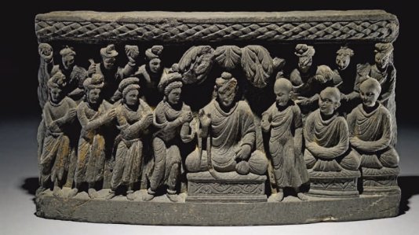

Anālayo The Foundation History of the Nuns' Order Hamburg Buddhist Studies 6 Series Editors: 

Steffen Döll | Michael Zimmermann Anālayo The Foundation History of the Nuns' **Order**
projektverlag.

Bibliographic information published by the Deutsche Nationalbibliothek The Deutsche Nationalbibliothek lists this publication in the Deutsche Nationalbibliografie; detailed bibliographic data are available in the Internet at http://dnb.d-nb.de.

ISSN 2190-6769 ISBN 978-3-89733-420-5 (E–Book)
ISBN 978-3-89733-387-1 (printed version)
© 2016 projekt verlag, Bochum/Freiburg www.projektverlag.de Cover: punkt KOMMA Strich GmbH, Freiburg www.punkt-komma-strich.de Cover original design by Benjamin Guzinski; Julia Wrage, Hamburg Figure on Cover: Gandhāra, courtesy the Trustees of the British Museum Contents

| List of Figures                                   | 7   |
|---------------------------------------------------|-----|
| Foreword                                          | 9   |
| Michael Zimmermann and Steffen Döll  Introduction | 11  |
| 1 Mahāprajāpatī Gautamī in the Nandakovāda        | 15  |
| 1.1 The Introductory Narrative                    | 16  |
| 1.2 The Attainments of the Nuns                   | 26  |
| 1.3 Narrative Distancing                          | 36  |
| 2 Mahāprajāpatī Gautamī's Petition                | 39  |
| 2.1 The Main Versions of the Foundation History   | 39  |
| 2.2 The Initial Request                           | 43  |
| 2.3 The Buddha's Refusal                          | 49  |
| 2.4 Mahāprajāpatī Gautamī's Reaction              | 52  |
| 3 Ānanda's Intervention                           | 59  |
| 3.1 Mahāprajāpatī Gautamī and Ānanda              | 59  |
| 3.2 Mahāprajāpatī Gautamī's Gift of a Robe        | 68  |
| 3.3 Arguments Raised by Ānanda                    | 72  |
| 3.4 Women's Potential for Awakening               | 79  |
| 3.5 Ānanda's Role                                 | 85  |
| 4 The Buddha's Permission                         | 91  |
| 4.1 The Simile of the Dyke                        | 91  |
| 4.2 The Gurudharmas on Communal Transactions      | 95  |
| 4.3 The Gurudharmas on Homage and Criticism       | 101 |
| 5 Mahāprajāpatī Gautamī's Ordination              | 117 |
| 5.1 The Simile Illustrating Acceptance            | 117 |
| 5.2 Repercussions of Female Renunciation          | 122 |
| 5.3 Apprehensions                                 | 133 |
| 5.4 Other Instances of Negativity                 | 140 |

| 6 Decline                                     | 147   |
|-----------------------------------------------|-------|
| 6.1 The Prediction of Decline                 | 147   |
| 6.2 Outstanding Nuns                          | 151   |
| 6.3 The Four Assemblies                       | 155   |
| 6.4 The First Saṅgīti                         | 159   |
| Conclusion                                    | 179   |
| Translations                                  | 183   |
| The Dharmaguptaka Vinaya Version              | 183   |
| The (Haimavata?) *Vinayamātṛkā Version        | 189   |
| The Mahāsāṃghika-Lokottaravāda Vinaya Version | 191   |
| The Mahīśāsaka Vinaya Version                 | 202   |
| The Mūlasarvāstivāda Vinaya Version           | 208   |
| The (Sarvāstivāda) Madhyama-āgama Version     | 217   |
| The Theravāda Aṅguttara-nikāya Version        | 228   |
| Abbreviations                                 | 235   |
| References                                    | 237   |
| Index                                         | 271   |

| Figure 1: Nuns Facing Mahāpajāpatī Gotamī             | 27   |
|-------------------------------------------------------|------|
| Figure 2: Petitioning the Buddha                      | 48   |
| Figure 3: Māra's Daughters                            | 83   |
| Figure 4: Men and Women in a Royal Household          | 94   |
| Figure 5: The Nun Utpalavarṇā as a Wheel-turning King | 138  |
| Figure 6: Outstanding Nuns                            | 154  |

# Foreword

## About Hamburg Buddhist Studies

Ever since the birth of Buddhist Studies in Germany more than 100 years ago, Buddhism has enjoyed a prominent place in the study of Asian religions. The University of Hamburg continues this tradition by focusing research capacities on the religious dimensions of South, Central, and East Asia and making Buddhism a core subject for students of the AsienAfrika-Institut. The Numata Center for Buddhist Studies is proud to have found a home at one of Europe's pioneering academic institutions. 

With its *Hamburg Buddhist Studies* book series it honours the Univer-sity's long-standing commitment to research in the field of Buddhist studies and aims to share its results with both the academic community and the wider public. 

Today, Buddhist Studies as an academic discipline makes use of a broad spectrum of approaches and methods. The field covers contemporary issues as much as it delves into the historical aspects of Buddhism. 

Similarly, the questions shaping the field of Buddhist Studies have broadened. Understanding present-day Buddhist phenomena - and how such phenomena are rooted in and informed by a distant past - is not at all an idle scholarly exercise. Rather, it has become clear that fostering the un-derstanding of one of the world's major religious traditions is a crucial obligation for modern multicultural societies in a globalized world. 

Accordingly, *Hamburg Buddhist Studies* addresses Buddhism as one of the great humanistic traditions of philosophical thought, religious praxis, and social life. Its discussions will undoubtedly be of interest to scholars of religious studies and specialists of Buddhism, but also aim at confronting Buddhism's rich heritage with questions the answers to which might not easily be deduced by the exclusive use of historical and philological research methods. Such issues require the penetrating insight of scholars who approach Buddhism from a broad range of disciplines, building upon and yet going beyond the solid study of texts and historical evidence. 

We are convinced that Hamburg *Buddhist Studies* will contribute to opening up the field to those who may have no training in the classical source languages of the Buddhist traditions but approach the topic against the background of their own disciplinary interests. With this book series, we would like to also encourage a wider audience to take an interest in the academic study of the Buddhist traditions. 

## About This Volume

It is our great pleasure to introduce the sixth volume in the Hamburg Buddhist Studies series - a study by Bhikkhu Anālayo, professor at the Asien-Afrika-Institut of the University of Hamburg. This book is a companion to his previous works The *Genesis of the Bodhisattva Ideal* and The *Dawn of Abhidharma* in the same series. In the present study, he examines the foundation history of the order of Buddhist nuns based on a detailed analysis of canonical accounts in Chinese, Pāli, Sanskrit, and Tibetan. 

Anālayo shows how the different and at times conflicting parts of the narratives of this particular episode evolved over time to finally constitute the foundation history as it is now remembered. By showing where these elements originated and how they have grown to become foundation history, his findings put into perspective the Buddha's refusal to establish an order of nuns as well as his prediction that women going forth would spell the decline for the whole of the Buddhist tradition. The results of his analyses reflect the potential of comparative studies and the need to pay attention to detail in order to be able to reconstruct the development of a particular narrative in the course of its transmission. 

Michael Zimmermann and Steffen Döll 

# Introduction

## Theme

This book proceeds in line with my earlier explorations of the beginnings of the bodhisattva ideal and of the emergence of the Abhidharma in The Genesis of the *Bodhisattva Ideal* and The *Dawn of Abhidharma* in the same *Hamburg Buddhist Studies* series. Subsequent to these surveys of developments related to the Buddha and the Dharma, in what follows I employ the same historical-critical method of comparative study to examine a development in relation to the Saṃgha, namely the founding of the order of nuns. 

The canonical accounts of this event are complex testimonies to the multivocality that pervades early Buddhist discourse on women in general and on nuns (bhikṣuṇīs/*bhikkhunī*s) in particular.1 My main interest in the next pages is to uncover the different voices that make themselves heard in these accounts and try to explore how the main elements in the narrative of the Buddha's founding of an order of nuns gradually came to build up the texts to which we now have access. 

Work on this topic started ten years ago when preparing a paper for the International Congress on Women's Role in the Saṅgha, held at the University of Hamburg in 2007. In that paper I surveyed basic problems in the foundation history of the order of nuns, summarizing the findings of other scholars in this respect.2 The following year I critically examined theories proposed by other scholars to solve some of these problems, concluding that their failure to provide a satisfactory explanation is in part due to not taking into account all relevant canonical accounts.3 In the intervening years I have explored various aspects of the role of women in general and nuns in particular in early Buddhist canonical texts, in order to gain a clear understanding of narrative strategies that in one way or another also emerge in the foundation history of the order of nuns.4 The present study is divided into six chapters. The first chapter is an introductory case study of negative attitudes towards nuns; the remaining five are concerned with the impact of similar attitudes on the foundation history itself. 

In the first chapter I study narrative portions of a discourse that fea-tures Mahāprajāpatī Gautamī and a group of nuns, which reveals differences in attitudes towards nuns evident in the parallel versions. 

With the second chapter I turn to the foundation history of the order of nuns, beginning with Mahāprajāpatī Gautamī's petition and her re-sponse to the Buddha's refusal. Ānanda's intervention on her behalf and the ensuing discussion is the topic of the third chapter, and in the fourth chapter I study the eight *gurudharma*s that according to the foundation history were stipulated by the Buddha as the basis for the coming into being of an order of nuns. The acceptance of these eight *gurudharma*s by Mahāprajāpatī Gautamī and the Buddha's reaction on being informed of this acceptance are the theme of the fifth chapter. In the sixth chapter I move on to the prediction that the existence of an order of nuns will result in shortening the lifespan of the Buddha's dispensation, and to the same theme as evident in the accounts of the first sa*ṅgīti*. 

Following my conclusions, I provide translations of the seven main canonical versions of the foundation history of the order of nuns on which my presentation is based.5
―――――― 3 Anālayo 2008a: 125.

4 Studies that have informed my present exploration of the foundation history of the order of nuns are Anālayo 2009a, 2010a, 2011b, 2011c, 2013b, 2014a, 2014d, 2014e, 2014h, 2015b, and 2015e. 

5 The full translations are accompanied by a few notes on selected problems and variant readings adopted, which I do not repeat when presenting extracts from these transla-
Throughout this study, my intention is not to reconstruct what actually happened on the ground in ancient India, which in view of the limitations of the source material at our disposal would anyway be a questionable undertaking. Instead, my intention is to reconstruct what happened during the transmission of the texts that report this event. In short, I am not trying to construct a history, I am trying to study the construction of a story. This is not merely an academic exercise, however, since this story had and still has considerable influence on the situation on the ground, influencing attitudes towards nuns in different Buddhist communities.

## Acknowledgement

I am indebted to Adam Clarke, Alice Collett, Bhikkhu Ariyadhammika, Bhikkhunī Dhammadinnā, Petra Kieffer-Pülz, Michael Radich, Mike Running, Lambert Schmithausen, and Bhikṣunī Syinchen for commenting on this work, or parts of it, in the various stages of its evolution. 

# 1 Mahāprajāpatī Gautamī In The Nandakovāda

In this chapter my aim is to provide a case study reflecting attitudes towards nuns in early Buddhist canonical narrative, as a preparation for turning to the *Vinaya* accounts of the founding of the nuns' order. Ma-hāprajāpatī Gautamī is the central protagonist in the foundation history, as she takes the initiative and petitions the Buddha to allow women to go forth, herself becoming the first Buddhist nun. The way her personality and actions are described elsewhere in early Buddhist discourse literature provides a background for her role in the accounts of how the order of nuns came into being.1 In the present chapter I explore in detail narrative strategies evident in the Nandakovāda*-sutta* and its parallels. I study the narrative portions of this discourse in particular, as these exemplify tendencies recurrent in other early Buddhist texts that involve nuns, such as the foundation history to which I will turn in the next chapter. 

I begin with a comparative study of the introductory narrative of the discourse (1). Then I examine the report of the attainments reached by the nuns in the parallel versions (2), and briefly turn to other instances that, similar to the Theravāda version of the *Nandakovāda*, show an attitude of distancing nuns in the sense of narratively positioning them at a distance from the Buddha and other monks, who do not speak to them directly or treat them in a somewhat off-handed manner (3). The following versions of the *Nandakovāda* will be taken into account: 
- the Nandakovāda*-sutta* in the Majjhima-*nikāya*;
2
- a discourse in the Saṃyukta-*āgama*, probably stemming from a Mū-lasarvāstivāda line of transmission;3
- Sanskrit fragments;4
- Mūlasarvāstivāda *Vinaya* discourse quotations, preserved in Chinese and Tibetan translation.5

## 1.1 The Introductory Narrative

The basic plot of the *Nandakovāda* proceeds as follows: The monk Nandaka has not taken his turn at giving teachings to the nuns. The Buddha tells him that he should do so, whereupon he approaches the nunnery and gives them a teaching. On the Buddha's request, he does the same a second time. The discourse concludes with the Buddha announcing the attainments reached by the nuns. 

The introductory narrative in the Nandakovāda*-sutta* of the Majjhi-ma-*nikāya*, after the standard introductory phrase "thus have I heard" and a reference to the Buddha's whereabouts,6 proceeds as follows: 
Then Mahāpajāpatī Gotamī together with five hundred nuns approached the Blessed One. Having approached and paid homage to the Blessed One, she stood to one side. Standing to one side, Mahāpajāpatī Gotamī said to the Blessed One: 
"Venerable sir, may the Blessed One exhort the nuns, venerable sir, may the Blessed One teach the nuns, venerable sir, may the Blessed One give the nuns a talk on the Dharma."
At that time the senior monks were taking turns at exhorting the nuns. The venerable Nandaka did not wish to take his turn at exhorting the nuns. 

Then the Blessed One addressed Ānanda: "Ānanda, whose turn is it now to exhort the nuns?" 
[Ānanda said]: "Venerable sir, in taking turns to exhort the nuns it is Nandaka's turn.7 Venerable sir, the venerable Nandaka does not wish to take his turn at exhorting the nuns."
Then the Blessed One addressed the venerable Nandaka: "Nandaka, exhort the nuns, Nandaka, teach the nuns, brahmin, give the nuns a talk on the Dharma."
The venerable Nandaka assented: "It is well, venerable sir."8 The Saṃyukta-*āgama* discourse precedes the present narrative portion by indicating that at that time "great disciples from the community of nuns" were dwelling at the Rājakārāma,9 followed by a listing of their names. The Mūlasarvāstivāda *Vinaya* similarly introduces them as senior nuns and lists their names.10 No such indication is given in the Majjhima-*nikāya* version. The part in the Saṃyukta-*āgama* version that corresponds to the above extract reads as follows: 
At that time the nun Mahāprajāpatī Gautamī, surrounded by five hundred nuns, approached the Buddha, paid respect with her head at his feet, and sat back to one side. 

Then the Blessed One taught the Dharma to the nun Mahāprajāpa-tī Gautamī [and the other nuns], instructing, teaching, illuminating, and delighting them. Having in various ways taught them the Dharma, instructed, taught, illuminated, and delighted them, he gave them leave to return by saying: "Nuns, it is the proper time for you to leave." 
Hearing what the Buddha had said, the nun Mahāprajāpatī Gautamī [and the other nuns] were delighted, rejoiced in it, paid respect, and left. 

When the Blessed One knew that the nun Mahāprajāpatī Gautamī 
[and the other nuns] had left, he addressed the monks: "I have become old, I am no longer able to teach the Dharma to the nuns. From now on those of you in the community of monks who are senior virtuous elders should give instructions to the nuns." 
Then the monks, on receiving the Blessed One's instruction, took turns in giving instructions to the nuns until it was Nanda[ka]'s turn. Then Nanda[ka] did not want to give them instructions, [even though] 
it was his proper turn. 

Then the nun Mahāprajāpatī Gautamī, surrounded by five hundred nuns, approached the Buddha, paid respect with her head at his feet … *up to* … they were delighted and rejoiced in hearing the Dharma, paid respect, and left. 

When the Blessed One knew that the nun Mahāprajāpatī Gautamī had left, he asked the venerable Ānanda: "Whose turn is it to give instructions to the nuns?"
The venerable Ānanda said to the Buddha: "Blessed One, the elders have been taking turns in giving instructions to the nuns until Nanda[ka]'s turn has come, yet Nanda[ka] does not want to give them instructions."
Then the Blessed One said to Nanda[ka]: "You should give instructions to the nuns, you should teach the Dharma to the nuns. 

Why is that? I myself give instructions to the nuns, so you should also do it. I teach the Dharma to the nuns, so you should also do it." 
At that time, Nanda[ka] silently accepted the instruction.11 In the section preceding the translated extract, the Saṃyukta-*āgama* version introduces the nun protagonists of the discourse by name and qualifies them as great disciples. This is a way of introducing them to the audience of the discourse that is more favourable to them than simply mentioning that there were five hundred nuns accompanying Mahāprajāpatī Gautamī, as is the case in the Majjhima-*nikāya* version. 

In the Saṃyukta-*āgama* account, as well as in the Mūlasarvāstivāda Vinaya, 12 Mahāprajāpatī Gautamī sits down. In the Majjhima-*nikāya* version she instead remains standing. Now the posture adopted during a conversation serves as an expression of respect and establishes the position of the participants in that conversation within the hierarchically structured system of relationships of ancient Indian society. In the early discourses, the description of the posture adopted by someone who comes to speak to the Buddha acts as a signifier, providing the audience with a hint about the kind of person that has come and what type of action can be expected of him or her. 

Contextualizing the present instance within the Majjhima-*nikāya* collection shows that in the overwhelming majority of cases when monastics or lay disciples approach the Buddha, they sit down. In a few Maj-jhima-*nikāya* discourses the standing posture is taken by those who have just come to deliver a short message.13 In several other cases, the standing posture is adopted by outsiders who do not consider themselves to be disciples of the Buddha, often by those who have come with the intention to challenge him.14 Because Mahāprajāpatī Gautamī has come for a talk on the Dharma, her function goes beyond merely acting as a messenger. That she is nevertheless depicted in the standing posture while speaking to the Bud-
―――――― 12 T 1442 at T XXIII 792a25 and D 3 ja 51a4 or Q 1032 *nye* 49a1.

13 MN 85 at MN II 97,13, MN 91 at MN II 142,6, and MN 128 at MN III 153,1, where the last instance is the only case I have been able to locate in the Majjhima-*nikāya* where a Buddhist monastic remains standing while speaking to the Buddha. 

14 MN 18 at MN I 108,24, MN 51 at MN I 339,8 (which is particularly remarkable as it describes a non-Buddhist wanderer remaining in the standing posture even though a lay disciple of the Buddha who arrived together with him has already sat down), MN 
54 at MN I 359,17, MN 56 at MN I 372,2, MN 74 at MN I 497,24, and MN 80 at MN 
II 40,5. My survey only takes into account human visitors approaching the Buddha. The adoption of postures differs for *deva*s, who are generally depicted as remaining standing when conversing with humans. 

dha presents her in a way that is elsewhere associated with outsiders who have come to challenge the Buddha. 

Although this is a rather minor point, given the function of such small signifiers in the context of a narrative, it does invest her behaviour with a subtle nuance of inappropriateness or even challenge. In other words, to an audience accustomed to the mode of narration adopted in other discourses in the Majjhima-*nikāya*, this detail could easily give the impression that something slightly wrong is going on.

In contrast, for her to sit down, as she does in the parallel versions, would be normal for a disciple who has come to visit the Buddha in the hope of hearing a discourse from him. This is in fact precisely what happens in the Saṃyukta-*āgama* account, as well as in the Mūlasarvāstivāda *Vinaya*,
15 where the Buddha on his own initiative gives a talk on the Dharma to Mahāprajāpatī Gautamī and her following of nuns. This happens twice, once before the Buddha's injunction to the monks that they should give teachings to the nuns, and then a second time when Nandaka fails to take his turn. 

In the Pāli version, however, the Buddha does not give them a talk even after being explicitly requested by Mahāprajāpatī Gautamī to instruct the nuns, to teach the nuns, and to give the nuns a talk on the Dharma. 

Making a request three times in the early discourses functions as a marker of keen interest. The usual pattern is that, after declining the first and second instance, when requested a third time the Buddha will accede to the request. The present case differs in so far as Mahāprajāpatī Gautamī makes her request in one go, without intervening refusals by the Buddha, so that the use of three expressions to request the same is more of a formulaic way of expressing keen interest and not a full instance of making three separate requests. 

In spite of this emphatic request, the Buddha does not give the nuns any teaching. In fact he does not even speak to them. Instead he turns round to Ānanda. For the Buddha in his role as a teacher of mankind not to respond to an invitation for delivering a teaching, and simply give the petitioner the cold shoulder, conveys a rather strong message. 

The impression conveyed by the Pāli version stands in contrast not only to the portrayal of the Buddha's teaching activities in other early discourses in general, but also to his attitude towards Mahāprajāpatī Gau-tamī as depicted in the Theravāda *Vinaya*. The relevant *Vinaya* passage reports that once Mahāprajāpatī Gautamī was sick and the Buddha visited her personally to give her a talk on the Dharma, even though he had earlier laid down a rule that monks should not visit nuns to give them exhortation. The narrative continues by reporting that this episode then motivated the Buddha to amend the rule and allow for visits to exhort nuns who are sick and not able to approach a monk to receive exhortation.16 When in the present case Mahāprajāpatī Gautamī and her following have approached the Buddha with the explicit wish to receive instructions, it is rather startling to find that the Buddha does not comply with their request. The audience of the discourse would not have failed to pick up the nuance that there is something not quite right with Mahāpra-jāpatī Gautamī or her request. 

The way the Buddha just ignores her stands out more prominently when compared to the fact that in the Saṃyukta-*āgama* he politely waits for her to leave before enquiring with Ānanda which of the monks had not taken his turn in teaching the nuns. The same is the case in the Mūlasarvāstivāda Vinaya.

17 In this way the Buddha tactfully avoids addressing the theme of a monk being unwilling to teach the nuns in front of Mahāprajāpatī Gautamī and the group of nuns headed by her. Although the nuns must have been aware of the fact that a monk had not taken his turn at teaching them, it is nevertheless a polite and thoughtful gesture to avoid discussing this issue right in front of them, which would have been embarrassing for them (as well as for the monk, who could be expected to prefer not to be taken to task in front of the nuns). 

Instead of such considerate and tactful behaviour, in the Pāli version the Buddha directly turns to Ānanda. Since this is in reply to Mahāprajāpatī Gautamī's request for a teaching, it seems fair to assume that the nuns are still there, hoping to receive some instruction. Such behaviour then gives the impression that the Buddha not only ignores their request, but even ignores their presence to the extent of discussing a matter right in front of them which in the parallel versions he tactfully takes up once they have left. 

This stands out in comparison to a later part in the same Nandakovā-*da-sutta*, where the Buddha announces the attainments reached by the nuns. Here the Pāli version agrees with its parallels in indicating that the Buddha waited until the nuns had left to make his announcement.18 When telling Nandaka that he should take his turn at teaching the nuns, in the Majjhima-*nikāya* discourse the Buddha employs exactly the same string of three terms that Mahāprajāpatī Gautamī had used, requesting him to instruct the nuns, to teach the nuns, and to give the nuns a talk on the Dharma. In this way, the Nandakovāda*-sutta* gives the impression that teaching the nuns is something that the Buddha, on being requested by Mahāprajāpatī Gautamī to undertake himself, prefers to pass on to Nandaka. 

In the Saṃyukta-*āgama* account the Buddha had earlier made it clear that he was becoming too old to give instructions and for this reason wanted the monks to take turns in teaching the nuns. The discourse quo-tation in the Mūlasarvāstivāda *Vinaya* reports the Buddha explaining that he is now too old to be giving talks to the four assemblies, i.e., monks, nuns, male lay followers, and female lay followers.19 In the Saṃyukta-*āgama* presentation the Buddha then takes up the same theme when telling Nandaka that he should follow the example set by the Buddha. The Mūlasarvāstivāda *Vinaya* version proceeds similarly.20 This endows the task of teaching the nuns with an air of honour and privilege, where the one who takes up this task is thereby allowed to stand in place of the Buddha. 

Nandaka then accepts the task by remaining silent. In the Majjhima-*nikāya* version, he instead replies in the affirmative. Although this is a very minor difference only, when evaluated in the light of other Majjhi-ma-*nikāya* discourses it does appear to have some significance. In such discourses monks give an affirmative reply on being asked a question by the Buddha during the course of one of his talks. Instances in the same collection when monks are being reproved by the Buddha differ, however, as in such a situation the monks will remain silent.21 Here their silence serves as an acknowledgement of the fact that they have done something inappropriate. 

Since in the present case Nandaka is being taken to task for having neglected to do his duty, silent acknowledgement would be an appropriate reaction. This is quite obvious if the Buddha had personally entrusted the task of teaching the nuns to the monks, giving as the reason his advanced age. By shirking his duty Nandaka would not only have disobeyed his teacher's injunction, but he would also have shown a lack of compassionate concern for the Buddha's advanced age. 

The same would to some extent also hold from the viewpoint of the Theravāda tradition, since according to the Pāli *Vinaya* a monk who does not take his turn in instructing the nuns incurs an offence of wrongdoing (*dukka*ṭa).22 Independent of whatever temporal relation obtains between the promulgation of this regulation and the events recorded in the Nandakovāda*-sutta*, the fact that this eventually became an offence makes it clear that Nandaka's behaviour was far from ideal. 

Yet for Nandaka to give an affirmative reply rather conveys the impression that there is nothing really wrong with his having shelved his duty and not taken his turn at teaching the nuns. This impression finds confirmation in the circumstance that the Buddha addresses him with the laudatory term "brahmin" in the Majjhima-*nikāya* discourse. According to the *Apadāna*, Nandaka was not a brahmin by birth.23 This implies that, from the viewpoint of the Theravāda tradition, the use of the term "brahmin" in the present context should be understood as a form of praise. The use of a laudatory form of address then gives the impression that Nandaka needed to be complimented in order to convince him to teach the nuns. This also to some extent trivializes his earlier shirking of this task. 

The Pāli narrative that comes after the excerpt translated above reports that, when Nandaka approaches the nunnery to give a teaching, the nuns not only prepare a seat for him, a gesture of welcome similarly recorded in the parallel versions, but also set out water for him to wash his feet.24 In the ancient Indian setting, to set out water for washing the feet would of course be natural, given that those who arrive must have dirty feet from walking, presumably barefooted, on the dusty roads of India.25 Hence the feet need to be washed before sitting down to avoid dirtying the robes and the seat. In itself, this action is just as innocuous as the preparation of a seat. 

―――――― 23 Ap 499,27 (stanza 542.14) reports Nandaka indicating that in this last birth of his he had been born in an eminent merchant family, *seṭṭhikule*, so that to call him a brahmin would not reflect his birth. As pointed out by Horner 1959: 323 note 3, in the present passage in MN 146 the expression *brāhmaṇ*a is thus used as "a term of high regard".

24 MN 146 at MN III 271,6. 

25 In fact setting out water for washing the feet is according to the Theravāda *Vinaya* one of the duties of a resident monastic on the occasion of the arrival of a visiting monastic; cf. Vin II 210,25. 

However, another question is whether the reciters of a discourse mention such a detail. Elsewhere in the Majjhima-*nikāya* the setting out of water for washing the feet is described several times as a way of welcoming the Buddha who has come to visit some of his monk disciples.26 The invitation to sit on a prepared seat without a reference to water being set out, however, occurs also on other occasions, such as when receiving other monks who have come for a visit.27 So a reference to setting out water for washing the feet appears to be used elsewhere in the Majjhima-*nikāya* to signify the respect expressed towards the Buddha on selected occasions. For it to recur also in the present context might give the impression that the nuns are at so low a hierarchical level that a monk, who comes to teach them, should be treated with such respect as if he were the Buddha himself. 

In this way, within a relatively short narrative portion rather distinct attitudes emerge. Presented in summary fashion from the viewpoint of the Saṃyukta-*āgama* version, these are: 
1) the nuns are introduced by name and as great disciples 2) Mahāprajāpatī Gautamī sits down 3) without being asked to do so, the Buddha twice gives them a teaching 4) because of his old age, the Buddha asks the monks to teach the nuns 5) he waits until they have left to enquire who has not taken his turn 6) by teaching the nuns Nandaka would follow the Buddha's example 7) Nandaka remains silent, in line with his having failed to do his duty 8) when Nandaka arrives, the nuns politely welcome him The same items from the viewpoint of the Majjhima-*nikāya* version are as follows: 
1) the nuns are neither introduced by name nor qualified as great disciples 2) Mahāprajāpatī Gautamī remains standing 3) the Buddha does not teach the nuns, in spite of their request 4) the discourse does not explain why the monks should teach the nuns 5) the Buddha ignores the presence of the nuns 6) the Buddha just passes Gautamī's request on to Nandaka 7) Nandaka, lauded as a brahmin, replies as if he had done nothing wrong 8) when he arrives, the nuns act as respectful as if he were the Buddha 

## 1.2 The Attainments Of The Nuns

The same difference of attitudes that appears to be underlying the introductory narrative recurs in the report of the attainments reached by the nuns after the teachings delivered by Nandaka. Here is the relevant passage from the Majjhima-*nikāya* version: 
Then the venerable Nandaka, having exhorted the nuns with this exhortation, gave them leave, saying: "Go, sisters, it is time." 
Then the nuns, having delighted and rejoiced in what the venerable Nandaka had said, rose from their seats and paid homage, keeping him to their right, and approached the Blessed One. Having approached the Blessed One and paid homage to him, they stood to one side. The Blessed One said to the nuns who were standing to one side: "Go, sisters, it is time." Then the nuns paid homage to the Blessed One and left, keeping him to their right. 

Soon after the nuns had left, the Blessed One addressed the monks: 
"Monks, it is just as if on the observance day, the fourteenth, people have no doubt or uncertainty: 'Is the moon not yet full or is the moon full?', for the moon is then not yet full. In the same way, monks, the nuns are delighted with the Dharma teaching of Nandaka, but their aspirations have not been fulfilled."
Then the Blessed One addressed Nandaka: "Well then, Nandaka, 

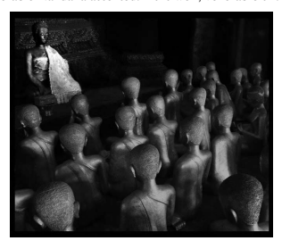

tomorrow you should instruct the nuns with the same instruction. 

The venerable Nandaka assented: "It is well, venerable sir."28 Figure 1 Nuns Facing Mahāpajāpatī Gotamī29 The Nandakovāda*-sutta* at this juncture repeats the narrative of Nanda-ka's going to beg and approaching the nunnery and then the PTS edition abbreviates the actual talk given by him.30 The text in this edition then begins again with the description of how Nandaka gave leave to the nuns:
"Go, sisters, it is time." …31 Soon after the nuns had left, the Blessed One addressed the monks: "Monks, it is just as if on the observance day, the fifteenth, people have no doubt or uncertainty: 'Is the moon not yet full or is the moon full?', for the moon is then full. 

In the same way, monks, the nuns are delighted with the Dharma teaching of Nandaka and their aspirations have been fulfilled. Monks, even the most backward of the five hundred nuns is a stream-enterer, no longer subject to downfall, certain to proceed to full awaken-ing."32 The corresponding part of the Saṃyukta-*āgama* discourse proceeds as follows: 
At that time the venerable Nanda[ka] taught the Dharma to the nuns, instructing, teaching, illuminating, and delighting them. Having instructed, taught, illuminated, and delighted them, he rose from his seat and left. 

Then, the nun Mahāprajāpatī Gautamī, surrounded by the five hundred nuns, approached the Buddha, paid respect with her head at his feet, and sat back to one side … *up to* … she paid respect to the Buddha and left. 

When the Blessed One knew that the nun Mahāprajāpatī Gautamī 
[and the other nuns] had left, he said to the monks: "It is like the bright moon on the night of the fourteenth day and various people look at the moon, [thinking]: 'Is it full or is it not yet full?' One should know that the moon is not really full. 

"In the same way the clansman Nanda[ka] has given proper instructions to the five hundred nuns, properly taught them the Dharma, 
[yet] their liberation is not really full. However, were it the time of passing away for these nuns, I do not see a single fetter that they have not eliminated due to which they would be reborn in this world."
Then the Blessed One said to Nanda[ka]: "You should teach the Dharma to the nuns again." 
Then the venerable Nanda[ka] silently accepted the injunction. In the morning, when the night was over, he took his bowl to enter the city to beg for alms. Having partaken of the alms … *up to* … he approached the Rājakārāma and sat on a [prepared] seat.

33 He taught the Dharma to the nuns, instructing, teaching, illuminating, and delighting them. Having instructed, taught, illuminated, and delighted them, he rose from his seat and left. 

At a subsequent time, the nun Mahāprajāpatī Gautamī, surrounded by the five hundred nuns, approached the Buddha, paid respect with her head at his feet … *up to* … she paid respect and left. 

When the Blessed One knew that the nun Mahāprajāpatī Gautamī 
[and the other nuns] had left, he said to the monks: "It is like the bright moon on the night of the fifteenth day, people have no doubt whether the moon is full or not full, since the moon is completely full. 

"In the same way, the clansman Nanda[ka] has given proper instructions to the five hundred nuns, their liberation is complete. If it were the time of passing away for them, nobody could proclaim the course of their destination. It should be known that [they have reached] 
the end of duḥkha."
In this way the Blessed One conferred on the five hundred nuns a declaration of the supreme fruit.34 jhima-*nikāya* version, in contrast, the Buddha only indicates that the aspirations of the nuns have not been fulfilled. 

The second teaching by Nandaka in the Pāli version then is a repetition of what he taught earlier; in fact the Buddha explicitly asks him to give the same teaching to them. The parallel versions simply speak of him teaching the Dharma to the nuns, not necessarily repeating the same instruction he gave earlier. 

Now in an oral setting the repetition of an instruction does have its place as a guided form of meditation whose function goes beyond the mere conveying of information. However, when considered together with the absence of a reference to any attainment reached by the nuns, the impression could easily arise that the nuns were not really up to it and needed to be given the same teaching once more to understand it fully.36 With the second teaching, according to the Saṃyukta-*āgama* account the nuns all reached full awakening. The same holds for the Mūlasarvāstivāda *Vinaya* version.37 According to the Majjhima-*nikāya* discourse, however, after the second teaching the nuns had only reached various levels of awakening, with the most backward among them being a streamenterer. 

Summarizing the situation from the viewpoint of the Saṃyukta-*āgama*, 
the main points are: 1) with the first teaching the nuns all reach non-return 2) the second teaching is a talk on the Dharma 3) with the second teaching the nuns all reach full awakening In contrast, the same points in the Majjhima-*nikāya* are as follows: 
1) no attainment of the nuns reported after the first teaching 2) the second teaching is exactly the same as the first 3) with the second teaching some nuns only reach stream-entry When evaluating these different presentations, in principle the Majjhi-ma-*nikāya* version could be the outcome of a later change, or else it could represent the more original version. 

The presentation in the Saṃyukta-*āgama* discourse and in the Mūla-sarvāstivāda *Vinaya* receives an unexpected confirmation from the Pāli commentary on the Aṅguttara-*nikāya*, according to which with Nandaka's second instruction the nuns had indeed all become arhats.38 The same is also reported in the commentaries on the *Theragāthā* and the Therīgāthā.

39 It is remarkable that these Pāli commentaries should in this respect agree with the Saṃyukta-*āgama* discourse and the Mūlasarvāstivāda *Vinaya*, against a Pāli discourse.

Now the Pāli commentaries obviously contain later material than the discourses. Hence the circumstance that the commentaries on the Aṅgut-tara-*nikāya* and the *Theragāthā* and *Therīgāthā* report that all nuns became arhats, whereas the Pāli discourse mentions a lesser outcome, could be taken to imply that a later development has enhanced the abilities of the nuns. 

Yet the difference regarding the level of attainment of the nuns is not a question of merely commentary against discourse, because according to the commentary on the Majjhima-*nikāya* the nuns did not all reach full awakening. The explanation given in this particular commentary is that with Nandaka's second teaching some nuns only reached lower stages of awakening.40 Thus the disagreement regarding their level of attainment is also found between commentaries in the Theravāda tradition.41 So the significance of the commentaries on the Aṅguttara-*nikāya* and the *Theragāthā* and *Therīgāthā* does not appear to be that they allow us to assign the idea that the nuns became arhats to the commentarial period, and therefore to a later stage of development. Rather, their significance lies in the fact that their presentation is in disagreement with the Pāli discourse and with another commentary of the same Thera-vāda tradition. 

The hypothesis that the nuns were only at a later time held to have all reached full awakening would require that either the Theravāda commentarial tradition influenced the Mūlasarvāstivāda reciter tradition as evident in the Saṃyukta-*āgama* discourse and the Mūlasarvāstivāda *Vinaya* 
(and the Sanskrit fragment version), or else this influenced the commen-tarial tradition preserved in Pāli, because it seems less probable that the same idea arose independently in these textual traditions. 

Although such cross-tradition influence is certainly possible, it is easier to imagine that the Nandakovāda*-sutta* underwent a later change in this respect, which then also influenced the commentary on the Nan-dakovāda*-sutta*. Given that those who recite the discourse would also be those who transmit the respective commentary,42 such a change would involve the same reciters, without requiring influence from outside groups. 

In line with the law of parsimony, this simpler explanation seems preferable over the assumption that an idea arose in one tradition, be this the Theravāda or the Mūlasarvāstivāda tradition, and was then taken over in the other. 

In its gloss on the attainments of the nuns, the Majjhima-*nikāya* commentary explains that some of them had from the outset only aspired to lower stages of awakening.43 Hence the image of the full moon, used according to all versions by the Buddha when informing the assembled monks of the level of development of the nuns, conveys according to the commentarial explanation the idea that these aspirations have been fulfilled. 

This explanation seems somewhat forced, because one would be at a loss to understand why some nuns should only aspire to lower levels of awakening. I am not aware of a precedent for this idea elsewhere in the discourses, in the sense that a monastic who sincerely aspires for liberation (instead of going forth for any other motive) has nevertheless from the outset the wish to attain only a lower stage and will be fully satisfied with that. In a way this results in yet another instance where the nuns are presented in a less favourable light, in that their aspirations are inferior to the normative type of motivation regularly associated with the going forth of monks. 

The image of the pure or full moon stands elsewhere in the Pāli canon for those who have reached full awakening.44 This makes it more natural if in the present context it were to carry a similar nuance, that is, if the original point of the moon simile was to illustrate the attainment of full awakening by the nuns. 

In fact the image of the moon being almost full on the fourteenth and then completely full on the fifteenth day fits well as an illustration of almost reaching full awakening with the attainment of non-return and then completely reaching full awakening, giving the impression that this might well have been its original import.45 The assumption that the original version of the discourse must have been more favourably disposed towards the nuns than the presentation we now have in the Nandakovāda*-sutta* finds further support in the circumstance that for Nandaka to be presented in a rather positive light does not square well with the fact that he has done something the Vi-*naya* eventually considers an offence. 

Moreover, for the Buddha to ignore a sincere request by a group of his monastic disciples for a teaching given by himself is astonishing, given that the very defining mark of a Buddha is that, having reached awakening on his own, he teaches others. The most straightforward interpretation of such difficulties in the Nandakovāda*-sutta* would be that they arose as unintended by-products of later changes affecting the Pāli version. 

The hypothesis of later changes affecting the Pāli version receives further support from another difference between the parallel versions. 

The Saṃyukta-*āgama* discourse and the Mūlasarvāstivāda *Vinaya* report that, when the first teaching is over, Nandaka leaves. In the Nandakovā-*da-sutta*, however, Nandaka tells the nuns that it is time for them to go, at which point they leave.46 This is puzzling, because the Nandakovāda*sutta* agrees with its parallels that the venue of Nandaka's teaching was the Rājakārāma, a nunnery to which Nandaka had come to instruct the nuns. 

A regulation in the Theravāda *Vinaya* provides some background to this internal inconsistency. This regulation prohibits monks from going to the nuns' quarters to exhort them.47 The background narrative to the promulgation of this rule reports that formerly it had been the custom for exhorting monk(s) to approach the nuns' quarters. A group of noto-
―――――― 46 MN 146 at MN III 276,1, even though MN 146 at MN III 271,4 reports that Nandaka had come to the nunnery (the same pattern recurs in relation to his second teaching, where at MN III 276,26 he comes to the nunnery and at MN III 277,8 tells the nuns to leave). The injunction *gacchatha bhaginiyo*, used by Nandaka, recurs in Vin IV 50,7, Vin IV 51,18 (abbreviated in Ee), and Vin IV 54,29 in situations where a group of nuns has approached one or more monks in order to receive exhortation. 

47 Vin IV 56,13 (*pācittiya* 23). 

riously misbehaving monks had on their own gone to the nuns' quarters, without being commissioned to do so, to exhort some of the nuns. When this was reported to the Buddha, he promulgated a regulation that required the nuns to come to the monks' quarters to receive instructions, presumably in order to prevent monks who are not fit to teach the nuns from just going to the nunnery and setting themselves up as teachers on their own. 

From the perspective of this regulation, the event narrated in the Nan-*dakovāda-sutta* and its parallels would have taken place at a time when this rule had not been promulgated, as all versions record that Nandaka approached the nunnery. The narrative at the conclusion of the Nanda-kovāda*-sutta*, however, seems to reflect a time when this rule was already in existence, as its description proceeds as if the nuns had approached the monastery where Nandaka and the Buddha were living in order to receive instructions. 

Nandaka's giving leave to the nuns and their departure from the venue of the discourse appear to be a change influenced by a *Vinaya* rule that would not have been in effect at the time the introductory narrative came into being. For reciting monks, who are used to the idea that monks do not go to nunneries to teach, a presentation according to which Nandaka gave leave to the nuns resulting in their departure would appear natural and fit their own experience. In contrast, it would be rather improbable for the opposite type of change to occur, once the idea that monks do not go to the nunnery had come to be established. Hence this internal inconsistency in the Nandakovāda*-sutta* can with high probability be identified as the outcome of a later change. 

In sum, it seems to me that the above-mentioned differences between the Nandakovāda*-sutta* and its parallels allow us to draw the conclusion that presenting the nuns in a less favourable light is a later development that affected the Theravāda version of this discourse.48
―――――― 48 The lateness of the presentation in MN 146 that emerges in this way through comparative study reinforces the need, already mentioned in the introduction p. 11f, to go beyond the confines of the Pāli canon and take into account parallel versions, *pace* von Hinüber 2015: 198, who in reply to the criticism I raised in Anālayo 2008a (of a 

## 1.3 Narrative Distancing

The *Nandakovāda* illustrates the androcentric narrative strategy of distancing women. This tendency to distance nuns in particular is similarly evident in the Pāli version of a discourse that portrays a nun giving a profound and detailed teaching to a lay disciple. Whereas the discourse itself stands out as a testimony to the wisdom of early Buddhist nuns, its concluding section appears to be influenced by the same tendency towards distancing that frequently makes itself felt in Theravāda texts. 

In a Madhyama-*āgama* parallel, probably representative of the Sar-vāstivāda tradition,49 and in a discourse quotation in the Abhidharma-*kośopāyikā-ṭīkā*, a Mūlasarvāstivāda text, the nun visits the Buddha herself to report about her teaching activities.50 In the Majjhima-*nikāya* version, however, it is rather the male lay disciple who visits the Buddha and reports what has happened.51 As a consequence, whereas in the parallel versions the nun is present when the Buddha lauds her wisdom, in the Pāli version she is not present and has no direct contact with the Buddha at all.52 Moving from early canonical texts to later literature, the tendency to distance females even manifests in relation to the Buddha himself, that is, in relation to one of his former lives as a woman who lived at the time of a previous Buddha. The Pāli version of this tale is part of the Paññā-sa-*jātaka* collection, which does not belong to the collection of J*ātaka* narratives based on the stanzas that form part of the Khuddaka-*nikāya*.

53 Parallel versions occur in the Ekottarika-*āgama*, in a collection of *jātaka*s arranged under the six perfections, preserved in Chinese translation, and in the "Scripture on the Wise and the Fool". 

Among these versions, the Pāli *jātaka* tale is the only one in which the female protagonist does not directly communicate with the former Buddha at all. Whereas in the parallel versions she visits the former Buddha and converses with him, in the Pāli tale all communication is instead done on her behalf by a monk.54 The Pāli version also does not give her name, whereas two of the three parallels introduce her as prin-cess Munī.55 In this way, from the early discourses to later narrative material there appears to be a trend particularly evident in Pāli texts to distance women, avoid portraying them in direct communication with the Buddha, and also leave them unnamed. 

Studying the *Nandakovāda* brings to light androcentric narrative strategies at work. Particularly noteworthy is a mode of discourse that distances nuns which, as I will show in subsequent chapters, also features prominently in the foundation history of the order of nuns. This shows that such tendencies are not confined to texts in the Theravāda tradition. 

In the present case the distancing of nuns takes place by ignoring their presence and not replying to their requests, as done by the Buddha in the Pāli version. This has its complement in presenting those who act without consideration towards nuns in a positive light. In the Nanda-kovāda*-sutta* this is evident when Nandaka, who in actual fact has shirked his duty, is addressed in a laudatory manner. 

The same narrative strategy can also take the form of minimizing the importance and abilities of nuns. This is already evident when nuns are not referred to by name, let alone being qualified as "great disciples". 

Particularly prominent examples of this strategy of minimizing are the lesser levels of awakening explicitly accorded to them in the Pāli version, in contrast to their higher attainments in the parallels. 

Another noteworthy element in the Nandakovāda*-sutta* is that the Buddha does not give the nuns any teaching, in spite of being requested to do so thrice. This stands in stark contrast to his role as a compassionate teacher elsewhere in the early discourses. A similar contrast can be seen in the foundation history of the order of nuns to be discussed in subsequent chapters of my study, namely between the Buddha's flat refusal to found an order of nuns, whose existence presumably spells decline for the whole tradition, and other passages according to which an order of nuns forms an integral part of the Buddha's dispensation.

In sum, the portrayal of the Buddha's way of conduct in the Nanda-kovāda*-sutta* stands in contrast to the way he is shown to act in other discourses. A comparative study of the Pāli version in the light of its parallels shows such inconsistencies to be the result of later developments, evident in the narrative strategies of distancing the nuns and minimizing their abilities. 

## 2 Mahāprajāpatī Gautamī'S Petition

Building on my case study of the *Nandakovāda* as an example of narrative strategies of distancing nuns and minimizing their abilities, in the present chapter I turn to the foundation history of the nuns' order, where similar strategies and other expressions of negativity towards nuns can be identified. The main topic of the present chapter is Mahāprajāpatī Gautamī's petition that the Buddha should found an order of nuns. I begin by surveying the main canonical versions of the foundation history of the order of nuns, on which my study in this and subsequent chapters will be based (1). Next I take up the first narrative element in the foundation history, namely Mahāprajāpatī Gautamī's request to be granted ordination (2). Then I examine the report of the Buddha's refusal to grant her ordination (3), and the depiction of Mahāprajāpatī Gautamī's reaction to the Buddha's refusal (4).1

## 2.1 The Main Versions Of The Foundation History

The narrative reporting the founding of the order of nuns is extant in a range of different sources. In what follows, my discussion focuses on the main discourse and *Vinaya* versions whose school affiliation can be identified, whether conclusively or tentatively, covering relevant information from other versions of the foundation history in my footnotes. 

The seven main discourse and *Vinaya* versions are as follows: 
- the Dharmaguptaka *Vinaya* in Four Parts, preserved in Chinese;2 
- a **Vinayamātṛkā* preserved in Chinese translation, which some scholars suggest represents the Haimavata tradition;3 
- the Mahāsāṃghika-Lokottaravāda *Vinaya*, preserved in Sanskrit;4 - the Mahīśāsaka *Vinaya* in Five Parts, preserved in Chinese;5 
- the Mūlasarvāstivāda *Vinaya*, where the episode is extant in Chinese and Tibetan translation, with considerable parts also preserved in Sanskrit fragments;6 
- a discourse in the Madhyama-*āgama*, preserved in Chinese, proba-bly representing the Sarvāstivāda tradition; 7 a closely similar account has been preserved as an individual translation, a discussion of which I leave to my footnotes;8
- a Pāli discourse found among the Eights of the Aṅguttara-*nikāya*;
9 the same account is also found in the Theravāda *Vinaya* preserved in Pāli.

10 It is worth noting that versions of this event are found not only in *Vina*-yas, but also in discourse literature. In addition to the Sarvāstivāda and Theravāda discourse versions listed above, the Mahāsāṃghika *Vinaya* preserved in Chinese abbreviates and refers the reader (or auditor) to the full account to be found in a discourse on Mahāprajāpatī Gautamī's going forth.11 In this way, in the case of at least three Buddhist schools such discourse versions existed. This conforms to a general feature of early Buddhist texts, where some degree of overlap can be seen between material allocated to the discourse collections and to the *Vinaya*.

12 Nevertheless, the foundation history of the order of nuns is basically a *Vinaya* narrative. Such a *Vinaya* narrative needs to be understood in terms of its teaching function in the context of monastic education and thus as an integral part of the project of inculcating a particular set of moral values and attitudes among monastics.13 *Vinaya* narrative inevita-
―――――― 7 MĀ 116 at T I 605a10 to 607b16, translated Anālayo 2011c: 272–287. The Sarvāsti-vāda *Vinaya*, T 1435 at T XXIII 291a1, abbreviates and does not give a full account.

8 T 60 at T I 856a7 to T I 858a6, translated Anālayo 2016, which in most aspects is so similar to MĀ 116 that it seems safe to conclude that this version must stem from a closely related line of transmission.

9 AN 8.51 at AN IV 274,1 to 279,13. 10 Vin II 253,1 to 256,32. 11 T 1425 at T XXII 471a25. The abbreviation is then followed by a detailed exposition of the eight *gurudharma*s, T 1425 at T XXII 471a27 to 476b11. T 1425 at T XXII 514b4 gives the title of the discourse as 大愛道出家線經, reconstructed by Brough 1973: 
675 as Mahāprajāpatī-pravrajyā-*sūtra* (?). 

12 A more detailed study of the interrelationship between these two textual collections can be found in Anālayo 2014f: 27–42. 

13 Cf. in more detail Anālayo 2012a.

bly reflects the needs and requirements of this functional setting, instead of being a straightforward attempt to present historically accurate information about a particular event. The type of historical information that a study of *Vinaya* narrative can therefore best yield is the concerns of monastics who employed these legal aetiologies in teaching other monastics, the normative values they intended to inculcate in their audience, and the type of attitudes they wanted to foster. 

In this respect the foundation history of the order of nuns is a particularly rich source of information, as a variety of voices make themselves heard in its different parts. A comparative study of these voices, as they have been preserved in different reciter lineages, can enable a reconstruction of stages in the development of attitudes towards nuns among male monastics responsible for the transmission of the respective texts. 

As a basic principle in attempting such reconstructions, it seems to me reasonable to assume that material common to the seven canonical versions stands a good chance of reflecting a comparatively early textual layer.14 Another helpful perspective can be gained by examining the internal coherence of a particular passage within the entire foundation history, as well as comparing it with other discourses or *Vinaya* passages that have a bearing on the narrative or doctrinal content of this passage. Combining these three principles should enable us to articulate informed hypotheses concerning the probable development of the foundation history of the order of nuns. 

My study in the following pages involves a micro-narratological approach that concentrates on key passages as they have been preserved in the seven canonical versions listed above, taking up indications provided in other extant versions only in a supplementary manner.15 The basic storyline in the different versions can be summarized as follows: Mahāprajāpatī Gautamī approaches the Buddha and requests ordination for herself and a group of female followers. The Buddha refuses. Having shaved off their hair and donned robes, Mahāprajāpatī Gautamī and her group follow the Buddha on his travels. 

Ānanda approaches the Buddha on behalf of Mahāprajāpatī Gautamī, reiterating her request. After some discussion between the two, the Bud-dha grants ordination to Mahāprajāpatī Gautamī consisting of her acceptance of eight conditions called *gurudharma*s. These establish the way the newly founded order of nuns should interact with the already existing order of monks. Mahāprajāpatī Gautamī happily accepts these conditions. 

Either on being informed of her acceptance or else at other times in the narrative denouement, the Buddha reveals the negative repercussions of having allowed women to go forth and predicts that this will halve the lifespan of his dispensation to five hundred instead of a thousand years. 

## 2.2 The Initial Request

The seven canonical versions that are the main basis for my study agree that the initial request to found an order of nuns took place in the Buddha's home country, among the Śākyans. The Mahīśāsaka version provides additional narrative detail not found in the other versions.

16 Here is the first part of its story:
The Buddha taught the sublime Dharma in various ways to [King Śuddhodana] … *up to* … he saw the Dharma and attained the fruit 
[of stream-entry]. [King Śuddhodana] got up from his seat, arranged his clothes so as to bare his right shoulder, knelt down and, with his palms together [in homage], he said to the Buddha: "Blessed One, I wish to be granted the going forth and receive the higher ordination!"
The Buddha contemplated this and saw that the king could not obtain anything further by going forth, so he said to the king: "Do not be negligent, step by step you will attain this sublime Dharma." 
Then [the king] requested to receive the three refuges and the five precepts. When he had received the five precepts, the Buddha further taught him in various ways the sublime Dharma, instructing, benefiting, and delighting him. Then [the king] returned home. 

Having returned to the palace, in the middle of the courtyard the king had the following proclamation made three times: "If [someone] 
wishes to go forth in the right teaching and discipline of the Tathāgata, I give permission."17 A significant aspect of this passage is its report that the Buddha denied ordination to the king.

18 This in a way provides a precedent for his later doing the same when he is requested to grant ordination to Mahāprajāpatī Gautamī.

Another point worth noting in the Mahīśāsaka depiction of events is that Mahāprajāpatī Gautamī makes her request when her husband Śuddhodana is still alive. This shows that in this version her wish to go forth is not motivated by the desire to escape widowhood.19 After the episode translated above, the Mahīśāsaka version continues by reporting that Mahāprajāpatī Gautamī attempted to offer a robe to the Buddha. I will return to this episode in the next chapter.20 Instead of providing such a detailed introductory narrative, the other versions begin only with Mahāprajāpatī Gautamī's actual request. Most accounts report that at that time Mahāprajāpatī Gautamī was in the company of a following of five hundred Śākyan women.21 The Sarvāstivāda and Theravāda versions mention only her own presence, without referring to her followers. 

The Mūlasarvāstivāda version additionally indicates that Mahāprajāpatī Gautamī, who had visited the Buddha and received teachings from him, was "deeply filled with joy on having heard the Dharma" when she made her request. Mahāprajāpatī Gautamī's actual request then takes the following form in the different versions: 

## Dharmaguptaka:

It would be good, Blessed One, and I would wish that women be permitted to obtain the going forth to cultivate the path in the teaching of the Buddha.22 Haimavata (?):
Blessed One, can we women obtain to go forth in the Buddha's teaching?23 Mahāsāṃghika-Lokottaravāda: Blessed One, it is difficult to come across the arising of a Buddha, and it is difficult to come across the teaching of the true Dharma. Now the Blessed One, being a Tathāgata, an arhat, a Fully Awakened One, has appeared in the world and he teaches the Dharma that leads to peace and to final Nirvāṇa, which is declared by the Well-gone One, and which leads to the attainment of the deathless and the realization of Nirvāṇa.

Blessed One, it would be good if women could obtain the going forth and the higher ordination, the state of being a nun, in the teach-ing and discipline declared by the Tathāgata.

24 Mahīśāsaka:
I wish that women be permitted to go forth and receive the higher ordination in the Buddha's right teaching.

25 Mūlasarvāstivāda: 
Blessed One, if women go forth, receive the higher ordination, become nuns in the Buddha's teaching, and firmly cultivate the holy life (*brahmacarya*), will they attain the fourth fruit of recluseship?26 Sarvāstivāda:
Blessed One, can women attain the fourth fruit of recluseship? For that reason, [can] women leave the home out of faith and become homeless to train in the path in this right teaching and discipline?27 Theravāda: Venerable sir, it would be good if women could receive the going forth from home to homelessness in the teaching and discipline made known by the Tathāgata.28

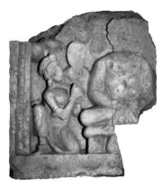

Figure 2 Petitioning the Buddha29 A noteworthy theme in several versions of Mahāprajāpatī Gautamī's request is its explicit relation to the wish to progress on the path to awakening. The Mahāsāṃghika-Lokottaravāda version is most detailed in this respect, highlighting the precious opportunity of living at a time when a Buddha has arisen in the world and teaches the path to Nirvāṇa. The Dharmaguptaka account is less explicit, but also relates the wish to go forth to the intention "to cultivate the path". The Mūlasarvāstivāda and the Sarvāstivāda versions foreground this topic, as here Mahāprajāpatī Gautamī asks if women can reach the fourth fruit of recluseship, that is, if they can become arhats.

The theme broached in the Mūlasarvāstivāda and Sarvāstivāda versions recurs in the same two versions at a later point, as part of an ex-change between Ānanda and the Buddha. In the case of this second occurrence, the other versions also report such an exchange. In relation to this exchange between Ānanda and the Buddha, to which I will turn in the next chapter, the seven versions agree that the Buddha implicitly or explicitly affirms that women have the same spiritual potential as men.

## 2.3 The Buddha'S Refusal

In reply to Mahāprajāpatī Gautamī's request, according to all of the seven versions the Buddha refuses. His refusal takes the following forms:
Dharmaguptaka: Just wait, Gautamī, do not speak like this, that you wish for women to go forth to cultivate the path. Why is that? Gautamī, if women go forth to cultivate the path in the Buddha's teaching, that will cause the Buddha's teaching not to last long.30 Haimavata (?):
I do not wish to permit women to go forth.31 Mahāsāṃghika-Lokottaravāda:
Gautamī, let it not be your wish to go forth and [receive] the higher ordination, the state of being a nun, in the teaching and discipline de-clared by the Tathāgata.

32 Mahīśāsaka: Wait, wait, do not say this. Why is that? Buddhas of ancient times all did not permit women to go forth. Women, who had personally taken refuge in a Buddha, stayed at home, shaved their heads, wore monastic robes (*kāṣāya*), and energetically practising with effort they obtained the fruits of the path. With future Buddhas it will also be like this. I now permit you to undertake this practice.33 Mūlasarvāstivāda: 
Mahāprajāpatī, you should stay at home, wear white robes, and cultivate the holy life (*brahmacarya*) in single and complete purity, without blemish. This is so that you can attain peace, benefit, and happiness for a long time.34 Sarvāstivāda:
Wait, wait, Gautamī, do not have this thought, that women leave the home out of faith and become homeless to train in the path in this right teaching and discipline. Gautamī, you shave off your hair like this, put on monastic robes, and for your whole life practise the holy life in purity.35 Theravāda: Enough, Gotamī, let it not be your wish that women go forth from home to homelessness in the teaching and discipline made known by the Tathāgata.36 Along the same lines, the Mahīśāsaka account indicates that past and future Buddhas did not and will not permit women to go forth.38 In addition to this flat assertion that Buddhas in principle do not grant the going forth to women, the Mahīśāsaka version provides another indication, namely that under Buddhas in the past women would shave their heads and wear monastic robes while staying at home. Having given this indication, the Buddha then gives Mahāprajāpatī Gautamī permission to undertake this form of practice. 

The Sarvāstivāda version similarly reports the Buddha granting Mahāprajāpatī Gautamī permission to shave off her hair and put on monastic robes. In the Mūlasarvāstivāda account preserved in Chinese translation, the corresponding passage speaks instead of wearing white robes or clothes.

39 In a subsequent section of the Mūlasarvāstivāda version, when Mahāprajāpatī Gautamī repeats her request after having followed the Buddha on his travels, the Buddha's permission speaks rather of her wearing 
"patchwork robes".40 This part has also been preserved in the Sanskrit fragment version, according to which the Buddha indeed gave her permission to shave off her hair and wear a sa*ṃghāṭī*, the outer monastic robe: 
and perfect, which for a long time will be for your welfare, benefit and happiness.41 A comparable suggestion that, instead of properly going forth, Mahāpra-jāpatī Gautamī should cultivate a form of celibate holy life, presumably in the protected environment of her home, appears to be also reflected in two other versions of the foundation history, extant in Chinese translation.42 I will come back to the significance of this permission repeatedly in the course of my study. 

## 2.4 Mahāprajāpatī Gautamī'S Reaction

The parallel versions differ in the degree to which they depict Mahāprajāpatī Gautamī persisting when confronted with the Buddha's refusal.

In the Dharmaguptaka and Haimavata (?) versions she makes only a single request.43 The Mahāsāṃghika-Lokottaravāda account reports her doing so twice, once at Kapilavastu and again after she and her group have followed the Buddha to the Jetavana.

44 In the Sarvāstivāda discourse she makes three requests. After the first instance at Kapilavastu she hears that the Buddha is about to set out travelling, so she makes a second request at the same location. Having followed the Buddha on his journey, she then makes a third request.45 The Mahīśāsaka and Theravāda versions also arrive at a total of three, which here come one after the other. In this way, after her first request at Kapilavastu has been refused she immediately repeats the same request two more times.46 This count doubles in the Mūlasarvāstivāda account, where Mahāprajāpatī Gautamī makes three requests at Kapilavastu and another three requests after she and her group have shaved off their hair and followed the Buddha.47 As already mentioned in the first chapter of this study, to repeat a request up to three times is a standard pattern in early Buddhist texts, expressing a keen interest and concern. The usual procedure then is that the Buddha will refuse the first two instances and at the third instance agree or else offer an alternative. Whereas three requests are standard,48 for the Buddha to refuse even the third request is rather unusual. Therefore the versions of the foundation history which have three refusals (or even six) convey a rather strong nuance of rejection. 

This contrasts with the report in all versions that the Buddha eventually did accede to Mahāprajāpatī Gautamī's request. This final outcome makes a total rejection at the outset a less probable presentation, making it likely that earlier versions of the narrative had only a single refusal, as is still the case for the Dharmaguptaka and Haimavata (?) versions. 

On this assumption, the increase of requests in the other versions would reflect a tendency evident in a number of ways in all foundation histories, namely to present Mahāprajāpatī Gautamī and her mission in a decidedly negative light.

Another point worth noting relates to the Buddha offering Mahāprajāpatī Gautamī the alternative option of shaving off her hair and donning robes. Versions that do not mention such a suggestion by the Buddha nevertheless report that she and her group did precisely that. Here are the relevant passages: 

## Dharmaguptaka:

Then Mahāprajāpatī heard that the Buddha was staying in the Jetavana. Together with five hundred Śākyan women she shaved off the hair, put on monastic robes (*kāṣāya*), and approached the Jetavana at Śrāvastī.49 Haimavata (?): On hearing that the Buddha had proceeded to the Jetavana, Gautamī and the five hundred women, their minds affected by sorrow and grief at not being themselves in the ranks of the Buddha's teaching, each shaved their heads, put on monastic robes and left, following after the Buddha.50 Mahāsāṃghika-Lokottaravāda: [Mahāprajāpatī Gautamī said to the Śākyan women]: "Honourable Ones, the Blessed One does indeed not give women an opportunity to go forth and [receive] the higher ordination, the state of being a nun, in the teaching and discipline declared by the Tathāgata. 

"Honourable Ones, what if we cut our hair on our own, put on monastic robes and, in chariots with the chassis made of straps, closely follow the journeys of the Blessed One in the regions of Kośala? If the Blessed One gives us permission, we will go forth; if he does not permit it, we can still live the holy life (*brahmacarya*) like this in the presence of the Blessed One." The Śākyan women replied to Mahāprajāpatī Gautamī: "It is well, Noble One."51 Theravāda: Then Mahāpajāpatī Gotamī had her hair cut off, put on monastic robes, and left together with many Sākyan women for Vesālī.52 Having received a permission by the Buddha to shave off their hair and don robes, for Mahāprajāpatī Gautamī and her group to do so would be a natural course of action to take. Elsewhere the Theravāda *Vinaya* reports that lay people would at times follow the Buddha for quite some distance on his journeys,53 so that for Mahāprajāpatī Gautamī and her followers to trail the Buddha would not have been unusual and would have fallen short of leaving the household life for good. Such an action, although going beyond the parameters of the original permission, would not have been something the Buddha had explicitly forbidden. 

In contrast, it would be an improbable description of their behaviour for them to be depicted as shaving their heads and wearing robes on their own initiative, without having received some sort of suggestion in this respect from the Buddha. Had the Buddha flatly refused Mahāprajāpatī Gautamī's request without suggesting any alternative, as he does in some versions, her decision to shave off her hair and don robes on her own account would have to be read as an act of open defiance.54 This stands in stark contrast to the authority of the Buddha as the teacher and the fact that these women must have considered themselves his disciples. 

―――――― 51 Roth 1970: 6,2 to 6,10.

52 AN 8.51 at AN IV 274,30 to 275,1 (cf. Vin II 253,21).

53 Vin I 220,21 depicts the Buddha being followed by a whole group of lay people wishing to make offerings in turn, a group apparently so large that it took a long time be-fore each could get his or her turn; another such reference can be found in Vin I 238,33.

54 Cf., e.g., the summary by Sasson 2006: 69 of the impression conveyed in the Theravāda episode that "Gotamī did not accept defeat. On the contrary, she defied his authority."
In fact most versions give quite explicit indications that Mahāprajāpatī Gautamī should be reckoned a stream-enterer at the present juncture of events.55 The standard descriptions in the early discourses reckon a streamenterer to have unshakeable faith in the Buddha and to maintain firm moral conduct, with some passages indicating that, even in case of com-mitting very minor breaches of conduct, a stream-enterer will immediately confess them.

56 This conveys a sense of eagerness to follow the Bud-dha's commands that makes it highly unlikely that a stream-enterer would be depicted as deliberately challenging the Buddha and publicly acting contrary to the instructions he or she has personally received from him.

In this way the Buddha's granting to Mahāprajāpatī Gautamī and her followers the option of shaving their hair and donning robes seems to underlie even those versions that do not explicitly report such a permission, but which nevertheless show that Mahāprajāpatī Gautamī and her followers acted accordingly. 

This in turn makes it probable that an early version of the foundation history of the order of nuns had both the Buddha's permission as well as Mahāprajāpatī Gautamī and her group acting accordingly. Such narrative continuity can be found in the Mahīśāsaka version which, after reporting that the Buddha permitted Mahāprajāpatī Gautamī and her followers to shave off their hair and don robes, also records that they indeed took this step: 
Gautamī and the five hundred Śākyan women shaved one another's heads, put on monastic robes, and followed him.

57 It seems reasonable to assume that such a permission by the Buddha, explicitly or at least implicitly, would have been part of an early version of the foundation history. This assumption establishes narrative continuity with the report in all versions that the Buddha eventually did start an order of nuns. Once Mahāprajāpatī Gautamī and her followers had acted on the permission in such a way as to demonstrate their keenness to go forth and prove their ability to brave the living conditions of wandering around as recluses in ancient India, reservations regarding their taking up a homeless lifestyle as nuns would have been allayed. 

The Mahīśāsaka version provides an introductory narrative, according to which the Buddha refused the wish of King Śuddhodana, who had just become a stream-enterer, to go forth. The relationship between the quest for awakening and going forth recurs in the Mahāsāṃghika-Lokottaravāda, Mūlasarvāstivāda, and Sarvāstivāda accounts, where it forms part of Mahāprajāpatī Gautamī's petition that the Buddha permit women to go forth.

According to the narrative in all versions, the Buddha refused this request. The Mahīśāsaka, Mūlasarvāstivāda, and Sarvāstivāda versions report that he suggested an alternative of shaving off the hair and donning robes, apparently so as to cultivate a life of celibacy in a protected environment at home. The versions that do not record such a permission nevertheless describe how Mahāprajāpatī Gautamī and her followers indeed shaved off their hair and put on robes, making it probable that such a suggestion by the Buddha is an early element in the foundation narrative. 

## 3 Ānanda'S Intervention

In the present chapter I examine Ānanda's role in the narrative concerning the founding of the order of nuns, where he acts as a mediator who eventually convinces the Buddha to start an order of nuns. 

I begin with the encounter between Mahāprajāpatī Gautamī and Ānanda (1), after which I turn to an episode that is not part of most foundation histories, but which also involves a petition by Mahāprajāpatī Gautamī and an intervention on her behalf by Ānanda, reported in the Dakkhiṇāvibhaṅ*ga-sutta* and its parallels (2). Then I examine the argu-ments raised by Ānanda to motivate the Buddha to start an order of nuns 
(3), in particular the topic of women's ability to awaken (4). In the final part I study the narrative background to Ānanda's role as a mediator (5).

## 3.1 Mahāprajāpatī Gautamī And Ānanda

The next scene in the foundation history of the order of nuns, after Ma-hāprajāpatī Gautamī has followed the Buddha on his journey, depicts her encounter with Ānanda. Except for the Haimavata (?) version,1 the canonical versions introduce the ensuing exchange between Mahāprajāpatī Gautamī and Ānanda by describing her appearance and condition. This description reads as follows: 
Dharmaguptaka: With their feet blistered from walking and their bodies covered with dust, [Mahāprajāpatī Gautamī and her followers] stood outside the entrance sobbing and weeping.2 Mahāsāṃghika-Lokottaravāda: [Mahāprajāpatī Gautamī] stood near the gate entrance to the Jetavana park, crying and scratching the ground with her big toe.3 Mahīśāsaka: Gautamī and the five hundred Śākyan women stood at the entrance 
[of the Jetavana], sobbing.4 Mūlasarvāstivāda: 
[Mahāprajāpatī Gautamī] thereupon stood outside the entrance, crying and in tears.5 Sarvāstivāda: Then Mahāprajāpatī Gautamī stood outside the entrance, her bare feet soiled and her body covered with dust, tired and weeping with grief.6 Theravāda: Then Mahāpajāpatī Gotamī stood outside the entrance with swollen feet, her body covered with dust, sorrowful and sad, weeping and in tears.7 The above descriptions show Mahāprajāpatī Gautamī standing at the gate of the monastery. A rule on offences entailing atonement in the different *Vinaya*s prohibits nuns from entering a monastery, in which monks are present, without having previously requested permission.8 The rule itself needs of course to be considered as having been promulgated later than the present episode in the foundation history, as it presupposes that an order of nuns had already come into existence. In as much as this rule would reflect what was apparently considered proper etiquette in the ancient Indian setting, however, such proper etiquette provides a background for the present narrative in the foundation history. 

Unlike the previous setting in her home town at Kapilavastu, where Mahāprajāpatī Gautamī is shown to approach the Buddha directly, by now she has become a semi-monastic with shaven hair and robes, arriving at the entrance to a monastery for monks. In such a situation it is in line with what the above rule considers proper etiquette for a female monastic that she be depicted as waiting at the entrance to the monastery, presumably until her presence has been noticed by the monks living inside. 

Several versions of this depiction make a point of noting that Mahāpra-jāpatī Gautamī is covered with dust. In the ancient Indian setting it is of course natural that someone who has been travelling on foot will be covered with dust. It is a different question, however, if the reciters decide to mention this explicitly; in fact other versions do not draw attention to her dusty condition.9 Thus it is significant that the Dharmaguptaka, Sarvāstivāda, and Theravāda versions make a point of depicting Mahāprajāpatī Gautamī's dirty condition. The same is the case in the Mūlasarvāstivāda account, which mentions her bodily condition earlier, when she approaches the Buddha to repeat her request. On this occasion she is introduced as "exhausted from walking, her body totally covered with dust".10 The reference to dust provides a contrast to the Buddha himself, who according to the Brahmāyu*-sutta* and its two Chinese parallels had a skin mentary should be understood as referring to freedom from the dust of sensual lust, *rāga*, etc.16 Taken together, these passages suggest that, to an audience familiar with early Buddhist discourse, a portrayal of someone as covered in dust could convey nuances of the confines of the household life. 

Another noteworthy aspect of the description of Mahāprajāpatī is that she is portrayed as crying. In the Mahīśāsaka version the motif of her crying is particularly prominent. Here already on having her thrice-repeated request refused by the Buddha, Mahāprajāpatī Gautamī "wailed much". Again, after she and her group have shaven off their hair and put on robes, they followed the Buddha "crying".17 In the Mahīśāsaka account Mahāprajāpatī Gautamī seems to be almost continuously in tears from the time of the Buddha's refusal through the whole journey until her arrival at the gates of the Jetavana. 

Needless to say, crying is quite the opposite of the composure to be expected from a well-behaved monastic.18 In fact a rule on offences entailing atonement found in a range of different *Vinaya*s prohibits a nun from crying and beating herself.19 Thus for Mahāprajāpatī Gautamī to be described as crying completes the negative portrayal evident in the description of her dirty appearance. In short, her dusty physical condition and her crying combine in showing her as belonging to the household life, instead of among those who have gone forth. 

The narrative continues by reporting that Ānanda notices Mahāprajāpatī Gautamī's condition. The Mahāsāṃghika-Lokottaravāda version presents a slight variation; here a monk, who has noticed her condition, informs Ānanda and asks him to go and find out why she is crying.20 In all versions Mahāprajāpatī Gautamī then informs Ānanda of her wish to be ordained. In several versions, he takes the initiative by addressing her as follows: 
Dharmaguptaka: 
Just wait, I will approach the Buddha on your behalf and seek permission.21 Haimavata (?): 
Just wait, I shall speak about it to the Blessed One.22 Mūlasarvāstivāda: 
Gautamī, you can stay here, I will ask the Tathāgata [about it].23 Sarvāstivāda: Gautamī, just wait here, I will approach the Buddha and speak to him about this matter.24 Theravāda: 
Well then stay here, Gotamī, while I request the Blessed One's [permission] for women to go forth from home to homelessness in the teaching and discipline made known by the Tathāgata.25 Whereas in these versions Ānanda conceives of the idea to intervene on his own, in the remaining two versions he instead does so at the sugges-tion of Mahāprajāpatī Gautamī.

Mahāsāṃghika-Lokottaravāda: [Mahāprajāpatī Gautamī said]: "Noble Ānanda, it would be good if you could make a request to the Blessed One so that women could obtain the going forth and the higher ordination, the state of being a nun, in the teaching and discipline declared by the Tathāgata."
26 Mahīśāsaka:
[Mahāprajāpatī Gautamī and her followers said]: "We wish you to report this on our behalf, so that our aspiration will be obtained."27 These two versions depict Mahāprajāpatī Gautamī with more agency, in that she herself is the one who conceives of the idea that Ānanda could act as an intermediary. On the other hand, however, this presents him as less responsible for doing something for which he will later be reprimanded by the Buddha and still later by the monks assembled at the first saṅgīti, a topic to which I will return in a subsequent chapter.28 Besides the different narrative nuances in the depiction of the meeting between Mahāprajāpatī Gautamī and Ānanda, another aspect worth noting is that the majority of versions depict Ānanda as not even mentioning the fact that she has a shaven head and is wearing robes.29 Instead he just notices that Mahāprajāpatī Gautamī is sad and exhausted from travelling. 

This supports the impression that her act of shaving off her hair and donning robes should be seen as following some kind of concession by the Buddha in this respect. Had she and her followers done this without any previous permission or suggestion by the Buddha, it could certainly be expected that the narrative would continue with this aspect of their outer appearance meriting a comment by Ānanda, if not criticism. 

The same holds for those versions in which Mahāprajāpatī Gautamī has already met the Buddha at the Jetavana, before her exchange with Ānanda.30 Among these the Mahāsāṃghika-Lokottaravāda account is one of the versions that does not report the Buddha earlier giving any permission. Yet, if in this version her cutting off her hair and wearing of robes should be understood to have been done on her own, as an act of defiance, this would certainly have deserved at least a passing comment, if not open censure by the Buddha. 

The absence of any censure of Mahāprajāpatī Gautamī and her followers, who now outwardly resemble monastics, further corroborates 
―――――― 29 Only the Dharmaguptaka *Vinaya* and the **Vinayamātṛkā*, T 1428 at T XXII 922c21 and T 1463 at T XXIV 803b2, report Ānanda mentioning the fact that Mahāprapājatī Gautamī and her followers have shaven heads and wear robes, as well as that they are sad and worn out from travelling. The way these different aspects of their appearance come together gives the impression that this does not imply a reproach of their monastic attire, but only forms part of a description of their overall condition.

30 This is the case for the Mahāsāṃghika-Lokottaravāda *Vinaya*, Roth 1970: 6,22, the Mūla-sarvāstivāda *Vinaya*, T 1451 at T XXIV 350b22 and its Tibetan counterpart D 6 da 101a2 or Q 1035 ne 98a4, and MĀ 116 at T I 605b10 (as well as T 60 at T I 856b7). Findly 1993: 23 sees a similarity between Mahāprajāpatī Gautamī approaching the Buddha with shaven hair and wearing robes and "a pattern in the Vedic tradition of studenthood for a desiring apprentice to approach a prospective teacher with fuel sticks 
(*samīdh*) in hand as a sign that he (or she) would like to undergo initiation". In view of the narrative found in several versions that the Buddha had given her a corresponding permission, however, for her to be depicted in this condition is quite natural and need not be related to the Vedic tradition of studenthood.

the impression that the narrative of the Buddha earlier offering them such an option is an early element, which forms the background even of those versions of the foundation history of the order of nuns that no longer report such a suggestion by the Buddha. 

This offers a significant alternative perspective on the foundation history of the order of nuns. The resulting alternative perspective changes the Buddha's refusal to grant ordination from a flat denial of any role for women in his monastic institution to a permission to live out a form of renunciation, presumably at home.31 In view of the especially demanding conditions that going forth and wandering around freely in the ancient Indian setting would represent for women, the point of this alternative option appears to be that they would better live a celibate life in a more protected environment at home. Within the narrative denouement, the Buddha's refusal then would function as an expression of concern that, at a time when the Buddhist order was still in its early stages, lack of proper dwelling-places and the other living conditions of a homeless life might be too challenging for the Śākyan women.32
―――――― 31 Clarke 2014: 63 notes *Vinaya* narratives that give the impression that "at least initially nuns did live in lay homes." A somewhat comparable situation emerges from the de-piction of Queen Anulā and her followers living a celibate life in robes at home while waiting for Saṅghamittā and other *bhikkhunī*s to come from India to Sri Lanka to con-fer on them the higher ordination; cf. Mhv 18.10, Geiger 1958: 141,7 (the corresponding section in Dīp 15.84f, Oldenberg 1879: 85,6, does not refer to their wearing of robes). 

32 Kabilsingh 1984: 24 reasons that "the Buddha was reluctant to accept women into the Order, primarily because he was aware that it was not simply a question of the admission of women, but that there were many other problems involved thereafter. The im-mediate objection was possibly Mahāpajāpatī herself. Since she … had never been acquainted with the experience of hardship, it was almost unimaginable to see the queen going from house to house begging for meals." According to Wijayaratna 1990: 160, already the affirmation of women's potential to reach awakening would imply that "the Buddha's refusal was motivated by social and practical considerations"; to which Dewaraja 1999: 73 adds that in particular there was the need "to retain the approval of the laity." Evans 2001: 115 queries if "the purely physical privations and hazards of the wanderer's life" were considered acceptable living conditions for the Śākyan women.

## 3.2 Mahāprajāpatī Gautamī'S Gift Of A Robe

In what follows I briefly leave the comparative study of the foundation history of the order of nuns and examine another instance which shows the Buddha refusing a request by Mahāprajāpatī Gautamī. This refusal comes in reply to her wish to donate a robe (or a set of robes) to him, reported in the Dakkhiṇā*vibhaṅga-sutta* of the Majjhima-*nikāya* and its parallels. The main versions of this discourse are as follows: 
- a discourse in the Majjhima-*nikāya*;
33
- portions of a discourse preserved in Gāndhārī fragments;34
- a few lines preserved in a Sanskrit fragment; 35
- a discourse in the Madhyama-*āgama* extant in Chinese;36
- a discourse preserved as an individual translation in Chinese;37
- a discourse quotation in the *Abhidharmakośopāyikā-ṭīkā*;
38
- a recurrence of the tale in the *Maitrisimit* preserved in Tocharian and in Uighur; 39 What makes this story relevant to a study of the founding of the order of nuns is not only the parallelism of the Buddha's refusal, but also the fact, already briefly mentioned in the previous chapter, that the motif of Mahāprajāpatī Gautamī attempting to donate a robe to the Buddha is part of the events that lead up to the formation of the order of nuns in the Mahīśāsaka *Vinaya*. The relevant section begins right after the king has publicly declared that he gives permission for anyone to go forth under the Buddha: 
Then Mahāprajāpatī Gautamī, having heard the king's proclamation, surrounded by five hundred Śākyan women and holding two new robes, left [the palace] and approached the Buddha. 

Having paid homage with her head at the Buddha's feet, she said: 
"Blessed One, I have myself woven this robe, now I offer it up to you, wishing that you would condescend to accept it." The Buddha said: "You can offer it to the community and obtain a great reward."
She spoke again as above to the Buddha. [The Buddha said]: "You can offer it to the community; I am counted among the community." 
She spoke again as above. The Buddha said: "I accept one [robe], 
give [the other] one to the community." After having received this instruction, she gave [one robe] to the Buddha and [one robe] to the community.41 The Mahīśāsaka *Vinaya* continues at this juncture with Mahāprajāpatī Gautamī's request for women to be granted ordination. So in this version the gift of the robe forms an integral part of the events that lead up to her ordination. Needless to say, at this moment in the Mahīśāsaka narrative she of course must still be a laywoman. 

Her lay status in the Dakkhiṇāvibhaṅ*ga-sutta* and its discourse parallels is not as self-evident as it is in the Mahīśāsaka *Vinaya*. Mahāprajāpatī Gautamī's attempt to offer a robe, which in the Dakkhiṇāvibhaṅ*gasutta* and its parallels involves only a single robe that the Buddha consistently refuses to accept, reminds one of the traditional relationship between a lay supporter and a monastic. However, a stipulation in the different *Vinaya*s makes it implicitly permissible for a monk to accept a robe from a nun, as long as they are relatives.42 This means that if a woman is depicted as wanting to make a gift of a robe to a monk, especially if he is her relative, then this does not invariably imply that she must be considered a lay person.43 Once the Buddha has refused her gift, in the Dakkhiṇāvibhaṅ*ga-sutta* and several of its parallels Ānanda intervenes on Mahāprajāpatī Gautamī's behalf and reminds the Buddha of her acting as his foster mother, after his mother had passed away.44 The Dakkhiṇāvibhaṅ*ga-sutta* and its discourse parallels continue by pointing out that the Buddha had already settled his debt of gratitude towards Mahāprajāpatī Gautamī, since due to him she had been able to go for refuge and take the five precepts.45 The reference to taking the five precepts again evokes lay status. However, this could just refer to her formally undertaking these when becoming a Buddhist at an earlier time, without necessarily implying that by the time of the present discourse she was still only observing five precepts. 

Moreover, the relevant part in the *Abhidharmakośopāyikāṭīkā*, which similarly describes her having taken refuge, does not refer to the five precepts at all.46 This leaves open the possibility that an early version of the description of her becoming a Buddhist did not have a reference to the five precepts. Since the five precepts are regularly mentioned in conversion descriptions, they could easily have become part of the Dakkhiṇā-vibhaṅ*ga-sutta* and its other parallels during oral transmission. 

In a subsequent section, which offers an analysis of different recipients of gifts, the Dakkhiṇāvibhaṅ*ga-sutta* and its discourse parallels mention the order of nuns.47 Such a reference would not fit the context if at the time of the delivery of this discourse Mahāprajāpatī Gautamī was still a laywoman. The individual discourse preserved in Chinese translation in fact explicitly introduces Mahāprajāpatī Gautamī as a nun.48 Alternatively, it is also possible that this analytical exposition was added later to the discourse,49 in which case the individual discourse 
―――――― 45 MN 142 at MN III 253,19 (here this point is made by Ānanda himself), Bajaur Kharoṣṭhī fragment 1 lines 8–10, Strauch 2014: 29, MĀ 180 at T I 722a9, and T 84 at T I 903c16. 

46 D 4094 ju 254b2 or Q 5595 tu 290a2. 47 MN 142 at MN III 255,33, Bajaur Kharoṣṭhī fragment 1 lines 32–50, Strauch 2014: 38, MĀ 180 at T I 722a28, and T 84 at T I 904a18; cf. also folio 8b2659 in Geng and Klimkeit 1988: 200.

48 T 84 at T I 903c22: 摩訶波闍波提苾芻尼. The absence of such an explicit indication in MN 142 would be in line with the general tendency in Pāli texts to refer to her just by her name, without explicitly qualifying her as a *bhikkhunī* even on occasions in the Vinaya where she unmistakeably is a fully ordained nun.

49 This has been suggested by Williams 2000: 170 and Harvey 2000: 386; cf. in more detail Anālayo 2008a: 110. 

would reflect a later adjustment to the existence of this exposition by depicting Mahāprajāpatī Gautamī as a nun.

In sum, the lay or monastic status of Mahāprajāpatī Gautamī in the episode related in the Dakkhiṇāvibhaṅ*ga-sutta* and its parallels remains uncertain. Whatever may be the last word on Mahāprajāpatī Gautamī's status in this discourse, however, the episode portrayed in itself provides a noteworthy contrast to the founding of the order of nuns. Whereas an intervention by Ānanda was unsuccessful in relation to the relatively minor issue of accepting a robe, similar arguments raised by him in several accounts of the foundation of the nuns' order were successful in convincing the Buddha to grant ordination to women. Reading the textual accounts of these two refusals by the Buddha alongside each other almost conveys the impression that it was easier to convince the Buddha to found an order of nuns than to get him to accept a robe. 

From the viewpoint of the textual development of the foundation history of the order of nuns, the circumstance that the Mahīśāsaka *Vinaya* has the robe offer as part of the events leading up to Mahāprajāpatī Gautamī's quest for going forth is noteworthy. Although on its own certainly far from conclusive, when considered in conjunction with the Dakkhiṇā-*vibhaṅga-sutta* and its parallels, it suggests the possibility that some versions of the foundation history could have been influenced by this episode, a natural occurrence for orally transmitted material. This holds in particular in relation to one of Ānanda's arguments in support of Mahāprajāpatī Gautamī's mission, namely the Buddha's debt of gratitude.

## 3.3 Arguments Raised By Ānanda

In most versions, Ānanda's intervention involves a single request, followed by a discussion with the Buddha. According to the Theravāda version, however, Ānanda makes his request thrice during a single intervention.

50 In the Mahāsāṃghika-Lokottaravāda account he intervenes three times. After Ānanda has approached the Buddha and been rebuffed for a first time, he returns to report his lack of success to Mahāprajāpatī Gautamī, who asks him to try again. The same happens a second time, and after being asked again by Mahāprajāpatī Gautamī to try once more, Ānanda approaches the Buddha a third time.51 In this way the Mahāsāṃghika-Lokottaravāda version stands out for conveying the strongest impression of Ānanda's insistence.

The arguments raised by Ānanda in the various versions involve two main themes: 
1) the debt of gratitude 2) the potential of women to awaken Similarly to the presentation in the Dakkhiṇāvibhaṅ*ga-sutta* and its parallels, Ānanda points out that Mahāprajāpatī Gautamī raised the Buddha with her own milk when his mother had passed away. In reply, the Buddha clarifies that he has already settled his debt of gratitude to her.

52 Here is the Mūlasarvāstivāda version preserved in Chinese translation as an example to illustrate this type of exchange: 
The venerable Ānanda further said to the Buddha: "Mahāprajāpatī has truly done a great kindness in relation to the Blessed One. When the Buddha's mother had passed away, [Mahāprajāpatī] raised him with her milk until he grew up. Will the Blessed One not accept her out of compassion?"
The Buddha said to Ānanda: "This matter is true. [Yet] I have already recompensed her completely for the great kindness she has done towards me. Because of me, she has come to know the three jewels, taking refuge in the Buddha, the Dharma, and the community. She has taken the five precepts. In regard to the nature of the four truths, she will never again have doubt or perplexity,53 she has attained the 
―――――― 51 Roth 1970: 8,16. 

52 As Engelmajer 2014: 62 points out, contrary to the assumption by Ohnuma 2006 (cf. 

also Ohnuma 2012: 105), "tradition considers the filial debt which the Buddha owes Mahāpajāpatī to be repaid by the time she asks for ordination." 
53 On the absence of the qualification "noble" here and elsewhere in references to the four truths cf. in more detail Anālayo 2006.

fruit of stream-entry and will eradicate *duḥkha* on realizing freedom from [future] births. Kindness like this is even more difficult to requite; [gifts] of robes, food, and so on cannot compare with that."54 The Mahāsāṃghika-Lokottaravāda and Sarvāstivāda accounts also refer to being free from doubt in regard to *duḥkha*, its arising, its cessation, and the path.55 Such references imply the attainment of stream-entry. 

In the Mahīśāsaka account the Buddha clarifies that he has settled his debt of gratitude in the following manner: 
The Buddha said: "I have also done Gautamī a great kindness. Because of me she has come to know the Buddha, the Dharma, and the community, and has aroused reverence and faith."56 In contrast to the versions surveyed so far, in the Theravāda discourse the Buddha does not clarify in which way he has settled his debt of gratitude. In this way the topic of Mahāprajāpatī Gautamī's kindness towards the Buddha remains without a reply.57 That Ānanda brings up this topic at all is difficult to reconcile with the Dakkhiṇāvi*bhaṅga-sutta* of the same Theravāda tradition,58 as here it is Ānanda himself who acknowledges that the Buddha had already settled his debt of gratitude to her. 

Inconsistencies within the same tradition can also be found in the case of the Mūlasarvāstivāda version. In contrast to the Chinese version translated above, the whole episode concerned with the debt of gratitude is not found at all in the Sanskrit fragment version and the Tibetan translation.59 The same holds for the Haimavata (?) account, where again this topic does not feature at all. In relation to this difference it is also worthy of note that in the Mahāsāṃghika-Lokottaravāda version the placing of this topic is not entirely straightforward, as here Ānanda has raised other arguments and come to the conclusion that the Buddha should grant ordination to women. After having drawn this conclusion,60 he then continues with the debt of gratitude as a sort of after-thought. 

In relation to the Buddha's refusal to accept the gift of robes from his foster mother in the Dakkhiṇāvibhaṅ*ga-sutta* and its parallels, the Ma-*hāparinirvāṇ*a narrative provides a contrast to this episode by showing the Buddha to have no qualms in accepting the gift of a robe.61 This contrast makes it clear that the issue at stake in the Dakkhiṇāvibhaṅ*ga-sutta* and its parallels is not the accepting of robes as such, but much rather accepting a personal gift from his foster mother, whom the Buddha encourages to give the robe to the monastic community in general instead of to him personally.62 In such a situation, a reminder of the Buddha's debt of gratitude to his foster mother is indeed a natural element in the narrative, bringing into focus their personal relationship. It is precisely this personal relationship that his refusal to accept her gift appears to be concerned with. In contrast, the foundation history of the order of nuns does not provide such a self-evident thematic continuity. 

When considered in conjunction with the fact that the motif of the debt of gratitude is not found at all in the Haimavata (?) version, in the Sanskrit fragment version, and in the Tibetan translation of the Mūlasarvāstivāda account, and that its occurrence in the Mahāsāṃghika-Lo-
―――――― 60 Roth 1970: 14,8. 

61 DN 16 at DN II 133,15, Sanskrit fragments S 360 folio 191 R2 and S 364 V1, Wald-schmidt 1950: 28 and 64, DĀ 2 at T I 19b9, T 5 at T 168b24, T 6 at T I 184a12, T 7 at T I 198b14, as well as the Mūlasarvāstivāda *Vinaya*, T 1451 at T XXIV 391b25 and its Tibetan parallel in Waldschmidt 1951: 279,14 (§28.45).

62 According to Engelmajer 2014: 90, one of the implications of MN 142 (and its paral-lels) is that "mothers must transcend the personal relationship with their child and be-come, as it were, mothers to the whole Sangha." This makes it entirely natural that the issue of the debt of gratitude be raised in this context.

kottaravāda and Theravāda versions seems either out of place or incomplete, it seems fair to conclude that this element is a later addition to the foundation history of the order of nuns. The source for this textual element seems to have been the situation depicted in the Dakkhiṇāvibhaṅ-*ga-sutta* and its parallels, where a reminder of the debt of gratitude has its place as part of an attempt to convince the Buddha to accept a robe from his foster mother.63 Besides the topic of the Buddha's debt of gratitude, the other theme broached in Ānanda's intervention is the potential of women to reach awakening. This holds also for the Mūlasarvāstivāda and the Sarvāstivāda accounts, 64 where the potential of women to reach the fourth fruit of recluseship has already been broached by Mahāprajāpatī Gautamī herself as part of her original request for ordination.65 In the Theravāda discourse the ability of women to reach the four levels of awakening is the first argument raised by Ānanda. The fact that this argument should be attributed to Ānanda's own ingenuity comes up explicitly in this version. After he has been rebuffed three times, and before raising the argument about women's potential for awakening, this version proceeds as follows: 
Then it occurred to the venerable Ānanda: 'The Blessed One does not permit women to go forth from home to homelessness in the teaching and discipline made known by the Tathāgata. Suppose I were to request in another way the Blessed One's [permission] for women to go forth from home to homelessness in the teaching and discipline made known by the Tathāgata?'66 In the Mahāsāṃghika-Lokottaravāda account the whole discussion only takes place once Ānanda has approached the Buddha for a third time. At this narrative juncture he first raises the topic of the four assemblies, an argument not found in the other canonical versions of the foundation history of the order of nuns.67 
[Ānanda asked]: "Blessed One, how many assemblies did former Ta-thāgatas, arhats, Fully Awakened Ones have?" 
When this was said, the Blessed One said to the venerable Ānanda: 
"Former Tathāgatas, arhats, Fully Awakened Ones had four assemblies, namely monks, nuns, laymen, and laywomen."68 The same argument features in the account of the first sa*ṅgīti* in the Ma-hāsāṃghika, Mūlasarvāstivāda, and Sarvāstivāda *Vinaya*s, where Ānanda replies to criticism of his acting as an intermediary on behalf of women by pointing out that all Buddhas had four assemblies.69 In the Mahāsāṃghika-Lokottaravāda version of the foundation history Ānanda continues with the enquiry regarding women's potential to awaken, and then brings both together as reasons for granting women ordination: 
Blessed One, since former Tathāgatas, arhats, Fully Awakened Ones had four assemblies, [namely] monks, nuns, laymen, and laywomen, and [since] women who dwell alone, diligent, energetic, and secluded, can realize these four fruits of recluseship, namely the fruit of stream-entry … *up to* … the supreme fruit of arhatship, Blessed One, [therefore] it would be good if women could obtain the going forth and the higher ordination, the state of being a nun, in the teaching and disci-pline declared by the Tathāgata.

70 According to the presentation in the Dharmaguptaka and Mahīśāsaka versions, the potential of women to reach the four levels of awakening was the last argument raised by Ānanda.71 The formulation in the Mahī-śāsaka account is particularly poignant. After the Buddha has confirmed that women who go forth and receive higher ordination are able to at-tain the four paths and fruits, Ānanda points out:
If they [are able] to attain the four paths, Blessed One, why not give them permission to go forth and receive the higher ordination?72 In the Haimavata (?) version women's potential for awakening is the only argument raised by Ānanda. After the Buddha has replied to Ānanda's original request by pointing out the dire repercussions of allowing women to go forth, the whole discussion, which in some of the other versions runs to considerable length, is just a brief exchange as follows:
Ānanda further said to the Buddha: "Will women who practise the holy life (*brahmacarya*) in the Buddha's teaching attain the four fruits?"
The Buddha said to Ānanda: "Being able to cultivate the holy life with unyielding determination, they can attain them."
Ānanda further said to the Buddha: "I just wish that the Blessed One permit women to have a rank in the Buddha's teaching."73 This is the only argument raised by Ānanda that is common to the different versions. It is also an argument that makes sense in the present context, as highlighted by the formulation in the Mahīśāsaka account. If women who have gone forth are able to reach awakening, why does the Buddha not allow them to go forth? In contrast, the idea that the Buddha should found an order of nuns out of a sense of gratitude to his foster mother, a debt of gratitude he has anyway already settled, is a considerably less straightforward narrative presentation. 

## 3.4 Women'S Potential For Awakening

Besides being common to the depiction of Ānanda's intervention in the canonical versions of the foundation history of the nuns' order, the ability of women to reach awakening recurs elsewhere in the early discourses.74 By way of providing a background to the present episode in the foundation history, in what follows I survey other passages relevant to this topic. 

A discourse in the Saṃyutta-*nikāya* and its Saṃyukta-*āgama* parallels enunciate the basic principle that, from the viewpoint of early Buddhist texts, women just as well as men can reach the final goal.75 The same position underlies the Mahāvac*chagotta-sutta* and its parallels, according to which over five hundred nuns had become arhats.76 Some such references are only found in Pāli sources. A discourse in the Aṅguttara-*nikāya* with no known parallel depicts *deva*s visiting the Buddha to report the reaching of arhatship of certain nuns, an encounter the Buddha then repeats in front of the monks.77 The *Therīgāthā* provides a testimony of the degree to which Buddhist nuns were held to have reached the acme of perfection in their practice of the Dharma.

78 The collection features many highly accomplished nuns, among others reporting the attainment of arhatship by a group of thirty nuns.79 A contrast to such passages comes with a statement that challenges women's ability to reach awakening. Notably, the texts in question attribute this challenge to Māra. 

The discourse in question has the nun Somā as its protagonist and occurs in the Saṃyutta-*nikāya*, with counterparts in two Saṃyukta-*āgama* collections preserved in Chinese translation, each being part of a group of ten discourses that have nuns as their protagonists.80 Each of these ten nuns is shown to rebuff attempts by Māra to disturb and unsettle her. 

Appreciation of these passages requires a brief excursion into the sig-nificance and function of Māra.

Contrary to the assumption by some scholars, the function of Māra in such instances is not invariably an acting out of inner uncertainties or defilements of the person(s) he challenges.81 A challenge by Māra can involve an action such as changing himself into an ox and walking close to the clay begging bowls of a group of monks, in order to distract them from listening to a talk given by the Buddha.82 The Māra who lived at the time of a previous Buddha reportedly hit an arhat monk on the head so that it started bleeding.83 It would be hard to arrive at meaningful interpretations of such instances as symbolic enactments of inner defilements or uncertainties. 

A better interpretation of the function of Māra in such contexts is that he personifies problems posed by external disturbances as well as by outsiders to members of the Buddhist community. The didactic function of the Māra motif in such contexts appears to be to provide an example of how such situations can be faced, following the model set by the Bud-dha and his arhat disciples when dealing with Māra. In relation to the set of ten discourses involving nuns, Māra can be understood as personifying ancient Indian attitudes of contempt and derision, even threats, towards women who have embarked on the monastic life.

In the ten discourses in this group, most of the challenges by Māra have to do with sexual temptation or even outright sexual aggression. 

This stands in contrast to a single instance in another group of discourses concerned with Māra, where his daughters try to tempt the Buddha.84 This makes it clear that the early Buddhist discourses do not unilaterally consider females as snares of Māra who lure innocent males into sexual desire. Instead, as the present set of discourses plainly shows, it is the male Māra - and by definition only a male can be Māra - who stands for sensual temptation and sexual aggression.85 In contrast, those who 
―――――― 82 SN 4.16 at SN I 112,15 and its parallel SĀ 1102 at T II 290a16. 

83 Whereas according to MN 50 at MN I 336,33 Māra took possession of a boy to per-form this deed, according to the parallels MĀ 131 at T I 622a7, T 66 at T I 866a7, and T 67 at T I 868a11 Māra was himself the perpetrator of the action.

84 SN 4.25 at SN I 124,23 and its parallels SHT V 1441 R, Sander and Waldschmidt 1985: 257, SĀ 1092 at T II 287a1, and SĀ2 31 at T II 383c2; cf. also the *Lalitavistara*, 
Lefmann 1902: 378,14, and the *Mahāvastu*, Senart 1897: 282,4.

85 On the dictum that certain positions, among them that of Māra, cannot be occupied by a female cf. below p. 137ff. 

are disinterested in sex are females, namely the nuns in each of the discourses in this section. In this way these discourses reflect a perception of the relationship between gender and sexual aggression where it is more frequent for a sexual advance to come from the male side.86 It is also worthy of note that in the Saṃyutta-*nikāya* and Saṃyukta-*āgama* discourses each of the nuns is shown to recognize Māra right away and then to send him off. In contrast, the monks in the group of discourses concerned with Māra are on record for not recognizing him and needing the Buddha to intervene personally to deal with the challenge.87 This reflects the circumstance that these nuns are arhats, unlike their male counterparts in this particular set of discourses. Nevertheless it is worthy of note that these discourses on challenges by Māra clearly present the nuns in a more favourable light than they do the monks. 

This short excursion into the significance and function of Māra helps to clarify the challenge he poses to Somā. The complete Saṃyukta-*āgama* presents him speaking as follows: 
The state wherein seers dwell, 

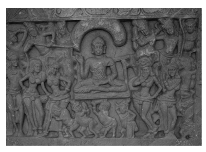

This state is very difficult to attain. One with [just] a two-fingers' wisdom Is unable to reach that state.88 Figure 3 Māra's Daughters89
―――――― 88 SĀ 1199 at T II 326b1f, with its counterparts in SN 5.2 at SN I 129,14f: "that state hard to achieve, which is to be attained by seers, a woman with her two-finger wis-dom cannot attain that", and SĀ2 215 at T II 454a5f: "what is attained by seers, that state is difficult to reach, with your despicable and defiled wisdom you will not attain a state like that." The reference to a woman's two-fingers' wit appears to be a popular saying, punning on women's performance of household chores; it recurs in a different context in the *Mahāvastu*, Senart 1897: 391,19 and 392,13; cf. also, e.g., Gokhale 1976: 104, Kloppenborg 1995: 154, Bodhi 2000: 425 note 336, Abeynayake 2003: 3, and Collett 2009b: 99 note 7.

89 Nāgārjunikoṇḍa, courtesy Wojtek Oczkowski. The picture shows Māra's daughters trying to tempt the Buddha-to-be on the seat of awakening.

The three versions agree in reporting a self-confident reply by Somā, in which she makes it clear that there can be no doubt about the ability of women to reach awakening. 

To my knowledge the present challenge by Māra is the only one among the early discourses in which the capability of women to realize awakening is put into question.90 In this way, from the perspective of the early discourses, such prejudices are considered the work of Māra. Somā's self-confident reply to Māra's challenge in turn confirms the early Buddhist position that women were certainly held able to reach awakening.91 The need to counter doubt about women's ability to gain realization comes up also in a later text, featuring Mahāprajāpatī Gautamī. The episode in question reports her spectacular passing away. According to the Pāli version of this episode, the Buddha had specifically asked her to perform supernormal feats in order to dispel the view of those foolish ones who doubt that women can reach full realization of the Dharma.92 A parallel in the Ekottarika-*āgama* similarly puts a spotlight on her display of her abilities.93 In the Pāli version of her passing away, the Buddha is on record for joining his monks walking behind her bier as a token of respect,94 and the Mūlasarvāstivāda version depicts him as personally participating in the transportation of her corpse.95 The early discourse passages related to the ability of women to awaken, discussed above, provide a background for the occurrence of the same topic in the foundation history of the nuns' order as the one argument raised by Ānanda that is common to the different versions. 

The above passages confirm the appropriateness of women's potential to function as a motivation for the Buddha to found an order of nuns, once Mahāprajāpatī Gautamī and her followers had publicly demonstrated their ability to brave the living conditions of going forth in the ancient Indian setting, thereby proving that there was no need for them to be confined to a semi-monastic life at home.

## 3.5 Ānanda'S Role

The intervention by Ānanda is not only a common element in the different foundation histories of the nuns' order, it also comes up in the account of the first sa*ṅgīti*, to which I will return in a subsequent chapter.96 According to the reports of Chinese pilgrims visiting India, nuns in fifth and seventh-century India regularly made offerings at *stūpa*s dedicated to Ānanda in expression of their gratitude for his intervention on their behalf.97 Such reports show the continuity of the influence exerted by this narrative episode. 

At first sight a problem with this narrative element seems to be of a chronological nature, related to the timing of Ānanda's becoming a monk in the way this has been recorded in other textual sources. As mentioned above, the introductory narrative in the Mahīśāsaka version gives the impression that the founding of the order of nuns should be placed at an early point in the Buddha's teaching career. For this event to be placed relatively early would fit the fact that Mahāprajāpatī Gautamī was the Buddha's foster mother and therefore obviously considerably older than him. Combined with the fact that the early discourses and different Vi-*naya*s report several meetings between her as a nun and the Buddha, 98 and that according to the descriptions of her passing away the Buddha was still alive at that time,99 it seems indeed that a natural placing of her going forth and thus the founding of the Buddhist order of nuns would be at a relatively early stage in the teaching career of the Buddha.

A couplet of stanzas in the *Theragāthā* reports Ānanda proclaiming that he had not had a single perception of sensuality or hatred "during the twenty-five years I was a learner",100 an expression that refers to someone who has reached at least stream-entry. 

According to a discourse in the Saṃyutta-*nikāya* and its Saṃyukta-*āgama* parallel, Ānanda attained stream-entry soon after his ordination.101 Most of the accounts of the first sa*ṅgīti* report that he became an arhat after the Buddha had passed away.102 Combining these references could give the impression that he is shown to have become a monk only about twenty-five years before the Buddha's passing away, which would then have been some twenty years after the beginning of the Buddha's teaching activities.103 On this count, he could hardly be considered to have been a monk during an event that took place in the early years after the Bud-dha's awakening, such as when the Buddha first visited his hometown.

A closer inspection of the *Theragāthā* stanzas suggests otherwise. 

The two stanzas mentioned above are followed by several others that 
―――――― 99 For comparative studies of the accounts of Mahāprajāpatī Gautamī's passing away cf. 

Anālayo 2015e and Dhammadinnā 2015b and 2016.

100 Adopting the translation by Norman 1969: 95 of the phrase paṇṇavīsati vassāni sekha-bhūtassa *me sato* in Th 1039 and 1040.

101 SN 22.83 at SN III 106,3 and its parallel SĀ 261 at T II 66b4. 102 His attainment of full awakening after the Buddha's passing away is reported in the Dharmaguptaka *Vinaya*, T 1428 at T XXII 967a27, the Mahāsāṃghika *Vinaya*, T 1425 at T XXII 491b5, the Mahīśāsaka *Vinaya*, T 1421 at T XXII 190c17, the Mūlasarvāsti-vāda *Vinaya*, T 1451 at T XXIV 406a16 and D 6 da 310a4 or Q 1035 ne 293a7, and the Theravāda *Vinaya*, Vin II 286,14.

103 According to Thomas 1927/2003: 123, "in his verses (*Therag.* 1039) he is made to say that he has been for twenty-five years a learner, so that he must have become a monk in the twentieth year of Buddha's preaching". Witanachchi 1965: 529 similarly concludes that Ānanda "was ordained in the twentieth year after the enlightenment", a conclusion I unfortunately followed in Anālayo 2010e: 88f. 

similarly refer to a period of twenty-five years, namely the time period during which Ānanda is on record for having been the Buddha's attendant.104 This suggests that the preceding reference to twenty-five years does not aim to portray him as someone in training or a "learner" for exactly this period. Instead the point of this reference seems to be that during the period of twenty-five years that he served the Buddha he did not have a single perception of sensuality or hatred, even though at that time he was only someone in training.105 The same topic comes up more explicitly in a discourse in the Madh-yama-*āgama*, which reports Śāriputra asking Ānanda if during the twentyfive years of being an attendant of the Buddha any sensual desire had arisen in his mind. Ānanda affirms that he did not experience any arising of sensual desire during the entire period of his acting as the Buddha's attendant, which he explains to have been due to his sense of shame.106 Thus for Ānanda to be a monk protagonist on an occasion when Ma-hāprajāpatī Gautamī approaches the Buddha, after both have left Kapilavastu, would not involve a chronological inconsistency in the narrative. In fact the Dharmaguptaka, Mahīśāsaka, and Theravāda *Vinaya*s agree that Ānanda ordained when the Buddha first visited Kapilavastu.107 However, the above considerations would entail that, at the time of requesting that the Buddha accede to Mahāprajāpatī Gautamī's petition, Ānanda should not yet be considered the Buddha's attendant.

108 In relation to this, the Mahāsāṃghika-Lokottaravāda record of the foundation history presents Ānanda's intervention with a noteworthy narrative detail. According to its report a monk, who had seen Mahāprajāpatī Gautamī crying, informed Ānanda. The passage in question proceeds as follows:
A certain monk saw Mahāprajāpatī Gautamī standing near the gate entrance to the Jetavana park, crying and scratching the ground with her big toe. Having seen it, he in turn approached the venerable Ānanda. He said to the venerable Ānanda: "Venerable Ānanda, Mahāpra-jāpatī Gautamī is here, standing near the entrance to the Jetavana park, crying and scratching the ground with her big toe. Venerable friend Ānanda, go and find out why Mahāprajāpatī Gautamī is crying."109 This description in the Mahāsāṃghika-Lokottaravāda version would offer a simple explanation of the involvement of Ānanda, without him needing to be the Buddha's attendant. If a monk living in the monastery were to see Mahāprajāpatī Gautamī in tears, it could indeed be expected that he would ask one of her close relatives to approach her and find out what afflicted her. Such a setting would in turn make it natural for the presumably recently ordained Ānanda to intervene on her behalf, precisely because of his family relationship with Mahāprajāpatī Gautamī. 

Although the indications in this passage in the Mahāsāṃghika-Lokottaravāda account are without support from the parallel versions, the perspective it offers would also work for the other versions, in that Ānanda's intervention could be placed at a time when he had already ordained, but was not yet acting as the attendant of the Buddha.

The portrayal of Mahāprajāpatī Gautamī's physical and mental condition in some versions provides a clear example of the narrative strategy of distancing, in line with instances of the same strategy evident in the Nandakovāda*-sutta* discussed in the first chapter of my study. 

The circumstance that neither the Buddha nor Ānanda is depicted as censuring her for having a shaven head and wearing robes supports the impression that the Buddha's permission for her to do so must be an early element in the foundation history of the order of nuns. 

The intervention by Ānanda involves in all versions the argument of women's ability to awaken. Whereas this argument suits its narrative context and continues a theme broached in several versions in other ways as well, the motif of reminding the Buddha of his debt of gratitude to his foster mother appears to be a borrowing from a version of the Dak-khiṇāvibhaṅ*ga-sutta*. 

## 4 The Buddha'S Permission

In this chapter I take up the depiction in the foundation history of the Bud-dha's permission for women to become nuns provided they accept eight conditions referred to as *gurudharma*s. 

I begin with the simile that illustrates the function of the *gurudhar*-mas (1). Next I survey *gurudharma*s that deal in particular with communal transactions (2), and then those that are rather concerned with matters of homage and criticism (3). 

## 4.1 The Simile Of The Dyke

Except for the Mahīśāsaka account, in the other versions the Buddha's promulgation of the eight *gurudharma*s comes accompanied by a simile illustrating their function. In most cases, this simile introduces the listing of *gurudharma*s. Exceptions are the Dharmaguptaka version, where it comes after the listing of the *gurudharma*s, and the Theravāda account, where the simile occurs at the end of the whole foundation history. Here are the different versions of this simile: 
Dharmaguptaka: It is like a man who builds a bridge over a great [mass of] water for crossing over.1 Haimavata (?): It is like a man who, wishing to cross a river, first constructs a bridge or a boat, after which he is certainly able to cross, even if the river is in flood.2 Mahāsāṃghika-Lokottaravāda: It is just as if a person here would construct a dyke in a mountain gorge so that the water cannot go beyond.3 Mūlasarvāstivāda: 
[It is] like a solid dyke made by a farmer at the end of the summer period and the beginning of autumn, not allowing the water to flow beyond the rivers and canals, so that it will be sufficient for irrigating the seedlings everywhere in the field.4 Sarvāstivāda:
It is like a fisherman or the apprentice of a fisherman who makes a dyke in deep water to conserve the water so that it does not flow out.5 Theravāda: It is like a man who out of foresight were to build a dyke for a great pond so that the water does not overflow.6 The motif of the dyke, found in most of the versions translated above, recurs in the Kāyagatāsati*-sutta*. Here the function of the dyke is to ensure that a pond becomes full of water up to the brim, so much so that crows could drink from it. The accumulated power of the water, which would be available if the dyke were to be opened, illustrates the power accumulated through mindfulness of the body as a means of reaching any attainment.7 The discourse continues by describing a broad range of attainments possible through the cultivation of mindfulness of the body, ranging from conquering discontent all the way up to full awakening. 

The same image of a pond that because of a dyke has become full with water up to the brim, so much so that crows could drink from it, recurs in a discourse in the Aṅguttara-*nikāya*.

8 Here the accumulated power of the water illustrates the potential of various types of concentration to lead to any of the six higher knowledges. 

Applied to the present context, these two Pāli discourses suggest that the dyke simile illustrates the function of the *gurudharma*s as a form of protection enabling the accumulation of spiritual power.9 Such protection would then presumably enable women to accumulate the inner power required to actualize their potential to awaken. 

Positive connotations of the dyke simile are also evident in the Chinese Mūlasarvāstivāda version, where the dyke has the purpose of ensuring that there is sufficient water for irrigation of the seeds that have been planted in the field. 

Instead of the dyke simile, the Dharmaguptaka and the Haimavata (?) 
accounts employ the simile of a bridge (or a boat) for crossing over. 

The image of crossing over is used repeatedly in early Buddhist literature to illustrate progress to awakening,10 so the basic implication of this version of the simile would be comparable to that of the dyke. 

In sum, the different similes used to illustrate the function of the Buddha's promulgation of the *gurudharma*s seem to convey that these are considered a means for the nuns to cross over or else a protective embankment, comparable to the cultivation of mental qualities like mindfulness and concentration, enabling them to reach awakening. 

Nuances of protection also seem to underlie the simile of a household with many women and few men, which in most versions of the foundation account forms part of the Buddha's reply to Ānanda's intervention. I will study this simile in more detail in the next chapter as part of several illustrations of the repercussions of founding an order of nuns. 

Figure 4 Men and Women in a Royal Household11

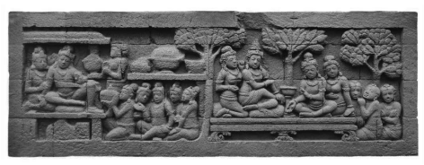

## 4.2 The Gurudharmas On Communal Transactions

In what follows I survey the set of eight *gurudharma*s, the stipulation of which is the basis for the coming into being of an order of nuns in all versions.12 Nearly all versions spell out these eight conditions in full. An exception is the Haimavata (?) version, where the Buddha only refers to eight *gurudharma*s as a condition for women in general to go forth, without spelling out in detail what these eight imply. The relevant part reads: 
I permit the going forth of women who are able to undertake eight principles to be respected. If they are not able, I do not permit them to be on the path [of monasticism]. Therefore I lay down for women eight [principles] to be respected.13 In the Dharmaguptaka and Haimavata (?) accounts, the acceptance of the eight *gurudharma*s serves as the higher ordination for the entire group led by Mahāprajāpatī Gautamī. The other versions focus more closely on Mahāprajāpatī Gautamī's own acceptance of these eight gu-*rudharma*s. This is particularly evident in the Mahīśāsaka and Theravāda versions, where the whole exposition of the eight *gurudharma*s is concerned with her alone. Nevertheless, even in these two versions the way the eight principles are formulated makes it clear that they apply to nuns in general, not just to Mahāprajāpatī Gautamī alone.14 Turning to the eight *gurudharma*s themselves, one of these is on the matter of higher ordination itself.15 In what follows I translate the versions of this *gurudharma*, noting also their sequential position in the respective lists of eight *gurudharma*s, which tend to vary: 
Dharmaguptaka (no. 4): 
A probationer (*śikṣamāṇā*), who has trained in the precepts, should request the higher ordination from the community of monks.16 Mahāsāṃghika-Lokottaravāda (no. 2): A girl of [at least] eighteen years, who has been instructed in the training and has completed the training for two years, should seek the higher ordination in both communities.17 Mahīśāsaka (no. 4): A probationer (*śikṣamāṇā*), who has trained in the precepts for two years, should receive the higher ordination in both communities.18 Mūlasarvāstivāda (no. 1): 
The nuns should seek from the monks the going forth and the higher ordination, the becoming of a nun.19 Sarvāstivāda (no. 1):
A nun should seek higher ordination from the monks.20 Theravāda (no. 6): A probationer (*sikkhamānā*), who has trained for two years in six principles, should seek higher ordination from both communities.21 The above-listed versions differ on whether only the order of monks or both orders are required for granting higher ordination.22 Some versions also refer to the probationary period to be observed in order to be eligible for higher ordination. Such a reference to the probationary training is found only in the Dharmaguptaka, Mahāsāṃghika, Ma-hīśāsaka, and Theravāda versions of this *gurudharma*.

23 This needs to be considered in relation to a rule on offences entailing atonement for nuns in three of these four *Vinaya*s against giving higher ordination to a woman who is pregnant.24 According to the background narrative to the promulgation of this rule in the Dharmaguptaka, Mahīśāsaka, and Theravāda *Vinaya*s, a pregnant woman had been ordained. This could hardly have happened if from the outset all candidates had been observing the probationary training, which requires continuous adherence to celibacy. The ordaining of a pregnant woman and the repercussions this caused among the laity would be a natural occasion for stipulating the need for a probationary training,25 more natural than for it to be laid down at the time of founding an order of nuns. 

――――――
immediately preceding ordination. Obviously this does not make much sense." Yet the six rules (or "vows") have to be kept continuously, evident in the additional specification "without transgression", *avītikamma*, used for the undertaking of these six at Vin IV 319,25. Shih 2000: 414 seems to have overlooked this detail when she comments that "one might infer that a probationer is expected to keep these six particular precepts in a stricter way, but one finds no indication of such an expectation in the Vinaya texts." Sujato 2009: 180 and 182 argues that "the text does not state what the consequences are if she does in fact transgress one of the rules", and then concludes that "there seems no reason, then, to accept a difference in the strictness of keeping precepts as marking a clear upgrade from the *sāmaṇerī* to the *sikkhamānā*." But according to the very rule that comes just a few lines after the specification on keeping these six rules *avītikamma*, a bhikkhunī incurs a *pācittiya* on ordaining a *sikkhamānā* who has not completed the training in these six rules for two years. This makes it safe to conclude that, in order to qualify for higher ordination, such a training for two years requires keeping the six rules "without transgression", which marks the decisive difference compared to the ten precepts.

24 T 1428 at XXII 754b26 (on the significance of which cf. also Heirman 2008: 117), T 
1421 at T XXII 92b3, and Vin IV 317,20 (on the contrast with the sixth *garudhamma* cf. Hüsken 1997: 252f). The Mahāsāṃghika *Vinaya*, Roth 1970: 247,1 and T 1425 at T XXII 536a15, reports that a probationer being pregnant from the time before going forth occasions a rule on the need for completion of the probationary period before higher ordination is granted. Such a rule does not conflict with the *gurudharma* in question.

25 Hüsken 1997: 251 note 647 notes that the Sarvāstivāda *Vinaya* explicitly links the training as a probationer to the need to find out if a candidate is pregnant; cf. T 1435 at T 
XXIII 326b17.

It could of course be imagined that lack of proper adherence to the gurudharma led to the ordaining of a pregnant woman, described in these Vinayas. The same reasoning in fact holds for the *gurudharma*s in general, in that recurrence of a similar regulation among the code of rules for nuns does not in itself prove that a *gurudharma* regulation to the same effect could not have been promulgated at the time of the founding of the order of nuns.26 The *gurudharma*s are mere injunctions and do not carry any consequences, in cases where they are not followed. Thus lack of observing a *gurudharma* could have motivated the promulgation of a corresponding rule, so as to lay down what such a breach would in future entail. 

In the case of ordaining a pregnant woman, however, had the probationary training already been in existence, instead of a rule against ordaining a pregnant candidate, a more natural response would have been a rule against lax observance of the probationary training, thereby also covering breaches of celibacy that do not result in pregnancy. 

Given that most versions of this principle to be respected do not mention the probationary training at this juncture, it seems safe to conclude that this reference is a later addition. In this way the *gurudharma* on ordination gives the impression that its formulation has been updated in some versions so as to make room for the probationary training, presented as laid down by the Buddha already when starting an order of nuns. 

Another two *gurudharma*s concern procedures related to monastic offences, namely the undergoing of penance (*mānatva*), incumbent on any fully ordained monastic who has committed a serious offence of the sa*ṃghāvaśeṣ*a class,27 and the invitation (*pravāraṇā*) to have one's shortcomings pointed out, an invitation to be made at the conclusion of the period of the rainy season (*varṣa*). 

Nuns should undergo penance in front of both communities.28 The invitation should, according to the Dharmaguptaka and the Mahīśāsaka accounts, be done only in regard to the community of monks,29 whereas the other versions stipulate that both orders should be invited. 

According to another two *gurudharma*s, also concerned with relationships between the two orders, the nuns should observe the rainy season in a place where monks are also present, and they should every fortnight request and receive exhortation (*ovāda*) from the monks.30 The rulings surveyed so far could have their origin in simple injunctions given by the Buddha on how a newly founded order of nuns should interrelate with the already existing order of monks. In order to assist the recently ordained nuns in undertaking transactions like ordination etc., it would have been reasonable for them to do these in cooperation with the monks, who had experience in whatever transactions would have been in existence at this stage in the evolution of Buddhist monasticism. 

―――――― 28 The formulation in the Mahāsāṃghika-Lokottaravāda *Vinaya*, Roth 1970: 17,16 (no. 

5), gives the impression that only the restitution requires both communities. Accord-ing to the Mahāsāṃghika *Vinaya* preserved in Chinese translation, T 1425 at T XXII 
475a8 (no. 5), however, both communities are required also for the actual observance of penance; the same holds for the Mahīśāsaka *Vinaya*, T 1421 at T XXII 185c26 (no. 7), and the Saṃmitīya *Vinaya* (no. 4), T 1461 at T XXIV 670c10.

29 T 1428 at T XXII 923b16 (no. 8) and T 1421 at T XXII 185c22 (no. 3); the same holds for the Saṃmitīya *Vinaya* (no. 8), T 1461 at T XXIV 670c14.

30 A minor difference is that according to the Mahāsāṃghika *Vinaya* preserved in Chinese translation, T 1425 at T XXII 475a13 (no. 6), and the Theravāda version, AN 8.51 at AN IV 276,29 (no. 3, cf. Vin II 255,11), a nun should also enquire about the date of the observance day. In the Theravāda *Vinaya* the same need recurs as *pācittiya* 59, Vin IV 315,17, whose introductory narrative reports that monks complained about the fact that nuns had not enquired about the date of the *uposatha*. Given that (apart from the *pācittiya* rule which at this point was still to be promulgated) the need for the bhik-khunīs to enquire about the date of the *uposatha* is only stipulated in *garudhamma* 3, the introductory narrative to *pācitti*ya 59 presupposes the existence of this *garudham*-ma. Otherwise there would have been little reason for the monks to complain.

Similarly it would have been sensible to ensure that the recently ordained nuns receive regular exhortation. In terms of protection, it would also be advisable for nuns to spend the rainy season (*varṣa*) in a place not too far away from monks, so that in case of need they could receive help. 

Whereas these *gurudharma*s could have originated from a concern to assist and protect an order of nuns that has just come into existence, as suggested by the simile that accompanies them, the remainder of the gu-*rudharma*s are more clearly aimed at subordinating nuns.31 

## 4.3 The Gurudharmas On Homage And Criticism

One of the *gurudharma*s takes up the need to pay homage and behave respectfully. This reads as follows: 
Dharmaguptaka (no. 1): 
Even a nun [ordained] a hundred years ago should rise up on seeing a newly ordained monk to welcome him, pay homage, prepare a clean seat, and invite him to sit on it.32 Mahāsāṃghika-Lokottaravāda (no. 1):
A nun who has received the higher ordination [even] a hundred years ago should pay homage with her head at the feet of a monk who has received the higher ordination [just] this day.33 Mahīśāsaka (no. 8): Even if a nun has received the precepts a hundred years ago, she should still pay homage to and rise up to welcome a monk who has just been ordained.34 Mūlasarvāstivāda (no. 6): 
Even if a nun has received the higher ordination a hundred years ago, on seeing a monk who has just received higher ordination, she should revere him, welcome him with palms together, and pay homage with her head [at his feet].35 Sarvāstivāda (no. 8): Although a nun has received higher ordination up to a hundred years ago, she should therefore still show utmost humility towards a newly ordained monk by paying homage with her head [at his feet], being respectful and reverential, greeting him with palms together [in homage].36
――――――
age with her head at the feet of each of the monks. If being old or sick she is unable to do this, she should pay homage according to however much strength she has, and to the remainder she should pay homage in a general way, saying: 'I, the nun so-and-so, pay homage with my head at the feet of the entire community.' Whenever monks arrive at a monastery of nuns, all the nuns should rise up, be respectful, and pay homage, as *described above*. If a nun makes any distinctions, such as 'this one has violated the pre-cepts', 'this one practises healing', 'this one is stupid and ignorant', and being arrogant she is not respectful by rising up and paying homage, then she has violated this gurudhar-ma." A similar passage occurs at a later point in the Mahāsāṃghika-Lokottaravāda Vinaya preserved in Sanskrit, as part of a detailed exposition of this *gurudharma* given by the Buddha at the behest of Mahāprajāpatī Gautamī; cf. Roth 1970: 22,3. The interpretation by Nagata 2002: 284 of this passage as reflecting an act of resistance by Mahāprajāpatī Gautamī is not correct. 

34 T 1421 at T XXII 185c28f. 35 T 1451 at T XXIV 351a16 to 351a18; this is the eighth *gurudharma* in the Sanskrit and Tibetan parallels, Schmidt 1993: 246,8 and D 6 da 103a3 or Q 1035 ne 100a4, as well as in the *Abhidharmakośopāyikā-ṭīkā*, D 4094 ju 213b5 or Q 5595 tu 243b6.

36 MĀ 116 at T I 606a27 to 606a29 (cf. T 60 at T I 857a17). In the Sarvāstivāda *Vinaya*, 
T 1435 at T XXIII 345c9, the corresponding *gurudharma* stands in first position.

Theravāda (no. 1): 
A nun who has received the higher ordination [even] a hundred years ago should pay homage to, rise up for, put the palms together [in homage], and behave courteously towards a monk who has received the higher ordination on that very day.37 The above versions show some minor variations in the type of respectful behaviour they depict.38 They agree that a nun needs to pay respect, with most versions specifying that this should be done by bowing with her head at the feet of the monk. In addition, several versions stipulate that she should rise up, to which the Dharmaguptaka version adds that she should also prepare a clean seat for the monk and invite him to sit on it.39 The Sarvāstivāda version is quite explicit in conveying the implications of this *gurudharma*, indicating that the nun should show "ut-most humility". 

The Sarvāstivāda account is of further relevance to the present matter, since it returns to the topic of worship on what clearly is a later occasion. 

Here is the relevant passage: 
Then, at a later time, Mahāprajāpatī Gautamī was surrounded by a great company of accomplished nuns, who were all elder and senior nuns, who were known to the king, and who had been living the holy life for a long time. Together with them she went to the venerable Ānanda, paid homage with her head at his feet, stood back to one side, and said: 
"Venerable Ānanda, may you know that these are all elder and senior nuns who are known to the king and have been living the holy life for a long time. [In regard to] those young monks who have just started to train, who have recently gone forth and not long come to this right teaching and discipline, let these monks pay homage with their heads at the feet of those nuns in accordance with seniority, being respectful and reverential, greeting them with palms together [in homage]."
Then the venerable Ānanda said: "Gautamī, you just wait here, I 
will approach the Buddha and speak to him about this matter." Ma-hāprajāpatī Gautamī said: "So be it, venerable Ānanda."40 When Ānanda informs him of this request, the Buddha replies: 
Wait, wait, Ānanda, guard such words, be careful and do not speak like this. Ānanda, if you knew what I know, you would not utter a single word, let alone speak like this.41 This reply then leads on to a depiction of the negative repercussions of founding an order of nuns to which I will turn in the next chapter. 

A similar passage occurs in the Mahīśāsaka version, with the difference that here this forms part of Mahāprajāpatī Gautamī's reaction on being informed of the *gurudharma*s.

ted to pay homage to monks in accordance with seniority. How could a nun [ordained] a hundred years ago pay homage to a newly ordained monk?" Ānanda again told the Buddha about it. 

The Buddha said to Ānanda: "That I should permit nuns to pay homage to monks in accordance with seniority, that is impossible."42 The Dharmaguptaka *Vinaya* reports that on another occasion the Buddha promulgated a rule on this matter prompted by an actual occurrence of senior nuns not rising up and paying respect to junior monks.43 The Mahīśāsaka *Vinaya* also has such a report involving the existence of senior nuns.44 The same holds for the Mūlasarvāstivāda *Vinaya*, which similarly indicates that such an episode took place when nuns had reached some degree of seniority.45 The Sarvāstivāda *Vinaya* reports an incident when the notorious nun Sthūlanandā did not rise up on seeing the elder Mahākāśyapa,46 which also clearly is concerned with an event that took place once the order of nuns had reached some seniority. 

These passages suggest that a more plausible placing for the arising of the need to regulate the issue of paying respect would have been once some nuns had indeed reached seniority. Nevertheless, it could also be that these regulations should be understood to have arisen in response to lack of observance of the *gurudharma* regulation in question. 

The Theravāda *Vinaya* also reports a request by Mahāpajāpatī Gotamī for monks and nuns to pay respect to one another according to seniority, which here comes right after the account of the founding of the order of nuns. Since the episode does not refer to elder nuns, unlike the other *Vinaya*s surveyed above, in this case it seems as if this request should perhaps be considered as having happened soon after the founding of the order of nuns.47 In the Theravāda *Vinaya* the Buddha's refusal comes with an additional explanation. According to this explanation, even heterodox and badly taught practitioners did not pay homage to women; how then could the Buddha allow for this to be done?48 The reference to non-Buddhist practitioners finds confirmation in later Jain sources, according to which Jain nuns should similarly pay respect to Jain monks even if these are junior. The injunction employs terms similar to the formulation of the respective *gurudharma* in the foundation history of the Buddhist order of nuns.49 Another theme for *gurudharma* regulation is the need for a nun to be circumspect in relation to matters of criticism. This comes up in what in nearly all versions are two consecutive *gurudharma* regulations. These are as follows: 
Dharmaguptaka (nos. 2 and 3): 
A nun should not scold a monk, or upbraid him, she should not malign him for infringements against morality, infringements against 
[right] view, or infringements of [proper] conduct … 
It is not proper for a nun to accuse a monk, to remind him [of an offence] or make him confess it, it is not proper for her to obstruct his investigation of an offence, or to obstruct his expounding of the precepts, or to obstruct his invitation (*pravāraṇā*). A nun should not reprimand a monk. A monk should reprimand a nun.50 Mahāsāṃghika-Lokottaravāda (no. 3).

Nuns are not permitted to criticize a monk on account of what happened or what did not happen. Monks are permitted to criticize a nun on account of what happened, not on account of what did not happen.51 Mahīśāsaka (nos. 5 and 6): 
A nun cannot abuse a monk and cannot tell householders of a monk's breach of precepts, breach of [proper] conduct, or breach of [right] view. 

A nun cannot accuse a monk of an offence, but a monk can scold a nun.52 Mūlasarvāstivāda (nos. 4 and 5): 
A nun cannot interrogate a monk [about a fault] or remind a monk of a fault, that is, of a breach of morality, [right] view, [proper] conduct, or right livelihood. Ānanda, if a nun sees that there is a breach or trans-gression in relation to a monk's morality, [right] view, [proper] conduct, or livelihood, it is not proper for her to rebuke him. For a monk who sees a nun having a breach or transgression, it is proper to rebuke her … 
A nun cannot scold or, becoming irritated, upbraid a monk. A monk can do this towards a nun.53 Sarvāstivāda (nos. 5 and 6): If a monk does not permit questions by a nun, the nun cannot ask the monk about the discourses, the *Vinaya* or the Abhidharma. If he permits questions, the nun can ask about the discourses, the *Vinaya*, or the Abhidharma … 
A nun cannot report a monk's offence; a monk can report a nun's offence.54 Theravāda (nos. 7 and 8): 
A nun should not in any way revile or abuse a monk … 
From today onwards, nuns are not permitted to criticize monks. 

Monks are permitted to criticize nuns.55 The need for monastics to avoid maligning, abusing, and reviling each other is fairly self-evident and similarly applies to the case of monks.56 The same is not the case for criticism, however. In fact several of the versions quoted above make it quite clear that, whereas nuns are not permitted to criticize monks or point out their shortcomings, monks are allowed to do so in relation to nuns. 

The suggestion that nuns should not criticize misbehaviour of monks is not easily reconciled with reports elsewhere in the *Vinaya*s that the Buddha promulgated rules to restrain monks from behaviour for which they had been criticized by nuns.57 According to two *aniyata* regulations found similarly in the different Vinayas, breaches of the rules by monks can even be pointed out by a trustworthy laywoman, and the monastic community has to take action accordingly.58 Once criticism by a laywoman is admitted and the *Vinaya*s report that criticism by nuns receives no censure by the Buddha, but instead prompts him to take action against the monks, it seems safe to conclude that the formulation of the *gurudharma* prohibiting nuns in principle from any criticism of monks reflects concerns of later times. 

The formulation adopted in the Sarvāstivāda discourse is particularly striking for assessing such concerns, as here the nuns should not ask a monk questions about the discourses, the *Vinaya*, or the Abhidharma.59
―――――― 57 One example would be the rule against monks setting themselves up as exhorters of nuns, which according to the introductory narrative was promulgated by the Buddha when he was informed by the nuns and/or by Mahāprajāpatī Gautamī of such behaviour by the notorious group of six monks; cf. the Dharmaguptaka *Vinaya*, T 1428 at T 
XXII 648b9, the Mahīśāsaka *Vinaya*, T 1421 at T XXII 45b10, the Mūlasarvāstivāda Vinaya, T 1442 at T XXIII 794b7 and D 3 ja 59b1 or Q 1032 nye 56b2 (here other monks act as intermediaries between the nuns and the Buddha), the Sarvāstivāda *Vinaya*, T 1435 at T XXIII 80c26, and the Theravāda *Vinaya*, Vin IV 50,12; on the group of six cf., e.g., Bhagvat 1939: 47f, Barua 1968: 49, Dhirasekera 1970: 81, Sarkar 1981, Schopen 2007, Clarke 2009, Anālayo 2012a: 417f, and Liu 2013.

58 These are found in the *prātimokṣ*as of the Dharmaguptaka *Vinaya*, T 1429 at T XXII 
1017a4, the Mahāsāṃghika *Vinaya*, T 1426 at T XXII 550c24 (for the Lokottaravāda cf. Tatia 1975: 12,19), the Mahīśāsaka *Vinaya*, T 1422 at T XXII 196a4, the Mūlasar-vāstivāda *Vinaya*, Banerjee 1977: 23,3, the Sarvāstivāda *Vinaya*, von Simson 2000: 
181,4, and the Theravāda *Vinaya*, Pruitt and Norman 2001: 24,5; cf. also below p. 143.

59 A reference to the Abhidharma can also be found in the word explanation to a rule in the Theravāda *Vinaya* which prevents a nun from asking a monk a question without This points to a sense of competition and the fear that a monk might incur a loss of face through not being able to answer such questions.60 Fear of competition comes up also in the Mahāsāṃghika-Lokottara-vāda version, which has another *gurudharma* not found in any of the parallel versions. This reads as follows: 
Nuns should partake of a refectory, bedding and seats, and dwellings after monks.61 The formulation in the Mahāsāṃghika-Lokottaravāda account reflects a need apparently felt among those responsible for the final versions of this *gurudharma* to ensure that monks take precedence in such matters. 

Regarding the whole set of eight *gurudharma*s it is noteworthy that, apart from the discrepancy between the Mahāsāṃghika and the Sthavīra traditions regarding the present *gurudharma*, the remaining set of seven is similar, albeit with some variations in formulation and in sequence. 

However, the Haimavata (?) foundation history does not spell out the eight *gurudharma*s, but simply refers to the fact that there are eight such conditions. Although this could just be a case of abbreviation, from a comparative perspective only the actual promulgation and the overall count of the *gurudharma*s are common to the different versions of the foundation history of the order of nuns. 

This in turn leaves open the possibility that some of the *gurudharma*s that stand in contrast to other *Vinaya* passages could have come into existence later. In fact several writers have drawn attention to the doubtful authenticity of the set of eight *gurudharma*s in its present form.

62 Perhaps the *gurudharma* prohibiting nuns from voicing criticism, for example, replaced a regulation that was similar to the *gurudharma*s examined earlier in the present chapter, in the sense of being predominantly concerned with communal transactions instead of subordination of the nuns. 

In relation to the possibility that originally the promulgation of a set of eight *gurudharma*s might have just been concerned with establishing how the two orders should cooperate with each other at the time when the order of nuns had just come into existence, it is significant that most versions accompany each of their *gurudharma*s with a recurrent statement that describes the appropriate attitude towards them. This proceeds as follows:63 Dharmaguptaka: 
This principle should be respected, it is to be honoured, praised, and not to be transgressed for one's whole life.

64 Mahāsāṃghika-Lokottaravāda:
For the nuns this is the first (etc.) *gurudharma* that the nuns should revere for their whole life … *up to* … not transgressing it just as the ocean [does not go beyond] the shore.65 Mūlasarvāstivāda: 
This is the first (etc.) principle to be respected, a matter not to be transgressed … *up to* … which the nuns should diligently practise for their whole life.66 Sarvāstivāda: I set forth for women this first (etc.) guiding principle to be respected, which women should not transgress, which women are to uphold for their whole life.67 Theravāda: 
This is a principle to be revered, respected, honoured, venerated, and not to be transgressed for one's whole life.68 This kind of statement is absent from the Haimavata (?) version. The Ma-hīśāsaka account also has no such statement, even though it gives the actual regulations in full. This variation points to another possibility, in that perhaps at an earlier time these stipulations were not accompanied by an indication that they are to be respected for the whole of one's life. 

In other words, the starting point for the textual development leading to the eight *gurudharma*s as we have them now might have been a simple set of injunctions by the Buddha on how the order of nuns should relate to the already existing order of monks.69 In the ancient Indian setting the creation of an order of nuns would indeed have required giving thought to how this should relate to the already existing order of monks, both in terms of positioning the two communities towards each other and in terms of how this would affect the overall public image of the Buddhist monastic order.70 The fact that several *gurudharma*s recur as rules on offences entailing atonement elsewhere in the different *Vinaya*s supports the impression that the *gurudharma*s were not considered to be legal rules properly speaking, but rather practical directives. 

From the viewpoint of the dyke simile as conveying a sense of protection and taking into account the need to provide a model for communal transactions, the suggestion that the nuns should spend the rainy season (varṣa) where monks qualified to give instructions are present would be only natural. The same holds for injunctions according to which they should get the cooperation of monks in dealing with monastic offences and that they should regularly receive exhortation (*ovāda*) 
from the monks. 

Such *gurudharma*s need not originally have been meant to be valid 
"for the whole of one's life", but only to get the order of nuns started. Their textual presentation could have been similar to the formulation still found in the Mahīśāsaka version, where no indication on their lifelong validity accompanies the detailed promulgation of the *gurudharma*s.

From the starting point provided by such injunctions a gradual textual growth would have resulted in the present set of eight *gurudharma*s, with one or more additional regulations coming to be part of the standard set, as well as resulting in the addition of the specification that these *gurudharma*s are valid for one's whole life. 

Needless to say, such permanent validity is in line with a general tendency of *Vinaya* rules and regulations, which evolved from instructions given somewhat *ad hoc* and in principle open to revision into coming to be considered an inalterable laws, as evidenced in the decision reportedly taken at the first sa*ṅgīti* not to follow the Buddha's recommendation to abolish the minor rules.71 In the case of the *gurudharma*s there appears to have been a perceived need to stress this permanent validity repeatedly, as shown by the circumstance that they become in most *Vinaya*s the topic on which to start the exhortation a competent monk should give to the nuns every fortnight.

72 Another problem worth mentioning is that the promulgation of the gurudharmas differs from the standard procedure of laying down rules recorded elsewhere in the *Vinaya*, in so far as nuns have not yet come into being and therefore have not yet been able to do anything in response to which the *gurudharma*s could then be laid down to regulate their future behaviour.73 Here the narrative element of the Buddha offering Mahāprajāpatī Gautamī and her followers an alternative option, which I discussed in the previous chapters, is of further relevance. Once the Buddha had given permission for them to shave off their hair, don robes, and live a celibate life, presumably in the more protected environment at home, this implies that at this narrative juncture they already had acquired some sort of semi-monastic status, although falling short of a full "going forth" from the home life into homelessness. 

Having followed the Buddha and proven their ability to brave the homeless life, at this moment in the foundation history Mahāprajāpatī Gautamī and her followers stand quite literally at the entrance to the monastery, requesting full entry into the monastic community. From the viewpoint of this narrative development, it would be in line with the procedure for laying down rules described elsewhere in the *Vinaya* that the Buddha, on being informed of something that has happened, be shown to react to this by stipulating some regulation(s). 

Mahāprajāpatī Gautamī and her followers have left the lay life behind. They have thereby entered the sphere of the monastic jurisdiction of the Buddha. In reply to their following him on his travels (instead of staying at home as presumably originally envisaged), the Buddha now regulates how things should proceed in order that they become fully part of the monastic community. In a way they have overstepped the limits inherent in the earlier permission given to them by the Buddha, who now promulgates a set of regulations on what they should not overstep in future. When considered in this way, the promulgation of the *gurudharma*s no longer creates a narrative incoherence, but rather can be seen as in line with the general procedure of laying down rules depicted elsewhere in Vinaya literature in response to some kind of overstepping of boundaries by monastics.

The similes illustrating the function of the *gurudharma*s appear to convey nuances of protection and of helping nuns to cross over. Several of the actual *gurudharma*s could have had their origin in injunctions indeed springing from such a concern, such as ensuring that the newly founded order of nuns will receive guidance in communal transactions and that nuns do not find themselves in solitary dwellings far away from the protective presence of monks. 

Other *gurudharma*s, however, are clearly aimed at the subordination of nuns and at times convey nuances of fear of competition in matters of knowledge and in relation to access to material resources. Even initial injunctions on how to follow the model of the monks in communal transactions become methods of control in the hand of male monastics once they are considered to be forever valid, thereby turning into a tool for submission. 

In this way the eight *gurudharma*s appear to result from a textual development whose final outcomes are different from what might well have been their starting point. Similar shifts of attitude are also evident in other narrative portions of the foundation history of the order of nuns, which I survey in the next two chapters. 

## 5 Mahāprajāpatī Gautamī'S Ordination

In this chapter of my study of the foundation history I examine the sim-ile illustrating Mahāprajāpatī Gautamī's ordination by accepting the gu-*rudharma*s and the report of the Buddha's assessment of the implications of having an order of nuns in his dispensation. 

I begin with the simile used by Mahāprajāpatī Gautamī to express her joyful acceptance of the *gurudharma*s (1). Then I turn to a series of similes that in one way or another illustrate the problem involved in founding an order of nuns (2). After that I survey textual passages in some versions of the foundation history that convey negative apprehensions resulting from the existence of an order of nuns (3), as well as instances of negativity manifesting elsewhere in early Buddhist texts (4). 

## 5.1 The Simile Illustrating Acceptance

Following Ānanda's announcement of the *gurudharma*s to Mahāprajāpatī Gautamī, in all versions she illustrates their reception with the help of a simile. With some variations in detail, this simile involves receiving a flower garland on one's head. The simile in the different versions proceeds as follows: 

## Dharmaguptaka:

It is like a young man or woman who is clean and adorned. A person with already washed head, who stands [with them] on the [roof]top of a hall, takes a head wreath of lotuses, or a head wreath of atimuk-*taka* flowers, or a head wreath of *campaka* flowers, or a head wreath of *sumanā* flowers, or a head wreath of vārṣika flowers, and offers it to them. Accepting it, they place it firmly on their head.1 Haimavata (?): 
It is like a person who has taken a bath, perfumed, and adorned himself. [Another] person comes with a flower wreath and adorns that one's head with it.2 Mahāsāṃghika-Lokottaravāda:
It is just as if there were a young person fond of ornaments who, with head washed and dressed in fresh clothes, were to receive a garland of lotuses or a garland of *campaka* flowers or a garland of kumuda flowers or a garland of herbs and jasmine on the head.3

## Mahīśāsaka:

It is like a young man or woman who has become spotless and gladdened themselves, having bathed their body and put on new and clean clothes. A person out of kindness bestows on them a head wreath of campaka flowers, or a head wreath of vārṣika flowers, or a head wreath of lotuses, or a head wreath of *atimuktaka* flowers. The [young]
person joyfully takes it with both hands and reverentially places it upon the head.

4

## Mūlasarvāstivāda:

It is like a woman from a noble family of the four classes, who has bathed and applied fragrances to her body, cleaned and combed her hair, cut her nails, and dressed in fresh clean clothes. Then another person, who has made a head wreath of *campaka* [flowers] and lotuses, etc., gives it to that woman. When the woman sees the [wreath of] flowers arriving, she accepts it with great joy and places it upon her head.5

## Sarvāstivāda:

It is like a warrior girl, or a brahmin [girl], or a householder [girl], or a worker[-class] girl, handsome and beautiful, who bathes so as to be totally clean, applies perfume to her body, puts on bright clean clothes, and adorns herself with various ornaments. 

Suppose there is, furthermore, someone who thinks of that girl, who seeks her benefit and well-being, who seeks her happiness and ease. He takes a head wreath made of lotuses, or a head wreath of campaka flowers, or a head wreath of *sumanā* flowers, or a head wreath of *vārṣika* flowers, or a head wreath of *atimuktaka* flowers, and gives it to that girl. That girl with great joy accepts it with both hands and adorns her head with it.

6

## Theravāda:

It is as if a young man or woman who, being youthful and fond of adornment, with washed head, obtained a garland of lotuses or vassika flowers or *atimuttaka* flowers and, accepting it with both hands, were to place it upon the head.7 A minor difference between the above versions concerns the recipient of the garland. The Haimavata (?) and the Mahāsāṃghika-Lokottara-vāda versions mention a person or a young person in general without specifying the gender. The Dharmaguptaka, Mahīśāsaka, and Theravāda accounts speak of a young man or woman as the recipient of the flower garland. In the Mūlasarvāstivāda and Sarvāstivāda versions the person who receives the flower garland is just a woman, further specified to be from any of the four classes. 

At first sight this simile might seem surprising, as one would not naturally associate a Buddhist monastic, or one aspiring to be such, with the wearing of flower garlands.8 Even in the case of lay disciples the full moon and new moon day observance involves abstaining from the wearing of flower garlands.9 Moreover, in the ancient Indian setting the giving of a garland to a female has connotations of a marriage engagement.10 The same type of simile recurs in the *Anaṅgana-sutta* of the Majjhi-ma-*nikāya*, where it illustrates how a group of monks joyfully receives an instruction. Whereas the similes in the *Anaṅgana-sutta* and its Ekottari-ka-*āgama* parallel speak of a woman or man,11 a Madhyama-*āgama* parallel and another parallel preserved as an individual translation only mention a woman, additionally specified to be from any of the four classes.12 In this way the *Anaṅgana-sutta* and its parallels evidence the same type of difference regarding the recipient of the flower garland as some versions of the foundation history of the order of nuns translated above. 

The agreement between the Anaṅ*gana-sutta* and its parallels in employing the simile of receiving a flower garland on one's head to illustrate the reception of an instruction by a group of monks helps to clarify the usage of the same type of simile in the foundation history. Judging from the Anaṅ*gana-sutta* and its parallels, for the audience of the early discourses the simile as such did not carry connotations that would have made its use inappropriate for illustrating the joy experienced by a monastic.13 This in turn suggests the main import of the simile of the flower garland to be simply an illustration of intense joy. The inappropriateness of wearing flower garlands for monastics does not seem relevant, since after all this is just a simile, not an actual wearing of a flower garland. 

As for the connotations of betrothal, these must be irrelevant to the version of the simile in the Anaṅ*gana-sutta* and its parallels. Although the same would hold for the case of the foundation history of the order of nuns, here such associations would not be entirely out of place. 

In as much as the eight *gurudharma*s are presumably meant to place women who have gone forth under the protective guardianship of monks, mirroring the custody of lay women by their husbands and sons,14 they do have a function comparable to the garlanding of a young woman. The woman garlanded in token of betrothal is classed among women who are under protection by the male members of her own family and her future in-laws.15 Even though such connotations would make sense in this case, the fact that such implications are not relevant to the simile in the Anaṅ-*gana-sutta* and its parallels, as well as the variations between the parallel versions of the foundation history on the gender of the recipient, makes it less probable that the simile of the flower garland should be understood as conveying nuances of betrothal. 

## 5.2 Repercussions Of Female Renunciation

All versions illustrate the problem related to instituting an order of nuns with one or several similes. In most versions these already occur as part of the Buddha's reply to Ānanda's intervention on behalf of Mahāprajā-patī Gautamī. An exception is the Theravāda version, where they are part of a statement made by the Buddha after the acceptance of the *gurudhar*-mas and thereby after his foster mother has received ordination. In what follows I first examine the similes in the different versions on their own, and then place them in their narrative context. Here are the different versions:
Dharmaguptaka: It is like a householder's home with few men and many women; it can be understood that the home will come to ruin … 
It is like a good rice field that is quickly destroyed by frost and hail.16 Haimavata (?): 
[It is] like in a lay household with few men and many women, the activities of the household will certainly come to ruin.17 Mahāsāṃghika-Lokottaravāda:
It is just as if the disease called "chaff" were to fall on a ripe barley field,18 then that ripe barley field will be defiled by a great defile-ment …
It is just as if the disease called "red rust" [were to fall on] a ripe sugar-cane field, then that ripe sugar-cane field will be defiled by a great defilement …
―――――― 16 T 1428 at T XXII 923a1 to 923a4.

17 T 1463 at T XXIV 803b7f. 18 According to von Hinüber 2002: 154, the reference to barley gives the impression that this version of the simile reflects conditions in north-western India. 

It is just like …19 Mahīśāsaka: It is like a household with many women and few men; you should know that this household will deteriorate and come to an end before long.20 Mūlasarvāstivāda: 
It is like a household with few men and many women, that house will soon be broken up by evil thieves …
It is like a farmer's crops which have ripened and are suddenly damaged by wind, rain, frost, and hail … 
It is like a field of ripe sugar cane which is afflicted by red-joint disease and will be damaged and ruined completely.21 Sarvāstivāda:
It is like a household with many women and few men, will this house-hold develop and flourish? …
It is like a field of rice or a field of wheat in which weeds grow; that field will certainly come to ruin.22 Theravāda: It is like households that have many women and few men, these are easily assaulted by robbers [that sneak in using a light in] a pot … 
It is just as when a disease known as "bleaching" falls on a ripe rice field, then that rice field will not remain long …
It is just as when a disease known as "red rust" falls on a ripe sugar-cane field, then that sugar-cane field will not remain long.23 The Haimavata (?) and the Mahīśāsaka versions have only a single simile, describing a household with many women that comes to ruin or deteriorates. This simile, which I already mentioned briefly in the previous chapter, is found in all versions, except for the Mahāsāṃghika-Lokottara-vāda account, where the manuscript has only preserved the beginning of a third simile. The preceding two similes in the Mahāsāṃghika-Lokot-taravāda version are concerned with farming. Since in those versions that do have three similes only two are concerned with farming and the third is about a household with many women, it seems fair to assume that the missing simile in the Mahāsāṃghika-Lokottaravāda account might have been the one on the household, differing in so far as here this would then have been the last of the three similes. 

The simile of the household with many women can also be found in a discourse in the Saṃyutta-*nikāya* and its counterpart in the Saṃyukta-*āgama*, where its import is to illustrate how the mind of someone who has not developed *maitrī* can fall prey to attack by non-human beings.24 The cultivation of *maitrī*, perhaps best translated as "benevolence" instead of "loving kindness", has a close relationship in the early discourses to protection.25 The circumstance that the simile in the Saṃyutta-*nikāya* and Saṃyukta-*āgama* conveys such nuances of protection makes it probable that in the foundation history of the order of nuns the same simile would be concerned with the same topic. 

In the Mūlasarvāstivāda and Theravāda versions of the foundation history the imagery of a household with many women is accompanied by the indication that such a household could easily be assaulted by robbers. This concords with an understanding of the significance of the *guru*-
―――――― 23 AN 8.51 at AN IV 278,23 to 279,7 (cf. Vin II 256,16).

24 SN 20.3 at SN II 264,1 and SĀ 1254 at T II 344c7. 25 Cf. in more detail Schmithausen 1997 and Maithrimurthi 1999: 55–63.

dharmas as providing protection to the nuns, averting the danger that their mendicant status turns into an occasion for evilly intentioned men to take advantage of them.26 The problem posed by robbers recurs elsewhere in the Mūlasarvāstivāda *Vinaya* in a description of women who have been obtained by force. 

The passage in question depicts robbers who break into a village or town to catch women and take them off to be their future wives.27 This supports an interpretation of the simile of the household with many women as conveying the need for women who go forth to be protected from sexual abuse. 

The situation in ancient India for women who were not protected by a husband appears to have been insecure indeed, and rape of nuns seems to have been far from uncommon.28 In the Jain tradition, which otherwise exhibits a keen concern to avoid any type of violence, specific instructions are given in case nuns are staying in a dwelling without lockable doors. In such a situation, a stout nun should stand on guard close to the entrance at night with a stick in hand, ready to drive away intruders.29 In view of the position of women in ancient Indian society and the risk of their being perceived mainly in terms of their reproductive function and ability to give pleasure to men,30 women who had gone forth appear to have been in need of some form of protection against the danger of sexual abuse.31 Such a need provides further background to the narrative episode in some versions of the foundation history of the order of nuns, according to which the Buddha permitted Mahāprajāpatī Gautamī and her followers to shave their hair and don robes but stay at home. From the viewpoint of this episode, the Buddha's initial refusal, depicted in all versions, would express apprehension that living conditions as wandering mendicants would be a challenging, perhaps even dangerous under-taking for Mahāprajāpatī Gautamī and her followers in the ancient Indian setting. Hence the Buddha's suggestion that they had better live a celibate life of renunciation in a protected environment at home. 

Once women were mainly seen as a commodity, the problem for nuns would have been that they stood in danger of being considered a commodity without an owner.32 In such a setting, *gurudharma*s which regulate interactions between the two communities in legal matters would have had the function of placing the newly founded order of nuns in a relationship to its male counterparts that resembles as much as possible the protection a laywoman could expect from her male relatives. 

This would be similar in nature to the proper behaviour to be adopted by a newly ordained monk towards his preceptor. Several *Vinaya*s indicate that the two should model their interactions on the relationship that obtains in the sphere of the family between father and son, and then describe the types of behaviour that the newly ordained monk should adopt towards his preceptor.33 Similarly, the protection a woman can expect from her father or elder brother would have provided a model for how to relate the recently ordained nuns to the already existing monk community.34 According to the *Vyavahāra-bhāṣ*ya, the relationship of Jain nuns to their male and female teachers in fact explicitly follows the model in secular society of the protection of a woman by her parents and family relations.35 Such a model must have provided a compromise accommodating women's wish to pursue a celibate life in quest of awakening within the context of wider social norms and expectations concerning the role of women. These had to be taken into account in order to ensure the survival of what after all is a mendicant order whose very continuity depends on the support given by, and thus the approval of, the laity.36 In sum, the simile of the household found in nearly all accounts of the foundation of the order of nuns seems to convey the need to afford protection to the newly founded order of nuns in a setting where going forth could have made them fall prey to various forms of abuse. 

Several of the other similes in some versions of the foundation history might originally have conveyed a similar sense. Without proper protection, the traumatic repercussions of rape and similar abuse could indeed be compared to how a field of ripe rice, barley, wheat, or sugar cane is affected by a disease or weather calamity. That is, these similes need not from the outset have been meant to depict nuns as a disease or calamity in themselves. 

Here it is noteworthy that the Sanskrit and Pāli terminology used in the Mahāsāṃghika-Lokottaravāda, Mūlasarvāstivāda, and Theravāda versions speaks of a disease "falling on" a ripe field.37 Such terminology gives the impression that the simile is meant to illustrate a danger that comes from without. The same holds for the alternative simile of a weather calamity afflicting a field. If the point at stake had been to illustrate a threat posed by nuns, it would have been more natural to employ similes that illustrate a process of decay that comes from within. 

The only version that does convey such a connotation is the Sarvāstivāda discourse, which speaks neither of a weather calamity nor of a disease. Instead it describes weeds growing in a field.38 This is one of the very few instances where the usually closely similar presentation in the individual discourse differs substantially from the Sarvāstivāda version, as instead of weeds it speaks of the falling of hail.39 The otherwise close similarity between these two versions, combined with the fact that a reference to weeds is not found in any of the other canonical versions, whereas hail or frost is a recurrent motif, makes it fairly probable that this simile in the Sarvāstivāda discourse is the result of a later change. This in turn conveys the impression that the perception of nuns as a danger that destroys the Dharma from within would be the result of a narrative shift of perspective. 

Regarding the placing of these similes, for them to function as an illustration of the Buddha's hesitation to start an order of nuns, they would need to be in the place in which they are indeed found in nearly all versions, namely in the Buddha's reply to Ānanda's intervention. 

In the Mahīśāsaka and Theravāda versions, however, the similes come only after Mahāprajāpatī Gautamī has already received ordination. This could be the result of a shift in placing. The same clearly holds for the Theravāda version's positioning of the simile of the dyke that serves to illustrate the function of the *garudhamma*s, which in this version comes right at the end and thus after the similes of the household with many women and the similes of a ripe rice field or sugar-cane field afflicted by a disease. Yet, the issues to be illustrated by these similes have already been concluded earlier, since Ānanda's intervention has been successful and the *garudhamma*s have already been accepted. 

What makes the narrative sequence in the Theravāda version noteworthy is that, through a simple shift in placing, the similes more easily convey a negative impression. Instead of illustrating the dangerous situation of nuns, due to the placing of the similes the message appears to be rather that the nuns themselves are the source of danger. 

That the nuns themselves were eventually perceived as the source of danger is in fact evident in one way or another in all versions. Once the similes of the household as well as of the fields spoiled by disease or a weather calamity are read in context, it becomes clear that, in the way they occur now in the texts, they do serve to illustrate the negative repercussions of founding an order of nuns. The conclusion that the different versions draw after the similes are as follows:
Dharmaguptaka: If women go forth and receive the higher ordination in the Buddha's teaching, that will cause the Buddha's teaching not to last long.40 Haimavata (?): 
If there are women among those who go forth in my teaching, it will certainly ruin the right teaching, which will not remain for long.41 Mahāsāṃghika-Lokottaravāda: In a dispensation in which women obtain the going forth and the higher ordination, the state of being a nun, that dispensation will then be defiled by a great defilement.42 Mūlasarvāstivāda: 
The going forth of women will break up and destroy the right teaching just like this … The going forth of women will damage and destroy the right teaching just like this … 
If women are permitted to go forth, the right teaching will be damaged and ruined, it will not remain long, but will completely disappear just like this.43 
―――――― 40 T 1428 at T XXII 923a3f.

41 T 1463 at T XXIV 803b8f. 42 Roth 1970: 10,3 to 10,5. 

43 T 1451 at T XXIV 350c13 to 350c19, which in this way alters its depiction of the con-sequences for each of the similes given. The parallels in Schmidt 1993: 243,29 and D 
6 da 102a2 or Q 1035 ne 99a5 instead speak throughout of the teaching and discipline not lasting long.

Sarvāstivāda: If women obtain to leave the home out of faith and become homeless to train in the path in this right teaching and discipline, then this holy life (*brahmacarya*) will consequently not last long.44 Theravāda: 
In a teaching and discipline in which women receive the going forth from home to homelessness, that holy life will not remain for long.45 The Mahīśāsaka account only precedes its version of the simile of the household by a prediction of decline, to which I will turn in the next chapter. The absence from the Mahīśāsaka version of a conclusion after the simile of the household, comparable to those quoted above, leaves open the possibility that originally the similes did not carry such a concluding remark. 

When comparing these different descriptions, it is noteworthy that at this juncture the two discourse versions only speak of the duration of the holy life, *brahmacarya*. In its use in the early texts, the term "holy life" at times conveys just the sense of a life of celibacy, but often also functions as a referent to the Buddha's teaching as a whole.46 In the present context, the two nuances of the term can lend themselves to rather different interpretations. The nuance of celibacy would fit an interpretation according to which the similes were originally meant to illustrate the need to offer protection to the newly founded order of nuns. By having the monks take a position in relation to the nuns that is comparable to male relatives protecting their women, this would enable the nuns to live a life of celibacy, *brahmacarya*, without being perceived by other males as an easy prey. 

The other nuance also comes into play with this same interpretation, since if the nuns were to meet regularly with sexual abuse, this would of course reflect back on the whole of the Buddhist tradition and affect its public image. 

However, the same sense of the *brahmacarya* as representative of the whole of the Buddhist tradition would suit an interpretation of the similes when perspective shifts from the nuns needing protection to the nuns being a source of danger. From the viewpoint of such apprehensions, the 
"holy life" becomes interchangeable with the Buddha's right teaching or his dispensation, which now is being threatened by the existence of nuns. 

The focus on such perceived negative repercussions becomes considerably more prominent in the Mahīśāsaka, Mūlasarvāstivāda, and Sar-vāstivāda versions, where the Buddha informs Ānanda of a series of problems that result from the founding of an order of nuns. 

## 5.3 Apprehensions

The Mahīśāsaka, Mūlasarvāstivāda, and Sarvāstivāda versions report the Buddha describing to Ānanda in detail the negative consequences of allowing women to go forth. In the Mūlasarvāstivāda account this description occurs in a subsequent section of the text, after the conclusion of the foundation history of the order of nuns. In each of these three versions, however, the outburst of negativity towards women comes after Ānanda has requested, on behalf of Mahāprajāpatī Gautamī, that the Buddha permit the paying of worship by junior monks to senior nuns.47 The Mahīśāsaka version presents negative feelings about the existence of an order of nuns in the following way:
If women had not gone forth and received the higher ordination in my teaching, after my passing away the male and female disciples would have followed behind the monks, holding the four requisites, and said: "Venerable sirs, out of compassion for us, accept our offerings." 
On going out of the door and seeing [a monk], they would in turn have led him by the arm and said: "Venerable sir, out of kindness towards us, please come in and sit for a while, so that we may obtain peace in the house." 
On meeting them in the streets they would all have loosened their hair to wipe the feet of the monks and spread it out for them to walk on. 

Now that [women] have been permitted to go forth, this possibility has been nearly extinguished.48 Similar themes come up in the Sarvāstivāda version with additional detail:
Ānanda, if women had not obtained to leave the home out of faith and become homeless to train in the path in this right teaching and discipline, brahmins and householders would have spread their clothes on the ground and said: "Diligent recluses, you can walk on this!" …
Brahmins and householders would have spread their hair on the ground and said: "Diligent recluses, you can walk on this!" …
Brahmins and householders, on seeing recluses, would have respectfully taken various types of beverages and food in their hands, stood at the roadside waiting, and said: "Venerable sirs, accept this, eat this, you can take it away to use as you wish" …
Faithful brahmins [and householders], on seeing diligent recluses, would respectfully have taken them by the arm to lead them inside [their houses], holding various types of valuable offerings to give to diligent recluses, and said: "Venerable sirs, accept this, you can take it away to use as you wish" …
[Even] this sun and moon, who are of such great power, of such great might, of such great fortune, of such great majesty, would not have matched the majesty and virtue of diligent recluses, what to say of those lifeless and skinny heterodox practitioners?49 These passages express quite vividly apprehensions regarding the existence of Buddhist nuns and its repercussions on the support and respect received from the lay community. Had an order of nuns not come into existence, life for the monks would have been a paradise. Instead of having to make an effort to seek out those who give alms, the monks would have found householders waiting by the roadside with food and drinks ready.

Not only that, these householders would have invited the monks to take anything from their homes and followed behind them with the four requisites, beseeching them to accept offerings. The monks would also have found themselves being invited to sit down in people's houses, just so that its inhabitants may gain some peace. 

As if this were not yet enough, householders would have invited the monks to step on their clothes and even on their hair, or they would have used their hair to wipe the feet of the monks. Needless to say, in view of the ancient Indian respect for the higher parts of the body over its lower parts, this description involves a public display of extreme respect.

The depiction in the Sarvāstivāda discourse of householders putting their clothing and hair on the ground for monks to step on, standing by the roadside ready to offer beverages and food, as well as inviting them to come inside to take various valuables, recurs in another discourse in the same Madhyama-*āgama* collection, with similar descriptions also found in most of the parallel versions to this discourse.50 The discourse in question takes the form of an account of events at the time of a past Buddha. The respectful behaviour of the laity is here due to their being influenced by Māra, who has done this in order to get the monks under his control. In other words, in this context the excessive respect, going so far as to put one's hair on the ground for the monks to walk on, and the abundant offerings are all part of a ruse of Māra, rather than something monks can reasonably expect. What in this Madhyama-*āgama* discourse (and its parallels) appears to be a humorous depiction of excessive behaviour, in the foundation history of the order of nuns in the same Madhyama-*āgama* collection has become something that would actually have happened, had an order of nuns not come into existence. 

When evaluating this parallelism, it is noteworthy that the Mahīśāsaka account continues after this outburst of negativity with the Buddha point-ing out that Ānanda had been influenced by Māra when intervening on behalf of women.51 The recurrence of the motif of being influenced by Māra in such close proximity to the outburst of negativity gives the impression that it could be a remnant of textual borrowing from the tale about the past Buddha, where descriptions of lay people acting with extreme respect is considerably more natural than in the present context. 

Besides the themes of respect and easy access to offerings, according to the Sarvāstivāda discourse even competition with other religious groups in ancient India would have been no issue at all, a point not made in the 
―――――― 50 MĀ 131 at T I 621c1; comparable depictions can be found in a parallel extant in Sanskrit fragments, Waldschmidt 1976: 143f, and in two parallels preserved in Chinese translations, T 66 at T I 865b28 and T 67 at T I 867c11. The description in the Pāli version, MN 50 at MN I 336,9, is comparably brief and only mentions respectful behaviour in general, without spelling out details of such behaviour. 

51 T 1421 at T XXII 186a24.

Mahīśāsaka version. A similar presentation can be found in the Mūlasarvāstivāda account, which also employs the comparison with the sun and the moon.52 This is preceded by a description of the offerings made by lay followers, of their spreading cloth as well as their hair on the road for the monks to step on. This touches on the same themes as found in the Mahīśāsaka and Sarvāstivāda versions. In sum, according to these versions the coming into existence of an order of nuns is to be blamed for the monks missing out on such a paradisiacal condition. 

These descriptions clearly point to apprehensions that inform negative attitudes towards nuns among male monastics. The fact that they are not found in the other versions makes it safe to conclude that they are later additions.

The outburst of negativity in the Mahīśāsaka and Sarvāstivāda versions does not stop at this. In addition to the above translated passages, both versions make a point of proclaiming that, unlike men, women have five "obstructions", as the Mahīśāsaka account calls them. 

These are generally known as the five "impossibilities", namely the impossibility that a woman could assume the position of heavenly rulers like Śakra, Māra, or Brahmā, and that in the human realm she could be a wheel-turning king or a Buddha, the last being referred to as "a noble king of the Dharma in the three realms" in the Mahīśāsaka version.

53

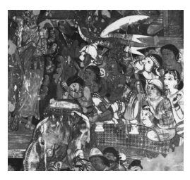

The main point made with this listing is not that a woman cannot fill any of these roles in a future birth. Instead, the point is only that she cannot occupy any of these leadership roles in the present. To do so, at least in a patriarchal society like ancient India, one would have to be a male.56 In other words, this list reflects ancient Indian notions about social hierarchy.57 The same applies also to the role of a Buddha as a teacher of mankind in the ancient Indian setting. Were the Buddha a woman, just as if he were from a low class, it would be more difficult for the teachings of such a Buddha to be accepted.58 Here it also needs to be kept in mind that the aspiration to Buddhahood is a later development and would probably not have been relevant during the formative period of the foundation history of the order of nuns and the Bahudhātuka*-sutta* and its parallels.

59 Now, in the Sarvāstivāda version of the foundation history, Mahāpra-jāpatī Gautamī's request is based on the possibility of reaching the fourth fruit of recluseship. In the Mahīśāsaka account the Buddha grants her permission to go forth in reply to Ānanda's enquiry whether women can attain the four paths and fruits. From this it follows that none of the five options described in the Mahīśāsaka and Sarvāstivāda versions would have been relevant to the setting, which is about facilitating women's progress to full awakening by instituting an order of nuns (the option of becoming Māra can safely be assumed to have carried little attraction anyway).

60 This gives the impression that the occurrence of the five impossibilities in these two versions of the foundation history is the result of a later addition.

In fact the listing of the five impossibilities does not stand in any meaningful relation to the remainder of the account and thus seems to have found its placing here simply because it fits the general trend of negative sentiments about women in general or nuns in particular. This is perhaps not surprising, since an account of the founding of the order of nuns would be a natural place to voice such feelings. 

## 5.4 Other Instances Of Negativity

Although the foundation history is a natural place to voice negative attitudes towards nuns in particular and women in general, similar passages can also be found elsewhere. 

Several such instances occur in discourses in the Aṅguttara-*nikāya*. 

According to one of these discourses, women will never have enough of sex and giving birth.61 Another discourse in the Aṅguttara-*nikāya* flatly states that women are angry, envious, greedy, and stupid.62 Yet another discourse in the Aṅguttara-*nikāya* compares women to black snakes, as both are dirty and smelly, and betray friends.63 The immediately following discourse builds on the same comparison with the snake imagery, proclaiming that almost all women are very passionate and slanderous, betray friends, and commit adultery.64 None of these discourses has a parallel in the extant collections of other schools, be these preserved in the Chinese *Āgama*s or otherwise.65 In addition to the absence of parallels, such statements also stand in direct contrast to the positive image of nuns to which I will turn later.66 Besides, from a doctrinal viewpoint a consideration of women as invariably obsessed with sex and being slanderous and deceptive could not hold for the case of a fully awakened nun. 

Such statements also do not sit too well with the attitude underlying the Buddhist evolution myth, if it can be called such, which sees the distinction between males and females as an evolution from a previous stage of sex-less beings.67 This description would not support the assumption of an inherent superiority of males over females, but rather con-siders both as deriving from the same type of beings.68 Now the statement that women are angry, envious, greedy, and stupid is concerned with the reasons why in the ancient Indian setting women do not sit in court, do not embark on business, and do not travel to Kamboja.69 Since neither the Buddha nor his disciples were responsible for keeping women from sitting in court, embarking on business, or travelling to Kamboja, it seems that this discourse is not making a value statement from a Buddhist perspective, but much rather reports what would have been a perception of women prevalent among those in ancient India who did have an influence on the constitution of courts, etc.

The comparison of the five bad qualities of women with those of a snake occurs also in the *Maitrisimit*, a text preserved in Tocharian and Uighur. A noteworthy difference here is that such a statement is attrib-uted to a group of Śākyan youths who are still under the influence of defilements. After meeting these Śākyan youths, who claimed that this had been taught by the Buddha, the women then approach the Buddha himself. He instead speaks about the five virtues of women, and then gives them a teaching that leads to their stream-entry.70 A variant in relation to the comparison with snakes can be found in the Mūlasarvāstivāda *Vinaya* preserved in Tibetan translation. Here the comparison with snakes applies to "some women", that is, in this context this is not a blanket statement applicable to all women.71 The assumption that all women are angry, envious, greedy, and stupid stands in direct contrast to another discourse in the same section of the Aṅguttara-*nikāya*, which describes women who are not angry or envious, and who liberally give to recluses and brahmins.72 The allegation of women's stupidity, also found in the Aṅguttara-*nikāya*, stands in contrast to other discourses that describe female lay followers who have reached high attainments and to the listing of outstanding disciples in the same Aṅguttara-*nikāya*, which draws attention to the wisdom of the nuns.73 Had all women without exception indeed been considered slanderous and deceitful,74 the two *aniyata* rules, found similarly in the different *Vinaya*s, would hardly have come into existence.75 These rules consider the testimony of a trustworthy female lay disciple sufficient ground for making a monk's alleged serious breach of his conduct a matter that has to be investigated. 

The passage on sitting in court, embarking on business, and travelling to Kamboja, just as the comparison with the snake, alerts to the possibility that some derogatory or even misogynist statements could have originated as records of the opinions of others. Especially after the Buddha had passed away and his monastic disciples were struggling to ensure the survival of the tradition, it could easily be imagined that prejudices held in the ancient Indian setting more easily found their way into the oral transmission of the texts.76 Another Aṅguttara-*nikāya* discourse without a known parallel proclaims that women are entirely a snare of Māra.77 A proper evaluation of this statement requires one to take into account that, according to the preceding narration, a mother and her son had ordained and then had sex with each other.

78 Thus the statement forms a response to a rather specific event and needs to be understood in relation to it,79 in particular as a criticism of the parent, who should have taken the responsibility to prevent incest in this situation. If the case had involved a father and his daughter ordaining and then having sex with each other, one might expect the criticism to have turned on the parent as well, that is, on the father in this case. 

The comparison of women to a snare of Māra is found also in a number of other instances, which for the most part refer to women who are adorned and thus sexually enticing.80 These are also not blanket statements on the nature of all women, but need to be understood as specific to their narrative context. 

In sum, just as the proclamation of the five impossibilities for women appears to be a later addition to the Bahudhātuka*-sutta* and to the foundation history, several other passages voicing attitudes of negativity towards women appear to be similarly late, or at least require contextualization. At the same time their existence testifies to the pervasiveness of negative attitudes towards women in general and nuns in particular among those responsible for transmitting and shaping the texts in the form in which they have come down to us.

The simile illustrating Mahāprajāpatī Gautamī's acceptance of the guru-*dharma*s with the reception of a garland of flowers on one's head conveys joyful reception. 

The repercussions of instituting an order of nuns find illustration in the imagery of a household with many women. The main import of this simile appears to be the vulnerability of female renunciants in the ancient Indian setting and thus their need to receive protection. Other similes found only in some versions describe a field afflicted by weather or a disease. Although these might originally have had similar implications, when read in their narrative context it becomes clear that, in the way these similes have been preserved, their import is to put the founding of an order of nuns in a negative light. 

Some versions go further by depicting in much detail the harmful repercussions of the existence of nuns, which has resulted in a loss of easily available material support and of deep respect from laity, as well as rendering successful competition with non-Buddhist groups more dif-ficult. In two of the seven main versions this leads up to a listing of the five impossibilities for women. 

Comparison of the different versions suggests a process of textual growth that has as its starting point the simile depicting a household with many women. This process of growth would have incorporated various and increasingly strident expressions of a negative attitude towards women in general and nuns in particular, of which examples are also found elsewhere in early and later Buddhist texts. 

In the next chapter I turn to another and particularly prominent ex-pression of such an attitude, which is found in all versions, namely the prediction that the coming into existence of an order of nuns will halve the lifetime of the Buddha's dispensation. 

## 6 Decline

In this last chapter of my study, I explore the notion that the coming into being of an order of nuns results in a decline of the Buddha's dispensation.

I begin with the prediction of decline (1), and then contrast this to other passages that refer to outstanding nuns (2), as well as to the four assemblies as an integral aspect of the Buddha's dispensation (3). In the final part of this chapter I examine the accusations leveled at the first saṅ-*gīti* against Ānanda for having intervened on behalf of the nuns (4), which puts into perspective the prediction of decline in the foundation history. 

## 6.1 The Prediction Of Decline

The negative repercussions of founding an order of nuns find their expression in all versions in the form of a prediction of decline, according to which the Buddha's dispensation will last only five hundred years, instead of enduring for a thousand years. 

In the Dharmaguptaka version the prediction of decline occurs three times. Here the Buddha announces the impending decline when Mahāprajāpatī Gautamī makes her request, and again in reply to Ānanda:
If women go forth and receive the higher ordination in the Buddha's teaching, that will cause the Buddha's teaching not to last long.1 The full prediction comes after the ordination of Mahāprajāpatī Gautamī and her followers:
The Buddha [further] said to Ānanda: "If women had not gone forth in the Buddha's teaching, the Buddha's teaching would have lasted five hundred years longer."2 In the Mūlasarvāstivāda version the prediction of decline occurs two times, once when Ānanda makes his request and again when the ordination has happened. The first instance is as follows:
If women are allowed to go forth, the Buddha's teaching will not last long.3 As in the first two instances of the prediction in the Dharmaguptaka account, the Mūlasarvāstivāda version at this juncture does not specify the time period of the duration of the Buddha's teaching, but only notes that it will not last long. The indication regarding a loss of the original period of a thousand years occurs later on in the Mūlasarvāstivāda account, at the end of the outburst of negativity that I discussed in the previous chapter. The relevant passage speaks of a loss of purity, instead of a loss of duration:
If women did not go forth, the Dharma taught by me would for a thousand years have been completely pure and without any stain.4 The Sarvāstivāda version also has two predictions. The first reads as follows: 
If women obtain to leave the home out of faith and become homeless to train in the path in this right teaching and discipline, then this holy life (*brahmacarya*) will consequently not last long.5 The second prediction in the Sarvāstivāda version, which specifies the time period, occurs at a much later time. In the meantime nuns have not only been ordained, but also reached seniority. Ānanda then approaches the Buddha to convey their request that homage should be paid according to seniority. In reply, the Buddha explains:
If women had not obtained to leave the home out of faith and become homeless to train in the path in this right teaching and discipline, the right teaching would have remained for a thousand years. Now it has been decreased by five hundred years and will remain for [only] five hundred years.6 The Haimavata (?) account has only a single declaration, which occurs after the promulgation of the *gurudharma*s and before Ānanda informs the nuns of the conditions set by the Buddha for their ordination:
The Buddha said to Ānanda: "Now that you have requested for women to go forth, after that the [duration] of the right Dharma will decrease by five hundred years."
7 The Theravāda discourse also has a single declaration of decline, which comes after Mahāprajāpatī Gautamī has accepted the *garudhamma*s: 
If women had not received the going forth from home to homeless-ness in the teaching and discipline made known by the Tathāgata, the holy life would have endured long, for a thousand years the right teaching would have remained. 

Ānanda, but since women have gone forth from home to home-lessness in the teaching and discipline made known by the Tathāgata, now the holy life will not endure long, the right teaching will now remain [only] for five hundred years.8 In the Mahīśāsaka version the prediction also comes after the ordination of Mahāprajāpatī Gautamī and her followers, with additional indications that explain why Ānanda insisted that something so detrimental should happen:
[The Buddha said to Ānanda]: "If women had not been permitted to go forth and receive the higher ordination, the right teaching of the Buddha would have remained in the world for a thousand years. Now that they have been permitted to go forth, [its duration] has decreased by five hundred years" …
On having heard this Ānanda was aggrieved and wept. He said to the Buddha: "Blessed One, before I never heard or knew this teaching. If I had known this before seeking permission for women to go forth and receive the higher ordination, would I have requested it three times?"
The Buddha said to Ānanda: "Do not weep any more. Māra had obscured your mind, just that is the reason."
9 According to this passage, Ānanda had continued to insist that the Buddha found an order of nuns because he had been influenced by Māra. 

This attempt to explain a problem that in one way or another affects all versions of the foundation history of the order of nuns - why the Buddha took so detrimental a step - is not without its own difficulties. The Mahīśāsaka account implies that the founding of an order of nuns is one of the machinations of the Evil One. This in turn means not only that Ānanda succumbed to Māra, which is a motif perhaps borrowed from the *Mahāparinirvāṇa-sūtra* and its parallels,10 but also that the Buddha was not able to prevent Māra from carrying out his evil plan. 

The problem of why the Buddha would allow something to happen, once he knew from the outset that it would have such dire consequences, 
―――――― 9 T 1421 at T XXII 186a13 to 186a25. 

10 DN 16 at DN II 103,14 (for a discussion of the commentary cf. An 2000) and its parallels, Sanskrit fragment TM 361 folio 165 V2, Waldschmidt 1950: 53, DĀ 2 at T I 
15b25, T 5 at T I 165a12, T 6 at T I 180b20, T 7 at T I 191b22, the Mūlasarvāstivāda Vinaya, T 1451 at T XXIV 387c16, and its Tibetan parallel, Waldschmidt 1951: 207,14 (§15.15); cf. also the *Divyāvadāna*, Cowell and Neil 1886: 201,21.

is tackled explicitly in the Mahāsāṃghika-Lokottaravāda account. This version reports that, after Ānanda has made his third request, the Buddha reflects as follows:
If for a third time I rebuff Ānanda, the son of Gautama, his mind will be adversely affected and the teachings he has heard will become confused. Although my true Dharma [could] remain for a thousand years, let not the mind of Ānanda, the son of Gautamī, be adversely affected, let not the teachings he has heard become confused, even though my true Dharma remains for [only] five hundred years.11 Here the Buddha consciously decides to allow a halving of the duration of his Dharma just in order to avoid Ānanda becoming confused (which presumably would jeopardize his performance as a reciter of the discourses at the first sa*ṅgīti*). This presentation appears to be even less successful than the suggestion that the foundation of the order of nuns is one of the machinations of Māra. Both fail to solve the contradiction created by the prediction of decline. What is significant about these two attempted solutions is that they show that members of both the Sthavīra and the Ma-hāsāṃghika traditions clearly recognized the inconsistencies that inhere in the foundation history of the order of nuns and felt a need to devise some explanation for it. 

## 6.2 Outstanding Nuns

The problem that the Buddha knowingly does something so detrimental to the duration of his dispensation is indeed not easy to solve, therefore it is hardly surprising that none of the above versions is able to present this issue in a convincing manner.12 The idea that founding an order of 
―――――― 11 Roth 1970: 16,11 to 16,17, which refers to Ānanda first as *gautamasya putrasya* and then as gautamī*-putrasya.* 
12 Horner 1930/1990: 109 comments that "the circumstance which appears to require the more explanation is not that Gotama allowed women to enter the Order, but that he appears to have hesitated; an appearance due perhaps to the hand of the monk-editors of the texts." According to Foucher 1949: 265: "il n'existait en bonne logique aununs could have such detrimental repercussions, even though it is clearly a common heritage among the seven canonical versions of the foundation history of the order of nuns, contrasts directly with a number of other passages that throw into relief the positive contribution and abilities of nuns. The abilities of nuns are highlighted in the listing of outstanding disciples in the Aṅguttara-*nikāya* and its Ekottarika-*āgama* parallel. Both listings present Mahāprajāpatī Gautamī and other individual nuns, whose names are explicitly given, as exemplary in particular abilities, forms of conduct, or attainments.13 Mahāprajāpatī Gautamī stands in first place in these listings. The Aṅguttara-*nikāya* version highlights that she was foremost in being of long standing, to which the Ekottarika-*āgama* adds that she was also foremost in being respected by the king of the country.14 Her eminent position as the first Buddhist nun is already an integral aspect of the foundation history of the order of nuns, to which the Ekottarika-*āgama* version adds another dimension, in that she is not only a leading figure in the monastic world of nuns, but she is also foremost in receiving respect from the king as the one who stands at the apex of secular society. 

The listings of outstanding nuns work their way through a whole array of abilities and forms of conduct in which a particular nun was foremost. A full appreciation of the implications of such listings requires keeping in mind that each quality or ability mentioned is not just a description of a single nun. Rather, a nun can only be declared foremost in some respect if at the same time there were other nuns who had similar qualities or engaged in comparable conduct. Viewed from this perspective, then, the listing of outstanding nuns is a survey of qualities and modes of behaviour that were held to be to some degree common among a number of early Buddhist nuns.15 It is hard to reconcile the descriptions common to the Aṅguttara-*nikāya* and Ekottarika-*āgama* with the notion that the very creation of an order of Buddhist nuns will usher in the decline of the Buddha's teaching.

In addition to the listing of outstanding nuns, a discourse in the Ekot-tarika-*āgama* reports that a nun informs other nuns of a long series of her past lives.16 According to her report, having performed an act of merit in a past lifetime as a male, (s)he aspired to rebirth as a woman, and from then on kept doing acts of merit, repeatedly and explicitly choosing to be reborn as a woman.17 Birth as a woman is in this story clearly the result of merit combined with an intentional aspiration for such rebirth. In fact the belief that being born as a woman is the result of bad karma is not reflected in the early discourses and the *Vinaya*, but is only found in commentarial literature.18

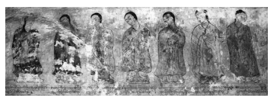

Figure 6 Outstanding Nuns19 The abilities and accomplishments of nuns are highlighted in several early Buddhist discourses. Two Pāli discourses present Khemā and Uppalavaṇṇā as the models other nuns should emulate.20 Parallels in the Ekottarika-*āgama* and the *Mahāvastu* agree with this presentation,21 whereas a Sanskrit fragment counterpart instead presents Mahāprajāpatī Gautamī together with the same Utpalavarṇā as the models for other nuns.22 Thus the different listings agree in placing a spotlight on Utpalavarṇā, who in the listing of outstanding disciples receives praise for her abilities in supernormal powers.23
―――――― 19 Sulamani gu hpaya, Pagan, courtesy Lilian Handlin. The image shows several of the outstanding nuns from the listing given in AN 1.14.5. 

20 SN 17.24 at SN II 236,15 and AN 2.12.2 at AN I 88,16. 21 EĀ 9.2 at T II 562b19; the *Mahāvastu*, Senart 1882: 251,21, also lists Kṣemā and Utpalavarṇā as the two chief nun disciples of the Buddha.

22 Tripāṭhī 1995: 198 (28,Z2). From the viewpoint of the Dharmaguptaka and Mahīśāsa-ka *Vinaya*s, this presentation would involve presenting monastic teacher and disciple together as models to be emulated, since according to their presentation Utpalavarṇā had gone forth under Mahāprajāpatī Gautamī. T 1428 at T XXII 606a24 reports the Buddha telling Ānanda to bring Utpalavarṇā, who wishes to go forth, to Mahāprajā-patī Gautamī for ordination, which Ānanda duly does. In T 1421 at T XXII 25b23 the Buddha himself tells Mahāprajāpatī Gautamī that she should ordain Utpalavarṇā.

23 AN 1.14.5 at AN I 25,20 and EĀ 5.1 at T II 558c23. 

According to another discourse in the Saṃyutta-*nikāya*, together with its Saṃyukta-*āgama* parallel and a passage in the Mahāsāṃghika-Lokottaravāda *Vinaya*, Śuklā was such an outstanding nun that even spirits would tour the roads of the town and reprove all those who did not come to listen to her teachings.24 Such passages confirm what is already evident from the listing of outstanding nuns, namely that the prediction of decline conflicts with the way other passages view the nuns and their contribution to the Buddha's dispensation.

## 6.3 The Four Assemblies

In addition to these passages highlighting the abilities and eminence of nuns, relevant for appreciating the prediction of decline in the founda-tion history of the nuns' order are also passages which consider the four assemblies - monks, nuns, male lay followers, and female lay followers - as an integral aspect of the Buddha's dispensation. The Ma-hāparinibbā*na-sutta* and its parallels report that, soon after his awakening, the Buddha explicitly proclaimed his plan to have an order of nuns. This proclamation comes as part of an assertion when confronting Māra.25 According to this assertion, the Buddha would not pass away until he had well established four assemblies of disciples: monks, nuns, male lay followers, and female lay followers.26 The Pāsādika*-sutta* and its Dīrgha-*āgama* parallel note that the completeness of the holy life taught by the Buddha finds its reflection in the accomplishment of the four assemblies of his disciples.27 This of course requires the coming into being of an assembly of nuns, without which such completeness could not be reached. 

The *Lakkhaṇa-sutta* of the *Dīgha-nikāya* even goes so far as to relate the Buddha's possession of four assemblies of disciples to one of his thirty-two superior bodily marks, which according to tradition are embodiments of a Buddha's virtues and foretokens of his being certain to become a fully awakened teacher, should he go forth. According to the Lakkhaṇ*a-sutta*, the wheel-marks on the soles of the Buddha's feet were portents of his destiny to be surrounded by a large retinue of the four assemblies.28 The Mahāvacchagotta*-sutta* and two Saṃyukta-*āgama* parallels highlight that the completeness of the Buddha's teaching is evident in the large numbers of monks and nuns who have become fully liberated, and in the fact that similarly high numbers of lay followers of both genders have reached other levels of awakening.29 Here, too, the theme of completeness requires as a precondition the coming into existence of nuns.

According to a discourse in the Aṅguttara-*nikāya* and its Madhyama-*āgama* parallel, one of the most unfortunate occasions is to be reborn in a border country of the type where the four assemblies, including the nuns, are not found.30 Two different discourses in the Saṃyukta-*āgama* and the Ekottarika-*āgama* respectively show how the nuns as one of the four assemblies can indeed serve as a source of inspiration, either for a monk or else for the king of the country.31 There can be little doubt that these discourses regard the presence of accomplished nuns in a very positive light, something that is required for the completeness of the holy life taught by the Buddha. Besides such general references to the four assemblies, other passages provide further information on what role the nuns in particular were expected to play as one of the four assemblies. 

A stanza in the Aṅguttara-*nikāya* and its parallels in the Saṃyukta-*āgama* and the Ekottarika-*āgama* point out how each of the four assemblies can contribute to the Buddhist community. The three versions agree in highlighting that nuns contribute through their learnedness, which is particularly notable since monks contribute through their virtue.32 This is not to say that nuns could not also illuminate the community through their virtue, which is explicitly stated in another Aṅguttara-*nikāya* discourse.33 But apparently the contribution to be made by learned nuns was considered outstanding enough to deserve special mention. 

The positive role associated with nuns even comes up in some Pāli discourses explicitly related to the duration of the Dharma. A discourse in the Saṃyutta-*nikāya* points out that for ensuring the long duration of the Dharma and for preventing its disappearance, all four assemblies, including the nuns, should dwell with respect towards their teacher, the teaching, the community, the training, and the development of concentration.34 This passage considers the existence of respectful nuns as en-suring the duration of the Buddha's dispensation.

The theme of respect recurs in a discourse in the Aṅguttara-*nikāya*, 
according to which the four assemblies, including the nuns, should be respectful towards the Buddha as their teacher, the teaching, the community, the training, and towards each other. These are the conditions that according to this and several other discourses in the same collection lead to the continuity of the Dharma after the Buddha's passing away.35 Besides standing in contrast to all these passages, another problem from the viewpoint of the reception of this prophecy in the tradition is that the predicted disruption of the duration of the Buddha's dispensation has failed to take place after the stipulated period of five hundred years.

36 This has led to reinterpretations of the statement to mean a longer time span, such as five thousand years.37 Yet this is not exactly what the original formulations say, which clearly state that the right Dharma and/or the holy life will last for only five hundred years.38 The prediction of decline recurs in the narrative of the first sa*ṅgīti*, 
which according to the different *Vinaya*s ensured the continuity of the Buddha's teaching by performing a communal recitation, sa*ṅgīti*, held at Rājagṛha shortly after the Buddha's cremation. 

## 6.4 The First Saṅgīti

Ānanda's intervention on behalf of the nuns comes up for criticism as part of the account of the proceedings of the first sa*ṅgīti*. A full appreciation of the foundation history of the nuns' order requires taking into account this narrative as well, for which purpose I now examine the ver-sions of this criticism reported in the reciter traditions whose foundation history I studied in the foregoing pages.

39 The accusations leveled against Ānanda come at different junctures in the narratives of the first sa*ṅgīti*. In the Dharmaguptaka and Mūlasarvāsti-vāda versions this episode takes place before the actual recitation, the saṅ-*gīti*; in the Haimavata (?), Mahāsāṃghika, Mahīśāsaka, Sarvāstivāda, and Theravāda accounts it instead comes after the texts have been recited. 

The Mahāsāṃghika version presents Upāli as the one who raises the criticism. He does this after having completed his recitation of the *Vinaya*, which here comes after Ānanda has already recited the discourses. In the Theravāda account an unspecified group of monks voice the criticism. 

In the other versions the accusation are raised by Mahākāśyapa, who in all accounts has the role of being the convenor of the first sa*ṅgīti*. In fact even in the Mahāsāṃghika account he is an active participant in the accusations leveled against Ānanda. After each point raised by Upāli, Mahākāśyapa throws a stick on the ground, thereby physically expressing his support of the accusations.40 The overall number of issues raised in this criticism differs considerably. Only a single topic is taken up in the Haimavata (?) version, five types of criticism are raised in the Theravāda account, six accusations of Ānanda can be found in the Mahīśāsaka and Sarvāstivāda versions, seven charges are leveled against him in the Dharmaguptaka and Mahāsāṃghika accounts, and eight instances of censure are recorded in the Mūlasarvāstivāda version. 

The one topic taken up in the Haimavata (?) account, which recurs in all of the other versions, is precisely his promoting the founding of an order of nuns. 

Several instances of criticism found in other versions are related to episodes in the *Mahāparinirvāṇ*a narrative, such as not requesting the Buddha to live longer, not bringing him water or else bringing water that was muddy when the Buddha was thirsty during his last journey, ――――――
vāstivāda *Vinaya* cf. Rockhill 1883/1907: 148–161; for a comparative study cf. also, e.g., Suzuki 1904, Bareau 1955a: 1–30, and de La Vallée Poussin 1976: 2–29; and for a survey of the accusations leveled against Ānanda Tsukamoto 1963: 820.

40 When Mahākāśyapa throws down a stick for the first time, the great trichiliocosm trembles, presumably as a token of approval; cf. T 1425 at T XXII 492a23. 

and not asking the Buddha to clarify what are the minor rules that after his passing away can be abolished.41 Another accusation takes up an occasion when Ānanda stepped with his foot on a robe of the Buddha that he was either sewing, or folding, or washing.42 In several versions he explains that there was nobody to help him, hence he had to use his foot to keep the cloth in place. 

The concern with notions of purity that seems to underlie this passage becomes stronger with another accusation. Ānanda allowed or did not prevent women from worshipping the recently deceased Buddha, as a result of which their tears defiled the Buddha's body. To be more specific, according to the Dharmaguptaka account, Ānanda did not prevent women from defiling the Buddha's feet.43 The Mahāsāṃghika version refers to the same issue in terms of not preventing them from letting their tears fall on the Buddha's feet.

44 The Mūlasarvāstivāda account speaks of displaying the Buddha's body to women, which they then defiled with their tears.45 In the Mahīśāsaka and the Theravāda versions the problem is that Ānanda allowed women to be the first to worship the Buddha's body, which in the Theravāda account then resulted in the Buddha's body being marked by their tears.46 In both versions Ānanda explains that he acted in this way to make sure that the women could get back home before it became dark. 

The Mahāsāṃghika version has another related accusation, according to which Ānanda showed the Buddha's private parts to nuns.47 According to the Mūlasarvāstivāda account, he did the same for women in general, 48 a criticism also voiced in the Sarvāstivāda version.49 It is against the background of accusations that are not based on breaches of *Vinaya* rules, but rather on brahminical notions of purity and propriety, as well as expressing distinct negative attitudes towards women, that the criticism of Ānanda's championship of founding an order of nuns is best appreciated. Here is a translation of the relevant section in the different *Vinaya*s:

## Dharmaguptaka:

Mahākāśyapa said to Ānanda: "Formerly you sought the leaving home of women in the Buddha's teaching. You incurred an offence of wrongdoing (*duṣkṛta*). Now you should confess it." Ānanda said: "Venerable sir, I did not do it intentionally. Mahāprajāpatī Gautamī had done the Buddha a great kindness. After the Buddha's mother had passed away, she raised the Blessed One. Ven-erable Mahākāśyapa, now I do not see this myself as an offence. Yet because of my faith in the venerable one(s), I shall now confess it."50 Haimavata (?): 
Because Ānanda sought the going forth for women, [the venerable Mahākāśyapa] reproached Ānanda in ten ways:
51 1) If women had not gone forth, lay supporters would have regularly been kneeling down by the side of the road, each holding containers full of food to be given to recluses.

2) If women had not gone forth, lay supporters would have regularly offered robes and bedding, seeking to meet recluses on the road who accept and use them.

3) If women had not gone forth, lay supporters riding on elephants or in horse-chariots would have regularly been riding to the side of the road and made prostrations by touching the ground with the five parts of their body, requesting recluses to step over them when passing by.

4) If women had not gone forth, groups of lay supporters on the road would have regularly spread their hair on the ground and requested recluses to step on it when passing by.

5) If women had not gone forth, groups of lay supporters would have regularly and with respectful attitude invited recluses to enter their houses for offerings. 

6) If women had not gone forth, on seeing recluses, groups of lay supporters would have regularly and with respectful attitude swept the ground clean, taken off their clothes, and spread them on the ground for the recluses to sit on. 

7) If women had not gone forth, groups of lay supporters would have regularly taken off their clothes to wipe off the dust on the feet of monks.52 8) If women had not gone forth, groups of lay supporters would have regularly loosened their hair to wipe off the dust on the feet of monks. 

9) If women had not gone forth, the majestic virtue of recluses would have surpassed [even] the sun and the moon; what to say of heterodox practitioners being able to face recluses? 

10) If women had not gone forth, the Buddha's right teaching would have remained for a thousand years. Now it has been decreased to five hundred years.

53 During a hundred years one can obtain the essence of liberation, during [the next] hundred years one can obtain the essence of concentration, during [the next] hundred years one can obtain the essence of keeping the precepts, during [the next] hundred years one can obtain the essence of learning, during [the next] hundred years one can obtain the essence of making offerings.

54 Mahāsāṃghika: [Upāli said]: "The Blessed One up to three times laid down that he would not permit women to go forth and leave home, yet you asked for it three times. This is a transgression against the *Vinaya*." …
[Ānanda said]: "Venerable sir, former Buddhas all had four assemblies, therefore I asked three times for nuns to leave home."55 Mahīśāsaka: Mahākāśyapa again scolded Ānanda: "You requested the Blessed One three times, seeking that he permit women to go forth in his right teaching. You have committed an offence of wrongdoing. You should see the offence and confess it." 
Ānanda said: "I did not disrespect the teaching. Yet Mahāprajāpatī Gautamī raised the Blessed One until he grew up and went forth, resulting in his accomplishing full awakening. This meritorious deed should be recompensed, therefore I requested it three times. Herein I 
also do not see this as having the character of an offence. Out of re-spectful faith for the venerable one(s), [however], I will now confess it."56 Mūlasarvāstivāda: 
[Mahākāśyapa said to Ānanda]: "You knew that the Blessed One did not permit women, whose nature is to harbour arrogance and be flattering, to seek the going forth. As the Buddha said: 'Ānanda, do not request for women to go forth and receive the higher ordination. Why is that? If women are made to go forth in my teaching, the teaching will not last long. It is like a good paddy field that is afflicted by frost and hail, it becomes damaged and in the end no grain will mature. 

Ānanda, in the same way, if women are made to go forth, the teaching will be damaged, it will decrease and not be able to last long.'57 Your requesting the Buddha for their leaving home, is that not a fault?"
Ānanda said: "Wait, venerable sir, you should display forgiveness. 

I had the whole thought of requesting the leaving home for women since Mahāprajāpatī is the Buddha's aunt. [When] Queen Māyā passed away seven days after giving birth to the Buddha, Mahāprajāpatī raised him with her own milk. Since she had been of such deep kindness, should it not be recompensed? 

"Moreover, I heard that all former Buddhas had four assemblies. I 
expected the Buddha to be similar to them. 

"Firstly it was for the sake of recompensing her great kindness, and secondly it was for the sake of compliance with recalling our family relations. Therefore I asked the Buddha for the leaving home of women. I wish for this fault to be pardoned."
Mahākāśyapa said: "Ānanda, this is not a [way of] recompensing kindness. This is precisely the extinction and destruction of the right teaching, its passing away. This is a great frost and hail descending on the Buddha's field. The right teaching could have remained in the world for a full thousand years. Now because of you it is [only] able to exist for a little while. 

"Again, what about compliance with recalling family relations? This is also unreasonable. Those who have gone forth have forever given up affection for relatives. 

"Again, what about [your statement]: 'I heard that all former Buddhas had four assemblies, I expected the Buddha to be similar to them'? 

In former times people all had few desires, their lust, anger, delusion, and defilements were all slight and they went forth in harmony. But now it is not like that. The Blessed One did not allow [the going forth of women]. Look at the suffering [caused by] your seeking to get the Buddha's permission. This is your first offence."
58 Sarvāstivāda:
Mahākāśyapa again said to Ānanda: "The Buddha did not permit women to go forth. You requested it up to three times, causing women to go forth. Because of this matter you have incurred an offence of wrongdoing. Confess this as an offence according to the teaching!" 
Ānanda replied: "I did not take the moral discipline lightly and I 
was not disrespectful towards the Buddha. Yet all former Buddhas had four assemblies. How could our Blessed One now be the only one without four assemblies? For this reason I requested it up to three times."59

## Theravāda:

[The elder monks said to Ānanda]: "Friend Ānanda, this is also an offence of wrongdoing that you made an effort for the going forth of women in the teaching and discipline made known by the Tathāgata. Confess this as an offence of wrongdoing."
[Ānanda replied]: "Venerable sirs, I [thought] that Mahāpajāpatī Gotamī is the Blessed One's aunt, his wet-nurse and foster mother, she suckled the Blessed One and gave him milk when his mother had died. [Therefore] I made an effort for the going forth of women in the teaching and discipline made known by the Tathāgata. I do not see this as an offence of wrongdoing. Yet out of faith in the vener-able ones I confess it as an offence of wrongdoing."60 Except for the Haimavata (?) account, the other versions agree in con-sidering Ānanda's intervention an offence, often qualified to be an offence of wrongdoing, duṣkṛta. Given the type of literature in which this appears, it is not surprising to find *Vinaya* terminology being used. Yet on evaluating the various actual accusations, it is hard to see them all as breaches of *Vinaya* rules or modes of conduct.61 Here the Haimavata (?) 
account seems to have preserved an earlier stage, where Ānanda is simply being accused, without this being reckoned a *Vinaya* offence and without him being exhorted to confess it. 

Similarly to the foundation history of the order of nuns, in the present context the Dharmaguptaka, Mahīśāsaka, Mūlasarvāstivāda, and Thera-vāda versions take up the theme of the Buddha's indebtedness to his foster mother.

62 The Mūlasarvāstivāda account also provides a counterargument by pointing out that, instead of being a way of recompensing kindness, Ānanda's intervention is a way of destroying the teaching.

Here the argument is no longer that the Buddha had anyway already settled his debt of gratitude. Instead the notion of kindness towards Ma-hāprajāpatī Gautamī is contrasted to the destruction of the Buddha's teaching. This contrast is further sharpened by bringing in the simile of frost and hail afflicting a field, found also in the Mūlasarvāstivāda foundation history of the order of nuns.

63 Moreover, for Ānanda to raise the topic of family relations is unreasonable, because affection towards one's relatives is something to be given up on going forth.

The debt of gratitude is not the only thematic overlap between the foundation history of the order of nuns and narratives of the first saṅ-*gīti*. Another such topic is the four assemblies, which in the case of the foundation histories only occurs in the Mahāsāṃghika-Lokottaravāda version.64 In the account of the first sa*ṅgīti*, not only the Mahāsāṃghika account, but also the Mūlasarvāstivāda and Sarvāstivāda versions broach this topic. The Mūlasarvāstivāda account also furnishes a reply. 

The institution of four assemblies was only possible in the past. At present, due to the defiled condition of human beings, this is no longer possible. 

This argument is not particularly successful, given that the same Mūlasarvāstivāda *Vinaya*,
65 as well as the other passages I mentioned earlier in this chapter, consider the four assemblies to be an integral aspect of the teaching of the present Buddha. The fact that this argument is raised, however, serves to highlight the difficulty evidently experienced by the reciters to reconcile the perceived negative repercussions of the coming into being of an order of nuns with this aspect of the teachings. 

The presentation in the Haimavata (?) account is particularly remarkable, as it voices the same negative apprehensions that in the Mahīśāsaka, Mūlasarvāstivāda, and Sarvāstivāda traditions occur in relation to the foundation history of the order of nuns. Similarly to these versions, the Haimavata (?) account makes it clear that, had an order of nuns not come into existence, life for the monks would have been a paradise. Lay supporters would have behaved with deep respect, ever ready to supply abundant requisites. Moreover, competition with other religious groups in ancient India would have been no issue at all. 

Now in the Haimavata (?) version the accusation of Ānanda concerns only this single topic of his supporting the cause of the nuns, mentioned in all versions. The Haimavata (?) account does not take up any of the other topics that in the other versions result in a listing of five to eight different accusations. In this way, Ānanda's intervention in support of the nuns' cause is the one accusation common to all versions, perhaps forming the starting point of the longer lists of charges leveled against him. 

In regard to the Haimavata (?) version's presentation of this common theme, it is particularly significant that the negative repercussions of the existence of an order of nuns are not attributed to the Buddha. Instead, they are introduced as ways in which Mahākāśyapa reproached Ānanda.

When read through the lenses of the foundation history, it might seem that Mahākāśyapa is merely repeating the Buddha's statement. Yet, when allowed to stand on its own, a different perspective emerges. Perhaps these sentiments first manifested as part of the account of the first saṅ-*gīti*, and only later came to be part of the foundation history of the order of nuns. Such a shift could easily happen during the oral transmission of the respective *Vinaya*s.

Needless to say, such a shift would naturally lead to attributing these apprehensions to the Buddha, since Mahākāśyapa has no role in the account of the foundation of the order of nuns. Whereas in the account of the first sa*ṅgīti* the two protagonists are Mahākāśyapa and Ānanda, in the foundation history of the order of nuns the two protagonists are instead the Buddha and Ānanda. Thus the different setting would have made it natural for the apprehensions regarding an impending decline to be attributed to the Buddha instead.

On this assumption, such apprehensions of an impending decline related to the existence of an order of nuns might have originated among monks responsible for the account of the first sa*ṅgīti* and be at first attributed to Mahākāśyapa. The Theravāda *Vinaya* might have preserved an earlier version of the account of the first sa*ṅgīti*, in which the accusations leveled against Ānanda are voiced by a group of unnamed monks and are not yet attributed to Mahākāśyapa.

The account of the first sa*ṅgīti* would indeed be the place par excellence for expressing sentiments of an impending decline after the passing away of the Buddha, leading to an attempt to shore up institutional authority and achieve maximum acceptability in the eyes of ancient Indian public opinion so as to safeguard the continuity of support for the monastic community.66 Apprehensions of an impending decline are exemplified in an episode in the *Mahāparinirvāṇ*a narrative where, on hearing about the Buddha's passing away, a monk in the company of Mahākāśyapa expresses his satisfaction at now being free to do as he likes.

67 The same 
―――――― 66 Sponberg 1992: 13 explains that "the charisma of a venerated and widely respected teacher was sufficient to forestall most worries about internal authority and external social acceptability. After Gautama's death, however … we find increasing evidence of an … institutional structure that preserves and reinforces the conventionally accepted social standards of male authority and female subordination." Williams 2002: 46 also sees a shift of attitude taking place "after the demise of the Buddha, when social and cultural norms were being challenged by the presence and the attainments of women in a society which had deep roots in Brahmanism, where the most common and acceptable role for a woman was that of wife and child-bearer." 
67 DN 16 at DN II 162,29, Sanskrit fragment S 360 folio 239 R4, Waldschmidt 1950: 47, DĀ 2 at T I 28c14, T 5 at T I 173c27 (here the monk is first contradicted by other monks and then *deva*s intervene and remove him), T 6 at T I 189b25, and T 7 at T I 206c20 (in this version apparently a group of monks have such thoughts, instead of just a single episode recurs in the accounts of the first sa*ṅgīti*,
68 whose convocation is precisely presented as a response to such attitudes. Clearly, apprehensions of an impending decline have their natural place in the context of the first sa*ṅgīti*.

Now the accounts of the first sa*ṅgīti* set a stark contrast between Ma-hākāśyapa and Ānanda. This is particularly evident in the accusations discussed earlier, but also in the fact that according to several versions Mahākāśyapa did at first not include Ānanda among those participating in the first sa*ṅgīti*. 

The Sarvāstivāda version reports that, after Mahākāśyapa had selected the monks who were to participate in the sa*ṅgīti* and received the approval of the community for this, he included Ānanda among them as a sort of after-thought.69 This seems to convey the message that Ānanda does not quite belong there.

In the Theravāda account, after Mahākassapa had selected the monks who were to participate, other monks told him that he should also include Ānanda, to which he then agreed.70 This presentation implies that the convenor of the first sa*ṅgīti* has to be convinced to include Ānanda.

This nuance becomes stronger in the Dharmaguptaka, Haimavata (?),
and Mahīśāsaka versions. Here Mahākāśyapa, on being told to include Ānanda, disagreed and only after being convinced by the other monks did he proceed to do so.71 In the Mahāsāṃghika account he not only disagreed to the suggestion to include Ānanda, but even went so far as to compare including Ānanda in the assembly with letting a jackal enter a pride of lions.72 In the Mūlasarvāstivāda version Mahākāśyapa only agreed to include Ānanda in the assembly if he served as an attendant on the others by supplying them with water.73 Even though Ānanda accepted this, at a subsequent juncture of events Mahākāśyapa nevertheless chased Ānanda out,74 on the understanding that he would be allowed to return after having become an arhat. Ānanda's becoming an arhat, for which Mahākāśyapa's rejection apparently served as a catalyst, solves the conflict in this and the other versions, so that he eventually does participate in the first saṅ-*gīti* and recites the discourses spoken by the Buddha. 

The way the different accounts proceed throws into relief the contrast between Mahākāśyapa and Ānanda. This contrast between the Buddha's personal attendant Ānanda and Mahākāśyapa at the first sa*ṅgīti* seems representative of two factions in the monastic community.75
―――――― 72 T 1425 at T XXII 491a22, where I emend the expression 疥瘙野干 to 疥癩野干. A 
derogatory way of dismissing Ānanda can also be seen in T 5 at T I 175b11, where Mahākāśyapa qualifies him as "[like] a lay person", 白衣, voicing his apprehension that Ānanda, who still has thoughts of covetousness, will not recite the discourses completely.

73 T 1451 at T XXIV 404a9 and its Tibetan parallel in D 6 da 304a6 or Q 1035 ne 288a1. 74 T 1451 at T XXIV 405c28 and its Tibetan parallel D 6 da 309b1 or Q 1035 ne 292b5; cf. also T 2026 at T XLIX 2a12 and T 2027 at T XLIX 6b13. 

75 Przyluski 1926: 297 explains that "Ānanda personnifiait l'idéal du Bouddhisme pri-mitif; tandis que Kāśyapa est le chef d'une Église déjà réformée. Ānanda … fut d'abord un très grand saint dans une religion d'amour largement ouverte à tous. L'esprit monastique exigeait d'autres vertus du chef de la Congrégation: … une rude énergie d'ascète." Migot 1952: 539 also considers the two to be representing successive ideals: "Ānanda et Mahā-Kāśyapa … il semble bien que ces deux tendances représentées par ces deux grands saints se soient succédé dans le temps." Frauwallner 1956: 162 sees in "the account of the council … a deep reaching modification and revaluation of the tradition concerning the position of Ānanda and Mahākāśyapa." Bareau 1971: 140 similarly comments on "le fameux procès intenté à Ānanda par Mahākāśyapa lors du concile de Rājagṛha … reflet de conflits tardifs … entre deux groupes de moines ayant choisi l'un ou l'autre pour patrons". According to von Hinüber 2008: 26, Mahākāśyapa is the champion of asceticism, being himself foremost in the observance of ascetic practices.76 Ascetic values form a contested ground in early and later Buddhist thought, at times providing a praiseworthy contrast to tendencies towards laxity, at other times becoming emblematic for one of the two extremes that are to be avoided in order to navigate successfully the middle path to liberation. In line with the notion of a middle path of practice, according to the Mahāsakuludāyi*sutta* and its Madhyama-*āgama* parallel the Buddha made a point of presenting himself as considerably less ascetic in his conduct than some of his disciples.77 The contrast between the Buddha and Mahākāśyapa in this respect comes to the fore in another passage where, on being invited by the Buddha to adopt a less demanding conduct in view of his advanced age, Mahākāśyapa refuses to give up his ascetic practices.

78 Besides being the emblem of asceticism, Mahākāśyapa in his role as a brahmin also represents the influence of brahminical thought.79 This influence is fairly evident in the accounts of the first sa*ṅgīti*, where several of the accusations leveled against Ānanda seem to originate from brahminical preoccupations, instead of being actual *Vinaya* offences.

80 From this perspective, the first sa*ṅgīti* as the place for negotiating the identity of the Buddhist tradition after the passing away of the founder shows the winning faction to be influenced by ascetic and brahminical values.81 The sa*ṅgīti* account also implies that the ascetic and brahminical faction is now in charge of the transmission of the texts, making it inevitable that their views and apprehensions had a determining influence on the texts as we now have them.

It is in this setting that the negative appraisal of the existence of an order of nuns appears to have its home. Various apprehensions of decline are simply projected onto the nuns, who are cast into the role of culprit for whatever problems manifest, be this shortage of supplies, lack of respect from laity, or competition with other religious groups.

A main problem of the existence of an order of nuns would presumably have been the tradition's public image.82 From the viewpoint of brahminical values, women who go forth instead of marrying and staying home are suspect.83 This comes coupled with a basic thrust of as-
―――――― 79 Przyluski 1926: 296 comments about Mahākāśyapa that "c'est un homme des temps nouveaux et, si les Récits du Concile s'accordent à lui faire présider l'Assemblée de Rājagṛha, c'est sans doute parce que, chef des āraṇ*yaka*, il incarne les influences brahmaniques qui ont si fortement contribué à modifier le Bouddhisme primitif."
80 On brahminical influence on early Buddhist monasticism in general cf. Oberlies 1997. 81 Hüsken 2001: 85 notes as a "general feature of the monastic law for Buddhist nuns" the need of the Buddhists "to show consideration for the sensitivities and irritabilities of the laity, even if the conduct concerned was not directly connected with Buddhist teachings and concepts". 

82 In the words of Nagata 2002: 285, "the question was: 'Could a Buddhist community that included nuns continue to enjoy the respect of the laity?'"
83 Cf., e.g., the Artha*śāstra* 2.1.29, Kangle 1960/2006: 33,12, which rules against inducing a woman to go forth; cf. also above p. 126f. 

cetic ideology, where the success of male asceticism becomes measurable by the distance that is kept from women.84 Both of these currents are in conflict with the existence of an order of nuns. 

Due to the precarious situation of unmarried women in the ancient Indian context, nuns were not able to live alone in secluded dwellings, comparable to monks, but lived mostly in urban settings.85 This in turn would have made them especially visible in the eyes of the public, hence their conduct or even just their existence must have had an impact on public opinion. In fact inscriptional records indicate that Indian nuns had access to considerable economic power, enabling them to be prominent and active donors at Buddhist devotional sites.86 The apparently influential position of nuns explains the perceived need to keep them under control as much as possible, as well as feelings of resentment and competition. From such a perspective, it is only a small step to start blaming any instance of misfortune that the fledgling Buddhist tradition experienced on the existence of nuns.

The accounts of the foundation history agree in recording a prediction by the Buddha that the coming into existence of an order of nuns will shorten the duration of his dispensation or teaching from a thousand to five hundred years. Although found in all versions of the foundation history of the order of nuns, this prediction stands in direct contrast to a number of other passages, according to which the existence of an order of nuns is an integral aspect of the Buddha's dispensation.

An examination of the different accusations leveled against Ānanda in the *Vinaya* accounts of the first sa*ṅgīti* gives the impression that the fear of decline and the negative attitude towards nuns would have originated in this context. During the process of oral transmission, these attitudes would have migrated to become part of the foundation history of the order of nuns and thereby inevitably be attributed to the Buddha himself. 

The account of the first sa*ṅgīti* showcases the success of the monastic advocates of ascetic ideals and brahminical values in asserting them-selves as the custodians of the Buddha's teaching. This reflects a shift of values and orientations that has had a major impact on the monastic community after the Buddha's passing away, a particularly prominent result being an increasingly negative attitude towards nuns that in various ways manifests in all the foundation histories of the order of nuns. 

# Conclusion

A comparative study of the seven main versions of the foundation history of the order of nuns suggests a process of gradual textual growth, testifying to the multivocality that in general pervades early Buddhist discourse on women. Common to the different versions appears to be the following basic storyline. 

Motivated by the wish to live a celibate life dedicated to progress to awakening, Mahāprajāpatī Gautamī requests permission for women to go forth. The Buddha refuses. 

Mahāprajāpatī Gautamī and her group shave off their hair and put on robes. After the Buddha has left, they follow him. Ānanda intervenes on their behalf, raising the argument that women are in principle able to reach awakening. The Buddha gives them permission to join the order. 

This permission is accompanied by injunctions on how the newly founded order of nuns should cooperate in matters of communal transactions with the order of monks. In order to prevent the Buddhist order appearing in the public eye like a household with many women and few men, these injunctions follow the model of the protection a woman could expect from her male family members, presumably in an attempt to avoid nuns being considered fair game by lecherous men in the ancient Indian setting. The protective function of these injunctions finds illustration in the image of a dyke that serves to accumulate water, representing the accumulation of spiritual power required for women to realize their potential to awaken, or else in the image of a bridge or boat that enables them to cross over. 

On being informed of these injunctions, Mahāprajāpatī Gautamī joyfully accepts them reverentially in a manner comparable to someone who receives a garland of flowers and places it on the head. 

This basic storyline seems to have undergone various transformations in the course of transmission. The indication still found in some versions of the foundation history that the Buddha's original refusal occurs together with an alternative suggestion survives in the other versions only in the form of the report that she and her followers do actually shave off their hair and don robes. 

According to this probably early narrative element, the Buddha per-mits Mahāprajāpatī Gautamī and her followers to cut off their hair and wear robes, apparently so as to live a celibate life in a more protected environment at home. This in turn suggests that the Buddha's refusal to grant them the going forth can be read as being motivated by apprehensions that conditions are not yet suitable for that, as their living the holy life in celibacy might be in danger if they were to become homeless wanderers. 

The exchange between the Buddha and Ānanda in several versions incorporates material that appears to have originated in the narrative episode now found in the Dakkhiṇāvibhaṅ*ga-sutta* and its parallels, where Ānanda raises the topic of the Buddha's indebtedness to his foster mother. 

Injunctions on how to carry out communal transactions become guru-*dharma*s for the whole life, thereby serving to subdue and control nuns. 

Negative attitudes are expressed in the depiction of Mahāprajāpatī Gautamī being soiled with dust and weeping, and also in the similes describing a field afflicted by weather or a disease. Although these metaphors might have originated as illustrations of the dangerous situation of nuns, in their finalized form they rather convey the message to their audience that nuns themselves are a source of danger. 

This danger finds more explicit expressions in some versions, which identify the existence of an order of nuns as the culprit for any lack of support and respect experienced by the monastic community as a whole, as well as for competition with non-Buddhist groups. Some of these outbursts of negativity also incorporate the motif of the five impossibilities for women. 

Such negative attitudes towards nuns have their focal point in the declaration that their very existence causes a shortening of the lifespan of the Buddha's dispensation from a thousand to five hundred years. 

This narrative passage appears to have originated as part of the account of the first sa*ṅgīti*, where apprehensions of an impending decline make themselves naturally felt. The first sa*ṅgīti* also throws into relief a shift in attitudes, where the faction upholding ascetic ideals and brahminical values has gained the upper hand and asserts its control over the transmission of the Buddha's teaching. This shift in attitudes appears to be a central driving force behind the various negative appraisals evident in all the versions of the foundation history of the nuns' order, which range from distancing nuns, through presenting them as the scapegoat for any problem experienced, to identifying them as the cause for a decline of the entire tradition. 

Viewed in a wider perspective, this shift towards affirming ascetic and brahminical values also has had its impact in various other ways on the development of the tradition after the Buddha's passing away. Such a return to values and attitudes common in ancient India would have been a consequence of the need to ensure the survival of the tradition after the death of its founder. The more Buddhist monastics could show themselves to fulfil public expectations of the ideal ascetic and minimize offending brahminical sensitivities, the easier it would have been to gain material support. 

In conjunction with the two trajectories I studied in The Genesis of the Bodhisattva Ideal and The *Dawn of Abhidharma*,
1 these findings show the worth of comparative study of the early canonical sources to appreciate three significant tendencies informing the development of the Buddhist tradition in the early period after the passing away of its founder. 

One of these is the gradual apotheosis of the Buddha, an ever-increasing emphasis on his wonderful and marvellous qualities, leading eventually to the notion that in the distant past he had taken a vow to become a Buddha. Combined with the arising of the idea that someone aspiring to future Buddhahood will receive a corresponding prediction from previous Buddha(s), this eventually seems to have resulted in the generic notion of the bodhisattva as the main goal of spiritual aspiration. The bodhisattva ideal has been and still is of considerable importance in the Buddhist traditions, and has inspired much of its later literature. 

Another trajectory appears to have had its origin in the attempt to provide a comprehensive presentation of the Dharma and fill out its details in such a way as to arrive at a complete map of the path to awakening. This drive towards comprehensiveness mirrors the evolving notion that the Buddha was omniscient. Its manifestations proceed from what originally would have been commentarial types of exposition, which at times became part of the discourses, gradually turning into an enterprise in their own right, the Abhidharma, considered superior among all Buddhist teachings. This notion has been central to the development of Abhidharma texts and their commentaries, and is still of considerable importance in the Buddhist traditions. 

The third trajectory, evident in the foundation history of the order of nuns, shows the influence of ascetic and brahminical values among the Buddhist monastic community, whereby male monastics increasingly perceive their female brethren as a threat and a public problem. This attitude is already evident in *Vinaya* texts and becomes fairly pervasive in commentarial exegesis. This tendency, too, still has a considerable impact on the Buddhist traditions. 

Easily lost along the way of these three trajectories is the Buddha's humanity, the pragmatism of his teaching a path to liberation instead of constructing a system, and the soteriological inclusiveness of his basic message. 

This concludes my explorations of developments related to the Buddha, the Dharma, and the Saṃgha, based on a comparative study of the early texts. I hope these explorations have been able to yield viable hypotheses in relation to the early stages in the formation and development of these three central reference points of Buddhism, offering a starting point for further studies and discussions that will hopefully refine my presentation and rectify any error or omission that I might have made. 

# Translations

## The Dharmaguptaka Vinaya Version1

At one time the Blessed One was in the [country] of the Śākyas, in the Nyagrodha Park. Then Mahāprajāpatī, together with five hundred Śākyan women, approached the Blessed One, paid homage with her head at his feet, stood back to one side, and said to the Buddha: 
"It would be good, Blessed One, and I would wish that women be permitted to obtain the going forth to cultivate the path in the teaching of the Buddha."
The Buddha replied: "Just wait, Gautamī, do not speak like this, that you wish for women to go forth to cultivate the path.2 Why is that? Gautamī, if women go forth to cultivate the path in the Bud-dha's teaching, that will cause the Buddha's teaching not to last long."
Then Mahāprajāpatī Gautamī, having heard the Blessed One's in-struction, paid homage at the Buddha's feet, circumambulated him, and left. 

Then the Blessed One left the Śākyan [country] and set out journeying among the people [of the country] together with one thousand two hundred and fifty disciples. He arrived in the Kośala country. From Kośala he in turn went to Śrāvastī, to the Jetavana. 

Then Mahāprajāpatī heard that the Buddha was staying in the Jetavana. Together with five hundred Śākyan women she shaved off the hair, put on monastic robes (*kāṣāya*), and approached the Jetavana at Śrāvastī. With their feet blistered from walking and their bodies covered with dust, they stood outside the entrance sobbing and weeping. 

Then Ānanda, who had seen them, went to them and asked: "Gautamī, why are you standing here with five hundred Śākyan women, sobbing and weeping, having shaved off your hair and put on monastic robes, your feet blistered from walking and your bodies covered with dust?"
She replied: "We women do not obtain the going forth and the receiving of the higher ordination in the Buddha's teaching."
Ānanda said: "Just wait, I will approach the Buddha on your behalf and seek permission."
Then Ānanda went to the Blessed One, paid homage with his head at [the Buddha's] feet, stood back to one side, and said to the Buddha: 
"It would be good, Blessed One, and I wish that women be permitted to go forth and receive the higher ordination in the Buddha's teaching."
The Buddha said to Ānanda: "Just wait, do not wish to cause women to go forth and receive the higher ordination in the Buddha's teaching! [923a] Why is that? If women go forth and receive the higher ordination in the Buddha's teaching, that will cause the Buddha's teaching not to last long. 

"Ānanda, it is like a householder's home with few men and many women; it can be understood that the home will come to ruin. Ānanda, in the same way if women go forth and receive the higher ordination in the Buddha's teaching, that will cause the Buddha's teaching not to last long. 

"Again, it is like a good rice field that is quickly destroyed by frost and hail. Ānanda, in the same way, if women go forth and receive the higher ordination in the Buddha's teaching, that will cause the Buddha's teaching not to last long."
Ānanda said to the Buddha: "Mahāprajāpatī has done the Buddha a great kindness. After the Buddha's mother had passed away, she raised the Blessed One with her milk [so that he] grew up."
The Buddha said to Ānanda: "Indeed, indeed, she has done me a great kindness. After my mother had passed away, she raised me with her milk [so that I] grew up. I have also done Mahāprajāpatī Gautamī a great kindness. 

"The kindness done by someone due to whom one comes to know the Buddha, the Dharma, and the community is difficult to requite. It is impossible to requite such kindness with [gifts of] robes, food, seats, beds, or medicines. My appearing in the world, causing Mahāprajāpatī Gautamī to come to know the Buddha, the Dharma, and the community, is just like this." 
The Buddha said to Ānanda: "The kindness done by someone due to whom one comes to have [serene] faith in the Buddha, the Dharma, and the community is difficult to requite. It is impossible to requite such kindness with [gifts of] robes, food, seats, beds, or medicines. My appearing in the world, causing Mahāprajāpatī Gautamī to have serene faith in the Buddha, the Dharma, and the community, is just like this." 
The Buddha said to Ānanda: "The [kindness done] by someone because of whom one takes refuge in the Buddha, the Dharma, and the community; [because of whom] one takes the five precepts; [because of whom] one comes to know duḥkha, comes to know its arising, comes to know its cessation, and comes to know the path [leading to its cessation], becoming free from doubt in regard to duḥkha, its arising, its cessation, and the path [leading to its cessation]; [because of whom] one attains the fruit of stream-entry, eradicating [the possibility of] any evil rebirth, obtaining certainty of having entered the right path and of making an end of duḥ*kha* within [at most] seven lifetimes of being born and passing away - Ānanda, the kindness [rendered] 
by someone like that is difficult to requite. It is impossible to requite such kindness with [gifts of] robes, food, seats, beds or medicines. 

"My appearing in the world, causing Mahāprajāpatī Gautamī to take the three refuges … *up to* … obtaining certainty of having en-tered the right path, is just like this." 
Ānanda said to the Buddha: "Can women who go forth and receive ordination in the Buddha's teaching attain the fruit of streamentry … *up to* … the fruit of arhatship?" The Buddha said to Ānanda: 
"They can attain it."
Ānanda said to the Buddha: "If women who go forth and receive the higher ordination in the Buddha's teaching can attain the fruit of stream-entry … *up to* … the fruit of arhatship, I wish that the Blessed One permit them to go forth and receive the higher ordination."
The Buddha said to Ānanda: "I now lay down eight principles for women that cannot be transgressed for one's whole life. If they are able to undertake them, then that shall be their ordination. What are the eight? 

1)3"Even a nun [ordained] a hundred years ago should rise up on seeing a newly ordained monk to welcome him, pay homage, prepare a clean seat, and invite him to sit on it. [923b] This principle should be respected, it is to be honoured, praised, and not to be transgressed for one's whole life. 

2) "Ānanda, a nun should not scold a monk, or upbraid him, she should not malign him for infringements against morality, infringements against [right] view, or infringements of [proper] conduct. 

This principle should be respected, it is to be honoured, praised, and not to be transgressed for one's whole life. 

3) "Ānanda, it is not proper for a nun to accuse a monk, to remind him [of an offence] or make him confess it, it is not proper for her to obstruct his investigation of an offence, or to obstruct his expounding of the precepts, or to obstruct his invitation (*pravāraṇā*). A nun should not reprimand a monk. A monk should reprimand a nun. This principle should be respected, it is to be honoured, praised, and not to be transgressed for one's whole life. 

4) "A probationer (*śikṣamāṇā*), who has trained in the precepts, should request the higher ordination from the community of monks. 

This principle should be respected, it is to be honoured, praised, and not to be transgressed for one's whole life. 

5) "A nun who has committed an offence requiring suspension 
(sa*ṃghāvaśeṣ*a) should undergo penance (*mānatva*) for a fortnight in both communities. This principle should be respected, it is to be honoured, praised, and not to be transgressed for one's whole life. 

6) "A nun should every fortnight request exhortation (*ovāda*) from the community [of monks]. This principle should be respected, it is to be honoured, praised, and not to be transgressed for one's whole life. 

7) "A nun should not spend the rainy season (varṣa) in a place where no monks are present. This principle should be respected, it is to be honoured, praised, and not to be transgressed for one's whole life. 

8) "At the completion of the rainy season, a nun should request invitation (*pravāraṇā*) in the community of monks in regard to three things: what has been seen, heard, or suspected. This principle should be respected, it is to be honoured, praised, and not to be transgressed for one's whole life. 

"Ānanda, in this way I now declare these eight principles that cannot be transgressed. If women are able to undertake them, then that is their ordination. 

"It is like a man who builds a bridge over a great [mass of] water for crossing over. Ānanda, in the same way I now declare these eight principles for women that cannot be transgressed. If they are able to undertake them, then that is their ordination."
Then Ānanda, having heard the Blessed One's instruction, went to Mahāprajāpatī Gautamī and said: "Women do obtain the going forth and receive the higher ordination in the Buddha's teaching. The Blessed One has laid down eight principles for women that cannot be transgressed. For those who are able to undertake them, that is their ordination." He then explained to her the eight principles as above. 

Mahāprajāpatī Gautamī said: "If the Blessed One has declared these eight principles for women that cannot be transgressed, myself and the five hundred Śākyan women will together receive them on our heads. 

"Ānanda, it is like a young man or woman who is clean and adorned. 

A person with already washed head, who stands [with them] on the [roof]top of a hall, takes a head wreath of lotuses, or a head wreath of atimuktaka flowers, or a head wreath of *campaka* flowers, or a head wreath of *sumanā* flowers, or a head wreath of vārṣika flowers, and offers it to them. [923c] Accepting it, they place it firmly on their head. 

"Ānanda, in the same way myself and the five hundred Śākyan women together receive on our heads the eight principles for women declared by the Blessed One that cannot be transgressed."
Then Ānanda went to the Blessed One, paid homage with his head at [the Buddha's] feet, stood back to one side, and said to the Buddha: "Having heard that the Blessed One has declared eight principles for women that cannot be transgressed, Mahāprajāpatī Gautamī and [the five hundred Śākyan women] received them on their heads. 

"It is like a young man or woman who is clean and adorned. A person with already washed head, who stands [with them] on the [roof]top of a hall, takes flower head wreaths and offers [one] to them. Accepting it with both hands, they place it firmly on their head."
[The Buddha said]: "Ānanda, in this way Mahāprajāpatī Gautamī and the five hundred Śākyan women have obtained ordination."
The Buddha [further] said to Ānanda: "If women had not gone forth in the Buddha's teaching, the Buddha's teaching would have lasted five hundred years longer."4 On hearing this, Ānanda was unhappy, he harboured deep regret, was sad and distressed. Sobbing and weeping, he paid homage at the Buddha's feet, circumambulated him, and left.

# The (Haimavata?) *Vinayamātṛkā Version1

At that time the Buddha was staying in a park of the Śākyans. Then Mahāprajāpatī Gautamī, together with five hundred Śākyan women, approached the Buddha. Having arrived, she paid homage at the Buddha's feet by touching the ground with her head and said to the Buddha: "Blessed One, can we women obtain to go forth in the Bud-dha's teaching?"
The Buddha said: "I do not wish to permit women to go forth." Having heard these words, she lowered her head and left weeping and in tears. 

At a later time the Blessed One proceeded from the park of the Śākyans to the Jetavana at Śrāvastī. On hearing that the Buddha had proceeded to the Jetavana, Gautamī and the five hundred women, their minds affected by sorrow and grief at not being themselves in the ranks of the Buddha's teaching, each shaved their heads, put on monastic robes (*kāṣāya*) and left, following after the Buddha. [803b] On reaching the Jetavana, they stood outside. They saw the venerable Ānanda. Ānanda asked [his] mother and the other women: "Female disciples, why is it that you have cut off your hair, dressed yourselves in monastic robes, and the colour of your faces is pallid and unhappy?"
[His] mother and the other women replied: "We are unhappy just because the Blessed One does not permit women to go forth, that is the reason why we look sad."
Ānanda said: "Just wait, I shall speak about it to the Blessed One." 
Ānanda right away entered [the Jetavana] to report to the Blessed One: "These female disciples desire to go forth, I wish that the Blessed One give them permission."
The Buddha said to Ānanda: "The reason why I do not permit women to go forth is that, like in a lay household with few men and many women, the activities of the household will certainly come to ruin, [so too] if there are women among those who go forth in my teaching, it will certainly ruin the right teaching, which will not remain for long."
Ānanda further said to the Buddha: "Will women who practise the holy life (*brahmacarya*) in the Buddha's teaching attain the four fruits?"
The Buddha said to Ānanda: "Being able to cultivate the holy life with unyielding determination, they can attain them."
Ānanda further said to the Buddha: "I just wish that the Blessed One permit women to have a rank in the Buddha's teaching."
The Buddha said to Ānanda: "I permit the going forth of women who are able to undertake eight principles to be respected. If they are not able, I do not permit them to be on the path [of monasticism]. 

Therefore I lay down for women eight [principles] to be respected. 

"It is like a man who, wishing to cross a river, first constructs a bridge or a boat, after which he is certainly able to cross, even if the river is in flood. With the eight principles to be respected it is the same. Out of apprehension that in later times the right teaching will come to ruin, I have laid these down for them."
The Buddha said to Ānanda: "Now that you have requested for women to go forth, after that the [duration] of the right Dharma will decrease by five hundred years."2 On hearing these words, Ānanda was sad and unhappy. He went outside and asked the female disciples: "The Buddha has declared eight principles to be respected. Are you able to receive them respectfully?"
On having heard these words, the women were filled with joy and delight. They requested Ānanda to return and tell the Blessed One: 
"Today we have received the Blessed One's gift of the teaching and we shall receive it respectfully. It is like a person who has taken a bath, perfumed, and adorned himself. [Another] person comes with a flower wreath and adorns that one's head with it. Today we are like this."
Ānanda reported these words to the Blessed One. The Blessed One said: "Thus they have already obtained the higher ordination."

## The Mahāsāṃghika-Lokottaravāda Vinaya Version1

The Blessed One, the Fully Awakened One, having fully achieved the goal of his quest, was dwelling among the Śākyans, in the Nyagrodha Park in the Śākyan [town of] Kapilavastu …2 Then Mahāprajāpatī Gautamī, together with Chandā, the foster mother of Chandaka, Dāsachandā, the mother of Chandaka, and five hundred Śākyan women, approached the Blessed One, paid homage with her head at his feet, and stood to one side. [5] Standing to one side, Mahāprajāpatī Gautamī said to the Blessed One: 
"Blessed One, it is difficult to come across the arising of a Buddha, and it is difficult to come across the teaching of the true Dharma. 

Now the Blessed One, being a Tathāgata, an arhat, a Fully Awakened One, has appeared in the world and he teaches the Dharma that leads to peace and to final Nirvāṇa, which is declared by the Well-gone One, and which leads to the attainment of the deathless and the reali-zation of Nirvāṇa.

"Blessed One, it would be good if women could obtain the going forth and the higher ordination, the state of being a nun, in the teach-ing and discipline declared by the Tathāgata."
The Blessed One said: "Gautamī, let it not be your wish to go forth and [receive] the higher ordination, the state of being a nun, in the teaching and discipline declared by the Tathāgata."
Then Mahāprajāpatī Gautamī [thought]: 3'The Blessed One does indeed not give women an opportunity to go forth and [receive] the higher ordination, the state of being a nun, in the teaching and disci-pline declared by the Tathāgata.' Having paid homage with her head at the Blessed One's feet, together with Chandā, the foster mother of Chandaka, and Dāsachandā, [6] the mother of Chandaka, she approached those five hundred Śākyan women and said to the Śākyan women: 
"Honourable Ones, the Blessed One does indeed not give women an opportunity to go forth and [receive] the higher ordination, the state of being a nun, in the teaching and discipline declared by the Tathāgata.

"Honourable Ones, what if we cut our hair on our own, put on monastic robes and, in chariots with the chassis made of straps,4 closely follow the journeys of the Blessed One in the regions of Kośala? If the Blessed One gives us permission, we will go forth; if he does not permit it, we can still live the holy life (*brahmacarya*) like this in the presence of the Blessed One." The Śākyan women replied to Mahāprajāpatī Gautamī: "It is well, Noble One."
Then the Blessed One, having dwelled in the town of Kapilavastu as long as he wanted, left to wander in the regions of Kośala. Then Mahāprajāpatī Gautamī together with Chandā, the foster mother of Chandaka, Dāsachandā, the mother of Chandaka, and five hundred Śākyan women cut their hair on their own, put on monastic robes and, in chariots with the chassis made of straps, followed the wanderings of the Blessed One in the regions of Kośala. 

Then the Blessed One, wandering in the regions of Kośala with a great company of monks, arrived with five hundred monks at the Kośalan town of Śrāvastī. Having reached it, he dwelled in the Jetavana, the Park of Anāthapiṇḍada. 

Then Mahāprajāpatī Gautamī approached the Blessed One, paid homage with her head at his feet, and stood to one side. Standing to one side, Mahāprajāpatī Gautamī said to the Blessed One: 
"Blessed One, it is difficult to come across the arising of a Buddha, and it is difficult to come across the teaching of the true Dharma. 

Now the Blessed One being a Tathāgata, an arhat, a Fully Awakened One, has appeared in the world, [7] and he teaches the Dharma that leads to peace and to final Nirvāṇa, which is declared by the Wellgone One, and which leads to the attainment of the deathless and the realization of Nirvāṇa.

"Blessed One, it would be good if women could obtain the going forth and the higher ordination, the state of being a nun, in the teach-ing and discipline declared by the Tathāgata."
When this was said, the Blessed One said to Mahāprajāpatī Gautamī: "Gautamī, let it not be your wish for women to go forth and 
[receive] the higher ordination, the state of being a nun, in the teach-ing and discipline declared by the Tathāgata."
Then Mahāprajāpatī Gautamī [thought]: 'The Blessed One does indeed not give women an opportunity to go forth and [receive] the higher ordination, the state of being a nun, in the teaching and disci-pline declared by the Tathāgata.' Having paid homage with her head at the Blessed One's feet, she stood near the gate entrance to the Jetavana park, crying and scratching the ground with her big toe. 

A certain monk saw Mahāprajāpatī Gautamī standing near the gate entrance to the Jetavana park, crying and scratching the ground with her big toe. Having seen it, he in turn approached the venerable Ānanda. He said to the venerable Ānanda: "Venerable Ānanda, Mahāprajāpatī Gautamī is here, standing near the entrance to the Jetavana park, crying and scratching the ground with her big toe. Ven-erable friend Ānanda, go and find out why Mahāprajāpatī Gautamī is crying." [8]
Then the venerable Ānanda approached Mahāprajāpatī Gautamī. 

He said to Mahāprajāpatī Gautamī: "Why are you crying, Gautamī?" 
When this was said, Mahāprajāpatī Gautamī said to the venerable Ānanda: "Noble Ānanda, there is enough [reason] for me to be crying, it is so difficult to come across the arising of a Buddha, it is so difficult to come across the teaching of the true Dharma. Now the Blessed One has appeared in the world, being a Tathāgata, an arhat, a Fully Awakened One, and he teaches the Dharma that leads to peace and to final Nirvāṇa, being declared by the Well-gone One, leading to the attainment of the deathless and the realization of Nirvāṇa.

"Yet the Blessed One does not create an opportunity for women to go forth and [receive] the higher ordination, the state of being a nun, in the teaching and discipline declared by the Tathāgata. Noble Ānanda,5 it would be good if you could make a request to the Blessed One so that women could obtain the going forth and the higher ordination, the state of being a nun, in the teaching and discipline de-clared by the Tathāgata."
Ānanda replied to Mahāprajāpatī Gautamī: "It is well, Gautamī." 
Having approached the Blessed One and paid homage with his head at the Blessed One's feet, he stood to one side. Standing to one side, the venerable Ānanda said to the Blessed One: "It is difficult to come across the arising of a Buddha, it is difficult to come across the teaching of the true Dharma. Now the Blessed One has appeared in the world, being a Tathāgata, an arhat, a Fully Awakened One, and he teaches the Dharma that leads to peace and to final Nirvāṇa, being declared by the Well-gone One, leading to the attainment of the deathless and the realization of Nirvāṇa.

"Blessed One, it would be good if women could obtain the going forth and the higher ordination, the state of being a nun, in the teaching and discipline declared by the Tathāgata." 
―――――― 5 My translation follows the comment by Nolot 1991: 5 note 9 that in the present context, in the expression ścai *sādhu tāvāryānanda*, Roth 1970: 8,10, the occurrence of 
"*ścai*, dénué de sens, est probablement repris par erreur de *bhagavāṃścai(tarhi)* sur la ligne précédente."
When this was said, the Blessed One said to the venerable Ānanda: 
"[Son of] mother Gautamī,6 let it not be your wish that women go forth and [receive] the higher ordination, the state of being a nun, in the teaching and discipline declared by the Tathāgata." [9]
Then the venerable Ānanda [thought]: 'The Blessed One does not create an opportunity for women to go forth and [receive] the higher ordination, the state of being a nun, in the teaching and discipline declared by the Tathāgata.' Having paid homage with his head at the Blessed One's feet, he approached Mahāprajāpatī Gautamī. He said to Mahāprajāpatī Gautamī: "Gautamī, the Blessed One does indeed not create an opportunity for women to go forth and [receive] the higher ordination, the state of being a nun, in the teaching and discipline declared by the Tathāgata."
When this was said, Mahāprajāpatī Gautamī said to the venerable Ānanda: "Noble Ānanda, it would be good if you could make a request to the Blessed One a second time so that women could obtain the going forth and the higher ordination, the state of being a nun, in the teaching and discipline declared by the Tathāgata."
Ānanda replied a second time to Mahāprajāpatī Gautamī: "It is well, Gautamī." Having approached the Blessed One and having paid homage with his head at the Blessed One's feet, he stood to one side. Standing to one side, the venerable Ānanda said to the Blessed One: 
"It is difficult to come across the arising of a Buddha … *the whole* request up to … the state of being a nun."
When this was said, the Blessed One said to the venerable Ānanda: 
"[Son of] mother Gautamī, let it not be your wish that women go forth and [receive] the higher ordination, the state of being a nun, in the teaching and discipline declared by the Tathāgata.

"Ānanda, [10] it is just as if the disease called 'chaff' were to fall on a ripe barley field, then that ripe barley field will be defiled by a great defilement. [Son of] mother Gautamī, in the same way in a dispensation in which women obtain the going forth and the higher ordination, the state of being a nun, that dispensation will then be defiled by a great defilement. 

"Ānanda, it is just as if the disease called 'red rust' [were to fall on] a ripe sugar-cane field, then that ripe sugar-cane field will be defiled by a great defilement. [Son of] mother Gautamī, in the same way in a dispensation in which women obtain the going forth and the higher ordination, the state of being a nun, that dispensation will then be defiled by a great defilement. [11]
"It is just like …7 
"[Son of] mother Gautamī, let it not be your wish that women go forth and [receive] the higher ordination, the state of being a nun, in the teaching and discipline declared by the Tathāgata."
Then the venerable Ānanda [thought]: 'The Blessed One does not create an opportunity for women to go forth and [receive] the higher ordination, the state of being a nun, in the teaching and discipline de-clared by the Tathāgata.' Having approached Mahāprajāpatī Gautamī, he said to Mahāprajāpatī Gautamī: "Gautamī, the Blessed One does indeed not create an opportunity for women to go forth and [receive] 
the higher ordination, the state of being a nun, in the teaching and discipline declared by the Tathāgata."
When this was said, Mahāprajāpatī Gautamī said to the venerable Ānanda: "Noble Ānanda, it would be good if you could make a request to the Blessed One a third time so that women could obtain the going forth and the higher ordination, the state of being a nun, in the teaching and discipline declared by the Tathāgata." [12]
Ānanda replied a third time to Mahāprajāpatī Gautamī: "It is well, Gautamī." Having approached the Blessed One and having paid homage with his head at the Blessed One's feet, he sat to one side. Sitting to one side, the venerable Ānanda said to the Blessed One: "Blessed One, how many assemblies did former Tathāgatas, arhats, Fully Awakened Ones have?" 
When this was said, the Blessed One said to the venerable Ānanda: 
"Former Tathāgatas, arhats, Fully Awakened Ones had four assemblies, namely monks, nuns, laymen, and laywomen." [13]
When this was said, the venerable Ānanda said to the Blessed One: 
"Blessed One, can women who dwell alone, diligent, energetic, and secluded, realize these four fruits of recluseship, namely the fruit of stream-entry, the fruit of once-return, the fruit of non-return, and the supreme fruit of arhatship?" 
When this was said, the Blessed One said to the venerable Ānanda:
"Ānanda, women who dwell alone, diligent, energetic, and secluded, can realize those four fruits of recluseship, namely the fruit of stream-entry … *up to* … the supreme fruit of arhatship." [14]
When this was said, the venerable Ānanda said to the Blessed One: 
"Blessed One, since former Tathāgatas, arhats, Fully Awakened Ones had four assemblies, [namely] monks, nuns, laymen, and laywomen, and [since] women who dwell alone, diligent, energetic, and secluded, can realize these four fruits of recluseship, namely the fruit of stream-entry … *up to* … the supreme fruit of arhatship, Blessed One, [therefore] it would be good if women could obtain the going forth and the higher ordination, the state of being a nun, in the teaching and disci-pline declared by the Tathāgata.

"Mahāprajāpatī Gautamī has done for the Blessed One what is difficult, she was his nurse and foster mother, the giver of milk when his mother had passed away, and the Blessed One is one who acknowledges and is grateful." 
When this was said, the Blessed One said to the venerable Ānanda: 
"Ānanda, it is like this. Ānanda, Mahāprajāpatī Gautamī has done for the Tathāgata what is difficult, she was his nurse and foster mother, the giver of milk when my mother had passed away, [15] and the Tathāgata is one who acknowledges and is grateful. 

"Ānanda, yet the Tathāgata has also done for Mahāprajāpatī Gautamī what is difficult. Ānanda, because of the Tathāgata Mahāprajāpatī Gautamī has taken refuge in the Buddha, has taken refuge in the Dharma, and has taken refuge in the community. Ānanda, because of the Tathāgata Mahāprajāpatī Gautamī abstains from killing living beings for her whole life, abstains from taking what is not given for her whole life, abstains from sexual misconduct for her whole life, abstains from false speech for her whole life, and abstains from drinking liquor, intoxicating alcoholic beverages, for her whole life. 

"Ānanda, because of the Tathāgata Mahāprajāpatī Gautamī is growing in faith, is growing in morality, is growing in learning, is growing in generosity, and is growing in wisdom. Ānanda, because of the Tathāgata Mahāprajāpatī Gautamī knows duḥkha, knows its arising, knows its cessation, and knows the path [to its cessation]. 

"Ānanda, it is not easy to requite the person because of whom one takes refuge in the Buddha, takes refuge in the Dharma, and takes refuge in the community. Ānanda, even if one supports this person for one's whole life with robes, alms food, bedding and seats, and medicinal requisites for the sick, still it is not easy to requite [such a one]. 

"Ānanda, it is not easy to requite the person because of whom one abstains from killing living beings for one's whole life, abstains from taking what is not given for one's whole life, abstains from sexual misconduct for one's whole life, abstains from false speech for one's whole life, abstains from drinking liquor, intoxicating alcoholic beverages, for one's whole life. Even if one supports this person for one's whole life with robes, alms food, bedding and seats, and medicinal requisites for the sick, [16] still it is not easy to requite [such a one]. 

"Ānanda, it is not easy to requite the person because of whom one grows in faith, in morality, in learning, in generosity, and grows in wisdom. Even if one supports this person for one's whole life with robes, alms food, bedding and seats, and medicinal requisites for the sick, still it is not easy to requite [such a one].

"Ānanda, it is not easy to requite the person because of whom one knows duḥkha, knows its arising, knows its cessation, and knows the path [to its cessation]. Ānanda, even if one supports this person for one's whole life with robes, alms food, bedding and seats, and medicinal requisites for the sick, still it is not easy to requite [such a one]."
Then it occurred to the Blessed One: 'If for a third time I rebuff Ānanda, the son of Gautama,8 his mind will be adversely affected and the teachings he has heard will become confused. Although my true Dharma [could] remain for a thousand years, let not the mind of Ānanda, the son of Gautamī, be adversely affected, let not the teachings he has heard become confused, even though my true Dharma remains for [only] five hundred years.' Then the Blessed One ad-dressed the venerable Ānanda: "Ānanda, it is just as if a person here would construct a dyke in a mountain gorge so that the water cannot go beyond. Ānanda, in the same way the Tathāgata sets forth eight gurudharmas for nuns, which the nuns are to revere, respect, honour, and esteem for their whole life, not transgressing them just as the great ocean [does not go beyond] the shore. What are the eight? [17]
1) "Ānanda, a nun who has received the higher ordination [even] 
a hundred years ago should pay homage with her head at the feet of a monk who has received the higher ordination [just] this day. Ānanda, for the nuns this is the first *gurudharma* that the nuns should revere for their whole life … *up to* … not transgressing it just as the great ocean [does not go beyond] the shore. 

2) "A girl of [at least] eighteen years, who has been instructed in the training and has completed the training for two years, should seek the higher ordination in both communities. Ānanda, this is the second *gurudharma* that the nuns should revere for their whole life … *up to* … just as the ocean [does not go beyond] the shore.

3) "Ānanda, nuns are not permitted to criticize a monk on account of what happened or what did not happen. Monks are permitted to criticize a nun on account of what happened, not on account of what did not happen. Ānanda, for the nuns this is the third *gurudharma* that the nuns should revere for their whole life … etc. 

4) "Nuns should partake of a refectory, bedding and seats, and dwellings after monks. Ānanda, this is the fourth *gurudharma* that the nuns should revere and respect for their whole life … etc. 

5) "Ānanda, a nun who has committed a serious offence (guru-*dharma*) should request penance (*mānatva*) for a fortnight from the order of nuns and restitution from both orders. Ānanda, for the nuns this is the fifth *gurudharma* that the nuns should revere for their whole life … etc. [18]
6) "Every fortnight the nuns should request from the community of monks the coming for exhortation (*ovāda*). Ānanda, for the nuns this is the sixth *gurudharma* that the nuns should revere for their whole life … etc. 

7) "It is not proper for nuns to observe the rainy season (*varṣa*) in a residence where there are no monks. Ānanda, for the nuns this is the seventh *gurudharma* that the nuns should revere for their whole life … etc. 

8) "Ānanda, nuns who have spent the rainy season should request the invitation (*pravāraṇā*) from both orders. Ānanda, for the nuns this is the eighth *gurudharma* that the nuns should revere, respect, honour, and esteem for their whole life, not transgressing it just as the ocean [does not go beyond] the shore. 

"Ānanda, these are the eight *gurudharma*s for the nuns, which the nuns should revere, respect, honour, and esteem for their whole life, not transgressing them just as the ocean [does not go beyond] the shore. 

"Ānanda, if Mahāprajāpatī Gautamī accepts these eight *gurudhar*-mas and undertakes the training in not committing the four offences that bring about failure, then this is from now on her going forth, her higher ordination, her state of being a nun."
The venerable Ānanda said: "It is well, Blessed One." Having paid homage with his head at the feet of the Blessed One, he approached Mahāprajāpatī Gautamī. [19] He told Mahāprajāpatī Gautamī: "Listen, Gautamī, to the words of the Blessed One. 

"Gautamī, it is just as if a person here would construct a dyke in a mountain gorge so that the water cannot go beyond. Gautamī, in the same way the Blessed One sets forth eight *gurudharma*s for the nuns, which the nuns are to revere, respect, honour, and esteem for their whole life, not transgressing them, just as the ocean [does not go beyond] the shore. What are the eight? 

"Gautamī, a nun who has received the higher ordination [even] a hundred years ago should pay homage with her head at the feet of a monk who has received the higher ordination [just] this day. Gauta-mī, for the nuns this is the first *gurudharma* that the nuns should revere for their whole life, [20] not transgressing it just as the great ocean 
[does not go beyond] the shore." In the same way he announced to Mahāprajāpatī Gautamī all eight *gurudharma*s up to: 
"Gautamī, if you accept these eight *gurudharma*s and train in not committing the four offences that bring about failure, then this is from now on your going forth, your higher ordination, your state of being a nun." [21]
When this was said, Mahāprajāpatī Gautamī said to the venerable Ānanda: "Ānanda, it is just as if there were a young person fond of ornaments who, with head washed and dressed in fresh clothes, were to receive a garland of lotuses or a garland of *campaka* flowers or a garland of *kumuda* flowers or a garland of herbs and jasmine on the head. Noble Ānanda, in the same way I receive on my head these eight *gurudharma*s and I will undertake the training in not committing the four offences that bring about failure."
Then Mahāprajāpatī Gautamī, together with Chandā, the foster mother of Chandaka, Dāsachandā, the mother of Chandaka, and five hundred Śākyan women, approached the Blessed One, paid homage with their head at his feet, and stood to one side. 

The Blessed One said to the nuns, who were standing to one side: 
"Nuns, so from now on in this life you should consider Mahāprajāpatī Gautamī as responsible for the community, as the eldest of the community, as the leader of the community."9

## The Mahīśāsaka Vinaya Version1

The Buddha taught the sublime Dharma in various ways to [King Śuddhodana] … *up to* … he saw the Dharma and attained the fruit 
[of stream-entry]. 

[King Śuddhodana] got up from his seat, arranged his clothes so as to bare his right shoulder, knelt down and, with his palms together [in homage], he said to the Buddha: "Blessed One, I wish to be granted the going forth and receive the higher ordination!"
The Buddha contemplated this and saw that the king could not obtain anything further by going forth,2so he said to the king: "Do not be negligent, step by step you will attain this sublime Dharma." 
Then [the king] requested to receive the three refuges and the five precepts. When he had received the five precepts, the Buddha further taught him in various ways the sublime Dharma, instructing, benefiting, and delighting him. Then [the king] returned home.

Having returned to the palace, in the middle of the courtyard the king had the following proclamation made three times: "If [someone] 
wishes to go forth in the right teaching and discipline of the Tathāgata, I give permission."
Then Mahāprajāpatī Gautamī, having heard the king's proclamation, surrounded by five hundred Śākyan women and holding two new robes, left [the palace] and went to the Buddha. 

Having paid homage with her head at the Buddha's feet, she said: 
"Blessed One, I have myself woven this robe, now I offer it up to you, wishing that you would condescend to accept it." The Buddha said: "You can offer it to the community and obtain a great reward."
She spoke again as above to the Buddha. [The Buddha said]: "You can offer it to the community; I am counted among the community." 
She spoke again as above. The Buddha said: "I accept one [robe], 
give [the other] one to the community." After having received this instruction, she gave [one robe] to the Buddha and [one robe] to the community. 

Gautamī further said to the Buddha: "I wish that women be permitted to go forth and receive the higher ordination in the Buddha's right teaching." 
The Buddha said: "Wait, wait, do not say this. Why is that? Buddhas of ancient times all did not permit women to go forth. Women, who had personally taken refuge in a Buddha, stayed at home, shaved their heads, wore monastic robes (*kāṣāya*), and energetically practising with effort they obtained the fruits of the path. With future Buddhas it will also be like this. I now permit you to undertake this prac-tice." [185c]
Gautamī made her request as above three times, and the Buddha did not give permission as above three times. Then Gautamī, who thereupon wailed much, paid homage at his feet and returned. 

Together with a company of one thousand two hundred and fifty monks, the Buddha set out from Kapilavastu to travel among the people [of the country]. Gautamī and the five hundred Śākyan women shaved one another's heads, put on monastic robes, and followed him crying, always staying overnight wherever the Blessed One stayed overnight. Travelling in stages the Buddha reached Śrāvastī. He stayed at the Jetavana. Gautamī and the five hundred Śākyan women stood at the entrance [of the Jetavana], sobbing.

Ānanda came out in the morning and, seeing them like this, he en-quired about the reason. They replied: "Venerable sir, the Blessed One does not permit women to go forth and receive the higher ordination. For this reason we are personally grieving. We wish you to report this on our behalf, so that our aspiration will be obtained."
Ānanda returned and, having paid homage with his head at the Buddha's feet, told him all about it. The Buddha stopped Ānanda, saying what he had said before [to Gautamī]. Ānanda further said to the Buddha: "Shortly after the Buddha was born, when his mother passed away, Gautamī raised the Blessed One with [her] milk until he grew up. As she has done him a great kindness like this, why not requite her for it?" 
The Buddha said: "I have also done Gautamī a great kindness. Because of me she has come to know the Buddha, the Dharma, and the community, and has aroused reverence and faith. If due to a good friend one comes to know the Buddha, the Dharma, and the community, and arouses reverence and faith, such a person cannot be requited by offering robes, food, and medicine for one's whole life."
Ānanda further said to the Buddha: "If women go forth and receive the higher ordination, will they be able to attain the four paths and fruits of recluseship?"
The Buddha said: "They are able to attain them." Ānanda said: "If they [are able] to attain the four paths, Blessed One, why not give them permission to go forth and receive the higher ordination?" 
The Buddha said: "I now give permission for Gautamī to accept eight principles not to be transgressed, that will be her going forth and obtaining the higher ordination. What are the eight? 

1) "A nun should every fortnight request an exhorter from the community of monks. 

2) "A nun should not spend the rainy season (*varṣa*) in a place where there are no monks. 

3) "At the time of the invitation (*pravāraṇā*), a nun should invite 
[criticism] from the community of monks in regard to three things: 
offences that have been seen, heard, or suspected. 

4) "A probationer (*śikṣamāṇā*), who has trained in the precepts for two years, should receive the higher ordination in both communities. 

5) "A nun cannot abuse a monk and cannot tell householders of a monk's breach of precepts, breach of [proper] conduct, or breach of 
[right] view. 

6) "A nun cannot accuse a monk of an offence, but a monk can scold a nun. 

7) "A nun who has committed an grave offence (du*ṣṭhulāpatti*) 
should undergo penance (*mānatva*) in both communities for a fortnight. 

Having undergone penance for a fortnight, she should request rehabilitation in [both] communities with [at least] twenty [members] each. 

8) "Even if a nun has received the precepts a hundred years ago, she should still pay homage to and rise up to welcome a monk who has just been ordained." [186a]
Ānanda, having received this instruction, went out and said to Gautamī: "Listen carefully as I report the instructions of the Bud-dha." Gautamī adjusted her robes, paid homage from a distance at the Buddha's feet and, kneeling with her palms together [in homage], 
she listened single-mindedly. Ānanda told her all as above.

Gautamī said: "It is like a young man or woman who has become spotless and gladdened themselves, having bathed their body and put on new and clean clothes. A person out of kindness bestows on them a head wreath of *campaka* flowers, or a head wreath of vārṣika flowers, or a head wreath of lotuses, or a head wreath of *atimuktaka* flowers. The [young] person joyfully takes it with both hands and reverentially places it upon the head.3
"In the same way I now receive on my head the principles taught by the Blessed One." She also said to Ānanda: "I wish that on my behalf you go in again and tell the Blessed One that I have already accepted the eight principles on my head. In regard to those eight principles I like to ask for one wish [to be granted]. I wish for nuns to be permitted to pay homage to monks in accordance with seniority. How could a nun [ordained] a hundred years ago pay homage to a newly ordained monk?" Ānanda again told the Buddha about it. 

The Buddha said to Ānanda: "That I should permit nuns to pay homage to monks in accordance with seniority, that is impossible. Women have five obstructions, they cannot be Śakra, the ruler of gods, or the heavenly king Māra, or the heavenly king Brahmā, or a wheel-turning king, or a noble king of the Dharma in the three realms. 

"If women had not been permitted to go forth and receive the higher ordination, the right teaching of the Buddha would have remained in the world for a thousand years. Now that they have been permitted to go forth, [its duration] has decreased by five hundred years. It is like a household with many women and few men; you should know that this household will deteriorate and come to an end before long."
He further said to Ānanda: "If women had not gone forth and received the higher ordination in my teaching, after my passing away the male and female disciples would have followed behind the monks, holding the four requisites, and said: 'Venerable sirs, out of compassion for us, accept our offerings.' 
"On going out of the door and seeing [a monk], they would in turn have led him by the arm and said: 'Venerable sir, out of kindness towards us, please come in and sit for a while, so that we may obtain peace in the house.'4 
"On meeting them in the streets they would all have loosened their hair to wipe the feet of the monks and spread it out for them to walk on. 

"Now that [women] have been permitted to go forth, this possibil-ity has been nearly extinguished." 
On having heard this, Ānanda was aggrieved and wept. He said to the Buddha: "Blessed One, before I never heard or knew this teaching. If I had known this before seeking permission for women to go forth and receive the higher ordination, would I have requested it three times?"
The Buddha said to Ānanda: "Do not weep any more. Māra had obscured your mind, just that is the reason. Now women have been permitted to go forth and receive the higher ordination. They should act according to what I have laid down, which cannot be reversed. What I have not laid down, that cannot be arbitrarily laid down."
Ānanda went out and told Gautamī all of the Buddha's instruction. 

Gautamī was delighted and received it respectfully. She accomplished the going forth and received the higher ordination.

## The Mūlasarvāstivāda Vinaya Version1

The Buddha was staying at Kapilavastu, in the Nyagrodha Park. 

Then Mahāprajāpatī, together with five hundred Śākyan women, went to the Buddha, paid homage at his feet, and sat back to one side. The Buddha taught them the sublime Dharma in various ways, instructing, benefiting, and delighting them. 

Then Mahāprajāpatī, her mind deeply filled with joy on having heard the Dharma, got up from her seat and, holding her palms together [in homage] towards the Buddha, said: 
"Blessed One, if women go forth, receive the higher ordination, become nuns in the Buddha's teaching, and firmly cultivate the holy life (*brahmacarya*), will they attain the fourth fruit of recluseship?"
The Buddha said: "Mahāprajāpatī, you should stay at home, wear white robes, and cultivate the holy life in single and complete purity, without blemish. This is so that you can attain peace, benefit, and happiness for a long time."
Three times she asked the Buddha in this way and each time he did not give permission.2 Paying homage with her head at the Bud-dha's feet, she respectfully took leave and left.

At that time the Blessed One put on his robes, took his alms bowl, left Kapilavastu, and approached a village of reed vendors. 

Then, having heard that the Buddha had left, Mahāprajāpatī together with five hundred Śākyan women shaved off their hair on their 
―――――― 1 The translated section is found in T 1451 at T XXIV 350b10 to 351c2. Considerable sections of the present account are extant in a Sanskrit manuscript edited by Ridding and de La Vallée Poussin 1919 and re-edited by Schmidt 1993, with a free English translation by Wilson found in Paul 1979/1985: 83–87 and a more literal partial trans-lation in Krey 2010: 60–63. A complete parallel is extant in Tibetan translation, D 6 da 100a4 to 104b5 or Q 1035 ne 97a7 to 102a1, a summary of which can be found in Rockhill 1883/1907: 60–62. In what follows, only selected variations in these parallel versions preserved in Sanskrit and Tibetan will be covered in the footnotes. 

2 D 6 da 100b3 or Q 1035 *ne* 97b5 reports her request once more in full, as well as the Buddha's answer.

own and all put on red monastic robes (sa*ṃghāṭī*). They continuously followed behind the Buddha, staying overnight and departing [as he did]. 

The Blessed One arrived and stayed in an acacia forest.3 Then Ma-hāprajāpatī, who was exhausted from walking, her body totally covered with dust, thereupon went to the Buddha, paid homage at the Bud-dha's feet, and sat back to one side. 

Then the Blessed One taught her the sublime Dharma, instructing, benefiting, and delighting her. Then Mahāprajāpatī, having heard the Dharma, got up from her seat and, holding her palms together [in homage], said: 
"Blessed One, if women go forth, receive the higher ordination, become nuns in the Buddha's well-taught teaching and discipline, and firmly cultivate the holy life, will they realize the fourth fruit of recluseship?"4 The Buddha said: "Mahāprajāpatī, you should, [having] shaved off your hair and wearing plain patchwork robes,5 … *up to* … for 
―――――― 3 D 6 da 101a2 or Q 1035 *ne* 98a4 gives the Brick Hall at Nādikā as the location. 

4 The Sanskrit fragment, Schmidt 1993: 242,1, begins with the corresponding formulation used when Mahāprajāpatī Gautamī repeats her request, after having followed the Buddha on his travels. In agreement with the Tibetan version, D 6 da 101a5 or Q 1035 ne 98a7, the request proceeds from the potential of women to reach awakening to the conclusion that they should be allowed to go forth (cf. the full Sanskrit version in the quote by Ānanda, Schmidt 1993: 243,21). 

5 The addition of "[having]" is guided by the context, since at this juncture of the narrative Mahāprajāpatī Gautamī and her followers are already shaven-headed and in robes. 

The Sanskrit fragment refers to the robe that she should wear as a sa*ṃghāṭī*, and the Tibetan version speaks of a patchwork robe, *sbyar ma gyon*. Regarding the earlier occa-sion when Mahāprajāpatī Gautamī made her first request, the Tibetan version agrees with the Chinese version that at the time of this first instance the Buddha's permission is to wear white robes/clothes, T 1451 at T XXIV 350b16: 白衣 and D 6 da 100b2 or Q 1035 ne 97b4: *gos dkar po*. The robe that Gautamī and her followers put on is rather a sa*ṃghāṭī*; cf. T 1451 at T XXIV 350b21: 僧伽胝衣 and D 6 da 101a1 or Q 1035 ne 98a3:
chos gos. Since the usual pattern is for the Buddha to reply in the same way to a request made repeatedly, not only in the other foundation accounts, but also in early discourse your whole life firmly cultivate the holy life in single and complete purity, without blemish.6 This is so that you can attain peace, benefit, and happiness for a long time." [350c]
Three times she asked the Buddha in this way, and each time he did not give permission.7 Then Mahāprajāpatī, knowing that the Buddha, the Blessed One, had not given permission after her repeated requests,8 thereupon stood outside the entrance, crying and in tears. 

Then the venerable Ānanda, having seen her,9 asked her: "Gautamī, why are you standing there, crying and in tears?" She replied: "Ven-
――――――
literature in general, and since Gautamī and her followers are on record for putting on monastic robes, it seems considerably less probable that the original version of the first permission was to wear white robes/clothes (as done by Śvetāmbara Jain monastics). 

6 In the two parallels, the Buddha's reply begins with "like this", Schmidt 1993: 242,5: 
evam eva and D 6 da 101a6 or Q 1035 ne 98b1: *'di ltar 'di bzhin du* (cf. the similar formulation in MĀ 116 at T I 605a17: 如是). The full Sanskrit version, translated above p. 51f, in Schmidt 1993: 242,5 reads as follows: evam eva tvaṃ gautami muṇḍā saṃ-ghāṭīprāvṛtā yāvajjīvaṃ kevalaṃ paripūrṇṇaṃ pariśuddhaṃ paryavadātaṃ bra[h](ma-ca)ryañ cara tat tava bhavi*ṣyati dīrgharātram arthāya hitāya s[u]khāye* ti. This has been translated by Wilson in Paul 1979/1985: 83 in this way: "just you alone, O Gautamī, with shaven head, with robes of a nun, for as long as you may live, will be fulfilled, purified and cleansed. This chaste and holy life will be for your benefaction and wel-fare over a long period." This translation does not seem to do full justice to the original, which does not appear to intend restricting this injunction to her "alone"; cf. also Krey 2010: 61 note 73. In the present context, *kevala*ṃ is not an adverb, but an adjective in the accusative that introduces the qualifications of the brahmacarya as paripūr-ṇa, *pariśuddha*, and *paryavadāta*; the whole set is in fact a standard phrase found recurrently in early Buddhist texts; cf., e.g., von Simson 1965: 54,18 (§11.55) and Bechert et al. 2003: 123.

7 The Sanskrit and Tibetan versions give these repetitions in full; cf. Schmidt 1993: 
242,10 and D 6 da 101b1 or Q 1035 *ne* 98b2. 

8 The Sanskrit fragment, Schmidt 1993: 243,5, notes that up to three times she had been refused by the Buddha. 

9 The Sanskrit and Tibetan versions repeat the description of her standing outside crying at this point and also as part of Ānanda's enquiry; cf. Schmidt 1993: 243,9 and D 6 da 101b4 or Q 1035 *ne* 98b6. 

erable sir, we women are not permitted by the Blessed One to go forth and become nuns, for this reason I am crying and in tears."10 Ānanda replied: "Gautamī, you can stay here, I will ask the Tathāgata [about it]." 
Then Ānanda went to the Blessed One, paid homage with his head 
[at the Buddha's] feet, stood to one side, and said to the Buddha: 
"Blessed One, if women go forth, receive the higher ordination, become nuns in the Buddha's well-taught teaching and discipline, and firmly cultivate the holy life, will they realize the fourth fruit of recluseship?"
The Buddha said: "They can realize it."11 [Ānanda said]: "In that case, I wish that women be permitted to go forth." 
The Buddha said: "Ānanda, now do not ask for women to go forth, receive the higher ordination, and become nuns in my well-taught teaching and discipline. Why is that? If women are allowed to go forth, the Buddha's teaching will not last long.12 
"It is like a household with few men and many women, that house will soon be broken up by evil thieves. The going forth of women will break up and destroy the right teaching just like this.13
"Again, Ānanda, it is like a farmer's crops which have ripened and are suddenly damaged by wind, rain, frost, and hail.14 The going forth of women will damage and destroy the right teaching just like this. 

"Again, Ānanda, it is like a field of ripe sugar cane which is afflicted by red-joint disease and will be damaged and ruined completely.15 If women are permitted to go forth, the right teaching will be damaged and ruined, it will not remain long, but will completely disappear just like this.16 The venerable Ānanda further said to the Buddha: "Mahāprajāpatī has truly done a great kindness in relation to the Blessed One. When the Buddha's mother had passed away, [Mahāprajāpatī] raised him with her milk until he grew up. Will the Blessed One not accept her out of compassion?"
17 The Buddha said to Ānanda: "This matter is true. [Yet] I have already recompensed her completely for the great kindness she has done towards me. Because of me, she has come to know the three jewels, taking refuge in the Buddha, the Dharma, and the community. She has taken the five precepts. In regard to the nature of the four truths, she will never again have doubt or perplexity, she has attained the fruit of stream-entry and will eradicate *duḥkha* on realizing freedom from [future] births. Kindness like this is even more difficult to requite; [gifts] of robes, food, and so on cannot compare with that." 
――――――
the teaching will be damaged and destroyed, the Sanskrit and Tibetan versions speak throughout of the teaching and discipline not lasting long. 

14 The Sanskrit version and the Derge edition speak more specifically of a rice field that is affected by a storm; cf. Schmidt 1993: 244,5 and D 6 da 102a3. Q does not have this simile. 

15 The disease is 'red rust' in the Sanskrit version, Schmidt 1993: 244,10, similar to AN 
8.51 at AN IV 279,5 and the Mahāsāṃghika-Lokottaravāda *Vinaya*, Roth 1970: 10,6. 

16 As earlier, the Sanskrit and Tibetan versions speak just of the teaching and discipline not lasting long, without referring to damage or ruin, and without indicating that it will completely disappear. 

17 This whole episode is not found in the Sanskrit fragment or in the Tibetan version. 

Both continue directly after the last simile with the Buddha announcing the impending delivery of the eight *gurudharma*s, introduced with the simile of the dyke. 

At that time the Blessed One said to Ānanda: "With regard to your request on behalf of women that they go forth and become nuns, I now lay down for them eight principles to be respected, that are to be practised for one's whole life and which cannot be transgressed. 

"Their being laid down by me is like a solid dyke made by a farmer at the end of the summer period and the beginning of autumn, not allowing the water to flow beyond the rivers and canals, so that it will be sufficient for irrigating the seedlings everywhere in the field.18 The eight principles to be respected are like this.19[351a] What are the eight? 

1) "Ānanda, the nuns should seek from the monks the going forth and the higher ordination, the becoming of a nun. This is the first principle to be respected, a matter not to be transgressed … *up to* … 
which the nuns should diligently practise for their whole life. 

2) "Ānanda, every fortnight [the nuns] should request exhortation 
(*ovāda*) from the monks. This is the second principle to be respected, a matter not to be transgressed … *up to* … which they should diligently practise for their whole life. 

3) "Ānanda, [a nun] cannot observe the rainy season (*varṣa*) in a place where there are no monks. This is the third principle to be respected, a matter not to be transgressed … *up to* … which they should diligently practise for their whole life. 

4) "Ānanda, a nun cannot interrogate a monk [about a fault] or remind a monk of a fault, that is, of a breach of morality, [right] view, 
[proper] conduct, or right livelihood. Ānanda, if a nun sees that there is a breach or transgression in relation to a monk's morality, [right] 
view, [proper] conduct, or livelihood, it is not proper for her to rebuke him. For a monk who sees a nun having a breach or transgression, it is proper to rebuke her.20 Ānanda, this is the fourth principle to be respected, a matter not to be transgressed … *up to* … which they should diligently practise for their whole life. 

5) "Ānanda, a nun cannot scold or, becoming irritated, upbraid a monk. A monk can do this towards a nun.21 This is the fifth principle to be respected, a matter not to be transgressed … *up to* … which they should diligently practise for their whole life. 

6) "Ānanda, even if a nun has received the higher ordination a hundred years ago, on seeing a monk who has just received higher ordination, she should revere him, welcome him with palms together, and pay homage with her head [at his feet].22 This is the sixth principle to be respected, a matter not to be transgressed … *up to* … which they should diligently practise for their whole life. 

7) "Ānanda, a nun who has transgressed against a rule to be confessed to the community should undergo penance (*mānatva*) in both communities for a fortnight.23 This is the seventh principle to be respected, a matter not to be transgressed … *up to* … which they should diligently practise for their whole life. 

8) "Ānanda, at the completion of the rainy season (*varṣa*) a nun should undertake the invitation (*pravāraṇā*) in both communities in three respects, in regard to what has been seen, heard, or suspected.24 This is the eighth principle to be respected, a matter not to be transgressed … *up to* … which they should diligently practise for their whole life.25[351b]
"Ānanda, I have now laid down for nuns the eight principles to be respected, none of which should be transgressed. If Mahāprajāpatī Gautamī is able to uphold respectfully these eight principles to be respected, then this shall be her going forth, her receiving the higher ordination and becoming a nun."
Then the venerable Ānanda, having heard the eight principles to be respected being declared by the Buddha,26 paid homage with his head at the Buddha's feet, respectfully took his leave, and left. He went to Mahāprajāpatī and said:
"Mahāprajāpatī, may you know that the Blessed One has allowed women to go forth, receive the higher ordination, and become nuns in the good teaching and discipline declared by the Buddha. However, the Buddha, the Blessed One, has laid down that nuns are to undertake eight principles to be respected, a matter not to be transgressed … up to … which they should diligently practise for their whole life. I shall now tell you the eight principles to be respected that have been laid down by the Blessed One. You should now listen carefully and pay proper attention." Then Mahāpajāpati said: "I wish you to tell me; I will listen and receive it single-mindedly."27 The venerable [Ānanda] said: "As the Blessed One said: 'The nuns shall request the going forth and the higher ordination, the becoming of a nun, from monks. This is the first principle to be 
―――――― 25 At this point the Chinese translation reaches the end of a fascicle and has an ud*dāna* summing up the eight *gurudharma*s, before continuing with the foundation history. The ud*dāna* reads: "higher ordination from the monks, [every] fortnight requesting exhortation, spending the rainy season retreat in dependence on monks, seeing a fault it is not proper to speak about it, not scolding and respecting [monks] of lesser [ordination age], [undertaking] penance in both communities, and invitation in front of the monks; these are called the eight principles to be respected."
26 The Sanskrit and Tibetan versions report that Ānanda delighted in what the Buddha had said; cf. Schmidt 1993: 246,16 and D 6 da 103a5 or Q 1035 *ne* 100a7. 

27 The Sanskrit and Tibetan versions do not refer to her single-minded reception. 

respected, a matter not to be transgressed … *up to* … which the nuns should diligently practise for their whole life.'" In this way, he completely told her about them, one by one up to the end.28 Then Mahāprajāpatī, having heard the venerable Ānanda reporting the principles to be respected, with a mind of deep joy respect-fully took them on her head and said to Ānanda: "Venerable sir, it is like a woman from a noble family of the four classes, who has bathed and applied fragrances to her body, cleaned and combed her hair, cut her nails, and dressed in fresh clean clothes. Then another person, who has made a head wreath of *campaka* [flowers] and lotuses, etc., gives it to that woman.29 When the woman sees the [wreath of] 
flowers arriving, she accepts it with great joy and places it upon her head. Venerable sir I am just like this, with body, speech, and mind I receive on my head the Tathāgata's eight principles to be respected. [351c]
When Mahāprajāpatī accepted the principles to be respected, then she and the five hundred Śākyan women went forth, received the higher ordination, and became nuns. 

## The (Sarvāstivāda) Madhyama-Āgama Version1

Thus have I heard. At one time the Buddha was dwelling among the Śākyans, staying at Kapilavastu in the Nyagrodha Park, observing the rainy season (*varṣa*) together with a great company of monks. 

At that time Mahāprajāpatī Gautamī went to the Buddha, paid homage with her head at the Buddha's feet, stood back to one side, and said: "Blessed One, can women attain the fourth fruit of recluseship? 

For that reason, [can] women leave the home out of faith and become homeless to train in the path in this right teaching and discipline?"
The Blessed One replied: "Wait, wait, Gautamī, do not have this thought, that women leave the home out of faith and become homeless to train in the path in this right teaching and discipline. Gautamī, you shave off your hair like this, put on monastic robes, and for your whole life practise the holy life (*brahmacarya*) in purity." 
Then, being restrained by the Buddha, Mahāprajāpatī Gautamī paid homage with her head at the Buddha's feet, circumambulated him thrice, and left. 

At that time, the monks were mending the Buddha's robes, [thinking]: 'Soon the Blessed One, having completed the rainy season among the Śākyans, the three months being over, his robes mended and complete, taking his robes and bowl, will journey among the people [of the country].'
Mahāprajāpatī Gautamī heard that the monks were mending the Buddha's robes, [thinking]: 'Soon the Blessed One, having completed the rainy season among the Śākyans, the three months being over, his robes mended and complete, taking his robes and bowl, will journey among the people [of the country].' 
Having heard this, Mahāprajāpatī Gautamī went to the Buddha, paid homage with her head at the Buddha's feet, stood back to one side, and said: "Blessed One, can women attain the fourth fruit of recluseship? For that reason, [can] women leave the home out of faith and become homeless to train in the path in this right teaching and discipline?"
The Blessed One again replied: "Wait, wait, Gautamī, do not have this thought, that women leave the home out of faith and become homeless to train in the path in this right teaching and discipline. [605b] Gau-tamī, you shave off your hair like this, put on monastic robes, and for your whole life practise the holy life in purity." 
Then, having been restrained again by the Buddha, Mahāprajāpatī Gautamī paid homage with her head at the Buddha's feet, circumambulated him thrice, and left. 

At that time the Blessed One, having completed the rainy season among the Śākyans, the three months being over, his robes mended and complete, taking robes and bowl, went journeying among the people [of the country]. Mahāprajāpatī Gautamī heard that the Blessed One, having completed the rainy season among the Śākyans, the three months being over, his robes mended and complete, taking robes and bowl, had gone journeying among the people [of the country]. 

Mahāprajāpatī Gautamī, together with some elderly Śākyan women, followed behind the Buddha, who in stages approached [the village of] 
Nādikā, where he stayed at the Brick Hall in Nādikā. 

Then Mahāprajāpatī Gautamī went to the Buddha again, paid homage with her head at the Buddha's feet, stood back to one side, and said: "Blessed One, can women attain the fourth fruit of recluseship? For that reason, [can] women leave the home out of faith and become homeless to train in the path in this right teaching and discipline?"
A third time the Blessed One replied: "Wait, wait, Gautamī, do not have this thought, that women leave the home out of faith and become homeless to train in the path in this right teaching and discipline. Mahāprajāpatī Gautamī, you shave off your hair like this, put on monastic robes, and for your whole life practise the holy life in purity." 
Then, having been restrained a third time by the Blessed One, Ma-hāprajāpatī Gautamī paid homage with her head at the Buddha's feet, circumambulated him thrice and left. Then Mahāprajāpatī Gautamī stood outside the entrance, her bare feet soiled and her body covered with dust, tired and weeping with grief.

The venerable Ānanda saw Mahāprajāpatī Gautamī standing out-side the entrance, her bare feet soiled and her body covered with dust, tired and weeping with grief. Having seen her, he asked her: "Gau-tamī, for what reason are you standing outside the entrance, your bare feet soiled and your body covered with dust, tired and weeping with grief?"
Mahāprajāpatī Gautamī replied: "Venerable Ānanda, women do not obtain to leave the home out of faith and become homeless to train in the path in this right teaching and discipline." 
The venerable Ānanda said: "Gautamī, just wait here, I will ap-proach the Buddha and speak to him about this matter." Mahāprajāpatī Gautamī said: "So be it, venerable Ānanda."
Then the venerable Ānanda went to the Buddha, paid homage with his head at the Buddha's feet and, with his palms together [in homage] towards the Buddha, said: "Blessed One, can women attain the fourth fruit of recluseship? For that reason, [can] women leave the home out of faith and become homeless to train in the path in this right teaching and discipline?" [605c]
The Blessed One replied: "Wait, wait, Ānanda, do not have this thought, that women obtain to leave the home out of faith and become homeless to train in the path in this right teaching and discipline. 

"Ānanda, if women obtain to leave the home out of faith and become homeless to train in the path in this right teaching and discipline, then this holy life (*brahmacarya*) will consequently not last long. Ānanda, it is like a household with many women and few men, will this household develop and flourish?" The venerable Ānanda replied: "No, Blessed One."
[The Buddha said]: "In the same way, Ānanda, if women obtain to leave the home out of faith and become homeless to train in the path in this right teaching and discipline, then this holy life will consequently not last long. 

"Ānanda, it is like a field of rice or a field of wheat in which weeds grow; that field will certainly come to ruin. In the same way, Ānanda, if women obtain to leave the home out of faith and become homeless to train in the path in this right teaching and discipline, then this holy life will consequently not last long."
The venerable Ānanda further said: "Blessed One, Mahāprajāpatī Gautamī has been of much benefit for the Blessed One. Why is that? 

After the Blessed One's mother passed away, Mahāprajāpatī Gauta-mī raised the Blessed One."
The Blessed One replied: "Indeed, Ānanda, indeed, Ānanda, Ma-hāprajāpatī Gautamī has been of much benefit for me, namely in raising me after my mother passed away. Ānanda, I have also been of much benefit for Mahāprajāpatī Gautamī. Why is that? 

"Ānanda, because of me, Mahāprajāpatī Gautamī has taken refuge in the Buddha, taken refuge in the Dharma, and taken refuge in the community of monks; she is free from doubt in regard to the three jewels and in regard to duḥkha, its arising, its cessation, and the path [to its cessation]; she is accomplished in faith, maintains the moral precepts, broadly develops her learning, is accomplished in generosity, and has attained wisdom; she abstains from killing, abandoning killing, abstains from taking what is not given, abandoning taking what is not given, abstains from sexual misconduct, abandoning sexual misconduct, abstains from false speech, abandoning false speech, and abstains from alcoholic beverages, abandoning alcoholic beverages. 

"Ānanda, if because of a person one takes refuge in the Buddha, takes refuge in the Dharma, and takes refuge in the community of monks; [if] one becomes free from doubt in regard to the three jewels and in regard to duḥkha, its arising, its cessation and the path [to its cessation]; [if] one becomes accomplished in faith, maintains the moral precepts, broadly develops learning, becomes accomplished in generosity, and attains wisdom; [if] one abstains from killing, abandoning killing, abstains from taking what is not given, abandoning taking what is not given, abstains from sexual misconduct, abandoning sexual misconduct, abstains from false speech, abandoning false speech, and abstains from alcoholic beverages, abandoning alcoholic beverages, then, Ānanda, it is impossible to repay the kindness of such a person even if for one's whole life one were in turn to support him with robes and blankets, beverages and food, beds, and medicines, all the requisites. 

"Ānanda, I shall now set forth for women eight guiding principles to be respected, which women should not transgress, which women are to uphold for their whole life. [606a] Ānanda, it is like a fisherman or the apprentice of a fisherman who makes a dyke in deep water to conserve the water so that it does not flow out. Ānanda, in the same way I shall now declare for women eight guiding principles to be respected, which women should not transgress, which women are to uphold for their whole life. What are the eight? 

1) "Ānanda, a nun should seek higher ordination from the monks. 

Ānanda, I set forth for women this first guiding principle to be respected, which women should not transgress, which women are to uphold for their whole life. 

2) "Ānanda, a nun should every fortnight approach the monks to receive exhortation (*ovāda*). Ānanda, I set forth for women this second guiding principle to be respected, which women should not transgress, which women are to uphold for their whole life. 

3) "Ānanda, a nun cannot spend the rainy season (*varṣa*) in a dwelling-place where no monks are staying. Ānanda, I set forth for women this third guiding principle to be respected, which women should not transgress, which women are to uphold for their whole life. 

4) "Ānanda, a nun who has completed the rainy season should request three matters in both assemblies: seeking [invitation] (*pravā*ra-ṇā) in regard to what has been seen, heard, or suspected. Ānanda, I 
set forth for women this fourth guiding principle to be respected, which women should not transgress, which women are to uphold for their whole life. 

5) "Ānanda, if a monk does not permit questions by a nun, the nun cannot ask the monk about the discourses, the *Vinaya*, or the Abhidharma. If he permits questions, the nun can ask about the discourses, the *Vinaya*, or the Abhidharma. Ānanda, I set forth for women this fifth guiding principle to be respected, which women should not transgress, which women are to uphold for their whole life. 

6) "Ānanda, a nun cannot report a monk's offence; a monk can report a nun's offence. Ānanda, I set forth for women this sixth guiding principle to be respected, which women should not transgress, which women are to uphold for their whole life. 

7) "Ānanda, a nun who has committed an offence requiring suspension (sa*ṃghāvaśeṣ*a) has to undergo penance (*mānatva*) in both assemblies for fifteen days. Ānanda, I set forth for women this seventh guiding principle to be respected, which women should not transgress, which women are to uphold for their whole life. 

8) "Ānanda, although a nun has received higher ordination up to a hundred years ago, she should therefore still show utmost humility towards a newly ordained monk by paying homage with her head [at his feet], being respectful and reverential, greeting him with palms together [in homage]. Ānanda, I set forth for women this eighth guiding principle to be respected, [606b] which women should not transgress, which women are to uphold for their whole life. 

"Ānanda, I set forth for women these eight guiding principles to be respected, which women should not transgress, which women are to uphold for their whole life. Ānanda, if Mahāprajāpatī Gautamī upholds these eight guiding principles to be respected, this is her going forth, her receiving of the higher ordination and becoming a nun to train in the path in this right teaching and discipline." 
Then, having heard what the Buddha had said, having received it well and remembered it well, the venerable Ānanda paid homage with his head at the Buddha's feet, circumambulated him thrice, and left. He went to Mahāprajāpatī Gautamī and said to her: "Gautamī, women do obtain to leave the home out of faith and become homeless to train in the path in this right teaching and discipline. Mahā-prajāpatī Gautamī, the Blessed One has set forth for women eight guiding principles to be respected, which women should not transgress, which women are to uphold for their whole life. What are the eight? 

1) "Gautamī, a nun should seek higher ordination from the monks. 

Gautamī, this is the first guiding principle to be respected which the Blessed One has set forth for women, which women should not transgress, which women are to uphold for their whole life. 

2) "Gautamī, a nun should every fortnight approach the monks to receive exhortation. Gautamī, this is the second guiding principle to be respected which the Blessed One has set forth for women, which women should not transgress, which women are to uphold for their whole life. 

3) "Gautamī, a nun cannot spend the rainy season in a dwellingplace where no monks are present. Gautamī, this is the third guiding principle to be respected which the Blessed One has set forth for women, which women should not transgress, which women are to uphold for their whole life. 

4) "Gautamī, a nun who has completed the rainy season should request three matters in both assemblies: seeking [invitation] in regard to what has been seen, heard, or suspected. Gautamī, this is the fourth guiding principle to be respected which the Blessed One has set forth for women, which women should not transgress, which women are to uphold for their whole life. 

5) "Gautamī, if a monk does not permit questions by a nun, the nun cannot ask the monk about the discourses, the *Vinaya* or the Abhidharma. If he permits questions, the nun can ask about the discourses, the *Vinaya* or the Abhidharma. Gautamī, this is the fifth guiding principle to be respected which the Blessed One has set forth for women, which women should not transgress, which women are to uphold for their whole life. 

6) "Gautamī, a nun cannot tell [others] about a monk's offence; a monk can tell [others] about a nun's offence. Gautamī, this is the sixth guiding principle to be respected which the Blessed One has set forth for women, which women should not transgress, [606c] which women are to uphold for their whole life. 

7) "Gautamī, a nun who has committed an offence requiring suspension has to undergo penance in both assemblies for fifteen days. 

Gautamī, this is the seventh guiding principle to be respected, which the Blessed One has set forth for women, which women should not transgress, which women are to uphold for their whole life. 

8) "Gautamī, although a nun has received higher ordination up to a hundred years ago, she should therefore still show utmost humility towards a newly ordained monk by paying homage with her head [at his feet], being respectful and reverential, greeting him with palms to-gether [in homage]. Gautamī, this is the eighth guiding principle to be respected which the Blessed One has set forth for women, which women should not transgress, which women are to uphold for their whole life. 

"Gautamī, the Blessed One has set forth these eight guiding principles to be respected, which women should not transgress, which women are to uphold for their whole life. Gautamī, the Blessed One has said this: 'If Mahāprajāpatī Gautamī upholds these eight guiding principles to be respected, this is her going forth, her receiving of the higher ordination and becoming a nun to train in the path in this right teaching and discipline.'"
Then Mahāprajāpatī Gautamī said: "Venerable Ānanda, listen to me speaking a simile. On hearing a simile the wise will understand its meaning. Venerable Ānanda, it is like a warrior girl, or a brahmin 
[girl], or a householder [girl], or a worker[-class] girl, handsome and beautiful, who bathes so as to be totally clean, applies perfume to her body, puts on bright clean clothes, and adorns herself with various ornaments. 

"Suppose there is, furthermore, someone who thinks of that girl, who seeks her benefit and well-being, who seeks her happiness and ease. He takes a head wreath made of lotuses,2 or a head wreath of campaka flowers, or a head wreath of *sumanā* flowers, or a head wreath of vārṣika flowers, or a head wreath of *atimuktaka* flowers, and gives it to that girl. That girl with great joy accepts it with both hands and adorns her head with it.

"Venerable Ānanda, in the same way, these eight guiding principles to be respected, which the Blessed One has set forth for women, I receive on my head and uphold for my whole life."
At that time Mahāprajāpatī Gautamī went forth to train in the path, she received the higher ordination and became a nun in this right teaching and discipline. 

Then, at a later time, Mahāprajāpatī Gautamī was surrounded by a great company of accomplished nuns, who were all elder and senior nuns, who were known to the king, and who had been living the holy life for a long time. Together with them she went to the venerable Ānanda, paid homage with her head at his feet, stood back to one side, and said: 
"Venerable Ānanda, may you know that these are all elder and senior nuns who are known to the king and have been living the holy life for a long time. [In regard to] those young monks who have just started to train, who have recently gone forth and not long come to this right teaching and discipline, [607a] let these monks pay homage with their heads at the feet of those nuns in accordance with seniority, being respectful and reverential, greeting them with palms together [in homage]."
Then the venerable Ānanda said: "Gautamī, you just wait here, I 
will approach the Buddha and speak to him about this matter." Mahāprajāpatī Gautamī said: "So be it, venerable Ānanda." 
Then the venerable Ānanda went to the Buddha, paid homage with his head at the Buddha's feet, stood back to one side and, with his palms together [in homage] towards the Buddha, he said: 
"Blessed One, today Mahāprajāpatī Gautamī, together with a company of accomplished nuns, all elder and senior nuns who are known to the king and who have been living the holy life for a long time, approached me, paid homage with her head at my feet, stood back to one side and, with her palms together [in homage], said to me: 'Ven-erable Ānanda, these are all elder and senior nuns who are known to the king and have been living the holy life for a long time. [In regard to] those young monks who have just started to train, who have recently gone forth and not long come to this right teaching and discipline, let these monks pay homage with their heads at the feet of those nuns in accordance with seniority, being respectful and reverential, greeting them with palms together [in homage].'"
The Blessed One replied: "Wait, wait, Ānanda, guard such words, be careful and do not speak like this. Ānanda, if you knew what I know, you would not utter a single word, let alone speak like this. 

"Ānanda, if women had not obtained to leave the home out of faith and become homeless to train in the path in this right teaching and discipline, brahmins and householders would have spread their clothes on the ground and said: 'Diligent recluses, you can walk on this! Diligent recluses, who practise what is difficult to practise, make us for a long time obtain benefit and welfare, peace and happiness.'
"Ānanda, if women had not obtained to leave the home out of faith and become homeless to train in the path in this right teaching and discipline, brahmins and householders would have spread their hair on the ground and said:3'Diligent recluses, you can walk on this! 

Diligent recluses, who practise what is difficult to practise, make us for a long time obtain benefit and welfare, peace and happiness.'
"Ānanda, if women had not obtained to leave the home out of faith and become homeless to train in the path in this right teaching and discipline, then brahmins and householders, on seeing recluses, would have respectfully taken various types of beverages and food in their hands, stood at the roadside waiting, and said: 'Venerable sirs, accept this, eat this, you can take it away to use as you wish; make us for a long time obtain benefit and welfare, peace and happiness.'
"Ānanda, if women had not obtained to leave the home out of faith and become homeless to train in the path in this right teaching and discipline, [607b] then faithful brahmins [and householders], on seeing diligent recluses, would respectfully have taken them by the arm to lead them inside [their houses], holding various types of valuable offerings to give to diligent recluses, and said: 'Venerable sirs, accept this, you can take it away to use as you wish; make us for a long time obtain benefit and welfare, peace and happiness.'
"Ānanda, if women had not obtained to leave the home out of faith and become homeless to train in the path in this right teaching and discipline, then [even] this sun and moon, who are of such great power, of such great might, of such great fortune, of such great majesty, would not have matched the majesty and virtue of diligent recluses, what to say of those lifeless and skinny heterodox practitioners? 

"Ānanda, if women had not obtained to leave the home out of faith and become homeless to train in the path in this right teaching and discipline, the right teaching would have remained for a thousand years. Now it has been decreased by five hundred years and will remain for [only] five hundred years. 

"Ānanda, you should know that a woman cannot assume five positions. It is impossible that a woman could be a Tathāgata, free from attachment, rightly awakened, or a wheel-turning king, or the heavenly ruler Śakra, or King Māra, or the great god Brahmā. You should know that a male can assume these five positions. It is certainly possible that a male could be a Tathāgata, free from attachment, rightly awakened, or a wheel-turning king, or the heavenly ruler Śakra, or King Māra, or the great god Brahmā." 
The Buddha spoke like this. Having heard what the Buddha said, the venerable Ānanda and the monks delighted in it and received it respectfully. 

## The Theravāda Aṅguttara-Nikāya Version1

At one time the Blessed One was living among the Sakyans at Kapila-vatthu, in the Nigrodha Park. Then Mahāpajāpatī Gotamī approached the Blessed One. Having approached and paid homage to the Blessed One, she stood to one side. Standing to one side, Mahāpajāpatī Gota-mī said to the Blessed One: "Venerable sir, it would be good if women could receive the going forth from home to homelessness in the teaching and discipline made known by the Tathāgata."
[The Buddha replied]: "Enough, Gotamī, let it not be your wish that women go forth from home to homelessness in the teaching and discipline made known by the Tathāgata."
For a second time Mahāpajāpatī Gotamī said to the Blessed One: 
"Venerable sir, it would be good if women could receive the going forth from home to homelessness in the teaching and discipline made known by the Tathāgata."
[The Buddha replied]: "Enough, Gotamī, let it not be your wish that women go forth from home to homelessness in the teaching and discipline made known by the Tathāgata."
For a third time Mahāpajāpatī Gotamī said to the Blessed One: 
"Venerable sir, it would be good if women could receive the going forth from home to homelessness in the teaching and discipline made known by the Tathāgata."
[The Buddha replied]: "Enough, Gotamī, let it not be your wish that women go forth from home to homelessness in the teaching and discipline made known by the Tathāgata."
Then Mahāpajāpatī Gotamī, [thinking]: 'The Blessed One does not permit women to go forth from home to homelessness in the teaching and discipline made known by the Tathāgata', sorrowful and sad, weeping and in tears, paid homage to the Blessed One and left, keeping him on her right side. 

Having stayed at Kapilavatthu as long as he wished, the Blessed One left to wander towards Vesālī. Wandering in stages, the Blessed One arrived at Vesālī, where he stayed in the Kūṭāgārasālā in the Mahāvana. 

Then Mahāpajāpatī Gotamī had her hair cut off, put on monastic 
(*kāsāya*) robes, and left together with many Sakyan women for Vesālī. [275] [Walking] in stages, she went to the Kūṭāgārasālā in the Ma-hāvana. 

Then Mahāpajāpatī Gotamī stood outside the entrance with swollen feet, her body covered with dust, sorrowful and sad, weeping and in tears. The venerable Ānanda saw Mahāpajāpatī Gotamī standing outside of the entrance with swollen feet, her body covered with dust, sorrowful and sad, weeping and in tears. Having seen it, he said to Mahāpajāpatī Gotamī: "Gotamī, why do you stand outside of the entrance with swollen feet, your body covered with dust, sorrowful and sad, weeping and in tears?"
[Mahāpajāpatī Gotamī replied]: "Venerable Ānanda, it is because the Blessed One does not permit women to go forth from home to homelessness in the teaching and discipline made known by the Tathāgata."
[Ānanda said]: "Well then stay here,2 Gotamī, while I request the Blessed One's [permission] for women to go forth from home to homelessness in the teaching and discipline made known by the Tathāgata."
Then the venerable Ānanda approached the Blessed One. Having approached and paid homage to the Blessed One, he sat to one side. 

Sitting to one side, the venerable Ānanda said to the Blessed One:
"Venerable sir, Mahāpajāpatī Gotamī stands outside of the entrance with swollen feet, her body covered with dust, sorrowful and sad, weeping and in tears, [saying]: 'The Blessed One does not permit women to go forth from home to homelessness in the teaching and discipline made known by the Tathāgata.'
"Venerable sir, it would be good if women could receive the going forth from home to homelessness in the teaching and discipline made known by the Tathāgata."
[The Buddha replied]: "Enough, Ānanda, let it not be your wish that women go forth from home to homelessness in the teaching and discipline made known by the Tathāgata."
For a second time … for a third time Ānanda said to the Blessed One: "Venerable sir, it would be good if women could receive the going forth from home to homelessness in the teaching and disci-pline made known by the Tathāgata."
[For a third time the Buddha replied]: "Enough, Ānanda, let it not be your wish that women go forth from home to homelessness in the teaching and discipline made known by the Tathāgata." [276]
Then it occurred to the venerable Ānanda: 'The Blessed One does not permit women to go forth from home to homelessness in the teaching and discipline made known by the Tathāgata. Suppose I were to request in another way the Blessed One's [permission] for women to go forth from home to homelessness in the teaching and discipline made known by the Tathāgata?'
Then the venerable Ānanda said to the Blessed One: "Venerable sir, having gone forth from home to homelessness in the teaching and discipline made known by the Tathāgata, are women capable of realizing the fruit of stream-entry, the fruit of once-return, the fruit of non-return, and the fruit of arahantship?"
3
[The Buddha replied]: "Ānanda, having gone forth from home to homelessness in the teaching and discipline made known by the Tathāgata, women are capable of realizing the fruit of stream-entry, the fruit of once-returning, the fruit of non-return, and the fruit of arahantship!"
[Ānanda said]: "Venerable sir, if, having gone forth from home to homelessness in the teaching and discipline made known by the Ta-thāgata, women are capable of realizing the fruit of stream-entry … 
the fruit of arahantship; and, venerable sir, [since] Mahāpajāpatī Gotamī has been of great service to the Blessed One, [being his] aunt, wet-nurse and foster mother, she suckled the Blessed One and gave him milk when his mother had died,4 [therefore], venerable sir, it would be good if women could receive the going forth from home to homelessness in the teaching and discipline made known by the Ta-thāgata."
[The Buddha replied]: "Ānanda, if Mahāpajāpatī Gotamī accepts eight *garudhamma*s, then that will be her higher ordination. 

1) "A nun who has received the higher ordination [even] a hundred years ago should pay homage to, rise up for, put the palms together [in homage], and behave courteously towards a monk who has received the higher ordination on that very day. This is a principle to be revered, respected, honoured, venerated, and not to be transgressed for one's whole life.

2) "A nun should not spend the rainy season (*vassa*) in a residence where there is no monk. This is also a principle to be revered, respected, honoured, venerated, and not to be transgressed for one's whole life.

3) "Every fortnight a nun should expect two things from the community of monks:5 enquiring about [the date of] the observance day 
(*uposatha*) and coming for the exhortation (*ovāda*). [277] This is also a principle to be revered, respected, honoured, venerated, and not to be transgressed for one's whole life. 

4) "After the completion of the rainy season a nun should make an invitation (*pavāraṇā*) before both communities in respect to three matters: what has been seen, heard, and suspected. This is also a principle to be revered, respected, honoured, venerated, and not to be transgressed for one's whole life. 

5) "A nun who has committed a serious offence (*garudhamma*) is to undergo penance (*mānatta*) for a fortnight before both communities.6 This is also a principle to be revered, respected, honoured, venerated, and not to be transgressed for one's whole life.

6) "A probationer (*sikkhamānā*), who has trained for two years in six principles, should seek higher ordination from both communities. This is also a principle to be revered, respected, honoured, venerated, and not to be transgressed for one's whole life.

7) "A nun should not in any way revile or abuse a monk. This is also a principle to be revered, respected, honoured, venerated, and not to be transgressed for one's whole life.

8) "From today onwards,7 nuns are not permitted to criticize monks. 

Monks are permitted to criticize nuns. This is also a principle to be revered, respected, honoured, venerated, and not to be transgressed for one's whole life.

"Ānanda, if Mahāpajāpatī Gotamī accepts these eight *garudham*-mas, then that will be her higher ordination." 
Then the venerable Ānanda, having in the presence of the Blessed One learned these eight *garudhamma*s, approached Mahāpajāpatī Gotamī. Having approached her, he said to Mahāpajāpatī Gotamī: "Go-tamī, if you will accept eight *garudhamma*s, then that will be your higher ordination.

1) "A nun who has received the higher ordination [even] a hundred years ago should pay homage to, rise up for, put the palms together [in homage], and behave courteously towards a monk who has received the higher ordination on that very day. This is a principle to 
―――――― 6 In the wording of this rule, the term *garudhamma* carries a significance that differs from its usage for the eight principles whose acceptance served as the higher ordina-tion of Mahāpajāpatī Gotamī; cf. above p. 99 note 27. 

7 In the Ce and Eeeditions of AN 8.51, the Buddha addresses this part to Ānanda. This could be a case of accidentally taking over this address from the subsequent sentence, where it is found in all editions of AN 8.51 and in the *Vinaya* version. 

be revered, respected, honoured, venerated, and not to be transgressed for one's whole life …
8) "From today on, nuns are not permitted to criticize monks. [278]
Monks are permitted to criticize nuns. This is also a principle to be revered, respected, honoured, venerated, and not to be transgressed for one's whole life.

"Gotamī, if you will accept these eight *garudhamma*s, then that will be your higher ordination." 
[Gotamī said:] "Venerable Ānanda, it is as if a young man or woman who, being youthful and fond of adornment, with washed head, obtained a garland of lotuses or *vassika* flowers or *atimuttaka* flowers and, accepting it with both hands, were to place it upon the head. 

Venerable Ānanda,8 in the same way I accept these eight *garudham*-mas not to be transgressed for one's whole life."9 Then the venerable Ānanda approached the Blessed One. Having approached and paid homage to the Blessed One, he sat to one side. 

Sitting to one side, the venerable Ānanda said to the Blessed One: 
"Venerable sir, Mahāpajāpatī Gotamī has accepted the eight garu-*dhamma*s not to be transgressed for one's whole life."10
[The Buddha said]: "Ānanda, if women had not received the going forth from home to homelessness in the teaching and discipline made known by the Tathāgata, the holy life (*brahmacariya*) would have endured long, for a thousand years the right teaching would have remained. 

"Ānanda, but since women have gone forth from home to home-lessness in the teaching and discipline made known by the Tathāgata, now the holy life will not endure long, the right teaching will now remain [only] for five hundred years.

"Ānanda, it is like households that have many women and few men, these are easily assaulted by robbers [that sneak in using a light in] a pot. Ānanda, in the same way in a teaching and discipline in which women receive the going forth from home to homelessness, that holy life will not remain for long.

"Ānanda, it is just as when a disease known as 'bleaching' falls on a ripe rice field, [279] then that rice field will not remain long. Ānanda, in the same way in a teaching and discipline in which women receive the going forth from home to homelessness, that holy life will not remain for long. 

"Ānanda, it is just as when a disease known as 'red rust' falls on a ripe sugar-cane field, then that sugar-cane field will not remain long. Ānanda, in the same way in a teaching and discipline in which women receive the going forth from home to homelessness, that holy life will not remain for long. 

"Ānanda, it is like a man who out of foresight were to build a dyke for a great pond so that the water does not overflow. Ānanda, in the same way out of foresight I have set forth the eight *garudhamma*s for nuns, not to be transgressed for one's whole life."
Abbreviations 

| AN    | Aṅguttara-nikāya                           |
|-------|--------------------------------------------|
| Ap    | Apadāna                                    |
| As    | Atthasālinī                                |
| B e   | Burmese edition                            |
| Bv    | Buddhavaṃsa                                |
| e     | Ceylonese edition                          |
| C D   | Derge edition                              |
| DĀ    | Dīrgha-āgama (T 1)                         |
| Dhp   | Dhammapada                                 |
| Dhp-a | Dhammapada-aṭṭhakathā                      |
| Dīp   | Dīpavaṃsa                                  |
| DN    | Dīgha-nikāya                               |
| EĀ    | Ekottarika-āgama (T 125)                   |
| E e   | PTS edition                                |
| Khp   | Khuddakapāṭha                              |
| MĀ    | Madhyama-āgama (T 26)                      |
| Mhv   | Mahāvaṃsa                                  |
| Mil   | Milindapañha                               |
| MN    | Majjhima-nikāya                            |
| Mp    | Manorathapūraṇī                            |
| Pj II | Paramatthajotikā                           |
| Ps    | Papañcasūdanī                              |
| PTS   | Pali Text Society                          |
| Q     | Peking edition                             |
| SĀ    | Saṃyukta-āgama (T 99)                      |
| SĀ2   | Saṃyukta-āgama (T 100)                     |
| e     | Siamese edition                            |
| S SHT | Sanskrithandschriften aus den Turfanfunden |
| SN    | Saṃyutta-nikāya                            |
| Sn    | Sutta-nipāta                               |
| Sp    | Samantapāsādikā                            |
| T     | Taishō edition (CBETA)                     |

| 236   | The Foundation History of the Nuns' Order   |
|-------|---------------------------------------------|
| Th    | Theragāthā                                  |
| Th-a  | Theragāthā-aṭṭhakathā                       |
| Thī   | Therīgāthā                                  |
| Thī-a | Therīgāthā-aṭṭhakathā (ed. 1998)            |
| Ud    | Udāna                                       |
| Vin   | Vinaya                                      |

## References

Abeynayake, Oliver 2003: "Reappraisal of the Position of Women in Buddhism", Journal of the Centre for Buddhist Studies, *Sri Lanka*, 1: 1–16. 

Abhayawansa, Kapila 2015: "The Buddha and His Monastic Order", 
Singaporean Journal of Buddhist Studies, 2: 37–63.

Adikaram, E.W. 1946/1994: Early History of Buddhism in Ceylon, or 'State of Buddhism in Ceylon as Revealed by the Pāli Commentaries *of the* 5th Century A.D.', Sri Lanka, Dehiwala: Buddhist Cultural Centre. 

An, Ok-Sun 2002: "A Critique of the Early Buddhist Texts: The Doctrine of Woman's Incapability of Becoming an Enlightened One", 
Asian Journal of Women's Studies, 8.3: 7–34.

An, Yang-Gyu 2000: "Buddhaghosa's View of the Buddha's Lifespan", 
Bukkyō Kenkyū, 29: 129–147.

Anālayo 2006: "The Ekottarika-āgama Parallel to the Saccavibhaṅgasutta and the Four (Noble) Truths", *Buddhist Studies Review*, 23.2: 
145–153.

― 2007: "The Arahant Ideal in Early Buddhism - The Case of Bak-kula", *Indian International Journal of Buddhist Studies*, 8: 1–21 (reprinted in 2012c).

― 2008a: "Theories on the Foundation of the Nuns' Order, A Critical Evaluation", *Journal of the Centre for Buddhist Studies, Sri Lanka*, 6: 
105–142. 

― 2008b: "Tuṇhībhāva", in *Encyclopaedia of Buddhism*, W.G. Weeraratne (ed.), 8.3: 372–373, Sri Lanka: Department of Buddhist Affairs. 

― 2009a: "The Bahudhātuka-sutta and Its Parallels on Women's Inabilities", *Journal of Buddhist Ethics*, 16: 137–190 (reprinted in 2012c). 

― 2009b: "Karma and Liberation, The Karajakāya-sutta (AN 10.208) in the Light of Its Parallels", in Pāsādikadānaṃ, Festschrift für Bhik-*khu Pāsādika*, M. Straube et al. (ed.), 1–24, Marburg: Indica et Tibetica (reprinted in 2012c).

― 2010a: "Attitudes towards Nuns, A Case Study of the Nandakovāda in the Light of Its Parallels", *Journal of Buddhist Ethics*, 17: 332– 400. 

― 2010b: *The Genesis of the Bodhisattva Ideal*, Hamburg: Hamburg University Press. 

― 2010c: "The Influence of Commentarial Exegesis on the Transmis-sion of Āgama Literature", in *Translating Buddhist Chinese, Problems and Prospects*, K. Meisig (ed.), 1–20, Wiesbaden: Harrassowitz. 

― 2010d: "Once again on Bakkula", Indian International Journal of Buddhist Studies, 11: 1–28. 

― 2010e: "Women's Renunciation in Early Buddhism, The Four Assemblies and the Foundation of the Order of Nuns", in *Dignity &* 
Discipline, The Evolving Role of Women in Buddhism, T. Mohr and J. Tsedroen (ed.), 65–97, Boston: Wisdom Publications. 

― 2011a: A Comparative Study of the Majjhima-*nikāya*, Taipei: Dharma Drum Publishing Corporation. 

― 2011b: "Chos sbyin gyi mdo, Bhikṣuṇī Dharmadinnā Proves Her Wis-dom", *Chung-Hwa Buddhist Journal*, 24: 3–33 (reprinted in 2012c). 

― 2011c: "Mahāpajāpatī's Going Forth in the Madhyama-āgama", 
Journal of Buddhist Ethics, 18: 268–317 (reprinted in 2012c). 

― 2012a: "The Case of Sudinna: On the Function of Vinaya Narrative, Based on a Comparative Study of the Background Narration to the First Pārājika Rule", *Journal of Buddhist Ethics*, 19: 396–438. 

― 2012b: "The Historical Value of the Pāli Discourses", *Indo-Iranian* Journal, 55: 223–253.

― 2012c: Madhyama-āgama *Studies*, Taipei: Dharma Drum Publishing Corporation. 

― 2013a: "The Legality of Bhikkhunī Ordination", Journal of Buddhist Ethics, Special 20th Anniversary Issue, D. Keown and C. Prebish (ed.), 20: 310–333.

― 2013b: "The Revival of the Bhikkhunī Order and the Decline of the Sāsana", *Journal of Buddhist Ethics*, 20: 110–193. 

― 2014a: "Beautiful Eyes Seen with Insight as Bereft of Beauty, Subhā Therī and Her Male Counterpart in the Ekottarika-āgama", The Journal of the Sati Center for Buddhist Studies, 2: 39–53.

― 2014b: "The Brahmajāla and the Early Buddhist Oral Tradition", 
Annual Report of the International Research Institute for Advanced Buddhology at Soka University, 17: 41–59.

― 2014c: *The Dawn of Abhidharma*, Hamburg: Hamburg University Press. 

― 2014d: "Defying Māra, Bhikkhunīs in the Saṃyukta-āgama", in Women in Early Indian Buddhism: Comparative Textual Studies, A. Collett (ed.), 116–139, New York: Oxford University Press. 

― 2014e: "Karma and Female Birth", *Journal of Buddhist Ethics*, 21: 
109–153. 

― 2014f: "The Mass Suicide of Monks in Discourse and Vinaya Literature" (with an addendum by Richard Gombrich), Journal of the Oxford Centre for Buddhist Studies, 7: 11–55.

― 2014g: "On the Bhikkhunī Ordination Controversy", *Sri Lanka International Journal of Buddhist Studies*, 3: 1–20.

― 2014h: "Outstanding Bhikkhunīs in the Ekottarika-āgama", in *Women* in Early Indian Buddhism: Comparative Textual Studies, A. Collett 
(ed.), 97–115, New York: Oxford University Press. 

― 2015a: "Brahmavihāra and Awakening, A Study of the Dīrgha-āgama Parallel to the Tevijja-sutta", *Asian Literature and Translation: A Journal of Religion and Culture*, 3.4: 1–27. 

― 2015b: "The Buddha's Past Life as a Princess", *Journal of Buddhist* Ethics, 22: 95–137. 

― 2015c: "The Cullavagga on bhikkhunī Ordination", *Journal of Buddhist Ethics*, 22: 401–448. 

― 2015d: "The First Saṅgīti and Theravāda Monasticism", Sri Lanka International Journal of Buddhist Studies (forthcoming). 

― 2015e: "Miracle-working Nuns in the Ekottarika-āgama", *Indian International Journal of Buddhist Studies*, 16: 1–27.

― 2015f: "Pratyekabuddhas in the Ekottarika-āgama", *Journal of the Oxford Centre for Buddhist Studies*, 8: 10–27. 

― 2015g: "Selected Madhyama-āgama Passages and Their Pāli Parallels", 
Journal of the Centre for Buddhist Studies, Sri Lanka (forthcoming). 

― 2016: "The Going Forth of Mahāpajāpatī Gotamī in T 60", *Journal* of Buddhist Ethics, 23: 1–31. 

― 2017: "Bhikṣuṇī Ordination", in *Oxford Handbook of Buddhist* Ethics, D. Cozort and J.M. Shields (ed.), (forthcoming). 

Ānandajoti, Bhikkhu 2014: "Three Discourses Concerning Mahāpajā-patī Gotamī", published online at http://www.ancient-buddhist-texts. 

net/English-Texts/Gotami/Gotami.pdf Anuruddha, Kākkāpalliye et al. 2008: The First and Second Buddhist Councils, Five Versions, English *Translations from Pāli and Chinese*, Hong Kong: Chi Lin Nunnery. 

Appleton, Naomi 2010: "Temptress on the Path: Women as Objects and Subjects in Buddhist Jātaka Stories", in *New Topics in Feminist Philosophy of Religion*, P.S. Anderson (ed.), 103–115, Dordrecht: 
Springer. 

― 2011: "In the Footsteps of the Buddha? Women and the Bodhisatta Path in Theravāda Buddhism", *Journal of Feminist Studies in Religion*, 27.1: 33–51.

Bancroft, Anne 1987: "Women in Buddhism", in *Women in the World's* Religions, Past and Present, U. King (ed.), 81–104, New York: Pa-ragon House. 

Banerjee, Anukul Chandra 1977: *Two Buddhist Vinaya Texts in Sanskrit,* 
Prātimokṣa sūtra and Bhikṣukarmavākya, Calcutta: World Press. 

Bapat, P.V. and Hirakawa, A. 1970: 善見毘婆沙, Shan-Chien-P*'i-P'*o Sha: A Chinese Version by Saṅgha*bhadra of Samantapāsādika*, Poona: Bhandarkar Oriental Research Institute.

Bareau, André 1955a: *Les premiers conciles bouddhiques*, Paris: Presses Universitaires de France. 

- 1955b: *Les sectes bouddhiques du Petit Véhicule*, Paris: École Française d'Extrême-Orient.

- 1971 (vol. 2): Recherches sur la biographie du Buddha dans les Sūtrapiṭaka et le Vinayapiṭaka anciens: II, Les derniers mois, le Parinir-vāṇ*a et les funérailles*, Paris: École Française d'Extrême-Orient. 

Barnes, Nancy J. 2000: "The Nuns at the Stūpa, Inscriptional Evidence for the Lives and Activities of Early Buddhist Nuns in India", in Women's Buddhism, Buddhism's Women: Tradition, Revision, Re*newal*, E.B. Findly (ed.), 17–36, Sommerville: Wisdom Publications. 

Barnes, Nancy Schuster 1987: "Buddhism", in *Women in World Religions*, A. Sharma (ed.), 105–133, New York: State University of New York Press. 

Barua, B.M. 1915: "Māra", *The Buddhist Review*, 7: 194–211. Barua, Rabindra Bijay 1968: The Theravāda Saṅgha, Dacca: Abdul Hai Asiatic Press. 

Barua, Subhra 1997: *Monastic Life of the Early Buddhist Nuns*, Calcutta: 
Atisha Memorial Publishing Society. 

Basham, A.L. 1980: "The Background to the Rise of Buddhism", in Studies in the History of Buddhism, A.K. Narain (ed.), 13–31, Delhi: 
B.R. Publishing Corporation. 

Batchelor, Stephen 2004: *Living with the Devil, A Meditation on Good* and Evil, New York: Riverhead Books. 

Bawa, Seema 2013: *Gods, Men and Women, Gender and Sexuality in* Early Indian Art, New Delhi: DK Print World. 

Bechert, Heinz and K. Wille 1989: *Sanskrithandschriften aus den Turfanfunden, Teil 6*, Stuttgart: Franz Steiner. 

- 2000: *Sanskrithandschriften aus den Turfanfunden, Teil 8*, Stuttgart: 
Franz Steiner. 

Bechert, Heinz et al. 2003: *Sanskrit-Wörterbuch der buddhistischen Texte* aus den Turfan-Funden und der kanonischen Literatur der Sarvāstivāda*-Schule, Band II*, Göttingen: Vandenhoeck & Ruprecht. 

Behm, Allan J. 1971: "The Eschatology of the Jātakas", *Numen*, 18.1: 
30–44.

Bhagvat, Durga N. 1939: Early Buddhist Jurisprudence (Theravāda Vi*naya-Laws)*, Delhi: Cosmo Publications (undated reprint). 

Bhattacharji, Sukumari 1987: "Prostitution in Ancient India", *Social Scientist*, 15.2: 32–61. 

Bingenheimer, Marcus 2011: Studies in Āgama Literature, With Special Reference to the Shorter Chinese Sa*ṃyuktāgama*, Taiwan: Shi Weng Feng Print Co. 

Bingenheimer, Marcus et al. (ed.) 2013: *The Madhyama Āgama (Middle* Length Discourses), Volume I, Berkeley: Numata Center for Buddhist Translation and Research. 

Blackstone, Kathryn R. 1995: *Standing Outside the Gates, A Study of* Women's Ordination in the Pali Vinaya, PhD thesis, Hamilton: McMaster University. 

- 1998/2000: Women in the Footsteps of the Buddha, Struggle for Lib-*eration in the Therīgāthā*, Delhi: Motilal Banarsidass. 

- 1999: "Damming the Dhamma: Problems with Bhikkhunīs in the Pali Vinaya", *Journal of Buddhist Ethics*, 6: 292–312. 

Bodhi, Bhikkhu 2000: The Connected Discourses of the Buddha, A New Translation of the Sa*ṃyutta Nikāya*, Boston: Wisdom Publications. 

- 2012: *The Numerical Discourses of the Buddha, A Translation of the* A*ṅguttara Nikāya*, Boston: Wisdom Publications. 

Bodhi Translation Committee 2014: "Bhikṣuṇī Skandhaka", published online at https://dharmaguptakavinaya.files.wordpress.com/2015/01/ 
bhiksuni-skandhaka-2015-01-24-english-only.pdf Bollée, Willem B. 1988 (vol. 2): Studien zum Sūyagaḍa, Textteile, Nij-*jutti, Übersetzung und Anmerkungen*, Wiesbaden: Franz Steiner. 

Bopearachchi, Osmund 2011: "In Search of Utpalavarṇā in Gandhāran Buddhist Art", in Un impaziente desiderio di scorrere il mondo, Studi in onore di Antonio Invernizzi per il suo settantesimo compleanno, C. 

Lippolis and S. de Martino (ed.), 353–367, Firenze: Le Lettere. 

Brough, John 1973: [Review of Roth: Bhikṣuṇī-Vinaya], *Bulletin of the* School of Oriental and African Studies, 36: 675–677.

Bucknell, Roderick S. 2006: "Samyukta-āgama", in Encyclopaedia of Buddhism, W.G. Weeraratne (ed.), 7.4: 684–687, Sri Lanka: Department of Buddhist Affairs. 

Chavannes, Édouard 1910 (vol. 1) and 1911 (vol. 3): Cinq cents contes et apologues, extraits du tripiṭaka chinois et traduits en français, Paris: Ernest Leroux. 

Cheng, Wei-Yi 2007: Buddhist Nuns in Taiwan and Sri Lanka, A Critique of the Feminist Perspective, London: Routledge. 

Chiu, Tzu-lung and A. Heirman 2014: "The gurudharmas in Buddhist Nunneries of Mainland China", *Buddhist Studies Review*, 31.2: 241– 272.

Choong, Mun-keat 2000: *The Fundamental Teachings of Early Buddhism,* 
A Comparative Study Based on the Sūtrāṅga Portion of the Pāli Saṃyutta-*Nikāya and the Chinese Saṃyuktāgama*, Wiesbaden: Otto Har-rassowitz. 

Chung, In Young 1999: "A Buddhist View of Women: A Comparative Study of the Rules for Bhikṣuṇīs and Bhikṣus based on the Chinese Prātimokṣa", *Journal of Buddhist Ethics*, 6: 29–105.

Chung, Jin-il 1998: "'Bhikṣuṇī-Karmavācanā' of the Mūlasarvāstivādins", 
in *Facets of Indian Culture, Gustav Roth Felicitation Volume, Published on the Occasion of his 82nd Birthday*, C.P. Sinha (ed.), 420–
423, Patna: Bihar Puravid Parishad. 

- 1999: "Gurudhamma und aṣṭau gurudharmāḥ", *Indo-Iranian Journal*, 
42: 227–234.

- 2006: "Ursprung und Wandel der Aufnahme von Frauen in den buddhistischen Orden nach der kanonischen Überlieferung, eine Randbemerkung", Annual of the Sanko Research Institute for the Studies of Buddhism, 37: 1–16.

- 2015: "Puṇya-sūtra of the Ekottarikāgama in Comparison with the Fu-jing of the Chinese Madhyamāgama", *Critical Review for Buddhist Studies*, 16: 9–33.

- 2016: "Śrutānṛśamsa-sūtra of the Dīrghāgama, Discourse on the Bene-fits of Learning the Buddha's Teachings in Comparison with the Wende-jing 聞德經 of the Madhyama-āgama", in *Research on the* Madhyama-*āgama*, Dhammadinnā (ed.), Taipei: Dharma Drum Publishing Corporation (forthcoming).

Chung, Jin-il and T. Fukita 2011: *A Survey of the Sanskrit Fragments* Corresponding to the Chinese Madhyamāgama, Including Refer*ences to Sanskrit Parallels, Citations, Numerical Categories of Doctrinal Concepts, and Stock Phrases*, Tokyo: Sankibo Press. 

Church, Cornelia Dimmitt 1975: "Temptress, Housewife, Nun: Women's Role in Early Buddhism", *Anima*, 2: 53–58.

Clarke, Shayne 2004: "Vinaya Mātṛkā, Mother of the Monastic Codes, Or Just Another Set of Lists? A Response to Frauwallner's Handling of the Mahāsāṃghika Vinaya", *Indo-Iranian Journal*, 47: 77–120. 

- 2009: "Locating Humour in Indian Buddhist Monastic Law Codes: 
A Comparative Approach", *Journal of Indian Philosophy*, 37: 311– 330.

- 2014: *Family Matters in Indian Buddhist Monasticism*, Honolulu: 
University of Hawai'i Press. 

- 2015: "Vinayas", in *Brill's Encyclopedia of Buddhism*, O. von Hinüber 
(ed.), 60–87, Leiden: Brill. 

Cohen, Richard S. 2000: "Kinsmen of the Sun, Śākyabhikṣus and the Institutionalization of the Bodhisattva Ideal", *History of Religions*, 
40.1: 1–31.

Collett, Alice 2006: "Buddhism and Gender, Reframing and Refocusing the Debate", *Journal of Feminist Studies in Religion*, 22.2: 55–84.

- 2009a: "Historico-Critical Hermeneutics in the Study of Women in Early Indian Buddhism", *Numen*, 56: 91–117.

- 2009b: "Somā the Learned Brahmin", *Religions of South Asia*, 3.1: 
93–109. 

- 2011: "The Female Past in Early Indian Buddhism, The Shared Narrative of the Seven Sisters in the Therī-Apadāna", *Religions of South* Asia, 5.1: 209–226. 

- 2014a: "Bhadda Kundalakesa, The Ex-Jain", in *Buddhists, Understanding Buddhism Through the Lives of Practitioners*, T. Lewis (ed.), 
21–28, Chichester: Wiley. 

- 2014b: "Pāli Vinaya: Reconceptualizing Female Sexuality in Early Buddhism", in *Women in Early Indian Buddhism: Comparative Textual Studies*, A. Collett (ed.), 62–79, Oxford: Oxford University Press. 

- 2015: *Lives of Early Buddhist Nuns: Biographies as History*, Delhi: 
Oxford University Press (forthcoming). 

Collett, Alice and Anālayo 2014: "Bhikkhave and Bhikkhu as Gender-inclusive Terminology in Early Buddhist Texts", *Journal of Buddhist* Ethics, 21: 760–797. 

Collins, Steven 1982: Selfless Persons, Imagery and Thought in Thera-*vāda Buddhism*, Cambridge: Cambridge University Press. 

- 2007: "Remarks on the Third Precept: Adultery and Prostitution in Pāli Texts", *Journal of the Pali Text Society*, 29: 263–284.

Cowell, E.B. and R.A. Neil 1886: *The Divyāvadāna, A Collection of* Early Buddhist Legends, Now First Edited from the Nepalese Sanskrit Mss. in Cambridge and Paris, Cambridge: Cambridge University Press. 

Crosby, Kate 2014: *Theravada Buddhism, Continuity, Diversity, and* Identity, Chichester: Wiley. 

Dash, Shobha Rani 2008: *Mahāpajāpatī, The First Bhikkhunī*, Seoul: 
Blue Lotus Books. 

Deeg, Max 1999: "Das Ende des Dharma und die Ankunft des Maitreya, Endzeit- und Neue-Zeit-Vorstellungen im Buddhismus mit einem Exkurs zur Kāśyapa-Legende", *Zeitschrift für Religionswissenschaft*, 
7: 145–169.

- 2004: "Mahākāśyapa", in *Encyclopedia of Buddhism*, R.E. Buswell 
(ed.), 2: 487, New York: Macmillan. 

- 2005a: Das Gaoseng-Faxian-Zhuan als religionsgeschichtliche Quelle, Der älteste Bericht eines chinesischen buddhistischen Pilgermönchs über seine Reise nach Indien mit Übersetzung des Textes, Wiesbaden: 
Otto Harrassowitz. 

- 2005b: "Was haven ein Mönch und Fisch gemeinsam? Monastische Regeln und Lebensrealität und der Aussagewert chinesischen Pil-gerberichte", in *Im Dickicht der Gebote, Studien zur Dialektik von* Norm und Praxis in der Buddhismusgeschichte Asiens, P. Schalk 
(ed.), 99–151, Uppsala: Universitet. 

de Jong, Jan Willem 1962/1979: [Review of Brough: The *Gāndhārī* Dharmapada], in *Buddhist Studies by J.W. de Jong*, G. Schopen (ed.), 287–291, Berkeley: Asian Humanities Press. 

- 1974: "Notes on the Bhikṣuṇī-Vinaya of the Mahāsāṃghikas", in Buddhist Studies in Honour of I.B. Horner, L.S. Cousins et al. (ed.), 
63–70, Dordrecht: D. Reidel. 

de La Vallée Poussin, Louis 1976: *The Buddhist Councils*, Calcutta: Bagchi. 

Deloche, Jean 1983: *Contribution à l'histoire de la voiture en Inde*, 
Paris: École Française d'Extrême-Orient. 

Deo, Shantaram Balchandra 1956: *History of Jaina Monachism, From* Inscriptions and Literature, Poona: Deccan College, Postgraduate and Research Institute. 

Derris, Karen 2008: "When the Buddha Was a Woman: Reimagining Tradition in the Theravāda", *Journal of Feminist Studies in Religion*, 
24.2: 29–44.

Dewaraja, Lorna 1999: "Buddhist Women in India and Precolonial Sri Lanka", in *Buddhist Women Across Cultures: Realizations*, Karma Lekshe Tsomo (ed.), 67–77, Albany: State University of New York Press. 

Dhammadinnā 2012: "A Translation of the Quotations in Śamathadeva's Abhidharmakośopāyikā-ṭīkā Parallel to the Chinese Saṃyukta-āgama Discourses 8, 9, 11, 12, 17 and 28", *Dharma Drum Journal of Buddhist Studies*, 11: 63–95.

― 2015a: "Predictions of Women to Buddhahood in Middle-period Literature", *Journal of Buddhist Ethics*, 22: 481–531. 

― 2015b: "The Parinirvāṇa of Mahāprajāpatī Gautamī and Her Followers in the Mūlasarvāstivāda Vinaya", *Indian International Journal of Buddhist Studies*, 16: 29–61.

― 2016: "The Funeral of Mahāprajāpatī Gautamī and Her Followers in the Mūlasarvāstivāda Vinaya", Indian International Journal of Buddhist Studies (forthcoming). 

Dhammadinnā and Anālayo 2016: "The Madhyama-āgama and the Abhi-dharmakośopāyikaṭīkā", in Research on the Madhyama-*āgama*, Dham-madinnā (ed.), Taipei: Dharma Drum Publishing Corporation (forthcoming). 

Dhirasekera, Jotiya 1967: "Women and the Religious Order of the Bud-dha", *The Maha Bodhi*, 75.5/6: 154–161.

― 1970: "The Rebels Against the Codified Law in Buddhist Monastic Discipline", *Bukkyō Kenkyū*, 1: 90–77.

― 1972: "Brahmacariya", in *Encyclopaedia of Buddhism*, G.P. Mala-lasekera (ed.), 3.2: 303–306, Sri Lanka: Department of Buddhist Affairs. 

Dīparatnasāgara, Muni 2000: *Vyavahāra-Chedasūtram*, Ahmedabad: 
Āgama Śruta Prakāśana. 

Dutt, Nalinaksha 1984: Gilgit Manuscripts, Mūlasarvāstivāda Vinaya*vastu, vol. III part 4*, Delhi: Sri Satguru. 

Edgerton, Franklin 1953/1998: *Buddhist Hybrid Sanskrit Grammar and* Dictionary, Delhi: Motilal Banarsidass. 

Emms, Christopher D. 2012: Evidence for Two Mūlasarvāstivādin *Vinaya* Traditions in the Gilgit Prātimokṣa-*sūtras*, MA thesis, Hamilton: Mc-Master University. 

Endo, Toshiichi 2003a: "Selective Tendency in the Buddhist Textual Tra-dition?", *Journal of the Centre for Buddhist Studies, Sri Lanka*, 1: 
55–72.

― 2003b: "Views Attributed to Different Bhāṇakā (Reciters) in the Pāli Commentaries", *Buddhist Studies*, 31: 1–42.

― 2004: "The Disappearance of the True Dhamma (Saddhamma-anta-radhāna): Pāli Commentarial Interpretations", in *Encounters with* the World, Essays to Honour Aloysius Pieris s.j. on His 70th *Birthday* 9 th *April 2004*, R. Crusz et al. (ed.), 235–255, Sri Lanka, Nugegoda. 

Engelmajer, Pascale 2014: Women in Pāli Buddhism, Walking the Spiri*tual Paths in Mutual Dependence*, London: Routledge. 

Enomoto, Fumio 1986: "On the Formation of the Original Texts of the Chinese Āgamas", *Buddhist Studies Review*, 3.1: 19–30.

Evans, David 2001: "Letter to the Editor", *Buddhist Studies Review*, 
18.1: 115–116.

Falk, Nancy A. 1974: "An Image of Woman in Old Buddhist Literature: 
The Daughters of Māra", in *Women and Religion*, J. Plaskow et al. 

(ed.), 105–112, Missoula: Scholars' Press. 

― 1989: "The Case of the Vanishing Nuns: The Fruits of Ambivalence in Ancient Indian Buddhism", in *Unspoken Words, Women and Religious Lives*, N.A. Falk and R. Gross (ed.), 155–165, Belmont: Wadsworth. 

Findly, Ellison Banks 1993: "Ānanda's Case for Women", *International* Journal of Indian Studies, 1–31.

― 1999: "Women and the arahant Issue in Early Pali Literature", *Journal of Feminist Studies in Religion*, 15.1: 57–76.

― 2000: "Women's Wealth and Styles of Giving: Perspectives from Buddhist, Jaina, and Mughal Sites", in *Women, Patronage, and SelfRepresentation in Islamic Societies*, D.F. Ruggles (ed.), 91–121, Albany: State University of New York Press. 

― 2002: "The Housemistress at the Door, Vedic and Buddhist Perspec-tives on the Mendicant Encounter", in Jewels of Authority, Women and Textual Tradition in Hindu India, L.L. Patton (ed.), 13–31, Oxford: Oxford University Press. 

― 2003: *Dāna, Giving and Getting in Pali Buddhism*, Delhi: Motilal Banarsidass. 

Finnegan, Damchö Diana 2009: '*For the Sake of Women Too': Ethics* and Gender in the Narratives of the Mūlasarvāstivāda Vinaya, PhD 
thesis, University of Wisconsin-Madison. 

Foucher, Alfred 1918 (vol. 2): L'art gréco-bouddhique du Gandhâra, Étude sur les origines de l'influence classique dans l'art bouddhique de l'*Inde et de l'Extrême-Orient*, Paris: Ernest Leroux. 

― 1949: *La vie du Bouddha, d'après les textes et les monuments de l'Inde*, 
Paris: Payot. 

― 1955: Les vies antérieures du Bouddha, d'après les textes et les monuments de l'*Inde, choix de contes*, Paris: Presses Universitaires de France. 

Franke, Otto 1908: "The Buddhist Councils at Rājagaha and Vesālī, As Alleged in Cullavagga XI., XII.", *Journal of the Pali Text Society*, 6: 
1–80.

Frauwallner, Erich 1956: *The Earliest Vinaya and the Beginnings of Buddhist Literature*, Roma: Istituto Italiano per il Medio ed Estremo Ori-ente. 

Freedman, Michael 1977: *The Characterization of Ānanda in the Pāli* Canon of the Theravāda: A Hagiogr*aphic Study*, PhD thesis, Hamilton: McMaster University. 

Frye, Stanley 1981: *The Sutra of the Wise and the Foolish (mdo bdzans* blun) or the Ocean of Narratives (üliger-ün dalai), Translated from the Mongolian, Dharamsala: Library of Tibetan Works & Archives. 

Geiger, Wilhelm 1958: *The Mahāvaṃ*sa, London: Pali Text Society. Geng, Shimin and H.-J. Klimkeit 1988: *Das Zusammentreffen mit Maitreya,* 
Die ersten fünf Kapitel der Hami-Version der Maitrisimit, Wiesbaden: 
Otto Harrassowitz. 

Gilmore, David D. 2001: *Misogyny, The Male Malady*, Philadelphia: 
University of Pennsylvania Press. 

Glass, Andrew 2010: "Guṇabhadra, Bǎoyún, and the Saṃyuktāgama", 
Journal of the International Association of Buddhist Studies, 31.1/2: 185–203.

Gnanarama, Pategama 1997: The Mission Accomplished, A Historical Analysis of the Mahaparinibbana Sutta of the Digha Nikaya of the Pali Canon, Singapore: Ti-Sarana Buddhist Association. 

Gokhale, Balkrishna Govind 1976: "The Image-world of the Thera-Therī-Gathās", in *Malalasekera Commemoration Volume*, O.H. de Wijesekera (ed.), 96–110, Colombo: The Malalasekera Commemoration Volume Editorial Committee. 

Gombrich, Richard F. 1980: "The Significance of Former Buddhas in the Theravādin Tradition", in Buddhist Studies in Honour of Walpola Rahula, S. Balasooriya et al. (ed.), 62–72, London: Fraser. 

Goonatilake, Hema 1997: "Buddhist Nuns: Protests, Struggle, and the Reinterpretation of Orthodoxy in Sri Lanka", in *Mixed Blessings,* 
Gender and Religious Fundamentalism Cross Culturally, J. Brink and J. Mencher (ed.), 25–39, New York: Routledge. 

Goonesekera, Lakshmi R. 1968: "Bhāṇaka", in *Encyclopaedia of Buddhism*, G.P. Malalasekera (ed.), 2.4: 688–690, Sri Lanka: Depart-ment of Buddhist Affairs. 

Gross, Rita M. 1993: *Buddhism after Patriarchy: A Feminist History,* 
Analysis and Reconstruction of Buddhism, New York: State University of New York Press. 

Guang Xing 2005: *The Concept of the Buddha, Its Evolution from Early* Buddhism to the trikāya Theory, London: Routledge Curzon. 

Gunawardana, R.A.L.H. 1988: "Subtile Silks of Ferreous Firmness, Buddhist Nuns in Ancient and Early Medieval Sri Lanka and Their Role in the Propagation of Buddhism", *Sri Lanka Journal of the Humanities*, 14.1/2: 1–59.

Hare, E.M. 1955 (vol. 4): *The Book of the Gradual Sayings*, London: 
Pali Text Society. 

Harris, Elizabeth J. 1999: "The Female in Buddhism", in *Buddhist Women* across Cultures: Realizations, Karma Lekshe Tsomo (ed.), 49–65, State University of New York Press. 

Harrison, Paul 1982: "Sanskrit Fragments of a Lokottaravādin Tradition",
in *Indological and Buddhist Studies, Volume in Honour of Professor* J.W. de Jong on His 60th birthday, L.A. Hercus (ed.), 211–234, Canberra: Australian National University, Faculty of Asian Studies. 

Harvey, Peter 2000: *An Introduction to Buddhist Ethics*, Cambridge: 
Cambridge University Press. 

Heirman, Ann 1997: "Some Remarks on the Rise of the bhikṣuṇīsaṃgha and on the Ordination Ceremony for bhikṣuṇīs According to the Dharmaguptaka Vinaya", Journal of the International Association of Buddhist Studies, 20.2: 33–85.

- 1998: "Gurudharma: An Important Vinaya Rule", Indian Journal of Buddhist Studies, 10.1/2: 18–26.

- 2001: "Chinese Nuns and Their Ordination in Fifth Century China",
Journal of the International Association of Buddhist Studies, 24.2: 275–304.

- 2008: "Where Is the Probationer in the Chinese Buddhist Nunneries?" 
Zeitschrift der Deutschen Morgenländischen Gesellschaft, 158.1: 105–137.

Heirman, Ann and T. Chiu, 2012: "The gurudharmas in Taiwanese Buddhist Nunneries", *Buddhist Studies Review*, 29.2: 273–300.

Hirakawa, Akira 1980: "The Meaning of 'Dharma' and 'Abhidharma'", 
in *Indianisme et bouddhisme, Mélanges offerts à Mgr. Étienne Lamotte*, 159–175, Louvain-la-Neuve: Institut Orientaliste. 

- 1982: Monastic Discipline for the Buddhist Nuns: An English Trans-lation of the Chinese Text of the Mahāsāṃghika-Bhikṣuṇī*-Vinaya*, 
Patna: Jayaswal Research Institute. 

- 1987: "Buddhist Literature: Survey of Texts", in *The Encyclopedia* of Religion, M. Eliade (ed.), 2: 509–529, New York: Macmillan. 

Hiraoka, Satoshi 2000: "The Sectarian Affiliation of Two Chinese Saṃ-yuktāgamas", *Journal of Indian and Buddhist Studies*, 49.1: 506–500.

Hofinger, Marcel 1946: *Étude sur le concile de Vaiśālī*, Louvain: Bureaux du Muséon. 

Horner, I.B. 1930/1990: Women under Primitive Buddhism, Laywomen and Almswomen, Delhi: Motilal Banarsidass. 

― 1938/1982 (vol. 1) and 1952/1975 (vol. 5): *The Book of the Discipline* 
(Vinaya-Piṭ*aka)*, London: Pali Text Society. 

― 1959 (vol. 3): The Collection of the Middle Length Sayings (Majjhima-*Nikāya)*, London: Pali Text Society. 

Hüsken, Ute 1997: Die Vorschriften für die Buddhistische Nonnenge-meinde im Vinaya-Pi*ṭaka der Theravādin*, Berlin: Dietrich Reimer. 

― 2000: "The Legend of the Establishment of the Buddhist Order of Nuns in the Theravāda Vinaya-Piṭaka", *Journal of the Pali Text Society*, 26: 43–69.

― 2001: "Pure or Clean?", *Traditional South Asian Medicine*, 6: 85–
96.

― 2006: "'Gotamī, Do Not Wish to Go from Home to Homelessness!': 
Patterns of Objections to Female Asceticism in Theravāda Buddhism", in Asceticism and Its Critics: Historical Accounts and Comparative Perspectives, O. Freiberger (ed.), 211–233, New York: Oxford University Press. 

― 2010: "The Eight garudhammas", in *Dignity & Discipline, Reviving* Full Ordination for Buddhist Nuns, T. Mohr and J. Tsedroen (ed.), 143–148, Boston: Wisdom Publications. 

Jacobi, Hermann 1884/1968 (vol. 1): *Jaina sutras, Translated from Prakrit*, New York: Dover. 

Jaini, Padmanabh S. 1981 (vol. 2): *Paññāsa-jātaka or Zimme Paṇṇāsa* 
(in the Burmese Recension), London: Pali Text Society. 

― 1988/2001: "Stages in the Bodhisattva Career of the Tathāgata Maitreya", in *Collected Papers on Buddhist Studies*, P.S. Jaini (ed.), 
451–500, Delhi: Motilal Banarsidass. 

― 1989/2001: "Padīpadānajātaka: Gautama's Last Female Incarnation", 
in *Collected Papers on Buddhist Studies*, P.S. Jaini (ed.), 367–374, Delhi: Motilal Banarsidass. 

― 1991: *Gender and Salvation, Jaina Debates on the Spiritual Liberation of Women*, Berkeley: University of California Press. 

Jamison, Stephanie W. 1996: Sacrificed Wife/Sacrificer's Wife, Women, Ritual, and Hospitality in Ancient India, Oxford: Oxford University Press. 

― 2006: "Women 'Between the Empires' and 'Between the Lines'", in Between the Empires: Society in India 300 BCE to 400 CE, P. Oli-velle (ed.), 191–214, New York: Oxford University Press. 

Ji, Xianlin et al. 1998: Fragments of the Tocharian A Maitreyasamiti-Nāṭ*aka of the Xinjiang Museum, China, Transliterated, Translated* and Annotated, Berlin: Mouton de Gruyter. 

Johansson, Rune E.A. 1969: *The Psychology of Nirvana*, London: George Allen and Unwin. 

Jyväsjärvi, Mari 2007: "Parivrājikā and Pravrajitā, Categories of As-cetic Women in Dharmaśāstra and Vinaya Commentaries", *Indologica Taurinensia*, 33: 73–92. 

― 2011: *Fragile Virtue: Interpreting Women's Monastic Practice in* Early Medieval India, PhD thesis, Cambridge: Harvard University. 

Kabilsingh, Chatsumarn 1984: A Comparative Study of Bhikkhunī Pāṭ*imokkha*, Delhi: Chaukhambha Orientalia. 

Kajiyama, Yuichi 1982: "Women in Buddhism", *The Eastern Buddhist*, 
25.2: 53–70. 

Kamens, Edward 1993: "Dragon-Girl, Maidenflower, Buddha: The Trans-formation of a Waka Topos, 'The Five Obstructions'", *Harvard* Journal of Asiatic Studies, 53.2: 389−442. 

Kangle, R.P. 1960/2006: The Kauṭilīya Arthaśāstra, Part I, Sanskrit *Text* with a Glossary, Delhi: Motilal Banarsidass. 

Karaluvinna, M. 2002: "Mahākassapa", in *Encyclopaedia of Buddhism*, 
W.G. Weeraratne (ed.), 6.3: 435–441, Sri Lanka: Department of Buddhist Affairs. 

Karashima, Seishi and O. von Hinüber 2012: Die Abhisamācārikā Dharmāḥ, Verhaltensregeln für buddhistische Mönche der Mahāsāṃghika-
Lokottaravādins, herausgegeben, mit der chinesischen Parallel*version verglichen, übersetzt und kommentiert*, Tokyo: International Research Institute for Advanced Buddhology, Soka University. 

Kern, Hendrik 1896: *Manual of Indian Buddhism*, Strassburg: Trübner. 

Khan, J.A. 1990: "Position of Women as Reflected in Sāñcī Stūpa In-scriptions", *Journal of the Oriental Institute* (Baroda), 39.3/4: 231–
237.

Kieffer-Pülz, Petra 2000: "Die buddhistische Gemeinde", in *Der Buddhismus I, Der indische Buddhismus und seine Verzweigungen*, H. 

Bechert et al. (ed.), 281–402, Stuttgart: Kohlhammer. 

Klimburg-Salter 2005: "Mahākāśyapa and the Art of Bāmiyān", in South Asian Archaeology 2001, Proceedings of the Sixteenth International Conference of the European Association of South Asian Archaeologists held in Collège de France, Paris, 2–6 July 2001, C. Jarrige et al. 

(ed.), 535–550, Paris: Éd. Recherche sur les Civilisations. 

Kloppenborg, Ria 1995: "Female Stereotypes in Early Buddhism: The Women of the Therīgāthā", in *Female Stereotypes in Religious Traditions*, R. Kloppenborg and W.J. Hanegraaff (ed.), 151–169, Lei-den: Brill. 

Krey, Gisela 2010: "Some Remarks on the Status of Nuns and Lay-women in Early Buddhism", in *Dignity & Discipline, The Evolving* Role of Women in Buddhism, T. Mohr and J. Tsedroen (ed.), 39–63, Boston: Wisdom Publications. 

Ku, Cheng-Mai 1991: "The Mahīsāsaka View of Women", in *Buddhist* Thought and Ritual, D.J. Kalupahana (ed.), 103–124, Delhi: Motilal Banarsidass. 

Kumar, Ujjwal 2010: "Truth of the Devil Statement", in *Buddhism, Contemporary Studies, Selected Papers from the 3rd International Conference, Sri Lanka Association of Buddhist Studies (SLABS)*, S. Nana-yakkara et al. (ed.), 112–127, Pannipitiya: K Line Printing Services. 

Kusuma, Bhikkhuni 1987/2010: The Dasasil Nun, A Study of Women's Buddhist Religious Movement in Sri Lanka, With an Outline of Its Historical Antecedents, Sri Lanka, Dehiwala: Buddhist Cultural Centre. 

- 2000: "Inaccuracies in Buddhist Women's History", in Innovative Buddhist Women: Swimming Against the Stream, Karma Lekshe Tsomo (ed.), 5–12, London: Curzon Press. 

Lagirarde, François 2006: "The Nibbāna of Mahākassapa the Elder:
Notes on a Buddhist Narrative Transmitted in Thai and Lao Litera-ture", in *Buddhist Legacies in Mainland Southeast Asia, Mentality,* 
Interpretations and Practices, F. Lagirarde et al. (ed.), 79–112, Paris: École Française d'Extrême-Orient and Bangkok: Princess Maha Chakri Sirindhorn Anthropology Centre. 

Lamotte, Étienne 1944/1981 (vol. 1) and 1944/1970 (vol. 3): *Le traité* de la grande vertu de sagesse de Nāgārjuna (Mahāprajñāpāramitāśāstra), Louvain-la-Neuve: Institut Orientaliste. 

- 1958: Histoire du bouddhisme indien, Des origines à l*'ère Śaka*, 
Louvain-la-Neuve: Institut Orientaliste. 

Lang, Karen Christina 1982: "Images of Women in Early Buddhism and Christian Gnosticism", *Buddhist-Christian Studies*, 2: 94–105.

- 1986: "Lord Death's Snare: Gender-related Imagery in the Thera-gāthā and the Therīgāthā", *Journal of Feminist Studies in Religion*, 
2.2: 63–79.

Langenberg, Amy Paris 2014: "Mahāsāṅghika-Lokottaravāda Bhikṣuṇī Vinaya: The Intersection of Womanly Virtue and Buddhist Asceti-cism", in Women in Early Indian Buddhism: Comparative Textual Studies, A. Collett (ed.), 80–96, Oxford: Oxford University Press. 

- 2015: "Buddhist Blood Taboo: Mary Douglas, Female Impurity, and Classical Indian Buddhism", *Journal of the American Academy of* Religion, 1–35, doi:10.1093/jaarel/lfv059 Laohavanich, Mano Mettanando 2008: "The First Council and Suppression of the Nuns", 玄奘佛學研究, 9: 49–120.

Laut, Jens Peter 1991: "Die Gründung des buddhistischen Nonnenordens in der alttürkischen Überlieferung", in *Türkische Sprachen* und Literaturen: Materialien der ersten deutschen Turkologen-Kon–
ferenz, I. Baldauf (ed.), 257–274. Wiesbaden: Otto Harrassowitz. 

Lefmann, S. 1902: *Lalita Vistara, Leben und Lehre des Çâkya-Buddha*, 
Halle: Verlag der Buchhandlung des Waisenhauses. 

Legge, James 1886/1998: *A Record of Buddhistic Kingdoms, Being an* Account by the Chinese Monk Fa-Hein of Travels in India and Ceylon (AD 399–414) in Search of the Buddhist Books of Discipline, Translated and Annotated with a Corean Recension of the Chinese Text, Delhi: Munshiram Manoharlal. 

Liu, Cuilan, 2013: "Noble or Evil: The Ṣaḍvārgika Monks Reconsidered", *Acta Orientalia*, 66: 179–195.

Lopez, Donald S. Jr. 2001: The Story of Buddhism: A Concise Guide to Its History and Teachings, San Francisco: Harper. 

Lü, Cheng 1963: "Āgama", in *Encyclopaedia of Buddhism*, G.P. Mala-lasekera (ed.), 1.2: 241–244, Sri Lanka: Department of Buddhist Affairs. 

Lüders, Heinrich 1973: *A List of Brāhmī Inscriptions, From the Earliest* Times to about A.D. 400, With the Exception of those of Asoka, Varanasi: Indological Book House. 

Mair, Victor H. 1993/1999: "The Khotanese Antecedents of the Sūtra of the Wise and the Foolish (Xianyu jing)", in *Buddhism across Boundaries: Chinese Buddhism and the Western Regions*, J.R. McRae and J. Nattier (ed.), 361–420, Taipei: Fo Guang Shan. 

Maithrimurthi, Mudagamuwe 1999: *Wohlwollen, Mitleid, Freude und* Gleichmut, Eine ideengeschichtliche Untersuchung der vier apramā-ṇ*as in der buddhistischen Ethik und Spiritualität von den Anfängen* bis hin zum frühen Yogācāra, Stuttgart: Franz Steiner. 

Malalasekera, G.P. 1937/1995 (vol. 1) and 1938/1998 (vol. 2): Diction-*ary of Pāli Proper Names*, Delhi: Munshiram Manoharlal. 

Martini, Giuliana 2010: "The 'dul ba Parallel to the Nandakovāda", 
Journal of Buddhist Ethics, 17: 378–396.

Mayeda, Egaku 1985: "Japanese Studies on the Schools of the Chinese Āgamas", in Zur Schulzugehörigkeit von Werken der Hīnayāna*-Literatur, Erster Teil*, H. Bechert (ed.), 1: 94–103, Göttingen: Vanden-hoeck & Ruprecht. 

Migot, André 1952: "Un grand disciple du Buddha, Śāriputra, son rôle dans l'histoire du Bouddhisme et dans le développement de l'Abhi-dharma", Bulletin de l'École Française d'*Extrême-Orient*, 46: 405–
554.

Milligan, Matthew D. 2015: "Five Unnoticed Donative Inscriptions and the Relative Chronology of Sanchi Stūpa II", *Annual Report of The* International Research Institute for Advanced Buddhology at Soka University, 18: 11–22.

Mori, Sodō 1990: "The Origin and History of the Bhāṇaka Tradition", 
in Ānanda: Papers on Buddhism and Indology, A Felicitation *Volume* Presented to Ānanda Weihena Palliya Guruge on His Sixtieth Birthday, Y. Karunadasa (ed.), 123–129, Colombo: Felicitation Volume Editorial Committee. 

Muecke, Marjorie 2004: "Female Sexuality in Thai Discourses about maechii (แม่ 'Lay Nuns')", *Culture, Health & Sexuality*, 6.3: 221–
238.

Murcott, Susan 1991: *The First Buddhist Women, Translations and Commentaries on the Therigatha*, Berkeley: Parallax Press. 

Nagata, Mizu 2002: "Transitions in Attitudes toward Women in the Buddhist Canon: The Three Obligations, the Five Obstructions, and the Eight Rules of Reverence", P.B. Watt (trsl.), in *Engendering* Faith: Women and Buddhism in Premodern Japan, B. Ruch (ed.), 
279–295, Ann Arbor: University of Michigan Press. 

Nakanishi Maiko and O. von Hinüber 2014: *Kanaganahalli Inscriptions*,
Tokyo: International Research Institute for Advanced Buddhology, Soka University. 

Nattier, Jan 1991: Once Upon a Future Time: Studies in a Buddhist Prophecy of Decline, Berkeley: Asian Humanities Press. 

- 2004: "Decline of the Dharma", in *Encyclopedia of Buddhism*, R.E. 

Buswell (ed.), 1: 210–213, New York: Macmillan. 

Neumaier, E.K. 2004: "Women in the Buddhist Tradition", in Women and Religious Traditions, L.M. Anderson and P.D. Young (ed.), 80– 107, Oxford: Oxford University Press. 

Nolot, Édith 1991: Règles de discipline des nonnes bouddhistes, le Bhikṣuṇīvinaya de l'école Mahāsāṃghika-*Lokottaravādin*, Paris: Éditions de Boccard. 

- 1996: "Studies in Vinaya Technical Terms, I-III", Journal of the Pali Text Society, 22: 73–150.

Norman, K.R. 1969: The Elders' *Verses I, Theragāthā, Translated with* an Introduction and Notes, London: Pali Text Society. 

- 1997: A Philological Approach to Buddhism, The Bukkyō Dendō Kyō*kai Lectures 1994*, London: School of Oriental and African Studies. 

Nyanaponika Thera and H. Hecker 1997: *Great Disciples of the Buddha,* 
Their Lives, Their Works, Their Legacy, Bhikkhu Bodhi (ed.), Kandy: 
Buddhist Publication Society. 

Oberlies, Thomas 1997: "Neuer Wein in alten Schläuchen? Zur Geschichte der buddhistischen Ordensregeln", Bulletin d'*Études Indiennes*, 15: 
171–204.

- 2003: "Ein bibliographischer Überblick über die kanonischen Texte der Śrāvakayāna-Schulen des Buddhismus (ausgenommen der des Mahāvihāra-Theravāda)", *Wiener Zeitschrift für die Kunde Südasiens*, 
47: 37–84.

Ohnuma, Reiko 2006: "Debt to the Mother: A Neglected Aspect of the Founding of the Buddhist Nun's Order", Journal of the American Academy of Religion, 74.4: 861–901.

- 2012: *Ties that Bind, Maternal Imagery and Discourse in Indian Buddhism*, Oxford: Oxford University Press. 

- 2013: "Bad Nun: Thullanandā in Pāli Canonical and Commentarial Sources", *Journal of Buddhist Ethics*, 20: 16–66.

Oldenberg, Hermann 1879: The Dīpavaṃ*sa, An Ancient Buddhist Historical Record*, London: Williams and Norgate. 

- 1881/1961: *Buddha, Sein Leben, Seine Lehre, Seine Gemeinde*, Mün-chen: Wilhelm Goldmann Verlag. 

Olivelle, Patrick 2004a: *The Law Code of Manu, A New Translation* Based on the Critical Edition, Oxford: Oxford University Press. 

- 2004b: "Rhetoric and Reality: Women's Agency in the Dharma-śāstras", in Encounters with the Word: Essays to Honour Aloysius Pieris s.j. on His 70th Birthday 9th *April 2004*, R. Crusz et al. (ed.), 
489–505, Colombo: Ecumenical Institute for Study and Dialogue. 

Owen, Lisa Battaglia 1998: "On Gendered Discourse and the Maintenance of Boundaries: A Feminist Analysis of the Bhikkhuni Order in Indian Buddhism", *Asian Journal of Women's Studies*, 4.3: 8–60.

Pachow, W. 1955: A Comparative Study of the Prātimokṣ*a, On the Basis* of Its Chinese, Tibetan, Sanskrit and Pali Versions, Santiniketan: Si-no-Indian Cultural Society. 

Pāsādika, Bhikkhu 1989: Nāgārjuna's Sūtrasamuccaya: A Critical Edi*tion of the mDo kun las btus pa*, Copenhagen: Akademisk Forlag. 

Paul, Diana Y. 1979/1985: Women in Buddhism: Images of the Femi-*nine in the Mahāyāna Tradition*, Berkeley: University of California Press. 

Payutto, Phra and M. Seeger 2014: The Buddhist Discipline in Relation to Bhikkhunis, Questions and Answers, R. Moore (trsl.), published online at http://www.buddhistteachings.org/downloads-part-ii Perera, L.P.N. 1993: *Sexuality in Ancient India, A Study Based on the Pāli* Vinayapiṭaka, Sri Lanka: University of Kelaniya, Postgraduate Institute of Pali and Buddhist Studies. 

Pinault, Georges-Jean 1991: "Un témoignage tokharien sur les premières nonnes bouddhistes", Bulletin d'*Études Indiennes*, 9: 161–194.

Pintchman, Tracy 1998: "Gender Complementarity and Gender Hierar-chy in Purāṇic Accounts of Creation", *Journal of the American Academy of Religion*, 66.2: 257–282.

Pitzer-Reyl, Renate 1984: *Die Frau im frühen Buddhismus*, Berlin: Ver-lag von Dietrich Reimer. 

Pruitt, William 1998/1999: *The Commentary on the Verses of the Therīs* 
(Therīgāthā-a*ṭṭhakathā, Paramatthadīpanī VI) by Ācariya Dhammapāla*, Oxford: Pali Text Society. 

Pruitt, William and K.R. Norman 2001: *The Pātimokkha*, Oxford: Pali Text Society. 

Przyluski, Jean 1914: "Le nord-ouest de l'Inde dans le Vinaya des MūlaSarvāstivādin et les textes apparentés", *Journal Asiatique*, 11.4: 
493–568.

- 1923: La légende de l'empereur Açoka (Açoka-*avadāna), dans les* textes indiens et chinois, Paris: Paul Geuthner. 

- 1926: Le concile de Rājagṛ*ha, introduction à l'histoire des canons et* des sectes bouddhiques, Paris: Paul Geuthner. 

Radhakrishnan, S. 1953/1992: *The Principal Upaniṣads, Edited with* Introduction, Text, Translation and Notes, New York: Humanity Books. 

Rajapakse, Vijitha 1992: "An Inquiry into Gender Considerations and Gender Conscious Reflectivity in Early Buddhism", *International* Studies in Philosophy, 24.3: 65–91.

- 1995: "Therīgāthā: On Feminism, Aestheticism and Religiosity in an Early Buddhist Verse Anthology", *Buddhist Studies Review*, 12.1: 7–26 and 12.2: 135–155.

Rao, Vinay Kumar 2012: *Women in Buddhist Art*, Delhi: Agam Kala Prakashan. 

Ray, Reginald A. 1994: *Buddhist Saints in India, A Study in Buddhist* Values & Orientations, New York: Oxford University Press. 

Ridding, C.M. and L. de La Vallée Poussin 1919: "A Fragment of the Sanskrit Vinaya: Bhikṣuṇīkarmavācanā", *Bulletin of the School of* Oriental Studies, 1.3: 123–143.

Rockhill, W. Woodville 1883/1907: The Life of the Buddha and the Early History of His Order, Derived from Tibetan Works in the Bkah-hgyur and Bstan-hgyur, Followed by Notices on the Early History of Tibet and Khoten, London: Kegan Paul, Trench, Trübner. 

Romberg, Claudia 2002: "Women in Engaged Buddhism", *Contemporary Buddhism*, 3.2: 161–170.

Roth, Gustav 1970: Bhikṣuṇī-Vinaya, Including Bhikṣuṇī-Prakīrṇaka and a Summary of the Bhikṣu-Prakīrṇaka of the Ārya-MahāsāṃghikaLokot*taravādin*, Patna: K.P. Jayaswal Research Institute. 

Salgado, Nirmala S. 2008: "Eight Revered Conditions: Ideological Complicity, Contemporary Reflections and Practical Realities", Journal of Buddhist Ethics, 15: 177–213.

- 2013: *Buddhist Nuns and Gendered Practice, In Search of the Female Renunciant*, New York: Oxford University Press. 

Sander, Lore and E. Waldschmidt 1985: *Sanskrithandschriften aus den* Turfanfunden, Teil 5, Stuttgart: Franz Steiner. 

Sarao, K.T.S. 1989: *The Origin and Nature of Ancient Indian Buddhism*, 
Delhi: Eastern Book Linkers. 

260 The Foundation History of the Nuns' Order
- 1992: "Early Buddhist Attitude towards Women", *Zeitschrift der* Deutschen Morgenländischen Gesellschaft, Supplementa 9, Proceedings of the Thirty-second International Congress for Asian and North African Studies, 150–152.

Sarkar, Sadhan Ch. 1981: "Some Critical Observations on the Chab-bagiya Bhikkhus", in *Aspects of Buddhism*, H.E.S.H.J.H. Taleyar-khan et al. (ed.), 107–119, New Delhi: Vision Books. 

Sasson, Vanessa R. 2006: "Without Raising Her Fist or even Her Voice: 
Shiprah, Puah and Gotamī's Non-violent Resistance to Injustice", in Religion, Terrorism and Globalization, K.K. Kuriakose (ed.), 63–79, New York: Nova Science Publishers. 

Satha-Anand, Suwanna 2001: "Truth over Conventions: Feminist Inter-pretations of Buddhism", in Religious Fundamentalisms and the Human Rights of Women, C. Howland (ed.), 281–291, New York: Palgrave. 

Schlingloff, Dieter 1981: "Erzählung und Bild: Die Darstellungsformen von Handlungsabläufen in der europäischen und indischen Kunst", Beiträge zur Allgemeinen und Vergleichenden Archäologie, 3: 87–213. 

Schmidt, Klaus T. 1996: "Das tocharische Maitreyasamitināṭaka im Ver-gleich mit der uigurischen Maitrisimit", in Turfan, Khotan und Dunhuang, Vorträge der Tagung '*Annemarie v. Gabain und die Turfanforschung', veranstalted von der Berlin-Brandenburgischen Akademie* der Wissenschaften in Berlin (9.–12.12.1994), R.E. Emmerick et al. (ed.), 269–278, Berlin: Akademie Verlag. 

Schmidt, Michael 1993: "Bhikṣuṇī-Karmavācanā, Die Handschrift Sansk. c.25(R) der Bodleian Library Oxford", in Studien zur Indologie und Buddhismuskunde, Festgabe des Seminars für Indologie und Buddhismuskunde für Professor Dr. Heinz Bechert zum 60. Geburtstag am 26. Juni 1992, M. Hahn (ed.), 239–288, Bonn: Indica et Tibetica. 

- 1994: "Zur Schulzugehörigkeit einer nepalesischen Handschrift der Bhikṣuṇī-Karmavācanā", in Untersuchungen zur Buddhistischen Literatur, H. Bechert et al. (ed.), 155–164, Göttingen: Vandenhoeck 
& Ruprecht. 

Schmithausen, Lambert 1987: "Beiträge zur Schulzugehörigkeit und Textgeschichte kanonischer und postkanonischer buddhistischer Materialien", in Zur Schulzugehörigkeit von Werken der Hīnayāna*Literatur, Zweiter Teil*, H. Bechert (ed.), 304–403, Göttingen: Van-denhoeck & Ruprecht. 

- 1991: *The Problem of the Sentience of Plants in Earliest Buddhism*, 
Tokyo: International Institute for Buddhist Studies. 

- 1997: *Maitrī and Magic: Aspects of the Buddhist Attitude towards the* Dangerous in Nature, Wien: Verlag der Österreichischen Akademie der Wissenschaft. 

Schopen, Gregory 1985: "Two Problems in the History of Indian Buddhism, The Layman/Monk Distinction and the Doctrines of the Transference of Merit", *Studien zur Indologie und Iranistik*, 10: 9–
47.

― 1988/1997: "On Monks, Nuns and 'Vulgar' Practices: The Introduc-tion of the Image Cult into Indian Buddhism", in Bones, Stones and Buddhist Monks, Collected Papers on the Archaeology, Epigraphy, and Texts of Monastic Buddhism in India, G. Schopen (ed.), 238–
257, Honolulu: University of Hawai'i Press. 

― 1996/2004: "The Suppression of Nuns and the Ritual Murder of Their Special Dead in Two Buddhist Monastic Codes", in Buddhist Monks and Business Matters, Still More Papers on Monastic Buddhism in India, G. Schopen (ed.), 329–359, Honolulu: University of Hawai'i Press. 

― 2007: "The Learned Monk as a Comic Figure: On Reading a Buddhist Vinaya as Indian Literature", *Journal of Indian Philosophy*, 35: 
201–226.

― 2009a: "On Emptying Chamber Pots without Looking and the Ur-ban Location of Buddhist Nunneries in Early India Again", *Journal* Asiatique, 292.2: 229–256. 

― 2009b: "The Urban Buddhist Nun and a Protective Rite for Children in Early North India", in Pāsādikadānaṃ*, Festschrift für Bhikkhu* Pāsādika, M. Straube et al. (ed.), 359–380, Marburg: Indica et Tibetica.

― 2014: "On the Legal and Economic Activities of Buddhist Nuns: 
Two Examples from Early India", in Buddhism and Law, An Intro-*duction*, R.R. French and M.A. Nathan (ed.), 91–114, Cambridge: 
Cambridge University Press. 

Schubring, Walther 1926/2004: Mahāvīra'*s Words*, W. Bollée and J. 

Soni (trsl.), Ahmedabad: L.D. Institute of Indology. 

Senart, Émile 1882 (vol. 1) and 1897 (vol. 3): Le Mahā*vastu, texte sanscrit publié pour la première fois et accompagné d'introductions et* d'un commentaire, Paris: Imprimerie Nationale. 

Shah, Kirit K. 2001: The Problem of Identity: Women in Early Indian Inscriptions, New Delhi: Oxford University Press. 

Sharma, Arvind 1977: "How and Why Did the Women in Ancient India Become Buddhist Nuns?", *Sociological Analysis*, 38: 239–251.

― 1978: "Can there Be a Female Buddha in Thervāda Buddhism?", in Bucknell Review, Women, Literature, Criticism, H. Garvin (ed.), 72–
79, London: Associated University Press. 

Sharma, Ram Sharan 1987: Urban Decay in India (c. 300–*c. 1000)*, 
New Delhi: Munshiram Manoharlal. 

Shaw, Sarah 2006: *The Jātakas, Birth Stories of the Bodhisatta*, Delhi: 
Penguin Books. 

Sheravanichkul, Arthid 2008: "Self-Sacrifice of the Bodhisatta in the Paññāsa Jātaka", *Religion Compass*, 2.5: 769–787.

Shih, Juo-Hsüeh 2000: *Controversies over Buddhist Nuns*, Oxford: Pali Text Society. 

Shyu, Ching-mei 2008: *A Few Good Women: A Study of the Liu Du Ji* Jing (A Scripture on the Collection of the Six Perfections) from Literary, Artistic, and Gender Perspectives, PhD thesis, Cornell University. 

Silk, Jonathan A. 2003: "Dressed for Success, The Monk Kāśyapa and Strategies of Legitimation in Earlier Mahāyāna Buddhist Scriptures", Journal Asiatique, 291.1/2: 173–219.

― 2007: "Garlanding as Sexual Invitation: Indian Buddhist Evidence", 
Indo-Iranian Journal, 50: 5–10.

― 2009: Riven by Lust, Incest and Schism in Indian Buddhist Legend and Hagiography, Delhi: Munshiram Manoharlal. 

Singh, Arvind Kumar 2010: "Buddhist Perspectives on Equality", *Sri* Lanka International Journal of Buddhist Studies, 1: 137–163. 

Skilling, Peter 1993: "A Note on the History of the Bhikkhunī-saṅgha 
(II): The Order of Nuns after the Parinirvāṇa", *The World Fellowship of Buddhists Review*, 30.4 & 31.1: 29–49.

― 1994: "A Note on the History of the Bhikkhunī-saṅgha (I): Nuns at the Time of the Buddha", *The World Fellowship of Buddhists Review*, 
31.2/3: 47–55.

― 2000: "Nonnen, Laienanhängerinnen, Spenderinnen, Göttinnen: 
Weibliche Rollen im frühen indischen Buddhismus", in *Aspekte des* Weiblichen in der indischen Kultur, U. Roesler (ed.), 47–102, Swiss-tal-Odendorf: Indica et Tibetica. 

― 2001: "Eṣā agrā: Images of Nuns in (Mūla-)Sarvastivādin Literature", *Journal of the International Association of Buddhist Studies*, 
24.2: 135–156.

― 2006: "Jātaka and Paññāsa-jātaka in South-East Asia", Journal of the Pali Text Society, 28: 113–173.

― 2009: "Quatre vies de Sakyamuni: à l'aube de sa carrière de Bodhi-satta", in Bouddhismes d'Asie, monuments et littératures, Journée d'étude en hommage à Alfred Foucher (1868-1952), P.S. Filliozat and J. Leclant (ed.), 125–135, Paris: Éditions de Boccard. 

― 2010: "Gotama's Epochal Career", in *From Turfan to Ajanta: Festschrift for Dieter Schlingloff on the Occasion of His Eightieth Birthday*, E. Franco and M. Zin (ed.), 947–953, Lumbini: International Research Institute. 

― 2011/2015: "Stūpas, Aśoka and Buddhist Nuns: Early Buddhism in Uj-jain and Malwa", *Bulletin of the Asia Institute, New Series*, 25: 157–173. 

Speyer, J.S. 1909/1970 (vol. 2): Avadānaçataka, A Century of Edifying Tales Belonging to the Hīnayāna, Osnabrück: Biblio Verlag. 

Sponberg, Alan 1992: "Attitudes toward Women and the Feminine in Early Buddhism", in *Buddhism, Sexuality and Gender*, J. Cabezon 
(ed.), 3–36, Delhi: Sri Satguru. 

Stenzel, Julia C. 2012: "Questions about Mahāpajāpatī Gotamī's Ordi-nation", *Paper Presented at the ICBS Conference on the Image of* Women in Buddhist History, 8–9 November, 2012. 

Strauch, Ingo 2007/2008: The Bajaur Collection: A New Collection of Kharoṣṭhī *Manuscripts, A Preliminary Catalogue and Survey*, Online version 1.1, http://gretil.sub.uni-goettingen.de/gretil_elib/Str007__Strauch_Bajaur 
_Collection-Preliminary_Catalogue_and_Survey_v_1-1_2008.pdf 
― 2014: "The Bajaur Collection of Kharoṣṭhī Manuscripts: Mahāprajā-patī Gautamī and the Order of Nuns in a Gandhāran Version of the Dakṣiṇāvibhaṅgasūtra", in *Women in Early Indian Buddhism: Comparative Textual Studies*, A. Collett (ed.), 17–45, Oxford: Oxford University Press. 

Strong, John 1995: *The Experience of Buddhism, Sources and Interpretations*, Belmont: Wadsworth Publishing Company. 

Sujato, Bhikkhu 2009: *Bhikkhuni Vinaya Studies, Research and Reflections on Monastic Discipline for Buddhist Nuns*, Australia: Santipada Publications.

- 2011: *White Bones, Red Rot, Black Snakes, A Buddhist Mythology of* the Feminine, Australia: Santipada Publications. 

Sumala 1991: "Women in Buddhism", Monastic Studies, Buddhist and Christian Monasticism, 19: 114–118.

Sung, Shin-Je 1999: "A Search for the Disciplinary Topics (Vinaya Mātṛkā)", *Journal of the Postgraduate Institute of Pāli and Buddhist* Studies, 1: 173–192.

Suvimalee, Samaneri 2005: "The Female in Early Buddhism: Sex Equality and Social Gender", in Dhamma-Vinaya, Essays in Honour of Venerable Professor Dhammavihari, A. Tilakaratne et al. (ed.), 203–
227, Colombo: Sri Lanka Association for Buddhist Studies. 

Suzuki, Teitaro 1904: "The First Buddhist Council", *The Monist*, 14.2: 
253–282.

Swanepoel, Elizabeth 2014: "Blossoms of the Dharma: The Contribution of Western Nuns in Transforming Gender Bias in Tibetan Bud-dhism", *Journal of Buddhist Ethics*, 21: 569–599.

Tatia, N. 1975: Prātimokṣasūtram of the Lokottaravādamahāsāṅ*ghika* School, Patna: Kashi Prasad Jayaswal Research Institute. 

Tekin, Şinasi 1980: *Maitrisimit nom bitig, Die uigurische Übersetzung* eines Werkes der buddhistischen Vaibhāṣ*ika Schule*, Berlin: Akademie Verlag. 

Thomas, E.J. 1927/2003: *The Life of Buddha as Legend and History*, 
Delhi: Munshiram Manoharlal.

Tilakaratne, Asaṅga 2005: "Personality Differences of Arahants and the Origins of Theravāda, A Study of Two Great Elders of the Thera-vāda Tradition: Mahā Kassapa and Ānanda", in *Dhamma-Vinaya,* 
Essays in Honour of Venerable Professor Dhammavihari (Jotiya Dhirasekera), A. Tilakaratne et al. (ed.), 229–257, Colombo: Sri Lanka Association for Buddhist Studies. 

Todeschini, Alberto 2013: "The Maiden Who Fell in Love with a Thief: 
Considerations on the Story of the Nun Bhaddā Kuṇḍalakesā", Dharma Drum Journal of Buddhist Studies, 13: 153–186.

Tournier, Vincent 2014: "Mahākāśyapa, His Lineage, and the Wish for Buddhahood: Reading Anew the Bodhgayā Inscriptions of Mahānāman", *Indo-Iranian Journal*, 57: 1–60.

Trainor, Kevin 1993: "In the Eye of the Beholder, Nonattachment and the Body in Subhā's Verse (Therīgāthā 71)", *Journal of the American Academy of Religion*, 61.1: 57–79. 

- 1997: Relics, Ritual, and Representation in Buddhism, Rematerializ-*ing the Sri Lankan Theravāda Tradition*, Cambridge: Cambridge University Press. 

Tripāṭhī, Chandrabhal 1995: Ekottarāgama-Fragmente der Gilgit-Hand-*schrift*, Reinbek: Verlag für Orientalistische Fachpublikationen. 

Tsai, Kathryn Ann 1981: "The Chinese Buddhist Monastic Order for Women: The First Two Centuries", *Historical Reflections*, 8.3: 1–20. 

- 1994: Lives of the Nuns, Biographies of Chinese Buddhist Nuns from the Fourth to Sixth Centuries, A Translation of the Pi-ch'iu-ni chuan, Compiled by Shih Pao-ch'ang, Honolulu: University of Hawai'i Press. 

Tsedroen, Jampa and Anālayo 2013: "The Gurudharma on Bhikṣuṇī Ordination in the Mūlasarvāstivāda Tradition", Journal of Buddhist Ethics, 20: 743–774. 

Tsomo, Karma Lekshe 2004: "Is the Bhikṣuṇī Vinaya Sexist?", in *Buddhist Women and Social Justice, Ideals, Challenges, and Achievements*, K. Lekshe Tsomo (ed.), 45–72, Albany: State University of New York Press. 

Tsukamoto, Keisho 1963: "Mahākāśyapa's Precedence to Ānanda in the Rājagṛha Council", *Indogaku Bukkyōgaku Kenkyū*, 11.2: 824–817. 

Tsukamoto, Zenryū 1985 (vol. 2): A History of Early Chinese Buddhism, From Its Introduction to the Death of Hui-yüan, L. Hurwitz (trsl.), Tokyo: Kodansha International. 

Unebe, Toshiya 2009: "Toward an Edition of the Paññāsajātaka: Problems and Solutions", *Thai International Journal for Buddhist Studies*, 
1: 44–63.

- 2012: "Not for the Achievement of a sāvaka or paccekabuddha: The Motive Behind the bodhisatta's Self-sacrifice in the Paññāsa-Jātaka", Buddhist Studies Review, 29.1: 35–56.

Unebe, Toshiya et al. 2007: "Three Stories from the Thai Recension of the Paññāsa-jātaka: Transliteration and Preliminary Notes", Journal of the School of Letters, 3: 1–23.

Verardi, Giovanni 2011: *Hardships and Downfall of Buddhism in India*, 
Delhi: Manohar. 

Verma, Chapla 2000: "'The Wildering Gloom': Women's Place in Bud-dhist History", in *Faces of the Feminine in Ancient, Medieval, and Modern India*, M. Bose (ed.), 69–86, New York: Oxford University Press. 

von Gabain, Annemarie 1954: *Türkische Turfan-Texte VIII*, Berlin: 
Akademie Verlag. 

von Hinüber, Oskar 2002: "The Vocabulary of Buddhist Sanskrit: Problems and Perspectives", in *Indo-Iranian Languages and Peoples*, N. 

Sims-Williams (ed.), 151–164, Oxford: Oxford University Press. 

- 2008: "The Foundation of the Bhikkhunīsaṅgha, A Contribution to the Earliest History of Buddhism", *Annual Report of The International Research Institute for Advanced Buddhology at Soka University*, 11: 3–29.

- 2015: [Review of Mohr and Tsedroen: *Dignity & Discipline, Reviving* Full Ordination for Buddhist Nuns], *Indo-Iranian Journal* 58: 194–201. 

von Simson, Georg 1965: *Zur Diktion einiger Lehrtexte des buddhistischen Sanskritkanons*, München: J. Kitzinger. - 2000: Prātimokṣasūtra der Sarvāstivādins Teil II, Kritische Textaus*gabe, Übersetzung, Wortindex sowie Nachträge zu Teil I*, Göttingen: 
Vandenhoeck & Ruprecht. 

Waldschmidt, Ernst 1926: Bruchstücke des Bhikṣuṇī-Prātimokṣ*a der* Sarvāstivādins, Mit einer Darstellung der Überlieferung des Bhikṣuṇī-Prātimokṣ*a in den verschiedenen Schulen*, Leipzig: F.A. Brockhaus. 

- 1944 (vol. 1) and 1948 (vol. 2): Die Überlieferung vom Lebensende des Buddha, Eine verglei*chende Analyse des Mahāparinirvāṇasūtra* und seiner Textentsprechungen, Göttingen: Vandenhoeck & Rup-recht. 

- 1950 (vol. 1) and 1951 (vol. 2): *Das Mahāparinirvāṇasūtra, Text in* Sanskrit und Tibetisch, Berlin: Akademie Verlag. 

- 1971: *Sanskrithandschriften aus den Turfanfunden, Teil 3*, Wies-baden: Franz Steiner. 

- 1976: "'Teufeleien' in Turfan-Sanskrittexten", in *Folia rara, Wolfgang Voigt LXV, diem natalem celebranti ab amicis et catalogorum* codicum orientalium conscribendorum collegis dedicata, H. Franke 
(ed.), 140–147, Wiesbaden: Franz Steiner. 

- 1980: "Central Asian sūtra Fragments and Their Relation to the Chinese Āgamas", in *The Language of the Earliest Buddhist Tradition*, H. Bechert (ed.), 136–174, Göttingen: Vandenhoeck & Rup-recht. 

Walters, Jonathan S. 1994: "A Voice from the Silence: The Buddha's Mother's Story", *History of Religions*, 33: 358–379.

― 1995: "Gotamī's Story", in *Buddhism in Practice*, D.S. Lopez (ed.), 
113–138, Princeton: Princeton University Press. 

Wawrytko, Sandra A. 1994: "Sexism in the Early Saṅgha: Its Social Basis and Philosophical Dissolution", in *Buddhist Behavioral Codes* and the Modern World, An International Symposium, C.Wei-hsun Fu and S.A. Wawrytko (ed.), 277–296, Westport: Greenwood Press. 

Wijayaratna, Môhan 1990: *Buddhist Monastic Life, According to the* Texts of the Theravāda Tradition, C. Grangier and S. Collins (trsl.), 
Cambridge: Cambridge University Press. 

― 1991: *Les moniales bouddhistes, naissance et développement du monachisme féminin*, Paris: Les Éditions du Cerf. 

Wijetunge, Ratna 2005: "Pali Canon on Women's Liberation", in Dhamma-Vinaya, Essays in Honour of Venerable Professor Dhammavihari, A. Tilakaratne et al. (ed.), 273–290, Colombo: Sri Lanka Association for Buddhist Studies. 

Wille, Klaus 2012: *Sanskrithandschriften aus den Turfanfunden, Teil 11*, 
Stuttgart: Franz Steiner. 

Willemen, Charles 1992: "A Chinese Kṣudrakapiṭaka (T. IV. 203)", 
Asiatische Studien, 46.1: 507–515.

― 1994: *The Storehouse of Sundry Valuables, Translated from the* Chinese of Kikkāya and Liu Hsiao*-piao (Compiled by T'an-yao)*, Berkeley: Numata Center for Buddhist Translation and Research. 

Williams, Liz 2000: "A Whisper in the Silence: Nuns before Mahāpajā-patī?", *Buddhist Studies Review*, 17.2: 167–173. 

― 2002: "Red Rust, Robbers and Rice Fields: Women's Part in the Precipitation of the Decline of the Dhamma", *Buddhist Studies Review*, 19.1: 41–47.

Willis, Janice D. 1985: "Nuns and Benefactresses: The Role of Women in the Development of Buddhism", in *Women, Religion and Social* Change, Y.Y. Haddad and E.B. Findly (ed.), 59–85, New York: State University of New York Press. 

― 1992: "Female Patronage in Indian Buddhismˮ, in *The Powers of Art:* 
Patronage in Indian Culture, B. Stoler Miller (ed.), 46–53, Oxford: 
Oxford University Press. 

Wilson, Liz 1995: "Seeing through the Gendered 'I'", *Journal of Feminist Studies in Religion*, 11.1: 41–80.

― 1996: Charming Cadavers, Horrific Figurations of the Feminine in Indian Buddhist Hagiographic Literature, Chicago: University of Chicago Press. 

- 2003: "Beggars can be Choosers, Mahākassapa as a Selective Eater of Offerings", in *Constituting Communities, Theravāda Buddhism* and the Religious Cultures of South and Southeast Asia, J.C. Holt et al. (ed.), 57–70, New York: State University of New York Press. 

― 2011: "Sati or Female Supremacy? Feminist Appropriations of Go-tami's Parinirvana", in *Engaging South Asian Religions: Boundaries,* 
Appropriations, and Resistances, M.N. Schmalz and P. Gottschalk 
(ed.), 133–150, Albany: State University of New York Press. 

Witanachchi, C. 1965: "Ānanda", in *Encyclopaedia of Buddhism*, G.P. 

Malalasekera (ed.), 1.4: 529–536, Sri Lanka: Department of Buddhist Affairs. 

Wogihara, Unrai 1930/1936: Bodhisattvabhūmi, A Statement of Whole Course of the Bodhisattva (Being Fifteenth Section of Yogācārabhūmi), Tokyo: Sankibo. 

Yang, Che Ming 2014: *The Maha-prajapati Bhiksuni Sutra*, Saarbrücken: 
Scholars' Press. 

Yuyama, Akira 1979: Systematische Übersicht über die buddhistische Sanskrit Literatur, Vinaya Texte, Wiesbaden: Franz Steiner. 

Zwalf, W. 1996: *A Catalogue of the Gandhāra Sculpture in the British* Museum, Volume I: Text, London: British Museum Press. 

| A  Abhidharma and nine aṅgas 114 Abhidharmakośopāyikā-ṭīkā, school of..40 Anāgatavaṃsa, commentary on 68 Ānanda,  accusations of 160ff as attendant of the Buddha 88f becomes arhat 87, 172 intervention by 59ff and Māra 150 stream-entry of 87 stūpas dedicated to 86 Anaṅgana-sutta see MN 5  Aṅguttara-nikāya: AN 1.14 143, 152ff, 173  AN 2.6.10 140 AN 2.12.2 154  AN 4.7 157  AN 4.80 140, 142  AN 4.197 142 AN 4.211 157  AN 5.28 93 AN 5.55 144 AN 5.201 158  AN 5.229 140 AN 5.230 140 AN 6.40 158  AN 7.53 80 AN 7.56 158  AN 8.29 157  AN 8.51 41–151, 212, 228–234  AN 8.53 86 AN 8.70 155  AN 10.176 121  aniyata 109, 143  Anulā 67   |
|------------------------------------------------------------------------------------------------------------------------------------------------------------------------------------------------------------------------------------------------------------------------------------------------------------------------------------------------------------------------------------------------------------------------------------------------------------------------------------------------------------------------------------------------------------------------------------------------------------------------------------------------------|

# Index

| Anuruddha 25 Apadāna:  Ap 17.79 84 Ap 17.172 85 Ap 542.14 24 arahantī 79 Ariṭṭha 23 Arthaśāstra 126, 174  ascetic practices, Mahākāśyapa's 173 attainments of nuns, report of 30ff,  152ff Atthasālinī: As 229 31 Avadānaśataka 84 awakening, aspiring to levels of 33 B  Bahudhātuka-sutta 137ff Bajaur Kharoṣṭhī fragment 1 68ff Bakkula 175 barley field, simile of 122, 129, 195  Bhaddā Kapilānī 153  Bhaddā Kuṇḍalakesā 106  Bhagu 25 bhikkhu/bhikṣu, as form of address..36f  bhūmis, ten 165 black snakes, simile of 140 boat, simile of 91, 94, 179, 190 Bodhisattvabhūmi 139 border country, rebirth in 156f Brahmā 137, 206, 227  brahmacarya, two meanings of 132 Brahmāyu-sutta see MN 91  brahmin, as form of address 17, 24  Bṛhadāraṇyaka Upaniṣad 6.4.7 126  bridge, simile of 91, 94, 179, 187,  190   |
|--------------------------------------------------------------------------------------------------------------------------------------------------------------------------------------------------------------------------------------------------------------------------------------------------------------------------------------------------------------------------------------------------------------------------------------------------------------------------------------------------------------------------------------------------------------------------------------------------------------------------------------------------------------------------------------------------------------------------------------------------------------------------------------------------------------------------|

## 272 The Foundation History Of The Nuns' Order

| Buddha,  dead body defiled by tears 161 does not give teaching 21 filial debt of 70f, 73ff needs to wash himself 62 thirty-two bodily marks 156 Buddhamitrā 155  Buddhavaṃsa: Bv 2.68 51 C  Chandā 191f, 201  Chandaka 191f, 201  chariot,  simile of 164 travelling in 54, 60, 192  clothes, stepping on 134ff, 226  commentary/discourse, reciters of ... 32 criticism of monks by nuns 107ff crying 60, 63f, 89   |
|----------------------------------------------------------------------------------------------------------------------------------------------------------------------------------------------------------------------------------------------------------------------------------------------------------------------------------------------------------------------------------------------------------------------|

| Derge edition:  D 1 80 D 3 16f, 19–23, 29f, 109, 125 D 6 40–172, 208–216  D 4094 ... 36, 40, 68–71, 92–112, 141  D 4105 114 D 4106 16 devas, posture during conversation .. 19 Dhammapada-aṭṭhakathā: Dhp-a IV 192 ...  33 Dharmadinnā 36 Dīgha-nikāya:  DN 16 64, 75, 150, 155, 170  DN 27 141 DN 29 156  DN 30 62, 156   |
|----------------------------------------------------------------------------------------------------------------------------------------------------------------------------------------------------------------------------------------------------------------------------------------------------------------------------|

| DN 33 157                                                                                                                                                                                                                                                                                                                                                                         |
|-----------------------------------------------------------------------------------------------------------------------------------------------------------------------------------------------------------------------------------------------------------------------------------------------------------------------------------------------------------------------------------|
| Dīpavaṃsa:  Dīp 15.84f 67 Dīp 18.13 155  Dīrgha-āgama:  DĀ 2 64, 75, 88, 150, 155, 170  DĀ 3 156  DĀ 5 141 DĀ 17 156  DĀ 30 44 discourse/commentary, reciters of ... 32 distancing females/nuns 15, 36ff, 90  Divyāvadāna 150, 155f, 173  donative inscriptions 155, 176 dukkaṭa/duṣkṛta 23, 162, 167  duration of Buddha's teaching 131ff,  147ff, 188, 190, 199, 206, 211, 219, |

| Ekottarika-āgama:  EĀ 4.2 173 EĀ 5.1 143, 152, 154  EĀ 9.2 154  EĀ 12.6 173 EĀ 23.1 157  EĀ 24.5 44 EĀ 25.6 120  EĀ 27.7 157  EĀ 30.3 62 EĀ 38.11 62 EĀ 40.1 141 EĀ 41.5 173 EĀ 43.2 37 EĀ 52.1 84 EĀ 52.2 153  entering a monastery, nuns 60f  exhortation 17, 21, 34f, 100f, 109, 113f,  187, 200, 204, 213, 215, 221, 231  eye of the Dharma 62   |
|------------------------------------------------------------------------------------------------------------------------------------------------------------------------------------------------------------------------------------------------------------------------------------------------------------------------------------------------------|

F
feet washing, water for ................... 24f fisherman, simile of ..................92, 221 five hundred, as stereotype...............46 five impossibilities ...... 137ff, 206, 227 five precepts, reference to taking of..71 flower garland, simile of....117ff, 187f, 190, 201, 205, 216, 225, 233 founding nuns' order, negative repercussions of...122–140, 147–151, 184, 188, 190, 199, 206, 211, 219, 227, 233 four assemblies....22, 51, 77f, 155–158, 165–168, 197 frost, simile of......122f, 130, 165f, 168, 184, 212 G 
Gāndhāri fragment......................... 68ff going forth of women, negative repercussions of...........122–140, 147–151, 184, 188, 190, 199, 206, 211, 219, 227, 233 group of six monks ..................34f, 109 gurudharmas....40ff, 91–127, 137, 180, 186f, 190, 199f, 204f, 213f, 221f, 231f H
hail, simile of.......122f, 130, 165f, 168, 184, 212 Haimavata affiliation of T 1463 .......40 hair, stepping on... 134ff, 163, 206, 226 head wreath, simile of........117ff, 187f, 190, 201, 205, 216, 225, 233 heterodox practitioners...106, 135, 137, 164, 227 household, simile of.......94, 122ff, 184, 189, 206, 211, 219, 234 I 
inscriptions, donative ............. 155, 176 J 
jackal, simile of..............................172 Jain nuns, need for protection of.................. 125 paying respect of......................... 106 jātakas, misogyny in ..................... 143f Jeta's Grove, standard reference to ..52

| K  Kalpa-sūtra 106  Kāma Sūtra 126  Kanaganahalli inscriptions 176 Karmaśataka 84 Kāyagatāsati-sutta see MN 119  Khemā 143, 154 Khuddakapāṭha: Khp 1 120   |
|------------------------------------------------------------------------------------------------------------------------------------------------------------|

| Lakkhaṇa-sutta see DN 30 Lalitavistara 81 lions, simile of 172   |
|------------------------------------------------------------------|

| Madhyama-āgama:  MĀ 32 44 MĀ 33 88 MĀ 34 175 MĀ 59 156  MĀ 81 93 MĀ 87 120  MĀ 116 40–149, 210, 217–227  MĀ 124 157  MĀ 131 81, 136  MĀ 133 62 MĀ 146 62 MĀ 154 141 MĀ 161 62 MĀ 180 68–71 MĀ 187 132 MĀ 207 173 MĀ 210 36 Madhyama-āgama, school of 36 Mahākāśyapa 51, 105, 160–174 Mahāmoggallāna 25 Mahāparinirvāṇa-sūtra see DN 16   |
|------------------------------------------------------------------------------------------------------------------------------------------------------------------------------------------------------------------------------------------------------------------------------------------------------------------------------------------|

| Mahāprajāpatī,  gift of robe by 68ff  passing away of 86f  petition of 43ff  as stream-enterer 56 taking of five precepts by 71 as widow 45 Mahāsakuludāyi-sutta see MN 77  Mahāsāṃghika-Lokottaravāda Vinaya (Skt) 40–155, 191–201, 212  Mahāvacchagotta-sutta see MN 73 Mahāvaṃsa: Mhv 18.10 67 Mahāvastu 56, 62, 81, 83, 141, 154,  165, 173  maitrī 124  Maitrisimit 43, 68, 142 Majjhima-nikāya: MN 5 120f  MN 18 19 MN 22 23 MN 26 25 MN 27 62 MN 31 25 MN 36 25 MN 37 25 MN 38 23 MN 44 36 MN 50 81, 136  MN 51 19 MN 54 19 MN 56 19, 62  MN 61 25 MN 71 25 MN 73 79, 143, 156  MN 74 19 MN 76 25 MN 77 25, 173  MN 79 25 MN 80 19 MN 81 25 MN 85 19, 25  MN 91 19, 62  MN 108 25   |
|--------------------------------------------------------------------------------------------------------------------------------------------------------------------------------------------------------------------------------------------------------------------------------------------------------------------------------------------------------------------------------------------------------------------------------------------------------------------------------------------------------------------------------------------------------------------------------------------------------------------------------------------------------------------------------------------|

# 274 The Foundation History Of The Nuns' Order

| MN 112 132 MN 119 92f MN 124 175 MN 128 19, 25  MN 142 56, 68–71, 74f  MN 146 15–37                                                                                                                                                                                                                                                                                                                                                                                                                                                                                                                                                                                                                                                                                      |
|--------------------------------------------------------------------------------------------------------------------------------------------------------------------------------------------------------------------------------------------------------------------------------------------------------------------------------------------------------------------------------------------------------------------------------------------------------------------------------------------------------------------------------------------------------------------------------------------------------------------------------------------------------------------------------------------------------------------------------------------------------------------------|
| mānatva/mānatta 99f, 186, 200, 205,  214, 222, 232  Manorathapūraṇī:  Mp I 87 159  Mp I 314 31 Mp IV 133 192  Mp IV 137 86 Manusmṛti 126, 140  Māra...80ff, 136ff, 144, 150f, 155, 206,  227 Māra's daughters 81, 83  Māyā 166 monastery, entering of by nuns 60f  moon, simile of 26, 28f, 32f, 134f,  137, 164, 227  Mūlasarvāstivāda Vinaya (Skt) 40– 148, 208–216  Munī, princess 37 N  Nandaka 16–38, 175  Nandakovāda-sutta..15–39, 86, 90, 175  Nārada-smṛti 126  noble, qualification of four truths 73 nuns, list of outstanding 152f  O  ocean, simile of 92, 111, 199f  ordination age and homage 101ff outstanding nuns, list of 152f  ovāda...100, 113, 187, 200, 213, 221, 231  P  Paññāsa-jātaka 37 Papañcasūdanī: Ps III 92 63 Ps III 378 62 Ps V 97 31f |

| Paramatthajotikā: Pj II 469 33 Pārśva 106  Pāsādika-sutta see DN 29 Peking edition:  Q 1030 80 Q 1032 16f, 19–23, 29f, 109, 125 Q 1035 40–172, 208–216  Q 5595 .. 36, 40, 68–71, 92–112, 141  Q 5606 114 Q 5607 16 penance...99f, 186, 200, 205, 214, 222,  232  posture during conversation 19f  pravāraṇā/pavāraṇā 99, 107, 186f,  200, 204, 214, 221, 231  prediction of decline..131ff, 147ff, 184,  188, 190, 199, 206, 211, 219, 227, 233 pregnant woman, ordaining of 98 pride of lions, simile of 172 probationer 96–99, 186, 205, 232  Purāṇic accounts of creation 141 R  Rāhula 25 Rājakārāma 17, 29, 34  rape of nuns 125, 129  rebirth as a woman 153  reciters of discourse/commentary 32 repetition of instruction, function of 30 request made three times 20, 53  respectfulness and ordination age .. 101ff rice field, simile of 122ff, 129f, 184,  212, 220, 234  robbers, simile of 123ff, 234  robe,  offering of 45, 56, 68ff, 163, 185,  198, 203f, 212, 221  stepping on 161 white 50f, 209f  S   |
|----------------------------------------------------------------------------------------------------------------------------------------------------------------------------------------------------------------------------------------------------------------------------------------------------------------------------------------------------------------------------------------------------------------------------------------------------------------------------------------------------------------------------------------------------------------------------------------------------------------------------------------------------------------------------------------------------------------------------------------------------------------------------------------------------------------------------------------------------------------------------------------------------------------------------------------------------------------------------------------------------------------------------|

S 
Śakra .............................. 137, 206, 227 Samantapāsādikā: Sp VII 1302 ......114

| saṃghāvaśeṣa 99, 186, 222  Saṃyukta-āgama:  SĀ 261 87 SĀ 276 16ff, 29  SĀ 587 79 SĀ 800 132 SĀ 873 157  SĀ 906 158  SĀ 964 79, 143, 156  SĀ 1039 121  SĀ 1068 63 SĀ 1080 157  SĀ 1092 81 SĀ 1100 82 SĀ 1102 81f  SĀ 1103 82 SĀ 1141 173 SĀ 1198–1207 80 SĀ 1199 83 SĀ 1254 124  SĀ 1321 80 SĀ 1327 155  SĀ2  7 63 SĀ2 31 81 SĀ2 116 173 SĀ 2  121 158  2 171 79 SĀ SĀ2 198 79, 143, 156  SĀ2 214–223 80 SĀ2  215 83 Saṃyutta-nikāya:  SN 1.46 79 SN 4.16 81f  SN 4.17 82 SN 4.22 82 SN 4.25 81 SN 5.1–10 80 SN 5.2 83 SN 10.9 155  SN 16.5 173 SN 16.13 158  SN 17.24 154   |
|-----------------------------------------------------------------------------------------------------------------------------------------------------------------------------------------------------------------------------------------------------------------------------------------------------------------------------------------------------------------------------------------------------------------------------------------------------------------------------------------------------------------------------------------------------------------------------|

# 276 The Foundation History Of The Nuns' Order

| SN 20.3 124  SN 21.9 63 SN 22.83 87 SN 45.39 132 SN 51.10 155                                                                                                                                                                                                                                                                                                                                                                                                                                                                                                                                                                                                                                                                                                           |
|-------------------------------------------------------------------------------------------------------------------------------------------------------------------------------------------------------------------------------------------------------------------------------------------------------------------------------------------------------------------------------------------------------------------------------------------------------------------------------------------------------------------------------------------------------------------------------------------------------------------------------------------------------------------------------------------------------------------------------------------------------------------------|
| Sāñchī inscriptions 176 Saṅghamittā 67 saṅgīti 40, 51, 65, 77, 85, 87, 114,  147, 151, 159–177, 180f Sanskrit fragments:  S 360 64, 75  Schøyen fragment 2379/15 68 SHT III 979 68, 70 SHT III 990 93 SHT III 994 86 SHT V 1441 81 SHT VI 1226 16, 20  SHT XI 4560 16, 29  Śāriputra 88 Sāti 23 seṭṭhikule 24 śikṣamāṇā/sikkhamānā 96–99, 186,  205, 232  silence, significance of 23 snakes, simile of 103, 140, 142f  Somā 80ff Sthūlanandā 105  stream-entry...28, 30f, 44, 56f, 74, 78,  87, 142, 185f, 197, 202, 212, 230f  stream-entry as eye of Dharma 62 Subhā 82 Śuddhodana 44f, 202  sugar-cane field, simile of 122, 129f,  196, 212, 234  Śuklā 155  sun and moon, power of 134f, 137, 164, 227  Sutta-nipāta:  Sn 232 56 Sn 637 33 Sn 974 62 Sūyagaḍa 143 |

| T  Taishō edition: T 5 64, 75, 88, 150, 155, 170, 172  T 6 75, 88, 150, 156, 170  T 7 64, 75, 150, 156, 170  T 10 141 T 49 120  T 60 41–149 T 67 81, 136  T 76 62 T 84 68–71 T 126 152  T 152 37 T 156 43, 53, 77, 89, 95, 159  T 196 43, 52f, 56, 74, 92, 103f,  118, 123, 137, 159  T 202 37, 68  T 203 68 T 212 69 T 1421 40–171, 202–207 T 1422 70, 109  T 1423 60, 63  T 1425 41, 45, 77, 87, 96–114,  160–172 T 1426 70, 109  T 1427 60, 63  T 1428 39–171, 183–188 T 1429 70, 109  T 1431 60, 63  T 1435 41–171  T 1437 60, 63  T 1442 16–30, 109, 125  T 1448 80 T 1450 45 T 1451 40–172, 208–216  T 1453 97 T 1458 114 T 1461 42, 97, 100, 103, 107, 114  T 1462 120  T 1463 40–171, 189f  T 1465 88 T 1478 43–159   |
|-------------------------------------------------------------------------------------------------------------------------------------------------------------------------------------------------------------------------------------------------------------------------------------------------------------------------------------------------------------------------------------------------------------------------------------------------------------------------------------------------------------------------------------------------------------------------------------------------------------------------------------------------------------------------------------------------------------------------------|

Index 277

| T 1509 69, 88, 167  T 1545 69 T 2026 172 T 2027 166, 172  T 2063 80 T 2085 69, 86  T 2087 86                                                                                                                                                                                                                                                                                                                                                                                                                                                                                                                                                                                                   |
|------------------------------------------------------------------------------------------------------------------------------------------------------------------------------------------------------------------------------------------------------------------------------------------------------------------------------------------------------------------------------------------------------------------------------------------------------------------------------------------------------------------------------------------------------------------------------------------------------------------------------------------------------------------------------------------------|
| teaching, duration of ... 131ff, 147ff, 184,  188, 190, 199, 206, 211, 219, 227, 233  Theragāthā:  Th 306 33 Th 1039 87 Th 1040 87 Th 1041–1043 88 Theragāthā-aṭṭhakathā: Th-a II 116 31 Therīgāthā:  Thī 54 155  Thī 107 106  Thī 120f 80 Thī 396 82 Therīgāthā-aṭṭhakathā:  Thī-a 4 31 Thī-a 66 153  Thī-a 136 31, 45 Thī-a 145 84 Thī-a 153 85 thieves, simile of 123, 125, 211  thirty-two, Buddha's bodily marks 156 three times, request made for 20, 53  tripiṭaka, memorization of 155  two-fingers' wit, woman's 83 U  Udāna: Ud 6.1 155  Upadeśamālā 106  Upāli (householder) 62 Upāli (monk) 160, 164  urban decay 175f  Utpalavarṇā/Uppalavaṇṇā 138, 154  V  Vinaya:  Vin I 45 128 |

| Vin I 89 125  Vin I 220 55 Vin I 238 55 Vin II 123 119 Vin II 182 88 Vin II 188 50 Vin II 198 50 Vin II 201 50 Vin II 210 24 Vin II 253 41, 47, 50, 53, 55, 60,  228 Vin II 254 65, 72, 74, 77, 229f  Vin II 255 97, 100, 103, 108, 112,  119, 231 Vin II 256 92, 124, 129, 132, 149,  233  Vin II 258 86, 106  Vin II 264 23 Vin II 284 171 Vin II 285 171 Vin II 286 87 Vin II 289 161f, 167  Vin III 7 50 Vin III 35 125  Vin IV 50 34, 109  Vin IV 51 34 Vin IV 52 114 Vin IV 54 34 Vin IV 56 34 Vin IV 57 21 Vin IV 63 125  Vin IV 65 125  Vin IV 228 125  Vin IV 229 125  Vin IV 277 63 Vin IV 300 70 Vin IV 306 61 Vin IV 315 100  Vin IV 317 98 Vin IV 319 98 Vin IV 344 110   |
|----------------------------------------------------------------------------------------------------------------------------------------------------------------------------------------------------------------------------------------------------------------------------------------------------------------------------------------------------------------------------------------------------------------------------------------------------------------------------------------------------------------------------------------------------------------------------------------------------------------------------------------------------------------------------------------|
| Vinaya narrative, function of 41f                                                                                                                                                                                                                                                                                                                                                                                                                                                                                                                                                                                                                                                      |

## 278 The Foundation History Of The Nuns' Order

| Vyavahāra-bhāṣya 128  W  water for feet washing 24f  weeds, simile of 123, 130, 220  wheat field, simile of 123, 129, 220  wheel-marks on Buddha's feet 156  wheel of a chariot, simile of 164   |
|--------------------------------------------------------------------------------------------------------------------------------------------------------------------------------------------------|

| wheel-turning king 137f, 206, 227  widow, Mahāprajāpatī as 45 woman's two-fingers' wit 83 women, simile of many 94, 122–129,  184, 189, 206, 211, 219, 234  women's going forth, negative repercussions of...122–140, 147–151, 184,  188, 190, 199, 206, 211, 219, 227, 233   |
|---|

Hamburg Buddhist Studies Series Editors: 
Steffen Döll | Michael Zimmermann Band 1

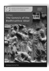 Anālayo The Genesis of the Bodhisattva Ideal 178 pp., 12 illustrations, hardcover, 22,80 EUR ISSN 2190-6769 (printed version) ISBN 978-3-937816-62-3 (printed version) http://hup.sub.uni-hamburg.de/purl/HamburgUP_HBS01_Analayo In this book, Bhikkhu Anālayo investigates the genesis of the bodhisattva ideal, one of the most important concepts in the history of Buddhist thought. He brings together material from the corpus of the early discourses preserved mainly in Pāli and Chinese that appear to have influenced the arising of the bodhisattva ideal. Anālayo convincingly shows that the early sources do not present compassionate concern for others as a motivating force for the Buddha's quest for awakening. He further offers an analysis of the only reference to Maitreya in the Pāli canon, showing that this reference is most likely a later addition. In sum, Bhikkhu Anālayo is able to delineate a gradual genesis of central aspects of the bodhisattva ideal by documenting (1) an evolution in the bodhisattva concept reflected in the early discourses, (2) the emergence of the notion of a vow to pursue the path to buddhahood, and (3) the possible background for the idea of a prediction an aspirant to buddhahood receives from a former buddha.

Band 2

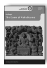 Anālayo The Dawn of Abhidharma 229 pp., 12 illustrations, hardcover, 25,80 EUR ISSN 2190-6769 (printed version) ISBN978-3-943423-15-0 (printed version) http://hup.sub.uni-hamburg.de/purl/HamburgUP_HBS02_Analayo This book is a companion to Bhikkhu Anālayo's previous study of the Genesis of the 

 Bodhisattva Ideal. In the present book he turns to another important aspect in the development of Buddhist thought: the beginnings of the Abhidharma. Anālayo shows that the two main modes generally held in academic circles to explain the arising of the Abhidharma - the use of lists (mātrḳā) and the question-and-answer format - are formal elements that in themselves are not characteristic of Abhidharma thought. Going beyond the notion that the coming into being of the Abhidharma can be located in such formal aspects, he shows how the attempt to provide a comprehensive map of the teachings gradually led to the arising of new terminology and new ideas. He identifies the notion of the supramundane path as an instance where fully fledged Abhidharma thought manifests in the discourses. Anālayo concludes that what characterizes the Abhidharma is not the mere use of dry lists and summaries, but rather a mode of thought that has gone further (abhi-) than the Dharma taught in the early discourses in general.

Band 3

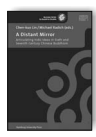 Lin, Chen-kuo / Radich, Michael (eds.) A Distant Mirror Articulating Indic Ideas in Sixth and Seventh Century Chinese Buddhism 565 pp., hardcover; 39,80 EUR ISSN 2190-6769 (printed version) ISBN 978-3-943423-19-8 (printed version) http://hup.sub.uni-hamburg.de/purl/HamburgUP_HBS03_LinRadich In this book, an international team of fourteen scholars investigates the Chinese reception of Indian Buddhist ideas, especially in the sixth and seventh centuries. Topics include Buddhist logic and epistemology (pramāṇa, yinming); commentaries on Indian Buddhist texts; Chinese readings of systems as diverse as Madhyamaka, Yogācāra and tathāgatagarbha; the working out of Indian concepts and problematics in new Chinese works; and previously under-studied Chinese evidence for developments in India. The authors aim to consider the ways that these Chinese materials might furnish evidence of broader Buddhist trends, thereby problematizing a prevalent notion of "sinification", which has led scholars to consider such materials predominantly in terms of trends ostensibly distinctive to China. The volume also tries to go beyond seeing sixth- and seventh-century China primarily as the age of the formation and establishment of the Chinese Buddhist "schools". The authors attempt to view the ideas under study on their own terms, as valid Buddhist ideas engendered in a rich, "liminal" space of interchange between two large traditions.

Band 4

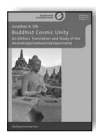 Silk, Jonathan A. Buddhist Cosmic Unity An Edition, Translation and Study of the "Anūnatvāpūrṇatvanirdeśaparivarta" 252 pp., hardcover, 28,80 EUR ISSN 2190-6769 (printed version) ISBN978-3-943423-22-8 (printed version) http://hup.sub.uni-hamburg.de/purl/HamburgUP_HBS04_Silk The "Anūnatvāpūrṇatvanirdeśaparivarta" is a short Mahāyāna sūtra extant in its entirety only in Chinese translation. To judge from its use as a proof-text in the seminal philosophical treatise "Ratnagotravibhāga", which quotes roughly half of the sūtra, it is a fundamental scripture expressing ideas about the unitary nature of saṁsāra and nirvāṇa, and each individual's innate capacity for awakening, called in this text and elsewhere 'tathāgatagarbha,' 'embryo of the tathāgatas.' Although the text has hitherto drawn the attention primarily of Japanese scholars, this is the first critical edition of the sūtra, aligning its Chinese text with the available Sanskrit, offering a richly annotated English translation, a detailed introduction which places the work in its historical and doctrinal context, and a number of appendices exploring key notions, providing a reading text shorn of annotation, and enumerating the prolific quotations of the work found in Chinese Buddhist literature. This volume is thus an important contribution to studies of developing Mahāyāna Buddhism, Buddhist doctrine and the textual history of scriptures.

Band 5

 Radich, Michael The "Mahāparinirvāṇa-mahāsūtra" and the Emergence of "Tathāgatagarbha" Doctrine 266 pp., hardcover, 28,80 EUR ISSN 2190-6769 (printed version) ISBN 978-3-943423-20-4 (printed version) http://hup.sub.uni-hamburg.de/purl/HamburgUP_HBS05_Radich Famously, tathāgatagarbha doctrine holds that every sentient being has within the body a womb for Buddhas, or an embryonic Buddha - the potential for full buddhahood. 

Previous scholars have seen this doctrine as originating in the Tathāgatagarbha-sūtra. In this book, Michael Radich argues that rather, the Mahāparinirvāṇa-mahāsūtra is most likely our earliest extant tathāgatagarbha text. Radich then argues that tathāgatagarbha ideas originated as part of a wider pattern of docetic Buddhology - ideas holding that Buddhas are not really as they appear. Buddhist docetic texts are clearly troubled by the notion that Buddhas could have flesh-and-blood human mothers. The Mahāparinirvāṇa-mahāsūtra is one such text, and tathāgatagarbha functions as a better substitute for imperfect human maternity: rather than a putrid, painful human womb, buddhahood springs from a "womb" inherent in every sentient being, which promises final liberation from flesh altogether. This book should interest readers concerned with the history of Buddhist ideas, gender in Buddhism, the early Mahāyāna, the cult of the Buddha's relics, and relations between Buddhist ideas and practice.

This book is a companion to Bhikkhu Analayo's previous studies of the Genesis of the Bodhisattva Ideal and the Dawn of Abhidharma. In the present book he examines the foundation history of the Buddhist order of nuns, based on a detailed study of the canonical accounts of this event preserved in Chinese, Pali, Sanskrit, and Tibetan. Analayo investigates how the different and at times conflicting parts of the textual account of this particular episode gradually evolved to constitute the foundation history in the way in which it is now extant. His findings put into perspective the Buddha's refusal to found an order of nuns as well as the prediction that the going forth of women supposedly spells decline for the whole Buddhist tradition, showing how these elements would have arisen and then become part of the foundation history.