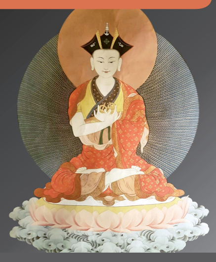
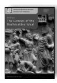
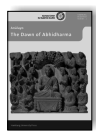
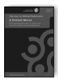
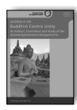
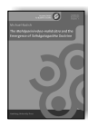
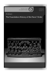
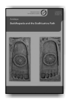
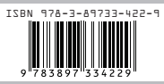

HAMBURG
BUDDHIST
STUDIES 7 Jim Rheingans The Eighth Karmapa's Life and his Interpretation of the Great Seal A Religious Life and Instructional Texts in Historical and Doctrinal Contexts

Jim Rheingans The Eighth Karmapa's Life and his Interpretation of the Great Seal Hamburg Buddhist Studies 7 Series Editors:
Steffen Döll | Michael Zimmermann

for Buddhist Studies Jim Rheingans The Eighth Karmapa's Life and his Interpretation of the Great Seal A Religious Life and Instructional Texts in Historical and Doctrinal **Contexts**

## Projektverlag.

Bibliographic information published by the Deutsche Nationalbibliothek The Deutsche Nationalbibliothek lists this publication in the Deutsche Nationalbibliografie; detailed bibliographic data are available in the Internet at http://dnb.d-nb.de.

ISSN 2190-6769 ISBN 978-3-89733-454-0 (E-Book)
ISBN 978-3-89733-422-9 (printed version)
© 2017 projekt verlag, Bochum/Freiburg www.projektverlag.de Cover: punkt KOMMA Strich GmbH, Freiburg www.punkt-komma-strich.de Cover original design by Benjamin Guzinski; Julia Wrage, Hamburg Figure on Cover: The Eighth Karmapa Mikyö Dorje (Photo by Edita Berger)

| Contents Foreword                                                                       | VII                                                             |     |
|-----------------------------------------------------------------------------------------|-----------------------------------------------------------------|-----|
| Preface                                                                                 | IX                                                              |     |
| Conventions Used                                                                        | XV                                                              |     |
| Abbreviations                                                                           | XVI                                                             |     |
| Chapter 1:                                                                              | Introduction                                                    | 1   |
| 1.1 Aim and Scope of this Research                                                      | 4                                                               |     |
| 1.2 Methodologies Employed                                                              | 6                                                               |     |
| 1.3                                                                                     | Previous Research on the Life and Works  of the Eighth Karmapa  | 11  |
| 1.4 Plan of this Book                                                                   | 23                                                              |     |
| Chapter 2:                                                                              | The Great Seal and 15th to 16th Century Tibet                   | 25  |
| 2.1 The Great Seal                                                                      | 25                                                              |     |
| 2.1.1                                                                                   | The bKa' brgyud pa Great Seal:  A Brief Overview                | 26  |
| 2.1.2                                                                                   | sGam po pa, Early bKa' brgyud pa, and  the First Karmapa        | 29  |
| 2.1.3                                                                                   | Sa skya Paṇḍita, Indian Great Seal,  and Later Systematisations | 33  |
| 2.2 Tibet from the Fifteenth to Sixteenth Centuries:  Conflicts between dBus and gTsang | 36                                                              |     |
| Chapter 3: Textual Sources for the Eighth  Karmapa's Life and Great Seal                | 43                                                              |     |
| 3.1 History of the Eighth Karmapa's Writings                                            | 43                                                              |     |
| 3.2 The Collected Works of the Eighth Karmapa  2000–2004: Origins and Rubrics           | 49                                                              |     |
| 3.3 Sources on the Eighth Karmapa's Great Seal                                          | 54                                                              |     |
| 3.4 Spiritual Memoirs and Biographies of the Eighth Karmapa                             | 58                                                              |     |
| Chapter 4:                                                                              | The Eighth Karmapa: Scholar, Monk, and Yogi                     | 71  |
| 4.1                                                                                     | The Eighth Karmapa's Life                                       | 71  |
| 4.1.1                                                                                   | Birth and Early Childhood (1507–1511)                           | 72  |
| 4.1.2                                                                                   | The Dispute about the Incarnation (1512–1513)                   | 75  |
| 4.1.3                                                                                   | Early Exposition, Composition, and Travels (1513–1516)          | 83  |
| 4.1.4                                                                                   | Becoming a Scholar and Training  the Great Seal (1516–1529)     | 86  |
| 4.1.5                                                                                   | Scholastic Contributions (1530–1550)                            | 100 |

4.1.6 Travel to rTsa ri, Sickness, and Passing Away (1554) 108 4.2 The Eighth Karmapa: 'Learned and Accomplished One' of his Day 110 4.3 Spiritual Programme for Teaching Meditation 115 Chapter 5: Case Studies of the Eighth Karmapa's Great Seal 123 5.1 Case Studies: Concrete Examples of Teaching the Great Seal 124 5.2 Dialogues in A khu a khra's Spiritual Biography 125 5.2.1 Their Function in the Main Narrative 125 5.2.2 Dialogue with A khu a khra 128 5.2.3 Dialogue with rGya ston Nang so Seng ge ba 133 5.2.4 Dialogue with dGa' ldan dBon po Nam mkha' rgyal mtshan 136 5.2.5 Dialogue with Mi nyag sKya ging Bya bral ba 139 5.2.6 Conceptualisation and *Dharmakāya* 142 5.3 Answer to Gling drung pa's Query on the Great Seal 143 5.3.1 The Addressee and Other Contexts 144 5.3.2 The Content 147 5.3.3 The Story of sBas mchod: Pedagogy, History, and the Great Seal 154 5.3.4 Great Seal beyond Tantra 157 5.4 Identifying the Blessing: A Mantra Path 159 Chapter 6: Contextualising the Eighth Karmapa's Great Seal Instructions 163 6.1 Basic Distinctions of the Great Seal 163 6.2 Interpretations of Conceptualisation as *Dharmakāya* 164 6.3 Common Strands and Divergent Interpretations 168 6.4 The Guru as Origin and Example in Vajrayāna and Great Seal Traditions 173 6.5 The Guru as Means in the Eighth Karmapa's Great Seal Instructions 176 Chapter 7: Conclusions 185 Bibliography 191 Indian Buddhist Works 191 Primary Sources and Secondary Literature in Tibetan Language 192 Secondary Literature in Western Languages 207 Index 237

# Foreword

## About Hamburg Buddhist Studies

Ever since the birth of Buddhist Studies in Germany more than 100 years ago, Buddhism has enjoyed a prominent place in the study of Asian religions. The University of Hamburg continues this tradition by focusing research capacities on the religious dimensions of South, Central, and East Asia and making Buddhism a core subject for students of the Asien-AfrikaInstitut. 

Today, Buddhist Studies as an academic discipline has diversified into a broad spectrum of approaches and methods. Its lines of inquiry cover contemporary issues as much as they delve into the historical aspects of Buddhism. Similarly, the questions shaping the field of Buddhist Studies have broadened. Understanding present-day Buddhist phenomena—and how such phenomena are rooted in and informed by a distant past—is not at all an idle scholarly exercise. Rather, it has become clear that fostering the understanding of one of the world's major religious traditions is a crucial obligation for modern multicultural societies in a globalized world. 

Accordingly, *Hamburg Buddhist Studies* addresses Buddhism as one of the great humanistic traditions of philosophical thought, religious praxis, and social life. Its discussions are of interest to scholars of religious studies and specialists of Buddhism, but also aim at confronting Buddhism's rich heritage with questions the answers to which might not easily be deduced by the exclusive use of historical and philological research methods. Such issues require the penetrating insight of scholars who approach Buddhism from a range of disciplines, building upon and yet going beyond the solid study of texts and historical evidence. 

We are convinced that *Hamburg Buddhist Studies* will contribute to opening up the field to those who may have no training in the classical source languages of the Buddhist traditions but approach the topic against the background of their own disciplinary interests. With this book series, we encourage a wider audience to take an interest in the academic study of the Buddhist traditions. 

## About Thisvolume

It is our great pleasure to introduce the seventh volume in the Hamburg Buddhist Studies book series, a study by Jim Rheingans who is currently Acting Professor of Tibetan Studies at the University of Bonn. His work, a thorough investigation of the Eighth Karmapa's biography and teachings, and some of his mah*āmudrā* instructions in context, is a most welcome contribution to our understanding of the religious history of Tibet and the study of Tibetan Buddhism in general.1 Rheingans argues for analysing Buddhist instructions for the acquisition of meditative insight, more specifically those of the Tibetan Kagyüpa mah*āmudrā*, as a pragmatic heuristic adapted to the needs of different disciples. This is achieved through case studies of selected texts ascribed to the Eighth Karmapa Mikyö Dorje 
(1507–1554), and by introducing his religious life on the basis of a broad range of primary sources. 

Rheingans' book sets out with a survey of a variety of textual sources for the study of the Karmapa's life and works. It shows how traditional spiritual biographies represent Mikyö Dorje primarily according to the ideal of the learned scholar and accomplished meditator, and how this Karmapa subsequently developed into one of the most productive scholars of his tradition who, located within the shifting religious and political hegemonies of his time, managed to acquire a status of singular importance to his school. Rheingans then goes on to critically assess Mikyö Dorje's mah*āmudrā* teachings by examining the instructions in selected texts as well as their respective contexts. His study contends that the Kagyüpa mah*āmudrā* instructions constitute less a static system than independent teachings to be adapted by the guru to different students' requirements. 

They are thus chiefly characterised by didactic pragmatism. 

Rheingans' research interprets a number of previously unstudied Tibetan texts and manuscripts largely from a historical perspective but at times uses approaches from other fields such as narratology. His work not only contributes significant insights to our knowledge of this period in Tibetan religious history but also sets innovative methodological impulses in the study of Tibetan Buddhism. 

Michael Zimmermann and Steffen Döll 

# Preface

This book makes some arguments for analysing Buddhist instructions, more specifically those of the Tibetan Kagyüpa *mahāmudrā*, as a pragmatic heuristic adapted to the students needs. This is done via case studies of selected writings of Mikyö Dorje1 (1507–1554) and by introducing his religious life in context. Enthroned in 1513 as the Eighth Karmapa, Mikyö Dorje would become one of the most productive scholars of the Karma Kagyü tradition, alongside the Third Karmapa Rangjung Dorje (1284–
1339). The Eighth Karmapa's extensive study culminated in the composition of large scholastic commentaries to key Indian Buddhist treatises, such as the *Abhisamayālaṃkāra, Abhidharmakośa*, and the *Madhyamakāvatāra*. Being trained early on by his root guru Sangye Nyenpa in his tradition's core teachings, the *mahāmudrā* (Great Seal) and the Six Doctrines of Nāropa, Mikyö Dorje also elaborated on these esoteric instructions, as, for example, in the extensive *sKu gsum ngo sprod (Pointing out the Three* Buddha Bodies) or the *Lung sems gnyis med (Differentiating Energy-Wind* and Mind). In addition to countless songs (*mgur*) and further instructions 
(*khrid*), we find comments on grammar and tantric rituals. In complete his literary oeuvre filled more than thirty volumes. Mikyö Dorje lived in a period of shifting hegemonies, when the Kagyüpa patrons of the Rinpungpa clan were relatively dominant in central and western Tibet. He became an important figure of his time and the traditional spiritual biographies portray him according to the ideal of the learned scholar and accomplished meditator (*mkhas sgrub*). 

This book investigates the Eighth Karmapa's life and examines selected Great Seal instructions in context. It sets out with a brief survey of the textual sources for the life and works of the Karmapa. Portraying Mikyö Dorje in a religious and political context, it demonstrates that the Eighth Karmapa is not only portrayed as mastering and teaching the highest meditational precepts of his tradition, but was one of the most significant and most productive scholars of his school. This book argues that analysing his 
 
1 In order to make this preface more easily readable, a phonetic transcription for Tibetan is used. This work otherwise uses the extended Wylie transcription. 

Great Seal teachings, through the study of instruction-related genres in their historical, doctrinal, and literary contexts, reveals a pedagogical pragmatism. It is crucial to view the Great Seal as an independent key instruction that the guru adapts to students' needs, rather than a fixed doctrine. The book contributes to the religious history of Tibet by interpreting a number of previously unstudied Tibetan sources. The main textual sources consist of various early spiritual biographies (*rnam thar*) and religious chronicles (*chos 'byung*) along with meditation instructions (*khrid*), question and answer texts (*dris lan*), esoteric precepts (*man ngag*), and advices (*slab bya*) 
from the *Collected Works of the Eighth Karmapa* (2000–2004). 

The research was carried out at and fully funded by Bath Spa University, School of Historical and Cultural Studies, with the external supervision of Professor David Jackson, Hamburg University. It was submitted as doctoral dissertation in 2008 to the University of the West of England, Bristol (who, at that time, held the degree awarding powers for doctorates conducted at Bath Spa). Due to continued requests by colleagues and students, and thanks to their encouragement, I have now decided to make the original version of the dissertation available to the wider public, along with only minor alterations. I am delighted that the series editors Michael Zimmermann and Steffen Döll are presenting this work in the Hamburg Buddhist Studies Series. 

Naturally, aspects of the research about Mikyö Dorje have evolved over time. Substantial contributions to the life of the Eighth Karmapa as a whole have not been made available since 2008.2 Some works have appeared that touch on the Karmapa's doctrines or on certain literary, doctrinal, and historical contexts. Let me name some as examples. Certain topics brought up in this book have been further considered in some of my own publications, for example in 'Communicating the Innate' (Ayutthaya: IABU Proceedings, 2012). There is a constant influx of publications concerning the Great Seal in general that are too numerous to mention in detail. Good overviews can be found in the papers in Mahāmudrā and the Bka'-brgyud Tradition: PIATS 2006, edited by Roger R. Jackson and Mathew T. 

Kapstein (Halle: IITBS, 2011)3 or in the recent *Toward a History of Tibetan* Mahāmudrā Traditions (Zentralasiatische Studien 44, Andiast: IITBS, 
2015) edited by Klaus-Dieter Mathes. Among other works, Alexander 
 
2 Except for my elaboration on the early years of the Karmapa from 2010 (see Chapter Four, note 2). 

3 This volume includes my paper on a question and answer about the Great Seal as also discussed in Chapter Five (5.3). 

Schiller's *Die "Vier Yoga"-Stufen der* Mahāmudrā*-Meditationstradition*
(Dept. of Indian and Tibetan Studies, Universität Hamburg, 2014) or Andrew Quintman's The Yogin and the Madman: Reading the Biographical Corpus of Tibet's Great Saint Milarepa (New York: Columbia University Press, 2013) offer in-depth studies of 'earlier' Tibetan material. Further, there is research underway in current projects about the Great Seal at the University of Vienna: The Indian/Indo-Tibetan background is further explored in Mathes' *A Fine Blend of Mahāmudrā and Madhyamaka* (Wien: 
Verlag der Österreichischen Akademie der Wissenschaften, 2015). A work that had used this book in its prior thesis format has been published after this book had been submitted to the editors: Martina Draszczyk and David Higgins, Mahāmudrā and the Middle Way: Post-Classical Kagyü Dis*courses on Mind, Emptiness and Buddha-Nature* (Wien: Arbeitskreis für tibetische und buddhistische Studien Universität Wien, 2016). They have worked closely with some Great Seal related texts of Mikyö Dorje (some of which I had singled out earlier in my thesis) and address the discourses specific to the historical period. 

The context of genre had been specifically highlighted in my dissertation of 2008 that is now published here. Marta Sernesi and Ulrich T. Kragh have also addressed authorship and–to some extent–genre as significant issues in the study of the Great Seal traditions.4 Approaches to Tibetan *rnam thar* and hagiographies of other 'non-occidental' cultures are, among others, discussed in *Narrative Pattern and Genre in Hagiographic Life Writing*, edited by Stephan Conermann and Jim Rheingans (Berlin: EB-Verlag, 2014), 
where the methods from narratology presented in this book are elaborated (as, for example, in my paper 'Narratology in Buddhist Studies', ibid. 69–
112). Especially Ulrike Roesler's paper in the aforementioned volume provides a very good overview of the *rnam thar* genre.5 Some recent publications are connected to historical contexts pertaining to this thesis, for example Olaf Czaja's *Medieval Rule in Tibet* (Vienna: 
Verlag der ÖAW, 2013) or certain remarks in Franz-Karl Ehrhard's paper 
 
about a *Padma'i thang yig*.

6I expect that the completed dissertation about the Fourth Shamar Incarnate (1453–1524) by Kamilla Mojzes7 will shed further light on the relation between Mikyö Dorje and the Fourth Shamar incarnate. The proceedings of the conference 'Towards a History of 15th Century Tibet: 
Cultural Blossoming, Religious Fervour, and Political Unrest' held in March 2015 at the Lumbini International Research Institute, are currently prepared by Volker Caumanns and Marta Sernesi for publication. The papers contained will further contribute to our understanding of this period in general. 

With regard to Tibetan sources, some later editions of the collected writings of the Eighth Karmapa and previously unavailable shorter *rnam thar* have been made accessible since 2008. Yuyan Zhong's Master's thesis (LMU 
Munich, 2013) about the songs from 'Bri gung as documented in the *Handschrift Cod.tibet.5* (Bayerische Staatsbibliothek) is another useful contribu-tion concerning this specific part of the Karmapa's writings. 

These publications do not significantly change the substance of this research. Although not all of them could be taken into account in detail, the academic works relevant to this research have been mentioned above and crucial ones are incorporated in this book. Those not already mentioned here are further indicated in footnotes in the respective chapters and sections for additional reference. Currently, the abovementioned Tibetan sources and literature relevant to the Karmapa's gsung '*bum* are examined for my project on the origin and transmissions of Mikyö Dorje's writings that will be available as a future publication.

A project of this scope is almost impossible without funding. Therefore, I would like to wholeheartedly thank Bath Spa University's School of Historical and Cultural Studies for their generous three-year dissertation fellowship. The Tārā-Foundation granted a one-year fellowship in order to complete this research. The final publication would not have been possible without the ITAS-Numata Research Fellowship that supports the publication of research on Mikyö Dorje and a forthcoming volume on the Sakya and Kagyü luminary Karma Thrinlepa (1456–1539); I would like to thank Pedro and Dorrit Gomez and Peter Gomez-Hansen for their help in this matter. I would further like to thank the Buddhismus Stiftung Diamantweg for covering the printing costs for this volume. 

Although at times carried out in retreat-like solitude, this work, as all research endeavours, did not emerge from the effort of a single individual but was only possible through the support of many colleagues and friends who are too numerous to mention. My deep gratitude goes to my supervisors David Jackson, Mahinda Deegalle, and Fiona Montgomery. Khenpo Karma Ngedön was extremely helpful in discussing matters of Tibetan language. I would like to extend special thanks to Burkhard Scherer for his encouragement in finding funding and his critical comments. Gene Smith and Burkhard Quessel were essential for inquiries about Tibetan sources at the outset of this research. I would like to thank the late Kunzig Shamarpa Mipham Chökyi Lodrö (1952–2014) and Maṇiwa Karma Sherab Gyaltsen Rinpoche for sharing their knowledge about Tibetan textual sources and doctrinal issues related to this research. Franz-Karl Ehrhard, Klaus-Dieter Mathes, Alexander Schiller, Frank Müller-Witte, Manfred Seegers, Maria Bjerregaard, Volker Caumanns, and Roger Jackson were always ready to share their erudite suggestions and comments. Denise Cush, Paul Davies, and the staff of Study of Religions at Bath Spa University along with Rupert Gethin, Paul Williams, and Rita Langer of Bristol University created a vibrant research environment and stimulating discussion during numerous World View Society talks, Graduate School seminars, and joint Postgraduate Conferences. I would like to acknowledge Anthony Bristow, John O'Donnel, Julian Schott, and Anna Rheingans for their expertise in different types of proofreading and Miroslav Hrdina for his knowledgeable and diligent support in technical and editorial issues. 

The series editors and the staff of the Projektverlag were very helpful during the process of publication. Finally, I would like to thank Andrea Dansauer, Anja-Karina Pahl, and Jeffrey Inwood for their general support during the process of this project. Of course all mistakes remain the author's responsibility. Naturally, there was a limit to incorporating further sources and literature; also, in retrospective, I would approach some of the issues differently.8 I nevertheless hope that this contribution is a first step on the way for future research in the field of the Eighth Karmapa. 

This book is structured as follows: Chapter One engages with previous research and justifies the methodologies employed. Chapter Two elaborates 
 
8 The forthcoming volume on Mikyö Dorje's writings as an exemplary study of a Tibetan textual corpus will shed more light on the specific topic of textual transmissions and literary history. 

key points of the Kagyüpa Great Seal and the religious and political contexts of the Eighth Karmapa. Chapter Three evaluates the main textual sources and genres used. Chapter Four delineates the Eighth Karmapa's development into one of the most renowned scholars and mystical teachers in his tradition and outlines his programme for teaching meditation. Chapter Five investigates concrete teaching situations in three case studies, showing divergent expressions of the Great Seal and their contexts. Chapter Six argues that the Great Seal is an independent instruction conveying the essence of the teachings, which can be taught as either tantric or nontantric, and establishes the teacher as the main unifying spiritual element of Great Seal instructions and practices. Chapter Seven concludes by asserting the importance of contexts, such as genre and history, in the study of Buddhist mysticism. 

# Conventions Used

## Transliteration

Tibetan characters are transliterated according to the system of Turrel W. 

Wylie as laid out in 'A Standard System of Tibetan Transcription' (Harvard Journal of Asiatic Studies 22 (1959), 261–267) in its extended form. When a Tibetan word is capitalised, the root letter is written in capitals. Two frequently used Tibetan titles were not transliterated: Karmapa and Dalai Lama. The Indian names that the Tibetan traditions added a pa are displayed in a more concise manner: Maitrī pa = Maitrīpa, Nāro pa = Nāropa. 

Foreign language terms found in the *Oxford Dictionary of English*, ed. 

by Catherine Soanes and Angus Stevenson, second edition, revised 
(Oxford, New York: Oxford University Press, 2005) are not italicised. Sanskrit (written with diacritics): bodhisattva, dharma, saṃsāra, nirvāṇa, saṅgha, siddha, stūpa, sūtra, tantra; Tibetan: lama (except for occurrences in a name), Lhasa, Shigatse; Greek: topos. 

## Referencing

The sources regarding the Eighth Karmapa are cited from the Tibetan standard edition of the *Collected Works of the Eighth Karmapa,* published 2000–2004. When a further edition of any text is used, the specific reference to this particular edition will be provided. 

Abbreviations 

## General Abbreviations

| HR    | History of Religion                                                             |
|-------|---------------------------------------------------------------------------------|
| IATS  | International Association of Tibetan Studies                                    |
| IITBS | International Institute for Tibetan and Buddhist Studies                        |
| JAOS  | Journal of the American Oriental Society                                        |
| JIABS | Journal of the International Association of Buddhist Studies                    |
| JIATS | Journal of the International Association of Tibetan Studies                     |
| JIPh  | Journal of Indian Philosophy                                                    |
| JTS   | Journal of the Tibet Society                                                    |
| LTWA  | Library of Tibetan Works and Archives                                           |
| NGMPP | Nepal German Manuscript Preservation Project                                    |
| PIATS | Proceedings of the Seminar of the International Association of  Tibetan Studies |

## Abbreviated Tibetan Texts

If the abbreviation consists of words from the title of the source, the abbreviation is italicised. The abbreviation usually goes back to words within the title or to the author; for clarity original words are marked in bold. 

## A Khu A Khra

dGe slong Byang chub bzang po, A khu a khra (b. sixteenth century). rGyal ba kun gyi dbang po dpal ldan karma pa mi bskyod rdo rje'i zhabs kyi dgung lo bdun phan gyi rnam par thar pa nor bu'i phreng ba [The Spiritual Biography up to the Seventh Year of the Glorious Karmapa Mi bskyod rdo rje, the Mighty One of All Jinas: A Garland of Jewels]. In Collected Works of the Eighth Karmapa, vol. 1, pp. 33–106, 37 fols.

## 'Bras Spungs Dkar Chag

'Bras spungs (Monastery) dPal brtsegs Bod yig dpe rnying zhib 'jug khang 
(eds.). 'Bras spungs dgon du bzhugs su gsol ba'i dpe rnying dkar chag *[The* List of Old Books which were Placed in the Monastery of 'Bras spungs]. 2 vols. Beijing: Mi rigs dpe krung khang, 2005. 

## Collected Works Of The Eighth Karmapa

Mi bskyod rdo rje, Karmapa VIII (1507–1554). dPal rgyal ba karma pa sku 'phreng brgyad pa mi bskyod rdo rje'i gsung 'bum [The Collected *Works* of Mi bskyod rdo rje, the Eighth *Incarnation in the Line of the Glorious Victor* Karmapa]. 26 vols. Lhasa: dPal brtsegs Bod yig dpe rnying zhib 'jug khang, 2000–2004. Phyogs bsgrigs theng dang po [First edition]. (Printed from blocks kept at 'Bras spungs dGa' ldan Pho brang and Khams dPal spungs dgon, later reset electronically in Tibet. Distributed by the Tsadra Foundation, New York.) 

## Dkar Chag

dKon mchog 'bangs, Zhwa dmar V (1525–1583). *rGyal ba thams cad kyi ye* shes kyi sku rnam pa thams cad pa'i thugs can karma pa mi bskyod rdo rje bzhad pa'i gsung 'bum gyi dkar chag *[The Table of Contents of the* Collected Works of Karmapa Mi bskyod rdo rje bzhad pa, who has the Enlightened Mind which Consists of All Expressions of the Jñānakāya of All Jinas]. In *Collected Works of the Eighth Karmapa*, vol. 1, pp. 1–28, 14 fols. 

## Dwags Brgyud Grub Pa'I Shing Rta

dBu ma la 'jug pa'i rnam bshad dpal ldan dus gsum mkhyen pa'i zhal lung dwags brgyud grub pa'i shing rta *[The Exposition of the Madhyamakāvatāra, Words of the Glorious Dus gsum mkhyen pa, Chariot of the Siddhas of* the Dwags po-*Lineage]*. In *Collected Works of the Eighth Karmapa,* vol. 14, pp. 1–975, 487 fols.

## Gdams Ngag Mdzod

Kong sprul bLo gros mtha' yas, 'Jam mgon (1813–1899) (ed.); Chandra, Lokesh (ed.) **gDams ngag mdzod***: A Treasury of Instructions*. 12 vols. 

Delhi: N. Lungtog, N. Gyaltsan, 1971. (Reproduced from a Xylographic print from the dPal spungs blocks.) 

## Kaṃ Tshang

Si tu Paṇ chen Chos kyi 'byung gnas (1699/1700–1774) and 'Be lo Tshe dbang kun khyab. *bKa' brgyud gser phreng rnam thar zla ba chu sel gyi* phreng ba smad cha (The Golden Garland of Kagyu Biographies, vol. 2). 

Sarnath: Vajra Vidya Institute Library, 2004. (Reprint of: *sGrub brgyud* karma ka**ṃ tshang** brgyud pa rnam thar rin po che'i rnam par thar pa rab 
'byams nor bu zla ba chu shel gyi phreng ba.) 

## Mi Bskyod Rdo Rje'I Spyad Pa'I Rabs

Mi bskyod rdo rje, Karmapa VIII (1507–1554). *Byang phyogs 'di na karma* pa/ /ri*m par byon las bdun pa rang byung ni/ /kun mkhyen chos rje'i slob* mar gyur 'ga' yi/ /bka' 'bangs mi **bskyod rdo rje'i spyad pa'i rabs** [The Succession of Deeds of Mi bskyod rdo rje. He obeys the Command of Some Students of the Omniscient Master, the Self Arisen Seventh among the Karmapas, who have appeared One after the Other (rim par) *in this* Northern Land]. In *Collected Works of the Eighth Karmapa*, vol. 1, pp. 

350–387, 19 fols. 

## Mkhas Pa'I Dga' Ston

gTsug lag phreng ba, dPa' bo II (1504–1566). Chos 'byung mkhas pa'i dga' ston *[History of Religion: A Feast for the Scholars].* 2 vols. Beijing: Mi rigs dpe skrun khang, 1986. 

## Phag Gru Gsung 'Bum

Phag mo gru pa rDo rje rgyal po (1110–1170). *Dus gsum sangs rgyas thams* cad kyi thugs rje'i rnam rol dpal ldan phag gru *rdo rje rgyal po mchog gi* gsung 'bum *rin po che glegs bam—The Collected Works of Phag mo gru pa*. 

9 vols. Kathmandu: Khenpo Shedub Tenzin and Lama Thinley Namgyal, 2003. 

## Phag Gru Bka' 'Bum

Phag mo gru pa rDo rje rgyal po (1110–1170). Phag mo'i gru pa'i bka' 
'bum *[Collected Writings of Phag mo gru pa]*. Manuscript edited by Kun dga' rin chen Chos kyi rgyal mtshan (1475–1527) in 'Bri gung, 1507. 4 vols. NGMPP, Reel No. E 3169/1, E 3170/1, E 3171/1, 1998. (Photomechanical reproduction of a manuscript from the library of Che tsang Rinpoche in Byang chub gling, Dehradun.) 

## Phyag Chen Mdzod

Mi pham chos kyi blo gros, Zhwa dmar pa XIV (1952–2014) (ed.). Nges don phyag rgya chen po'i khrid mdzod [The Treasury of Meditation Instructions of the Great Seal, the Ultimate Meaning]. New Delhi, 1998. (Tibetan Buddhist Resource Center W 23447.)

## Q

Suzuki, Daisetz T. (ed.). *The Tibetan Tripiṭaka: Peking Edition*. Tokyo, Kyoto: Tibetan Tripiṭaka Research Institute, 1955–1961. 

## Rgya Gzhung

Mi pham chos kyi blo gros, Zhwa dmar pa XIV (1952–2014) (ed.). *Phyag* rgya chen po'i rgya gzhung *[The Indian Treatises of the Great Seal]*. In Phyag chen mdzod, vols. *oṃ, āḥ*, and hūṃ. 

## Sangs Rgyas Dpal Grub

Sangs rgyas dpal grub (sixteenth century). *rGyal ba spyan ras gzigs dbang* brgyad pa'i rnam thar legs spyad ma'i don 'grel gsal ba'i sgron me [The Spiritual Biography of the Jina Avalokiteśvara, the Mighty Eighth 
(Karmapa), a Commentary on the Meaning of (his) Good Deeds: 
Illuminating Light]. In Collected Works *of the Eighth Karmapa*, vol. 1, pp. 150–329, 90 fols. 

## Zhang Yisun

Zhang Yisun et. al. (ed.). Bod *rgya tshig mdzod chen mo [The Great* Tibetan–Chinese Dictionary]. 2 vols. Beijing: Mi rigs dpe skrun khang, 1985. 

# Chapter 1

## Introduction

Research into early Buddhism has indicated that communicating the experience of freedom from suffering to specific individuals has always been at the heart of the Buddha's teaching. He was interested in benefiting his students, not in creating a philosophical system in an ontological sense.1 The Buddha's aim can thus be viewed as pedagogical rather than ontological.2 Close readings of Pāli textual material have demonstrated that analysing the contexts of the addressee and the prevalent Indian spiritual and intellectual traditions is crucial for understanding his teachings. Gombrich remarks: 'If we had a true record of the Buddha's words, I think we would find that during his preaching career of forty-five years he had expressed himself in an enormous number of different ways.'3 The Great Seal (Skt. *mahāmudrā*, Tib. *phyag rgya chen po*) instructions of the Eighth Karmapa, Mi bskyod rdo rje (1507–1554), contain such a number of varied expressions, and, more importantly, this vast corpus of textual witnesses was put into writing either during his life or shortly thereafter. Specific genres containing Great Seal instructions constitute valuable sources for achieving insight into the bKa' brgyud pa Great Seal as a pragmatic heuristic suited to the students' differing capacities and inclinations. 

Among Buddhist traditions, those of Tibet perhaps stand out most for their blend of meditative systems, centred on various instructions (*gdams* ngag) and their lineages. They were considered to have their origin with the Buddha, being transmitted via a teacher through a line of closely associated students.4 Also well-known are the illustrious masters of these lineages, eccentric yogins or *yoginīs*, reincarnate lamas, and religio-political leaders.5 The Great Seal practised in the various bKa' brgyud lineages is one such meditative technique. In essence, the Great Seal of the bKa' brgyud pa contains immediate instructions for achieving Buddhahood by transcending conceptual thinking (Skt. *prapañca, vikalpa*) and directly perceiving the nature of mind.6 Tibetan meditation masters of the bKa' brgyud lineages claim that the Great Seal and its practice reveal the ultimate truth behind all teachings. They maintain that the Great Seal contains the 'hidden meaning' of the doctrines of sūtra and tantra of the Tibetan canon.7 The bKa' brgyud traditions in medieval Tibet believed that it was Nāropa who was the main transmitter of the Great Seal within tantric practice and yogic exercise (later called tantra or mantra Great Seal), 
whereas they held that Maitrīpa and Saraha also taught the Great Seal outside tantric contexts. Such an approach was propagated by sGam po pa 
(1079–1153).8 Though often considered a primarily meditation-orientated lineage, the bKa' brgyud pa traditions have produced numerous scholars.9 Among them, the Eighth Karmapa was considered one of the most learned masters within the Karma bKa' brgyud sub-school, which enjoyed great support from the most powerful rulers of Tibet from the late fifteenth to the early seventeenth centuries (particularly the period of 1498–1517/18).10 The Seventh Karmapa, Chos grags rgya mtsho (1454–1506), had initiated an own sūtra exegetical tradition of the great treatises within his sect during a period of growing systematisation.11 This scholastic trend was enhanced by the Eighth Karmapa, whose agenda included commenting on four of the five main non-tantric subjects.12 He was a prolific writer on tantric Buddhist and other traditional fields of knowledge, and his oeuvre fills more than thirty volumes. 

Previous academic research has concentrated mainly on his well-known scholastic commentaries such as those on the *Madhyamakāvatāra* and Abhisamayālaṃkāra, and the *gZhan stong legs par smra ba'i sgron me (The* Light which Expresses the gZhan stong [Doctrine] Well).

13 Though Great Seal teachings form the heart of his tradition's religious instructions, and though the Eighth Karmapa is considered one of the most distinguished scholars within his school, no one has academically investigated the Eighth Karmapa's life or how he taught the Great Seal to his students. The recent publication of the Collected Works of the Eighth Karmapa, the largest part of his writings, has also not yet been taken into account. 

## 1.1 Aim And Scope Of This Research

This thesis argues that analysing the Eighth Karmapa's Great Seal teachings through studying particular textual genres in their historical, doctrinal, and literary contexts, reveals a certain pedagogical pragmatism in relation to specific students. This suggests that, analogous to findings about early Buddhist meditation, the bKa' brgyud pa Great Seal instructions are better viewed as a pragmatic heuristic, emerging from the dynamics of the teacher-student interaction in its various contexts. This thesis provides the historical context of the Eighth Karmapa's life, demonstrating that he was one of the most significant scholars of his school, next to the Third Karmapa, and adept in its highest meditational instruction. Thus, the primary objective of this research is to investigate for the first time the Eighth Karmapa's life and selected Great Seal teachings, examining how he lived, studied the Great Seal, and taught it to specific students in a variety of contexts. 

As will be illustrated in the literature review, the small amount of Great Seal research done embarked upon the necessary tasks of analysing its terminology, doctrinal development, and systematisation. However, because meditation and realisation are central to the traditions in which it is practised, it may be difficult to pin down the Great Seal to any single doctrinal system. And, beyond doctrinal debates and systematisations, it is the interaction between teacher and student that forms the core of Great Seal practice and teaching. Therefore, research into Great Seal traditions may also benefit from a close contextual and historical investigation, concentrating on the teacher and his instructions, that takes into account differences in both textual genres and practitioners. 

In order to do so, particular textual genres were chosen. 'Spiritual biographies' (*rnam thar*) and 'spiritual memoirs' (rang *rnam*) are used in analysing the historical, cultural, and political contexts of the Karmapa's life, with an emphasis on his roles as scholarly monk, mystical teacher, and influential political figure.14 With regard to the Great Seal, the study focuses on its (bKa' brgyud specific) teaching and practice as expressed in dialogues found in a spiritual biography (*rnam thar*), question and answer texts (Tib. *dris lan*), meditation instructions (*khrid*), esoteric precepts (man ngag), and pieces of advice (*bslab bya*) written by the Eighth Karmapa.15 These genres offer valuable prospects for investigating Great Seal practice and its contexts. Questions and answers often contain short treatments of doctrinal questions loaded with meaning. Genres such as meditation instructtions, esoteric precepts, and advices have similar special qualities, since they aim at condensing the Buddhist teachings to the essential points and conveying these points efficiently for practice. Such a goal can also be encouraged by teachings presented as dialogues within the spiritual biographies of the Eighth Karmapa. 

 At first, selected instances from these textual genres are examined in detailed case studies. Then the Great Seal teaching and the Karmapa's interpretations of it are contextualised, focusing on non-tantric Great Seal and the role of the teacher. Most sources employed are taken from the recently published *Collected Works of the Eighth Karmapa* in twenty-six volumes. The scope of this research therefore includes the necessary historical survey, and Chapter Three is devoted entirely to evaluating the textual sources and genres in detail. 

This thesis is thus not centrally a philosophical or doctrinal study, but an attempt to cover new ground in researching the life and writings of the Eighth Karmapa, examining particular teaching situations as documented in different textual genres, with a focus on Great Seal instruction and practice. It interprets a number of previously unstudied Tibetan language sources, and also offers a means by which to approach such an undertaking: its method of case studies in context. 

Naturally, every study has its limits in both time and scope. Given the sheer bulk of the textual material, this research cannot take all writings within the *Collected Works of the Eighth Karmapa* into full account (though every text has been surveyed). Also, the focus must be limited to the main events of his life and to selected shorter instructions focusing mainly on the Great Seal of Saraha, Maitrīpa, and sGam po pa. However, a broader doctrinal context of some of the Karmapa's other treatises, as well as the historical and religious context will be considered where possible. 

## 1.2 Methodologies Employed

Scholars in Buddhist Studies have only recently started to debate their methodological claims, derived primarily from philology and history.16 The shift of paradigm or 'linguistic turn' in the humanities did not leave Buddhist and Tibetan Studies unchallenged.17 Still, even otherwise excellent academic works in Tibetan Buddhist Studies are sometimes written in the complete absence of any explicitly stated methodology.18 Within the debates in the field, Cabezón has suggested a mutual and critical understanding of philological and critical perspectives.19 In this thesis, it is held that methodologies should be suited to the sources and aims of the research. Considering mutual understanding as suggested by Cabezón in accordance with the demands of this thesis, it utilises different methodological approaches to varying degrees: it is primarily grounded on the philological and historical methodologies. In doing so, it takes a phenomenological perspective of 'ad hoc hermeneutics' on religion and religious texts, where one tries to understand and interpret a religious tradition in its own terms, attempting to interpret it 'both sympathetically and critically'.20 Occasionally, modern and post-modern literary theories such as intertextuality and narratology are employed for comprehending the genre of spiritual biographies (*rnam thar*).21 As this thesis strives to contribute to knowledge about past religious practices and their contexts on the basis of Tibetan textual sources, use of historical and philological methodologies is indispensable. In Tibetan Buddhist Studies, many areas have yet to be studied and many artefacts have already been destroyed. Most textual sources are untranslated, and many remain undiscovered. However, there is a large, and still growing, bulk of available textual material. The Collected Works of the Eighth Karmapa consist of twenty-six volumes containing over two-hundred and fifty texts. Works of the Karmapa's contemporaries have also yet to be studied extensively by scholars, and those sources on non-religious issues are often missing altogether. The nature of the classical Tibetan language along with the poor quality of dictionaries impedes the linguistic and cultural understanding of texts, demanding, at times, the skills of a lexicographer. Exhaustive encyclopaedias and bibliographies are not available. Research into medieval Tibetan Buddhism, therefore, requires considerable philological and historical work, and this thesis heavily employs these approaches. Primarily for surveying, dating, and critically evaluating the Tibetan textual sources and their authorship, as well as reading and translating them when necessary.22 Translation and doing history are directly connected to interpretation. 

The textual hermeneutics, how to interpret a text and its context, and how to present the findings adequately, need to be briefly addressed. Since this research deals with texts and practices from a different culture, it intends to initially approach the religious ideas and concepts of genre from an empathic perspective, particularly when dealing with the Karmapa's interpretations of the Great Seal.23 Thus, the thesis aims at an emic reading of both text and religious practices, attempting an undistorted *Verstehen*. It tries to understand texts, contexts, and religious practices using categories and terms employed by the tradition.24 Subsequently, the findings will be critically analysed and contextualised. 

As was indicated previously, the general approach is to investigate the Great Seal teaching of the Eighth Karmapa as expressed to specific students in its historical, doctrinal, and literary contexts.Firstly therefore, the thesis provides the context of the Eighth Karmapa's religious career.25 For examining the teachings to different students, a presentation in the form of case studies with a clear focus is chosen.26 While relying on a dialogue, a question and answer text, and two meditation instructions, the presentation alternates between translation of crucial passages and analysis of historical context and doctrinal content. This is advantageous for the historical approach that attempts to uncover knowledge about the past, see, for example, the basic assumptions of Marwick (2001: xv, 3–4, 17–20). With regard to the importance of philology, Tillemans (1995: 277) states: 'Buddhist Studies insufficiently grounded upon, lacking, or even contemptuous of philology is an unpalatable, albeit increasingly likely, prospect for the future. It would add insult to injury if mediocre scholars justified or hastened this unfortunate turn of events by invoking postmodern buzzwords.' In *Religion:* 
The Basics (2003: 162), Nye comments: 'The answer may be to not trust any translation but one's own, and so to read the text in its original language (in this case Sanskrit). For indepth study of a particular religious tradition and culture this is essential—it is not enough to rely on any person's translation, the student is expected to learn the language(s) of the original.' For a specific philological approach, see also Sheldon Pollock, 'Philology in Three Dimensions' (*postmedieval* v. 5.4, 2014). For the importance and difficulty of translating terms accurately, see Dreyfus (2001: 168–169). 

23 See Cabezón (2000: 234–240): a short article which discusses authorship in medieval Buddhist Tibet.

24 Ruegg (1995: 157) has argued that it is important to try to assume an emic position: 'trying to place ourselves in the cultural contexts and intellectual horizons of the traditions we are studying, making use of their own intellectual and cultural categories and seeking as it were to "think along" with these traditions.' See also Green (2005: 404). 

25 For a detailed analysis of the genre and the sources, see Chapter Three (3.3, 3.4). For further information, colophons of the Eighth Karmapa's writings and title lists (*dkar chag*) are used.

26 With its focus on practice and diverse contexts, this approach bears some similarities to the one chosen by the Princeton Readings in Religion (Lopez 2000: v). 

purpose of this book and well suited for research that represents the first foray into previously unstudied sources. Ample evidence on a particular religious teaching, its addressee and teacher is gathered, focused upon and interpreted, thus providing, as it were, a 'thick description'.27 Thus, sole fixation on scripture and the doctrinal system is avoided; a tendency that was indicated by Gomez or Schopen.28 Though, in the case of the Eighth Karmapa, archaeological or art historical evidence is not at hand, this thesis uses the textual sources (as much as they allow) for the purpose of exploring contexts within and beyond normative doctrines. 

To enrich the examination, the genre of spiritual biographies and its religious function will, at times, be combined with tools from narratology. 

Narratology itself has not been used in Tibetan studies, although some of it appears to be particularly suitable for the analysis of spiritual biographies. An example of coming to terms with Buddhist religious phenomena through the help of narratology is Ohnuma's analysis of the gift of body in Indian Buddhist literature.29 In the enterprise of historical and narratological analysis one must be careful to neither construct an artificial alterity of Tibetan culture and literature (which will make it impossible to analyse beyond the normative tradition), nor to disregard any substantial cultural, religious, and historical differences (which may lead to entirely adventurous readings). This thesis will thus not employ the extreme relativism that any reading might be valid.

30 The textual complexity and history are examined in detail. The genres and the religious experiences and interpretations expressed therein are related to the Karmapa's life and interpreted in light of Buddhist practice and culture in Tibet.31 Although this thesis aims at a close reading and an emic understanding, combined with a critical awareness, the researcher is aware of the limitations of any method and believes that any research is bound to be subjective to an extent. How texts are read, translated, and understood is coloured by the researcher's cultural background, ideas, and his or her methodology.32 It is thus important to keep in mind that any of the writings about the Eighth Karmapa will always be a presentation belonging to our time and culture; one can only attempt to interpret how the texts were read by another culture in another age.33 Therefore, when aiming at either empathic or objective understanding, reflexivity of the scholar, along with a clear statement of methodology and sources, is important. 

A brief note on the collaboration with Tibetan scholars: although the Great Seal is primarily intended to be practised in meditation, this research is limited to exploring its specific textual witnesses. Through occasional consultation with Tibetan scholars the understanding will be further enhanced, especially in describing the reception and use of the texts today. 

For this, an empathic as well as critical approach was adopted.34 Here, it should be remarked that, in the case of Tibetan Studies, the insider/outsider problem is often blurred: insiders can be critical and outsiders have shown to be methodologically naïve and vice versa.35 Recently, some scholars have sought to abandon the insider/outsider dichotomy altogether for a view in which everyone is a co-participant in the formulation of a narrative about religion.36 In light of these discussions, it is clear that the research can never truly claim to show objectively 'The Great Seal of the Eighth Karmapa' as practised in medieval Tibet. It will nevertheless strive to understand and interpret the Great Seal of the Eighth Karmapa in its specific textual sources and contexts with the methods stated above, thus contributing to our knowledge of Tibetan Buddhism, its history, and its practices. 

## 1.3 Previous Research On The Life And Works Of The Eighth Karmapa

Although the Eighth Karmapa was a thought-provoking figure, important to the whole of medieval Tibetan Buddhism, previous scholarship on his life and works has been limited. No research has yet fully taken into account the Collected Works of the Eighth Karmapa, published 2000–2004. Prior to this publication, scholars were forced to rely on Tibetan textual sources published during the 1960s and 70s.37 But even with regards to this earlier material, only the surface has been scratched and some literature is inadequate in its treatment of the subject. 

In terms of secondary literature on the Eighth Karmapa's life, Gregor Verhufen (1995) provides the only academic study in his Master's thesis 
'Die Biographien des Achten Karmapa Mi bskyod rdo rje und seines Lehrers Sangs rgyas mnyan pa' ['The Biographies of the Eighth Karmapa and his Teacher Sangs rgyas mnyan pa']. Verhufen has focused mainly on the Karmapa's relationship to his most important teacher, Sangs rgyas mnyan pa (1445/1457–1510/1525). He rightly recognises Sangs rgyas mnyan pa as one of the most important influences on the Eighth Karmapa, and has carried out philological and historical research in order to document this crucial dynamic of the teacher-student relationship in Vajrayāna Buddhism.38 He has then used the older *mKhas pa'i dga' ston* (composed between 1545 and 1565) as the main source for translating episodes from the life of Sangs rgyas mnyan pa.39 With regard to the Eighth Karmapa's life, he has critically edited and translated the passage on the pre-birth and birth of the Eighth Karmapa, as found in Situ Paṇ chen's *Kaṃ tshang*, composed in 1715. He summarised the remainder of the Eighth Karmapa's life as documented in the same source.40 This summary has served as a useful aid, as it allows a first overview on the basis of a Tibetan source. The annotations and appendices are especially helpful.41 Aside from this, Verhufen has not drawn from the older *mKhas pa'i dga' ston*, composed by one of the Eighth Karmapa's students, not to mention the spiritual biographies from the *Collected Works* of the Eighth Karmapa, which were not available to him.42 Verhufen has correctly indicated the historical and scholastic importance of the Eighth Karmapa, and delineated the main phases of his development. However, while it is present in his sources, he basically overlooked the detail of there being two candidates for the title of Eighth 
 
38 Verhufen (1995: 46) correctly remarks: 'Nur der eigene Lehrer, "der spirituelle Freund" 
(*Kalyāṇamitra*), weiß, welche Lehren für den Schüler (tib. *slob ma*) angemessen sind' (Only one's teacher, the spiritual friend (*Kalyāṇamitra*), knows which teachings are suitable for the student (Tib. *slob ma*)). 

39 Verhufen (1995: 53–75).

40 The translation and Tibetan text are found in ibid. 75–80; the summary follows on pages 80–89.

41 See the notes in ibid. 90–100 and, for example, note 93 on the relation to the Chinese emperor. Some referencing remains inadequate: though he mentions the Karmapa's place of passing away as Dwags po bshad grub gling, no exact page references are given (ibid. 88). 

The list of visions of the Eighth Karmapa along with indices to places and names in Kaṃ tshang (Verhufen 1995: 104–131) are a most welcome contribution and bear testimony to Verhufen's diligence in researching primary sources. 

42 Previously, two published Tibetan sources were available dealing with the Eighth Karmapa's life: dPa' bo gTsug lag 'phreng ba's *mKhas pa'i dga' ston* (composed between 1545 and 1565 and published in 1961 and 1986) and the slightly shorter History of the Karma bKa' brgyud pa Sect composed by Si tu Paṇ chen and his student Belo in 1715 
(published in 1968, 1972 and 1990). Verhufen uses only the latter for his academic study of the Eighth Karmapa's life (Verhufen 1995: 18, 75–103).

Karmapa. This research focuses on this issue as a significant factor in the Eighth Karmapa's development and advances knowledge by taking into account the newly available spiritual biography composed by A khu a khra.43 In the appendix, Verhufen lists the Karmapa's works as found in the Shes bya'i gter mdzod and adds useful geographical information in the index.44 Verhufen's Master's thesis presents the most extensive scholarly treatment of the Eighth Karmapa's life; the fact that he did not draw from the older (available) *mKhas pa'i dga' ston* and that his contribution is largely descriptive is no shortcoming with regard to the aims of his study. Further, an MA thesis is only the beginning of research. This book attempts to advance research by further exploring the Eighth Karmapa's religious career and its historical contexts on the basis of significant early sources. Additionally, they are approached with different research foci: his becoming a scholar and his study and teaching of the Great Seal. 

In 'The Karmapa Sect: A Historical Note', Hugh Richardson, one of the most renowned British Tibetologists, briefly mentions the Eighth Karmapa. 

Richardson focuses on his relation to the Chinese Emperor, Wu-tsung. To that end, he has appended a translation of a letter of invitation from the Chinese Emperor to the Eighth Karmapa; a rare document found at the Karmapa's main seat in Central Tibet, mTshur phu.45 Though some of Richardson's assertions are a bit outdated, his account of Sino-Tibetan relations and his historical guesses are still remarkable and provide some contextual information for this research.46 There are two traditional accounts of the Eighth Karmapa's life published earlier. In *Black Hat Lama*, Nick Douglas and Meryl White (1976) 
write four pages on his life.47 Their description is basic and lacking any references or critical investigation, though it evinces certain details.48 It is embedded in a collection of spiritual biographies (*rnam thar*) in which the lives of all the Karmapas are presented in a traditional way. In spite of its brevity, this account is the first Western publication dealing with the Eighth Karmapa's life, and on the whole it offers useful insights into the incarnation lineage of the Karmapas.49 Additionally, the reader finds a translation of a well-used meditation in the appendix: Thun bzhi bla ma'i rnal 'byor *(The Meditation on the Lama in Four Sessions*).50 Both authors worked together with Tibetan scholar Karma 'phrin las pa (b. 1931) under the guidance of the Sixteenth Karmapa, Rang byung rig pa'i rdo rje (1923– 1981). 

In *The Sixteen Karmapas of Tibet,* Karma Thinley (Wylie: '*phrin las*) 
(1980) uses similar Tibetan sources and summarises their content more extensively.51 His work is written from a purely traditional perspective, seeking to inspire openness and trust in the Buddhist practitioner. The summary of the Eighth Karmapa's life is only four pages long and contains no citation of sources, though it is made clear from the appendix that they stem from the spiritual biography (*rnam thar*) and history of religion (*chos* 
'byung) genres.52 Thinley is a Tibetan scholar and meditation teacher from the bKa' brgyud and Sa skya traditions. In the introduction, Stott signals the Eighth Karmapa's importance. And Reginald R. Ray attests to the spiritual functions of the 'magic' and 'visionary' aspect of spiritual biographies: 
'Magic is then, in Tibetan Buddhist Tradition, the handmaiden of enlightenment.'53 However, Thinley's account lacks historical detail and critical analysis.

The above works represent all historical research carried out on the Eighth Karmapa's life.54 Some have methodological weaknesses and omit important primary sources. The valuable spiritual biographies from the recently published *Collected Works of the Eighth Karmapa* were not available to them. Furthermore, they contain minor errors: Thinley claims the Eighth Karmapa was founder or inspiration for a tradition of Tibetan painting style typical of many later bKa' brgyud painted-scrolls, known as karma encampment style (*karma sgar 'bris*). It is not clear from which sources they make this assertion, but David Jackson has shown convincingly that in fact the Ninth Karmapa's student, Nam mkha' bkra shis, was responsible for the style.55 As will be shown below, academic literature on the Eighth Karmapa's Great Seal is inadequate. Research explicitly discussing the theory and practice of his Great Seal is virtually non-existent, and no one has dealt with the shorter meditation instructions published in 1976, or the various question and answer texts and advices found in the *Collected Works of the* Eighth Karmapa.

56 The few academic studies which take his Great Seal into account are mainly based on the Karmapa's *Dwags brgyud grub pa'i shing* rta (*Chariot of the Siddhas of the Dwags po Lineage*), a commentary on the Madhyamakāvatāra of Candrakīrti.57 This review therefore covers research about the Eighth Karmapa's writings in a broader sense. 

In *The Great Perfection*, Samten G. Karmay (1988) uses Tibetan sources authored by the Eighth Karmapa for the first time, drawing on the *rNal*
'byor rgyud kyi rnam bshad published in 1979.58 With the aid of these texts he briefly presents the Eighth Karmapa's polemics against the rNying ma pa: the Karmapa took issue with the concepts of the pure basis (*ka dag*), the all base (*kun gzhi*), and the all base consciousness (Skt*. ālayavijñāna*, Tib. 

kun gzhi rnam shes).59 Though Karmay does not attempt to present the Great Seal of the Karmapa, which is not the purpose of his masterful presentation of the rDzogs chen system, his work must be credited for first employing the primary sources of the Eighth Karmapa and presenting his doctrinal critiques of the rNying ma along with the subsequent replies of Sog ldog pa Blo gros rgyal mtshan (1552–1624). Though this thesis is not concerned with these debates, Karmay provides important background information. 

Paul Williams (1983a, 1983b) and David Seyfort Ruegg (1988) have dealt with the Eighth Karmapa's view on Madhyamaka. In 'A Note on Some Aspects of Mi bskyod rdo rje's Critique of dGe lugs pa Madhyamaka', Williams (1983a) describes the Karmapa's philosophical discussion with Tsong kha pa, founder of the dGe lugs school of Tibetan Buddhism. He presents as the Karmapa's central argument the view that teachings on Madhyamaka, or even the Great Seal, should be an antidote to suffering.60 Williams also judges Mi bskyod rdo rje's comments as notable for their impatient style, maintaining that the Karmapa only comments on 'classical' dGe lugs pa texts such as the *Madhyamakāvatāra* in order to refute their 
'sophisticated interpretations' on their own grounds.61 Finally, he suggests further contextualisation of the Karmapa's philosophical views. While Williams has contributed to the discussion between the Karmapa and the dGe lugs pa, and makes a few interesting points regarding the Karmapa's character, he has based his assertions on a single source alone: the Madhyamaka commentary, *Dwags brgyud grub pa'i shing rta*.

62 This thesis wishes to remedy this slightly limited portray. 

Williams (1983b) uses the same commentary for a short paper, where he briefly mentions the Eighth Karmapa's critique of Go bo Rab 'byams pa bSod nams seng ge (1429–1489) with regard to the so-called 'selfawareness' (*rang rig*).63 Ruegg (1988) *et passim* explores the same commentary on Madhyamaka by the Eighth Karmapa. He introduces the concept of genealogy or lineage and subsequently translates and paraphrases the introduction (*spyi don*, lit. 'general meaning') of this work and demonstrates that, according to the Karmapa, Maitrīpa is of great importance for bKa' brgyud pa as he was the master of the Great Seal. Ruegg suggests that the Karmapa wrote his commentary in reply to the dGe lugs pa scholar Se ra rJe btsun (1469–
1544). And further remarks that the Karmapa 'changed' from the gzhan stong ('empty of other') interpretation of Madhyamaka to the *rang stong* ('empty of itself') view over the course of his life, a view that is briefly questioned and enhanced in this research.64 Ruegg's article can be seen as a valuable starting point for researching the Great Seal of the Eighth Karmapa, as it makes important passages accessible that discuss his distinctions of non-mentation (*amanasikāra*) Madhyamaka, which is quasisynonymous with Great Seal.65 Donald S. Lopez (1996) briefly mentions the polemical answers of Se ra rJe btsun to those who criticise Tsong kha pa's position of Madhyamaka, among them the Eighth Karmapa.66 Cyrus Stearns (1999) uses the Eighth Karmapa's brief analysis *gZhan stong legs par smra ba'i sgron me* for his account of the *gzhan stong* traditions in Tibet. 

In *The Center of the Sunlit Sky,* Karl Brunnhölzl (2004) examines the Madhyamaka interpretation of the bKa' brgyud pa. The work is a thoroughly researched contribution grounded on a range of primary sources. It is not, however, intended as an academic publication and thus exhibits a dearth of historical, cultural, and literary contextualisation. In the course of examining the Madhyamaka of the bKa' brgyud pa, scattered remarks are found regarding the Karmapa's Great Seal interpretation. Brunnhölzl again uses sources authored by the Karmapa, dealing centrally with Madhyamaka.67 To this end, Brunnhölzl's contribution offers useful information: he summarises the introduction (*spyi don*) of Dwags brgyud grub pa'i shing rta, which outlines the Eighth Karmapa's view on the Great Seal in connection with Madhyamaka. With the aid of further sources, he also attempts to reconcile Tibetan disputes on *rang stong* and *gzhan stong* in light of Indian sources, using the Karmapa's comments to underline his claims. Similar to Williams (1983a) and Ruegg (1988), he discusses the differences in the views of the Madhyamaka of Tsong kha pa and that of the Eighth Karmapa.68 Unlike Williams (1983a) and Ruegg (1988), Brunnhölzl points to internal spiritual reasons as a possible motivation for the philosophical debates: the 'search for truth' and the establishing of the proper view that disallows ethical misconduct. He assumes that when the Karmapa and Tsong kha pa dispute, they do so 'based on great compassion in order to assist others in their own quest for liberation'.69 He goes on to argue that the masters had their reasons for expressing inexpressible truth in different ways: the capacities and inclinations of their students. Thus, he believes that the refutations and debates of Tibetan scholars 'are not to be seen as personal attacks but as means to sharpen our wisdom'.70 This stand reflects his and his audience's perspectives as Buddhist practitioners. In general, he considers Madhyamaka not to be a philosophical system, but a means to eliminate suffering and bring about liberation.71 Some of these ideas will be investigated in the analysis of the Eighth Karmapa's Great Seal in Chapter Six. Brunnhölzl's treatment of some specific doctrinal developments in Madhyamaka of the Eighth Karmapa is more or less complete; however, he neither focuses exclusively on the Great Seal teaching and practice of the Karmapa, nor takes other sources into consideration. 

A volume that appeared after this book had been submitted to the publisher is *Mahāmudrā and the Middle Way: Post-Classical Kagyü Discourses on Mind, Emptiness and Buddha-Nature* (2016) by Martina Draszczyk and David Higgins. It discusses four Tibetan scholars' views of the Great Seal, whom the authors term 'post-classical': Karma 'phrin las pa (1456–1539), Śākya mchog ldan (1423–1507), Mi bskyod rdo rje, and Padma dkar po (1527–1592). After an introductory overview, one chapter is devoted to each master; the second volume contains editions and translations of key Tibetan texts.72 Draszczyk and Higgins had employed this very book about the Eighth Karmapa in its prior thesis version (as 
'unpublished thesis', it was available via the British Library, London), 
using it for presenting the historical context of the Eighth Karmapa.73 They also further worked on and translated texts about the Great Seal that were already discussed in the thesis-version of this book, such as, for example the *Bla ma khams pa'i dris lan mi gcig sems gnyis*.

74 At times, no reference is made to the prior-thesis version.75 On the whole, this most welcome contribution sheds more light on the Middle Way related discourses of key Great Seal masters of the 15th and 16th centuries and is very useful for understanding the more doctrinally oriented discussions. 

 In *A Direct Path to the Buddha Within* (2008), Klaus-Diether Mathes draws upon the Eighth Karmapa's *Abhisamayālaṃkāra* commentary, demonstrating that his *gzhan stong* resembles that of the Third Karmapa, Rang byung rdo rje (1284–1339), in his summary of the Buddhist tantras, the *Zab mo nang gi don*.

76 Additional mention of the Eighth Karmapa, limited to a few lines or a footnote, can be found in Kapstein (1989), Martin 
 
72 These include the following works by Mi bskyod rdo rje: *rGan po'i rlung sman* (excerpts), 
Bla ma khams pa'i dris lan mi gcig sems gnyis, Zab mo phyag chen gyi mdzod sna tshogs 
'dus pa'i gter, *sKu gsum ngo sprod rnam bshad* (excerpt), *dGongs gcig 'grel pa* VI (excerpt)
(Draszczyk and Higgins 2016, vol. 2: 104–153).

73 Draszczyk and Higgins 2016: 20–21. 74 Chapter Three (thesis version 2008: 72 and 72, n. 57) points out textual sources about the Great Seal ascribed to the Eighth Karmapa. The *Bla ma khams pa'i dris lan mi gcig sems* gnyis is paraphrased in Chapter Six (thesis version 2008: 211–213). 

75 There are some points with regard to the usage of my 2004 Master's thesis in their study of Karma 'phrin las pa that I will discuss in my forthcoming book about Karma 'phrin las pa. 

76 Mathes, A Direct Path to the Buddha Within: Gö Lotsāwa's Mahāmudrā *Interpretation of the* Ratnagotravibhāga (2008). This information was obtained directly from the author, K.D. 

Mathes (oral communication, August 2006, Hamburg). Mathes (2006: 11) occasionally mentions the Eighth Karmapa. 

(1997), Jackson, D. (1994), Schaeffer (1998), Ruegg (2000), Braitstein 
(2004), and Phuntsho (2005).77 A very small number of the Eighth Karmapa's writings have been translated, often in non-scholarly publications. In his *Four Songs to Je Rinpoche*, 
Glenn Mullin translates the Karmapa's praise of the dGe lugs pa founder Tsong kha pa.78 Two translations by the Nālandā Translation Committee discuss the Eighth Karmapa. In 1980, a collection of Tibetan poetry (*mgur*) was published in translation with the title *The Rain of Wisdom*. It contains the translation of a collection entitled Ocean of bKa' brgyud Songs (*bKa'* brgyud mgur mtsho) originally assembled by the Eighth Karmapa and later expanded by other Tibetan meditators. The collection contains the quintessential poetical instructions of thirty-five bKa' brgyud poets, some authored by the Eighth Karmapa. Besides the limited scope of texts by the Eighth Karmapa, Kapstein has already pointed out infelicities in the translation together with a lack of contextualisation of the genre of Tibetan poetry.79 The Nālandā Translation Committee published 'Daily Prayers' in the collection *Religions of Tibet in Practice* (1997) as part of the Princeton Readings in Religion Series. The text contains a short translation of an invocation entitled 'Fulfilling the Aspirations of Gyalwang Karmapa'. In this invocation, two short passages are ascribed to Karmapa Mi bskyod rdo rje.80 However, neither the author nor the origin of the translation can be verified, since no Tibetan source is mentioned. 

The Nitartha Institute has translated the sixth chapter of the *Dwags* brgyud grub pa'i shing rta.

81 This work can serve as a valuable aid in understanding this particular Madhyamaka text but neglects historical and religious contexts. It does, for example, not mention the birth date of the Karmapa. While collaboration with a learned Tibetan scholar was sought in this work, it has value as a translated text.82 In a collection of selected practice instructions titled *Straight from the Heart*, Karl Brunnhölzl (2007) includes a translation of the Eighth Karmapa's comment on a song of Milarepa.83 Finally, a brief note on the research about the Great Seal as such.84 While some translations and transcribed teachings are available, academic work is scarce, this includes both scholarly apparatus and historically grounded attempts to come to terms with the textual and terminological complexities on the bKa' brgyud Great Seal.85 Though valuable research has been and is carried out on the late Indian and early Tibetan Great Seal, the textual material of teachers such as Marpa, Zhang, and Phag mo gru pa demands more attention, not to mention the manifold proponents of the various later schools such as the 'Bri gung and Karma bKa' brgyud.86 With regard to the period of the Eighth Karmapa, Kapstein has briefly noted that a certain systematisation of bKa' brgyud Great Seal manuals can be observed in the late sixteenth century.87 As many concepts and doctrinal developments have not yet been fully grasped, the research has concentrated on the task of analysing its concepts and doctrinal developments.88 Yet, already David Jackson has noted: 'The Great Seal and similar teachings by their nature do not lend themselves easily to discursive description and historical analyses.'89 And Mathes has briefly mentioned that also much earlier Great Seal material was based on question and answer texts. Though sources of this textual genre have served as a basis for various academic studies, an examination of why so many significant sources are question and answer texts constitutes somewhat of a lacuna.90 On the whole, secondary literature, both on the life and the Great Seal instructions of the Eighth Karmapa, is limited. The lack of historical studies of his life necessitates covering this area from the ground up. His ideas on Madhyamaka and his relationship to Tsong kha pa have been partially explored. In the course of this some Great Seal theory was presented.91 Whilst Karmay (1988) has identified a few valuable sources, no currently extant body of research explicitly explores the various Great Seal instructions of the Eighth Karmapa or his question and answer texts in detail. This research takes into account a new range of sources (the *Collected Works of* the Eighth Karmapa together with some additional rare texts), clarifies basic facts about the Eighth Karmapa's life, and emphasises selected Great Seal teachings across textual genres which condense and convey religious meaning. 

## 1.4 Plan Of This Book

Chapter One presented the main argument and related research questions. It explained the methodologies applied and discusses the relevance of previous research. Chapter Two introduces the doctrinal and historical contexts through the Great Seal distinctions of Kong sprul (1813–1899), and explains key points of the bKa' brgyud pa Great Seal and sGam po pa. 

It outlines the Great Seal critique of Sa skya Paṇḍita, which became the subject of many medieval bKa' brgyud pa apologetics and explains the tense religio-political conditions the Eighth Karmapa was confronted with. 

Chapter Three critically evaluates the main textual sources and genres employed. Through discussing the history and transmission of the Karmapa's writings and the *Collected Works of the Eighth Karmapa*, it lays a solid foundation for academic research. It briefly surveys the main sources for the Great Seal analysis: question and answer texts (*dris lan*), meditation instructions (*khrid*), esoteric precepts (*man ngag*), and advices (*bslab bya*). It also discusses the earliest spiritual biographies and spiritual memoirs most suitable for an analysis of the Eighth Karmapa's life. 

Chapter Four examines how the Eighth Karmapa became one of the most prominent scholars and mystical teachers of his tradition. It explores how a rival candidate for the title of Karmapa, and the problematic religiopolitical situation resulting, may have reinforced his intellectual development. It examines his education in both scholastic and mystic teachings, and portrays his involvement and scepticism of contemporary worldly activeties. Finally, it outlines his Great Seal instructions within his overall programme of meditation teaching that stressed Atiśa's graded path. 

Chapter Five investigates concrete teaching situations through three case studies: dialogues embedded in the spiritual biography by A khu a khra, the Gling drung pa la 'dor ba'i dris lan (Answer to a Question Asked by Gling drung pa La 'dor ba) and the *Phyag rgya chen po'i byin rlabs kyi ngos 'dzin*
(*Identification of the Blessing of the Great Seal*). It illustrates key points and divergent expressions of the Great Seal and how these were taught, depending on different circumstances and contexts. 

Chapter Six further examines the Eighth Karmapa's Great Seal instructtions in a broader context; taking into account passages from additional meditation instructions and question and answer texts. It isolates the doctrine of understanding conceptualisation as *dharmakāya* as the key element, but concludes that a definitive Great Seal categorisation of the Eighth Karmapa is difficult to locate in the examined material. The chapter establishes the guru as the common origin, means, and unifying spiritual element of Great Seal practices of any approach, suggesting that an essential instruction is, according to circumstance, taught via either tantric or non-tantric means. 

Chapter Seven concludes by advocating Great Seal instructions as pedagogical devices in which categorisation is subordinated to experience and realisation. It suggests that studies of Buddhism, especially Buddhist mysticism, can only benefit from careful awareness of contexts, such as genre and history. It indicates specific textual sources and meaningful areas for potential future research. 

# Chapter 2 The Great Seal And 15Th To 16Th Century Tibet

## 2.1 The Great Seal

The Marpa bKa' brgyud and later Dwags po bKa' brgyud (the lineages which passed through sGam po pa) are meditative traditions whose essential practices comprise the Great Seal and the six doctrines of Nāropa.1 In the course of this thesis the term 'Great Seal', if not otherwise specified, refers to this central instruction of the bKa' brgyud pa schools, which has been interpreted in different ways.2 The word 'bKa' brgyud' means: 'transmitted precept' or 'succession of precepts' and relates principally to any teaching passed on from teacher to student.3 In Tibet, there exist two transmissions that came to be known by the name 'bKa' brgyud': the Shangs pa bKa' brgyud and the Marpa bKa' brgyud which were passed through Marpa Lo tsā ba (c.1000–c.1081).4 Marpa is said to have received two main transmissions of Great Seal prac-tice: the Great Seal in combination with yogic exercise, from Nāropa, and the Great Seal of Maitrīpa, later considered to be one source of sGam po pa's interpretations.

5 The connection to the teacher is particularly significant in the meditative traditions of Tibetan Buddhism, and all masters equally emphasise the importance of a teacher for attaining realisation.6

## 2.1.1 The Bka' Brgyud Pa Great Seal: A Brief Overview

Great Seal interpretations and categorisations differ even among the bKa' brgyud pa schools and its categorisation became a point of continued debate.7 A brief presentation of a later bKa' brgyud master, Kong sprul Blo gros mtha' yas (1813–1899), may aid an initial survey: he distinguished a generally accepted mantra Great Seal, a sūtra Great Seal, and an essence Great Seal.8 Mantra Great Seal involves receiving tantric empowerment from one's guru (the Great Seal being often equated with the fourth empowerment of the **niruttara-tantras*) and subsequent training in the two stages of meditation.

 
9 During the 'completion stage' (*rdzogs rim*), the Great Seal is practised in connection with the six doctrines of Nāropa as 'the way of means' (Skt. *upāyamārga,* Tib*. thabs lam*). Through exploitation of yogic energies and the experience of 'great bliss' (Skt. *mahāsukha*, Tib*. bde ba* chen po) the meditator experiences the 'innate ultimate wisdom of bliss and emptiness' (*bde stong lhan cig skyes pa'i ye shes*), recognising the luminous nature of mind (sems kyi rang bzhin *'od gsal ba*). In the tantras a set of four mudrā is mentioned in varying order, often associated with the four empowerments. In some systems, the *karmamudrā* (the actual or imagined consort) brings forth the 'exemplary wisdom' (*dpe'i ye shes*) of the third empowerment, which in turn leads to the 'final ultimate awareness' (*don* gyi ye shes) of the fourth empowerment: this is the *mahāmudrā*.

10 Sūtra Great Seal is defined by its connection to the *pāramitāyāna*, being in accord with tantra, and focusing on the pith instruction of not becoming mentally engaged (*amanasikāra*) on the basis of sūtra teachings and practices (such as *śamathā* and *vipaśyanā* meditations). This definition is often quoted by Tibetan teachers and stems from the *Tattvadaśakaṭīkā.*11 While sGam po pa is credited with having taught a form of the Great Seal based on the sūtras, the term 'sūtra Great Seal' (*mdo lugs phyag chen*) first surfaced in Tibet during the nineteenth century. According to sGam po pa, it was the *Ratnagotravibhāga* (sometimes called the *Uttaratantraśāstra*) which was deemed vitally important by the bKa' brgyud pa exegetes for understanding Great Seal theory and practice.12 Essence Great Seal constitutes the sudden realisation of one's 'natural mind' (*tha mal gyi shes pa*), which is the perfection inherent (Skt*. sahaja*, Tib. *lhan cig skye pa*) in any experience: after being pointed out (*ngo sprod*) by a qualified teacher, a practitioner of high capacity experiences the essence of mind directly. These teachings are often linked to the *dohā* literature of Saraha and the teaching-cycles attributed to Maitrīpa.13 Karma bKra shis chos 'phel, a nineteenth-century-born student of Kong sprul, conducted a similar analysis of the Great Seal in his *dkar chag* to the collection of Indian Great Seal texts.14 Mathes has shown that bKra shis chos 'phel considers the Great Seal as such (synonymous here with essence Great Seal) a direct and quick path for those of highest capacity, dependent on neither the sūtras nor the tantras. However, it can be combined with the sūtra or tantra methods in order to be suitable for many. These were the two approaches Kong sprul Blo gros mtha' yas designated 'sūtra Great Seal' and 'mantra Great Seal'.15 The progressive stages of meditative development in the Great Seal are portrayed by the bKa' brgyud masters on the basis of the 'four trainings' 
(*rnal 'byor bzhi*): 'one-pointedness' (*rtse gcig*), 'free from concepts' (*spros* bral), 'one taste' (*ro gcig*), and 'non-meditation' (*sgom med*).16 The Great Seal is often further distinguished into basis, path, and fruition. Rang byung rdo rje summarises in his Phyag chen smon lam (*Great Seal Wishes*) which remain significant until today: 
On the basis of purification, the mind itself, its unity of emptiness and clarity; through the means of purification, the Great Seal, the great diamond practice; may the fruit of purification, perfectly pure dharmakāya become manifest, free from the things to be purified, the incidental impurities of delusion!17 Karma 'phrin las pa outlines view, meditation, action, and result of the Great Seal: 
To observe mind itself is the highest view. Not to be distracted from it is the highest meditation. Effortless action is the highest action. The simultaneous18 three *buddhakāya* in its basis, when manifest, are the highest result!19

## 2.1.2 Sgam Po Pa, Early Bka' Brgyud Pa, And The First Karmapa

The monk sGam po pa bSod nams rin chen (1079–1173), or, more specifically, the writings attributed to him, are crucial for studying any of Tibet's bKa' brgyud pa Great Seal traditions. He is credited with having united the two streams of the more monastic bKa' gdams pa with Marpa and Mi la ras pa's tantric bKa' brgyud pa, transmitted in lay communities.20 The research conducted so far allows for the (albeit preliminary) conclusion that sGam po pa distinguished three paths: sūtra, mantra, and Great Seal, also known as the path of inference (*pāramitāyāna*), the path of blessing (*mantrayāna*), and the path of direct perceptions.21 The last is termed 'Great Seal' and considered a direct path for those of superior faculties. The novelty perceived in sGam po pa's teaching (whether rightly so or not) was twofold: firstly, the path of direct perception (sometimes also called 'path of blessing' although this term is normally considered to be tantra) was considered self-sufficient; secondly, students were introduced to the Great Seal without receiving prior tantric empowerment.22 According to 'Gos Lo tsā ba, Marpa and Mi la ras pa produced first 
'inner heat/power' (Skt. *caṇḍāli,* Tib. *gtum mo*; one of Nāropa's six doctrines) and then realisation of the Great Seal in their students. But sGam po pa produced this realisation even in beginners who had not received empowerment: 'Gos Lo tsā ba called this 'general *pāramitāyāna* teachings'. sGam po pa also said that his Great Seal would have been taught indirectly in the *Samādhirājasūtra*, to the extent that by realising the Great Seal one would understand the hidden meaning of the sūtras. Additionally, sGam po pa accepted Great Seal practice in its 'classical' sense as a term for the ultimate awareness arising from the third empowerment in the context of the mantra path.23 Most texts of the collected writings attributed to sGam po pa emphasise bKa' gdams and Great Seal instructions; mantra is taught occasionally.24 Sherpa suggests that the term 'Great Seal' may have been used here in two different senses: the realisation of the essence, superior to both sūtric and tantric paths, would be the older sense of the term. In its second sense—and here is discerned a similarity to the analysis of bKra shis chos 'phel above—it is a practical and pedagogical system that, on the basis of conventional Mahāyāna practices and analysis, culminates in the Great Seal. The name 'Great Seal' would thus refer to the sūtric path for the pedagogical reason that it eventually leads to experience of the 'real' Great Seal.25 This said, it remains difficult at present to ascertain sGam po pa's definitive position regarding a non-tantric Great Seal. The 'Bri gung pa exegete *'Jig rten mgon po*, for example, offers a system 'where, in short, mahāmudrā is achieved outside of the "path of means" (*thabs lam*), but clearly within the tantric "path of liberation" (*grol lam*).'26 In a reply to the First Karmapa (*Dus gsum mkhyen pa'i zhus lan*), sGam po pa emphasised that 'his tradition' as a third path would make direct perception into the path. He also distinguished two kinds of individuals: those of 'gradual' (*rim gyis pa*) and those of 'simultaneist' (*cig car ba*) 
approaches to enlightenment. Direct access is restricted to the few persons of 'good capacities' (*skal ldan*) from former lifetimes; however, sGam po pa called himself *rim gyis* pa upon occasion.27 His advices for Great Seal-practice were sometimes termed 'profound instructions of the Great Seal, the union with the innate' (phyag chen lhan cig skyes sbyor zab khrid).28 sGam po pa wrote about the innate (Skt. 

sahaja), a term associated with the Indian *dohā* literature: 'The innate nature of mind is the *dharmakāya*, and the innate experience is the light of the *dharmakāya*.'29 Karma 'phrin las pa comments: 
'The inherent nature of mind is the *dharmakāya*' denotes that very nature of the unborn mind. 'The inherent experience is the light of the *dharmakāya*' 
refers to the boundless radiance of mind. Both the mind and its light are not incompatible—they are of the same nature, like the sun and its rays.30 Thus, the meditator is to understand that which appears (*snang*) and that which is aware of it (*sems nyid*) (in other words mind (*sems*), conceptualisation (*rnam rtog*), and *dharmakāya*) have always arisen simultaneously. 

The goal of this understanding is direct experience of the highest truth (Skt. paramārtha-satya), free from fabrications (Skt. *niṣprapañca*). In order to make it accessible to, or unite it with (*sbyor*), one's mind, one applies instructions (*gdams pa*).31 The meditative training of the Great Seal consists in training to let the mind rest 'uncontrived' or 'without artifice' (*ma bcos*). 

This path is intrinsically linked with a qualified teacher, who 'points out the 
[nature of] mind' (sems kyi *ngo sprod*) and to whom devotion is required. A further key term is 'single efficacious white [remedy]' (*dkar po gcig thub*), 
attributed to Lama Zhang.32 Following sGam po pa's time, there appeared the so-called four greater and eight minor bKa' brgyud schools, also named 'Dwags po bKa' brgyud' after sGam po pa's native land.33 Of the bKa' brgyud traditions, the Karma bKa' brgyud has its own illustrious history. The First Karmapa and founder of the lineage, Dus gsum mkhyen pa (1110–1193), was a main student of sGam po pa.34 Tradition claims that at the moment of the First Karmapa's awakening he was presented with a vajra crown, or black crown, which had been woven by the female Buddhas or *ḍākinī* from their hair. Hence he was called 'Zhwa nag Karmapa' meaning 'Black Hat Karmapa'. The Karmapa is credited with being the first reincarnate lama of Tibet.35 The writings of the Third Karmapa, Rang byung rdo rje (1284–1339), 
created a milestone in the tradition and remain significant until today.36 One of his disciples, rTogs ldan grags pa seng ge, was later called the First Zhwa dmar pa (1283–1348), or 'Red Hat' lama.37 A tradition of the Karma bKa' brgyud asserts that the Karmapa and Zhwa dmar pa are of one mind (*thugs rgyud gcig par*), and as a result are sometimes called 'Black Hat Karmapa' and 'Red Hat Karmapa'.38

## 2.1.3 Sa Skya Paṇḍita, Indian Great Seal, And Later Systematisations

As was pointed out, in the thirteenth century aspects of the Great Seal of the bKa' brgyud pa became highly contested. And, though Great Seal teachers like Lama Zhang had already been criticised,39 Sa skya Paṇḍita's (1182– 1251) critique had a lasting impact.40 David Jackson summarises Sa skya Paṇḍita's critique as follows: Sa skya Paṇḍita did not agree that (i) a single method or factor (even insight into emptiness presented as Great Seal doctrine) could suffice soteriologically, that (ii) the wisdom of the Great Seal could arise through an exclusively non-conceptual method, and (iii) that the Great Seal could ever be taught outside the Mantrayāna. As a consequence, it would follow that: (i) sGam po pa's Great Seal is to meditate on a mere idea of what Sa skya Paṇḍita considers the Great Seal, (ii) it is similar to Madhyamaka meditation (which takes a much longer time), (iii) or it is the Chinese Ch'an tradition of Hwa shang Mahāyāna in disguise (considered inauthentic following the debate of bSam yas), and does not accord with the Indian tradition 
(where the Great Seal is only taught in a tantric context).41 Whether Sa skya Paṇḍita's assessment was motivated by a need for accuracy or by religio–political issues, the bKa' brgyud traditions, aside from dismissing it as jealousy, sought to build historical and logical arguments defending sGam po pa's teaching.42 Amongst the defenders, 'Gos Lo tsā ba gZhon nu dpal (1392–1481) indicated the Indian origins in the works of Jñānakīrti (tenth/eleventh century) and Maitrīpa (c.1007–c.1085) 
together with the latter's disciple, Sahajavajra.43 In his twenty-five *amanasikāra* works, Maitrīpa explains non-abiding 
(Tib. *rab tu mi gnas pa*, Skt. *apratiṣṭhāna*), and the meditation of 'not becoming mentally engaged' (Tib. *yid la mi byed pa*, Skt. *amanasikāra*).44 Other key texts are those of the Indian Great Seal siddhas: Saraha and Kāṇha's *Dohākoṣa*, Tilopa's *Mahāmudropadeśa,* and writings in the late middle-Indian Aphabhramśa language.45 Mathes, who does not wish to rule out Chinese influences, has concluded: 
It can be shown that the practice described in the Indian *mahāmudrā* works does not need to be Tantric. In Saraha's *dohās* it is simply the realization of mind's co-emergent nature. Maitrīpa uses the term *mahāmudrā* for precisely such an approach, thus employing an originally Tantric term for something that is not a specifically Tantric practice. It is thus legitimate for Karma Bkra shis chos 'phel to speak of Saraha's *mahāmudrā* tradition as being originally independent of the sūtras and the tantras. For Maitrīpa, the direct realization of emptiness (or the co-emergent) is the bridging link between the sūtras and the tantras, and it is thanks to this bridge that *mahāmudrā* can be linked to the sūtras and the tantras. In the sūtras it takes the form of the practice of non-abiding and not becoming mentally engaged, while in the tantras it occupies a special position among the four *mudrā*s.46 The interpretations of the bKa' brgyud pa Great Seal teachings following the thirteenth century can be regarded as a story of reception, commentary, apologetic, and systematisation of the practices and writings of early Tibetan masters like sGam po pa, and Indian proponents like Saraha and Maitrīpa. It has been noted that masters such as 'Gos Lo tsā ba and the Eighth Karmapa may have contributed to a shift of emphasis towards Maitrīpa as originator of the key Great Seal teaching; an assertion stemming from the earlier master rGod tshang pa (1189–1258?).47 Of fifteenth-century masters, the Seventh Karmapa, Chos grags rgya mtsho, deserves mention for his role in compiling the Indian Great Seal works. The Eighth Karmapa's teacher, Karma 'phrin las pa, composed the most significant direct commentaries on Saraha's three *dohā* of sixteenthcentury Tibet (*Do hā skor gsum gyi ṭīka*). Other Great Seal masters, such as the Eighth Karmapa's contemporaries Padma dkar po and bKra shis rnam rgyal, not only fervently defended their traditions but also contributed to more systematic manuals of progressive meditative practices.48

## 2.2 Tibet From The Fifteenth To Sixteenth Centuries: Conflicts Between Dbus And Gtsang

political situation was characterised by tension and clashes between the Phag mo gru pa of dBus and the gTsang-based Rin spungs pa. Yet, from the 1480s the Karma bKa' brgyud pa under the influence of the Fourth Zhwa dmar pa, Chos grags ye shes (1453–1524), and the Seventh Karmapa (1454–1507) enjoyed a time of unprecedented honour and support from the Rin spungs pa, reaching its peak in the period between 1498 and 1517, when the Eighth Karmapa was born.54 Unfortunately, academic research has not documented this period in detail.55 In 1354, after the decline of the Eastern Mongol empire, Tai Si tu Byang chub rgyal mtshan (1302–1364; an offspring of the rLang family), from the bKa' brgyud pa seat Phag mo gru, ended the primacy of the Sa skya pas under Mongolian patronage.56 While the Phag mo gru pa lords were initially affiliated to the bKa' brgyud pa, they were also to become strong supporters of Tsong kha pa (1357–1419) and his disciples.57 For the Phag mo gru pa, he represented an appealing example of learning and monasticism.58 Tsong kha pa had a considerable impact on Tibetan Buddhism, particularly on scholasticism and clerical education.59 With him, an era began characterised by widespread scholastic activity and intellectual efflorescence: the beginning of high scholasticism.60 In 1409, with the patronage of the Phag mo gru pa, he initiated the great yearly wishing prayer festival (*smon lam chen mo)* and founded the monastery of Ri bo dGa' ldan. His disciples embarked on the construction of further key dGe lugs monasteries: 'Bras spungs (1416) and Se ra (1419) in the vicinity of Lhasa, as well as bKra shis lhun po (1447) at Shigatse in gTsang. In consequence, the dGe lugs pa became a powerful spiritual and political force in dBus.61 Gradually, the Phag mo gru pa's rule was superseded by their own ministers, the lords of Rin spungs pa in eastern gTsang; after the civil war of 1434 and the death of the ruling head, Grags pa rgyal mtshan (1385– 1432), the Phag mo gru pa leaders (*gong ma*) Grags pa 'byung gnas (1414–
1445) and Kun dga' legs pa (1433–1482) became increasingly weakened.62 1478 saw the gradual seizure of power by the Rin spungs pas, under the leadership of mTsho skyes rdo rje (1462–1510) and Don yod rdo rje (1463– 1512), general of the Rin spungs pa army encampment. Taking advantage of Phag mo gru pa's weakness, he assumed rule of the crucial rDzong Shigatse in Western Tibet.63 The Rin spungs pa were involved in a patron-priest relationship with the Fourth Zhwa dmar pa, and supporters of the Seventh Karmapa. The Fourth Zhwa dmar pa was one of the most interesting figures of this period. He also had ties to the Phag mo gru pa and, like 'Gos Lo tsā ba (1392–1481), acted as a teacher of sPyan lnga Ngag gi dbang po (1439–1490), who was installed by the Rin spungs pa as Phag mo gru pa leader (*gong ma*) in 1481.64 In 1493, after Ngag gi dbang po's passing, the Fourth Zhwa dmar pa was officially installed as sPyan snga of gDan sa thel monastery, the highest religious authority of the Phag mo gru pa. As Ngag gi dbang po's successor was still a minor, the Zhwa dmar pa *de facto* shared political responsibilities with some ministers since 1491.65 were sorely provoked by the incident, though the Seventh Karmapa tried to calm the situation. Rin spungs pa lords pressed on to control the Lhasa region and 1498 saw their victory: a great army of dBus and gTsang marched to sKyid shod. This time the Bya pa lord, angered by the attack on the Seventh Karmapa, joined in.70 In 1499, urged by the sTag lung pa and the Seventh Karmapa, the Fourth Zhwa dmar pa negotiated a relatively mild settlement for the sNel pa and dGe lugs monasteries.71 The dGe lugs' attack, however, did not go unpunished. Between 1498 and 1517, the Rin spungs pa enjoyed unlimited rule of dBus and gTsang. During this time they did not allow dGe lugs monks of Se ra and 'Bras dpungs to take part in the Great Prayer Festivals (*smon lam chen mo*), 
which were instead conducted by bKa' brgyud and Sa skya monks.72 From 1498 until his death in 1512, general Don yod rdo rje held a most powerful position. Don yod rdo rje commanded the construction of the Fourth Zhwa dmar pa's Yangs pa can monastery (situated north of Lhasa) 
in 1503/1505.73 This, along with the newly founded Thub chen monastery in the vicinity of Lhasa, may have reinforced the clashes between the dGe lugs pa and the Karma bKa' brgyud.74 Given this context, it is likely that strategic, rather than religious, motivations were at heart of the issue, since it would have been futile for the Rin spungs pa to gain supremacy over the Phag mo gru pa in Central Tibetan dBus without first controlling the dGe lugs monasteries of Se ra and 'Bras dpungs.75 During the Rin spungs control (1498–1517), the Phag mo gru pa under Nga dbang bKra shis grags pa (enthroned in 1499 by the Rin spungs pa) 
continued to exist as mere figureheads. It was only in 1518, after the Rin spungs pa lords lost direct rule of dBus, that the ban of the dGe lugs monks from the Great Prayer Festival was removed at the petition of dGe 'dun rgya mtsho (1475–1542), the person later referred to as the Second Dalai Lama. He was able to do so in conjunction with the re-emerging power of 
 
70 Jackson, D. (1989a: 39). 71 Jackson, D. (1989a: 59) has used *Kaṃ tsang* for the respective paragraph.

72 In his work on the Second Dalai Lama, Mullin (1994: 94–98) accuses the Fourth Zhwa dmar pa of banning the prayer festivals; according to this author, he was attempting to strengthen his political position. However, he admits (ibid. 98): 'I have not looked into the actual history of the conflict over this festival in detail.'
73 For the founding of the monastery Yangs pa chen and the Fourth Zhwa dmar pa, see Wylie 
(2003: 485). Richardson (1980: 339) has the founding date of Yangs pa can as 1489.

74 This was the opinion of the Eighth Karmapa's biographer and attendant Sangs rgyas dpal grub (Sangs rgyas dpal grub, fol. 37b/p. 223). 

75 Kapstein (2006b: 130). 

the Phag mo gru pa ruler, who on that occasion (in 1518) donated to him an estate close to 'Bras dpungs called 'Ganden Palace' (dGa' ldan pho brang).76 While the successor of the Second Dalai Lama, the Third Dalai Lama bSod nams rgya mtsho (1543–1588), sought to intensify relations with the Mongols, the Seventh and Eighth Karmapas continued to maintain links from afar with the Chinese Ming court, a practice begun by the Fourth Karmapa, Rol pa'i rdo rje.77 In summary, the Karma bKa' brgyud enjoyed a period of support from their Rin spungs pa patrons from the 1480s. During the first ten years of the Eighth Karmapa's life, the Rin spungs pa were at the height of their power and wealth, directly ruling major areas of Tibet (dBus, gTsang, and even parts of Nga' ris). The Eighth Karmapa inherited a politically influential yet delicate position in a religious climate of scholastic systematisation and sectarian developments. He avoided the traditional main centres of dBus and gTsang for thirty years until coming to his Central Tibetan main seat mTshur phu in 1537. During the later part of his life, he was confronted by, and had to balance, an unstable situation in dBus and gTsang, involving numerous local lords and ruling families (among others the Rin spungs pa, Phag mo gru pa, and the ascending lords of gTsang, the gTsang ba sDe srid). 

This chapter began with a presentation of the sūtra, tantra, and essence Great Seal distinctions of the nineteenth century scholar Kong sprul Blo gros mtha' yas. Concentrating on sGam po pa's teachings as a key element of early bKa' brgyud pa Great Seal, it has briefly introduced problems of its classification and textual genres as less systematic and situational. After presenting the Great Seal debates and research about Indian sources for non-tantric Great Seal teaching, some of the Eighth Karmapa's contemporaries and their systematisations were introduced. It was shown how the traditions tried to justify their essential practices. Finally, the political tension between dBus and gTsang and the religious atmosphere of scholasticism and the emerging schools were depicted, where religious hierarchs such as the Karmapa were often unavoidably entangled in political affairs. 

# Chapter 3

## Textual Sources For The Eighth Karmapa'S Life And Great Seal

Before inspecting the Eighth Karmapa's life and Great Seal, one must analyse the main sources. This chapter investigates the history of the Karmapa's writings, surveys the *Collected Works of the Eighth Karmapa*, 
and selects and evaluates the textual sources employed in this thesis.1 It identifies the closest possible textual witnesses and explains how their genres are particularly suitable. 

## 3.1. History Of The Eighth Karmapa'S Writings

The most common mode of Tibetan literary production was the hand copying of manuscripts, later adjoined by block-printing techniques. In the early fifteenth century, coinciding with the growth of Tibetan scholasticism, block-printing began to be practised extensively in Tibet and by the late fifteenth century it was used by all major traditions.2 Block-printing, a lengthy process involving numerous individuals, necessitated funding for materials and craftsmen. Thus, mainly wealthy patrons or well-connected lamas could generate the funds for the printing projects.3 In the bKa' brgyud tradition, printing was partly established by gTsang smyon He ru ka (1452–1507) and some of his students.4 Projects were also initiated at various bKa' brgyud monasteries, such as the 1520 publication of the works of sGam po pa at Dwags lha sgam po monastery, and the 1539 Rin chen ri bo edition of the collected works of the first Karma 'phrin las pa.5 sGam po pa's works were mainly compilations that underwent significant alterations; the first blocks were carved in 1520, three-hundred and forty-seven years after his death. 6 The first edition of the Eighth Karmapa's writings was a manuscript collection compiled in c.1555, soon after the Karmapa's passing in 1554 
(without much editing, one presumes); block-prints were presumably issued slightly later. Crucial to the first manuscript compilation were the Eighth Karmapa's students, particularly the Zhwa dmar pa dKon mchog yan lag 
(1525–1583) and dPa' bo gtsug lag 'phreng ba (1504–1566), who served as scribe for some of the Karmapa's works.7 According to the history compiled by Si tu Paṇ chen, the Fifth Zhwa dmar pa met the Eighth Karmapa in the famous pilgrimage area of Tsa' ri and received the blessing (*byin rlabs*) to complete the collection of the Karmapa's writings (bka' *'bum*). The Zhwa dmar pa obtained myriad Vajrayāna empowerments (*dbang*) and meditation instructions (*khrid*) from his guru and noted certain instructions that may have formed the basis for the later table of contents.8 The Fifth Zhwa dmar pa began compiling the table of contents in 1547, seven years before the Karmapa passed away, and finished it in 1555, in his Central Tibetan monastery Yangs pa can, one year after the Karmapa's death.9 This title list (abbreviated *dKar chag*) is valuable for verifying the contents of the Eighth Karmapa's works. The Eighth Karmapa composed an earlier list in 1546 in the context of his spiritual memoir Mi bskyod rdo rje'i spyad pa'i rabs.

10 Both lists are utilised for determining the content and authenticity of the Eighth Karmapa's writings. 

In dPa' bo's *mKhas pa'i dga' ston*, the collected writings (*bka' 'bum*) 
are stated to amount to 'slightly more than thirty volumes' (*gsum bcu lhag*), 
though as manuscripts or prints remains unclear.11 Shortly after the Eighth Karmapa's passing, a golden manuscript, comprising thirty volumes, was made under the patronage of a rich noble nun of sKu rab named Chos mdzad ma rNam grol.12 The *mKhas pa'i dga' ston* mentions this patronage in the context of a discussion on how 'supports' (*rten*) were erected of the Karmapa's body, speech, and mind at bShad sgrub gling in Dwags po: 
This being so, as receptacle of the [enlightened] body, the great statue (*rten*) of bShad grub gling was erected; and the receptacle of speech, a collected sayings (*bka' 'bum*) in gold was issued, sponsored by Chos mdzad ma rNam grol. The receptacle of [enlightened] mind is the special stūpa: And infinite were the receptacles (i.e. stūpas), made by monks and patrons with faith and wealth (*gra yon dad 'byor*) of many different areas, in which there were relics (*gdungs*) [of the Karmapa] with a share for each [contributing party].13 A manuscript in golden letters was the most expensive to produce, but their production was not unknown.14 The sponsoring of such a work proves the nobles of the sKu rab area spared no expenses in supporting their guru, the Eighth Karmapa.15 Nothing is known today of the remains of the golden manuscript, and the editors of the present *Collected Works of the Eighth* Karmapa did not encounter it.16 As the golden manuscript was prepared soon after the Karmapa's death, it is presumed that the Fifth Zhwa dmar pa, as his successor (along with dPa' bo gtsug lag 'phreng ba), would have been involved in its production 
(and that of other early manuscripts in ink). 

As receptacle of speech, [Zhwa dmar pa] arranged into a table as many treatises as could be found, in which this very master had made commentaries on the intention of the Buddha-words of sūtra and tantra as his own great texts (*gzhung*) and as commentaries of others; [the table] starting with the words: '*om siddhirastu*, at once you wish to join peace and great bliss…'. He thus performed the "gathering of the enlightened sayings" (bka' bsdu). Meanwhile, Nor can sKu rab Chos mdzad ma did a substantial contribution of [wholesome] causes and conditions, too: the collected sayings in thirty volumes made from gold.17 was completed after the Eighth Karmapa's passing, one may conclude that printing occurred between 1554 and 1583, the year of the Fifth Zhwa dmar pa's death. 

Exploring this hypothesis, it is plausible that the first blocks of a much larger collection were carved under the supervision of the Fifth Zhwa dmar pa. Other evidence supports this: the spiritual biography of the First Karma 'phrin las pa (*Karma 'phrin las pa'i rnam thar)*, authored by the Eighth Karmapa, is clearly a block print resembling part of a collection bearing the margin ka (as the first volume of a collection).20 When compared to other sixteenth-century prints, similarities become apparent.21 As block-printing was thriving in the bKa' brgyud pa lineages from the late fifteenth century, it is likely an edition of several major and minor works - if not the whole collection - was printed, presumably in bShad grub gling. 

Prints from this period are rare.22 This lends credibility to the oral history that printing the Karmapa's works was banned or highly restricted after 1642, when the Fifth Dalai Lama assumed power over dBus and gTsang.23 This is supported by the fact that blocks of the Eighth Karmapa's collected works were found after the dGe lugs takeover in Zas chos 'khor yang rtse, a dGe lugs monastery near Lhasa, where they may have been stored after the ban.24 skyong rdo rje slob dpon (probably vajra-master of this monastery) and others. Corrections were made by dBon po dGe legs dbang po. 

20 Mi bskyod rdo rje, Karmapa VIII, *rJe btsun Karma 'phrin las pa'i rnam thar,* blockprint, 7 fols (this work is a copy of a text from the Cultural Palace Library in Beijing, obtained in 2004 from Kurtis Schaeffer via David Jackson, Hamburg). As part of a larger volume, the text does not have a printing colophon.

21 The print bears a similarity in outline and quality to the Rin chen ri bo edition of the First Karma 'phrin las pa's works, such as the *Dris lan* and *mGur* (Rheingans 2004: 132; 144–
181). 

22 Most texts that form the basis for the modern edition from 2000 were manuscripts; at least they do not contain a printing colophon apart from the dPal spungs prints and the one exception mentioned earlier. The subtitle to the Collected Works of *the Eighth Karmapa* says: 'Printed from blocks kept at 'Bras spungs dGa' ldan Pho brang and Khams dPal spungs dgon, later reset electronically in Tibet.' (vol. 1, cover title). This is, however, misleading, as most sources were manuscripts (titles also found in the *'Bras spungs dkar* chag are listed there as *bris ma*). The blocks stem mainly from dPal spungs. 

23 Gene Smith, email communication, 13.09.2006 and also Gene Smith in the foreword to Mi bskyod rdo rje, Karma pa VIII, *sKu gsum ngo sprod* (1978 edition): 'The collected works of Mi bskyod rdo rje fill over 30 volumes. The blocks for printing his *gSung 'bum* were preserved at Zas Chos 'khor yang rtse in Central Tibet but the printing was highly restricted by the authorities.' 
24 Gelek Demo (ed.), *Three dKar Chags,* Introduction, p. iff. A passage in this survey of blocks stored in dBus and gTsang indicates that blocks of the Eighth Karmapa's collected works Other traceable witnesses for some writings of the Eighth Karmapa are thirteen volumes of manuscripts probably derived from the palace of gTsang, brought to Beijing after 1959 and later returned to Tibet.25 A table of contents of these manuscripts was published in 1984 and some texts found entry into the *Collected Works of the Eighth Karmapa*.

26
 
During the non-sectarian (*ris med*) movement in the late nineteenth and early twentieth centuries, the scholars of dPal spungs produced new carvings of the blocks for a number of the Eighth Karmapa's studies, such as those on the *Madhyamakāvatāra* and *Vinayasūtra*, and a few other texts such as meditation instructions (*khrid*) and yogic instructions on the inseparability of wind and mind (*lung sems dbyer med*). However, only parts of his *Collected Works of the Eighth Karmapa* were put into print.

27 The exact history of the literary works of the Eighth Karmapa will be speculative until further sources can be found and examined. At present, it is possible to conclude that the span between the Eighth Karmapa's death and the organising of a manuscript collection was short, and thus a relatively close record of his works is available when using early title lists for verification. Additionally, a possible first printing was issued shortly thereafter, block-prints being rare between the seventeenth and nineteenth century. 

 

## 3.2 The Collected Works Of The Eighth Karmapa 2000–2004: Origins And Rubrics

The twenty-six volume *Collected Works of the Eighth Karmapa* consists of newly discovered texts digitally inputted in Tibetan *dbu chen* script. Its compilation, editing, and printing were funded by the Tsadra Foundation.28
 
First, one must determine the origin of the textual sources made available with this latest compilation effort. A supplement at least partly authored by Karma bDe legs outlines the sources vaguely.29 It explains that besides some previously published texts, the central contributions stem from two incomplete versions of the Eighth Karmapa's writings discovered in the monastery of 'Bras spungs.30 Manuscripts formerly stored in Beijing were integrated; however, of thirteen texts only twelve remained. The order of the texts and the arrangement of volumes were left unclear from the 'Bras spungs material. The editors thus used the Fifth Zhwa dmar pa's table of contents in arranging the collection.31 As only a single text's origin is expounded in any depth, the sources for the *Collected Works of the Eighth* Karmapa are obscure.32 Nonetheless, using the editorial supplement and a survey of the individual colophons one can determine the following origins: 
i. Two versions of manuscripts stored in 'Bras spungs (a), manuscripts from the Potala (b), and manuscripts from the Nationalities Palace in Beijing (c). 

ii. Four commentaries from dPal spungs on *Madhyamakāvatāra, Abhisamayālaṃkāra, Vinayasūtra,* and *Abhidharmakośa* (these had been already typed by a team working with dPon slob Rin po che). The supplement does not mention that they also used other dPal spungs prints such as the meditation manuals (*khrid yig*) in two volumes.33 iii. Texts reprinted by the Sixteenth Karmapa in India. (No mention of details is made). 

iv. The text of the Kālacakra commentary (mentioned above), the *Phan* bde kun stsol, printed in woodblocks in Karma bshad sgrub gling and sponsored by *Slob dpon Kun dga' rin chen,* the postscript having been written by the Fifth Zhwa dmar pa. 

v. 'Various writings and prints that were found in dBus and gTsang' 
(*khams dbus kyi bris dpar ci rigs rnyed pa rnams*), later specified as from dPal spungs in Khams, Nang chen, Nyag rong.34 This is the most obscure category. 

vi. Additional texts not mentioned in the table of contents of the Fifth Zhwa dmar pa. The editors discovered them, remarking that the name Mi bskyod rdo rje appears on them. But it is unclear whether this is the Eighth Karmapa.35 vii. There is mention of another text which does not appear in the Fifth Zhwa dmar pa's table of contents. The editors consider it to be in the actual handwriting (*phyag bris dngos*) of the Eighth Karmapa. However, no mention is made to which text this refers. 

The nature and origin of each text (especially the substantial 'Bras spungs texts) remains unclear. It is certain, however, that most were manuscripts.36 The procedure for inputting the texts is described as follows: the texts were entered into the computer twice and the two versions compared, then compared six times with the original. Old or deviant spellings were not adapted to a modern standard.37 The invaluable merit of the *Collected Works of the Eighth Karmapa* is that previously inaccessible works have now been made available. But philologically problematic areas remain. Some orthographical mistakes are not due to older spelling. Further, the actual texts in the Collected Works of the Eighth Karmapa do not always correspond with the arrangement of texts in the Fifth Zhwa dmar pa's *dKar chag*. In certain cases, several texts were mistakenly placed under one heading, giving the impression that texts were missing; two texts were inserted twice.38 At the end of the editorial supplement a list of texts not yet found (but listed in the table by the Fifth Zhwa dmar pa) was appended. However, the list is misleading: some texts listed are not missing and some missing were not listed.39 It is worth noting that the editors were probably aware of these slight errors, as they termed the compilation the first step (*gom pa dang po*) towards safeguarding the texts.40 This could have been achieved even more effectively had they also reproduced a facsimile edition of the original manuscripts. 

Having surveyed the origins of the Collected Works of the Eighth Karmapa, its rubrics must briefly be considered. This permits not just an understanding of textual contexts, but illustrates the breadth of the Eighth Karmapa's scholarship. The Fifth Zhwa dmar pa split *dKar chag* into six sections (*mdor byas*), further subdivided.41 The first section (i) contains 'the spiritual biographies which proclaim the good conduct of the [master] himself and others' (*rang gzhan legs spyad sgrogs pa'i rnam thar*, i.a) and the vajra-songs (*rdo rje'i glu,* i.b). These are found in volumes one and two of the *Collected Works of the Eighth Karmapa*. 

The second section (ii), filling volume three, contains a variety of texts: 
letters (*'phrin yig*, ii.a), praises (*bstod tshogs*, ii.b), questions and answers (*dris lan*, ii.c), advices (*bslab bya*, ii.d), and prayers (*smon lam*, ii.e). The third section (iii), labelled 'extensive commentaries which clarify the intended meaning of sūtra and mantra' (mdo sngags rnams kyi dgongs don gsal byed pa'i *rgyas 'grel rnams*), comprises volumes four to sixteen and includes commentaries on Indian treatises (*rgya gzhung*). Volumes seventeen and eighteen contain the texts of section four (iv): the rituals (*cho ga*) 
and *sādhanas* (Tib. *sgrub thabs*) 'for granting the state of the vajra-body' (*rdo rje'i sku yi go 'phang sbyin pa'i phyir cho ga sgrub thabs).* The fifth section (v) consists of, among other texts, the meditation instructions (*khrid*) and is found in volumes nineteen to twenty-five. The sixth section 
(vi) is designated the 'common sciences' (*thun mong rig gnas*), such as grammar and linguistics, and fills the twenty–sixth and hereby the final volume.

The table by the Fifth Zhwa dmar pa lists over four hundred texts. 

Approximately two hundred and fifty entries are found in the Collected Works of the Eighth Karmapa. However, a few titles are subsumed under one entry in the *Collected Works of the Eighth Karmapa,* increasing the number of texts to around three hundred. Three works not included in the Collected Works of the Eighth Karmapa (but listed in either of the title lists) 
can be located elsewhere, mainly on microfilms of the NGMCP.42 Collating the texts available with the table by the Fifth Zhwa dmar pa, fifty-two works are presently missing. Most missing texts indicate that parts of certain sections are missing, for example the first eleven titles of the letter section (*sprin yig,* ii.a) and a few entries of the praises (*bstod tshogs*, 
ii.b). Additionally, some shorter commentaries and a disputational text 
(*dgag lan*) cannot be found in the commentary section.43 Within the ritual section, mainly works on the Kālacakra, Cakrasaṃvara, and cutting (*gcod*) practices have yet to be located, and from the grammatical treatises only the commentary on Sanskrit grammar is extant.44 Other missing texts are: a commentary on *Mahāmāyā (sGyu ma chen mo'i rgyud 'grel*), a treatise on the proportions (*Cha tshad kyi bstan bcos nyi ma'i me long*), a commentary on synonyms (*sDeb sbyor ṭīka'i mchan 'grel*), and the *Mos gus chen mo'i* khrid yig (Meditation Manual on Great Devotion).45 Despite some philological infelicities of the Collected Works of the Eighth Karmapa, the textual material relevant to this research is predominantly complete: significant early spiritual biographies are available and relevant texts on the Great Seal are abundant. Assertions made are thus grounded on a relatively complete foundation of primary sources. 

## 3.3 Sources On The Eighth Karmapa'S Great Seal

As one strain of this thesis investigates how the Karmapa taught the Great Seal to particular students, shorter works emerging from or documenting specific teaching situations are employed. Case studies in Chapter Five investigate the dialogues in a spiritual biography (a genre treated below), a question and answer text, an esoteric precept (*man ngag),* and a piece of advice (*bslab bya*). Justification and detailed outline of these 'instruction genres' is the focus of Chapter Five. Writings from these genres, along with other meditation instructions (*khrid*) and commentaries, form the core of Chapter Six. This section discusses the main sources and genres, some additionally employed texts and the overall occurrence of the Great Seal in the Eighth Karmapa's writings. 

The question and answer texts of the *Collected Works of the Eighth* Karmapa are contained in volume three (section ii.c). Question and answer texts (*dris lan*) are predominantly written answers to one or more questions, often similar to letters and advices or occasionally instructions or precepts. 46 The genre already existed in India under the designation praśnottara, 47 and its Tibetan form has not been extensively studied.48 Question and answer texts figure prominently among early sources on the Great Seal; a significant portion of sGam po pa's *bka' 'bum* consist of questions and answers, meditation instructions, or notes (*zin bris*). While their contextual nature has not been explored, D. Jackson has drawn attention to the possibility that teachings were adapted to individual students.49 Furthermore, each of the twenty-five Indian *amanasikāra* works was Maitrīpa's reply to a different question.50 The question and answer section in the Collected Works of the Eighth Karmapa consists of sixteen texts (no. 29 to 44 of volume three), varying in length from two to sixty-nine folios.51 From among the sixteen question and answer texts, ten contain major passages or questions related to the Great Seal.52 This thesis has chosen the gLing drung pa a 'dor ba'i dris lan
(Answer to a Question by gLing drung A 'dor ba) for a detailed case study. 

It presents doctrines and stories centring on the criticism of Sa skya Paṇḍita and the topics of tantra and essence of the Great Seal, as well as remarkable historical details. 

Adjoining this, passages from other texts are drawn on for doctrinal comparisons: *bLa ma khams pa'i dris lan mi gcig sems gnyis*, 3 fols (Answer to a Question by Lama Khams pa [About] One Person having two [Kinds of] Mind), Shel dkar bla ma chos kyi rgyal mthsan gyi dris lan, 3 fols (*Answer to a Questions of Shel dkar Lama chos kyi rgyal mthsan*), and Ne ring pa 'phags pa'i dris lan, 6 fols (Answer to a Question by Ne ring pa 
'Phags pa). 

Pieces of advice (*bslab bya*) bear similarities to both meditation instructtions and letters, often being written and sent upon the request of an individual. Of fifty-four advices (*bslab bya*) in volume three of the *Collected* Works of the Eighth Karmapa, eight consider the Great Seal. The two used as main sources are *Phyag rgya chen po'i man ngag*, 2 fols (Great Seal Esoteric Precept) and the *Phyag rgya chen po'i byin rlabs kyi ngos 'dzin*, 10 fols (*Identification of the Blessing of the Great Seal*).53 Meditation instructions (*khrid)* and esoteric precepts (*man ngag*) are closely related key genres for Tibetan Buddhist practice.54 The Fifth Zhwa dmar pa labelled the *khrid* section of the *Collected Works of the Eighth* Karmapa 'the sūtra and tantra instructions which apply one to the highest magical absorptions' (*sgyu 'phrul ting 'dzin mchog la sbyor byed pa'i mdo* sngags khrid).

55 Of those, the shorter meditation instructions (*khrid thung*) 
in volume nineteen are of particular note. This thesis refers to passages from the *Phyag rgya chen po bsgom pa la nye bar mkho ba'i zin bris,* 3 fols (*Note of the Prerequisites for Cultivating the Great Seal*) and Kaṃ tshang phyag chen nyams len gyi khrid, 20 fols (*Meditation Instruction for the Kaṃ* tshang Great Seal Practice). 

The major instructions contained in volumes twenty to twenty-five focus mainly on Great Seal in its tantric context, discussing the six doctrines and the subtle energy systems alongside elaborate descriptions of completion stage practices.56 This thesis occasionally refers to passages in two lengthy works in volume twenty-four.57 Regarding other occurrences of the Great Seal in the Collected Works of the Eighth Karmapa, we find texts in the vajra song (*rdo rje'i glu*) section 
(i.b), not taken into consideration, and in a bulk of material in the commentary section. Among those, this thesis refers to the previously studied introduction to the Madhyamaka commentary Dwags brgyud grub pa'i shing rta. Volumes five, six, and seven are devoted to the *dgongs gcig* ('same intention') teaching of the 'Bri gung pa, relevant to the Great Seal. 

Shorter commentaries dealing with key areas of the Great Seal can be found in volume fifteen. Of these, the thesis employs the *Glo bur gyi dri ma tha* mal gyi shes par bshad pa'i nor pa spang ba, 5 fols (*Giving up the Mistake* to Explain Superficial Obscuration as the Ordinary Mind), as it presents a comparatively comprehensive overview.58

## 3.4 Spiritual Memoirs And Biographies Of The Eighth Karmapa

The primary sources used to examine the Eighth Karmapa's life belong to the *rnam thar* and *rang rnam* genres (translated as 'spiritual biography' and 
'spiritual memoir', respectively). These provide the greatest detail of events in the life of a Tibetan saint; being a type of hagiography as studied in other religious contexts.59 Considered 'tradition' as opposed to 'remains', the label '*rnam thar*' signifies that they were intended to be read as an account of a saint's life.60 Spiritual biographies vary immensely in both type and scope, ranging from informative life accounts, rich in historical and ethnographic detail, to tantric instructions, eulogies, and even works containing empowerment rituals. However, predominantly they form a narrative genre in which certain topoi of the life of a Buddhist saint are included, ones easily discernable to readers and forming the key constituents of the plot.61 As with other aspects of Tibetan Studies, the *rnam thar* genre has not been extensively examined by academics.62 Roberts has indicated that the term *rnam thar* in a Tibetan title probably first occurred within the early bKa' gdams pa traditions and was also used by sGam po pa. Early bKa' gdams pa scholars likely adapted the term as found in a verse of the translated *Bodhicāryāvatāra.*63 The term *rnam thar* translates the Sanskrit *vimokṣa*, meaning 'liberation, the experience of a meditating saint'.64 A Tibetan definition of the term *rnam thar* claims: '(i) a historical work of the deeds of a holy (*dam pa*) person or a treatise which tells his [religious] achievement; (ii) liberation.'65 To emphasise the fact that these works portray the liberation or accomplishment of a person, one could render the term 'liberation story'; to nuance their historical content 'spiritual biography' is also appropriate and is the rendition chosen for this thesis. The related *rang rnam* genre (literally 'one's own liberation [story]') may be translated as 'spiritual memoir'. The mere use of 'biography' or 
'autobiography' overlooks the primary function of the genre.66 Previous scholars have interpreted and used texts of this genre in various ways.67 While critiques are meaningful and necessary, a too one-sided interpretation may distort comprehension of the *rnam thar* genre. When employing the genre for research, one must be aware of the cultural standards of the civilization of its origin and view it primarily as a religious narrative.68 Willis has further argued that a major function is not only to inspire the reader but also impart exoteric and esoteric instruction. She has interpreted the sometimes used outer, inner, and secret (*phyi, nang,* and gsang) levels of *rnam thar* as: (i) the 'historical,' (ii) the 'inspirational', and 
(iii) the 'instructional' dimension.69 Those sources used in this thesis are mainly belonging to the outer level; the spiritual memoirs can also be regarded as inner. Smith had already succinctly summarised the genre's main characteristics in 1969: 
The *rnam thar* genre [is] a type of literature that the non-Tibetan will equate with biography or hagiography. Yet while there is often much in a *rnam thar* that is of biographical nature, a *rnam thar* has for the Buddhist a considerably greater significance. (...) The *rnam thar* is ultimately a practical instruction, a guide to the experience, insights, and vision of one developed being.70 Spiritual biographies thus have more functions than narrating the life of a saint: they act as role model and instruction for Buddhist practitioners.71 But who are the role models a Tibetan medieval saint is meant to emulate? 

Tiso elaborates on three types of Buddhist roles intended to inspire: (i) the arhat in the Theravāda tradition, (ii) the bodhisattva in the Mahāyāna, and 
(iii) the *mahāsiddha* in the Vajrayāna. In Tibet, which produced an exceptional number of these texts, the ideal projected on some early bKa' brgyud pa masters such as Marpa was the third: the tantric saint, the 'great accomplished one' or *mahāsiddha*.

72 Additionally, following the introduction of incarnation as a model of spiritual succession and the monasticisation of lay tantric lineages, the dimension of the reincarnate monk is often added to narratives of incarnate lamas like the Karmapa, depicting the 'abstract role of an incarnate lamaist priest'.73 The Karmapas are supposed to mirror all three levels of the perceived levels of the Buddha's teaching.74 Given the information presented, this thesis presumes spiritual biographies to have a multi-dimensional function, encapsulating historical record and religious instruction, and acting as a vehicle for cultural and religious identity. 

When using spiritual biographies as academic sources, it is important to analyse their content with regard to narrative function. Though in this thesis it is considered admissible to use the 'filter method', i.e. to 'filter' historical facts from the text, whether information can be taken at face value depends on each source and the function of particular events in the story.75 If there is a significant chronological gap, the narratives may conceivably tell us more about the ideas prevalent at the author's time than the historical facts of the protagonist. It has been shown, for example, that elements of Ras chung pa's and Mi la ras pa's spiritual biographies emerge from inventive story telling, but also that *rnam thar* usually develop from earlier realism to later idealisation.76 Detailed study of the principal sources used in depicting the Eighth Karmapa's life determines the most reliable and early works and investigates their content and intertextuality. As well as preparing the way for the ensuing chapters, this will facilitate work for future researchers, as most sources have not been previously used.77

## (A) Spiritual Memoirs By The Eighth Karmapa

Nine sources attribute their authorship to the Eighth Karmapa. 

(i) Karma pa mi bskyod rdo rje'i rnam thar legs spyad mar grags pa rje nyid kyis mdzad pa (4 fols) is a short text composed in verse.78 In the beginning, the Karmapa states he has written on his experiences at some students' request; specified in the interlinear commentary (*mchan*) to be 
'Bri gung Rin po che and Paṇ chen rDor rgyal ba.79 The work is an instruction with philosophical and motivational content; dates and information regarding events in his life are completely absent. A text designed as a commentary (*'grel pa*) to this work is one of the significant spiritual biographies by his early students (examined below). 

(ii) *Karma pa mi bskyod rdo rje'i rnam thar la bslab pa'i khrid*80 (18 fols) is a spiritual memoir designed as an instruction to the Eighth Karmapa's disciples. Though few dates are mentioned, the influence of his teachers is illustrated well. Composed in 1536 (thirtieth year), the Karmapa revised it later, in 1548 (forty-second year). The work is an outline of the Karmapa's practice steps, experiences, and reliance on his four great teachers (*rje btsun chen po bzhi*).81 He explains that it is rare to meet a qualified teacher and that false teachers abound, concluding by saying that authentic teachers do not place liberation in the student's hand, but that one should see the teacher's qualities and emulate his practice.82 
(iii) Pha mi bskyod rdo rje'i rnam thar rje nyid kyis rnam thos kyi ri bor mdzad pa83 (7 fols) is a short account in verse composed in his twentyeighth year (1534) in rNam thos kyi ri bo. It details the main phases of the Karmapa's life from his perspective, occasionally providing dates. It is crucial in that it exposes some of the motivations and feelings of the Karmapa himself. 

 (iv) *rJe mi bskyod rdo rje'i 'phral gyi rnam thar tshigs su bcad pa nyer* bdun pa rje nyid kyis mdzad pa84 (3 fols) comprises twenty-seven verses of 
 
78 *Collected Works of the Eighth Karmapa*, vol. 1, pp. 107–114. Though full references are to be found in the bibliography, they are given here for easier access.

79 Ibid. fol. 1a (p. 108). 80 *Collected Works of the Eighth Karmapa*, vol. 1, pp. 115–149. 81 Ibid. fol. 3a (p. 119). 82 Ibid. fol. 17b (p. 148). 83 *Collected Works of the Eighth Karmapa*, vol. 1, pp. 331–343. Title variants *Pha mi bskyod* rdo rje'i rnam thar rje nyid kyis rnam thos kyi ri bor mdzad pa and from the *dKar chag*: 
Karma pa mi bskyod rdo rje'i rnam thar (...).

84 *Collected Works of the Eighth Karmapa*, vol. 1, pp. 344–349.

motivational teachings, and could be considered a 'song of experience' 
(*nyams mgur*). It was composed in the Karmapa's thirty-third year (1539) at mTshur phu. 

 (v) *Mi bskyod rdo rje'i spyad pa'i rabs*85 (19 fols) begins with an autobiographical summary of the Karmapa's life up to his fortieth year (1546). 

Therein he briefly describes how he attended his teachers and lists his compositions. This list is a valuable resource (next to the *dKar chag*) for determining the content and authenticity of the Eighth Karmapa's writings and is used throughout the thesis. 

 (vi) *gDul bya phyi ma la gdams pa'i rnam par thar pa*86 (16 fols) is a part of the Karmapa's spiritual biography taught to his students. It contains autobiographical elements and mainly describes his spiritual development. 

The word 'instruction' (*gdams pa*) in the title indicates the work was designed as such; consequently, it found entry in the 'advice' (*bslab bya*) section of the *Collected Works of the Eighth Karmapa*. 

 (vii) *Nyid bstod kyi rang 'grel*87 (5 fols) is a peculiar work: a commentary by the Eighth Karmapa on a 'self praise' (*nyid bstod*) also attributed to the Eighth Karmapa.88 It considers Buddhist tantra and philosophy. 

 (viii) *rGyal ba karma pa mi bskyod rdo rje'i rnam thar bdag tshul bcu* gnyis89 (10 fols) is a spiritual memoir written in 1527 in Kong po. The Karmapa's story is therein fashioned after the ideal of the twelve deeds of the Buddha. The Karmapa's sojourn in the pure land of Maitreya is depicted, a mystic place where he is supposed to have dwelt before his birth. It contains descriptions of various Buddhist practices undertaken by the Karmapa, and laments the degenerate nature of disciples and teachers in Central Asia during this period. 

 (ix) *Chos kyi rje 'jigs rten dbang po dpal karma pa brgyad pa'i zhabs* kyi mtshan rab tu brjod pa rje nyid kyis mdzad pa90 (3 fols) explains the meaning of the Eighth Karmapa's full name. The mentioning of the names is also a benefit of this text: 'Glorious Fame Accomplishing the teaching, Victorious in all Directions at all Times in Manifold [Ways], Unmovable Good One, [and] Melodious Sound of Adamantine (*vajra*) Joy.'91 The text is an example of the creative and poetic methods by which the author relates each element of the names to various doctrinal concepts and qualities of Buddhism. The text has a commentary by dPa bo gTsug lag 'phreng ba which is described below. 

(x) dPal ldan mi bskyod rdo rje'i gsang ba'i rnam thar chu zla'i snang brnyan 1 fol., is a very short secrect spiritual biography not attested in any title lists to date. It was requested by a sGam po mKhan po, who also authored a spiritual biography that has only come to light recently (see the following section (b) no. vi below). It is contained in a highly interesting manuscript collection that my colleague Thrinle Tulku Rinpoche (Paris) 
had discovered at KIBI, New Delhi (working title hereafter: *Delhi Ms*) and kindly shared with me.92 The brief verse-like text is found on fol. 5b-6a (pp. 

283–284) of the volume with the margin ga. The content is mostly about visions, dreams, and spiritual experiences. A more elaborate description of this corpus will be found in my forthcoming work about Mi bskyod rdo rje's writings. 

## (B) Spiritual Biographies By Direct Students Of The Eighth Karmapa

The first three texts (i–iii) are the earliest, most extensive, and historically significant primary sources for the study of the Karmapa's life. Additionally, the spiritual biography composed by Sangs rgyas dpal grub (ii) contains a hint about two important sources unfortunately still missing. Accurate historical research has to be based on these three accounts, combined with the spiritual memoirs presented earlier. 

(i) rGyal ba kun gyu dbang po dpal ldan karma pa mi bskyod rdo rje'i zhabs kyi dgung lo bdun phan gyi rnam par thar pa nor bu'i phreng ba, (37 fols) by dGe slong Byang chub bzang po alias A khu a khra, contains the most detailed account of the Karmapa's early years. Its author, Byang chub bzang po (more famously known as A khu a khra), was an attendant of the Eighth Karmapa. He met the then seven-month-old Karmapa in 1508, attending him until shortly before completion of his eighth year (1514).93 He indicates in the colophon that he was a student of the Seventh Karmapa, Chos grags rgya mtsho. He was likely an administrator under the Seventh Karmapa94, and compiled a collection of meditation instructions of the *Ras* chung snyan rgyud.

95 The colophon further mentions that he noted several miraculous events, which he witnessed and affirms the authenticity of the events depicted. 

Since an attendant of the Karmapa authored this spiritual biography, one can assume its author was close to him. Further, it is clear that the Karmapa himself was familiar with, or at least aware of, this source: in a spiritual memoir the Eighth Karmapa composed in his fortieth year (1546), he writes: 'The spiritual biography up to [my] seventh year, arranged by the monk (*dge slong*) Byang chub bzang po.'96 This work became the primary source on the Karmapa's early years for later biographers. dPa' bo rin po che, too young to witness the events, remarks that he had summarised A khu a khra's work for depicting the Karmapa's early years in his own work (see below).97 Sangs rgyas dpal grub, author of the next source, also mentions that he used A khu a khra's account. At times Sangs rgyas dpal grub and dPa' bo rin po che added different perspectives to the events. A more detailed analysis of A khu a khra's work can be found in Chapter Five, where four teaching dialogues embedded within the text will be examined. 

(ii) *rGyal ba spyan ras gzigs dbang brgyad pa' rnam thar legs spyad* ma'i don 'grel gsal ba'i sgron me (90 fols), by Sangs rgyas dpal grub, is an extensive spiritual biography by a student of the Eighth Karmapa, containing lengthy doctrinal discussions. The text is designed as 'commentary' on the Karmapa's spiritual memoir (i), listed above (Karma pa mi bskyod rdo rje'i rnam thar legs spyad mar grags pa rje nyid kyis mdzad pa).98 According to the colophon, the author attended the Karmapa from his thirty-third year on (1539).99 Thus, the text was composed some time proceeding that year. Sangs rgyas dpal grub was appointed by the Eighth Karmapa as a lama somewhere in gTsang and is also found requesting a brief Great Seal commentary.100 The outline shows that this spiritual biography is designed as a pedagogical tool. In the statement of purpose, Sangs rgyas dpal grub explains that the work seeks to inspire faith in students and in those who 'have the eye of wisdom', so that when seeing or hearing this spiritual biography they would want to learn and emulate it.101 To that end, events in the Karmapa's life are subsumed under topics such as the deeds of the bodhisattva (e.g. the six pāramitās), and are consequently not ordered chronologically. Often the reflective remarks are inserted about the bad times and boastful teachers around 'these days' (*deng sang*).102 However, on the closing pages where the author details his sources, some interesting information is offered. Again, mention is found of A khu a khra's account of the Eighth Karmapa's early years, but the author then mentions two more texts, presently unavailable: a spiritual biography composed by Grub pa'i dbang phyug sGam po Khan po Śākya dge slong bzang po, and one authored by Bla ma dPon yig.

103 The *rnam thar* authored by a sGam po Khan po Śākya dge slong bzang po has recently surfaced and is briefly described below (no. vi).

Some passages104 are more extensive than in dPa' bo's *mKhas pa'i dga'* 
ston, though they use similar wording. The intertextuality might suggest that Sangs rgyas dpal grub's work is older, or alternatively that here we find remnants of the two missing sources, that may have partly served as templates for other early texts. This quality makes this source very valuable. Yet the full extent of the relationship will remain unclear until the two missing accounts are located and the spiritual biographies can be analysed together in greater detail. 

(iii) *mKhas pa'i dga' ston* (vol. 2, pp. 1206–1334) by dPa' bo gTsug lag 
'phreng ba (1504–1566) contains the longest account about Karmapa Mi bskyod rdo rje. The passage on the Karmapa is contained in the block-print volume pa of this 'history of Buddhism' (*chos 'byung*) which follows a narration strategy similar to that of a spiritual biography. Across various published editions there are no differences in content, with dissimilarities being limited merely to orthography. 

The whole of the *mKhas pa'i dga' ston,* was composed between 1545 and 1565. The spiritual biography of the Eighth Karmapa is found in Chapter Three: the religious history of the Karma bKa' brgyud school. In his colophon, dPa' bo rin po che explains that he was urged by mKhas grub dPal Kir ti śwa ra (Skt. Kīrtīśvara) to compose a spiritual biography and had promised to do so twelve years before. He then completed the spiritual biography of the Eighth Karmapa in a bird year (probably 1561) at the dGa' ldan Ma mo temple in Kong po.105 gTsug lag 'phreng ba was one of the Karmapa's two principle disciples, and as such his testimony can be regarded as trustworthy, insofar as the genre can be viewed as such. 

Looking at the intertextuality of this work and the other major spiritual biographies composed by the Eighth Karmapa's students, it seems that dPa' bo Rin po che took them into account in creating this work; though the other texts can, at times, be more extensive. Nevertheless, of single works treating the whole of the Karmapa's life, dPa' bo's account may be considered the most extensive to date. While sometimes following a chronological order of events, it is divided into different topics such as his youth, his receiving the various levels of vows of Buddhism, his ascetic practices, and his benefiting of others—a structure which again elevates the religious function of the text over the historical. 

(iv) Chos kyi rje 'jigs rten dbang po dpal karma pa brgyad pa'i zhabs kyi mtshan rab tu brjod pa'i 'grel pa106 (19 fols) is a commentary by gTsug lag 
'phreng ba on the spiritual memoir about the different names of the Eighth Karmapa (a.ix). 

(v) *Mi bskyod rdo rje rnam thar tshig bcad ma* (5 fols) and (vi) rGyal ba mi bskyod rdo rje'i rnam thar la bstod pa zol med mes pa 'dren byed (26 fols) are found in the *Selected Writings* (vol. II) of the Fifth Zhwa dmar pa, another prominent student of the Eighth Karmapa. These are two verseaccounts in which the Zhwa dmar pa praises the deeds of his teacher. They are not extensive, yet constitute an early source on the Eighth Karmapa's life, but without substantial new historical information. 

(vi) The secret biography by Khan po Śākya dge slong bzang po has no title and is contained in the recently obtained manuscript collection Delhi Ms, fol. 5b–10b (pp. 284–294), margin *ga.107'*This secret spiritual biography is basically a compliation of various events, mostly in the form of sayings of the Eighth Karmapa, that do not follow a recognisable order. The colophon mentions the compiler sGam po mKhan po Śākya bzang po. It further suggests it is a secret spiritual biography and affirms the nature of representing authentic sayings (*gsung*) of the Eighth Karmapa.108 As such, this interesting text might as well be considered a 'compiled autohagiography' and warrants further study. 

## (C) Spiritual Biographies By Later Tibetan Scholars

(i) *Kaṃ tshang* contains the most extensive spiritual biography among the numerous later compilations. It is part of the great history of the bKa' brgyud tradition by Si tu Paṇ chen and 'Be lo Tshe dbang kun khyab. The account of the Eighth Karmapa is twenty-five folios long109 and mainly consists of a summary of dPa' bo gTsug lag 'phreng ba's and other earlier works.110 *Kaṃ tshang* was completed in 1715, one hundred and sixty-one years after the Eighth Karmapa's death. Nevertheless, at times passages elucidate the cryptic parts of the older sources as events are ordered in a more intelligible and predominantly chronological way. Further, some passages suggest that Si tu Paṇ chen might have had access to the two now unavailable sources. 

The other, later compilations listed are often based on the *Kaṃ tshang* of Si tu Paṇ chen, which has become—according to mKhan po Nges don—the standard source for scholars in the Karma bKa' brgyud lineage. One main reason may be that this particular version poses less of a challenge to the reader and is organised more chronologically.111 
(ii) Chos rje karma pa sku 'phreng rim byon gyi rnam thar mdor bsdus dpag bsam khri shing by Karma nges don bstan rgyas (nineteenth century) 
is a compilation of Karmapa biographies from the First to the Fifteenth, written in 1891. It provides a section on the Eighth Karmapa over forty-one pages, consisting of a summary of Si tu Paṇ chen's *Kaṃ tshang*. 

 (iii) The short account regarding the Eighth Karmapa in the *Biographical Dictionary of Tibet and Tibetan Buddhism* (vol. 7, pp. 163–184) 
compiled by mKhas btsun bzang po in 1973, amounts to a review of *Kaṃ* tshang and, as such, adds nothing new. Brief accounts and summaries based on the aforementioned texts can be found in various modern bibliographies of Tibetan scholars, though they are of no independent value.112 In summary, the most useful primary sources for depicting the life of the Karmapa are the three spiritual biographies by his students (i-iii) and some spiritual memoirs (mainly ii, iii, and v). It has also been shown that two of the five early sources by his students are still missing.113 Of the later compilations, the extensive and well-structured *Kaṃ tshang* by Si tu Paṇ chen can be very useful, as it seems to contain remnants of the two lost sources. 

 
110 *mKhas pa'i dga' ston* is sometimes referred to in the text. Concerning the other sources, we can only speculate whether Si tu Paṇ chen had access to them or not. I assume that he had. 

111 Oral communication, February 2005. 112 1984: Mi rigs dpe mdzod khang (ed.), *Bod gangs can gyi grub mtha' ris med kyi mkhas* dbang brgya dang brgyad cu lhag gi gsung 'bum so so'i dkar chag phyogs gcig to sgrigs pa shes bya'i gter mdzod, pp. 15–17. 1992: Grags pa 'byung gnas and Blo bzang mkhas grub, Gangs can mkhas grub rim byon ming mdzod, pp. 27–29. 1997: rGyal mtshan, Kaṃ tshang yab sras dang spal spungs dgon pa, pp. 52–57. 1997: lDan ma 'Jam dbyangs tshul khrims, dPal karma pa sku 'phreng rim byon gyi mdzad rnam, pp. 158–168. 1999: Mi nyag mgon po. *Gangs can mkhas dbang rim byon gyi rnam thar mdor bsdus*, pp. 248–251.

113 *'Bras spungs dkar chag*, p. 1506 lists an alleged autobiography entitled *rNam thar rin chen* 
'od 'phreng. This could, however, not be verified in any of the title lists. As the text is also unavailable, its nature remains doubtful.

In the course of this thesis, the usage of spiritual biographies will be twofold: (i) while remaining aware of the importance of the narrative plots and topoi, conclusions will be drawn about historical facts, on the basis of which the Eighth Karmapa's life and context of his Great Seal teachings can be reconstructed. (ii) In Chapter Five one of these sources (*A khu A* khra) will be treated as instruction and religious narrative. Here, the methodologies from narratology will be partially employed for dialogues revolving around the Great Seal. 

This chapter presented and discussed the sources for the study of the Eighth Karmapa, his Great Seal, and his life. It has attempted to come to terms with the origin and textual history of the Karmapa's writings, identifying early title lists which aid the verification of the works ascribed to him. 

Further, it has shown that a manuscript edition was issued soon after his passing. A survey of missing texts revealed the relevant material to be complete with minor exceptions, and the contribution and origination of the Collected Works of the Eighth Karmapa was investigated and its rubrics outlined. A discussion of genres documenting or consisting of Great Seal teaching concluded that meditation instructions, esoteric precepts, advices, and question and answer texts are key genres for Great Seal teaching in general. In closing, the issues arising when employing spiritual biographies and memoirs as sources and their usage in this thesis was expounded upon, the available writings analysed and the most valuable spiritual biographies and memoirs selected. 

# Chapter 4

## The Eighth Karmapa: Scholar, Monk, And Yogi

Apart from [teaching a few suitable individuals], for [those] not striving for the authentic dharma [but] wishing to obtain the dharma of material [wealth] and fame, [I] pleased [this] mass of thoughtless individuals through the idle chatter of fake (*ltar bcos*) empowerment, reading transmission, and meditation instruction (*dbang lung khrid*).1
- From a spiritual memoir of the Eighth Karmapa The boy who would become the Eighth Karmapa did not have an easy childhood: his status as incarnation was disputed and, while his school enjoyed special favours, unrest in dBus set in again after 1517. Yet, he became one of the most important scholars of the Karma bKa' brgyud tradition and a reknowned meditation teacher, who exerted political influence in places where his school held large estates. This chapter provides a portrait of his life and spiritual programme, thus laying the foundation for understanding the Eighth Karmapa and his Great Seal in context. 

## 4.1 The Eighth Karmapa'S Life

In this summary, crucial events are presented chronologically, with attention paid to historical perspective as far as the sources allow.2 Issues pertinent to this thesis are analysed more extensively. These are the formative years of the Eighth Karmapa's evolution into a scholar and mystic teacher: his childhood and the dispute about the incarnation; his education; his practice of the Great Seal and some scholastic contributions and political involvements. The later part of the Karmapa's religious career is treated in abbreviated manner. 

## 4.1.1 Birth And Early Childhood (1507–1508)

Most narratives initially outline various pre-birth events and establish the Eighth Karmapa's continuity with his predecessor, the Seventh Karmapa Chos grags rgya mtsho through a quote attributed to him: 'I am unborn and yet show birth, I do not *abide* and yet show abiding, there is no death and yet I show dying; and again, though there is no birth, I show [re]birth.'3 The infant who would later become Karmapa Mi bskyod rdo rje was born on the fourth day of the eleventh month of the fire hare year (1507) in Eastern Tibet in today's Chab mdo prefecture, close to the Ngom chu river.4 The area was called Kar ti phug in a village called Sa tam. To the north laid the main Karma bKa' brgyud seat in Eastern Tibet, Karma dgon. To the southwest, the sTag lung bKa' brgyud seat Ri bo che.5 The future Karmapa's father was gSer Bya bral Byams pa bshes gnyen, occasionally abbreviated 
'A Byams pa'; his mother was Bla ma sgron, a wife from the lDong clan, also called 'dBon mo Bla ma sgron'.6 Following the style of spiritual biographies, immediately after his birth the Karmapa is said to have rolled his eyes back and to have uttered 'I am the Karmapa.'7 When news spread of the birth of a special boy, the Karma Si tu pa, whose main seat was Karma dgon, decided to examine the case after just seven days.8 The Seventh Karmapa had apparently left letters regarding his rebirth for the rGyal tshab Rin po che and Si tu Rin po che respectively.9 In Si tu pa's prediction letter, the future Karmapa's parents were named 'Byams pa' and 'Bla ma mtsho'. However, these did not accord precisely with those of the boy's parents (A byams pa/Byams pa bshes gnyen, Bla ma sgron). Therefore, Si tu pa decided to test the matter.10 First, Si tu pa told the parents to keep the special nature of the boy secret for three months and gave them various presents for the boy, including a silk scarf and ritual pills (*rten 'dus ril bu*). He said to the infant Karmapa: 'I 
will bring you clothes and invite you for tea [later].'11 He then instructed them to serve the pills and burn incense. Upon doing so, if the boy would be the incarnation, nothing would happen. If not, he would show signs the 
 
6 A khu A *khra*, fol. 5b (p. 42). According to his spiritual memoir (*Mi bskyod rdo rje'i spyad* pa'i rabs, fol. 1b/p. 251) the father was gSer Bya bral Byams pa bshes gnyen and the mother is called Bla ma sgron, identified with an attendant of Birwapa, when he was invited by the Chinese emperor. The father had apparently received Great Seal teachings from the Seventh Karmapa and descended from the patrilineage (*gdungs*) of the nine generals of the time of the Sa skya hierarch 'Gro dgon 'phags pa (1235–1280) (ibid. fol. 1b/p.251). As the boy is sometimes (ibid. fol. 13a /p. 57) called "Son of lDag li" (*ldag li'i bu*) or "Father and Son Lho rong Nang so pa" (*lho rong nang so yab sras*), these two names of the Karmapa's father may be added.

7 *A khu A khra*, fol. 9b (p. 50), mentions that he has uttered this phrase three times, whereas mKhas pa'i dga' ston (p. 1212) wrote he said it twice. According to his spiritual memoir the Karmapa said: 'om ma ṇi pad me huṃ', 'Karmapa, Karmapa' and 'a, ā, i, ī' (Mi bskyod rdo rje'i spyad pa'i rabs, fol. 1b/p. 351). 

8 There seems to be some confusion about the dates of the Si tu pa: Richardson (1980: 377) 
gives the dates of Si tu II bKra shis rnam rgyal (1450–1497) and Si tu III bKra shis dpal 
'byor (1498–1541). But A khu a khra, fol. 18b (p. 68), and Zhang Yisun assert that the Karma Si tu pa passed away in 1512. Furthermore, c.1516, the Eighth Karmapa recognised the incarnation of Si tu bKra shis dpal 'byor and gave him the name Chos kyi 'od zer (*mKhas* pa'i dga' ston, p. 1234). It would follow that the Si tu at hand here is the third Si tu bKra shis dpal 'byor. That means he would have had to die in 1512 and been reborn before 1516. 

9 *mKhas pa'i dga' ston*, p. 1207. 10 *A khu A khra*, fol. 10a (p. 51). 11 Ibid. fol. 10a (p. 51): *karma si tu bas khyod la na bza' ja 'dren dang bcas pa bskur yod zhus* la/.

next day. If he were to say verses in the evening, it would be maximum four phrases (*tshig*) and minimum three; then the parents should come to him. The father did accordingly and said: 'If you are the rebirth of the Karmapa, Karma Si tu pa will bring you clothes and invite you for tea; therefore clothes and tea invitation are marginal and can be left for later!' The boy replied: 'E ma ho! Do not harbour doubts about me; I am [the one] called the Karmapa.'12 At three months old, the boy was invited by the masters of Ri bo che, Ri bo che Chos rje and the Lho rong sDe pa (the ruler of Lho rong, sometimes called Lho rong Go shri) to Lho rong.13 At the age of seven months, it is recounted that he gave blessings to a large assembly near Ri bo che.14 Around 1508, the mTshur phu rGyal tshab bKra shis rnam rgyal (1490–
1518) (rGyal tshab Rin po che) received news about the signs of the rebirth of the Karmapa, in the area of the Ngom river from a Bla ma bSod nams rgyal mtshan, in conjunction with the rising sun shining on his tent and his first tea. This was considered auspicious by the rGyal tshab Rin po che.15 However, he also received news about another possible candidate: a boy staying in Kong po. 

## 4.1.2 The Dispute About The Incarnation (1508–1513)

The story which unfolds from the proclamation of the rival candidate illustrates some of the religio-political concerns in determining an incarnation, and was likely a decisive factor in the Eighth Karmapa's development.16 The boy proclaimed Karmapa-candidate was the son of a Bla ma A 
mdo ba, residing in Kong po Brags gsum (south-west of Lhasa). At this time, the Karma encampment (*sgar*), the movable tent village of the previous Karmapa, was probably pitched in the area of Kong po.17 dPa' bo rin po che recounts that as the Bla ma A mdo ba had offered those residing in the encampent food and beer (*chang*), they became partial towards the view that his son was the Karmapa.18 The rGyal tshab Rin po che quickly went to Kong po Brag gsum, having had dreams of the worldly behaviour of the residents in his encampment, and met the other candidate. When the candidate returned all three gifts to him, the rGyal tshab Rin po che considered this a bad omen. In a dream afterwards, he saw the west as black and east (the Karmapa's birth place) as bright.19 While the matter seemed clear to the rGyal tshab Rin po che, the path to the resolution of this matter and the enthronement of the Eighth Karmapa would be a long one. Sources indicate the rival candidate's party had the political support of the Phag mo gru pa regents (such as Ngag dbang bKra 
 
16 Verhufen (1995: 80) did not present this dispute in detail as he based himself on the highly abbreviated version in *Kaṃ tshang*, pp. 304–305. Verhufen (1995: 96, n. 59) has noted, however, two brief sentences in Stein (1972: 147, he had employed the mKhas pa'i dga' ston as source) who indicate the conflicting situation. 

17 From the time of the Seventh Karmapa, Chos grags rgya mtsho, the encampment became more permanent and was occasionally called mTshur phu sgar. The camp moved periodically in a nomadic way (oral communication mKhan po Nges don; Thinley 1980: 90; Jackson, D. 1996: 167). The Tibetan *sgar pa* can also refer to the inhabitants of the encampment, consisting of monks and lamas, as well as lay-people acting as guards for the religious hierarchs (Snellgrove and Richardson 1968: 137).

18 *mKhas pa'i dga' ston*, p. 1216. dPa' bo's account of the two incarnations is, in general, more bitter in this matter. He says, for example, that Bla ma A mdo ba was wild. 

19 *A khu A khra*, fol. 13bf. (p. 58f.); *mKhas pa'i dga' ston,* p. 1216. Previously, while in a retreat in sNye bo sa phug, the rGyal tshab Rin po che had dreamt of a similar scenario: at the right side of a tiger there was a lion who could not roar and the tiger was also unable to roar. While contemplating the nature of the voice of the tiger if the lord of all wild animals, the lion, has no voice, from the left a dragon's roar pervaded all directions. After the roar sounded, the lion became a white dog and vanished. When, later that day he examined the dream, he concluded that the tiger was him, the lion the western incarnation and the dragon the eastern. He related this to Bla ma gCod pa from Rong po (*mKhas pa'i dga' ston*, p. 

1216; *A khu A khra*, fol. 14a /p. 59).

shis grags pa, 1488–1564) and their priests (*yon mchod*), the rGyal tshab Rin po che and mTshur pu monks, and what is more, the powerful Rin spungs pa general, Don yod rdo rje. Thus, the most powerful and wealthy patrons along with the encampment lamas and monks had become partial to the western candidate.20 As the Fourth Zhwa dmar pa had relations with both the conflicting Phag mo gru and Rin spungs pa parties21, it is important to briefly survey his role in the process of determining the Karmapa. 

A passage in the *mKhas pa'i dga' ston* indicates the Fourth Zhwa dmar pa, when asked whether he would invite the boy from Kong po brag gsum for tea, declined and mentioned to those in the encampment that the incarnation from the east would be undisputed.22 Still, it appears he assumed a relatively low-key role in the recognition process: he had not met the young Karmapa, and consequently did not act as his principal tutor. 

This is surprising, as the Zhwa dmar pa had been the main lineage holder after the passing of the Seventh Karmapa, and was a respected spiritual teacher with significant political influence. Yet it might have been precisely this that hindered him in fulfilling his role as the Karmapa's instructor.23 Examining how the sources explain this fact, one uncovers the intricate religio-political situation the hierarchs were engulfed in. dPa' bo Rin po che explains: the Fourth Zhwa dmar pa would have been a suitable teacher for the Karmapa, but first he could not go to mDo kham, and later the conditions (*rten 'brel*) of his meeting the Karmapa did not materialise.24 Sangs rgyas dpal grub adds that mDo khams and dBus gtsang were separated by a great distance. And it is said the Karmapa received various letters from the Zhwa dmar pa.25 However, usually distances did not matter to Tibetans, not to mention great hierarchs such as the Fourth Zhwa dmar pa, who commonly spent their entire lives travelling in Tibet, China, and Mongolia.26 Thus, one may wish to speculate as to another possibility. The Zhwa dmar pa's (and the Karma bKa' brgyud's) main patron, and most powerful figure in Tibet at the time, Don yod rdo rje, supported the western candidate. Given this fact, it would not have been wise to publicly oppose him. Was it mere coincidence that the Eighth Karmapa was only enthroned in 1513 (see note 28, he arrived in 1513), after Don yod rdo rje passed away?27 At some point, the western candidate was invited into the encampment from Kong po brag gsum. The future Karmapa, however, continued travelling to various places in Eastern Tibet, such as Lho rong and Ri bo che, where he inspired the local people and monks and gained their loyal support.28 Yet, at this point, Sangs rgyas dpal grub evokes an intense image which may be considered a crucial moment in the Eighth Karmapa's life, in spite of the eulogical undertones peculiar to spiritual biographies.29 The supporters (e.g. the people from Ri bo che and Lho rong) of the future Karmapa were poor, and when he fell ill could not even provide him with medicine. The boy contemplated sadly that in these days having the name of an 'incarnation' (*sprul sku*) would be of no benefit for the next life, and it would also seem that, in this life, there was no control over food or clothing. 

He found it unnecessary to have the name of an incarnation and was delighted about not having it. The boy thus resolved that the only thing that mattered was to seek out a qualified teacher and to determine what the true dharma was and what not, feeling joy in contemplating what fortune it would be to know the Buddhist teachings.30 The event is rounded off with the narrative of an ascetic, a student of the previous Seventh Karmapa, who performed a divination (*pra phab*) with the aid of Mahākāla. He received a prophecy that all beings would honour and have confidence in this young boy as the Karmapa.31 The spiritual biographies portray the future Karmapa's abilities with the often employed topoi of recognising ritual implements such as hats, rosaries, and statues from his predecessors. At the age of nine months (1508) he was invited to the Nam mkha' mdzod temple in Lho rong rDzong gsar.32 In his third year (1509) he met dBon po dGa' ba and when he was four (1510), on his way to Ri bo che, he encountered Ki nog Bla ma bSod nams rin chen. Ki nog Bla ma offered the Karmapa a turquoise and asked him to reveal himself as Karmapa. The boy is said to have answered with a famous utterance, and regular topos: the equation with other important Buddhist masters: 'Sometimes I am Padmasambhava, sometimes I am Saraha and at other times I am Maitreya.'33 Upon his arrival in Ri bo che in 1510, the Karmapa met the local saṅgha and again successfully performed various tests. In sTa shod he related that he would like to go to Kong po, and a letter was prepared for him to go to the encampment. In his fifth year (1511), he proceeded to the area of 'O mo lung where he visited the house of dBon po dGa' ba. Sources subsequently depict a dialogue asserting the Karmapa's superiority over his rival, suggesting clairvoyant abilities. dBon po dGa' ba asked: 
'Is the son of A mdo ba the Karmapa?' 
'I am Karmapa. The son of A mdo ba is a rebirth of the Zur mang incarnation,' [Karmapa] answered.

[dBon po dGa' ba asked again:] 'Is he the one who passed away in rTse Lha khang or the one who passed away in rTsar shis?'
'He is the one who passed away in rTsar shis; he is my monk.'34 In 1512 the Si tu pa passed away at Karma dgon and some of the monks from the encampment came for the funeral rites, thus establishing some contact. After the passing of the Si tu pa, the rGyal tshab Rin po che became the crucial person for establishing the Karmapa's recognition. In the tenth lunar month of the ape year (1512), the Karmapa was invited to the Karma encampment for the first time. Two messengers (Bla ma Ri pa and bDe bzhin gshegs pa'i dbon po) were sent by rGyal tshab Rin po che from the encampment to rDzong gsar, 35 where the young Karmapa abided.36 In the twelfth lunar month of the same year the Karmapa traveled via 'O lung monastery, 'Brang ra monastery, Ru shod, and Tshang rag gsum mdo to the direction of the encampment in Kong po.37 As the rival candidate was in the encampment at that time, the conflict over the two reincarnations reached its climax. Again, Bla ma Yang ri pa 
(who had acted as a messenger earlier) came with many offerings to invite the Karmapa for tea.

 
38 The inhabitants of the encampment then decided to greet and invite the Lho rong Go shri, who—among others—was travelling with the Karmapa as attendant. However, a rule had been laid down that no one should offer silk scarves, tea invitations or prostrations to the arriving boy, as it was not yet settled whether he was truly the Karmapa. Furthermore, the rival candidate from the west was still present in the encampment. Nevertheless, the spiritual biographies report that most people, on seeing the boy from the east arriving, were overwhelmed by his charismatic presence and started to prostrate and venerate him, some with tears in their eyes.39 Finally, the Karmapa was received in the encampment on the New Year day of the bird year (1513). Before the sunset, he met the rGyal tshab Rin po che, bKra shis don grub rnam rgyal, for the first time.40 While the future Karmapa had arrived, it would still be more than a month before his enthronement. In the first days, both boys were brought in front of a large assembly where they were asked to answer questions and give blessings. On this occasion, two sources depict the Karmapa as fearless and compassionate in all circumstances, whereas the second candidate, A mdo ba's son, is portrayed as crying and confused.41 The source mentions that at this point the inhabitants of the encampment had been split into two parties, each supporting one candidate. The rGyal tshab Rin po che tried to reconcile the parties and urged them not to become partial but to be upright and to trust in the analysis (*dpyod pa*) and careful examination of the candidates. Upon analysis it was revealed that the second candidate—though already seven years old—did not know more words than 'father, mother, and food and drink'.42 The rGyal tshab's efforts did not bear results at first. On one occasion the future Karmapa (the eastern boy) was even stopped from stepping on the throne.43 While public identifications continued, the boys were brought again into a row to identify statues and scroll paintings of former Karmapas. At the first occasion, on the twenty ninth day of the first lunar month, the rival candidate is reported to have failed. The second time, on the first day of the second lunar month, he managed to recognise a painting with the seal of a previous Karmapa. His supporters immediately proclaimed he had been recognised, which the other party doubted.44 So heated was the atmosphere that the rGyal tshab Rin po che seems to have pondered a possible outbreak of violence. Though he had no doubts as to the identity of the Karmapa, the party supporting the other candidate was politically strong and had powerful allies. On the other hand, the people from Lho rong and rGya ston were fervent adherents of the boy the rGyal tshab had chosen. As no concurrence could be reached, the rGyal tshab suggested to the religious and political heads of the powerful provinces of Lho rong and rGya ston that they might remove the Karmapa from the camp.45 The inhabitants of these areas and their leaders considered this unacceptable, as the Karmapa had been decided as far as they were concerned, and threatened to drive out the other candidate and his party if they would not agree on the rightful Karmapa. Tensions mounted and the rGyal tshab worried that, if he did not enthrone the eastern boy and future Karmapa, some of his supporters might be tempted to start a war.46 Finally, adherents of the second candidate made concessions and informed the rGyal thsab they would concur.47 As is typical of spiritual biographies, a dream of the rGyal tshab Rin po che is described as giving guidance.48 On the thirtieth day of the first lunar month, he dreamt that the Karmapa himself (the eastern candidate) urged the rGyal tshab Rin po che to end the dispute which was underlined by the symbolic appearance of a white and a red *ḍākinī*. They incited him to let the truth be known and staunch the spread of lies. The rGyal tshab Rin po che, probably under enormous political and spiritual pressure to take a public decision, resolved to enthrone the eastern candidate and confer upon him the title of Karmapa.49 Narratives subsequently establish the Karmapa's authority and his continuity with his predecessor, the Seventh Karmapa Chos grags rGya mtsho, through the ritual of enthronement. In the morning light of the eleventh day of the second lunar month of the bird year (1513), the boy from the East ascended the throne of his predecessor. He received the black hat, symbol of the Karmapas, and the title 'Victorious Great Karmapa' 
(*rgyal ba karma pa chen po*).50 The rGyal tshab saw the face of the late Seventh Karmapa in the sun and all in the encampment are reported to have woken up as if from a bad dream to a great trust in the Karmapa, asking themselves: 'What happened to us, that we were deluded before in such a way?'51 The whole ceremony was a festivity, probably directly witnessed by a saṅgha of over three thousand and celebrated by an even larger number of devotees in the local markets. It is also said that offerings were sent by the Chinese emperor after the Karmapa was recognised.52 After the enthronement, on the fifteenth day of the second month of the bird year (1513), the Karmapa uttered praise to *dharmapāla* Mahākāla Ber nag chen and said that it would do away with all harm from non-human beings for the sGar pas.53 This suggests that they had been under such an influence in the first place. The last doubters in the camp were persuaded by the genuine Karmapa, when he exhibited clairvoyance in knowing that 'official' adherents of the western boy's party secretly already venerated him.54 The story of the rival candidate is taken up later in the sources, illustrating the negative result of wrong views (*log lta*). It seems that with the unfavourable turn of events, Bla ma A mdo ba, the candidate's father, became unhappy and wanted to leave the camp with his son. Though the rGyal tshab Rin po che urged him to stay, he grudgingly departed, which in turn led to a deterioration of his merit due to his wrong views.55 The narrative relates this to a topos well known in spiritual biographies, finding parallels in the pre-birth stories of the Buddha: the bad times and the hesitation to take rebirth.56 Its positioning close to the events surrounding the reincarnation may suggest at least a connection. The Karmapa is said to have related to the rGyal tshab Rin po che: 
From when I died in the tiger year (*stag lo*, 1506) [as the Seventh Karmapa] until my rebirth in the hare year (*yos lo*, 1507) I stayed in [the pure realm of] dGa' ldan with Maitreya and in [the pure realm] Sukhāvatī and was happy. 

Then, because I was tired of people,57 I thought it would be pointless to come here for the time being. When [thinking so] the protector Maitreya and the wisdom-*ḍākinīs* said, 'you have to take rebirth in the world (*jambudvīpa*).' 
Having taken rebirth until this year I have stayed in Lho rong.58 Nevertheless, in the same year the Karmapa himself urged his followers not to think badly about the other boy.59 

## 4.1.3 Early Exposition, Composition, And Travels (1513–1516)

Following this, the Karmapa takes the first steps towards monkhood, and the narrative progresses to depict the deeds expected from a Buddhist meditation master and scholar: exposition (*bshad*), debate (*rtsod*), and composition (*rtsom*). Upon his enthronement in the third month of the bird year (1513), news of the Karmapa spread to all Karma bKa' brgyud monasteries in dBus and gTsang.60 It seems that at this time people became aware that his name, Mi bskyod rdo rje ('Unshakable Vajra') was given to him by Padmasambhava.61 Around this period, the Karmapa started to take Buddhist precepts and received another name, although the accounts vary slightly: According to the *rnam thar* by A khu a khra, on the third day of the fourth lunar month (of the bird year 1513), the Karmapa received from the rGyal tshab Rin po che the eight precepts of the daily fast, the *upavāsatha* vows, and was given the name *Chos skyabs grags pa dpal bzang* ('Dharma-Refuge, Good Radiant Glory').62 Then a few months later, on the third day of the eighth lunar month (*khrums kyi zla ba*), the rGyal tshab Rin po che performed a hair cutting ceremony in conjunction with inducted him into the 'going forth into homelessness' (*rab byung,* Skt. *pravrajyā*). Often, this term indicates the *śrāmaṇera*-vows of a novice monk.63 This ritual took place in 'O 
lung Yang dgon.64 *mKhas pa'i dga' ston* summarises the taking of vows in context of depicting the Karmapa's renunciation on the whole.65 After the first giving of his name, the rGyal tshab Rin po che, Mi bskyod rdo rje's first Buddhist teacher, taught him step by step to read and write (yi ge). He further passed on the empowerments of Hayagrīva and Vajravārāhī,66 as well as instructions (*khrid*) of Buddha aspects such as Jinasāgara, Vajrayoginī, and Mahākāla.67 From his enthronement onwards, the Karmapa began travelling more extensively, journeying to various places in Khams such as bSa' g.yu khang, Ras brag lun, Sho lha sde, and dGa' ldan. In the same bird year (1513), the dialogues analysed in Chapter Five take place: two occur between the first and second teachings of the rGyal tshab, and two follow them. 

In the ninth month, the Karmapa delivered his first sermon to a large assembly. On the twentieth day he left rDzong gsar68 for mDo khams and, ultimately, Ri bo che.69 Local monks and lamas invited him to the 'offering chamber' (*mchod khang*), and presented him with tea and other large gifts (in a welcome ceremony). After uttering auspicious prayers he taught the meditation instruction (*zab khrid*) on the *guru yoga* and others to a pleased assembly. Later he is said to have given the reading transmission to the meditation (*sgom lung*) of Avalokiteśvara to more then ten thousand people assembled in a market place.70 The earliest mentioned text was composed at the age of eight (1514): a commentary to a song (*mgur*) of Mi la ras pa, dealing with the Great Seal.71 The Karmapa then returned to Ngom, where he visited the birthplace of the Sixth Karmapa in Ngom shel. In the Re ne dgon seat he appointed dPal ldan bkra shis as abbot.72 He finally went to the famed Karma monastery, where he was received with great pomp.73 After briefly meeting two of his most important teachers, he was invited by Sangs rgyas mnyan pa of lDan ma to his monastery, Byang chub gling, where he was greeted by a large gathering.74 He then journeyed slowly to Li thang and Nyag rong, which at that time was a stronghold of the Karma bKa' brgyud pa, and finally returned north-eastwards to Zur mang bDe chen rtse.75 During these early years a patron-priest connection is forged, related by the narratives in typical fashion. The Karmapa accepted an invitation sent by the king of 'Jang Sa tham, an area very much south of Khams in today's south-west China.76 On the third day of the third month of the mouse year 
(1516) the Eighth Karmapa arrived in Sa tham, staying for seven days. The event is described as a pompous exchange of gifts, and the young Karmapa passed on teachings to the king, his wives, and the local population. As a result of this link, the king promised not to engage in war with Tibet for thirteen years; he sent five-hundred boys for a monastic education to Tibet each year, and founded a hundred monasteries. The king also provided extensive funding for religious buildings.77 It shows that through his position, the Karmapa, (likely urged by his retinue) became involved in the politics of the day, indicating the attraction he may have been for local lords. 

## 4.1.4 Becoming A Scholar And Training The Great Seal (1516–1529)

The ensuing twelve years were shaping ones for the young Karmapa, characterised by intense study with his main tutors and leading to the composition of the Karmapa's first major scholastic work, a commentary on the *Abhisamayālaṃkāra*. 

Four teachers are mentioned as crucial in the spiritual biographies: (i) 
Sangs rgyas mnyan pa bKra shis dpal 'byor (1445/1457–1510/1525, sometimes called the *mahāsiddha* of gDan ma), (ii) bDud mo ma bKra shis 'od zer (b. 15th century, d. c.1545), (iii) mKhan chen Chos grub seng ge (b. 15th century), and (iv) Karma 'phrin las pa I Phyogs las rnam rgyal (1456–
1539).78 The Karmapa named them the 'four great masters' (rje btsun chen po rnam pa bzhi), for through them he had accomplished the removal of obscuration and the accumulation of good (*bsags sbyang*).79 All spiritual biographies, and the Karmapa's writings, indicate that Sangs rgyas mnyan pa was his main guru (Tib*. rtsa ba'i bla ma*), and took the central role of teaching him the Great Seal.80 Although the Fourth Zhwa dmar pa, as stated above, was not a direct teacher, he was apparently involved in selecting Sangs rgyas mnyan pa.81 The Karmapa had met Sangs rgyas mnyan pa and bDud mo ba bKra shis 'od zer when he was eight years old (1514), reporting he had great confidence in them as his teachers.82 The actual teacher-student relationship with Sangs rgyas mnyan pa started two years later in the eleventh month of the mouse year (1516) and lasted approximately three years, until the twenty ninth day of the second month of the hare year (1519).83 During that time he is said to have attended his teacher constantly, suggesting that a close student-teacher relationship was established.84 

## The Karmapa'S Education In General

Accounts of the Karmapa's education often begin by describing his entering into the three vows.85 The reception of the *upāsaka* and ś*rāmaṇera* vows was accompanied by studies of the related commentaries on monastic discipline.86 In conjunction with Sangs rgyas mnyan pa transmitting him the bodhisattva vows from the traditions of both Asaṅga and Nāgārjuna, the Karmapa studied the commentaries related to the precepts (*bslab bya*) and esoteric precepts (*man ngag*) of the bodhisattvas such as the *Bodhicaryāvatāra*.

87 Along with the tantric empowerments, which constitute the reception of tantric vows, the Karmapa studied the root tantras (*rtsa rgyud*) and the explanatory tantras (*bshad rgyud*), as well as the necessary rituals (*sādhana*), side-rituals (*las tshog*), reading transmissions (*lung*), and, most importantly, the meditation instructions (*khrid*) and esoteric precepts (man ngag) of the creation and completion stages.88 These transmissions were not limited to tantric cycles popular in the bKa' brgyud traditions but incorporated the four schools and the nine vehicles of the rNying ma pa.89 Finally, the esoteric precepts (*man ngag*) are listed, which usually accompany the completion stage of tantric meditation.90 The enumeration of nine profound instructions (*gdams pa zab mo*) that he received is similar to Kong sprul's main eight transmission lineages: Sa skya, bKa' brgyud, 'Jo nang, Zhwa lu, Severance (*gcod*), Pacifying (*zhi byed*) and Dwags po bKa' brgyud, Shang pa bKa' brgyud and the Great Perfection (*rdzogs chen*).91 He also received numerous transmissions of other bKa' brgyud schools, such as 'Ba' rom, Tshal pa, Phag mo gru pa, as well as 'Bri gung, sTag lung, and 
'Brug pa teaching cycles.92 

## Practice Of The Great Seal Under Sangs Rgyas Mnyan Pa

It is vital for this thesis to pay attention to how sources account for the Karmapa's receiving of the Great Seal, thus significant passages are translated and analysed.93 The spiritual memoir Mi bskyod rdo rje'i spyad pa'i rabs, without mentioning the Great Seal explicitly, states: 
... remembering [my teacher] day and night, I received the four empowerments uninterruptedly through the profound path of the *vajra-yoga*.

94 This expression is in accord with Great Seal practice as known in the tantras. In another spiritual memoir, the Karmapa explicitly specifies the realisation of the Great Seal.95 After a description of his studies, the Karmapa states: 
and Maitrī such as the six doctrines of Nāro (*nā ro chos drug*), the Great Seal, and the [deity] recitations and accomplishment96 [of] Ras chung pa. 

[This was] whatever the Self Arisen Padmavajra [The Third Karmapa] had obtained (nod).97 During the three years that I attended the Great Buddha mNyan pa with devotion, for the very sake of obtaining the good qualities, there was no other method to be influenced (*'jug*) by [his] compassion than training in pure appearances (*dag snang*)!98 By means of that, all possibilities (*gnas* skabs) of wrong view were defeated; and through the wisdom which knows that the teacher is without mistake, [I] was blessed, his kindness being incomparable to that of others.99 Notably, the Karmapa enumerates the six doctrines, the Great Seal, and practices of Ras chung pa as key practices of the Karma bKa' brgyud lineage. But how does one practice such instructions? Training in pure appearances (*dag snang*) (in connection with the teacher) is regarded as the crucial method, which implies that the practitioner must attempt to perceive the guru as an embodiment of enlightenment: a fully awakened Buddha. 

The spiritual memoir composed by the Karmapa's student Sangs rgyas dpal grub, too, accentuates the role of the spiritual instructor.100 According to Sangs rgyas dpal grub, the transmission of the lineage from teacher to student, compared to one butter lamp filling the other, is possible because in the oral transmission (*bka' babs*) of Tilo and Nāro the lama appears as Buddha. Realisation (of the Great Seal) is thus equated with the conferring of blessing. This would, however, be dependent upon the fact that the Karmapa would be a high incarnation and had attended his teachers with veneration and respect.101 dPa' bo Rin po che confirms: 
In particular [the Karmapa] perfected the oral transmission (*bka' babs*) of blessing; since the lineage of [understanding the ultimate] meaning and [receiving] blessing of the incomparable Dwags po bKa' brgyud was transferred to his mind, like from one butter lamp a second is lit.102 Karmapa visited the Gling drung family and received a Kālacakra transmission from Sangs rgyas mnyan pa in mTshur phu.106 After guiding the Karmapa, Sangs rgyas mnyan pa was pleased and his wishes were fulfilled.107 He passed away in the first month of the hare year (1519).108 During the funeral rites, the Karmapa uttered a verse in veneration of his teacher and had a vision of Sangs rgyas mnyan pa on the shoulder of the Buddha statue.109 The Karmapa spent the Tibetan New Year of the ensuing dragon year (1520) in Tsher lung monastery.110 

## Becoming A Scholar: Studies With Bdud Mo Ba Bkra Shis 'Od Zer

bDud mo ba bKra shis 'od zer played a decisive and heretofore unacknowledged role in shaping the Eighth Karmapa's development as a Buddhist scholar. From Sangs rgyas mnyan pa's death onwards until meeting mKhan chen Chos grub and Karma 'phrin las pa, the Karmapa mainly relied on this teacher.111 In the fourth month of the dragon year (1520) the Eighth envoys, respectively (Richardson 1980: 348–349). The Fourth Karmapa (1340–1383) had established ties with Ming Taizu (reigned 1368–1398); and the Fifth Karmapa, too, visited the court of Ch'eng-tsu, who at first tried to emulate the former Sa skya-Mongol relations 
(Sperling 1980: 186–189). From then on, successive Karmapas had loose ties to the Ming kings (Kapstein 2006b: 123–124). When shortly afterwards invited to Mongolia (*Kaṃ* tshang, p. 316.), the Karmapa declined the invitation; the contact to Mongolia under Dayan Khan (1465–1543) seems to have been rather formal (Richardson 1980: 349).

106 *mKhas pa'i dga' ston*, p. 1233. This passage is examined in conjunction with the *Gling* drung pa la 'dor ba'i dris lan in Chapter Five (5.3.1). 

107 *mKhas pa'i dga' ston*, p. 1234, concludes the three years of study: '[The Karmapa] 
received day and night—uninterruptedly—empowerments, reading transmissions, explanations (*bshad*), and experiental instructions (*mnyam khrid*); he made their meaning an experience. Through studying texts doubts were removed (*gcod par mdzad*) immediately and [his] realisation of the wisdom of how things are and how they appear [became] most excellent' (*nyin mtshan bar med du dbang lung bshad nyams khrid rnams gsan/ de'i don* thugs nyams su bzhes/ phyag dpe gzigs rtog gi sgo nas 'dogs pa'ang 'phral du gcod par mdzad cing ji lta ba ji snyed kyi mkhyen pa rtogs phul du byung/).

108 *Kaṃ tshang*, p. 316. Verhufen, (1995: 61, translating *mKhas pa'i dga' ston*, p. 1205) 
explains that he died in his 'middling monastic seat', i.e. in one of his monsateries near lDan ma. 

109 This event may have taken place in Byang chub gling. See also Verhufen (1995). 

110 *Kaṃ tshang*, p. 318.

111 *Mi bskyod rdo rje'i spyad pa'i rabs*, fol. 4a, calls him a 'bodhisattva abiding on the eighth level' (*sa brgyad pa la gnas pa'i byang chub sems dpa'*). According to a brief account of bDud mo ma's life in *Kaṃ tshang*, pp. 261–261, he had received the name 'bKra shis 'od zer' from the Seventh Karmapa. From his eighth year onwards he studied with a dGe lugs pa dGe bshes and deepened his education in dGa' ldan monastery. He had later met the Seventh Karmapa and received instructions of the Great Seal, the six doctrines of Nāropa, Karmapa travelled to Ra ti dGa' ldan gling, learning with bDud mo ba intensely for approximately three years. During that time the envoys from China probably attempted to summon the Karmapa for the last time, although sources contain slightly conflicting explanations.112 A spiritual memoir offers insight into the young Karmapa's most likely motives for his refusal to journey to the Chinese court.113 The passage at first recounts the belief that the Seventh Karmapa had prophesied that he had—in order to protect the doctrine—manifested in his own form and that of the king of China. When the king urgently wished to receive teachings from the rebirth of the Karmapa, the spiritual memoir states: 
At that time [I] was still a child, [and] even if I had not been one, I did not have in my mind even partially the qualites needed for going to serve as a spiritual teacher of a magically emanated [Chinese] emperor. Therefore, feeling intimidated, I was fed up with my own past deeds. [And I wondered] 
about my being called 'Karmapa', asking, for what [action] is it the punishment (*nyes pa*)?114 This passage is imbued with a pleasant humility and exhibits some rather personal traits. Studies with bDud mo ba made amends for the Karmapa's need of a more elaborate scholastic education. After receiving explanations on tantric teachings (*rgyud kyi bshad bka'*) such as the *Cakrasaṃvaratantra* and the famed *Zab mo nang gi don (Profound Inner Meaning*), the Eighth Karmapa engaged in intense study of sūtra teachings such as the dharmas of Maitreya (*byams pa'i chos*), the *pāramitās* and various doctrinal systems (*grub mtha'*).115 The spiritual memoir reports that he deepened his understanding, and perfected his skills in the deeds of a scholar (e.g. composition, exposition, and debate) to such an extent that he was confident of guiding others effectively and 'grant [them] realisation' (*rtogs par sbyin pa*).116 This would not exclude the possibility that the Karmapa had been previously able to teach general topics, meditation practices or even the Great Seal in an intuitive way. 

Consequently, after studying with bDud mo ba, the Karmapa started to give more elaborate teachings on scriptures and treatises, visiting important religious sites, and giving lessons to large audiences, mainly in the areas of Kong po, Dwags po, and Khams.117 Further deeds expected from an incarnate lama are accounted for: doing retreat; recognising incarnations and appointting abbots as well as establishing further ties with important donors and patrons.118 After meeting Ngo khrod Rab 'byams pa in rNam thos kyi ri bo, the young Karmapa received a letter from the Fourth Zhwa dmar pa. The Zhwa dmar pa expressed his deep wish of wanting to meet the Karmapa despite difficult conditions, offering him all his monasteries, including the patrons. 

This meant the Karmapa had to take charge of a significant body of monasteries in dBus and gTsang, along with growing responsibility and influence.119 Within three years, the Zhwa dmar pa passed away (1524). 

At age seventeen (1523), on a pilgrimage to the relics (*sku gdung*) of Padmasambhava, problems in Kong po interrupted his travels. He reconciled the parties there.120 After passing the Tibetan New Year sheep year 
(*lug lo*, 1523) in Phu lung, he imparted the Buddhist refuge to the young rGyal tshab pa Grags pa dPal 'byor and exposition on the Byams chos sde lnga (Five Treatises of Maitreya) to the sTag lung pa.121 He then journeyed to dGa' ldan Ma mo in Eastern Tibet, where he taught meditation instructions.122 Continuing his travels, he identified a young boy as the rebirth of the Fourth Zhwa dmar pa, gave him Buddhist refuge and the name dKon mchog yan lag. The Fifth Zhwa dmar pa would become his most important student. In the lunar New Year (*lo gsar*) of the pig year 
(1527) he passed Ba yo.123

## Full Ordination And Formal Completion Of Studies

In 1527, the twenty-one year old Karmapa met Karma 'phrin las pa and Chos grub seng ge; this marked his entry into the last phase of becoming a thoroughly trained scholar and fully ordained monk.124 The then seventytwo year old Karma 'phrin las pa, learned in both the Sa skya and bKa' brgyud traditions, had already acted as tutor of the young dPa' bo Rin po che and many other illustrious masters.125 After their first meeting, the Karmapa invited both Chos grub Seng ge and Karma 'phrin las pa to rNam thos kyi ri bo in Kong po and requested full ordination.126 On the third day of the eleventh month of the pig year 
(1527/ 28) the Karmapa received ordination (*upasaṃpadā*) into full monkhood (*bhikṣu*) in front of the assembled saṅgha. mKhan chen Chos grub Seng ge was the *upādhyāya,* Karma 'phrin las pa had the role of karmācārya, and dPal Shākya bzang po acted as *raho'nuśāsaka*.

127 The Karmapa received the name of Chos grub grags pa dpal bzang ('Accomplished Dharma, Good Radiant Fame').128 Chos grub Seng ge decisively influenced the Karmapa's early adherence to the *gzhan stong* in his *Abhisamayālaṃkāra*-commentary, his first major scholastic work.129 Along with instructions on tantric cycles such as Guhyasamāja, Cakrasaṃvara, Kālacakra, and Amitāyus, Chos grub Seng ge taught him the 'Dul ba me tog phreng ba (*Vinaya Flower Garland*).130 dPa' bo Rin po che reports: 
He taught him various large *gzhan stong* explanations (*bshad pa*) and asked him to uphold [this] view. Therefore he later commented on the *Abhisamayālaṃkāra* in the tradition of Jo [nang] and Zi [lung pa].131 

## And Karmapa Said:

And the mKhan po said, giving [me] the book of the *Me tog phreng brgyud*, 'Explain this meaning'; and [then] I studied well the treatise known as the bsTan pa spyi 'grel (*General Commentary on the Doctrine*), composed by the omniscient Dol po pa.132 A spiritual memoir additionally states that he was motivated to comment in *gzhan stong-*fashion in order to continue the work of his predecessor: the Seventh Karmapa had started this commentary with the agenda of averting the danger of understanding emptiness as nihilism (*chad stong*), but could not complete it.134 The Eighth Karmapa began composing the Abhisama-*yālaṃkāra*-commentary in 1529 in rTse lha khang (completed in 1531), 
where he had spent some time in concentrated meditation (*bya bral*), and studied the Seventh Karmapa's treatise on Buddhist epistemology with Śākya Rin chen.135 The Karmapa had studied the *Abhisamayālaṃkāra* during a period of extensive education at the feet of the aged Karma 'phrin las pa, following his ordination in 1527. A key passage illustrates the scope of his studies: 
In the beginning he (the Karmapa) studied with the master (rje) Karma 'phrin las pa, a commentary of the *Abhisamayālaṃkāra* [called] clarifying the meaning (*don gsal*)
136, during three sessions each day. [The Karmapa] 
asked to raise the [number of] sessions [per day] and ['Phrin las pa] answered: 'if we did that, wouldn't it be a mere pretense of studying?' But [the Karmapa] recited the words and the meaning [of the treatise by heart], just as they were and [then] they did eight to nine sessions [every day]. Within only two months he knew [the text] completely. Then he learned again the great treatises of sūtra and tantra: The other four teachings of Maitreya, *Pramāṇasamuccaya, Pramāṇavārṭtīka, Nyāyabindu*, the four Gyes (sic!) pa'i bstan *bcos*137, *Abhidharmakośa* and *Abhidharmasa-*
muccaya138, the *Vinayasūtra, Mūlamadhyamakakārikā, Madhyamakāvatāra,* 
rTag gnyis (*The Two Chapters, i.e. the Hevajratantra*)
139, and the rTsis kun bsdus pa (*Summary of Astrology*). [Furthermore] the manuals (*yig cha*) of rNgog Lo tsā ba and Phya [pa Chos kyi seng ge] and gTsang [nag pa] as well as *sDom gsum rab dbyed* and Rigs gter (*Treasury of Knowledge*) of Sa [skya] Paṇ[ḍita]. 

In short: he studied the entire words and the meaning of twenty-five great texts and comprehended them easily! The [tantric] empowerments, permissions (*rjes gnang*), esoteric precepts, and meditation instructions, which he received in the breaks, were immeasurable. He studied for three years [but in fact] followed classes for fourteen months 
[only]140, studying and reflecting uninterruptedly. However, [this time] 
seemed to be just one year. Meanwhile he comprehended the deep [meaning] of every single teaching and hardly took breaks for tea: he reflected on the words and meaning day and night, examined the doubts about the difficult points, and analysed contradictions. The precious teacher [Karma 'phrin las pa] in turn greatly praised [the Karmapa's] mental energy and knowledge!141 practices.143 Sangs rgyas dpal grub adds that the Karmapa, through the final studies with Karma 'phrin las pa, found the confidence (*spobs pa*) to teach, debate, and compose on the scriptures studied.144 *Kaṃ tshang* recounts that the Karmapa emphasised study and reflection from his tenth year onwards and from his twenty-third year was not distracted from meditation under any circumstances.145 The Karmapa met the eighty-four year old Karma 'phrin las pa for a last time in 1538 in dBus. On that occasion the Karmapa received further teachings from the bKa' brgyud, Bo dong, Jo nang, and Zhwa lu traditions.146 When recounting how he paid respect to these four qualified teachers, the Eighth Karmapa praised their qualities: they would not—like most teachers 'these days' (*deng sang*)—just act in order to receive veneration and respect. He continues explaining that the main cause of Buddhahood is receiving instructions on higher knowledge from one's teacher, and that one should rely on a teacher until one has attained enlightenment.147 Yet the Karmapa's education was not limited to what he learned under his four main teachers.148 On later visits to the main monasteries in dBus and gTsang he relied on numerous tutors from the emerging schools of dGe lugs, Sa skya, rNying ma, Jo nang, 'Bri gung, sTag lung, and Zhwa lu.149 

## 4.1.5 Scholastic Contributions (1530–1550)

The remainder of the Eighth Karmapa's life is summarised here. The sources portray it as a succession of the typical deeds of a Buddhist scholar and meditation master: teaching, composition, and debate; interrupted by periods of further study and meditation, pilgrimage, or the founding of monasteries, scriptural seminaries (*bshad grwa*), and meditation centres (*sgrub sde*). 

In 1530, the Karmapa studied grammar extensively with Karma Lo tsā ba Rin chen bkra shis (b. fifteenth century) in rNam thos kyi ri bo in (Kong po); the notes he took were later compiled into an extensive commentary in the sGo lha khang in Tsa ri.150 After the customary ceremonies and prayers for the Tibetan New Year of the hare year (1531) in Zu ru gdong, the Karmapa expounded various sūtric lessons to a large assembly from Kong po: instructions on the Vinaya, Atiśa's *Bodhipathapradīpa*, the Bodhicar-*yāvatāra* as well as the *Mahāyānasūtrālaṃkāra*.

151 Upon meeting his im-portant 'moon like student' dPa bo gTsug lag 'phreng ba for the first time, the Karmapa imparted the instructions on the six doctrines of Nāro, and to sDe bdun rab 'byams pa Phyogs glang those of the Or rgyan bsnyen grub.152 In 1532, the Karmapa authored a commentary on the *Vinayasūtra*153 and began a more extensive one on the *Abhidharmakośa* (1532–1543) in Kong po.154 Additionally, some works on tantric practice were set down in writing: in 1532 he composed a short treatise on the tantras and an exposition of the five stages (Skt. *pañcakrāma*) of yogic practice.155 In 1533, he authored instructions for the completion stage, the six yogas of Cakrasaṃvara.156 It is perhaps not surprising that it was only in 1537 that the Karmapa set out to approach traditional main centres of dBus and gTsang. The Phag mo gru pa had regained some force and local skirmishes prevailed, especially in Kong po, dBus, and gTsang. In 1534 people from Phrag, probably local sponsors or followers of the Karmapa and Zhwa dmar pa gathered an army in order to destroy the dGe lugs monasteries in Kong po and the other donors and lamas (*yon mchod*) fled. According to *Kaṃ tshang*, the Karmapa averted the danger by explaining: 'there is no difference between harming a small dGe lugs establishment and cutting [one's] throat.'157 The Karmapa's ensuing journey to dBus would be seen not only as a religious pilgrimage but one which held political overtones: the Fourth Zhwa dmar pa had passed away, and the Eighth Karmapa had then to fill the power vacuum left in and around Lhasa after the departure of the Rin spungs pa to gTsang. The first dBus based monastery visited was 'Bri gung. Having spent the New year of the ape year (1536) in Kong po, the Karmapa visited Lho brag, Dwags po, rTsa ri, and finally arrived in 'Bri gung monastery, most likely accompanied by dPa' bo Rin po che and the Fifth lung.164 Yet before progressing to mTshur phu, the Eighth Karmapa travelled north of sTag lung to the dGe lugs seat of Ra sgreng. Si tu Rin po che remarks that the Second Dalai Lama himself, dGe 'dun rgya mtsho (1476–1542), and his student bSod nams grags pa (1478–1554) sent a letter, in which they respectfully requested a meeting with the Karmapa.165 There is no mention of any differences. 

Finally, after another visit of Yang pa can, the Karmapa reached mTshur phu in the first month of the bird year (1537).166 He gave extensive dharma lessons, celebrated the New Year of the following dog year (1538) in mTshur phu, and remained in retreat for some time.167 When the Karmapa was invited by the sNe'u gdong pa (the Phag mo gru pa ruler), he gave the local people an Avalokiteśvara-empowerment and explicated the great treatises to those of bright intellect (*blo gsal*) from an encampment college 
(*grwa tshang*). It documents his relations to the resurgent Phag mo gru pa; and the Karmapa, who was by that time a powerful hierarch, issued a letter trying to mediate in the war between dBus and gTsang.168 After meeting his attendant and biographer Sangs rgyas dpal grub, the Karmapa stayed in a close retreat for the winter of 1538/39 and imparted on some students a series of tantric and key Great Seal meditation instructions: 
the mountain teachings (*ri chos*) of Yang dgon pa, the six doctrines of 
 
164 Ibid. p. 340. 165 *Kaṃ tshang*, p. 340. bSod nams grags pa was abbot of dGa' ldan from 1529 to 1535 and thus an important dGe lugs scholar (www.tbrc.org, 03.07.2007).

166 *Kaṃ tshang*, p. 344. 

167 Mi bskyod rdo rje, Karmapa VIII, Dang por gdan sa chen po mthsur phu phebs ma thag bzhugs du kyi gsung mgur, fol. 1b (p. 350). Further songs documenting his travels in dBus and gTsang (the first one dating to 1538): Mi bskyod rdo rje, Karmapa VIII, 'Di phyin dbus gtsang gi rgyal khams chen por zhabs kyi 'khor lo ris med du bskyod du kyi gsung mgur. 

168 *Kaṃ tshang*, p. 341. A so far undated epistle to the sNe'u gdong pa is found in the Karmapa's writings, which may relate to that event: Mi bskyod rdo rje, Karmapa VIII, *Bod* rgyal po chen po'i rgyal thabs kyi mdzad pa gtam du byas pa sne'u sdong rgyal po la gnang ba rin po che'i 'phreng ba'o. This letter indeed bears testimony of how the Karmapa handled the relation to this ruler. At first the Karmapa outlines the history of the dharma in Tibet, in particular with regards to the various sponsors and how they furnished the spread of the teaching, such as the early kings, the Sa skya pa and later the Ming kings (through the Karmapa) and even Tai Situ Byang chub rgyal mtshan. Then he laments the state of affairs today (*deng sang*, fol. 3b ff./p. 48ff.) saying that both patrons and priests (mchod yon) act negatively, not to mention the ordinary people. This had led to huge amounts of suffering. It seems that he tries to pacifiy the sNe'u mdong ruler by this kind of epistle. At the end he impresses upon the king some rules from the time of Srong btsan sgam po (605–
650). Further textual hints are found in the colophone to the Eighth Karmapa's *sNying po* don gsum gyi don khrid, fol. 13b (p. 559). It, for example, adds that the dharma-politics 
(*chos srid*) of Phag mo gru may spread.

Nāropa, the 'inseparability of energy-winds and mind' (rlung sems gnyis med), the innate union (of the Great Seal), the oral lineage of Ras chung pa, the O rgyan bsnyen grub, the One taste Gang dril (*ro snyoms gang dril*), and the 'seven point mind training' (*blo sbyong don bdun ma*). It seems likely that various meditation manuals were composed at this retreat.169 Thereafter the Karmapa travelled to the gTsang province of CentralWestern Tibet for the first time, where he, among others, met a Bo dong pa and travelled to g.Yag sde. Upon his return to dBus, he made a pilgrimage to the dGa' ldan Pho brang.170 The Karmapa continued to strengthen his ties to local rulers in Dwags po and Kong po and frequently visited his sponsors from Dwags po sKu rab.171 In the monastery of Legs bshad gling he ordained the young Fifth Zhwa dmar pa and transmitted empowerments and meditation instructions (*khrid*) to monks, local rulers, and ministers. He was invited to Dwags po sKu rab in 1543.172 During the later years of his life, significant writings were authored. 

Between 1544 and 1546, the Karmapa completed his *Abhidharmakośa* commentary, composed a further work on the 'Bri gung pa's one intention doctrine,173 and created his monumental treatise on the *Madhyamakāvatāra*.

174 It is worthwhile to briefly note the circumstances for the composition of this influential treatise. Previous research has noted the possible significance of Se ra brJe btsun Chos kyi rgyal mtshan's (1469–
1546) earlier critique of Mi bskyod rdo rje's *Abhisamayālaṃkāra* interpretation along the lines of *gzhan stong* and *rnam rdzun* ('false aspectarian') 
Madhyamaka.175 However, the exhortation by his teacher Chos grub seng ge to compose the *Abhisamayālaṃkāra* commentary (explained above) and the need to continue the work of the Seventh Karmapa has been left almost unnoticed.176 Similarly, one particular source of inspiration has been overlooked for his *Dwags brgyud grub pa'i shing rta*: the crazy yogin Lama Zhang. Si tu Paṇ chen's *Kaṃ tshang* recounts that, through Lama Zhang's blessing (*byin* gyis brlabs), the Karmapa settled the ultimate Madhyamaka view (*mthar* thug dbu ma) to be the tradition of *prāsaṅga* or 'consequentalists'. Being himself inspired by the *gzhan stong*,
177 Si tu Paṇ chen viewed the Eighth Karmapa's commentary as chiefly in conformity with the Third Karmapa, Rang byung rdo rje, which he interprets as *gzhan stong*.

178 An interlinear comment (*mchan*) from the Eighth Karmapa's Dwags po bka' brgyud kyi bzhag thabs shig (*Method to Settle [the mind] of the Dwags* po bKa' brgyud) offers a more prosaic explanation. When the Eighth Karmapa calls himself blessed by the First Karmapa and Lama Zhang, the interlinear commentary remarks that while the Karmapa first adhered to the 
'false aspectarian' (*rnam rdzun pa*) view of Cittamātra, later, because he had seen the *Lam mchog mthar thug (The Path of Ultimate Profoundity*)
179 Lam mchog mthar thug, a Great Seal instruction resembling a tantric song and focusing on the ineffability of mind, was not considered a highly scholastic commentary. Yet, much like the Chariot of the Dwags po Siddhas (Dwags pa'i sgrub pa'i shing rta) it is concerned with removing what the Karmapa considered wrong views and indicates the importance of the direct experience of emptiness.181 In the *Collected Works of the Eighth Karmapa*, three more texts exhibit evidence of the inspiration of Lama Zhang.182 These historical and literary contexts add to our understanding of how the composition of such commentaries was explicated within the textual material by and about the Eighth Karmapa, challenging a tendency to explain such issues from a purely doctrinal or even political perspective.183 Regarding the Karmapa's development, the attacks of previous masters' views, such as the perceived novelty of Tsong kha pa's interpretation of Madhyamaka, bear testimony of Mi bskyod rdo rje's ability to use the tools of Buddhist logic and exhibit a direct, sometimes ironic, style of debate.184 The Karmapa's manner of debate is further reflected in his polemics against the rNying ma pa's understanding of the all base consciousness (Skt. 

ālayavijñāna), composed after the beginning of the ox year (1553), near Byams pa gling.185 Major literary works were authored in mTshur phu, where the Karmapa spent the New Year of the ape year (1548). He gave empowerments of the five tantra baskets of the Shangs pa bKa' brgyud lineage and a lengthy treatise on the *yoga-tantras* was completed.186 Still in mTshur phu, the Karmapa started to compose extensive instructions on the sKu gsum ngo sprod (Pointing out the Three [Buddha] Bodies).187 In summary, the 1540s and early 1550s can be considered the mature years of the Eighth Karmapa as author of both tantric and sūtric commentaries. 

During these years, the Karmapa continued his travels and occasional political conflicts surfaced.188 In 1547, when the Rin spungs pa prepared for war in rGyal rtse, the Karmapa issued a letter to prevent them—to no avail. According to *Kaṃ tshang*, in about 1552 sNe'u gdong minister of the Phag mo gru pa asked the Karmapa to pacify fightings in the Yar klung valley and invited the Eighth Karmapa to grant protection.189 This was probably meant to keep the local lords of the neighbouring Yar klung valley in check and consequently, the Karmapa issued a letter to each of the rulers which led to the successful pacifying of all wars in Yar klung.190

## 4.1.6 Travel To Rtsa Ri, Sickness, And Passing Away

During his last years, after 1553, the Karmapa made a pilgrimage to rTsa ri, one of Tibet's most revered pilgrimage sites.191 At first, the deepening of his training is illustrated by the transformation of the ordinary body into the wisdom body (*jñānakāya*) via yogic exercises, accompanied by vast visions of Vajrayoginī and Cakrasaṃvara, Padmasambhava, Lama Zhang, and other Karmapas.192 While the Karmapa continued to visit sacred places of the site, various songs of realisation were uttered;193 the Karmapa composed texts (thugs brtsams), and taught the Great Seal. He instructed his disciples gathered at the Bod rdo hot springs (*mthsan khar*) in the meditation instructions for the rGod tshang pa'i dge sbyor bdun ma'i khrid (Seven Applications to Virtue of rGod tshang pa) and imparted to some monks from dBus ma Brag dkar the meditation instructions of the 'innate union of the Great Seal' (lhan cig skyes sbyor gyi khrid) on the basis of a text composed by the Fourth Zhwa dmar pa.194 While in rTsa ri, the Karmapa suffered an injury to his right shoulder 
(*sku dpung*) in the ninth month of the ox year (1553), and indicated that his life was about to end.195 Due to the Karmapa's sickness, the Fifth Zhwa dmar pa apparently started to take over some responsibilites after the New Year of the tiger year (1554). The political atmosphere was still charged, 
 
190 Ibid. p. 349. 

191 *Kaṃ tshang*, p. 350. Situated near mount Dag pa shel ri, rTsa ri as sacred place was inspired by Phag mo gru pa and gTsang pa rgya re Ye shes rdo rje (1161–1211). It became particularly important for the bKa' brgyud schools and hosts sacred places of one of their essential Buddha aspects, Cakrasaṃvara (Dorje 1999: 224–225). The Karmapa went there after a short visit to the hot springs in Yar 'brog. 

192 *Kaṃ tshang*, p. 350. It is also recounted that the Karmapa told stories of his previous lifetimes (ibid. p. 351).

193 Ibid. mentions the *bKa' bzhi seng chen ma'i mgur*, which has not yet been found in any of the title lists. In the *Collected Works of the Eighth Karmapa*, we find a title indicating that this song was composed while he was sick in rTsa ri, Mi bskyod rdo rje, Karmapa VIII, rJe btsun mi bskyod rdo rje de nyid dgung lo bzhi bcu zhe bdun pa la tsa ri'i phebs tshun gyi gsung mgur rnams. 

194 *Kaṃ tshang*, p. 351. 195 Ibid. 

and when armies came to Dwags po from Kong po the Zhwa dmar pa had to reconcile the parties. Meanwhile, the Karmapa's retinue requested their lama to journey to upper rTsa ri, so he proceeded to the area of his fervent supporters in the sKu rab pa family (in Dwags po, Southern Tibet) and then to bShad sgrub gling.196 When a dangerous leprosy epidemic broke out in Southern Tibet, its cause was identified as *nāga*-spirit (*klu bdud*).197 As one of his last deeds, the Karmapa visited those people, who were unable to reach him due to their illness. The ensuing taming of the *nāga* is a metaphor similar to the legend of Padmasambhava subduing the female earth-demon of Tibet for founding of the monastery bSam yas.198 At the centre of the *nāga* the Karmapa put a temple with a large statue. In the statue's life tree at the heart level he placed some remains of the Second Karmapa, Karma Pakṣi, who was renowned for his magical powers in subduing evil forces.199 Four black stūpas were then erected to conquer the 'four limbs' (*yan lag*) of the nāga. The already-ill Karmapa took the remainder of the epidemic upon himself in order to avert the danger for other beings.200 Accordingly, in the eighth month of that year, the signs of his sickness increased.201 Notably, some of the last instructions the Eighth Karmapa imparted concerned the Great Seal. In the eighth month of that tiger year (1554), due to his sickness, monks invited him from gSang sngags gling to come on a palanquin and the Karmapa prayed for the local population's swift healing from the epidemic. He taught meditation instructions of the Great Seal 
(*phyag chen gyi khrid*) to those carrying the palanquin. Proceeding to bSam sde, his health briefly improved and he again performed certain sermons.202
 
196 *Kaṃ tshang*, p. 352. The last documented work the Karmapa composed in the seventh lunar month of that year was a ritual describing the consecration of one hundred and eight stūpas connected to the Buddha aspect (*yid dam*) Uśṇiśa-sitātapatra (*gtsug gtor gdugs dkar*); it was probably composed in sKu rab: Mi bskyod rdo rje, Karmapa VIII, *gTsug gtor dri med nas* gsungs pa'i mchod rten brgya rtsa brgyad mchod pa'i cho ga, 28 fols. The place was the palace of sKu rab of the king (*sa skyong*) of the Eastern part of Tibet (ibid. fol. 28a/p. 711). 

197 *Kaṃ tshang*, p. 353. 

198 Blondeau and Gyatso (2003: 17), Kapstein (2006b: 70). For an assessment of the various theories about the supine demoness and an account of its geomantic underpinnings, see Mills (2007: 1–4); for the concept of taming the local powers of Tibet, see also Samuel (1993: 169).

199 Kapstein (2000: 97–106); Thinley (1980: 52). 200 *Kaṃ tshang*, p. 353. 201 The sources use the Tibetan words tshul or *rnam pa* for the sickness, indicating that he rather 'showed' sickness or appeared to be sick than being sick in a conventional sense. 

202 *Kaṃ tshang*, p. 353.

After a vision of the siddha Birvapa and prophecies (related in *Kaṃ tshang*) 
about the next rebirth, the Karmapa passed away in his forty-eighth year, around noon of the twenty-third day in the eighth month of the tiger year 
(1554).203 The body (*sku gdung*) of the deceased master was brought to mTshur phu.204 dPa' bo Rin po che made offerings for the completion of his master's activity (*dgongs rdzogs*) and the Fifth Zhwa dmar pa had been made the Karmapa's successor and regent (*rgyal tshab*).205 These two were the Eighth Karmapa's most important successors.206 

## 4.2 The Eighth Karmapa: 'Learned And Accomplished One' Of His Day

The spiritual biographies and memoirs portray the Eighth Karmapa after the ideal of a 'learned and accomplished one' (*mkhas sgrub*), an accomplished scholar and realised meditator, an ideal characteristic for important religious hierarchs in late medieval Tibet.207 The scholastic, yogic, and political roles embodied by the Karmapa are represented in the sources from the outset. 

Three centuries earlier, sGam po pa had exemplified the monasticisation of lay tantric lineages within the bKa' brgyud schools in the twelfth cenan innovation with advantages and problems, the latter clearly visible in the case of the Eighth Karmapa's selection. Families and monasteries were keen on having one of 'their' members obtain the title of a great reincarnate, a denomination cherished for its socio-political advantages.213 On the other hand, the incarnation system provided security for the growth of scholasticism and was favoured by the secular rulers.214 What, almost inevitably, followed was the involvement of religious hierarchs in political affairs, including the seeking of funding from wealthy and powerful patrons, who in turn aimed for dominance over a particular area of Tibet. 

However, perhaps the most striking role the Karmapa held for his Karma bKa' brgyud tradition was that of the Buddhist scholar. The politics of reincarnation immersed the boy at an early age, and the five year old Karmapa reacted by resolving to seek out a genuine teacher and to study diligently. With regard to his studies, scholastic accomplishments, and the founding of institutes, the Eighth Karmapa continued the aims of his predecessor, the Seventh Karmapa, and tried to raise the educational standard of the Karma bKa' brgyud.215 Both scholars of the Karma bKa' brgyud tradition and the number of his writings lend support to this claim.216 In sheer number, they may be compared to those of Śākya mChog ldan 
(twenty-four volumes) and, most importantly, 'Brug chen Padma dKar po 
(twenty-four volumes).217 His scholastic proficiency is corroborated by a spiritual memoir: he mainly taught the five topics, e.g. Abhidharma, Pramāṇā, Prajñāpāramitā, and Madhyamaka, augmented by Sa skya Paṇḍita's *Tshad ma rigs gter*, the sDom gsum rab dbye, and the trainings of the Vinaya.218 Further, he gave instructions on the view of Madhyamaka (*dbu ma'i lta khrid*) and explanations of the *Zab mo nang gi don*, the treatises of Maitreya and the scholastic corpus (*rigs tshogs*) of Nāgārjuna.219 While scholastically challenging and using strong language in some of his writings, the summary of the Eighth Karmapa's life reveals his keen interest in different traditions of learning, as well as humbler overtones.220 The Karmapa's intellectual engagement culminated in the composition of large scholastic treatises, the pinnacle of which was his Madhyamaka commentary. In it he explored the language of his opponents and the tools of Buddhist logic to the fullest, yet, he was clearly sceptical of overanalysing.221 This commentary and other writings were partially inspired by the Great Seal of the crazy yogin type Lama Zhang (or his writings), indicating the Karmapa's core inspiration in even the most scholastic of undertakings: 
teacher and transmitter of the Great Seal. Passages examined above account for his study and realisation of the Great Seal: his training under Sangs rgyas mnyan pa, and the tales of his realisation are woven into the narratives and illustrated with the ususal visions and songs. They culminate in yogic practices in the last year of his life (1554) in rTsa ri. His yogic understanding is portrayed in dialogues as early as 1512 up to his final teaching of Great Seal instructions in 1554. 

 The Eighth Karmapa inherited political problems from his predecessor and had to deal with various conflicting interests. In the atmosphere of mounting tensions between dBus and gTsang and a developing sectarianism,222 the Karmapa established ties with local rulers and kings, attaining a relatively dominant position for his school in Eastern Tibet, as well as in dBus and gTsang, though he held no formal political post. He had further established a patron-priest connection with the non-Tibetan kings of 'Jang Sa tham and Mon and was not only sponsored by the Rin spungs pa regents and the Bya, Yar klung, and Dwags po sku rab lords, but had developed closer ties to the resurgent Phag mo gru rulers than was previously assumed.223 According to the sources, the Karmapa tried to appease various feuds and, though he was certainly politically involved, an attitude of scepticism is visible. 

Sources are, on the whole, negative about the political state of affairs of the day. Though in a letter to the Phag mo gru ruler the Eighth Karmapa alluded positively to the patron-priest relationship at the time of the early Tibetan kings, most contemporary involvements were definitely not considered a Buddhist virtue.224 Sangs rgya dpal grub, for instance, explains that people in Kong po, as in dBus and gTsang, behaved like animals, killing each other.225 Sangs rgyas dpal grub further criticises the state of monastic discipline 
(*tshul khrims*) and the liberating influence the Karmapa had on those entangled in conflict and the 'ocean of dispute' (*rtsod pa'i rgya mtsho*).226 He explains that the dGe lugs pa and the Karma bKa' brgyud pa were not in accordance. The main reasons were not, as had been assumed frequently, doctrinal differences but the founding of the monasteries of Yangs pa can 
(1503) in north-west gTsang and Thub chen (1498) east of Lhasa.227 This supports the thesis of geo-strategical issues being the cause of conflict rather than doctrinal differences.228 The Karmapa's position did not go unchallenged among the dGe lugs pa only: some Sa skya monasteries in gTsang were unhappy with the Karma bKa' brgyud pa's disproportionate influence,229 and some saw the Karmapa's humility as a sign of subordination.230 

## 4.3 Spiritual Programme For Teaching Meditation

that his main teacher, Sangs rgyas mnyan pa, urged him that from his eighteenth year on he should teach the sūtra approach to his disciples, and the Karmapa, according to the memoir, adhered to that advice.232 When it comes to the meditation instructions (*khrid*) taught, a further spiritual memoir confirms the importance assigned to the graded path system of Atiśa: mind training (blo *sbyong*) and tantric instructions such as the empowerments and explanations of Nāropa's doctrines were employed 'according to necessity'.233 But he mainly (*gtso bor*) taught the graded path of the three kinds of individuals, with the aid of Atiśa's *Bodhipathapradīpa*.

234 dPa' bo Rin po che's *mKhas pa'i dga' ston* underlines this hypothesis.235 The Eighth Karmapa's meditation instructions corroborate the statements and are concerned with this topic either explicitly or implicitly. The Fifth Zhwa dmar pa had, for example, incorporated the *Skyes bu gsum gyi* lam rim bsdus pa'i khrid (Instruction which Summarises the Graded Path of the Three [Kinds of] Individuals) within the rubric of instructions where 
'the dharma becomes the path', the second of the Four Dharmas of sGam po pa.236 The text consists of stepwise instructions on meditation: explaining bodily posture, taking refuge, *bodhicitta*, remembering the teacher, calming the mind, and finally the meditation on essencelessness (Skt. 

anātman). The Karmapa's concern for placing the Great Seal in the context of the practice of teachings is evident from certain passages in the *Phyag* rgya chen po zhi gnas kyi khrid, where—though the Great Seal is mentioned—emphasis is on graded teachings.237 Adherence to Atiśa's system is not unusual, given its introduction into the lineage through sGam po pa and widespread popularity in the whole of Tibetan Buddhism.238 The Eighth Karmapa's explicit usage of Atiśa's Bodhipathapradīpa, however, is worth noting: nowhere does he talk of the standard graded teaching attributed to sGam po pa, the *Thar rgyan*. This expression of reverence for the old bKa' gdams pa masters is in line with the favour with which he speaks of them in his Madhyamaka commentary.239 One spiritual memoir notes that tantric instructions, including the one intention of the 'Bri gung bKa' brgyud pa, lineage holders on pure appearances, renunciation, devotion, and enlightened attitude were taught as a 'background' (*rgyab*) for the graded path teachings.240 Genuine exposition of the Buddhist tantras was apparently restricted to small groups of students. According to a spiritual memoir, the Eighth Karmapa's teacher Sangs rgyas mnyan pa ordered him to teach only a little of the graded tantra path (*gsang sngags lam gyi rim pa*) from his twentyseventh year onwards.241 Consequently, the Karmapa taught it to some restricted individuals, while remaining sceptical of the more 'public' empowerments.242 dPa' bo Rin po che supports this claim, saying that to worthy students the Karmapa taught the extraordinary Vajrayāna-instructions, stages, and visualisations.243 That stated, it seems the Karmapa imparted instructions resembling the Great Seal or tantric meditations before the age of twenty-seven (though these do not necessarily fit with the idea of exposition of the tantras).244 And despite the claim of restricted exposition of the tantras, most of the Eighth Karmapa's meditation instructions found in his writings are devoted to instruction on tantric completion stage practices and the subtle energy systems.245 What do the Karmapa's spiritual memoirs say about his teaching of the Great Seal proper? When enumerating the Great Seal instructions (*phyag* chen gyi khrid) he imparted, the Eighth Karmapa begins with those bKa' brgyud pa transmissions that he had formerly practised: Karma, 'Brug pa, 
'Ba rom pa, 'Bri gung, mTshal pa, sMar pa, and Khro phu. He then claims that he particularly emphasised the meditation instructions on the bKa' brgyud traditions, such as the one of Jo bo Mitrayogin and the Great Seal of the *dohās* which was transmitted in India by Vajrapāṇi.

 
246
 
The written works do not fully reflect this claim. For example, the shorter instructions in volume nineteen bear testimony to the numerous Great Seal transmissions listed by the Karmapa: approaches range from the 'Brug pa Great Seal of rGyal ba yang dgon pa (1213–1258), the Great Seal of 'O rgyan pa called 'the six cycles of equal taste' (*ro snyoms skor drug*), the fivefold Great Seal of the 'Bri gung pa and, naturally, the Great Seal of the Karma bKa' brgyud pa.247 But only one instruction mentions Mitrayogin248 and there is no formal instruction or commentary on Saraha's dohā.

249 There are some likely interpretations of the passage above from the Eighth Karmapa's spiritual memoir. Noting that he emphasised the approach of the *dohā* may well refer to teaching a direct approach to the realisation of mind, the essence of the Great Seal. One finds Saraha abundantly quoted, and the importance of both Maitrīpa and Saraha is also clearly acknowledged in his *Dwags brgyud grub pa'i shing rta*.

250 And both claims may refer to orally-imparted instructions; the value attached to oral pith instructions, and the significant role of the teacher transmitting such instructions being a significant issue in the transmission of meditative practices within Tibetan religious traditions. 

It is evident that, despite the normative appeal of secrecy and orality, a bulk of these so-called 'oral' instructions was put into writing.251 Still, many written practices are designed to be commented on by a teacher. Despite the Eighth Karmapa's call for assembling and taking care of his work,252 and the huge amount of texts collected, the texts cannot document every instance of teaching. Thus, the Eighth Karmapa's statement in the spiritual memoir can still make a valid point for understanding his emphasis in transmitting the Great Seal.253 This chapter has introduced the Eighth Karmapa's life outlining the main formative events of the Eighth Karmapa's religious career, his scholastic contributions and his political relations. It was shown, how his life was pervaded by training and teaching the Great Seal, and how he became one of the greatest scholars in his tradition. Despite involvement in the politics of the day with both the Rin spungs pa and the Phag mo gru pa, along with local lords such as the sKu rab pa and Yar klung nobles, his sceptical attitude towards the religio-political atmosphere of his time became evident. 

The path for the three kinds of individuals was a central topic of the Karmapa's spiritual programme for teaching meditation, reflecting a general 'mainstream monastic outline'.254 The tantric teachings were apparently passed only to a few worthy students, despite the fact that the main portion of the Karmapa's instructions is devoted to such topics. 

It then showed the breadth of his Great Seal instructions and suggested on the basis of spiritual memoirs, that the Eighth Karmapa placed emphasis on the teachings of Saraha's *dohā*, transmitted in India by Vajrapāṇi, and on the Great Seal of Mitrayogin. 

# Chapter 5 Case Studies Of The Eighth Karmapa'S Great Seal

[I] do not keep even the refuge-vows and do not meditate on death and impermanence for a single session. [But, I] say: '[I] meditate on the Great Seal right away!' [Lama], please consider me fool with compasssion!1 The Eighth Karmapa The previous chapter has documented how the Eighth Karmapa studied and practised the Great Seal; and analysed its place in his over-all programme of teaching meditation. How then did this prolific scholar and meditation master teach the Great Seal directly to specific students? Some of the related questions one might raise are: how do the contexts of genre and addressee influence the teaching of Great Seal meditation practice? Do the instructions contain any fixed doctrine? How does the Great Seal fit into the historical and doctrinal contexts of the Eighth Karmapa's life and works? 

To examine how the Eighth Karmapa taught the Great Seal to specific students, some so-called 'instruction texts' are analysed in three in-depth case studies.2 To that end, it discusses the genres in question, selects specific sources, and suggests a scheme of analysis. 

## 5.1 Case Studies: Concrete Examples Of Teaching The Great Seal

The criteria for selecting some of the Eighth Karmapa's texts for the case studies are based on content (the Great Seal or teachings which can be grouped as 'spontaneous Buddhism'),3 religious function (instruction on view or meditation), form (shorter and concise texts from respective genre), 
and intended audience, e.g. the addressee in the given teaching situation (a specific group or one student). 

The religious function can apply to various genres: spiritual instructions 
(*gdams ngag*), esoteric precepts (*man ngag*), questions and answers (dris lan), meditation instructions (*khrid*), pieces of advice (*bslab bya*), spiritual songs (*mgur*), letters (*'phring yig*), epistles (*chab shog*), and sometimes evocation rituals (*sgrub thabs*). Religious function could also refer to clearly defined passages in other texts, for example songs (*mgur*), questions and answers (*dris lan*), or passages directly teaching meditation and embedded in a spiritual biography (*rnam thar*).4 Here, those texts teaching meditation of the Great Seal are examined, which address a particular person or group of persons and, more precisely, a person who has a specific question (or wish) about Great Seal view and practice. The orientation is thus the intended audience of the teaching.5 The case studies investigate works from three genres, which have been discussed previously: dialogues in a spiritual biography, question and answer texts, and meditation instructions related genres (*khrid, man ngag,* bslab bya). The main rubrics and questions for the examination are: (i) the historical context: what is its place in the life of the Eighth Karmapa and the events in Tibet? Where did the teaching take place and what can be learned about the addressee? (ii) The doctrinal content and context, namely how the contents relate to the Eighth Karmapa's and further Great Seal instructions and doctrines. Collating these analytical angles, the relation and adaptation of instruction, and addressee are discussed. 

## 5.2 Dialogues In A Khu A Khra'S Spiritual Biography6

In the spiritual biographies of the Eighth Karmapa, dialogues are scarce.7 The two sources containing dialogues are the *mKhas pa'i dga' ston* and A khu A khra. The passages in *mKhas pa'i dga' ston* describe certain answers and questions rather than actually quoting a full dialogue.8 In comparison, the dialogues embedded in *A khu A khra* are clearly quoted as being such a dialogue. Furthermore, most of these advices are centred on the Great Seal 
(not in sense of the term but clearly in sense of the 'essence teaching' imparted). They represent first textual witnesses that claim to contain a teaching of the Eighth Karmapa.9

## 5.2.1 Their Function In The Main Narrative

The dialogues should not, strictly speaking, be regarded as a question and answer text (*dris lan*). Although a student requests instruction on meditation and the text portrays the Eighth Karmapa to respond, they consist of a twoway communication between the Karmapa and a student about Buddhist teaching. Furthermore, the dialogues do not necessarily express a written exchange but were allegedly orally conducted before being noted down at some later point.10 From the historical point of view, then, indications about the origin and production of the passages have to be researched. In order not to confuse dialogues with question and answer texts, they are called 'dialogues' here. 

Dialogues further differ from question and answer texts in that they can be understood as embedded non-narrative texts in the main narrative about the Eighth Karmapa's liberation.11 Taking these differences into account, some tools offered by narratology are employed to aid in understanding the textual context in addition to examining historical and doctrinal content. 

The categories employed are a simplified and adapted version of GenetteBal, as explained by Schmitz and already applied by Scherer.12 Distinguishing between real author (the historical figure), implied author, and narrator, the narrator is the one narrating the elements in the text. De Jong, who has used the system of Genette-Bal for an examination of Greek classics, has distilled the subject to three main points: who is talking (the narrator) from which perspective (focus); who perceives.13 In general in *A khu A khra*, the narrator of the main narrative, is heterodiegetic in that he recounts from outside the world of the narrative. The main narrative is extradiegetic in that it talks to the reader of the spiritual biography.14 For the dialogues analysed here, it is important to ask: at which point are they introduced, how do they fit into the overall plot? What could be their function within the text and plot? The standard story (consisting of all events to be depicted) of a spiritual biography about enlightened individuals is arranged in certain plots (delineating the causation of events) and expresses itself in the actual narrative text. The narrative text then works by either showing (by means of metaphor, images, etc.) or telling (directly relating its message).15 Listing the simplified topoi of the story of an incarnate Lama as exemplified by *A khu A khra*, one may distinguish: (1) pre-existences as enlightened student of the Buddha and as Buddhist masters in India and in Tibet, (2) birth accompanied by miraculous signs, (3) exhibition of special abilities, (4) recognition as rebirth of previous incarnation, (5) enthronement, (6) education with the spiritual mentor (study, reflection, and meditation), and (7) enlightened deeds.16 The four dialogues are placed in the year 1513, after a major element of the plot in the story of an incarnate Lama, the enthronement (5). The enthronement had been preceded by an account of the Karmapa's abilities as a young boy and a long dispute over his status as reincarnation. Between the enthronement and the dialogues, the narrative is replete with visions that establish the Eighth Karmapa's continued connection with the transmission lineage:17 various Buddha aspects such as Mahākāla and Hayagrīva18 along with important masters of the bKa' brgyud lineage such as Mi la ras pa, sGam po pa, and Karma Pakṣi.19 The Karmapa composed an eulogy to Mahākāla, the first written work recorded, and further convinces the inhabitants of the encampment of his authenticity, before receiving vows and tantric transmissions from the rGyal tshab Rin po che. Further visions are recounted of his predecessor, the Seventh Karmapa (along with stories from his former life) and of siddhas such as Saraha, Virupa, Padmasambhava, Marpa, and Mi la ras pa.20 When the Karmapa went to Chos rdzong bKra shis Gling, blessed rice 
(usually thrown towards the objects) stuck to several consecrated statues and implements of the Seventh and Sixth Karmapa.21 With regard to the plot depicted above, the narrative after the enthronement evolves around the topoi of education (6), enlightened deeds, and show of special spiritual abilities (7), occuring in a mixed way. The narrative function of the sentences within these two topoi preceding and surrounding the dialogues may be analysed as: (i) confirmation of status as Karmapa's incarnation (through convincing those in the encampment and retelling stories from previous lives), (ii) continuity within the transmission and spiritual insights (through visions of the Karma bKa' brgyud lineage masters), (iii) formal exercise of his powers (appointing abbots, see below), 
and (iv) exhibition of capacities as a realised teacher (through teaching the Great Seal in the dialogues). Showing these abilities as teacher is a likely function of the embedded dialogues in the overall structure of this narrative.22

## 5.2.2 Dialogue With A Khu A Khra

The first (and also second) dialogue are placed by the source as taking place between the fourth lunar month of 1513 and the third day of the eighth lunar month of the same year.23 The first dialogue's counterpart of the Karmapa is the author of the spiritual biography himself, A khu a khra, alias Byang chub bzang po. The geographical region in which the narrative sets the dialogues is the monastery of sDe steng, somewhere in the areas Lho rong or Khams.24 A25 tea invitation of rGya ston Nang po Kun dga' rgyal mtshan and relatives 
(*khu dbon*) came (*slebs*).26 [Karmapa] was [then] invited to bDe stengs 
[monastery, and the local saṅgha] made vast offerings (*'bul zhabs*). 

[Karmapa] granted dBon po Nam mkha' the position (*bsko bzhag*) of the head of the monastery (*gdan* sa), [along with] a [horse] saddle (sga), bags 
(*shubs*), and a red rug (*gdan*).27 When staying there, one night [the Eighth Karmapa] went to his [own] bedroom28 and said to A khu a khra: 
'Conceptualisation is the *dharmakāya*, appearances are mind, appearances and mind are inseparable.'29 First the Karmapa is being invited and honoured. Then the setting moves from official to private, namely to the bedroom of the Karmapa. Implicitly the attendant is also placed in this space. Since it can be assumed that the bedroom of the Karmapa was considered accessible only to those closest to him, the attendant in the chamber of the Karmapa invokes an image of closeness. 

Before the dialogue the narrator has in general narrated from a heterodiegetic (from outside the narrative) and from extradiegetic perspective (to an audience outside the narrative). He continues doing so when opening the dialogues: 'and said to A khu a khra ....' At the outset of the embedded dialogue new narrators are introduced, recounting homodiegetically and to an intradiegetic audience, namely to the attendant A khu a khra. For the first time the character of A khu a khra is introduced in the narrative. Remarkably, it is the Karmapa who begins the dialogue with a statement. 

Doctrinally, this statement expresses the very core of sGam po pa's Great Seal teachings in equating Buddhist terms that are, in more conventional analysis, considered opposite; namely, conceptualisation (Tib. 

rnam rtog, Skt. *vikalpa*) and the truth body of a Buddha, the *dharmakāya*.

Here, however, instead of using the frequently employed phrase 'essence
(*ngo bo*) of conceptualisation is the *dharmakāya*' (*rnam rtog gi ngo bo chos* sku), the text just uses the plain 'conceptualisation is *dharmakāya*.' 30 The idea that appearances are (projections of) mind is a rather well known Mahāyāna teaching from the Indian Yogācāra, often named 'merely mind' (*cittamātra*).31 In a question and answer text presumably composed later, the Eighth Karmapa stresses that these two points stem from different levels of doctrine. The Karmapa was asked whether objecting to conceptualisation as being the *dharmakāya,* and to the assertion that appearances are mind would mean to denigrate the Karma bKa' brgyud. He replied that not maintaing that appearances are mind would damage the Yogācāra, he had not heard of anyone asserting that it would refer to the bKa' brgyud pa.32 In this dialogue, however, the Karmapa seems to use both to incite the exchange which continues: 
A khu a khra said: 'Yes (lags),33 thoughts are delusion, but appearances and mind are different. For example, this butter lamp has the ability to burn and illuminate, however, in the very moment [it] is impermanent; in the same way (ltar) all conditioned phenomena are impermanent. The *dharmakāya* has neither [the characteristic of] permanence nor impermanence.'34 So A khu a khra rejects this equation. The objection the narrator A khu a khra uses is a concept also found in the Buddhist metaphysics of the Abhidharmakośa, which Tibetan scholars often perceived as generally representing Southern Buddhism35; that thoughts are delusion and appearances and mind are defined differently. He illustrates this with the distinction of conditioned phenomena (Skt. *saṃskޘta)* as impermanent, nonconditioned phenomena as permanent, and the *dharmakāya* beyond it.36 It is to be assumed that A khu a khra's objection does not express true disagreement or incredulity but rather an invitation to discussion; as A khu a khra must have been well acquainted with the meditative Great Seal teachings of the bKa' brgyud pa, his disagreement can be regarded a rhetorical one.37 
[Karmapa] replied: 'People [like you] saying "thoughts are not the dharmakāya and appearances are not mind" get dust in your mouth!38 You, who eat the food of the Dwags po bKa' brgyud, are a shame and disgrace.'39 From the Drung [A khu]: '[this] is the advice40 of the powerful ones [such as a great lama].41 Through conceptualisation [one] is propelled in Cyclic Existence. Appearance existing as stony mountains, solid and coarse, and formless mind to be one is pointless (*don med*).'42 The wording of the Karmapa's response may sound surprisingly strong. But the use of straightforward language in communicating with a student can, the more so in traditions of guru-devotion, express the strong bond between guru and disciple.43 It seems admissible to interpret this directness as (i) 
being an expression of the Karmapa's youth and humour, and (ii) again emphasising the close relationship to his attendant. A khu a khra in turn has continued to oppose the Karmapa, who responds with an argument.44
'If appearances are not mind, it follows that all the different phenomena are not of one taste (*ro gcig*), because thoughts (*rnam rtog*) are not the dharmakāya. Further, a *dharmakāya* which is something different from the thoughts; bring it [to me], show it [to me]!' 
[The Karmapa] had many such discussions about the dharma.45 The logic used here appears somewhat incoherent as the wrong consequence, namely that all phenomena are not of 'one taste' (*ro gcig*) already implies the theory of the Great Seal.46 The Karmapa's demand to bring him such a *dharmakāya* can be regarded as a pedagogical means and resembles the pointing out (*ngo sprod*) of the mind. The embedded dialogue is closed again by the main narrator, who positions the dialogue into a series of discussions (as indicated by the Tibetan 'and so on' or 'such', *la sogs*). 

To sum up, the doctrinal point of the dialogue centres on a major Great Seal topic, namely that conceptualisation and *dharmakāya* are essentially equated. The introductory statement and the ensuing objection contrast the metaphysical teachings of the Abhidharma with the Mahāyāna idea that cyclic existence and nirvāṇa are inseparable.47 The Great Seal traditions further developed this idea into the spontaneous practice of the innate, transcending duality.48 It is precisely these teachings which dominate the following dialogues. 

## 5.2.3 Dialogue With Rgya Ston Nang So Seng Ge Ba

This dialogue revolves around a further central term and key concept of the Great Seal, heavily used by sGam po pa and his disciples: the ordinary mind (*tha mal gyi shes pa*). In the *Dwags po bka' 'bum* it is used as a synonym for other Great Seal key terms such as 'the innate' (Skt. *sahaja*).49 The context in the narrative is that the Karmapa met rGya ston Nang so Seng ge ba, apparently an official from the Eastern Tibetan area of rGya ston, where the young Karmapa had loyal supporters and students.50 rGya ston Nang so Seng ge ba asked him to consecrate statues with rice (among them one of rGya ston Chos rje), whereupon the Karmapa said that the real Buddha or master had melted into the statue. Nang so ba obtained the trust of the Eighth Karmapa being a Buddha. 

The next day in Rag yul [at the] Zam kha (bridge), rGya ston Nang so Seng ge ba said: 'You must grant me a dharma [teaching].' 
[Karmapa] said: 'In that case, the essence (*ngo bo)* of conceptualisation (*rnam rtog*) is the *dharmakāya*. Therefore conceptualisation and timeless awareness (*ye shes*) being undifferentiated is the ordinary mind (tha mal gyi shes pa). Much need not be said—that suffices.'51 In his answer the Karmapa employs the word 'essence' (*ngo bo*) when explaining conceptualisation to be the *dharmakāya*, unlike in the previous dialogue. This equality of apparently conventional and ultimate terms is then defined as the famous Great Seal term 'ordinary mind' (tha mal gyi shes pa). The phrase: 'much need not be said—that suffices', in a way, implies the concept of the *dkar po gcig thub*, the single remedy that cures all.52 When rGya ston asks the Karmapa to explicate, the Karmapa equates the ordinary mind with various elements: 
[rGya ston] asked: 'The ordinary mind and concepts—in which way are they one?' 
[Karmapa] points with his finger at three barley grains, which are on a table in front of him (*sku mdun*) and says: 
'Concepts (*rnam rtog*), the grains, and the stone of the mountain over there are not different. Empty space (*nam mkha'*) and all the obstructing matter, are similar (*'dra*) in not being different.'53
[rGya ston asked:] 'Is there a size (*che chung*) to the ordinary mind?'54 
[Karmapa] replied: 'To the [ordinary mind] there is no size, nor is there before and after to the ordinary mind.' 
[rGya ston asked:] 'Is there a difference between the ordinary mind in the evening and the ordinary mind in the morning?' [Karmapa] replied: 'All these have no difference. I will explain [it in] detail 
(*zhib cha*) later (*rjes nas*).'55 On the next morning [he] asked: 'Please explain in detail' and [Karmapa] 
said, 'You [just] ask!' 
[And he] said: 'Sir (*lags*), is there [anything] for accomplishing Buddhahood apart from the ordinary mind?' 
[Karmapa] said: 'No, there is nothing apart [from it].' 
[rGya ston] asked: 'Is there a phenomenon (*chos*)
56 or Buddha not contained
(*'dus pa*) within ordinary mind?' [Karmapa] said: 'Not a single one. If there were, you bring [it] and I will keep (*nya ra*) it!'57 Through this array of similes the Karmapa has almost made the ordinary mind into an all-encompassing entity and the single most important point to comprehend about the Buddha's teaching—at least for his recipient. rGya ston Nang so, as one may expect, finally goes on to ask about the cultivation and view to which this teaching is connected: 
[rGya ston] asked: 'Does one need to cultivate (*sgom*) this ordinary mind or not?'
[Karmapa] replied: 'Beginners need to cultivate it. Then [later] there is no need [to do so].' [rGya ston:] 'What view is that?' 
[Karmapa:] 'The ordinary mind is [the view]58, therefore the fruition, too, is that [view]. If one understands that there is no phenomenon (*chos*) which is not included in the ordinary mind, [one] becomes a Buddha.'59 
[Karmapa] continued (*gsungs*): 'The stainless nature of mind (*sems nyid*) 
cannot be defiled by rocks (*rdo gong*)
60 or stony mountains. If this rock is established in its unfabricated essence, there will come no better *dharmakāya* than the rock. Further, the tail of an old Gya mo dog and the head protuberance (Skt. *uṣṇīṣa*) of a Buddha are one!' [rGya ston:] 'In what context (*skabs*)
61 is this [taught]?' 
And [Karmapa:] 'In the context of the bKa' brgyud pas.'62 Cultivation of the ordinary mind is thus for beginners; the advanced practitioner is supposed to let go of any artifice. On the whole this dialogue, revolving around the term 'ordinary mind', functions to bridge path and fruition and the seeming dichotomy of coarse appearances with the dharmakāya and—in this context—enlightenment. Strikingly, the Karmapa uses a metaphor to illustrate his point which is found again later: the comparison between an attribute of the Buddha and one of a dog. 

## 5.2.4 Dialogue With Dga' Ldan Dbon Po Nam Mkha' Rgyal Mtshan

The third dialogue is located in a monastery called dGa' ldan, somewhere in Khams, and has meditation as its main topic.63 In bSa' gyu khang [Karmapa] had a vision of the King of Śākyas (Buddha Śākyamuni).64 Then in the valley (*lung*) [of] Ral monastery, on a meadowed plain scattered with flowers, where the Karmapa played a lot;65 **the teacher** 

dGa' ldan dBon po Nam mkha' rgyal mtshan and his students offered a maṇḍala**. And [he] requested:** 

'Explain a method (*lugs***) for doing meditation.'**66 In a picturesque setting, the partner in the dialogue is introduced as a devoted student and head (*dbon po***) of a monastery. The first phrase** 

indicates the topic of the dialogue: meditation. 

[Karmapa replied:**] 'If you wish to meditate, you should [do a meditation]** 

which is like space. This will be sufficient.'

[dBon po:**] 'How to do it "like space"?'**

[Karmapa:**] 'If you do [meditate] like space [meditation or meditator]**67 **do** 

not become "like space" [in the literal sense]. The concepts (*rnam rtog*) 

themselves are space!'

[dBon po:**] 'In that case, does one need to give up those concepts through** 

non-conceptu**alisation?'**

[Karmapa:**] 'You, hoping to become a good meditator wish to give up** 

concepts.68 In such a way the [realisation of] the *dharmakāya* itself (*kho na*) 

will not come about!'69 The use of the word space (*nam mkha'***) here is noteworthy. In the** 

Abhidharma*kośa* and *Abhidharmasamuccaya* literature, space (Skt. *ākāśa*, 

also *gaga*ṇa or Apabhraṃśa *gaaṇa,* **see fn.72) had been incorporated** 
among the uncompounded phenomena, still far from any soteriological significance (and a point not accepted by the Theravāda).70 It is used as a simile for the Buddha-mind in the *Vimalakīrtinirdeśa*, and a simile for the pervasiveness of Buddha-nature in the *Ratnagotravibhāga.*71 One finds allusion to mind as space-like in the Indian *dohā* literature and Tibetan songs on the Great Seal.72 But rarely occurs the shift from 'like space' (*nam mkha' 'dra*) to the straight 'concepts are space' (*nam mkha' yin*), as the Eighth Karmapa stipulates in this advice to meditation. It exemplifies a free use of metaphor and a vital point in the Great Seal traditions: space as virtually a replacement of emptiness (*śūnyatā*) and the *dharmakāya.* 
This passage outlines another key idea of the Great Seal: concepts do not have to be given up by an antidote (*gnyen po*); antidotes like non-conceptualisation (*mi rtog pa*) are superfluous. In some of the Yogācāra works, for example, it was precisely the nonconceptual awareness (*nirvikalpajñāna*) developed on the path of seeing (*darśanamārga*), which overcomes the defilements.73 Here again, the wish to rid oneself of concepts is identified as 'hope', an artificial state of mind, which, in fact, leads away from realisation. 

[dBon po:] 'Further, please explain to me (*thugs la 'dogs pa*)
74 how to hold the energy-winds and how to meditate on the six doctrines [of Nāropa]?' [Karmapa:] 'For those very things; you need to understand concepts as dharmakāya!'75 One may interpret these last lines as containing a crucial assumption: this student is informed that the path of Nāropa, too, is accomplished with understanding the liberating insight into the nature of one's thoughts as dharmakāya.

76 

## 5.2.5 Dialogue With Mi Nyag Skya Ging Bya Bral Ba

Still travelling in Eastern Tibet in the same year, the Karmapa is invited to a place called Me tog ra ba. The dialogue occurs at a place supposedly near this site, which is referred to by the first word de. The Karmapa's counterpart in this dialogue can, through his name, be identified as a meditator from region of Mi nyag in Eastern Tibet.77 There in the late evening, Mi nyag sKya ging Bya bral ba asked: 
'These days (*da zhag*) I have experienced sickness and unclear meditation.78 Kindly assist (*dgos*) me and [give me a means] to remove [these] 
obstacles.'79 To that (*pa la*)
80 the Drung [Karmapa] said: 
'You should remove obstacles through the essence of conceptualisation 
(*rnam rtog*)!' And he further said: 
'Do not harbour hope81 which longs to obtain the result. If [you] harbour hope wishing to obtain the result you are not a good meditator (*sgom chen*). 

Light rays (*'od zer*) of the Buddha and a dog's hair—the two are not different! Settle [your mind] on those two as [being] in union!82 In this state, practice the freedom from refuting or accomplishing, the A li kā lī conduct83.'84 Typical elements seen in the preceding dialogues present itselves: the direct recognition of conceptualisation is advocated as the single, sufficient remedy, be it to do with bodily problems or difficulties in meditation. Apparently, detecting some hope in the questioner's wish for removing obstacles, the Karmapa identifies the wish itself as the very obstacle to true meditation. The goal of enlightenment being constantly present in ordinary things is by now a familiar metaphor: the comparison (or equalisation) of a dog's attribute with the attribute of a Buddha. The discourse ends: 
[The Karmapa] then ripped out a single hair (*'jag ma*)
85 of the bedding 
(*gzims 'bog*)
86 and held it in the hand, saying: 
'The three [Buddha] bodies are complete in that!' [Mi nyag:] 'How are they complete?' [Karmapa:] 'This very hair is the *dharmakāya*, therefore the *dharmakāya* [is present].

87 As it is standing [upright] (*longs pe 'dug pas*)
88 the *saṃbhogakāya* 
[is present]. That it is moved (*sprul sprul*) by wind (*rlung*)
89 is the nirmāṇakāya.'90 Again, an 'ordinary' phenomenon of this world (here the hair from the bed) is used to point out the three bodies of a Buddha in an onomatopoetic word play.91 This style is accompanied by punning, directness, and word play, as seen in all four dialogues. 

## 5.2.6 Conceptualisation And Dharmakāya

The closer examination supports the previously stated reasons for inserting the dialogues at precisely this place in the narrative, suggesting that these embedded passages embody the narratological function of portraying the Eighth Karmapa as a realised teacher, particularly so in the Great Seal (and 
'nature of mind' teachings). It is worth noticing that all dialogues take part in proximity to the passages addressing the issue of the other Karmapacandidate. The dialogues operate through the narrative technique of showing (as opposed to telling), leaving no doubt about the Karmapa's capacity to give advice on advanced practices. 

The texts can further be regarded as a vehicle for instructions on the nature of mind for the reader via the means of dialogue, a device popular in the Buddhist but also in other traditions.92 This supports the view of the spiritual biography genre, at least in part, consisting of instruction.93 With regard to historical questions about the authenticity and origin of the dialogues, additional sources are scarce and one is left to careful speculation. Given the detail the source reserved for other events, it is unlikely that the entire dialogues were wholly imagined by the author, A khu a khra, (or any other compiler) without any related event. As a Karmapa, even a very young one, his every word and deed were seen to convey religious purpose. The not so elaborate terminology supports that the composition of the dialogues derives inspiration from an early interaction of the young Karmapa. In that case, A khu a khra probably witnessed these or similar events and made notes (*zin bris*) at some stage.94 On the other hand, A khu a khra, as former secretary of the Seventh and attendant of the Eighth Karmapa, had a strong agenda to picture this boy as an authentic teacher. This interlocks with the narratological analysis; the Karmapa's young age further raising doubts.95 It is improbable that the dialogues were noted down in the teaching situation and are a close record of the Eighth Karmapa's words. Historical truth may lie in between these possibilities. Given their doctrinal and rhetorical similarity, it can at least be asssumed that the dialogues stem from a single author.96 These speculations notwithstanding, their doctrines offer clues for how the Great Seal was perceived to have been taught by the Eighth Karmapa. Though not explicitly stated, all dialogues revolve around teachings about the nature of mind and are rooted in the rhetoric of immediacy. The recognition of the nature of mind as *the* liberating insight is clearly put forward along with instructing conceptualisation as *dharmakāya*, bearing similarities to the tradition of sGam po pa. It seems that the Great Seal as liberating insight is considered crucial for the practice of the Six Doctrines of Nāropa (dialogue three), indicating the over-arching importance of the essential Great Seal teaching, which was ascribed to Maitrīpa.97 Strikingly, three of the four dialogues employ a similar metaphor for pointing out the sameness of saṃsāra and nirvāṇa, bodily parts of a dog are viewed as an expression of enlightened mind. Taking into account the rhetorical and doctrinal similarity of the dialogues, it can be concluded that the doctrinal content does not clearly depend on the addressee, but represents a relatively coherent doctrinal layer. What seems to depend on the recipient is the varying approach to the topic. And the 'doctrinal layer' is more a way of instructing that attempts to point out the essence of thoughts, and ordinary appearances as *dharmakāya*, in other words: enlightenment. 

## 5.3 Answer To Gling Drung Pa'S Query On The Great Seal98

It was mentioned previously that question and answer texts (*dris lan*) 
document a *written* exchange on various doctrinal issues as opposed to a dialogue or conversation. The Gling drung pa la 'dor ba'i dris lan (*Answer* to a Question Asked by Gling drung pa La 'dor ba) is such an exchange, presenting remarkable doctrinal and historical details centring around the criticism of Sa skya Paṇḍita and the distinction of tantra and the Great Seal. 

## 5.3.1 The Addressee And Other Contexts

To date, only the version of the text published in the Collected Works of the Eighth Karmapa is available.

99 It is not that easy to understand the exact context of this work and to identify the recipient, but slightly more rewarding than in most of the dialogues. The title on the title page reads Gling drung pa la 'dor ba'i dris lan, and the name of the recipient appears here as Gling drung pa La 'dor ba. Whereas the name mentioned in the first lines of the text reads *Gling A mdong Drung pa*,
100 the entry listed in the *dkar* chag of the Fifth Zhwa dmar pa reads *Gling drung pa a mdong pa'i dris lan*
(*Answers to Questions of Gling drung A mdong pa*).101 As the editors of the *Collected Works of the Eighth Karmapa* were imprecise at other times, the title in the much older *dKar chag* is more reliable, the name being Gling drung A mdong pa. This is further supported by the first line of the text itself, which is a variation rather than a misspelling.

 
102
 
Gling or Gling tshang, the place of the questioner as expressed by the name, is a designation of an Eastern Tibetan kingdom.

103 In the spiritual biographies about the Eighth Karmapa, two slightly contradictory references indicate that the Karmapa travelled to the area and passed on teachings to members of the Gling family in the year 1519. With regard to major events of the Eighth Karmapa's life, this was the last of three years he trained under his revered main teacher, Sangs rgyas mnyan pa bKra shis dpal 'byor, and, probably together with this master, travelled around in Eastern Tibet.104 The *mKhas pa'i dga' ston* states that he had a vision of Nāgārjuna and was then 'invited by Gling drung pa gTing 'od pa,105 uncle and nephew, and went to Zil mdar.'106 There he was offered presents and it is further said that he gave 'prophecies and letters' (*lung bstan dang chab shog*) to a lCags mo kun ting Go shri, as well as 'prophecies and instructions' (*lung bstan dang* gdams pa) to a Gling drung pa. 

The later source, Si tu and 'Be lo's *Kaṃ tshang*, recounts the events in a different manner. It says—at a similar place within the narrative—that the Eighth Karmapa was invited by the Gling tshang ruling family. He then had a vision of Nāgārjuna in Tsi nang and spent a month in Ba zi mdo.107 Then he went to the mGo zi hermitage and imparted many 'prophecies' (lung bstan) to a Gling drung pa gTing 'dzin bzang po.108 Though in general the *mKhas pa'i dga' ston* is the older and more detailed source, it is assumed that Si tu's statements about geography are more accurate.109 At least later, mGo zi (or Guzi) in North West sDe dge was a site of a Ngor pa monastery.110 The monastery in Zil mdar or mGo zi was most likely the bKra shis rnam rgyal monastery of the Gling drung pa, mentioned once in a *Mi bskyod rdo rje'i spyad pa'i rabs* as among the monasteries in which the Karmapa erected buildings.111 The question remains, whether the two Gling drung pas mentioned in the two sources, Gling drung pa gTing 'dzin bzang po and Gling drung pa gTing 'dzin 'od zer, are two different persons or whether the difference constitutes a name variation. Furthermore, which one among them can be identified with the unspecified Gling drung pa mentioned a second time in the *mKhas pa'i* dga' ston? Most importantly, who was Gling drung A mdong pa, the addressee of this text? 

While the title of this work is mentioned in the *dKar chag* of the Fifth Zhwa dmar pa, it is not included in the list of the Eighth Karmapa, dated 1546.112 The presence of the title in the list of the Fifth Zhwa dmar pa proves that a text with such a title existed. The colophon of the *dris lan* itself bears no date:
.... he, who only sees a fraction of the Great Seal of bKa' brgyud Dwags po Lha rje, Karmapa Mi bskyod rdo rje, sent this to mDo khams. May through the virtue of that all beings become liberated by means of the Great Seal!113 The traditional deferential 'who only sees a fraction of the Great Seal' points to the Eighth Karmapa as the author. The colophon also indicates that the *Answer to Gling drung pa* was a written teaching or a letter (as opposed to the student making notes in a teaching situation) composed by the Karmapa somewhere in dBus and sent to mDo khams (where the student presumably received it). 

A plausible option would be that the answer was written after 1546, and did therefore not find entry into the Karmapa's title list. Only after the Eighth Karmapa's passing were all documents related to the teaching of the revered master assembled by the Fifth Zhwa dmar pa and compiled into a collection.114 The work would then stem from a period of the Eighth Karmapa at his height of scholarship and teaching. 

It is known that the Karmapa first visited Gling drung around 1519, yet the answer was probably written after 1546. Presuming there is no thirty year gap between question and answer, a reasonable assumption is that the recipient of this text, Gling drung A mdong pa, came from the milieu of the other Gling drung pa mentioned in the spiritual biographies, and is most likely a relative or nephew of those. Perhaps the Gling tshang lords were devoted to the Ngor pa already at that time.115 Neither of the Gling drung pas is mentioned among the lists of students found in the spiritual biographies about Mi bskyod rdo rje. It is thus probable that he did not belong to the closest bKa' brgyud pa students of the Eighth Karmapa but, as his question reveals, he had received Sa skya pa and Ngor pa teachings, and also considered the Karmapa as his teacher or at least a competent scholar. It was pointed out in Chapter Four that Mi bskyod rdo rje taught the graded tantra path only from his twenty-seventh year onwards to a restricted number of individuals.116 If one deems the content of the *dris lan* as at least in part belonging to this category, one can assume a sincere teacher-student relationship between Gling drung pa and the Eighth Karmapa.117 

## 5.3.2 The Content

The one question directly addresses the key issue in the debates about the Great Seal:118 I will answer [the question that] Gling A 'dong Drung pa from Khams has asked: 
'Are the two, the meaning of the fourth empowerment of the unsurpassable mantra as held by the glorious Sa skya pas119 and the meaning of the Great Seal as taught by bKa' brgyud Dwags po Lha rje, the same or different? Is there a difference between them as to higher and lower?'120 In his answer, the Karmapa first explains the meaning of the fourth empowerment according to what he had heard from 'some lamas' of the Sa skya Ngor branch, probably alluding to the questioner's background.121 They would maintain that one blocks out conceptual objects, concentrating on the self-empty essence of the feeling of joy resulting from the third empowerment. But he admits not being completely sure about the definition of the Ngor pa.122 He then goes on to outline what he considers a more general view on the matter; namely that, in general (*spyir*), there are two kinds of empowerment in the **niruttara-tantra*, 'mundane' (*'jig rten pa*) and 'supramundane' (*'jig* rten las 'das pa). The *Kālacakratantra* would be the only tantra belonging to the supramundane category: 
Because in the father tantras, such as the cycles of Guhyasamāja and Yamantāka, and in all the mother tantras, such as *Cakrasaṃvara[tantra]* and Hevajra[tantra], there is taught nothing [else] than the four empowerments of the world, therefore the Vajradhara who will be accomplished through the creation- and completion-stages of these [tantras] is a surpassable (*bla bcas* pa) Vajradhara.123 The Karmapa explains that the *karma*- and *jñāna-mudrā* of the third empowerment used for achieving the fourth empowerment are those for obtaining the worldly *siddhi.*124 What is reached with these mundane empowerments is also called 'inferior Vajrasattva' (*rdo sems nyi tshe ba*). 

Only with the supramundane empowerments from the Kālacakra will one attain the ultimate goal: the 'pervading Vajrasattva' (*khyab pa'i rdo sems*). In this system, the third empowerment bringing forth the ultimate wisdom of the Great Seal (the fourth empowerment), is not mixed with the worldly siddhis. Through this Great Seal of the extraordinary primordial Buddha (Tib. *dang po'i sangs rgyas*, Skt. *ādibuddha*) the Great Seal itself (*phyag* rgya chen po nyid) is brought to accomplishment.125 The discussion on the first part of the answer is summed up: 
Therefore, concerning the supramundane fourth empowerment which comes from the *Kālacakra[tantra]* and the fourth empowerment, which comes from 
[tantras] such as *Cakrasaṃvara* and *Guhyasamāja*, there is higher (the former) and lower (the latter); what the authorities on tantra mention (smra bar byed pa) when saying [thus] is that, which exists for the tantras as conceptual objects of [verbally expressed] knowledge.126 Thus, the Karmapa has set out to answer the question by first differentiating how he understands the fourth empowerment, emphasising the superiority of the Kālacakra-system.127 But he has not yet touched upon the Great Seal of the bKa' brgyud pa, which is the main concern of the questioner. In the following he introduces it as that of sGam po pa: 
The Great Seal of the bKa' brgyud Dwags po Lha rje cannot be harmonised with the question as either the same or different from the supramundane and mundane fourth empowerment from the tantra scriptures. The 'Bri gung pa 
'Jig rten gsum gyi mgon po has said: 'Beyond the four joys, something different from the clear light (*'od gsal*), untouched by the three great ones.'128 The Great Brahmin (Saraha), too, has said:129 'the innate natural 
(*gnyug ma lhan cig skyes pa*) Great Seal, the meaning of the *dohā*, cannot be realised through the fourth empowerment.' And in the *dMangs dohā* [he has said:] 
'Some have entered the explanation of the sense of the fourth [empowerment], some understand [it] as the element of space (*nam mkha'i khams*),130 others make it a theory of emptiness;131 hence, mostly [people] have entered what is incompatible132 [with it].'133 living beings. Therefore, Sucandra, the splendid Ādibuddhatantra, a discourse of the supreme lord of Jinas, is the higher, more comprehensive and complete tantra than the mundane and supramundane [tantras]' (translation by Wallace 2000: 6). 

128 The Karmapa quotes the same saying by the 'Bri gung pa in his Dwags brgyud grub pa'i shing rta (fol. 6b). Ruegg (1988: 1259, n. 43) has noted that other 'Bri gung pa *dgong gcig-*texts interpret it as refering to dbu ma chen po, *phyag rgya chen po,* and *rdzogs pa chen po.* 
This refers to dBon po Shes rab 'byung gnas, *Dam chos dgongs pa gcig pa'i gzhung,* fol. 

5a; and Rig 'dzin Chos kyi grags pa, *Dam pa'i chos dgongs pa gcig pa'i rnam bshad,* fol. 

36a ff. (see also Karmay 1988: 197, n. 95). The *chen po gsum* here are not related to the three *mudrā*, e.g. karma-, *dharma-*, and *samayamudrā* as opposed to the mahāmudrā (rGya gzhung, vol. oṃ, p. 571). 

129 *Dohākoṣa* 12 (Jackson, R. 2004). The whole complex in Saraha's *Dohākoṣa* is a refutation first of non-Buddhists, then Hīnayāna (10), Mahāyāna (11), and Mantrayāna (11ff.) (Schaeffer 2000: ad loc.).

130 Tib. *nam mkha'i* = Apabhraṃśa: āāsa or *gaaṇa*; Tib. *khams* = Apabhraṃśa: *bhūa* (Tilopa 1, 1a in Jackson, R. 2004). 

131 Note the textual variants given by Schaeffer (2000 esp. app. crit. on 48: AA =Advaya Avadhūti, Do ha mdzod kyi snying po'i don gyi glu'i 'grel pa): gzhan dang stong pa nyid lta bar byed pa de; L (*Do ha mdzod* prepared by Lha btsun pa Rin chen rgyal mtshan): *lta bar* byed pa ste.

132 *Mi mthun phyogs.* This part of the verse is only available in Tibetan. The translation 
'contradiction', favoured by both Schaeffer (2000: 277) and Jackson, R. (2004: 12) could be also understood differently (also Shahidullah 1928: 129 *ad stanza* 11). Because mi thun phyogs = Old Bengali/Maithili *bipakha* (cf. *Caryāgīti* 16 [Mahitta], 4d Kværne 1977:142: 
re bipakha kobī na dekhi); Munidatta ad loc. *punaḥ kleśaṃ vipakṣi-karinaṃ na paśyati* 
(Kværne 1977: 144: Tib.: *mi mthun phyogs bye dpa mi mthong ba'o*). This suggests a meaning such as 'obstacle' which was here translated as 'not compatible with it'. Still vipakṣa could also have the Indian logical meaning of counter-example or counterargument: 'By maintaining this (emptiness) they provide a counter-argument for the nonconceptual state of awareness.' Interpreting it as 'contradiction', Shahidullah (1928) has 
'propositions contradictories' and 'the contrary' (cf. Udayana [eleventh century], 
Ātmatattvaviveka, Laine 1998: 74). For *sapakṣa—vipakṣa* as Indian /Buddhist logical Mi bskyod rdo rje avoids classifying sGam po pa's Great Seal as tantra or not. Then he interprets Saraha's term 'the fourth' (*bzhi pa*) as the fourth empowerment, suiting his purpose to prove the fourth empowerment as not necessarily in accordance with the Great Seal.134 The Karmapa finally imparts what he considers the key point of the Great Seal, again putting it forward as that of sGam po pa. 

In that case, as for the Great Seal upheld by the bKa' brgyud Dwags po Lha rje: in the great timeless (ye) freedom from the impurity of experience, realisation, view, and meditation of the four mundane and supramundane empowerments and so forth, one settles in the unfabricated *oṃ sva re*135 while it [the Great Seal] appears spontaneously as the primordial Buddha, the timeless presence itself!136 The strong term 'impurity' (*dri ma*) denotes the meditation achieved by empowerments, and is juxtaposed with the simple, effortless, resting in the mind's true nature—a classic statement of the rhetoric of immediacy. This time the Karmapa sets the Great Seal of the bKa' brgyud apart from the tantric empowerments and their practices. This point is emphasised with anti-ritualistic rhetoric:137 Apart from that [settling the mind as stated above], there is [no way] that one will realise the accomplishment of the Great Seal through tiresome 
[activities] such as to go and ask for empowerment, to ring the bell, to recite 
[mantra] while meditating on a Buddha aspect, and to collect yam-wood and make fire offerings; or to carry out an [extensive] meditation ritual after having collected offering [substances].138 The Karmapa had, however, not yet explicitly answered whether the fourth empowerment of the Sa skya pas or the Great Seal could be considered superior. This question is touched upon by recounting a story from the period of earlier masters in the twelfth century, which also forms the end of this text. 

When formerly the glorious Phag mo gru went into the presence of the Sa skya pa Kun [dga'] snying [po], [Phag gru] acted as local tutor (*gnas slob*)
139 for Khams pa sBas mchod and [Phag mo gru] attended the Bla ma [sBas mchod] as not different from the Sa skya pa.140 Later, Phag mo gru pa went into the presence of the Master (rje) sGam po pa. He completely let go of the experience of the Great Seal of the fourth empowerment [which he had received] from the Sa skya pa and actualised the Great Seal of Dwags po Lha rje and his bKa' brgyud [lineage], the ordinary mind (*tha mal gyi shes pa*).

At that time, Sa chen passed away and Khams pa sBas mchod went to Khams. The talk of the Sugata Phag gru being fully awakened (sangs rgyas pa) came up in Khams and sBas mchod [went] to Sugata Phag gru [and] 
requested the instructions of the Great Seal, saying: 
'[You] must grant me the instruction which [made] you a Buddha, the Great Seal.' 
In answer [to that he says] in the Phyag chen lhan cig skyes sbyor gnang ba
(Granting the Innate Union of the Great Seal), which is to be found in the bka' 'bum of Sugata Phag gru: 
'As far as I am concerned, my trust in you and the great Sa skya pa is the same. Therefore it would not be right if I taught you the Great Seal; nevertheless, since I cannot bear if someone like you falls into a mistaken path, I must by all means offer141 [you] the Great Seal—so please excuse me!' 
[Phag gru] said, and in fact he even did something like confessing142 [a misdeed].143 Finally, by way of a story which appears to be a somewhat sectarian anecdote, the Karmapa gave an opinion about the main question. Part of this story may reflect the Karmapa's attitude toward Gling drung pa. Though calling the path that Khams pa sBas mchod has previously practised a 'mistaken path' (*lam log pa*) is comparatively strong language, there is a polite strand in the opening of the story, and it seems that Phag mo gru pa felt uncomfortable to teach his former tutor, apologising in the end.144 

## 5.3.3 The Story Of Sbas Mchod: Pedagogy, History, And The Great Seal

Upon reading the above passage, this research has found some historical questions striking. The story of sGam po pa's precepts being more profound to Phag mo gru pa than anything he had practised before, is a well known rhetoric of the bKa' brgyud pa spiritual biographies and played a role in the polemical exchange about the Great Seal.145 But who was Khams pa sBas mchod? Can the Karmapa's alleged source for this story, a text by Phag mo gru pa, be located? 

During his stay in Sa skya, Phag mo gru pa rDo rje rgyal po (1110–
1170), later one of the foremost students of sGam po pa and the source of the eight minor bKa' brgyud traditions, also obtained the *lam 'bras* instructions from Sa chen Kun dga' snying po (1092–1158).146 The *lam 'bras* instructions and practice—'the way along with the result' is central to the Sa skya tradition.147 And Sa chen, being one of the foremost early Sa skya pa masters, was a practitioner and major lineage master of this meditational technique that deals with the *Hevajratantra* and with Hevajra's consort, Nairātmya. According to some sources, Phag mo gru pa was one of Sa chen's very close and most learned students, and played a major role in the earliest compilation of the *lam 'bras*.

148 The Sa skya pa sources tell us that he had spent approximately twelve years in Sa skya (probably 1138–
1150).149 The figure of Khams pa sBas mchod surfaces in bKa' brgyud pa spiritual biographies: it seems that Phag gru met a dGe bshes dBas (sic!) in Khams (where he was born and had started his religious career) and Phag gru apparently accompanied him in 1130/31 to dBus. However, dBas eventually went back to Khams and there is no further trace of him.150 Only later, a dBas mchod is mentioned among the close students of Phag gru, the only time where the same name is used as in the answer to Gling drung pa.151 A search for the Eighth Karmapa's alleged source may help to shed light on some of the issues: the *Phyag chen lhan cig skyes sbyor gnang ba*, is said to be in the collected writings (*bka' 'bum*) of Phag mo gru pa, but did not find entry into any of the published versions or available early lists, nor is the story found among related works on *lhan cig skyes sbyor*.

152But in another section of Phag mo gru pa's *bka' 'bum* there are three letters or advices to a dGe bshes sPas, also called sPas dGe bshes Byang chub brtson 
'grus.153 The Karmapa's answer had introduced Khams pa sBas mchod as someone Phag mo gru pa had the same trust in as he did in Sa chen (*dad pa* mnyam po). Phag mo gru pa uses similar phrases in the instruction to sPas dGe bshes Byang chub brtson 'grus (in the earlier manuscript Phag gru bka' 'bum referred to as sBas dGe bshes chen po): he mentions that this lama cared for him kindly previously and he excuses himself, saying that his devotion towards the Sa skya pa and him would be the same, indicating that he had formerly acted as his teacher.154 The second work hints at a similar relationship: the instruction Phag gru gave to a former dharma-friend (*mched grogs*), the dGe bshes dBas chen po.

 
155 Although the *Phyag chen lhan cig skyes sbyor gnang ba* quoted by the Karmapa was not found, these texts and the spiritual biographies indicate at least the existence of a dGe bshes sBas, who was Phag gru's teacher before he met sGam po pa. The dBas dGe bshes chen po mentioned in the instruction Both texts contain meditation instructions, but neither of them uses explicit *phyag chen lhan cig skyes sbyor* precepts.

156 most likely refers to the very Khams pa sBas mchod from the dris lan, who, as his name suggests, probably came from Khams and belonged to the sBas clan,157 as did Phag mo gru himself.158 The issue with the gnas slob, however, remains obscure and may indeed be a later addition to the story. 

Given the evidence above, it is unlikely that the Karmapa himself imagined a text called *Phyag chen lhan cig skyes sbyor gnang ba* without any literary source.159 It is still puzzling whether the Karmapa referred to the same instruction to sPas dGe bshes byang chub brtson 'grus under a different title or text, whether he relied on another textual source not yet found, or whether he knew of the story but paraphrased it freely.160 And, as is still typical in the field of Tibetan studies, many sources have not yet become available.161 

## 5.3.4 Great Seal Beyond Tantra

Though some context remains to be clarified, this question and answer text bears testimony to how the Karmapa approached a polemically loaded Great Seal question from a student with probably a Ngor pa and Sa skya background and how the Karmapa adapted his instruction for this particular student. As such, the work presents a window into some of the religious and political circumstances in that area and its ensuing tensions: the ambivalence of the enquirer who was probably devoted to two traditions;162 his question, which almost presupposes the answer; and the anecdote within the dris lan, which—albeit sectarian—the Karmapa utilises to underline his opinion without *telling* it directly.163 Doctrinally, the answer first distinguishes the tantras into mundane and supramundane. Mi bskyod rdo rje then puts forward the Great Seal as a teaching impossible to call 'either the same or different' from the tantras, a feature emphasising its method as going beyond tantric ritual. Mi bskyod rdo rje does not present an argument here (as he does elsewhere) nor clearly state a path for Great Seal practice, apart from telling the student to let mind rest without any effort (*ma bcos*).164 In that, the teaching style resembles the Karmapa's dialogues depicted above.165 He does not further label this approach in the *dris lan*, apart from presenting it as that of sGam po pa and Saraha. It seems to be in line with the approach of Saraha, and with what is termed the 'path of direct cognition' by sGam po pa or 'essence Great Seal' in the later categorisations of Kong sprul Blo gros mtha' yas and bKra shis chos 'phel.166 It may correspond to the Eighth Karmapa's remark that, when teaching the Great Seal, he stressed the traditions of the *dohās* transmitted via Vajrapāṇi.167 On the other hand, as pointed out in the following case study, at times the Eighth Karmapa was opposed to considering the Buddhist tantras as inferior to a sūtra-based Great Seal.168
 

## 5.4 Identifying The Blessing: A Mantra Path

The Phyag rgya chen po'i byin rlabs kyi ngos 'dzin (*Identification of the* Blessing of the Great Seal), stems from the advice (*bslab bya*) section of the Collected Works of the Eighth Karmapa.

169 At the outset of this instruction, the Karmapa emphasises the importance of blessing (*byin rlabs*) for training in the practice of the Great Seal.170 He explains his view of how to receive the blessing which one should follow, opening with the basic statement:
To my view, [the blessing] is similar to the proceeding of: the basis, union of clarity and emptiness; the path, union of the two accumulations; and the result, union of the two buddha-bodies.

171 The Eighth Karmapa continues to outline the base, path, and fruition according to the tantras. How does one receive the blessing and practise the path? 

Under the heading of the Great Seal path (*lam phyag chen*) he first comments on the correct meditations of *śamatha* and *vipaśyanā,* elaborating on the correct manner of practice and the experiences arising from these. 

He suggests practising them in union (*zung 'jug*) as taught in the sūtra way, but immediately goes on to explain: 
As for meditation of the Great Seal, it is the path of the unsurpassable yoga (*rnal 'byor bla na med pa'i lam*). Therefore, the special features of the quick path (*nye lam*) of the Vajrayāna need to be practised in a complete manner 
(*tshang bar*).172 Indeed, for him, in this text the Great Seal is both a method and a goal realised through practice of the Buddhist tantras; the fact that he comments on the general meditations of *śamatha* and *vipaśyanā* beforehand, implies their preliminary value to the actual tantric practice. Here, the complete practice of Vajrayāna entails receiving the four empowerments from an authentic teacher and the practice of the two stages of tantric meditation, which the Karmapa briefly describes with various examples. Thus the Great Seal, the highest accomplishment (*siddhi*), is achieved. 

This should be known from the esoteric precepts (*man ngag*) of an authentic teacher. The text goes on to quote various masters on the process of tantric meditation, among others, Saraha, Nāgārjuna, and Asaṅga. The Karmapa finally explains the result of the Great Seal; namely, the state of a Vajradhara and the three Buddha-bodies. Quoting various masters, Karmapa underlines the importance of practice under the guidance of a teacher and in accordance with one's capacities, not forgetting basic contemplations.173 One needs to remember that the context indicated by the title was the blessing of the Great Seal—blessing being connected to the Vajrayānaand this is exactly the understanding of the Great Seal he conveys.174 Yet, this advice is in striking contradiction to the reply to Gling drung pa analysis previously. 

This chapter has first outlined the criteria of examined texts and the rubrics of analysis for selected case studies. These have illustrated how the Eighth Karmapa guided specific students in Great Seal meditation and expounded its theory to them. In each case the particular context was discussed as much as sources have allowed. 

The first case study—dialogues about the Great Seal—has proven to be an example of an unelaborated and direct discourse about the nature of mind. It has clearly stressed the understanding of conceptualisation as, in essence, *dharmakāya*; though in quite direct, non-philosophical, language. Historical and narratological analysis have demonstrated that these dialogues may go back to events when the Eighth Karmapa was a young boy. Though the value of narratology was limited, it has complemented the investigation and helped to create a different angle of analysis, highlighting the importance of the text's function. 

The second case study—the reply to Gling drung pa—has raised a key sectarian debate (the Great Seal versus the fourth empowerment of the Sa skya pa). Next to an unusual tantric distinction, it has used the 'beyond rhetoric' in emphasising Great Seal of sGam po pa and Saraha as not being 
'the same or different from tantra' but somehow nevertheless 'beyond'. It has allowed insight as to how the Karmapa approached this delicate question and adapted it to the addressee. The main strategy was to tell a story. This story in turn highlighted the person of dBas mchod, a student of Phag mo gru pa, unnoticed in the academic study of the early bKa' brgyud pa history. 

But 'Great Seal' was then used differently in the Phyag rgya chen po'i byin rlabs kyi ngos 'dzin, the last case study, where it clearly designated mantric practices and their results. This divergence points to various angles of explication, possibly adapted to each disciple in a pragmatic manner. 

It should be remembered that the *dris lan*, and many other minor instructions, were marginal works taught to particular individuals and must not reflect a standard view. They allowed, however, for valuable insights into teaching approaches and strategies. How far these formed a consistent doctrinal layer with other commentaries, or how far they were adapted to each addressee, remains to be clarified. Additionally, questions as to how to approach a study of the Great Seal need to be raised. 

# Chapter 6

## Contextualising The Eighth Karmapa'S Great Seal Instructions

This chapter resolves to analyse key ideas that arose in the case studies in further sources and attempts to come to terms with the divergent interpretations discovered therein. It sets out to isolate doctrinal elements which permeate the investigated Great Seal teachings. It then turns to the teacher as crucial religious origin and means of instruction, investigating the function of confidence (*dad pa*) and devotion (*mos gus*) in some Great Seal instructions of the Eighth Karmapa.1 

## 6.1 Basic Distinctions Of The Great Seal

In general, the Eighth Karmapa maintains that Great Seal instructions originate from Saraha. Saraha himself expounded on the Great Seal from the perspective of affirmation, whereas his student Nāgārjuna taught from that of negation.2 In his Madhyamaka commentary, Dwags pa'i sgrub pa'i shing rta, the Eighth Karmapa stresses Maitrīpa's approaches as crucial for the Great Seal. 3 Matrīpa's *Tattvadaśaka* and Sahajavajra's commentary Tattvadaśakaṭīka, along with Jñānakīrti's *Tattvāvatāra* and the songs of Saraha are employed to that end.4 According to the Karmapa, Maitrīpa's 
 
1 A further elaboration of these reflections can be found in Jim Rheingans, 'Communicating the Innate: Observations on Teacher-Student Interaction in the Tibetan Mahāmudrā Instructions,' in *Buddhist Philosophy and Meditation Practice*, ed. Khammai Dhammmasami, Padmasiri de Silva, Sarah Shaw et. al. (Mahachulalongkornarajavidyalaya University, Thailand: International Association of Buddhist Universities, 2012), 177–202. While the outcome of further research about Mi bskyod rdo rje's Great Seal that has just appeared (Draszczyk and Higgins 2016) improves our insights into his doctrines, the approach and thesis discussed here remains valid. 

2 Mi bskyod rdo rje, Karmapa VIII, *Glo bur gyi dri ma*, fol. 1b (p. 1074). 

3 Chapter Four (4.1.6), has uncovered some conditions surrounding the composition of this important work. That he wrote it late in his life (1544/45), and the high esteem it received in his traditions, points to it being the culmination of his scholastic enterprise. 

4 Mathes (2006: 225). For further extensive research about Maitrīpa and the Indian background, see the pioneering work by Mathes (2015). 

understanding of Madhyamaka included the teaching of Saraha the elder and younger along with Nāgārjuna and Candrakīrti.5 Quoting the Tattvadaśaka, the Karmapa comments on the verse outlining the pāramitāyāna pith instructions, which are to be practised adorned with the words of the guru.6 The Karmapa calls Maitrīpa's understanding amanasikāra-madhyamaka 'non mentation Madhyamaka', distinguishing three types: 
i. Practices focusing on Mantra-Madhyamaka ii. Practices focusing on Sūtra-Madhyamaka iii. And those focusing on the Alikakāra-Cittamātra-Madhyamaka.7 The first two (i and ii) were taught by Marpa and Mi la ras pa, the second (ii) was emphasised by sGam po pa, and the third (iii) is the one of the vajra songs (*dohās*) as propagated by Vajrapāṇi of India, A su of Nepal, and Kor Ni ru pa.8 

## 6.2 Interpretations Of Conceptualisation As Dharmakāya

How then is the key doctrine from the dialogues of Chapter Five explained in further sources? As for the much-debated second approach (ii), which sGam po pa taught frequently, the Karmapa explains in the Madhyamaka commentary: it was labelled 'Great Seal', a name which usually denotes bliss and emptiness in the Vajrayāna. Understanding such a Madhyamaka/ Great Seal as explained by sGam po pa would be called 'actualising the ordinary mind' (*tha mal gyi shes pa mngon du mdzad*) or 'directly realising the *dharmakāya*' (*chos sku mngon sum du byas*). 

If one understands that a phenomenon (Tib. *chos can*, Skt. *dharmin*), 
such as a sprout, and conceptualisation (*rnam rtog*) is not established apart from its thusness (Skt. *tathatā*), this is given the conventional expression 
(*tha snyad*) 'conceptualisation arises as *dharmakāya*'.9 Here, the fundamental theme from the dialogues studied in Chapter Five is expoundded in a more scholarly manner, reminding one that 'conceptualisation arises as dharmakāya' is a mere designation. 

Being a key concept of Great Seal practice, doctrinal formulations about conceptualisation as *dharmakāya* surface in the question and answer texts of the Eighth Karmapa. The concise reply to a question by a certain Bla ma Khams pa10 sets out to explain the view, 'that there exist in an unmixed manner two minds (*sems*) in the mental continuum (*rgyud*) of all beings.'11 It presents the Eighth Karmapa's reception of the Third Karmapa's and 'Bri gung pa's doctrines. 

Referring to the Third Karmapa's *Zab mo nang gi don*, Mi bskyod rdo rje relies on a teaching well known from the *Ratnagotravibhāga*12: the pure aspect, the Buddha nature inherent in beings, shows itself in the three phases: impure (for ordinary beings), pure and impure (for bodhisattvas), and completely pure (for Buddhas). How does the impure aspect of mind come about? The mind is in essence (*ngo bo*) empty, its nature (*rang bzhin*) clear, and its expression (*rnam pa*) is unhindered—but this is not known by itself (*rang gis rang ma rig*). Therefore the mind at first (*sems dang po*) is 
 
9 *Dwags brgyud grub pa'i shing rta*, fol. 6b (p. 12): 'di'i dbu ma'i lta ba brgyud la skyes pa na tha mal gyi shes pa mngon du mdzad ces pa dang/chos sku mngon sum du byas zer ba dang/ 
chos can myu gu dang rnam rtog sogs de dag de'i chos nyid las gzhan du ma grub par rtogs ba na rnam rtog chos skur shar ba zhes tha snyad mdzad nas.

10 Mi bskyod rdo rje, Karmapa VIII, *Bla ma khams pa'i dris lan mi gcig sems gnyis*, 3 fols. The text concerns what one may term the theory of the Great Seal. Lama Khams pa is specified in the colophon (fol. 3b/p. 223) to have been the lama of Bla ru, uncle and nephew. The place, where the Karmapa composed the text, was Zul phud. Little more could be found about the questioners in other reference works or the spiritual biographies of the Eighth Karmapa. This text found entry in the works of the Eighth Karmapa and can already be found both in the *dKar chag* of the Fifth Zhwa dmar pa and the title lists of the Eighth Karmapa. A full translation and more extensive discussion can be found in Draszczyk and Higgins (2016). 

11 Mi bskyod rdo rje, Karmapa VIII, *Bla ma khams pa'i dris lan mi gcig sems gnyis*, fol. 1b (p. 

220): *sems can thams kyi rgyud la sems gnyis ma 'dres par yod pa'i bstan bcos snying gi thur* ma 'di brjod pa'i ched du phyag rgya chen po la phyag 'tshal lo. 

12 *Ratnagotravibhāga*, I.51b; see also Burchardi (2000) and Ruegg (1989), for its reception in Tibet. 

timeless awareness (*ye shes*), and at the same time obscured by ignorance, which is called 'consciousness' (*rnam shes*). Conventionally (*tha snyad* du), the former is an existing phenomenon, the natural, self arisen, inherent, undeluded Buddha nature.13 How then, if there are these two minds, can one maintain that conceptualisation is, in essence, the *dharmakāya*? It is not incompatible for one mind stream to have both the natural state (*gnyug ma*) and the superficial defilements (*glo bur gi dri ma*), as the defilements are no other substance than the natural state (*gnyug ma'i sems*), which is the *dharmakāya*, also identified with the ordinary mind (*tha mal gyi shes pa*). The path consists of giving up fabrications (*bcos pa*) by assembling the conditions of training in the proper instructions and to rest in the natural state, thus realising that saṃsāra and nirvāṇa are inseparable.14 Despite a specific terminology, the pith instruction boils down to a point similar to the answer to Gling drung pa.

In the answer to Shel brags Bla ma Chos kyi rgyal mtshan, distinction is made between scholastic explications and more direct instructions.15 Shel brags Bla ma had asked the Eighth Karmapa about the opinion that conceptualisation not being *dharmakāya* is in contradiction with the scriptures of sūtra and tantra. The Karmapa, quoting from both the Prajñāpāramitāscriptures and the *Hevajratantra* illustrates that the two not being different 
(*tha dad min*) does not mean being the same (*gcig*). He maintains: there would be no contradiction of cyclic existence and nirvāṇa being without difference in not being truly existent (*bden par ma grub par*). But they would be different in existing as unreal (*bden med du grub par*).16 After a brief discussion employing various arguments and examples he concludes: 
I also maintain conceptualisation as *dharmakāya*. However, the establishing of conceptualisation as *dharmakāya* which is in accordance with the scriptures you have placed [here], is a point commented on by the scholars 
(*mkhas pa dag*). Therefore, now meet with a learned lama and remove any doubts [about it] (*mtha' chod*).17 Tentatively interpreted, it means that the Karmapa is acting out the usual humble rhetoric of not considering himself learned, implying that he considers his approach—in the context of this answer—specifically meditation oriented. 

In the *Phyag rgya chen po'i man ngag (Great Seal Esoteric Precept*), 
this key point is both briefly defined and combined with advice:18 the cause of realising the *dharmakāya* is the ultimate *dharmadhātu* awareness (ye shes), undefiled by all stains of dualistic fixation, happiness, suffering, saṃsāra, and nirvāṇa. This unfabricated natural state is one's own mind, also termed timeless *dharmakāya*, ordinary mind, and inseparability of clarity and emptiness. Co-emergent with its nature it posseses the aspect of not seeing the *dharmakāya* clearly, taking hold of the undefiled nature. What blocks realisation are conceptualisations of saṃsāra and nirvāṇa, permanence and nihilism, subject and object. This is 'not knowing' (Skt. 

avidyā).19 Now, not being affected (*bcos*) or stirred up through this very conceptualisation of subject and object, saṃsāra and nirvāṇa, permanence and nihilism, 
[you] settle [the mind] in an unfabricated and non-artificial manner into the essence, which is the ordinary mind; freedom from all veils, concepts, and fabrications (*sgrib rtog spros pa*). Through that, the illusions of saṃsāra and nirvāṇa [which come about] through good and bad thoughts (*sems rtog*), the two veils, are liberated in their own place (*rang sar grol*). [This is] the accumulation of ultimate awareness (*ye shes kyi tshogs***), and [that] causes** 

one to obtain the result, the *dharmakāya*.20 Although explained in a more or less scholarly manner, comprehending conceptualisation as in essence dharm*akāya* **could be identified as a central** 

theme across different genres, certainly bearing similarity to sGam po pa's material.21 The practitioner is warned that this advice in itself is a designation. In one answer, the scholastic approach to it is reserved for removing doubts and—rather than being an ontological end in itself—**serves the** 

purpose of instilling confidence for the meditation that settles the mind in an ineffable experience. 

## 6.3 Common Strands And Divergent Interpretations

Having identified one k**ey element, the Eighth Karmapa's distinctions of the** 

Great Seal into tantric and non-tantric are now briefly reconsidered. In his Madhyamaka commentary, the Eighth Karmapa reasons that this meditational theory and practice (*lta sgom***) of the Great Seal is so significant because** 

it is the **effective antidote to subtle clinging and conceptualisation in** 

meditation. It would be indeed important for removing latent tendencies of fabrication (*prapañcānuśaya*) and badness (*dauṣṭulya***), when the experience** 

of the gnosis of bliss and emptiness in tantric meditation appears. As such, it is taught because it removes all veils like the 'single white sufficient remedy' (*dkar po gcig thub*).22 When practising the mantra system, there would be the danger that the symbolic and actual (*dpe don*) ultimate awareness (*jñāna***) of the third and** 

fourth empowerments, would not be able to remove all veils. This reminds one of the points made about the *Kālacakratantra* in the *Answer to Gling* drung pa.23 **The story, employed as apologetic technique, bears similarities** 

to this reply as well: the Karmapa uses the example of Phag mo gru pa, who, studying first with Sa skya Paṇḍita, made the energies enter the central channel and boasted of experiencing the innate joy (sahajān*anda*), 

the path of seeing. This still incomplete experience of the fourth empowerment was, then, enhanced upon receiving pith instructions from sGam po pa.24 The Eighth Karmapa then notes with Sahajavajra's *Tattvadaśaka*commentary (as summarised by 'Gos Lo tsā ba) that this path is 'essentially Pāramitā[naya], being in accordance with Mantra[naya] and being called Mahāmudrā'.25 The experiential instructions of this system are also given without tantric empowerment. This Great Seal system would implicitly teach the ordinary and extraordinary Buddha nature of both sūtra and tantra, wherefore the *Ratnagotravibhāga* was emphasised by sGam po pa, Phag mo gru pa, and 'Bri gung 'Jig rten gsum dgon.26 
'True nature Great Seal' (*gnas lugs phyag rgya chen po*), and the Great Seal of bliss and emptiness, were differentiated but equal in value. It would not be right to distinguish sūtra and tantra and consider the sūtra-approach superior: 
Therefore, though according to the Mantra there does not exist a Great Seal instruction aside (*zur du*) from Nāropa's six doctrines, the lineage masters, having seen the empowerment of meaning (*don gyi dbang gzigs nas*), distinguished (*so sor mdzad*) instructions called 'six doctrines' and 'Great Seal'.27 This means he allows the possibility of teaching the Great Seal directly, without tantric empowerment, though he admits that the term stems from the tantras. The approach of sGam po pa as derived from Maitrīpa (here subsumed under practices focusing on sūtra-Madhyamaka) is then distinguished from the sūtra-based Great Seal from Atiśa. In an instruction on the Great Seal of rGyal ba Yang dgon pa, the Eighth Karmapa explains that the common (*thun mong*) instruction from Atiśa's *Bodhipathapradīpa* would be known as the 'innate union' (*lhan cig skyes sbyor*) of dGe bshes sTon chen and sGe bshes dGon pa ba. He remarks, almost ironically, that sGam po pa and Phag mo gru pa had merely given such teachings the name 'Great Seal of innate union' for those disciples of the dark age who find pleasure in 'the highest', or 'high' (*mtho mtho*) vehicle.28 In the Madhyamaka commentary, the Karmapa also mentions the transmission of Atiśa, noting that it is the same in purport but rests more on wisdom based on conceptual analysis, whereas in Maitrīpa's system one finds out that the analysing knowledge itself is without root and base (*gzhi* med rtsa bral). As such, Atiśa's system contains the danger of deviating from emptiness (*shor sa*).29 The danger of deviating from emptiness recurs in various minor Great Seal commentaries; as does the connected argument that Great Seal is the effective antidote to clinging.30 Mi bskyod rdo rje quotes Mi la ras pa, commenting on his advice to avoid the 'three delaying diversions' (*gol sa* gsum), relating to experiences from *śamatha* and the 'four occasions for straying' (*shor sa bzhi*) into a wrong understanding of *śūnyatā*, where he mentions the mantra methods.31 Yet, in the Eighth Karmapa's answer to a question about Great Seal by a Bla ma sNe ring pa, the Karmapa defines the Great Seal as tantric, perfectly in line with Sa skya Paṇḍita: the way of progressing through the stages and paths (*sa lam bgrod tshul*) would consist of untying the blocks in the subtle energy system of the right and left channel, melting them into the central channel, and thereupon traversing the five path and twelve *bhūmi*. The result would be actualised in being brought to maturity through the four empowerments, practising the two stages of tantric meditation, and applying the inner and outer Seals and three types of 'innate conduct' (lhan cig spyod pa).32 In temporary summary with regard to Chapter Five and also Chapter Six—though at this stage of research a final statement would be premature—the strands presented here allow the deduction of some striking characteristics and contradictions. The Karmapa continues blending the sūtra and tantra, like Maitrīpa, by emphasising the term *amanasikāramadhyamaka*. In that context, he stressed the primary importance of the line, Saraha, Maitrīpa, sGam po pa, and the Third Karmapa. The Eighth Karmapa's Great Seal contains key elements found in the works of sGam po pa and the Indian siddhas: the removal of any clinging to experiences of empowerments or emptiness, and, connected to it, the teaching of conceptualisation as *dharmakāya*. 

The Karmapa admits Great Seal practice which focuses on sūtraMadhyamaka, as sGam po pa's emphasis. But he differentiates this Great Seal of sGam po pa from Atiśa's system which was called 'Great Seal' for pedagogical purpose. Though in his *Madhyamakāvatāra* commentary the Eighth Karmapa is at times opposed to considering sūtra Great Seal in any way superior to the tantric, in the reply to Gling drung pa (Chapter Five) 
the Karmapa taught the Great Seal as being neither sūtra nor tantra. 

Moreover there seems to be an essential instruction, an 'essence Great Seal', to be applied, which is not clearly categorised but is the key for overcoming clinging and conceptualisation. One may see here some similarity to the Eighth Karmapa's contemporary, bKra shis rnam rgyal. bKra shis rnam rgyal, quoting the Indian siddha Saraha and sGam po pa, considers Great Seal an independent path which can nevertheless be linked to tantra. It would even be acceptable to connect it to the sūtras and tantras as benefit appears for many.33 This interpretation, in accordance with the nineteenth century scholar bKra shis chos 'phel, highlights the pedagogical nature of the Great Seal systems.34 As the reply to Gling drung pa (like most of the instructions) was taught in a specific context, the textual evidence is still too thin to read the Karmapa's final view into it—if there is one. That its classification of the tantras into mundane and supramundane was found elsewhere, lends some credibility to this source's assertions. Its direction would also fit with the Karmapa's purported emphasis of the *dohā*, which figures also among one of the three basic distinctions outlined above. But in other works the Great Seal was defined as clearly and only tantric. 

As one needs to remember that the adaption of teaching the Great Seal, in one way or another, largely depends on the guru-disciple interaction, one may refer to it as a perspective that allows for explaining such doctrinal variegations. The teacher or guru, under whose close guidance the Great Seal is to be taught, may in fact permeate most of the Great Seal approaches as both origin and means. It is therefore surprising that—apart from some early, rather unbalanced, classifications as 'Lamaism'—the soteriological significance of the teacher in the Great Seal traditions has been given comparatively little explicit attention in academic circles.35 Yet, investigat-
 
33 Namgyal (1986: 110–112). This is found in the subsection on identifying the essence as path in the section which describes how the Great Seal embodies the deep meaning of both the sūtras and the tantras. The passage in the *Dwags brgyud grub pa'i shing rta* is on fol. 8b (p. 

16). (See also Ruegg 1988: 1261). Jackson, D. (1994: 25, n. 59, n. 60) reads it that Karmapa objected to considering tantric Great Seal in any way inferior. Yet, one may also read that he meant it to be not inferior to the sūtra Great Seal but to the essence Great Seal. 

34 See Chapter Two (2.1.1, 2.1.2). 35 An exception is Sobisch's 'Guru Devotion in the bKa' brgyud pa Tradition: Its Functioning as the Single Mean for the Arising of Realisation' (2011). The importance of the guru has been duly noted (see for example Jackson, R. 2004: 3–53, and notes below). But this thesis wishes to refer to the guru-devotion as a perspective for academic research on the Great Seal that allows for better explaining doctrinal variegations and raises questions about the ing the guru's role is a research-focus next to the 'doctrinal route' that supports understanding the Great Seal as a pragmatic heuristic. 

## 6.4 The Guru As Origin And Example In Vajrayāna And Great Seal Traditions

The guru is a common element in further 'mystic traditions' ranging from Christianity to Sūfism and the Indian religions.36 According to the Buddhist Tantras, the divine became immanent with the Vajrayāna, where the guru was seen as the actual embodiment of all Buddhas and bodhisattvas. The chosen personal teacher is the source of empowerment and instruction and cannot be compromised;37 importance of the teacher can thus be considered a unifying element in the Tibetan Vajrayāna-traditions.38 The guru further takes the prominent role of introducing the student into the innate in the siddhas' songs, or the textual sources centring on *sahaja*39, which are cited as origins of non-tantric Great Seal.40 The bKa' brgyud pa Great Seal preliminaries usually contain a meditation on the teacher, which is, at times, considered the actual practice.41 sGam po pa has stated: 
It (Buddhahood) is acquired through the blessing of the guru, from one's own reverence and devotion, and by the power of meditatively cultivating through diligent effort, whereas otherwise it will not be acquired.42 The Eighth Karmapa is no exception in suggesting the teacher's significance. He, for example, explains that there is no more supreme 'reincarnate 
[lama]' (*sprul sku*) than the vajra-master, who transmits the liberating and ripening (*smin grol*) empowerments and instructions. The meditation of those who do not truly discern the practice (*gdar sha gcod*) with the help of a supreme teacher, but instead practise not liberating their mind but pretending (*ltar 'chos*) greatness in the Great Seal, is likened to 'ascetic practice of pigs and dogs'.43 The bad teacher is as dangerous to spiritual development as the authentic one is beneficial; pretence of spiritual development is regarded as a main transgression.44 Nevertheless, the Karmapa notes that false teachers abound45 and complains about lamas these days, 'who give up a bit of drinking and start talking about accomplishment'.46 Why is the guru so important? The Great Seal would be a transmission of the meaning (*don brgyud*), and the one communicating its understanding should be called 'the main lama' (*rtsa ba'i bla ma*).47 Chapter Four outlined the Eighth Kamapa's study and practice of the Great Seal: the transmission of blessing from his single most important teacher, Sangs rgyas mnyan pa.48 The stories quoted so often, be it about Phag mo gru pa and sGam po pa, Khams pa sbad mchod and Phag mo gru pa, or Mi la ras pa and sGam po pa, in essence revolve around the students and their relationship to a teacher. 

The instructions analysed in Chapter Five were either written by the Karmapa or (supposedly) a recorded word. In the dialogues, the great devotion the Karmapa inspired helped the students get closer to the highest insight. Thus, tradition views as origin of Great Seal instructions in both oral and written form the guru, who is legitimised by his transmission.49 The Karmapa writes in a spiritual memoir that the teacher does not place the liberation in one's hand, but that one should see his qualities and practice like him.50 In other words, the teacher is origin as well as example. 

Philosophical argument for the teacher is rare in the examined material, so natural does appear the primary role.51 The implicit argument is rather one of transmission and experience; by invoking the authenticity of the lineage (*brgyud pa*), its power or blessing (Skt. *adhiṣṭhāna*), and the realisation of the guru.52
 *mdzad pa'i bstan bcos,* fol. 73b (p. 70), where the Eighth Karmapa comments on a work by the bKa' gdams pa master Po to ba. The relationship and the question of who is a teacher and who is not is also explained in an instruction the Eighth Karmapa passed on to his fervent sponsors of the sKu rab pa family (Mi bskyod rdo rje, Karmapa VIII, *sKu rab pa'i* sde pa khu dbon la bstsal ba'i khrid kyi rim pa, fol. 8a ff./ pp. 209ff.).

46 Mi bskyod rdo rje, Karmapa VIII *Kaṃ tshang phyag chen nyams len gyi khrid,* fol. 1b (p. 

958). According to the colophon, this text consists of a note made by some students of the Eighth Karmapa, which they then showed to him for confirmation (ibid. fol. 20b/p. 996). 

47 The Eighth Karmapa defines quoting 'Gos Lo tsā ba in *Dwags brgyud grub pa'i shing rta*, 
fol. 8a (p. 16).

48 See Chapter Four (4.1.4). What is more, the first recorded teaching of the Karmapa was the meditation instruction (*zab khrid*) on the guru yoga, imparted in 1513 in Ri bo che (*A khu A* khra, fol. 34b/p. 100).

49 For example, in a dream vision of Marpa, where he describes meeting the siddha Saraha 
(Kapstein 2006a: 51–52). The poem is studied in Kapstein (2003: 767–773). 

50 Mi bskyod rdo rje, Karmapa VIII, *Karma pa mi bskyod rdo rje'i rnam thar,* fol. 17b, p. 148.

51 Roger Jackson has brought up this issue in a keynote speech on Great Seal studies at the Mahāmudrā Panel of the Eleventh Conference of the IATS, Bonn, August 2006. 

52 Kragh (2011) has pointed out with the example of the six doctrines of Nāropa, how specific texts were only transmitted due to their authority but not necessarily due to their being used 

## 6.5 The Guru As Means In The Eighth Karmapa'S Great Seal Instructions

This section turns to the teacher's role not only as origin or example but as means and goal of realisation in the Eighth Karmapa's Great Seal instructions that do not explicitly entail the tantric path of means.53 Kaṃ tshang phyag chen nyams len gyi khrid (*Meditation Instruction for* the Kaṃ tshang Great Seal Practice) explains the different paths for the different capacities, remarking that if a student endowed with 'fortunate residues' (*skal ldan*) meets a guru of the Dwags po tradition, not much elaboration is needed. On the basis of the deep wish to let go of attachment to cyclical existence (*nges 'byung*) and harmful actions, 'opening up' or 'invoking' (*gsol 'debs*) is considered essential, since the realisation of all paths only emerges from the three jewels and the lama. Through fierce invocation (*gsol ba phur tshugs su btab pa*), one could not avoid accomplishing śamatha, *vipaśyanā*, and the timeless awareness (*ye shes*) of the Great Seal. 54 In other words, the idea of invocation, or opening up, is both vital entrance to practice and a form of training. The Karmapa then defines gsol 
'debs: apart from eating, drinking, and sleeping, the practitioner's body (through attending the lama), speech (through pronouncing the qualities of the lama), and mind (contemplating only the manifold qualities), should be constantly focused on the teacher as opposed to invoking the teacher at set times and occasions only.55 In an interlinear remark (*mchan*) a formal *guruyoga* is outlined.56 The text continues with a description of the main body of practice 
(*dngos bzhi*), which consists of the practices of *śamatha* and *vipaśyanā* meditation.57 Again, the particular method of calm abiding and insight meditation of the Dwags po tradition is connected to contemplating one's teacher; after an outline of calm abiding practice, the Karmapa continues: 'in the tradition of the system of the bKa' brgyud doctor from Dwags po, which expounds all words [of the Buddha] (*bka'*) as an instructional precept 
(*gdams ngag*)'58, one would sit in the seven-fold meditational posture, evoke the teacher as the Buddha Vajradhara, and fervently open up to him 
(gsol 'debs). *gSol 'debs* incites the state of devotion or openness (*mos gus*), which in turn acts as a means to let the mind rest one-pointedly on the wholesome (*dge ba*): a facilitator to calm the mind and experience the three qualities connected with it: clarity (*gsal ba*), joy (*bde ba*), and nonconceptuality (*rnam rtog med pa*).59 The teacher re-surfaces in the ensuing discussion on different objections to the bKa' brgyud method, where the Karmapa emphasises that in this tradition one should not over-analyse conventionally.60 Instead, one should rest the mind in a way that is suitable for the Great Seal ultimate awareness to arise. How? By invoking (*gsol 'debs*) an authentic teacher, who is the essence of all Buddhas, and having his blessing affecting or entering 
(*bzhugs*) one's mind.61 He then relates it to sGam po pa's three paths: (i) the one of analysis (*dpyod pa*), (ii) the one of direct cognition (*dngon sum*), and (iii) the one of blessing (*byin rlabs*). Here the path of blessing is not equated with the Vajrayāna (as it is at times done in sGam po pa's writings), but with 'the tradition of this transmission' (*brgyud pa 'di'i lugs*).62 The work continues to explain both calm *śamatha* and *vipaśyanā* meditation across ten folios; the details of which cannot be expounded here.63 Again, the lama is employed as a means, while cultivating *samadhi* or profound absorption and the three ensuing qualities of joy (*bde ba*), 
clarity (*gsal ba*), and non-conceptualitiy (*mi rtog pa*); making the face 
(*zhal*) of the lama an object of mind is considered a skilful means for onepointedness (*rtse gcig*) in this bKa' brgyud lineage.64 Vipaśyanā is at first introduced with the depictions of essencelessness 
(Tib. *bdag med*, Skt. *anātman*). After some discussions, the Karmapa argues for a particular way of insight meditation, which is summarised as 
'... [one] needs to settle the immediate mind (*de ma thag yid*) on all aspects of the mental formation (Skt. *saṃskāra*, Tib. *'du byed*) of the eight groups of consciousness.'65 In other words, 'immediate', meaning also 'moment' and 'settle', is defined as 'apprehending' (*'dzin pa*), an approach attributed to sGam po pa and the Third Karmapa Rang byung rdo rje.66
 
61 Mi bskyod rdo rje, Karmapa VIII, *Kaṃ tshang phyag chen nyams len gyi khrid*, fol. 6b (p. 

968). 

62 Ibid. This is certainly a very interesting point, which supports Sobisch's research on 'Jig rten don po's understanding of guru devotion as the single means to enlightenment (Sobisch 2011). The interlinear comment of the Eighth Karmapa here reserves this path to the individual with fortunate propensities (*skal ldan*) who, upon having the nature of mind directly pointed out (by a teacher), realises enlightenment. This would be the famed 
'sudden' (*cig car*) approach (Mi bskyod rdo rje, Karmapa VIII, *Kaṃ tshang phyag chen* nyams len gyi khrid, fol. 6b/p. 968). For sGam po pa's three paths, see Chapter Two (2.1.2); see also Sherpa (2004: 129–36), Kragh (1998: 29–39), and Mathes (2006: 2). 

63 The discussions of insight meditation, presented in this brief but informative source, are themselves of considerable interest for the doctrinal aspects of Great Seal teaching. What concerns this section here, however, is the role of the teacher. 

64 Ibid. fol. 8b (p. 972). Making 'blind faith' (*rmongs dad*) its cause, however, is not considered correct (*mchog*). 

65 Ibid. fol. 17a (p. 988). 

66 Ibid. The interlinear comment specifies this as the intention of the Third Karmapa Rang byung rdo rje, as the defining characteristic (*rang gi mtshan nyid*) of whatever consciousness (*shes pa*) is apprehended. The text asserts the indispensability for understading this subtle point because, on the basis of it, the ignorance about the ultimate awareness of the Great Seal is removed. After more descriptions of how the levels (*bhūmi*) of the bodhisattvas are realised, this approach is once more ascribed to sGam po pa and the Third Karmapa Rang byung rdo rje (ibid. fol. 20a/p. 995). The wording may likely refer to The function of devotion (*mos gus*) in this work is an intense state of mind which is both a prerequisite of, and also a part of, the actual practice.67 Connected or enhanced by the practice of *gsol 'debs*, it can be used to both concentrate the mind as well as to bring it to a state where conceptual states fade and the power (*byin rlabs*) enters the mind stream of the trainee. That does not exclude investigating mind, which the instructions also professes to a great degree, but points to devotion's crucial function next to understanding or insight *prajñā*.

68 Other instructions indicate a similar usage for 'confidence' (Tib. *dad pa*, 
Skt. *śraddhā*). The first of seven sessions in the *Phyag rgya chen po bsgom* pa la nye bar mkho ba'i zin bris (Note of the Prerequisites for Cultivating the Great Seal) 69 advises: 
Above one's head, on a lotus and moon[-disc], [one visualises] the Karmapa Mi bskyod rdo rje, having a black crown in a garuḍa wing [form] and with golden radiance, endowed with the three dharma robes. Then one does onepointed prayer through the [praise entitled] *sKu bstod zla med ma*.

70 Session two defines the 'three kinds of confidence' (*dad pa gsum*) as centring on the teacher, deviating from the more standard description in sGam po pa's *Thar rgyan*:
71 2. Then, increasing the longing towards that very [lama] (*de nyid*), one mainly strives to accomplish the very trust of wishing; [and] while [doing so], the trust of conviction, [namely] to consider whatever [the lama] says true and valid,72 comes about. And then, as the trust arises, where the two obscurations of one's mind become removed, one settles on that (de) onepointedly.73 It contains condensed, and at times cryptic, advice for seven meditation sessions; ranging from *guru-yoga* and control of inner energies, to contemplations of loving-kindness and compassion.76 But this 'heart-essence of instructions' clearly puts all practices into the framework of 'becoming' the teacher (presumably in its ultimate and metaphorical sense). It starts with the words: 'further, those wishing to accomplish me myself',77 and closes with: 'Those who wish to realise the state of me, Mi bskyod rdo rje, in one life and one body, should strive to accomplish what was taught [here] in this way.'78 Emulating the teacher is thus the fundamental goal of the path; and in that, the work is similar to the Eighth Karmapa's famed *Thun bzhi bla ma'i* rnal 'byor, which starts with: 'Now, those, who think only of me, Mi bskyod rdo rje ... '.79 This typical blend of oral and written transmission extends to the point where the text comes to life in meditation and could be termed 'the teacher as text'. Another *guru-yoga* instruction concludes with the remark that unless *mos gus* is stable, methods to increase trust (*dad pa*) 
towards the teacher should be applied.80 This suggests *mos gus* also functions as goal. 

On the whole, the concept of *dad pa*, or confidence towards the teacher, and the ensuing practices of *mos gus* and *gsol 'debs*, are a central pillar of Great Seal as prerequisite, practice, and goal. One may even go so far as to say that devotion to the teacher is the means for realising the Great Seal next to insight. With this emphasis, these particular instances of bKa' brgyud pa Great Seal texts could be termed Vajrayāna, insofar as Vajrayāna has the guru and his transmission as a defining characteristic and insofar the guru is used as means: whether the yogic exercises of the path of means are employed or not.81 This indicates a certain flexibility, suggesting that the doctrine taught rather depends on circumstances. 

This chapter has portrayed a threefold basic differentiation of the Eighth Karmapa's Great Seal and pictured the conceptualisation as *dharmakāya* instructions as a key doctrine. Further investigating Great Seal categorisations in the instructions of the Eighth Karmapa, it has highlighted some distinct features: how the Karmapa differentiates between sGam po pa's innate union instructions and those passed on from Atiśa and how he uses stories and the rhetoric of removal of clinging for justification. Some question and answer texts define Great Seal as only tantric, some as beyond sūtra and tantra, whereas the Madhyamaka commentary maintains they should not be distinguished in purport. 

Apart from the common strands, these contradictions suggest that at this stage of research it is hard to pin down the 'final' interpretation or hierarchy of the Eighth Karmapa's Great Seal. As it seems intrinsic to the study of Great Seal texts that it often evades classification, one must ask oneself, whether such a research avenue does full justice to the material. 

Certainly, attempting to understand and trace doctrinal developments, terms, and their various meanings and contexts, its terminology, doctrinal development, and systematisation is a necessary and important undertaking.82 But the doctrinal variegations support the Great Seal's pedagogical significance, in which genre and addressee play more than a secondary role. 

Viewing these different approaches as pedagogical helps to make sense of these apparent contradictions. As does an investigation of the guru's significance as origin and example. Guru devotion in the Great Seal instructions of the Eighth Karmapa was then shown to be both prerequisite and practice of the Great Seal in not specifically tantric instructions. 

In conjunction with the doctrinal flexibility outlined, this supports the suggestion that the Great Seal is not a set of readymade doctrines and practices but rather consists of, and lives in, the dynamic interaction between teacher and student. The teacher is—true to the Buddhist ideal of the 
'best preacher'—depicted as the one who selects the appropriate method from the 'ocean of instructions'.83 The main goal is then to actualise the innate, to find conceptualisation as in essence *dharmakāya,* and come to an experience. Experience and realisation are the ultimate goals that constitute the measure for any method.84 This pragmatic approach bears similarities to traits of early Buddhism, as pointed out in the famous *Alagaddūpamasutta.*
85

# Chapter 7

## Conclusions

The aim of this thesis was to explore the Eighth Karmapa's life and writings, analysing how he taught the Great Seal in specific contexts and textual genres. 

Through critical evaluation of the content and origins of Tibetan sources contained in the *Collected Works of the Eighth Karmapa*, a solid foundation was laid for this thesis and future research. Specifically, material drawn from three early spiritual biographies was carefully investigated to construct a more complete portrait and analysis of the Eighth Karmapa's life and remedy the shortage of historical research of his period. The Eighth Karmapa can be considered the most significant scholar of the Karmapa lineage besides the Third Karmapa. Yet, crucial to his life were the mystical practices of the Great Seal, the transmission of blessing from Sangs rgyas mnyan pa, apparently taught even without much formal education. The Karmapa has been shown as a talented, at times struggling youth, who exhibited certain humbleness.

Despite, or one might say because of, involvement in Tibetan politics from a young age, inherited from his predecessor, his (and his spiritual biographer's) attitude towards the religio-political climate of the time was not enthusiastic. Appeasement efforts are reported alongside skilfully written letters to rulers and open laments of the degenerate times and lamas. 

The first half of the sixteenth century emerged as a crucial period. The dBus and gTsang wars, and the dGe lugs and bKa' brgyud political clashes have been related to the founding of two key monasteries near Lhasa. These geo-strategic underpinnings propelled spiritual transmissions into becoming sects, entangled in political affairs. Despite the dGe lugs and bKa' brgyud political tensions and the direct manner of the Karmapa's philosophical argumentations, his broad education, interests, and the events surrounding the composition of his *Abhisamayālaṃkāra* and *Madhyamakāvatāra* commentaries suggest caution when reading political agendas into scholastic commentaries, even those of a powerful hierarch. Nor should one seek to presume exclusively doctrinal reasons for ongoing sectarian tensions. 

In future, continued historical studies of the Eighth Karmapa's life are recommended, taking into account the spiritual biographies of his contemporaries and students, particularly 'Brug chen Padma dkar po, bKra shis rnam rgyal, the Fifth Zhwa dmar pa, and dPa' bo gstug la 'phreng ba. Investigation into his relationship with Pad ma dkar po is particularly required, and letters to the Rin spungs pa rulers and local lords also await detailed academic attention. The ground for such undertakings has been prepared here, and any approach should be aware of the intricacies of the spiritual biography genre. The Karmapa's Madhyamaka interpretations, and expositions on the Buddhist tantras, too, will engage researchers for years to come. 

Regarding the Eighth Karmapa's Great Seal itself, this book could only open the area of research and come to some preliminary conclusions on the basis of some case studies: As may be expected, Mi bskyod rdo rje's teachings are interspersed with reactions to Sa skya Paṇḍita, including polemics, argumentations, and stories. Like his contemporary bKa' brgyud pa masters, he was 'haunted by the ghost of Sa skya Paṇḍita'.1 Yet one of his central contributions to his tradition's Great Seal lay in—similar to that of Mi pham rNam rgyal for the nineteenth-century rNying ma paclarifying Great Seal theory and practice through exposition and debate of the main scholastic topics and continued emphasis on Atiśa's graded path.2 By giving the Karma bKa' brgyud pa more grounding in the Tibetan canon, he had tried to secure and spread the practice cherished by his school. 

But, in spite of this apparently conservative stance, the Karmapa's Great Seal instructions, advices, and answers to questions reveal the radical rhetoric of immediacy typical of Great Seal traditions: the echo of Saraha, the Great Brahmin, and his *dohā* (as transmitted by Vajrapāṇi), the emphasis on Maitrīpa and the central position of sGam po pa. 

Three facets have become evident in the Eighth Karmapa's Great Seal interpretations. Firstly, there is a much-needed instruction for understanding conceptualisation's true nature as Buddhahood and overcoming subtle clinging. Secondly, this instruction is taught differently: as directly letting go of artifice, on the basis of sūtra-related practices, or with the aid of the tantric path of means; different approaches are praised as superior in differrent texts. Finally, the common origin of these instructions is the guru. The 
 
1 This metaphor was first used by Roger Jackson on his keynote address at the *Mahāmudrā*panel of the IATS conference, Bonn, 2006. 

2 For Mi pham rNam rgyal's contributions, see, for example, Smith (2001: 227–235) and Phuntsho (2005). 

guru is used in meditation practices as an aid, devotion to the guru in combination with understanding conceptualisation is a soteriological sufficient factor, and realisation of the guru's ultimate state represents the goal—whether employing the yogic exercises of the path of means or not. 

Whereas the first point is apparent across both commentaries and instructions, the second becomes evident through studying the different ways in which he guides students in specific instruction related genres. In how the Eighth Karmapa explained the Great Seal to Gling drung pa, the sensitive religio-political context has become evident, along with pedagogical skill. While the importance of the guru, the third point, has been duly noted in previous academic studies, this thesis wishes to take those studies further, interpreting guru-devotion and teacher-student interaction as a perspective for academic research on Great Seal traditions, which permits better explanation of doctrinal variegations. 

It follows then, that there is a central Great Seal doctrine originating from the guru and his lineage, taught and adapted to various addressees. Great Seal instruction is pedagogical by nature, and occurs in its specific cultural and historical contexts. Study of the instruction-related genres is vital for its comprehension. Though one may, with biographical studies, argue for a certain approach as 'supreme', solely doctrinal concerns and classifications miss the point of Great Seal practice. It is instead necessary to consider the context of its composition and the genre from which it was taken. Elaborating on the remarks of Sherpa and David Jackson, a genresensitive approach is recommended for future analysis of the Great Seal, one which pays attention to specific historical contexts. 

The doctrinal elements, stories, and role of the guru revolve around the rhetoric of the experience of a state beyond concepts or, expressed in modern terms, where signification comes to an end. What such practices may lead to is a question which, today, could be examined in the fields of Cognitive Science or Neuropsychology.3 In the case of historical studies, it is impossible to prove or disprove such claims. One example of this difficulty is evidenced in the Eighth Karmapa's assertion that the Great Seal is crucial to avoid deviation from emptiness and subtle clinging, even after having received the empowerments. The meaning of such accounts and stories is likely, alongside authentication and authority, a simple engendering of trust in the practitioner to finally use the practices (as for example in the answer to Gling drung pa). 

Thus, these case studies suggest that the Great Seal of the Eighth Karmapa is better understood as an adaptable and flexible pragmatic device, where experience is conceived of as superior to claims of ultimate truth.4 Instead of overvaluing debates and classifications, Great Seal instructions may be viewed as skilful means, analogous to the famed Mahāyāna concept of *upāya-kauśalya*.

5 This may apply to bKa' brgyud pa Great Seal in general and contributes to an understanding of 'Buddhism' primarily as practice, with the elevation of experience above philosophy, challenging essentialist readings of Buddhist philosophy and their claims of uncovering a 'real' ontology of Buddhism.6 As Scherer confirms for tantric and the Great Seal traditions: 
These statements are true not in an epistemological Popperian sense but true in the sense of meaningful: meaningful pointers, incitements and andragogical motivational devices towards the ultimately inexplicable experiential reality at the end of the path.7 This thesis is a first step towards an examination of the complex sources, personalities, and transmissions present in the writings of the Eighth Karmapa, advancing previous research and opening a considerable body of material to future study and academic debate.8 Historically, it is difficult to come to terms with Saraha, or locate a coherent system within his teaching.9 It is also noted of sGam po pa's Great Seal that he was far from presenting any kind of uniform system, a factor which, in sGam po pa's case, is compounded by the fact that most of his works were not, in reality, authored by him. For the Eighth Karmapa, 
 
4 The late Zhwa dmar pa, Mi pham Chos kyi blo gros (1952–2014), for example, reported that he is using the ultimate teaching from the Ninth Karmapa's guidebook for both pointing out the nature of mind directly, and as instruction on the completion stage (oral communication, July 2006).

5 See Pye (2003 [1978]: 1–12) for an introduction to the concept and its terminology. 6 Scherer (2006b: 6). 7 Ibid. 8 One would need in future to thoroughly study the Karmapa's teaching in all remaining instructions (such as khrid, man ngag, gdams ngag, *bslab bya*, and also *mgur*), comparing it not only with his statements in his dGongs gcig, *sKu gsum ngo sprod,* and rLung sems gnyis med kyi khrid, but also the *Madyamakāvatāra* and *Abhisamayālaṃkāra* commentaries. Further study of the *dPal ldan dwags po bka' brgyud kyi gsung* and shorter commentaries in volume fifteen such as the *Rang la nges pa'i tshad ma* is highly recommended (see Chapter Three (3.3)).

9 Jackson, R. (2004: 3–53); Braitstein (2004: 16–39).

however, manifold material is at hand and the authorship is clearer, as indicated by early title lists. This opens various avenues of research, some of which were indicated earlier. One will certainly be the Eighth Karmapa's contribution to the systematisations of the Ninth Karmapa and bKra shis rnam rgyal. 

While still a hypothesis at the given state of research, it appears the Eighth Karmapa was less systematic, however, at times, more scholastic in his instructions than his successors. But did he, through his commentaries, his founding of institutes, and his political impact, prepare the ground for later, more systematic, approaches to the Great Seal? It will be fruitful to conduct such future investigations with an awareness of textual genres, teaching situations, and their addressees. 

# Bibliography

## Indian Buddhist Works

Abhidharmakośa. Śāstri, Dwarikadas (ed.), *Abhidharmakośa & Bhāṣya of Ācārya* Vasubandhu with Sphuṭārtha Commentary of Ācārya Yaśomitra. 2 vols. 

Varanasi: Bauddha Bharati, 1981. 

Dharmadharmatāvibhāga. Mathes, Klaus-Dieter (ed.), *Die Unterscheidung der* Gegebenheiten von ihrem wahren Wesen. Swisstal-Oldendorf: Indica et Tibetica, 1996. (Indica et Tibetica 26; includes the *Dharmadharmatāvibhāgavrtti*.) 
Dohākoṣagīti, (Tibetan translation) *Do hā mdzod kyi glu bzhugs so*. In *Phyag chen* mdzod, vol. oṃ, pp. 284–301. (See also Q no. 3068, *rgyud 'grel*, vol. mi, fols. 

72b–74b.) 
Hevajratantra. Snellgrove, David L. (ed.), *The Hevajra Tantra: A Critical Study.* 2 vols. London: Oxford University Press, 1959. 

Kālacakratantra. Vira R. and L. Chandra (eds.), *Kālacakratantra and Other Texts*. 2 vols. New Delhi: International Academy of Indian Culture, 1966. (Śatapiṭaka Series 69–70.) 
Majjhima Nikāya. Trencker, V. (ed.), *The Majjhima Nikāya*. London: Pāli Text Society, 1991–1994. 

Mūlamadhyamakakārikā. Kalupahana, David J. (ed.), Mūlamadhyamakakārikā of Nāgārjuna: The Philosophy of the Middle Way. New Delhi: Motilal Banarasidas, 1991. 

Ratnagotravibhāga. Johnston, Edward H. (ed.), *The Uttaratantra of Maitreya*. Patna: 
Bihar Research Society, 1950. (Includes the *Ratnagotravibhāgavyākhyā*.) 
Tattvadaśaka. Bhattacharya, B. (ed.), *Advayavajrasaṃgraha.* Baroda: Oriental Institute, 1927. (Gaekwad's Oriental Series 40, 57.) 
Tattvadaśakṭīkā (Tibetan translation) De kho na nyid bcu pa zhes bya ba'i rgya cher bshad pa. *rGya gzhung*, vol. ā, pp. 1–53. (See also Q no. 3099, *rgyud 'grel*, vol. 

mi, fols. 176a–195a.) 
Tattvāvatāra, (Tibetan translation) *De kho na nyid la 'jug pa*. In *rGya gzhung*, vol. 

hūṃ, pp. 724–837. 

Vimalakīrtinirdeśa. Study Group on Buddhist Sanskrit Literature (ed.), 
Vimalakīrtinirdeśa and Jñānālokālaṃkāra: Sanskrit Texts Collated with Tibetan and Chinese Translations. 3 vols. Tokyo: Taisho Books, 2004. 

## Primary Sources And Secondary Literature In Tibetan Language

bKra shis rnam rgyal, Dwags po (1512–1587). Nges don phyag rgya chen po'i *sgom* rim gsal bar byed pa'i legs bshad zla ba'i 'od zer. In La dwags Khri dpon Padma chos rgyal (ed.), rTsib ri *spar ma*. Darjeeling: Kagyud Sungrab Nyamso Khang, 1984, vol. 3, pp. 1–759 (ga fol. 1a–380a). 

——. *Phyag rgya chen po'i khrid yig chen mo gnyug ma'i de nyid gsal ba*. Bir, New Delhi: D. Tsondu Senge, The Bir Tibetan Society, 1992. (Reproduced from rare manuscripts from Sle-mi in Nepal.) 
——. *sNgon 'gro khrid yig thun bzhi'i rnal 'byor du bya ba*. In *gDams ngag mdzod*, 
vol. 5, pp. 547–588.

'Bras spungs (Monastery) dPal brtsegs Bod yig dpe rnying zhib 'jug khang 
(eds.). *'Bras spungs dgon du bzhugs su gsol ba'i dpe rnying dkar chag/ dPal* brtsegs Bod yig dpe rnying zhib 'jug khang nas bsgrigs. 2 vols. Beijing: Mi rigs dpe skrun khang, 2005. 

'Bri gung Lam mkhyen rgyal po Rin po che. Phyag rgya chen po lnga ldan gyi sngon 'gro'i khrid nges don grub pa'i shing rta. sGam po pa' par khang, n.p., n.d. 

Byang chub bzang po, A khu a khra (16th century). bDe mchog mkha' 'gro snyan rgyud (Ras chung snyan rgyud): A manuscript collection of orally transmitted precepts focusing upon the tutelaries Cakrasamvara and Vajravarahi, representing the yig cha compiled by Byang chub bzang po. 2 vols. New Delhi, 1973. (Reproduced from a rare manuscript in the library of Apho Rinpoche.)
——. rGyal ba kun gyi dbang po dpal ldan karma pa mi bskyod rdo rje'i zhabs kyi dgung lo bdun phan gyi rnam par thar pa nor bu'i phreng ba. In *Collected Works* of the Eighth Karmapa, vol. 1, pp. 33–106, 37 fols. 

Chos grags rgya mthso, Karmapa VII (1454–1506). Tshad ma'i bstan bcos rigs gzhung rgya mtsho. Glegs bam gnyis pa [vol. 2]. [Beijing]: Mi rigs dpe skrun khang, 1987. 

Chos kyi grags pa, dGe bshes (ed.). dGe bshes chos kyi grags pas brtsams pa'i brda dag ming tshig. [Beijing:] Mi rigs dpe skrun khang, 1953. 

Chos kyi rgya mtsho, Kaḥ thog Si tu Paṇ chen (1880–1924). *Gangs ljongs dbus* gtsang gnas bskor lam yig nor bu zla shel gyi se mo do. [Beijing:] Bod ljongs bod yig dpe rnying dpe skrun khang, 1999. (Gangs can rig brjod, 33.) 
Chos kyi rgyal mtshan, Se ra rJe btsun. *Kar len glu sgrub dgongs rgyan*. New Delhi: 
Champa Chogyal, 1969. (Reprint of the Zhol pa mkan edition 1944.) 
Chos kyi yes shes, Dpal chen. Chos rje rin po che'i rnam thar yon tan rin po che'i 
'phreng ba gzi brjid 'bar ba'i sgron ma. In *Phag gru MS*, vol. 1, fol. 1–27.

dBang phyug rdo rje, Karmapa IX (1556–1603). *Lhan cig skyes sbyor gyi zab khrid* nges don rgya mtsho'i snying po phrin las 'od 'phro. Rumtek (Karma'i chos sgar): Karmapa XVI Rang byung rig pa'i rdo rje, n.d. 

——. *Phyag rgya chen po lhan cig skyes sbyor gyi khrid yig spyi sdom rtsa tshig*. In gDams ngag mdzod, vol. 7, pp. 62–69.

——. *Phyag rgya chen po lhan cig skyes sbyor gyi khrid zin bris snying po gsal ba'i* sgron me bdud rtsi'i nying (sic!) khu chos sku mdzub tshugs su sngo sprod pa. In gDams ngag mdzod, vol. 7, pp. 70–104.

——. sGrub brgyud rin po che'i phreng ba karma kam tshang rtogs pa'i don brgyud las byung ba'i gsung dri ma med pa rnams bkod nas ngag 'don rgyun khyer gyi rimpa 'phags lam bgrod pa'i shing rta. In *gDams ngag mdzod*, vol. 7, pp. 106–
121.

dBon po Shes rab 'byung gnas. *Dam chos dgongs pa gcig pa'i gzhung.* In Tsondu Senge (ed.), *dGong gcig and bsTan snying texts.* Bir, 1977, vol. 4. 

dKon mchog 'bangs, Zhwa dmar V (1525–1583). *Mi bsykod rdo rje rnam thar tshig* btsad ma. In dKon mchog 'bangs, Selected Writings on Vajrayana Buddhist Practice: Volume II. Gangtok, Sikkim: Dzongsar Chhentse Labrang, Palace Monastery, 1979, pp. 119–128. 

——. rGyal ba thams cad kyi ye shes skyi sku rnam pa thams cad pa'i gzugs can karma pa mi bskyod rdo rje bzhad pa'i gsung 'bum gyi dkar chag. In Collected Works of the Eighth Karmapa, vol. 1, pp. 1–28, 14 fols. 

——. rGyal ba thams cad kyi ye shes skyi sku rnam pa thams cad pa'i gzugs can karma pa mi bskyod rdo rje bzhad pa'i gsung 'bum gyi dkar chag. In dKon mchog 'bangs. *Selected Writings on Vajrayana Buddhist Practice: Volume II*. Gangtok, Sikkim: Dzongsar Chhentse Labrang, Palace Monastery, 1979. pp. 

199–230.

——. *rGyal ba mi bskyod rdo rje'i rnam thar la bstod pa zol med mes pa 'dren byed* ldeb. In dKon mchog 'bangs. *Selected Writings on Vajrayana Buddhist Practice:* 
Volume II. Gangtok, Sikkim: Dzongsar Chhentse Labrang, Palace Monastery, 1979, pp. 89–110.

——. *Zhwa dmar lnga pa'i rang rnam*. In dKon mchog 'bangs. Selected Writings on Vajrayana Buddhist Practice: Volume II. Gangtok, Sikkim: Dzongsar Chhentse Labrang, Palace Monastery, 1979, pp. 159–164. 

Don dam smra ba'i seng ge; Chandra, Lokesh (ed.). A 15th Century Tibetan Compendium of Knowledge: The Bshad mdzod yid bzhin nor bu. Jayyed Press: 
Delhi, 1969. 

Dung dkar Blo bzang 'phrin las. *mKhas dbang dung dkar blo bzang 'phrin las* mchog gis mdzad pa'i bod rig pa'i tshig mdzod chen mo shes bya rab gsal. 

Krung go'i bod rig pa dpe skrun khang, 2002. 

Gelek Demo; Smith, Gene (eds.). *Three dKar chags*. New Delhi, 1970. (Gedan Sungrab Minyam Gyunphel Series 5, 13.) 
Grags pa 'byung gnas and Blo bzang mkhas grub. Gangs can mkhas grub rim byon ming mdzod. [Lan chou:] Kang su'u mi rigs dpe skrun khang, 1992. 

Grags pa yongs 'du, sTobs dga' g.yul rgyal Rin po che. bKa' brgyud gser phreng gi rnam thar rab 'byams zla ba chu shel gyi 'phreng ba'i kha skong. New Delhi: 
Publicity and Sales Promotion, 1993. 

gTsang smyon He ru ka (1452–1507); Negi, Ramesh Chandra (ed.). rNal 'byor gyi dbang phyug dam pa rje btsun mi la ras pa'i rnam par thar pa/ thar pa dang thams cad mkhyen pa'i lam ston: The Biography of the Great Yogi Milarepa, The Guide to Deliverance and Omniscience. Sarnath, Varanasi: Central Institute for Higher Tibetan Studies, 2003. 

gTsang mkhan chen 'Jam dbyangs dPal ldan rgya mtsho (1610–1684). Zab khrid kun btus kyi man ngag byin rlabs chu gter: A collection of profound instructions of the practice of Buddhism. Thimphu: National Library of Bhutan, 1985. (Reproduced from a rare manuscript from the National Library of Bhutan.) 
gTsug lag 'phreng ba, dPa' bo II (1504–1566). *Chos kyi rje 'jigs rten dbang po dpal* karma pa brgyad pa'i zhabs kyi mtshan rab tu brjod pa'i 'grel pa. In *Collected* Works of the Eighth Karmapa, vol. 1, pp. 393–430, 19 fols. 

——; Chandra, Lokesh (ed.). *Dam pa'i chos kyi 'khor lo bsgyur pa rnams kyi byung* ba gsal bar byed pa mkhas pa'i dga' ston. 4 vols. Delhi: International Academy of Indian Culture, 1961. (Śata-Piṭaka Indo-Asian Literatures 9.) 
——. Dam pa'i chos kyi 'khor lo bsgyur pa rnams kyi byung ba gsal bar byed pa mkhas pa'i dga'ston. 2 vols. [Beijing]: Mi rigs dpe skrun khang, 1986. 

gZhon nu dpal, 'Gos Lo tsā ba (1392–1481). *Deb ther sngon po*. 2 vols. Sichuan: Si khron mi rigs dpe skrun khang, 1984. 

——. Mathes, Klaus-Dieter (ed.). Theg pa chen po rgyud bla ma'i bstan bcos kyi 'grel bshad de kho na nyid rab tu gsal ba'i me long. Stuttgart: Franz Steiner Verlag, 2003. (Nepal Research Centre Publications 24.) 
bKra shis chos 'phel, Karma (b. 19th century). *gNas lugs phyag rgya chen po'i rgya* gzhung glegs bam gsum yi ge'i 'byung gnas su ji ltar bkod pa'i dkar chags bzhugs byang mdor bsdus pa sgrub brgyud grub pa'i rna rgyan ces bya ba bzhugs so. In *rGya gzhung*, vol. hūṃ. 

Karma nges don bstan rgyas (19th century). *Chos rje karma pa sku 'phreng rim* byon gyi rnam thar mdor bsdus dpag bsam khri shing. P.O. Ochghat, Tibetan Bonpo Monastic Center: New Thobgyal, 1973. 

Karma Pakṣi, Karma pa II (1204–1283). sKu gsum ngo sprod. In *gDam ngag mdzod,*
vol. 6, pp. 225–239. (Erroneously attributed to Rang byung rdo rje in the table of contents of the *gDam ngag mdzod*.)
——. rGya mtsho mtha' yas kyi skor. Texts From the Monumental Systematic Presentation of the Whole of Buddhist Theory and Practice by H.H. The Third Black Hat Karma-pa Rang-byung-rdo-rje. Gonpo Tseten, Gangtok: Palace Monastery 1978. 2 vols. (Erroneously attributed to Rang byung rdo rje.) 
Karma 'phrin las pa I, Phyogs las rnam rgyal (1456–1539). bTsun mo do hā'i ṭīka 
'bring po sems kyi rnam thar ston pa'i me long. In Karma 'phrin las pa, Do hā skor gsum gyi ṭīka, pp. 216–315. (Reproduced from rare manuscripts preserved at O rgyan chos gling Bum thang.) 
——. *mGur kyi 'phreng ba rnams*. In *The Songs of Esoteric Practice (Mgur) and* Replies to Doctrinal Questions (Dris-lan) of Karma-'phrin-las-pa. New Delhi: 
Ngawang Topgay, 1975, pp. 1–86. (Reproduced from Prints of the 1539 Rinchen-ri-bo Blocks.) 
——. *Dri lan gyi phreng ba rnams*. In *The Songs of Esoteric Practice (Mgur) and* Replies to Doctrinal Questions (Dris-lan) of Karma-'phrin-las-pa. New Delhi: Ngawang Topgay, 1975, pp. 87–223. (Reproduced from Prints of the 1539 Rinchen-ri-bo Blocks.) 
——. *Do hā skor gsum ṭīka 'bring po sems kyi rnam thar ston pa'i me long: A* 
Commentary on the Three Cycles of Dohā Composed by the Great Saraha.

Thimpu, Bhutan: Kunzang Topgay, Drug Sherig press, 1984. (Reproduced from rare manuscripts preserved at O-rgyan-chos-gling Bum-thang.) 
——. *Dri lan padma dkar po'i chun po zhes bya ba rgya ston dris lan*. In *Dris lan*, 
pp. 92–108.

——. *rGyal po do hā'i ṭī ka 'bring po sems kyi rnam thar ston pa'i me long*. In Do hā skor gsum ṭīka, pp. 158–215. 

——. rJe btsun 'phris zhabs kyis mdzad pa'i 'dul ba'i las mchog mthong bas don thams cad dang ldan pa rin po che'i sgron ma. New Delhi: Sherab Gyaltsen, 1977. (Contains *bsNgo bshad mdor bdus dang bsngo ba'i rim pa dge tshogs* of Zhwa dmar V dKon mchog yan lag.) 
——. *Sa ra ha dmangs phal pa rnams kyi don du mdzad pa do hā mdzod ces bya ba* lhan cig skyes pa'i de kho na nyid rnal du mtshon pa gnyug ma don dam pa'i yi ge zhes bya ba'i tshig don gyi rnam pa bshad pa. In *Do hā skor gsum ṭīka*, pp. 1–
157. 

Karma bde legs. *dPe sgrigs gsal bshad.* (Supplementary booklet to the Collected Works of the Eighth Karmapa.)
Khetsun Sangpo (= mKhas btsun bzang po) (ed.). *Biographical Dictionary of Tibet* and Tibetan Buddhism. 12 vols. Dharamsala: LTWA, 1979. 

Kong sprul Blo gros mtha' yas, 'Jam mgon (1813–1899); Chandra, Lokesh (ed.). 

Shes bya mdzod: Kongtrul's Encyclopedia of Indo-Tibetan Culture. 3 vols. New Delhi: International Academy of Indian Culture, 1970. 

——. *gDams ngag mdzod: A Treasury of Instructions*. 12 vols. Delhi: N. Lungtog, N. 

Gyaltsan, 1971. (Reproduced from a Xylographic print from the Dpal-spungs blocks.) 
——. Theg pa chen po rgyud bla ma'i bstan bcos snying po'i don mngon sum lam gyi bshad srol dang sbyar ba'i rnam par 'grel pa sphyir mi ldog pa seng ge'i nga ro. Rumtek: Nalanda-Institute, n.d. 

lDab ma 'Jam dbyangs tshul khrims. *dPal karma pa sku phreng rim byon gyi mdzad* rnam. [Lan chou:] Kan su'i mir rigs dpe skrun khang, 1997. 

Lho pa Bya bral. rGyal ba'i dbang po karma pas rnying ma pa la dri ba chab shog tu gnang ba'i dris las chis dbyings 'od gsal: A Reply to Questions put by H.H. the Eighth Zhwa nag Karmapa Mi bskyod rdo rje (1507–1554) regarding the Authenticity of the Rnying ma pa Tradition and its Tantras. Thimphu: National Library of Bhutan, 1985. (Edited from rare manuscripts of Lobpon Padma La.) 
Mang thos Klu sgrub rgya mtsho (1523–1594). bsTan rtsis gsal ba'i nyin byed/ tha snyad rig gnas lnga'i byung tshul blo gsal mgrin rgyan. Lhasa: Bod ljongs mi dmangs dpe skrun khang, 1987. 

Mar pa Chos kyi blo gros and mThsur phu rGyal tshab bKra shis dpal 'byor. rTsa lung 'phrul'khor. Sichuan: Si khron mi rigs dpe skrun khang, 1995. 

mGon po dbang rgyal (ed.). *rGyal rabs lo tshigs shes bya mang 'dus mkhas pa'i spyi* nor. Beijing: Mi rigs dpe skrun khang, 2000. 

Mi bskyod rdo rje, Karmapa VIII (1507–1554). bCom ldan 'das dang po'i sangs rgyas 'gro ba dang mi 'gro ba'i 'jigs rten la dus bzhi bgrod tshul gyi 'khor lo yid mtshor bzhad gad kyi 'grel chen. In *Collected Works of the Eighth Karmapa,* vol. 16, pp. 366–806, 220 fols. 

——. *bCom ldan 'das dpal dus kyi 'khor lo'i sgrub dkyil phan bde kun stsol.* In Collected Works of the Eighth Karmapa, vol. 25, pp. 384–619, 118 fols. 

——. bCom ldan 'das dus kyi 'khor lo'i ye shes btsan thabs su dbab pa'i cho ga rje btsun mar rgnog na brgyud pa. In Collected Works of the Eighth Karmapa, vol. 1, pp. 805–824, 11 fols. 

——. *bDe mchog lha lnga'i cho ga ras bris la brten nas rang gzhan gyi don bya* tshul. Bir, Kandro, 1974. (A ritual of Bde-mchong-lha-lnga, reproduced from manuscripts from the library of Nam-mkha'-rdo-rje.) 
——. Bla ma'i lam la dga' ba'i slob ma la gdams pa. In Collected Works of the Eighth Karmapa, vol. 3, pp. 565–644, 40 fols. 

——. Bla ma khams pa'i dris lan mi gcig sems gnyis. In Collected Works of the Eighth Karmapa, vol. 3, pp. 219–223, 3 fols.

——. Bla ma phyi nang gsang gsum kyi sgrub thabs mos gus gsol 'debs. In *Collected* Works of the Eighth Karmapa, vol. 19, pp. 797–810, 27 fols. 

——. *Bla ma shel brag pa nyi zla ras chen chos kyi rgyal mtshan gyi dris lan dgu pa.*
In *Collected Works of the Eighth Karmapa*, vol. 3, pp. 258–266, 5 fols. 

——. *Blo sbyong gi khrid*. In *Collected Works of the Eighth Karmapa*, vol. 19, pp. 

276–292, 8 fols. 

——. Bod rgyal po chen po'i rgyal thabs kyi mdzad pa gtam du byas pa sne'u sdong rgyal po la gnang ba rin po che'i phreng ba'o. In *Collected Works of the Eighth* Karmapa, vol. 3, pp. 43–58, 8 fols. 

——. *bShad gsar pa kun la mchod yar du gdams pa*. In Collected Works of the Eighth Karmapa, vol. 3, pp. 645–651, 4 fols. 

——. *Byang phyogs 'di na karma pa/ /rim par byon las bdun pa rang byung ni/ /kun* mkhyen chos rje'i slob mar gyur 'ga' yi'/ /bka' 'bangs mi bskyod rdo rje'i spyad pa'i rabs. In *Collected Works of the Eighth Karmapa*, vol. 1, pp. 350– 87, 19 fols. 

——. Chos kyi rje 'jigs rten dbang po dpal karma pa brgyad pa'i zhabs kyi mtshan rab to brjod pa rje nyid kyis mdzad pa. In *Collected Works of the Eighth* Karmapa, vol. 1, pp. 388–392, 3 fols. 

——. *Chos mngon pa'i mdzod kyi 'grel pa rgyas par spros pa grub bde'i dpyid po*. 

In *Collected Works of the Eighth Karmapa*, vol. 10 and vol. 11. 

——. *Chos mngon pa'i mdzod kyi 'grel pa rgyas par spros pa grub bde'i dpyid po:* 
A detailed commentary on the Abhidharmakośa by the Eighth Karmapa Mi bskyod rdo rje. 2 vols. New Delhi, 1975. (Reproduced from a dPal spungs print from the library of H.H. the rGyal dbang Karma pa of Rumtek by T. Tsepal Taikhang.)
——. Dang por gdan sa chen po mthsur phu phebs ma thag bzhugs du kyi gsung mgur. In *Collected Works of the Eighth Karmapa,* vol. 2, pp. 350–372, 12 fols. 

——. *dBu ma la 'jug pa'i rnam bshad dpal ldan dus gsum mkhyen pa'i zhal lung* dwags brgyud grub pa'i shing rta. Rumtek, Sikkim: Karmapa XVI, Rang byung rig pa'i rdo rje, 1975. (dPal spungs-edition, reprinted in Rumtek.) 
——. *dBu ma la 'jug pa'i bshad pa zhes bya ba*. New Delhi: Karmapae Chodhey, 1978.

——. *dBu ma la 'jug pa'i rnam bshad dpal ldan dus gsum mkhyen pa'i zhal lung* dwags brgyud grub pa'i shing rta. In *Collected Works of the Eighth Karmapa,* 
vol. 14, pp. 1–975, 487 fols. 

——. *dGongs gcig gi gsung bzhi bcu'i 'grel pa*. In Collected Works of the Eighth Karmapa, vol. 6, pp. 728–939, 106 fols. 

——. *dGongs gcig kar ṭīk dum bu lnga pa*. NGMPP, Reel No. E 2943/3, *dbu med* manuscipt, 151 fols. 

——. *dGongs gcig gi kar ṭīk chen mo las 'bras bu'i tshom*. In *Collected Works of the* Eighth Karmapa, vol. 6, pp. 365–727, 182 fols. 

——. *dPal ldan bla ma dam pa ji ltar bsten cing de dag gi go 'phang sgrub tshul.* In Collected Works of the Eighth Karmapa, vol. 1, pp. 388–392, 3 fols. 

——. *dPal ldan dwags po bka' brgyud kyi gsung las 'phros pa'i 'bel gtam kha shas*. 

In *Collected Works of the Eighth Karmapa*, vol. 24, pp. 467–683, 109 fols. 

——. *dPal rdo rje dbyang can 'jigs pa dang bral ba'i zhal lnga [snga] nas kyis* mdzad pa nges don nying khu zhes bya ba. *In Collected Works of the Eighth* Karmapa, vol. 3, pp. 845–852, 4 fols. 

——. dPal rdzogs pa'i sangs rgyas karma pa mi bskyod rdo rje. In Collected Works of the Eighth Karmapa, vol. 4, pp. 885–1139, 128 fols. 

——. *dPal rgyal ba karma pa sku 'phreng brgyad pa mi bskyod rdo rje'i gsung 'bum*. 

26 vols. Lhasa: dPal brtsegs Bod yig dPe rnying Zhib 'jug khang, 2000–2004. 

Phyogs bsgrigs theng dang po [First edition]. (Printed from blocks kept at 'Bras spungs dGa' ldan Pho brang and Khams dPal spungs dgon, later reset electronically in Tibet. Distributed by the Tsadra Foundation, New York.) 
——. *dPal sdom pa'i yan lag drug gi rgyas 'grel gyi khrid rnal 'byor gyi sa chen po* grub pa dbyangs can bzhad pas sbyar ba. In *Collected Works of the Eighth* Karmapa, vol. 20, pp. 588–771, 92 fols. 

——. dPal ye shes mgon po sgrub pa rnams kyi dris lan. In *Collected Works of the* Eighth Karmapa, vol. 3, pp. 345–349, 3 fols. 

——. Dwags po bka' brgyud kyi bzhag thabs shig. In *Collected Works of the Eighth* Karmapa, vol. 3, pp. 721–734, 7 fols. 

——. 'Di phyin dbus gtsang gi rgyal khams chen por zhabs kyi 'khor lo ris med du bskyod du kyi gsung mgur. *In Collected Works of the Eighth Karmapa*, vol. 2, pp. 

373–513, 71 fols. 

——. 'Dul ba mdo rtsa ba'i rgya cher 'grel spyi'i don mtha' dpyad dang bsdus don sa gcad dang 'bru yi don mthar chags su gnyer ba bcas 'dzam bu'i gling gsal bar byed pa'i rgyan nyi ma'i dkyil 'khor. In *Collected Works of the Eighth Karmapa*, vol. 7, pp. 143–1431, 645 fols; vol. 8, 411 fols.

——. *'Dul ba ni ma'i dkyil 'khor*. Delhi: Karmapae Chodhey, 1976. 

——. *Gangs can phyis byon pa'i mkhas pa chen po bstan bcos rgyas par mdzad pa'i* dam pa lnga la bstod pa. In *Collected Works of the Eighth Karmapa,* vol. 3, pp. 

192–207, 8 fols. 

——. *Gangs ri'i khrod na gnas pa gtse(?) rdor(?) grur(?) pa skyabs med ma rgan* 
(?) tshogs la sha zar mi rung ba'i springs yig sogs. NGMPP Reel No. E 2943/4, 26 fols. 

——. *gDams khrid man ngag gi rim pa 'chi med bdud rtsi'i ljon bzang (A Collection* of Brief Instructions on Various Aspects of Buddhist Practice by Karma pa Mi bskyod rdo rje). Khetsun Sangpo Rinpoche (ed.), Delhi, 1976. 

——. gDul bya phyi ma la gdams pa'i rnam par thar pa'o. In *Collected Works of* the Eighth Karmapa, vol. 3, pp. 519–549, 16 fols. 

——. *Gling drung pa la 'dor ba'i dris lan*. In Collected Works of the Eighth Karmapa, vol. 3, pp. 311–316, 3 fols. 

——. *Glo bur gyi dri ma tha mal gyi shes par bshad pa'i nor pa spang ba.* In Collected Works of the Eighth Karmapa, vol. 15, pp. 1073–1083, 5 fols. 

——. *Glo bur gyi dri ma tha mal gyi shes par bshad pa'i nor pa spang ba.* In Mi bskyod rdo rje, Karmapa VIII, rGyal dbang karma pa sku 'phreng brgyad pa mi bskyod rdo rje'i rnal 'byor rgyud kyi rnams bshad sogs, vol. 3, pp. 393–408, 8 fols.

——. Glo bur gyi dri ma tha mal gyi shes par bshad pa'i nor pa spang ba. In *Phyag* chen mdzod, vol. 8 (nya), pp. 475–488.

——. gSang sngags snga 'gyur las 'phros pa'i brgal lan rtsod pa med pa'i ston pa dang bstan pa'i byung ba brjod pa drang po'i sa bon. In *Collected Works of the* Eighth Karmapa, vol. 3, pp. 350–486, 69 fols. 

——. gSer 'phyang me bya'i lo dgung lo sum cu pa la dbus gtsang gi phyogs su chibs kyi kha lo rnam par bskyod pa las smin drug gi zla ba'i phyogs phyi ma la gdan sa 'bri khung du gdan phebs tshun gyi mgur rnams bzhugs. In *Collected* Works of the Eighth Karmapa, vol. 2, pp. 303–349, 23 fols. 

——. gTsug gtor dri med nas gsungs pa'i mchod rten brgya rtsa brgyad mchod pa'i cho ga. In *Collected Works of the Eighth Karmapa,* vol. 17, pp. 657–712, 28 fols. 

——. *gZhan stong legs par smra ba'i sgron me*. NGMPP, Reel no. 2496/3, 20 fols. 

——. *Hwa shang dang 'dres pa'i don mdzub tshugs su bstan pa*. In Collected Works of the Eighth Karmapa, vol. 15, pp. 1083–1094.

——. *Kaṃ tshang phyag chen nyams len gyi khrid*. In *Collected Works of the Eighth* Karmapa, vol. 19, pp. 957–996, 20 fols.

——. *Karma bstan 'dzin gyi 'pho ba'i dris lan*. In Collected Works of the Eighth Karmapa, vol. 3, pp. 298–302, 3 fols. 

——. *Karma pa mi bskyod rdo rje'i gsung 'bum// nga*. Beijing Cultural Palace of Nationalities (CPN) no. 003880, manuscript dBu med, n.d. (Copy in the Library of the Asien-Afrika-Institut, University of Hamburg, 1991.) 
——. *Karma pa mi bskyod rdo rje'i gsung 'bum// ca*. Beijing Cultural Palace of Nationalities (CPN) no. 003879, manuscript dBu med, n.d.. (Copy in the Library of the Asien Afrika Institut, University of Hamburg, 1991.) 
——. Karma pa mi bskyod rdo rje'i rnam thar legs spyad mar grags pa rje nyid kyis mdzad pa. In *Collected Works of the Eighth Karmapa*, vol. 1, pp. 107–114, 4 fols.

——. *Karma pa mi bskyod rdo rje'i rnam thar la bslab pa'i khrid*. In Collected Works of the Eighth Karmapa, vol. 1, pp. 115–149, 18 fols. 

——. *lNga ldan tshogs su bsgom pa'i cho ga*. In Collected Works of the Eighth Karmapa, vol. 19, pp. 608–616, 5 fols. 

——. *mNyams med dags po bka' brgyud kyi gdam pa'i srogi (abbrv. for srog gi)* 
yang snying, NGMPP, Reel no. E 12794/6, 9 fols. (Unpublished manuscript, *dbu* med, partly written in *'khyug yig.*) 
——. mKhan chen chos grub seng ge la bstod pa. In Collected Works of the Eighth Karmapa, vol. 3, pp. 183–186.

——. *Mos gus bdun ma'i khrid yig gzhung 'grel ba dang bcas pa*. In Collected Works of the Eighth Karmapa, vol. 19, pp. 780–797, 8 fols. 

——. *Mos gus phyag chen gyi khrid zab mo rgyal ba rgod tshang pa'i lugs*. In Collected Works of the Eighth Karmapa, vol. 19, pp. 679–725, 24 fols. 

——. *Mon sha 'ug stag sgo dom tshang ngur mo rong du gsungs pa'i mgur*. In Collected Works of the Eighth Karmapa, vol. 2, pp. 592–597.

——. *Ne ring pa 'phags pa'i dris lan*. In *Collected Works of the Eighth Karmapa*, 
vol. 3, pp. 321–331, 6 fols. 

——. *Nyid bstod kyi rang 'grel*. In *Collected Works of the Eighth Karmapa*, vol. 1, pp. 430–438, 5 fols. 

——. *Pha mi bskyod rdo rje'i rnam thar rje nyid kyis rnam thos kyi ri bor mdzad pa*
(title variants: *Pa mi bskyod rdo rje'i rnam thar rje nyid kyis rnam thos kyi ri bor* mdzad pa and Karma pa mi bskyod rdo rje'i rnam thar rje nyid kyis rnam thos kyi ri bor mdzad pa). In *Collected Works of the Eighth Karmapa*, vol. 1, pp. 331– 343, 7 fols. 

——. *'Phags pa gtsug gtor gdugs dkar gyi mngon rtogs dang dkyil 'khor gyi cho ga*. 

In *Collected Works of the Eighth Karmapa,* vol. 17, pp. 591–642, 26 fols. 

——. *Phyag rgya chen po lnga ldan gyi khrid*. In *Collected Works of the Eighth* Karmapa, vol. 19, pp. 617–622, 3 fols. 

——. *Phyag rgya chen po sgros 'bum*. In *Collected Works of the Eighth Karmapa*, 
vol. 24, pp. 1–466.

——. *Phyag rgya chen po zhi gnas kyi khrid*. In Collected Works of the Eighth Karmapa, vol. 19, pp. 174–180, 4 fols. 

——. *Phyag rgya chen po'i bshad pa rtogs brjod utpal gyi phreng ba zhes bya ba* rdzogs chen dang dbu ma'i don kyang 'dir shugs bstan du yod pa can. In Collected Works of the Eighth Karmapa, vol. 19, pp. 879–908, 15 fols. 

——. *Phyag rgya chen po'i byin rlabs kyi ngos 'dzin*. In *Collected Works of the* Eighth Karmapa, vol. 3, pp. 735–46, 10 fols. 

——. *Phyag rgya chen po'i sgom pa la nye bar 'kho ba'i zin bris*. In Collected Works of the Eighth Karmapa, vol. 19, pp. 271–276, 3 fols. 

——. Po to ba'i chig lab ring mo la mi bskyod rdo rje 'grel pa mdzad pa'i bstan bcos. In *Collected Works of the Eighth Karmapa*, vol. 19, pp. 43–123, 43 fols. 

——. Rang la nges pa'i tshad ma zhes bya ba'i 'grel pa gnas lugs bdud rtsi'i nying khu. In *Collected Works of the Eighth Karmapa*, vol. 15, pp. 1039–1058, 10 fols. 

——. *rDo rje mgur dang zhal gdams tshigs bcad kyi skor*. Delhi: Gonpo Tseten, 1978.

——. *rGya gar gyi phyag chen sngon byung dwags brgyud kyi sgros kyis rgyan pa*. 

In *Collected Works of the Eighth Karmapa*, vol. 15, pp. 1059–1071, 7 fols. 

——. *rGya gar gyi phyag chen sngon byung dwags brgyud kyi sgros kyis rgyan pa*. 

In *Phyag chen mdzod*, vol. 8 (nya), pp. 489–506. 

——. *rGyal ba karma pa mi bskyod rdo rje'i rnam thar bdag tshul bcu gnyis.* In Collected Works of the Eighth Karmapa, vol. 1, pp. 488–507, 10 fols. 

——. rGyal ba thams cad mkhyen pa sangs rgyas rin po che mnyan pa grub thob kyi rnam par thar pa zol med chos sku'i snying po. *In Collected Works of the Eighth* Karmapa, vol. 1, pp. 618–647, 16 fols. 

——. *rGyal ba yang dgon pa'i ngo sprod bdun ma'i khrid yig*. In *Collected Works of* the Eighth Karmapa, vol. 19, pp. 560–581, 11 fols.

——. *rGyal dbang karma pa sku 'phreng brgyad pa mi bskyod rdo rje'i rnal 'byor* rgyud kyi rnams bshad sogs/ zhus dag byed pa po slob dpon pad ma lags. 4 vols. 

Thimphu: Kunsang Topgyel, 1979. 

——. *rGyal chen gling pa ma bu la gnang ba'i chab shog*. In Collected Works of the Eighth Karmapa, vol. 3, pp. 98–101, 2 fols. 

——. rGya ston bya bral ba'i dris lan. In *Collected Works of the Eighth Karmapa*, 
vol. 3, pp. 271–290, 10 fols. 

——. *rGyud sde spyi'i sbyin bsreg gi cho ga bdud bzhi dang sgrib gnyis sregs cing* tshog gnyis 'od zer. Bir: Kandre, 1974. (Burnt offerings as made by Tantric Buddhism, reproduced from manuscripts from the library of Nam-mkha'-rdorje.)
——. *rNal 'byor kyi rnam par bshad pa thar 'dod grol ster. In Collected Works of* the Eighth Karmapa, vol. 15, pp. 189–930, 371 fols. 

——. *rJe btsun karma' phrin las pa'i rnam thar*. Beijing, n.d. Cultural Palace of Nationalities (CPN) no. 002759(5), blockprint, 7 fols. (Copy obtained from Kurtis Schaeffer, Hamburg, November 2002.) 
——. *rJe btsun mi las rje sgam po pa gdams pa'i mgur 'grel*. In *Collected Works of* the Eighth Karmapa, vol. 15, pp. 1105–1110, 3 fols. 

——. *rJe btsun mi las rje sgam po pa gdams pa'mgur 'grel*. In *Phyag chen mdzod*, 
vol. 8 (nya), pp. 431–434.

——. rJe mi bskyod rdo rje'i 'phral gyi rnam thar tshigs su bcad pa nyer bdun pa rje nyid kyis mdzad pa. In *Collected Works of the Eighth Karmapa*, vol. 1, pp. 344–
349, 3 fols. 

——*. rJe mi bskyod rdo rjes dang sangs rgyas mnyan pa grub thob kyi zhabs rdul ji* ltar bsten tshul gyi gtam chen po ngo mtshar rgya mtsho'i snying po. In *Collected* Works of the Eighth Karmapa, vol. 1, pp. 439–444, 3 fols.

——. *rJe rgod tshang ba'i ro snyoms sgang dril*. In *Collected Works of the Eighth* Karmapa, vol. 19, pp. 649–678, 15 fols. 

——. *rJe yid bzang rtse ba'i rgyud gsum gsang ba*. In Collected Works of the Eighth Karmapa, vol. 15, pp. 975–1024, 25 fols. 

——. *rLung sems dbyer med khi khrid yig chen mo: A Presentation with Explanatory* Annotations of a Treasured Upadeśa of the Kaṃ tshang bKa' brgyud pa Tradition for the Practice of the Nā ro chos drug. New Delhi: Delhi Karmapae Chodhey Gyalwae Sungrab Partun Khang, 1980. (Reproduced from the dPal spungs blocks from Rumtek Monastery.) 
——. *Sangs rgyas 'dan ma chen po'i rnam thar*. In *Collected Works of the Eighth* Karmapa, vol. 1, pp. 612–617, 28 fols. 

——. *sGam po'i lugs kyi phyag rgya chen po*. In *Collected Works of the Eighth* Karmapa, vol. 19, pp. 642–648, 4 fols. 

——. *sGam po pa'i lhan cig skyes sbyor bskyang thabs shin tu zab mo*. In *Collected* Works of the Eighth Karmapa, vol. 19, pp. 922–937, 8 fols. 

——. Shel dkar bla ma chos kyi rgyal mtshan gyi dris lan. In Collected Works of the Eighth Karmapa, vol. 3, pp. 267–270, 3 fols.

——. Shes rab kyi pha rol tu phyin pa'i lung chos mtha' dag gi 'dud rtsi' snying por gyur pa gang la ldan pa'i gzhi rje btsun mchog tu dgyes pa ngal bso ba'i yongs 
'dus sa brtol gyi ljon pa rgyas pa. In *Collected Works of the Eighth Karmapa*, vol. 12 and vol. 13. 

——. *sKu rab pa'i sde pa khu dbon la bstsal ba'i khrid kyi rim pa*. In Collected Works of the Eighth Karmapa, vol. 19, pp. 193–262, 35 fols. 

——. *sKu gsum ngo sprod kyi rnam par bshad pa mdo rgyud bstan pa mtha' dag gi* e waṁ phyag rgya. In *Collected Works of the Eighth Karmapa*, vol. 21 and vol. 

22. 

——. *sKu gsum ngo sprod kyi rnam par bshad pa mdo rgyud bstan pa mtha' dag gi* e waṁ phyag rgya: A detailed exegesis of the Sku gsum no sprod instruction of Karma-pakṣi by the Eighth Zhwa-nag Karma-pa Mi-bskyod-rdo-rje. 4 vols. Gangtok, Sikkim: Gonpo Tseten, 1978. (Reproduced from a rare set of manuscripts now preserved at Rumtek Monastery.) 
——. Slob dpon dbyangs can bzang pos nye bar stsal ba'i dril bu rim pa lnga pa'i khrid. In *Collected Works of the Eighth Karmapa,* vol. 20, pp. 776–982, 103 fols. 

——. *sNe ring lcam mo'i dris lan*. In *Collected Works of the Eighth Karmapa*, vol. 3, pp. 332–338, 4 fols. 

——. sNying po don gsum gyi don khrid. In *Collected Works of the Eighth Karmapa*, 
vol. 19, pp. 534–559, 13 fols. 

——. *So sor thar pa'i mdo'i 'grel pa rin chen 'byung gnas*. New Delhi: Karmape Chodhey, 1976. 

——. *Thun bzhi bla ma'i rnal sbyor*. In *gDams ngag mdzod*, pp. 271–278. (With commentary by Karma chags med.) 
——. *Yid la mi byed pa'i zur khra*. In C*ollected Works of the Eighth Karmapa*, vol. 

15, pp. 1095–1100, 3 fols. 

——. *Yid la mi byed pa'i zur khra*. In *Phyag chen mdzod*, vol. 8 (nya), pp. 507–514. ——. Zab mo phyag chen gyi mdzod sna tshogs 'dus pa'i gter. In *Collected Works of* the Eighth Karmapa, vol. 15, pp. 1025–1038, 7 fols. 

——. Zhang 'gro ba'i mgon po'i gsang ba'i rnam thar bka' rgya las 'phros pa'i gsang ba'i gtam yang dag pa. In *Collected Works of the Eighth Karmapa*, vol. 24, pp. 706–812, 54 fols. 

——. Zhang 'gro ba'i mgon po g.yu brag pa'i dam chos bka' rgya mar grags pa las/ 
'gro ba'i mgon po zhang rin po ches rje mnyan pa grub thob la rmi lam du byin gyis rlabs pa'i gsung gi cho 'phrul. In *Collected Works of the Eighth Karmapa*, 
vol. 23, pp. 575–670, 48 fols. 

——. Zhang bka' rgya'i brgyud rim gsol 'debs. In *Collected Works of the Eighth* Karmapa, vol. 23, pp. 893–897, 3 fols. 

——. *Zhwa lu lo tsā ba chos skong bzang pos mdzad pa'i ka lā pa'i ṭī ka gzhung don* rab gyal gyi 'grel bshad 'jam dbyangs bzhad pa'i sgra snyan zhes bya ba kar ṭik chen po. In Collected Works of the Eighth Karmapa, vol. 26, pp.1–496, 248 fols. 

Mi nyag mgon po. *Gangs can mkhas dbang rim byon gyi rnam thar mdor bsdus*. 

[Beijing:] Khrung go'i bod kyi shes rig dpe skrun khang, 1999. 

Mi pham chos kyi blo gros, Zhwa dmar pa XIV (ed.). *Nges don phyag rgya chen* po'i khrid mdzod. New Delhi, 1998. 

——. *Phyag rgya chen po'i rgya gzhung*. In *Phyag chen mdzod*, vols. *oṃ, āḥ*, and hūṃ. 

Mi rigs dpe mdzod khang (ed.). Bod gangs can gyi grub mtha' ris med kyi mkhas dbang brgya dang brgyad cu lhag gi gsung 'bum so so'i dkar chag phyogs gcig to sgrigs pa shes bya'i gter mdzod. Sichuan: Si khron mi rigs dpe skrun khang, 1984. 

Mus po (20th century) (ed.). *gSung ngag rin po che lam 'bras bla ma brgyud pa'i* rnam thar kun 'dus me long. Beijing: Mi rigs dpe skrun khang, 2002. (New edition of a sDe dge-print: *gSung ngag lam 'bras slob bshad chen mo*, ka. The sLob bshad Tradition of the Sa-skya Lam-'bras, volume I.) 
Negi, Jita Sain. *Bod skad dang legs byar tshig mdzod chen mo*. 16 vols. Sarnath, Varanasi: Dictionary Unit, Central Institute for Higher Tibetan Studies, 1993–
2005.

Ngag dbang bsTan pa'i nyi ma. Phyag chen khrid yig of Nag-dbang-bstan-pa'i-nyima and Other Texts on the Mahamudra and Na ro chos drug Precepts of Staglung-pa dKar-brgyud-pa Tradition. Tibetan Nyingmapa Monastery: Tseten Dorji, 1973. (Reproduced from manuscripts from the library of Ri-bo-che Rjedrung Rin-po-che of Padma-kod.) 
Ngag dbang grags pa, gNyug la Paṇ chen (1458–1515). *dPal ldan bla ma dam pa* grub pa'i khyu mchog phyogs thams cad las rnam par rgyal ba'i spyod pa can rJe btsun Kun dga' bzang po'i rnam par thar pa ris med dad pa'i spu longs g.yo byed. New Delhi: Sharada Rani, 1973. 

Ngag dbang kun dga' bsod nams, A mes zhabs (1597–1659). Sa skya pa gdung rabs chen mo. Beijing: Mi rigs dpe skrun khang, 1986. 

Pa sangs yon tan, sMan rams pa. Bod kyi gso ba rig pa'i lo rgyus kyi bang mdzod gyu thog bla ma dran pa'i pho nya. Leh, India: Yuthok Institute for Tibetan Medicine Choglamsar, 1988. 

Padma dkar po, 'Brug chen IV Kun mkhyen (1527–1592). *Collected works (gsung* 
'bum) of Kun-mkhyen Padma-dkar-po. Darjeeling: Jargyud sungrab nyamso khang, 1973–1974.

——. *Phyag rgya chen po'i man ngag gi bshad sbyar rgyal ba'i gan mdzod.* In Collected works (gsung 'bum) of Kun-mkhyen Padma-dkar-po, vol. 21, pp. 7–
370.

——; Lokesh Chandra (ed.). *Tibetan Chronicle of Padma dkar po [Chos 'byung* bstan pa'i padma rgyas pa'i nyin byed]. New Delhi: International Academy of Indian Culture, 1968. (Śatapiṭaka Series 75.) 
Phag mo gru rDo rje rgyal po (1110–1170). Byang chub brtson 'grus la springs pa'i nyams myong gnyis pa. In *Phag 'gru gsung 'bum*, vol. 2, pp. 374–81. 

——. *dGe bshes spas la spring ba*. In *Phag 'gru gsung 'bum*, vol. 2, pp. 404–405. ——. *Dus gsum sangs rgyas thams cad kyi thugs rje'i rnam rol dpal ldan phag gru* rdo rje rgyal po mchog gi gsung 'bum rin po che glegs bam-The Collected Works of Phag mo gru pa. 9 vols. Kathmandu: Khenpo Shedub Tenzin and Lama Thinley Namgyal, 2003. 

——. *Phag mo'i gru pa'i bka' 'bum*. 4 vols. NGMPP, Reel No. E 3169/1, E 3170/1, E 3171/1, 1998. (Manuscript edited by Kun dga' rin chen Chos kyi rgyal mtshan (1475–1527) in 'Bri gung, 1507. Photomechanical reproduction of a manuscript from the library of Che tsang Rinpoche in Byang chub gling, Dehradun.) 
——. *sPas dge bshes byang chub brtson 'grus la phag gru pas gdams pa.* In Phag 'gru gsung 'bum, vol. 4, pp. 718–22.

Rang byung rdo rje, Karma pa III (1284–1339). Kar ma pa rang byung rdo rje gsung 'bum. 16 vols. *The Collected Works of Karmapa Rangjung Dorje*. Lhasa: 
Tshurphu Monastery, mtshur phu mkhan po lo yag bkra shis, Ziling 2006. 

——. *De bzhin gshegs pa'i snying po bstan pa*. Sikkim: Rumtek Monastery n.d. 

——.*Nges don phyag rgya chen po'i smon lam*. Darjeeling: Kargyu sungrab nyamso khang, 1978. 

——. Phyag rgya chen po lhan cig skyes sbyor gyi khrid yig. In *gDams ngag mdzod*, 
vol. 6, pp. 1–16.

——. *Zab mo nang gi don zes bya ba'i gzung bzugs so*. Sikkim: Rumtek Monastery, 1970. 

——. sKu gsum ngo sprod bzhugs so/ rje rang byung rdo rjes mdzad. In *gDams ngag* mdzod, vol. 8, pp. 231–245.

rGyal mtshan. *Kaṃ tshang yab sras dang spal spungs dgon pa*. Sichuan: Si khron mi rigs dpe skrun khang, 1997. 

rGyal thang pa bDe chen rdo rje. *dKar brgyud gser 'phreng: A Thirteenth Century* Collection of Verse Hagiographies of the Succession of Eminent Masters of the 
'Brug pa Dkar brgyud pa Tradition. Tashigong, Plamapur HP: Tibetan Craft Community, 1973. 

rGya ye bkra bho, Rin chen bkra shis, rMog ru don grub tshe ring and sTobs ldan; rGya ye bkra bho (ed.). *Bod kyi rtsom rig lo rgyus skal bzang mig sgron*. 2 vols. Quinghai: mTsho sngon mi rigs dpe skrun khang, 2002. 

Rig 'dzin Chos kyi grags pa. *Dam pa'i chos dgongs pa gcig pa'i rnam bshad*. In S.W. Tashingangpa (ed.), *'Bri gung pa Texts.* Leh, 1972, vol. 2. 

 rJe mda' ras chen. *rGyud pa yid bzhin nor bu las rje btsun ngan rdzong ras pa'i* rnam thar 'khrul med. In *Ngam rdzong snyan brygud: A collection of Texts* Connected with the Cakrasamvara Practice Orally Transmitted through the Masters in the Lineage of the Nam rdzoṅ sñan brgyud. Bir, Delhi: D. Tsondu Senghe, The Bir Tibetan Society, 1985, pp. 1–17, 9 fols. (Reproduced from a rare manuscript from the library of Yudra Rinpoche.) 
rTa tshag Tshe dbang rgyal (15th century). *Dam pa'i chos kyi byung ba'i legs bshad* lho rong chos 'byung ngam rta tshag chos 'byung zhes rtsom pa'i yul ming du chags pa'i ngo mtshar zhing dkon pa'i dpe khyad par can. Lhasa: Bod ljongs bod yig dpe rnying dpe skrun khang, 1994. (Gangs can Rig mdzod 26.) 
rDza dPal sprul rin po che. *sNying thig sngon 'gro'i khrid yig.* Chengdu: Si khron mi rigs dpe skrun khang, 1988.

Śākya mchog ldan, gSer mdog Paṇ chen (1428–1507). *The Complete Works of Gser* mdog paṇ chen Śākya mchog ldan. 24 vols. Thimphu: Kunzang Topgey, 1975. 

Sangs rgyas dpal grub. rGyal ba spyan ras gzigs dbang brgyad pa' rnam thar legs spyad ma'i don 'grel gsal ba'i sgron me. In Collected Works of the Eighth Karmapa, vol. 1, pp. 150–329, 90 fols. 

Sa skya Paṇḍita Kun dga' rgyal mtshan (1182–1251). *sDom pa gsum gyi rab tu dbye* ba'i bstan bcos. In *Sa skya pa'i bka' 'bum.* Tokyo, Tōkyō Bunko, 1986, vol. 5, pp. 330.4–333.3 (na 70b–75a).

——. *Thub pa'i dgongs pa rab tu gsal ba*. In *Sa skya pa'i bka' 'bum*, vol. 5, pp. 1–
50 (tha1a–99a).

sGam po pa bSod nams rin chen (1079–1173). Dam chos yid bzhin nor bu thar pa rin po che'i rgyan. In *Dwags po lha rje'i bka' 'bum,* vol. 4, pp. 185–652. 

——. *Dus gsum mkhyen pa'i zhus lan*. In *Dwags po lha rje'i bka' 'bum* vol. 2, pp. 

103–188.

——. *Dwags po lha rje'i bka' 'bum: Collected Works of Sgam-po-pa*. 3 vols. 

Darjeeling: Kargyud Sungrab Nyamso Khang, 1982. 

——. rNam rtog don dam gyi ngo sprod. In *Dwags po lha rje'i bka' 'bum,* vol. 3, pp. 

197–243. 

——*. rJe phag mo gru pa'i zhu lan. In Dwags po lha rje'i bka' 'bum,* vol. 2, pp. 

289–344. 

——. Tshogs chos yon tan phun tshogs. In *Dwags po lha rje'i bka' 'bum,* vol. 1, pp. 

505–576. 

Si tu Paṇ chen Chos kyi 'byung gnas (1699/1700–1774); Chandra, Lokesh (ed.). *The* Autobiography and Diaries of Si-tu Paṇ-chen. New Delhi: International Academy of Indian Culture, 1968. (Śata-Piṭaka Series 77.) 
Si tu Paṇ chen Chos kyi 'byung gnas (1699/1700–1774) and 'Be lo Tshe dbang kun khyab. bKa' brgyud gser phreng rnam thar zla ba chu shel gyi phreng ba smad cha (The Golden Garland of Kagyu Biographies, vol. 2). Sarnath: Vajra Vidya Institute Library, 2004. (Reprint of: *sGrub brgyud karma kaṃ tshang brgyud pa* rnam thar rin po che'i rnam par thar pa rab 'byams nor bu zla ba chu shel gyi phreng ba.) 
——. sGrub brgyud karma kaṃ tshang brgyud pa rin po che'i rnam par thar pa rab 
'byams nor bu zla ba chu shel gyi phreng ba. New Delhi: D. Gyaltsan und Kesang Legshay, 1972. (Reproduced from a print of dPal-spungs edition belonging to Nam-mkha'-rdo-rje of Nang chen.) 
sNa tshogs rang grol, rGod tshang pa (1494–1570). gTsang smyon he ru ka phyogs las rnam par rgyal ba'i rnam thar rdo rje theg pa'i gsal byed nyi ma'i snying po: The Life of the Saint of Gtsang. New Delhi: Sharada Rani, 1969. 

Sog bzlog pa Blo gros rgyal mtshan (b.1552) and bKra shis rnam gyal (Klong chan Rab 'byams pa III). rGyal ba'i dbang po Karma pa Mi bskyod rdo rjes gsang sgngags rNying ma ba rnams la dri ba'i chab shog gnang ba'i dris lan lung dang rigs pa'i 'brug sgra: a reply to Karma-pa Mi-bskyod-rdo-rje's doubts regarding the Nyingmapa tradition/ by Sog bzlog pa Blo gros rgyal mtshan; and, Gsang sngags Rnying ma ba'i rings lugs pa rnams la rtsod pa'i lan legs par bshad pa Dri med Gangga'i cho rgyun: a refutation of Dpal-khang lo-tsa-ba's attack on the Nyingmapa school and its followers/ by Bkra-shis-rnam-rgyal, the Third Klong-chen Rab-'byams-pa. Gangtok: Sonam T. Kazi, 1971. 

Suzuki, Daisetz T. (ed.). *The Tibetan Tripīṭaka: Peking Edition*. Tokyo, Kyoto: 
Tibetan Tripitaka Research Institute, 1955–61. 

Thub bstan legs bshad rgya mtsho, bCo brgyad Khrid chen Rin po che (1920–2007). 

dPal ldan Sa skya pa'i chos 'byung mDor bsdus sKal bzang Yid kyi dGa' ston. 

Lumbini, n.d. 

Thu'u bkwan Blo bzang chos kyi nyi ma (1737–1802). *Thu'u bkwan grub mtha'*. 

[Kansu:] Kan su'u mi rigs dpe skrun khang, 1989. (Par gzhi dang po [1st edition] 1984.) 
Zhang Tshal pa brtson 'grus grags. *Phyag rgya chen po lam zab mthar thug zhang gi* man ngag. In *rTsib ri spar ma*. Darjeeling, 1978, vol. 4, pp. 49–117.

Zhang Yisun et. al. (ed.). *Bod rgya tshig mdzod chen mo.* 2 vols. Beijing: Mi rigs dpe skrun khang. (Reprint of the first edition in three vols, Beijing: Mi rigs dpe skrun khang, 1985.) 

## Secondary Literature In Western Languages

Almogi, Orna 2005. 'Analysing Tibetan Titles: Towards a Genre-based Classification of Tibetan Literature.' In Cahiers d'Extrême-Asie 15, Conception et Circulation des Textes Tibétains, 27–58. 

Anacker, Stefan 1984. *Seven Works of Vasubandhu*. New Delhi: Motilal Banarsidass. Aris, Michael 1988. *Hidden Treasures and Secret Lives: a Study of Pemalingpa* 
(1450–1521) and the Sixth Dalai Lama (1683–1706). Simla: Indian Institute of Advanced Study. 

Bacot, Jaques 1937. *La Vie de Marpa le Traducteur.* Paris: Librarie Paris Paul Guenther. 

Bal, Mieke 1981. 'On Focalization.' *Narratology III: Narration and Perspective in* Fiction, Poetics Today 2(2), 202–210.

—— 1997. *Narratology: Introduction to the Theory of Narrative*. Toronto, Buffalo, London: University of Toronto Press.

Barnhart, Michael G. 2001. Review of Bimal Krisahna Matilal, and Jonardon Ganeri (eds.), *The Character of Logic in India*. Albany: SUNY Press 1998, Philosophy East West 51, 556–559. 

Barret, Timothy 2005. 'History.' In Lopez Jr., Donald S. (ed.), *Critical Terms for* the Study of Buddhism. Chicago: University of Chicago Press, 124–143.

Barzun, Jaques and Henry F. Graff 1992. *The Modern Researcher*. Fifth edition.

Boston, New York, London: Houghton Miflin Company. (First edition 1957.) 
Bentor, Yael 2000. 'The Tibetan Practice of the Mantra Path According to Lcesgom-pa.' In White, David G. (ed.), *Tantra in Practice*. Princeton: Princeton University Press, 326–347.

Berger, Douglas and L. Youru Wang (eds.) 2007. *Deconstruction and the Ethical in* Asian Religion and Philosophy. London, New York: Routledge. 

Beyer, Stephan 1974. *The Buddhist Experience: Sources and Interpretations*. 

Belmont: Wadsworth Publishing. 

—— 1975. 'The Doctrine of Meditation in the Mahāyāna.' In Charles Prebish (ed.), 
Buddhism. University Park Pennsylvania: Pennsylvania State University Press, 148–158.

—— 1992. *The Classical Tibetan Language*. Albany: State University of New York Press. 

Bhayani, Harivallabh Chunilal 1998. Dohākośagīti of Kޘśṇapāda, Tellopāda along with Songs of Vinayasrīpāda, Śantipāda and Stray Lyrics and Citations from Some Other Siddha: Restored Text, Sanskrit Chāyā and Translation. Sarnath, Varanasi: Central Institute for Higher Tibetan Studies. 

Bielefeldt, Carl 2005. 'Practice.' In Lopez Jr., Donald S. (ed.), Critical Terms for the Study of Buddhism. Chicago: University of Chicago Press, 229–245.

Biersack, Alberta 1989. 'Local Knowledge, Local History: Geertz and Beyond.' In Hunt, Lynn (ed.), *The New Cultural History*. Berkeley, Los Angeles, London: 
University of California Press, 72–97.

Bjerken, Zeff 2005. 'On Mandalas, Monarchs, and Mortuary Magic: Siting the Sarvadurgatipariśodhana Tantra in Tibet.' *Journal of the American Academy of* Religion 73, 813–841.

Blondeau, Anne-Marie and Yonten Gyatso 2003. 'Lhasa, Legend and History.' In Pommaret, Françoise (ed.), *Lhasa in the Seventeenth Century: The Capital of the* Dalai Lamas. Leiden: Brill, 2003, 15–38.

Brassard, Francis 2000. *The Concept of Bodhicitta in Śāntideva's* Bodhicaryāvatāra. 

Albany: State University of New York Press. 

Brooks, Douglas 1990. The Secret of the Three Cities: An Introduction to Hindu Śākta Tantrism. Chicago: University of Chicago Press. 

bsTan pa'i nyin byed, Ta'i Si-tu VII; Dorje, Sherab (trans.) 1994. *Mahāmudrā* Teachings of the Supreme Siddhas: the Eight Situpa Tenpa'i Nyinchay on the Third Gyalwa Karmapa Rangjung Dorje's 'Aspiration of Mahāmudrā of Definitive Meaning'. Ithaca: Snow Lion, 1994. 

Burchardi, Anne 2000. 'Towards an Understanding of Tathāgatagarbha Interpretation in Tibet with Special Reference to the *Ratnagotragvibhāga*.' In Blezer, Henk (ed.), Religion and Secular Culture in Tibet: *Vol. 2*. Leiden: Brill's Tibetan Studies Library, 59–77.

—— 2007. 'A Look at the Diversity of the Gzhan stong Tradition.' *JIATS* 3, 1–24. 

<http://www.thdl.org?id=T3128> (18 January 2008). 

Braitstein, Lara 2004. *Saraha's Adamantine Songs: Texts, Contexts, Translations* and Traditions of the Great Seal. PhD Thesis, McGill University Montreal.

Broido, Michael M. 1984. 'Padma dKar-po on Tantra as Ground, Path and Goal.' 
JTS 4, 59–66.

—— 1985. 'Padma dKar-po on the Two Satyas.' *JIABS* 8(2), 7–60. —— 1987. 'Sa skya Paṇḍita, the White Panacea and the Hva-shang Doctrine.'*JIABS*
10, 27–68.

Bronkhorst, Johannes 1985. 'Dharma and Abhidharma.' *Bulletin of the School of* Oriental and African Studies, 48(2), 305–320.

Brunnhölzl, Karl 2004. The Center of the Sunlit Sky: Madhyamaka in the Kagyü Tradition. Ithaca: Snow Lion. 

—— 2007. 'Lord Milarepa's Instructions to Master Gampopa with a Commentary by the Eighth Karmapa, Mikyo Dorje.' In Brunnhölzl, Karl (ed.), Straight From the Heart: Buddhist Pith Instructions. Ithaca: Snow Lion, 335–343. 

Cabezón, José Ignacio 1992. 'Vasubandhu's *Vyākhyāyukti* on the Authenticity of the Mahāyāna Sūtras.' In Timm, Jeffrey R. (ed.), *Texts in Context: Traditional* Hermeneutics in South Asia. New York: State University of New York Press. 

—— 1995. 'Buddhist Studies as a Discipline and the Role of Theory.' *JIABS* 18(2), 
231–268.

—— 2000. 'Authorship and Literary Production in Classical Buddhist Tibet.' In Newland, Guy (ed.), Changing Minds: Contributions to the Study of Buddhism in Honor of Jeffrey Hopkins. Ithaca: Snow Lion, 233–263. 

Cabezón, José Ignacio and Roger R. Jackson (eds.) 1996. *Tibetan Literature –* 
Studies in Genre. Ithaca: Snow Lion. 

Callahan, Elizabeth M. 2001. Mahāmudrā: The Ocean of Definitive Meaning: The Ninth Gyalwang *Karmapa, Wangchuk Dorje*. Seattle: Nitartha International. 

Caumanns, Volker 2006. 'gSer-mdog Paṇ-chen Shākya-mchog-ldan (1428–1507): 
Erschließung einiger wichtiger Quellen zu seinem Leben und Gesamtwerk unter besonderer Berücksichtigung seiner scholastischen Ausbildung.' Master's Thesis, University of Hamburg. 

Cassinelli, C. W. and Robert B. Ekvall 1969. *A Tibetan Principality: The Political* System of Sa skya. Ithaca: Cornell University Press. 

 
Chandra, Lokesh 1982. *Tibetan-Sanskrit Dictionary: Compact Edition*. Kyoto: 
Rinsen Book Co. (Reprint of first edition, 1959–1961, International Academy of Indian Culture, New Delhi.) 
Chetsang Rinpoche 1999. *Practice of Mahamudra*. Ithaca: Snow Lion. 

—— (with Angelika Binczik) 2003. Mahāmudrā: Die große Gegenwart am Ganges-
Strom. München: Otter Verlag. 

Chokyi Nyima Rinpoche 1992. *Song of Karmapa: Aspiration of the Mahamudra of* True Meaning by Lord Rangjung Dorje. Hong Kong, Bouddha (Nepal): Rangjung Yeshe Publications.

Cobley, Paul 2001. *Narrative*. London, New York: Routledge. 

Coleman, Graham (ed.) 1993. *A Handbook of Tibetan Culture*. London: Random House. 

Connolly, Peter (ed.) 1999. *Approaches to the Study of Religion.* London and New York: Continuum. 

Cox, Collett 2004. 'Abhidharma.' In Buswell, Robert E. (ed.), *Encyclopedia of* Buddhism. New York: Macmillan Reference USA, 1–6.

—— 2004a. 'Abhidharmakośabhāṣya.' In Buswell, Robert E. (ed.), *Encyclopedia of* Buddhism. New York: Macmillan Reference USA, 7. 

Cozort, Daniel 1996. 'Sādhana (*sGrub thabs*): Means of Achievement for Deity Yoga.' In Cabezón, José Ignacio and Roger R. Jackson (eds.), Tibetan Literature - Studies in Genre. Ithaca: Snow Lion, 331–344.

Crapanzano, Vincent 1986. 'Hermes' Dilemma: The Masking of Subversion in Ethnographic Description.' In Clifford, J. and George E. Marcus (eds.), *Writing* Culture: The Poetics and Politics of Ethnography, 74–92.

Cuevas, Bryan J. 2003. *The Hidden History of the Tibetan Book of the Dead*. New York: Oxford University Press. 

Culler, Jonathan 1997. *Literary Theory: A Very Short Introduction.* Oxford: Oxford University Press. 

Cüppers, Christoph (ed.) 2004. The Relationship Between Religion and State (chos srid zung 'brel) in Traditional Tibet: Proceedings of a Seminar held in Lumbini, Nepal, March 2000. Lumbini: Lumbini International Research Institute. (LIRI 
Seminar Proceedings Series.) 
Dargyay, Eva K. 1994 'Srong btsan sgam po of Tibet: Bodhisattva and King.' In Granoff P. and K. Shinhohara, *Monks and Magicians: Religious Biographies in* Asia. Delhi: Motilal, 99–119.

Dalton, Jacob 2005. 'A Crisis of Doxography: How Tibetans Organized Tantra during the 8th–12th Centuries.' *JIABS* 28(1), 115–181.

Das, Sarat Chandra 1995. Tibetan-English Dictionary with Sanskrit Synonyms: 
Revised and edited by Graham Sandberg and A. William Heyde. Delhi: Motilal Banarsidass, 1995. (First edition 1902.) 
Davidson, Ronald M. 1995. 'Atiśa's Lamp for the Path.' In Lopez, Donald S. (ed.), 
Buddhism in Practice. Princeton: Princeton University Press, 290–301.

—— 2002. *Indian Esoteric Buddhism: A Social History of the Tantric Movement*. 

New York: Columbia University Press. 

—— 2004. *Tibetan Renaissance: Tantric Buddhism in the Rebirth of Tibetan Culture*. 

New York: Columbia University Press. 

dBang phyug rdo rje, Karmapa IX; Berzin, Alexander (trans.) 1989. The Mahāmudrā Eliminating the Darkness of Ingnorance: a Guide to Ka-gyü Mahāmudrā and Guru Yoga; with Commentary Given Orally by Beru Khyentze Rinpoche. Dharamsala: Library of Tibetan Works and Archives. 

dBang phyug rdo rje, Karmapa IX; Havlat, Henrik (trans.) 1990. *Mahamudra,* 
Ozean des wahren Sinnes: die tiefgründige Unterweisung über die gleichzeitig entstehende Einheit, Essenz vom Ozean des wahren Sinnes, dessen Wirken Licht verbreitet. Mahamudra-Vorbereitungen. vol. 1. Zürich: Theseus-Verlag. 

—— 1990. *Mahamudra, Ozean des wahren Sinnes. Die Hauptpraxis, geistige Ruhe* und intuitive Einsicht. vol. 2. Zürich: Theseus-Verlag. 

—— 1992. *Mahamudra, Ozean des wahren Sinnes. Vertiefung der Praxis*. vol. 3. 

Zürich: Theseus-Verlag. 

dBang phyug rdo rje, Karmapa IX 2001. *Pointing out the Dharmakāya,* 
[Commentary] by Thrangu Rinpoche. Delhi: Sri Satguru. (Bibliotheca Indo- Buddhica Series 216.) 
Deegalle, Mahinda and F.J. Hoffman (eds.) 1996. *Pāli Buddhism*. Surrey: Curzon. 

Deegalle, Mahinda 2003. 'Theravada Monk as a Buddhist Mystic: Mystical Attainments of a Twentieth Century Sri Lankan Monk.' In Partridge, Christopher and Theodore Gabriel (eds.), Mysticism East and West: Studies in Mystical Experience. Carlisle: Paternoster Press, 34–44. (Studies in Religion and Culture.) 
—— 2006. *Popularizing Buddhism: Preaching as Performance in Sri Lanka*. 

Albany: State University of New York Press. 

Demiéville, Paul 1952. Le concile de Lhasa: une controverse sur le quiétisme entre bouddhistes de l'Inde et de la Chine au Ville siècle de l'ère chrétienne. Paris: 
Imprimerie Nationale de France. (Bibliothèque de l'Institut des Hautes Études Chinoises 7.) 
Doboom, Tulku (ed.) 2001. *Buddhist Translations: Problems and Perspectives*. New Delhi: Manohar. (Proceedings of an International Conference Tibet House, Delhi, February 1990.) 
Dodin, Thierry (ed.) 2001. *Imagining Tibet: Perceptions, Projections, & Fantasies*. 

Boston: Wisdom Publications. 

Dorje, Gyurme 1999. *Tibet Handbook: With Bhutan*. Bath: Footprint Handbooks. Douglas, Nik and Meryl White 1976. *Karmapa: The Black Hat Lama of Tibet.* 
London: Luzac & Company. 

Dowman, Keith (trans.) 1980. *Der heilige Narr: Das liederliche Leben und die* lästerlichen Gesänge des tantrischen Meisters Drugpa Künleg. München: Knaur. 

—— 1985. *Masters of Mahāmudrā.* New York: SUNY. Draszczyk, Martina, and David Higgins. 2016. Mahāmudrā and the Middle Way: 
Post-classical Kagyü Discourses on Mind, Emptiness and Buddha-nature. 2 vols. 

Wien: Arbeitskreis für tibetische und buddhistische Studien Universität Wien. (Wiener Studien zur Tibetologie und Buddhismuskunde 90.)
Dreyfus, Georges 2001. 'Upon Translating Philosophical Terminology.' In Doboom, Tulku (ed.), *Buddhist Translations: Problems and Perspectives*. New Delhi: Manohar, 168–177.

—— 2003. *The Sound of Two Hands Clapping: The Education of a Tibetan Buddhist* Monk. Berkeley, Los Angeles, London: University of California Press. 

—— 2005a. 'Where do Commentarial Schools come from? Reflections on the History of Tibetan Scholasticism.' *JIABS* 28(2), 273–299.

—— 2005b. 'Are We Prisoners of Shangrila? Orientalism, Nationalism, and the Study of Tibet.' *JIATS* 1, 1–21. (http://www.thdl.org?id=T1218, 21.12.2007.) 
Dronma, Yeshe 1992. *The Kunzig Shamarpas of Tibet.* Delhi: Dorje and Bell. 

Dubois, Jacques and Jean-Loup Lemaitre 1993. *Sources & méthodes de* l'hagiographie médiévale. Paris: Editions du Cerf. 

Edgerton, Franklin. 1953. *Buddhist Hybrid Sanskrit Grammar and Dictionary*. New Haven: Yale University Press. (William Dwight Whitney Linguistic Series.) 
Ehrhard, Franz-Karl 1990. 'Flügelschläge des Garuda': literar- und ideengeschichtliche Bemerkungen zu einer Liedersammlung des rDzogs-chen. 

Stuttgart: Franz-Steiner Verlag. 

—— 2002a. *The Life and Travels of Lo-chen Bsod-nams rgya-mtsho.* Lumbini: 
Lumbini International Research Institute. 

—— 2002b. A Buddhist Correspondence: The Letters of Lo-chen Bsod-nams rgyamtsho. Lumbini: Lumbini International Research Institute. 

—— 2004. 'Spiritual Relationships between Rulers and Preceptors: The Three Journeys of Vanaratna (1384–1468) to Tibet.' In Cüppers, Christoph (ed.), *The* Relationship Between Religion and State (chos srid zung 'brel) in Traditional Tibet: Proceedings of a Seminar held in Lumbini, Nepal, March 2000. Lumbini: 
Lumbini International Research Institute, 245–265.

—— 2010. 'The Holy Madman of dBus and His Relationships with Tibetan Rulers of the 15th and 16th Centuries.' In Schalk, Peter, Max Deeg, Oliver Freiberger, Christoph Kleine and Astrid van Nahl (eds.), Geschichten und Geschichte: Historiographie und Hagiographie in der asiatischen Religionsgeschichte.

Uppsala: Acta Universitatis Upsaliensis, 219-246. (Historia religionum 30.) 
—— 2012. 'gNas Rab-'byams-pa Byams-pa phun-tshogs (1503–1581) and His Contribution to Buddhist Block Printing in Tibet.' In Ramble, Charles and Jill Sudbury (eds.), This World and the Next: Contributions on Tibetan Religion, Science and Society (PIATS 2006. Tibetan Studies: Proceedings of the eleventh Seminar of the International Association for Tibetan Studies, Königswinter 2006)
Andiast: IITBS, 149–176. (Beiträge zur Zentralasienforschung 27.) 
Eimer, Helmut 1978. Bodhipathapradīpa-Ein Lehrgedicht des Atiśa 
(Dīpaṃkaraśrījnāna) in der Tibetischen Überlieferung. Wiesbaden: Otto Harrassowitz. (Asiatische Forschungen 59.) 
Evans, Richard J. 1997. *In Defence of History.* London: Granta Publications. Evans-Wentz, Walter Y. 1958. 'The Supreme Path of Discipleship: The Precepts of the Gurus.' In *Tibetan Yoga and Secret Doctrines*. Oxford University Press, 66–
100. (First edition London, 1935.)
Everding, Karl-Heinz 1993. *Tibet: Lamaistische Klosterkulturen, nomadische* Lebensformen und bäuerlicher Alltag auf dem Dach der Welt. Köln: DuMont. 

—— 2002. 'The Mongol States and their Struggle for Dominance over Tibet in the 13th Century.' In Blezer, Henk (ed.) et al., *Tibet, Past and Present, PIATS 2000*. 

Leiden: Brill's Tibetan Studies Library, 109–129.

Faber, Erwin and Geiss, Immanuel 1992. Arbeitsbuch zum Geschichtsstudium: 
Einführung in die Praxis wissenschaftlicher Arbeit. Heidelberg, Wiesbaden: 
Quelle and Meyer. 

Faure, Bernard 1991. The Rhetoric of lmmediacy: A Cultural Critique of Chan/Zen Buddhism. Princeton: Princeton University Press. 

Feyerabend, Paul 1980. *Erkenntnis für freie Menschen.* Frankfurt am Main: 
Suhrkamp. 

Fitzgerald, Tim 2006. 'Bruce Lincoln's "Theses on Method": Antitheses.' Journal of the North American Association for the Study of Religion 18(4), 392–424.

Fort, Andrew 2007. Review of Manring, Rebecca J. 2005. Reconstructing Tradition: 
Advaita Acārya and Gaudīya Vaiśnavism at the Cusp of the Twentieth Century. Columbia: Columbia University Press. Journal of the American Academy of Religions 17, 447–450.

Frauwallner, Erich 1956. The Earliest Vinaya and the Beginnings of Buddhist Literature. Rome: Istituto Italiano per il Medeo ed Estremo Oriente. (Serie Orientale Roma 8.)
Ganeri, Jonardon 2003. 'Ancient Indian Logic as a Theory of Case-Based Reasoning.' *JIPh* 31(1–3), 33–45.

Geertz, Clifford 1973. *The Interpretation of Cultures*. Princeton, New York: Institute for Advanced Study. 

Germano, David 2005. 'Encountering Tibet: The Ethics, Soteriology, and Creativity of Cross-Cultural Interpretation.' *Journal of the American Academy of Religion* 69, 165–182.

Gimello, Robert M. and Peter N. Gregory (eds.) 1983. *Studies in Ch'an and Hua yen*. 

Honolulu: University of Hawaii Press. (Studies in East Asian Buddhism 1.) 
Gimello, Robert M. 2004. 'Bodhi.' In Buswell, Robert E. (ed.), *Encyclopedia of* Buddhism. New York: Macmillan Reference USA, 51–54.

Goldstein, Melvyn C. 1973. 'The Circulation of Estates in Tibet: Reincarnation, Land and Politics.' *The Journal of Asian Studies* 32(3), 445–455.

—— 2001. *The New Tibetan-English Dictionary of Modern Tibetan.* Berkeley, Los Angeles, London: University of California Press. 

Gombrich, Richard F. 1988. Theravāda Buddhism: A Social History from Ancient Benares to Modern Columbo. London: Routlegde. 

—— 1996. *How Buddhism Began: The Conditioned Genesis of the Early Teachings*. 

London, Atlantic Highlands: Athlone. (Jordan Lectures in Comparative Religion 17.)
Gomez, Luis O. 1983. 'Indian Materials on the Doctrine of Sudden Enlightenment.' 
In Lai, Whalen and Lewis R. Lancaster (eds.), *Early Ch'an in China and Tibet*. 

Berkeley: University of California Press, 393–134. (Berkeley Buddhist Series 5.) 
—— 1987. 'Purifying Gold: The Metaphor of Effort and Intuition in Buddhist Thought and Practice.' In Gregory, Peter N. (ed.), *Sudden and Gradual* Approaches to Enlightenment in Chinese Thought. Honululu: University of Hawai Press, 67–165. (Studies in East Asian Buddhism 5.)
—— 1995. 'Unspoken Paradigms: Meanderings through the Metaphors of a Field.' 
JIABS 18(2), 183–231.

—— 2000. 'Prayer: Buddhist Perspectives.' In Johnston, William M. (ed.), 
Encyclopedia of Monasticism, vol. 2. Chicago: Fitzroy Dearborn. 

—— 2004. 'Faith.' In Buswell, Robert E. (ed.), *Encyclopedia of Buddhism*. New York: Macmillan Reference USA, 277–279.

Graham, William H. 1987. *Beyond the Written Word: Oral Aspects of Scripture in* the History of Religion. Cambridge, New York: Cambridge University Press. 

Gray, David B. 2007a. *The Cakrasamvara Tantra: A Study and Annotated* Translation, New York: American Institute of Buddhist Studies/Columbia University Press. 

—— 2007b. 'The *Cakrasamvara Tantra*: Its History, Interpretation, and Practice in India and Tibet.' *Religion Compass* 1(6), 695–710.

Green, Garret 2005. 'Hermeneutics.' In Hinnels, John R. (ed.), The Routledge Companion to the Study of Religion. London, New York: Routledge Curzon, 392–406.

Gregory, Peter N. (ed.) 1987. *Sudden and Gradual Approaches to Enlightenment in* Chinese Thought. Honululu: University of Hawai Press. (Studies in East Asian Buddhism 5.) 
Griffith, Paul J. 1999. *On Being Mindless: Buddhist Meditation and the Mind-Body* Problem. Sri Satguru: New Delhi. (First published by Open Court Publishing, 1986.) 
Grönbold, Günther 1982. 'Die Schrift- und Buchkultur Tibets.' In Müller, Claudius and Walter Raunig (eds.), *Der Weg zum Dach der Welt*. Frankfurt/Main: 
Umschau Verlag, 363–380. 

—— (ed.) 2005. Die Worte des Buddha in den Sprachen der Welt/The Words of the Buddha in the languages of the world: Tipitaka, Tripitaka, Dazangjing, Kanjur.

München: Eine Ausstellung aus dem Bestand der Bayerischen Staatsbibliothek. 

Guenther, Herbert V. 1969. *The Royal Song of Saraha.* Seattle: University of Washington Press. 

—— 1971. *Treasures on the Tibetan Middle Way*. Leiden: Brill. (Reprint of *Tibetan* Buddhism without Mystification, Leiden: E.J. Brill, 1966.) 
—— 1977. 'The Spiritual Teacher in Tibet.' In Guenther, Herbert V., *Tibetan* Buddhism in Western Perspective: Collected Articles of Herbert V. Guenther. Emeryville, 179–195. 

—— 1986. The Life and Teaching of Nāropa: Translated from Original Tibetan with Philosophical Commentary Based on the Oral Transmission. Boston, London: Shambala. 

—— 1993. *Ecstatic Spontaneity: Saraha's Three Cycles of Dohā*. Berkeley: Asian Humanities Press. 

Gyaltsen, Khenpo Könchog (trans.) 1983. *The Garland of Mahamudra Practices.*
Ithaca, NY: Snow Lion. 

Gyatso, Janet 1998. *Apparitions of the Self: the Secret Autobiography of a Tibetan* Visionary: a Translation and Study of Jigme Lingpa's Dancing Moon in the Water and the Ḍākki's Grand Secret-Talk. Princeton: Princeton University Press. 

—— 1999. 'Healing Burns with Fire: The Facilitations of Experience in Tibetan Buddhism.' *Journal of the American Academy of Religion* 67(1), 113–147. 

Hacker, Paul 1949. *Upadeśasāhasrī von Meister Śankara*. Bonn: Rohrscheid Verlag. 

Hamilton, Sue 2000. *Early Buddhism: A New Approach*. Richmond, Surrey: Curzon. 

Harrison, Paul 1996. 'A Brief History of the Tibetan bKa' 'gyur'. In Cabezón, José Ignacio and Roger R. Jackson (eds.), *Tibetan Literature - Studies in Genre*. 

Ithaca: Snow Lion, 70–94.

Harvey, Peter 1989. 'Consciousness Mysticism in the Discourses of the Buddha.' In Werner, Karel (ed.), The Yogi and the Mystic: Studies in Indian and Comparative Mysticism. London: Curzon Press, 82–102.

Head, Thomas (ed.) (2000). *Medieval Hagiography: An Anthology*. New York: 
Garland Publications. 

Heelas, Paul 2005. 'Postmodernism.' In Hinnels, John R. (ed.), The Routledge Companion to the Study of Religion. London, New York: Routledge Curzon, 259–275.

Henning, Edward 2007. *Kālacakra and the Tibetan Calendar*. New York: American Institute of Buddhist Studies/Columbia University Press. 

Hopkins, Jeffrey 1996. 'The Tibetan Genre of Doxography: Structuring a Worldview.' In Cabezón, José Ignacio and Roger R. Jackson (eds.), Tibetan Literature - Studies in Genre. Ithaca: Snow Lion, 170–187. 

Huber, Toni 1997. 'Shangri-La im Exil: Darstellungen tibetischer Identität und transnationale Kultur.' In Thierry Dodin and Heinz Räther (eds.), Mythos Tibet: 
Wahrnehmungen, Projektionen, Phantasien. Köln: Dumont, 300–312.

Hunt, Lynn 1989. 'Introduction.' In Hunt, Lynn (ed.), *The New Cultural History*. 

Berkeley, Los Angeles, London: University of California Press, 1–25.

Huntington Jr., C.W. 2007. 'History, Tradition and Truth.' *History of Religions* 46(3), 187–228.

Isaacson, Harunaga 2000. 'The Buddhist Tantras.' In Lambert Schmithausen (ed.), 
Buddhismus in Geschichte und Gegenwart: Die Zeitgeschichte des Buddhismus (II), Band 5. Hamburg: Universität Hamburg, 23–49. 

Jackson, David P. 1983. 'Notes on Two Early Printed Editions of Sa-skya-pa Works.' *The Tibet Journal* 8(3), 3–24.

—— 1987. The Entrance Gate for the Wise (Section III): Sa-skya Paṇḍita on Indian and Tibetan Traditions of Pramāṇa and Philosophical Debate. Wien: Universität Wien. (Wiener Studien zur Tibetologie und Buddhismuskunde 17.) 
—— 1989a. *The Early Abbots of 'Phan-po Na-lendra: the Vicissitudes of a Great* Tibetan Monastery in the 15th Century. Wien: Universität Wien. (Wiener Studien zur Tibetologie und Buddhismuskunde 23.) 
—— 1989b. 'Sources on the Chronology and Succession of the Abbots of Ngor E-
waṃ-chos-ldan.' In *Berliner Indologische Studien* 4/5, 49–94.

—— 1990a. 'The Earliest Printing of Tsong-ka-pa's Works: The Old dGa' ldan Editions.' In Epstein, Lawrence and Richard F. Sherburne (eds.), Reflections on Tibetan Culture: Essays in Memory of Turrell V. Wylie. Lampeter: The Edwin Mellen Press, 107–116. (Studies in Asian Thought and Religion 12.) 
—— 1990b. 'Sa-skya Paṇḍita the "Polemicist": Ancient Debates and Modern Interpretations.' *JIABS* 13(2), 17–116.

—— 1992. 'Birds in the Egg and Newborn Lion Cubs: Metaphors for the Potentialities and Limitations of "All-at-once Enlightenment".' In Shoren and Zuiho (eds.), *Proceedings of the 5th Seminar of the International Association for* Tibetan Studies, Narita, 1989. Narita: Naritasa Shinshoji, 94–114. 

—— 1994. Enlightenment by a Single Means: Tibetan Controversies on the 'Self-
Sufficient White Remedy' (dkar po chig thub). Wien: Österreichische Akademie der Wissenschaften. (Philosophisch-historische Klasse Denkschriften 615, Beiträge zur Kultur- und Geistesgeschichte Asiens 12.) 
—— 1995. 'The bsTan rim (Stages of the Doctrine) and Similar Graded Expositions of the Bodhisattva's Path.' In Cabezón, José Ignacio and Roger R. Jackson (eds.), Tibetan Literature - Studies in Genre. Ithaca: Snow Lion, 229–243. 

—— 1996. A History of Tibetan Painting: The Great Tibetan Painters and Their Traditions. Wien: Österreichische Akademie der Wissenschaften. (Philosophisch-historische Klasse Denkschriften 242, Beiträge zur Kultur- und Geistesgeschichte Asiens 15.) 
Jackson, Roger R. and John Makransky (eds.) 2003. Buddhist Theology: Critical Reflections by Contemporary Buddhist Scholars. London, New York: Routledge Curzon. 

Jackson, Roger R. 1982. 'Sa skya Paṇḍita's Account of the bSam yas Debate: 
History as Polemic.' *JIABS* 5, 89–99.

—— 1989. 'Matching Concepts: Deconstructive and Foundationalist Tendencies in Buddhist Thought.' *Journal of the American Academy of Religion* 57(3), 561–
589.

—— 1995. ''Poetry in Tibet: Glu, mGur, sNyan ngag and 'Songs of Experience'.' 
In Cabezón, José Ignacio and Roger R. Jackson (eds.), *Tibetan Literature –* 
Studies in Genre. Ithaca: Snow Lion, 386–392. 

—— 2001. 'The dGe ldan-bKa' brgyud Tradition of Mahāmudrā: How much dGe ldan? How Much bKa' brgyud?' In Newland, Guy (ed.), *Changing Minds:* 
Contributions to the Study of Buddhism in Honor of Jeffrey Hopkins. Ithaca: 
Snow Lion, 155–193.

—— (trans.) 2004. *Tantric Treasures: Three Collections of Mystical Verse from* Buddhist India. Oxford, New York: Oxford University Press. 

Jäschke, Heinrich A. 1971. *Handwörterbuch der Tibetischen Sprache.* Osnabrück: 
Biblio Verlag. (Photomechanical reprint of the first edition, Gnadau: 
Unitätsbuchhandlung, 1871). 

—— 1995. *A Tibetan-English Dictionary: With Special Reference to the Prevailing* Dialects. Delhi: Motilal Banarsidass. (First edition London, 1881.) 
Jest, Corneille A. 1961. 'Technical Note on the Tibetan Method of Block Carving.' 
Man 61, 83–85. 

Karma Chagme (et. al.) 1997. A Spacious Path to Freedom: Practical Instructions on the Union of Mahamudra and Atiyoga. Ithaca: Snow Lion. 

Kapstein, Matthew T. 1980. 'The Shangs-pa bKa'-brgyud: An Unknown Tradition of Tibetan Buddhism.' In Aris, Michael and Aung San Suu Kyi (eds.), Tibetan Studies in Honour of Hugh Richardson. Warminster: Aris and Philips, 138–144. 

—— 1983. Review of Nālandā (trans.), Karmapa VIII Mi bskyod rdo rje et.al. (ed) 
1980. *The Rain of Wisdom: The Essence of the Ocean of the True Meaning.* 
Boulder: Shambala*. JTS* 4, 78–82. 

—— 1988. 'Mipham's Theory of Interpretation.' In Lopez, Donald S. Jr. (ed.), 
Buddhist Hermeneutics. Hawaii: University of Hawaii Press, 149–175. (Studies in East Asian Buddhism.) 
—— 1989. 'The Purificatory Gem and Its Cleansing: A Late Tibetan Polemical Discussion of Apocryphal Texts.' HR 28(3), 217–244.

—— 1992. 'Introduction.' In The 'Dzam-thang Edition of the Collected Works of Kun-mkhyen Dol-po-pa Shes-rab *rgyal-mtshan.* Delhi: Shedrup Books.

—— 1996. 'gDams ngag Tibetan Technologies of the Self.' In Cabézon, José Ignacio and Roger R. Jackson (eds.), *Tibetan Literature - Studies in Genre*. Ithaca: Snow Lion, 275–290. 

—— 1997. 'From Dol-po-pa to 'Ba'-mda' Dge-legs: Three Jo-nang-pa Masters on the Interpretation of Prajñāpāramitā.' In Helmut Krasser, Michael Torsten Much, Ernst Steinkellner, and Helmut Tauscher (eds.), Tibetan Studies: Proceedings of the Seventh Seminar of the International Association of Tibetan Studies. Wien: 
Österreichische Akademie der Wissenschaften, vol. 1, 457–475. 

—— 2000. The Tibetan Assimilation of Buddhism: Conversion, Contestation and Memory. Oxford, New York: Oxford University Press. 

—— 2003. 'The Indian Literary Identity in Tibet.' In Pollock, Sheldon (ed.), 
Literary Cultures in History: Reconstructions from South Asia. Berkeley and Los Angeles: University of California Press, 747–805.

—— 2006a. 'An Inexhaustible Treasury of Verse: The Literary Legacy of the Mahāsiddhas.' In Linrothe, Robert N. (ed.), Holy Madness: Portraits of Tantric Siddhas. New York, Chicago: Rubin Museum of Art and Serindia Publications, 49–61. 

—— 2006b. *The Tibetans.* Malden, Oxford: Blackwell. 

—— 2007. 'gDams ngag Tibetan Technologies of the Self. Part Two.' In Prats, Ramon (ed.), The Paṇḍita and the Siddha: Tibetan Studies in Honour of E. Gene Smith. Dharamsala, India: AMI Books published by the Amnye Machen Institute, 110–129.

Karmay, Samten 1988. The Great Perfection (rDzogs chen): A Philosophical and Meditative Teaching of Tibetan Buddhism. Leiden: Brill. 

Kaschewsky, Rudolf 1971. Das Leben des lamaistischen Heiligen Tsongkhapa Blobzaṅ-grags-pa (1357–1419). Wiesbaden: Otto Harrossowitz. (Asiatische Forschungen 32, Part 1 and 2.) 
Kesang Gyurme [=sKal bzang 'gyur med]; Stoddard, Heather and Nicolas Tournadre (trans.) 1992. *Le Clair Miroir Grammaire Tibetaine: Bod kyi brda* sprod rig pa'i khrid rgyun rab gsal me long. Karma Ling: Editions Prajñā. 

Keller, Carl A. 1978. 'Mystical Literature.' In Katz, Stephen T. (ed.), *Mysticism and* Philosophical Analysis. London: Sheldon Press, 75–101. 

Kessler, Peter 1983*. Die historischen Königreiche Ling (gLing) und Derge (sDe dge).* 
Rikon: Tibet Institut. (Laufende Arbeiten zu einem ethnohistorischen Atlas Tibets; Lieferung 40,1.) 
King, Richard 2005. 'Mysticism and Spirituality.' In Hinnels, John R. (ed.), The Routledge Companion to the Study of Religion. London, New York: Routledge Curzon, 306–323.

Kieschnick, John 1997. *The Eminent Monk: Buddhist Ideals in Medieval Chinese* Hagiography. Honolulu: University of Hawai Press, Kuroda Institute. (Studies in East Asian Buddhism 10.) 
Klein, Anne C. and Geshe Tenzin Wangyal 2006. *Unbounded Wholeness: Dzogchen,* 
Bon, and the Logic of the Nonconceptual. Oxford, New York: Oxford University Press.

Knott, Kim 2005. 'Insider/Outsider Perspectives.' In Hinnels, John R. (ed.), The Routledge Companion to the Study of Religion. London, New York: Routledge Curzon.

Kongtrul, Jamgön [Kong sprul Blo gros mtha' yas]; Tina and Alex Draszczyk 
(trans.) 1992. *Wie die Mitte des Wolkenlosen Himmels*. Wien: Marpa Verlag. 

Kolmaš, Josef (ed.) 1971. Prague Collection of Tibetan Prints from Derge, Part 2, dPal-spungs Prints. Wiesbaden: Otto Harrasowitz. (Asiatische Forschungen 36.) 
—— (ed.) 1996. *Prague Collection of Tibetan Prints from Derge, Volume III, Index* of Titles, book 1. Prague: Oriental Institute. (Dissertationes Orientales 48.) 
Kögler, Annette (2004). '*sMyon-pa*: Verrückte Heilige in Tibet Theoretische Diskussion und Fallstudien am Beispiel von 'Bri-gung A-mgon Rin-po-che und weiterer monastischer Exzentriker.' Master's Thesis, University of Bonn. 

Kragh, Ulrich T. 1998. 'Culture and Subculture: A Study of the Mahāmudrā Teachings of Sgam po pa.' MA Thesis, University of Copenhagen. 

—— 2006. 'Compilation practices in early 16th Century Tibet: Editorial Modifications in the First Xylograph Publication Of the Collected Works of Gampopa Sönam Rinchen.' (Unpublished paper presented at the conference Themes in Buddhist Literature, Harvard University, April 29–30, 2006.)
—— 2011. 'Prolegomenon to the Six Doctrines of Nā ro pa—Authority and Tradition.' In Jackson, Roger R. and Mathew T. Kapstein (eds.), *Mahāmudrā* and the Bka'-brgyud Tradition: PIATS 2006: Tibetan Studies: Proceedings of the Eleventh Seminar of the International Association of Tibetan Studies, Königswinter 2006. Halle: IITBS, 131–178. 

Kramer, Jowita 1999. 'The Life and Works of Glo-bo mKhan-chen (1456–1532).' 
Master's Thesis, University of Hamburg. 

—— 2005. *Kategorien der Wirklichkeit im frühen Yogācāra*. Wiesbaden: Dr. 

Ludwig Reichert Verlag. 

van der Kuijp, Leonard W.J. 1986. 'On the Sources for Sa-skya Paṇḍita's Notes on the bSam-yas Debate.' *JIABS* 9, 129–137.

—— 1991a. Review of Jackson, David P. 1988. Rong ston on the Prajñāpāramitā Philosophy of the Abhisamayālaṃkāra, His Sub-Commentary on Haribhadras 
'Sphuṭārtha': A Facsimile Reproduction of the Earliest Known Blockprint Edition, from an Exemplar Preserved in the Tibet House, New Delhi. Kyoto: 
Nagata Bunshodo (Biblia Tibetica Series 2, edited in collaboration with S. 

Onoda). *Journal of the American Oriental Society*, 11(3), 584–588.

—— 1991b. 'On the Life and Political Career of Ta'i-si-tu Byang-chub rgyalmtshan (1302–?1364).' In Steinkellner, Ernst (ed.), Tibetan History and Language: Studies Dedicated to Uray Géza on his Seventieth Birthday. Wien: Arbeitskreis für Tibetische und Buddhistishe Studien Universität Wien, 277–328.

—— 1994. 'Fourteenth Century Tibetan Cultural History I: Ta'i-si-tu Byang-chub rgyal-mtshan as a Man of Religion.' *Indo-Iranian Journal* 37, 139–149.

—— 1996. 'Tibetan Historiography.' In Cabezón, José Ignacio and Roger R. 

Jackson (eds.), *Tibetan Literature - Studies in Genre*. Ithaca: Snow Lion, 39–57. 

Kværne, Per 1977. *An Anthology of Buddhist Tantric Songs: A Study of Caryagiti.* 
Oslo: Universitetsforlaget. (Det Norske Videnskaps-Akademi: II Hist.-Filos. 

Klasse Skrifter, Ny Serie No. 14.) 
Lacey, Nick 2000. *Narrative and Genre*. New York: Palgrave. 

Laine, Joy 1998. 'Udayana's Refutation of the Buddhist Thesis of Momentariness in the Ātmatattvaviveka.' JIP 26(1), 51–97.

Lamotte, Etienne 1988. 'Assessment of Textual Interpretation in Buddhism.' In Lopez, Donald S. Jr. (ed.), *Buddhist Hermeneutics.* Hawaii: University of Hawaii Press, 11–28. (Studies in East Asian Buddhism Series 6.) 
Lopez, Donald S. Jr. (ed.) 1988. *Buddhist Hermeneutics.* Hawaii: University of Hawaii Press. 

—— 1996. 'Polemical Literature (dGag lan).' In Cabezón, José Ignacio and Roger R. Jackson (eds.), *Tibetan Literature - Studies in Genre*. Ithaca: Snow Lion, 217–229.

—— 1997. 'Lamaism' and the Disappearance of Tibet.' In Korom, Frank J. (ed.), 
Constructing Tibetan Culture: Contemporary Perspectives. Quebec: World Heritage Press, 21–46.

—— 1998. 'Belief.' In Taylor Mark C. (ed.), *Critical Terms for Religious Studies*. 

Chicago: University of Chicago Press, 21–36.

—— 1998b. *Prisoners of Shangri-La*. Chicago: University of Chicago Press.

—— 2000. 'Princeton Readings in Religion.' In White, David G. (ed.), *Tantra in* Practice. Princeton: Princeton University Press, v–vi. (Foreword to the Series.) 
Macdonnel, Arthur Anthony 1965. *A Practical Sanskrit Dictionary*. Oxford: Oxford University Press. (First edition London, 1919.) 
Maitrimurthi, Mudagamuwa and Alexander von Rospatt 1998. Review of Gombrich, Richard F. 1996. How Buddhism Began: The Conditioned Genesis of the Early Teachings. London, Atlantic Highlands: Athlone. *Indo-Iranian Journal* 41, 164–
179. 

Mathes, Klaus-Dieter 1996. Unterscheidung der Gegebenheiten von ihrem wahren Wesen (Dharmadharmatāvibhāga). Swisttal-Odendorf: Indica et Tibetica Verlag. (Indica et Tibetica, 26.) 
—— 2004. 'Tāranātha's "Twenty-one Differences with Regard to the Profound Meaning"—Comparing the Views of the Two Gźan stong Masters Dol po pa and Śākya mChog ldan.' *JIABS* 27(2), 285–328.

—— 2005. *Gos Lo tsā ba gZho nu dpal's* Commentary on the *Dharmatā* Chapter of the *Dharmadharmatāvighāgakārikās.* Tokyo: University of Tokyo Press. (Studies in Indian Philosophy and Buddhism.) 
—— 2006. 'Blending the Sūtras With the Tantras: The Influence of Maitrīpa and his Circle on the Formation of Sūtra Mahāmudrā in the Kagyu Schools.' In Davidson, Ronald M. and Christian K. Wedemeyer (eds.), Tibetan Buddhist Literature and Praxis: Studies in its Formative Period 900–1400. Leiden: Brill, 201–227. (PIATS, Oxford 2003, vol. 10.4.) 
—— 2007. 'Can Sūtra Mahāmudrā be Justified on the Basis of Maitrīpa's Apratiṣṭhānavāda?' In Kellner, B., H. Krasser, H. Lasic, M.T. Much and H. 

Tauscher (eds.), *Pramāṇakīrtiḥ: Papers dedicated to Ernst Steinkellner on the* occasion of his 70th birthday. Part 1. Wien: Österreichische Akademie der Wissenschaften, 545–66. (Wiener Studien zur Tibetologie und Buddhismuskunde 70.1.) 
—— 2008. A Direct Path to the Buddha Within: Gö Lotsāwa´s Mahāmudrā Interpretation of the Ratnagotravibhāga. (Academic Series of Wisdom Publications.)
—— 2011. 'The Collection of 'Indian *Mahāmudrā* Works' (Tib. phyag chen rgya gzhung) Compiled by the Seventh Karmapa Chos grags rgya mtsho.' In Jackson, Roger R. and Mathew T. Kapstein (eds.), *Mahāmudrā and the Bka'-brgyud* Tradition: PIATS 2006: Tibetan Studies: Proceedings of the Eleventh Seminar of the International Association of Tibetan Studies, Königswinter 2006. Halle: IITBS, 89–130. 

—— 2015. A Fine Blend of Mahāmudrā and Madhyamaka: Maitrīpa's Collection of Texts on Non-conceptual Realization (Amanasikāra). Wien: Verlag der Österreichischen Akademie der Wissenschaften. (Österreichische Akademie der Wissenschaften Philosophisch-Historische Klasse Sitzungsberichte.)
Mar pa Chos kyi blo gros; Torricelli, Fabrizio (trans.) 1995. The Life of the Mahāsiddha Tilopa. Dharamasala: LTWA. 

Martin, Dan 1984. Review of Tsang Nyön Heruka (= gTsang smyon He ru ka, 1452–1507); Nalanda Translation Comittee (trans.) 1982. *The Life of Marpa the* Translator. Boulder: Prajñā Press. *The Journal of Tibet Society* 4, 83–91.

—— 1992. 'A Twelfth-century Tibetan Classic of Mahāmudrā, The Path of Ultimate Profoundity: The Great Seal Instructions of Zhang.' *JIABS* 15, 243– 319. 

—— 1994. 'Pearls from Bones: Relics, Chortens, Tertons and the Signs of Saintly Death in Tibet.' *Numen* 41(3), 273–324.

—— 1997. *Tibetan Histories: A Bibliography of Tibetan-Language Historical* Works. London: Serindia. 

Marwick, Arthur 2001. *The New Nature of History: Knowledge, Evidence, Language*. 

Hampshire: Palgrave. 

Meinert, Carmen 2002. 'Chinese *Chan* and Tibetan Rdzogs *chen*: Preliminary Remarks on Two Tibetan Dunhuang Manuscripts.' In Blezer, Henk (ed.), Religion and Secular Culture in Tibet: *Vol. 2*. Leiden: Brill's Tibetan Studies Library, 289–307. 

—— 2003. 'Structural Analysis of the *Bsam gtan mig sgron.' JIABS* 26(1), 175–95. 

—— 2007. 'The Legend of *Cig car ba* Criticism in Tibet.' In Ronald M. Davidson and Christian K. Wedemeyer (eds.), Tibetan Buddhist Literature and Praxis: 
Studies in its Formative Period 900–1400. Leiden: Brill, 31–55. (Proceedings of the Tenth Seminar of the IATS, Oxford 2003, vol. 10.4.) 
Mikyö Dorje; Levinson, Jules and Khenpo Tsultrim Gyamtso (trans.) 2006. *Moon of* Wisdom: Chapter Six of Chandrakirti's Entering the Middle Way with Commentary from the Eighth Karmapa Mikyö Dorje's Chariot of the Dakpo Kagyu *Siddhas*. Ithaca: Snow Lion. 

Miller, Blythe W. 2005. 'The Vagrant Poet and the Reluctant Scholar: A Study of the Balance of Iconoclasm and Civility in the Biographical Accounts of two Founders of the 'Brug pa bka' brgyud Lineages.' *JIABS* 28(2), 369–411.

Miller, Roy Andrew 1966. Review of Róna-Tas, A. 1966. *Tibeto-Mongolica*. 

Budapest: Akadémiai Kiado. *Language* 44, 147–149. 

Mills, Martin A. 2000. 'Vajra Brother, Vajra Sister: Renunciation, Individualism and the Household in Tibetan Buddhist Monasticism.' The Journal of the Royal Anthropological Institute. 6(1), 17–34. 

—— 2007. 'Re-Assessing the Supine Demoness: Royal Buddhist Geomancy in the Srong btsan sgam po Mythology.' *JIATS* 3, 1–43. (www.thdl.org?id=T3108, 21.12.2007) 
Modern Humanities Research Association 2002. *MHRA Style Guide: A Handbook* for Authors, Editors, And Writers of Theses. Fifth edition. Leeds: Maney Publishings. 

Monier-Williams, Monier 1996. Sanskrit-English Dictionary: Etymologically and Philologically arranged. Delhi: Motilal Banarsidass. (First edition Oxford, 1872.)
Moore, Peter 1978. 'Mystical Experience, Mystical Doctrine, Mystical Technique.' 
In Katz, Stephen T. (ed.), *Mysticism and Philosophical Analysis*. London: 
Sheldon Press, 101—132. 

Muller, Charles A. (trans.) 1999. The Sūtra of Perfect Enlightenment: Korean Buddhism's Guide to Meditation. Albany: SUNY. (SUNY Series in Korean Studies.) 
Mullin, Glenn 1994. *Mystical Verses of a Mad Dalai Lama*. Wheaton: The Theosophical Publishing House. 

—— (trans.) 1978. *Four Songs to Je Rinpoche*. Dharamsala: LTWA. 

Nālandā (trans.), Karmapa VIII Mi bskyod rdo rje et.al. (ed.) 1980. The Rain of Wisdom: The Essence of the Ocean of the True Meaning. Boulder: Shambala. 

Nālandā (trans.) 1997. 'Daily Prayers.' In Lopez, Donald S. (ed.), *Religions of Tibet* in Practice. Princeton: Princeton University Press, 406–418.

Namgyal, Takpo Tashi; Lhalungpa, Lobsang P. (trans.) 1986. *Mahāmudrā: The* Quintessence of Mind and Meditation. New Delhi: Motilal Banarsidass. 

——; Pema Kunsang, Erik (trans.) 2001. *Clarifying the Natural State: A Principal* Guidance for Mahamudra. Boudhanath, Hong Kong, Esby: Rangjung Yeshe. 

Nāṇananda, Bikkhu 1971. *Concept and Reality in Early Buddhist Thought*. Kandy: 
Buddhist Publication Society. 

Nesterenko, Michel (ed.) 1992. The *Karmapa Papers.* Paris.

Newman, John Ronald 2000. 'Vajrayoga in the Kālacakra Tantra.' In White, David G. (ed.), *Tantra in Practice*. Princeton: Princeton University Press, 587–594. 

Nünning, Ansgar (ed.) 2002. *Metzler Lexikon Literatur- und Kulturtheorie*. Stuttgart, Weimar: Verlag J. B. Metzler. (Überarbeitete und erweiterte Ausgabe.) 
Ñyānātiloka Mahathera 1983. *Guide through the Abhidhamma Piṭaka.* Kandy: 
Budddist Publication Society. 

Ñyānāponika Thera 1974. *The Discourse on the Snake Simile*. Kandy: Buddhist Publication Society.

Nydahl, Lama Ole 1998. *Das Große Siegel: Raum und Freude grenzenlos.* Sulzberg: 
Joy Verlag. 

Nye, Malory 2003. *Religion: The Basics.* London, New York: Routledge. O'Leary, Joseph S. 2004. Review of Wang Youxuan 2001, Buddhism and Deconstruction: Towards a Comparative Semiotics. Richmond, Surrey: Curzon Press. *Japanese Journal of Religious Studies* 31(1), 201–206.

Ohnuma, Reiko 1998. 'The Gift of the Body and the Gift of Dharma.' HR 37(4), 
333–359.

Padoux, Andre 2000. 'The Tantric Guru.' In White, David G. (ed.), *Tantra in* Practice. Princeton: Princeton University Press, 41–52.

—— 2002. 'What Do We Mean by Tantrism?' In Harper, K. A. and R.L. Brown 
(eds.), *The Roots of Tantra*. Albany: SUNY, 1–24.

Pals, Daniel L. 1996. *Seven Theories of Religion*. Oxford, New York: Oxford University Press. 

Patrul Rinpoche [dPal sprul Rin po che] 1994; Padmakara Translation Group 
(trans.). *The Words of my Perfect Teacher*. New York: Harper Collins. 

Petech, Luciano 1990. Central Tibet and the Mongols: the Yüan-Sa-skya Period of Tibetan History. Rome: Istituto Italiano per il Medio ed Estremo Oriente. 

Phuntsho, Karma 2005. *Mipham's Dialectics and the Debates on Emptiness*. 

London: Routledge Curzon. 

Pickering, John (ed.) 1997. The Authority of Experience: Essays on Buddhism and Psychology. Richmond: Curzon. 

Powers, John 1997. *Introduction to Tibetan Buddhism.* Ithaca: Snow Lion. 

Prebish, Charles 1975. *Buddhist Monastic Discipline: The Sanskrit Prātimokṣa* Sūtras of the Mahāsaṃghikas and Mūlasarvāstivādins. Pennsylvania: 
Pennsylvania State University Press.

Pritchard, Allan 2005. *English Biography in the Seventeenth Century: A Critical* Survey. Toronto: University of Toronto Press. 

Pye, Michael 2003. Skilful Means: A Concept in Mahayana Buddhism. Second Edition. London, New York: Routledge. First published in 1978 by Gerald Duckworth & Co. Ltd. 

Quintman, Andrew 2004. 'Mahāmudrā.' In Buswell, Robert E. (ed.), *Encyclopedia* of Buddhism. New York: Macmillan Reference USA. 

Ram-Prasad, Chakravarthi 2002. 'A Comparative Treatment of the Paradox of Confirmation.' *JIPh* 30, 339–358.

Rang byung rdo rje, Karmapa III; Alex and Tina Draszczyk (trans.) 1995. Von der Klarheit des Geistes: drei buddhistische Texte von Karmapa Rangjung Dorje. Wien: Marpa-Verlag. 

Rangdröl, Tsele Natsok 1989. *The Lamp of Mahamudra.* Shambala: Boston. 

Rheingans, Jim 2004. 'Das Leben und Werk des ersten Karma 'phrin las pa: Ein bedeutender Vertreter der bKa' brgyud und Sa skya Traditionen Tibets.' Master's Thesis, University of Hamburg. [Forthcoming as *The Life and Works of* the First Karma 'phrin las pa (1456–1539): A Non-sectarian Master of the Tibetan Sa skya and bKa' brgyud Traditions. Collectanea Himalayica: Studies on the History and Culture of the Himalayas and Tibet 6. München: Indus Verlag.] 
—— and Conermann, Stephan. eds. 2014. Narrative Pattern and Genre in Hagiographic Life Writing: Comparative Perspectives from Asia to Europe.

Berlin: EB-Verlag.

—— ed. 2015. Tibetan Literary Genres, Texts, and Text Types: From Genre Classification to Transformation. Leiden and Boston: Brill. (Brills Tibetan Studies Library 37.) 
Rheingans, Jim and Frank Müller-Witte 2005 (trans.). 'Die Meditation auf den Lama in vier Sitzungen.' In Douglas and White, *Karmapa: König der* Verwirklicher. Wuppertal: Buddhistischer Verlag, 167–185. 

Richardson, Hugh 1980. 'The Karma-pa Sect: A Historical Note.' In Aris, Michael and Aung San Suu Kyi (eds.), *Tibetan Studies in Honour of Hugh Richardson*. 

Warminster: Aris and Philips, 337–378. (Reprint of *Journal of the Royal Asiatic* Society 1959, parts 1 and 2.) 
—— 2003. 'The Political Role of the Four Sects in Tibetan History.' In McKay, Alex (ed.), *The History of Tibet: Volume II*. London, New York: Routledge Curzon, 165–74. (Reprint of *Tibetan Review* 1976, 11(9), 18–23.) 
Ringu Tulku 2006. *The Ri-Me Philosophy of Jamgön Kontrul the Great*. Boston: 
Shambala. 

Roberts, Alan 2007. *The Biographies of Rechungpa: The Evolution of a Tibetan* Hagiography. London: Routlegde. 

Robinson, James Burnell 1996. 'The Lives of Indian Buddhist Saints: Biography, Hagiography and Myth.' In Cabezón, José Ignacio and Roger R. Jackson (eds.), 
Tibetan Literature - Studies in Genre. Ithaca: Snow Lion, 57–70. 

Roerich, George N. 1996. *The Blue Annals*. Delhi: Motilal Barnasidass. (First published in 2 vols, Calcutta: Royal Asiatic Society of Bengal, 1949–53.) 
Roloff, Karola 2003. 'Red mda' pa (1349–1412) und Tsong kha pa (1357–1419): 
Zwei zentrale Figuren des tibetischen Buddhismus und ihr wechselseitiges Lehrer-Schüler-Verhältnis.' Master's Thesis, University of Hamburg. 

Rossi Filibeck, Elena de (ed.) 2003. Catalogue of the Tucci Tibetan Fund in the Library of IsIAO, Volume 2. Rome: Istituto Italiano per l'Africa e l'Oriente. 

Ruegg, David Seyfort 1966. *The Life of Bu ston Rin po che: with the Tibetan Text of* the Bu ston rNam thar. Rome: Istituto Italiano per il Medeo ed Estremo Oriente. 

(Serie Orientale Roma 28.) 
—— 1988. 'A Karma bKa' brgyud Work on the Lineages and Traditions of the Indo-Tibetan dBu ma (Madhyamaka).' In Gnoli, Gherardo and Lionello Lanciotti (eds.), *Orientalia Iosephi Tucci Memoriae Dicata.* Rome: Istituto Italiano per il Medeo ed Estremo Oriente, 1249–1280. (Serie Orientale Roma, vol. 56, part 3.) 
—— 1989. *Buddha-nature, Mind and the Problem of Gradualism in a Comparative* Perspective: On the Transmission and Reception of Buddhism in India and Tibet.

School of Oriental and African Studies: University of London. (Jordan Lectures in Comparative Religion 13.) 
—— 1991. '*Mchod yon, yon mchod* and *mchod gnas/yon gnas*: On the Historiography and Semantics of a Tibetan Religio-Social and Religio-Political Concept.' In Steinkellner, Ernst (ed.), Tibetan History and Language: Studies Dedicated to Uray Géza on his Seventieth Birthday. Wien: Arbeitskreis für Tibetische und Buddhistische Studien Universität Wien, 441–453.

—— 1995. 'Some Reflections on the Place of Philosophy in the Study of Buddhism.' 
JIABS 18(2), 145–183.

—— 2000. Three Studies in the History of Indian and Tibetan Madhyamaka Philosophy. Wien: Universität Wien. (Wiener Studien zur Tibetologie und Buddhismuskunde 50.) 
—— 2001. 'On Translating Tibetan Philosophical Texts.' In Doboom Tulku (ed.), 
Buddhist Translations: Problems and Perspectives. New Delhi: Manohar, 74–86.

—— 2004a. 'Introductory Remarks on the Spiritual and Temporal Orders.' In Cüppers, Christoph (ed.), The Relationship Between Religion and State (chos srid zung 'brel) in Traditional Tibet: Proceedings of a Seminar held in Lumbini, Nepal, March 2000. Lumbini: Lumbini International Research Institute, 9–13.

—— 2004b. 'The Indian and the Indic in Tibetan Cultural History, and Tsong kha pa's Achievement as a Scholar and Thinker: An Essay on the Concept of Buddhism in Tibet and Tibetan Buddhism.' *JIPh* 32(4), 321–343. 

Ruegg, David Seyfort and Lambert Schmithausen (eds.) 1990. Earliest Buddhism and Madhyamaka: Panels of the VIIth World Sanskrit Conference, Leiden, August 23–29, 1987. Leiden: Brill. 

Saito, Naoki (2005). *Das Kompendium der moralischen Vollkommenheiten:* 
Vairocanarakṣitas tibetische Übertragung von Āryaśūras Pāramitāsamāsa samt Neuausgabe des Sanskrittextes. Marburg: Indica et Tibetica Verlag. (Indica et Tibetica 38.)
Sakya Pandita Kunga Gyaltsen [Sa skya Paṇḍita Kun dga' rgyal mtshan]; Rhoton, Jared (trans.) 2002. A Clear Differentiation of the Three Codes: Essential Distinctions among the Individual Liberation, Great Vehicle, and Tantric Systems. New York: State University of New York Press. 

Samuel, Geoffrey 1993. *Civilized Shamans: Buddhism in Tibetan Societies*. 

Washington, London: Smithsonian Institute Press. 

—— 1997. 'The Vajrayāna in the Context of Himalayan Folk Religion.' In Krasser, Helmut, Michael T. Much, Ernst Steinkellner and Helmut Tasucher (eds.), 
Tibetan Studies. Proceedings of the 7th Seminar of the International Association of Tibetan Studies, Graz 1995. Wien: Verlag der Österreichischen Akademie der Wissenschaften, vol. 2, 843–850.

—— 2005. *Tantric Revisionings: New Understandings of Tibetan Buddhism and* Indian Religion. Hants (UK): Ashgate. 

—— 2006. 'The Siddha as a Cultural Category.' In Linrothe, Robert N. (ed.), *Holy* Madness: Portraits of Tantric Siddhas. New York, Chicago: Rubin Museum of Art & Serindia Publications, 38–47. 

Sanderson, Alexis 1988. 'Śaivism and the Tantric Tradition.' In Hardy, F. (ed.), *The* World's Religions: The Religions of Asia. London: Routlegde, 660–704.

—— 1994. 'Vajrayāna: Origin and Function.' In *Buddhism into the Year 2000:* 
International Conference Proceedings. Los Angeles: Dhammakaya Foundation, 87–102.

Schaeffer, Kurtis R. 1995. 'The Enlightened Heart of Buddhahood - A Study and Translation of the Third Karma pa Rang byung rdo rje's Work on Tathāgatagarbha, the *bDe bzhin gshegs pa'i snying po gtan la dbab pa*.' Master's Thesis, University of Washington. 

—— 1998. Review of Martin, Dan 1997*. Tibetan Histories: A Bibliography of* Tibetan-Language Historical Works. London: Serindia. *The Journal of Asian* Studies. 57(3), 856–858.

—— 2000. 'Tales of the Great Brahmin: Creative Traditions of the Buddhist Poet-
Saint Saraha.' PhD Thesis, Harvard University. 

Scherer, Burkhard 2005. *Buddhismus: Alles was man wissen muss*. Gütersloh: GTB 
Verlag. 

—— 2006a. 'Buddhist Philosophy as Path: The Deconstruction of Ontology by Practise.' Paper presented at Budisma dienu 2006, Philosophical Faculty, University of Riga, Latvia, 12 May 2006. 

—— 2006b. 'Buddhist Andragogy: The Meaning and End of Essentialism.' Paper presented at Komensky University Bratislava, 26 Oct 2006. 

—— 2006c *Mythos, Katalog und Prophezeiung.* Wiesbaden: Franz Steiner Verlag. 

(Palingenesia 87.)
—— 2006d 'Gender Transformed and Meta-gendered Enlightenment: Reading Buddhist Narratives as Paradigms of Inclusiveness.' *Revista de Estudos da* Religiã— REVER 6(3), 65–76.

—— 2007. 'Causality: Transformations of a Buddhist Conundrum.' Paper presented at World View Society, Bath Spa University, 13 March 2007. 

Schiller, Alexander 2002. 'Leben und Werk des Phag mo gru rDo rje rgyal po 
(1110–1170).' Master's Thesis, University of Hamburg. 

—— 2015. *Die "Vier Yoga"-Stufen der Mahāmudrā-Meditationstradition: Eine* Anthologie aus den Gesammelten Schriften des Mönchgelehrten und Yogin Phag mo gru pa rDo rje rgyal po (Kritischer Text und Übersetzung, eingeleitet und erläutert). Edited by Harunaga Isaacson and Dorji Wangchuk. Hamburg: 
Department of Indian and Tibetan Studies, Universität Hamburg. (Indian and Tibetan Studies 2.)
Schmitz, Thomas A. 2002. *Literaturtheorie und antike Texte*. Darmstadt: 
Wissenschaftliche Buchgesellschaft. 

Schmithausen, Lambert 1973a. 'Spirituelle Praxis und philosophische Theorie im Buddhismus.' *Zeitschrift für Missionswissenschaft und Religionswissenschaft* 57, 161–186.

—— 1973b. Review of Ruegg, D. Seyfort 1969. *La théorie du tathāgatagarbha et* du gotra. Paris: Publications de l'École française d'Extrême-Orient, vol. 70. 

Wiener Zeitschrift für die Kunde Südasiens 17, 123–160. 

—— 1976. 'On the Problem of the Relation of Spiritual Practice and Philosophical Theory in Buddhism.' In *German Scholars on India II.* Bombay: Nachiketa Publications, 235–251.

—— 1981. 'On some Aspects of Descriptions or Theories of "Liberating Insight" and "Enlightenment" in Early Buddhism.' In Bruhn, Klaus and Albrecht Wezler 
(eds.), *Studien zum Jainismus und Buddhismus. Gedenkschrift für Ludwig Alsdorf.*
Franz Steiner Verlag: Wiesbaden, 199–250. (Alt- und Neu-Indische Studien 23.)
—— 1987. *Ālayavijñāna. On the Origin and Early Development of a Central* Concept of Yogācāra Philosophy. 2 vols. Tokyo: International Institute for Buddhist Studies. (Studia Philologica Buddhica, Monograph Series, 4a and 4b.) 
—— 1998. 'Yogācāra Schule und Tathāgatagarbha Richtung.' In Schmithausen, Lambert (ed.), *Buddhismus in Geschichte und Gegenwart, Band 1*. Hamburg: 
Universität Hamburg, 191–203. 

Schopen, Gregory 1997. *Bones, Stones, And Buddhist Monks: Collected Papers on* the Archaeology, Epigraphy, and Texts of Monastic Buddhism in India. Hawaii: University of Hawaii Press. (Studies in the Buddhist Traditions Series 2.) 
Schuh, Dieter 1973. Untersuchungen zur Geschichte der tibetischen Kalenderrechnung. Wiesbaden: Franz Steiner Verlag. (Verzeichnis der Orientalischen Handschriften in Deutschland, Supplement Band 16.) 
—— 1976. 'Wie ist die Einladung des fünften Karma pa an den chinesichen Kaiserhof als Fortführung der Tibetpolitik der Mongolen-Khane zu verstehen?' In Heissig, Walther (ed.) *Altaica Collecta*. Wiesbaden: Otto Harrassowitz, pp. 

209–244.

—— 1986. 'Tibet unter der Mongolenherrschaft.' In Weiers, Michael (ed..), *Die* Mongolen. Darmstadt: Wissenschaftliche Buchgesellschaft, 1986. 

—— 2004. 'Srid ohne Chos? Reflektionen zum Verhältnis von Buddhismus und säkulärer Herrschaft im tibetischen Kulturraum.' In The Relationship Between Religion and State (chos srid zung 'brel) in Traditional Tibet: Proceedings of a Seminar held in Lumbini, Nepal, March 2000. Lumbini: Lumbini International Research Institute, 291–298.

Schuh, Dieter and Peter Schwieger (eds.) 1985. Die Werksammlungen Kun-tu bzaṅpo'i dgoṅs-pa zaṅ-thal, Ka-dag raṅ-byu raṅ-śar and mKha'-'gro gsaṅ-ba yeśes-kyi-rgyud. Wiesbaden: Franz Steiner Verlag. (Tibetische Handschriften und Blockdrucke 9.)
Sernesi, Marta 2004. 'Milarepa's Six Secret Songs: The Early Transmission of the bDe mchog snyan brgyud Tradition.' *East and West* 54 (1–4), 251–87.

Shahidullah, Muhammad 1928. Les chants mystiques de Kāṇha et de Saraha: Les Dohākoṣa (en apabhraṃsa, avec les versions tibétaines) et les Caryā (en vieuxbengali). Paris: Adrien-Maisonneuve.

Shakabpa, Tsepon 1967. *Tibet: A Political History.* Yale: Yale University Press. 

Shamar Rinpoche [Zhwa dmar XIV Mi pham Chos kyi blo gros] 2007. 

Buddhistische Sichtweisen und die Praxis der Meditation. Oy-Mittelberg: Joy-
Verlag.

Shamar Rinpoche and Lama Gendun Rinpoche [Zhwa dmar XIV Mi pham Chos kyi blo gros and dGe 'dun Rin po che] 1992. Change of Expression. Working with the Emotions. Saint Léon-sur-Vézère (Dhagpo Kagyu Ling): Edition Dzambala. 

Sharf, Robert E. 1995. 'Buddhist Modernism and the Rhetoric of Meditative Experience.' *Numen* 42(3), 228–283. 

—— 1996. 'Experience.' In *Critical Terms for Religious Studies*. Chicago: Chicago University Press, 94–117.

Sharma, Parmananda (trans.) 1997. *Bhāvanākrama of Kamalaśila*. New Delhi: 
Aditya Prakashan. 

Shaw, Jaysankar L. 2002. 'Causality: Sāṃkhya, Buddha and Nyāya.' *JIPh* 30(2), 
213–70.

Shaw, Mirinda 1994. *Passionate Enlightenment*. Princeton: Princeton University Press. 

Sheehey, Michael R. 2005. 'Rangjung Dorje's Variegations of Mind: Ordinary Awareness and Pristine Awareness in Tibetan Buddhist Literature.' In Nauriyal, (ed.), *Buddhist Thought & Applied Psychological Research*. London, New York: 
Routledge Curzon. (Routledge Curzon's Critical Series in Buddhism.) 
Sherburne, Richard F. 1983. *A Lamp of the Path and Commentary by Atiśa*. London: 
Allen & Unwin. 

Sherpa, Trungram 2004. 'Gampopa, the Monk and the Yogi: His Life and Teachings.' PhD Thesis, Harvard University. 

Skorupski, Tadeusz 1983. The Sarvadurgatipariśodana Tantra: Elimination of all Evil Destinies. Delhi: Motilal Banarsidass. 

Smart, Ninian 1965. 'Interpretation and Mystic Experience.' *Religious Studies* 1(1).

—— 1995. *Worldviews: Crosscultural Explorations of Human Beliefs*. Second edition. Englewood Cliffs: Prentice Hall. 

—— 2000. 'The Future of the Academy.' Journal of the American Academy of Religion 69, 541–550.

Smith, Gene E. 2001. *Among Tibetan Texts: History and Literature of the* Himalayan Plateau. Boston: Wisdom Publications. (Studies in Indian and Tibetan Buddhism.) 
Smith, Jonathan Z. 1982. *Imagining Religion: From Babylon to Jonestown.* Chicago: 
University of Chicago Press.

Snellgrove, David and Hugh Richardson 1968. *A Cultural History of Tibet*. London: 
Weidenfeld and Nicolson. 

Snellgrove, David L. 1987. *Indo-Tibetan Buddhism: Indian Buddhists and their* Tibetan Successors. London: Serindia. 

Sobisch, Jan-Ulrich 2002a. Three-Vow Theories in Tibetan Buddhism: a Comparative Study of Major Traditions from the Twelfth through the Nineteenth Centuries. Wiesbaden: Dr. Ludwig Reichert Verlag. (Contributions to Tibetan studies 1.) 
—— 2002b. 'Lamakratie - Das Scheitern einer Regierungsform.' In Schmithausen, Lambert and Jan-Ulrich Sobisch (eds.), *Buddhismus in Geschichte und* Gegenwart: Grundfragen buddhistischer Ethik, Band 7. Hamburg: Universität Hamburg, 181–198.

—— 2003a. '*Phyag chen lnga ldan:* Eine Mahāmudrā Praxis der Kagyüpas.' In Schmithausen, Lambert (ed.), *Buddhismus in Geschichte und Gegenwart, Band 8*. Hamburg: Universität Hamburg, 139–162 [1–23].

—— 2003b. 'The "Records of Teachings Received" in the Collected Works of Ames Zhabs: An Untapped Source for the Study of Sa skya pa Biographies.' In Blezer, Henk (ed.), Religion and Secular Culture in Tibet: *Vol. 2*. Leiden: Brill's Tibetan Studies Library, 59–77. 

—— 2005. 'Bemerkungen zur Vorgeschichte und Weihe des Buches im Buddhismus und zur materiellen Kultur des Buches in Tibet.' In *Die Welt des* Tibetischen Buddhismus. Hamburg: Museum für Völkerkunde, 99–133. (Mitteilungen aus dem Museum für Völkerkunde 36.) 
—— 2011. 'Guru Devotion in the Bka' brgyud pa Tradition: The Single Means to Realisation.' In Jackson, Roger R. and Mathew T. Kapstein (eds.), *Mahāmudrā* and the Bka'-brgyud Tradition: PIATS 2006: Tibetan Studies: Proceedings of the Eleventh Seminar of the International Association of Tibetan Studies, Königswinter 2006. Halle: IITBS, 211–258.

Sperling, Elliot 1980. 'The 5th Karmapa and Some Aspects of the Sino-Tibetan Relationship between Tibet and the Early Ming.' In Aris, Michael and Aung San Suu Kyi (eds.), *Tibetan Studies in Honour of Hugh Richardson.* Warminster: Aris and Philips, 280–89. 

—— 2004. 'Karmapa Rol-pa'i rdo-rje and the Re-Establishment of Karma-pa Political Influence in the 14th Century.' In Cüppers, Christoph (ed.) 2004. The Relationship Between Religion and State (chos srid zung 'brel) in Traditional Tibet: Proceedings of a Seminar held in Lumbini, Nepal, March 2000. Lumbini: 
Lumbini International Research Institute, 229–243.

Stanzel, Frank K. 1995. *Theorie des Erzählens*. Göttingen: UTB. (Sixth edition.)
Stearns, Cyrus 1999. The Buddha from Dolpo: a Study of the Life and Thought of the Tibetan Master Dolpopa Sherab Gyaltsen. Albany: State University of New York Press. (SUNY series in Buddhist studies.) 
—— 2001. Luminous Lives: The Story of the Early Masters of the Lam 'Bras Tradition in Tibet. Boston: Shambala. (Studies in Indian and Tibetan Buddhism.) 
Stein, Rolf A. 1972. *Tibetan Civilization.* London: Faber and Faber. 

—— 1987. 'Sudden Illumination or Simultaneous Comprehension: Remarks on Chinese and Tibetan Terminology.' In Gregory, Peter N. (ed.), *Sudden and* Gradual Approaches to Enlightenment in Chinese Thought. Honululu: University of Hawaii Press, 41–65. (Studies in East Asian Buddhism 5.) 
—— 1993. *Die Kultur Tibets*. Zwei Bände. Berlin: Edition Weber. (Translation of the original French edition, *La civilisation tibétaine*. Paris: L'Asiatèque, 1989.) 
Südkamp, Horst 1996. *Verwandschaftssystem & Feudalgesellschaft in Tibet.* Rikon-
Zürich: Tibet Institut Rikon. (Opuscula Tibetana 25.) 
Sweet, Michael J. 1996. 'Mental Purification (blo sbyong): A Native Tibetan Genre of Religious Literature.' In Cabezón, José Ignacio and Roger R. Jackson (eds.), 
Tibetan Literature - Studies in Genre. Ithaca: Snow Lion, 244–260. 

Takasaki, Jikido 1966. *A Study on the Ratnagotravibhāga*. Rome: Istituto Italiano per il Medeo ed Estremo Oriente. (Serie Orientale Roma 33.) 
Tambiah, Stanley J. 1984. *The Buddhist Saints of the Forest and the Cult of Amulets:* 
A Study in Charisma, Hagiography, Sectarianism, and Millennial Buddhism. Cambridge: Cambridge University Press. 

Tāranātha; Templeman, David (trans.) 1989. *Taranātha's Life of Kޘṣnācarya/Kaṇha*. 

Dharamsala: LTWA. 

Tatz, Mark 1987. 'The Life of the Siddha-philosopher Maitrīgupta.' *JAOS* 107(4), 
695–711.

—— 1994. 'Philosophic Systems According to Advayavajra and Vajrapāṇi.' 
Journal of Buddhist and Tibetan Studies 1, 65–120.

Templeman, David 2003. 'The Mirror of Life: The Structure of a 16th Century Tibetan Hagiography.' In Penny, Benjamin (ed.), Religion and Biography in China and Tibet. London: Curzon, 132–147.

Thaye, Jampa 1990. *A Garland of Gold: The Early Kagyu Masters in India and Tibet.* 
Bristol: Ganesha Press. 

—— (n.p., n.d.). *Karma Thinley Rinpoche: A Short Biography*. (Unpublished folder of the Dechen Community.) 
Thinley, Rinpoche Karma 1980. *The History of the Sixteen Karmapas of Tibet*. 

Boulder: Prajña Press. 

—— 1997. *The History of the First Karma Thinleypa*. Bristol: Ganesha Press. Thrangu Rinpoche 2003. *Life of Tilopa and the Ganges Mahamudra.* Zhyisil Chokyi Publications. 

—— 2004. *Crystal Clear: Practical Advice for Mahamudra Meditators*. Boudnath, Honk Kong: Rangjung Yeshe Publications. 

Tibetan Buddhist Resource Center (TBRC). <http://www.tbrc.org> (access date specified in the individual references). 

Tillemans, Tom 1995. 'Remarks on Philology.' *JIABS* 18(2), 269–279.

—— 1999. Scripture, Logic, Language: Essays on Dharmakīrti and His Tibetan Successors. Boston: Wisdom Publications. 

Thub bstan legs bshad rGya mtsho, Chogay Trichen 1983. *The History of the Sakya* Tradition. Bristol: Ganesha Press. 

Thubten Jinpa, Jas Elsner (trans.) 2000. Songs of Spiritual Experience: Tibetan Buddhist Poems of Insight and Awakening. Boston, London: Shambala. 

Thurman, Robert A. F. and Daniel Brown 2006. Pointing Out the Great Way: The Stages of Meditation in the Mahamudra Tradition. Boston: Wisdom Publications.

Tiso, Francis Vincent 1989. 'A Study of the Buddhist Saint in Relation to the Biographical Tradition of Milarepa.' PhD Thesis, Columbia University. 

Tiso, Francis V. and Fabrizio Torricelli 1991. 'The Tibetan Text of Tilopa's Mahāmudropadeśa.' East and West 41, 205–229.

Tola, Fernando and Carmen Dragonetti 2004. *Being as Consciousness: Yogācāra* Philosophy of Buddhism. New Delhi: Motilal Banarsidass. 

Torricelli, Fabrizio 1993. 'Chos drug and bKa'-babs bzhi Material for a Biography of the Siddha Tilopa.' *East and Wes*t 47(1–4), 185–198.

Tsang Nyön Heruka [gTsang smyon He ru ka, 1452–1507]; Nālandā Translation Comittee (trans.) 1995. *The Life of Marpa the Translator.* Boston, London: 
Shambala. (First edition Boulder: Prajña Press, 1982.) 
——; Lhalungpa, Lobsang P. (trans.) 1977. *The Life of Milarepa.* New York: E. P. 

Dutton.

Tsomo, Karma Lekshe 2004. 'Prātimokṣa.' In Buswell, Robert E. (ed.), 
Encyclopedia of Buddhism. New York: Macmillan Reference USA, 667–669.

Tucci, Giuseppe 1949. *Tibetan Painted Scrolls.* Rome: Libreria dello Stato. 

—— 1971. *Deb ther dmar po gsar ma: Tibetan Chronicles.* Rome: Istituto Italiano per il Medeo ed Estremo Oriente. (Serie Orientale Roma, 24.) 
—— 1980. *The Religions of Tibet.* Berkeley: University of California Press. 

Ueyama, Daishun 1983. 'The Study of Tibetan Ch'an Manuscripts Recovered from Tun-huang: A Review of the Field and Its Prospects.' In Lai, Whalen and Lewis R. Lancaster (eds.), *Early Ch'an in China and Tibet*. Berkeley: University of California Press, 327–349.

Van Schaik, Sam 2004. 'The Early Days of the Great Perfection.' *JIABS* 27(1), 165–
207. 

Verhufen, Gregor 1995. 'Die Biographien des Achten Karmapa Mi bskyod rdo rje und seines Lehrers Sangs rgyas mnyan pa: Ein Beitrag zur Geschichte der Karma-bKa'-brgyud-pa-Schulrichtung des tibetischen Buddhismus.' Master's Thesis, University of Bonn. 

Vetter, Tilmann 1988. *The Ideas and Meditative Practices of Early Buddhism*. 

Leiden: Brill.

Vogel, Claus 1964. 'On Tibetan Chronology.' *Central Asiatic Journal* 9(3), 224–
238.

Walser, Joseph 2005. *Nāgārjuna in Context: Mahāyāna Buddhism and Early Indian* Culture. New York: Columbia University Press. 

Wang Youxuan 2001, *Buddhism and Deconstruction: Towards a Comparative* Semiotics. Richmond, Surrey: Curzon Press.

Wangchuk, Dorji 2004. 'The rÑiṅ-ma Interpretations of the Tathāgatagarbha Theory.' *Wiener Zeitschrift für die Kunde Südasiens* 48, 171–214.

Wangden, Sönam 2006. 'Heilige Schriften in Tibet.' In Kulturstiftung Ruhr Essen 
(ed.), *Tibet: Klöster öffnen ihre Schatzkammern*. München: Hirmer Verlag, 54– 62.

Wallace, Vesna A. 2000. *The Inner Kālacakratantra: A Buddhist Tantric View of the* Individual. Oxford: Oxford University Press. 

Walters, Ronald G. 1980. 'Signs of the Times: Clifford Geertz and Historians.' 
Social Research 47, 551–552.

Wayman, Alex 1967. 'Significance of Dreams in India and Tibet.' HR 7(1), 1–12. —— 1978. *Calming the Mind and Discerning the Real: Buddhist Meditation and the* Middle View: from the Lam rim chen mo of Tsong-kha-pa. New York: Columbia University Press. 

Wedemeyer, Christian K. 2001. 'Tropes, Typologies, and Turnarounds: A Brief Genealogy of the Historiography of Tantric Buddhism.' HR 40(3), 223–259.

—— 2007. 'Beef, Dog, and Other Mythologies: Connotative Semiotics in Mahāyoga Tantra Ritual and Scripture.' Journal of the American Academy of Religion 75(2), 383–417.

Werner, Karel (ed.) 1989. *The Yogi and the Mystic: Studies in Indian and* Comparative Mysticism. London: Curzon Press. (Durham Indological Series 1.) 
White, David G. 1996. The Alchemical Body: Siddha *Traditions in Medieval India* Chicago: University of Chicago Press. 

—— 2000. 'Tantra in Practice: Mapping a Tradition.' In White, David G. (ed.), 
Tantra in Practice. Princeton: Princeton University Press, 3–38.

—— 2003. *Kiss of the Yoginī: "Tantric Sex" in its South Asian Contexts.* Chicago: 
University of Chicago Press. 

—— 2005. 'Tantrism: An Overview.' In Eliade, M. (ed.), *Encyclopedia of Religion.*
2nd Edition edited by Lindsay Jones, 8984–8987.

Willemen, Charles 2004. 'Dharma and Dharmas.' In Buswell, Robert E. (ed.), 
Encyclopedia of Buddhism. New York: Macmillan Reference USA, 217–234.

Williams, Paul 1983a. 'A Note on Some Aspects of Mi bskyod rdo rje's Critique of dGe lugs pa Madhyamaka.' *JIPh* 11, 125–145. 

—— 1983b. 'On *Rang Rig.*' In Steinkellner, Ernst and Helmut Tauscher (eds.), 
Contributions on Tibetan and Buddhist Religion and Philosophy. Wien: 
Arbeitskreis für Tibetische und Buddhistische Studien Universität Wien, 321–
332. (Wiener Studien zur Tibetologie und Buddhismuskunde 11.) 
—— 2000. *Buddhist Thought*. London, New York: Routledge. 

Willis, Janice (trans.) 1979. On *Knowing Reality: The Tattvārtha Chapter of* Asaṅga's Bodhisattvabhūmi. New York: Columbia University Press. 

—— 1995. *Enlightened Beings: Life Stories from the Ganden Oral Tradition*. 

Boston: Wisdom. 

Wylie, Turell V. 1959. 'A Standard System of Tibetan Transcription.' Harvard Journal of Asiatic Studies 22, 261–267. 

—— 1977. 'The First Mongol Conquest of Tibet Reinterpreted.' *Harvard Journal* of Asiatic Studies 37, 103–133.

—— 1978. 'Reincarnation: A Political Innovation in Tibetan Buddhism.' In Ligeti, Lajos (ed.), *Proceedings of the Csoma de Körös Memorial Symposium.* 
Budapest: Akademiai Kaido, 579–586. (Bibliotheca Orientalis Hungaricae 23.) 
—— 2003. 'Monastic Patronage in 15th Century Tibet.' In McKay, Alex (ed.), *The* History of Tibet: Volume II. London, New York: Routledge Curzon, 483–491. 

(First published *Acta Orientalia Academiae Scientarum Hungaricae,* 1980, 34(3), 319–28.)
Zhongyi Yan, et. al. (eds.) 2000. Precious Deposits: Historical Relics of Tibet, China. Beijing: Morning Glory. 

Zimmermann, Michael 2002. A Buddha Within: The Tathāgatagarbhasūtra, The Earliest Exposition of the Buddha-Nature Teaching in India. Tokyo: The International Research Institute for Advanced Buddhology. (Bibliotheca Philologica et Philosophica Buddhica 6.) 

## Index Tibetan And Indian Names

A 
A Byams pa. *See* gSer Bya bral Byams pa bshes gnyen Āryasūra ................................. 138 Asaṅga ...................... 88, 130, 160

## B

Bal po Asu of Nepal, alias Skye med bde chen.............. 119, 164 bCom ldan ral gri, alias Rig pa'i ral gri.................................. 151 bDe bzhin gshegs pa'i dbon po . 79 bDud mo ma bKra shis 'od zer... 86, 87, 92 Birwapa..................................... 73 bKra shis rnam rgyal, Dwags po...............27,35, 36, 124, 172, 174, 182, 186, 189 Bla ma A mdo ba .......... 13, 75, 82 Bla ma bSod nams rgyal mtshan....74 Bla ma dPon yig........................ 66 Bla ma gCod pa from Rong po .... 75 Bla ma Khams pa........ 19, 56, 165 Bla ma Ri pa ............................. 79 Bla ma sNe ring pa.................. 171 Bo dong Paṇ chen ................... 107 Bod pa rgya bo........................ 170 bSod nams grags pa ................ 103 bSod nams rnam rgyal ............ 107 Bu ston Rin chen grub..... 100, 149 Bya bKra shis dar rgyas .... 38, 102 Bya pa Khrid dpon.............. 39, 40 Bya 'Jam dbyangs chos rje .....102 'Be lo Tshe dbang kun khyab ...68 'Bri gung chos rje Kun dga' rin chen.......................................95
'Bri gung 'Jigs rten gsum dgon... 32, 102, 111, 150, 169, 176, 182
'Brog mi Lo tsā ba.....................34 'Brug chen Padma dkar po. *See* Padma dkar po
'Brug smyon Kun dga' legs pa .. 111 C 
Candrakīrti .......16, 43, 105, 164, 170 Ch'eng-tsu................................. 92 Chos grub seng ge, mKhan chen.. 86, 95–97, 105 Chos kyi 'od zer ................ 73, 110 Chos skyong rdo rje slob dpon ..47 

## D

Dalai Lama II, dGe 'dun rgya mtsho ............................40, 103 Dalai Lama III, bSod nams rgya mtsho ....................................41 Dalai Lama IV, Yon tan rgya mtsho ....................................91 Dalai Lama V, Blo bzang rgya mtsho ..............................41, 48 Dayan Khan...............................92 dBon mo Bla ma sgron, mother of the Eighth Karmapa ..............73 dBon po dGa' ba..................78, 79 dBon po dGe legs dbang po.......48 dBon po Shes rab 'byung gnas .... 150 dBus smyon Kun dga' bzang po . 111 dGa' ldan dBon po Nam mkha' rgyal mtshan............... 136–139 sGe bshes dGon pa ba ............. 170 dGe bshes sTon chen .............. 170 dGe slong Byang chub bzang po alias A khu a khra, ........ 64, 65, 128–133, 142 Dol po pa Shes rab rgyal mtshan . 11 Don dam smra ba'i seng ge..... 157 Don yod rdo rje..38–40, 76, 77, 81 dPa' bo II, gTsug lag phreng ba...... 12, 35, 44, 45, 47, 65, 67, 68, 75, 76, 83, 91, 95, 96, 101, 102, 110, 116, 117, 186 dPal chen chos kyi ye shes...... 155 dPal Kir ti śwa ra (Skt. Kīrtīśvara)...67 dPal ldan bkra shis .................... 85 Dwags po sGom tshul ....... 32, 105 G 
gLang ri thang pa Blo gros rgyal mtshan .................................. 39 Gling A mdong Drung pa (Gling drung A mdong pa, Gling drung pa La 'dor ba)... 143–154 Gling drung pa gTing 'dzin bzang po................................ 145, 146 Gling drung pa gTing 'od pa... 145 Go bo Rab 'byams pa bSod nams seng ge.................................. 17 Grags pa rgyal mtshan, Phag mo gru pa ruler........................... 38 Grags pa 'byung gnas, Phag mo gru pa ruler........................... 38 gSer Bya bral Byams pa bshes gnyen alias 'A Byams pa', father of the Eighth Karmapa............. 73 gSer mdog Paṇ chen. *See* Śākya mchog ldan gTsang pa rgya re Ye shes rdo rje ....................108 gTsang smyon He ru ka........3, 25, 44, 11 
'Gos Lo tsā ba ..15, 22, 27, 30, 34, 35, 38, 119, 164, 169, 175 
'Gro dgon 'Phags pa, Sa skya hierarch................................. 73 J 
Jñānakīrti.....................27, 34, 163 Jo bo Mitrayogin .....118, 119, 121 Jo nang Kun dga' sgrol mchog .. 113 'Jam dbyangs Chos kyi rgyal mtshan alias Blo gros rgya mtsho ....................................49
'Jig rten dgon po. *See* 'Bri gung 
'Jigs rten gsum dgon K 
Kaḥ thog Tshe dbang nor bu....105 Kamalaśīla...............................138 Kāṇha .............. 21, 34, 35, 97, 138 Karma bDud rtsi zla ba..............47 Karma bKra shis chos 'phel... 28, 35 Karma nges don bstan rgyas .. 33, 69 Karma Lo tsā ba Rin chen bkra shis......................................100 Karmapa I, Dus gsum mkhyen pa..............29, 31–33, 85, 91, 94, 105, 106, 139, 177 Karmapa II, Karma Pakṣi.. 33, 109, 111, 127 Karmapa III, Rang byung rdo rje.. V, 4, 19, 28, 29, 33, 41, 47, 78, 90, 105, 111, 112, 149, 165, 171, 178, 185 Karmapa IV, Rol pa'i rdo rje... 41, 91 Karmapa V, bDe bzhin gshegs pa ....................................41, 92 Karmapa VI, mThong ba don ldan................. 78, 85, 111, 128 Karmapa VII, Chos grags rgya mtsho........3, 28, 35–40, 46, 65, 72, 73–76, 78, 82, 83, 87, 92, 93, 97, 102, 105, 112, 115, 127, 142, 159 Karmapa IX, dBang phyug rdo rje .........15, 20, 21, 28, 36, 124, 130, 173, 174, 176, 188, 189 Karmapa X, Chos dbyings rdo rje..41 Karmapa XVI, Rang byung rig pa'i rdo rje...................... 14, 51 Karma Tshe dbang.................... 47 Karma 'phrin las pa I, Phyogs las rnam rgyal ..... 2, 19, 29, 31, 33, 35, 38, 39, 44, 46, 48, 55, 86, 92, 95–99, 101, 102, 126, 128, 131, 133, 157, 159, 164 Karma 'phrin las pa IV (b. 1931)...14 Khams pa sBas mchod alias dBas dGe bshes chen po..... 152–157, 161 Khro pu Lo tsā ba Byams pa dpal..................................... 119 Khrul zhig Sangs rgyas bsam grub................................. 159 Ki nog Bla ma bSod nams rin chen...................................78 Klong chen Rab 'byams pa ..... 111 Kong sprul Chos kyi seng ge .... 49 Kong sprul Blo gros mtha' yas, 
'Jam mgon..... 2, 23, 26, 28, 31, 41, 88, 158 Kor Ni ru pa............................ 164 Kun dga' legs pa ....................... 38 Kun dga' rin chen ..................... 47 L 
La yag pa ...................................57 Lama Zhang brTson grus grags pa ... 32, 34, 102, 105, 106, 108, 113, 118, 134, 157 lCags mo kun ting Go shri.......145 Lha btsun pa Rin chen rgyal mtshan................................. 150 Lha phu ba...............................107 Lho rong sDe pa alias Lho rong Go shri ..................................74 M 
Maitreya ..... 63, 78, 83, 85, 94, 95, 97, 113, 130 Maitrīpa.. XV, 2, 6, 17, 22, 26–28, 34, 35, 55, 119, 138, 143, 158, 163, 164, 169–171, 186 Marpa Lo tsā ba......21, 25, 26, 29, 30, 60, 127, 132, 140, 164, 175 mChims Nam mkha' grags ......101 Mi la ras pa.......25, 26, 29, 30, 61, 85, 127, 132, 164, 170, 175 Ming Taizu, emperor.................92 Ming Wu-tsung, emperor ....13, 91 Mi nyag sKya ging Bya bral ba ................................139–141 Mi nyag rdo rje seng ge...........139 Mi nyag rdo rje bzang po ........139 Mi pham rNam rgyal...............186 Mitrajñāna ................................. 87 mKhas btsun bzang po...............69 Mon, king of..............................94 mTsho skyes rdo rje ..................38 mTshur phu 'Jam pa'i dbyangs Don grub 'od zer...................47 Mus pa chen po dKon mchog rgyal mtshan .......................120 N 
Nam mkha' bkra shis ................ 15 Nang so Kun dga' bkra shis ...... 39 Nāgārjuna......35, 88, 91, 113, 133, 145, 160, 164 Nāropa ..IX, XV, 2, 21, 25, 26, 30, 92, 104, 116, 139, 143, 158, 169, 175 Ne ring pa 'Phags pa......... 56, 171 Ngag dbang bKra shis grags pa, Phag mo gru pa regent.......... 75 Ngo khrod Rab 'byams pa ........ 94 Nor can sKu rab Chos mdzad ma rNam grol....................... 45, 47

## P

Phya [pa Chos kyi seng ge]....... 98 Padma dkar po, 'Brug chen...... 19, 21, 35, 36, 57, 113, 155, 158, 182, 186 Paṇ chen rDor rgyal ba ..... 62, 102 Phag mo gru pa, clan.... 36–38, 40, 41, 75, 101, 103, 107, 114, 120 Phag mo gru pa rDo rje rgyal po............21, 32, 152–157, 161, 168–170, 175, 179 Po to ba ................................... 175

## R

Ras chung rDo rje grags..... 26, 60, 61, 89, 90, 102, 104, 131 rGod tshang pa.......................... 35 rGyal ba yang dgon pa .... 119, 170 rGya ston bya bral ba Nam mkha'i rgyal mtshan... 133, 134 rGya ston Chos rje .......... 133, 134 rGya ston Nang po Kun dga' rgyal mtshan............... 128, 129 rGya ston Nang so Seng ge ba................................ 133–136 rGyal tshab bKra shis dpal 
'byor ...................................140 rGyal tshab bKra shis rnam rgyal.. 74 rGyal tshab pa Grags pa dpal 
'byor ...................................110 Ri bo che Chos rje .....................74 Rig 'dzin Chos kyi grags pa ....150 rJe cig sNyags rje Thog sgrom rje........................................157 rNgog Lo tsā ba.........................98 Rong ston Shes bya kun rig .....111 Rūmī........................................142 S 
Sahajavajra ........34, 163, 169, 170 Sangs rgyas dpal grub ..39, 64–67, 76, 77, 90, 99, 103, 114 Sangs rgyas mnyan pa bKra shis dpal 'byor.....11, 12, 84–89, 91, 92, 106, 113, 116, 117, 145, 159, 175, 179, 185 Sangs rgyas 'on .........................74 Saraha....... 2, 6, 21, 28, 34, 35, 78, 119, 121, 127, 138, 149–151, 158–161, 163, 164, 171, 173, 175, 179, 186, 188 Sa chen Kun dga' snying po..152– 
157 Sa skya Paṇḍita.......10, 22, 23, 33, 34, 43, 56, 95, 113, 144, 168, 171, 182, 186 sDe bdun rab 'byams pa Phyogs glang ...................................100 Se ra rJe btsun Chos kyi rgyal mtshan.................104, 105, 166 sGam po pa bSod nams rin chen............ XI, 3, 6, 10, 22, 23, 25–35, 41, 44, 55, 57–59, 105, 10, 116–119, 127, 129, 130, 133, 134, 139, 143, 149–151, 153, 154, 156, 158, 160, 161, 164, 168–172, 174, 175, 178, 179, 182, 186, 188 sGam po mKhan po Śākya dge slong bzang po................ 64, 68 Shel brags (sometimes: dkar) Bla ma Chos kyi rgyal mtshan alias Bla ma Shel brag pa Nyi zla ras chen Chos kyi rgyal mtshan............ 166 Shes rab byang chub ............... 133 Shes rab rnam rgyal ................ 102 Si tu bsTan pa'i nyin byed ........ 97 Si tu bKra shis dpal 'byor ......... 73 Si tu Paṇ chen Chos kyi 'byung gnas ............................ 105, 145 sKu rab dbon po Kun dga'........ 46 sKu rab rnam rgyal ................... 46 sKyu ra rin po che Rin chen rnam rgyal ................................... 102 Slob dpon Kun dga' rin chen .... 51 sMon lam dpal .......................... 39 Sog ldog pa Blo gros rgyal mtshan .................................. 16 sPyan lnga Ngag gi dbang po.... 38 Srong btsan sgam po ............... 103 sTag lung pa........................ 40, 95 Śākya mchog ldan, gSer mdog Paṇ chen .......... 19, 35, 96, 102, 111, 112 Śākyaśrībhadra........................ 119 Śankāra ................................... 142 Tai Si tu Byang chub rgyal mtshan................................. 103 Tilopa .............. 21, 26, 34, 35, 150 Tshar chen Blo gsal rgya mtsho...115 Tsong kha pa ....16–18, 20, 23, 37, 43, 106, 116, 117 U 
Udayana ..................................150 V 
Vajrapāṇi of India...164, 118–121, 158, 164, 186 Vasubandhu.............................130 Virupa .....................................127 Z 
Zhwa dmar pa I, rTogs ldan grags pa seng ge .............................33 Zhwa dmar pa II, mKha' spyod dbang po ...............................95 Zhwa dmar pa IV, Chos grags ye shes ......... XII, 3, 37, 38–40, 47, 76, 77, 85, 87, 94, 95, 101, 108, 115 Zhwa dmar pa V, dKon mchog 
'bangs, alias dKon mchog yan lag .....................44, 45, 95, 102 Zhwa dmar pa XIV, Mi pham chos kyi blo gros........ XIII, 188 Zhwa lu Lo tsā ba Chos skyong bzang po................................46 T 

## Tibetan Places

B 
Ba yo......................................... 95 Ba zi mdo................................ 145 bKra shis lhun po ...................... 38 bKra shis rnam rgyal monastery . 146 Bod rdo, hot springs................ 108 bSa' g.yu khang ................ 84, 136 bSam sde................................. 109 bSam yas monastery ......... 34, 109 Byang chub gling.......... 85, 91, 92 Byar smad skyid phug............. 104 'Brang ra dgon........................ 133 
'Bri gung monastery ...... 101–102, 156
'Bras spungs .... 37, 39, 48, 50, 51, 107, 144 C 
Chab mdo.................................. 72 Chos rdzong bKra shis Gling.. 127 D 
Dag pa shel ri.......................... 108 dBus ma Brag dkar ................. 108 dGa' ldan monastery......... 39, 136 dGa' ldan Pho brang ... 41, 48, 104 dGa' ldan Ma mo temple in Kong po..................... 67 , 77, 95, 136 dPal 'khor chos sde ................... 46 Dwags po bshad grub gling....12, 47 Dwags po sKu rab........... 104, 114 Dwags lha sgam po ................... 44 'Dzam thang.............................. 91 G gDan sa thel .............................. 38 Gling tshang............ 144, 145, 147 Gong dkar........................... 39, 43 gSang sngags gling..................109 g.Yag sde monastery .......104, 110 g.Yar klung area ......................166 J 
'Jang Sa tham ......85, 86, 107, 114 K 
Kam po gnas gnang .............85, 86 Karma dgon.......33, 72–73, 79, 91 Kar ti phug ................................72 Khams dPal spungs dgon.....48–51 Kong po...... 14, 63, 67, 74–79, 94, 95, 100, 101, 104, 109, 114 Kong po Brags gsum .................75 Kong stod 'or shod ..................170 Kre yul dom tsha nang...............91 L 
lDan ma ('Dan ma, 'Dan khog)... 85, 92. *See also* name: Sangs rgyas mnyan pa Legs bshad gling....102, 104 Lhasa .. XV, 37, 39, 40, 48, 50, 75, 101, 115, 186 Lho rong..... 73, 74, 77–79, 81, 83, 85, 128 Li thang ...............................85, 91 M 
Mi nyag ...................................139 mGo zi hermitage ....................145 Mon sha 'ug stag sgo dom tshang ngur mo rong ......................104 mTshur phu ......14, 33, 41, 63, 72, 74–76, 92, 103, 107, 110, 149

| Nalendra 39, 157 Nang chen 51   |
|---------------------------------|

Nam mkha' mdzod temple in Lho rong rDzong gsar.................. 78 Ngom shel................................. 85 Ngor pa, monastery of ............ 145 Nyag rong ............. 50, 51, 85, 107 Nye bo sa phug ......................... 75 Nyug rGyal khang................... 101

## O

'O mo lung................................ 78 'O lung Yang dgon.............. 79, 84 

## P

Potala ........................................ 50

R 

Rab ko....................................... 91 Ra 'og ....................................... 91 Rag yul.................................... 134 Ral monastery ......................... 136 Ras brag lun.............................. 84 Ra ti dGa' ldan gling........... 87, 93 Re ne dgon ................................ 85 rGyal rtse .................... 39, 46, 107 rGya ston.... 81, 128, 133, 134. *See* 

also name: rGya ston Nang so Seng ge ba

Rin chen ri bo...................... 44, 48 rNam thos kyi ri bo...... 62, 94–96, 

100 

rTse Lha khang ................... 79, 97 rTsar shis .................................. 79 Ru shod..................................... 79 Rwa greng (Ra sgreng) ... 103, 106

S 
sDe dge ............... 85, 91, 144, 145 sDe gu dgon .............................. 87 sDe steng, monastery ...... 128, 129 Se ra.................................... 37, 40 sGo lha khang in Tsa ri........... 100

| Shigatse XV, 38 Sho lha sde 84 sKung 104 sNel 39, 40 sTa shod 78 sTod lung rGya mar 155 sTong 157 sKyid shod 40   |
|-------------------------------------------------------------------------------------------------------------------|

## T

Thob rgyal dgra 'dul gling in gTsang ........................107, 149 Thub chen chos 'khor..39, 40, 115 Tshang rag gsum mdo ...............79 Tsher lung ...........................91, 92 Tsi nang...................................145

## Y

Yangs pa can ...............40, 45, 114 Yar klung valley.......39, 107, 108, 114, 120, 166 Yar lha Sham po mountain......101 Yar rgyab ..................................39

## Z

Zab phu lung............................107 Zas chos 'khor yang rtse............48 Zil mdar...................................145 Zul phud/Zul phu.............155, 165 Zur mang bDe chen rtse ............85 Zu ru gdong.............................100 Hamburg Buddhist Studies Series Editors: 
Steffen Döll | Michael Zimmermann Band 1

 Anālayo The Genesis of the Bodhisattva Ideal 178 pp., 12 illustrations, hardcover, 22,80 EUR ISSN 2190-6769 (printed version) ISBN 978-3-937816-62-3 (printed version) http://hup.sub.uni-hamburg.de/purl/HamburgUP_HBS01_Analayo Band 2

 Anālayo The Dawn of Abhidharma 229 pp., 12 illustrations, hardcover, 25,80 EUR ISSN 2190-6769 (printed version) ISBN978-3-943423-15-0 (printed version) http://hup.sub.uni-hamburg.de/purl/HamburgUP_HBS02_Analayo Band 3

 Lin, Chen-kuo / Radich, Michael (eds.) A Distant Mirror Articulating Indic Ideas in Sixth and Seventh Century Chinese Buddhism 565 pp., hardcover; 39,80 EUR ISSN 2190-6769 (printed version) ISBN 978-3-943423-19-8 (printed version) http://hup.sub.uni-hamburg.de/purl/HamburgUP_HBS03_LinRadich Band 4

 Silk, Jonathan A. Buddhist Cosmic Unity An Edition, Translation and Study of the "Anūnatvāpūrṇatvanirdeśaparivarta" 252 pp., hardcover, 28,80 EUR ISSN 2190-6769 (printed version) ISBN978-3-943423-22-8 (printed version) http://hup.sub.uni-hamburg.de/purl/HamburgUP_HBS04_Silk Band 5

 Radich, Michael The "Mahāparinirvāṇa-mahāsūtra" and the Emergence of "Tathāgatagarbha" Doctrine 266 pp., hardcover, 28,80 EUR ISSN 2190-6769 (printed version) ISBN 978-3-943423-20-4 (printed version) http://hup.sub.uni-hamburg.de/purl/HamburgUP_HBS05_Radich Band 6

 Anālayo The Foundation History of the Nun' Order 278 pp., hardcover, 29,80 EUR ISSN 2190-6769 (printed version) ISBN 978-3-89733-387-1(printed version) Band 8

 Anālayo Buddhapada and the Bodhisattva Path 180 pp., hardcover, 18,80 EUR ISSN 2190-6769 (printed version) ISBN 978-3-89733-415-1(printed version)
Jim Rheingans The Eighth Karmapa's Life and his Interpretation of the Great Seal Hamburg Buddhist Studies 7 Series Editors: Steffen Döll | Michael Zimmermann

for Buddhist Studies Jim Rheingans The Eighth Karmapa's Life and his Interpretation of the Great Seal A Religious Life and Instructional Texts in Historical and Doctrinal Contexts

## Projektverlag.

Bibliographic information published by the Deutsche Nationalbibliothek The Deutsche Nationalbibliothek lists this publication in the Deutsche Nationalbibliografie; detailed bibliographic data are available in the Internet at http://dnb.d-nb.de.

ISSN 2190-6769 ISBN 978-3-89733-454-0 (E-Book)
ISBN 978-3-89733-422-9 (printed version)
© 2017 projekt verlag, Bochum/Freiburg www.projektverlag.de Cover: punkt KOMMA Strich GmbH, Freiburg www.punkt-komma-strich.de Cover original design by Benjamin Guzinski; Julia Wrage, Hamburg Figure on Cover: The Eighth Karmapa Mikyö Dorje (Photo by Edita Berger)
Jim Rheingans The Eighth Karmapa's Life and his Interpretation of the Great Seal Hamburg Buddhist Studies 7 Series Editors:
Steffen Döll | Michael Zimmermann

for Buddhist Studies Jim Rheingans The Eighth Karmapa's Life and his Interpretation of the Great Seal A Religious Life and Instructional Texts in Historical and Doctrinal **Contexts**

## Projektverlag.

Bibliographic information published by the Deutsche Nationalbibliothek The Deutsche Nationalbibliothek lists this publication in the Deutsche Nationalbibliografie; detailed bibliographic data are available in the Internet at http://dnb.d-nb.de.

ISSN 2190-6769 ISBN 978-3-89733-422-9 (printed version)
© 2017 projekt verlag, Bochum/Freiburg www.projektverlag.de Cover: punkt KOMMA Strich GmbH, Freiburg www.punkt-komma-strich.de Cover original design by Benjamin Guzinski; Julia Wrage, Hamburg Figure on Cover: The Eighth Karmapa Mikyö Dorje (Photo by Edita Berger)

| Contents Foreword                                                                       | VII                                                             |     |
|-----------------------------------------------------------------------------------------|-----------------------------------------------------------------|-----|
| Preface                                                                                 | IX                                                              |     |
| Conventions Used                                                                        | XV                                                              |     |
| Abbreviations                                                                           | XVI                                                             |     |
| Chapter 1:                                                                              | Introduction                                                    | 1   |
| 1.1 Aim and Scope of this Research                                                      | 4                                                               |     |
| 1.2 Methodologies Employed                                                              | 6                                                               |     |
| 1.3                                                                                     | Previous Research on the Life and Works  of the Eighth Karmapa  | 11  |
| 1.4 Plan of this Book                                                                   | 23                                                              |     |
| Chapter 2:                                                                              | The Great Seal and 15th to 16th Century Tibet                   | 25  |
| 2.1 The Great Seal                                                                      | 25                                                              |     |
| 2.1.1                                                                                   | The bKa' brgyud pa Great Seal:  A Brief Overview                | 26  |
| 2.1.2                                                                                   | sGam po pa, Early bKa' brgyud pa, and  the First Karmapa        | 29  |
| 2.1.3                                                                                   | Sa skya Paṇḍita, Indian Great Seal,  and Later Systematisations | 33  |
| 2.2 Tibet from the Fifteenth to Sixteenth Centuries:  Conflicts between dBus and gTsang | 36                                                              |     |
| Chapter 3: Textual Sources for the Eighth  Karmapa's Life and Great Seal                | 43                                                              |     |
| 3.1 History of the Eighth Karmapa's Writings                                            | 43                                                              |     |
| 3.2 The Collected Works of the Eighth Karmapa  2000–2004: Origins and Rubrics           | 49                                                              |     |
| 3.3 Sources on the Eighth Karmapa's Great Seal                                          | 54                                                              |     |
| 3.4 Spiritual Memoirs and Biographies of the Eighth Karmapa                             | 58                                                              |     |
| Chapter 4:                                                                              | The Eighth Karmapa: Scholar, Monk, and Yogi                     | 71  |
| 4.1                                                                                     | The Eighth Karmapa's Life                                       | 71  |
| 4.1.1                                                                                   | Birth and Early Childhood (1507–1511)                           | 72  |
| 4.1.2                                                                                   | The Dispute about the Incarnation (1512–1513)                   | 75  |
| 4.1.3                                                                                   | Early Exposition, Composition, and Travels (1513–1516)          | 83  |
| 4.1.4                                                                                   | Becoming a Scholar and Training  the Great Seal (1516–1529)     | 86  |
| 4.1.5                                                                                   | Scholastic Contributions (1530–1550)                            | 100 |

4.1.6 Travel to rTsa ri, Sickness, and Passing Away (1554) 108 4.2 The Eighth Karmapa: 'Learned and Accomplished One' of his Day 110 4.3 Spiritual Programme for Teaching Meditation 115 Chapter 5: Case Studies of the Eighth Karmapa's Great Seal 123 5.1 Case Studies: Concrete Examples of Teaching the Great Seal 124 5.2 Dialogues in A khu a khra's Spiritual Biography 125 5.2.1 Their Function in the Main Narrative 125 5.2.2 Dialogue with A khu a khra 128 5.2.3 Dialogue with rGya ston Nang so Seng ge ba 133 5.2.4 Dialogue with dGa' ldan dBon po Nam mkha' rgyal mtshan 136 5.2.5 Dialogue with Mi nyag sKya ging Bya bral ba 139 5.2.6 Conceptualisation and *Dharmakāya* 142 5.3 Answer to Gling drung pa's Query on the Great Seal 143 5.3.1 The Addressee and Other Contexts 144 5.3.2 The Content 147 5.3.3 The Story of sBas mchod: Pedagogy, History, and the Great Seal 154 5.3.4 Great Seal beyond Tantra 157 5.4 Identifying the Blessing: A Mantra Path 159 Chapter 6: Contextualising the Eighth Karmapa's Great Seal Instructions 163 6.1 Basic Distinctions of the Great Seal 163 6.2 Interpretations of Conceptualisation as *Dharmakāya* 164 6.3 Common Strands and Divergent Interpretations 168 6.4 The Guru as Origin and Example in Vajrayāna and Great Seal Traditions 173 6.5 The Guru as Means in the Eighth Karmapa's Great Seal Instructions 176 Chapter 7: Conclusions 185 Bibliography 191 Indian Buddhist Works 191 Primary Sources and Secondary Literature in Tibetan Language 192 Secondary Literature in Western Languages 207 Index 237

# Foreword

## About Hamburg Buddhist Studies

Ever since the birth of Buddhist Studies in Germany more than 100 years ago, Buddhism has enjoyed a prominent place in the study of Asian religions. The University of Hamburg continues this tradition by focusing research capacities on the religious dimensions of South, Central, and East Asia and making Buddhism a core subject for students of the Asien-AfrikaInstitut. 

Today, Buddhist Studies as an academic discipline has diversified into a broad spectrum of approaches and methods. Its lines of inquiry cover contemporary issues as much as they delve into the historical aspects of Buddhism. Similarly, the questions shaping the field of Buddhist Studies have broadened. Understanding present-day Buddhist phenomena—and how such phenomena are rooted in and informed by a distant past—is not at all an idle scholarly exercise. Rather, it has become clear that fostering the understanding of one of the world's major religious traditions is a crucial obligation for modern multicultural societies in a globalized world. 

Accordingly, *Hamburg Buddhist Studies* addresses Buddhism as one of the great humanistic traditions of philosophical thought, religious praxis, and social life. Its discussions are of interest to scholars of religious studies and specialists of Buddhism, but also aim at confronting Buddhism's rich heritage with questions the answers to which might not easily be deduced by the exclusive use of historical and philological research methods. Such issues require the penetrating insight of scholars who approach Buddhism from a range of disciplines, building upon and yet going beyond the solid study of texts and historical evidence. 

We are convinced that *Hamburg Buddhist Studies* will contribute to opening up the field to those who may have no training in the classical source languages of the Buddhist traditions but approach the topic against the background of their own disciplinary interests. With this book series, we encourage a wider audience to take an interest in the academic study of the Buddhist traditions. 

## About Thisvolume

It is our great pleasure to introduce the seventh volume in the Hamburg Buddhist Studies book series, a study by Jim Rheingans who is currently Acting Professor of Tibetan Studies at the University of Bonn. His work, a thorough investigation of the Eighth Karmapa's biography and teachings, and some of his mah*āmudrā* instructions in context, is a most welcome contribution to our understanding of the religious history of Tibet and the study of Tibetan Buddhism in general.1 Rheingans argues for analysing Buddhist instructions for the acquisition of meditative insight, more specifically those of the Tibetan Kagyüpa mah*āmudrā*, as a pragmatic heuristic adapted to the needs of different disciples. This is achieved through case studies of selected texts ascribed to the Eighth Karmapa Mikyö Dorje 
(1507–1554), and by introducing his religious life on the basis of a broad range of primary sources. 

Rheingans' book sets out with a survey of a variety of textual sources for the study of the Karmapa's life and works. It shows how traditional spiritual biographies represent Mikyö Dorje primarily according to the ideal of the learned scholar and accomplished meditator, and how this Karmapa subsequently developed into one of the most productive scholars of his tradition who, located within the shifting religious and political hegemonies of his time, managed to acquire a status of singular importance to his school. Rheingans then goes on to critically assess Mikyö Dorje's mah*āmudrā* teachings by examining the instructions in selected texts as well as their respective contexts. His study contends that the Kagyüpa mah*āmudrā* instructions constitute less a static system than independent teachings to be adapted by the guru to different students' requirements. 

They are thus chiefly characterised by didactic pragmatism. 

Rheingans' research interprets a number of previously unstudied Tibetan texts and manuscripts largely from a historical perspective but at times uses approaches from other fields such as narratology. His work not only contributes significant insights to our knowledge of this period in Tibetan religious history but also sets innovative methodological impulses in the study of Tibetan Buddhism. 

Michael Zimmermann and Steffen Döll 

# Preface

This book makes some arguments for analysing Buddhist instructions, more specifically those of the Tibetan Kagyüpa *mahāmudrā*, as a pragmatic heuristic adapted to the students needs. This is done via case studies of selected writings of Mikyö Dorje1 (1507–1554) and by introducing his religious life in context. Enthroned in 1513 as the Eighth Karmapa, Mikyö Dorje would become one of the most productive scholars of the Karma Kagyü tradition, alongside the Third Karmapa Rangjung Dorje (1284–
1339). The Eighth Karmapa's extensive study culminated in the composition of large scholastic commentaries to key Indian Buddhist treatises, such as the *Abhisamayālaṃkāra, Abhidharmakośa*, and the *Madhyamakāvatāra*. Being trained early on by his root guru Sangye Nyenpa in his tradition's core teachings, the *mahāmudrā* (Great Seal) and the Six Doctrines of Nāropa, Mikyö Dorje also elaborated on these esoteric instructions, as, for example, in the extensive *sKu gsum ngo sprod (Pointing out the Three* Buddha Bodies) or the *Lung sems gnyis med (Differentiating Energy-Wind* and Mind). In addition to countless songs (*mgur*) and further instructions 
(*khrid*), we find comments on grammar and tantric rituals. In complete his literary oeuvre filled more than thirty volumes. Mikyö Dorje lived in a period of shifting hegemonies, when the Kagyüpa patrons of the Rinpungpa clan were relatively dominant in central and western Tibet. He became an important figure of his time and the traditional spiritual biographies portray him according to the ideal of the learned scholar and accomplished meditator (*mkhas sgrub*). 

This book investigates the Eighth Karmapa's life and examines selected Great Seal instructions in context. It sets out with a brief survey of the textual sources for the life and works of the Karmapa. Portraying Mikyö Dorje in a religious and political context, it demonstrates that the Eighth Karmapa is not only portrayed as mastering and teaching the highest meditational precepts of his tradition, but was one of the most significant and most productive scholars of his school. This book argues that analysing his 
 
1 In order to make this preface more easily readable, a phonetic transcription for Tibetan is used. This work otherwise uses the extended Wylie transcription. 

Great Seal teachings, through the study of instruction-related genres in their historical, doctrinal, and literary contexts, reveals a pedagogical pragmatism. It is crucial to view the Great Seal as an independent key instruction that the guru adapts to students' needs, rather than a fixed doctrine. The book contributes to the religious history of Tibet by interpreting a number of previously unstudied Tibetan sources. The main textual sources consist of various early spiritual biographies (*rnam thar*) and religious chronicles (*chos 'byung*) along with meditation instructions (*khrid*), question and answer texts (*dris lan*), esoteric precepts (*man ngag*), and advices (*slab bya*) 
from the *Collected Works of the Eighth Karmapa* (2000–2004). 

The research was carried out at and fully funded by Bath Spa University, School of Historical and Cultural Studies, with the external supervision of Professor David Jackson, Hamburg University. It was submitted as doctoral dissertation in 2008 to the University of the West of England, Bristol (who, at that time, held the degree awarding powers for doctorates conducted at Bath Spa). Due to continued requests by colleagues and students, and thanks to their encouragement, I have now decided to make the original version of the dissertation available to the wider public, along with only minor alterations. I am delighted that the series editors Michael Zimmermann and Steffen Döll are presenting this work in the Hamburg Buddhist Studies Series. 

Naturally, aspects of the research about Mikyö Dorje have evolved over time. Substantial contributions to the life of the Eighth Karmapa as a whole have not been made available since 2008.2 Some works have appeared that touch on the Karmapa's doctrines or on certain literary, doctrinal, and historical contexts. Let me name some as examples. Certain topics brought up in this book have been further considered in some of my own publications, for example in 'Communicating the Innate' (Ayutthaya: IABU Proceedings, 2012). There is a constant influx of publications concerning the Great Seal in general that are too numerous to mention in detail. Good overviews can be found in the papers in Mahāmudrā and the Bka'-brgyud Tradition: PIATS 2006, edited by Roger R. Jackson and Mathew T. 

Kapstein (Halle: IITBS, 2011)3 or in the recent *Toward a History of Tibetan* Mahāmudrā Traditions (Zentralasiatische Studien 44, Andiast: IITBS, 
2015) edited by Klaus-Dieter Mathes. Among other works, Alexander 
 
2 Except for my elaboration on the early years of the Karmapa from 2010 (see Chapter Four, note 2). 

3 This volume includes my paper on a question and answer about the Great Seal as also discussed in Chapter Five (5.3). 

Schiller's *Die "Vier Yoga"-Stufen der* Mahāmudrā*-Meditationstradition*
(Dept. of Indian and Tibetan Studies, Universität Hamburg, 2014) or Andrew Quintman's The Yogin and the Madman: Reading the Biographical Corpus of Tibet's Great Saint Milarepa (New York: Columbia University Press, 2013) offer in-depth studies of 'earlier' Tibetan material. Further, there is research underway in current projects about the Great Seal at the University of Vienna: The Indian/Indo-Tibetan background is further explored in Mathes' *A Fine Blend of Mahāmudrā and Madhyamaka* (Wien: 
Verlag der Österreichischen Akademie der Wissenschaften, 2015). A work that had used this book in its prior thesis format has been published after this book had been submitted to the editors: Martina Draszczyk and David Higgins, Mahāmudrā and the Middle Way: Post-Classical Kagyü Dis*courses on Mind, Emptiness and Buddha-Nature* (Wien: Arbeitskreis für tibetische und buddhistische Studien Universität Wien, 2016). They have worked closely with some Great Seal related texts of Mikyö Dorje (some of which I had singled out earlier in my thesis) and address the discourses specific to the historical period. 

The context of genre had been specifically highlighted in my dissertation of 2008 that is now published here. Marta Sernesi and Ulrich T. Kragh have also addressed authorship and–to some extent–genre as significant issues in the study of the Great Seal traditions.4 Approaches to Tibetan *rnam thar* and hagiographies of other 'non-occidental' cultures are, among others, discussed in *Narrative Pattern and Genre in Hagiographic Life Writing*, edited by Stephan Conermann and Jim Rheingans (Berlin: EB-Verlag, 2014), 
where the methods from narratology presented in this book are elaborated (as, for example, in my paper 'Narratology in Buddhist Studies', ibid. 69–
112). Especially Ulrike Roesler's paper in the aforementioned volume provides a very good overview of the *rnam thar* genre.5 Some recent publications are connected to historical contexts pertaining to this thesis, for example Olaf Czaja's *Medieval Rule in Tibet* (Vienna: 
Verlag der ÖAW, 2013) or certain remarks in Franz-Karl Ehrhard's paper 
 
about a *Padma'i thang yig*.

6I expect that the completed dissertation about the Fourth Shamar Incarnate (1453–1524) by Kamilla Mojzes7 will shed further light on the relation between Mikyö Dorje and the Fourth Shamar incarnate. The proceedings of the conference 'Towards a History of 15th Century Tibet: 
Cultural Blossoming, Religious Fervour, and Political Unrest' held in March 2015 at the Lumbini International Research Institute, are currently prepared by Volker Caumanns and Marta Sernesi for publication. The papers contained will further contribute to our understanding of this period in general. 

With regard to Tibetan sources, some later editions of the collected writings of the Eighth Karmapa and previously unavailable shorter *rnam thar* have been made accessible since 2008. Yuyan Zhong's Master's thesis (LMU 
Munich, 2013) about the songs from 'Bri gung as documented in the *Handschrift Cod.tibet.5* (Bayerische Staatsbibliothek) is another useful contribu-tion concerning this specific part of the Karmapa's writings. 

These publications do not significantly change the substance of this research. Although not all of them could be taken into account in detail, the academic works relevant to this research have been mentioned above and crucial ones are incorporated in this book. Those not already mentioned here are further indicated in footnotes in the respective chapters and sections for additional reference. Currently, the abovementioned Tibetan sources and literature relevant to the Karmapa's gsung '*bum* are examined for my project on the origin and transmissions of Mikyö Dorje's writings that will be available as a future publication.

A project of this scope is almost impossible without funding. Therefore, I would like to wholeheartedly thank Bath Spa University's School of Historical and Cultural Studies for their generous three-year dissertation fellowship. The Tārā-Foundation granted a one-year fellowship in order to complete this research. The final publication would not have been possible without the ITAS-Numata Research Fellowship that supports the publication of research on Mikyö Dorje and a forthcoming volume on the Sakya and Kagyü luminary Karma Thrinlepa (1456–1539); I would like to thank Pedro and Dorrit Gomez and Peter Gomez-Hansen for their help in this matter. I would further like to thank the Buddhismus Stiftung Diamantweg for covering the printing costs for this volume. 

Although at times carried out in retreat-like solitude, this work, as all research endeavours, did not emerge from the effort of a single individual but was only possible through the support of many colleagues and friends who are too numerous to mention. My deep gratitude goes to my supervisors David Jackson, Mahinda Deegalle, and Fiona Montgomery. Khenpo Karma Ngedön was extremely helpful in discussing matters of Tibetan language. I would like to extend special thanks to Burkhard Scherer for his encouragement in finding funding and his critical comments. Gene Smith and Burkhard Quessel were essential for inquiries about Tibetan sources at the outset of this research. I would like to thank the late Kunzig Shamarpa Mipham Chökyi Lodrö (1952–2014) and Maṇiwa Karma Sherab Gyaltsen Rinpoche for sharing their knowledge about Tibetan textual sources and doctrinal issues related to this research. Franz-Karl Ehrhard, Klaus-Dieter Mathes, Alexander Schiller, Frank Müller-Witte, Manfred Seegers, Maria Bjerregaard, Volker Caumanns, and Roger Jackson were always ready to share their erudite suggestions and comments. Denise Cush, Paul Davies, and the staff of Study of Religions at Bath Spa University along with Rupert Gethin, Paul Williams, and Rita Langer of Bristol University created a vibrant research environment and stimulating discussion during numerous World View Society talks, Graduate School seminars, and joint Postgraduate Conferences. I would like to acknowledge Anthony Bristow, John O'Donnel, Julian Schott, and Anna Rheingans for their expertise in different types of proofreading and Miroslav Hrdina for his knowledgeable and diligent support in technical and editorial issues. 

The series editors and the staff of the Projektverlag were very helpful during the process of publication. Finally, I would like to thank Andrea Dansauer, Anja-Karina Pahl, and Jeffrey Inwood for their general support during the process of this project. Of course all mistakes remain the author's responsibility. Naturally, there was a limit to incorporating further sources and literature; also, in retrospective, I would approach some of the issues differently.8 I nevertheless hope that this contribution is a first step on the way for future research in the field of the Eighth Karmapa. 

This book is structured as follows: Chapter One engages with previous research and justifies the methodologies employed. Chapter Two elaborates 
 
8 The forthcoming volume on Mikyö Dorje's writings as an exemplary study of a Tibetan textual corpus will shed more light on the specific topic of textual transmissions and literary history. 

key points of the Kagyüpa Great Seal and the religious and political contexts of the Eighth Karmapa. Chapter Three evaluates the main textual sources and genres used. Chapter Four delineates the Eighth Karmapa's development into one of the most renowned scholars and mystical teachers in his tradition and outlines his programme for teaching meditation. Chapter Five investigates concrete teaching situations in three case studies, showing divergent expressions of the Great Seal and their contexts. Chapter Six argues that the Great Seal is an independent instruction conveying the essence of the teachings, which can be taught as either tantric or nontantric, and establishes the teacher as the main unifying spiritual element of Great Seal instructions and practices. Chapter Seven concludes by asserting the importance of contexts, such as genre and history, in the study of Buddhist mysticism. 

# Conventions Used

## Transliteration

Tibetan characters are transliterated according to the system of Turrel W. 

Wylie as laid out in 'A Standard System of Tibetan Transcription' (Harvard Journal of Asiatic Studies 22 (1959), 261–267) in its extended form. When a Tibetan word is capitalised, the root letter is written in capitals. Two frequently used Tibetan titles were not transliterated: Karmapa and Dalai Lama. The Indian names that the Tibetan traditions added a pa are displayed in a more concise manner: Maitrī pa = Maitrīpa, Nāro pa = Nāropa. 

Foreign language terms found in the *Oxford Dictionary of English*, ed. 

by Catherine Soanes and Angus Stevenson, second edition, revised 
(Oxford, New York: Oxford University Press, 2005) are not italicised. Sanskrit (written with diacritics): bodhisattva, dharma, saṃsāra, nirvāṇa, saṅgha, siddha, stūpa, sūtra, tantra; Tibetan: lama (except for occurrences in a name), Lhasa, Shigatse; Greek: topos. 

## Referencing

The sources regarding the Eighth Karmapa are cited from the Tibetan standard edition of the *Collected Works of the Eighth Karmapa,* published 2000–2004. When a further edition of any text is used, the specific reference to this particular edition will be provided. 

Abbreviations 

## General Abbreviations

| HR    | History of Religion                                                             |
|-------|---------------------------------------------------------------------------------|
| IATS  | International Association of Tibetan Studies                                    |
| IITBS | International Institute for Tibetan and Buddhist Studies                        |
| JAOS  | Journal of the American Oriental Society                                        |
| JIABS | Journal of the International Association of Buddhist Studies                    |
| JIATS | Journal of the International Association of Tibetan Studies                     |
| JIPh  | Journal of Indian Philosophy                                                    |
| JTS   | Journal of the Tibet Society                                                    |
| LTWA  | Library of Tibetan Works and Archives                                           |
| NGMPP | Nepal German Manuscript Preservation Project                                    |
| PIATS | Proceedings of the Seminar of the International Association of  Tibetan Studies |

## Abbreviated Tibetan Texts

If the abbreviation consists of words from the title of the source, the abbreviation is italicised. The abbreviation usually goes back to words within the title or to the author; for clarity original words are marked in bold. 

## A Khu A Khra

dGe slong Byang chub bzang po, A khu a khra (b. sixteenth century). rGyal ba kun gyi dbang po dpal ldan karma pa mi bskyod rdo rje'i zhabs kyi dgung lo bdun phan gyi rnam par thar pa nor bu'i phreng ba [The Spiritual Biography up to the Seventh Year of the Glorious Karmapa Mi bskyod rdo rje, the Mighty One of All Jinas: A Garland of Jewels]. In Collected Works of the Eighth Karmapa, vol. 1, pp. 33–106, 37 fols.

## 'Bras Spungs Dkar Chag

'Bras spungs (Monastery) dPal brtsegs Bod yig dpe rnying zhib 'jug khang 
(eds.). 'Bras spungs dgon du bzhugs su gsol ba'i dpe rnying dkar chag *[The* List of Old Books which were Placed in the Monastery of 'Bras spungs]. 2 vols. Beijing: Mi rigs dpe krung khang, 2005. 

## Collected Works Of The Eighth Karmapa

Mi bskyod rdo rje, Karmapa VIII (1507–1554). dPal rgyal ba karma pa sku 'phreng brgyad pa mi bskyod rdo rje'i gsung 'bum [The Collected *Works* of Mi bskyod rdo rje, the Eighth *Incarnation in the Line of the Glorious Victor* Karmapa]. 26 vols. Lhasa: dPal brtsegs Bod yig dpe rnying zhib 'jug khang, 2000–2004. Phyogs bsgrigs theng dang po [First edition]. (Printed from blocks kept at 'Bras spungs dGa' ldan Pho brang and Khams dPal spungs dgon, later reset electronically in Tibet. Distributed by the Tsadra Foundation, New York.) 

## Dkar Chag

dKon mchog 'bangs, Zhwa dmar V (1525–1583). *rGyal ba thams cad kyi ye* shes kyi sku rnam pa thams cad pa'i thugs can karma pa mi bskyod rdo rje bzhad pa'i gsung 'bum gyi dkar chag *[The Table of Contents of the* Collected Works of Karmapa Mi bskyod rdo rje bzhad pa, who has the Enlightened Mind which Consists of All Expressions of the Jñānakāya of All Jinas]. In *Collected Works of the Eighth Karmapa*, vol. 1, pp. 1–28, 14 fols. 

## Dwags Brgyud Grub Pa'I Shing Rta

dBu ma la 'jug pa'i rnam bshad dpal ldan dus gsum mkhyen pa'i zhal lung dwags brgyud grub pa'i shing rta *[The Exposition of the Madhyamakāvatāra, Words of the Glorious Dus gsum mkhyen pa, Chariot of the Siddhas of* the Dwags po-*Lineage]*. In *Collected Works of the Eighth Karmapa,* vol. 14, pp. 1–975, 487 fols.

## Gdams Ngag Mdzod

Kong sprul bLo gros mtha' yas, 'Jam mgon (1813–1899) (ed.); Chandra, Lokesh (ed.) **gDams ngag mdzod***: A Treasury of Instructions*. 12 vols. 

Delhi: N. Lungtog, N. Gyaltsan, 1971. (Reproduced from a Xylographic print from the dPal spungs blocks.) 

## Kaṃ Tshang

Si tu Paṇ chen Chos kyi 'byung gnas (1699/1700–1774) and 'Be lo Tshe dbang kun khyab. *bKa' brgyud gser phreng rnam thar zla ba chu sel gyi* phreng ba smad cha (The Golden Garland of Kagyu Biographies, vol. 2). 

Sarnath: Vajra Vidya Institute Library, 2004. (Reprint of: *sGrub brgyud* karma ka**ṃ tshang** brgyud pa rnam thar rin po che'i rnam par thar pa rab 
'byams nor bu zla ba chu shel gyi phreng ba.) 

## Mi Bskyod Rdo Rje'I Spyad Pa'I Rabs

Mi bskyod rdo rje, Karmapa VIII (1507–1554). *Byang phyogs 'di na karma* pa/ /ri*m par byon las bdun pa rang byung ni/ /kun mkhyen chos rje'i slob* mar gyur 'ga' yi/ /bka' 'bangs mi **bskyod rdo rje'i spyad pa'i rabs** [The Succession of Deeds of Mi bskyod rdo rje. He obeys the Command of Some Students of the Omniscient Master, the Self Arisen Seventh among the Karmapas, who have appeared One after the Other (rim par) *in this* Northern Land]. In *Collected Works of the Eighth Karmapa*, vol. 1, pp. 

350–387, 19 fols. 

## Mkhas Pa'I Dga' Ston

gTsug lag phreng ba, dPa' bo II (1504–1566). Chos 'byung mkhas pa'i dga' ston *[History of Religion: A Feast for the Scholars].* 2 vols. Beijing: Mi rigs dpe skrun khang, 1986. 

## Phag Gru Gsung 'Bum

Phag mo gru pa rDo rje rgyal po (1110–1170). *Dus gsum sangs rgyas thams* cad kyi thugs rje'i rnam rol dpal ldan phag gru *rdo rje rgyal po mchog gi* gsung 'bum *rin po che glegs bam—The Collected Works of Phag mo gru pa*. 

9 vols. Kathmandu: Khenpo Shedub Tenzin and Lama Thinley Namgyal, 2003. 

## Phag Gru Bka' 'Bum

Phag mo gru pa rDo rje rgyal po (1110–1170). Phag mo'i gru pa'i bka' 
'bum *[Collected Writings of Phag mo gru pa]*. Manuscript edited by Kun dga' rin chen Chos kyi rgyal mtshan (1475–1527) in 'Bri gung, 1507. 4 vols. NGMPP, Reel No. E 3169/1, E 3170/1, E 3171/1, 1998. (Photomechanical reproduction of a manuscript from the library of Che tsang Rinpoche in Byang chub gling, Dehradun.) 

## Phyag Chen Mdzod

Mi pham chos kyi blo gros, Zhwa dmar pa XIV (1952–2014) (ed.). Nges don phyag rgya chen po'i khrid mdzod [The Treasury of Meditation Instructions of the Great Seal, the Ultimate Meaning]. New Delhi, 1998. (Tibetan Buddhist Resource Center W 23447.)

## Q

Suzuki, Daisetz T. (ed.). *The Tibetan Tripiṭaka: Peking Edition*. Tokyo, Kyoto: Tibetan Tripiṭaka Research Institute, 1955–1961. 

## Rgya Gzhung

Mi pham chos kyi blo gros, Zhwa dmar pa XIV (1952–2014) (ed.). *Phyag* rgya chen po'i rgya gzhung *[The Indian Treatises of the Great Seal]*. In Phyag chen mdzod, vols. *oṃ, āḥ*, and hūṃ. 

## Sangs Rgyas Dpal Grub

Sangs rgyas dpal grub (sixteenth century). *rGyal ba spyan ras gzigs dbang* brgyad pa'i rnam thar legs spyad ma'i don 'grel gsal ba'i sgron me [The Spiritual Biography of the Jina Avalokiteśvara, the Mighty Eighth 
(Karmapa), a Commentary on the Meaning of (his) Good Deeds: 
Illuminating Light]. In Collected Works *of the Eighth Karmapa*, vol. 1, pp. 150–329, 90 fols. 

## Zhang Yisun

Zhang Yisun et. al. (ed.). Bod *rgya tshig mdzod chen mo [The Great* Tibetan–Chinese Dictionary]. 2 vols. Beijing: Mi rigs dpe skrun khang, 1985. 

# Chapter 1

## Introduction

Research into early Buddhism has indicated that communicating the experience of freedom from suffering to specific individuals has always been at the heart of the Buddha's teaching. He was interested in benefiting his students, not in creating a philosophical system in an ontological sense.1 The Buddha's aim can thus be viewed as pedagogical rather than ontological.2 Close readings of Pāli textual material have demonstrated that analysing the contexts of the addressee and the prevalent Indian spiritual and intellectual traditions is crucial for understanding his teachings. Gombrich remarks: 'If we had a true record of the Buddha's words, I think we would find that during his preaching career of forty-five years he had expressed himself in an enormous number of different ways.'3 The Great Seal (Skt. *mahāmudrā*, Tib. *phyag rgya chen po*) instructions of the Eighth Karmapa, Mi bskyod rdo rje (1507–1554), contain such a number of varied expressions, and, more importantly, this vast corpus of textual witnesses was put into writing either during his life or shortly thereafter. Specific genres containing Great Seal instructions constitute valuable sources for achieving insight into the bKa' brgyud pa Great Seal as a pragmatic heuristic suited to the students' differing capacities and inclinations. 

Among Buddhist traditions, those of Tibet perhaps stand out most for their blend of meditative systems, centred on various instructions (*gdams* ngag) and their lineages. They were considered to have their origin with the Buddha, being transmitted via a teacher through a line of closely associated students.4 Also well-known are the illustrious masters of these lineages, eccentric yogins or *yoginīs*, reincarnate lamas, and religio-political leaders.5 The Great Seal practised in the various bKa' brgyud lineages is one such meditative technique. In essence, the Great Seal of the bKa' brgyud pa contains immediate instructions for achieving Buddhahood by transcending conceptual thinking (Skt. *prapañca, vikalpa*) and directly perceiving the nature of mind.6 Tibetan meditation masters of the bKa' brgyud lineages claim that the Great Seal and its practice reveal the ultimate truth behind all teachings. They maintain that the Great Seal contains the 'hidden meaning' of the doctrines of sūtra and tantra of the Tibetan canon.7 The bKa' brgyud traditions in medieval Tibet believed that it was Nāropa who was the main transmitter of the Great Seal within tantric practice and yogic exercise (later called tantra or mantra Great Seal), 
whereas they held that Maitrīpa and Saraha also taught the Great Seal outside tantric contexts. Such an approach was propagated by sGam po pa 
(1079–1153).8 Though often considered a primarily meditation-orientated lineage, the bKa' brgyud pa traditions have produced numerous scholars.9 Among them, the Eighth Karmapa was considered one of the most learned masters within the Karma bKa' brgyud sub-school, which enjoyed great support from the most powerful rulers of Tibet from the late fifteenth to the early seventeenth centuries (particularly the period of 1498–1517/18).10 The Seventh Karmapa, Chos grags rgya mtsho (1454–1506), had initiated an own sūtra exegetical tradition of the great treatises within his sect during a period of growing systematisation.11 This scholastic trend was enhanced by the Eighth Karmapa, whose agenda included commenting on four of the five main non-tantric subjects.12 He was a prolific writer on tantric Buddhist and other traditional fields of knowledge, and his oeuvre fills more than thirty volumes. 

Previous academic research has concentrated mainly on his well-known scholastic commentaries such as those on the *Madhyamakāvatāra* and Abhisamayālaṃkāra, and the *gZhan stong legs par smra ba'i sgron me (The* Light which Expresses the gZhan stong [Doctrine] Well).

13 Though Great Seal teachings form the heart of his tradition's religious instructions, and though the Eighth Karmapa is considered one of the most distinguished scholars within his school, no one has academically investigated the Eighth Karmapa's life or how he taught the Great Seal to his students. The recent publication of the Collected Works of the Eighth Karmapa, the largest part of his writings, has also not yet been taken into account. 

## 1.1 Aim And Scope Of This Research

This thesis argues that analysing the Eighth Karmapa's Great Seal teachings through studying particular textual genres in their historical, doctrinal, and literary contexts, reveals a certain pedagogical pragmatism in relation to specific students. This suggests that, analogous to findings about early Buddhist meditation, the bKa' brgyud pa Great Seal instructions are better viewed as a pragmatic heuristic, emerging from the dynamics of the teacher-student interaction in its various contexts. This thesis provides the historical context of the Eighth Karmapa's life, demonstrating that he was one of the most significant scholars of his school, next to the Third Karmapa, and adept in its highest meditational instruction. Thus, the primary objective of this research is to investigate for the first time the Eighth Karmapa's life and selected Great Seal teachings, examining how he lived, studied the Great Seal, and taught it to specific students in a variety of contexts. 

As will be illustrated in the literature review, the small amount of Great Seal research done embarked upon the necessary tasks of analysing its terminology, doctrinal development, and systematisation. However, because meditation and realisation are central to the traditions in which it is practised, it may be difficult to pin down the Great Seal to any single doctrinal system. And, beyond doctrinal debates and systematisations, it is the interaction between teacher and student that forms the core of Great Seal practice and teaching. Therefore, research into Great Seal traditions may also benefit from a close contextual and historical investigation, concentrating on the teacher and his instructions, that takes into account differences in both textual genres and practitioners. 

In order to do so, particular textual genres were chosen. 'Spiritual biographies' (*rnam thar*) and 'spiritual memoirs' (rang *rnam*) are used in analysing the historical, cultural, and political contexts of the Karmapa's life, with an emphasis on his roles as scholarly monk, mystical teacher, and influential political figure.14 With regard to the Great Seal, the study focuses on its (bKa' brgyud specific) teaching and practice as expressed in dialogues found in a spiritual biography (*rnam thar*), question and answer texts (Tib. *dris lan*), meditation instructions (*khrid*), esoteric precepts (man ngag), and pieces of advice (*bslab bya*) written by the Eighth Karmapa.15 These genres offer valuable prospects for investigating Great Seal practice and its contexts. Questions and answers often contain short treatments of doctrinal questions loaded with meaning. Genres such as meditation instructtions, esoteric precepts, and advices have similar special qualities, since they aim at condensing the Buddhist teachings to the essential points and conveying these points efficiently for practice. Such a goal can also be encouraged by teachings presented as dialogues within the spiritual biographies of the Eighth Karmapa. 

 At first, selected instances from these textual genres are examined in detailed case studies. Then the Great Seal teaching and the Karmapa's interpretations of it are contextualised, focusing on non-tantric Great Seal and the role of the teacher. Most sources employed are taken from the recently published *Collected Works of the Eighth Karmapa* in twenty-six volumes. The scope of this research therefore includes the necessary historical survey, and Chapter Three is devoted entirely to evaluating the textual sources and genres in detail. 

This thesis is thus not centrally a philosophical or doctrinal study, but an attempt to cover new ground in researching the life and writings of the Eighth Karmapa, examining particular teaching situations as documented in different textual genres, with a focus on Great Seal instruction and practice. It interprets a number of previously unstudied Tibetan language sources, and also offers a means by which to approach such an undertaking: its method of case studies in context. 

Naturally, every study has its limits in both time and scope. Given the sheer bulk of the textual material, this research cannot take all writings within the *Collected Works of the Eighth Karmapa* into full account (though every text has been surveyed). Also, the focus must be limited to the main events of his life and to selected shorter instructions focusing mainly on the Great Seal of Saraha, Maitrīpa, and sGam po pa. However, a broader doctrinal context of some of the Karmapa's other treatises, as well as the historical and religious context will be considered where possible. 

## 1.2 Methodologies Employed

Scholars in Buddhist Studies have only recently started to debate their methodological claims, derived primarily from philology and history.16 The shift of paradigm or 'linguistic turn' in the humanities did not leave Buddhist and Tibetan Studies unchallenged.17 Still, even otherwise excellent academic works in Tibetan Buddhist Studies are sometimes written in the complete absence of any explicitly stated methodology.18 Within the debates in the field, Cabezón has suggested a mutual and critical understanding of philological and critical perspectives.19 In this thesis, it is held that methodologies should be suited to the sources and aims of the research. Considering mutual understanding as suggested by Cabezón in accordance with the demands of this thesis, it utilises different methodological approaches to varying degrees: it is primarily grounded on the philological and historical methodologies. In doing so, it takes a phenomenological perspective of 'ad hoc hermeneutics' on religion and religious texts, where one tries to understand and interpret a religious tradition in its own terms, attempting to interpret it 'both sympathetically and critically'.20 Occasionally, modern and post-modern literary theories such as intertextuality and narratology are employed for comprehending the genre of spiritual biographies (*rnam thar*).21 As this thesis strives to contribute to knowledge about past religious practices and their contexts on the basis of Tibetan textual sources, use of historical and philological methodologies is indispensable. In Tibetan Buddhist Studies, many areas have yet to be studied and many artefacts have already been destroyed. Most textual sources are untranslated, and many remain undiscovered. However, there is a large, and still growing, bulk of available textual material. The Collected Works of the Eighth Karmapa consist of twenty-six volumes containing over two-hundred and fifty texts. Works of the Karmapa's contemporaries have also yet to be studied extensively by scholars, and those sources on non-religious issues are often missing altogether. The nature of the classical Tibetan language along with the poor quality of dictionaries impedes the linguistic and cultural understanding of texts, demanding, at times, the skills of a lexicographer. Exhaustive encyclopaedias and bibliographies are not available. Research into medieval Tibetan Buddhism, therefore, requires considerable philological and historical work, and this thesis heavily employs these approaches. Primarily for surveying, dating, and critically evaluating the Tibetan textual sources and their authorship, as well as reading and translating them when necessary.22 Translation and doing history are directly connected to interpretation. 

The textual hermeneutics, how to interpret a text and its context, and how to present the findings adequately, need to be briefly addressed. Since this research deals with texts and practices from a different culture, it intends to initially approach the religious ideas and concepts of genre from an empathic perspective, particularly when dealing with the Karmapa's interpretations of the Great Seal.23 Thus, the thesis aims at an emic reading of both text and religious practices, attempting an undistorted *Verstehen*. It tries to understand texts, contexts, and religious practices using categories and terms employed by the tradition.24 Subsequently, the findings will be critically analysed and contextualised. 

As was indicated previously, the general approach is to investigate the Great Seal teaching of the Eighth Karmapa as expressed to specific students in its historical, doctrinal, and literary contexts.Firstly therefore, the thesis provides the context of the Eighth Karmapa's religious career.25 For examining the teachings to different students, a presentation in the form of case studies with a clear focus is chosen.26 While relying on a dialogue, a question and answer text, and two meditation instructions, the presentation alternates between translation of crucial passages and analysis of historical context and doctrinal content. This is advantageous for the historical approach that attempts to uncover knowledge about the past, see, for example, the basic assumptions of Marwick (2001: xv, 3–4, 17–20). With regard to the importance of philology, Tillemans (1995: 277) states: 'Buddhist Studies insufficiently grounded upon, lacking, or even contemptuous of philology is an unpalatable, albeit increasingly likely, prospect for the future. It would add insult to injury if mediocre scholars justified or hastened this unfortunate turn of events by invoking postmodern buzzwords.' In *Religion:* 
The Basics (2003: 162), Nye comments: 'The answer may be to not trust any translation but one's own, and so to read the text in its original language (in this case Sanskrit). For indepth study of a particular religious tradition and culture this is essential—it is not enough to rely on any person's translation, the student is expected to learn the language(s) of the original.' For a specific philological approach, see also Sheldon Pollock, 'Philology in Three Dimensions' (*postmedieval* v. 5.4, 2014). For the importance and difficulty of translating terms accurately, see Dreyfus (2001: 168–169). 

23 See Cabezón (2000: 234–240): a short article which discusses authorship in medieval Buddhist Tibet.

24 Ruegg (1995: 157) has argued that it is important to try to assume an emic position: 'trying to place ourselves in the cultural contexts and intellectual horizons of the traditions we are studying, making use of their own intellectual and cultural categories and seeking as it were to "think along" with these traditions.' See also Green (2005: 404). 

25 For a detailed analysis of the genre and the sources, see Chapter Three (3.3, 3.4). For further information, colophons of the Eighth Karmapa's writings and title lists (*dkar chag*) are used.

26 With its focus on practice and diverse contexts, this approach bears some similarities to the one chosen by the Princeton Readings in Religion (Lopez 2000: v). 

purpose of this book and well suited for research that represents the first foray into previously unstudied sources. Ample evidence on a particular religious teaching, its addressee and teacher is gathered, focused upon and interpreted, thus providing, as it were, a 'thick description'.27 Thus, sole fixation on scripture and the doctrinal system is avoided; a tendency that was indicated by Gomez or Schopen.28 Though, in the case of the Eighth Karmapa, archaeological or art historical evidence is not at hand, this thesis uses the textual sources (as much as they allow) for the purpose of exploring contexts within and beyond normative doctrines. 

To enrich the examination, the genre of spiritual biographies and its religious function will, at times, be combined with tools from narratology. 

Narratology itself has not been used in Tibetan studies, although some of it appears to be particularly suitable for the analysis of spiritual biographies. An example of coming to terms with Buddhist religious phenomena through the help of narratology is Ohnuma's analysis of the gift of body in Indian Buddhist literature.29 In the enterprise of historical and narratological analysis one must be careful to neither construct an artificial alterity of Tibetan culture and literature (which will make it impossible to analyse beyond the normative tradition), nor to disregard any substantial cultural, religious, and historical differences (which may lead to entirely adventurous readings). This thesis will thus not employ the extreme relativism that any reading might be valid.

30 The textual complexity and history are examined in detail. The genres and the religious experiences and interpretations expressed therein are related to the Karmapa's life and interpreted in light of Buddhist practice and culture in Tibet.31 Although this thesis aims at a close reading and an emic understanding, combined with a critical awareness, the researcher is aware of the limitations of any method and believes that any research is bound to be subjective to an extent. How texts are read, translated, and understood is coloured by the researcher's cultural background, ideas, and his or her methodology.32 It is thus important to keep in mind that any of the writings about the Eighth Karmapa will always be a presentation belonging to our time and culture; one can only attempt to interpret how the texts were read by another culture in another age.33 Therefore, when aiming at either empathic or objective understanding, reflexivity of the scholar, along with a clear statement of methodology and sources, is important. 

A brief note on the collaboration with Tibetan scholars: although the Great Seal is primarily intended to be practised in meditation, this research is limited to exploring its specific textual witnesses. Through occasional consultation with Tibetan scholars the understanding will be further enhanced, especially in describing the reception and use of the texts today. 

For this, an empathic as well as critical approach was adopted.34 Here, it should be remarked that, in the case of Tibetan Studies, the insider/outsider problem is often blurred: insiders can be critical and outsiders have shown to be methodologically naïve and vice versa.35 Recently, some scholars have sought to abandon the insider/outsider dichotomy altogether for a view in which everyone is a co-participant in the formulation of a narrative about religion.36 In light of these discussions, it is clear that the research can never truly claim to show objectively 'The Great Seal of the Eighth Karmapa' as practised in medieval Tibet. It will nevertheless strive to understand and interpret the Great Seal of the Eighth Karmapa in its specific textual sources and contexts with the methods stated above, thus contributing to our knowledge of Tibetan Buddhism, its history, and its practices. 

## 1.3 Previous Research On The Life And Works Of The Eighth Karmapa

Although the Eighth Karmapa was a thought-provoking figure, important to the whole of medieval Tibetan Buddhism, previous scholarship on his life and works has been limited. No research has yet fully taken into account the Collected Works of the Eighth Karmapa, published 2000–2004. Prior to this publication, scholars were forced to rely on Tibetan textual sources published during the 1960s and 70s.37 But even with regards to this earlier material, only the surface has been scratched and some literature is inadequate in its treatment of the subject. 

In terms of secondary literature on the Eighth Karmapa's life, Gregor Verhufen (1995) provides the only academic study in his Master's thesis 
'Die Biographien des Achten Karmapa Mi bskyod rdo rje und seines Lehrers Sangs rgyas mnyan pa' ['The Biographies of the Eighth Karmapa and his Teacher Sangs rgyas mnyan pa']. Verhufen has focused mainly on the Karmapa's relationship to his most important teacher, Sangs rgyas mnyan pa (1445/1457–1510/1525). He rightly recognises Sangs rgyas mnyan pa as one of the most important influences on the Eighth Karmapa, and has carried out philological and historical research in order to document this crucial dynamic of the teacher-student relationship in Vajrayāna Buddhism.38 He has then used the older *mKhas pa'i dga' ston* (composed between 1545 and 1565) as the main source for translating episodes from the life of Sangs rgyas mnyan pa.39 With regard to the Eighth Karmapa's life, he has critically edited and translated the passage on the pre-birth and birth of the Eighth Karmapa, as found in Situ Paṇ chen's *Kaṃ tshang*, composed in 1715. He summarised the remainder of the Eighth Karmapa's life as documented in the same source.40 This summary has served as a useful aid, as it allows a first overview on the basis of a Tibetan source. The annotations and appendices are especially helpful.41 Aside from this, Verhufen has not drawn from the older *mKhas pa'i dga' ston*, composed by one of the Eighth Karmapa's students, not to mention the spiritual biographies from the *Collected Works* of the Eighth Karmapa, which were not available to him.42 Verhufen has correctly indicated the historical and scholastic importance of the Eighth Karmapa, and delineated the main phases of his development. However, while it is present in his sources, he basically overlooked the detail of there being two candidates for the title of Eighth 
 
38 Verhufen (1995: 46) correctly remarks: 'Nur der eigene Lehrer, "der spirituelle Freund" 
(*Kalyāṇamitra*), weiß, welche Lehren für den Schüler (tib. *slob ma*) angemessen sind' (Only one's teacher, the spiritual friend (*Kalyāṇamitra*), knows which teachings are suitable for the student (Tib. *slob ma*)). 

39 Verhufen (1995: 53–75).

40 The translation and Tibetan text are found in ibid. 75–80; the summary follows on pages 80–89.

41 See the notes in ibid. 90–100 and, for example, note 93 on the relation to the Chinese emperor. Some referencing remains inadequate: though he mentions the Karmapa's place of passing away as Dwags po bshad grub gling, no exact page references are given (ibid. 88). 

The list of visions of the Eighth Karmapa along with indices to places and names in Kaṃ tshang (Verhufen 1995: 104–131) are a most welcome contribution and bear testimony to Verhufen's diligence in researching primary sources. 

42 Previously, two published Tibetan sources were available dealing with the Eighth Karmapa's life: dPa' bo gTsug lag 'phreng ba's *mKhas pa'i dga' ston* (composed between 1545 and 1565 and published in 1961 and 1986) and the slightly shorter History of the Karma bKa' brgyud pa Sect composed by Si tu Paṇ chen and his student Belo in 1715 
(published in 1968, 1972 and 1990). Verhufen uses only the latter for his academic study of the Eighth Karmapa's life (Verhufen 1995: 18, 75–103).

Karmapa. This research focuses on this issue as a significant factor in the Eighth Karmapa's development and advances knowledge by taking into account the newly available spiritual biography composed by A khu a khra.43 In the appendix, Verhufen lists the Karmapa's works as found in the Shes bya'i gter mdzod and adds useful geographical information in the index.44 Verhufen's Master's thesis presents the most extensive scholarly treatment of the Eighth Karmapa's life; the fact that he did not draw from the older (available) *mKhas pa'i dga' ston* and that his contribution is largely descriptive is no shortcoming with regard to the aims of his study. Further, an MA thesis is only the beginning of research. This book attempts to advance research by further exploring the Eighth Karmapa's religious career and its historical contexts on the basis of significant early sources. Additionally, they are approached with different research foci: his becoming a scholar and his study and teaching of the Great Seal. 

In 'The Karmapa Sect: A Historical Note', Hugh Richardson, one of the most renowned British Tibetologists, briefly mentions the Eighth Karmapa. 

Richardson focuses on his relation to the Chinese Emperor, Wu-tsung. To that end, he has appended a translation of a letter of invitation from the Chinese Emperor to the Eighth Karmapa; a rare document found at the Karmapa's main seat in Central Tibet, mTshur phu.45 Though some of Richardson's assertions are a bit outdated, his account of Sino-Tibetan relations and his historical guesses are still remarkable and provide some contextual information for this research.46 There are two traditional accounts of the Eighth Karmapa's life published earlier. In *Black Hat Lama*, Nick Douglas and Meryl White (1976) 
write four pages on his life.47 Their description is basic and lacking any references or critical investigation, though it evinces certain details.48 It is embedded in a collection of spiritual biographies (*rnam thar*) in which the lives of all the Karmapas are presented in a traditional way. In spite of its brevity, this account is the first Western publication dealing with the Eighth Karmapa's life, and on the whole it offers useful insights into the incarnation lineage of the Karmapas.49 Additionally, the reader finds a translation of a well-used meditation in the appendix: Thun bzhi bla ma'i rnal 'byor *(The Meditation on the Lama in Four Sessions*).50 Both authors worked together with Tibetan scholar Karma 'phrin las pa (b. 1931) under the guidance of the Sixteenth Karmapa, Rang byung rig pa'i rdo rje (1923– 1981). 

In *The Sixteen Karmapas of Tibet,* Karma Thinley (Wylie: '*phrin las*) 
(1980) uses similar Tibetan sources and summarises their content more extensively.51 His work is written from a purely traditional perspective, seeking to inspire openness and trust in the Buddhist practitioner. The summary of the Eighth Karmapa's life is only four pages long and contains no citation of sources, though it is made clear from the appendix that they stem from the spiritual biography (*rnam thar*) and history of religion (*chos* 
'byung) genres.52 Thinley is a Tibetan scholar and meditation teacher from the bKa' brgyud and Sa skya traditions. In the introduction, Stott signals the Eighth Karmapa's importance. And Reginald R. Ray attests to the spiritual functions of the 'magic' and 'visionary' aspect of spiritual biographies: 
'Magic is then, in Tibetan Buddhist Tradition, the handmaiden of enlightenment.'53 However, Thinley's account lacks historical detail and critical analysis.

The above works represent all historical research carried out on the Eighth Karmapa's life.54 Some have methodological weaknesses and omit important primary sources. The valuable spiritual biographies from the recently published *Collected Works of the Eighth Karmapa* were not available to them. Furthermore, they contain minor errors: Thinley claims the Eighth Karmapa was founder or inspiration for a tradition of Tibetan painting style typical of many later bKa' brgyud painted-scrolls, known as karma encampment style (*karma sgar 'bris*). It is not clear from which sources they make this assertion, but David Jackson has shown convincingly that in fact the Ninth Karmapa's student, Nam mkha' bkra shis, was responsible for the style.55 As will be shown below, academic literature on the Eighth Karmapa's Great Seal is inadequate. Research explicitly discussing the theory and practice of his Great Seal is virtually non-existent, and no one has dealt with the shorter meditation instructions published in 1976, or the various question and answer texts and advices found in the *Collected Works of the* Eighth Karmapa.

56 The few academic studies which take his Great Seal into account are mainly based on the Karmapa's *Dwags brgyud grub pa'i shing* rta (*Chariot of the Siddhas of the Dwags po Lineage*), a commentary on the Madhyamakāvatāra of Candrakīrti.57 This review therefore covers research about the Eighth Karmapa's writings in a broader sense. 

In *The Great Perfection*, Samten G. Karmay (1988) uses Tibetan sources authored by the Eighth Karmapa for the first time, drawing on the *rNal*
'byor rgyud kyi rnam bshad published in 1979.58 With the aid of these texts he briefly presents the Eighth Karmapa's polemics against the rNying ma pa: the Karmapa took issue with the concepts of the pure basis (*ka dag*), the all base (*kun gzhi*), and the all base consciousness (Skt*. ālayavijñāna*, Tib. 

kun gzhi rnam shes).59 Though Karmay does not attempt to present the Great Seal of the Karmapa, which is not the purpose of his masterful presentation of the rDzogs chen system, his work must be credited for first employing the primary sources of the Eighth Karmapa and presenting his doctrinal critiques of the rNying ma along with the subsequent replies of Sog ldog pa Blo gros rgyal mtshan (1552–1624). Though this thesis is not concerned with these debates, Karmay provides important background information. 

Paul Williams (1983a, 1983b) and David Seyfort Ruegg (1988) have dealt with the Eighth Karmapa's view on Madhyamaka. In 'A Note on Some Aspects of Mi bskyod rdo rje's Critique of dGe lugs pa Madhyamaka', Williams (1983a) describes the Karmapa's philosophical discussion with Tsong kha pa, founder of the dGe lugs school of Tibetan Buddhism. He presents as the Karmapa's central argument the view that teachings on Madhyamaka, or even the Great Seal, should be an antidote to suffering.60 Williams also judges Mi bskyod rdo rje's comments as notable for their impatient style, maintaining that the Karmapa only comments on 'classical' dGe lugs pa texts such as the *Madhyamakāvatāra* in order to refute their 
'sophisticated interpretations' on their own grounds.61 Finally, he suggests further contextualisation of the Karmapa's philosophical views. While Williams has contributed to the discussion between the Karmapa and the dGe lugs pa, and makes a few interesting points regarding the Karmapa's character, he has based his assertions on a single source alone: the Madhyamaka commentary, *Dwags brgyud grub pa'i shing rta*.

62 This thesis wishes to remedy this slightly limited portray. 

Williams (1983b) uses the same commentary for a short paper, where he briefly mentions the Eighth Karmapa's critique of Go bo Rab 'byams pa bSod nams seng ge (1429–1489) with regard to the so-called 'selfawareness' (*rang rig*).63 Ruegg (1988) *et passim* explores the same commentary on Madhyamaka by the Eighth Karmapa. He introduces the concept of genealogy or lineage and subsequently translates and paraphrases the introduction (*spyi don*, lit. 'general meaning') of this work and demonstrates that, according to the Karmapa, Maitrīpa is of great importance for bKa' brgyud pa as he was the master of the Great Seal. Ruegg suggests that the Karmapa wrote his commentary in reply to the dGe lugs pa scholar Se ra rJe btsun (1469–
1544). And further remarks that the Karmapa 'changed' from the gzhan stong ('empty of other') interpretation of Madhyamaka to the *rang stong* ('empty of itself') view over the course of his life, a view that is briefly questioned and enhanced in this research.64 Ruegg's article can be seen as a valuable starting point for researching the Great Seal of the Eighth Karmapa, as it makes important passages accessible that discuss his distinctions of non-mentation (*amanasikāra*) Madhyamaka, which is quasisynonymous with Great Seal.65 Donald S. Lopez (1996) briefly mentions the polemical answers of Se ra rJe btsun to those who criticise Tsong kha pa's position of Madhyamaka, among them the Eighth Karmapa.66 Cyrus Stearns (1999) uses the Eighth Karmapa's brief analysis *gZhan stong legs par smra ba'i sgron me* for his account of the *gzhan stong* traditions in Tibet. 

In *The Center of the Sunlit Sky,* Karl Brunnhölzl (2004) examines the Madhyamaka interpretation of the bKa' brgyud pa. The work is a thoroughly researched contribution grounded on a range of primary sources. It is not, however, intended as an academic publication and thus exhibits a dearth of historical, cultural, and literary contextualisation. In the course of examining the Madhyamaka of the bKa' brgyud pa, scattered remarks are found regarding the Karmapa's Great Seal interpretation. Brunnhölzl again uses sources authored by the Karmapa, dealing centrally with Madhyamaka.67 To this end, Brunnhölzl's contribution offers useful information: he summarises the introduction (*spyi don*) of Dwags brgyud grub pa'i shing rta, which outlines the Eighth Karmapa's view on the Great Seal in connection with Madhyamaka. With the aid of further sources, he also attempts to reconcile Tibetan disputes on *rang stong* and *gzhan stong* in light of Indian sources, using the Karmapa's comments to underline his claims. Similar to Williams (1983a) and Ruegg (1988), he discusses the differences in the views of the Madhyamaka of Tsong kha pa and that of the Eighth Karmapa.68 Unlike Williams (1983a) and Ruegg (1988), Brunnhölzl points to internal spiritual reasons as a possible motivation for the philosophical debates: the 'search for truth' and the establishing of the proper view that disallows ethical misconduct. He assumes that when the Karmapa and Tsong kha pa dispute, they do so 'based on great compassion in order to assist others in their own quest for liberation'.69 He goes on to argue that the masters had their reasons for expressing inexpressible truth in different ways: the capacities and inclinations of their students. Thus, he believes that the refutations and debates of Tibetan scholars 'are not to be seen as personal attacks but as means to sharpen our wisdom'.70 This stand reflects his and his audience's perspectives as Buddhist practitioners. In general, he considers Madhyamaka not to be a philosophical system, but a means to eliminate suffering and bring about liberation.71 Some of these ideas will be investigated in the analysis of the Eighth Karmapa's Great Seal in Chapter Six. Brunnhölzl's treatment of some specific doctrinal developments in Madhyamaka of the Eighth Karmapa is more or less complete; however, he neither focuses exclusively on the Great Seal teaching and practice of the Karmapa, nor takes other sources into consideration. 

A volume that appeared after this book had been submitted to the publisher is *Mahāmudrā and the Middle Way: Post-Classical Kagyü Discourses on Mind, Emptiness and Buddha-Nature* (2016) by Martina Draszczyk and David Higgins. It discusses four Tibetan scholars' views of the Great Seal, whom the authors term 'post-classical': Karma 'phrin las pa (1456–1539), Śākya mchog ldan (1423–1507), Mi bskyod rdo rje, and Padma dkar po (1527–1592). After an introductory overview, one chapter is devoted to each master; the second volume contains editions and translations of key Tibetan texts.72 Draszczyk and Higgins had employed this very book about the Eighth Karmapa in its prior thesis version (as 
'unpublished thesis', it was available via the British Library, London), 
using it for presenting the historical context of the Eighth Karmapa.73 They also further worked on and translated texts about the Great Seal that were already discussed in the thesis-version of this book, such as, for example the *Bla ma khams pa'i dris lan mi gcig sems gnyis*.

74 At times, no reference is made to the prior-thesis version.75 On the whole, this most welcome contribution sheds more light on the Middle Way related discourses of key Great Seal masters of the 15th and 16th centuries and is very useful for understanding the more doctrinally oriented discussions. 

 In *A Direct Path to the Buddha Within* (2008), Klaus-Diether Mathes draws upon the Eighth Karmapa's *Abhisamayālaṃkāra* commentary, demonstrating that his *gzhan stong* resembles that of the Third Karmapa, Rang byung rdo rje (1284–1339), in his summary of the Buddhist tantras, the *Zab mo nang gi don*.

76 Additional mention of the Eighth Karmapa, limited to a few lines or a footnote, can be found in Kapstein (1989), Martin 
 
72 These include the following works by Mi bskyod rdo rje: *rGan po'i rlung sman* (excerpts), 
Bla ma khams pa'i dris lan mi gcig sems gnyis, Zab mo phyag chen gyi mdzod sna tshogs 
'dus pa'i gter, *sKu gsum ngo sprod rnam bshad* (excerpt), *dGongs gcig 'grel pa* VI (excerpt)
(Draszczyk and Higgins 2016, vol. 2: 104–153).

73 Draszczyk and Higgins 2016: 20–21. 74 Chapter Three (thesis version 2008: 72 and 72, n. 57) points out textual sources about the Great Seal ascribed to the Eighth Karmapa. The *Bla ma khams pa'i dris lan mi gcig sems* gnyis is paraphrased in Chapter Six (thesis version 2008: 211–213). 

75 There are some points with regard to the usage of my 2004 Master's thesis in their study of Karma 'phrin las pa that I will discuss in my forthcoming book about Karma 'phrin las pa. 

76 Mathes, A Direct Path to the Buddha Within: Gö Lotsāwa's Mahāmudrā *Interpretation of the* Ratnagotravibhāga (2008). This information was obtained directly from the author, K.D. 

Mathes (oral communication, August 2006, Hamburg). Mathes (2006: 11) occasionally mentions the Eighth Karmapa. 

(1997), Jackson, D. (1994), Schaeffer (1998), Ruegg (2000), Braitstein 
(2004), and Phuntsho (2005).77 A very small number of the Eighth Karmapa's writings have been translated, often in non-scholarly publications. In his *Four Songs to Je Rinpoche*, 
Glenn Mullin translates the Karmapa's praise of the dGe lugs pa founder Tsong kha pa.78 Two translations by the Nālandā Translation Committee discuss the Eighth Karmapa. In 1980, a collection of Tibetan poetry (*mgur*) was published in translation with the title *The Rain of Wisdom*. It contains the translation of a collection entitled Ocean of bKa' brgyud Songs (*bKa'* brgyud mgur mtsho) originally assembled by the Eighth Karmapa and later expanded by other Tibetan meditators. The collection contains the quintessential poetical instructions of thirty-five bKa' brgyud poets, some authored by the Eighth Karmapa. Besides the limited scope of texts by the Eighth Karmapa, Kapstein has already pointed out infelicities in the translation together with a lack of contextualisation of the genre of Tibetan poetry.79 The Nālandā Translation Committee published 'Daily Prayers' in the collection *Religions of Tibet in Practice* (1997) as part of the Princeton Readings in Religion Series. The text contains a short translation of an invocation entitled 'Fulfilling the Aspirations of Gyalwang Karmapa'. In this invocation, two short passages are ascribed to Karmapa Mi bskyod rdo rje.80 However, neither the author nor the origin of the translation can be verified, since no Tibetan source is mentioned. 

The Nitartha Institute has translated the sixth chapter of the *Dwags* brgyud grub pa'i shing rta.

81 This work can serve as a valuable aid in understanding this particular Madhyamaka text but neglects historical and religious contexts. It does, for example, not mention the birth date of the Karmapa. While collaboration with a learned Tibetan scholar was sought in this work, it has value as a translated text.82 In a collection of selected practice instructions titled *Straight from the Heart*, Karl Brunnhölzl (2007) includes a translation of the Eighth Karmapa's comment on a song of Milarepa.83 Finally, a brief note on the research about the Great Seal as such.84 While some translations and transcribed teachings are available, academic work is scarce, this includes both scholarly apparatus and historically grounded attempts to come to terms with the textual and terminological complexities on the bKa' brgyud Great Seal.85 Though valuable research has been and is carried out on the late Indian and early Tibetan Great Seal, the textual material of teachers such as Marpa, Zhang, and Phag mo gru pa demands more attention, not to mention the manifold proponents of the various later schools such as the 'Bri gung and Karma bKa' brgyud.86 With regard to the period of the Eighth Karmapa, Kapstein has briefly noted that a certain systematisation of bKa' brgyud Great Seal manuals can be observed in the late sixteenth century.87 As many concepts and doctrinal developments have not yet been fully grasped, the research has concentrated on the task of analysing its concepts and doctrinal developments.88 Yet, already David Jackson has noted: 'The Great Seal and similar teachings by their nature do not lend themselves easily to discursive description and historical analyses.'89 And Mathes has briefly mentioned that also much earlier Great Seal material was based on question and answer texts. Though sources of this textual genre have served as a basis for various academic studies, an examination of why so many significant sources are question and answer texts constitutes somewhat of a lacuna.90 On the whole, secondary literature, both on the life and the Great Seal instructions of the Eighth Karmapa, is limited. The lack of historical studies of his life necessitates covering this area from the ground up. His ideas on Madhyamaka and his relationship to Tsong kha pa have been partially explored. In the course of this some Great Seal theory was presented.91 Whilst Karmay (1988) has identified a few valuable sources, no currently extant body of research explicitly explores the various Great Seal instructions of the Eighth Karmapa or his question and answer texts in detail. This research takes into account a new range of sources (the *Collected Works of* the Eighth Karmapa together with some additional rare texts), clarifies basic facts about the Eighth Karmapa's life, and emphasises selected Great Seal teachings across textual genres which condense and convey religious meaning. 

## 1.4 Plan Of This Book

Chapter One presented the main argument and related research questions. It explained the methodologies applied and discusses the relevance of previous research. Chapter Two introduces the doctrinal and historical contexts through the Great Seal distinctions of Kong sprul (1813–1899), and explains key points of the bKa' brgyud pa Great Seal and sGam po pa. 

It outlines the Great Seal critique of Sa skya Paṇḍita, which became the subject of many medieval bKa' brgyud pa apologetics and explains the tense religio-political conditions the Eighth Karmapa was confronted with. 

Chapter Three critically evaluates the main textual sources and genres employed. Through discussing the history and transmission of the Karmapa's writings and the *Collected Works of the Eighth Karmapa*, it lays a solid foundation for academic research. It briefly surveys the main sources for the Great Seal analysis: question and answer texts (*dris lan*), meditation instructions (*khrid*), esoteric precepts (*man ngag*), and advices (*bslab bya*). It also discusses the earliest spiritual biographies and spiritual memoirs most suitable for an analysis of the Eighth Karmapa's life. 

Chapter Four examines how the Eighth Karmapa became one of the most prominent scholars and mystical teachers of his tradition. It explores how a rival candidate for the title of Karmapa, and the problematic religiopolitical situation resulting, may have reinforced his intellectual development. It examines his education in both scholastic and mystic teachings, and portrays his involvement and scepticism of contemporary worldly activeties. Finally, it outlines his Great Seal instructions within his overall programme of meditation teaching that stressed Atiśa's graded path. 

Chapter Five investigates concrete teaching situations through three case studies: dialogues embedded in the spiritual biography by A khu a khra, the Gling drung pa la 'dor ba'i dris lan (Answer to a Question Asked by Gling drung pa La 'dor ba) and the *Phyag rgya chen po'i byin rlabs kyi ngos 'dzin*
(*Identification of the Blessing of the Great Seal*). It illustrates key points and divergent expressions of the Great Seal and how these were taught, depending on different circumstances and contexts. 

Chapter Six further examines the Eighth Karmapa's Great Seal instructtions in a broader context; taking into account passages from additional meditation instructions and question and answer texts. It isolates the doctrine of understanding conceptualisation as *dharmakāya* as the key element, but concludes that a definitive Great Seal categorisation of the Eighth Karmapa is difficult to locate in the examined material. The chapter establishes the guru as the common origin, means, and unifying spiritual element of Great Seal practices of any approach, suggesting that an essential instruction is, according to circumstance, taught via either tantric or non-tantric means. 

Chapter Seven concludes by advocating Great Seal instructions as pedagogical devices in which categorisation is subordinated to experience and realisation. It suggests that studies of Buddhism, especially Buddhist mysticism, can only benefit from careful awareness of contexts, such as genre and history. It indicates specific textual sources and meaningful areas for potential future research. 

# Chapter 2 The Great Seal And 15Th To 16Th Century Tibet

## 2.1 The Great Seal

The Marpa bKa' brgyud and later Dwags po bKa' brgyud (the lineages which passed through sGam po pa) are meditative traditions whose essential practices comprise the Great Seal and the six doctrines of Nāropa.1 In the course of this thesis the term 'Great Seal', if not otherwise specified, refers to this central instruction of the bKa' brgyud pa schools, which has been interpreted in different ways.2 The word 'bKa' brgyud' means: 'transmitted precept' or 'succession of precepts' and relates principally to any teaching passed on from teacher to student.3 In Tibet, there exist two transmissions that came to be known by the name 'bKa' brgyud': the Shangs pa bKa' brgyud and the Marpa bKa' brgyud which were passed through Marpa Lo tsā ba (c.1000–c.1081).4 Marpa is said to have received two main transmissions of Great Seal prac-tice: the Great Seal in combination with yogic exercise, from Nāropa, and the Great Seal of Maitrīpa, later considered to be one source of sGam po pa's interpretations.

5 The connection to the teacher is particularly significant in the meditative traditions of Tibetan Buddhism, and all masters equally emphasise the importance of a teacher for attaining realisation.6

## 2.1.1 The Bka' Brgyud Pa Great Seal: A Brief Overview

Great Seal interpretations and categorisations differ even among the bKa' brgyud pa schools and its categorisation became a point of continued debate.7 A brief presentation of a later bKa' brgyud master, Kong sprul Blo gros mtha' yas (1813–1899), may aid an initial survey: he distinguished a generally accepted mantra Great Seal, a sūtra Great Seal, and an essence Great Seal.8 Mantra Great Seal involves receiving tantric empowerment from one's guru (the Great Seal being often equated with the fourth empowerment of the **niruttara-tantras*) and subsequent training in the two stages of meditation.

 
9 During the 'completion stage' (*rdzogs rim*), the Great Seal is practised in connection with the six doctrines of Nāropa as 'the way of means' (Skt. *upāyamārga,* Tib*. thabs lam*). Through exploitation of yogic energies and the experience of 'great bliss' (Skt. *mahāsukha*, Tib*. bde ba* chen po) the meditator experiences the 'innate ultimate wisdom of bliss and emptiness' (*bde stong lhan cig skyes pa'i ye shes*), recognising the luminous nature of mind (sems kyi rang bzhin *'od gsal ba*). In the tantras a set of four mudrā is mentioned in varying order, often associated with the four empowerments. In some systems, the *karmamudrā* (the actual or imagined consort) brings forth the 'exemplary wisdom' (*dpe'i ye shes*) of the third empowerment, which in turn leads to the 'final ultimate awareness' (*don* gyi ye shes) of the fourth empowerment: this is the *mahāmudrā*.

10 Sūtra Great Seal is defined by its connection to the *pāramitāyāna*, being in accord with tantra, and focusing on the pith instruction of not becoming mentally engaged (*amanasikāra*) on the basis of sūtra teachings and practices (such as *śamathā* and *vipaśyanā* meditations). This definition is often quoted by Tibetan teachers and stems from the *Tattvadaśakaṭīkā.*11 While sGam po pa is credited with having taught a form of the Great Seal based on the sūtras, the term 'sūtra Great Seal' (*mdo lugs phyag chen*) first surfaced in Tibet during the nineteenth century. According to sGam po pa, it was the *Ratnagotravibhāga* (sometimes called the *Uttaratantraśāstra*) which was deemed vitally important by the bKa' brgyud pa exegetes for understanding Great Seal theory and practice.12 Essence Great Seal constitutes the sudden realisation of one's 'natural mind' (*tha mal gyi shes pa*), which is the perfection inherent (Skt*. sahaja*, Tib. *lhan cig skye pa*) in any experience: after being pointed out (*ngo sprod*) by a qualified teacher, a practitioner of high capacity experiences the essence of mind directly. These teachings are often linked to the *dohā* literature of Saraha and the teaching-cycles attributed to Maitrīpa.13 Karma bKra shis chos 'phel, a nineteenth-century-born student of Kong sprul, conducted a similar analysis of the Great Seal in his *dkar chag* to the collection of Indian Great Seal texts.14 Mathes has shown that bKra shis chos 'phel considers the Great Seal as such (synonymous here with essence Great Seal) a direct and quick path for those of highest capacity, dependent on neither the sūtras nor the tantras. However, it can be combined with the sūtra or tantra methods in order to be suitable for many. These were the two approaches Kong sprul Blo gros mtha' yas designated 'sūtra Great Seal' and 'mantra Great Seal'.15 The progressive stages of meditative development in the Great Seal are portrayed by the bKa' brgyud masters on the basis of the 'four trainings' 
(*rnal 'byor bzhi*): 'one-pointedness' (*rtse gcig*), 'free from concepts' (*spros* bral), 'one taste' (*ro gcig*), and 'non-meditation' (*sgom med*).16 The Great Seal is often further distinguished into basis, path, and fruition. Rang byung rdo rje summarises in his Phyag chen smon lam (*Great Seal Wishes*) which remain significant until today: 
On the basis of purification, the mind itself, its unity of emptiness and clarity; through the means of purification, the Great Seal, the great diamond practice; may the fruit of purification, perfectly pure dharmakāya become manifest, free from the things to be purified, the incidental impurities of delusion!17 Karma 'phrin las pa outlines view, meditation, action, and result of the Great Seal: 
To observe mind itself is the highest view. Not to be distracted from it is the highest meditation. Effortless action is the highest action. The simultaneous18 three *buddhakāya* in its basis, when manifest, are the highest result!19

## 2.1.2 Sgam Po Pa, Early Bka' Brgyud Pa, And The First Karmapa

The monk sGam po pa bSod nams rin chen (1079–1173), or, more specifically, the writings attributed to him, are crucial for studying any of Tibet's bKa' brgyud pa Great Seal traditions. He is credited with having united the two streams of the more monastic bKa' gdams pa with Marpa and Mi la ras pa's tantric bKa' brgyud pa, transmitted in lay communities.20 The research conducted so far allows for the (albeit preliminary) conclusion that sGam po pa distinguished three paths: sūtra, mantra, and Great Seal, also known as the path of inference (*pāramitāyāna*), the path of blessing (*mantrayāna*), and the path of direct perceptions.21 The last is termed 'Great Seal' and considered a direct path for those of superior faculties. The novelty perceived in sGam po pa's teaching (whether rightly so or not) was twofold: firstly, the path of direct perception (sometimes also called 'path of blessing' although this term is normally considered to be tantra) was considered self-sufficient; secondly, students were introduced to the Great Seal without receiving prior tantric empowerment.22 According to 'Gos Lo tsā ba, Marpa and Mi la ras pa produced first 
'inner heat/power' (Skt. *caṇḍāli,* Tib. *gtum mo*; one of Nāropa's six doctrines) and then realisation of the Great Seal in their students. But sGam po pa produced this realisation even in beginners who had not received empowerment: 'Gos Lo tsā ba called this 'general *pāramitāyāna* teachings'. sGam po pa also said that his Great Seal would have been taught indirectly in the *Samādhirājasūtra*, to the extent that by realising the Great Seal one would understand the hidden meaning of the sūtras. Additionally, sGam po pa accepted Great Seal practice in its 'classical' sense as a term for the ultimate awareness arising from the third empowerment in the context of the mantra path.23 Most texts of the collected writings attributed to sGam po pa emphasise bKa' gdams and Great Seal instructions; mantra is taught occasionally.24 Sherpa suggests that the term 'Great Seal' may have been used here in two different senses: the realisation of the essence, superior to both sūtric and tantric paths, would be the older sense of the term. In its second sense—and here is discerned a similarity to the analysis of bKra shis chos 'phel above—it is a practical and pedagogical system that, on the basis of conventional Mahāyāna practices and analysis, culminates in the Great Seal. The name 'Great Seal' would thus refer to the sūtric path for the pedagogical reason that it eventually leads to experience of the 'real' Great Seal.25 This said, it remains difficult at present to ascertain sGam po pa's definitive position regarding a non-tantric Great Seal. The 'Bri gung pa exegete *'Jig rten mgon po*, for example, offers a system 'where, in short, mahāmudrā is achieved outside of the "path of means" (*thabs lam*), but clearly within the tantric "path of liberation" (*grol lam*).'26 In a reply to the First Karmapa (*Dus gsum mkhyen pa'i zhus lan*), sGam po pa emphasised that 'his tradition' as a third path would make direct perception into the path. He also distinguished two kinds of individuals: those of 'gradual' (*rim gyis pa*) and those of 'simultaneist' (*cig car ba*) 
approaches to enlightenment. Direct access is restricted to the few persons of 'good capacities' (*skal ldan*) from former lifetimes; however, sGam po pa called himself *rim gyis* pa upon occasion.27 His advices for Great Seal-practice were sometimes termed 'profound instructions of the Great Seal, the union with the innate' (phyag chen lhan cig skyes sbyor zab khrid).28 sGam po pa wrote about the innate (Skt. 

sahaja), a term associated with the Indian *dohā* literature: 'The innate nature of mind is the *dharmakāya*, and the innate experience is the light of the *dharmakāya*.'29 Karma 'phrin las pa comments: 
'The inherent nature of mind is the *dharmakāya*' denotes that very nature of the unborn mind. 'The inherent experience is the light of the *dharmakāya*' 
refers to the boundless radiance of mind. Both the mind and its light are not incompatible—they are of the same nature, like the sun and its rays.30 Thus, the meditator is to understand that which appears (*snang*) and that which is aware of it (*sems nyid*) (in other words mind (*sems*), conceptualisation (*rnam rtog*), and *dharmakāya*) have always arisen simultaneously. 

The goal of this understanding is direct experience of the highest truth (Skt. paramārtha-satya), free from fabrications (Skt. *niṣprapañca*). In order to make it accessible to, or unite it with (*sbyor*), one's mind, one applies instructions (*gdams pa*).31 The meditative training of the Great Seal consists in training to let the mind rest 'uncontrived' or 'without artifice' (*ma bcos*). 

This path is intrinsically linked with a qualified teacher, who 'points out the 
[nature of] mind' (sems kyi *ngo sprod*) and to whom devotion is required. A further key term is 'single efficacious white [remedy]' (*dkar po gcig thub*), 
attributed to Lama Zhang.32 Following sGam po pa's time, there appeared the so-called four greater and eight minor bKa' brgyud schools, also named 'Dwags po bKa' brgyud' after sGam po pa's native land.33 Of the bKa' brgyud traditions, the Karma bKa' brgyud has its own illustrious history. The First Karmapa and founder of the lineage, Dus gsum mkhyen pa (1110–1193), was a main student of sGam po pa.34 Tradition claims that at the moment of the First Karmapa's awakening he was presented with a vajra crown, or black crown, which had been woven by the female Buddhas or *ḍākinī* from their hair. Hence he was called 'Zhwa nag Karmapa' meaning 'Black Hat Karmapa'. The Karmapa is credited with being the first reincarnate lama of Tibet.35 The writings of the Third Karmapa, Rang byung rdo rje (1284–1339), 
created a milestone in the tradition and remain significant until today.36 One of his disciples, rTogs ldan grags pa seng ge, was later called the First Zhwa dmar pa (1283–1348), or 'Red Hat' lama.37 A tradition of the Karma bKa' brgyud asserts that the Karmapa and Zhwa dmar pa are of one mind (*thugs rgyud gcig par*), and as a result are sometimes called 'Black Hat Karmapa' and 'Red Hat Karmapa'.38

## 2.1.3 Sa Skya Paṇḍita, Indian Great Seal, And Later Systematisations

As was pointed out, in the thirteenth century aspects of the Great Seal of the bKa' brgyud pa became highly contested. And, though Great Seal teachers like Lama Zhang had already been criticised,39 Sa skya Paṇḍita's (1182– 1251) critique had a lasting impact.40 David Jackson summarises Sa skya Paṇḍita's critique as follows: Sa skya Paṇḍita did not agree that (i) a single method or factor (even insight into emptiness presented as Great Seal doctrine) could suffice soteriologically, that (ii) the wisdom of the Great Seal could arise through an exclusively non-conceptual method, and (iii) that the Great Seal could ever be taught outside the Mantrayāna. As a consequence, it would follow that: (i) sGam po pa's Great Seal is to meditate on a mere idea of what Sa skya Paṇḍita considers the Great Seal, (ii) it is similar to Madhyamaka meditation (which takes a much longer time), (iii) or it is the Chinese Ch'an tradition of Hwa shang Mahāyāna in disguise (considered inauthentic following the debate of bSam yas), and does not accord with the Indian tradition 
(where the Great Seal is only taught in a tantric context).41 Whether Sa skya Paṇḍita's assessment was motivated by a need for accuracy or by religio–political issues, the bKa' brgyud traditions, aside from dismissing it as jealousy, sought to build historical and logical arguments defending sGam po pa's teaching.42 Amongst the defenders, 'Gos Lo tsā ba gZhon nu dpal (1392–1481) indicated the Indian origins in the works of Jñānakīrti (tenth/eleventh century) and Maitrīpa (c.1007–c.1085) 
together with the latter's disciple, Sahajavajra.43 In his twenty-five *amanasikāra* works, Maitrīpa explains non-abiding 
(Tib. *rab tu mi gnas pa*, Skt. *apratiṣṭhāna*), and the meditation of 'not becoming mentally engaged' (Tib. *yid la mi byed pa*, Skt. *amanasikāra*).44 Other key texts are those of the Indian Great Seal siddhas: Saraha and Kāṇha's *Dohākoṣa*, Tilopa's *Mahāmudropadeśa,* and writings in the late middle-Indian Aphabhramśa language.45 Mathes, who does not wish to rule out Chinese influences, has concluded: 
It can be shown that the practice described in the Indian *mahāmudrā* works does not need to be Tantric. In Saraha's *dohās* it is simply the realization of mind's co-emergent nature. Maitrīpa uses the term *mahāmudrā* for precisely such an approach, thus employing an originally Tantric term for something that is not a specifically Tantric practice. It is thus legitimate for Karma Bkra shis chos 'phel to speak of Saraha's *mahāmudrā* tradition as being originally independent of the sūtras and the tantras. For Maitrīpa, the direct realization of emptiness (or the co-emergent) is the bridging link between the sūtras and the tantras, and it is thanks to this bridge that *mahāmudrā* can be linked to the sūtras and the tantras. In the sūtras it takes the form of the practice of non-abiding and not becoming mentally engaged, while in the tantras it occupies a special position among the four *mudrā*s.46 The interpretations of the bKa' brgyud pa Great Seal teachings following the thirteenth century can be regarded as a story of reception, commentary, apologetic, and systematisation of the practices and writings of early Tibetan masters like sGam po pa, and Indian proponents like Saraha and Maitrīpa. It has been noted that masters such as 'Gos Lo tsā ba and the Eighth Karmapa may have contributed to a shift of emphasis towards Maitrīpa as originator of the key Great Seal teaching; an assertion stemming from the earlier master rGod tshang pa (1189–1258?).47 Of fifteenth-century masters, the Seventh Karmapa, Chos grags rgya mtsho, deserves mention for his role in compiling the Indian Great Seal works. The Eighth Karmapa's teacher, Karma 'phrin las pa, composed the most significant direct commentaries on Saraha's three *dohā* of sixteenthcentury Tibet (*Do hā skor gsum gyi ṭīka*). Other Great Seal masters, such as the Eighth Karmapa's contemporaries Padma dkar po and bKra shis rnam rgyal, not only fervently defended their traditions but also contributed to more systematic manuals of progressive meditative practices.48

## 2.2 Tibet From The Fifteenth To Sixteenth Centuries: Conflicts Between Dbus And Gtsang

political situation was characterised by tension and clashes between the Phag mo gru pa of dBus and the gTsang-based Rin spungs pa. Yet, from the 1480s the Karma bKa' brgyud pa under the influence of the Fourth Zhwa dmar pa, Chos grags ye shes (1453–1524), and the Seventh Karmapa (1454–1507) enjoyed a time of unprecedented honour and support from the Rin spungs pa, reaching its peak in the period between 1498 and 1517, when the Eighth Karmapa was born.54 Unfortunately, academic research has not documented this period in detail.55 In 1354, after the decline of the Eastern Mongol empire, Tai Si tu Byang chub rgyal mtshan (1302–1364; an offspring of the rLang family), from the bKa' brgyud pa seat Phag mo gru, ended the primacy of the Sa skya pas under Mongolian patronage.56 While the Phag mo gru pa lords were initially affiliated to the bKa' brgyud pa, they were also to become strong supporters of Tsong kha pa (1357–1419) and his disciples.57 For the Phag mo gru pa, he represented an appealing example of learning and monasticism.58 Tsong kha pa had a considerable impact on Tibetan Buddhism, particularly on scholasticism and clerical education.59 With him, an era began characterised by widespread scholastic activity and intellectual efflorescence: the beginning of high scholasticism.60 In 1409, with the patronage of the Phag mo gru pa, he initiated the great yearly wishing prayer festival (*smon lam chen mo)* and founded the monastery of Ri bo dGa' ldan. His disciples embarked on the construction of further key dGe lugs monasteries: 'Bras spungs (1416) and Se ra (1419) in the vicinity of Lhasa, as well as bKra shis lhun po (1447) at Shigatse in gTsang. In consequence, the dGe lugs pa became a powerful spiritual and political force in dBus.61 Gradually, the Phag mo gru pa's rule was superseded by their own ministers, the lords of Rin spungs pa in eastern gTsang; after the civil war of 1434 and the death of the ruling head, Grags pa rgyal mtshan (1385– 1432), the Phag mo gru pa leaders (*gong ma*) Grags pa 'byung gnas (1414–
1445) and Kun dga' legs pa (1433–1482) became increasingly weakened.62 1478 saw the gradual seizure of power by the Rin spungs pas, under the leadership of mTsho skyes rdo rje (1462–1510) and Don yod rdo rje (1463– 1512), general of the Rin spungs pa army encampment. Taking advantage of Phag mo gru pa's weakness, he assumed rule of the crucial rDzong Shigatse in Western Tibet.63 The Rin spungs pa were involved in a patron-priest relationship with the Fourth Zhwa dmar pa, and supporters of the Seventh Karmapa. The Fourth Zhwa dmar pa was one of the most interesting figures of this period. He also had ties to the Phag mo gru pa and, like 'Gos Lo tsā ba (1392–1481), acted as a teacher of sPyan lnga Ngag gi dbang po (1439–1490), who was installed by the Rin spungs pa as Phag mo gru pa leader (*gong ma*) in 1481.64 In 1493, after Ngag gi dbang po's passing, the Fourth Zhwa dmar pa was officially installed as sPyan snga of gDan sa thel monastery, the highest religious authority of the Phag mo gru pa. As Ngag gi dbang po's successor was still a minor, the Zhwa dmar pa *de facto* shared political responsibilities with some ministers since 1491.65 were sorely provoked by the incident, though the Seventh Karmapa tried to calm the situation. Rin spungs pa lords pressed on to control the Lhasa region and 1498 saw their victory: a great army of dBus and gTsang marched to sKyid shod. This time the Bya pa lord, angered by the attack on the Seventh Karmapa, joined in.70 In 1499, urged by the sTag lung pa and the Seventh Karmapa, the Fourth Zhwa dmar pa negotiated a relatively mild settlement for the sNel pa and dGe lugs monasteries.71 The dGe lugs' attack, however, did not go unpunished. Between 1498 and 1517, the Rin spungs pa enjoyed unlimited rule of dBus and gTsang. During this time they did not allow dGe lugs monks of Se ra and 'Bras dpungs to take part in the Great Prayer Festivals (*smon lam chen mo*), 
which were instead conducted by bKa' brgyud and Sa skya monks.72 From 1498 until his death in 1512, general Don yod rdo rje held a most powerful position. Don yod rdo rje commanded the construction of the Fourth Zhwa dmar pa's Yangs pa can monastery (situated north of Lhasa) 
in 1503/1505.73 This, along with the newly founded Thub chen monastery in the vicinity of Lhasa, may have reinforced the clashes between the dGe lugs pa and the Karma bKa' brgyud.74 Given this context, it is likely that strategic, rather than religious, motivations were at heart of the issue, since it would have been futile for the Rin spungs pa to gain supremacy over the Phag mo gru pa in Central Tibetan dBus without first controlling the dGe lugs monasteries of Se ra and 'Bras dpungs.75 During the Rin spungs control (1498–1517), the Phag mo gru pa under Nga dbang bKra shis grags pa (enthroned in 1499 by the Rin spungs pa) 
continued to exist as mere figureheads. It was only in 1518, after the Rin spungs pa lords lost direct rule of dBus, that the ban of the dGe lugs monks from the Great Prayer Festival was removed at the petition of dGe 'dun rgya mtsho (1475–1542), the person later referred to as the Second Dalai Lama. He was able to do so in conjunction with the re-emerging power of 
 
70 Jackson, D. (1989a: 39). 71 Jackson, D. (1989a: 59) has used *Kaṃ tsang* for the respective paragraph.

72 In his work on the Second Dalai Lama, Mullin (1994: 94–98) accuses the Fourth Zhwa dmar pa of banning the prayer festivals; according to this author, he was attempting to strengthen his political position. However, he admits (ibid. 98): 'I have not looked into the actual history of the conflict over this festival in detail.'
73 For the founding of the monastery Yangs pa chen and the Fourth Zhwa dmar pa, see Wylie 
(2003: 485). Richardson (1980: 339) has the founding date of Yangs pa can as 1489.

74 This was the opinion of the Eighth Karmapa's biographer and attendant Sangs rgyas dpal grub (Sangs rgyas dpal grub, fol. 37b/p. 223). 

75 Kapstein (2006b: 130). 

the Phag mo gru pa ruler, who on that occasion (in 1518) donated to him an estate close to 'Bras dpungs called 'Ganden Palace' (dGa' ldan pho brang).76 While the successor of the Second Dalai Lama, the Third Dalai Lama bSod nams rgya mtsho (1543–1588), sought to intensify relations with the Mongols, the Seventh and Eighth Karmapas continued to maintain links from afar with the Chinese Ming court, a practice begun by the Fourth Karmapa, Rol pa'i rdo rje.77 In summary, the Karma bKa' brgyud enjoyed a period of support from their Rin spungs pa patrons from the 1480s. During the first ten years of the Eighth Karmapa's life, the Rin spungs pa were at the height of their power and wealth, directly ruling major areas of Tibet (dBus, gTsang, and even parts of Nga' ris). The Eighth Karmapa inherited a politically influential yet delicate position in a religious climate of scholastic systematisation and sectarian developments. He avoided the traditional main centres of dBus and gTsang for thirty years until coming to his Central Tibetan main seat mTshur phu in 1537. During the later part of his life, he was confronted by, and had to balance, an unstable situation in dBus and gTsang, involving numerous local lords and ruling families (among others the Rin spungs pa, Phag mo gru pa, and the ascending lords of gTsang, the gTsang ba sDe srid). 

This chapter began with a presentation of the sūtra, tantra, and essence Great Seal distinctions of the nineteenth century scholar Kong sprul Blo gros mtha' yas. Concentrating on sGam po pa's teachings as a key element of early bKa' brgyud pa Great Seal, it has briefly introduced problems of its classification and textual genres as less systematic and situational. After presenting the Great Seal debates and research about Indian sources for non-tantric Great Seal teaching, some of the Eighth Karmapa's contemporaries and their systematisations were introduced. It was shown how the traditions tried to justify their essential practices. Finally, the political tension between dBus and gTsang and the religious atmosphere of scholasticism and the emerging schools were depicted, where religious hierarchs such as the Karmapa were often unavoidably entangled in political affairs. 

# Chapter 3

## Textual Sources For The Eighth Karmapa'S Life And Great Seal

Before inspecting the Eighth Karmapa's life and Great Seal, one must analyse the main sources. This chapter investigates the history of the Karmapa's writings, surveys the *Collected Works of the Eighth Karmapa*, 
and selects and evaluates the textual sources employed in this thesis.1 It identifies the closest possible textual witnesses and explains how their genres are particularly suitable. 

## 3.1. History Of The Eighth Karmapa'S Writings

The most common mode of Tibetan literary production was the hand copying of manuscripts, later adjoined by block-printing techniques. In the early fifteenth century, coinciding with the growth of Tibetan scholasticism, block-printing began to be practised extensively in Tibet and by the late fifteenth century it was used by all major traditions.2 Block-printing, a lengthy process involving numerous individuals, necessitated funding for materials and craftsmen. Thus, mainly wealthy patrons or well-connected lamas could generate the funds for the printing projects.3 In the bKa' brgyud tradition, printing was partly established by gTsang smyon He ru ka (1452–1507) and some of his students.4 Projects were also initiated at various bKa' brgyud monasteries, such as the 1520 publication of the works of sGam po pa at Dwags lha sgam po monastery, and the 1539 Rin chen ri bo edition of the collected works of the first Karma 'phrin las pa.5 sGam po pa's works were mainly compilations that underwent significant alterations; the first blocks were carved in 1520, three-hundred and forty-seven years after his death. 6 The first edition of the Eighth Karmapa's writings was a manuscript collection compiled in c.1555, soon after the Karmapa's passing in 1554 
(without much editing, one presumes); block-prints were presumably issued slightly later. Crucial to the first manuscript compilation were the Eighth Karmapa's students, particularly the Zhwa dmar pa dKon mchog yan lag 
(1525–1583) and dPa' bo gtsug lag 'phreng ba (1504–1566), who served as scribe for some of the Karmapa's works.7 According to the history compiled by Si tu Paṇ chen, the Fifth Zhwa dmar pa met the Eighth Karmapa in the famous pilgrimage area of Tsa' ri and received the blessing (*byin rlabs*) to complete the collection of the Karmapa's writings (bka' *'bum*). The Zhwa dmar pa obtained myriad Vajrayāna empowerments (*dbang*) and meditation instructions (*khrid*) from his guru and noted certain instructions that may have formed the basis for the later table of contents.8 The Fifth Zhwa dmar pa began compiling the table of contents in 1547, seven years before the Karmapa passed away, and finished it in 1555, in his Central Tibetan monastery Yangs pa can, one year after the Karmapa's death.9 This title list (abbreviated *dKar chag*) is valuable for verifying the contents of the Eighth Karmapa's works. The Eighth Karmapa composed an earlier list in 1546 in the context of his spiritual memoir Mi bskyod rdo rje'i spyad pa'i rabs.

10 Both lists are utilised for determining the content and authenticity of the Eighth Karmapa's writings. 

In dPa' bo's *mKhas pa'i dga' ston*, the collected writings (*bka' 'bum*) 
are stated to amount to 'slightly more than thirty volumes' (*gsum bcu lhag*), 
though as manuscripts or prints remains unclear.11 Shortly after the Eighth Karmapa's passing, a golden manuscript, comprising thirty volumes, was made under the patronage of a rich noble nun of sKu rab named Chos mdzad ma rNam grol.12 The *mKhas pa'i dga' ston* mentions this patronage in the context of a discussion on how 'supports' (*rten*) were erected of the Karmapa's body, speech, and mind at bShad sgrub gling in Dwags po: 
This being so, as receptacle of the [enlightened] body, the great statue (*rten*) of bShad grub gling was erected; and the receptacle of speech, a collected sayings (*bka' 'bum*) in gold was issued, sponsored by Chos mdzad ma rNam grol. The receptacle of [enlightened] mind is the special stūpa: And infinite were the receptacles (i.e. stūpas), made by monks and patrons with faith and wealth (*gra yon dad 'byor*) of many different areas, in which there were relics (*gdungs*) [of the Karmapa] with a share for each [contributing party].13 A manuscript in golden letters was the most expensive to produce, but their production was not unknown.14 The sponsoring of such a work proves the nobles of the sKu rab area spared no expenses in supporting their guru, the Eighth Karmapa.15 Nothing is known today of the remains of the golden manuscript, and the editors of the present *Collected Works of the Eighth* Karmapa did not encounter it.16 As the golden manuscript was prepared soon after the Karmapa's death, it is presumed that the Fifth Zhwa dmar pa, as his successor (along with dPa' bo gtsug lag 'phreng ba), would have been involved in its production 
(and that of other early manuscripts in ink). 

As receptacle of speech, [Zhwa dmar pa] arranged into a table as many treatises as could be found, in which this very master had made commentaries on the intention of the Buddha-words of sūtra and tantra as his own great texts (*gzhung*) and as commentaries of others; [the table] starting with the words: '*om siddhirastu*, at once you wish to join peace and great bliss…'. He thus performed the "gathering of the enlightened sayings" (bka' bsdu). Meanwhile, Nor can sKu rab Chos mdzad ma did a substantial contribution of [wholesome] causes and conditions, too: the collected sayings in thirty volumes made from gold.17 was completed after the Eighth Karmapa's passing, one may conclude that printing occurred between 1554 and 1583, the year of the Fifth Zhwa dmar pa's death. 

Exploring this hypothesis, it is plausible that the first blocks of a much larger collection were carved under the supervision of the Fifth Zhwa dmar pa. Other evidence supports this: the spiritual biography of the First Karma 'phrin las pa (*Karma 'phrin las pa'i rnam thar)*, authored by the Eighth Karmapa, is clearly a block print resembling part of a collection bearing the margin ka (as the first volume of a collection).20 When compared to other sixteenth-century prints, similarities become apparent.21 As block-printing was thriving in the bKa' brgyud pa lineages from the late fifteenth century, it is likely an edition of several major and minor works - if not the whole collection - was printed, presumably in bShad grub gling. 

Prints from this period are rare.22 This lends credibility to the oral history that printing the Karmapa's works was banned or highly restricted after 1642, when the Fifth Dalai Lama assumed power over dBus and gTsang.23 This is supported by the fact that blocks of the Eighth Karmapa's collected works were found after the dGe lugs takeover in Zas chos 'khor yang rtse, a dGe lugs monastery near Lhasa, where they may have been stored after the ban.24 skyong rdo rje slob dpon (probably vajra-master of this monastery) and others. Corrections were made by dBon po dGe legs dbang po. 

20 Mi bskyod rdo rje, Karmapa VIII, *rJe btsun Karma 'phrin las pa'i rnam thar,* blockprint, 7 fols (this work is a copy of a text from the Cultural Palace Library in Beijing, obtained in 2004 from Kurtis Schaeffer via David Jackson, Hamburg). As part of a larger volume, the text does not have a printing colophon.

21 The print bears a similarity in outline and quality to the Rin chen ri bo edition of the First Karma 'phrin las pa's works, such as the *Dris lan* and *mGur* (Rheingans 2004: 132; 144–
181). 

22 Most texts that form the basis for the modern edition from 2000 were manuscripts; at least they do not contain a printing colophon apart from the dPal spungs prints and the one exception mentioned earlier. The subtitle to the Collected Works of *the Eighth Karmapa* says: 'Printed from blocks kept at 'Bras spungs dGa' ldan Pho brang and Khams dPal spungs dgon, later reset electronically in Tibet.' (vol. 1, cover title). This is, however, misleading, as most sources were manuscripts (titles also found in the *'Bras spungs dkar* chag are listed there as *bris ma*). The blocks stem mainly from dPal spungs. 

23 Gene Smith, email communication, 13.09.2006 and also Gene Smith in the foreword to Mi bskyod rdo rje, Karma pa VIII, *sKu gsum ngo sprod* (1978 edition): 'The collected works of Mi bskyod rdo rje fill over 30 volumes. The blocks for printing his *gSung 'bum* were preserved at Zas Chos 'khor yang rtse in Central Tibet but the printing was highly restricted by the authorities.' 
24 Gelek Demo (ed.), *Three dKar Chags,* Introduction, p. iff. A passage in this survey of blocks stored in dBus and gTsang indicates that blocks of the Eighth Karmapa's collected works Other traceable witnesses for some writings of the Eighth Karmapa are thirteen volumes of manuscripts probably derived from the palace of gTsang, brought to Beijing after 1959 and later returned to Tibet.25 A table of contents of these manuscripts was published in 1984 and some texts found entry into the *Collected Works of the Eighth Karmapa*.

26
 
During the non-sectarian (*ris med*) movement in the late nineteenth and early twentieth centuries, the scholars of dPal spungs produced new carvings of the blocks for a number of the Eighth Karmapa's studies, such as those on the *Madhyamakāvatāra* and *Vinayasūtra*, and a few other texts such as meditation instructions (*khrid*) and yogic instructions on the inseparability of wind and mind (*lung sems dbyer med*). However, only parts of his *Collected Works of the Eighth Karmapa* were put into print.

27 The exact history of the literary works of the Eighth Karmapa will be speculative until further sources can be found and examined. At present, it is possible to conclude that the span between the Eighth Karmapa's death and the organising of a manuscript collection was short, and thus a relatively close record of his works is available when using early title lists for verification. Additionally, a possible first printing was issued shortly thereafter, block-prints being rare between the seventeenth and nineteenth century. 

 

## 3.2 The Collected Works Of The Eighth Karmapa 2000–2004: Origins And Rubrics

The twenty-six volume *Collected Works of the Eighth Karmapa* consists of newly discovered texts digitally inputted in Tibetan *dbu chen* script. Its compilation, editing, and printing were funded by the Tsadra Foundation.28
 
First, one must determine the origin of the textual sources made available with this latest compilation effort. A supplement at least partly authored by Karma bDe legs outlines the sources vaguely.29 It explains that besides some previously published texts, the central contributions stem from two incomplete versions of the Eighth Karmapa's writings discovered in the monastery of 'Bras spungs.30 Manuscripts formerly stored in Beijing were integrated; however, of thirteen texts only twelve remained. The order of the texts and the arrangement of volumes were left unclear from the 'Bras spungs material. The editors thus used the Fifth Zhwa dmar pa's table of contents in arranging the collection.31 As only a single text's origin is expounded in any depth, the sources for the *Collected Works of the Eighth* Karmapa are obscure.32 Nonetheless, using the editorial supplement and a survey of the individual colophons one can determine the following origins: 
i. Two versions of manuscripts stored in 'Bras spungs (a), manuscripts from the Potala (b), and manuscripts from the Nationalities Palace in Beijing (c). 

ii. Four commentaries from dPal spungs on *Madhyamakāvatāra, Abhisamayālaṃkāra, Vinayasūtra,* and *Abhidharmakośa* (these had been already typed by a team working with dPon slob Rin po che). The supplement does not mention that they also used other dPal spungs prints such as the meditation manuals (*khrid yig*) in two volumes.33 iii. Texts reprinted by the Sixteenth Karmapa in India. (No mention of details is made). 

iv. The text of the Kālacakra commentary (mentioned above), the *Phan* bde kun stsol, printed in woodblocks in Karma bshad sgrub gling and sponsored by *Slob dpon Kun dga' rin chen,* the postscript having been written by the Fifth Zhwa dmar pa. 

v. 'Various writings and prints that were found in dBus and gTsang' 
(*khams dbus kyi bris dpar ci rigs rnyed pa rnams*), later specified as from dPal spungs in Khams, Nang chen, Nyag rong.34 This is the most obscure category. 

vi. Additional texts not mentioned in the table of contents of the Fifth Zhwa dmar pa. The editors discovered them, remarking that the name Mi bskyod rdo rje appears on them. But it is unclear whether this is the Eighth Karmapa.35 vii. There is mention of another text which does not appear in the Fifth Zhwa dmar pa's table of contents. The editors consider it to be in the actual handwriting (*phyag bris dngos*) of the Eighth Karmapa. However, no mention is made to which text this refers. 

The nature and origin of each text (especially the substantial 'Bras spungs texts) remains unclear. It is certain, however, that most were manuscripts.36 The procedure for inputting the texts is described as follows: the texts were entered into the computer twice and the two versions compared, then compared six times with the original. Old or deviant spellings were not adapted to a modern standard.37 The invaluable merit of the *Collected Works of the Eighth Karmapa* is that previously inaccessible works have now been made available. But philologically problematic areas remain. Some orthographical mistakes are not due to older spelling. Further, the actual texts in the Collected Works of the Eighth Karmapa do not always correspond with the arrangement of texts in the Fifth Zhwa dmar pa's *dKar chag*. In certain cases, several texts were mistakenly placed under one heading, giving the impression that texts were missing; two texts were inserted twice.38 At the end of the editorial supplement a list of texts not yet found (but listed in the table by the Fifth Zhwa dmar pa) was appended. However, the list is misleading: some texts listed are not missing and some missing were not listed.39 It is worth noting that the editors were probably aware of these slight errors, as they termed the compilation the first step (*gom pa dang po*) towards safeguarding the texts.40 This could have been achieved even more effectively had they also reproduced a facsimile edition of the original manuscripts. 

Having surveyed the origins of the Collected Works of the Eighth Karmapa, its rubrics must briefly be considered. This permits not just an understanding of textual contexts, but illustrates the breadth of the Eighth Karmapa's scholarship. The Fifth Zhwa dmar pa split *dKar chag* into six sections (*mdor byas*), further subdivided.41 The first section (i) contains 'the spiritual biographies which proclaim the good conduct of the [master] himself and others' (*rang gzhan legs spyad sgrogs pa'i rnam thar*, i.a) and the vajra-songs (*rdo rje'i glu,* i.b). These are found in volumes one and two of the *Collected Works of the Eighth Karmapa*. 

The second section (ii), filling volume three, contains a variety of texts: 
letters (*'phrin yig*, ii.a), praises (*bstod tshogs*, ii.b), questions and answers (*dris lan*, ii.c), advices (*bslab bya*, ii.d), and prayers (*smon lam*, ii.e). The third section (iii), labelled 'extensive commentaries which clarify the intended meaning of sūtra and mantra' (mdo sngags rnams kyi dgongs don gsal byed pa'i *rgyas 'grel rnams*), comprises volumes four to sixteen and includes commentaries on Indian treatises (*rgya gzhung*). Volumes seventeen and eighteen contain the texts of section four (iv): the rituals (*cho ga*) 
and *sādhanas* (Tib. *sgrub thabs*) 'for granting the state of the vajra-body' (*rdo rje'i sku yi go 'phang sbyin pa'i phyir cho ga sgrub thabs).* The fifth section (v) consists of, among other texts, the meditation instructions (*khrid*) and is found in volumes nineteen to twenty-five. The sixth section 
(vi) is designated the 'common sciences' (*thun mong rig gnas*), such as grammar and linguistics, and fills the twenty–sixth and hereby the final volume.

The table by the Fifth Zhwa dmar pa lists over four hundred texts. 

Approximately two hundred and fifty entries are found in the Collected Works of the Eighth Karmapa. However, a few titles are subsumed under one entry in the *Collected Works of the Eighth Karmapa,* increasing the number of texts to around three hundred. Three works not included in the Collected Works of the Eighth Karmapa (but listed in either of the title lists) 
can be located elsewhere, mainly on microfilms of the NGMCP.42 Collating the texts available with the table by the Fifth Zhwa dmar pa, fifty-two works are presently missing. Most missing texts indicate that parts of certain sections are missing, for example the first eleven titles of the letter section (*sprin yig,* ii.a) and a few entries of the praises (*bstod tshogs*, 
ii.b). Additionally, some shorter commentaries and a disputational text 
(*dgag lan*) cannot be found in the commentary section.43 Within the ritual section, mainly works on the Kālacakra, Cakrasaṃvara, and cutting (*gcod*) practices have yet to be located, and from the grammatical treatises only the commentary on Sanskrit grammar is extant.44 Other missing texts are: a commentary on *Mahāmāyā (sGyu ma chen mo'i rgyud 'grel*), a treatise on the proportions (*Cha tshad kyi bstan bcos nyi ma'i me long*), a commentary on synonyms (*sDeb sbyor ṭīka'i mchan 'grel*), and the *Mos gus chen mo'i* khrid yig (Meditation Manual on Great Devotion).45 Despite some philological infelicities of the Collected Works of the Eighth Karmapa, the textual material relevant to this research is predominantly complete: significant early spiritual biographies are available and relevant texts on the Great Seal are abundant. Assertions made are thus grounded on a relatively complete foundation of primary sources. 

## 3.3 Sources On The Eighth Karmapa'S Great Seal

As one strain of this thesis investigates how the Karmapa taught the Great Seal to particular students, shorter works emerging from or documenting specific teaching situations are employed. Case studies in Chapter Five investigate the dialogues in a spiritual biography (a genre treated below), a question and answer text, an esoteric precept (*man ngag),* and a piece of advice (*bslab bya*). Justification and detailed outline of these 'instruction genres' is the focus of Chapter Five. Writings from these genres, along with other meditation instructions (*khrid*) and commentaries, form the core of Chapter Six. This section discusses the main sources and genres, some additionally employed texts and the overall occurrence of the Great Seal in the Eighth Karmapa's writings. 

The question and answer texts of the *Collected Works of the Eighth* Karmapa are contained in volume three (section ii.c). Question and answer texts (*dris lan*) are predominantly written answers to one or more questions, often similar to letters and advices or occasionally instructions or precepts. 46 The genre already existed in India under the designation praśnottara, 47 and its Tibetan form has not been extensively studied.48 Question and answer texts figure prominently among early sources on the Great Seal; a significant portion of sGam po pa's *bka' 'bum* consist of questions and answers, meditation instructions, or notes (*zin bris*). While their contextual nature has not been explored, D. Jackson has drawn attention to the possibility that teachings were adapted to individual students.49 Furthermore, each of the twenty-five Indian *amanasikāra* works was Maitrīpa's reply to a different question.50 The question and answer section in the Collected Works of the Eighth Karmapa consists of sixteen texts (no. 29 to 44 of volume three), varying in length from two to sixty-nine folios.51 From among the sixteen question and answer texts, ten contain major passages or questions related to the Great Seal.52 This thesis has chosen the gLing drung pa a 'dor ba'i dris lan
(Answer to a Question by gLing drung A 'dor ba) for a detailed case study. 

It presents doctrines and stories centring on the criticism of Sa skya Paṇḍita and the topics of tantra and essence of the Great Seal, as well as remarkable historical details. 

Adjoining this, passages from other texts are drawn on for doctrinal comparisons: *bLa ma khams pa'i dris lan mi gcig sems gnyis*, 3 fols (Answer to a Question by Lama Khams pa [About] One Person having two [Kinds of] Mind), Shel dkar bla ma chos kyi rgyal mthsan gyi dris lan, 3 fols (*Answer to a Questions of Shel dkar Lama chos kyi rgyal mthsan*), and Ne ring pa 'phags pa'i dris lan, 6 fols (Answer to a Question by Ne ring pa 
'Phags pa). 

Pieces of advice (*bslab bya*) bear similarities to both meditation instructtions and letters, often being written and sent upon the request of an individual. Of fifty-four advices (*bslab bya*) in volume three of the *Collected* Works of the Eighth Karmapa, eight consider the Great Seal. The two used as main sources are *Phyag rgya chen po'i man ngag*, 2 fols (Great Seal Esoteric Precept) and the *Phyag rgya chen po'i byin rlabs kyi ngos 'dzin*, 10 fols (*Identification of the Blessing of the Great Seal*).53 Meditation instructions (*khrid)* and esoteric precepts (*man ngag*) are closely related key genres for Tibetan Buddhist practice.54 The Fifth Zhwa dmar pa labelled the *khrid* section of the *Collected Works of the Eighth* Karmapa 'the sūtra and tantra instructions which apply one to the highest magical absorptions' (*sgyu 'phrul ting 'dzin mchog la sbyor byed pa'i mdo* sngags khrid).

55 Of those, the shorter meditation instructions (*khrid thung*) 
in volume nineteen are of particular note. This thesis refers to passages from the *Phyag rgya chen po bsgom pa la nye bar mkho ba'i zin bris,* 3 fols (*Note of the Prerequisites for Cultivating the Great Seal*) and Kaṃ tshang phyag chen nyams len gyi khrid, 20 fols (*Meditation Instruction for the Kaṃ* tshang Great Seal Practice). 

The major instructions contained in volumes twenty to twenty-five focus mainly on Great Seal in its tantric context, discussing the six doctrines and the subtle energy systems alongside elaborate descriptions of completion stage practices.56 This thesis occasionally refers to passages in two lengthy works in volume twenty-four.57 Regarding other occurrences of the Great Seal in the Collected Works of the Eighth Karmapa, we find texts in the vajra song (*rdo rje'i glu*) section 
(i.b), not taken into consideration, and in a bulk of material in the commentary section. Among those, this thesis refers to the previously studied introduction to the Madhyamaka commentary Dwags brgyud grub pa'i shing rta. Volumes five, six, and seven are devoted to the *dgongs gcig* ('same intention') teaching of the 'Bri gung pa, relevant to the Great Seal. 

Shorter commentaries dealing with key areas of the Great Seal can be found in volume fifteen. Of these, the thesis employs the *Glo bur gyi dri ma tha* mal gyi shes par bshad pa'i nor pa spang ba, 5 fols (*Giving up the Mistake* to Explain Superficial Obscuration as the Ordinary Mind), as it presents a comparatively comprehensive overview.58

## 3.4 Spiritual Memoirs And Biographies Of The Eighth Karmapa

The primary sources used to examine the Eighth Karmapa's life belong to the *rnam thar* and *rang rnam* genres (translated as 'spiritual biography' and 
'spiritual memoir', respectively). These provide the greatest detail of events in the life of a Tibetan saint; being a type of hagiography as studied in other religious contexts.59 Considered 'tradition' as opposed to 'remains', the label '*rnam thar*' signifies that they were intended to be read as an account of a saint's life.60 Spiritual biographies vary immensely in both type and scope, ranging from informative life accounts, rich in historical and ethnographic detail, to tantric instructions, eulogies, and even works containing empowerment rituals. However, predominantly they form a narrative genre in which certain topoi of the life of a Buddhist saint are included, ones easily discernable to readers and forming the key constituents of the plot.61 As with other aspects of Tibetan Studies, the *rnam thar* genre has not been extensively examined by academics.62 Roberts has indicated that the term *rnam thar* in a Tibetan title probably first occurred within the early bKa' gdams pa traditions and was also used by sGam po pa. Early bKa' gdams pa scholars likely adapted the term as found in a verse of the translated *Bodhicāryāvatāra.*63 The term *rnam thar* translates the Sanskrit *vimokṣa*, meaning 'liberation, the experience of a meditating saint'.64 A Tibetan definition of the term *rnam thar* claims: '(i) a historical work of the deeds of a holy (*dam pa*) person or a treatise which tells his [religious] achievement; (ii) liberation.'65 To emphasise the fact that these works portray the liberation or accomplishment of a person, one could render the term 'liberation story'; to nuance their historical content 'spiritual biography' is also appropriate and is the rendition chosen for this thesis. The related *rang rnam* genre (literally 'one's own liberation [story]') may be translated as 'spiritual memoir'. The mere use of 'biography' or 
'autobiography' overlooks the primary function of the genre.66 Previous scholars have interpreted and used texts of this genre in various ways.67 While critiques are meaningful and necessary, a too one-sided interpretation may distort comprehension of the *rnam thar* genre. When employing the genre for research, one must be aware of the cultural standards of the civilization of its origin and view it primarily as a religious narrative.68 Willis has further argued that a major function is not only to inspire the reader but also impart exoteric and esoteric instruction. She has interpreted the sometimes used outer, inner, and secret (*phyi, nang,* and gsang) levels of *rnam thar* as: (i) the 'historical,' (ii) the 'inspirational', and 
(iii) the 'instructional' dimension.69 Those sources used in this thesis are mainly belonging to the outer level; the spiritual memoirs can also be regarded as inner. Smith had already succinctly summarised the genre's main characteristics in 1969: 
The *rnam thar* genre [is] a type of literature that the non-Tibetan will equate with biography or hagiography. Yet while there is often much in a *rnam thar* that is of biographical nature, a *rnam thar* has for the Buddhist a considerably greater significance. (...) The *rnam thar* is ultimately a practical instruction, a guide to the experience, insights, and vision of one developed being.70 Spiritual biographies thus have more functions than narrating the life of a saint: they act as role model and instruction for Buddhist practitioners.71 But who are the role models a Tibetan medieval saint is meant to emulate? 

Tiso elaborates on three types of Buddhist roles intended to inspire: (i) the arhat in the Theravāda tradition, (ii) the bodhisattva in the Mahāyāna, and 
(iii) the *mahāsiddha* in the Vajrayāna. In Tibet, which produced an exceptional number of these texts, the ideal projected on some early bKa' brgyud pa masters such as Marpa was the third: the tantric saint, the 'great accomplished one' or *mahāsiddha*.

72 Additionally, following the introduction of incarnation as a model of spiritual succession and the monasticisation of lay tantric lineages, the dimension of the reincarnate monk is often added to narratives of incarnate lamas like the Karmapa, depicting the 'abstract role of an incarnate lamaist priest'.73 The Karmapas are supposed to mirror all three levels of the perceived levels of the Buddha's teaching.74 Given the information presented, this thesis presumes spiritual biographies to have a multi-dimensional function, encapsulating historical record and religious instruction, and acting as a vehicle for cultural and religious identity. 

When using spiritual biographies as academic sources, it is important to analyse their content with regard to narrative function. Though in this thesis it is considered admissible to use the 'filter method', i.e. to 'filter' historical facts from the text, whether information can be taken at face value depends on each source and the function of particular events in the story.75 If there is a significant chronological gap, the narratives may conceivably tell us more about the ideas prevalent at the author's time than the historical facts of the protagonist. It has been shown, for example, that elements of Ras chung pa's and Mi la ras pa's spiritual biographies emerge from inventive story telling, but also that *rnam thar* usually develop from earlier realism to later idealisation.76 Detailed study of the principal sources used in depicting the Eighth Karmapa's life determines the most reliable and early works and investigates their content and intertextuality. As well as preparing the way for the ensuing chapters, this will facilitate work for future researchers, as most sources have not been previously used.77

## (A) Spiritual Memoirs By The Eighth Karmapa

Nine sources attribute their authorship to the Eighth Karmapa. 

(i) Karma pa mi bskyod rdo rje'i rnam thar legs spyad mar grags pa rje nyid kyis mdzad pa (4 fols) is a short text composed in verse.78 In the beginning, the Karmapa states he has written on his experiences at some students' request; specified in the interlinear commentary (*mchan*) to be 
'Bri gung Rin po che and Paṇ chen rDor rgyal ba.79 The work is an instruction with philosophical and motivational content; dates and information regarding events in his life are completely absent. A text designed as a commentary (*'grel pa*) to this work is one of the significant spiritual biographies by his early students (examined below). 

(ii) *Karma pa mi bskyod rdo rje'i rnam thar la bslab pa'i khrid*80 (18 fols) is a spiritual memoir designed as an instruction to the Eighth Karmapa's disciples. Though few dates are mentioned, the influence of his teachers is illustrated well. Composed in 1536 (thirtieth year), the Karmapa revised it later, in 1548 (forty-second year). The work is an outline of the Karmapa's practice steps, experiences, and reliance on his four great teachers (*rje btsun chen po bzhi*).81 He explains that it is rare to meet a qualified teacher and that false teachers abound, concluding by saying that authentic teachers do not place liberation in the student's hand, but that one should see the teacher's qualities and emulate his practice.82 
(iii) Pha mi bskyod rdo rje'i rnam thar rje nyid kyis rnam thos kyi ri bor mdzad pa83 (7 fols) is a short account in verse composed in his twentyeighth year (1534) in rNam thos kyi ri bo. It details the main phases of the Karmapa's life from his perspective, occasionally providing dates. It is crucial in that it exposes some of the motivations and feelings of the Karmapa himself. 

 (iv) *rJe mi bskyod rdo rje'i 'phral gyi rnam thar tshigs su bcad pa nyer* bdun pa rje nyid kyis mdzad pa84 (3 fols) comprises twenty-seven verses of 
 
78 *Collected Works of the Eighth Karmapa*, vol. 1, pp. 107–114. Though full references are to be found in the bibliography, they are given here for easier access.

79 Ibid. fol. 1a (p. 108). 80 *Collected Works of the Eighth Karmapa*, vol. 1, pp. 115–149. 81 Ibid. fol. 3a (p. 119). 82 Ibid. fol. 17b (p. 148). 83 *Collected Works of the Eighth Karmapa*, vol. 1, pp. 331–343. Title variants *Pha mi bskyod* rdo rje'i rnam thar rje nyid kyis rnam thos kyi ri bor mdzad pa and from the *dKar chag*: 
Karma pa mi bskyod rdo rje'i rnam thar (...).

84 *Collected Works of the Eighth Karmapa*, vol. 1, pp. 344–349.

motivational teachings, and could be considered a 'song of experience' 
(*nyams mgur*). It was composed in the Karmapa's thirty-third year (1539) at mTshur phu. 

 (v) *Mi bskyod rdo rje'i spyad pa'i rabs*85 (19 fols) begins with an autobiographical summary of the Karmapa's life up to his fortieth year (1546). 

Therein he briefly describes how he attended his teachers and lists his compositions. This list is a valuable resource (next to the *dKar chag*) for determining the content and authenticity of the Eighth Karmapa's writings and is used throughout the thesis. 

 (vi) *gDul bya phyi ma la gdams pa'i rnam par thar pa*86 (16 fols) is a part of the Karmapa's spiritual biography taught to his students. It contains autobiographical elements and mainly describes his spiritual development. 

The word 'instruction' (*gdams pa*) in the title indicates the work was designed as such; consequently, it found entry in the 'advice' (*bslab bya*) section of the *Collected Works of the Eighth Karmapa*. 

 (vii) *Nyid bstod kyi rang 'grel*87 (5 fols) is a peculiar work: a commentary by the Eighth Karmapa on a 'self praise' (*nyid bstod*) also attributed to the Eighth Karmapa.88 It considers Buddhist tantra and philosophy. 

 (viii) *rGyal ba karma pa mi bskyod rdo rje'i rnam thar bdag tshul bcu* gnyis89 (10 fols) is a spiritual memoir written in 1527 in Kong po. The Karmapa's story is therein fashioned after the ideal of the twelve deeds of the Buddha. The Karmapa's sojourn in the pure land of Maitreya is depicted, a mystic place where he is supposed to have dwelt before his birth. It contains descriptions of various Buddhist practices undertaken by the Karmapa, and laments the degenerate nature of disciples and teachers in Central Asia during this period. 

 (ix) *Chos kyi rje 'jigs rten dbang po dpal karma pa brgyad pa'i zhabs* kyi mtshan rab tu brjod pa rje nyid kyis mdzad pa90 (3 fols) explains the meaning of the Eighth Karmapa's full name. The mentioning of the names is also a benefit of this text: 'Glorious Fame Accomplishing the teaching, Victorious in all Directions at all Times in Manifold [Ways], Unmovable Good One, [and] Melodious Sound of Adamantine (*vajra*) Joy.'91 The text is an example of the creative and poetic methods by which the author relates each element of the names to various doctrinal concepts and qualities of Buddhism. The text has a commentary by dPa bo gTsug lag 'phreng ba which is described below. 

(x) dPal ldan mi bskyod rdo rje'i gsang ba'i rnam thar chu zla'i snang brnyan 1 fol., is a very short secrect spiritual biography not attested in any title lists to date. It was requested by a sGam po mKhan po, who also authored a spiritual biography that has only come to light recently (see the following section (b) no. vi below). It is contained in a highly interesting manuscript collection that my colleague Thrinle Tulku Rinpoche (Paris) 
had discovered at KIBI, New Delhi (working title hereafter: *Delhi Ms*) and kindly shared with me.92 The brief verse-like text is found on fol. 5b-6a (pp. 

283–284) of the volume with the margin ga. The content is mostly about visions, dreams, and spiritual experiences. A more elaborate description of this corpus will be found in my forthcoming work about Mi bskyod rdo rje's writings. 

## (B) Spiritual Biographies By Direct Students Of The Eighth Karmapa

The first three texts (i–iii) are the earliest, most extensive, and historically significant primary sources for the study of the Karmapa's life. Additionally, the spiritual biography composed by Sangs rgyas dpal grub (ii) contains a hint about two important sources unfortunately still missing. Accurate historical research has to be based on these three accounts, combined with the spiritual memoirs presented earlier. 

(i) rGyal ba kun gyu dbang po dpal ldan karma pa mi bskyod rdo rje'i zhabs kyi dgung lo bdun phan gyi rnam par thar pa nor bu'i phreng ba, (37 fols) by dGe slong Byang chub bzang po alias A khu a khra, contains the most detailed account of the Karmapa's early years. Its author, Byang chub bzang po (more famously known as A khu a khra), was an attendant of the Eighth Karmapa. He met the then seven-month-old Karmapa in 1508, attending him until shortly before completion of his eighth year (1514).93 He indicates in the colophon that he was a student of the Seventh Karmapa, Chos grags rgya mtsho. He was likely an administrator under the Seventh Karmapa94, and compiled a collection of meditation instructions of the *Ras* chung snyan rgyud.

95 The colophon further mentions that he noted several miraculous events, which he witnessed and affirms the authenticity of the events depicted. 

Since an attendant of the Karmapa authored this spiritual biography, one can assume its author was close to him. Further, it is clear that the Karmapa himself was familiar with, or at least aware of, this source: in a spiritual memoir the Eighth Karmapa composed in his fortieth year (1546), he writes: 'The spiritual biography up to [my] seventh year, arranged by the monk (*dge slong*) Byang chub bzang po.'96 This work became the primary source on the Karmapa's early years for later biographers. dPa' bo rin po che, too young to witness the events, remarks that he had summarised A khu a khra's work for depicting the Karmapa's early years in his own work (see below).97 Sangs rgyas dpal grub, author of the next source, also mentions that he used A khu a khra's account. At times Sangs rgyas dpal grub and dPa' bo rin po che added different perspectives to the events. A more detailed analysis of A khu a khra's work can be found in Chapter Five, where four teaching dialogues embedded within the text will be examined. 

(ii) *rGyal ba spyan ras gzigs dbang brgyad pa' rnam thar legs spyad* ma'i don 'grel gsal ba'i sgron me (90 fols), by Sangs rgyas dpal grub, is an extensive spiritual biography by a student of the Eighth Karmapa, containing lengthy doctrinal discussions. The text is designed as 'commentary' on the Karmapa's spiritual memoir (i), listed above (Karma pa mi bskyod rdo rje'i rnam thar legs spyad mar grags pa rje nyid kyis mdzad pa).98 According to the colophon, the author attended the Karmapa from his thirty-third year on (1539).99 Thus, the text was composed some time proceeding that year. Sangs rgyas dpal grub was appointed by the Eighth Karmapa as a lama somewhere in gTsang and is also found requesting a brief Great Seal commentary.100 The outline shows that this spiritual biography is designed as a pedagogical tool. In the statement of purpose, Sangs rgyas dpal grub explains that the work seeks to inspire faith in students and in those who 'have the eye of wisdom', so that when seeing or hearing this spiritual biography they would want to learn and emulate it.101 To that end, events in the Karmapa's life are subsumed under topics such as the deeds of the bodhisattva (e.g. the six pāramitās), and are consequently not ordered chronologically. Often the reflective remarks are inserted about the bad times and boastful teachers around 'these days' (*deng sang*).102 However, on the closing pages where the author details his sources, some interesting information is offered. Again, mention is found of A khu a khra's account of the Eighth Karmapa's early years, but the author then mentions two more texts, presently unavailable: a spiritual biography composed by Grub pa'i dbang phyug sGam po Khan po Śākya dge slong bzang po, and one authored by Bla ma dPon yig.

103 The *rnam thar* authored by a sGam po Khan po Śākya dge slong bzang po has recently surfaced and is briefly described below (no. vi).

Some passages104 are more extensive than in dPa' bo's *mKhas pa'i dga'* 
ston, though they use similar wording. The intertextuality might suggest that Sangs rgyas dpal grub's work is older, or alternatively that here we find remnants of the two missing sources, that may have partly served as templates for other early texts. This quality makes this source very valuable. Yet the full extent of the relationship will remain unclear until the two missing accounts are located and the spiritual biographies can be analysed together in greater detail. 

(iii) *mKhas pa'i dga' ston* (vol. 2, pp. 1206–1334) by dPa' bo gTsug lag 
'phreng ba (1504–1566) contains the longest account about Karmapa Mi bskyod rdo rje. The passage on the Karmapa is contained in the block-print volume pa of this 'history of Buddhism' (*chos 'byung*) which follows a narration strategy similar to that of a spiritual biography. Across various published editions there are no differences in content, with dissimilarities being limited merely to orthography. 

The whole of the *mKhas pa'i dga' ston,* was composed between 1545 and 1565. The spiritual biography of the Eighth Karmapa is found in Chapter Three: the religious history of the Karma bKa' brgyud school. In his colophon, dPa' bo rin po che explains that he was urged by mKhas grub dPal Kir ti śwa ra (Skt. Kīrtīśvara) to compose a spiritual biography and had promised to do so twelve years before. He then completed the spiritual biography of the Eighth Karmapa in a bird year (probably 1561) at the dGa' ldan Ma mo temple in Kong po.105 gTsug lag 'phreng ba was one of the Karmapa's two principle disciples, and as such his testimony can be regarded as trustworthy, insofar as the genre can be viewed as such. 

Looking at the intertextuality of this work and the other major spiritual biographies composed by the Eighth Karmapa's students, it seems that dPa' bo Rin po che took them into account in creating this work; though the other texts can, at times, be more extensive. Nevertheless, of single works treating the whole of the Karmapa's life, dPa' bo's account may be considered the most extensive to date. While sometimes following a chronological order of events, it is divided into different topics such as his youth, his receiving the various levels of vows of Buddhism, his ascetic practices, and his benefiting of others—a structure which again elevates the religious function of the text over the historical. 

(iv) Chos kyi rje 'jigs rten dbang po dpal karma pa brgyad pa'i zhabs kyi mtshan rab tu brjod pa'i 'grel pa106 (19 fols) is a commentary by gTsug lag 
'phreng ba on the spiritual memoir about the different names of the Eighth Karmapa (a.ix). 

(v) *Mi bskyod rdo rje rnam thar tshig bcad ma* (5 fols) and (vi) rGyal ba mi bskyod rdo rje'i rnam thar la bstod pa zol med mes pa 'dren byed (26 fols) are found in the *Selected Writings* (vol. II) of the Fifth Zhwa dmar pa, another prominent student of the Eighth Karmapa. These are two verseaccounts in which the Zhwa dmar pa praises the deeds of his teacher. They are not extensive, yet constitute an early source on the Eighth Karmapa's life, but without substantial new historical information. 

(vi) The secret biography by Khan po Śākya dge slong bzang po has no title and is contained in the recently obtained manuscript collection Delhi Ms, fol. 5b–10b (pp. 284–294), margin *ga.107'*This secret spiritual biography is basically a compliation of various events, mostly in the form of sayings of the Eighth Karmapa, that do not follow a recognisable order. The colophon mentions the compiler sGam po mKhan po Śākya bzang po. It further suggests it is a secret spiritual biography and affirms the nature of representing authentic sayings (*gsung*) of the Eighth Karmapa.108 As such, this interesting text might as well be considered a 'compiled autohagiography' and warrants further study. 

## (C) Spiritual Biographies By Later Tibetan Scholars

(i) *Kaṃ tshang* contains the most extensive spiritual biography among the numerous later compilations. It is part of the great history of the bKa' brgyud tradition by Si tu Paṇ chen and 'Be lo Tshe dbang kun khyab. The account of the Eighth Karmapa is twenty-five folios long109 and mainly consists of a summary of dPa' bo gTsug lag 'phreng ba's and other earlier works.110 *Kaṃ tshang* was completed in 1715, one hundred and sixty-one years after the Eighth Karmapa's death. Nevertheless, at times passages elucidate the cryptic parts of the older sources as events are ordered in a more intelligible and predominantly chronological way. Further, some passages suggest that Si tu Paṇ chen might have had access to the two now unavailable sources. 

The other, later compilations listed are often based on the *Kaṃ tshang* of Si tu Paṇ chen, which has become—according to mKhan po Nges don—the standard source for scholars in the Karma bKa' brgyud lineage. One main reason may be that this particular version poses less of a challenge to the reader and is organised more chronologically.111 
(ii) Chos rje karma pa sku 'phreng rim byon gyi rnam thar mdor bsdus dpag bsam khri shing by Karma nges don bstan rgyas (nineteenth century) 
is a compilation of Karmapa biographies from the First to the Fifteenth, written in 1891. It provides a section on the Eighth Karmapa over forty-one pages, consisting of a summary of Si tu Paṇ chen's *Kaṃ tshang*. 

 (iii) The short account regarding the Eighth Karmapa in the *Biographical Dictionary of Tibet and Tibetan Buddhism* (vol. 7, pp. 163–184) 
compiled by mKhas btsun bzang po in 1973, amounts to a review of *Kaṃ* tshang and, as such, adds nothing new. Brief accounts and summaries based on the aforementioned texts can be found in various modern bibliographies of Tibetan scholars, though they are of no independent value.112 In summary, the most useful primary sources for depicting the life of the Karmapa are the three spiritual biographies by his students (i-iii) and some spiritual memoirs (mainly ii, iii, and v). It has also been shown that two of the five early sources by his students are still missing.113 Of the later compilations, the extensive and well-structured *Kaṃ tshang* by Si tu Paṇ chen can be very useful, as it seems to contain remnants of the two lost sources. 

 
110 *mKhas pa'i dga' ston* is sometimes referred to in the text. Concerning the other sources, we can only speculate whether Si tu Paṇ chen had access to them or not. I assume that he had. 

111 Oral communication, February 2005. 112 1984: Mi rigs dpe mdzod khang (ed.), *Bod gangs can gyi grub mtha' ris med kyi mkhas* dbang brgya dang brgyad cu lhag gi gsung 'bum so so'i dkar chag phyogs gcig to sgrigs pa shes bya'i gter mdzod, pp. 15–17. 1992: Grags pa 'byung gnas and Blo bzang mkhas grub, Gangs can mkhas grub rim byon ming mdzod, pp. 27–29. 1997: rGyal mtshan, Kaṃ tshang yab sras dang spal spungs dgon pa, pp. 52–57. 1997: lDan ma 'Jam dbyangs tshul khrims, dPal karma pa sku 'phreng rim byon gyi mdzad rnam, pp. 158–168. 1999: Mi nyag mgon po. *Gangs can mkhas dbang rim byon gyi rnam thar mdor bsdus*, pp. 248–251.

113 *'Bras spungs dkar chag*, p. 1506 lists an alleged autobiography entitled *rNam thar rin chen* 
'od 'phreng. This could, however, not be verified in any of the title lists. As the text is also unavailable, its nature remains doubtful.

In the course of this thesis, the usage of spiritual biographies will be twofold: (i) while remaining aware of the importance of the narrative plots and topoi, conclusions will be drawn about historical facts, on the basis of which the Eighth Karmapa's life and context of his Great Seal teachings can be reconstructed. (ii) In Chapter Five one of these sources (*A khu A* khra) will be treated as instruction and religious narrative. Here, the methodologies from narratology will be partially employed for dialogues revolving around the Great Seal. 

This chapter presented and discussed the sources for the study of the Eighth Karmapa, his Great Seal, and his life. It has attempted to come to terms with the origin and textual history of the Karmapa's writings, identifying early title lists which aid the verification of the works ascribed to him. 

Further, it has shown that a manuscript edition was issued soon after his passing. A survey of missing texts revealed the relevant material to be complete with minor exceptions, and the contribution and origination of the Collected Works of the Eighth Karmapa was investigated and its rubrics outlined. A discussion of genres documenting or consisting of Great Seal teaching concluded that meditation instructions, esoteric precepts, advices, and question and answer texts are key genres for Great Seal teaching in general. In closing, the issues arising when employing spiritual biographies and memoirs as sources and their usage in this thesis was expounded upon, the available writings analysed and the most valuable spiritual biographies and memoirs selected. 

# Chapter 4

## The Eighth Karmapa: Scholar, Monk, And Yogi

Apart from [teaching a few suitable individuals], for [those] not striving for the authentic dharma [but] wishing to obtain the dharma of material [wealth] and fame, [I] pleased [this] mass of thoughtless individuals through the idle chatter of fake (*ltar bcos*) empowerment, reading transmission, and meditation instruction (*dbang lung khrid*).1
- From a spiritual memoir of the Eighth Karmapa The boy who would become the Eighth Karmapa did not have an easy childhood: his status as incarnation was disputed and, while his school enjoyed special favours, unrest in dBus set in again after 1517. Yet, he became one of the most important scholars of the Karma bKa' brgyud tradition and a reknowned meditation teacher, who exerted political influence in places where his school held large estates. This chapter provides a portrait of his life and spiritual programme, thus laying the foundation for understanding the Eighth Karmapa and his Great Seal in context. 

## 4.1 The Eighth Karmapa'S Life

In this summary, crucial events are presented chronologically, with attention paid to historical perspective as far as the sources allow.2 Issues pertinent to this thesis are analysed more extensively. These are the formative years of the Eighth Karmapa's evolution into a scholar and mystic teacher: his childhood and the dispute about the incarnation; his education; his practice of the Great Seal and some scholastic contributions and political involvements. The later part of the Karmapa's religious career is treated in abbreviated manner. 

## 4.1.1 Birth And Early Childhood (1507–1508)

Most narratives initially outline various pre-birth events and establish the Eighth Karmapa's continuity with his predecessor, the Seventh Karmapa Chos grags rgya mtsho through a quote attributed to him: 'I am unborn and yet show birth, I do not *abide* and yet show abiding, there is no death and yet I show dying; and again, though there is no birth, I show [re]birth.'3 The infant who would later become Karmapa Mi bskyod rdo rje was born on the fourth day of the eleventh month of the fire hare year (1507) in Eastern Tibet in today's Chab mdo prefecture, close to the Ngom chu river.4 The area was called Kar ti phug in a village called Sa tam. To the north laid the main Karma bKa' brgyud seat in Eastern Tibet, Karma dgon. To the southwest, the sTag lung bKa' brgyud seat Ri bo che.5 The future Karmapa's father was gSer Bya bral Byams pa bshes gnyen, occasionally abbreviated 
'A Byams pa'; his mother was Bla ma sgron, a wife from the lDong clan, also called 'dBon mo Bla ma sgron'.6 Following the style of spiritual biographies, immediately after his birth the Karmapa is said to have rolled his eyes back and to have uttered 'I am the Karmapa.'7 When news spread of the birth of a special boy, the Karma Si tu pa, whose main seat was Karma dgon, decided to examine the case after just seven days.8 The Seventh Karmapa had apparently left letters regarding his rebirth for the rGyal tshab Rin po che and Si tu Rin po che respectively.9 In Si tu pa's prediction letter, the future Karmapa's parents were named 'Byams pa' and 'Bla ma mtsho'. However, these did not accord precisely with those of the boy's parents (A byams pa/Byams pa bshes gnyen, Bla ma sgron). Therefore, Si tu pa decided to test the matter.10 First, Si tu pa told the parents to keep the special nature of the boy secret for three months and gave them various presents for the boy, including a silk scarf and ritual pills (*rten 'dus ril bu*). He said to the infant Karmapa: 'I 
will bring you clothes and invite you for tea [later].'11 He then instructed them to serve the pills and burn incense. Upon doing so, if the boy would be the incarnation, nothing would happen. If not, he would show signs the 
 
6 A khu A *khra*, fol. 5b (p. 42). According to his spiritual memoir (*Mi bskyod rdo rje'i spyad* pa'i rabs, fol. 1b/p. 251) the father was gSer Bya bral Byams pa bshes gnyen and the mother is called Bla ma sgron, identified with an attendant of Birwapa, when he was invited by the Chinese emperor. The father had apparently received Great Seal teachings from the Seventh Karmapa and descended from the patrilineage (*gdungs*) of the nine generals of the time of the Sa skya hierarch 'Gro dgon 'phags pa (1235–1280) (ibid. fol. 1b/p.251). As the boy is sometimes (ibid. fol. 13a /p. 57) called "Son of lDag li" (*ldag li'i bu*) or "Father and Son Lho rong Nang so pa" (*lho rong nang so yab sras*), these two names of the Karmapa's father may be added.

7 *A khu A khra*, fol. 9b (p. 50), mentions that he has uttered this phrase three times, whereas mKhas pa'i dga' ston (p. 1212) wrote he said it twice. According to his spiritual memoir the Karmapa said: 'om ma ṇi pad me huṃ', 'Karmapa, Karmapa' and 'a, ā, i, ī' (Mi bskyod rdo rje'i spyad pa'i rabs, fol. 1b/p. 351). 

8 There seems to be some confusion about the dates of the Si tu pa: Richardson (1980: 377) 
gives the dates of Si tu II bKra shis rnam rgyal (1450–1497) and Si tu III bKra shis dpal 
'byor (1498–1541). But A khu a khra, fol. 18b (p. 68), and Zhang Yisun assert that the Karma Si tu pa passed away in 1512. Furthermore, c.1516, the Eighth Karmapa recognised the incarnation of Si tu bKra shis dpal 'byor and gave him the name Chos kyi 'od zer (*mKhas* pa'i dga' ston, p. 1234). It would follow that the Si tu at hand here is the third Si tu bKra shis dpal 'byor. That means he would have had to die in 1512 and been reborn before 1516. 

9 *mKhas pa'i dga' ston*, p. 1207. 10 *A khu A khra*, fol. 10a (p. 51). 11 Ibid. fol. 10a (p. 51): *karma si tu bas khyod la na bza' ja 'dren dang bcas pa bskur yod zhus* la/.

next day. If he were to say verses in the evening, it would be maximum four phrases (*tshig*) and minimum three; then the parents should come to him. The father did accordingly and said: 'If you are the rebirth of the Karmapa, Karma Si tu pa will bring you clothes and invite you for tea; therefore clothes and tea invitation are marginal and can be left for later!' The boy replied: 'E ma ho! Do not harbour doubts about me; I am [the one] called the Karmapa.'12 At three months old, the boy was invited by the masters of Ri bo che, Ri bo che Chos rje and the Lho rong sDe pa (the ruler of Lho rong, sometimes called Lho rong Go shri) to Lho rong.13 At the age of seven months, it is recounted that he gave blessings to a large assembly near Ri bo che.14 Around 1508, the mTshur phu rGyal tshab bKra shis rnam rgyal (1490–
1518) (rGyal tshab Rin po che) received news about the signs of the rebirth of the Karmapa, in the area of the Ngom river from a Bla ma bSod nams rgyal mtshan, in conjunction with the rising sun shining on his tent and his first tea. This was considered auspicious by the rGyal tshab Rin po che.15 However, he also received news about another possible candidate: a boy staying in Kong po. 

## 4.1.2 The Dispute About The Incarnation (1508–1513)

The story which unfolds from the proclamation of the rival candidate illustrates some of the religio-political concerns in determining an incarnation, and was likely a decisive factor in the Eighth Karmapa's development.16 The boy proclaimed Karmapa-candidate was the son of a Bla ma A 
mdo ba, residing in Kong po Brags gsum (south-west of Lhasa). At this time, the Karma encampment (*sgar*), the movable tent village of the previous Karmapa, was probably pitched in the area of Kong po.17 dPa' bo rin po che recounts that as the Bla ma A mdo ba had offered those residing in the encampent food and beer (*chang*), they became partial towards the view that his son was the Karmapa.18 The rGyal tshab Rin po che quickly went to Kong po Brag gsum, having had dreams of the worldly behaviour of the residents in his encampment, and met the other candidate. When the candidate returned all three gifts to him, the rGyal tshab Rin po che considered this a bad omen. In a dream afterwards, he saw the west as black and east (the Karmapa's birth place) as bright.19 While the matter seemed clear to the rGyal tshab Rin po che, the path to the resolution of this matter and the enthronement of the Eighth Karmapa would be a long one. Sources indicate the rival candidate's party had the political support of the Phag mo gru pa regents (such as Ngag dbang bKra 
 
16 Verhufen (1995: 80) did not present this dispute in detail as he based himself on the highly abbreviated version in *Kaṃ tshang*, pp. 304–305. Verhufen (1995: 96, n. 59) has noted, however, two brief sentences in Stein (1972: 147, he had employed the mKhas pa'i dga' ston as source) who indicate the conflicting situation. 

17 From the time of the Seventh Karmapa, Chos grags rgya mtsho, the encampment became more permanent and was occasionally called mTshur phu sgar. The camp moved periodically in a nomadic way (oral communication mKhan po Nges don; Thinley 1980: 90; Jackson, D. 1996: 167). The Tibetan *sgar pa* can also refer to the inhabitants of the encampment, consisting of monks and lamas, as well as lay-people acting as guards for the religious hierarchs (Snellgrove and Richardson 1968: 137).

18 *mKhas pa'i dga' ston*, p. 1216. dPa' bo's account of the two incarnations is, in general, more bitter in this matter. He says, for example, that Bla ma A mdo ba was wild. 

19 *A khu A khra*, fol. 13bf. (p. 58f.); *mKhas pa'i dga' ston,* p. 1216. Previously, while in a retreat in sNye bo sa phug, the rGyal tshab Rin po che had dreamt of a similar scenario: at the right side of a tiger there was a lion who could not roar and the tiger was also unable to roar. While contemplating the nature of the voice of the tiger if the lord of all wild animals, the lion, has no voice, from the left a dragon's roar pervaded all directions. After the roar sounded, the lion became a white dog and vanished. When, later that day he examined the dream, he concluded that the tiger was him, the lion the western incarnation and the dragon the eastern. He related this to Bla ma gCod pa from Rong po (*mKhas pa'i dga' ston*, p. 

1216; *A khu A khra*, fol. 14a /p. 59).

shis grags pa, 1488–1564) and their priests (*yon mchod*), the rGyal tshab Rin po che and mTshur pu monks, and what is more, the powerful Rin spungs pa general, Don yod rdo rje. Thus, the most powerful and wealthy patrons along with the encampment lamas and monks had become partial to the western candidate.20 As the Fourth Zhwa dmar pa had relations with both the conflicting Phag mo gru and Rin spungs pa parties21, it is important to briefly survey his role in the process of determining the Karmapa. 

A passage in the *mKhas pa'i dga' ston* indicates the Fourth Zhwa dmar pa, when asked whether he would invite the boy from Kong po brag gsum for tea, declined and mentioned to those in the encampment that the incarnation from the east would be undisputed.22 Still, it appears he assumed a relatively low-key role in the recognition process: he had not met the young Karmapa, and consequently did not act as his principal tutor. 

This is surprising, as the Zhwa dmar pa had been the main lineage holder after the passing of the Seventh Karmapa, and was a respected spiritual teacher with significant political influence. Yet it might have been precisely this that hindered him in fulfilling his role as the Karmapa's instructor.23 Examining how the sources explain this fact, one uncovers the intricate religio-political situation the hierarchs were engulfed in. dPa' bo Rin po che explains: the Fourth Zhwa dmar pa would have been a suitable teacher for the Karmapa, but first he could not go to mDo kham, and later the conditions (*rten 'brel*) of his meeting the Karmapa did not materialise.24 Sangs rgyas dpal grub adds that mDo khams and dBus gtsang were separated by a great distance. And it is said the Karmapa received various letters from the Zhwa dmar pa.25 However, usually distances did not matter to Tibetans, not to mention great hierarchs such as the Fourth Zhwa dmar pa, who commonly spent their entire lives travelling in Tibet, China, and Mongolia.26 Thus, one may wish to speculate as to another possibility. The Zhwa dmar pa's (and the Karma bKa' brgyud's) main patron, and most powerful figure in Tibet at the time, Don yod rdo rje, supported the western candidate. Given this fact, it would not have been wise to publicly oppose him. Was it mere coincidence that the Eighth Karmapa was only enthroned in 1513 (see note 28, he arrived in 1513), after Don yod rdo rje passed away?27 At some point, the western candidate was invited into the encampment from Kong po brag gsum. The future Karmapa, however, continued travelling to various places in Eastern Tibet, such as Lho rong and Ri bo che, where he inspired the local people and monks and gained their loyal support.28 Yet, at this point, Sangs rgyas dpal grub evokes an intense image which may be considered a crucial moment in the Eighth Karmapa's life, in spite of the eulogical undertones peculiar to spiritual biographies.29 The supporters (e.g. the people from Ri bo che and Lho rong) of the future Karmapa were poor, and when he fell ill could not even provide him with medicine. The boy contemplated sadly that in these days having the name of an 'incarnation' (*sprul sku*) would be of no benefit for the next life, and it would also seem that, in this life, there was no control over food or clothing. 

He found it unnecessary to have the name of an incarnation and was delighted about not having it. The boy thus resolved that the only thing that mattered was to seek out a qualified teacher and to determine what the true dharma was and what not, feeling joy in contemplating what fortune it would be to know the Buddhist teachings.30 The event is rounded off with the narrative of an ascetic, a student of the previous Seventh Karmapa, who performed a divination (*pra phab*) with the aid of Mahākāla. He received a prophecy that all beings would honour and have confidence in this young boy as the Karmapa.31 The spiritual biographies portray the future Karmapa's abilities with the often employed topoi of recognising ritual implements such as hats, rosaries, and statues from his predecessors. At the age of nine months (1508) he was invited to the Nam mkha' mdzod temple in Lho rong rDzong gsar.32 In his third year (1509) he met dBon po dGa' ba and when he was four (1510), on his way to Ri bo che, he encountered Ki nog Bla ma bSod nams rin chen. Ki nog Bla ma offered the Karmapa a turquoise and asked him to reveal himself as Karmapa. The boy is said to have answered with a famous utterance, and regular topos: the equation with other important Buddhist masters: 'Sometimes I am Padmasambhava, sometimes I am Saraha and at other times I am Maitreya.'33 Upon his arrival in Ri bo che in 1510, the Karmapa met the local saṅgha and again successfully performed various tests. In sTa shod he related that he would like to go to Kong po, and a letter was prepared for him to go to the encampment. In his fifth year (1511), he proceeded to the area of 'O mo lung where he visited the house of dBon po dGa' ba. Sources subsequently depict a dialogue asserting the Karmapa's superiority over his rival, suggesting clairvoyant abilities. dBon po dGa' ba asked: 
'Is the son of A mdo ba the Karmapa?' 
'I am Karmapa. The son of A mdo ba is a rebirth of the Zur mang incarnation,' [Karmapa] answered.

[dBon po dGa' ba asked again:] 'Is he the one who passed away in rTse Lha khang or the one who passed away in rTsar shis?'
'He is the one who passed away in rTsar shis; he is my monk.'34 In 1512 the Si tu pa passed away at Karma dgon and some of the monks from the encampment came for the funeral rites, thus establishing some contact. After the passing of the Si tu pa, the rGyal tshab Rin po che became the crucial person for establishing the Karmapa's recognition. In the tenth lunar month of the ape year (1512), the Karmapa was invited to the Karma encampment for the first time. Two messengers (Bla ma Ri pa and bDe bzhin gshegs pa'i dbon po) were sent by rGyal tshab Rin po che from the encampment to rDzong gsar, 35 where the young Karmapa abided.36 In the twelfth lunar month of the same year the Karmapa traveled via 'O lung monastery, 'Brang ra monastery, Ru shod, and Tshang rag gsum mdo to the direction of the encampment in Kong po.37 As the rival candidate was in the encampment at that time, the conflict over the two reincarnations reached its climax. Again, Bla ma Yang ri pa 
(who had acted as a messenger earlier) came with many offerings to invite the Karmapa for tea.

 
38 The inhabitants of the encampment then decided to greet and invite the Lho rong Go shri, who—among others—was travelling with the Karmapa as attendant. However, a rule had been laid down that no one should offer silk scarves, tea invitations or prostrations to the arriving boy, as it was not yet settled whether he was truly the Karmapa. Furthermore, the rival candidate from the west was still present in the encampment. Nevertheless, the spiritual biographies report that most people, on seeing the boy from the east arriving, were overwhelmed by his charismatic presence and started to prostrate and venerate him, some with tears in their eyes.39 Finally, the Karmapa was received in the encampment on the New Year day of the bird year (1513). Before the sunset, he met the rGyal tshab Rin po che, bKra shis don grub rnam rgyal, for the first time.40 While the future Karmapa had arrived, it would still be more than a month before his enthronement. In the first days, both boys were brought in front of a large assembly where they were asked to answer questions and give blessings. On this occasion, two sources depict the Karmapa as fearless and compassionate in all circumstances, whereas the second candidate, A mdo ba's son, is portrayed as crying and confused.41 The source mentions that at this point the inhabitants of the encampment had been split into two parties, each supporting one candidate. The rGyal tshab Rin po che tried to reconcile the parties and urged them not to become partial but to be upright and to trust in the analysis (*dpyod pa*) and careful examination of the candidates. Upon analysis it was revealed that the second candidate—though already seven years old—did not know more words than 'father, mother, and food and drink'.42 The rGyal tshab's efforts did not bear results at first. On one occasion the future Karmapa (the eastern boy) was even stopped from stepping on the throne.43 While public identifications continued, the boys were brought again into a row to identify statues and scroll paintings of former Karmapas. At the first occasion, on the twenty ninth day of the first lunar month, the rival candidate is reported to have failed. The second time, on the first day of the second lunar month, he managed to recognise a painting with the seal of a previous Karmapa. His supporters immediately proclaimed he had been recognised, which the other party doubted.44 So heated was the atmosphere that the rGyal tshab Rin po che seems to have pondered a possible outbreak of violence. Though he had no doubts as to the identity of the Karmapa, the party supporting the other candidate was politically strong and had powerful allies. On the other hand, the people from Lho rong and rGya ston were fervent adherents of the boy the rGyal tshab had chosen. As no concurrence could be reached, the rGyal tshab suggested to the religious and political heads of the powerful provinces of Lho rong and rGya ston that they might remove the Karmapa from the camp.45 The inhabitants of these areas and their leaders considered this unacceptable, as the Karmapa had been decided as far as they were concerned, and threatened to drive out the other candidate and his party if they would not agree on the rightful Karmapa. Tensions mounted and the rGyal tshab worried that, if he did not enthrone the eastern boy and future Karmapa, some of his supporters might be tempted to start a war.46 Finally, adherents of the second candidate made concessions and informed the rGyal thsab they would concur.47 As is typical of spiritual biographies, a dream of the rGyal tshab Rin po che is described as giving guidance.48 On the thirtieth day of the first lunar month, he dreamt that the Karmapa himself (the eastern candidate) urged the rGyal tshab Rin po che to end the dispute which was underlined by the symbolic appearance of a white and a red *ḍākinī*. They incited him to let the truth be known and staunch the spread of lies. The rGyal tshab Rin po che, probably under enormous political and spiritual pressure to take a public decision, resolved to enthrone the eastern candidate and confer upon him the title of Karmapa.49 Narratives subsequently establish the Karmapa's authority and his continuity with his predecessor, the Seventh Karmapa Chos grags rGya mtsho, through the ritual of enthronement. In the morning light of the eleventh day of the second lunar month of the bird year (1513), the boy from the East ascended the throne of his predecessor. He received the black hat, symbol of the Karmapas, and the title 'Victorious Great Karmapa' 
(*rgyal ba karma pa chen po*).50 The rGyal tshab saw the face of the late Seventh Karmapa in the sun and all in the encampment are reported to have woken up as if from a bad dream to a great trust in the Karmapa, asking themselves: 'What happened to us, that we were deluded before in such a way?'51 The whole ceremony was a festivity, probably directly witnessed by a saṅgha of over three thousand and celebrated by an even larger number of devotees in the local markets. It is also said that offerings were sent by the Chinese emperor after the Karmapa was recognised.52 After the enthronement, on the fifteenth day of the second month of the bird year (1513), the Karmapa uttered praise to *dharmapāla* Mahākāla Ber nag chen and said that it would do away with all harm from non-human beings for the sGar pas.53 This suggests that they had been under such an influence in the first place. The last doubters in the camp were persuaded by the genuine Karmapa, when he exhibited clairvoyance in knowing that 'official' adherents of the western boy's party secretly already venerated him.54 The story of the rival candidate is taken up later in the sources, illustrating the negative result of wrong views (*log lta*). It seems that with the unfavourable turn of events, Bla ma A mdo ba, the candidate's father, became unhappy and wanted to leave the camp with his son. Though the rGyal tshab Rin po che urged him to stay, he grudgingly departed, which in turn led to a deterioration of his merit due to his wrong views.55 The narrative relates this to a topos well known in spiritual biographies, finding parallels in the pre-birth stories of the Buddha: the bad times and the hesitation to take rebirth.56 Its positioning close to the events surrounding the reincarnation may suggest at least a connection. The Karmapa is said to have related to the rGyal tshab Rin po che: 
From when I died in the tiger year (*stag lo*, 1506) [as the Seventh Karmapa] until my rebirth in the hare year (*yos lo*, 1507) I stayed in [the pure realm of] dGa' ldan with Maitreya and in [the pure realm] Sukhāvatī and was happy. 

Then, because I was tired of people,57 I thought it would be pointless to come here for the time being. When [thinking so] the protector Maitreya and the wisdom-*ḍākinīs* said, 'you have to take rebirth in the world (*jambudvīpa*).' 
Having taken rebirth until this year I have stayed in Lho rong.58 Nevertheless, in the same year the Karmapa himself urged his followers not to think badly about the other boy.59 

## 4.1.3 Early Exposition, Composition, And Travels (1513–1516)

Following this, the Karmapa takes the first steps towards monkhood, and the narrative progresses to depict the deeds expected from a Buddhist meditation master and scholar: exposition (*bshad*), debate (*rtsod*), and composition (*rtsom*). Upon his enthronement in the third month of the bird year (1513), news of the Karmapa spread to all Karma bKa' brgyud monasteries in dBus and gTsang.60 It seems that at this time people became aware that his name, Mi bskyod rdo rje ('Unshakable Vajra') was given to him by Padmasambhava.61 Around this period, the Karmapa started to take Buddhist precepts and received another name, although the accounts vary slightly: According to the *rnam thar* by A khu a khra, on the third day of the fourth lunar month (of the bird year 1513), the Karmapa received from the rGyal tshab Rin po che the eight precepts of the daily fast, the *upavāsatha* vows, and was given the name *Chos skyabs grags pa dpal bzang* ('Dharma-Refuge, Good Radiant Glory').62 Then a few months later, on the third day of the eighth lunar month (*khrums kyi zla ba*), the rGyal tshab Rin po che performed a hair cutting ceremony in conjunction with inducted him into the 'going forth into homelessness' (*rab byung,* Skt. *pravrajyā*). Often, this term indicates the *śrāmaṇera*-vows of a novice monk.63 This ritual took place in 'O 
lung Yang dgon.64 *mKhas pa'i dga' ston* summarises the taking of vows in context of depicting the Karmapa's renunciation on the whole.65 After the first giving of his name, the rGyal tshab Rin po che, Mi bskyod rdo rje's first Buddhist teacher, taught him step by step to read and write (yi ge). He further passed on the empowerments of Hayagrīva and Vajravārāhī,66 as well as instructions (*khrid*) of Buddha aspects such as Jinasāgara, Vajrayoginī, and Mahākāla.67 From his enthronement onwards, the Karmapa began travelling more extensively, journeying to various places in Khams such as bSa' g.yu khang, Ras brag lun, Sho lha sde, and dGa' ldan. In the same bird year (1513), the dialogues analysed in Chapter Five take place: two occur between the first and second teachings of the rGyal tshab, and two follow them. 

In the ninth month, the Karmapa delivered his first sermon to a large assembly. On the twentieth day he left rDzong gsar68 for mDo khams and, ultimately, Ri bo che.69 Local monks and lamas invited him to the 'offering chamber' (*mchod khang*), and presented him with tea and other large gifts (in a welcome ceremony). After uttering auspicious prayers he taught the meditation instruction (*zab khrid*) on the *guru yoga* and others to a pleased assembly. Later he is said to have given the reading transmission to the meditation (*sgom lung*) of Avalokiteśvara to more then ten thousand people assembled in a market place.70 The earliest mentioned text was composed at the age of eight (1514): a commentary to a song (*mgur*) of Mi la ras pa, dealing with the Great Seal.71 The Karmapa then returned to Ngom, where he visited the birthplace of the Sixth Karmapa in Ngom shel. In the Re ne dgon seat he appointed dPal ldan bkra shis as abbot.72 He finally went to the famed Karma monastery, where he was received with great pomp.73 After briefly meeting two of his most important teachers, he was invited by Sangs rgyas mnyan pa of lDan ma to his monastery, Byang chub gling, where he was greeted by a large gathering.74 He then journeyed slowly to Li thang and Nyag rong, which at that time was a stronghold of the Karma bKa' brgyud pa, and finally returned north-eastwards to Zur mang bDe chen rtse.75 During these early years a patron-priest connection is forged, related by the narratives in typical fashion. The Karmapa accepted an invitation sent by the king of 'Jang Sa tham, an area very much south of Khams in today's south-west China.76 On the third day of the third month of the mouse year 
(1516) the Eighth Karmapa arrived in Sa tham, staying for seven days. The event is described as a pompous exchange of gifts, and the young Karmapa passed on teachings to the king, his wives, and the local population. As a result of this link, the king promised not to engage in war with Tibet for thirteen years; he sent five-hundred boys for a monastic education to Tibet each year, and founded a hundred monasteries. The king also provided extensive funding for religious buildings.77 It shows that through his position, the Karmapa, (likely urged by his retinue) became involved in the politics of the day, indicating the attraction he may have been for local lords. 

## 4.1.4 Becoming A Scholar And Training The Great Seal (1516–1529)

The ensuing twelve years were shaping ones for the young Karmapa, characterised by intense study with his main tutors and leading to the composition of the Karmapa's first major scholastic work, a commentary on the *Abhisamayālaṃkāra*. 

Four teachers are mentioned as crucial in the spiritual biographies: (i) 
Sangs rgyas mnyan pa bKra shis dpal 'byor (1445/1457–1510/1525, sometimes called the *mahāsiddha* of gDan ma), (ii) bDud mo ma bKra shis 'od zer (b. 15th century, d. c.1545), (iii) mKhan chen Chos grub seng ge (b. 15th century), and (iv) Karma 'phrin las pa I Phyogs las rnam rgyal (1456–
1539).78 The Karmapa named them the 'four great masters' (rje btsun chen po rnam pa bzhi), for through them he had accomplished the removal of obscuration and the accumulation of good (*bsags sbyang*).79 All spiritual biographies, and the Karmapa's writings, indicate that Sangs rgyas mnyan pa was his main guru (Tib*. rtsa ba'i bla ma*), and took the central role of teaching him the Great Seal.80 Although the Fourth Zhwa dmar pa, as stated above, was not a direct teacher, he was apparently involved in selecting Sangs rgyas mnyan pa.81 The Karmapa had met Sangs rgyas mnyan pa and bDud mo ba bKra shis 'od zer when he was eight years old (1514), reporting he had great confidence in them as his teachers.82 The actual teacher-student relationship with Sangs rgyas mnyan pa started two years later in the eleventh month of the mouse year (1516) and lasted approximately three years, until the twenty ninth day of the second month of the hare year (1519).83 During that time he is said to have attended his teacher constantly, suggesting that a close student-teacher relationship was established.84 

## The Karmapa'S Education In General

Accounts of the Karmapa's education often begin by describing his entering into the three vows.85 The reception of the *upāsaka* and ś*rāmaṇera* vows was accompanied by studies of the related commentaries on monastic discipline.86 In conjunction with Sangs rgyas mnyan pa transmitting him the bodhisattva vows from the traditions of both Asaṅga and Nāgārjuna, the Karmapa studied the commentaries related to the precepts (*bslab bya*) and esoteric precepts (*man ngag*) of the bodhisattvas such as the *Bodhicaryāvatāra*.

87 Along with the tantric empowerments, which constitute the reception of tantric vows, the Karmapa studied the root tantras (*rtsa rgyud*) and the explanatory tantras (*bshad rgyud*), as well as the necessary rituals (*sādhana*), side-rituals (*las tshog*), reading transmissions (*lung*), and, most importantly, the meditation instructions (*khrid*) and esoteric precepts (man ngag) of the creation and completion stages.88 These transmissions were not limited to tantric cycles popular in the bKa' brgyud traditions but incorporated the four schools and the nine vehicles of the rNying ma pa.89 Finally, the esoteric precepts (*man ngag*) are listed, which usually accompany the completion stage of tantric meditation.90 The enumeration of nine profound instructions (*gdams pa zab mo*) that he received is similar to Kong sprul's main eight transmission lineages: Sa skya, bKa' brgyud, 'Jo nang, Zhwa lu, Severance (*gcod*), Pacifying (*zhi byed*) and Dwags po bKa' brgyud, Shang pa bKa' brgyud and the Great Perfection (*rdzogs chen*).91 He also received numerous transmissions of other bKa' brgyud schools, such as 'Ba' rom, Tshal pa, Phag mo gru pa, as well as 'Bri gung, sTag lung, and 
'Brug pa teaching cycles.92 

## Practice Of The Great Seal Under Sangs Rgyas Mnyan Pa

It is vital for this thesis to pay attention to how sources account for the Karmapa's receiving of the Great Seal, thus significant passages are translated and analysed.93 The spiritual memoir Mi bskyod rdo rje'i spyad pa'i rabs, without mentioning the Great Seal explicitly, states: 
... remembering [my teacher] day and night, I received the four empowerments uninterruptedly through the profound path of the *vajra-yoga*.

94 This expression is in accord with Great Seal practice as known in the tantras. In another spiritual memoir, the Karmapa explicitly specifies the realisation of the Great Seal.95 After a description of his studies, the Karmapa states: 
and Maitrī such as the six doctrines of Nāro (*nā ro chos drug*), the Great Seal, and the [deity] recitations and accomplishment96 [of] Ras chung pa. 

[This was] whatever the Self Arisen Padmavajra [The Third Karmapa] had obtained (nod).97 During the three years that I attended the Great Buddha mNyan pa with devotion, for the very sake of obtaining the good qualities, there was no other method to be influenced (*'jug*) by [his] compassion than training in pure appearances (*dag snang*)!98 By means of that, all possibilities (*gnas* skabs) of wrong view were defeated; and through the wisdom which knows that the teacher is without mistake, [I] was blessed, his kindness being incomparable to that of others.99 Notably, the Karmapa enumerates the six doctrines, the Great Seal, and practices of Ras chung pa as key practices of the Karma bKa' brgyud lineage. But how does one practice such instructions? Training in pure appearances (*dag snang*) (in connection with the teacher) is regarded as the crucial method, which implies that the practitioner must attempt to perceive the guru as an embodiment of enlightenment: a fully awakened Buddha. 

The spiritual memoir composed by the Karmapa's student Sangs rgyas dpal grub, too, accentuates the role of the spiritual instructor.100 According to Sangs rgyas dpal grub, the transmission of the lineage from teacher to student, compared to one butter lamp filling the other, is possible because in the oral transmission (*bka' babs*) of Tilo and Nāro the lama appears as Buddha. Realisation (of the Great Seal) is thus equated with the conferring of blessing. This would, however, be dependent upon the fact that the Karmapa would be a high incarnation and had attended his teachers with veneration and respect.101 dPa' bo Rin po che confirms: 
In particular [the Karmapa] perfected the oral transmission (*bka' babs*) of blessing; since the lineage of [understanding the ultimate] meaning and [receiving] blessing of the incomparable Dwags po bKa' brgyud was transferred to his mind, like from one butter lamp a second is lit.102 Karmapa visited the Gling drung family and received a Kālacakra transmission from Sangs rgyas mnyan pa in mTshur phu.106 After guiding the Karmapa, Sangs rgyas mnyan pa was pleased and his wishes were fulfilled.107 He passed away in the first month of the hare year (1519).108 During the funeral rites, the Karmapa uttered a verse in veneration of his teacher and had a vision of Sangs rgyas mnyan pa on the shoulder of the Buddha statue.109 The Karmapa spent the Tibetan New Year of the ensuing dragon year (1520) in Tsher lung monastery.110 

## Becoming A Scholar: Studies With Bdud Mo Ba Bkra Shis 'Od Zer

bDud mo ba bKra shis 'od zer played a decisive and heretofore unacknowledged role in shaping the Eighth Karmapa's development as a Buddhist scholar. From Sangs rgyas mnyan pa's death onwards until meeting mKhan chen Chos grub and Karma 'phrin las pa, the Karmapa mainly relied on this teacher.111 In the fourth month of the dragon year (1520) the Eighth envoys, respectively (Richardson 1980: 348–349). The Fourth Karmapa (1340–1383) had established ties with Ming Taizu (reigned 1368–1398); and the Fifth Karmapa, too, visited the court of Ch'eng-tsu, who at first tried to emulate the former Sa skya-Mongol relations 
(Sperling 1980: 186–189). From then on, successive Karmapas had loose ties to the Ming kings (Kapstein 2006b: 123–124). When shortly afterwards invited to Mongolia (*Kaṃ* tshang, p. 316.), the Karmapa declined the invitation; the contact to Mongolia under Dayan Khan (1465–1543) seems to have been rather formal (Richardson 1980: 349).

106 *mKhas pa'i dga' ston*, p. 1233. This passage is examined in conjunction with the *Gling* drung pa la 'dor ba'i dris lan in Chapter Five (5.3.1). 

107 *mKhas pa'i dga' ston*, p. 1234, concludes the three years of study: '[The Karmapa] 
received day and night—uninterruptedly—empowerments, reading transmissions, explanations (*bshad*), and experiental instructions (*mnyam khrid*); he made their meaning an experience. Through studying texts doubts were removed (*gcod par mdzad*) immediately and [his] realisation of the wisdom of how things are and how they appear [became] most excellent' (*nyin mtshan bar med du dbang lung bshad nyams khrid rnams gsan/ de'i don* thugs nyams su bzhes/ phyag dpe gzigs rtog gi sgo nas 'dogs pa'ang 'phral du gcod par mdzad cing ji lta ba ji snyed kyi mkhyen pa rtogs phul du byung/).

108 *Kaṃ tshang*, p. 316. Verhufen, (1995: 61, translating *mKhas pa'i dga' ston*, p. 1205) 
explains that he died in his 'middling monastic seat', i.e. in one of his monsateries near lDan ma. 

109 This event may have taken place in Byang chub gling. See also Verhufen (1995). 

110 *Kaṃ tshang*, p. 318.

111 *Mi bskyod rdo rje'i spyad pa'i rabs*, fol. 4a, calls him a 'bodhisattva abiding on the eighth level' (*sa brgyad pa la gnas pa'i byang chub sems dpa'*). According to a brief account of bDud mo ma's life in *Kaṃ tshang*, pp. 261–261, he had received the name 'bKra shis 'od zer' from the Seventh Karmapa. From his eighth year onwards he studied with a dGe lugs pa dGe bshes and deepened his education in dGa' ldan monastery. He had later met the Seventh Karmapa and received instructions of the Great Seal, the six doctrines of Nāropa, Karmapa travelled to Ra ti dGa' ldan gling, learning with bDud mo ba intensely for approximately three years. During that time the envoys from China probably attempted to summon the Karmapa for the last time, although sources contain slightly conflicting explanations.112 A spiritual memoir offers insight into the young Karmapa's most likely motives for his refusal to journey to the Chinese court.113 The passage at first recounts the belief that the Seventh Karmapa had prophesied that he had—in order to protect the doctrine—manifested in his own form and that of the king of China. When the king urgently wished to receive teachings from the rebirth of the Karmapa, the spiritual memoir states: 
At that time [I] was still a child, [and] even if I had not been one, I did not have in my mind even partially the qualites needed for going to serve as a spiritual teacher of a magically emanated [Chinese] emperor. Therefore, feeling intimidated, I was fed up with my own past deeds. [And I wondered] 
about my being called 'Karmapa', asking, for what [action] is it the punishment (*nyes pa*)?114 This passage is imbued with a pleasant humility and exhibits some rather personal traits. Studies with bDud mo ba made amends for the Karmapa's need of a more elaborate scholastic education. After receiving explanations on tantric teachings (*rgyud kyi bshad bka'*) such as the *Cakrasaṃvaratantra* and the famed *Zab mo nang gi don (Profound Inner Meaning*), the Eighth Karmapa engaged in intense study of sūtra teachings such as the dharmas of Maitreya (*byams pa'i chos*), the *pāramitās* and various doctrinal systems (*grub mtha'*).115 The spiritual memoir reports that he deepened his understanding, and perfected his skills in the deeds of a scholar (e.g. composition, exposition, and debate) to such an extent that he was confident of guiding others effectively and 'grant [them] realisation' (*rtogs par sbyin pa*).116 This would not exclude the possibility that the Karmapa had been previously able to teach general topics, meditation practices or even the Great Seal in an intuitive way. 

Consequently, after studying with bDud mo ba, the Karmapa started to give more elaborate teachings on scriptures and treatises, visiting important religious sites, and giving lessons to large audiences, mainly in the areas of Kong po, Dwags po, and Khams.117 Further deeds expected from an incarnate lama are accounted for: doing retreat; recognising incarnations and appointting abbots as well as establishing further ties with important donors and patrons.118 After meeting Ngo khrod Rab 'byams pa in rNam thos kyi ri bo, the young Karmapa received a letter from the Fourth Zhwa dmar pa. The Zhwa dmar pa expressed his deep wish of wanting to meet the Karmapa despite difficult conditions, offering him all his monasteries, including the patrons. 

This meant the Karmapa had to take charge of a significant body of monasteries in dBus and gTsang, along with growing responsibility and influence.119 Within three years, the Zhwa dmar pa passed away (1524). 

At age seventeen (1523), on a pilgrimage to the relics (*sku gdung*) of Padmasambhava, problems in Kong po interrupted his travels. He reconciled the parties there.120 After passing the Tibetan New Year sheep year 
(*lug lo*, 1523) in Phu lung, he imparted the Buddhist refuge to the young rGyal tshab pa Grags pa dPal 'byor and exposition on the Byams chos sde lnga (Five Treatises of Maitreya) to the sTag lung pa.121 He then journeyed to dGa' ldan Ma mo in Eastern Tibet, where he taught meditation instructions.122 Continuing his travels, he identified a young boy as the rebirth of the Fourth Zhwa dmar pa, gave him Buddhist refuge and the name dKon mchog yan lag. The Fifth Zhwa dmar pa would become his most important student. In the lunar New Year (*lo gsar*) of the pig year 
(1527) he passed Ba yo.123

## Full Ordination And Formal Completion Of Studies

In 1527, the twenty-one year old Karmapa met Karma 'phrin las pa and Chos grub seng ge; this marked his entry into the last phase of becoming a thoroughly trained scholar and fully ordained monk.124 The then seventytwo year old Karma 'phrin las pa, learned in both the Sa skya and bKa' brgyud traditions, had already acted as tutor of the young dPa' bo Rin po che and many other illustrious masters.125 After their first meeting, the Karmapa invited both Chos grub Seng ge and Karma 'phrin las pa to rNam thos kyi ri bo in Kong po and requested full ordination.126 On the third day of the eleventh month of the pig year 
(1527/ 28) the Karmapa received ordination (*upasaṃpadā*) into full monkhood (*bhikṣu*) in front of the assembled saṅgha. mKhan chen Chos grub Seng ge was the *upādhyāya,* Karma 'phrin las pa had the role of karmācārya, and dPal Shākya bzang po acted as *raho'nuśāsaka*.

127 The Karmapa received the name of Chos grub grags pa dpal bzang ('Accomplished Dharma, Good Radiant Fame').128 Chos grub Seng ge decisively influenced the Karmapa's early adherence to the *gzhan stong* in his *Abhisamayālaṃkāra*-commentary, his first major scholastic work.129 Along with instructions on tantric cycles such as Guhyasamāja, Cakrasaṃvara, Kālacakra, and Amitāyus, Chos grub Seng ge taught him the 'Dul ba me tog phreng ba (*Vinaya Flower Garland*).130 dPa' bo Rin po che reports: 
He taught him various large *gzhan stong* explanations (*bshad pa*) and asked him to uphold [this] view. Therefore he later commented on the *Abhisamayālaṃkāra* in the tradition of Jo [nang] and Zi [lung pa].131 

## And Karmapa Said:

And the mKhan po said, giving [me] the book of the *Me tog phreng brgyud*, 'Explain this meaning'; and [then] I studied well the treatise known as the bsTan pa spyi 'grel (*General Commentary on the Doctrine*), composed by the omniscient Dol po pa.132 A spiritual memoir additionally states that he was motivated to comment in *gzhan stong-*fashion in order to continue the work of his predecessor: the Seventh Karmapa had started this commentary with the agenda of averting the danger of understanding emptiness as nihilism (*chad stong*), but could not complete it.134 The Eighth Karmapa began composing the Abhisama-*yālaṃkāra*-commentary in 1529 in rTse lha khang (completed in 1531), 
where he had spent some time in concentrated meditation (*bya bral*), and studied the Seventh Karmapa's treatise on Buddhist epistemology with Śākya Rin chen.135 The Karmapa had studied the *Abhisamayālaṃkāra* during a period of extensive education at the feet of the aged Karma 'phrin las pa, following his ordination in 1527. A key passage illustrates the scope of his studies: 
In the beginning he (the Karmapa) studied with the master (rje) Karma 'phrin las pa, a commentary of the *Abhisamayālaṃkāra* [called] clarifying the meaning (*don gsal*)
136, during three sessions each day. [The Karmapa] 
asked to raise the [number of] sessions [per day] and ['Phrin las pa] answered: 'if we did that, wouldn't it be a mere pretense of studying?' But [the Karmapa] recited the words and the meaning [of the treatise by heart], just as they were and [then] they did eight to nine sessions [every day]. Within only two months he knew [the text] completely. Then he learned again the great treatises of sūtra and tantra: The other four teachings of Maitreya, *Pramāṇasamuccaya, Pramāṇavārṭtīka, Nyāyabindu*, the four Gyes (sic!) pa'i bstan *bcos*137, *Abhidharmakośa* and *Abhidharmasa-*
muccaya138, the *Vinayasūtra, Mūlamadhyamakakārikā, Madhyamakāvatāra,* 
rTag gnyis (*The Two Chapters, i.e. the Hevajratantra*)
139, and the rTsis kun bsdus pa (*Summary of Astrology*). [Furthermore] the manuals (*yig cha*) of rNgog Lo tsā ba and Phya [pa Chos kyi seng ge] and gTsang [nag pa] as well as *sDom gsum rab dbyed* and Rigs gter (*Treasury of Knowledge*) of Sa [skya] Paṇ[ḍita]. 

In short: he studied the entire words and the meaning of twenty-five great texts and comprehended them easily! The [tantric] empowerments, permissions (*rjes gnang*), esoteric precepts, and meditation instructions, which he received in the breaks, were immeasurable. He studied for three years [but in fact] followed classes for fourteen months 
[only]140, studying and reflecting uninterruptedly. However, [this time] 
seemed to be just one year. Meanwhile he comprehended the deep [meaning] of every single teaching and hardly took breaks for tea: he reflected on the words and meaning day and night, examined the doubts about the difficult points, and analysed contradictions. The precious teacher [Karma 'phrin las pa] in turn greatly praised [the Karmapa's] mental energy and knowledge!141 practices.143 Sangs rgyas dpal grub adds that the Karmapa, through the final studies with Karma 'phrin las pa, found the confidence (*spobs pa*) to teach, debate, and compose on the scriptures studied.144 *Kaṃ tshang* recounts that the Karmapa emphasised study and reflection from his tenth year onwards and from his twenty-third year was not distracted from meditation under any circumstances.145 The Karmapa met the eighty-four year old Karma 'phrin las pa for a last time in 1538 in dBus. On that occasion the Karmapa received further teachings from the bKa' brgyud, Bo dong, Jo nang, and Zhwa lu traditions.146 When recounting how he paid respect to these four qualified teachers, the Eighth Karmapa praised their qualities: they would not—like most teachers 'these days' (*deng sang*)—just act in order to receive veneration and respect. He continues explaining that the main cause of Buddhahood is receiving instructions on higher knowledge from one's teacher, and that one should rely on a teacher until one has attained enlightenment.147 Yet the Karmapa's education was not limited to what he learned under his four main teachers.148 On later visits to the main monasteries in dBus and gTsang he relied on numerous tutors from the emerging schools of dGe lugs, Sa skya, rNying ma, Jo nang, 'Bri gung, sTag lung, and Zhwa lu.149 

## 4.1.5 Scholastic Contributions (1530–1550)

The remainder of the Eighth Karmapa's life is summarised here. The sources portray it as a succession of the typical deeds of a Buddhist scholar and meditation master: teaching, composition, and debate; interrupted by periods of further study and meditation, pilgrimage, or the founding of monasteries, scriptural seminaries (*bshad grwa*), and meditation centres (*sgrub sde*). 

In 1530, the Karmapa studied grammar extensively with Karma Lo tsā ba Rin chen bkra shis (b. fifteenth century) in rNam thos kyi ri bo in (Kong po); the notes he took were later compiled into an extensive commentary in the sGo lha khang in Tsa ri.150 After the customary ceremonies and prayers for the Tibetan New Year of the hare year (1531) in Zu ru gdong, the Karmapa expounded various sūtric lessons to a large assembly from Kong po: instructions on the Vinaya, Atiśa's *Bodhipathapradīpa*, the Bodhicar-*yāvatāra* as well as the *Mahāyānasūtrālaṃkāra*.

151 Upon meeting his im-portant 'moon like student' dPa bo gTsug lag 'phreng ba for the first time, the Karmapa imparted the instructions on the six doctrines of Nāro, and to sDe bdun rab 'byams pa Phyogs glang those of the Or rgyan bsnyen grub.152 In 1532, the Karmapa authored a commentary on the *Vinayasūtra*153 and began a more extensive one on the *Abhidharmakośa* (1532–1543) in Kong po.154 Additionally, some works on tantric practice were set down in writing: in 1532 he composed a short treatise on the tantras and an exposition of the five stages (Skt. *pañcakrāma*) of yogic practice.155 In 1533, he authored instructions for the completion stage, the six yogas of Cakrasaṃvara.156 It is perhaps not surprising that it was only in 1537 that the Karmapa set out to approach traditional main centres of dBus and gTsang. The Phag mo gru pa had regained some force and local skirmishes prevailed, especially in Kong po, dBus, and gTsang. In 1534 people from Phrag, probably local sponsors or followers of the Karmapa and Zhwa dmar pa gathered an army in order to destroy the dGe lugs monasteries in Kong po and the other donors and lamas (*yon mchod*) fled. According to *Kaṃ tshang*, the Karmapa averted the danger by explaining: 'there is no difference between harming a small dGe lugs establishment and cutting [one's] throat.'157 The Karmapa's ensuing journey to dBus would be seen not only as a religious pilgrimage but one which held political overtones: the Fourth Zhwa dmar pa had passed away, and the Eighth Karmapa had then to fill the power vacuum left in and around Lhasa after the departure of the Rin spungs pa to gTsang. The first dBus based monastery visited was 'Bri gung. Having spent the New year of the ape year (1536) in Kong po, the Karmapa visited Lho brag, Dwags po, rTsa ri, and finally arrived in 'Bri gung monastery, most likely accompanied by dPa' bo Rin po che and the Fifth lung.164 Yet before progressing to mTshur phu, the Eighth Karmapa travelled north of sTag lung to the dGe lugs seat of Ra sgreng. Si tu Rin po che remarks that the Second Dalai Lama himself, dGe 'dun rgya mtsho (1476–1542), and his student bSod nams grags pa (1478–1554) sent a letter, in which they respectfully requested a meeting with the Karmapa.165 There is no mention of any differences. 

Finally, after another visit of Yang pa can, the Karmapa reached mTshur phu in the first month of the bird year (1537).166 He gave extensive dharma lessons, celebrated the New Year of the following dog year (1538) in mTshur phu, and remained in retreat for some time.167 When the Karmapa was invited by the sNe'u gdong pa (the Phag mo gru pa ruler), he gave the local people an Avalokiteśvara-empowerment and explicated the great treatises to those of bright intellect (*blo gsal*) from an encampment college 
(*grwa tshang*). It documents his relations to the resurgent Phag mo gru pa; and the Karmapa, who was by that time a powerful hierarch, issued a letter trying to mediate in the war between dBus and gTsang.168 After meeting his attendant and biographer Sangs rgyas dpal grub, the Karmapa stayed in a close retreat for the winter of 1538/39 and imparted on some students a series of tantric and key Great Seal meditation instructions: 
the mountain teachings (*ri chos*) of Yang dgon pa, the six doctrines of 
 
164 Ibid. p. 340. 165 *Kaṃ tshang*, p. 340. bSod nams grags pa was abbot of dGa' ldan from 1529 to 1535 and thus an important dGe lugs scholar (www.tbrc.org, 03.07.2007).

166 *Kaṃ tshang*, p. 344. 

167 Mi bskyod rdo rje, Karmapa VIII, Dang por gdan sa chen po mthsur phu phebs ma thag bzhugs du kyi gsung mgur, fol. 1b (p. 350). Further songs documenting his travels in dBus and gTsang (the first one dating to 1538): Mi bskyod rdo rje, Karmapa VIII, 'Di phyin dbus gtsang gi rgyal khams chen por zhabs kyi 'khor lo ris med du bskyod du kyi gsung mgur. 

168 *Kaṃ tshang*, p. 341. A so far undated epistle to the sNe'u gdong pa is found in the Karmapa's writings, which may relate to that event: Mi bskyod rdo rje, Karmapa VIII, *Bod* rgyal po chen po'i rgyal thabs kyi mdzad pa gtam du byas pa sne'u sdong rgyal po la gnang ba rin po che'i 'phreng ba'o. This letter indeed bears testimony of how the Karmapa handled the relation to this ruler. At first the Karmapa outlines the history of the dharma in Tibet, in particular with regards to the various sponsors and how they furnished the spread of the teaching, such as the early kings, the Sa skya pa and later the Ming kings (through the Karmapa) and even Tai Situ Byang chub rgyal mtshan. Then he laments the state of affairs today (*deng sang*, fol. 3b ff./p. 48ff.) saying that both patrons and priests (mchod yon) act negatively, not to mention the ordinary people. This had led to huge amounts of suffering. It seems that he tries to pacifiy the sNe'u mdong ruler by this kind of epistle. At the end he impresses upon the king some rules from the time of Srong btsan sgam po (605–
650). Further textual hints are found in the colophone to the Eighth Karmapa's *sNying po* don gsum gyi don khrid, fol. 13b (p. 559). It, for example, adds that the dharma-politics 
(*chos srid*) of Phag mo gru may spread.

Nāropa, the 'inseparability of energy-winds and mind' (rlung sems gnyis med), the innate union (of the Great Seal), the oral lineage of Ras chung pa, the O rgyan bsnyen grub, the One taste Gang dril (*ro snyoms gang dril*), and the 'seven point mind training' (*blo sbyong don bdun ma*). It seems likely that various meditation manuals were composed at this retreat.169 Thereafter the Karmapa travelled to the gTsang province of CentralWestern Tibet for the first time, where he, among others, met a Bo dong pa and travelled to g.Yag sde. Upon his return to dBus, he made a pilgrimage to the dGa' ldan Pho brang.170 The Karmapa continued to strengthen his ties to local rulers in Dwags po and Kong po and frequently visited his sponsors from Dwags po sKu rab.171 In the monastery of Legs bshad gling he ordained the young Fifth Zhwa dmar pa and transmitted empowerments and meditation instructions (*khrid*) to monks, local rulers, and ministers. He was invited to Dwags po sKu rab in 1543.172 During the later years of his life, significant writings were authored. 

Between 1544 and 1546, the Karmapa completed his *Abhidharmakośa* commentary, composed a further work on the 'Bri gung pa's one intention doctrine,173 and created his monumental treatise on the *Madhyamakāvatāra*.

174 It is worthwhile to briefly note the circumstances for the composition of this influential treatise. Previous research has noted the possible significance of Se ra brJe btsun Chos kyi rgyal mtshan's (1469–
1546) earlier critique of Mi bskyod rdo rje's *Abhisamayālaṃkāra* interpretation along the lines of *gzhan stong* and *rnam rdzun* ('false aspectarian') 
Madhyamaka.175 However, the exhortation by his teacher Chos grub seng ge to compose the *Abhisamayālaṃkāra* commentary (explained above) and the need to continue the work of the Seventh Karmapa has been left almost unnoticed.176 Similarly, one particular source of inspiration has been overlooked for his *Dwags brgyud grub pa'i shing rta*: the crazy yogin Lama Zhang. Si tu Paṇ chen's *Kaṃ tshang* recounts that, through Lama Zhang's blessing (*byin* gyis brlabs), the Karmapa settled the ultimate Madhyamaka view (*mthar* thug dbu ma) to be the tradition of *prāsaṅga* or 'consequentalists'. Being himself inspired by the *gzhan stong*,
177 Si tu Paṇ chen viewed the Eighth Karmapa's commentary as chiefly in conformity with the Third Karmapa, Rang byung rdo rje, which he interprets as *gzhan stong*.

178 An interlinear comment (*mchan*) from the Eighth Karmapa's Dwags po bka' brgyud kyi bzhag thabs shig (*Method to Settle [the mind] of the Dwags* po bKa' brgyud) offers a more prosaic explanation. When the Eighth Karmapa calls himself blessed by the First Karmapa and Lama Zhang, the interlinear commentary remarks that while the Karmapa first adhered to the 
'false aspectarian' (*rnam rdzun pa*) view of Cittamātra, later, because he had seen the *Lam mchog mthar thug (The Path of Ultimate Profoundity*)
179 Lam mchog mthar thug, a Great Seal instruction resembling a tantric song and focusing on the ineffability of mind, was not considered a highly scholastic commentary. Yet, much like the Chariot of the Dwags po Siddhas (Dwags pa'i sgrub pa'i shing rta) it is concerned with removing what the Karmapa considered wrong views and indicates the importance of the direct experience of emptiness.181 In the *Collected Works of the Eighth Karmapa*, three more texts exhibit evidence of the inspiration of Lama Zhang.182 These historical and literary contexts add to our understanding of how the composition of such commentaries was explicated within the textual material by and about the Eighth Karmapa, challenging a tendency to explain such issues from a purely doctrinal or even political perspective.183 Regarding the Karmapa's development, the attacks of previous masters' views, such as the perceived novelty of Tsong kha pa's interpretation of Madhyamaka, bear testimony of Mi bskyod rdo rje's ability to use the tools of Buddhist logic and exhibit a direct, sometimes ironic, style of debate.184 The Karmapa's manner of debate is further reflected in his polemics against the rNying ma pa's understanding of the all base consciousness (Skt. 

ālayavijñāna), composed after the beginning of the ox year (1553), near Byams pa gling.185 Major literary works were authored in mTshur phu, where the Karmapa spent the New Year of the ape year (1548). He gave empowerments of the five tantra baskets of the Shangs pa bKa' brgyud lineage and a lengthy treatise on the *yoga-tantras* was completed.186 Still in mTshur phu, the Karmapa started to compose extensive instructions on the sKu gsum ngo sprod (Pointing out the Three [Buddha] Bodies).187 In summary, the 1540s and early 1550s can be considered the mature years of the Eighth Karmapa as author of both tantric and sūtric commentaries. 

During these years, the Karmapa continued his travels and occasional political conflicts surfaced.188 In 1547, when the Rin spungs pa prepared for war in rGyal rtse, the Karmapa issued a letter to prevent them—to no avail. According to *Kaṃ tshang*, in about 1552 sNe'u gdong minister of the Phag mo gru pa asked the Karmapa to pacify fightings in the Yar klung valley and invited the Eighth Karmapa to grant protection.189 This was probably meant to keep the local lords of the neighbouring Yar klung valley in check and consequently, the Karmapa issued a letter to each of the rulers which led to the successful pacifying of all wars in Yar klung.190

## 4.1.6 Travel To Rtsa Ri, Sickness, And Passing Away

During his last years, after 1553, the Karmapa made a pilgrimage to rTsa ri, one of Tibet's most revered pilgrimage sites.191 At first, the deepening of his training is illustrated by the transformation of the ordinary body into the wisdom body (*jñānakāya*) via yogic exercises, accompanied by vast visions of Vajrayoginī and Cakrasaṃvara, Padmasambhava, Lama Zhang, and other Karmapas.192 While the Karmapa continued to visit sacred places of the site, various songs of realisation were uttered;193 the Karmapa composed texts (thugs brtsams), and taught the Great Seal. He instructed his disciples gathered at the Bod rdo hot springs (*mthsan khar*) in the meditation instructions for the rGod tshang pa'i dge sbyor bdun ma'i khrid (Seven Applications to Virtue of rGod tshang pa) and imparted to some monks from dBus ma Brag dkar the meditation instructions of the 'innate union of the Great Seal' (lhan cig skyes sbyor gyi khrid) on the basis of a text composed by the Fourth Zhwa dmar pa.194 While in rTsa ri, the Karmapa suffered an injury to his right shoulder 
(*sku dpung*) in the ninth month of the ox year (1553), and indicated that his life was about to end.195 Due to the Karmapa's sickness, the Fifth Zhwa dmar pa apparently started to take over some responsibilites after the New Year of the tiger year (1554). The political atmosphere was still charged, 
 
190 Ibid. p. 349. 

191 *Kaṃ tshang*, p. 350. Situated near mount Dag pa shel ri, rTsa ri as sacred place was inspired by Phag mo gru pa and gTsang pa rgya re Ye shes rdo rje (1161–1211). It became particularly important for the bKa' brgyud schools and hosts sacred places of one of their essential Buddha aspects, Cakrasaṃvara (Dorje 1999: 224–225). The Karmapa went there after a short visit to the hot springs in Yar 'brog. 

192 *Kaṃ tshang*, p. 350. It is also recounted that the Karmapa told stories of his previous lifetimes (ibid. p. 351).

193 Ibid. mentions the *bKa' bzhi seng chen ma'i mgur*, which has not yet been found in any of the title lists. In the *Collected Works of the Eighth Karmapa*, we find a title indicating that this song was composed while he was sick in rTsa ri, Mi bskyod rdo rje, Karmapa VIII, rJe btsun mi bskyod rdo rje de nyid dgung lo bzhi bcu zhe bdun pa la tsa ri'i phebs tshun gyi gsung mgur rnams. 

194 *Kaṃ tshang*, p. 351. 195 Ibid. 

and when armies came to Dwags po from Kong po the Zhwa dmar pa had to reconcile the parties. Meanwhile, the Karmapa's retinue requested their lama to journey to upper rTsa ri, so he proceeded to the area of his fervent supporters in the sKu rab pa family (in Dwags po, Southern Tibet) and then to bShad sgrub gling.196 When a dangerous leprosy epidemic broke out in Southern Tibet, its cause was identified as *nāga*-spirit (*klu bdud*).197 As one of his last deeds, the Karmapa visited those people, who were unable to reach him due to their illness. The ensuing taming of the *nāga* is a metaphor similar to the legend of Padmasambhava subduing the female earth-demon of Tibet for founding of the monastery bSam yas.198 At the centre of the *nāga* the Karmapa put a temple with a large statue. In the statue's life tree at the heart level he placed some remains of the Second Karmapa, Karma Pakṣi, who was renowned for his magical powers in subduing evil forces.199 Four black stūpas were then erected to conquer the 'four limbs' (*yan lag*) of the nāga. The already-ill Karmapa took the remainder of the epidemic upon himself in order to avert the danger for other beings.200 Accordingly, in the eighth month of that year, the signs of his sickness increased.201 Notably, some of the last instructions the Eighth Karmapa imparted concerned the Great Seal. In the eighth month of that tiger year (1554), due to his sickness, monks invited him from gSang sngags gling to come on a palanquin and the Karmapa prayed for the local population's swift healing from the epidemic. He taught meditation instructions of the Great Seal 
(*phyag chen gyi khrid*) to those carrying the palanquin. Proceeding to bSam sde, his health briefly improved and he again performed certain sermons.202
 
196 *Kaṃ tshang*, p. 352. The last documented work the Karmapa composed in the seventh lunar month of that year was a ritual describing the consecration of one hundred and eight stūpas connected to the Buddha aspect (*yid dam*) Uśṇiśa-sitātapatra (*gtsug gtor gdugs dkar*); it was probably composed in sKu rab: Mi bskyod rdo rje, Karmapa VIII, *gTsug gtor dri med nas* gsungs pa'i mchod rten brgya rtsa brgyad mchod pa'i cho ga, 28 fols. The place was the palace of sKu rab of the king (*sa skyong*) of the Eastern part of Tibet (ibid. fol. 28a/p. 711). 

197 *Kaṃ tshang*, p. 353. 

198 Blondeau and Gyatso (2003: 17), Kapstein (2006b: 70). For an assessment of the various theories about the supine demoness and an account of its geomantic underpinnings, see Mills (2007: 1–4); for the concept of taming the local powers of Tibet, see also Samuel (1993: 169).

199 Kapstein (2000: 97–106); Thinley (1980: 52). 200 *Kaṃ tshang*, p. 353. 201 The sources use the Tibetan words tshul or *rnam pa* for the sickness, indicating that he rather 'showed' sickness or appeared to be sick than being sick in a conventional sense. 

202 *Kaṃ tshang*, p. 353.

After a vision of the siddha Birvapa and prophecies (related in *Kaṃ tshang*) 
about the next rebirth, the Karmapa passed away in his forty-eighth year, around noon of the twenty-third day in the eighth month of the tiger year 
(1554).203 The body (*sku gdung*) of the deceased master was brought to mTshur phu.204 dPa' bo Rin po che made offerings for the completion of his master's activity (*dgongs rdzogs*) and the Fifth Zhwa dmar pa had been made the Karmapa's successor and regent (*rgyal tshab*).205 These two were the Eighth Karmapa's most important successors.206 

## 4.2 The Eighth Karmapa: 'Learned And Accomplished One' Of His Day

The spiritual biographies and memoirs portray the Eighth Karmapa after the ideal of a 'learned and accomplished one' (*mkhas sgrub*), an accomplished scholar and realised meditator, an ideal characteristic for important religious hierarchs in late medieval Tibet.207 The scholastic, yogic, and political roles embodied by the Karmapa are represented in the sources from the outset. 

Three centuries earlier, sGam po pa had exemplified the monasticisation of lay tantric lineages within the bKa' brgyud schools in the twelfth cenan innovation with advantages and problems, the latter clearly visible in the case of the Eighth Karmapa's selection. Families and monasteries were keen on having one of 'their' members obtain the title of a great reincarnate, a denomination cherished for its socio-political advantages.213 On the other hand, the incarnation system provided security for the growth of scholasticism and was favoured by the secular rulers.214 What, almost inevitably, followed was the involvement of religious hierarchs in political affairs, including the seeking of funding from wealthy and powerful patrons, who in turn aimed for dominance over a particular area of Tibet. 

However, perhaps the most striking role the Karmapa held for his Karma bKa' brgyud tradition was that of the Buddhist scholar. The politics of reincarnation immersed the boy at an early age, and the five year old Karmapa reacted by resolving to seek out a genuine teacher and to study diligently. With regard to his studies, scholastic accomplishments, and the founding of institutes, the Eighth Karmapa continued the aims of his predecessor, the Seventh Karmapa, and tried to raise the educational standard of the Karma bKa' brgyud.215 Both scholars of the Karma bKa' brgyud tradition and the number of his writings lend support to this claim.216 In sheer number, they may be compared to those of Śākya mChog ldan 
(twenty-four volumes) and, most importantly, 'Brug chen Padma dKar po 
(twenty-four volumes).217 His scholastic proficiency is corroborated by a spiritual memoir: he mainly taught the five topics, e.g. Abhidharma, Pramāṇā, Prajñāpāramitā, and Madhyamaka, augmented by Sa skya Paṇḍita's *Tshad ma rigs gter*, the sDom gsum rab dbye, and the trainings of the Vinaya.218 Further, he gave instructions on the view of Madhyamaka (*dbu ma'i lta khrid*) and explanations of the *Zab mo nang gi don*, the treatises of Maitreya and the scholastic corpus (*rigs tshogs*) of Nāgārjuna.219 While scholastically challenging and using strong language in some of his writings, the summary of the Eighth Karmapa's life reveals his keen interest in different traditions of learning, as well as humbler overtones.220 The Karmapa's intellectual engagement culminated in the composition of large scholastic treatises, the pinnacle of which was his Madhyamaka commentary. In it he explored the language of his opponents and the tools of Buddhist logic to the fullest, yet, he was clearly sceptical of overanalysing.221 This commentary and other writings were partially inspired by the Great Seal of the crazy yogin type Lama Zhang (or his writings), indicating the Karmapa's core inspiration in even the most scholastic of undertakings: 
teacher and transmitter of the Great Seal. Passages examined above account for his study and realisation of the Great Seal: his training under Sangs rgyas mnyan pa, and the tales of his realisation are woven into the narratives and illustrated with the ususal visions and songs. They culminate in yogic practices in the last year of his life (1554) in rTsa ri. His yogic understanding is portrayed in dialogues as early as 1512 up to his final teaching of Great Seal instructions in 1554. 

 The Eighth Karmapa inherited political problems from his predecessor and had to deal with various conflicting interests. In the atmosphere of mounting tensions between dBus and gTsang and a developing sectarianism,222 the Karmapa established ties with local rulers and kings, attaining a relatively dominant position for his school in Eastern Tibet, as well as in dBus and gTsang, though he held no formal political post. He had further established a patron-priest connection with the non-Tibetan kings of 'Jang Sa tham and Mon and was not only sponsored by the Rin spungs pa regents and the Bya, Yar klung, and Dwags po sku rab lords, but had developed closer ties to the resurgent Phag mo gru rulers than was previously assumed.223 According to the sources, the Karmapa tried to appease various feuds and, though he was certainly politically involved, an attitude of scepticism is visible. 

Sources are, on the whole, negative about the political state of affairs of the day. Though in a letter to the Phag mo gru ruler the Eighth Karmapa alluded positively to the patron-priest relationship at the time of the early Tibetan kings, most contemporary involvements were definitely not considered a Buddhist virtue.224 Sangs rgya dpal grub, for instance, explains that people in Kong po, as in dBus and gTsang, behaved like animals, killing each other.225 Sangs rgyas dpal grub further criticises the state of monastic discipline 
(*tshul khrims*) and the liberating influence the Karmapa had on those entangled in conflict and the 'ocean of dispute' (*rtsod pa'i rgya mtsho*).226 He explains that the dGe lugs pa and the Karma bKa' brgyud pa were not in accordance. The main reasons were not, as had been assumed frequently, doctrinal differences but the founding of the monasteries of Yangs pa can 
(1503) in north-west gTsang and Thub chen (1498) east of Lhasa.227 This supports the thesis of geo-strategical issues being the cause of conflict rather than doctrinal differences.228 The Karmapa's position did not go unchallenged among the dGe lugs pa only: some Sa skya monasteries in gTsang were unhappy with the Karma bKa' brgyud pa's disproportionate influence,229 and some saw the Karmapa's humility as a sign of subordination.230 

## 4.3 Spiritual Programme For Teaching Meditation

that his main teacher, Sangs rgyas mnyan pa, urged him that from his eighteenth year on he should teach the sūtra approach to his disciples, and the Karmapa, according to the memoir, adhered to that advice.232 When it comes to the meditation instructions (*khrid*) taught, a further spiritual memoir confirms the importance assigned to the graded path system of Atiśa: mind training (blo *sbyong*) and tantric instructions such as the empowerments and explanations of Nāropa's doctrines were employed 'according to necessity'.233 But he mainly (*gtso bor*) taught the graded path of the three kinds of individuals, with the aid of Atiśa's *Bodhipathapradīpa*.

234 dPa' bo Rin po che's *mKhas pa'i dga' ston* underlines this hypothesis.235 The Eighth Karmapa's meditation instructions corroborate the statements and are concerned with this topic either explicitly or implicitly. The Fifth Zhwa dmar pa had, for example, incorporated the *Skyes bu gsum gyi* lam rim bsdus pa'i khrid (Instruction which Summarises the Graded Path of the Three [Kinds of] Individuals) within the rubric of instructions where 
'the dharma becomes the path', the second of the Four Dharmas of sGam po pa.236 The text consists of stepwise instructions on meditation: explaining bodily posture, taking refuge, *bodhicitta*, remembering the teacher, calming the mind, and finally the meditation on essencelessness (Skt. 

anātman). The Karmapa's concern for placing the Great Seal in the context of the practice of teachings is evident from certain passages in the *Phyag* rgya chen po zhi gnas kyi khrid, where—though the Great Seal is mentioned—emphasis is on graded teachings.237 Adherence to Atiśa's system is not unusual, given its introduction into the lineage through sGam po pa and widespread popularity in the whole of Tibetan Buddhism.238 The Eighth Karmapa's explicit usage of Atiśa's Bodhipathapradīpa, however, is worth noting: nowhere does he talk of the standard graded teaching attributed to sGam po pa, the *Thar rgyan*. This expression of reverence for the old bKa' gdams pa masters is in line with the favour with which he speaks of them in his Madhyamaka commentary.239 One spiritual memoir notes that tantric instructions, including the one intention of the 'Bri gung bKa' brgyud pa, lineage holders on pure appearances, renunciation, devotion, and enlightened attitude were taught as a 'background' (*rgyab*) for the graded path teachings.240 Genuine exposition of the Buddhist tantras was apparently restricted to small groups of students. According to a spiritual memoir, the Eighth Karmapa's teacher Sangs rgyas mnyan pa ordered him to teach only a little of the graded tantra path (*gsang sngags lam gyi rim pa*) from his twentyseventh year onwards.241 Consequently, the Karmapa taught it to some restricted individuals, while remaining sceptical of the more 'public' empowerments.242 dPa' bo Rin po che supports this claim, saying that to worthy students the Karmapa taught the extraordinary Vajrayāna-instructions, stages, and visualisations.243 That stated, it seems the Karmapa imparted instructions resembling the Great Seal or tantric meditations before the age of twenty-seven (though these do not necessarily fit with the idea of exposition of the tantras).244 And despite the claim of restricted exposition of the tantras, most of the Eighth Karmapa's meditation instructions found in his writings are devoted to instruction on tantric completion stage practices and the subtle energy systems.245 What do the Karmapa's spiritual memoirs say about his teaching of the Great Seal proper? When enumerating the Great Seal instructions (*phyag* chen gyi khrid) he imparted, the Eighth Karmapa begins with those bKa' brgyud pa transmissions that he had formerly practised: Karma, 'Brug pa, 
'Ba rom pa, 'Bri gung, mTshal pa, sMar pa, and Khro phu. He then claims that he particularly emphasised the meditation instructions on the bKa' brgyud traditions, such as the one of Jo bo Mitrayogin and the Great Seal of the *dohās* which was transmitted in India by Vajrapāṇi.

 
246
 
The written works do not fully reflect this claim. For example, the shorter instructions in volume nineteen bear testimony to the numerous Great Seal transmissions listed by the Karmapa: approaches range from the 'Brug pa Great Seal of rGyal ba yang dgon pa (1213–1258), the Great Seal of 'O rgyan pa called 'the six cycles of equal taste' (*ro snyoms skor drug*), the fivefold Great Seal of the 'Bri gung pa and, naturally, the Great Seal of the Karma bKa' brgyud pa.247 But only one instruction mentions Mitrayogin248 and there is no formal instruction or commentary on Saraha's dohā.

249 There are some likely interpretations of the passage above from the Eighth Karmapa's spiritual memoir. Noting that he emphasised the approach of the *dohā* may well refer to teaching a direct approach to the realisation of mind, the essence of the Great Seal. One finds Saraha abundantly quoted, and the importance of both Maitrīpa and Saraha is also clearly acknowledged in his *Dwags brgyud grub pa'i shing rta*.

250 And both claims may refer to orally-imparted instructions; the value attached to oral pith instructions, and the significant role of the teacher transmitting such instructions being a significant issue in the transmission of meditative practices within Tibetan religious traditions. 

It is evident that, despite the normative appeal of secrecy and orality, a bulk of these so-called 'oral' instructions was put into writing.251 Still, many written practices are designed to be commented on by a teacher. Despite the Eighth Karmapa's call for assembling and taking care of his work,252 and the huge amount of texts collected, the texts cannot document every instance of teaching. Thus, the Eighth Karmapa's statement in the spiritual memoir can still make a valid point for understanding his emphasis in transmitting the Great Seal.253 This chapter has introduced the Eighth Karmapa's life outlining the main formative events of the Eighth Karmapa's religious career, his scholastic contributions and his political relations. It was shown, how his life was pervaded by training and teaching the Great Seal, and how he became one of the greatest scholars in his tradition. Despite involvement in the politics of the day with both the Rin spungs pa and the Phag mo gru pa, along with local lords such as the sKu rab pa and Yar klung nobles, his sceptical attitude towards the religio-political atmosphere of his time became evident. 

The path for the three kinds of individuals was a central topic of the Karmapa's spiritual programme for teaching meditation, reflecting a general 'mainstream monastic outline'.254 The tantric teachings were apparently passed only to a few worthy students, despite the fact that the main portion of the Karmapa's instructions is devoted to such topics. 

It then showed the breadth of his Great Seal instructions and suggested on the basis of spiritual memoirs, that the Eighth Karmapa placed emphasis on the teachings of Saraha's *dohā*, transmitted in India by Vajrapāṇi, and on the Great Seal of Mitrayogin. 

# Chapter 5 Case Studies Of The Eighth Karmapa'S Great Seal

[I] do not keep even the refuge-vows and do not meditate on death and impermanence for a single session. [But, I] say: '[I] meditate on the Great Seal right away!' [Lama], please consider me fool with compasssion!1 The Eighth Karmapa The previous chapter has documented how the Eighth Karmapa studied and practised the Great Seal; and analysed its place in his over-all programme of teaching meditation. How then did this prolific scholar and meditation master teach the Great Seal directly to specific students? Some of the related questions one might raise are: how do the contexts of genre and addressee influence the teaching of Great Seal meditation practice? Do the instructions contain any fixed doctrine? How does the Great Seal fit into the historical and doctrinal contexts of the Eighth Karmapa's life and works? 

To examine how the Eighth Karmapa taught the Great Seal to specific students, some so-called 'instruction texts' are analysed in three in-depth case studies.2 To that end, it discusses the genres in question, selects specific sources, and suggests a scheme of analysis. 

## 5.1 Case Studies: Concrete Examples Of Teaching The Great Seal

The criteria for selecting some of the Eighth Karmapa's texts for the case studies are based on content (the Great Seal or teachings which can be grouped as 'spontaneous Buddhism'),3 religious function (instruction on view or meditation), form (shorter and concise texts from respective genre), 
and intended audience, e.g. the addressee in the given teaching situation (a specific group or one student). 

The religious function can apply to various genres: spiritual instructions 
(*gdams ngag*), esoteric precepts (*man ngag*), questions and answers (dris lan), meditation instructions (*khrid*), pieces of advice (*bslab bya*), spiritual songs (*mgur*), letters (*'phring yig*), epistles (*chab shog*), and sometimes evocation rituals (*sgrub thabs*). Religious function could also refer to clearly defined passages in other texts, for example songs (*mgur*), questions and answers (*dris lan*), or passages directly teaching meditation and embedded in a spiritual biography (*rnam thar*).4 Here, those texts teaching meditation of the Great Seal are examined, which address a particular person or group of persons and, more precisely, a person who has a specific question (or wish) about Great Seal view and practice. The orientation is thus the intended audience of the teaching.5 The case studies investigate works from three genres, which have been discussed previously: dialogues in a spiritual biography, question and answer texts, and meditation instructions related genres (*khrid, man ngag,* bslab bya). The main rubrics and questions for the examination are: (i) the historical context: what is its place in the life of the Eighth Karmapa and the events in Tibet? Where did the teaching take place and what can be learned about the addressee? (ii) The doctrinal content and context, namely how the contents relate to the Eighth Karmapa's and further Great Seal instructions and doctrines. Collating these analytical angles, the relation and adaptation of instruction, and addressee are discussed. 

## 5.2 Dialogues In A Khu A Khra'S Spiritual Biography6

In the spiritual biographies of the Eighth Karmapa, dialogues are scarce.7 The two sources containing dialogues are the *mKhas pa'i dga' ston* and A khu A khra. The passages in *mKhas pa'i dga' ston* describe certain answers and questions rather than actually quoting a full dialogue.8 In comparison, the dialogues embedded in *A khu A khra* are clearly quoted as being such a dialogue. Furthermore, most of these advices are centred on the Great Seal 
(not in sense of the term but clearly in sense of the 'essence teaching' imparted). They represent first textual witnesses that claim to contain a teaching of the Eighth Karmapa.9

## 5.2.1 Their Function In The Main Narrative

The dialogues should not, strictly speaking, be regarded as a question and answer text (*dris lan*). Although a student requests instruction on meditation and the text portrays the Eighth Karmapa to respond, they consist of a twoway communication between the Karmapa and a student about Buddhist teaching. Furthermore, the dialogues do not necessarily express a written exchange but were allegedly orally conducted before being noted down at some later point.10 From the historical point of view, then, indications about the origin and production of the passages have to be researched. In order not to confuse dialogues with question and answer texts, they are called 'dialogues' here. 

Dialogues further differ from question and answer texts in that they can be understood as embedded non-narrative texts in the main narrative about the Eighth Karmapa's liberation.11 Taking these differences into account, some tools offered by narratology are employed to aid in understanding the textual context in addition to examining historical and doctrinal content. 

The categories employed are a simplified and adapted version of GenetteBal, as explained by Schmitz and already applied by Scherer.12 Distinguishing between real author (the historical figure), implied author, and narrator, the narrator is the one narrating the elements in the text. De Jong, who has used the system of Genette-Bal for an examination of Greek classics, has distilled the subject to three main points: who is talking (the narrator) from which perspective (focus); who perceives.13 In general in *A khu A khra*, the narrator of the main narrative, is heterodiegetic in that he recounts from outside the world of the narrative. The main narrative is extradiegetic in that it talks to the reader of the spiritual biography.14 For the dialogues analysed here, it is important to ask: at which point are they introduced, how do they fit into the overall plot? What could be their function within the text and plot? The standard story (consisting of all events to be depicted) of a spiritual biography about enlightened individuals is arranged in certain plots (delineating the causation of events) and expresses itself in the actual narrative text. The narrative text then works by either showing (by means of metaphor, images, etc.) or telling (directly relating its message).15 Listing the simplified topoi of the story of an incarnate Lama as exemplified by *A khu A khra*, one may distinguish: (1) pre-existences as enlightened student of the Buddha and as Buddhist masters in India and in Tibet, (2) birth accompanied by miraculous signs, (3) exhibition of special abilities, (4) recognition as rebirth of previous incarnation, (5) enthronement, (6) education with the spiritual mentor (study, reflection, and meditation), and (7) enlightened deeds.16 The four dialogues are placed in the year 1513, after a major element of the plot in the story of an incarnate Lama, the enthronement (5). The enthronement had been preceded by an account of the Karmapa's abilities as a young boy and a long dispute over his status as reincarnation. Between the enthronement and the dialogues, the narrative is replete with visions that establish the Eighth Karmapa's continued connection with the transmission lineage:17 various Buddha aspects such as Mahākāla and Hayagrīva18 along with important masters of the bKa' brgyud lineage such as Mi la ras pa, sGam po pa, and Karma Pakṣi.19 The Karmapa composed an eulogy to Mahākāla, the first written work recorded, and further convinces the inhabitants of the encampment of his authenticity, before receiving vows and tantric transmissions from the rGyal tshab Rin po che. Further visions are recounted of his predecessor, the Seventh Karmapa (along with stories from his former life) and of siddhas such as Saraha, Virupa, Padmasambhava, Marpa, and Mi la ras pa.20 When the Karmapa went to Chos rdzong bKra shis Gling, blessed rice 
(usually thrown towards the objects) stuck to several consecrated statues and implements of the Seventh and Sixth Karmapa.21 With regard to the plot depicted above, the narrative after the enthronement evolves around the topoi of education (6), enlightened deeds, and show of special spiritual abilities (7), occuring in a mixed way. The narrative function of the sentences within these two topoi preceding and surrounding the dialogues may be analysed as: (i) confirmation of status as Karmapa's incarnation (through convincing those in the encampment and retelling stories from previous lives), (ii) continuity within the transmission and spiritual insights (through visions of the Karma bKa' brgyud lineage masters), (iii) formal exercise of his powers (appointing abbots, see below), 
and (iv) exhibition of capacities as a realised teacher (through teaching the Great Seal in the dialogues). Showing these abilities as teacher is a likely function of the embedded dialogues in the overall structure of this narrative.22

## 5.2.2 Dialogue With A Khu A Khra

The first (and also second) dialogue are placed by the source as taking place between the fourth lunar month of 1513 and the third day of the eighth lunar month of the same year.23 The first dialogue's counterpart of the Karmapa is the author of the spiritual biography himself, A khu a khra, alias Byang chub bzang po. The geographical region in which the narrative sets the dialogues is the monastery of sDe steng, somewhere in the areas Lho rong or Khams.24 A25 tea invitation of rGya ston Nang po Kun dga' rgyal mtshan and relatives 
(*khu dbon*) came (*slebs*).26 [Karmapa] was [then] invited to bDe stengs 
[monastery, and the local saṅgha] made vast offerings (*'bul zhabs*). 

[Karmapa] granted dBon po Nam mkha' the position (*bsko bzhag*) of the head of the monastery (*gdan* sa), [along with] a [horse] saddle (sga), bags 
(*shubs*), and a red rug (*gdan*).27 When staying there, one night [the Eighth Karmapa] went to his [own] bedroom28 and said to A khu a khra: 
'Conceptualisation is the *dharmakāya*, appearances are mind, appearances and mind are inseparable.'29 First the Karmapa is being invited and honoured. Then the setting moves from official to private, namely to the bedroom of the Karmapa. Implicitly the attendant is also placed in this space. Since it can be assumed that the bedroom of the Karmapa was considered accessible only to those closest to him, the attendant in the chamber of the Karmapa invokes an image of closeness. 

Before the dialogue the narrator has in general narrated from a heterodiegetic (from outside the narrative) and from extradiegetic perspective (to an audience outside the narrative). He continues doing so when opening the dialogues: 'and said to A khu a khra ....' At the outset of the embedded dialogue new narrators are introduced, recounting homodiegetically and to an intradiegetic audience, namely to the attendant A khu a khra. For the first time the character of A khu a khra is introduced in the narrative. Remarkably, it is the Karmapa who begins the dialogue with a statement. 

Doctrinally, this statement expresses the very core of sGam po pa's Great Seal teachings in equating Buddhist terms that are, in more conventional analysis, considered opposite; namely, conceptualisation (Tib. 

rnam rtog, Skt. *vikalpa*) and the truth body of a Buddha, the *dharmakāya*.

Here, however, instead of using the frequently employed phrase 'essence
(*ngo bo*) of conceptualisation is the *dharmakāya*' (*rnam rtog gi ngo bo chos* sku), the text just uses the plain 'conceptualisation is *dharmakāya*.' 30 The idea that appearances are (projections of) mind is a rather well known Mahāyāna teaching from the Indian Yogācāra, often named 'merely mind' (*cittamātra*).31 In a question and answer text presumably composed later, the Eighth Karmapa stresses that these two points stem from different levels of doctrine. The Karmapa was asked whether objecting to conceptualisation as being the *dharmakāya,* and to the assertion that appearances are mind would mean to denigrate the Karma bKa' brgyud. He replied that not maintaing that appearances are mind would damage the Yogācāra, he had not heard of anyone asserting that it would refer to the bKa' brgyud pa.32 In this dialogue, however, the Karmapa seems to use both to incite the exchange which continues: 
A khu a khra said: 'Yes (lags),33 thoughts are delusion, but appearances and mind are different. For example, this butter lamp has the ability to burn and illuminate, however, in the very moment [it] is impermanent; in the same way (ltar) all conditioned phenomena are impermanent. The *dharmakāya* has neither [the characteristic of] permanence nor impermanence.'34 So A khu a khra rejects this equation. The objection the narrator A khu a khra uses is a concept also found in the Buddhist metaphysics of the Abhidharmakośa, which Tibetan scholars often perceived as generally representing Southern Buddhism35; that thoughts are delusion and appearances and mind are defined differently. He illustrates this with the distinction of conditioned phenomena (Skt. *saṃskޘta)* as impermanent, nonconditioned phenomena as permanent, and the *dharmakāya* beyond it.36 It is to be assumed that A khu a khra's objection does not express true disagreement or incredulity but rather an invitation to discussion; as A khu a khra must have been well acquainted with the meditative Great Seal teachings of the bKa' brgyud pa, his disagreement can be regarded a rhetorical one.37 
[Karmapa] replied: 'People [like you] saying "thoughts are not the dharmakāya and appearances are not mind" get dust in your mouth!38 You, who eat the food of the Dwags po bKa' brgyud, are a shame and disgrace.'39 From the Drung [A khu]: '[this] is the advice40 of the powerful ones [such as a great lama].41 Through conceptualisation [one] is propelled in Cyclic Existence. Appearance existing as stony mountains, solid and coarse, and formless mind to be one is pointless (*don med*).'42 The wording of the Karmapa's response may sound surprisingly strong. But the use of straightforward language in communicating with a student can, the more so in traditions of guru-devotion, express the strong bond between guru and disciple.43 It seems admissible to interpret this directness as (i) 
being an expression of the Karmapa's youth and humour, and (ii) again emphasising the close relationship to his attendant. A khu a khra in turn has continued to oppose the Karmapa, who responds with an argument.44
'If appearances are not mind, it follows that all the different phenomena are not of one taste (*ro gcig*), because thoughts (*rnam rtog*) are not the dharmakāya. Further, a *dharmakāya* which is something different from the thoughts; bring it [to me], show it [to me]!' 
[The Karmapa] had many such discussions about the dharma.45 The logic used here appears somewhat incoherent as the wrong consequence, namely that all phenomena are not of 'one taste' (*ro gcig*) already implies the theory of the Great Seal.46 The Karmapa's demand to bring him such a *dharmakāya* can be regarded as a pedagogical means and resembles the pointing out (*ngo sprod*) of the mind. The embedded dialogue is closed again by the main narrator, who positions the dialogue into a series of discussions (as indicated by the Tibetan 'and so on' or 'such', *la sogs*). 

To sum up, the doctrinal point of the dialogue centres on a major Great Seal topic, namely that conceptualisation and *dharmakāya* are essentially equated. The introductory statement and the ensuing objection contrast the metaphysical teachings of the Abhidharma with the Mahāyāna idea that cyclic existence and nirvāṇa are inseparable.47 The Great Seal traditions further developed this idea into the spontaneous practice of the innate, transcending duality.48 It is precisely these teachings which dominate the following dialogues. 

## 5.2.3 Dialogue With Rgya Ston Nang So Seng Ge Ba

This dialogue revolves around a further central term and key concept of the Great Seal, heavily used by sGam po pa and his disciples: the ordinary mind (*tha mal gyi shes pa*). In the *Dwags po bka' 'bum* it is used as a synonym for other Great Seal key terms such as 'the innate' (Skt. *sahaja*).49 The context in the narrative is that the Karmapa met rGya ston Nang so Seng ge ba, apparently an official from the Eastern Tibetan area of rGya ston, where the young Karmapa had loyal supporters and students.50 rGya ston Nang so Seng ge ba asked him to consecrate statues with rice (among them one of rGya ston Chos rje), whereupon the Karmapa said that the real Buddha or master had melted into the statue. Nang so ba obtained the trust of the Eighth Karmapa being a Buddha. 

The next day in Rag yul [at the] Zam kha (bridge), rGya ston Nang so Seng ge ba said: 'You must grant me a dharma [teaching].' 
[Karmapa] said: 'In that case, the essence (*ngo bo)* of conceptualisation (*rnam rtog*) is the *dharmakāya*. Therefore conceptualisation and timeless awareness (*ye shes*) being undifferentiated is the ordinary mind (tha mal gyi shes pa). Much need not be said—that suffices.'51 In his answer the Karmapa employs the word 'essence' (*ngo bo*) when explaining conceptualisation to be the *dharmakāya*, unlike in the previous dialogue. This equality of apparently conventional and ultimate terms is then defined as the famous Great Seal term 'ordinary mind' (tha mal gyi shes pa). The phrase: 'much need not be said—that suffices', in a way, implies the concept of the *dkar po gcig thub*, the single remedy that cures all.52 When rGya ston asks the Karmapa to explicate, the Karmapa equates the ordinary mind with various elements: 
[rGya ston] asked: 'The ordinary mind and concepts—in which way are they one?' 
[Karmapa] points with his finger at three barley grains, which are on a table in front of him (*sku mdun*) and says: 
'Concepts (*rnam rtog*), the grains, and the stone of the mountain over there are not different. Empty space (*nam mkha'*) and all the obstructing matter, are similar (*'dra*) in not being different.'53
[rGya ston asked:] 'Is there a size (*che chung*) to the ordinary mind?'54 
[Karmapa] replied: 'To the [ordinary mind] there is no size, nor is there before and after to the ordinary mind.' 
[rGya ston asked:] 'Is there a difference between the ordinary mind in the evening and the ordinary mind in the morning?' [Karmapa] replied: 'All these have no difference. I will explain [it in] detail 
(*zhib cha*) later (*rjes nas*).'55 On the next morning [he] asked: 'Please explain in detail' and [Karmapa] 
said, 'You [just] ask!' 
[And he] said: 'Sir (*lags*), is there [anything] for accomplishing Buddhahood apart from the ordinary mind?' 
[Karmapa] said: 'No, there is nothing apart [from it].' 
[rGya ston] asked: 'Is there a phenomenon (*chos*)
56 or Buddha not contained
(*'dus pa*) within ordinary mind?' [Karmapa] said: 'Not a single one. If there were, you bring [it] and I will keep (*nya ra*) it!'57 Through this array of similes the Karmapa has almost made the ordinary mind into an all-encompassing entity and the single most important point to comprehend about the Buddha's teaching—at least for his recipient. rGya ston Nang so, as one may expect, finally goes on to ask about the cultivation and view to which this teaching is connected: 
[rGya ston] asked: 'Does one need to cultivate (*sgom*) this ordinary mind or not?'
[Karmapa] replied: 'Beginners need to cultivate it. Then [later] there is no need [to do so].' [rGya ston:] 'What view is that?' 
[Karmapa:] 'The ordinary mind is [the view]58, therefore the fruition, too, is that [view]. If one understands that there is no phenomenon (*chos*) which is not included in the ordinary mind, [one] becomes a Buddha.'59 
[Karmapa] continued (*gsungs*): 'The stainless nature of mind (*sems nyid*) 
cannot be defiled by rocks (*rdo gong*)
60 or stony mountains. If this rock is established in its unfabricated essence, there will come no better *dharmakāya* than the rock. Further, the tail of an old Gya mo dog and the head protuberance (Skt. *uṣṇīṣa*) of a Buddha are one!' [rGya ston:] 'In what context (*skabs*)
61 is this [taught]?' 
And [Karmapa:] 'In the context of the bKa' brgyud pas.'62 Cultivation of the ordinary mind is thus for beginners; the advanced practitioner is supposed to let go of any artifice. On the whole this dialogue, revolving around the term 'ordinary mind', functions to bridge path and fruition and the seeming dichotomy of coarse appearances with the dharmakāya and—in this context—enlightenment. Strikingly, the Karmapa uses a metaphor to illustrate his point which is found again later: the comparison between an attribute of the Buddha and one of a dog. 

## 5.2.4 Dialogue With Dga' Ldan Dbon Po Nam Mkha' Rgyal Mtshan

The third dialogue is located in a monastery called dGa' ldan, somewhere in Khams, and has meditation as its main topic.63 In bSa' gyu khang [Karmapa] had a vision of the King of Śākyas (Buddha Śākyamuni).64 Then in the valley (*lung*) [of] Ral monastery, on a meadowed plain scattered with flowers, where the Karmapa played a lot;65 **the teacher** 

dGa' ldan dBon po Nam mkha' rgyal mtshan and his students offered a maṇḍala**. And [he] requested:** 

'Explain a method (*lugs***) for doing meditation.'**66 In a picturesque setting, the partner in the dialogue is introduced as a devoted student and head (*dbon po***) of a monastery. The first phrase** 

indicates the topic of the dialogue: meditation. 

[Karmapa replied:**] 'If you wish to meditate, you should [do a meditation]** 

which is like space. This will be sufficient.'

[dBon po:**] 'How to do it "like space"?'**

[Karmapa:**] 'If you do [meditate] like space [meditation or meditator]**67 **do** 

not become "like space" [in the literal sense]. The concepts (*rnam rtog*) 

themselves are space!'

[dBon po:**] 'In that case, does one need to give up those concepts through** 

non-conceptu**alisation?'**

[Karmapa:**] 'You, hoping to become a good meditator wish to give up** 

concepts.68 In such a way the [realisation of] the *dharmakāya* itself (*kho na*) 

will not come about!'69 The use of the word space (*nam mkha'***) here is noteworthy. In the** 

Abhidharma*kośa* and *Abhidharmasamuccaya* literature, space (Skt. *ākāśa*, 

also *gaga*ṇa or Apabhraṃśa *gaaṇa,* **see fn.72) had been incorporated** 
among the uncompounded phenomena, still far from any soteriological significance (and a point not accepted by the Theravāda).70 It is used as a simile for the Buddha-mind in the *Vimalakīrtinirdeśa*, and a simile for the pervasiveness of Buddha-nature in the *Ratnagotravibhāga.*71 One finds allusion to mind as space-like in the Indian *dohā* literature and Tibetan songs on the Great Seal.72 But rarely occurs the shift from 'like space' (*nam mkha' 'dra*) to the straight 'concepts are space' (*nam mkha' yin*), as the Eighth Karmapa stipulates in this advice to meditation. It exemplifies a free use of metaphor and a vital point in the Great Seal traditions: space as virtually a replacement of emptiness (*śūnyatā*) and the *dharmakāya.* 
This passage outlines another key idea of the Great Seal: concepts do not have to be given up by an antidote (*gnyen po*); antidotes like non-conceptualisation (*mi rtog pa*) are superfluous. In some of the Yogācāra works, for example, it was precisely the nonconceptual awareness (*nirvikalpajñāna*) developed on the path of seeing (*darśanamārga*), which overcomes the defilements.73 Here again, the wish to rid oneself of concepts is identified as 'hope', an artificial state of mind, which, in fact, leads away from realisation. 

[dBon po:] 'Further, please explain to me (*thugs la 'dogs pa*)
74 how to hold the energy-winds and how to meditate on the six doctrines [of Nāropa]?' [Karmapa:] 'For those very things; you need to understand concepts as dharmakāya!'75 One may interpret these last lines as containing a crucial assumption: this student is informed that the path of Nāropa, too, is accomplished with understanding the liberating insight into the nature of one's thoughts as dharmakāya.

76 

## 5.2.5 Dialogue With Mi Nyag Skya Ging Bya Bral Ba

Still travelling in Eastern Tibet in the same year, the Karmapa is invited to a place called Me tog ra ba. The dialogue occurs at a place supposedly near this site, which is referred to by the first word de. The Karmapa's counterpart in this dialogue can, through his name, be identified as a meditator from region of Mi nyag in Eastern Tibet.77 There in the late evening, Mi nyag sKya ging Bya bral ba asked: 
'These days (*da zhag*) I have experienced sickness and unclear meditation.78 Kindly assist (*dgos*) me and [give me a means] to remove [these] 
obstacles.'79 To that (*pa la*)
80 the Drung [Karmapa] said: 
'You should remove obstacles through the essence of conceptualisation 
(*rnam rtog*)!' And he further said: 
'Do not harbour hope81 which longs to obtain the result. If [you] harbour hope wishing to obtain the result you are not a good meditator (*sgom chen*). 

Light rays (*'od zer*) of the Buddha and a dog's hair—the two are not different! Settle [your mind] on those two as [being] in union!82 In this state, practice the freedom from refuting or accomplishing, the A li kā lī conduct83.'84 Typical elements seen in the preceding dialogues present itselves: the direct recognition of conceptualisation is advocated as the single, sufficient remedy, be it to do with bodily problems or difficulties in meditation. Apparently, detecting some hope in the questioner's wish for removing obstacles, the Karmapa identifies the wish itself as the very obstacle to true meditation. The goal of enlightenment being constantly present in ordinary things is by now a familiar metaphor: the comparison (or equalisation) of a dog's attribute with the attribute of a Buddha. The discourse ends: 
[The Karmapa] then ripped out a single hair (*'jag ma*)
85 of the bedding 
(*gzims 'bog*)
86 and held it in the hand, saying: 
'The three [Buddha] bodies are complete in that!' [Mi nyag:] 'How are they complete?' [Karmapa:] 'This very hair is the *dharmakāya*, therefore the *dharmakāya* [is present].

87 As it is standing [upright] (*longs pe 'dug pas*)
88 the *saṃbhogakāya* 
[is present]. That it is moved (*sprul sprul*) by wind (*rlung*)
89 is the nirmāṇakāya.'90 Again, an 'ordinary' phenomenon of this world (here the hair from the bed) is used to point out the three bodies of a Buddha in an onomatopoetic word play.91 This style is accompanied by punning, directness, and word play, as seen in all four dialogues. 

## 5.2.6 Conceptualisation And Dharmakāya

The closer examination supports the previously stated reasons for inserting the dialogues at precisely this place in the narrative, suggesting that these embedded passages embody the narratological function of portraying the Eighth Karmapa as a realised teacher, particularly so in the Great Seal (and 
'nature of mind' teachings). It is worth noticing that all dialogues take part in proximity to the passages addressing the issue of the other Karmapacandidate. The dialogues operate through the narrative technique of showing (as opposed to telling), leaving no doubt about the Karmapa's capacity to give advice on advanced practices. 

The texts can further be regarded as a vehicle for instructions on the nature of mind for the reader via the means of dialogue, a device popular in the Buddhist but also in other traditions.92 This supports the view of the spiritual biography genre, at least in part, consisting of instruction.93 With regard to historical questions about the authenticity and origin of the dialogues, additional sources are scarce and one is left to careful speculation. Given the detail the source reserved for other events, it is unlikely that the entire dialogues were wholly imagined by the author, A khu a khra, (or any other compiler) without any related event. As a Karmapa, even a very young one, his every word and deed were seen to convey religious purpose. The not so elaborate terminology supports that the composition of the dialogues derives inspiration from an early interaction of the young Karmapa. In that case, A khu a khra probably witnessed these or similar events and made notes (*zin bris*) at some stage.94 On the other hand, A khu a khra, as former secretary of the Seventh and attendant of the Eighth Karmapa, had a strong agenda to picture this boy as an authentic teacher. This interlocks with the narratological analysis; the Karmapa's young age further raising doubts.95 It is improbable that the dialogues were noted down in the teaching situation and are a close record of the Eighth Karmapa's words. Historical truth may lie in between these possibilities. Given their doctrinal and rhetorical similarity, it can at least be asssumed that the dialogues stem from a single author.96 These speculations notwithstanding, their doctrines offer clues for how the Great Seal was perceived to have been taught by the Eighth Karmapa. Though not explicitly stated, all dialogues revolve around teachings about the nature of mind and are rooted in the rhetoric of immediacy. The recognition of the nature of mind as *the* liberating insight is clearly put forward along with instructing conceptualisation as *dharmakāya*, bearing similarities to the tradition of sGam po pa. It seems that the Great Seal as liberating insight is considered crucial for the practice of the Six Doctrines of Nāropa (dialogue three), indicating the over-arching importance of the essential Great Seal teaching, which was ascribed to Maitrīpa.97 Strikingly, three of the four dialogues employ a similar metaphor for pointing out the sameness of saṃsāra and nirvāṇa, bodily parts of a dog are viewed as an expression of enlightened mind. Taking into account the rhetorical and doctrinal similarity of the dialogues, it can be concluded that the doctrinal content does not clearly depend on the addressee, but represents a relatively coherent doctrinal layer. What seems to depend on the recipient is the varying approach to the topic. And the 'doctrinal layer' is more a way of instructing that attempts to point out the essence of thoughts, and ordinary appearances as *dharmakāya*, in other words: enlightenment. 

## 5.3 Answer To Gling Drung Pa'S Query On The Great Seal98

It was mentioned previously that question and answer texts (*dris lan*) 
document a *written* exchange on various doctrinal issues as opposed to a dialogue or conversation. The Gling drung pa la 'dor ba'i dris lan (*Answer* to a Question Asked by Gling drung pa La 'dor ba) is such an exchange, presenting remarkable doctrinal and historical details centring around the criticism of Sa skya Paṇḍita and the distinction of tantra and the Great Seal. 

## 5.3.1 The Addressee And Other Contexts

To date, only the version of the text published in the Collected Works of the Eighth Karmapa is available.

99 It is not that easy to understand the exact context of this work and to identify the recipient, but slightly more rewarding than in most of the dialogues. The title on the title page reads Gling drung pa la 'dor ba'i dris lan, and the name of the recipient appears here as Gling drung pa La 'dor ba. Whereas the name mentioned in the first lines of the text reads *Gling A mdong Drung pa*,
100 the entry listed in the *dkar* chag of the Fifth Zhwa dmar pa reads *Gling drung pa a mdong pa'i dris lan*
(*Answers to Questions of Gling drung A mdong pa*).101 As the editors of the *Collected Works of the Eighth Karmapa* were imprecise at other times, the title in the much older *dKar chag* is more reliable, the name being Gling drung A mdong pa. This is further supported by the first line of the text itself, which is a variation rather than a misspelling.

 
102
 
Gling or Gling tshang, the place of the questioner as expressed by the name, is a designation of an Eastern Tibetan kingdom.

103 In the spiritual biographies about the Eighth Karmapa, two slightly contradictory references indicate that the Karmapa travelled to the area and passed on teachings to members of the Gling family in the year 1519. With regard to major events of the Eighth Karmapa's life, this was the last of three years he trained under his revered main teacher, Sangs rgyas mnyan pa bKra shis dpal 'byor, and, probably together with this master, travelled around in Eastern Tibet.104 The *mKhas pa'i dga' ston* states that he had a vision of Nāgārjuna and was then 'invited by Gling drung pa gTing 'od pa,105 uncle and nephew, and went to Zil mdar.'106 There he was offered presents and it is further said that he gave 'prophecies and letters' (*lung bstan dang chab shog*) to a lCags mo kun ting Go shri, as well as 'prophecies and instructions' (*lung bstan dang* gdams pa) to a Gling drung pa. 

The later source, Si tu and 'Be lo's *Kaṃ tshang*, recounts the events in a different manner. It says—at a similar place within the narrative—that the Eighth Karmapa was invited by the Gling tshang ruling family. He then had a vision of Nāgārjuna in Tsi nang and spent a month in Ba zi mdo.107 Then he went to the mGo zi hermitage and imparted many 'prophecies' (lung bstan) to a Gling drung pa gTing 'dzin bzang po.108 Though in general the *mKhas pa'i dga' ston* is the older and more detailed source, it is assumed that Si tu's statements about geography are more accurate.109 At least later, mGo zi (or Guzi) in North West sDe dge was a site of a Ngor pa monastery.110 The monastery in Zil mdar or mGo zi was most likely the bKra shis rnam rgyal monastery of the Gling drung pa, mentioned once in a *Mi bskyod rdo rje'i spyad pa'i rabs* as among the monasteries in which the Karmapa erected buildings.111 The question remains, whether the two Gling drung pas mentioned in the two sources, Gling drung pa gTing 'dzin bzang po and Gling drung pa gTing 'dzin 'od zer, are two different persons or whether the difference constitutes a name variation. Furthermore, which one among them can be identified with the unspecified Gling drung pa mentioned a second time in the *mKhas pa'i* dga' ston? Most importantly, who was Gling drung A mdong pa, the addressee of this text? 

While the title of this work is mentioned in the *dKar chag* of the Fifth Zhwa dmar pa, it is not included in the list of the Eighth Karmapa, dated 1546.112 The presence of the title in the list of the Fifth Zhwa dmar pa proves that a text with such a title existed. The colophon of the *dris lan* itself bears no date:
.... he, who only sees a fraction of the Great Seal of bKa' brgyud Dwags po Lha rje, Karmapa Mi bskyod rdo rje, sent this to mDo khams. May through the virtue of that all beings become liberated by means of the Great Seal!113 The traditional deferential 'who only sees a fraction of the Great Seal' points to the Eighth Karmapa as the author. The colophon also indicates that the *Answer to Gling drung pa* was a written teaching or a letter (as opposed to the student making notes in a teaching situation) composed by the Karmapa somewhere in dBus and sent to mDo khams (where the student presumably received it). 

A plausible option would be that the answer was written after 1546, and did therefore not find entry into the Karmapa's title list. Only after the Eighth Karmapa's passing were all documents related to the teaching of the revered master assembled by the Fifth Zhwa dmar pa and compiled into a collection.114 The work would then stem from a period of the Eighth Karmapa at his height of scholarship and teaching. 

It is known that the Karmapa first visited Gling drung around 1519, yet the answer was probably written after 1546. Presuming there is no thirty year gap between question and answer, a reasonable assumption is that the recipient of this text, Gling drung A mdong pa, came from the milieu of the other Gling drung pa mentioned in the spiritual biographies, and is most likely a relative or nephew of those. Perhaps the Gling tshang lords were devoted to the Ngor pa already at that time.115 Neither of the Gling drung pas is mentioned among the lists of students found in the spiritual biographies about Mi bskyod rdo rje. It is thus probable that he did not belong to the closest bKa' brgyud pa students of the Eighth Karmapa but, as his question reveals, he had received Sa skya pa and Ngor pa teachings, and also considered the Karmapa as his teacher or at least a competent scholar. It was pointed out in Chapter Four that Mi bskyod rdo rje taught the graded tantra path only from his twenty-seventh year onwards to a restricted number of individuals.116 If one deems the content of the *dris lan* as at least in part belonging to this category, one can assume a sincere teacher-student relationship between Gling drung pa and the Eighth Karmapa.117 

## 5.3.2 The Content

The one question directly addresses the key issue in the debates about the Great Seal:118 I will answer [the question that] Gling A 'dong Drung pa from Khams has asked: 
'Are the two, the meaning of the fourth empowerment of the unsurpassable mantra as held by the glorious Sa skya pas119 and the meaning of the Great Seal as taught by bKa' brgyud Dwags po Lha rje, the same or different? Is there a difference between them as to higher and lower?'120 In his answer, the Karmapa first explains the meaning of the fourth empowerment according to what he had heard from 'some lamas' of the Sa skya Ngor branch, probably alluding to the questioner's background.121 They would maintain that one blocks out conceptual objects, concentrating on the self-empty essence of the feeling of joy resulting from the third empowerment. But he admits not being completely sure about the definition of the Ngor pa.122 He then goes on to outline what he considers a more general view on the matter; namely that, in general (*spyir*), there are two kinds of empowerment in the **niruttara-tantra*, 'mundane' (*'jig rten pa*) and 'supramundane' (*'jig* rten las 'das pa). The *Kālacakratantra* would be the only tantra belonging to the supramundane category: 
Because in the father tantras, such as the cycles of Guhyasamāja and Yamantāka, and in all the mother tantras, such as *Cakrasaṃvara[tantra]* and Hevajra[tantra], there is taught nothing [else] than the four empowerments of the world, therefore the Vajradhara who will be accomplished through the creation- and completion-stages of these [tantras] is a surpassable (*bla bcas* pa) Vajradhara.123 The Karmapa explains that the *karma*- and *jñāna-mudrā* of the third empowerment used for achieving the fourth empowerment are those for obtaining the worldly *siddhi.*124 What is reached with these mundane empowerments is also called 'inferior Vajrasattva' (*rdo sems nyi tshe ba*). 

Only with the supramundane empowerments from the Kālacakra will one attain the ultimate goal: the 'pervading Vajrasattva' (*khyab pa'i rdo sems*). In this system, the third empowerment bringing forth the ultimate wisdom of the Great Seal (the fourth empowerment), is not mixed with the worldly siddhis. Through this Great Seal of the extraordinary primordial Buddha (Tib. *dang po'i sangs rgyas*, Skt. *ādibuddha*) the Great Seal itself (*phyag* rgya chen po nyid) is brought to accomplishment.125 The discussion on the first part of the answer is summed up: 
Therefore, concerning the supramundane fourth empowerment which comes from the *Kālacakra[tantra]* and the fourth empowerment, which comes from 
[tantras] such as *Cakrasaṃvara* and *Guhyasamāja*, there is higher (the former) and lower (the latter); what the authorities on tantra mention (smra bar byed pa) when saying [thus] is that, which exists for the tantras as conceptual objects of [verbally expressed] knowledge.126 Thus, the Karmapa has set out to answer the question by first differentiating how he understands the fourth empowerment, emphasising the superiority of the Kālacakra-system.127 But he has not yet touched upon the Great Seal of the bKa' brgyud pa, which is the main concern of the questioner. In the following he introduces it as that of sGam po pa: 
The Great Seal of the bKa' brgyud Dwags po Lha rje cannot be harmonised with the question as either the same or different from the supramundane and mundane fourth empowerment from the tantra scriptures. The 'Bri gung pa 
'Jig rten gsum gyi mgon po has said: 'Beyond the four joys, something different from the clear light (*'od gsal*), untouched by the three great ones.'128 The Great Brahmin (Saraha), too, has said:129 'the innate natural 
(*gnyug ma lhan cig skyes pa*) Great Seal, the meaning of the *dohā*, cannot be realised through the fourth empowerment.' And in the *dMangs dohā* [he has said:] 
'Some have entered the explanation of the sense of the fourth [empowerment], some understand [it] as the element of space (*nam mkha'i khams*),130 others make it a theory of emptiness;131 hence, mostly [people] have entered what is incompatible132 [with it].'133 living beings. Therefore, Sucandra, the splendid Ādibuddhatantra, a discourse of the supreme lord of Jinas, is the higher, more comprehensive and complete tantra than the mundane and supramundane [tantras]' (translation by Wallace 2000: 6). 

128 The Karmapa quotes the same saying by the 'Bri gung pa in his Dwags brgyud grub pa'i shing rta (fol. 6b). Ruegg (1988: 1259, n. 43) has noted that other 'Bri gung pa *dgong gcig-*texts interpret it as refering to dbu ma chen po, *phyag rgya chen po,* and *rdzogs pa chen po.* 
This refers to dBon po Shes rab 'byung gnas, *Dam chos dgongs pa gcig pa'i gzhung,* fol. 

5a; and Rig 'dzin Chos kyi grags pa, *Dam pa'i chos dgongs pa gcig pa'i rnam bshad,* fol. 

36a ff. (see also Karmay 1988: 197, n. 95). The *chen po gsum* here are not related to the three *mudrā*, e.g. karma-, *dharma-*, and *samayamudrā* as opposed to the mahāmudrā (rGya gzhung, vol. oṃ, p. 571). 

129 *Dohākoṣa* 12 (Jackson, R. 2004). The whole complex in Saraha's *Dohākoṣa* is a refutation first of non-Buddhists, then Hīnayāna (10), Mahāyāna (11), and Mantrayāna (11ff.) (Schaeffer 2000: ad loc.).

130 Tib. *nam mkha'i* = Apabhraṃśa: āāsa or *gaaṇa*; Tib. *khams* = Apabhraṃśa: *bhūa* (Tilopa 1, 1a in Jackson, R. 2004). 

131 Note the textual variants given by Schaeffer (2000 esp. app. crit. on 48: AA =Advaya Avadhūti, Do ha mdzod kyi snying po'i don gyi glu'i 'grel pa): gzhan dang stong pa nyid lta bar byed pa de; L (*Do ha mdzod* prepared by Lha btsun pa Rin chen rgyal mtshan): *lta bar* byed pa ste.

132 *Mi mthun phyogs.* This part of the verse is only available in Tibetan. The translation 
'contradiction', favoured by both Schaeffer (2000: 277) and Jackson, R. (2004: 12) could be also understood differently (also Shahidullah 1928: 129 *ad stanza* 11). Because mi thun phyogs = Old Bengali/Maithili *bipakha* (cf. *Caryāgīti* 16 [Mahitta], 4d Kværne 1977:142: 
re bipakha kobī na dekhi); Munidatta ad loc. *punaḥ kleśaṃ vipakṣi-karinaṃ na paśyati* 
(Kværne 1977: 144: Tib.: *mi mthun phyogs bye dpa mi mthong ba'o*). This suggests a meaning such as 'obstacle' which was here translated as 'not compatible with it'. Still vipakṣa could also have the Indian logical meaning of counter-example or counterargument: 'By maintaining this (emptiness) they provide a counter-argument for the nonconceptual state of awareness.' Interpreting it as 'contradiction', Shahidullah (1928) has 
'propositions contradictories' and 'the contrary' (cf. Udayana [eleventh century], 
Ātmatattvaviveka, Laine 1998: 74). For *sapakṣa—vipakṣa* as Indian /Buddhist logical Mi bskyod rdo rje avoids classifying sGam po pa's Great Seal as tantra or not. Then he interprets Saraha's term 'the fourth' (*bzhi pa*) as the fourth empowerment, suiting his purpose to prove the fourth empowerment as not necessarily in accordance with the Great Seal.134 The Karmapa finally imparts what he considers the key point of the Great Seal, again putting it forward as that of sGam po pa. 

In that case, as for the Great Seal upheld by the bKa' brgyud Dwags po Lha rje: in the great timeless (ye) freedom from the impurity of experience, realisation, view, and meditation of the four mundane and supramundane empowerments and so forth, one settles in the unfabricated *oṃ sva re*135 while it [the Great Seal] appears spontaneously as the primordial Buddha, the timeless presence itself!136 The strong term 'impurity' (*dri ma*) denotes the meditation achieved by empowerments, and is juxtaposed with the simple, effortless, resting in the mind's true nature—a classic statement of the rhetoric of immediacy. This time the Karmapa sets the Great Seal of the bKa' brgyud apart from the tantric empowerments and their practices. This point is emphasised with anti-ritualistic rhetoric:137 Apart from that [settling the mind as stated above], there is [no way] that one will realise the accomplishment of the Great Seal through tiresome 
[activities] such as to go and ask for empowerment, to ring the bell, to recite 
[mantra] while meditating on a Buddha aspect, and to collect yam-wood and make fire offerings; or to carry out an [extensive] meditation ritual after having collected offering [substances].138 The Karmapa had, however, not yet explicitly answered whether the fourth empowerment of the Sa skya pas or the Great Seal could be considered superior. This question is touched upon by recounting a story from the period of earlier masters in the twelfth century, which also forms the end of this text. 

When formerly the glorious Phag mo gru went into the presence of the Sa skya pa Kun [dga'] snying [po], [Phag gru] acted as local tutor (*gnas slob*)
139 for Khams pa sBas mchod and [Phag mo gru] attended the Bla ma [sBas mchod] as not different from the Sa skya pa.140 Later, Phag mo gru pa went into the presence of the Master (rje) sGam po pa. He completely let go of the experience of the Great Seal of the fourth empowerment [which he had received] from the Sa skya pa and actualised the Great Seal of Dwags po Lha rje and his bKa' brgyud [lineage], the ordinary mind (*tha mal gyi shes pa*).

At that time, Sa chen passed away and Khams pa sBas mchod went to Khams. The talk of the Sugata Phag gru being fully awakened (sangs rgyas pa) came up in Khams and sBas mchod [went] to Sugata Phag gru [and] 
requested the instructions of the Great Seal, saying: 
'[You] must grant me the instruction which [made] you a Buddha, the Great Seal.' 
In answer [to that he says] in the Phyag chen lhan cig skyes sbyor gnang ba
(Granting the Innate Union of the Great Seal), which is to be found in the bka' 'bum of Sugata Phag gru: 
'As far as I am concerned, my trust in you and the great Sa skya pa is the same. Therefore it would not be right if I taught you the Great Seal; nevertheless, since I cannot bear if someone like you falls into a mistaken path, I must by all means offer141 [you] the Great Seal—so please excuse me!' 
[Phag gru] said, and in fact he even did something like confessing142 [a misdeed].143 Finally, by way of a story which appears to be a somewhat sectarian anecdote, the Karmapa gave an opinion about the main question. Part of this story may reflect the Karmapa's attitude toward Gling drung pa. Though calling the path that Khams pa sBas mchod has previously practised a 'mistaken path' (*lam log pa*) is comparatively strong language, there is a polite strand in the opening of the story, and it seems that Phag mo gru pa felt uncomfortable to teach his former tutor, apologising in the end.144 

## 5.3.3 The Story Of Sbas Mchod: Pedagogy, History, And The Great Seal

Upon reading the above passage, this research has found some historical questions striking. The story of sGam po pa's precepts being more profound to Phag mo gru pa than anything he had practised before, is a well known rhetoric of the bKa' brgyud pa spiritual biographies and played a role in the polemical exchange about the Great Seal.145 But who was Khams pa sBas mchod? Can the Karmapa's alleged source for this story, a text by Phag mo gru pa, be located? 

During his stay in Sa skya, Phag mo gru pa rDo rje rgyal po (1110–
1170), later one of the foremost students of sGam po pa and the source of the eight minor bKa' brgyud traditions, also obtained the *lam 'bras* instructions from Sa chen Kun dga' snying po (1092–1158).146 The *lam 'bras* instructions and practice—'the way along with the result' is central to the Sa skya tradition.147 And Sa chen, being one of the foremost early Sa skya pa masters, was a practitioner and major lineage master of this meditational technique that deals with the *Hevajratantra* and with Hevajra's consort, Nairātmya. According to some sources, Phag mo gru pa was one of Sa chen's very close and most learned students, and played a major role in the earliest compilation of the *lam 'bras*.

148 The Sa skya pa sources tell us that he had spent approximately twelve years in Sa skya (probably 1138–
1150).149 The figure of Khams pa sBas mchod surfaces in bKa' brgyud pa spiritual biographies: it seems that Phag gru met a dGe bshes dBas (sic!) in Khams (where he was born and had started his religious career) and Phag gru apparently accompanied him in 1130/31 to dBus. However, dBas eventually went back to Khams and there is no further trace of him.150 Only later, a dBas mchod is mentioned among the close students of Phag gru, the only time where the same name is used as in the answer to Gling drung pa.151 A search for the Eighth Karmapa's alleged source may help to shed light on some of the issues: the *Phyag chen lhan cig skyes sbyor gnang ba*, is said to be in the collected writings (*bka' 'bum*) of Phag mo gru pa, but did not find entry into any of the published versions or available early lists, nor is the story found among related works on *lhan cig skyes sbyor*.

152But in another section of Phag mo gru pa's *bka' 'bum* there are three letters or advices to a dGe bshes sPas, also called sPas dGe bshes Byang chub brtson 
'grus.153 The Karmapa's answer had introduced Khams pa sBas mchod as someone Phag mo gru pa had the same trust in as he did in Sa chen (*dad pa* mnyam po). Phag mo gru pa uses similar phrases in the instruction to sPas dGe bshes Byang chub brtson 'grus (in the earlier manuscript Phag gru bka' 'bum referred to as sBas dGe bshes chen po): he mentions that this lama cared for him kindly previously and he excuses himself, saying that his devotion towards the Sa skya pa and him would be the same, indicating that he had formerly acted as his teacher.154 The second work hints at a similar relationship: the instruction Phag gru gave to a former dharma-friend (*mched grogs*), the dGe bshes dBas chen po.

 
155 Although the *Phyag chen lhan cig skyes sbyor gnang ba* quoted by the Karmapa was not found, these texts and the spiritual biographies indicate at least the existence of a dGe bshes sBas, who was Phag gru's teacher before he met sGam po pa. The dBas dGe bshes chen po mentioned in the instruction Both texts contain meditation instructions, but neither of them uses explicit *phyag chen lhan cig skyes sbyor* precepts.

156 most likely refers to the very Khams pa sBas mchod from the dris lan, who, as his name suggests, probably came from Khams and belonged to the sBas clan,157 as did Phag mo gru himself.158 The issue with the gnas slob, however, remains obscure and may indeed be a later addition to the story. 

Given the evidence above, it is unlikely that the Karmapa himself imagined a text called *Phyag chen lhan cig skyes sbyor gnang ba* without any literary source.159 It is still puzzling whether the Karmapa referred to the same instruction to sPas dGe bshes byang chub brtson 'grus under a different title or text, whether he relied on another textual source not yet found, or whether he knew of the story but paraphrased it freely.160 And, as is still typical in the field of Tibetan studies, many sources have not yet become available.161 

## 5.3.4 Great Seal Beyond Tantra

Though some context remains to be clarified, this question and answer text bears testimony to how the Karmapa approached a polemically loaded Great Seal question from a student with probably a Ngor pa and Sa skya background and how the Karmapa adapted his instruction for this particular student. As such, the work presents a window into some of the religious and political circumstances in that area and its ensuing tensions: the ambivalence of the enquirer who was probably devoted to two traditions;162 his question, which almost presupposes the answer; and the anecdote within the dris lan, which—albeit sectarian—the Karmapa utilises to underline his opinion without *telling* it directly.163 Doctrinally, the answer first distinguishes the tantras into mundane and supramundane. Mi bskyod rdo rje then puts forward the Great Seal as a teaching impossible to call 'either the same or different' from the tantras, a feature emphasising its method as going beyond tantric ritual. Mi bskyod rdo rje does not present an argument here (as he does elsewhere) nor clearly state a path for Great Seal practice, apart from telling the student to let mind rest without any effort (*ma bcos*).164 In that, the teaching style resembles the Karmapa's dialogues depicted above.165 He does not further label this approach in the *dris lan*, apart from presenting it as that of sGam po pa and Saraha. It seems to be in line with the approach of Saraha, and with what is termed the 'path of direct cognition' by sGam po pa or 'essence Great Seal' in the later categorisations of Kong sprul Blo gros mtha' yas and bKra shis chos 'phel.166 It may correspond to the Eighth Karmapa's remark that, when teaching the Great Seal, he stressed the traditions of the *dohās* transmitted via Vajrapāṇi.167 On the other hand, as pointed out in the following case study, at times the Eighth Karmapa was opposed to considering the Buddhist tantras as inferior to a sūtra-based Great Seal.168
 

## 5.4 Identifying The Blessing: A Mantra Path

The Phyag rgya chen po'i byin rlabs kyi ngos 'dzin (*Identification of the* Blessing of the Great Seal), stems from the advice (*bslab bya*) section of the Collected Works of the Eighth Karmapa.

169 At the outset of this instruction, the Karmapa emphasises the importance of blessing (*byin rlabs*) for training in the practice of the Great Seal.170 He explains his view of how to receive the blessing which one should follow, opening with the basic statement:
To my view, [the blessing] is similar to the proceeding of: the basis, union of clarity and emptiness; the path, union of the two accumulations; and the result, union of the two buddha-bodies.

171 The Eighth Karmapa continues to outline the base, path, and fruition according to the tantras. How does one receive the blessing and practise the path? 

Under the heading of the Great Seal path (*lam phyag chen*) he first comments on the correct meditations of *śamatha* and *vipaśyanā,* elaborating on the correct manner of practice and the experiences arising from these. 

He suggests practising them in union (*zung 'jug*) as taught in the sūtra way, but immediately goes on to explain: 
As for meditation of the Great Seal, it is the path of the unsurpassable yoga (*rnal 'byor bla na med pa'i lam*). Therefore, the special features of the quick path (*nye lam*) of the Vajrayāna need to be practised in a complete manner 
(*tshang bar*).172 Indeed, for him, in this text the Great Seal is both a method and a goal realised through practice of the Buddhist tantras; the fact that he comments on the general meditations of *śamatha* and *vipaśyanā* beforehand, implies their preliminary value to the actual tantric practice. Here, the complete practice of Vajrayāna entails receiving the four empowerments from an authentic teacher and the practice of the two stages of tantric meditation, which the Karmapa briefly describes with various examples. Thus the Great Seal, the highest accomplishment (*siddhi*), is achieved. 

This should be known from the esoteric precepts (*man ngag*) of an authentic teacher. The text goes on to quote various masters on the process of tantric meditation, among others, Saraha, Nāgārjuna, and Asaṅga. The Karmapa finally explains the result of the Great Seal; namely, the state of a Vajradhara and the three Buddha-bodies. Quoting various masters, Karmapa underlines the importance of practice under the guidance of a teacher and in accordance with one's capacities, not forgetting basic contemplations.173 One needs to remember that the context indicated by the title was the blessing of the Great Seal—blessing being connected to the Vajrayānaand this is exactly the understanding of the Great Seal he conveys.174 Yet, this advice is in striking contradiction to the reply to Gling drung pa analysis previously. 

This chapter has first outlined the criteria of examined texts and the rubrics of analysis for selected case studies. These have illustrated how the Eighth Karmapa guided specific students in Great Seal meditation and expounded its theory to them. In each case the particular context was discussed as much as sources have allowed. 

The first case study—dialogues about the Great Seal—has proven to be an example of an unelaborated and direct discourse about the nature of mind. It has clearly stressed the understanding of conceptualisation as, in essence, *dharmakāya*; though in quite direct, non-philosophical, language. Historical and narratological analysis have demonstrated that these dialogues may go back to events when the Eighth Karmapa was a young boy. Though the value of narratology was limited, it has complemented the investigation and helped to create a different angle of analysis, highlighting the importance of the text's function. 

The second case study—the reply to Gling drung pa—has raised a key sectarian debate (the Great Seal versus the fourth empowerment of the Sa skya pa). Next to an unusual tantric distinction, it has used the 'beyond rhetoric' in emphasising Great Seal of sGam po pa and Saraha as not being 
'the same or different from tantra' but somehow nevertheless 'beyond'. It has allowed insight as to how the Karmapa approached this delicate question and adapted it to the addressee. The main strategy was to tell a story. This story in turn highlighted the person of dBas mchod, a student of Phag mo gru pa, unnoticed in the academic study of the early bKa' brgyud pa history. 

But 'Great Seal' was then used differently in the Phyag rgya chen po'i byin rlabs kyi ngos 'dzin, the last case study, where it clearly designated mantric practices and their results. This divergence points to various angles of explication, possibly adapted to each disciple in a pragmatic manner. 

It should be remembered that the *dris lan*, and many other minor instructions, were marginal works taught to particular individuals and must not reflect a standard view. They allowed, however, for valuable insights into teaching approaches and strategies. How far these formed a consistent doctrinal layer with other commentaries, or how far they were adapted to each addressee, remains to be clarified. Additionally, questions as to how to approach a study of the Great Seal need to be raised. 

# Chapter 6

## Contextualising The Eighth Karmapa'S Great Seal Instructions

This chapter resolves to analyse key ideas that arose in the case studies in further sources and attempts to come to terms with the divergent interpretations discovered therein. It sets out to isolate doctrinal elements which permeate the investigated Great Seal teachings. It then turns to the teacher as crucial religious origin and means of instruction, investigating the function of confidence (*dad pa*) and devotion (*mos gus*) in some Great Seal instructions of the Eighth Karmapa.1 

## 6.1 Basic Distinctions Of The Great Seal

In general, the Eighth Karmapa maintains that Great Seal instructions originate from Saraha. Saraha himself expounded on the Great Seal from the perspective of affirmation, whereas his student Nāgārjuna taught from that of negation.2 In his Madhyamaka commentary, Dwags pa'i sgrub pa'i shing rta, the Eighth Karmapa stresses Maitrīpa's approaches as crucial for the Great Seal. 3 Matrīpa's *Tattvadaśaka* and Sahajavajra's commentary Tattvadaśakaṭīka, along with Jñānakīrti's *Tattvāvatāra* and the songs of Saraha are employed to that end.4 According to the Karmapa, Maitrīpa's 
 
1 A further elaboration of these reflections can be found in Jim Rheingans, 'Communicating the Innate: Observations on Teacher-Student Interaction in the Tibetan Mahāmudrā Instructions,' in *Buddhist Philosophy and Meditation Practice*, ed. Khammai Dhammmasami, Padmasiri de Silva, Sarah Shaw et. al. (Mahachulalongkornarajavidyalaya University, Thailand: International Association of Buddhist Universities, 2012), 177–202. While the outcome of further research about Mi bskyod rdo rje's Great Seal that has just appeared (Draszczyk and Higgins 2016) improves our insights into his doctrines, the approach and thesis discussed here remains valid. 

2 Mi bskyod rdo rje, Karmapa VIII, *Glo bur gyi dri ma*, fol. 1b (p. 1074). 

3 Chapter Four (4.1.6), has uncovered some conditions surrounding the composition of this important work. That he wrote it late in his life (1544/45), and the high esteem it received in his traditions, points to it being the culmination of his scholastic enterprise. 

4 Mathes (2006: 225). For further extensive research about Maitrīpa and the Indian background, see the pioneering work by Mathes (2015). 

understanding of Madhyamaka included the teaching of Saraha the elder and younger along with Nāgārjuna and Candrakīrti.5 Quoting the Tattvadaśaka, the Karmapa comments on the verse outlining the pāramitāyāna pith instructions, which are to be practised adorned with the words of the guru.6 The Karmapa calls Maitrīpa's understanding amanasikāra-madhyamaka 'non mentation Madhyamaka', distinguishing three types: 
i. Practices focusing on Mantra-Madhyamaka ii. Practices focusing on Sūtra-Madhyamaka iii. And those focusing on the Alikakāra-Cittamātra-Madhyamaka.7 The first two (i and ii) were taught by Marpa and Mi la ras pa, the second (ii) was emphasised by sGam po pa, and the third (iii) is the one of the vajra songs (*dohās*) as propagated by Vajrapāṇi of India, A su of Nepal, and Kor Ni ru pa.8 

## 6.2 Interpretations Of Conceptualisation As Dharmakāya

How then is the key doctrine from the dialogues of Chapter Five explained in further sources? As for the much-debated second approach (ii), which sGam po pa taught frequently, the Karmapa explains in the Madhyamaka commentary: it was labelled 'Great Seal', a name which usually denotes bliss and emptiness in the Vajrayāna. Understanding such a Madhyamaka/ Great Seal as explained by sGam po pa would be called 'actualising the ordinary mind' (*tha mal gyi shes pa mngon du mdzad*) or 'directly realising the *dharmakāya*' (*chos sku mngon sum du byas*). 

If one understands that a phenomenon (Tib. *chos can*, Skt. *dharmin*), 
such as a sprout, and conceptualisation (*rnam rtog*) is not established apart from its thusness (Skt. *tathatā*), this is given the conventional expression 
(*tha snyad*) 'conceptualisation arises as *dharmakāya*'.9 Here, the fundamental theme from the dialogues studied in Chapter Five is expoundded in a more scholarly manner, reminding one that 'conceptualisation arises as dharmakāya' is a mere designation. 

Being a key concept of Great Seal practice, doctrinal formulations about conceptualisation as *dharmakāya* surface in the question and answer texts of the Eighth Karmapa. The concise reply to a question by a certain Bla ma Khams pa10 sets out to explain the view, 'that there exist in an unmixed manner two minds (*sems*) in the mental continuum (*rgyud*) of all beings.'11 It presents the Eighth Karmapa's reception of the Third Karmapa's and 'Bri gung pa's doctrines. 

Referring to the Third Karmapa's *Zab mo nang gi don*, Mi bskyod rdo rje relies on a teaching well known from the *Ratnagotravibhāga*12: the pure aspect, the Buddha nature inherent in beings, shows itself in the three phases: impure (for ordinary beings), pure and impure (for bodhisattvas), and completely pure (for Buddhas). How does the impure aspect of mind come about? The mind is in essence (*ngo bo*) empty, its nature (*rang bzhin*) clear, and its expression (*rnam pa*) is unhindered—but this is not known by itself (*rang gis rang ma rig*). Therefore the mind at first (*sems dang po*) is 
 
9 *Dwags brgyud grub pa'i shing rta*, fol. 6b (p. 12): 'di'i dbu ma'i lta ba brgyud la skyes pa na tha mal gyi shes pa mngon du mdzad ces pa dang/chos sku mngon sum du byas zer ba dang/ 
chos can myu gu dang rnam rtog sogs de dag de'i chos nyid las gzhan du ma grub par rtogs ba na rnam rtog chos skur shar ba zhes tha snyad mdzad nas.

10 Mi bskyod rdo rje, Karmapa VIII, *Bla ma khams pa'i dris lan mi gcig sems gnyis*, 3 fols. The text concerns what one may term the theory of the Great Seal. Lama Khams pa is specified in the colophon (fol. 3b/p. 223) to have been the lama of Bla ru, uncle and nephew. The place, where the Karmapa composed the text, was Zul phud. Little more could be found about the questioners in other reference works or the spiritual biographies of the Eighth Karmapa. This text found entry in the works of the Eighth Karmapa and can already be found both in the *dKar chag* of the Fifth Zhwa dmar pa and the title lists of the Eighth Karmapa. A full translation and more extensive discussion can be found in Draszczyk and Higgins (2016). 

11 Mi bskyod rdo rje, Karmapa VIII, *Bla ma khams pa'i dris lan mi gcig sems gnyis*, fol. 1b (p. 

220): *sems can thams kyi rgyud la sems gnyis ma 'dres par yod pa'i bstan bcos snying gi thur* ma 'di brjod pa'i ched du phyag rgya chen po la phyag 'tshal lo. 

12 *Ratnagotravibhāga*, I.51b; see also Burchardi (2000) and Ruegg (1989), for its reception in Tibet. 

timeless awareness (*ye shes*), and at the same time obscured by ignorance, which is called 'consciousness' (*rnam shes*). Conventionally (*tha snyad* du), the former is an existing phenomenon, the natural, self arisen, inherent, undeluded Buddha nature.13 How then, if there are these two minds, can one maintain that conceptualisation is, in essence, the *dharmakāya*? It is not incompatible for one mind stream to have both the natural state (*gnyug ma*) and the superficial defilements (*glo bur gi dri ma*), as the defilements are no other substance than the natural state (*gnyug ma'i sems*), which is the *dharmakāya*, also identified with the ordinary mind (*tha mal gyi shes pa*). The path consists of giving up fabrications (*bcos pa*) by assembling the conditions of training in the proper instructions and to rest in the natural state, thus realising that saṃsāra and nirvāṇa are inseparable.14 Despite a specific terminology, the pith instruction boils down to a point similar to the answer to Gling drung pa.

In the answer to Shel brags Bla ma Chos kyi rgyal mtshan, distinction is made between scholastic explications and more direct instructions.15 Shel brags Bla ma had asked the Eighth Karmapa about the opinion that conceptualisation not being *dharmakāya* is in contradiction with the scriptures of sūtra and tantra. The Karmapa, quoting from both the Prajñāpāramitāscriptures and the *Hevajratantra* illustrates that the two not being different 
(*tha dad min*) does not mean being the same (*gcig*). He maintains: there would be no contradiction of cyclic existence and nirvāṇa being without difference in not being truly existent (*bden par ma grub par*). But they would be different in existing as unreal (*bden med du grub par*).16 After a brief discussion employing various arguments and examples he concludes: 
I also maintain conceptualisation as *dharmakāya*. However, the establishing of conceptualisation as *dharmakāya* which is in accordance with the scriptures you have placed [here], is a point commented on by the scholars 
(*mkhas pa dag*). Therefore, now meet with a learned lama and remove any doubts [about it] (*mtha' chod*).17 Tentatively interpreted, it means that the Karmapa is acting out the usual humble rhetoric of not considering himself learned, implying that he considers his approach—in the context of this answer—specifically meditation oriented. 

In the *Phyag rgya chen po'i man ngag (Great Seal Esoteric Precept*), 
this key point is both briefly defined and combined with advice:18 the cause of realising the *dharmakāya* is the ultimate *dharmadhātu* awareness (ye shes), undefiled by all stains of dualistic fixation, happiness, suffering, saṃsāra, and nirvāṇa. This unfabricated natural state is one's own mind, also termed timeless *dharmakāya*, ordinary mind, and inseparability of clarity and emptiness. Co-emergent with its nature it posseses the aspect of not seeing the *dharmakāya* clearly, taking hold of the undefiled nature. What blocks realisation are conceptualisations of saṃsāra and nirvāṇa, permanence and nihilism, subject and object. This is 'not knowing' (Skt. 

avidyā).19 Now, not being affected (*bcos*) or stirred up through this very conceptualisation of subject and object, saṃsāra and nirvāṇa, permanence and nihilism, 
[you] settle [the mind] in an unfabricated and non-artificial manner into the essence, which is the ordinary mind; freedom from all veils, concepts, and fabrications (*sgrib rtog spros pa*). Through that, the illusions of saṃsāra and nirvāṇa [which come about] through good and bad thoughts (*sems rtog*), the two veils, are liberated in their own place (*rang sar grol*). [This is] the accumulation of ultimate awareness (*ye shes kyi tshogs***), and [that] causes** 

one to obtain the result, the *dharmakāya*.20 Although explained in a more or less scholarly manner, comprehending conceptualisation as in essence dharm*akāya* **could be identified as a central** 

theme across different genres, certainly bearing similarity to sGam po pa's material.21 The practitioner is warned that this advice in itself is a designation. In one answer, the scholastic approach to it is reserved for removing doubts and—rather than being an ontological end in itself—**serves the** 

purpose of instilling confidence for the meditation that settles the mind in an ineffable experience. 

## 6.3 Common Strands And Divergent Interpretations

Having identified one k**ey element, the Eighth Karmapa's distinctions of the** 

Great Seal into tantric and non-tantric are now briefly reconsidered. In his Madhyamaka commentary, the Eighth Karmapa reasons that this meditational theory and practice (*lta sgom***) of the Great Seal is so significant because** 

it is the **effective antidote to subtle clinging and conceptualisation in** 

meditation. It would be indeed important for removing latent tendencies of fabrication (*prapañcānuśaya*) and badness (*dauṣṭulya***), when the experience** 

of the gnosis of bliss and emptiness in tantric meditation appears. As such, it is taught because it removes all veils like the 'single white sufficient remedy' (*dkar po gcig thub*).22 When practising the mantra system, there would be the danger that the symbolic and actual (*dpe don*) ultimate awareness (*jñāna***) of the third and** 

fourth empowerments, would not be able to remove all veils. This reminds one of the points made about the *Kālacakratantra* in the *Answer to Gling* drung pa.23 **The story, employed as apologetic technique, bears similarities** 

to this reply as well: the Karmapa uses the example of Phag mo gru pa, who, studying first with Sa skya Paṇḍita, made the energies enter the central channel and boasted of experiencing the innate joy (sahajān*anda*), 

the path of seeing. This still incomplete experience of the fourth empowerment was, then, enhanced upon receiving pith instructions from sGam po pa.24 The Eighth Karmapa then notes with Sahajavajra's *Tattvadaśaka*commentary (as summarised by 'Gos Lo tsā ba) that this path is 'essentially Pāramitā[naya], being in accordance with Mantra[naya] and being called Mahāmudrā'.25 The experiential instructions of this system are also given without tantric empowerment. This Great Seal system would implicitly teach the ordinary and extraordinary Buddha nature of both sūtra and tantra, wherefore the *Ratnagotravibhāga* was emphasised by sGam po pa, Phag mo gru pa, and 'Bri gung 'Jig rten gsum dgon.26 
'True nature Great Seal' (*gnas lugs phyag rgya chen po*), and the Great Seal of bliss and emptiness, were differentiated but equal in value. It would not be right to distinguish sūtra and tantra and consider the sūtra-approach superior: 
Therefore, though according to the Mantra there does not exist a Great Seal instruction aside (*zur du*) from Nāropa's six doctrines, the lineage masters, having seen the empowerment of meaning (*don gyi dbang gzigs nas*), distinguished (*so sor mdzad*) instructions called 'six doctrines' and 'Great Seal'.27 This means he allows the possibility of teaching the Great Seal directly, without tantric empowerment, though he admits that the term stems from the tantras. The approach of sGam po pa as derived from Maitrīpa (here subsumed under practices focusing on sūtra-Madhyamaka) is then distinguished from the sūtra-based Great Seal from Atiśa. In an instruction on the Great Seal of rGyal ba Yang dgon pa, the Eighth Karmapa explains that the common (*thun mong*) instruction from Atiśa's *Bodhipathapradīpa* would be known as the 'innate union' (*lhan cig skyes sbyor*) of dGe bshes sTon chen and sGe bshes dGon pa ba. He remarks, almost ironically, that sGam po pa and Phag mo gru pa had merely given such teachings the name 'Great Seal of innate union' for those disciples of the dark age who find pleasure in 'the highest', or 'high' (*mtho mtho*) vehicle.28 In the Madhyamaka commentary, the Karmapa also mentions the transmission of Atiśa, noting that it is the same in purport but rests more on wisdom based on conceptual analysis, whereas in Maitrīpa's system one finds out that the analysing knowledge itself is without root and base (*gzhi* med rtsa bral). As such, Atiśa's system contains the danger of deviating from emptiness (*shor sa*).29 The danger of deviating from emptiness recurs in various minor Great Seal commentaries; as does the connected argument that Great Seal is the effective antidote to clinging.30 Mi bskyod rdo rje quotes Mi la ras pa, commenting on his advice to avoid the 'three delaying diversions' (*gol sa* gsum), relating to experiences from *śamatha* and the 'four occasions for straying' (*shor sa bzhi*) into a wrong understanding of *śūnyatā*, where he mentions the mantra methods.31 Yet, in the Eighth Karmapa's answer to a question about Great Seal by a Bla ma sNe ring pa, the Karmapa defines the Great Seal as tantric, perfectly in line with Sa skya Paṇḍita: the way of progressing through the stages and paths (*sa lam bgrod tshul*) would consist of untying the blocks in the subtle energy system of the right and left channel, melting them into the central channel, and thereupon traversing the five path and twelve *bhūmi*. The result would be actualised in being brought to maturity through the four empowerments, practising the two stages of tantric meditation, and applying the inner and outer Seals and three types of 'innate conduct' (lhan cig spyod pa).32 In temporary summary with regard to Chapter Five and also Chapter Six—though at this stage of research a final statement would be premature—the strands presented here allow the deduction of some striking characteristics and contradictions. The Karmapa continues blending the sūtra and tantra, like Maitrīpa, by emphasising the term *amanasikāramadhyamaka*. In that context, he stressed the primary importance of the line, Saraha, Maitrīpa, sGam po pa, and the Third Karmapa. The Eighth Karmapa's Great Seal contains key elements found in the works of sGam po pa and the Indian siddhas: the removal of any clinging to experiences of empowerments or emptiness, and, connected to it, the teaching of conceptualisation as *dharmakāya*. 

The Karmapa admits Great Seal practice which focuses on sūtraMadhyamaka, as sGam po pa's emphasis. But he differentiates this Great Seal of sGam po pa from Atiśa's system which was called 'Great Seal' for pedagogical purpose. Though in his *Madhyamakāvatāra* commentary the Eighth Karmapa is at times opposed to considering sūtra Great Seal in any way superior to the tantric, in the reply to Gling drung pa (Chapter Five) 
the Karmapa taught the Great Seal as being neither sūtra nor tantra. 

Moreover there seems to be an essential instruction, an 'essence Great Seal', to be applied, which is not clearly categorised but is the key for overcoming clinging and conceptualisation. One may see here some similarity to the Eighth Karmapa's contemporary, bKra shis rnam rgyal. bKra shis rnam rgyal, quoting the Indian siddha Saraha and sGam po pa, considers Great Seal an independent path which can nevertheless be linked to tantra. It would even be acceptable to connect it to the sūtras and tantras as benefit appears for many.33 This interpretation, in accordance with the nineteenth century scholar bKra shis chos 'phel, highlights the pedagogical nature of the Great Seal systems.34 As the reply to Gling drung pa (like most of the instructions) was taught in a specific context, the textual evidence is still too thin to read the Karmapa's final view into it—if there is one. That its classification of the tantras into mundane and supramundane was found elsewhere, lends some credibility to this source's assertions. Its direction would also fit with the Karmapa's purported emphasis of the *dohā*, which figures also among one of the three basic distinctions outlined above. But in other works the Great Seal was defined as clearly and only tantric. 

As one needs to remember that the adaption of teaching the Great Seal, in one way or another, largely depends on the guru-disciple interaction, one may refer to it as a perspective that allows for explaining such doctrinal variegations. The teacher or guru, under whose close guidance the Great Seal is to be taught, may in fact permeate most of the Great Seal approaches as both origin and means. It is therefore surprising that—apart from some early, rather unbalanced, classifications as 'Lamaism'—the soteriological significance of the teacher in the Great Seal traditions has been given comparatively little explicit attention in academic circles.35 Yet, investigat-
 
33 Namgyal (1986: 110–112). This is found in the subsection on identifying the essence as path in the section which describes how the Great Seal embodies the deep meaning of both the sūtras and the tantras. The passage in the *Dwags brgyud grub pa'i shing rta* is on fol. 8b (p. 

16). (See also Ruegg 1988: 1261). Jackson, D. (1994: 25, n. 59, n. 60) reads it that Karmapa objected to considering tantric Great Seal in any way inferior. Yet, one may also read that he meant it to be not inferior to the sūtra Great Seal but to the essence Great Seal. 

34 See Chapter Two (2.1.1, 2.1.2). 35 An exception is Sobisch's 'Guru Devotion in the bKa' brgyud pa Tradition: Its Functioning as the Single Mean for the Arising of Realisation' (2011). The importance of the guru has been duly noted (see for example Jackson, R. 2004: 3–53, and notes below). But this thesis wishes to refer to the guru-devotion as a perspective for academic research on the Great Seal that allows for better explaining doctrinal variegations and raises questions about the ing the guru's role is a research-focus next to the 'doctrinal route' that supports understanding the Great Seal as a pragmatic heuristic. 

## 6.4 The Guru As Origin And Example In Vajrayāna And Great Seal Traditions

The guru is a common element in further 'mystic traditions' ranging from Christianity to Sūfism and the Indian religions.36 According to the Buddhist Tantras, the divine became immanent with the Vajrayāna, where the guru was seen as the actual embodiment of all Buddhas and bodhisattvas. The chosen personal teacher is the source of empowerment and instruction and cannot be compromised;37 importance of the teacher can thus be considered a unifying element in the Tibetan Vajrayāna-traditions.38 The guru further takes the prominent role of introducing the student into the innate in the siddhas' songs, or the textual sources centring on *sahaja*39, which are cited as origins of non-tantric Great Seal.40 The bKa' brgyud pa Great Seal preliminaries usually contain a meditation on the teacher, which is, at times, considered the actual practice.41 sGam po pa has stated: 
It (Buddhahood) is acquired through the blessing of the guru, from one's own reverence and devotion, and by the power of meditatively cultivating through diligent effort, whereas otherwise it will not be acquired.42 The Eighth Karmapa is no exception in suggesting the teacher's significance. He, for example, explains that there is no more supreme 'reincarnate 
[lama]' (*sprul sku*) than the vajra-master, who transmits the liberating and ripening (*smin grol*) empowerments and instructions. The meditation of those who do not truly discern the practice (*gdar sha gcod*) with the help of a supreme teacher, but instead practise not liberating their mind but pretending (*ltar 'chos*) greatness in the Great Seal, is likened to 'ascetic practice of pigs and dogs'.43 The bad teacher is as dangerous to spiritual development as the authentic one is beneficial; pretence of spiritual development is regarded as a main transgression.44 Nevertheless, the Karmapa notes that false teachers abound45 and complains about lamas these days, 'who give up a bit of drinking and start talking about accomplishment'.46 Why is the guru so important? The Great Seal would be a transmission of the meaning (*don brgyud*), and the one communicating its understanding should be called 'the main lama' (*rtsa ba'i bla ma*).47 Chapter Four outlined the Eighth Kamapa's study and practice of the Great Seal: the transmission of blessing from his single most important teacher, Sangs rgyas mnyan pa.48 The stories quoted so often, be it about Phag mo gru pa and sGam po pa, Khams pa sbad mchod and Phag mo gru pa, or Mi la ras pa and sGam po pa, in essence revolve around the students and their relationship to a teacher. 

The instructions analysed in Chapter Five were either written by the Karmapa or (supposedly) a recorded word. In the dialogues, the great devotion the Karmapa inspired helped the students get closer to the highest insight. Thus, tradition views as origin of Great Seal instructions in both oral and written form the guru, who is legitimised by his transmission.49 The Karmapa writes in a spiritual memoir that the teacher does not place the liberation in one's hand, but that one should see his qualities and practice like him.50 In other words, the teacher is origin as well as example. 

Philosophical argument for the teacher is rare in the examined material, so natural does appear the primary role.51 The implicit argument is rather one of transmission and experience; by invoking the authenticity of the lineage (*brgyud pa*), its power or blessing (Skt. *adhiṣṭhāna*), and the realisation of the guru.52
 *mdzad pa'i bstan bcos,* fol. 73b (p. 70), where the Eighth Karmapa comments on a work by the bKa' gdams pa master Po to ba. The relationship and the question of who is a teacher and who is not is also explained in an instruction the Eighth Karmapa passed on to his fervent sponsors of the sKu rab pa family (Mi bskyod rdo rje, Karmapa VIII, *sKu rab pa'i* sde pa khu dbon la bstsal ba'i khrid kyi rim pa, fol. 8a ff./ pp. 209ff.).

46 Mi bskyod rdo rje, Karmapa VIII *Kaṃ tshang phyag chen nyams len gyi khrid,* fol. 1b (p. 

958). According to the colophon, this text consists of a note made by some students of the Eighth Karmapa, which they then showed to him for confirmation (ibid. fol. 20b/p. 996). 

47 The Eighth Karmapa defines quoting 'Gos Lo tsā ba in *Dwags brgyud grub pa'i shing rta*, 
fol. 8a (p. 16).

48 See Chapter Four (4.1.4). What is more, the first recorded teaching of the Karmapa was the meditation instruction (*zab khrid*) on the guru yoga, imparted in 1513 in Ri bo che (*A khu A* khra, fol. 34b/p. 100).

49 For example, in a dream vision of Marpa, where he describes meeting the siddha Saraha 
(Kapstein 2006a: 51–52). The poem is studied in Kapstein (2003: 767–773). 

50 Mi bskyod rdo rje, Karmapa VIII, *Karma pa mi bskyod rdo rje'i rnam thar,* fol. 17b, p. 148.

51 Roger Jackson has brought up this issue in a keynote speech on Great Seal studies at the Mahāmudrā Panel of the Eleventh Conference of the IATS, Bonn, August 2006. 

52 Kragh (2011) has pointed out with the example of the six doctrines of Nāropa, how specific texts were only transmitted due to their authority but not necessarily due to their being used 

## 6.5 The Guru As Means In The Eighth Karmapa'S Great Seal Instructions

This section turns to the teacher's role not only as origin or example but as means and goal of realisation in the Eighth Karmapa's Great Seal instructions that do not explicitly entail the tantric path of means.53 Kaṃ tshang phyag chen nyams len gyi khrid (*Meditation Instruction for* the Kaṃ tshang Great Seal Practice) explains the different paths for the different capacities, remarking that if a student endowed with 'fortunate residues' (*skal ldan*) meets a guru of the Dwags po tradition, not much elaboration is needed. On the basis of the deep wish to let go of attachment to cyclical existence (*nges 'byung*) and harmful actions, 'opening up' or 'invoking' (*gsol 'debs*) is considered essential, since the realisation of all paths only emerges from the three jewels and the lama. Through fierce invocation (*gsol ba phur tshugs su btab pa*), one could not avoid accomplishing śamatha, *vipaśyanā*, and the timeless awareness (*ye shes*) of the Great Seal. 54 In other words, the idea of invocation, or opening up, is both vital entrance to practice and a form of training. The Karmapa then defines gsol 
'debs: apart from eating, drinking, and sleeping, the practitioner's body (through attending the lama), speech (through pronouncing the qualities of the lama), and mind (contemplating only the manifold qualities), should be constantly focused on the teacher as opposed to invoking the teacher at set times and occasions only.55 In an interlinear remark (*mchan*) a formal *guruyoga* is outlined.56 The text continues with a description of the main body of practice 
(*dngos bzhi*), which consists of the practices of *śamatha* and *vipaśyanā* meditation.57 Again, the particular method of calm abiding and insight meditation of the Dwags po tradition is connected to contemplating one's teacher; after an outline of calm abiding practice, the Karmapa continues: 'in the tradition of the system of the bKa' brgyud doctor from Dwags po, which expounds all words [of the Buddha] (*bka'*) as an instructional precept 
(*gdams ngag*)'58, one would sit in the seven-fold meditational posture, evoke the teacher as the Buddha Vajradhara, and fervently open up to him 
(gsol 'debs). *gSol 'debs* incites the state of devotion or openness (*mos gus*), which in turn acts as a means to let the mind rest one-pointedly on the wholesome (*dge ba*): a facilitator to calm the mind and experience the three qualities connected with it: clarity (*gsal ba*), joy (*bde ba*), and nonconceptuality (*rnam rtog med pa*).59 The teacher re-surfaces in the ensuing discussion on different objections to the bKa' brgyud method, where the Karmapa emphasises that in this tradition one should not over-analyse conventionally.60 Instead, one should rest the mind in a way that is suitable for the Great Seal ultimate awareness to arise. How? By invoking (*gsol 'debs*) an authentic teacher, who is the essence of all Buddhas, and having his blessing affecting or entering 
(*bzhugs*) one's mind.61 He then relates it to sGam po pa's three paths: (i) the one of analysis (*dpyod pa*), (ii) the one of direct cognition (*dngon sum*), and (iii) the one of blessing (*byin rlabs*). Here the path of blessing is not equated with the Vajrayāna (as it is at times done in sGam po pa's writings), but with 'the tradition of this transmission' (*brgyud pa 'di'i lugs*).62 The work continues to explain both calm *śamatha* and *vipaśyanā* meditation across ten folios; the details of which cannot be expounded here.63 Again, the lama is employed as a means, while cultivating *samadhi* or profound absorption and the three ensuing qualities of joy (*bde ba*), 
clarity (*gsal ba*), and non-conceptualitiy (*mi rtog pa*); making the face 
(*zhal*) of the lama an object of mind is considered a skilful means for onepointedness (*rtse gcig*) in this bKa' brgyud lineage.64 Vipaśyanā is at first introduced with the depictions of essencelessness 
(Tib. *bdag med*, Skt. *anātman*). After some discussions, the Karmapa argues for a particular way of insight meditation, which is summarised as 
'... [one] needs to settle the immediate mind (*de ma thag yid*) on all aspects of the mental formation (Skt. *saṃskāra*, Tib. *'du byed*) of the eight groups of consciousness.'65 In other words, 'immediate', meaning also 'moment' and 'settle', is defined as 'apprehending' (*'dzin pa*), an approach attributed to sGam po pa and the Third Karmapa Rang byung rdo rje.66
 
61 Mi bskyod rdo rje, Karmapa VIII, *Kaṃ tshang phyag chen nyams len gyi khrid*, fol. 6b (p. 

968). 

62 Ibid. This is certainly a very interesting point, which supports Sobisch's research on 'Jig rten don po's understanding of guru devotion as the single means to enlightenment (Sobisch 2011). The interlinear comment of the Eighth Karmapa here reserves this path to the individual with fortunate propensities (*skal ldan*) who, upon having the nature of mind directly pointed out (by a teacher), realises enlightenment. This would be the famed 
'sudden' (*cig car*) approach (Mi bskyod rdo rje, Karmapa VIII, *Kaṃ tshang phyag chen* nyams len gyi khrid, fol. 6b/p. 968). For sGam po pa's three paths, see Chapter Two (2.1.2); see also Sherpa (2004: 129–36), Kragh (1998: 29–39), and Mathes (2006: 2). 

63 The discussions of insight meditation, presented in this brief but informative source, are themselves of considerable interest for the doctrinal aspects of Great Seal teaching. What concerns this section here, however, is the role of the teacher. 

64 Ibid. fol. 8b (p. 972). Making 'blind faith' (*rmongs dad*) its cause, however, is not considered correct (*mchog*). 

65 Ibid. fol. 17a (p. 988). 

66 Ibid. The interlinear comment specifies this as the intention of the Third Karmapa Rang byung rdo rje, as the defining characteristic (*rang gi mtshan nyid*) of whatever consciousness (*shes pa*) is apprehended. The text asserts the indispensability for understading this subtle point because, on the basis of it, the ignorance about the ultimate awareness of the Great Seal is removed. After more descriptions of how the levels (*bhūmi*) of the bodhisattvas are realised, this approach is once more ascribed to sGam po pa and the Third Karmapa Rang byung rdo rje (ibid. fol. 20a/p. 995). The wording may likely refer to The function of devotion (*mos gus*) in this work is an intense state of mind which is both a prerequisite of, and also a part of, the actual practice.67 Connected or enhanced by the practice of *gsol 'debs*, it can be used to both concentrate the mind as well as to bring it to a state where conceptual states fade and the power (*byin rlabs*) enters the mind stream of the trainee. That does not exclude investigating mind, which the instructions also professes to a great degree, but points to devotion's crucial function next to understanding or insight *prajñā*.

68 Other instructions indicate a similar usage for 'confidence' (Tib. *dad pa*, 
Skt. *śraddhā*). The first of seven sessions in the *Phyag rgya chen po bsgom* pa la nye bar mkho ba'i zin bris (Note of the Prerequisites for Cultivating the Great Seal) 69 advises: 
Above one's head, on a lotus and moon[-disc], [one visualises] the Karmapa Mi bskyod rdo rje, having a black crown in a garuḍa wing [form] and with golden radiance, endowed with the three dharma robes. Then one does onepointed prayer through the [praise entitled] *sKu bstod zla med ma*.

70 Session two defines the 'three kinds of confidence' (*dad pa gsum*) as centring on the teacher, deviating from the more standard description in sGam po pa's *Thar rgyan*:
71 2. Then, increasing the longing towards that very [lama] (*de nyid*), one mainly strives to accomplish the very trust of wishing; [and] while [doing so], the trust of conviction, [namely] to consider whatever [the lama] says true and valid,72 comes about. And then, as the trust arises, where the two obscurations of one's mind become removed, one settles on that (de) onepointedly.73 It contains condensed, and at times cryptic, advice for seven meditation sessions; ranging from *guru-yoga* and control of inner energies, to contemplations of loving-kindness and compassion.76 But this 'heart-essence of instructions' clearly puts all practices into the framework of 'becoming' the teacher (presumably in its ultimate and metaphorical sense). It starts with the words: 'further, those wishing to accomplish me myself',77 and closes with: 'Those who wish to realise the state of me, Mi bskyod rdo rje, in one life and one body, should strive to accomplish what was taught [here] in this way.'78 Emulating the teacher is thus the fundamental goal of the path; and in that, the work is similar to the Eighth Karmapa's famed *Thun bzhi bla ma'i* rnal 'byor, which starts with: 'Now, those, who think only of me, Mi bskyod rdo rje ... '.79 This typical blend of oral and written transmission extends to the point where the text comes to life in meditation and could be termed 'the teacher as text'. Another *guru-yoga* instruction concludes with the remark that unless *mos gus* is stable, methods to increase trust (*dad pa*) 
towards the teacher should be applied.80 This suggests *mos gus* also functions as goal. 

On the whole, the concept of *dad pa*, or confidence towards the teacher, and the ensuing practices of *mos gus* and *gsol 'debs*, are a central pillar of Great Seal as prerequisite, practice, and goal. One may even go so far as to say that devotion to the teacher is the means for realising the Great Seal next to insight. With this emphasis, these particular instances of bKa' brgyud pa Great Seal texts could be termed Vajrayāna, insofar as Vajrayāna has the guru and his transmission as a defining characteristic and insofar the guru is used as means: whether the yogic exercises of the path of means are employed or not.81 This indicates a certain flexibility, suggesting that the doctrine taught rather depends on circumstances. 

This chapter has portrayed a threefold basic differentiation of the Eighth Karmapa's Great Seal and pictured the conceptualisation as *dharmakāya* instructions as a key doctrine. Further investigating Great Seal categorisations in the instructions of the Eighth Karmapa, it has highlighted some distinct features: how the Karmapa differentiates between sGam po pa's innate union instructions and those passed on from Atiśa and how he uses stories and the rhetoric of removal of clinging for justification. Some question and answer texts define Great Seal as only tantric, some as beyond sūtra and tantra, whereas the Madhyamaka commentary maintains they should not be distinguished in purport. 

Apart from the common strands, these contradictions suggest that at this stage of research it is hard to pin down the 'final' interpretation or hierarchy of the Eighth Karmapa's Great Seal. As it seems intrinsic to the study of Great Seal texts that it often evades classification, one must ask oneself, whether such a research avenue does full justice to the material. 

Certainly, attempting to understand and trace doctrinal developments, terms, and their various meanings and contexts, its terminology, doctrinal development, and systematisation is a necessary and important undertaking.82 But the doctrinal variegations support the Great Seal's pedagogical significance, in which genre and addressee play more than a secondary role. 

Viewing these different approaches as pedagogical helps to make sense of these apparent contradictions. As does an investigation of the guru's significance as origin and example. Guru devotion in the Great Seal instructions of the Eighth Karmapa was then shown to be both prerequisite and practice of the Great Seal in not specifically tantric instructions. 

In conjunction with the doctrinal flexibility outlined, this supports the suggestion that the Great Seal is not a set of readymade doctrines and practices but rather consists of, and lives in, the dynamic interaction between teacher and student. The teacher is—true to the Buddhist ideal of the 
'best preacher'—depicted as the one who selects the appropriate method from the 'ocean of instructions'.83 The main goal is then to actualise the innate, to find conceptualisation as in essence *dharmakāya,* and come to an experience. Experience and realisation are the ultimate goals that constitute the measure for any method.84 This pragmatic approach bears similarities to traits of early Buddhism, as pointed out in the famous *Alagaddūpamasutta.*
85

# Chapter 7

## Conclusions

The aim of this thesis was to explore the Eighth Karmapa's life and writings, analysing how he taught the Great Seal in specific contexts and textual genres. 

Through critical evaluation of the content and origins of Tibetan sources contained in the *Collected Works of the Eighth Karmapa*, a solid foundation was laid for this thesis and future research. Specifically, material drawn from three early spiritual biographies was carefully investigated to construct a more complete portrait and analysis of the Eighth Karmapa's life and remedy the shortage of historical research of his period. The Eighth Karmapa can be considered the most significant scholar of the Karmapa lineage besides the Third Karmapa. Yet, crucial to his life were the mystical practices of the Great Seal, the transmission of blessing from Sangs rgyas mnyan pa, apparently taught even without much formal education. The Karmapa has been shown as a talented, at times struggling youth, who exhibited certain humbleness.

Despite, or one might say because of, involvement in Tibetan politics from a young age, inherited from his predecessor, his (and his spiritual biographer's) attitude towards the religio-political climate of the time was not enthusiastic. Appeasement efforts are reported alongside skilfully written letters to rulers and open laments of the degenerate times and lamas. 

The first half of the sixteenth century emerged as a crucial period. The dBus and gTsang wars, and the dGe lugs and bKa' brgyud political clashes have been related to the founding of two key monasteries near Lhasa. These geo-strategic underpinnings propelled spiritual transmissions into becoming sects, entangled in political affairs. Despite the dGe lugs and bKa' brgyud political tensions and the direct manner of the Karmapa's philosophical argumentations, his broad education, interests, and the events surrounding the composition of his *Abhisamayālaṃkāra* and *Madhyamakāvatāra* commentaries suggest caution when reading political agendas into scholastic commentaries, even those of a powerful hierarch. Nor should one seek to presume exclusively doctrinal reasons for ongoing sectarian tensions. 

In future, continued historical studies of the Eighth Karmapa's life are recommended, taking into account the spiritual biographies of his contemporaries and students, particularly 'Brug chen Padma dkar po, bKra shis rnam rgyal, the Fifth Zhwa dmar pa, and dPa' bo gstug la 'phreng ba. Investigation into his relationship with Pad ma dkar po is particularly required, and letters to the Rin spungs pa rulers and local lords also await detailed academic attention. The ground for such undertakings has been prepared here, and any approach should be aware of the intricacies of the spiritual biography genre. The Karmapa's Madhyamaka interpretations, and expositions on the Buddhist tantras, too, will engage researchers for years to come. 

Regarding the Eighth Karmapa's Great Seal itself, this book could only open the area of research and come to some preliminary conclusions on the basis of some case studies: As may be expected, Mi bskyod rdo rje's teachings are interspersed with reactions to Sa skya Paṇḍita, including polemics, argumentations, and stories. Like his contemporary bKa' brgyud pa masters, he was 'haunted by the ghost of Sa skya Paṇḍita'.1 Yet one of his central contributions to his tradition's Great Seal lay in—similar to that of Mi pham rNam rgyal for the nineteenth-century rNying ma paclarifying Great Seal theory and practice through exposition and debate of the main scholastic topics and continued emphasis on Atiśa's graded path.2 By giving the Karma bKa' brgyud pa more grounding in the Tibetan canon, he had tried to secure and spread the practice cherished by his school. 

But, in spite of this apparently conservative stance, the Karmapa's Great Seal instructions, advices, and answers to questions reveal the radical rhetoric of immediacy typical of Great Seal traditions: the echo of Saraha, the Great Brahmin, and his *dohā* (as transmitted by Vajrapāṇi), the emphasis on Maitrīpa and the central position of sGam po pa. 

Three facets have become evident in the Eighth Karmapa's Great Seal interpretations. Firstly, there is a much-needed instruction for understanding conceptualisation's true nature as Buddhahood and overcoming subtle clinging. Secondly, this instruction is taught differently: as directly letting go of artifice, on the basis of sūtra-related practices, or with the aid of the tantric path of means; different approaches are praised as superior in differrent texts. Finally, the common origin of these instructions is the guru. The 
 
1 This metaphor was first used by Roger Jackson on his keynote address at the *Mahāmudrā*panel of the IATS conference, Bonn, 2006. 

2 For Mi pham rNam rgyal's contributions, see, for example, Smith (2001: 227–235) and Phuntsho (2005). 

guru is used in meditation practices as an aid, devotion to the guru in combination with understanding conceptualisation is a soteriological sufficient factor, and realisation of the guru's ultimate state represents the goal—whether employing the yogic exercises of the path of means or not. 

Whereas the first point is apparent across both commentaries and instructions, the second becomes evident through studying the different ways in which he guides students in specific instruction related genres. In how the Eighth Karmapa explained the Great Seal to Gling drung pa, the sensitive religio-political context has become evident, along with pedagogical skill. While the importance of the guru, the third point, has been duly noted in previous academic studies, this thesis wishes to take those studies further, interpreting guru-devotion and teacher-student interaction as a perspective for academic research on Great Seal traditions, which permits better explanation of doctrinal variegations. 

It follows then, that there is a central Great Seal doctrine originating from the guru and his lineage, taught and adapted to various addressees. Great Seal instruction is pedagogical by nature, and occurs in its specific cultural and historical contexts. Study of the instruction-related genres is vital for its comprehension. Though one may, with biographical studies, argue for a certain approach as 'supreme', solely doctrinal concerns and classifications miss the point of Great Seal practice. It is instead necessary to consider the context of its composition and the genre from which it was taken. Elaborating on the remarks of Sherpa and David Jackson, a genresensitive approach is recommended for future analysis of the Great Seal, one which pays attention to specific historical contexts. 

The doctrinal elements, stories, and role of the guru revolve around the rhetoric of the experience of a state beyond concepts or, expressed in modern terms, where signification comes to an end. What such practices may lead to is a question which, today, could be examined in the fields of Cognitive Science or Neuropsychology.3 In the case of historical studies, it is impossible to prove or disprove such claims. One example of this difficulty is evidenced in the Eighth Karmapa's assertion that the Great Seal is crucial to avoid deviation from emptiness and subtle clinging, even after having received the empowerments. The meaning of such accounts and stories is likely, alongside authentication and authority, a simple engendering of trust in the practitioner to finally use the practices (as for example in the answer to Gling drung pa). 

Thus, these case studies suggest that the Great Seal of the Eighth Karmapa is better understood as an adaptable and flexible pragmatic device, where experience is conceived of as superior to claims of ultimate truth.4 Instead of overvaluing debates and classifications, Great Seal instructions may be viewed as skilful means, analogous to the famed Mahāyāna concept of *upāya-kauśalya*.

5 This may apply to bKa' brgyud pa Great Seal in general and contributes to an understanding of 'Buddhism' primarily as practice, with the elevation of experience above philosophy, challenging essentialist readings of Buddhist philosophy and their claims of uncovering a 'real' ontology of Buddhism.6 As Scherer confirms for tantric and the Great Seal traditions: 
These statements are true not in an epistemological Popperian sense but true in the sense of meaningful: meaningful pointers, incitements and andragogical motivational devices towards the ultimately inexplicable experiential reality at the end of the path.7 This thesis is a first step towards an examination of the complex sources, personalities, and transmissions present in the writings of the Eighth Karmapa, advancing previous research and opening a considerable body of material to future study and academic debate.8 Historically, it is difficult to come to terms with Saraha, or locate a coherent system within his teaching.9 It is also noted of sGam po pa's Great Seal that he was far from presenting any kind of uniform system, a factor which, in sGam po pa's case, is compounded by the fact that most of his works were not, in reality, authored by him. For the Eighth Karmapa, 
 
4 The late Zhwa dmar pa, Mi pham Chos kyi blo gros (1952–2014), for example, reported that he is using the ultimate teaching from the Ninth Karmapa's guidebook for both pointing out the nature of mind directly, and as instruction on the completion stage (oral communication, July 2006).

5 See Pye (2003 [1978]: 1–12) for an introduction to the concept and its terminology. 6 Scherer (2006b: 6). 7 Ibid. 8 One would need in future to thoroughly study the Karmapa's teaching in all remaining instructions (such as khrid, man ngag, gdams ngag, *bslab bya*, and also *mgur*), comparing it not only with his statements in his dGongs gcig, *sKu gsum ngo sprod,* and rLung sems gnyis med kyi khrid, but also the *Madyamakāvatāra* and *Abhisamayālaṃkāra* commentaries. Further study of the *dPal ldan dwags po bka' brgyud kyi gsung* and shorter commentaries in volume fifteen such as the *Rang la nges pa'i tshad ma* is highly recommended (see Chapter Three (3.3)).

9 Jackson, R. (2004: 3–53); Braitstein (2004: 16–39).

however, manifold material is at hand and the authorship is clearer, as indicated by early title lists. This opens various avenues of research, some of which were indicated earlier. One will certainly be the Eighth Karmapa's contribution to the systematisations of the Ninth Karmapa and bKra shis rnam rgyal. 

While still a hypothesis at the given state of research, it appears the Eighth Karmapa was less systematic, however, at times, more scholastic in his instructions than his successors. But did he, through his commentaries, his founding of institutes, and his political impact, prepare the ground for later, more systematic, approaches to the Great Seal? It will be fruitful to conduct such future investigations with an awareness of textual genres, teaching situations, and their addressees. 

# Bibliography

## Indian Buddhist Works

Abhidharmakośa. Śāstri, Dwarikadas (ed.), *Abhidharmakośa & Bhāṣya of Ācārya* Vasubandhu with Sphuṭārtha Commentary of Ācārya Yaśomitra. 2 vols. 

Varanasi: Bauddha Bharati, 1981. 

Dharmadharmatāvibhāga. Mathes, Klaus-Dieter (ed.), *Die Unterscheidung der* Gegebenheiten von ihrem wahren Wesen. Swisstal-Oldendorf: Indica et Tibetica, 1996. (Indica et Tibetica 26; includes the *Dharmadharmatāvibhāgavrtti*.) 
Dohākoṣagīti, (Tibetan translation) *Do hā mdzod kyi glu bzhugs so*. In *Phyag chen* mdzod, vol. oṃ, pp. 284–301. (See also Q no. 3068, *rgyud 'grel*, vol. mi, fols. 

72b–74b.) 
Hevajratantra. Snellgrove, David L. (ed.), *The Hevajra Tantra: A Critical Study.* 2 vols. London: Oxford University Press, 1959. 

Kālacakratantra. Vira R. and L. Chandra (eds.), *Kālacakratantra and Other Texts*. 2 vols. New Delhi: International Academy of Indian Culture, 1966. (Śatapiṭaka Series 69–70.) 
Majjhima Nikāya. Trencker, V. (ed.), *The Majjhima Nikāya*. London: Pāli Text Society, 1991–1994. 

Mūlamadhyamakakārikā. Kalupahana, David J. (ed.), Mūlamadhyamakakārikā of Nāgārjuna: The Philosophy of the Middle Way. New Delhi: Motilal Banarasidas, 1991. 

Ratnagotravibhāga. Johnston, Edward H. (ed.), *The Uttaratantra of Maitreya*. Patna: 
Bihar Research Society, 1950. (Includes the *Ratnagotravibhāgavyākhyā*.) 
Tattvadaśaka. Bhattacharya, B. (ed.), *Advayavajrasaṃgraha.* Baroda: Oriental Institute, 1927. (Gaekwad's Oriental Series 40, 57.) 
Tattvadaśakṭīkā (Tibetan translation) De kho na nyid bcu pa zhes bya ba'i rgya cher bshad pa. *rGya gzhung*, vol. ā, pp. 1–53. (See also Q no. 3099, *rgyud 'grel*, vol. 

mi, fols. 176a–195a.) 
Tattvāvatāra, (Tibetan translation) *De kho na nyid la 'jug pa*. In *rGya gzhung*, vol. 

hūṃ, pp. 724–837. 

Vimalakīrtinirdeśa. Study Group on Buddhist Sanskrit Literature (ed.), 
Vimalakīrtinirdeśa and Jñānālokālaṃkāra: Sanskrit Texts Collated with Tibetan and Chinese Translations. 3 vols. Tokyo: Taisho Books, 2004. 

## Primary Sources And Secondary Literature In Tibetan Language

bKra shis rnam rgyal, Dwags po (1512–1587). Nges don phyag rgya chen po'i *sgom* rim gsal bar byed pa'i legs bshad zla ba'i 'od zer. In La dwags Khri dpon Padma chos rgyal (ed.), rTsib ri *spar ma*. Darjeeling: Kagyud Sungrab Nyamso Khang, 1984, vol. 3, pp. 1–759 (ga fol. 1a–380a). 

——. *Phyag rgya chen po'i khrid yig chen mo gnyug ma'i de nyid gsal ba*. Bir, New Delhi: D. Tsondu Senge, The Bir Tibetan Society, 1992. (Reproduced from rare manuscripts from Sle-mi in Nepal.) 
——. *sNgon 'gro khrid yig thun bzhi'i rnal 'byor du bya ba*. In *gDams ngag mdzod*, 
vol. 5, pp. 547–588.

'Bras spungs (Monastery) dPal brtsegs Bod yig dpe rnying zhib 'jug khang 
(eds.). *'Bras spungs dgon du bzhugs su gsol ba'i dpe rnying dkar chag/ dPal* brtsegs Bod yig dpe rnying zhib 'jug khang nas bsgrigs. 2 vols. Beijing: Mi rigs dpe skrun khang, 2005. 

'Bri gung Lam mkhyen rgyal po Rin po che. Phyag rgya chen po lnga ldan gyi sngon 'gro'i khrid nges don grub pa'i shing rta. sGam po pa' par khang, n.p., n.d. 

Byang chub bzang po, A khu a khra (16th century). bDe mchog mkha' 'gro snyan rgyud (Ras chung snyan rgyud): A manuscript collection of orally transmitted precepts focusing upon the tutelaries Cakrasamvara and Vajravarahi, representing the yig cha compiled by Byang chub bzang po. 2 vols. New Delhi, 1973. (Reproduced from a rare manuscript in the library of Apho Rinpoche.)
——. rGyal ba kun gyi dbang po dpal ldan karma pa mi bskyod rdo rje'i zhabs kyi dgung lo bdun phan gyi rnam par thar pa nor bu'i phreng ba. In *Collected Works* of the Eighth Karmapa, vol. 1, pp. 33–106, 37 fols. 

Chos grags rgya mthso, Karmapa VII (1454–1506). Tshad ma'i bstan bcos rigs gzhung rgya mtsho. Glegs bam gnyis pa [vol. 2]. [Beijing]: Mi rigs dpe skrun khang, 1987. 

Chos kyi grags pa, dGe bshes (ed.). dGe bshes chos kyi grags pas brtsams pa'i brda dag ming tshig. [Beijing:] Mi rigs dpe skrun khang, 1953. 

Chos kyi rgya mtsho, Kaḥ thog Si tu Paṇ chen (1880–1924). *Gangs ljongs dbus* gtsang gnas bskor lam yig nor bu zla shel gyi se mo do. [Beijing:] Bod ljongs bod yig dpe rnying dpe skrun khang, 1999. (Gangs can rig brjod, 33.) 
Chos kyi rgyal mtshan, Se ra rJe btsun. *Kar len glu sgrub dgongs rgyan*. New Delhi: 
Champa Chogyal, 1969. (Reprint of the Zhol pa mkan edition 1944.) 
Chos kyi yes shes, Dpal chen. Chos rje rin po che'i rnam thar yon tan rin po che'i 
'phreng ba gzi brjid 'bar ba'i sgron ma. In *Phag gru MS*, vol. 1, fol. 1–27.

dBang phyug rdo rje, Karmapa IX (1556–1603). *Lhan cig skyes sbyor gyi zab khrid* nges don rgya mtsho'i snying po phrin las 'od 'phro. Rumtek (Karma'i chos sgar): Karmapa XVI Rang byung rig pa'i rdo rje, n.d. 

——. *Phyag rgya chen po lhan cig skyes sbyor gyi khrid yig spyi sdom rtsa tshig*. In gDams ngag mdzod, vol. 7, pp. 62–69.

——. *Phyag rgya chen po lhan cig skyes sbyor gyi khrid zin bris snying po gsal ba'i* sgron me bdud rtsi'i nying (sic!) khu chos sku mdzub tshugs su sngo sprod pa. In gDams ngag mdzod, vol. 7, pp. 70–104.

——. sGrub brgyud rin po che'i phreng ba karma kam tshang rtogs pa'i don brgyud las byung ba'i gsung dri ma med pa rnams bkod nas ngag 'don rgyun khyer gyi rimpa 'phags lam bgrod pa'i shing rta. In *gDams ngag mdzod*, vol. 7, pp. 106–
121.

dBon po Shes rab 'byung gnas. *Dam chos dgongs pa gcig pa'i gzhung.* In Tsondu Senge (ed.), *dGong gcig and bsTan snying texts.* Bir, 1977, vol. 4. 

dKon mchog 'bangs, Zhwa dmar V (1525–1583). *Mi bsykod rdo rje rnam thar tshig* btsad ma. In dKon mchog 'bangs, Selected Writings on Vajrayana Buddhist Practice: Volume II. Gangtok, Sikkim: Dzongsar Chhentse Labrang, Palace Monastery, 1979, pp. 119–128. 

——. rGyal ba thams cad kyi ye shes skyi sku rnam pa thams cad pa'i gzugs can karma pa mi bskyod rdo rje bzhad pa'i gsung 'bum gyi dkar chag. In Collected Works of the Eighth Karmapa, vol. 1, pp. 1–28, 14 fols. 

——. rGyal ba thams cad kyi ye shes skyi sku rnam pa thams cad pa'i gzugs can karma pa mi bskyod rdo rje bzhad pa'i gsung 'bum gyi dkar chag. In dKon mchog 'bangs. *Selected Writings on Vajrayana Buddhist Practice: Volume II*. Gangtok, Sikkim: Dzongsar Chhentse Labrang, Palace Monastery, 1979. pp. 

199–230.

——. *rGyal ba mi bskyod rdo rje'i rnam thar la bstod pa zol med mes pa 'dren byed* ldeb. In dKon mchog 'bangs. *Selected Writings on Vajrayana Buddhist Practice:* 
Volume II. Gangtok, Sikkim: Dzongsar Chhentse Labrang, Palace Monastery, 1979, pp. 89–110.

——. *Zhwa dmar lnga pa'i rang rnam*. In dKon mchog 'bangs. Selected Writings on Vajrayana Buddhist Practice: Volume II. Gangtok, Sikkim: Dzongsar Chhentse Labrang, Palace Monastery, 1979, pp. 159–164. 

Don dam smra ba'i seng ge; Chandra, Lokesh (ed.). A 15th Century Tibetan Compendium of Knowledge: The Bshad mdzod yid bzhin nor bu. Jayyed Press: 
Delhi, 1969. 

Dung dkar Blo bzang 'phrin las. *mKhas dbang dung dkar blo bzang 'phrin las* mchog gis mdzad pa'i bod rig pa'i tshig mdzod chen mo shes bya rab gsal. 

Krung go'i bod rig pa dpe skrun khang, 2002. 

Gelek Demo; Smith, Gene (eds.). *Three dKar chags*. New Delhi, 1970. (Gedan Sungrab Minyam Gyunphel Series 5, 13.) 
Grags pa 'byung gnas and Blo bzang mkhas grub. Gangs can mkhas grub rim byon ming mdzod. [Lan chou:] Kang su'u mi rigs dpe skrun khang, 1992. 

Grags pa yongs 'du, sTobs dga' g.yul rgyal Rin po che. bKa' brgyud gser phreng gi rnam thar rab 'byams zla ba chu shel gyi 'phreng ba'i kha skong. New Delhi: 
Publicity and Sales Promotion, 1993. 

gTsang smyon He ru ka (1452–1507); Negi, Ramesh Chandra (ed.). rNal 'byor gyi dbang phyug dam pa rje btsun mi la ras pa'i rnam par thar pa/ thar pa dang thams cad mkhyen pa'i lam ston: The Biography of the Great Yogi Milarepa, The Guide to Deliverance and Omniscience. Sarnath, Varanasi: Central Institute for Higher Tibetan Studies, 2003. 

gTsang mkhan chen 'Jam dbyangs dPal ldan rgya mtsho (1610–1684). Zab khrid kun btus kyi man ngag byin rlabs chu gter: A collection of profound instructions of the practice of Buddhism. Thimphu: National Library of Bhutan, 1985. (Reproduced from a rare manuscript from the National Library of Bhutan.) 
gTsug lag 'phreng ba, dPa' bo II (1504–1566). *Chos kyi rje 'jigs rten dbang po dpal* karma pa brgyad pa'i zhabs kyi mtshan rab tu brjod pa'i 'grel pa. In *Collected* Works of the Eighth Karmapa, vol. 1, pp. 393–430, 19 fols. 

——; Chandra, Lokesh (ed.). *Dam pa'i chos kyi 'khor lo bsgyur pa rnams kyi byung* ba gsal bar byed pa mkhas pa'i dga' ston. 4 vols. Delhi: International Academy of Indian Culture, 1961. (Śata-Piṭaka Indo-Asian Literatures 9.) 
——. Dam pa'i chos kyi 'khor lo bsgyur pa rnams kyi byung ba gsal bar byed pa mkhas pa'i dga'ston. 2 vols. [Beijing]: Mi rigs dpe skrun khang, 1986. 

gZhon nu dpal, 'Gos Lo tsā ba (1392–1481). *Deb ther sngon po*. 2 vols. Sichuan: Si khron mi rigs dpe skrun khang, 1984. 

——. Mathes, Klaus-Dieter (ed.). Theg pa chen po rgyud bla ma'i bstan bcos kyi 'grel bshad de kho na nyid rab tu gsal ba'i me long. Stuttgart: Franz Steiner Verlag, 2003. (Nepal Research Centre Publications 24.) 
bKra shis chos 'phel, Karma (b. 19th century). *gNas lugs phyag rgya chen po'i rgya* gzhung glegs bam gsum yi ge'i 'byung gnas su ji ltar bkod pa'i dkar chags bzhugs byang mdor bsdus pa sgrub brgyud grub pa'i rna rgyan ces bya ba bzhugs so. In *rGya gzhung*, vol. hūṃ. 

Karma nges don bstan rgyas (19th century). *Chos rje karma pa sku 'phreng rim* byon gyi rnam thar mdor bsdus dpag bsam khri shing. P.O. Ochghat, Tibetan Bonpo Monastic Center: New Thobgyal, 1973. 

Karma Pakṣi, Karma pa II (1204–1283). sKu gsum ngo sprod. In *gDam ngag mdzod,*
vol. 6, pp. 225–239. (Erroneously attributed to Rang byung rdo rje in the table of contents of the *gDam ngag mdzod*.)
——. rGya mtsho mtha' yas kyi skor. Texts From the Monumental Systematic Presentation of the Whole of Buddhist Theory and Practice by H.H. The Third Black Hat Karma-pa Rang-byung-rdo-rje. Gonpo Tseten, Gangtok: Palace Monastery 1978. 2 vols. (Erroneously attributed to Rang byung rdo rje.) 
Karma 'phrin las pa I, Phyogs las rnam rgyal (1456–1539). bTsun mo do hā'i ṭīka 
'bring po sems kyi rnam thar ston pa'i me long. In Karma 'phrin las pa, Do hā skor gsum gyi ṭīka, pp. 216–315. (Reproduced from rare manuscripts preserved at O rgyan chos gling Bum thang.) 
——. *mGur kyi 'phreng ba rnams*. In *The Songs of Esoteric Practice (Mgur) and* Replies to Doctrinal Questions (Dris-lan) of Karma-'phrin-las-pa. New Delhi: 
Ngawang Topgay, 1975, pp. 1–86. (Reproduced from Prints of the 1539 Rinchen-ri-bo Blocks.) 
——. *Dri lan gyi phreng ba rnams*. In *The Songs of Esoteric Practice (Mgur) and* Replies to Doctrinal Questions (Dris-lan) of Karma-'phrin-las-pa. New Delhi: Ngawang Topgay, 1975, pp. 87–223. (Reproduced from Prints of the 1539 Rinchen-ri-bo Blocks.) 
——. *Do hā skor gsum ṭīka 'bring po sems kyi rnam thar ston pa'i me long: A* 
Commentary on the Three Cycles of Dohā Composed by the Great Saraha.

Thimpu, Bhutan: Kunzang Topgay, Drug Sherig press, 1984. (Reproduced from rare manuscripts preserved at O-rgyan-chos-gling Bum-thang.) 
——. *Dri lan padma dkar po'i chun po zhes bya ba rgya ston dris lan*. In *Dris lan*, 
pp. 92–108.

——. *rGyal po do hā'i ṭī ka 'bring po sems kyi rnam thar ston pa'i me long*. In Do hā skor gsum ṭīka, pp. 158–215. 

——. rJe btsun 'phris zhabs kyis mdzad pa'i 'dul ba'i las mchog mthong bas don thams cad dang ldan pa rin po che'i sgron ma. New Delhi: Sherab Gyaltsen, 1977. (Contains *bsNgo bshad mdor bdus dang bsngo ba'i rim pa dge tshogs* of Zhwa dmar V dKon mchog yan lag.) 
——. *Sa ra ha dmangs phal pa rnams kyi don du mdzad pa do hā mdzod ces bya ba* lhan cig skyes pa'i de kho na nyid rnal du mtshon pa gnyug ma don dam pa'i yi ge zhes bya ba'i tshig don gyi rnam pa bshad pa. In *Do hā skor gsum ṭīka*, pp. 1–
157. 

Karma bde legs. *dPe sgrigs gsal bshad.* (Supplementary booklet to the Collected Works of the Eighth Karmapa.)
Khetsun Sangpo (= mKhas btsun bzang po) (ed.). *Biographical Dictionary of Tibet* and Tibetan Buddhism. 12 vols. Dharamsala: LTWA, 1979. 

Kong sprul Blo gros mtha' yas, 'Jam mgon (1813–1899); Chandra, Lokesh (ed.). 

Shes bya mdzod: Kongtrul's Encyclopedia of Indo-Tibetan Culture. 3 vols. New Delhi: International Academy of Indian Culture, 1970. 

——. *gDams ngag mdzod: A Treasury of Instructions*. 12 vols. Delhi: N. Lungtog, N. 

Gyaltsan, 1971. (Reproduced from a Xylographic print from the Dpal-spungs blocks.) 
——. Theg pa chen po rgyud bla ma'i bstan bcos snying po'i don mngon sum lam gyi bshad srol dang sbyar ba'i rnam par 'grel pa sphyir mi ldog pa seng ge'i nga ro. Rumtek: Nalanda-Institute, n.d. 

lDab ma 'Jam dbyangs tshul khrims. *dPal karma pa sku phreng rim byon gyi mdzad* rnam. [Lan chou:] Kan su'i mir rigs dpe skrun khang, 1997. 

Lho pa Bya bral. rGyal ba'i dbang po karma pas rnying ma pa la dri ba chab shog tu gnang ba'i dris las chis dbyings 'od gsal: A Reply to Questions put by H.H. the Eighth Zhwa nag Karmapa Mi bskyod rdo rje (1507–1554) regarding the Authenticity of the Rnying ma pa Tradition and its Tantras. Thimphu: National Library of Bhutan, 1985. (Edited from rare manuscripts of Lobpon Padma La.) 
Mang thos Klu sgrub rgya mtsho (1523–1594). bsTan rtsis gsal ba'i nyin byed/ tha snyad rig gnas lnga'i byung tshul blo gsal mgrin rgyan. Lhasa: Bod ljongs mi dmangs dpe skrun khang, 1987. 

Mar pa Chos kyi blo gros and mThsur phu rGyal tshab bKra shis dpal 'byor. rTsa lung 'phrul'khor. Sichuan: Si khron mi rigs dpe skrun khang, 1995. 

mGon po dbang rgyal (ed.). *rGyal rabs lo tshigs shes bya mang 'dus mkhas pa'i spyi* nor. Beijing: Mi rigs dpe skrun khang, 2000. 

Mi bskyod rdo rje, Karmapa VIII (1507–1554). bCom ldan 'das dang po'i sangs rgyas 'gro ba dang mi 'gro ba'i 'jigs rten la dus bzhi bgrod tshul gyi 'khor lo yid mtshor bzhad gad kyi 'grel chen. In *Collected Works of the Eighth Karmapa,* vol. 16, pp. 366–806, 220 fols. 

——. *bCom ldan 'das dpal dus kyi 'khor lo'i sgrub dkyil phan bde kun stsol.* In Collected Works of the Eighth Karmapa, vol. 25, pp. 384–619, 118 fols. 

——. bCom ldan 'das dus kyi 'khor lo'i ye shes btsan thabs su dbab pa'i cho ga rje btsun mar rgnog na brgyud pa. In Collected Works of the Eighth Karmapa, vol. 1, pp. 805–824, 11 fols. 

——. *bDe mchog lha lnga'i cho ga ras bris la brten nas rang gzhan gyi don bya* tshul. Bir, Kandro, 1974. (A ritual of Bde-mchong-lha-lnga, reproduced from manuscripts from the library of Nam-mkha'-rdo-rje.) 
——. Bla ma'i lam la dga' ba'i slob ma la gdams pa. In Collected Works of the Eighth Karmapa, vol. 3, pp. 565–644, 40 fols. 

——. Bla ma khams pa'i dris lan mi gcig sems gnyis. In Collected Works of the Eighth Karmapa, vol. 3, pp. 219–223, 3 fols.

——. Bla ma phyi nang gsang gsum kyi sgrub thabs mos gus gsol 'debs. In *Collected* Works of the Eighth Karmapa, vol. 19, pp. 797–810, 27 fols. 

——. *Bla ma shel brag pa nyi zla ras chen chos kyi rgyal mtshan gyi dris lan dgu pa.*
In *Collected Works of the Eighth Karmapa*, vol. 3, pp. 258–266, 5 fols. 

——. *Blo sbyong gi khrid*. In *Collected Works of the Eighth Karmapa*, vol. 19, pp. 

276–292, 8 fols. 

——. Bod rgyal po chen po'i rgyal thabs kyi mdzad pa gtam du byas pa sne'u sdong rgyal po la gnang ba rin po che'i phreng ba'o. In *Collected Works of the Eighth* Karmapa, vol. 3, pp. 43–58, 8 fols. 

——. *bShad gsar pa kun la mchod yar du gdams pa*. In Collected Works of the Eighth Karmapa, vol. 3, pp. 645–651, 4 fols. 

——. *Byang phyogs 'di na karma pa/ /rim par byon las bdun pa rang byung ni/ /kun* mkhyen chos rje'i slob mar gyur 'ga' yi'/ /bka' 'bangs mi bskyod rdo rje'i spyad pa'i rabs. In *Collected Works of the Eighth Karmapa*, vol. 1, pp. 350– 87, 19 fols. 

——. Chos kyi rje 'jigs rten dbang po dpal karma pa brgyad pa'i zhabs kyi mtshan rab to brjod pa rje nyid kyis mdzad pa. In *Collected Works of the Eighth* Karmapa, vol. 1, pp. 388–392, 3 fols. 

——. *Chos mngon pa'i mdzod kyi 'grel pa rgyas par spros pa grub bde'i dpyid po*. 

In *Collected Works of the Eighth Karmapa*, vol. 10 and vol. 11. 

——. *Chos mngon pa'i mdzod kyi 'grel pa rgyas par spros pa grub bde'i dpyid po:* 
A detailed commentary on the Abhidharmakośa by the Eighth Karmapa Mi bskyod rdo rje. 2 vols. New Delhi, 1975. (Reproduced from a dPal spungs print from the library of H.H. the rGyal dbang Karma pa of Rumtek by T. Tsepal Taikhang.)
——. Dang por gdan sa chen po mthsur phu phebs ma thag bzhugs du kyi gsung mgur. In *Collected Works of the Eighth Karmapa,* vol. 2, pp. 350–372, 12 fols. 

——. *dBu ma la 'jug pa'i rnam bshad dpal ldan dus gsum mkhyen pa'i zhal lung* dwags brgyud grub pa'i shing rta. Rumtek, Sikkim: Karmapa XVI, Rang byung rig pa'i rdo rje, 1975. (dPal spungs-edition, reprinted in Rumtek.) 
——. *dBu ma la 'jug pa'i bshad pa zhes bya ba*. New Delhi: Karmapae Chodhey, 1978.

——. *dBu ma la 'jug pa'i rnam bshad dpal ldan dus gsum mkhyen pa'i zhal lung* dwags brgyud grub pa'i shing rta. In *Collected Works of the Eighth Karmapa,* 
vol. 14, pp. 1–975, 487 fols. 

——. *dGongs gcig gi gsung bzhi bcu'i 'grel pa*. In Collected Works of the Eighth Karmapa, vol. 6, pp. 728–939, 106 fols. 

——. *dGongs gcig kar ṭīk dum bu lnga pa*. NGMPP, Reel No. E 2943/3, *dbu med* manuscipt, 151 fols. 

——. *dGongs gcig gi kar ṭīk chen mo las 'bras bu'i tshom*. In *Collected Works of the* Eighth Karmapa, vol. 6, pp. 365–727, 182 fols. 

——. *dPal ldan bla ma dam pa ji ltar bsten cing de dag gi go 'phang sgrub tshul.* In Collected Works of the Eighth Karmapa, vol. 1, pp. 388–392, 3 fols. 

——. *dPal ldan dwags po bka' brgyud kyi gsung las 'phros pa'i 'bel gtam kha shas*. 

In *Collected Works of the Eighth Karmapa*, vol. 24, pp. 467–683, 109 fols. 

——. *dPal rdo rje dbyang can 'jigs pa dang bral ba'i zhal lnga [snga] nas kyis* mdzad pa nges don nying khu zhes bya ba. *In Collected Works of the Eighth* Karmapa, vol. 3, pp. 845–852, 4 fols. 

——. dPal rdzogs pa'i sangs rgyas karma pa mi bskyod rdo rje. In Collected Works of the Eighth Karmapa, vol. 4, pp. 885–1139, 128 fols. 

——. *dPal rgyal ba karma pa sku 'phreng brgyad pa mi bskyod rdo rje'i gsung 'bum*. 

26 vols. Lhasa: dPal brtsegs Bod yig dPe rnying Zhib 'jug khang, 2000–2004. 

Phyogs bsgrigs theng dang po [First edition]. (Printed from blocks kept at 'Bras spungs dGa' ldan Pho brang and Khams dPal spungs dgon, later reset electronically in Tibet. Distributed by the Tsadra Foundation, New York.) 
——. *dPal sdom pa'i yan lag drug gi rgyas 'grel gyi khrid rnal 'byor gyi sa chen po* grub pa dbyangs can bzhad pas sbyar ba. In *Collected Works of the Eighth* Karmapa, vol. 20, pp. 588–771, 92 fols. 

——. dPal ye shes mgon po sgrub pa rnams kyi dris lan. In *Collected Works of the* Eighth Karmapa, vol. 3, pp. 345–349, 3 fols. 

——. Dwags po bka' brgyud kyi bzhag thabs shig. In *Collected Works of the Eighth* Karmapa, vol. 3, pp. 721–734, 7 fols. 

——. 'Di phyin dbus gtsang gi rgyal khams chen por zhabs kyi 'khor lo ris med du bskyod du kyi gsung mgur. *In Collected Works of the Eighth Karmapa*, vol. 2, pp. 

373–513, 71 fols. 

——. 'Dul ba mdo rtsa ba'i rgya cher 'grel spyi'i don mtha' dpyad dang bsdus don sa gcad dang 'bru yi don mthar chags su gnyer ba bcas 'dzam bu'i gling gsal bar byed pa'i rgyan nyi ma'i dkyil 'khor. In *Collected Works of the Eighth Karmapa*, vol. 7, pp. 143–1431, 645 fols; vol. 8, 411 fols.

——. *'Dul ba ni ma'i dkyil 'khor*. Delhi: Karmapae Chodhey, 1976. 

——. *Gangs can phyis byon pa'i mkhas pa chen po bstan bcos rgyas par mdzad pa'i* dam pa lnga la bstod pa. In *Collected Works of the Eighth Karmapa,* vol. 3, pp. 

192–207, 8 fols. 

——. *Gangs ri'i khrod na gnas pa gtse(?) rdor(?) grur(?) pa skyabs med ma rgan* 
(?) tshogs la sha zar mi rung ba'i springs yig sogs. NGMPP Reel No. E 2943/4, 26 fols. 

——. *gDams khrid man ngag gi rim pa 'chi med bdud rtsi'i ljon bzang (A Collection* of Brief Instructions on Various Aspects of Buddhist Practice by Karma pa Mi bskyod rdo rje). Khetsun Sangpo Rinpoche (ed.), Delhi, 1976. 

——. gDul bya phyi ma la gdams pa'i rnam par thar pa'o. In *Collected Works of* the Eighth Karmapa, vol. 3, pp. 519–549, 16 fols. 

——. *Gling drung pa la 'dor ba'i dris lan*. In Collected Works of the Eighth Karmapa, vol. 3, pp. 311–316, 3 fols. 

——. *Glo bur gyi dri ma tha mal gyi shes par bshad pa'i nor pa spang ba.* In Collected Works of the Eighth Karmapa, vol. 15, pp. 1073–1083, 5 fols. 

——. *Glo bur gyi dri ma tha mal gyi shes par bshad pa'i nor pa spang ba.* In Mi bskyod rdo rje, Karmapa VIII, rGyal dbang karma pa sku 'phreng brgyad pa mi bskyod rdo rje'i rnal 'byor rgyud kyi rnams bshad sogs, vol. 3, pp. 393–408, 8 fols.

——. Glo bur gyi dri ma tha mal gyi shes par bshad pa'i nor pa spang ba. In *Phyag* chen mdzod, vol. 8 (nya), pp. 475–488.

——. gSang sngags snga 'gyur las 'phros pa'i brgal lan rtsod pa med pa'i ston pa dang bstan pa'i byung ba brjod pa drang po'i sa bon. In *Collected Works of the* Eighth Karmapa, vol. 3, pp. 350–486, 69 fols. 

——. gSer 'phyang me bya'i lo dgung lo sum cu pa la dbus gtsang gi phyogs su chibs kyi kha lo rnam par bskyod pa las smin drug gi zla ba'i phyogs phyi ma la gdan sa 'bri khung du gdan phebs tshun gyi mgur rnams bzhugs. In *Collected* Works of the Eighth Karmapa, vol. 2, pp. 303–349, 23 fols. 

——. gTsug gtor dri med nas gsungs pa'i mchod rten brgya rtsa brgyad mchod pa'i cho ga. In *Collected Works of the Eighth Karmapa,* vol. 17, pp. 657–712, 28 fols. 

——. *gZhan stong legs par smra ba'i sgron me*. NGMPP, Reel no. 2496/3, 20 fols. 

——. *Hwa shang dang 'dres pa'i don mdzub tshugs su bstan pa*. In Collected Works of the Eighth Karmapa, vol. 15, pp. 1083–1094.

——. *Kaṃ tshang phyag chen nyams len gyi khrid*. In *Collected Works of the Eighth* Karmapa, vol. 19, pp. 957–996, 20 fols.

——. *Karma bstan 'dzin gyi 'pho ba'i dris lan*. In Collected Works of the Eighth Karmapa, vol. 3, pp. 298–302, 3 fols. 

——. *Karma pa mi bskyod rdo rje'i gsung 'bum// nga*. Beijing Cultural Palace of Nationalities (CPN) no. 003880, manuscript dBu med, n.d. (Copy in the Library of the Asien-Afrika-Institut, University of Hamburg, 1991.) 
——. *Karma pa mi bskyod rdo rje'i gsung 'bum// ca*. Beijing Cultural Palace of Nationalities (CPN) no. 003879, manuscript dBu med, n.d.. (Copy in the Library of the Asien Afrika Institut, University of Hamburg, 1991.) 
——. Karma pa mi bskyod rdo rje'i rnam thar legs spyad mar grags pa rje nyid kyis mdzad pa. In *Collected Works of the Eighth Karmapa*, vol. 1, pp. 107–114, 4 fols.

——. *Karma pa mi bskyod rdo rje'i rnam thar la bslab pa'i khrid*. In Collected Works of the Eighth Karmapa, vol. 1, pp. 115–149, 18 fols. 

——. *lNga ldan tshogs su bsgom pa'i cho ga*. In Collected Works of the Eighth Karmapa, vol. 19, pp. 608–616, 5 fols. 

——. *mNyams med dags po bka' brgyud kyi gdam pa'i srogi (abbrv. for srog gi)* 
yang snying, NGMPP, Reel no. E 12794/6, 9 fols. (Unpublished manuscript, *dbu* med, partly written in *'khyug yig.*) 
——. mKhan chen chos grub seng ge la bstod pa. In Collected Works of the Eighth Karmapa, vol. 3, pp. 183–186.

——. *Mos gus bdun ma'i khrid yig gzhung 'grel ba dang bcas pa*. In Collected Works of the Eighth Karmapa, vol. 19, pp. 780–797, 8 fols. 

——. *Mos gus phyag chen gyi khrid zab mo rgyal ba rgod tshang pa'i lugs*. In Collected Works of the Eighth Karmapa, vol. 19, pp. 679–725, 24 fols. 

——. *Mon sha 'ug stag sgo dom tshang ngur mo rong du gsungs pa'i mgur*. In Collected Works of the Eighth Karmapa, vol. 2, pp. 592–597.

——. *Ne ring pa 'phags pa'i dris lan*. In *Collected Works of the Eighth Karmapa*, 
vol. 3, pp. 321–331, 6 fols. 

——. *Nyid bstod kyi rang 'grel*. In *Collected Works of the Eighth Karmapa*, vol. 1, pp. 430–438, 5 fols. 

——. *Pha mi bskyod rdo rje'i rnam thar rje nyid kyis rnam thos kyi ri bor mdzad pa*
(title variants: *Pa mi bskyod rdo rje'i rnam thar rje nyid kyis rnam thos kyi ri bor* mdzad pa and Karma pa mi bskyod rdo rje'i rnam thar rje nyid kyis rnam thos kyi ri bor mdzad pa). In *Collected Works of the Eighth Karmapa*, vol. 1, pp. 331– 343, 7 fols. 

——. *'Phags pa gtsug gtor gdugs dkar gyi mngon rtogs dang dkyil 'khor gyi cho ga*. 

In *Collected Works of the Eighth Karmapa,* vol. 17, pp. 591–642, 26 fols. 

——. *Phyag rgya chen po lnga ldan gyi khrid*. In *Collected Works of the Eighth* Karmapa, vol. 19, pp. 617–622, 3 fols. 

——. *Phyag rgya chen po sgros 'bum*. In *Collected Works of the Eighth Karmapa*, 
vol. 24, pp. 1–466.

——. *Phyag rgya chen po zhi gnas kyi khrid*. In Collected Works of the Eighth Karmapa, vol. 19, pp. 174–180, 4 fols. 

——. *Phyag rgya chen po'i bshad pa rtogs brjod utpal gyi phreng ba zhes bya ba* rdzogs chen dang dbu ma'i don kyang 'dir shugs bstan du yod pa can. In Collected Works of the Eighth Karmapa, vol. 19, pp. 879–908, 15 fols. 

——. *Phyag rgya chen po'i byin rlabs kyi ngos 'dzin*. In *Collected Works of the* Eighth Karmapa, vol. 3, pp. 735–46, 10 fols. 

——. *Phyag rgya chen po'i sgom pa la nye bar 'kho ba'i zin bris*. In Collected Works of the Eighth Karmapa, vol. 19, pp. 271–276, 3 fols. 

——. Po to ba'i chig lab ring mo la mi bskyod rdo rje 'grel pa mdzad pa'i bstan bcos. In *Collected Works of the Eighth Karmapa*, vol. 19, pp. 43–123, 43 fols. 

——. Rang la nges pa'i tshad ma zhes bya ba'i 'grel pa gnas lugs bdud rtsi'i nying khu. In *Collected Works of the Eighth Karmapa*, vol. 15, pp. 1039–1058, 10 fols. 

——. *rDo rje mgur dang zhal gdams tshigs bcad kyi skor*. Delhi: Gonpo Tseten, 1978.

——. *rGya gar gyi phyag chen sngon byung dwags brgyud kyi sgros kyis rgyan pa*. 

In *Collected Works of the Eighth Karmapa*, vol. 15, pp. 1059–1071, 7 fols. 

——. *rGya gar gyi phyag chen sngon byung dwags brgyud kyi sgros kyis rgyan pa*. 

In *Phyag chen mdzod*, vol. 8 (nya), pp. 489–506. 

——. *rGyal ba karma pa mi bskyod rdo rje'i rnam thar bdag tshul bcu gnyis.* In Collected Works of the Eighth Karmapa, vol. 1, pp. 488–507, 10 fols. 

——. rGyal ba thams cad mkhyen pa sangs rgyas rin po che mnyan pa grub thob kyi rnam par thar pa zol med chos sku'i snying po. *In Collected Works of the Eighth* Karmapa, vol. 1, pp. 618–647, 16 fols. 

——. *rGyal ba yang dgon pa'i ngo sprod bdun ma'i khrid yig*. In *Collected Works of* the Eighth Karmapa, vol. 19, pp. 560–581, 11 fols.

——. *rGyal dbang karma pa sku 'phreng brgyad pa mi bskyod rdo rje'i rnal 'byor* rgyud kyi rnams bshad sogs/ zhus dag byed pa po slob dpon pad ma lags. 4 vols. 

Thimphu: Kunsang Topgyel, 1979. 

——. *rGyal chen gling pa ma bu la gnang ba'i chab shog*. In Collected Works of the Eighth Karmapa, vol. 3, pp. 98–101, 2 fols. 

——. rGya ston bya bral ba'i dris lan. In *Collected Works of the Eighth Karmapa*, 
vol. 3, pp. 271–290, 10 fols. 

——. *rGyud sde spyi'i sbyin bsreg gi cho ga bdud bzhi dang sgrib gnyis sregs cing* tshog gnyis 'od zer. Bir: Kandre, 1974. (Burnt offerings as made by Tantric Buddhism, reproduced from manuscripts from the library of Nam-mkha'-rdorje.)
——. *rNal 'byor kyi rnam par bshad pa thar 'dod grol ster. In Collected Works of* the Eighth Karmapa, vol. 15, pp. 189–930, 371 fols. 

——. *rJe btsun karma' phrin las pa'i rnam thar*. Beijing, n.d. Cultural Palace of Nationalities (CPN) no. 002759(5), blockprint, 7 fols. (Copy obtained from Kurtis Schaeffer, Hamburg, November 2002.) 
——. *rJe btsun mi las rje sgam po pa gdams pa'i mgur 'grel*. In *Collected Works of* the Eighth Karmapa, vol. 15, pp. 1105–1110, 3 fols. 

——. *rJe btsun mi las rje sgam po pa gdams pa'mgur 'grel*. In *Phyag chen mdzod*, 
vol. 8 (nya), pp. 431–434.

——. rJe mi bskyod rdo rje'i 'phral gyi rnam thar tshigs su bcad pa nyer bdun pa rje nyid kyis mdzad pa. In *Collected Works of the Eighth Karmapa*, vol. 1, pp. 344–
349, 3 fols. 

——*. rJe mi bskyod rdo rjes dang sangs rgyas mnyan pa grub thob kyi zhabs rdul ji* ltar bsten tshul gyi gtam chen po ngo mtshar rgya mtsho'i snying po. In *Collected* Works of the Eighth Karmapa, vol. 1, pp. 439–444, 3 fols.

——. *rJe rgod tshang ba'i ro snyoms sgang dril*. In *Collected Works of the Eighth* Karmapa, vol. 19, pp. 649–678, 15 fols. 

——. *rJe yid bzang rtse ba'i rgyud gsum gsang ba*. In Collected Works of the Eighth Karmapa, vol. 15, pp. 975–1024, 25 fols. 

——. *rLung sems dbyer med khi khrid yig chen mo: A Presentation with Explanatory* Annotations of a Treasured Upadeśa of the Kaṃ tshang bKa' brgyud pa Tradition for the Practice of the Nā ro chos drug. New Delhi: Delhi Karmapae Chodhey Gyalwae Sungrab Partun Khang, 1980. (Reproduced from the dPal spungs blocks from Rumtek Monastery.) 
——. *Sangs rgyas 'dan ma chen po'i rnam thar*. In *Collected Works of the Eighth* Karmapa, vol. 1, pp. 612–617, 28 fols. 

——. *sGam po'i lugs kyi phyag rgya chen po*. In *Collected Works of the Eighth* Karmapa, vol. 19, pp. 642–648, 4 fols. 

——. *sGam po pa'i lhan cig skyes sbyor bskyang thabs shin tu zab mo*. In *Collected* Works of the Eighth Karmapa, vol. 19, pp. 922–937, 8 fols. 

——. Shel dkar bla ma chos kyi rgyal mtshan gyi dris lan. In Collected Works of the Eighth Karmapa, vol. 3, pp. 267–270, 3 fols.

——. Shes rab kyi pha rol tu phyin pa'i lung chos mtha' dag gi 'dud rtsi' snying por gyur pa gang la ldan pa'i gzhi rje btsun mchog tu dgyes pa ngal bso ba'i yongs 
'dus sa brtol gyi ljon pa rgyas pa. In *Collected Works of the Eighth Karmapa*, vol. 12 and vol. 13. 

——. *sKu rab pa'i sde pa khu dbon la bstsal ba'i khrid kyi rim pa*. In Collected Works of the Eighth Karmapa, vol. 19, pp. 193–262, 35 fols. 

——. *sKu gsum ngo sprod kyi rnam par bshad pa mdo rgyud bstan pa mtha' dag gi* e waṁ phyag rgya. In *Collected Works of the Eighth Karmapa*, vol. 21 and vol. 

22. 

——. *sKu gsum ngo sprod kyi rnam par bshad pa mdo rgyud bstan pa mtha' dag gi* e waṁ phyag rgya: A detailed exegesis of the Sku gsum no sprod instruction of Karma-pakṣi by the Eighth Zhwa-nag Karma-pa Mi-bskyod-rdo-rje. 4 vols. Gangtok, Sikkim: Gonpo Tseten, 1978. (Reproduced from a rare set of manuscripts now preserved at Rumtek Monastery.) 
——. Slob dpon dbyangs can bzang pos nye bar stsal ba'i dril bu rim pa lnga pa'i khrid. In *Collected Works of the Eighth Karmapa,* vol. 20, pp. 776–982, 103 fols. 

——. *sNe ring lcam mo'i dris lan*. In *Collected Works of the Eighth Karmapa*, vol. 3, pp. 332–338, 4 fols. 

——. sNying po don gsum gyi don khrid. In *Collected Works of the Eighth Karmapa*, 
vol. 19, pp. 534–559, 13 fols. 

——. *So sor thar pa'i mdo'i 'grel pa rin chen 'byung gnas*. New Delhi: Karmape Chodhey, 1976. 

——. *Thun bzhi bla ma'i rnal sbyor*. In *gDams ngag mdzod*, pp. 271–278. (With commentary by Karma chags med.) 
——. *Yid la mi byed pa'i zur khra*. In C*ollected Works of the Eighth Karmapa*, vol. 

15, pp. 1095–1100, 3 fols. 

——. *Yid la mi byed pa'i zur khra*. In *Phyag chen mdzod*, vol. 8 (nya), pp. 507–514. ——. Zab mo phyag chen gyi mdzod sna tshogs 'dus pa'i gter. In *Collected Works of* the Eighth Karmapa, vol. 15, pp. 1025–1038, 7 fols. 

——. Zhang 'gro ba'i mgon po'i gsang ba'i rnam thar bka' rgya las 'phros pa'i gsang ba'i gtam yang dag pa. In *Collected Works of the Eighth Karmapa*, vol. 24, pp. 706–812, 54 fols. 

——. Zhang 'gro ba'i mgon po g.yu brag pa'i dam chos bka' rgya mar grags pa las/ 
'gro ba'i mgon po zhang rin po ches rje mnyan pa grub thob la rmi lam du byin gyis rlabs pa'i gsung gi cho 'phrul. In *Collected Works of the Eighth Karmapa*, 
vol. 23, pp. 575–670, 48 fols. 

——. Zhang bka' rgya'i brgyud rim gsol 'debs. In *Collected Works of the Eighth* Karmapa, vol. 23, pp. 893–897, 3 fols. 

——. *Zhwa lu lo tsā ba chos skong bzang pos mdzad pa'i ka lā pa'i ṭī ka gzhung don* rab gyal gyi 'grel bshad 'jam dbyangs bzhad pa'i sgra snyan zhes bya ba kar ṭik chen po. In Collected Works of the Eighth Karmapa, vol. 26, pp.1–496, 248 fols. 

Mi nyag mgon po. *Gangs can mkhas dbang rim byon gyi rnam thar mdor bsdus*. 

[Beijing:] Khrung go'i bod kyi shes rig dpe skrun khang, 1999. 

Mi pham chos kyi blo gros, Zhwa dmar pa XIV (ed.). *Nges don phyag rgya chen* po'i khrid mdzod. New Delhi, 1998. 

——. *Phyag rgya chen po'i rgya gzhung*. In *Phyag chen mdzod*, vols. *oṃ, āḥ*, and hūṃ. 

Mi rigs dpe mdzod khang (ed.). Bod gangs can gyi grub mtha' ris med kyi mkhas dbang brgya dang brgyad cu lhag gi gsung 'bum so so'i dkar chag phyogs gcig to sgrigs pa shes bya'i gter mdzod. Sichuan: Si khron mi rigs dpe skrun khang, 1984. 

Mus po (20th century) (ed.). *gSung ngag rin po che lam 'bras bla ma brgyud pa'i* rnam thar kun 'dus me long. Beijing: Mi rigs dpe skrun khang, 2002. (New edition of a sDe dge-print: *gSung ngag lam 'bras slob bshad chen mo*, ka. The sLob bshad Tradition of the Sa-skya Lam-'bras, volume I.) 
Negi, Jita Sain. *Bod skad dang legs byar tshig mdzod chen mo*. 16 vols. Sarnath, Varanasi: Dictionary Unit, Central Institute for Higher Tibetan Studies, 1993–
2005.

Ngag dbang bsTan pa'i nyi ma. Phyag chen khrid yig of Nag-dbang-bstan-pa'i-nyima and Other Texts on the Mahamudra and Na ro chos drug Precepts of Staglung-pa dKar-brgyud-pa Tradition. Tibetan Nyingmapa Monastery: Tseten Dorji, 1973. (Reproduced from manuscripts from the library of Ri-bo-che Rjedrung Rin-po-che of Padma-kod.) 
Ngag dbang grags pa, gNyug la Paṇ chen (1458–1515). *dPal ldan bla ma dam pa* grub pa'i khyu mchog phyogs thams cad las rnam par rgyal ba'i spyod pa can rJe btsun Kun dga' bzang po'i rnam par thar pa ris med dad pa'i spu longs g.yo byed. New Delhi: Sharada Rani, 1973. 

Ngag dbang kun dga' bsod nams, A mes zhabs (1597–1659). Sa skya pa gdung rabs chen mo. Beijing: Mi rigs dpe skrun khang, 1986. 

Pa sangs yon tan, sMan rams pa. Bod kyi gso ba rig pa'i lo rgyus kyi bang mdzod gyu thog bla ma dran pa'i pho nya. Leh, India: Yuthok Institute for Tibetan Medicine Choglamsar, 1988. 

Padma dkar po, 'Brug chen IV Kun mkhyen (1527–1592). *Collected works (gsung* 
'bum) of Kun-mkhyen Padma-dkar-po. Darjeeling: Jargyud sungrab nyamso khang, 1973–1974.

——. *Phyag rgya chen po'i man ngag gi bshad sbyar rgyal ba'i gan mdzod.* In Collected works (gsung 'bum) of Kun-mkhyen Padma-dkar-po, vol. 21, pp. 7–
370.

——; Lokesh Chandra (ed.). *Tibetan Chronicle of Padma dkar po [Chos 'byung* bstan pa'i padma rgyas pa'i nyin byed]. New Delhi: International Academy of Indian Culture, 1968. (Śatapiṭaka Series 75.) 
Phag mo gru rDo rje rgyal po (1110–1170). Byang chub brtson 'grus la springs pa'i nyams myong gnyis pa. In *Phag 'gru gsung 'bum*, vol. 2, pp. 374–81. 

——. *dGe bshes spas la spring ba*. In *Phag 'gru gsung 'bum*, vol. 2, pp. 404–405. ——. *Dus gsum sangs rgyas thams cad kyi thugs rje'i rnam rol dpal ldan phag gru* rdo rje rgyal po mchog gi gsung 'bum rin po che glegs bam-The Collected Works of Phag mo gru pa. 9 vols. Kathmandu: Khenpo Shedub Tenzin and Lama Thinley Namgyal, 2003. 

——. *Phag mo'i gru pa'i bka' 'bum*. 4 vols. NGMPP, Reel No. E 3169/1, E 3170/1, E 3171/1, 1998. (Manuscript edited by Kun dga' rin chen Chos kyi rgyal mtshan (1475–1527) in 'Bri gung, 1507. Photomechanical reproduction of a manuscript from the library of Che tsang Rinpoche in Byang chub gling, Dehradun.) 
——. *sPas dge bshes byang chub brtson 'grus la phag gru pas gdams pa.* In Phag 'gru gsung 'bum, vol. 4, pp. 718–22.

Rang byung rdo rje, Karma pa III (1284–1339). Kar ma pa rang byung rdo rje gsung 'bum. 16 vols. *The Collected Works of Karmapa Rangjung Dorje*. Lhasa: 
Tshurphu Monastery, mtshur phu mkhan po lo yag bkra shis, Ziling 2006. 

——. *De bzhin gshegs pa'i snying po bstan pa*. Sikkim: Rumtek Monastery n.d. 

——.*Nges don phyag rgya chen po'i smon lam*. Darjeeling: Kargyu sungrab nyamso khang, 1978. 

——. Phyag rgya chen po lhan cig skyes sbyor gyi khrid yig. In *gDams ngag mdzod*, 
vol. 6, pp. 1–16.

——. *Zab mo nang gi don zes bya ba'i gzung bzugs so*. Sikkim: Rumtek Monastery, 1970. 

——. sKu gsum ngo sprod bzhugs so/ rje rang byung rdo rjes mdzad. In *gDams ngag* mdzod, vol. 8, pp. 231–245.

rGyal mtshan. *Kaṃ tshang yab sras dang spal spungs dgon pa*. Sichuan: Si khron mi rigs dpe skrun khang, 1997. 

rGyal thang pa bDe chen rdo rje. *dKar brgyud gser 'phreng: A Thirteenth Century* Collection of Verse Hagiographies of the Succession of Eminent Masters of the 
'Brug pa Dkar brgyud pa Tradition. Tashigong, Plamapur HP: Tibetan Craft Community, 1973. 

rGya ye bkra bho, Rin chen bkra shis, rMog ru don grub tshe ring and sTobs ldan; rGya ye bkra bho (ed.). *Bod kyi rtsom rig lo rgyus skal bzang mig sgron*. 2 vols. Quinghai: mTsho sngon mi rigs dpe skrun khang, 2002. 

Rig 'dzin Chos kyi grags pa. *Dam pa'i chos dgongs pa gcig pa'i rnam bshad*. In S.W. Tashingangpa (ed.), *'Bri gung pa Texts.* Leh, 1972, vol. 2. 

 rJe mda' ras chen. *rGyud pa yid bzhin nor bu las rje btsun ngan rdzong ras pa'i* rnam thar 'khrul med. In *Ngam rdzong snyan brygud: A collection of Texts* Connected with the Cakrasamvara Practice Orally Transmitted through the Masters in the Lineage of the Nam rdzoṅ sñan brgyud. Bir, Delhi: D. Tsondu Senghe, The Bir Tibetan Society, 1985, pp. 1–17, 9 fols. (Reproduced from a rare manuscript from the library of Yudra Rinpoche.) 
rTa tshag Tshe dbang rgyal (15th century). *Dam pa'i chos kyi byung ba'i legs bshad* lho rong chos 'byung ngam rta tshag chos 'byung zhes rtsom pa'i yul ming du chags pa'i ngo mtshar zhing dkon pa'i dpe khyad par can. Lhasa: Bod ljongs bod yig dpe rnying dpe skrun khang, 1994. (Gangs can Rig mdzod 26.) 
rDza dPal sprul rin po che. *sNying thig sngon 'gro'i khrid yig.* Chengdu: Si khron mi rigs dpe skrun khang, 1988.

Śākya mchog ldan, gSer mdog Paṇ chen (1428–1507). *The Complete Works of Gser* mdog paṇ chen Śākya mchog ldan. 24 vols. Thimphu: Kunzang Topgey, 1975. 

Sangs rgyas dpal grub. rGyal ba spyan ras gzigs dbang brgyad pa' rnam thar legs spyad ma'i don 'grel gsal ba'i sgron me. In Collected Works of the Eighth Karmapa, vol. 1, pp. 150–329, 90 fols. 

Sa skya Paṇḍita Kun dga' rgyal mtshan (1182–1251). *sDom pa gsum gyi rab tu dbye* ba'i bstan bcos. In *Sa skya pa'i bka' 'bum.* Tokyo, Tōkyō Bunko, 1986, vol. 5, pp. 330.4–333.3 (na 70b–75a).

——. *Thub pa'i dgongs pa rab tu gsal ba*. In *Sa skya pa'i bka' 'bum*, vol. 5, pp. 1–
50 (tha1a–99a).

sGam po pa bSod nams rin chen (1079–1173). Dam chos yid bzhin nor bu thar pa rin po che'i rgyan. In *Dwags po lha rje'i bka' 'bum,* vol. 4, pp. 185–652. 

——. *Dus gsum mkhyen pa'i zhus lan*. In *Dwags po lha rje'i bka' 'bum* vol. 2, pp. 

103–188.

——. *Dwags po lha rje'i bka' 'bum: Collected Works of Sgam-po-pa*. 3 vols. 

Darjeeling: Kargyud Sungrab Nyamso Khang, 1982. 

——. rNam rtog don dam gyi ngo sprod. In *Dwags po lha rje'i bka' 'bum,* vol. 3, pp. 

197–243. 

——*. rJe phag mo gru pa'i zhu lan. In Dwags po lha rje'i bka' 'bum,* vol. 2, pp. 

289–344. 

——. Tshogs chos yon tan phun tshogs. In *Dwags po lha rje'i bka' 'bum,* vol. 1, pp. 

505–576. 

Si tu Paṇ chen Chos kyi 'byung gnas (1699/1700–1774); Chandra, Lokesh (ed.). *The* Autobiography and Diaries of Si-tu Paṇ-chen. New Delhi: International Academy of Indian Culture, 1968. (Śata-Piṭaka Series 77.) 
Si tu Paṇ chen Chos kyi 'byung gnas (1699/1700–1774) and 'Be lo Tshe dbang kun khyab. bKa' brgyud gser phreng rnam thar zla ba chu shel gyi phreng ba smad cha (The Golden Garland of Kagyu Biographies, vol. 2). Sarnath: Vajra Vidya Institute Library, 2004. (Reprint of: *sGrub brgyud karma kaṃ tshang brgyud pa* rnam thar rin po che'i rnam par thar pa rab 'byams nor bu zla ba chu shel gyi phreng ba.) 
——. sGrub brgyud karma kaṃ tshang brgyud pa rin po che'i rnam par thar pa rab 
'byams nor bu zla ba chu shel gyi phreng ba. New Delhi: D. Gyaltsan und Kesang Legshay, 1972. (Reproduced from a print of dPal-spungs edition belonging to Nam-mkha'-rdo-rje of Nang chen.) 
sNa tshogs rang grol, rGod tshang pa (1494–1570). gTsang smyon he ru ka phyogs las rnam par rgyal ba'i rnam thar rdo rje theg pa'i gsal byed nyi ma'i snying po: The Life of the Saint of Gtsang. New Delhi: Sharada Rani, 1969. 

Sog bzlog pa Blo gros rgyal mtshan (b.1552) and bKra shis rnam gyal (Klong chan Rab 'byams pa III). rGyal ba'i dbang po Karma pa Mi bskyod rdo rjes gsang sgngags rNying ma ba rnams la dri ba'i chab shog gnang ba'i dris lan lung dang rigs pa'i 'brug sgra: a reply to Karma-pa Mi-bskyod-rdo-rje's doubts regarding the Nyingmapa tradition/ by Sog bzlog pa Blo gros rgyal mtshan; and, Gsang sngags Rnying ma ba'i rings lugs pa rnams la rtsod pa'i lan legs par bshad pa Dri med Gangga'i cho rgyun: a refutation of Dpal-khang lo-tsa-ba's attack on the Nyingmapa school and its followers/ by Bkra-shis-rnam-rgyal, the Third Klong-chen Rab-'byams-pa. Gangtok: Sonam T. Kazi, 1971. 

Suzuki, Daisetz T. (ed.). *The Tibetan Tripīṭaka: Peking Edition*. Tokyo, Kyoto: 
Tibetan Tripitaka Research Institute, 1955–61. 

Thub bstan legs bshad rgya mtsho, bCo brgyad Khrid chen Rin po che (1920–2007). 

dPal ldan Sa skya pa'i chos 'byung mDor bsdus sKal bzang Yid kyi dGa' ston. 

Lumbini, n.d. 

Thu'u bkwan Blo bzang chos kyi nyi ma (1737–1802). *Thu'u bkwan grub mtha'*. 

[Kansu:] Kan su'u mi rigs dpe skrun khang, 1989. (Par gzhi dang po [1st edition] 1984.) 
Zhang Tshal pa brtson 'grus grags. *Phyag rgya chen po lam zab mthar thug zhang gi* man ngag. In *rTsib ri spar ma*. Darjeeling, 1978, vol. 4, pp. 49–117.

Zhang Yisun et. al. (ed.). *Bod rgya tshig mdzod chen mo.* 2 vols. Beijing: Mi rigs dpe skrun khang. (Reprint of the first edition in three vols, Beijing: Mi rigs dpe skrun khang, 1985.) 

## Secondary Literature In Western Languages

Almogi, Orna 2005. 'Analysing Tibetan Titles: Towards a Genre-based Classification of Tibetan Literature.' In Cahiers d'Extrême-Asie 15, Conception et Circulation des Textes Tibétains, 27–58. 

Anacker, Stefan 1984. *Seven Works of Vasubandhu*. New Delhi: Motilal Banarsidass. Aris, Michael 1988. *Hidden Treasures and Secret Lives: a Study of Pemalingpa* 
(1450–1521) and the Sixth Dalai Lama (1683–1706). Simla: Indian Institute of Advanced Study. 

Bacot, Jaques 1937. *La Vie de Marpa le Traducteur.* Paris: Librarie Paris Paul Guenther. 

Bal, Mieke 1981. 'On Focalization.' *Narratology III: Narration and Perspective in* Fiction, Poetics Today 2(2), 202–210.

—— 1997. *Narratology: Introduction to the Theory of Narrative*. Toronto, Buffalo, London: University of Toronto Press.

Barnhart, Michael G. 2001. Review of Bimal Krisahna Matilal, and Jonardon Ganeri (eds.), *The Character of Logic in India*. Albany: SUNY Press 1998, Philosophy East West 51, 556–559. 

Barret, Timothy 2005. 'History.' In Lopez Jr., Donald S. (ed.), *Critical Terms for* the Study of Buddhism. Chicago: University of Chicago Press, 124–143.

Barzun, Jaques and Henry F. Graff 1992. *The Modern Researcher*. Fifth edition.

Boston, New York, London: Houghton Miflin Company. (First edition 1957.) 
Bentor, Yael 2000. 'The Tibetan Practice of the Mantra Path According to Lcesgom-pa.' In White, David G. (ed.), *Tantra in Practice*. Princeton: Princeton University Press, 326–347.

Berger, Douglas and L. Youru Wang (eds.) 2007. *Deconstruction and the Ethical in* Asian Religion and Philosophy. London, New York: Routledge. 

Beyer, Stephan 1974. *The Buddhist Experience: Sources and Interpretations*. 

Belmont: Wadsworth Publishing. 

—— 1975. 'The Doctrine of Meditation in the Mahāyāna.' In Charles Prebish (ed.), 
Buddhism. University Park Pennsylvania: Pennsylvania State University Press, 148–158.

—— 1992. *The Classical Tibetan Language*. Albany: State University of New York Press. 

Bhayani, Harivallabh Chunilal 1998. Dohākośagīti of Kޘśṇapāda, Tellopāda along with Songs of Vinayasrīpāda, Śantipāda and Stray Lyrics and Citations from Some Other Siddha: Restored Text, Sanskrit Chāyā and Translation. Sarnath, Varanasi: Central Institute for Higher Tibetan Studies. 

Bielefeldt, Carl 2005. 'Practice.' In Lopez Jr., Donald S. (ed.), Critical Terms for the Study of Buddhism. Chicago: University of Chicago Press, 229–245.

Biersack, Alberta 1989. 'Local Knowledge, Local History: Geertz and Beyond.' In Hunt, Lynn (ed.), *The New Cultural History*. Berkeley, Los Angeles, London: 
University of California Press, 72–97.

Bjerken, Zeff 2005. 'On Mandalas, Monarchs, and Mortuary Magic: Siting the Sarvadurgatipariśodhana Tantra in Tibet.' *Journal of the American Academy of* Religion 73, 813–841.

Blondeau, Anne-Marie and Yonten Gyatso 2003. 'Lhasa, Legend and History.' In Pommaret, Françoise (ed.), *Lhasa in the Seventeenth Century: The Capital of the* Dalai Lamas. Leiden: Brill, 2003, 15–38.

Brassard, Francis 2000. *The Concept of Bodhicitta in Śāntideva's* Bodhicaryāvatāra. 

Albany: State University of New York Press. 

Brooks, Douglas 1990. The Secret of the Three Cities: An Introduction to Hindu Śākta Tantrism. Chicago: University of Chicago Press. 

bsTan pa'i nyin byed, Ta'i Si-tu VII; Dorje, Sherab (trans.) 1994. *Mahāmudrā* Teachings of the Supreme Siddhas: the Eight Situpa Tenpa'i Nyinchay on the Third Gyalwa Karmapa Rangjung Dorje's 'Aspiration of Mahāmudrā of Definitive Meaning'. Ithaca: Snow Lion, 1994. 

Burchardi, Anne 2000. 'Towards an Understanding of Tathāgatagarbha Interpretation in Tibet with Special Reference to the *Ratnagotragvibhāga*.' In Blezer, Henk (ed.), Religion and Secular Culture in Tibet: *Vol. 2*. Leiden: Brill's Tibetan Studies Library, 59–77.

—— 2007. 'A Look at the Diversity of the Gzhan stong Tradition.' *JIATS* 3, 1–24. 

<http://www.thdl.org?id=T3128> (18 January 2008). 

Braitstein, Lara 2004. *Saraha's Adamantine Songs: Texts, Contexts, Translations* and Traditions of the Great Seal. PhD Thesis, McGill University Montreal.

Broido, Michael M. 1984. 'Padma dKar-po on Tantra as Ground, Path and Goal.' 
JTS 4, 59–66.

—— 1985. 'Padma dKar-po on the Two Satyas.' *JIABS* 8(2), 7–60. —— 1987. 'Sa skya Paṇḍita, the White Panacea and the Hva-shang Doctrine.'*JIABS*
10, 27–68.

Bronkhorst, Johannes 1985. 'Dharma and Abhidharma.' *Bulletin of the School of* Oriental and African Studies, 48(2), 305–320.

Brunnhölzl, Karl 2004. The Center of the Sunlit Sky: Madhyamaka in the Kagyü Tradition. Ithaca: Snow Lion. 

—— 2007. 'Lord Milarepa's Instructions to Master Gampopa with a Commentary by the Eighth Karmapa, Mikyo Dorje.' In Brunnhölzl, Karl (ed.), Straight From the Heart: Buddhist Pith Instructions. Ithaca: Snow Lion, 335–343. 

Cabezón, José Ignacio 1992. 'Vasubandhu's *Vyākhyāyukti* on the Authenticity of the Mahāyāna Sūtras.' In Timm, Jeffrey R. (ed.), *Texts in Context: Traditional* Hermeneutics in South Asia. New York: State University of New York Press. 

—— 1995. 'Buddhist Studies as a Discipline and the Role of Theory.' *JIABS* 18(2), 
231–268.

—— 2000. 'Authorship and Literary Production in Classical Buddhist Tibet.' In Newland, Guy (ed.), Changing Minds: Contributions to the Study of Buddhism in Honor of Jeffrey Hopkins. Ithaca: Snow Lion, 233–263. 

Cabezón, José Ignacio and Roger R. Jackson (eds.) 1996. *Tibetan Literature –* 
Studies in Genre. Ithaca: Snow Lion. 

Callahan, Elizabeth M. 2001. Mahāmudrā: The Ocean of Definitive Meaning: The Ninth Gyalwang *Karmapa, Wangchuk Dorje*. Seattle: Nitartha International. 

Caumanns, Volker 2006. 'gSer-mdog Paṇ-chen Shākya-mchog-ldan (1428–1507): 
Erschließung einiger wichtiger Quellen zu seinem Leben und Gesamtwerk unter besonderer Berücksichtigung seiner scholastischen Ausbildung.' Master's Thesis, University of Hamburg. 

Cassinelli, C. W. and Robert B. Ekvall 1969. *A Tibetan Principality: The Political* System of Sa skya. Ithaca: Cornell University Press. 

 
Chandra, Lokesh 1982. *Tibetan-Sanskrit Dictionary: Compact Edition*. Kyoto: 
Rinsen Book Co. (Reprint of first edition, 1959–1961, International Academy of Indian Culture, New Delhi.) 
Chetsang Rinpoche 1999. *Practice of Mahamudra*. Ithaca: Snow Lion. 

—— (with Angelika Binczik) 2003. Mahāmudrā: Die große Gegenwart am Ganges-
Strom. München: Otter Verlag. 

Chokyi Nyima Rinpoche 1992. *Song of Karmapa: Aspiration of the Mahamudra of* True Meaning by Lord Rangjung Dorje. Hong Kong, Bouddha (Nepal): Rangjung Yeshe Publications.

Cobley, Paul 2001. *Narrative*. London, New York: Routledge. 

Coleman, Graham (ed.) 1993. *A Handbook of Tibetan Culture*. London: Random House. 

Connolly, Peter (ed.) 1999. *Approaches to the Study of Religion.* London and New York: Continuum. 

Cox, Collett 2004. 'Abhidharma.' In Buswell, Robert E. (ed.), *Encyclopedia of* Buddhism. New York: Macmillan Reference USA, 1–6.

—— 2004a. 'Abhidharmakośabhāṣya.' In Buswell, Robert E. (ed.), *Encyclopedia of* Buddhism. New York: Macmillan Reference USA, 7. 

Cozort, Daniel 1996. 'Sādhana (*sGrub thabs*): Means of Achievement for Deity Yoga.' In Cabezón, José Ignacio and Roger R. Jackson (eds.), Tibetan Literature - Studies in Genre. Ithaca: Snow Lion, 331–344.

Crapanzano, Vincent 1986. 'Hermes' Dilemma: The Masking of Subversion in Ethnographic Description.' In Clifford, J. and George E. Marcus (eds.), *Writing* Culture: The Poetics and Politics of Ethnography, 74–92.

Cuevas, Bryan J. 2003. *The Hidden History of the Tibetan Book of the Dead*. New York: Oxford University Press. 

Culler, Jonathan 1997. *Literary Theory: A Very Short Introduction.* Oxford: Oxford University Press. 

Cüppers, Christoph (ed.) 2004. The Relationship Between Religion and State (chos srid zung 'brel) in Traditional Tibet: Proceedings of a Seminar held in Lumbini, Nepal, March 2000. Lumbini: Lumbini International Research Institute. (LIRI 
Seminar Proceedings Series.) 
Dargyay, Eva K. 1994 'Srong btsan sgam po of Tibet: Bodhisattva and King.' In Granoff P. and K. Shinhohara, *Monks and Magicians: Religious Biographies in* Asia. Delhi: Motilal, 99–119.

Dalton, Jacob 2005. 'A Crisis of Doxography: How Tibetans Organized Tantra during the 8th–12th Centuries.' *JIABS* 28(1), 115–181.

Das, Sarat Chandra 1995. Tibetan-English Dictionary with Sanskrit Synonyms: 
Revised and edited by Graham Sandberg and A. William Heyde. Delhi: Motilal Banarsidass, 1995. (First edition 1902.) 
Davidson, Ronald M. 1995. 'Atiśa's Lamp for the Path.' In Lopez, Donald S. (ed.), 
Buddhism in Practice. Princeton: Princeton University Press, 290–301.

—— 2002. *Indian Esoteric Buddhism: A Social History of the Tantric Movement*. 

New York: Columbia University Press. 

—— 2004. *Tibetan Renaissance: Tantric Buddhism in the Rebirth of Tibetan Culture*. 

New York: Columbia University Press. 

dBang phyug rdo rje, Karmapa IX; Berzin, Alexander (trans.) 1989. The Mahāmudrā Eliminating the Darkness of Ingnorance: a Guide to Ka-gyü Mahāmudrā and Guru Yoga; with Commentary Given Orally by Beru Khyentze Rinpoche. Dharamsala: Library of Tibetan Works and Archives. 

dBang phyug rdo rje, Karmapa IX; Havlat, Henrik (trans.) 1990. *Mahamudra,* 
Ozean des wahren Sinnes: die tiefgründige Unterweisung über die gleichzeitig entstehende Einheit, Essenz vom Ozean des wahren Sinnes, dessen Wirken Licht verbreitet. Mahamudra-Vorbereitungen. vol. 1. Zürich: Theseus-Verlag. 

—— 1990. *Mahamudra, Ozean des wahren Sinnes. Die Hauptpraxis, geistige Ruhe* und intuitive Einsicht. vol. 2. Zürich: Theseus-Verlag. 

—— 1992. *Mahamudra, Ozean des wahren Sinnes. Vertiefung der Praxis*. vol. 3. 

Zürich: Theseus-Verlag. 

dBang phyug rdo rje, Karmapa IX 2001. *Pointing out the Dharmakāya,* 
[Commentary] by Thrangu Rinpoche. Delhi: Sri Satguru. (Bibliotheca Indo- Buddhica Series 216.) 
Deegalle, Mahinda and F.J. Hoffman (eds.) 1996. *Pāli Buddhism*. Surrey: Curzon. 

Deegalle, Mahinda 2003. 'Theravada Monk as a Buddhist Mystic: Mystical Attainments of a Twentieth Century Sri Lankan Monk.' In Partridge, Christopher and Theodore Gabriel (eds.), Mysticism East and West: Studies in Mystical Experience. Carlisle: Paternoster Press, 34–44. (Studies in Religion and Culture.) 
—— 2006. *Popularizing Buddhism: Preaching as Performance in Sri Lanka*. 

Albany: State University of New York Press. 

Demiéville, Paul 1952. Le concile de Lhasa: une controverse sur le quiétisme entre bouddhistes de l'Inde et de la Chine au Ville siècle de l'ère chrétienne. Paris: 
Imprimerie Nationale de France. (Bibliothèque de l'Institut des Hautes Études Chinoises 7.) 
Doboom, Tulku (ed.) 2001. *Buddhist Translations: Problems and Perspectives*. New Delhi: Manohar. (Proceedings of an International Conference Tibet House, Delhi, February 1990.) 
Dodin, Thierry (ed.) 2001. *Imagining Tibet: Perceptions, Projections, & Fantasies*. 

Boston: Wisdom Publications. 

Dorje, Gyurme 1999. *Tibet Handbook: With Bhutan*. Bath: Footprint Handbooks. Douglas, Nik and Meryl White 1976. *Karmapa: The Black Hat Lama of Tibet.* 
London: Luzac & Company. 

Dowman, Keith (trans.) 1980. *Der heilige Narr: Das liederliche Leben und die* lästerlichen Gesänge des tantrischen Meisters Drugpa Künleg. München: Knaur. 

—— 1985. *Masters of Mahāmudrā.* New York: SUNY. Draszczyk, Martina, and David Higgins. 2016. Mahāmudrā and the Middle Way: 
Post-classical Kagyü Discourses on Mind, Emptiness and Buddha-nature. 2 vols. 

Wien: Arbeitskreis für tibetische und buddhistische Studien Universität Wien. (Wiener Studien zur Tibetologie und Buddhismuskunde 90.)
Dreyfus, Georges 2001. 'Upon Translating Philosophical Terminology.' In Doboom, Tulku (ed.), *Buddhist Translations: Problems and Perspectives*. New Delhi: Manohar, 168–177.

—— 2003. *The Sound of Two Hands Clapping: The Education of a Tibetan Buddhist* Monk. Berkeley, Los Angeles, London: University of California Press. 

—— 2005a. 'Where do Commentarial Schools come from? Reflections on the History of Tibetan Scholasticism.' *JIABS* 28(2), 273–299.

—— 2005b. 'Are We Prisoners of Shangrila? Orientalism, Nationalism, and the Study of Tibet.' *JIATS* 1, 1–21. (http://www.thdl.org?id=T1218, 21.12.2007.) 
Dronma, Yeshe 1992. *The Kunzig Shamarpas of Tibet.* Delhi: Dorje and Bell. 

Dubois, Jacques and Jean-Loup Lemaitre 1993. *Sources & méthodes de* l'hagiographie médiévale. Paris: Editions du Cerf. 

Edgerton, Franklin. 1953. *Buddhist Hybrid Sanskrit Grammar and Dictionary*. New Haven: Yale University Press. (William Dwight Whitney Linguistic Series.) 
Ehrhard, Franz-Karl 1990. 'Flügelschläge des Garuda': literar- und ideengeschichtliche Bemerkungen zu einer Liedersammlung des rDzogs-chen. 

Stuttgart: Franz-Steiner Verlag. 

—— 2002a. *The Life and Travels of Lo-chen Bsod-nams rgya-mtsho.* Lumbini: 
Lumbini International Research Institute. 

—— 2002b. A Buddhist Correspondence: The Letters of Lo-chen Bsod-nams rgyamtsho. Lumbini: Lumbini International Research Institute. 

—— 2004. 'Spiritual Relationships between Rulers and Preceptors: The Three Journeys of Vanaratna (1384–1468) to Tibet.' In Cüppers, Christoph (ed.), *The* Relationship Between Religion and State (chos srid zung 'brel) in Traditional Tibet: Proceedings of a Seminar held in Lumbini, Nepal, March 2000. Lumbini: 
Lumbini International Research Institute, 245–265.

—— 2010. 'The Holy Madman of dBus and His Relationships with Tibetan Rulers of the 15th and 16th Centuries.' In Schalk, Peter, Max Deeg, Oliver Freiberger, Christoph Kleine and Astrid van Nahl (eds.), Geschichten und Geschichte: Historiographie und Hagiographie in der asiatischen Religionsgeschichte.

Uppsala: Acta Universitatis Upsaliensis, 219-246. (Historia religionum 30.) 
—— 2012. 'gNas Rab-'byams-pa Byams-pa phun-tshogs (1503–1581) and His Contribution to Buddhist Block Printing in Tibet.' In Ramble, Charles and Jill Sudbury (eds.), This World and the Next: Contributions on Tibetan Religion, Science and Society (PIATS 2006. Tibetan Studies: Proceedings of the eleventh Seminar of the International Association for Tibetan Studies, Königswinter 2006)
Andiast: IITBS, 149–176. (Beiträge zur Zentralasienforschung 27.) 
Eimer, Helmut 1978. Bodhipathapradīpa-Ein Lehrgedicht des Atiśa 
(Dīpaṃkaraśrījnāna) in der Tibetischen Überlieferung. Wiesbaden: Otto Harrassowitz. (Asiatische Forschungen 59.) 
Evans, Richard J. 1997. *In Defence of History.* London: Granta Publications. Evans-Wentz, Walter Y. 1958. 'The Supreme Path of Discipleship: The Precepts of the Gurus.' In *Tibetan Yoga and Secret Doctrines*. Oxford University Press, 66–
100. (First edition London, 1935.)
Everding, Karl-Heinz 1993. *Tibet: Lamaistische Klosterkulturen, nomadische* Lebensformen und bäuerlicher Alltag auf dem Dach der Welt. Köln: DuMont. 

—— 2002. 'The Mongol States and their Struggle for Dominance over Tibet in the 13th Century.' In Blezer, Henk (ed.) et al., *Tibet, Past and Present, PIATS 2000*. 

Leiden: Brill's Tibetan Studies Library, 109–129.

Faber, Erwin and Geiss, Immanuel 1992. Arbeitsbuch zum Geschichtsstudium: 
Einführung in die Praxis wissenschaftlicher Arbeit. Heidelberg, Wiesbaden: 
Quelle and Meyer. 

Faure, Bernard 1991. The Rhetoric of lmmediacy: A Cultural Critique of Chan/Zen Buddhism. Princeton: Princeton University Press. 

Feyerabend, Paul 1980. *Erkenntnis für freie Menschen.* Frankfurt am Main: 
Suhrkamp. 

Fitzgerald, Tim 2006. 'Bruce Lincoln's "Theses on Method": Antitheses.' Journal of the North American Association for the Study of Religion 18(4), 392–424.

Fort, Andrew 2007. Review of Manring, Rebecca J. 2005. Reconstructing Tradition: 
Advaita Acārya and Gaudīya Vaiśnavism at the Cusp of the Twentieth Century. Columbia: Columbia University Press. Journal of the American Academy of Religions 17, 447–450.

Frauwallner, Erich 1956. The Earliest Vinaya and the Beginnings of Buddhist Literature. Rome: Istituto Italiano per il Medeo ed Estremo Oriente. (Serie Orientale Roma 8.)
Ganeri, Jonardon 2003. 'Ancient Indian Logic as a Theory of Case-Based Reasoning.' *JIPh* 31(1–3), 33–45.

Geertz, Clifford 1973. *The Interpretation of Cultures*. Princeton, New York: Institute for Advanced Study. 

Germano, David 2005. 'Encountering Tibet: The Ethics, Soteriology, and Creativity of Cross-Cultural Interpretation.' *Journal of the American Academy of Religion* 69, 165–182.

Gimello, Robert M. and Peter N. Gregory (eds.) 1983. *Studies in Ch'an and Hua yen*. 

Honolulu: University of Hawaii Press. (Studies in East Asian Buddhism 1.) 
Gimello, Robert M. 2004. 'Bodhi.' In Buswell, Robert E. (ed.), *Encyclopedia of* Buddhism. New York: Macmillan Reference USA, 51–54.

Goldstein, Melvyn C. 1973. 'The Circulation of Estates in Tibet: Reincarnation, Land and Politics.' *The Journal of Asian Studies* 32(3), 445–455.

—— 2001. *The New Tibetan-English Dictionary of Modern Tibetan.* Berkeley, Los Angeles, London: University of California Press. 

Gombrich, Richard F. 1988. Theravāda Buddhism: A Social History from Ancient Benares to Modern Columbo. London: Routlegde. 

—— 1996. *How Buddhism Began: The Conditioned Genesis of the Early Teachings*. 

London, Atlantic Highlands: Athlone. (Jordan Lectures in Comparative Religion 17.)
Gomez, Luis O. 1983. 'Indian Materials on the Doctrine of Sudden Enlightenment.' 
In Lai, Whalen and Lewis R. Lancaster (eds.), *Early Ch'an in China and Tibet*. 

Berkeley: University of California Press, 393–134. (Berkeley Buddhist Series 5.) 
—— 1987. 'Purifying Gold: The Metaphor of Effort and Intuition in Buddhist Thought and Practice.' In Gregory, Peter N. (ed.), *Sudden and Gradual* Approaches to Enlightenment in Chinese Thought. Honululu: University of Hawai Press, 67–165. (Studies in East Asian Buddhism 5.)
—— 1995. 'Unspoken Paradigms: Meanderings through the Metaphors of a Field.' 
JIABS 18(2), 183–231.

—— 2000. 'Prayer: Buddhist Perspectives.' In Johnston, William M. (ed.), 
Encyclopedia of Monasticism, vol. 2. Chicago: Fitzroy Dearborn. 

—— 2004. 'Faith.' In Buswell, Robert E. (ed.), *Encyclopedia of Buddhism*. New York: Macmillan Reference USA, 277–279.

Graham, William H. 1987. *Beyond the Written Word: Oral Aspects of Scripture in* the History of Religion. Cambridge, New York: Cambridge University Press. 

Gray, David B. 2007a. *The Cakrasamvara Tantra: A Study and Annotated* Translation, New York: American Institute of Buddhist Studies/Columbia University Press. 

—— 2007b. 'The *Cakrasamvara Tantra*: Its History, Interpretation, and Practice in India and Tibet.' *Religion Compass* 1(6), 695–710.

Green, Garret 2005. 'Hermeneutics.' In Hinnels, John R. (ed.), The Routledge Companion to the Study of Religion. London, New York: Routledge Curzon, 392–406.

Gregory, Peter N. (ed.) 1987. *Sudden and Gradual Approaches to Enlightenment in* Chinese Thought. Honululu: University of Hawai Press. (Studies in East Asian Buddhism 5.) 
Griffith, Paul J. 1999. *On Being Mindless: Buddhist Meditation and the Mind-Body* Problem. Sri Satguru: New Delhi. (First published by Open Court Publishing, 1986.) 
Grönbold, Günther 1982. 'Die Schrift- und Buchkultur Tibets.' In Müller, Claudius and Walter Raunig (eds.), *Der Weg zum Dach der Welt*. Frankfurt/Main: 
Umschau Verlag, 363–380. 

—— (ed.) 2005. Die Worte des Buddha in den Sprachen der Welt/The Words of the Buddha in the languages of the world: Tipitaka, Tripitaka, Dazangjing, Kanjur.

München: Eine Ausstellung aus dem Bestand der Bayerischen Staatsbibliothek. 

Guenther, Herbert V. 1969. *The Royal Song of Saraha.* Seattle: University of Washington Press. 

—— 1971. *Treasures on the Tibetan Middle Way*. Leiden: Brill. (Reprint of *Tibetan* Buddhism without Mystification, Leiden: E.J. Brill, 1966.) 
—— 1977. 'The Spiritual Teacher in Tibet.' In Guenther, Herbert V., *Tibetan* Buddhism in Western Perspective: Collected Articles of Herbert V. Guenther. Emeryville, 179–195. 

—— 1986. The Life and Teaching of Nāropa: Translated from Original Tibetan with Philosophical Commentary Based on the Oral Transmission. Boston, London: Shambala. 

—— 1993. *Ecstatic Spontaneity: Saraha's Three Cycles of Dohā*. Berkeley: Asian Humanities Press. 

Gyaltsen, Khenpo Könchog (trans.) 1983. *The Garland of Mahamudra Practices.*
Ithaca, NY: Snow Lion. 

Gyatso, Janet 1998. *Apparitions of the Self: the Secret Autobiography of a Tibetan* Visionary: a Translation and Study of Jigme Lingpa's Dancing Moon in the Water and the Ḍākki's Grand Secret-Talk. Princeton: Princeton University Press. 

—— 1999. 'Healing Burns with Fire: The Facilitations of Experience in Tibetan Buddhism.' *Journal of the American Academy of Religion* 67(1), 113–147. 

Hacker, Paul 1949. *Upadeśasāhasrī von Meister Śankara*. Bonn: Rohrscheid Verlag. 

Hamilton, Sue 2000. *Early Buddhism: A New Approach*. Richmond, Surrey: Curzon. 

Harrison, Paul 1996. 'A Brief History of the Tibetan bKa' 'gyur'. In Cabezón, José Ignacio and Roger R. Jackson (eds.), *Tibetan Literature - Studies in Genre*. 

Ithaca: Snow Lion, 70–94.

Harvey, Peter 1989. 'Consciousness Mysticism in the Discourses of the Buddha.' In Werner, Karel (ed.), The Yogi and the Mystic: Studies in Indian and Comparative Mysticism. London: Curzon Press, 82–102.

Head, Thomas (ed.) (2000). *Medieval Hagiography: An Anthology*. New York: 
Garland Publications. 

Heelas, Paul 2005. 'Postmodernism.' In Hinnels, John R. (ed.), The Routledge Companion to the Study of Religion. London, New York: Routledge Curzon, 259–275.

Henning, Edward 2007. *Kālacakra and the Tibetan Calendar*. New York: American Institute of Buddhist Studies/Columbia University Press. 

Hopkins, Jeffrey 1996. 'The Tibetan Genre of Doxography: Structuring a Worldview.' In Cabezón, José Ignacio and Roger R. Jackson (eds.), Tibetan Literature - Studies in Genre. Ithaca: Snow Lion, 170–187. 

Huber, Toni 1997. 'Shangri-La im Exil: Darstellungen tibetischer Identität und transnationale Kultur.' In Thierry Dodin and Heinz Räther (eds.), Mythos Tibet: 
Wahrnehmungen, Projektionen, Phantasien. Köln: Dumont, 300–312.

Hunt, Lynn 1989. 'Introduction.' In Hunt, Lynn (ed.), *The New Cultural History*. 

Berkeley, Los Angeles, London: University of California Press, 1–25.

Huntington Jr., C.W. 2007. 'History, Tradition and Truth.' *History of Religions* 46(3), 187–228.

Isaacson, Harunaga 2000. 'The Buddhist Tantras.' In Lambert Schmithausen (ed.), 
Buddhismus in Geschichte und Gegenwart: Die Zeitgeschichte des Buddhismus (II), Band 5. Hamburg: Universität Hamburg, 23–49. 

Jackson, David P. 1983. 'Notes on Two Early Printed Editions of Sa-skya-pa Works.' *The Tibet Journal* 8(3), 3–24.

—— 1987. The Entrance Gate for the Wise (Section III): Sa-skya Paṇḍita on Indian and Tibetan Traditions of Pramāṇa and Philosophical Debate. Wien: Universität Wien. (Wiener Studien zur Tibetologie und Buddhismuskunde 17.) 
—— 1989a. *The Early Abbots of 'Phan-po Na-lendra: the Vicissitudes of a Great* Tibetan Monastery in the 15th Century. Wien: Universität Wien. (Wiener Studien zur Tibetologie und Buddhismuskunde 23.) 
—— 1989b. 'Sources on the Chronology and Succession of the Abbots of Ngor E-
waṃ-chos-ldan.' In *Berliner Indologische Studien* 4/5, 49–94.

—— 1990a. 'The Earliest Printing of Tsong-ka-pa's Works: The Old dGa' ldan Editions.' In Epstein, Lawrence and Richard F. Sherburne (eds.), Reflections on Tibetan Culture: Essays in Memory of Turrell V. Wylie. Lampeter: The Edwin Mellen Press, 107–116. (Studies in Asian Thought and Religion 12.) 
—— 1990b. 'Sa-skya Paṇḍita the "Polemicist": Ancient Debates and Modern Interpretations.' *JIABS* 13(2), 17–116.

—— 1992. 'Birds in the Egg and Newborn Lion Cubs: Metaphors for the Potentialities and Limitations of "All-at-once Enlightenment".' In Shoren and Zuiho (eds.), *Proceedings of the 5th Seminar of the International Association for* Tibetan Studies, Narita, 1989. Narita: Naritasa Shinshoji, 94–114. 

—— 1994. Enlightenment by a Single Means: Tibetan Controversies on the 'Self-
Sufficient White Remedy' (dkar po chig thub). Wien: Österreichische Akademie der Wissenschaften. (Philosophisch-historische Klasse Denkschriften 615, Beiträge zur Kultur- und Geistesgeschichte Asiens 12.) 
—— 1995. 'The bsTan rim (Stages of the Doctrine) and Similar Graded Expositions of the Bodhisattva's Path.' In Cabezón, José Ignacio and Roger R. Jackson (eds.), Tibetan Literature - Studies in Genre. Ithaca: Snow Lion, 229–243. 

—— 1996. A History of Tibetan Painting: The Great Tibetan Painters and Their Traditions. Wien: Österreichische Akademie der Wissenschaften. (Philosophisch-historische Klasse Denkschriften 242, Beiträge zur Kultur- und Geistesgeschichte Asiens 15.) 
Jackson, Roger R. and John Makransky (eds.) 2003. Buddhist Theology: Critical Reflections by Contemporary Buddhist Scholars. London, New York: Routledge Curzon. 

Jackson, Roger R. 1982. 'Sa skya Paṇḍita's Account of the bSam yas Debate: 
History as Polemic.' *JIABS* 5, 89–99.

—— 1989. 'Matching Concepts: Deconstructive and Foundationalist Tendencies in Buddhist Thought.' *Journal of the American Academy of Religion* 57(3), 561–
589.

—— 1995. ''Poetry in Tibet: Glu, mGur, sNyan ngag and 'Songs of Experience'.' 
In Cabezón, José Ignacio and Roger R. Jackson (eds.), *Tibetan Literature –* 
Studies in Genre. Ithaca: Snow Lion, 386–392. 

—— 2001. 'The dGe ldan-bKa' brgyud Tradition of Mahāmudrā: How much dGe ldan? How Much bKa' brgyud?' In Newland, Guy (ed.), *Changing Minds:* 
Contributions to the Study of Buddhism in Honor of Jeffrey Hopkins. Ithaca: 
Snow Lion, 155–193.

—— (trans.) 2004. *Tantric Treasures: Three Collections of Mystical Verse from* Buddhist India. Oxford, New York: Oxford University Press. 

Jäschke, Heinrich A. 1971. *Handwörterbuch der Tibetischen Sprache.* Osnabrück: 
Biblio Verlag. (Photomechanical reprint of the first edition, Gnadau: 
Unitätsbuchhandlung, 1871). 

—— 1995. *A Tibetan-English Dictionary: With Special Reference to the Prevailing* Dialects. Delhi: Motilal Banarsidass. (First edition London, 1881.) 
Jest, Corneille A. 1961. 'Technical Note on the Tibetan Method of Block Carving.' 
Man 61, 83–85. 

Karma Chagme (et. al.) 1997. A Spacious Path to Freedom: Practical Instructions on the Union of Mahamudra and Atiyoga. Ithaca: Snow Lion. 

Kapstein, Matthew T. 1980. 'The Shangs-pa bKa'-brgyud: An Unknown Tradition of Tibetan Buddhism.' In Aris, Michael and Aung San Suu Kyi (eds.), Tibetan Studies in Honour of Hugh Richardson. Warminster: Aris and Philips, 138–144. 

—— 1983. Review of Nālandā (trans.), Karmapa VIII Mi bskyod rdo rje et.al. (ed) 
1980. *The Rain of Wisdom: The Essence of the Ocean of the True Meaning.* 
Boulder: Shambala*. JTS* 4, 78–82. 

—— 1988. 'Mipham's Theory of Interpretation.' In Lopez, Donald S. Jr. (ed.), 
Buddhist Hermeneutics. Hawaii: University of Hawaii Press, 149–175. (Studies in East Asian Buddhism.) 
—— 1989. 'The Purificatory Gem and Its Cleansing: A Late Tibetan Polemical Discussion of Apocryphal Texts.' HR 28(3), 217–244.

—— 1992. 'Introduction.' In The 'Dzam-thang Edition of the Collected Works of Kun-mkhyen Dol-po-pa Shes-rab *rgyal-mtshan.* Delhi: Shedrup Books.

—— 1996. 'gDams ngag Tibetan Technologies of the Self.' In Cabézon, José Ignacio and Roger R. Jackson (eds.), *Tibetan Literature - Studies in Genre*. Ithaca: Snow Lion, 275–290. 

—— 1997. 'From Dol-po-pa to 'Ba'-mda' Dge-legs: Three Jo-nang-pa Masters on the Interpretation of Prajñāpāramitā.' In Helmut Krasser, Michael Torsten Much, Ernst Steinkellner, and Helmut Tauscher (eds.), Tibetan Studies: Proceedings of the Seventh Seminar of the International Association of Tibetan Studies. Wien: 
Österreichische Akademie der Wissenschaften, vol. 1, 457–475. 

—— 2000. The Tibetan Assimilation of Buddhism: Conversion, Contestation and Memory. Oxford, New York: Oxford University Press. 

—— 2003. 'The Indian Literary Identity in Tibet.' In Pollock, Sheldon (ed.), 
Literary Cultures in History: Reconstructions from South Asia. Berkeley and Los Angeles: University of California Press, 747–805.

—— 2006a. 'An Inexhaustible Treasury of Verse: The Literary Legacy of the Mahāsiddhas.' In Linrothe, Robert N. (ed.), Holy Madness: Portraits of Tantric Siddhas. New York, Chicago: Rubin Museum of Art and Serindia Publications, 49–61. 

—— 2006b. *The Tibetans.* Malden, Oxford: Blackwell. 

—— 2007. 'gDams ngag Tibetan Technologies of the Self. Part Two.' In Prats, Ramon (ed.), The Paṇḍita and the Siddha: Tibetan Studies in Honour of E. Gene Smith. Dharamsala, India: AMI Books published by the Amnye Machen Institute, 110–129.

Karmay, Samten 1988. The Great Perfection (rDzogs chen): A Philosophical and Meditative Teaching of Tibetan Buddhism. Leiden: Brill. 

Kaschewsky, Rudolf 1971. Das Leben des lamaistischen Heiligen Tsongkhapa Blobzaṅ-grags-pa (1357–1419). Wiesbaden: Otto Harrossowitz. (Asiatische Forschungen 32, Part 1 and 2.) 
Kesang Gyurme [=sKal bzang 'gyur med]; Stoddard, Heather and Nicolas Tournadre (trans.) 1992. *Le Clair Miroir Grammaire Tibetaine: Bod kyi brda* sprod rig pa'i khrid rgyun rab gsal me long. Karma Ling: Editions Prajñā. 

Keller, Carl A. 1978. 'Mystical Literature.' In Katz, Stephen T. (ed.), *Mysticism and* Philosophical Analysis. London: Sheldon Press, 75–101. 

Kessler, Peter 1983*. Die historischen Königreiche Ling (gLing) und Derge (sDe dge).* 
Rikon: Tibet Institut. (Laufende Arbeiten zu einem ethnohistorischen Atlas Tibets; Lieferung 40,1.) 
King, Richard 2005. 'Mysticism and Spirituality.' In Hinnels, John R. (ed.), The Routledge Companion to the Study of Religion. London, New York: Routledge Curzon, 306–323.

Kieschnick, John 1997. *The Eminent Monk: Buddhist Ideals in Medieval Chinese* Hagiography. Honolulu: University of Hawai Press, Kuroda Institute. (Studies in East Asian Buddhism 10.) 
Klein, Anne C. and Geshe Tenzin Wangyal 2006. *Unbounded Wholeness: Dzogchen,* 
Bon, and the Logic of the Nonconceptual. Oxford, New York: Oxford University Press.

Knott, Kim 2005. 'Insider/Outsider Perspectives.' In Hinnels, John R. (ed.), The Routledge Companion to the Study of Religion. London, New York: Routledge Curzon.

Kongtrul, Jamgön [Kong sprul Blo gros mtha' yas]; Tina and Alex Draszczyk 
(trans.) 1992. *Wie die Mitte des Wolkenlosen Himmels*. Wien: Marpa Verlag. 

Kolmaš, Josef (ed.) 1971. Prague Collection of Tibetan Prints from Derge, Part 2, dPal-spungs Prints. Wiesbaden: Otto Harrasowitz. (Asiatische Forschungen 36.) 
—— (ed.) 1996. *Prague Collection of Tibetan Prints from Derge, Volume III, Index* of Titles, book 1. Prague: Oriental Institute. (Dissertationes Orientales 48.) 
Kögler, Annette (2004). '*sMyon-pa*: Verrückte Heilige in Tibet Theoretische Diskussion und Fallstudien am Beispiel von 'Bri-gung A-mgon Rin-po-che und weiterer monastischer Exzentriker.' Master's Thesis, University of Bonn. 

Kragh, Ulrich T. 1998. 'Culture and Subculture: A Study of the Mahāmudrā Teachings of Sgam po pa.' MA Thesis, University of Copenhagen. 

—— 2006. 'Compilation practices in early 16th Century Tibet: Editorial Modifications in the First Xylograph Publication Of the Collected Works of Gampopa Sönam Rinchen.' (Unpublished paper presented at the conference Themes in Buddhist Literature, Harvard University, April 29–30, 2006.)
—— 2011. 'Prolegomenon to the Six Doctrines of Nā ro pa—Authority and Tradition.' In Jackson, Roger R. and Mathew T. Kapstein (eds.), *Mahāmudrā* and the Bka'-brgyud Tradition: PIATS 2006: Tibetan Studies: Proceedings of the Eleventh Seminar of the International Association of Tibetan Studies, Königswinter 2006. Halle: IITBS, 131–178. 

Kramer, Jowita 1999. 'The Life and Works of Glo-bo mKhan-chen (1456–1532).' 
Master's Thesis, University of Hamburg. 

—— 2005. *Kategorien der Wirklichkeit im frühen Yogācāra*. Wiesbaden: Dr. 

Ludwig Reichert Verlag. 

van der Kuijp, Leonard W.J. 1986. 'On the Sources for Sa-skya Paṇḍita's Notes on the bSam-yas Debate.' *JIABS* 9, 129–137.

—— 1991a. Review of Jackson, David P. 1988. Rong ston on the Prajñāpāramitā Philosophy of the Abhisamayālaṃkāra, His Sub-Commentary on Haribhadras 
'Sphuṭārtha': A Facsimile Reproduction of the Earliest Known Blockprint Edition, from an Exemplar Preserved in the Tibet House, New Delhi. Kyoto: 
Nagata Bunshodo (Biblia Tibetica Series 2, edited in collaboration with S. 

Onoda). *Journal of the American Oriental Society*, 11(3), 584–588.

—— 1991b. 'On the Life and Political Career of Ta'i-si-tu Byang-chub rgyalmtshan (1302–?1364).' In Steinkellner, Ernst (ed.), Tibetan History and Language: Studies Dedicated to Uray Géza on his Seventieth Birthday. Wien: Arbeitskreis für Tibetische und Buddhistishe Studien Universität Wien, 277–328.

—— 1994. 'Fourteenth Century Tibetan Cultural History I: Ta'i-si-tu Byang-chub rgyal-mtshan as a Man of Religion.' *Indo-Iranian Journal* 37, 139–149.

—— 1996. 'Tibetan Historiography.' In Cabezón, José Ignacio and Roger R. 

Jackson (eds.), *Tibetan Literature - Studies in Genre*. Ithaca: Snow Lion, 39–57. 

Kværne, Per 1977. *An Anthology of Buddhist Tantric Songs: A Study of Caryagiti.* 
Oslo: Universitetsforlaget. (Det Norske Videnskaps-Akademi: II Hist.-Filos. 

Klasse Skrifter, Ny Serie No. 14.) 
Lacey, Nick 2000. *Narrative and Genre*. New York: Palgrave. 

Laine, Joy 1998. 'Udayana's Refutation of the Buddhist Thesis of Momentariness in the Ātmatattvaviveka.' JIP 26(1), 51–97.

Lamotte, Etienne 1988. 'Assessment of Textual Interpretation in Buddhism.' In Lopez, Donald S. Jr. (ed.), *Buddhist Hermeneutics.* Hawaii: University of Hawaii Press, 11–28. (Studies in East Asian Buddhism Series 6.) 
Lopez, Donald S. Jr. (ed.) 1988. *Buddhist Hermeneutics.* Hawaii: University of Hawaii Press. 

—— 1996. 'Polemical Literature (dGag lan).' In Cabezón, José Ignacio and Roger R. Jackson (eds.), *Tibetan Literature - Studies in Genre*. Ithaca: Snow Lion, 217–229.

—— 1997. 'Lamaism' and the Disappearance of Tibet.' In Korom, Frank J. (ed.), 
Constructing Tibetan Culture: Contemporary Perspectives. Quebec: World Heritage Press, 21–46.

—— 1998. 'Belief.' In Taylor Mark C. (ed.), *Critical Terms for Religious Studies*. 

Chicago: University of Chicago Press, 21–36.

—— 1998b. *Prisoners of Shangri-La*. Chicago: University of Chicago Press.

—— 2000. 'Princeton Readings in Religion.' In White, David G. (ed.), *Tantra in* Practice. Princeton: Princeton University Press, v–vi. (Foreword to the Series.) 
Macdonnel, Arthur Anthony 1965. *A Practical Sanskrit Dictionary*. Oxford: Oxford University Press. (First edition London, 1919.) 
Maitrimurthi, Mudagamuwa and Alexander von Rospatt 1998. Review of Gombrich, Richard F. 1996. How Buddhism Began: The Conditioned Genesis of the Early Teachings. London, Atlantic Highlands: Athlone. *Indo-Iranian Journal* 41, 164–
179. 

Mathes, Klaus-Dieter 1996. Unterscheidung der Gegebenheiten von ihrem wahren Wesen (Dharmadharmatāvibhāga). Swisttal-Odendorf: Indica et Tibetica Verlag. (Indica et Tibetica, 26.) 
—— 2004. 'Tāranātha's "Twenty-one Differences with Regard to the Profound Meaning"—Comparing the Views of the Two Gźan stong Masters Dol po pa and Śākya mChog ldan.' *JIABS* 27(2), 285–328.

—— 2005. *Gos Lo tsā ba gZho nu dpal's* Commentary on the *Dharmatā* Chapter of the *Dharmadharmatāvighāgakārikās.* Tokyo: University of Tokyo Press. (Studies in Indian Philosophy and Buddhism.) 
—— 2006. 'Blending the Sūtras With the Tantras: The Influence of Maitrīpa and his Circle on the Formation of Sūtra Mahāmudrā in the Kagyu Schools.' In Davidson, Ronald M. and Christian K. Wedemeyer (eds.), Tibetan Buddhist Literature and Praxis: Studies in its Formative Period 900–1400. Leiden: Brill, 201–227. (PIATS, Oxford 2003, vol. 10.4.) 
—— 2007. 'Can Sūtra Mahāmudrā be Justified on the Basis of Maitrīpa's Apratiṣṭhānavāda?' In Kellner, B., H. Krasser, H. Lasic, M.T. Much and H. 

Tauscher (eds.), *Pramāṇakīrtiḥ: Papers dedicated to Ernst Steinkellner on the* occasion of his 70th birthday. Part 1. Wien: Österreichische Akademie der Wissenschaften, 545–66. (Wiener Studien zur Tibetologie und Buddhismuskunde 70.1.) 
—— 2008. A Direct Path to the Buddha Within: Gö Lotsāwa´s Mahāmudrā Interpretation of the Ratnagotravibhāga. (Academic Series of Wisdom Publications.)
—— 2011. 'The Collection of 'Indian *Mahāmudrā* Works' (Tib. phyag chen rgya gzhung) Compiled by the Seventh Karmapa Chos grags rgya mtsho.' In Jackson, Roger R. and Mathew T. Kapstein (eds.), *Mahāmudrā and the Bka'-brgyud* Tradition: PIATS 2006: Tibetan Studies: Proceedings of the Eleventh Seminar of the International Association of Tibetan Studies, Königswinter 2006. Halle: IITBS, 89–130. 

—— 2015. A Fine Blend of Mahāmudrā and Madhyamaka: Maitrīpa's Collection of Texts on Non-conceptual Realization (Amanasikāra). Wien: Verlag der Österreichischen Akademie der Wissenschaften. (Österreichische Akademie der Wissenschaften Philosophisch-Historische Klasse Sitzungsberichte.)
Mar pa Chos kyi blo gros; Torricelli, Fabrizio (trans.) 1995. The Life of the Mahāsiddha Tilopa. Dharamasala: LTWA. 

Martin, Dan 1984. Review of Tsang Nyön Heruka (= gTsang smyon He ru ka, 1452–1507); Nalanda Translation Comittee (trans.) 1982. *The Life of Marpa the* Translator. Boulder: Prajñā Press. *The Journal of Tibet Society* 4, 83–91.

—— 1992. 'A Twelfth-century Tibetan Classic of Mahāmudrā, The Path of Ultimate Profoundity: The Great Seal Instructions of Zhang.' *JIABS* 15, 243– 319. 

—— 1994. 'Pearls from Bones: Relics, Chortens, Tertons and the Signs of Saintly Death in Tibet.' *Numen* 41(3), 273–324.

—— 1997. *Tibetan Histories: A Bibliography of Tibetan-Language Historical* Works. London: Serindia. 

Marwick, Arthur 2001. *The New Nature of History: Knowledge, Evidence, Language*. 

Hampshire: Palgrave. 

Meinert, Carmen 2002. 'Chinese *Chan* and Tibetan Rdzogs *chen*: Preliminary Remarks on Two Tibetan Dunhuang Manuscripts.' In Blezer, Henk (ed.), Religion and Secular Culture in Tibet: *Vol. 2*. Leiden: Brill's Tibetan Studies Library, 289–307. 

—— 2003. 'Structural Analysis of the *Bsam gtan mig sgron.' JIABS* 26(1), 175–95. 

—— 2007. 'The Legend of *Cig car ba* Criticism in Tibet.' In Ronald M. Davidson and Christian K. Wedemeyer (eds.), Tibetan Buddhist Literature and Praxis: 
Studies in its Formative Period 900–1400. Leiden: Brill, 31–55. (Proceedings of the Tenth Seminar of the IATS, Oxford 2003, vol. 10.4.) 
Mikyö Dorje; Levinson, Jules and Khenpo Tsultrim Gyamtso (trans.) 2006. *Moon of* Wisdom: Chapter Six of Chandrakirti's Entering the Middle Way with Commentary from the Eighth Karmapa Mikyö Dorje's Chariot of the Dakpo Kagyu *Siddhas*. Ithaca: Snow Lion. 

Miller, Blythe W. 2005. 'The Vagrant Poet and the Reluctant Scholar: A Study of the Balance of Iconoclasm and Civility in the Biographical Accounts of two Founders of the 'Brug pa bka' brgyud Lineages.' *JIABS* 28(2), 369–411.

Miller, Roy Andrew 1966. Review of Róna-Tas, A. 1966. *Tibeto-Mongolica*. 

Budapest: Akadémiai Kiado. *Language* 44, 147–149. 

Mills, Martin A. 2000. 'Vajra Brother, Vajra Sister: Renunciation, Individualism and the Household in Tibetan Buddhist Monasticism.' The Journal of the Royal Anthropological Institute. 6(1), 17–34. 

—— 2007. 'Re-Assessing the Supine Demoness: Royal Buddhist Geomancy in the Srong btsan sgam po Mythology.' *JIATS* 3, 1–43. (www.thdl.org?id=T3108, 21.12.2007) 
Modern Humanities Research Association 2002. *MHRA Style Guide: A Handbook* for Authors, Editors, And Writers of Theses. Fifth edition. Leeds: Maney Publishings. 

Monier-Williams, Monier 1996. Sanskrit-English Dictionary: Etymologically and Philologically arranged. Delhi: Motilal Banarsidass. (First edition Oxford, 1872.)
Moore, Peter 1978. 'Mystical Experience, Mystical Doctrine, Mystical Technique.' 
In Katz, Stephen T. (ed.), *Mysticism and Philosophical Analysis*. London: 
Sheldon Press, 101—132. 

Muller, Charles A. (trans.) 1999. The Sūtra of Perfect Enlightenment: Korean Buddhism's Guide to Meditation. Albany: SUNY. (SUNY Series in Korean Studies.) 
Mullin, Glenn 1994. *Mystical Verses of a Mad Dalai Lama*. Wheaton: The Theosophical Publishing House. 

—— (trans.) 1978. *Four Songs to Je Rinpoche*. Dharamsala: LTWA. 

Nālandā (trans.), Karmapa VIII Mi bskyod rdo rje et.al. (ed.) 1980. The Rain of Wisdom: The Essence of the Ocean of the True Meaning. Boulder: Shambala. 

Nālandā (trans.) 1997. 'Daily Prayers.' In Lopez, Donald S. (ed.), *Religions of Tibet* in Practice. Princeton: Princeton University Press, 406–418.

Namgyal, Takpo Tashi; Lhalungpa, Lobsang P. (trans.) 1986. *Mahāmudrā: The* Quintessence of Mind and Meditation. New Delhi: Motilal Banarsidass. 

——; Pema Kunsang, Erik (trans.) 2001. *Clarifying the Natural State: A Principal* Guidance for Mahamudra. Boudhanath, Hong Kong, Esby: Rangjung Yeshe. 

Nāṇananda, Bikkhu 1971. *Concept and Reality in Early Buddhist Thought*. Kandy: 
Buddhist Publication Society. 

Nesterenko, Michel (ed.) 1992. The *Karmapa Papers.* Paris.

Newman, John Ronald 2000. 'Vajrayoga in the Kālacakra Tantra.' In White, David G. (ed.), *Tantra in Practice*. Princeton: Princeton University Press, 587–594. 

Nünning, Ansgar (ed.) 2002. *Metzler Lexikon Literatur- und Kulturtheorie*. Stuttgart, Weimar: Verlag J. B. Metzler. (Überarbeitete und erweiterte Ausgabe.) 
Ñyānātiloka Mahathera 1983. *Guide through the Abhidhamma Piṭaka.* Kandy: 
Budddist Publication Society. 

Ñyānāponika Thera 1974. *The Discourse on the Snake Simile*. Kandy: Buddhist Publication Society.

Nydahl, Lama Ole 1998. *Das Große Siegel: Raum und Freude grenzenlos.* Sulzberg: 
Joy Verlag. 

Nye, Malory 2003. *Religion: The Basics.* London, New York: Routledge. O'Leary, Joseph S. 2004. Review of Wang Youxuan 2001, Buddhism and Deconstruction: Towards a Comparative Semiotics. Richmond, Surrey: Curzon Press. *Japanese Journal of Religious Studies* 31(1), 201–206.

Ohnuma, Reiko 1998. 'The Gift of the Body and the Gift of Dharma.' HR 37(4), 
333–359.

Padoux, Andre 2000. 'The Tantric Guru.' In White, David G. (ed.), *Tantra in* Practice. Princeton: Princeton University Press, 41–52.

—— 2002. 'What Do We Mean by Tantrism?' In Harper, K. A. and R.L. Brown 
(eds.), *The Roots of Tantra*. Albany: SUNY, 1–24.

Pals, Daniel L. 1996. *Seven Theories of Religion*. Oxford, New York: Oxford University Press. 

Patrul Rinpoche [dPal sprul Rin po che] 1994; Padmakara Translation Group 
(trans.). *The Words of my Perfect Teacher*. New York: Harper Collins. 

Petech, Luciano 1990. Central Tibet and the Mongols: the Yüan-Sa-skya Period of Tibetan History. Rome: Istituto Italiano per il Medio ed Estremo Oriente. 

Phuntsho, Karma 2005. *Mipham's Dialectics and the Debates on Emptiness*. 

London: Routledge Curzon. 

Pickering, John (ed.) 1997. The Authority of Experience: Essays on Buddhism and Psychology. Richmond: Curzon. 

Powers, John 1997. *Introduction to Tibetan Buddhism.* Ithaca: Snow Lion. 

Prebish, Charles 1975. *Buddhist Monastic Discipline: The Sanskrit Prātimokṣa* Sūtras of the Mahāsaṃghikas and Mūlasarvāstivādins. Pennsylvania: 
Pennsylvania State University Press.

Pritchard, Allan 2005. *English Biography in the Seventeenth Century: A Critical* Survey. Toronto: University of Toronto Press. 

Pye, Michael 2003. Skilful Means: A Concept in Mahayana Buddhism. Second Edition. London, New York: Routledge. First published in 1978 by Gerald Duckworth & Co. Ltd. 

Quintman, Andrew 2004. 'Mahāmudrā.' In Buswell, Robert E. (ed.), *Encyclopedia* of Buddhism. New York: Macmillan Reference USA. 

Ram-Prasad, Chakravarthi 2002. 'A Comparative Treatment of the Paradox of Confirmation.' *JIPh* 30, 339–358.

Rang byung rdo rje, Karmapa III; Alex and Tina Draszczyk (trans.) 1995. Von der Klarheit des Geistes: drei buddhistische Texte von Karmapa Rangjung Dorje. Wien: Marpa-Verlag. 

Rangdröl, Tsele Natsok 1989. *The Lamp of Mahamudra.* Shambala: Boston. 

Rheingans, Jim 2004. 'Das Leben und Werk des ersten Karma 'phrin las pa: Ein bedeutender Vertreter der bKa' brgyud und Sa skya Traditionen Tibets.' Master's Thesis, University of Hamburg. [Forthcoming as *The Life and Works of* the First Karma 'phrin las pa (1456–1539): A Non-sectarian Master of the Tibetan Sa skya and bKa' brgyud Traditions. Collectanea Himalayica: Studies on the History and Culture of the Himalayas and Tibet 6. München: Indus Verlag.] 
—— and Conermann, Stephan. eds. 2014. Narrative Pattern and Genre in Hagiographic Life Writing: Comparative Perspectives from Asia to Europe.

Berlin: EB-Verlag.

—— ed. 2015. Tibetan Literary Genres, Texts, and Text Types: From Genre Classification to Transformation. Leiden and Boston: Brill. (Brills Tibetan Studies Library 37.) 
Rheingans, Jim and Frank Müller-Witte 2005 (trans.). 'Die Meditation auf den Lama in vier Sitzungen.' In Douglas and White, *Karmapa: König der* Verwirklicher. Wuppertal: Buddhistischer Verlag, 167–185. 

Richardson, Hugh 1980. 'The Karma-pa Sect: A Historical Note.' In Aris, Michael and Aung San Suu Kyi (eds.), *Tibetan Studies in Honour of Hugh Richardson*. 

Warminster: Aris and Philips, 337–378. (Reprint of *Journal of the Royal Asiatic* Society 1959, parts 1 and 2.) 
—— 2003. 'The Political Role of the Four Sects in Tibetan History.' In McKay, Alex (ed.), *The History of Tibet: Volume II*. London, New York: Routledge Curzon, 165–74. (Reprint of *Tibetan Review* 1976, 11(9), 18–23.) 
Ringu Tulku 2006. *The Ri-Me Philosophy of Jamgön Kontrul the Great*. Boston: 
Shambala. 

Roberts, Alan 2007. *The Biographies of Rechungpa: The Evolution of a Tibetan* Hagiography. London: Routlegde. 

Robinson, James Burnell 1996. 'The Lives of Indian Buddhist Saints: Biography, Hagiography and Myth.' In Cabezón, José Ignacio and Roger R. Jackson (eds.), 
Tibetan Literature - Studies in Genre. Ithaca: Snow Lion, 57–70. 

Roerich, George N. 1996. *The Blue Annals*. Delhi: Motilal Barnasidass. (First published in 2 vols, Calcutta: Royal Asiatic Society of Bengal, 1949–53.) 
Roloff, Karola 2003. 'Red mda' pa (1349–1412) und Tsong kha pa (1357–1419): 
Zwei zentrale Figuren des tibetischen Buddhismus und ihr wechselseitiges Lehrer-Schüler-Verhältnis.' Master's Thesis, University of Hamburg. 

Rossi Filibeck, Elena de (ed.) 2003. Catalogue of the Tucci Tibetan Fund in the Library of IsIAO, Volume 2. Rome: Istituto Italiano per l'Africa e l'Oriente. 

Ruegg, David Seyfort 1966. *The Life of Bu ston Rin po che: with the Tibetan Text of* the Bu ston rNam thar. Rome: Istituto Italiano per il Medeo ed Estremo Oriente. 

(Serie Orientale Roma 28.) 
—— 1988. 'A Karma bKa' brgyud Work on the Lineages and Traditions of the Indo-Tibetan dBu ma (Madhyamaka).' In Gnoli, Gherardo and Lionello Lanciotti (eds.), *Orientalia Iosephi Tucci Memoriae Dicata.* Rome: Istituto Italiano per il Medeo ed Estremo Oriente, 1249–1280. (Serie Orientale Roma, vol. 56, part 3.) 
—— 1989. *Buddha-nature, Mind and the Problem of Gradualism in a Comparative* Perspective: On the Transmission and Reception of Buddhism in India and Tibet.

School of Oriental and African Studies: University of London. (Jordan Lectures in Comparative Religion 13.) 
—— 1991. '*Mchod yon, yon mchod* and *mchod gnas/yon gnas*: On the Historiography and Semantics of a Tibetan Religio-Social and Religio-Political Concept.' In Steinkellner, Ernst (ed.), Tibetan History and Language: Studies Dedicated to Uray Géza on his Seventieth Birthday. Wien: Arbeitskreis für Tibetische und Buddhistische Studien Universität Wien, 441–453.

—— 1995. 'Some Reflections on the Place of Philosophy in the Study of Buddhism.' 
JIABS 18(2), 145–183.

—— 2000. Three Studies in the History of Indian and Tibetan Madhyamaka Philosophy. Wien: Universität Wien. (Wiener Studien zur Tibetologie und Buddhismuskunde 50.) 
—— 2001. 'On Translating Tibetan Philosophical Texts.' In Doboom Tulku (ed.), 
Buddhist Translations: Problems and Perspectives. New Delhi: Manohar, 74–86.

—— 2004a. 'Introductory Remarks on the Spiritual and Temporal Orders.' In Cüppers, Christoph (ed.), The Relationship Between Religion and State (chos srid zung 'brel) in Traditional Tibet: Proceedings of a Seminar held in Lumbini, Nepal, March 2000. Lumbini: Lumbini International Research Institute, 9–13.

—— 2004b. 'The Indian and the Indic in Tibetan Cultural History, and Tsong kha pa's Achievement as a Scholar and Thinker: An Essay on the Concept of Buddhism in Tibet and Tibetan Buddhism.' *JIPh* 32(4), 321–343. 

Ruegg, David Seyfort and Lambert Schmithausen (eds.) 1990. Earliest Buddhism and Madhyamaka: Panels of the VIIth World Sanskrit Conference, Leiden, August 23–29, 1987. Leiden: Brill. 

Saito, Naoki (2005). *Das Kompendium der moralischen Vollkommenheiten:* 
Vairocanarakṣitas tibetische Übertragung von Āryaśūras Pāramitāsamāsa samt Neuausgabe des Sanskrittextes. Marburg: Indica et Tibetica Verlag. (Indica et Tibetica 38.)
Sakya Pandita Kunga Gyaltsen [Sa skya Paṇḍita Kun dga' rgyal mtshan]; Rhoton, Jared (trans.) 2002. A Clear Differentiation of the Three Codes: Essential Distinctions among the Individual Liberation, Great Vehicle, and Tantric Systems. New York: State University of New York Press. 

Samuel, Geoffrey 1993. *Civilized Shamans: Buddhism in Tibetan Societies*. 

Washington, London: Smithsonian Institute Press. 

—— 1997. 'The Vajrayāna in the Context of Himalayan Folk Religion.' In Krasser, Helmut, Michael T. Much, Ernst Steinkellner and Helmut Tasucher (eds.), 
Tibetan Studies. Proceedings of the 7th Seminar of the International Association of Tibetan Studies, Graz 1995. Wien: Verlag der Österreichischen Akademie der Wissenschaften, vol. 2, 843–850.

—— 2005. *Tantric Revisionings: New Understandings of Tibetan Buddhism and* Indian Religion. Hants (UK): Ashgate. 

—— 2006. 'The Siddha as a Cultural Category.' In Linrothe, Robert N. (ed.), *Holy* Madness: Portraits of Tantric Siddhas. New York, Chicago: Rubin Museum of Art & Serindia Publications, 38–47. 

Sanderson, Alexis 1988. 'Śaivism and the Tantric Tradition.' In Hardy, F. (ed.), *The* World's Religions: The Religions of Asia. London: Routlegde, 660–704.

—— 1994. 'Vajrayāna: Origin and Function.' In *Buddhism into the Year 2000:* 
International Conference Proceedings. Los Angeles: Dhammakaya Foundation, 87–102.

Schaeffer, Kurtis R. 1995. 'The Enlightened Heart of Buddhahood - A Study and Translation of the Third Karma pa Rang byung rdo rje's Work on Tathāgatagarbha, the *bDe bzhin gshegs pa'i snying po gtan la dbab pa*.' Master's Thesis, University of Washington. 

—— 1998. Review of Martin, Dan 1997*. Tibetan Histories: A Bibliography of* Tibetan-Language Historical Works. London: Serindia. *The Journal of Asian* Studies. 57(3), 856–858.

—— 2000. 'Tales of the Great Brahmin: Creative Traditions of the Buddhist Poet-
Saint Saraha.' PhD Thesis, Harvard University. 

Scherer, Burkhard 2005. *Buddhismus: Alles was man wissen muss*. Gütersloh: GTB 
Verlag. 

—— 2006a. 'Buddhist Philosophy as Path: The Deconstruction of Ontology by Practise.' Paper presented at Budisma dienu 2006, Philosophical Faculty, University of Riga, Latvia, 12 May 2006. 

—— 2006b. 'Buddhist Andragogy: The Meaning and End of Essentialism.' Paper presented at Komensky University Bratislava, 26 Oct 2006. 

—— 2006c *Mythos, Katalog und Prophezeiung.* Wiesbaden: Franz Steiner Verlag. 

(Palingenesia 87.)
—— 2006d 'Gender Transformed and Meta-gendered Enlightenment: Reading Buddhist Narratives as Paradigms of Inclusiveness.' *Revista de Estudos da* Religiã— REVER 6(3), 65–76.

—— 2007. 'Causality: Transformations of a Buddhist Conundrum.' Paper presented at World View Society, Bath Spa University, 13 March 2007. 

Schiller, Alexander 2002. 'Leben und Werk des Phag mo gru rDo rje rgyal po 
(1110–1170).' Master's Thesis, University of Hamburg. 

—— 2015. *Die "Vier Yoga"-Stufen der Mahāmudrā-Meditationstradition: Eine* Anthologie aus den Gesammelten Schriften des Mönchgelehrten und Yogin Phag mo gru pa rDo rje rgyal po (Kritischer Text und Übersetzung, eingeleitet und erläutert). Edited by Harunaga Isaacson and Dorji Wangchuk. Hamburg: 
Department of Indian and Tibetan Studies, Universität Hamburg. (Indian and Tibetan Studies 2.)
Schmitz, Thomas A. 2002. *Literaturtheorie und antike Texte*. Darmstadt: 
Wissenschaftliche Buchgesellschaft. 

Schmithausen, Lambert 1973a. 'Spirituelle Praxis und philosophische Theorie im Buddhismus.' *Zeitschrift für Missionswissenschaft und Religionswissenschaft* 57, 161–186.

—— 1973b. Review of Ruegg, D. Seyfort 1969. *La théorie du tathāgatagarbha et* du gotra. Paris: Publications de l'École française d'Extrême-Orient, vol. 70. 

Wiener Zeitschrift für die Kunde Südasiens 17, 123–160. 

—— 1976. 'On the Problem of the Relation of Spiritual Practice and Philosophical Theory in Buddhism.' In *German Scholars on India II.* Bombay: Nachiketa Publications, 235–251.

—— 1981. 'On some Aspects of Descriptions or Theories of "Liberating Insight" and "Enlightenment" in Early Buddhism.' In Bruhn, Klaus and Albrecht Wezler 
(eds.), *Studien zum Jainismus und Buddhismus. Gedenkschrift für Ludwig Alsdorf.*
Franz Steiner Verlag: Wiesbaden, 199–250. (Alt- und Neu-Indische Studien 23.)
—— 1987. *Ālayavijñāna. On the Origin and Early Development of a Central* Concept of Yogācāra Philosophy. 2 vols. Tokyo: International Institute for Buddhist Studies. (Studia Philologica Buddhica, Monograph Series, 4a and 4b.) 
—— 1998. 'Yogācāra Schule und Tathāgatagarbha Richtung.' In Schmithausen, Lambert (ed.), *Buddhismus in Geschichte und Gegenwart, Band 1*. Hamburg: 
Universität Hamburg, 191–203. 

Schopen, Gregory 1997. *Bones, Stones, And Buddhist Monks: Collected Papers on* the Archaeology, Epigraphy, and Texts of Monastic Buddhism in India. Hawaii: University of Hawaii Press. (Studies in the Buddhist Traditions Series 2.) 
Schuh, Dieter 1973. Untersuchungen zur Geschichte der tibetischen Kalenderrechnung. Wiesbaden: Franz Steiner Verlag. (Verzeichnis der Orientalischen Handschriften in Deutschland, Supplement Band 16.) 
—— 1976. 'Wie ist die Einladung des fünften Karma pa an den chinesichen Kaiserhof als Fortführung der Tibetpolitik der Mongolen-Khane zu verstehen?' In Heissig, Walther (ed.) *Altaica Collecta*. Wiesbaden: Otto Harrassowitz, pp. 

209–244.

—— 1986. 'Tibet unter der Mongolenherrschaft.' In Weiers, Michael (ed..), *Die* Mongolen. Darmstadt: Wissenschaftliche Buchgesellschaft, 1986. 

—— 2004. 'Srid ohne Chos? Reflektionen zum Verhältnis von Buddhismus und säkulärer Herrschaft im tibetischen Kulturraum.' In The Relationship Between Religion and State (chos srid zung 'brel) in Traditional Tibet: Proceedings of a Seminar held in Lumbini, Nepal, March 2000. Lumbini: Lumbini International Research Institute, 291–298.

Schuh, Dieter and Peter Schwieger (eds.) 1985. Die Werksammlungen Kun-tu bzaṅpo'i dgoṅs-pa zaṅ-thal, Ka-dag raṅ-byu raṅ-śar and mKha'-'gro gsaṅ-ba yeśes-kyi-rgyud. Wiesbaden: Franz Steiner Verlag. (Tibetische Handschriften und Blockdrucke 9.)
Sernesi, Marta 2004. 'Milarepa's Six Secret Songs: The Early Transmission of the bDe mchog snyan brgyud Tradition.' *East and West* 54 (1–4), 251–87.

Shahidullah, Muhammad 1928. Les chants mystiques de Kāṇha et de Saraha: Les Dohākoṣa (en apabhraṃsa, avec les versions tibétaines) et les Caryā (en vieuxbengali). Paris: Adrien-Maisonneuve.

Shakabpa, Tsepon 1967. *Tibet: A Political History.* Yale: Yale University Press. 

Shamar Rinpoche [Zhwa dmar XIV Mi pham Chos kyi blo gros] 2007. 

Buddhistische Sichtweisen und die Praxis der Meditation. Oy-Mittelberg: Joy-
Verlag.

Shamar Rinpoche and Lama Gendun Rinpoche [Zhwa dmar XIV Mi pham Chos kyi blo gros and dGe 'dun Rin po che] 1992. Change of Expression. Working with the Emotions. Saint Léon-sur-Vézère (Dhagpo Kagyu Ling): Edition Dzambala. 

Sharf, Robert E. 1995. 'Buddhist Modernism and the Rhetoric of Meditative Experience.' *Numen* 42(3), 228–283. 

—— 1996. 'Experience.' In *Critical Terms for Religious Studies*. Chicago: Chicago University Press, 94–117.

Sharma, Parmananda (trans.) 1997. *Bhāvanākrama of Kamalaśila*. New Delhi: 
Aditya Prakashan. 

Shaw, Jaysankar L. 2002. 'Causality: Sāṃkhya, Buddha and Nyāya.' *JIPh* 30(2), 
213–70.

Shaw, Mirinda 1994. *Passionate Enlightenment*. Princeton: Princeton University Press. 

Sheehey, Michael R. 2005. 'Rangjung Dorje's Variegations of Mind: Ordinary Awareness and Pristine Awareness in Tibetan Buddhist Literature.' In Nauriyal, (ed.), *Buddhist Thought & Applied Psychological Research*. London, New York: 
Routledge Curzon. (Routledge Curzon's Critical Series in Buddhism.) 
Sherburne, Richard F. 1983. *A Lamp of the Path and Commentary by Atiśa*. London: 
Allen & Unwin. 

Sherpa, Trungram 2004. 'Gampopa, the Monk and the Yogi: His Life and Teachings.' PhD Thesis, Harvard University. 

Skorupski, Tadeusz 1983. The Sarvadurgatipariśodana Tantra: Elimination of all Evil Destinies. Delhi: Motilal Banarsidass. 

Smart, Ninian 1965. 'Interpretation and Mystic Experience.' *Religious Studies* 1(1).

—— 1995. *Worldviews: Crosscultural Explorations of Human Beliefs*. Second edition. Englewood Cliffs: Prentice Hall. 

—— 2000. 'The Future of the Academy.' Journal of the American Academy of Religion 69, 541–550.

Smith, Gene E. 2001. *Among Tibetan Texts: History and Literature of the* Himalayan Plateau. Boston: Wisdom Publications. (Studies in Indian and Tibetan Buddhism.) 
Smith, Jonathan Z. 1982. *Imagining Religion: From Babylon to Jonestown.* Chicago: 
University of Chicago Press.

Snellgrove, David and Hugh Richardson 1968. *A Cultural History of Tibet*. London: 
Weidenfeld and Nicolson. 

Snellgrove, David L. 1987. *Indo-Tibetan Buddhism: Indian Buddhists and their* Tibetan Successors. London: Serindia. 

Sobisch, Jan-Ulrich 2002a. Three-Vow Theories in Tibetan Buddhism: a Comparative Study of Major Traditions from the Twelfth through the Nineteenth Centuries. Wiesbaden: Dr. Ludwig Reichert Verlag. (Contributions to Tibetan studies 1.) 
—— 2002b. 'Lamakratie - Das Scheitern einer Regierungsform.' In Schmithausen, Lambert and Jan-Ulrich Sobisch (eds.), *Buddhismus in Geschichte und* Gegenwart: Grundfragen buddhistischer Ethik, Band 7. Hamburg: Universität Hamburg, 181–198.

—— 2003a. '*Phyag chen lnga ldan:* Eine Mahāmudrā Praxis der Kagyüpas.' In Schmithausen, Lambert (ed.), *Buddhismus in Geschichte und Gegenwart, Band 8*. Hamburg: Universität Hamburg, 139–162 [1–23].

—— 2003b. 'The "Records of Teachings Received" in the Collected Works of Ames Zhabs: An Untapped Source for the Study of Sa skya pa Biographies.' In Blezer, Henk (ed.), Religion and Secular Culture in Tibet: *Vol. 2*. Leiden: Brill's Tibetan Studies Library, 59–77. 

—— 2005. 'Bemerkungen zur Vorgeschichte und Weihe des Buches im Buddhismus und zur materiellen Kultur des Buches in Tibet.' In *Die Welt des* Tibetischen Buddhismus. Hamburg: Museum für Völkerkunde, 99–133. (Mitteilungen aus dem Museum für Völkerkunde 36.) 
—— 2011. 'Guru Devotion in the Bka' brgyud pa Tradition: The Single Means to Realisation.' In Jackson, Roger R. and Mathew T. Kapstein (eds.), *Mahāmudrā* and the Bka'-brgyud Tradition: PIATS 2006: Tibetan Studies: Proceedings of the Eleventh Seminar of the International Association of Tibetan Studies, Königswinter 2006. Halle: IITBS, 211–258.

Sperling, Elliot 1980. 'The 5th Karmapa and Some Aspects of the Sino-Tibetan Relationship between Tibet and the Early Ming.' In Aris, Michael and Aung San Suu Kyi (eds.), *Tibetan Studies in Honour of Hugh Richardson.* Warminster: Aris and Philips, 280–89. 

—— 2004. 'Karmapa Rol-pa'i rdo-rje and the Re-Establishment of Karma-pa Political Influence in the 14th Century.' In Cüppers, Christoph (ed.) 2004. The Relationship Between Religion and State (chos srid zung 'brel) in Traditional Tibet: Proceedings of a Seminar held in Lumbini, Nepal, March 2000. Lumbini: 
Lumbini International Research Institute, 229–243.

Stanzel, Frank K. 1995. *Theorie des Erzählens*. Göttingen: UTB. (Sixth edition.)
Stearns, Cyrus 1999. The Buddha from Dolpo: a Study of the Life and Thought of the Tibetan Master Dolpopa Sherab Gyaltsen. Albany: State University of New York Press. (SUNY series in Buddhist studies.) 
—— 2001. Luminous Lives: The Story of the Early Masters of the Lam 'Bras Tradition in Tibet. Boston: Shambala. (Studies in Indian and Tibetan Buddhism.) 
Stein, Rolf A. 1972. *Tibetan Civilization.* London: Faber and Faber. 

—— 1987. 'Sudden Illumination or Simultaneous Comprehension: Remarks on Chinese and Tibetan Terminology.' In Gregory, Peter N. (ed.), *Sudden and* Gradual Approaches to Enlightenment in Chinese Thought. Honululu: University of Hawaii Press, 41–65. (Studies in East Asian Buddhism 5.) 
—— 1993. *Die Kultur Tibets*. Zwei Bände. Berlin: Edition Weber. (Translation of the original French edition, *La civilisation tibétaine*. Paris: L'Asiatèque, 1989.) 
Südkamp, Horst 1996. *Verwandschaftssystem & Feudalgesellschaft in Tibet.* Rikon-
Zürich: Tibet Institut Rikon. (Opuscula Tibetana 25.) 
Sweet, Michael J. 1996. 'Mental Purification (blo sbyong): A Native Tibetan Genre of Religious Literature.' In Cabezón, José Ignacio and Roger R. Jackson (eds.), 
Tibetan Literature - Studies in Genre. Ithaca: Snow Lion, 244–260. 

Takasaki, Jikido 1966. *A Study on the Ratnagotravibhāga*. Rome: Istituto Italiano per il Medeo ed Estremo Oriente. (Serie Orientale Roma 33.) 
Tambiah, Stanley J. 1984. *The Buddhist Saints of the Forest and the Cult of Amulets:* 
A Study in Charisma, Hagiography, Sectarianism, and Millennial Buddhism. Cambridge: Cambridge University Press. 

Tāranātha; Templeman, David (trans.) 1989. *Taranātha's Life of Kޘṣnācarya/Kaṇha*. 

Dharamsala: LTWA. 

Tatz, Mark 1987. 'The Life of the Siddha-philosopher Maitrīgupta.' *JAOS* 107(4), 
695–711.

—— 1994. 'Philosophic Systems According to Advayavajra and Vajrapāṇi.' 
Journal of Buddhist and Tibetan Studies 1, 65–120.

Templeman, David 2003. 'The Mirror of Life: The Structure of a 16th Century Tibetan Hagiography.' In Penny, Benjamin (ed.), Religion and Biography in China and Tibet. London: Curzon, 132–147.

Thaye, Jampa 1990. *A Garland of Gold: The Early Kagyu Masters in India and Tibet.* 
Bristol: Ganesha Press. 

—— (n.p., n.d.). *Karma Thinley Rinpoche: A Short Biography*. (Unpublished folder of the Dechen Community.) 
Thinley, Rinpoche Karma 1980. *The History of the Sixteen Karmapas of Tibet*. 

Boulder: Prajña Press. 

—— 1997. *The History of the First Karma Thinleypa*. Bristol: Ganesha Press. Thrangu Rinpoche 2003. *Life of Tilopa and the Ganges Mahamudra.* Zhyisil Chokyi Publications. 

—— 2004. *Crystal Clear: Practical Advice for Mahamudra Meditators*. Boudnath, Honk Kong: Rangjung Yeshe Publications. 

Tibetan Buddhist Resource Center (TBRC). <http://www.tbrc.org> (access date specified in the individual references). 

Tillemans, Tom 1995. 'Remarks on Philology.' *JIABS* 18(2), 269–279.

—— 1999. Scripture, Logic, Language: Essays on Dharmakīrti and His Tibetan Successors. Boston: Wisdom Publications. 

Thub bstan legs bshad rGya mtsho, Chogay Trichen 1983. *The History of the Sakya* Tradition. Bristol: Ganesha Press. 

Thubten Jinpa, Jas Elsner (trans.) 2000. Songs of Spiritual Experience: Tibetan Buddhist Poems of Insight and Awakening. Boston, London: Shambala. 

Thurman, Robert A. F. and Daniel Brown 2006. Pointing Out the Great Way: The Stages of Meditation in the Mahamudra Tradition. Boston: Wisdom Publications.

Tiso, Francis Vincent 1989. 'A Study of the Buddhist Saint in Relation to the Biographical Tradition of Milarepa.' PhD Thesis, Columbia University. 

Tiso, Francis V. and Fabrizio Torricelli 1991. 'The Tibetan Text of Tilopa's Mahāmudropadeśa.' East and West 41, 205–229.

Tola, Fernando and Carmen Dragonetti 2004. *Being as Consciousness: Yogācāra* Philosophy of Buddhism. New Delhi: Motilal Banarsidass. 

Torricelli, Fabrizio 1993. 'Chos drug and bKa'-babs bzhi Material for a Biography of the Siddha Tilopa.' *East and Wes*t 47(1–4), 185–198.

Tsang Nyön Heruka [gTsang smyon He ru ka, 1452–1507]; Nālandā Translation Comittee (trans.) 1995. *The Life of Marpa the Translator.* Boston, London: 
Shambala. (First edition Boulder: Prajña Press, 1982.) 
——; Lhalungpa, Lobsang P. (trans.) 1977. *The Life of Milarepa.* New York: E. P. 

Dutton.

Tsomo, Karma Lekshe 2004. 'Prātimokṣa.' In Buswell, Robert E. (ed.), 
Encyclopedia of Buddhism. New York: Macmillan Reference USA, 667–669.

Tucci, Giuseppe 1949. *Tibetan Painted Scrolls.* Rome: Libreria dello Stato. 

—— 1971. *Deb ther dmar po gsar ma: Tibetan Chronicles.* Rome: Istituto Italiano per il Medeo ed Estremo Oriente. (Serie Orientale Roma, 24.) 
—— 1980. *The Religions of Tibet.* Berkeley: University of California Press. 

Ueyama, Daishun 1983. 'The Study of Tibetan Ch'an Manuscripts Recovered from Tun-huang: A Review of the Field and Its Prospects.' In Lai, Whalen and Lewis R. Lancaster (eds.), *Early Ch'an in China and Tibet*. Berkeley: University of California Press, 327–349.

Van Schaik, Sam 2004. 'The Early Days of the Great Perfection.' *JIABS* 27(1), 165–
207. 

Verhufen, Gregor 1995. 'Die Biographien des Achten Karmapa Mi bskyod rdo rje und seines Lehrers Sangs rgyas mnyan pa: Ein Beitrag zur Geschichte der Karma-bKa'-brgyud-pa-Schulrichtung des tibetischen Buddhismus.' Master's Thesis, University of Bonn. 

Vetter, Tilmann 1988. *The Ideas and Meditative Practices of Early Buddhism*. 

Leiden: Brill.

Vogel, Claus 1964. 'On Tibetan Chronology.' *Central Asiatic Journal* 9(3), 224–
238.

Walser, Joseph 2005. *Nāgārjuna in Context: Mahāyāna Buddhism and Early Indian* Culture. New York: Columbia University Press. 

Wang Youxuan 2001, *Buddhism and Deconstruction: Towards a Comparative* Semiotics. Richmond, Surrey: Curzon Press.

Wangchuk, Dorji 2004. 'The rÑiṅ-ma Interpretations of the Tathāgatagarbha Theory.' *Wiener Zeitschrift für die Kunde Südasiens* 48, 171–214.

Wangden, Sönam 2006. 'Heilige Schriften in Tibet.' In Kulturstiftung Ruhr Essen 
(ed.), *Tibet: Klöster öffnen ihre Schatzkammern*. München: Hirmer Verlag, 54– 62.

Wallace, Vesna A. 2000. *The Inner Kālacakratantra: A Buddhist Tantric View of the* Individual. Oxford: Oxford University Press. 

Walters, Ronald G. 1980. 'Signs of the Times: Clifford Geertz and Historians.' 
Social Research 47, 551–552.

Wayman, Alex 1967. 'Significance of Dreams in India and Tibet.' HR 7(1), 1–12. —— 1978. *Calming the Mind and Discerning the Real: Buddhist Meditation and the* Middle View: from the Lam rim chen mo of Tsong-kha-pa. New York: Columbia University Press. 

Wedemeyer, Christian K. 2001. 'Tropes, Typologies, and Turnarounds: A Brief Genealogy of the Historiography of Tantric Buddhism.' HR 40(3), 223–259.

—— 2007. 'Beef, Dog, and Other Mythologies: Connotative Semiotics in Mahāyoga Tantra Ritual and Scripture.' Journal of the American Academy of Religion 75(2), 383–417.

Werner, Karel (ed.) 1989. *The Yogi and the Mystic: Studies in Indian and* Comparative Mysticism. London: Curzon Press. (Durham Indological Series 1.) 
White, David G. 1996. The Alchemical Body: Siddha *Traditions in Medieval India* Chicago: University of Chicago Press. 

—— 2000. 'Tantra in Practice: Mapping a Tradition.' In White, David G. (ed.), 
Tantra in Practice. Princeton: Princeton University Press, 3–38.

—— 2003. *Kiss of the Yoginī: "Tantric Sex" in its South Asian Contexts.* Chicago: 
University of Chicago Press. 

—— 2005. 'Tantrism: An Overview.' In Eliade, M. (ed.), *Encyclopedia of Religion.*
2nd Edition edited by Lindsay Jones, 8984–8987.

Willemen, Charles 2004. 'Dharma and Dharmas.' In Buswell, Robert E. (ed.), 
Encyclopedia of Buddhism. New York: Macmillan Reference USA, 217–234.

Williams, Paul 1983a. 'A Note on Some Aspects of Mi bskyod rdo rje's Critique of dGe lugs pa Madhyamaka.' *JIPh* 11, 125–145. 

—— 1983b. 'On *Rang Rig.*' In Steinkellner, Ernst and Helmut Tauscher (eds.), 
Contributions on Tibetan and Buddhist Religion and Philosophy. Wien: 
Arbeitskreis für Tibetische und Buddhistische Studien Universität Wien, 321–
332. (Wiener Studien zur Tibetologie und Buddhismuskunde 11.) 
—— 2000. *Buddhist Thought*. London, New York: Routledge. 

Willis, Janice (trans.) 1979. On *Knowing Reality: The Tattvārtha Chapter of* Asaṅga's Bodhisattvabhūmi. New York: Columbia University Press. 

—— 1995. *Enlightened Beings: Life Stories from the Ganden Oral Tradition*. 

Boston: Wisdom. 

Wylie, Turell V. 1959. 'A Standard System of Tibetan Transcription.' Harvard Journal of Asiatic Studies 22, 261–267. 

—— 1977. 'The First Mongol Conquest of Tibet Reinterpreted.' *Harvard Journal* of Asiatic Studies 37, 103–133.

—— 1978. 'Reincarnation: A Political Innovation in Tibetan Buddhism.' In Ligeti, Lajos (ed.), *Proceedings of the Csoma de Körös Memorial Symposium.* 
Budapest: Akademiai Kaido, 579–586. (Bibliotheca Orientalis Hungaricae 23.) 
—— 2003. 'Monastic Patronage in 15th Century Tibet.' In McKay, Alex (ed.), *The* History of Tibet: Volume II. London, New York: Routledge Curzon, 483–491. 

(First published *Acta Orientalia Academiae Scientarum Hungaricae,* 1980, 34(3), 319–28.)
Zhongyi Yan, et. al. (eds.) 2000. Precious Deposits: Historical Relics of Tibet, China. Beijing: Morning Glory. 

Zimmermann, Michael 2002. A Buddha Within: The Tathāgatagarbhasūtra, The Earliest Exposition of the Buddha-Nature Teaching in India. Tokyo: The International Research Institute for Advanced Buddhology. (Bibliotheca Philologica et Philosophica Buddhica 6.) 

## Index Tibetan And Indian Names

A 
A Byams pa. *See* gSer Bya bral Byams pa bshes gnyen Āryasūra ................................. 138 Asaṅga ...................... 88, 130, 160

## B

Bal po Asu of Nepal, alias Skye med bde chen.............. 119, 164 bCom ldan ral gri, alias Rig pa'i ral gri.................................. 151 bDe bzhin gshegs pa'i dbon po . 79 bDud mo ma bKra shis 'od zer... 86, 87, 92 Birwapa..................................... 73 bKra shis rnam rgyal, Dwags po...............27,35, 36, 124, 172, 174, 182, 186, 189 Bla ma A mdo ba .......... 13, 75, 82 Bla ma bSod nams rgyal mtshan....74 Bla ma dPon yig........................ 66 Bla ma gCod pa from Rong po .... 75 Bla ma Khams pa........ 19, 56, 165 Bla ma Ri pa ............................. 79 Bla ma sNe ring pa.................. 171 Bo dong Paṇ chen ................... 107 Bod pa rgya bo........................ 170 bSod nams grags pa ................ 103 bSod nams rnam rgyal ............ 107 Bu ston Rin chen grub..... 100, 149 Bya bKra shis dar rgyas .... 38, 102 Bya pa Khrid dpon.............. 39, 40 Bya 'Jam dbyangs chos rje .....102 'Be lo Tshe dbang kun khyab ...68 'Bri gung chos rje Kun dga' rin chen.......................................95
'Bri gung 'Jigs rten gsum dgon... 32, 102, 111, 150, 169, 176, 182
'Brog mi Lo tsā ba.....................34 'Brug chen Padma dkar po. *See* Padma dkar po
'Brug smyon Kun dga' legs pa .. 111 C 
Candrakīrti .......16, 43, 105, 164, 170 Ch'eng-tsu................................. 92 Chos grub seng ge, mKhan chen.. 86, 95–97, 105 Chos kyi 'od zer ................ 73, 110 Chos skyong rdo rje slob dpon ..47 

## D

Dalai Lama II, dGe 'dun rgya mtsho ............................40, 103 Dalai Lama III, bSod nams rgya mtsho ....................................41 Dalai Lama IV, Yon tan rgya mtsho ....................................91 Dalai Lama V, Blo bzang rgya mtsho ..............................41, 48 Dayan Khan...............................92 dBon mo Bla ma sgron, mother of the Eighth Karmapa ..............73 dBon po dGa' ba..................78, 79 dBon po dGe legs dbang po.......48 dBon po Shes rab 'byung gnas .... 150 dBus smyon Kun dga' bzang po . 111 dGa' ldan dBon po Nam mkha' rgyal mtshan............... 136–139 sGe bshes dGon pa ba ............. 170 dGe bshes sTon chen .............. 170 dGe slong Byang chub bzang po alias A khu a khra, ........ 64, 65, 128–133, 142 Dol po pa Shes rab rgyal mtshan . 11 Don dam smra ba'i seng ge..... 157 Don yod rdo rje..38–40, 76, 77, 81 dPa' bo II, gTsug lag phreng ba...... 12, 35, 44, 45, 47, 65, 67, 68, 75, 76, 83, 91, 95, 96, 101, 102, 110, 116, 117, 186 dPal chen chos kyi ye shes...... 155 dPal Kir ti śwa ra (Skt. Kīrtīśvara)...67 dPal ldan bkra shis .................... 85 Dwags po sGom tshul ....... 32, 105 G 
gLang ri thang pa Blo gros rgyal mtshan .................................. 39 Gling A mdong Drung pa (Gling drung A mdong pa, Gling drung pa La 'dor ba)... 143–154 Gling drung pa gTing 'dzin bzang po................................ 145, 146 Gling drung pa gTing 'od pa... 145 Go bo Rab 'byams pa bSod nams seng ge.................................. 17 Grags pa rgyal mtshan, Phag mo gru pa ruler........................... 38 Grags pa 'byung gnas, Phag mo gru pa ruler........................... 38 gSer Bya bral Byams pa bshes gnyen alias 'A Byams pa', father of the Eighth Karmapa............. 73 gSer mdog Paṇ chen. *See* Śākya mchog ldan gTsang pa rgya re Ye shes rdo rje ....................108 gTsang smyon He ru ka........3, 25, 44, 11 
'Gos Lo tsā ba ..15, 22, 27, 30, 34, 35, 38, 119, 164, 169, 175 
'Gro dgon 'Phags pa, Sa skya hierarch................................. 73 J 
Jñānakīrti.....................27, 34, 163 Jo bo Mitrayogin .....118, 119, 121 Jo nang Kun dga' sgrol mchog .. 113 'Jam dbyangs Chos kyi rgyal mtshan alias Blo gros rgya mtsho ....................................49
'Jig rten dgon po. *See* 'Bri gung 
'Jigs rten gsum dgon K 
Kaḥ thog Tshe dbang nor bu....105 Kamalaśīla...............................138 Kāṇha .............. 21, 34, 35, 97, 138 Karma bDud rtsi zla ba..............47 Karma bKra shis chos 'phel... 28, 35 Karma nges don bstan rgyas .. 33, 69 Karma Lo tsā ba Rin chen bkra shis......................................100 Karmapa I, Dus gsum mkhyen pa..............29, 31–33, 85, 91, 94, 105, 106, 139, 177 Karmapa II, Karma Pakṣi.. 33, 109, 111, 127 Karmapa III, Rang byung rdo rje.. V, 4, 19, 28, 29, 33, 41, 47, 78, 90, 105, 111, 112, 149, 165, 171, 178, 185 Karmapa IV, Rol pa'i rdo rje... 41, 91 Karmapa V, bDe bzhin gshegs pa ....................................41, 92 Karmapa VI, mThong ba don ldan................. 78, 85, 111, 128 Karmapa VII, Chos grags rgya mtsho........3, 28, 35–40, 46, 65, 72, 73–76, 78, 82, 83, 87, 92, 93, 97, 102, 105, 112, 115, 127, 142, 159 Karmapa IX, dBang phyug rdo rje .........15, 20, 21, 28, 36, 124, 130, 173, 174, 176, 188, 189 Karmapa X, Chos dbyings rdo rje..41 Karmapa XVI, Rang byung rig pa'i rdo rje...................... 14, 51 Karma Tshe dbang.................... 47 Karma 'phrin las pa I, Phyogs las rnam rgyal ..... 2, 19, 29, 31, 33, 35, 38, 39, 44, 46, 48, 55, 86, 92, 95–99, 101, 102, 126, 128, 131, 133, 157, 159, 164 Karma 'phrin las pa IV (b. 1931)...14 Khams pa sBas mchod alias dBas dGe bshes chen po..... 152–157, 161 Khro pu Lo tsā ba Byams pa dpal..................................... 119 Khrul zhig Sangs rgyas bsam grub................................. 159 Ki nog Bla ma bSod nams rin chen...................................78 Klong chen Rab 'byams pa ..... 111 Kong sprul Chos kyi seng ge .... 49 Kong sprul Blo gros mtha' yas, 
'Jam mgon..... 2, 23, 26, 28, 31, 41, 88, 158 Kor Ni ru pa............................ 164 Kun dga' legs pa ....................... 38 Kun dga' rin chen ..................... 47 L 
La yag pa ...................................57 Lama Zhang brTson grus grags pa ... 32, 34, 102, 105, 106, 108, 113, 118, 134, 157 lCags mo kun ting Go shri.......145 Lha btsun pa Rin chen rgyal mtshan................................. 150 Lha phu ba...............................107 Lho rong sDe pa alias Lho rong Go shri ..................................74 M 
Maitreya ..... 63, 78, 83, 85, 94, 95, 97, 113, 130 Maitrīpa.. XV, 2, 6, 17, 22, 26–28, 34, 35, 55, 119, 138, 143, 158, 163, 164, 169–171, 186 Marpa Lo tsā ba......21, 25, 26, 29, 30, 60, 127, 132, 140, 164, 175 mChims Nam mkha' grags ......101 Mi la ras pa.......25, 26, 29, 30, 61, 85, 127, 132, 164, 170, 175 Ming Taizu, emperor.................92 Ming Wu-tsung, emperor ....13, 91 Mi nyag sKya ging Bya bral ba ................................139–141 Mi nyag rdo rje seng ge...........139 Mi nyag rdo rje bzang po ........139 Mi pham rNam rgyal...............186 Mitrajñāna ................................. 87 mKhas btsun bzang po...............69 Mon, king of..............................94 mTsho skyes rdo rje ..................38 mTshur phu 'Jam pa'i dbyangs Don grub 'od zer...................47 Mus pa chen po dKon mchog rgyal mtshan .......................120 N 
Nam mkha' bkra shis ................ 15 Nang so Kun dga' bkra shis ...... 39 Nāgārjuna......35, 88, 91, 113, 133, 145, 160, 164 Nāropa ..IX, XV, 2, 21, 25, 26, 30, 92, 104, 116, 139, 143, 158, 169, 175 Ne ring pa 'Phags pa......... 56, 171 Ngag dbang bKra shis grags pa, Phag mo gru pa regent.......... 75 Ngo khrod Rab 'byams pa ........ 94 Nor can sKu rab Chos mdzad ma rNam grol....................... 45, 47

## P

Phya [pa Chos kyi seng ge]....... 98 Padma dkar po, 'Brug chen...... 19, 21, 35, 36, 57, 113, 155, 158, 182, 186 Paṇ chen rDor rgyal ba ..... 62, 102 Phag mo gru pa, clan.... 36–38, 40, 41, 75, 101, 103, 107, 114, 120 Phag mo gru pa rDo rje rgyal po............21, 32, 152–157, 161, 168–170, 175, 179 Po to ba ................................... 175

## R

Ras chung rDo rje grags..... 26, 60, 61, 89, 90, 102, 104, 131 rGod tshang pa.......................... 35 rGyal ba yang dgon pa .... 119, 170 rGya ston bya bral ba Nam mkha'i rgyal mtshan... 133, 134 rGya ston Chos rje .......... 133, 134 rGya ston Nang po Kun dga' rgyal mtshan............... 128, 129 rGya ston Nang so Seng ge ba................................ 133–136 rGyal tshab bKra shis dpal 
'byor ...................................140 rGyal tshab bKra shis rnam rgyal.. 74 rGyal tshab pa Grags pa dpal 
'byor ...................................110 Ri bo che Chos rje .....................74 Rig 'dzin Chos kyi grags pa ....150 rJe cig sNyags rje Thog sgrom rje........................................157 rNgog Lo tsā ba.........................98 Rong ston Shes bya kun rig .....111 Rūmī........................................142 S 
Sahajavajra ........34, 163, 169, 170 Sangs rgyas dpal grub ..39, 64–67, 76, 77, 90, 99, 103, 114 Sangs rgyas mnyan pa bKra shis dpal 'byor.....11, 12, 84–89, 91, 92, 106, 113, 116, 117, 145, 159, 175, 179, 185 Sangs rgyas 'on .........................74 Saraha....... 2, 6, 21, 28, 34, 35, 78, 119, 121, 127, 138, 149–151, 158–161, 163, 164, 171, 173, 175, 179, 186, 188 Sa chen Kun dga' snying po..152– 
157 Sa skya Paṇḍita.......10, 22, 23, 33, 34, 43, 56, 95, 113, 144, 168, 171, 182, 186 sDe bdun rab 'byams pa Phyogs glang ...................................100 Se ra rJe btsun Chos kyi rgyal mtshan.................104, 105, 166 sGam po pa bSod nams rin chen............ XI, 3, 6, 10, 22, 23, 25–35, 41, 44, 55, 57–59, 105, 10, 116–119, 127, 129, 130, 133, 134, 139, 143, 149–151, 153, 154, 156, 158, 160, 161, 164, 168–172, 174, 175, 178, 179, 182, 186, 188 sGam po mKhan po Śākya dge slong bzang po................ 64, 68 Shel brags (sometimes: dkar) Bla ma Chos kyi rgyal mtshan alias Bla ma Shel brag pa Nyi zla ras chen Chos kyi rgyal mtshan............ 166 Shes rab byang chub ............... 133 Shes rab rnam rgyal ................ 102 Si tu bsTan pa'i nyin byed ........ 97 Si tu bKra shis dpal 'byor ......... 73 Si tu Paṇ chen Chos kyi 'byung gnas ............................ 105, 145 sKu rab dbon po Kun dga'........ 46 sKu rab rnam rgyal ................... 46 sKyu ra rin po che Rin chen rnam rgyal ................................... 102 Slob dpon Kun dga' rin chen .... 51 sMon lam dpal .......................... 39 Sog ldog pa Blo gros rgyal mtshan .................................. 16 sPyan lnga Ngag gi dbang po.... 38 Srong btsan sgam po ............... 103 sTag lung pa........................ 40, 95 Śākya mchog ldan, gSer mdog Paṇ chen .......... 19, 35, 96, 102, 111, 112 Śākyaśrībhadra........................ 119 Śankāra ................................... 142 Tai Si tu Byang chub rgyal mtshan................................. 103 Tilopa .............. 21, 26, 34, 35, 150 Tshar chen Blo gsal rgya mtsho...115 Tsong kha pa ....16–18, 20, 23, 37, 43, 106, 116, 117 U 
Udayana ..................................150 V 
Vajrapāṇi of India...164, 118–121, 158, 164, 186 Vasubandhu.............................130 Virupa .....................................127 Z 
Zhwa dmar pa I, rTogs ldan grags pa seng ge .............................33 Zhwa dmar pa II, mKha' spyod dbang po ...............................95 Zhwa dmar pa IV, Chos grags ye shes ......... XII, 3, 37, 38–40, 47, 76, 77, 85, 87, 94, 95, 101, 108, 115 Zhwa dmar pa V, dKon mchog 
'bangs, alias dKon mchog yan lag .....................44, 45, 95, 102 Zhwa dmar pa XIV, Mi pham chos kyi blo gros........ XIII, 188 Zhwa lu Lo tsā ba Chos skyong bzang po................................46 T 

## Tibetan Places

B 
Ba yo......................................... 95 Ba zi mdo................................ 145 bKra shis lhun po ...................... 38 bKra shis rnam rgyal monastery . 146 Bod rdo, hot springs................ 108 bSa' g.yu khang ................ 84, 136 bSam sde................................. 109 bSam yas monastery ......... 34, 109 Byang chub gling.......... 85, 91, 92 Byar smad skyid phug............. 104 'Brang ra dgon........................ 133 
'Bri gung monastery ...... 101–102, 156
'Bras spungs .... 37, 39, 48, 50, 51, 107, 144 C 
Chab mdo.................................. 72 Chos rdzong bKra shis Gling.. 127 D 
Dag pa shel ri.......................... 108 dBus ma Brag dkar ................. 108 dGa' ldan monastery......... 39, 136 dGa' ldan Pho brang ... 41, 48, 104 dGa' ldan Ma mo temple in Kong po..................... 67 , 77, 95, 136 dPal 'khor chos sde ................... 46 Dwags po bshad grub gling....12, 47 Dwags po sKu rab........... 104, 114 Dwags lha sgam po ................... 44 'Dzam thang.............................. 91 G gDan sa thel .............................. 38 Gling tshang............ 144, 145, 147 Gong dkar........................... 39, 43 gSang sngags gling..................109 g.Yag sde monastery .......104, 110 g.Yar klung area ......................166 J 
'Jang Sa tham ......85, 86, 107, 114 K 
Kam po gnas gnang .............85, 86 Karma dgon.......33, 72–73, 79, 91 Kar ti phug ................................72 Khams dPal spungs dgon.....48–51 Kong po...... 14, 63, 67, 74–79, 94, 95, 100, 101, 104, 109, 114 Kong po Brags gsum .................75 Kong stod 'or shod ..................170 Kre yul dom tsha nang...............91 L 
lDan ma ('Dan ma, 'Dan khog)... 85, 92. *See also* name: Sangs rgyas mnyan pa Legs bshad gling....102, 104 Lhasa .. XV, 37, 39, 40, 48, 50, 75, 101, 115, 186 Lho rong..... 73, 74, 77–79, 81, 83, 85, 128 Li thang ...............................85, 91 M 
Mi nyag ...................................139 mGo zi hermitage ....................145 Mon sha 'ug stag sgo dom tshang ngur mo rong ......................104 mTshur phu ......14, 33, 41, 63, 72, 74–76, 92, 103, 107, 110, 149

| Nalendra 39, 157 Nang chen 51   |
|---------------------------------|

Nam mkha' mdzod temple in Lho rong rDzong gsar.................. 78 Ngom shel................................. 85 Ngor pa, monastery of ............ 145 Nyag rong ............. 50, 51, 85, 107 Nye bo sa phug ......................... 75 Nyug rGyal khang................... 101

## O

'O mo lung................................ 78 'O lung Yang dgon.............. 79, 84 

## P

Potala ........................................ 50

R 

Rab ko....................................... 91 Ra 'og ....................................... 91 Rag yul.................................... 134 Ral monastery ......................... 136 Ras brag lun.............................. 84 Ra ti dGa' ldan gling........... 87, 93 Re ne dgon ................................ 85 rGyal rtse .................... 39, 46, 107 rGya ston.... 81, 128, 133, 134. *See* 

also name: rGya ston Nang so Seng ge ba

Rin chen ri bo...................... 44, 48 rNam thos kyi ri bo...... 62, 94–96, 

100 

rTse Lha khang ................... 79, 97 rTsar shis .................................. 79 Ru shod..................................... 79 Rwa greng (Ra sgreng) ... 103, 106

S 
sDe dge ............... 85, 91, 144, 145 sDe gu dgon .............................. 87 sDe steng, monastery ...... 128, 129 Se ra.................................... 37, 40 sGo lha khang in Tsa ri........... 100

| Shigatse XV, 38 Sho lha sde 84 sKung 104 sNel 39, 40 sTa shod 78 sTod lung rGya mar 155 sTong 157 sKyid shod 40   |
|-------------------------------------------------------------------------------------------------------------------|

## T

Thob rgyal dgra 'dul gling in gTsang ........................107, 149 Thub chen chos 'khor..39, 40, 115 Tshang rag gsum mdo ...............79 Tsher lung ...........................91, 92 Tsi nang...................................145

## Y

Yangs pa can ...............40, 45, 114 Yar klung valley.......39, 107, 108, 114, 120, 166 Yar lha Sham po mountain......101 Yar rgyab ..................................39

## Z

Zab phu lung............................107 Zas chos 'khor yang rtse............48 Zil mdar...................................145 Zul phud/Zul phu.............155, 165 Zur mang bDe chen rtse ............85 Zu ru gdong.............................100 Hamburg Buddhist Studies Series Editors: 
Steffen Döll | Michael Zimmermann Band 1

 Anālayo The Genesis of the Bodhisattva Ideal 178 pp., 12 illustrations, hardcover, 22,80 EUR ISSN 2190-6769 (printed version) ISBN 978-3-937816-62-3 (printed version) http://hup.sub.uni-hamburg.de/purl/HamburgUP_HBS01_Analayo Band 2

 Anālayo The Dawn of Abhidharma 229 pp., 12 illustrations, hardcover, 25,80 EUR ISSN 2190-6769 (printed version) ISBN978-3-943423-15-0 (printed version) http://hup.sub.uni-hamburg.de/purl/HamburgUP_HBS02_Analayo Band 3

 Lin, Chen-kuo / Radich, Michael (eds.) A Distant Mirror Articulating Indic Ideas in Sixth and Seventh Century Chinese Buddhism 565 pp., hardcover; 39,80 EUR ISSN 2190-6769 (printed version) ISBN 978-3-943423-19-8 (printed version) http://hup.sub.uni-hamburg.de/purl/HamburgUP_HBS03_LinRadich Band 4

 Silk, Jonathan A. Buddhist Cosmic Unity An Edition, Translation and Study of the "Anūnatvāpūrṇatvanirdeśaparivarta" 252 pp., hardcover, 28,80 EUR ISSN 2190-6769 (printed version) ISBN978-3-943423-22-8 (printed version) http://hup.sub.uni-hamburg.de/purl/HamburgUP_HBS04_Silk Band 5

 Radich, Michael The "Mahāparinirvāṇa-mahāsūtra" and the Emergence of "Tathāgatagarbha" Doctrine 266 pp., hardcover, 28,80 EUR ISSN 2190-6769 (printed version) ISBN 978-3-943423-20-4 (printed version) http://hup.sub.uni-hamburg.de/purl/HamburgUP_HBS05_Radich Band 6

 Anālayo The Foundation History of the Nun' Order 278 pp., hardcover, 29,80 EUR ISSN 2190-6769 (printed version) ISBN 978-3-89733-387-1(printed version) Band 8

 Anālayo Buddhapada and the Bodhisattva Path 180 pp., hardcover, 18,80 EUR ISSN 2190-6769 (printed version) ISBN 978-3-89733-415-1(printed version)
The Eighth Karmapa, Mikyö Dorje (1507–1554), was one of the most prolific scholarmeditators of the Karma Kagyü tradition in Tibet. This book investigates Mikyö Dorje's biographies and carries out case studies of some of his mahāmudrā (Great Seal) teachings, Buddhist instructions for the acquisition of meditative insight. After surveying a variety of textual sources for the study of the Karmapa's life and works, this book shows how he developed into one of the most productive scholars of his tradition, who, located within the shifting religious and political hegemonies of his time, managed to acquire a status of singular importance to his school. Rheingans then goes on to analyse Mikyö Dorje's mahāmudrā teachings by examining selected texts that contain such instructions in historical and doctrinal context. This study contends that the Kagyüpa mahāmudrā constitutes less a static system than an independent key instruction to be adapted by the guru to different students' requirements and are thus chiefly characterised by didactic pragmatism.

ISSN 2190-6769 ISBN 978-3-89733-422-9 EUR [D] 25,80