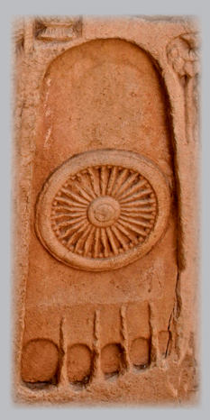

Anālayo Buddhapada and the Bodhisattva Path

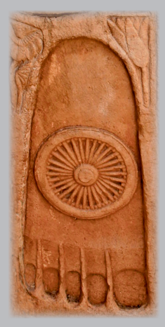

Anālayo Buddhapada and the Bodhisattva Path Hamburg Buddhist Studies 8 Series Editors: 

Steffen Döll | Michael Zimmermann Anālayo Buddhapada and the Bodhisattva Path Bibliographic information published by the Deutsche Nationalbibliothek The Deutsche Nationalbibliothek lists this publication in the Deutsche Nationalbibliografie; detailed bibliographic data are available in the Internet at http://dnb.d-nb.de.

ISSN 2190-6769 ISBN 978-3-89733-449-6 (E-Book)
ISBN 978-3-89733-415-1 (printed version) © 2017 projekt verlag, Bochum/Freiburg www.projektverlag.de Cover: punkt KOMMA Strich GmbH, Freiburg www.punkt-komma-strich.de Cover original design by Benjamin Guzinski; Julia Wrage, Hamburg Figure on Cover: Jinah Kim Contents 

| List of Figures                                       | 7   |
|-------------------------------------------------------|-----|
| Foreword                                              | 9   |
| Michael Zimmermann and Steffen Döll  Introduction     | 11  |
| 1 Seeing the Footprint                                | 15  |
| 1.1 Introduction                                      | 15  |
| 1.2 Translation                                       | 17  |
| 1.3 The Nature of an Awakened One                     | 20  |
| 1.4 The Different Footprints                          | 23  |
| 1.5 Problems with Marks on the Footprint              | 27  |
| 1.6 The Thousand Spokes                               | 30  |
| 1.7 The Wheel                                         | 36  |
| 1.8 Summary                                           | 41  |
| 2 A Vision of the Thirty-two Marks                    | 43  |
| 2.1 Introduction                                      | 43  |
| 2.2 Translation                                       | 44  |
| 2.3 The Webbed Feet and the Protuberance              | 51  |
| 2.4 The Buddha's Footprints on the Stairs from Heaven | 55  |
| 2.5 The Buddha's General Appearance                   | 57  |
| 2.6 The Significance of the Thirty-two Marks          | 61  |
| 2.7 The Thirty-two Marks as Brahminical Lore          | 63  |
| 2.8 Summary                                           | 68  |
| 3 The Great Lineage of Buddhas                        | 71  |
| 3.1 Introduction                                      | 71  |
| 3.2 Translation                                       | 75  |
| 3.3 Visual Elements in the Description of Vipaśyin    | 84  |
| 3.4 The Marks and dharmatā                            | 87  |
| 3.5 The Birth of a Buddha                             | 89  |
| 3.6 Seeing the Marks as a Means of Conversion         | 94  |
| 3.7 Seeing the Marks as a Means of Healing            | 100 |
| 3.8 Summary                                           | 101 |

| 4 The Karma of the Wheel-mark             | 103   |
|-------------------------------------------|-------|
| 4.1 Introduction                          | 103   |
| 4.2 Translation                           | 105   |
| 4.3 Assessing the Lakkhaṇa-sutta          | 106   |
| 4.4 Introducing the Karmic Perspective    | 110   |
| 4.5 The Marks in Their Karmic Setting     | 113   |
| 4.6 Aspiring to Be Endowed with the Marks | 122   |
| 4.7 The Marks and Masculinity             | 128   |
| 4.8 Summary                               | 134   |
| Conclusion                                | 137   |
| Abbreviations                             | 141   |
| References                                | 143   |
| Index                                     | 171   |

## List Of Figures

| Figure 1: Fragment Description of Footprint           | 24   |
|-------------------------------------------------------|------|
| Figure 2: Different Footprints                        | 25   |
| Figure 3: Footprints with Wheel                       | 39   |
| Figure 4: Worshipping the Buddha's Footprints         | 40   |
| Figure 5: Buddha with Webbed Hand                     | 53   |
| Figure 6: The Buddha's Descent from Heaven            | 56   |
| Figure 7: Footprints with svastikas                   | 62   |
| Figure 8: The Buddha and His Six Predecessors         | 73   |
| Figure 9: Baby Footprints                             | 86   |
| Figure 10: Footprint with Birds                       | 99   |
| Figure 11: Footprint-Wheels with many Spokes          | 104  |
| Figure 12: Lion Capital                               | 116  |
| Figure 13: Wheel-marks on the Feet of a Seated Buddha | 127  |

# Foreword

## About Hamburg Buddhist Studies

Ever since the birth of Buddhist Studies in Germany more than 100 years ago, Buddhism has enjoyed a prominent place in the study of Asian reli-gions. The University of Hamburg continues this tradition by focusing research capacities on the religious dimensions of South, Central, and East Asia and making Buddhism a core subject for students of the Asien-AfrikaInstitut. The Numata Center for Buddhist Studies is proud to have found a home at one of Europe's pioneering academic institutions. With its *Hamburg Buddhist Studies* book series it honours the University's long-standing commitment to research in the field of Buddhist Studies and aims to share its results with both the academic community and the wider public. 

Today, Buddhist Studies as an academic discipline makes use of a broad spectrum of approaches and methods. The field covers contemporary issues as much as it delves into the historical aspects of Buddhism. Similarly, the questions shaping the field of Buddhist Studies have broadened. Understanding present-day Buddhist phenomena - and how such phenomena are rooted in and informed by a distant past - is not at all an idle scholarly exercise. Rather, it has become clear that fostering the understanding of one of the world's major religious traditions is a crucial obligation for modern multicultural societies in a globalized world. 

Accordingly, *Hamburg Buddhist Studies* addresses Buddhism as one of the great humanistic traditions of philosophical thought, religious praxis, and social life. Its discussions will undoubtedly be of interest to scholars of religious studies and specialists of Buddhism, but also aim at confronting Buddhism's rich heritage with questions the answers to which might not easily be deduced by the exclusive use of historical and philological research methods. Such issues require the penetrating insight of scholars who approach Buddhism from a broad range of disciplines, building upon and yet going beyond the solid study of texts and historical evidence. 

We are convinced that Hamburg *Buddhist Studies* will contribute to opening up the field to those who may have no training in the classical source languages of the Buddhist traditions but approach the topic against the background of their own disciplinary interests. With this book series, we would like to also encourage a wider audience to take an interest in the academic study of the Buddhist traditions. 

## About This Volume

It is our great pleasure to introduce with the present study, Buddhapada and the Bodhisattva Path by Bhikkhu Anālayo, the eighth volume in the Hamburg Buddhist Studies series. Building on his ground-breaking *The* Genesis of the Bodhisattva Ideal, with the present monograph he approaches a closely related topic from the perspective of the bodily dimension as evident in the thirty-two marks with which, according to tradition, the Buddha was endowed. The study begins by proposing that a cross-fertilization between text and art has influenced the conception of one of these marks, namely the wheel-marks on the soles of the Buddha's feet. By way of a comparative study of the early discourses, Anālayo proceeds to show how the thirty-two marks - initially nearly imperceptible features - came to be more clearly visible and acquired salvific power. Eventually, he argues, these turned into a psycho-somatic chart for the bodhisattva path and thereby set a precedent for the prediction (commonplace in later Buddhist doctrine) that assures an aspiring bodhisattva of becoming a Buddha in the future. 

 
Michael Zimmermann and Steffen Döll 

# Introduction

## Theme

This study is a follow-up to my earlier exploration of The Genesis of the Bodhisattva Ideal in the same *Hamburg Buddhist Studies* series, in which I 
employed the historical-critical method of comparative study of the early discourses to trace different elements that appear to have contributed to the coming into being of the bodhisattva ideal.1 With the present study I turn to the bodily dimension of the same trajectory, in particular to the thirty-two marks (lakṣaṇa) as the embodiment of Buddhahood. 

The chief source material for my present exploration remains the early discourses, found in the four main Pāli *Nikāya*s and their counterparts in Sanskrit fragments, the Chinese *Āgama*s, and at times parallels preserved in Tibetan and even Uighur translation. 

A distinct case is the Ekottarika-*āgama* preserved in Chinese translation 
(T 125). This collection has had a rather chequered history and it seems clear that material was added in China and that the whole collection underwent considerable reworking.2 Discourses in the Ekottarika-*āgama* can at times document more evolved stages of development which in the early discourses of other collections manifest only in an embryonic form. 

In what follows my presentation falls into four parts, each of which is based on a translation of a discourse or a substantial portion of it, followed by a comparative study and further discussion. The focal reference point around which the whole study revolves is one of the thirty-two extraordinary physical marks of a Buddha, namely the wheel-marks on the soles of his feet and the resultant footprints they leave on the ground. 

The brahmin Droṇa's vision of a footprint of the Buddha is the theme of chapter 1, in which I argue that the different descriptions of this footprint reflect stages in a development best understood as the result of a crossfertilization between text and art. 

A brahmin by the name of Brahmāyus and his keen interest in the Bud-dha Gautama's possession of the thirty-two marks feature in chapter 2, in which I explore in particular the function of these thirty-two lakṣaṇas as means of conversion. Another topic I take up is the significance of the at times hyperbolic description of the marks in early Buddhist discourse. 

Gautama's predecessors come up for study in chapter 3, in which I am in particular concerned with the Buddha Vipaśyin. The description of miraculous events and qualities related to his birth shows the gradual integration of the thirty-two marks into the conception of Buddhahood. 

With chapter 4 the full integration of the thirty-two lakṣaṇas into Buddhist doctrine comes to the forefront. This takes place by way of endowing them with a karmic background, in the sense of delineating the type of deeds performed in former lives that will lead to the acquisition of the thirty-two marks. I argue that this sets the stage for their function in other texts as a chart for the bodhisattva path and also reflects the centrally important shift of attention towards the type of conduct required for progress to Buddhahood as well as encouraging the arising of the idea that a bodhisattva at some point during his career receives a prediction of his future success in becoming a Buddha. 

In short, I begin by examining the Buddhapada itself (chapter 1), then place it in the context of the thirty-two marks (chapter 2), next relate it to Buddhahood (in chapter 3), and finally proceed from the Buddhapada to the bodhisattva path (chapter 4). Readers solely interested in the topic of the bodhisattva path might proceed directly to chapter 4, having read just the summaries of the preceding chapters.3 Similarly to my exploration of the bodhisattva ideal, the present survey documents the worth of comparative study of the early discourses for constructing informed hypotheses regarding early stages in the development of Buddhist thought. 

## Acknowledgement

I am indebted to Mark Allon, Adam Clarke, Bhikkhunī Dhammadinnā, Lilian Handlin, Christian Luczanits, Michael Running, Lambert Schmithausen, and Giovanni Verardi for commenting on this work, or parts of it, in the various stages of its evolution. 

## 1 Seeing The Footprint 1.1 Introduction

In this chapter I examine textual descriptions of a footprint of the Buddha. Comparative study of these descriptions offers a window on the stages in the development of the conception of the Buddha's foot as one of the thirty-two physical marks of a "great person", *mahāpuruṣ*a. 

The episode in question reports how a brahmin by the name of Droṇa chances on an actual footprint of the Buddha, which can be considered a natural Buddhapada. The exceptional nature of this footprint makes him pursue and eventually meet its owner, leading to a conversation with the Buddha and in some accounts of this episode to the brahmin's conversion. The versions of the discourse to be studied are as follows: 
- a discourse version preserved in Gāndhārī belonging to the British Library Kharoṣṭhī fragments, 1 which with considerable probability can be assigned to a Dharmaguptaka textual tradition;2
- the Discourse to Doṇa found among the Fours of the Aṅguttara-*nikāya* of the Theravāda tradition; 3
- a discourse extant in the Chinese translation of the completely preserved Saṃyukta-*āgama* (T 99), probably stemming from a Mūlasarvāstivāda transmission lineage, the discourse being located in what according to the reconstructed order of this collection would be the Section on Brahmins;4 
- a discourse extant in Chinese from the partially preserved Saṃyukta-*āgama* (T 100), whose supposed Kāśyapīya affiliation has in recent times been criticized with arguments in favour of a Mūlasarvāstivāda provenance instead (although this would have to be of a dif-ferent transmission lineage within the wider Mūlasarvāstivāda than the completely preserved Saṃyukta-*āgama*);5
- a discourse extant in Chinese from the Sixes of the Ekottarika-*āgama* (T 125),
6 whose school affiliation remains elusive due to the fact, already mentioned briefly above in the introduction, that the collection has been reworked and expanded by incorporating additional material after the arrival of its original in China.

7 Nevertheless, it seems possible that the Indic original itself stemmed from a Mahāsāṅghika reciter lineage.8 These five versions would thus represent two distinct transmission line-ages within the Mūlasarvāstivāda fold as well as texts passed on by re-citers of the Dharmaguptaka, perhaps Mahāsāṅghika, and quite defi-nitely Theravāda traditions.9 Comparative study of the five parallels can reveal variations that might shed a light on the evolution of the different versions during their transmission. 

By way of introduction, in what follows I translate the Ekottarika-*āgama* version, which as far as I am able to tell does not show evident signs of being a product of the afore-mentioned reworking of the collection in China and thus could still be a fair reflection of the Indic original of the present discourse (to the extent possible within the confines of the abilities of its translator). 

Thus have I heard. At one time the Buddha was in the Magadha country in Yōujiāzhī,10 by the side of a river. At that time the Blessed One had gone to the foot of a tree. Having himself spread his sitting mat, he sat down with upright body and upright intention, and with mindfulness collected in front [of himself]. 

At that time a brahmin approached that place. Then the brahmin saw that the Blessed One's footprints were sublime.11 Having seen it, he in turn gave rise to the thought: "Are these the footprints of a human? Or rather of a deva, nāga, yakṣa, *gandharva*, 
or *asura*? Are they of a human or a non-human? Are they of our ancestor Brahmā?"12 Then, on proceeding in pursuit of the footprints, the brahmin saw from afar that the Blessed One was seated at the foot of a tree with straight body and straight intention, and with mindfulness collected in front [of himself]. Having seen him, he said this: "Are you a *deva*?"
The Blessed One said: "I am not a *deva*." [The brahmin asked]: "Are you a *gandharva*?" The Blessed One said: "I am not a *gandharva*." [The brahmin asked]: "Are you a *nāga*?" [The Blessed One] replied: "I am not a *nāga*." [The brahmin asked]: "Are you a *yakṣa*?" The Buddha replied to the brahmin: "I am not a *yakṣa*."
[The brahmin asked]: "Are you Brahmā?"13 The Buddha replied: "I am not Brahmā." [718a]
Then the brahmin asked the Blessed One: "Now, who are you?"
The Blessed One said: "When there is craving, there is clinging; and when there is clinging, there is craving. In their conditioned combination, they give rise to each other in this way.14 This being so, at such a time the fivefold duḥ*kha* of the aggregates of clinging will not be severed. 

By having understood craving, having understood the five sense pleasures, and also having understood the six external objects and the six internal spheres, one knows the beginning and end of these aggregates of clinging."15 Then the Blessed One in turn spoke this poem: "In the world there are five sense pleasures, Mind manifests as the sixth. 

By understanding the six internal and external [realms of experience],
One will mindfully eradicate and [make an] end of duḥkha.

16
"Therefore you should seek the means to the cessation of the six internal and external realms [of experience], brahmin, in this way should you train." 
At that time that brahmin, on hearing the Buddha instruct him like this, gave attention to it, studied, and harboured it in his mind without discarding it. On that very seat he eradicated all dust and attained the pure Dharma eye.17 At that time that brahmin, having heard what the Buddha had said, was delighted and received it respectfully. 

## 1.3 The Nature Of An Awakened One

The main message common to the different versions of the discourse appears to be that the Buddha is beyond being classed in any of the ways the brahmin had thought. 

The episode of the footprints reveals the limitations of the brahmin's reliance on external physical marks in order to be able to assess the Buddha. The footprints had correctly alerted the brahmin to the fact that someone unusual had been treading the ground, and the different versions do not in any way express a negative attitude towards a concern with physical marks as such. However, the physical evidence correctly identified by the brahmin did not suffice to lead him to a proper understanding of who had left these footprints. The Buddha then provides the required additional perspective by explaining that his nature calls for an assessment not only of his physical form, but also, and even more so, of his awakened mind. 

This explanation is in line with the definition of a "great person",
mahāpuruṣa, as referring to someone whose mind is liberated, offered in a discourse in the Saṃyutta-*nikāya* and its Saṃyukta-*āgama* parallel. 

The relevant passage in the latter version states: "[whose] mind has attained liberation and eradicated all the influxes (āś*rava*), such a one I 
call a *mahāpuruṣ*a."18 
―――――― 17 AN 4.36 concludes after the Buddha's verses and does not report any conversion or attainment. According to the commentary, Mp III 79,17, the brahmin attained not only stream-entry but even non-return, referred to in terms of his attainment of three paths and fruits, *tīṇi maggaphalāni*. British Library Kharoṣṭhī fragment 12 line 24f, Allon 2001: 121, reports his taking refuge as a lay disciple. In SĀ 101 at T II 28b17 and SĀ² 267 at T II 467b23 the brahmin just rejoices and then leaves. 

Notably, in the verses spoken by the Buddha, SĀ² 267 at T II 467b21 has a reference to being free of dust, 遠塵離垢, which bears some similarity to the descrip-tion of the brahmin's stream-entry in EĀ 38.3 at T II 718a11 as involving the eradication of all dust, 諸塵垢盡.

18 SĀ 614 at T II 172a19, with its counterpart in SN 47.11 at SN V 158,14. My survey in what follows only takes up passages found in more than one reciter tradition. 

A discourse in the Aṅguttara-*nikāya* and its Saṃyukta-*āgama* parallel quote a verse from the Pārāyana*-vagga* of the Sutta-*nipāta* that conveys a similar equation of the *mahāpuruṣ*a with a liberated one, expressed in a poetic manner. The Saṃyukta-*āgama* version reads as follows: 
If one understands both ends, And never attaches to the middle, Such a one I call a *mahāpuruṣ*a.

19 Another Aṅguttara-*nikāya* passage and its Madhyama-*āgama* parallel delineate the path of practice to reach such freedom from attachment. 

Anuruddha has been reflecting in seclusion that the Buddha's Dharma is for one who has few desires and is contented, for one who delights in seclusion and is energetic, mindful, concentrated, as well as wise. The Buddha approves the reflection and then adds an eighth thought of a great person, *mahāpuruṣ*a, regarding the need to avoid conceptual proliferation, *prapañca*. The Madhyama-*āgama* presents this in this way: 
Anuruddha, you shall further receive from the Tathāgata an eighth thought of a great man. Having received it, reflect on it in turn: 
"The path is attained through non-proliferation, delighting in non-proliferation, and engaging in non-proliferation; not by proliferation, not by delighting in proliferation, not by engaging in proliferation."
20 These passages point in complementary ways to the gaining of awakening as what makes one a *mahāpuruṣ*a. The same is also the import of the refusal by the Buddha in the different versions of the discourse to Droṇa to be classified in any of the ways his brahmin visitor had thought of. 

Another passage of relevance to the episode in the discourse to Droṇa can be found in the Cūḷ*ahatthipadopama-sutta* and its Madhyama-*āgama* parallel. The brahmin protagonist of the discourse has heard a favourable report about the Buddha, whose exceptional nature is illustrated in a simile concerned with an elephant's footprint. According to this simile, seeing an elephant's large footprint leads to drawing the conclusion that this must have been caused by a large elephant. 

The brahmin approaches the Buddha and relates the favourable report and the simile he has heard. The Buddha then takes up the simile of the elephant's footprint to make the point that just seeing a large footprint does not suffice to draw the definite conclusion that the elephant must be large. This warning reminds one of the discourse to Droṇa, where somewhat similarly it becomes clear that an assessment of a footprint on its own does not yet suffice to draw a definite conclusion regarding the one who left the footprint. 

Comparable to Droṇa going in pursuit of the Buddha's footprints, in the simile in the Cūḷ*ahatthipadopama-sutta* and its Madhyama-*āgama* parallel the person goes in pursuit of the footprints he has seen. In the Buddha's improved version of the simile, this person only comes to a definite conclusion that this is indeed a large elephant when he finally sees the animal itself. 

By way of applying this simile, the Buddha then reckons attainment of the four absorptions, after successful practice of the gradual path to liberation, to be the footprint of the Tathāgata.21 The vision of the elephant itself, however, comes only when full awakening is attained.22 In this way the Cūḷ*ahatthipadopama-sutta* and its Madhyama-*āgama* parallel help to relate the imagery of pursuing a footprint to the *mahāpuruṣ*a notion and its allusion to the realization of awakening. The two versions report that the Buddha's exposition motivated the brahmin to take refuge.23 In the case of the encounter between the Buddha and Droṇa, the parallel versions differ on the outcome of this meeting. In the two Saṃyukta-*āgama* versions Droṇa rejoices in the exposition and leaves. The Gāndhārī fragment reports his taking refuge, and in the Ekottarika-*āgama* version translated above he attains stream-entry. Although the Aṅguttara-*nikāya* discourse does not report any attainment, according to the Pāli commentary Droṇa even attained the third level of awakening.24

## 1.4 The Different Footprints

From the viewpoint of the main topic in the present chapter, of particular interest are variations between the parallel versions in relation to the footprints. The Ekottarika-*āgama* version translated above describes them as being "sublime", and a variant reading adds to this that they were "very special".25 This description lacks any reference to the wheelmark mentioned in the other versions. 

One of the two Saṃyukta-*āgama* discourses depicts "in the midst of the [foot]prints the mark of a wheel with a thousand spokes, which was extraordinary and never seen before."26 The other of the two Saṃyukta-*āgama* discourses speaks of "the appearance of the refined impression of the mark of a wheel with a thousand spokes in the footprints, with straight spokes and round rim, complete with abundant beauty".27 The Aṅguttara-*nikāya* version reports that there were in the Buddha's "footprints wheel-marks with a thousand spokes, complete with rim and hub".28 The Gāndhārī fragment version has preserved a reference to a 
―――――― 23 This is one of numerous instances in which this particular brahmin reportedly took refuge; cf. Anālayo 2011a: 41 note 78.

24 Cf. above p. 20 note 17. 

25 EĀ 38.3 at T II 717c21: 妙; with the variant reading adding 極為殊. 

26 SĀ² 267 at T II 467a29: 跡中千輻輪相, 怪未曾有.

27 SĀ 101 at T II 28a23: 脚跡千輻輪相, 印文顯現, 齊輻圓輞, 眾好滿足.

28 AN 4.36 at AN II 37,26: padesu cakkāni sahassārāni sanemikāni sanābhikāni sab-*bākāraparipūrāni*. 

"wheel with thousand spokes in the footprints" and to a qualification of 

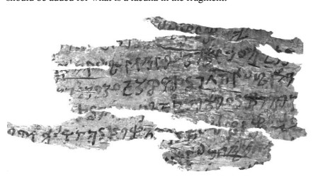

the footprints as being "with all parts complete, brilliant and resplendent", to which with considerable probability a reference to rim and hub should be added for what is a lacuna in the fragment.29 Figure 1 Fragment Description of Footprint In sum, the Ekottarika-*āgama* version (EĀ) has only the footprint itself. 

One of the Saṃyukta-*āgama* discourses (SĀ²) adds to this the wheel with a thousand spokes, to which the other Saṃyukta-*āgama* discourse 
(SĀ) adds the rim. The Aṅguttara-*nikāya* version (AN) then has the thousand-spoked wheel with both rim and hub. The same is found in the Gāndhārī fragment version (Gā), on the assumption that its lacuna did refer to rim and hub,30 with the addition of the brilliance of the wheel. 

Presented in a summary fashion in figure 2 below, the increasingly detailed descriptions of the footprint involve the following elements in the parallel versions: 
―――――― 29 Figure 1 shows the relevant part of British Library Kharoṣṭhī fragment 12; courtesy of Mark Allon. The relevant part of the fragment is line 4, Allon 2001: 120: 
padeṣu cakra sahasahara [s], and line 5: savarovaghada aceata prabh.*[śp]*.ra, reconstructed by Allon 2001: 124 as padeṣu cakra sahasahara s(*aṇemia saṇa-*bhia) savarovaghada aceata prabh(*a)śp(*a)ra*. 

30 Cf. the discussion in Allon 2001: 146f. 

EĀ SĀ² SĀ AN Gā footprint

SĀ² SĀ AN Gā + wheel with thousand spokes

SĀ AN Gā + rim

AN Gā + hub

Gā + brilliance

Figure 2 Different Footprints For an evaluation of these differences, depictions of the Buddha's footprints in ancient Indian art can be consulted. Here of particular relevance is the fact that early representations tend to be rather simple and, if marked at all, just carry the wheel. Examples can be found in Bhārhut, 31 or else Sāñcī, the site of the pillar from which the pair of footprints found on the cover of this book have been extracted.32 In later times, footprints tend to become considerably more complex, with various additional symbols being added.33 The same type of development can also be seen in different historical layers of Pāli literature. The Mahāpadāna*-sutta* (to be studied in chapter 3) just describes the feet of the Buddha Vipaśyin as endowed with wheelmarks, to which its commentary then adds a list of about forty additional marks.34 In still later Pāli texts the feet of a Buddha come to be adorned with 108 marks.35 Given this evident tendency towards proliferation in texts and art, it seems fair to assume, as a first working hypothesis, that the less detailed textual descriptions of the footprints seen by Droṇa stand a chance of being earlier than their more complex counterparts. This would mean that perhaps the Ekottarika-*āgama* version translated above might testify to an earlier stage in the conception of the Buddha's footprints than its parallels, at a time when the special nature of the footprints had not yet found its expression in any particular mark. In turn the British Library Kharoṣṭhī fragment, whose manuscript is probably dateable to the first century of the present era,36 would then be a testimony to the most evolved version. 

The coming into being of the wheel imagery must have taken place at a relatively early period in the history of Indian Buddhism, as evident from the Bhārhut and Sāñcī sculptures, leaving sufficient time for the whole development described above to take place long before the date of the Gāndhārī fragment. By the time of the closure of the Pāli commentaries, the conception of the footprints had clearly evolved further. 

Needless to say, the contents of a whole textual collection cannot be dated to its closing date. Instead, the transmission of texts is probably best conceived of as a process comparable to a river,37 which from its source keeps flowing to the ocean, all the time receiving additional water from its tributaries. However long its course and however many its tributaries, by the time the river reaches the ocean there will still be some of its water that has come all the way down from its source; it would not be correct to assume that all of the water at that time must be from the river's last tributary. 

Similarly, in the present case there is no *a priori* reason why the Ekottarika-*āgama* could not have preserved an early element. In fact the significance of the dating of the Gāndhārī fragment is not that its entire content must be the earliest of the extant versions. Instead, this dating only implies that by the time the fragment was committed to writing the development discussed here had already reached the point in this particular reciter tradition when the imprint of the wheel with a thousand spokes 
(as well as rim and hub) was considered invested with brilliance. 

## 1.5 Problems With Marks On The Footprint

In support of the working hypothesis that the simple footprint without any wheel-mark might be reflecting an early stage in the evolution of the present episode, the Pāli commentary to the Aṅguttara-*nikāya* discourse to the brahmin Droṇa can be consulted, which shows how the present episode was seen within the tradition. The commentary struggles to reconcile the description of the footprints in the Pāli discourse with the canonical description of another in the set of the thirty-two physical marks of the Buddha (to be studied in chapter 2), according to which his feet were soft and tender.38 The problem seen from the viewpoint of the tradition, in the way this is reflected in the Pāli commentary, is: if the feet were soft and tender, how could they leave such a clearly marked imprint on the ground? And if they somehow did leave such imprints, why is this the only occasion reported in the discourses that someone noticed them?39 The Pāli commentary solves the dilemma it has identified by taking the position that, whenever the Buddha steps on the ground, this does not result in a footprint, because the feet of Buddhas are as soft as the touch of cotton.40 In this way the commentary is able to preserve confor-
―――――― 38 Cf. below p. 48 note 21. Skilling 2013a: 53 surveys the description of the Bud-dha's marks in the Tibetan version of the Bodhisattvagocaropāyaviṣayavikurvāṇa-*nirdeśa-sūtra*, which qualifies even the wheel-marks themselves as soft: "there are soft wheels on the hands and the feet", Skilling 2013a: 59 note 33: *phyag dang* zhabs la 'khor lo 'jam pa mnga' (cf. D 146 pa 120b1 or Q 813 nu 78a6). This appears to be the result of a conflation of two marks in the Tibetan version, as the Chinese parallels first take up the wheels on the feet only, without qualifying them in a comparable way, and then turn to softness with the next mark, concerned with the softness of the hands and feet; cf. T 271 at T IX 308c23 and T 272 at T IX 342c16. 

39 The suggestion by Neumann 1896/1995: 1114 note 242 that the thousand-spoked wheel refers to the imprint left by the heel on dusty or wet ground does not solve the problem spotted by the commentary. As long as the description itself it taken literally, on such an interpretation either one is left with the feet being too soft to be able to leave such an imprint or else, if they do leave such an imprint, whenever the ground in ancient India would have been either dusty or wet, the mark should have been noticeable. 

40 Mp III 77,15. In the same vein, DĀ 1 at T I 5b19 reports that the Buddha Vipaśyin had soft feet which did not leave any imprint on the ground, 柔軟足, 不蹈地跡現
(the next line then describes the feet adorned with a wheel with a thousand spokes and brilliance). The commentary on the *Apadāna*, Ap-a 394,24, goes a step further mity with the canonical description of the thirty-two marks and to explain why the Buddha's footprints are not noticed more often. 

In order to account for the description of the footprints in the discourse to Droṇa in the Aṅguttara-*nikāya*, the Pāli commentary reasons that it is only when the Buddha determines beforehand that his footprints should become visible to a particular person (for purposes of conversion) that they will indeed become visible.41 The need for explanation holds for all of the above footprints that have the clearly discernible mark of a wheel with a thousand spokes. Only with a mere footprint this problem does not arise, which is the case for the description given in the Ekottarika-*āgama* version translated above. 

From the viewpoint of the whole narrative episode, a footprint without any mark would suffice for the story to work, as long as its overall form and the way it has imprinted itself on the ground, presumably reflecting the consummate way its owner walks, can be reckoned as remarkable. 

The function in this respect of bare footprints without a wheel-mark can be seen in relation to another event involving another brahmin. This event forms part of a narrative that leads up to an exchange between this brahmin and the Buddha. Records of this exchange can be found in verses in the Sutta-*nipāta*.

42 A Chinese parallel combines prose narration and verse, whereas the Pāli prose narration is found in the commentary on the Sutta-*nipāta*. This reflects a recurrent feature, namely the gradual integration of originally commentarial stories and explanations into the discourse itself.43 The opposite holds for the *Udāna*, where it is the Pāli version that combines prose narration and verse, whereas most parallel 
――――――
by asserting that all Buddhas walk at a distance of four fingers above the ground, yet leave a footprint if they determine for it to be seen. In relation to Kāśyapa Buddha the *Mahāvastu* takes a similar position, stressing that the imprints of his feet with a wheel complete with a thousand spokes and hub were nevertheless visible, Senart 1882b: 308,13: caturaṅgulena ca bhūmiṃ asaṃsp*ṛśanto gacchati* dharaṇitale ca padacakrāṇi prādurbhavanti sahasrārāṇi sanābhikāni sarvākāra-*paripūrṇāni*. On the idea that a Buddha's feet do not even touch the ground but still leave footprints cf. also, e.g., T 807 at T XVII 751c6 (Harrison 1995: 4f) and Bollée 2008: 65. 

41 Mp III 78,4; cf. also Endo 1997/2002: 164. This explanation holds not only for the present case, but also in relation to another brahmin, whom I discuss next. 

42 Sn 835 to 847 reports the exchange between the Buddha and this brahmin. 43 For a study of such integration of commentarial material cf. Anālayo 2010b. 

versions have only the verses. I will come back to this particular feature in chapter 4. 

According to the introductory prose narration, the brahmin Mākandika has seen the Buddha's footprints and come to the conclusion that their bearer must be the right bridegroom for his beautiful daughter. His wife disagrees; having examined the Buddha's footprints she is convinced that the Buddha will not want their daughter. When explaining how she came to this conclusion, the wife describes in what way a bare footprint reflects the way its owner steps and thereby can reveal the presence of mental defilements. Here is the Chinese version: 
A person with sexual desire walks dragging the feet, One who has anger steps with contracted toes, A deluded person tramples with the feet on the ground.44 This suggests that, according to the ancient Indian art of prognostication, a bare footprint can reveal, on close inspection, if the person responsible for this footprint is under the influence of sensuality, anger, or delusion.45 The passage also implies that to ascertain the implications of such a footprint requires considerable expertise, as the brahmin Mākandika on his own had been unable to reach the correct assessment made by his wife. 

A relationship between a certain way of walking as reflective of the presence or absence of mental defilements and a bare footprint would fade in importance once the footprint came to be adorned with a wheelmark, whereby naturally attention would have shifted to the mark and its features. 

In the case of the discourse on Droṇa, from the viewpoint of narrative logic it seems that at an early stage the story could indeed have been concerned only with the Buddha's sublime footprints as such, which to the keen observer trained in the lore of footsteps would in some way convey the transcendent nature of the one who has trodden the ground, leading to Droṇa's speculations on the nature of its owner. 

The problem spotted by the Pāli commentary becomes even more pronounced with the Gāndhārī version, as here the footprint itself is additionally invested with brilliance. Allon (2001: 149) reasons that the idea of brilliance would at first have developed in relation to the wheeltreasure of a *cakravartin* and, by extension, epithets meaning "bright" and "shining" were then applied to the wheel-marks on the Buddha's feet … [and] to the impression left by them on the road, as seen in our G[āndhārī] 
sūtra, even though it appears a little odd to describe such impressions in the dust of the road as being "brilliant" and "resplendent".

## 1.6 The Thousand Spokes

The close interrelation between the concept of a Buddha and that of a cakravartin, which will be a recurrent theme in subsequent chapters of my exploration, makes it indeed natural to examine the *cakravartin* myth for material related to the wheel-imagery. Standard descriptions in the discourses depict the arising of the wheel-treasure of a cakra-*vartin* as heralding the manifestation of the remaining six treasures, which together have the function of signalling that someone is a wheelturning king. The wheel is also central for the conception of the treasures of the wheel-turning king in other Indian traditions, where the lists of such treasures differ, but the wheel keeps being mentioned in first place.46 As an example of the narrative depiction of the arising of the wheeltreasure, here is a passage from the Discourse on the Wheel-turning 
―――――― 46 The Jain Ṭhāṇ*aṃga*, Jambūvijaya 1985: 232,9 (§558), begins its listing of two sets of seven treasures with the wheel. The wheel also comes in first position in listings of the treasures in the *Matsyapurāṇ*a 142.63, Joshi 2007: 500, and the Vāyu-*purāṇ*a 57.68, Sharma 2008: 377; cf. also Zin 2012: 150. 

King in the *Dīrgha-āgama*, which reports the reflection of the king on seeing that the wheel has just manifested in front of him: 
I once heard from the ancients that if a head-anointed warrior king, during the period of the full moon on the fifteenth [of the month], 
having bathed and anointed himself, ascends to the top of the precious palace, surrounded by his women, and the golden wheeltreasure spontaneously manifests in front of him, a wheel with a thousand spokes and endowed with brilliant colour, which is made by a divine artisan and does not exist anywhere in the world, the wheel being made of real gold and measuring forty feet across, then he is called a noble wheel-turning king. This wheel has now manifested.47 The narrative continues by describing that the golden-coloured wheel proceeds from the east via the south and the west to the north, with the king and his army following suit and conquering all territories in the respective directions without any battle or bloodshed, as all inhabitants and their rulers happily welcome the wheel-turning king and submit to his rule.48 This description forms part of a fairly evident symbolism and even humour inherent in the description of the wheel and the other treasures. 

An ancient Indian audience probably well acquainted with the horrors of real warfare can be expected to have appreciated the description of the wheel heralding a peaceful conquest of neighbouring reigns, whose rulers come forward to greet the invading army and put themselves at the command of the enemy king, rather than fight him.49 Other treasures mentioned in full descriptions of the manifestations of the wheel-treasure are an elephant and a horse, both of which are able to fly at incredible speed and tour the whole world, offering modes of locomotion in stark contrast to those available in ancient India. Another treasure is a magical gem that illuminates night as if it were day, a marvel for an audience that did not yet know the wonders of modern-day electricity. The woman-treasure is of supreme beauty, in winter her body is warm and in summer cool, and at all times she smells of sandalwood. 

Two other human treasures are a steward who has the ability to provide wealth at will and a general or counsellor who does everything exactly in the way the king would wish. 

It is in the context of such a description with clear symbolic and humorous intent that the wheel-treasure has its function as a counterpart to the sun. The description of the wheel in the passage translated above and the first parts of its route mirror a sunrise, as the sun similarly manifests to the east, before proceeding to the south and then to the west.50 In this context, the thousand spokes of the wheel correspond to the thousands of golden rays of sunshine. 

The expression sahas*rāra*, employed in the *Lalitavistara* and the Mūlasarvāstivāda *Vinaya* to describe the "thousand spokes" of the wheel-treasure,51 recurs in the *Mahāvastu* as part of a description of the brilliance of a past Buddha, who outshone a multitude of suns by his 
"thousand rays".52 In a gloss on the corresponding Pāli term *sahassāra*, 
the Pāli commentary explains that the thousand spokes of the wheeltreasure are endowed with brilliance comparable to the rays of the sun,53 and the *Vimānavatthu* qualifies the sun itself as having a thousand rays.54 In another passage the *Mahāvastu* then directly compares the thousandspoked wheel-treasure to the rising sun.55 Clearly the notion of a thousand rays or spokes has its natural home in the context of the wheel-treasure and its similarity to the sun. In contrast, it is not natural to depict a human foot having a mark or even leaving the imprint of a wheel that has a thousand separate spokes. In sculpture to portray distinctly anything reasonably resembling the idea of such a multitude of spokes would be quite a challenge and would require a rather large wheel, far beyond the size of a foot. In the case of the footprints on the cover of this book, in spite of being of a size that exceeds that of a normal human foot, the wheels have only twenty-eight and thirty spokes respectively. In sum, it seems improbable that the idea of a thousand spokes would have arisen from artistic depictions of the feet of a Buddha. 

This impression finds further support in a Buddhist work on iconometry, the *Pratimālakṣaṇ*a. The Sanskrit and Tibetan versions of the work start by reporting that the Buddha had returned from a sojourn in the Heaven of the Thirty-three (to which I turn in chapter 2).56 Śāriputra wants to know how one is to worship the Buddha when he is absent or after he has passed away. The Buddha's reply provides detailed instructions on the proportions and measurements for the construction of a Buddha image. In spite of otherwise giving a wealth of detail, this work just mentions the wheel to be depicted on the soles of the feet, without specifying any number of spokes.57 This accords with the impression that it is improbable that the idea of a thousand spokes had its origin in the depiction of a foot or its imprint. 

The same holds also from a doctrinal perspective. Had the point at stake been to convey a relation to what according to tradition was the Buddha's first discourse with which he turned the wheel of Dharma, for example, one might expect perhaps four spokes to allude to the four noble truths, or eight spokes to signify the noble eightfold path, or twelve spokes to express the three turnings to be applied to each of the four noble truths.58 But the notion of a thousand spokes clearly has its natural home in sun imagery. 

Whereas a wheel of the type used in ancient India would require rim and hub in order to function, once the motif is taken from the sun and its thousand rays, it becomes understandable that the thousand spokes are invariably mentioned, since this is the most prominent aspect of the imagery. 

In line with the depiction of the Buddha in some texts as having a resplendent appearance,65 the brilliance of the sun would have led to associating not only the wheel-treasure but also the wheel-mark on the Buddha's foot or in his footprints with brilliance, as evident in the Gāndhārī fragment version of the discourse to Droṇa. 

The above considerations make it fairly safe to conclude that the idea of a wheel with a thousand spokes (and the motif of its brilliance) originate in the description of the wheel-treasure of a *cakravartin*, where they naturally fit as an illustration of the thousand rays of the sun. This concords with a close thematic and symbolic relationship between the wheel-turning king and the Buddha, which are the two possible destinies open to one who is endowed with the thirty-two marks (one of which is precisely the wheel-mark on the soles of their feet). Due to such close relationship, portions of text from one type of description could easily have become part of the description of the other during transmission. 

## 1.7 The Wheel

Now proceeding with the same type of enquiry beyond the thousand spokes and the brilliance, even the very idea of a wheel in textual depictions of the feet or footprints of the Buddha is not entirely natural. In order to appreciate the occurrence of this motif, the viewpoint of the history of ancient Indian art can be of help. Rhi (2013: 1) explains: 
[with] the emergence of Buddha images in the middle Gangetic valley around the fifth to sixth century CE … image types present the Buddha clearly engaged in two important events from his life: the First Sermon and the Enlightenment. This is in stark contrast to earlier forms of the Buddha in iconic images, which feature little in the way of narrative. 

The early period of iconic representation seems to reflect instead a need to convey a sense of presence in particular, and Rhi (2013: 2) notes that 
"this is most symptomatic in the prevalent use of the so-called abhaya-*mudrā* for images from this period." It seems fair to assume that a similar need to fill an absence was also felt in an aniconic setting of the type that appears to have been influential in the early period of Buddhist sculpture and paintings.66 Such an acutely felt absence to be filled is exemplified in a textual episode that involves the arhat Upagupta and Māra. Upagupta has been born too late to see the Buddha with his own eyes. After having just overcome Māra, in recompense for letting him go free he asks Māra to reveal to him the Buddha's visual appearance. Since Māra has met the Buddha, he knows what the Buddha looked like and with the help of his magical abilities is able to transform himself into the likeness of the Buddha. When Māra performs this feat, Upagupta is so thrilled that he cannot help himself but fall at the feet of Māra in worship,67 even though he had earlier been warned precisely not to do this. 

If even an arhat cannot help but yearn to have a vision of the Blessed One and, when this happens, is so overwhelmed that he forgets who is in front of him and ends up worshipping Māra, what to expect from those who have not yet reached the lofty degree of detachment of an arhat? 

In an aniconic setting, the Buddha needs to be made present in some way without portraying him directly. To convey an acute sense of his presence, ideally a sense of his having been actually present in the past in this place (combined with a hint at his present absence),68 something directly related to his body would be most effective. 

This could perhaps in principle also be done with the help of his shadow. Yet a shadow is not easily portrayed and, if one succeeds in such an endeavour, the final result risks coming close to an actual depiction of the Buddha, hence one is left with footprints.69 Footprints as an object of devotion are in fact a cross-cultural phenomenon, found not only in India among its various religious traditions, but also in Christianity, Islam, and Judaism.70 In aniconic representations of the Buddha, footprints have the additional advantage of inviting devotion in line with the standard procedure observed by disciples, according to the way this is recorded in the early discourses, on meeting the Buddha while he was still alive, namely paying their respects with their heads at his feet. Even though the Blessed One has passed away, expressing one's devotion by paying one's respects to his footprints is as close as one could come to emulating such earlier behaviour and thereby emulating the entering into a direct relationship with the Buddha that the paying of one's respects usually heralded when he was still alive. 

In order to make it unmistakeably clear that the owner of these footprints is indeed the one who set in motion the wheel of Dharma, the idea of adding to the depiction of the footprints the symbol of the wheel of 

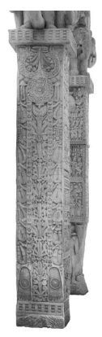

Dharma is obvious.71 In this way, in an aniconic setting footprints marked with a wheel are about the most simple and straightforward way to go about conveying the sense of the Buddha's presence, as well as to invite expressions of devotion. Needless to say, such a wheel would not have to be one with a thousand spokes, as mentioned earlier, as this aspect only appears to have entered the scene, so to say, when textual descriptions copied the description of the wheel from the *cakravartin* myth.

The footprints from Sāñcī on the cover of this book are located on the bottom part of the gateway pillar (see figure 3) and thus in a position that to some extent mirrors the place of the feet of the Buddha to whom one pays worship.72 Of relevance to the act of paying one's respects to the Buddha is also a feature of textual descriptions of his thirty-two marks, Figure 3 Footprints with Wheel
―――――― 71 Niwa 1992: 29 explains the reasoning he considers to stand behind marking the Bud-dha's footprints with wheels as follows: "these are the footprints of Buddha; of course they are different from the average person's … [thus] the dharma-cakra was inscribed to make their meaning perfectly clear."
72 Courtesy of Jinah Kim. Chutiwongs 1990: 61 comments on slabs with footprints in general that "the worship given to these objects conforms to the traditional Indian way of paying humblest respect and devotion by … worshipping the feet of the venerated personage … a number of such slabs … have been found near the entrance to stupa-precincts and it is probably (sic) that devotees were meant to pay their homage to them on entering and leaving the sacred areas." Niwa 1992: 12 describes how "to worship before an imprint of the Buddha's feet, believers kneel and touch their heads to the stone."
which I examine in more detail in the next chapter, namely that in the 

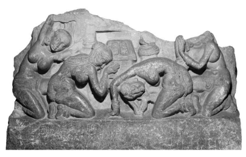

early discourses such descriptions proceed from the feet to the head.73 A 
poetic description of female beauty in the *Therīgāthā* instead starts with the head.74 The order adopted for descriptions of the Buddha's thirtytwo marks might reflect the idea that the marks are being discerned by those who have come close to pay their respects at his feet and who naturally start off such discerning with the feet right in front of them.75 That an invitation to pay one's respects is indeed one of the intended functions of footprints with wheels in art can be seen, for example, in the relief from Amarāvatī on the previous page (figure 4), which shows the seat of awakening surrounded by worshippers; the footprints found in front of the seat carry wheel-marks.76 Another image from the same location brings out this dimension with even more clarity, since here the footprints are the main object of worship.77

Based on the above discussion, the following hypothetical reconstruction suggests itself regarding the evolution of textual descriptions in early discourse literature of the footprints of a Buddha: 
The discourse to Droṇa would originally have been concerned only with the Buddha's footprints as such, whose sublime nature attracted the attention of the brahmin protagonist. In the aniconic period of Indian art, a footprint adorned with a wheel would have served as a convenient marker of the Buddha's presence (or the presence of his absence) and as a focus for devotion. Such depictions seem to have influenced textual accounts, which apparently took over the existing description of a cakra-*vartin*'s wheel-treasure with a thousand spokes, reflecting the thousand shining rays of the sun, and applied this description to the Buddha's footprints. 

From having examined the development of the conception of the footprint, in the next chapters I turn to the corresponding sole of the Buddha's foot in order to contextualize the hypothesis formulated above. 

## 2 A Vision Of The Thirty-Two Marks 2.1 Introduction

In this chapter I examine descriptions of the Buddha's feet within the standard context of listings of the thirty-two physical marks, *lakṣaṇa*, of a *mahāpuruṣ*a, so as to contextualize my suggestion in the previous chapter that the idea of a wheel-mark would be the result of visual depictions influencing textual accounts. For a study of the thirty-two marks I turn to the discourse on Brahmāyus, which is extant in the following versions: 
- a Pāli version in the form of the Brahmāyu*-sutta* located in the Chapter on Brahmins of the Theravāda Majjhima-*nikāya* collection;1
- a Chinese parallel entitled Discourse to Brahmā[yus] and found in the Chapter on Brahmins in the Madhyama-*āgama* (T 26), which can probably be assigned to the Sarvāstivāda tradition;2
- another Chinese discourse parallel preserved as an individual translation under the title Discourse to Brahmāyus (T 76).3 The narrative setting of the Brahmāyu*-sutta* and its parallels is an examination of the Buddha undertaken by the brahmin student Uttara at the behest of his teacher Brahmāyus. In what follows, I translate the part of the Madhyama-*āgama* version that begins with Brahmāyus telling his student about the Buddha and ends with the report given by Uttara to his teacher that the Buddha indeed possesses these thirty-two marks.4 In order to avoid tiring the reader, I abbreviate parts that merely repeat what has already been described. 

The actual listing of the marks in the Madhyama-*āgama* version also contains a repetitive element which I do not abbreviate.5 The description of each mark concludes with the proclamation that the Buddha, who is referred to as "the recluse Gautama", is a great man. Such emphatic repetition would have quite an impact in an oral setting, driving home again and again the main message that underlies the whole concern with these marks, and by dint of repetition making it easy for the audience to keep this crucial statement well in mind. 

[The brahmin said]: "Uttara, [I heard] that the recluse Gautama is endowed with the thirty-two marks of a great man. If someone is endowed with the marks of a great man, there are certainly two possibilities, which are true and not false. 

"If he stays in the home life, he will certainly become a wheelturning king, intelligent and wise, possessing a fourfold army to reign over the whole world, at his ease and unimpeded. Being a righteous king according to Dharma, he will acquire the seven treasures. These seven treasures are: the wheel-treasure, the elephant-treasure, the horse-treasure, the jewel-treasure, the womantreasure, the steward-treasure, and the general-treasure - these are reckoned to be the seven. 

"He will possess a thousand sons, handsome, brave, fearless, and able to overcome the troops of others. He will certainly rule over this whole earth, as far as the great ocean, without relying on sword or club, just by teaching the Dharma; bringing peace and happiness. 

"If [however] he shaves off his hair and beard, dons the ochre robes, leaves home out of faith, and goes forth to train in the path, he will certainly become a Tathāgata, free from attachment and fully awakened. His fame will spread and be known throughout the ten directions.6
―――――― 5 A comparable statement can be found at the beginning and end of the list in MN 
91 at MN II 136,7 and 137,10, apparently to be supplemented for each mark during oral recitation, whereas T 76 at T I 883c23 just lists the marks as such.

6 Instead of a reference to the Buddha's fame spreading in the ten directions, MN 91 at MN II 134,28 notes that he will withdraw the veil (of ignorance) from the world. 

"Uttara, you have received and retained the *sūtra*s on the thirtytwo marks of a great man.7 If someone acquires the marks of a great man, there are certainly two possibilities, which are true and not false …"8[685c]
Uttara replied: "Yes indeed, honourable sir,9 I have received and retained the *sūtra*s on the thirty-two marks of a great man. If someone acquires the marks of a great man, there are certainly two possibilities, which are true and not false …" 
The brahmin Brahmā[yus] said: "Uttara, approach the recluse Gautama and examine whether the recluse Gautama is like this or is not like this. Does he truly have the thirty-two marks of a great man?"
Having heard this, the young brahmin Uttara paid homage with his head at the feet of the brahmin Brahmā[yus], circumambulated him three times, and left.10 He approached the Buddha, exchanged polite greetings, sat back to one side, and examined the Blessed One's body for the thirty-two marks. He saw that the Blessed One's body had thirty of the marks. He was in doubt about two of the marks: that which is concealed being [like] the hidden [parts] of a horse and the long wide tongue.11 The Blessed One thought: "This Uttara is examining my body for the thirty-two marks. He sees that it has thirty of the marks. He is in doubt about two of the marks: that which is concealed being 
[like] the hidden [parts] of a horse and the long wide tongue. Let me now remove his doubt …"12 Then the Blessed One performed an appropriate psychic feat. 

The appropriate psychic feat having been performed, the young brahmin Uttara saw that the Blessed One's body had that which is concealed [like] the hidden [parts] of a horse and that his tongue was long and wide. On being extended from the mouth, the long wide tongue completely covered [any spot on] the face.13 Having seen it, the young brahmin Uttara thought: [686a] "The recluse Gautama has acquired the thirty-two marks of a great man. If someone acquires the marks of a great man, there are certainly two possibilities, which are true and not false …"14 The young brahmin Uttara further thought: "Let me now closely examine his bearing and decorum, and examine the inclinations of his behaviour." Then the young brahmin Uttara closely followed the Buddha's activities. For the four months of the summer he examined [the Buddha's] bearing and decorum, and examined the inclinations of his behaviour.15 The four months of the summer having passed, the young brahmin Uttara was pleased with the Blessed One's bearing and decorum and with the inclinations of [the Buddha's] behaviour he had examined. He said: "Gautama, I now have matters [to attend to]. I wish to return and request to take my leave."
16 seat, circumambulated [the Buddha] three times, and left. He approached the brahmin Brahmā[yus]. He paid homage with his head at the feet of the brahmin Brahmā[yus] and sat back to one side.

The brahmin Brahmā[yus] asked him: "Uttara, is it true what I 
have heard about the great reputation of the recluse Gautama that has spread in the ten directions? Is he like this or is he not like this? Does he truly have the thirty-two marks of a great man?"
The brahmin youth Uttara replied: "Indeed, honourable sir, it is true what you have heard about the great reputation of the recluse Gautama that has spread in the ten directions. The recluse Gautama is like this and he is not unlike this. He truly has the thirty-two marks of a great man. 

1)17"Honourable sir, the recluse Gautama stands with feet wellplaced.18 Honourable sir, this is reckoned a mark of a great man; the recluse Gautama is a great man. 

2) "Again, honourable sir, on the soles of the feet of the recluse Gautama a wheel has manifested, a wheel that has a thousand spokes, all complete.19 Honourable sir, this is reckoned a mark of a great man; the recluse Gautama is a great man. 

3) "Again, honourable sir, the toes of the recluse Gautama are long and slender. Honourable sir, this is reckoned a mark of a great man; the recluse Gautama is a great man. 

4) "Again, honourable sir, [686b] the recluse Gautama's feet are straight all around. Honourable sir, this is reckoned a mark of a great man; the recluse Gautama is a great man. 

5) "Again, honourable sir, the heels and ankles of the recluse Gautama are evenly filled on both sides. Honourable sir, this is reckoned a mark of a great man; the recluse Gautama is a great man. 

6) "Again, honourable sir, both ankles of the recluse Gautama are balanced. Honourable sir, this is reckoned a mark of a great man; the recluse Gautama is a great man. 

7) "Again, honourable sir, the body-hairs of the recluse Gautama turn upwards. Honourable sir, this is reckoned a mark of a great man; the recluse Gautama is a great man. 

8) "Again, honourable sir, the recluse Gautama has webbed hands and feet, like a king of geese.

20 Honourable sir, this is reckoned a mark of a great man; the recluse Gautama is a great man. 

9) "Again, honourable sir, the hands and feet of the recluse Gautama are superbly tender and soft like cotton flower.21 Honourable sir, this is reckoned a mark of a great man; the recluse Gautama is a great man. 

10) "Again, honourable sir, the skin of the recluse Gautama is soft and fine; dust and water do not adhere to it.22 Honourable sir, this is reckoned a mark of a great man; the recluse Gautama is a great man. 

11–12) "Again, honourable sir, the recluse Gautama has each hair singly, each single hair on his body has each a single pore, and each hair, being of a dark blue colour, grows by curling to the right like a spiral shell. Honourable sir, these are reckoned marks of a great man; the recluse Gautama is a great man. 

13) "Again, honourable sir, the thighs of the recluse Gautama are like those of a king of antelopes. Honourable sir, this is reckoned a mark of a great man; the recluse Gautama is a great man. 

14) "Again, honourable sir, of the recluse Gautama that which is concealed is [like] the hidden [parts] of a horse; it is like that of an excellent king of horses.23 Honourable sir, this is reckoned a mark of a great man; the recluse Gautama is a great man. 

15) "Again, honourable sir, the bodily shape of the recluse Gautama is well rounded, rounded above and below in proper proportion, like a Banyan tree.24 Honourable sir, this is reckoned a mark of a great man; the recluse Gautama is a great man. 

16) "Again, honourable sir, with his body not being bent and standing erect the recluse Gautama can touch his knees with his hands, without bending his body. Honourable sir, this is reckoned a mark of a great man; the recluse Gautama is a great man. 

17) "Again, honourable sir, the body of the recluse Gautama is of a golden-coloured hue, like polished gold. Honourable sir, this is reckoned a mark of a great man; the recluse Gautama is a great man. 

18) "Again, honourable sir, the body of the recluse Gautama is complete in the seven parts. The seven complete parts are the two hands, the two feet, the two shoulders, and the neck. Honourable sir, this is reckoned a mark of a great man; the recluse Gautama is a great man. 

19) "Again, honourable sir, the upper part of the recluse Gau-tama's body is large like that of a lion. Honourable sir, this is reckoned a mark of a great man; the recluse Gautama is a great man. 

20) "Again, honourable sir, the recluse Gautama is lion-jawed. 

Honourable sir, this is reckoned a mark of a great man; the recluse Gautama is a great man. 

21) "Again, honourable sir, the recluse Gautama has an evenly straight spine and back. Honourable sir, this is reckoned a mark of a great man; the recluse Gautama is a great man. [686c]
22) "Again, honourable sir, the two shoulders of the recluse Gautama are connected with the neck evenly and fully. Honourable sir, this is reckoned a mark of a great man; the recluse Gautama is a great man. 

23–26) "Again, honourable sir, the recluse Gautama has forty teeth,25 which are even,26 his teeth are not widely spaced, his teeth are white, his teeth are adjacent, and his taste [buds] are foremost in [the ability] to taste. Honourable sir, these are reckoned marks of a great man; the recluse Gautama is a great man. 

27) "Again, honourable sir, the recluse Gautama has the en-dearing voice of a Brahmā with a sound like that of a cuckoo.27 Honourable sir, this is reckoned a mark of a great man; the recluse Gautama is a great man. 

28) "Again, honourable sir, the recluse Gautama has a long wide tongue. When he extends this long wide tongue from his mouth, the tongue [can] cover every spot on his face.28 Honourable sir, this is reckoned a mark of a great man; the recluse Gautama is a great man. 

29) "Again, honourable sir, the eyelashes of the recluse Gautama are full, like those of a king of cows. Honourable sir, this is reckoned a mark of a great man; the recluse Gautama is a great man. 

30) "Again, honourable sir, the eyes of the recluse Gautama are of dark blue colour. Honourable sir, this is reckoned a mark of a great man; the recluse Gautama is a great man. 

31) "Again, honourable sir, the recluse Gautama has on the crown of his head a fleshy topknot that is round and in proportion,29 with the hairs curling to the right. Honourable sir, this is reckoned a mark of a great man; the recluse Gautama is a great man. 

32) "Again, honourable sir, between the eyebrows of the recluse Gautama white hair grows that curls to the right. Honourable sir, this is reckoned a mark of a great man; the recluse Gautama is a great man. 

"Honourable sir, the recluse Gautama has acquired the thirtytwo marks of a great man. If someone acquires the marks of a great man, there are certainly two possibilities, which are true and not false …"30

## 2.3 The Webbed Feet And The Protuberance

My suggestion in the previous chapter that the idea of a wheel-mark on the Buddha's feet would be the result of visual representations influencing textual accounts has a precedent in suggestions by other scholars of similar influence in the case of other marks. One of these cases also concerns the nature of the Buddha's feet, along with his hands, namely that they are "netted" or "webbed", which the Madhyama-*āgama* discourse translated above compares to those of a goose (a comparison not found in the parallels, where the idea of webbed hands need not yet carry the significance that it acquires with this comparison). The image of a goose gives the impression that the description in this version, or at least the understanding of the translator(s) or the scribe(s) involved in rendering the discourse into Chinese, concerns some sort of skin con-nection between the Buddha's toes as well as his fingers.

The Pāli commentary argues that this characteristic should not be taken literally, given that according to the Pāli *Vinaya* someone whose toes or fingers are webbed together should not be given the going forth.31
―――――― 29 T 76 at T I 884a9 adds that this fleshy protuberance shines with light such that it holds in check the (light of the) sun and interrupts that of the moon. 

30 The text repeats the full description of the two destinies. 31 Ps III 376,17; the regulation is found in Vin I 91,11. Horner 1957/1970: 321 note 2 reasons that "a person whose fingers are 'webbed' … is not even fit to go forth … so how could a 'webbed finger' be a mark of a Great Man?" For symbolic inter-
In view of such a regulation it would indeed be curious for the Buddha to be depicted with the same physical abnormality. 

According to the **Mahāprajñāpāramitopadeśa*, this characteristic is only visible when the fingers are stretched apart.32 This indication leaves open the possibility that perhaps at some stage the idea of this mark was related to the skin at the base of the fingers, which in the case of a Buddha was presumably held to be in some way distinct from that of average human beings.33 Scholars studying ancient Indian art have suggested an explanation according to which the idea of actually webbed fingers or toes, implicit at least when this mark is compared to a goose, might have been inspired by Buddha statues, as sculptors tend to weld fingers and toes together so that they do not break off.34 This can be seen, for example, in the case of 

a Sārnāth sculpture of the Buddha, (see figure 5) where the right hand clearly shows the tendency to connect the fingers, as well as documenting the fact that nevertheless these tend to break off.35 Another example for the apparent influence of art is the description in the Madhyama-*āgama* discourse translated above that the Buddha had "on the crown of his head a fleshy topknot that is round and in proportion". This has its counterpart in the Brahmāyu*-sutta* in the Pāli expression u*ṇhīsasīso*, 
which presumably qualifies the head as being (shaped like) a turban. 

Scholars of Indian art have argued that this feature is best appreciated in the light of a tendency in ancient Indian art to portray gods and spiritual teachers with long hair, often worn in a topknot, independent of the actual appearance of these teachers.36 Figure 5 Buddha with Webbed Hand 54 Buddhapada and the Bodhisattva Path Even Jain saints are depicted with hair, although this stands in contrast to the literary sources of the Jain tradition, according to which they plucked out their hair when going forth.37 An example of this feature on a Buddha statue can be seen in the next chapter, figure 8.38 This mode of depiction in ancient Indian art would then presumably have influenced understandings of this physical mark of the Buddha reflected in textual accounts, eventually resulting in the idea that he had an actual protuberance on his head.39 The Madhyama-*āgama* discourse translated above refers to this mark as a "fleshy topknot", a translation also found in a D*īrgha-āgama* discourse to which I turn in chapter 3.40 The terminological choice of the translators into Chinese is in line with the suggestion by scholars of ancient Indian art that the idea of a protuberance would have had its origin in the depiction of a topknot. Cosmological understandings of the protuberance as representing the *axis mundi*, proposed by some scholars,41 would then presumably be a secondary aspect of the development under discussion.42 

## 2.4 The Buddha'S Footprints On The Stairs From Heaven

A process of cross-fertilization between text and art can also be seen in relation to another episode whose artistic depiction involves the Bud-dha's footprint.43 The episode in question describes the Buddha's return from a prolonged stay in the Heaven of the Thirty-three. A description of this descent in a Saṃyukta-*āgama* discourse just mentions that "the Blessed One came down from the Heaven of the Thirty-three to the city of Sāṃkāśysa in Jambudvīpa, to the foot of the Udumbara tree."44 A 
version of this episode in the Sanskrit and Tibetan texts of the Avadāna-ś*ataka* is similarly brief and does not provide further details.45 A range of other sources depicts the construction of three stairs, so that the Buddha could descend the middle flight of stairs, flanked by Brahmā and Śakra on each side.46 Some textual accounts then show signs of struggling with what they apparently perceive as problematic, namely why the Buddha needs stairs to descend from heaven, given that he earlier reached it easily with the help of his supernormal abilities.47 A version of the episode in the Ekottarika-*āgama* brings in Śakra, who has stairs constructed so that the Buddha need not employ supernormal means for his descent.48 Another version in the Mūlasarvāstivada *Vinaya* goes a step further in the same direction, as here Śakra first enquires from the Buddha whether he will descend to Jambudvīpa by supernormal means or on foot.49 The Buddha opts for the latter, which then motivates Śakra to have stairs built. In the Mūlasarvāstivada *Vinaya*

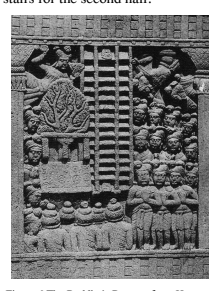

the Buddha then reflects that non-Buddhists might think he has lost his abilities, which motivates him to descend halfway to Jambudvīpa by supernormal means and only use the stairs for the second half.50 The solution for understanding the introduction of the stair motif into the tale of the Buddha's sojourn in the Heaven of the Thirtythree can be found by turning to art. In aniconic portrayal, the most convenient way to convey the idea of a descent is by depicting a flight of stairs with footsteps. An example is the middle one of three panels on a Bhārhut relief on the so-called Ajātaśatru Pillar (see figure 6), de-picting the Buddha's descent from the Heaven of the Thirty-three. The middle flight of the three stairs depicts the Buddha's footsteps on the first and last step.51 Figure 6 The Buddha's Descent from Heaven Once such depictions had come into existence, this would in turn have influenced textual accounts, even though the resultant motif of stairs was felt within the tradition as not natural, leading to attempts at explanation. 

In this way a cross-fertilization between text and art results in a literal reading of what in its inception would have had only a symbolic function. 

Such literal reading is evident in the descriptions given by the pilgrims Fǎxiǎn (法顯) and Xuánzàng (玄奘) of the remains of the stairs that were believed to have been used by the Buddha on this occasion.52 The above examples are in line with my earlier hypothesis in relation to the wheel on the Buddha's feet and footprints, in that the suggestion that textual descriptions could have been influenced by art has longstanding precedents.53 Except for the welding together of fingers and toes, which could only have happened once sculptural representations of the Buddha had come into existence, such influence could in principle already have taken place at an earlier time with visual presentation of a canvas type, carried around to deliver teachings.54

## 2.5 The Buddha'S General Appearance

This makes it safe to conclude that the textual sources did not envisage the Buddha as having had long hair.58 Had he had long hair, or some sort of a protuberance, this would of course have made him easily distinguishable from his shaven-headed monastic followers. In order to explore this further, other early discourses can be consulted to ascertain whether the Buddha was considered to have had physical peculiarities of a type that would have made him easily distinguishable from others. 

Several *Vinaya*s report that other monks, on seeing the monk Nanda arrive, mistook him for being the Buddha.59 According to the Sāmañña-*phala-sutta* and its Dīrgha-*āgama* parallel, a king who had come for a visit on a clear full-moon night was unable to recognize the Buddha from among a congregation of Buddhist monks, and needed to be told who of those seated was the one he wished to meet.60 These passages depict the Buddha as looking similar to other monks and thereby without any self-evident externally visible characteristic that would make it easy to distinguish him. 

The Cūḷ*agosinga-sutta* and the *Upakkilesa-sutta*, together with their parallels, report that the guardian of a park did not recognize the Buddha and tried to stop him from entering the park in which three Buddhist monks were dwelling, clearly not realizing that he had their teacher in front of him.61 In the Dhātuvibhaṅ*ga-sutta* and its parallels a Buddhist monk does not recognize the Buddha, who has come to stay in the same place as himself.62 He only finds out that he is in the presence of his teacher on receiving a long instruction from the Buddha. None of these instances gives the impression that the Buddha was held to have had easily recognizable physical features, such as a protuberance on his head, or being the only one in Buddhist monastic robes with long hair, worn in a topknot, or else having some other distinct physical abnormality. 

This in turn points to a need to reflect on how literally the depiction of the thirty-two marks should be taken.

Besides these passages related to the Buddha, of relevance here could also be that a wheel-turning king is held to be endowed with the same thirty-two marks. Nevertheless, descriptions of the arising of the wheel-treasure are usually accompanied by reporting the king's reflection that this signifies that he is indeed a wheel-turning king (as in the passage translated in the previous chapter).63 The depiction of such a reflection is less natural if since his birth a wheel-turning king was held to have had such evident physical marks as to make it clear that, unless he were to go forth, he must become a wheel-turning king. In other words, from the viewpoint of such passages even the one endowed with these marks, who in other respects is shown to be well acquainted with what it takes to be a wheel-turning king, does not recognize them with sufficient certainty to be sure about his own future destiny. It is only when the wheel-treasure and the other treasures manifest that his status as a wheel-turning king similarly becomes manifest. 

The marks are also not recognized by those who are on record for encountering the recently awakened Buddha. The Ariyapariyesanā*-sutta* and its Madhyama-*āgama* parallel report that the five companions of the bodhisattva Gautama during his ascetic practices, who had left him when he gave up fasting, did not believe the Buddha's claim that he had reached full awakening and needed quite a lot of convincing to accept it.64 Had these texts considered him to have easily recognizable physical marks, whose import as marking him off for being destined to become a wheel-turning king or a Buddha was generally known, the idea of such convincing would be less probable. Given that he had gone forth and thus eschewed the career of a wheel-turning king, recognizing those characteristics should have enabled his five former companions to be certain that this person must be destined to become a Buddha. The same holds for an encounter with the wanderer Upaka reported a little earlier in the same discourses, who similarly is shown to express his lack of belief in the Buddha's claim to be a fully awakened one and in fact just walks off.65 In sum, however hyperbolically described, the thirty-two marks must originally have been conceived of as subtle and refined nuances.66 Their description is probably best understood in the same way as an English expression that describes a human body as "in the bloom of youth", for example. Such an expression uses the motif of a blooming flower in a symbolic sense and does not signify that the stages of growth of a flower should be applied literally to a human being, that the body in question is growing petals. In the same way, plant and animal motifs in the description of the thirty-two marks are best read as comparisons whose purpose is to illustrate what were considered to be subtle nuances of the body of the Buddha when compared to other human bodies. 

The fact that some of these marks are hard to make sense of in the way their description has come down to us needs be considered in the light of the apparent cross-fertilization between art and text. Just as a textual description of a wheel with a thousand spokes on the foot or footprint of a Buddha becomes meaningful once the perspective of ancient Indian art is taken into account, so too the description of other marks are probably best understood as the result of an evolutionary process that, as far as the sources enable us to judge, would have had as its starting point a description with symbolic intent, in the sense of illustrating mere physical nuances. 

## 2.6 The Significance Of The Thirty-Two Marks

The suggestion that the original conception of the thirty-two marks concerned only nuances also emerges from the Brahmāyu*-sutta* and its parallel in the Madhyama-*āgama*. Both introduce Uttara's ability to recognize the thirty-two marks as a special knowledge that he had learned,67 which of course would not be needed if these were plainly evident physical characteristics. After having ascertained that the Buddha is indeed endowed with these thirty-two marks, Uttara still keeps following the Buddha to observe his conduct for several months, conveying the impression that he wanted further confirmation. 

If to recognize these thirty-two marks requires previous training and close scrutiny, it follows that, at least in the way these marks were conceived of at the time of these discourses, they could not have been considered to be easily visible physical marks. Instead, they are presented as perceptible only to a keen observer who has been trained in the art of detecting them, which would not be needed for abnormal physical marks that are so plainly evident that one cannot fail to notice them.68 In relation to the footprint in the discourse to Droṇa, the general impression that in the thought-world of the early discourses the marks are not self-evident and require training in order to be detected offers support for the hypothesis that at an early stage the description of the Bud-dha's footprint did not yet include any special visible marks that would have rendered it easily recognizable. Instead, his footprints would at first have been conceived of as being in their entirety of a sublime nature such that someone trained in the lore of interpreting physical marks, like the brahmin protagonist of the discourse, was able to discern their special nature. In line with their depiction in art, the extraordinary nature of the foot of a Buddha eventually would have found expression in visible markings on his soles and consequently in his footprint. 

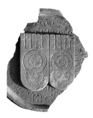

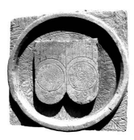

A example can be seen in the two sets of footprints in figure 7 from Kanaganahalli where, in addition to the wheel, the omega-motif together with a lotus is depicted on the heel and the big toe, and *svastika*s are shown on the other toes.69

## 2.7 The Thirty-Two Marks As Brahminical Lore

Another point that also emerges from the above is that the discourse to Droṇa and the Brahmāyu*-sutta*, together with their respective parallels, present the science of the footprint or else of the thirty-two marks as brahminical lore. From their perspective, such concern with physical marks is characteristic of brahmins.70 This attribution does not seem to carry any negative evaluation, however. In the Brahmāyu*-sutta* and its parallels recognition of the thirty-two characteristics has the function of inspiring Brahmāyus with sufficient confidence in the Buddha to bring about his successful conversion. Just as was the case with Droṇa, so too in relation to Brahmāyus the Buddha is shown to build on his visitor's understanding of the significance of physical marks in such a way that the brahmin also realizes the importance of the mental qualities of an awakened one. The same basic procedure can again be seen, for example, in the *Selasutta* and its Ekottarika-*āgama* parallel, where the brahmin protagonist of this episode also ascertains that the Buddha possesses the thirty-two marks, and this then leads to his conversion.71 The relevant part from the Ekottarika-*āgama* version proceeds as follows, starting with the moment when the brahmin has decided to examine if the Buddha has the thirty-two marks:72
"Chaste and pure, it is concealed [like] the hidden [parts] of a horse, That mark is very difficult to come to know. 

Do you have a broad and long tongue, With which it is possible to lick the ears and cover the face? 

"I wish you would stretch out your broad and long tongue, Let me be without doubt! Let me see it! 

I will forever be without the bond of doubt and disappoint-ment."74 Then the Blessed One stretched out his tongue, licked his left and right ears, and then withdrew it again.75 Then the Blessed One entered into concentration to allow the brahmin to see that what is concealed is [like] the hidden [parts] of a horse.76 Then the brahmin saw that the Buddha had the thirty-two marks and the eighty secondary characteristics,77 and he was delighted and thrilled, unable to contain himself. 

In agreement with its Pāli parallel, the Ekottarika-*āgama* version reports that, having in this way verified the Buddha's possession of the thirtytwo marks, Śaila, together with his following of students, decided to go forth under the Buddha and all of them eventually became arhats. 

In the case of Brahmāyus, after ascertaining the Buddha's possession of the thirty-two marks and receiving a teaching, the brahmin is portrayed as being so moved that he publicly expresses his veneration. In the Madhyama-*āgama* version Brahmāyus gets up and tries to pay his respects to the Buddha. According to the Majjhima-*nikāya* account he goes so far as to kiss and caress the Buddha's feet. In the individual translation he does the same and moreover sheds tears and proclaims his taking of refuge.78 The three versions agree that the public display of humility by the eminent brahmin Brahmāyus causes amazement among the assembled congregation. Clearly the thirty-two marks have a central role to play in such dramatic depictions of the conversion of brahmins. 

Just as with Brahmāyus, in the case of Śaila, too, the Buddha cooper-ates with the respective brahmin's investigation of his physical form by displaying on purpose the two marks that require such cooperation, his tongue and his genitals. Such concerns are not brushed off as misguided, but rather are made use of so as to enable these brahmins to gain faith.79 The same nuance emerges from the *Mahāvastu*'s report that, when the bodhisattva was about to be born, the *deva*s of the Pure Abodes taught the thirty-two marks to brahmins in order to enable them to recognize the bodhisattva.80 A comparable suggestion can also be found in the Pāli commentarial tradition.81 In the prologue to the Pārāyana*-vagga* the Buddha himself diagnoses the marks of others. A brahmin has sent his students to meet the Buddha. 

They ask how they are to recognize whether the one they are going to meet is indeed a Buddha. After referring to the thirty-two marks, the brahmin tells his students that they should formulate several questions in their minds to see if the Buddha telepathically understands those questions and is able to reply to them. 

As a side note related to the main topic of Buddhapadas it is worth mentioning that, according to the commentary, on arrival at Jeta's Grove the brahmin students find that the Buddha has left. Nevertheless, the footprints left by the Buddha serve to convince them that their owner must be a Buddha indeed.82 Returning to the main plot, one of the questions the students are to ask telepathically concerns the brahmin's own marks. When they do so, once they have met the Buddha, he of course understands the question and answers correctly. On being requested telepathically to do so, the Buddha elaborates on the three marks which the brahmin possessed, namely his long tongue, the hair between his eyebrows, and the nature of his private parts.83 Rather than conveying a negative attitude towards concern with the marks, this passage shows the Buddha surpassing brahmins in this lore. 

Without ever having had a personal meeting, the Buddha knows which marks this brahmin has, two of which brahmins are unable to ascertain on their own even when they are in the presence of the Buddha. 

The function of the thirty-two marks as a means to inspire brahmins with faith recurs also in a different mode in other discourses, such as, for example, the Soṇadaṇḍ*a-sutta* and the Kūṭ*adanta-sutta* as well as their *Dīrgha-āgama* parallels. In both cases an eminent brahmin wishes to visit the Buddha. He is stopped by other brahmins with the argument that it is beneath his dignity to visit the Buddha. In support of their contention, the other brahmins list various outstanding qualities of the eminent brahmin, among which features his ability to recognize the thirtytwo marks.84 Since he is such an eminent brahmin, the other brahmins think that Gautama should rather come to visit him. The eminent brahmin then replies with a list of the qualities of the recluse Gautama, which explicitly mentions the Buddha's possession of the thirty-two marks. The relevant passage in the Dīrgha-*āgama* proceeds as follows: 
The recluse Gautama is completely endowed with all of the thirtytwo marks. It is proper for me to approach one who is accomplished in this quality, it is not proper for him to come here.85 With this and other arguments, the eminent brahmin successfully convinces the other brahmins that it is indeed quite appropriate for him to visit the Buddha. This episode further confirms the role of the thirty-two marks in the early discourses in serving as a means of inspiring faith in brahmins and making them feel that it is not beneath their dignity to pay a visit to the Buddha. 

The instances surveyed above follow the basic pattern already evident in the Discourse to Droṇa, where discerning an aspect of the ex-traordinary nature of the Buddha's physique sets the stage enabling the Buddha to disclose what from his viewpoint truly makes one a mahā-*puruṣa*, leading to the conversion of his brahmin interlocutor or, in some versions, even to his realization of a stage of awakening. 86

Similarly to the case of the wheel-mark on the soles of the Buddha, the descriptions of several of his other physical marks in the way they have come down to us appear to be the result of a process of cross-fertilization between text and art. In spite of the, at times, hyperbolic descriptions that result from this process, in the early discourses in general the Buddha is not presented as having easily recognizable physical features. 

This in turn implies that, at least at the stage in the evolution of Bud-
―――――― 85 DĀ 22 at T I 95b27 to 95b29, parallel to DN 4 at DN I 116,8. The other instance is DN 5 at DN I 132,18 and its parallel DĀ 23 at T I 98b1; another such case can be found in MN 95 at MN II 167,18. In relation to DN 4, DN 5, and MN 95, I have not been able to identify a corresponding passage in the Sanskrit fragment parallels. In the case of the relevant part in the fairly well-preserved Kūṭatāṇḍya-*sūtra* fragments, folio 402r2f, von Criegern 2002: 29, the passage on the qualities of the brahmin and the Buddha is unfortunately abbreviated. 

86 Cf. above p. 23. 

dhist thought reflected in these discourses, the thirty-two marks were conceived of as subtle and refined nuances whose identification requires training in the lore of the lakṣaṇas. 

The same texts present the lore of the *lakṣaṇa*s as laudable qualities of a learned brahmin and consider concern with the thirty-two marks as characteristic of brahmins. Nevertheless, such concerns do not receive criticism or censure. Instead, the thirty-two marks are readily made use of as a tool by means of which brahmins can be convinced to have faith in the Buddha, so that they become willing to learn from him. Although this seems to be the prevalent import of the thirty-two marks, in a few instances a tendency can be discerned that more firmly incorporates these marks into Buddhist lore. I examine such incorporation in the next two chapters. 

# 3 The Great Lineage Of Buddhas

## 3.1 Introduction

The discourses involving Droṇa and Brahmāyus, as well as several other early discourse passages, present an investigation of the footprint or of all the thirty-two marks as a brahminical concern, serving to inspire eminent brahmins to approach the Buddha and lend an ear to his teachings. Although this is a recurrent theme, it is not the only voice that makes itself heard in the early discourses on the topic of these marks. 

A distinctly Buddhist employment of the thirty-two marks emerges in the *Mahāvadāna-sūtra* and its parallels, whose main topic is to pre-sent a genealogy of Buddhas from Vipaśyin to Gautama. The main versions of the discourse that also feature a description of the soles of the feet and the other marks of a Buddha are as follows: 
- the *Mahāvadāna-sūtra* extant in Sanskrit fragments from a Sarvāstivāda/Mūlasarvāstivāda *Dīrgha-āgama*;
1
- the Mahāpadāna*-sutta* in the Great Chapter of the Theravāda Dīgha-*nikāya*;
2
- the Discourse on the Great Ancestry, the first discourse in the Chinese translation of a Dharmaguptaka *Dīrgha-āgama* (T 1).3 An additional parallel is a discourse preserved individually in Chinese, although this version does not give any details on the thirty-two marks and thus also has no description of the nature of the foot of a Buddha.4 The significance for tradition of the genealogy of Buddhas presented in the Mahāvadāna-*sūtra* and its parallels can be seen in the pride of place accorded to this exposition in each of the three reciter-traditions. The Mahāpadāna*-sutta* is the first discourse in the Great Chapter of the Dīgha-nikāya, which according to a recommendation given in the Sa-*mantapāsādikā* is the one that should be learned first of the three chapters of the entire discourse collection.5 The Suma*ṅgalavilāsinī* refers to the Mahāpadāna*-sutta* as the "King of Discourses",6 thereby confirming the impression that the giving of pride of place to this discourse is not accidental, but would rather expresse a sense of its significance. 

In the case of the Dharmaguptaka *Dīrgha-āgama*, the corresponding discourse is the first of the entire *Dīrgha-āgama* and thereby the first of all discourses in the Dharmaguptaka *Āgama* collections.7 In the Mūlasarvāstivāda tradition(s), the *Mahāvadāna-sūtra* belongs to a set of six discourses that were at times handed down independently of the whole *Dīrgha-āgama* collection, clear evidence of the particular interest and appeal of the members of this group of discourses.8 Two of the remaining members of this group of six are of comparable orientation, in that they provide a history of the mission and decease of the Buddha Gautama (the Catuṣpari*ṣat-sūtra* and the Mahāparinirvāṇa-*sūtra*). The other three discourses are listings of doctrinal terms (the Daśottara-sūtra, the Arthavistara-*sūtra*, and the Saṅgīti-*sūtra*). 

―――――― 4 T 2 at T I 150a3 to 154b1; parallels to other parts of the discourse are T 3 and T 4. 

5 Sp IV 789,15. 6 Sv II 480,16 concludes its exegesis of DN 14 with the statement: *suttantarājā nāma* ayaṃ suttanto veditabbo. The conferring of this title is based on the supposed potential of the text to be expanded from three recital sections, *bhāṇavāra*, to 2,600 such *bhāṇavāra*s; von Hinüber 1996/1997: 118 note 416 sets this indication into context by noting that the entire *Dīgha-nikāya* collection amounts to sixty-four bhāṇavāras.

7 The Dharmaguptaka *Vinaya*, T 1428 at T XXII 968b19, mentions the *Dīrgha-āgama* in first place in its account of the compilation of the *Āgama*s.

8 The popularity of this group of six discourses has already been noted by Schling-loff 1962: 7; cf. also Skilling 1980: 30f and the discussion in Hartmann 1994 and 2014: 144–148. 

The significance of the *Mahāvadāna-sūtra* in the context of such a 

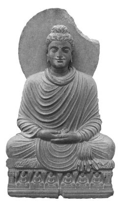

handy survey of the history and doctrine of Buddhism is to set the activities and teachings of the Buddha Gautama within a broader time frame by providing him with a lineage of predecessors. The same function also holds for the parallel versions. A depiction in Gandhāran art can be taken to convey this visually with the help of a seated Buddha on a pedestal that portrays another six seated Buddhas.9 As part of their project to present a lineage of seven Buddhas up to the Buddha Gautama, the *Mahāvadāna-sūtra* and its parallels reveal that, alongside individual differences, all past Buddhas had closely similar qualities and undertook the same fundamental actions as Gautama. This serves to endow the Buddha Gautama with the authentication of having had predecessors comparable to the tīrthaṅ*kara*s of the Jain tradition or the *paramparā* of Vedic sages of the brahminical traditions.10 It also puts into perspective the probably acutely felt sense of loss after Gautama's demise by making his life and teaching part of a natural law or pattern, dharmatā, thereby implicitly giving the assurance that the same law will continue and thus that there will be other Buddhas in the future. 

The *Mahāvadāna-sūtra* and its parallels proceed by first highlighting the individuality of the seven Buddhas, reporting their respective names, caste, and lifespan, the tree under which they were believed to have attained awakening, the names of their chief disciples and of their parents, etc. Following such individual information for each of the seven Buddhas, the *Mahāvadāna-sūtra* and its parallels embark on a more detailed de-scription of the first of these seven, the Buddha Vipaśyin, as an exemplification of what forms the *dharmatā* for all Buddhas, in the sense of what they all have in common. 

It is in the context of this description of the first of the seven Buddhas that the thirty-two marks occur. The Mahāvadāna-*sūtra* and its two parallels in the *Dīgha-nikāya* and the Dīrgha-*āgama* offer a detailed survey of the thirty-two marks, and thereby also of the feet of the previous Buddha Vipaśyin. The description of his foot and other marks forms part of an account that begins with the time of his conception. 

In what follows I translate the relevant part of the description of the Buddha Vipaśyin from the Chinese *Dīrgha-āgama* version, up to the reference to his feet.11 This description alternates between prose passages and verse repetitions of the prose portions, as is also the case for the Mahāvadāna-*sūtra*, whereas the corresponding part of the Pāli version is entirely in prose. The absence of a Pāli counterpart and the content of some of these verses give the impression that the prose part might be earlier than the verses.12 Given the apparent importance of this discourse, in an oral setting it would have been natural to add verse repetitions to an exposition given in prose. This would enable members of the audience, who might not all have been similarly proficient in the art of memorization, to bear in mind more easily the main points by way of hearing them twice and in two alternative modes. These two alternative modes leave it open to the listener to make an attempt to remember either prose or verse, according to personal predilection and ability. 

Since as a result of such concerns, reflecting an oral setting, the passage to be translated is somewhat long, readers preferring to avoid excessive repetition might skip the verses and just stay with the main prose text as sufficient for the ensuing discussion. 

The Buddha said to the monks: "Listen, listen, and pay proper attention to what I will analyze and explain to you. Monks, you should know that this is an unchanging law for all Buddhas:13
[When] the bodhisattva Vipaśyin descended from the Tuṣita Heaven into his mother's womb, he entered it from the right side,14 being with right mindfulness and without confusion. 

"Right at that time there was an earthquake and a great light illuminated the whole world, a great brilliance covered all the places where the sun and moon do not reach. Sentient beings in darkness were able to see each other and know the place where they had arisen. Then this brilliant light further illuminated Māra's palace, covering *deva*s, Śakra, Brahmā, recluses, brahmins, and other sentient beings with this great brilliance, concealing the natural radiance of all the *deva*s."
15 Then the Buddha spoke in verse: 
"[Just as when] dense clouds gather in the empty sky And a flash of lightning illumines the world, Similarly shone the brilliant light At Vipaśyin's descent into the womb.

"Nothing was not covered by the great light, [Even] places where the sun and moon do not reach. His abode in the womb was pure and undefiled. This is a law for all Buddhas, they are all like this."
[The Buddha said]: "Monks, you should know that this is an unchanging law for all Buddhas: When the bodhisattva Vipaśyin was in his mother's womb, [4a] he was with collected mindfulness and without confusion.16 Four *deva*s holding spears in their hands guarded his mother,17 and humans together with non-humans were not able to come near and disturb her.18 This is an unchanging law."
Then the Buddha spoke in verse: "Four *deva*s from the four directions, Renowned for their mighty virtue, Had been dispatched by Śakra, the ruler of the *deva*s To guard the bodhisattva well. 

"Continuously holding spears in their hands They protected him without leaving, [So that] humans and non-humans did not disturb him. 

This is an unchanging law for all Buddhas. 

"He was protected by the power of these *deva*s, Who were like a heavenly nymph's escort in heaven, Her entourage being thrilled with joy. This is an unchanging law for all Buddhas." Again he said to the monks: "This is an unchanging law for all Buddhas: [When] the bodhisattva Vipaśyin had descended from the Tuṣita Heaven into his mother's womb, with collected mindfulness and without confusion, his mother's body was at ease, without the many afflictions [of pregnancy]. With her increased wisdom the mother contemplated her own womb,19 where she observed the bodhisattva's body completely endowed with all faculties, like polished gold that is without contamination. It is as if a person with eyesight were to contemplate a pure beryl that is clear inside and outside, without the many obstructions.20 Monks, this is an unchanging law for all Buddhas."
Then the Blessed One spoke in verse: "Like a pure beryl gem, That is as bright as the sun and moon, Was the Benevolent and Honoured One's abode in his mother's womb, His mother not being afflicted. 

"With her wisdom being increased She saw him in her womb like a golden image, The mother being at ease in her pregnancy. This is the law for all Buddhas."
The Buddha said to the monks: "[When] the bodhisattva Vi-paśyin had descended from the Tuṣita Heaven into his mother's womb, with collected mindfulness and without confusion, his mother's mind was pure, without the many sensual perceptions, not heated up by the fire of sexuality.21 This is an unchanging law for all Buddhas."
Then the Blessed One spoke in verse: "[When] the bodhisattva dwelled in his mother's womb The *deva*s in heaven became endowed with good fortune. His mother's mind was pure,
―――――― 19 The parallels do not mention an increase of the mother's wisdom.

20 In DN 14 at DN II 13,20 and the Sanskrit fragment version, Waldschmidt 1956: 
85 (§4d2) or Fukita 2003: 58, the beryl is strung on a string; cf. also Or 15009/522 r4, Nagashima 2015: 359. On the beryl motif cf. also Anālayo 2010a: 29 note 47.

21 DN 14 at DN II 13,5 adds that the mother was also beyond becoming the object of the sensual desires of any man. 

Without the many sensual perceptions. 

"She relinquished all sexual desires, Not being defiled by them and not pursuing them. 

Not being burned by the fire of sensuality, This is the constant purity of the mothers of all Buddhas."
The Buddha said to the monks: "This is an unchanging law for all Buddhas: When the bodhisattva Vipaśyin had descended from the Tuṣita Heaven into his mother's womb, with collected mindfulness and without confusion, his mother reverentially kept the five precepts and pure celibacy, [4b] she was devoted and altruistic, accomplishing all that is wholesome, being at peace and fearless. 

On passing away, with the breaking up of the body, she was re-born in the Trāyastriṃśa Heaven.22 This is an unchanging law."
Then the Blessed One spoke in verse: "Bearing the body of the Honoured One among humans, Endowed with energy and virtue, Afterwards she certainly acquired a divine body, For this reason, she is called the mother of a Buddha." The Buddha said to the monks: "This is an unchanging law for all Buddhas: Right when the bodhisattva Vipaśyin was being born, he emerged from the right side [of his mother].23 There was an earthquake and a light illuminated everything, [as] earlier when entering the womb, covering all dark places with light. This is an unchanging law."
Then the Blessed One spoke in verse: "When the prince was born the earth quaked And a great light shone forth In this world and other worlds, Above and below, together with all directions. 

"Because the emitted light bestowed its purity24 Completely among those with a divine body, By way of rejoicing with their clear voices, They passed on the praise of the bodhisattva's name."
The Buddha said to the monks: "This is an unchanging law for all Buddhas: Right when the bodhisattva Vipaśyin was born and emerged from the right side [of his mother], with collected mindfulness and without confusion, at that time the bodhisattva's mother held on to the branch of a tree with her hand;25 she did not sit and did not lie down. Then four *deva*s, offering scented water with their hands, stood in front of the mother and said: 'Oh Queen, you have just given birth to a noble son, do not be concerned or worry.'26 This is an unchanging law."
Then the Blessed One spoke in verse: "The Buddha's mother did not sit or lie down, She stood in her virtue, having cultivated purity. Without negligence she gave birth to the Honoured One, Who was respectfully received by *deva*s." The Buddha said to the monks: "This is an unchanging law for all Buddhas: Right when the bodhisattva Vipaśyin was born and emerged from the right side [of his mother], with collected mindfulness and without confusion, his body was clean; it was not filthy or polluted.27 It is as if a person with eyesight were to cast a white pearl on white silk; the two will not stain each other because both are completely pure.28 The bodhisattva's emerging from the womb was just like that. This is an unchanging law."
Then the Blessed One spoke in verse: "Just as a pure bright pearl Cast on silk will not be stained, 
[So], when the bodhisattva emerged from the womb, He was pure and unstained." The Buddha said to the monks: "This is an unchanging law for all Buddhas: Right when the bodhisattva Vipaśyin was born and had emerged from the right side [of his mother], with collected mindfulness and without confusion, having emerged from the right side 
[of his mother] and come down to the ground he took seven steps, [4c] without being supported by any person.29 He observed the four directions, raised his hand, and declared: 'In heaven and on earth, I alone am to be honoured. My aim is to deliver sentient beings from birth, old age, disease, and death.' This is an unchanging law."
Then the Blessed One spoke in verse: "Like a lion steps, Surveying the four directions, He took seven steps, on having come down to the ground, Being also a lion among humans. 

"Like a great *nāga* walks, Surveying the four directions, He took seven steps, on having come down to the ground, Being also a *nāga* among humans. 

"When the one honoured among bipeds was born, He calmly walked seven steps. He surveyed the four directions and proclaimed: 'I will eradicate the *duḥkha* of birth and death.'
"Right at the time of his birth, [He proclaimed]: 'I am unequalled.' Contemplating the root of his own birth and death, [He proclaimed]: 'This is my last body.'"
The Buddha said to the monks: "This is an unchanging law for all Buddhas: Right when the bodhisattva Vipaśyin was born and had emerged from the right side [of his mother], with collected mindfulness and without confusion, two springs welled up, one warm and one cool, to enable him to take a bath.30 This is an unchanging law."
Then the Blessed One spoke in verse: "When the one honoured among bipeds was born, Two springs welled up on their own To supply the bodhisattva's use, And the one with all-pervasive vision bathed in their clear purity. 

"The two springs that had welled up on their own Had very pure water; One was warm and one cool,31 So as to bathe the Omniscient One. 

"When the crown prince had just been born,32 his father, King Bandhu[mat], convened the fortune-tellers who had reached skills in these methods, so that they might examine the crown prince and understand his good and bad fortune. Then the fortunetellers, who had been appointed to examine him, opened up his clothes and, seeing that he was endowed with the marks, predicted: 
"'For one who has these marks there will certainly be two destinies, without doubt. If he remains in the household, he will become a noble wheel-turning king, ruling over the four continents, endowed with the fourfold army, governing by way of the right Dharma, without bias or crookedness, his kindness reaching out to the whole world. The seven treasures will arrive on their own. His thousand brave sons will be able to subdue external enemies, without his army needing to give battle,33 and the whole world will be at peace. If he goes forth to train in the path, he will accomplish right awakening and be endowed with the ten epithets [of a Tathāgata].'
"Then the fortune-tellers said to the king: 'The son born to the king has the thirty-two marks, there will certainly be two destinies for him, without doubt. Remaining in the household, he will become a noble wheel-turning king. If he goes forth, he will accomplish full awakening and be endowed with the ten epithets [of a Tathāgata].'" 
Then the Buddha spoke in verse: [5a]
"When the prince with a hundred merits was born, The fortune-tellers predicted of him, According to the classics and the predictions in their texts, That there are two destinies for him, without doubt. 

"If he delights in the household, He will become a wheel-turning king. The seven treasures so difficult to gain, These treasures will come to the king on their own: 
"Endowed with a thousand spokes of real gold, Kept by the circumference of a golden rim, On being turned, it is able to fly everywhere, For this reason it is called the divine wheel. 

"Established in its seven limbs being well tamed,34 Tall and white like snow, And well able to fly through the sky, This is called the second treasure of the elephant. 

"The horse that can travel around the whole world At dawn and be back in time for the meal, With a red mane like a peacock's throat, This is called the third treasure. 

"The pure beryl gem, That illuminates for [the distance of] one league (*yojana*), Which shines at night just as brightly as if it were day, This is called the fourth treasure. 

"Her complexion, voice, fragrance, taste, and touch, Are without equal, Foremost among all women, She is called the fifth treasure. 

"Offering to the king beryl treasures, Pearls, gems, and many precious things, Delighting in offering them respectfully, This is called the sixth treasure. 

"In keeping with the wheel-turning king's thought, The army quickly advances and retreats, As swiftly as the king's intention,35 This is called the seventh treasure. 

"These are called the seven treasures: The wheel, the elephant, the horse, pure and spotless, The steward, the gem, the woman treasure, And the general treasure, they are the seven. 

"Contemplating them without getting sated, He delights himself with the five sense pleasures. [But if], like an elephant who breaks his bonds, He goes forth, he will accomplish full awakening. 

"The king has a son like this, An Honoured One among human bipeds, Who will abide in the world [or] turn the wheel of Dharma, Awakened and free from indolence."
"Then his father the king kept earnestly asking the fortunetellers again and for a third time: 'Examine the thirty-two marks of the crown prince further. How are they described?'36 
"Then the fortune-tellers opened up the crown prince's clothes and announced the thirty-two marks: 
1) "'The first is that his feet are level, his feet are even and full underneath and he steps on the ground at ease. 

2) "'The second is that on the soles of his feet there are wheelmarks, endowed with a thousand spokes, which are radiant and each of them is shiny.'"
37

## 3.3 Visual Elements In The Description Of Vipaśyin

A special feature of the feet of the Buddha Vipaśyin in the *Dīrghaāgama* version is their radiant and shiny nature, not mentioned in the other versions.38 This echoes a qualification of the wheel-mark in the footprint of the Buddha Gautama in the British Library Kharoṣṭhī fragment version of the discourse to Droṇa, discussed in chapter 1. The fragment describes the footprint as "brilliant and resplendent".39 The investing of the Buddha in various ways with luminescence or a halo is of course a pan-Buddhist phenomenon,40 but as a motif manifesting among the early discourses the parallelism in this respect is striking. 

This correspondence between British Library Kharoṣṭhī fragment 12 and the Dīrgha-*āgama* preserved in Chinese is in line with another instance of parallelism noted by Salomon (1999: 172f) between British Library Kharoṣṭhī fragment 15 of the Sa*ṅgīti-sūtra* and the version of this discourse found in the Chinese *Dīrgha-āgama*.

41 Both support the attribution of the British Library Kharoṣṭhī fragments to the Dharmaguptaka tradition. In relation to the same topic, it is also worthy of note that the Chinese pilgrim Xuánzàng (玄奘) describes a footprint on a rock in the area of Nagarahāra, Gandhāra, that at times displays brilliance.42 This association further supports the relationship that emerges from textual comparison. 

The radiant and shiny nature of the feet of the Buddha Vipaśyin fits in with a general tendency of the *Dīrgha-āgama* version translated above to be fairly detailed in its visual imagery.43 In fact the bodhisattva's emergence from his mother's right side, which is not reported in the Pāli and Sanskrit parallels, is mentioned repeatedly in the Dīrgha-*āgama* version. The mother's right side already comes up as the location for the bodhisattva's entry, followed by a reference to his emergence from her right side at birth not only as a quality on its own, but also repeatedly in relation to subsequent qualities. This gives the impression that there was a felt need among those who transmitted this discourse to make sure that this marvellous aspect of his birth would definitely be kept in mind. The specification that the mother held on to a tree and the count of four *deva*s who are present at that time are also details that have a visual dimension and which are not found in the Pāli and Sanskrit parallels. 

The same details feature in aniconic depictions of the birth of the bodhisattva Gautama, as can be seen, for example, in the picture below in figure 9 from Amarāvatī. Queen Māyā stands holding on to a tree. On the right side of her waist a little swelling can be discerned, marking the place where the bodhisattva has just emerged. Four *deva*s are present to receive the bodhisattva,44 and on the cloth held by the *deva* closest to the mother the bodhisattva's footprints are depicted.45

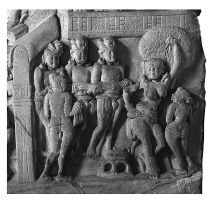

Figure 9 Baby Footprints The topic of increasing visibility is also of relevance to the whole set of the thirty-two marks in all versions of the Mahāvadāna-*sūtra*. Whereas the discourses surveyed in the previous chapter describe examinations of an adult Buddha in order to ascertain his possession of these marks, examinations in which he has to cooperate actively to enable recognition of two of the marks, in the present case he is only an infant. Nevertheless, the seers are able to ascertain the presence of all thirty-two marks, and that without any active cooperation of their bearer. This gives the impression as if, by the time of the coming into existence of this narrative piece, the thirty-two marks had become to some degree more visible, so much so that they can be recognized even in the only embryonic stage in which they manifest on the body of a baby. 

Another noteworthy feature of the same narration is that the actual recognition of the thirty-two marks takes the form of a prediction concerning the future. This is of course inevitable, because the one who is being examined has not yet become a Buddha. Therefore the trope of the two destinies open to someone who has the thirty-two marks, instead of serving as a backdrop for examining someone who is a Buddha, naturally concerns someone who *will become* a Buddha. This in itself rather minor shift could have set a precedent for the idea that a bodhisattva at some stage in his prolonged career receives a prediction that he will certainly become a Buddha in a future life. I will return to this topic in the next chapter. 

## 3.4 The Marks And Dharmatā

In the Dīrgha-*āgama* description the foot of the Buddha, just as the other marks, is not explicitly introduced as an invariable feature of all Buddhas, as their *dharmatā*. This differs from all the other qualities described earlier, which are invariably qualified as examples of "an unchanging law for all Buddhas". The same pattern occurs in the Mahāpadāna*-sutta*, where the corresponding qualification that this is the rule, *dhammatā*, employed throughout the preceding prose description, is no longer used when it comes to the description of the thirty-two marks.46 The Sanskrit fragment version, however, uses *dharmatā* also when introducing the part with the description of the thirty-two marks. The fragment version then continues to employ the qualification *dharmatā* when describing the four outings of the prince during which he saw for the first time someone old, diseased, and dead, as well as someone who had gone forth.47 To consider this description a *dharmatā* for all Buddhas results in an internal inconsistency in the Sanskrit fragment version, because each time the bodhisattva comes back from his outings, his worried father, the king, is introduced by his name Bandhumat.48 Applying the qualification *dharmatā* to this narrative results in making it a rule for all Buddhas to have a father by the name Bandhumat. 

Yet, according to an earlier part of the same *Mahāvadāna-sūtra*, 
Bandhumat was only the name of the father of Vipaśyin, whereas the fathers of the other Buddhas had different names.49 The correlations given in the *Mahāvadāna-sūtra* are as follows: 
Buddha Vipaśyin: his father is Bandhumat Buddha Śikhin: his father is Aruṇa Buddha Viśvabhuj: his father is Supradīpa Buddha Krakasunda: his father is Agnidatta Buddha Kanakamuni: his father is Yajñadatta Buddha Kāśyapa: his father is Brahmadatta Buddha Śākyamuni: his father is Śuddhodana The resulting incoherence between this listing and the application of dharmatā to the description of how Bandhumat reacted to the outings of the prince makes it probable that the Sanskrit fragment version has suffered from an error that easily occurs during oral transmission, whereby a phrase that has been used repeatedly up to a certain point is applied similarly to a subsequent textual portion and thereby to a context to which it originally did not belong. 

Given that this internal incoherence allows the application of dhar-*matā* to the four outings of the prince in the Sanskrit version to be identified as the result of a later development, it seems fair to conclude that the application of *dharmatā* to the thirty-two marks must have come into being as part of the same textual development. This would explain why the thirty-two marks are qualified in this way only in the Sanskrit fragment version and not in its parallels.

This in turn is significant in so far as it implies that, at the stage in the development of the conception of a Buddha reflected in the *Mahā*-
padāna*-sutta* and its Dīrgha-*āgama* parallel, when various miracles related to conception and birth were already considered to conform to a general pattern that holds for all Buddhas, the same idea of "an unchanging law for all Buddhas" had not yet been applied to the thirty-two marks. In short, at this particular point in the history of Buddhist thought the thirty-two marks apparently were not yet presented as an indispensable requirement for Buddhahood. Although for one who is endowed with these marks it can be predicted that, if he goes forth, he will definitely become a Buddha, it does not follow automatically from this that all those who become a Buddha must be endowed with the thirty-two marks. The distinction to be drawn here could be illustrated with the example of an arhat in early Buddhist thought. For one who has become an arhat there is only one possibility, which is to live the monastic life. But all who live the monastic life need not necessarily be arhats or even be practising the path to becoming arhats. Similarly, the presentation in the Mahāpadāna*-sutta* and its Dīrgha-āgama parallel does not yet explicitly take the position that in order to become a Buddha one must have the thirty-two marks. Such a conclusion only results from the presentation in the Sanskrit fragment version, which with considerable probability can be considered the result of an error in transmission. 

## 3.5 The Birth Of A Buddha

In evaluating this difference, it is also noteworthy that the preceding description of various events related to the conception and birth of Vipaśyin bears considerable similarity to a listing of outstanding qualities of the Buddha Gautama given in the *Acchariyabbhutadhamma-sutta* and its Madhyama-*āgama* parallel, which I already studied in my earlier exploration of the genesis of the bodhisattva ideal. A comparison of these two discourses brings to light more divergences than similarities, suggesting a comparatively late date for the coming into being of each version in its final form.50 Given that both versions reflect a similar attitude, it can safely be assumed that qualities found in only one of 
―――――― 50 Cf. Anālayo 2010a: 28–46.

these two versions stand a good chance of reflecting notions that came into being so late that they no longer made it into the other version. 

One of the qualities found only in the *Acchariyabbhutadhamma-sutta* and not in its Madhyama-*āgama* parallel is the bodhisattva Gautama's proclamation that he is supreme in the whole world and that this is his last birth.51 This proclamation stands in contrast to a broad range of early discourses that report the bodhisattva Gautama's struggle to reach awakening.52 From the perspective of these discourses, he could not have made a claim to have reached his last birth at the time when he had just been born. Instead, such a claim has its proper place only after he had reached awakening and become a Buddha. This in turn makes it safe to conclude that this proclamation in the *Acchariyabbhutadhammasutta* reflects an advanced stage in the apotheosis of the Buddha, considerably later than the bulk of the early discourses.53 This conclusion similarly holds for the present instance in the Mahā-*vadāna-sūtra* and its parallels. In the verses in the Dīrgha-*āgama* account translated above, the newly born bodhisattva Vipaśyin states that 
"this is my final body."
54 The prose part of the Sanskrit fragments of the Mahāvadāna-sūtra has preserved the same claim by the bodhisattva Vi-paśyin, made as soon as he was born, that "this will be my last birth",55 and in the Mahāpadān*a-sutta* he similarly proclaims right after his birth that "this will be my last birth, there is no further renewal of becoming for me."56 An item found only in the Dīrgha-*āgama* version is the bodhisattva's proclamation that his aim is to deliver sentient beings from birth, old age, disease, and death. This bring in the motif of compassion which was to become such a prominent aspect of the bodhisattva path in later times.57 Notably, this reference to compassionate motivation concerns only the present life of Vipaśyin. That is, in the present context this proclamation appears to be simply a facet of the overall tendency to attribute qualities of a Buddha to the newly born bodhisattva. The *Dīrgha-āgama* passage does not yet relate a compassionate concern to former lives before the present life of Vipaśyin. 

Nevertheless, once the idea of a need to prepare oneself for Buddhahood over a series of past lives had come into existence, the idea that already at birth a bodhisattva has the compassionate concern to deliver sentient being would easily have evolved to become an integral part of a bodhisattva's motivation during previous lives. 

Although the Dīrgha-*āgama* version stands alone in referring to compassion, it agrees with the Mahāpadāna*-sutta* and the Mahāvadāna-*sūtra* in reporting that already at the time of his birth the bodhisattva Vipaśyin claimed to have reached his last birth (even though in its version this proclamation is only found in the verse portion), expressed by referring to his "last body". Only the individually translated version does not report that the bodhisattva Vipaśyin made such a proclamation as soon as he was born. 

When evaluated in the light of the *Acchariyabbhutadhamma-sutta* and its Madhyama-*āgama* parallel, this gives the impression that this part of the Mahāvadāna-*sūtra*, the Mahāpadāna*-sutta*, and the Dīrgha-*āgama* version already testifies to a rather evolved stage in the conception of a Buddha.58 Nevertheless, as noted above, in the case of the Mahāpadāna*-sutta* and the *Dīrgha-āgama* version even at this evolved stage the thirty-two marks have not yet become fully integrated into what otherwise is an 
―――――― 57 On the relative dearth of such references in what appear to be texts reflecting the early stages in the evolution of the bodhisattva path cf. Anālayo 2010a: 26–28; for a detailed study of the dimension of compassion in subsequent stages in the evolution of the bodhisattva path cf. Dhammadinnā (in preparation). 

58 This has already been pointed out by Winternitz 1920/1968: 32: "einer sehr späten Zeit gehört auch Nr. 14, das Mahāpadāna-sutta … an, in welchem bereits … die ganze mit zahlreichen Wundern, insbesondere den Wundern der Empfängnis und der Geburt, ausgestattete Buddhalegende vorausgesetzt wird."
account of the invariable law that applies to all Buddhas, such as that on being born they will make a claim that only fits the time when they have actually reached awakening. 

Another point worthy of note is a shift in terminology, where the Mahāvadāna-sūtra and its two parallels refer to Vipaśyin as "the bodhisattva" throughout, until they come to the report of his being investigated by the fortune-tellers, at which point they switch to the term 
"prince" instead.59 This confirms the impression that at this juncture two different textual pieces have been joined together, one of which mirrors the description of the marvellous qualities of the Buddha Gautama, whereas the other instead corresponds to the prediction reportedly given to the bodhisattva Gautama.60 As a result, the qualification *dharmatā* was initially not applied to the narration of the prediction of the bodhi-sattva Vipaśyin.

The same holds for the account of the famous four outings. In relation to this account, it is perhaps worth noting briefly that several reports of the same four outings by the bodhisattva Gautama also show internal inconsistencies. 

The *Mahāvastu* precedes the four encounters by reporting that the bodhisattva Gautama had already at an earlier time informed his father of his wish to go forth, expressing his insight into the inescapability of old age, disease, and death.61 If at an early point of time he already had such insight and the wish to go forth, the episode of the four encounters and their impact on the mind of the young prince would be redundant. 

―――――― 59 Cf. above p. 81 note 32. 

60 For the prediction of Gautama's future attainment of Buddhahood cf., e.g., Sn 693, the *Buddhacarita* 1.69, Johnston 1936/1995: 8, T 192 at T IV 3a25, and T 193 at T IV 61a27, the *Lalitavistara*, Lefmann 1902: 104,9, D 95 *kha* 56a5 or Q 763 ku 65a6, T 186 at T III 496b4, and T 187 at T III 557b3, the *Mahāvastu*, Senart 1890: 32,9, the *Saṅghabhedavastu*, Gnoli 1977: 53,21, T 1450 at T XXIV 109b24, and D 1 ga 285a7 or Q 1030 *nge* 268a7, and several Buddha-biographies preserved in Chinese translation, such as T 184 at T III 464c14, T 185 at T III 474a23, T 189 at T 
III 627b21, T 190 at T III 697a3, and T 191 at T III 941a15. An element related to the wheel-mark on the feet then emerges in Pj II 488,2. On being brought to the seer, the infant's feet miraculously end up on the seer's head, who then recognizes the wheel-mark on their soles, followed by discerning the other marks, leading to his giving the prediction.

61 Senart 1890: 141,7 and 146,12; what follows is based on extracts from Anālayo 2007. 

The Mahīśāsaka *Vinaya* reports that the bodhisattva Gautama, when still young, had the desire to go forth.62 When describing his fourth encounter with a recluse, however, according to the same Mahīśāsaka Vinaya account the bodhisattva asked his charioteer to explain what going forth means.63 Such a question would make little sense if at an earlier point of his life he already had the desire to go forth himself. 

According to the *Saṅghabhedavastu*, during the first and second encounter the bodhisattva enquired about the implications of being old or sick. His coachman told him in reply that to be old or sick entails that one will soon be dead.64 The bodhisattva apparently understood this reply, since rather than asking about the meaning of being dead, he asked if he was also subject to this same predicament. When during the next encounter the bodhisattva saw a corpse, he asked his driver what death meant.65 Not knowing this, the replies he had received during the previous outings would have been meaningless for him. 

In this way, the accounts of these four outings in these texts show internal inconsistencies similar to the case of the application of *dharmatā* to these four outings in the Sanskrit fragment version of the *Mahāvadānasūtra*. Such lack of internal consistency echoes the case of the Buddha's descent from the Heaven of the Thirty-three, mentioned in chapter 2. 

Another parallelism is the apparent influence of art. In relation to the bodhisattva's outings it has been suggested that the idea for this type of tale might have originated in depictions of the bodhisattva's insight into these predicaments of human life in art, which needed to create symbolic representations in order to render his insight into old age, disease, and death visible.66 Whatever may be the final word on the arising of this narrative, given its internal inconsistencies in the versions discussed above and combined with the fact that the corresponding Pāli tale is found only in the *Jātaka* commentary,67 it seems safe to conclude that the narrative of the four outings of the bodhisattva Gautama is comparatively late. The same would hold for its application to the Buddha Vi-paśyin; in fact the much longer lifespan attributed to human beings at the time of Vipaśyin would provide a natural home for the arising of a narrative concerned with not noticing that people age and pass away. 

In sum, however much from the viewpoint of later tradition the thirty-two marks are intrinsically related to the very concept of being a Buddha, the above-discussed textual passages show that it must have taken some time before these marks became an integral part of the conception of the nature of Buddhas. 

## 3.6 Seeing The Marks As A Means Of Conversion

Once the thirty-two marks have become integral to Buddhahood, however, the emphasis on visual aspects, evident for example in the passage from the Dīrgha-*āgama* translated above, takes on a stronger dimension. 

The visual impact of seeing the Buddha endowed with the thirty-two marks comes to have a special effect. This can be seen, for example, in descriptions of the conversion of Rāṣṭrapāla. 

Reports of his conversion can be found in a discourse extant in Sanskrit fragments, in the Raṭṭhapāla*-sutta* of the Majjhima-*nikāya*, in three discourse parallels in Chinese translation, and in a discourse quotation in the *Bhaiṣajyavastu* of the Mūlasarvāstivāda *Vinaya* preserved in Tibetan translation. According to the narration in these versions, young Rāṣṭrapāla had come to visit the Buddha together with a group of householders. Hearing the Buddha teach the Dharma has inspired Rāṣṭrapāla so much that on the spot he requests to be granted the going forth.68 The Buddha informs Rāṣṭrapāla that he needs to obtain his parents' permission. When informed of the plans of their only son, the parents refuse, whereupon Rāṣṭrapāla goes on hunger strike. Realizing that he is so intent on going forth that he is willing to put his own life at risk, the parents finally relent. 

In all of these versions, it is the impact of the discourse on the Dharma delivered by the Buddha that has had such a deep impact on Rāṣṭra-pāla and so much inspired him that, even though he is young and from a very wealthy family, his mind is all set on going forth. 

A somewhat different perspective emerges with accounts of Rāṣṭra-pāla's conversion preserved in versions of the *Avadānaśataka* extant in Chinese as well as in Sanskrit and Tibetan.69 The Chinese Avadāna-*śataka* additionally brings in a visual dimension to this conversion, which is related to the thirty-two characteristics. According to its report, when Rāṣṭrapāla approached the Buddha the following happened:
70
[Rāṣṭrapāla] saw the Buddha, the Blessed One, with his thirty-two marks and eighty secondary characteristics, brilliant and completely resplendent, like a hundred-thousand suns, of majestic and dignified appearance,71 very delightful, and his mind was thrilled with joy. 

He paid his respects at the Buddha's feet and stood back to one side. The Buddha gave him a teaching on the four truths.72 His mind awakened and he understood, attaining the fruit of stream-entry. 

Rāṣṭrapāla next returns home, praises the Buddha's virtues to his father and expresses his wish to go forth. 

Similarly to the *Dīrgha-āgama* parallel to the *Mahāvadāna-sūtra*, the extract from the Chinese *Avadānaśataka* tale translated above plays on various images involving vision. The *visual* impact of the Buddha's physical perfection and brilliance, his endowment with the marks, thrills Rāṣṭrapāla and thereby makes him amenable to instruction. The Buddha's teaching then leads Rāṣṭrapāla to a *vision* of the four noble truths and he becomes a stream-enterer, one who is characterized in the early discourses as one who is "endowed with *vision*".73 With the Sanskrit and Tibetan *Avadānaśataka* versions of the same tale of Rāṣṭrapāla's conversion a further increase in the emphasis on the visual dimension, and in particular on the thirty-two marks and the bodily brilliance, can be discerned. Here the impact of seeing the Bud-dha's body takes centre stage. The description of Rāṣṭrapāla's conversion proceeds as follows in the Sanskrit version of the *Avadānaśataka*:
74 Rāṣṭrapāla saw the Buddha, the Blessed One, adorned with the thirty-two marks of a great person and the eighty secondary characteristics, his splendid limbs adorned with brilliance that extended for a fathom, superior to the brilliance of a thousand suns, like a mountain of jewels in motion, beautiful in all respects. 

With this vision his mind acquired faithful inspiration in the presence of the Blessed One. With faithful inspiration arisen, he fell at the feet of the Blessed One and requested the going forth. 

A significant difference, when compared to the Chinese *Avadānaśataka* version, is that here the visual impact of the Buddha with his physical marks and brilliance suffices to lead to Rāṣṭrapāla's conversion, so that he directly falls at the Buddha's feet and requests the going forth after this visual impact, without having received any teaching from the Buddha at all. 

An almost inevitable consequence of this promotion of the vision of the thirty-two marks as a means of conversion is that these physical characteristics of the Buddha are no longer nuances so subtle that previous training in brahminical lore is required so as to recognize them. 

Instead, they have become plainly evident to any onlooker, attracting people to the Buddha's presence and making them receptive to liberating teachings, or else functioning as the main means of a total conversion. 

How a conversion story can undergo a process of gradual change, from giving emphasis to hearing the Buddha teach to the impact of looking at him, can be seen in a tale in the Ekottarika-*āgama* that involves the householder Siṃha. 

Siṃha's conversion is also the theme of a discourse in the Aṅguttara-*nikāya*, found similarly in the Theravāda *Vinaya*, and in the Dharma-guptaka and Mahīśāsaka *Vinaya*s. These versions agree in reporting that Siṃha attained stream-entry during a gradual instruction given to him by the Buddha.75 In the Dharmaguptaka and Theravāda versions the Buddha delivers this gradual instruction after having given Siṃha a teaching on the topic of giving, *dāna*.

76 The topic of giving also occurs in the tale of Siṃha's stream-entry in the Ekottarika-*āgama*. Here he attains stream-entry after the Buddha had commended Siṃha for engaging in giving with the continuously impartial mental attitude of a bodhisattva.77 The actual report of his stream-entry takes the following form:78 The householder Siṃha reflected on the Tathāgata's instruction and looked at the Blessed One intently. With an unperturbed mind he attained the pure eye of the Dharma in that very seat. 

although a visual element is present, the main emphasis appears to be still on the audible dimension, on the oral instruction given by the Buddha as the crucial element for bringing about the attainment of streamentry. After Siṃha has left, the Buddha informs the monks of what has just happened in the following way:79 Because of reflecting on impartial giving and by looking at the Tathāgata from head to foot, the householder Siṃha attained the pure eye of the Dharma right in that very seat. 

A minor but nevertheless significant difference is that here Siṃha sur-veys the Buddha's body from head to foot. The difference between this passage and the preceding one is certainly not as pronounced as what emerges from comparing the Chinese *Avadānaśataka* account of Rāṣṭra-pāla's conversion with its Sanskrit and Tibetan parallels. Nevertheless, what makes the present instance worthy of note is that the two passages translated above follow each other in close proximity within the same text, at a distance of just two lines in the Taishō edition of this discourse. 

In the account of the actual stream-entry, the looking at the Buddha seems to play a secondary role and the prominent feature is still Siṃha's reflection on the oral instruction he has received. Only two lines later in the same text, the visual dimension becomes considerably more prominent through the additional specification that Siṃha surveyed the Bud-dha's body from head to foot. Although this is not explicitly mentioned, in a setting which already reflects developed bodhisattva ideology, as expressed in the idea of giving with the attitude of a bodhisattva, such a survey of the physical form of the Buddha can safely be assumed to imply a survey of his physical marks. In this way the tale of Siṃha's stream-entry in the Ekottarika-*āgama* can be taken to illustrate how a process of gradual change can result in increasing emphasis on the vis-ual impact of the Buddha's physical form as a means of conversion and teaching. 

An increasing emphasis on the impact of the Buddha's physical appearance as a means for teaching and conversion is in itself only to be expected as a by-product of the gradual apotheosis of the Buddha. As part of this trajectory, the Buddha's special appearance and his marks, 
―――――― 79 EĀ 48.5 at T II 792c27 to 792c29. 

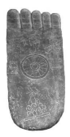

which in the early discourses predominantly had the function of converting brahmins, must soon have come to acquire the same function also in other settings. As a result, as already mentioned above, the Buddha's marks inevitably become more visible, enabling them to exercise their converting function even with those who have no previous training in the lore of the thirty-two marks. 

In addition, the need in artistic representation to translate text into vision must have contributed to this development, rendering the Bud-dha's beauty more visible by increasing degrees. The cranial protuberance is a rather prominent example where a convention of ancient Indian art seems to have had a rather decisive impact.

In a way the evolution of the conception of the marks can be seen to mirror an evolution of devotional practices. As an aspect of the process of increasing visibility, as already mentioned in the first chapter, in artistic depictions the footprint of a Buddha came to be decorated with various sym-bols. In a footprint from Bodhgayā, shown in figure 10, for example, the heel is adorned with birds.80 Figure 10 Footprint with Birds When it comes to descriptions of the Buddha's body, however, comparisons with animals or plants to illustrate the nature of a particular bodily part are even in later times not to be taken too literally. This can be seen in the *Pratimālakṣaṇ*a, which I already mentioned in chapter 2, a text that gives meticulous instructions on the construction of a Buddha image, detailing its various proportions and measurements. Alongside such precise indications, the same work also employs several plant and animal comparisons, such as mentioning a Banyan tree, a lotus, and a tortoise.81 Such comparisons are not aimed at getting artists to copy these features from plants and animals and apply them exactly to the body of a Buddha statue. Instead, they are meant to illustrate what are considered to be nuances of the Buddha's human beauty. In fact the comparison with a tortoise to illustrate the nature of the feet recurs in a Jain description of the beauty of women.82 To be sure this description is not meant to depict beautiful women as having feet that are identical to the appearance of those of a tortoise. 

## 3.7 Seeing The Marks As A Means Of Healing

Besides serving purposes of conversion, a vision of the beauty of the Buddha, endowed with the thirty-two marks, can also have a healing effect. An example of this function can be found in the tale of the nun Śubhā, reported in the *Therīgāthā* and its commentary.83 On her way into a forest for meditative seclusion, Śubhā is intercepted by a man whose passion has been roused on seeing her beauty. In particular he has become completely infatuated with her lovely eyes. Śubhā replies with a declaration of her total lack of interest in sensuality and physical attraction but, finding that the impassioned male does not relent, she eventually plucks out one of her eyes and hands it to the rogue. 

He is shocked to his senses by this act and requests to be forgiven. When Śubhā later approaches the Buddha, her eye is magically restored to its former condition on "seeing the one with the marks of excellent merit".

84 This episode also has several visual allusions. The verse exchange between the two contrasts a male *blinded* by passion to Śubhā's insightful *vision* of the unattractive nature of the human body. When words do not suffice to convey this to him, she takes out and hands him her organ of *vision*, which taken out of its socket *visually* conveys to him its unattractive nature. The organ of *vision* damaged by this deed is miraculously restored by the *vision* of the Buddha endowed with his marks as the result of his accumulated merits. It is to the relationship of the thirtytwo marks to merit acquired in the past that I turn in the next chapter. 

Closer inspection of the genealogy of Buddhas in the *Mahāvadāna-sūtra* and its parallels brings to light that, at an advanced stage of evolution in the apotheosis of Buddhas, the thirty-two marks are still only in the process of becoming an invariable endowment of a Buddha and thereby a necessary qualification for Buddhahood. 

The almost inevitable result of an increase of interest in the physical endowment of a Buddha with these marks, combined with the need to translate textual description into artistic representation, is that the marks become gradually more visible, so much so that the average onlooker becomes able to discern what other passages present as being only within the range of those trained in the lore of identifying the thirty-two marks. 

Once the thirty-two marks have become generally visible, their salvific function naturally expands beyond the range of brahmins to serve as a means of conversion in general, so much so that at times their visual impact replaces the giving of a teaching on the Dharma as the cause for even radical conversion. Besides functioning as a means of conversion in general, the marks also extend their beneficial influence to those already converted, becoming a source of inspiration to such a degree that seeing them can even effect physical healing. 

# 4 The Karma Of The Wheel-Mark

## 4.1 Introduction

In addition to the trajectory evident in the *Mahāvadāna-sūtra*, another dimension of the integration of the thirty-two marks into Buddhist doctrine manifests in the Discourse on the Marks. Two versions of this discourse are extant: 
- a Pāli discourse in the form of the Lakkhaṇ*a-sutta* is found in the last chapter of the Theravāda *Dīgha-nikāya*;
1 
- a Chinese parallel, titled the Discourse on the Thirty-two Marks, occurs in the Chapter on Kings in the Madhyama-*āgama* (T 26), 
probably stemming from a Sarvāstivāda line of transmission.

2 The *Lakkhaṇa-sutta* begins with the standard reference to the two destinies open to one who is endowed with the thirty-two marks, then gives a full list of these marks, and after that rounds off its exposition by repeating again that one who has these will become either a wheel-turning king or a Buddha. This mode of presentation corresponds to a standard procedure in the early discourses, in that a statement of a particular type is followed by a more or less detailed exposition, which concludes by repeating the initial statement. Such a procedure reflects the requirements of an oral setting and in particular the need to make sure that the main topic can easily be recalled later. 

The Madhyama-*āgama* discourse proceeds similarly and then concludes at this point. In the *Lakkhaṇa-sutta*, however, the Buddha next makes an additional statement that then leads on to another and considerably longer exposition. This additional statement reads as follows: 
Of a great man, monks, outside seers also bear in mind these thirtytwo marks of a great man, yet they do not know: "by the doing of this deed does one gain this mark."
3 Thus alongside the recognition that knowledge of the thirty-two marks 

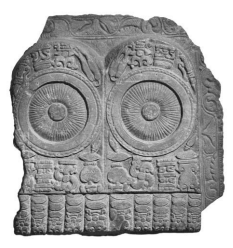

is common among those outside of the fold of the Buddhist tradition, this statement announces a distinctly Buddhist perspective on them, namely an understanding of the karmic conditions that have led to them. With this introductory statement in place, the *Lakkhaṇa-sutta* embarks on a detailed description of the deeds performed by the bodhisattva Gautama in past lives that led to his endowment with these extraordinary physical characteristics. Similarly to the case of the *Dīrgha-āgama* version of the Mahāvadāna-*sūtra* translated in the previous chapter, the *Lakkhaṇa-sutta* alternates between prose passages and verse repetitions.4 As an example of the karmic perspective introduced in this way, below I translate the prose and verse part of the *Lakkhaṇa-sutta* that concerns the Buddha's feet in particular, each of which, needless to say, is adorned with a wheel that has a thousand spokes.5 By way of providing a visual counterpart to such descriptions, figure 11 presents Buddhapadas from Nāgārjunikoṇḍa. These depict wheels with a substantial number of spokes, though still falling short of coming anywhere close to a thousand spokes, together with other symbols.6Figure 11 Footprint-Wheels with many Spokes 
―――――― 4 As already noted by Warder 1967: 94, Sv III 922,33 explicitly recognizes that these verses have been added subsequently to what tradition reckons to have been the time of the actual delivery of the discourse. 

5 The translated part is based on DN 30 at DN III 147,25 to 149,19; a bare reference to the Buddha's feet each endowed with a wheel-mark complete with a thousand spokes in the parallel MĀ 59 can be found at T I 493c20 (which has its counterpart in the first part of DN 30 at DN III 143,9). DN 30 has been translated into German by Neumann 1906/2004: 516–539 and into English by Rhys Davids and Rhys Davids 1921: 154–167 and Walshe 1987: 441–460. 

6 Courtesy of John C. Huntington, The Huntington Archive at The Ohio State University. 

[The Buddha said]: "As in whatever former birth, former existence, and former abode, having formerly been a human, the Tathāgata was a bringer of happiness to many, a dispeller of their fear, terror, and fright, a provider of rightful protection, safeguarding, and guardianship, and he gave gifts complete with their accompaniments, by doing and accumulating such deeds, by their amassing and abundance, with the breaking up of the body after death he was reborn in a good realm, in a heavenly world. There he surpassed other *deva*s in ten respects: divine longevity, divine complexion, divine happiness, divine glory, divine power, and [the experiencing of] divine forms, divine sounds, divine odours, divine flavours, and divine tangibles. 

"Passing away from there and coming to this present condition he gains this mark of a great man: On the soles of his feet wheels manifest with a thousand spokes, complete in all respects with rim and hub, and well arranged. 

"Being endowed with this mark, if he lives in the household he becomes a wheel-turning king, a righteous Dharma-king, ruler over the four quarters, who has gained the safety of the country, and who is endowed with the seven treasures. He has these seven treasures, namely the wheel-treasure, the elephant-treasure, the horse-treasure, the jewel-treasure, the woman-treasure, the stewardtreasure, and the counsellor-treasure as seventh. 

"He has more than a thousand sons who are valiant and of heroic build, conquerors of the armies of others. Without a sign of obstruction and without hindrance he presides up to the ocean over this earth, which is flourishing, prosperous, peaceful, safe, and free from trouble, having established his reign by righteousness, without stick and without sword.7
"Being a king, what does he gain? He has a great company. 

Great is his company of brahmin householders, townsmen, villagers, treasurers, guards, gatekeepers, ministers, courtiers, tributary kings, attendants, and pages. Being a king he gains this. 

"If he goes forth from the home life to homelessness, he becomes an arhat, a fully awakened one, who withdraws the veil [of ignorance] from the world. 

"Being a Buddha what does he gain? He has a great company. 

Great is his company of monks, nuns, male lay followers, female lay followers, *deva*s, humans, asuras, *nāga*s, and *gandharva*s. Being a Buddha he gains this."
This is what the Blessed One said. This is said in regard to it: "Formerly, previously, in prior births, As a human being, he was a bringer of happiness to many, A dispeller of their fear, terror, and fright, Eager in their protection, safeguarding, and guardianship. 

"By that karma he went to heaven, Experiencing happiness, enjoyment, and delight. Having passed away from there he came here, And wheels are found on both his feet Complete with rim and a thousand spokes. 

"The gathered fortune-tellers predicted him, Having seen the prince with the marks of a hundred merits: 'He will have a [great] company and subdue enemies. Thus, indeed, the wheels complete with rim [imply]. 

"If such a one does not come to go forth, He turns the wheel, governing over the earth. He will be followed by warriors Of great repute, who will accompany him. 

"If such a one does come to go forth, Desirous for and delighting in renunciation, and discerning, [Then] *deva*s, humans, asuras, śakras, rakṣās, Gandharvas, *nāga*s, birds, and four-footed beings Accompany the greatly famed one, The supreme one, who is worshipped by *deva*s and humans.'"

## 4.3 Assessing The Lakkhaṇa-Sutta

For assessing the presentation in the Lakkhaṇ*a-sutta*, the verse portions which summarize the prose can be examined from the viewpoint of Pāli metre. As pointed out by several scholars, the metre shows the verses to be manifestly late.8 Lateness also emerges from a comparative perspective, given that the otherwise similar Madhyama-*āgama* parallel does not have any such exposition concerned with providing a karmic background to the thirty-two marks, be it in prose or in verse.9 The idea as such, however, was not foreign to the reciters of the Madhyama-*āgama*. In the case of the Brahmāyu*-sutta*, studied in chap-ter 2, the Madhyama-*āgama* version repeatedly emphasizes that certain aspects of the Buddha's physical form or behaviour are the outcome of his former wholesome deeds. This holds for the notion that dust does not dirty him when he walks and for his faculties always being composed.10 A comparable remark is not found in the Brahmāyu*-sutta*. 

This goes to show that concern with the karmic background to qualities of the Buddha can be found similarly among the Sarvāstivāda reciters of the Madhyama-*āgama* and the Theravāda reciters of the Pāli tra-dition, but it has found expression in different ways. In the case of the Theravāda reciters of the *Dīgha-nikāya*, this concern appears to have given rise to a detailed exposition, perhaps originally a commentary that had its starting point in a remark that outside seers do not understand the karma that leads to these marks. In the course of oral transmission, such a commentary could have become part of the discourse.11 A similar process can be observed in the case of another *Dīgha-nikāya* discourse, the Mahāsatipaṭṭhāna*-sutta*, where a long exposition of a commentarial type appears to have become part of the discourse itself.12 Further support for the suggestion that providing a karmic background to the thirty-two marks stems from what originally was a text of commentarial nature comes from another mark closely related to the wheel-marks on the feet and the imprint these can leave on the ground, as they do in the discourse to Droṇa, discussed in the first chapter. This mark also concerns the nature of the foot of a Buddha. 

The bare list of marks in the preceding part of the Lakkhaṇ*a-sutta* describes his feet as being "well-placed".

13 The original sense of this qualification would just have been an evenness of those parts of the feet that usually touch the ground. 

Although one might imagine the wheel-mark to be on the heels of his feet, for example, this is not the placing they found in art, where they tend to be in the middle of the feet and thus in the area where a normal foot has arches. Such a placing in turn requires the Buddha's feet to be flat in order to leave an imprint of the type mentioned in most versions of the discourse to Droṇa. This is in fact the understanding of the Pāli commentarial tradition, according to which the Buddha touches the ground with the whole sole of each of his feet, in other words, he had flat feet. 

This description might well be another example of the influence of depiction in art on textual descriptions.14 In the part of the *Lakkhaṇa-sutta* that provides the karmic background to each of the thirty-two marks, the description of this particular mark combines the standard phrase "well-placed", found also in its earlier bare listing of the marks, with further specifications according to which the whole soles of his feet touch the ground.15 Such an indication is otherwise only found in Pāli commentarial literature, not in Pāli discourses. 

This confirms the impression that the part under discussion from the Lakkhaṇa-sutta would have its origin in a commentary which during the course of transmission became part of the discourse itself. 

In addition to being in general recognized as a discourse that has incorporated late material, however, Rhys Davids and Rhys Davids (1921: 
136) also consider the Lakkhaṇ*a-sutta* to be "gravely ironic in the contrast it makes between the absurdity of the marks and the beauty of the ethical qualities they are supposed, in the Suttanta, to mean." Unlike the impression of lateness, this assessment seems to be without support in the text itself, which as far as I am able to ascertain does not provide any clear indication of being intended ironically, nor does its presentation stand in such contrast to other discourses that this could be con-sidered "gravely ironic". 

Rhys Davids and Rhys Davids (1921: 134) take the present discourse to stand in contrast to the Brahmajāla*-sutta*, which "had expressly condemned all sorts of augury and soothsaying practised for gain by some samaṇas and by brahmins". Considering this from a comparative perspective shows that such a 'condemnation' is not found in all versions of the Brahmajāla*-sutta*.

16 In fact, even in the relevant part of the Theravāda version of the Brahmajāla*-sutta* the point at stake is improper livelihood, a question of no relevance to the concern with the thirty-two marks in the *Lakkhaṇa-sutta*. 

Here as well as in other early discourses where the thirty-two marks occur, a negative evaluation is simply not evident. Although presented as a concern characteristic of brahmins, rather than being disdained, such concerns are shown to be put to good use in order to convert brahmins. 

Therefore it seems a natural development, rather than a grave irony, if these marks gradually become more integral to Buddhist thought. 

## 4.4 Introducing The Karmic Perspective

In relation to this part of the *Lakkhaṇa-sutta* and its apparently late nature, it is noteworthy that the introductory statement refers to outside seers who are knowledgeable in these marks. This implies that, by the time of the coming into being of this passage, awareness was still current that knowledge of the thirty-two marks was the domain of outside seers, or more specifically brahminical lore, as mentioned in several other discourses surveyed in chapter 2. Even at the time of bringing concern with the thirty-two marks fully into the orbit of Buddhist doctrine, knowledge about them as such is not presented as a distinctly Buddhist feature. Instead, it is the karmic perspective on them that should be considered the specifically Buddhist contribution to this topic.17 Now for integrating the thirty-two marks within early Buddhist doctrine, the move made in the *Lakkhaṇa-sutta* is an obvious one. The theme of karma is one of the central components of early Buddhist doctrine, and a concern with how certain types of deed are related to certain types of result forms a recurrent topic in the early discourses. In fact the commentary on the Brahmāyu*-sutta* shows a similar tendency in relation to the seven treasures of a wheel-turning king, explaining what type of deed provides the karmic background for the arising of these treasures.18 The apparent interest aroused by the karmic perspective can also be seen in a series of discourses in the *Lakkhaṇa-saṃyutta* of the Saṃyutta-*nikāya* and their Saṃyukta-*āgama* parallels, which report several occasions where Mahāmaudgalyāyana describes the dramatic retribution experienced by living beings for their former deeds. Just to provide one example, in one such discourse he sees a being that moves through the air in great pain,19 whose existence the Buddha confirms and explains to be the form of rebirth taken by a cow butcher. 

A detailed exposition of karmic relationships can be found in the Cūḷ*akammavibhaṅga-sutta*, a discourse which stands out in the four Pāli Nikāyas for having an exceptionally high number of parallels preserved in a variety of languages, testifying to the interest aroused by its exposition.20 The Cūḷ*akammavibhaṅga-sutta* and its parallels propose, for example, that being prone to anger has its karmic result in ugliness.21 The point seems obvious. The arising of anger can easily make someone appear ugly, and by way of extension beyond a single life the tendency to react with anger is then held to result in future ugliness. 

Following similar reasoning, in the present instance formerly having been "a bringer of happiness to many, a dispeller of their fear, terror, and fright, a provider of rightful protection, safeguarding and guardian-ship" leads to the possession of the mark of the wheel with a thousand spokes. This description relates to the *cakravartin* myth, where the mani-
―――――― 18 Ps III 366,8 explains that the first three treasures are the outcome of past deeds rooted in the absence of anger, the next three require deeds free from greed, and the seventh those free from delusion. 

19 SN 19.1 at SN II 255,28 and its parallel SĀ 508 at T II 135b6; cf. also SHT IV 30f V8f, Sander and Waldschmidt 1980: 87f (the Pāli Saṃ*yutta* takes its title from the name of the monk who is in the company of Mahāmaudgalyāyana when he sees the retribution happening); on the role of Mahāmaudgalyāyana as one who discloses karmic retribution cf. also Gifford 2003. 

20 For a listing of the parallels and a comparative study cf. Anālayo 2011a: 767–775. 21 MN 135 at MN III 204,18, MĀ 170 at T I 705a29, T 78 at T I 887c27, T 79 at T I 
889c27, T 80 at T I 892a28, T 81 at T I 897a9, T 755 at T XVII 589a27, D 339 *sa* 301a4 or Q 1006 *shu* 312b8, and the *Karmavibhaṅga*, Kudo 2004: 52,6 and 2007: 98,9, with its Tibetan counterpart in Lévi 1932: 185,25. 

festation of the wheel with a thousand spokes heralds the onset of the rightful rule of a wheel-turning king, who reigns fearlessly and without creating fear in others, and whose reign brings happiness to many. 

In the ensuing reference to having given gifts in former times, these gifts are qualified to have been *saparivāra*, "with their accompani-ments", presumably in the sense of having been abundant gifts that were complete in all respects. The same term *parivāra* recurs subsequently when introducing "the great company", *mahāparivāra*, with which either a wheel-turning king or a Buddha will be endowed.22 Similarly to the relationship between giving protection against fear and becoming a universal monarch who protects his subjects against fear, the basic principle of karmic retribution here works by mapping gifts with all their accompaniments onto receiving a great company of followers. 

The type of karmic connection drawn in this way in the Lakkhaṇ*asutta* between former deeds and gaining the wheel-mark on the soles of the feet recurs in texts such as the Art*haviniścaya-sūtra*, the Lalita-*vistara*, the Pañcavim*śatisāhasrikā Prajñāpāramitā*, and the Bodhi-*sattvabhūmi*.

23 In fact the *Bodhisattvabhūmi* explicitly refers to a version of this discourse.24 These texts confirm the significance and impact of the type of presentation found in the *Lakkhaṇa-sutta*.

25

## 4.5 The Marks In Their Karmic Setting

For an appreciation of the teaching given in the Lakkhaṇ*a-sutta* as a whole, in what follows I survey the relationships it establishes for other marks. The *Lakkhaṇa-sutta* combines several of the thirty-two marks in a single karmic explanation. Nevertheless, its treatment is fairly long, wherefore, in order to keep matters short, I have to simplify the presentation and focus just on those aspects that seem to me most relevant for appreciating the underlying rationale of the exposition in the *Lakkhaṇasutta*.

26 The karmic setting provided in the *Lakkhaṇa-sutta* involves two dimensions. One of these is what deeds from the past led to the mark, the other is what the mark signifies in relation to being a Buddha or a wheel-turning king. 

A mark that I will discuss again later in this chapter concerns the nature of the private parts of a wheel-turning king or a Buddha, which according to the *Lakkhaṇa-sutta* is the karmic result of reuniting family members;27 it brings about having more than a thousand sons. Even in relation to the Buddha the text speaks of several thousand "sons", which is obviously not meant literally. Such a reference is in line with a motif found elsewhere in the early discourses, according to which the Bud-dha's monk disciples are "sons of the Śākyan" or "sons of the Buddha".28 
――――――
post-Pāli canonical era: a complex allegorical reading of each mark, interpreted in terms of a vast economy of merit … this doctrine [which] seems so normal in the retrospective view from subsequent developments … is only found replete with all these elements in this single text." Skilling 2008b: 68 points out that, in the presentation in the *Lakkhaṇa-sutta*, "it is the relation between the deeds of the Bodhisattva and the resultant marks of the Buddha that is essential to developed Buddhology." Zysk 2016: 168 notes that this part of the *Lakkhaṇa-sutta* reflects "the specific aim of incorporating the central, pan-Indian doctrine of *karman* and rebirth into the system of human marks."
26 Besides involving some degree of abbreviation, my presentation also departs from the sequence in which the marks are listed in the discourse.

27 DN 30 at DN III 160,15; here and below, line references are to the beginning of the respective expositions. 

28 In AN 10.96 at AN V 196,12 and its parallels SĀ 967 at T II 248b18 and SĀ² 201 at T II 448a29, Ānanda introduces himself as a recluse who is a "son of the Śākyan"; in SN 16.11 at SN II 221,25 and its parallels SĀ 1144 at T II 303c7 and SĀ² 
The underlying implication is that, whereas in the case of the wheelturning king the mark conveys offspring in a physical sense, resulting in the universal ruler having more than a thousand sons, in the case of the Buddha the same only has a metaphorical sense.29 What connects both is the image of a strong and united "family", which naturally relates to having in the past united the families of others. 

This first example already shows that the same mark can stand for quite different functions in the case of a wheel-turning king and a Buddha, even though it is expressed in the same terms. This is significant for assessing the implications of this particular mark in the case of a Buddha, a topic to which I return below. In what follows, however, I 
leave out the bearing of the marks on the wheel-turning king and focus just on what concerns becoming a Buddha, in line with my main topic. 

Of relevance for assessing the significance of the marks are also comparisons with plants and animals which, as I argued earlier, are probably not meant to be taken literally. A body of similar proportions to a Banyan tree, together with the ability to touch the knees with the hands without bending, is according to the Lakkhaṇ*a-sutta* the karmic result of having in the past had a balanced assessment of what others deserve;30 it leads to acquiring the qualities of confidence, virtue, a sense of shame, fear of wrongdoing, learning, generosity, and wisdom, qualities that are introduced as forms of (mental) wealth. In this case the nuance of balance seems to hold together sound judgement from the past, balanced bodily proportions, and qualities conducive to mental balance. In this context the Banyan tree appears to function as an emblem of proper proportions. The symbolic nature of such descriptions can also be seen with comparisons that involve an antelope or a lion. Having legs like an antelope has according to the Lakkhaṇ*a-sutta* its karmic root in quickness in learning; its result is being quick in acquiring requisites as a Buddha.31 Here the quality of quickness keeps the different parts together and finds its symbolic expression in the speed of an antelope. Needless to say, the quickness to be illustrated, be it past or present, is of a mental type, and the physical speed of the antelope is only an illustration. The intention of the present description is not to invest the Buddha with sprinting abilities. 

The lion motif occurs in two comparisons. A torso like a lion, shoulders without furrow, and an evenly rounded bust are according to the Lakkhaṇa-sutta the karmic results of having encouraged in others the qualities of confidence, virtue, learning, generosity, wisdom, etc.;32 this leads to possessing these qualities without loss as a Buddha. The relationship between karma and fruit is obvious, as the qualities one encouraged in others return to become one's own qualities. The marks related to this seem to express the sense of bodily perfection in contrast to any possible deficiency. 

The *Lakkhaṇa-sutta* presents having a jaw like a lion as the karmic result of having refrained from idle speech, been a speaker of facts, and spoken to the point;33 as a result on becoming a Buddha one will not be defeated in debate. This reflects the motif of the lion's roar, which in the early discourses represents the Buddha's ability to stand his ground in debate.34 The relationship drawn to this motif confirms the symbolic character of the comparison to a lion's jaw. The point at stake is not to invest the Buddha with the dentition of a pantherine cat, but to exemplify his fearlessness in debate with the example of the fearlessness of a lion's roar. 

As a short digression, it is perhaps worth mentioning that the lion is a recurrent motif in ancient Indian art.35 An example is the lion capital from Sārnāth in figure 12, where four addorsed lions with open jaws, as if about to roar their lion's roar, are on top of a drum adorned with a wheel found right beneath their forefeet.36 Discoveries from Kanaganahalli have brought to light a form of representation where the lion is even found in the middle of the wheel.37 According to the Pāli commentaries, both sides of the hub of the wheel of a *cakravartin* are indeed adorned with lion mouths.38 Figure 12 Lion Capital
―――――― 35 Cf. also Bareau 1960: 248 (with a reply in Irwin 1973: 716), Pandey 1978: 27, and Deeg 2003: 42; and on the tendency to associate the Buddha with the lion (and the elephant) in art cf. Bautze-Picron 2009. Bareau 1971: 17 comments that, although the lion was "not only rare in India but most likely unknown in the middle basin of the Ganges where Buddha spent all his life, this animal plays an important role in Indian symbolism" and its symbolic usage serves "to claim spiritual supremacy for the Buddha". The same image also plays a role in the Jain tradition, where the lion was the animal chosen to represent Mahāvīra; cf. Schubring 1962/2000: 24f. Deo 1956: 560 notes instances where other Jains, because of their skill at debating, are also acclaimed as lions. On the lion's roar as an epithet of Kumārila Bhaṭṭa cf. also Verardi 2011: 221. As a symbol of kingship, supremacy, etc., the lion is of course a recurrent motif in many cultures. 

36 Courtesy of Eric R. Huntington, The Huntington Archive at The Ohio State University; cf. also Huntington 1985/2006: 47. 

37 Zin 2015a: 56 or 2015b: 185. 

38 Cf., e.g., Sv II 618,25 or Ps IV 216,15: dvinnam pi nābhipanāḷīnaṃ anto dve sīha-mukhāni honti. 

Returning to the Lakkhaṇ*a-sutta*, the discourse not only relates the lion's jaws to a karmic background related to speech, but does the same also for other marks. High-raised ankles and body-hair that turns upwards have their karmic root in speaking to others about what is beneficial; it results in becoming foremost among beings.39 This appears to revolve around the notion of elevation, the beneficial words in the past elevated others, therefore the ankles are high and the hair turns upwards, and as a Buddha one comes to be the most elevated one. 

Having single hairs that grow from a single pore and white hair between the eyebrows are the karmic result of sincerity; on becoming a Buddha this leads to being obeyed by one's disciples.40 Sincerity is the opposite of being two-faced and thus finds its expression in the single hairs from single pores.41 This has its natural counterpart in sincerity of the disciples, which expresses itself in their willingness to obey. 

The long tongue and a voice like a cuckoo have according to the presentation in the *Lakkhaṇa-sutta* their karmic root in abstention from harsh speech in the past and speaking in ways that entered people's heart; 42 this leads to a Buddha having a persuasive voice that enters the hearts of his audience. The relationship between refraining from harsh speech and having a persuasive voice like a cuckoo is obvious. 

The teeth are said to number forty and are described as being evenly spaced, which the *Lakkhaṇa-sutta* relates to the karmic root of abstaining from divisive speech;43 this has as its result that one's followers do not become divided. Not dividing others leads to not having one's own following divided, and the sense of absence of such division has its visual counterpart in the evenly spaced teeth. 

Besides qualities related entirely to speech, soft speech comes up as one of the four bases of popularity (saṃ*grahavastu*), which additionally comprise generosity, beneficial conduct, and impartiality. The *Lakkhaṇasutta* sees these as the karmic deeds responsible for the marks of having soft and netted hands and feet; they lead to a Buddha's followers being well disposed towards him.44 The relationship between deeds that make one popular and the quality of having well-disposed followers as a Buddha is straightforward. As for the mark, perhaps the quality of the hands and feet being netted in some way symbolizes that the followers are united and the softness of hands and feet could stand for the softness of attitude that informs the bases of popularity. 

The *Lakkhaṇa-sutta* considers eyes of a dark blue colour and eyelashes like those of a cow to have their karmic root in having looked at others in an open and friendly manner,45 as a result of which a Buddha will be looked at with affection by others. The relationship between looking, the eyes, and being looked at requires no further comment. 

A head (shaped like) a turban is according to the *Lakkhaṇa-sutta* the result of assuming the role of a leader of others in wholesome activities;46 it results in being the recipient of the loyalty of one's disciples. 

The turban features in other early discourses as one of the five royal insignia of a head-anointed king,47 which explains why this mark holds together leadership in past and present times. 

Even teeth that are of white colour are according to the *Lakkhaṇasutta* the karmic result of right livelihood;48 this leads to purity among the followers of a Buddha. Here whiteness as a symbol for purity holds past and present ethical qualities and embodiment together. 

Having feet with a level tread has according to the *Lakkhaṇa-sutta* its karmic root in steady and unwavering wholesome conduct;49 the result is that as a Buddha one will not be obstructed externally or internally. 

The implication seems to be that with a level tread one walks in a steady 
―――――― 44 DN 30 at DN III 152,15. 

45 DN 30 at DN III 167,7. 46 DN 30 at DN III 169,3. 47 Cf., e.g., MN 89 at MN II 119,27 and its parallels MĀ 213 at T I 795c13 and T 
1451 at T XXIV 237a28. 

48 DN 30 at DN III 176,13. 49 DN 30 at DN III 145,22; Strong 2001: 41 sums up that "just as a *cakravartin* … 
will encounter no obstacles or opposition as he conquers the world, so too a bud-dha will find none who can oppose him as he spreads the Dharma." 
manner, therefore the karmic root to this is to be found in steadiness in one's dedication to wholesomeness in the past, and as a Buddha such steadiness manifests in not being obstructed. 

The correlations surveyed so far from the *Lakkhaṇa-sutta* seem to build in various ways on the basic pattern of identifying karmic relationships found in other discourses, such as the Cūḷakammavibhaṅ*ga-sutta* and its parallels. In fact relationships established in this discourse between specific deeds and specific results corresponds to several of the remaining identifications proposed in the *Lakkhaṇa-sutta*. The Cūḷ*akammavibhaṅgasutta* and most of its parallels provide the following relationships:50
- absence of anger leads to beauty, - abstaining from killing leads to long life, 
- refraining from harming others leads to health, 
- giving gifts leads to wealth, - enquiring about what is beneficial leads to wisdom. 

The relationship between anger and ugliness finds a reflection in the presentation in the *Lakkhaṇa-sutta* that golden skin has its karmic root in the absence of anger, and also in giving soft and fine cloth;51 it leads to receiving soft and fine cloth as a Buddha. The golden skin colour reflects the beauty of being without anger and the soft quality of one's gifts has its recompense in the soft quality of what one receives. 

Having projecting heels, long fingers and toes, and divinely straight limbs is according to the *Lakkhaṇa-sutta* the karmic result of compassionate abstention from killing; it leads to long life.52 This mirrors the relationship between killing and short life drawn in the Cūḷakammavi-bhaṅ*ga-sutta* and its parallels. As for the marks, perhaps the length of fingers and toes symbolizes length of life. 

Foremost taste has according to the *Lakkhaṇa-sutta* its karmic root in not harming others;53 this has the result that a Buddha has a good diges-
―――――― 50 Cf. the survey in Anālayo 2011a: 770–774; the sequence of deeds has been adjusted. 

51 DN 30 at DN III 159,5. 

52 DN 30 at DN III 149,20. 53 DN 30 at DN III 166,1; Childers 1875/1993: 401 s.v. *rasaggasā* translates the term rasaggasaggī as "having the nerves of sensation meeting at the top"; on the term cf. also Wezler 1978: 53 note 163. Wimalaratana 1994: 113 takes this characteris-tic to refer to the "sensory taste receptors" found in the mouth. These would then presumably have to be visible or deducible in some way from what can be seen of tion and is free from disease. The relationship between taste and digestion is obvious, as is the connection between not harming others and being free from disease, which corresponds to the presentation in the Cūḷ*akammavibhaṅga-sutta* and its parallels. 

The *Lakkhaṇa-sutta* presents a body with seven convexities (the back of the four limbs, the two shoulders, and the trunk) as having its karmic root in giving food and drink; this in turn leads to receiving food and drink.54 Here again one receives what one has given, and by getting sufficient food and drink the body will not become emaciated. The Cūḷa-*kammavibhaṅga-sutta* and its parallels state the same principle in more general terms by relating past giving to becoming wealthy. 

Smooth skin to which dust does not stick has its karmic root according to the Lakkhaṇ*a-sutta* in enquiring from recluses and brahmins about what is good and beneficial;55 it is productive of great wisdom in a Buddha. The relationship between such enquiry and wisdom is found similarly in the Cūḷ*akammavibhaṅga-sutta* and its parallels; the motif of being free from dust represents in the early discourses the insight gained with stream-entry and thereby the acquisition of a type of wisdom highly esteemed in early Buddhist thought.56 It seems fair to conclude that the relationships established in this way in the Lakkhaṇ*a-sutta* build on basic principles already enunciated in the Cūḷ*akammavibhaṅga-sutta* and its parallels. The Lakkhaṇ*a-sutta*'s depiction of what holds together past deed and present retribution is thus just another exposition of karma and its fruits, well in line with the outlook on this matter in other discourses. 

The decisive difference and novel perspective in the *Lakkhaṇa-sutta* is not the exposition as such, but rather the integration of the marks into this presentation. Here the commentary on the *Lakkhaṇa-sutta* offers a helpful indication. In a recurrent phrase, the Suma*ṅgalavilāsinī* emphasizes that the function of the marks is to make known the respective quality to *deva*s and humans in the world.57 This draws attention to the visual dimension that already came to the forefront in relation to the marks in chapter 3 in particular. A central aspect of the thirty-two marks is to function as the visual embodiment of past merits and present qualities; they clearly have an iconic function. 

By way of illustration, I propose to compare this function of the marks to a convex lens, which could be used as a burning glass or a magnifying glass. A convex lens can serve as a converging point for the sun's rays such that a fire can be started or else it can make things more easily visible. Similarly, in the type of presentation found in the *Lakkhaṇasutta* the thirty-two marks function as a converging point for the bodhi-sattva's accumulation of merits over countless lives in order to start off his Buddhahood. The marks not only function as an embodiment in the sense of holding together the different past actions in a single body, they also offer a visual summary of what makes a Buddha.58 The marks thereby render his accumulation of merits visible to the outside world and at the same time implicitly invite their visual recollection. 

As a side note, it is perhaps also worth mentioning that in this rather detailed listing of a profusion of acts and qualities cultivated by the Buddha in previous lives (of which the above is only a rather condensed summary), compassion in the form of *karu*ṇā is not mentioned at all and its complement *anukampā* only occurs once as part of a standard phrase used regularly in descriptions of abstention from killing.59 This ties in with the observation made in the previous chapter that compassion, however prominent it was to become in later times, is not yet a central fea-
―――――― 57 Taking the wheel-mark as an example, Sv III 925,2: iminā kāraṇ*ena sadevako loko* jānātū ti nibbattaṃ *cakkalakkhaṇam*. 

58 An episode in Pj II 285,9 conveniently exemplifies the importance of this visual dimension of the marks in conjunction with the karmic perspective provided in the Lakkhaṇ*a-sutta*. A hermit suspects that the Buddha Kāśyapa has spoken a falsehood. Looking at the Buddha he sees the thirty-two marks, especially the two marks of single hairs that grow from a single pore and of white hair between the eyebrows, which are the outcome of sincerity in past existences (according to DN 30 at DN III 
170,13). This makes the hermit realize that his suspicion must be unfounded. 

59 DN 30 at DN III 149,24: *sabbapāṇabhūtahitānukampī*. Other qualities that could have served as occasions for bringing in compassion more explicitly are being desirous of the welfare of others, DN 30 at DN III 164,7, not harming others, DN 30 at DN III 166,3, and looking at others with kind eyes, DN 30 at DN III 167,10. 

ture in those passages among the early discourses that seem to reflect the main elements leading to and foreshadowing the bodhisattva path.60 

## 4.6 Aspiring To Be Endowed With The Marks

The karmic reading of the thirty-two marks, in itself an obvious step for bringing them more fully within the domain of Buddhist thought, acquires a rather significant dimension once it is considered in conjunction with the development evident in the Mahāv*adāna-sūtr*a and its parallels, which show the gradual integration of these marks into the conception of what defines a Buddha. 

These two trajectories in conjunction result in the thirty-two marks becoming a script for the bodhisattva path. With the bodhisattva ideal gradually emerging as a viable path to be pursued, the identification of the relationship between karmic deeds and the marks will almost inevitably turn into a practical injunction. Expressed in terms of the passage from the *Lakkhaṇa-sutta* translated above, in order to acquire the wheelmark on one's soles in the future, for example, one should at present do one's best to become a "bringer of happiness to many, a dispeller of their fear, terror, and fright, a provider of rightful protection, safeguarding, and guardianship", and, lest this be forgotten, one should of course give "gifts with their accompaniments".

A discourse in the Ekottarika-*āgama* explicitly presents the giving of gifts, *dāna*, as leading to Buddhahood and to being endowed with the thirty-two marks.61 Another discourse in the same collection reports how the bodhisattva Maitreya approaches the Buddha for instructions on the bodhisattva path, in reply to which he receives a teaching on four qualities that will lead to his accomplishing of the six perfections (*pāramitā*).62 Needless to say, giving is the first of the perfections recognized in both the sixfold and the tenfold listing.63 The early discourses in general do not yet testify to the idea of these perfections, thus here and elsewhere the Ekottarika-*āgama*, by dint of having remained open to later ideas and influences to a much higher degree than the other early discourse collections out our disposal, offers a window on developments that would have taken place at a time when they no longer could have a full impact on the discourses found in the four Pāli *Nikāya*s and the other *Āgama*s.

In line with this same tendency, yet another discourse in the same Ekottarika-*āgama* collection depicts the birth of Maitreya, the future Buddha, endowed with the thirty-two marks and eighty secondary characteristics.64 Overall these passages fit in with the impression that the type of exposition found in the *Lakkhaṇa-sutta*, for example, could have provided a point of departure for concern with what one has to do in order to become a Buddha in the future. Even though the presentation in the Lak-*khaṇa-sutta* is retrospective, it does not take much to read the same as a chart for future Buddhahood. Thus the combination of the genealogy of Buddhas in the Mahāvadāna-*sūtra*, which is only concerned with their present lives, and deeds performed by Gautama in past lives as described in the *Lakkhaṇa-sutta* naturally opens the door to conceiving of the career of a bodhisattva over a series of past lives. Such a career requires cultivating the proper conduct described in the *Lakkhaṇa-sutta* and systematized in the forms of the perfections (*pāramitā*), in order to become another member in the genealogy of Buddhas.65 Now the idea that to become a Buddha requires preparation over a series of past lives is so integral to Buddhist thought in its different manifestations that it may at first seem odd to enquire into how this idea would have arisen in the first place. Yet this idea, just as the very conception of a set of perfections a bodhisattva has to accomplish, is not attested in the early discourses, except for the Ekottarika-*āgama*. 

―――――― 64 EĀ 48.3 at T II 788b4: 名曰彌勒, 有三十二相, 八十種好.

65 The relevance of these two texts to the emerging bodhisattva path has already been recognized to some extent by Katz 1982/1989: 130, who refers to "the canonical bodhisatta doctrine, especially as found in the Mahāpadāna Suttanta, and the related doctrines about the *mahāpurisa* and his thirty-two marks", for which he gives in his note 106 a reference to "the Lakkhaṇa Sutta, D.xxx.1.2, which deals specifically with this notion" (although his reference is to the list of marks in the first part of the discourse, not to the exposition on the karmic background of the marks). 

For the arising of the very idea that there is a need to prepare oneself over a series of lives to become a Buddha, the type of exposition found in the *Lakkhaṇa-sutta* could indeed have served as a source of influence. 

Given that one who possesses the thirty-two marks at birth will certainly become a Buddha, as long as he goes forth, concern with how to become a Buddha oneself would naturally have focussed on how these marks are to be acquired. This makes it quite possible that the idea of a need for a series of lives of intentional cultivation arose in some way in dialogue with the lore of the thirty-two marks Once the karmic perspective on the thirty-two marks has come into being and is perceived within tradition as a distinct Buddhist contribution, as reflected in the statement in the *Lakkhaṇa-sutta* that those outside the fold of the Buddhist tradition are ignorant of the karmic dimension of the marks, it seems almost inevitable that such a presentation should act as a potent stimulant for conceiving of the career of a bodhisattva in terms of particular deeds to be performed over a series of lives. 

As the *Lakkhaṇa-sutta* states, it is "by doing and accumulating such deeds, by their amassing and abundance" that the qualities and physical marks required for Buddhahood have been accomplished by Gautama. 

Hence it must be "by doing and accumulating such deeds, by their amassing and abundance" that those same qualities and physical marks are to be accomplished by any Buddha-to-be. 

The function of the physical marks as an emblem of certainty of future Buddhahood finds its expression in the prediction given in this respect by fortune tellers after examining the infant bodhisattva, as described, for example, in the *Mahāvadāna-sūtra* and its parallels.66 Once the karmic perspective on the thirty-two marks has opened up the view towards a prolonged preparation over a series of past lives, the idea of a prediction to be received would naturally also have moved further back in time to a past life. With such a shift in place it is hardly surprising if the one who gives a prediction to a bodhisattva is a former Buddha, instead of some fortune teller or seer. After all, even in regard to recognition of the thirty-two marks the Buddha Gautama is shown to surpass brahmins in this lore,67 exemplifying the fact that a Buddha with 
―――――― 66 Cf. above p. 81ff. 

67 Cf. above p. 66f. 

his profound wisdom and knowledge is naturally the one best able to assess someone else's ability to reach Buddhahood. 

This is indeed what happens in a Madhyama-*āgama* discourse which I took up in my earlier study of the genesis of the bodhisattva ideal. In this discourse the Buddha Gautama gives a prediction to a monk in the assembly that he will become the future Buddha Maitreya.68 Moreover, according to the Madhyama-*āgama* parallel to the Acchariyabbhuta-*dhamma-sutta*, at the time of the previous Buddha Kāśyapa the bodhisattva Gautama had vowed to become a Buddha himself in the future.69 These passages complete the picture that has emerged from a study of the *Lakkhaṇa-sutta* and the Mahāvadāna-sūtra. 

Once the idea of a preparation over a series of past lives has fallen into place, the connection between the prediction to be received by a bodhisattva and the thirty-two marks inevitably becomes weakened, simply because these marks are only acquired fully in the last life of a Buddha. Therefore in previous lives they cannot be as prominent as they are in the prediction of an infant's potential to become a Buddha (or a wheel-turning king) in the same life, discussed in the previous chapter. 

With the shift of the prediction towards the more distant past, the element of certainty of future Buddhahood remains, whereas its embodiment in the acquisition of the whole set of thirty-two marks is at that point in time a matter for the distant future. 

Nevertheless, although in relation to the prediction the marks are less prominent, their function as markers of progress on the path to Buddhahood remains a continuous theme. This can be seen even in relation to the past life of the Buddha Gautama in which he met the Buddha Kāśyapa. 

According to a version of this past life in a collection of *Avadāna*s extant in Chinese translation, at that time the one who was to become the Buddha Gautama already had thirty of the thirty-two marks.70 In a Khotanese fragment, which clearly builds on a version of the Lakkhaṇa-sutta, the karmic relationship between the wheel-mark and the corresponding deeds takes the form of an injunction to a bodhisattva 
―――――― 68 MĀ 66 at T I 511a14; cf. the discussion in Anālayo 2010a: 118–128. 

69 MĀ 32 at T I 469c24; cf. the discussion in Anālayo 2010a: 84–92. 

70 T 197 at T IV 172c11: 有三十相; cf. also Anālayo 2010a: 74 note 66 and for a depiction in art Zhu 2015: 19.

to undertake such deeds.71 The Ugraparip*ṛcchā* recommends that one take refuge in the Buddha by aspiring to attain the body of a Buddha endowed with the thirty-two marks and then exert oneself to obtain these marks.72 The Tibetan version of the Pratyutpannabuddhasaṃ-*mukhāvasthitasamādhi-sūtra* describes a meditative practice of recollecting the physical marks of a Buddha as the result of accumulated merits. Apprehending the beauty of Buddhas, one then reflects that in the future one will also be endowed with a completely perfect body like this, that one will be completely adorned with marks like this.73 The **Mahāvibhāṣā* explains that a function of the marks, besides serving in converting and inspiring faith in people, is to provide for bodhisattvas a design of the type of body required to accommodate the mental qualities it takes to become a Buddha. The reasoning proposed is that superior qualities require a superior body, hence unless the body is pure and well adorned with all of the sublime marks, the qualities previously accumulated by the bodhisattva will not be able to manifest in the body.74 Besides such passages as probable pointers to the gradual emergence of the bodhisattva path, the aspiration to have a perfect body like a Buddha can at times also take a comic twist. This holds for an episode in the Saṅ*ghabhedavastu* of the Mūlasarvāstivāda *Vinaya*. Devadatta wishes to be established by King Ajātaśatru as the successor to the Buddha, to which the king replies that the Buddha had wheel-marks on his feet, unlike Devadatta. In order to become equal with the Buddha in this respect, Devadatta has smiths brand wheel-marks on his feet. As a result, other monks who have come to meet him find Devadatta screaming in agony.75 
―――――― 71 Leumann 1920/1966: 120,10. 

72 T 310 at T XI 472c22, T 322 at T XXII 15c21, T 323 at T XXII 23b26, D 63 *nga* 259a4 or Q 760.19 zhi 298b8; cf. also Nattier 2003: 217. 

73 Harrison 1978: 68,21: *bdag kyang ma 'ongs pa'i dus na lus yongs su grub pa 'di* lta bu dang ldan par 'gyur ro, mtshan 'di lta bu dag yongs su rdzogs par 'gyur ro (the transliteration style has been adjusted); cf. also T 416 at T XIII 881a13, T 418 at T XIII 908b24 (which not surprisingly is less explicit), and Harrison 1990: 69 and 1998: 35. On the marks as visual aids for developing meditative recollection of the Buddha cf. also Yamabe 1999: 216–262 and 2009: 50–54. For a survey of occurrences of the thirty-two marks in Mahāyāna texts in general cf. Boucher 2008: 5–12 and Dhammadinnā (in preparation).

74 T 1545 at T XXVII 889b6. 75 Gnoli 1978: 165,14, T 1450 at T XXIV 192a4, and D 1 nga 222a3 or Q 1030 ce 206b2. 

A central point in this episode is of course to showcase the foolishness of Devadatta, who does not realize that it takes wholesome actions 

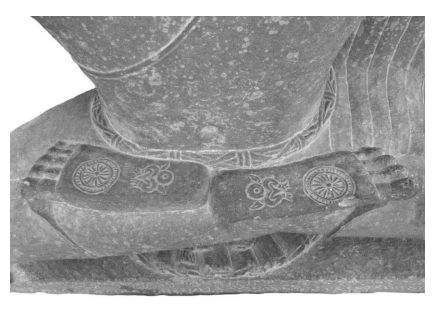

to acquire this and the other marks.76 Besides caricaturing Devadatta as the very opposite of the Buddha, the tale also reinforces in a way the importance of the type of exposition given in the Lakkhaṇ*a-sutta*, catering for the need to know clearly what type of deeds will lead to acquiring wheel-marks under one's feet, as well as the other marks. 

By way of providing a visual counterpart to the entertaining tale of Devadatta's unsuccessful attempt to acquire wheel-marks, figure 13 below shows part of an image which depicts a seated Buddha displaying the soles of his feet.77 These carry the wheel-marks to which according to the Mūlasarvāstivāda*Vinaya* Devadatta so ardently aspired. 

Figure 13 Wheel-marks on the Feet of a Seated Buddha 

## 4.7 The Marks And Masculinity

Another dimension related to the type of body required for becoming a Buddha is that such a body is a male one. This already emerges from a listing of five impossibilities for women, found in the Bahudhātuka*-sutta* and its parallels.78 Closer inspection of the reference to such impossibilities in the light of their absence from a Madhyama-*āgama* parallel makes it fairly probable that this stipulation is a later addition to a discourse originally not concerned with what is possible or impossible for women.79 Nevertheless, for these impossibilities to be mentioned in the Bahu-dhātuka*-sutta* and in all but one of its parallels shows that this doctrine would have come into being at a comparatively early stage in the evolution of Buddhist thought. In fact the same doctrine is also found in the Madhyama-*āgama*, albeit in a different discourse. In this case, the impossibilities for women are absent from most of the other parallels, in-cluding the Pāli version.

80 Thus when the notion of the five impossibilities of women arose, it was allocated to different contexts, with the Theravāda reciters opting for their version of the Bahudhātuka*-sutta*, 
whereas the Sarvāstivādins instead gave it a different placing. 

According to this doctrine, a woman cannot be a wheel-turning king or a Buddha, and she is also not able to occupy the heavenly position of a Brahmā, Śakra, or Māra. Although in its early manifestations the listing of such impossibilities would have been mainly an expression of leadership conceptions (in fact the option of becoming a Māra would hardly have been of any practical relevance), with the coming into being of the bodhisattva path this stipulation acquires considerably more significance, comparable to the shift from examining the karmic background of the thirty-two marks in the *Lakkhaṇa-sutta* to taking these marks as a script for the path to Buddhahood. 

Not only the actual becoming of a Buddha, but even to be an advanced bodhisattva was eventually considered to require a male body. 

Elsewhere I have argued that this might have been influenced by the evolution of *jātaka* tales.81 The type of *jātaka*s found among the early discourses involve past lives of the Buddha Gautama as a human. Tales that are common heritage to the Pāli discourse tradition and the discourse collections of other traditions involve four past lives as former kings or brahmin chaplains,82 and another two lives as an eminent brahmin who makes a lavish offering and as a brahmin student.83 Due to their narrative setting, these past lives are consistently male.84 When incorporating various tales from the ancient Indian narrative repertoire, *jātaka* tales of the type found in the Pāli tradition in the commentary on the *Jātaka* verses collected in the fifth *Nikāya*, maleness would have naturally served as a stable characteristic to string together stories that exhibit all kinds of variations, comprising numbers of episodes involving animals, etc. When identifying one of the protagonists of any such tale as a former existence of the Buddha, the choice unsurprisingly will tend to fall on a male protagonist. 

―――――― 81 The present part is based on an extract from Anālayo 2015c; cf. also Anālayo 2010a: 
55–71 and 2014d. 

82 DN 5 at DN I 143,26 and its parallels in fragment 408r4f, von Criegern 2002: 35, and DĀ 23 at T I 100b26 vary, as DN 5 identifies the Buddha with the brahmin chaplain, DĀ 23 with the king, and the fragment with both (already noted in Anālayo 2010a: 69). The other instances do not exhibit such variations. DN 17 at DN II 196,11 and its parallels in Sanskrit fragments, Waldschmidt 1951: 354,9 (§34.166) and Matsumura 1988: 48,3, as well as DĀ 2 at T I 24b22 (which mentions six past lives as a wheel-turning king in general), T 5 at T I 171a19, T 6 at T I 186c7, T 7 at T I 203a6, and MĀ 68 at T I 518b8 agree on a past life as a king. The remaining examples agree on a past life as a brahmin chaplain. The first of these is DN 19 at DN II 251,9 and its parallels DĀ 3 at T I 34a9 and the *Mahāvastu*, Senart 1897: 224,5; another parallel, T 8 at T I 213c14, does not provide an identification. The other example is MN 83 at MN II 82,22 and its parallels MĀ 67 at T I 515a7, EĀ 50.4 at T II 810a26, and D 1 kha 56a2 or Q 1030 ge 51b6. 

83 AN 9.20 at AN IV 394,11 and its parallels MĀ 155 at T I 678a7, T 73 at T I 879c19, T 74 at T I 882a13, and EĀ 27.3 at T II 645a9; another parallel, T 72 at T I 878c11, gives the tale without identification. MN 81 at MN II 54,18 and its parallels MĀ 63 at T I 503a5, the *Mahāvastu*, Senart 1882b: 335,5, and the Saṅ*ghabhedavastu*, Gnoli 1978: 30,14 and D 1 ga 10a4 or Q 1030 nge 9a7. 

84 Cf. in more detail Anālayo 2015c: 96–100. 

With the coming into being of the bodhisattva path, such stories would in turn have provided a blueprint for the path to Buddhahood, following the lead of the type of exposition found in the *Lakkhaṇa-sutta*. 

On its own, however, a story about the Buddha having been a king or brahmin chaplain in the past need not take on a meaningful function in a context of aspiring to Buddhahood. One would hardly think it necessary to have to become a brahmin chaplain or a king and repeat what the Buddha presumably did in the past in order to progress on the path to becoming a Buddha oneself. An aspiration to future Buddhahood, in particular in its bodily dimension, would instead more naturally take its inspiration from a presentation of the type found in the Lakkhaṇ*a-sutta*. 

As the detailed survey above would have shown, the *Lakkhaṇa-sutta* quite explicitly and in much detail depicts specific relationships between particular deeds from the past and bodily marks as well as qualities or endowments of a Buddha. Once such a type of presentation has blazed the trail, however, the quest for further information in order to carve out the details of the bodhisattva path would naturally lead to an increasing interest in *jātaka* tales. 

The unfortunate consequence of all this appears to have been the conclusion that one not only has to acquire a male body in the lifetime when one becomes a Buddha, in line with leadership conceptions prevalent in the ancient Indian setting, but one already has to do so during the advanced stages of one's career as a bodhisattva in earlier lives. This is what the predominantly male character of the Buddha in his past lives suggests. Such an explicit conclusion is in fact drawn in the Bodhi-*sattvabhūmi*, for example, according to which an advanced bodhisattva has left behind womanhood for good and will not be reborn again as a female.85 In the same vein, the *Nidānakathā* of the *Jātaka* stipulates possession of a male genital organ as one of eight conditions which a bodhisattva must fulfil to be eligible for the prediction of future Buddhahood.86 Another point relevant to this topic is the nature of the Buddha's male organ as one of the thirty-two marks, which has been an object of much discussion. The notion that his male organ is in some way "concealed in a sheath", or "enclosed in a sheath",
87 needs to be considered against the background of the function of the thirty-two marks and the *vita* of the Buddha. This description could hardly refer just to having foreskin, as to have such is normal for a male and would not be worth being explicitly mentioned as one of the thirty-two marks.88 It could also not refer to some sort of covering by a sheath that would render the genital organ dysfunctional, because Gautama fathered a son before going forth and wheel-turning kings, who similarly have this mark, father according to the standard description more than a thousand sons. 

The Madhyama-*āgama* parallel to the Brahmāyu*-sutta*, translated in chapter 2, explains this characteristic to be similar to that of a king of horses.89 The *Dīrgha-āgama* parallel to the Mahāpadāna*-sutta* also refers to a horse in its description of this mark.90 The Ekottarika-*āgama* parallel to the *Sela-sutta* employs the same expression, additionally explaining that this stands for chastity and purity.91 Given that in the case of a horse the male organ is retractable, these comparisons point to a similar implication for the Buddha's private parts.92 That is, the perhaps most simple explanation that suggests itself 
―――――― 86 Jā I 44,20: liṅ*gasampatti*; cf. also the discussion in Endo 1997/2002: 253f. Ps IV 
122,12 and Mp II 15,7 precede such a reference with the indication that a woman is unable to have the (full-fledged) aspiration for Buddhahood, pa*ṇidhānamattam* pi itthiyā na sampajjati. 

87 Translations by Rhys Davids and Rhys Davids 1921: 138 and Walshe 1987: 441 of the term *kosohitavatthaguyha* found in DN 30 at DN III 143,24. 

88 This has already been pointed out by Egge 2003: 205 note 18, who comments that 
"the phrase kosohitaṃ*vatthaguyha*ṃ is usually rendered as 'the genitals (lit. "that which is to be hidden by a cloth") are enclosed in a sheath'. However, because *kosa* can mean foreskin, this mark thus understood is hardly distinctive."
89 MĀ 161 at T I 686b16: 猶良馬王. 90 DĀ 1 at T I 5b5: 陰馬藏. 91 EĀ 49.6 at T II 799c13: 貞潔陰馬藏. 92 Cf. in more detail Anālayo 2011b: 46. Verardi 1999/2000: 71 comments that this mark indicates also the "sexually indistinct nature" of a superior being, comparafrom the understanding reflected in these *Āgama* passages is that the Buddha was able to retract his genitals.93 This would indeed be a mark that requires an act of demonstration, just as the ability of the tongue to reach the ears, which is what usually happens when brahmins wish to investigate the Buddha's possession of the thirty-two marks.94 The need for an act of demonstration pertains only to these two marks, making it fair to assume that both require to be performed in order to be witnessed. 

Such an understanding of these two marks results in qualities that can indeed be common to a wheel-turning king and a Buddha and at the same time also reflect the difference between the two. A functional genital organ which can be retracted, but does not need to be in that condition all the time, can fulfil the function of fathering more than a thousand sons in the case of a wheel-turning king. In its retracted condition the same mark can serve as a meaningful expression of the Bud-dha's aloofness from sexuality.95 In turn, whereas the wheel-turning king's use of his long tongue is less prominent in narratives concerning his reign, the Buddha is shown to use his tongue continually to engender 
"several thousand sons", as stated explicitly in the *Lakkhaṇa-sutta*, namely by way of teaching the Dharma and thereby gathering monk disciples who become the "sons of the Śākyan" or the "sons of the Buddha". In this way, one of the two marks acquires a more active function in the case of each of these two careers open to one who has all the thirty-two marks, namely becoming either a wheel-turning king or a Buddha. 

The remaining marks seem to convey to some degree an androgynous impression, presenting the Buddha with masculine and feminine qualities.96 Most of the other marks, like the wheel on the soles of the feet, do not fall into either category. Although the comparison of the torso and the teeth to those of a lion conveys masculinity, this needs to be read alongside the description of the softness of his hands and feet, as well as of his skin; and also in conjunction with comparisons of his legs to those of an antelope, his eyelashes to those of a cow, and his voice to that of a cuckoo.97 A proper assessment of the entire list of thirty-two marks makes it clear that this is certainly not the description of an epit-ome of masculinity, a "bull of a man", but rather a depiction that gives room to female qualities alongside masculine ones.98 A more gender-inclusive perspective also emerges from the wheelmark in the *Lakkhaṇa-sutta*, which predicts in relation to the Buddha that "great is his retinue of monks, nuns, male lay followers, female lay followers." These are the four assemblies whose establishment, according to the Mahāparinirvāṇa-s*ūtra* and its parallels, the Buddha had soon after his awakening considered a task he wanted to complete before passing away.99. Thus even at the comparatively late time when the exposition on the karmic relationship of the marks in the *Lakkhaṇa-sutta* came into being, the nuns were still considered an integral part of the Buddha's mission, rather than being perceived as the cause for the decline of his dispensation. 

In sum, although the function of the thirty-two marks as a chart for the bodhisattva path would have contributed to making the advanced stages of this path the sole preserve of males, in their function in the early discourses the thirty-two marks are not yet an emblem of masculinity. 

A combination of the genealogy of Buddhas in the Mahāvadāna-*sūtra* and the *Lakkhaṇa-sutta*'s depiction of deeds performed by Gautama in past lives would have opened the door to conceiving of the career of a bodhisattva over a series of past lives. As a result, the thirty-two marks appear to have become a psycho-somatic script for the bodhisattva path. 

The notion of certainty of reaching Buddhahood, associated with their acquisition, would have shifted to past lives as well and taken the form of a prediction given by another Buddha. 

# Conclusion

The description of the Buddha's footprint in the discourse to Droṇa would originally have been without any marks. In the aniconic period of Indian art, the footprint adorned with a wheel served as a convenient marker of the Buddha's presence and as an appropriate object for expressing devotion. Such depictions would have influenced textual accounts, which appear to have copied the description of the wheeltreasure as endowed with a thousand spokes, mirroring the thousand rays of the sun. This description seems to have been applied to the Bud-dha's foot and footprint, eventually mentioning explicitly also the rim and hub, as well as in some textual traditions adding the motif of the brilliance of the thousand-spoked wheel. 

The original conception of the thirty-two marks of the Buddha appears to have been concerned with subtle physical nuances, the detection of which requires previous training in the corresponding lore and close scrutiny. Although the early discourses present concern with the marks as a brahminical pursuit, such preoccupations are not censured or criticized. Instead, the marks are presented as a convenient tool by means of which brahmins can be converted. 

Due to the influence of visualization and depiction in art, the descriptions of some marks seem to have evolved further, comparable to the addition of a thousand-spoked wheel to the simple footprint in the discourse to Droṇa. As a result, several of the marks, in the way they have come down to us in the texts, are hard to make sense of. 

With the starting point in a conception of the thirty-two marks as only recognizable by brahmins trained in the lore of prognostication, visualizing the marks in the context of recollecting the Buddha, and even more so when depicting him in art, inevitably resulted in the marks becoming more visible and evident. As part of the same development, in textual sources the marks increasingly come to feature as something that everyone can see and recognize, alongside the halo of brilliance with which the Buddha comes to be endowed. 

With such easy visibility, the salvific function of the thirty-two marks is able to expand beyond brahmins to serve as a means of conversion in general. Besides conversion, the marks also come to function as a source of inspiration and even healing for those already converted. 

In the Mahāvadāna*-sūtra* and its parallels the thirty-two marks can be seen to be in the process of becoming a necessary requirement for Buddhahood. This trend to generalization ties in with a trajectory I studied in *The Genesis of the Bodhisattva Ideal*, where various marvels associated with the bodhisattva Gautama, especially his claim, having just been born, to be supreme in the world, become the norm for a bodhisattva in general.1 The *Lakkhaṇa-sutta* exemplifies the coming into being of the karmic perspective on the marks, showcasing how a particular mark reflects specific wholesome deeds done in the past and in what way this contributes to Buddhahood. In their karmic setting the marks function in a way comparable to a convex lens, becoming an embodiment of accumulated merits from the past and at the same time serving as a visual summary of what makes a Buddha. 

In this way the scene appears to be set for the coming into being of the aspiration to become an embodiment of the thirty-two marks, based on the arising of the very idea that a particular form of conduct over a series of past lives is required for the attainment of Buddhahood. This idea might well have had its point of departure in the type of exposition found in the *Lakkhaṇa-sutta*, whose original intent would have been simply to provide a Buddhist doctrinal context for the lore of the thirty-two marks by exploring the karma believed to have led to their acquisition. 

It is in particular in combination with the genealogy of Buddhas that this karmic perspective on the marks seems to open the door to conceiving of the career of a bodhisattva over a series of past lives. As part of this trajectory, the karmic perspective on the thirty-two marks would have become a script for the bodhisattva path, an emblem for the certainty of accomplishing Buddhahood. 

With the shift of emphasis towards progress on the bodisattva path over a series of past lives, the narrative of the prediction by fortune tellers that the infant bodhisattva will become a Buddha, if he goes forth, could have served as a starting place for the arising of the idea that past Buddhas predict the future success of a bodhisattva. 

A step taken in this direction emerges from the Madhyama-*āgama* discourse that depicts the advent of the next Buddha, where the Buddha Gautama gives a prediction to a monk in the assembly that he will be successful in becoming the Buddha Maitreya.2 Another dimension of the same development can be discerned in the Madhyama-*āgama* parallel to the *Acchariyabbhutadhamma-sutta*, where during a meeting with the previous Buddha Kāśyapa the bodhisattva Gautama vows to become a Buddha himself in the future.3 In conjunction with my earlier study of *The Genesis of the Bodhisattva* Ideal, in which I already explored the prediction of Maitreya and Gau-tama's vow under Kāśyapa, the material covered in the present examination shows how central components of the bodhisattva path can be discerned in an embryonic stage among early discourse literature. 

Needless to say, the evolution of the bodhisattva ideal is a complex process influenced by a variety of conditions. Thus the early discourses can only offer one of the possible windows on this phenomena. Nevertheless, it seems to me that the passages examined in this and the previous study do help to recognize the continuity of development in Buddhist thought from early to later times and allow the construction of informed hypotheses regarding how essential elements relevant to the arising of the bodhisattva ideal might have come into being. 

Both studies in conjunction testify to the worth of comparing versions of the early discourses, extant from different reciter traditions, in order to appreciate early stages in the history of Buddhist doctrine and practice. 

# Abbreviations

| AN    | Aṅguttara-nikāya                                                                                       |
|-------|--------------------------------------------------------------------------------------------------------|
| Ap    | Apadāna                                                                                                |
| Ap-a  | Apadāna-aṭṭhakathā                                                                                     |
| B e   | Burmese edition                                                                                        |
| CBETA | Chinese Buddhist Electronic Text Association                                                           |
| C e   | Ceylonese edition                                                                                      |
| D     | Derge edition                                                                                          |
| DĀ    | Dīrgha-āgama (T 1)                                                                                     |
| Dhp   | Dhammapada                                                                                             |
| Dhp-a | Dhammapada-aṭṭhakathā                                                                                  |
| DN    | Dīgha-nikāya                                                                                           |
| EĀ    | Ekottarika-āgama (T 125)                                                                               |
| E e   | PTS edition                                                                                            |
| Gā    | Gāndhārī                                                                                               |
| Jā    | Jātaka                                                                                                 |
| MĀ    | Madhyama-āgama (T 26)                                                                                  |
| MN    | Majjhima-nikāya                                                                                        |
| Mp    | Manorathapūraṇī                                                                                        |
| Or    | Oriental                                                                                               |
| Pj II | Paramatthajotikā                                                                                       |
| Ps    | Papañcasūdanī                                                                                          |
| PTS   | Pali Text Society                                                                                      |
| Q     | Peking edition                                                                                         |
| SĀ    | Saṃyukta-āgama (T 99)                                                                                  |
| SĀ2   | Saṃyukta-āgama (T 100)                                                                                 |
| S e   | Siamese edition                                                                                        |
| SHT   | Sanskrithandschriften aus den Turfanfunden                                                             |
| SN    | Saṃyutta-nikāya                                                                                        |
| Sn    | Sutta-nipāta (reference is to verse number or else to the  PTS number and pagination in case of prose) |
| Sp    | Samantapāsādikā                                                                                        |
| Sv    | Sumaṅgalavilāsinī                                                                                      |

| 142   | Buddhapada and the Bodhisattva Path   |
|-------|---------------------------------------|
| T     | Taishō edition (CBETA)                |
| Th-a  | Theragāthā-aṭṭhakathā                 |
| Thī   | Therīgāthā                            |
| Thī-a | Therīgāthā-aṭṭhakathā (ed. 1998)      |
| Ud    | Udāna                                 |
| Vin   | Vinaya                                |
| Vism  | Visuddhimagga                         |
| Vv    | Vimānavatthu                          |

# References

Akanuma Chizen 1930/1994: *A Dictionary of Buddhist Proper Names*, Del-hi: Sri Satguru. 

Allon, Mark 2001: Three Gāndhārī Ekottarikāgama-*Type Sūtras, British* Library Kharo*ṣṭhī Fragments 12 and 14*, Seattle: University of Washington Press. 

Anālayo 2006: "The Ekottarika-āgama Parallel to the Saccavibhaṅga-sutta and the Four (Noble) Truths", *Buddhist Studies Review*, 23.2: 145–153 
(reprinted in 2016b). 

― 2007: "The Divine Messengers", in *Buddhist Studies in Honour of Venerable Kirindigalle Dhammaratana*, S. Ratnayaka (ed.), 15–26, Colom-bo: Felicitation Committee. 

― 2009a: "The Bahudhātuka-sutta and Its Parallels on Women's Inabil-ities", *Journal of Buddhist Ethics*, 16: 137–190 (reprinted in 2012a). 

― 2009b: "The Lion's Roar in Early Buddhism - A Study Based on the Ekottarika-āgama Parallel to the Cūḷasīhanāda-sutta", *Chung-Hwa Buddhist Journal*, 22: 3–23 (reprinted in 2016b). 

― 2010a: *The Genesis of the Bodhisattva Ideal*, Hamburg: Hamburg University Press. 

― 2010b: "The Influence of Commentarial Exegesis on the Transmission of Āgama Literature", in *Translating Buddhist Chinese, Problems and* Prospects, K. Meisig (ed.), 1–20, Wiesbaden: Harrassowitz (reprinted in 2015e). 

― 2011a: A Comparative Study of the Majjhima-*nikāya*, Taipei: Dharma Drum Publishing Corporation. 

― 2011b: "The Conversion of the Brahmin Sela in the Ekottarika-āgama",
Thai International Journal of Buddhist Studies, 2: 37–56 (reprinted in 2016b). 

― 2011c: "Right View and the Scheme of the Four Truths in Early Buddhism, The Saṃyukta-āgama Parallel to the Sammādiṭṭhi-sutta and the Simile of the Four Skills of a Physician", *Canadian Journal of Buddhist* Studies, 7: 11–44 (reprinted in 2015e). 

― 2011d: "The Tale of King Ma(k)hādeva in the Ekottarika-āgama and the Cakravartin Motif", *Journal of the Centre for Buddhist Studies, Sri* Lanka, 9: 43–77 (reprinted in 2016b). 

― 2012a: Madhyama-*āgama Studies*, Taipei: Dharma Drum Publishing Corporation. 

― 2012b: "The Tale of King Nimi in the Ekottarika-āgama", *Journal of* the Centre for Buddhist Studies, Sri Lanka, 10: 69–94.

― 2012c: "Teaching the Abhidharma in the Heaven of the Thirty-three, The Buddha and His Mother", Journal of the Oxford Centre for Bud-*dhist Studies*, 2: 9–35 (reprinted in 2015e). 

― 2013a: "The Chinese Parallels to the Dhammacakkappavattana-sutta 
(2)", *Journal of the Oxford Centre for Buddhist Studies*, 5: 9–41 (reprinted in 2016b). 

― 2013b: "A Note on the Term Theravāda", *Buddhist Studies Review*, 30.2: 
216–235 (reprinted in Anālayo 2016b).

― 2013c: "Two Versions of the Mahādeva Tale in the Ekottarika-āgama, A Study in the Development of Taishō No. 125", in Research on the Ekottarika-*āgama (Taishō 125)*, Dhammadinnā (ed.), 1–70, Taipei: 
Dharma Drum Publishing Corporation (reprinted in 2016b). 

― 2014a: "Beautiful Eyes Seen with Insight as Bereft of Beauty - Subhā Therī and Her Male Counterpart in the Ekottarika-āgama", The Journal of the Sati Center for Buddhist Studies, 2: 39–53 (reprinted in 2016b). 

― 2014b: "The Brahmajāla and the Early Buddhist Oral Tradition", An-nual Report of the International Research Institute for Advanced Bud-*dhology at Soka University*, 17: 41–59. 

― 2014c: *The Dawn of Abhidharma*, Hamburg: Hamburg University Press. 

― 2014d: "Karma and Female Birth", *Journal of Buddhist Ethics*, 21: 109–
153 (reprinted in 2016b). 

― 2014e: "Maitreya and the Wheel-turning King", *Asian Literature and* Translation: A Journal of Religion and Culture, 2.7: 1–29.

― 2014/2015: "Discourse Merger in the Ekottarika-āgama (2), The Parallels to the Kakacūpama-sutta and the Alagaddūpama-sutta", Journal of the Centre for Buddhist Studies, Sri Lanka, 12: 63–90 (reprinted in 2016b). 

― 2015a: "Āgama/Nikāya", in *Brill's Encyclopedia of Buddhism*, J. Silk, O. von Hinüber, and V. Eltschinger (ed.), 50–59, Leiden: Brill. 

― 2015b: "The Buddha's Fire Miracles", *Journal of the Oxford Centre for* Buddhist Studies, 10: 9–42.

― 2015c: "The Buddha's Past Life as a Princess in the Ekottarika-āgama", 
Journal of Buddhist Ethics, 22: 95–137 (reprinted in 2016b). 

― 2015d: "Discourse Merger in the Ekottarika-āgama (1), The Parallel to the Bhaddāli-sutta and the Latukikopama-sutta, Together with Notes on the Chinese Translation of the Collection", Singaporean Journal of Bud-*dhist Studies*, 2: 5–35 (reprinted in 2016b). 

― 2015e: Saṃyukta-*āgama Studies*, Taipei: Dharma Drum Publishing Corporation. 

― 2016a: *The Foundation History of the Nuns' Order*, Bochum: Projektverlag. 

― 2016b: Ekottarika-*āgama Studies*, Taipei: Dharma Drum Publishing Corporation. 

― 2017: "The 'School Affiliation' of the Madhyama-āgama", in *Research* on the Madhyama-*āgama*, Dhammadinnā (ed.), 55–76, Taipei: Dharma Drum Publishing Corporation. 

Anesaki Masaharu 1908: "The Four Buddhist Āgamas in Chinese, A Concordance of Their Parts and of the Corresponding Counterparts in the Pāli Nikāyas", *Transactions of the Asiatic Society of Japan*, 35.3: 1–149.

Auboyer, J. 1987: "A Note on 'the Feet' and Their Symbolism in Ancient India", in *Kusumāñjali, New Interpretation of Indian Art & Culture*, M.S. 

Nagaraja Rao (ed.), 125–127, Delhi: Agam Kala Prakashan. 

Banārasī Lāl 2003: "Samyaksambuddhabhāṣitapratimālakṣaṇa", Dhīḥ *(Journal of [the] Rare Buddhist Texts Research Unit)*, 35: 117–136. 

Banerjea, Jitendra Nath 1930: "The 'Webbed Fingers' of [the] Buddha", 
Indian Historical Quarterly, 6.4: 717–727.

― 1931a: "Uṣṇīṣaśiraskatā in the Early Buddha Images of India", *Indian* Historical Quarterly, 7.3: 499–514.

― 1931b: "The 'Webbed Fingers' of [the] Buddha", Indian Historical Quarterly, 7.3: 654–656. 

― 1933: "Pratimālakṣaṇam", *Journal of the Department of Letters, University of Calcutta*, 23: 1–84. 

Bapat, P.V. 1945 (part 1): "The Arthapada-Sūtra Spoken by the Buddha", 
Visva-Bharati Annals, 1: 135–227.

Bareau, André 1960: "La construction et le culte des stūpa d'après les Vinayapiṭaka", *Bulletin de l'École Française d'Extrême-Orient*, 50: 229–274. 

―1962: "La légende de la jeunesse du Buddha dans les Vinayapiṭaka an-ciens", *Oriens-Extremus*, 9.1: 6–33.

― 1966: "L'origine du Dīrgha-āgama traduit en chinois par Buddhayaśas", 
in Essays Offered to G.H. *Luce by His Colleagues and Friends in Honour* of His Seventy-fifth Birthday, B. Shin et al. (ed.), 49–58, Ascona: Arti-bus Asiae. 

― 1971: "The Superhuman Personality of the Buddha and Its Symbolism in the Mahāparinirvāṇasūtra of the Dharmaguptaka", in Myth and Sym-*bols, Studies in Honor of Mircea Eliade*, J.M. Kitagawa et al. (ed.), 9–21, Chicago: University of Chicago Press. 

Barnes, Nancy Schuster 1987: "Buddhism", in *Women in World Religions*, 
A. Sharma (ed.), 105–133, New York: State University of New York Press. 

Barua, Dipak Kumara 1971/2003: An *Analytical Study of Four Nikāyas*, 
Delhi: Munshiram Manoharlal. 

Bautze-Picron, Claudine 2009: "Antagonistes et complémentaires, le lion et l'éléphant dans la personalité du Buddha", in Penser, dire et représenter l'animal dans le monde indien, N. Balbir and G.-J. Pinault (ed.), 523–
572, Paris: Librairie Honor' Champion.

Bechert, Heinz and K. Wille 2004: Sanskrithandschriften aus den Turfan-*funden, Teil 9*, Wiesbaden: Franz Steiner. 

Bernhard, Franz 1965 (vol. 1): *Udānavarga*, Göttingen: Vandenhoeck & 
Ruprecht. 

Bingenheimer, Marcus 2011: Studies in Āgama Literature, With Special Re-ference to the Shorter Chinese Sa*ṃyuktāgama*, Taiwan: Shi Weng Feng Print Corporation. 

Bloss, L.W. 1978: "The Taming of Māra: Witnessing to the Buddha's Vir-tues", *History of Religions*, 17: 156–176.

Bodhi, Bhikkhu 2017: *The Suttanipāta, A Collection of Ancient Buddhist Texts,*
Translated from the Pāli Together with its Commentary Paramatthajotikā II, 'The Elucidator of the Supreme Meaning', and Excerpts from the Nid-*desa*, Boston: Wisdom (forthcoming).

Bollée, Willem B. 2005: "Physical Aspects of Some Mahāpuruṣas, Descent, Foetality and Birth", *Wiener Zeitschrift für die Kunde Südasiens*, 49: 5–34.

- 2008: "Folklore on the Foot in Pre-Modern India", Indologica Taurinen-sia, 34: 39–145. 

Boucher, Daniel 2008: *Bodhisattvas of the Forest and the Formation of the* Mahāyāna, A Study and Translation of the Rāṣṭrapālaparipṛcchā-*sūtra*, 
Honolulu: University of Hawai'i Press. 

Bram, Jean Rhys 1987: "Sun", in *The Encyclopedia of Religion, Volume 14*, 
J.M. Eliade (ed.), 132–143, New York: Macmillan Publishing Company. 

Brough, John 1962/2001: The Gāndhārī Dharmapada, Edited with an In-*troduction and Commentary*, Delhi: Motilal Banarsidass. 

Brown, Robert L. 1990: "God on Earth: The Walking Buddha in the Art of South and Southeast Asia", *Artibus Asiae*, 50.1/2: 73–107.

- 1997: "Narrative as Icon: The Jātaka Stories in Ancient Indian and Southeast Asian Architecture", in *Sacred Biography in Buddhist Traditions of* South and Southeast Asia, J. Schober (ed.), 64–109, Honolulu: Univer-sity of Hawai'i Press.

Bucknell, Roderick S. 2006: "Saṃyukta-āgama", in Encyclopaedia of Bud-*dhism*, W.G. Weeraratne (ed.), 7.4: 684–687, Sri Lanka: Department of Buddhist Affairs. 

- 2011: "The Historical Relationship Between the Two Chinese Saṃyuk-tāgama Translations", *Chung-Hwa Buddhist Journal*, 24: 35–70. 

Burnouf, E. 1852/1925: *Le Lotus de la Bonne Loi*, Paris: Librairie Orientale et Américaine. 

Childers, Robert Caesar 1875/1993: *A Dictionary of the Pali Language*, New Delhi: Asian Educational Services. 

Choong Mun-keat 2000: *The Fundamental Teachings of Early Buddhism,* 
A Comparative Study Based on the Sūtrāṅga Portion of the Pāli Saṃyutta-nikāya and the Chinese Sa*ṃyuktāgama*, Wiesbaden: Otto Har-rassowitz. 

Chung Jin-il 2014: "Puṇya-sūtra of the Ekottarikāgama in Comparison with the Fu-jing of the Chinese Madhyamāgama", *Critical Review for Buddhist Studies*, 16: 9–33.

- 2017: "Śrutānṛśamsa-sūtra of the Dīrgha-āgama in Comparison with the Wende-jing 聞德經 of the Madhyama-āgama", in Research on the Madh-yama-*āgama*, Dhammadinnā (ed.), 113–146, Taipei: Dharma Drum Publishing Corporation.

Chung Jin-il and T. Fukita 2011: A Survey of the Sanskrit Fragments Cor-responding to the Chinese Madhyamāgama, Including References to Sanskrit Parallels, Citations, Numerical Categories of Doctrinal Concepts, and Stock Phrases, Tokyo: Sankibo Press. 

Chutiwongs, Nandana 1990: "The Buddha's Footprints, A Preliminary Study", 
Ancient Ceylon, 10: 59–116. 

Cicuzza, Claudio 2010: *A Mirror Reflecting the Entire World, The Pāli* Buddhapādamaṅgala or 'Auspicious Signs on the Buddha's Feet', Criti*cal Edition with English Translation*, Bangkok/Lumbini: Fragile Palm Leaves Foundation, Lumbini International Research Institute. 

Cirlot, J.E. 1971/2002: *A Dictionary of Symbols, Second Edition*, New York: 
Dover Publications. 

Ciurtin, Eugen 2010/2011: "The Man with All Qualities: A Buddhist Suite", 
Bulletin d'*Études Indiennes*, 28/29: 339–367.

Clarke, Shayne 2015: "Vinayas", in *Brill's Encyclopedia of Buddhism*, J. Silk, O. von Hinüber, and V. Eltschinger (ed.), 60–87, Leiden: Brill. 

Cohen, Richard S. 2000: "Kinsmen of the Sun, Śākyabhikṣus and the Insti-tutionalization of the Bodhisattva Ideal", *History of Religions*, 40.1: 1–
31.

Collett, Alice and Anālayo 2014: "Bhikkhave and Bhikkhu as Gender-in-clusive Terminology in Early Buddhist Texts", Journal of Buddhist Ethics, 21: 760–797. 

Collins, Steven 1996: "The Lion's Roar on the Wheel-Turning King, A 
Response to Andrew Huxley's 'The Buddha and the Social Contract'",
Journal of Indian Philosophy, 24: 421–446.

― 2007: "What Is Literature in Pali?", in *Literary Cultures in History, Reconstructions from South Asia*, S. Pollock (ed.), 649–688, Berkeley: Uni-versity of California Press. 

Conze, Edward 1964: "The Buddha's Lakṣaṇas in Prajñāpāramitā", Jour-nal of the Oriental Institute, *Baroda*, 14: 225–229. 

Coomaraswamy, Ananda K. 1928: "The Buddha's cūḍā, Hair, uṣṇīṣa, and Crown", *Journal of the Royal Asiatic Society*, 815–841.

― 1931: "The 'Webbed Finger' of the Buddha", *Indian Historical Quarterly*, 
7: 20–21.

― 1935/1998: *Elements of Buddhist Iconography*, Delhi: Munshiram Manoharlal. 

― 1956: *La sculpture de Bharhut*, Paris: Vanoest. 

Cousins, L.S. 2003: "Sākiyabhikkhu/Sakyabhikkhu/Śākyabhikṣu: A Mistaken Link to the Mahāyāna?", Nagoya Studies in Indian Culture and Buddhism, 23: 1–27.

Cowell, E.B. and R.A. Neil 1886: *The Divyāvadāna, a Collection of Early* Buddhist Legends, Now First Edited from the Nepalese Sanskrit Mss. *in* Cambridge and Paris, Cambridge: Cambridge University Press. 

Cox, Collett 2014: "Gāndhārī Kharoṣṭhī Manuscripts: Exegetical Texts", in From Birch Bark to Digital Data: Recent Advances in Buddhist Manuscript Research, P. Harrison and J.-U. Hartmann (ed.), 35–49, Wien: 
Verlag der Österreichischen Akademie der Wissenschaften.

Cunningham, Alexander 1879: The Stûpa of Bharhut, A Buddhist Monument Ornamented with Numerous Sculptures Illustrative of Buddhist Legend and History in the Third Century B.C., London: Allen and Co. 

Cüppers, Christoph, M. Deeg, and H. Durt 2010: The Birth of the Buddha, Proceedings of a Seminar Held in Lumbini, Nepal, October 2004, Bairahawa: Lumbini International Research Institute,. 

de Clercq, Eva 2013: "Karman and Compassion: Animals in the Jain Uni-versal History", *Religions of South Asia*, 7: 141–157.

Deeg, Max 2003: The Places Where Siddhārtha Trod: Lumbinī and Kapi-*lavastu*, Bairahawa: Lumbini International Research Institute. 

de Guerny, Jacques 2014: Buddhapāda, Following the Buddha's Foot*steps*, 
Bangkok: Orchid Press. 

Dehejia, Vidya 1990: "On Modes of Visual Narration in Early Buddhist Art", *The Art Bulletin*, 72.3: 374–392. 

― 1991: "Aniconism and the Multivalence of Emblems", *Ars Orientalis*, 21: 
45–66.

de Jong, Jan Willem 1968: [Review of] O 'Zolotoj knige' S. *Damdina* by Š. 

Bira, Ulan-Bator 1964, *T'oung Pao*, 54: 173–189. 

― 1981: "Fa-Hsien and Buddhist Texts in Ceylon", *Journal of the Pali Text* Society, 9: 105–116.

Demiéville, Paul 1951: "À propos du concile de Vaiśālī", *T'oung Pao*, 40: 
239–296.

Deo, Shantaram Bhalchandra 1956: *History of Jaina Monachism, From* Inscriptions and Literature, Poona: Deccan College, Postgraduate and Research Institute. 

Dhammadinnā, Bhikkhunī 2015: "Predictions of Women to Buddhahood in Middle-Period Literature", *Journal of Buddhist Ethics*, 22: 477–531. 

― in preparation: *The Arising of Great Compassion in Indian Buddhism*.

Dhammika, S. 2015: Nature and the Environment in Early Buddhism, *Supplement to Volume 6 of the Journal of the Oxford Centre for Buddhist* Studies, http://ocbs.org/wp-content/uploads/2015/09/journalsuppneeb. pdf Dietz, Siglinde 2006: "Fragments Containing Lists of the 32 Mahāpuruṣalakṣaṇas", in Jaina-Itihāsa*-Ratna, Festschrift für Gustav Roth zum 90*.

Geburtstag, U. Hüsken, P. Kieffer-Pülz, and A. Peters (ed.), 153–162, Marburg: Indica et Tibetica. 

Duroiselle, M.C. 1904: "Upagutta et Māra", Bulletin de l'É*cole Française* d'Extrême-Orient, 4: 414–428. 

Dutt, Nalinaksha 1984 (vol. 1): Gilgit Manuscripts, Mūlasarvāstivāda Vi-nayavastu, vol. *III part 1*, Delhi: Sri Satguru. 

Dutt, Sukumar 1957: *The Buddha and Five After-centuries*, London: Luzac. 

Edgerton, Franklin 1953/1998 (vol. 2): Buddhist Hybrid Sanskrit Grammar and Dictionary, Delhi: Motilal Banarsidass. 

Egge, James R. 2003: "Interpretative Strategies for Seeing the Body of the Buddha", in *Constituting Communities: Theravāda Buddhism and the* Religious Cultures of South and Southeast Asia, J.C. Holt et al. (ed.), 
189–208, Albany: State University of New York Press. 

Emeneau, M.B. 1949/1988: "The Strangling Figs in Sanskrit Literature", in Sanskrit Studies of M.B. *Emeneau: Selected Papers*, B.A. van Nooten 
(ed.), 11–27, Berkeley: University of California.

Emmerick, R.E. 1968: The Book of Zambasta, A Khotanese Poem on Bud-*dhism*, London: Oxford University Press. 

Endo Toshiichi 1997/2002: Buddha in Theravada Buddhism, A Study of the Concept of Buddha in the Pali Commentaries, Sri Lanka, Dehiwela: 
Buddhist Cultural Centre. 

― 2014/2015: "The Buddha's Fathom Long Halo (*byāmappabhā*) and Rays (raṃsi), A Critical Survey in the Pāli Commentarial Literature", Journal of the Centre for Buddhist Studies, Sri Lanka, 12: 91–106. 

Enomoto Fumio 1986: "On the Formation of the Original Texts of the Chinese Āgamas", *Buddhist Studies Review*, 3.1: 19–30. 

Fábri, C.L. 1930: "A Græco-Buddhist Sculpture Representing the Buddha's Descent from the Heaven of the Thirty-three Gods", *Acta Orientalia*, 8.4: 
287–293.

Faure, Bernard 2003: *The Power of Denial: Buddhism, Purity and Gender*, 
Princeton: Princeton University Press. 

Finot, Louis 1901: Rāṣṭrapālaparipṛcchā, s*ūtra du Mahāyāna*, St.-Pétersbourg: Académie Impériale des Sciences. Flügel, Peter 2011: "Burial Ad Sanctos at Jaina Sites in India", *International Journal of Jaina Studies*, 7.4: 1–37.

Foucher, Alfred 1918 (vol. 2): *L'art gréco-bouddhique du Gandhâra, Étude* sur les origines de l'influence classique dans l'art bouddhique de l'Inde et de l'Extrême-Orient, Paris: Ernest Leroux. 

Freiberger, Oliver 2000: Der Orden in der Lehre, zur religiösen Deutung des Saṅgha im frühen Buddhismus, Wiesbaden: Harrassowitz. 

Fukita Takamichi 2003: *The Mahāvadānasūtra: A New Edition Based on* Manuscripts Discovered in Northern Turkestan, Göttingen: Vandenhoeck & Ruprecht. 

― 2009: "The Sanskrit Fragments Or. 15009.301–350 in the Hoernle Collection", in *Buddhist Manuscripts from Central Asia, The British* Library Sanskrit Fragments, Volume II, Karashima S. and K. Wille (ed.), 
298–334, Tokyo: International Research Institute for Advanced Buddhology, Soka University. 

― 2017: "Back to the Future of Prof. Akanuma's Age, A Research History of the School Affiliation of the Chinese Madhyama-āgama in Japan", in Research on the Madhyama-*āgama*, Dhammadinnā (ed.), 147–175, Taipei: Dharma Drum Publishing Corporation. 

Gangoly, O.C. 1938: "The Antiquity of the Buddha-image: The Cult of the Buddha", *Ostasiatische Zeitschrift*, 14: 41–59.

Gethin, Rupert 2006: "Mythology as Meditation: From the Mahāsudassana Sutta to the Sukhāvatīvyūha Sūtra", *Journal of the Pali Text Society*, 28: 63–112. 

Gifford, Julie 2003: "The Insight Guide to Hell, Mahāmoggallāna and Theravāda Buddhist Cosmology", in Constituting Communities, Theravāda Buddhism and the Religious Cultures of South and Southeast Asia, J.C. 

Holt et al. (ed.), 71–84, New York: State University of New York Press. 

Glass, Andrew 2010: "Guṇabhadra, Bǎoyún, and the Saṃyuktāgama", 
Journal of the International Association of Buddhist Studies, 31.1/2: 
185–203.

Gnoli, Raniero 1977 (part 1) and 1978 (part 2): The Gilgit Manuscript of the Saṅghabhedavastu, Being the 17th and Last Section of the Vinaya of the Mūlasarvāstivādin, Rome: Istituto Italiano per il Medio ed Estremo Oriente. 

Guang Xing 2005: *The Concept of the Buddha, Its Evolution from Early* Buddhism to the trikāya Theory, London: Routledge Curzon. 

Handlin, Lilian 2016: "A Man for All Seasons: Three Vessantaras in Premodern Myanmar", in *Readings of the Vessantara Jātaka*, S. Collins 
(ed.), 153–182, New York: Columbia University Press.

Har Dayal 1932/1970: *The Bodhisattva Doctrine in Buddhist Sanskrit Literature*, Delhi: Motilal Banarsidass. 

Harrison, Paul 1978: The Tibetan Text of the Pratyutpanna-buddha-saṃ-mukhāvasthita-samādhi-*sūtra*, Tokyo: International Institute for Buddhist Studies. 

―1987: "Who Gets to Ride in the Great Vehicle? Self-image and Identity Among the Followers of the Early Mahāyāna", *Journal of the International Association of Buddhist Studies*, 10.1: 67–89. 

― 1990: The Samādhi of Direct Encounter with the Buddhas of the Pre*sent,* 
An Annotated English Translation of the Tibetan Version of the Pratyut-panna-buddha-saṃmukhāvasthita-samādhi-sūtra with Sev*eral Appendixes relating to the History of the Text*, Tokyo: International Institute for Buddhist Studies. 

― 1992/1993: "Commemoration and Identification in Buddhānusmṛti", in In the Mirror of Memory: Reflections on Mindfulness and Remembrance in Indian and Tibetan Buddhism, J. Gyatso (ed.), 215–238, Delhi: Sri Satguru Publications. 

― 1995: "Some Reflections on the Personality of the Buddha", Otani Ga-*kuho*, 74.4: 1–29.

― 1998: The Pratyutpanna Samādhi Sutra Translated by Lokakṣema, Trans-lated *from the Chinese (Taishō Volume 13, Number 418)*, Berkeley: Nu-mata Center for Buddhist Translation and Research. 

― 2002: "Another Addition to the An Shigao Corpus? Preliminary Notes on an Early Chinese Saṃyuktāgama Translation", in Early Buddhism and Abhidharma Thought: In Honor of Doctor Hajime Sakurabe on His Seventy-seventh birthday, Sakurabe Ronshu Committee (ed.), 1–32, Kyoto: Heirakuji shoten. 

Hartmann, Jens-Uwe 1994: "Der Ṣaṭsūtraka-Abschnitt des in Ostturkestan überlieferten Dīrghāgama", *Zeitschrift der Deutschen Morgenländischen* Gesellschaft, 25.10: 324–334. 

― 2014: "The Dīrgha-āgama of the (Mūla-)Sarvāstivādins: What Was the Purpose of This Collection?", in Research on the Dīrgha-*āgama*, Dham-madinnā (ed.), 135–166, Taipei: Dharma Drum Publishing Corporation. 

Hirabayashi Jiro 2015: "The Sanskrit Fragments Or. 15009/410–450 in the Hoernle Collection", in Buddhist Manuscripts from Central Asia, The British Library Sanskrit Fragments, Volume III, Karashima S., Naga-shima J., and K. Wille (ed.), 273–313, Tokyo: International Research Institute for Advanced Buddhology, Soka University. 

Hirakawa Akira 1987: "Buddhist Literature: Survey of Texts", in *The Encyclopedia of Religion*, M. Eliade (ed.), 2: 509–529, New York: Mac-millan. 

Hiraoka Satoshi 2000: "The Sectarian Affiliation of Two Chinese Saṃ-yuktāgamas", *Journal of Indian and Buddhist Studies*, 49.1: 506–500.

― 2013: "The School Affiliation of the Ekottarika-āgama", in Research on the Ekottarika-*āgama (Taishō 125)*, Dhammadinnā (ed.), 71–105, Taipei: Dharma Drum Publishing Corporation. 

Hoernle, A.F. Rudolf 1916a: Manuscript Remains of Buddhist Literature Found in Eastern Turkestan, Facsimiles of Manuscripts in Sanskrit, Khotanese, Kuchean, Tibetan and Chinese with Transcripts, Translations and Notes, Edited in Conjunction with other Scholars, with Critical Introduction and Vocabularies, Amsterdam: St. Leonards Ad Orientem.

― 1916b: "The Sutta Nipāta in a Sanskrit Version from Eastern Turkestan", 
Journal of the Royal Asiatic Society, 709–732.

Horner, I.B. 1957/1970 (vol. 2): The Collection of the Middle Length Sayings 
(Majjhima-*Nikāya)*, London: Pali Text Society. 

Horsch, Paul 1957: "The Wheel: An Indian Pattern of World-interpreta-tion", in Liebenthal Festschrift, On the Occasion of the 70th Birthday of Prof. *Walter Liebenthal*, K. Roy (ed.), 62–79, Santiniketan: Visvabharati. 

Hung Jen-Jou and Anālayo 2017: "A Quantitative Textual Analysis of the Translation Iiom of the Madhyama-āgama (T 26) and the Ekottarika-āgama (T 125)", in Research on the Madhyama-*āgama*, Dhammadinnā 
(ed.), 177–196, Taipei: Dharma Drum Publishing Corporation. 

Huntington, Susan L. 1985/2006: *The Art of Ancient India, Buddhist, Hindu,* 
Jain, Boston: Weatherhill. 

Ichimura Shohei 2015: The Canonical Book of the Buddha's Lengthy Dis-*courses, Volume 1*, Berkeley: Bukkyo Dendo Kyokai America. 

Irwin, John 1973: "Aśokan Pillars: A Reassessment of the Evidence", *The* Burlington Magazine, 115.8: 706–720. 

Jambūvijaya, Muni 1985: Ṭhāṇaṃgasuttaṃ Samavāyaṃ*gasutta*ṃ ca, Bombay: Śrī Mahāvīra Jaina Vidyālaya.

Jin Siyan 2011: 大本經 Grande soutra sur l'essence des choses, Mahāpa-dāna-sutta, *traduit et annoté*, Paris: Éditions You-Feng Libraire & 
Éditeur.

Johnston, Edward Hamilton 1936/1995: Aśvagoṣ*a's Buddhacarita or Acts* of the Buddha, Sanskrit Text with English Translation, Cantos I to XIV 
Translated from the Original Sanskrit and Cantos XV to XXVIII Trans-lated from the Tibetan and Chinese Versions Together with an Intro-*duction and Notes*, Delhi: Munshiram Manoharlal. 

Joshi, K.L. 2007: *Matsya Mahāpurāṇ*a, Delhi: Parimal Publications. 

Kabilsingh, Chatsumarn 1991: *Thai Women in Buddhism*, Berkeley: Parallax Press. 

Karashima Seishi 2017: "Underlying Language of the Chinese Translation of the Madhyama-āgama", in Research on the Madhyama-āgama, Dhammadinnā (ed.), 197–207, Taipei: Dharma Drum Publishing Cor-poration. 

Karunaratna, Upali 1965: "Anuvyañjana", in *Encyclopaedia of Buddhism*, 
G.P. Malalasekera (ed.), 1.4: 785, Sri Lanka: Department of Buddhist Affairs. 

Katz, Nathan 1982/1989: Buddhist Images of Human Perfection, The Ara-hant of the Sutta Piṭaka Compared with the Bodhisattva and the Mahā-*siddha*, Delhi: Motilal Banarsidass. 

Kinnard, Jacob N. 1999: *Imaging Wisdom, Seeing and Knowing in the Art* of Indian Buddhism, Richmond: Curzon. 

― 2000: "The Polyvalent Pādas of Viṣṇu and the Buddha", *History of* Religions, 40.1: 32–57. 

Kramrisch, S. 1935: "Emblems of the Universal Being", Journal of the In-*dian Society of Oriental Art*, 3: 148–165.

Krishan, Y. 1966: "The Hair on the Buddha's Head and uṣṇīṣa", East and West, 16.3/4: 275–290.

Kuan Tse-Fu 2012: "A Geographical Perspective on Sectarian Affiliations of the Ekottarika Āgama in Chinese Translation (T 125)", Journal of the Oxford Centre for Buddhist Studies, 2: 179–208. 

- 2013a: "Legends and Transcendence: Sectarian Affiliations of the Ekot-tarika Āgama in Chinese Translation", Journal of the American Oriental Society, 133.4: 607–634.

- 2013b: "Mahāyāna Elements and Mahāsāṃghika Traces in the Ekottarika-āgama", in Research on the Ekottarika-*āgama (Taishō 125)*, 
Dhammadinnā (ed.), 133–194, Taipei: Dharma Drum Publishing Corporation. 

- 2013c: "The Pavāraṇā Sutta and 'Liberation in Both Ways' as against
'Liberation by Wisdom'", Bulletin of the School of Oriental and African Studies, 1–25.

Kudo Noriyuki 2004: *The Karmavibhaṅga, Transliterations and Annotations of the Original Sanskrit Manuscript from Nepal*, Tokyo: Soka University. 

― 2007: "One More Manuscript of the Karmavibhaṅga in the National Archives of Nepal, Kathmandu: Transliteration of Manuscript E (2)", Annual Report of the International Research Institute for Advanced Buddhology at Soka University, 10: 93–116. 

― 2009: "The Sanskrit Fragments Or. 15009.151–200 in the Hoernle Col-lection", in *Buddhist Manuscripts from Central Asia, The British Library* Sanskrit Fragments, Volume II, Karashima S. and K. Wille (ed.), 169–
198, Tokyo: International Research Institute for Advanced Buddhology, Soka University.

― 2015: "The Sanskrit Fragments Or. 15009/451–500 in the Hoernle Collection", in Buddhist Manuscripts from Central Asia, The British Library Sanskrit Fragments, Volume III, Karashima S., Nagashima J., 
and K. Wille (ed.), 315–346, Tokyo: International Research Institute for Advanced Buddhology, Soka University. 

Kudo Noriyuki and Shono M. 2015: "The Sanskrit Fragments Or. 15009/
601–678 in the Hoernle Collection", in Buddhist Manuscripts from Central Asia, The British Library Sanskrit Fragments, Volume III, Karashima S., Nagashima J., and K. Wille (ed.), 419–484, Tokyo: International Research Institute for Advanced Buddhology, Soka University. 

Lamotte, Étienne 1944/1981 (vol. 1) and 1970 (vol. 3): *Le traité de la* grande vertu de s*agesse de Nāgārjuna (Mahāprajñāpāramitāśāstra)*,
Louvain-la-Neuve: Institut Orientaliste. 

― 1946: "La légende du Buddha", Revue de l'Histoire de*s Religions*, 134: 
37–71.

― 1956: "Problèmes concernant les textes canoniques 'mineurs'", *Journal* Asiatique, 244.3: 249–264.

― 1958: Histoire du bouddhisme indien, des origines à l*'ère Śaka*, Louvainla-Neuve: Institut Orientaliste. 

― 1980: "Conditioned Co-production and Supreme Enlightenment", in Bud-*dhist Studies in Honour of Walpola Rahula*, S. Balasooriya et al. (ed.), 
118–132, London: Fraser.

Lefmann, S. 1902: *Lalita Vistara, Leben und Lehre des Çâkya-Buddha,* 
Textausgabe mit Varianten-, Metren- und Wörterverzeichnis, Halle: 
Verlag der Buchhandlung des Waisenhauses. 

Leumann, Ernst 1920/1966: *Buddhistische Literatur, Nordarisch und* Deutsch, Nendeln: Kraus Reprint. 

Lévi, Sylvain 1915: "Sur la récitation primitive des textes bouddhiques", 
Journal Asiatique, 11.5: 401–447.

― 1932: Mahākarmavibhaṅga (la Grande Classification des Actes) et Kar-mavibhaṅgopadeśa (Discussion sur le Mahā Karmavibhaṅga), textes sanscrits rapportés du Népal, édités et traduits avec les textes parallèles en sanscrit, en pali, en tibétain, en chinois et en koutchéen, Paris: Ernest Leroux. 

Levman, Bryan Geoffrey 2013: "Cultural Remnants of the Indigenous Peoples in the Buddhist Scriptures", *Buddhist Studies Review*, 30.2: 
145–180.

Linrothe, Rob 1993: "Inquiries into the Origin of the Buddha Image, A Review", *East and West*, 43.1/4: 241–256. 

Litvinskii, B.A. 1987: "Prehistoric Religions: The Eurasian Steppes and Inner Asia", D.B. Shimkin (trsl.), in *The Encyclopedia of Religion, Volume 11,* J.M. Eliade (ed.), 516–522, New York: Macmillan Publishing Company. 

Lopez, Donald S. Jr. 2005: "Buddha", in Critical Terms for the Study of Buddhism, D.S. Lopez (ed.), 13–36, Chicago: University of Chicago Press. 

Lü, Cheng 1963: "Āgama", in *Encyclopaedia of Buddhism*, G.P. Mala-lasekera (ed.), 1.2: 241–244, Sri Lanka: Department of Buddhist Affairs. 

Mair, Victor H. 1988: *Painting and Performance: Chinese Picture Recitation and Its Indian Genesis*, Honolulu: University of Hawai'i Press.

Malalasekera, G.P. 1937/1995 (vol. 1): *Dictionary of Pāli Proper Names*, 
Delhi: Munshiram Manoharlal. 

Matsumura, Hisashi 1985: "頼吒和羅経の展開の一断面" [One Aspect of the Development of the Rāṣṭrapāla-sūtra], *Bukkyō Kenkyū*, 15: 39–62.

― 1988: *The Mahāsudarśanāvadāna and the Mahāsudarśanasūtra*, Delhi: 
Sri Satguru. 

Mayeda, Egaku 1985: "Japanese Studies on the Schools of the Chinese Āgamas", in Zur Schulzugehörigkeit von Werken der Hīnayāna*-Literatur,* 
Erster Teil, H. Bechert (ed.), 1: 94–103, Göttingen: Vandenhoeck & Ruprecht. 

McGovern, Nathan Michael 2013: *Buddhists, Brahmans, and Buddhist* Brahmans: Negotiating Identities in Indian Antiquity, PhD thesis, Santa Barbara: University of California. 

Melzer, Gudrun 2006: *Ein Abschnitt aus dem Dīrghāgama*, PhD thesis, München: Ludwig-Maximilians-Universität. 

Mette, Adelheid 1973: "Veḍhas in Lalitavistara und Divyāvadāna, Beschreibungen des schönen Körpers in Sanskrit and Prakrit", Wiener Zeitschrift für die Kunde Südasiens, 17: 21–42.

Milewska, Iwona 2015: "Female and Male Attractiveness as Depicted in the Vanaparvan of the Mahābhārata", *Argument*, 5: 111–126.

Minh Chau, Thich 1964/1991: The Chinese Madhyama Āgama and the Pāli Majjhima Nikāya, Delhi: Motilal Banarsidass. 

Mittal, Kusum 1957: *Dogmatische Begriffsreihen im Älteren Buddhismus, I,* 
Fragmente des Daśottarasūtra aus zentralasiatischen Sanskrit-Hand-*schriften*, Berlin: Akademie Verlag. 

Mrozik, Susanne 2006: "Materializations of Virtue: Buddhist Discourses on Bodies", in *Bodily Citations, Religion and Judith Butler*, E.T. Amour and S.M.St. Ville (ed.), 15–47, New York: Columbia University Press. 

- 2007: *Virtuous Bodies: The Physical Dimension of Morality in Buddhist* Ethics, New York: Oxford University Press. 

Mus, Paul 1968: "Où finit puruṣa?", in *Mélanges d'indianisme à la mémoire de Louis Renou*, 539–563, Paris: Éditions E. de Boccard. 

Myer, Prudence R. 1986: "Bodhisattvas and Buddhas: Early Buddhist Images from Mathurā", *Artibus Asiae*, 47.2: 107–142.

Nagashima Jundo 2009: "The Sanskrit Fragments Or. 15009.51–90 in the Hoernle Collection", in *Buddhist Manuscripts from Central Asia, The* British Library Sanskrit Fragments, Volume II, Karashima S. and K. 

Wille (ed.), 128–159, Tokyo: International Research Institute for Advanced Buddhology, Soka University.

― 2015: "The Sanskrit Fragments Or. 15009/501–600 in the Hoernle Collection", in *Buddhist Manuscripts from Central Asia, The British* Library Sanskrit Fragments, Volume III, Karashima S., Nagashima J., 
and K. Wille (ed.), 347–417, Tokyo: International Research Institute for Advanced Buddhology, Soka University. 

Nakamura Hajime 1980/1999: Indian Buddhism, A Survey with Bibliogra-*phical Notes*, Delhi: Motilal Banarsidass. 

― 2000 (vol. 2): Gotama Buddha, A Biography Based on the Most Reliable Texts, Tokyo: Kosei Publishing Co. 

Ñāṇananda, Bhikkhu 1971/1986: *Concept and Reality in Early Buddhist* Thought, An Essay on 'Papañca' and 'Papañca-Saññā-Sa*ṅkhā'*, Kandy: 
Buddhist Publication Society. 

Nattier, Jan 2003: *A Few Good Men: The Bodhisattva Path according to* The Inquiry of Ugra (Ugraparip*ṛcchā)*, Honolulu: University of Hawai'i Press. 

― 2008: *A Guide to the Earliest Chinese Buddhist Translations, Texts from* the Eastern Han 東漢 and Three Kingdoms 三國 *Periods*, Tokyo: Soka University.

Neumann, Karl Eugen 1896/1995: Die Reden des Buddha, Mittlere Samm-lung, Aus dem Pāli*-Kanon übersetzt*, Herrnschrot: Beyerlein & Steinschulte. 

― 1906/2004: Die Reden des Buddha, Längere Sammlung, Aus dem Pāli*Kanon übersetzt*, Herrnschrot: Beyerlein & Steinschulte. 

Nitta Tomomichi 2008: "The Significance of the Thirty-two Lakkhaṇas of a Buddha", *Journal of Indian and Buddhist Studies*, 56.3: 1095–1101.

Niwa Motoji 1992: *Buddha's Footprints, Pictures and Explanations: Buddhism* as Seen Through the Footprints of Buddha, S. Brause (trsl.), Tokyo: 
Meicho Shuppan. 

Norman, K.R. 1984/1992: "The Metres of the Lakkhaṇa-suttanta", in *Collected Papers, Volume III*, K.R. Norman (ed.), 45–49, Oxford: Pali Text Society. 

― 1987/1993: "The Metres of the Lakkhaṇa-suttanta (II)", in Collected Pa-*pers, Volume IV*, K.R. Norman (ed.), 36–45, Oxford: Pali Text Society. 

― 1993/1994: "The Metres of the Lakkhaṇa-suttanta (III)", in Collected Pa-*pers, Volume V*, K.R. Norman (ed.), 119–131, Oxford: Pali Text Society. 

Oberlies, Thomas 2003: "Ein bibliographischer Überblick über die kano-nischen Texte der Śrāvakayāna-Schulen des Buddhismus (ausgenommen der des Mahāvihāra-Theravāda)", Wiener Zeitschrift für die Kunde Südasiens, 47: 37–84. 

Owen, L.B. 1998: "On Gendered Discourse and the Maintenance of Boundaries: A Feminist Analysis of the Bhikkhuni Order in Indian Bud-dhism", *Asian Journal of Women's Studies*, 4.3: 8–60.

Palumbo, Antonello 2012: "Models of Buddhist Kingship in Early Me-dieval China", in 中古時代的禮儀, 宗教與制度, Yu Xin (ed.), 287−338, Shanghai: Shanghai guji chubanshe. 

― 2013: An Early Chinese Commentary on the Ekottarika-*āgama, The* Fenbie gongde lun 分別功德論 and the History of the Translation of the Zengyi ahan jing 增一阿含經, Taipei: Dharma Drum Publishing Corporation.

Pande, Govind Chandra 1957: *Studies in the Origins of Buddhism*, Allahabad: University of Allahabad, Department of Ancient History, Culture and Archeaology. 

Pandey, Deena Bandhu 1978: *The Dharmachakrapravartana in Literature* and Art, New Delhi: Oriental Publishers & Distributors. 

Pāsādika, Bhikkhu 2010: "Gleanings from the Chinese Ekottarāgama Regarding School Affiliation and Other Topics", in Translating Buddhist Chinese, Problems and Prospects, K. Meisig (ed.), 87–96, Wiesbaden: 
Harrassowitz. 

Paul, Diana Y. 1979/1985: *Women in Buddhism: Images of the Feminine in* Mahāyāna Tradition, Berkeley: University of California Press. 

Perera, H.R. 1973: "Buddhapāda", in *Encyclopaedia of Buddhism*, G.P. 

Malalasekera (ed.), 3.3: 450–458, Sri Lanka: Department of Buddhist Affairs. 

Poonacha, K.P. 2011: Excavations at Kanaganahalli (Sannati, Dist. Gul-*barga, Karnataka)*, Delhi: Archaeological Survey of India. 

Powers, John 2009: *A Bull of a Man, Images of Masculinity, Sex, and the* Body in Indian Buddhism, Cambridge, Massachusetts: Harvard University Press. 

Pradhan, P. 1967: Abhidharmakośabhāṣ*ya of Vasubandhu*, Patna: K.P. 

Jayaswal Research Institute. 

Quagliotti, Anna Maria 1998: *Buddhapadas: An Essay on the Representations of the Footprints of the Buddha with a Descriptive Catalogue of* the Indian Specimens from the 2nd Century B.C. *to the 4th Century A.D,*
Roma: Kamakura. 

― 2011: "Siddhārtha's Cutting of His Hair: Interpretations and Its Mean-ing", Annali dell'Istituto Universitario Orientale di Napoli, 71.1/4: 137–
147.

Radich, Michael David 2007: The Somatics of Liberation: Ideas about Embodiment in Buddhism from Its Origins to the Fifth Century C.E., 
PhD thesis, Cambridge, Massachusetts: Harvard University, Department of East Asian Languages and Civilizations. 

― 2017: "On the Ekottarikāgama 增壹阿含經 T 125 as a Work of Zhu Fonian 竺佛念", *Journal of Chinese Buddhist Studies* (forthcoming).

Radich, Michael David and Anālayo 2017: "Were the Ekottarika-āgama and the Madhyama-āgama Translated by the Same Person? An Assessment on the Basis of Translation Style", in Research on the Madhyama-*āgama*, Dhammadinnā (ed.), 209–237, Taipei: Dharma Drum Publishing Corporation. 

Rhi Juhyung 2008: "Identifying Several Visual Types in Gandhāran Buddha Images", *Archives of Asian Art*, 58: 43–85. 

― 2013: "Presenting the Buddha: Images, Conventions, and Significance in Early Indian Buddhism", in Art of Merit: Studies in Buddhist Art and Conservation, D. Park et al. (ed.), 1–18, London: Archetype Publications. 

Rhys Davids, T.W. 1910 (vol. 2): *Dialogues of the Buddha, Translated from* the Pāli of the Dīgha Nikāya, London: Oxford University Press. 

― 1922: "Wheel of the Law", in *Encyclopedia of Religion and Ethics, Volume XII*, J. Hastings (ed.), 736–737, New York: Charles Scribner's Sons. 

Rhys Davids, T.W. and C.A.F. Rhys Davids 1921 (vol. 3): *Dialogues of the* Buddha, Translated from the Pali of the Dīgha Nikāya, London: Oxford University Press. 

Romberg, Claudia 2002: "Women in Engaged Buddhism", Contemporary Buddhism, 3.2: 161–170. 

Roth, Gustav 1983: *Mallī-jñāta, das achte Kapitel des Nāyādhammakahāo* im sechsten Aṅga des Śvetāmbara Jainakanons, herausgegeben, über-*setzt und erläutert*, Wiesbaden: Franz Steiner. 

Rotman, Andy 2009: *Thus Have I Seen, Visualizing Faith in Early Indian* Buddhism, New York: Oxford University Press. 

Sakaki Ryōzaburō 1916/1962: 飜譯名義大集 [Mahāvyutpatti], Tokyo: Suzuki Research Foundation.

Salomon, Richard 1999: *Ancient Buddhist Scrolls from Gandhāra, The* British Library Kharoṣṭhī *Fragments*, London: The British Library. 

― 2007: "Recent Discoveries of Early Buddhist Manuscripts and Their Implications for the History of Buddhist Texts and Canons", in *Between* the Empires: Society in India 300 BCE to 400 CE, P. Olivelle (ed.), 349–
382, New York: Oxford University Press. 

― 2014: "Gāndhārī Manuscripts in the British Library, Schøyen and Other Collections", in *From Birch Bark to Digital Data: Recent Advances in* Buddhist Manuscript Research, P. Harrison and J.-U. Hartmann (ed.), 1–17, Wien: Verlag der Österreichischen Akademie der Wissenschaften. 

Samtani, N.H. 1971: The Arthaviniścaya-Sūtra & Its Commentary (Niban-dhana), (Written by Bhikṣu Vīryaśrīdatta of Śrī-Nālandāvihāra), Critically Edited and Annotated for the First Time with Introduction and Several Indices, Patna: K.P. Jayaswal Research Institute. 

Sander, Lore 2006: "Anmerkungen zum Śālabhañjikā-Motiv", in Jaina-Itihāsa-Ratna, Festschrift für Gustav Roth zum 90. *Geburtstag*, U. Hüsken, P. Kieffer-Pülz, and A. Peters (ed.), 439–453, Marburg: Indica et Tibetica. 

Sander, Lore and Waldschmidt, E. 1980: *Sanskrithandschriften aus den* Turfanfunden, Teil IV, Stuttgart: Franz Steiner. 

Sastri, K.A. Nilakanta 1940: "Cakravartin", *New Indian Antiquary*, 3: 307–
321.

Scharfe, Hartmut 1987: "Nomadisches Erbgut in der indischen Tradition", 
in *Hinduismus und Buddhismus, Festschrift für Ulrich Schneider*, H. Falk (ed.) 300–308, Freiburg: Hedwig Falk. 

Schiefner, Antonius 1868: *Târanâthae, de doctrinae buddhicae in india* propagatione narratio, contextum tibeticum e codicibus petropolitanis edidit, Petropoli: Eggers. 

Schlingloff, Dieter 1962: Dogmatische Begriffsreihen im älteren Bud-*dhismus, Ia, Daśottarasūtra IX*-X, Berlin: Akademie Verlag. 

― 1963: Die Religion des Buddhismus, *II, Der Heilsweg für die Welt*, 
Berlin: Walter de Gruyter & Co. 

― 1964: *Ein Buddhistisches Yogalehrbuch*, Berlin: Akademie Verlag. 

― 2000: *Ajanta, Handbuch der Malereien/Handbook of the Paintings 1,* 
Erzählende Wandmalereien/Narrative Wall-Paintings, Vol. I, Interpre-*tation*, Wiesbaden: Harrassowitz. 

Schmithausen, Lambert 1987: "Beiträge zur Schulzugehörigkeit und Textgeschichte kanonischer und postkanonischer buddhistischer Materia-lien", in Zur Schulzugehörigkeit von Werken der Hīnayāna-Literatur, Zweiter Teil, H. Bechert (ed.), 304–403, Göttingen: Vandenhoeck & 
Ruprecht. 

Schubring, Walther 1962/2000: The Doctrine of the Jainas, Described after the Old Sources, Wolfgang Beurlen (trs.), Delhi: Motilal Banarsidass. 

Senart, Émile 1882a: Essai sur la légende du Buddha, son caractère et ses origines, Paris: Ernest Leroux. 

― 1882b (vol. 1), 1890 (vol. 2), and 1897 (vol. 3): Le Mahāvastu, *texte* sanscrit publié pour la première fois et accompagné d'introductions et d'un commentaire, Paris: Imprimerie Nationale. 

Shah, Umakant P. 1987 (vol. 1): Jaina-Rūpa-Maṇḍana (Jaina Iconogra-*phy)*, Delhi: Abhinav Publications. 

Sharma, Sudarshan Kumar 2008 (vol. 1): *Vāyu Mahāpurāṇ*a, Delhi: Parimal Publications. 

Shōgaito Masahiro 1998: "Three Fragments of Uighur Āgama", in *Bahşi* Ögdisi, Festschrift für Klaus Röhrborn, J.P. Laut and M. Ölmez (ed.), 
363–378, Freiburg/Istanbul: Simurg. 

Silk, Jonathan 2013: [Review of] *The Genesis of the Bodhisattva Ideal*, 
Anālayo 2010, *Indo-Iranian Journal*, 56: 179–199.

Skilling, Peter 1980: "The Daśottara-sūtra, the Ṣaṭsūtraka-nipāta and the Śīlaskhandhikā", *Linh-son Publication d'études bouddhologiques*, 10: 
26–35.

― 1992: "Symbols on the Body, Feet, and Hands of a Buddha, Part I –
Lists", *Journal of the Siam Society*, 80.2: 67–79. 

― 1996: "Symbols on the Body, Feet, and Hands of a Buddha, Part II –
Short Lists", *Journal of the Siam Society*, 84.1: 5–28.

― 2008a: "Dharma, Dhāraṇī, Abhidharma, Avadāna: What Was Taught in Trayastriṃśa?", Annual Report of the International Research Institute for Advanced Buddhology at Soka University, 11: 37–60. 

― 2008b: "Narrative, Art and Ideology: Jātakas from India to Sukhotai", 
in Past Lives of the Buddha, Wat Si Chum - Art, Architecture and In-*scriptions*, P. Skilling (ed.), 59–104, Bangkok: River Books. 

― 2013a: "A List of Symbols on the Feet and Hands of the Buddha from the Bodhisatva-gocara-upāya-viṣaya-vikurvāṇa-nirdeśa-nāma-mahāyānasūtra", *Journal of the Centre for Buddhist Studies, Sri Lanka*, 11: 47–60. 

― 2013b: "The Tathāgata and the Long Tongue of Truth, The Authority of the Buddha in sūtra and Narrative Literature", in *Scriptural Authority,* 
Reason and Action, Proceedings of a Panel at the 14th World Sanskrit Conference, Kyoto Sept. 1–*5, 2009*, V. Eltschinger and H. Krasser (ed.), 1–47, Wien: Verlag der Österreichischen Akademie der Wissenschaften. 

Snodgrass, Adrian 1985/1992: *The Symbolism of the Stupa*, Delhi: Motilal Banarsidass. 

Spagnoli, Maria 1994: "Buddha", in Enciclopedia dell' Arte Antica, Classica e Orientale, 1: 771–788, Roma: Marchesi Grafiche Editoriali. 

― 1995: "Nota sulla genesi figurativa del Buddha gandharico", Rivista degli Studi Orientali, 49: 429–445.

― 1999: "Qualche precisazione sulla genesi figurativa del Buddha gandha-rico", Annali dell'Istituto Universitario *Orientale di Napoli*, 59: 378–387.

Speyer, J.S. 1909/1970 (vol. 2): *Avadānaçataka, A Century of Edifying* Tales Belonging to the Hīnayāna, Osnabrück: Biblio Verlag. 

Stoye, Martina 2010: "The Deva With the Swaddling Cloth. On the Western Origins of Gandhâran Birth Iconography and Their Implications for the Textual and Art History of the Buddhist Saviour's Nativity", in The Birth of the Buddha, Proceedings of a Seminar Held in Lumbini, Nepal, October 2004, C. Cüppers, M. Deeg, and H. Durt, 157–192, Bairahawa: Lumbini International Research Institute,. 

Strong, John S. 1983: The Legend of King Aśoka, A Study and Trans*lation* of the Aśokāvadāna, Princeton: Princeton University Press. 

- 1992: The Legend and Cult of Upagupta, Sanskrit Buddhism in North India and Southeast Asia, Princeton: Princeton University Press. 

- 2001: *The Buddha, A Short Biography*, Oxford: Oneworld. 

- 2010: "The Triple Ladder at Saṃkāśya, Traditions about the Buddha's Descent from the Trāyastriṃśa Heaven", in From Turfan to Ajanta: 
Festschrift for Dieter Schlingloff on the Occasion of His Eightieth Birth-day, E. Franco and M. Zin (ed.), 967–978, Lumbini: International Research Institute. 

Stutterheim, W.F. 1929: "Le jālalakṣaṇa de l'image du Bouddha", *Acta* Orientalia, 7: 232–237.

Sukthankar, Vishnu S. 1942: The Āraṇ*yakaparvan (Part 1), Being the Third* Book of the Mahābhārata, The Great Epic of India, For the First Time Critically Edited, Poona: Bhandarkar Oriental Research Institute. 

Taddei, Maurizio 1996/2003: "Ancora sul Buddha gandharico: premesse ad una discussione", in *On Gandhāra, Collected Articles, vol*. 2, G. Verardi et al. (ed.), 423–441, Napoli: Università degli Studi di Napoli 'L'Orientale'.

Takakusu J. 1901: "Tales of the Wise Man and the Fool, in Tibetan and Chinese", Journal of the Royal Asiatic Society of Great Britain and Ire-*land*, 447–460. 

Tambiah, S.J. 1976: *World Conqueror and World Renouncer, A Study of* Buddhism and Polity in Thailand Against a Historical Background, Cambridge: Cambridge University Press. 

Thomas, E.J. 1927/2003: *The Life of Buddha as Legend and History*, Delhi: 
Munshiram Manoharlal. 

Tournier, Vincent (forthcoming): La format*ion du Mahāvastu et la mise en* place des conceptions relatives à la carrière du bodhisattva, Paris: École Française d'Extrême-Orient. 

Trainor, Kevin 1993: "In the Eye of the Beholder, Nonattachment and the Body in Subhā's Verse (Therīgāthā 71)", *Journal of the American Academy* of Religion, 61.1: 57–79. 

Tsuchida Ryūtarō 1991: "Two Categories of Brahmins in the Early Buddhist Period", *Memoirs of the Toyo Bunko*, 49: 51–95.

van Lohuizen-de Leeuw, Johanna Engelberta 1949/1995: *The 'Scythian'* 
Period, An Approach to the History, Art, Epigraphy and Palaeography of Northern India From the 1st Century B.C. *to the 3rd Century A*.D., Delhi: Munshiram Manoharlal. 

Verardi, Giovanni 1988: "Tematiche indiane di alcune iconografie gandhariche, Il Buddha, Agni, i lakṣaṇa, il miracolo di Śrāvastī e altri problemi connessi", in *Orientalia Iosephi Tucci Memoriae Dicata*, G. Gnoli et al. (ed.), 1533–1549, Roma: Istituto Italiano per il Medio ed Estremo Oriente. 

- 1999/2000: "The Buddha-elephant", in Silk Road Art and Archaeology, Papers in Honour of Francine Tissot, 6: 69–74.

- 2011: *Hardships and Downfall of Buddhism in India*, Delhi: Manohar. 

Vogel, Jean Philippe 1962: *The Goose in Indian Literature and Art*, Leiden: 
Brill. 

von Criegern, Oliver 2002: Das Kūṭatāṇḍyasūtra, Nach dem Dīrghāgama Manuskript herausgegeben und übersetzt, MA thesis, Munich: LudwigMaximilians-Universität München. 

von Hinüber, Oskar 1996/1997: *A Handbook of Pāli Literature*, Delhi: 
Munshiram Manoharlal. 

Waddell, L.A. 1914/1915: "Buddha's Diadem or 'uṣṇīṣa', Its Origin, Nature and Functions, A Study of Buddhist Origins", Ostasiatische Zeit-*schrift, Beiträge zur Kenntnis der Kultur und Kunst des Fernen Ostens*, 3: 
131–168.

Waldschmidt, Ernst 1929/1982: Die Legende vom Leben des Buddha, in Aus-*zügen aus den heiligen Texten, aus dem Sanskrit, Pali und Chinesischen* übersetzt und eingeführt, Graz: Verlag für Sammler. 

― 1930: "Die Entwicklungsgeschichte des Buddhabildes in Indien", Ost-*asiatische Zeitschrift*, 6.6: 265–277.

― 1948/1967: "Wunderkräfte des Buddha, eine Episode im Sanskrittext des Mahāparinivāṇasūtra", in Von Ceylon bis Turfan, Schriften zur Ge-schichte, Literatur, Religion und Kunst des indischen Kulturraums, Festgabe zum 70. Geburtstag am 15. *Juli 1967 von Ernst Waldschmidt*, 
120–163, Göttingen: Vandenhoeck & Ruprecht. 

― 1950 (vol. 1) and 1951 (vol. 2): Das Mahāparinirvāṇasūtra, Text in Sanskrit und Tibetisch, Berlin: Akademie Verlag. 

― 1953 (vol. 1) and 1956 (vol. 2): Das Mahāvadānasūtra, ein kano*nischer* Text über die sieben letzten Buddhas, Sanskrit, verglichen mit dem Pāli nebst einer Analyse der in chinesischer Übersetzung überlieferten Pa-*rallelversion, auf Grund von Turfan-Handschriften herausgegeben*, Berlin: Akademie Verlag. 

- 1980: "Central Asian sūtra Fragments and Their Relation to the Chinese Āgamas", in *The Language of the Earliest Buddhist Tradition*, H. Bechert 
(ed.), 136–174, Göttingen: Vandenhoeck & Ruprecht. 

Waldschmidt, Ernst, W. Clawiter, and L. Sander-Holzmann 1971: Sans-*krithandschriften aus den Turfanfunden, Teil 3*, Wiesbaden: Franz Steiner. 

Walshe, Maurice 1987: *Thus Have I Heard; the Long Discourses of the* Buddha, London: Wisdom. 

Warder, A.K. 1967: Pali Metre, A Contribution to the History of Indian Literature, London: Pali Text Society. 

Weber, Claudia 1994: Wesen und Eigenschaften des Buddha in der Tra-dition des *Hīnayāna Buddhismus*, Wiesbaden: Harrassowitz. Weller, Friedrich 1923: Der chinesische Dharmasaṃgraha, Mit einem An-hang über das Lakkhaṇasut*tanta des Dīghanikāya*, Leipzig: H. Haessel. 

—1928: "Die Überlieferung des älteren buddhistischen Schrifttums", *Asia* Major, 5: 149–182. 

- 1934: *Brahmajālasūtra, Tibetischer und Mongolischer Text*, Leipzig: 
Otto Harrassowitz. 

Wezler, Albrecht 1978: *Die wahren 'Speiseresteesser' (Skt. vighasāśin),* 
Beiträge zur Kenntnis der indischen Kultur- und Religionsgeschichte I, 
Wiesbaden: Franz Steiner. 

Whitney, William Dwight 1879: *A Sanskrit Grammar, Including Both the* Classical Language, and the Older Dialects, of Veda and Brahmana, Leipzig: Breitkopf and Härtel. 

Wijesekera, O.H. de A. 1957: "The Symbolism of the Wheel in the Cakra-vartin Concept", in *Felicitation Volume Presented to Professor Sripad* Krishna Belvalkar, S. Radhakrishnan et al. (ed.), 262–267, Banaras: 
Motilal Banarasi Dass. 

Wikramagamage, Chandra 2005: "The History, Iconography and Icono-metry of the Buddha Image in Sri Lanka", in *Dhamma-Vinaya, Essays* in Honour of Venerable Professor Dhammavihari (Jotiya Dhirasekera), 
291–303, A. Tilakaratne et al. (ed.), Colombo: Sri Lanka Association for Buddhist Studies. 

Wille, Klaus 2006: "The Sanskrit Fragments Or. 15003 in the Hoernle Collection", in *Buddhist Manuscripts from Central Asia, The British Library* Sanskrit Fragments, Volume I, Karashima S. and K. Wille (ed.), 65–153, Tokyo: International Research Institute for Advanced Buddhology, Soka University.

- 2008: *Sanskrithandschriften aus den Turfanfunden, Teil 10*, Stuttgart: 
Franz Steiner. 

- 2009: "The Sanskrit Fragments Or. 15004 in the Hoernle Collection", in Buddhist Manuscripts from Central Asia, The British Library Sanskrit Fragments, Volume II, Karashima S. and K. Wille (ed.), 73–105, Tokyo: 
International Research Institute for Advanced Buddhology, Soka University.

- 2012: *Sanskrithandschriften aus den Turfanfunden, Teil 11*, Stuttgart: 
Franz Steiner. 

- 2015a: "The Sanskrit Fragments Or. 15007 in the Hoernle Collection", 
in *Buddhist Manuscripts from Central Asia, The British Library Sanskrit* Fragments, Volume III, Karashima S., Nagashima J., and K. Wille (ed.),
13–198, Tokyo: International Research Institute for Advanced Buddhology, Soka University.

- 2015b: "The Sanskrit Fragments Or. 15008 in the Hoernle Collection", 
in *Buddhist Manuscripts from Central Asia, The British Library Sanskrit* Fragments, Volume III, Karashima S., Nagashima J., and K. Wille (ed.), 
199–230, Tokyo: International Research Institute for Advanced Buddhology, Soka University.

- 2015c: "The Sanskrit Fragments Or. 15015 in the Hoernle Collection", 
in *Buddhist Manuscripts from Central Asia, The British Library Sanskrit* Fragments, Volume III, Karashima S., Nagashima J., and K. Wille (ed.), 
485–551, Tokyo: International Research Institute for Advanced Buddhology, Soka University.

Willemen, Charles 2007: "The Buddhist Pratimālakṣaṇa, 'Defining the Image'", *Pacific World*, 3.9: 151–168. 

- 2008: "Kumārajīva's 'Explanatory Discourse' about Abhidharmic Literature", *Journal of the International College for Postgraduate Buddhist* Studies, 12: 37–83 (156–110). 

Wimalaratana, Bellanwilla 1994 (?): Concept of Great Man (Mahāpuri*sa)* 
in Buddhist Literature and Iconography, Singapore: Buddhist Research Society. 

Winternitz, Moriz 1920/1968: *Geschichte der indischen Literatur, Band 2,* 
Die buddhistische Literatur und die heiligen Texte der Jainas, Stuttgart: 
K.F. Koehler. 

Wogihara, Unrai 1930: *Bodhisattvabhūmi, A Statement of Whole Course* of the Bodhisattva (Being Fifteenth Section of Yogācārabhūmi), Tokyo. 

Wojtilla, Gyula 2006: "On Some Natural Devices Describing Female Beauty in Sanskrit Poetry", in *Pandanus: Nature in Literature and Ritual*, J. Vacek (ed.), 23–36, Prague: Charles University. 

Yamabe Nobuyoshi 1999: The Sūtra on the Ocean-l*ike Samādhi of the* Visualization of the Buddha: The Interfusion of the Chinese and Indian Cultures in Central Asia as Reflected in a Fifth Century Apocryphal Sūtra, Phd thesis, New Haven: Yale University. 

― 2009: "The Paths of Śrāvakas and Bodhisattvas in Meditative Practices", 
Acta Asiatica, Bulletin of the Institute of Eastern Culture, 96: 47–75.

Yìnshùn 印順 1983a (vol. 1), 1983b (vol. 2), and 1983c (vol. 3):《雜阿含 經論會編》, Taipei: 正聞出版社.

Zhu Tianshu 2015: "Images of Monks with the uṣṇīṣa, From the Kucha and Turfan Regions", *Art of the Orient*, 4: 9–43. 

Zin, Monika 2003: "The uṣṇīsa as a Physical Characteristic of the Buddha's Relatives and Successors", *Silk Road Art and Archaeology*, 9: 
107–129. 

― 2012: "Māndhātar, The Universal Monarch, and the Meaning of Representations of the Cakravartin in the Amaravati School, and of the Kings on the Kanganhalli Stūpa", in Buddhist Narrative in Asia and Beyond, In Honour of HRH Princess Maha Chakri Sirindhorn on her Fifty-fifth Birth Anniversary, P. Skilling and J. McDaniel (ed.), 149–164, Bangkok: Chulalongkorn University, Institute of Thai Studies. 

- 2015a: "Buddhas Löwenstimme und das römische Wagenrad", *Antike* Welt, 5: 51–56. 

- 2015b: "Nur Gandhara? Zu Motiven der klassischen Antike in Andhra 
(einschließlich Kanaganahalli)", *Tribus*, 64: 178–204. 

Zysk, Kenneth G. 2016: *The Indian System of Human Marks*, Leiden: Brill. 

# Index

| A  abhaya-mudrā 37 Ajātaśatru 126  Ajātaśatru Pillar 56 Amarāvatī 41, 85  Ambapālī 40, 133  Anāgatavaṃsa-aṭṭhakathā 25 ancestor, qualification of Brahmā..18 Aṅguttara-nikāya AN 4.36 15ff AN 4.244 22 AN 6.61 21 AN 8.3 21 AN 8.12 97 AN 8.70 134 AN 9.20 129  AN 10.96 113 aniconism 37 antelope, comparison with ...48, 60, 115,  133  Anuruddha 21 anuvyañjana 65 Apadāna 18 Apadāna-aṭṭhakathā 27 Ariyapariyesanā-sutta see MN 26  Arthaviniścaya-sūtra 112 Arthavistara-sūtra 72 Avadānaśataka 55, 95f, 98  axis mundi 54   |
|-----------------------------------------------------------------------------------------------------------------------------------------------------------------------------------------------------------------------------------------------------------------------------------------------------------------------------------------------------------------------------------------------------------------------------------------------------------------------------------------------------------------------------------|

| B  Bahudhātuka-sutta see MN 115  Bandhumat 81, 88  Banyan, comparison with .. 49, 99f, 114f beryl, comparison with 77 Bhaiṣajyavastu 94 Bhārhut 25f, 38, 56 Bodhgayā 99 Bodhisattvabhūmi 112, 130  Bodhisattvagocaropāyaviṣayavikurvāṇa-nirdeśa-sūtra 27 bodhisattvas  mental attitude when giving 97 path of 122ff Book of Zambasta 55 Brahmā 18, 55, 76, 128  Brahmajāla-sutta see DN 1  Brahmāyus… 12, 43ff, 71, 132  Brahmāyu-sutta see MN 91  Bṛhat Saṃhitā 63  British Library Kharoṣṭhī fragments… 15, 18ff, 24, 26, 84 dating of 26 school affiliation of 84 Buddha  birth from mother's right side..78, 85  born of his mouth 114 childhood proclamation of 90f flat feet of 108f footprints of 18, 23ff   |
|---|

| luminescence of 84 male organ of 131f  nature of 20ff physical appearance of 58ff shaven-headed 57f  softness of feet of 27 sons of 114                                 |
|-------------------------------------------------------------------------------------------------------------------------------------------------------------------------|
| Buddhacarita 92 Buddhapada see footprints  Buddhas  seven 74 walk at distance above ground…28 Buddha's mother holds on to tree 79, 85f  rebirth of 78 bull of a man 133 |

## C

cakravartin….…30f, 35f, 39, 41, 111, 116, 118 Canda ............................................ 18 canvas, teachings illustrated with .. 57 Catuṣpariṣat-*sūtra* ........................ 72 circumambulation, single/three ..... 45 clinging and craving, mutual conditioning of ................................. 18f commentary, integration into discourse
.......................................28f, 108f compassion ................. 90f, 119, 121f convex lens, simile of .. 121, 134, 138 cotton, comparison with .......... 27, 48 cow, comparison with ....50, 118, 133 craving and clinging, mutual conditioning of ................................. 18f cross-fertilization art/texts…..39, 52f, 55f, 61, 68, 93, 108 cuckoo, comparison with……50, 117, 133 Cūḷ*agosinga-sutta*............ see MN 31 Cūḷ*ahatthipadopama-sutta* ..see MN 27 Cūḷ*akammavibhaṅga-sutta*…see MN 
135 D Daśottara-*sūtra*............................. 72

| Derge edition  D 1 33, 52, 92f,126, 129  D 6 55f D 62 84 D 63 126  D 95 33, 40, 92, 112  D 146 27 D 297 128  D 339 111 D 341 37 D 343 55, 96  D 4094 35, 110, 128  Devadatta 126f  Dhammapada 29 Dhammapada-aṭṭhakathā Dhp-a I 201 29 Dhp-a III 195 29 Dhp-a III 225 55 Dharma, wheel of 34 Dharma eye, attainment of 20 Dharmaguptaka Vinaya see T 1428  dharmatā 74, 87f, 92f  Dhātuvibhaṅga-sutta see MN 140  Dīgha-nikāya DN 1 110 DN 2 58 DN 3 64   |
|----------------------------------------------------------------------------------------------------------------------------------------------------------------------------------------------------------------------------------------------------------------------------------------------------------------------------------------------------------------------------------------------------------------------------------------------------------|

| earthquake, manifestation of ... 75, 78  Ekottarika-āgama EĀ 10.3 122  EĀ 24.8 58 EĀ 27.3 129  EĀ 27.5 122   |
|--------------------------------------------------------------------------------------------------------------|

Index 173

| DN 4 67f  DN 5 67f,129  DN 14 25, 48, 71ff, 90, 108f  DN 16 134 DN 17 32, 35, 129  DN 19 129  DN 22 108  DN 26 31, 35  DN 30 103ff, 131  DN 34 21                                                                                                                            |
|------------------------------------------------------------------------------------------------------------------------------------------------------------------------------------------------------------------------------------------------------------------------------|
| Dīrgha-āgama DĀ 1 27, 35, 48, 54, 71ff, 90,  109, 131  DĀ 2 35, 129, 134  DĀ 3 129  DĀ 6 31, 35  DĀ 10 21 DĀ 14 85 DĀ 20 64 DĀ 21 110 DĀ 22 67f DĀ 23 67f, 129  DĀ 27 58 DĀ 30 35 school affiliation of 35 Divyāvadāna 29, 37, 50, 52, 134  Droṇa 15ff, 62f, 64, 71, 84, 108 |

E 
G Gandhāra ................................. 73, 84 goose, comparison with ........ 48, 51ff

## H

Heaven of the Thirty-three Buddha's visit to................ 34, 55f 

| EĀ 36.5 55 EĀ 38.3 16ff, 23  EĀ 38.4 11 EĀ 39.8 35 EĀ 42.6 21 EĀ 48.3 123  EĀ 48.5 97f  EĀ 49.6 64f, 131 EĀ 50.4 31f, 35, 129  EĀ 52.6 97 integration of later material 16 school affiliation of 16 translator of 16                                                                                |
|-----------------------------------------------------------------------------------------------------------------------------------------------------------------------------------------------------------------------------------------------------------------------------------------------------|
| elephant's footprint, simile of 22 eye, taking out of 100  F  Fǎxiǎn 56 feet of Buddhas, softness of 27 footprints  additional marks on 24f and defilements 29 in different traditions 38 lore of 29f  as object of devotion 38f  visibility of 27f  without wheel-mark 23 four noble truths 34, 95 |

| Jātaka and bodhisattva path 129f  Jā (no.) 483 55 Jā I 44 131 Jā I 58 94 Jinālaṅkāra-ṭīkā 25 K  Kanaganahalli 56, 63, 116  Karmavibhaṅga 111 Kāśyapa Buddha 28, 88, 121, 125,  139 Kumārila Bhaṭṭa 116 Kūṭadanta-sutta see DN 5  L  Lakkhaṇa-sutta see DN 30  Lakkhaṇa-sutta, metres of 107  Lalitavistara…..33, 40, 52, 63, 85, 92,  112 lion  comparison with...49, 60, 80, 115f,  117, 133 posture of 22 roar of 115f  Lokapaññatti 37   |
|---------------------------------------------------------------------------------------------------------------------------------------------------------------------------------------------------------------------------------------------------------------------------------------------------------------------------------------------------------------------------------------------------------------------------------------------|

rebirth in ................................... 78 Heavenly Great Kings, four .......... 76 horse, comparison with...45f, 48f, 64f, 131f humour, description of wheel-turning king .........................................31f I impossibilities for women ............ 128 J 
M 

| lotus  comparison with 52, 99f  on footprint 63 simile of 19   |
|----------------------------------------------------------------|

| Madhyama-āgama MĀ 18 97 MĀ 32 90, 125  MĀ 59 103f, 107f  MĀ 63 129  MĀ 66 125  MĀ 67 31, 35, 129  MĀ 68 129  MĀ 70 31, 35  MĀ 72 11, 58 MĀ 73 11 MĀ 74 21 MĀ 78 18 MĀ 116 128  MĀ 132 94 MĀ 133 120  MĀ 146 22 MĀ 155 129  MĀ 161…..43ff, 61, 66, 107, 131f  MĀ 162 59 MĀ 170 111 MĀ 181 128  MĀ 185 58 MĀ 199 31 MĀ 204 57, 60  MĀ 213 118 school affiliation of 35 Mahābhārata 133 Mahābrahmā 18 Mahākāśyapa 114   |
|----------------------------------------------------------------------------------------------------------------------------------------------------------------------------------------------------------------------------------------------------------------------------------------------------------------------------------------------------------------------------------------------------------------------|

Index 175 Mahāmaudgalyāyana...................111 Mahāpadāna*-sutta*............ see DN 14 Mahāprajñāpāramitopadeśa..…see T 
1509 mahāpuruṣa.........15, 20ff, 43, 63, 68 Mahāsatipaṭṭhāna*-sutta*.... see DN 22

| 129                                                                                                                                                                                                                                                                                                                                                                                             |
|-------------------------------------------------------------------------------------------------------------------------------------------------------------------------------------------------------------------------------------------------------------------------------------------------------------------------------------------------------------------------------------------------|
| Mahāvibhāṣā see T 1545 Mahāvīra 116 Mahāvyutpatti 40 Mahīśāsaka Vinaya see T 1421  Maitreya 122f, 125, 139  Majjhima-nikāya MN 26 57, 60  MN 27 22 MN 31 58 MN 49 18  MN 56 120  MN 81 129  MN 82 94 MN 83 31, 129  MN 89 118 MN 91 43ff, 61, 66, 85, 132  MN 92 64 MN 95 68 MN 115 128  MN 123 85, 90  MN 128 58 MN 129 31, 35  MN 135 111 MN 140 59 Mākandika 29 Manorathapūraṇī  Mp I 397 37 |

Mahāvastu…….11, 28, 33, 52, 66, 92, 

N 

## O

| nāga, comparison with 80 Nagarahāra 84 Nāgārjunikoṇḍa 104  Nanda 58 noble eightfold path 34   |
|-----------------------------------------------------------------------------------------------|

outings, four of bodhisattva .. 87f, 92f 

## P

Pañcavim*śatisāhasrikā Prajñāpāramitā*

| Mp II 15 131 Mp III 77 27 Mp III 78 28 Mp III 79 20                                                                                                                                                                                             |
|-------------------------------------------------------------------------------------------------------------------------------------------------------------------------------------------------------------------------------------------------|
| Māra 37, 76, 128  marks  display of two 45f, 65, 132  Jain 63 order of description 40 Matsyapurāṇa 30 mother of Buddha  holds on to tree 79, 85f  rebirth of 78 Mūlasarvāstivāda Vinaya  multiple versions of 16 Sanskrit 33, 52, 92f, 126, 129 |

|  112                                                                                |
|-------------------------------------------------------------------------------------|
| Papañcasūdanī Ps III 21 84 Ps III 364 66 Ps III 366 111 Ps III 376 51 Ps IV 122 131 |

| Ps IV 216 116 Ps V 46 59   |
|----------------------------|
| Paramatthajotikā Pj II 285 121  Pj II 488 92 Pj II 544 29 Pj II 584 67 pāramitā 122f  Pārāyana-vagga 21, 66f  path, noble eightfold 34 peacock, comparison with 82 pearl, comparison with 79 Peking edition  Q 760 84, 126  Q 763 33, 40, 92, 112  Q 813 27 Q 963 128  Q 1006 111 Q 1008 37 Q 1012 55, 96 Q 1030 33, 52, 92f, 126, 129  Q 1035 55f  Q 5595 35, 110, 128  Q 5804 34, 99  prapañca 21 Pratimālakṣaṇa 34, 99f  Pratyutpannabuddhasaṃmukhāvasthitasamādhi-sūtra 26, 126  prediction 82f, 87, 124f, 131, 135  proclamation by bodhisattva 90f  protuberance on head 53f  Purāṇas 63 R  Rāṣṭrapāla 94ff Rāṣṭrapālaparipṛcchā-sūtra 84                            |

| Raṭṭhapāla-sutta see MN 82  river, simile of 26   |
|---------------------------------------------------|

| S  sahasrāra 33 Śaila 64ff Śakra 55, 76, 128  Śākyan, son of the 113f  Sāmaññaphala-sutta see DN 2  Samantapāsādikā 72 saṃgrahavastu, four 117f  Sāṃkāśysa 55 Saṃyukta-āgama (T 99)  SĀ 101 16ff, 23  SĀ 109 96 SĀ 285 11 SĀ 287 11 SĀ 506 55 SĀ 508 111 SĀ 614 20 SĀ 721 35 SĀ 722 35 SĀ 967 113 SĀ 1144 113f SĀ 1164 21 SĀ 1184 57 school affiliation of 15f  Saṃyukta-āgama (T 100)  SĀ2 99 57 SĀ2 119 113f SĀ² 201 113 SĀ² 267 16ff, 23  school affiliation of 15f  Saṃyutta-nikāya SN 7.9 57 SN 13.2 96   |
|----------------------------------------------------------------------------------------------------------------------------------------------------------------------------------------------------------------------------------------------------------------------------------------------------------------------------------------------------------------------------------------------------------------------------------------------------------------------------------------------------------------|

Index 177

| SN 16.11 113 SN 19.1 111 SN 47.11 20 SN 51.10 134                                                                                                                                                                                                                                                                                                                                                                                                                                                                                                                                                                                                         |
|-----------------------------------------------------------------------------------------------------------------------------------------------------------------------------------------------------------------------------------------------------------------------------------------------------------------------------------------------------------------------------------------------------------------------------------------------------------------------------------------------------------------------------------------------------------------------------------------------------------------------------------------------------------|
| Sāñcī 25, 26, 39  Saṅghabhedavastu see  Mūlasarvāstivāda Vinaya Saṅgīti-sūtra 72 Sanskrit fragments  Dīrgha-āgama 64, 68, 129  Hoernle 29, 58  Mahāparinirvāṇa-sūtra……35, 72,  129, 134  Mahāvadāna-sūtra 48, 71ff, 88  Or 15003/89, 100, 261, 71 Or 15004/32 71 Or 15007/141, 204, 494, 574, 678,  734, 740, 743 71 Or 15007/743 80 Or 15008/1 71 Or 15009/81, 132, 138 71 Or 15009/329 48, 71  Or 15009/339 71 Or 15009/404 71, 76, 80  Or 15009/452 71 Or 15009/522 71, 77, 80  Or 15009/582, 641 71 Or 15015/255 71 SHT III 835 55 SHT IV 30 111 SHT IX 2032, 2033, 2034, 2172,  2446, 2995 71 SHT X 4175a 71 SHT XI 4550, 5559, 5592, 5605,  5629 71 |

| Śāriputra 34 Sārnāth 53, 116  Sarvābhibhū 11 Sarvāstivāda Vinaya see T 1435  Ṣaṭsūtraka section 72 secondary characteristics, eighty 65 Sela-sutta see Sn 3.7  Siṃha 97f  Soṇadaṇḍa-sutta see DN 4  spokes, idea of thousand 33ff stairs, Buddha's descent on 55f  Śubhā 100f  Sumaṅgalavilāsinī Sv II 434 76 Sv II 445 25, 108f  Sv II 447 60 Sv II 480 72 Sv II 618 33, 116  Sv III 922 104  Sv III 925 121  Sutta-nipāta  integration of commentary 28 Sn (no.) 3.4 57 Sn (no.) 3.7 64ff Sn 456 57 Sn 522 22 Sn 693 92 Sn 835ff 28 Sn 1000ff 67 Sn 1042 21   |
|-----------------------------------------------------------------------------------------------------------------------------------------------------------------------------------------------------------------------------------------------------------------------------------------------------------------------------------------------------------------------------------------------------------------------------------------------------------------------------------------------------------------------------------------------------------------|

## T

Taishō edition T 1 ................. see *Dīrgha-āgama* T 2 ......................................... 72ff

| T 3                                                          |
|--------------------------------------------------------------|
| T 4                                                          |
| T 5.                                                         |
| T 6.                                                         |
| T 7                                                          |
| T 8..................................................... 129 |
| T 13                                                         |
| T 26 ………see Madhyama-āgama                                   |
| T 46                                                         |
| T 68 .                                                       |
| T 69 .                                                       |
| T 72                                                         |
| T 73 ........................................... 129         |
| T 74                                                         |
| T 76.......................43ff, 85, 132                     |
| T 78 .                                                       |
| T 79 .                                                       |
| T 80                                                         |
| T 81 .                                                       |
| T 99 ............ see Samyukta-āgama                         |
| T 100  ......... see Samyukta-āgama                          |
| T 125 .......see Ekottarika-āgama                            |
| T 156                                                        |
| T 184                                                        |
| T 185                                                        |
| T 186                                                        |
| T 187 ......................40, 85, 92, 112                  |
| T 189                                                        |
| T 190                                                        |
| T 191                                                        |
| T 192                                                        |
| T 193                                                        |
| T 197 ........................................ 125           |
| T 198                                                        |
| T 200                                                        |

| T 201                                                  |
|--------------------------------------------------------|
| T 202                                                  |
| T 211                                                  |
| T 271                                                  |
| T 272                                                  |
| T 310                                                  |
| T 321                                                  |
| T 322                                                  |
| T 323                                                  |
| T 383                                                  |
| T 416                                                  |
| T 418 ............................................ 126 |
| T 511                                                  |
| T 579                                                  |
| T 694                                                  |
| T 755                                                  |
| T 776                                                  |
| T 807                                                  |
| T 1419 .                                               |
| T 1421 .                                               |
| T 1428 .                                               |
| T 1435 .                                               |
| T 1450 ......................... 53, 92f, 126          |
| T 1451 .................... 55f, 118, 134              |
| T 1509 .                                               |
| T 1537 ...................................... 128      |
| T 1545 ....................................... 126     |
| T 2042                                                 |
| T 2043 .......................................... 37   |
| T 2085 .                                               |
| T 2087 .                                               |
| Tāranātha's History of Buddhism .. 37                  |
| teeth, count of forty......................... 50      |
| Thanamga .                                             |
| Theragāthā-aṭṭhakathā                                  |

178 Index 179 U Udāna integration of commentary ...... 28f 

W 

karma leading to .......... 105f, 111f 

| V  Vāyupurāṇa 30 Vimānavatthu 33 Vipaśyin 25, 27, 71ff, 109  viṣṇupāda 38 Visuddhimagga 55   |
|----------------------------------------------------------------------------------------------|

as resplendent/shiny ...... 24, 47, 83

| webbed hands and feet 51ff wheel  of Dharma 34, 38  idea of thousand spokes 33ff and sun symbolism 32 wheel-mark   |
|--------------------------------------------------------------------------------------------------------------------|

| Theravāda, use of term 17 Theravāda Vinaya Vin I 91 51 Vin I 237 97 Vin IV 91 57 Vin IV 173 58 Vin IV 235 114 Therīgāthā Thī 46 114 Thī 252ff 40 Thī 261 133 Thī 336 114 Thī 399 100  Therīgāthā-aṭṭhakathā 100  thirty-two marks  and Buddhahood 88f increasing visibility 86, 96ff inspiring brahmins 64ff karmic perspective on 103ff listing of 47ff lore of 45, 61ff as script for bodhisattva path 122ff thousand spokes, idea of 33ff tīrthaṅkaras 38, 74  topknot 53 tortoise, comparison with 99f  treasures, seven 32, 44, 82f, 105  truths, four noble 34 turban, comparison with 53, 118  Tuṣita 75, 77f  twelve turnings 34   |
|--------------------------------------------------------------------------------------------------------------------------------------------------------------------------------------------------------------------------------------------------------------------------------------------------------------------------------------------------------------------------------------------------------------------------------------------------------------------------------------------------------------------------------------------------------------------------------------------------------------------------------------------|

as soft ........................................27 wheel-treasure ..... 30ff, 41, 44, 59, 82 wheel-turning king...30ff, 36, 44f, 59f, 81ff, 103, 105, 111ff, 125, 128f, 131ff X Xuánzàng ................................56f, 84 

| Ud 6.1 134                                                                                                                                                |
|-----------------------------------------------------------------------------------------------------------------------------------------------------------|
| Udānavarga 29.37 29 Ugraparipṛcchā 126  Uighur fragment 71, 84 uṇhīsasīso 53 Upagupta 37 Upaka 60 Upakkilesa-sutta see MN 128  uṣṇīṣa 53 Uttara 43ff, 132 |

180 Buddhapada and the Bodhisattva Path Y Yogalehrbuch ................................ 33 Z 
Zhī Qīan.......................................... 4

# Hamburg Buddhist Studies Series Editors: Steffen Döll | Michael Zimmermann

Band 1 Anālayo The Genesis of the Bodhisattva Ideal 178 pp., 12 illustrations, hardcover, 22,80 EUR ISSN 2190-6769 (printed version) ISBN 978-3-937816-62-3 (printed version) http://hup.sub.uni-hamburg.de/purl/HamburgUP_HBS01_Analayo Band 2

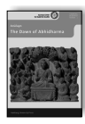 Anālayo The Dawn of Abhidharma 229 pp., 12 illustrations, hardcover, 25,80 EUR ISSN 2190-6769 (printed version)
ISBN978-3-943423-15-0 (printed version)
http://hup.sub.uni-hamburg.de/purl/HamburgUP_HBS02_Analayo Band 3

 Lin, Chen-kuo / Radich, Michael (eds.) A Distant Mirror Articulating Indic Ideas in Sixth and Seventh Century Chinese Buddhism 565 pp., hardcover; 39,80 EUR ISSN 2190-6769 (printed version) ISBN 978-3-943423-19-8 (printed version) http://hup.sub.uni-hamburg.de/purl/HamburgUP_HBS03_LinRadich Band 4

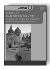 Silk, Jonathan A. Buddhist Cosmic Unity An Edition, Translation and Study of the "Anūnatvāpūrṇatvanirdeśaparivarta" 252 pp., hardcover, 28,80 EUR ISSN 2190-6769 (printed version) ISBN978-3-943423-22-8 (printed version) http://hup.sub.uni-hamburg.de/purl/HamburgUP_HBS04_Silk Band 5

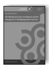

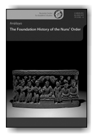 Radich, Michael The "Mahāparinirvāṇa-mahāsūtra" and the Emergence of "Tathāgatagarbha" Doctrine 266 pp., hardcover, 28,80 EUR ISSN 2190-6769 (printed version) ISBN 978-3-943423-20-4 (printed version) http://hup.sub.uni-hamburg.de/purl/HamburgUP_HBS05_Radich This book is a companion to Bhikkhu Anālayo's previous studies of the Genesis of the 

 Bodhisattva Ideal and the Dawn of Abhidharma. In the present book he examines the foundation history of the Buddhist order of nuns, based on a detailed study of the canonical accounts of this event preserved in Chinese, Pāli, Sanskrit, and Tibetan. Anālayo investigates how the different and at times conflicting parts of the textual account of this particular episode gradually evolved to constitute the foundation history in the way in which it is now extant. His findings put into perspective the Buddha's refusal to found an order of nuns as well as the prediction that the going forth of women supposedly spells decline for the whole Buddhist tradition, showing how these elements would have arisen and then become part of the foundation history.

Building on his ground-breaking The Genesis of the Bodhisattva Ideal , with the present monograph Bhikkhu Anālayo approaches a closely related topic from the perspective of the bodily dimension as evident in the thirty-two marks with which, according to tradition, the Buddha was endowed. The study begins by proposing that a cross-fertilization between text and art has influenced the conception of one of these marks, namely the wheel-marks on the soles of the Buddha's feet. By way of a comparative study of the early discourses, Anālayo proceeds to show how the thirty-two marks - initially nearly imperceptible features - came to be more clearly visible and acquired salvific power. Eventually, he argues, these turned into a psychosomatic chart for the bodhisattva path and thereby set a precedent for the prediction (commonplace in later Buddhist doctrine) that assures an aspiring bodhisattva of becoming a Buddha in the future.

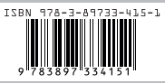

ISSN 2190-6769 ISBN 978-3-89783-415-1 EUR [D] 18,80