HAMBURG
BUDDHIST
STUDIES 9 Susan Andrews / Jinhua Chen / Cuilan Liu (eds.)
Rules of Engagement Medieval Traditions of Buddhist Monastic Regulation

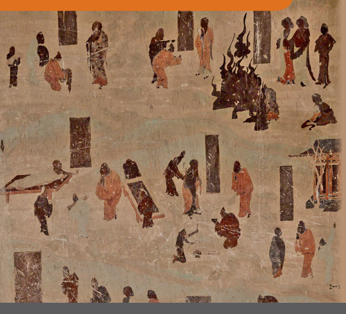

Susan Andrews | Jinhua Chen | Cuilan Liu (eds.)
Rules of Engagement Hamburg Buddhist Studies 9 Series Editors: Steffen Döll | Michael Zimmermann

Numata Center

for Buddhist Studies Susan Andrews | Jinhua Chen | Cuilan Liu (eds.)
Rules of Engagement Medieval Traditions of Buddhist Monastic Regulation Bibliographic information published by the Deutsche Nationalbibliothek The Deutsche Nationalbibliothek lists this publication in the Deutsche Nationalbibliografie; detailed bibliographic data are available in the Internet at http://dnb.d-nb.de.

ISSN 2190-6769 ISBN 978-3-89733-458-8 (E-book)
ISBN 978-3-89733-428-1 (printed version)
© 2017 projekt verlag, Bochum/Freiburg www.projektverlag.de Cover: punkt KOMMA Strich GmbH, Freiburg www.punkt-komma-strich.de Cover original design by Benjamin Guzinski; Julia Wrage, Hamburg Figure on Cover: Image from the Dunhuang cave 323 that depicts the observance of Vinaya rules. Copyright: Dunhuang Academy

## Contents I Identifying The Rules Of Engagement

 Foreword Michael Zimmermann and Steffen Döll 7 Introduction Cuilian Liu and Susan Andrews 9 1 Sanskrit Fragments from Eastern Turkestan, Xinjiang, corresponding to the Śaikṣadharma *Section* of the *Shisong-lü*: 
Pelliot Sanskrit Rouge 10.1–6 & Bleu 44, Bibliothèque nationale de France Jin-Il Chung 27 2 A Glimpse into the Tocharian Vinaya texts Pan Tao 67 93 3 Faxian and the Transmission of Vinayas to China Bangwei Wang 4 A Survey of Vinaya Texts on Novice Precepts Preserved in Tibetan Cuilian Liu 111 II Assessing Relationships Between Traditions of Regulation 5 Medieval Japanese Tendai Views of the Precepts Paul Groner 137 163 6 The Creation of Monastic Codes and the Gradual Transformation of Medieval Chinese Buddhist Monasticism Mario Poceski 197 7 The Doctrinal Evolution of Formless Precepts in the Early Chan Tradition: The Theory of Mind Purification in the Laṅkāvatāra Sūtra and the *Brahmā's Net Sūtra* Pei-Ying Lin III Investigating the Implementation of Individual Regulations 8 Legislating Consent: Dispute, Accord, and the Vote in Early Indian Monasticisms Daniel Stuart 225 9 Pāṃśukū*lika* as a Standard Practice in the *Vinaya* Nicholas Witkowski 269 10 Analytical Study of the Monks' pā*cittiya* 波逸提 Rules Shizuka Sasaki 317 11 The Theravāda Vinaya and *Bhikkhun*ī Ordination Bhikku Anālayo 333 12 Atonement of Pārā*jika* Transgressions in Fifth-Century Chinese Buddhism Eric M. Greene 369 IV Exploring Communities of Vinaya-Related Practice 411 13 The Transformation of the Formless Precepts in the Platform Sūtra (*Liuzu tanjing* 六祖壇經) 
Morten Schlütter 451 14 A Missing Page in Sui-Tang Vinaya History: Zhishou and the Vinaya Tradition Based on the Great Chanding Monastery in Chang'an Jinhua Chen 15 Can Monks Practice Astrology? Astrology and the Vinaya in China Jeffrey Kotyk 503 About the Authors 519 

# Foreword

## About Hamburg Buddhist Studies

Ever since the birth of Buddhist Studies in Germany more than 100 years ago, Buddhism has enjoyed a prominent place in the study of Asian religions. The University of Hamburg continues this tradition by focusing research capacities on the religious dimensions of South, Central, and East Asia and making Buddhism a core subject for students of the Asien-AfrikaInstitut. The Numata Center for Buddhist Studies is proud to have found a home at one of Europe's pioneering academic institutions. With its *Hamburg Buddhist Studies* book series it honours the University's long-standing commitment to research in the field of Buddhist Studies and aims to share its results with both the academic community and the wider public. 

Today, Buddhist Studies as an academic discipline makes use of a broad spectrum of approaches and methods. The field covers contemporary issues as much as it delves into the historical aspects of Buddhism. Similarly, the questions shaping the field of Buddhist Studies have broadened. Understanding present-day Buddhist phenomena—and how such phenomena are rooted in and informed by a distant past—is not at all an idle scholarly exercise. Rather, it has become clear that fostering the understanding of one of the world's major religious traditions is a crucial obligation for modern multicultural societies in a globalized world. 

Accordingly, *Hamburg Buddhist Studies* addresses Buddhism as one of the great traditions of philosophical thought, religious praxis, and social life. Its discussions will undoubtedly be of interest to scholars of religious studies and specialists of Buddhism, but also aim at confronting Buddhism's rich heritage with questions the answers to which might not easily be deduced by the exclusive use of historical and philological research methods. Such issues require the penetrating insight of scholars who approach Buddhism from a broad range of disciplines, building upon and yet going beyond the solid study of texts and historical evidence. 

We are convinced that *Hamburg Buddhist Studies* contributes to opening up the field to those who may have no training in the classical source languages of the Buddhist traditions but approach the topic against the background of their own disciplinary interests. With this book series, we would like to also encourage a wider audience to take an interest in the academic study of the Buddhist traditions. 

## About This Volume

That religions cannot be exhaustively described through their dogmatics but reveal as much, maybe even more, by the way they are implemented into living practice has, by now, become a truism. This is no less the case for the area of Buddhist Studies, where recent years have seen heightened interest in ritual, juridical, and generally practical aspects of the tradition. With the present volume, the editors build on this trend while venturing beyond the established boundaries of discourse in specialized academic disciplines. They have accepted the daunting challenge of presenting state-of-the-art research on the *vinaya*, that is the codices that govern monastic life throughout the Buddhist world, in all of its breadth and depth. The contributions collected here—without exception authored by experts in their respective fields—not only trace the textual traditions of this part of the Buddhist canon but also showcase the vast variety of practices regulated thereby and throw a new light on the social implications such protocols have had in South, Central, and East Asia. As such, it is the first publication of its kind and marks a singular scholarly achievement. Michael Zimmermann and Steffen Döll 

# Introduction

Cuilan Liu and Susan Andrews Vinaya Studies is flourishing and it's little wonder given the centrality of these materials to Buddhist tradition. One of the three divisions of the canon 
(the tripiṭaka or *sanzang* 三藏), the rules of engagement outlining how individuals ought (and ought not) to conduct themselves on the path occupy a central place in present-day Buddhism just as they did in the distant past. 

From the minutiae of everyday living to the big questions of who can be ordained and under what conditions, this large corpus of legal materials has at once formed and been formed by the diverse communities in which they have been understood and lived for two and a half millennia. Not surprisingly, the visions of the Vinaya that took shape in these disparate temporal and geographical contexts have—as papers compiled in *Rules of Engagement* demonstrate—varied considerably. 

The present volume endeavors to contribute to a growing body of scholarship that addresses the different ways that Buddhist monastic law has been brought to life in particular times and places. It builds, for example, on the celebrated studies of Shayne Clarke (2014a; 2014b) and Gregory Schopen (1996, 2004, 2005, 2014), scholarship that dramatically changed the way we think about and research South Asian Buddhism of the first centuries of the Common Era. *Rules of Engagement* aims in particular to continue the important work begun in *Going Forth* (2005) and *Buddhism and Law* (2014). Like this pair of texts, the present volume deals with monastic regulationsas well as Chan and other non-Vinaya precepts—preserved throughout Asia. Contributors to *Rules of Engagement* (a number of whom also participated in these earlier projects) explore how individuals and communities in medieval Asia used legal materials in surprising ways to forward diverse ends. 

Of particular interest here may be the studies of previously unknown or unstudied Vinaya materials. Beginning in late eighteenth century, Vinaya manuscripts preserved in Sanskrit, Pāli, Tocharian, Gāndhārī, Chinese, and Tibetan were excavated at locations across Asia. Such discoveries have provided scholars with new sources through which to investigate the theory and practice of monastic regulation in Buddhism's homeland on the Indian subcontinent and beyond including, for example, the Tocharian Vinaya fragments explored by Pan below and the Sanskrit material excavated near Kucha in Xinjiang around which Chung's contribution is built. While today an authoritative introduction to the way Vinaya operates in East Asia is available in *Going Forth* and an updated bibliography for the field can be found Buddhism in Law, no overview of extant materials for the study of Buddhist regulations has been published since Yuyama Akira's *A Systematic Survey of* Sanskrit Vinaya Literature in 1979.1 Together with these remarkable resources, we hope the updated overview of Vinaya materials presented here will be of use to contemporary students of Vinaya, Buddhism, and Asian traditions more broadly in advancing our understanding of the practices and beliefs of religious people in the region past and present. 

## Extant Vinaya Texts Gāndhārī Vinaya Texts

The oldest excavated Vinaya manuscripts are those found among the Bajaur Collection of Gāndhārī manuscripts. Written in Kharoṣṭhī script on birch bark, this Bajaur Collection was discovered in the ruins of a Buddhist monastery called Maḥal located near the village of Mian Kili in the Dir district in 1999. Paleographic and linguistic features of the nineteen Bajaur manuscripts written by eighteen scribes allow scholars to date them to the first and second century CE.2 Among this Bajaur Collection, there are two Vinaya fragments. The first is a *Prātimokṣasūtra* text containing two different versions of rules belonging to the *Naiḥsargika pātayantika* section. Strauch argues that the first version with the first nine rules in this section written on the recto is "closely related to the Dharmaguptaka/Kāśyapīya" versions, while the second version with 

Introduction 11 

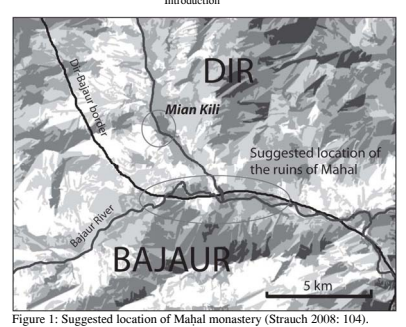

the first eight rules belonging to the same section written on the verso is 
"more related to the Sarvāstivādin and Mūlasarvāstivādin versions."3 The second fragment is a *Karmavācāna* text containing two formulae, one for the appointment of the "distributor of lodging-places" (ś*ayanāsanagrāhaka*) on recto and the other for the ceremony of "taking up the retreat of the rainy season" (*varṣopagamana*) on the verso. These newly found sources not only allow us to date the circulation of written Vinaya texts to a much earlier date but also enable us to compare records of certain aspects of Buddhist monastic life in later sources with earlier one. 

## Tocharian Vinaya Texts From Turfan And Kucha

The second oldest excavated Vinaya manuscripts are Tocharian fragments from the Prātimokṣasūtra, *Vinayavibhaṅga*, and *Karmavācana* dating to between the sixth and eighth century. Tocharian is a language spoken in Kucha and Turfan along the northern edge of the Tarim Basin in Northwest China. 

Its two dialects—Tocharian A used in the East near Turfan and Tocharian B in the West near Kucha—likely flourished "as literary language[s] in the middle of the first millennium CE" and became extinct toward the end of the first millennium.4 The Tocharian manuscripts discovered in Xinjiang in 1911 are now housed in Berlin, London, Paris, St. Petersburg, Otani, and China. 

Research on Vinaya texts among this Tocharian collection began as early as in 1912. That year Sylvain Lévi identified a Vinaya fragment in this collection and argued that it belonged to the Sarvāstivāda School. Provisional lists of Vinaya texts found in this Tocharian collection were subsequently prepared by Schmidt (1986), Ogihara (2009),5 and Pan (2015).6 Since Lévi's discovery at the turn of the last century, scholars have identified additional Vinaya texts in the Tocharian collections in Berlin, London, and Paris.7 

## Sanskrit Vinaya Texts

In the summer of 1931, scholars working in the village of Naupur, several miles west of Gilgit, uncovered numerous Sanskrit manuscripts written on birch bark. Together with manuscripts discovered in subsequent excavations in 1938 and 1998, these materials are known as the Gilgit Manuscripts.8 This collection contains 212 folios of seventeen *Vinayavastu* texts, four incomplete *Bhikṣuprātimok*ṣa texts (8, 19, 3, and 8 folios), and two *Karmavācan*ā texts (16 and 3 folios).9 In his introduction to the transliterated edition of the Vinaya sources from this Collection, Nalinaksha Dutt wrote that they were 
"written in Gupta characters of the sixth century AD."10 In 2014, the National Archives of India and the Internatioanl Research Institute for Advanced Buddhology at Soka University in Japan published a high-resolution fascicle edition of these Vinaya fragments.11 Apart from Gilgit sources, Sanskrit Vinaya texts are also found in Tibet. 

One of these is a complete palm-leaf Vinaya manuscript written in ProtoBengali-cum-Maithili characters of the 11th and 12th centuries CE. It enumerates rules for Buddhist nuns of the Ārya-Mahāsāṃghika-Lokottaravādin tradition. Rāhula Sāṅkrtyāyana discovered this text while traveling in Tibet in search of Sanskrit manuscripts between 1935 and 1938.12 In 1970, Gustav Roth published a transliteration of the entire text. In 1991, Édith Nolot published a French translation of this Vinaya text based on the version edited by Roth. The other Sanskrit Vinaya texts that Rāhula Sāṅkrtyāyana found during these trips in Tibet include an incomplete 72-folio *Vinayasūtravṛtti* and a 62folio Vinayasūtra both attributed to Guṇaprabha,13 a three-folio Pratimok*ṣasūtraṭīkā*,
14 a 36-folio Vinayas*ūtraṭīkā*,
15 a three-folio *Vinayaṭīk*ā, 16 and a 14folio Vinayak*ārikā*.

17

## Pāli Vinaya Texts

A complete set of *Vinaya-piṭaka* is preserved in Pāli. While the earliest complete version of the Pāli canon in manuscript form is from the late fifteenth century, the oldest surviving Pāli manuscript is a Vinaya manuscript copied on palm-leaf during the eighth or ninth century.18 This document was found in Nepal and is now preserved in the National Archives of Nepal, numbered 106–8 and 124. In 1899, Cecil Bendall first mentioned and described the discovery of this four-folio Pāli Vinaya text at the Twelfth International Congress of Orientalists held in Rome. At the next Congress held in Hamburg in 1902, Bendall dated the four folios to the eighth/ninth century CE and identified them as a portion of the *Culla-vagga* of the *Vinaya-piṭaka*. In 1952, Purushottam Vishvanath Bapat published photographs of the four folios, which are in many places too small to read. In 1991, Oskar von Hinüber explored these sources and re-published the four folios. 

This four-folio Vinaya manuscript comprises the very end of *Culla-vagga* IV and the beginning of V. It contains a passage from the latter part of V, 
concerning matters of procedures for settling legal questions (IV) and permissible bathing practices and dress (V, beginning), and tooth-brushing procedures (V) for monks. There is much to be learned about the daily lives of monastics from close study of these materials. 

## Vinaya Texts In Chinese Translation

Among the Buddhist monastic rules, it is the Vinaya texts preserved in Chinese translation that have been most often studied by scholars. This has been the case primarily because large collections of major complete sets of Vinaya texts are extant in Chinese. It was in the third century that Buddhist practitioners working in the region began translating Vinaya texts. The first Indian Vinaya text translated into Chinese is the no-longer extant Sengqi jiexin 僧祇戒心 (The Heart of Precepts of the Mahāsāṃ*ghikas*), attributed to Dharmakāla; he purportedly completed the project in Luoyang around 250 CE. 19 The existence of multiple Vinaya texts preserved in Chinese from the fifth century indicate that there was a boom in the translation of these materials during this period. Translations of the Sarvā*stivādavinaya* in 404 CE, 
the *Dharmaguptakavinaya* in 408 CE, the Mahāsāṃ*ghikavinaya* in 418 CE, 
and the Mahīśā*sakavinay*a in 424 CE, for example, help to establish the interest in these types of sources at this time. These materials represent the four sets of complete Vinaya texts of the four different traditions. The last addition to this collection of major Vinaya texts was the Mū*lasarvāstivādavinaya* translated by Yijing 義淨 (635–713) between 700 CE to 703 CE. As there are already multiple overviews of the transmission of these Vinaya texts, a more detailed introduction to the topic seems unnecessary here. 

## Vinaya Texts In Tibetan Translation

The Tibetan Buddhist canon also preserves a complete set of Vinaya texts. The extant Tibetan Buddhist canon was born of a collaboration between Tibetan translators and Indian masters who translated numerous Buddhist texts that later came to be the Tibetan Buddhist canon: the *Bka' 'gyur* and Bstan 'gyur. The first collection includes texts traditionally believed to be words of the Buddha and the second brings together Indic commentarial literature. In the extant editions of this Tibetan Buddhist canon, Tibetan translations of Indic Vinaya texts occupy thirteen volumes of the 107-volume Bka' 'gyur (Sde dge). These materials represent eighteen of the 213-volume Bstan 'gyur. While scholars have long believed the majority of the Vinaya texts preserved in Tibetan translation are related to the Mūlasarvāstivādin School, recent studies question raise the possibility that certain Vinaya texts preserved in Tibetan were instead affiliated with the Sarvāstivādin School. 

While Liu's contribution to this volume considers advances in our understanding of these Tibetan sources, work by Pan, Wang, and Chung introduce newly discovered Vinaya materials from other geographical contexts. 

## Overview Of The Volume Part I: Identifying The Rules Of Engagement

As the survey above indicates, there remains considerable (and highly demanding) work to be done in identifying the particular traditions of regulation at play in specific contexts. In this first section of *Rules of Engagement*, volume contributors aim to advance our understanding of Sanskrit, Tocharian, Tibetan, and Chinese Vinaya material preserved and circulated in Eastern Turkestan, Tibet, and China that are in many cases little-known. With great care and thoroughness, Pan, Wang, Chung, and Liu call attention to materials that will help reshape our understanding of the ways Buddhist regulations did and did not work in medieval Asia. Their meticulous scholarship will help us to answer the fundamental question: What monastic regulations circulate(d) in particular times and places? 

The first article in this volume provides an overview of extant Sanskrit fragments of the Sarvāstivādavinaya by Chung Jin-il. At the heart of Chung's paper is a pair of carefully transliterated Sanskrit fragments excavated from a site of monastery ruins near Kucha in Xinjiang. These materials are now preserved in the Pelliot Sanskrit Collection in Paris. Placing these sources alongside corresponding sections from the Chinese translation of the Sarvāstivādavinaya, Chung's piece offers us a strong foundation on which to develop our understanding of the Ś*aikṣadharma* of the Sūtravibhaṅga. 

In Pan Tao's article we turn to Tocharian Vinaya fragments. An extremely useful piece for scholars new to this field, Pan explains where to access these materials and introduces the scholastic debate about their affiliation with either the Sarvāstivāda or the Mūlasarvāstivāda tradition. The author also gives an overview of the major categories of Vinaya fragments from the Prātimokṣasūtra, *Vinayavibhaṅga*, and Karmavā*cana*. He concludes with a study of two Tocharian fragments on pā*tayantika* rules 89 and 73 to demonstrate their close association with the Chinese translation of the *Sarvāstivādavinaya*. 

As its title suggests, Wang's "Faxian and the Transmission of Vinayas to China" focuses on one Buddhist cleric's central role in the transmission of Buddhist regulation texts from India to China. Wang argues that the lack of a complete set of Vinaya text in Chinese motivated Faxian (337–442) to embark his journey to India in search of authentic Vinaya teachings. One of Faxian's significant contributions to the transmission of Vinaya in China was that he had played a central role in preserving two sets of Vinaya texts that would have otherwise been lost. These are the Mahāsāṃghikavinaya and the Mahīśāsakavinaya with which Faxian returned from India and Sri Lanka. As Wang explains, the Chinese translations of these sources have served as rich sources for the study of Buddhist monastic regulations in the Indian contexts. 

The final contribution to this subsection of the volume surveys the transmission of Vinaya texts in Tibet. Compared with the vast scholarly interests in Vinaya texts narrating rules for fully ordained monks and nuns, Vinaya works on precepts for Buddhist novices have and continue to receive inadequate attention today. Cuilan Liu's paper aims to fill this gap by identifying nine extant Tibetan translations of Vinaya texts as well as twenty indigenous Tibetan compositions on novice precepts. By analyzing the structure and contents of these texts, Liu argues that the nine Tibetan translations of Vinaya texts on novice precepts can be meaningfully divided into two groups. She asserts that these bodies of material developed from two root texts: a 50stanza verse text attributed to Nāgārjuna and a 300-stanza text attributed to Śākyaprabha (seventh century?). Tradition holds that Śākyaprabha was a disciple of Guṇaprabha, the author of *Vinayasūtra* who had flourished in the seventh century. Liu contends further that there is good reason to believe these Vinaya texts were already in circulation in Tibet by the late seventh or early eighth century. Along with their Indian commentaries, these two root texts have had a central influence on indigenous Tibetan writing on novice precepts from the early eleventh century to the present day. 

Overall, these papers call attention to the material dimension of the sources we study and highlight the diversity of Vinaya traditions. Each one a contribution in its own right, together these works promise to serve as foundations for further scholarship on Buddhist monastic regulations. Among other things, these sources shed light on the regulation of Buddhist monastic life in early Sanskrit texts and subsequent translations in Tocharian, Tibetan, and Chinese. Findings presented in these papers will be indispensable for scholars who are interested in tracing how regulations of monastic life develop or change across languages, cultures, and geographical locations. 

## Part Ii: Assessing Relationships Between Traditions Of Regulation

What relationships exist between monastic regulations circulated within and between religious communities? Each of the papers compiled in this section of The *Rules of Engagement* address this important question. Studying the complex relationships between traditions of monastic regulation, the contributors show, reveals surprising points of continuity and difference within and between religious communities. 

Paul Groner's paper begins this second section of the volume with an investigation of Japanese engagements with the canonical Vinaya tradition by way of Tendai School views on Buddhist monastic discipline. Examining Tendai scriptural sources and ordination ceremony texts, Groner aims to show that practitioners within this School took a wide range of positions in their interpretations and discussions of the precepts. Rejecting the *Dharmaguptakavinaya* that Ganjin (688–763) had brought from China to Japan, Tendai exegetes consulted alternative sources such as the *Fanwang Jing* 梵網經
(Brahmā's Net Sūtra), Lotus Sūtra, and the *Yingluo Jing* 瓔珞經 (Adornment Sūtra) to formulate monastic precepts for discipline and ordination rituals. 

Comparing diverse Tendai perspectives related to the precepts, Groner establishes that these materials constituted a significant concern for the Tendai community, a community that was more diverse in this area than many have imagined. 

Mario Poceski's "The Creation of Monastic Codes and the Gradual Transformation of Medieval Chinese Buddhist Monasticism" analyzes Tiantai and Chan monastic rules of the Sui (581–618) and Tang (618–907) periods. 

These offer a window through which to see how local, Chinese actors received and remade Buddhist regulations in this new geographical and temporal context. Following an initial overview of the monastic character of Buddhism and the early history of Chinese engagements with Vinaya texts, ideals, and regulations, Poceski provides a close reading of Zhiyi's 智顗 (538–597) *Guoqing bailu* 國清百錄 (Hundred Records of Guoqing 
[Monastery]), Chan teacher Guishan Lingyou's 溈山靈祐 (771–853) Guishan's Admonitions (*Guishan jingce* 溈山警策), and Xuefeng's 雪峰 (822–
908) *Shi guizhi* 師規制 (Teacher's Regulations). Within these materials Poceski identifies a shared concern about laxity in the application of Buddhist regulations in centers of practice of the period. This similarity in Chan and Tiantai materials requires that we revisit a common perception of the former tradition as divorced from mundane concerns such as rule making (and rule breaking). In his beautiful reading of this triad of texts, Poceski—like other authors in this section—demonstrates that local practitioners (here leading monks associated with the Tiantai and Chan schools) were creative participants in a longstanding tradition of monastic innovation. In her study of Chan in fifth to ninth-century China, Pei-ying Lin investigates the doctrinal foundations of the concept of the "mind precept" (*xinjie* 心戒) prior to the emergence of the concept of "formless precepts" (*wuxiang* jie 无相戒). The author looks to shared tendencies in the *Fanwang jing* and the *Lengqie jing* 楞伽經 (Laṅkāvatāra Sūtra) that she holds helped to shape what we see in the later Platform Sūtra (*Tan jing* 壇經). Examining early Chan, Lin teases out links between its vision of the precepts in both scriptural traditions and historical context, stressing "the importance of social environment for understanding doctrinal developments" (35). This paper, like many others in *The Rules of Engagement*, illustrates that rather than discrete entities, Buddhist schools interacted and overlapped in significant ways. For Lin, it is the close association between Bodhisattva precepts and Chan meditation that confirms their interdependency before the mid eighth century. 

## Part Iii: Investigating The Implementation Of Individual Regulations

Studies illuminating the relationship between specific regulations and practice appear in this third section of the volume. The careful readings the authors put forward shed light on the ways that individual rules were lived by medieval Buddhists. They overturn long-held assumptions that pā*rājika* transgressions, for instance, constituted insurmountable obstacles to soteriological aims (Greene) or the early sangha was, at the end of the day, a protodemocracy (Young). The papers here offer us a more nuanced picture of Buddhist practice past and present and sensitively tackle issues that will be of interest to specialists and their students alike. 

How did Indian Buddhist monastics manage conflict? Stuart's "Legislating Consent" explores this question through a careful reading of procedures for settling disputes or litigation (*adhikaraṇaśamatha*) alongside a range of other materials preserved in all six extant Vinaya traditions. While scholars who have focused on the possibility of resolving disputes via majority vote *(yadbhūyaiṣīya)* contained in these materials have suggested that the monastic community constituted some form of a democracy, Stuart's analysis reveals that alongside an *ideal* of grassroots consensus, Vinaya sources present other authoritarian pathways for resolving disagreements. More diverse than oftentimes imagined, procedures for handling conflict in this context allowed practitioners both to build and to legislate consensus. 

In "Pāṃśukūlika as a Standard Practice in the Vinaya," Nicholas Witkowski challenges the scholarly conception that ascetic practices (*dhūtaguṇa*s) 
were marginal to the middle Indian monastery. His work concentrates on issues of clothing—especially the use of of cemetery robes (Skt. pāṃśukūla cīvara; Ch. 糞掃衣)—in monastic regulations, primarily those contained in the Chinese translation of the *Dharmaguptakavinaya*. While scholars in this field, Witkowski tells us, frequently "relegate ascetic practices to a period before the development of the monastery into a mature institution," his contribution makes a compelling argument that practices such as making robes from cemetery fabric "continued into the period of the mature monastic institution depicted in the Vinaya." This paper invites us to rethink what fell within and outside the scope of mainstream Indian Buddhist monasticism. 

Sasaki's contribution offers a highly detailed examination of pā*cittiya* rules 21 to 24 for monks in the *Mahāvihāravinaya*. These materials discuss the conditions under which male monastics can and cannot travel to exhort their female counterparts. Close study of these four rules as found in this Vinaya text and Chinese translations of the Mahīśā*sakavinaya*, the Mahāsāṃ*ghikavinaya*, the Dharmaguptakavinaya, Sarvā*stivādavinaya*, and the Mūlasarvāstivādavinaya reveals that there is no single answer to this question. Sasaki's careful presentation of the differences in the wording of these rules across Vinaya traditions makes clear just how much diversity exists in monastic traditions past and present. Sasaki warns his readers of the danger that attempting to build a unified understanding of Buddhist monastic regulations by uncritically connecting information from available Vinaya texts entails. 

The situation of female monastics (*bhikkhun*ī) and the controversy over the revival of their ordination is the subject of Anālayo's paper. Following a survey of the history of the order of female monastics from its inception to its disappearance sometime around the tenth century, Anālayo considers why an ordination lineage has not been revived. He considers this issue in the context of obstacles faced by women practitioners in Theravāda countries of Southeast Asia and discusses the possibility and challenges that the renewal of the nuns line within the parameters of the Theravāda Vinaya preserved in Pāli would involve. Anālayo's sensitivity to the historical and legal background of this controversy, as well as its contemporary cultural contexts allows us to appreciate some of the complexity surrounding this issue in Theravāda tradition. 

What consequences does the violation of the most serious monastic regulations entail? Scholars have long assumed that transgressing the four pā*rājika*, resulted in expulsion from the monastic community. Eric Greene's contribution shows not only that ritual allowed offenders of the *pārājika* rules to remain within the Buddhist clergy with reduced privileges as śikṣā*dattaka* or, in the case of nuns, a ś*ikṣādattā-śrāmaṇer*ī. Examining this topic in fifthcentury China, Greene illuminates how these new rituals developed in this context, further, "promised a *complete* purification, one that included not only total restoration of monastic status, but also the restoration of soteriological potential." His fascinating piece calls attention to the ways that local, Buddhist communities creatively rewrote the traditions they received. Like other contributions to this third section of *The Rules of Engagement*, Greene's article has much to teach us about the ways that authority is asserted and denied within religious communities and the manner in which religious professionals create and sustain identities vis-à-vis each other and their lay counterparts. 

## Part Iv: Exploring Communities Of Vinaya-Related Practice

Rather than the content of particular monastic codes, work by Schlütter, Chen, and Ibuki explores the ways that, on the one hand, familiarity with Vinaya traditions allows us to appreciate the significance of particular phenomena such as Huineng's shifting hagiography (Schlütter). They examine, on the other hand, the specific contexts in which Vinaya movements took shapethe mountain versus the city of sixth and seventh-century China (Ibuki) or twin Chanding monasteries (Chen). The suppleness of the past and the range of ends its construction serves comes to the fore in many of the papers. So too does the necessity of attending to particular sites of practice, human relationships and redactions of texts in reconstructing histories of religion. 

Schlütter's "The Transformation of the Formless Precepts in the Platform Sūtra" examines the progressively less important place that the "formless precepts" came to occupy in this well-known Buddhist text between the eighth and thirteenth centuries. A central component of the earlier, Dunhuang redaction, as well as the Tanyu 壇語 (*Platform Sermon*), Schlütter shows that concern for the "formless precepts" diminished in the five centuries leading to compilation of the orthodox version of the *Platform Sūtra* (represented by the Zongbao edition from 1291). In later versions of the scripture like this one repentance rituals eclipsed conferral of the formless precepts, a shift that the author explains in terms of Chan communities' efforts to attract support in changing contexts. "Early Chan tradition engaged in much experimentation with different ceremonies and settings for dispensing Bodhisattva precepts to monastics and lay people," Schlütter writes, "perhaps both as a way of differentiating itself from older established groups within Buddhism and an effective means of gathering large audiences from a broad range of backgrounds." Schlütter's paper calls attention to the multiplicity of approaches to the precepts discernable within traditions overtime. It calls attention to the ways that this diversity shaped the ways communities told and retold a key figure's hagiography. 

In "A Missing Page in Sui-Tang Vinaya History," Chen meticulously reconstructs vinaya master Zhishou's 智首 (567–635) life and career. As the principal teacher to Daoxuan 道宣 (596-667), the de facto founder of the Lüzong 律宗, Zhishou shaped this tradition's development in significant ways. 

Despite his importance, the particulars of Zhishou's biography have remained little understood by scholars—a situation the author corrects here. Chen places Zhishou in a network of practitioners with ties to a pair of cosmopolitan monasteries in Chang'an: the Chanding monastery (Chandingsi 禪 定寺) and the Great Chanding monastery (Da Chandingsi 大禪定寺). His research both illuminates hithertofore unrecognized connections between early vinaya masters and establishes the twin Chanding monasteries as major hubs in the development of Lüzong, the Vinaya or Precepts "school." 
Finally, Kotyk examines the introduction and reception of occidental astrology in the first millennium of Chinese Buddhist history. Kotyk argues that despite initial Buddhist condemnation of occidental astrology in Sūtra and Vinaya literature, observing the movements of celestial bodies and interpreting their significance came to be widely accepted Buddhist practice in eighth century in China. Such acceptance, Kotyk argues, was first "spearheaded by the tantric community," and later sustained due to non-Buddhist intellectuals' understanding of astrological concepts and Buddhist figures' loose interpretation of or disregard for the Vinaya in the early Tang. A fascinating case study of the ways that Buddhism has developed in new geographical and temporal contexts, Kotyk's work helps us to understand how and why it may be that ostensibly prohibited activities emerge as key practices within religious communities. 

The majority of the papers included in this edited volume were presented at the International Conference on "Vinaya Texts and Transmission History: 
New Perspectives and Methods" held at Yongfu 永福 Temple in Hangzhou, August 21 to 23, 2013. This conference was sponsored and organized by the Research Center for Buddhist Texts and Arts at Peking University. We would like to extend our gratitude to Professor Zhanru 湛如, director of the Research Center for Buddhist Texts and Arts at Peking University, and Master Yuezhen 月真, abbot of Yongfu Temple, for their generous support without which this project would not have been possible. The publication of this volume has been supported by a generous grant from the Alexander von Humboldt Foundation (AVH) to cover a major part of the publication expenses, and additional funding from the Canadian Social Science and Humanities Research Council (SSHRC) that helped cover part of the related translation and publication fees. Two of the co-editors of this volume (Jinhua Chen and Susan Andrews) would also like to express their gratitude for SSHRC's support on their research that led to Jinhua Chen's conception of the conference and his subsequent efforts in encouraging authors to publish their papers read at that conference in the present volume. 

## Bibliography

Bapat, P. V. (1952). "A Pali Manuscript in an Indian Script." *Annals of the* Bhandarkar Oriental Research Institute 33.1/4: 197–210. 

Clarke, Shayne (2014a). *Family Matters in Indian Buddhist Monasticisms*. Honolulu: 
University of Hawai'i Press. 

——— (ed. 2014b). *Vinaya Texts*. New Delhi: The National Archives of India. Dutt, Nalinaksha (ed. 1942). *Gilgit Manuscripts, Vol. III, Part 2*. Kashmir: Srinagar. Falk, Harry (2011). "The Split Collection of Kharoṣṭhī Texts." Sōka daigaku kokusai bukkyōgaku kōtō *kenkyūjo nenp*ō 創価大学国際仏敎学高等硏究所年報 14: 13–
23. 

Falk, Harry and Ingo Strauch (2014). "The Bajaur and Split Collections of Kharoṣṭhī Manuscripts within the Context of Buddhist Gāndhārī Literature." *From Birch* Bark to Digital Data: Recent Advances in Buddhist Manuscript Research, edited by Paul Harrison and Jens-Uwe Hartmann. Vienna: Österreichische Akademie der Wissenschaften, 51–78. 

Finot, Louis (1911). "Fragments du Vinaya sanskrit." *Journal Asiatique* 11/18: 619–
625. 

Heirman, Ann (2007). "Vinaya: From India to China." *The Spread of Buddhism*, 
edited by Ann Heirman and Stephan Peter Bumbacher. Leiden: Brill, 167–202. 

Lévi, Sylvain (1912). "Un fragment tokharien du Vinaya des Sarvāstivādins (Collection Hoernle no. 149.4)." *Journal Asiatique* 10.19: 101–111. 

——— (1932). "Note sur des manuscrits sanscrits provenant de Bamiyan (Afghanistan) et de Gilgit (Cachemire)." *Journal Asiatique* 220: 10–45. 

Nakamura Hajime 中村元 (1987). Indian Buddhism: A Survey with Bibliographical Notes. Delhi: Motilal Banarsidass. 

Nolot, Édith (1991). Règles de discipline des nones bouddhistes: Le bhikṣuṇī*vinaya* de l'école Mahāsāṃghika-lokottaravādin. Paris: Collège de France. 

Ogihara Hirotoshi (2009). *Recherches sur le Vinaya en tokharien A et B*. Thèse de doctorat. Paris: École pratique des hautes études. 

——— (2011a). "Notes on Some Tocharian Vinaya Fragments in the London and Paris Collections." *Tocharian and Indo-European Studies* 12: 111–144. 

——— (2011b). "On the Poṣatha Ceremony in the Tocharian Buddhist Texts." *The* Annual of Research Institute for Buddhist Culture 35: 22–28. 

——— (2012a). "A Fragment of the Bhikṣu-prātimokṣasūtra in Tocharian B." Tocharian and Indo-European Studies 13: 163–179. 

——— 荻原裕敏 (2012b). "Yijian Tuhuoluo A-yu: Fanyu shuangyu lüzang canpian 一件吐火罗 A 语 —— 梵语双语律藏残片." *Xiyu lishi yuyan yanjiu jikan* 5: 135–
142. 

——— (2013). "Tocharian Vinaya Texts in the Paris Collection." *Tocharian and* Indo-European Studies 14: 187–212. 

——— (forthcoming). "On Some Vinaya-Texts in Tocharian B." *Orientalia et Classica*. 

Pan, Tao (2015). Kommentar zu ausgewählten tocharischen Pātayantika-Dharma Fragmenten. Magisterarbeit. Munich: Ludwig-Maximilians-Universität. 

Roth, Gustav (1970). Bhikṣuṇi-Vinaya: Including Bhikṣuṇī-Prakīrṇaka and a Summary of the Bhikṣu-Prakīrṇaka of the Ārya-Mahāsāṃ*ghika-Lokottaravādin*. Patna: K. P. Jayaswal Research Institute. 

Salomon, Richard (1999). Ancient Buddhist Scrolls from Gandhāra: The British Library Kharoṣṭhī *Fragments*. Seattle: University of Washington Press. 

Sāṅkrtyāyana, Rāhula (1935). "Second Search of Sanskrit Palm-Leaf Mss. in Tibet." 
Journal of the Bihar and Orissa Research Society 21: 21–43. 

——— (1937). "Second Search of Sanskrit Palm-Leaf Mss. in Tibet." Journal of the Bihar and Orissa Research Society 23: 1–57. 

Strauch, Ingo (2008). "The Bajaur Collection of Kharoṣṭhī Manuscripts: A Preliminary Survey." *Studien zur Indologie und Iranistik* 25: 103–136. 

Thomas, Werner (1987). "Ein neues Pātayantika-Fragment in Toch. B." *Tocharian* and Indo-European Studies 1: 169–191. 

von Hinüber, Oskar (1991). The Oldest Pāli Manuscript: Four Folios of the Vinaya-
Piṭ*aka from the National Archives, Kathmandu*. Stuttgart: Franz Steiner. 

——— (2014). "The Gilgit Manuscripts: An Ancient Buddhist Library in Modern Research." From Birch Bark to Digital Data: Recent Advances in Buddhist Manuscript Research, edited by Paul Harrison and Jens-Uwe Hartmann. Vienna: Österreichische Akademie der Wissenschaften, 70–135. 

Wen Jinyu 溫金玉 (1999). "Zhongguo lüxue yuanliu 中國律學源流." *Chung-Hwa* Buddhist Journal 中華佛學學報 12: 131–144. 

Yuyama Akira 湯山明 (1979). A Systematic Survey of Buddhist Sanskrit Literature: 
Vinaya Texts. Wiesbaden: Franz Steiner Verlag. 

I Identifying the Rules of Engagement Sanskrit Fragments from Eastern Turkestan, Xinjiang, corresponding to the Ś*aikṣadharma* Section of the *Shisong-lü*: 
Pelliot Sanskrit Rouge 10.1–6 & Bleu 44, Bibliothèque nationale de France* Jin-il Chung

## 1 General Remarks

In 1959, Valentina Rosen (later Stache-Rosen) published her Ph.D. thesis submitted to the University of Goettingen, Germany (Der Vinayavibhaṅga zum Bhikṣuprātimokṣa der Sarvāstivādins, Sanskritfragmente nebst einer Analyse der chinesischen Übersetzung, Berlin) as the second volume of the series "Sanskrittexte aus den Turfanfunden". As the title of the work reveals, she compiled mainly those Sanskrit fragments from Eastern Turkestan preserved in the so-called Turfan Collection in Berlin1 which could be identified by then as corresponding to parts of the Sūtravibhaṅga2 of the *Shisong-lü* 十誦律.

3In addition, she analysed and summarized the Chinese version, and thus made it possible for many Vinaya researchers to get a scholarly overview of this difficult text. Since then many further Sanskrit fragments from the same region preserved in diverse European manuscript collections have been identified as belonging to the same text.4 Most of the fragments are now accessible in form of digital images 
(<http://idp.bl.uk>, <http://idp.bbaw.de>, <http://gallica.bnf.fr>).

Already in 1911 Louis Finot was able to identify several Sanskrit folios among those in the Pelliot Collection in Paris5as corresponding to some parts of the Mahākhandhaka, the first chapter of the Mahāvagga of the Pāli Vinaya Khandhaka,6albeit without being able to accredit them to a specific Vinaya tradition. In the meantime, however, he located close parallels in the Shisong-lü and his further examination of the manuscript collection brought more Sanskirt fragments from the same Vinaya to light, one from the Pātayantikadharma section of the Sūtravibhaṅga 7and two from the Vinayavastu8(from the Upasaṃpadā9and the Pravāraṇā 10 section respectively). Two years later he published these together with a small one from the Bhikṣuṇī-Prātimokṣa as appendices to the Bhikṣu-Prātimokṣa 11 accompanied with a French translation of the Chinese version of the same text12 by Édouard Huber.13 More than two decades later, only after prolonged restoration work, followed the article by Jean Filliozat14 on further Sanskrit fragments: six fragments from the Śaikṣadharma section of the Sūtravibhaṅga (P.Skt. 

 
4 For an overview of the Sanskrit fragments identified as belonging to the Shisong-lü, see Chung 2002: 77–104 [<http://digi20.digitale-sammlungen.de/de/fs1/object/display/
bsb00044454_00076.html> ff.].

5 P.Skt. Rouge 11.1–3 [<http://gallica.bnf.fr/ark:/12148/btv1b6000206v/f53> ff.]. See Finot 1911: 619–625 [<http://gallica.bnf.fr/ark:/12148/bpt6k93279c/f623> ff.]. According to Finot's measurement, it is 9 cm high and 46 cm wide. On the physical appearance of the fragment, see ibid. 619. Re-edited in Chung 2004: 53–55, 61–63, 68–71 [<http://digi20. 

digitale-sammlungen.de/de/fs1/object/display/bsb00044426_00052. html> ff.].

6 Mv I.38, 46 f., 62, 66 f. = Vin I 69–71, 76, 86, 88 f. 7 P.Skt. Rouge 7 [<http://gallica.bnf.fr/ark:/12148/btv1b6000206v/f29> f.]. 8 P.Skt. Rouge 12.1–2 [<http://gallica.bnf.fr/ark:/12148/btv1b6000206v/f59> ff.]. 9 Re-edited in Vogel/Wille 2002: 73 f. [<http://digi20.digitale-sammlungen.de/de/fs1/object/display/ 
bsb00044454_00072.html> f.]; Chung 2004: 74–76 [<http://digi20.digitale-sammlungen.de/de/ fs1/object/display/bsb00044426_00073.html> ff.].

10 Re-edited in Chung 1998: 307–311 [<http://digi20.digitale-sammlungen.de/de/fs1/object/ 
display/bsb00044376_00305.html> ff.].

11 Cf. Yuyama 1979: 1, § 1.11.S.1. On the physical appearance of the base manuscript, see Finot 1913: 465 f.; PrMoSū II, pp. 33, Manuscripts GA.

12 *Shisong biqiu boluotimucha jieben* 十誦比丘波羅提木叉戒本, T. 1436, 23: 470b–479a 
[<http://www.cbeta.org/result2/normal/T23/1436_001.htm>; also found at SAT], trans-lated by Kumārajīva, not before 404 CE [cf. Yuyama 1979: 1, § 1.11.C.1].

13 Finot 1913 [<http://gallica.bnf.fr/ark:/12148/bpt6k93283m/f466>]. 14 Filliozat/Kuno 1938: 21–64.

Rouge 10.1–6, folios 191–196)15 and seven complete leaves from the Upasaṃpadā section of the Vinayavastu (P.Skt. Rouge 13.1–7, folios 3–9).16 They supposedly comprise the last portion of the Sūtravibhṅga and the first portion of the Vinayavastu of one and the same Vinaya manuscript. The following leaf of the Sūtravibhaṅga (folio 197) from the same manuscript is to be found in P.Skt. Bleu 44 (see below). The final leaves of the Sūtravibhaṅga (folios 198 ff.) containing the Adhikaraṇaśamathadharma section, and the first two leaves of the Upasaṃpadā section of the Vinayavastu are missing. Filliozat's transliteration of the Sanskrit text is accompanied by a French translation of the Chinese version17 by Hōryū Kuno.

From 1957 to 1967 Bernard Pauly published in *Journal asiatique* periodically almost a dozen systematic studies on the Sanskrit fragments preserved in the Pelliot Collection, as well as a general survey of the Sanskrit fragments from Northern Turkestan of 1965. In the last of the articles in this series18 Pauly published two small Sanskrit fragments belonging to the Śaikṣadharma section of the Sūtravibhaṅga, i.e. P.Skt. Bleu 4419 and 45,20 with a partial review of Filliozat's reading of P.Skt. Rouge 10.1–6 21 published in 1938 in the same journal (see above). Supposedly they all stem from one and the same manuscript and P.Skt. Bleu 44 (folio 197) follows P.Skt. Rouge 10.6 (folio 196) directly.

Now, thanks to the publication of a detailed Sanskrit manuscript catalogue of the Pelliot Collection by Jens-Uwe Hartmann and Klaus Wille in 1997,22 we have full and precise information as to the textual finds preserved in that collection. At about the same time and since then many of the manuscript fragments of the collection have been edited or revised, including many of the fragments of Vinaya manuscripts. In particular, the completion of the thorough edition of the Prātimokṣasūtra on the basis of numerous manuscript fragments by Georg von Simson23 deserves special recognition. In this work we find the wording of the complete monastic code, the core text of the Sūtravibhaṅga.

The Sanskrit fragments from the Sūtravibhaṅga and the Vinayavastu listed above, i.e. P.Skt. Rouge 10.1–6, 11.1–3, 12.2, 13.1–7, Bleu 44, and 45, supposedly belong to one and the same paper manuscript: P.Skt. Rouge 10.1–6, Bleu 44, and 45 to the Śaikṣadharma section of the Sūtravibhaṅga and P.Skt. Rouge 11.1–3, 12.2, and 13.1–7 to the Upasaṃpadā section of the Vinayavastu. They are all of Duldur-āqur provenance, a site of monastery ruins near Kučā (Qiuci 龜茲), Xinjiang 新疆. As noted by Bernard Pauly in the last one of his article series,24 Filliozat's paper of 1938 in *Journal asiatique* escaped Stache-Rosen's notice so that P.Skt. Rouge 10.1–6 could not be embedded in her restitution of the Sanskrit text of the Sūtravibhaṅga. Stache-Rosen had a look at P.Skt. Bleu 44 and 45 in Paris during her visit long before their publication by Pauly, but she regarded them, according to Pauly,25 as belonging to the Prātimokṣa.

The present paper deals with P.Skt. Rouge 10.1–6 and P.Skt. Bleu 44 which contain parts of the last third of the Śaikṣadharma section of the Sūtravibhaṅga. P.Skt. Rouge 10.1–6 constitute the first third (in case of P.Skt. Bleu 44 the first quarter) of the complete leaves, and are, according to Pauly's description, in mediocre or quite bad condition. The leaves are written in Turkestan Brāhmī script (Sander, Nordturkistanische Brāhmī, Typ a [Schrifttypus V], Alphabet t)26 on both sides and each side has six lines. There are on average 55–60 akṣaras to a complete line. The stringhole is placed at a distance of approximately 115 mm from the left margin,27 between the third and the fourth line of the leaves after circa 11th or 12th akṣara and occupies the space of 4–5 akṣaras. The pagination on the left margin of the verso sides shows the number of the leaves 191–196 (P.Skt. Rouge 10.1–6) and 197 (P.Skt. Bleu 44). The complete leaves must have been, according to Filliozat's measurement of P.Skt. Rouge 13.1–7, 86 mm high and 450 mm wide.

The Śaikṣadharma section, the seventh and thus the next to the last group of the rules of the Prātimokṣa of the tradition with which we are concerned, contains 113 (in case of Chinese Sūtravibhaṅga 107) rules.28 These can be divided into four parts: A. rules concerning the way of wearing garments; B. etiquette in the house of laypersons; C. etiquette during the meal; D. rules prohibiting the teaching in inappropriate circumstances (as well as the manner of defecation and urination). Indeed, the manuscripts number these four groups of rules separately instead of numbering all the way through the whole Śaikṣadharma section. The fragments in concern of the present paper contain rules of the C and D 
groups of the Śaikṣadharmas.29 In the following pages the reader will find a transliteration of P.Skt. 

Rouge 10.1–6 and Bleu 44 as well as a juxtaposition of the restored text with the Chinese parallel from the Shisong-lü. The lines from the Prātimokṣa are given in corresponding places. The lost parts of the leaves can safely be restored to a considerable extent, if the missing lines concern idiomatic phrases. The fragmentary state of the manuscript remains, however, does not allow a reconstruction in its entirety. Differences between the versions, in wording as well as in the sequence of the rules, are conspicuous despite the general congruence. Notwithstanding the general increase of the manuscript finds of the Sanskrit Vinaya literature, difficulties in Vinaya terms with regard to inappropriate posture of the individual monks or laypersons, especially concerning the wearing of garments, remain unsolved.

## 2 Transliteration

5 bhagavān āha [• na] sāmiṣeṇa pā[ṇ]inā pāṇīya[s]th[ā] + ///
6 + [• a] .. + .[i r].. sāmiṣeṇa || [|| tata]s te [ṣaḍvar]g[i]kā + ///
2 verso 1 [bh]. [g]. vān [ā] .. .[ā]tmārtham aglāna [odanaṃ] sūpikaṃ vijña[p]. ///
2 ya || tatas te ṣaḍvargikāḥ odanena31 sūpikaṃ praticchā[d]. ///
3 d idam oda[n]ena praticch[ādi]taṃ bha - gavān [ā] + ///
4 yā || oda[nena] sūpikaṃ [s]ū[pi] - kena vā [o] ///
5 [ya] || tatas te ṣaḍva[rg]i[k]ā - avadhyāna32[p]r[e]kṣiṇa a[ṃ]tari[k]. + ///
6 [n]āvaddhyāna[pr]e[kṣi]ṇa āntari[ka]sya pātram a[val]okayi[ṣ]. + ///
3 folio 192 *recto* 1 r [n]āvadhyānapre[k]ṣī || anyataro bhikṣur anyad ava[l]okaya [p]. ṇḍa[p]. 

+ ///
2 [ga]ḍa{ḥ}m aprāsādikaṃ bhagavān āha pā[tra]saṃjñ[i]naḥ piṇ[ḍa]pātaṃ .. ///
3 tti pātrasaṃ[j]ñī || tatas te ṣaḍ[va]r[g]i - [k]ā - sā[m]iṣeṣ[u] ///
4 yaṃ[ti k]ṣi[pa]ṃti vivāca[ya]ṃti i - meṣām a[dh]. + + ///
5 naṃ33 piṇḍapātaṃ paribhokṣyāma iti [śikṣ]ā karaṇīyā [• n]. + + /// 6 [hara]ti {•} [ś]i .. [m]āragirau [bh]īṣaṇa[kāva]ne m[ṛ]gadāpe34 [b]i + + ///
4 *verso* 1 s. [bha]gava .. [ḥ t]ūṣṇī[ṃ]bhāv[e]nā[dhi]vāsa .[āṃ] v[i]d[i]tvā bhagava .. + + /// 
2 upasaṃkramya tāṃ rātriṃ śuciṃ praṇītaṃ .ādanīyabhojan[ī] + + ///
3 jña .[y]. bhagavato dūt[ena k]āla - m āroca[y]. + + ///
4 n nimantraṇaṃ [nava]kokanadaprā[s]ā - de pari[v]eṣyat[e] /// 5 hapataya avadhyāyaṃti kṣipaṃti vivācayaṃti imeṣā[m]. ///
6 idam evaṃr[ū]pam app.āsādikam akārṣu bha[ga]vān āha - [na] sā ///
5 folio [19]3 *recto* 1 [m]. .. [rg]ṛ[h]. [cch]. [r]. [y]. t. {•} gṛhiṇam anava + [k]ya [ā] + + ///35 2 [dā bh]. [gavā]ṃ [j]etavane [syā]t tadā me sarva[d]aiva[s]i[ka]ṃ .. rśan. 

///
36 3 ve[dan]ā saṃ[jñ]ā [sa]ṃskārā vi .[ñā] ..[ṃ] - [ma] .[ā] ///
4 nādhirūḍh[ā]yāglānāya .. ..ṃ deśa - [y]e + ///
5 [n]idāne eta .iṃ .. .. .. [ṇ]e saṃghaṃ [saṃn]. pātaya .. + ///
6 .. .. .. .. .. + + .. .. .. .. .. .[o] .. .. + .. .. .. + ///
6 *verso* 1 ga .y. [bhi] .[ṣ]ū .. [m]. .[r]. yat[e sma || tasm]. .[t]. .[y]. [dy]. + + ///37 2 na yānādhi[r]ū[ḍh]. [y]ā[g].[ānāya dha]r[ma]ṃ [d]e[śa]yiṣyāma .. + ///
3 jā [p]urato gacchati - ṣa[ḍv]. [rgik]ā - ḥ .ṛ + ///
4 [na pu]{na}ra[to38 ga]cchata - [p]ṛ[ṣ]ṭha[t]. .. - gac[cha]ṃ ///39 5 [ty ā] .. .[y]. [t]e duṣk[ṛ]tā[m a]nāpattir glā[na] .. [||] tataḥ [sa] rā[j]ā ///40 6 [m]. .[ā] .ā[j]ā .[i] +[ṃ •] .. [g]. .[ā]n āha - na mā[rg]. + .. .. + + ///41

## 7 Folio 194 Recto

1 .[y]. [dh]. .[m]. [de]śayaty [ā]pad[ya]te duṣkṛtām anāpa[ttir] glānasya || 
[||] + ///
2 rā [v]ijñā[na]ṃ mahārājānityaṃ bhaga[v]ān ā[ha] - na sthitā niṣa[ṇṇ]. + 
///
3 [a]nāpattir glānasya || || tatas [sa] - rājā teṣāṃ ṣa[ḍv]. /// 4 [ṣa]ṇṇo bhavati ṣaḍvargikā [n]ī[c]. sa - ne niṣaṇṇā e + /// 
5 niṣaṇṇaḥ uc[c]āsa[n]e [niṣa]ṇṇayāglāna[sya dhar]maṃ deśayi[ṣ].[ā] + ///
6 tām anāpattir [g].ā .. [sya || || ta] ..ḥ sa rā .[ā ma]hākā[y]. + + + ///
8 *verso* 1 j[ā]nitya[ṃ] bha[gav]. [n] āha [• n]. [n]. .. [ṇṇā] n[i] .. .n. .yāglāna .. + + 
+ ///
2 ttiḥ glānasya || tataḥ [sa r]ājā avaguṇṭhikā[k]ṛto bha[v]. ± ± + ///
3 [dhar]man deśayiṣyāma i[t]i śi[kṣā] - kara .. ± ± + /// 4 bhavati - ṣaḍvargika upasaṃkram[yai] - vam ā ± ± .. ± ///
5 yā [•] .ṭh[i]taśirasaḥ [a]glānasya dharmaṃ d[eśaya]ty ā[p]. .[y]. .. ± ///
6 .. .. + . [y]āvad [bha]gavān āha - na kaṃbhāk[ṛ]ta[s]yāg[l]ān. sya ± ///
9 folio 195 *recto* 1 + [k]. bhākṛtasya || tataḥ rājā pallatthikākṛto [bh]. [v]. + ///
2 [g]lānas[ya] dharman de[śa]yiṣyāma iti śikṣā kara[y]ā [•] pa + /// 3 tyastikākṛto bhavati ṣaḍva[rgi] - kā u[pasa]ṃ[k]. + ///
4 nātyastikākṛtasyāg[l]āna[sya] - dharman de .. [yi] ///
5 pattir glānasya || ta[ta]s sa [r]ājā vinyasti[k]ākṛto bha[va]ti ṣaḍva .. /// 6 gavān [āha] - na [vin]yastikākṛ[t]os[y]ā[glā]nas[ya] dharmaṃ [d]e + .[i] 
+ ///
10 *verso* 1 r glāna[s]ya || tataḥ [sa] rājā vikṣipt[i]kākṛ[t]o42 [bha]vati ṣa[ḍv]. .. [k]. + 
///
2 ha na vikṣiptikākṛtasyāglānsya dharma[n d]. śayiṣyāmi iti + ///
3 [ḥ] sa rājā sopānaho bhavati [ṣaḍva] - rgikāḥ upa .. .[r]. ///
4 naha[kas]yāglānasya dharmaṃ deśa[yi] - ṣyāma iti [śi] + /// 5 .. .. ± [r]ājā sapādu[ko bha]vati - ṣaḍvargikā u .. [sa]ṃkram[yaiva]m 
[ā]hu + ///
6 .. + ± ma iti [śikṣ]ā karaṇīyā sapād[u]kasyāg[l]ānasya [dhar].. .e + ///

## 11 Folio 196 Recto

1 .[t]. [u]pasaṃkramya bhagavatpādau śirasā van[di]tvaikāṃte [nya]ṣ[ī] /// 2 ttejayati saṃpraharṣayati - tad [y]e te rājñaḥ pra[s]ena .. ..ḥ .. ///
3 kā e[kā]nte avakkramya dharmaṃ [de] - śayaṃ[ti •] ///
4 tu dharmatā khalu buddhānāṃ [bha]ga - vat[ā]ṃ .. .v. /// 5 yitvā samād[ā]pa[y]itvā sa[m]uttejayi[tv]ā saṃ[p]raharṣayi[tv]. ///
6 saṃ[pr]. [h]. r.i ..[ḥ bh]. .. [va]tpā[d]au .[ira]sā + nditvā [bha]ga .. + + ///

## 12 Verso

1 eta .. .. [dān]. [e]tasmiṃ pra[k]. [r]. [ṇ]. [s]. [gh]. saṃn[ip]. + + ///
2 trapāṇe śastra[p]āṇ[e kha]ḍ[ga]pāṇe āyu[dha]pāṇe dharmaṃ deśa[y]. /// 3 tītya bhikṣūṇāṃ śikṣāpada[ṃ] pra[jña] - payi[ṣ].[ā] + /// 4 ti śikṣā karaṇīyā - .. ṇḍapā .. - r aglā[na]s[y]. ///
5 [i]ti śikṣā karaṇī[y]ā - cchatrapāṇ[er a]g[l]āna[s]ya dha[rmaṃ] ///
6 ± ± [•] śas[tra]pāṇe dharmaṃ deśayaty āpadyate du .[ṛ]tā .. ///
13 folio [197] *recto* 1 [m]. .. + + + + + + + + ///
2 [patti] .[n]. + + + + + + + ///
3 tāni [ta] eva[m ā]hu kiṃ mu[l]y. n. (○) ///
4 sy[ā]ma kathaṃ vayaṃ ke[na] jīvi[k]. (○) ///
5 te ucchuṣyate mlāyata - teṣā .. /// 6 + .. .[i] .. e .. .[ā] .. [r na] jā[n]ī[m]. ///

## 14 Verso

1 + [t]. [ṣ]ā[ṃ] na [śa] .nu .. [t]. [k]ic[i]d va[kt]. ///
2 raprasrāvaṃ ku[r]vaṃ[t]i tad[ya]thā [ku] ///
3 [gava]to vistareṇār[oc]itam* (○) ///
4 .. [ti pṛ]c[chat]i [b]ud[dh]o bha[gav].ṃ ± (○) ///
5 .. .[i] .. + + + + + + + + ///
6 .. + + + + + + + + + + ///

## 3 Juxtaposition

| PrMoSū   | SūVibh           | Shisong-lü                                     |
|----------|------------------|------------------------------------------------|
| 1a       | not preserved    | 又六群比丘食著手 振却                          |
| b        | not preserved    | 諸居士呵責言。諸比 丘食如王如大臣。振 手食棄43 |
| c        | (bhagavān āha •) | 佛言                                           |
| d        | (na hastasaṃdhūnakaṃ piṇḍapātaṃ pa)(1.1)[r]ibhokṣyāma [i]ti śikṣā karaṇīyā -                  | 從今44不振手食。應當 學 (76)                   |
| Skt. C21 | na hastāvadhūnakaṃ piṇḍapātaṃ paribhokṣyāma iti śikṣā karaṇīyā                  |                                                |
| Ch. 81   | 不振手食。應當學 |                                                |

| 36       | Chung                                                                                                                         |                                 |
|----------|-------------------------------------------------------------------------------------------------------------------------------|---------------------------------|
| PrMoSū   | SūVibh                                                                                                                        | Shisong-lü                      |
| e        | ha[s]t[ā]sandhūna[k](aṃ45 piṇḍapātaṃ paribhuṃjaty āpadyate duṣkṛtām)                                                          | 46振手食。突吉羅                |
| f        | (anāpattir na hastasaṃdhūnakam* •)                                                                                            | 不振手食。不犯                  |
| 2a       | (tatas te ṣaḍvargikāḥ sikthāvīrakaṃ48 piṇḍa)(1.2)pā[ta]ṃ pa[r]ibhuṃjaṃti                                                      | 又六群比丘棄著手飯 諸居士呵責言 |
| b        | gṛhapatayaḥ a[va]dhyāyaṃti kṣipa[ṃt](i •)                                                                                                                               |                                 |
| c        | (imeṣām adhanyānām amaṅgalānāṃ na  kṛṣitavyaṃ kevalaṃ bhoktavyaṃ sthiraṃ ca kartavyam* •) 是諸沙門不善。不種 不穫。但47噉復棄 |                                 |
| d        | (bhaga)(1.3)vān āha                                                                                                           | 佛言                            |
| e        | na [si]kthāvīrakaṃ48 [p]i(ṇ)ḍapātaṃpa- [r]i(bhokṣyāma iti śikṣā karaṇīyā •)                                                   | 從今44不棄著手飯。應 當學 (77)  |
| Skt. C22 | na śistavikiraṃ49 piṇḍapātaṃ paribhokṣyāma iti śikṣā karaṇīyā                                                                 |                                 |
| Ch. 80   | 不棄飯食。應當學                                                                                                              |                                 |
| f        | (sikthāvīrakaṃ48 piṇḍapātaṃ paribhuṃjaty āpadyate duṣkṛtām)                                                                   | 46棄著手飯。突吉羅              |
| g        | (anāpattir na sikthā)(1.4)vīrakaṃ50 ||                                                                                        | 不棄。不犯                      |
| 3a       | [ta]tas te ṣa[ḍ]var[g]i[k]ā sāmiṣeṇa (pāṇinā pānīyasthālakaṃ pratigṛhṇanti •) 爾時六群比丘。膩手 便51捉飲器                                                                                                                               |                                 |
|          |                                                                                                                               |                                 |

Sanskrit Fragments from Eastern Turkestan 37

| PrMoSū   | SūVibh                                                                                      | Shisong-lü                                   |
|----------|---------------------------------------------------------------------------------------------|----------------------------------------------|
| b        | not preserved                                                                               | 比坐比丘見便52吐逆                           |
| c        | (1.5) bhagavān āha [•]                                                                      | 佛言                                         |
| d        | [na] sāmiṣeṇa pā[ṇ]inā pāṇīya[s]th[ā]- (lakaṃ53 pratigṛhīṣyāma iti śikṣā karaṇīyā •)                                                                                             | 從今44不膩手捉飲 器。應當學 (78)             |
| Skt. C23 | na sāmiṣeṇa pāṇinā pānīyasthālakaṃ pratigṛhīṣyāma iti śikṣā  karaṇīyā                       |                                              |
| Ch. 82   | 不54污手受食器55。應當學                                                                    |                                              |
| e        | (sāmiṣeṇa pāṇinā pānīyasthālakaṃ pratigṛhṇaty āpadyate  duṣkṛtā)(1.6)(m*) [•]               | 46膩手捉飲器。突吉羅                         |
| f        | [a](nāpatt)[ir] (na) sāmiṣeṇa || [||]                                                       | 不膩手捉。不犯 又六群比丘。不病自 為索飯索羹 |
| 4a       | [tata]s te [ṣaḍvar]g[i]kā (ātmārtham aglānā odanaṃ vā sūpikaṃ vā vijñapayanti •)                                                                                             |                                              |
| b        | (2.1) [bh](a)[g](a)vān [ā](ha)                                                              | 佛言                                         |
| c        | (n)[ā]tmārtham aglānā56 [odanaṃ] <vā> sūpikaṃ <vā> vijña[p](ayiṣyāma iti  śikṣā karaṇīyā •) | 從今44不病不自為索 飯索羹57。應當學 (79)     |
| Skt. C24 | nātmārtham aglānā odanaṃ vā sūpaṃ vā vijñāpayiṣyāma i(ti  śikṣā karaṇīyā)                   |                                              |
| Ch. 84   | 不病不得為身索羹飯。應當學                                                                  |                                              |

| 38       | Chung                                                                              |                                 |
|----------|------------------------------------------------------------------------------------|---------------------------------|
| PrMoSū   | SūVibh                                                                             | Shisong-lü                      |
| d        | (ātmārtham aglāna odanaṃ vā sūpikaṃ vā vijñapayaty āpadyate duṣkṛtām)              | 46不病自58索羹飯。 突吉羅       |
| e        | (anāpattir glānā)(2.2)ya ||                                                        | 若59病索。不犯                  |
| 5a       | tatas te ṣaḍvargikāḥ odanena sūpikaṃ praticchā[d](ayanti bhūyaskāmatām  upādāya •) | 又六群比丘。以飯 覆羹。更望得故 |
| b        | not preserved                                                                      | 語諸居士言60。此中              |
| c        | (2.3) /// d idam oda[n]ena praticch[ādi]taṃ                                                                                    | 答言。先噉鉢中飯                |
| d        | bhagavān [ā](ha •)                                                                 | 佛言                            |
| e        | (naudanena sūpikaṃ praticchādayiṣyāmo bhūyaskāmatām upādāyeti śikṣā karaṇī)(2.4)yā || 從今44不飯覆羹欲望 更得61。應當學 (80)                                                                                    |                                 |
| Skt. C25 | naudanena sūpaṃ praticchādayiṣyāmo bhūyaskāmatām  upādāya iti śikṣā karaṇī(yā)     |                                 |
| Ch. 83   | 不得以飯覆羹更望得。應當學                                                         |                                 |
| f        | oda[nena] sūpikaṃ [s]ū[pi]kena vā  [o](danaṃ praticchādayati bhūyaskāmatām upādāyāpadyate duṣkṛtām)                                                                                    | 若飯覆羹。更望得 者。突吉羅     |
| g        | (anāpattir na bhūyaskāmatām upādā)- (2.5)[ya] ||                                   | 更不62望得覆者63。 不犯         |

| Sanskrit Fragments from Eastern Turkestan   | 39                                                                                                                                    |                                                                              |
|---------------------------------------------|---------------------------------------------------------------------------------------------------------------------------------------|------------------------------------------------------------------------------|
| PrMoSū                                      | SūVibh                                                                                                                                | Shisong-lü                                                                   |
| 6a                                          | tatas te ṣaḍva[rg]i[k]āḥ avadhyāna[p]r[e]- kṣiṇa a[ṃ]tari[k](asya pātram avalokayanti •) 又六群比丘。呵相 看64比坐鉢中                                                                                                                                       |                                                                              |
| b                                           | not preserved                                                                                                                         | 作是言。汝多我 少。我少汝多65                                                |
| c                                           | (bhagavān āha •)                                                                                                                      | 佛言                                                                         |
| d                                           | (2.6) [n]āvaddhyāna[pr]e[kṣi]ṇa 66 āntari- [ka]sya pātram a[val]okayi[ṣ](yāma iti  śikṣā karaṇīyā •) 不訶相看64比坐 鉢67。應當學 (81) |                                                                              |
| Skt. C26                                    | nāvadhyānaprekṣiṇa anantarikasya68 pātraṃ vyavalokayiṣyāma (i)ti (śikṣā karaṇ)īyā                                                                                                                                       |                                                                              |
| Ch. 85                                      | 不得嫉心看比坐鉢中。應當學                                                                                                            |                                                                              |
| e                                           | (avadhyānaprekṣy antarikasya pātram  avalokayaty āpadyate duṣkṛtām)                                                                   | 46呵相看64比坐鉢。突 吉羅                                                    |
| f                                           | (anāpatti)(3.1)r [n]āvadhyānapre[k]ṣī ||                                                                                              | 不呵相看64。不犯                                                             |
| 7a                                          | anyataro bhikṣur anyad ava[l]okaya<ṃ>  [p](i)ṇḍa[p](ātaṃ paribhuṃjati •) 又69一比丘僧中食時 看餘處                                    |                                                                              |
| b                                           | not preserved                                                                                                                         | 六群比丘與作70 比坐以戲笑71故。持 骨著其鉢中 此比丘持手著鉢中 欲食。觸骨驚怖 |
| c                                           | /// (3.2)                                                                                                                             |                                                                              |
| [ga]ḍam aprāsādikaṃ                         |                                                                                                                                       |                                                                              |
| 64                                          | V.l. 想看.                                                                                                                            |                                                                              |

 

64 V.l. 想看.

65 V.l. 我多汝少. 66 For °*vadhy*°. 67 V.l. 鉢中.

68 Vv.ll. /// kṣ[īṇān]*tarya*[s]ya, /// [nta]rya[s]ya. 69 V.l. 有. 70 V.l. 與其. 71 V.l. om. 笑.

| 40       | Chung                                                                                      |                                                                                  |
|----------|--------------------------------------------------------------------------------------------|----------------------------------------------------------------------------------|
| PrMoSū   | SūVibh                                                                                     | Shisong-lü                                                                       |
| d        | bhagavān āha                                                                               | 以是事故。佛言                                                                   |
| e        | pā[tra]saṃjñ[i]naḥ piṇ[ḍa]pātaṃ (paribhokṣyāma iti śikṣā karaṇīyā •)                                                                                            | 端視鉢食。應當 學 (82)                                                           |
| Skt. C27 | pātrasaṃjñinaḥ piṇḍapātaṃ paribhokṣyāma iti śikṣā karaṇī- (yā)                             |                                                                                  |
| Ch. 86   | 一心觀鉢食。應當學                                                                         |                                                                                  |
| f        | (na pātrasaṃjñī piṇḍapātaṃ paribhuṃjaty āpadyate duṣkṛtām)                                                                                            | 若不端視鉢食。 突吉羅                                                            |
| g        | (anāpa)(3.3)tti<ḥ> pātrasaṃ[j]ñī ||                                                        | 端視鉢食72。不犯                                                                 |
| 8a       | tatas te ṣaḍ[va]r[g]i[k]āḥ sā[m]iṣeṣ[u]  ///                                               | 又六群比丘多受 食。不次第噉盡殘在 鉢中。便著水湯73棄。 滿澡74盤中。收殘食 器皆滿 |
| b        | (gṛhapatayo 'vadhyā)(3.4)yaṃ[ti k]ṣi- [pa]ṃti vivāca[ya]ṃti                                | 諸居士呵責言                                                                     |
| c        | imeṣām a[dh](anyānām amaṅgalānāṃ na kṛṣitavyaṃ kevalaṃ bhoktavyaṃ sthiraṃ ca kartavyam* •) | 是諸沙門不善。不種 不穫。但能75噉復棄                                            |
| d        | (bhagavān āha •)                                                                           | 佛言 次第噉食盡。應當學                                                          |
| e        | (sāvadā)(3.5)naṃ piṇḍapātaṃ paribhokṣyāma iti [śikṣ]ā karaṇīyā [•]                                                                                            | (83)                                                                             |
| Skt. C28 | sāvadānaṃ76 piṇḍapātaṃ paribhokṣyāma iti śikṣā karaṇīyā                                    |                                                                                  |
| Ch. 87   | 次第食。應當學                                                                             |                                                                                  |
|          |                                                                                            |                                                                                  |

 
72 V.l. om. 鉢食.

73 V.l. 蕩. 74 V.l. 滲. 75 V.l. om. 能. 76 V.l. [*sāpad*](ā)[n](aṃ).

| Sanskrit Fragments from Eastern Turkestan   | 41                                                                                                      |                             |
|---------------------------------------------|---------------------------------------------------------------------------------------------------------|-----------------------------|
| PrMoSū                                      | SūVibh                                                                                                  | Shisong-lü                  |
| f                                           | [n](a sāvadānaṃ piṇḍapātaṃ paribhuṃjaty āpadyate duṣkṛtām)                                                                                                         | 不次第噉食77盡。突 吉羅     |
| g                                           | (anāpattiḥ sāvadānam ||)                                                                                | 次第噉盡。不犯              |
| 9a                                          | (bhagavān bhārgaveṣu vi)(3.6)[hara]ti  [ś]i(śu)[m]āragirau [bh]īṣaṇa[kāva]ne  m[ṛ]gadāpe78 [b]i + + /// | 佛在迦毘羅79國              |
| b                                           | (tatrānyatamo gṛhapatiḥ - tena bhagavān śvo bhaktenopanimantrita bhikṣusaṃghena sārdham* •)                                                                                                         | 爾時有居士。請佛及 僧明日食 |
| c                                           | (adhivāsayati bhagavāṃs tasya gṛhapates tūṣṇīṃbhāvena •) 佛默然受 居士知佛默然受已。 從坐起。頭面禮佛足。 右遶而去80                                                                                                         |                             |
| d                                           | (4.1) s(a) [bha]gava(ta)[ḥ t]ūṣṇī[ṃ]bhāv[e]nā[dhi]vāsa(n)[āṃ] v[i]d[i]tvā bhagava(tpādau śirasā vanditvā bhagavantaṃ pradakṣiṇīkṛtvā bhagavato 'ntikāt  prakrāntāḥ •)                                                                                                         |                             |
| e                                           | (yena svakaṃ niveśanaṃ tenopasaṃkrānta) (4.2) upasaṃkramya tāṃ rātriṃ śuciṃ praṇītaṃ (kh)ādanīyabhojan[ī](yaṃ samudānīya kālyam evotthāya  āsanakāni pra)(4.3)jña(p)[y](a) bhagavato dūt[ena k]ālam āroca[y](ati •) 還自舍81。通夜辦82種 種多美飲食。早起敷 坐處。遣使白佛 時到。食辦82。佛自                                                                                                         |                             |
| f                                           | (samayo bhadanta sadyo bhaktaṃ yasyedānīṃ bhagavān kālaṃ manyate •)                                                                                                         | 知時                        |

| 42       | Chung                                                                                                                                                  |                                                  |
|----------|--------------------------------------------------------------------------------------------------------------------------------------------------------|--------------------------------------------------|
| PrMoSū   | SūVibh                                                                                                                                                 | Shisong-lü                                       |
| g        | (4.4) /// n nimantraṇaṃ [nava]kokanadaprā[s]āde pari[v]eṣyat[e] ///                                                                                                                                                        | 佛及僧到居士舍83。 新堂上水精作地                |
| h        | not preserved                                                                                                                                          | 諸比丘洗鉢水84中有 殘食。捨85著堂上似 如吐       |
| i        | (gṛ)(4.5)hapataya avadhyāyaṃti86 kṣipaṃti vivācayaṃti                                                                                                                                                        | 諸居士呵責言                                     |
| j        | imeṣā[m] (adhanyānām amaṅgalānāṃ na kṛṣitavyaṃ kevalaṃ bhoktavyaṃ sthiraṃ ca kartavyam* •) /// ... /// (4.6)  idam evaṃr[ū]pam app(r)āsādikam87 akārṣu | 是諸比丘不善。更有 屏處可棄此水。何以 乃棄此堂上 |
| k        | bha[ga]vān āha -                                                                                                                                       | 佛言                                             |
| l        | [na] sā(miṣaṃ pātrodakam antargṛhe  chorayiṣyāmo gṛhiṇam anavalokyeti  śikṣā karaṇīyā •)                                                               | 洗鉢水84有飯。不問主 人不應棄舍內。應當 學 (84)  |
| Skt. C29 | na sāmiṣaṃ pātrodakam antargṛhe chorayiṣyāmo gṛhiṇam  anavalokyeti śikṣā karaṇīyā                                                                      |                                                  |
| Ch. 88   | 不應洗鉢水88棄白衣舍內。除語檀越。應當學                                                                                                               |                                                  |
| m        | (sāmiṣaṃ pātrodaka)(5.1)[m] (anta)[rg]ṛ[h](e) [cch](o)[r](a)[y](a)ti  gṛhiṇam anava(lo)[k]ya [ā](padyate  duṣkṛtām* •)                                                                                                                                                        | 若不問主人。棄舍內。 突吉羅                      |

| Sanskrit Fragments from Eastern Turkestan   | 43                                                                                            |                                                                                        |
|---------------------------------------------|-----------------------------------------------------------------------------------------------|----------------------------------------------------------------------------------------|
| PrMoSū                                      | SūVibh                                                                                        | Shisong-lü                                                                             |
| n                                           | (anāpattir gṛhiṇam avalokya ||)                                                               | 問主人棄者62。不犯                                                                     |
| 10a                                         | (buddho bhagavāñ śrāvastyāṃ viharati  sma jetavane 'nāthapiṇḍadasyārāme •)                    | 佛在舍衛國                                                                             |
| b                                           | not preserved                                                                                 | 爾時波斯匿王。立如 是法 若佛在祇洹。我當日 日往89                                      |
| c                                           | (ya)(5.2)[dā bh](a)[gavā]ṃ [j]etavane  [syā]t tadā me sarva[d]aiva[s]i[ka]ṃ (da)rśan(āy). /// |                                                                                        |
| d                                           | not preserved                                                                                 | 時90王聞佛在祇洹。 即勅御者嚴駕                                                        |
| e                                           | not preserved                                                                                 | 御者受教。嚴駕已辦 白言。大王。嚴駕已竟                                                |
| f                                           | not preserved                                                                                 | 王自知時。王即乘乘 出城向祇洹                                                          |
| g                                           | not preserved                                                                                 | 王在乘上                                                                               |
| h                                           | (ṣaḍvargikā upasaṃkramyaivam āhuḥ •)                                                          | 六群比丘。為王說法 言                                                                  |
| i                                           | (rūpaṃ mahārājānityam* •) (5.3) ve[dan]ā saṃ[jñ]ā [sa]ṃskārā vi(j)[ñā](na)[ṃ ma](h)[ā](rājānityam* •)                                                                                               | 大王。色無常。受想 行識無常 是中有比丘。少欲知 足行頭陀。見是事心 不喜91。種種因緣呵責 |
| j                                           | (ye bhikṣavo 'lpecchā alpakṛtyā dhūtavādinaḥ te 'vadhyāyanti kṣipanti vivācayanti •)                                                                                               |                                                                                        |
| k                                           | (kathaṃ nāma bhikṣur yā)(5.4)nādhirūḍh[ā]yāglānāya (dharma)ṃ deśa[y]e(t •) 云何名比丘。人在乘 上。步為說法                                                                                               |                                                                                        |
| l                                           | (idaṃ tair bhikṣubhir anekaparyāyeṇa 諸比丘以是事向佛                                         |                                                                                        |
| 89                                          | V.l. om. 日日自往.                                                                            |                                                                                        |

 

89 V.l. om. 日日自往. 90 V.l. om. 時. 91 V.l. 見是事已.

| 44                                                       | Chung                                                                |                                      |
|----------------------------------------------------------|----------------------------------------------------------------------|--------------------------------------|
| PrMoSū                                                   | SūVibh                                                               | Shisong-lü                           |
| vigarhya etat prakaraṇaṃ bhagavato  vistareṇārocitam* •) | 廣說                                                                 |                                      |
| m                                                        | (atha buddho bhagavān etasmiṃ) (5.5)  [n]idāne eta(sm)iṃ (prakara)[ṇ]e saṃghaṃ [saṃn](i)pātaya(ti - saṃghaṃ saṃnipātya anekaparyāyeṇa buddho  bhagavān ṣaḍvargikān vigarhati •)                                                                      | no parallel                          |
| n                                                        | (kathaṃ nāma bhikṣur yānādhirūḍhāyāglānāya dharmaṃ deśayet •)                                                                      | no parallel                          |
| o                                                        | (idaṃ buddho bhagavān anekaparyāyeṇa vi)(6.1)ga(rh)y(a) [bhi](k)[ṣ]ū(n  ā)[m](ant)[r](a)yat[e sma || tasm](āt)  [t](arh)[y] (a)[dy](āgreṇa daśānuśaṃsān pratītya bhikṣūṇāṃ śikṣāpadaṃ prajñapayiṣyāmi saṃghasaṃgrahāya - evaṃ caitac chikṣāpadam uddeṣṭavyam* •)                                                                      | 佛語諸比丘                           |
| p                                                        | (6.2) na yānādhi[r]ū[ḍh](ā)[y]ā[g](l)[ānāya dha]r[ma]ṃ [d]e[śa]yiṣyāma (iti  śikṣā karaṇīyā •)                                                                      | 人無病乘乘。不應為 說法。應當學 (85) |
| Skt. D1                                                  | na yānādhirūḍhasyāglānasya92 dharmaṃ deśayiṣyāma iti  śikṣā karaṇīyā |                                      |
| Ch. 89                                                   | 人騎馬93不應為說法。除病。應當學                                     |                                      |
| q                                                        | (yānādhirūḍhāyāglānāya dharmaṃ deśayaty āpadyate duṣkṛtām)                                                                      | 若不病乘乘為說法94。 突吉羅          |
| r                                                        | (anāpattir glānāya ||)                                               | 為病人95說法。不犯                   |

| Sanskrit Fragments from Eastern Turkestan   | 45                                                                                                                                        |                                                            |
|---------------------------------------------|-------------------------------------------------------------------------------------------------------------------------------------------|------------------------------------------------------------|
| PrMoSū                                      | SūVibh                                                                                                                                    | Shisong-lü                                                 |
| 11a                                         | (tataḥ sa rā)(6.3)jā [p]urato gacchati -                                                                                                  | 又時王在前行                                               |
| b                                           | ṣa[ḍv](a)[rgik]āḥ (p)ṛ(ṣṭhato 'nugacchanto dharmaṃ deśayanti •)                                                                                                                                           | 六群比丘隨後行。為 說法言                                  |
| c                                           | (rūpaṃ mahārājānityam* - vedanā saṃjñā saṃskārā vijñānaṃ mahārājānityam* •)                                                                                                                                           | 大王。色無常。受想 行識無常                                |
| d                                           | (bhagavān āha •)                                                                                                                          | 佛語諸比丘                                                 |
| e                                           | (6.4) [na pu]ra[to ga]cchataḥ [p]ṛ[ṣ]ṭha- [t](o 'nu)gac[cha]ṃ(to 'glānasya dharmaṃ deśayiṣyāma iti śikṣā karaṇīyā •) 人不病在前行不隨 後為說法。應當學 (86)                                                                                                                                           |                                                            |
| Skt. D2                                     | na purato gacchataḥ pṛṣṭhato96 'nugacchanta aglānasya97 dharmaṃ deśayiṣyāma iti śikṣā karaṇīy(ā)98                                        |                                                            |
| Ch. 90                                      | 人在前比丘在後。不應為說法。除病。應當學                                                                                                  |                                                            |
| f                                           | (purato gacchataḥ pṛṣṭhato 'nugaccchann  aglānasya dharmaṃ deśaya)(6.5)[ty ā]- (pad)[y](a)[t]e duṣk[ṛ]tā[m] 若為不病在前行人 說法。突吉羅 |                                                            |
| g                                           | [a]nāpattir glā[na](sya) [||]                                                                                                             | 為病人95說法。不犯                                         |
| 12a                                         | tataḥ [sa] rā[j]ā (mārgaṃ gacchati •)                                                                                                     | 又時王在99道中行                                           |
| b                                           | (ṣaḍvargikā amārgaṃ gacchanta dharmaṃ deśayanti •)                                                                                                                                           | 六群比丘在道 外100。為王說法言 大王。色無常。受想 行識無常 |
| c                                           | (rūpaṃ mahārājānityam* - vedanā saṃjñā saṃskārā vijñānaṃ) (6.6) [m](ah)[ā](r)ā[j]ā(n)[i](tya)[ṃ •]                                        |                                                            |
| d                                           | (bha)[g](av)[ā]n āha -                                                                                                                    | 佛語諸比丘                                                 |
|                                             |                                                                                                                                           |                                                            |

 

96 V.l. p[ṛ]ṣṭa°.

97 Vv.ll. °ntaḥ a(glā)°, °*ntasyāglā*°. 98 Ms °yam*. 99 V.l. 在前. 100 V.l. 道外行.

| 46      | Chung                                                                                                      |                                                                |
|---------|------------------------------------------------------------------------------------------------------------|----------------------------------------------------------------|
| PrMoSū  | SūVibh                                                                                                     | Shisong-lü                                                     |
| e       | na mā[rg](aṃ gacchato 'mārgaṃ gacchanto 'glānasya dharmaṃ deśayiṣyāma iti śikṣā karaṇīya •)                                                                                                            | 若人不病在道中 行。比丘101在道外行 不應102為說法。應當 學 (87) |
| Skt. D3 | na mārgaṃ gacchato hy amārg(aṃ ga)cchanta aglānasya103 dharmaṃ deśayiṣyāma iti śikṣā karaṇīyā104           |                                                                |
| Ch. 91  | 人在道105中比丘在道外。不應為說法。除病。應當學                                                            |                                                                |
| f       | (mārgaṃ gacchato 'mārgaṃ gacchann  aglāna)(7.1)(s)[y](a) [dh](ar)[m](aṃ)  [de]śayaty [ā]pad[ya]te duṣkṛtām | 若自在道外。為道中 行不病人95說 法。突吉羅                     |
| g       | anāpa[ttir] glānasya || [||]                                                                               | 為病人95說法。不犯                                             |
| 13a     | not preserved                                                                                              | 諸王行法。持床榻自 隨。王在高床上坐                            |
| b       | (ṣaḍvargikā sthitā evaṃ dharmaṃ deśayanti •)  六群比丘立為說法                                                                                                            |                                                                |
| c       | (rūpaṃ mahārājānityam* - vedanā  saṃjñā saṃskā)(7.2)rā [v]ijñā[na]ṃ mahārājānityaṃ                         | 大王。色受想行識 無常                                          |
| d       | bhaga[v]ān ā[ha] -                                                                                         | 佛語諸比丘 從今無病106人坐比                                   |
| e       | na sthitā niṣa[ṇṇ](asyāglānasya dharmaṃ deśayiṣyāma iti śikṣā karaṇīyā •)                                                                                                            | 丘101立不為說法。應 當學 (88)                                  |

| Sanskrit Fragments from Eastern Turkestan   | 47                                                                                                                        |                                                     |
|---------------------------------------------|---------------------------------------------------------------------------------------------------------------------------|-----------------------------------------------------|
| PrMoSū                                      | SūVibh                                                                                                                    | Shisong-lü                                          |
| Skt. D4                                     | na sthitā niṣaṇṇasyāglānasya dharmaṃ deśayiṣyāma iti śikṣā  (kara)ṇīy(ā)107                                               |                                                     |
| Ch. 93                                      | 人坐比丘立。不應為說法。除病。應當學                                                                                      |                                                     |
| f                                           | (niṣaṇṇasyāglānasya dharmaṃ deśayaty āpadyate duṣkṛtām)                                                                                                                           | 若自立。為坐不病 人95說法。突吉羅                   |
| g                                           | (7.3) [a]nāpattir glānasya || ||                                                                                          | 為病人95說法。不犯                                  |
| 14a                                         | tatas [sa] rājā teṣāṃ ṣa[ḍv](argik). ///                                                                                  | 王於六群比丘。無大 恭敬心                           |
| b                                           | ///                                                                                                                       |                                                     |
| (ni)(7.4)[ṣa]ṇṇo bhavati                    | 六群比丘。或得卑小 坐處。王自坐高處                                                                                       |                                                     |
| c                                           | ṣaḍvargikā [n]ī[c](ā)sane niṣaṇṇā  e(vaṃ dharmaṃ deśayanti •)                                                             | 六群比丘在卑下 處。為王說法言 大王。色受想行識 無常 |
| d                                           | (rūpaṃ mahārājānityam* - vedanā  saṃjñā saṃskārā vijñānaṃ mahārājānityam* •)                                                                                                                           |                                                     |
| e                                           | (bhagavān āha •)                                                                                                          | 佛語諸比丘                                          |
| f                                           | (na nīcāsane) (7.5) niṣaṇṇaḥ 108 uc[c]āsa- [n]e [niṣa]ṇṇayāglāna[sya109 dhar]maṃ deśayi[ṣ](y)[ā](ma iti śikṣā karaṇīyā •) | 人無病在高處。自 在下處不為說法。 應當學 (89)       |
| Skt. D5                                     | na nīcāsan(e) niṣaṇṇā uccāsane niṣaṇṇasyāglānasya dharmaṃ deśayiṣyāma iti śikṣā ka(raṇīyā)                                |                                                     |
| Ch. 92                                      | 人在高110比丘在下。不應為說法。除病。應當學                                                                               |                                                     |
| g                                           | (nīcāsane niṣaṇṇa uccāsane niṣaṇṇasyāglānasya dharmaṃ deśayaty āpadyate duṣkṛ)(7.6)tām                                                                                                                           | 若59自在下處。為高 處不病人95說法。突 吉羅          |
| 107                                         | Ms °yam*.                                                                                                                 |                                                     |

| 48      | Chung                                                                     |                                              |
|---------|---------------------------------------------------------------------------|----------------------------------------------|
| PrMoSū  | SūVibh                                                                    | Shisong-lü                                   |
| h       | anāpattir [g](l)ā(na)[sya || ||]                                          | 為病人95說法。不犯                           |
| 15a     | [ta](ta)ḥ sa rā(j)[ā ma]hākā[y]. ///                                      | 有時111王身大坐久 便臥                       |
| b       | (ṣaḍvargikā niṣaṇṇā evaṃ dharmaṃ deśayanti •)                             | 六群比丘坐為說 法言112 大王。色受想行識 無常 |
| c       | (rūpaṃ mahārājānityam* - vedanā saṃjñā saṃskārā vijñānaṃ mahārā)(8.1)- j[ā]nitya(ṃ)                                                                           |                                              |
| d       | bha[gav](ā)[n] āha [•]                                                    | 佛語諸比丘                                   |
| e       | [n](a) [n](iṣa)[ṇṇā] n[i](pan)n(as)yāglāna(sya dharmaṃ deśayiṣyāma iti śikṣā  karaṇīyā •)                                                                           | 人無病臥比丘101 坐不為說法。應當 學 (90)     |
| Skt. D6 | na ni(ṣa)ṇṇā nipannasyāglānasya dharmaṃ deśayiṣyā(ma iti  śikṣā karaṇīyā) |                                              |
| Ch. 94  | 人臥比丘坐。不應為說法。除病。應當學                                      |                                              |
| f       | (nipannasyāglānasya dharmaṃ deśayaty āpadyate duṣkṛtām)                                                                           | 若自坐。為臥不病 人95說法。突吉羅            |
| g       | (anāpa)(8.2)ttiḥ glānasya ||                                              | 為病人95說法。不犯                           |
| 16a     | tataḥ [sa r]ājā avaguṇṭhikā[k]ṛto bha- [v](ati •)                         | 有時王覆頭                                   |
| b       | (ṣaḍvargikā upasaṃkramyaivam āhuḥ •)                                      | 六群比丘為王說 法言 大王。色受想行識 無常    |
| c       | (rūpaṃ mahārājānityam* - vedanā saṃjñā saṃskārā vijñānaṃ mahārājānityam* •)                                                                           |                                              |
| d       | (bhagavān āha •)                                                          | 佛語諸比丘                                   |
| 111     | V.l. 又時.                                                                |                                              |

 

111 V.l. 又時. 112 V.l. om. 言.

| Sanskrit Fragments from Eastern Turkestan   | 49                                                                                    |                                        |
|---------------------------------------------|---------------------------------------------------------------------------------------|----------------------------------------|
| PrMoSū                                      | SūVibh                                                                                | Shisong-lü                             |
| e                                           | (nāvaguṇṭhikākṛtasyāglānasya) (8.3)  [dhar]man deśayiṣyāma i[t]i śi[kṣā] kara(ṇīyā •) | 不為覆頭人說法。除 病。應當學 (91)     |
| Skt. D8                                     | nāvaguṇḍikākṛtasyāglānasy(a dharmaṃ deśayiṣyāma) iti  (śikṣā karaṇīyā)                |                                        |
| Ch. 95                                      | 人覆頭。不應為說法。除病。應當學                                                      |                                        |
| f                                           | (avaguṇṭhikākṛtasyāglānasya dharman  deśayaty āpadyate duṣkṛtām)                      | 若為覆頭不病人95說 法。突吉羅          |
| g                                           | (anāpattir glānasya ||)                                                               | 為病人95說法。不犯                     |
| 17a                                         | (tataḥ sa rājā veṣṭitaśirā) (8.4) bhavati -                                           | 有時王裹頭113                          |
| b                                           | ṣaḍvargikā114 upasaṃkram[yai]vam  ā(huḥ •)                                            | 六群比丘為說法言 大王。色受想行識 無常 |
| c                                           | (rūpaṃ mahārājānityam* - vedanā saṃjñā saṃskārā vijñānaṃ mahārājānityam* •)                                                                                       |                                        |
| d                                           | (bhagavān āha •)                                                                      | 佛語諸比丘                             |
| e                                           | (na veṣṭitaśiraso 'glānasya dharmaṃ deśayiṣyāma iti śikṣā karaṇī)(8.5)yā [•]                                                                                       | 不為裹頭人95說法。 除病。應當學 (92)   |
| Skt. D7                                     | na veṣ(ṭ)itaśirasa aglānasya dharma(ṃ deśayiṣyāma iti śikṣā  karaṇīyā)                |                                        |
| Ch. 96                                      | 人襆115頭。不應為說法。除病。應當學 116 [a]glānasya dharmaṃ d[eśaya]ty ā[p](ad)[y](ate duṣkṛtām)                                                                                       |                                        |
| f                                           | (veṣ)ṭh[i]taśirasaḥ                                                                   | 若為不病裹頭人95說 法。突吉羅          |

| 50       | Chung                                                                          |                    |
|----------|--------------------------------------------------------------------------------|--------------------|
| PrMoSū   | SūVibh                                                                         | Shisong-lü         |
| g        | (anāpattir glānasya ||)                                                        | 為病人95說法。不犯 |
| 18a      | (tataḥ sa rājā kaṃbhākṛto bhavati •)                                           | see below, 21a     |
| b        | (ṣaḍvargikā upasaṃkramyaivam āhuḥ •)                                           | see below, 21b     |
| c        | (rūpaṃ mahārājānityaṃ) (8.6) (pūrvavad) [y]āvad                                                                                | see below, 21c     |
| d        | [bha]gavān āha -                                                               | see below, 21d     |
| e        | na kaṃbhāk[ṛ]ta[s]yāg[l]ān(a)sya (dharmaṃ deśayiṣyāma iti śikṣā karaṇīyā •)                                                                                | see below, 21e     |
| Skt. D9  | na kaṃbhākṛtasyāglānasya117 dharmaṃ deśayiṣyāma iti śikṣā  karaṇīyā            |                    |
| Ch. 97   | 人扠腰。不應為說法。除病。應當學                                               |                    |
| f        | (kaṃbhākṛtasyāglānasya dharmaṃ deśayaty āpadyate duṣkṛtām)                                                                                | see below, 21f     |
| g        | (anāpatti)(9.1)(r na) [k](aṃ)bhākṛtasya118 ||                                                                                | see below, 21g     |
| 19       | no parallel                                                                    | no parallel        |
| Skt. D10 | notkṛṣṭikākṛtasyāglānasya119 dharmaṃ deśayiṣyāma iti śikṣā karaṇīyā            |                    |
| Ch. 98   | 人現胸。不應為說法。除病。應當學                                               |                    |
| 20a      | tataḥ rājā pallatthikākṛto [bh](a)[v](ati •) 有時王肘隱人肩120                 |                    |
| b        | (ṣaḍvargikā upasaṃkramyaivam āhuḥ •)                                           | 六群比丘為說法言   |
| c        | (rūpaṃ mahārājānityam* - vedanā                                                | 大王。色受想行識   |
| 117      | Mvy 8549 skambhākṛta; Pāli khambakata; PrMoSū(Mā-L) khambhakṛta. Cf. BHSD s.v. |                    |

| Sanskrit Fragments from Eastern Turkestan   | 51                                                                                           |                                                |
|---------------------------------------------|----------------------------------------------------------------------------------------------|------------------------------------------------|
| PrMoSū                                      | SūVibh                                                                                       | Shisong-lü                                     |
| saṃjñā saṃskārā vijñānaṃ mahārājānityam* •)                                             | 無常                                                                                         |                                                |
| d                                           | (bhagavān āha •)                                                                             | 佛語諸比丘                                     |
| e                                           | (na pallatthikākṛtasyā)(9.2)[g]lānas- [ya] dharman de[śa]yiṣyāma iti śikṣā  kara<ṇī>[y]ā [•] | 不應為肘隱人肩120 者63說法。除病。應 當學 (93) |
| Skt. D14                                    | na pallatthikākṛtasyāglānasya121 dharmaṃ deśayiṣyāma iti  śikṣā karaṇīyā                     |                                                |
| Ch. 99122                                   | 人現脇。不應為說法。除病。應當學                                                             |                                                |
| f                                           | pa(llatthikākṛtasyāglānasya dharmaṃ deśayaty āpadyate duṣkṛtām)                              | 若為肘隱人肩120不 病人95說法。突吉羅           |
| g                                           | (anāpattir glānasya ||)                                                                      | 為病人95說123。不犯                            |
| 21a                                         | see above, 18a                                                                               | 有時王叉腰124                                  |
| b                                           | see above, 18b                                                                               | 六群比丘為說法言                               |
| c                                           | see above, 18c                                                                               | 大王。色受想行識 無常                          |
| d                                           | see above, 18d                                                                               | 佛語諸比丘                                     |
| e                                           | see above, 18e                                                                               | 不為叉腰人說法。除 病。應當學 (94)             |
| f                                           | see above, 18f                                                                               | 若為不病叉腰人95說 法。突吉羅                  |
| g                                           | see above, 18g                                                                               | 為病人95說法。不犯                             |
| 22a                                         | (tataḥ sa rājā)(9.3)tyastikākṛto bhavati                                                     | 有時王左右抄衣                                 |

| 52       | Chung                                                             |                                        |
|----------|-------------------------------------------------------------------|----------------------------------------|
| PrMoSū   | SūVibh                                                            | Shisong-lü                             |
| b        | ṣaḍva[rgi]kā u[pasa]ṃ[k](ramyaivam  āhu •)                        | 六群比丘為說法言 大王。色受想行識 無常 |
| c        | (rūpaṃ mahārājānityam* - vedanā saṃjñā saṃskārā vijñānaṃ mahārājānityam* •)                                                                   |                                        |
| d        | (bhagavān āha •)                                                  | 佛語諸比丘                             |
| e        | (9.4) nātyastikākṛtasyāg[l]āna[sya] dharman de(śa)[yi](ṣyāma iti śikṣā karaṇīyā •) 125 不為左右抄衣人95 說法。除病。應當 學 (95)                                                                   |                                        |
| Skt. D11 | nātyastikākṛtasyāglānasya dharmaṃ deśayiṣyāma iti śikṣā  karaṇīyā |                                        |
| Ch. 101  | 人左右反抄衣126。不應為說法。除病。應當學                         |                                        |
| f        | (atyastikākṛtasyāglānasya dharmaṃ deśayaty āpadyate duṣkṛtām)                                                                   | 若為左右抄衣不病 者63說法。突吉羅      |
| g        | (anā)(9.5)pattir glānasya ||                                      | 為病人95說法。不犯                     |
| 23a      | ta[ta]s sa [r]ājā vinyasti[k]ākṛto bha- [va]ti127                 | 有時王偏抄衣                           |
| b        | ṣaḍva(rgikā upasaṃkramyaivam āhuḥ •)                              | 六群比丘為說法言                       |
| c        | (rūpaṃ mahārājānityam* - vedanā saṃjñā saṃskārā vijñānaṃ mahārājānityam* •)                                                                   | 大王。色受想行識 無常                  |
| d        | (bha)(9.6)gavān [āha] - 128                                       | 佛語諸比丘                             |
| e        | na [vin]yastikākṛ[t]os[y]ā[glā]nas[ya] 不為偏抄衣人95             |                                        |

| Sanskrit Fragments from Eastern Turkestan                                         | 53                                                                   |                                           |
|-----------------------------------------------------------------------------------|----------------------------------------------------------------------|-------------------------------------------|
| PrMoSū                                                                            | SūVibh                                                               | Shisong-lü                                |
| dharmaṃ [d]e(śay)[i](ṣyāma iti śikṣā                                              | 說法。除病。應當                                                     |                                           |
| 129                                                                               | 學 (96)                                                              |                                           |
| karaṇīyā •)                                                                       |                                                                      |                                           |
| Skt. D12                                                                          | na vinyastikākṛtasyāglānasya dharmaṃ deśayiṣyāma iti śikṣā  karaṇīyā |                                           |
| Ch. 100                                                                           | 人反130抄衣。不應為說法。除病。應當學                                |                                           |
| f                                                                                 | (vinyastikākṛtosyāglānasya dharmaṃ deśayaty āpadyate duṣkṛtām)131    | 若132遍133抄衣不病為 134說法。突吉羅      |
| g                                                                                 | (anāpatti)(10.1)r glāna[s]ya ||135                                   | 為病者63說法。不犯                        |
| 24a                                                                               | tataḥ [sa] rājā vikṣipt[i]kākṛ[t]o [bha]- vati                       | 有時王以衣覆右肩 全舉136左肩上            |
| b                                                                                 | ṣa[ḍv](argi)[k](ā upasaṃkramyaivam  āhuḥ •)                          | 六群比丘為王說 法言 大王。色受想行識 無常 |
| c                                                                                 | (rūpaṃ mahārājānityam* - vedanā  saṃjñā saṃskārā vijñānaṃ mahārājānityam* •)                                                                      |                                           |
| d                                                                                 | (bhagavān ā)(10.2)ha137                                              | 佛語諸比丘                                |
| e                                                                                 | na vikṣiptikākṛtasyāglānsya dharma[n                                 | 不為以衣覆右肩全                          |
| d](e)śayiṣyāma138 iti (śikṣā karaṇīyā •) 139 舉左肩上人95說法。 除病。應當學 (97) |                                                                      |                                           |

 
129 SHT VI 1483 recto 3 *na vinya*[sti](*kākṛtosyāglānasya*) ///. 130 V.l. om. 反. 131 SHT VI 1483 recto 4 /// (duṣkṛtā)m. 132 V.l. 若為.

133 V.l. 偏. 134 V.l. om. 為. 135 SHT VI 1483 recto 4 *anāpattir glāna*(sya) ///.

136 V.l. 令舉. 137 SHT VI 1483 recto 5 /// (bhagavā)[n] āha. 138 Ms °i. 139 SHT VI 1483 recto 5 na [v]ikṣipti(*kākṛtasyāglānsya*) ///.

| 54       | Chung                                                                                   |                                                  |
|----------|-----------------------------------------------------------------------------------------|--------------------------------------------------|
| PrMoSū   | SūVibh                                                                                  | Shisong-lü                                       |
| Skt. D13 | na vikṣiptikākṛtasyāglānasya140 dharmaṃ deśayiṣyāma iti  śikṣā karaṇīyā                 |                                                  |
| Ch. 102  | 人放衣掉。不應為說法。除病。應當學                                                      |                                                  |
| f        | (vikṣiptikākṛtasyāglānsya dharmaṃ deśayaty āpadyate duṣkṛtām)                                                                                         | 若為以衣覆右肩。全 舉左肩上不病 人95說法。突吉羅 |
| g        | (anāpattir glānasya ||)                                                                 | 為病人95說法。不犯                               |
| 25a      | (tata)(10.3)[ḥ] sa rājā sopānaho bhavati141                                                                                         | 有時王著革屣                                     |
| b        | [ṣaḍva]rgikāḥ upa(saṃk)[r](amyaivam  āhu •)                                             | 六群比丘為說法言                                 |
| c        | (rūpaṃ mahārājānityam* - vedanā saṃjñā saṃskārā vijñānaṃ mahārājānityam* •)                                                                                         | 大王。色受想行識 無常                            |
| d        | (bhagavān āha •)                                                                        | 佛語諸比丘                                       |
| e        | (na sopā)(10.4)naha[kas]yāglānasya  dharmaṃ deśa[yi]ṣyāma iti [śi](kṣā  karaṇīyā •) 142 | 不為著革屣人95說 法。除病。應當學 (98)           |
| Skt. D15 | na sopānahakasyāglānasya dharmaṃ deśayiṣyāma iti śikṣā  karaṇīyā                        |                                                  |
| Ch. 104  | 人著革屣。不應為說法。除病。應當學                                                      |                                                  |
| f        | (sopānahakasyāglānasya dharmaṃ deśayaty āpadyate duṣkṛtām)                                                                                         | 若為著革143屣不病 人95說法。突吉羅               |
| g        | (anāpattir glānasya ||)144                                                              | 為病者63說法。不犯                               |
| 140      | V.l. vyakṣiptacittasyāgl°.                                                              |                                                  |

| Sanskrit Fragments from Eastern Turkestan   | 55                                                                          |                                    |
|---------------------------------------------|-----------------------------------------------------------------------------|------------------------------------|
| PrMoSū                                      | SūVibh                                                                      | Shisong-lü                         |
| 26a                                         | (10.5) (tataḥ sa) [r]ājā sapādu[ko bha]-                                    | 有時王著屐                         |
| 145                                         |                                                                             |                                    |
| vati -                                      | 六群比丘為王146 說法言                                                      |                                    |
| b                                           | ṣaḍvargikā u(pa)[sa]ṃkram[yaiva]m  [ā]hu (•)                                |                                    |
| c                                           | (rūpaṃ mahārājānityam* - vedanā saṃjñā saṃskārā vijñānaṃ mahārājānityam* •)                                                                             | 大王。色受想行識 無常              |
| d                                           | (bhagavān āha •) 147                                                        | 佛語諸比丘                         |
| e                                           | (na sapādukasyāglānasya dharmaṃ de)- (10.6)(śayiṣyā)ma iti [śikṣ]ā karaṇīyā | 不為著屐人說法。除 病。應當學 (99) |
| Skt. D16                                    | na sapādukasyāglānasya dharmaṃ deśayiṣyāma iti śikṣā karaṇīyā                                                                             |                                    |
| Ch. 103                                     | 人著屐148。不應為說法。除病。應當學                                         |                                    |
| f                                           | sapād[u]kasyāg[l]ānasya [dhar](maṃ d)e(śayaty āpadyate duṣkṛtām)            | 若為著屐不病人95說 法。突吉羅      |
| g                                           | (anāpattir glānasya ||)                                                     | 為病人95說法。不犯                 |
| 27a                                         | not preserved149                                                            | 有時佛與無量百千 萬眾恭敬圍繞說法  |
| b                                           | /// (upasaṃkrā)(11.1)(n)[t](a)                                              |                                    |
| [u]pasaṃkramya bhagavatpādau śirasā van[di]tvaikāṃte [nya]ṣ[ī](dat* •)                                             | no parallel                                                                 |                                    |
| c                                           | (ekāntaniṣaṇṇaṃ rājānaṃ prasenajitaṃ kausalaṃ bhagavāṃ dhārmyā kathayā saṃdarśayati samādāpayati sam                                                                             | see below, h                       |

| 56                                  | Chung                                          |                                                                |
|-------------------------------------|------------------------------------------------|----------------------------------------------------------------|
| PrMoSū                              | SūVibh                                         | Shisong-lü                                                     |
| u)(11.2)ttejayati saṃpraharṣayati - |                                                |                                                                |
| d                                   | tad [y]e te rājñaḥ pra[s]ena(jita)ḥ (kausalasya) ///                                                | 波斯匿王眷屬。有 捉杖者。捉蓋者。捉 刀者。捉盾150者。捉 弓箭者 |
| e                                   | (ṣaḍvargi)(11.3)kā e[kā]nte avakkramya dharmaṃ [de]śayaṃ[ti •]                                                | 六群比丘別為說法                                               |
| f                                   | 是眾中有堪得道 者。以眾作二段故。 心散亂不得道 |                                                                |
| /// (11.4) tu                       |                                                |                                                                |
| g                                   | dharmatā khalu buddhānāṃ [bha]gavat[ā]ṃ .. .v. ///                                                | 諸佛常法。不一心眾 生不151為說法                               |
| h                                   | see above, c                                   | 佛即為王種種說法 示教利喜                                      |
| i                                   | (atha buddho bhagavān rājānaṃ prasenajitaṃ kausalaṃ dhārmyā kathayā  saṃdarśa)(11.5)yitvā samād[ā]pa[y]itvā sa[m]uttejayi[tv]ā saṃ[p]raharṣayi[tv](ā tūṣṇīm abhūt ||)                                                | 示教利喜已默然                                                 |
| j                                   | (atha rājā prasenajit kausalo bhagavatā  dhārmyā kathayā saṃdarṣitaḥ samādāpitaḥ samuttejitaḥ saṃpraharṣitaḥ)  (11.6) saṃ[pr](a)[h](a)r(ṣ)i(ta)[ḥ bh](aga)[va]tpā[d]au (ś)[ira]sā (va)nditvā [bha]ga(vantaṃ pradakṣiṇīkṛtvā bhagavato 'ntikāt prakrāntāḥ •)                                                | 王知佛種種說法示 教利喜已。從坐起。 頭面禮佛足。右繞 而去      |
| k                                   | (atha buddho bhagavān aciraprakrān-            | 王去未久153。佛以是                                            |

| Sanskrit Fragments from Eastern Turkestan   | 57                                                                                                                       |                                                                                      |
|---------------------------------------------|--------------------------------------------------------------------------------------------------------------------------|--------------------------------------------------------------------------------------|
| PrMoSū                                      | SūVibh                                                                                                                   | Shisong-lü                                                                           |
| taṃ rājānaṃ prasenajitaṃ kausalaṃ           | 事集比丘僧。以種種                                                                                                       |                                                                                      |
| viditvā) (12.1) eta(smiṃ ni)[dān](e)152     | 因緣呵責六群比丘                                                                                                         |                                                                                      |
| [e]tasmiṃ pra[k](a)[r](a)[ṇ](e) [s](aṃ)- [gh](aṃ) saṃn[ip](ātayati - saṃghaṃ saṃnipātyānekaparyāyeṇa buddho bhagavān ṣaḍvargikān vigarhati •)                                             |                                                                                                                          |                                                                                      |
| l                                           | (kathaṃ nāma bhikṣu daṇḍapāṇe cha)- (12.2)trapāṇe śastra[p]āṇ[e kha]ḍ[ga]- pāṇe āyu[dha]pāṇe 154 dharmaṃ deśa- [y](et •) | 云何名比丘。為捉杖 不病人95說法。若59捉 蓋捉大刀小刀155盾 弓箭。種種器仗156 人95說法 |
| m                                           | (idaṃ buddho bhagavān anekaparyāyeṇa vigarhya bhikṣūn āmantrayate sma - tasmāt tarhy adyāgreṇa daśānuśaṃsān  pra)(12.3)tītya bhikṣūṇāṃ śikṣāpada[ṃ] pra[jña]payi[ṣ](y)[ā](mi saṃghasaṃgrahāya - evaṃ caitac chikṣāpadam  uddeṣṭavyam* •)                                                                                                                          | 種種訶已語諸比丘 不為捉杖人95說                                                      |
| n                                           | (na daṇḍapāṇer aglānasya dharmaṃ deśayiṣyāma i)(12.4)ti śikṣā karaṇīyā - 157-法。除病。應當 學 (100)                     |                                                                                      |
| Skt. D17                                    | na daṇḍapāṇer aglānasya dharmaṃ deśayiṣyāma iti (śikṣā  kara)ṇīyā                                                        |                                                                                      |
| Ch. 105                                     | 人158捉杖。不應為說法。除病。應當學                                                                                      |                                                                                      |
| o                                           | (da)ṇḍapā(ṇe)r aglā[na]s[y](a dhar-                                                                                      | 若為捉杖不病人說                                                                     |
| 153                                         | V.l. 不久.                                                                                                               |                                                                                      |

58 Chung

| PrMoSū                          | SūVibh                                                                            | Shisong-lü                               |
|---------------------------------|-----------------------------------------------------------------------------------|------------------------------------------|
| maṃ deśayaty āpadyate duṣkṛtām) | 法。突吉羅–157                                                                    |                                          |
| p                               | (anāpattir glānasya ||)                                                           | 為病者63說法。不犯                       |
| 28a                             | (na cchatrapāṇer aglānasya dharmaṃ deśayiṣyāma) (12.5) [i]ti śikṣā karaṇī- [y]ā - | 不為捉蓋人95說法。 除病。應當學 (101)    |
| Skt. D18                        | na cchatrapāṇer aglānasya dha-rmaṃ deśayiṣyāma iti śikṣā  karaṇīyā                |                                          |
| Ch. 106                         | 人158捉蓋。不應為說法。除病。應當學                                               |                                          |
| b                               | cchatrapāṇ[er a]g[l]āna[s]ya dha[rmaṃ] (deśayaty āpadyate duṣkṛtām)                                                                                   | 若為捉蓋不病人95說 法。突吉羅            |
| c                               | (anāpattir glānasya ||)                                                           | 為159病人95說法。不犯                    |
| 29a                             | (na śastrapāṇeḥ sarvathā dharmaṃ deśayiṣyāma iti śikṣā kara)(12.6)(ṇīyā) [•]                                                                                   | 不為捉刀人95說法。 除病160。應當學 (102) |
| Skt. D19                        | na śastrapāṇeḥ sarvathā161 dharmaṃ deśayiṣyāma iti ś(i)kṣā  karaṇīy(ā)            |                                          |
| Ch. 107                         | 人158捉五尺刀。不應為說法。除病。應當學                                           |                                          |
| b                               | śas[tra]pāṇe 154 dharmaṃ deśayaty āpadyate du(ṣk)[ṛ]tā(m)                                                                                   | 若為捉刀162人95說 法。突吉羅             |
| c                               | (anāpattir na śastrapāṇeḥ ||)                                                     | 不為163捉刀人95說 法。不犯               |
| 30a                             | (na khaḍgapāṇeḥ sarvathā dharmaṃ                                                  | summarized in 29a                        |

| Sanskrit Fragments from Eastern Turkestan   | 59                                                                           |                                                    |    |     |
|---------------------------------------------|------------------------------------------------------------------------------|----------------------------------------------------|----|-----|
| PrMoSū                                      | SūVibh                                                                       | Shisong-lü                                         |    |     |
| deśayiṣyāma iti śikṣā karaṇīyā •)           | (or omitted)                                                                 |                                                    |    |     |
| Skt. D20                                    | na khaḍgapā(ṇeḥ sa)rvathā (dha)rmaṃ deśayiṣ(y)ā(ma iti śikṣ)ā karaṇīyā164                                                                              |                                                    |    |     |
| Ch. 108                                     | 人158捉小刀。不應為說法。除病。應當學                                        |                                                    |    |     |
| b                                           | (khaḍgapāṇer dha)(13.1)(r)m(aṃ deśayaty āpadyate duṣkṛtām)                                                                              | summarized                                         | in | 29b |
| (or omitted)                                |                                                                              |                                                    |    |     |
| c                                           | (anāpattir na khaḍgapāṇeḥ ||)                                                | summarized                                         | in | 29c |
| (or omitted)                                |                                                                              |                                                    |    |     |
| 31a                                         | (nāyudhapāṇeḥ sarvathā dharmaṃ deśayiṣyāma iti śikṣā karaṇīyā •)                                                                              | 不為捉盾捉165弓箭 人95說法。除病160。應 當學 (103) |    |     |
| Skt. D21                                    | nāyudhapāṇeḥ sarvathā dharma(ṃ) 166 deśayiṣyāma iti śik(ṣ)ā  kar(aṇ)īy(ā)167 |                                                    |    |     |
| Ch. 109                                     | 人158捉弓箭種種器杖。不應為說法。除病。應當學                                |                                                    |    |     |
| b                                           | (āyudhapāṇer dharmaṃ deśayaty āpadyate duṣkṛtām)                                                                              | 若為捉盾弓箭人95說 法。突吉羅                      |    |     |
| c                                           | (anā)(13.2)[patti](r) [n](āyudhapāṇeḥ ||) 不為163捉盾弓箭 人95說法。不犯     |                                                    |    |     |
| 32a                                         | (buddho bhagavān rājagṛhe viharati  sma •)                                   | 佛在王舍城                                         |    |     |
| b                                           | 爾時六群比丘。往語 守菜園人言。汝與我 等菜                                   |                                                    |    |     |
| /// (hari)(13.3)tāni                        |                                                                              |                                                    |    |     |
| c                                           | [ta] eva[m ā]hu<ḥ> kiṃ mu[l]y. n. ///168 問言。與價169不                     |                                                    |    |     |
| 164                                         | Ms °yam*.                                                                    |                                                    |    |     |

 

164 Ms °yam*. 165 V.l. om. 捉. 166 Ms °an. 167 Ms °yam*. 168 Restore to mū[l]y(e)n(a)?

| 60                                     | Chung                                                                                   |                                                                                                   |
|----------------------------------------|-----------------------------------------------------------------------------------------|---------------------------------------------------------------------------------------------------|
| PrMoSū                                 | SūVibh                                                                                  | Shisong-lü                                                                                        |
| d                                      | not preserved                                                                           | 答言。我乞無價169                                                                                 |
| e                                      | /// (13.4)sy[ā]ma kathaṃ vayaṃ ke[na]  jīvi[k]. /// 守菜人言。索菜空與 者。我等云何得活 |                                                                                                   |
| f                                      | not preserved                                                                           | 六群比丘言。不與 我耶                                                                             |
| g                                      | not preserved                                                                           | 答言不與                                                                                          |
| h                                      | /// (13.5) te                                                                           |                                                                                                   |
| ucchuṣyate mlāyate170 -                | 六群比丘餘時。大小 便洟171唾菜上。臭爛 死壞172                                          |                                                                                                   |
| i                                      | teṣā .. ///                                                                             | 守菜人言。誰之所作                                                                                |
| j                                      | not preserved                                                                           | 六群比丘往語守菜 人言。汝知誰污汝菜                                                               |
| k                                      | (13.6) + .. .[i] .. e(vam) [ā](hu)[r na] jā- [n]ī[m](aḥ) ///                            | 答言不知                                                                                          |
| l                                      | not preserved                                                                           | 六群比丘言。我等所 作。隨汝索菜不與。 我等故作如是事 六群比丘勇健多 力。不大畏罪。守菜 人不能奈何 |
| m                                      | (14.1) (te) [t](e)[ṣ]ā[ṃ] na                                                            |                                                                                                   |
| [śa](k)nu(vaṃ)[t](i) [k]i(ṃ) c[i]d va[kt](um*) ///                                        |                                                                                         |                                                                                                   |
| n                                      | 諸居士訶責言。沙門 釋子自言善好有德。 菜上大小便洟171唾。 如王如大臣                    |                                                                                                   |
| /// (harita uccā)(14.2)raprasrāvaṃ     |                                                                                         |                                                                                                   |
| ku[r]vaṃ[t]i tad[ya]thā [ku](rāj). /// |                                                                                         |                                                                                                   |
| o                                      | (idaṃ tair bhikṣubhir anekaparyāyeṇa vigarhya etat prakaraṇaṃ bha)(14.3)-               | no parallel                                                                                       |
| 169                                    | V.l. 賈.                                                                                |                                                                                                   |

| Sanskrit Fragments from Eastern Turkestan   | 61     |                                                |
|---------------------------------------------|--------|------------------------------------------------|
| PrMoSū                                      | SūVibh | Shisong-lü                                     |
| [gava]to vistareṇār[oc]itam*                |        |                                                |
| p                                           | (atha buddho bhagavān etasmin nidāna etasmin prakaraṇe saṃghaṃ saṃnipātayati173 - saṃghaṃ saṃnipātya  jānanto buddhā bhagavantaḥ pṛ)(14.4)- (cchaṃ)[ti pṛ]c[chat]i [b]ud[dh]o  bha[gav](ā)ṃ (ṣaḍvargikān - satyaṃ yūyam evam akārṣuḥ - satyaṃ bhagavan - anekaparyāyeṇa buddho bhagavān  ṣaḍvargikān vigarhati •) 174 佛聞是事語諸比丘        |                                                |
| q                                           | (kathaṃ175 nāma bhikṣur harita uccāraprasrāvaṃ kheṭaṃ śiṅghāṇakaṃ kuryāt •)        |                                                |
| r                                           | (idaṃ buddho bhagavān anekaparyāyeṇa vigarhya bhikṣūn āmantrayate sma - tasmāt tarhy adyāgreṇa daśānuśaṃsān  pratītya bhikṣūṇāṃ śikṣāpadaṃ176 prajñapayiṣyāmi saṃghasaṃgrahāya - evaṃ caitac chikṣāpadam uddeṣṭavyam* •)        |                                                |
| s                                           | (na harita uccāraprasrāvaṃ kheṭaṃ śīṅghāṇakaṃ kariṣyāma iti śikṣā karaṇīyā •) 177        | 不得178菜上大小便 洟171唾。除病。應當 學 (104) |
| Skt. D22                                    | n(a) harita179 uccāraprasrāvaṃ khe(ṭaṃ śiṅghā)ṇakaṃ kariṣyāma iti (śikṣā karaṇīyā)        |                                                |

| PrMoSū   | SūVibh                                | Shisong-lü                       |
|----------|---------------------------------------|----------------------------------|
| Ch. 110  | 不應生草上大小便涕180唾。除病。應當學 |                                  |
| t        | (harita181 uccāraprasrāvaṃ kheṭaṃ śiṅghāṇakaṃ karaty āpadyate duṣkṛtām)                                       | 若不病大小便洟171 唾菜上。突吉羅 |
| u        | (anāpattir glānaḥ ||)                 | 若病。不犯                       |

## Abbreviations

BhīPr = E. Waldschmidt (1979). Bruchstücke des Bhikṣuṇī-Prātimokṣa der Sarvāstivādins. Wiesbaden: Franz Steiner [reprint] (Kleinere Sanskrit-Texte, III).

BHSD = F. Edgerton (1953). *Buddhist Hybrid Sanskrit Grammar and Dictionary*, 
vol. 2: Dictionary. New Haven: Yale University Press.

BHSG = ——— (1943). *Buddhist Hybrid Sanskrit Grammar and Dictionary*, vol. 1: 
Grammar. New Haven: Yale University Press.

BnF = Bibliothèque nationale de France, Paris. Ch. = Chinese. GBM = Gilgit Buddhist Manuscripts (*Facsimile Edition*), edited by R. Vira and L. 

Chandra (1959–1974), 10 vols. New Delhi: International Academy of Indian Culture (Śatapiṭaka Series: Indo-Asian Literatures 10).

Ms = manuscript. Mv = "Mahāvagga." *Vinayapiṭaka*, edited by H. Oldenberg (1969), vol. I. London: 
Pali Text Society (reprint).

Mvy = Mahāvyutpatti, Bon-zō-kan-*wa shiyaku taikō honyaku myōgi taishū* 梵藏漢和 四譯對校飜譯名義大集 [*Comprehensive Sanskrit-Tibetan-Chinese-Japanese* Dictionary of Buddhist Terms], edited by Sakaki Ryōzaburō 榊亮三郎 (1981), 2 vols. Tōkyō: Kokusho Kankōkai (reprint).

Mvy(re-ed) = Shintei hon*'yaku myōgi taishū* 新訂翻訳名義大集 [A New Critical Edition of the Mahāvyutpatti: Sanskrit*-Tibetan-Mongolian Dictionary of Buddhist Terminology*], edited by Ishihama Yumiko 石濱裕美子 and Fukuda Yōichi 福田洋一 (1989). Tokyo: Tōyō Bunko (Materials for Tibetan-Mongolian Dictionaries, vol. 1; Studia Tibetica 16).

om. = *omittit*.

PrMoSū = *Prātimokṣasūtra der Sarvāstivādins*, nach Vorarbeiten von E. Lüders und H. Härtel herausgegeben von G. von Simson: Teil I (1986): Wiedergabe bisher nicht publizierter Handschriften in Transkription. Göttingen: Vandenhoeck & Ruprecht (Sanskrittexte aus den Turfanfunden 11 [Abhandlungen der Akademie der Wissenschaften zu Göttingen Phil.-Hist. Kl., 3. Folge; 155]); Teil II (2000): Kritische Textausgabe, Übersetzung, Wortindex sowie Nachträge zu Teil I. Göttingen: Vandenhoeck & Ruprecht (Sanskrittexte aus den Turfanfunden 11 [Abhandlungen der Akademie der Wissenschaften zu Göttingen Phil.- Hist. Kl., 3. Folge; 238]).

PrMoSū(Mā-L) = Prātimokṣasūtram of the Lokottaravādimahāsāṅ*ghika School*, 
edited by N. Tatia (1976). Patna: Kashi Prasad Jayaswal Research Institute (Tibetan Sanskrit Works Series 16).

PrMoSū(Mū) = "The Prātimokṣa Sūtram." *Two Buddhist Vinaya Texts in Sanskrit*, 
Prātimok*ṣa Sūtra and Bhikṣukarmavākya,* edited by A. Ch. Banerjee (1977). Calcutta: World Press, 1–56.

P.Skt. = *Pelliot Sanskrit Collection*, Bibliothèque Nationale de France, Paris. URL: 
<http://gallica.bnf.fr/Search?ArianeWireIndex=index&q=sanscrit> (retrieved Dec 7, 2013).

Śai. = Śaikṣadharma. SHT = E. Waldschmidt and H. Bechert (editors in chief), *Sanskrithandschriften aus* den Turfanfunden: Teil I–III (1965–1971): E. Waldschmidt et al. Wiesbaden: Franz Steiner, (Verzeichnis der orientalischen Handschriften in Deutschland X; 1–3); Teil IV–V (1980–1985): L. Sander and E. Waldschmidt. Wiesbaden & Stuttgart: Franz Steiner (Verzeichnis der orientalischen Handschriften in Deutschland X; 4 f.); Teil VI–XI (1989–2012): K. Wille. Stuttgart: Franz Steiner (Verzeichnis der orientalischen Handschriften in Deutschland X; 6–11).

Skt. = Sanskrit. s.v. = *sub verbo*.

T. = *Taishō shinshū daizōkyō* 大正新脩大藏經 or *Taishō issaikyō* 大正一切經, 100 vols., edited by Takakusu Junjirō 高楠順次郎 and Watanabe Kaigyoku 渡辺海 旭 (1924ff.). Tokyo: Taishō Issaikyō Kankōkai. URL: <http://21dzk.l.u-tokyo.

ac.jp/ SAT/ddb-bdk-sat2.php> (retrieved Dec 7, 2013).

Toch. = Tocharian.

Vin = *Vinayapiṭaka*, edited by H. Oldenberg (1964), 5 vols. London: Pali Text Society (reprint).

v.l., vv.ll. = varia lectio, variae lectiones.

## References

Chung Jin-il 鄭鎮一 (1998). Die Pravāraṇā *in den kanonischen Vinaya-Texten der* Mūlasarvāstivādin und der Sarvā*stivādin*. Göttingen: Vandenhoeck & Ruprecht (Sanskrit-Wörterbuch der buddhistischen Texte aus den Turfan-Funden, Beiheft 7). 

——— (2002). "Sanskrit-Fragmente des sogenannten Daśādhyāya-vinaya aus Zentralasien: eine vorläufige Auflisting." Sanskrit-Texte aus dem buddhistischen Kanon: *Neuentdeckungen und Neueditionen* IV, edited by Heinz Bechert. Göttingen: Vandenhoeck & Ruprecht (Sanskrit-Wörterbuch der buddhistischen Texte aus den Turfan-Funden, Beiheft 9), 77–104. 

——— (2004). Das Upasaṃpadāvastu. Vorschriften für die buddhistische Mönchsordination im Vinaya der Sarvāstivāda-Tradition. Sanskrit-Version und chinesische Version. Göttingen (Sanskrit-Wörterbuch der buddhistischen Texte aus den Turfan-Funden, Beiheft 11). 

Filliozat, Jean, and Hōryū Kuno (1938). "Fragments du Vinaya des Sarvāstivādin." 
Journal asiatique 230, 21–64. 

Finot, Louis (1911). "Fragments du Vinaya Sanskrit." *Journal asiatique* 10. série, tome 18, 619–625. 

——— (1913). "Le Prātimokṣasūtra des Sarvāstivādins. Texte Sanskrit par L. Finot, avec la version chinoise de Kumārajīva traduite en français par É. Huber." *Journal* asiatique 11. série, tome 2, 465–558. 

Hartmann, Jens-Uwe, and Klaus Wille (1997). "Die nordturkistanischen Sanskrit-
Handschriften der Sammlung Pelliot (Funde buddhistischer Sanskrit-Handschriften IV)." *Untersuchungen zur buddhistischen Literatur II*, edited by H. Bechert, 131–182. 

Pauly, Bernard (1965). "Fragments sanskrits de Haute Asie (Mission Pelliot)." Journal asiatique 253, 83–121. 

——— (1966). "Fragments sanskrits de Haute Asie (Mission Pelliot) XX: Notes sur le Prātimokṣa des Sarvāstivādin 2, à propos de la numération de Prātimokṣa VII." 
Journal asiatique 254, 251–254. 

——— (1967). "Fragments sanskrits de Haute Asie (Mission Pelliot) XXII: Notes sur le Prātimokṣa des Sarvāstivādin 3, à propos de quelques fragments du Vinayavibhaṅga précisant la teneur de Prātimokṣa VII, sections C et D." Journal asiatique 255, 232–240. 

Sander, Lore (1968). *Paläographisches zu den Sanskrithandschriften der Berliner* Turfansammlung. Wiesbaden: Franz Steiner Verlag (Verzeichnis der orientalischen Handschriften in Deutschland, Supplement 8). 

Vogel, Claus, and Klaus Wille (2002). "The Final Leaves of the Pravrajyāvastu Portion of the Vinayavastu Manuscript Found Near Gilgit, Part 2: Nāgakumārāvadāna and Lévi Text." *Sanskrit-Texte aus dem buddhistischen Kanon*: Neuentdekkungen und Neueditionen IV, edited by Heinz Bechert. Göttingen: Vandenhoeck & Ruprecht (Sanskrit-Wörterbuch der buddhistischen Texte aus den Turfan-Funden, Beiheft 9), 11–76.

Yuyama, Akira (1979). *Vinaya-Texte*. Wiesbaden: Franz Steiner (Systematische Übersicht über die buddhistische Sanskrit-Literatur 1).

## Symbols Used

[ ] damaged akṣara ( ) restored *akṣara* < > omitted *akṣara* { } superfluous *akṣara* . . illegible akṣara . single element of an illegible akṣara + lost akṣara ± *akṣara* lost through flaking off of Ms /// leaf broken off here ' *avagraha*, not written in manuscripts * *virāma* · punctuation mark || punctuation mark - punch hole

# A Glimpse Into The Tocharian Vinaya Texts

Pan Tao 

## 0 Preliminary Remarks

This article gives a brief introduction to the *Vinaya* literature preserved in the Tocharian language. After a concise description of the Tocharian language focusing on issues related to chronology and the geographical distribution of Tocharian manuscripts, it presents the essential information about the important collections of Tocharian manuscripts along with a summary of the three most useful online databases for Tocharian researchers. 

After that, it introduces the fundamental and the latest reference books that are indispensable for the research into Tocharian *Vinaya* texts. At the heart of this introduction is a summary of Tocharian *Vinaya* terms attested in the fragments followed by a survey of the distribution of the three categories of Vinaya literature in the three important collections. The important question of scholastic affiliation concludes this section. The final section is dedicated to two examples of Tocharian *Vinaya* literature, which are explained through comparison with the corresponding Chinese texts. 

## About The Tocharian Language

Tocharian is an Indo-European language. There are two different languages, namely Tocharian A (henceforth TA) and Tocharian B (henceforth TB).1 TA is also called East-Tocharian or Agnean. TB is also called WestTocharian or Kuchean. According to Winter2 TB can be further classified into three dialects: "the Central dialect, the Western dialect," and "the Eastern dialect". 

Peter Stumpf,3 Melanie Malzahn,4 Michaël Peyrot,5 and Tatsushi Tamai have researched the chronological problem of Tocharian texts extensively.6 The palaeographical study of Lore Sander7 is also indispensable for the dating of Tocharian texts, since the Tocharian texts were written in Brāhmī script. Based on the palaeographical study of Malzahn, the most archaic Tocharian manuscripts8 could be dated "towards the beginning of the 5th century or, perhaps, at the close of the 4th century CE." This date for the most archaic Tocharian manuscripts is confirmed by the 14C dating results contained in the research by Tamai. According to Tamai, the earliest stage I-1 is "bis A.D. 400", for which he gives THT 2749 as an example. The second group I-2 (400–500 CE) contains THT 333.10 From the 6th to 8th century CE large numbers of Tocharian manuscripts were written in the whole Tocharian area. 11 After the 8th century CE (category II and III) 
Tocharian manuscripts were still produced in Šorčuq, Bäzäklik, Siŋgim, and Dakianus.12 Peyrot 13 has given a brief description about the sites of Tocharian fragments: 
Manuscripts in Tocharian A were found around Turpan (ancient Turfan or Xočo) and Qarašähär (ancient Agni14) […] Manuscripts in Tocharian B were also found at all sites where those in Tocharian A were found, but most of the material comes from Kuča,15 to the west of Qarašähär and Turpan.

## 1 Tocharian Texts In General 1 Berlin Collection

The Tocharian fragments in the Berlin Collection were brought to Germany by "the German Turfan expeditions", especially by the first three expeditions. At first, the fragments were catalogued according to the find spot and time of their discovery. Later, all the Tocharian fragments (TA and TB) were catalogued using a THT (Tocharische Handschriften Turfansammlung) number. Therefore, there are two or three widely used ways of citing a specific Tocharian fragment in the Berlin collection. For example, the fragment THT 331 or B 331 has the earlier catalogue number "T II. S 57.1", where "T II." means that it is from "the second Turfan expedition" and "S" stands for the find spot "Siŋgim". A more detailed introduction to this topic can be found in the book *Instrumenta Tocharica* edited by Melanie Malzahn along with a concordance to the Berlin collection. The standard text editions were made by Emil Sieg and Wilhelm Siegling, covering the fragments THT 1–633 (B 1–633) und THT 634–1101 (A 1–467),16 and they were published in 1921, 1949 and 1953. In 1983 Werner Thomas published a new edition for the fragments THT 1–116. 

TITUS is short for *Thesaurus Indogermanischer Text- und Sprachmaterialien* (<http://titus.fkidg1.uni-frankfurt.de/texte/tocharic/tht1.htm>). 

TITUS has digitalised more than 4000 Tocharian fragments in the Berlin collection. After entering the THT number the text in transliteration and transcription (for the published texts) will appear on the screen together with the photo of the fragment. A preliminary edition of unpublished texts with transliteration in TITUS has been accomplished by Tatsushi Tamai. CEToM is short for "Comprehensive Edition of Tocharian Manuscripts" 
(<www.univie.ac.at/tocharian>). It contains all Tocharian fragments published by Sieg and Siegling along with available photos. The photos of Berlin collection can also be viewed through IDP (<http://idp.bbaw.de>). 

## 2 London Collection

Like in the Berlin collection the Tocharian fragments in the London collection, which are preserved in the British Library, also have had several cataloguing systems. Most of these fragments, which form part of the Hoernle collection, first carried the catalogue numbers such as "H 149", "H 149.add" or "H add.149". Later under the framework of the International Dunhuang Project these Tocharian fragments from the Hoernle collection together with others from Stein collection were re-catalogued using the series name "IOL Toch" short for "India Office Library for Tocharian texts". J.W. Broomhead prepared the standard text edition of some of these materials in 1962. He also provided an English translation for some texts and in the second volume made a Tocharian-English glossary. In 2007 Peyrot and Tamai made an online edition based on Broomhead's work, which can be accessed through IDP (<http://idp.bl.uk/>). 

## 3 Paris Collection

Paul Pelliot collected the Tocharian fragments now held in the Paris collection. This collection is therefore called Pelliot Koutchéen (PK), and is further divided into five categories. Of these five the two categories PK AS (Ancienne Série) and PK NS (Nouvelle Série) contain almost all the Vinaya texts. Sylvain Lévi made an edition of Tocharian Udā*navarga*, Udānastotra, Udānālaṁkāra and *Karmavibha*ṅga in 1933. Jean Filliozat published an edition of Tocharian medical and magical texts in 1948. The other fragments have been published in various articles by Georges-Jean Pinault and Walter Couvreur. Pinault's *Instrumenta Tocharica* article provides more detailed information on these materials. CEToM has also digitized many fragments in the Paris collection. 

## 4 Other Collections

Other important Tocharian corpora include the St. Petersburg collection, Otani collection in Japan and manuscripts discovered in Xinjiang China. The 44 fragments of *Maitreyasamiti-Nāṭaka* in East-Tocharian discovered in 1974 in Qigexing (Chin. 七个星佛寺遗址 'Seven-Stars Buddhist Temple Ruins') were edited and published by Xianlin Ji, Werner Winter and Georges-Jean Pinault in 1998. This is one of the most important discoveries of Tocharology in China. CEToM has digitalised all these YQ fragments of Maitreyasamiti-Nāṭaka. 

## 2 Tocharian Dictionaries And Glossaries 1 For Tocharian B

Sieg and Siegling prepared a glossary at the end of their text edition in 1949, which already contains many important West-Tocharian words. Somewhat later, Wolfgang Krause and Werner Thomas attached a glossary after the selected Tocharian texts presented in *Tocharisches Elementarbuch*, which contains East- and West-Tocharian words. The verbal lists in Westtocharische Grammatik by Krause (1952) and *Tocharische Grammatik* by Sieg, Siegling and Schulze (1931) are the fundamentals of Tocharian verbal lexicon. In his *Chrestomathie tokharienne* Pinault has provided abundant information concerning the Tocharian lexicon (for B and A), and the *index verborum* at the end is very helpful, although not complete. The voluminous work by Malzahn (*The Tocharian Verbal System* in 2010) is also indispensable for the study of the Tocharian verbs. Alongside these resources, the second edition of *A Dictionary of Tocharian B* by D. Q. Adams is the only updated dictionary for West-Tocharian available today (for a short review see part 2.3). CEToM has prepared a list of word forms with brief grammatical explanations and meanings. 

## 2 For Tocharian A

It is a pity that there is not yet an updated and complete dictionary of EastTocharian. The only dictionary which covers all the letters is the 1955 Thesaurus Linguae Tocharicae Dialecti A by Pavel Poucha, who for every entry records all the occurrences of the term known to him and gives the Latin translation. The glossary of *Tocharisches Elementarbuch* is also very helpful, although it only contains the words that appear in the Tocharisches Elementarbuch. The text edition of *Maitreyasamiti-Nāṭaka* also contains a verbal list and a glossary of non-verbal forms. A Dictionary and Thesaurus of Tocharian A is a project by Gerd Carling in collaboration with GeorgesJean Pinault and Werner Winter, "which is based on a revised and extended version of Pavel Poucha's *Thesaurus Linguae Tocharicae Dialecti A*".17 The first volume was published in 2009. It covers the letters A to J. 

## 3 Etymological

At first, it is worth mentioning the fact that there does not yet exist a Tocharian dictionary comparable to PW, pw, or even MW. The meanings of many Tocharian words remain unknown or can only be deduced from the context in which they are used, so one cannot overestimate the importance of Indo-European linguistics for deciphering Tocharian. The two monographs dedicated solely to Tocharian etymology are *Lexique étymologique des dialectes tokhariens* by van Windekens (1941) and Materials for a Tocharian Historical and Etymological Dictionary by Hilmarsson (1996). 

The second part of *Le tokharien confronté avec les autres langues indoeuropéennes 1 La phonétique et le vocabulaire* by van Windekens (1976) is actually an updated etymological lexicon of the *Lexique étymologique* by the same author. Volume 2.1 and 2.2 of Le tokharien confronté avec les autres langues indo-européennes also contain lots of etymological explanations. Hilmarsson published etymological explanations in his other books too, e.g. *The Nasal Prefixes in Tocharian* (1991), *The Dual Forms of Nouns* and Pronouns in Tocharian (1989), *Studies in Tocharian Phonology, Morphology and Etymology with special emphasis on the o-Vocalism* (1986). The etymological explanations by Ringe (*On the chronology of sound changes in Tocharian* in 1996) and Pinault (*Chrestomathie tokharienne* in 2008) 
are also crucial for the understanding of the Tocharian languages. 

Adam's dictionary also contains etymological explanations, many of which are actually based on the ideas of other tocharologists, especially van Windekens and Hilmarsson. But the quality of his dictionary is far from being satisfactory. For the details, see the review of the first edition by Olav Hackstein in *Indo-Iranian Journal* 46 (2003), 177–189. The second edition does not change a lot with respect to the quality, although it is expanded from one volume to two volumes.18 
                                                            
17 Carling 2009, IX. 

18 Just to name a few: I 33 line 4: "Peyrot 2008" should be "Peyrot 2008a"; I 161 under kāpar
~ *kapār*: "Bailey, 1950:390", "Bailey 1950" represents "'The Tumshuq Karmavācanā.' 
BSOAS Vol. 13:647–670" in the Bibliography section. There are two mistakes: The article 
"The Tumshuq Karmavācanā" begins from page 649, not 647. And in BSOAS Vol. 13 Bailey has published another article, namely "Irano-Indica III" in BSOAS Vol. 13, No. 2 
(1950), 389–409, where he dealt with the word B *kapār*. I 375 under *pakwāre*: The text This lengthy introduction to Tocharian languages and resources for their study should help readers—especially those new to the study of these materials—to understand the linguistic and tocharological commentary that appears in the following paragraphs, either in the main text or hidden in the notes. 

## 3 Tocharian Vinaya Texts 1 Tocharian Vinaya Terms

What Vinaya terms appear in the Tocharian sources? An East-Tocharian fragment discovered in the City-Cave (*Stadthöhle*) of Šorčuq preserves19 some of the names of the rules. The Tocharian text reads as follows: 
(a1) […] śtwar pārāj[e](s) 20 ̖ śäk taryāp(i) saṅgh(āvaś*eṣäṃtu - – - –* taryā21)(a2)k ̖ naisarkis ̖ nmu pāytis ̖ śtwar pratideśani kant ̖ okat ̖ śikṣisaṃ ysamo ā(cār22 sa)mudacār*ṣinā*s /// 
[Translation:] 'In the four Pārājika, thirteen Saṃghāvaśeṣa, (two Aniyata), (thirty) Naiḥsargika, ninety Pātayantika, four Pratideśanīya and one hundred and eight Śaikṣa, which altogether are about proper conduct and practice […]' 
Skt. Pā*rājika* = TA *pārāje* Skt. Saṃ*ghāvaśeṣa* = TA saṅghāvaśeṣ or saṅkā*vaśe*ṣ24 Skt. *Aniyata* = Toch. ? 

Skt. *Naiḥsargika-Pātayantika* = TA naisarki or tärkāluneyum wätkṣant25 or TB *naisargi*26 Skt. *Pātayantika* = TA TB *pāyti* Skt. *Pratideśanīya* = TA pratideśani or (ko)rpā ā*ksiṣäl*27 or TB *wrantsai* aksaṣṣälle28 Skt. *Śaikṣ*a = TA śikṣi or ā*klye* Sometimes the name of the specific rule is not stated clearly at the end of the rule. Instead of the specific names such as pārāje, naisarki or pāyti, only the general names for 'sin' (TB *traṅko*) for *Pātayantika* and *NaiḥsargikaPātayantika* and 'deprived' (TB *mäṅkau*) for Pārā*jika*29 are written. The specific names occur with or without the general name for "sin", for example TB (saṃ)ghāvaśeṣ *traṅko* and pā*yti tra*ṅko in IOL Toch 124 a1 and TA 
saṅkāvaśeṣ maṅkä*ṃtwāśś*i in A 381, 5; and pāra for pā*rājika* in IOL Toch 127 b5. 

## 2 Distribution Of Vinaya Texts In The Collections

Due to the fragmentary status of the different collections the three categories of *Vinaya* texts (Prātimokṣasūtra, *Vinayavibhaṅga* and *Karmavācana*) 
are distributed unevenly among them. Ogihara has studied the situation of the Paris collection in detail30 and his contribution concerning the Paris collection is incorporated into the following brief summary of discovered Tocharian *Vinaya* texts. This summary is not meant to be exhaustive, and is based mainly on the results from CEToM regarding the Berlin collection, Broomhead's edition and the online edition of Peyrot for the London collection. The Prātimokṣasūtra text alone is found in many fragments, and a number of the Tocharian *Vinaya* fragments are *Vinayavibha*ṅga texts. 

There are also lots of *Karmavācana* fragments. A more detailed survey is provided below. 

## Prātimokṣasūtra

In the Berlin collection the fragment THT 314 contains Saṃ*ghāvaśeṣa* 7–9. 

THT 315 contains the *Naiḥsargika-Pātayantika* 7–9. THT 316 contains Naiḥsargika-Pātayantika 10–13. THT 317 probably contains Pā*tayantika* 55–59. THT 328 probably contains Pā*tayantika* 17–29. THT 321 and 322 cover the first 31 Ś*aikṣa* rules. Two East-Tocharian fragments THT 987 and THT 988 contain the concluding section of Prātimokṣasūtra, and Klaus T. Schmidt had already published a new edition of the Tocharian text along with the Sanskrit text and a concordance between the Tocharian and Sanskrit text. According to Sieg and Siegling,31 a small fragment THT 986 perhaps contains the end of *Aniyata* and the beginning of *Naiḥsargika-Pātayantika*. According to Tamai, an unpublished fragment THT 1459 contains Pātayantika 19–26. In the London collection the fragment IOL Toch 112 contains Pā*tayantika* 18–24. IOL Toch 117 contains *Pātayantika* 24–25 and probably also 36. IOL Toch 62 contains Pā*tayantika* 57–60. IOL Toch 124 contains Pā*tayantika* 69–75. Pā*tayantika* 71–85 are found in IOL Toch 246. IOL Toch 168 contains Ś*aikṣa* 29–38 and 59–65. 

The *Naiḥsargika-Pātayantika* 7–8 and *Pātayantika* 45–52 of BhikṣuPrātimokṣasūtra appear under the catalogue name "PK NS" in the Paris collection. 

## Vinayavibhaṅga

In the Berlin collection there are many *Vinayavibha*ṅga fragments. At least four kinds of rules are included, namely Pārājika, Saṃghāvaśeṣa, Naiḥsargika-Pātayantika, Pā*tayantika*. The fourth Pārā*jika* rule is found in THT 333. Two fragments, THT 325 and THT 334, contain the first four Saṃ*ghāvaśe*ṣa rules. About ten *Naiḥsargika-Pātayantika* are attested in four different fragments (THT 326, 327, 332.a and 337). Three other fragments (THT 329, 330 and 331) contain Pā*tayantika* 54–57, 69–72 and 73–74 respectively. 

The London collection preserves about five categories of *Vinayavibhaṅga*, namely Pārājika, Saṃghāvaśeṣa, Naiḥsargika-Pātayantika, *Pātayantika* and Pratide*śanī*ya. IOL Toch 127 contains the end of Pārā*jika* 1, the whole Pārā*jika* 2 and the beginning of Pārā*jika* 3. IOL Toch 223 probably contains Saṃghā*vaśe*ṣa 4–5. The name "*ni[ḥsargika]*" occurs in IOL Toch 7 b3, but the number 70 after it is problematic. IOL Toch 129 contains *Pātayantika* 41–44. IOL Toch 90 contains Pā*tayantika* 63 and 64. IOL Toch 247 contains *Pātayantika* 89 and 90. IOL Toch 248 contains the first two *Pratideśanīya*. 

The Paris collection contains at least four categories of rules, namely Saṃghāvaśeṣa, Aniyata, *Naiḥsargika-Pātayantika* and Pā*tayantika*. Saṃghāvaśeṣa 5–9 are found in PK NS 68 and 67. The two *Aniyata* are in PK NS 223. All the 30 Naiḥsargika-Pā*tayantika* are distributed in 10 different fragments, and 65 Pā*tayantika* (18–82) are attested in 15 fragments. 

## Karmavācana

In the Berlin collection there are about 23 folios of the *Karmavācana* text in West-Tocharian, which were published by Tamai.32 Tamai has also published an edition of an East-Tocharian fragment (THT 1048), which contains the Poṣ*atha* and *Pravāra*ṇā part. Tamai's article is based on the work of Schmidt,33 who had already in 1986 in his Habilitationsschrift edited and translated the West-Tocharian *Karmavācana* fragments. 

In the Paris collection four fragments contain the *Upasaṃpad*ā part, one contains the Poṣ*atha* part and five others contain the *Pravāra*ṇā part. 

## 3 Scholastic Affiliation

Since the discovery of Tocharian fragments, the pioneering Tocharologists Lévi,34 Sieg and Siegling have put forward their own theories concerning the scholastic affiliation (*Schulzugehörigkeit*) of Tocharian texts. Lévi's conclusion is that "L'Église de la langue tokharienne suivait donc le canon de l'école Sarvāstivādin". Sieg and Siegling also noticed the agreement between the East-Tocharian version of the conclusion of Prā*timokṣasūtra* and the Sanskrit version edited by L. Finot. But according to Waldschmidt the problem of scholastic affiliation of the Tocharian Sūtra texts is still open, and they might also belong to the Mū*lasarvāstivādin* school.35 Based on the results and theories of scholars mentioned above and his own research Schmidt came to the following conclusion: 
Die tocharischen Prātimokṣa- und Vinayavibhaṅga-Fragmente gehören eindeutig zur Schule der Sarvāstivādins. Darüber hinaus darf als sicher gelten, daß auch die übrigen tocharischen Vinaya-Texte sämtlich dieser Schule zuzurechnen sind. 

According to Ogihara36 "in general the Tocharian Vinaya texts kept in the Pelliot Koutchéen collection accord with those of the Sarvāstivādins" and the deviations and disagreements "imply that there would have been different textual traditions within the Sarvāstivāda."37 Therefore the conclusion of Ogihara is that "the Vinaya of the Tocharian monks belonged to the 
(Mūla-)Sarvāstivāda."38 As Ogihara himself pointed out, some earlier fragments in the Berlin collection could belong to the Mūlasarvāstivādin and the question of scholastic affiliation must be reconsidered:39
[…] car Enomoto (1980) a déjà prouvé que la version chinoise du *Saṃyuktāgama* appartenait à l'école Mūla-sarvā*stivādin* […] Cependant, Hu-von Hinüber (1994) a fait remarquer la possibilité que le bouddhisme tokharien aurait connu aussi l'école Mūla-sarvāstivādin d'après un fragment sanskrit du *Poṣadha-vastu* qui comporte des gloses en tokharien A (SHT 1033). L'existence de textes de *Vinaya* en tokharien B de l'école *Mūla-sarvāstivādin* a été traitée par C. Schaefer (1997) et l'auteur (forthc.) sur la base des manuscrits en tokharien B qui ont les mêmes prescriptions que celles de l'école Mūla-sarvā*stivādin*. Il est temps de reconsidérer l'affiliation sectaire du bouddhisme tokharien du point du vue de la transmission du bouddhisme. 

## 4 Two Examples

In order to clarify the relationship between the Tocharian and Chinese *Vinaya* texts, two brief Tocharian texts will be analysed and compared with the corresponding Chinese texts. 

The two examples are short selections of text. Rather than a systematic description of the relationship between Tocharian *Vinaya* texts and their Chinese counterparts, the comparison is intended to offer an important glimpse into the complex corpus of Tocharian *Vinaya* literature. Both texts belong to *Vinayavibhaṅga*. The catalogue number of the first is IOL Toch 24740 and the part analysed here is the first two lines on the recto, namely a1–2. It contains the beginning part of Pā*tayantika* 89 of the Sarvāstivādin school. The second text is in THT 331, and the analysed part is from line a1 to a2. This part belongs to Pā*tayantika* 73. Both texts are analysed in detail in the author's *Magisterarbeit*,
41 and this chapter is only an abridged version of the corresponding parts in the author's thesis. These two examples are selected not because they contain linguistically interesting words but because the *Vinayavibha*ṅga text is not well preserved in Sanskrit and Tocharian, in which case a comparative study with the Chinese parallels becomes a desideratum. 

The reason for analysing these two texts is likely obvious to specialists. 

Misunderstanding and mistakes in the interpretation of these materials persist in the newest scholarship in our field. There have been few improvements since the first generation of Tocharologists produced work in this area. For example, the passage of THT 331 a1–2 examined below is still wrongly interpreted in *Tocharian Subjunctive* by Peyrot (2013) following the article by Winter (2003). The word *raktsi*- is still incorrectly translated by Malzahn (2010: 814) as "cover, sitting rug", resulting in the continued misunderstanding of that specific *Pātayantika* rule. 

## 1 Pātayantika 89 Preliminary Remarks

The 89th Pā*tayantika* rule is about the use of a "mat" or "sitting mat" (Skt. prastaraṇa or niṣī*dana*). According to the Chinese texts of Sarvāstivādin, Mūlasarvāstivādin, Mahīśā*saka* and Mahāsaṃ*ghika*, all of which are unanimous in the motivation of this rule, the Buddha allows and orders the monks to use mats in order to protect the beds or daybeds of the *Saṃgha* from getting dirty. In this case the short text in the Sanskrit Prātimokṣasūtra
                                                            
40 Earlier it was catalogued as "H 149. X. 4" in Hoernle Collection, or simply abbreviated as 
"HMR 2" in TEB II. 

41 Pan 2015. 

cannot help us to understand the Tocharian text, since the exact cause of using mats is not mentioned there, which instead is the task of *Vinayavibha*ṅga. 

Tocharian Text The Tocharian text is based on the edition of Broomhead.42 IOL Toch 247 a1–a2: […] śeśuwer postaṃ pañäkte sāṅ kraupāte : ceu wäntare nāksate ( : ) s(a)ṅkik raktsisa ṣam(ā)nentse : eñatketse m(ā) ceppi(l)l(e) (a2) mā wsaṣṣalle : prastrāṃ yā*tka yāmtsi* 'After eating, the Buddha assembled the community. He reprimanded [the community on] the matter. On the daybed belonging to the community, the monk shall neither sit nor lie, if he is dirty. He ordered a mat to be made.' 

## Chinese Text

The Chinese version of the *Sarvāstivādin* school stays closest to the Tocharian text, providing all the details in this rule. In the following paragraph only the directly related information is selected from the whole part on Pātayantika 89 in the Chinese *Vinayavibhaṅga*. It is accompanied by an English translation. 

T. 1435, 23:130a2, 4–5 and 17–19: 爾時諸比丘精汚臥具 […] 佛食後以是 事集比丘僧 […] 種種因緣呵已、語諸比丘。「從今聽諸比丘畜尼師檀、護僧 臥具故、不應不敷尼師檀僧臥具上坐臥。」 At that time the monks were washing the dirty daybeds. […] After eating, the Buddha assembled the community of monks due to this matter. […] After reprimanding [them] based on various causes and conditions, he said to the monks: "From today on I order43 (or allow) the monks to make sitting mats, in order to protect the daybeds of the community. A monk should not sit or lie on the daybeds without covering [the beds] with mats." 
Concordance: Tocharian Text compared with Chinese text In this section under the Tocharian word or phrase a brief English translation is given, and the corresponding Chinese word or phrase is also accompanied by its English translation. 

śeś*uwer postaṃ pañäkte sāṅ kraupāte :* 'eating' 'after' 'Buddha' 'Saṃgha' 'he assembled' ceu wäntare nāksate ( : ) 'the matter' 'he reprimanded' 

$\mathfrak{H}$. 
$\left[\overline{\mathrm{a}}\right]$. 
食 後 佛 比丘僧 集 
'eating' 'after' 'Buddha' 'Bhikṣusaṃgha' 'assemble' 以是事 呵
'due to this matter' 'reprimand'

s(a)ṅkik raktsisa ṣam(ā)nentse : eñatketse m(ā*) ceppi(l)l(e)* 'on the daybeds of Saṃgha''to the monks' 'dirty' 'should not sit'

* [16] A. A. K.  
 僧臥具 諸比丘 污 不應坐 
'daybeds of Saṃgha' '[to] the monks' 'dirty' 'should not sit' 
(a2) mā wsaṣṣalle : prastrāṃ yā*tka yāmtsi :*
 'should not lie' 'mat' 'he ordered' 'to make' 
(不應) 臥 尼師檀 聽 畜
('should not') 'lie' 'sitting mat' 'order' 'make' Explanation and in order to determine their meanings and to verify the hypotheses every occurrence of the four Tocharian words is studied and discussed. Rather than presenting this exploration here, the author refers readers to the author's other work. The trivial detail of "after eating" in the Tocharian text is only found in the *Sarvāstivādin* version.45

## 2 Pātayantika 73 Preliminary Remark

The 73rd Pā*tayantika* rule is about digging into the earth (Skt. *khanana*ṃ). The monks are usually prohibited from digging into and injuring the earth because the living-beings in the earth can be injured or even killed if a monk digs himself or lets others dig into the earth for him. The preserved Sanskrit text of this rule in the Prātimokṣasūtra of Sarvā*stivādin* is too short to help understand the Tocharian *Vinayavibhaṅga* text, which talks about many details concerned with the implementation of this specific rule. 

## Tocharian Text

The Tocharian text reproduced here is based on the article of Winter46 with two tiny adjustments. The first one is about the lacuna between the word tattālñe in a1 and *bhiprāysa* at the beginning of a2. According to the author's interpretation only three instead of four syllables are missing. The second one is about the reading of kutti paśaṃ *wat* , which is interpreted by ̖ Winter as a composition (*kuttipaśa*ṃ) with the conjunction wat 'or.' 
(i)47 *wāskaṣṣa*ṃ - (ii) naitwe karkāllene slappoṣ ̖ kutti paśaṃ wat ̖ parra pānnaṃ - (iii) ṣaiweññai ta(ṃ*)tsaṣṣam* - (iv) *po du[ṣ]kar* ̖ - (v) inte no ynemane snai prayok ̖ kenantse āre māntatarne - (vi) or ̖ karweñä ̖ *tattālñe(sa* ana)(a2)bhiprāysa āre mā*ntatarne* (vii) *anāpatti ste* || (viii) bhūmyupaghātaṃ pā*yti āra* 3 || If he moves away [the mud after rain]; [or] if he pulls up the jar or pot, which is sunk into the silty slime; [or] if he shakes (or disperses) the soaked mud, in all the situations he is guilty of a *duṣkrta*̥ -crime. If, however, the livingbeing of the earth is injured by him without cause, when he is walking; [or] 
if the living-being [of the earth] is injured unintentionally by him through throwing (or putting down) of wood and stone, he is guiltless. The Pātayantika-rule concerning injuring of the earth comes to the end. [7]3 

## Chinese Text

This Tocharian text is to some extent peculiar because the detailed cases mentioned are found in the Chinese texts from two schools, namely the Mūlasarvāstivādin and *Mahāsaṃghika*. The rule about digging into the earth occurs as the 73rd in the texts of these two Chinese schools as well as in the material associated with Sarvā*stivādin* school and in the Tocharian text. The Mū*lasarvāstivādin* and *Mahāsaṃghika* versions together cover all the specific situations mentioned in the Tocharian fragment, and the *Sarvāstivādin* version does not contain any of them. Nevertheless, it should be kept in mind that the Tocharian version is incomplete and the beginning part is missing, which might have contained the cases mentioned in the Sarvā*stivādin* school materials. Due to the limited space only the directly related sections of the Chinese versions are reproduced here. 

## Sarvāstivādin

T. 1435, 23:117b16–20 and c8–c9: 爾時阿羅毘比丘、自手掘地作牆基、掘渠 池井、掘泥處。有居士是外道弟子、說地中有命根、是人以嫉心故、訶責言:
「沙門釋子自言:『善好有功德。』而奪一根眾生命。」[…] 若掘泥處、乃至沒 膝處掘取、隨一一掘、突吉羅。[…] 七十三竟 At that time the monks in Alāvī dug into the earth to build the foundation of a wall, ditch, lake and well, and they [also] dug in the muddy place. A nonBuddhist layman said that there was life-faculty in the earth, and he rebuked the monks: "You monks and pupils of Buddha talk to yourselves: 'The goodhearted one has virtues', but you destroyed the life of living-beings with organ of senses". […] When digging in a muddy place, if the monk digs from the depth, where the mud reaches his knee, every time he digs, he commits the *duṣkr̥ta*-crime. […] The 73rd Pā*tayantika*-rule comes to the end. 

## Mūlasarvāstivādin

T. 1442, 23:854a7–10 and b3–5: 時六眾苾芻自手掘地或教人掘、或造堤防 或損蟻封等、諸外道見皆共譏嫌。「云何出家苾芻作諸俗務、掘地害命情無 悲愍?」[…] 若苾芻搖動河池中泥者、得惡作罪。若瓨在泥處而擎起者、得 惡作罪。 At that time the group of six monks dug themselves or let others dig into the earth, in order to build dyke and dam or to destroy anthills. The nonBuddhists had seen this and rebuked the monks together: "Why do the monks do the secular work, and dig into the earth to harm the living-beings without mercy?" […] If the monk shakes and disturbs the mud in the river and lake, he is guilty of duṣ*krta*̥ -crime. If he lifts up an earthen jar from a muddy place, he is guilty of *duṣkrta*̥ -crime. 

## Mahāsaṃghika

T. 1425, 22:385a8–10, 13–14 and b13–15: 若欲使地平故經行、行時越毘尼 罪。傷如蚊脚、波夜提。住坐臥亦如是、不故者無罪。[…]若比丘捉木石、塼 瓦、鍬钁擲地、不故雖傷、無罪。[…] 若雨澇推土聚一處、比丘不得自取、使 淨人取。若瓮瓶器物在露地經雨已、比丘不得自取、使淨人取。 If he [= a monk] walks on the ground in order to make the ground flat, he commits the crime of transgressing *Vinaya* rules [= duṣ*krta*̥ -crime] when he is walking. If the scratch [caused by his walking] is like the feet of a mosquito, it is a Pā*tayantika*-crime. It is the same for living, sitting and lying. If he injures the ground unintentionally, he is guiltless […] If a monk picks up wood, a stone, a brick, a tile, a shovel or a hoe, and throws it on the ground unintentionally, he is not guilty of the damage [on the ground]. […] If the rain pushes the mud together, the monk is not allowed to take it [= the mud] himself, he should let the Upā*saka* take it. If an urn, a bottle or another vessel is exposed on the ground and it rains, the monk is not allowed to take it, he should let the Upā*saka* take it. 

## Concordance: Possible Chinese Correspondence

 (i) *wāskaṣṣa*ṃ - (ii) naitwe karkāllene slappoṣ ̖ kutti paśaṃ wat ̖ parra p*ānnaṃ* - 'if he moves (it) away' 'in the silty slime' 'sunk' 'jar or pot' 'if he pulls up' 
[Mā:] 取48 若瓮瓶器物在露地經雨已
'take' 'If an urn, a bottle or another vessel is exposed on the ground and it rains' 
[Mū:] 若瓨在泥處而擎起者
'If he lifts up an earthen jar from a muddy place' 
(iii) ṣ*aiweññai ta(ṃ)tsa*ṣṣam - (iv) *po du[ṣ]kar* ̖ - 'if he shakes the soaked mud' 'every [act is] a duṣ*krta*̥ -crime' 
[Mū:] 若苾芻搖動河池中泥者 得惡作罪
'If the monk shakes the mud in the river' 'he is guilty of *duṣkrta*̥ - crime.' 
(v) *inte no ynemane snai prayok kenantse āre māntatarne* - 'if, however' 'walking' 'without cause' 'living-being of the earth is injured by him' 
[Mā:] 若 行時 不故者 傷
'if' 'when walking' 'unintentionally' 'the injury' 
(vi) or ̖ karweñä ̖ *tattālñe(sa ana)*(a2)bhiprāysa ā*re māntatarne* 
'wood and stone' 'through putting down' 'unintentionally' 'living-being is injured by him' 
[Mā:] 若比丘捉木石 擲地
'If a monk picks up wood and stone' 'throws it on the ground' 不故 雖傷
'unintentionally' 'despite the damage' 
(vii) anā*patti ste* || (viii) bhū*myupaghātaṃ pāyti āra* 3 || 'guiltless' 'is' 'The Pā*tayantika*-rule concerning injuring of the earth ends. [7]3' 

[Mā:] 無罪 [Sa:] 七十三竟
'guiltless' 'The 73rd *Pātayantika*-rule comes to the end.' 
Explanation The Tocharian verb w*āsk(ā*)- in section (i) means 'stir, move, quake',49 and therefore might be connected with 'taking the mud after rain' (Chin. 若雨 澇推土聚一處、比丘不得自取). The word *naitwe* in section (ii) is a bit problematic, as the meanings of this term in the other two occurrences cannot be determined with certainty. One possible meaning might be 'silty' as an attribute of mud or slime. A detailed discussion of this topic is to be found in the author's thesis. 50 The meanings of the TB and TA āre are also discussed in detail in the author's thesis,51 and the TB word āre designates 
'the living-being in the earth'. This word derives from the Indo-European root **h2erh3*- meaning 'furrow, plough'. 

Such concordances are constructed only to find out the possible meaning of the Tocharian text, and it is by no means proof that these two examples of Chinese *Vinayavibhaṅga* text were translated from or based on Tocharian texts, although the transmission of Chinese *Vinaya* literature must have been influenced by or benefited from the abundant Tocharian *Vinaya* literature in Tocharian area.

## 5 Concluding Remarks

Due to the immature condition of Tocharology only very little Tocharian material has been utilised by mainstream Buddhologists and Indologists who are interested in the *Vinaya* literature. This is indeed a great pity. This small piece of research tries to draw the attention of *Vinaya* researchers to the potential significance of Tocharian materials. For the Tocharologists, who usually have a background in Indo-European linguistics, the relevant information available otherwise in Sanskrit, Middle Indic and especially Chinese *Vinaya* texts may point to the correct course for reconstructing Indo-European and help to understand the Tocharian language and the Tocharian *Vinaya* texts. For the Buddhologists, the importance of Tocharian Buddhism and Tocharian translators cannot be overestimated. We can appreciate this when we recall the possible buddhistic loan words into Chinese from Tocharian, e.g. 佛 fó 'Buddha', 波逸提 bō yì tí 'Pā*tayantika*', and the numerous Chinese translations by monks from Tocharian area, the most famous one being perhaps Kumārajīva from Kucha. 

Rather than simply paying it lip service, interdisciplinary research must be practised. It is especially significant for those who traditionally work with the benefit of trustworthy dictionaries and translations and to whom the scientifically constructed discipline of linguistics remains largely unfamiliar. 

## References

Adams, Douglas Q. (2013). *A Dictionary of Tocharian B. Revised and greatly* enlarged. 2nd ed., vol. I–II. Amsterdam/New York: Rodopi. 

Broomhead, J. W. (1962). A Textual Edition of the British Hoernle, Stein and Weber Kuchean Manuscripts. With Transliteration, Translation, Grammatical Commentary and Vocabulary. I = Edition, II = Glossary. Ph.D. thesis. Cambridge: Trinity College. 

Carling, Gerd. (2000). *Die Funktion der lokalen Kasus im Tocharischen*. Berlin/New York: de Gruyter. 

Carling, Gerd, Georges-Jean Pinault and Werner Winter (2009). A Dictionary and Thesaurus of Tocharian A. Volume 1: letters a–j. Wiesbaden: Harrassowitz. 

Couvreur, Walter (1954). "Kutschische Vinaya- und Prātimokṣa-Fragmente aus der Sammlung Hoernle." Asiatica. Festschrift Friedrich Weller. Zum 65. Geburtstag, gewidmet von seinen Freunden, Kollegen und Schülern, edited by Johannes Schubert and Ulrich Schneider. Leipzig: Harrassowitz, 43–52. 

Couvreur, Walter (1959). "Review of Poucha, TLT." *BiOr* 16/5–6, 251–253. 

DELL = Ernout, Alfred and Antoine Meillet (1959). Dictionnaire étymologique de la langue Latine. Paris: Klincksieck. 

De Vaan, Michiel (2008). Etymological dictionary of Latin and the other Italic languages. Leiden: Brill. 

Filliozat, Jean (1948). *Fragments de textes koutchéens de médecine et de magie.* 
Texte, parallèles sanskrits et tibétains, traduction et glossaire. Paris: Librairie d'Amérique et d'Orient Adrien-Maisonneuve. 

Hackstein, Olav (1995). Untersuchungen zu den sigmatischen Präsensstammbildungen des Tocharischen. Göttingen: Vandenhoeck & Ruprecht (HS Erg.-Heft 38). 

——— (2003). "Review of Adams, Douglas Quentin, A Dictionary of Tocharian B." *Indo-Iranian Journal* 46, 177–189. 

Hilmarsson, Jörundur (1986). *Studies in Tocharian Phonology, Morphology and* Etymology with special emphasis on the o-Vocalism. Ph.D. dissertation, University Reykjavík. 

——— (1989). *The Dual Forms of Nouns and Pronouns in Tocharian*. Reykjavík: 
Málvísindastofnun Háskóla Íslands (TIES Suppl. 1). 

——— (1991). *The Nasal Prefixes in Tocharian. A Study in Word Formation.* 
Reykjavík: Málvísindastofnun Háskóla Íslands (TIES Suppl. 3). 

——— (1996). *Materials for a Tocharian Historical and Etymological Dictionary*. 

Ed. by Alexander Lubotsky, Guðrún Þórhallsdóttir. Reykjavík: Málvísindastofnun Háskóla Íslands (TIES Suppl. 5). 

IEW = Pokorny, Julius (1959). *Indogermanisches etymologisches Wörterbuch*. I. 

Band, Bern/München: Francke. 

Ji Xianlin 季羡林, Werner Winter and Georges-Jean Pinault (1998). Fragments of the Tocharian A Maitreyasamiti-Nāṭ*aka of the Xinjiang Museum, China*. Berlin/New York: de Gruyter (TLSM 113). 

Lévi, Sylvain (1912). "Un fragment tokharien du Vinaya des Sarvāstivādins (Collection Hoernle, N° 149.4)." *Journal asiatique* Ser10, T19, 101–11. 

LIV = Lexikon der indogermanischen Verben. Die Wurzeln und ihre Primärstammbildungen (2001). Unter Leitung von Helmut Rix. Zweite erweiterte und verbesserte Auflage bearbeitet von Martin Kümmel und Helmut Rix. Wiesbaden: Reichert. 

Malzahn, Melanie (2007). "The Most Archaic Manuscripts of Tocharian B and the Varieties of the Tocharian B Language." In *Instrumenta Tocharica*, edited by Melanie Malzahn. Heidelberg: Winter, 255–297. 

——— (ed. 2007). *Instrumenta Tocharica*. Heidelberg: Winter. ——— (2010). *The Tocharian Verbal System*. Leiden and Boston: Brill. 

Maue, Dieter (2009). "Uigurisches in Brāhmī in nicht-uigurischen Brāhmī-Handschriften." *Acta Orientalia Academiae Scientiarum Hungaricae* 62, 1–36. 

MW = Monier-Williams, Monier (1899). *A Sanskrit-English Dictionary*. Oxford: 
Clarendon Press. 

Ogihara Hirotoshi 荻原裕敏 (2009). "Tokarago A «Puṇyavanta-Jātaka» ni okeru Agon kyōten no inyō ni tsuite トカラ語 A «Puṇyavanta-Jātaka»に於ける阿含経 典の引用について. Sur la Citation de l'Āgama-Sūtra dans le «PuṇyavantaJātaka»." *Tokyo daigaku gengogaku ronsh*ū 東京大学言語学論集. *Tokyo* University Linguistic Papers 28, 133–171. 

——— (2013). "Tocharian Vinaya texts in the Paris collection." Tocharian and Indo-European Studies 14, 187–211. 

Pan Tao 潘涛 (2015). *Kommentar zu ausgewählten tocharischen Pātayantika-Dharma Fragmenten*. Magisterarbeit. Munich: Ludwig-Maximilians-Universität. 

Peyrot, Michaël (2008). *Variation and change in Tocharian B*. Amsterdam/New York: Rodopi (Leiden Studies in Indo-European 15). 

——— (2011). "Review of Carling, Gerd, Georges-Jean Pinault, and Werner Winter, *A Dictionary and Thesaurus of Tocharian A. Volume 1: letters a–j*." Kratylos 56, 30–50. 

——— (2013). *The Tocharian subjunctive, A study in syntax and verbal stem* formation. Leiden/Boston: Brill (Brill's Studies in Indo-European Languages & Linguistics 8.). 

Pinault, Georges-Jean (2002 [2006]). "Sur l'évolution phonétique tsk > tk en tokharien commun." *Münchener Studien zur Sprachwissenschaft* 62, 103–156. 

——— (2008). *Chrestomathie tokharienne. Textes et Grammaire*. Leuven/Paris: 
Peeters. 

PW = Böhtlingk, Otto und Rudolph Roth (1855–1875). *Sanskrit-Wörterbuch*. hrsg. 

von der Kaiserlichen Akademie der Wissenschaften. Bände 1–7. St. Petersburg: Kaiserliche Akademie der Wissenschaften. 

pw = Böhtlingk, Otto (1883–1886). *Sanskrit-Wörterbuch in kürzerer Fassung*. St . 

Petersburg: Kaiserliche Akademie der Wissenschaften. 

Ringe, Donald A. (1996). *On the chronology of sound changes in Tocharian*. New Haven: American Oriental Society. 

Rosen, Valentina (1959). Der Vinayavibhaṅga zum Bhikṣuprātimokṣa der Sarvāstivā*dins. Sanskritfragmente nebst einer Analyse der chinesischen Übersetzung*. Berlin: Akademie-Verlag (Sanskrittexte aus den Turfanfunden II). 

Sander, Lore (1968). *Paläographisches zu den Sanskrithandschriften der Berliner* Turfansammlung. Wiesbaden: Franz Steiner. 

Schmidt, Klaus T. (1985). "Zur Frage der Schulzugehörigkeit des in tocharischer Sprache überlieferten buddhistischen Schrifttums." Zur Schulzugehörigkeit von Werken der Hīnayā*na-Literatur. Erster Teil*, edited by Heinz Bechert. Göttingen: Vandenhoeck und Ruprecht (Symposium zur Buddhismusforschung; III/1), 275–289. 

——— (1986). Fragmente eines buddhistischen Ordinationsrituals in westtocharischer Sprache. Aus der Schule der Sarvāstivādins. Text, Übersetzung, Anmerkungen und Indizes. Unveröffentlichte Habilitationsschrift. Saarbrücken. 

——— (1989). Der Schlußteil des Prātimokṣasutra der Sarvāstivādins. Text in Sanskrit und Tocharisch A verglichen mit den Parallelversionen anderer Schulen. Göttingen: Vandenhoeck & Ruprecht (Sanskrittexte aus den Turfanfunden XIII). 

Sieg, Emil, and Wilhelm Siegling (1908). *Tocharisch, die Sprache der Indoskythen*. 

Vorläufige Bemerkungen über eine bisher unbekannte indogermanische Literatursprache. Sitzungsberichte der Preussischen Akademie der Wissenschaft 39, 915–932. 

Sieg, Emil (1944). *Übersetzungen aus dem Tocharischen I*. (Abhandl. d. Preussischen Akad. d. Wissenschaften, Jg. 1943, Phil.-Hist. Kl., 16). Berlin: Akad. d. Wissenschaften. 

——— (1952). *Übersetzungen aus dem Tocharischen II*, aus dem Nachlass hg. v. 

Werner Thomas. (Abhandlungen der Deutschen Akademie der Wissenschaften zu Berlin, Klasse für Sprachen, Literatur und Kunst, 1951, 1). Berlin: Akademie- Verlag. 

——— (1954). "Die medizinischen und tantrischen Texte der Pariser Sammlung in Tocharisch B." *Zeitschrift für Vergleichende Sprachforschung* 72, 63–83. 

Stumpf, Peter (1990). *Die Erscheinungsformen des Westtocharischen. Ihre* Beziehungen zueinander und ihre Funktionen. Reykjavík: Málvísindastofnun Háskóla Íslands (TIES Suppl. 2). 

Sukthankar, Vishnu S., Shripad K. Belvalkar et al. (eds. 1919–1966). *The* Mahābhā*rata.* 19 Vols. Poona: Bhandarkar Oriental Research Institute. 

T. = *Taishō shinshū daizōky*ō 大正新脩大藏經 [Revised version of the canon, compiled during the Taishō era]. Takakusu Junjirō 高楠順次郎, Watanabe Kaikyoku 渡辺海旭 et al. (eds. 1924–1932 [–1935]). 100 vols. Tokyo: Taishō Issaikyō Kankōkai. Online through SAT (Saṃgaṇikīkṛtaṃ Taiśotripiṭakaṃ). URL: <http://21dzk.l.u-tokyo.ac.jp/SAT/>. 

Tamai Tatsushi 玉井達士 (2011). Paläographische Untersuchungen zum B-
Tocharischen. Innsbruck: Institut für Sprachen und Literaturen (Innsbrucker Beiträge zur Sprachwissenschaft 138). 

——— (2014). "The Tocharian Karmavācanā." In Annual Report of the International Research Institute for Advanced Buddhology (ARIRIAB) at Soka University for the Academic Year 2013 Vol. 17, 365–394. 

TEB I = Krause, Wolfgang and Werner Thomas (1960). Tocharisches Elementarbuch, Band I. Grammatik. Heidelberg: Winter. 

TEB II = Krause, Wolfgang and Werner Thomas (1964). Tocharisches Elementarbuch, Band II. Texte und Glossar. Heidelberg: Winter. 

Thomas, Werner (1954). "Die Infinitive im Tocharischen." Asiatica. Festschrift Friedrich Weller. Zum 65. Geburtstag, gewidmet von seinen Freunden, Kollegen und Schülern, edited by Johannes Schubert and Ulrich Schneider. Leipzig: Harrassowitz, 701–764. 

——— (1957). *Der Gebrauch der Vergangenheitstempora im Tocharischen*. 

Wiesbaden: Harrassowitz. 

——— (1968). "Zur Verwendung von toch. A oki/B *ramt* und A mäṃtne/B *mäkte* in Vergleichen." *Orbis* 17, 198–231. 

——— (1976). "Zur tocharischen Entsprechung von skt. tāyin." *Zeitschrift für* Vergleichende Sprachforschung 89, 221–230. 

——— (1979). *Formale Besonderheiten in metrischen Texten des Tocharischen:* 
Zur Verteilung von B tane/tne 'hier' und B ñake/ñke 'jetzt'. (Abhandlungen d. Geistes- und Sozialwissenschaftlichen Klasse 1979, 15). Mainz: Verlag d. Akad. d. Wissenschaften und d. Literatur. 

TLL = *Thesavrvs lingvae Latinae*. Lipsiae: Teubner. TochSprR(A) = Sieg, Emil and Wilhelm Siegling (1921). *Tocharische Sprachreste*. 

I. Band. Die Texte. Anm. Transcription. Berlin/Leipzig: de Gruyter. 

TochSprR(B) I = *Tocharische Sprachreste. Sprache B*. Sieg, Emil and †Wilhelm Siegling (1949). Heft 1. Die Udānālaṅ*kāra-Fragmente*. Text, Übersetzung und Glossar. Göttingen: Vandenhoeck & Ruprecht. 

TochSprR(B) II = †Sieg, Emil and †Wilhelm Siegling (1953). Tocharische Sprachreste. Sprache B. Heft 2. Fragmente Nr. 71–633, aus dem Nachlass hg. v. Werner Thomas. Göttingen: Vandenhoeck & Ruprecht. 

Untermann, Jürgen (2000). *Wörterbuch des Oskisch-Umbrischen*. Heidelberg: 
Winter. 

Vaidya, P. L. (ed. 1969–1971). *The Harivaṃśa being the Khila or supplement to the* Mahābhā*rata*. 2 Vols. Poona: Bhandarkar Oriental Research Institute. 

Van Windekens, Albert J. (1941). *Lexique étymologique des dialectes tokhariens*. 

Louvain: Centre international de dialectologie générale. 

———. (1976). *Le tokharien confronté avec les autres langues indo-européennes 1* La phonétique et le vocabulaire. Louvain: Centre international de dialectologie générale. 

———. (1979). *Le tokharien confronté avec les autres langues indo-européennes* 2.1 La morphologie nominale. Louvain: Centre international de dialectologie générale. 

———. (1982). Le tokharien confronté avec les autres langues indo-européennes 2.2 La morphologie verbale. Louvain: Centre international de dialectologie générale. 

Winter, Werner (1955). "A linguistic classification of "Tocharian" B texts." Journal of the American Oriental Society 75, 216–225 = Winter, Werner (2005). "A linguistic classification of "Tocharian" B texts." *Kleine Schriften. Festgabe aus* Anlass des 80. Geburtstages, edited by Olav Hackstein. Bremen: Hempen, 1–10. 

——— (2003). "A new look at a Tocharian B text." Tocharian and Indo-European Studies 10, 105–124 = Winter, Werner (2005). "A new look at a Tocharian B text." *Kleine Schriften. Festgabe aus Anlass des 80. Geburtstages*, edited by Olav Hackstein. Bremen: Hempen, 528–543. 

——— (2005). *Kleine Schriften. Festgabe aus Anlass des 80. Geburtstages*, edited by Olav Hackstein. 2 Vol. Bremen: Hempen. 

# Faxian And The Transmission Of Vinayas To China

Bangwei Wang1 (translated by Cuilan Liu) 
In early medieval China, Faxian 法顯 (c. 337–422) is the first documented Chinese traveler to have reached India. As one of the most eminent Buddhist monks who had gone to seek Buddhist teachings, Faxian's contributions were multi-fold. One such contribution was the bringing back to China of three texts on Buddhist monastic law (Vinaya) that were very important in India at that time. These three Vinaya texts first circulated in India but later spread beyond, eventually forming different traditions in China. We know that retrieving these materials constituted one of Faxian's aims in travelling to the West. The first line in the *Gaoseng Faxian zhuan* 高僧法顯傳 (Biography of Faxian) reads: 
While he was in Chang'an, Faxian deplored the mutilated [state] and incompleteness of the Vinaya texts. In the second year of Hongshi, also the Jihai year of the sexagenary cycle (i.e. 399 CE), together with Huijing, Daozheng, Huiying, and Huiwei, he decided to go to India in search of the Vinaya.2 This article discusses Faxian's relation to the Vinaya as well as his contribution to the transmission of Buddhist monastic law to China. 

## Vinaya Transmission To China Prior To Faxian'S Travel To India3

It remains unclear whether or not Vinaya was transmitted to China at the time of Buddhism's introduction to the territory in the first century. Even if that had been the case, there would have been very few such texts. Presumably, the Buddha's discourses were the primary texts that would have been transmitted first; monastic law and scholastic treatises would have come later. 

                                                            
1 This article was partly written in the framework of the project "Chinese Buddhist Pilgrimage to India: Literature, History and Pictures," conducted at the Research Centre of Eastern Literature, Peking University. The project number is 13JJD750002. 

2 *Faxian zhuan*, T 2085, vol. 50: 857b; Zhang 1985. 

3 I discussed some of these issues from other perspectives in detail in Wang 1994. 

This assumption accords with the written records. In general, Buddhism is believed to have reached China during the transition form the Former Han (206 BCE–8 CE) to Later Han (25–220 CE). Yet the earliest record on the translation of Vinaya dates to the Three Kingdoms period (220–280 CE). The Tankejialuo zhuan 曇柯迦羅傳 (Biography of Dharmakāla) in the first volume of *Gaoseng zhuan* 高僧傳 (Biographies of the Eminent Monks) reads as follows: 
曇柯迦羅 […] 誦大小乘經及諸部毘尼。常貴游化、不樂專守。以魏嘉平中、
來至洛陽。於時魏境、雖有佛法、而道風訛替。亦有眾僧、未稟歸戒、正 以剪落殊俗耳。設復齋懺、事法祠祀。迦羅既至、大行佛法。時有諸僧、 共請迦羅譯出戒律。迦羅以律部曲制、文言繁廣。佛教未昌、必不承用。 乃譯出《僧祇戒心》、止備朝夕。更請梵僧立羯磨法受戒。中夏戒律、始 自於此。迦羅后不知所終。4 Dharmakāla […] recited scriptures of the Mahāyāna and Hīnayāna traditions, as well all Vinayas. Instead of taking delight in staying in one place, he preferred to value travelling for conversion. He arrived in Luoyang 洛陽 during the Jiaping 嘉平 period (249–253 CE) of the Wei 魏. At that time, though there were Buddhist teachings at the land of Wei, the disciplinary practice and religious atmosphere were not correct. Also some monks had never received Vinaya precepts. They only cut their hair to differentiate themselves from the laity. When they practiced the *Uposatha* and the *Pratideśan*ā rites, they imitated the secular sacrificial rites. After Dharmakāla had arrived, he earnestly promoted the teachings of the Buddha. At that time, all the monks invited Dharmakāla to translate the Vinaya. Having thought that the Vinaya was complicated and lengthy, and that it would not be practiced while Buddhism was not prosperous, he then translated *Sengzhi jiexin* 僧祇戒心 (Essence of Mahāsāṃghika Precepts) that could be studied everyday. Moreover, he invited Indian monks to establish the *Jiemo* 羯 磨 (Karman) rite for ordination ceremony. From then the conferral of ordination thus began in China. What happened with Dharmakāla later is unclear. 

## At The End Of This Biography, It Reads,

The Parthian ś*ramaṇa* Tandi 曇帝 (Dharmasatya?) was also learned in the Vinaya. He travelled to Luoyang in the Zhengyuan 正元 period of the Wei 
(220–265), and translated the *Tanwude jiemo* 曇無德羯磨 (*Dharmaguptakakarman*). 

Jiaping 嘉平 (249–253) and Zhengyuan 正元 (254–255) are reign names of the Wei Dynasty under the Cao 曹 family. While the *Gaoseng zhuan* was completed in the Liang 梁 Dynasty (502–557) under the Xiao 蕭 family, two hundred years after the Wei, its account on the transmission of Buddhism to China suggests that the passage quoted here is reliable. This passage reveals, first, the starting point of the Vinaya's transmission and, second, that the Vinaya transmitted at this time belonged to the Mahāsaṃghika tradition and the Dharmaguptaka tradition. It establishes, third, that the Vinaya of these two traditions were transmitted by monks from India and Parthia respectively. 

This is the earliest transmission of Vinaya texts in China. In the subsequent centuries, gradually more Vinaya texts were introduced to China. In the following I will list some of the primary texts in this category. Two Vinaya texts recorded in volume two of the *Chu sanzang jiji* 出三藏記集 ("A 
Collection of Records on the Publication of the Chinese Tripiṭaka") should be mentioned first: 
《十誦比丘戒本》一卷(或云《十誦大比丘戒》)。右一部、凡一卷。晉 簡文帝時西域沙門曇摩持誦胡本、竺佛念譯出。

Shisong biqiu jieben 十誦比丘戒本 (Bhikṣu Precepts of the Sarvāstivāda School), one volume (or *Shisong dabiqiu jie* 十誦大比丘戒). The title on the right has one volume. At the time of Emperor Jianwen 簡文 of the Jin 晉 Dynasty (r. 371–372), the western śramaṇa Tanmo 曇摩 (Dharma) (d.u.) recited the text in the hu 胡 language and Zhu Fonian 竺佛念(fl. 4th and 5th centuries) translated it. 

《比丘尼大戒》一卷。右一部、凡一卷。晉簡文帝時沙門釋僧純於西域拘 夷國得胡本、到關中、令竺佛念、曇摩持、慧常共譯出6 Biqiuni dajie 比丘尼大戒 (Great Precepts for Bhikṣuṇīs), one volume. The title on the right has one volume. At the time of Emperor Jianwen of the Jin Dynasty, the śramaṇa Sengchun 僧純 (d.u.) obtained a copy written in the hu language in the country of Juyi. Having arrived in Guanzhong 關中 (today's southern Shaanxi), he invited Zhu Fonian and Tanmo to translate it with Huichang 慧常 (d.u.). 

The "country of Juyi" 拘夷 in the Western Regions is Kucha located in today's Xinjiang. Emperor Jianwen (320–372) of the Eastern Jin reigned from 371 to 372. Yet these two Vinaya texts were not translated in the South under control of the Eastern Jin. Instead, they were translated in Chang'an during the Sixteen Kingdoms period (304–439). The *Biqiu dajie xu* 比丘大 戒序 (A Preface to the Great Precepts for the Bhikṣus) and *Biqiuni jieben* suochu benmo xu 比丘尼戒本所出本末序 (Preface Relating the History of the Translation of the Bhikṣuṇīprātimokṣa) preserved in the eleventh volume of the *Chu sanzang jiji*, both authored by Dao'an 道安 (314–385), contain more detailed accounts on the circumstances under which these two Vinaya texts were translated.7 Zhu Fonian was an accomplished translator during this period. Apart from the Vinaya texts mentioned above, he had translated another Vinaya text, the Binaiye 鼻奈耶 (Vinaya), also known as *Jie yinyuan jing* 戒因緣經 (Sūtra on the Causes and Conditions of Precepts). The *Bi'naiye*'s edition in the hu language was recited by the Indian monk Yeshe 耶舍 (Yaśas) (d.u.) originally from Kashmir. Later he came to Chang'an with envoys of the kingdom Cheshi Qianbu 車師前部. *Bi'naiye* was translated in the nineteenth year of Jianyuan 建元 (383) during the Eastern Jin. These Vinaya texts all belong to the Sarvāstivāda tradition.8 Yet this does not indicate that all Vinaya texts translated during this period, especially those of Prā*timokṣa*, belong to the Sarvāstivāda tradition. Vinaya texts from other traditions were also translated and transmitted before and after this period. Baochang 寶唱 (d.u.) mentioned the transmission of Vinaya for nuns in *Jingjian ni zhuan* 淨撿尼傳 (Biography of Nun Jinjian) in the first volume of *Biqiuni zhuan* 比丘尼傳 (Biographies of Buddhist Nuns). It reads: 
晉咸康中、沙門僧建於月支國得《僧祇尼羯磨》及《戒本》。升平元年二 月八日於洛陽譯出。外國沙門曇摩羯多為立戒壇。晉沙門釋道場以《戒因 緣經》為難、云其法不成、因浮舟於泗。撿等四人同壇、止從大僧以受具 戒。晉土有比丘尼、亦撿為始也。9 In the Xiankang reign period (335–342) of the Eastern Jin, the Buddhist śramaṇa Sengjian, when he was in the land of the Scythians in central Asia, obtained a nuns' Karman [Bhikṣuṇīkarma(vacanā) text and Prātimokṣa text belonging to the Mahāsāṃghikas. On the eighth day of the second month in the first year of the Shengping reign period (357), the translation of the text was completed in Loyang. For this the foreign Buddhist monk Tanmojieduo set up a platform for conferring the monastic rules. However, the Chinese monk Daochang said it could not succeed because it did not accord with the Vinaya text *Jie yinyuan jing*. Jingjian then took a boat down to the place of Si. 

She with others, altogether four people, at a same platform, accepted upasaṃpanna [upasaṃpadā] ordination from a prominent monk. Thus with Jingjian, for the first time, there were Buddhist nuns in the land of Jin, i.e. China. 

The Xiankang 咸康 reign period of the Jin spans from 335 to 342. The first year of Shengping 升平 was 357. The Vinaya transmissions mentioned in this passage belong to the Mahāsaṃghika tradition. Thus began the tradition of conferring Buddhist monastic precepts on nuns in China. The transmission of these Vinaya texts was over ten years earlier than that of the above-mentioned *Biqiuni dajie* translated during the reign of Emperor Jianwen of the Eastern Jin. 

In general, although some Vinaya texts had already been introduced in China prior to Faxian's travel to India, not a single Vinaya text was complete. 

This had affected the development of Buddhism in China. Daoan, the spiritual leader of Chinese Buddhism at that time, was deeply concerned about this situation. An account of those fears appears in his preface to Binaiye, in which he wrote, "The Buddhist texts arrived in the land of Qin, i.e. China, some years ago. Whatever text kept by Indian śramaṇas was available was translated."10 In this context, Daoan took two actions. First, he tried to get in contact with Buddhist monks from the Western Regions as much as he could, and he invited monks learned in Vinaya to China to translate and teach Vinaya. Second, he encouraged and supported Chinese monks who travelled to the Western Regions or to India to seek Vinaya, in particular for the so-called "Guanglü 廣律 (Comprehensive Vinaya)." Of course, Daoan was not the only one who was aware of the situation and had such needs. 

Faxian was another individual with similar thoughts. These are expressed in the opening sentences of the *Faxian zhuan*, which explains why Faxian decided to travel to India at that time. 

## The Vinaya Texts Brought Back By Faxian

A clear understanding of the development of Buddhism in China and the transmission of the Vinaya at the time when Faxian travelled to India will help us better understand why he journeyed to India and did what he did there. 

Moreover, we also need to understand the situation of Buddhism in India and Central Asia, in particular the relationship between Vinaya and Buddhist sects. 11 Faxian left Chang'an for the West in the first year of Hongshi 弘始 during the Later Qin period (399) and arrived in India four years later. Altogether, he had stayed in India for eight years. *Faxian zhuan* contains a detailed account of how he sought Buddhist teachings, including the following paragraph: 
從彼波羅柰國東行、還到巴連弗邑。法顯本求戒律、而北天竺諸國、皆師 師口傳、無本可寫。是以遠涉、乃至中天竺。於此摩訶衍僧伽藍得一部律、 是《摩訶僧祇眾律》、佛在世時最初大眾所行也、於祇洹精舍傳其本。自 余十八部各有師資、大歸不異、然小小不同。或用開塞、但此最是廣說備 悉者。復得一部抄律、可七千偈、是《薩婆多眾律》、即此秦地眾僧所行 者也。亦皆師師口相傳授不書之於文字。復於此眾中得《雜阿毘曇心》、 可六千偈。又得一部綖經、二千五百偈。又得一卷《方等般泥洹經》、可 五千偈。又得《摩訶僧祇阿毘曇》。故法顯住此三年、學梵書、梵語、寫 律。12 Travelling eastwards from Vārāṇasī, (Faxian) came again to the city of Pāṭaliputra. His aim was to search for the Vinaya texts, but in the countries of North India the Vinaya texts are handed down orally from teacher to teacher and no written texts can be copied. He therefore extended his journey as far as Central India, where in a Mahāyāna monastery he obtained a copy of the Vinaya, that is the Mahāsāṃ*ghikavinaya*. It was practised by the great saṃgha while Buddha was still alive and transmitted at the Jetavana Temple. Besides, each of the eighteen nikāyas has its own teachers. The contents of them are basically same while some small differences exist. Some rules of it could be exempted but some should be obeyed, but (the contents) of this is the most comprehensive and complete. Moreover Faxian obtained a copy of Vinaya, which amounted to seven thousand stanzas. That is the Vinaya of Sarvāstivādins practised by the Buddhist monks in the land of Qin, that is China, and orally transmitted from teacher to teacher without being committed to writing. Here he further obtained from this saṃgha a copy of the Miśrakābhidharmahṛ*daya*, which amounted to about six thousand stanzas; also a copy of the *Yanjing*, amounting to two thousand five hundred stanzas; also a scroll of the *Fangdeng bannihuan jing*, amounting to five thousand stanzas; and also a copy of the Abhidharma of Mahāsāṃ*ghikas*. Therefore Faxian lived here for three years, studied the Sanskrit scripts and language and copied the Vinanya texts. 

It is noteworthy that the place where Faxian had acquired the Mahāsāṃ*ghikavinaya* was a Mahāyāna monastery as well. It appears that the monks of this monastery, though believing in Mahāyāna Buddhism, used this Vinaya. 

In the fifth year of Yixi 義熙 (409), Faxian departed from Tāmraliptī in Eastern India by boat and arrived in the Lion's Kingdom, today's Sri Lanka, where he stayed for two years.13 *Faxian zhuan* says, 法顯住此國二年、更求得《彌沙塞律》本、得《長阿含》、《雜阿含》、 復得一部《雜藏》、此悉漢土所無者。得此梵本已、即載商人大舶。14 Faxian remained in this country for two years where he obtained a copy of the Mahīśā*sakavinaya*, the Dī*rghāgama*, the Saṃyuktā*gama*, and also a copy of the *Kṣudrakapiṭaka*. These texts all were unavailable in the land of Han, i.e. China. After obtaining these Sanskrit texts, he boarded a large merchant vessel. 

In the seventh year of Yixi (411), Faxian left Sri Lanka and traveled back toward the East by boat. The merchant's boat he had boarded met strong wind several times. They first arrived at a deserted island, and then arrived at a big island by the name of Yavadvīpa. Having left Yavadvīpa, the boat sailed toward the Northeast aiming to reach Guangzhou. Yet the strong wind caused the boat to land near Laoshan 嶗山 in Qingdao, Shandong province. By that time, it was the eighth year of Yixi (412). 

The second volume of Sengyou's *Chu sanzang jiji* records the following list of texts that Faxian brought back from India and Sri Lanka: 
Dapan nihuan jing 大般泥洹經, the *Parinirvāṇasūtra*, six volumes, translated at Daochang 道場 monastery on the first day of the eleventh month in the thirteenth year of Yixi (November 25, 417) during the Jin Dynasty 《大般泥 洹》六卷(晉義熙十三年十一月一日道場寺譯出)
Fangdeng nihuan jing 方等泥洹經, the *Parinirvāṇasūtra* of Mahāyāna, two volumes, non-extant 《方等泥洹經》二卷(今闕) Mohe sengzhi lü 摩訶僧祇律, the *Mahāsāṃghikavinaya*, forty-volumes, already recorded in *Lülu* 律錄 the Vinaya Cataloge *Lülu* 《摩訶僧祇律》四十 卷(已入《律錄》)15 Sengzhi biqiu jieben 僧祇比丘戒本, the *Prātimok*ṣa of the Mahāsāṃ*ghikavinaya*, one volume, non-extant 《僧祇比丘戒本》一卷(今闕)
Za apitan xin 雜阿毘曇心, the Miśrakābhidharmahṛ*daya*, thirteen volumes, non-extant 《雜阿毘曇心》十三卷(今闕)
Za zangjing 雜藏經, the Kṣ*udrakapiṭaka*, one volume 《雜藏經》一卷 Yanjing 綖經, Sanskrit, not translated 《綖經》(梵文、未譯出) Chang ahan jing 長阿含經, the *Dīrghāgama*, in Sanskrit, not translated 《長 阿含經》(梵文、未譯)
Za ahan jing 雜阿含經, the *Saṃyuktāgama*, in Sanskrit, not translated 《雜阿 含經》(梵文、未譯)
Mishasai lü 彌沙塞律, the Mahīśā*sakavinaya*, in Sanskrit, not translated 《彌 沙塞律》(梵文、未譯)
Sapoduo lüchao 薩婆多律抄, an Extract of the Sarvā*stivādasvinaya*, in Sanskrit, not translated 《薩婆多律抄》(梵文、未譯)
Foyou Tianzhu ji 佛遊天竺記, Record of the Buddha's travel in India, one volume 《佛游天竺記》一卷16 右十一部、定 [?] 出六部、凡六十三卷。晉安帝時沙門釋法顯、以隆安三年 游西域、於中天竺師子國得胡本。歸京都、住道場寺、就天竺禪師佛馱跋 陀共譯出。其《長》、《雜》二《阿鋡》、《綖經》、《彌沙塞律》、 《薩婆多律抄》、猶是梵文、未得譯出。17 Among the eleven texts listed on the right, six were translated, totaling sixtythree volumes. During the time of Emperor An 安 (r. 397–419) of the Jin Dynasty, the ś*ramaṇa* Faxian travelled to the Western Regions in the third year of Long'an 隆安 (399), and acquired these texts written in the hu language in central India and the Lion's Kingdom. Having returned to the capital, he stayed at Daochang monastery and translated them together with the Indian dhyāna master Buddhabhadra. The five texts in Sanskrit were not translated. 

Among the eleven texts, four are Vinaya texts belonging to three traditions: the *Mahāsāṃghikavinaya* and its Prātimokṣa, the Mahīśā*sakavinaya*, and the Extract of the Sarvāstivādasvinaya. Later, Faxian collaborated with the Indian monk Buddhabhadra and translated the Mahāsāṃ*ghikavinaya* into Chinese. Sengyou lists *Sengzhi biqiu jieben* as "not extant," yet among the Chinese translations of Buddhist texts, there are *Mohe sengzhi dabiqiu jieben* 僧祇大比丘戒本 (Bhikṣu Precepts of the Mahāsāṃghika School) and *Mohe* sengzhi biqiuni jieben 僧祇比丘尼戒本 (Bhikṣuṇī Precepts of the Mahāsāṃghika School), both of which are one volume in length and both of which name Buddhabhadra as the translator without mentioning Faxian. 18 The Sengzhi biqiu jieben that Sengyou had claimed was "non-extant" referred to these texts, the existence of which had not caught his attention. 

While Faxian was still searching for Vinaya texts in India and prior to his return to China, two other comprehensive Vinaya texts had already reached China: the *Shisong lü* 十誦律 (Sarvāstivādavinaya) of the Sarvāstivāda School and the *Sifen lü* 四分律(Dharmaguptakavinaya) of the Dharmaguptaka School. 

The translation of the Sarvā*stivādavinaya* was directly related to Jiumoluoshi 鳩摩羅什 (Kumārajīva). In the third year of Hongshi during the Later Qin Dynasty (401), Kumārajīva arrived in Chang'an from Liangzhou. On the seventeenth day of October in the sixth year of Hongshi (404), Kumārajīva started translating the *Sarvāstivādavinaya* in a monastery in Chang'an. The Kashmiran monk Furuoduoluo 弗若多羅 (Puṇyatāra) (305?–404) recited the Sanskrit original, and Kumārajīva translated it into Chinese. Others who participated in the translation included "several hundred scholar-monks 義學 僧." The translation was interrupted by the death of Puṇyatāra, after two thirds of the text had been translated. The next year, the "foreign renunciant" Tanmo liuzhi 曇摩流支 (Dharmarucī) (d.u.), who had a Sanskrit copy of the Sarvā*stivādavinaya*, came to Chang'an. Thus, Huiyuan 慧遠 (334–416) from Mount Lu 廬山 wrote a letter to Dharmaruci, inviting him to collaborate with Kumārajīva to continue the translation of the Sarvāstivā*davinaya*. Having completed its Chinese translation in fifty-eight volumes, Kumārajīva also passed away in the eleventh year of Hongshi (409) before they were able to finalize the translation. At that time, the Kashmiran monk Beimoluocha 卑 摩羅叉 (Vimalākṣa) (337–417), with whom Kumārajīva had studied the Sarvāstivādavinaya in the Western Regions, also arrived in Chang'an. After Kumārajīva had passed away, Vimalākṣa brought the unfinished translation to Shijian 石澗 monastery in Shouchun 壽春 in the South, translated three volumes of *Shansong pini xu* 善誦毗尼誦 (also known as *Pini song* 毗尼誦), 
and combined them with the fifty-eight volumes of translation by Kumārajīva. 

These sixty-one volumes are today's *Shisong lü*. 19 The *Dharmaguptakavinaya* was translated later than the *Sarvāstivādavinaya*, from the twelfth year of Hongshi (410) to the fourteenth year of Hongshi (412). Its Sanskrit text was recited by Fotuoyeshe 佛陀耶舍 (Buddhayaśas) (d.u.), translated by Zhu Fonian, and written down by Daohan 道 含 (d.u.). Buddhayaśas was also from Kashmir. According to the anonymous preface to the extant *Sifen lü*, monk Zhi Faling 支法領 (d.u.) of the Eastern Jin Dynasty had met Buddhayaśas in Khotan while seeking Buddhist teachings in the Western Regions, and thus invited Buddhayaśas to come to Chang'an. Yet the statement in *Fotuoyeshe zhuan* 佛陀耶舍傳 (Biography of Buddhayaśas) in the second volume of *Gaoseng zhuan* does not accord with this.20 During Faxian's time, the introduction of the Sarvā*stivādavinaya* and the Dharmaguptakavinaya, together with the *Mahāsāṃghikavainaya* and the Mahīśā*sakavinaya*, completed the transmission of the "comprehensive Vinaya" in the so-called Northern Chinese Buddhism. Later, the *Genben shuoyiqieyou bu pinaiye* 根本說一切有部毗奈耶 (Mūlasarvāstivādavinaya) brought back from India by Yijing 義淨 (635–713) in the early Tang (618–907) was the last comprehensive Vinaya to be introduced to China. 

## Faxian And The Transmission Of Vinaya In China

The importance of Vinaya for Buddhism is indisputable. The "Three Precious Jewels" in Buddhism, namely, the Buddha, the Dharma, and the Saṃgha, are the three pillars of Buddhism. Saṃgha in this context refers to both the monastics and the monastic community. Both individual monks and the monastic community must observe the monastic law. Among the three basic vehicles of learning—monastic law, meditation, and wisdom—monastic law is of primary importance. In fact, without monastic law, Buddhism would no longer be Buddhism. 

Altogether, five sets of complete Vinaya texts were introduced to China. 

These include: the *Sarvāstivādavianya*, the Mahāsāṃ*ghikavinaya*, the Mahī-śā*sakavinaya*, the *Dharmaguptakavinaya*, and the Mū*lasarvāstivādavinaya*. As discussed earlier, the Mū*lasarvāstivādavinaya* was the latest to be translated. By the time Yijing brought it to China from India and completed its translation, it was already in the latter part of Empress Wuzhao's 武曌 (624–
705) reign (690–705). During the time of Faxian, only the first four Vinaya 
                                                            
20 *Sifen lü xu* 四分律序, T 1428, vol. 22: 567a-c; *Fotuo yeshe zhuan*, in *Gaoseng zhuan*, T 2059, vol. 50: 334b; Xijilülai handi dibu xulu, in *Chu sanzang jiji*, T 2145, vol. 55: 20a-b. 

texts were available. Among these four, three were brought back from India by Faxian. These were two complete sets of comprehensive Vinaya texts including *Sengzhi biqiu jieben* and another one is an incomplete set known as *Sapoduo lüchao* 薩婆多律抄 (The Extracts of Sarvāstivādavinaya). 

Faxian had not only brought these three sets of Vinaya texts to China from India and Sri Lanka, but also participated in the translation of the *Mahāsāṃghikavinaya*. The private note attached to the end of the extant Mohe sengzhi lü describes the translation of this text as follows: 
中天竺昔時、暫有惡王御世、諸沙門避之四奔、三藏比丘星離。惡王既死、 更有善王、還請諸沙門還國供養。時巴連弗邑有五百僧、欲斷事而無律師、 又無律文、無所承案。即遣人到祇洹精舍、寫得律本、於今傳賞。法顯於 摩竭提國巴連弗邑阿育王塔南天王精舍、寫得梵本、還揚州。以晉義熙十 二年歲在丙辰十一月、於鬪場寺出之、至十四年二月末都訖。共禪師譯胡 本為秦焉。故記之。21 Previously in Central India, an evil king was temporarily ruling the world. All the śramaṇas fled into the four directions, and śramaṇa monks learned in the Three Baskets left and scattered to different places. After the evil king died, a virtuous king then invited the śramaṇas to come back and made offerings to them. At that time, five hundred monks from Pāṭaliputra were needed to make decisions on certain matters. Yet without either Vinaya masters or texts, no precedents were available for consultation. Therefore, they sent someone to the Jetavana-vihāra to copy the Vinaya text, which has been transmitted and appreciated to the present day. Faxian made a Sanskrit copy of it in the Heavenly King Vihāra 天王精舍 that was located to the south of the Aśoka stūpa in Pāṭaliputra of the Magadha kingdom and brought it back to Yangzhou. 

In the eleventh month in the twelfth year of Yixi [417], also the Bingchen 丙 辰 of the sexagenary cycle during the Jin he translated it at the Douchang 鬥 場 monastery. The translation was finished at the end of the second month in the fourteenth year of Yixi [419]. While he translated the hu language text into Chinese, Faxian collaborated with the Chan Master. Thus it is recorded here. 

The Chan Master in this paragraph refers to Buddhabhadra who was well known for his knowledge in Dhyāna at that time. Yangzhou is today's Nanjing. The record on the location where Faxian had obtained the original copy of the Mahāsāṃghikavinaya in *Faxian zhuan* differs from the account in this note. *Faxian zhuan* has it as "a Mahāyāna monastery" in Pāṭaliputra in central India, while here it is given as the Heavenly King Vihāra to the south of the Aśoka stūpa in Pāṭaliputra of the Magadha kingdom. Yet these two accounts are not necessarily in conflict. The twelfth to the fourteenth year of Yixi spanned from 416 to 418. 

While the *Mahīśāsakavinaya* was not yet translated during Faxian's lifetime, its Chinese translation became available shortly after Faxian had passed away in 422 CE. *Xinji lülai handi sibu xulu* 新集律來漢地四部記錄 in the third volume of *Chu sanzang jiji* has the following account: 
《彌沙塞律》(三十四卷)[…] 此名爲《五分律》. 比丘釋法顯於師子國所 得者也 […] 法顯以晋義熙二年還都、 歳在壽星、 衆經多譯、 唯《彌沙 塞》一部、 未及譯出而亡. 到宋景平元年七月、 有罽賓律師佛大什、 來至 京都. 其年冬十一月、 瑯瑘王練、 比丘釋慧嚴、 竺道生於龍光寺、 請外國 沙門佛大什出之. 時佛大什手執胡文、 于闐沙門智勝爲譯. 至 明年十二月 都.

22 Mishasai lü 彌沙塞律 (Vinaya of the Mahīśāsaka School), 34 volumes. […] 
Here it is called *Wufen lü*. It was obtained by the monk Faxian in the Lion's Kingdom. […] Faxian returned to the capital in the second year of Yixi (406) 
during the Jin, when Jupiter was in the Shouxing position (歲在壽星). He translated many Buddhist scriptures but died without translating the *Mishasai*. 

In the seventh month in the first year of Jingping 景平 during the Song [437], the Kashmir Vinaya master Fodashi 佛大什 (Buddhajīva) (d.u.) came to the capital. In the eleventh month during the winter of that year, Wang Lian 王練
(d.u.) of the Liangye 琅琊 clan, śramaṇas Shi Huiyan 釋慧嚴 (363–443) and Zhu Daosheng 竺道生 (355–434) invited Buddhajīva to translate it at the Longguang 龍光 monastery. At that time, Buddhajīva held the text written in hu language, the Khotanese śramaṇa Zhisheng 智勝 (d.u.) translated it. The translation was finished in the twelfth month of the following year. 

The first year of Jingpin of the Song was 423. The whole Chinese translation was completed at the end of the next year. The complete title of its Chinese text is *Mishasai bu hexi wufen lü* 彌沙塞部和醯五分律 (The Mahīśā*sakavinaya*), which is also abbreviated as *Wufen lü* 五分律 (*The Pañcavarkavinaya*). 

The two sets of Buddhist law texts brought back by Faxian, the *Mahāsāṃghikavinaya* and the Mahīśā*sakavinaya*, are noteworthy in the history of Buddhism's development in China. Establishing the *Dharmaguptakavinaya* as the principal text in the development of Vinaya in Chinese Buddhism was mostly done during the Tang. Using the *Dharmaguptakavinaya* as the sole monastic law scripture dates even later to the middle of the Tang. Prior to that, the Sarvāstivā*davinaya* and the Mahāsāṃ*ghikavinaya* were more widely transmitted in China. 23 The transmission of the Mahāsāṃ*ghikavinaya* was inseparable from Faxian. While the *Mahīśāsakavinaya* was less significant, it was once an importance source for monks learned in Vinaya and an important medium through which Vinaya was transmitted. 

The *Sapoduo lüchao* of the Sarvāstivāda tradition was brought to China by Faxian but remained untranslated. The reason for this seems to be simple. 

When Faxian left for India, a complete set of Vinaya of the Sarvāstivāda tradition had not yet been introduced to China, let alone its translation. Yet by the time he returned to China Kumārajīva and others had already translated Sarvāstivā*davinaya* of the Sarvāstivāda tradition. Therefore, it was unnecessary to translate another text of the same tradition. 

## Concluding Remarks: The Significance Of Faxian

The title of the present article is "Faxian and the transmission of Vinayas in China." Yet to understand Faxian and the Buddhist texts brought back by him, we must not limit our investigation to the context of Vinaya or to China alone. Instead, we need to place them in the larger context of Central and South Asia at that time and must take into consideration the relationship between Indian Buddhism and Chinese Buddhism. While there are many approaches to address these issues, I will discuss three of them in this conclusion. 

First, Faxian brought back from India and Sri Lanka two sets of Vinaya texts, the Mahāsāṃ*ghikavinaya* and the Mahīśā*sakavinaya*. Among the extant Buddhist scriptures preserved in all languages, there are only six complete sets of Vinaya texts. These include the five sets discussed above and the Pāli Vinaya of the Theravāda tradition. These six sets of Vinaya texts form the primary and most important sources for the study of Buddhism and for the understanding of the historical development of Buddhism. Among them, the Vinaya of the Theravāda tradition preserves a version written in Pāli, an ancient Indic language. The Vinaya of the Mūlasarvāstivāda tradition was preserved in Chinese and Sanskrit. Complete texts of the other four sets of Vinaya were also preserved in Chinese translations. These include the Mahāsāṃghikavinaya and the Mahīśā*sakavinaya*. 24 Without Faxian, the Mahāsāṃ*ghikavinaya* and the Mahīśā*sakavinaya* could have been lost. The transmission of these two Vinaya texts to the present, in Buddhist words, was largely the result of the good karma of Faxian's travelling to India for the Buddhist teachings. These two sets of Vinaya texts are very important for the study of Buddhist literature and the history of Buddhism, in particular the history of Indian Buddhism. Five sets of the Vinaya texts preserved in Chinese translations were complete or near complete. The only one that was not available in Chinese translation was the Vinaya of the Theravāda tradition. 25 In the history of Buddhism, different sects use different Vinaya texts. Understanding their differences is very important. The extant sets of Vinaya texts, either content-wise or structure-wise, are the basic sources for comparing such differences. 

Next, the Buddhist texts that Faxian had brought back from India and Sri Lanka, together with his composition of the *Faxian zhuan*, are invaluable sources for the study of the history of Central Asia, the history of Indian Buddhism, Buddhist literature, the cultural exchanges between ancient China and Central and South Asia, and the history of transportation. There are numerous examples illustrating this significance which I will not enumerate here. Zhang Xun has been researching *Faxian zhuan* for many years. His Faxian zhuan jiaozhu 法顯傳校注 published in 1985 still remains the most important work on Faxian and *Faxian zhuan*. 26 Third, apart from Vinaya texts, Faxian also brought back other important scriptures such as *Dapan nihuan jing* 大般泥洹經 (*Mahāparinirvāṇa-sūtra*). 

In collaboration with Buddhabhadra and his travel companion to India Baoyun 寶雲 (376–449), Faxian translated this text in six volumes at Daochang monastery in Jiankang on the first day of the eleventh month in the thirteenth year of Yixi during the Eastern Jin Dynasty (417). It is a different rendering of the same scripture that Tanwuchen 曇無讖 (Dharmakṣema) (385–433) of the Northern Liang rendered as *Dapan niepan jing* 大 般涅槃經 (*Mahāparinirvāṇa-sūtra*) in forty volumes. Both translations are important Mahāyāna scriptures and have shaped the development of Buddhist thought in China in significant ways. The *Dapan niepan jing* brought back and translated by Faxian was incomplete and not as lengthy as Dharmakṣema's translation. Yet it still provides important information if we intend to understand and study the history of its transmission. Later, on the basis of Faxian's and Dharmakṣema's translations, monk Huiyan 慧嚴 (363– 443), Huiguan 慧觀 (366–?), and Xie Lingyun 謝靈運 (385–433) produced the revised thirty-six volume *Dapan niepan jing*.

27 Concerning *Za apitan xin*, Sengyou states that its "thirteen volumes" were 
"not extant." Among the extant Chinese translations of Buddhist scriptures, there is a text entitled *Za apitan xin lun* 雜阿毗曇心論 (**Saṃyuktâbhidharma-hṛdaya-śāstra*) that identifies as its translator Sengqiebamo 僧伽跋摩
(Saṃghavarman; d.u.) etc. of the Liu Song Dynasty. Saṃghavarman was an Indian monk who had arrived in Jiankang in the tenth year of Yuanjia 元嘉
(433). He was roughly a contemporary of Faxian. While the original text used for Faxian's translation of the *Za apitan xin lun* remains unclear, the existence of this translation by Saṃghavarman is still valuable for understanding the history of the development of *Abhidharma* in India and China. This situation also applies to the fact that Faxian had brought back *Chang ahan jing* 長阿 含經 (Longer Āgama-sūtra) and *Za ahan jing* 雜阿含經 (Saṃyuktâgamasūtra) but did not translate them. If analyzed carefully, even the short and insignificant-looking *Za zang jing* 雜藏經 is the worthy subject of further discussions. 28 In conclusion, Faxian has indeed made important and special contributions to the transmission of Vinayas in China. Two sets of the important Vinaya texts, the Mahāsāṃ*ghikavinaya* and the *Mahīśāsakavinaya*, that were brought back to China by Faxian were translated into Chinese and survived to the present day. My discussion in the present article only covers one aspect of researches on Faxian, and many other issues concerning Faxian await further investigation. Faxian's contributions to the history of Buddhism and the cultural exchanges between India and China are multifold and they deserve further attention. 

## Bibliography

Deeg, Max (2005). *Das Gaoseng-Faxian-Zhuan als religionsgeschichtliche Quelle*. 

Wiesbaden: Harrassowitz Verlag. 

Giles, Herbert A. (1877). *Record of the Buddhistic Kingdoms*. London: Trübner & CO. 

Hirakawa Akira 平川彰 (1968). *Ritsuzō no kenky*ū 律蔵の研究. Tōkyō: Sankibō Busshorin. 

Shih, Robert (1968). *Biographies des moines éminents de Houei-Kiao: Kao seng* tchouan. Louvain: Institut orientaliste, Bibliothèque de l'Université. 

Takakusu, Junjirō (Trans) (1986). A Record of the Buddhist Religion as Practised in India and the Malay Archipelago. Oxford: The Clarendon Press. 

Tsai, Kathryn Ann (1994). Lives of the Nuns: Biographies of Chinese Buddhist Nuns from the Fourth to the Sixth Centuries. Honolulu: University of Hawai'i Press. 

Wang Bangwei 王邦維 (1985). *Nanhai jigui neifazhuan jiaozhu* 南海寄歸內法傳校 注. Beijing: Zhonghua shuju. 

——— (1991). "Lüelun dasheng Daban niepan jing de chuanyi" 略論大乘大般涅槃 經的傳譯. *Ji Xianlin jiaoshou bashi huadan jinian lunwenji* 季羨林教授八十華誕 紀念論文集. Nanchang: Jiangxi chubanshe, 769–786. 

——— (1994). "Zazang kao" 雜藏考. *Guoxue yanjiu* 國學研究, vol. 2. Beijing: 
Beijing daxue chubanshe, 561–573. 

——— (1994). "Buddhist Nikāyas through Ancient Chinese Eyes." *Untersuchungen* zur buddhistischen Literatur. Göttingen: Vandenhoeck & Ruprecht,. 165–203 
——— (2000). "Lun Afuhan xin faxian de quluwen fojiao jingjuan" 論阿富汗新發 現的佉廬文佛教經卷. *Zhonghua foxue xuebao* 中華佛學學報 13, 13–20. 

——— (2003). "Faxian yu Faxian zhuan: Yanjiushi de kaocha" 法顯與法顯傳: 研究 史的考察. *Shijie zongjiao yanjiu* 世界宗教研究 4, 20–27. 

——— (2010). "Guanyu Faxian cong Sililanka daihui de jizhong fojing" 關於法顯 從斯里蘭卡帶回的幾種佛經. *Wenshi* 文史 3, 45–29. 

Yuyama, Akira 湯山明 (1979). *Vinaya-Texte: Systematische Üersicht über die Buddhistische Sanskrit Literatur*. Wiesbaden: Franz Steiner. 

Zhang Xun 章巽 (1985). *Faxianzhuan jiaozhu* 法顯傳校注. Shanghai: Shanghai guji chubanshe. 

# A Survey Of Vinaya Texts On Novice Precepts Preserved In Tibetan

Cuilan Liu 

## Introduction

In accordance with the precepts they vow to observe, Buddhists are classified in seven categories: male and female Buddhist householders (Skt. upā*saka,* 
upāsikā), male and female novices (Skt. śramaṇera, ś*ramaṇerik*ā), probationary nuns (Skt. ś*ikṣamaṇa*), and fully ordained monks and nuns (Skt. *bhikṣu,* 
bhikṣuṇī). The present paper identifies all extant Vinaya texts on novice precepts preserved in Tibetan. This survey covers Indic and Tibetan compositions on novice precepts from three major sources: Tibetan Buddhist canon, the newly published Collected Writings of Bka' gdams (*Bka' gdams gsung* 'bum phyogs bsgrigs, hereafter KDSB), and later Tibetan works on novice precepts composed from the fourteenth century onward. 

The completion of this survey is not insignificant. For the study of certain aspect in Buddhist canon law, Vinaya texts on novice precepts can be more informative than canonical or commentarial Vinaya texts that focus on disciplinary rules for monks and nuns. One example is the codification of song, dance, and instrumental music. These codified rules are only discussed in detail in commentaries on novice precepts but not in those on precepts for monks. Compared with increasing scholarly attention on Vinaya texts narrating rules for fully ordained monks and nuns, Vinaya texts on novice precepts are still under-studied. This paper surveys the historical development of Vinaya writings on novice precepts in Tibet by identifying all Indic and Tibetan compositions on novice precepts preserved in Tibetan. Vinaya scholars may find this survey useful when they need to contextualize a given Vinaya texts in the Tibetan context and thus facilitate the comparative study of Vinaya literature.

## Indic Vinaya Texts On Novice Precepts

Buddhism arrived in Tibet in two waves interrupted by a period of fragmentation spanning from around 842 to 986.1 Some of the Indian compositions investigated in the present study were translated in the first wave of early dissemination, during which numerous Indian masters including Śāntarakṣita (8th century), Padmasambhava, and Kamalaśīla (8th century) came to Tibet upon royal invitations from the Tibetan king Khri srong lde btsan (742–c. 800). Historical records maintain that Śāntarakṣita conferred full ordination to the first "seven examined" (Tib. *sad mi mi bdun*) Tibetans at Bsam yas monastery witnessed by twelve monks of the Mūlasarvāstivāda School. 2 Together with such foreign masters as Vimalamitra and Śākyaprabha, the seven examined Tibetans and many other Tibetan translators translated numerous Buddhist texts including Vinaya texts.3 While the Chinese had fervently translated Vinaya texts of the Mahāsāṃghika, Dharmaguptaka, Mahīśāsaka, and Sarvāstivāda Schools in the early fifth century and that of the Mūlasarvāstivāda School in the eighth century, the Tibetans were mostly interested in Vinaya of the Mūlasarvāstivāda School, which they translated during the ninth century.4 In the horse year 
(probably 814) at the 'On cang rdo palace, the Tibetan king Khri lde srong btsan (reigned c. 800–815) summoned the Indian preceptors Jinamitra, Surendrabodhi, Śīlendrabodhi, Dānaśīla, Bodhimitra, Tibetan preceptor Ratanarakṣita, Dharmataśīla, and Tibetan translators Jñāṇasena, Jayarakṣita, Mañjuśrīvarman, and Ratnendraśīla to a meeting. The central goal of this 
 
1 For discussion on these dates, see Dalton 2011: 5; 45. 

2 Bu ston disagreed with the statement that Dānaśīla was the preceptor (Skt. upā*dhyāya*; Tib. 

mkhan po) at this historical ordination ceremony. Instead, Bu ston considered the preceptor to be Śāntarakṣita. See Bu ston 2000: 869. Thu'u kwan Blo bzang chos kyi nyi ma (1737– 1802) accorded with Bu ston on this matter and wrot in *Grub mtha' shel gyi me long* that Śāntarakṣita and Padmasambhava ordained the first Seven Tibetans. See Thu'u kwan Blo bzang chos kyi nyi ma 2000: 62/2b3. Regarding the names of the seven Tibetans, van der Kuijp 2013: 189 argues that from the twelfth century onward, "there was no consensus among the Tibetan historians regarding the identities of the first examined Tibetans". 

3 Bu ston 2000: 870 wrote that the seven ordained Tibetans had assisted such Indian scholars as Vimalamitra and Śākyaprabha. A number of Buddhists from India and Kashmiri also taught at various monastic sites in Tibet. In particular, the Kashmiri Paṇḍita Jīnamitra and Dānaśrī taught Vinaya at Rnam dag khrims gang glings in Bsam yas. 

4 Bu ston 2000: 875 erroneously wrote that the Tibetan king Khri gtsug lde brtsan Ral pa can 
(reigned 815–836) issued the edict. Bu ston further stated that Ral pa can built the 'U shang rdo palace and summoned these Indian and Tibetan scholars to discuss translation issues. 

meeting was to standardize the translation of Buddhist terms from Sanskrit to Tibetan.5 The king also issued an edict that only permitted the translation of the Mūlasarvāstivāda Vinaya into Tibetan.6 The following is a list of texts on novice precepts preserved in the Tibetan Buddhist canon *Bstan 'gyur*. 

| Text L1   | Āryamūlasarvāstivādiśramaṇerakārikā ('Phags pa gzhi thams cad yod  par smra ba'i dge tshul gyi tshig le'ur byas pa), in TP, Su, vol. 93, pp.  725–732;                                       |
|-----------|----------------------------------------------------------------------------------------------------------------------------------------------------------------------------------------------|
| Text L2   | Sarvāstivādiśramaṇerakaraṇa (Thams cad yod par smra ba rnams kyi  dge tshul gyi bya ba), in TP, Su, vol. 93, pp. 800–903;                                                                    |
| Text L3   | Śramaṇeraśikṣapadasūtra (Dge tshul gyi bslab pa'i gzhi'i mdo), in TP,  Su, vol. 93, pp. 848–884;                                                                                             |
| Text L4   | *Śramaṇapañcāśatkārikāpradābhismaraṇa (Dge sbyong gi k'a ri k'a  lnga bcu pa mdo tsham du bshad pa), 7  in TP, Su, vol. 93, pp. 733–799;                                                     |
| Text S1a  | Āryamūlasarvāstivādiśramaṇerakārikā ('Phags pa gzhi thams cad yod  par smra ba'i dge tshul gyi tshig le'ur byas pa), 8  in TP, Shu, vol. 93, pp.  167–199;                                   |
| Text S1b  | Āryamūlasarvāstivādiśramaṇerakārikāvṛttiprabhāvati ('Phags pa gzhi  thams cad yod par smra ba'i dge tshul gyi tshig le'ur byas pa'i 'grel pa  'od ldan), 9 in TP, Shu, vol. 93, pp. 200–443; |
| Text S2   | Triśatakārikāvyākyāna (Tshig le'ur byas pa sum brgya pa'i rnam par  bshad pa), in TP, Shu, vol. 93, pp. 444–722;                                                                             |
| Text N1   | Śramaṇeravarṣāgraṃ (Dge tshul gyi dang po'i lo), 10 in TP, Su, vol. 93,  pp. 904–910;                                                                                                        |
| Text N2   | Bslab bya bcu'i cho ga bzhugs, in TP, Su, vol. 93, pp. 1443–1446.                                                                                                                            |

Muṇivarma translated it in collaboration with the Tibetan editor-translator Sna nam Ye shes sde. The fact that Ye shes sde appeared under his Sanskrit name Jñāṇasena in the 814 event at 'U shang rdo palace suggests that NĀ was likely made available in Tibetan around the early ninth century. 

Text L2 *Sarvāstivādiśramaṇerakaraṇa* contains no information about its author or translator.11 This text quotes many verses from NĀ and therefore is a commentary on NĀ. 

The author of Text L3 Ś*ramaṇeraśikṣapadasūtra* is not mentioned in its colophon but Bu ston (1290–1364) and the Karma Bka' brgyud master Chos grags ye shes (1453–1524) of the Zhwa dmar lineage both attributed it to Kalyāṇamitra (Dge ba'i bshes bsnyen).12 Little is known about Kalyāṇamitra except that he was a prolific Vinaya writer and his other writings include commentaries on the *Vinayasūtra* and the *Vinayavastu*.

13 The colophon of this text states that the Kashmiri preceptor Grong khyer dpe med kyi Paṇḍita Mahājñana translated it in collaboration with the Tibetan translator Gzhon nu mchog who later revised it in collaboration with another Kashmiri Paṇḍita Parahita. In the temple of Tho ling monastery that Lha bla ma Ye shes 'od (947–1019/24) founded in 996, Gzhon nu mchog and Atiśa Dīpaṃkaraśrījñāna (982–1054) translated another text Nidānapudgalasaṃgrahakārikā (*Gleng gzhi dang gang zag bsdus pa'i tshig le'ur byas pa*) attributed to Balaśrībhadra. This allows us to date the translation of Śramaṇeraśikṣapadasūtra assisted by Gzhon nu mchog to be made in late tenth or early eleventh century.14 Text L4 attributed to Kamalaśīla (c. 740–795)15 is a commentary on NĀ. 

It was translated into Tibetan by Ye shes sde in the ninth century.16 Kamala-śīla was the abbot of the Nālandā monastic University. He flourished in the eighth century and was a disciple of Śāntarakṣita who oversaw the construction of Bsam yas monastery and ordained the first Buddhist monks in Tibet. 

Several years after Śāntarakṣita's death, Buddhists from China and India started to debate on gradual or sudden awakening. In this circumstance, Kamalaśīla came to Tibet upon king Khri srong sde btsan's invitation to join the debate at Bsam yas monastery against the Chinese monks headed by monk Mahāyāna. Demiéville's research suggests that this debate took place between 792 and 794.17 In Tibetan writings, this text L4 often appears in abbreviation as *Don* brgyad ma. Bu ston writes that Kamalaśīla's *Don brgyad ma* was a commentary of NĀ translated by Ye shes sde.18 While commenting on the *Vinayasūtra*, the fifteenth century Tibetan Sa skya pa scholar Bsod nam seng ge 
(1429–1489) also wrote that "*k'a ri k'a lnga bcu pa* written by Kamalaśīla is also known as *Don brgyad ma*".19 The above-mentioned Chos grags ye shes accords with Bsod nams seng ge that Kamalaśīla was the author of *Don* brgyad ma.

20 Text S1a has three hundred stanzas and therefore often appears in abbreviation as *Sum brgya pa*, "Three-hundred", when quoted in indigenous Tibetan writings. Hereafter, I will abbreviate this text as ŚĀ. Text S1b, an auto-commentary of ŚĀ, is abbreviated as '*Od ldan*, "Luminous One". Hereafter, I will abbreviate this auto-commentary as ĀBH. Śākyaprabha, the author of both texts, is traditionally considered to be the disciple of the seventhcentury Indian scholar Guṇaprabha who wrote the Vinayasūtra, 21 an Indic scholarly composition on Buddhist canon law that was of predominant influence in Tibet. Together, the Vinaya writings of Guṇaprabha and Śākyaprabha occupy a central position in the Tibetan literary tradition on Buddhist canon law. According to Paṇ chen Bsod nams grags pa (1478–1554) of the Dge lugs pa school, Śākyaprabha's students include monk Gdong pa can, Dānaśīla, and Jinamitra. The latter two both travelled to Bsam yas monastery and taught Vinaya to the seven examined Tibetans. According to Bu ston, Śākyaprabha and Jinamitra collaborated with the seven examined Tibetans in the Buddhist translation projects during the reign of king Khri srong sde btsan.22 While Text S1a does not contain information about its translator, the colophon of Text S1b states that the Indian preceptor Sarvajñādeva translated and finalized it in collaboration with the Tibetan translator monk Gtsang Devendrarakṣita. The colophon of ŚĀ contains no information regarding its translator, but Gzhan phan Chos kyi snang ba (1871–1927) identified its translators as Sarvajñadeva and Devendrarakṣita. 23 Text S2 Triśatakārikāvy*ākyā*na is a commentary on ĀBH attributed to Vinītadeva (Dul ba'i lha).24 Kawamura identifies Vinītadeva as a Vinaya master of the Sarvāstivāda School and locates his dates between 645 and 715.25 Tāranātha (1575–1634) claimed that Vinītadeva was a teacher from Nālandā. 26 Stearns further points out that Vinītadeva was the abbot of the temple of Somapūri.27 The colophon of Text S2 states that the Indian preceptor Buddhaśānti and the Tibetan translator monk Dge ba'i blo gros (1044–
1098) translated this commentary.28 It is noteworthy that the colophon of Text S2 gives the full title of Triśatakārikāvyākyāna as *Dge tshigs gyi tshig le'ur byas pa sum brgya pa'i rnam* bshad pa slob ma la phan pa. For this reason, this text often appears in Tibetan compositions in abbreviation as Slob ma la phan pa or *Slob phan*.

29 For instance, Bsod nam seng ge (1429–1428) wrote that ŚĀ has two commentaries, one is its auto-commentary ĀBH and the other is *Slob phan* written by Vinītadeva. 30 The sixteenth century scholar Bde legs nyi ma also mentioned Vinītadeva's auto-commentary on ĀBH as *Slob ma la phan pa*.

31 Text N1 Ś*ramaṇeravarṣāgra* contains no information about its author but the colophon gives the Kashmiri preceptor Narasadeva and Tibetan translator monk Rgyal ba'i shes rab as its translators. This text enumerates the duties of newly ordained novices in the first year and the structure is very different from both NĀ and ŚĀ. It only mentions the ten precepts without further elaboration. 

Text N2 *Bslab bya bcu'i cho ga bzhugs* does not have a Sanskrit title. Its colophon claims that the contents were transmitted from Nāgārjuna and states that it was translated by the Tibetan translator Gzhon nu'i zhabs from Rtse thang. This text describes the procedures of a novice ordination with regard to what the aspirant and the officiating masters should do. 

## Early Tibetan Compositions On Novice Precepts

At the beginning of the second wave of the spread of Buddhism in Tibet known as the later dissemination, the transmission of Vinaya revived from three directions. In western Tibet, Lha bla ma Ye shes 'od invited Dharmapāla from eastern India and revived the Vinaya lineage later known as the Upper Lineage (Tib. *stod rgyud*). The transmission of the Middle Vinaya lineage (Tib. *bar rgyud*) began with Nāgārjuna and was brought to Tibet from Kashmir by Śākyaśrībhadra (1127–1225).32 The third lineage known as the Lower Lineage (Tib. *smad rgyud*) began with the return of Klu mes Tshul khrims shes rab (10th century) from Khams in eastern Tibet.33 Scholars affiliated with the Lower Vinaya lineage have left us with the earliest indigenous Tibetan compositions on novice precepts such as the following nine hand-written cursive texts found in a recently published KDSB 
collection compiled from manuscripts preserved in 'Bras spungs monastery, Se ra monastery, and other sites in central Tibet. The following texts on 

novice precepts are found among the one hundred and twenty volumes published between 2006 and 2009. 

| Text K1                                                                                                                                                   | 'Dul ba 'od ldan gyi ṭikka attributed to Bya 'dul 'dzin Brtson 'grus 'bar  (1091–1167), in KDSB, vol. 31, pp. 77–181;                           |
|-----------------------------------------------------------------------------------------------------------------------------------------------------------|-------------------------------------------------------------------------------------------------------------------------------------------------|
| Text K2a                                                                                                                                                  | 'Od ldan zhes bya ba'i tshig don rab gsal ldeb, attributed to Phywa pa  Chos kyi seng ge (1109–1169), in KDSB, vol. 9, pp. 251–527;             |
| Text K2b                                                                                                                                                  | Dge tshul rnam kyi bslab bya'i rim pa ston pa'i rnam bshad, attributed  to Phwa pa Chos kyi seng ge (1109–1169), in KDSB, vol. 9, pp. 533– 598; |
| Text K3a                                                                                                                                                  | 'Grel ba 'od ldan gyi tshig don gsal byed attributed to Sbal ti Brton  'grus dbang phyug (1129–1215), in KDSB, vol. 36, pp. 11–141;             |
| Text K3b                                                                                                                                                  | 'Grel ba 'od ldan gyi tshig don gsal byed kyi mi 'dra ba attributed to  Sbal ti Brtson 'grus dbang phyug, in KDSB, vol. 36, pp. 143–273;        |
| Text K4                                                                                                                                                   | Sum brgya pa'i ṭikka, attribute to 'Dar Tshul khrims rgyal po, in  KDSB, vol. 34, pp. 47–97;                                                    |
| Text K5                                                                                                                                                   | Dge tshul rnams kyi tshig le'ur byas pa'i rnam bshad, attributed to  Chos kyi dbang phyug, in KDSB, vol. 34, pp. 129–191;                       |
| Text K6                                                                                                                                                   | Tshig le'ur byas pa sum brgya pa'i don gsal bar byed pa, anonymous,  in KDSB, vol. 79, pp. 355–396;                                             |
| Text K7                                                                                                                                                   | 'Grel ba 'od dang ldan pa'i bsdus don, anonymous, in KDSB, vol. 38,  pp. 155–173.                                                               |
| Seven of these texts were respectively attributed to authors dating to the  eleventh to twelfth century. They are Bya 'dul 'dzin brtson 'grus 'bar (1091– |                                                                                                                                                 |

Seven of these texts were respectively attributed to authors dating to the eleventh to twelfth century. They are Bya 'dul 'dzin brtson 'grus 'bar (1091– 1167), Phywa pa Chos kyi seng ge (1109–1169), Sbal ti Brtson 'grus dbang phyugs (1129–1251), Chos kyi dbyang phyug (12th century), and 'Dar Tshul khrims rgyal po (12th century). With the exception of the two anonymous works, all of these authors belong to the Lower Vinaya lineage. 

The *Blue Annals* states that Bya 'dul 'dzin Brtson 'grus 'bar was born in the female iron sheep year (1091) and died at age seventy-six at Zul phu monastery where he was the founding abbot.34 He was a direct disciple of Rma tshe Byang chub rdo rje who was one of the four disciples of Vinaya master Rgya 'Dul ba 'dzin pa. 35 The major Vinaya experts among Bya 'dul 'dzin Brtson 'grus 'bar's students include Rtsis 'dul ba 'dzin pa Gzhon nu seng ge, Gtsang rong pa Lce 'dul 'dzin, Dol ba gnyan, Jo btsun chos seng, Jo btsun chos mchog, Ston pa byang rgyal, Tsa tshigs pa Dar ma dpal, Dpal chen ye 'byung, Phywa pa Chos seng, Gtsang nag pa Brtson 'grus seng ge and so forth.36 Brtson 'grus 'bar was a prolific writer and his major surviving Vinaya works include '*Dul ṭika 'thad ldan* and *'Dul ba 'od ldan gyi ṭikka*, the latter of which is a commentary on ĀBH.37 The colophon of Text K1 states that it was first drafted by the monk Byang chub rdo jre and completed by Bya 'dul 
'dzin Brtson 'grus 'bar. 38 Phywa pa Chos kyi seng ge was born in the female earth ox year (1109) 
in Cha stag rtse rdzong in central Tibet and died in the female earth ox year (1169) at Gsang phu ne'u thog monastery where he served as the sixth abbot from the water snake year in 1152.39 Our knowledge about the life of Phywa pa has barely advanced from what van der Kuijp has described in his groundbreaking article on Phya pa Chos kyi seng ge's impact on Tibetan epistemological theory published in 1978.40 van der Kuijp also identifies a biography of Phywa pa written by Gtsang nag pa Brtson 'grus seng ge, "The Biography of Phya pa Chos kyi seng ge, the diffusion of the light of confidence in a hundred regions" (*Phya pa Chos kyi seng ge'i rnam thar dad pa'i 'od (g)zer* phyogs brgyar 'gyed pa), yet this text is apparently no longer extant. 41 The bibliographical notes in KDSB state that Phywa pa took ordination 
(Tib. *rab tu phyung*) from Gsang phu's third abbot Zhang Tse spong Chos kyi bla ma who gave him his religious name Chos kyi seng ge. He later studied Vinaya and took full monkhood ordination from Bya 'dul 'dzin brtson 'grus 'bar. Besides the two works on novice precepts examined in the present study, Phywa pa also wrote on *Sor mdo*, ĀBH, and *Dge tshul gyi bslab bya*. 

Sbal ti Brtson 'grus dbang phyug was born in the female earth bird year 
(1129) and died in the female wood pig year (1215). At his full monkhood ordination, Nya mo skyur pa was the preceptor, Dmar lung sgang pa was the sponsoring instructor, and Yang sgom pa was the private instructor. Sbal ti Brtson 'grus dbang phyug first studied with Sha mi Smon lam tshul khrims, who was a direct disciple of Jo stan Nag po dar tshul. After the death of Sha mi Smon lam tshul khrims, Brtson 'grus dbang phyug went to study with Bya 'dul 'dzin Brtson 'grus 'bar. Later, Brtson 'grus dbang phyug also studied Vinaya with Thag ma ba Ka ba dar seng and Dpal chen Rdor gzhon, and founded the Skyor mo lung monastery.42 The Vinaya works of Brtson 'grus dbang phyug range from commentaries on the canonical Vinaya texts, Vinayasūtra, ŚĀ and ĀBH. 

Chos kyi dbang phyug was a twelfth century scholar born in Yar 'brog. 43 In the colophon of the work on novice precept, Chos kyi dbang phyug states that he had studied Vinaya from Bya 'dul 'dzin Brtson 'grus 'bar and his direct disciple Rtsis pa Gzhon nu seng ge. 44 Little is known about 'Dar Tshul khrims rgyal po's life except that Grags pa bshad grub (1675–1748) mentioned him as a Vinaya master belonging to the Lower Lineage. 45 The bibliographical note in KDSB states that 'Dar Tshul khrims rgyal po had studied with Rgya 'dul ba 'dzin pa's student Bar tshar skye bo Tshul 'phags (1090–1159) at Gsang phu ne'u thog monastery.46 The Blue Annals states that Bar tshar Tshul 'phags had taught at Gsang phu ne'u thog monastery and 'Dar tshul khrims rgyal po was his son-like disciple 
(Tib. *bu chen*). 47 Besides this commentary on ŚĀ, 'Dar Tshul khrims rgyal po also wrote a commentary on *Vinayavibhaṅga*. Both texts were handwritten cursive manuscripts found in 'Bras spungs monastery's Gnas bcu lha khang in Lhasa. 'Dar Tshul khrims rgyal po's students include Stod 'dul ba 'dzin pa Tshul khrims 'bum whose students include Nyi steng pa Blo gros grags (1106–1166), the first preceptor at Snar thang monastery. 48 The above introduction of the authors reveals that associates of Zul phu monastery or Gsang phu monastery produced most of these surviving works elaborating on disciplinary rules for Buddhist novices. Zul phu monastery is located in Tshal sna zhang in Chu shur County near Lhasa. *The Blue Annals* has it that this monastery was founded by the above-mentioned Bya 'dul 'dzin Brtson 'grus 'bar.49 In 1245, Sakya Paṇḍita Kun dga' rgyal mtshan (1182–
1251) and Zul phu preceptor Chos kyi byang chub conferred novice ordination at Zul phu monastery to 'Phags pa blo gros rgyal mthan (1235–1280) 
who was on his way to China with his uncle. Gsang phu monastery was founded in 1072 by Atiśa's disciple Rngog lo chung Legs pa'i shes rab (10th century) and Rngog Blo ldan shes rab (1059–1109).50 Phywa pa Chos kyi seng ge was the sixth abbot of Gsang phu. 

## Later Tibetan Compositions On Novice Precepts

Besides the above-mentioned early commentaries from the eleventh and twelfth century, the Tibetans have also written the following commentaries between the fourteenth century and the twentieth century: 

| 122      | Liu                                                                                                                                                                                              |
|----------|--------------------------------------------------------------------------------------------------------------------------------------------------------------------------------------------------|
| Text T1  | Dge tshul gyi bslab bya gnam rtse lding ma, by Tsong kha pa 's student  Dar ma rin chen (1364–1432); 51                                                                                          |
| Text T2  | Dge tshu gyi bslab pa'i tshig le'ur byas pa lnga bcu pa'i 'grel pa thar  pa'i lam gyi sgron me, by Zhwa dmar Chos grags ye shes (1453– 1524); 52                                                 |
| Text T3a | 'Dul ba'i bslab bya 'od ldan snying po, by Tshe mchog gling yongs  'dzin Ye shes rgyal mtshan (1713–1793); 53                                                                                    |
| Text T3b | 'Dul ba'i bslab bya 'od ldan snying po, by Tshe mchog gling yongs  d'zin ye shes rgyal mtshan (1713–1793) in 1770 at Bkra shis bsam  gtan gling at the behest of Dge tshul Ye shes dpal ldan; 54 |
| Text T4  | Dge tshul gyi sdom pa'i bcas mtshams bsrung tshul ltung ba'i chu lon,  by Gu ge yongs 'dzin Blo bzang bstan 'dzin rgya mtsho (1748–1813);  55                                                    |
| Text T5  | Dge tshul gyi tshig le'ur byas pa'i mchan 'grel nor bu'i phreng ba, by  Mi pham rgya mtsho's (1846–1912); 56                                                                                     |
| Text T6  | Dge tshul gyi bslab bya nyung bsdus, by Glag bla Bsod nam mchog  'grub (1862–1944); 57                                                                                                           |
| Text T7  | Dge tshul gyi bslab bya gsal bar bshad pa dge legs pad ma 'byed pa'i  snyang ba, by Blo bzang dam chos rgya mtsho (1865–1917); 58                                                                |
| Text T8  | Dge tshul gyi bslab bya tshul khrims rnam par dag pa'i bsil khang, by  Brag dkar Blo bzang dpal ldan bstan 'dzin snyan grags (1866–1928);  59                                                    |
| Text T9a | Dge tshul gyi tshig le'ur byas pa sum brgya pa'i mchan 'grel, by Gzhan  phan chos kyi snang ba (1871–1927); 60                                                                                   |
| Text T9b | 'Phags pa gzhi thams cad yod par smra ba'i dge tshul gyi tshig le'ur  byas pa k'a ri k'a'i mchan 'grel written by Gzhan phan chos kyi snang  ba (1871–1927).61                                   |

Rgyal tshab rje Dar ma rin chen (1364–1432), the author of Text T1, was a student of Tsong kha pa Blo bzang grags pa (1357–1419). Dar ma rin chen informs us in the colophon of this text that it was written based on the Vinaya lectures Tsong kha pa gave at the Gnam rtse ldeng monastery in Stod lung near Lhasa in the Iron Snake year 1400.62 According to 'Brug rgyal dbang's 
(19th century) biography of Tsong kha pa, Dar ma rin chen accompanied Tsong kha pa to spend the summer retreat in Gnam rtse ldeng monastery where Tsong kha pa taught Vinaya along with Red mda' ba Gzhon nu blo gros (1349–1412) and Lo chen Skyabs mchog dpal bzang po (14th / 15th cent.). 63 Chos grags ye shes was the fourth incarnation of the Zhwa dmar lineage of the Karma Bka' brgyud tradition. 64 For over four hundred years, the Zhwa dmar pa lamas resided at Gnas dang monastery and Yangs pa can monastery. The lineage survived until the tenth Zhwa dmar pa Chos grub rgya mtsho's 
(1742–1792) alleged complicity in the Nepalese invasion of Tibet. This incident led to the confiscation of the entire property belonging to the Zhwa dmar palace including the Yangs pa can monastery. For the same reason, recognition of future incarnations of the Zhwa dmar pa was prohibited until the 20th century. 

Tshe mchog gling yongs 'dzin Ye shes rgyal mtshan (1713–1793) wrote in the colophon of Text T3b that he wrote this text in the male iron tiger year upon the request of a novice Ye shes dpal ldan who needed a work explaining the novice rules in detail. 65 To write this text, he had consulted works including Vinayasūtra, ŚĀ and ĀBH, as well as Dar ma rin chen's notes of Tsong kha pa's teaching on novice precepts. 

In the following, I will only briefly introduce the rest of the authors in the nineteenth and twentieth centuries. Gu ge yongs 'dzin Blo bzang bstan 'dzin rgya mtsho (1748–1813) was the nineteenth throne holder of Bkra shis lhun po monastery's Tantric College. Mi pham rgya mtsho (1846–1912) was born to an aristocratic family in Khams in Eastern Tibet.66 His work on novice 
 
62 Ryal tshab rje Dar ma rin chen is one of the two chief disciples of Tsong kha pa. The other disciple is Mkhas grub rje Dge legs dpal bzang (1385–1438). When Tsong kha pa passed away in 1419, Rgyal tshab rje assumed office as the abbot of Dga' ldan monastery from 1419 to 1431. For more discussion on Mkhas grub rje, see van der Kuijp 1985. 

63 See 'Brug rgyal dbang chos rje 1994: 229–233. 

64 Chos grags ye shes has also written a shorter text on novice precepts entitled Dge tshul gyi bslab bya mdo bsdus pa slob pa'i dga' ba bskyed pa. See Zhwa dmar Chos grags ye shes 2009b. 

65 See Tshe mchog gling yongs 'dzin Ye shes rgyal mtshan 1974: 297. 66 For further information on Mi pham, see Karma 2005: 12. 

precept is based on Kamalaśīla's commentary of NĀ. Glag bla Bsod nam mchog 'grub (1862–1944) was a student of Mi pham rgya mtsho. The text he wrote is a brief summary of novice precepts. In the colophon, he said this text was written to help the newly ordained novices to study the monastic rules.67 Blo bzang dam chos rgya mtsho (1865–1917) from Nang chen in Yushu prefecture. His commentary was summarized from *'Od ldan snying po* in the earth female bird year upon request of his disciples.68 In addition to the text selected in the present study, Brag dkar Blo bzang dpal ldan bstan 'dzin snyan grags (1866–1928) also wrote another work on novice precepts entitled Dge tshul gyi blang dor so drug gi phyogs mthun ngos 'dzin gsal bar bkod pa and seven other works on Vinaya. 69 Gzhan phan chos kyi snang ba was the first preceptor of Rdzong sar monastery's Khams bye College College in Sde dge and the ninth preceptor of Rdzogs chen monastery's Śrīsiṃha College. In the colophon of the first text, Gzhan phan chos kyi snang ba wrote that it was based on earlier Vinaya experts' interpretation of ĀBH.70 In particular, he had consulted the writings of his teacher O rgyan Bstan 'dzin nor bu (1871–1931).71 In the colophon of the second text, he explained that it was a commentary on NĀ.

72 Likewise, he also consulted the teachings of his teacher O rgyan bstan 'dzin nor bu to write this text. In the versions examined in the present study, Gzhan phan chos kyi snag ba's comments were inserted as interlinear notes in smaller size. 

## Concluding Remarks

I have identified nine Indic and twenty Tibetan compositions on novice precepts now preserved in Tibetan. Of these twenty-nine texts, NĀ and ŚĀ have central influences on the development of the literary tradition on novice precepts in Tibet. Yet how do NĀ and ŚĀ relate or differ from each other? 

Structurally, NĀ contains fifty stanzas structured in three parts. It begins with a description of daily duties a Buddhist novice should perform while living in the monastic community. Next, it discusses the ten main precepts of a Buddhist novice. The text ends with a list of etiquette rules a novice should observe in daily life. These rules discuss table manners, dressing, courtesy towards one's masters and so forth. 

The Chinese canon also contains a slightly longer seventy-two stanza verse text, *Foshuo shami shijie yize jing* 佛説沙彌十戒儀則經 (T1473), 
whose content is identical to NĀ. The text itself states that it was translated by the Indian monk Dānapāla 施護 from Oddiyāna who was, from 982 till his death in 1058, working on an imperial translation project in the Imperial Translation House located to the west of Taiping xingguo 太平興國 monastery in today's Northern Henan province. 73 Dānapāla translated this text on novice precepts (T1473) into Chinese between 998 and 1058, about one century later after NĀ was translated in Tibet. 74 The other text ŚĀ contains three hundred stanzas and is roughly six times longer than NĀ. The contents of ŚĀ and NĀ are similar but are structured differently. Unlike NĀ, ŚĀ consists of two main parts in five subcategories. It begins with a detailed explanation on the ten novice precepts that forms the majority of the text. The second part of ŚĀ contains one hundred and seventy secondary rules concerning etiquette for novices classified in four subcategories. These include forty-one rules concerning how to abandon signs of a householder, forty-two rules concerning how to obtain signs of an ordained Buddhist, forty-three rules concerning how to serve masters, and forty-four rules concerning how to avoid breaking one's vows. 

The structural differences between NĀ and ŚĀ inform us that these two texts were developed separately and they have served as the foundation of two literary traditions on novice precepts. In particular, Text L1–L4 belongs to the NĀ lineage and Text S1–S3 to the ŚĀ lineage. The connection between Text S1a, S1b, and S2 is relatively easy to identify. First, both ĀBH and Text S2 identify themselves as the commentary of ŚĀ. Second, Text S1 and S3 both quote root verses from ŚĀ. The connection between texts centers on NĀ is less explicit. Aside from Kamalaśīla who self-identifies his composition as a commentary on NĀ in its title and colophon, NĀ verses quoted in Text L2 and Text L3 allow us to classify these texts in the same NĀ lineage. Such parallels inform us that the literary tradition on novice rules evolved around two central works: NĀ and ŚĀ. 

The central influence of NĀ and ŚĀ is also manifested in indigenous Tibetan compositions on novice precepts from the early eleventh century to the present day. In addition to one commentary written by the Bka' brgyud master Chos grags ye shes of the Zhwa dmar lineage, the Tibetan compositions on novice precepts were mostly popular among early Bka' gdams scholars in the eleventh to twelfth century, among the Dge lugs scholars from the fourteenth to the nineteenth century, and among the Rnying ma scholars in the nineteenth to the twentieth century. Geographically, Tibetan authors produced most of these writings in central Tibet and Khams. In particular, the early Bka' gdams texts were written by scholars mostly affiliated with Gsang phu or Zul phu monastery near Lhasa, the Dge lugs texts by those belonging to the lineage of Tsong kha pa Blo bzang grags pa (1357–1419), and the later Rnying ma texts by scholars affiliated with important Rnying ma monastery such as Rdzogs chen monastery in Eastern Tibet. 

The above investigation also shows that the literary tradition on novice precepts began with a fifty-stanza Indic composition NĀ attributed to Nāgārjuna. This tradition is continued by another Indian master Śākyaprabha who composed a much more detailed text on the same subject in a three hundredstanza prose known as ŚĀ and an auto-commentary ĀBH. Because the titles of these works were already written in a late eighth or early ninth century Ldan dkar ma Catalogue, whose composition was dated to a dragon year between 788 and 848, 75 NĀ, ŚĀ, and ĀBH were likely already in circulation in Tibet by the late seventh or early eighth century. 

## Abbreviations

| kankōkai 大正一切經刊行會, 1924–1935.   |                                                                                                                                                       |
|-----------------------------------------|-------------------------------------------------------------------------------------------------------------------------------------------------------|
| X                                       | Manji Shinsan Dainihon Zokuzōkyō 卍新纂續藏經. Edited by Kōshō Kawamura 河村照孝. Tōkyō: Kokusho Kankōkai 國書刊行會, 1975– 1989.                     |
| KP                                      | Bka' 'gyur 甘珠爾對勘本, dpe bsdur ma. 108 vols. Pe cin: Krung go'i  bod rig pa'i dpe skrun khang, 2006–2009.                                         |
| TP                                      | Bstan 'gyur 丹珠爾對勘本, dpe bsdur ma. 120 vols. Pe cin: Krung go'i  bod rig pa'i dpe skrun khang, 1994–2008.                                        |
| KDSB                                    | Bka' gdams gsung 'bum phyogs bsgrigs. Edited by Dpal brtsegs bod yig  dpe rnying zhib 'jug khang. 160 vols. 2006–2011.                                |
| NĀ                                      | Āryamūlasarvāstivādiśramaṇerakārikā ('Phags pa gzhi thams cad yod par  smra ba'i dge tshul gyi tshig le'ur byas pa). In TP, Su, vol.93, pp.725– 732.  |
| ŚĀ                                      | Āryamūlasarvāstivādiśramaṇerakārikā ('Phags pa gzhi thams cad yod par  smra ba'i dge tshul gyi tshig le'ur byas pa). In TP, Shu, vol.93, pp.167– 199. |

## Bibliography Tibetan Sources

Pho brang stong thang Ldan dkar gyi chos kyi 'gyur ro cog gi dkar chag. TP, vol. 116, 786–828. 

Anonymous. Sarvāstivādiśramaṇerakaraṇa (Thams cad yod par smar ba rnams kyi dge tshul gyi bya ba).TP, Su, vol. 93, 800–847. 

Anonymous (2009). Tshig le'ur byas pa sum brgya pa'i don gsal bar byed pa. Bka' gdams gsung 'bum phyogs bsgrigs, edited by Dpal brtsegs bod yig dpe snying zhib 'jug khang. Chengdu: Si khron mi rigs dpe skrun khang, vol. 79, 355–396. 

Balaśrībhadra. *Nidānapudgalasaṃgrahakārikā (Gleng gzhi dang gang zag bsdus pa'i* tshig le'ur byas pa). TP, Su, vol. 93, 885–903. 

Bde legs nyi ma (2007). *'Dul ba'i legs bshad skal bzang ngor bu'i phreng ba*. Beijing: 
Krung go'i bod rig pa dpe skrun khang. 

Blo bzang dam chos rgya mtsho (1975). Dge tshul gyi bslab bya gsal bar bshad pa dge legs pad ma 'byed pa'i snang ba. Gsung 'bum. Delhi: N. Sopa, vol. 2, 103– 117. New. TBRC W13528. 

Brag dkar Blo bzang dpal ldan bstan 'dzin snyan grags (2001). Dge tshul gyi bslab bya tshul khrims rnam par dag pa'i bsil khang. In The Collected Works of Blo bzang dpal ldan bstan 'dzin snyan grags. Chengdu: Dmangs khrod dpe dkon sdus sgrigs khang, vol. 5, 5–20. 

'Brug Rgyal dbang Chos rje Blo bzang 'phrin las rnam rgyal (1994?). *'Jam mgon chos* kyi rgyal po tsong kha pa chen po'i rnam thar. Lhasa: Ser gtsug nang bstan dpe snying 'tshol bsdu phyogs sgrig khang. 

——— (1994). *Zhi zun Zong ka ba da shi zhuan* 至尊宗喀巴大師傳, translated by Guo Heqing 郭和卿. Xining: Qinghai renmin chubanshe. 

Bsod nams dar rgyas (2006). *Wujin da zeng nuowu lüezhuan* 鄔金丹增諾吾略傳. In Jielü jiyao 戒律輯要. Gser thang: Gser thang bla rung lnga rig nang bstan slob gling, 1–4. 

Bsod nams don grub (2006). Gangs ljongs grags can mi sna'i 'khrungs 'das lo tshig re'u mig gsarl bar ston pa. Beijing: Mi rig dpe skrun khang. 

Bsod nams seng ge (2004). 'Dul ba mdo rtsa ba'i spyi don legs bshad 'od kyi snang ba tshig don rab gsal. In *The Collected Works of Bsod nams seng ge*. Sde dge: Rdzong gsar khams bye'i slob gling, vol. 14, 1–70. 

Bsod nams grags pa (1975). *'Dul ba'i chos 'byung*. Dharmasala: Library of Tibetan Works and Archives. TBRC W913. 

Bstan 'dzin lung rtogs nyi ma (2004). *Snga 'gyur grub dbang rgyal ba rdzogs chen* pa'i gdan rabs chos brgyud dang bcas pa'i byung ba brjod pa'i gtam yid bzhin dbang gi rgyal po'i phreng ba. Beijing: Krung go'i bod rig pa'i dpe skrun khang. 

Bu ston Rin chen grub (2000). *Bde bar gshegs pa'i bstan pa'i gsal byed chos kyi* 
'byung gnas gsung rab rin po che'i mdzod. In The Collected Works of Bu ston Rin chen grub. Lhasa: Zhol par khang, vol. 24, 617–1060. 

——— (1988). *Budun fojiao shi* 布頓佛教史, translated by Guo Heqing 郭和卿. 

Taipei: Huayu chubanshe. 

Bya 'dul 'dzin Brtson 'grus 'bar (2007). 'Dul ba 'od ldan gyi ṭikka. In Bka' gdams gsung 'bum phyogs bsgrigs. Khreng tu'u: Si khron mi rigs dpe skrung khang, vol. 31, 77–181. 

Chos kyi dbyang phyug (2007). *Dge tshul rnams kyi tshig le'ur byas pa'i rnam bshad*. 

In *Bka' gdams gsung 'bum phyogs bsgrigs*, edited by Dpal brtsegs bod yig dpe snying zhib 'jug khang. Chengdu: Si khron mi rigs dpe skrun khang, vol. 34, 129– 191. 

'Dar Tshul khrims rgyal po (2007). *Sum brgya pa'i ṭīkka*. In *Bka'gdams gsung 'bum* phyogs bsgrigs, edited by Dpal brtsegs bod yig dpe snying zhib 'jug khang. Chengdu: Si khron mi rigs dpe skrun khang, vol. 34, 47–97. 

Glag bla Bsod nam mchog 'grub (1997). *Dge tshul gyi bslab bya nyung bsdus*. In Gsung 'bum. Delhi: Dkon mchog lha bris, vol. 4, 633–644. TBRC W22389. 

'Gos lo tsā ba Gzhon nu dpal (1984). *Deb ther sngon po*, 2 vols. Chengdu: Sichuan mi rigs dpes skrun khang. 

Grags pa bshad sgrub (2009). *Mdo sngags chos brgyud kyi bla rabs bshad pa dngos* grub 'byung gnas. Co ne bla ma Grags pa bshad sgrub kyi gsung 'bum. Beijing: Krung go'i bod rig pa dpe skrun khang, 1022. 

Gu ge yongs 'dzin Blo bzang bstan 'dzin rgya mtsho (1976). Dge tshul gyi sdom pa'i bcas mtshams bsrung tshul ltung ba'i chu lon. Gsung 'bum. New Delhi: Chophel legdan, vol. 3, 25–50. TBRC W23879. 

Guṇaprabha. *'Dul ba'i mdo*. TP, Wu, vol.88, 837–1104. ——— *'Dul ba'i mdo'i 'grel pa*. TP, Lu, vol. 92, 737–1682. 

——— *'Dul ba'i mdo'i 'grel pa mngon par brjod pa rang gi rnam par bshad pa*. TP, 
Zhu, vol. 89, 1–1505; 'U, vol. 90, 1–1056. 

Gzhan phan chos kyi snang ba (1987a). *Dge tshul gyi tshig le'ur byas pa sum brgya* pa'i mchan 'grel. Gzhung chen bcu gsum. Delhi: Konchog lhadrepa, vol. 2, 141– 228. TBRC W23198. 

——— (1987b). *Dge tshul gyi tshig le'ur byas pa k'a ri k'a'i mchan 'grel. In Gzhung* chen bcu gsum. Delhi: Konchog lhadrepa, vol. 2, 229–250. TBRC W23198. 

——— (1993a). *Dge tshul gyi tshig le'ur byas pa sum brgya pa'i mchan 'grel*. In *The* Collected Works of Gzhan phan chos kyi snang ba. Delhi: Konchog lhadrepa, vol. 2, 141–228/1a1–44a5. 

——— (1993b). *'Phags pa gzhi thams cad yod par smra ba'i dge tshul gyi tshig le'ur* byas pa. Gzhung chen bcu gsum. Delhi: Konchog lhadrepa, vol. 2, 229–250/1a1– 11b6. 

Kalyāṇamitra (2004–2008). Śramaṇeraśikṣapadasūtra (Dge tshul gyi bslab pa'i gzhi'i mdo). TP, Su, vol. 93, 848–884. 

Kamalaśīla. Śramaṇapañcāśatkārikāpadābhismaraṇa (Dge sbyong gi k'a ri k'a lnga bcu pa'i tshig gi brjed byang du byas pa). TP, Su, vol. 93, 733–799. 

Kan lho bod rigs rang skyong khul rtsom sgyur cu'u (1983). *Gangs ljong skad gnyis* smra ba du ma'i 'gyur byang blo gsal dga' skyed. Lanzhou: Kan lho bod rigs rang skyong khul rtsom sgyur cu'u. 

Ko shul Grags pa 'byung gnas (1992). *Gangs can mkhas grub rim byon ming mdzod*. 

Lanzhou: Kan su'u mi rigs dpe skrun khang. 

Mi pham rgya mtsho (1978). *Stanzas for a Novice Monk*, translated by Glenn Mullin and Lobsang Rapgya. Dharamsala: The Library of Tibetan Works and Archives. 

——— (1999a). *Gzhi thams cad yod par smra ba'i dge tshul gyi tshig le'ur byas pa'i* mchan 'grel nor bu'i phreng ba. In *Bka' ma shin tu rgyas pa*. Chengdu: Kaḥ thog mkhan po 'jam dbyangs, vol. 45, 525–571. 

——— (1999b). *Dge tshul gyi tshig le'ur byas pa'i mchan 'grel nor bu'i phreng ba*. 

Bylakuppe: Snga 'gyur mtho slob mdo sngags rig pa'i 'byung gnas gling. 

——— (2001). *'Phags pa gzhi thams cad yod par smra ba'i dge tshul gyi tshig le'ur* byas pa'i rtsa 'grel. Bylakuppe: Namdroling monastic junor high school. 

——— (2006). *Shami wushi song shi* 沙彌五十頌釋, translated by Bsod nams dar rgyas. In *Jielü jiyao* 戒律輯要. Gser thang: Gser thang bla rung lnga rig nang bstan slob gling, 81–112. 

——— (2007). *Dge tshul gyi tshig le'ur byas pa'i mchan 'grel nor bu'i phreng ba*. In The Collected Works of Mi pham rgya mtsho. Chengdu: Gangs can rig gzhung dpe rnying myur skyobs lhan tshogs, vol. 10, 157–190. 

Nāgārjuna. Ā*ryamūlasarvāstivādiśramaṇerakārikā ('Phags pa gzhi thams cad yod par* smra ba'i dge tshul gyi tshig le'ur byas pa). TP, Su, vol. 93, 725–732. 

Ngag dbang blo bzang rgya mtsho (1980). Bod kyi deb ther dpyid kyi rgyal mo'i glu dbyangs. Beijing: Mi rigs dpe skrun khang. 

——— (2000). *Xizang wangchen ji* 西藏王臣記, translated by Liu Liqian 劉立千. 

Beijing: Minzu chubanshe. 

Phywa pa Chos kyi seng ge (2006a). 'Od ldan zhes bya ba'i ṭ*ikka tshig don rab gsal*. 

In *Bka'gdams gsung 'bum phyogs bsgrigs*, ed. Dpal brtsegs bod yig dpe snying zhib 'jug khang. Chengdu: Si khron mi rigs dpe skrun khang, vol. 9, 251–527. 

——— (2006b). *Dge tshul rnams kyi bslab pa'i rim pa ston pa'i rnam bshad.* In Bka'gdams gsung 'bum phyogs bsgrigs, edited by Dpal brtsegs bod yig dpe snying zhib 'jug khang. Chengdu: Si khron mi rigs dpe skrun khang, vol. 9, 533–598. 

Rgyal tshab Dar ma rin chen (1978–1979). *Dge tshul gyi bslab bya gnam rtse lding* ma. In *The Collected Works of Khams gsum chos kyi rgyal po Tsong kha pa chen* po. New Delhi: Mongolian Lama Guru deva, vol. 1, 877–890. 

——— (1982). *Dge tshul gyi bslab bya gnam rtse ldeng ma. Smad rgyud grwa tshang* gi chos spyod rgyas pa. Hunsur: Gudmed tantric college, vol. 11, 581–596. TBRC W00EGS1016253. 

Śākyaprabha. Ā*ryamūlasarvāstivādiśramaṇerakārikā ('Phags pa gzhi thams cad yod* par smra ba'i dge tshul gyi tshig le'ur byas pa). TP, Shu, vol. 93, 167–199. 

——— Āryamūlasarvāstivādiśramaṇerakārikāvṛttiprabhavati ('Phags pa gzhi thams cad yod par smra ba'i dge tshul gyi tshig le'ur byas pa'i 'grel pa'i'od ldan). TP, Shu, vol. 93, 200–443. 

Sbal ti Brtson 'grus dbang phyug (2007a). *'Grel ba 'od ldan gyi gsal byed. Bka' gdams* gsung 'bum phyogs bsgrigs. Khreng tu'u: Si khron mi rigs dpe skun khang, vol. 36, 11–141. 

——— (2007b). *'Grel ba 'od ldan gyi tshig don gsal byed kyi mi 'dra ba*. In Bka' gdams gsung 'bum phyogs bsgrigs. Khreng tu'u: Si khron mi rigs dpe skun khang, vol. 36, 143–273. 

Skal bzang. *Bod kyi ris med dgon sde khag gi lo rgyus mes po'i gces nor*. Dharamsala: 
Blab rang skal bzang, 1995. 

Tāranātha. Rgya gar chos 'gyung (2008). *Gsung 'bum of Tāranātha (Dep bsdur ma)*. 

Pe cin: Krung go'i bod rig pa dpe skrun khang, vol. 33, 1–270. 

Thu'u kwan Blo bzang chos kyi nyi ma (2000). *Grub mtha' shel gyi me long*. In The Collected Works of Blo bzang chos kyi nyi ma. Lhasa: Zhol par khang, vol. 2, 7– 511. 

Tshe mchog gling yongs 'dzin Ye shes rgyal mtshan (1974). 'Dul ba'i bslab bya 'od ldan snying po. Gsung 'bum. New Delhi: Tibetan House Library, vol. 18, 113– 298. TBRC W1022. 

Vinītadeva. Triśatakārikāvyā*khyāna (Tshig le'ur byas pa sum brgya pa'i rnam par* bshad pa). TP, Shu, vol. 93, 445–722. 

Yon tan rgya mtsho (2006). *Zixing da yuanman zhifen jueding sanjie lunshi* 自性大圓 滿支分決定三戒論釋, translated by Bsod nams dar rgyas. In *Jielü jiyao* 戒律輯 要. Gser thang: Gser thang bla rung lnga rig nang bstan slob gling, 113–336. 

Zhwa dmar Chos grags ye shes (2009a). Dge tshul gyi bslab pa'i tshig le'ur byas pa lnga bcu pa'i 'grel pa thar pa'i lam gyi sgron me. Gsung 'bum, Beijing: Krung go'i bod rig pa dpe skrun khang, vol. 2, 875–895. 

——— (2009b). *Dge tshul gyi bslab bya mdo bsdus slob pa'i dga' ba bskyed pa.* 
Gsung 'bum, Beijing: Krung go'i bod rig pa dpe skrun khang, vol. 2, 896–904. 

## Secondary Literature

Dalton, Jacob (2011). The Taming of the Demons: Violence and Liberation in Tibetan Buddhism. New Haven: Yale University Press. 

Demiéville, Paul (1952). *Le Concile de Lhasa: une Controverse sur le Quiétisme entre* Bouddhistes de l'Inde et de la Chine au VIII. siècle de l'ère Chrétienne. Paris: Impr. Nationale de France. 

Frauwallner, Erich (1961). "Landmarks in the History of Indian Logic." *Wiener* Zeitschrift für die Kunde Süd- und Ostasiens 5: 125–148. 

Herrmann-Pfandt, Adelheid (2002). "The *Lhan kar ma* as a Source for the Histroy of Tantric Buddhism." *The Many Canons of Tibetan Buddhism. PIATS 2000: Tibetan* Studies: Proceedings of the Ninth Seminar of the International Association for Tibetan Studies, Leiden 2000, edited by Helmut Eimer and David Germano. Leiden: Brill, 129–150. 

——— (2008). *Die* lHan dkar ma. Ein früher Katalog der ins Tibetische übersetzten buddhistischen Texte. Wien: Österreichische Akademie der Wissenschaften. 

Jackson, David P. (1982). "Sa skya Paṇḍita's Account of the Bsam yas Debate: 
History as Polemic." *The Journal of the International Association of Buddhist* Studies 5/2: 89–99. 

——— (1990). Two Biographies of Śākyaśrī*bhadra: The Eulogy by Khro phu lo ts*ā ba and its Commentary by Bsod nams dpal bzang po. Suttgart: Franz Steiner. 

Kapstein, Matthew (2000). The Tibetan Assimilation of Buddhism: Conversion, Contestation, and Memory. Oxford: Oxford University Press. 

Karma Phuntsho (2005). *Mipham's Dialectics and the Debates on Emptiness*. Abingdon: RoutledgeCurzon. 

Kawamura, Leslie (1975). Vinī*tadeva's Contribution to the Buddhist Mentalistic* Trend. PhD thesis. Saskatoon: University of Saskatchewan. 

van der Kuijp, Leonard W. J. (1978). "Phya pa Chos kyi seng ge's Impact on Tibetan Epistemological Theory." *Journal of Indian Philosophy* 5: 355–369. 

——— (1983). Contributions to the Development of Tibetan Buddhist Epistemology: 
From the Eleventh to the Thirteenth Century. Wiesbaden: Franz Steiner. 

——— (1985). "Studies in the Life and Thought of Mkhas grub rje I: Mkhas grub rje's Epistemological Oeuvre and His Philosophical Remarks on Dignaga's Pramanasamuccaya." *Berliner Indologische Studien* 1: 75–105. 

——— (1986). "On the Sources for Sa skya Paṇḍita's Notes on the Bsam yas Debate." 
The Journal of the International Association of Buddhist Studies 9.2: 147–153. 

——— (1987). "The Abbatial Succession of Gsang phu ne'u thog Monastery from ca. 1073 to 1250. " *Berliner Indologische Studien* 3: 103–127. 

——— (1994). Review Article. "On The Lives of Śākyaśrībhadra (?-1225)." Journal of American Oriental Society 114.4: 599–616. 

——— (2013). "Some Remarks on the Textual Transmission and Text of Bu ston Rin chen grub's Chos 'byung, A Chronicle of Buddhism in India and Tibet." *Review* d'Etudes Tibétaines 25: 111–189. 

Lamotte, Étienne (1958). *Historire du Buddhisme Indien*. Louvain: Publications Universitaires. 

Nitani, Jimei 二谷慈明 (1981). "Sōdai yakkyō sō 'Sego' to sono haikei 宋代訳経僧
「施護」とその背景." *Mikkyō gakkaih*ō 密教学会報 19/20: 66–70. 

Roerich, George (1949). *The Blue Annals, Part 1*. Calcutta: Royal Asiatic Society of Bengal. 

Onoda, Shunzo 小野田俊蔵 (1989). "The Chronology of the Abbatial Successions of the Gsang phu sne'u thog Monastery." *Wiener Zeitschrift für die Kunde Südasiens* 33: 203–213. 

——— (1991). "Abbatial Successions of the Colleges of Gsang phu sne'u thog Monastery." *Kokuritsu Minzokugaku Hakubutsukan kenkyū hōkoku* 国立民族学博 物館研究報告 15.4: 1049–1071. 

Ruegg, David Seyfort (1981). The Literature of the Madhyamaka School of Philosophy in India. Wiesbaden: Otto Harrassowitz. 

Stearns, Cyrus (2006). *Taking the Result as the Path: Core Teachings of the Sakya* Lamdré Tradition. Somerville: Wisdom Publications. 

Tauscher, Helmut (2009/2010) "Remarks on Phya pa Chos kyi seng ge and his Madhyamaka Treatise." *The Tibet Journal* 34/35:3/2: 1–35. 

Yuyama, Akira (2003). "The Golden Light in Central Asia: To the Memory of Ronald Erick Emmerick (1937–2001)." *Annual Report of the International Research Institute for Advanced Buddhology at Soka University*. Tokyo: Soka University, 3–32. 

II Assessing Relationships Between Traditions of Regulation

# Medieval Japanese Tendai Views Of The Precepts1

Paul Groner 

## Introduction: Terminology

The precepts used in the Japanese Tendai School are often called the PerfectSudden precepts (*endonkai* 円頓戒); a term that suggests that the precepts were perfectly integrated (*enny*ū 円融) and swiftly (suddenly) resulted in the realization of Buddhahood with little or no practice. Although the term is used to refer to Saichō's 最澄 (767–822) rejection of the 250 *Sifenlü* 四分律 precepts and the substitution of the bodhisattva precepts in full ordinations, the term *endonkai* probably only became popular in the early Kamakura period. Instead, Saichō tended to use Perfect precepts (*enkai* 円戒), suggesting that the precepts were part of the Perfect teaching. The term "adamantine precepts" (*kongōhōkai* 金剛宝戒), which also appears in some of Saichō's writings, refers to the steadfast and unshakeable quality of the precepts. 

Saichō's disciple Kōjō 光定 (779–858) added new terms not seen in Saichō's works, including "One-mind precepts" (*isshinkai* 一心戒 ), 
suggesting that the precepts were based on a primordial mind; One-vehicle precepts (*ichijōkai* 一乗戒), indicating that the precepts were universal and resulted in Buddhahood and that precepts used by those in the three vehicles were expedients; and innate pure precepts that are immovable like space 
(jishō shōjō kokū *fudō kai* 自性清淨虚空不動戒), again referring to the primordially pure quality of the precepts. Besides such terms, the Tendai precepts are also referred to by more general terms such as bodhisattva precepts 
(*bosatsukai* 菩薩戒) and Mahāyāna precepts (*daijōkai* 大乗戒), expressions that were used by a variety of schools. All of these terms carried various nuances, some of which differed in important ways from each other. 

Japanese Tendai positions on the precepts were never unified into a consistent position. Various lineages were established; many of them with 
                                                            
1 This is an expanded version of my papers published in Japanese: Gurōnā 2014, and English, Groner 2014. I have benefited from several general discussions of Tendai precepts, most notably Fukuda 1954, Etani 1978, Terai 2016, and Kodera 1987. 

distinctive positions. The difficulty in establishing a systematic and coherent position is evident from the beginning of the Tendai School. If Saichō had lived longer, he might have clarified his position, but he died before his proposal was approved by the court. The sources are particularly rich for certain lineages that treated the precepts and monastic discipline seriously—particularly the Kurodani 黒谷 and Rozanji 廬山寺 lineages—but these were not necessarily major components of the Tendai establishment, which in this paper is represented by the Eshin 恵心 lineage. Although the Eshin lineage traced itself back to Genshin 源信 (942–1017), its position on ordinations, the precepts, and monastic discipline, differed from that of their reputed founder, resulting in some of the most lax views on the precepts. The story is complicated because the history of Tendai precepts relies on a number of works falsely attributed to major figures in the school, resulting in uncertain dates for many of the views. At times, contemporary monks probably held radically different views. As a result, constructing a chronology of their positions is very difficult. In this paper, I do not describe a unified and cohesive position that would hold for the whole Tendai School, a view that is exemplified by the term *kenmitsu taisei* 顕密体制 (exoteric-esoteric system). 

The term exoteric-esoteric system reflects some historians' view that Buddhism was a cohesive whole. Perhaps it seemed that way viewed from the outside, but when viewed from within, Tendai had many competing lineages and interpretations. As a result, I have chosen to investigate the scriptural sources for the precepts and then examine the ordination ceremony with the object of describing the range of interpretations used in Tendai. By analyzing Tendai views in this manner, I hope to indicate the diversity and vibrancy of Tendai discussions of the precepts. 

Because the range of views presented in the paper may seem contradictory—in fact, the sources contradict each other—an overview of the significant figures may help the reader. Tendai was founded by Saichō 最澄 (767–
822) and all members of the school respected him, even if they did not agree on how to interpret his views. Early sources for his position differ on whether the *Lotus sūtra* or the *Fanwang jing* 梵網経 (Brahma's Net Sutra) is emphasized. When the *Lotus sūtra* is emphasized and the *Fanwang jing* is deemphasized the result was often lax monastic discipline. This is the case with the Eshin lineage. When the *Fanwang jing* is emphasized and sometimes given a status equal to that of the *Lotus sūtra*, monastic discipline was tighter. 

Both the Kurodani 黒谷 lineage of Kōen 興円 (1263–1317) and the Rozanji 廬山寺 lineage of Ninkū 仁空 (1309–1388) followed this pattern even as they disagreed with each other. Although Saichō's rejection of the traditional 250 precepts of the vinaya was a hallmark of Tendai that all Tendai monks felt compelled to honor, the procedures of the vinaya in monastic observances such as fortnightly assemblies, rainy season retreats, the making and numbers of robes continued to influence some Tendai monks. This was particularly the case with Enchin 円珍 (814–891) and Ninkū, two monks from different lineages and times, who both stressed monastic discipline. 

## 1 The Sources For The Precepts The Fanwang Jing

Chinese Tiantai had used the *Fanwang Jing* 梵網経 precepts together with the *Sifenlü* precepts. When Ganjin 鑑真 (Ch. Jianzhen, 688–763) brought orthodox vinaya ordinations to Japan, he also brought Tiantai texts and the Fanwang precepts. Saichō, however, rejected the vinaya precepts. According to Saichō's petition to the court, the *Shijōshiki* 四条式:
There are two types of Buddhist precepts: 1) the Mahāyāna full precepts consisting of the ten major and forty-eight minor precepts; 2) the Hīnayāna precepts consisting of the two-hundred fifty precepts.2 The Tendai precepts that Saichō wished to adopt are clearly identified as being based on the *Fanwang jing.* He does this despite the treatment of the precepts of the vinaya probably followed by Ganjin as being partly consistent with Mahāyāna (*buntsū daij*ō 分通大乗), a position followed by the Nanshan 南山 Vinaya tradition. When the lineages in Saichō's *Naishō buppō sōj*ō kechimyakufu 内証仏法相承血脈譜 are considered, the bodhisattva precepts begin with Vairocana, preacher of the *Fanwang jing*, who then confers it on various Śākyamunis and bodhisattvas.3 The conferral of the precepts on Huisi 慧思 (515–577) and Zhiyi 智顗 (538–598) on Vulture's Peak (Ryōzen 霊 山), where Śākyamuni eternally preaches the *Lotus Sūtra*, is mentioned, but the *Fanwang jing* seems to be more central than the *Lotus Sūtra* in the lineage. 

From Saichō's time, the *Fanwang* precepts presented Japanese Tendai with a major problem if they were to be used for full ordinations: these precepts had traditionally been conferred on both lay and monastic practitioners using virtually the same "universal ordination ceremony" (*tsūju* 通受). 

Saichō's Nara opponents pointed this out, arguing that Tendai monks would be little more than lay practitioners with such an ordination. Saichō answered this criticism in several ways, noting that the *Fanwang jing* mentioned shaving the head and wearing robes, marks of monastic practitioners. Moreover, he argued that even though monks and lay practitioners used the same ordination ritual, their inclinations determined which precepts they received and practiced (*tsūju betsuji* 通受別持).4 The term "universal ordination and separate observance" was used by Saichō to refer to this approach, but the term does not appear before Saichō and is rarely used during the century after him, possibly because it is unclear how this might be implemented. 

A commentary on the *Fanwang jing* might have been useful for providing a way to interpret the new use of precepts for the Tendai School, but this was not the course followed by most Tendai monks, except in a few cases. For example, Kōen's *Endon bosatsukai jūjū yonjūhachi gyō gish*ō 円頓菩薩戒十 重四十八行儀鈔, does not call for absolute adherence to the letter of the *Fanwang* precepts. Instead he asks that his followers observe them to the extent that they were able to. As long as they were motivated by compassion, the inability to completely observe each precept did not constitute a violation. 

Although Kōen's attitude may seem lax, in the context of his times (believed by him to be the Final Dharma age [*mapp*ō 末法]), he was asking for serious and careful adherence to the precepts. Possibly because Kōen's flexibility might open his students to criticism, he cautioned that the text was to be kept secret from those who had not received the precepts.5 Ninkū's thirteen-fascicle subcommentary on Zhiyi's *Pusajie yi shu* 菩薩戒義疏 (T no. 1811), the Bosatsukai giki kikigaki 菩薩戒義記聞書, includes very detailed discussions of the precepts.6 Although Ninkū generally maintained a strict attitude towards monastic discipline, he usually did include in his writings discussions of when it might be violated. 

One of the major problems in using the *Fanwang jing* was that it had been classified as a mix of Distinct and Perfect Teachings (*betsuengy*ō 別円教) in the Tendai classification of doctrines because the *Fanwang jing* was considered the capping sutra (*kekky*ō 結経) of the *Huayan jing* 華厳経. As a result, the *Fanwang jing* was usually subordinated to the *Lotus Sūtra*. The Kurodani and Rozanji lineages, however, stressed the role of the *Fanwang jing* and gave it a higher status. The Rozanji lineage's Jitsudō Ninkū 実導仁空 (1309–
1388) ingeniously argued that the second fascicle of the *Fanwang jing* that contained the precepts should be considered an independent text that was a Perfect teaching and thus equal to the *Lotus Sūtra*.

7 Another lineage, the Kurodani lineage, had stressed the importance of the twelve-year sequestration on Mount Hiei early in its history and the application of everyday activities as being a key to the realization of Buddhahood with this very body 
(sokushin jō*butsu* 即身成仏). 

Instead of commentaries on the *Fanwang jing*, when Tendai exegetes wanted to stress the *Fanwang jing*, many wrote subcommentaries on the commentary on the *Fanwang jing* attributed to Zhiyi 智顗, the *Pusajie yi shu* 菩 薩戒義疏 (T no. 1811), but these usually focused on the first half of the text, which contained discussions of such topics as the essence of the precepts 
(*kaitai* 戒体). The actual precepts received much less attention. What then took the place of precepts as the foundation of institutions? In many cases, temple rules administered by a capable leader were important.8 In most cases, the *Fanwang* precepts are only mentioned in passing, if at all. A significant exception is the recitation of the precepts in the fortnightly assembly (*fusatsu* 布薩). Assemblies focusing on the *Fanwang* precepts date back to Ganjin 鑑 真 (Ch. Jianzhen, 688–763), but they were not consistently used by Tendai and seem to have been ignored or to have been formalities during large parts of Tendai history. However, some of the most illustrious figures in Tendai history such as Ennin 円仁 (794–864), Enchin 円珍 (814–891), Ryōgen 良源 (912–985), Ryōnin 良忍 (1073–1132), Jien 慈円 (1155–1225), and Ninkū made efforts to revive the *fusatsu*, which involved a recitation of the *Fanwang* precepts. In such cases, fortnightly assemblies were often used for much more than enforcing monastic discipline. Because they generated considerable merit, they were also used for funerary and memorial purposes, as well as for Pure Land practices. They were frequently accompanied by chanting (*shōmy*ō 声明), which made the service take longer and sometimes made the contents seem more like a performance than a means to enforce monastic discipline. Thus the use of *fusatsu* cannot be taken as evidence that the *Fanwang* precepts were used in the practical sense of being a guide to monastic discipline.

## The Lotus Sūtra9

A passage from the *Eizan daishiden* 叡山大師伝, the earliest biography of Saichō written a few years after his death, suggests a very different approach to the precepts: 
From now on we will not follow śrā*vaka* ways. We will turn away forever from Hīnayāna [strictures on maintaining] dignity. I vow that I shall forever abandon the two-hundred fifty [Hīnayāna] precepts. The great teachers of Nanyue [Huisi] and Tiantai [Zhiyi] both heard the *Lotus sūtra* preached on Vulture's Peak. Since then, these precepts have been transmitted from teacher to teacher.10 The conferral of the precepts on Huisi and Zhiyi from Śākyamuni on Vulture's Peak is probably based on an episode from Zhiyi's biography in which Huisi states that they must have met long ago on Vulture's Peak, where Śākyamuni is constantly preaching the Lotus sūtra. The original story may have been intended to stress that their meeting had karmic connections, but for Saichō it became a lineage. Zhiyi's biography then continues with the statement that Huisi explained the "Comfortable Practices" (*anrakugy*ō 安楽行) to Zhiyi, which was probably a reference to Huisi's text, the Fahuajing anlexing yi 法華経安楽行義. This passage probably became the basis for the claim that the Tendai bodhisattva precepts began on Vulture's Peak.11 The "Comfortable Practices" includes restrictions on consorting with Hīnayāna śrā*vakas* (voice-hearers); it reads in part: 
With regard to voice-hearers, he should not refer to them by name and describe their faults, or name them and praise their good points[…] If he is asked difficult questions, he should not reply in terms of the Law of the Lesser Vehicle. He should explain things solely in terms of the Great Vehicle.12 The lineage for the precepts is the same as that for the *Lotus Sūtra*, beginning with Huisi and Zhiyi hearing Śākyamuni's sermon on Vulture's Peak. The *Fanwang jing* precepts are not mentioned in *Eizan daishiden* passage. In accordance with the "Comfortable Practices," ordinations would thus be purely Mahāyāna. The emphasis on the "Comfortable Practices" in Zhiyi's *Fahua sanmei chanyi* 法華三昧懺儀 as a practice for advanced practitioners might also have contributed to Saichō's emphasis.13 The *Lotus Sūtra* had very little in it that could be considered specific rules for behavior. The relation between the Lotus Sūtra and the Fanwang jing, as well as several sections in the *Lotus Sūtra* that related to precepts are mentioned in the *Gakushōshiki mond*ō 学生式問答 (Questions and answers on rules for students), a text widely accepted as being written by Saichō until modern times, but that is now regarded as a later text. 

Question: When we confer the precepts of disciples of the Buddha, what scripture's precepts should be used? Answer: We primarily rely on the *Lotus Sūtra*, [particularly] the One-vehicle precepts; the three precepts of the Tathāgata's room, robes, and seat; the four comfortable precepts of the body, mouth, mind, and vow; and the four types of precepts of Samantabhadra. Next we rely on the three teachers, the witnesses, and the fellow students described in the *Puxian jing* 普賢経 (Samantabhadra sūtra). The precepts are secondarily based on the ten major and forty-eight minor precepts of the *Fanwang jing*; and the *Yingluo jing*'s 瓔珞 経 (Book of the Original Acts that Adorn the Bodhisattva) teachings of the ten *pārājika* that prohibit evil, the teachings on equanimity and compassion that comprise the precepts that benefit sentient beings, and the eighty-four thousand teachings that comprise the precepts that encourage good. [In addition, we rely on texts such] as the Vaipulya sū*tra,* the *Questions of* Mañjuśrī, and the Nirvāṇa-sūtra. [The precepts] may be expanded or abbreviated in accordance with the faculties of the recipients so that beings will practice and study.14 This list of sources is augmented by a passage from a commentary on Zhiyi's *Mohe zhiguan* by Sonshun 尊舜 (1451–1514), one of the great exponents of the Eshin 恵心 lineage, the Tendai tradition that dominated Mount Hiei for much of the medieval period.15 The One-vehicle precepts refer to the entire Lotus Sūtra, an interpretation based on the "Expedient Means Chapter" that explains how the Buddha used expedient means throughout the text and his career. Even though rules (*kaih*ō 戒法) are not explicitly listed in the *Lotus*, the overall thrust of the scripture instructs people; this is explained below when Sonshun's view of the ordination is discussed. These passages suggest several specific passages from the *Lotus* Sūtra in addition to the "Comfortable Practices" that might be used as precepts. The Tathāgata's room, robes, and seat were equated with compassion, forbearance, and emptiness, a formula cited in Saichō's will.16 In Sonshun's text, they are equated with the three collections of pure precepts and the three bodies of the Buddha, a theme also found in the *Shuzenji ketsu* 修禅寺決 (Determinations from the Xiuchansi), discussed below. 

Later Tendai exegetes, such as the Ordained Prince Ryōjo 良助 (1268–
1318), relegated the "Comfortable Practices" to an inferior position, noting that it was the causal precepts (*inbun kai* 因分戒 ) or trace precepts (*shakumon kai* 迹門戒); the essence of the precepts (*kaitai* 戒体) were to be found in the middle path of the true aspect (*jiss*ō 実相) of phenomena. The interpretation of the precepts would become so abstract that even those passages from the *Lotus Sūtra* specified in the *Gakushōshiki mond*ō would eventually be relegated to a subordinate role. 

## Yingluo Jing

The *Yingluo jing* 瓔珞経 is an apocryphal text closely associated with the Fanwang jing. Some of its positions are extreme, virtually eliminating any sense of the precepts as rules to be followed. In the *Yingluo jing*, the precepts from the vinaya were not mentioned as part of the three collections of pure precepts (the precepts preventing evil, encompassing good, and benefiting sentient beings). The precepts preventing evil, instead of being identified with the vinaya as they are in the Bodhisattvabhūmi (Pusa dichi jing 菩薩地持経), were identified with ten pārā*jika*, usually identified with the ten major precepts of the *Fanwang jing*. The precepts promoting good were identified with 84,000 teachings, but no specific contents were mentioned. The precepts benefiting sentient beings were equated with the four unlimited minds (friendliness, compassion, joy, and equanimity).17 In addition, the *Yingluo jing* included statements that the precepts could be conferred by virtually anyone, including husbands and wives, who could confer them on each other. A person who received the precepts and then broke them was said to be superior to one who had not received them but abided by them anyway; a person who received the precepts and broke them was at the very least a Buddhist. The bodhisattva precepts did not cease 
                                                            
16 *Miaofa lianhua jing, T*. 262, 9. 31c24-27; *Konpon daishi rinjū goyuigon*, Hieizan 1975: 1. 

1:299-300. 

17 *Yingluo jing*, T. 1485, 24. 1020b29-c2. 

upon death, but lasted from lifetime to lifetime. One could receive them, but could not discard (*shakai* 捨戒) them. One might violate them, but could never lose them.18 Such formulas are repeated in many Tendai texts on precepts, reinforcing the view that monastic discipline came close to disappearing at times in some Tendai lineages. In fact, the frequency of citations of this text is one way of measuring whether the commentator has a lax attitude towards observance of precepts. 

## 2 Hierarchical Discussions Of The Precepts

Tendai exegetes were aware of the contradictions between these various texts. They also understood how precepts could be treated as guides to behavior and initiations into monastic orders, but that they could also be used to insist that the recipient was virtually a Buddha. Space enables us to cite only a few examples of how they arranged these interpretations into hierarchies, thereby explaining away seeming contradictions. Annen indicated that three types of precepts could be distinguished: 
First are the precepts that are transmitted and received (*denjukai* 伝受戒). 

They are received from a teacher using syllables, words, phrases, and compounds. 

Second are the precepts that are called forth (*hottokukai* 発得戒). These are called forth through stating the motion and asking for agreement three times 
(*byakushi konma* 白四羯磨), (following the ritual procedures found in traditional ordinations). 

Third are the precepts that are innate (shō*toku kai* 性徳戒). These are the precepts inherent in Suchness; both worldlings and sages possess them.19 Thus precepts might serve as an entry to an order and be transmitted by monastic orders or they might be called forth from one's Buddha-nature. 

The Kurodani lineage's Kōen 興円 (1262 or 1263–1317) has a particularly clear hierarchy of the precepts from the Lotus sūtra and *Fanwang jing* in the *Bosatsukaigiki chiken besshi sh*ō 菩薩戒義記知見別紙抄 (A compendium of additional notes of knowledge of the *Pusajie yiji*), a commentary on Zhiyi's *Pusajie yiji*: 
In the first level, the text and its meaning both are concerned with the Fanwang precepts; these are a mix of Distinct and Perfect precepts. They are related from the perspective of before the *Lotus Sūtra* was preached. In the second level, the text is based on the *Fanwang jing*, but the meaning is based on the *Lotus Sūtra*. It follows the basic meaning of the *Lotus Sūtra*. Although it explains how a bodhisattva studies and practices according to the Lotus Sūtra, because the text [of the *Lotus Sūtra*] is abbreviated, it must rely on the Fanwang jing to explain the behavior of the bodhisattva. Thus the bodhisattva precepts rely secondarily on the *Fanwang jing*. In the third level, both the text and meaning are from the *Lotus Sūtra*. At that point, they are solely Purely Perfect bodhisattva precepts.20 The relation between the *Lotus Sūtra* and *Fanwang jing* was also treated in some of the lineages created by medieval Tendai thinkers. One of the most innovative explanations for divergent views about the sources of the precepts appears in the Ō*wakizashi* 大諮請 (The large text tucked under one's arm), probably an early Tokugawa period compilation belonging to the Eshin lineage. According to this text, Saichō conferred the bodhisattva precepts on two of his major disciples—Enchō 円 澄 (772–837) and Ennin—on separate occasions. When he bestowed them on Enchō, he conferred the *Fanwang* precepts, but for Ennin, the *Lotus sūtra* precepts were given. According to the Ō*wakizashi*, the lineage of *Fanwang* precepts was continued by such monks as Ryōnin 良忍 (1073–1132), Hōnen 法然
(1133–1212), and the Kurodani lineage of the Tendai School. Because the monks in these lineages had not received the *Lotus sūtra* lineage that had come through Ennin and the Eshin lineage, they had badly misinterpreted the precepts and had overemphasized the *Fanwang* precepts. 

In creating the two lineages, Saichō was said to have had two different objectives. The *Fanwang jing* lineage and the teachings associated with it reflected his efforts to counter criticisms from the Nara schools; they served as expedient teachings (*kyōmon* 教門). The *Lotus sūtra* lineage consisted of the ultimate meaning (*jitsugi* 実義) of the precepts. These precepts consisted of the manner in which matters of dignity and propriety of sentient beings was not confused as they passed through the six realms of rebirth; in other words, this level of the precepts consisted of how the "dignity" or existences of grasses, trees, and the nation itself were present just as they were without need for change.21 In fact, most lineages for the bodhisattva precepts included Ennin and Hōnen in the same lineage. Some Tendai groups made claims about secret transmissions. For example, Ninkū argued that Shōkū 証空 (1177–1247), 
founder of the Seizan 西山 lineage of the Pure Land School, had received a special transmission of Hōnen's explanation of Zhiyi's *Pusajie yiji*.

22 Ninkū also traced differences in interpretation to different lineages that arose from ordinations to Saichō's disciples, Ennin and Kōjō.

23 Of course, almost all of these claims about the differences in the precepts conferred on Saichō's disciples were later interpretations based on records of actual ordinations. 

The rules of the *Fanwang jing* and *Lotus Sūtra* were eventually superseded by increasingly abstract conceptions of precepts. Annen relegated the Fanwang precepts to a shallow level of teaching in the Diamond-realm texts of Esoteric Buddhism. He then went on to trace all precepts back to the samaya 三昧耶 precepts, a very short set conferred on Esoteric Buddhist practitioners. Annen then cited the *Jingangding jing* 金剛頂経 narrative of Śākyamuni bodhisattva failing to realize supreme enlightenment until all the Buddhas assembled and conferred the *samaya* precepts and five-fold practice of realizing Vairocana's body (gosō jō*butsu* 五相成仏).24 He thus linked the conferral of the precepts to various levels of the realization of Buddhahood and *sokushin jōbutsu*. 

A similar move to tie the precepts to primordial Buddhahood is found in the usages of the term "treasury of the One-mind precepts" (*isshinkai z*ō 一 心戒蔵) in Kurodani lineage documents. The term is described as being "a reliquary of Prabhūtaratna" (*tahōt*ō 多宝塔 ), the six elements of Vairocana's self-realization, and the primordial five *skandhas* of sentient beings."25 It represents the state when the mind, sentient beings and Buddha are not distinguished, the stage before the precepts are distinguished from meditation and wisdom.26 These precepts surpassed any consideration of the four teachings in the Tendai classification system and were thus not subject to the criticism that they were a mix of Distinct and Perfect Teachings (*betsuenky*ō 別円教). In order to bring them down to a practical level so that they could be used, they were expressed through provisional truth (*ketai* 仮諦), and it was in this sense that they were expressed through the *Fanwang* precepts and the consecrated ordination (*kai kanj*ō 戒潅頂), 
which is discussed below. 

                                                            
22 *Seizan shōnin engi*, in Washio 1978-1992: 1.5.339. 

23 *Bosatsukai giki kikigaki*, Seizan zenshū 1975: bekkan 3.28b. 24 Futsū *jubosatskai kōshaku*, T. 2381, 74.764b9-15. 25 *Bosatsu endon jukai kanjō ki*, T. 2383, 74.789c24-790a7. 26 *Bosatsukai giki chiki besshi sh*ō, Tendai shūten 2006: *Enkai 2*. 37b-38a. 

Similar issues emerge in discussions and debates about the essence of the precepts, those karmic qualities that are the basis of the precepts. In particular, discussions often focused on explaining such issues as whether the precepts could be lost or violated, focusing on the differences between the *Yingluo jing* and other texts on the bodhisattva precepts. Other topics concerned whether a physical or verbal action was required to instill the precepts, a position that stressed the importance of the ordination ceremony; this was based on the argument in the commentary on the *Fanwang jing* attributed to Zhiyi that stated that the essence of the precepts is "innate unmanifested provisional form" (*shō musa keshiki* 性無作仮色).27 This position is different from the position that stated that the essence of the precepts were purely mental, which de-emphasized the ordination ritual, tying the precepts to meditation or the realization of the three views in an instant; such views frequently relied on Zhiyi's *Mohe zhiguan*.

28 When the essence of the precepts were identified with the One-mind or the true aspect of the mind (*jissō shin* 実相心), then they were inherent; they could not be lost and transcended all consideration of good and evil or adherence and violation. These interpretations were frequently supported by references to the *Yingluo jing*. 

The precepts to be used for the ordinations of novices (*shami* 沙弥) were called the Perfect ten good precepts (en jū*zenkai* 円十善戒) in Saichō's "Rules in Six Articles" (*Rokujō shiki* 六條式), but this was a phrase that was unprecedented in texts at that time.29 As a result, it was interpreted as applying to three different sets of precepts throughout Japanese Tendai history: 
the ten good precepts, the ten major precepts of the *Fanwang jing*, and the ten precepts for novices from the vinaya. 

## 3 The Vinaya

The "Hīnayāna" precepts should also be mentioned here. Tendai texts were introduced to Japan by Ganjin, the Chinese monk who also brought orthodox vinaya-based ordinations to Japan; as a result, Nara monks could correctly claim that Saichō's position went against Chinese Tiantai practices, a position that was especially stressed by the Risshū scholar Gyōnen 凝然 (1240–1321). When Saichō rejected the *Sifenlü* precepts for the full ordination of monks, he also allowed the possibility of "provisional ordinations using Hīnayāna precepts" (*keju shōkai* 仮受小戒) for advanced students who had been sequestered on Mount Hiei for twelve years. 30 Although this provision was rarely used, its presence in Saichō's writings would eventually surface in the Tokugawa period to become the focus of the Anrakuritsu 安楽律 debate within Tendai. 

It was also an indication that Saichō believed that Tendai monks would need to make some accommodation with the practices based on the vinaya. Even when Tendai monks did not use the vinaya, they still had to be aware that Nara monks criticized them as being little more than laymen because of their approach to ordinations and monastic discipline. Neither the Fanwang jing nor the *Lotus Sūtra* included detailed instructions for the various ritual procedures—such as ordinations, fortnightly assemblies, rainy season retreats—that made up the life of monks. When these were revived by Tendai monks, they frequently went back to the vinaya for procedures. When Tendai monks consulted the works of Zhiyi and Zhanran 湛然 (711–782) to interpret the precepts, they found references to the *vinaya*. 

However, Japanese Tendai commentaries on the actual precepts, even by advocates of strict monastic discipline such as Ninkū, departed in significant ways from the vinaya. For example, cases in which killing human beings would be permissible were considered.31 Enchin brought more than twenty works on the *Sifenlü* back to Japan.32 He also argued for a return to separate ordination ceremonies (*betsuju* 別 受 )—distinct ceremonies and sets of precepts—for the various statuses of lay and monastic practitioners. Later, when the Tendai monk Shunjō 俊芿 (1166–
1227) went to China, he brought back subcommentaries by Yuanzhao 元照 (1048–1116) on Daoxuan's 道宣 (596–667) commentaries on the vinaya; Yuanzhao's subcommentaries utilized Tiantai approaches. Ninkū used the vinaya and works by Daoxuan in his writings on monastic discipline and the *Fanwang* precepts and also argued for a return to separate ordinations. 

As it became clear that Saichō's adoption of the *Fanwang* precepts for full ordinations differed from the procedures in Chinese Tiantai temples, efforts were made by such figures as Eisai 栄西 (1141–1215) and Shunjō to reintroduce the Chinese system that combined *Sifenlü* and *Fanwang jing*
                                                            
30 *Sange gakushō shiki*, T. 2377, 74:624c24-26; *Ju bosatsukai gi*, T 2378, 74:633a16-23. 31 Groner 2015. 32 Nihon biku Enchin nittō *guhō mokuroku*, Suzuki gakujutsu zaidan, *Bukkyō zensho* 95: 262b.

ordinations. During the Tokugawa period, Tendai monks of the Anrakuritsuin 安楽律院 argued that the *Sifenlü* should be used along with the Fanwang jing. The Tendai School, however, has continued to use the bodhisattva precepts to ordain monks. 

## 4 Ordinations

One of the distinguishing characteristics of Tendai writings on the precepts is that the ordination ceremony came to play a more important role than the actual rules that were conferred. Tendai ordinations were usually based on a bodhisattva precept ordination manual written by Zhanran and revised by Saichō, which had twelve parts: 
1. Introduction 2. Three refuges 3. Invitation to the teachers 4. Confession 5. Aspiration for supreme enlightenment 6. Questioning about hindrances to ordination 7. Conferral of the precepts 8. Witnessing the ceremony 9. Signs from the Buddha confirming the ceremony 10. Explanation of the precepts 11. Dedication of the merit from the ceremony to all sentient beings. 

12. Exhortation to observe the precepts33 Some parts of the ordination were based on self-ordinations in which a person went before an image of the Buddha, confessed and meditated, until a sign was received that the Buddha had personally conferred the precepts. Other parts, such as questions about hindrances to the ordination, explaining the precepts, and exhortations to follow them were based on ceremonies in which the precepts were conferred by an order. When the officiants of the ordination were invited, the *Lotus Sūtra's* capping sutra, the Guan Puxian jing 観普賢経, was used; Śākyamuni served as preceptor, Mañjuśrī as master of ceremonies, Maitreya as teacher, the buddhas as witnesses, and the bodhisattvas as fellow students.34 Buddhas and bodhisattvas conferred 
(ju 授) the precepts; while a qualified representative of the Tendai order transmitted (*den* 伝) the precepts.35 Thus the ordination had the prestige of being directly from the buddhas and bodhisattvas. At the same time, because it was conducted by an authorized teacher from the Tendai School, in many cases the *zasu* 座主 (chief prelate), the institutional basis of the ordination was maintained. 36 In the end, however, the significance of having an unbroken lineage of correctly ordained monks was lessened because each ordination could be considered a direct conferral from the Buddha and a variety of interpretations of ordinations could and did emerge. Having the buddhas and bodhisattvas enforce the precepts was virtually impossible. The role of the precepts as guides for behavior was lessened, and in some cases virtually disappeared. 

The two aspects of the Tendai ordination—typified by institutional continuity and the direct transmission from the Buddha—reflect a tension about what the ordination represented. By having elements from traditional vinaya ordinations, the Tendai ordination marked the admission of a young man into a monastic order where he would spend years being trained. By having elements from a self-ordination, which was successful for those who had a high degree of training, the ordination became a ritual marking significant religious attainments. 

This distinction is reflected in the Kurodani lineage of Mount Hiei, which originally conferred the *Fanwang* precepts on a beginning monk, but then conducted an additional "consecrated ordination" (*kai kanj*ō 戒潅頂) 
or re-ordination (*juju* 重受) when a practitioner had completed twelve years of training on Mount Hiei; later, the length of training to prepare for the latter ordination would be shortened. The latter ordination was a reenactment of the Lotus Sū*tra's* portrayal of Śākyamuni in Prabhūtaratna's reliquary, with the teacher and the student seated side by side under a canopy marking them as Buddhas. As passages from the *Fanwang jing* and the Lotus Sūtra were read indicating the realization of Buddhahood, the two monks performed a series of *gassh*ō that demonstrated their essential identity through Buddha-nature. Eventually their hands, the soles of their feet and foreheads joined; the teacher wrote a backwards swastika on the student's chest, and robes were exchanged. Thus, the "consecrated ordination" could be seen as both a form of realization of Buddhahood with this very body and a re-enactment of Śākyamuni in Prabhūtaratna's reliquary.37 The differences in these functions is also found in Annen's 安 然 Detailed commentary on the universal ordination for the bodhisattva precepts (Futsū *jubosatskai kōshaku* 普通授菩薩戒広釈), probably the most important text in interpreting the ordination. Because I have written about this text elsewhere, I will simply remark on one aspect of it. 38 The ordination is identified with the realization of Buddhahood with this very body (sokushin jō*butsu*), but this has various levels identified with the six degrees of identity (*rokusoku* 六即). The *Fanwang jing* is identified with the second lowest, verbal identity (*myōjisoku* 名字即 ), which is being acquainted with the verbal or written teachings of Buddhism. In contrast, the *Lotus Sūtra* is for those with the highest faculties.39 Precepts from both the *Fanwang jing* and the *Sifenlü* (included because Annen was dealing with provisional Hīnayāna ordinations) are devalued because they are considered to be expedients that could be broken if necessary as one pursues higher goals. Annen makes this point by citing scriptures describing numerous examples of violations of the pārā*jika* precepts that were conducive to practice or teaching.40 Thus the higher ordinations are much more abstract than anything used to initiate candidates into an order. 

Emphasizing the *Lotus Sūtra* over the *Fanwang jing* resulted in abstract interpretations of the precepts and lax views of monastic discipline; instead of an initiation ceremony, the ordination became a matter of calling forth certain realizations in the candidate. The Lotus Sūtra formula of residing in the Tathāgata's room, wearing his robes, and sitting in his place plays a key role in a later Eshin-ryū text, the *Shuzenjiketsu* 修禅寺決 (Determinations from the Xiuchansi), which is attributed to Saichō and purportedly a record of teachings received in China. It contains an ordination ceremony that rewrites part of the traditional *Fanwang* ordination ceremony used by both Zhanran and Saichō. Like the ordination manuals by Zhanran and Saichō, the precepts are conferred by Śākyamuni as preceptor, Mañjuśrī as master of the ceremony, Maitreya as teacher, the Buddhas of the ten directions as witnesses assembly, and bodhisattvas as fellow students. The emptiness of all disqualifying and restraining conditions (*sha'nan* 遮難) for ordination is 
                                                            
37 Groner 2009; Shikii 1989. 38 Groner 2009; Guronā 2015. 39 Annen, *Futsūju bosatsukai kōshaku*, T. 2381, 74: 765b04-15; 758c15-17. 40 Annen, *Futsūju bosatsukai kōshaku*, T. 2381, 74.765c-766a; also Gurōnā 2015. 

announced and then the presiding buddhas and bodhisattvas are asked to assent to conferring the precepts, a formula that opens the ordination to virtually anyone. When the candidate is asked three times to accept the precepts, the essence of the precepts is compared to light and a moon-disk that steadily approaches and finally enters the candidate's heart. The candidate is then asked whether he can observe the actual precepts. In the manuals by Zhanran and Saichō, the ten major precepts of the *Fanwang jing* are specified, but in this ceremony, the candidate is asked whether he will uphold the Tathāgata's room, robes, and seat. The ritual is said to be from the "Comfortable Practices Chapter" of the *Lotus Sūtra*, but it actually is from the "Dharma-teacher Chapter."41 The ordination ends by citing a passage from the *Fanwang jing* stating that, "If sentient beings receive the precepts of the Buddha, they enter the ranks of the Buddhas, with the same rank as the great enlightened ones."42 These verses appear frequently in later ordination ceremonies. Note that neither the "Comfortable Practices" from the Lotus Sūtra nor the ten major precepts from the *Fanwang jing* are mentioned in this ceremony. 

This was not the only Eshin-ryū text that contributed to a more abstract view of the ordination. A passage by Sonshun, states that the precepts and ordination could also be encompassed by simply "holding the *Lotus sūtra*," 
a nebulous term that referred to memorizing, reciting, and living the instructions of the text. 

According to this (Eshin) lineage, there should be no ordination ceremony of the Perfect precepts other than the three views in a single instant (*isshin sangan* 一心三観). This lineage maintains the position that the vehicle and the precepts are identical and that the three trainings are non-dual. […] What is it that we refer to as the true essence of the Perfect precepts? It is simply to adhere to the Lotus Sūtra. The three views in a single instant are found in the term "wondrous Dharma" [*myōh*ō 妙法, the first two characters of the sū*tra's* title].43 The statement that the precepts were embodied in the first two characters of the *Lotus sutra* was based on a statement in the *Lotus* that holding the sutra was equivalent to holding the precepts: 
This sutra is difficult to uphold; if one can uphold it even for a short while I will surely rejoice and so will the other Buddhas. A person who can do this wins the admiration of the Buddhas. This is what is meant by valor, this is what is meant by diligence. This is what is called observing the precepts and practicing *dhuta* [austerities]. This way one will quickly attain the unsurpassed Buddha way.44 The precepts would thus naturally be called forth by holding the *Lotus Sūtra*. This interpretation is reminiscent of views in which the precepts are held when a person is in deep meditation (Jp. *jōgukai* 定共戒) or has realized Buddhahood (Jp. dō*gukai* 道共戒). The insistence that the essence of the precepts is mental rather than based on verbal and physical actions accords with this view. Simply having the correct attitude is an ordination. 

Abstract interpretations of the precepts for ordinary people risked damage to the institutional base of the Tendai School. Consequently, a number of Tendai thinkers sought to interpret Tendai ordinations along more conservative lines. A few decades after Saichō's death, Enchin complained that Tendai monks lacked a basic understanding of monastic discipline. Enchin served as head (*zasu* 座主) of the Tendai order from 868–
891; he was acutely aware of issues of monastic discipline. In a commentary on the *Guan Puxian xingfa jing* 観普賢行法経 (The practices of Samantabhadra sūtra), an important source for the bodhisattva precept ordination, Enchin noted: 
The novices (*shami* 沙弥) of this country are mostly devoid of Buddhist teachings. They do not know the six types of mindfulness, do not observe the rainy season retreat, do not go to the hall for the fortnightly assembly, do not understand the rules for the two robes, begging bowl or cloth for sitting. They have no shame. How are they different from lay believers?45 The six types of mindfulness (*rokunen* 六念) are knowing: 1) when the next fortnightly assembly will be held; 2) whether one has received an invitation to eat (away from the monastery); 3) how many years of seniority one has accumulated by successfully completing rainy season retreats; 4) whether one has exceeded the permitted number of robes and other possessions; 5) whether one is eating with his order; 6) whether one is free of illness and able to practice assiduously. These were cited in a number of vinaya texts. Enchin continued by noting that they did not observe the differences between robes proper to novices (*man'e* 縵衣) made of a single piece of cloth and those proper for monks (made of a specified number of pieces of cloth sewn together). His lament continued, "The colors of their robes were no different from those of the laity and were of no specific color." 
The difficulties he encountered in imposing monastic discipline led Enchin to annotate the ordination manual that Saichō had based on Zhanran's manual; a number of the entries are dated, indicating that he returned to it to add more notes until the end of his life. Many of his emendations were designed to clearly indicate that the ordination was distinct (*betsuju* 別受), conferring the status of full-fledged monk on the recipient of precepts distinct from those of the laity. He thus rejected the universal ordination (tsūju 通受), in which the same ceremony was used for both lay and monastic practitioners. 

In China, the majority of [bodhisattva ordinations] were universal, and a minority were distinct. Thus, when this ritual [manual] was composed, it did not include sections specifying that the candidate for ordination be twenty years old or that the candidate have the three robes and a begging bowl. Now, on our [Japanese Tendai] platform, the majority are distinct ordinations and the minority are universal ordinations. The [recipients of the ordination] should wear robes and fulfill the other requirements according to the teaching. Thus we must thoroughly deal with requirements concerning age, robes, and begging bowls. If this is not the case, then distinct ordinations cannot be established and will clearly differ from the teaching. When [these requirements] are not included, then the precepts cannot be conferred to those following us. The attitudes in Mahāyāna and Hīnayāna rules differ, but the distinct ordination for the most part is not different. The eighteen requisite items [men-tioned in the *Fanwang jing* that monks should carry] 
and monastic robes differ from the laity.46 Enchin also specified that the candidate for ordination must have the permission of his parents and the government, using the same wording found in the *Sifenlü* and Daoxuan's texts.47 In the event that the candidate was not twenty, he might vow to take the ten basic precepts and the precepts of the novice. In his notes, Enchin refers to both nuns and female novices, suggesting that he hoped to have an order of Tendai nuns.48 Thus, Enchin sought to incorporate elements of the *vinaya* into the Tendai ordination that had been ignored; at the same time, he continued to use the bodhisattva precepts to ordain monks. During his stay in China, Enchin had collected a number of works on the *Sifenlü*.

49 Enchin's use of the separate ordinations for the various levels of practitioners was continued by Jitsudō Ninkū, who was a skilled exegete and administrator. He wrote several sets of rules for monks that were based on texts by Daoxuan 道宣 (596–667), the most important scholar on *Sifenlü*. In addition, he devised a system in which different sets of precepts would be conferred on Buddhists with different statuses: 
1. Lay believers: five lay precepts 2. Novices: ten good precepts 3. Monks: fifty-eight precepts of the *Fanwang jing* Ninkū also argued that the precepts of the *Fanwang jing* should not be considered expedient teachings. Instead, basing his argument on a passage from the commentary on the *Fanwang jing* attributed to Zhiyi, he claimed that the second fascicle of the *Fanwang jing*, which contained the precepts, should be considered an independent text and should be classified as a Perfect Teaching, equal to that of the *Lotus Sūtra*.

50 Other Tendai monks such as Shunjō and Eisai brought back *Sifenlü* precepts and tried to reintroduce the Chinese system of combining them with the *Fanwang* precepts to Japan. The ordinations conferred by Shunjō on monks at Sennyūji 泉涌寺 in Kyoto used the three collections of pure precepts (refraining from evil, promoting good, and benefiting sentient beings) when the precepts were conferred (*jukai* 授戒) by having the candidate declare that he accepted them, but then used the *vinaya* precepts when the precepts were explained in more detail (*sess*ō 説相). The ordination combined the elements of the bodhisattva ordination with the rules found in the *vinaya*; this unusual procedure was used because ten monks who had been ordained in the orthodox manner specified in the *vinaya* could not be found in Japan. The ceremony thus was similar to a Tendai bodhisattva precepts ordination in some ways, but the contents of the precepts followed the *vinaya*.

51

## 5 Conclusion

Saichō's early death, the lack of a single authority that imposed a clear doctrinal and ritual stance on the Tendai School, and the mixture of traditions that made up Tendai views on the precepts led to a variety of positions. On the one hand, some monks advocated strict adherence to monastic discipline, even going so far as re-establishing periods of seclusion in the mountains. However, such strict practice was unusual and only followed by very small numbers of monks. Others made the interpretation of the precepts a subject of debate, an indication that ordinations and precepts deserved thoughtful investigation. Finally, for many monks the precepts because so abstract that they ceased to affect monastic discipline. A major reason for the large variety of interpretations of the precepts was the absence of a single set of precepts that all Tendai monks received. Rather than searching for a single coherent Japanese Tendai position on the precepts, viewing the literature as vibrant discussions of precepts and ordinations offers a more fruitful perspective. 

Ordinations could be used to initiate men into a religious order of monks and encourage people to seriously practice. However, Tendai ordinations were also used to suggest that monks, just as they are, are buddhas in a variety of senses. In some texts, the ordination was closely related to the realization of Buddhahood with this very body. At other times, ordinations were simplified so much that the ritual as an initiation into the order almost seemed to disappear. Finally, ordinations might be used to mark the culmination of a long period of practice and thus carried a meaning quite different from being an initiation into a religious order. The range of uses and the varieties of precepts conferred have sometimes been interpreted to indicate a lack of serious intent on the part of Tendai monks. In fact, the amount of thought that lay behind these interpretations suggests that some monks took them very seriously. 

Much research remains to be done on these issues. We frequently do not know how popular a particular interpretation of the precepts was. Although a number of important materials from the Kurodani and Rozanji lineages have recently been published in the *Zoku Tendaishū zensho*, we do not know how widely these were used. More research on Eshin-ryū and Danna-ryū views needs to be conducted. Differences between the views of monks from Enryakuji and Onjōji, the two most important Tendai temples that frequently attacked each other, need to be explored. Finally, the history and issues of the Tokugawa period dispute over the Anrakuritsu 安楽律 deserves further study. The actual format of ordinations is still not clear in most cases, despite considerable material in the *Mon'yōki* 門葉記. Finally, more research on the surviving sets of temple rules would reveal information about how and whether precepts guided monastic discipline. 

## Abbreviations

T See Takakusu and Watanabe 1924–1932. 

## Bibliography

Bussho kankōkai 仏書刊行会 (ed. 1912–1922). *Dainihon Bukkyō zensho* 大日本仏 教全書 [Complete Buddhist Works of Great Japan]. Tokyo: Dainihon Bukkyô zensho kankōkai. 

Etani Ryūkai (1978). *Endonkai gairon* 円頓戒概論 [Survey of Perfect-Sudden Precepts]. Tokyo: Daitō shuppansha. 

Fukuda Gyōei 福田堯穎 (1954). *Tendaigaku gairon* 天台学概論 [Survey of Tendai Doctrine]. Tokyo: Nakayama shobō Busshorin. 

Fukushima Kōsai 福島光哉 (1993). "Tendai Chigi ni okeru Daijōkai no soshiki to shikan 天台智顗における大乗戒の組織と止観 [Tiantai Zhiyi's Organization of Mahāyāna Precepts and Meditation]." *Kairitsu no sekai* 戒律の世界 [The World of Precepts], edited by Mori Shōshi 森章司. Tokyo: Hokushindō, 471–484. 

Groner, Paul (1990). "The Fan-wang ching and Monastic Discipline in Japanese Tendai: A Study of Annen's Futsū jubosatsukai kōshaku." *Chinese Buddhist Apocrypha*, edited by R. E. Buswell, Jr. Honolulu: University of Hawaii Press, 251–290. 

——— (2003). "Jitsudō Ninkū on Ordinations." *Japan Review* 15, 51–75. ——— (2007). "Can the Precepts Be Lost? Can the Precepts Be Violated? The Role of the Pusajie yiji in Medieval Tendai Discussions of the Precepts" *Essays from* the International Tendai Conference, Tendai gakuhō 天台学報: 国際天台学会論 集 [Journal of Tendai Buddhist Studies: International Tendai Conference Essays], 165–200. 

——— (2009). "Kōen and the 'Consecrated Ordination' within Japanese Tendai." 
Buddhist Monasticism in East Asia: Places of Practice, edited by James A. Benn, Lori R. Meeks, and James Robson. New York: Routledge, 178–207. 

——— (2011). "Training through Debates in Medieval Tendai and Seizan-ha Temples," *Japanese Journal of Religious Studies* 38/2, 233–261. 

——— (2013). "The Lotus Sūtra and Tendai Perfect-Sudden Precept Ordinations." 
Universal and International Nature of the Lotus Sutra. Proceedings of the Seventh International Conference on the Lotus Sutra, edited by Rissho University Executive Committee for the Seventh International Conference on the Lotus Sutra. Tokyo: Sankibō Busshorin, 13–28. 

——— (2014). "The Lotus sūtra and the Perfect-Sudden Precepts (endonkai 円頓 戒)." *Japanese Journal of Religious Studies* 41/1, 103–131. 

——— (2015). "Doctrinal Discussions of Killing in Medieval Tendai Texts." 
Ōkubo Ryōshun kyōju kanreki kinen ronbunshū: Tendai Shingon shoshū *ronk*ō 大久保良峻教授還暦記念論集:天台真言諸宗論考. Kyoto: Hōzōkan, 3–28. 

Gurōnā, Pōru グローナー、ポール (2014). "Nihon Tendai ni okeru kaikan 日本天 台における戒観 [Japanese Tendai Views of the Precepts]." *Tendaigaku tankyū:* 
Nihon no bunka shisō no kakushin wo saguru 天台学探尋:日本の文化・思想 の核心を探る [Explorations in the Study of Tendai: Searching for the Heart of Japanese Culture and Thought], edited by Ōkubo Ryōshun 大久保良峻. Kyoto: 
Hōzōkan, 2014, 123–149. 

——— (2015) "Annen no *Futsūju bosatsukai kōshaku* ni tsuite: Sono haikei to godai e no eikyō 安然の『普通授菩薩戒広釈』について―― その背景と後代への 影 響 [Annen's *Futsūju bosatsukai kōshaku*: Its Background and Later Influence]." *Bukkyō sōgō kenky*ū 14, 3–22. 

Hieizan senshuin fuzoku Eizan gakuin 比叡山専修院付属叡山学院 (ed. 1975). 

Dengyō daishi zenshū 伝教大師全集 [Collected Works of Dengyō Daishi]. Tokyo: Sekai seiten kankō kyōkai. 

Ishigaki Gensen 石垣源胆 (1967). "Seizan ni okeru endonkai no mondai" 西山に於 ける円頓戒の問題 [Issues in the Seizan Interpretation of the Perfect-Sudden Precepts]". Bukkyō *ni okeru kai no mondai* 仏教における戒の問題 [Issues in the Buddhist Precepts], edited by Nihon Bukkyō gakkai 日本仏教学会. Kyoto: Heirakuji shoten, 315–334. 

Kodera Bun'ei 小寺文頴 (1987). *Tendai enkai gaisetsu* 天台円戒概說 [Survey of Tendai Perfect Precepts]. Ōtsu: Eizan gakuin. 

Kubota Tetsumasa 窪田哲正 (1984). "Kōen no Endon bosatsukai jūjū shijūhachi gyōgi shō ni tsuite 興円の『円頓菩薩戒十重四十八行儀鈔』について [Kōen's Commentary on the Practice of the Ten Major and Forty-eight Minor Bodhisattva Precepts]." *Indogaku Bukkyōgaku kenky*ū 65, 203–206. 

Minowa Kenryō 蓑輪顕了 (2009)."Hokkyō ritsu to Nanto ritsu no sōi to Sōdai Bukkyō: jisei tsūju to shikan no shiten kara 北京律と南都律の相違と宋代仏教
―― 自警・通受と止観の視点から [Sung Dynasty Buddhism and the Differences between the Vinaya in the Northern and Southern Capital: From the Perspective of Self Ordination, Universal Ordinations, and Meditation]." *Kairitsu* bunka 7, 47–63 Nakanishi Zuikō 中西 随功 (2009). Shōkū Jōdokyō *no kenky*ū 證空浄土教の研究
[Studies in Shōkū's Views of Pure Land]. Kyoto: Hōzōkan. 

Okano Kōji 岡野浩二 (2004). "Enryakuji no naibu kōzō: Enryakuji no kinseikei jiinhō ni tsuite 延暦寺の内部構造:延暦寺の禁制型寺院法について [Internal Organization of Enryakuji: Monastic Restraints and Rules]. *Enryakuji to chūsei* shakai 延暦寺と中世社会 [Enryakuji and Medieval Society], edited by Kawane Yoshiyasu 河音能平 and Fukuda Eijirō 福田栄次郎. Kyoto: Hōzōkan, 5–35. 

Onjōji 園城寺 (ed. 1998–2004). *Onjōji monjo* 園城寺文書. Tokyo: Kōdansha. 

Ō*wakizashi* 大諮請 (1656). Ōtsu: Myōtokuin Mudōji. Seizan zenshū kankōkai 西山全集刊行会 (1975). *Seizan zensho* 西山全集 別巻三
[Complete Works of the Seizan Lineage of the Pure Land School, Appendix, vol. 3]. Kyoto: Bun'eidō. 

Shikii Shūjō 色井秀譲 (1989). *Kaikanjō no nyūmonteki kenky*ū 戒潅頂の入門的研 究 [Introductory Research of the Consecrated Ordination]. Tokyo: Tōhō shuppan. 

Suzuki gakujutsu zaidan 鈴木学術財団, (ed. 1972–75). *Dainihon Bukkyō zensho* 大 日本仏教全書 [Complete Buddhist Works of Japan]. Tokyo: Suzuki gakujutsu zaidan. 

——— (ed. 1973–78). *Nihon daizōky*ō 日本大蔵経 [Japanese Buddhist Canon]. Tokyo: Suzuki gakujutsu zaidan. 

Tada Kōryū 多田厚隆, Tamura Yoshirō 田村芳朗, and Ōkubo Ryōjun 大久保良順, and Asai Endō 浅井 円道 (eds. 1973). *Tendai hongaku ron* 天台本覚論 [Discussions of Tendai Original Enlightenment]. Tokyo: Iwanami shoten. 

Takakusu Junjirō 高楠順次郎, and Watanabe Kaigyoku 渡邊海旭 (1924–1932). Taishō shinshū *daizōky*ō 大正新修大藏經. Tokyo: Taisho Issaikyo Kankokai. 

Tendaishū kankōkai 天台宗刊行会 (ed. 1973–74). Tendaishū *zensho* 天台宗全書
[Collected Works of the Tendai School. Tokyo: Daiichi shobō. 

Tendai shūten hensanjo 天台宗典編纂所 (ed. 1995, 2006). *Zoku Tendaishū zensho* 続天台宗全書, *Enkai 1, 2* 円戒一、二 [Continued Works of the Tendai School: 
Perfect Precepts vols. 1 and 2]. Tokyo: Shunjūsha. 

Terai Ryōsen 寺井良宣 (2016). Tendai endonkai shisō *no seiritsu to tenkai* 天台円 頓戒思想の成立と展開 [The Establishment and Development of Thought on the Tendai Perfect-Sudden Precepts]. Kyoto: Hōzōkan. 

Washio Junkyō 鷲尾順敬 (ed. 1978–1992). Kokubun Tōhō Bukkyō sōsho 国文東方 仏教叢書 [Library of Japanese Works on Eastern Buddhism]. Tokyo: Meicho fukyūkai. 

Xin wen feng chu ban gong si 新文豐出版公司 (ed. 1993–94). *Wan xu zang jing:* 
Zang jing shu yuan ban 卍續蔵經: 蔵經書院版 [Manji Edition of the Continuation of the Chinese Buddhist Canon]. Taibei: Xin wen feng chu ban gong si. 

# The Creation Of Monastic Codes And The Gradual Transformation Of Medieval Chinese Buddhist Monasticism

Mario Poceski This chapter explores some of the key acculturations and transformations of Buddhist monasticism in medieval China, with a focus on the creation of new monastic codes as expressions of creative adaptation and expansion of the canonical Vinaya tradition. The early parts of the chapter consider briefly the monastic character of Buddhism and the early history of Chinese engagements with Vinaya texts, ideals, and regulations. However, its central topic is the manner in which leading monks associated with the Tiantai 天台 and Chan 禪 schools became active participants in a longstanding tradition of monastic innovation, significant facets of which are revealed in the monastic codes produced by monks associated with these important traditions of Chinese Buddhism. The main texts examined in a bit more detail include Zhiyi's 智顗 (538–597) *Li zhifa* 立制法 (Establishing Regulations), Guishan's 溈山
(771–853, also known as Weishan) *Guishan jingce* 溈山警策 (Guishan's Admonitions), and Xuefeng's 雪峰 (822–908) *Shi guizhi* 師規制 (Teacher's Regulations). While to some degree I am dealing with specific issues raised by these texts, in this chapter I am primarily concerned with the big picture, as I trace some of the dominant themes and larger historical trajectories of Chinese Buddhist monasticism. 

Sectarian readings of Chan—and to a lesser extent Tiantai—histories and texts about monastic mores, practices, and regulations, especially those produced by Japanese scholars, tend to highlight an assumed break between Indian and Chinese monasticism. In part these kinds of the interpretations are based on the questionable assumption that there was a unified and distinctively Indian pattern of monastic life, which was gradually rejected by the Chinese in favor of their own general model of monasticism. According to this line of argument, the growth of the Chan tradition during the Tang era 唐 (618–907) represented an unambiguous shift away from the established norms, teachings, and institutional structures received from Indian Buddhism, which played important roles during the formative growth of Buddhism in China, but ultimately proved to be alien and unappealing to the Chinese. 

Purportedly an integral part of that process was the Chan monks' repudiation of long-established monastic mores and regulations, and their replacement with the native "pure rules" or "rules of purity" (*chan qinggui* 禪清規, J: *zen* shingi), the best-known example of which is the putative monastic code composed by Baizhang Huaihai 百丈懷海 (749–814). 

In contrast to these dated perspectives, but in line with some of the recent findings of scholarly research on the topic, this chapter argues that leading figures in the Tiantai and Chan schools positioned their monastic congregations as integral parts of the Buddhist mainstream, as it developed in medieval China. The new collections of monastic rules and injunctions created by Tiantai and Chan monks were grafted onto an expanding body of monastic regulation produced in China. They were primarily meant to supplement rather than replace the monastic rules and institutional protocols codified by the Vinaya, and overall they marked important stages in the ongoing evolution of Buddhist monasticism. 

This chapter is part of a larger project on medieval Chinese monasticism, which would eventually result in a new book on the evolution of monastic ideals and institutions in China, provisionally titled "Tiantai, Chan, and the Evolution of Buddhist Monasticism in Late Medieval China."1 It will focus on the Chan and (to a smaller degree) the Tiantai traditions, especially during the Sui 隋 (581–618) and Tang periods. The book is envisioned to be part of a trilogy on Tang Chan, the first volume of which I published by Oxford in 2007, dealing with the history and doctrines of the Hongzhou school of Chan.2 The second volume, The Records of Mazu and the Making of Classical Chan Literature, published by Oxford in 2015, deals with classical Chan literature, as indicated by its title.3 

## The Monastic Heritage

Buddhism is somewhat distinctive among the great world religions for its emphasis on monasticism. The important role of the monastic order, which traditionally includes both monks and nuns, goes back to the founding of the religion in ancient India some twenty-five centuries ago. To a large extent, that role, albeit with some modifications, still continues in many of the major traditions of modern Buddhism. This should perhaps not come as much of a surprise given that the religion's historical founder, the Buddha, was a monk, as were his earliest and closest disciples. In view of the central role and perennial impact of monastic mores, ideals, practices, and institutions on the historical growth and transformation of Buddhism, within and beyond India, the rigorous and wide-ranging study of monasticism, in all its aspects and variations, remains a central part of Buddhist studies. 

While traditional Buddhist lore tends to emphasize the exceptionality of the Buddha's (ca. 480–400 BCE?) experience of awakening and the uniqueness of his teachings (Dharma), in broader historical terms the nascent growth of Buddhism can be situated within a larger paradigm shift that took place on the Indian subcontinent before and during his lifetime. To a substantial degree that involved notable reconfigurations in the religious landscape of ancient India, a major element of which was the emergence of various ascetic or monastic traditions. Sometimes referred to as ś*ramaṇa* (renunciant; C: shāmén 沙門) traditions, the ancient Buddhists, Jains, and other related groups rejected the prevailing Brahmanic orthodoxy and its Vedic foundations, as well as many of the prominent social structures that accompanied them, although there were also ś*rama*ṇa groups that came to be situated within the fold of what we now call Hinduism. In place of established Brahmanic beliefs and rituals, leading figures within the ś*ramaṇa* movement, including the Buddha, offered alternative visions of religious life that involved the single-minded quest for release from mundane or saṃ*sāric* existence. They also introduced disciplined forms of religious life that at their core constituted paths of practice (S: mārga; C: dào 道) aimed at the realization of spiritual liberation (S: *mokṣa;* C: jiětuō 解脫). These practices implied transcendence of common social norms, along with other aspects of everyday reality. 

Over the centuries Buddhist monasticism came to develop complex institutions and to exert numerous influences on Indian life, within and beyond the religious sphere. With the growth of Buddhism as a pan-Indian religion and its gradual spread to other parts of Asia, which was already well underway by the end of King Aśoka's (r. ca. 269–232 BCE) reign, monastic ideals and institutions became integral parts of religious and social life in many parts of Asia. China was no exception to that rule, even if its early encounters with Buddhist monasticism involved some unique challenges that reflected peculiar amalgamations of historical, social, cultural, and political realities. 

Ancient Chinese society had no analogous religious archetypes or institutions to those of the monastic traditions introduced with the arrival of Buddhism, which first came to the Central Kingdom via Central Asia during the first century CE. However, gradually Buddhist monasticism became a firmly established and immensely significant part of the Chinese religious landscape. Over time it also influenced numerous changes in the native religious traditions, especially Daoism, which developed its own forms of monasticism largely modeled on their Buddhist counterparts. Consequently, studies of Chinese Buddhism that ignore or gloss over the rich and convoluted heritage of monasticism are bound to be incomplete, or even misleading. 

## Acquiring And Domesticating The Vinaya

An important entry point into the world of Chinese monasticism, especially in its medieval manifestations, are the variety of texts that deal with Vinaya 
(C: lǜ 律) themes, sources, and traditions. These kinds of documents, while not without problems and ambiguities, shed light on the central ethos and basic practices of monasticism, as well as on the regulatory frameworks and institutional structures of the monastic community. That includes Chinese translations of canonical texts, especially those included in the Vinaya Piṭaka 
(lǜ *zàng* 律藏), one of the three main constitutive parts of the traditional form of the Buddhist canon (S: Tripiṭaka; C: sā*n zàng* 三藏), and various exegetical works, especially commentaries on Vinaya texts. Closely related are the various materials that deal with ethical norms or precepts (jiè 戒). These can be supplemented with other sources that touch upon relevant aspects of monastic life and other related themes, such as miscellaneous historical works, including those belonging to the "biographies of eminent monks" genre (gāo sēng zhuàn 高僧傳), as well as various secular sources, including dynastic and institutional histories. 

Especially important sources for understanding the evolution of Buddhist monasticism in China are the various monastic codes composed by Chinese monks. These can be linked with an established tradition of monastic writing about religious precepts and ritual observances. Within the context of early Chinese Buddhism, these sorts of materials reflected the historical circumstances that shaped their creations, including some of the tensions and ambiguities that surrounded the organization of the monastic community and the establishment of its place within Chinese society. From early on, Chinese monks were aware of the importance of the Vinaya, which was an essential part of canonical Buddhism. At the same time, there was uncertainty about the exact rules they were supposed to follow, as well as the nature and interpretation of key aspects of monastic life. 

During the formative period a major part of the problem was unfamiliarity with the relevant Vinaya literature, as it was only during the early fifth century that the Vinayas of some of the main schools of Indian Buddhism became available in Chinese translations. Foreign monks, many of whom were from Central Asia, could serve as guides when it came to Vinaya rules and procedures, and some of them undoubtedly embraced that role. But there were all sorts of cultural and linguistic barriers that hindered the communication between the foreign and Chinese monks. Buddhism was also far from a monolithic tradition. In fact, Indian and Central Asian Buddhism were characterized by great heterogeneity. Accordingly, there was hardly a consensus on a range of matters regarding monastic discipline, even if there were some basics rules and principles—such as monastic restraint and celibacy—that were accepted by most monks. 

We should bear in mind that the foreign monks came from a variety of places and had diverse backgrounds. In practical terms that often meant that they transmitted a range of local attitudes and observances. They also brought with them peculiar sectarian interpretations of Vinaya rules and related doctrinal tenets. Moreover, not all foreign monks were paragons of monastic virtues or exemplars of close adherence to the Vinaya. That included famous monks such as Kumārajīva (Jiūmóluóshí 鳩摩羅什; 334–413?), arguably the most influential foreign monk in the history of Chinese Buddhism, who evidently broke even the most basic rules about the observance of celibacy.4 In light of the paucity of authoritative sources, along with a prevalent sense of uncertainty and confusion, some Chinese monastic leaders felt obliged to step up to the plate to fill some of these gaps by improvising. In some instances that meant creating new rules that addressed specific aspects of monastic life they deemed to be of immediate importance or relevance. A pertinent example of early monastic regulations created by a Chinese monks is the threefold set of rules created by the famous prelate Daoan 道安 (312–
385), who during the latter part of his life emerged as a leader of the Buddhist community in Northern China.5 Since Daoan lived at a time when there was no complete Chinese translation of the Vinaya, presumably he created these regulations in order to provide the growing monastic congregation with a common reference point and a code of discipline.6 The exact contents of these regulations are not known. According to the biography of Daoan contained in Huijiao's 慧皎 (497–554) *Gaoseng zhuan* 高僧傳 (Biographies of Eminent Monks), the three sets of rules consisted of: 
1. Procedures for offering incense and ascending the teaching seat to lecture on the scriptures, or ceremony for lecturing on the scriptures. (行香定座 上講經上講之法). 

2. Procedures for (devotional) practices performed daily during the six periods and rituals that accompanied drinking and eating. (常日六時行道 飲食唱時法). 

3. Procedures for conducting repentance for transgressions during the fortnightly uposatha (*busa* 布薩) ceremonies. (布薩差使悔過等法).7 Chinese familiarity with monastic precepts and observances improved considerably after the Vinaya sections of the canons of four schools of Indian Buddhism were translated into Chinese during the early fifth century. The Vinaya precepts and guidelines—especially those contained in the Vinaya of the Dharmagupta school (C: *Fazang bu* 法藏部) that became dominant in China—were accepted as normative, even though it would be farfetched to assume that they were observed in minute detail by many monks. Consequently, monastic ordinations were conducted in accord with the Vinaya, and the formal act of becoming a monk entailed acceptance—in theory, at leastof the whole range of rules contained in the Prā*timokṣa*, the prescribed list of rules to be observed by fully ordained monks. 

Nonetheless, despite the availability of canonical guidelines about proper monastic conduct, Chinese monks continued to write new codes or manuals about specific aspects of monastic life and practice. Examples of such works from the fifth and sixth centuries include Sengqu's 僧璩 (active 441) *Sengni* yaoshi 僧尼要事 (Essentials for Monks and Nuns),8 Chaodu's 超度 (413– 484) Lüli 律例 (Vinaya Rules),9 and Huiguang's 慧光 (active c. 508) *Sengzhi* shiba tiao 僧制十八條 (Monastic Ordinances in Eighteen Clauses).10 As we move into the early Tang era, several pertinent examples come from the prolific literary corpus of Daoxuan 道宣 (596–667), a leading monastic leader and a vocal proponent of monastic discipline: *Shimen zhangfu yi* 釋門 章服儀 (Buddhist Rites regarding Monastic Robes), 11 Lüxiang gantong zhuan 侓相感通傳 (Record of Miraculous Responses to the Vinaya), 12 Shimen gui jing yi 釋門歸敬儀 (Buddhist Rites for Taking Refuge and Veneration),13 and *Jiaojie xinxue biqiu xinghu lüyi* 教誡新學比丘行護律儀
(Counsels on Comportments and Regulations for Newly Ordained Monks).14 The production of these sorts of monastic rules and manuals was part of the acculturation and ongoing development of Buddhist monasticism. That also represented a crucial component of the broader integration of Buddhism into medieval Chinese society. Over the centuries many prominent Chinese monks—like Huiyuan 慧遠 (334–416), the famous monastic leader and advocate of Pure Land devotion—continued to emphasize the importance of Vinaya rules and observances, which they perceived as essential parts of a precious heritage bestowed by the Buddha and his early monastic followers. 

A number of imperial governments also overtly fostered this type of agenda, even if for somewhat different reasons. 

On the other end of the spectrum were extremist movements such as the Three Stages Sect (*san jie jiao* 三階教). Led by Xinxing 信行 (540–594) and his followers,15 the Three Stages Sect came to the fore during the Sui era but was eventually suppressed under the Tang, ostensibly because of its heretical teachings.16 Under the influence of its eschatological views, derived from the theory of the irrevocable decline of the true Dharma and the arrival of the final age of Buddhism (mòfǎ 末法), this radical movement rejected the potency and relevance of traditional forms of Buddhism. That led it to call for an abolishment of the monastic order, which it held was not in tune with the times and did not provide a valid way to salvation. 

At the same time, the gradual development of distinct Chinese modes of monastic life and practice was perhaps unavoidable, especially given that the Vinaya contained all sorts of cultural references and religious injunctions that were alien or impenetrable to the Chinese. Many of the Vinaya precepts were products of peculiar socioreligous circumstances that to a large extent were unfamiliar to most Chinese monks and laypeople. The protracted Sinification of monasticism thus involved selective adaptations or transformations of received rules, customs, and traditions, as well as the creation of new mores and institutions that echoed the dominant social ethos and the cultural predispositions of the Chinese people. That kind of reconfiguration of the basic models of religious life, to some degree, represented a response to internal institutional undercurrents that were peculiar to Chinese Buddhism, but it was also shaped by external pressures to conform to indigenous norms, political power structures, and social demands. 

In general, the ongoing processes of change and development in the overlapping areas of monastic regulations and practices involved two seemingly opposing forces or impulses. On one hand, there was a perceived need to remain faithful to time-honored traditions and preserve a cherished sense of orthodoxy. At the same time, there were also all sorts of pressures to adapt to Chinese social and cultural realities. In many instances this was accomplished by modifying (or glossing over) received traditions, as well as by introducing new elements into monastic life. Achieving a sense of balance between the two contrasting impulses was easier said than done, as was the development of a consensus on these and other related issues. Consequently, various groups and individuals moved in different directions when it came to their attitudes towards the Vinaya and conventional morality. These ranged from unequivocal rejection of traditional mores and practices perceived to be too alien, inconvenient, or incongruous, to fairly strict adherence to Vinaya rules and procedures, which were seen as key elements of an orthodox monastic tradition that could be traced back to India and the time of the Buddha. 

## Rules For The Tiantai Community

One of the most instructive sources about monastic life in medieval China, especially in terms of life and practice in monastic communities with contemplative orientations, is *Li zhifa* 立制法 (Establishing Regulations). This fairly short monastic code was composed by Zhiyi 智顗 (538–597), the renowned leader of the Tiantai school 天台宗 and one of the most accomplished monks in the history of Chinese Buddhism. The text can be found at the very beginning of *Guoqing bailu* 國清百錄 (Hundred Records of Guoqing [Monastery]), compiled by his leading disciple Guanding 灌頂 (561–632) 
soon after Zhiyi's passing away in 597.17 Zhiyi's text provides us with basic information about the organizational structure and daily life at Xiuchan (Meditation Practice) monastery 修禪寺, his monastic community on Tiantai mountain 天台山. Being one of the earliest extant examples of a full-fledged monastic code composed in China, *Li zhifa* is a valuable resource for research on the development of Buddhist monasticism, containing firsthand information about monastic life and institutions in medieval China. Important to note is also that the code was composed by a leading monk whose multifaceted religious persona and powerful legacy left indelible marks on many aspects of Chinese Buddhism, including systematic doctrinal reflection, scriptural exegesis, and contemplative practice. 

Zhiyi's text is important for understanding broader historical trajectories in the development of monastic mores and institutions, as some of its key themes are echoed in later monastic codes and other related texts. These include not only those produced by the later Tiantai tradition, but also (as we will see below) those composed by monks associated with the Chan school. 

Nonetheless, we also need to be aware of the text's limitations. For instance, in addition to its relative brevity, the text was primarily composed for the benefit of a single community, even if much of its content is presumably indicative of broader trends and issues in medieval monasticism. Additionally, while the Tiantai style of monastic life was very influential, it was still representative of only a segment of the monastic elite. There were many different types of monastic establishments in Sui and Tang China, with great variations in terms of size and location. The same can be said regarding the prevalent attitudes towards monastic precepts, the styles of practice, the socioeconomic status of the resident monks and their lay supporters, and the organization of everyday life, which assumed many different forms. 

The structure and content of Zhiyi's text are, on the whole, fairly representative of a particular kind of monastic code that was produced and disseminated in medieval China. It consists of an introductory paragraph that outlines the circumstances and reasons behind Zhiyi's decision to write the text, followed by ten sections (or items) of roughly equal length, each dealing with a set of issues and describing specific procedures pertinent to certain facets of monastic life. The final item also functions as a closing statement of sorts, describing the unfortunate consequences of breaking the norms and injunctions described in the first nine items. The text presents a picture of a well-ordered contemplative community in which the monks' daily routine was highly regimented, even though monks had several options in regard to the manner in which they were able to pursue their religious vocation. 

In the introductory paragraph Zhiyi explains that he felt compelled to compose the monastic code because of practical considerations, namely a notable decrease in the quality of the monks that came to study under him and reside at his monastery at Tiantai Mountain. At one point he compares the new monks' unruly behavior to that of "immature monkeys and horses." He contrasts that worrisome state of affairs with the situation he encountered during the earlier years of his monastic career, when the monks he came in contact with were predisposed to behave morally on their own accord. Consequently, in the past there was no need to impose external rules or set up a system of punishments for moral transgressions. Here is a part of that section: 
吾初在浮度、中處金陵、前入天台、諸來法徒、各集道業。尚不須軟語勸 進。況立制肅之。後入天台、觀乎晚學、如新猿馬。若不控鎖、日甚月增。 為成就故、失二治一。蒲鞭示恥、非吾苦之。今訓諸學者、略示十條。

In my early monastic days, the time I took up residence at Jinling,18 and the initial period of my stay at Tiantai Mountain, the various disciples who came to study the Dharma were mature in their practice. Consequently, there was no special need for gentle words to encourage their progress, let alone a need to establish specific rules in order to restrain them. During my later stay at Tiantai Mountain, I found the younger generation of monks behaving like immature monkeys and horses. If I do not control and restraint them, with each passing day and month they are getting worse. As I try to help them, I lose two and only manage to control one.19 I only use a whip out of kindness, to elicit a sense of shame, not because I take pleasure in causing them suffering. Therefore, in order to guide all students, below I present a ten-point outline [of rules for our monastery].

 20 This kind of nostalgia for an idyllic or exemplary past that we see being contrasted with an unsavory or worrisome present is by no means unique to Zhiyi. 

In a way, they echo canonical accounts about the origins of the Vinaya during the time of the Buddha. According to tradition, during the early years of the Buddha's public ministry the behavior of his monastic disciples was excellent and praiseworthy, and thus there was no need to formulate specific rules and regulations. In essence, virtue was an inner quality naturally present in the wholesome minds of the disciples, and was therefore reflected in their external actions. However, as the number of monks grew, the monastic community began to harbor individuals that engaged in all sort of questionable behaviors. That elicited a range of criticisms from both within and outside of the monastic order. That included the laity, which extended key economic support to the monastic order. Accordingly, the Buddha is said to have started to introduce various rules, usually in response to questionable or immoral actions of individual monks and nuns. 

In the first section of his monastic code Zhiyi explains that given the variety of spiritual aptitudes and talents one finds among members of the monastic congregation, monks have several general options in terms of how they pursue their vocation. The first two broad options he presents are fairly standard and widely recognized throughout Chinese Buddhism (as well as other religious traditions): living and practicing alone, perhaps as a hermit in a quiet mountain abode, and practicing in a communal context, namely in a monastic setting along with other monks. As the text is only concerned with communal life and training, Zhiyi makes no attempt to cover eremitic practice. 

Zhiyi then goes on to explain that those who opt for communal practice have three main options, which correspond to three broad areas of monastic life, all of which are covered in some detail in the subsequent sections. First, there are the communal rituals (lǐ fó 禮佛, lit. "worship of Buddhas") and the practice of formal meditation (*zuò chán* 坐禪), undertaken with other monks in the meditation hall. Second, there is the option of engaging in fixed and solitary periods of cultic practice, devoted to various kinds of "repentance rituals" (*chànhu*ǐ 懺悔). The solitary practice of repentance rituals, a general term that covers a range of ritual and contemplative practices (see below), 
took place at a separate location, away from the bustle of everyday life in the monastery, usually at a special sanctuary constructed for that purpose. Third, there is the option of participating in the quotidian work of running the monastery, by assuming one of the monastic offices (*zhi sengshi* 知僧事). 

The first and third options of communal practice, along with the adoption of eremitic lifestyle, are familiar from other contexts, including later accounts of Chan monastic life. However, the option of practicing repentance in a sanctuary is largely associated with the Tiantai tradition. This kind of practice was also introduced to Japan, and to this day one can find sanctuaries for solitary cultic practice at monasteries associated with the Tendai sect, the Japanese offshoot of Tiantai. In addition, the last part of the first section explains that all individuals wishing to become members of the monastic community must be monks in good standing, and in possession of the appropriate robes and other monastic accessories. Furthermore, they must be willing to adopt the rules and engage in the whole range of religious activities pertinent to the three main types of monastic life. The text also mentions that entry into the monastery is open to all monks who wish to pursue the pertinent practices.21 For reasons of space, a detailed discussion of all sections of Zhiyi's code will have to await another occasion. However, in order to convey a general sense of the range of concerns and issues covered in the text, in what follows I will summarize the contents of several sections that are most pertinent to the present discussion. In the second section Zhiyi provides information about the daily schedule of the monks engaged in communal practice. According to monastery's rules and schedule, they must participate in ten periods of practice: four periods of formal meditation, plus six periods of ritual worship, most of them presumably in the main Buddha hall of the monastery. 

They are not allowed to miss any of these periods of communal practice, which are central elements of everyday life in the monastery. Zhiyi also lists punishments imposed for being late or absent from required periods of practice. These range from having to bow three times and confess one's transgression in front the monastic congregation for being late to a formal period of practice, to being forced to undergo a period of supervised service when one has missed six periods altogether, or four periods of sitting meditation.22 In section four Zhiyi explains that the main purpose behind undertaking solitary practice in a separate sanctuary is to single-mindedly dedicate oneself to the cultivation of contemplative practices, especially those included under the well-known Tiantai rubric of four forms of samādhi (sā*nmèi* 三 昧).23 These kinds of practices are described in much more detail in Zhiyi's writings about meditation, including *Mohe zhiguan* 摩訶止觀 (Great Calmness-Contemplation), Zhiyi's magnum opus that presents a comprehensive systematization of contemplative practices, which are in turn related to his sophisticated and ingenious interpretation of Buddhist doctrine.24 From other texts we know that this type of intensive practice was undertaken for fixed periods, which could go for as long as 90 days. The text also clarifies the appropriate punishments for those who enter the sanctuary for the wrong reasons or under false pretenses, without a real intention to engage in arduous practice.25 Section seven makes it clear that all members of the community must adopt a vegetarian diet, which in addition to abstinence from meat and fish also involves a prohibition against consuming leeks, pungent plants, and liquor. Moreover, these dietary rules apply everywhere monks happen to be, so they must be observed even when monks are traveling or are outside the monastery for some other reason. The punishment for transgressing the dietary rules, as well as for eating outside of the permitted times (i.e. after midday), is expulsion from the monastery. The only exception to this rule is when a monk is suffering from serious illness. On the whole, this section highlights the importance of vegetarianism in Chinese Buddhism.26 Here we are on familiar ground. This common feature sets Chinese Buddhism apart from other Buddhist traditions that condone meat-eating, though it is not very difficult to find examples of lax monks breaking this basic rule, along with the rule about drinking alcohol (only the latter of which is listed in the Vinaya). 

Finally, the last section of *Li zhifa* highlights the importance of adhering to the religious norms presented in the scriptures. It also admonishes that monks who are unwilling to abide by the rules set for the monastic congregation must be disciplined and punished, according to the level of their transgression. When monks prove themselves to be incorrigible, there is no other recourse but to expel them from the monastery: 
若犯諸制、捍不肯懺、此是非方之人。不從眾網、則不同止。 When a monk willfully transgresses the sundry regulations and is unwilling to repent, then he is a person who rejects the norms (of religious life). All those who are unwilling to follow the rules of the monastic community should not be allowed to live together (with others in the monastery).27 Overall, in Zhiyi's text we find a clear evocation of the Vinaya's authority, as well as an expression of concern about creating a regulatory framework that will address a host of practical issues pertinent to monastic life in Sui China. Some of its elements are peculiar to the Tiantai tradition, most notably the provisions and rules related to the periods of cultic and meditative practice, which point to a unique system of praxis that had no exact counterparts in other traditions of Chinese Buddhism, including the Chan school. At the same time, there are noticeable similarities between Zhiyi's account of the organization and daily functioning of a "Tiantai monastery" and the depictions we find in later monastic codes and other related documents, including various texts and manuals that claim to describe or codify life in a "Chan monastery." These notable similarities make it possible to assert that Zhiyi's monastic code is a forerunner or a model for the various Chan codes that are subsumed under the general genre of "rules of purity," which developed in their mature form during the Song period. 28 In light of this fact, Ikeda Rosan has suggested that Zhiyi's rules could also be called the "Rules of Purity of Guoqing Monastery" (*Guoqingsi qinggui* 國清寺清規, J: *Kokuseiji shingi*). 

## Monastic Ideals Within Tang Chan

Before we move on to discuss the emergence of monastic codes written by Chan monks, it might be helpful to first consider the general relationship between Chan and conventional morality, along with Chan monks' attitudes towards the Vinaya rules and traditional forms of monastic life. From early on there was a close connection between the nascent Chan movement and the Vinaya tradition. Adherence to traditional monastic mores and ideals is evident in the records of the East Mountain tradition (Dongshan famen 東山法 門 ), arguably the earliest monastic group that can be identified as a representative of the Chan school. The East Mountain tradition was centered on two well-known meditation teachers, Daoxin 道信 (580–651) and Hongren 弘忍 (601–674). These two monks subsequently came to be recognized as the fourth and fifth patriarchs of Chan in China, in a putative lineage that went back to the enigmatic Bodhidharma (Pútídámó 菩提達摩), whom the later tradition credited with the transmission of Chan into China. The extant sources, including pertinent hagiographic records and early Chan texts such as *Lengqie shizi ji* 楞伽師資記 (Record of the Teachers and Disciples of the Laṇkāvatāra), indicate that both masters advocated a disciplined monastic lifestyle, with a major focus on contemplative praxis.29 The connection with the Vinaya is even more evident in the historical records of the Northern School (Bei zong 北宗), which by the early eighth century emerged as the main successor of the East Mountain tradition. Under the dynamic leadership of Shenxiu 神秀 (606?–706) and his major disciples, the Northern School was instrumental in popularizing the novel Chan teachings at the two Tang capitals, Chang'an 長安 and Luoyang 洛陽. A 
number of prominent monks linked with the Northern school were renowned for their commitment to the Vinaya. In addition, an explicit emphasis on the observance of monastic precepts is evident in several Northern School texts.30 This kind of tendency can be traced back to life of Shenxiu, who during his formative monastic years studied the Vinaya. Later in life he took up residence at Yuquan si 玉泉寺 (Jade Spring monastery) in Jingzhou 荊州 (Húběi 湖北), which was recognized as an important center of Vinaya studies.31 (The same monastery also had close connections with the Tiantai 天台 and Pure Land traditions). Shenxiu's most prominent disciple Puji 普 寂 (651–739) also joined the community at Yuquan si and became known as a serious student of the Vinaya. Some scholars have also suggested that there were significant overlaps between the accepted lineage genealogy of the Northern school and some of the Vinaya lineages current at the time.32 A very different set of attitudes towards Vinaya traditions and practices is observable within some of the later Chan groups that came to the fore during the mid-Tang period. Perhaps the best example of such momentous shift in attitude towards the Vinaya is the Baotang school 保唐宗, which under its leader Wuzhu 無住 (714–774) became popular in Sichuan in the aftermath of the An Lushan 安祿山 (d. 757) rebellion. According to Lidai fabao ji 歷代法寶記 (Record of the Dharma Jewel through Successive Generations, compiled c. 774), the main chronicle of the Baotang school, Wuzhu was a radical advocate of the sudden doctrine. He advised his disciples to cultivate an extreme form of detachment, which involved a rejection of canonically-sanctioned practices and observances, including the Vinaya precepts. As they supposedly abandoned conventional Buddhist practices and rituals, Wuzhu and his followers also did away with the rules that regulated monastic ordinations and everyday deportment.33 Wuzhu's nontraditional attitudes towards established rules and customs elicited critiques from a number of quarters. The best-known criticisms can be found in the writings of Guifeng Zongmi 圭峰宗密 (780–841), the eminent Huayan "patriarch" and Chan historian, who was highly critical of the antinomian approach to Chan practice propagated by Wuzhu and his Baotang school.34 Since Zongmi was also critical of the Hongzhou school 洪州宗 of Mazu Daoyi 馬祖道一 (709–788), some scholars have suggested that similar concerns about antinomian teachings and practices can be raised about the Hongzhou School.35 Such mischaracterization is no longer tenable in light of newer research on the history and doctrines of the Hongzhou School.36 On a basic level, it is based on popular but historically untenable assumptions about the Chan School's iconoclastic turn, which supposedly really took off with the emergence of the Hongzhou School as the standard-bearer of Chan orthodoxy. 

Without going into too much detail, it will suffice to say that this kind of interpretation is based upon uncritical reliance on the numerous stories composed in the encounter dialogue (J: *kien mond*ō 機緣問答; C: *jiyuan wenda*) format, easily the best-known part of traditional Chan lore, which are mistakenly taken as sources of information about the teachings and practices of Tang Chan. A number of these stories feature elements that evoke rejection or disregard of Vinaya-based rules and injunctions, as well as subversion of conventional morality. A notorious example of that is the often-cited story of Nanquan Puyuan 南泉普願 (748–834) killing a cat, which also features his famous disciple Zhaozhou Zongshen 趙州從諗 (778–897). 

The standard version of Nanquan's story appears in *Jingde chuandeng lu* 景德傳燈錄 (Transmission of the Lamp Record from the Jingde Era), compiled in 1004. The same story is featured prominently in three major *gōng'àn* 公案 (J: kōan) collections complied during the Song 宋 (960–1297) era.37 Here is the *Jingde chuandeng lu* version of the story: 
                                                            
33 For a study of the Baotang School, see Wendi L. Adamek 2007. 

34 See Jeff Broughton 2004: 21–23, and Peter N. Gregory 1991: 18–19, 224, 248. 

35 Yanagida Seizan 1983: 42-43. 

36 See Poceski 2007. 

37 The three collections are: *Biyan lu* 碧巖錄 (*Blue Cliff Record*), compiled by Xuedou Chongxian 雪竇重顯 (980–1052) and Yuanwu Keqin 圓悟克勤 (1063–1135); Wumen guan 師因東西兩堂各爭猫兒。師遇之白眾曰、道得即救取猫兒、道不得即斬却 也。眾無對。師便斬之。趙州自外歸。師舉前語示之。趙州乃脫履、安頭 上而出。師曰、汝適來若在、即救得猫兒也。 [One day] Nanquan came across the monks from the eastern and western halls of the monastery, who were quarreling over a cat. He told the assembled monks, "If you are able to say something [that will accord with the truth], then you will save the cat. If you cannot say anything, then I will kill the cat." The monks had no response, and Nanquan killed the cat. [Later, when] Zhaozhou returned from outside, Nanquan told him about what had happened. Zhaozhou then took off his shoes, put them on the top of his head, and went out. Nanquan said, "If you were here earlier, you would have saved the cat."38 This story opens up a lot of questions, but most of them are beyond the scope of this chapter.39 It certainly reveals much about the attitudes and ideas that circulated within the religious communities that produced, popularized, and disseminated this and other similar stories. However, as I have argued in another publication, this and other stories composed in the encounter dialogue format were products of particular Chan milieus that only emerged during the Five Dynasties 五代 (907–960) and Song eras.40 Consequently, they are of little relevance to the religious and institutional worlds of Tang Chan. Once we move beyond these kinds of fictional sources and look at the actual records produced by monks associated with the Hongzhou School, we encounter a different set of religious mores and priorities, including different attitudes towards monastic precepts and conventional morality. 

Chan records from the mid and late Tang periods tend not to be overly or explicitly concerned with monastic mores and institutions. Typically they broach ethical issues only indirectly, if at all. A notable exception to this general rule is Guishan's Admonitions (*Guishan jingce* 溈山警策), 41 a seminal text composed by the noted Chan teacher Guishan Lingyou 溈山靈 祐 (771–853) around the time of the severe persecution of Buddhism during the Huichang 會昌 era, which ended in 845.42 This is the only known text associated with the Hongzhou school that was included among the medieval manuscripts recovered from the Dunhuang 敦煌 cave library. However, unlike many of the early Chan manuscripts discovered in Dunhuang, the text was not lost and continued to circulate in various Chan circles, not only in China, but also in Korea.43 The main topic discussed in Guishan's text is the observance—as well as the deplorable disregard or lack of observance—of monastic discipline in monasteries led by Chan teachers. Like with Zhiyi's monastic code examined above, Guishan is largely addressing issues that occurred at his monastery, most notably an increase in monastic laxity and other forms of questionable behavior. At the same time, the text has broader resonance, beyond the confines of the Chan schools, as it deals with issues and problems that are perennial to monastic institutions. These include an ongoing struggle to maintain a certain level of discipline and decorum in an institutional setting that attracts a broad range of individuals, many of them with questionable motives, strong compulsions, or limited intellectual abilities. While in its format the text cannot be considered a monastic code, it is most relevant to the discussion of prevalent attitudes towards monastic rules and ethical observances, especially within the context of the burgeoning Chan movement that at the time was well on its way to becoming the dominant strand of elite Chinese Buddhism. 

Throughout the text Guishan exhorts his monks to follow the monastic rules and lead a disciplined life dedicated to single-minded pursuit of the subtle truths revealed by the Buddhist teachings. He repeatedly evokes timehonored monastic ideals that for the most part are articulated in fairly traditional terms, with copious references to canonical themes and sources. For the present discussion, it will be useful to highlight the two main themes of the text, which puts to rest the hackneyed view that the Hongzhou school and the rest of late Tang Chan rejected the ethical norms and ascetic ideals of mainstream Buddhist monasticism. 

First, in a number of passages Guishan presents trenchant critiques of various forms of monastic impropriety or deviancy. These are accompanied with stern warnings about the unfortunate karmic consequences of such unwholesome behavior. Second, he reminds his audience of the lofty images of exemplary monkhood, which on the whole resonate with canonical formulations of paradigmatic religiosity. These, for the most part, revolve around conventional depictions of monastic mores and ideals, along the lines of those that are depicted in some of the medieval hagiographies of eminent monks.44 To illustrate the above points, below I am presenting three pertinent passages from *Guishan's Admonitions*. The first one depicts monks that lack self-discipline, a sense of propriety, and true commitment to religious life. 

As they act in ways that are contrary to proper monastic restraint and decorum, the problems caused by such bogus monks have a negative impact on the whole monastic community, including the new generation of monastics who have no one from whom to learn. 

不存些些軌則小小威儀。將何束斂。後昆新學無因倣傚。纔相覺察。便言 我是山僧。未聞佛教。行持一向、情存粗糙。如斯之見、蓋為初心。慵惰 饕餮因循荏苒。人間遂成疎野不覺。躘踵老朽、觸事面牆。後學咨詢、無 言接引。縱有談說、不涉曲章。或被輕言、便責後生。無禮瞋心、忿起言 語。 As [such corrupt monks] do not observe the lesser regulations and the minor rules of deportment, they cannot guide the new generation [or monks, as a result of which] new students have no one to emulate [as a model of proper behavior]. When others reprimand them, they say "I am a mountain monk." 
As they are unfamiliar with the teaching of Buddhism, constantly their disposition and actions are unbecoming and crude. Views of that kind all come from immature minds. As they are lazy and greedy, as time slowly slips by they will eventually become abominable persons. Unaware, they will in due course start staggering and become old and useless. When they encounter various circumstances they [will not know what to do], like someone facing a wall. When asked [about the teachings of Buddhism] by younger students, they have no words of guidance. Even when they have something to say, their words do not accord with the scriptures. Sometimes, when younger monks speak lightly of them, they reprimand them. Lacking good manners, they become angry and rancorous, and vent their anger on others.45 The next two quotations exemplify the manner in which Guishan constructed the image of exemplary monkhood, largely in term of recognizable religious ideals that had high currency in the world of Tang Buddhism. He first starts by highlighting the importance of the Vinaya rules established by the Buddha, which according to tradition constitute a foundation for leading an authentic religious life. He also warns his disciples about passing their lives in vain, following their desires and being engaged in empty pursuits, instead of dedicating themselves to the practice of the Buddha's path towards spiritual liberation. 

佛先制律。啟創發蒙軌則威儀。淨如氷雪。止持作犯束斂初心。微細條章 革諸猥弊。毘尼法席曾未叨陪。了義上乘豈能甄別。可惜一生空過。後悔 難追。 The Buddha first established the Vinaya and began to enlighten [his disciples]. The monastic regulations and the rules of dignified deportment are pure like ice and snow. By observing the precepts and ceasing transgressions, [monks] control their initial [spiritual] resolve. The detailed regulations correct all that is crude and unwholesome. When someone has not yet gone to the teaching site of the Vinaya,46 how can he evaluate the superior vehicle of the definitive meaning? It is such a pity when a whole lifetime is passed in vain. Regretting afterwards about missed opportunities will be of little avail.47 This final quotation suggests a positive image of the genuine monk, who is depicted as a serious and sincere person who has truly left home. In a manner familiar from monastic literature, Guishan praises the singular act of "leaving home" to become a monk (C: *chujia* 出家, S: *pravrajita*). A real member of the monastic order is a person who dedicates his whole life to the pursuit of transcendental goals, and is thus able to have a positive impact on the wellbeing of others. 

夫出家者、發足超方、心形異俗。紹隆聖種、震懾魔軍。用報四恩、拔濟 三有。若不如此、濫廁僧倫。 Those who have left home (monks), having set off towards the transcendental direction, differ from lay people in both their mind and their external appearance. They cause the seed of sanctity [i.e. the seed of Buddhahood] to continue to flourish and make Māra's armies tremble with fear.48 They repay the four kinds of benevolence and save those living in the three worlds.49 If you are not like that, then you falsely pretend to be a member of the monastic order.50 In other parts of the text Guishan discusses some of the distinctive features of the Chan path of practice and realization. However, on the whole the text's fervent entreaties and clear-cut instructions about leading a disciplined monastic life, dedicated to the study and practice of Buddhism, suggest that Chan teachers essentially conceived of monastic life in a fairly traditional manner. While by no means representative of the whole of Tang Buddhism, such ideas accord with the kinds of mores and ideals one would expect from an elite and mainstream tradition, especially one that is dedicated to contemplative practice and disciplined lifestyle. That was precisely the character of the historical Chan tradition—or at least a central part of it—as it existed during the Tang era, in contrast to the later reconstitutions of its basic image in light of an iconoclastic ethos that had little to do with the daily lives of Chan monks such as Guishan. 

## The Baizhang Legend And Its Resonances

The emergence of Chan monastic codes is usually discussed in reference to the well-known legend about the monastic rules created by Baizhang Huaihai 百丈懷海 (749–814) for the monks at his mountain monastery in Jiangxi.51 According to traditional lore, Baizhang established a distinctive system of rules, which laid the foundations for a new system of Chan monasticism. His acclaimed innovations supposedly included an embrace of manual labor, especially work in the fields, as an essential part of monastic life. Evoked by the often-cited dictum attributed to Baizhang, "a day without work is a day without food" (*yiri buzuo yiri bushi* 一日不作,一日不食), this kind of egalitarian ethos purportedly ushered in a new era of Chinese monastic life. Most importantly, it facilitated the economic independence of Chan monasteries, in contrast to the prevalent patterns of patronage in medieval Chinese Buddhism. 52 These momentous developments helped secure Baizhang's lofty standing in Chan history, as can be seen in his celebrated status as a patron saint (of sorts) of Chan monasticism.53 Traditional and modern scholars alike, especially in Japan, have assumed that the monastic code composed by Baizhang existed during the Tang era, but was later lost. They have also make numerous attempts to fill the gaps by imagining what Baizhang's code—the title of which is often given as *Baizhang qinggui* 百丈清規 (Baizhang's Rules of Purity)—might or must have been like, in large part on the basis of uncritical reading or reliance on later sources.54 However, as is well known, the earliest references to a set of rules attributed to Baizhang are from the early Song period, almost two centuries after Baizhang's passing away. The best-known source is the oft-cited 
"Chanmen guishi" 禪門規式 (Rules of the Chan School). The unidentified author(s) of this short text appended to Baizhang's biographical entry in *Jingde chuandeng lu* claimed to record Baizhang's monastic innovations, even though the things he described are not that innovative or unique.55 The same assertion in made in Baizhang's biography in *Song gaoseng zhuan* 宋高僧傳
(Song [Era] Biographies of Eminent Monks; composed in 988). 56 Nevertheless, it seems most likely that an actual text composed by, or directly linked with, Baizhang never existed. 

As recent research has shown, in terms of Chan history, traditionalist interpretations of the Baizhang legend pose several problems. The most basic issue is the lack of any evidence— textual or otherwise—that Baizhang's rules ever existed, either in written or oral form.57 At best, the legend about Baizhang's creation of an original system of monastic rules echoes aspirations or ideals that had currency in some later Chan circles. However, in all likelihood traditional stories about the origins and contents of the putative rules have a tenuous basis, at best, in actual events that transpired at Baizhang's monastery, either under Baizhang's leadership or under his immediate disciples, including those who assumed the abbacy of his monastery. 

On the whole, it is safe to assume that the story tells us little about Baizhang's historical persona or the actual realities of Tang Chan, important as they might be for understanding the later Chan/Zen traditions of East Asia. 

The only set of rules that might be associated with the community at Baizhang mountain, although not with Baizhang himself, appears in *Chixiu* Baizhang qinggui 敕修百丈清規 (Imperial Edition of Baizhang's Rules of Purity, in eight fascicles), compiled around 1338–1343 by Dongyang Dehui 東陽德煇 (dates unknown). Obviously this is a very late source that must be used with extreme caution. According to Dehui, who claims to have copied the actual inscription, the monks at Baizhang Mountain inscribed a set of five rules for their community at the back of Chen Xu's 陳詡 (dates unknown) 
inscription for Baizhang's memorial stupa.58 Nevertheless, even if we accept as plausible a scenario in which the inscription had something to do with the community at Baizhang Mountain, the contents of the five rules listed in it undercut the basic premise of the Baizhang legend: the establishment of a distinctive or independent Chan monastery. The brief text makes no mention of Chan at all, let alone of setting up special rules or observances for a distinctive Chan monastery. 

Instead, the rules listed by Dehui deal with five very specific issues, all of which are of general nature and can be applied to any kind of monastery. For instance, the second rule stipulates that nuns and laypeople should not take up residence at the monastery while the fifth rule states that individual monks should not accumulate money or personal gain. In addition, the fourth rule specifically proscribes the setting up of external landed estates.59 That is in accord with the Vinaya regulations, but is not easy to reconcile with traditional views about the putative economic self-sufficiency of Chan monasteries, which are said to have engaged in agricultural production. This is basic monastic stuff that fits into my larger argument about the Chan (and other) 
monks' ongoing participation in the gradual evolution of Chinese Buddhist monasticism. In the same vein, it contravenes popular notions about a putative paradigm shift that set the Chan school apart from mainstream monastic institutions. 

The Baizhang legend became a centerpiece of an imaginative and expanding narrative about the creation of a unique system of Chan monastic regulations that was mostly constructed during the Song era. This was part of concerted efforts to highlight the uniqueness of the Chan school, at a time when it was becoming firmly established as the leading tradition of elite Buddhism in China. In time the legend came to serve as a foundation or central point of reference for the various Chan monastic codes that were composed during the Song and subsequent eras, exemplified by *Chanyuan qinggui* 禪 苑清規 (Rules of Purity for Chan Monasteries, in ten fascicles), the oldest full-fledged Chan monastic code, compiled by Changlu Zongze 長蘆宗賾 (d. 

1107?) in 1103, and *Chixiu Baizhang qinggui* 敕修百丈清規 (Imperial Edition of Baizhang's Rules of Purity, in eight fascicles), compiled around 1338–1343 by Dehui.60 The publication of these Chan codes elicited the creation of analogous monastic codes for monasteries associated with the Tiantai and the (so-called) 
Nanshan Vinaya (南山律宗) traditions, represented by *Jiaoyuan qinggui* 教 苑清規 *(Rules of Purity for Teaching Monasteries, in two fascicles)*, compiled by Ziqing 自慶 (dates unknown) in 1347,61 and *Lüyuan qinggui* 律苑事規
(*Rules of Purity for Teaching Monasteries, in ten fascicles*), compiled in 1325 by Xingwu 省悟 (dates unknown).62 The three sets of monastic rules, compiled under the Yuan dynasty 元代 (1271–1368), reflected the general division of Buddhist monasteries into three main groups or categories: Chan, Teaching (Tiantai), and Vinaya (Nanshan). The last one was named after Daoxuan, the famous early Tang Vinaya specialist and Buddhist historian.63 This kind of threefold classification of Buddhist monasteries was originally developed under the Song dynasty. However, we should keep in mind that the lines of demarcation among the main monastic groups were not as sharp or clear-cut as the official designations might imply.64 On the whole, here we are not dealing with distinctive sectarian institutions of the kind one 
                                                            
60 Original text of *Chanyuan qinggui* in X 1245, vol. 111, and of *Chixiu Baizhang qinggui* in T 
2025, vol. 48. For English translations, see Yifa 2002 (incomplete) and Ichimura 2006. For a Japanese translation of the first text, see Kagamishima 1972. 

61 X 968, vol. 101 (57). 

62 X 1113, vol. 106 (60). 

63 For Daoxuan's writings about monasticism and the Vinaya, see Chen 2007. 

64 For the main types of monasteries designed during the Song period, see Schlütter 2005. 

encounters in later Japanese Buddhism, in which we find separate ordinations and independent sectarian organizations. Even though they highlighted some real distinctions, in the Song and Yuan contexts the labels were also somewhat tentative. In reality, the various monasteries were all subsumed into mainstream Buddhism, which was primarily represented by the elite segments of the monastic order, who were ordained in accord with the Vinaya rules and procedures. 

## Xuefeng'S Code For His Monastic Community

While the contents and contexts of Baizhang's nonexistent code have received sustained attention, as evidenced by the stream of popular and academic publications on the topic, other relevant sources have been neglected. 

A prime example of this is *Shi guizhi* 師規制 (Teacher's Regulations), the earliest extant monastic code composed by a Chan monk. Its author Xuefeng Yicun 雪峰義存 (822–908) was among the most prominent and influential Chan teachers of the late Tang era.65 His main teachers were the famous Deshan Xuanjian 德山宣鑑 (782–865) and the somewhat obscure Furong Lingxun 芙蓉靈訓 (fl. 833–845), who was a second-generation disciple of Mazu. 

Xuefeng's name is a permanent fixture in popular lineage charts disseminated within Chan/Zen circles. This is because the Fayan 法眼 and Yunmen 雲門 schools, two of the so-called five Chan schools (*wujia* 五家, sometimes referred to as "five houses," although five families is a better rendering) recognized during the Song era, were "founded" by monks that traced their spiritual lineage back to Xuefeng. 

Like his predecessors in the early Chan movement, Xuefeng was known for his dual emphasis on contemplative practice and monastic discipline. The latter is evident in the set of rules he wrote in 901 for his monastery at Xuefeng Mountain, which was built for him by local patrons, including powerful local officials, in 875. According to Xuefeng, his rules were based on a similar set of rules that were instituted by his teacher Lingxun at his monastic community on Furong Mountain, where the young Xuefeng has studied decades earlier. That indicates the existence of other monastic codes written 
                                                            
65 The earliest biographical source about Xuefeng is the stele inscription compiled by Huang Tao 黃滔, *Fuzhou Xuefengshan gu Zhenjue dashi beiming* 福州雪峰山故真覺大師碑銘; see Quan Tangwen 826.3857c–58c. There is also a stūpa inscription of uncertain authorship, entitled *Xuefeng heshang taming bingxu* 雪峰和尚塔銘並序; see *Mingjue chanshi yulu* 明覺 禪師語錄, T 47.673b-c. Additional sources include his biographies in *Jingde chuandeng lu* 16, T 51.327a–28b, and *Zutang ji* 祖堂集 7, pp. 163–72 by monks associated with the Chan school, although it is impossible to ascertain precisely how prevalent monastic code production was within the context of late-Tang Chan. 

The form and content of Xuefeng's monastic code are fairly concise and straightforward. In important respects they resemble the form and contents of Zhiyi's code discussed above. The text has eight parts: an introduction, six rules, and a closing statement. 66 At the very end there is a colophon, which lists the date (June 28, 901) and affirms Xuefeng's authorship ("沙門義存," 
or Śramana Yicun). Xuefeng starts by highlighting the importance of monastic discipline, which functions as an essential part of the path of practice and realization the he and other Chan teachers promoted. This kind of opening statement illustrates a fairly traditional or conservative stance towards the Vinaya tradition, which is coupled with an expansive vision of Buddhism as a tradition that transcends boundaries and limitations. 

夫出家者、先效軌儀、肅嚴其行。行既精矣、乃曰、其人方可參選明師、 次擇其理。且正道寂寥、盡古今而絶逢、包通十方萬類、而從來莫二。如 此之事、假世而言之。若以住持之門、依像法而安處、收物情而共居。欲 令百川同歸一源、衆流而臻大海。 Those who have become monks (lit. "left home") first of all must follow the monastic rules and regulations, and be solemn and strict in their practice. Once their practice is pure, then it can be said, "That person is fit to call on and select an enlightened teacher, and then he can discern [the teacher's] essential principle."67 Moreover, the correct way is quiescent. It pervades the past and the present, without anyone coming across it. It encompasses the myriad things in the universe, without ever being two. This kind of thing is spoken of in terms of the ways of the world. If, holding steadfastly to the [Buddha's] teachings, one dwells peacefully by relying on the semblance teachings, putting away personal feelings one comes to live together [with other monks in the monastery]. 

One wishes to cause [them to be like] the hundred rivers which all go back to a single source, and the multitude of streams which all reach the great sea.68 These kinds of strict mores and lofty ideals had currency in the monastic world of Tang China, within and outside of Chan circles, although needless to say most monks did not live by (or even try to aspire to) those high standards. They are most representative of the kinds of contemplative communities that were led by monks such as Xuefeng, even though there were other sorts of Buddhist establishments where monastic discipline and contemplative practice were not of prime concern. In general, the content of the specific rules included in Xuefeng's code are middle-of-the-road, perhaps even somewhat old-fashioned. They are indicative of a pragmatic orientation and evoke fairly mainstream attitudes concerning monastic life, even if they address certain issues that might have been peculiar to Xuefeng's monastery or other similar communities. The codification of explicit procedures that pertain to aspects of everyday monastic life is exemplified by the third rule, which explains how monks must take care of their sick or elderly brethren: 
衆中或有老者、病者、不任自取索、即差了事童行、終始看侍。如無童行、 轉差沙彌。如無沙彌、輪差大僧、始終看侍。無至違越。 When in the community there are monks who are old or sick, or when there are some who cannot take care of themselves, then postulants should be assigned to take care of them. If there are no postulants, then novices should undertake this duty, and if there are no novices in the monastery, then fully ordained monks should be assigned to look after them. No one should avoid this duty.69 The pragmatic characteristics of Xuefeng's code, including his concern with the economic foundations of the monastic community, are especially evident in rules two and four. From rule two we learn that a major source of financial support were the monastery's landed estates, which presumably brought income in the form of rent. This kind of economic setup was common in Tang China, although it contrasts rather sharply with the egalitarian and agrarian ethos evoked by the Baizhang legend. The rule also specifies that these estates are to be administered by monastic officials, and all monks should participate in those duties on a rotating basis. From rule four we learn about another sources of income for the monastery: the offerings received for the performance of religious rites requested by the local populace. 

或有郷村檀那、精心禮請、唱佛道場、必須衆議、能爲法事者差、免俗譏 嫌。 It there are donors from the local community who with pure hearts politely request ceremonies with Buddhist chants, those best deemed to be able to perform the Buddhist rites should be sent (to comply with the request), so that lay people's scorn or ill will are avoided.70 Rules five and six stipulate punishments for some kinds of transgressions, such as leaving the monastery without getting proper permission from the monastic assembly and the appropriate monastic officer, namely the steward 
(*zhishi* 知事). They point to specific proscribed acts deemed improper for monks, which by extension are detrimental to the wellbeing of the whole monastic community. As in Zhiyi's code, the punishment for most serious infractions is expulsion from the monastery. 

Let me end this section with several general observations. First, the rules included in *Shi guizhi* were primarily written down for the congregation at Xuefeng's mountain monastery, even if they probably had resonance with everyday practice at other monastic communities in Tang China. Second, the rules are narrow in scope and do not offer comprehensive guidelines for the organization and day-to-day operation of a large monastery. Third, the rules were presumably meant to supplement the Vinaya and other customary practices that governed monastic life, providing succinct guidelines on a narrow range of issues. Finally, there is little about the rules that identified them as being formulated for a separate "Chan monastery." Rather, their contents, while specific to a given monastery led by a noted Chan teacher, reflect a range of common concerns shared by other monastic communities in Tang China. 

## Concluding Remarks

The Baizhang legend and the monastic code it presupposes symbolize a sense of discontinuity with received monastic traditions and practices, and by extension a major rupture between mature Indian and Chinese forms of Buddhist monasticism. They have been understood to epitomize the epochal paradigm shift that supposedly unfolded in key spheres of monastic life and legislation. According to some scholars, the shift marked the beginning of a unique chapter in the Sinification of Buddhism. Once we move away from the stuff of legend and start to look more carefully at the extant sources, alongside points of difference between Chan and other forms of Buddhism we also find a remarkable sense of continuity. Basically we are faced with a gradual development of distinct forms of monastic life that reflected the religious and social realities of life in medieval China. We also see that the canonical tradition, including the Vinaya precepts, remained a key anchoring point and an important source of religious authority for the whole monastic community. 

In view of this, perhaps we should be wary of taking the Sinification narrative too far, by assuming that there was only a unidirectional process of acculturation and change. Undoubtedly some Chinese monks felt compelled to leave their mark on the gradual evolution of Buddhism monasticism, even as many others merely tried to get by, going along with the flow of everyday events, without too much concern for lofty religious ideals. But for the most part the gaze of the monks discussed in the preceding pages—who, as members of the monastic elite, represented a small but highly influential segment of the Buddhist clergy—was multidirectional. In other words, they simultaneously straddled the medieval world in which they lived and the sanctified world of the Buddhas and the great monks of yore, primarily as preserved in communal memories and presented in the Buddhist canon. Tiantai and Chan monks were active agents in an ongoing transformation of monastic practices and institutions, but they participated in that process without setting themselves apart from the established monastic order or the Buddhist mainstream. 

In fact, they became central embodiments of Chinese Buddhist orthodoxy. 

As we try to make sense of the complex world of medieval monasticism, it is important that we question established orthodoxies. We also need to be able to cross over dated denominational boundaries, including those promoted by quasi-sectarian or nationalistic scholarship of the kind we still find in parts of East Asia and elsewhere. When we do that, we often find that what were once deemed to be unique features of distinctive schools or traditions, such as Chan or Tiantai, were in fact integral parts of a larger Chinese Buddhist heritage. Consequently, it is helpful to look at prominent features of Buddhist life and practice, such as those examined in this chapter, across a variety of Buddhist groups and traditions. This approach can also be extended to other monastic traditions, including those of Tibet and the countries where Theravāda is the prevalent form of Buddhism. 

In this sense, the monastic codes composed by monks such as Zhiyi and Xuefeng cannot be simply relegated to the narrow sectarian rubrics of Chan or Tiantai intuitional history. Their compilation points to ideas and circumstances that were undoubtedly associated with specific religious communities, but at the same time they were also integral parts of larger developmental trajectories within Chinese Buddhism. There were also other important historical actors and traditions, such as Daoxuan's Nanshan tradition, that participated in analogous processes and shaped the historical evolution of Buddhist monasticism in China in significant ways. We can even expand our analysis to include other areas of medieval Chinese religion with parallel or contrasting developments. Pertinent examples include Daoist monasticism, which was in full bloom during the Tang era.71 The monastic codes and the other relevant sources examined in this chapter, created and disseminated by prominent Tiantai and Chan monks, include rules and instructions about specific aspects of monastic life and practice. They afford us insights into the gradual evolution of Buddhist monasticism with the Chinese context, a process that started soon after the religion's introduction into the Middle Kingdom and still continues to this day. 

The texts briefly examined here were primarily meant to complement rather than replace the Vinaya precepts and other pertinent regulations. They contain some new or innovative elements, but essentially they are components of a continuously evolving and expanding body of monastic legislation. 

We should not forget, further, that many aspects of monastic life were governed by accepted customs or implicit consensus, without being overtly codified or put into writing. Perhaps needless to say, we should also distinguish between the prescriptive and descriptive aspects of received texts, including monastic codes. We need to keep in mind that in Buddhism, as in other religions, there are huge gaps and notable incongruities between prescriptive formulations, such as those presented in monastic codes and manuals for ethical conduct, and the actual behavior of religious believers. 

The rules might provide authoritative templates for proper or desirable patterns of behavior, but often the religious can ignore or transgress them, at the individual as well as the communal level. 

To recap, the protracted growth and adaptation of monasticism started early in the history of Chinese Buddhism, and continued with the emergence of the new schools that came to the fore during the Sui and Tang eras. While leading Tiantai and Chan monks became central participants in the gradual growth and Sinification of Buddhist monasticism, they participated in those multidimensional processes from within an established monastic mainstream. 

They positioned themselves as vital members of the traditional monastic order, even if they did not shy away from criticizing aspects of prevalent attitudes and practices, or from introducing new perspectives and practices into Chinese Buddhism. 

Commitment to long-established ethical ideals and a cumulative monastic heritage were major elements of the religious world in which prominent monks such as Zhiyi, Guishan, and Xuefeng lived, taught, and trained their disciples. In light of this, the analytical study of monastic practices, texts, and institutions, including the monastic codes briefly reviewed in this chapter, provides us with important frameworks or reference points for understanding central historical trajectories or assorted aspects of Chinese Buddhism. It also helps us clarify or reassess further the important roles that Buddhism played in the social, religious, intellectual, and artistic lives of medieval China.72

## Abbreviations

QTW *Quan tang wen* 全唐文 T Taishō shinshū *daizōky*ō 大正新修大藏經 (Tokyo: Taishō issaikyō kankōkai 大正一切經刊行會) 
X *Wan xinzuan xuzangjing* 卍新纂續藏經 (Reprint of *Dai nippon zoku zōky*ō 大日本續藏經; Taipei: Xin wenfeng 新文豐) 

## Bibliography

Adamek, Wendi L. (2007). The Mystique of Transmission: On an Early Chan History and its Contexts. New York: Columbia University Press. 

Broughton, Jeff (2004). "Tsung-mi's *Zen Prolegomenon*: Introduction to an Exemplary Zen Canon." *Zen Canon. Understanding the Classic Texts*, edited by Steven Heine and Dale S. Wright. Oxford and New York: Oxford University Press, 11– 51. 

Chappell, David W. (1983). "The teachings of the Fourth Ch'an Patriarch Tao-hsin 
(580–651)." *Early Ch'an in China and Tibet*, edited by Whalen Lai and Lewis Lancaster. Berkeley: Asian Humanities Press, 185–205. 

Chen, Huaiyu (2007). *The Revival of Buddhist Monasticism in Medieval China*. New York: Peter Lang. 

Chen, Jinhua (2002). *Monks and Monarchs, Kinship and Kingship: Tanqian in Sui* Buddhism and Politics. Kyoto: Scuola italiana di studi sull'Asia orientale. 

Ch'en, Kenneth (1964). *Buddhism in China: A Historical Survey*. Princeton: Princeton University Press. 

——— (1973). *The Chinese Transformation of Buddhism*. Princeton: Princeton University Press. 

Cleary, J. C. (1986). *Zen Dawn. Early Zen Texts from Tun Huang*. Boston: Shambhala. 

Cleary, Thomas, and J.C. Cleary (trans. 1977). *The Blue Cliff Record*. 3 vols. Boulder: 
Shambala Publications. 

Collcutt, Martin (1983). "The Early Ch'an Monastic Rule: *Ch'ing kuei* and the shaping of Ch'an Community Life." *Early Ch'an in China and Tibet*, edited by Whalen Lai and Lewis Lancaster. Berkeley: Asian Humanities Press, 165–184. 

Dobashi Hidetaka 土橋秀高 (1980). *Kairitsu no kenky*ū 戒律の研究. Kyoto: Nagata bunshōdō. 

Donner, Neal (1987). "Sudden and Gradual Intimately Conjoined: Chih-i's T'ien-t'ai View." *Sudden and Gradual. Approaches to Enlightenment in Chinese Thought*, edited by Peter Gregory. Honolulu: University of Hawai'i Press, 201–226. 

Donner, Neal Arvid, and Daniel B. Stevenson (1993). The Great Calming and Contemplation: A Study and Annotated Translation of the First Chapter of Chih-I's Mo-Ho Chih-Kuan. Honolulu: University of Hawaii Press. 

Faure, Bernard (1997). *The Will to Orthodoxy: A Critical Genealogy of Northern Chan* Buddhism. Stanford: Stanford University Press. 

Foulk, Theodore Griffith (2003). "Chanyuan qinggui and Other 'Rules of Purity' in Chinese Buddhism." *The Zen Canon. Understanding the Classic Texts*, Steven Heine and Dale S. Wright. Oxford: Oxford University Press, 275–312. 

Gregory, Peter N. (1991). *Tsung-mi and the Sinification of Buddhism*. Princeton: 
Princeton University Press. 

Heirman, Ann (2008). "Indian Disciplinary Rules and Their Early Chinese Adepts: A 
Buddhist Reality." *Journal of the American Oriental Society* 128/2, 257–272. 

Hubbard, Jamie (2001). Absolute Delusion, Perfect Buddhahood: The Rise and Fall of a Chinese Heresy. Honolulu: University of Hawai'i Press. 

Ichimura, Shohei (2006). The Baizhang Zen Monastic Regulations *(Taishō Volume 48,* 
Number 2025). Berkeley: Numata Center for Buddhist Translation and Research. 

Ikeda Rosan 池田魯参 (1971). "Tendai chigi no risseihō 天台智顗の立制法." 
Komazawa daigaku bukkyō gakubu ronshū 駒澤大學佛教學部論集 2, 88–103. 

——— (1982). *Kokusei hyakuroku no kenky*ū 国清百録の研究. Tokyo: Daizō shuppansha. 

——— (1986). Makashikan kenkyū *josetsu* 摩訶止観研究序説. Tokyo: Daitō shuppansha. 

Ishii Shūdō 石井修道 (1988). *Chūgoku zenshū shiwa* 中国禅宗史話. Kyoto: Zen bunka kenkyūjo. 

——— (1995). "Hyakujō shingi no kenkyū 百丈清規の研究." Komazawa daigaku zenkenkyū*jo nenp*ō 6, 15–53. 

Jia Jinhua (2005). "Creation and Codification of Monastic Regulations at Mount Baizhang." *Journal of Chinese Religions* 33, 39–59. 

——— (2006). The Hongzhou School of Chan Buddhism in Eighth- through Tenthcentury China. Albany: State University of New York Press. 

Kagamishima Genryū 鏡島元隆 (1976). "Hyakujō shingi no seiritsu to sono igi 百丈 清規の成立とその意義." Journal of the Institute for Zen Studies, Aichigakuin University 6/7, 117–134. 

Kagamishima Genryū 鏡島元隆 et al. (trans. 1972). Yakuchū*: Zennen shingi* 訳註禅苑清規. Tokyo: Sōtōshū Shūmuchō. 

Kieschnick, John (1997). *The Eminent Monk: Buddhist Ideals in Medieval Chinese* Hagiography. Honolulu: University of Hawai'i Press. 

Kohn, Livia (2003). *Monastic Life in Medieval Daoism: A Cross-Cultural Perspective*. 

Honolulu: University of Hawai'i Press. 

Kondō Ryōichi 近藤良一 (1969). "Hyakujō shingi no seiritsu to sono genkei 百丈清 規の成立とその原形." Hokkaidō Komazawa daigaku kenkyū *kiy*ō 3, 17–48. 

——— (1987). "Hyakujō shingi seiritsu no yōin 百丈清規成立の要因." Indo tetsugaku bukkyōgaku 2, 231–246. 

Lewis, Mark E. (1990). "The Suppression of the Three Stages Sect: Apocrypha as a Political Issue*." Chinese Buddhist Apocrypha*, edited by Robert Buswell, Jr. Honolulu: University of Hawai'i Press,: 207–238. 

Lopez, Donald S. (ed. 2004). *Buddhist scriptures*. London: Penguin. Lu, Yang (2004). "Narrative and Historicity in the Buddhist Biographies of Early Medieval China: The Case of Kumārajīva." *Asia Major Third Series* 17/2, 1–43. 

McRae, John R. (1986). *The Northern School and the Formation of Early Ch'an Buddhism*. Honolulu: University of Hawai'i Press. 

Poceski, Mario (2007). Ordinary Mind as the Way: The Hongzhou School and the Growth of Chan Buddhism. Oxford and New York: Oxford University Press. 

——— (2015). *The Records of Mazu and the Making of Classical Chan Literature*. 

Oxford and New York: Oxford University Press. 

——— (2003). "*Mazu yulu* and the Creation of the Chan Records of Sayings." The Zen Canon: Understanding the Classic Texts, edited by Steven Heine and Dale S. Wright. Oxford: Oxford University Press, 53–79. 

——— (2010). "Monastic Innovator, Iconoclast, and Teacher of Doctrine: The Varied Images of Chan Master Baizhang." *Zen Masters*, edited by Steven Heine and Dale S. Wright. Oxford and New York: Oxford University Press, 3–32. 

——— (2003). "Xuefeng's Code and the Chan School's Participation in the Development of Monastic Regulations." *Asia Major, Third Series* 16/2, 33–56. 

——— (2006). "Guishan jingce (Guishan's Admonitions) and the Ethical Foundations of Chan Practice." *Zen Classics. Formative Texts in Zen Buddhism*, Steven Heine and Dale S. Wright. Oxford and New York: Oxford University Press, 15–42. 

Sato Tatsugen 佐藤達玄 (1986). Chū*goku Bukkyō ni okeru kairitsu no kenky*ū 中国仏 教における戒律の研究. Tokyo: Mokujisha. 

Shiina Kōyū 椎名宏雄 (1969). "Hokushūzen ni okeru kairitsu no mondai 北宗禅に おける戒律の問題." *Shūgaku Kenky*ū 11, 139–152. 

Schlütter, Morten (2005). "Vinaya Monasteries, Public Abbacies, and State Control of Buddhism Under the Song Dynasty (960–1279)." Going Forth. Visions of the Buddhist Vinaya, edited by William Bodiford. Honolulu: University of Hawai'i Press, 136–160. 

Stevenson, Daniel B. (1986). "The Four Kinds of Samādhi in Early T'ien-t'ai Buddhism." *Traditions of Meditation in Chinese Buddhism*, edited by Peter N. Gregory. Honolulu: University of Hawai'i Press, 45–48. 

Suzuki Tetsuo 鈴木 哲雄. Tō*-godai no zenshū: Konan, Kōsei hen* 唐五代の禅宗 —
- 湖南江西篇. Tokyo: Daitō shuppansha, 1984. 

Tanaka Ryōshō 田中良昭 (1983). *Tonkō zenshū bunken no kenky*ū 敦煌禅宗文献の 研究. Tokyo: Daitō shuppansha. 

Yanagida Seizan 柳田聖山 (1967). "Chūgoku zenshū shi 中国禅宗史." Zen no rekishi. 

Chūgoku 禅の歴史 —— 中国, edited by Nishitani Keiji 西谷啓治. Tokyo: 
Chikuma shobō, 7–108. 

——— (1983). "The *Li-tai fa-pao chi* and the Ch'an Doctrine of Sudden Awakening" 
(ranslated by Carl W. Bielefeldt). *Early Ch'an in China and Tibet*, edited by Whalen Lai and Lewis Lancaster. Berkeley: Asian Humanities Press, 13–49. 

——— (1985). "Goroku no rekishi: Zen bunken no seiritsu shiteki kenkyū 語録の 歴史 —— 禅文献の成立史的研究." Tōhō *Gakuh*ō 57, 211–663. 

——— (1971). *Shoki no zenshi I: Ryōga shijiki, Denhōb*ōki 初期の禅史 I —— 楞伽 師資記,傳法寶紀. Tokyo: Chikuma shobō. 

Yifa (2002). *The Origins of Buddhist Monastic Codes in China: An Annotated Translation and Study of the Chanyuan Qinggui*. Honolulu: University of Hawai'i Press. 

The Doctrinal Evolution of Formless Precepts in the Early Chan Tradition: The Theory of Mind Purification in the Laṅkāvatāra Sūtra and the Brahmā*'s Net Sūtra* Pei-Ying Lin This essay focuses on the relatively understudied aspect of the doctrinal connections between the *Fanwang jing* 梵網經 (hereafter *Brahmā's Net* Sūtra) and the *Lengqie jing* 楞伽經 (hereafter Laṅkāvatā*ra Sūtra*). In so doing, it aims to illuminate the doctrinal foundation of the concept of "formless precepts" (*wuxiang jie* 無相戒) before it achieved its canonical form in the Platform *Sūtra.* Building on scholarship by Ibuki, Groner, Muller, and Schlütter, among others, 1 this essay investigates intellectual history and explores materials from outside the Chan school that provided a doctrinal foundation for formless precepts in the emerging Chan tradition. 

The process through which early Chan Buddhism came into being was in great part adaptation; it entailed elements from multiple origins coming together to form a still-diverse whole. The research presented here deals with this dynamic as it played out in both doctrinal and historical contexts. Ishii Kōsei 石井公成, who conducted some of the earliest research on the origin of the formless precepts, argued that the origin of this concept was connected with the *Avataṃsaka* tradition.2 The notion of formless precepts, his work suggests, may not be exclusive to Chan Buddhism. Ishii's study is significant not only because it calls attention to this relationship, but also because it suggests the importance of consulting sources outside the Chan school to understand the early stages of Chan history. Taking my cue from his work, I 
will show that studying the Japanese bibliographies composed by monks of the early ninth century and, in particular, patterns of classification reveals doctrinal affinities between Chan and bodhisattva precepts, in other words, the relationship between the Brahmā's Net Sūtra and the Laṅ*kāvatāra Sūtra* in early Chan Buddhism. 

My discussion of the Brahmā*'s Net Sūtra* will begin by placing the Brahmā's Net Sūtra in the social and political context of the fifth and sixth centuries, a period when the bodhisattva ideal was being conceptualized and formulated in China.3 Second, I will address the text's relationship to larger developments in Chinese history, especially the Chinese adaptation of bodhisattva precepts.4 Next I will examine the evolution of the concept of mind precepts within Buddhist logic. The Brahmā*'s Net Sūtra* functions as the doctrinal basis for simplified precepts. This characteristic of simplification is eventually linked to the formless precepts in the Platform Sū*tra.* 

## Precept Texts As A Literary Genre

First, it will be instructive to distinguish the texts of bodhisattva precepts from the manuals of precept conferral. Tadeusz Skorupski identifies two types of ritual texts for taking the vow of bodhisattva morality: (a) those that give an outline of the basic principles but include no concrete rules, and (b) 
those with concrete rules.5 The first type is represented by the Indian philosopher Candragomin (seventh century) and in the Chinese *Brahmā's Net* Sūtra. As a different type of Buddhist literature, the concrete rules played an important role in the process of the ordination of a bodhisattva, which literally refers to every self-conscious Mahāyāna Buddhist. 

There are two systems of bodhisattva precepts: (a) the system of the Brahmā's Net Sū*tra,* associated with the Pusa yingluobenye *jing* 菩薩瓔珞本 業経 (*Sūtra on Original Acts that Serve as Necklaces for the Bodhisattvas*, T. 

1485; hereafter *Necklace Sūtra*), which emphasizes the initiation of *bodhicitta* and the ten transgressions; and (b) the system of the *Pusa dichi jing* 菩 薩地持經 (Sū*tra on the Spiritual States of the Bodhisattva*, Skt. Bodhisattvabhūmi Sū*tra, T.* 1581), which is affiliated with the *Yuqie shidi lun* 瑜伽 師第論 (*Treatise on the Stages of Yoga Practice*, Skt. Yogācārabhūmi-śāstra, T. 1579), emphasizing the three clusters of pure precepts.6 The concept of bodhisattva precepts in China originated, therefore, from two strands during the fifth century, the first being the *Brahmā's Net Sūtra,* and the second being derived from the Yogācāra school.7 Meditation and gradual practice are highlighted in both traditions. Both scriptures are concerned not only with moral conduct but also with the supposed consciousness of the bodhisattva, and both put much emphasis on the diligent practice of meditation. However, the first fascicle of the *Brahmā's Net Sūtra*, which relies on Vairocana Buddha as its sole authority (T. 1484, 24: 997c11–14) and expounds the ten stages of achievement in meditation, attracted much more attention from the aristocracy in southern China.8 

## The Social And Political Context Of 5Th And 6Th Century China

The fifth and sixth centuries are an important period for the Chinese reworking of Mahāyāna doctrines in general and the precepts for the increasing number of laypeople in particular. It is relevant here that the spread of the bodhisattva precepts shows a concern for a strongly subjective, inwardlooking attitude that was not exclusive to Chan masters or other meditation masters. The *Brahmā's Net Sūtra* in particular, with the appearance of the commentaries by Zhiyi 智顗 (538–597) and Fazang 法藏 (643–712) in China and Taehyeon 太賢 (eighth century) in Silla, came to take the lion's share of attention in China, especially in the south. 9 Self-ordination is the most noticeable feature of the popular Brahmā*'s Net Sūtra.*10 The Brahmā's Net Sūtra was probably compiled in China sometime between 440 and 480 CE, several decades after the translation of the full Vinayas of the Sarvāstivāda and Mahāsamghika schools during the early fifth century. 11 Around this time Dharmakṣema (385–433) and Gunavarman 
(367–431) translated several texts on the bodhisattva precepts, so Chinese interest in the precepts was at its peak. On the other hand, increasing ideological friction between Buddhism and Confucianism was a matter of concern to Chinese monks like Huiyuan 慧遠 (334–416). Buddhist customs, such as celibacy and shaving the head, were criticized for being contrary to Confucian filial piety. The Brahmā's Net Sūtra may have been compiled with the hope of mitigating the conflict.12 Part of the forty-eight minor precepts prohibited Buddhists from obtaining the trust of the rulers by means of Buddhism, and the relationship between the government and the Buddhist order was clearly a matter of concern. Just like Huiyuan's stance in his *Shamen* bujing wangzhe lun 沙門不敬王者論 (On Why Monks Do Not Bow Down Before Kings, 404 CE), the *Brahmā's Net Sūtra* insisted on the autonomy of the Buddhist order. Even if later commentators may have reinterpreted the text in dramatically different ways for their own ends, the *Brahmā's Net Sūtra* reflected church-state relations in the fifth century. 

To complicate matters further, the sixth century then saw a new relationship between the order and the laity, caused by the notorious corruption in the monasteries of northern China and the craving for merit accumulation in southern China. This led to despair over the clergy, and reform was called for. Accordingly, there were attempts to produce new interpretations of the legitimacy of transmission, and self-ordination was one of them, devised to fit into the specific circumstances of the sixth century. On the one hand, as the establishment and reemphasis of the bodhisattva precepts began in the sixth century in China, the increasing numbers of laypeople, coupled with simplified Buddhist rules, brought about friction over issues concerning monasticism, including those on reestablishing the ordination ceremony.13 On the other hand, we see that the bodhisattva precepts rituals that Zhiyi performed for the Sui emperors were influential in tightening the relationship between Buddhism and the ruling class.14 In this regard, it is quite clear that adaptations of existing views of the precepts were needed due to the changing social environment. 

## Chan Buddhism And Bodhisattva Precepts: Textual Affinities

I am by no means the first to identify the connections between Chan Buddhism and bodhisattva precepts. Before Ibuki Asushi's important work, Paul Magnin, in his study of the Tiantai patriarch Huisi's 慧思 (514–577) influence on Tiantai and Chan circles, observed that there is a strong doctrinal connection between (a) Daoxin's 道信 (580–651) *Pusajiefa* 菩薩戒法 (Manual of Rules of Bodhisattva Precepts, hereafter *Manual*), (b) Jingjue's 淨覺
(683–ca. 750) *Lengqie shiziji* 楞伽師資記 (Chronicle of the Sources of the Laṅkā Masters), and (c) *Dasheng wusheng fangbian men* 大乘無生方便門
(Gateway to the Mahāyāna Skillful Means for Nonbirth, hereafter *Gateway*).15 These texts represent several strands of thought, such as the bodhisattva precepts and the "Northern Chan" school, and they all played important roles in the development of Chan thought. The association between them suggests interesting and complex textual affinities between early Chan Buddhism and the bodhisattva precepts. In fact, textual affinities of this kind can be found in a range of early Chan sources, such as the *Lidai fabao ji*, 歷 代法寶記 (Record of the Dharma-Jewel Through the Generations, ca. 776) and the *Guanxin lun* 觀心論 (Treatise on Observing the Mind).16 Magnin's insight provides a good starting point for investigating the doctrinal affiliation between the teachings of Hongren 弘忍 (601–675) and the bodhisattva precepts. It may not be apparent at first glance, but these were certainly related to the thought of the bodhisattva precepts. 

Scholars have come to agree that the *Manual* attributed to Daoxin in particular, which is unfortunately no longer available to us, seems to be the source of the shared model of the precept-conferral ceremony followed by these diverse groups.17 The Dongshan 東山 school during the seventh and eighth centuries, for example, inherited the alleged Daoxin's teachings and had roots that are strongly linked to the bodhisattva precepts.18 It is also known that in the early stage of Chan Buddhism, a variety of groups employed the ordination ceremony derived from the *Brahmā's Net Sūtra*.

19 Another text is the *Gateway*, which was attributed to Shenxiu 神秀 (606–
706) for its "Northern Chan" characteristics. While Shenxiu's authorship is doubtful, at least it seems to reflect ideas that are associated with the Dongshan school led by Shenxiu and Puji 普寂 (651–739).20 This text is important in the doctrinal context. First, the doctrinal evolution underwent a transformation from the *Gateway* to the Dunhuang manuscript of the *Platform* Sūtra.

21 Second, the Tantric monk Śubhakarasiṃha (Ch. Shan Wuwei 善無 畏, 637–735) composed his *Wuwei sanzang chanyao* 無畏三藏禪要 (*Essentials of Meditation*)by making additions and revisions to the *Gateway*.

22 From these two strands of development, it is clear that some key concepts regarding the mind theory prevalent in the Northern Chan school pervaded the eighthcentury teachings concerning meditation and precepts.23 In light of these sources for the connection between Chan and precepts, this essay attempts to bring in more evidence, including Japanese bibliographies and other contemporaneous texts. Among the bibliographies available, Ennin's 圓仁 (794–864) are quite well organized and structured, and most important, they include a greater number of Chan scriptures. Ennin produced several bibliographies with noticeably different contents. The earliest one, compiled in 838 CE, is the Nittō guhō *mokuroku* 入唐求法目錄 (The Catalogue of Entering Tang in Search of the Dharma), which records the scriptures he acquired in Yangzhou 揚州.

24 In this catalogue, the following texts are grouped together:25 
                                                            
18 For Daoxin in the Dongshan School and bodhisattva precepts contexts see Ibuki 2007. 19 Tanaka 1983: 465; McRae 1987: 259–260n4. 

20 The *Dasheng wusheng fangbianmen* is also called *Dasheng wufangbian* 大乘五方便 ("Five skillful means of Mahāyāna"). (T. 2834, 85: 1273a–1278b). For the evolution of this text and its association with the bodhisattva precepts in the Dongshan tradition, see (Ibuki 2012). English translations and discussions of the material can be found in McRae 1986: 171–74; Adamek 2007: 199; and Faure 1997: 106–18. 

21 Satō 1986: 391–94. 

22 The *Essentials of Meditation* (T. 917, 18: 942b–946a) was written by Śubhākarasiṃha and Jingxian 敬賢 between 716 and 735 CE in Chang'an. For a concise introduction to these texts see Ōno 1954: 431–35. For an analysis of its contents, see Lin 2017: 169–94. 

23 The next section of this essay returns to a discussion of the bodhisattva precepts. 

24 Jap. *Nihonkoku Shōwa gonen nittō guhō mokuroku* 日本國承和五年入唐求法目錄, Ch. 

Ribenguo Chenghe wunian rutang qiufa mulu ("The catalogue of entering Tang in search of the dharma, the fifth year of the Shōwa era of the Country of Japan"), T. 2165, 55: 1074a–1076b. 

25 T. 2165, 55: 1075b14–16. 

1. *Shou pusajie wen* 受菩薩戒文 (Scripture of the Bodhisattva Precepts Conferral Ceremony) 
2. *Zuishangsheng foxing ge* 最上乘佛性歌 (Songs of the Highest Vehicle Buddha-Nature) 
3. *Dasheng lengqie zhengzong jue* 大乘楞伽正宗決 (Determining the Orthodox Meaning of the Mahāyāna Laṅkāvatāra) 
This shows that for Ennin, first, the bodhisattva precepts are affiliated with the Laṅkāvatāra *Sūtra*, and, second, these scriptures are related because of their shared connection with doctrines of Buddha-nature, or rather, the "substance of precepts" (*jieti* 戒體), in the early Chan context. Other catalogues by Ennin reflect the same conceptions.26 Ennin's understanding is consistent with that of contemporary Chinese Buddhists. The Brahmā's Net Sūtra and the Laṅ*kāvatāra Sūtra* are often paired in biographies of Buddhist monks written by the Tang literati.27 At least two examples can be found from the Tang period. The first is Wang Jin's 王縉 epitaph for Nayang Huzhoung (南陽慧忠, 675–775), the Dongjing Dajing'ai si Dazheng chanshi bei 東京大敬愛寺大證禪師碑, where he described Huizhong as follows: "Beholding the Brahmā's acts and processing the mind of the Laṅk*āvatā*ra, [he] has integrated [these two teachings] internally for a long time."28 The second is Li Hua's 李華 (715–766) inscription for the stupa of Meditation Master Yue 越, titled *Gu Zhongyue chanshi taji* 故中岳越禪師塔記, where he described Yue as "relying on the Brahmā's Net's mind-sphere to return to one's original source, and implementing the method in the *Laṅkāvatāra* to illuminate his true nature."29 Because doctrinal classification in early Chan Buddhism evolved over time, it is not surprising that scriptures from a variety of traditions were assumed to be related to one another in the centuries before Ennin. For example, according to Jingjue's Chronicle of the Sources of the Laṅkā *Masters*, Gu-ṇabhadra (394–468), one of the translators of the Laṅkā*vatāra Sūtra,* was the first patriarch of the Laṅkā tradition, and Bodhidharma was the second. Guṇabhadra, like Bodhidharma, was regarded as having supernatural powers, the result of constant meditation practice. According to Jingjue, both Indian masters taught meditation and precepts concurrently, promoting the Laṅ*kāvatāra Sūtra* and the bodhisattva precepts side by side. It is clear that Jingjue regarded the *Laṅkāvatāra* tradition and the bodhisattva precepts as inseparable. Among other texts in the same doctrinal affinities, such as the Awakening of Mahāyāna Faith which picked up the idea concerning mind and illusion in the Laṅk*āvatā*ra, the Laṅ*kāvatāra Sūtra* was highlighted by the Tang literati in biographies, poems, and other works, possibly because it was the earliest of these scriptures. 

These textual affinities show that the concept of "purified mind" prevailed during the development of Chan Buddhism in China. As the following part of this essay will discuss, the purification of the mind was the cardinal concept that connects the bodhisattva precepts, and, on this basis, the pair of the Laṅkāvatāra Sūtra and the Brahmā*'s Net Sūtra* are complementary in the early Chan tradition.30 

## The Doctrinal Context: Purification Of The Mind Purification Of The Mind For Precept Conferral

According to the Laṅkāvatāra Sūtra, for a practitioner, the purification of the outflow comes from recognizing an objective world that is of the mind itself. 

It corresponds to the sūtra's emphasis on a purified mind and a deep understanding of emptiness, which leads to the elimination of illusions: 
如來淨除一切衆生自心現流。亦復如是。漸淨非頓。 […] 如來爲離自心現習 氣過患衆生。亦復如是。頓爲顯示不思議智最勝境界。譬如藏識頓分別知自 心現及身安立受用境界。彼諸依佛亦復如是。 (T. 670, 16: 486a6–14). 

Mahāmati, the purification by the Tathagata of all beings, is gradual and not instantaneous […] Mahāmati, the Tathagata, by making all beings discard the habit-energy that issues from the erroneous views they entertain in regard to an external world that is of the Mind, instantaneously reveals to all beings the realm of unthinkable knowledge that belongs to Buddhahood. It is like the Ālayavijñāna making instantaneously a world of body, property, and abode, which is what is seen of the Mind itself.31 In the earlier stage, we can see that in the procedure of the conferral of bodhisattva precepts, meditation and precepts were two sides of the same coin. 

According to the *Brahmā's Net Sūtra,* in advance of the precept-conferral ritual, repentance and meditation are two important requirements for receiving the bodhisattva precepts.32 As one of the earliest examples, in the fifth century, Daojin 道進 (also known as Fajin 法進) once expressed his desire to receive the bodhisattva precepts from Dharmakṣema.33 In response, Dharmakṣema instructed him that deep repentance and diligent meditation must be completed before receiving the bodhisattva precepts, so as to remove all karmic obstructions.34 In other words, for the transmission of bodhisattva precepts, meditation is a compulsory preparatory step for achieving purification of the mind. This means that the bodhisattva precepts and meditational practice were always inseparable parts of the process of achieving purification of the mind. 

This concept is inherited by the Northern Chan text, the *Gateway*, which was composed of elements relating to repentance, pure precepts, and Buddha-nature. It explains the bodhisattva precepts thus: 
汝等懺悔、三業清淨、如淨瑠璃、内外明徹、堪受淨戒。菩薩戒是持心戒、以 佛性爲戒性。 (T. 2834, 85: 1273b25–28). 35 After your repentance, the three deeds are purified, just like a crystal, its inner and outer sphere clear and transparent. Only then are you eligible to receive pure precepts. [To uphold] bodhisattva precepts is to uphold mind-precepts and to regard Buddha-nature as the precept-nature. 

This explains the importance of purity as a preparatory requirement for receiving the pure precepts—purity gained via repentance. Moreover, the procedure of precept conferral is informative for understanding the ninthcentury perception of the bodhisattva precepts. It consists of eight parts in this text:36 1. Recitation of four bodhisattva vows; 2. A request that the Buddhas be preceptors and witnesses; 3. Three refuges; 4. Questions about the five capabilities; 5. Recitation of one's name and performance of repentance; 6. Encouragement to hold the precepts of the mind; 7. Meditation; 8. A ritualized sermon on the perfection of wisdom. 

Steps 5, 6, and 7 are particularly important here because together they ritualized the principle being proclaimed in the preceding quotation above. The material is consistent with the *Brahmā's Net Sūtra.* In this process of precept conferral, repentance and meditation together purify and prepare the practitioners for receiving the precepts of the mind. The process is completed by the guidance of the perfection of wisdom. As the conferral procedure became more and more simplified in later Chan texts, the latest being the *Platform* Sūtra, the cardinal meaning remained constant.37

## Purification Of The Mind In The Three Clusters Of Pure Precepts

The emergence into prominence of the Laṅkāvatāra Sū*tra* and the bodhisattva precepts must be considered part of the early development of Mahāyāna Buddhism in China. In keeping with the Chinese tradition of making doctrinal classifications, the Chinese master Zhiyi designed a sophisticated hierarchy that positions the *Mahāparinirvāṇa Sūtra* as the last sermon by the Buddha. This was a response to the inconsistencies within Buddhist teachings and the dispute over the status of and relations among the "vehicles." During Zhiyi's time, Mahāyāna precepts provoked a great deal of debate, whereas the so-called Hīnayāna Vinaya alone did not have many advocates.38 The earliest Mahāyāna texts, quickly available in Chinese versions, already displayed a dialectical relationship with Hīnayāna schools such as the Sarvāstivāda. The bodhisattva path was almost universally accepted as the highest approach to enlightenment, and Chinese Buddhists accepted that, as they read in the Lotus *Sūtra* and the *Avataṃsaka Sūtra*, the śrā*vakas* and the *pratyekabuddhas*, unlike the bodhisattvas, have insufficient faculties to understand the Buddha's teachings fully. 

At the same time, the significance of the Hīnayāna traditions imported into the country with the other teachings needed to be addressed. How was their status to be understood? In resolving the conflicting ideas about various 
"vehicles," Zhiyi maintains that a Mahāyāna monk can observe Hīnayāna precepts with a Mahāyāna mind. The Hīnayāna Vinaya had been devised for the purpose of leading people to Buddhahood, and it would potentially reveal that final goal, so there was no conflict between the Vinaya and a Mahāyāna goal. The debate on Mahāyāna and Hīnayāna precepts thus led to a conceptual change: the Vinaya, in combination with bodhisattva vows, could be transformed into Mahāyāna precepts.39 This explanation was called *kaihui* 開 会 (disclosing and harmonizing).40 Mingkuang 明曠 (late eighth century) highlighted the bodhisattvas in his *Tiantai pusa jie shu* 天台菩薩戒疏
(Commentary to the Tiantai Bodhisattva Precepts); according to Mingkuang, Zhiyi differentiated Zhiyi differentiated the Mahāyāna and Hīnayāna precepts and further advocated the bodhisattva precepts as found in the Brahmā's Net Sūtra (T. 1812, 40: 580c–584a). 

The Mahāyāna adoption of the Hīnayāna precepts was an effective option since it simultaneously supported the bodhisattva precepts. The incorporation of Mahāyāna and Hīnayāna precepts is best illustrated in the classification system called the "three clusters of pure precepts" (Ch. *Sanju jingjie*, Jap. 

Sanju jōkai 三聚淨戒), which include (1) the prevention of evil (*shelüyi* 攝律 儀), (2) the promotion of good (*sheshanfa* 攝善法), and (3) the salvation of sentient beings (*shezhongsheng* 攝眾生).41 Among the three clusters, the prevention of evil may be identified with Hīnayāna Vinaya and the promotion of good as a Mahāyāna precept. Regarding the Brahmā*'s Net Sūtra*, it is traditionally held that the ten grave transgressions are equivalent to the acts that the restraining precepts, the prevention of evil, condemn, and the forty-eight minor precepts fall in the remaining categories of the promotion of good and the salvation of sentient beings.42 The three clusters of pure precepts are tightly connected with the emphasis on a purified mind. This can be best explained in terms of Esoteric 
                                                            
39 Hirakawa 1997. 

40 Groner 1984: 199. 

41 Explanations can be found in the Chinese Yogācāra scriptures: *Bodhisattvabh*ūmi, T. 1581, 30: 910b–c; *Yogācārabhūmi-śāstra*, T. 1579, 30: 511a. 

42 A detailed analysis is found in Muller 2012: 52–55. 

Buddhist doctrines, in which the idea of a purified mind as the goal similarly makes meditation and precept conferral inseparable in practice.43 It shows that purification of the mind is the ultimate goal of observing the precepts. 

These three clusters of pure precepts soon became the foundation for precepts in Esoteric Buddhism, as illustrated in an important Esoteric Master Śubhākarasiṃha's work. According to his *Essentials of Meditation*, the most important thing for receiving bodhisattva precepts is to give rise to and maintain the "mind of enlightenment" 菩提心 (*bodhicitta*). It states: 
夫欲入大乘法者、先須發無上菩提心、受大菩薩戒。身器清淨、然後受法。 (T. 917, 18: 942c6–7). For those who wish to enter the Dharma of Great Vehicle, they must first give rise to the supreme "mind of enlightenment" and receive the bodhisattava precepts. Only after the body vessel is purified can they receive the Dharma. 

After receiving the bodhisattva precepts, one should continue to practice meditation and samādhi. With the same rationale, the Esoteric text translated by Amoghavajra, *Zuishang shengjiao shoufa puti xinjie chanhui wen* 最上乘 教受發菩提心戒懺悔文 (Text for the Highest Vehicle Initiation of Bodhisattva Mind Precept and Repentance, T. 915, 18: 940b–941b), is also devoted to explaining how one gives rise to the mind of enlightenment (*fa putixin* 發 菩提心, Skt. *bodhicittotpāda*, T. 915, 18: 941b14), acts out repentance, and then receives the precepts. Repentance of previous sins is essential for purifying one's mind in this regard. 

These examples show that the practices of meditation and repentance and the precepts are all held to be necessary in the process of the purification of the mind. The emphasis on mind and purification finds close parallels in the Laṅkāvatāra Sūtra and the *Brahmā's Net Sūtra.* According to the Laṅkāvatā*ra Sūtra,* the peaceful state of a practitioner is determined by a 
"nonthinking" mind.44 In other words, the doctrinal implications for the purification of the mind linked up meditation and precepts. The *Laṅkāvatāra* Sūtra explains the Six Perfections as the following: 
波羅蜜有三種分別、謂世間、出世間、出世間上上。大慧。世間波羅蜜者、我 我所攝受計著、攝受二邊。爲種種受生處、樂色聲香味觸故、滿足檀波羅蜜、
戒忍精進禪定智慧亦如是。 […] 出世間上上波羅蜜者、覺自心現妄想量攝受 及自心二故、不生妄想。於諸趣攝受非分、自心色相不計著。 (T. 

670.16.512b26–c5). 

The Blessed One replied: Mahāmati, there are three kinds of Pāramitās. What are the three? They are the worldly, the superworldly, and the highest superworldly. Of these, the worldly Pāramitās [are practiced thus]: Adhering tenaciously to the notion of an ego-soul and what belongs to it and holding fast to dualism, those who are desirous for this world of form, etc., will practice the Pāramitā of charity in order to obtain the various realms of existence. In the same way, [the ignorant will practice] the Pāramitās of morality, patience, energy, meditation (*dhyāna*), and wisdom (*prajñ*ā). […] As to the highest superworldly Pāramitās, that is, perceiving that there is nothing in the world but what is only seen of the Mind itself, on account of discrimination, and understanding that duality is of the Mind itself, they see that discrimination ceases to function; and, that seizing and holding are nonexistent; and, free from all thoughts of attachment to individual objects which are of the Mind itself.45 It continues by stating that the perfection of morality is validated by a certain state of mind in which no discrimination would arise: 
初中後夜精勤方便。隨順修行方便。妄想不生。是毘梨耶波羅蜜。 (T. 670,16: 
512c8–10). One should seek to perfect skillful means day and night diligently and practice them according to whatever circumstances one encounters. There is no rising of discrimination; this is the Pāramitā of morality. 

Therefore, according to the Laṅkā*vatāra Sūtra*, among the Six Perfections, the perfection of keeping the precepts must be realized through well-controlled consciousness and a deep understanding of emptiness. In other words, according to this sūtra, the precepts are built on the elimination of illusions. 

This follows the statement in the Satyasiddhi-śā*stra* (Ch. *Chengshi lun* 成 實論, T. 1646, 32: 290a19–b10), which was introduced into China in an early stage of the Mahāyāna-Hīnayāna debate. The Laṅkā*vatāra Sūtra* explains three kinds of svabhāva (self-nature) as follows: 
菩薩摩訶薩當善三自性。云何三自性。謂妄想自性、縁起自性、成自性。 […] 
云何成自性。謂離名相事相妄想。聖智所得及自覺聖智趣所行境界。是名成 自性如來藏心。 (T. 670, 16: 487c4–15).46 Let the Bodhisattva-Mahāsattva be well acquainted with the three kinds of Svabhāva. What are the three? They are (1) false discrimination, (2) knowledge of relativity, and (3) perfect knowledge. […] Now, what is perfect knowledge? It is realized when one casts aside the discriminating notions of form, name, reality, and character; it is the inner realisation by noble wisdom. This perfect knowledge, Mahāmati, is the essence of the Tathāgata-garbha. 

The Brahmā's Net Sū*tra,* in its origin a "dharma gate for the mind-sphere,"47 is in this sense complementary to the Laṅkā*vatāra Sūtra*. The Brahmā's Net Sūtra maintains that "the nature of the precepts for all sentient beings is fundamentally pure" (是一切眾生戒本源自性清淨。 T. 1484, 24: 1003c28). Its Mahāyāna characteristics lie in its claim that any sentient being in possession of a mind could achieve Buddha's attainment right away upon receiving the Mahāyāna precepts: 
一切有心者、皆應攝佛戒、眾生受佛戒、即入諸佛位 (T. 1484, 24:1004a19f.). 

Whoever has a mind should be governed by Buddhist precepts. At once when the sentient being receives the Buddhist precepts, he attains Buddha-status. 

Furthermore, the *Brahmā's Net*'s precepts are very convenient for all practitioners because the purest precepts can be conferred simply through comprehending the words of dharma masters.48 The same idea is taken up by the *Necklace Sutra*. It suggests that the bodhisattva precepts are imperishable after their conferral ceremony (T. 1485, 24: 1021b2; b22). These are the doctrinal foundation of the concept of self-ordination that thrived in later periods. 

The inward-looking tendency concerning Mahāyāna precept conferral was incorporated into the discussions of the relationship between Mahāyāna and Hīnayāna. The Laṅkā*vatāra Sūtra* first proposes its "nonvehicle" and "one-vehicle" theory within the context of that dispute (T. 670, 16: 497). It corresponds to the universalism of the "oneness" and "one-vehicle" in the Lotus Sūtra, a concept that was popular in China (if not India) from the outset.49 Unsurprisingly, the term "supreme vehicle" (*zuishang sheng* 最上乘) 
often occurs conjointly with the term "single mind" in Chinese writings. The 
"supreme vehicle" refers to the Mahāyāna bodhisattva's path, with *Prajñ*ā associations, which explains the frequent appearance of this term in passages in the literature of the mid-Tang concerning the doctrines of *Prajñ*ā, Chan, and Esoteric Buddhism.50 At a doctrinal level the "supreme vehicle" then developed along the following interpretive lines: 
1. The Esoteric tradition regards the bodhisattva approach as the highest and hence an initiation ritual. The conferment of bodhisattva precepts is mandatory. 

2. According to the Laṅk*āvatā*ra, the "supreme vehicle" is dedicated to the realization of the "perfect realization of own-nature" (Ch. [*Yuan*] 
chengshi zixing [圓]成實自性). 

3. In the later "Southern Chan" context the "supreme vehicle" refers to sudden enlightenment as a realization of *prajñ*ā, and it implies that someone who takes the supreme-vehicle approach will eventually become enlightened in an intuitive leap. 

None of these disparate approaches challenge any fundamental presumption of the bodhisattva approach. The simultaneous occurrence of the "supreme vehicle" and the "single mind" strengthens the "one-practice samādhi" as a form of meditation, just as propagated in the ninth century by Zongmi 宗密
(784–841). It seems that the "supreme vehicle" does not have a fixed definition, and its occurrence, as Yanagida noticed, demonstrates the encounter between Chan and Esoteric Buddhism.51 At this point, the doctrinal connection between the Laṅkāvatāra Sūtra and the Brahmā*'s Net Sūtra* illustrates an inward-looking tendency that dominated the principle for "mind" and the "formless" precepts. This thread of perception continued to develop in various forms, among which Chan Buddhism became a distinct tradition. The preceding analysis has illustrated the way in which several notions come together in the texts; the following section will explore how this fusion provided a doctrinal foundation for the synthesis of Chan ideology and bodhisattva precepts, which eventually coalesced into the concrete notion of the formless precepts. 

## Evolution Of Purification Of The Mind

From Mind Precepts to the Formless Precepts in the Platform Sūtra Now that I have introduced the context of the bodhisattva precept tradition in China and its relationship to meditation, I turn my attention to the texts related to the *Platform Sūtra*. Because other scholars have researched the contents of the related texts, I will focus on the scripture's social functions. What one sees in Chan Buddhism in the eighth century is an increase in the importance of the Platform Sūtra and a simultaneous decline in the importance of the Laṅkāvatā*ra Sūtra.* I will accentuate the doctrinal continuity between these and argue that the main reason for this shift is not doctrinal; instead, it arose out of social and political concerns. 

There are three important Chan texts in which the conferral ritual for bodhisattva precepts constitutes a focal point: 
1. The *Gateway* (T. 2834). 2. The Dunhuang manuscript Nanyang heshang dunjiao jietuo chanmen zhiliaoxing tanyu 南陽和上頓教解 脫 禪門直了性壇語 (Platform Dialogue on the Sudden Teachings and the Chan Branch's Direct Realisation of the Essence by Monk Nanyang Shenhui), hereafter *Platform* Dialogue.52 3. The Dunhuang manuscript *Nazong dunjiao zuishang dasheng mohe pore* poluomi jing 南宗頓教最上大乘摩訶般若波羅密經 (The Highest Mahāyāna Mahāprajñāpāramitā Sūtra of the Southern School's Sudden Teachings, T. 2007, cf. T. 2008), hereafter *Platform Sūtra.*53 Several scholars have compared these three texts and produced some very nuanced analyses of their relationships from a doctrinal standpoint.54 Here I 
will call attention to the tendency toward simplification as an evolutionary process and show how their underlying discourse is actually a reworking of the bodhisattva precepts through the theme of the approach to the attainment of pure mind as consistent with the Brahmā*'s Net Sūtra*. 

In doctrine, Shenhui's *Platform Dialogue* is similar to the *Gateway*, which is representative of the Northern Chan teachings. The purpose of the *Gateway* was to suggest a new method for the conferral rituals of bodhisattva precepts, and this reform of precepts continued to be a key theme in Shenhui's writings.55 This similarity may seem ironic to some Chan followers because Shenhui is known to have severely criticized the Northern Chan school. However, it is understandable if his criticism is seen as an attempt to reform the precepts. There was a reformation movement during the seventh and eighth centuries, and Shenhui was not the sole actor in this movement. 

                                                            
52 Suzuki 1968: 308–9; Libenthal 1953: 139–41; Yang 1996: 4–14.

53 The subtitle of this scripture is *Liuzu Huineng dashi yu Shaozhou Dafansi shifa tanjing yijuan* jianshou wuxiangjie 六祖惠能大師於韶州大梵寺施法壇經一卷兼受無相戒,弘法弟子法 海集記 ("The sixth patriarch Huineng's dharma-giving platform sutra in one fascicle, including the conferral of formless precepts"). The title informs us that the ceremony was bound up with its theory of the formless precepts. Relevant passages with annotation can be found in Nakagawa 1976: 55–88, especially 87. 

54 For comparisons of these texts, see Satō 1986: 391–98; Groner 1990: 245. A comparative chart of these ordination rituals appears in Tanaka 1983: 464–65. Also see the more recent article by Groner 2012.

55 Also see Yanagida 1985: 364. 

Another activist, for example, was Huineng's disciple Yinzong 印宗 (627–
713) in the Jiangnan area. The fact that Daoxuan's 道宣 (596–667) *Guanzhong chuangli jietan tujing* 關中創立戒壇圖經 (Illustrated Scripture on the Precepts Platform Established in Guanzhong, T. 1892) attracted increasing numbers of readers also reflected the growing attention to the ordination platform.56 Shenhui's attack on the Northern Chan and his promotion of the *Platform Sūtra* took place during a time when individuals seeking to establish ordination platforms vied with one another all over China. 

The Platform Sū*tra* in particular may be regarded as reflecting the need to set some rules for the expanding number of Huineng's followers.57 In this respect, the writers of these three texts probably all had the same purpose, which was devising an ordination ritual during a period in which religious communities increasingly sought to meet the needs of the laity. 

Despite Shenhui's attempt to separate the *Platform Sūtra* from the Laṅkāvatā*ra Sūtra*, the fundamental thesis regarding the bodhisattva precepts remains and goes back to its roots in the *Brahmā's Net Sūtra* in China.58 Particularly important is the idea of the "diamond precious precepts" (jin'gang baojie 金剛寶戒) in the Brahmā*'s Net Sūtra*, which constitutes a doctrinal base for the justification of self-ordination, that is, ordination solely by one's own vows. The Brahmā's Net Sūtra states, 説我本盧舍那佛心地中、初發心中常所誦一戒光明金剛寶戒。是一切佛本源、 一切菩薩本源、佛性種子。一切衆生皆有佛性。一切意識色心、是情是心、皆 入佛性戒中。 (T. 1484, 24:1003c). 

It is said that amid Vairocana Buddha's mind-sphere, the aroused mind frequently recited a single precept, the illuminating diamond precious precepts. This [the diamond precious precepts] is the origin of all Buddhas, and of all bodhisattvas, as well as the seed of Buddha-nature. All sentient beings possess Buddha-nature. All consciousness, outer-appearance, and mind, be it passion or mind, fall within the realm of Buddha-nature precept. 

This set of precepts is doctrinally identical to the idea of "formless precepts of the sphere of mind" (*wuxiang xindi jie* 無相心地戒), which are incorporated into Chan Buddhism (e.g., *Jingde chuandeng lü* 景德傳燈錄, T. 2076, 51: 
235b10–236b13). 

Again, because the *Brahmā's Net Sūtra*'s claim that "the nature of the precepts for all sentient beings is fundamentally pure" (T. 1484, 24: 1003c28), 
as mentioned earlier, an adamantine and unshakable Buddha-nature has played an essential role in the doctrinal foundation of the precepts in both Chan and Esoteric Buddhism. It was at the same time connected with the theory of the "supreme vehicle." Take the meditation master Yongjia Xuanjue 永嘉玄覺 (665–713), for example. His famous work Caoxi chanshi foxing ge 曹溪禪師佛性歌 (Meditation Master Caoxi's Song of Buddha-Nature) 
was also called the *Zuishangsheng foxing ge* 最上乘佛性歌 (Song of Supreme-Vehicle Buddha-Nature) and the *Caoxi chanshi zhengdaoge* 曹溪禪 師證道歌 (Song of Meditation Master Caoxi's Attainment of Buddhahood). 

These titles were derived from the concept of the "original Buddha-nature" 
(*benyuan foxing* 本源佛性) in relation to the "precepts of the sphere of mind" 
(*xindi jie* 心地戒) in the Brahmā's Net Sūtra. This evidence shows that various groups of Buddhists attempted to rework the precepts, and that the precepts of the *Platform Sūtra* were produced within a tradition of the "precepts for the mind." 
However, the *Platform Sūtra* differs from the other two insofar as it explicitly mentions and emphasizes the "formless precepts" (T. 2008, 48: 346b22, 347a11). This emphasis reflected one side of the debate set off by Shenhui when he opposed the idea of "guarding the mind" on a gradual basis, which he then identified with the Northern School as a substantiation of the competition between the Laṅkāvatā*ra Sūtra* and the Platform Sūtra. This competition supports a transformation from the idea of "mind precepts" 
(through "guarding the mind") toward the "formless precepts." From the opening statement of the *Platform Sūtra*, it is clear that the setting was designed for a lay audience, although monks could also be present. The quality of being formless, like the idea in the Brahmā*'s Net Sūtra*, enabled an easier precept conferral, so that Huineng could confer bodhisattva precepts on a large audience numbering a hundred or more. Not surprisingly, like the Brahmā*'s Net Sūtra*, the *Platform Sūtra* goes on to claim that ever since the *Platform Sūtra*'s transcription, the text alone can represent Patriarch Huineng and grant the formless precepts. The text says, "Whoever is able to encounter the Platform Sūtra, it will be just as if he receives the [precepts] from me in person" (得遇壇經者、如見吾親授。 T. 2007, 48: 343c13). In both an institutional and practical sense, this radically reimagines the ordination ritual. 

The *Platform Sūtra* reveals a new social relation between the clergy and the mundane world. This shift shows the tendency towards the simplification of Buddhism in China, where it served as a useful ideology for the political leadership. Scholars have noticed the soteriological strategy of the Platform Sūtra. As Chappell's comparative study of the "formless repentance" concludes, there were no distinctive Chan qualities to define the bodhisattva's virtues in the *Platform Sūtra*, which rather represents a lower stage of practice for ordinary people.59 In other words, the *Platform Sūtra* represented a simplified version, mainly for the increasing number of lay followers. 60 Having turned their attention to lay patrons instead of a small number of elite members, the clergy needed a new format for the precepts that was better suited to a wider audience. Paul Groner's study of the ordination ceremony of the Platform Sūtra sheds light on the continuing process of simplification of ordination ceremonies and precepts in medieval China.61 Similarly, the Gateway shows an attempt to control an expanding order.62 This text, *Daoxin's Manual of the Rules of Bodhisattva Precepts Conferral*, and the Platform Sūtra were shaped by practical social concerns. 

On the basis of current understandings of the ideology of the compilers of the texts in question, one can see that the victory of the Platform Sūtra in superseding other Northern Chan texts was at least partially an outcome of its contemporaneous political environment. The Tang rulers were adept at manipulating religious sources for their political ends.63 One particularly important ruler who worked in this way was Emperor Xuanzong 玄宗 (685–
762, r. 712–756), who was known for his forceful religious policy and his strong inclination toward Daoism.64 When the rebellion of Empress Wei was suppressed, Xuanzong's rise to power ushered in a new phase for Buddhists. 

During the Kaiyuan era (713–741), as prosperity grew steadily, Shenhui emerged as the seventh Chan patriarch.65 Shenhui's success depended largely on Emperor Xuanzong's preferences. Xuanzong's restriction of translation activities had created an unfavorable environment for scholar monks who specialized in exegetical studies of Sanskrit scriptures. His hostile attitude toward Indian monks had caused a significant decrease in the number of translations from Sanskrit originals.66 Xuanzong's religious policy—born of an ambivalence towards foreign monks and Buddhism in general—seems to have encouraged a sense of confidence among Chinese Buddhists of the eighth century who came to see themselves as legitimate practitioners of their traditions.67 However, despite his strict policy toward Buddhism, Xuanzong was particularly interested in some Buddhist sutras. These included the *Jingang* pore jing 金剛般若經 (Vajracchedikā-prajñāpāramitā-*sūtra*, hereafter *Diamond Sūtra*) and the *Renwang po're jing* 仁王般若經 (Prajñāpāramitā Sū*tra* for Humane Kings).68 The *Prajñ*ā texts enjoyed imperial patronage during the eighth century, a situation that explains, at least in part, the growing popularity of sudden enlightenment theory and the related tendency toward simplifying practices in this period. It is understandable that Xuanzong paid special attention to these scriptures, particularly the Prajñāpāramitā Sūtra for Humane Kings, because, as the title suggests, it provided him with something of a template for political leadership. The promotion of the perfection of wisdom coincided with Shenhui's campaign to elevate the Diamond Sūtra, which is doctrinally closer to Mādhyamaka than is the Laṅkāvatāra *Sūtra.* Naturally, the emperor's attitude fortified the tendency in contemporary circles to replace the Laṅkāvatāra *Sūtra* with the Diamond Sūtra. As a result, Buddhist discourse in ninth-century China moved in a direction that matched Xuanzong's preferences. Although imperial patronage of the *Diamond Sūtra*, 
the *Prajñ*ā texts, and the theory of sudden enlightenment was a determining factor in the competition between the Laṅkāvatāra *Sūtra* and the Platform Sūtra, arguments explaining this competition are preserved in the three bodhisattva precept-conferral documents just discussed. Overall, these texts regarding the bodhisattva precept-conferral ceremony indicate a movement toward formless practice. This tendency toward simplification was formulated as a unique religious ideology reflecting the political concerns of Buddhist monks in China. 

## Concluding Remarks

In an attempt to discover the doctrinal and textual affiliation between the Laṅkā*vatāra Sūtra* and the *Brahmā's Net Sūtra*, the first part of this essay examined Mahāyāna precepts in general and the *Brahmā's Net Sūtra* in particular. I surveyed Chinese perceptions of the bodhisattva precepts, which were formulated during the fifth century. The fifth century is an important period for the Chinese reworking of Mahāyāna doctrines in general and the precepts for the growing lay community in particular. The spread of the bodhisattva precepts in southern China indicates the importance of the social environment for understanding doctrinal developments. To make the Buddhist clergy fit well into a society with an increasing number of Buddhist followers, the discourse of the simplification of precepts for the laity grew hand in hand with one emphasizing the precepts for the mind. This concern for a strongly subjective, inward-looking attitude was not exclusive to Chan masters. Rather, it was and is shared among a wide range of Chinese Buddhists. It had a far-reaching influence on the emerging Chan Buddhism and worked to support the idea of formless practices. The Brahmā's Net Sūtra functions as the doctrinal basis for the simplified precepts in China. 

After this, I looked into the doctrinal positions that connected the Laṅkā*vatāra Sūtra* and the Brahmā*'s Net Sūtra*: mind precepts and inward-looking practice. According to the Laṅ*kāvatāra Sūtra*, a pure mind is validated by non-transgression of the precepts; it also states that the perfection of keeping the precepts must be realized through well-controlled consciousness and a deep understanding of emptiness. In other words, according to this sūtra, the bodhisattva precepts are built on the elimination of illusions. This strand of thought corresponds to the central message of the *Brahmā's Net Sūtra.* The inward-looking tendency concerning Mahāyāna precept conferral was incorporated into the discussions of the relationship between Mahāyāna and Hīnayāna. The Laṅkāvatā*ra Sūtra* first proposes its "nonvehicle" and "onevehicle" theory within the context of the disputation. Unsurprisingly, the term "supreme vehicle" often occurs conjointly with the term "single mind," which frequently appears in passages in the literature of the mid-Tang. 

Taken together, this research discusses the mind precepts before the emergence of the concept of the "formless precepts" in doctrinal and historical contexts. The history I examined in the first half of this essay illustrates how several concepts came together in Mahāyāna scriptures concerning Buddhist precepts. The second half of the essay explores how texts affiliated with the Platform Sūtra illustrate the process of adaptation through which compositions change over time. It argues that the purification of the mind was the cardinal concept that connected the bodhisattva precepts, and on this basis, the Laṅkā*vatāra Sūtra* and the *Brahmā's Net Sūtra* are complementary in the early Chan tradition. The doctrinal connection between the Laṅkā*vatāra Sūtra* and the *Brahmā's Net Sūtra* illustrates an inward-looking tendency that dominated the principle for "mind" and the "formless" precepts. 

The analysis here illustrates the way in which several notions come together in the texts, and how this fusion provided a doctrinal foundation for the synthesis of Chan ideology and bodhisattva precepts, which eventually coalesced into the concrete notion of the formless precepts. 

Scholars have examined how the ordination ceremony came to take the format seen in the Platform *Sūtra,* but this essay focuses on the earlier conceptions of this practice and its doctrinal underpinnings. I discuss the emergence of the concept of the formless precepts in the context of the ordination platform movement in seventh- and eighth-century China. Seen as part of a continuous precept movement, the history I examined in the first half of this essay accounts for the increasing importance of the *Brahmā's Net Sūtra* and explains how its major components came together in precept conferral. In the second half of the essay I showed that the texts affiliated with the Platform Sūtra can be fruitfully understood in terms of adaptation, the process through which communities reworked existing interpretations of the bodhisattva precepts. I argue that the fundamental ideas of the formless precepts evolved from a tendency toward inward-looking practice, supported by theories of mind precepts. This study, taken as a whole, provided a background against which to understand and reassess the significance of the doctrine of mind purification in the Laṅkāvatā*ra Sūtra* and the Brahmā's Net Sū*tra* and, moreover, to enhance our knowledge of emerging Chan Buddhism. 

## References

Adamek, Wendi L. (2007). *The Mystique of Transmission: On an Early Chan History* and Its Contexts. New York: Columbia University Press. 

Barrett, T. H. (1996). *Taoism under the T'ang: Religion and Empire during the Golden* Age of Chinese History. London: Wellsweep. 

Chappell, David W. (1983). "The Teachings of the Fourth Ch'an Patriarch Tao-hsin 
(580–651)." *Early Ch'an in China and Tibet*, edited by Lewis Lancaster and Whalen Lai. Honolulu: University of Hawai'i Press, 89–129. 

——— (1990). "Formless Repentance in Comparative Perspective." Fo Kuang Shan Report of International Conference on Ch'an Buddhism. Gaoxiong: Foguangshan Press, 251–267. 

Chen, Jinhua (2002). "Pusaseng (Bodhisattva-Monks): A Peculiar Monastic Institution at the Turn of the Northern Zhou (557–581) and Sui Dynasties (581–618)." Journal of Chinese Religions 30, 1–22. 

Emmerick, R. E. (1970). The Sūtra of Golden Light: Being a Translation of the Suvarnabhāsottamasūtra. London: Luzac. 

Faure, Bernard (1997). The Will to Orthodoxy: A Critical Genealogy of Northern Chan Buddhism. Translated into English by Phyllis Brooks. Stanford: Stanford University Press. 

Funayama, Tōru 船山徹 (1995). "Rokuchō jidai ni okeru bosatsu-kai no juyō katei: 
Rūsō, Nanseiki wo chūshin ni" 六朝時代における菩薩戒の受容過程—劉宋.南 齊期を中心に. Tōhō *gakuh*ō 東方學報 67, 1–135. 

——— (1996). "Gikyō Bonmōkyō seiritsu no shomondai" 疑経『梵網経』成立の諸問 題. Bukkyō *shigaku kenky*ū 佛教史学研究 39/1, 54–78. 

——— (2010). "Bonmōkyō shohon no ni keitō" 梵網經諸本の二系統 [The editions of the Fanwang jing: On the existence of two textual lineages]. Tōhō *gakuh*ō 東 方學報 85, 179–211. 

———.(2011). "Buddhist Theories of Bodhisattva Practice as Adopted by Daoists." 
Cahiers d'Extrême-Asie 20, 15–33. 

——— (2011). "Daijō kai—Indo kara Chūgoku he" 大乗戒 ―― インドから中国へ.

Daijō bukkyō *no jissen* 大乗仏教の実践, edited by Fumihiko Sueki 末木文美士 et al. Tokyo: Shunjūsha, 205–240. 

Groner, Paul (1984). Saichō*: The Establishment of the Japanese Tendai School*. Seoul: 
Po Chin Chai. 

——— (1990). "The Fan-wang ching and Monastic Discipline in Japanese Tendai: A 
Study of Annen's Futsū jubosatsukai kōshaku." *Chinese Buddhist Apocrypha*, edited by Robert Buswell. Honolulu: University of Hawai'i Press, 251–290. 

——— (1990). "The Ordination Ritual in the Platform Sūtra within the Context of the East Asian Buddhist Vinaya Tradition." *Fo Kuang Shan Report of International Conference on Ch'an Buddhism*. Gaoxiong: Foguangshan press, 220–250. 

——— (2012). "Ordination and Precepts in the Platform Sūtra." *Readings of the Platform Sūtra*, edited by Morten Schlütter and Stephen Teiser. New York: Columbia University Press, 134–160. 

Hirakawa, Akira 平川彰 (1997). "Chigi ni okeru shōmonkai to bosatsukai" 智顗にお ける聲聞戒と菩薩戒. *Tendai daishi kenky*ū 天台大師研究, edited by Tendai Daishi kenkyū henshū iinkai 天台大師研究編集委員会. Tokyo: Tendai gakkai, 1–26. 

Ibuki, Atsushi 伊吹 敦 (2007). "Tōzan hōmon to Ryōgashū no seiritsu" 「東山法門」
と「楞伽宗」の成立. *Tōyōgaku kenky*ū 東洋学研究 44, 335–360. 

——— (2010). "Hokuzenshū ni okeru zenritsu icchi shisō no keisei" 北宗禪におけ る禪律一致思想の形成. Tō*yōgaku kenky*ū 東洋学研究 47, 362–378. 

——— (2012). "Daijō gohōben no seiritsu to tenkai" 「大乗五方便」の成立と展開」. 

Tōyō *daigaku bungakubu kiy*ō 東洋大学文学部紀要 65 (Indo tetsugaku hen イン ド哲学科篇 37), 1–62. 

Ishii, Kōsei 石井公成 (1997). "Musōkai no genryū" 無相戒の源流 [The sources of the formless precept]. Komazawa daigaku *zen kenkyūjo nenp*ō 駒沢大学禅研究所 年報 8, 125–134. 

Janousch, Andreas (1999). "The Emperor as Bodhisattva: The Bodhisattva Ordination and Ritual Assemblies of Emperor Wu of the Liang Dynasty." State and Court Ritual in China, edited by Joseph P. McDermott. Cambridge: 
Cambridge University Press, 112–149. 

Kuo, Li-ying (1994). *Confession et contrition dans le bouddhisme chinois du Ve au* Xe siècle. Paris: EFEO. 

Lancaster, Lewis (1990). "The Terminology of the Platform Sūtra in the Chinese Buddhist Canon." *Fo Kuang Shan Report of International Conference on Ch'an Buddhism*. Gaoxiong: Foguangshan Press, 51–54. 

Lei Wen 雷 聞 (2009). *Jiaomiao zhiwai: Sui Tang guojia jisi yu zongjiao* 郊廟之外隋唐國家祭祀與宗教. Beijing: Shenghuo, dushu, xinzhi sanlian shudian. 

Libenthal, Walter (1953). "The Sermon of Shen-hui." *Asia Major* new series 3/2, 132–155. Lin, Pei-Ying (2017). "A Comparative Approach to Śubhākarasiṃha's (637–735) 
Essentials of Meditation: Meditation and Precepts in Eighth-Century China." Chinese and Tibetan Esoteric Buddhism, edited by Yael Bentor and Meir Shahar. Leiden: Brill, 169–208. 

Magnin, Paul (1979). *La vie et l'œuvre de Huisi (515–577): Les origines de la secte* bouddhique chinoise du Tiantai. Paris: École Française d'Extrême-Orient. 

McRae, John (1986). *The Northern School and the Formation of Early Ch'an Buddhism*. Honolulu: University of Hawai'i Press. 

——— (1987). "Shen-hui and the Teaching of Sudden Enlightenment." Sudden and Gradual: Approaches to Enlightenment in Chinese Thought, edited by Peter N. Gregory. Honolulu: University of Hawai'i Press, 227–278. 

——— (2005). "Daoxuan's Vision of Jetavana: The Ordination Platform Movement in Medieval Chinese Buddhism." *Going Forth: Visions of Buddhist Vinaya*, edited by William M. Bodiford. Honolulu: University of Hawai'i Press, 68–100. 

Muller, A. Charles (2012). *Exposition of the Sutra of Brahmā's Net*. Seoul: Compilation Committee of Korean Buddhist Thought, Jogye Order of Korean Buddhism (The Collected Works of Korean Buddhism XI). 

Nakagawa Taka 中川孝 (1976). *Zen no goroku 4: Rokuzo danky*ō 禅の語録 4 ――
六祖壇経. Tokyo: Tsukuma shobō. 

Nattier, Jan (2003). A Few Good Men: The Bodhisattva Path According to the Inquiry of Ugra (Ugraparipṛcchā). Honolulu: University of Hawai'i Press. 

Ōno Hōdō 大野法道 (1954). Daijō kaikyō *no kenky*ū 大乗戒経の研究. Tokyo: Risōsha. 

Orzech, Charles D. (1998). *Politics and Transcendent Wisdom: The Scripture for* Humane Kings in the Creation of Chinese Buddhism. University Park: Pennsylvania State University Press. 

Palumbo, Antonello (undated). "Sending the Alien Monks Back to the Marchlands: 
A Forgotten Nationalisation of Buddhism in Tang China." Unpublished manuscript. 

Satō Tatsugen 佐藤逹玄 (1986). Chūgoku bukkyō *ni okeru kairitsu no kenky*ū 中国仏 教における戒律の研究. Tōkyō: Mokujisha. 

Skorupski, Tadeusz (2001). *The Buddhist Forum*. Vol. 6. Tring: Institute of Buddhist Studies. 

Suzuki, Daisetz Teitaro (1932). The Lankavatara Sutra: A Mahayana Text. *Translated* for the First Time from *the Original Sanskrit*. London: Routledge & Kegan Paul. 

——— (1968). *Zen shisōshi kenky*ū 禪思想史研究. Tokyo: Iwanami shoten (Suzuki Daisetsu zenshū 鈴木大拙全集 3). 

Tanaka, Ryōshō 田中良昭 (1969). "Bonmōkyō to kairitsu—jubosatsukaigi wo chūshin toshite" 初期禅宗と戒律 ―― 受菩薩戒儀を中心として. Shū*gaku kenky*ū 宗学研究 11, 31–36. 

——— (1983). Tonkō *Zenshū bunken no kenky*ū 敦煌禅宗文献の研究. Tōkyō: Daitō Shuppansha. 

Tonami, Mamoru 礪波護 (1982). "Tō chūki no Bukkyō to kokka" 唐中期の佛教と国 家. *Chūgoku chūsei no shūkyō to bunka* 中國中世の宗教と文化, edited by Fukunaga Mitsuji 福永光司. Kyoto: Kyōto Daigaku Jinbun Kagaku Kenkyūjo, 589–651. 

Weinstein, Stanley (1987). *Buddhism under the T'ang*. Cambridge: Cambridge University Press. 

Yamabe, Nobuyoshi (2005). "Visionary Repentance and Visionary Ordination in the Brahma Net Sūtra." *Going Forth: Visions of Buddhist Vinaya*, edited by William M. Bodiford. Honolulu: University of Hawai'i Press, 17–39. 

Yanagida, Seizan 柳田聖山 (1967). *Shoki zenshū shisho no kenky*ū 初期禅宗史書の 研究. Kyoto: Hōzōkan (reprint 2000) (*Yanagida Seizan sh*ū 柳田聖山集 6). 

——— (1985). "Goroku no rekishi: Zen bunken no seiritsushiteki kenkyū" 語録の歷 史: 禅文献 の成立史的研究. Tō*hō gakuh*ō 東方学報 57, 211–663 (Reprinted as Zen bunken no kenkyū 禅文献の研究. *Yanagida Seizan sh*ū 2. Kyoto: Hōzōkan, 1999). 

Yang Zengwen 楊增文 (ed. 1996). *Shenhui heshang chanhua lu* 神會和尚禪話錄. 

Beijing: Zhonghua shuju. 

III Investigating the Implementation of Individual Regulations

# Legislating Consent: Dispute, Accord, And The Vote In Early Indian Monasticisms1

Daniel M. Stuart 

## Introduction

The early Buddhist disciplinary literature contains some of the oldest data on legal theory and practice available to scholars of South Asia. This literature is also of central importance for understanding the social structures and relations of power within early Buddhist communities—as a set of self-regulating corporate groups—and their place within the broader fabric of premodern South Asian society. This chapter explores some aspects of procedural law in early Buddhist disciplinary literature as an entry point for understanding the operative modes of authority and the underpinnings of legislative thought in Buddhist monasticisms. Through a study of procedures for settling disputes or litigation (adhikaraṇaś*amatha*), I argue for a vision of power within early Buddhist communities that on the one hand prioritized community cohesion against individual needs, personal rights, or exchange of ideas, and on the other hand created opportunities for the resolution of conflicts and the public performance of community power and participatory ideals. I suggest that these issues get played out around a central tension in Buddhist monastic law and social life in general: the tension between legislative authority as originally unilateral and monocratic—a series of decrees issued by the sovereign Buddha—and a social context in which dissenting forces demand to be allowed expression. 

I take as my particular focus procedures for conflict resolution involving a majority vote (yadbhūyaiṣīya) of the monastic community. I suggest that, by looking at two distinct but related models of monastic voting—one that allows for only one side to prevail and another that leaves open the possibility of a settlement in which either side prevails—we can locate inclinations towards two alternate modes of legislative discourse in Buddhist disciplinary thought. The first is conservative and is represented by the majority of Vinaya sources at our disposal. The second is adaptable, perhaps influenced by legal traditions outside of the Buddhist fold. These alternative models of monastic voting, which likely have a basis in actual social practices, parallel two alternative interpretive frameworks in legal anthropology: one that sees procedures for settling disputes as primarily driven by a need for restoring peace and social harmony, and another that understands such procedures to serve an agonistic function, motivated by the pursuit of justice and fairness.2 While the procedures engaged here generally fit better with the first interpretation, the diversity of approaches found in our sources blurs the boundaries between the two strands of interpretation. The vote of the monastic community is a last resort in cases of particularly problematic community disagreements, and the primary purpose of a vote is without a doubt to bring the community back into a state of cohesion and harmony. Yet how the voting is theorized—as a publicly performed procedure that involves active participation of the entire community, not just silent consent—suggests that the acting out of conflict is also at play. 

## The Question Of Monastic "Democracy"

In a discussion of utopian imaginaries in Theravāda Buddhist literature, Steven Collins touches on the political structure of the early Buddhist community: 
[T]exts from the *Vinaya* provide much evidence to suggest that it is appropriate to speak of the monastic community as in some sense a "democracy," although this issue still needs to be looked at in detail, in light of legal history and legal anthropology, and the political (or non-political) organization of societies. The *Vinaya* rules contain provisions for deciding a disputed matter by majority vote *(yebhuyyasika:* votes were cast and counted by means of small pieces of wood called salākā), and by referral to a sub-committee composed of one or more monks (ubb*āhikā*). Such procedural rules, along with the specific directive by the Buddha that there should be no individual as his successor, no Buddhist "Pope," do perhaps justify using the term democracy. But the overriding value here is not that such procedures are important in themselves—as, say, a way of guaranteeing individual freedoms—but rather that they are a means, resorted to only when necessary, of achieving the goal of harmony and unanimity between monks. […] The ideal form of decisionmaking in the Order is for an elder to propose a resolution three times, and for the members of the community present to indicate agreement by silence. Any such proposal should be clearly in accordance with established rules, and in conformity with the Dhamma, and so able to be approved without discussion, unanimously. A community organizing its affairs by uncoerced vote rather than authoritarian fiat, and achieving (in aspiration, at least) a state of unanimous harmony, represents a powerful ideal, particularly in modern times; and so it is not surprising to find it so used by modern Buddhists.3 While Collins' observations are astute and useful, I would raise a few issues that may help us carry his thinking further as we explore the specifics of the voting procedures in Buddhist disciplinary texts. First, while Collins is cautious in his language, I do think we have to question the appropriateness of invoking the notion of "democracy" in these monastic contexts, particularly when it comes to the procedure of majority vote as presented in the Vinaya literature. Collins himself is aware of this, mentioning Pāli Vinaya commentaries in which only a vote in favor of the proponents of dharma (dhammavā*dino*)—or, as Collins puts it, "people who say what is right"—is allowed to stand.4 The real question, however, is what the notion of democracy does for us here. I will go on to argue that the term, along with concepts associated with it, may obscure the operative modes of power at work within the structures of early Buddhist monastic communities. The procedures of voting as outlined in our legal texts and commentaries appear to prescribe not a willing consensus, but a clear set of coercive tactics that seem out of step with modern democratic models. While Collins invokes the notion of democratic consensus as a powerful *ideal*, I would suggest that it is problematic to associate even that ideal—at least as it is represented in the disciplinary legal texts—with the notion of "democracy" as it is generally understood. Exploring the theoretical procedures of majority vote in Buddhist monastic legal sources will shed light on whether democracy is a useful category for understanding the political/power structures of (early) Buddhist communities. 

A second issue in Collins' discussion is his emphasis on the absence of a Buddhist "Pope" and the reliance, instead, on an ideal of simple conformity with established rules and established "Dhamma." Here he sidesteps the question, and historical problem, of how the rules were established in the first place.5 Moreover, his wording ignores the powerful metaphysical associations connected with the notion of *dharma*. If we take into account the central narrative legacy of the Buddha's life and his role as the single and primary legal authority in monastic contexts, then we must question Collins' ideal of a community "organizing its affairs by uncoerced vote rather than authoritarian *fiat*." More than forty years ago, Patrick Olivelle wrote: "Buddhism is remarkable in that it denies any legislative authority apart from the Buddha himself."6 This insight remains salient today, though we can certainly complicate it by noting that traditions of interpretation can expand and wield legislative authority.7 Consider the standard phrase—found repeatedly throughout all of the early Buddhist monastic legal literature—indicating the theoretical means by which legal issues are to be sorted out within the Buddhist community: dharmeṇa vinayena śāstuḥ śā*sanena*. Order is established, maintained, and restored "by means of the *dharma,* the discipline, and the decree 
(śā*sana)* of the Teacher," that is, the Buddha. It is difficult not to read this triad as an all-encompassing theoretical model setting up the Buddha's legislative authority as supreme, just as in Hindu law a king's decree (rājaśā*sana)* 
is theoretically authoritative when and because it is in line with the *dharma(śāstra)*.

8 Since the Buddha is often conceived of as a concrete embodiment of the *dharma*, this model further reinforces his supreme authority. 

While the way that the Buddha's teachings and decrees were understood was historically subject to various negotiations, the theoretical framework of the Buddhist legal context is best understood as being rooted in "authoritarian fiat" rather than any other form of authority. Whether we want to go as far as to conceive of the authority of the Buddha as despotic most likely depends on how we feel about the personage of the Buddha and the primary goals of the institutions he is said to have created. 

In this chapter, I examine in detail the procedures for monastic voting in Buddhist disciplinary texts in order to assess the extent to which it is appropriate to conceive of early Buddhist monastic communities using the language of democracy. The issue of the political nature of Buddhist institutions remains salient today precisely because, as Collins points out, many modern Buddhist thinkers have tried to emphasize the democratic ideals of early Buddhist political thought. Their arguments are based on theories about the organization of non-religious institutions before and during the time of the Buddha, a topic about which much ink has been spilt.9 The general agreement among historians is that two basic models of governance were in place before and during the time of the historical Buddha. As Romila Thapar writes, the usual form of government prior to the Mauryan centralized empire "was a confederation of smaller Indian kingdoms and republics."10 This view of preMauryan Indian polities is widely accepted among Indian historians. 11 It operates on a distinction between two forms of authority in ancient Indian politics: one in which a single ruler *(ekarāja)* has supreme authority, and another in which governance is in the hands of local clans (gaṇarājya or saṅgharājya).12 This powerful historical narrative about the nature of early Indian political organization also allows for a parallel narrative about the nature of the political organization of Buddhist communities.

13 The Buddhist community gets figured as an ideal political organization along the lines of early Indian republics. Often such narratives have been aspirationally constructed in light of modern notions of governance. For example, one Buddhist scholar writes, "The Sangha has, since the time of the Buddha to the present day, been one of the most ideal models of a democratic and social institution in the world."14 We have already noted some of the issues involved in the concept of democracy here. Yet the narrative is a compelling one, and it remains quite pervasive in both the popular and scholarly imaginations.15 However, as we explore the material on monastic voting, it becomes clear that imagining early Buddhist communities in a way that fits the democratic or republican models obscures the deeply authoritarian, hierarchical, and coercive characteristics of social practice among various monastic communities in India.16 I 
do not doubt that the political organization of (early) Buddhist communities finds its roots in prëexisting formats of political organization, but it is worth stressing that they incorporated the format of both *ekarāja* and gaṇarājya: a monarchical aspect when the Buddha was present to wield sovereign authority, and an oligarchic aspect, organized on the basis of a hierarchically ordered assembly, when he was absent. However, as noted above, since the formation of legal thought within the community was constructed within a theoretical framework of an *ekarāja* model, a tension remains throughout the history of Buddhist legal thought between these two modes of authority. This tension, I suggest, comes to the surface in moments of dispute. One way of negotiating it is by recourse to the settlement procedure of majority vote, to which we will now turn.

                                                            
13 An important discourse of the Buddha, the *Mahāparinibbāna Sutta* (DN 16 at DN II 72–168 with various known parallels), provides powerful support for such a narrative. On this discourse, see Collins 1996: 436–45. 

14 Putuwar 1991: 91. 

15 See, for instance, Somaratne 2012. 

16 Petra Kieffer-Pülz notes the theoretical "equality of all ordained members of a local community independent from the hierarchy of positions within a local saṅgha." She goes on to describe how "seniority had no bearing on the value of a vote regarding formal procedures; all votes were of equal value" (Kieffer-Pülz 2014: 55). Though this may be true in theory, we will see in the following discussion of voting procedures that even in the more conservative Vinayas the performative aspect of the vote meant that hierarchy was deeply implicated. Kieffer-Pülz goes on to discuss hierarchical favoritism within Sarvāstivāda and Mūlasarvāstivāda traditions. 

## The Context

In order to properly understand the broader theoretical context for the procedure of majority vote, it is necessary to take a bird's eye view of the procedural aspect of Buddhist ecclesiastical law in general, and to discuss the sources at our disposal for studying such procedures. 

The materials I draw on for this study are all textual. I rely largely on the sections on settling dispute or litigation (*adhikaraṇa*) in the six extant complete Buddhist monastic legal codes: 1. The *Theravāda-vinaya*, 2. The *Dharmaguptaka-vinaya*, 3. The *Mahīśāsaka-vinaya*, 4. The *Mahāsāṅghika-vinaya*, 
5. The *Sarvāstivāda-vinaya*, and 6. The Mū*lasarvāstivāda-vinaya*.

17 I also refer in passing to commentarial literature of the Theravāda and Mūlasarvāstivāda traditions, though the canonical sources are my primary target. 

Particularly interesting are the parallels between the commentarial layer of the Theravāda (Pāli) tradition and the canonical layer of other regional traditions. As background to the disciplinary literature, we will also take recourse to a teaching on settling disputes from the Middle Length Discourses of the Buddha. 

All of our complete Buddhist Vinayas describe four categories of *adhikaraṇa—*disputes, cases, litigations, or legal processes—that need to be settled. They are:18 1. *vivādādhikaraṇa*: litigation arising from dispute 2. anuvādā*dhikaraṇa/anavavādādhikaraṇa*: 19 litigation arising from accusation 3. ā*pattādhikaraṇa/āpattyadhikaraṇa*: litigation arising from offence 4. kiccādhikaraṇa/kṛtyā*dhikaraṇa*: litigation arising from [formal] acts [of the community] 
These four categories theoretically cover all possible forms of litigation within Buddhist monastic law. The definitions of these categories in our texts and commentaries are schematic, and the distinctions between the various forms of dispute outlined are not entirely straightforward. We can here simply provide a general description of each. 

The first category covers all forms of dispute that do not directly involve a transgression of the monastic rules or formal acts of the monastic community. Such disputes instead would, in most instances, arise from disagreements about how to understand the Buddha's teachings or the disciplinary rules laid down by him. These forms of conflict are considered particularly dangerous, as they can involve large groups of monastics and possibly lead to schism in the monastic community. The second category refers to cases in which accusations are leveled by one party against another, whether an actual offense was committed or not, and this leads to conflict. The third refers to situations in which a monk commits an offence and there is disagreement about the extent of his guilt. The fourth category refers to conflicts related to whether formal legal acts of the community are or have been carried out properly.20 The methods for settling these different types of litigation are classified in all extant Vinaya traditions as sevenfold. They are:21 1. *sammukhāvinaya/saṃmukhavinaya*: [settlement by] the procedure of presence 2. *sativinaya/smṛtivinaya*: [settlement by] the procedure of memory 3. *amūḷhavinaya/amūḍhavinaya*: [settlement by] the procedure of regaining one's wits 4. paṭiññātakaraṇa/pratijñākā*raka*: [settlement by the procedure of] 
confession/acknowledgement 5. tassapāpiyasikā*/tatsvabhāvaiṣīya*: [settlement by the procedure of] 
particular fault/seeking the nature of an issue 6. *yebhuyyasikā/yadbhūyaiṣīya*: [settlement by the procedure of] 
majority vote 7. tiṇ*avatthāraka/tṛṇaprastāraka*: [settlement by the procedure of] 
spreading over with grass The details of these procedures are complicated, and the specifics of how they are treated in the various extant Vinayas differ. A recent study by Jens Borgland on the *Adhikaraṇavastu* of the Mū*lasarvāstivāda-vinaya* provides a wealth of detail about the larger procedural system as well as the specifics of each procedure.22 Generally speaking, the procedure of presence ensures that any party or parties involved in a dispute must be present when the issue is being adjudicated. It is the assurance of a hearing. The procedure of memory ensures the ability of the accused to testify on his or her own behalf. 

The procedure of regaining one's wits is comparable to a ruling of innocence due to insanity in modern legal contexts. The procedure of confession involves a guilty party acknowledging he has committed an offence. The procedure of particular fault/seeking the nature of an issue refers to a situation in which a monk first denies guilt, but then admits to being guilty.23 The procedure of majority vote refers to contexts in which large and intractable conflicts over the teachings of the Buddha or the rules he has laid down threaten to create a schism in the monastic community, and get settled by a vote. The procedure of spreading over with grass usually refers to situations in which conflict has arisen due to minor offences committed by groups of monastics, and factions have emerged around such conflicts, extending to the broader community. This procedure allows for a collective confession by all parties involved in order to restore harmony to the community. 

When all the facets of this system are taken into account, a fairly complex system of procedural law emerges. The relationship between these seven modes of settlement and the various forms of litigation is also complicated, and the specifics of how they are understood in the extant Vinaya traditions vary. We do not have space to explore all of the variations here.24 Nonetheless, I should briefly explain the basic relationship between the categories of conflict and the settlement procedures. Litigations arising from dispute are settled by the procedure of presence and the procedure of majority vote. Litigations arising from accusation are settled by the procedure of presence, the procedure of memory, and the procedure of regaining one's wits. Litigations arising from offence are settled by the procedure of presence, the procedure of confession/acknowledgement, and the procedure of spreading over with grass. The role of the settlement procedure of particular fault/seeking the nature of an issue is engaged differently in various Vinaya traditions. In most instances it is associated with litigations arising from accusation, but in the Mūlasarvāstivā*da-vinaya* it is associated with litigations arising from offence.25 Litigations arising from formal acts of the community are settled only by the procedure of presence. 

In the present context, we are primarily concerned with litigations arising from dispute (vivādā*dhikara*ṇa). According to all extant Vinaya texts, these are forms of conflict that lead to the procedure of majority vote. In arriving at this central topic, however, I should also emphasize the importance of the procedure of presence for the legal framework outlined above. I do so for several reasons. First, a majority vote is prescribed in our Vinaya sources as a last resort, when other forms of mediation—such as the procedure of presence—prove ineffective. Second, the procedure of presence forms the basis for all of the other procedures, and they cannot be carried out separately from it. Third, this ideal foundation may harken back to a context when the Buddhist community was not as legally developed as it is in Vinaya sources. 

Finally, and most importantly, the narrative frameworks in certain Vinaya sources detailing the emergence of the prescription of the procedure of presence point to a latent tension in the Buddhist legal system between a grassroots ideal based on community will and an authoritarian ideal based on topdown *fiat*. 

## The Sūtra Definition Of Yadbhūyaiṣīya (Will Of The Majority)

The core categories of the elaborate procedural system found in the sections on settling disputes in Vinaya sources can also be found in a short sūtra from the Middle Length Discourses of the early Buddhist canon. Best known in its Pāli form, the Sāmagā*masutta* lists the four forms of litigation (simply 
"dispute" is perhaps more apt in the sūtra context) and seven forms of conflict resolution discussed above.26 While the basic ideas of the sūtra share much with the Vinaya materials, it does seem to contain a more archaic framework of thought. It will help to bring into relief the procedure of majority vote in our Vinaya texts to first understand the sūtra context, where the translation "will of the majority" is perhaps more apt. In the sūtra, after listing the four forms of dispute27 and describing the foundational procedure of presence as a process in which disputing monks gather together to "draw out a guideline of the *dharma,*" thereby settling the dispute, the Buddha describes the will of the majority: 
And what, Ānanda, is the will of the majority (*yebhuyyasik*ā)? If those monks, Ānanda, cannot settle that dispute in that dwelling, then they should go to a dwelling where there are many monks. There, they should assemble, all in concord. Having assembled, the guideline of *dharma* is to be threshed out. 

Having threshed out the guideline of *dharma*, that dispute is to be settled in accordance with it. Thus, Ānanda, is the will of the majority. And in this way, there is the stilling of various disputes, namely by the will of the majority.28 This simple but somewhat opaque explanation of the Pāli term *yebhuyyasik*ā seems to reflect an archaic stage of the more legalistic tradition that is presented in our Vinaya texts. In this passage, the procedure under discussion is identical with the immediately preceding explanation of the procedure of presence (*sammukhāvinaya*), except that it is to be used when that procedure is unsuccessful and should include a larger number of members of the monastic community from a location beyond that in which the dispute arose.29 It seems that originally the term *yebhuyyasik*ā may have merely indicated a broadening of the audience and a change of venue in order to diffuse the personalized conflicts arising among monks of particular dwellings. 

It is worth noting here that Buddhaghosa's commentary on this passage does not distinguish this procedure from the more developed one found in the Vinaya.30 It seems that by the fifth century of the Common Era, or most likely much earlier, the ideal of the procedure of *yebhuyyasik*ā as presented in the sūtra had lost its currency. It is important to keep the above text in mind as we continue to a discussion of the procedures outlined in the Vinaya. Based on the variation between the Vinaya traditions under discussion, it seems unlikely that we can posit one or another as more historically reflective of a single original earlier tradition. Further, it is not possible to reconstruct a root text from which the various Vinayas under discussion may have originated.31 So, this no doubt very old description of a simple practice of expanding the notion of presence and consensus stands as a useful backdrop for a reading of the later legal texts. 

## A Problem With Presence

offer a different, more authoritarian, vision in their depiction of the establishment of Buddhist law. We find in these instances that the Buddha's authority takes precedence over the importance of presence as a form of consensusbased arbitration. The story of Kāla Mṛgāraputra's illegal suspension from the monastic community and subsequent restoration as presented in the Mūlasarvāstivāda *Adhikaraṇavastu* provides an example of such a narrative. 

I present it at length because it offers the reader a sense of the case-based nature of the legal thought of Buddhist Vinaya texts.

A community of monks living in Vaiśālī had among them a monk, Kālo Mṛgāraputra, who was not a local, but from Śrāvastī. Miffed that this outsider was popular among the local population, the monks of Vaiśālī were on the lookout for some transgression on account of which they could expel him. 

On one occasion, a layman invited the community of monks to bathe at his bathing house. While bathing, the monks hung their robes on wooden pegs. 

Because all the robes looked the same, Kālo Mṛgāraputra accidentally took another monk's robes, thinking that they were his, and left. A commotion arose, as the other monk accused Kālo Mṛgāraputra of stealing his robes.33 Kālo Mṛgāraputra immediately explained that it had been a mistake, and gave the robes back. But the other monks, "without accusing him and without reminding him, forcefully performed the official act of suspension [from the community]." 34 Kālo Mṛgāraputra, in fear of how this defamation might affect the faith of the people of Vaiśālī, decided to leave Vaiśālī and go to Śrāvastī, where the Buddha was residing. There, he explained to the monks of Śrāvastī what had happened:35 The monks told this issue to the Blessed One. The Blessed One said: "Wait, monk, I will reinstate (osā*rita)* you by means of the *dharma*." Then the Blessed One reinstated him by means of the *dharma*. [Then] regret arose in the monks of Vaiśālī: "It was not right what was done by us, that we forcefully performed the act of suspension on that faultless, blameless monk Kāla." Taking their robes and bowls, they set out on foot for Śrāvastī. In the midst of their journey they saw a monk and said [to him]: 
"Good sir, where are you coming from?" "From Śrāvastī." "Have you seen Kāla Mṛgāraputra?" "[I] have seen [him]. What of it?" "Without accusing him and without reminding him, we forcefully performed the act of suspension on that faultless, blameless monk." "[He has been] reinstated." "By who?" "By the Blessed One." Then, some [of the monks] said: "He is not reinstated, he is wrongly reinstated. Because we, without accusing him and without reminding him, performed the official act of suspension upon him, his restoration is not appropriate if we are not present."36 Other [monks] 
said: 
                                                            
"dṛṣṭaḥ, kiṃ tasya?" "asmābhiḥ tasyādūṣiṇo 'napakāriṇaḥ acodayitvāsmārayitvā balād utkṣepaṇīyaṃ karma k*ṛtaṃ*." "osāritam." "kena?" "bhagavatā." tatra eka evam āhuḥ: "anosāritam dūrosāritam, yasmāt tasyāsmābhir utkṣepaṇīyaṃ karma kṛtam asmāsv asaṃmukhībhūteṣu tasyausāraṇ*aṃ na yuktam" iti. apare tv evam āhu*ḥ: "dharmasvāmi bhagavān, dharmasvāmī *sugato yasyausāritaḥ svosāritaḥ." te anupūrveṇa* śrāvastīm anuprāptāḥ patracīvaraṃ pratiśamayya pādau prakṣālya yena bhagavaṃs tenopasaṃkrāntāḥ. upasaṃkramya, bhagavataḥ pādau śirasā vanditvā, ekānte ni*ṣaṇṇāḥ*. 

ekāntaniṣaṇṇā vaiśālikā bhikṣavo bhagavantam idam avocan: "asmā*bhir, bhadanta, bālair* mūḍhair avyaktair akuśalaiḥ kālasya mṛgāraputrasyādūṣiṇo 'pakāriṇaḥ acodayitvā asmārayitvā, balād utkṣepaṇīyaṃ karma kṛtam. te vayam ‹vi›pratisārajātāḥ kālaṃ mṛgāraputraṃ kṣamayitum ihāgatāḥ" iti. bhagavān āha: "osāritaṃ, bhikṣavas, tad adhikaraṇaṃ tathāgatena, yaduta dharmeṇa." "śrutam asmābhir, bhadanta, bhikṣoḥ sakāśād antarmārgeṇa 'osā*ritaṃ bhagavatā yaduta* dharmeṇ*a' iti. api tv* ‹eka› asmākam eva āhuḥ: 'anosāritaṃ dūrosāritam, yasmād vayaṃ *tatra* na saṃmukhībhūtā' iti. apare tv evam āhuḥ: dharmasvāmī bhagavān, dharmasvāmī sugato yasyosāritaṃ svosāritam' iti."
36 It should be noted, however, that legal acts (*karma/kamma*) carried out incorrectly can nonetheless be considered valid within Buddhist legal systems. For an interesting example of this issue in connection with the legality of ordaining nuns as monks, see Tsering 2010: 168–71. On the term saṅ*ghakamma*, see Nolot 1996: 74–91. 

"The Blessed One is the master of the *dharma*, the Sublime One is the master of the *dharma*. His restoration is the proper restoration." Traveling by stages, they reached Śrāvastī. Having deposited their robes and bowls and having washed their feet, they approached the Blessed One. Having approached, they bowed with their heads at the feet of the Blessed One and sat to one side. Sitting to one side, the monks of Vaiśālī said this to the Blessed One: "Good sir, being foolish, stupid, unlearned and unwholesome, we forcefully performed the act of suspension on that faultless, blameless monk, Kāla Mṛgāraputra, without accusing him and without reminding him. [Then] we became regretful and came here to reinstate Kāla Mṛgāraputra." The Blessed One Said: "Monks, that litigation *(adhikara*ṇa) has been dismissed *(osārita)* by the Tathāgata, that is: by means of the *dharma*." "Good sir, in the midst of our journey, in the presence of a monk, we heard [that he had been] reinstated by the Blessed One, namely by means of dharma. Then some amongst us said this: 'he is not reinstated, he is wrongly reinstated. Because we, without accusing him and without reminding him, performed the official act of suspension upon him, his restoration is not appropriate if we are not present.' Other [monks] said: 
'The Blessed One is the master of the *dharma*, the Sublime One is the master of the *dharma*. His restoration is the proper restoration.'" 
Jens Borgland rightly points out that this narrative primarily concerns the issue of presence as it connects to accusations.37 The monks of Vaiśālī leveled an accusation (*codana*) and carried out a formal act of suspension from the monastic community in the absence of the accused, Kāla. This does not conform to the proper procedure of presence. Immediately following this story, the text goes on to depict the Buddha explaining how a monk must accuse another monk in their presence in order for litigations to be properly settled by means of the procedure of presence.38 But I would like to draw the reader's attention to the dissenting voice at the end of the above narrative and the powerfully authoritarian response presented as a counterpoint. While the narrative shows us that the monks involved in expelling Kāla are unequivocally in the wrong, it also highlights the problematic narrative legacy of the Buddha's role as singular lawgiver. 

The narrative depicts the Buddha restoring Kāla without any formal procedure whatsoever and in the absence of the monks who unlawfully expelled him. 

The narrative shows how, at their roots, Buddhist legal systems are ideologically founded on the basis of the Buddha's unilateral authority. This idea comes across quite explicitly in the final statement of our narrative: 
dharmasvāmī bhagavān, dharmasvāmī sugato yasyosāritaṃ *svosāritam.* 39 We see here how the Buddha's role within Buddhist monastic legal tradition functions essentially like that of a lord, ruler, or monarch *(svāmin)* in a monocratic political system.40 Paired with the powerful metaphysical associations of the term *dharma*, the statement constructs the legal case frame around an all-encompassing authoritarian concept of legal power. A classical statement from the early Upaniṣads echoes a similar religious association: 
It is *dharma* that is the ruler's power to rule [kṣ*atrasya kṣatram*]—nothing is higher than this *dharma.* And so it is that a powerless man makes demands upon a powerful man by means of *dharma*, just as he might by means of a king.41 The Buddha—figured as the supreme being in the spiritual universe and the religious equivalent of the mundane wheel-turning monarch (*cakravartin*) of the early Indic political imaginary—is authority incarnate. Vinaya texts are modeled on this mode of legal thinking. 

I do not want to focus too much on these theoretical underpinnings, as law in practice—even Buddhist law—is clearly pluralistic and involves a wide range of social negotiations.42 Still, such narrative and conceptual frames must condition how we understand the larger set of procedural systems as they are presented across all of our Vinaya traditions. I will go on to suggest that related conceptions of authority, and how it should be enacted, affect the specific procedures of majority vote. 

## Proxies And Institutions

Before finally turning to the passages dealing with the actual procedures of voting, I want to touch on one more relevant narrative aspect relating to these procedures. Precisely because Buddhist legal systems are theoretically reliant on the unilateral authority of the Buddha, they show a clear concern with how to deal with law in his absence. This concern is explicitly reflected in the Mūlasarvāstivāda narrative describing how litigations arising from dispute (vivādā*dhikara*ṇa) get settled by the procedure of presence and the vote of the majority:43
"Monks, by how many litigation-settlement *dharmas* is the legal process regarding dispute (*vivādādhikaraṇa*) to be tamed, settled, resolved? It is stated 
                                                            
43 Adhik-vG 79–82 (with my punctuation and edits, informed by Adhik-vB 47–51; G 338v3–
339v4): vivādādhikaraṇaṃ bhikṣavaḥ katibhir adhikaraṇaś*amathair dharmair* damayitavyaṃ śamayitavyaṃ vyupaśamayitavyam? āha: dvābhyāṃ, saṃmukhavinayena yadbhūyasikīyaśalākāgrahaṇena ca. kathaṃ saṃmukhavinayo 'dhikaraṇaś*amatho bhavati?* kathaṃ caiṣām adhikaraṇānām damaś ca bhavati śamaś ca vyupaśamaś ca, yaduta saṃmukhavinayenādhikaraṇaś*amathena?* buddho bhagavān śrāvastyāṃ varśā upagato jetavane anāthapiṇḍadasyārā*me. tena khalu* samayena saṃbahulā bhikṣavo janapade varśā upagatāḥ*. teśām antarvarṣo utpannaḥ kalaho* bhaṇḍanaṃ vigraho vivādaḥ. tais tad adhikaraṇam āyuṣmantayoḥ śāriputramaudgalyāyanayor upanikṣiptam. tābhyaṃ tad adhikaraṇ*am vyupaśamitaṃ dharmeṇa vinayena* śāstuḥ śā*sanena*. […] bhagavān saṃlakṣayati: "śakṣyanti bata me sthalasthāḥ śrāvakāḥ utpannotpannāny adhikaraṇāni vyupaśamayituṃ dharmeṇa vinayena śāstuḥ śāsanena. 

tasmāt tarhi bhikṣavaḥ sthalasthair bhikṣubhir utpannotpannāny adhikaraṇāni vyupaśamayitavyāni dharmeṇa vinayena śāstuḥ śāsanena" iti. bhikṣavo na jā*nate ke sthalasthāḥ kati v*ā iti. bhagavān āha: "ye śaknuvanti saṃgham antareṇa utpannotpannāny adhikaraṇāni vyupaśamayitum, te ca trayaḥ: asti sthalastho na kāyena saṃvṛto na vācā. asti kāyena saṃvṛto na vācā. asti kāyena saṃvṛ*to vāc*ā ‹ca›. […] tatra yo 'yaṃ sthalastho na kāyena saṃvṛto na vācā ca, evaṃrūpaḥ sthalasthaḥ asaṃmato na saṃmantavyaḥ. saṃmataś cāvakāś*ayitavyaḥ. tat kasya hetoḥ? evaṃrūpaṃ hi sthalastham* āgamya, saṃghe 'nutpannāni cādhikaraṇāny utpadyante, utpannāni ca na kṣipraṃ vyupaśamaṃ gacchanti dharmeṇa vinayena śāstuḥ śā*sanena.* 
tatra yo' yaṃ sthalasthaḥ kāyena saṃvṛto na vācā *ca, evaṃrūpaḥ sthalasthaḥ asaṃmato na* saṃmantavyaḥ. saṃmataś cāvakāśā*yitavyah. tat kasya tetoḥ? evaṃrūpam api sthalastham* āgamya, saṃghe 'nutpannāny adhikaraṇāny utpadyante, utpannāni ca kṣipraṃ ‹na› vyupaśamaṃ gacchanti dharmeṇa vinayena śāstuḥ śā*sanena.* 
tatra yo 'yaṃ sthalasthaḥ kāyena saṃvṛto vācā ca, evaṃrūpaḥ sthalasthaḥ asaṃmataḥ saṃmantavyaḥ. saṃmataś nāvakāśayitavyaḥ. tat kasya hetoḥ? evaṃrūpaṃ sthalastham ā*gamya,* 
saṃ*ghe 'nutpannāny adhikaraṇāni notpadyante, utpannāni ca kṣipram eva upaśama*ṃ gacchanti dharmeṇa vinyena śāstuḥ śāsanena. evaṃrūpo, bhikṣavaḥ, sthalastho 'dhikaraṇavyupaśamayitā, nānye. evaṃrūpaiḥ sthalasthair utpannotpannāny adhikaraṇāni vyupaśamayitavyāni. evaṃrūpaiḥ sthalasthair adhikaraṇāni suvyupaśamayitāni. 

that [the settlement occurs] by means of two [*dharmas*]: the procedure of presence and the vote of the majority. What is the procedure of presence as a settlement of a legal process? How are litigations tamed, settled, and extinguished by means of the procedure of presence as a settlement of a legal process? The Buddha, the Blessed One, spent a rains retreat in Śrāvastī, in Jeta's grove in Anāthapiṇḍada's park. At that time, many monks spent the rains retreat in the countryside. During that time, there arose among them strife, disagreement, debate, dispute. They brought that litigation to the venerables Śāriputra and Maudgalyāyana, and the two of them resolved it by means of the *dharma,* the discipline, and the decree of the teacher (śāstuḥ śā*sanena*). [… When he heard of this,] the Blessed One thought: "The leading disciples of a locale (sthalasthāḥ ś*rāvak*āḥ)44 will certainly be able to tame, settle, and resolve arisen litigations for me *(me)* by means of the *dharma,* the discipline, and the decree of the Teacher. Therefore, now, monks, arisen litigations are to be tamed, settled, and resolved by the leading disciples of a locale by means of the dharma, the discipline, and the decree of the Teacher." The monks did not know who or how many [would be considered] the leading monks of a locale. The Blessed One said: "Those within the community who are able to resolve arisen litigations are [of] three [types]: A leading monk of a locale who is not restrained in body and speech, [one who is] restrained in body but not restrained in speech, and [one who] is restrained in both body and speech. […] In this respect, the leading monk of a locale who is restrained in both body and speech is the sort of leading monk of a locale that, if he is not appointed, should be appointed. If he is appointed, he should not be dismissed. Why is that? The installment of this sort of a leading monk of the locale means that unarisen litigations do not arise in the community, and arisen litigations are quickly settled by means of the *dharma,* the discipline, and the decree of the Teacher. Monks, this sort of leading monk of the locale, and no other, is a resolver of litigation. Arisen litigations are to be resolved by these sort of leading monks of the locale. Litigations are well resolved by these sort of leading monks of the locale. 

This passage details the Buddha's decision to appoint leading figures of a local community, those who can act impartially in matters of dispute, to function as proxy arbitrators in his absence. That the story begins with the Buddha's chief disciples—Śāriputra and Maudgalyāyana—settling a dispute is also telling in terms of the narrative intention of the story. This points to the second mode of authority discussed previously, an oligarchic strucure in which the learned elders of the monastic hierarchy are invested with powerful influence. Higher-ups in the monastic hierarchy become proxies for the Buddha, either individually or by way of committee. 

Despite the narrative's suggestion that the Buddha comes up with a new category of monastic official as a specific response to a new situation, the broader context of this passage reveals the fairly elaborate institutional structure that had developed by the time the Mū*lasarvāstivāda-vinaya* was redacted. The narrative goes on to describe the creation of a succession of levels of monastic hierarchy to which one might appeal in the case of intractable litigation, and it is likely that these did not exist as such during the time of the Buddha. The list begins with the above discussion of the leading monks of the locale (*sthalastha*), and expands to the entire local community, then to a committee of five or ten uninvolved (vyūḍ*haka*) monks who are willing to venture beyond the border of the local community (so they can't be influenced by local sentiment?), then to another committee of eight or nine even more uninvolved (vyūḍhavyūḍ*haka*) monks, then to an arbitrator 
(*adhikaraṇasañcāraka*) monk, then to a monastic community containing learned elders (sasthaviraḥ saprātimokṣa*ḥ saṅghaḥ*), then to learned scholars of Buddhist textual tradition (sūtravinayamātṛkā*dhara*), and finally to a foremost elder of great standing in the community.45 It is only after none of these individuals or committees can quell a dispute that the community takes recourse to a vote of the majority.46

## The Procedure Of Majority Vote: Two Strands Among Diverse Vinaya Traditions

Now we are in a position to look at the Vinaya texts and the prescriptions they offer for voting as a method of and last resort for monastic conflict resolution. I focus on two basic strands of tradition. The first only allows for the proponents of the *dharma—*a theoretically inviolable norm in line with the Buddha's teachings—to prevail. The second allows for the possibility that either proponents of the *dharma* or proponents of the *adharma*—a theoretically inviolably unwholesome norm—might prevail. The first strand is represented by four of our extant complete Vinayas, The *Theravāda-vinaya*, the Dharmaguptaka-vinaya, the Mahīśā*saka-vinaya*, and the *Mahāsāṅghikavinaya*. The second strand is represented by (Mūla-)sarvā*stivāda-vinaya* traditions. For the sake of simplicity, I will focus on Mūlasarvāstivāda and Theravāda materials, since these are available in Indic languages; I will, nonetheless, refer to details from all extant Vinaya traditions. 

## The Vote Facilitator

Let us begin with the definitions of the procedure offered by the two traditions. The Mūlasarvāstivāda *Adhikaraṇavastu* reads:47 How, monks, is there the settlement of litigation which is the taking of the vote in accordance with the will of the majority? And how is there the taming, settlement, and resolution of certain litigations by means of the settling of litigations which involves the procedure of the taking of the vote in accordance with the will of the majority? As stated previously, beginning with the leading monks of a locale (*sthalasthān*) up to the elder (*sthavira*ḥ).48 If the elder monk is unable to solve that litigation, he should bring that litigation to that very monk who facilitates litigation.49 And [the litigation facilitator] should bring it to the community of monks. The community of monks is to resolve that litigation by the settlement of litigation that is the taking of the vote of the majority. Due to five reasons there is [the necessity of] the settlement of litigation by taking the votes of the majority: cruelty, maliciousness, vehemence, the intention of schism, and intransigence. 

And how is one cruel? Cruelty is taken up by monks who are intent on separate aims. Thus one is cruel. How is one malicious? Monks intent on separate aims become malicious, [they become] forceful. Thus one is malicious. And how is one vehement? Vehemence is taken up by monks intent on separate aims. Thus one is vehement. And how is one intent on schism? One among the fourteen foundations of schism50 is well and completely taken up [by a monk]. Thus one is intent on a schism. And how is one intransigent?51 As stated previously, beginning with the leading monks of a locale (*sthalasthān*) up to *the elder* (*sthaviraḥ*). Thus one is intransigent. If the settlement of litigation by means of the taking of a vote of the majority is endowed with these five thingscruelty, maliciousness, vehemence, the intention of schism, and intransigence—then a vote-facilitating monk is to be appointed. 

Endowed with five qualities, a vote-facilitating monk who has not been appointed is not to be appointed, [and] one who has been appointed is to be dismissed. Which five? He acts according to desire. He acts according to animosity, ignorance and fear, and does not know a voting ticket as righteous 
(*dharma*) or unrighteous (*adharma*). Endowed with these five qualities, a votefacilitating monk who has not been appointed is not to be appointed, [and] one who has been appointed is to be dismissed. 

Endowed with five qualities, a vote-facilitating monk who has not been appointed is to be appointed, [and] one who has been appointed is not to be dismissed. Which five? He does not act according to desire. He does not act according to animosity, ignorance and fear, and knows a voting ticket as righteous (*dharma*) or unrighteous (*adharma*). Endowed with these five qualities, a vote-facilitating monk who has not been appointed is to be appointed, 
[and] one who has been appointed is not to be dismissed. 

This passage reveals a number of things. First, it shows that the procedure of voting (śalā*kāgrahaṇa*) was intended as a last resort, only to be implemented when standard recourse to settlement by consensus among the monastic community is unsuccessful. The text also indicates that such a state of affairs reigns when monks possess five qualities: they are cruel, malicious, vehement, intent on causing a schism in the monastic community, and intransigent. 

Of critical importance is the fourth quality mentioned, the intention of causing a schism. In Buddhist tradition, causing a schism in the monastic community is one of the five most heinous crimes that can be committed by a human being.52 In this way, the passage highlights the gravity of the type of dispute that would call for voting as a means of settlement. 

The passage then outlines the need for a monk of good standing to be appointed as the vote facilitator (śalākācārako bhikṣuḥ). Here the text provides very high criteria that make an individual eligible for such an appointment. In fact, the criteria outlined, if taken seriously, would ensure that none other than an absolutely impartial monk, free of emotional defilements, would be eligible for the position. This ideal of an impartial judge brings us back to the idea of such arbitrators as proxies for the Buddha, who in the imaginary of the Buddhist tradition is the supreme impartial judge: free of defilement and omniscient. This institutional model sets up a forceful narrative dichotomy between the impartial monastic official and the emotional and intransigent litigants. This dichotomy provides support for the enactment of traditional hierarchical modes of power, allowing for the possibility that a learned and respected individual can hold an objective normative view of the *dharma*, one that without question accords with the doctrines and injunctions laid down by the Buddha. 

The Theravādada *Samathakkhandhaka* contains a similar, if slightly less elaborate, definition of the procedure of voting: 
good sir, are unable to settle this dispute by committee. May the community as a whole settle this dispute." Monks, I allow this sort of dispute to be settled by the taking of the vote of the majority. A monk endowed with five qualities is to be appointed as the vote distributor—he who is not under the sway of desire, anger, ignorance, or fear, and who would know whether [others] are under the sway [of such emotions.] […] Thus, monks, he is to be appointed. First, the monk is to be asked. Having been asked, a learned and competent monk should inform the community of monks: "[…] The monk by the name of such and such is appointed by the community as the vote distributor. It is allowed by the community, therefore there is silence. In this way I understand it." The voting sticks are to be taken by that vote-distributing monk. If the majority of monks speak as adherents of the *dharma*, then that litigation is to be resolved. This, monks, is called a resolved dispute. […] And what, in this regard, is the vote of the majority? The agreement, the adherence to, the entering upon, the approaching of, the carrying out, and accomplishment of the [official] act of majority vote. This, therein, is the vote of the majority. Monks, if a dispute is thus settled, [and] a disputant should reopen [it], the reopening [of the dispute] is a pā*cittiya*53 offence.54 This similarly indicates that the vote by the majority is to be applied only when other methods of settlement are not successful. However, rather than having the ability to distinguish between a righteous (*dharma*) and unrighteous (*adharma*) voting stick, the vote facilitator ought to be able to know what kind of emotions other individuals are afflicted with. Thus, his abilities include the knowledge of whether others are eligible to vote impartially or not. Here, of course, an impartial vote means a vote in favor of the *dharma*. This quality attributes to the monastic official nearly superhuman talents, and again this sets him up as a proxy for the Buddha. 

The final paragraph here is also of note. It describes how a decision by vote is final and irrevocable. This notion of irrevocability is sealed by the statement that assigns a pā*cittiya* offence to anyone who might reopen the issue. Though not one of the more serious offences in the Vinaya, a pā*cittiya* is also not trifling. Such an offence involves expiation in the presence of the community, and the invoking of such an offence here speaks to the force and finality of the decision of a vote. I will come back to this idea below when discussing another passage from the Mūlasarvā*stivāda-vinaya*. 

A comparison between these two traditions reveals more similarity than difference. Both passages describe the need for a hierarchically idealized vote facilitator and indicate that recourse to a vote is a last resort. We see here a basic core of common tradition, and comparable materials can be found in other extant Vinayas.55

## Voting Methods

In what follows, I trace the two strands of tradition in their presentation of theoretical models of voting practice as a mode of conflict resolution. We begin with the Theravāda *Samathakkhandhaka*.

56 Three Methods of Voting At that time, in Śrāvastī, dispute arose somehow, came into existence somehow. Then those monks, displeased with the resolution of the dispute by the community of monks in Śrāvastī, heard that in a certain dwelling there lived many elders who were very learned, knowledgeable in the ā*gamas*, bearers of the *dharma*, bearers of the discipline, bearers of the mātṛka, wise, skilled, intelligent, prudent, of proper conduct, and desirous to learn. [They reasoned]: "If those elders would resolve this dispute be means of the *dharma*, the discipline, and the decree of the Buddha, then this dispute would be properly resolved." Then those monks, having gone to that dwelling, spoke to the elders: "Good sir, this dispute has arisen in such a way, it has come into existence in such a way. May the elders properly resolve this dispute by means of the dharma, the discipline, and the decree of the Buddha. In this way, this dispute would be properly resolved." Then those elders resolved that dispute in the same way as it had been resolved by the community in Śrāvastī. Then those monks, being displeased with the resolution of the dispute by the monastic community in Śrāvastī, [and] by the resolution of the dispute by the many elders, heard it said that in a certain dwelling there were three elders. […] Then those three elders resolved that dispute in the same way as it had been resolved by the great number of elders. [… T]hose two elders resolved the dispute in the same way as it had been resolved by the three elders. [… T]hen that single elder resolved the dispute that had been properly resolved in the same way as it had been resolved by the two elders, by the three elders, by the many elders, and by the community of monks in Śrāvasti. Then, being displeased with the resolution of the dispute by the community of monks in Śrāvastī etc., those monks approached the Blessed One. Having approached, they said this to the Blessed One: "Good sir, this dispute has arisen in such a way, it has come into existence in such a way. May the Blessed One properly resolve this dispute by means of the *dharma,* the discipline, and the decree of the Buddha. In this way, this dispute would be properly resolved." [The Blessed One replied:] "Monks, the dispute is finished, settled, resolved, properly resolved. I allow, monks, for the pacification of these monks the three methods of voting—secret voting, ear-whispered voting and public voting. "And what, monks, is secret voting? The vote-distributing monk, having marked voting sticks in [two] different colors, approaching each monk one on one, should speak thus to him: 'This is the voting ticket of one who adheres to such and such a view, this is the voting ticket of one who adheres to such and such a view. The one you desire, that one you should take.' When it is taken, it is to be said: 'Don't show anyone.' If [the vote-distributing monk] knows that the adherents of the *adharma* [faction] are more numerous, [saying:] 'wrongly taken,' [the vote] is to be redrawn. If he knows that the adherents of the *dharma* [faction] are more numerous, he should say 'well taken.' Thus, monks, is the secret method of voting. "And what is the ear-whispered method of voting? The vote-distributing monk whispers into the ear of each monk separately: 'This is the voting ticket of one who adheres to such and such a view, this is the voting ticket of one who adheres to such and such a view. The one you desire, that one you should take.' When it is taken, it is to be said: 'Don't show anyone.' If [the vote-distributing monk] knows that the adherents of the *adharma* are more numerous, [saying] 'wrongly taken,' [the vote] is to be redrawn. If he knows that the adherents of the *dharma* are more numerous, he should say 'well taken.' Thus, monks, is the ear-whispered method of voting. 

"And what, monks, is the public method of voting? If [the vote-distributing monk] knows: "The adherents of the *dharma* are in the majority, [the voting sticks] are to be distributed openly in public. Thus, monks, is the public method of voting. These, monks, are the three methods of voting.57 The first thing to note about this passage is the quality of the narrative that sets the stage for the Buddha's prescription of the three methods of voting. 

As discussed above, the procedures for conflict resolution appear to have emerged as strategies of absence. Even if simply understood as narrative rhetoric, the frame suggests that voting procedures emerged in clear response to the absence of a supreme unilateral authority within a diffuse and growing monastic institution.58 In terms of the theory of voting procedure, the passage indicates that in no way do any of these methods of voting allow for an outcome in favor of the *adharma* faction. Leaving aside the difficulties that the subjective, prescriptive, and normative terms *dharma* and *adharma* raise for our interpretation of the passage, the text unequivocally outlines a performative procedure that serves to tie up, solidify, and socially engineer a specific politically and hierarchically empowered outcome.59 These forms of voting involve either obfuscation or biased calculation, if not coercion. The theory of practice here puts all the power in the hands of the vote distributor, and only the semblance of what we might call a democratic process of voting is allowed. 

Buddhaghosa's commentary, the *Samantapāsādik*ā, on the above passage reveals how this theory of performative voting was understood within the Theravāda tradition (probably) by the early centuries of the Common Era or earlier. The commentary reads:60
"[Saying] 'Wrongly taken,' he should redraw [the vote]" [means that the vote distributor], saying "The voting tickets have been wrongly taken," should distribute them again, and up to three times [they] should be distributed. *"He* should say, 'Well taken.'" [This means that] even when there is only one extra dharma faction vote, he should say, "the voting tickets are well taken." And as the adherents of the *dharma* faction speak, so that litigation is to be resolved.61 Or, if up to the third time the adherents of the *adharma* faction are more numerous, [the vote distributor] should say, "today is not the right time, tomorrow we will know." Getting up, he should seek out adherents of the dharma faction for the sake of breaking up the *adharma* faction and, on the following day, a vote should be done. This is the secret method of voting.62 This passage openly and explicitly describes what in so-called modern democratic communities would be considered vote rigging. For upright Buddhist monastics, however, such practices are highly ethical and necessary, since they serve to uphold a norm that is inherently good, right, and for the welfare of the community. There is, therefore, no sense here that such practices find conflict with an ideal of "equality" or "fairness" as many modern democrats might suggest. 

The *Dharmaguptaka-vinaya*, in line with Theravāda tradition, likewise outlines three methods of voting. It also—along with the Mahīśāsaka and Mahāsāṅghika traditions—does not allow for an outcome in favor of the adharma faction.63 The Mahāsāṅ*ghika-vinaya* contains descriptions of voting tactics similar to, but even more elaborate than, those found in the *Samantapāsādik*ā:
64 Having been appointed, that monk makes voting sticks of two colors, one black and one white. He should not announce: "He who is a proponent of the adharma takes the black stick. He who is a proponent of the *dharma* takes the white stick." He should [instead] announce thus: "He who holds this view should take the black stick. He who holds this view should take the white stick." While the vote distributor is distributing the sticks, he should establish his mind in five *dharmas* inwardly65 and then distribute them. He should not support the *adharma* faction but should support the *dharma* faction. Upon completion of the distribution of voting sticks, he counts them, and if the adharma votes are even just one in the majority, he should not announce that "the *adharma* proponents are in the majority and the *dharma* proponents are in the minority." He should make a distraction (作方便), dismissing [the assembly] from their seats. If the time for the early meal is near, he should announce: "Now is the early meal." If it is time for the later meal, he should announce: "Now is the later meal." If it is bathing time, he should announce: 
"Now is bath [time]." If the time for teaching the *dharma* is nearing, he should announce: "Now the time for the teaching of *dharma* has arrived." If the time for teaching the discipline is nearing, he should announce: "Now the time for the teaching of the discipline has arrived." It might happen that the proponents of *adharma* say: "We have won. Because of us, he has dismissed [the assembly] from their seats. We will not rise. We must, during this very sitting, settle the litigation." Then at that time, in a small building—free of insects—on the edge of the monastery grounds, one should have a layman kindle a fire and proclaim: "Fire! Fire! Now disperse and extinguish the fire!" There being monks who are proponents of *dharma* in a nearby monastery, one should go there and summon them: "Elders, in the process of taking a vote, the *adharma* proponents are in the majority and the *dharma* proponents are in the minority. Elders, for the sake of the *dharma* you should go there. You should bring about a majority vote in favor of the *dharma* so that the Buddha, the *dharma*, and the community of monks flourish, and so that you yourself develop merits." If, when they hear this, they don't come, they are guilty of a transgression. Once they have come, the voting sticks should be distributed and counted. If the white sticks are [only] in the majority by one, one should not announce: "Majority by one." [Rather,] one should announce: "Those who hold this view are in the majority. Those who hold this [other] view are in the minority." 
Whether the practices outlined in these texts were ever actually undertaken matters little, though having more information about voting in practice would of course be invaluable. In any case, the performative mode of voting with a singular engineered outcome prescribed here—not to mention the fairly extreme measures that could theoretically be taken to bring about such an outcome—reveal enough. It seems that, by the time of the early centuries of the Common Era or possibly earlier, the community vote to settle litigation was primarily concerned with shoring up a unified front that conformed with norms as represented in doctrinal and disciplinary texts attributed to the Buddha. The vote was not for the sake of settling disputes with a view to representing an unmediated majority view, and it probably never was. As Collins suggests in the quote presented at the beginning of this chapter, the ideal of consent is, in fact, "agreement by silence." 66 Another perspective might understand this process as agreement by being silenced. 

In his analysis of these voting procedures, Dhirasekera writes: 
Once the method of voting is adopted, and this is the stage the *yebhuyyasik*ā has reached in the *Khandhakas*, one could not hazard any miscarriage of justice by relying solely on the externals of procedure. This naturally necessitated the practice of canvassing for the righteous cause, for the spirit of democracy in the *saṅgha*, in any case, had to be channeled for the achievement of its worthy ideals.67 Although Dhirasekera's remarks seem to aptly capture the general goals of the voting procedure as represented in the text, his characterization of the practice as deriving from the "general spirit of democracy in the saṅgha" distorts, I think, the way we should understand the legal structures of the various Vinaya traditions. The category of democracy simply seems out of place in this discussion. Instead, by understanding that the procedures outline ideal protocols that, above all, hope to maintain some sort of status quowhile actively checking attempts to divide the community—we can get closer to the way in which Buddhist monastic and social structures function to engineer a monolithic worldview, a worldview that has the textual tradition of *dharmavinaya* as its referent. The texts do not speak of equality or freedom within the monastic community, the kind of equality and freedom that modern advocates of the democratic process presuppose. Rather, a hierarchical schema prevails within the organization, and the outcome of a vote serves merely as a public marker in support of this prëexisting power structure. 

In turning to (Mūla-)sarvāstivāda tradition, however, we encounter voting procedures with a slightly less conservative inflection. The *Adhikaraṇavastu* of the Mū*lasarvāstiv*āda Vinaya expands on the list of methods for voting found in the Theravāda and Dharmaguptaka Vinayas: 
Four Methods of Voting68 Four methods of voting: What are the four? Concealed [voting], public [voting], ear-whispered [voting], and [voting involving] the entire monastic community. And what is the concealed method of voting? The vote-facilitating monk thinks thus: "In this dwelling, there are many elder monks who are adherents of the *adharma* [faction] and few young monks who are adherents of the *dharma* [faction]. If I should distribute the voting sticks in public, it is possible that the new monks, following the practice of the elder monks, may take many adharma voting sticks. Thus I will facilitate a concealed vote." Therefore he distributes the voting sticks in secret; this is called the concealed method of voting. What is the public method of voting? The vote-facilitating monk thinks thus: "In this dwelling, there are many elder monks who are adherents of the *dharma* [faction] and few young monks who are adherents of the *adharma* [faction]. If I should distribute the voting sticks in secret, it is possible that the new monks may take the *adharma* voting stick. Thus I will facilitate a public vote." Therefore he distributes the voting sticks in public. This is called the public method of voting. And what is the ear-whispered method of voting? The vote-facilitating monk, approaching near to the ear [of the voting monk], whispers: "Good sir, your preceptor took the *dharma* voting stick. You also should take the *dharma* voting stick. Your community leader—like your preceptor—who is dear, familiar, comfortable [to you], took the *dharma* voting stick. You also should take the *dharma* voting stick." This is called the ear-whispered method of voting. What is the method of voting [involving] the entire monastic community? The vote-facilitating monk thinks thus: "In this dwelling, there are many monks who are unwell. If I should distribute the voting sticks when the entire community is not gathered sitting together, it is possible that many monks will take the *adharma* voting stick but not if I should distribute the voting sticks when the entire community is gathered sitting together." Therefore he distributes the voting tickets when the entire community is gathered sitting together. This is called the method of voting [involving] the entire monastic community.69 This passage presents a more calculating set of methods and, perhaps, a more developed tradition than the threefold system of the *Theravāda-vinaya*. The greater degree of subtlety may indicate that the practices presented in the text actually had currency, or at least that a sharpening of theorization was carried out in Mūlasarvāstivāda circles. What is notable here is the representation of the vote facilitator analyzing the various factions and their numbers. In accordance with his analysis, he is to select the voting method that he thinks would most likely lead to victory for the *dharma* faction.70 Here, as in the Pāli version, importance is given to engineering an outcome that conforms to the norms of the community as outlined by legal tradition. The methods undertaken to gain the desired outcome, however, are markedly different. Each of the four methods indicates a distinct and unequivocal strategy aimed at accommodating diverse demographic situations. However, the outcome of the vote is not given primary importance in all four approaches. In the first two modes of voting, more importance is given to what seem to be practical matters of training and community cohesion. Thus, a concealed vote is called for when the *dharma* faction is in the minority, not only to engineer a definite victory for the *dharma* faction, but also to avoid coercion by elder *adharma* faction monks. Similarly, a public vote is called for when, despite knowledge of certain victory for the *dharma* faction, such a vote might serve as a performative model for young monks who may have gone astray and intended to vote with the *adharma* faction. 

We see here an aspect of the Mūlasarvāstivāda tradition that pushes beyond the simple one-sided performativity found in the Theravāda tradition and its counterparts. In the end, though, it is difficult to read these strategies as much more than skillful ways of engineering a victory for the *dharma* faction. In assessing the possible outcomes of the vote described below, however, we may want to rethink the possible social functions of such performances. 

The ear-whispered method of voting provides an explicit mode of coercion based on monastic hierarchy. As one's preceptor voted, so one should vote—that is, if the preceptor is voting for the *dharma* faction.71 Based on the theoretical rigidity of the status hierarchy within the Buddhist monastic tradition, such coercion should, at least theoretically, certainly lead to a vote in favor of the *dharma* faction. 

The final method of voting functions under the assumption that the more monks are present, the more likely a favorable outcome for the *dharma* faction will be. The absence of many monks due to illness opens the possibility of a vote for the *adharma* faction. This section is a somewhat puzzling textual addition, and I wonder if some specific historical circumstances may have provided an opportunity for such a situation to transpire. For now, we must remain comfortable with the theoretical framework. 

Though more sophisticated, theoretcially sharp, and with more nuanced goals than the other Vinaya traditions,72 the voting methods presented in the Mūlasarvāstivāda-vinaya prove similar, albeit even more explicitly conniving and coercive. Yet they also contain a pragmatic performative aspect lacking in most of our other Vinaya texts. This subtle difference between the two strands of Buddhist procedural law should prove to be the pivot on which a key factor of our larger interpretation turns. The difference becomes even more prominent when we turn to possible outcomes for the vote in (Mūla-) sarvāstivāda traditions. We see an opening for the *adharma* faction to win. The *Adhikaraṇavastu* provides us with an expression of this possibility: 
Results of Voting Two types of voting sticks73 are to be presented by the vote-facilitating monk: 
the *dharma* voting stick and the *adharma* voting stick. The *dharma* voting stick is straight, even, attractive, and smooth. The *adharma* voting stick is crooked, uneven, unattractive, and rough. Then, the vote-facilitating monk, taking the dharma voting stick in his right hand and the *adharma* voting stick in his left hand and standing before an elder of the community, should speak in praise of the *dharma* voting stick and revile the *adharma* voting stick:74 "Elder, this dharma voting stick is straight, even, attractive, and smooth. Take [it]. This adharma voting stick is crooked, uneven, unattractive, and rough. Take [it]." If the hand [of the voting monk] extends towards the *adharma* voting stick, the first time it is not acknowledged. A second time it is not acknowledged. The third time, it is acknowledged [and stated]: "This is to be taught as a duṣ*kṛta* offence by an elder of the community." Similarly, standing before a neophyte of the community, one should speak in praise of the *dharma* voting stick and revile the *adharma* voting stick: "This dharma voting stick is straight, even, attractive, and smooth. Take [it]. This adharma voting stick is crooked, uneven, unattractive, and rough. Take [it]." If the hand [of the voting monk] extends towards the *adharma* voting stick, the first time it is not acknowledged. A second time it is not acknowledged. The third time, it is acknowledged [and stated]: "This is to be taught as a duṣ*kṛta* offence by a neophyte of the community." 
If the *dharma* voting sticks are insufficient [for a decision],75 then the voting stick of Ajñātakauṇḍinya is to be taken.76 If there is even one [*dharma*] voting stick in excess, thus the litigation is settled [in favor] of the *dharma* [faction]. 

Thus, when that dispute is settled, if anyone [should] reopen it, he commits a duṣkṛta offence. If there is even one *adharma* voting stick in excess, thus the litigation is settled [in favor] of the *adharma* [faction]. Thus there is the resolution of the litigation by the vote of the majority. In this way, here, there is the taming, settlement, and resolution of certain litigations by means of the settling of litigations by the vote of the majority.77 What is noteworthy here is that this passage has no direct parallel outside of 
(Mūla-)sarvāstivāda traditions, though elements of it are scattered throughout other sources. Striking, to begin with, are the vividly described material aspects of the voting sticks. The physical qualities of the voting tickets themselves indicate a somewhat coercive model of voting. Monks are, from the start, to be put off by the crooked, rough, and dark aspects of the voting sticks. This distinction hints at a basic aesthetic incentive to take the dharma voting stick. If this were not enough, the vote-facilitating monk seems to resist handing over the *adharma* voting stick when the vote-taking monk reaches for it. While he is handing it over, should the voting monk reach for the stick up to a third time, the vote-facilitating monk explains to the voter that he has committed a *duṣkṛta* offence. While this type of offence is a minor one and does not involve official proceedings of the monastic community, appeal to the possibility of transgression stands as a strong intimation to the monk that he is making the wrong choice. 

These unabashed methods of coercion in the voting process are remarkable. What is even more remarkable, however, is that—despite how clearly the vote is biased towards the *dharma* faction—this Vinaya tradition does allow for the vote to be settled either in favor of the *dharma* faction or in favor of the *adharma* faction. Thus, it seems that the ultimate aim of the voting procedure, as presented in the Mūlasarvāstivāda Adhikaraṇ*avastu,* is to assure that a dispute will be settled—for one side or another—and settled for good. But the details of these procedures also suggest that conflicts were engaged as opportunities for the public enactment of hierarchical power and moments of allowance for the expression of agonistic ideals. These procedures were thus, in Mūlasarvāstivāda legal theory at least, both pragmatic and performative, functioning to establish, maintain, and restore social harmony while at the same time providing a space for dissent. 

## Conclusion

What are we to make of these methods of settling litigation arising from dispute? What function does the vote serve in these contexts? Is this a democratic process? Or is it evidence of authoritarian *fiat,* as I have suggested above? While I think we can fairly easily offer a simple "no" and "yes" to these two questions, when we take into account the procedural theories presented here, complications emerge. The Buddhist monastic system of formal legal acts does indeed rest on an ideal of "agreement by silence."78 This is a participatory silence, however, and access to participation as a legal person opens the door for dispute. It is in this more complicated space that we might return to a question raised at the outset of our inquiry: that of the role of legal procedure in the settlement of disputes, and the role of conflict in the legal processes. Following recent developments in the discipline of legal anthropology, Donald Davis has argued that Hindu legal procedure 
(*vyavah*āra) is based on "a conflictual paradigm" (*vivāda*) that serves as a means—in the present degraded age—for the execution of *dharma*.

79 While Davis speaks here in connection with a whole range of Hindu legal procedures—including plaint, reply, evidence, and decision—his general point may also be useful in assessing the more specific procedures represented by the Buddhist monastic voting traditions explored above.80 The social role of the enactment of conflict in these procedures should not be overlooked. While the ideal of all of these traditions is theoretically a settlement with a minimum of conflict, conflict likewise has a role to play, and the basic human urge to competition has the potential of being channeled in various directions. I suggest we can discern the possibility of such channeling of urges in the voting procedures we have discussed. This ambiguity of purpose is hinted at in a prescription in the Mū*lasarvāstivāda-vinaya* describing how a foremost elder of great standing in the community, an arbitrator of litigation, should speak to litigants: 
He should speak in this way [to the disputing parties]:81 "Good sirs, don't bring strife, disagreement, debate, dispute. What is the reason for that? Good sirs, there is no victory for two disputing sides. Rather, the victory of one [side] is the vanquishment of another. There is no victory for both disputing sides. 

Rather, the victory of one [side] is the vanquishment of another." So, that litigation is to be resolved by the elder monk by means of the *dharma,* the discipline, and the decree of the teacher.82 While the expressed goal of this sort of mediation is a settlement with a focus on equity over justice or representation, the alluring language of victory reveals another side of these procedures. Here we see the possibility of a conflict paradigm lurking in the background. Reading the performative aspects of the voting procedures as fruitful opportunities for an enactment of conflict may be one way to make sense of how they function. Speaking about a similar function of legal procedure in the Dharmaśāstra literature, Davis explains the agonistic aspect of such models: 
[O]ne thing we do not find in the jurisprudence of Hindu legal procedure is a sense that communal or social harmony is the goal of *vyavahāra* [legal procedure] and that the negotiated dispute settlement familiar from the old wave of legal anthropology is preferable to clear victory and knowledge of what is good. As Medhātithi states, "in legal procedure, one person wins and the other loses." In other words, although it is often claimed that classical Hindu law gave primacy to equity over legality, the jurisprudential texts at least advocate a balance of the two during a legal procedure itself, while acknowledging in no uncertain terms that legal process and its final decision can legitimately go against the demands of equity, no matter how unfortunate.83 Medhātithi's statement eerily echoes the above exhortation of the respected arbitrator monk of the Mūlasarvā*stivāda-vinaya*, with a different inflection. 

The Buddhist monastic voting procedures discussed in this chapter no doubt offer a model of conflict resolution with a stated primary goal of restoring community harmony for the sake of a functional community that can carry out formal communal rites without the threat of transgression. Of the two main strands we have discussed, the strand of tradition that allows only for a positive outcome for the *dharma* faction during such voting procedures lends itself particularly to this kind of reading. 

But the (Mūla-)sarvāstivāda strand, which allows for a victory of either the dharma or *adharma* faction—despite the clearly coercive methods of voting geared toward the *dharma* faction's victory—provides a theoretical framework in which legal procedure in general may serve a more agonistic purpose. An unfortunate outcome that is nonetheless a representative outcome is allowed to stand. It remains a question whether the (Mūla-)sarvāstivāda strand of these procedures may have been influenced by dharmaśāstric conceptions of law and conflict. If previous research on such influence is to be trusted, it seems to be the case that the Mūlasarvāstivāda tradition in particular developed dialogically with influential Dharmaśāstra traditions and was relatively more open to their influences.84 So, it is indeed possible that the different strands of Buddhist voting procedure developed under different local circumstances, such that dharmaśāstric legal cultures had more influence on some than others. This remains a speculative suggestion, and it seems unlikely that evidence to corroborate such speculation will be forthcoming. 

But I should conclude on a more general note. When we take all the Vinaya voting procedures into account, we see that the performative nature of the voting ritual allows for dispute to do the work of the *dharma*. But conflict means little apart from the possibility of settlement. And indeed the Vinaya procedures guarantee some eventual settlement. In the end, a settled dispute, even in the name of the *adharma*, allows business as usual—in the form of communal recitations, ritual confession, legal acts of a unified if embattled community, and additional procedures to negotiate conflict—to continue.

## Abbreviations And Conventions

| Adhik-vG                                                                                  | Adhikaraṇavastu (Gnoli ed. 1978)                                                                                                                                                                                                                             |    |        |         |    |     |        |             |
|-------------------------------------------------------------------------------------------|--------------------------------------------------------------------------------------------------------------------------------------------------------------------------------------------------------------------------------------------------------------|----|--------|---------|----|-----|--------|-------------|
| Adhik-vB                                                                                  | A Draft Diplomatic Edition of the Adhikaraṇavastu Manuscript (Borgland ed. 2014b)                                                                                                                                                                            |    |        |         |    |     |        |             |
| Be                                                                                        | The Burmese Chaṭṭhasaṅgāyaṇa edition of the Pāli Canon, as edited  by the Vipassanā Research Institute, 1999                                                                                                                                                 |    |        |         |    |     |        |             |
| Cv                                                                                        | Cūḷavagga                                                                                                                                                                                                                                                    |    |        |         |    |     |        |             |
| D                                                                                         | Derge Edition of the Tibetan Tripiṭaka, published by the Tibetan  Buddhist Resource Center 2002 (based on a scanning of the  photomechanical reprint of the par phud printing published in Delhi  by Karmapae chodhey gyalwae sungrab partun khang, 1976–79) |    |        |         |    |     |        |             |
| DĀ                                                                                        | Dīrghāgama (T. 1)                                                                                                                                                                                                                                            |    |        |         |    |     |        |             |
| DN                                                                                        | Dīghanikāya                                                                                                                                                                                                                                                  |    |        |         |    |     |        |             |
| G                                                                                         | Photographs                                                                                                                                                                                                                                                  | of | folios | 332–350 | of | the | Gilgit | Vinayavastu |
| (Adhikaraṇavastu) manuscript, the last known location of which  was the Museum of Karachi |                                                                                                                                                                                                                                                              |    |        |         |    |     |        |             |
| MĀ                                                                                        | Madhyamāgama (T. 26)                                                                                                                                                                                                                                         |    |        |         |    |     |        |             |
| MN                                                                                        | Majjhimanikāya                                                                                                                                                                                                                                               |    |        |         |    |     |        |             |
| OED                                                                                       | Oxford English Dictionary                                                                                                                                                                                                                                    |    |        |         |    |     |        |             |
| Ps                                                                                        | Papañcasūdanī                                                                                                                                                                                                                                                |    |        |         |    |     |        |             |
| Sp                                                                                        | Samantapāsādikā                                                                                                                                                                                                                                              |    |        |         |    |     |        |             |
| T.                                                                                        | Taishō                                                                                                                                                                                                                                                       |    |        |         |    |     |        |             |
| Vin                                                                                       | Vinayapiṭaka (Oldenberg ed. 1982–97 [1879–83])                                                                                                                                                                                                               |    |        |         |    |     |        |             |

In passages of the *Adhikaraṇavastu*, I silently correct punctuation and regularize sandhi. References to the Taishō edition of the Chinese Buddhist canon are to the CBETA 電子佛典集成光碟 2011 version. References to Pāli texts are to Pāli Text Society editions, unless otherwise noted. I regularly repunctuate Pāli sources. 

## Bibliography

Anālayo (2011). A Comparative Study of the Majjhima-nikāya. 2 vols. Taipei: Dharma Drum Publishing Corporation. 

Borgland, Jens Wilhelm (2014a). A Study of the Adhikaraṇavastu: Legal Settlement Procedures of the Mūlasarvāstivāda Vinaya. Ph.D. Dissertation, Department of Culture Studies and Oriental Studies, University of Oslo. 

——— (ed. 2014b). A Draft Diplomatic Edition of the Mūlasarvāstivāda Adhikaraṇavastu - a new reading of the manuscript. Ph.D. Dissertation Appendix, Department of Culture Studies and Oriental Studies, University of Oslo. 

Chung, Jin-il and Petra Kieffer-Pülz (1997). "The *karmavācanās* for the determination of sīmā and ticīvareṇa avippavāsa." Dharmadūta - Mélanges offerts au Vénérable Thích Huyên-Vi à l'occasion de son soixante-dixième anniversaire, edited by T. Dhammaratana and Pāsādika. Paris: Librairie You-Feng, 13–56. 

Clarke, Shayne (2008). "The Case of the Nun Mettiyā Reexamined: On the Expulsion of a Pregnant *Bhikṣu*ṇī in the *Vinaya* of the Mahāsāṅ*ghikas* and Other Indian Buddhist Monastic Law Codes." *Indo-Iranian Journal* 51, 115–135. 

——— (2009). "Monks Who Have Sex: Pārājika Penance in Indian Buddhist Monasticisms." *Journal of Indian Philosophy* 37, 1–43. 

Collins, Steven (1998). Nirvāṇa and Other Buddhist Felicities: Utopias of the Pali Imaginaire. Cambridge: Cambridge University Press (Cambridge Studies in Religious Traditions 12). 

Davis, Donald R. (2005). "Intermediate Realms of Law: Corporate Groups and Rulers in Medieval India." *Journal of the Economic and Social History of the Orient* 48/1, 92–117. 

——— (2010). *The Spirit of Hindu Law.* Cambridge: Cambridge University Press. Dhirasekera, Jotiya (1982). Buddhist Monastic Discipline: A Study of Its Origin and Development in Relation to the Sutta and Vinaya Pitakas. Colombo: M.D. Gunasena. 

Frauwallner, Erich (1956). The Earliest Vinaya and the Beginnings of Buddhist Literature. Serie Orientale Roma. Roma: Istituto italiano per il Medio ed Estremo Oriente. 

Gethin, Rupert (2014). "Keeping the Buddha's Rules: The View from the Sūtra Piṭaka." *Buddhism and Law, An Introduction,* edited by Rebecca Redwood French and Mark A. Nathan. New York: Cambridge University Press, 63–77. 

Gnoli, Raniero (ed. 1978). The Gilgit Manuscript of the Śayanā*sanavastu and the* Adhikaraṇavastu, Being the 15th and 16th Sections of the Vinaya of the Mūlasarvāstivādin. Rome: Istituto italiano per il Medio ed Estremo Oriente (Serie Orientale Roma 50). 

Horner, Isaline Blew (trans. 1938). The Book of Discipline (Vinaya-Piṭ*aka).* 5 Vols. 

London: Luzac & Company Ltd. (The Pali Text Society). 

Kieffer-Pülz, Petra (2007). "Stretching the Vinaya Rules and Getting Away with It."
Journal of the Pali Text Society XXIX, 1–49. 

——— (2014). "What the *Vinayas* Can Tell Us About Law." *Buddhism and Law, An* Introduction, edited by Rebecca Redwood French and Mark A. Nathan. New York: Cambridge University Press, 46–62. 

Lubin, Timothy (2010). "Indic Conceptions of Authority." *Hinduism and Law, An* Introduction, edited by Timothy Lubin, Donald R. Davis, and Jayant K. Krishnan. Cambridge: Cambridge University Press, 137–153. 

Nolot, Édith (1996). "Studies in Vinaya Technical Terms I–III." Journal of the Pali Text Society XXII, 73–150. 

——— (1999). "Studies in Vinaya Technical Terms IV–X." *Journal of the Pali Text* Society XXV, 1–111. 

Olivelle, Patrick (1974). The Origin and the Early Development of Buddhist Monachism. Colombo: M.D. Gunasena & Co., Ltd. 

——— (trans. 1998). The Early Upaniṣ*ads, Annotated Text and Translation.* New York and Oxford: Oxford University Press. 

——— (ed./trans. 2005). *Manu's Code of Law: A Critical Edition and Translation of* the Mānava-Dharmaśāstra. New York and Oxford: Oxford University Press. 

Olivelle, Patrick and Mark McClish (2015). "The Four Feet of Legal Procedure and the Origins of Jurisprudence in Ancient India." Journal of the American Oriental Society 135/1, 33–47. 

Pandey, Anup Chandra (2000). *Governance in Ancient India.* New Delhi: D.K. Printworld Ltd. 

Putuwar, Sunanda (1991). The Buddhist Saṅ*gha: Paradigm of the Ideal Human* Society. Maryland: University Press of America. 

Rocher, Ludo (2012). Studies in Hindu Law and Dharmaśā*stra,* edited by Donald R. 

Davis. London and New York: Anthem Press. 

Roy, Kumkum (2014). "Society at the Time of the Buddha." *Buddhism and Law, An* Introduction, edited by Rebecca Redwood French and Mark A. Nathan. New York: Cambridge University Press, 31–45. 

Schopen, Gregory (2004). "Doing Business for the Lord: Lending on Interest and Written Loan Contracts in the Mūlasarvāstivāda-vinaya." Buddhist Monks and Business Matters, edited by Gregory Schopen. Honolulu: University of Hawai'i Press, 45–90. 

Sharma, Jagdish Prasad (1968). *Republics in Ancient India, 1500 B.C.–500 B.C.* Leiden: E. J. Brill. 

Silk, Jonathan A. (2007). "Good and Evil in Indian Buddhism: The Five Sins of Immediate Retribution." *Journal of Indian Philosophy* 35, 253–286. 

——— (2008). Managing Monks: Administrators and Administrative Roles in Indian Buddhist Monasticism. Oxford and New York: Oxford University Press. 

Singh, G.P. (2003). *Republics, Kingdoms, Towns and Cities in Ancient India.* New Delhi: D.K. Printworld Ltd (Indian History and Culture 26). 

Somaratne, G. A. (2012). "Modernity in the Ancient Methods of Resolving Monastic Conflicts: A Study of the Sāmagā*ma-sutta." Sri Lanka International Journal of* Buddhist Studies 2, 38–51. 

Thapar, Romila (1997). Aś*oka and the Decline of the Mauryas.* New Delhi: Oxford University Press. 

Thānissaro (2013). *The Buddhist Monastic Code.* 2 Vols. Valley Center, CA: Metta Forest Monastery. 

Tsering, Tashi (2010). "A Lamp of Vinaya Statements: A Concise Summary of Bhikṣuṇī Ordination." *Dignity and Discipline: Reviving Full Ordination for Buddhist* Nuns, edited by Thea Mohr and Jampa Tsedroen. Boston: Wisdom, 161–181. 

von Hinüber, Oskar (1992). "The Arising of An Offence: Āpattisamuṭṭhāna." Journal of the Pali Text Society XVI, 55–70. 

——— (1995). "Buddhist Law According to the Theravāda-Vinaya (I), A Survey of Theory and Practice." *Journal of the International Association of Buddhist Studies* 18/1, 7–46. 

——— (1997). "Buddhist Law According to the Theravāda Vinaya (II): Some Additions and Corrections." Journal of the International Association of Buddhist Studies 20/2, 87–92. 

Voyce, Malcom B. (1983). "The Legal Authority of the Buddha Over the Buddhist Order of Monks." *Journal of Law and Religion* 1/2, 307–323. 

Yelle, Robert A. (2010). "Hindu Law As Performance: Ritual and Poetic Elements in Dharmaśāstra." *Hinduism and Law, An Introduction*, edited by Timothy Lubin, Donald R. Davis, and Jayanth K. Krishnan. Cambridge: Cambridge University Press, 182–193. 

# Pāṃśukūlika As A Standard Practice In The Vinaya

Nicholas Witkowski There is a prominent school of thought, both in the academic discipline of Buddhist Studies and in the Buddhist tradition itself, which views the Buddhist monastic lifestyle as either the mean between the two extremes of self-indulgence and asceticism, or, in certain cases, as openly hostile to the ascetic enterprise.1 It is easy to understand why a reader of early Buddhist scripture is likely to presume that the Buddha and his disciples rejected asceticism, as there are voices within the early source material which emphasize the denial of austerity practices as foundational to Buddhism. However, in the field of Indian Buddhism, a recent trend in scholarship indicates that the rhetorical claim to avoid the extremes of ascetic practice was perhaps exaggerated, or at least not representative of all monastic communities in the socalled "middle" period.2 This trend is particularly well-represented in studies over the last twenty years which have demonstrated that the dhū*tagu*ṇas—a collection of ascetic practices, which, in one form or another, appears early in the Indian Buddhist tradition—were an important part of certain strands of early Mahāyāna Buddhism.3 While there is a growing recognition of the importance of asceticism in Buddhism among scholars, the view that Indian Buddhist monastic communities, on the whole, should be considered a nonextreme, and particularly, non-ascetic set of practitioners, remains largely intact. It is the goal of this chapter to challenge this heavily ingrained attitude toward asceticism in the Indian Buddhist context. 

With the purpose of challenging the scholarly conception that any ascetic activities in the middle Indian monastery were marginal to the community, this chapter examines evidence which emerges in the *Vinaya*. In order to avoid any confusion about what I mean by asceticism, I will limit the possible definitions of the term, for the purposes of this chapter, to the practices which comprise the list of *dhūtaguṇas*. The *dhūtaguṇas* are a set of practices typically regarded as difficult to maintain, even for the well-intended Buddhist monk. Although the *locus classicus* of this set of practices is the *Visuddhimagga* of Buddhaghosa,4 dating roughly to the fifth century CE, there are dhū*taguṇa* lists which appear in texts from the early Mahāyāna tradition as well as from relatively early texts in the Pāli canon.5 Although these *dhūtagu*ṇa lists vary in length and content, their thematic core can be reduced to three major conceptual categories: food, clothing, and shelter. Of these three, I will focus on the issue of clothing, and in particular, on the practice of pāṃ-śukū*lika*.

6 It is my contention that a careful examination of certain sections from the *Vinaya*, with its idiosyncratic emphasis on details which illuminate sociological, political, and economic realities, will reveal that the ascetic practice of pāṃś*ukūlika* was regarded as what I will term a *standard practice* in monastic communities of the middle period in Indian Buddhism. 

I will preliminarily define standard practices7 as behaviors recognized by the *vinayadharas*, or monastic jurists who authored and/or compiled the legal code, as being common enough and significant enough that they mentioned these practices either (1) *incidentally*, or (2) *as targets of monastic legislation* and expected their audience to be familiar with them. A number of scholars have rightly highlighted the challenges of utilizing any of the genres of early Buddhist literature as sources from which properly historical data can be obtained. Although it remains difficult to apply the term historiography to Buddhist legal narrative, I nevertheless presume that the *Vinaya* lends itself to more than just a literary analysis. I contend that this data has already proven invaluable in developing a clearer picture of the anthropology (by which I mean the *practices* as well as the *ideological concerns*) of at least a certain segment of the members of the middle Indian Buddhist monastery. 

The purpose of relying upon this category of *standard practices* is to aide in the task of going beyond literary analysis in order to distill anthropological data from the textual sources. To this end, I have focused on sources which I 
believe most effectively lend themselves to an anthropology of the ascetic practice of pāṃśukū*lika*. 

In this study, I am drawing from the genre of *Vinaya* because, in form and content, it is perhaps better suited to anthropological queries than other Buddhist literatures. This difference lies in the fact that *Vinaya* marries the genre of classic Buddhist narrative, common in sutra material, to a thematic framework organized according to the requirements of etiquette and morality necessary for the regulation of members of a monastic community. In general, it is fair to say that the *Vinaya* is far less concerned with the doctrinal significance of classical Buddhist narratives and more interested in utilizing these narratives to justify legal rulings to either legitimize or delegitimize the conduct of monks in their dealings both within and outside of the monastic community. This emphasis on behavioral norms—as opposed to the frequently abstract speculation common to other Buddhist genres—seems to have induced the authors and editors of this corpus of texts to shine a more intense light on the circumstances framing the issues to be adjudicated upon in each Vinaya case. 

The translation of the term *pāṃśukūla* (sometimes with the addendum of the word cī*vara*, meaning "robes" or "clothing") as "refuse rags" can be found in Edgerton among other places. In the entry for the term in his *Buddhist Hybrid Sanskrit Dictionary*, he glosses the translation "refuse rags" further as clothing material "from a dust-heap, used for garments by monks."8 Two words comprise the term: pāṃsu, defined in Monier-Williams as "crumbling soil, dust, sand" or as "dung, manure" and kūla as a "heap" or 
"mound."9 The *locus classicus* for the description of the practice of pāṃś*ukūlika* is the *Visuddhimagga*, which offers two definitions of the term in the context of its broader enumeration and explication of the thirteen *dhūtaguṇa* practices. (1) P*āṃśukū*la "is 'refuse' since, owing to its being found on refuse in any such place as a street, a charnel ground, or a midden, it belongs, as it were, to the refuse in the sense of being dumped in any one of these places." 
The focus of this definition is on the locale in which the monk is undertaking the practice. (2) "Or alternatively: like refuse it gets to a vile state, thus it is 
'refuse'; it goes to a vile state, is what is meant."10 This second definition indicates the condition of the fabric as being comparable to the "vile state" of a heap of filth found on a "street, charnel ground, or midden." The term pāṃśukūla can refer to the "refuse heap" in which the material is found or to the clothing which is as filthy as the refuse heap from which it came. The term pāṃśukū*lika* literally means the "refuse fabric wearer" but it also doubles as a shorthand for the practice of "wearing refuse fabric" itself. 

Given that pāṃś*ukūlika* is regarded as one of the ascetic dhū*tagu*ṇas, it is significant to note that the *Visuddhimagga* defines the practice in terms of three grades of difficulty, each of which seems to be acceptable to Buddhaghosa. The strictest version is p*āṃśukū*la the monk has foraged for in a cemetery. The version of medium difficulty is that which has been set out by a donor for the monk to retrieve at some later point. And the mildest form of the practice is when robe material has been placed at the feet of the monk.11 While the cases I shall present do not necessarily conform to the conception laid out in the *Visuddhimagga*, this scheme provides some sense of how a commentator wrestling with the question of how the dhū*tagu*ṇas fit into the broader Buddhist canonical tradition defined *pāṃśukūlika*. 

Given the extensive focus in Western language studies on Indic and Tibetan language versions of the *Vinaya*, I will present evidence from the *Vinaya* traditions preserved primarily in Chinese translations, with the bulk of the evidence coming from the *Dharmaguptaka-vinaya*. In general, the term pāṃ-*śukū*la has been translated into Chinese as 糞掃 (*fensao*), or as 糞掃衣 (*fensaoyi*) translating more literally from the term pāṃś*ukūla cīvara*. It is significant to note that not all the references to pāṃś*ukūla* in the passages I shall highlight in the course of this chapter appear as 糞掃 or 糞掃衣. 

Of the types of p*āṃśukū*la I shall discuss in this investigation, it is important to make mention of the terminology for fabric utilized by monks which is obtained from the context of the cemetery (ś*maśāna*).12 *The Dharmaguptaka-vinaya* classifies 死人衣 (*sirenyi*), or "garments of the dead," and the synonymous term 塚間衣 (*zhongjianyi*), or "cemetery garments," as acceptable types of p*āṃśukū*la.

13 These two terms can refer to a range of garment types found in the cemetery and utilized by monks practicing *pāṃśukūlika*. 

Ś*māśānika* garments may include robes worn by the deceased at the time of their death, a pall or shroud used in the process of transporting the dead body to the cemetery, and fabric offered to the dead person by next of kin during the funeral or placed on a grave or memorial site at a later time. Although the frequency of episodes featuring p*āṃśukū*la terminology relating to the cemetery varies among the different *Vinaya* traditions, it is fair to say that the bulk of the cases involving *pāṃśukūla* in the *Dharmaguptaka-vinaya* involve fabric which has been in contact with the dead (死人衣) or is connected to the cemetery (塚間衣). 

The structure of this chapter is as follows. The first section will cover methodological orientation. The purpose of this section is to distinguish the principles for interpreting the *Vinaya* I intend to employ in order to demonstrate that the narratives of the *Vinaya* can be read not just as a representation of the positions of the monastic jurists, but as witnesses to the social realities of a relatively mature Buddhist monastic institution in which pāṃśukū*lika* remained a *standard* ascetic practice. 

In section two, I will briefly discuss recent scholarly perspectives on the role of asceticism in Buddhist communities of the middle period. Generally, scholars have presumed that if ascetic practices such as *pāṃśukūlika* were well-accepted, this was the case only at the nascent stage in Buddhist monastic history. By the time the *Vinaya* had been compiled, in the early centuries CE, asceticism had been relegated to the margins of Indian Buddhist monastic life.14 Gregory Schopen has written a precise and elegant version of this argument in his article "Cross-Dressing with the Dead,"15 which focuses less on the historical question of whether or not monks actually practiced asceticism and more on the *intent* of the monastic jurists to curb and marginalize such practices. As his article takes as its object of focus the practices of monks acquiring robe material, with specific attention to the clothing of the dead as part of the broader complex of śmāśā*nika*, or "cemetery practices," 
and thus overlaps significantly with the content of this chapter, I shall pay special attention to Schopen's arguments as I consider the social realities of pāṃśukūlika practice in the discussion to come. 

I will test whether or not pāṃśukū*lika* should be regarded as a standard practice in the third, fourth, and fifth sections below. In the third section, I 
will explain that the onset of institutionalization in the monastery did not mean that the social logic justifying the practice of asceticism disappeared. Rather, the continuation of the lifestyle of the *parivrājaka*, or itinerant ascetic, continued long after codification of the *Vinaya* began. In the fourth section, I will discuss the acquisition of robe material in the locale from which the practice of pāṃś*ukūla* takes its name, the refuse heap, focusing on the expectations of monks and donors about how the practice was to be carried out. The fifth section on the locale of the cemetery will be the most comprehensive, reflecting the disproportionate emphasis in the *Vinaya* tradition on this locale for monks abiding by the *pāṃśukūlika* practice to obtain robe material. 

## Methodological Orientation

As far as I can tell, there are several methodological approaches to reading a Vinaya case narrative which must be considered in determining the extent to which a practice was regarded as standard. Much of the discussion of method here is based on a set of hermeneutical guidelines entitled "Extracting Data from a Normative Source," found in Jan Nattier's translation and study of the Ugraparipṛcchā. These approaches to the text are intended to provide the reader with some techniques for distinguishing elements in the narrative likely to be descriptive of social realities from those "composed by Buddhists seeking to establish (or at the very least, to reinforce) certain norms of thought and practice within their own religious community."16 The first approach views *Vinaya* rulings as representative not just of the intention of the jurists but of a corresponding historical shift away from the practice banned or disparaged. Thus if practice x is banned by the *Vinaya*, 
one expects, to a greater or lesser extent, that the members of the monastic community will have abandoned said behavior. Similarly, if practice y is permitted, one would expect a corresponding move to embrace said behavior among the monks. Nattier is most wary of this approach and develops her set of principles for reading in large part to combat the tendency for scholars to read normative statements in a text as if they were "a literal portrait of life" in the religious community for whom the legal code was written.17 A second approach is to focus not on the case rulings but on the 
"incidental mention" "of items unrelated to the author's primary agenda." 
Nattier labels this hermeneutical approach the "principle of irrelevance." 18 She provides examples of how this technique may be utilized when reading sutra material, but *Vinaya* cases, too, are structured such that they may be subjected to a similar interpretive approach. In general, the legal ruling is framed by an origin narrative, that is to say, a story which explains why it was necessary for the Buddha to adjudicate a certain issue. The origin narrative begins with a description of the *de facto* reality before the matter is brought to the attention of the Buddha. In many cases, the *de facto* situation, or behavior, is criticized by a householder or another monk. Once the criticism has been leveled, the narrative voice of the text, often in the form of the Buddha, indicates whether the *de facto* practice may continue unhindered, whether conditions are applied, or whether it is banned in its entirety. It is the description of the *de facto* situation or practice which sets the stage for the *Vinaya* ruling in which these incidental textual elements emerge. The narrative arc of a normative text is intended to present the reader with an ideologically consistent picture of the religious community. The elements incidental to the authors' "primary agenda" are included precisely because they are presumed to be familiar to the audience of the text. Given the likelihood that the incidental elements in a text reflect at least fragments, if not a comprehensive image, of a social world the author views as obvious to the reader, and not merely normative proclamations, I presume that this evidence from the legal narrative is particularly helpful in determining which monastic practices were viewed as standard by *Vinaya* authors. 

A third approach is labeled by Nattier the "principle of counterargument." 
A prescriptive statement indicates that "there is some difference of opinion or conduct within the community, and the author of a given text is taking a particular position on the issue."19 According to this principle, origin narratives laying out situations which warrant legal judgment are likely to yield data articulating practices which reflect, if sometimes through a glass darkly, the social reality of Indian Buddhist monks. From this perspective, to the extent that a practice was the object of legal repression by *Vinaya* authorities in a particular community, the more likely it is to have been a popularly held custom among monks under their jurisdiction. Like the principle of irrelevance, the principle of counterargument is an important conceptual tool for discerning what practices monastic jurists presumed to be social realities that had to be addressed. It is important to note that the principle of counterargument and principle of irrelevance may both be applicable in the same narrative and that the use of one approach does not necessarily exclude the use of the other in the context of a single case. 

A fourth and final method is to utilize *Vinaya* cases in order to articulate the views of the authors and compilers of the *Vinaya*. This approach emphasizes analysis of the prescriptive elements in the case and focuses less on narrative elements descriptive of the social world inhabited by the monastic jurists. To a significant degree this is the approach which informs Schopen's study of monastic dress in his article, "Cross-Dressing with the Dead." 
Schopen states that his project in this article is to offer a "presentation of their 
['redactors of Mū*lasarvāstivāda vinaya*'] views on this practice ['dressing like the dead']," by which he means the focus is not on articulating social realities but a "presentation of their presentations."20 The second and third approaches treat the *Vinaya* case narratives not just as a set of rulings but as witness accounts of the social realities in the middle Indian period. Although the most cautious approach toward a *Vinaya* text is to view it as a self-contained literary work, representative only of the private discursive world of its authors, Nattier's two principles challenge the notion that Buddhist legal narratives cannot be read as records of social practices. 

Thus I will take the *Vinaya* to be a literary space, but a literary space into which public discourse enters via the witness accounts of the social realities with which the monastic jurist engages. The second approach focuses on textual elements which are incidental to the primary agenda of the *Vinaya* case narrative, while the third approach emphasizes the practices which are the targets of the authors' legal decrees. In both cases, the focus is less on the intentions of the monastic jurists and more on the social reality of monastic behaviors I am calling standard practices. As I suggested above, a standard practice is a behavior recognized by monastic jurists as being common enough and significant enough that they could mention these practices either incidentally, or *as targets of legislation* and expect their audience to be familiar with them. This is not to suggest that the intended goals of the monastic jurists are not a relevant consideration when attempting to determine what constitutes a standard practice. Indeed, if explicit permission is extended by monastic jurists to monks to continue a given custom, after it has been subject to legal scrutiny, then the argument that this practice should be regarded as standard is only strengthened. However, the prohibition of a practice by legal authorities does not necessarily mean that the conditions which give rise to said practice have abated or that the behavior has, in fact, ended. 

## Scholarly Conceptions Of The Role Of Asceticism In Indian Buddhism Of The Middle Period

The term "asceticism" is, of course, not native to the Indian textual traditions. 

It is derived from the Greek *askesis*, which initially meant "training," and referred to the disciplinary practices undertaken by warriors and athletes. 

This notion of rigorous disciplinary training was taken over in late antiquity by Christians to designate the various practices designed to repress (or redirect) desire (of a sexual nature in particular) in order to bring the practitioner closer to salvation. The category of "asceticism" was imported from the Western tradition by modern European scholars, including Max Weber, to provide a label for a rather fluid set of South Asian religious practices believed to be similar to the intensely repressive treatment of bodily desires which arose first in the classical pagan context and then in certain religious communities among the Christians of the later Roman empire and medieval period. Scholarship on Indian religions in the West reflected presumptions about the social location of the ascetic practitioner reliant, either explicitly or implicitly, upon a Weberian conception of the "other-worldly" religious figure. 21 The other-worldly religious figure is characterized by Weber as belonging to a period in the religious community which predates its development of a rational bureaucratic apparatus. The religious community of the other-worldly figure is organized around the charisma he projects based on powers of ascetic practice.22 Weber's conception of the process of institutionalization in early religious communities is that there are two basic stages, the first being a pre-historic or proto-historic period and the second being the timeframe during which a recorded institutional history is set down. The first is that of an inchoate community headed by an individual who leads by the example he sets through personal charisma. The theory is that charisma is anchored to the practice of asceticism by the master and the transmission of these extraordinary faculties to a small, intimate group of disciples. The second stage is one in which the machinery of institutionalization replaces personal charisma and the result is that the religious community functions according to routines put in place by a new kind of religious figure: the monastic manager. In addition to the process of routinization, there is a tendency to centralize institutional functions as part of an increasingly complex bureaucratic framework. The transition from the charismatic stage to the institutional stage is historical in the sense that the bureaucratically driven social formation is, by definition, a later stage of development. The definitive and overarching feature of institutionalization according to Weber is the centralization and routinization of all activities in religious communal life.23 When applying the distinction between a purely charismatic stage and a purely bureaucratic stage to the Buddhist case, it is the lifestyle of the *parivrājaka*, which matches the Weberian conception of a pre-cenobitic social formation. 

The claim that the lifestyle of the *parivrājaka* ended in the Buddhist context with the birth of the monastic institution has been oft repeated by scholars in the field, in part because of the easy sociological dichotomy it allows between an originary period of community formation and the development associated with institution building. Sukumar Dutt, for example, characterizes this original stage of the Buddhist order as "free, unsocial, and eremitical," a dramatic contrast with the "settled, cenobitical society" of the institutional period of monastic development.24 Frauwallner speaks of a transition from that of "wandering monks" to monks who take up "permanent residence."25 Reginald Ray draws a similar contrast between a proto-historical Buddhist community of charismatic leaders and the institutionalized monastery which he labels respectively as the "wandering mode of life" and the 
"settled monastery."26 More recent discussions of the process of institutionalization more or less abide by this dichotomy. Commenting on a well-known passage from the *Saṃyutta Nikāya*, in which the Buddha and Kāśyapa are 
"lamenting the passing from the forest dwelling monk to the dweller in a monastery," Bailey and Mabbett suggest that this "change in the status of the monk" is "historical."27 The forest dwelling monk is synonymous with the charismatic leader and the monastery dweller is representative of the transformation of the Buddhist order to an institutional framework. Jonathan Silk, though seemingly skeptical of a "putative earlier stage," wishes to distinguish a period "in which monks roamed individually" from "a settled monasticism, communal living, and, thus, organized systems of distribution and administration."28 Gregory Schopen makes the distinction in the following manner. 

Being a Buddhist monk in these new settings must of necessity have meant something very different from being a Buddhist monk in "the old days," and "corporate" concerns must have begun to override individual lifestyles. 

Here again, the "individual lifestyles" of "the old days" are juxtaposed with the "corporate" concerns of the "new settings."29 For Schopen, as for the other representative scholars we have mentioned, the Weberian scheme, even if not cited explicitly as such, remains an essential explanatory model. 

This matter bears on my discussion of the role of asceticism in the *Vinaya* because the Weberian model relegates ascetic practice to the proto-historic Buddhist monasticism characterized by a social framework consisting only of a *parivrājaka* master and his intimate relationship with a small cadre of disciples. Most scholars of Indian Buddhism have either explicitly or tacitly agreed that the *Vinaya* was produced in the monastic community, not during its infancy, but in a period following hundreds of years of institutional development. The *parivrājaka* is typically cast in the role of the individual (or, as part of a small group) practicing asceticism without the hindrance of institutional norms, while the lifestyle of a monk featured in the *Vinaya* is said to be subject to bureaucratically driven communal imperatives. If these Buddhist legal documents are representative of the monastery in a relatively mature institutional phase, any commitments to ascetic practice laid out in the Vinaya must be artificial in nature, vestigial remnants from the earliest community when charisma and itinerancy were the organizing principles.30 
                                                            
27 Bailey and Mabbett 2003: 235. 28 Silk 2008: 12, n27. 29 Schopen 2007: 60. 

30 Here, we presume with Schopen 1997: 26ff. that the *Vinaya* was compiled, if not composed, early on in the Common Era. According to Schopen 2004: 1, the contents of the *Vinaya* reflect its composition during a phase of institutional maturity in the history of the monastery: "Whether implicitly or explicitly, conscious or not, most modem scholars have either unquestioningly assumed, or worked hard to show, that extant monastic or *vinaya* sources, for example, must be early, some even asserting— or again assuming— that they must go back to the Buddha himself. But the necessary consequences of this assumption have rarely When Schopen discusses the view of the editors of the Mū*lasarvāstivādavinaya* with respect to the niś*raya* practices, which are a condensed version of the *dhūtaguṇas*, he refers to them as entirely "rhetorical." What Schopen means here by "rhetorical" is that monks were not actually expected by Vinaya jurists to abide by these strict ascetic standards.31 Schopen is representative of the prominent strain in Buddhological scholarship which understands the *niśrayas* and the *dhūtaguṇas* as mere vestiges of a proto-historic period in the development of the monastic institution. These scholars claim that the niś*rayas* and dhū*taguṇas* were seen by *Vinaya* editors as anachronisms that appeared in the monastic codes only as an homage to a clique of mythical or semi-mythical saintly founders, but not actually advocated by these compilers. The argument here is that the *niśrayas* and the dhū*tagu*ṇas were not compatible with the settled, or institutional, monastic milieu, in which *Vinaya* compilers were active. Schopen succinctly states: "It is clear that by the time of the final composition of the mainstream *Vinayas* the dhū*taguṇas* or ascetic practices were—for their compilers—all but a dead-letter, at best what Carrithers calls 'emblematic.'"32 Consistent with the Weberian model, Schopen argues that the "corporate" concerns of the mature monastic institution of the middle period reflected in the *Vinaya* required that practices considered objectionable in the eyes of the broader Indian public be reined in by Buddhist authorities. In "CrossDressing with the Dead," Schopen focuses on ascetic practices of gathering fabric from the problematic locale of the cemetery (ś*maśāna*). These practices came to be regarded as objectionable to at least some monastic jurists when those monks engaged in these forms of asceticism were perceived by some as either violating property rights, or Brahmanical ritual sensibilities, or both.33 Throughout the several *Vinaya* traditions there are cases in which the monk, in the course of his practice of *pāṃśukūlika*, is accused of theft by householders. Although in many of these cases the monk is not punished for having taken fabric from this or that locale, as there was no intention on the part of the monk to steal, the *Vinaya* jurists certainly intended to caution monks when they included in the legal code a plethora of highly specific circumstances in which practitioners had run afoul of householders. By Brahmanical ritual sensibilities, I mean the anxieties attendant upon contact with impure objects, and the adherence to practices necessary to return the individual who has been in contact with impure objects to a status of purity. Given that *pāṃśukūla* is, by definition, fabric polluted by means of contact with impure substances such as menstrual blood, corpses, or simply putrefying waste material in the refuse heap, the monk engaged in this practice will be a perpetual danger to the broader social community. This compulsion *Vinaya* jurists felt to limit "socially 'dangerous' practices" led to a "pattern of containment, distancing, and marginalization of certain types of monks" such as those which carried out the practice of pāṃśukū*lika*.

34 I wish to emphasize here that Schopen is arguing only that the *Vinaya* authorities have attempted to curtail the practice of pāṃśukū*lika* in the cemetery, as part of a broader program to avoid what they perceived as offences against public conceptions of property rights and Brahmanical ritual sensibilities, and not that their desire to limit this practice is historically verifiable as having been effective. My interest, on the other hand, is not primarily in explicating the attitude of monastic jurists toward ascetic practice, but in determining to what extent the practice of pāṃś*ukūlika*, which I will define somewhat more loosely here as practices of obtaining clothing outside a formal donation structure, was regarded as *standard* in the world depicted by the authors of the *Vinaya*. 

## The Continuing Social Logic For Pāṃśukūlika In The Mature Monastic Institution

The tendency to view the decline of ascetic practices such as *pāṃśukūlika* as part of a linear and relatively rapid transition from the *parivrājaka* lifestyle 
                                                            
33 Schopen 2007. 34 Schopen 2007: 93. 

to bureaucratic monasticism is, of course, not merely a projection of scholars onto early Indian Buddhist textual sources. The official story in the *Vinaya* is that the monastic order did not accept donated robe material and wore p*āṃśukū*la robes until the day the physician Jīvaka informed the Buddha that his illness was caused by the impurity of his garb. After Jīvaka implores the Buddha to accept donated robes, the master relents and donations are said to pour in from kings and commoners alike. So many robes are donated by patrons that the Buddha permits the establishment of an institutional framework with accompanying bureaucratic positions, storage facilities, and a distribution network. The image of this scene is one of plenty.35 And yet the image of a mature institution set up to collect, store, and distribute monastic robes via bureaucratic apparatus is belied by anecdotal evidence throughout the *Vinaya* of the continuing necessity for monks to obtain their robes through informal networks which were peripheral, if related at all, to the institutional framework of the monastery. Among the contexts in which monks are specifically mentioned to have retrieved robe material are "shrines" (塔廟),36 "roads" (道),37 "ditches" (坑塹),38 "in front of the office of the magistrate" (於大官斷事處前), 39 and in areas for grazing.40 In all of these contexts, the legal issue to be adjudicated is whether or not the monk has indeed come across p*āṃśukū*la, understood here as found-material, or whether he can legitimately be accused of theft. As one might suspect, there is great potential for misunderstanding by the residents of the area in which the *pāṃśukūlika* monk practices his art. A number of references to more specific locales within the village or town mention instances in which the monk is searching for *pāṃśukūla* in or near residences of householders. One passage documents a representative case of this dilemma in which a monk spots some clothing drying on the enclosure wall of a residence, and makes off with it, to the dismay of the householder who then takes off after him in pursuit.41 In the end, the monk is found not guilty of the crime of stealing but is given detailed instructions on how to continue to practice *pāṃśukūlika* while avoiding accidental theft of householders' hanging laundry. The extent of *Vinaya* jurists' specificity about how monks 
                                                            
35 Horner 1962: 394–399. 36 T. 1428 976a20. 37 T. 1428 849c18. 

38 T. 1428 849c6. 39 T. 1428 849c13. 40 T. 1428 849c24–850a1. 41 T. 1428 849c5–12. 

can avoid the perception that they are thieves may testify to the continuing practice of pāṃśukū*lika*, but perhaps even more significant is the wide range of locales in which practitioners are found acquiring robe material outside the context of a monastic bureaucratic agency for receiving material from patrons and distributing it to monks. 

Skepticism of assumptions that the bureaucratization of the monastery was relatively rapid and linear has been more forthcoming in some quarters of Buddhist Studies. Wijayaratna, for example, takes issue with this division of the lifestyles of charismatic itinerancy and monastery into two distinct historical periods. 

Some scholars think that the institution of the Rainy Season Retreat served as a bridge between two different periods in the history of the Buddhist monastic Community: first wandering and then sedentary life. But I do not think that we are dealing here with a transformation, or with two different stages. The institution of the Retreat served rather to connect two different styles of life: traveling and being settled in one place. The *Vinaya Pitaka* and the *Sutta Pitaka* show that even after being given places to live, the Master and his disciples did not abandon traveling.42 Another version of the critique of this binary scheme between the *parivrājaka* lifestyle and the bureaucratic monastery is offered by Bailey and Mabbett in their account of the domestication of the monk. 

This process of domestication in the interaction between monks and laity was not a straightforward development whereby an earlier situation (villagers regard ascetic holy men as sources of spiritual energy and give them alms) came to be superseded by a later (monks reside close to villages and act as mentors, priests and teachers). It was, if modern parallels are any guide, a complex form of evolution, both rapid and gradual, with cycles contained within cycles. Overall, in the long run, the saṅ*gha* settled in monasteries and became a social institution. In detail, in innumerable micro-historical narratives, holy men gained reputations, formed links with villagers, and became quasi-icons at the centre of church-like institutions, which after their death sometimes inspired other ascetic holy men.43 Both of these accounts are at least partially successful critiques in that they complicate the scholarly discourse, and lay out the claim that the domesticated monk, that is to say, the monk who is subject to the regimens of a bureaucratic apparatus, coexisted with those practitioners who, to a greater or lesser degree, undertook ascetic practices. 

The following *Vinaya* case illustrates the continuing necessity for monks to practice pāṃśukū*lika* even when Buddhist institutions have matured to the extent that they have become a household name. It comes from the *Vibhaṅga* section on crimes headed under the category of the pā*rājika*44 of theft in the Mahāsāṃ*ghika-vinaya*. 

復次佛住王舍城廣如上。有一比丘時至著入聚落衣持鉢。入城求糞掃衣。 於王舍城遍求不得。便至塚間亦復不得。尋水而求亦復不得。最後至浣衣 處求。時浣衣者浣衣已竟。別在一處與人共語。時比丘往至衣所。有異男 子語浣衣者言。彼出家人欲取汝衣。衣主問言。何道出家。答言。釋種出 家。浣衣者言。無苦。沙門釋子不與不取。須臾比丘便取此衣。45 Again, the Buddha was in Rājagṛha, the details being the same as in the previous case. Once a monk put on his robes for entering a village, took his bowl and entered the city looking for p*āṃśukū*la. He searched throughout the city of Rājagṛha without success. He then went to the cemetery but was unable to obtain any. Following alongside the river, he searched [for *pāṃśukūla*] but still could not obtain any. Finally, he arrived at a place for washing clothes. One of the people washing clothes finished washing and went over to talk with another person. The monk then went to the spot where the clothes were left. The other man said to the clothes-washer, "That renouncer is about to take your clothes." The clothes-washer asked, "What kind of renouncer is he?" And he answered, "He is a renouncer of the Śākya lineage." And the clothes-washer said, "It's no problem, renouncers of the Śākya lineage do not take what is not given." A moment later the monk took the clothing. (Passage A) 
Although the legal question which is to be resolved by the verdict in this case has to do with whether or not the monk in question stole the piece of fabric from the washerman, my interest is not the ruling itself but in the incidental elements featured in the narrative which set the stage for the Buddha's judgment of the monk. 

The narrative begins with the classic formula introducing the *parivrājaka* monk (有一比丘時至著入聚落衣持鉢). However, instead of the more typical begging for alms, the monk is said to be foraging for p*āṃśukū*la cloth. There is certainly no indication that the monk will be receiving fabric donated by patrons either through a monastic bureaucratic outlet in the city or personal acquaintances. The text states that the monk "searched throughout the city of Rājagṛha without success." After unsuccessfully combing the city for pāṃś*ukūla* he finally tries the cemetery, frequented by p*āṃśukū*la monks in part because it is the most likely place to obtain the clothing he requires. This inability to find what he is looking for also suggests that he is unfamiliar with the layout of the town and routines of its denizens. Failing to locate any pāṃśukūla even on the outskirts of the city, where the cemetery is likely located, he seems to give up on this prospect and heads to the riverside, where he finds people washing clothes. It is only at this locale that the monk believes he has found the pāṃś*ukūla* he has been looking for since entering the city. 

This portion of the narrative makes clear that he is a stranger to those at the watering hole, as one washerman is compelled to ask the other what religious lineage he belongs to. 

 The circumstances noted in the background to the case provided in this Vinaya narrative indicate some of the challenges facing a monk practicing pāṃśukūlika. When we turn to the ruling itself, we find that the monk is admonished not for intentionally stealing the laundered clothing but because he was unaware that taking things that are not given to one within the confines of a town or village is improper.46 It is important to note here that there is no editorial comment critical of the practice of pāṃśukū*lika* itself, only a ruling against those monks who remove clothing items which obviously belong to another. The background narrative to this case differs from episodes which feature the locales for *pāṃśukūlika* mentioned above in that it spells out in greater detail the energy exerted by this monk to abide by the practice. The incidental information provided in this case also amplifies the point that pāṃś*ukūlika* is a deeply public act, and that opportunities are rife for the practitioner to humiliate himself and potentially demean the Buddhist order which he represents. 

## Donor Attitudes And The Locale Of The Refuse Heap (Pāṃśukūla)

As I noted above, scholars beginning with Weber have made the point that the corporate identity of the monastic community became an increasingly important factor in the establishment of protocols of behavior as the institution increased in size and influence and therefore visibility. Schopen points out that monastic jurists responsible for these protocols would have been mindful of the concerns, on the part of patrons of the Buddhist order, that standards of ritual pollution and property be respected by monks. 

In his discussion of an episode from the Mūlasarvāstivāda Bhaiṣ*ajyavastu* in which "the great ascetic monk Mahākāśyapa" returns from the forest and appears at the door of a donor, Schopen argues that the monk is turned away 
                                                            
46 T. 1425 242a18–22. 

by the patron because he has "long hair and a beard and disreputable robes." 
This behavior is problematic for the *Vinaya* authorities who have authored this passage because the garb of a monk was not just a display of a personal attitude or orientation but the signature of the communal body of the order. 

To be accepted as a Buddhist monk one must not present in public an unkempt appearance nor be seen in disreputable robes. If one appears unkempt and wears disreputable—"coarse" or "bad" or "pernicious" or even "evil"—robes, one will be taken for a tī*rthyaka* or "heretic." But however the messages be taken, the final one must certainly be this: the doors of wealthy, respectable donors will be shut to such a monk, and this is a message that is hard to miss.47 I am inclined to agree with Schopen's assessment that this passage expresses the concerns of those responsible for upholding monastic precepts. Whether the issue is the disreputable appearance of sainted ascetic figures, like Mahākāśyapa, or the theft committed by the anonymous accused such as the pāṃśukū*lika* monk I have discussed above, there are clearly voices among the *Vinaya* jurists which are not predisposed to the practice of *pāṃśukūlika*. 

However, these attitudes are not representative of the totality of legal discourse on this topic. The following passage comes from the Cī*varavastu* of the *Dharmaguptaka-vinaya*. 

爾時世尊在舍衛國。時有大姓子出家。於市中巷陌糞掃中。拾弊故衣作僧 迦梨畜。時波斯匿王夫人見慈念心生。取大價衣破之。以不淨塗棄之於外。 為比丘故。比丘畏慎不敢取。比丘白佛。佛言。若為比丘者應取。48 At that time, the Buddha was in Śrāvastī. There was a monk from a good family in an alleyway in the city picking up filthy old fabric to make a sa*ṃghāṭī* robe from a waste pile of garbage. The wife of King Prasenajit saw this and felt compassion. She took some fine material and ripped it up, covered it in filth and threw it outside for the monk. The monk was terrified and did not dare pick it up. The monk told the Buddha and the Buddha said, "If it is for the monk, he should take it." (Passage B) 
As was the case in the previous rulings I presented, the issue to be decided is whether or not the monk has committed an act of theft; but the premise that pāṃśukū*lika* is a legitimate practice is never questioned. There are two modes of practicing pāṃś*ukūlika* which appear in this narrative. 

The first iteration is the classic conception of p*āṃśukū*la, that from which the practice derives its namesake. At the outset, we find the monk picking through a waste pile (糞掃), likely fetid on account of rotten food and excrement, and removing bits of fabric which are "filthy and old" (弊故). As we saw in the previous case, this behavior is a public display of the commitment of the monk to certain standards of practice. Naturally, householders will project their judgments of the public behavior of monks such as the practitioner in this story onto the order as a whole. In spite of the filthy nature of this practice, there is no editorial condemnation of the monk by *Vinaya* editors. 

The response of this donor to the pāṃśukū*lika* monk is even more noteworthy. This monk is covered in filth and yet the attitude of the wife of King Prasenajit is not one of disgust or rejection. Rather, it is "feelings of compassion" (慈念心生) for the practitioner that characterize the response of this pious patron. The manner in which this concubine offers robes to the monk indicates an understanding of, and respect for, the lifestyle of the pāṃś*ukūlika* monk. She is aware that this ascetic mode does not permit a monk to accept donated robes. Technically, he can only receive clothing material that has been given up, and is therefore found-material. In this case, the patroness clearly intends to make a donation to the monk but must disguise her donation as the mere discarding of clothing in order to skirt *Vinaya* rules. She could have done so in a manner followed by the donor in the case we shall see below, in which he simply places a whole piece of high-quality fabric on a refuse pile. However, I would argue that taking the extra step of downgrading the fabric ritually, she is abiding by an interpretation of pāṃśukū*lika* practice that accords with a broader cultural understanding of the ritual status of this practitioner. By tearing up the fabric and covering the robes with "impurities" 
(不淨) she indicates to the monk that she is sensitive to the requirement that pāṃśukūla material is legitimate only if it is degraded according to the standards of ritual pollution in Indian society. 

Another case from the same section takes up a variation on the circumstances helping us to fill out the picture of certain donor attitudes toward *pāṃśukūlika*. 

爾時有比丘。大姓出家。於市中巷陌廁上糞掃中。拾弊故衣作僧伽梨畜。 時舍衛長者見心生慈愍。以多好衣棄置巷陌若廁上。為比丘故。使人守護。 不令人取。時有諸比丘直視而行。入村時守護衣人語言。大德。何不左右 顧視也。時比丘見畏慎不敢取。諸比丘白佛。佛言。若為比丘聽取。49 At that time, there was a monk from a good family, picking up filthy old fabric to make a saṃghāṭī robe from waste piles in the streets and latrine areas of the city. Then a householder in Śrāvastī felt pity and placed a lot of fine fabric in the streets and latrine areas for monks. A servant was sent to watch over the clothes and did not allow others to take the material. Then, there was a group of monks walking eyes down. When they entered the city the person protecting the material said, "Venerables, why don't you look around?" The monks were afraid and did not dare pick them up. The monks told the Buddha and the Buddha said, "If it is [set aside] for monks, I permit it." (Passage C) 
Here too, the donor is remarkable for his pious response given that the text explicitly states that the piles in which the monk is rooting around for filthy old scraps of clothing consist not just of garbage but of excrement as well. 

Indeed, the characterization in this passage of the locale for acquiring pāṃśukūla is likely to be more accurate than that of the previous passage. And like the wife of the king in the case above, the householder in this passage seems to have a clear understanding of the definition of pāṃś*ukūla* as fabric which has been ritually degraded in order to demonstrate its status as a discarded item. The fabric he offers to the monks is not given to them directly or to a monastic bureaucratic outlet, but is placed "in the streets and latrine areas" (巷陌若廁上). 

But these passages demand our attention not only because of the awareness of, and respect for, the practice of pāṃśukū*lika* on the part of donors. It is abundantly clear that these donors have, to varying degrees, encouraged monks to violate the spirit of the practice. Ascetic figures such as Devadatta claim that rigorous adherence to the practice of *pāṃśukūlika* means that no donated robe material is to be accepted. While the acceptance of these robes may be permitted on a technicality, it is obvious that *Vinaya* editors have expanded the definition of pāṃś*ukūla* and thus diluted its meaning.50 In both of these cases it is significant to note the presumption on the part of the donors that if it were not for their "donations" the monks would continue to search for p*āṃśukū*la in heaps of excrement and garbage. Earlier I 
discussed the story in which Jīvaka diagnosed the Buddha's illness as caused by the filthiness of pāṃś*ukūla*. The result was the subsequent allowance of donated robe material and establishment of a monastic robe bureaucracy to handle the overwhelming quantity of fabric donated to the order. However, these two cases do not portray the featured characters as being aware of the existence of a centralized system of distributing monastic robes. And given that donors feel obliged to render the cloth filthy, and then attempt to disguise the fact that these robes are only technically found-material, suggests they were operating against a backdrop in which rigid *pāṃśukūlika* practice was expected by practitioners and patrons alike. 

This impression is reinforced when one considers that in the second of the episodes discussed above the donor's response upon seeing the one monk rooting around in waste piles is to stock a large quantity of fine fabric in those locales with a servant there to guard the material from non-monastic passersby. The rationale for placing a large quantity of material with a guard stationed to watch over it is presumably because the waste pile is the place the donor expected monks to carry out their practice of acquiring fabric. Indeed, just after the clothes are placed on the waste piles and a guard is stationed, a group of monks walks by and is directed by him toward the material. 

In this set of two cases, two versions of the practice of pāṃśukū*lika* are featured. The monks, as we find them at the outset of the narrative, are engaged in a classic form of the practice, in that they are foraging for scraps of clothing material in piles of refuse. The *Vinaya* jurists neither condemn nor praise this mode of practice but simply presume it to be recognizable to their audience. Thus, we may conclude it was a standard practice. The monastic jurists also permit a second option for monks following the lifestyle of pāṃśukū*lika* in that they allow donated fabric. In these cases, this type of offering is not given directly to the monks but is treated first by the donors, to approximate the ritual impurity of found-material. Although this allowance by the *Vinaya* jurists is a more lenient form of practice, the robe material seems to have been made foul in the process, raising the question of whether or not donors were necessarily concerned about monks wearing garments made from these offerings carrying their impurity with them door to door as they interacted with householders. Finally, the donors' respect for the authenticity of the practice—that they understood the need for the robes to be stained with filth—suggests that the ritually impure nature of at least some monks' robes was accepted as standard. 

## Pāṃśukūlika And The Cemetery

The connection between the monk searching for p*āṃśukū*la and the cult of the dead may easily be established with a perusal of the references to this practice in the *Vinaya*. In the *Dharmaguptaka-vinaya*, for example, the majority of cases in which a monk is engaged in the practice of pāṃś*ukūlika* implicate monks in offenses which take place in cemeteries or otherwise involve the dead. In this section, I shall examine *Vinaya* cases, with a particular emphasis on the *Dharmaguptaka-vinaya*, regarding pāṃśukū*lika* in the context of the cemetery, to understand the extent to which the legal tradition represents pāṃśukū*lika* as a standard practice in the world of Indian Buddhism in the middle period. 

The relationship between the *pāṃśukūlika* monk and the dead is conditioned by two competing ritual attitudes which are not specific to ancient Buddhism but were pervasive in late Iron Age India. The first is the desire to ritually distinguish the world of the dead from that of the living, by requiring rites of purification after contact with another's physical remains, and in the disposal of the dead in locales outside the zone of settlement. The second is the ancient Indian imperative demanding that those who inherited the legacy of the dead continue to care for their ancestors in order to ensure that the substantial influence of the dead over their descendants was positive and not deleterious to the community of the living.51 There seems to have been a sustained, if complicated, relationship between the Buddhist monk and the cult of the dead from very early on. On the one hand, the exercises of self-cultivation often lumped in with the broader category of cemetery practices (śmāśā*nika*), which involved contact with the dead, were viewed by at least some members of the public as unsightly at best and as criminal at worst.52 On the other hand, monks might be seen as ritual specialists capable of negotiating relations between living and dead, and thus performing a salutary social role in the context of the cemetery. 

If local householders viewed these monks as ritual specialists capable of mitigating the potential for danger posed by spirits which might otherwise have been ignored or improperly tended to, then is it likely that the broader community would attribute the benefits of pacified ancestral spirits to the Buddhist order as a whole.53 In his article, "Cross-Dressing with the Dead," Schopen focuses on the 
"socially 'dangerous'" ascetic practice of acquiring monastic robe material from cemetery sites. Schopen cites evidence which falls into two general categories in order to make his point that at least the compilers of the *Mūlasarvāstivāda-vinaya*, if not the editors of other *Vinaya* traditions, sought to protect the image of the Buddhist order by restricting this type of śmāśā*nika* practice. The first danger is that monks who engage in ś*māśānika* come in contact with the dead. Schopen cites Brahmanical legal sources which state that one in contact with the dead assumes a ritually polluted status that severely limits his capacity to come in contact with others and thus operate freely in society. As the Buddhist order was dependent on continued transactions with patrons throughout society, the argument goes that *Vinaya* jurists would naturally wish to limit their monks to an absolute minimum of contact with the dead, and thus curtail this practice of śmāśā*nika*. The second danger arises when monks searching for ś*māśānika* cloth are presumed to be stealing from the dead, and by extension, from the descendants responsible for their dead relatives. Schopen cites a case from the *Uttaragrantha* of the Tibetan Mūlasarvā*stivāda-vinaya*, in which a group of cāṇḍālas charged with guarding a cemetery harangue a group of monks attempting to carry off śmāśā*nika* cloth. The editors of the case agree with this ruling because, according to Schopen, all items found in a cemetery are "the possessions of the dead" by "order of the king."54 Many of the cases among the *Vinaya* traditions involving the practice of pāṃś*ukūlika* conclude with rulings which evince a profound concern on the part of the monastic jurists that the criticisms of householders be addressed in the legal code. As I noted above, many rulings regarding the acquisition of ś*māśānika* cloth suggest that monks must adhere to commonly held views about property and ritual propriety in ancient Indian society. One of the more blatant examples of a monk whose pāṃśukū*lika* practice offended social norms defining ritual propriety and property is found in the Cī*varavastu* of the *Mahīśāsaka-vinaya*. 

As is clear from the context of the ruling, this suit is a response to a public outcry against monks engaged in cemetery practices. This verdict clearly buttresses Schopen's claim that *Vinaya* jurists saw fit to incorporate the criticisms of householders into their canon law. The concerns expressed by householders in this passage can easily be mapped onto the conception of ritual purity which seems to have been pervasive during the middle period in Indian Buddhism. This episode is just one of a string of cases which fit comfortably into the framework articulated by Schopen in which the violation of Brahmanical ritual taboos is grounds for public condemnation of, and monastic juridical action against, ascetic behaviors—including pāṃś*ukūlika*—
in the cemetery. Other behaviors which come under juridical scrutiny in this section include engaging in meditation on a female corpse, which arouses desire in the practitioner,56 entering the cemetery and upsetting spirits of the dead on certain holidays,57 bringing the head of a corpse back to the monastery,58 using the bones of the dead for medicine,59 and eating foods prior to going to the cemetery, which upsets the spirits residing there.60 While at least a certain segment of householders viewed the practitioner of ś*māśānika* as an anti-social figure, there is a substantial amount of evidence that these monks were essential to the cult of the dead. By the middle period in Indian Buddhism, the monastic vocation seemed to have included presiding over funerals, reciting ritually efficacious texts, providing consolation to the relatives of the dead, and returning at prescribed intervals to ensure that the dead have acclimated to their new status, whether in heaven, a superior reincarnated state, or as benevolent ancestors protecting their next of kin. The participation of monks in this funeral complex and ancestor cult is documented in the Ś*aikṣa* precepts found in the *Skandhaka* section of the Dharmaguptaka-vinaya. The Ś*aikṣa* precepts regulate the transport (彼持死 屍塔下過), burial (彼於塔下埋死人), and cremation of corpses (彼於塔四面 燒死屍令臭氣入).61 The association of the funeral complex with Buddhist architecture is also indicated in the archeological record by the interment of the remains of the dead in small *stūpas*, or *kulas*, grouped around a larger stūpa. Inscriptional evidence indicates that families which interred the remains of their kin in these *kulas* expected a better rebirth for the deceased. 

                                                            
56 T. 1421 134b18–20. 57 T. 1421 134c16–22. 

58 T. 1421 134b28–c3. 59 T. 1421 134c5–9. 60 T. 1421 134c10–12. 61 T. 1428 958a8–11. 

Care for the dead extended to the ritual recitation of dh*āraṇī*s by monks for the deceased spirits in order to ensure they reached heaven or received a better rebirth.62 While it was certainly possible that any activities of monks in the cemetery could be viewed as leading to ritual pollution of their person, property infringement, or worse, the role of at least some monks to act as intercessors between the living and the dead was regarded as indispensable. And indeed, the capacity of the monk to act as spiritual intercessor was believed to increase as a result of the training for the intense and even terrifying set of śmāśā*nika* practices he undertook. 

The list of śmāśā*nika* practices includes residing in a cemetery, meditating on corpses, as well the gathering of *pāṃśukūla* utilized in the context of the funeral complex. While some would like to draw a distinction between the practice of pāṃśukū*lika* as an ascetic undertaking, grouped more properly with what is often taken to be the strictly anti-social category of śmāśā*nika* practices, and the gifting of fabric to a monk at a funeral,63 I argue that evidence from certain modern anthropologies indicates that the literal connection to corpses, established through practices which take place in the cemetery, is precisely what gives monks within ascetic traditions the power to navigate the unsteady terrain binding the living to the dead. The villagers encountered by *thudong* (Thai for *dhūtaguṇa*) practitioners in Kamala Tiyavanich's account of ascetic monks in early twentieth century Thailand expected these itinerant religious figures to reside in the charnel grounds when they came through the village. These monks were regarded as immune to the impurity of the cemetery and to the machinations of the spirits.64 Moreover, they had the capacity to quell the agitation of the spirits of the dead or teach the villagers anxious about these matters how to do the same.65 Tiyavanich discusses the example of a *thudong* monk whom a group of villagers asked to stay in the village cemetery, on account of their fear of the ghosts residing there. Through a series of sermons and exorcisms, the monk ultimately succeeded in subduing the ghosts. Here, the practice of residing in the cemetery, and the powers the monk has developed as a result of his practices there, are viewed as intimately related to his capacity to negotiate the relationship of the villagers with the spirits of the dead.66 The rulings in the *Vinaya* narratives can be read with an eye to the perspective of the monastic jurists, who attempted to ban or curtail behaviors offensive to segments of the broader Indian public. On the other hand, there are also grounds for viewing these rulings as witnesses to what I will call a subculture of standard pāṃś*ukūlika* practices. I have already noted above that the institutionalization of the monastery did not preclude the flourishing of the *parivrājaka* lifestyle among Buddhist monks, and thus the continuing imperative to practice *pāṃśukūlika*. In addition, I have suggested that attitudes toward those who practiced pāṃś*ukūlika* were not, at least among a segment of the community of patrons, characterized by concerns of ritual pollution or property theft but by reverence for the virtue of this lifestyle. Finally, there is the evidence of a subculture of pāṃśukū*lika* practices in the cemetery which emerges in light of Nattier's "principle of counterargument." As I have noted above, this principle encourages the reader to interrogate, and not just accept, the narrative arc of prescriptive texts such as the *Vinaya*. 

It is in this category that we meet with prescriptive statements of the type that have, with surprising frequency, been interpreted as if they were documenting actual fact. But it should be obvious, at least in retrospect, that when we encounter statements of the type "One should *not* believe X" or "One should not do Y" there must have been some reason for the author to argue against them. That is, these statements—far from revealing what people actually did not believe or do—can serve as evidence that at least some members of the community were involved in the offending practices, hence the author's need to argue against them.67 In the light of this interpretive framework, the rulings of *Vinaya* jurists against *pāṃśukūlika* should be seen as witnesses to a living subculture constituted by practices categorized under this rubric. Our reading of the following legal narrative in the *Dharmaguptaka-vinaya* is intended to exemplify the contention that even rulings which prohibit certain types of pāṃśukū*lika* can shed light on the social reality of ascetic practice among monks otherwise underreported by sources representing certain monastic authorities. 

爾時佛在舍衛國。時諸居士祖父母父母死。以幡蓋衣物裹祖父母父母塔。 糞掃衣比丘見剝取之。諸居士見皆共譏嫌言。沙門釋子無有慚愧。盜取人 物。自言我知正法。如今觀之有何正法。我等為祖父母父母起塔。以幡蓋 裹塔供養。彼云何而自剝取。如似故為沙門釋子裹塔供養。我等實為祖父 母父母。以幡蓋裹覆塔供養。諸比丘白佛。佛言。不得取如是物。若風吹 漂置餘處。若鳥銜去著餘處。比丘見畏慎不敢取。比丘白佛。佛言。若風 吹水漂鳥銜著餘處聽取。爾時比丘。見有莊嚴供養塔衣即取。取已畏慎。 比丘白佛。佛言。汝以何心取。答言。以糞掃衣取不以盜心。佛言無犯不 應取莊嚴供養塔衣。68 At that time, the Buddha was in Śrāvastī. The grandparents and parents of a group of householders died. They adorned the stūpa of their grandparents and parents with flags and a canopy. A pāṃś*ukūlika* monk saw these [fabrics], removed and took them. The group of householders saw this and complained amongst themselves, "These ś*ramaṇa* of the Śākya lineage have no shame. They steal the belongings of others. They say, 'We know the correct dharma.' Is what we just now witnessed the correct dharma? We erected a stūpa for our grandparents and parents and adorned the stūpa with flags and a canopy as an offering. How could he remove and take [this fabric] for himself? It's as though we adorned the stūpa as an offering for the ś*rama*ṇa of the Śākya lineage. But, in fact, it was solely for the sake of our grandparents and parents that we adorned the stūpa as an offering." The monks told the Buddha and the Buddha said, "You are not to take things like this." When the wind blew [pieces of fabric], or water carried them and deposited them elsewhere, or a bird grabbed them and set them down in another place, the monks were concerned and did not dare take them. A monk told this to the Buddha and the Buddha said, "If the wind blows them, water carries them, or a bird grabs them and takes them to another place, I allow you to take them." At that time, a monk saw a beautifully decorated garment used as an offering on a stūpa and took it. After taking it, he was worried. The monk told the Buddha and the Buddha said, "With what mindset did you take it?" He answered, "I thought it was p*āṃśukū*la and did not think I was stealing it." The Buddha said, "It is not a crime, but you should not take garments adorning a *stūpa* as an offering." (Passage E) 
On the most basic level, the verdict confirms Schopen's important observation that the complaints of at least some segment of householders were the primary motivation for rulings by monastic jurists on *pāṃśukūlika* practices in the context of the cemetery. In this case, the behavior of the monk violates this group of householders' sense of property rights and ritual propriety and the monastic jurists respond with deference. The complaint of the householders is that the monk has taken what has not been offered to him but what has been offered to the dead (如似故為沙門釋子裹塔供養。我等實為祖父 母父母。). When the Buddha states that one may not take fabric, unless "the wind blows them, water carries them, or a bird grabs them and takes them to another place," (若風吹水漂鳥銜著餘處聽取) he is drawing a distinction between clothing which is property of the dead (and/or next of kin of the dead) 
and clothing which has no owner. 

At the same time, the behavior of the monk adumbrated in the background narrative to the ruling of the Buddha justifies Nattier's claims about the nature of legal prescriptions. Her suggestion that legal imperatives set forth by the monastic jurists be interpreted not as an indication of what individuals did not do, but that "some members of the community were involved in the offending practices" clearly applies in this case. The admonition to the monk is that he is not permitted to take fabric adorning a *stūpa* as an offering to the dead. When the householders censure the monk for taking the offerings adorning their family *stūpa*, they contrast their intention to pay homage only to their relatives with an alternative scenario in which, in other circumstances, the fabric with which they adorned the stūpa might be understood as an offering to the monk. Although they firmly deny that the latter scenario was their intention, this alternative is a tacit acknowledgement that the monk, in acting as he did, is abiding by a generally recognized mode of practicing pāṃś*ukūlika*. 

The practices of the monk, revealed only incidentally in the course of the case narrative, indicate the customary nature of the practice of removing fabric from the cemetery which the monk has not explicitly received as a donation from a patron. However, the ruling establishes a clear principle for monks foraging in the cemetery for p*āṃśukū*la, which jibes with the more general rule in this *Vinaya*, that the monk must be sure that the fabric he removes from the cemetery "has no owner." 69 Items included under the heading of clothing without an owner are those moved by birds, water, or wind from their original spot. In his study, Schopen goes so far as to conclude that the practice of gathering fabric from the ś*maśāna* was possible "in only a tiny minority of cases."70 Schopen argues that even though Mū*lasarvāstivāda-vinaya* editors "did not […] forbid the practice," monks retrieving clothing from the *śmaśā*na was problematic in nearly all cases because items found in a cemetery were "the possessions of the dead" by "order of the king." 
Unless specific permission is granted by the appropriate party, no garment may be carried off by Buddhist monks. All such instances regarded as theft in the eyes of the "secular" authorities were punished as a sthūlā*tyaya* under the *Vinaya* code.71 I have noted Schopen's interpretation of the Mūlasarvā*stivāda-vinaya* as a document deeply concerned about the utilization of śmāśā*nika* cloth by monks. Indeed, the compilers of the Dharmaguptaka, Mahīśāsaka, and other Vinaya traditions shared the concerns of the Mūlasarvāstivā*da-vinaya*, and thus proscribed a number of śmāśā*nika* practices, seemingly in accordance with the wishes of some segment of the population concerned about maintaining standards of ritual propriety and property. 

However, the following cases I will discuss do not contain proscriptions. 

The subsequent narratives differ from passages containing prohibitions on certain śmāśā*nika* cloth (as exemplified in Passage E) in that the primary agenda of these episodes is not to decide whether fabric acquired in a cemetery is permitted or prohibited. Rather, the focus is on how pāṃś*ukūla* fabric acquired by monks in cemeteries is to be apportioned among their fellows. The fact that the apportionment of p*āṃśukū*la material was problematic enough to warrant legislation is further testimony—precisely because of its indirect manner of addressing the issue—that pāṃśukū*lika*, in the following case involving śmāśā*nika* cloth, was regarded as standard practice. 

爾時眾多居士。於塚間燒死人。時糞掃衣比丘。見烟已喚餘比丘。共往塚 間取糞掃衣去。彼言可爾。即共往至彼。默然一處住。時居士見。即與比 丘一貴價衣。第二比丘言。持來當共汝分。彼言。共何誰分彼自與我。二 人共諍。諸比丘白佛。佛言。應還問居士。此衣與誰。若居士言。隨所與 者是彼衣。彼若言不知。若言俱與。應分作二分。72 At that time, there was a large group of householders in the cemetery cremating a corpse. At that time, there was a pāṃśukū*lika* monk, who saw the smoke and called out to another monk, "Let's go to the cemetery in order to take p*āṃśukū*la." He said, "Alright," and they went there together. They stood there silently. Then the householders saw them and offered [one of the] monks a fine piece of material. The second monk said, "You should bring it over here 
                                                            
70 Schopen 2007: 83. 71 Schopen 2007: 81. 72 T. 1428 850b11–19. 

and split it." He said, "What do you mean split it? He gave it to me." The two men quarreled. The monks told the Buddha and the Buddha said, "You should return and ask the householder, 'Who was this clothing given to?' If the householder says, 'It goes to the one I've given it to,' then it is his clothing. If he says, 'I don't know,' or if he says, 'I gave it to both,' you should split it into two parts." (Passage F) 
The two monks who appear here are defined in this case from the *Cīvaravastu* of the *Dharmaguptaka-vinaya* by their status as *pāṃśukūlika* monks and by a fellowship predicated, at least in part, on a commitment to a shared livelihood. It is the matter of how pāṃś*ukūla* material is to be divided up which is at hand in this case. The question of whether or not a certain type of pāṃ-śukū*lika* practice is permitted is never raised and is not the issue at hand in the case. In other words, the social reality of pāṃśukū*lika* practice is taken for granted by the legal authorities handing down the judgment. 

It is important to point out two details in this narrative which do not accord with Schopen's interpretation of which practices are legally legitimate. First, the fact that monks enter the cemetery is neither problematic nor even noteworthy. Second, the detail of the first monk receiving what is likely a ritually polluted, if not physically filthy, piece of fabric, too, is unremarked upon in the text. Both these elements of the narrative are simply presumed by the authors to be scenarios plausible enough and common enough to function as suitable background narratives. On the other hand, the monks did not forage for this robe; it was a donation. 

At the outset of the narrative, the first individual to appear is said to be a 
"pāṃś*ukūlika* monk." Upon seeing the smoke of the cremation pyre, the pāṃś*ukūlika* monk notifies a fellow monk of the ceremony taking place in the cemetery. Neither monk seems to have been invited by the householders to the ceremony as an officiant, but the casual nature of the exchange between the two hints that a party of monks making a trip to the cemetery to fetch pāṃśukūla material is a customary practice. 

That this behavior is customary is confirmed when the monks encounter the householders by the pyre. The monks have marched into the cemetery, and, recognizing the gravity of the event, stand in silent respect toward the next of kin, waiting in expectation for the householders to hand over what is labeled "a piece of fine material" (*yiguijiayi* 一貴價衣). Although we cannot know with certainty the intentions of the pāṃśukū*lika* monk when he asked the second monk to "go to the cemetery in order to take p*āṃśukū*la material," the invitation implies that both monks would receive fabric. Why then did the first monk not share the fabric he received? 

The answer may have to do with the nature of the fabric offered by the householders to the monks. Schopen notes the presence of a category of fabric which he says is "neither […] p*āṃśukū*la nor śmāśā*nika*." The fabric, Gos bor blangs pa, is "something more like a pall" comparable to material used in contemporary Thai funerals in which the offerings to monks are 
"fresh new clothes laid across the coffin—not the dusty rags once left at the cremation grounds."73 The notion that donated cloth was a high, or at least higher, grade of material is reinforced by the evidence from passages B and C in which the pieces of fabric offered to the monks are labeled "fine material" 
(大價衣 or 好衣). 

The expectation of the first monk is that he and his fellow will have the opportunity to get "p*āṃśukū*la [material]" (糞掃衣). I noted at the outset that the sense of the term p*āṃśukū*la is found-material, as opposed to donated material, implying that it is filthy and ritually impure. If the receipt of a piece of fine fabric, similar in quality to the category of donated material Schopen discusses, which in this case may not be filthy at all, was anticipated, perhaps the first monk would never have signaled to other monks that there was fabric to be had in the cemetery. He might have kept the fine material for himself. 

Quarrels resulting from the refusal to share a better-than-expected piece of fabric are grounds for cases found elsewhere in the *Vinaya*. 

The following case, from the section of the *Vibhaṅga* of the *Mahāsāṃghika-vinaya* devoted to the *pārājika* offense of theft, is similar to the episode I have just examined, though it differs in that it does not occur in a cemetery. 

This passage is significant because it provides more details about how a pact between two monks committed to a pāṃś*ukūlika* lifestyle may have functioned, and how the quality of fabric received might have threatened this fellowship. 

有二糞掃衣比丘。共要。從今日始。若得糞掃衣當共分。時一比丘得好糞 掃衣。便作是念。是衣甚好。設後更得不必及是。便語伴言。長老。自今 日始各任相錄。若汝得者汝自取。若我得者我自取。是比丘違本要故。是 中半滿者波羅夷。74 There were two pāṃś*ukūlika* monks. Together they vowed, "From today on, if we obtain p*āṃśukū*la, we will split them between the two of us." Then one of the monks obtained a fine piece of p*āṃśukū*la and thought, "This clothing is very nice. I will never get anything this nice again." And he said to his fellow, "Venerable, from now on we are responsible for our own fortunes. Whatever you get, you will keep, whatever I get, I will keep." This monk reneged on his original vow. With respect to this, not keeping one's compact is a pā*rājika*. (Passage G) 
Although the second monk in the previous case definitely expected his fair share of the fabric from the donor, the reader is not informed of any official pact that this was the case. In this passage, the pact between these two monks is formal and their intention is laid out explicitly in the language of the vow. 

The agreement is to split all the *pāṃśukūla* each obtains and, as far as I can tell, the vow has no expiration date. The severity of the class of offense is a testament to the seriousness of breaking a pact to share one's livelihood with another monk. The reason why the first monk broke the binding agreement he had made with his fellow is also spelled out in this case, whereas the prior case provides no explicit rationale. The first monk in this case reasoned that the rarity of acquiring a fine garment warranted him breaking the agreement with his comrade. But in both narratives, the point at which one monk betrays the trust of the other is upon receiving fabric which seems to be not rags but a piece of whole cloth. We cannot be certain that this piece of fabric performs the same function as the donated material discussed by Schopen as falling under the rubric of *Gos bor blangs pa*, but both narratives wish to make a distinction between the term *pāṃśukūla*, which the two monks have made more or less binding agreements to share, and the material labeled 一貴價衣 in one case and 好糞掃衣 (*haofensaoyi*) in the other, which is of high enough quality that it incites conflict between monks whose pacts are recognized as significant enough that legal mediation is ultimately required. 

 There are several points to be made in review of the discussion of passages F and G. The first is that there is a distinction between *pāṃśukūla* and the word 一貴價衣 ("fine material") or one of the several other variations on the term I have presented. The monks set out looking for the former but unexpectedly receive the latter as a donation. Passages B and C do not take place in a cemetery but there is a parallel in that the monks featured in those cases, too, seem to expect they will have to settle for the inferior p*āṃśukū*la but obtain higher grade donated material instead. What is striking in all four cases is the depiction of the fine donated fabric as a rarity, indicating the customary nature of practicing pāṃśukū*lika*. The second point is that there are indications in passages F and G of a compact, formal or informal, among at least some segment of monks, to work together to collect p*āṃśukū*la and then share what has been obtained. The fact that not only the schemes of apportioning p*āṃśukū*la acquired by monks are regulated in the *Vinaya*, but that the agreements among these individuals are significant enough that they warrant policing, is a testament to the standard nature of the practice. 

 As in the last two cases I have examined (passages F and G), the following three narratives do not take as their primary agenda the matter of whether or not a practice of pāṃśukū*lika* is permitted according to monastic jurists. 

Each of the subsequent cases involves monks making their way to a cemetery in order to obtain *pāṃśukūla* and each episode ends with a ruling about how robe material obtained by one group or individual is to be apportioned among monks in the community who did not accompany their fellows to get fabric. 

What distinguishes these cases from others we have seen is that there is no indication in the case narratives that the fabric was given by a donor to a monk. Schopen has suggested that the legally permissible opportunities for monks to acquire pāṃś*ukūla* fabric in the cemetery would have been almost non-existent on account of barriers erected by monastic jurists in response to criticism from householders concerned about protecting property belonging to monuments to the dead and the next of kin who maintained them. As the following cases do not involve an interaction between the householder and the monk, in which the latter receive ś*māśānika* cloth from the former, these narratives provide even more compelling evidence that the practice of pāṃś*ukūlika*, in its strictest sense, of foraging for found-material, was, in fact, regarded as a standard practice in the world of the institutionalized monastery. 

爾時有比丘。往塚間取糞掃衣。遙見有糞掃衣。一比丘即占言。此是我衣。 第二比丘即走往取。二人共諍。各言是我衣。諸比丘白佛。佛言。糞掃衣 無主。屬先取者。75 At that time, there were some monks who went to a cemetery to take p*āṃśukū*la. They saw there was pāṃś*ukūla* in the distance. The first monk then said, "This is my garment." The second monk then ran toward it and took it. The two fought amongst themselves, each claiming, "This is my garment." The monks told the Buddha and the Buddha said, "*Pāṃśukūla* has no owner. It belongs to the one who took it first." (Passage H) 
In this case, the two monks are not said to have a pre-arranged agreement to share their findings but they are both going to look for p*āṃśukū*la. No donor is said to be present, nor are the monks said to receive the p*āṃśukū*la from anyone. Rather, the image is of the two monks espying the garment in the cemetery from afar, followed by a race to the object. The second monk is reported only to have taken (取) the garment. 

The material the monks are fighting over is simply labeled 糞掃衣, or pāṃśukūla fabric. There is no suggestion that the robe material these monks are seeking out is of the caliber of high quality donated fabric as the terms 一 貴價衣 or 好糞掃衣 we have seen in previous cases might indicate, thus 
                                                            
75 T. 1428 850b19–22. 

reinforcing the impression this case gives that no householders are involved in the monks' process of acquiring the material. Final confirmation that no householder is involved comes with the verdict reached by the Buddha. He rehearses the definition of the term *pāṃśukūla*, as fabric which "has no owner," and then awards the cloth to the monk who took it first. In contrast with some other cases we have seen, in which the householder is accorded standing in the case, in this episode only the two monks appear as litigants. 

To summarize, two monks enter the cemetery for the express purpose of acquiring p*āṃśukū*la. These monks are not receiving robe material which could be conceived of as a patron's donation, implying that the cloth these monks are seeking out is ritually impure by conventional Brahmanical standards. Nonetheless, the fact that this practice occurs as part of the background to a case in which the primary agenda for *Vinaya* jurists is how to properly apportion these p*āṃśukū*la among monks implies that this form of pāṃśukū*lika* is routine and householder concerns about ritual or property infringement do not factor into the legal decision. 

This next case comes from the "Section on Special Occurrences" of the Dharmaguptaka-vinaya and provides further evidence of the routine nature of *pāṃśukūlika* practice which does not involve donations from patrons. 

時有比丘去塚不遠行。遙見多有糞掃衣。即聚集而去。言還當取。餘糞掃 衣比丘。見謂是糞掃衣即持去。彼比丘還不見衣。至寺內見有比丘浣治。

即語言。汝偷我衣犯盜。彼答言我不盜取糞掃衣耳。彼疑佛言汝以何心。

答言作糞掃衣取。佛言不犯。而不應取聚糞掃衣。76 Once, a monk was walking on a road not far from a cemetery. He saw a lot of pāṃśukūla in the distance. He gathered it up in a pile but then left. He then said, "I will return and then take it." Other pāṃśukū*lika* monks saw it, thought it was p*āṃśukū*la, and took it. The monk returned and did not see the fabric. He returned to the monastery, saw the monks cleaning and repairing [the material] and said to them, "You stole my fabric, it's a crime of theft." They replied, "We didn't steal, it's *pāṃśukūla*." They were concerned [and went to ask the Buddha]. The Buddha said, "What was your mindset?" They replied, "We thought it was p*āṃśukū*la so we took it." The Buddha said, "It is not an offense but you should not take *pāṃśukūla* gathered up in a pile." (Passage I) 
Here, the first monk initially has no intention of going to the cemetery. But upon seeing the clothing from the road, he changes his plan, casually enters the cemetery, gathers the clothing together in a pile and then leaves it, presuming that the fabric will be there when he returns. As was the case in the previous episode, there is no indication that this pāṃś*ukūla* was a donation. 

Rather, the passage indicates that the monk scavenged for the pieces of cloth among the aggregation of either corpses, funerary monuments, or a combination of the two. Independently of the first monk, a group of monks espy what they believe to be fabric without an owner, again indicating that monks practicing pāṃśukū*lika* seem to have been constantly on the lookout for more fabric, paying special attention to material recently deposited in the cemetery. 

This final passage brings together several of the themes discussed above. 

爾時有眾多居士。載死人置塚間。糞掃衣比丘。見即語餘比丘言。我曹今 往取糞掃衣可多得。彼比丘言。汝等自去我不往。比丘即疾往大得糞掃衣。 持來至僧伽藍中淨浣治。彼比丘見。語此比丘言。汝作何事。而不共我往 取衣。我往取衣大得來。此比丘言。持來共汝分。答言。汝不共我取云何 共分。二人共諍。比丘白佛。佛言。屬彼往取者。77 At that time, there was a large group of householders who carried a corpse and put it in the cemetery. There was a group of *pāṃśukūlika* monks who saw this and said to the other monks, "If we go to get pāṃś*ukūla* now, I think we can get a lot." The other monks said, "You go by yourselves. We are not going." 
The monks quickly headed off and obtained a lot of material. They brought it back and were cleaning and stitching it in the monastery. One of these monks saw another [who had stayed behind] and said to this monk, "Why didn't you go with us to the cemetery to get material? We went to the cemetery and brought a lot of clothing back." The monk said, "Bring it here and split it among us." He answered, "You did not go with us. Why should we split it with you?" The two monks argued. The monks brought this matter to the Buddha and the Buddha said, "It belongs to whoever went to get it." (Passage J) 
This case, like the others we have seen involving śmāśā*nika* cloth, indicates an active subculture of collecting p*āṃśukū*la in circumstances which are potentially offensive to social standards of property and ritual propriety. And while certain types of śmāśā*nika* are prohibited in *Vinaya* rules, and thus these rules may have closed down certain methods of carrying out these practices, this narrative, among others, indicates that even under the influence of the crucible of institutionalization, which characterizes the period in which detailed codes of conduct were drawn up to regulate the lives of monks, the acquisition of robe material from cemeteries is acknowledged by monastic jurists as a social reality. One further issue remains with regard to passages H, I, and J. What does the term p*āṃśukū*la specifically refer to when the fabric obtained is not donated by patrons but found by monks themselves? To what extent are social norms regarding ritual pollution and property breached when the pāṃś*ukūla* is not donated but retrieved from the cemetery by the monks themselves? 

As was the case in passage F, a group of monks in passage J notice the convening of a funeral ceremony in the cemetery, and immediately alert their fellows that they can expect to get pāṃś*ukūla* material (共往塚間取糞掃衣 去). Passage J differs from passage F, in that the monks in the latter receive a piece of donated material from the next of kin of the dead. The text in passage F calls this material 一貴價衣, "a piece of fine material" making it unlikely to fit the classical image of p*āṃśukū*la as a filthy rag. However, in passage J the monks who do make the trip to the cemetery both anticipate obtaining pāṃś*ukūla* and in fact return to the monastery with p*āṃśukū*la. 

There is no sense that the quality of fabric they bring back has exceeded their expectations. 

The verdict in passage J that the pāṃś*ukūla* belongs to whomever went and took it (屬彼往取者) also supports the reading that fabric the monks obtained was not donated but found-material because no donor is mentioned as having standing in the case. Passage H also indicates that the *pāṃśukūla* obtained by the monk is not material donated by a patron and it, too, ends with the verdict that the fabric "belongs to the one who took it first" (屬先取 者). By contrast, the householder in passage F has standing in the case because he has given cloth to the monk. It is because he is the donor that the householder makes the decision about how the robe material should be apportioned and thus his input is required as part of the verdict (佛言。應還問 居士。此衣與誰。若居士言。隨所與者是彼衣。彼若言不知。若言俱與。

應分作二分). 

As the evidence indicates, the fabric acquired by the monks in passages H, I, and J was not donated but found-material. Those *Vinaya* traditions which include śmāśā*nika* cloth as a legitimate form of pāṃśukū*lika* distinguish two types of cloth utilized during the funeral. The Sarvāstivā*da-vinaya*, 
for example, distinguishes between *zhongjianyi* 塚間衣 and *chulaiyi* 出來衣. 塚間衣 is "fabric for wrapping up a corpse which is then left in the cemetery" (何等塚間衣。有衣裹死人棄塚間。是為塚間衣。) 78 while 出來衣 is 
"fabric, in which the corpse is wrapped, brought back, and then donated to a monk" (何等出來衣。裹死人衣。持來施比丘。是為出來衣。).79 If 塚間衣 is not donated fabric but rather found-material in which the corpse was wrapped before being buried, cremated or simply laid out to be consumed by animals, then the obtaining of this type of p*āṃśukū*la fabric could involve physical contact of the monk with the dead body. 

The list of approved types of p*āṃśukū*la in the *Dharmaguptaka-vinaya* I 
enumerated above does indicate a distinction between 塚間衣 and 出來衣 and it is fair to presume that these definitions are consistent with those given in the Sarvāstivāda list. Thus 塚間衣, as defined above, was permitted in the Dharmaguptaka-vinaya. Interestingly, the term 塚間衣 is qualified in the Dharmaguptaka list in the following manner. This *Vinaya* allows "cemetery fabric, if it has been taken by a bird or blown by the wind from its original spot" (若鳥銜風吹離處者塚間衣).80 Other *Vinaya* lists of acceptable pāṃ-*śukū*la which include the term 塚間衣 do not add the qualifications which appear in the Dharmaguptaka. The Mahīśā*saka-vinaya* list of pāṃś*ukūla*,
81 for example, does not qualify the term 塚間衣 in order to suggest that monks ought to wait until cloth be moved from its "original spot" by elements of nature before gathering it up. If 塚間衣 is, by definition, used to wrap the corpse, there is no reason to presume that it will have strayed from its "original spot," that is the dead body itself, unless natural elements and animals have worked over the material for a fairly long period of time. The fact that the Mahīśāsaka list is identical to that of the Dharmaguptaka list, save for the qualification of the term 塚間衣, makes it likely that the addition of the bit about natural elements was added by a commentator more concerned with the potential offensiveness of a version of *pāṃśukūlika* which had direct contact with corpses. 

In spite of the zealousness of this Dharmaguptaka commentator trying to discourage monks from coming into direct contact with corpses, there is clear legal precedent in this same *Vinaya* allowing just these potentially dangerous practices. When a monk asks if he may take the clothing from dead soldiers' bodies on the battlefield, the Buddha allows it, provided he confirms they are dead first.82 Several other cases do not explicitly say that a monk may take the clothing of a corpse but agree with the battlefield ruling when they imply clothes may be taken if the body has begun decomposing.83 The monks in this last set of cases (H, I, and J) seem unaware of a monastic bureaucratic apparatus for the collection and distribution of robe material. Rather, informal networks seem to be the social organization by which p*āṃśukū*la material is acquired. These informal groups find no problem entering and leaving the cemetery as they like. Moreover, there is no indication that they are receiving garments from those burying, cremating, or just leaving the bodies of the dead in the cemetery. There is every indication that these monks are scavengers and thus potentially in violation of standards of ritual pollution and property rights for the dead and their families. 

## Concluding Thoughts

The purpose of this investigation was to determine the extent to which instances of *pāṃśukūlika* appearing in the *Vinaya* could reasonably be regarded as standard practices. The first task was to demonstrate that the scholarly orientation, generally speaking, has been to relegate ascetic practices to a period before the development of the monastery into a mature institution. 

Thus, if ascetic practice persisted, it was confined to the margins, or at least this was the goal of *Vinaya* authorities. Schopen's paper, "Cross-Dressing with the Dead," offers a compelling analysis of the effect of this process of institutional maturation on the monastic jurists of the Mū*lasarvāstiv*āda tradition. In his discussion of practices relating to cemetery cloth, he makes claims primarily about the attempts of *Vinaya* compilers to limit the practice of asceticism, and focuses less on what the impact of these regulations might actually have been. My interest was not primarily the verdicts of the monastic jurists but a discussion of the social realities of the practice of pāṃś*ukūlika*. 

Thus, I utilized techniques of interpretation Nattier has suggested as helpful in distinguishing descriptive passages from prescriptive elements in texts like the *Vinaya*, which are self-consciously normative in orientation. 

In the third section, I made the claim that the *parivrājaka* lifestyle, so closely associated with ascetic practices such as pāṃśukū*lika*, continued into the period of the mature monastic institution depicted in the *Vinaya*. In particular, I discussed elements in passage A, largely incidental to the arc of the legal narratives, which indicate that monks continued to struggle to acquire pāṃś*ukūla* for robe material. Subsequently, I discussed two cases which begin with monks practicing *pāṃśukūlika* in the filth and ritual impurity of the refuse heap itself. In these cases, as well, the legal narrative is focused on the question of theft and not particularly on the conditions in which the pāṃśukū*lika* monk initially finds himself. The fact of the monk rooting around in a refuse heap is merely assumed. A reading of this passage in light of Schopen's arguments that it was the goal of at least the Mū*lasarvāstivāda-vinaya* jurists to discourage the ritually problematic practice is important because it highlights the point, applicable to other *Vinayas*, that by making an allowance for donated robes the monastic authorities were attempting to reduce their exposure to criticism from the outside. In spite of the fact that the monks in these two cases accepted donated robe material, the process by which the patrons prepared the material indicated their understanding that the practice entailed ritual impurity by definition. Here, the salient point is that the patrons of the Buddhist order did not feel a sense of disgust, but of reverence for those carrying out the practice of pāṃś*ukūlika*. 

I made mention of a number of locales in the ancient Indian settlement in which the practice of *pāṃśukūlika* took place but focused much of my attention on the cemetery because of the disproportionate emphasis in the Vinaya traditions (and particularly in the Dharmaguptaka tradition) on this locale for monks abiding by this practice to obtain robe material. I noted Schopen's view (based on his reading of the Mūlasarvāstivā*da-vinaya*) that pāṃś*ukūlika* practice in the cemetery is not viewed favorably among at least some voices in the *Vinaya*. I also made clear that this view does not hold true in all *Vinaya* traditions. Śmāśā*nika* fabric was clearly permitted in the Sarvāstivāda, Mahīśāsaka, and Dharmaguptaka traditions. 

Although the *Vinaya* traditions such as that of the Dharmaguptaka are more permissive in that they allow cemetery fabric to be utilized as pāṃśukūla, there are, nevertheless, limitations on the types of situations in which śmāśā*nika* cloth may be used. In passage D and cases from the Mahīśā*sakavinaya* mentioned subsequently, it is clear that certain practices are banned by monastic jurists, some clearly at the behest of householders. Passage E 
from the *Dharmaguptaka-vinaya* also indicates that though a monk may believe a certain piece of cemetery fabric to be p*āṃśukū*la, it is not deemed so unless—and here the *Vinaya* rule seems to be consistent across the traditions—it has no owner. Schopen concludes from this requirement that gathering ś*māśānika* fabric was possible "in only a tiny minority of cases." And indeed, one can make an argument that in passage F, as well as B and C, 
monks are permitted to resort to donated robes precisely as an attempt to prevent them from scavenging for material. Still, this argument only accounts for the motivations of the *Vinaya* editors, and my focus is on whether or not pāṃśukūlika was viewed as a standard practice. 

In my readings of passages H, I, and J, I have suggested that these monks participating in pāṃśukū*lika* were both within their legal rights, as set down elsewhere in the *Vinaya*, even if they were to come in contact with the corpse itself. Moreover, the details in each of these three cases leads one to believe that the material the monks in these narratives obtained was not given to them directly by the next of kin of the dead or even set aside by a donor for retrieval at a later time. Although I cannot say for sure, it is entirely likely that these monks were engaged in the most extreme forms of pāṃśukūlika practicethose involving contact with corpses. To recapitulate what can be said about these three scenarios, these monks were not recipients of pāṃś*ukūla* at the monastery or some other (ritually) purified locale. They entered the cemetery themselves, already a problematic behavior according to Schopen. These monks did not receive the gifts through an intermediary such as a family member. Thus, they themselves would have retrieved the p*āṃśukū*la. Finally, I have noted that given the enthusiasm of the monks to get to the cemetery for fabric, the *pāṃśukūla* were, in all likelihood, still in contact with the corpse, and not moved to another place by animals or the elements of nature. 

Utilizing Nattier's principles of counterargument and irrelevance, I have sought to point out a number of important details within the passages from the Dharmaguptaka and other *Vinaya* traditions translated in this study, which suggest that there was a subculture of pāṃśukū*lika* practice within the early Buddhist monastery. In spite of measures employed by certain parties of *Vinaya* jurists to limit *pāṃśukūlika*, this practice continued to exist, if not flourish, under the protection of a legal framework. 

## Quick Reference To Translated Passages Passage A

復次佛住王舍城廣說如上。有一比丘時至著入聚落衣持鉢。入城求糞掃衣。

於王舍城遍求不得。便至塚間亦復不得。尋水而求亦復不得。最後至浣衣 處求。時浣衣者浣衣已竟。別在一處與人共語。時比丘往至衣所。有異男 子語浣衣者言。彼出家人欲取汝衣。衣主問言。何道出家。答言。釋種出 家。浣衣者言。無苦。沙門釋子不與不取。須臾比丘便取此衣。84 Again, the Buddha was in Rājagṛha, the details being the same as in the previous case. Once a monk put on his robes for entering a village, took his bowl and entered the city looking for pāṃś*ukūla*. He searched throughout the city of Rājagṛha without success. He then went to the cemetery but was unable to obtain any. Following alongside the river, he searched [for p*āṃśukū*la] but still could not obtain any. Finally, he arrived at a place for washing clothes. 

One of the people washing clothes finished washing and went over to talk with another person. The monk then went to the spot where the clothes were left. The other man said to the clothes-washer, "That renouncer is about to take your clothes." The clothes-washer asked, "What kind of renouncer is he?" And he answered, "He is a renouncer of the Śākya lineage." And the washer said, "It's no problem, ś*ramaṇas* of the Śākya lineage do not take what is not given." A moment later the monk took the clothing. 

## Passage B

爾時世尊在舍衛國。時有大姓子出家。於市中巷陌糞掃中。拾弊故衣作僧 迦梨畜。時波斯匿王夫人見慈念心生。取大價衣破之。以不淨塗棄之於外。 為比丘故。比丘畏慎不敢取。比丘白佛。佛言。若為比丘者應取。85 At that time, the Buddha was in Śrāvastī. There was a monk from a good family in an alleyway in the city picking up filthy old fabric to make a sa*ṃghāṭī* robe from a waste pile of garbage. The wife of King Prasenajit saw this and felt compassion. She took some fine material and ripped it up, covered it in filth and threw it outside for the monk. The monk was terrified and did not dare pick it up. The monk told the Buddha and the Buddha said, "If it is for the monk, he should take it." 

## Passage C

爾時有比丘。大姓出家。於市中巷陌廁上糞掃中。拾弊故衣作僧伽梨畜。 時舍衛長者見心生慈愍。以多好衣棄置巷陌若廁上。為比丘故。使人守護。 不令人取。時有諸比丘直視而行。入村時守護衣人語言。大德。何不左右 顧視也。時比丘見畏慎不敢取。諸比丘白佛。佛言。若為比丘聽取。86 At that time, there was a monk from a good family, picking up filthy old fabric to make a saṃghāṭī robe from waste piles in the streets and latrine areas of the city. Then a householder in Śrāvastī felt pity and placed a lot of fine fabric in the streets and latrine areas for monks. A servant was sent to watch over the clothes and did not allow others to take the material. Then, there was a group of monks walking eyes down. When they entered the city the person protecting the material said, "Venerables, why don't you look around?" The monks were afraid and did not dare pick them up. The monks told the Buddha and the Buddha said, "If it is [set aside] for monks, I permit it."

## Passage D

復有諸比丘。為衣故掘出新死人。諸居士見譏訶言。此釋子沙門臭穢不淨。 云何以此入我家中。諸長老比丘聞。以是白佛。佛言。不應掘出死人。犯 者突吉羅。87 Again, there was a group of monks, who dug up a recently dead person for fabric. A group of householders saw this and censured them saying, "These Śākya ś*rama*ṇas are foul and impure. How could we allow them into our homes?" A group of elder monks brought up this matter with the Buddha and the Buddha said, "You should not dig up corpses. This offense is a *duṣkṛta*." 

## Passage E

爾時佛在舍衛國。時諸居士祖父母父母死。以幡蓋衣物裹祖父母父母塔。 糞掃衣比丘見剝取之。諸居士見皆共譏嫌言。沙門釋子無有慚愧。盜取人 物。自言我知正法。如今觀之有何正法。我等為祖父母父母起塔。以幡蓋 裹塔供養。彼云何而自剝取。如似故為沙門釋子裹塔供養。我等實為祖父 母父母。以幡蓋裹覆塔供養。諸比丘白佛。佛言。不得取如是物。若風吹 漂置餘處。若鳥銜去著餘處。比丘見畏慎不敢取。比丘白佛。佛言。若風 吹水漂鳥銜著餘處聽取。爾時比丘。見有莊嚴供養塔衣即取。取已畏慎。 比丘白佛。佛言。汝以何心取。答言。以糞掃衣取不以盜心。佛言無犯不 應取莊嚴供養塔衣。88 At that time, the Buddha was in Śrāvastī. The grandparents and parents of a group of householders died. They adorned the *stūpa* of their grandparents and parents with flags and a canopy. A *pāṃśukūlika* monk saw these [fabrics], removed and took them. The group of householders saw this and complained amongst themselves, "These ś*ramaṇa* of the Śākya lineage have no shame. 

They steal the belongings of others. They say, 'We know the correct dharma.' Is what we just now witnessed the correct dharma? We erected a stūpa for our grandparents and parents and adorned the *stūpa* with flags and a canopy as an offering. How could he remove and take [this fabric] for himself? It's as though we adorned the *stūpa* as an offering for the ś*ramaṇa* of the Śākya lineage. But, in fact, it was solely for the sake of our grandparents and parents that we adorned the *stūpa* as an offering." The monks told the Buddha and the Buddha said, "You are not to take things like this." When the wind blew 
[pieces of fabric], or water carried them and deposited them elsewhere, or a bird grabbed them and set them down in another place, the monks were concerned and did not dare take them. A monk told this to the Buddha and the Buddha said, "If the wind blows them, water carries them, or a bird grabs them and takes them to another place, I allow you to take them." At that time, a monk saw a beautifully decorated garment used as an offering on a stūpa and took it. After taking it, he was worried. The monk told the Buddha and the Buddha said, "With what mindset did you take it?" He answered, "I 
thought it was p*āṃśukū*la and did not think I was stealing it." The Buddha said, "It is not a crime, but you should not take garments adorning a *stūpa* as an offering." 

## Passage F

爾時眾多居士。於塚間燒死人。時糞掃衣比丘。見烟已喚餘比丘。共往塚 間取糞掃衣去。彼言可爾。即共往至彼。默然一處住。時居士見。即與比 丘一貴價衣。第二比丘言。持來當共汝分。彼言。共何誰分彼自與我。二 人共諍。諸比丘白佛。佛言。應還問居士。此衣與誰。若居士言。隨所與 者是彼衣。彼若言不知。若言俱與。應分作二分。89 At that time, there was a large group of householders in the cemetery cremating a corpse. At that time, there was a pāṃśukū*lika* monk, who saw the smoke and called out to another monk, "Let's go to the cemetery in order to take p*āṃśukū*la material." He said, "Alright," and they went there together. 

They stood there silently. Then the householders saw them and offered [one of the] monks a fine piece of material. The second monk said, "You should bring it over here and split it." He said, "What do you mean split it? He gave it to me." The two men quarreled. The monks told the Buddha and the Buddha said, "You should return and ask the householder, 'Who was this clothing given to?' If the householder says, 'It goes to the one I've given it to," then it is his clothing.' If he says, 'I don't know,' or if he says, 'I gave it to both,' you should split it into two parts." 

## Passage G

有二糞掃衣比丘。共要。從今日始。若得糞掃衣當共分。時一比丘得好糞 掃衣。便作是念。是衣甚好。設後更得不必及是。便語伴言。長老。自今
                                                            
89 T. 1428 850b11–19. 

日始各任相錄。若汝得者汝自取。若我得者我自取。是比丘違本要故。是 中半滿者波羅夷。90 There were two pāṃśukū*lika* monks. Together they vowed, "From today on, if we obtain *pāṃśukūla*, we will split them between the two of us." Then one of the monks obtained a fine piece of pāṃś*ukūla* and thought, "This clothing is very nice. I will never get anything this nice again." And he said to his fellow, "Venerable, from now on we are responsible for our own fortunes. Whatever you get, you will keep, whatever I get, I will keep." This monk reneged on his original vow. With respect to this, not keeping one's compact is a *pārājika*. 

## Passage H

爾時有比丘。往塚間取糞掃衣。遙見有糞掃衣。一比丘即占言。此是我衣。 第二比丘即走往取。二人共諍。各言是我衣。諸比丘白佛。佛言。糞掃衣 無主。屬先取者。91 At that time, there were some monks who went to a cemetery to take p*āṃśukū*la. They saw there was *pāṃśukūla* in the distance. The first monk then said, "This is my garment." The second monk then ran toward it and took it. The two fought amongst themselves, each claiming, "This is my garment." The monks told the Buddha and the Buddha said, "*Pāṃśukūla* has no owner. It belongs to the one who took it first." 

## Passage I

時有比丘去塚不遠行。遙見多有糞掃衣。即聚集而去。言還當取。餘糞掃 衣比丘。見謂是糞掃衣即持去。彼比丘還不見衣。至寺內見有比丘浣治。

即語言。汝偷我衣犯盜。彼答言我不盜取糞掃衣耳。彼疑佛言汝以何心。

答言作糞掃衣取。佛言不犯。而不應取聚糞掃衣。92 Once, a monk was walking on a road not far from a cemetery. He saw a lot of *pāṃśukūla* in the distance. He gathered it up in a pile but then left. He then said, "I will return and then take it." Other pāṃśukū*lika* monks saw it, thought it was p*āṃśukū*la, and took it. The monk returned and did not see the fabric. 

He returned to the monastery, saw the monks cleaning and repairing [the material] and said to them, "You stole my fabric, it's a crime of theft." They replied, "We didn't steal, it's *pāṃśukūla*." They were concerned [and went to ask the Buddha]. The Buddha said, "What was your mindset?" They replied, "We thought it was *pāṃśukūla* so we took it." The Buddha said, "It is not an offense but you should not take pāṃś*ukūla* gathered up in a pile." 

## Passage J

爾時有眾多居士。載死人置塚間。糞掃衣比丘。見即語餘比丘言。我曹今 往取糞掃衣可多得。彼比丘言。汝等自去我不往。比丘即疾往大得糞掃衣。 持來至僧伽藍中淨浣治。彼比丘見。語此比丘言。汝作何事。而不共我往 取衣。我往取衣大得來。此比丘言。持來共汝分。答言。汝不共我取云何 共分。二人共諍。比丘白佛。佛言。屬彼往取者。93 At that time, there was a large group of householders who carried a corpse and put it in the cemetery. There was a group of *pāṃśukūlika* monks saw this and said to the other monks, "If we go to get pāṃś*ukūla* now, I think we can get a lot." The other monks said, "You go by yourselves. We are not going." 
The monks quickly headed off and obtained a lot of material. They brought it back and were cleaning and stitching it in the monastery. One of these monks saw another [who had stayed behind] and said to this monk, "Why didn't you go with us to the cemetery to get material? We went to the cemetery and brought a lot of clothing back." The monk said, "Bring it here and split it among us." He answered, "You did not go with us. Why should we split it with you?" The two monks argued. The monks brought this matter to the Buddha and the Buddha said, "It belongs to whoever went to get it." 

## Bibliography

Bailey, Greg, and Ian W. Mabbett (2003). *The Sociology of Early Buddhism*. Cambridge: Cambridge University Press. 

Boucher, Daniel (2008). Bodhisattvas of the Forest and the Formation of the Mahāyā*na: A Study and Translation of the* Rāṣṭrapālapariprccha-s ̥ ūtra. Honolulu: University of Hawai'i Press. 

Clarke, Shayne (2009). "Monks who Have Sex: Pārā*jika* Penance in Indian Buddhist Monasticisms." *Journal of Indian Philosophy* 37/1, 1–43. 

Collins, Steven (1998). Nirvana and Other Buddhist Felicities: Utopias of the Pali Imaginaire. Cambridge: Cambridge University Press. 

Dantinne, Jean (1991). Les qualités de l'ascete (dhutaguṇa): étude sémantique et doctrinale. Brussels: Thanh-Long. 

Davis, Erik W. (2012). "Weaving life out of death: the craft of the rag-robe in Cambodian ritual technology." *Buddhist Funeral Cultures of Southeast Asia and China*, edited by Patrice Ladwig and Paul Williams. Cambridge: Cambridge University Press, 59–78. 

DeCaroli, Robert (2004). *Haunting the Buddha: Indian Popular Religions and the* Formation of Buddhism. Oxford: Oxford University Press. 

Dumont, Louis (1998). *Homo Hierarchicus: The Caste System and its Implications*. 

Complete Revised English Edition, translated by Mark Sainsbury, Louis Dumont, and Basia Gulati. New Delhi: Oxford University Press. 

Edgerton, Franklin (1953). *Buddhist Hybrid Sanskrit Dictionary*. New Haven: Yale University Press. 

Frauwallner, Erich (1956). The Earliest Vinaya and the Beginnings of Buddhist Literature. Rome: Istituto Italiano per il Medio ed Estremo Oriente. 

Freiberger, Oliver (2006). "Early Buddhism, Asceticism, and the Politics of the Middle Way." Asceticism and its Critics: Historical Accounts and Comparative Perspectives, edited by Oliver Freiberger. Oxford: Oxford University Press, 235–258. 

Gombrich, Richard F. (2006). *Theravāda Buddhism: A social history from ancient* Benares to modern Colombo. Second Edition. London: Routledge. 

Harrison, Paul (2003). "Mediums and Messages: Reflections on the Production of Mahāyāna Sūtras." *The Eastern Buddhist* 35/1, 115–151. 

Horner, Isabelle B. (1962). *The Book of the Discipline*. Vol. IV (Mahāvagga). London: 
Luzac and Co. 

Monier-Williams, Monier (1899). A Sanskrit-English dictionary etymologically and philologically arranged with special reference to cognate Indo-European languages. Oxford: The Clarendon Press. 

Langer, Rita (2007). *Buddhist rituals of death and rebirth: contemporary Sri Lankan* practice and its origins. London: Routledge. 

Ñāṇamoli (trans. 1991). The Path of Purification: Visuddhimagga by Bhadantācariya Buddhaghosa. Kandy, Sri Lanka: Buddhist Publication Society. 

Nattier, Jan (2003). *A Few Good Men: The Bodhisattva Path According to* The Inquiry of Ugra (Ugraparipṛcchā). Honolulu: University of Hawai'i Press. 

Nicholas, Ralph W. (1981). "Śrāddha, impurity and relations between the living and the dead." *Contributions to Indian Sociology* 15/1–2, 367–379. 

Olivelle, Patrick (2006). "The Ascetic and the Domestic in Brahmanical Religiosity." 
Asceticism and its Critics: Historical Accounts and Comparative Perspectives, edited by Oliver Freiberger. Oxford: Oxford University Press, 25–42. 

Ray, Reginald A. (1994). *Buddhist Saints in India: A Study in Buddhist Values and* Orientations. New York: Oxford University Press. 

Rhys-Davids, C. A. F. (ed. 1975). *The Visuddhi-Magga of Buddhaghosa*. London: 
The Pali Text Society. 

Schopen, Gregory (1997). Bones Stones and Buddhist Monks: Collected Papers on the Archaeology, Epigraphy, and Texts of Monastic Buddhism in India. Honolulu: University of Hawai'i Press.

——— (2000). "The Mahāyāna and the Middle Period in Indian Buddhism: Through a Chinese Looking-glass." *The Eastern Buddhist*, 32/1, 1–25. 

——— (2004). Buddhist Monks and Business Matters: Still More Papers on Monastic Buddhism in India. Honolulu: University of Hawai'i Press. 

——— (2007). "Cross-Dressing with the Dead: Asceticism, Ambivalence, and Institutional Values in an Indian Monastic Code." The Buddhist Dead: Practices, Discourses, Representations, edited by Bryan J. Cuevas and Jacqueline I. Stone. Honolulu: University of Hawai'i Press, 60–104. 

Silk, Jonathan A. (2008). *Managing Monks: Administrators and Administrative Roles* in Indian Monastic Buddhism. Oxford: Oxford University Press. 

Takakusu, Junjirō 高楠順次郎 and Watanabe, Kaikyoku 渡邊海旭 (ed. 1924–1935). 

Taishō Shinshū daizōkyō 大正新脩大藏經. 100 vols. Tokyo: Taishō issaikyō kankōkai. [T.] 
Tiyavanich, Kamala (1997). Forest Recollections: Wandering Monks in Twentieth Century Thailand. Honolulu: University of Hawai'i Press. 

Wells, Kenneth E. (1975). *Thai Buddhism: Its Rites and Activities*. 3rd rev. ed. Bangkok: Suriyabun Publishers. 

Wijayaratna, Mohan (1990). Buddhist Monastic Life According to the Texts of the Theravāda Tradition. Cambridge: Cambridge University Press. 

# Analytical Study Of The Monks' Pācittiya 波逸提 Rules

Sasaki Shizuka This paper clarifies the historical transformations that the sikkhāpada of *pātimokkha* underwent. This is one of the key themes in my research on the Vinayapiṭaka. 

"The Buddha, the Dhamma, and the Saṃgha" are the three basic elements that comprise Buddhism. It goes without saying that the third, i.e., "the Saṃgha," refers to a community of monks. The Vinayapiṭaka, a collection of laws, is essential for the Saṃgha to operate. Without the *Vinayapiṭaka*, the Saṃgha would not have been possible, and without the *Saṃgha*, Buddhism would not have been possible. Therefore, the *Vinayapiṭaka* is one of the indispensable cornerstones of Buddhism. 

Moreover, the Vinayapiṭaka has a unique quality that is fundamentally different from other doctrinal material such as Sutta and Abhidhamma: Each Saṃgha has to maintain the *Vinayapiṭaka*, and there can be no deviation or divergence from it. When we consider that the *Vinayapiṭaka* represents the law of the Saṃgha, this seems natural. However, this completely natural fact holds great significance in Buddhist Studies research. 

The *Vinayapiṭaka*, a "single copy" of which is inevitably maintained in the *Saṃgha*, can be used to map the historical changes that occurred in the Saṃgha. Figuratively speaking, it is similar to the way that DNA, a product of the realm of living beings, is present as a "single copy" in all living things. 

Knowing how DNA has been passed down allows us to understand the changes that living beings have undergone throughout history. 

Clarifying the history of the Vinayapiṭaka will simultaneously clarify the history of a Buddhist Saṃgha, and this in turn will be a key reference point for clarifying the history of Buddhism as a whole. Herein lies the true significance of research on *Vinayapiṭaka*. 

For the past decade, I have mainly researched two themes in the field of vinaya study. One is on the evolution of *adhikaraṇa* in the *Vinayapiṭaka*, while the other is an investigation of the process of historical changes in the sikkhāpada of pā*timokkha*. My research so far has shown that many traces of historical change may be found within the *Vinayapiṭaka*. By finding and carefully analyzing them, we can trace the process by which the *Vinayapiṭaka* developed quite clearly.1 Here I will discuss one element of this research: the monks' pācittiya
(pācattika, pā*tayantika*) articles 21–24.2

## I

I begin by providing the text of articles 21–24 of the monks' *pācittiya*s in the Mahāvihāra-vinaya. 

Article 21 Yo pana bhikkhu asammato bhikkhuniyo ovadeyya pācittiyaṃ.

3 If a monk, not approved, should exhort nuns, there is an offence of expiation.

4 This article was written after an incident in which six bad monks selfishly called nuns to their own dwellings and exhorted them in order to obtain the necessities of life.5 Article 22 sammato ce pi bhikkhu atthaṃ*gate suriye bhikkhuniyo ovadeyya pācittiya*ṃ.

6 If a monk, even though approved, should exhort nuns after sunset, there is an offence of expiation.7 This article was laid down after an incident in which nuns traveled to hear Cūḷapanthaka's exhortation. Because Cūḷapanthaka's exhortation went on for a long time, the nuns' return was delayed, causing trouble. 

Article 23 yo pana bhikkhu bhikkhunūpassayaṃ upasaṃkamitvā bhikkhuniyo ovadeyya aññatra samayā pācittiyaṃ. tatthāyaṃ samayo: gilānā hoti bhikkhunī*, ayaṃ tattha samayo.*8 If a monk, approaching nuns' quarters, should exhort the nuns except at a right time, there is an offence of expiation. This is a right time in this case: 
if a nun comes to be ill; this, in this case, is a right time.9 The six bad monks went to the nuns' quarters and exhorted the six bad nuns. 

As a result, monks were forbidden to go to nuns' quarters to exhort. However, they were permitted to do so when there was a sick nun who wished to be exhorted. 

Article 24 yo pana bhikkhu evaṃ vadeyya: ā*misahetu therā bhikkhū bhikkhuniyo* ovadantīti pācittiyaṃ.

10 If a monk should speak thus: 'The monks who are elders are exhorting nuns for the sake of gain,' there is an offence of expiation.11 This article was written as a result of the aforementioned six bad monks criticizing an elder monk who was exhorting nuns in this way. 

Article 23 is particularly important because it is unique to the *Mahāvihāra-vinaya*; other vinaya do not contain it. In the Mahīśā*saka-vinaya* and Mahāsāṃ*ghika-vinaya*, there is a *sikkhāpada* that is very similar to this article; however, a close look reveals that the content is fundamentally different. (This will be discussed later.) The rule that "Except when a nun is sick, no monk may go to nuns' quarters to exhort" is unique and only found in the Mahāvihāra-vinaya. 

As the four articles above indicate, the *Mahāvihāra-vinaya* declares that when monks exhort nuns, they are not permitted to go to the nuns' quarters to exhort, and the nun must always go to the monk to hear him exhort. On that occasion, the monk who is to exhort must have been nominated by the Saṃgha. The rule that "Nuns go to monks' dwellings to hear them exhort" is consistently observed throughout the four articles, and the stories about the articles' origins say that "the nuns go to the monks' dwellings." 

## Ii

Next, we will look at the Mahīśā*saka-vinaya* 彌沙塞部和醯五分律. 

Article 21 若比丘僧不差敎誡比丘尼波逸逸提。12 If a monk, not approved by the *saṃgha*, should exhort nuns, there is an offence of *pācittiya.* Article 22 若比丘僧差敎誡比丘尼至日沒波逸提。13 If a monk, even though approved by the saṃgha, should exhort nuns after sunset, there is an offence of *pācittiya*. Article 23 若比丘僧不差爲敎誡故入比丘尼住處。除因緣。波逸提。因緣者比丘尼病。 是名因緣。14 If a monk, not approved by the saṃgha, approaching nuns' quarters, should exhort the nuns except at a right time, there is an offence of pā*cittiya*. This is a right time in this case: if a nun comes to be ill; this, in this case, is a right time.15 Article 24 若比丘作是語。諸比丘爲養利故敎誡比丘尼波逸提。16 If a monk should speak thus: 'The monks who are elders are exhorting nuns for the sake of gain,' there is an offence of pā*cittiya*. 

At first, this appears to assume the same conditions as the *Mahāvihāravinaya*. However, the underlined portion of article 23 is crucial. Because of the rule that "monks must not go to the nuns' quarters to exhort without the approval of the Saṃgha," it is by default that "those monks who are approved by the *Saṃgha* may go to the nuns' quarters to exhort." However, this article seems inconsistent with article 21, which states, "Only monks who have been approved by the Saṃgha may exhort nuns." As such, monks who have not been approved by the Saṃgha have no right to exhort nuns. Therefore, it is unnecessary to create a rule that "Monks who have not been approved by the Saṃgha must not go to nuns' quarters to exhort." This indicates a discrepancy within the *sikkhāpada*. 

There is an interesting section in the *Mahīśāsaka-vinaya* regarding whether "nuns go to see monks, or monks go to the nuns' quarters when exhorting them." In the original story behind article 22, nuns go to hear Cūḷapanthaka exhort. However, trouble occurs because the sun sets and they are unable to return to their dwellings. As a result, the rule that "One must not exhort until or after sunset" was established. The explanatory *suttavibha*ṅga section of article 22 gives a "commentary on the fundamental methods of exhorting" regarding this rule.17 According to this, monks who have been approved by the Saṃgha by a ñattidutiyakamma (*jñaptidvitīyakarman*) should first prepare to go to the nuns' quarters to exhort them. However, if this is not possible, then they should gather the nuns at their own quarters instead. In other words, the rule is that monks go to the nuns' quarters to exhort and call the nuns to their own quarters when the former is not possible. 

One can understand that the underlined portion in article 23 has important implications. It recognizes that monks were permitted to go to nuns' quarters to exhort. While the Mahīśā*saka-vinaya* has articles similar to the *Mahāvihāra-vinaya*, its practical application was completely different from the Mahāvihā*ra-vinaya*. When we consider that the "commentary on the fundamental methods of exhorting" is unique to the Mahīśā*saka-vinaya* among all the other *Vinaya*, we can hypothesize that the situation of monks going to nuns' quarters is a later tradition.18

## Iii

Next, I will examine how these problematic sections are dealt with in the Mahāsāṃ*ghika-vinaya* 摩訶僧祇律, a vinaya that has a similar structure as the *Mahāvihāra-vinaya* and Mahīśā*saka-vinaya* in this portion.19 Article 21 若比丘僧不差而敎誡比丘尼者。波夜提。20 If a monk, not approved, should exhort nuns, there is an offence of pā*cattika.* Article 22 若比丘僧差敎誡比丘尼。從日沒乃至明相未出者。波夜提。21 saṃmato vāpi bhikṣuḥ bhikṣuṇī*m ovadeya vikāle astaṃgate sūrye anūhate* aruṇe pā*cattika*ṃ.

22 If a monk, even though approved, should exhort nuns in improper time, from sunset to dawn, there is an offence of *pācattika*.

23 Article 23 若比丘往比丘尼住處。欲敎誡不白善比丘。除餘時波夜提。餘時者病時24 yo puna bhikṣu ovādaprekṣo bhikṣuṇīupāśrayam upasaṃkrameya santaṃ bhikṣ*um anāmantrayitvā anyatra samaye pācattikaṃ. tatrāyaṃ samayo —* 
gilānā bhikṣuṇī ovāditavyā anuśāsitavyā *bhavati. ayam atra samayo.*25 If a monk who has an intention of exhorting the nuns, without addressing it to another monk there, should approach nuns' quarters except at a right time, there is an offence of pā*cattika*.

26 This is a right time in this case: if he has to exhort a nun of ill health; this, in this case, is a right time. Article 24 若比丘語比丘言。長老爲食故敎誡比丘尼波夜提27 yo puna bhikṣu bhikṣum evaṃ vadeya - āmiṣahetor āyuṣman bhikṣu bhikṣuṇīṃ te ovadatīti pā*cattika*ṃ.

28 If a monk should speak to a monk thus: 'Āyuṣman, a monk exhorts a nun for the sake of gain,' there is an offence of pā*cattika*.

The articles in the Mahāsāṃ*ghika-vinaya* are similar to those in the Mahāvihāra-vinaya and *Mahīśāsaka-vinaya*; however, the Mahāsāṃ*ghikavinaya* articles have a unique characteristic, which is reflected in the underlined portion of article 23. This section suggests, "if a monk has addressed another monk there, the monk can go to the nuns' quarters to exhort." Again, this condition is different than the requirement stated in the *Mahīśāsakavinaya*, in which "monks who have been approved by the *Saṃgha* may go to the nuns' quarters."29 Regarding the question of whether nuns should go to the monks' quarters or monks should come to the nuns' quarters when nuns are to be exhorted, the origin stories of articles 21, 23, and 24 consider monks going to nuns' quarters to exhort as natural. However, in article 22, the nuns go to the monks' quarters. This shows that the Mahāsāṃ*ghika-vinaya* is similar to the Mahīśā*saka-vinaya* in that it acknowledges both situations. 

## Iv

In this study, I have considered the *Mahāvihāra-vinaya*, the Mahīśā*sakavinaya*, and the *Mahāsāṃghika-vinaya* and shown the differences in the wording of the *sikkhāpada*s of each of these three. In addition, I have shown that these differences led to differences in practical administration. Next, I will briefly introduce the remaining three *Vinaya*s, which are fundamentally different compared to the first three. These are the *Dharmaguptaka-vinaya*, the *Sarvāstivāda-vinaya*, and the Mūlasarvāstivā*da-vinaya*. The *sikkhāpada* in article 23, "monks shall not go to the nuns' quarters to exhort," which is seen in the aforementioned three *Vinaya*s, does not exist at any of the remaining three *Vinaya*s. I have treated the *sikkhāpada* on exhorting nuns as a set of four until now; however, in these *Vinaya*s, there is no third article, leaving the first, second, and fourth articles to form a set of three. I will begin with a discussion of the *Dharmaguptaka-vinaya* 四分律. 

Article 21 若比丘僧不差敎誡比丘尼者。波逸提。30 If a monk, not approved by the *saṃgha*, should exhort nuns, there is an offence of *pācittiya.* Article 22 若比丘爲僧差敎授比丘尼乃至日暮者。波逸提。31 If a monk, even though approved by the *saṃgha*, should exhort nuns after sunset, there is an offence of pā*cittiya*. Article 23 (= Mahāvihā*ra-vinaya etc*., Article 24) 若比丘語諸比丘作如是語。比丘爲飮食故敎授比丘尼者波逸提。32 If a monk should speak thus: The monks who are elders are exhorting nuns for the sake of food and drink, there is an offence of *pācittiya*. 

In the *Dharmaguptaka-vinaya*, there is no *sikkhāpada* stating that "monks must not go to the nuns' quarters to exhort." How then did they resolve this issue? In the articles, both situations occur: nuns go to the monks' quarters, and monks go to the nuns' quarters. However, the two situations do not occur together: each *sikkhāpada* has either one of the situations and not both. In the 
                                                            
30 T 1428 (xxii) 648c. cf. 四分僧戒本, T 1430 (xxii) 1026b. 31 T 1428 (xxii) 650a. cf. 四分僧戒本, T 1430 (xxii) 1026b. 32 T 1428 (xxii) 650b. cf. 四分僧戒本, T 1430 (xxii) 1026a. 

origin story of article 22, nuns go to the monks' quarters, while in the origin stories for articles 21 and 23, monks go to the nuns' quarters. This could be read as both situations having been allowed from the beginning. However, it is also possible that at first, only one of these situations was allowed, and over time, this changed to permit both. 

## V

Next, let us consider the *Sarvāstivāda-vinaya* 十誦律. 

Article 21 若比丘。僧不差敎誡比丘尼。敎誡比丘尼者。波逸提。33 yaḥ punar bhikṣur asaṃmataḥ saṃghena bhikṣuṇī avavadet (p)ā(tayantikā 21)34 If a monk, not approved by the saṃgha, should exhort nuns, there is an offence of pā*tayantikā.*
Article 22 若比丘。僧差敎誡比丘尼。至日沒者。波逸提。35 saṃ(ma)to 'traāpi bhi(kṣur) yāvat sūryāstaṃgamanakālasamayād bhikṣuṇīr avav(adet pā)tayantikā (2)236 If a monk, even though approved, should exhort nuns after sunset, there is an offence of pā*tayantik*ā. Article 23 (= *Mahāvihāra-vinaya etc.*, Article 24) 若比丘作是言。諸比丘爲財利故。敎誡比丘尼。波逸提。37 yaḥ punar bhikṣur evaṃ (va)ded āmiṣahetor bhikṣ(avo bhikṣuṇī*h avavad)ant*īti pā(tayantikā 2)338 If a monk should speak thus: 'The monks are exhorting nuns for the sake of gain,' there is an offence of pā*tayantik*ā.

the situation in the Mū*lasarvāstivāda-vinaya*, which will be discussed next. Even the Sarvā*stivāda-vinaya* and Mūlasarvā*stivāda-vinaya*, both products of the Sarvā*stivāda* lineage that share many similarities, have significant differences when it comes to this passage. 

## Vi

Finally, the Mū*lasarvāstivāda-vinaya* 根本説一切有部毘奈耶39 shall be discussed. 

Article 21 若復苾芻僧不差遣。自往敎誡苾芻尼者。除獲勝法。波逸底迦40 yaḥ punar bhikṣur asaṃmataḥ saṃghena bhikṣuṇī*h avavadet* tadrūpadharmasamanvāgamāt pāyantikā41 yang dge slong gang dge 'dun gyis ma bskos par dge slong ma la chos ston na/ 
chos 'di lta bu dan ldan pa ma gtogs te ltung byed do/42 If a monk, not approved by the saṃgha, should exhort nuns, there is an offence of pā*yantik*ā in a case other than he has obtained appropriate *dharma*. Article 22 若復苾芻雖被衆差敎誡苾芻尼。乃至日沒時而敎誡者。波逸底迦43 saṃmataś cāpi bhikṣuḥ saṃghena yāvat sūryāstagamanakālasamayāt pāyantikā44 dge slong gang dge 'dun gyis bskos kyang nyi ma nub kyi bar du dge slong ma la chos ston na ltung byed do/45 If a monk, even though approved by the *saṃgha*, should exhort nuns after sunset, there is an offence of pā*yantik*ā. Article 23 (= *Mahāvihāra-vinaya etc.*, Article 24) 若復苾芻向諸苾芻作如是語。汝爲飮食供養故敎誡苾芻尼者。波逸底迦46 yaḥ punar bhikṣur bhikṣum eva vadet āmiṣakañcitkahetor bhikṣavo bhikṣuṇīr avadantīti pā*yantik*ā47 yang dge slong gang dge slong rnams la 'di skad ces. dge slong dag zas chung zad tsam kyi phyir dge slong ma la chos ston to zhe zer na ltung byed do/48 If a monk should speak to a monk thus: 'The monks are exhorting nuns for the sake of gain,' there is an offence of pā*yantik*ā.

Particularly important is the inclusion of the wording "in a case other than he has obtained appropriate *dharma*" in article 21 of the Mū*lasarvāstivādavinaya*. This wording is not found in other vinaya and creates the possibility of a situation in which "those with the appropriate *dharma*, even if not approved by the *Saṃgha*, can exhort nuns," which is not possible in the other vinaya. To justify this wording, the Mūlasarvāstivā*da-vinaya* introduces the tale of the stupid Cūḷapanthaka as an origin story.49 This wording was deliberately and systemically introduced. From this, we can note that the uniqueness of this article in the Mū*lasarvāstivāda-vinaya* and the insertion of a story to justify it are both two sides of the same coin. The Mūlasarvāstivā*da-vinaya* is not just an expanded version of the earlier vinaya with additional stories. 

The very insertion of the story itself is connected to the modification of the 
                                                            
45 Masuda 1969: 82; sDe dge Vinayavibhaṅga, *'Dul ba* JA 88a5 (Vol. 1, 542-7-5); Peking Vinaya-vibhaṅga, *'Dul ba* ÑE 83b3 (Vol. 43, 63-4-3); sDe dge Prātimokṣasūtra, *'Dul ba* CA 12b1 (Vol. 1, 355-3-1); Peking Prātimokṣasūtra, *'Dul ba* CHE 11a2 (Vol. 42, 146-4-2). 

46 T 1442 (xxiii) 804c. cf. 根本說一切有部戒經, T1454 (xxiv) 504b: 若復苾芻向諸苾芻。作 如是語。汝爲飮食供養故。敎誡苾芻尼者。波逸底迦 and 根本薩婆多部律攝, T1458 (xxiv) 582b: 若復苾芻向諸苾芻作如是語。汝爲飮食供養故。敎誡苾芻尼者。波逸底迦 47 Banerjee 1977: 34. 

48 Masuda 1969: 82; sDe dge Vinayavibhaṅga, *'Dul ba* JA 90a7 (Vol. 1, 543-4-7); Peking Vinaya-vibhaṅga, *'Dul ba* ÑE 85b5 (Vol. 43, 64-3-5); sDe dge Prātimokṣasūtra, *'Dul ba* CA 12b2 (Vol. 1, 355-3-2); Peking Prātimokṣasūtra, *'Dul ba* CHE 11a2 (Vol. 42, 146-4-2). 

49 The rather long story of the dull-witted Cūḷapanthaka purports that after attaining enlightenment the Buddha sent him to the nuns' quarters to teach and in this way demonstrate his real power as an Arhat to the general public. This occurred without any approval from the Saṃgha. The nuns and other audience members—who initially make a fool of him—realized that he was an Arhat after listening to his profound preaching. As a result, they held him in great esteem. Depending on the source in which we find the 21st article, the Buddha adds the phrase 'in a case other than he has obtained appropriate *dharma*'. T 1442 (xxiii) 795a798a. This is comparable to the allowance of an exhorter of nuns to send someone else (not approved) to exhort nuns. 

Vinaya's articles. The Mūlasarvā*stivāda-vinaya* was developed through a coherent and comprehensive revision process. This is an extremely important source of information to clarify the reasons the Mūlasarvā*stivāda-vinaya* was developed.50 Next, let us consider whether nuns go to monks' quarters or monks come to nuns' quarters for exhortation. Although the *suttavibhaṅga* of articles 21 and 23 consistently show monks going to the nuns' quarters to exhort, article 22 shows nuns going to the monks' quarters to be exhorted. This suggests a very different situation from the one found in the Sarvā*stivāda-vinaya*.

51

## Vii

I have considered six different Vinayapiṭakas. I have shown that in all six Vinayas, the four *pācittiya* articles 21–24 (only three in the *Dharmaguptakavinaya*, the *Sarvāstivāda-vinaya*, and the Mūlasarvāstivā*da-vinaya*) vary. 

Considering the differences in the wording of the articles and the subsequent differences in administrative rules, we can see that all the *Vinaya*s are different. This undoubtedly represents historical change. It is difficult to clarify precisely what these changes were; however, I wish to point out that differences do exist and use this as a starting point for future research. 

When researching *Vinaya*, it is important to bear in mind that the Vinayapiṭaka is a compilation that has been progressively built up over time. 

As a result, it is dangerous to uncritically connect the pieces of information already available and attempt to build some unified understanding. Even in the pā*cittiya* articles 21–24 that I have discussed, it would be meaningless to attempt to combine the information from these six clashing *Vinaya*s and create a single interpretation. All that would be uncovered would be the researcher's own unfounded fantasy. Rather than forcing dissenting information together to create a single unified interpretation, it is important to accept the differences and use them as a base from which to analyze the information separately. From this, we can clarify the historical processes underlying the Vinayapiṭaka, e.g., dissecting the *Vinayapiṭaka*. 

## Abbreviations

Peking *The Tibetan Tripiṭaka: Peking edition*, edited by D. T. Suzuki. Tokyo and Kyoto: Tibetan Tripitaka Research Institute. 

sDe dge *The Tibetan Tripitaka: Taipei Edition*. Taiwan: SMC Publishing inc. 

T Taishō shinshū daiz*ōkyō* 大正新脩大藏經, edited by Takakusu Junjirō 高楠 順次郎, and Watanabe Kaikyoku 渡邊海旭. 

## References

Banerjee, C. (1977). *Two Buddhist Vinaya texts in Sanskrit*: Prātimokṣa sūtra and Bhikṣukarmavākya. Calcutta: The World Press Private Ltd. 

Chung, Jin-il, and P. Kieffer-Pülz (1997)."The *karmavācanās* for the determination of sīmā and ticīvareṇa avippavāsa." Dharmadūta - Mélanges offerts au Vénérable Thích Huyên-Vi à l'occasion de son soixante-dixième anniversaire, edited by T. Dhammaratana and Pāsādika. Paris: Librairie You-Feng,13–56. 

Hardy, E. (1899). The Aṅguttara-nikāya, Part IV. London: PTS. 

Hirakawa, A. (1994). *Nihyaku gojikkai no kenky*ū 3 二百五十戒の研究 III. *Hirakawa* Akira chosakushū 平川彰著作集, vol. 16. Tokyo: Shunjūsha. 

Horner, I. B. (1940). *The Book of the Discipline*, vol. II. Oxford University Press. Karashima, S. (2012). "Manuscript Fragments of the Prātimokṣasūtra of the Mahāsāṃghika(-Lokottaravādin)s (2)." Annual Report of the International Research Institute for Advanced Buddhology at Soka University 16, 47–90. 

Masuda, S. (1969). Seizō-*bun haradai mokusha-ky*ō 西藏文波羅提木叉経. Tokyo: 
Nakayama shobō. 

Oldenberg, H. (1882). The Vinaya Pitakaṃ, vol. IV. London: PTS. 

Pachow, W., and R. Mishra (1956). The Prātimokṣa-sūtra of the Mahāsāṅ*ghik*ās.

Allahabad: Ganganatha Jha Research Institute. 

Kieffer-Pülz, Petra (2013). *Verlorene* Ganṭḥipadas *zum buddhistischen Ordensrecht:* 
Untersuchungen zu den in der Vajirabuddhitiḳ̄ ā zitierten Kommentaren Dhammasiris und Vajirabuddhis. Wiesbaden : Harrassowitz Verlag. 

Sasaki, S. (1985). "Konpon ubu ritsu ni mirareru butsuden no kenkyū 『根本有部律』
にみられる仏伝の研究 (On the biography of Buddha in the Mū*lasarvāstivādavinaya*)." *Seinan ajia kenky*ū 西南アジア研究 24, 16–34. 

——— (2007). "Ritsuzō no naka no adhikarana 1 律蔵の中のアディカラナ 1 
(*Adhikaraṇa* in the Vinaya Texts 1)." Bukkyō *kenky*ū 佛教研究 35, 135–193. 

——— (2008). "Ritsuzō no naka no adhikarana 2 律蔵の中のアディカラナ 2 
(*Adhikaraṇa* in the Vinaya Texts 2)." Bukkyō *kenky*ū 佛教研究 36, 135–166. 

——— (2009). "Ritsuzō no naka no adhikarana 3 律蔵の中のアディカラナ 3 
(*Adhikaraṇa* in the Vinaya Texts 3)." Bukkyō *kenky*ū 佛教研究 37, 141–189. 

——— (2010). "Ritsuzō no naka no adhikarana 4-(1) 律蔵の中のアディカラナ 4-
(1) (*Adhikaraṇa* in the Vinaya Texts 4-1)." *Bukkyō kenky*ū 佛教研究 38, 163–190. 

——— (2011a). "Ritsuzō no naka no adhikarana 4-(2) 律蔵の中のアディカラナ 4-
(2) (*Adhikaraṇa* in the Vinaya Texts 4-2)." *Bukkyō kenky*ū 佛教研究 39, 127–154. 

——— (2011b). "An Analytical Study of the Bhikṣuṇī Pārājika Rules in the Vinayas." 
Paper presented at the conference *Buddhist nuns in India*, Toronto, Canada. 

——— (2011c). "An Analytical Study of the First Pārājika Rule for the Monk." Paper presented at the *XVIth Congress of the International Association of Buddhist* Studies, Taiwan. 

——— (2011d). "Haraizai no seiritsushiteki kōsatsu: Biku no harai dai-yon jō 波羅 夷罪の成立史的考察 ―― 比丘の波羅夷第四条 (An analytical study of the fourth pārājika rule for the monk)." *Indogaku bukkyōgaku kenky*ū 印度學佛教學 研究 60/1, 347–330. 

——— (2012a). "Ritsuzō no naka no adhikarana 5 律蔵の中のアディカラナ 5 (*Adhikara*ṇa in the Vinaya Texts 5)." *Bukkyō kenky*ū 佛教研究 40, 161–181. 

——— (2012b). "Ritsuzō no naka no adhikarana 6 律蔵の中のアディカラナ 6 
(*Adhikaraṇa* in the Vinaya Texts 6)." Fukuhara Ryū*zen sensei koki kinen ronsh*ū 福原隆善先生古稀記念論集, *Buppōsō ronsh*ū 佛法僧論集, vol. 1. Tokyo: 
Sankibō busshorin. 652–631. 

——— (2012c). "Ritsuzō no kaitaiteki kenkyū: Josetsu 律蔵の解体的研究 ―― 序 説 (A historical study on dismantling Vinaya texsts: An introduction)." *Zengaku* kenkyū 禪學研究 90, 21–2. 

——— (2013). "Ritsuzō no naka no adhikarana: Vivādamūla 律蔵の中のアディカ ラナ: Vivādamūla (*Adhikaraṇa* in the Vinaya Texts: Vivādamūla)." Indogaku bukkyōgaku kenkyū 印度學佛教學研究 62/1, 338(191)–331(198). 

——— (2014). "Ritsuzō no naka no adhikarana 7 律蔵の中のアディカラナ 7 
(*Adhikara*ṇa in the Vinaya Texts 7)." *Zengaku kenky*ū 禪學研究 92, 1–21. 

Tatia, N. (1975). Prātimokṣasūtra of the Lokottaravādimahāsāṅ*ghika school*. Patna: 
Kashi Prasad Jayaswal Research Institute. 

von Simson, G. (2000). Prātimokṣasūtra der Sarvāstivā*dins. Sankrittexte aus den* Turfanfunden XI. Göttingen: Vandenhoeck und Ruprecht. 

# The Theravāda Vinaya And Bhikkhunī Ordination

Bhikkhu Anālayo1

## Introduction

In this chapter I examine the historical and legal background to the controversy surrounding the revival of the *bhikkhun*ī order, the order of female monastics, in the Theravāda tradition. A central, but not always fully appreciated, dimension of this debate is the sense of identity of Theravāda monastics. This sense of identity hinges on and is defined in terms of appropriate performance according to the rules and regulations found in the Pāli Vinaya, something that is as much a matter of ritual correctness as of moralspiritual development. In this chapter, I revisit the relevant legal facts, granting appropriate weight in my analysis to the function of the *Vinaya* as the hub of monastic identity. My goal is to sketch a balanced picture of this complex debate as to whether or not revival of the Theravāda order of *bhikkhun*īs is legally possible from the viewpoint of the Pāli *Vinaya*. Too often the parties involved have been talking at cross-purposes, with neither side able or willing to appreciate what underpins the position taken by the other. 

Yet it is only based on a complete and balanced picture of the situation that a way forward can be found. 

I begin by surveying the history of the order of *bhikkhun*īs from its inception to its disappearance around the tenth century (1). The question why an ordination lineage of *bhikkhun*īs was not revived then leads me to a discussion of the Theravāda sense of identity and attitude towards the *Vinaya* (2), 
as well as to a survey of the situation of eight and ten precept nuns in Myanmar, Sri Lanka, and Thailand (3). I then turn to an examination of the quest for gender equality through reviving *bhikkhun*ī ordination and the problems this faces in Theravāda countries (4). In the final part of this paper I show that within the parameters of the Theravāda *Vinaya* preserved in Pāli an order of *bhikkhun*īs can be revived (5). 

## 1 A Brief History Of The Bhikkhunī Order The Founding Of The Order Of Bhikkhunīs

In the following brief survey of the founding of the *bhikkhun*ī order as depicted in the Theravāda *Vinaya*, my interest is *not* to attempt to reconstruct what actually happened. Since we have only textual records for the earliest phase in the history of the Buddhist tradition, to attempt such reconstruction would be a problematic undertaking. Instead, my attempt is to summarize the depiction in the Pāli *Vinaya* of what happened. This depiction is the central reference point for any legal discussion of Theravāda *bhikkhun*ī ordination, simply by dint of being the authoritative presentation in the foundational legal code of the tradition, independent of its historical accuracy. 

In agreement with the *Vinaya*s of other traditions, the Theravāda *Vinaya* reports that the Buddha founded an order of *bhikkhun*īs at the request of his foster mother Mahāpajāpatī Gotamī.

2 The basic story line is as follows: After an initial refusal, the Buddha agrees to permit Mahāpajāpatī Gotamī to go forth on the condition that she accept eight "principles to be respected", *garudhamma*. These eight principles to be respected delineate the subordinate position of *bhikkhun*īs as individuals or as a group vis-à-vis *bhikkhu*s and regulate the legal interactions and protocol to be observed between the two communities. 

Of particular relevance to the question of *bhikkhun*ī ordination is the sixth of these principles to be respected. According to this *garudhamma*, a community of *bhikkhu*s and a community of *bhikkhun*īs should ordain *bhikkhun*īs after the candidate has successfully completed a period as a probationer (sikkhamānā). In my discussion below I will refer to this as the sixth principle to be respected or as the sixth *garudhamma*. 

By accepting to uphold these eight principles to be respected, Mahāpajāpatī Gotamī becomes the first *bhikkhun*ī. Next the Theravāda *Vinaya* presents a dialogue between her and the Buddha regarding her following of Sakyan women who also want to go forth. At this point in time, as it is depicted in the Theravāda *Vinaya*, only a single *bhikkhun*ī has come into existence, 
                                                            
2 A critical reply to the suggestion by von Hinüber 2008 that such an order would only have been founded after the Buddha had passed away can be found in Anālayo 2008. 

namely Mahāpajāpatī Gotamī herself. As a single *bhikkhun*ī she could of course not fulfil the quorum required in order to act as a community of bhikkhunīs that gives ordination to those aspiring to become *bhikkhun*īs themselves. In response to this situation, the Buddha is on record for making a legal pronouncement addressed to *bhikkhu*s concerning the matter of ordination of *bhikkhun*īs. This reads as follows: "*Bhikkhu*s, I authorize the giving of the higher ordination of *bhikkhun*īs by *bhikkhu*s."3 This authorizes ordination of *bhikkhun*īs given by *bhikkhu*s and thus by a *single* community. In what follows I will refer to this as the regulation on "single" ordination. 

The Pāli *Vinaya* then narrates various events that take place against the background of an already existing *bhikkhun*ī order. One of these events precipitates another legal pronouncement to *bhikkhu*s concerning the matter of *bhikkhun*ī ordination. As part of the full-fledged ordination procedure, a candidate should be asked a series of questions to ascertain her qualification for becoming a *bhikkhun*ī. A similar procedure obtains in the case of male candidates. Several of these questions are of a somewhat personal nature. 

When asked such questions by *bhikkhu*s, the Theravāda *Vinaya* reports that some female candidates are too shy to reply. Being informed of this matter, the Buddha promulgates the following rule: "*Bhikkhu*s, I authorize the higher ordination in the community of *bhikkhu*s for one who has been higher ordained on one side and has cleared herself in the community of *bhikkhun*īs."4 Thus this procedure came into being in response to the problem of female candidates being shy when asked by *bhikkhu*s about personal matters. It entrusts the community of *bhikkhun*īs with the task of undertaking such inquiry as part of an ordination that requires the subsequent cooperation of the community of *bhikkhu*s. A subsequent regulation then makes room for the possibility that a candidate "ordained on one side" is unable to approach the community of *bhikkhu*s for reasons related to safety, in which case a messenger can act on behalf of the candidate.5 According to the history of *bhikkhun*ī ordination as given in the Theravāda Vinaya, from this point onwards a female candidate will first receive ordination "on one side", that is, by a community of *bhikkhun*īs. As part of this procedure, the *bhikkhun*īs should ask the questions meant to ensure that only those qualified will be given higher ordination. With that part completed, the female candidate, who by now is "ordained on one side", approaches a community of *bhikkhu*s. Once it has also conferred ordination, the candidate has successfully become a *bhikkhun*ī. When referring to this regulation, in what follows I will use the expression "dual" ordination to distinguish it from the previous rule on "single" ordination by the community of *bhikkhu*s alone. 

This is my basic summary of the canonical *Vinaya* account. Next I turn to subsequent developments in the history of Theravāda monasticism, before coming back to the key elements that emerge from the above summary regarding how the Pāli *Vinaya* portrays the legal evolution of the ordination of *bhikkhun*īs. 

## The Transmission Of Bhikkhunī Ordination To Sri Lanka

According to the Sri Lankan chronicle Dī*pavaṃsa*, in the third century BCE 
bhikkhu Mahinda, the son of King Asoka, came to Sri Lanka and was instrumental in the spread of Buddhism. The Dī*pava*ṃsa reports that his success was such that even the queen and her following wanted to go forth. 

When informed of their intention, Mahinda explained that for *bhikkhu*s it is not proper to give the "going forth" to women.6 Here the Dī*pavaṃsa* seems to use the expression "going forth", *pabbajj*ā, as an umbrella term for the whole procedure of *bhikkhun*ī ordination.7 According to the full-fledged procedure, this consists of three distinct stages: 
1. The going forth properly so called by being ordained as a novice, sā*maṇer*ī; 2. The training as a probationer, *sikkhamān*ā; 3. The full ordination as a *bhikkhun*ī. 

When coming to Sri Lanka, Mahinda had not been in the company of bhikkhunīs, so in order to enable the queen and her following to go forth and receive full ordination a quorum of *bhikkhun*īs had to be brought to Sri Lanka. 

Until their arrival, a separate residence was established for the queen and her following of five hundred women, who all took the ten precepts.8 The Dī*pava*ṃsa reports that Mahinda's sister, *bhikkhun*ī Saṅghamittā, came to Sri Lanka together with a group of *bhikkhun*īs, bringing with her a seedling of the Bodhi tree under which the Buddha was held to have reached awakening. 9 Receiving ordination from *bhikkhun*ī Saṅghamittā and the bhikkhunīs that had accompanied her, the former queen of Sri Lanka and her following became *bhikkhun*īs themselves and eventually reached full awakening.10

## The Transmission Of Bhikkhunī Ordination To China

Chinese sources report that in the early fifth century CE a group of *bhikkhun*īs travelled from Sri Lanka to China.11 On arrival they found that up until that point in China monks alone had ordained female candidates.12 Four years later another group of *bhikkhun*īs from Sri Lanka arrived.13 Together with the *bhikkhun*īs who had arrived earlier and who in the meantime had learnt Chinese, these *bhikkhun*īs constituted a quorum for full ordination. 

This was duly performed with over three hundred candidates taking (or retaking) higher ordination from the Sri Lankan *bhikkhun*īs.14 In the early eighth century the Dharmaguptaka *Vinaya* was apparently imposed on all monastics in China by imperial decree.15 From then onwards, the Dharmaguptaka *Vinaya* preserved in Chinese translation would have formed the basis for monastic legal procedures, such as the giving of higher ordination. 

## The Extinction Of The Bhikkhunī Order In India And Sri Lanka

Inscriptional evidence establishes the continuity of the *bhikkhun*ī lineage in India up to the eighth century and in Sri Lanka up to the eleventh century.16 In the case of India the disappearance of the *bhikkhun*ī order appears to have been at least in part the result of a general decline in urbanism, which would have deprived them of their principal material support.17 In Sri Lanka the order of *bhikkhun*īs seems to have come to an end during a period of political turmoil that had decimated the entire monastic community. At the present state of our knowledge there seems to be no definite proof that a Theravāda order of *bhikkhun*īs existed in Myanmar that could have provided the basis for a reintroduction of the *bhikkhun*ī ordination lineage. Similarly, in Thailand an order of *bhikkhun*īs does not seem to have ever come into existence in the pre-modern period. 

Assuming that it was impossible to revive the Sri Lankan order of bhikkhunīs with a quorum of Burmese or Thai *bhikkhun*īs at that time, the question arises as to whether or not this could have been done in other ways. 

After all, an order of *bhikkhun*īs that had its origin in Sri Lanka was flourishing in China, even though by that time they were using a different *Vinaya*. 

Alternatively, perhaps the *bhikkhu*s could just have given ordination to female candidates on their own.18 In order to appreciate the difficulties that this pair of alternatives entails, in what follows I take a closer look at the Theravāda sense of identity and the way traditional monastics operate based on a legalist interpretation of the Theravāda *Vinaya*.

## 2 Key Elements Of Theravāda Monasticism The Term Theravāda

What is the origin of the term *therav*āda? The term occurs already in a Pāli discourse, representing an early textual layer of its usage. In this particular instance it conveys the sense of "sayings of the elders", that is, teachings given by those who are senior in a particular group.19 The elders in this Pāli discourse are co-disciples of the Buddha-to-be at the time before his awakening, when he was receiving instructions from other ancient Indian teachers. 

In the Sri Lankan chronicle Dī*pava*ṃsa the same term *therav*āda then comes to stand for the "sayings" that according to tradition were collected by the "elders" at the time of the first saṅgīti or communal recitation of the teachings given by the recently deceased Buddha.20 The Dī*pavaṃsa* then sets this *theravāda* in contrast to other Buddhist schools, which from its perspective should be considered as having seceded from the *theravāda*.

21 The account of this first *saṅg*īti in the Theravāda *Vinaya* reports that the compilation of the teachings given by the Buddha and his disciples began with a recitation of the *Vinaya*, which was followed by a recitation of the discourses.22 The pride of place given to the *Vinaya* here is not accidental. It reflects the importance with which the rules and regulations, believed to have been promulgated by the Buddha himself, are invested from the viewpoint of tradition. According to the Pāli commentaries, the *Vinaya* gives life force to the Buddha's dispensation. This dispensation will endure as long as the *Vinaya* (and of course its strict observance) endures.23 In sum, from a normative perspective a central component of the Theravāda sense of identity has and still is the Pāli canon, believed to have been compiled at the first saṅgīti. In this Pāli canon, the *Vinaya* takes pride of place and functions comparable to a hub that provides a common ideological reference point for otherwise quite different local monastic communities with their particular concerns. 

## The Theravāda Vinaya

This pride of place has naturally invested the rules and regulations found in the Pāli *Vinaya* with a crucial importance for traditional Theravāda monastics. 

In fact, according to the *Vinaya* account of the proceedings related to the first saṅgīti, even though the Buddha had given explicit permission to abolish some of the minor rules, the assembled elders under the leadership of *bhikkhu* Mahākassapa decided not to do so.24 This establishes a foundational principle of legal procedures among Theravāda traditionalists, which are seen as being based on a law pronounced in the remote past that is considered unalterable. 

Another narrative concerning the first *saṅgīti* exemplifies the proper deferential attitude towards this law. In this case, the assembled elders accuse the Buddha's personal attendant Ānanda of several offences. He confesses, even though he does not see all of them as offences.25 In other words, the executive authority of the elders overrules the assessment an individual *bhikkhu* may have of the situation. This holds even in the case of a chief disciple as learned as Ānanda, who submits to this authority out of a wish to avoid friction in the community. 

An examination of the roles played by Mahākassapa and Ānanda in the account of the first *saṅg*īti reveals parameters of Theravāda monastic legal procedures. These are considered to derive from inalterable rules given in the past, believed to have been promulgated by the Buddha himself exactly as they appear in the Pāli *Vinaya*. The proper attitude of the faithful Theravāda monastic then is to submit to the interpretation of these rules as provided by the elders of the tradition, taking their lead from Ānanda. In this way the 
                                                            
24 According to *Cullavagga* XI.1.9, Vin II 288,23, the unanimous decision taken was that—given that the elders were unable to determine which rules exactly the Buddha had allowed to be abolished—nothing promulgated would be abolished and nothing new would be promulgated, and the training rules would be followed just as they were; cf. in more detail Anālayo 2015. 

25 *Cullavagga* XI.1.10, Vin II 289,31, reports that, at the end of a series of accusations, Ānanda proclaimed that he did not see the last of those mentioned as an offence, namely that he had made an effort to enable women to go forth in the Buddha's dispensation, but out of faith in the elders he confessed it as an offence.

roles of Mahākassapa and Ānanda in the account of the first *saṅg*īti mark the onset of an outlook that has its basis in ritualistic attitudes prevalent in the ancient Indian setting, whereby rules originally meant to support the monastic life acquire such importance that they become the essence of the monastic life itself. The overwhelming importance given to correct legal performance needs to be kept in mind when attempting to understand traditional Theravāda attitudes to the ordination of *bhikkhun*īs. 

 In spite of quite diverse individual attitudes and concerns manifesting at the local level, sharing this ideological construct of close adherence to the rules found in the Pāli *Vinaya* enables *bhikkhu*s from Myanmar, Sri Lanka and Thailand to perform legal acts together, bridging otherwise differing cultures and languages. Based on this sense of shared legal identity, ordination lineages from one of these countries can become acceptable to *bhikkhu*s in the other countries, even though there is occasionally acrimonious debate among different groups of *bhikkhu*s, even within the same country, regarding the validity of their respective ordination lineages. 

## Key Elements Of Theravāda Ordination

Given that the normative hub of monastic identity is the Pāli *Vinaya*, 
becoming a monastic in the Theravāda tradition is seen as inexorably bound to correct performance of the procedures for ordination prescribed in this Vinaya, as well as in later exegetical literature related to it. One item of particular concern, for example, is the correct determination of the space within which the ordination ceremony is to be held. This space needs to be ritually demarcated by designating a boundary, sīmā. Any faults made while establishing this boundary are held to invalidate the ordination.26 Of similar importance is the use of the "correct" liturgical language, which is of course Pāli. According to the *Parivāra*, a historically late part of the canonical *Vinaya*, a legal act becomes invalid if there is a "garbling of the recitation",27 which the commentary explains by listing a series of possible errors when reciting the Pāli formula to be used for the legal act.28 The concern to avoid any problems in this respect has even lead to a replacing of the actual names of the one to be ordained and of his *bhikkhu* preceptor with the fictive names Nāga and Tissa. These names are found in the standard formula to be used for the legal act, where they were initially intended to be examples.29 The purpose of using these names instead of the actual names is to avoid mispronunciation or grammatical mistakes. This could happen when having to decline the individuals' actual names according to Pāli grammar. 

As a result, for centuries now many a higher ordination in Theravāda countries has seen one in an unending series of Nāgas being ordained by yet another Tissa. Since the ordaining community agrees on the use of these fictive names beforehand, no problem is seen in the fact that these no longer fully reflect the actual situation, as long as this move can assure correct pronunciation. 

In sum, key elements of Theravāda ordination procedures believed to render it valid are the correct ritual establishment of the boundary within which the proceedings take place and correct pronunciation of Pāli ritual formulas. 

## Theravāda Legalism

A strict legal attitude among traditional Theravāda monastics manifests not only in relation to matters of ordination but can also emerge in relation to other aspects of monastic life. Equipped with a set of rules considered to be inalterable, monastics had to find ways of adjusting their conduct when faced by exigencies that the original promulgation of these rules did not envisage. 

One example illustrating the tension between legal strictness and modern day exigencies would be the restriction that a *bhikkhu* should not accept gold and silver.30 This is followed by another two rules that regulate against monetary exchange and engaging in barter.31 In the original Indian setting such restrictions would have been a natural way of demarcating a life of renunciation. In modern times, however, rules that prohibit the use or possession of money, as well as engaging in any type of financial transaction, are not easily observed. Perhaps precisely because of the challenges involved, abstention from the use of money has become a marker of strict Theravāda monasticism. 

Maintaining this type of conduct is further complicated by the commentarial exegesis, which considers it problematic even when a monastic just makes use of monastery items that have been procured in violation of these rules by other *bhikkhu*s.32 This becomes a problem for strict Theravāda *bhikkhu*s who travel, since staying in other monasteries one runs the risk of partaking of monastic items that have been procured in an improper manner. For the visiting *bhikkhu* it is hardly possible to ascertain this beforehand. The alternative of staying with lay supporters is also not ideal, since in such a case the *bhikkhu* risks infringement of other regulations.33 The solution to this problem among strict Theravāda *bhikkhu*s in modern times is to stay, whenever possible, in Mahāyāna monasteries. Monks in Mahāyāna monasteries are ordained in different *Vinaya* traditions. In the case of Chinese, Korean, or Vietnamese monastics this is the Dharmaguptaka tradition. In the case of Tibetan monastics this is the Mūlasarvāstivāda tradition. 

From a strictly legal perspective, these individuals do not count as fully ordained *bhikkhu*s within a Theravāda *Vinaya* framework. Thus if they should have handled money when acquiring monastery items, this would not pose a problem for the visiting Theravāda *bhikkhu*. This solution exemplifies not only the legalist attitude in some traditional Theravāda monastic circles,34 but also provides an important indication that being part of a particular *Vinaya* tradition makes one's acts legally valid within that tradition, but not in relation to those who follow a different *Vinaya* tradition. 

## Theravāda And Dharmaguptaka

sphere of his or her jurisdiction, not when they fall outside of it. This does not mean that from the viewpoint of those who live outside of this jurisdiction the public prosecutor is not considered to be an attorney nor well versed in law. That is, this is not a question of passing a value judgement, but a question of legal applicability. 

The same holds true for monastic law. The rules for *bhikkhun*īs in the Theravāda *Vinaya* differ from those in the Dharmaguptaka *Vinaya*. Minor differences in formulation already manifest with the most important category of rules, concerning pā*rājika*, a breach of which entails loss of one's status as a fully ordained monastic.35 In the case of the *pācittiya* rules, where a breach entails confession and in some cases forfeiture of the item concerned, the content of these rules varies and the overall count of rules is also different.36 There can be little doubt that the legal codes for *bhikkhunīs* in the Theravāda and the Dharmaguptaka tradition differ from each other. 

The language to be used for legal acts is also not the same. For a Theravāda legal act to be considered valid, it needs to be conducted in Pāli. 

Legal acts based on the Dharmaguptaka *Vinaya* are conducted in Chinese. 

As already mentioned above, another requirement for a Theravāda ordination to be considered as valid is the correct procedure for ritually demarcating the area of ordination with a boundary, sīmā. The Dharmaguptaka Vinaya lists markers to be used for establishing the sīmā that are not recognized in the Theravāda *Vinaya*.

37 Apart from the languages used for the act of demarcation being different, the actual formula to be used for establishing the sīmā also differs between the two *Vinaya*s. 

In sum, the Dharmaguptaka and Theravāda *Vinaya*s are different legal codes and the procedure for determining the boundary for ordination differs as does the language to be used for conferring ordination. From a strictly legalist point of view, members of one of these two *Vinaya* traditions are not really able to conduct legal actions, such as the conferral of ordination, that are valid for the other. Given the importance of correct legal procedure in traditional Theravāda monastic circles, the issue of legal validity is of considerable significance when considering female ordination. 

## 3 Theravāda Eight And Ten Precept Nuns The Four Assemblies And The Eight And Ten Precepts

A Buddhist community is traditionally reckoned to consist of four "assemblies," *paris*ā, which are male and female monastic and lay followers. With the disappearance of the *bhikkhun*ī lineage, Theravāda traditions in South and Southeast Asia had to operate based on a reduced model of having only three assemblies (*bhikkhu*s and male as well as female lay followers). Today different nun traditions have evolved in Thailand, Myanmar, and Sri Lanka, as well as Cambodia and Laos,38 and, more recently, the West that provide something of a substitute for the *bhikkhun*ī line and enable women to live a religious life of celibacy and renunciation. In what follows I begin by briefly surveying the different types of precepts taken by such nuns in Thailand, Myanmar, and Sri Lanka, as well as in the West. These are the eight and the ten precepts. This serves as preparation for looking at each of these traditions in turn. 

The ten precepts undertaken by these individuals are also incumbent on male and female novices, sāmaṇ*era* and sā*maṇer*ī. They entail refraining from the following: 
1. Killing; 2. Stealing; 3. Unchastity; 4. Falsehood; 5. Taking intoxicants; 6. Eating after noon; 7. Dancing, singing, music, and shows; 8. Garlands, scents, cosmetics, and adornments; 9. Luxurious beds; 10. Accepting gold and silver. 

These become eight precepts by dropping the last regulation regarding the accepting of gold and silver and by combining the seventh and eighth precepts—refraining from dancing, singing, music, and shows and abstaining from the use of garlands, scents, cosmetics, and adornments—into a single precept. 

## Mae Chi In Thailand

The *mae chi* tradition in Thailand seems to have the longest history among eight and ten precept nuns in Theravāda countries.39 At the same time, it is also the tradition that most closely resembles lay status. The monastic attire of *mae chi*s is white, which in traditional Theravāda countries is the colour worn by laity on religious observance days and is a colour never worn by bhikkhus. The only marked difference that enables distinguishing a *mae chi* even at a distance from a pious laywoman is the shaved head, symbolizing the *mae chi*'s status of renunciation. 

The ordination of *mae chi*, which is considered a secular event, usually involves taking eight precepts. After ordination *mae chi*s tend to continue using their lay names. They differ from *bhikkhu*s also insofar as *mae chi*s do not necessarily receive free medical treatment and are not granted free travel by public transport. In these respects *mae chi*s are on a par with laity who own money and therefore can be expected to pay for such services. The same does not hold for voting; *mae chi*s find themselves grouped together with bhikkhus who are denied the right to vote. 

The ambivalent situation of *mae chi*s as renunciants extends also to the religious buildings that house them. These buildings lack important sacred structures typical of a monastery or temple. As a result, it is the inhabitants' conduct, rather than any characteristic of the structure, that marks the "monastic" nature of their dwellings.40 This short summary of the situation of *mae chi*s would be decidedly incomplete without clear recognition of the fact that in recent times several *mae* chis have risen to a position of considerable eminence through their learning or spiritual attainment.41 

## Thila Shins In Myanmar

The tradition of *thila shin*s in Myanmar differs visibly from *mae chi*s as they do wear coloured monastic attire. This sets them off from laity, but at the same time also from sā*maṇera*s and *bhikkhu*s, insofar as the colour used by thila shins is usually pink, which features among the colours not allowable for *bhikkhu*s.42 Similar to mae chis, *thila shin*s generally do not officiate at public ceremonies or preach in public, which remains the domain of *bhikkhu*s. In fact bhikkhus use the same mode of address for laywomen and *thila shin*s, clearly signalling the fact that, from their perspective, *thila shin*s are considered close in status to laity. 

Whereas *bhikkhu*s go begging daily to receive food ready for consumption, thila shins go begging only on special days and receive uncooked rice as food. 

This again marks them off as non-monastic, since under normal circumstances *bhikkhu*s are not permitted to cook food or keep it overnight.43 In awareness of this, lay followers do not offer food to a *bhikkhu* that requires cooking. 

The taking of ten precepts is relatively rare among *thila shin*s, since in order to be able to do so they first need to make sure they have sufficiently wealthy supporters willing to take care of their needs so that the *thila shin*s themselves need not handle money. This, too, marks the women as different from men with full monastic standing, since for *bhikkhu*s it is, at least in theory, a requirement of conduct that they abstain from accepting and handling money. 

In sum, although compared to *mae chi*s the *thila shin*s in Myanmar seem to be in a slightly better position, in this case, too, their standing obviously falls short of enabling them to cultivate a life of renunciation in the way the bhikkhunīs of ancient times are shown to have done in the Pāli *Vinaya* and discourses.44

## Dasasil Mātās In Sri Lanka

The *dasasil māt*ā tradition in Sri Lanka is the youngest of the Asian eight and ten precept nun lineages and was started by a Sri Lankan who took ordination as a *thila shin* in Myanmar in the early 20th century. Currently *dasasil māt*ās wear robes of the same colour as those used by *bhikkhu*s. A difference only discernible at close distance, the *dasasil māt*ās use plain cloth robes, whereas the robes of a *bhikkhu* are made according to a patchwork pattern. 

In general *dasasil māt*ās tend to take ten precepts, and the way they take these differs both from the taking of the same precepts by laity on special occasions and from the taking of these precepts by sā*maṇera*s. The dasasil mātās, like the *thila shin*s and the *mae chis*, occupy an ambivalent position between the lay and monastic spheres.45

## Sīladharās In The West

The order of *sīladhar*ās is a recent creation. It is an initiative by the American bhikkhu Ajāhn Sumedho, who received permission to do so from the elders of the community of his Thai teacher, Ajāhn Cha, in 1983. The sī*ladhar*ās take ten precepts, do not use money, and wear dark brown robes.46

## 4 Gender Equality And Bhikkhunī Ordination The Revival Of Bhikkhunī Ordination

As a survey of the situation of eight and ten precept nuns amply shows, women in Myanmar, Sri Lanka, Thailand, and in the West, wishing to embark on a religious life within the context of the Theravāda tradition, have to face various forms of discrimination. This holds independent of how far those who have been accustomed to this situation perceive it as actually detrimental. 

Regardless, had they been born as males, their circumstances would have been substantially different. Thus there cannot be any doubt that the unavailability of *bhikkhun*ī ordination disadvantages women. 

Attempts to revive *bhikkhun*ī ordination have a long history, with one such attempt in 1928 by a Thai *bhikkhu*, for example, not only being unsuccessful, but even leading to the promulgation of a Saṅgha Act prohibiting Thai *bhikkhu*s from participating in the ordination of *bhikkhun*īs. After several other unsuccessful attempts, a breakthrough occurred in 1998 when bhikkhunīs were ordained at Bodhgaya. The event served as something of a catalyst for subsequent *bhikkhun*ī ordinations in Sri Lanka. At present these 
                                                            
45 For studies of the dasasil mātās cf., e.g., Bartholomeusz 1994; Salgado 1997, 2000, 2004, 2013; Sasson 2007 and 2010; and Kusumā 2010. 

46 For a study of the sī*ladhar*ā tradition cf. Angell 2006. 

bhikkhunīs still lack official government recognition and thus have no access to privileges usually accorded to their male counterparts. 

The rise of *bhikkhun*ī ordinations has subsequently spread to Thailand, where several *bhikkhun*ī communities have come into being. These tend to depend on the cooperation of *bhikkhu*s brought from abroad, as the Saṅgha Act of 1928 bars Thai *bhikkhu*s from participating in such ordinations. 

 In Myanmar the situation has reached a deadlock. Controversy surrounding the return home of a Burmese *bhikkhun*ī ordained in Sri Lanka eventually led to a ban on further discussions of *bhikkhun*ī ordination in 2004.47

## Gender Equality And The Attitude Of Bhikkhus

The various attempts to revive *bhikkhun*ī ordination are fuelled in large part by the rising global awareness of problems resulting from gender discrimination.48 The Sakyadhītā International Association of Buddhist Women, founded in 1987, has done much to draw attention to this situation through its biannual international conferences that promote dialogue and support for the cause of Buddhist women. 

The feelings of camaraderie among Buddhist women around the globe has naturally led to a sense of international identity that can be quite different from the *Vinaya*-based sense of identity in traditional Theravāda circles. It is little wonder these supporters of *bhikkhun*ī ordination, wanting to rectify gender discrimination, have fervently argued for the acceptability of introducing the Dharmaguptaka ordination lineage into the Theravāda tradition. After all, they contend, this lineage originates from Sri Lanka—why not bring it back? 

At times proponents of this position also call attention to what they see as the implicit or explicit patriarchal attitude of senior *bhikkhu*s who, some suggest, fear economic competition from female monastics and unreasonably reject Chinese monastics.49 Although such factors may indeed be influencing 
                                                            
47 Cf. Kawanami 2007: 232ff. 48 For a detailed study of the issue of discrimination cf. Goodwin 2012. 

49 Just to cite one example, Sobisch 2010: 241 comments on Theravādins who are unwilling to accept Dharmaguptaka ordination, stating that "this line of argumentation, however, builds largely on slanderous accusations of Chinese nuns as meat eaters, money handlers, and noncelibates, and on the fact that they follow the Mahāyāna rather than the Theravāda philosophy and practice." In support of his presentation he refers back to Hüsken 2006: 230 note 47, who only states that "many Sri Lankan nuns regard the status of Mahāyāna nuns as inferior to even their own status, because the Mahāyāna nuns are supposed to eat meat, to handle money, and sometimes to not even live in celibacy" (she refers back to Bartholomeusz 1994: 147 for the case of Ayyā Khemā's loss of support when she was seen as having become a Mahāyāna *bhikṣu*ṇī, a reference that has no relation to meat eating or the handling of money). 

the situation, focussing excessively on them makes it difficult to appreciate the legal problems that the acceptance of the validity of Dharmaguptaka ordination poses for members of the Theravāda tradition. From a strictly legal point of view it is far from straightforward for members of the Dharmaguptaka or the Theravāda *Vinaya* traditions to conduct legal actions that are valid for each other, since their *Vinaya*s differ, as do their procedures for determining the boundary for ordination and the language to be used when conferring ordination. 

Rather than pretence, this is a genuine legal problem. At stake in discussions of *bhikkhun*ī ordination is the question of whether or not a female candidate ordained based on Dharmaguptaka law and procedures can become a member of the Theravāda monastic community. Traditional Theravādins do not just object to women receiving higher ordination in principle; if candidates were to be ordained in the Dharmaguptaka line, dress in the Dharmaguptaka robes and present themselves as members of that tradition, they would hardly meet with the same degree of resistance. The problem for these traditionalists is a legal one that revolves around accepting the validity of an ordination that is not based on Theravāda law and procedures. 

Lacking a central authority for deciding legal matters, the only way for Theravāda *bhikkhu*s to resolve such an issue would be through unanimous decision. Failing to achieve this rather improbable 'solution', individual groups promoting *bhikkhun*ī ordination face the possibility of disruption and separation from the remainder of the monastic Theravāda community, in other words: schism. This is not a light matter and deserves to be recognized for what it is. Instead of being regarded as a series of empty excuses by patriarchs intent on maintaining their hold on power, opposition in this area should be understood as intimately linked to concerns about fracturing the Theravāda tradition. 

## Gender Equality And The Attitude Of Nuns

In view of the importance of gender equality discourses today, it may come as a surprise that Asian women do not necessarily perceive their situation in these terms. In particular, eight or ten precept nuns in Theravāda countries, who should in theory most easily be able to appreciate the need to break free from patriarchal oppression, refuse to view their condition in such terms and at times even openly challenge feminist interpretations of their situation. A substantial portion of the eight or ten precept nuns are opposed to the revival of *bhikkhun*ī ordination precisely because they see such attempts as motivated by an agenda that is foreign to their own way of thinking and which appears to them to stand in continuity with colonial attempts to undermine their religious tradition. In a tradition which takes pride in unswerving preservation of inherited customs and procedures, any suggested change is easily perceived as a threat and eight or ten precept nuns naturally fear that the little bit of independence they have been able to negotiate for themselves will be jeopardized. By way of illustration, in what follows I present excerpts from ethnographic fieldwork undertaken by academics in Myanmar, Sri Lanka, and Thailand respectively. 

Kawanami describes the situation from her field research in Myanmar in the following terms: 
Burmese nun teachers I interviewed did not perceive the recent revival of the bhikkhunī lineage as something positive that might bring new openings and affect their future in a better way. Most saw it more as a challenge to the overall unity of the Theravāda tradition and many perceived it as threatening to what they have already achieved in society. [… O]thers […] did not appreciate the emphasis on equal rights […] seeing such aspiration for status as 
'self-serving' and 'self-obsessed'. One nun commented that it was an attack on their carefully cultivated image of humility and moral purity, and saw it go against her fundamental values and training.50 In the case of Sri Lanka, Salgado writes that her research points to a "*narrative disjunction*, in which a narrative provides frameworks for understanding the lives of nuns to which the nuns themselves clearly do not subscribe." In this way the dichotomies written into narratives about nuns continue to make possible […] the repetition of the colonial event. [… In fact] the very notion that Asian Buddhists need to engage a Buddhist feminism and yet are incapable of so doing attests to an Orientalist discourse that continues to pervade the scholarship on contemporary Buddhist nuns.51 Research undertaken by Cook in a nunnery in Thailand provides yet another perspective. Regarding the "subjugation of women and cultural backwardness bemoaned by scholars who focus on the domination of women by men," 
she comments, "[w]hat is striking and problematic about such approaches is the absolute rejection of such ideas by the *mae chee* with whom I work." 
Although one might argue that irrespective of the intent of the women involved we may analyse their practices in terms of their effectiveness in reinforcing or undermining structures of male domination. However, such an analysis necessarily remains confined within an opposition of resistance and subordination that is not ethnographically relevant. [… I]t is a culturally particular understanding of how power works, tied to an equally ethnocentric notion of equality and 'liberation', and is inattentive to motivations and desires that are not in accord with such theoretical principles and imported political agendas.52 Nevertheless, the lack of relevance of the rhetoric on women's rights and the need to fight against oppression to the personal concerns and value systems of a substantial number of eight or ten precept nuns does not suffice to explain their disinterest in participation in the revival of *bhikkhun*ī ordination. 

Although efforts to promote this revival are often couched in terms of promoting gender equality, the institution of the *bhikkhun*ī order as such is part of the much revered ancient Indian heritage of Buddhism and thus certainly not something that is in itself contrary to the Theravāda tradition. 

Recent developments in Sri Lanka help to reveal another factor contributing to a lack of interest among eight and ten precept nuns in *bhikkhun*ī ordination. Whereas earlier in Sri Lanka the same attitude prevailed, the recent success of the *bhikkhun*ī order has attracted the attention of dasasil mātās, motivating them to take a step about which they had earlier expressed no interest.53 This suggests that for eight or ten precept nuns the controversy around the legality of *bhikkhun*ī and the lack of public recognition of this choice in places such as Thailand and especially Myanmar leads many to view it as not really a viable option. The very survival of a female mendicant in South and Southeast Asian Buddhist countries depends on the support offered by laity, which in turn is inexorably linked to the recipient of such gifts successfully performing her or his role in accordance with established values and traditional opinions. As long as becoming a *bhikkhun*ī is taken to be illegal and disreputable and is perceived as an ego-driven attempt to enhance one's status (something of which men seeking ordination are not accused), it is unsurprising that this step is viewed with considerable diffidence.54

## Gender Equality And The Situation Of Bhikkhunīs

The promotion of *bhikkhun*ī ordination in the name of gender equality not only fails to hear the voice of a substantial number of potential female monastics, it also is beset by the problem that achieving the acceptance of such ordination within the tradition will not fully accomplish the aim of gender equality. The reason is that according to the Theravāda *Vinaya* the status of bhikkhunīs does not equal that of *bhikkhu*s. Full equality would only be possible by creating an order of nuns independent of the Theravāda *Vinaya* and tradition, thereby also missing out on much of the support and respect that South and Southeast Asian Buddhists might offer. 

A disparity of status emerges right away with one of the principles to be respected, *garudhamma*, according to which a *bhikkhun*ī invariably should pay respect to a *bhikkhu*, no matter how long each of them has been ordained. 55 Monastic etiquette prescribes that the paying of respect among bhikkhus takes place according to age of ordination, with the junior *bhikkhu* worshipping the elder.56 The *garudhamma* in question explicitly denies the application of the same principle across the male/female divide.57 Although this *garudhamma* features regularly in gender sensitive writings, it needs to be kept in mind that from the viewpoint of the Theravāda *Vinaya* this is a less serious matter, in fact an infringement of this *garudhamma*s The type of offence that entails irrevocable loss of one's monastic status is called pārā*jika*,
62 of which there are four for *bhikkhu*s and eight for *bhikkhun*īs. One of the additional pārā*jika* offences applicable only to the case of bhikkhunīs comes about if, being under the influence of lustful feelings, she consents to being touched by a lustful male at any place of her body between her collarbones and knees.63 In comparison, for a *bhikkhu* to incur a pā*rājika* offence through lustful behaviour requires that he intentionally engages in sexual intercourse.64 Having lustful physical contact with a female is only a saṅghā*disesa* offence for a *bhikkhu*.

65 According to the Theravāda *Vinaya*, those afflicted with certain diseases are barred from entry just as those who do not fulfil heterosexual norms.67 To sum up, the relation between gender equality and the revival of *bhikkhun*ī ordination is not as straightforward as it may initially appear. Resistance to such a revival need not be entirely motivated by patriarchal concerns, potential candidates for such revival among eight and ten precept nuns tend to perceive this as an agenda foreign to their concerns, and the final goal of creating an order of *bhikkhun*īs in accordance with the Theravāda *Vinaya* will not result in a situation of equality when compared to their male counterparts. 

## 5 Theravāda Vinaya And The Revival Of Bhikkhunī Ordination The Legal Viewpoint

In order to appreciate the significance of the stipulations in the Theravāda Vinaya to the revival of *bhikkhun*ī ordination, a basic principle in law needs to be kept in mind. According to this principle, a later ruling on the same matter replaces an earlier ruling. This does not imply that all rules are invalidated by the latest promulgation. If this were the case, only a single rule could ever be in existence at any time. Instead, a later rule only invalidates an earlier rule when these two concern the same issue. 

## The Rules On Bhikkhunī Ordination

According to the *Vinaya* account surveyed at the outset of this chapter, the Buddha explicitly addressed two rules to *bhikkhu*s on the matter of *bhikkhun*ī ordination. One of these rules concerns "single ordination", according to which *bhikkhu*s should undertake such ordination on their own. The other rule promulgated subsequently concerns "dual ordination", indicating that bhikkhus should give ordination in cooperation with a community of bhikkhunīs.68 Given that these two rules promulgated according to the Theravāda Vinaya by the Buddha both concern *bhikkhun*ī ordination, at first sight one would think that this is a case which pertains to the principle just mentioned, where out of two rules dealing with the same matter only the last is the valid one. In this line of interpretation, *bhikkhu*s were at one early time in the history of Buddhism allowed to ordain *bhikkhun*īs, but this situation was implicitly changed by the later ruling and is no longer valid.69 From this in turn it would follow that since a) Theravāda *bhikkhu*s are not permitted to grant ordination on their own, and b) no Theravāda *bhikkhun*ī order is in existence that could cooperate with them in such an ordination, there is simply no way to revive a *bhikkhun*ī order in the Theravāda tradition. 

This is the position often taken by Theravāda traditionalists who are opposed to the revival of the *bhikkhun*ī order. 

## The Narrative Context Provided By The Sixth Garudhamma

In spite of its apparent coherence, close inspection shows that the above conclusion actually fails to reflect the complete situation in the Theravāda Vinaya.

70 In the *Vinaya* in general, each rule comes with a narrative that purports to record what led to its promulgation. For appreciating the implication of any regulation in the *Vinaya*, a study of these case stories, whatever their historical value, is indispensable. It is only when read in the context of their respective narrative that a rule can be properly understood and interpreted. 

Now according to the *Vinaya* narrative, the Buddha had granted ordination to Mahāpajāpatī Gotamī by acceptance of eight principles to be respected, *garudhamma*. The sixth of these principles to be respected reads as follows: "A probationer who has trained for two years in six principles should seek for higher ordination from both communities."71 This stipulates that *bhikkhun*ī ordination should be conferred by both communities, the bhikkhus and the *bhikkhun*īs, on a probationer who has successfully completed the training in the six rules for two years. 

From a historical perspective this presentation is doubtful, as the *Vinaya* elsewhere reports the problem caused by ordaining female candidates that turned out to be pregnant. If a two-year probationary period had been the rule from the outset, all candidates for *bhikkhun*ī ordination would have passed a two-year period in celibacy and could not be pregnant at the time of their ordination.72 This makes it safe to assume that this particular *garudhamma*, at least in its present formulation, reflects later developments.73 However, my concern here is not to reconstruct historical information, but rather to examine legal implications. For this purpose the storyline as narrated in the Theravāda *Vinaya* is decisive, independent of the degree to which it reflects what actually happened. It is the story as found in the *Vinaya* that determines legal decision based on the Pāli *Vinaya* as a code of law and forms the foremost authority, overruling also the authority of the commentaries and of eminent individual teachers.74 According to the *Vinaya* narrative, at the moment of granting ordination to Mahāpajāpatī Gotamī the Buddha explicitly indicated that right from the outset he wanted both communities to cooperate in the giving of *bhikkhun*ī ordination. This is clearly the first and most basic pronouncement made by the Buddha in the *Vinaya* account. This rule presents not merely the need for a probationary training, but also clearly indicates that both the *bhikkhu* and the *bhikkhun*ī community need to be involved in order to give ordination to a female candidate, as its explicitly stipulates that such a candidate "should seek for higher ordination from both communities." 
Together with the other principles to be respected, this regulation was communicated to Ānanda as a set of conditions whose acceptance would count as the higher ordination of Mahāpajāpatī Gotamī. The function of these garudhammas is not confined to serving as the ordination formula for Mahāpajāpatī Gotamī. Instead, their content clearly is meant to provide guidelines on how the already existing order of *bhikkhu*s should collaborate with the newly founded order of *bhikkhun*īs. 

## The Narrative Context For The Ruling On Single Ordination

The basic indication that the ordination of *bhikkhun*īs requires the cooperation of both communities, given in the sixth *garudhamma*, forms the background to the promulgation of the rule on single ordination. Even though ordination by both communities is the preferred option, this is impossible when only a single *bhikkhun*ī is in existence. As a single *bhikkhun*ī, Mahāpajāpatī Gotamī was not capable of forming the quorum required for ordination, she was unable to act as a community of *bhikkhun*īs. 

In the story recorded in the Pāli *Vinaya*, Mahāpajāpatī Gotamī directly approaches the Buddha with the question about how she should proceed in relation to her following of five hundred women,75 who had come together with her in a quest for *bhikkhun*ī ordination. 

Now it is in reply to this query by Mahāpajāpatī Gotamī that the Buddha promulgates the rule that *bhikkhu*s on their own can give ordination to bhikkhunīs. This rule is clearly meant to address a situation where no community of *bhikkhun*īs is in existence. In such a situation, the proper procedure to be adopted is that ordination will be conferred by *bhikkhu*s only. 

In contrast, the next rule to *bhikkhu*s is given in a substantially different situation, namely at a time when a *bhikkhun*ī order is in existence. In this situation, the proper procedure to be adopted, according to the Pāli *Vinaya*, 
is that first a community of *bhikkhun*īs confers ordination, and as part of this procedure also asks the set of questions to ensure qualification of the candidate. A community of *bhikkhu*s subsequently confers ordination. Once this has been completed, the candidate has become a *bhikkhun*ī. 

In this way, the two rules given to *bhikkhu*s on the matter of *bhikkhun*ī ordination do not address the same issue, they do not pertain to the type of rules where the later one invalidates the earlier one. One of these two rules regulates the procedure in a situation where a community of *bhikkhun*ī is not in existence. The other of the two rules regulates the procedure in a situation when such a community exists. This rule does not invalidate the first, as it refers to a different situation. Both are valid within their respective spheres and in this way complement each other. 

The possibility for ordination done solely by *bhikkhu*s holds only when no *bhikkhun*ī order capable of cooperating in an ordination is in existence. This is in line with the report in the Dī*pava*ṃsa regarding the transmission of the *bhikkhun*ī ordination lineage from India to Sri Lanka. Since at that time 
                                                            
75 *Cullavagga* X.2.1, Vin II 256,37: kathāhaṃ*, bhante, imāsu sākiyan*īsu (Be, Ce, and Se: 
sākiyānīsu) paṭipajjāmī ti?

an order of *bhikkhun*īs was in existence in India, Mahinda is shown to have gone through the effort of bringing his sister to Sri Lanka in order to confer ordination, instead of just conferring it on his own. 

Thus the position taken in traditionalist circles that a revival of *bhikkhun*ī ordination is impossible turns out to be the result of considering the respective rules out of their narrative context, thereby not fully taking into account the purpose they were originally meant to fulfil according to the Theravāda Vinaya's report. 

## Conclusion

A study of the Theravāda *Vinaya*'s bearing on the issue of *bhikkhun*ī ordination, even without taking into account other historical, social and often also political influences, reveals the complexity of this situation. 

The controversy regarding the revival of *bhikkhun*ī ordination can at times turn into a clash between two ideological constructs, which oppose each other in a way that can be compared to a positive and a negative image in photography. The positive image is the revived *bhikkhun*ī line, representative of gender equality and a globalized Buddhist sisterhood; the negative image is the absence of *bhikkhun*ī(s), an emblem of religious tradition successfully safeguarded against Western interference. 

One can hardly question the need for women to be granted equal opportunities. Avoiding the infliction of unnecessary suffering through discrimination reflects not only Western values, but also speaks to the very heart of Buddhist doctrine. This makes the quest to improve the situation of women one that should naturally find support among all those who consider themselves followers of the Buddha. 

At the same time, however, the right of religious traditions to maintain their customs and observances has to be acknowledged. The Theravāda tradition has been deeply influenced by the perceived need to protect religion against western colonial arrogance and more recently the disintegrating forces of secularism, similarly seen as originating predominantly in the west. In view of this historical precedent, reviving a *bhikkhun*ī order in ways that openly conflict with basic Theravāda legal principles can easily be interpreted as the shadow of past colonial arrogance and the continuation of the disintegrating influences of secularization. 

Values that in themselves are indubitably positive can become problematic when they are affirmed as the only relevant factor that deserves attention at the expense of ignoring the complexity of the situation. In this way they can turn into self-perpetuating ideological constructs that render their staunch proponents incapable of entering into dialogue with those who do not adhere to the same ideology. 

The rhetoric of women's empowerment becomes an act of disempowerment when it ignores the voices of those on whose behalf it intends to speak. 

Similarly, the rhetoric of defending tradition can actually undermine the tradition when it ignores the spirit of the Buddha's teaching for the sake of the letter, based on a selective reading of the legal code that turns a blind eye to its intentions as evidenced by the narrative context. 

Full appreciation of the complexity of the situation would require proponents of the revival of *bhikkhun*ī ordination to acknowledge the legal problems. They would also need to take on board the resistance of eight or ten precept nuns to feminist agendas, as well as the fact that the revival of the Theravāda *bhikkhun*ī order will not achieve true gender equality. Even the way to revive the *bhikkhun*ī order through single ordination by *bhikkhu*s confirms its dependence on males, instead of standing out as an affirmation of women's agency. 

In the same way, traditionalists affirming the critical importance of adherence to the rules in the Pāli *Vinaya* as the very heart of Theravāda monastic life and identity need to keep in mind the mandate for compassion and avoidance of harm as a central Buddhist value. In addition, they need to revisit the common belief that the *Vinaya* does not permit reviving a *bhikkhun*ī order. Contrary to their assumptions, the Theravāda *Vinaya* indicates that this is possible. 

## Abbreviations

| Be   | Burmese edition   |
|------|-------------------|
| Ce   | Ceylonese edition |
| Dīp  | Dīpavaṃsa         |
| MN   | Majjhima-nikāya   |
| Se   | Siamese edition   |
| Sp   | Samantapāsādikā   |
| Sv   | Sumaṅgalavilāsinī |
| T    | Taishō (CBETA)    |
| Vin  | Vinaya            |

## References

Adikaram, E.W. (1994). Early History of Buddhism in Ceylon, or 'State of Buddhism in Ceylon as Revealed by the Pāli Commentaries of the 5th Century A.D. Dehiwala: 
Buddhist Cultural Centre (originally published 1946). 

Anālayo (2008). "Theories on the Foundation of the Nuns' Order: A Critical Evaluation." *Journal of the Centre for Buddhist Studies, Sri Lanka* 6: 105–142. 

——— (2010). "Women's Renunciation in Early Buddhism: The Four Assemblies and the Foundation of the Order of Nuns." *Dignity & Discipline, Reviving Full* Ordination for Buddhist Nuns, edited by T. Mohr and J. Tsedroen. Boston: Wisdom, 65–97. 

——— (2012). "The Case of Sudinna: On the Function of *Vinaya* Narrative, Based on a Comparative Study of the Background Narration to the First *Pārājika* Rule." Journal of Buddhist Ethics 19: 396–438. 

——— (2013). "A Note on the Term Theravāda." Buddhist Studies Review 30, no. 

2 (2013): 216–35. 

——— (2013a). "The Legality of *Bhikkhun*ī Ordination." *Journal of Buddhist Ethics.* 
Special 20th Anniversary Issue 20: 310–333. 

——— (2013b). "The Revival of the *Bhikkhun*ī Order and the Decline of the Sā*sana*." 
Journal of Buddhist Ethics 20: 110–193. 

——— (2014). "On the *Bhikkhun*ī Ordination Controversy." *Sri Lanka International* Journal of Buddhist Studies 3: 1–20. 

——— (2015). "The First *Saṅgīti* and Theravāda Monasticism." Sri Lanka International Journal of Buddhist Studies 4: 2–17.

——— (2016a). "The Cullavagga on *Bhikkhun*ī Ordination." Journal of Buddhist Ethics 22: 401–448.

——— (2016b). "The Legal Consequences of Pārājika." *Sri Lanka International* Journal of Buddhist Studies 5: (forthcoming).

Angell, Jane (2006). "Women in Brown: A Short History of the Order of sī*ladhar*ā, Nuns of the English Forest Sangha." *Buddhist Studies Review* 23/1: 93–112 and 23/2: 221–40. 

Ashiwa, Yoshiko (2015). "The Revival of Nun Ordination of the Theravada Tradition in Sri Lanka, A Landscape of the Culture in the Contemporary World." *Hitotsubashi Journal of Social Studies* 46: 19–40. 

Bartholomeusz, Tessa (1994). *Women under the Bō Tree*. Cambridge: Cambridge University Press. 

Battaglia, Lisa J. (2015). "Becoming Bhikkhunī? *Mae Chi*s and the Global Women's Ordination Movement." *Journal of Buddhist Ethics* 22: 23–62. 

Bizot, François (1988). *Les traditions de la* pabbajjā en Asie du Sud-Est, recherches sur le bouddhisme khmer, IV. Göttingen: Vandenhoeck & Ruprecht. 

Bodhi (2009). "Formalities of the Law, Qualities of the Heart: A Response to Thanissaro Bhikkhu's Letter of Nov. 13, 2009." Buddhist Scholars' Response to the Validity of Bhikkhuni *Ordination*, 4–6. Online at: <http://www.bhikkhuni.net/ wp-content/uploads/2013/08/Buddhist-Scholars-Response-to-the-Validity-of- Bhikkhuni-Ordination-071209.pdf>.

Bodhi (2010). "The Revival of *Bhikkhun*ī Ordination in the Theravāda Tradition". 

Dignity & Discipline, Reviving Full Ordination for Buddhist Nuns, edited by T. Mohr and J. Tsedroen. Boston: Wisdom, 99–142. 

Bonnet-Acosta, Cristina (2014). "Brave Daughters of the Buddha, The Feminism of the Burmese Buddhist Nuns." *Eminent Buddhist Women*, edited by K.L. Tsomo. New York: Suny Press, 35–54. 

Brahmāli (2009). "A Response to Ajahn Thanissaro's Letter on the Simultaneous Ordination of 2 or 3 *Bhikkhuni*s." *Buddhist Scholars' Response to the Validity of* Bhikkhuni Ordination, 8–12. Online at: <http://www.bhikkhuni.net/wp-content/ 
uploads/2013/08/Buddhist-Scholars-Response-to-the-Validity-of-Bhikkhuni- Ordination-071209.pdf>.

Brown, Sid (2001). *The Journey of One Buddhist Nun, Even Against the Wind*. 

Albany: State University of New York Press. 

Carbonnel, Laure. 2009. "On the Ambivalence of Female Monasticism in Theravāda Buddhism."*Asian Ethnology* 68/2: 265282. 

Chung, Jin-il, and P. Kieffer-Pülz (1997). "The *karmavācan*ās for the Determination of sīmā and ticīvareṇa avippavāsa." *Dharmadūta, Mélanges offerts au vénérable* Thích Huyên-Vi à l'*occasion de son soixante-dixième anniversaire*, edited by T. Dhammaratana and Pāsādika. Paris: Édition You-Feng, 13–55. 

Clarke, Shayne (2009). "When and Where is a Monk No Longer a Monk? On Communion and Communities in Indian Buddhist Monastic Law Codes." Indo-Iranian Journal 52: 115–141. 

Collins, Stephen, and J. McDaniel (2010). "Buddhist ʻNuns' (*mae chi*) and the Teaching of Pali in Contemporary Thailand." *Modern Asian Studies* 44/6: 1373– 1408. 

Cook, Joanna (2010). *Meditation in Modern Buddhism: Renunciation and Change in* Thai Monastic Life. Cambridge: Cambridge University Press. 

Crosby, Kate (2000). "*Uddis* and ā*cikh*: Buddhaghosa on the Inclusion of the sikkhāpada in the *pabbajj*ā Ceremony." *Journal of Indian Philosophy* 28: 461–477. 

Falk, Monica Lindberg (2000). "Women in Between: Becoming Religious Persons in Thailand." *Women's Buddhism, Buddhism's Women: Tradition, Revision, Renewal*, edited by E.B. Findly. Sommerville: Wisdom Publications, 37–57. 

——— (2007). *Making Fields of Merit, Buddhist Female Ascetics and Gendered* Orders in Thailand. Copenhagen: Nordic Institute of Asian Studies Press. 

——— (2011). "Gender and Religious Legitimacy in Thailand." *Gender Politics in* Asia, Women Maneuvering within Dominant Gender Orders, edited by W. Burghoorn et al. Copenhagen: Nordic Institute of Asian Studies Press (originally published 2008), 95–119. 

Goodwin, Allison A. 2012. "Right View, Red Rust, and White Bones: A Reexamination of Buddhist Teachings on Female Inferiority." *Journal of Buddhist Ethics* 19: 198–343. 

Gornall, Alastair (2014). "How Many Sounds are in Pāli? Schism, Identity and Ritual in the Theravāda saṅgha." *Journal of Indian Philosophy* 42: 511–550. 

Heirman, Ann. 2002. "Can we Trace the Early Dharmaguptakas?" T'*oung Pao* 88: 
396–429. 

Hüsken, Ute (2006). "'Gotamī, Do Not Wish to Go from Home to Homelessness!': 
Patterns of Objections to Female Asceticism in Theravāda Buddhism." *Asceticism* and its Critics: Historical Accounts and Comparative Perspectives, edited by O. 

Freiberger. New York: Oxford University Press, 211–233. 

Ito, Tomomi (2004). "New Beginnings: The *Bhikkhun*ī Movement in Contemporary Thailand." *Bridging Worlds: Buddhist Women's Voices Across Generations*, edited by K.L. Tsomo. Taipei: Yuan Chuan Press, 120–124. 

——— (2006). "Ordained Women in Yellow Robes: An Unfamiliar 'Tradition' in Contemporary Thailand." *Out of the Shadows: Socially Engaged Buddhist Women*, edited by K.L. Tsomo. Delhi: Sri Satguru, 168–171. 

——— (2014). "Pioneering *bhikkhun*īs in Contemporary Sri Lanka and Thailand." 
Eminent Buddhist Women, edited by K.L. Tsomo. New York: Suny Press, 55–60. 

Jordt, Ingrid (1988). "Bhikkhuni, Tila-shin, *Mae-chii*, Women Who Renounce the World in Burma, Thailand and the Classical Pali Buddhist Texts." *Crossroads* 4/1: 31–39. 

Kabilsingh, Chatsumarn (1984). *A Comparative Study of* Bhikkhunī Pāṭimokkha. 

Delhi: Chaukhambha Orientalia. 

——— (1991). *Thai Women in Buddhism*. Berkeley: Parallax Press. ——— (1998). *The* Bhikkhunī Pātimokkha *of the Six Schools*. Delhi: Sri Satguru. Kawanami Hiroko (1990). "The Religious Standing of Burmese Buddhist Nuns 
(*thilá-shin*): The Ten Precepts and Religious Respect Words." *Journal of the* International Association of Buddhist Studies 13/1: 17–39. 

——— (2000a). "Patterns of Renunciation: The Changing World of Burmese Nuns." 
Women's Buddhism, Buddhism'*s Women: Tradition, Revision, Renewal*, edited by E.B. Findly. Sommerville: Wisdom Publications, 159–173. 

——— (2000b). "Theravadin Religious Women." *The Life of Buddhism*, edited by F.E. Reynolds and J.A. Carbine. London: University of California Press, 86–95. 

——— (2007). "The *Bhikkhun*ī Ordination Debate: Global Aspirations, Local Concerns, With Special Emphasis on the Views of the Monastic Community in Burma." *Buddhist Studies Review* 24/2: 226–244. 

——— (2013). Renunciation and Empowerment of Buddhist Nuns in Myanmar-
Burma. Building a Community of Female Faithful. Leiden: Brill. 

Kieffer-Pülz, Petra (1992). *Die* Sīmā. Vorschriften zur Regelung der buddhistischen Gemeindegrenze in älteren buddhistischen Texten. Berlin: Dietrich Reimer. 

——— (1997). "Nāgas Ordained and Sīmās Connected, The Importance of the Vimativinodan*īṭīkā* for *Vinaya* Studies." In Untersuchungen zur buddhistischen Literatur II, Gustav Roth zum 80. Geburtstag gewidmet, edited by H. Bechert et al. Göttingen: Vandenhoeck & Ruprecht, 239–253. 

——— (2007). "Stretching the *Vinaya* Rules and Getting Away with It." Journal of the Pali Text Society 29: 1–49. 

Kusumā (2010). *The* dasasil Nun. A Study of Women's Buddhist Religious Movement in Sri Lanka. With an Outline of its Historical Antecedents. Nedimala, Dehiwala: Buddhist Cultural Centre (originally published 1987). 

Löschmann, Heike (2000). "The Revival of the *Don Chee* Movement in Cambodia." 
Innovative Buddhist Women: Swimming Against the Stream, edited by K.L. Tsomo. London: Curzon, 91–95. 

Mrozik, Susanne (2014). "'We Love Our Nuns': Affective Dimensions of the Sri Lankan *Bhikkhun*ī Revival." *Journal of Buddhist Ethics* 21: 57–95. 

Muecke, Marjorie (2004). "Female Sexuality in Thai discourses About *maechii* ('Lay Nuns')." *Culture, Health & Sexuality* 6/3: 221–238. 

Oldenberg, Hermann (1879). *The* Dîpavaṃsa, An Ancient Buddhist Historical Record, Edited and Translated. London: Williams and Norgate. 

Palumbo, Antonello (2013). *An Early Chinese Commentary on the* Ekottarika-āgama, the Fenbie gongde lun 分別功德論 *and the History of the Translation of the* Zengyi ahan jing 增一阿含經. Taipei: Dharma Drum Publishing Corporation. 

Salgado, Nirmala S. (1997). "Sickness, Healing, And Religious Vocation: Alternative Choices at a Theravāda Buddhist Nunnery." *Ethnology* 36/3: 213–226. 

——— (2000). "Teaching Lineages and Land: Renunciation and Domestication Among Buddhist Nuns in Sri Lanka." Women'*s Buddhism, Buddhism's Women:* Tradition, Revision, Renewal, edited by E.B. Findly. Sommerville: Wisdom, 175– 200. 

——— (2000a). "Unity and Diversity Among Buddhist Nuns in Sri Lanka." 
Swimming Against the Stream, Innovative Buddhist Women, edited by K.L. Tsomo. London: Curzon, 30–41. 

——— (2004). "Religious Identities of Buddhist Nuns: Training Precepts, Renunciant Attire, and Nomenclature in Theravāda Buddhism." Journal of the American Academy of Religion 72/4: 935–953. 

——— (2013). Buddhist Nuns and Gendered Practice. In Search of the Female Renunciant. New York: Oxford University Press. 

Sasson, Vanessa R. (2007). "Politics of Higher Ordination for Women of Sri Lanka: 
Discussions with *Silmāt*ās." *Journal for the Study of Religion* 20/1: 57–71. 

——— (2010). "Peeling Back the Layers: Female Higher Ordination in Sri Lanka." 
Buddhist Studies Review 27/1: 77–84. 

Schopen, Gregory (2009). "The Urban Buddhist Nun and a Protective Rite for Children in Early North India." Pāsādikadānaṃ*, Festschrift für Bhikkhu Pāsādika*, edited by M. Straube et al. Marburg: Indica et Tibetica, 359–380. 

Scott, Rachelle M. (2010/2011). "Buddhism, Miraculous Powers, and Gender; Rethinking the Stories of Theravāda Nuns." *Journal of the International Association* of Buddhist Studies, 33/1 and 33/2: 489–511. 

Seeger, Martin (2009). "The Changing Roles of Thai Buddhist Women: Obscuring Identities and Increasing Charisma." *Religion Compass* 3/5: 806–822. 

——— (2010). "ʻAgainst the Stream': The Thai Female Buddhist Saint Mae Chi Kaew Sianglam (1901–1991)." *South East Asia Research* 18/3: 555–595. 

——— (2013). "Reversal of Female Power, Transcendentality, and Gender in Thai Buddhism: The Thai Buddhist female saint Khun Mae Bunruean Tongbuntoem." Modern Asian Studies 1–32. 

——— (2014). "Orality, Memory, and Spiritual Practice: Outstanding Female Thai Buddhists in the Early 20th Century." Journal of the Oxford Centre for Buddhist Studies 7: 153–190. 

Sharma, Ram Sharan (2000). *Urban Decay in India (c. 300–c. 1000)*. New Delhi: 
Munshiram Manoharlal. 

Shih, Juo-Hsüeh (2000). *Controversies over Buddhist Nuns*. Oxford: Pali Text Society. Skilling, Peter (1993). "A Note on the History of the *Bhikkhunī-saṅgha* (II): The Order of Nuns after the Parinirvāṇa." *The World Fellowship of Buddhists Review* 30/4 and 31/1: 29–49. 

——— (1995). "Female Renunciants (*nang chi*) in Siam, According to Early Travellers' Accounts." *Journal of the Siam Society* 83/1 and 83/2: 55–61. 

Sobisch, Jan-Ulrich (2010). "*Bhikṣu*ṇī Ordination: Lineages and Procedures as Instruments of Power." *Dignity & Discipline, Reviving Full Ordination for Buddhist* Nuns, edited by T. Mohr and J. Tsedroen. Boston: Wisdom, 239–252. 

Tannenbaum, Nicola (1999). "Buddhism, Prostitution, and Sex: Limits on the Academic Discourse on Gender in Thailand." Gender and Sexualities in Modern Thailand, edited by P.A. Jackson and N.M. Cook. Chiang Mai: Silkworm Books, 243–260. 

Ṭhānissaro (2009). "Vinaya Basis for Refuting the Recent *Bhikkhuni* Ordination". 

Letter dated November 19, 2009. Online at: <http://www.bhikkhuni.net/wpcontent/uploads/2013/08/Thanissaro-Bhikkhu-Vinaya-Refutation-of-Bhikkhuni- Ordination.pdf> 
——— (2013). *The Buddhist Monastic Code II. The* Khandaka Rules Translated & 
Explained by Ṭhānissaro Bhikkhu (Geoffrey DeGraff). *Revised Edition*. California: Metta Forest Monastery (originally published 2001). 

Tsai, Kathryn Ann (1994). *Lives of the Nuns, Biographies of Chinese Buddhist Nuns* from the Fourth to Sixth Centuries. A Translation of the Pi-ch'iu-ni chuan, Compiled by Shih Pao-ch'ang. Honolulu: University of Hawai'i Press. 

Tsedroen, Jampa and Anālayo (2013). "The Gurudharma on Bhik*ṣuṇī* Ordination in the Mūlasarvāstivāda Tradition." *Journal of Buddhist Ethics* 20: 743–774. 

Tsomo, Karma Lekshe (2010). "Lao Buddhist Women: Quietly Negotiating Religious Authority". *Buddhist Studies Review* 27/1: 85–106. 

von Hinüber, Oskar (1994). "Buddhist Law and the Phonetics of Pāli. A Passage from the Samantapās*ādikā* on Avoiding Mispronunciation in Kammavācās." *Selected* Papers on Pāli Studies, edited by O. von Hinüber. Oxford: Pali Text Society (originally published in German 1987), 198–232. 

——— (2008). "The Foundation of the Bhikkhunīsaṃgha. A Contribution to the Earliest History of Buddhism." *Annual Report of the International Research* Institute for Advanced Buddhology at Soka University 11: 3–29. 

Waldschmidt, Ernst (1926). *Bruchstücke des* Bhikṣuṇī-Prātimokṣa der Sarvāstivādins, mit einer Darstellung der Überlieferung des Bhikṣuṇī-Prātimokṣa in den verschiedenen Schulen. Leipzig: F.A. Brockhaus. 

# Atonement Of Pārājika Transgressions In Fifth-Century Chinese Buddhism1

Eric M. Greene 

## Introduction

All forms of Buddhism have a deep and abiding concern with the problem of transgressions and their purification. Such matters indeed lie at the heart of the various Buddhist monastic law-codes, the *vinaya*s. Although many of the rules for monks and nuns listed in such codes can be seen as promoting general Buddhist ethical principles, taken as a whole the *vinaya*s are arguable most concerned not with ethics as such, but with defining transgression and stipulating its legal and ritual consequences. The rules of the prā*timokṣa*—the basic obligations of monks and nuns—are thus grouped into different categories according to the ritual methods needed to purify their violation and restore the transgressor to his or her full institutional rank and status (as opposed to, for example, according to the quantity of evil karma that a given transgression produces). The question of atonement—doing something such that it becomes in at least some respects as if the transgression had never taken place—is thus fundamental to the structure and purpose of the *vinaya*. 

In this paper I will examine certain rituals that seem to have developed in China during the fifth century for overcoming the most serious of all prātimokṣa transgressions, the so-called pā*rājika*s (for monks, having sexual relations, stealing, killing a human being, and falsely claiming spiritual attainment, with nuns subject to four additional rules also classified as pārājika). In Western scholarship on Buddhism, the pārā*jika*s have often been described as transgressions that lead to permanent and irrevocable expulsion from the monastic order. This, however, is an oversimplification. 

Most surviving Indian *vinaya* traditions do in fact provide methods allowing those who violate at least some of the pā*rājika*s to atone and thereby remain within the clerical fold, albeit in a position of permanently reduced status usually called a ś*ikṣādattaka* (or śikṣādatt*ā-śrāmaṇ*erī in the case of a nun).2 The procedures for atoning for transgressions of the pā*rājika*s are discussed in all of the complete Indian *vinaya*s that were translated into Chinese, and for this reason they have long been known to Chinese and Japanese scholars.3 Western scholars, in contrast, have often overlooked this element of Buddhist monastic law, no doubt in part because it is absent from the more widely studied Pāli *vinaya*.

4 Only with Shayne Clarke's recent studies have the procedures associated with the ś*ikṣādattaka* as they were known and understood in Indian Buddhism begun to attract significant attention in Western-language publications.5 Building on Clarke's work, and drawing further from some additional Chinese sources that he did not investigate, in this chapter I will look specifically at the rituals for becoming a śikṣā*dattaka* that became known in China beginning from the late fourth century CE, when the major *vinaya* texts first began to be translated into Chinese. I will then examine what appear to be new rituals that were created in China as Chinese Buddhists tried to overcome certain perceived shortcomings of the methods found in the *vinaya*. This was done, in part, by integrating key elements of the rituals of atonement found in *vinaya* texts into the broader tradition of so-called Mahāyāna repentance rites, which had long been widely practiced among Chinese Buddhists. 

The new rituals that appear in fifth-century Chinese Buddhist sources demonstrate that *vinaya*-based rites of atonement exerted a certain amount of influence on medieval Chinese Buddhist practice, at least for a time. Modern studies of repentance in Chinese Buddhism have generally discussed *vinaya* atonement rituals only in passing.6 This silence is at first glance understandable, as there has been little evidence to suggest that these practices were ever of much interest in China. Even medieval Chinese Buddhists themselves often frankly admitted that, in China, *vinaya* atonements were usually ignored in favour of purely Mahāyāna repentance (*chan hui* 懺悔).7 Nevertheless as we will see, *vinaya* ritual traditions for the atonement of transgressions were not always as entirely neglected by Chinese Buddhists as has often been supposed. 

## The Śikṣādattaka Penance

Five of the six extant complete *vinaya*s—the Sarvāstivā*da-vinaya*, the Mūlasarvāstivāda-vinaya, the *Dharmaguptaka-vinaya*, the Mahīśā*sakavinaya*, and the *Mahāsāṅghika-vinaya*—allow for one who transgresses the first pārā*jika* (at least)8 to become what is called a ś*ikṣādattaka*.

9 These provisions are introduced through the story of a monk, usually named Nandika (sometimes called "Nandika the Meditator"),10 who breaks his celibacy having been seduced by a goddess while meditating in the forest.11 Fearful that he has committed a *pārājika*, Nandika immediately confesses. 

The Buddha then declares that since Nandika did not conceal his transgression even for a moment, he is eligible to avoid returning to lay life if he undertakes a life-long "penance"12 as a ś*ikṣādattaka*. 

A śikṣā*dattaka*, we are told, occupies a special rank within the monastic hierarchy, below the fully ordained monks but above the novices. While thus potentially remaining within the monastery, in keeping with this rank the śikṣā*dattaka* is denied access to the ritual functions characteristic of the fully ordained—he cannot, for example, participate in the *poṣadha* (the fortnightly recitation of the monastic rules listed in the prā*timokṣa*), and he is barred from positions of administrative or ecclesiastical responsibility.13 In what is perhaps the most symbolically potent element of these rules, the ś*ikṣādattaka* is also not allowed to sleep in the same building as the other monks for more than three nights in a row. By not permanently sharing a roof with them, the ś*ikṣādattaka* remains officially "not in communion" (*asaṃvāsa*) with the other fully ordained monks. 

The expression "not in communion," used in the *vinaya* to describe what necessarily happens to those who violate a pārā*jika*, has often been interpreted by modern scholars to mean that any such transgression results in being literally expelled from the monastery and returned to life as a layperson.14 Nevertheless as Shayne Clarke points out, the regulations for the ś*ikṣādattaka* clearly show that to be "not in communion" did not necessarily have this meaning. The ś*ikṣādattaka* was "not in communion" simply by virtue of living in a separate building from the other monks. 15 The ś*ikṣādattaka* is thus "expelled" from the Sangha, but we must understand this expulsion to be of a *legal* (and hence ritual) nature, not a physical expulsion. The ś*ikṣādattaka* loses certain privileges of rank, and is legally no longer considered a fully ordained monk, but he nonetheless does not become a layperson, and also remains ritually superior to the novices. 

## Soteriological Consequences Of Pārājika Transgression

The *vinaya* accounts thus make clear that transgression of the pā*rājika* precepts (or at the very least, violations of celibacy) did not always mean a total and irrevocable expulsion from the monastic order broadly defined. Still, it is also clear that the śikṣā*dattaka* occupies a liminal space—he is not made a lay person, but he is also no longer a full monk, and we might well wonder what other negative consequences were believed to go along with this. One point that Shayne Clarke has made in his recent studies is that śikṣā*dattaka*s were *not* deemed complete religious failures. In the account found in the Mū*lasarvāstivāda-vinaya*, after becoming a śikṣā*dattaka* Nandika continues to practice meditation and eventually achieves final liberation from rebirth by becoming an arhat. From this Clarke concludes that ś*ikṣādattaka*s were generally thought to suffer no lasting harm to their spiritual potential. The story of Nandika, Clarke suggests, is in the end "not a story of monastic failure, but of religious success."16 However this understanding of the soteriological potential of ś*ikṣādattaka*s was probably not as widely shared as Clarke implies. At the very least, it would appear that in the Indian *vinaya* traditions made known in China during the fifth century, violation of the pārā*jika* precepts was held to have a permanently (that is to say, life-long) detrimental effect on one's spiritual potential, regardless of any institutional restitution afforded by the śikṣā*dattaka* penance. This understanding is seen, first of all, within a somewhat unlikely source: meditation manuals. In the opening passages of the Meditation Scripture (*Zuo chan sanmei jing* 坐禪三昧經), an influential treatise translated into Chinese (and perhaps partly composed) by Kumārajīva in the early fifth century, we thus read that: 
When a person desiring to practice *dhyāna* first goes to a master [for instruction], the master must ask: "Have you maintained the precepts purely? Do you have any heavy sins or evil perversions?" If [the practitioner] says that he is pure in regard to the five classes of precepts [of the *prātimok*ṣa]17 and has no heavy sins or evil perversions, [the master] may next instruct him in the practice. If, however, he says that he has violated the precepts, [the master] must ask further: "What precepts have you violated?" If he says he has violated any of the grave [pārā*jika*] precepts,18 the master must say: "A 
person with a mutilated face should not look in the mirror! Go! Chant scriptures, proselytize, or do good deeds, and in this way you may plant the conditions for attaining the path in a future life. For the present life you must give up [any practice of *dhyāna*]. [You are now] like a withered tree that will no more sprout flowers, leaves, or fruits however much it is watered." If [the practitioner] has violated any of the other [less serious] precepts, [the master] 
should instruct him to atone using the appropriate method.19 Another meditation text translated by Kumārajīva around this same time, the Explanations of Meditation (*Chan fa yao jie* 禪法要解), contains a similar statement about the impossibility of successfully practicing meditation after transgressing a pārā*jika*.

20 Further afield, this same idea is also mentioned in the *Vimuttimagga*, the Pāli treatise that served as a main source for the more famous *Visuddhimagga*.

21 That violations of the pā*rājika* create life-long obstructions to the successful practice of meditation thus seems to have been a reasonably common understanding in Indian Buddhism during the first centuries of the Common Era. 

It is significant that these meditation texts seem to presuppose that there might be, within the Sangha, those who have indeed violated one or more of the pārā*jika*s. The *Vimuttimagga* here even explicitly uses the word 
"monk" (*bi qiu* 比丘) when it describes such a person. In other words these passages implicitly acknowledge that it would not have been unheard of to encounter someone who had violated one of the pārā*jika* precepts but who could still be described as a "monk." This may, perhaps, be a small indication that the ś*ikṣādattaka* penance, or something equivalent to it, was indeed used within at least some Indian Buddhist communities at this time.22 But given my present purposes what is even more important about these passages is that they imply that despite the existence of the śikṣā*dattaka* penance or its equivalent, violation of the *pārājika* precepts still carried with it life-long soteriological consequences. The logic here seems to be based on the traditional understanding that meditative attainment (*dhyāna*) depends on purity with respect to the precepts (śīla). In these meditation texts, this fundamental but potentially abstract relationship between meditation and morality is given a precise explanation: that successful meditation requires one to first atone for any transgressions in the appropriate manner stipulated in the *vinaya*.

23 Technically, however, the pārā*jika* transgressions 
"cannot be atoned for," 24 and their violation thus makes meditative attainment impossible during one's present lifetime. 

This understanding of the soteriological consequences of pā*rājika* violations is explicitly presented in many of the Indian *vinaya* texts that would have been known to Chinese Buddhists in the early fifth century. The 
*Sarvāstivāda-vinaya-vibhāṣā (*Sapoduo pini piposha* 薩婆多毘尼毘婆沙), 
a commentary to the Sarvāstivā*da-vinaya* most likely translated into Chinese in the early fifth century,25 thus says of one who violates the first pārā*jika*: 
When crops are crushed by hail they do not then yield fruit. In the same way one who violates this [first pārā*jika*] precept will not obtain any of the four fruits of the ś*ramaṇa* [the four attainments from stream-enterer to arhat]. For when a seed has been burnt, though one might plant it in fertile soil, provide it with fertilizer, and irrigate it, it will neither sprout nor fruit. Similarly one who violates this precept, even while striving diligently will never [in this lifetime] be able to produce the sprouts and fruits [consisting in] the fruits of the path. [… In short] one who violates this precept, even while remaining a member of the pure clerical assembly, will not be able to achieve the four fruits of a ś*ramaṇa*.

26 In its earlier discussion of the first pārā*jika*, the *Sarvāstivāda-vinayavibhāṣā did not explicitly mention the provisions for the ś*ikṣādattaka*. 

Clearly, however, this procedure was known and accepted by the authors of this text, for it is allowed that one who so transgresses might somehow still remain "a member of the pure clerical assembly."27 But it is also stated, in no uncertain terms, that despite remaining "pure" in some sense, and despite remaining within the "clerical assembly," violation of this precept prevents the attainment, in the present lifetime, of any of traditional four levels of awakening (the "four fruits of a ś*ramaṇa*"). 

The views expressed here by the *Sarvāstivāda-vinaya-vibhāṣā appear to have been widely shared, and similar statements are found in the 
*Vinaya-mātṛkā-sūtra (*Pini mu jing* 毘尼母經), an Indian *vinaya* text of uncertain lineage that also appeared in China in the early fifth century.28 Unlike the *Sarvāstivāda-vinaya-vibhāṣā, the *Vinaya-mātṛkā-sū*tra* includes the full story of Nandika's atonement of his pārā*jika* violation. It also provides the legal utterances (karmav*ācanā*) to accompany the ecclesiastical act (*karman*) that officially removes or purifies the pārā*jika* transgression: 
This monk, from today forth, having performed this legal act (*karman*), is to be known as one who holds the precepts purely. Despite this, in this lifetime he will not be able to transcend birth and death through the attainment of [any of the] four fruits. Nor will he be able to attain any undefiled merit [of meditative attainments].29 It is merely that his obstruction [of having violated a *pārājika*] will not cause him to fall into hell. That is all. Just as a leaf fallen from a tree does not grow again, so too is it utterly impossible for someone who has violated a pārā*jika* precept to attain the four fruits [or] accumulate any undefiled merit [in this lifetime].30 As in the *Sarvāstivāda-vinaya-vibhāṣā, it is clear that here the transgressor of a pārā*jika* is returned to some kind of monastic status, as he will once again be counted as "one who holds the precepts purely," but also that, despite such restitution, higher meditative and soteriological attainments are deemed henceforth inaccessible. 

Finally, although the discussion is much briefer, a passage in the Bi'naiye 鼻奈耶, another Indian *vinaya* text of uncertain provenance translated into Chinese in the late fourth or early fifth century, similarly suggests that pā*rājika* violators are disqualified from higher attainments even though they may remain part of the monastic order.31 Precisely how these passages might nuance our picture of which understanding of the spiritual potential of the śikṣā*dattaka* was most common in Indian Buddhism is a larger question that cannot be addressed in the present context. In any case, we must remember that the four complete *vinaya*s translated into Chinese in the early fifth century (the Sarvā*stivāda-vinaya*, the *Dharmaguptaka-vinaya*, the Mahīśā*saka-vinaya*, and the Mahāsāṅ*ghika-vinaya*) do not themselves say anything one way or another about whether a ś*ikṣādattaka* might go on to attain awakening or other higher soteriological fruits. The only extant and complete *vinaya* text to explicitly discuss this question is one that was not translated into Chinese until the seventh century: the Mūlasarvāstivā*da-vinaya*, in whose account, as Clarke has noted, Nandika eventually becomes an arhat even as a ś*ikṣādattaka*. 

Nevertheless any fifth-century Chinese Buddhists who searched the then-available (and almost entirely newly translated) *vinaya* literature for an answer to this question would not have found mere silence. They would have found, rather, various other *vinaya* texts and commentaries, such as those discussed above, that explicitly denied future spiritual potential to the ś*ikṣādattaka*. This understanding would have been confirmed in the meditation texts translated by Kumārajīva, where even the attainment of advanced meditative states (*dhyāna*) is declared impossible for such a person. In short, as it would have appeared to someone in China during the fifth century, the methods given in the *vinaya* permit the atonement of pārājika transgressions only in the sense that one can remain a monk or nun (of sorts) and can avoid other negative fruits such as rebirth in hell. What someone in such a situation cannot do, it would have seemed, is reach any of the higher stages along the path to liberation in their present lifetime. 

## Vinaya-Style Rituals Of Atonement: The Secret Methods For Curing Meditation Sickness

The mere fact that Buddhist texts *translated* into Chinese in the early fifth century discuss the spiritual potential of the śikṣā*dattaka* (in negative terms, as we have seen) does not necessarily mean that Chinese Buddhists themselves were interested in this question, or that, even if they were, they would have been concerned with what these Indian texts had to say. Indeed much within the sprawling corpus of Chinese translations of Indian Buddhist texts went unnoticed, unremarked, or simply ignored by later Chinese Buddhists. But questions about the nature and scope of atonement in the case of violations of the pārā*jika*s did not share this fate. Soon after the texts examined above were translated into Chinese, there appeared in China a number of new methods for the atonement of these otherwise intractably grave transgressions. These methods were, on the one hand, deeply indebted to the traditions of Mahāyāna confession and repentance that had been widely practiced in China for centuries. But they were also in part modelled on, and were seemingly responding to, the traditional śikṣā*dattaka* penance known from Indian *vinaya* texts. Compared with what was allowed for within the Indian *vinaya* literature known in fifth-century China, these new rituals promised something more—a *complete* purification that included not only total restoration of monastic status, but also the recovery of soteriological potential (indeed these two things seem to have been seen as intrinsically connected). These rituals also seem, more broadly, to have attempted to extend the benefits of certain *vinaya*-style atonements—which in their original context were, by definition, relevant only to monks or nuns—to wider audiences. 

One example of these new rituals appears in the Secret Methods for Curing Meditation Sickness (*Zhi chan bing mi yao fa* 治禪病秘要法), a text most likely at least in part composed in China. Though the precise origins of this text are unclear, it seems to have first begun to circulate widely in or near the Southern capital of Jiankang 建康 during the middle of the Song dynasty (420–479).32 The *Secret Methods for Curing Meditation Sickness* presents a number of different methods for dealing with impediments to meditation practice, including, in the case at hand, the impediment caused by violation of the precepts. Notably, in addition to dealing with the effects of more mundane transgressions, the method here explicitly claims to be capable of destroying the otherwise indestructible soteriological impediments that, according to the *vinaya*, will necessarily accompany pārā*jika* violations. At the same time, it also promises to restore those who violate such precepts to their original status of fully-ordained monks or nuns. 

The ritual here bears a simple title: "method for healing violations of the precepts" (治犯戒法).33 Despite its generic name, what stands out about this ritual is that it offers a powerful way of dealing with pārā*jika* transgressions, and it was indeed in this context in particular that the text was often invoked by later Chinese Buddhists. The prolific *vinaya* commentator Daoxuan 道 宣 (596–667), in his discussion of the śikṣā*dattaka* penance, thus specifically cites it as the most effective method in such cases.34 As I will show, elements of the ritual from the Secret Methods for Curing Meditation Sickness are clearly modelled on *vinaya* atonements. This is signalled already in its introduction, which presents what follows specifically as a means of healing violations of the prā*timokṣa*. This invocation of the prā*timokṣa* contrasts with the claims typically found in Mahāyāna repentance rites, which I will discuss in more detail below, where the object of attention is usually evil karma in general. In this way, the ritual in the Secret Methods for Curing Meditation Sickness is framed from its beginning as what we could call a "*vinaya*-style" rite.

Interestingly, however, despite invoking the rules of the monastic prātimokṣa, the text also explains that this ritual can and should be used by anyone, including laypersons:
There may be monks, nuns, probationary nuns, novice monks, novice nuns, laymen, or laywomen who have received the Buddhist precepts and who […] violate Buddhist precepts ranging from duṣkṛta offenses up to pārā*jika* offenses. Like a drunken elephant who, paying no attention to the good or evil of what it does and unable to realize where it is going, tramples and destroys all manners of good things, so too does this practitioner trample and destroy the blue lotus pond of the pure precepts, thereby becoming a most abject precept-breaker.35 The main consequence of violating the precepts—here presented as the precepts of the *prātimok*ṣa, ranging from the lowest grade (*duṣkṛta*) up to the highest (pārā*jika*)—is then said to be that the transgressor will be unable to attain advanced states of meditation. The ensuing method for removing these transgressions is thus explicitly introduced as a means of restoring the precept-breaker's meditative potential, one of the things that, as we have seen, are denied to the śikṣā*dattaka* in both the *vinaya* texts and key Indian meditation texts available at this time in China. 

In order to destroy his transgression and restore his meditative abilities, the practitioner must first confess to his preceptor. He must then "bring to mind" (*nian* 念) a litany of deities and other objects of worship: Śākyamuni Buddha and the other six buddhas of the past, the thirty-five buddhas, the 
"various bodhisattvas" (諸菩薩), and the "Great Vehicle" (大乘). He then 
"contemplates emptiness" (觀於空法), and imagines each of these buddhas and bodhisattvas pouring water over his head. He then further imagines that he has fallen into the Avīci hell, whereupon he again brings to mind the Buddha and prays to be rescued. 

These practices—which even in the mere kinds of deities they invoke, such as the thirty-five buddhas, show the influence of Mahāyāna ritual traditions—are deemed successful when the practitioner has an auspicious dream: "The various buddhas [he has invoked will appear] in his dreams, emitting light from the white tuft of hair between their eyebrows that relieves his hellish suffering."36 Full of shame, the practitioner then removes his outer monks robe, and going before the other monks: 
Like the crumbling of a great mountain he casts his body to the ground. His heart filled with shame, he repents all his sins, and [as a means of atonement] for eight hundred days he performs various menial duties for the other monks [such as] cleaning and emptying the toilets. At the conclusion of the eight hundred days he should bathe, put on his saṅ*ghāti* [outer robe], enter the sanctuary, concentrate his mind, place his palms together, and for between one and seven days carefully contemplate the light of the white tuft of hair between the Buddha's eyebrows, one of the marks of a great man. He then goes back to see his preceptor and [again] seeks to repent.37 His preceptor then assigns various meditation practices, in particular the contemplation of bodily impurity (不淨觀), and when these meditation practices are successful (success that is marked by the occurrence of a vision) the practitioner can make a formal request to the other monks to rejoin the order. Here, the text provides the words the practitioner should speak, in a style closely modelled on the *karmavācan*ā scripts used in the monastic legal rituals of the *vinaya*: 
I, the monk so-and-so (or, the nun so-and-so), have finished eight hundred days of menial labour. I have contemplated the white tuft of hair between the Buddha's eyebrows for seven days. I have performed the contemplation of the poisonous snakes, have completed the meditation on hell, and have further contemplated a single buddha and recited the repentance text. In the contemlation of impurity I have again reached the stage of the non-existence of self and other, where I have had a vision of the Buddha pouring a pitcher of water over my head. And in my dreams a god has appeared to me and said that I am pure. That I am now fully humble is something that I know for certain. Thus may you please accept this.38 The penitent must then recite the *prātimokṣa* eight hundred times, corresponding perhaps to the eight hundred days of penance, at which point: "it is allowed that he has regained the state of being no different than a pure monk" (如淨比丘得無有異) and that he may again "recite the precepts together with the community of [fully-ordained] monks" (可與僧中說戒). 

Although the method here claims to be effective (and indeed necessary) 
for any transgression of the *prātimok*ṣa, a particular debt to the *vinaya* procedures for śikṣā*dattaka*s is evident in the second section of the ritual, which structurally seems to be where the practitioner's monastic status is restored. 39 Here, the practitioner "removes his outer robe (saṅ*ghāti*) and wears his under-robe (*antarvāsa*)" (脫僧伽梨著安多會), and in this condition goes before the "pure monks" (清淨僧) to confess. The point is clearby removing his outer robe the penitent monk symbolically renounces his monastic status. Indeed this is likely an allusion to the *vinaya* stories introducing the śikṣā*dattaka* penance, where Nandika, upon committing his misdeeds, declares himself unfit to wear his formal outer robe (*saṅghāti*), a symbol of monkhood, and confesses before the other monks wearing only his under-robe (*antarvāsa*).40 Further parallels with the *vinaya* accounts of the śikṣā*dattaka* penance occur in what follows. Having confessed to the other monks, for eight hundred days the penitent must "serve the other monks" (為僧執事) by 
"performing menial duties" (作諸苦役). Most notably, he "cleans and empties the toilets" (掃廁擔糞). These tasks seem to correspond to, or at the very least to allude to, the *vinaya* penance of *pariv*āsa, "separate dwelling" 
(*bie zhu* 別住), a punishment assigned for the six-day probation required of those who transgress the second most serious class of rules after the pārā*jika*s (the so-called saṅghāvaś*eṣa* offenses).41 And it is the restrictions and duties assigned during *parivāsa* (translated henceforth as "probation") that form the basis of the ś*ikṣādattaka* penance, where they are maintained on a permanent, rather than temporary basis. 

As discussed above, according to the vinayas, śikṣā*dattaka*s and others undergoing temporary periods of probation are denied the status of full members of the monastic community—they cannot accept food served by other monks, they cannot have their feet washed by other monks, they cannot preach, and so forth. According to the Mūlasarvā*stivāda-vinaya*, the most complete description of these rules in a surviving Indic-language text: 
Then, after all those who are fully ordained (*upasaṃpannān*āṃ) but before those who are not fully ordained, he, with a pliant demeanour and keeping firmly in mind the awareness that he is not a monk (*abhikṣusaṃjñāṃ upasthāpya*), must eat.42 On a practical and symbolic level the probationer thus occupies an intermediary space between the fully ordained monks and the "not fully ordained," 
which is to say the novice monks (śrā*maṇera*s), who have received only a preliminary set of precepts. 43 In keeping with his reduced rank, the probationer must furthermore perform the same menial duties that, in other sources, are discussed as the typical tasks of novice monks. 44 Again following the Mūlasarvā*stivāda-vinaya*: 
Having risen at the very break of day, the door must be opened. The lamppot must be removed. The vihāra must be watered down, swept, and a coat of fresh cow dung applied [for cleaning and purification]. The privy must be cleaned. Earth and leaves [for cleaning after using the toilet] must be set out, or cool water, depending on the season.45 In the sources that would have been known in fifth-century China, the main tasks associated with the probationer seem to have been cleaning the monastery and emptying the toilets. According to the *Vinaya-mātṛkā-sūtra (Pini mu jing 毘尼母經): 
[The probationer] must sit in a lower position than all other fully ordained monks, and when eating, his mat must not touch theirs. Moreover he is to perform all kinds of menial chores (苦役) for the other monks, such as sweeping the stupa and the monks' quarters, and he must thoroughly clean the toilets. Further when he goes among the other monks, they must not talk with him. If someone asks him a question, he must not answer.46 In fifth-century China it would thus have been well known that the major task of the probationer, and by extension the śikṣā*dattaka*, was cleaning, specifically cleaning the toilets, the stupa, and the monks quarters.47 It is precisely these tasks that are mentioned in the ritual from the *Secret* Methods for Curing Meditation Sickness as the "menial chores" (苦役)—
the same word used in the *Vinaya-mātṛkā*-sūtra*—that the penitent must perform. 

The eight hundred days of humbling service mandated by the *Secret* Methods for Curing Meditation Sickness can thus be seen as a middle ground between the lifelong sentence of a traditional ś*ikṣādattaka*, and the relatively short "probation" (*parivāsa*) that, according to the *vinaya*, is sufficient for transgressions less serious than the pārā*jika*s. At the same time, the benefits promised by the *Secret Methods for Curing Meditation Sickness* go beyond anything that would have been found in the *vinaya* texts available in China at this time, where śikṣā*dattaka*s, despite remaining monastics of a sort, are permanently hobbled, unable to succeed in meditation or reach higher attainments along the path to liberation. Restoration of meditative potential indeed seems to be central to the ritual from *Secret Methods for* Curing Meditation Sickness. It is stipulated explicitly that success in the contemplation of impurity is needed in order to verify that the practitioner has been fully purified, and when formally asking the community for readmittance, the practitioner must publicly declare his successful meditative attainment. 

This restoration of meditative ability goes hand in hand with the penitent's *complete* restoration of monastic status. Unlike the ś*ikṣādattaka* as described in the *vinaya*, who is denied access to symbolically important aspects of monastic life such as the bi-monthly recitation of the *prātimok*ṣa, one who completes the penance of the *Secret Methods for Curing Meditation Sickness* is explicitly allowed to once again recite the prā*timokṣa* with the other monks, an act that ritually affirms the restoration of the practitioner's status as a fully ordained monk or nun. 

# Expanding Audiences: The Oceanic Scripture On The Samādhi Of The Contemplation Of The Buddha

As we have seen, the *Secret Methods for Curing Meditation Sickness* promises to transgressors of the *pārājika*s benefits that the Indian *vinaya* texts known in fifth-century China explicitly declared impossible. This text also seems to represent a conscious effort to make *vinaya* rituals of atonement, which in their original context are by definition intended for monks or nuns, relevant to a broader audience, and as seen above the introduction to the ritual states clearly that it can and should be used by all Buddhists, monastic or lay. Curiously, despite this seeming universalism, within the ritual itself the actor is presumed to be a monk or nun with a saṅ*ghāti* robe which must be removed at a key moment of the ritual. The formal declarations that conclude the rite also mention only monks or nuns. If the Secret Methods for Curing Meditation Sickness is attempting to apply the "technology" of vinaya atonement to a broader audience, this effort seems to be comparatively immature, as this broader audience is mentioned only in the frame, not the ritual itself. In other fifth-century Chinese texts, however, we see evidence that further efforts were eventually made to more coherently present non-monastic versions of these rituals. 

One such example occurs in the Oceanic Scripture on the Samā*dhi of the* Contemplation of the Buddha (*Guan fo sanmei hai jing* 觀佛三昧海經; Ocean Scripture hereafter),48 a text closely related to the *Secret Methods for* Curing Meditation Sickness and one that seems to have been composed in a similar time and place.49 Although the *Ocean Scripture* mentions these rituals only in passing (as if with the expectation that more complete methods for carrying them out were either known to its readers or available elsewhere), even from the brief descriptions we can note a connection with the ritual from the *Secret Methods for Curing Meditation Sickness*. 

The first passage to mention these matters begins by explaining that there exists a special method of "contemplating" (*guan* 觀) the Buddha's ūṛṇa, the "white tuft of hair between the eyebrows" (眉間白毫) as the Chinese translations here give it. This method will, we are told, eliminate all grave transgressions, including the four pārā*jika*s.50 It will be recalled that the first section of the ritual from the *Secret Methods for Curing Meditation Sickness*, which seemed to address the karmic consequences of the practitioner's transgressions, similarly involved various "contemplations" and ended with a vision of light emerging from the Buddha's ūṛṇa. The Ocean Scripture continues by noting that: "following this [contemplation of the ūṛṇa] there is a formal ritual procedure (*karman*) which is given in another scripture" (然後羯磨,事在他經). It is not implausible to interpret this as a reference to either the ritual in the Secret Methods for Curing Meditation Sickness itself, or something very similar. 

In a later passage we find a more explicit description of the necessary ritual procedures. These procedures are indeed similar to those in the *Secret* Methods for Curing Meditation Sickness. Yet compared to that text, they also appear to have been tailored to specifically include the possibility of laypersons performing the rite. The complete passage runs as follows: 
First, [the practitioner] must enter the sanctuary and clean the floor using fragrant mud and earth. To the extent that he is able [to afford it], he must burn incense and scatter flowers in offering to the image of the Buddha. Having then confessed his evil deeds, he must bow before the Buddha and repent. Humbling his mind in this manner for between one and seven days, he must next return to the assembly [of monks], clean and sweep the floor of the monks' quarters, empty the toilets, and repent (懺悔) before the monks, bowing to their feet. He must serve [the monks] like this for seven days without slacking. If he is a monk, he must then recite the *vinaya* with utmost fluency. If he is a householder, he must serve his parents with filial devotion and honour his teachers. […Then], dwelling in a pure place, he must burn various kinds of precious incense, bow to Śākyamuni Buddha, and say the following: "Homage to the great worthy one, my preceptor, of right and universal knowledge, the greatly compassionate World-honoured One! May you cover and protect your disciple with your cloud-like compassion." 
Having spoken these words, he must cry forth tears and throw himself to the ground before the image [of the Buddha]. 51 As in the *Secret Methods for Curing Meditation Sickness*, the heart of the ritual is a period of humbling servitude in which the practitioner performs menial chores for the other monks. Yet we also see here some important differences. Firstly, in the *Ocean Scripture* the role of the preceptor is filled by the Buddha, not the practitioner's human teacher, and it is to the Buddha (in the form of an icon) that the practitioner confesses his transgressions (though confession to the community of monks is also mentioned). More importantly, perhaps, we see that some elements from the ritual in the *Secret* Methods for Curing Meditation Sickness that could only apply to monks or nuns—such as the removing of the saṅ*ghāt*ī robe—are absent. Finally, in some cases there are specific references to alternative procedures for laypersons—in place of reciting the *vinaya*, laypersons should instead "serve their parents with filial devotion."52

## Mahāyāna Repentance And Vinaya Atonement: The Scripture On The Contemplation Of The Bodhisattva Ākāśagarbha

The rituals discussed above seem to have been composed in response to, or at least in conscious dialog with, *vinaya* rituals for probation (*parivāsa*) and the śikṣā*dattaka* penance, both in terms of their specific procedures, but also in terms of the benefits they claim to offer. But we can also see in them influence from Mahāyāna ritual traditions. 53 The ritual from the *Secret* Methods for Curing Meditation Sickness thus began by instructing the practitioner to invoke the thirty-five buddhas, various bodhisattvas, and the 
"Great Vehicle." Reference to the "thirty-five buddhas" here is particularly significant because this set of deities is closely associated with the so-called Triskandha ritual, an ancient liturgical sequence known from many different Mahāyāna scriptures and one that that forms the basis for the vast majority of medieval Chinese repentance (*chan hui* 懺悔) rites.54 The practitioner of the ritual from the *Secret Methods for Curing Meditation Sickness* must also "contemplate the truth of emptiness" (觀於空法), something that would appear to invoke, at least implicitly, the common Mahāyāna idea that by contemplating their ultimate emptiness one can potentially destroy even the gravest transgressions.55 And, finally, we may note that in the *Ocean* Scripture, the practitioner addresses his confession not only to the community of monks and nuns, the Sangha, but also to the Buddha. The contrast between confession to the Sangha and confession to the Buddha is generally seen as a key conceptual and structural difference between *vinaya* rituals of atonement and Mahāyāna repentance rites respectively, and it is significant that in this text both of these are found together.56 Thus despite certain roots in *vinaya* procedures for atonement of grave transgression of the *prātimokṣa*, the rituals seen in texts such as the *Secret* Methods for Curing Meditation Sickness and the *Ocean Scripture* evidently took form in an environment where Mahāyāna rituals of repentance were also known and practiced. 

That *vinaya*-style atonements would have been practiced in such environments is not, in itself, unexpected. Indeed the *vinaya*, or more specifically the prā*timokṣa*, was always the core of Buddhist monastic institutional identity, and neither in India nor in medieval China was it simply abandoned or ignored by those who followed the Mahāyāna path.57 What may be more notable, however, is the way that the rituals we have examined seem to be attempting to actively integrate these two nominally distinct traditions—*vinaya* rituals that offer institutional restitution for transgressions of the prā*timokṣa*, and Mahāyāna repentance rituals whose principal benefit is usually the elimination of evil karma, not restoration of monastic status. In the examples discussed above it is not clear whether this attempt to join *vinaya* rituals of atonement with Mahāyāna repentance was a self-conscious one, or whether the rituals in question were simply created in a context where both sets of practices were common. However there is at least one further example that does seem to show that the question of how one might integrate these two traditions was an active topic of concern, and which furthermore proposes itself as a solution to the potential conflict between the differing treatment of *pārājika* violations found in *vinaya* atonements on the one hand, and Mahāyāna repentance rituals on the other. 

This example is the ritual for the elimination of transgressions found in the Scripture on the Contemplation of the Bodhisattva Ākāśagarbha (Guan Xukongzang Pusa jing 觀虛空藏菩薩經), another of the so-called "Contemplation Scriptures" which, like the *Ocean Scripture*, were all most likely composed or compiled in China in the early fifth century. The repentance ritual from this text enjoyed considerable popularity in fifth-, sixth-, and seventh-century China.58 Its close connection to the ritual described in the Secret Methods for Curing Meditation Sickness in particular can be seen in that its heart consists in an eight-hundred-day penance of toilet-cleaning, the same distinctive procedure seen in that text.59 Given its importance in medieval China, it is no surprise that the *Scripture on the Contemplation of the Bodhisattva Ākāśagarbha* has been well studied by modern scholars.60 Nevertheless previous studies of this text and its associated ritual have not addressed what may be its most significant feature: its direct engagement with the potential conflict between how pārā*jika* transgressions are handled in *vinaya* rites of atonement on the one hand, and Mahāyāna repentance rituals on the other. 

That this is the principal concern of the text is evident from its opening passages. Upāli, the disciple of the Buddha foremost in knowledge of the vinaya, here questions the Buddha about a contradiction he perceives between the Ākāś*agarbha-bodhisattva-sūtra*, which, as is common in Mahāyāna sutras, promises remission from the very gravest of sins, and "the vinaya," which, as Upāli says, demands that those who transgress the grave 
(*zhong* 重) precepts be "expelled" or at the very least lose some of the privileges of their monastic status:61
[Upāli said to the Buddha:] Previously, in a holy scripture [the Ākāś*agarbhabodhisattva-sūtra*], you said that [chanting] the name of the bodhisattva Ākāśagarbha can remove all evil karma and can cure outcaste kings and outcaste monks of their evil conduct.62 How should those who wish to be cured of such evils go about contemplating the bodhisattva Ākāśagarbha? 

Supposing that they do eventually see him [as the Ākāś*agarbha-bodhisattvasūtra* says they will],63 how should they [resume their former status in which they were allowed to] dwell together [with the other monks], [perform the] poṣadha, [and take on] monastic responsibilities? In the *vinaya* the Buddha has said that the following people must definitely be expelled, like broken rocks [that cannot be made whole again]:64 laymen who have broken the five precepts or transgressed the eight fast-day precepts, monks, nuns, novice monks, novice nuns, and nuns-in-training who have transgressed the four grave injunctions [pārā*jika*s], lay bodhisattvas who have violated the six grave rules, and monastic bodhisattvas who have transgressed the eight grave injunctions. But, [in contradiction to this,] in that scripture [the Ākāś*agarbha-bodhisattva-sūtra*] you have said that the merciful bodhisattva Ākāśagarbha can relieve all suffering, and you have further provided a spell that can remove [all] sins.65 If there really is someone [who manages to purify their sins in this manner], how can this be known [to others]? How can it be confirmed?66 As we can see from the second paragraph above, the Scripture on the Contemplation of the Bodhisattva Ākāś*agarbha* is concerned not only with violations of the pārā*jika*s by monks and nuns, but with a number of other kinds of transgressions as well, including transgressions of the so-called bodhisattva precepts. 67 Indeed, the particulars of the worship of the 35 buddhas—the method that the text ultimately proposes for eliminating the stain of these transgressions—are drawn from the version of the *Triskandha* ritual found in the Vinaya-viniścaya-upā*li-paripṛcch*ā, a text that from at least the early fifth century had begun to be used in conjunction with rituals for receiving the bodhisattva precepts.68 Previous scholars have noted this connection between the *Scripture on* the Contemplation of the Bodhisattva Ākāśagarbha and the then-nascent bodhisattva-precept tradition. What seems to have hitherto escaped attention, however, is the way that this text also seems to take as a principal concern the relationship between *vinaya* atonement practices and Mahāyāna ritual. 

Thus Upāli, noting that the Ākāś*agarbha-bodhisattva-sūtra* promises remission from even the worst of sins, wonders how those who avail themselves of such methods can "dwell together, [perform the] poṣ*adha*, [and take on] monastic responsibilities." To understand the meaning of this question we must remember that "not dwelling together" (*bu gong zhu* 不 共住) is a technical term from the *vinaya*, where it translates *asaṃv*āsa, "not in communion," the state acquired by a monk or nun who violates a pā*rājika* (or more broadly, by anyone who has lost, temporarily or permanently, his or her status as a fully ordained monk or nun). And as discussed above, according to the procedures found in the *vinaya* texts known in fifth-century China, those who become ś*ikṣādattaka*s, even while remaining members of the monastic community in some sense, are nonetheless forever "not in communion" (meaning both that they lack the status of fully ordained monks or nuns, and also, more concretely, that they are not allowed to share sleeping quarters with the rest of the Sangha). The other two activities mentioned by Upāli in his questions to the Buddha—performing the poṣadha and taking on monastic office—are also privileges that the *vinayas* known in China at this time permanently deny to ś*ikṣādattaka*s. 

The Scripture on the Contemplation of the Bodhisattva Ākāś*agarbha* is thus here posing a very specific question: does the complete purification of sins promised by the Ākāś*agarbha-bodhisattva-sūtra* (and perhaps, by extension, other Mahāyāna sutras and rituals as well) include the restoration of institutional monastic status?69 This question is indeed worth asking. For while the Ākāś*agarbhabodhisattva-sūtra* promises that monks and nuns who violate what it calls the "*pārājika*"70 can be freed of their sins by worshiping Ākāśagarbha, this purification is discussed solely in terms of avoiding rebirth in hell and preserving their "roots of good" (*shan gen* 善根), that is to say, their spiritual potential.71 As is the norm in Mahāyāna discussions of repentance, though the Ākāś*agarbha-bodhisattva-sūtra* claims its methods will destroy even the most heinous sins, it fails to directly address the *institutional* consequences of such transgressions. 

Nor are clear answers to such questions provided in the other main source for the Scripture on the Contemplation of the Bodhisattva Ākāś*agarbha*, the *Vinaya-viniścaya-upāli-paripṛcch*ā, which in fact disclaims any connection between the kind of purification it offers, through the worship of the 35 buddhas, and the concerns of the *vinaya*. Thus when, in that text, Upāli asks about the relationship between the bodhisattva precepts and the traditional monastic precepts of the *vinaya*, the Buddha replies that they are entirely different things. Upholding the precepts of the *vinaya* (here called the "śrā*vaka-prātimok*ṣa"), the Buddha says, might mean breaking the bodhisattva precepts and vice versa, and in general being pure with respect to the bodhisattva precepts does not mean being pure with respect to the precepts of the *vinaya*.

72 Given this background, Upāli's questions at the beginning of the Scripture on the Contemplation of the Bodhisattva Ākāś*agarbha* can be seen as framing the ritual that follows as a method that is better and more powerful than those otherwise available precisely because it provides not only the karmic purification offered by the Ākāś*agarbha-bodhisattva-sūtra* and other Mahāyāna texts and rituals, but also the kind of institutional purification more usually associated with *vinaya* atonements. The structure of the ritual itself also reflects this dual purpose in that it combines the 35-buddha repentance derived from the *Triskandha* ritual, worship of Ākāśagarbha bodhisattva derived loosely from the fourth-century Chinese translation of the Ākāśagarbha-bodhisattva-sū*tra* (T.405), and an eight-hundred-day penance of menial chores that, like the one in the Secret Methods for Curing Meditation Sickness, derives from, or at least invokes the concerns of, vinaya regulations for probationers and ś*ikṣādattaka*s. 

Let us now look at each of these parts in turn. The Buddha begins his exposition of the ritual by instructing Upāli to preach for those who wish to be "upholders of the *vinaya*" (善持毘尼者) a special method for "curing sins" (治罪) known as the "determination of the *vinaya*" (決定毘尼).73 This method involves worshiping the thirty-five buddhas, chanting their names for seven days, and at the same time chanting the name of the bodhisattva Ākāśagarbha. Then, "either in a dream or when in meditation" (若於夢中 若坐禪時), the bodhisattva Ākāśagarbha will appear before the practitioner, and using a "*maṇi-*jewel seal" (摩尼珠印) will stamp the practitioner's arm with the words "sin removed" (除罪).74 One who has been branded with 
                                                            
72 *Pusa shan jie jing* 菩薩善戒經, T.1582, 30:961c14–24; *Jue ding pini jing* 決定毗尼經, T.325, 12:39c2–40c11. 

73 The full presentation of the ritual can be found at *Guan Xukongzang pusa jing* 觀虛空藏菩 薩經, T.13, 409: 677b20–c23. 

74 The therapeutic use of seals applied to the body has been studied extensively by Michel Strickmann, in texts nominally both Buddhist and Daoist dating from the late fifth and early sixth centuries (Strickmann 2002: 123–193). Strickmann traces the Chinese notion these characters may then "return among the monks and recite the precepts as before" (還入僧中如本説戒), while in the case of a layman he will not be hindered from ordaining" (不障出家). A monk or nun who carries out these purifications will thus once again be allowed to participate in the communal recitation of the *prātimok*ṣa, which demonstrates that full monastic status has been regained. 

However if the practitioner does not receive this vision of the bodhisattva and the corresponding sign of the seal stamped on his arm, he must continue to perform repentance rituals for another forty-nine days. His sins will thereby be "weakened" (輕微), at which point:75 His preceptor must instruct him to clean the toilets for eight hundred days. Each day [the preceptor] should announce: "You have done an impure thing. You must now wholeheartedly clean all the toilets without letting anyone else know about it." After he has cleaned the toilets [for 800 days], he should bathe, and then venerate the thirty-five buddhas, chant the name of Ākāśagarbha, throw himself to the ground before the twelve-fold collection of scriptures and confess his past sins. He should for twenty-one days repent in this manner. Then his preceptor should assemble his friends and intimates, and standing before a statue of the Buddha they should chant the names of the thirty-five buddhas and Ākāśagarbha, and call on Mañjuśrī and all the bodhisattvas of the present eon76 to be witnesses. [The penitent] must then again speak the same formal utterance (jie mo 羯磨; *karmavācan*ā) that was used when he originally received the precepts. 

[Having done the above,] this person, by the power of his ascetic practice (苦 行), has now entirely and forever removed his sin, and he will not be obstructed in his pursuit of any of the three kinds of awakening.77 In the method for curing violations of the precepts from the *Secret Methods* for Curing Meditation Sickness, we observed that while the frame of the ritual spoke of both monastics and lay persons, only monks and nuns were mentioned explicitly within the ritual, and that furthermore certain elements of the ritual (such as the removing of one's outer robe) were inapplicable in the case of a lay practitioner. This suggested that the ritual in question was perhaps one originally intended for monks and nuns that had been recently adapted, without much alteration, for use by the laity as well. Although it is quite difficult (and perhaps ultimately fruitless) to speculate on the precise evolution of these rituals, it is interesting to note that the ritual outlined above in the Scripture on the Contemplation of the Bodhisattva Ākāś*agarbha* shows evidence of a similar history. Upāli's initial questions were aimed at reconciling statements made in Mahāyāna sutras and repentance texts with *vinaya* restrictions that limit the level of purification available in the case of pārā*jika* transgressions. This is a problem that, by definition, could be of concern only for monks and nuns. Yet the intended audience of the *Bodhisattva Ākāśagarbha Contemplation* is clearly broader than this, and in this case within the ritual itself there are alternative options depending on whether the practitioner is monastic or lay. 

Indeed compared with those in the Secret Methods for Curing Meditation Sickness, the procedures in the Scripture on the Contemplation of the Bodhisattva Ākāś*agarbha* seem even further removed from the world of *vinaya* ritual. Thus while in the *Secret Methods for Curing Meditation Sickness* the penitent must eventually confess his sins before a gathering of monks (here we are reminded of the *vinaya* rules which mandate twenty fully-ordained witnesses to certify the atonement of serious transgressions, the largest gathering required for any formal act of the Sangha), in the *Scripture on the* Contemplation of the Bodhisattva Ākāś*agarbha* the penitent merely gathers a group of "friends and intimates" (親厚) to help pray to the buddhas and bodhisattvas, and it is these deities that "act as witnesses" (作證).78 This 
                                                            
77 知法者復教令塗治圊廁、經八百日、日日告言。汝作不淨事、汝今一心塗一切廁莫令 人知。塗已澡浴、禮三十五佛、稱虛空藏、向十二部經五體投地、說汝過惡。如是懺 悔復經三七日。爾時智者應集親厚、於佛像前、稱三十五佛名、稱虛空藏名、稱文殊 師利、稱賢劫菩薩、為其作證。更白羯磨如前受戒法。此人因苦行力故、罪業永除、
不障三種菩提業。(*Guan Xukongzang Pusa jing* 觀虛空藏菩薩經, T.409, 13:677c16–23). 

78 This understanding is in keeping with the ritual traditions for receiving the bodhisattva kind of procedure would certainly have been at least theoretically relevant and applicable to anyone. 

## Conclusions

In the early fifth century Chinese Buddhists were witness to a massive increase in the availability of Indian Buddhist monastic rules. Prior to Kumārajīva's translation of the Sarvāstivāda-vinaya (*Shi song lü* 十誦律) 
between 404 and 409 CE, only few Indian *vinaya* texts existed in Chinese.79 Yet by the middle of the fifth century, there were Chinese translations of hundreds of fascicles of canonical *vinaya* texts and their commentaries, representing at least four distinct Indian schools of *vinaya* practice and interpretation. 

It is difficult to judge the extent to which these newly available documents directly influenced basic monastic life for Chinese monks and nuns. What is clear, however, is that among many Chinese Buddhists there was a growing sense, perhaps even an anxiety, that the rules and regulations these texts contained should ideally be taken into account in some manner or another. 

This seems to have been especially true among the Buddhist groups based near the southern Chinese capital of Jiankang 建康, where many of the new *vinaya* texts were translated, and where there was a comparatively large population of foreign-born monks. It is known, for example, that during the early years of the Song (420–479) dynasty the famous Zhihuan 祗洹 (Jetavana) monastery, a temple with close connections to the emperor and home to many foreign monks, attempted to conform to all of the regulations found in the newly translated Mahāsāṅghika-*vinaya*. This proved no easy task, and controversy even ensued when Chinese monks, including some with ties to the imperial family, wanted to take on certain practices stipulated in the *vinaya* that offended both Chinese sensibilities and long-established Chinese clerical precedents, such as eating with the hands in what was perceived as an ungainly squatting posture.80 Although this effort to make Chinese Buddhism precisely tally with monastic life as described in the Indian *vinaya*s was not successful in the long run, this episode shows that, at least on the ideological level, in the early fifth century the authority of the new Indian *vinaya* texts loomed large in the minds of the Chinese clergy, and that some people had begun to notice areas where established Chinese precedents were potentially in conflict with what was seen as the authoritative Indian tradition. 

Compared with the question of eating posture and utensils or their absence, proper ordination procedures for monks and nuns had the potential to be a far more important area where Chinese Buddhist customs might have been found wanting relative to the newly apparent demands of *vinaya* law. Traces of such concern can be discerned, among other places, in the records of an early fifth-century controversy concerning the status of Chinese Buddhist nuns. 

Although communities of Chinese Buddhist nuns had existed since the early fourth century, in the early fifth century doubts about the validity of the initial ordination of nuns in China seem to have emerged. Historical sources attribute the initial concerns to the nun Huiguo 慧果 (364–433), 
already the abbess of a large convent. Huiguo's biography in the early sixthcentury Lives of the Nuns (*Biqiuni zhuan* 比丘尼傳) reports that she had become troubled after reading, in the "texts on the monastic rules" (律文), 
that a preceptor would commit a fault by ordaining a woman without the attendance, as whitnesses, of the required number of fully ordained nuns, as had apparently been the case when the first Chinese nuns were ordained.81 Huiguo is reported to have raised her concerns with the foreign missionary and ritual specialist Guṇavarman who, according to the biographies of both Huiguo and Guṇavarman himself, offered his reassurances that the original ordination was valid because the *vinaya* rules make an exception when an ordination takes place in a "distant land" such as China.82 Despite these assurances, in the end Huiguo and other nuns still wanted to receive the full precepts again, and for this purpose a contingent of nuns were invited from Sri Lanka. 

Though this story is crafted so as to reassure readers that there had never really been any problem with nuns' original ordinations, it is implausible that the time and expense of bringing a large group of foreign nuns to China would have been undertaken had there not been, at the time, serious doubts and concerns. But what is most important given our present topic is simply that in the early fifth century at least some Chinese Buddhists had apparently begun re-evaluating Chinese Buddhist ordination practices in light of the formal legal requirements spelled out in the newly available *vinaya* texts. 

Such matters indeed touch upon core issues of identity—failing to properly follow the nuances of the regulations found in Indian *vinaya* texts could mean that some people who thought they were monks and nuns were in fact nothing of the sort. Other stories from medieval hagiographies depict Chinese Buddhists troubling over precisely this worry and going to great lengths to resolve it, and it would seem to have been, during this time at least, a reasonably common anxiety.83 It is here that we can get some sense of why *vinaya* rituals of atonement might have be a topic of some concern. Like most other aspects of formal Indian monastic law, these rituals had been previously largely unknown in China (or at least, there had not existed an authoritative collection of texts describing such rituals and their scope). Yet the consequences for failing to properly purify violations of the prā*timokṣa* were potentially just as catastrophic as failing to follow proper procedures for ordination. Such, I would suggest, is the context that may explain why, during the early- to mid-fifth century, we find within Chinese Buddhism the emergence of new rituals that drew inspiration from *vinaya* penance literature, both formally in terms of incorporating acts and punishments modelled on *vinaya* provisions for probationers and śikṣā*dattaka*s, and conceptually in terms of being explicitly framed as methods to help transgressors regain both monastic status and the soteriological potential linked to such status. 

Although it is difficult to speculate why Chinese Buddhists felt the need to make new rituals, rather than simply using the procedures found in the freshly translated *vinaya* texts (and they may, of course, have also done that), 
we cannot avoid noticing that the rituals of atonement found in the thenavailable translated Indian *vinaya* texts did not offer a complete solution in the case of the very gravest violations, the pārā*jika*s. Whatever else they accomplished, the fifth-century Chinese rituals examined above stand out in granting a level of purification for violations of the pā*rājika*s far greater than what was allowed by the available Indian *vinaya* literature. Although necessarily something of an oversimplification, this greater potential power in the case of extremely serious transgressions seems to represent the influence of "Mahāyāna" ritual practice, in which it was routine to declare that, from a karmic point of view, it was possible to destroy nearly any conceivable sin. 

We must, of course, be careful when speaking about such "influence" to avoid hypostatizing, as discreet institutions or even ideologies, "Mahāyāna" practices on the one hand and "*vinaya*" practices on the other. Indeed, neither in Indian nor Chinese Buddhism did the Mahāyāna ever constitute a separate institution. The rules of the *vinaya* applied, in theory if not in practice, to all monks and nuns, those with Mahāyāna inclinations or otherwise. Yet it is nonetheless true that Indian *vinaya* texts are, to the best of my knowledge, entirely devoid of overt references to the Mahāyāna (either its doctrines, texts, or deities), and Indian Mahāyāna texts similarly do not usually address the question of how Mahāyāna notions of transgression and repentance might relate to the legal concerns of the *vinaya*. In other words, while we must imagine that those Indian Buddhist monks and nuns who wrote, read, or used Mahāyāna scriptures were also fully conversant with, and immersed in, the concerns of the *vinaya*, the relationship between vinaya atonement and Mahāyāna repentance seems to have been rarely, if ever, explicitly discussed or seen as problematic. 

Yet in fifth-century China this issue was being raised. This is most explicit in the ritual from the Scripture on the Contemplation of the Bodhisattva Ākāś*agarbha*, which as we have seen presents itself as a reconciling of the total karmic purification promised in certain Mahāyāna sutras with the *vinaya* understanding that those who violate the *pārājika*s will irrevocably lose at least a portion of their monastic status. And in order to accomplish this, the text draws material from both sides, integrating key features of the ś*ikṣādattaka* penance from the *vinaya* into the 35-buddha repentance of the *Triskandha* ritual that formed the core of the Mahāyāna repentance liturgies then popular in China. Meanwhile the ritual from *Secret Methods* for Curing Meditation Sickness seems to represent a slightly different joining of these same parts—making passing reference to the 35-buddha repentance, on the whole it retains most of the features of a *vinaya* atonement and, perhaps equally significantly, is incorporated into a text that betrays few Mahāyāna elements or language.84 In both cases, however, in terms of the history and evolution of Buddhist literature more generally and vinaya literature in particular, these texts and the rituals they propose are similarly notable in that they transgress, as it were, the conventions of wellestablished genres. 

It might further be worth considering the way that Chinese translation practices may have made these two potentially distinct realms seem closer than they would have otherwise. For while the *confession* (Skt. pratide*śanā*) of transgressions was a key component of Mahāyāna liturgies, *vinaya* texts use the technical term *pratikaroti*—literally to "counteract" or "remedy"— to refer to the rituals that allow formal re-entry into the Sangha after violations of the *prātimokṣa*.

85 These measures for "counteracting" transgressions of the prā*timokṣa* do often, or even usually, include confession as one element (and in some cases, confession is the only element). But as we have seen, in the case of the elaborate requirements for probationers and śikṣā*dattaka*s, what it took to "atone" (as I think it is best to translate *pratikaroti* so as to capture its wider range of meanings) potentially involved much more than mere confession. 

Interestingly, however, this verb *pratikaroti* was, in Chinese *vinaya* texts, generally translated using the same word that in Mahāyāna liturgies translated the expression "confession of sins" (ā*patti-pratideśan*ā), namely chan hui 懺悔, a Chinese term that has been most often rendered into English as "repentance."86 Multiple slightly different Indian ideas pertaining to confession, atonement, or the destruction of evil karma were, in this way, often seen in China under the catch-all category of "repentance" (*chan* 
                                                            
84 Later Chinese commentators also recognized that these two texts mix the genres of Mahāyāna scripture and *vinaya* text in an unusual way (see Zhiyi's comments in his Jin guang ming jing wen ju 金光明經文句, T.1785, 39:60b28–c7). 

85 This same verb is used in Jain texts in a similar meaning (Derrett 1997: 60). 

86 Japanese scholars have long noted that the Chinese word *chan hui* was used to translate multiple Indic terms, and hence that the Chinese Buddhist concept of "repentance" does not necessarily correspond to a single Indian Buddhist concept (Hirakawa 1990; Mori 1998 and 1999). 

hui). It is possible—though at present this can be no more than speculation—that this helped prompt Chinese Buddhists to ask questions about how these different ideas fit together, questions that were perhaps less prone to occur to their Indian contemporaries. 

But in the end it is difficult to know for certain whether the rituals examined above were distinctly Chinese attempts to come to terms with the new *vinaya* literature of the early fifth century in a context where Mahāyāna repentance rituals had previously held sway, or if, alternatively, similarly rituals also existed in Indian Buddhist texts that no longer survive (or if not in texts, then perhaps in the living traditions of practice to which Chinese Buddhists were exposed). Nevertheless, that the examples we do have all come from texts that most scholars suspect were composed or compiled in China suggests the possibility that these rituals were indeed a Chinese attempt to resolve a perceived conflict between two rather different genres of literature that, in India, may have rarely been put into mutual dialog. 

## Abbreviations

AN R. Morris and E. Hardy eds., Aṅ*guttara-nikāya* (London: Pali Text Society, 1885– 1900) 
Mp M. Walleser and H. Kopp, eds., *Manorathapūra*ṇī (London: Pali Text Society, 1924–1957) 
X *Xu zang jing* 續藏經 (CBETA edition), cited by text number (X) followed by page, register, and line number(s). 

T CBETA electronic edition (version 5.2, 5/28/2014) of (with corrections) 
Taishō shinshū daiz*ōkyō* 大正新修大藏經, edited by Takakusu Junjirō 高楠 順次朗 and Watanabe Kaigyoku 渡邊海旭 (Tokyo: Taishō issaikyō kankōkai, 1924–1932). Passages are cited by text number, followed by volume, page, register, and line number(s). 

## Bibliography

Agrawala, Ratna Chandra (1954). "Life of Buddhist Monks in Chinese Turkestan." 
Sarūpa-Bhāratī or the Homage of Indology Being the Dr. Lakshman Sarup Memorial Volume, edited by Jagan Nath Agrawal and Bhim Dev Shastri. Hoshiarpur: Vishveshvaranand Institute Publications, 173–81. 

Anālayo (2016). "The Legal Consequences of Pārājika." Sri Lankan International Journal of Buddhist Studies 5, 2–21. 

Barnes, Nancy J. (1993). "The *Triskandha*. Practice in Three Parts: Study of an Early Mahāyāna Buddhist Ritual." Studies on Buddhism in Honour of A.K Warder, edited by N.K. Wagle and F. Watanabe. Toronto: University of Toronto, Center for South Asian Studies, 1–20. 

——— (1999). "Rituals, Religious Communities, and Buddhist Sūtras in India and China." *Buddhism across Boundaries*, edited by John R. McRae and Jan Nattier. Taipei: Foguang Cultural Enterprise, 485–515. 

Clarke, Shayne (1999) "Pārājika: The Myth of Permanent and Irrevocable Expulsion from the Buddhist Order: A Survey of the Śikṣādattaka in Early Monastic Buddhism." M.A. thesis, University of Canterbury. 

——— (2000). "The Existence of the Supposedly Non-Existent Śikṣādattā-
Śrāmanerī." *Bukkyō kenky*ū 仏教研究 29, 149–76. 

——— (2009a). "Monks Who Have Sex: *Pārājika* Penance in Indian Buddhist Monasticism." *Journal of Indian Philosophy* 37, 1–43. 

——— (2009b). "When and Where Is a Monk No Longer a Monk? On Communion and Communities in Indian Buddhist Monastic Law Codes." Indo-Iranian Journal 52, 115–41. 

Crosby, Kate (1999). "History Versus Modern Myth: The Abhayagirivihāra, the Vimuttimagga and Yogā*vacara* Meditation." *Journal of Indian Philosophy* 27, 503–50. 

Derrett, J. Duncan M. (1997). "Confession in Early Buddhism." 
Bauddhavidyāsudhākaraḥ : Studies in Honour of Heinz Bechert on the Occasion of His 65th Birthday, edited by Petra Kieffer-Pülz and Jens-Uwe Hartmann. Swisttal-Odendorf: Indica et Tibetica Verlag, 55–62. 

Ehara, N. R. M., Soma Thera, and Kheminda Thera (trans. 1961). The Path of Freedom (Vimuttimagga). Colombo: Dr. D. Roland D. Weerasuria. 

Funayama Tōru 船山徹 (2004). "The Acceptance of Buddhist Precepts by the Chinese in the Fifth Century." *Journal of Asian History* 38/2, 97–120. 

——— (1998). "Mokuren Mon Kairitsuchū Gohyaku Keijūji no genkei to hensen"
『目連問戒律中五百軽重事』の原型と変遷 [The Original Form and Evolution of the text *Maudgalyāyana Asks About the Severity of Five Hundred Items from* the Vinaya]. Tō*hō gakuh*ō 東方学報 70, 203–90. 

——— (1995). "Rikuchō jidai ni okeru bosatsukai no juyō katei: Ryūsō, Nanseiki o chūshin ni" 六朝時代における菩薩戒の受容過程: 劉宋・南斉期を中心に
[The History of Reception of the Bodhisattva Precepts during the Six Dynasties: 
Focusing on the Liu Song and Southern Qi Periods]. *Tōhō gakuh*ō 東方学報 67, 1–135. 

Gethin, Rupert (1998). *The Foundations of Buddhism*. New York: Oxford University Press. 

Giles, Lionel (1935). "Dated Chinese Manuscripts in the Stein Collection." *Bulletin* of the School of Oriental and African Studies 7/4, 809–36. 

Greene, Eric M. (2012). "Meditation, Repentance, and Visionary Experience in Early Medieval Chinese Buddhism." Ph.D. dissertation, University of California, Berkeley. 

——— (2016). "Visions and Visualizations: In Fifth-Century Chinese Buddhism and 19th-Century Experimental Psychology." *History of Religions* 55/3, 289– 328. 

Groner, Paul (1984). *Saichō: The Establishment of the Japanese Tendai School*. 

Berkeley: Institute of Buddhist Studies, 1984. 

Gyatso, Janet (2005). "Sex." *Critical Terms for the Study of Buddhism*, edited by Donald S. Lopez Jr. Chicago: University of Chicago Press, 271–90. 

Hansen, Valerie (2004). "Religious Life in a Silk Road Community." *Religion and* Chinese Society, edited by John Lagerwey. Paris and Hong Kong: The Chinese University of Hong Kong and l'École Française d'Extrême-Orient, 279–316. 

Harrison, Paul, and Gregory Schopen (eds. 1998). Sūryacandrā*ya: Essays in* Hounour of Akira Yuyama on the Occasion of His 65th Birthday. Swisttal- Odendorf: Indica et Tibetica Verlag. 

Hartmann, Jens-Uwe, and Paul Harrison (1998). "A Sanskrit Fragment of the Ajātaś*atru-Kaukṛtya-Vinodanā-Sūtra*." Harrison and Schopen 1998, 67–86. 

Hirakawa Akira 平川彰 (1960). *Ritsuzō no kenky*ū 律蔵の硏究 [Studies on the Vinaya-piṭaka]. Tokyo: Sankibo Busshorin. 

——— (1964). *Genshi Bukkyō no kenky*ū 原始仏敎の硏究 [Studies on Original Buddhism]. Tokyo: Shunjusha. 

——— (1990). "Zange to kushama: Daijō kyōten to ritsuzō no taibi" 懺悔とクシャ マ:大乗経典と律蔵の対比 [On *chan hui* and kṣama: A Comparison between Mahāyāna Scriptures and the Vinaya]. Jō*do Shisō to Daijōkai* 浄土思想と大乗 戒. Tokyo: Shunjusha, 431–531. 

Hulsewé, A. F. P. (1955). *Remnants of Han Law*. Leiden: Brill. 

Ichikawa Ryōbun 市川良文 (1999). "Niya yiseki o meguru shomondai: tokuni chadotta ni okeru Bukkyōsō no jittai o chūshin toshite" ニヤ遺跡をめぐる諸問 題: 特にチャドータにおける仏教僧の実態を中心として [Some Problems Concerning the Niya Remains: Especially Concerning the Actual Situation of the Buddhist Monks in Caḍh'ota] . *Bukkyō shigaku kenky*ū 仏教史学研究 42, 1–
37. 

Kamata Shigeo 鎌田茂雄 (1982). Chūgoku Bukkyō *shi* 中国仏教史 [The History of Chinese Buddhism]. 6 vols. Tokyo: Tokyo Daigaku Shuppankai. 

King, Winston (1980). Theravā*da Meditation : The Buddhist Transformation of* Yoga. University Park: Pennsylvania State University Press. 

Kuo, Li-ying (1994). Confession et contrition dans le Bouddhisme Chinois du Ve au Xe siècle. Paris: École Française d'Extrême-Orient. 

La Vallée Poussin, Louis de (1927). *La morale Bouddhique*. Paris: Nouvelle Librairie Nationale. 

Mai, Cuong T. (2009). "Visualization Apocrypha and the Making of Buddhist Deity Cults in Early Medieval China: With Special Reference to the Cults of Amitābha, Maitreya, and Samantabhadra." Ph.D. dissertation, Indiana University. 

Mori Shōji 森章司 (1998). "Genshi Bukkyō kyōten ni okeru 'kṣama' (zange) ni tsuite" 原始仏教経典における'kṣama (懴悔)' について [On the Word "kṣama" in Early Buddhist Scriptures]. Tō*yōgaku rons*ō 東洋学論叢 23, 66–103. 

——— (1999). "Genshi Bukkyō kyōten ni okeru zange: 'pratikaroti'" 原始仏教経 典における懺悔: 'pratikaroti' [On the Word "pratikaroti" in Early Buddhist Scriptures]. Chūyō *gakujutsu kenkyū kiy*ō 中央学術研究所紀要 27, 2–31. 

Nattier, Jan (2003). A Few Good Men : The Bodhisattva Path According to the Inquiry of Ugra (Ugraparipṛcchā). Honolulu: University of Hawai'i Press. 

Nolot, Édith (1996). "Studies in Vinaya Technical Terms I-III." *Journal of the Pali* Text Society 22, 75–150. 

Radich, Michael (2011). *How Ajātaśatru Was Reformed : The Domestication of* Ajase and Stories in Buddhist History. Tokyo: International Institute for Buddhist Studies of the International College for Postgraduate Buddhist Studies. 

Satō Mitsuo 佐藤密雄 (1963). *Genshi Bukkyō kyōdan no kenky*ū 原始仏教教団の研 究 [Studies on Early Buddhist Monasticism]. Tokyo: Sankibo busshorin. 

Satō Tatsugen 佐藤達玄 (1986). *Chūgoku Bukkyō ni okeru kairitsu no kenky*ū 中国 仏教における戒律の研究 [Studies on the *Vinaya* in Chinese Buddhism]. Tokyo: 
Mokujisha. 

Schopen, Gregory (1998). "Marking Time in Buddhist Monasteries: On Calendars, Clocks, and Some Liturgical Practices." Harrison and Schopen 1998, 157–80. 

Shengkai 圣凯 (2004). *Zhongguo Fo jiao chan fa yan jiu* 中国佛教忏法研究. 

Beijing: Zong jiao wen hua chu ban she. 

Shioiri Ryōdō 塩入良道 (2007). Chū*goku bukkyō ni okeru zanpō no seiritsu* 中国仏 教における懺法の成立 [The Development of Repentance Rituals in Chinese Buddhism]. Tokyo: Taishō Daigaku Tendaigaku Kenkyūshitsu, 2007. 

Shizutani Masao 静谷正雄 (1974). Shoki Daijō *Bukkyō no seiritu katei* 初期大乗仏 教の成立過程 [The Rise of Early Mahāyāna Buddhism]. Kyoto: Hyakkaen. 

Silk, Jonathan A. (2007). "Good and Evil in Indian Buddhism: The Five Sins of Immediate Retribution." *Journal of Indian Philosophy* 35/3, 253–86. 

Stevenson, Daniel B. (1987). "The T'ien-T'ai Four Forms of Samadhi and Late North-South Dynaties, Sui and Early T'ang Buddhist Devotionalism." Ph.d. 

dissertation, Columbia University. 

Strickmann, Michel (2002). *Chinese Magical Medicine*. Stanford: Stanford University Press. 

Tsukinowa Kenryū 月輪賢隆 (1971). *Butten no hihanteki kenky*ū 仏典の批判的 研 究 [Critical Studies of the Buddhist Scriptures]. Kyoto: Hyakkaen. 

Visser, M.W. de (1931). The Bodhisattva Ākāśagarbha (Kokūzō*) in China and Japan*. 

Amsterdam: Koninklijke Akademie van Wetenschappen. 

Williams, Bruce (2002). "Mea Maxima Vikalpa: Repentence, Meditation and the Dynamics of Liberation in Medieval Chinese Buddhism, 500–650 CE." Ph.D. dissertation, University of California, Berkeley. 

Wu, Juan (2014). "Violence, Virtue and Spiritual Liberation: A Preliminary Survey of Buddhist and Jaina Stories of Future Rebirths of Śreṇika Bimbisāra and Kūṇika Ajātaśatru." *Religions of South Asia* 8/2, 149–79. 

Yamabe, Nobuyoshi (1999). "The Sūtra on the Ocean-Like Samādhi of the Visualization of the Buddha: The Interfusion of the Chinese and Indian Cultures in Central Asia as Reflected in a Fifth Century Apocryphal Sutra." Ph.D. dissertation, Yale University. 

——— (2005). "Visionary Repentance and Visionary Ordination in the Brahma Net Sutra." *Going Forth: Visions of Buddhist Vinaya*, edited by William M. Bodiford. Honolulu: University of Hawai'i Press, 17–39. 

Yamagiwa Nobuyuki 山極伸之 (1996). "Ritsukitei no tenkai ni okeru Samantapāsādikā no igi" 律規定の展開におけるサマンタパーサーディカー の意義 [The Significance of the *Samantapāsādik*ā in the Development of *Vinaya* Rules] . *Indogaku Bukkyōgaku kenky*ū 印度學佛教學研究 45/1, 113–17. 

IV Exploring Communities of Vinaya-Related Practice The Transformation of the Formless Precepts in the Platform Sūtra (*Liuzu tanjing* 六祖壇經) 
Morten Schlütter 

## Introduction

The Platform Sūtra of the Sixth Patriarch (*Liuzu tanjing* 六祖壇經) is perhaps the single best known text produced by Chinese Chan Buddhism.1 It has had a history in China of more than a thousand years; today is it available in many Chinese editions with a range of scholarly and popular commentaries, and it has also been translated into a number of European and Asian languages. The Platform Sūtra purports to contain the teachings of Huineng 慧[惠]能 (traditional dates 638–713), Sixth Patriarch of Chan 禪 Buddhism. It begins with Huineng's dramatic telling of how he came to literally inherit the mantle of the Fifth Patriarch, Hongren 弘忍 (ca. 600–
674), and continues with Huineng's recorded sermon and his conferral of 
"formless precepts" (*wuxiang jie* 無相戒) on his audience, followed by accounts of his encounters with disciples as well as his protracted deathbed instructions. It is the only Buddhist text produced in China that is honored with the title of sūtra (*jing* 經),2 otherwise reserved for the teachings of the Buddha.3 There is a considerable body of scholarship on the *Platform Sūtra* produced both in East Asia and the Western world, most of which has focused on the earliest version of the text (probably from about 780CE) that was found in the early twentieth century in a hidden cave library at Dunhuang 敦煌 in western China.4 However, what makes the *Platform Sūtra* especially interesting as an object of study is the fact that it is known in a number of editions, spanning from the eighth to the thirteenth centuries, that are distinctly different from each other. Thus the Dunhuang version of the text is only half as long as the Yuan-dynasty (元, 1279–1368) edition from 1291 that eventually became the orthodox version. Clearly, notions about the persona of Huineng and his teachings evolved in important ways over time, and the *Platform Sūtra* changed accordingly. In this way, the Platform Sūtra is not a just a text that tells us about the early formation of Chan, but one that can serve as a kind of laboratory where a number of crucial changes and developments in Chan can be observed diachronically over a period of at least 500 years.5 This paper will focus on Huineng's "formless precepts" that had a prominent role in the Dunhuang version of the *Platform Sūtra,* and will trace the development of these precepts through several crucial stages of the text. 

## The Platform Sūtra(S)

The fact that a number of different versions of the *Platform Sūtra* are extant makes it unique among Chinese Buddhist texts.6 In addition to the wellknown Dunhuang version and the orthodox Yuan-dynasty version that is contained in the Taishō canon, several other editions discovered in Japan in the 1930s make at least seven distinct versions of the Platform Sūtra available to us.7 Furthermore, we no longer have to be content with the Stein manuscript held in the British Library as the sole representative of the Dunhuang version of the Platform Sūtra; we now have available two other Dunhuang manuscripts that in recent decades have been discovered in Chinese museum libraries.8
                                                            
4 For an overview of recent scholarship on the Dunhuang *Platform Sūtra* see the essays in Schlütter and Teiser eds. 2012. See also Jorgensen 2002. 

5 I am currently engaged in a study that seeks to elucidate the historical development of Chinese Chan through an examination of the different versions of the Platform Sūtra. My working title is The Evolution of the Platform Sūtra and the Changing Notions of What Chan Should Be. 

6 We can speculate that other Buddhist texts may have undergone similar transformations, although we have little evidence of this. 

7 Many of these texts can be found reproduced in Yanagida ed. 1976. See also Ishii 1979. 

8 Besides Stein no. 5474, there is a manuscript known as the Dunhuang Museum edition 
(*Dunbo ben* 敦博本), first published in Yang 1993. The Stein manuscript and the Dunhuang Modern scholarship has shown quite conclusively that the *Platform* Sūtra cannot be accepted as an actual record of the life and teachings of Huineng, but rather is a text likely produced well after the death of Huineng, who probably had no real connection with it. Virtually nothing is known for certain about Huineng, and his prominence as the Sixth Patriarch seems to be entirely due to the tireless efforts of the monk Shenhui 神會 (684–758),9 who claimed to be Huineng's disciple (although the two very likely never met) and who clearly hoped to be recognized as the Seventh Patriarch.10 Shenhui himself was quickly forgotten by history, but Huineng came to be universally accepted as the Sixth Patriarch and the ancestor to the entire subsequent Chan tradition. Thus, ever since the mid-ninth century, all members of the Chinese Chan school, and later those of the Korean Sŏn and Japanese Zen schools, trace their lineages directly back to Huineng. 

In all versions, in the first part of the Platform Sūtra Huineng himself tells in dramatic fashion how he, an illiterate seller of firewood, is initially awakened upon hearing the *Diamond Sutra* recited.11 This inspires him to travel to the monastery of the Fifth Patriarch of Chan, Hongren, where, in spite of the fact that Hongren immediately recognizes his superior understanding, Huineng is employed as a lowly worker. Later Huineng proves himself by composing a poem illustrating an understanding of inherent Buddha-nature that is vastly superior to that of the main disciple of Hongren, Shenxiu 神秀 (606?-706). Then, in the secrecy of night, Hongren gives Dharma transmission to Huineng as the Sixth Patriarch and also transmits the robe of the First Patriarch Bodhidharma (Putidamo 菩提達摩, fifth century) to him. Fearing that people will harm Huineng, Hongren sends him away and tells him to stay hidden for several years. Eluding those who want to kill him and steal Bodhidharma's robe, Huineng escapes. He eventually becomes publicly recognized as the Sixth Patriarch (although this is not detailed until the Yuan-dynasty version). The subsequent parts of the Platform Sūtra contain Huineng's sermon and his bestowal of the formless precepts, and record his later encounters with disciples and others, as well as his protracted parting instructions to his disciples before his death. 

Much of the great appeal of the *Platform Sūtra* to both monastics and laypeople must lie in its dramatic and exciting narrative and in the fact that Huineng is depicted as an illiterate lay person when he receives Hongren's Dharma (he is, however, understood to later become a monk, even if this is only made explicit in the Yuan-dynasty version of the *Platform Sūtra*). Huineng's exchange of poems with Shenxiu illustrates in a lucid fashion the doctrine of inherent Buddha-nature, and once and for all establishes the superiority of the "sudden" teaching that affords complete and direct insight into a person's originally enlightened self-nature. The core of the sermon that follows elaborates on these points in various ways. 

Scholarship on early Chan was transformed after the discovery in the beginning of the twentieth century of a number of texts relating to the early Chan movement in the cave library at Dunhuang, which also contained an early version of the *Platform Sūtra*. Using this and other materials, scholars long ago showed that the story of Huineng should be understood in the context of competition among different factions of Chan in the years after Hongren's demise, and that virtually nothing in the *Platform Sūtra* can be taken as historical fact.12 Much of the material included in the Platform Sūtra seems to be a reflection of the struggle by Shenhui to have Huineng recognized as the Sixth Patriarch, and himself acknowledged as the main heir of Huineng. Nevertheless, there are a number of different voices in the early Platform Sūtra; that of Shenhui and his faction is not the only one. What is more, Shenhui's role in promoting Huineng as the Sixth Patriarch was virtually forgotten in the later Chan movement, and Shenhui's voice was gradually obliterated in the successive versions of the *Platform Sūtra*. Having initially appeared as Huineng's main heir Shenhui is in later versions depicted as a minor figure. I have written several essays aimed at determining how the different extant editions of the *Platform Sūtra* are related to each other, employing the methodology of textual criticism.13 There is no doubt that the methodology of textual criticism is a crucial tool for determining the relationship between the different editions of the *Platform Sūtra*, and it is unfortunate that much of the more recent scholarship on this and other Buddhist texts has ignored textual criticism altogether.14 It must be kept in mind that critical editions of texts that exist in multiple versions cannot be created by choosing the readings from each of the versions that seem to make the most sense. This procedure creates an entirely new text, different from all the previous versions of the text, and so actually obscures rather than illuminates the text's history. 

To briefly summarize the points I have made in earlier papers that are relevant for the present essay, we know that a monk named Huixin 惠昕
(d.u.)15 in 967 took an "old version" (or perhaps several versions) of the Platform Sūtra similar, but not identical, to the ones currently known from Dunhuang, and revised the text in certain ways as well as divided it into eleven chapters and two fascicles. Huixin's original edition is lost, but several editions of the Platform Sūtra in eleven chapters and two fascicles that must be ultimately based on Huixin's text are extant. Huixin's version eventually became the ancestor of a new and considerably longer edition of the Platform Sūtra in ten chapters and one fascicle, first prepared sometime before 1290, that quickly became the orthodox version. Two variants of this edition, both with the title *Liuzu dashi fabao tanjing* 六祖大師法寶壇經 (the Dharma jewel Platform Sūtra of the great master, the Sixth Patriarch), became dominant. Most important is the 1291 edition associated with the Yuan-dynasty monk Zongbao 宗寶 (d.u.) which is included in the Japanese modern Buddhist canon, the *Taishō Daizōky*ō.

16 Another edition, from 1290 and associated with Mengshan Deyi 蒙山德異 (1231–?),17 became especially popular in Korea.18 I have shown in my earlier work that the direct basis for the orthodox version was the text of the so-called Kōshōji edition. Based on Huixin's text, it was probably first edited by Chao Jiong 晁迥 (951–1034)19 in 1031 or by his descendant Chao Zijian 晁子健 (d.u.)20 who wrote a preface for it in 1153. It is now known from a Japanese printed edition found at the temple Kōshōji 興聖寺 in Kyoto.21 However, the material from the Kōshōji text has been completely rearranged in the orthodox edition, and much material on Huineng's encounters with various disciples was added from the 1004 *Jingde chuandeng lu* 景德傳燈錄 (Record of the transmission of the lamp from the Jingde era [1004–1008]) and other sources. It can be shown conclusively that it was the orthodox edition of the *Platform Sūtra* that borrowed from the *Chuandeng lu* and the Kōshōji text and not the other way around, although there is no space here to present the evidence.22 

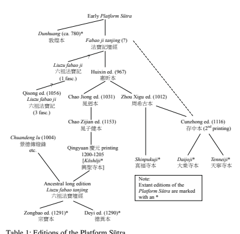

In the following, I will discuss the formless precepts as they appear in the Dunhuang version of the *Platform Sūtra*, then the Huixin version, and finally the Zongbao edition as representative of what became the orthodox version of the Platform Sūtra. 

## Formless Precepts In The Dunhuang Platform Sūtra

The formless precepts must have been understood as an essential feature of the Dunhuang version of the *Platform Sūtra*, which showcases the precepts in an addendum to its title. The full title reads: 
The Sū*tra of the Perfection of Wisdom (prajñāpāramitā) of the Supreme Vehicle of the Sudden Teaching of the Southern Tradition: The Platform Sūtra* Preached by the Great Master Huineng, the Sixth Patriarch, at the Dafan Monastery in Shaozhou, in one scroll, also including the bestowal of the formless precepts; recorded and compiled by the Disciple Fahai, Spreader of the Dharma" (*Nanzong dunjiao zuishang dasheng moheboreboluomi jing,* Liuzu Huineng dashi yu Shaozhou Dafansi shi fa tanjing yi juan, jian shou wuxiang jie, hongfa dizi Fahai jiji 南宗頓教最上大乘摩訶般若波羅蜜經六 祖惠能大師於韶州大梵寺施法壇經一卷 兼受無相戒弘法弟子法海集記).23 The very word "platform" in the title almost certainly refers to a kind of ordination platform on which Huineng is understood to have administered the formless precepts to his audience. 

The structure of the Dunhuang *Platform Sūtra* highlights the centrality of the formless precept ceremony. As has often been observed, the Dunhuang *Platform Sūtra* can be divided into two distinct parts which may originally have been separate: the first part of the text which contains Huineng's first-person spoken sermon at the Dafan 大梵 monastery in Shaozhou, and the rest of the text that shifts to a third-person narrative and which purports to deal with Huineng's life and interactions with disciples after his sermon at Dafan. It is quite possible that the sermon part of the Platform Sūtra originally circulated as the whole work and it is worth noting that the full title of the Dunhuang text only seems to refer to this part.24 The *Platform Sūtra* states in its very first sentence that Huineng ascended the teacher's seat at the Dafan monastery to "preach the prajñāpāramitā and transmit the formless precepts" (sec. 1). This forefronts the role of the formless precepts and ties them in with the declared ideological basis of the whole text, the prajñāpāramitā teaching of emptiness. The audience is then described in hyperbolic terms as consisting of ten thousand monks, nuns, and lay people. The prefect of Shaozhou, Wei Ju 韋據 (d.u.), together with more than thirty officials and thirty Confucian scholars, now asks Huineng to preach and Wei Ju orders the disciple Fahai 法海 (d.u.) to record the master's words.25 Later versions further accentuated the role of Wei Ju and the officials as the foremost representatives of the laity, and I believe it is apparent that the Platform Sūtra especially seeks to appeal to members of the educated elite. Nevertheless, it is made very clear in the Dunhuang version of the Platform Sūtra that monastics are also present at Huineng's sermon, and are included as recipients in his transmission of the formless precepts. This is an important point that I shall return to later. 

Although neither the title not the short introduction in the Platform Sūtra mention this, Huineng begins his sermon with a dramatic autobiography that describes how he came to be the Sixth Patriarch (secs. 2–11). Only when this is concluded does he go on to his doctrinal instructions to the audience. Thus the sermon itself falls into two distinct parts, and again it is easy to imagine that the sermon may first have circulated without the autobiography. The sermon proper, as I will call it (secs. 12–37), can be understood to be structured around the formless precepts ceremony. 

Huineng begins the sermon proper by noting that special karmic conditions resulted in his coming to preach to the assembled officials, monastics, and lay people, and that his teachings were handed down to him by the patriarchs. A note in the Dunhuang text here reads: "What follows below is the Dharma," emphasizing the centrality of this part.26 Huineng now sermonizes on a series of topics (secs. 13–19), before he turns to the formless precepts. This part of the sermon proper leads up the formless precepts and can be understood to prepare Huineng's audience for his precept instructions. Space does not allow for a full recounting of this section,27 but although the *Platform Sūtra* identifies itself as centered on the prajñāpāramitā teachings, the most fundamental message of this section (and the entire work) is that all sentient beings are endowed with the Buddha nature. To gain the insight that Buddha nature is in fact identical to our own original nature we need to overcome the dualistic and ignorant thinking that is at the root of all delusion, in a moment of direct unmediated perception. Furthermore, Huineng's teaching is "sudden" (*dun* 頓) since he does not employ any expedient means but points directly to our own true nature.28 The precept ceremony in the Dunhuang version of the *Platform Sūtra* consists of four main parts (secs. 20–23): 
1. Refuge in the threefold body of the Buddha of oneself 2. The four Bodhisattva vows 3. The formless repentances 4. The three refuges After conferring the precepts on his audience, Huineng declares that he will now expound the doctrine of the great prajñāpāramitā (a concept he has not directly referred to in his sermon earlier); this follows the pattern of other early Chan precepts texts, as I will discuss below. Huineng's sermon on the prajñāpāramitā can be seen as a direct extension of the formless precepts and Huineng here invokes "formlessness" several times; some scholars see this a fifth part of the formless precepts.29 In essence, the section on the prajñāpāramitā comprises the rest of Huineng's sermon at the Dafan monastery, concluding with Wei Ju's questions about Bodhidharma and the emperor Wu of Liang 梁武帝 (464–549) (sec. 34), and the nature of the Pure Land (sec. 35), together with Huineng's assurance that it is possible for lay people to practice his teachings (sec. 36). The sermon ends with Huineng's long "formless verse" which he specifies is for both monastics and laypeople (sec. 36). After this, Huineng declares that he will now return to Mt. 

Caoxi 曹溪 (or Caoqi) and he then disperses the audience; however, he invites everyone to come and see him at Caoxi if they have any doubts (sec. 

37). The audience all exclaims: "This we have never heard before. How fortunate is Lingnan to have given rise to a Buddha in that place, who would have thought it possible!"30 The narrative now shifts into the second part of the text, which will not be addressed in detail here. 

Before going on to a discussion of the formless precepts in the Dunhuang Platform Sūtra, and how the precepts change in later versions of the *Platform Sūtra*, a brief discussion of the history of precepts in China in general, and in the emerging Chan school in particular, is necessary. 

## Bodhisattva Ordinations In China

The formless precepts in the *Platform Sūtra* came out of a Chinese tradition of Mahāyāna Bodhisattva precepts for both monastics and lay people that began in the fifth century. Bodhisattva precepts in China have been the subject of much research, although some aspects of the precepts, like exactly how and to whom they were administered, are still not fully understood. 

It seems Dharmakṣema (Ch.: Tanwuchen 曇無讖, 385–433) was the first to confer Bodhisattva precepts on others in China, in a ceremony based on the *Pusa dichi jing* 菩薩地持經 (Skt.: Bodhisattvabhū*mi Sūtra*, T. 1581) that he had translated from the Sanskrit.31 But by the second half of the fifth century two new texts with Bodhisattva precepts appeared in China, the Fanwang jing 梵網經 (Brahmā's Net Sūtra, T. 1484) and the Pusa yingluo benye *jing* 菩薩瓔珞本業經 (Bodhisattvas' Precious Necklace of Primary Acts Sūtra, T.1485), both almost certainly Chinese compositions although claimed to be translations from the Sanskrit. The *Fanwang jing* in particular quickly became very popular.32 The *Fanwang jing* accommodates traditional Chinese concerns, such as filial piety, and promises heavenly or high human birth for anyone who takes the precepts. The precepts are also specifically said to be open to all, from kings and gods to slaves and prostitutes, and including all monastics. The text thus served to make the Bodhisattva precepts appeal to a wide spectrum of Chinese society, presenting them in such a way that lay people and monastics could take the precepts together.33 It also incorporated all the major Bodhisattva precepts of earlier translated works, making it especially appealing.34 A number of commentaries, manuals, and ritual texts for Bodhisattva precept ceremonies appeared over the next centuries, broadly based on the *Fanwang jing* and other texts. The Platform Sūtra itself, in what clearly seems to be an attempt of establishing its own orthodoxy, quotes from the *Fanwang jing* right before it begins its section on the formless precepts: "Your own original nature is pure and undefiled" (本源自性 清淨).35 A number of ritual manuals of various kinds drawing on the Fanwang jing and other sources were compiled in China after the fifth century. Although there is a great amount of diversity in the details of these texts, rituals for Bodhisattva precepts and related events like repentance rituals tended to follow a general liturgical framework that by the 7th and 8th centuries had become a very stable ritual structure. Thus Dan Stevenson notes that in Chinese Buddhist ritual in general a "basic syntax, or structural logic, of the rite […] tend[ed] to restrain any radically divergent intrusion or relocation of elements within the overall sequence."36 A Bodhisattva-precept manual composed by the Tiantai monk Zhanran 湛然 (711–782), using the ten main vows from the *Fanwang jing,* seems to have become especially influential.37 Zhanran's ordination manual is prefaced by a note, presumably by Zhanran himself, which states that he based his manual on a number of different sources, i.e., the *Fanwang jing,* the Pusa yingluo benye *jing*, and the *Pusa dichi jing,* as well as various manuals and commentaries, but that even though his text does not rely on one single authority it still is in accord with the sacred teaching.38 Zhanran's manual contains the following twelve sections that give a good overview of the steps involved in his precept ceremony:39 4. Repentance 懺悔 5. Aspiration to supreme enlightenment (including the four bodhisattva vows) 發心 6. Questions about hindrances to receiving the precepts 問遮 7. Conferral of the precepts through the three collections of pure precepts 
(三聚淨戒)40 授戒 8. Ascertaining those who have witnessed the ceremony 證明 9. Sign from the Buddha confirming the validity of the ceremony 現相 10. Explanation of the precepts 說相 11. Dedication of the merit from the ceremony to all sentient beings 廣願 12. Exhortation to observe the precepts 勸持 Dan Stevenson describes a general syntax that he has observed in a large number of ritual texts as typically including the following elements in order, although several other elements are usually inserted as well:41 1. Opening invocations and offerings of incense and flowers to the eternally abiding Three Treasures 2. Ritual veneration of the assembled deities 3. Confession and repentance 4. Profession of vows 5. Refuge in the Three Treasures (along with affirmation of the bodhisattva vow) 
With these models in mind, let us examine rituals of bestowing Bodhisattva precepts in early Chan. 

## Bodhisattva-Precept Ceremonies In Chan Before The Platform Sūtra

The early Chan movement seems to have enthusiastically embraced bodhisattva-precepts rituals, while at the same time simplifying them and keying them in with an emphasis on the doctrines of emptiness and inherent Buddha nature. Early on there was a close connection between Chan and the Bodhisattva precept movement, just as many early Chan masters were also known as strict upholders of the Vinaya, the Buddhist monastic code.42 It seems likely that the beginnings of the Chan movement should be traced to the Chinese monk Daoxin 道信 (580–651) and his disciple Hongren, who were both active at the monastery at Huangmei on East Mountain in present-day Hubei (and who came to be known as the Fourth and Fifth Patriarchs in retrospect).43 Although we only know about the teachings of Daoxin and Hongren from later sources, it seems they both placed great emphasis on meditation and the notion of inherent Buddha-nature.44 But Daoxin is also associated with a concern for Buddhist precepts. Most significantly, in the early 8th century Chan history, the *Lengqie shizi ji* 楞伽 師資記 (Record of the masters and disciples of the Laṅkāvatāra Sūtra), 
Daoxin is said to be the author of a text on administering the Bodhisattva precepts, the *Pusajie fa* 菩薩戒法 (Protocol (for transmitting) the Bodhisattva Precepts).45 The text is now lost, but the sermon attributed to Daoxin in the *Lengqie shizi ji* includes a remark about repentance: 
The Puxian guan jing 普賢觀經 (Sūtra of Meditating on Samantabhadra) says: 
'The vast ocean of obstructive karma is entirely caused by deluded thought. Those who wish to repent should sit erect and contemplate ultimate reality.' 
This is the supreme repentance.46 As we shall see, the *Platform Sūtra* later seems to echo this sentiment. 

The earliest mention of Daoxin is in the 645 *Xu gaoseng zhuan* 續高僧 傳 (Continued chronicle of eminent monks), written when he was still alive. 

Here it is said that when wild beats were bothering the area of his monastery at night Daoxin conferred the precepts on them (授歸戒), which caused them to leave.47 Although the reference here may be to the Three Refuges, it indicates that Daoxin in his own life-time was associated with the practice of giving precepts to non-monastics, and it seems likely that the *Pusajie fa* attributed to him was centered on a ritual that was directed at both monastics and laypeople. The *Xu gaoseng zhuan* also relates that when Daoxin first became a novice at the age of eight he remonstrated with his master for not being pure in his keeping of the monastic precepts, further suggesting that Daoxin was known for a general concern with precepts.48 Daoxin's reputation for concerns with the Buddhist precepts may well have set a precedent in the emerging Chan movement, and several texts associated with early Chan figures that discuss or contain some sort of Bodhisattva precepts are still extant.49 Here I would like to focus on two early Chan texts that like the *Platform Sūtra* outline a precept-conferral ceremony. 

The first is the *Dasheng wusheng fangbian men* 大乘無生方便門 (The expedient means of attaining birthlessness in the Mahāyāna), also known as the *Wu fangbian* 五方便 (Five expedient means).50 The text is associated with Shenxiu (the rival of Huineng in the *Platform Sūtra*) and his disciples. 

The other text is by Shenhui, entitled *Nanyang heshang dunjiao jietuo chanmen zhiliaoxing tanyu* 南陽和上頓教解脫禪門直了性壇語 (The venerable Nanyang's platform sermon on direct realization of the [innate] nature according to the Chan doctrine of liberation through the sudden teaching), 
usually abbreviated as the *Tanyu* 壇語 (Platform Sermon).51 Although it is impossible to date these texts precisely, the *Wu fangbian* seems to be the earlier of the two, although the *Tanyu* appears to be from the first part of Shenhui's career, in the years after 720.52 The *Tanyu* may well represent a sort of reaction to the *Wu fangbian* (or a similar text) associated with Shenxiu's school that Shenhui later relentlessly attacked. Furthermore, I believe we can see the precept ceremony in the *Platform Sūtra* as playing off and reacting to the ceremonies of both the *Wu fangbian* and the *Tanyu.*53 While the precepts ceremonies in the texts of both the *Tanyu* and the Platform Sūtra are presented as records of actual ceremonies, the precept ceremony in the *Wu fangbian* appears to be a kind of manual for monastics on how to confer the precepts on an audience. The precept ceremony comes right at the beginning of the text and is followed by a long sermon. The description of the precept ceremony in the *Wu fangbian* can be divided into seven parts:54
(1) The four Bodhisattva vows. The ceremony begins with the audience being instructed to kneel with their palms together and asked to recite the four vows that are written out in the text ("sentient beings are numberless, I vow to save them; the passions are limitless, I vow to cut them off; the Buddhist teachings are boundless, I vow to study them; I vow to achieve the unsurpassed Buddha Way"). 

(2) Requests that the Buddhas and Bodhisattvas be preceptors and witnesses. 

(3) The three refuges, in the Buddha, Dharma, and Saṅgha. The text simply says to "instruct [the audience] in receiving the three refuges" (次教 受三歸).55
(4) Questions about the five capabilities. These are spelled out in the text, and after each question the response expected from the audience, "I can," is supplied. The five capabilities are about rejecting people of bad influence, getting close to people of good influence, maintaining the precepts, studying Mahāyāna scriptures, and saving sentient beings from suffering. (5) Statement of names, and repentance of transgressions. Here, the precept ceremony in the *Wu fangbian* stipulates that everyone in the audience must state their own name and repent their transgressions, and say: 
All the past, future, and present karma of the ten evil transgressions56 [committed by me], in body, speech, and mind, I now fully repent with the utmost sincerity and I hope that my transgressions will be eradicated, never to occur again (次各稱已名懺悔罪言:過去未來及現在身口意業十惡罪我今至心盡 懺悔。願罪除滅永不起).57 
(6) Declaration of the audience's ability to receive the Bodhisattva precepts. The text here states that since everyone in the audience has completed their repentances they are now pure like the finest lapis lazuli, and within and without they are ready to take the pure precepts. It further explains that the Bodhisattva precepts are the precepts of the mind, because the Buddha nature is the nature of the precepts. To allow the arising of even the slightest deluded thought is to go counter to the Buddha Nature, and to break the Bodhisattva precepts. On the other hand, when taking care that (deluded) thoughts do not arise in the mind then one is in accordance with Buddha nature and that is upholding the Bodhisattva precepts.60 A note in the text then indicates that the above should be explained three times. 

(7) Meditation. The *Wu fangbian* now states that everyone must sit in the Lotus position. The preceptor is then to ask the audience: 
Disciples of the Buddha, your minds are peaceful and motionless. What is it that is called purity? Disciples of the Buddha, the Tathāgatas have a great expedient means for entrance into the Path (or into enlightenment). In one instant you can purify your mind and suddenly transcend to the stage of Buddhahood.61 The preceptor then strikes the wooden board, and everyone is now to perform the *nianfo* 念佛 together (likely this means chant homage to Amitābha, although it could also mean meditate upon the Buddha(s)). 

The *Wu fangbian* now goes on to a ritualized sermon on the Prajñāpāramitā with questions and answers, that can be understood to be part of the precept ceremony. After this it moves on to a lengthy discussion of the five expedient means that give the text its name.62 Interestingly, the precept ritual here does not actually list the Bodhisattva precepts themselves nor does it contain instructions on how they should be conferred. It seems to imply that actual precepts were to be given to the audience, presumably between sections 6 and 7 above. It is possible that this consisted of the ten main precepts of the *Fanwang jing,* but it could also have been another list or formulation of precepts that was well known to the intended users of the manual (likely monastics associated with Shenxiu's school). The compilers of the *Wu fangbian* probably considered the ceremony of precept conferral so well known that it was not necessary to 
                                                            
60 *Dasheng wusheng fangbian men,* CBETA, T85, no. 2834: 1273, b28–29. This passage is not included in McRae's translation. 

61 CBETA, T85, no. 2834: 1273, b29. Translation from McRae 1986: 173. 62 For a discussion see McRae 1986: 218–233. 

include. In any event, the precept ceremony outlined here seems fairly conventional. Although it does not strictly follow Zhanran's manual or the sequence observed by Dan Stevenson, it does contain many of the same elements and the same general outline. 

It is not made clear in the *Wu fangbian* whether the audience receiving the precepts consisted of lay people, monastics, or both. However, the tone of the text is such that it seems most likely that the main audience was laypeople, and that the *Wu fangbian* was a manual for the monastics who conferred the precepts. 

Unlike the *Wu fangbian* (and the *Platform Sūtra*), Shenhui's *Tanyu* does not contain a clearly delineated precept ceremony.63 It seems to be an actual recording (more or less) of a sermon by Shenhui, which probably took place on a platform. But although the precept ceremony in the *Tanyu* seems rather amorphous it is still clearly a central part of the text, as reflected in its title and the placement of the precepts right at the beginning of the text. The ceremony, such as it is, can perhaps be divided into the following seven parts: 64
(1) Introduction. The text begins with Shenhui telling his audience what a rare opportunity it is for each of them to be able to come here, to give rise to the unsurpassed enlightened Bodhi mind, and to meet Buddhas and Bodhisattvas and truly good friends (*kalyāṇa-mitra*). Today the audience will hear what they have never heard before, and meet who they have never met before.65 Shenhui then states that he will lead them in confession, and each of them in worshipping the Buddha. 

(2) Homage to the Buddhas, Dharma, and Sangha (the Three Treasures). 

Shenhui now leads his audience in traditional homage to the three treasures, although he gives them a rather unusual form: 
1. We pay homage to all the Buddhas of the past, to all of them. 2. We pay homage to all the Buddhas of the future, to all of them. 3. We pay homage to all the Buddhas of the present, to all of them. 4. We pay homage to the preeminent Dharma, the sūtras of the Prajñāpāramitā. 

5. We pay homage to all the great Bodhisattvas and all the wise and holy monks.66
(3) Repentance of sins.67 Shenhui next tells his audience that each must repent their sins with the utmost sincerity. Several overlapping sets of sins are to be repented, beginning with the four pārā*jika* offenses68 and all in the same formula: 
All the past, future, and present karma of the four *pārājika* offenses [committed by me], in body, speech, and mind, I now fully repent with the utmost sincerity and I hope that my transgressions will be eradicated, never to occur again (過去未來及現在身口意業四重罪。我今至心盡懺悔。願罪除滅永不 起). 

Interestingly, this is exactly the same formula we have seen used in Wu fangbian for repentance of the ten evil transgressions, a point I will return to below. In the *Tanyu*, this is followed by repentance of the five heinous crimes, the seven heinous crimes,69 the ten evil transgressions (十惡罪), all karmically obstructing sins (障重罪), and all sins in general (一切罪), all of them using the same formula. 

(4) Exhortation to give rise to the Bodhi mind, and definition of Śīla, Prajñā, and Samādhi (known as "the three disciplines," *sanxue* 三學).70 I see this as the central part of the precepts, Shenhui's version of actual vows. He here recounts how everyone today has come to his place of teaching, and tells his audience that each of them must now give rise to the unsurpassed Bodhi mind, and seek the unsurpassed Bodhi Dharma. To do so they must have faith in the Buddha's words and rely on the Buddha's teachings. This is encompassed in the well-known saying from the sūtras: "Do not commit the various sins, practice all the good things, purify your mind, this is the teaching of all the Buddhas." Shenhui then explains that not to commit the various sins is the precepts (Śīla 戒), to practice all the good things is wisdom (Prajñā 慧), and to purify your own mind is meditation (Samādhi 定). 

Shenhui also tells his audience that only when these three disciplines are studied can we call it Buddhism. To this traditional explanation Shenhui adds: "That the deluded mind does not rise is called precepts; that there is no deluded mind is called meditation; knowing that there is no deluded mind is called wisdom."71
(5) Exhortation to observe the precepts.72 Shenhui now tells his audience that everyone must maintain the pure precepts (齋戒) for without them all the good Dharmas cannot come into being. To achieve the unsurpassed Bodhi one must also uphold the precepts. One cannot obtain a rebirth as even a mangy jackal without upholding the precepts, much less the body of a Buddha. 

(6) The effects of karma and lack of correct understanding of the Dharma.73 This long passage is mainly about how important it is to meet the right teachers, and it criticizes the teachings of the two vehicles (the "Hīnayāna"). Shenhui then states: 
Since you have already mounted this platform in order to learn and practice the prajñāpāramitā, I want each of you to give rise to the unsurpassed bodhi mind with heart and mouth and not to leave your seats until you understand the meaning of the Middle Path which is the highest truth.74
(7) Getting rid of all is meditation.75 In a passage that is perhaps a kind of response to the last part of the precept ceremony in the *Wu fangbian,*
Shenhui now states that those who strive for liberation should rid themselves of all kinds of Buddhist concepts. Furthermore: 
They must get rid of both realization of the inner and outer worlds, and in the Three Worlds neither their body nor their co-ordinating organ (*manas*)76 appear. That is meditation. This kind of meditation is authorized by the Buddha. 

The Sixth Patriarch has transmitted (his message) from mind to mind because it cannot be expressed in words. In this form it is handed down."77 This concludes the section of the *Tanyu* that can reasonably be considered part of a precept ritual. However, there is no break in the text, and Shenhui continues directly with remarks about how everyone in the audience possesses the nature of a Buddha. The rest of his long sermon revolves around the concept of Buddha-nature and the prajñāpāramitā teachings. 

                                                            
71 Yang ed. 1996: 6, line 8. My interpretation follows that of Adamek 2007: 207. 72 Yang ed. 1996: 6, line 7–9. 73 Yang ed. 1996: 6, line 10–p. 7, line 9. 

74 Yang ed. 1996: 7, line 8–9. 75 Yang ed. 1996, 7, line 10–11. 

76 The seventh of the eight consciousnesses taught in Yogācāra, the self-aware, defiled consciousness. 

77 Translation from Liebenthal 1953. 

Comparing the *Wu fangbian* with the *Tanyu* we do not see many direct parallels. The one striking similarity is in the section of repentances where the two texts have the exact same wording. I have not found this exact wording anywhere else and it shows that the two texts in some ways have a common heritage. It seems very likely that Shenhui was aware of the precept ritual as presented in the *Wu fangbian* and simply used its formula for his repentances. However, he broadens the scope of the repentances by adding several items to the list, perhaps most significantly the four pārā*jika* offenses that were originally meant for monastics only, but, of course, (except for sexual intercourse) would be serious offenses for anyone. It is not clear whether the audience was laypeople, monastics, or both, but as with the Wu fangbian the whole tenor of the sermon makes it likely that it was mainly directed to laypeople, although monastics may well have been included in the audience. 

In any case, I believe we in general can see a theme of expansion of the scope of the precepts in Shenhui's *Tanyu* compared to the *Wu fangbian.* Thus, instead of the four Bodhisattva vows that open the ceremony in the Wu fangbian, the *Tanyu* tells its audience that they are here to give rise to the unsurpassed Bodhi mind. This can be seen as parallel to the Bodhisattva vows (that are never mentioned in the *Tanyu*), but vastly broader in scope and perhaps implying a rejection of those vows as too limited. Likewise, in the traditional homage to the three treasures the *Tanyu* uses a unique formula that broadens the scope of each treasure, and strongly emphasizes the prajñāpāramitā as the true Buddhist Dharma, and the Bodhisattvas and enlightened masters as the real saṇgha to which to pay homage. 

Unlike the *Wu fangbian,* which seems to be a kind of manual, there is no sense in the narrative of the *Tanyu* that an unstated list of actual precepts is understood to have been administered to the audience. Shenhui's exhortation telling his audience to give rise to the unsurpassed Bodhi mind and to seek the unsurpassed Bodhi Dharma seems to be the closest we get to an actual conferral of precepts. By ultimately equating the unsurpassed Bodhi Dharma with the three disciplines of precepts, wisdom, and meditation this vision of the precepts encompasses the entire Buddhist tradition. Nothing less than full Buddhahood is to be the goal for everyone in the audience. 

Although the attacks of the "Northern school" of Chan and the more radical teachings that Shenhui later came to embrace are not prominent in the *Tanyu* (perhaps confirming it is a relatively early text), in the section on the effects of karma and lack of correct understanding of the Dharma we can probably see a veiled attack on Shenxiu and his disciples in Shenhui's emphasis on meeting the right teachers and avoiding the failings of the two inferior vehicles. And Shenhui's statement that real meditation entails getting rid of any clinging to rigid categories of Buddhist teaching, and his emphasis that the Sixth Patriarch transmitted his teaching from mind to mind because it cannot be expressed in word seems to foreshadow his later campaign.78 On the other hand, much of the teaching found in the *Tanyu*'s precept ceremony seems rather conventional, and in spite of the fact that Shenhui refuses to be confined by a traditional precepts ritual several elements echo a fairly standard one. Thus, Shenhui invokes the usual homage to the Three Treasures in the beginning of his precept ceremony (although in an unusual form), and his repentance ritual is a standard and very orthodox one. The exhortation to follow the precepts that emphasizes good rebirth also follows a fairly common formula. Furthermore, Shenhui's discussion about how people are limited by their past karma, being adrift in the ocean of saṃsāra, and his definition of the three disciplines that defines not committing the various sins as the precepts, practicing all the good things as wisdom, and purifying one's own mind is meditation (in the Dunhuang *Platform Sūtra* attributed to Shenxiu!) seems rather unsophisticated, even if he adds a more radical interpretation afterwards. And although right after presenting his precepts Shenhui declares "Learned friends, each of you are fully endowed with the Buddha nature within your own bodies (知識一一身具有佛性)"79 and further expands on this in his sermon, in the precepts the teaching of Buddha nature is not mentioned, unlike the *Wu fangbian* where the concept is invoked several times. 

## The Formless Precepts In The Dunhuang Version Of The Platform Sūtra

The section on the formless precepts in the Dunhuang version of the Platform Sūtra begins by Huineng declaring to his audience that all must now receive the formless precepts with their own bodies (Sec. 20). Its program is as follows: 
(1) Refuge in the three-fold body of the Buddha. Huineng first tells everyone to repeat what follows after him, as he is now going to make all see the three-fold body of the Buddha within themselves: "I take refuge in the pure Dharmakāya Buddha in my own corporal body; I take refuge in the ten thousand hundred billion Nirmāṇakāya Buddhas in my own corporal body; I take refuge in the future perfect Sambhogakāya Buddha in my own corporal body. (Recite the above three times [original note in the text])."80 Huineng goes on to explain that, in fact, the corporal body is just an abode that cannot be said to be a refuge; the threefold body of the Buddha is within everyone's own Dharma nature (法性). As for taking refuge in the Dharmakāya Buddha, the nature of everyone is by itself originally pure, and everything in the universe is encompassed by one's own nature. A person who thinks about all evil things will practice evil, while a person who thinks about all good things will practice good. Taking refuge in the Dharmakāya Buddha of oneself is to cast aside all that is not good. Likewise, as soon as a person thinks of good, Prajñā wisdom is born and this is called the Nirmāṇakāya Buddha of one's own nature. Finally, when future thoughts are good one may be called the Sambhogakāya Buddha. 

(2) Next come the four Bodhisattva vows (sec. 21). Again Huineng tells his audience to repeat out loud what he says, and again the text notes that the vows should be recited three times: "Sentient beings are numberless, I 
vow to save them; the passions are limitless, I vow to cut them off; the Buddhist teachings are boundless, I vow to study them; I vow to achieve the unsurpassed Buddha Way. (Recite three times)."81 Huineng goes on to state that everyone must save themselves in their own bodies with their own natures. This means, he continues, that within their own corporal bodies with their false views and defilements, ignorance and delusions, everyone naturally has the originally enlightened nature. Simply, this nature of original enlightenment that everyone possesses will save them with right views. When delusions are eliminated people will awaken by themselves and achieve the Buddha way, this is practicing the power of the vows. Interestingly, Huineng does not refer to the Bodhisattva vows as "formless;" it is as if the text recognizes that these are commonly used standard vows—as we have seen in the *Wu fangbian*. 

(3) Now comes the formless repentances (sec. 22). The format is a series of seven-character phrases that possibly should be read as a poem.82 In any case, the passage seems mostly like an explanation of a particular understanding of the meaning of repentance, and has no actual formula for the expression of repentance. After Huineng has laid out the formless repentance a note in the text again says to "recite the above three times." The section reads in part: 
Good and learned friends, if in past, future, and present thoughts each successive thought is not stained by delusion, and if you at once eliminate your past bad actions with your own natures, then this is repentance (懺悔). Good and learned friends, if in past, future, and present thoughts, each successive thought is not stained by ignorance, and if you eliminate your past arrogant mind and cut it off forever then this can called to repent with your own nature 
(自性懺). Good and learned friends, if in past, future, and present thoughts, each successive thought is not stained by jealousy, and if you eliminate your past jealous mind and with your own nature eliminate it, then this is repentance (懺) (recite the above three times).83 Huineng ends the section by stating that in his teaching, forever to cut off 
[evil] deeds and not perform them, that is called repentance (懺悔). 

(4) The formless precepts of the three refuges (sec. 23). We here get a version of the refuge in the Three Treasures: 
The Master said: "Good and learned friends, take refuge in enlightenment, the most noble of two-legged beings; take refuge in the truth, the most noble that leaves behind the desires; take refuge in purity, the most noble among people."84 He goes on to say that from now on, the audience must call "Buddha" (enlightenment) their master and not rely on other, outside teachings that are deluded and heretical. They must take refuge in the three treasures of their own bodies. Huineng then explains his earlier statement, bringing it in line with a more common formulation of the three refuges: "The Buddha is enlightenment, the Dharma is truth, and the Saṇgha is purity." Huineng ends the section by saying: 
Good and learned friends, each of you must investigate for yourselves, do not be mistaken. The sūtras say to take refuge in the Buddha of yourselves, they do not say to take refuge in another Buddha. If you do not take refuge in your own natures there is no other place [you can rely on].85 After this, the formless precepts are completed, and Huineng goes on to his sermon on the prajñāpāramitā. 

The precepts in the Dunhuang *Platform Sūtra* are obviously in the tradition of the *Wu fangbian* and the *Tanyu*, and almost certainly postdate them.

Three of the four parts of the precept ceremony in the Platform Sūtra have parallels in either one of the two other texts or both. But the *Platform Sūtra* implicitly rejects the precept rituals in both the *Wu fangbian* and the *Tanyu,* and differentiates itself by advertising its precepts as "formless," implying that the other precepts are bound by form and therefore limited. The precepts of the Platform Sūtra are formless because they are not about an outer dualistic reality, but about the self-nature of each of the participants. The ritual of the formless precepts is therefore a sudden teaching that embodies the highest truth, implicitly vastly superior to any other precept ritual. 

The very first set of precepts, about the three bodies of the Buddha, makes it very clear that everyone must save themselves, that the bodies of the Buddha represent an inner reality. The notion of taking refuge in the three bodies of the Buddha within oneself is unique to the *Platform Sūtra*, not found anywhere else, and it seems to be placed first as a declaration of the independence of the formless precepts. Yanagida has suggested that this section corresponds to both the invitation of Buddhas and Bodhisattvas found in more traditional precept manuals (no. 2 in the *Wu fangbian*), and to the actual conferral of the precepts themselves.86 This would mean that the refuge in the three bodies of the Buddha within oneself is the central part of the precepts in the Platform Sū*tra,* a view that seems affirmed by the fact that in later versions of the *Platform Sūtra* this section has been moved to the end of the precepts, as a culmination of the ritual (see below). Interestingly, it is possible that this section is directly inspired by Shenhui's Tanyu, where the unusual form of the three treasures, homage to the Buddhas, Dharma, and Saṇgha, also seems to serve as an invitation to the holy witnesses. 

The *Platform Sūtra* seems inspired by the *Tanyu* in other ways. In this work, Shenhui starts by declaring that the audience will experience something unique, i.e., precepts and the following sermon, and meet someone unique, i.e., Shenhui. The Platform Sūtra presents its teachings and precepts in exactly the same way, and successfully depicts Huineng as a Buddha who administers all of this to his audience. At the same time, the Platform Sūtra distances itself from Shenhui's *Tanyu* by not using any of this work's precept formulations and, of course, by emphasizing that the real source of the precepts is within each person's own nature. The difference is especially clear in the *Platform Sūtra*'s formless repentances, which is also the section in which the *Platform Sūtra* deviates the most from established liturgical models. Here the text refuses to actually refer to any of the traditional sets of sins, much unlike the *Tanyu*, and instead tells the audience that they can overcome delusion, ignorance, and jealousy with their own natures and thereby eliminate all sins and transgressions. This seems to echo the short statement referred to above attributed to Daoxin in the *Lengqie shizi ji* that gaining insight into ultimate reality, i.e., seeing one's own Buddha-nature, is supreme repentance. Finally, the authors of the *Platform Sūtra*, in what seems like a calculated snub, later in the text specifically reject Shenhui's traditional definition of the three disciplines that not to commit the various sins is the precepts, to practice all the good things is wisdom, and to purify one's own mind is meditation, by using it as a signature example of the inferior teachings of Shenxiu.87 In the *Wu fangbian* and the *Tanyu* the precepts ceremonies are placed in the beginning of the text, and followed by lengthy sermons. The Dunhuang version of the *Platform Sūtra* is structured quite differently, as we have already seen, with the precepts being placed towards the end of the sermon. 

We may surmise that all three texts were created at a time when such precept ceremonies were very popular. It seems likely that the precept ceremonies in the beginning of the *Wu fangbian* and the *Tanyu* were features designed to draw people to actual sermon events. The ceremonies were brief and undemanding, unlike precept ceremonies such as the one described by Zhanran, and people could probably participate in them as often as they wished. 

Although it seems clear that both monastics and lay people participated in ceremonies like the one described by Zhanran, we may speculate that the precepts of the *Fanwang jing* could have seemed overwhelming to many lay people, who may well have been uncertain about whether they really would be able to keep all ten major and 48 minor precepts. The ten major precepts, the violation of which is said to have severe karmic consequences, include refraining from bragging about oneself and disparaging others (no. 7), avoid stinginess with offering one's possessions (no. 8), and not getting angry (no. 9)—all things that many people find difficult to control.88 On the other hand, enormous merit was thought to accrue to those who took Bodhisattva precepts and so such precepts continued to be very attractive to lay people and monastics alike.89 It seems possible that a certain ambivalent feeling towards the precepts in the *Fanwang jing* may have left the door open for simplifications and modifications to the Bodhisattva precepts and rituals, and that the emerging Chan movement in the seventh and eighth centuries may have tapped into this. 

Unlike the two other texts, the Dunhuang *Platform Sūtra* almost certainly does not reflect events or sermons that actually took place. Rather it is a literary work that must have had several purposes. The text is clearly meant to be attractive to a broad readership, and the inclusion and prominent position of the formless precepts must have been understood to further this goal. The Dunhuang *Platform Sūtra* itself indicates that copies of it were used as transmission documents, the possession of which served as proof that the holder was part of Huineng's school. As indicated by the notes in the text to "recite three times," it is very possible that the precepts in the text were meant to be performed on audiences by Chan masters who could claim descent in Huineng's lineage. Thus, the description of the formless precepts in the Dunhuang *Platform Sūtra* may have functioned as a manual in a way that was similar to how the *Wu fangbian* probably was used. 

## The Formless Precepts In The Huixin Version Of The Platform Sūtra

The Huixin version is not extant, but it can be reconstructed through the surviving versions of the *Platform Sūtra* that are based on it. Such a reconstruction has been facilitated by Ishii Shūdō in an edition of the *Platform* Sūtra in which he lists all differences between the extant eleven-chapter, two-fascicle editions that were based on Huixin's work (see table 1). 90 The Ishii edition gets us very close to what the Huixin version must have been like. First, all that is common to the eleven-chapter, two-fascicle texts must have been present in Huixin's edition. Second, where they all differ, the readings that are the closest to the Dunhuang version are likely to have been in the Huixin edition. 

The Huixin edition in general follows the Dunhuang version in content and order, and the main difference between the two is the greater clarity 
(and wordiness) of the Huixin text, and its division into eleven titled sections. However, there are a number of significant reformulations in Huixin's text, and his edition also contains passages not found in the Dunhuang version at all; as we shall see this is the case with the formless precepts. In these instances, the Huixin edition to some degree both radicalizes and sanitizes the *Platform Sūtra*. The message that Buddhahood is within our own natures is overall enhanced in the Huixin edition, and where the Dunhuang Platform Sūtra occasionally "slips" and reverts to more traditional doctrine asserting that practice and effort is needed the Huixin version often cuts or reformulates. 

In the Huixin version the section with the precepts follows the discussion of the meaning of meditation, as in the Dunhuang version (sec. 19). However, in the Huixin version the order of the precepts is completely different, and the precepts begin with a entirely new section on the "five Dharmakāya incenses of the self nature" (自性五分法身香). It appears in a single chapter in the Huixin edition together with three of the other four sets of precepts. 

The first set of precepts in Dunhuang version, on the three bodies of the Buddha, has been moved to the last position in the Huixin edition, where it has been given its own chapter. So the precept ceremony in the Huixin version consists of the following five elements: 
Chapter 5: Transmitting the incenses and repentances, and making vows 
(五傳香懺悔發願門).91 1. The five Dharmakāya incenses (not in the Dunhuang version) 
2. The formless repentances (no. 3 in the Dunhuang version ) 3. The four Bodhisattva vows (no. 2 in the Dunhuang version) 4. The three refuges (no. 4 in the Dunhuang version) Chapter 6 Explaining the characteristics of the unified three bodies of the Buddha 
(六說一體三身佛相門.)92 5. Refuge in the threefold body of the Buddha of oneself (no. 1 in the Dunhuang version) 
The five Dharmakāya incenses of the self nature are: 1) the incense of the precepts, 2) the incense of meditation, 3) the incense of wisdom, 4) the incense of liberation, and 5) the incense of emancipated perceptual understanding. 93 The five Dharmakāya incenses as described in the Huixin edition are traditional qualities of a fully enlightened Buddha, but here the text emphasizes that they are to be found within each person. Interestingly, the five Dharmakāya incenses are briefly discussed in a text attributed to Shenxiu, the *Guanxin lun* 觀心論, although they are here referred to as "the incenses of the true Dharma that has five kinds of bodies" (正法香有五種 體).94 The *Guanxin lun* also discusses precepts, although it does not outline a ceremony as such. The text is in another version known as the Poxiang lun 破相論 and is attributed to Bodhidharma.95 The *Shaoshi liumen* 少室六 門, also attributed to Bodhidharma, is essentially identical to it.96 Thus there seems to have been a strong tradition linking the five Dharmakāya incenses to Bodhidharma and it would not have been surprising if they had been included in the Dunhuang version of the *Platform Sūtra*. It seems somewhat odd, however, that Huixin should have added them in 967. It seems more likely that they were already in the version of the Platform Sūtra that Huixin used, which we know was probably a text later than the text of the Dunhuang edition, but only by a couple of generations.97 I have not found the five Dharmakāya incenses in any other precept text prior to 967 (the date of Huixin's preface), but they do appear to have become standard in Chan precept ceremonies from the Song dynasty onward as evidenced in both the *Chanyan qinggui* 禪苑清規 and the *Chixiu Baizhang qinggui* 敕修 百丈清規98 —perhaps inspired by their inclusion in the *Platform Sūtra*. 

The formless repentances in the Huixin version closely resemble those in the Dunhuang version, although the notion that they are about one's own self nature is further enhanced. Also, the last part of the section where Huineng states that in his teaching "forever to cut off evil deeds and not perform them is called repentance," is not included. It seems Huixin may have considered this statement not quite in the right spirit since it does not invoke the self-nature.99 In the four Bodhisattva vows, the Huixin version has added to each of them the words "own mind," or "self nature," so the vows come to be about the "sentient beings of my own mind," "the passions of my own mind," "the Buddhist teachings of my own self nature," "and the unsurpassed Buddha Way of my own self nature." Likewise, the explanation that follows accentuates the message already found in the Dunhuang version that these vows are not about an external reality, but about everyone's own nature. The text seems self-conscious about the change to the four Bodhisattva vows, and at some point asks: "why don't we just say: 'sentient beings are numberless, I 
vow to save them'?"100 At the same time, the change seems to integrate the Bodhisattva vows better into the other formless precepts; since in the Dunhuang version they are the only precepts formulated in a traditional manner (and not directly referred to as "formless precepts"). 

The three refuges in the Huixin version do not differ in any substantial way from their presentation in the Dunhuang version.101 The section on refuge in the threefold body of the Buddha of oneself, that in the Huixin edition is the last of the formless precepts (but first in the Dunhuang version), is accentuated here, having been given its own chapter. The precepts in the previous chapter now seem like they are leading up to 
                                                            
97 See Schlütter 2014. 

98 CBETA, X63: no. 1245, 546, c1–10. 99 Ishii 1980: 130. 100 Ishii 1980: 131. 101 Ishii 1980: 133. 

the precepts in this chapter. As noted earlier, this gives credence to the idea that these precepts were understood to be the central ones, at the very least by Huixin. A statement that underlines the importance of these precepts seems to have been added by Huixin: "I will explain for you unified three bodies of the Buddha of self nature. I will make you see the three bodies so that you yourself will completely awaken to your own self nature (某甲與 說一體三身自性佛、令善知識見三身、了然自悟自性)."102 By rearranging the formless precepts, and placing the repentances before any actual vows, Huixin's edition brings them into greater harmony with the dominant models for precepts rituals discussed earlier. But although the Huixin edition gives the precepts an important position, they are not specifically identified as "formless precepts." While this section in the Dunhuang version is introduced by having Huineng declare that he will now confer the formless precepts on his audience, there is no such statement in the Huixin version, not even in front of the section on the five Dharmakāya incenses. In fact, in the Huixin version the term "formless precepts" is only used once, in the very beginning of the text, when it is said that Huineng was invited to the Dafan to "administer the formless precepts and explain the Dharma of the Mahāprajñāpāramitā."103 So, although the refuge in the threefold body of the Buddha was given extra prominence in the Huixin version, overall the importance of the formless precepts actually seems muted in Huixin's text. The simple title of this edition that makes no reference to the precepts suggests the same thing: 
Shaozhou Caoxishan Liuzu tanjing 韶州曹溪山六祖壇經 (the Platform Sūtra of the Sixth Patriarch of Mt. Caoxi in Shaozhou).104 In his preface, Huixin does not mention the formless precepts, and merely refers to how the *Platform Sūtra* can help readers see their own Buddha nature. And although Huixin retains most of the notes found in the Dunhuang version instructing the audience to "recite three times," the instruction to do so after the three refuges does not appear. This is obviously a mistake, but one that further indicates less concern with the precepts in the text. At the beginning of the ceremony in the Huixin version Huineng tells his audience to kneel, clearly demarcating what follows as a special ritual event; while the Dunhuang version does not have any instructions for kneeling. But the inclusion of this detail only serves to make the text appear more realistic. It 
                                                            
102 Ishii 1980: 134. 103 Ishii 1980: 102. 104 Ishii 1980: 100. 

seems very unlikely that Huixin imagined anyone actually using a copy of his version of the *Platform Sūtra* to perform a precept ceremony. This weakening of the formless precepts' significance in the *Platform Sūtra* as an actual ceremony that could be emulated continued in the subsequent versions of the text, culminating with the orthodox version. 

## The Formless Precepts In The Orthodox Version Of The Platform Sūtra

As we have seen, the Huixin edition of the *Platform Sūtra* mostly preserves the order of the text as it is found in the Dunhuang version, and although the formless precepts are rearranged their general position in the text was not changed. In the Huixin version, Huineng's autobiography and his sermon that includes the formless precepts are all presented as parts of a talk given by Huineng at one occasion at the Dafan monastery, just as they appear in the Dunhuang version. However, the orthodox version of the *Platform Sūtra* (here represented by the Zongbao edition from 1291) abolishes this scheme entirely. Although the orthodox version was directly based on the Kōshōji version of Huixin's edition it thoroughly rearranges the text and adds much new material. Most important for our purposes, the orthodox version presents the formless precepts in a context that is completely different from that of the Dunhuang and Huixin versions of the text, significantly changing the meaning and impact of the formless precepts. Furthermore, as we shall see, the formless repentances have been completely reformulated. The change to the repentances is actually found already in the Kōshōji version of the Platform Sū*tra,* which was probably first prepared by Chao Jiong in 1031, but not published until 1153 by his descendant Chao Zijian.105 The Kōshōji version only differs significantly from Huixin's edition in a few places, and the change to the formless repentances represents the most dramatic difference.106 The orthodox version as represented by the Zongbao edition is divided into ten chapters.107 The first chapter creates a setting not much different from what is found in the Dunhuang and Huixin versions, with Prefect Wei asking Huineng to preach at the Dafan temple. Huineng then goes on to his autobiography, which has been significantly expanded in various ways. 

However, at the end of the chapter with the autobiography the audience disperses and the next chapter is said to be a lecture Huineng gave the following day. Huineng's teachings at the Dafan temple are thus presented as having taken place on a number of occasions, rather than all at once as in the Dunhuang and Huixin versions. The lecture Huineng gives right after his autobiography concerns the prajñāpāramitā, and it corresponds to his lecture given after the formless precepts in the Dunhuang and Huixin versions, that is often seen as a continuation of the precepts. But in the Zongbao edition, the precepts come much later in the text; in fact, they are presented as having been given not at the Dafan temple, but at some unspecified time after Huineng has completed his preaching there and returned to Caoxi. Thus the precept ceremony has been lifted out of its earlier context and is no longer a central part of Huineng's core sermon, and no longer keyed in with the prajñāpāramitā teachings. 

In fact, the precept ceremony in the Zongbao edition is found in a standalone chapter where it is presented as a spontaneous event, something that Huineng was all of a sudden inspired to do. The chapter, entitled simply 
"Chapter Six: Repentance" (懺悔第六), begins: 
At one time, the master saw that literati and commoners from the Guangzhou and Shaozhou areas, and from all over the country, had gathered at his mountain to hear the Dharma. So he ascended the teacher's seat and said to the assembly: Come, all of you good and learned friends. This matter must arise out of your own natures.108At all times you must in each moment of thought yourself purify your minds. You yourselves must cultivate practice to see your own Dharmakāya, see the Buddha within your own minds. You must save yourselves and take the precepts of yourselves, only then will you not have come here in vain. You have all come from afar to meet here; we share a karmic connection. Now all of you kneel and I will first transmit to you the five dharmakāya incenses of the self-nature, and then I will confer the formless repentances.109 So, in the Zongbao edition, the formless precepts are completely divorced from the context of a sermon. Although Huineng's sermon on meditation is contained in the chapter before this one, as was the case in the Dunhuang and Huixin versions, in the Zongbao edition the precepts are conferred on an entirely different occasion. Moreover, the Zongbao text notes very carefully that the precept ceremony came about when Huineng responded to the specific needs of lay people. Monastics are here excluded, or rather, the text seems to imply that it is not proper for them to be included. It appears that Huineng is simply presenting a heuristic device to lay people that is irrelevant for monastics. In the Zongbao edition, none of the notes saying "recite three times" have been retained and there is no sense that the ritual of the formless precepts here could serve as a model for other such ceremonies. 

Instead, the chapter simply reports the event as a specific episode in Huineng's teaching career. 

The outline of the formless precepts (if we can keep calling them that) 
in the Zongbao edition in general follows the Huixin edition fairly closely, or rather follows the Kōshōji version of Huixin's edition. The order and the core of the precepts are pretty much the same, except for the formless repentances. Here the Zongbao edition follows the reformulated repentances from the Kōshōji closely: 
[Huineng said:] Now I will bequeath to you the formless repentances, so that you may extinguish your transgressions in the three periods of time and render pure your three types of karmic activity (i.e., those of body, speech, and mind). Good friends, you should say the following in unison after me: "From our past thoughts to our present thoughts to our future thoughts, [so that] in every moment of thought we are not subject to the defilement of stupidity, we disciples repent all our transgressions of stupidity and evil actions from the past. We beseech that [our transgressions] all be instantly eliminated, never to arise again. From our past thoughts to our present thoughts to our future thoughts, [so that] in every moment of thought we are not subject to the defilement of deceitfulness, we disciples repent all our transgressions of deceitfulness and evil actions from the past. We beseech that [our transgressions] all be instantly eliminated, never to arise again. From our past thoughts to our present thoughts to our future thoughts, [so that] in every moment of thought we are not subject to the defilement of jealousy, we disciples repent all our transgressions of jealousy and evil actions from the past. We beseech that [our transgressions] all be instantly eliminated, never to arise again."110 This version of the formless repentances seems much more like a "real" repentance ritual with an actual formula for seeking forgiveness; this is no longer simply an abstract description of how repentance should be understood as found in the Dunhuang and Huixin versions of the *Platform Sūtra*. 

In fact, repentance, rather than precepts, is the declared focus of the whole section as we have seen in the title of the chapter, and Huineng in his introduction tells his audience that he will confer the formless *repentances* on them, not the formless *precepts*. It may even be misleading to talk about "formless precepts" in the context of the Zongbao edition of the *Platform* Sūtra. The Zongbao version never employs the term "formless precepts", not even in the introduction to the text, although it does in one instance refer to the three refuges as the "formless three-refuges precepts" (無相三歸依 戒).111 In the Zongbao edition, Huineng's "formless verse," that in the Dunhuang and Huixin versions comes at the end of the sermon on the prajñāpāramitā, concludes the chapter on formless repentance. Huineng here says that if his audience can see their own natures through this verse then even when far away it will be as if they are always near him. Those who do not understand, in contrast, will have come a thousand li in vain.112 By putting this verse at the end of the chapter on the formless repentances, the text indicates that it is specifically for laypeople. However, earlier versions of the Platform Sūtra explicitly state that the verse is for both monastics and laypeople, just as the formless precepts are directed at both groups.113 Thus, in this version of the *Platform Sūtra* any pretense of real ceremony of formless precepts that could replicated in other settings was completely abolished, and the formless precepts (or repentances) have simply become yet another way for Huineng to help lay people in particular see their own natures. 

The abstract version of the repentances in the Dunhuang and Huixin versions probably did not seem appropriate in the Song when Chao Jiong's edition, and later the orthodox version, were compiled. It appears that especially repentance rituals had become popular in Chinese Buddhism at this time, and the earlier repentance ritual of the Platform Sūtra must have come to be seen as inadequate and ineffective. Surely, the editors must have felt, this could not have been the real intent of the Sixth Patriarch, and they amended it accordingly. Furthermore, at some point in the Song, Bodhisattva precepts based on the *Fanwang jing* emerged as an integral part of the monastic ordination ritual.114 The compiler of the orthodox edition in the Song must have viewed the suggestion that monastics were being given the formless precepts by Huineng as confusing and inappropriate. The text was thus amended again to make it clear that these precepts were for laypeople only. 

## Conclusion

It appears that the early Chan tradition engaged in much experimentation with different ceremonies and settings for dispensing Bodhisattva precepts to monastics and lay people, perhaps both as a way of differentiating itself from older established groups within Buddhism and as an effective means of gathering large audiences from a broad range of backgrounds. The editors of the Dunhuang Platform Sū*tra,* as well as those of the *Wu fangbian* and the *Tanyu,* drew directly on established liturgical models, while at the same time they sought to promote Chan's message of inherent Buddha nature as a reality everyone should strive to see for themselves. 

There appears to be a clear trajectory from the *Wu fangbian* through the Tanyu to the Dunhuang version of the *Platform Sūtra.* While the *Wu fangbian* presents a fairly traditional precept ritual with, likely, the ten precepts from the *Fanwang jing,* the *Tanyu* refuses to formulate any specific precepts and instead urges its audience members to realize their own enlightened minds. The Dunhuang *Platform Sūtra* follows the *Tanyu* in not using a traditional list of precepts. It goes a step further by also omitting a list of formal repentances and by insisting on its precepts being formless, wholly about the inner reality of inherent Buddha nature. In the Dunhuang *Platform Sūtra* the formless precepts constitute a central part of the text, directed to monastics and lay people alike. The ritual of the formless precepts is here almost certainly meant to be used as a model or manual for performance of it in other settings. 

However, later editors of the Platform Sūtra did not see the formless precepts as central to the text. It seems clear that already at the time when Huixin prepared his edition in 967 other models of the Bodhisattva precept ritual had become dominant and the quirky formless precepts ceremony of the *Platform Sūtra* no longer appeared as attractive to the Chan community and lay people interested in Buddhism.115 Huixin very loyally, it seems, adheres to the text he was working from, but nevertheless reduces the significance of the formless precepts considerably and reorders them to make them seem more in line with traditional precept ceremonies. The edition by Chao Jiong went further, and rewrote the section on the formless repentances. The process of transforming the formless precepts culminated with the orthodox edition, likely created in the mid-thirteenth century. We may speculate that the original editor of the orthodox edition was a monk who did not consider the formless precepts appropriate for monastics. So in the orthodox version, the formless precepts are directed to lay people only, not connected directly with Huineng's sermons, and no longer presented as precepts at all, but rather repentances. This rendering of the material completed the 500-year long transformation of the formless precepts in the Platform Sūtra. 

## Bibliography

Adamek, Wendi (2007). The Mystique of Transmission: On an Early Chan History and Its Context. New York: Columbia University Press. 

Anderl, Christopher (2013). "Was the Platform Sūtra Always a Sūtra? Studies in the Textual Features of the Platform Scripture Manuscripts from Dūnhuáng." Studies in Chinese Manuscripts: From the Warring States Period to the 20th Century, edited by Imre Galambos. Budapest: Institute of East Asian Studies, Eötvös Loránd University, 121–175. 

Chang Bide 昌彼得 et al (1975). *Songren chuanji ziliao suoyin* 宋人傳記資料索引. 

6 vols. Taipei: Dingwen shuju. 

Faure, Bernard (1997). *The Will to Orthodoxy: A Critical Genealogy of Northern* Chan Buddhism. Stanford: Stanford University Press. 

Funayama, Toru (2004). "The Acceptance of Buddhist Precepts by the Chinese in the Fifth Century." *Journal of Asian History* 38, 97–120. 

Getz, Daniel A. (2005). "Popular Religion and Pure Land in Song Dynasty Tiantai Bodhisattva Precept Ordination Ceremonies." *Going Forth: Visions of Buddhist* Vinaya, edited by William M. Bodiford. Honolulu: University of Hawaii Press, 161–184. 

Gregory, Peter N. (2012). "The Platform Sūtra as the Sudden Teaching." Readings of the Platform Sutra, edited by Morten Schlütter and Stephen F. Teiser. Columbia University Press, 77–108 Groner, Paul (1989). "The Ordination Ritual in the Platform Sūtra within the Context of the East Asian Buddhist Vinaya Tradition." *Fo Kuang Shan Report of* International Conference on Ch'an Buddhism. Gaoxiong, Taiwan: Foguang, 220–250. 

——— (2012). "Ordination and Precepts in the Platform Sūtra," *Readings of* the Platform Sutra, edited by Morten Schlütter and Stephen F. Teiser. Columbia University Press, 134–160. 

Guo Fuchun 郭富纯 and Wang Zhenfen 王振芬 (eds. 2011). Lüshun bowuguan zang Dunhuangben Liuzu tanjing 旅顺博物馆藏敦煌本六祖坛经. Shanghai: Shanghai guji chubanshe. 

Hu Shih (1930). *Shenhui heshang yiji* 神會和尚遺集. Shanghai: Yadong tushuguan. 

——— (1932). "The Development of Zen Buddhism in China." *The Chinese Social* and Political Science Review 15.4, 475–505. 

Hu Shih 胡適 (1975). "Tanjing kao di er 壇經考第二." *Ko Teki zengaku an* 胡適禪 學案, edited by Yanagida Seizan 柳田聖山. Kyoto: Chūbun shuppansha, 54–89. 

Huang Lianzhong 黃連忠 (2006). *Dunbo ben Liuzu tanjing jiaoshi* 敦博本六祖壇經 校釋. Taibei Shi: Wanjuanlou tushu gongsi. 

Ibuki Atsushi 伊吹 敦 (2012). "Daijō gohōhen no seiritsu to tenkai「大乘五方便」
の成立と展開." 東洋学論叢. Tōyō*gaku rons*ō 東洋学論 37, 1–62. 

Ishii Kōsei 石井公成 (1997). "Musōkai no genryū 無相戒の源流." *Komazawa* daigaku zen kenkyūjo nenpō 駒沢大学禅研究所年報 8.3, 125–134. 

Ishii Shūdō 石井修道 (1979). "Shinpukuji bunko shozō no 'Rokuso dankyō' no shōkai. Ekinbon 'Rokuso dankyō' no sohon to no kanren 眞福時文庫所藏の 「六祖壇經」の紹介 ―― 惠昕本「六祖壇經」の祖本との関連." Komazawa Daigaku Bukkyō *Gakubu kenkyū ronsh*ū 10, 74–111. 

——— (1980). "Ekinbon 'Rokuso dankyō' no kenkyū. Teihon shisaku to Tonkōhon to no taishō 惠昕本「六祖壇經」の研究 ―― 定本の試作と敦煌本との対照." 
Komazawa Daigaku Bukkyō Gakubu kenkyū ronshū 11, 96–138. 

——— (1981). "Ekinbon 'Rokuso dankyō' no kenkyū (zoku). Teihon shisaku to Tonkōbon to no taishō 惠昕本「六祖壇經」の研究(続) ―― 定本の試作と敦 煌本との対照," Komazawa Daigaku Bukkyō *Gakubu kenkyū ronsh*ū 12, 68–132. 

Jorgensen, John (1987). "The 'Imperial' Lineage of Ch'an Buddhism: The Role of Confucian Ritual and Ancestor Worship in Ch'an's Search for Legitimation in the Mid-T'ang Dynasty." *Papers Far Eastern History* 35, 89–133. 

——— (2002). "The Platform Sūtra and the Corpus of Shenhui: Recent Critical Text Editions and Studies." *Revue Bibliographique de Sinologie* 20, 399–438. 

——— (2005). Inventing Hui-neng, the Sixth Patriarch: Hagiography and Biography in Early Ch'an. Sinica Leidensia, v. 68. Leiden & Boston: Brill. 

——— (2012). "The Figure of Huineng." *Readings of the Platform Sutra*, edited by Morten Schlütter and Stephen F. Teiser. New York: Columbia University Press, 23–52. 

Komazawa Daigaku Nai Zengaku Daijiten Hensanso 駒沢大學學内禪學大辞典編 纂所 (eds. 1978). *Zengaku daijiten* 禪學大辞典. Tokyo: Daishūkan shoten. 

Liebenthal, Walter (1953). "The Sermon of Shen-hui." *Asia Major*, new series, 3. 2, 139–141. 

McRae, John R. (1986). *The Northern School and the Formation of Early Ch'an* Buddhism. Kuroda Institute, Studies in East Asian Buddhism, 3. Honolulu: University of Hawai'i Press. 

——— (1987). "Shen-hui and the Teaching of Sudden Enlightenment in Early Ch'an Buddhism." *Sudden and Gradual: Approaches to Enlightenment in Chinese Thought*, edited Peter N. Gregory. Studies in East Asian Buddhism, no. 5. 

Honolulu: University of Hawaii Press, 227–275. 

——— (2000). *The Platform Sūtra of the Sixth Patriarch*. BDK English Tripitaka. 

Berkeley, Calif.: Numata Center for Buddhist Translation and Research. 

——— (2002). "Shenhui as Evangelist: Re-envisioning the Identity of a Chinese Buddhist Monk," *Journal of Chinese Religions* 30, 123–148. 

——— (2004). Seeing through Zen: Encounter, Transformation, and Genealogy in Chinese Chan Buddhism. Berkeley: University of California Press. 

——— (2005). "Daoxuan's Vision of Jetavana: The Ordination Platform Movement in Medieval Chinese Buddhism." *Going Forth: Visions of Buddhist Vinaya*, 
edited by William M. Bodiford. Honolulu: University of Hawaii Press, 68–100. 

Muller, A. Charles (ed. 1995–2016) *Digital Dictionary of Buddhism*. Published online at: <http://buddhism-dict.net/ddb> (2016/01/31). 

Ōya Tokujō 大屋徳城 (1935). "Gen En'yū Kōrai kokubon Rokuso daishi hōbō dankyō ni tsuite 元延祐高麗刻本六祖大師法寶壇經に就いて." *Zengaku kenky*ū 23, 1–29. 

Red Pine (Bill Porter) (2006). *The Platform Sutra: The Zen Teaching of Hui-Neng.*
Emeryville, CA: Shoemaker and Hoard. 

Satō Tatsugen 佐藤逹玄 (1986). Chū*goku bukkyō ni okeru kairitsu no kenky*ū 中国 仏教における戒律の研究. Tokyo: Mokujisha. 

Schlütter, Morten and Stephen F. Teiser (eds. 2012). Readings of the Platform Sūtra. 

New York: Columbia University Press. 

Schlütter, Morten (1989). "A Study in the Genealogy of the Platform Sūtra." *Studies* in Central and East Asian Religions 2, 53–114. 

——— (2007). "Transmission and Enlightenment in Chan Buddhism Seen Through the Platform Sūtra." *Chung-hwa Buddhist Journal* 21, 379–410. 

——— (2012). "Introduction: The Platform Sūtra, Buddhism, and Chinese Religion." Readings of the Platform Sūtra, edited by Morten Schlütter and Stephen F. Teiser. New York: Columbia University Press, 13–28. 

——— (2014). "Textual Criticism and the Turbulent Life of the Platform Sūtra." 
Studies in Chinese and Sino-Tibetan Linguistics: Dialect, Phonology, Transcription and Text, edited by Richard VanNess Simmons and Newell Ann Van Auken. 

Taipei: Institute of Linguistics, Academia Sinica, 399–427. 

Senda Takuma 千田 たくま (2007). "Kaigainen no henka kara kōsatsushita shoki zenshū no tongo shisō 戒概念の変化から考察した初期禅宗の頓悟思想." 
Zengaku Kenkyū 85, 95–117. 

Stevenson, Daniel B. (2014). "Buddhist Ritual in the Song." *Modern Chinese Religion. Value Systems in Transition: Song-Liao-Jin-Yuan*, edited by John Lagerwey and Pierre Marsone. Leiden & Boston: Brill, 328–442. 

Suzuki Daisetsu 鈴木大拙 (ed. 1942). Shōshū *Sōkeizan Rokusoshi danky*ō 韶州曹溪 山六祖師壇経. Tokyo: Iwanami Shoten. 

Ui Hakuju 宇井伯寿 (1942–1943). *Zenshūshi kenky*ū 禪宗史研究. 3 volumes. Tokyo: Iwanami Shoten. 

Yampolsky, Philip B. (1967). *The Platform Sutra of the Sixth Patriarch*. New York: 
Columbia University Press. 

Yanagida Seizan 柳田聖山 (1964). "Daijōkaikyō to shite no Rokuso dangyō 大乗戒 経としての六祖壇経." *Indogaku bukkyōgaku kenky*ū 12.1, 65–72. 

——— (1967). *Shoki zenshū shisho no kenky*ū 初期禅宗史書の研究. Kyoto: Hōzōkan. 

——— (ed. 1976). *Rokuso dankyō shohon shūsei* 六祖壇經諸本集成. Kyoto: Chūbun Shuppansha. 

Yang Zengwen 楊曾文 (ed. 1993) *Dunhuang xinben Liuzu Tanjing* 敦煌新本六祖壇 經. Shanghai: Shanghai guji chubanshe. 

——— (ed. 1996). *Shenhui Heshang chanhua lu* 神會和尚禪話錄. Beijing: Zhonghua Shuju. 

A Missing Page in Sui-Tang Vinaya History: Zhishou and the Vinaya Tradition Based on the Great Chanding Monastery in Chang'an* Jinhua Chen Daoxuan 道宣 (596-667) is recognized as the *de facto* founder of the Lüzong "school" in China and its counterpart in Japan, Risshū 律宗. Due to his importance, one cannot overlook Daoxuan's chief mentor, the Sui-Tang vinaya master Zhishou 智首 (567–635), whenever one speaks of the China's vinaya tradition. Surprisingly, although scholars seem to have taken the importance of Daoxuan's association with his teacher for granted, few have endeavored to understand Zhishou's significance on his own terms. I know of no serious attempt to discuss, for example, either his intellectual life or his connection with the entire vinaya tradition. 

Given his celebrated status in accounts of the vinaya tradition's origins, an appraisal of Zhishou's legacy seems, at first glance, hardly necessary. After all, when we know him as Daoxuan's teacher, we know a lot. Yet careful study of the diverse materials connected with this Sui-Tang teacher indicates that his contributions cannot be properly understood in these terms alone. It is, in particular, difficult (if not impossible) to appreciate his significance without referring to his predecessors, the so-called "Vinaya Patriarchs" (Lüzong zushi 律宗祖師). This type of investigation leads us to the early history of the Chinese *Sifen lü* 四分律 (Skt. **Dharmaguptaka-vinaya*; 
Four-part vinaya) tradition. The conventional sectarian narratives that dominate this terrain are useless at best and misleading at worst. The vinaya masters who came to be recognized as early "Vinaya Patriarchs" are, almost without exception, either extremely obscure or surrounded by engaging but historically unreliable myths.1 By clarifying some historical facts that have been obscured by traditional sectarian ideologies, modern vinaya scholars have made commendable strides in presenting a more objective picture of the early tradition. Unfortunately, not all aspects of their critical reconstruction—including those related to Zhishou—are immune to confusion and inaccuracies of historical fact. 

While on the one hand, as I will argue in this chapter, the lineages constructed in the course of the vinaya's transmission in East Asia, in Japan in particular, cannot be taken at face value, we cannot, on the other hand, deny the existence of several lines along which the vinaya teachings were transmitted in medieval China. This fact justifies a discussion of the Chinese vinaya tradition, or traditions, in at least some periods of time. The importance of Zhishou, like other vinaya masters/patriarchs such as his disciple Daoxuan, must be understood not in isolation from but rather as part of the vinaya tradition as a whole. The first section of this chapter will thus aim to clarify confusion surrounding some of the early "Vinaya Patriarchs" and their interrelationship. Two shorter sections will then survey Zhishou and his contemporaneous vinaya specialists in connection with those predecessors and reappraise Zhishou's historical position against the backdrop of a reconstructed history of the early vinaya tradition in China. In this latter discussion, I will trace the connections between Zhishou and both a traditional vinaya lineage of another Song dynasty vinaya master and Buddhist historiographer and, indirectly, a prestigious Tang general, bureaucrat and calligrapher. 

At the same time, no understanding of a religious figure and her or his legacies is sufficient without an intimate knowledge of her or his personal and intellectual life as it remains available to us in fragmented historical sources. Reconstructing this dimension of Zhishou's importance would have been much easier had Daoxuan, his biographer and an esteemed compiler of monastic biographies,2 provided a more detailed and accurate account of his master. Unfortunately, though generally a rather informative and reliable biographer compared to his monastic counterparts in medieval East Asia, Daoxuan has left many lacunae in his account of his teacher's life. We must, therefore, turn to other sources to understand this figure. 

Zhishou, Daoxuan, and several more disciples of Zhishou, were not the only vinaya monks connected with the Chandingsi monasteries. Quite the opposite, a number of vinaya monks were involved at the monasteries at different periods of time and to different extents. The discussion of the Chandingsi vinaya ties will only be complete when we devote adequate attention to the activities of these vinaya monks at the Chandingsi monasteries, something that I attempt in the final section (Section 4) of this chapter. 

My research into the Chandingsi vinaya tradition will reveal, first, that of the two Chanding monasteries, the Great Chanding monastery had a discernible vinaya tradition, while the vinaya influence in the Chanding Monastery, as far as the available material shows, was negligible. This study indicates, second, that Zhishou was the key figure in introducing to and developing in the Great Chanding Monastery a vinaya tradition. This was, as will be shown by the discussion below, the *Sifen lü* trandition. This chapter also uncovers the great depth of Zhishou's association with the twin Chanding Monasteries, especially the Great Chanding Monastery. It would not be an exaggeration to state that the Great Chanding Monastery emerged as the vinaya master's home-base in the capital Chang'an. The extraordinary closeness of Zhishou's ties to the Great Chanding Monastery, together with Zhishou's widespread influence as a vinaya master whose impact on the whole of Chinese vinaya tradition was significant, virtually transformed the Great Chanding Monastery into the most important vinaya center during the Sui-Tang transition. Especially notable is the fact that Zhishou secured his most gifted disciple, Daoxuan, at the Great Chanding Monastery and trained him there for six years. Finally, teasing out the significance of these key religious sites and figures in Sui-Tang China, this chapter aims to contribute to our understanding of the ways that lineage both operated among the earliest vinaya practitioners as well as the ways it was envisioned by later Buddhists who in this and other contexts wrote and rewrote lines of transmission in ways that met the needs of changing religious communities.

## 1 The Sifen Lü Tradition In Medieval China Before Zhishou

Vinaya (Ch. Lü 律; "precepts," "disciplines"), one of the three cornerstones of the whole Buddhist soteriological system, was composed of "five traditions" (lit., "divisions" 部)" (*wubu* 五部) initially advocated by five competing Indian Theravādin traditions. Of these five, four were transmitted to East Asia, with their supporting texts translated into Chinese.7 These four vinaya traditions were known in China by the titles of the Chinese translations of their core texts, the *Shisong lü* 十誦律 (Daśādhyāya-vinaya), Sengqi lü 僧袛律 (Mahāsāṃghika vinaya), *Sifen lü* 四分律 (*Dharmagupta-vinaya*), 
and *Wufen* lü 五分律 (Mahīśā*sakavinaya*). Although each of the four vinaya traditions succeeded to varying degrees in attracting a following in different periods and areas, it is the *Sifen lü* tradition that eventually prevailed over the other three and became the mainstream vinaya tradition that later Chinese Lü "school" claimed as its source. For its nominally exclusive reliance on the *Sifen lü*, the Lü school was sometimes alternatively called "Sifen lüzong" 四分律宗 (the School of the *Sifen lü*). 

## 1.1 From Fachong To Huiguang'S Disciples: The Early Sifen Lü Tradition

Although translated in 412, the *Sifen lü* did not become the subject of lectures until sixty or seventy years later. At that time, Daoxuan relates in his famous treatise on the Chinese Vinaya tradition—the so-called "Minglü lun" 明律論 (Treatise on the Vinaya [Tradition])8—a Northern Wei 北魏 (386534) monk Facong 法聰 (fl. 480), who was then based in Beitai 北臺, became the first Chinese monk to preach on this vinaya text.9 Zanning 贊寧 (919–1001), the Song-dynasty vinaya scholar, monastic historian and biographer, understood Beitai to be a northern temple on Mount Wutai.10 He identifies Facong as a monk of Mount Beitai 北臺山, which is in his view the "Northern Peak of the Wutai range," and the highest of the five peaks for which the Wutai mountains were named (Wutai means 
"five [lofty] plateaus").11 Apparently under the influence of Zanning, Satō has identified Facong as a monk of the Beisi 北寺 at Mount Wutai (五臺山 北寺), without going into any detail about which temple this means.12 Some scholars, however, identify Beitai as Pingcheng 平城 and hold that Facong preached the *Sifen lü* in the city.13 This is probably right.14 
                                                            
8 This important treatise, representing Daoxuan's general discussion of Chinese vinaya tradition, is attached to the *Xu Gaoseng zhuan* section of *minglü* 明律 ("Precept-promoters") 
(to be referred to as "Minglü lun" hereafter,明律論). This treatise forms an essential source for the reconstruction of the early *Sifen lü* tradition in this chapter. I have prepared an annotated English translation of the "historical" section of this treatise and added it to this chapter as an appendix. Ann Heirman provides a clear and useful survey of some important sources relevant to the history of the Chinese *Sifen lü* tradition, although she, like most modern scholars of East Asian vinaya history, adopts the traditional position that this vinaya tradition centered on Huiguang. See Heirman 2002; see also Hankó 2003: 10–16, 356. 

9 "Minglü lun," *Xu Gaoseng zhuan*, T no. 2060, 50: 22.620c9–10 (cf. Appendix, Section 1). 

Satō (1986: 24, 215), who identifies this vinaya master Facong with a homonymous monk whom Daoxuan records as a meditation master (we will soon discuss the implausibility of this identification), gives Facong's dates as 464–559. Although Satō agrees with one Xu Gaoseng zhuan edition on Facong's date of death (559), he dates Facong's birth in 464, rather than 468, the date given in this edition of *Xu Gaoseng zhuan*. Either Satō makes a mistake in calculation here or he relies on a source different from both the Xu Gaoseng zhuan and the *Shenseng zhuan* 神僧傳 that he fails to identify. 

10 *Da Song sengshi lüe* 大宋僧史略, T no. 2126, 54: 1.239c5–6: 今五臺山北寺相傳有聰師講 律之遺迹焉. 

11 See *Song Gaoseng zhuan*, T no. 2061, 50: 21.811c21–23: 至魏孝文世、 有法聰律匠於北 臺山始手披口釋. 

12 Satō 1986: 24. 13 Longlian 1988: 246. 

14 There is the record of the Indian meditator and translator Buddha (=Buddhabhadra?), 
Huiguang's chief master, arriving in Heng'an of Beitai in the [Northern] Wei empire (386–
534) (*Xu Gaoseng zhuan*, T no. 2060, 50: 16.551a27: [佛陀]遂至魏北臺之恒安焉). Obviously, in this case, as in the case of Facong, Beitai refers to some place within the Northern Wei state, which included Heng'an. As Heng'an was situated within Pingcheng, it is highly probable that Beitai was the capital city of Pingcheng. In addition, Tanyao 曇曜 (d. 

ca. 479), a powerful court monk under the Northern Wei dynasty, was identified as a monk of the Shiku temple 石窟寺 in Beitai in the title of his *Xu Gaoseng zhuan* biography and as In spite of the crucial position Facong occupied in the *Sifen lü* tradition, very little is known about him. Some scholars have identified him as the homonymous monk mentioned in the "Xichan" 習禪 (meditation) section of the *Xu Gaoseng zhuan*. This identification, however, seems untenable.15 Jingxiao 景霄 (?–927+), who wrote a sub-commentary on Daoxuan's commentary on the *Sifen lü* sometime before the 920s, makes the following comment about Facong: 
法聰律師、元魏朝人。本是《僧祇》學者。因老 [=考] 戒本體元從《四 分》而得、遂息唱《僧祇》、刱弘《四分》。手披講解、未制章疏也。16 Vinaya Master Facong lived under the Yuan Wei (i.e., Northern Wei) dynasty. After investigating the substance of the vinaya, which originated from the *Sifen lü*, he subsequently abandoned the promotion of the *Sengqi lü*, 
                                                            
a monastic leader (*zhaoxuantong* 昭玄統) in Beitai in the biography itself (427c21–22). As the Shiku temple, like the monastic institution "Zhaoxuantong," was based in Pingcheng, Beitai obviously either refers to Pingcheng as a whole or to part of the city. Given the existence of Nantai 南臺, where stood the Northern Wei capital monastery Yongning Monastery 永寧寺 (see the title of Putiliuzhi's 菩提流支 [Bodhiruci, fl. 508–35] Xu Gaoseng zhuan biography, 425c22), Beitai and Nantai must have been two places within Pingcheng. 

It is noteworthy that Buddha was also active, as noted above, in Beitai at approximately the same time. This might lead one to assume that Buddha, Huiguang and Facong knew each other and maintained a kind of association that enabled Huiguang to learn some vinaya knowledge from Facong. No matter how plausible this appears to be at first glance, this was not, in fact, the case; Huiguang did not start to study with Buddha until sometime after the latter left Beitai (Pingcheng) for the new Northern Wei capital Luoyang in 495. 

15 In contrast to a number of scholars (see, e.g. Satō 1986: 33; Wang Jianguang 2008: 169), I 
am not prepared to identify this preceptor Facong with the meditation master by the same name. My reasons are fourfold. First of all, Daoxuan, by classifying the monk Facong as a 
"meditation specialist," apparently does not take him as the homonymous monk who was, on the contrary, a vinaya master. Second, the *Xu Gaoseng zhuan* biography of the meditation master Facong has no relationship whatsoever with vinaya. Third, as far as his Xu Gaoseng zhuan biography goes, the meditation master Facong's activities were limited to the south, especially in the Xiangyang 襄陽 area, where he received patronage from two Liang princes. There is no evidence that he was active in the north as a vinaya master 
(although he is known to have travelled to Mount Song for study before going to and settling down in the south). The vinaya master Facong, on the contrary, was active in Pingcheng ca. 471–99. Finally, Meditation Master Facong was merely thirty-one years old in the last year of the reign of Emperor Xiaowen of the Northern Wei (499). As a matter of fact, when Emperor Xiaowen moved his capital from Pingcheng to Luoyang in Taihe 太和 19 (495) and Facong achieved his fame he would only have been twenty seven. Thus, had the two Facongs been one and the same person, it would have been in his twenties that this monk began to distinguish himself as the initiator of a new vinaya tradition within the kingdom of Northern Wei. Though not entirely impossible, this seems highly improbable. 

16 *Sifen lü xingshi chao jianzheng ji* 四分律行事鈔簡正記, X no. 737, 43: 71a4–6. Daoxuan comments on this text in his commentary on the *Sifen lü*, titled "Sifen lü xingshi chao" 四 分律行事鈔 or "Sifen lü shanfan buque xingshi chao" 四分律刪繁補闕行事鈔. 

and started to propagate the *Sifen lü* instead. He was only confined to leafing the commentaries [on the text], without composing his own commentaries. 

Thus, Jingxiao clarifies that it was his appreciation of the *Sifen lü* as the essence of the vinaya that led Facong both to switch his focus from Sengqi lü to the *Sifen lü* and to restrict himself to oral explanations of the *Sifen lü* instead of making any effort to compose a commentary on it. 

In commenting on the beginning of the vinaya commentary tradition 
(*jielü* 解律), Zanning has more to say about Facong: 
元魏世法聰律師者、原是曇無徳羯磨得戒、而常習《僧祇》。一日自悟、 乃歎曰、體既四分而受、何得異部明隨。於是罷講《祇律》。手披目閱、 敷揚《四分》。有門人道覆旋抄。漸成義疏。覆公即解四分之始也。17 At the time of the Yuan Wei dynasty lived vinaya master Facong, who obtained his ordination with the *jiemo* 羯磨 (Skt. *kamma*; rituals) of Tanwude. 

He therefore constantly practiced the *Sengqi lü*. One day, upon self-realization, he sighed, "If one has achieved his body through the four limbs, how can one follow vinaya traditions other [than the *Sifen* lü]?" Therefore, he stopped lecturing on the *Sengqi* lü. Turning over the [the text of the] *Sifen* lü and perusing it, he started to spread the *Sifen* lü. He had a disciple called Daofu who took down his lectures which gradually formed a written commentary. Master Fu was recognized as the first commentator on the *Sifen* lü. 

before turning to the *Sifen lü*.

19 And finally, he had a disciple called Daofu 道覆 (fl. 500), about whom even less is know, once again mostly from Daoxuan's "Minglü lun."20 The way Daoxuan talks about Daofu in his vinaya history treatise echoes how he comments on his role in initiating the *Sifen* lü tradition on another occasion. In his biography for one of Daofu's disciples, Huiguang, Daoxuan states: 
先是《四分》、未廣宣通。有道覆律師、創開此部、製疏六卷、但是科 文、至於提舉宏宗、無聞於世。21 The *Sifen lü* had not yet been widely propagated by that time. There was a vinaya master Daofu who initiated the [study of] this text and composed a commentary in six *juan*s. However, his commentary was only a textual study. No work at the time was ever known in the world to have taken up the general principle [of this tradition]. 

Here, Daoxuan does not mention Facong, giving us the impression that Daofu initiated the *Sifen lü* tradition in China.22 Daoxuan also emphasizes the textual nature of Daofu's commentary, which accords with his discussion above. The Song monastic historian Zhipan 志磐 (?–1249+) identifies Daofu as Yunzhong Daofu 雲中道覆. This means that he was either a native of Yunzhong 雲中 (in present-day Datong 大同 of Shanxi) or was affiliated with a temple in Yunzhong or was simply connected with a temple named 
"Yunzhong."23 In addition to his discipleship under Facong and his authorship of a no longer extant six-*juan* commentary on the *Sifen lü*, the only other thing we know about Daofu is that he used to instruct a Buddhist monk who later became a major disciple (大弟子) of the Northern Qi (550–77) monk Huiguang 慧光 (469?–538?).24 Tradition holds that Huiguang carried on Facong and Daofu's *Sifen lü* tradition. 

Huiguang was from the Yang family in Changlu 長廬, Dingzhou 定州. 

At thirteen,25 his father brought him to Luoyang, where he met the Indian monk Buddha (Ch. Fotuo 佛陀). Amazed by the boy's extraordinary intelligence and manners, Buddha took him on as a disciple. 26 Huiguang played a key role in the translation of the *Daśabhūmika-sūtra* into Chinese 
(under the Chinese title, *Shidi jing* 十地經), which was jointly supervised by Buddha and Ratnamati. He later became the highest monastic leader of the Northern Qi, first serving as the *sengdu* 僧都 (Monastic Commander) 
and then as the *guotong* 國統 (National Supervisor [of the Saṃgha]). Huiguang learned the *Sifen lü* only by receiving an "oral transmission,"27 which, judging by the fact that Daoxuan takes him as a successor to Daofu and Facong, must have been transmitted through Facong and Daofu's group. 

Huiguang was a competent lecturer and a prolific exegete. His commentaries covered a broad spectrum of Buddhist scriptures.28 Huiguang left a commentary on the *Sifen lü* (in 120 sheets), which became, Daoxuan informs us, an important guide for vinaya students of later generations.29 He also wrote a text called *Jiemojie ben* 羯磨戒本 (Vinaya Texts of Regulations?). In addition, his vinaya-related works included *Dacheng yilü zhang* 大乘義律章 (Chapters on the Mahāyāna Precepts), *Renwan qijie* 仁王七戒 (Seven Precepts by the Benevolent King), and *Sengzhi shiba tiao* 僧制十八 條 (Eighteen Monastic Codes), which, judging from its title, was probably a compilation of monastic rules and codes that he set out for the monastic community.30 In his survey on the history of vinaya tradition in China, Daoxuan highlights Huiguang's significance for the vinaya history.31

## 1.2 Huiguang'S Disciples

Throughout his extensive teaching career, Huiguang succeeded in attracting many talented disciples. Among these, Daoyun 道雲 (d.u.), Daohui 道暉
(d.u.), and Fayuan 法願 (524–87) were the most outstanding. 

Of these major disciples of Huiguang, Fayuan was the only one who is accorded a separate entry in the *Xu Gaoseng zhuan*. The biography reports that Fayuan was an invincible debater, winning himself the sobriquet "the Tiger of Vinaya" (*lühu* 律虎). He left behind a ten-*juan* commentary on the Sifen lü and an exegesis entitled "Shifei chao" 是非鈔 (Excerpts of Texts on the Right and Wrong), which might or might not have been a collection of excerpts from vinaya texts. He had two major disciples, Daoxing 道行 (560?–645+) and Daokan 道龕 (d.u.), the first of whom was very likely the vinaya master Daoxuan lists, as we will see below, in his general survey of Chinese vinaya tradition as a key vinaya master, under his partial dharmaname (行).32 Daoxuan contextualized Fayuan's importance in the whole vinaya tradition, particularly in relation to his two major fellow-disciples, Daoyun and Daohui, as follows: 
                                                            
30 A treatise entitled "Xuanzong lun" 玄宗論 is also attributed to him. The theme of this work, the so-called "*xuanzong*" 玄宗 (mysterious principles), is not known although it seems reasonable to assume that it is a reference to Buddhism. 

31 "Minglü lun," *Xu Gaoseng zhuan*, T no. 2060, 50: 620c13–19 10 (cf. Appendix, Section 3). 

32 See his biography at *Xu Gaoseng zhuan*, T no. 2060, 50: 610a–b. Fayuan's *Xu Gaoseng* zhuan biography is striking insofar as it makes no mention of his discipleship under Huiguang, although it does record that he was ordained by Huiguang's disciple Fashang 法上
(495–580). Fayuan concurrently served as rector (*shangzuo* 上座) of the Da Zhuangyansi 大莊嚴寺 (in the Northern Qi capital Ye 鄴, not to be confused with the monastery under the same name which descended from the Chandingsi) and Shikusi 石窟寺 (Monastery of the Grotto Complex) before the Sui government appointed him the abbot of the Da Xingguosi 大興國寺 in Bingzhou 並州. 

當有齊之盛、律徒飈擧。法正一部、各競前驅。雲公創叙綱模、暉上刪 其纖芥。法願霜情啓旦、孤映群篇。挫拉言初、流威滅後。所以履歴談 對、衆皆杜詞。故得立破衆家、百有餘計、並莫敢當其鋒鋭也。33 With the prosperity [of the vinaya teachings] under the [Northern Qi] dynasty, the vinaya practitioners rose like thunder. The text of Fazheng 法正
(i.e., Dharmaguptaka; that is, the *Sifen* lü) has made each strive to outrun his fellows. Venerable [Fa]yun initiated the guides and models [of this tradition], 
while [Fa]hui cut off the irrelevant details [in Fayun's commentary]. With his frost-like emotion, Fayuan opened another epoch by his own composition, which outshone all other texts. Defeating his rivals when they were about to speak, his impact survived him. Therefore, repeatedly experiencing various debates, he put many of his opponents to silence. He was then able to defeat various schools, which numbered more than one hundred, who dared not to bear the brunt [of his attacks]. 

Although he put Fayuan on par with Daohui and Daoyun, Daoxuan seems to suggest here that by building on work left by the other two vinaya masters Fayuan surpassed them. Turning to another instance in which Daoxuan compares these three vinaya scholars in more direct and detailed ways one gets the same impression. Before discussing this material, let us briefly address the main information Daoxuan provided on Daoyun and Daohui. For all their importance during their lifetimes, by Daoxuan's time information on Daoyun and Daohui had become scarce. Daoxuan, to his regret, was thus unable to draft a separate biography for them.34 Instead, he could only write two biographical notes on the monks, which he attached to the end of his biography for their common teacher Huiguang.35 As for Daohui, Daoxuan tells us that he was lofty in spirit and proud in manners, sometimes disregarding formalities (方隅). He was said to have collaborated in a dynamic way (*lianheng* 連衡) with his fellow-disciple Daoyun in their lecturing activities.36 Daoyun became a disciple of Huiguang at an early age. In accordance with Huiguang's deathbed wish, he dedicated himself to promoting vinaya. 

With many disciples, his influence was far-reaching and long-lasting. 37 Daoyun composed a *Sifen lü* commentary in nine *juan*, which Daohui condensed into seven. Referring to a contemporary saying that compared Daoyun and Daohui to the head and tail [of a vinaya tradition], Daoxuan talks about their different but complementary roles in establishing a vinaya tradition.38 Given that Daoyun and Daohui jointly supervised several students, including Jingsong 靖嵩 (537–614),39 Fakai 法揩 (?–604+)40 and Hongzun 洪遵 (530–608), 41 they probably collaborated closely after Huiguang's death. 

As Daoxuan understands it, while Daoyun was an ambitious exponent of Huiguang's *Sifen lü* teachings, intent on developing them fully, Daohui aimed to modify and refine Huiguang's teachings as developed by Daoyun. Whereas Daoyun was particularly skillful in expounding the essence of the Sifen lü, people relied on Daohui where the monastic rules (*qiandu* 揵度
[Skt. *skandha*]) were concerned. The merits of Daoyun derived from his success in spreading Huiguang's *Sifen lü* teaching and attracting a number of capable disciples. As for Daohui, he was commended for providing an accurate *Sifen lü* commentary that served as a solid basis for monastic rules.42 Daoyun must be counted as the most important disciple of Huiguang, given that he became the supreme leader of Huiguang's vinaya group after the master's death. In addition to his own disciples, some of his fellow disciples under Huiguang also treated him as their teacher after Huiguang died. This is suggested by the fact that Daoxuan recognizes at least three of Huiguang's chief disciples as Daoyun's followers. After discussing Huiguang and his three successors (Daoyun, Daohui, and Fayuan) in his "Minglü lun," Daoxuan mentions the following vinaya masters as Daoyun's followers: 
[Hong]li 洪理 (d.u.), [Dao]hong 道洪 (d.u.), [Tan]yin 曇隱 (d.u.), [Dao]yue 道樂 (d.u.), [Hong]zun 洪遵 (530–608), [?]shen 深 (Hongyuan 洪淵 [d.u.]?) 
and [?]dan 誕.

43 Except for Shen and Dan,44 all of the seven vinaya masters 
                                                            
38 For this saying, see note 48. 

39 T no. 2060, 50: 501b21: 又以行要肇基、必先戒約、乃詣雲、暉二律師所。博求明誨、
涉問二載、薄鏡宗條. 

40 T no. 2060, 50: 675b20–22: 及受具後、專攻《四分》。雲、暉兩匠、振紐齊都。備經寒 暑、伏面諮稟。皆賜其深奧、無所子遺. 

41 On Hongzun's joint discipleship under Daoyun and Daohui, see the discussion below (1.2). 42 "Minglü lun," *Xu Gaoseng zhuan*, T no. 2060, 50: 22.620c20–28 (cf. Appendix, Section 4). 43 "Minglü lun," *Xu Gaoseng zhuan*, 620c28–621a2 (cf. Appendix, Section 5). 

44 Daoxuan mentions another vinaya master also named Dan, Dan lüshi 誕律師, who was affiliated with the Tanxi temple 檀溪寺 at the west of Xiangyang 襄陽 (in present-day mentioned here as Daoyun's followers are identifiable. Though each one followed Daoyun, only two of them (Hongzun and Daohong) were Daoyun's direct disciples. The other three (Tanyin, Daoyue, and Hongli) were, if we can trust Yuanzhao 元照 (1048–1116), originally Huiguang's disciples, and therefore Daoyun's fellow disciples.45 Successively studying with Daofu and then Huiguang (who was also a follower of Daofu) and eventually becoming a chief disciple of Huiguang, Tanyin composed a *Sifen lü* commentary in four *juan*.

46 Tanyin's *Xu Gaoseng zhuan* biography refers to Daoyue and Tanyin as two of the most distinguished vinaya masters of their time.47 Hongli is mentioned at the end of Tanyin's biography as a contemporary vinaya master, who was a brilliant stylist and debater and the author of a two-juan *Sifen lü* commentary, which was to be expanded into a fourjuan text by Daohong's disciple Zhishou.48 As for Daohong and Hongzun, they were probably two of the most important disciples of Daoyun. Their importance was partly due to their enormous impact on Zhishou's intellectual life. 

## 1.3 Daohong And Hongzun: The Two Most Important Mentors To Zhishou

Let us begin with Daohong, who was obviously more closely connected with Zhishou than was Hongzun. According to a brief biographical note that Daoxuan provides for Daohong at the end of Hongzun's *Xu Gaoseng zhuan* biography, Daohong was a disciple of Daoyun active in Xiangzhou 相州 (in present-day Linzhang 臨彰, Hebei) in the early Sui. He was a charismatic vinaya expounder, whose lectures were frequently attended, and whose elegant manners were eagerly emulated by a large number of Buddhist exegetes intent on proselytizing: 
[Dao]hong, based in Xiangzhou, carried on the lineage of [Dao]yun. His manners were deep and upright, while the way of his lecturing was proper. With seven hundred people attending the gate of learning, he had exerted an impact of immense scope. Therefore the scholars of different scriptures and commentaries who were intent on guiding the world all stopped by to attend [Dao]hong's lecture. Watching his manners, these scholars adopted them as the examples to emulate. 

These numerous scholars in pursuit of his guidance included at least four eminent Buddhist monks. They were (1) Huijin 慧進 (560–645),50 (2) Daojie 道傑 (573–627),51 (3) Huixiu 慧休 (548–645+),52 and (4) Zhishou.53 In 
                                                            
律藏寺 demonstrate his possible background in vinaya, which indeed encourages, in turn, the idea that he was actually the vinaya master of the same name. However, the following fact makes this assumption highly implausible. Whereas the Vinaya Master Daohong was known to have been active at the beginning of the Sui dynasty, the exegete Daohong (568– 646) was merely thirteen years old when the Sui dynasty was established in 581. 

50 Sometime after 590, when he was 30 years old, Huijin went to Xiangzhou to attend the lectures delivered by a vinaya master called Hong (619a5). This obviously was Daohong, as he was known to have been active in the same area and during the same period. 

51 Daojie was an expert on the *Chengshi lun* 成實論, *Abhidharma kośa*, and other pre/nonMahāyāna treatises (see his *Xu Gaoseng zhuan* biography at 529a–530a). Arriving in Ye 鄴 in Kaihuang 19 (599), he first studied the *She dacheng lun* with Dharma Master Xiu 休 (i.e. Huixiu 慧休, see below), and then began to study the *Sifen lü* with Vinaya Master Hong 
(529b23–25). This Vinaya Master Hong must have been Daohong too, given that Ye and Xiangzhou both indicated the same place which is now known as Linzhang 臨彰 in Henan. 

52 As a disciple of Tanqian, Huixiu was an important exponent of the *She dacheng lun*. See his biography at *Xu Gaoseng zhuan*, 544b–545b. He was also a *Sifen lü* enthusiast and was said to have attended over thirty series of *Sifen lü* lectures by Vinaya Master Hong (544c6–
7). If the Hong instructing Huixiu in the *Sifen lü* was Daohong, which seems rather likely, Daohong was an exponent of the *Sifen lü*, which perfectly matches his status as a chief disciple of Daoyun. 

53 Zhishou's *Xu Gaoseng zhuan* biography informs us that sometime after his ordination at the age of twenty-two sui he started to attend the vinaya lectures by a vinaya master called Daohong and quickly distinguished himself as the most advanced of Daohong's many disciples. Two facts support the claim that the monk Daohong who served as Zhishou's vinaya mentor was Daoyun's disciple with the same dharma-name. First, in talking about Daohong's success as a vinaya lecturer, Daoxuan observes that his vinaya lectures attracted over seven hundred attendants; see *Xu Gaoseng zhuan*, 612a14–15: 學門七百. This accords precisely with what we know about the Vinaya Master Daohong as presented in Zhishou's biography: his vinaya lectures were also attended by seven hundred people (Xu Gaoseng zhuan, 614a29–b1: 後聽道洪律席, 同侶七百). Second, they were both active in Xiangzhou at the same time. The Daohong mentioned at the end of *Xu Gaoseng zhuan* biography was active in Xiangzhou in the early Sui. Although Zhishou's *Xu Gaoseng zhuan* biography fails to specify where Daohong was based when Zhishou became his disciple, he was very likely in Xiangzhou too. First of all, Zhishou's home-temple, the Yunmen temple 雲門寺, at which he constantly stayed at least until he was ordained when he turned twenty-two sui, was in Xiangzhou. Second, after studying with Daohong for some time, Zhishou became addition, Zhishou mentions in his work a vinaya master Jinghong 靜洪 of Xiangzhou 相州 who instructed him in vinaya. Scholars believe that this Jinghong was very likely Daohong.54 Immediately after the list of Daoyun's followers quoted and discussed above, Daoxuan highlighted the importance of the role that Hongzun played in spreading the *Sifen lü* tradition.55 Turning to the biography Daoxuan wrote for Hongzun, one discovers that Hongzun did not take this role on accidentally. From an early age, Hongzun successively studied with Daoyun and Daohui, although he eventually chose to identify himself as a disciple of Daoyun: 
初住嵩高少林寺、依資雲公、開胸律要、并及《華嚴》、《大論》。前 後參聽、並扣其關戶、渙然大明。承鄴下暉公、盛弘《四分》、因往從 焉。聽徒五百、多以巧媚自通。覆講堅 [=竪] 論、了無命及。暉寔律學名 匠、而智或先圖、遵固解冠時倫、全不以曲私在慮。後因盛集、異學充 堂。遵乃束暉製疏、捧入堂中曰、伏膺有日、都未見知。是則師資兩亡、
敢以文疏仰及。便置之坐上、往覆雲所。既屬捨見來降、即命登座覆述。

吐納纖隱、眾仰如山。56 Initially, [Hongzun] resided at the Shaolin temple, where he relied on Venerable [Dao]yun. He embraced the essentials of vinaya, in addition to the *Huayan jing* and *Da zhidu lun* as well. He attended the lectures [by Daoyun] from beginning to end, in every case reaching their pass and gate, to the swift production of immense brightness. When Venerable [Dao]hui of Yexia broadly promoted the *Sifen [lü]*, he went to follow him. There were five hundred attendants, most of whom tried to make their theories plausible by using different tricks. Although they explained their theories in different ways, none of them ever reached [the essence]. [Dao]hui, a renowned master on the teachings of vinaya, attempted to achieve some advanced goals. 

Although [Hong]zun surpassed his contemporaries in understanding [the vinaya], [Dao]hui didn't show any favoritism to him because of his personal fondness. Later, as the congregation became [increasingly] prosperous, different opinions filled the hall. Wrapping the commentaries composed by 
[Dao]hui, [Hong]zun held them in his hands and entered the hall, saying, "I 
have paid homage to you for many days, but never have I received any appreciation from you. This has brought the master-disciple relationship [between us] to an end. May I be so bold as to return, with due respect, your commentaries to you?" Placing the commentaries on the seat, he went back to the place of [Dao]yun. Seeing that [Hongzun] had abandoned his previous opinions by coming back, [Dao]yun asked him to be his lecturing assistant. His lectures exhausted the details and delicacies [of the vinaya teachings], to people's extraordinary esteem. 

In Hongzun's *Xu Gaoseng zhuan* biography, Daoxuan praises, with a different emphasis, his unique role in making the *Sifen lü* tradition prosper in the Guanzhong 關中 area. Remarkably, Daoxuan tells us that at the outset Hongzun's efforts to propagate the *Sifen lü* in Chang'an met with staunch resistance from the local Buddhist community accustomed as it was to the Sengqi lü tradition that dominated the Guanzhong area up to that time. 

Hongzun was forced to change his strategy, using the *Lotus sutra* as an expedient to attract people to his *Sifen lü* lectures. He preached on the *Lotus* sutra in the daytime and at night expounded the *Sifen lü* so that people coming for the *Lotus* lectures ended up learning his *Sifen lü* teachings, too. After successive lectures over several summers, people gradually came to accept the *Sifen lü*. According to Daoxuan, Hongzun was the only person in his day who propagated the *Sifen lü*, and his efforts eventually led to the disappearance of the *Sengqi* lü from the Chinese vinaya tradition. 58 However, this does not mean that Hongzun single-handedly drove the Sengqi lü tradition into oblivion. The *Sengqi* lü tradition would not have given way to the *Sifen lü* tradition in Guanzhong so easily without the decisive support from Zhishou, whom Daoxuan introduces to us in his "Minglü lun" immediately after his discussion of Huiguang's predecessors and his disciples and second-generation disciples. 

## 2 Zhishou And Contemporary Vinaya Masters

in his life most pertinent to the theme of this chapter. Zhishou was from the Huangfu 皇甫 family and was a native of Zhanghe 彰河 (Zhangbin 漳濱; Qinghe 清河, Hebei). He abandoned household life in his childhood, becoming a disciple of the Yunmensi 雲門寺 monk Zhimin 智旻 (?–603+), 
who was a chief disciple of the great meditation master Sengchou 僧稠
(480–560). After ordination under Zhimin, he went to attend the vinaya lectures delivered by Daohong, who was very likely Zhishou's first formal vinaya instructor. 

In 603 when the Chanding Monastery was built, Zhishou, as one of Zhimin's two attendants, accompanied him to the capital and resided at the monastery. After no more than two years, Zhishou was called to the Great Chanding Monastery when it was built in 605. Zhishou stayed at the Great Chanding Monastery from 605 to at least 624, and very likely until 627 when he moved to the Hongfa Monastery 弘法寺 for three years at the invitation of Jinglin 靜琳 (565–640), the first rector (*shangzuo* 上座) of this state monastery. In 629, Zhishou was called to the Daxingshansi translation office headed by the Indian monk Boluopomiduoluo 波羅頗蜜多羅 (Prabhāmitra, 565–633). Sometime after the fourth month of Zhenguan 4 (630), 
the translation office was moved to the Shengguang Temple 勝光寺. Zhishou must have followed his translator-colleagues to Shengguang Temple and stayed there until the translation project was brought to an end sometime after Prabhāmitra died in 633. Zhishou probably stayed on at the Shengguang Temple for a while before he was made the rector of the newly built Hongfu Monastery 弘福寺 in 634, where he died one year later.60 Regarding continuous efforts Hongzun and Zhishou made to spread the Sifen lü tradition in Chang'an, Daoxuan makes the following comment in his biography of Zhishou: 
但關中專尚、素奉《僧袛》。洪遵律師、創開《四分》、而兼經通誨、 道俗奔隨。至於傳文律儀、蓋蔑如也。首乃播此幽求、便即對開兩設。

沈文伏義、亙通古而未弘。碩難巨疑、抑眾師之不解。皆標宗控會、釋 然大觀。是由理思淹融、故能統詳決矣。使乎持律之賓、日填堂宇。遵 亦親於法座、命眾師之。相成之道不忘、弘讚之功靡替。61 However, what was solely esteemed in the Guanzhong area had always been the *Sengqi lü*. Vinaya Master Hongzun initiated the exposition of the *Sifen lü* on which he lectured and taught along with *sutra*s.62 Both the monastic and lay communities ran to follow him. However, there lacked at the time the commentaries explaining the monastic rules (of the *Sifen lü*). It was Zhishou who began to spread the mysterious import of the *Sifen lü*. He applied a twopronged approach to the study of *Sifen lü*. The obscure words and hidden meanings [of the *Sifen lü*] had never been clarified from the past until his time, while the massive difficulties and great puzzles [implied in the *Sifen lü*] had baffled many vinaya masters, who fell short of solving them. [Zhishou] highlighted the principles and attempted an inclusive interpretation. With everything clearly explicated, a splendid system [of the *Sifen lü* teachings] surfaced. Consequently, the principle [of the *Sifen lü*] and [Zhishou's own] thoughts were well combined. Thus, his vinaya teachings became definitely comprehensive and thorough as well. The guests upholding vinaya filled his hall day after day. Hongzun himself also attended Zhishou's lectures in person, ordering people to study under him as a teacher. The principle of mutual accomplishment was not forgotten [between Hongzun and Zhishou], and the merits resulting from their efforts to glorify and support [the *Sifen lü* tradition] will never stop working. 

According to this passage, although Hongzun attracted a great number of followers with his extraordinary skill as a vinaya expounder, he did not do an equally brilliant job as a vinaya exegete. The *Sifen lü* unsupported by a systematic interpretation incorporated into written form could not compete with (let alone render obsolete) the *Sengqi* lü tradition. It was not until Zhishou that efforts were made to systematize the *Sifen lü* tradition, a daunting task. In comparison to his senior contemporary Hongzun, Zhishou, who was thirty-seven years younger, was not only a more competent vinaya lecturer but also, more importantly, a far more prolific exegete who provided a definite commentary on the *Sifen lü* vinaya, a twenty-one-*juan* work titled 
"Wubu qufen chao" 五部區分鈔 (A commentary on discriminating the five divisions [of the vinaya teachings]).63 According to Daoxuan, Zhishou's 
                                                            
61 *Xu Gaoseng zhuan*, T no. 2060, 50: 22.614b24–c3 62 I.e. Hongzun's strategy of leading people to the *Sifen lü* by his lectures on the *Lotus sutra*. 

63 According to Zhishou's *Xu Gaoseng zhuan* biography (T no. 2060, 50: 22.614b12–24), from the time that he was first summoned to the Chanding monastery in 602 he engaged in collecting, sorting and commentating on the vinaya works. He spent four years reading through the whole of the Buddhist canon, from which he culled vinaya texts and those passages related to vinaya. Such extensive research proved particularly helpful for his later lectures and commentaries brought forth the delicate and ambiguous parts in the *Sifen lü* that had eluded the vinaya masters of earlier generations. His expertise on the vinaya, and the *Sifen lü* in particular, won admiration from Hongzun himself, who, by urging people to treat Zhishou as a teacher, virtually handed down to him the leadership of the Guanzhong vinaya group.64 Right after Zhishou, Daoxuan introduces the following *Sifen lü* experts: 
[Fa]li [法]礪, [Dao]liang [道]亮 (569–645+), [Dao]xing [道]行, [?]pan [?]
判, [Dao]shuo [道]爍, [Fa]sheng [法]勝, [Hai]zang [海]藏, and [Zhi]xing 智 興.

65 Of the eight vinaya masters mentioned here, seven are identifiable: 1. 

Fali [法]礪 (569–635), 2. Daoliang [道]亮 (569–645+), 3. Daoxing [道]行
(560?–645+), 4. Daoshuo [道]爍 (d.u.), 5. Fasheng [法]勝 (d.u.), 6. Haizang 
[海]藏 (?–618+), and 7. [Zhi]xing 智興 (586-630). The exception is Pan 判, who could be Daopan 道判 (532–615), the only monk in Daoxuan's biographical anthology with pan as the second character of his dharma name, but whose biography shows no connections whatsoever with vinaya.66 Given that Zhixing will be discussed below as one of Zhishou's disciples at the Chanding Monastery, we will discuss only the other six vinaya masters here. Of these six monks, two (Fali, and Daoliang) are accorded biographies in Daoxuan's monastic anthology, which only provides a biographical note for each of the remaining four figures. 

Fali was a native of Zhao 趙 (Zhaoxian 趙縣, Hebei). At the age of fifteen sui, he was determined to pursue a religious life, taking the famous monk Lingyu as his mentor. After he was ordained, he studied the *Sifen lü* with the vinaya master Jinghong 靜洪. He also spent two years studying with a Venerable Yuan 淵公 of Hengzhou 恒州, who was probably the vinaya master Hongyuan 洪淵. He later went to the south to study the Shisong lü. When the whole country was plunged into chaos and riots ensuing from the collapse of the Sui dynasty toward the end of 610s, he returned to the north. After the Tang dynasty's establishment, he started to promote the Sifen lü in Linzhang 臨漳 of Jizhou 冀州, where he attracted a great number of admirers, many of whom were reportedly "enlightened" after attending his lectures. He died in 635 at the Riyan temple 日巖寺 in Linzhang at the age of 67 sui. Among many of the works he left was a ten *juan* commentary on the *Sifen lü*, which helped establish him as the founder of the Xiangbu sect 相部宗 of the vinaya tradition. His disciples include Manyi 滿意, Mingdao 明導 (see below), Tanguang 曇光 (see below), Daocheng 道成 (d.u.), 
and Huaisu 懷素 (725–785). 

Like Fali, Daoliang was a native of Zhaozhou. Also like Fali, he entered the *saṃgha* at 15 sui, seeking shelter under a meditation master Bei 備 of the Shatan meditation house 莎坦禪坊. Later, as his master ordered, he went to Mount Feilong 飛龍山 (in current-day Baode 保德, Shanxi) to chant scriptures. He spent seven years at the mountain, where he started to distinguish himself among his peers as an austere laborer. Filled with admiration for Huizan 慧瓚 (536-607), who was then based in Bingbu 並部 (i.e. 並州; covering current Taiyuan 太原, Datong 大同 and Baoding 保定), Daoliang went there to receive Huizan's tutelage, becoming a keen student of meditation and vinaya as well.67 Yet it was under another vinaya master whose name is only partly known to us (Yan 巖) that he became exclusively devoted to the *Sifen* lü. Daoliang also received instructions from a major disciple of Fayuan 法願—Daokan 道龕 (d.u.)—if the vinaya master Kan 龕
(based in Lüzhou 呂州, covering current Huozhou 霍州, Fengxi 汾西 in Shanxi) to whom Daoxuan refers as a teacher of Daoliang can be identified as Daokan, which seems rather likely.68 After the Tang was founded in 618, Daoliang was invited to dwell at the Yixing temple 義興寺, which was built for the renowned vinaya master Zhiman 智滿 (551–628), a major disciple of Huizan.69 At the beginning of the Zhenguan era (627–649) he returned to his hometown, where his former teacher Bei opened a vinaya center for him. He was credited with the prosperity of the vinaya studies in Bingzhou. He died in 645 at the age of 77 sui. 

Daoshuo's biographical note is found at the end of Fali's biography, suggesting some connection between the two monks. This is verified by their joint supervision of at least two vinaya masters, Mingdao 明導 (600–
690)70 and Tanguang 曇光 (d.u.)71. According to his biographical note, Daoshuo, a native of Weizhou 衛州 (in present Henan), was believed to have been even more advanced in vinaya than Fali.72 Daoxing's biographical note appears at the end of his teacher Fayuan's biography. This note emphasizes Daoxing's eloquence and his devotion to his teacher. It also reports that in the year the *Xu Gaoseng zhuan* was completed, which could be the year 645, Daoxing, over eighty, was still diligent in composing commentaries to explicate the intricacies of vinaya texts.73 Daoxuan mentions Fasheng at the end of the biography for Hongzun, as one of the three major vinaya masters contemporaneous with Hongzun. The other two are Daohong and Hongyuan, both Zhishou's mentors. He praises Fasheng's erudition and praises his spirit and will, which were so outstanding that they were secretly esteemed by his contemporaries. He deplores, however, that his deeds did not match his words, and regrets that his reputation did not spread widely and his lectures were sparsely attended.74 It may be more than a coincidence that Haizang's biographical note is attached to the end of Juelang's 覺朗 (?–617?) biography. Juelang was a major *Sifen lü* expert affiliated with the Great Changding Monastery discussed below. According to Daoxuan, Haizang was a keen preacher on the *Sifen lü*, although his teaching was only transmitted to a few people. He sat on the ten-member committee in charge of the national monastic affairs, the socalled *shi dade* 十大德 (ten monks of "great virtue" [Ch. *dade* 大德; Skt. 

bhadanta]), at the beginning of the Tang dynasty.75

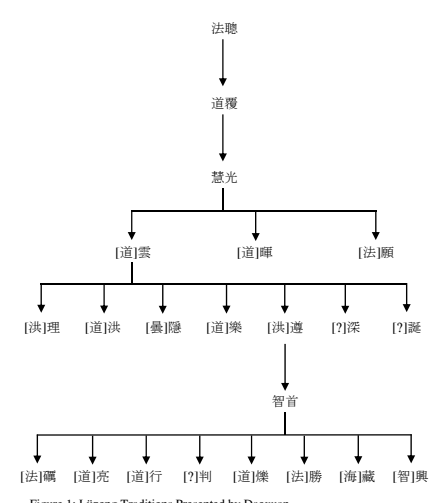

## 3 Problematizing The Traditional Vinaya Lineages

Having completed this cursory reconstruction of the early *Sifen lü* tradition's history, we may now consider the problems involved in the sectarian concepts of the Lüzong lineage. The first known example Lüzong history was created one century after the death of Daoxuan. It appears in a memorial inscription that the Tang bureaucrat, general, and calligrapher Yan Zhenqing 顏真卿 (709–785) wrote in 769 for a precept-platform erected in the precept chapel (*lüzangyuan* 律藏院) at the Baoying Temple 寶應寺 in Fuzhou 撫州 (in present-day Linchuan 臨川 of Jiangxi): 
後秦姚萇宏始十一年、有梵僧佛陀耶舍譯出《四分律本》。而關內先行 《僧祗》、江南盛行《十誦》。至元魏法聰律師、始闡《四分》之宗。 聰傳道覆。覆傳惠光。光傳雲、暉、願。願傳理、隱、樂、洪、雲。雲 傳遵。遵傳智首。首傳道宣。宣傳洪。洪傳法勵。勵傳滿意。意傳法成。 成傳大亮、道賓。亮傳雲一。賓傳岸超、慧澄。澄傳慧欽。皆口相授受、
臻於壺奧。76 In the eleventh year (409) of the Hongshi 宏始 [=弘始] era (399–416) under the reign of Yao Chang 姚萇 (330–393; r. 384–393)77 of the Later Qin 後秦 dynasty (384–417), there was an Indian monk, Buddhayaśas (Fotuoyeshe 佛 陀耶舍; active in China between 408–412), who translated the *Sifen lü ben* 四分律本. However, it was the *Sengqi* [lü] 僧祗[律] (Skt. Mahāsāṃ*ghikavinaya*) that was first popular within the Inner Pass (Guannei 關內; presentday Shaanxi), while it was the *Shisong* [lü] 十誦[律] (Skt. Da*śabhāṇavā*ra vinaya) that prospered in the Jiangnan 江南 area. It was not until Vinaya Master Facong of the Yuan Wei (i.e., Northern Wei) dynasty (386-534) that the principle (or school) (*zong* 宗) of the *Sifen lü* was expounded. [Fa]cong transmitted [the principle] to Daofu; [Dao]fu transmitted [it] to Huiguang; 
[Hui]guang transmitted [it] to [Dao]yun [道]雲, [Dao]hui [道]暉, and 
[Fa]yuan [法]願; [Fa]yuan transmitted [it] to [Hong]li [洪]理, [Tan]yin [曇]
隱, [Dao]yue [道]樂, [Dao]hong [道]洪, and [Dao]yun [道]雲 (?). [Dao]yun (?) transmitted [it] to [Hong]zun [洪]遵; [Hong]zun transmitted [it] to Zhishou 智首. [Zhi]shou [智]首 transmitted [it] to Daoxuan 道宣. [Dao]xuan transmitted [it] to Hong[yuan] 洪[淵]; Hong[yuan] transmitted [it] to Fali 法 勵78; [Fa]li transmitted [it] to Manyi 滿意; 79 [Man]yi transmitted [it] to Facheng 法成; Facheng transmitted [it] to Daliang 大亮 and Daobin 道賓80; Daliang transmitted [it] to Yunyi 雲一81; [Dao]bin transmitted [it] to Anchao 岸超 and Huicheng 慧澄; [Hui]cheng transmitted [it] to Huiqin 慧欽. All of them transmitted [it to each other] by mouth, reaching the innermost part [of the vinaya]. 

This version of the Lüzong lineage translates into the following chart 
(Figure 2). It has three problems. First, Huiguang's disciple Fayuan is presented here as the teacher of five vinaya masters: Li 理, Yin 隱, Yue 樂, Hong 洪, and Yun 雲. Although the first four obviously refer to Hongli, Tanyin, Daoyue, and Daohong, the identity of Yun remains unclear. Given that Yun is identified immediately afterward as the teacher of Zun, who was Hongzun, Yun must be Daoyun. Be that as it may, these five masters— Hongli, Tanyin, Daoyue, Daohong, and Daoyun—are presented here as Fayuan's disciples. This clearly contradicts Daoxuan's assertation that it was under Daoyun's authority that some of Huiguang's disciples, along with Daoyun's own disciples, opted to study *Sifen lü* (probably after Huiguang's death). 

Second, Yan Zhenqing here takes Hongzun to be Zhishou's teacher. This does not accord with what Daoxuan tells us regarding Zhishou's relationship with Hongzun. In Zhishou's *Xu Gaoseng zhuan* biography, Daoxuan explicitly states that Zhishou's chief *vinaya* master was Daohong, rather than Hongzun, although the latter lent tremendous support to Zhishou by virtually anointing him as the new leader of the *Sifen lü* tradition in Guanzhong. 

Finally, the vinaya master between Daoxuan and Fali (i.e., a disciple of Daoxuan and a teacher of Fali) is identified as Hong, who must be Hongyuan given that he was the only one among Fali's teachers whose name contains the character *hong* 洪.

82 However there is no evidence whatsoever showing Hongyuan's discipleship under Daoxuan, which looks quite unlikely given that Daoxuan (596-667) himself was twenty seven years younger than Hongyuan's disciple Fali (569–635). Another version of the Lüzong lineage attributed to the renowned Northern Song vinaya master Yuanzhao 元照 (1048–1116) has received more attention than the one pre 

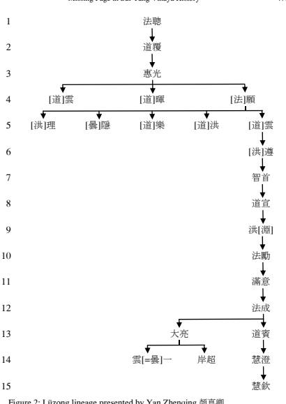

sented by Yan Zhenqing. Both sectarian apologists and modern scholars have relied on it. Referred to as the "Lüzong jiuzu shuo" 律宗九祖說 (Theory of nine patriarchs of the vinaya "school"), this Lüzong lineage counts Daoxuan as its ninth patriarch and sets out eight "Vinaya Patriarchs" who preceded him. The first two were Indian masters: (1) Dharmagupta, the patriarch of the Indian Buddhist school from which the *Sifen lü* tradition arises, and (2) Dharmakāla (Ch. Tankejialuo 曇柯迦羅 or Fashi 法時; fl. 

250). This Indian monk was allegedly responsible for the first Chinese translation of a vinaya text and was therefore credited with the introduction of vinaya into China.83 The remaining six "Vinaya Masters" before Daoxuan, all Chinese, were (3) Facong, (4) Daofu, (5) Huiguang, (6) Daoyun, 
(7) Daohong, and (8) Zhishou.84

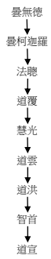

Figure 3: Yuanzhao's *Lüzong jiuzu shuo* 律宗九祖說 (Theory of nine patriarchs of the vinaya "school")
This version of Lüzong lineage implies, first, that the Chinese *Sifen lü* tradition developed from Facong and flourished toward the end of the fifth century. It suggests, second, that an unbroken, lineal transmission connected at least seven Chinese "Vinaya Patriarchs." My investigation of the lives of early "Vinaya Patriarchs" reveals, however, a rather different picture about the formation of the *Sifen lü* tradition. We know very little for certain about Facong and Daofu, the first two Chinese "Vinaya Patriarchs." Their actual relationship with the *Sifen lü*, like their lives more generally, remains largely lost to history. Given that Facong's main vinaya mentor Zhicheng was a *Shisong* lü expert and that Facong was, in addition, engaged in the study of *Sengqi* lü, it is hard to believe that the *Sifen lü* could have captured his interest for an extended period of time. Even the third Chinese "Vinaya Patriarch," Huiguang, does not appear to have been closely related to the Sifen lü, although Daoxuan classified him as a vinaya master. His *Xu Gaoseng zhuan* biography, especially the bibliography of his works included therein, strongly suggests that he was preoccupied with commentating on sutras rather than on vinaya texts. Among the handful of works he composed related to vinaya that are known to us, only one was definitely devoted to the *Sifen lü*. Furthermore, it is remarkable that, when Huiguang set out to preach on vinaya after four successive summer retreats following his ordination in his hometown Dingzhou 定州, he preached on the *Sengqi* lü, rather than the *Sifen lü*, which brought him great fame.85 He was known, in contrast, to have taught comparatively less on the *Sifen lü*.

86 As for the relationship between these three "Vinaya Patriarchs," we cannot find any form of lineal, one-to-one transmission. Whereas Daofu was clearly identified as a student of Facong, Huiguang's relationship to both of them is far from certain. No evidence proves that Huiguang ever studied with Daofu, although he was claimed to have been a spiritual follower of the latter. The ambiguity of Huiguang's relationship with Daofu is also shown by the fact that a disciple of Daofu, Tanyin, eventually became one of Huiguang's chief disciples. 

In comparison to his three alleged predecessors, Daoyun, Huiguang's disciple, seems to have played a more active and discernible role in the formation of the *Sifen lü* tradition. We are told that Daoyun's *Sifen lü* teachings were followed not only by his own disciples (like Daohong and Hongzun) but also by Huiguang's disciples (Daoyun's former condisciples). This fact also lends support to my theory that Huiguang had only devised the barebones of a coherent *Sifen lü* system which his disciples could follow. Rather than a major preoccupation of his career, the *Sifen lü* had actually remained 
                                                            
85 See Huiguang's biography in *Xu Gaoseng zhuan*, 607c7–10: 乃往本鄉、進受具足。博聽 律部、隨聞奉行。四夏將登、講僧袛律 […] 未遂聽徒雲從. 

86 *Xu Gaoseng zhuan*, 607c22: 四分一部,草創基玆. 

peripheral to Huiguang. It seems more likely that after Huiguang's death, Daoyun began to attach more and more importance to the *Sifen lü*. Eventually, Daoyun presented the *Sifen lü* as the most fundamental part of all the vinaya teachings. His efforts to propagate the *Sifen lü* turned out to be a great success, so much so that even some of Huiguang's disciples came to study with him. This made Daoyun the supreme leader of the *Sifen lü* group at that time and the *de facto* initiator of the entire Chinese *Sifen lü* tradition. 

When we recognize Daoyun's eminent position in *Sifen lü* tradition, we can better appreciate Zhishou's. Zhishou maintained a special relationship with two distinguished disciples of Daoyun: Daohong, who cultivated Zhishou into his most outstanding disciple, and Hongzun, who graciously ceded the seat of vinaya leader to Zhishou. Considering the eminence of Daohong and Hongzun among Daoyun's disciples and within the contemporary Buddhist circles as well, Zhishou's close connections with them must have contributed substantially to his emergence as an "eminent monk" of unusual influence in his time. It must have given rise, further, to his identification as the most important successor to the *Sifen lü* tradition created by Daoyun in the name of Huiguang and two other obscure vinaya monks. 

Zhishou's achievement as a vinaya master was by no means limited to the spread of the *Sifen lü* tradition in the Chang'an area. Rather, more important in some sense was his extraordinary success in training numerous vinaya masters, a feat that proved to be instrumental in laying a foundation for the early Tang emergence of vinaya study as a burgeoning tradition. 

This peculiar position of Zhishou in early Tang Buddhism is fully acknowledged by Daoxuan, himself a disciple of Zhishou: 
遂得知歸秦土、莫不宗遒。法鏡始於隋文末紀、終於大漸之前。三十餘 載、獨步京輦、無敢抗衡。敷衍所被、成匠非一。所以見跡行徒、知名 唐世者、皆是首之汲引、寔由匡弼之功.

87 Therefore, none of those who based themselves in the land of Qin (the Chang'an area) did not rely on him for principles. The dharma-mirror started to shine toward the end of the reign of Sui Wen[di] 隋文[帝] (r. 581–604) 
and it did not cease to do so until his death. For over thirty years, he walked alone in the capital, no one daring to compete with him. Wherever his influence spread, quite a number of vinaya masters grew up. Consequently, the Buddhist practitioners whose traces became distinguished in the world and who achieved reputation under the Tang were all guided and supported by [Zhi]shou——all of them owed him for the merits of his assistance. 

## 4 More Vinaya Masters Associated With The Twin Chanding Monasteries

Having completed a general survey of the early vinaya tradition to the time of Zhishou, we are now in a position to examine some other vinaya masters whose ties with either or both of the twin Chanding monasteries remain. For the sake of convenience, I will divide these monks into three groups. First, I will discuss three more disciples of Zhishou. Next I will introduce two vinaya masters who were active at the transition from the Sui to the Tang dynasty. Finally, I will explore two more vinaya masters, one of whom was active in the decades following the Huichang persecution. 

## 4.1 Huijin, Huiman, And Zhixing: Zhishou'S Three Disciples At The Great Chanding Monastery

Huijin 慧璡 (ca. 584–634) entered the Chanding monastery in 603 along with his teacher Sengrong 僧榮 (?–603+), who was a renowned expert on the *She dacheng lun* 攝大乘論. As he was not ordained until sometime after he entered the monastery, Huijin must have gone there as a novice and therefore as an attendant of Sengrong. After his ordination, he concentrated on vinaya, attending twenty series of lecture on the *Sifen lü* delivered by a Zun *lüshi* 遵律師, obviously a reference to Hongzun. He also heard the same number of *Sifen lü* lecture series delivered by Zhishou, something that his dual discipleship under Hongzun and Zhishou explains. Alongside his enthusiasm for vinaya, Huijin seems also to have remained committed to the *She dacheng lun* teachings in which he was trained at the beginning of his novitiate. He preceded all of his vinaya lectures with an exposition on the *She dacheng lun*. In the eyes of his contemporaries, Huijun was sustained by the Mahāyāna, but engaged in spreading the "models of conducts" 
(i.e., precepts).88 Another disciple Zhishou came to know at the Great Chandingsi monastery was Huiman 慧滿 (589–642), who entered the monastery at the beginning of the Daye era, probably with Zhishou. Huiman was punctilious. 

His deportment was awe-inspiring (*weiyi* 威儀); he followed the precepts closely. He was highly respected by his Buddhist contemporaries. He was a zealous preacher of the *Sifen lü*, giving thirty (or even forty, according to another edition of the *Xu Gaoseng zhuan*) series of lectures on the *Sifen lü* throughout his life.89 Following Zhishou, who composed a twenty-one *juan* commentary on the *Sifen lü*, Huiman composed another commentary on the same text, also in twenty *juan*.

90 A third disciple of Zhishou, Zhixing, was also an expert on the vinaya, especially on the *Sifen lü* tradition, although Daoxuan, his co-disciple and biographer, categorizes him as a "merit maker" (興福): 
釋智興, 俗緣宋氏、洛91州人也。謙約成務、厲行堅明。誦諸經數十卷、
并行法要偈數千行心口相師、不輟昏曉。住禪定寺、今所謂大莊嚴也。 初依首律師、隨從講會、思力清撤、92同侶高之。徵難93鱗錯、詞鋒驚 挺。又能流靡巧便、不傷倫次。時以其行無諍也、大業五年仲冬、次掌 維那。94 Shi Zhixing, with his secular ties to the Song [family], was a native of Luozhou. He accomplished things by his humility and simplicity, and was determined and brilliant in his austerity. He chanted several tens of *sutra*s and several thousand lines of *gātha*s on the rituals. With his mind and mouth leading each other, he never stopped [in practice] day and night. He dwelled at Chanding monastery, the current Zhuangyan monastery. Initially, when he followed and attended on Zhishou in his lectures, the strength of his thought was clear and penetrating, making him esteemed by his peers. The queries and arguments he made were interlocked like scales on the body of a fish, with his verbal sharpness standing high. Further, he was able to utter richly decorated words, with ingenuity and eloquence, never violating the order and rules. At the time, because he was so impeccable in his conduct, he [was selected to] hold the position of an administrator [of the Chanding monastery] 
starting from the middle winter of the fifth year of the Daye 大業 era (609). 

of Zhixing's involvement with the vinaya——including the *Sifen* lü—— tradition, which looks quite probable nonetheless judging from the fact that one of his disciples is a vinaya master and a preacher of the *Sifen* lü. 

Daoxuan makes this claim at the very end of Zhixing's biography.96 In addition, one more monk might have received instructions in vinaya from Zhishou at the Great Chanding Monastery. He was the vinaya monk Daoxing 道興 (593–659). According to his *Xu Gaoseng zhuan* biography, after studying with Vinaya Master Zhishun 智舜 (d.u.)97 for a some time, Daoxing went to the capital to investigate, under the guidance of Zhishou, the "general purports" (*dayi* 大意) of the vinaya teachings.98 Unfortunately, we are not told where and when Daoxing received supervision from Zhishou, although given the long period of time Zhishou spent at the Great Chanding monastery, the probability seems rather high that Daoxing became a disciple of Zhishou at this very monastery.99 Zhishou's chief disciples known to us include Zhixing, Huiman, Huijin, Daoxing, and the famous Daoxuan. It is certain that three of them (Zhixing, Huijin, and Huiman) studied with Zhishou at the Great Chanding Monastery. This is probably also the monastery where Daoxing—the fourth of his chief disciples——became his disciple. This naturally raises the possibility that Daoxuan, the most important disciple of Zhishou, might have also studied with Zhishou at the same monastery, a possibility I have raised elsewhere.100 If I am right, then we may conclude that the Great Chanding monastery was of extraordinary importance to Zhishou's vinaya tradition. 

## 4.2 Zhibao, Juelang And Xuanwan: Three Early Tang Vinaya Masters Connected To The Chandingsi

In addition to Zhishou and his disciples, two more significant vinaya monks, Zhibao 智保 (?–622?) and Juelang 覺朗 (?–617?), also resided at the Chanding monastery. A native of Hedong 河東, 101 Zhibao was known as an austere vinaya master. After spending some years at the Chanding monastery, he returned to the Shengguang monastery 勝光寺.

102 It is noteworthy that he was befriended by Huiman, a disciple of Zhishou and a resident of the Great Chanding monastery. Like Zhibao, Juelang was a native of Hedong. Affiliated with the Great Xingshan monastery, he was an expert on the *Sifen* lü and Nirvāṇ*a Sūtra*. In 604, he was ordered by the government to escort a relic to the Juecheng Temple 覺成寺 in Jiangzhou 絳州 (in present-day Xinjiang 新絳, Shanxi). Towards the end of the Daye era, he was made the abbot of the Great Chanding monastery, a position he did not hold for very long before he died.103 During his tenure at the monastery, tradition holds that he constrained the despotic people and inspired their faith in Buddhism. 

Another remarkable vinaya monk Xuanwan 玄琬 (562–636) with ties to the Chanding monastery ought to be mentioned here.104 Although in the Xu Gaoseng zhuan Daoxuan treats Xuanwan as a vinaya master, Xuanwan's background was actually quite complex. He is extraordinary in that he studied with three of the most important monks of the period: Tanyan 曇延
(516–588), Hongzun, and Tanqian. We have already observed the importance of Hongzun and Tanqian. As for Tanyan, he was an unusually influential monk in the Sui court. More importantly, if he authored the *Dacheng* qixin lun 大乘起信論, 105 Tanyan must be recognized as a crucial figure in Chinese, indeed East Asian, Buddhism, given the importance of the Chinese Buddhist apocryphon in the entire region. Although Hongzun was the only known vinaya master under whom Xuanwan studied, he does not seem to have been Xuanwan's chief mentor. It was without a doubt Tanyan who fulfilled this role.106 The importance of Xuanwan mostly derived from his extraordinarily extensive and intimate ties to the Tang royal house and a number of highranking bureaucrats. Xuanwan was often invited to confer bodhisattvaprecepts on the crown princes and other princes, the empress and imperial consorts. He was also called into the Shengye Temple 勝業寺 (built in 618) 
to copy the Buddhist canon for the empress. Shortly afterward, an imperial edict was issued that a new Buddhist canon be compiled at the Yanxing Temple 延興寺 under Xuanwan's supervision.107 It was said that monks and nuns, both Chinese and foreign, who were ordained by Xuanwan numbered over three thousand. Allegedly, over two hundred thousand lay believers, from all walks of life, received precepts from him and took spiritual shelter in his teaching. His followers included Xiao Yu 蕭瑀 (574–647) and his brother(s), Du Ruhui 杜如晦 (585–630), and Xue Wanche 薛萬徹 (?–653) 
and his brother(s). Xuanwan seems to have been constantly associated with the crown prince (the future Tang Gaozong 唐高宗 [r. 649–83]), who respected him highly. 108 At Xuanwan's urging, in 635 the government ordered the entire empire to abstain from killing animals for three months (from the third to fifth month). Then, at Xuanwan's behest, the period was extended to the end of the year. As he approached death at the end of Zhenguan 10 (636), Xuanwan sent a testament to Taizong, recommending to the imperial attention his own Buddhist works including *Fojiao houdai guowang shangfa sanbao fa* 佛教後代國王賞罰三寶法, *Anyang cangsheng lun* 安養蒼生論, and *Sande lun* 三德論, all of which, although no longer extant, sound rather politically oriented. It is of little doubt that Xuanwan's political connections contributed significantly to the emergence of the vinaya tradition as a new and significant player in the early Tang Buddhist world.109 Though no vinaya expert, Xuanwan used his political clout to the benefit of the early Tang vinaya group and in this way he earned his reputation as an eminent vinaya master who receives a lengthy entry in the "Minglü" 明律 section in the *Xu Gaoseng zhuan*. 

Not mentioned in the *Xu Gaoseng zhuan* biography, Xuanwan's connection to the Chandingsi would have been lost to history had it not been noted in the distinguished meditation master Tanlun's 曇倫 (ca. 546-626) *Xu Gaoseng zhuan* biography. Tanlun was affiliated with the Chandingsi: 
有玄琬律師、靜琳法師、率門人僧伽、淨等、往來受法。如此眾矣、如 魚子焉。武德末年、疾甚、於莊嚴寺傍看、寂然。有問、往生何處。答、
無盡世界。又便寂然。僧伽以手尋其冷觸。110 There were Vinaya Master Xuanwan and Dharma Master Jinglin, who led their disciples including Sengqie 僧伽 (d.u.) and [Seng]jing 僧淨 (d.u.) to 
[Tanlun] for instruction. Monks like them were as many as small fish in a river. In the late Wude era (618–626), Tanlun became very sick. One day, he was engaged in meditation beside the Zhuangyan Monastery. Somebody asked him, "Where are you going to be reborn?" [He] answered, "The Inexhaustible World." After that, he went into meditation again. Sengqie felt about the cold position in his (Tanlun's) body. 

In the Wude era (618–626), Xuanwan, accompanied by Sengqie and other disciples, repeatedly visited Zhuangyan Monastery (the former Chanding Monastery). They came for Tanlun's meditation instructions. His presence at Tanlun's deathbed suggests that Sengqie was particularly close to the master. This passage establishes that the vinaya master and his disciple seeking instruction (presumably in meditation) were connected with Chanding Monastery. Given Xuanwan's eminent status as a vinaya master, we cannot exclude the possibility that he and his disciple Sengqie, through their participation in the Chandingsi community, might have brought a certain form of vinaya to this monastery renowned for its background in meditation. 

## 4.3 Xuanchang And Huiling: Two More Tang Vinaya Masters Affiliated With The Great Chanding Monastery

The most important vinaya master affiliated with one of the twin Chanding monasteries, the Zongchi Monastery (renamed Shengshou Monastery 聖壽 寺) in the late Tang dynasty was the monk Xuanchang 玄暢 (797–875). 

Xuanchang was appointed its administrator when the monastery was renovated in 853, following its abolishment during the Huichang suppression that began in 845. In 856 (Dazhong 10), he was promoted to Rector (*shangzuo* 上座) of the same monastery. We do not know if Xuanchang remained at the monastery during the remaining twenty years of his life. This is rather likely given that Zanning does not mention Xuanchang's affiliation with any other monastery during this period. 

The following is a summary of Zanning's report of the life of this remarkable vinaya master. Xuanchang, with a style name Shenzhi 申之 and a surname Chen 陳, was a native of Xuancheng 宣城 (southeast of today's Anhui). Even as a child, Xuanchang's conduct was exemplary. When he played, he fashioned a pagoda from sand and picked leaves to make incense. 

At the age of nine, he followed Master Qingyi 清逸 (otherwise unknown) 
at the Shuixi temple 水西寺 in Jingyi 涇邑 where he received instructions in scriptures and rituals. At nineteen, he took tonsure. At twenty, he received full ordination at the Doushuai precept-platform 兜率戒壇 in Fuzhou 福州. He attended vinaya lectures and went deep into the essence of these traditions. He then went to Yuezhong 越中 in the hope of exposing himself to different teachings. Out of his admiration for Daoxuan, he went to visit the old cloister at the Ximingsi monastery 西明寺 in Chang'an, where Daoxuan once lived and where he believed traces of the vinaya teachings remained. At the Ximing monastery he became a disciple of vinaya master Huizheng 惠正 (d.u.). In the capital he started to distinguish himself. Personal instruction from the "monks of great virtue" of the "Three Disciplines" 
(precepts, meditation and wisdom) in Chang'an enhanced his knowledge. Unfortunately, just as he was about to start his lecturing career, disaster struck in the form of the Huichang persecution of Buddhism. At the time, Xuanchang's monastic associates in the capital felt very puzzled and apprehensive. At the joint recommendation of the two top leaders of the Chang'an Buddhist community, Lingyan 靈 宴 and Bianzhang 辯 章 , 
Xuanchang led a protest against the government's policies. On behalf of them, Xuanchang submitted a memorial to remonstrate the throne. For this purpose, he composed the *Lidai diwang lu* 歷代帝王錄, which he probably submitted along with his memorial as a supporting document. The protest went unheeded. Like other Buddhist monks and nuns, he was laicized, until the anti-Buddhism policies were reversed following the death of Emperor Wuzong (r. 840–846) and Xuanzong's (r. 846–859) takeover in 846. 

Partly due to his own scholarly accomplishment and partly thanks to the high profile he maintained during the campaign against the Huichang persecution, the new government greatly esteemed Xuanchang. During the Dazhong era (847–860), on each of emperor's birthdays he entered the imperial palace as a Buddhist representative in the annual controversy between the so-called "Three Teachings" (三教論衡) (that is, Buddhism, Daoism and Confucianism). Xuanzong bestowed a purple robe upon Xuanchang, appointing him the "Great Virtue Superintending the Preceptplatforms inside and outside the Imperial Palace Compounds" (內外臨壇大 德). Emperor Yizong 懿宗 (r. 859–873), who admired him for his virtue, lavished support on the cleric. Xuanchang memorialized the emperor on the necessity of repenting by the *Yiwan wuqian fomin jing* 一萬五千佛名經.

111 Further, he proposed that the *Bensheng xindi guanjing* 本生心地觀經 in eight *juan* be canonized.112 At the time, Xuanchang acted as the head of the Zhuifu cloister 追福院, which, judging by its name, probably referred to an institution within the imperial palace that promoted the posthumous wellbeing of the late Tang emperors and their families. He also acted as the administrator of the Zongchi monastery, of which he was then appointed Rector.113 Throughout his life, Xuanchang had held sixty lecture series on precepts, through which he succeeded in ordaining several thousand of people. He composed the *Xianzheng ji* 顯正記 in ten juan, *Ke liutie mingyi* tu 科六帖名義圖 in three *juan*, and *Sanbao wuyun* 三寶五運 in three *juan*. 

Zanning commented on his works, 雖祖述舊聞、標題新目。義出意表、文濟時須。114 Although he had composed on old topics, he was able to add new items under these [old] titles. He made his doctrines go beyond the surface of the meanings, and he satisfied the needs of his time by his compositions. 

During the Qianfu era (874–879), Yizong bestowed a title, Fabao 法寶, on him. Xuanchang died in 875, at the monastic age of 59. Disciples who survived him included Huirou 惠柔, a purple robe recipient, Shisui 師遂 and Zongshao 宗紹, both called "monks of great virtue" (Ch. *dade* 大德; Skt. 

bhadanat). A court official Cui Han 崔沆 (?–881) wrote his memorial epitaph.115 In Xuanchang we find a very influential Buddhist leader during the period following the Huichang persecution (845–846). It is particularly interesting that though he was not himself an expert on the *Sifen* lü, Xuanchang was an admirer of Daoxuan. In 869, only a few years before his own death, he proposed to the court that Daoxuan be honored. This subsequently resulted in the bestowal of two posthumous honorable titles on Daoxuan, one (i.e., Chengzhao 澄照) dedicated to Daoxuan himself, and the other (i.e., Jingguang 淨光) to his stūpa.

116 A final leader of the Zhongchi monastery contemporaneous with Xuanchang, Huiling 慧靈 (?–856?) seems also to have been an important vinaya master. Regarding Huiling's religious background and the esteem he commanded from the people of his day, including one of the reigning emperors, Zanning wrote the following: 
釋慧靈、未詳何許人也。幼脫塵機、勤從誦習。及當應法、戒品方圓。 銳意毘尼、探頤117持犯。以行副解、心口相符。由是講訓、名望翕如也。

人皆奉畏、神明如也。

Shi Huiling, whose provenance no one knows, was since his childhood determined to abandon his secular life and was diligent in chanting and studying [Buddhist scriptures]. After he was ordained, he was held to be the example [for maintaining] the precepts. He was eager to pursue the study of vinaya, investigating the essence of prohibitions. His practice accorded with his understanding, while his heart matched his mouth. When he started to preach to people, he gained a great reputation. He was widely respected and left people awestruck. They treated him like a deity. 大中七年、宣宗幸莊嚴寺、禮佛牙。登大塔、宣問耆年、乃賜紫衣。其 年六月、勅補靈為新寺上座矣。118 In the seventh year of the Dazhong era (853), when Emperor Xuanzong arrived at the Zhuangyan temple to pay homage to the Buddha-tooth, His Majesty ascended the great pagoda. The emperor summoned him for an audience, during which His Majesty asked about his age and bestowed on him a purple robe. In the sixth month of the year, an imperial order appointed Huiling the Rector of the renovated temple (i.e., the Zongchi monastery). 

Zanning makes it quite explicit that Huiling was an expert on vinaya and that it is by his expertise on this Buddhist discipline that he had earned his reputation. One might be puzzled, however, by the statement that "In the sixth month of the year, an imperial order appointed Huiling the Rector of the renovated temple (i.e. the Zongchi monastery)" (其年六月、勅補靈為 新寺上座矣). Of what a new temple did Huiling become the rector? Zanning continues with a quotation from an edict by Xuanzong that was issued on the occasion when he decreed that the Zongchi Monastery be renovated. I have already quoted and discussed this material in connection with the dilapidated situation of the monastery in 853 above. The report Zanning places immediately following the quotation is critical for understanding Huiling: 
三月十一日、令三教首座辯章、勾當修寺。及畢工、推靈為綱任、崇聖 寺賜紫叡川充寺主。福壽寺臨壇大德賜紫玄暢、充都維那。靈居寺職、 清眾咸序、帝所欽重。119 On the eleventh day of the third month [of the seventh year of the Dazhong era] (April 22, 853), the emperor ordered Bianzhang, the paramount lecturer for the Controversy of the Three Teachings, to take charge of the reconstruction of the monastery. When the project was completed, Huiling was selected to be the *gangren* 綱任 (that is, Rector),120 Ruichuan of the Chongsheng monastery, a recipient of a purple robe, was made the abbot, and Xuanchang of the Fushou monastery, a great virtue superintending the precept-platform, and a recipient of the purple robe, was made the administrator [of the Zongchi Monastery]. In the course of his serving as the position at the temple, the pure community maintained its order, to the esteem of the emperor. 

The rector held the most eminent position in a temple. Huiling's appointment to this role displayed the high regard in which his peers held him.121 On another occasion, Zanning discussed changes in the Zongchi Monastery's leadership: 
大中十年、玄暢遷上座。大德玄則為寺主。大德堅信為悅眾。122 In the tenth year of the Dazhong era (856), Xuanchang was promoted to be the rector [of the Zongchi Monastery], while the "monk of great virtue" Xuanze became the abbot, and the "monk of great virtue" Jianxin became the administrator. 

Quite remarkably, Huiling is not mentioned at all here. Given that his position is the monastery's highest and was occupied by one of his colleagues who had been the administrator since 853, I assume that Huiling must have been dead by this time. Huiling's death must have occasioned the leadership change. This seems likely given that three years earlier Huiling's age had already been advanced such that Xuanzang inquired about it when he granted him an audience at the Zhuangyan Monastery. Whatever the case, the year 856 can be tentatively given as the date of Huiling's death. 

## 5 Concluding Remarks

Zhishou and Daoxuan's ties with the Chanding Monasteries present a meaningful perspective for the study of the vinaya tradition in medieval China. 

For his tremendous contribution to the Lüzong tradition, Daoxuan has been extolled as its *de facto* founder, although modern scholars would question the idea that Daoxuan ever considered himself as a founder of a separate Buddhist school. Daoxuan's importance to the "Lü school" has been so keenly felt that Lüzong became known as Nanshan zong 南山宗 ("School of Nanshan"), with Nanshan referring to Mount Zhongnan 終南山 (a.k.a. 

Mount Taibai 太白山), the mountain at which Daoxuan spent his later years and composed most of his vinaya works. Indeed, it is hard to overestimate Daoxuan's contribution to Chinese vinaya tradition. Yet Daoxuan's role should not lead us to overlook the contribution made by his predecessors, especially his vinaya teacher Zhishou, who, as this chapter showed, played a vital role in the emergence and prosperity of the vinaya tradition in the early Tang. Furthermore, if my reconstruction of the Great Chanding Monastery as a vinaya center in late Sui and the Tang dynasty stands, it becomes no longer plausible to take Mount Zhongnan, or more specifically the Fengde Temple 豐德寺 (Daoxuan's home-temple at the mountain), as the sole Sifen lü center in the early Tang and the hub of the whole Chinese Lüzong tradition. Rather, we should recognize the peculiar functions that the Great Chanding Monastery performed in the formation and development of the Sifen lü tradition. Scholarship has paid little attention to connections between Daoxuan, the Nanshan Preceptor (Nanshan lüshi 南山律師), and the Great Chanding Monastery, a topic worthy of investigation. 

How should we understand the implications of Daoxuan's ties to the Great Chanding Monastery? Of course, they underscore the necessity of evaluating his *Sifen lü* teachings in terms of those advocated by his Great Chandingsi teacher Zhishou. This work requires a meticulous comparative reading of Daoxuan's numerous vinaya works and Zhishou's only extant work, the *Wubu qufen chao*. Hopefully, such a comparative study will throw light on the true connection between Zhishou and Daoxuan and will also pinpoint the points from which Daoxuan developed (or deviated) from his master's teachings. 

## Appendix

Daoxuan's Discussion of the Transmission of *Vinaya* Ideas and Practices in His 
"Minglü lun" 明律論 (Treatise on the Vinaya), *Xu Gaoseng zhuan* 續高僧傳, T no. 

2060, 50: 22.620c9–621a15. 

## Section 1 (620C9–10)

自初開律釋、師號法聰。123元魏孝文、北臺楊緒、口以傳授、時所榮焉。124 The master who initiated the expounding of the [*Sifen lü*] vinaya was called Facong 法聰 (fl. 480). Under the reign of Emperor Xiaowen of Yuan Wei 元魏 (i.e., 
Northern Wei) 北魏孝文帝 (r. 471–99), he promoted his lineage at Beitai 北臺 and was respected by his contemporaries. 

## Section 2 (620C9–10)

沙門道覆、即紹聰緒、讚疏六卷、但是長科。至於義舉、未聞於世。斯時釋侶、 道味猶淳、言行相承。隨聞奉用、專務栖德、不暇旁求。125 Śramaṇa Daofu carried on the cause left by Facong by composing a commentary in six *juan*. It was merely a meticulous (lit. "long") glossary. As for doctrinal research, it was not then known. At the time, Buddhist monks (lit. the Śākya companions) still had pure taste for the Way, and were constant in words and deeds. Applying to practice whatever they heard, they single-mindedly cultivated their virtue, without pursuing other things. 

## Section 3 (620C13–19)

魏末齊初、慧光宅世。宗匠跋陀、師表弘 [=洪?] 理。再造文疏、廣分衢術。學 聲學望、連布若雲峰。行光德光、榮曜齊日月。每一披闡、坐列千僧。競鼓清 言、人分異辯。勒成卷帙、通號命家。然光初稟定宗、後師法律。軌儀大聖、 徽猷具焉。所以世美斯人、行解相冠、誠有徒矣。126 Huiguang lived at the turn of the Eastern Wei and Northern Qi. He followed Batuo as his teacher and he himself became the teacher to Hongli 弘理 (an error for 洪 理?).127 By writing more commentaries [on the *Sifen lü*], he expanded the way [of the vinaya tradition]. His scholarly name and prestige were as extensive [and high] 
as clouded peaks, while the light of his conduct and virtue was of a brilliance comparable with that of sun and moon. Whenever he started to expound [on the vinaya], 
more than one thousand monks sat [in his lecturing hall]. He strove to promote the pure words, enabling people to discern different theories. His lectures were compiled into different fascicles, and he was widely hailed to be a master. However, initially Huiguang received instructions on the meditation tradition before he turned to vinaya. He came to achieve excellent reputation as a great sage of rules and precepts. Therefore, people in the world praised this person. With his unrivalled conduct and understanding, he attracted a huge number of followers. 

## Section 4 (620C20–28)

有雲、暉、願、三宗律師、躡踵傳燈、各題聲教。雲則命初作疏、九卷被時、 流演門人、備高東夏。暉次出疏、略雲二軸。要約誠美、蹊徑少乖。得在略文、 失於開授。然雲勇於義宗、談敘誠博。暉則覈切詞相、法聚推焉。世諺、首尾、 信探風骨。汾陽法願、眄視兩家。更開甍穴、製作抄疏、不減於前。彈糾覈於 popular at the time and was transmitted among his disciples, securing him a reputation in China. Fahui subsequently produced a commentary that condensed Fayun's text to two *zhou* (fascicles). It was indeed excellent in presenting the essence [of the vinaya teachings], although it takes a slightly different approach [than Fayun]. His merit consisted in abbreviating the *Sifen* lü commentary, whereas his demerits were his inability to make teachings understandable. Fayun was brave in expounding the doctrinal principles, and he was indeed broad in his discussion [of the vinaya teachings]; Fahui, on the other hand, by verifying and simplifying the forms of the words, was esteemed by the Dharma Asembly. The contemporary saying regarding the head and tail has indeed caught their spirit. Fayun of Mianyang, casting a light look at these two scholars, opened up a new direction. He did not pale in front of his predecessors in composing commentaries. His criticisms are helpful in recovering [the truths] of the vinaya texts, and his *Shifei [chao]* has explored the forms of things. His teachings existed because of people's concentrated following, and were capable of linking what is implicit and what is explicit.129 His transmission was carried throughout the borderland areas, which is nothing but natural. 

## Section 5 (620C28–621A2)

其餘律匠。理、洪、隱、樂、遵、深、誕等、或陶冶鄭魏、或開疆燕趙、或導 達周秦、或揚塵齊魯。莫不同師雲術、齊駕當時。雖出鈔記、略可言矣。130 The other vinaya masters included [Hong]li 洪理 (d.u.), [Dao]hong 道洪 (d.u.), 
[Tan]yin 曇隱 (d.u.), [Dao]yue 道樂 (d.u.), [Hong]zun 洪遵 (530–608), [?]shen 深
(Hongyuan 洪淵 [d.u.]?) and [?]dan 誕. Some of them trained disciples in Zheng 鄭 and Wei 魏 (some parts of present-day Henan and Hebei), some "expanded territory" in Yan 燕 and Zhao 趙; some guided people in the Zhou-Qin 周秦 area; some exerted their influence in Qi 齊 and Lu 魯.

131 None of them did not follow the teachings of 
[Dao]yun. All of them run neck to neck at the same time. Although they all composed commentaries on the *Sifen lü*, their works can be omitted here. 

## Section 6 (621A2–6)

而遵開業關中、盛宗帝里、經律雙授、其功可高。於時世尚《僧祗》、而能間 行《四分》。登座引決、共從如流。勍敵每臨、銜箭而返。然遵一其神志、聲 色不渝。由是人法歸焉。可為行之及也。132 Hongzun initiated his project in Guanzhong 關中, and he was highly respected in the capital. Preaching on the *sutra* and vinaya as well, his merits were really outstanding. Although people advocated the *Sengqi* lü at that time, he managed to advance the *Sifen lü* teachings [indirectly]. When he ascended to the platform to decide [the doctrinal issues], everybody followed him just like [the rivers] flowing [to the sea]. Whenever formidable rivals came to attack him, they always ended up receding after being defeated. However, [despite his victory,] Hongzun kept his spirit and mind collected and his complexion unchanged. For this reason, both monastic and lay people came to rely on him—all of this was accomplished by his deeds. 

## Section 7 (621A7–9)

智首律師、承斯講授。宗係盛廣、探索彌深。時屬雲雷、接統傳化。學門遠被、 製述全希。豈非博贍百家、共師一軌。雖欲厝筆、無詞可通。133 Vinaya Master Zhishou carried on this [series of lectures by Hongzun]. Through him, the *Sifen lü* lineage prospered and became widespread, with the [relevant] investigation going deeper and deeper. Just as clouds are followed by thunder, they continued the tradition and carried on the influence of vinaya. Although the gate of learning had reached far, the relevant compositions [on the *Sifen* lü] had remained scant. Wasn't it that one hundred [vinaya] masters, though erudite and broad, agreed in taking this master (i.e., Zhishou) as their single standard? Although [Zhishou] wished to write by picking up his brush, there were no words that could be used for communication. 

## Section 8 (621A9–12)

屬有礪、亮、行、判、爍、勝、藏、興、或傳道於東川、或稱言於南服。其中 高第、無越魏都。制疏乃行、其緒誠少。134 There happened to be [Fa]li [法]礪, [Dao]liang [道]亮 (569–645+), [Dao]xing [道]
行, [?]pan [?]判, [Dao]shuo [道]爍, [Fa]sheng [法]勝, [Hai]zang [海]藏, and 
[Zhi]xing 智興. Some of them transmitted the way in Dongchuan 東川 (i.e., the Heluo 河洛 area), while some expounded [the vinaya] in the south. No more exalted base [for the *Sifen lü* teachings] than the Wei capital (i.e., Luoyang) can be found. Although the commentaries they composed became popular, they have had very few followers. 

## Section 9 (621A12–15)

餘則名擅一方、蓋無筆記。而復化行難阻、多翳時心。豈不以制在篇初、故陷 者惡聞其失。嗚呼。律為法命、弘則命全。今不欲不弘、正法斯滅。又可悲之 深矣。135 Others each gained their reputation in an individual region, though most of them didn't leave behind themselves any written commentaries. Moreover, their effort to propagate [the vinaya] encountered various difficulties and hindrances, resulting in their being obscured by the minds of their contemporaries. Wasn't it because the precepts laid down in the first texts have made those who fail hate to hear of their own faults? Alas, given that precepts constitute the life of dharma, that life [of the dharma] will be preserved when precepts are promoted. Now, as precepts are neither desired nor promoted, the true dharma is therefore being destroyed. This is indeed deeply deplorable! 

## Abbreviation

T Taishō shinshō daizōkyō 大正新修大藏經. See Takakusu and Watanabe, 1924–
1932. 

X *Wanzi xuzang jing* 卍續藏經. See Wanzi xuzang jing, 1968–1970. 

## Bibliography

Aramaki Noritoshi 荒牧典俊 (2000). "Hokuchō kōhanki bukkyō shisō shi josetsu 北朝後半期佛教思想史序說" [Introduction to the *Hokuchō Zui-Tō Chūgoku* bukkyō-shi]. Hokuchō *Zui-Tō Chūgoku bukkyō-shi* 北朝隋唐中國仏教思想史
[Studies on the History of the Buddhist thought under the Northern dynasties and the Sui-Tang dyansties], edited by Aramaki Noritoshi 荒牧典俊. Kyoto: 
Hōzōkan, 13–85. 

Cao Lüning 曹旅寧 (2006). "Du 'Tang Hongfusi bei' lun Sui Tang jielü chengli 讀 唐《弘福寺碑》論隋唐戒律成立" [A Discussion on the formation of the SuiTang precepts on the basis of a perusal of the Tang dynasty "Hongfusi bei"]. 

Beilin jikan 碑林集刊 12: 9–17. 

Chen Jinhua (2001). "From the *Liudade* 六大德 to *Shidade* 十大德: The Six and Ten 
'Buddhist Monks of Great Virtue' under the Sui Dynasty (581–618)," *Tang Yanjiu* 唐研究 (*Tang Studies*) 7: 19–37. 

——— (2002). "An Alternative View of the Meditation Tradition in China: Meditation in the Life and Works of Daoxuan (596-667)." *T'oung-p'ao: Revue internationale de sinologie* 88/4–5: 332–395. 

——— (2002a). *Monks and Monarchs, Kinship and Kingship: Tanqian in Sui Buddhism and Politics*, Kyoto: Italian School of East Asian Studies. 

——— (2010). Crossfire, *Crossfire: Shingon-Tendai Strife as Seen in Two Twelfthcentury Polemics, with Special References to Their Background in Tang China*. 

Tōkyō: The International Institute for Buddhist Studies in Tōkyō (Studia Philologica Buddhica Monograph Series 25). 

——— (2015). "He chanshi kao 和禪師考" [An Investigation of the Life of Meditation Master He], *Hanchuan Fojiao yanjiu de guoqu yu weilai* 漢傳佛教研究 的過去現與未來 [The Studies of the Chinese Tradition of Buddhism: Past and Present], edited by Foguang daxue fojiao yanjiu zhongxin 佛光大學佛教研究中 心. Yilan: Foguang chubanshe, 331–373. 

——— (2015a). "The Multiple Roles of the Twin Chanding Monasteries in SuiTang Chang'an." *Studies in Chinese Religions* 1.4: 344–356. 

Hankó, Laszló (2003). *Der Ursprung der japanischen Vinaya-Schule* Risshū 律宗 und die Entwicklung ihrer Lehre und Praxis. Göttingen: Cuvillier Verlag. 

Heirman, Ann (2002). "Can We Trace the Early Dharmaguptakas?" *T'oung-p'ao:* 
Revue internationale de sinologie 88/4–5: 396–429. 

Longlian 隆蓮 (1988). "Lüzong 律宗" [Vinaya school]. *Zhongguo dabaike quanshu* 中國大百科全書. Zongjiao juan 宗教卷. [Chinese Encyclopedia: The Volume on Religions], edited by Luo Zhufeng 羅竹風. Shanghai: Zhongguo dabaike quanshu chubanshe, 246–247. 

Makita Tairyō 牧田諦亮 (1984). "Zui Chōan Dai Zenjōji Chikō ni tsuite 隋長安大 禪定寺智興について" [On Zhixing of the Great Chanding Monastery in Chang' an of the Sui dynasty], Chū*goku bukkyō shi kenky*ū 中國仏教史研究 [Studies on the history of Chinese Buddhism], edited by Makita Tairyō 牧田諦亮, vol. 2. 

Tokyo: Daitō shuppansha, 16–28. 

Makita Tairyō 牧田諦亮 and Suwa Gijun 諏訪義純 (1973–1975). Tō kōsō den sakuin 唐高僧傳索引 [A Concordance to the *Tang Gaoseng zhuan* [i.e. Xu Gaoseng Zhuan], 3 vols. Kyoto: Heirakuji shoten. 

Satō Tatsugen 佐藤達玄 (1986). Chūgoku bukkyō ni okeru kairitsu no *kenky*ū 中國 佛教における戒律の研究 [A study on precepts in Chinese Buddhism]. Tokyo: 
Mokujisha. 

Takakusu Junjirō 高楠順次郎 and Watanabe Kaigyoku 渡邊海旭 (ed. 1924–1932). 

Taishō shinshō *daizōky*ō 大正新修大藏經 [Buddhist canon newly compiled during the Taishō era]. 100 vols. Tokyo: Taishō issaikyō kankōkai. 

Tang Yongtong 湯用彤 (1982). *Sui Tang fojiao shigao* 隋唐佛教史稿 [History of Sui-Tang Buddhism]. Beijing: Zhonghua shuju. 

Wang Bangwei 王邦維 (2004). Da Tang Xiyu qiufa gaoseng zhuan *jiaozhu* 《大唐 西域求法高僧傳》校注 [*Da Tang Xiyu qiufa gaoseng zhuan*: Collated and Annotated]. Beijing: Zhonghua shuju. 

Wang Jianguang 王建光 (2008). Zhongguo lüzong *tongshi* 中國律宗通史 [A general history of Vinaya School in China]. Nanjing: Fenghuang chubanshe. 

Wang Juan 汪娟 (2008). "*Foming jing* he fojiao lichen de guanxi 佛名經和佛教禮 懺的關係" [The relationship between the *Foming jing* and the rituals of confession in Buddhism]. *Fagushan foxue xuebao* 法鼓山佛學學報 1: 35–70. 

Wanzi xuzang jing 卍續藏經 (1968–1970). *Wanzi xuzang jing* 卍續藏經 [Wanzi Buddhist Canon]. Taibei: Xin wenfeng chuban gongsi. 

Wu Gang 吳鋼 (1994–). *Quan Tang wen buyi* 全唐文補遺 [Supplements to the complete collection of the Tang prose], 9 vols. Xi'an: Sanqin chubanshe. 

Xu Wenming 徐文明 (1996). "Huiguang fashi shengzu nian kao" 慧光法師生卒年 考 [An Investigation of Dharma Master Huiguang's death date]. *Foxue yanjiu* 佛學研究 1996: 131–134. 

Zhao Lichun 趙立春 (2006). "Yecheng diqu xin faxian de Huiguang fashi ziliao" 鄴 城地區新發現的慧光法師資料 [The source relevant on Dharma Master Huiguang, newly found in the Yecheng area]. *Zhongyuan wenwu* 中原文物: 69–76. 

# Can Monks Practice Astrology? Astrology And The Vinaya In China

Jeffrey Kotyk 

## Introduction

This paper discusses the adoption and implementation of foreign astrology 
(i.e., the various systems of astrology from abroad in contrast to native Chinese astrology) in Chinese Buddhism. Though the paper draws on material from a range of periods, the primary focus here is the Tang dynasty (618– 907). The paper shows that, despite numerous prohibitions against the practice in early Buddhist sūtra and vinaya literature, as well as the writings of native vinaya exegetes, who identified it as improper conduct, a rich tradition of Chinese Buddhist astrology developed in the eighth and ninth centuries. It endeavors to explain how it might have been that practices contravening religious laws of conduct came to be embraced by the Buddhist community. 

It appears that there were only minimal objections to the practice of astrology in Chinese Buddhism throughout the first millennium. This might seem surprising given the fact that the practice was clearly antithetical to Buddhist ethics (such as when it prescribes violence) and based on non-Buddhist premises (such as the belief in predetermined fate). To understand the situation, we must consider astrology's position alongside the introduction of Esoteric Buddhism in the Tang. This form of practice required knowledge of astrology to determine auspicious times to carry out rituals. Although this practice contradicted earlier monastic regulations, there was also a Tang period trend among Chinese practitioners to disregard elements of the vinaya and monastic conventions, especially those understood as "Hīnayāna" in favor of a "Mahāyāna" path taken to be superior. This trend helps to explain how scriptural proscriptions could be readily ignored during the development of a uniquely Chinese system of Buddhist astrology in the late Tang. This investigation serves as a case study demonstrating how Mahāyāna and Esoteric Buddhist conventions came to supersede the conventions of the vinaya in China, even in the face of major scriptures insisting otherwise.

## Historical Background

Astrology is the practice of divining the fate of a person or community, or determining the most auspicious time for some venture, based on an interpretation of the stars and planets. The underlying premise of astrology is that the events we experience in life, and even our personalities, are partly or fully predetermined, and that the movements of the stars and planets above either directly influence developments on earth or signal what was fated to be. The latter belief is called astrological determinism.1 Astrology was a component of Vedic religion in India and developed extensively over the centuries, even being subject to rich Hellenistic influences from around the third century CE onward.2 Bronkhorst suggests that Buddhists did not participate in what would be later called *jyotiḥśāstra* (the union of astronomy, astrology and mathematics). He states it "may have been inseparably connected with mundane matters, in that those who practiced it may often have had to make their living through explaining omens and predicting the future with its help. Such practices were however frowned upon in the [B]uddhist tradition from an early date onward."3 Strong sentiments against the practice of divination, which may only reflect the consensus of a limited albeit elite number of monks in the early sangha, are expressed in the Brahmajāla-sutta in the Dīghanikāya. The Buddha criticized ś*rama*ṇa-s and brāmaṇa-s who engaged in certain activities for offerings of food, including divination. Brahmanical traditions similarly held astrologers in contempt, though they did not reject the validity of their art.4 Buddhist literature might have forbid monks from practicing astrology as a means of acquiring offerings, but with rare exceptions it did not reject the validity of astrology. 

Throughout the first millennium we can see examples of Buddhist literature teaching astrology or assuming that monks would have passive knowledge of it.5
                                                            
1 The history of astrology as it developed in the Near East and India is a complex topic that cannot be addressed here. For an authoritative study see Pingree (1997). 

2 See Gansten 2010: 281–294. 

3 Bronkhorst 2011: 120. 

4 Gansten points out that the *Manusmṛti* (3.162) and *Baudhāyanadharma-sūtra* (2.2.15–16) 
display a low opinion of astrologers, though later there was an increasing appreciation of astrologers and their art. See Gansten 2011: 217. 

5 One of the earliest examples of Buddhist literature teaching astrology is the Śārdū*lakarṇāvadāna*, which is included in the *Divyāvadāna* collection. The text likely dates to around the Astrology and astrologers were arguably less problematic in Chinese civilization. Archaeological evidence from the Xia, Shang and Zhou periods shows cities and structures built with conscious consideration of cardinal orientation along the north-south axis, which reflects early cosmological concerns and careful observations of the heavens.6 Later in the Eastern Han Dynasty (25–220) a bureau of astronomy was established. High-ranking officials were assigned to monitor the skies, reporting directly to the emperor. 

The office of the *tai-shiling* 太史令 (court astronomer/astrologer) was an upper-middle appointment and the position was paid handsomely.7 To be an astrologer, at least at court, was a respectable and desirable profession in the Han and later periods. This highlights the value placed on astrology in China at the elite levels of society, which stands in contrast to the situation in India, at least in earlier centuries. When considering how Chinese Buddhist monks approached astrology it is important to bear in mind that their native culture had a longstanding appreciation for astrology and naturally believed in its validity. 

## Prohibitions Against Astrology In Buddhist Literature

There are a number of major examples of astrology being expressly forbidden in Buddhist scriptures that were available in China. One noteworthy example of a Buddhist work that argued against the validity of astrology in detail is the *Saddharmasmṛtyupasthāna-sūtra* 正法念處經 (T 721), 
which was translated by Gautama Prajñāruci between 538–541. In several places this sūtra effectively attempts to creatively convince the bhikṣu to turn away from mundane star gazing towards *nirv*āṇa. 

有三大曜、謂病老死、此為最大、常住世間。彼惡沙門、不思惟此而更思 惟餘世間曜。彼人愚癡、無有聞慧、思惟世間二十八宿。如是思惟、則有 罪過。而不思惟彼出世間二十八宿。若能思惟實觀察者、入涅槃城。二十 八者、所謂五陰、及五取陰、十八界等。思惟此者、到於涅槃。以如實觀 離欲持戒、故得涅槃。數星思惟則不能得。 There are three great luminaries [*graha*, i.e., planets], called illness, old age and death. These are greatest and perpetually present in the world. That wicked ś*ramaṇa* does not contemplate this, but further contemplates other worldly luminaries. That person is foolish, not having wisdom through hearing, contemplating the twenty-eight worldly *nakṣatra*-s [constellations]. One is at fault to contemplate like this and not contemplate the twenty-eight transcendental *nakṣatra*-s. One will enter the city of *nirvāṇa* should one be able to contemplate and truly observe them. The twenty-eight are the five *skandha*-s, five upādā*na-skandha*-s and eighteen dhātu-s. One who contemplates these will arrive at *nirvāṇa*. When there is observation of things as they truly are, detachment from desire and the upholding of precepts, *nirvāṇa* is consequently attained. It cannot be attained through the contemplation of counting stars [i.e., 
astrology].8 This likely indicates that Buddhist ś*rama*ṇa-s in India were in fact taking an increasing interest in astrology, which was perhaps a rather popular trend when the text was composed. The author of the text, however, felt it was simply unacceptable for a bhikṣu to practice this and thirteen other activities such as painting, singing and closely associating with kings. This condemnation of astrology is expressed in the strongest of terms as follows. 

何者第五所謂比丘。數星思惟、實非沙門。自謂沙門數星思惟、則不應作。 如是比丘、毀沙門法、妨廢坐禪讀誦等故。彼思惟已福德命行、不覺損失、 何為出家。不得彼法、彼命終盡、所作不辦、不得免離衰老病死悲啼號哭 愁苦懊惱。彼人常在生死道中流轉而行。彼於數星不得利益。數星思不能 自救、亦不救他。何以故。唯數業星、能救自他。何以故。一星生人、有 苦有樂、有醜有媚 […] 唯一種星而有異種。人生不同。若星因緣、彼一星 生、何故一切不皆一種。如向所説前功德過、一切不知。不數業星、數空 中星。愚癡之人、功德與過不知不數。善不善業二果不數。數空中星。又 復彼人數星思惟、而實不善、亦不寂靜。所謂一星、或生於人。或生畜生、 或生餓鬼、差別不等、非星勢力、業勢力故、異異而生。此星思惟、如是 不善、亦不寂靜。思惟業星是善寂靜、次第乃至到於涅槃。

What is the fifth bhikṣu? He is truly not a ś*ramaṇa* to carry out the contemplation of counting stars. If one calls oneself a ś*ramaṇa* and carries out the contemplation of counting stars, then one should not act like this. Such a *bhik*ṣu destroys the practice of a ś*rama*ṇa for it hinders their meditation and recitation. 

Having contemplated fortune and life, he is unaware of the losses. Why renounce the home life? Not having attained that dharma, when he dies, he will not have done what was to be done. He will not be freed from old age, sickness, dying, lament, tears, woe and vexations. That man will constantly cycle through saṃsāra. He will obtain no benefit from counting stars. Through the contemplation of counting stars he cannot save himself, nor save others. Why? It is only by counting karmic stars that one can save oneself and others. Why? People are born under the same one star. Some suffer, some are at ease. Some are ugly. Some are beautiful. … They are of different types, though they are of the same one star. Their lives differ. If the stars are causal, then when [people are] born under that one star, why are not all of them of a single type? The mistake is similar to that explained earlier concerning merit. They all do not understand. They do not count karmic stars. They count the stars in the sky. The ignorant man does not know nor does he count merits and faults. He does not count the two fruits of virtuous and non-virtuous karmas. He counts the stars in the sky. Furthermore, that man carries out the contemplation of counting stars, yet he is truly non-virtuous, nor does he have peace. As to the one star, some are born [under it] as humans, some are born as animals, and some are born as *preta*-s. They vary and are not the same, but this is not because of the force of stars, but rather because of the force of karma. Everyone is born different. This contemplation of the stars is non-virtuous like this, nor will it lead to peace. Contemplating karmic stars is virtuous and leads to peace. One will subsequently reach *nirvāṇa*.

9 Despite such a detailed refutation of astrology available in Chinese, it does not seem to have arrested the Buddhist interest in China, nor led anyone to question the existence of astrology in Buddhist scriptures. It seems that there was little to no awareness of how astrology was presented in works such as the two translations of the Śārdū*lakarṇāvadāna*10 despite other scriptures rejecting astrology. 

A major example of such an early Chinese scripture which deals with monastic conduct and that forbids astrology is the Sū*tra of the Buddha's* Bequeathed Teachings (*Fo yijiao jing* 佛遺教經; T 389). It summarizes the Buddha's teachings provided shortly before his death between the twin śāla trees in Kushinagar. The translation is credited to Kumārajīva (344–413) and later was widely read, especially in the Chan school in which it remains important to the present day.11 During the early Tang period, the emperor Taizong 太宗 (626–649) in 639 decreed that all Buddhist clergy would have to abide by the proscriptions of the sūtra.12 The relevant part of the sūtra reads as follows: 
持淨戒者、不得販賣貿易、安置田宅、畜養人民奴婢畜生、一切種殖及諸 財寶、皆當遠離、如避火坑。不得斬伐草木、墾土掘地、合和湯藥、占相 吉凶、仰觀星宿、推步盈虛、曆數算計、皆所不應。 He who maintains the pure precepts may not engage in commerce and trade, the establishment of fields and estate, nor may he keep common people, slaves and livestock. They should all remain far apart from all manner of planting and wealth as they would avoid a pit of fire. They may not cut grass and trees, till the soil, dig in the ground, mix medicines, divine fortunes, observe the stars, 
                                                            
9 T 721, 21: 290a6-29. 

10 See T 1300 and T 1301. 

11 Paramārtha (499–569) in the sixth century translated a commentary on the sūtra ascribed to Vasubandhu (T 1529). There were additionally many more classical commentaries on the text by authors in East Asia. 

12 Weinstein 1987: 21. 

make astronomical calculations, nor make calendrical calculations. All such activities are improper.13 Here the bhikṣu lifestyle in accordance with the traditional vinaya is summarized. Not only is divination in general forbidden, but so too are more mundane astronomical and calendrical sciences. 

Formal vinaya works also forbid divination. The Dharmagupta Vinaya (Si fen lü 四分律; T 1428) specifically proscribes the practice of divination.14 Translated in 413, this was the *prātimok*ṣa and vinaya model most commonly used in China after it was made official between 705–710 under the influence of Vinaya master Dao'an 道岸 (654–717).15 The text also specifically forbids sangha members from forecasting astrologically auspicious dates for various mundane activities (hemerology), but instead commands that they advocate Buddhist practice instead on such dates. This is an interesting example in which astrology if used for instructing the laypeople can be permissible. 

又不得言。今日有如是星宿好。宜起舍、宜種作、宜使作人、宜為小兒剃 髮長髮剃鬚。應語言。宜入塔寺供養比丘僧受齋法、八日十四日十五日、 現變化日。彼比丘尼、以如是世俗技術教授白衣乃至宜出遠行。說而了了 者波逸提。不了了者突吉羅。比丘、突吉羅。式叉摩那、沙彌、沙彌尼、 突吉羅。是謂為犯。不犯者、教言莫向如來塔及聲聞塔大小便及除糞掃不 淨水、亦莫向如來塔及聲聞塔舒脚。若耕田種作、若起房舍、向如來塔乃 至受齋法。若戲笑語、若疾疾語、若獨語夢中語、欲說此乃錯說彼無犯。 無犯者。最初未制戒、癡狂心亂痛惱所纏。 It also must not be said, "Today there are good constellations like this. It is appropriate to erect a building, to farm, hire people, shave off the hair of a child or grow their hair, or shave one's beard." It should be said, "It is appropriate to enter the temples to make offerings to the bhikṣu sangha and receive teachings on the fast on the eighth, fourteenth, fifteenth, and days when [the Buddha] manifested supermundane abilities." Those bhikṣuṇīs teach the laypeople with worldly arts like this, [telling people] it is appropriate to travel a distance [because it is an auspicious day]. To fully teach [like this] constitutes a pā*yattika* offense. If not fully [taught], it is a *duṣkṛta* offense. For a bhikṣu it is a *duṣkṛta*. For a śikṣamāṇā, śrā*maṇera* and śrāma*ṇerī* it is a duṣ*kṛta*. These constitute transgression. As for non-transgression, it is to teach and say, "Do not defecate, urinate or dispose of waste and unclean water while facing stūpas of the Tathāgata and ś*rāvaka*-s. Also do not unfold one's legs while facing stūpas of the Tathāgata and ś*rāvaka*-s. If tilling and seeding or erecting a building, face the stūpa of the Tathāgata. [Tell them to] receive the teachings on 
                                                            
13 T 389, 12: 1110c22-27. 

14 "At one time the group of six bhikṣus did divination with a lady. The Buddha said it should not be so. Again they did divination with a man. The Buddha said it should not be so 時六 群比丘與女人卜占、佛言不應爾。復從人卜占、佛言不應爾。" T 1428, 22: 955b13-15. 

15 Heirman 2007: 194–195. 

the fast." There is no transgression if [the earlier forbidden statements] are stated in jest, hastily, alone to oneself, in a dream or wanting to say it but making mistakes in speech. There is no transgression if it was done when the precept had not yet first been established, or one is insane with mind perturbed or bound in anguish.16 The representative author of the vinaya school in Tang China, Daoxuan, also identified divination and astronomy as misconduct. 

破正命者、謂非法乞求邪意活命、則有五種四種。言五邪者。一謂為求利 養改常威儀詐現異相。二謂說己功德。三者高聲現威。四者說己所得利養 激動令施。五者為求利故強占他吉凶。言四邪者。一方邪者。通使四方為 求衣食。二仰邪者。謂上觀星象盈虛之相。三者下邪。即耕田種殖種種下 業。四者四維口食。習小小呪術以邀利活命。此智論解也。 Destroying right livelihood is inappropriate solicitation or by wicked intent supporting oneself, of which there are five and four types. The five types: (1) For personal gain reforming standard observances and dishonestly displaying strange signs. (2) Speaking of one's own merit. (3) Loudly displaying one's power. (4) Speaking of one's own obtainment of offerings to prompt giving. (5) Divining the fortune of another for gain. The four types: (1) Wickedness at a distance: dispatching envoys to the four directions in pursuit of clothing and food. (2) Wickedness by looking upwards: surveying above features of star signs and lunar cycles. (3) Wickedness below: tilling fields, planting seeds and various acts directed downwards. (4) The four ways to eat by way of the mouth: learning small spells to invite profit to support oneself. This is the understanding of the Mahāprājñāpā*ramitā-upadeśa*.

17 By the eighth century there were already in Chinese a number of authoritative Buddhist works prohibiting astrology (or divination in general) and at least in one case refuting its validity altogether. This is significant in light of the rapid development of Buddhist astrology from the mid-eighth century onward, to which our attention now turns. 

## Buddhism And Astrology In The Tang

Although in preceding centuries works explaining Indian astrology had been translated into Chinese,18 until the introduction of Esoteric Buddhism (Mantrayāna) in the eighth century there was no need for Chinese monks to readily implement such foreign astrology. The timing of rituals in this new context required general knowledge of contemporary Indian astrology, which sparked further popular interest in foreign astrology resulting in the widespread study of it amongst poets and monks.19 This development deeply influenced the art and literary records from the late Tang onward.20 The lack of attention paid to the aforementioned prohibitions on astrology and astronomy is best demonstrated by the career of the monk Yixing 一行
(683–727). Yixing is best remembered for having assisted Śubhakarasiṃha 善無畏 (637–735) in translating the *Mahāvairocana-sūtra* 大日經 (T 848), a project completed in 724, and for having produced a new state calendar—the Dayan li 大衍歷 (*Calendar of the Great Numerical Reckoning*). As the Jiu Tang shu 舊唐書 (*Older Book of Tang*) explains, the emperor requested that Yixing prepare the calendar when the earlier one failed to accurately predict an eclipse.21 In addition to these achievements, the cleric also reformed the native model of Chinese astrology—the 'field allocation' 分野 system22—to better account for new territories that had come under Chinese control since earlier centuries when the system had originally been formulated.23 Yixing's work in these areas led to a legendary image of him as an adept astrologer and user of astral magic. 

Biographical information about Yixing indicates he was well read in the vinaya. He even wrote a now lost work entitled *Tiaofu zang* 調伏藏 *(Repository of Placating [Teachings])* which summarized the essentials of the vinaya in ten fascicles. 24 He would have undoubtedly known that the study of astronomy, in particular for mundane purposes, was deemed inappropriate for a monk. Yet neither the state nor the sangha, so far as records indicate, attempted to discourage him from pursuing his work in astronomy and calendrical science. In fact, his accomplishments in both secular and Buddhist realms were highly celebrated after he died.25 The early formulator of a specifically Chinese form of Buddhist astrology was the monk Amoghavajra 不空 (705–774). He compiled the *Xiuyao jing* 宿曜經 (T 1299; Sū*tra of Constellations and Planets*) first in 759 and later revised it in 764. 26 This manual on astrology, attributed to Mañjuśrī, is actually comprised of non-Buddhist astrology drawn from multiple sources. 

Some of the material is even antithetical to monastic precepts. It explains not only astrology for determining auspicious dates, but also a general system of natal astrology (predicting the fate and personality of an individual based on which *nakṣatra* they were born under). Certain activities are prescribed on specific days. For instance, when the moon is lodged in the nakṣ*atra* of Aślesā: 
食蟒蛇肉。此宿直日、宜作剛猛斷決伐逆除惡。攻城、破賊、吞害天下。

Eat the flesh of a large serpent. When [the moon] is converging with this constellation, one should be bold and decisive, attacking the refractory and removing evil. Lay siege to cities, destroy the enemy and vanquish all under heaven.27 In light of mainstream Buddhist ethics—which forbid violent activities and, in the case of China, the consumption of meat—the attribution of this work to Mañjuśrī Bodhisattva is curious. Similar instructions are found elsewhere in the text. For instance, the following instructions are given for when there is a lunar convergence with Śravaṇa: 
食新生酥及鳥肉。此宿直日、宜爲公事、置城邑、立卿相、發兵、造戰具、 并學伎藝、穿耳、理髮、案摩、並吉。不宜著新衣。或因之致死。又不宜 爭競。

Eat fresh butter and fowl. When [the moon] is converging with this constellation, one should do official business, establish cities, appoint officials, dispatch troops and manufacture weapons of war. Studying the arts, piercing the ears, tending to one's hair and massages are all auspicious. One should not wear new garments as it could lead to death. Also one should not engage in competitions or disputes.28 Again, this is an alien system with prescriptions antithetical to the vinaya. The instruction here to eat meat is noteworthy in a Chinese context because of the bodhisattva precept against meat eating in the *Brahma Net Sūtra* 梵網 經 (T 1484).29 One is also instructed to brew alcohol (*yun jiu* 醞酒) when there is a lunar convergence with Viśākhā, Pūrvāṣāḍhā and Revatī. Manufacture of weapons (*bingqi* 兵器) is also to be done under Uttarāṣāḍhā. Such an uncloaked sanction of war suggests Amoghavajra felt no need to modify his source material to suit conventional Buddhist values. He compiled a manual attributed to Mañjuśrī that is essentially antithetical to Buddhist ethics and the vinaya with which he as a monk would have been familiar. However, this is less surprising when we consider that Amoghavajra apparently employed magic to kill Pugu Huaien 僕固懷恩 when defending Chang'an in 765, which indicates he had few qualms with violence.30 After Amoghavajra, foreign astrology became increasingly accessible to commoners and other non-Indian systems were introduced from abroad, primarily from Iranian sources. The *Qiyao rangzai jue* 七曜攘災決 (T 1308; Secrets of the Seven-Planet Apotropaism) represents the mature model of late Tang Buddhist astrology as it includes everything needed to compile a basic horoscope (a chart indicating the positions of planets at the time of an individual's birth), in addition to a full range of mantras and rituals to deal with undesirable astrological influences. In the ninth century a number of works on astral magic were composed and attributed to figures such as Yixing, which highlights the popularity of astrology on the part of Buddhists.31 It is evident that the vinaya never hindered the development of Buddhist astrology in Tang China. The main obstacle that initially prevented the proliferation of foreign astrology outside the court was the state legal codes. 

These forbid the possession of works on astronomy and certain forms of divination.32 However, as Susan Whitfield has pointed out, such laws—in particular those prohibiting the printing of almanacs or calendars—were not necessarily enforced all over China.33 It seems that following the decline of central state power after the An Lushan rebellion (755–763), it became feasible to print and widely distribute the necessary items (such as ephemerides or tables detailing planetary positions on past dates) for the popular practice of astrology. Buddhist monks followed this trend and produced astrological literature suited to their religion. The vinaya was clearly of no consequence in this respect. 

## Perceptions Of The Vinaya In The Tang

It is clear that vinaya codes and scriptural proscriptions against astrology, divination and astronomy could and were ignored by the Chinese sangha in the Tang. This lax attitude to such conventions can be explained by a larger Tang period emphasis on Mahāyāna bodhisattva precepts. Daoxuan is on record citing unidentified people who sought to outright reject the Hīnayāna precepts. 

今時不知教者多自毀傷、云。此戒律所禁止是聲聞之法、於我大乘棄同糞 土。猶如黃葉木牛木馬誑止小兒、此之戒法亦復如是、誑汝聲聞子也。

In present times many of those who do not know the teachings destroy themselves. They say, "These vinaya proscriptions are a śrā*vaka* teaching. In our Mahāyāna we toss it away just like dirty soil. Like yellow leaves, a wooden ox or a wooden horse deceiving a little child, these precept teachings are also like this. They deceive you śrā*vaka*!"34 Despite the establishment of a strong vinaya lineage with state backing in the Tang, there were still many who felt that not only Mahāyāna doctrine, but also bodhisattva precepts superseded the Śrāvakayāna vinaya. Even in the case of Mahāyāna precepts, a flexible approach is apparent in a representative commentary on the *Brahma Net Sūtra* 梵網經 (T 1484) by the Huayan patriarch Fazang 法藏 (643–712): the *Fanwangjing pusa jieben shu* 梵網經 菩薩戒本疏 (T 1813; Commentary on the Brahma Net Sū*tra Bodhisattva Precepts*). For instance, he states the following with respect to the precept forbidding a bodhisattva from keeping weapons (畜諸殺具戒): 
義准為護佛法及調伏眾生畜應不犯。及從惡人乞得擬壞亦未壞無犯。反上 一切隨畜皆犯。是故菩薩見他畜、勸令毀破。若勸不得、應乞應贖。猶亦 不得、應以威逼等。 In principle it is permitted to [keep weapons] and there is no transgression if it is to protect the Buddhadharma and tame beings. There is also no transgression if one has begged them from wicked people with the intent to destroy them even if they are not yet destroyed. Apart from the above [exceptions] one is in violation when keeping [weapons]. The bodhisattva therefore sees others keeping [weapons] and encourages them to destroy them. If their encouragement is unsuccessful, they should beg and buy them. If they are still unsuccessful in obtaining them, they should be taken through coercion.35 Fazang believed that a bodhisattva was free to engage in otherwise prohibited acts if they were motivated by benevolent intentions. Fazang's commentary was heavily influenced by the Yogācārabhūmi-śā*stra* 瑜伽師地論 (T 1579), which had been earlier translated by Xuanzang 玄奘 (602–664) between 646–648. The Yogācā*rabhūmi-śāstra* permits the bodhisattva to engage in transgressive acts such as theft and homicide in extreme cases if it is done with appropriate motivations. Such acts even generate merit (*punya*) rather than constituting a violation of precepts. As one example: 
如菩薩見劫盜賊、為貪財故欲殺多生、或復欲害大德聲聞獨覺菩薩、或復 欲造多無間業。見是事已、發心思惟。我若斷彼惡眾生命、墮那落迦、如 其不斷、無間業成當受大苦。我寧殺彼、墮那落迦、終不令其受無間苦。 如是菩薩意樂思惟。於彼眾生或以善心或無記心、知此事已、為當來故深 生慚愧、以憐愍心而斷彼命。由是因緣於菩薩戒無所違犯、生多功德。 If the bodhisattva sees a thief about to kill many beings out of a craving for wealth, or about to harm a venerable śrāvaka, *pratyekabuddha* or bodhisattva, or about to create much karma [for which he will be reborn in] Avīci Hell, seeing such things he thinks, "If I sever that evil being's life, I will fall into naraka [hell]. If it not be severed, then the karma [for which he will be reborn in] Avīci Hell will see him undergo much suffering. I should kill him and fall into *naraka* rather than ever allow him to undergo the suffering of Avīci Hell." 
Like this the bodhisattva makes an aspiration and thinks, "I will have a virtuous or neutral mind towards the being." Understanding this matter, he thus generates deep shame for what is to come, and with a compassionate mind severs the life [of the thief]. It is due to these causes and conditions that there is no violation of the bodhisattva precepts, and much merit is produced.36 Such ideas expressed in an authoritative Indian work contributed to an atmosphere in which precepts—especially those minor ones governing proscriptions against astrology for example—were regarded as secondary to personal motivations. It is evident from Fazang's commentary that regardless of the emphasis laid on the vinaya by exegetes like Daoxuan, there were other prominent monks who felt the rules could be easily bypassed when necessary. In other words, it was only some monks—and they were likely a very small minority—who felt compelled to follow all the precepts and encourage others to do so. Their lack of success in having the vinaya fully implemented or even widely appreciated demonstrates the vinaya exegetes' lack of influence. 

One last point to consider with respect to how Mahāyāna ethics superseded Hīnayāna precepts is the sanction given to study worldly arts as a bodhisattva in texts such as the *Daśabhūmika-sūtra* 十住經 (T 286). It states that the bodhisattva will know all manner of worldly things in order to benefit beings, which includes knowledge of the Sun, Moon, five planets, twentyeight *nakṣatra*-s and divination of fortunes.37 There was therefore an Indian precedent in scripture that effectively enabled any monk identifying as a bodhisattva to practice astrology. However, it was likely unnecessary to even justify the study and practice of astrology and astronomy as a monk throughout the Tang since it was all but a small minority of elite clerics such as Daoxuan who insisted on full implementation of the vinaya. 

## Conclusion

Astrology was widely practiced in China and India, thus it is unsurprising to see it appearing in the Buddhist traditions of both civilizations. As discussed above, the early Buddhist sangha appears to have regarded it as a base art not to be practiced by monks—a judgment that echoed contemporary Brahman sentiments. Yet these early Buddhists did not necessarily view the practice as invalid. One rare Buddhist text that refutes the validity of astrology itself is the Saddharmasmṛ*tyupasthāna-sūtra*. Its proscriptions seem to have had little effect in halting Buddhist interest in astrology, especially with the emergence of Mantrayāna. 

The vinaya canon, some major sutras and the writings of eminent vinaya exegete Daoxuan in China insisted that astrology was not to be practiced by a Buddhist monk or nun. Despite this fact, a tradition of Buddhist astrology nevertheless emerged in China from the eighth century and came to full maturity in the ninth century. Buddhist monks such as Yixing and Amoghavajra were key figures in the development of this Buddhist astrology. The existence of such a tradition is noteworthy in light of all the earlier scriptural proscriptions against the art. It demonstrates that such prohibitions were of limited effect. 

The growing belief that Mahāyāna precepts superseded Hīnayāna precepts in the Tang in part enabled the development of a uniquely Chinese system of Buddhist astrology in this period. The violence and alcohol production prescribed in Amoghavajra's *Xiuyao jing*—an astrology manual attributed to Mañjuśrī—, for instance, run contrary to Buddhist ethics in general. Yet as we saw above, the Chinese sangha in the Tang was in reality not especially insistent that their vinaya be implemented and its specific precepts observed. 

We can imagine this to have been was especially the case for minor regulations that dealt with matters such as divination and astrology. 

The existence of Buddhist astrology in China despite the canonical regulations against it is an interesting development in Chinese Buddhist history. It draws attention to the fact that the Buddhist sangha was able to pursue its own interests regardless of the vinaya regulations that were, at least in theory, also sanctioned by the state and in place to legitimize the religious authority of the Buddhist clerics. The case introduced here suggests that it may be very fruitful to further consider other serious matters such as ecclesiastical sanction of war in China and the ways that imperial ambitions shaped and were shaped by traditional monastic codes. 

## Bibliography

Bielenstein, Han (1980). *The Bureaucracy in Han Times*. New York: Cambridge University Press. 

Bronkhorst, Johannes (2011). *Buddhism in the Shadow of Brahmanism Handbook of* Oriental Studies. Leiden: Brill. 

Chan Man Sing 陳萬成 (2002). "Du Mu yu xingming" 杜牧與星命 [Du Mu and Astrology]. *Tang yanjiu* 唐研究 8, 61–79. 

Chen, Jinhua (2000–2001). "The Birth of a Polymath: The Genealogical Background of the Tang Monk-Scientist Yixing (673–727)." *T'ang Studies* 18–19, 1–39. 

Hieizan senshū-in fuzoku Eizan gakuin 比叡山專修院附属叡山学院 (1926). *Dengy*ō daishi zenshū 傳教大師全集 [Complete Works of Dengyō daishi]. Hieizan Senshūin Fuzoku Ezan Gakuin. 

Gansten, Martin (2011). "Astrologers." *Brill's Encyclopedia of Hinduism*, vol. 3, edited by Knut A. Jacobsen, Helene Basu, Angelika Malinar, and Vasudha Narayanan. Leiden: Brill, 217–221. 

––––– (2010) "Astrology and Astronomy (Jyotiṣa)." *Brill's Encyclopedia of Hinduism*, 
vol. 2, edited by Knut A. Jacobsen, Helene Basu, Angelika Malinar, and Vasudha Narayanan. Leiden: Brill, 281–294.

Heirman, Ann (2007). "*Vinaya*: From India to China." Handbook of Oriental Studies The Spread of Buddhism, edited by Ann Heirman and Stephan Peter Bumbacher. Leiden: Brill, 167–202. 

Kotyk, Jeffrey (2016). "Elements of Occidental Astrology in Literature of the Sinosphere: a Role of Buddhism in Eurasian Cultural Exchange 漢字圏の文学におけ る西方占星術の要素:東西文化交流における仏教の役割." Bukkyō bungaku kenkyū 佛教文學研究 19, 85–110. 

Lehnert, Martin (2011). "Amoghavajra: His Role in and Influence on the Development of Buddhism." *Handbook of Oriental Studies Esoteric Buddhism and the* Tantras in East Asia, edited by Charles D. Orzech, Henrik H. Sørensen, Richard K. Payne. Leiden: Brill, 351–359. 

Osabe, Kazuo 長部和雄 (1963). *Ichigyō zenji no kenky*ū 一行禪師の研究 [Research on Chan Master Yixing]. Kōbe: Shōka Daigaku Keizai Kenkyūsho. 

Pankenier, David W. (2013). *Astrology and Cosmology in Early China: Conforming* Earth to Heaven. Cambridge: Cambridge University Press. 

Pingree, David (1997). *From Astral Omens to Astrology From Babylon to Bīkāner*. 

Rome: Istituto Italiano per l'Africa e l'Oriente. 

Wakita Bunshō 脇田文紹 (ed. 1897). *Sukuyō-kyō shukusatsu* 宿曜經縮刷 [Printed Xiuyao jing]. Nagoya: Wakita Bunshō. 

Whitfield, Susan (1998). "Under the Censor's Eye: Printed Almanacs and Censorship in Ninth-Century China." *British Library* 24, 4–22. 

Weinstein, Stanley (1987). *Buddhism Under the T'ang*. Cambridge: Cambridge University Press. 

Yano Michio 矢野道雄 (2013). Mikkyō *senseijutsu* 密教占星術 [Esoteric Buddhist Astrology]. Tōkyō: Tōyōshoin (updated and expanded version of 1986 work). 

Zenba Makoto 善波周 (1957). "Daish*ū-kyō* no tenmon kiji. Sono seiritsu mondai ni kanren shite 大集經の天文記事 —— その成立問題に関連して" [Issues Related to the Production of the Astronomical Accounts in the Mahāsaṃ*nipata-sūtra*]. 

Nihon Bukkyō gakkai nenpō 日本佛教學會年報 22, 101–116. 

# About The Authors

Bhikku **Analayo** is a member of the Numata Center for Buddhist Studies at the University of Hamburg. He has published widely on Buddhist philosophy, meditation, Buddhist canon law, and issues concerning ordination for Buddhist nuns. Susie Andrews (Ph.D. Columbia University) is a specialist in Buddhism and East Asian religions. Her research explores sacred place and pilgrimage, Buddhism's interactions with autochthonous forms of practice, and the relationship between hagiography and landscape. Her teaching scholarship considers the benefits of embodied learning and other participative pedagogies in the undergraduate Religious Studies classroom. She is Assistant Professor of East Asian Religions at Mount Allison University and an Executive Editor of Studies in Chinese Religions. Jinhua Chen is Professor of East Asian Buddhism in the Department of Asian Studies at the University of British Columbia, Vancouver, Canada. His numerous publications cover East Asian state-church relationships, monastic 
(hagio-/)biographical literature, Buddhist sacred sites, relic veneration, Buddhism and technological innovation in medieval China, Buddhist translations, and manuscript culture. Jin-il Chung (Ph.D. Göttingen University) majored in Buddhist studies. His primary research interests is the reconstruction of canonical Buddhist literature in Sanskrit. He is the redactor of the *Sanskrit Dictionary of the Buddhist* Texts from the Turfan Finds. Eric Greene is Assistant Professor of Religious Studies at Yale University. He specializes in the history of medieval Chinese Buddhism, particularly the emergence of Chinese forms of Buddhism from the interaction between Indian Buddhism and indigenous Chinese culture. Much of his recent research has focused on Buddhist meditation practices, including the history of the transmission on Indian meditation practices to China, the development of distinctly Chinese forms of Buddhist meditation, and Buddhist rituals of confession and atonement. 

Paul Groner received his Ph.D., from Yale University where he focused on Buddhist Studies. Most of his career was spent at the University of Virginia. His research has primarily focused on studies of Tendai, exemplified by his two books: *Saichō: The Establishment of the Japanese Tendai School* and Ryō*gen and Mount Hiei: Japanese Tendai in the Tenth Century*. He has also written articles focusing on the interpretation of the precepts and monastic discipline in East Asia with an emphasis on such themes as medieval Tendai expositions, the justification of violence, and the use of confession. Other topics include the ordination of nuns in medieval Japan and the restoration of monastic discipline by Eison, founder of the Shingon Risshū. Jeffrey Kotyk is from Winnipeg, Canada. He graduated from the University of Alberta (2009) with a BA in East Asian Studies before moving to Japan where he did a MA in Buddhist Studies at Komazawa University. He later spent a few years living between India and Taiwan working as a freelance translator of Buddhist works. He later undertook his PhD at Leiden University in the Netherlands (2017). His present research interest is Buddhist astrology in East Asia. He is also a content collaborator with the *Digital Dictionary of Buddhism* project. 

Pei-Ying Lin is Assistant Professor at Fu Jen Catholic University, Taiwan. Her research interests are Chan Buddhism, ordination rituals, Bodhisattva precepts, and Buddhist discourse on cultural identity. Her thesis brought together a wide range of documents from ninth-century China, Japan and Korea, and cross-culturally examined the relationship between patriarchal lineages versus textual transmission at the early stage of the history of Chan Buddhism. Before joining Fu Jen University, as the Sheng Yen Foundation Postdoctoral Fellow in Chinese Buddhism (2015-2016) at Berkeley, she has been working on a project involving a group of eighth-century precept manuals, analyzing the doctrinal and historical connections between Chan Buddhism and Esoteric Buddhism during the Tang dynasty, with a focus on the commonality of their key components of precepts and meditation. Cuilan Liu is Assistant Professor of Buddhist Studies at Emmanuel College of Victoria University in the University of Toronto. Her sustained interests in Buddhist ethics, Law, Tang China, Dunhuang, and Tibet brought her to teach and conduct research in the United States, Germany, China, and Canada. Her current book project Buddhism in Court: A Religious and Cultural History of Dunhuang examines the interaction between Buddhism and the state in middle period China. Tao Pan is from Jiangsu, China. He graduated from Fudan University in Shanghai (2010) with a BA in Theoretical Physics before moving to Munich where he studied Indo-European Linguistics, Indology and Classics at the Ludwig-Maximilian University of Munich. He received his *Magister Artium* there with a thesis on the Tocharian Vinaya texts. He is now working on his dissertation on the Tocharian lexicon and metrics in Munich supported by the *Studienstiftung des deutschen Volkes*. His present research interests include Tocharian Buddhism, Jainism and Vyākaraṇa. 

Mario Poceski is Professor of Buddhist studies and Chinese religions at the Religion Department, University of Florida. His numerous publications include *The Records of Mazu and the Making of Classical Chan Literature*
(Oxford 2015), *The Wiley Blackwell Companion to East and Inner Asian Buddhism* (Blackwell 2014, ed.), *Introducing Chinese Religions* (Routledge 2009), and *Ordinary Mind as the Way: The Hongzhou School and the Growth* of Chan Buddhism (Oxford 2007). Shizuka Sasaki is Professor of Indian Buddhism at Hanazono University. His research focuses on Indian Buddhist monasticisms, history of Mahāyāna Buddhism, Buddhist philosophy, and the relationship between Buddhism and science. Morten Schlütter is Associate Professor of Chinese Religion and Buddhist Studies at the University of Iowa. His research interests center broadly on Chinese Buddhism and Chinese religions, and he has worked on a number of different topics and periods, employing a range of methodologies. What unites his work is an overall interest in trying to understand different aspects of Chinese religion in the broader context of their political, social and economic settings. Currently, Dr. Schlütter is working on a book manuscript on the Platform Sūtra, a key scripture of the Chan school attributed to the socalled Sixth Patriarch, Huineng (638–713). 

Daniel Stuart is Assistant Professor of South Asian and Buddhist Studies in the Department of Religious Studies at the University of South Carolina. He works broadly in the field of Buddhist Studies, engaging literary, philosophical, and practice traditions in South Asia and across cultures. His most recent book, A Less Traveled Path: Saddharmasmṛtyupasthānasūtra Chapter 2, With a Study on its Structure and Significance for the Development of Buddhist Meditation, details an important transitional moment in middle period Indian Buddhist contemplative practice, which conditioned the emergence of fully developed Mahāyāna Buddhism and its power-oriented tantric ritual traditions. 

Bangwei **Wang** is Professor of Indian and Buddhist Studies at Peking University. His research focuses on the history of Chinese Buddhist pilgrimages and the cultural exchanges between India and China. He has published numerous articles and monographs on the lives, travels, and works of Chinese Buddhist monks Xuanzang, Yijing, and Faxian. 

Nicholas Witkowski received his PhD in 2015 in the Department of Religious Studies at Stanford University. Currently a research fellow at the University of Tokyo, he specializes in Indian Buddhism with a focus on the cultures of the Buddhist monastery. His current work is a multi-stage project that draws primarily on the Buddhist law codes (Vinaya) to demonstrate the centrality of ascetic precepts (dhūtaguṇas) to the Buddhist monastery of middle period Indian Buddhism. His most recent publications discuss the practice of cemetery asceticism within early Buddhist monastic communities. 

Hamburg Buddhist Studies Series Editors: 
Steffen Döll | Michael Zimmermann Band 1

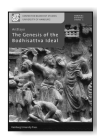 Anālayo The Genesis of the Bodhisattva Ideal 178 pp., 12 illustrations, hardcover, 22,80 EUR ISSN 2190-6769 (printed version) ISBN 978-3-937816-62-3 (printed version) http://hup.sub.uni-hamburg.de/purl/HamburgUP_HBS01_Analayo Band 2

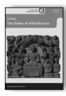 Anālayo The Dawn of Abhidharma 229 pp., 12 illustrations, hardcover, 25,80 EUR ISSN 2190-6769 (printed version) ISBN978-3-943423-15-0 (printed version) http://hup.sub.uni-hamburg.de/purl/HamburgUP_HBS02_Analayo Band 3

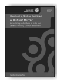 Lin, Chen-kuo / Radich, Michael (eds.) A Distant Mirror Articulating Indic Ideas in Sixth and Seventh Century Chinese Buddhism 565 pp., hardcover; 39,80 EUR ISSN 2190-6769 (printed version) ISBN 978-3-943423-19-8 (printed version) http://hup.sub.uni-hamburg.de/purl/HamburgUP_HBS03_LinRadich Band 4

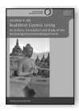 Silk, Jonathan A. Buddhist Cosmic Unity An Edition, Translation and Study of the "Anūnatvāpūrṇatvanirdeśaparivarta" 252 pp., hardcover, 28,80 EUR ISSN 2190-6769 (printed version) ISBN978-3-943423-22-8 (printed version) http://hup.sub.uni-hamburg.de/purl/HamburgUP_HBS04_Silk Band 5

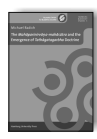

Radich, Michael The "Mahāparinirvāṇa-mahāsūtra" and the Emergence of "Tathāgatagarbha" Doctrine 266 pp., hardcover, 28,80 EUR ISSN 2190-6769 (printed version) ISBN 978-3-943423-20-4 (printed version) http://hup.sub.uni-hamburg.de/purl/HamburgUP_HBS05_Radich Band 6

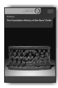 Anālayo The Foundation History of the Nun' Order 278 pp., hardcover, 29,80 EUR ISSN 2190-6769 (printed version) ISBN 978-3-89733-387-1(printed version)
Band 7

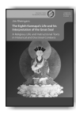 Jim Rheingans The Eighth Karmapa's Life and his Interpretation of the Great Seal A Religious Life and Instructional Texts in Historical and Doctrinal Contexts 243 pp., hardcover, 25,80 EUR ISSN 2190-6769 (printed version) ISBN 978-3-89733-422-9(printed version)
Band 8

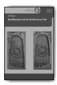

 Anālayo Buddhapada and the Bodhisattva Path 180 pp., hardcover, 18,80 EUR ISSN 2190-6769 (printed version) ISBN 978-3-89733-415-1(printed version)
Recent years have seen heightened interest in the ritual, juridical, and generally practical aspects of the Buddhist tradition. The contributions to Rules of Engagement build on this trend while venturing beyond the established boundaries of discourse in specialized academic disciplines, presenting state-of-the-art research on the vinaya in all of its breadth and depth. They do so not only by tracing Buddhist textual traditions but also by showcasing the vast variety of practices that are the object of such regulations and throw a new light on the social implications such protocols have had in South, Central, and East Asia.

ISSN 2190-6769 ISBN 978-3-89733-428-1 EUR [D] 26,60