HAMBURG BUDDHIST STUDIES 10 Mario Poceski (ed.)
Communities of Memory and Interpretation Reimagining and Reinventing the Past in East Asian Buddhism

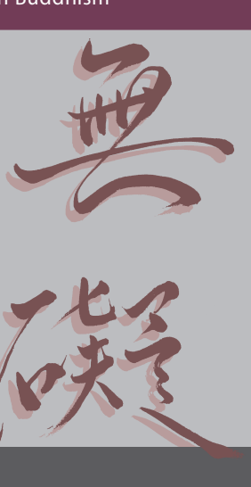

Mario Poceski (ed.)
Communities of Memory and Interpretation Hamburg Buddhist Studies 10 Series Editors:
Steffen Döll | Michael Zimmermann

for Buddhist Studies Mario Poceski (ed.)
Communities of Memory and Interpretation Reimagining and Reinventing the Past in East Asian Buddhism projektverlag.

Bibliographic information published by the Deutsche Nationalbibliothek The Deutsche Nationalbibliothek lists this publication in the Deutsche Nationalbibliografie; detailed bibliographic data are available in the Internet at http://dnb.d-nb.de.

The editor gratefully acknowledges the support of the Alexander von Humboldt Foundation in the production and publication of this volume.

ISSN 2190-6769 ISBN 978-3-89733-480-9 (E-Book)
ISBN 978-3-89733-425-0 (printed version)
© 2017 projekt verlag, Bochum/Freiburg www.projektverlag.de Cover: punkt KOMMA Strich GmbH, Freiburg www.punkt-komma-strich.de Cover original design by Benjamin Guzinski; Julia Wrage, Hamburg Cover image: Calligraphy by Ruth Sheng Dedicated to Robert Buswell, with gratitude and respect Contents Foreword IX Contributors XI Preface and Acknowledgments XIII Introduction 1 Mario Poceski Chapter 1: Traces of the Sanjie (Three Levels) Movement at Baoshan 9 Wendi Adamek Chapter 2: Reconstruction of the Life of a Sixth-Century MonkMisidentified as a Disciple of the Second Chan Patriarch Huike 69 Jinhua Chen Chapter 3: Killing Cats and Other Imaginary Happenings: Milieus and Features of Chan Exegesis 111 Mario Poceski Chapter 4: Identity in a Diagram: Authenticity, Transmission, and Lineage in the Chan/Zen Tradition 145 Steffen Döll Chapter 5: Mapping New Systems of Community Networks: 
Discursive Identity, Cross-Strait Lineage Construction, and Funerary Sacred Space in Taiwanese Buddhism 179 Stefania Travagnin

# Foreword

## About Hamburg Buddhist Studies

Ever since the birth of Buddhist Studies in Germany more than one hundred years ago, Buddhism has enjoyed a prominent place in the study of Asian religions. The University of Hamburg continues this tradition by focusing research capacities on the religious dimensions of South, Central, and East Asia, and making Buddhism a core subject for students of the Asien-AfrikaInstitut. The Numata Center for Buddhist Studies is proud to have found a home at one of Europe's pioneering academic institutions. With its Hamburg Buddhist Studies book series, it honors the University's long-standing commitment to research in the field of Buddhist Studies and aims to share its results with both the academic community and the wider public.

Today, Buddhist Studies as an academic discipline makes use of a broad spectrum of approaches and methods. The field covers contemporary issues as much as it delves into the historical aspects of Buddhism. Similarly, the questions shaping the field of Buddhist Studies have broadened. Understanding present-day Buddhist phenomena—and how such phenomena are rooted in and informed by a distant past—is not at all an idle scholarly exercise. Rather, it has become clear that fostering the understanding of one of the world's major religious traditions is a crucial obligation for modern multicultural societies in a globalized world.

Accordingly, *Hamburg Buddhist Studies* addresses Buddhism as one of the great traditions of philosophical thought, religious praxis, and social life. Its publications, we hope, will be of interest to scholars of religious studies and specialists in Buddhism, but also aim at confronting Buddhism's rich heritage with questions whose answers might not easily be deduced by the exclusive use of historical and philological research methods. Such issues require the penetrating insight of scholars who approach Buddhism from a broad range of disciplines, building upon and yet going beyond the solid study of texts and historical evidence.

We are convinced that *Hamburg Buddhist Studies* contributes to opening up the field to those who may have no training in the classical source languages of the Buddhist traditions but approach the topic against the background of their own disciplinary interests. With this book series, we would also like to encourage a wider audience to take an interest in the academic study of the Buddhist traditions.

## About This Volume

The originality of Mario Poceski's collection of essays lies in integrating a sophisticated theoretical framework with the study of rich and varied source materials. On a more abstract level, the contributors to the present volume take up his argument that religious identity is informed to a significant extent by remembrance. Such remembrance may be both individual and communal, but it is invariably restricted by internal and external factors, motivated by a certain agenda, and—as a shared practice among participants in a given community—not merely reflective but also creative. As such, the community of memory really turns out to be a community of interpretation that, by the very act of remembering, continually reimagines and reinvents itself. This idea is elaborated upon in five chapters that cover large parts of the East Asian Buddhist tradition—China, Taiwan, and Japan—and some one-and-ahalf millennia of religious history. Poceski has given his authors free reign as to the detail of their analyses and discussions, as well as the length of their papers, and this is a very good thing: The volume's essays delve deep into their sources in order to show that to remember may mean to imagine and to distort, to represent and to forget, all at the same time, and thereby to construct the identity of one's religious tradition and, ultimately, of one's religious self.

Michael Zimmermann and Steffen Döll

# Contributors

Wendi L. Adamek is an associate professor in the Department of Classics and Religion at the University of Calgary and holder of the Numata Chair in Buddhist Studies. She specializes in Chinese Buddhism, and her publications include *The Mystique of Transmission* and *The Teachings of Master Wuzhu*. Jinhua Chen is a professor of East Asian Buddhism in the Department of Asian Studies at the University of British Columbia. His research covers East Asian state–church relationships, monastic hagiographical and biographical literature, Buddhist sacred sites, relic veneration, Buddhism and technological innovation in medieval China, Buddhist translations, and manuscript culture. His numerous publications include *Legend and Legitimation: The* Formation of Tendai Esoteric Buddhism in Japan; he is also the co-editor of six books, including Buddhism and Peace: With a Focus on the Issues of Violence, and Wars and Self-sacrifice. Steffen Döll is Numata Professor of Japanese Buddhism at the University of Hamburg, Germany. His research focuses on Buddhist philosophy and history, the processes of cultural transfer in East Asia, and Japanese intellectual and literary traditions. He is author of *Im Osten des Meeres:* Chinesische Emigrantenmönche und die frühen Institutionen des japanischen Zen-Buddhismus (East of the Ocean: Chinese Emigrant Monks and the Early Institutions of Japanese Zen Buddhism, 2010) and several articles on historical issues related to East Asian religions and cultures.

Mario Poceski is a professor of Buddhist Studies and Chinese Religions at the Religion Department, University of Florida. His numerous publications include *The Records of Mazu and the Making of Classical Chan Literature* (Oxford 2015), The Wiley Blackwell Companion to East and Inner Asian Buddhism (Blackwell 2014, ed.), *Introducing Chinese Religions* (Routledge 2009), and *Ordinary Mind as the Way: The Hongzhou School and the Growth* of Chan Buddhism (Oxford 2007).

Stefania Travagnin is an assistant professor of religion in Asia and director of the Centre for the Study of Religion and Culture in Asia at the University of Groningen, Netherlands. Her research and publications explore Buddhism in modern China and Taiwan. She is the editor of Religion and Media in China: Insights and Case Studies from the Mainland, Hong Kong and Taiwan
(Routledge, 2016). Her forthcoming monograph is titled *Yinshun and his* Exposition of Madhyamaka: New Studies of the Da Zhidu Lun in Twentiethcentury China and Taiwan.

# Preface And Acknowledgments

The origins of this book go back to a conference on the same theme, titled "Communities of Memory: Reimagining and Reinventing the Past in East Asian Buddhism," held at the University of Hamburg in May 2014. The conference participants included ten scholars from Europe and North America. The original plan was to have a chapter from each conference participant, based on his or her presentation. Eventually, we ended up with five contributions. Unlike the conference papers (which included additional coverage of Japan and two papers on Korea), the book's coverage turned out to be somewhat skewed towards China. The smaller number of contributions opened up the possibility of having longer chapters, and each of the five scholars featured in the volume readily made good use of that opportunity. 

Two of the chapters (by Chen and Poceski) differ from the original conference presentations. As publications based on their presentations ended up coming out in print before this volume saw the light of day, the two authors wrote new chapters especially for this volume. In editing the individual chapters, I tried to impose a sense of stylistic uniformity and thematic coherence. At the same time, I did not push the impulse toward standardization very far, so there are minor stylistic differences among the individual chapters, based on their authors' choices and predilections. 

I would like to gratefully acknowledge the support I received from the two sponsors of the Hamburg conference: the Numata Center for Buddhist Studies at the University of Hamburg, and the Alexander von Humboldt Foundation. I am especially thankful to the Alexander von Humboldt Foundation for their generous support. In addition to providing me with a Humboldt fellowship that enabled me to spend eighteen months of research in Germany (during the 2013–2015 period), the foundation also awarded me a publication grant for this volume. I also greatly appreciate the friendship and support of my academic host in Germany, Michael Zimmermann, who made the conference possible and suggested publishing the book as part of the Hamburg Buddhist Studies series. Likewise, I wish to acknowledge the help I received from Steffen Döll, the co-director of the Numata Center for Buddhist Studies, especially during the final stages of book production. 

Heartfelt thanks also go to Ruth Sheng for the wonderful calligraphy that graces the book's cover.

I wish to thank all contributors for their participation in this worthwhile project, and for their dedication to high quality scholarship. I want to offer special thanks to my teacher and mentor at UCLA, Robert Buswell, who not only guided my graduate study, but has also continued to offer his unstinting support and wise advice throughout the course of my subsequent academic career. Since the genesis of my chapter included in this book goes back to a paper I wrote for a panel held in his honor at an annual meeting of the Association for Asian Studies, it seems fitting to dedicate this volume to him. 

Mario Poceski Gainesville, Florida March 2, 2017 

Mario Poceski This volume contains a collection of essays centered on the central themes of remembrance, reinvention, and reinterpretation of the past in East Asian Buddhism. The book covers a wide range of historical periods, from China's Tang 唐 dynasty (618–907) to the present, as well as a broad geographical area (China and Japan). It also involves a number of traditions of Buddhism, even though there is a greater focus on the Chan/Zen school (evidenced in three of the five chapters). While each chapter is written independently and focuses on narrower topic(s) or issue(s), in a broad sense the book as a whole is meant to shed light on larger patterns of communal remembrance, textual production, ideological construction, interpretative engagement, and historical representation within East Asian Buddhism. It also aims to assess the impact of those patterns on the constructions of distinctive religious identities and the formulations of specific visions of Buddhist orthodoxy. 

The individual chapters explore some of the multivalent processes and complex issues involved in the remembering, recording, and reinventing of the past, which at times encompassed a variety of legendary or mythical elements. The authors examine how at different historical junctures Buddhist leaders, writers, or adherents constituted or appropriated "historical" narratives by selectively remembering or reimagining their tradition's past. Such processes were often undertaken in response to specific institutional developments and fluctuating socioreligious predicaments. They were also influenced by changing doctrinal frameworks and evolving soteriological paradigms. 

The dominant traditions of Buddhist historiography played important roles in the demarcation of orthodoxy and the forming of religious identities. Consequently, often they were as concerned with legitimizing the present and charting the future as they were with curating the past or formulating accurate accounts of earlier figures and events. By examining the provenance, character, and function of a range of traditional historical narratives and other relevant sources, this volume aims to survey how the larger historical trajectories of East Asian Buddhism can be construed as a series of creative interpretative refractions or distortions. These, in turn, can be understood as expressions of religious piety as well as tools of ideological dominance. 

## Community And Remembrance

An important part of the forging and maintaining of a common religious identity is the existence of a shared vision or understanding of the past, which is often infused with mythopoetic elements.1 The communal remembrance of the exemplary deeds and edifying statements of important founders or other heroic figures, the unfolding of seminal events, and the like, is typically integrated with other aspects of an enduring tradition. These include the establishment of ritual spaces and observances, the enactment of spiritual practices, the codification of literary genres and other means of communication, and the setting up of institutional structures. Processes of this kind are observable in a wide spectrum of religious traditions, as well as in other spheres of human life, including politics. 

Within the context of Buddhism, communal remembrances can unfold at a general or pan-Buddhist level, as the story of the "religion" is retold and reinterpreted by each successive generation. Notwithstanding the presence of certain anchoring elements—such as the main events in the life and ministry of the Buddha—the interlocking narratives that constitute the central storyline inevitably undergo various changes with the passage of time or as the tradition moves across different lands and interacts with diverse cultures. At the same time, analogous processes also unfold within the framework of narrower groups, movements, or traditions, such as the various schools or sects of East Buddhism (Chan/Zen, Tiantai/Tendai, Shingon, Pure Land, etc.), some of which are discussed in this volume.

The communal remembrance and safeguarding of the past can serve as a glue that binds together a group of believers and practitioners, such as Chan monks or members of a cultic movement. It provides them with a sense of common identity, which incorporates a collective heritage, shared values, and a higher sense of purpose. Often the group's communal remembrances 
(and aspirations) are expressed via the medium of stories about a celebrated past, although the same messages can also be set in stone or communicated via sacred sites and monuments, which are instilled with elevated significance. Since the shared act of remembering the past is at the core of the group's collective identity, inevitably the retelling and transmission of key narratives about its "history" is a central and lasting aspect of religious life. In that sense, a religious group can be understood to constitute a community of memory.2 The seemingly universal propensity to look back in time represents an essentially conservative impulse, which to varying degrees can be found in virtually all religious traditions. Nonetheless, despite the various practices and rituals that aim to recapture or commemorate key elements of the past, the true nature and precise make-up of the past remain elusive. Ultimately, neither individuals nor groups can have direct access to the past, which is always remembered in a partial, distorted, and subjective manner. Invariably, remembrance of the historicized past is colored by all sorts of external exigencies, situational contexts, and social mandates. There are also psychological factors at play, which take us back to the inner workings of human consciousness and the nature of memory. Given the innate imperfection and fallibility of human memory—individual and comunalthe past remains a contestable territory and can be burdened with tensions or incongruities. It is always open to various types of interpretations, judgments, and reassessments, and is laden with a multitude of uncertainties, distortions, ambiguities, or selective omissions. 

The formation and circulation of collective memories, which serve as central elements of communal or religious identity, involves the complex interweaving of fact and fiction, myth and history, fantasy and reality. 

Despite their failure to live up to specific standards of empirical evidence or conventional reality, the symbols and narratives deployed by specific Buddhist communities to convey their shared remembrances and ideals should be taken seriously by scholars of religion. After all, they are central elements of religious life, as understood or experienced by a range of people engaged with enduring beliefs and traditions.

If we carefully unpack the complex assemblages and multilayered components that constitute these kinds of narratives—along with the elements of material culture that accompany them—we can find all sorts of interesting and valuable information about religious trends, mores, outlooks, and traditions. The information we uncover can also pertain to various beliefs, ideals, doctrines, and practices, as they have developed and changed in light of constantly evolving religious needs, cultural predilections, and sociopolitical actualities. In the end, the relevant sources afford us glimpses into the lives, values, and aspirations of past and present adherents—along with the inner workings of the communities that surround them. As an added bonus, they help us trace larger developmental patterns and historical trajectories, including those of important religious groups or sectarian movements, such as those examined in this volume.

## Interpretation

Memories and histories are not straightforward. The construction and transmission of historicized remembrances tends to involve convoluted processes that can be selective and creative (often at the same time), and tend to position the past in relation to the present. Collective memory is not fixed or static, as it gradually changes over time and across generations, subtly and unbeknown to most.3 That remains the case even though it revolves around key reference points, as expressed in sacred rituals and traditional lore, or written down in canonical texts and related historical documents. 

Notwithstanding the certitudes disseminated by promoters of entrenched orthodoxies or unquestioned dogmas, the contents of historically inflected memories are open to reassessment and reinterpretation. Accordingly, the transmission of memories over time involves ongoing negotiation and interpretation. In that sense, a community of memory can also be understood as a community of interpretation. 

When dealing with premodern contexts, we know about these kinds of memories primarily because they were expressed in written documents, although there are also other sources of information, such as ritual sites or art objects. While specific Buddhist texts might have certain original meanings (as designed by their authors), their reading by later generations of adherents often tends to be culturally constructed, as suggested by proponents of reader-response criticism.4 Namely, the deceptively straightforward act of reading inevitably involves a fair amount of interpretation, which can operate at an unconscious level. That is especially important in highly literate religious milieus, like those we encounter in East Asian Buddhism, especially at the elite level. 

The reading of texts and the discussion of the ideas communicated in them always takes place within specific contexts, and it involves all sorts of emotive responses, value judgments, and subjective interpretations. The factors that influence individual acts of interpretation can be of different types: psychological, social, cultural, or religious. Political backdrops, economic imperatives, and institutional predicaments can also influence the interpretative strategy or the exegetical process. All too often, various sorts of ideological agendas, emotional attachments, philosophical perspectives, or religious commitments influence the ways individuals and groups decode and come to terms with the content of canonical texts or select forms of symbolic representation (such as the lineage genealogies we find in Chan and other schools of East Asian Buddhism). 

The interwoven processes of remembrance and interpretation can sometimes also involve a fair amount of self-deception, deflection, or even misinformation. That makes the textual materials and other sources we use for the study of Buddhism that much more complex and challenging. At the same time, it also makes them more remarkable and interesting, inasmuch as they function as rich repositories of information about Buddhist ideals, teachings, and practices, as well as windows into the worlds of the actual communities that espouse and transmit them. 

## Summary Of Contents

The book contains five chapters, roughly organized in a chronological sequence. The journey starts in medieval China and ends in contemporary Taiwan, with an extended stopover in Japan. Much of the coverage revolves around the Chan/Zen traditions of Chinese and Japanese Buddhism. Nonetheless, there is also ample coverage of other Buddhist groups, trends, and teachings, such as the Three Levels movement in medieval China and the newfangled brand of Humanistic Buddhism that developed in modern China and Taiwan. 

The first chapter, by Wendi Adamek, explores the somewhat ambiguous traces left by the Three Levels (Sanjie 三階) movement at Baoshan 寶山, where we find rock-cut caves, stelae, and other monuments from the Sui 隋 (589–618) and Tang 唐 (618–907) eras. In her nuanced exploration of the intersections between the site and the movement (which was proscribed on several occasions), Adamek covers a large cross-section of primary sources, such as liturgical texts and memorial inscriptions, a number of which are translated and subjected to careful analysis. Among the textual elements she uses to establish possible Sanjie affiliation are references to the mortuary ritual of corpse exposure, which appears in the memorial inscriptions for individual monks and nuns. Pointing to both the evidence of Sanjieassociated rituals at Baoshan and the conspicuous lack of explicit mention of the movement and its leading figure, Xinxing 信行 (540–594), she highlights the tenuousness of lineage ideology and sectarian identity, exemplified by the effortless assimilation of radical Sanjie practices into Baoshan's heterogeneous and evolving community of memory.

Jinhua Chen's chapter explores a case of mistaken identity, revolving around a sixth century monk known as Meditation Master He 和禪師. While Chan sources tend to identify him as a disciple of Huike 惠可 (487–593), the putative second patriarch of Chan in China, Chen argues against this misidentification and explores the reasons behind it, including the hegemonic power and influence of later Chan narratives about the tradition's formative growth. His meticulous study, which relies on a range of primary sources such as the *Xu gaoseng zhuan* 續高僧傳 (Additional Biographies of Eminent Monks), brings to light a wealth of details about this seemingly obscure monk, as well as about several other monks who were his contemporaries. The chapter also includes reflections on the scholarly use of divergent historical narratives, which are often infused with sectarian biases and other distortions, and calls for greater attention to the nature of both the sources and the stories modern scholars try to tell about their medieval subjects. 

The central issues of communal remembrance and interpretation are taken up by Mario Poceski in reference to the intertwined process of canonical exegesis and perpetuation of orthodoxy. His chapter centers on the notorious story of Nanquan Puyuan 南泉普願 (749–835) killing a cat, which is among the best-known episodes in traditional Chan literature. It explores some of major problems that surround the interpretative strategies and commentarial treatments extended to this and other stories that depict ostensibly pointless or morally dubious behaviors, including acts of gratuitous violence. By exploring the nature, scope, and impact of Chan exegesis, and taking into account the ideological commitments and institutional forces that shape it, Poceski exposes a pervasive tendency to stick uncritically to a set interpretative scheme that is anchored in a narrow vision of Chan orthodoxy. 

That stands in stark contrast to the tradition's self-representation as a movement within Buddhism that rejects dogma, challenges the status quo, and is infused with a healthy dose of iconoclasm. 

Issues of orthodoxy and identity within the Chan/Zen tradition are also central in Steffen Döll's chapter, which takes us (mostly) to premodern Japan. Its main concern is the notion of lineage, especially as formulated in the Rinzai sect 臨済宗, which for centuries has served as a linchpin to Zen's claims to uniqueness and superiority vis-à-vis other Buddhist traditions. 

Building on John McRae's notion of "lineage paradigm," Döll carefully unpacks the main assumption, uses, and problems that surround the notion of lineage, especially when expressed in a schematic manner by means of lineage diagrams. According to him, the tradition's emphasis on lineage, which postulates a direct link to the Buddha and his experience of ultimate awakening, had less to do with accurate historical representation of past events and individuals, and more to do with overriding concerns about identity, transmission, authority, and legitimacy. By highlighting the largely fictional character and ideological function of lineage diagrams, which are construed as models of reality, the chapter problematizes the ways the Chan/Zen tradition has obfuscated its true history and has promoted an exclusivist agenda. 

Finally, in the last chapter, Stefania Travagnin explores a case from contemporary Taiwan, which is closely related to parallel developments on the Chinese mainland and touches upon the nature of cross-strait relations. 

Her analysis centers on the Fuhui Pagoda 福慧塔院 and Yinshun 印順 (1906–
2005), the prominent proponent of "Buddhism for the Human Realm" 
(Renjian fojiao 人間佛教) and one of the leading intellectual figures in contemporary Taiwanese Buddhism. She uses the story of the pagoda as an entry point for a discussion of the history of the community associated with it, which in turn tells us important things about the make-up, growth, and transformation of modern Taiwanese Buddhism. By exploring the circumstances and the reasons behind the pagoda's construction, as well as the meanings that were ascribed to it, the chapter sheds light on key issues in contemporary Chinese and Taiwanese Buddhism. That includes the construction of new Buddhist identities and lineages, which in turn are related to the emergence of a still fragile sense of distinct Taiwanese identity.

## Bibliography

Bellah, Robert N., et al. Habits of the Heart: Individualism and Commitment in American Life (Updated Edition). Berkeley: University of California Press, 1996.

Irwin-Zarecka, Iwona. Frames of Remembrance: The Dynamics of Collective Memory. New Brunswick: Transaction Publishers, 1994.

Pickering, Michael and Keightley, Emily. "Communities of Memory and the Problem of Transmission." *European Journal of Cultural Studies* 16/1 (2012): 115–31.

Poceski, Mario. *The Records of Mazu and the Making of Classical Chan Literature*. 

Oxford and New York: Oxford University Press, 2016. 

Tompkins, Jane P., ed. Reader-response Criticism: From Formalism to Poststructuralism. Baltimore: Johns Hopkins University Press, 1980.

# Chapter 1 Traces Of The Sanjie (Three Levels) Movement At Baoshan

Wendi Adamek

Baoshan 寶山 (Treasure Mountain) and its adjoining peaks form a secluded green pocket in the Taihang 太行 mountain range in present-day Henan. The site includes two rock-cut caves, carvings of sūtra passages, reliquary niches with portrait statues, and stelae with references to buildings and restorations. 

The long stretch of relative stability from the establishment of the Sui 隋 dynasty in 589 to the disruption of the Tang 唐 (618–906) in the mid-eighth century was a flourishing era for the practice community at Baoshan. This is the period that encompasses the largest number of extant datable mortuaryniche inscriptions for deceased community members. This was also the period when the Sanjie 三階 (Three Levels) movement was most visible in the landscape of Chinese Buddhism, an object of both praise and blame.

This chapter examines the intersections between Baoshan as a place of practice and Sanjie as one of the styles of practice that left its traces at Baoshan. I first compare liturgical texts from Baoshan and a related Sanjie site, and in the course of this discussion introduce the two monks who are considered founders of these two fields of practice. I then discuss Baoshan memorial inscriptions for nuns and monks that show signs of Sanjie affiliation, particularly through the distinctive but contested mortuary ritual of "forest interment" or corpse exposure. 

In these discussions, I reference the works of others who have previously noted or speculated about the obvious links between Baoshan and Sanjie practice. I present no new pieces of evidence to augment this long-perceived connection. Instead, I would like to bring the lack of any explicit mutual reference into clearer focus. Neither Sanjie nor its founder Xinxing 信行
(540–594) are explicitly named at Baoshan itself, and Sanjie texts do not mention Baoshan or its second founder Lingyu 靈裕 (518–605), although others have surmised that Xinxing was influenced by Lingyu. That Sanjie provoked both fervent devotion and pointed criticism is well known. 

However, if the absence of open Sanjie affiliation at Baoshan was due to ambivalence, then circumspection toward Sanjie would appear to have affected even one of its closest cousins.

While some of Baoshan's later practitioners seem to have embraced Sanjie teachings, others may have repudiated them. It is likely that some, at least, recognized the close correspondences between the teachings of Xinxing and of their own founder, Lingyu. After reviewing these correspondences, I suggest that the traces are too ambiguous to support a conclusion about the status of Sanjie in the eyes of the seventh-century Baoshan community, but the affinities grant us a better sense of the 
"practicescape" within which they developed.1 Among Empson's "seven types of ambiguity," here we address the ambiguity of multiple conflicting meanings that make the complexity of the context clear.2 Histories of Buddhism and other religions include many examples of spiritual cousins turning into sectarian rivals. Indeed, it often seems that the more closely knit a community of practitioners is, the more likely that over time minute differences will matter and lead to splits. Ironically, one of the framing narratives for the "Final Age" soteriology that motivated both Lingyu and Xinxing was a tale of quarreling affines. As will be discussed further, in the Candragarbha-*sūtra* version of Buddhist eschatology referenced at Baoshan and in Sanjie texts, the motif of the "Kauśāmbī prophecy" is central. This derives from Vinaya accounts of the Buddha's encounter with a community of monks fighting over a small difference in protocol, which was then linked with predictions of the eventual decline of the efficacy of the Buddha's teachings.

I do not claim that Lingyu and Xinxing quarreled. Nor is it clear that the Sui proscription against Sanjie in 600 CE was widely enforced or influential. What I present here are a series of juxtapositions—the soteriologies of Lingyu and Xinxing, two repentance liturgies that echo one another, and the blending of Sanjie with other practice-orientations in selected mortuary inscriptions at Baoshan. I focus on the Baoshan inscriptions describing corpse exposure, as those have been identified as most indicative of Sanjie affiliation. 

Xinxing may have borrowed some of his ritual and cave-shrine designs from Lingyu. And the later architects of Baoshan's mortuary practices may have been inspired by the grove of stūpas that grew up around the site of Xinxing's corpse exposure and cremation at Zhongnanshan 終南山. We cannot know for certain, but here I lay out the homologies, and let the reader decide what kind of relationship they suggest. 

## Backgrounds

The roots of the soteriological outlook that influenced both Lingyu and Xinxing may be traced back to the short-lived hybrid Chinese/Xianbei 鮮卑 dynasties of the Eastern Wei 東魏 (534–550) and Northern Qi 北齊 (550– 577). The Northern Qi was destroyed in 577 by the Northern Zhou 北周 (557–581), which also supplanted the regime of the Western Wei 西魏 (535–
556) centered in Chang'an 長安. The Northern Zhou Emperor carried out the second imperial persecution of Buddhism from 574–577 (The first was during the Northern Wei 北魏, from 446 to 452.) In 580, the Northern Zhou minister Yang Jian 楊堅 (541–604) became regent, and after crushing an attempt at resistance he swiftly established himself as Emperor Wen 文 of the Sui dynasty (r. 581–604). He reunified the north and the south in 589, ending over three centuries of division. It was under his pro-Buddhist regime, and partially through his patronage, that Baoshan became a major Buddhist site. It was also during the Sui era that Sanjie texts were first banned.

In 618, the rebel Li Yuan 李淵 (566–635), former governor of Taiyuan 太 原 (Shanxi), established the Tang dynasty. After his death he was designated as founding Emperor Gaozu 高祖 (r. 618–626). When the third Tang emperor Gaozong 高宗 (r. 649–683) became incapacitated by a series of strokes in 665, his second empress Wu Zhao 武曌 (624–705), a former concubine of his father's, became the de facto ruler. After Gaozong's death, Empress Wu succeeded in establishing herself as the founder of a new dynasty, the Zhou 周 (690–705). She was much criticized for her ruthlessness once the Tang was reestablished in 705. Nevertheless, she was also acknowledged to have been a strong ruler, and she was widely supported by the Buddhist clergy for establishing a network of monasteries and convents. However, she also issued two proscriptions against the Sanjie movement.

It is said that Baoshan was first marked as a Buddhist place by the monk Daoping 道憑 (488–559) during the Eastern Wei period. His disciple Lingyu won imperial recognition for the site and appears to have led the design and construction of the main cave shrine. Baoshan's founders shared a distinguished heritage stemming from the brief but brilliant efflorescence of Northern Qi Buddhism. Daoping was the disciple of the Northern Wei master Huiguang 慧光 (468–537),3 who was later considered the progenitor of the Southern Branch of the Dilun 地論 (Stages Treatise) school that developed in Ye 鄴. The "Southern" and "Northern" designations are based on the biographies of Bodhiruci 菩提流支 (d. 527) and Huiguang in the seventhcentury *Xu Gaoseng zhuan* 續高僧傳 (Continued Biographies of Eminent Monks),4 which show two lines of affiliation, based on exegesis and practice of the Yogācāra tenets of Vasubandhu's *Daśabhūmikasūtropadeśa*.

5 This is a commentary on the Daśabhūmika-*sūtra* (Sūtra on the Ten Stages), a scripture on the stages of the bodhisattva path that was incorporated into the Avataṃsaka-*sūtra*.

6 The two Dilun lines of affiliation were said to stem from disagreements between Bodhiruci and Ratnamati 勒那摩提 (ca. early 6th cent.), at the Northern Wei-sponsored translation atelier in Luoyang. Their dispute concerned interpretation and translation of the *Daśabhūmikasūtropadeśa*. 

The Northern Branch was said to have been based on Bodhiruci's orthodox Yogācāra approach, descending through Daochong 道寵 (d.u.), Buddhaśānti 佛陀扇多 (d.u.), and Sengchou 僧稠 (480–560). The Southern Branch lineage, influenced by Ratnamati's *tathāgatagarbha* orientation, was considered to have descended through Huiguang, Daoping, and Lingyu.7 According to the *Xu gaoseng zhuan,* Daoping died at Baoshan. The inscription on one of the two small matching Northern Qi stone stūpas that remain at the site identifies them as his reliquary monuments.8 They may have inspired the practice of carving reliquary niches for the site's deceased. 

His disciple and co-founder Lingyu is said to have died at Yankong 演空 temple near Anyang, but it is said that he was buried on Baoshan, where a stūpa was erected for him.9 The earliest datable record for Lingyu is his Baoshan mortuary niche and inscription, dated 632. 

Two rock-cut cave shrines on Baoshan and Lanfengshan 嵐峰山 (Misty Peak Mountain) constitute the devotional foci of the site, and a restored temple stands in the valley between them, in what is believed to be its original location.10 Presumed to have been designed by Lingyu, the site's main cave shrine Dazhusheng 大住聖 (Great Abiding Holy Ones) is located midway up Baoshan. Mortuary niches for monks and laymen fan out on several levels above the cave to the east and west. An earlier smaller cave attributed to Daoping was renamed Daliusheng 大留聖 (Great Remaining Holy Ones), 
establishing correspondence with Dazhusheng. It is situated partway up Langfengshan, overlooking the lower part of the valley. Mortuary niches for nuns and laywomen are carved into cliff faces above, below, and to the east of the cave.

These mortuary niches, over two hundred of which are extant, are mid-relief carvings in limestone rock faces. Most are in the shape of small stūpas, and are likely to have once held reliquary containers for cremation ashes. 

Some of the niches have a square cavity carved below or beside the niche, and many of the memorial inscriptions refer to the mortuary construction as an "ash-body stūpa" (*huishen ta* 灰身塔). Several of the inscriptions describe the disciples cremating the body and gathering the remains. These niches, many of which show the remnants of seated images, are probably the reason that the site later earned the popular nickname Wanfogou 萬佛溝 (Ten Thousand Buddhas Ravine). In Lingyu's *Xu Gaoseng zhuan* biography, it is said that the temple he constructed at the site was designated Lingquan si 靈 泉寺 (Ling's Spring Temple, or Numinous Spring Temple) in 591 by Emperor Wen of the Sui.11 One of Lingyu's disciples, the eminent monk Huixiu 慧休 (547–646), also had a formative influence at the site. Huixiu was a disciple to both Lingyu and Tanqian 曇遷 (542–607), and he also undertook serious study with other masters.12 His Baoshan memorial claims that he assisted the illustrious Jingying Huiyuan 淨影慧遠 (523–592). As will be discussed further, his mortuary inscription is one of five at Baoshan that describe elements of the ritual of corpse exposure, and his memorial was sponsored by a Tang prince who was a known Sanjie practitioner.

## The "Final Age" Context Of The Soteriologies Of Lingyu And Xinxing

Belief in the advent of the "Final Age of the Dharma" (mofa 末法, *moshi* 末 世) was foundational for both Lingyu and Xinxing. This ideology gained traction in China in the sixth century and influenced the development of distinctive devotional cults or practice-orientations, the best-known of which is Jingtu 淨土 (Pure Land).13 The reputation of Final Age ideology as a 
"popular" belief is due in part to its prominence in Japan, where *mappō* became a pivotal focus of devotional movements from the twelfth century onward. In China in the fifth and sixth centuries, Final Age periodization became an exegetical concern. 

According to Final Age eschatology, the diminishing efficacy of the Dharma of the tutelary Buddha of one age is followed in time by the advent of the Dharma of the next Buddha. The narrative of cyclical degeneration and regeneration of the Buddhist teachings was bound up with the soteriological aim of inspiring the practitioner to end his or her bondage to the cycle of personal birth and death. Buddhist eschatology was not centered on the collapse of the current corrupt polity or the teleology of endtime redemption for the chosen few, though it made use of those perennial narratives. 

Significantly, Kumārajīva's 鳩摩羅什 (344–413) translation of the Diamond Sūtra in 401 led to the dissemination of its eschatological soteriology. This influential scripture provided a foundation for the argument that in the Final Age, even the simplest practices have special significance. In it we find a kind of predestination doctrine that during the five hundred years after the Buddha's death (*hou wubai sui* 後五百歲), those who cultivate the precepts and immediately give rise to faith in the scripture's teachings are thereby proved to be those who have already cultivated the roots of virtue with numerous Buddhas, and are in effect already enlightened. Then the practitioner is assured that men and women who recite and remember the Diamond Sūtra in the Final Age gain more merit than they could possibly comprehend.14 Two subsequent translations by figures who contributed to the Dilun approach may indicate that the Final Age claims in the *Diamond Sūtra* were considered worthy of special attention in Lingyu's milieu. Bodhiruci, the monk whose views were said to have formed the basis of the Northern branch of Dilun, made another translation of the Diamond *Sūtra* in 509, soon after his arrival in China. It specifies the coming Final Age (*molaishi moshi* 未來世 末世) as the time when "the Dharma is about to be extinguished" (*fa yumie* shi 法欲滅時), but does not include the five-hundred-year time-frame.15 This lack of specificity would have better allowed his contemporaries to associate the Final Age with their own times.

The views of Huisi 慧思 (515–77), the retrospectively designated Tiantai 天臺 third patriarch, are often taken as the starting point for a distinctively Chinese periodization of the Final Age. Although his authorship of the relevant source passages in the *Nanyue si dachanshi lishiyuan wen* 南嶽思大 禪師立誓願文 (Text on the Vow of the Great Dhyāna Master Si of Nanyue) 
is disputed,16 his name became associated with a popular three-part periodization of Buddhist endtime: *zhengfa* 正法 (True Dharma), *xiangfa* 像 法 (Semblance Dharma), and *mofa* 末法 (Final Dharma).17 In *Once Upon a Future Time*, Jan Nattier analyzed various Buddhist texts that set forth different durations for the efficacy of Śākyamuni's Dharma, focusing in particular on the versions of the "Kauśāmbī prophecy," which described the signs of corruption by which the advent of decline could be recognized.18 The Candragarbha-*sūtra* has the most extensive version of the Kauśāmbī prophecy that would have been available to Lingyu and Xinxing. 

Daochuo 道綽 (562–645), one of the leading advocates of Pure Land devotion, also made use of this narrative. 

## Dazhusheng Cave And Lingyu

At Dazhusheng cave at Baoshan, the "writing on the wall" outside the door is a passage from the Candragarbha-*sūtra,* warning that "the pure Dharma disappears" (*baifa yinmo* 白法隱沒).19 The scriptural selections carved inside and outside the cave include assurances of efficacy, and scripts for intense ritual practice. The passages seem to be centered on motivating practice through the difficult Final Age. Unlike the sūtra-carving project that was initiated at Leiyin 雷音 cave on Fangshan 房山 (Hebei) in 605 with the intention to create obdurate stone copies of important Buddhist texts that would survive the endtime, Baoshan's collection does not seem to have been assembled for the purpose of preserving key Buddhist teachings. The Leiyin cave endeavor was launched by one of Huisi's disciples, the monk Jingwan 靜琬 (d. 639), under the sponsorship of the Sui imperial family.20 Though there is no concrete evidence for interactions among Lingyu, Jingwan, and Xinxing, scholars have pointed out resonances among their practice programs and cave designs, and their intersecting paths.21 We cannot be certain that Lingyu was solely responsible for the selection of texts at Dazhusheng. However, the carved references to the efficacy of repentance, the responsiveness of the Buddhas, and the ultimate dharmadhātu (realm of reality) signifying emptiness of defilement all correspond with Lingyu's Dilun-based practice and teaching, as characterized in his Baoshan mortuary inscription and *Xu gaoseng zhuan* biography. 

In the biography for Lingyu, Daoxuan 道宣 (596–667) also notes that Lingyu wrote a treatise on the theme of the destruction of the Dharma, entitled Miefa ji 滅法記 (or *Famie ji*),22 which unfortunately is no longer extant.

The two Dazhusheng inscriptions I discuss below are: (1) a selection from the "Bu Yanfuti" 布閻浮提 (On the Arrangement of Jambūdvīpa) 
chapter of the *Yuezang fen jing* 月藏分經 (Candragarbhavaipulya-*sūtra;* 
Sūtra of the Extensive Discourse of the Bodhisattva Moon-Embryo), 
hereafter Candragarbha-*sūtra*;
23 and (2) the *Lüe li qijie foming chanhui deng* wen 略禮七階佛名懺悔等文 (Abridged Seven-Roster *Buddhanāma* and Confession-Repentance Text), hereafter *Chanhui wen*.

## The Candragarbha-Sūtra

The Candragarbha-*sūtra* is a multi-layered text, best known for its versions of Śākyamuni's prophecies about the decline of his Dharma. It culminates with the violent saga set in the above-mentioned kingdom of Kauśāmbi that is said to have definitively marked the advent of the Final Age. Translated by the Indian monk Narendrayaśas in 566 in the Northern Qi capital of Ye, it became one of the key sources for East Asian *mofa* discourse. 

There are several variations on the decline prophecy given in the Candragarbha, and the quotation used at Baoshan is the one that gives the most detailed periodization scheme. Its message that support should be given even to precept-breaking monks is repeated in a concluding section of the scripture.24 Here is the section carved on Dazhusheng's southwest inner wall by the door:
At that time the World-Honored One said to Candragarbha Bodhisattva-Mahāsattva, "Understand, Pure Gentleman, that as long as I am in the world the *śrāvakas'* (disciples') maintenance of moral discipline is complete, their generosity is complete, their hearing of [the Dharma] is complete, their meditation is complete, their wisdom is complete, their liberation is complete, their direct knowledge of liberation is complete, and my True Dharma is blazing in the world. As for the gods and humans, they are also able to manifest the universal True Dharma. In the five hundred years after my *parinirvāṇ*a (final *nirvāṇ*a) all the monks will still, through my Dharma, be firm in [attaining] liberation. In the next five hundred years, in my True Dharma the practice of meditation and samādhi will remain firm. In the next five hundred years, chanting and erudition will remain firm. In the next five hundred years, in my Dharma the building of many stūpas and temples will remain firm. In the next five hundred years, in my Dharma there will be contention and debate. The pure Dharma will disappear and lose its firm [foundation]. 

Understand, Pure Gentleman, that from that time forth, in my Dharma [there will be those who,] although they shave their heads and wear robes, will break the precepts, not practice in accord with the Dharma, and will falsely be called monks. Regarding such precept-breaking nominal monks, if there is a donor who gives alms and supports them, I say that this person still achieves measureless, countless blessings and accumulation of merit. Why? Because even this can benefit many beings. How much more so, when I am now present in the world?

For example, real gold is taken as a priceless treasure. If there is no real gold, silver is taken as a priceless treasure. If there is no silver, then yellow copper is priceless. If there is no yellow copper, then counterfeit treasures are priceless. If there are no counterfeit treasures, then red copper alloy, iron, white lead, and tin are taken as priceless treasures. Similarly, in all the worlds the Buddha treasure is supreme. If there is no Buddha treasure, then the pratyekabuddha (self-enlightened Buddha) is supreme. If there are no pratyekabuddhas, then the *arhat* (one who has destroyed afflictions) is taken as supreme. If there are no *arhats*, then the various sages are taken as supreme. If there are no sages, then ordinary men who are able to meditate are taken as supreme. If there are none who are able to meditate, then those who purely maintain the precepts are taken as supreme. If there are no [monks capable of maintaining] pure precepts, then [monks] who sully the precepts are taken as supreme. If there are not [even monks who practice] sullied precepts, then shaven-headed, robe-wearing nominal monks are taken as the supreme treasure. Relative to the ninety-five kinds of heterodoxies, they (i.e. nominal monks) would be most honored and foremost, worthy of receiving offerings from the world and acting as the field of blessings (merit) for all creatures. Why? Because [even they] are capable of manifesting [Dharma] such that the many beings may be filled with awe. If there is protection, support, and maintenance [of the saṃgha], persons [who provide this] will shortly achieve the stage of endurance."25 The *Candragarbha* makes a reasoned case for support of monks who keep the precepts imperfectly because (1) this prevents non-Buddhist teachings from taking over completely, and (2) it sets a good example in bad times.26 For donors who thus uphold the Dharma against the odds, the Buddha promises speedy attainment of the first *bhūmi* (ground, stage) of the ten-stage bodhisattva path: *rendi* 忍地, the ground of endurance (or forbearance), also called the ground of joy (*pramuditā*). Strategic reasons why such arguments would be advanced by monks need no elaboration, but perhaps we should not simply dismiss them as one-sided propaganda. If the case for supporting erring clergy only benefited the clergy, the phenomenally popular Sanjie movement would not have been so successful.

It is not difficult to understand the appeal of accessing a special link to the power of transcendent Buddhas and bodhisattvas, a link that could manifest even in the midst of corruption. In this version of Final Age ideology, the efficacy of the monastic robe is backed by the guarantees of the Buddhas and great bodhisattvas, regardless of the worthiness of the wearers. The sanctity of the robe remains even when one can no longer trust in those who wear it. 

The precisely defined incremental losses described in the *Candragarbha* serve to focus attention on the narrowing options left to ordinary devotees. 

One by one the Buddhas, śravakas, arhats, *pratekyabuddhas*, meditation adepts, scholars, and edifice-builders disappear from the scene. The devotee is left with monks whose rectitude is questionable, yet the Buddha promises that the very unreliability of these nominal vessels of the Dharma is a source of refuge. The efficacy of the Buddha's Dharma is completely gone, yet continuing to support its form (the Dharma) in its absence gives one access to the universal bodhisattva path. This message is buttressed by the Candragarbha passage carved on the outside wall of Dazhusheng, which presents a remarkably optimistic outlook in the worst of times, claiming that "This land's evil persons and demons, yakṣas, asuras, *kumbhāṇḍ*as—all in the end extinguish *kleśas* (defilements) and protect and uphold the World-Honored One's genuine subtle Dharma."27 The message is further reinforced in the final section of the *Candragarbha*, which is not carved at Dazhusheng but was probably known to Lingyu and Xinxing. Again tracing the course of inevitable decline, the Buddha asserts that making offerings to monks who do not keep the precepts is as if "making offerings to me."28 He then recites a *dhāraṇī* (incantation) to extend the endurance of the True Dharma, and various miraculous signs are manifested throughout the many worlds.29 Falseness thus becomes a clear sign whose meaning is recognized only by the true practitioner: when one sees the robe betrayed, this affirms the truth of the Buddha's prophecy. The reward promised to the endtime faithful is therefore assured, backed by a powerful spell given by the Buddha. Making offerings to those who do not keep their word proves that one believes the word of the Buddha, and this becomes a gateway to the Dharma's transcendence of time and space.

## The Confession-Repentance Liturgy

At Baoshan, the repentance liturgy known as the Lüe li qijie foming chanhui deng wen 略禮七階佛名懺悔等文 (Abridged Seven-Roster *Buddhanāma* and Confession-Repentance Text, hereafter *Chanhui wen*) is inscribed at the farthest west end of the lower register to the west (left) when one faces the Dazhusheng doorway from the outside.30 The apparent source of the confessional script is the *Jueding pini jing* 決定毘尼經 (Vinayaviniścaya-Upāliparipṛcchā-*sūtra*, Sūtra of the Inquiry of Upāli Regarding Determination of the Vinaya), a portion of which is closely reproduced.31 The wall includes two other scriptural sources with supplemental lists of Buddha names that were clearly intended to be recited as part of the ceremony.

The Dazhusheng *Chanhui wen* begins with homage to the groups of Buddhas individually named in the adjacent inscriptions. The confession and repentance begins with the line "I/We take refuge and repent" (*guiming* chanhui 歸命懺悔)
32 and proceeds with a comprehensive catalogue of the 
 
30 *Chanhui* 懺悔 is often translated as "confession and repentance," but I also use "repentance practice" or simply "repentance" to refer to the range of practices associated with this term. 

Chanhui is an important sub-field in Chinese Buddhist studies. Seminal studies include but are not limited to Daniel Stevenson, "The T'ien-T'ai Four Forms of Samādhi and Late NorthSouth Dynasties, Sui, and Early T'ang Buddhist Devotionalism"; Kuo Li-ying, *Confession et* contrition dans le bouddhisme chinois du cinqième au dixième siècle; Wang Juan, *Dunhuang* lichan wen yanjiu 敦煌禮懺文研究 (Research on Dunhuang Ritual and Repentance Texts); 
Bruce Williams, "Mea Maxima Vikalpa: Repentance, Meditation, and the Dynamics of Liberation in Medieval Chinese Buddhism, 500-650 CE"; and Shioiri Ryōdō, Chūgoku bukkyō ni okeru zanpō no seiritsu 中国仏教における懺法の成立 (The Development of Penitential Methods in Chinese Buddhism).

31 *Jueding pini jing*, T 12: 39a7–27; see Pierre Python, *Vinayaviniścaya-Upāliparipṛcchā*, for collation of the Sanskrit fragments, Tibetan, and Chinese versions. Tracing the evolution of early confessional genres, Christian Haskett's dissertation "Revealing Wrongs: A History of Confession in Indian Buddhism" notes the *Vinayaviniścaya-Upāliparipṛcchā-sūtra* as a key source for the earliest datable Buddhist confession ritual, the *triskandha* or "three heaps" of purificatory recitation: reverence, offenses, and dedication of merit (pp. 112-15). The Ugraparip*ṛcchā-sūtra* also enjoins recitation of the *triskandha* thrice daily and nightly; see Jan Nattier, *A Few Good Men*, pp. 259-61. The *Jueding pini jing* is said to have been translated into Chinese by Dharmarakṣa (265-ca. 313) at the end of the third century. However, Williams points out that the term "*chanhui*" did not come into use until ca. 400 and speculates that Dharmakṣema 曇無讖 (ca. 385-433) may have been the translator; see "Mea Maxima Vikalpa," p. 34, n. 32. 

32 In the Dazhusheng carving the character 悔 is missing, but it occurs in the corresponding Jueding pini jing text.

categories of offenses that the practitioner may have committed in this and previous lifetimes. In the course of this litany the practitioner prays that the Buddhas to whom she has confessed will "compassionately recollect me/us" 
(*cinian wo* 慈念我) and "should remember me/us" (*yinian wo* 憶念我). The repentance concludes with prayers for merit transfer and collective refuge.

Homage to all of the Buddhas of the [Ten] Directions [beginning with] the Buddha of the Eastern [Direction] [Sumerupradīpa]prabhāsa; Homage to all of the Seven Buddhas of the Past [beginning with Vapaśyin]; Homage to all of the Fifty-Three Buddhas [beginning with] Dīpaṁkara; Homage to all of the Buddhas of the Ten Directions [beginning with] 
Bhadraśri Tathāgata; Homage to all of the Thousand Buddhas of the Bhadrakalpa [beginning with] 
Krakucchanda Tathāgata; Homage to all of the Thirty-Five Buddhas [beginning with] Śākyamuni Tathāgata; Homage to all of the Innumerable Buddhas of the Ten Directions; Homage to all of the Buddhas of the Ten Directions and the Three Times, past, present, and future.

I take refuge and confess [and repent]: "May all the Buddhas, the WorldHonored Ones, of the many kinds of worlds who constantly reside in this world, may these World-Honored Ones compassionately recollect me. I now in all cases repent those obstructing offenses that I have committed: the mass of offenses that I have committed in this life or in previous lives since beginningless time, no matter whether I have done them, instructed others to do them, or seen them done and taken pleasure in that; whether from the pagodas, of the saṃgha, or of the possessions of the saṃgha of the Four Quarters, no matter whether I have taken them, instructed others to take them, or seen them taken and taken pleasure in that; or committed the five heinous sins that entail immediate [retribution] or the four *pārājika* offenses, no matter whether I have committed them, instructed others to commit them, or seen them committed and taken pleasure in that; the path of the ten un-virtuous actions, no matter whether I have done it, instructed others, or seen it done and taken pleasure in it; those obstructing offenses which I have committed, whether I have concealed them or not concealed them; those for which I should fall into such places as hells, or the [realms of the] hungry ghosts or the animals as well as all the evil realms of existence, or into the border regions, or among the lowly and depraved, or among barbarians. Now all the Buddhas, the World-Honored Ones, should bear witness to and know me; should remember me." Again, before all the Buddhas, the World-Honored Ones, I say: "If I, in this life, or other lives, have ever practiced giving alms or kept the pure precepts, even to the extent that I have donated one morsel of food to an animal or practiced pure conduct, may these roots of goodness which I have bring sentient beings to maturity, may these roots of goodness which I have cultivate bodhi, may these roots of goodness which I have extend to ultimate wisdom, may these roots of goodness which I have may they all, the whole accumulated, compared, reckoned, or calculated amount, be transferred to the Supreme Ultimate Enlightenment. Just as what the past, future, and present Buddhas have done has been transferred, I also likewise transfer. The merit from confessing and repenting all my transgressions, sympathetically delighting in all blessings [of others], and inviting the Buddhas, I vow to dedicate to the accomplishment of supreme wisdom. The past, future, and present Buddhas are among sentient beings the most superlative; in the immeasurable sea of their merit [I] take refuge, making obeisance with joined palms."33 Moving toward the cave door from this liturgy and vow, there are more inscriptions that provide the practitioner with lists of the names of the Buddhas of the ten directions beginning with Sumerupradīpaprabhāsa, the names of the thirty-five Buddhas of confession from the *Jueding pini jing*, and the names of the fifty-three Buddhas. The lists of ten and fifty-three Buddhas are from the *Guan Yaowang Yaoshang er pusa jing* 觀藥王藥上二 菩薩經 (Sūtra on Contemplating the Two Bodhisattvas Bhaiṣajyarāja and Bhaiṣajyasamudgata),34 and the upper register has an additional list of twenty-five Buddha names from the *Foming jing* 佛名經 (Sūtra of the Names of the Buddhas).35 The combination of eighty-eight Buddhas (fifty-three and thirty-five) of repentance has continued to serve as a popular liturgical framework over the centuries. 

Inside the cave, Lochana (Vairocana) is the central image on the north wall, 36 flanked by a bodhisattva and a monk. The seven Buddhas of the past are in a vertical row on the proper left of this central image niche.37 On Lochana's proper right, another vertical row of seven Buddhas contains the first set of thirty-five Buddhas from the *Jueding pini jing*, and the rest of the sequence is represented, in a counterclockwise direction, in vertical rows of seven Buddhas to the left and right of the Amitābha image (flanked by bodhisattvas) on the west wall and the right and left of the Maitreya image 
(flanked by a bodhisattva and a monk) on the east wall. A practitioner would thus keep his or her right shoulder toward the images as he or she circumambulated or did a series of prostrations in a counterclockwise direction.38 Devotion to the Buddhas Vairocana, Amitābha, and Maitreya is represented in other spaces at the site. The same three main Buddha images were enshrined at Daliusheng, the earlier cave, but did not include the thirty-five Buddhas. Later donors' interest in the related soteriology of salvation through rebirth in Amitābha's Pure Land is suggested by supplementary carvings outside Dazhusheng. Above the *Chanhui wen* liturgy and the doorway of the cave there are six individually dedicated niches, each showing a seated Buddha and two standing bodhisattvas, four of which are identified as representing Amitābha Buddha with Avalokiteśvara Bodhisattva 觀音菩薩 and Mahāsthāmaprāpta Bodhisattva 大勢菩薩. Avalokiteśvara and Mahāsthāmaprāpta are the two bodhisattvas to be visualized on the left and right of Amitābha Buddha according to the *Guan wuliangshou fo jing*.

39 Only the niche above the doorway is dated, dedicated in 652 by a village association. 

We can classify the *Chanhui wen* as an early Chinese version of a basic liturgical format known as the Seven Roster Buddhanāma (*Qijie foming* 七階 佛名), a ritual form based on Indian precedents that became standard in China. Daniel Stevenson provides in-depth discussion of this genre within the context of a range of fifth- and sixth-century devotional liturgies that incorporate repentance practice. He identifies three lenses through which to examine devotional rituals of the period, namely: (1) internal form and procedure, (2) contextual setting and pattern of usage, and (3) relevant broader soteriological themes.40 In "Seeing Through Images: Reconstructing Meditative Visualization Practice in Sixth-Century Northeastern China," Bruce Williams discusses the Seven-Roster *Buddhanāma* form at Baoshan as a specialized instantiation of Dilun soteriology. Both Stevenson and Williams demonstrate the intricate connections among the various ritual elaborations developed in subsequent Sanjie, Jingtu, and Tiantai practice-orientations.41 Williams suggests that qijie refers to seven stages of the ritual in the form introduced by Ratnamati, rather than seven registers of Buddhas.42 While Dazhusheng's inscribed lists of Buddha names clearly correspond to "registers" in the liturgy, the names and images outside and inside the cave overspill the boundaries of any particular ritual structure, exhibiting duplications and substitutions. Evoked as a synchronic collectivity, each grouping also represents a specific function. The Buddhas of the ten directions provide a basis for a maṇḍala-like visualization of space. The seven Buddhas of the past prompt the practitioner to recollect previous cycles of regeneration and decline of the Dharma.43 The fifty-three Buddhas from the *Guan Yaowang Yaoshang er pusa jing* signify purification of transgressions,44 and the thirty-five Buddhas from the *Jueding pini jing* serve as the witnesses of confession, among an array of responsive Buddhas and bodhisattvas introduced in the sūtra.45 Acknowledging one's past negative actions and praying to the Buddhas to aid in removing karmic residue was an important initial stage of the path. 

This gained critical importance in Dilun soteriology, for the power of repentance to remove *kleśa* meant that it gave the practitioner access to the tathāgatagarbha (Buddha-matrix, or Buddha-potential). In the context of final-age ideology this endeavor was considered urgent. Bruce Williams argues that the Dilun monks active in Ye during the Northern Qi developed a rather concrete notion of what it meant to achieve Buddhahood. He demonstrates that the Dilun translators and exegetes promoted the notion that repentance rituals not only renewed bodhisattva vows and removed the effects of past evil deeds (karma), but even eliminated the *kleśa*s that condition one's actions. This was a radical claim that meant repentance itself could effect liberation.46 In the Baoshan context, Lingyu's understanding of the way that repentance accesses Buddha-responsiveness and the ultimate *dharmadhātu* is captured in a repentance poem (prayer) attributed to him in the *Fayuan zhulin* 法苑珠林 (Jade Grove of the Dharma Garden), entitled *Zongchan shi'e jiwen* 總懺十惡偈文 (Verses on Comprehensive Repentance for the Ten Evil Deeds).47 In his verses, Lingyu evoked the suffering of the unliberated vividly, highlighting the power of chaotic emotions and willful actions to create the conditions of hell. The verses provide a step-by-step explanation of the spiritual physics of repentance. If the practitioners are able to realize and render apparent their transgressions through sincere repentance, then their pure nature innately responds to the minds of the Buddhas. The responsive compassion of the Buddhas then eliminates *kleśas*, the latent habitual unwholesome or delusory patterns that keep one in bondage. The elimination of these obscuring patterns of behavior then removes the errors of perception that are the only barrier to enlightenment and the undifferentiated dharma*dhātu*.

Williams suggests that the repentance poems written by Lingyu and his fellow-disciple Tanqian were probably intended to supplement or substitute for the formal repentance liturgies provided in translations or apocrypha.48 Lingyu's poem provides images of psycho-physical processes: transgressions are revealed in the mirror of self-disclosure/Buddha-gaze, which is accomplished through the innate resonance between Buddhas and Buddhanature, and *kleśas* disappear through the catalytic effect of the Buddhas' compassion. Lingyu evokes the emergence of the tortures of hell out of toxic emotions as though this were a natural effect rather than a mandated punishment. He then describes the mind's gradual purification following the mutually responsive, mirror-like awareness generated in repentance.

For Lingyu and Tanqian, it was confession that enabled the resonant response (or identity) between the Buddhas and Buddha-nature, which initiated fundamental change. This resonance was also meant to be realized in the merit-field of collective and public ritual. Like the opening up and clearing away of the mind in repentance, the generous expenditure of one's limited physical and material resources actualized membership in collective vows that accessed the inexhaustible merit-field of the Buddhas. Links between generosity, Buddha-response, removing *kleśas,* and becoming a Buddha are repeated themes in the other scriptural passages carved at Dazhusheng.

This soteriology can be discerned in a variety of popularizing trends of the late sixth and early seventh centuries, especially in the Sanjie and Jingtu movements. Both urged recognition of the degeneracy of the world and oneself. Accordingly, Xinxing's practice program espoused "acknowledging the evil of one's nature." In different ways, they deployed the devotional quantum physics that Lingyu taught: the moment of repentance, offering, or recollection is both transparent and reflexive, it is the self/other power that empties and activates the *dharmakāya* (truth-body), the ultimate aspect of Buddhahood.

## Repentance And Sanjie Practice

The Sanjie movement was a fascinating undercurrent in Sui-Tang Buddhist history, and it remained active into the ninth century in spite of repeated imperial proscriptions.49 The movement's progenitor Xinxing may have been a student of Daoping, and thus could have been Lingyu's fellow disciple.50 Both Lingyu's and Xinxing's writings emphasize the importance of repentance rituals and other practices suitable for beings of inferior capacity whose karmic burdens caused them to be born in the endtime. Xinxing also made use of the Candragarbha-*sūtra* Final Age periodization and its case for making offerings to erring monks.51
"Three Levels" refers to the spiritual capacities or roots of beings: 
superior, middling, and debased. Building on Final Age ideology and tathāgatagarbha doctrine, Xinxing claimed that humans of the current age were all on the lowest level of spiritual potential. Such beings could not benefit from the varied teachings (*biefa* 別法), and so were enjoined to rely on the universal teachings (*pufa* 普法) of the ultimate truth of nonduality. 

Effective practice consisted in acknowledging the evil in oneself (*ren'e* 認惡), conjoined with universal reverence (*pujing* 普敬) for the incipient Buddhahood of other beings. 

The Sanjie movement is perhaps most famous for its "inexhaustible treasury" (*wujinzang* 無盡藏). Drawing on the *Avataṃsaka* notion of an "inexhaustible merit treasury" (*wujin gongde zang* 無盡功德藏) compounded by the merit-transfer of the great bodhisattvas, Xinxing preached that access to the inexhaustible merit field was actualized by the devotee's practice of universal and non-discriminatory giving.52 In his biography of Xinxing in the *Xu gaoseng zhuan*, Daoxuan cites repeated circumambulation of Buddha-image stupas as one of Xinxing's consistent devotions, which he is said to have carried out whenever he encountered one of these edifices in his early travels as a monk.53 There is considerable speculation about what is meant by the claim, repeated in various sources on his life, that Xinxing abandoned the precepts.54 Daoxuan highlights the simplicity and ascetic rigor of his lifestyle after his disrobing.55 Early in the Kaihuang 開皇 era (581–600), Xinxing was invited to Chang'an where his patron, the powerful Vice Minister Gao Jiong 高蘔 (555?-607),56 established him at Zhenji 真寂 temple. There were said to be five Sanjie temples in Chang'an, where Xinxing's most dedicated lay and ordained followers adhered to the demanding regimen of the six daily periods of worship and surviving by begging for food.57 Daoxuan's account of his death showcases his faithful adherence to devotional practice and his final offering, corpse exposure: 
He became extremely ill, but made the effort to go to the Buddha Hall and practice daily meditation on the Buddha image (*bieguan xiang* 別觀像).58 As his vital energy gradually weakened, he requested that the image be brought into his room. He was lying gazing at it when he died; his springs and autumns were fifty-four. It was the fourteenth year, first month, fourth day (of the Kaihuang 開皇 era, 594). On the seventh day of that month at Huadu 化度 temple,59 [his followers] sent off his corpse at Chiming 鴟鳴 mound on Zhongnanshan 終南山. Sounds of the howling and weeping of ordained and lay [mourners] reached as far as the capital. When they gathered the bones of the abandoned body, his two ears were directly across from each other.60 They set up a stūpa and erected a stele at the foot of the mountain.61 As discussed below, some of the seventh-century Baoshan inscriptions for monks and nuns show their adherence to Sanjie-style asceticism, including corpse exposure. However, for ordinary practitioners the Sanjie program centered on the practices of universal respect and universal giving.62 Xinxing argued that donations should be made to corrupt monks first, because this shows that the follower is able to actualize "universal" nondiscriminatory offering as the only practice appropriate to the conditions of decline. Xinxing cited the *Candragarbha* as support for this claim: "This means universally offering in one moment, not only to those who hold the precepts but also to those who break the precepts. According to the *Daji yuezang fen jing*, it is also necessary to make offerings first to those who break the precepts or are without the precepts."63 The *Candragarbha* does not actually claim precedence for precept breakers, but it does provide a matrix for Xinxing's soteriology of transcendence through acknowledging present evils and relying on the promises of the Buddhas and the great bodhisattvas.

Both Sanjie and the more durable and adaptable Jingtu devotional orientation developed in the context of anxiety about the efficacy of practice in the Final Age. Their proponents used many of the same texts to emphasize that repentant self-reflection had the power to attract the attention of the Buddhas. Both movements espoused acknowledgment of the corruption of the world and oneself, and emphasized a single simplified practice appro-priate to degenerate times. In Sanjie texts, donation of "some small thing" communally dedicated to the *wujinzang* is singled out as the most effective practice for karmically burdened practitioners of the Final Age, securing them access to the infinitely self-renewing merit field of the great bodhisattvas.64 Like Lingyu's community, the Sanjie faithful sought to create physical spaces in which to bring together the texts and images that supported their practice. There is a growing body of research on numerous Sanjie sites in the Shaanxi, Hebei, and Henan areas,65 but here I focus on the site that shows closest correspondence with Dazhusheng: the cave at Jinchuanwan 金川灣 in Chunhua 淳化 District, Shaanxi.

At Jinchuanwan cave we find a design with elements that clearly mark it as a Sanjie site, while echoing the foundational Buddha-name liturgy at Dazhusheng. For the following summary I am indebted to the work of Zhang Zong, who has studied the cave in detail. He suggests that the text engravings were probably made in the 660s. The practice program enshrined at Jinchuanwan thus appears to be some seventy years later than Dazhusheng, and also postdates references to Sanjie-style practices in the Baoshan inscriptions.66 The cave's main image is now Śākyamuni, recreated in 2002 from an image that was destroyed in 1966. The east and west walls have extensive engraved liturgical and scriptural texts.67 Carved on the east wall are selections from: (1) Ming zhujingzhong dui gen *qianshen fa puti xinfa* 明諸 經中對根淺深發菩提心法 (Method of Manifesting Bodhicitta in Relation to 
[Those of] Shallow and Deep Capacities as Explained in Various Scriptures) 
by Xinxing;68 (2) Ming zhu dasheng xiuduoluo neishijian chushijian liangjie ren fa puti xin tongyi fa 明諸大乘修多羅內世間出世間兩階人發菩提心同異 法 (Similar and Different Methods of Manifesting Bodhicitta for Persons of the Two Levels of Lay and Ordained as Explained in Various Mahāyāna Sūtras) by Xinxing;69 (3) the Candragarbha-*sūtra*,
70 with the inscription Xinxing chanshi xuan 信行禪師撰 (written by Dhyāna Master Xinxing); and 
(4) the *Shilun jing* 十輪經 (Sūtra on the Ten Wheels), a text favored by Xinxing.71 Texts on the west wall are selections from: (1) *Qijie foming jing* 七階佛 名經 (Sūtra of the Seven-Roster Buddhanama),72 with a donor inscription from ca. 662–670; (2) *Diamond Sūtra*; (3) T*ianpin miaofa lianhua jing* 添品 妙法蓮華經 (Lotus Sūtra with Additional Chapters);73 (4) and Rulai shijiao shengjunwang jing 如來示教勝軍王經 (Rājāvavādaka-*sūtra*, Sūtra of the Tathāgata Revealing Teachings to King Prasenajit).74 The liturgical sections of Xinxing's works emphasize repentance and Buddha evocation (*Buddhanama*). Like the *Chanhui wen* at Dazhusheng, Xinxing's *Qijie foming jing* was centered on Buddha-name recitation of the thirty-five Buddhas from the *Jueding pini jing*. It also includes numerous other elements that echo the carvings at Dazhusheng. The first half of the liturgy shows especially close correspondences with Dazhusheng's Chanhui wen. It includes (1) offering incense and taking refuge in the Three Treasures; 
(2) invocation of the Buddha groups of the ten directions, seven Buddhas of the past, and fifty-three Buddhas; (3) invocation of the fifty-three individual Buddhas from the *Guan Yaowang Yaoshang er pusa jing*;
75 (4) invocation of the Buddha groups of the ten directions, a thousand Buddhas, and thirty-five Buddhas; (5) invocation of the thirty-five individual Buddhas from the Jueding pini jing; 76 (6) invocation of the Buddha-groups of the fifteenthousand Buddhas and the twenty-five Buddhas; (7) invocation of the twentyfive individual Buddhas from the *Foming jing*;
77 (8) a passage from the *Shier* foming shenzhou xiaoliang gongde chuzhang miezui jing 十二佛名神咒校量 功德除障滅罪經 (Sūtra of the Twelve Buddha-name Incantations to 
 
69 Zhang, *Zhongguo Sanjiejiao shi*, pp. 582-84. 70 As noted, the *Candragarbha* is found at T 13:298a5–381c11, but the portion of inscribed text is not reproduced or specified in Zhang, *Zhongguo Sanjiejiao shi.*
71 The *Shilun jing,* T vol. 14 (no. 410), is connected with worship of Kṣitigarbha (Dizang) and is probably a Chinese composition of the sixth century; see Zhiru, The Making of a Savior Bodhisattva, p. 8.

72 S. 59. There are many different versions; see Williams, "Mea Maxima Vikalpa," pp. 159-96. 73 T vol. 9 (no. 264).

74 T vol 14 (no. 515).

75 T 20: 663c8-29. 76 T 12: 38c21-39a6. 77 T 14: 159c14-161c1.

Compound Merit, Remove Obstructions, and Extinguish Transgressions), 
stating that if a person who had committed grave sins recites just one Buddha name, that person will gain inconceivable merit and attain Buddhahood;78 and (9) the formula of refuge and the confession liturgy from the *Jueding pini* jing.

79 The second half of the *Qijie foming jing* does not correspond as closely to the Dazhusheng cave program, but it draws from some of the same texts favored at Baoshan. It includes (1) verses from the Śrīmālādevī-*sūtra*;
80 (2) 
the last line of the *Heart Sūtra*;
81 (3) a formula for taking refuge in the Three Treasures (repeated again at the end); (4) the "Verse on Impermanence" from the Nirvāṇa-*sūtra* (a variation on the theme carved at Dazhusheng);82 (5) 
verses for recitation at midnight and noon; (6) invocation of fourteen individual Buddhas of the ten directions; (7) part of the repentance liturgy from the *Zhancha shan'e ye bao jing* 占察善惡業報經 (Sūtra of Divination of the Requital of Good and Evil Deeds);83 (8) repetition of the merit-transfer verse from the *Jueding pini jing*; (9) a series of rites for the benefit of others called the *Yinchao li* 寅朝禮; and finally, (10) concluding prayers, transfer of merit, and taking refuge.84 Xinxing's liturgical complement to the *Qijie foming jing* is his Zhouye liushi fayuan fa 晝夜六時發願法 (Vows for the Six Periods of Day and Night; a.k.a. *Lifo chanhui wen* 禮佛懺悔文, Text of Repentance in Obeisance before the Buddhas), which further specifies the ritual sequence for each of the six daily periods. The practitioner enters the site, contemplates the images, makes offerings, pays homage, and then recites the Buddha-names. She (or he) recites the names of fifty-three Buddhas at the morning and noon periods, the thirty-five Buddhas at the dusk and early evening periods, and the twentyfive Buddhas at the night and late night periods.85 While drawing from a similar repertoire of texts as the Baoshan community and perhaps influenced by them, Xinxing provided a greater degree of elaboration and specificity regarding the structure and significance of Buddhanama repentance practice. The *Zhouye liushi fayuan fa* provides the structure for an unbroken round of worship, a regimen that was undertaken by the most dedicated Sanjie followers.

Comparing Dazhusheng and the Jinchuanwan cave allows us to see how Sanjie identity was more overt, centered on a charismatic individual and the practices he promoted. At Baoshan, though the design of Dazhusheng corresponds with what we know of Lingyu's background and writings, his role in creating the site is not mentioned in his 632 memorial niche. His work dedicated to spreading the Dharma and the widespread support he gained for his projects are mentioned in the *Lidai sanbao ji* 歷代三寶記 (Record of the Three Treasures Through the Generations),86 but his involvement with Lingquan temple is only made explicit in the *Xu gaoseng zhuan*. In contrast, the later cave at Jinchuanwan was clearly designed as a repository of Xinxing's teachings, both his own writings and his chosen sūtras, and was marked by a carved colophon "Written by Dhyāna Master Xinxing." This marking of special Sanjie spaces would continue. The Sanjie manual of community regulations mandated that Sanjie clergy, due to their unworthiness, ought to practice separately from regular clergy. Sanjie was the first known movement in China to attempt to create cloisters exclusive to its practitioners, which were banned in 725.87

## Proscriptions Against Sanjie

Sanjie texts and practices were banned by imperial edicts five times: in 600, by Emperor Wen of the Sui; in 694 and 699, during Empress Wu's Zhou dynasty; and in 721 and 725, by Emperor Xuanzong 玄宗 (r. 712–756). Jamie Hubbard summarizes the arguments of Yabuki Keiki and Mark Lewis regarding the rationale behind these proscriptions:
. . . the doctrine of the Universal Dharma taught that the capacity of sentient beings of the third level to discern the truth was virtually nil; rather than risk the offense of slandering the Dharma by presumptuously picking and choosing among the various teachings of the Buddha, we are told to recognize the essential truth value of all teachings, heresies as well as orthodox Buddhist doctrine. By eliminating the distinctions in the teachings and severing the link between text and authority (a link implicit in the very term for the Buddhist scriptures), "the Three Stages sect challenged the rulers' right to declare the supreme truth and to justify their rule through the defense of that truth and the elevation of its presumptive masters." Thus the implications of both the doctrine of decline and the Universal Dharma are seen as tantamount to treason.88 Countering this representation of a consistent underlying imperial motive, Hubbard instead argues convincingly for the particularity and complexity of the politics involved in each case of suppression. He contends that if the 
"Final Age" rhetoric alone was sufficient reason for suppression, then Pure Land practice would also have been under pressure. If economic success was the reason, then other sects would have been targeted as well.89 The seventh-century proscriptions are the ones relevant for our purposes. 

Several sources repeat that only six years after Xinxing's death a memorial was issued: "In the year Kaihuang 20 (600) an imperial order prohibited the propagation [of these texts]. A warning concerning their ideas was also 
[given]."90 Hubbard suggests a specific political reason for this decree. The Sanjie patron and Sui Vice Minister Gao Jiong 高蘔 (555?-607) angered Empress Wenxian 文獻 (544–602) by his opposition to her plans to depose the crown prince Yang Yong 楊勇 (d. 604) and install her second son, Yang Guang 楊 廣 (569–618). Gao was demoted and sent away from the court in 599. Yang Guang became crown prince in 600 and gained the throne in 604, possibly through parricide. Hubbard speculates that the Sanjie devotees and their inexhaustible treasury may have been seen as a possible power-base for Gao and his cause. The ban apparently had little effect.91 Nearly a century later, Empress Wu also saw fit to target Sanjie. The Buddhist catalogue she sponsored, the *Da Zhou kanding zhongjing mulu* 大 周刊定眾經目錄 (Great Zhou Catalogue of a Definitive Edition of the Buddhist Scriptures), records two edicts, one aimed at delegitimizing Sanjie texts and the other at curbing their practices:
A benevolent imperial edict was received in the first year of Cheng-sheng (23 Nov. 694–21 Oct. 695); it ordered that the various apocryphal writings (*wei* ching 偽經) and sundry books of fortunetelling, etc., be established and sent to the Department of National Sacrifices for keeping. The doctrines in the above items [i.e., the San-chieh texts] are opposed to the Buddha's intent, and their unique doctrines (*pieh kou* 別搆) constitute a heresy (*i tuan* 異端). Thus they are within the boundary of apocrypha and sundry books of magic. Further, based on an imperial edict of the second year of Sheng-li (8 Dec. 698– 26 Nov. 699) the followers of the Three Stages are only permitted to beg for food, fast, go without grains, hold the precepts, and practice seated meditation. 

All other practices are opposed to the Dharma [or, "against the law," *wei fa* 違 法]. Fortunately, we have received clear edicts which rectify the mistakes of the past. It is inadmissible that, on the basis of the old compilations, [the works of the San-chieh] would be in the catalog. Thus it is agreed to exclude them 
[from the catalog of the canon] as a message for the future.92 However, Empress Wu's attitude toward the cult appears to have been ambivalent, as she supported it in some respects, even as she also attempted to control its resources and dissemination. Sometime in 691–692, she attempted to benefit from its economic success by moving the inexhaustible Sanjie treasury from its main location at Huadu temple in Chang'an to a private temple she established in memory of her mother, at her mother's former residence. However, it did not succeed in attracting donations there, and she moved it back to its original location.93 Though nothing is recorded, the residents at Baoshan may have felt the chill of potential imperial displeasure due to a former association between one of Empress Wu's enemies and one of Baoshan's deceased eminences, Huixiu. The sponsor of Huixiu's elaborate memorial inscription was Taizong's eighth son Li Zhen 李貞, Prince of Yue 越, who served in Yangzhou 揚州 as a Commander-in-chief and was the Prefectural Governor of Xiangzhou 相州 (Baoshan's locale) on two occasions, in 643–653 and 670–674. He was a Sanjie follower and is credited with writing two memorials for Xinxing, one of which is still extant. He committed suicide in 688, after the failure of an attempted rebellion against Empress Wu, led by the Li clan princes. The Empress had all their family members killed and their names removed from the imperial registers.

94 One body of materials claimed as evidence for Sanjie presence at Baoshan are the inscriptional references to the mortuary ritual of corpse exposure. A handful of the inscriptions describe this ritual, which was often associated with Sanjie practitioners' extreme asceticism and generosity, offering the body to be consumed by insects and animals. While it is likely that a few of the Baoshan inscriptions do indeed indicate Sanjie practice, these are a subset within the mortuary grove. A more generalized concern with enshrining the post-cremation relics of the deceased is indicated by the most common designation carved on these memorial niches: *huishen ta* 灰身塔 (ash-body stūpa). Thus, before turning to corpse exposure, I first sketch a broader context for Baoshan's reliquary stūpas.

There was avid interest in relics during the fifth and sixth centuries. 

Lingyu's fellow-monk Tanqian had a key role in promoting court-sponsored relic worship during the Renshou 仁壽-era (601–604). Empire-wide pageants, designed to spread a message of sanctified unification, contributed to increased construction of reliquary monuments. Chen Jinhua, in his indepth account of Tanqian's activities, questions the motives recorded in the Xu gaoseng zhuan story claiming that a large number of Śākyamuni's relics had been given to Sui Wendi by an Indian monk twenty years before the start of the Emperor's campaign to build pagodas to enshrine them. Instead, Chen agues that Tanqian himself planted and nurtured the seeds for a series of elaborate empire-wide relic distribution rituals, which blossomed again during the reign of Empress Wu.95 Connection with the *dharmakāya* was a crucial aspect of the objects' aura. When Tanqian and the Emperor were unable to tally the number of relics consistently, Tanqian explained: "The Dharma-body of the Tathāgata is beyond [the reach of] number and measure. 

These relics derive from the remains of the Dharma-body. It would be futile to count them."96 Moreover, the relics provided a medium through which a vow of confession and repentance was "spoken" by the Emperor and extended throughout the realm. An account of simultaneous homage paid to the relics upon their arrival at thirty prefectural halls in 601 includes a text of the vow recited by representative monks on behalf of the ruler.97 This text shows correspondences with the *Chanhui wen* at Baoshan.

Further ritual processes surrounded this and subsequent relic-distribution campaigns. In between arrival of the relics at the prefectural hall and their enshrinement, there was a seven-day or thirty-day ceremony of circumambulation of the pagoda, led off by recitation of the repentance text. 

These events inspired large numbers of people to take the bodhisattva precepts.98 Enshrinement of relics was also said to have been accompanied by auspicious signs and a spontaneous rain of more relics that fell on the emperor and empress.99 The influences that contributed to Buddha relic veneration for political purposes, repentance practice, and mortuary practices in which relics of the deceased were enshrined cannot all be assembled in a simple equation, but it is instructive to consider how these intersecting elements are reflected at Baoshan. Though relics of Śākyamuni are absent, continuing Buddha response is highlighted. The medium of connection with the *dharmakāya* suggested by the layout of Dazhusheng is repentance calling on all Buddhas, as individuals and in groups, a logic of practice also used in the Emperor's campaign. At Baoshan, however, reference to relics is reserved for the postcremation remains of the deceased.

At Baoshan, as at many other ascetic communities, self-purification and afterlife apotheosis were conjoined concerns. Exemplary purification practices are attested in a number of the mortuary inscriptions. A contributing element for the enshrinement of mortuary images at Baoshan may have been commemoration of these extreme practices, including the above-noted self-offering through postmortem exposure of the body, in the ritual of 
"forest interment" (*linzang* 林葬) carried out by some members of the community. After a period of exposure, the scattered bones were collected and cremated. 

Liu Shufen has produced important studies of third- through eighthcentury materials on *linzang* and the related practice referred to as *shishi yiku* 石室瘞窟 (interment in a stone chamber in a cave).100 Working primarily with biographies and inscriptions, she argues that these practices were more widespread in Central Asia and China than has been recognized. Accounts of corpse exposure were often associated with ascetic practitioners, perhaps because one of the traditional *dhūtaguṇ*as ("qualities of purification," or ascetic practices) was residence in a cemetery.101 In the "Yishen" 遺身 (Abandoning the Body) section of the Xu gaoseng zhuan, 102 Daoxuan vividly conveys the quality of extreme generosity that was attributed to this final offering:
Placing the corpse in a forest can reduce or eliminate miserly thoughts. Creatures that walk, crawl, or fly can eat their fill of it, while spirits and hungry ghosts can be saved by it. It can nourish all manner of living things, allowing them to fully attain what they need. Thus, insects and worms swarm all over the flesh, while the birds peck and swallow at will. Wasting away in the wilds—it is a sight to inspire compassion and pity.103 The practice was promoted in an apocryphal scripture ascribed to the latter half of the seventh century, the *Yao xing sheshen jing* 要行捨身經
(Sūtra on the Essential Practice of Abandoning the Body).104 Liu points out that some of the Dunhuang copies of the text include a supplementary "Vow to [Expose My Corpse] in a Cemetery (*Śītavana*)" (*Shituo lin fayuan wen* 尸 陀林發願文). Both the "scripture" and the vow emphasize the benefit to other beings, including ghosts. Liu notes that Sanjie practitioners referred to this relatively late apocryphal text as a source of authority for their practice.105 Liu implies that Tanqian may have inspired corpse-exposure practices among his disciples.106 However, Tanqian's biography describes his funerary rites on Zhongnanshan in terms that indicate more-or-less ordinary entombment in the graveyard of his monastery, Shengguang si 勝光寺.

107 Reference to post-cremation relics does not necessarily indicate prior 
"forest interment." At Baoshan there is one explicit reference to forestinterment among the memorials (Sengshun 僧順, LFS 47), and four other descriptions that point to it (Huijing, LFS 25; Huixiu, LFS 26; Jinggan 靜感, LFS 42; and Puxiang 普相, LFS 45). Ever since the initial archaeological survey by Tokiwa and Sekino, scholars have noted and expanded on the links between Baoshan and Sanjie practices and references.108 In addition to the homologies between Dazhusheng and Sanjie sites and texts discussed above, these mortuary inscriptions constitute another contested body of evidence. 

The question I raise here is whether *linzang* at Baoshan was common or necessarily signified Sanjie affiliation. Liu avers that Sanjie-inspired *linzang* was widely practiced at Baoshan, making it comparable to Zhongnanshan, where many Sanjie practitioners emulated Xinxing's exposure and cremation. With regard to Baoshan, she states: "I have located fifty-eight inscriptions from the late sixth century which describe Three Stages monks and nuns whose corpses were exposed in forests. An additional twelve inscriptions composed between the years 645 and 664 concern the forest exposure of lay members."109 Liu seems to consider the terms *suishen ta* 碎身塔 (disconnected-body stūpa), *sanshen ta* 散身塔 (dispersed-body stūpa), *zhiti ta* 支提塔 (*caitya* stūpa), and *huishen ta* 灰身塔 (ash-body stūpa) all as identifying markers for linzang, thus claiming seventy cases of Sanjie-related *linzang* at Baoshan.110 A body disconnected and dispersed does indeed display the marks of corpse exposure, but there is only one reference to *suishen ta* (Jingzheng 靜證, BS 
4) and one reference to *sanshen ta* (the above-mentioned Sengshun, LFS 
 
proscribe the practice, Li had soldiers kill the dogs. See *Jiu Tang shu* 112, p. 3335; *Xin Tang* shu 78, p. 3531. My thanks to Jessey Choo for pointing out the latter story. 

108 See Tokiwa Daijō and Sekino Tadashi, *Buddhist Monuments in China,* vol. 3, p. 89.

Subsequent discussions are included in Yabuki, *Sangaikyō no kenkyū*; Tsukamoto Zenryū,"Sangaikyō shiryō zakki"; Ding Mingyi, "Beichao fojiaoshi de zhongyao buzheng"; Ōuchi Fumio, "Hōzan Reisenji sekkutsu tomei no kenkyū"; Li Yumin, "Baoshan Dazhushengku chutan," and "Preserving the Dharma in Word and Image"; Liu, "Linzang," 
"Shishi cuoku," and "Death and the Degeneration of Life"; Nishimoto, Sangaikyō no kenkyū; Kim, "Decline of the Law, Death of the Monk"; Williams, "Seeing Through Images"; Eric Greene, "Meditation, Repentance and Visionary Experience in Early Medieval Chinese Buddhism"; and Zhang, *Zhongguo Sanjiejiao shi*, among others.

109 Liu, "Death and the Degeneration of Life," p. 19. She further claims that cloisters prominently named in the Baoshan inscriptions (the monastery Cirun si 慈潤寺, and the convents Guangtian si 光天寺 and Shengdao si 聖道寺) should be considered Sanjie cloisters; Liu, "Linzang," pp. 28-29. Based on my examination of the range of inscriptions for clerics from these establishments, this claim is not warranted.

110 Liu, "Linzang," p. 27.

47).111 *Zhiti* is the transliteration of *caitya*, not in itself an indication of linzang. There are five identifications of mortuary monuments as *caitya*: 
Daozheng 道政, BS 3; Darong 大融, BS 60; Fadeng 法澄, BS 61; Huihai 慧 海, LFS 49; and Shanyi 善意, LFS 69 (referred to as a *huishen zhiti ta* 灰身 支提塔).112 Huishen ta could refer to stūpa niches for cremation relics without prior exposure. As noted, five *huishen ta* are accompanied by descriptions indicating exposure: LFS 42, 45, 47, 25, and 26. One is clearly marked with Sanjie references (LFS 47). One example from a related site is discussed below: the inscription for Lingchen 靈琛, a *huishen ta* with a description of exposure and explicit Sanjie affiliation. 

The remaining fifty-five niches identified as *huishen ta* at Baoshan cannot be reliably linked with either *linzang* or Sanjie practice. Fifty-one I have verified *in situ*: fourteen monks (BS 58, 62, 66, 68, 70, 71, 77, 78, 79, 80, 84, 97, 100, 80); four laymen (BS 76, 83, 93, 119); twenty-eight nuns (LFS 16, 18, 28, 29, 31, 34, 34A, 34B, 35, 37, 38, 39, 40, 44, 52, 54, 61, 62, 63, 65, 66, 67, 68, 70, 71, 72, 74, 82); and five laywomen (LFS 37A, 41, 48, 56, 81). 

Four more were collected by Ōuchi Fumio from other sources: one nun and three laywomen.113 Liu also seems to assume that a gap between death date and the dedication of the stūpa niche indicates an intervening period of corpse exposure.114 However, this would not be the only possible reason for delay between cremation and the dedication of a reliquary stūpa. Few of the niches record death dates, and many niches in a given area bear the same dedication date. 

Delayed stūpa construction may reflect the necessity of pooling resources to engage artisans, who could then stay at the site and work on a cluster of niches and images at the same time. 

It is unclear how Sanjie followers were generally perceived by mainstream clerics in the mid-seventh century, when most of these Baoshan inscriptions were dedicated. Discussing Daoxuan's famous disparagement of lax *chan/dhyāna* practitioners in the *Xu gaoseng zhuan*, Eric Greene argues that Daoxuan may have intended to target Sanjie followers. Greene cites other works with negative portrayals of Sanjie monks who were thought to have misapplied Xinxing's teaching that scriptural study could be counterproductive for Final Age practitioners of the third level. Apparently, Sanjie followers were regarded by some as unlearned zealots mindlessly practicing circumambulation, along with the six daily periods of worship and repentance.115 However, these characteristics would not help us to identify Sanjie practice at Baoshan, where there was a pre-Sanjie venue for circumambulation and repentance. We find no evidence of devaluation of scriptural study in the mortuary inscriptions. Conversely, Xinxing's classification of appropriate means to support the universal teaching of *tathāgatagarbha* for practitioners on the three levels could conceivably have motivated clergy to master canonical scriptures in order to have it inferred that they belonged to the first level. 

The most dramatic link connecting Baoshan, Sanjie, and corpse exposure is the mortuary inscription for Xinxing's disciple, Dhyāna Master Lingchen 靈琛. This 629 inscription is identified in an eighteenth-century compendium, the *Anyang xian jinshi lu* 安陽縣金石錄 (Anyang District Records in Metal and Stone), as having been at nearby Shanying 善應 village (now Xiaonanhai 小南海).116 The inscription cites Lingchen's place of death as Cirun 慈潤 monastery, which was at Baoshan. However, the description of the stūpa-niche site "on a lofty cliff girdled by clear water" sounds more like Xiaonanhai than Baoshan. It is unclear why Lingchen's memorial was not carved at Baoshan itself, among his Cirun brethren. Was this because Shanying donors claimed the privilege of establishing his memorial, or did his explicit Sanjie affiliation cause some concern at Baoshan? The memorial is not reticent about his practice: 
禪師俗姓周道諱靈琛初/以弱冠出家即味大品經/論後遇禪師信行更學當 /機117 佛法其性也慈而剛其/行也和而潔但世閒福盡/大闇時來年七十有 五歲/在元枵118 三月六日於慈潤/寺所結跏端儼泯然遷化/禪師亡日自足 冷先頂臑/後歇經云有此相者尅 □ /生119 勝處又康存遺囑依經/ □ 林血肉 施生求無上道/ □ 合城皂白[ 示+互] 教弗違120 含/悲傷失送茲山所肌膏纔
/ □121 闍維鏤塔冀海竭山灰/芳音水嗣乃爲銘曰/逖聽元122 風高惟遠量三 123 學/具捨一乘獨暢始震法雷/終124 淪道藏示諸滅體效125 茲/奇相器敗身 中臑餘頂上126 /結跏不改神城亡127 [ 大+口+口+亡 ]慧128日/既虧群迷失 望非生淨土/彈指何向 塔頌一首/崖129 高帶淥水鐫塔寫神儀/130 形名 留萬古131 劫盡乃應虧/大唐貞觀三季四月十五日造.

132 The Dhyāna master's lay surname was Zhou, and his Buddhist name was Lingchen. He first entered the order as a young man, and at that time he got a taste of the canonical scriptures and treatises. Later he encountered Dhyāna master Xinxing, and moved on to study the Buddha-dharma "according to capacity."133 His nature was compassionate and obdurate, his practice was harmonious and pure. But the blessings of the world have been exhausted, the time of great darkness has arrived. When he was seventy-five, in the year of the star Yuanxiao (628) on the sixth day of the third month,134 at Cirun monastery, he passed away sitting up majestically straight in lotus posture. 

Way. [Honored by?] the monastics and the laity (lit. "black and white") of the whole town, his instructions were not disobeyed. Holding in our sorrow at losing him, we sent him off from this mountain. [When] his flesh and fat had been [consumed], we cremated [the bones] and sculpted the stūpa. A sea of longing and a mountain of effort [become the offerings of] [incense] ash, fragrance, sound, and water.The successors thus made an inscription saying: Distantly hearing the Primal Wind, he pondered on high and considered from afar.

The Three Trainings he completely abandoned, the One Vehicle alone went smoothly, Beginning with the first shock of Dharma thunder, ending with the submersion of this Treasury of the Way.

Showing all [signs] of extinction of substance, he effected this marvelous sign.136 With organs decaying in the body, warmth remained at the top of his head. Sitting in lotus posture unchanging, his spirit-walls were utterly destroyed. The Buddha-sun has already set; in a swarm of delusions, we lose hope. Not reborn in the Pure Land -- in a snap of the fingers, where does one turn?

Stūpa-Ode, one poem On a lofty cliff girdled by clear water, we engraved the stūpa and depicted the supernal appearance. 

Form and name remain for ages; when the kalpa is exhausted, only then they responsively wane.

Made on the fifteenth day of the fourth month of the third year of the Zhenguan era of the Great Tang (629).

Here the description of post-mortem exposure is coupled with an account of an auspicious sign at death, which is noted again in the subsequent verseelegy section. Interpreting the signs of death to divine future conditions was naturally a topic of considerable interest. We can trace back one trail of pertinent references through Kuiji's 窺基 (632–682) commentary on the Cheng weishi lun 成唯識論 (Treatise on Establishing Consciousness-Only): 
The *Treatise* [says]: "Further, when someone is about to die, coldness to the touch gradually rises."137 Comment: In death one gradually abandons the consciousnesses. Both Vasubandhu and Asvabhāva's 無性 (450–530) *Shelun* 攝論138 say: "With good karma one grows cold from below. With evil karma one grows cold from above. This is how one distinguishes rebirth with a superior tendency (*shengqu* 勝趣) from [rebirth with] an evil tendency." The Yogācārai, in the first section, says,139 "Accordingly, the descending or ascending cold reaches the heart; because this place initiates rebirth, it is the last to be abandoned."140 Like the practice of making mummified "flesh-body" icons, the practice of making images of the deceased may have been initiated in order to commemorate especially accomplished practitioners. Sunkyung Kim makes a related suggestion about the Middle Cave at Shanyingshan, which would have been close to the site of Lingchen's memorial. It was dedicated by disciples of the "Northern Branch" Dilun master Sengchou 僧稠 (480–560), 
and she suggests that it not only served as Sengchou's meditation cave but also as a resting place where his corpse was exposed for a year, prior to the cremation of his bones. Kim argues, following Liu Shufen and the evidence from the *Xu gaoseng zhuan*, that this type of cave interment for monks became common in the North in the late sixth century. She draws attention to the cave's shallow-relief standing image of a monk inscribed with Sengchou's name. She links this with the *Xu gaoseng zhuan* story of a monk who added the portrait of another monk to the walls of the stone meditation chamber where the latter had died and desiccated.141 Though this early example of a named commemorative image within a small cave may have served as an inspiration for Baoshan's mortuary monuments, I am not altogether convinced that Buddhists of the sixth century would have placed the body of a monk, however eminent, within a chamber elaborately carved with Buddha images in order to let it decompose for a year. Nevertheless, in the cave's exquisitely carved images of rebirth in the Pure Land, devotional and performative aspirations could have merged.142 The cave may have served as a reliquary shrine for cremations ashes, as the Baoshan niches were designed to be. Links between *dharmakāya* and relics, chengfo 成佛 (becoming Buddha) and *sheng Jingtu* 生淨土 (rebirth in the Pure Land), and between purification of defilements and corpse exposure were closely meshed in the religious culture that produced these niches and mortuary practices.

## Baoshan Inscriptions Describing Corpse Exposure

Baoshan's earliest datable stūpa-shaped niches are from the late sixth century and contain small statues. These appear to be the first extant Chinese Buddhist reliquaries to include statues representing the deceased. The intention of making a representation is attested by descriptions of the process in some of the inscriptions. Most of the remaining mortuary images sit within medium-relief niches ranging in height from fifty to two hundred centimeters, carved in the limestone outcroppings of Baoshan and Lanfengshan. 

Most of the niches for clerics are in the shape of ornate Indian stūpas, while laypersons on both mountains are housed in niches in the shape of Chinesestyle temples or homes. Prior to this, only Buddhas, bodhisattvas, and idealized monks were portrayed in stūpa-shaped niches, whose closest stylistic counterparts can be seen at the Xiangtangshan 響堂山 (Mountain of Echoing Halls) sites in neighboring Hebei.143 At the northern Xiangtangshan caves, domed-roof and stūpa-shaped image niches, very similar to those at Baoshan, are carved in relief inside the caves and on the mountainside nearby.

Baoshan's enshrined mortuary images are functionally and iconographically distinct from donor images of clerics and laypersons on stelae, or on murals and carvings at cave temples. Donors were usually represented standing or kneeling in three-quarters view oriented toward a central image, and they were often arranged in family groups. In contrast, the Baoshan and Lanfengshan mortuary images are seated or kneeling, face the viewer, and are singular.144 The remaining images are predominantly seated figures in the robes of monastics, and the robed bodies of nuns are portrayed no differently from those of monks. However, there is a significant gender division: while three niches for monks remain at Lanfengshan, Baoshan has no niches with extant inscriptions for nuns or laywomen.

Accompanying inscriptions, which allow us to date many of the Baoshan and Lanfengshan images, are shaped by the conventions of both Chinese lithographic memorialization and Buddhist donor inscriptions for devotional purposes. Most of the inscriptions are brief, recording the name, title, and temple of the deceased, the date of the dedication of the niche, and often the names of the donor-disciples who created the memorial. The most formal and lengthy type of memorial followed the conventions of the genre of ancestral muzhi ming 暮誌銘 (entombed epitaphs), which were adapted for Buddhist use. These begin with descriptions of the deceased's family, meritorious endeavors, and character, and end with eulogistic verses intended to praise the deceased and inspire others. 

Few of the remaining Baoshan mortuary figures have faces, having fallen prey to weather, vandalism, or the illegal trade in antiquities. However, on Lanfengshan several figures retain faces of startling detail and individuation. 

Nevertheless, these examples of verisimilitude cannot be assumed to have been intended as likenesses without supporting evidence. Fortunately, corroboration that likeness was desired is found in five of the inscriptions. The disciples who commissioned and dedicated these niches included the following phrases in their descriptions of the process:145 LFS 47. Dhyāna Master Sengshun 僧順 (555–639): kanshi *tuxing* 刊石圖形
(carved the stone and modeled her form).

LFS 25. Dharma Master Huijing 慧靜 (573–641): *tuxing huaxiang* 圖形畫像
(modeled his form and drew his portrait)
LFS 45. Dharma Master Puxiang 普相 (566–643), nun: *xie shenyi* 寫神儀
(depicted her supernal appearance)
BS 106. Image stūpa for Dharma Master Zhan 瞻 (644–686), monk: *shitu* yingxiang sui le ming 式圖影像遂勒銘 (modeled his portrait and then engraved an inscription)
BS 110. Master ? (d. 723): *tu yixiang* 圖儀像 (modeled his likeness)
Intriguingly but inconclusively, the first three of these are also niches that describe the process of corpse exposure. Moreover, the elegy at the end of the memorial for Xinxing's disciple Lingchen, discussed above, also includes the phrase "we engraved the stūpa and depicted his supernal appearance" 
(*juan ta xie shenyi* 鐫塔寫神儀). 

There is also a slightly different group of five Baoshan inscriptions (LFS 
42, 45, 47, 25, and 26) that describe corpse exposure, which enable us to get a better sense of the contexts in which these processes are described. For 
 
145 I discuss these inscriptions more fully in my forthcoming book.

reason of space, below I provide a translation of only two of them, as representatives of the genre.

## Lfs 42. Dhyāna Master Jinggan 靜感 (561–646), Nun

Facing northwest. 164cm. Elaborately carved stūpa, seated robed figure with small table. Inscription to proper right of image (646):
聖道寺故大比丘尼靜感禪師灰身塔/禪師諱靜感 □ □ □ □ □ □ 氏隴西敦煌 人也遠祖從官魏國因以家焉若 □ □ 乃崇基極/天長源谷日 □ 傳 □ □ 世襲縉 紳譜孝敬之基詎待 [爾+見] 縷禪師風 □ 神秀朗容 □ □ 端莊/殖德本於長年 積 □ □ 妙因於前 □ 業齠齔之歲已高蹈玄門童稚之辰遂栖心覺路 □ 即/誦維 摩經無量壽 [佛] 經勝鬘經轉一切經一遍夕晨無暇誦習如流年登廿進受具足 遂聽/律五周僧祗四分 □ 之說制事斷疑無不合理至卅捨散善之不修求第一 妙宗庇身禪眾/高參勝侶學月殿 □ 雲經實躬之業三空五淨並得禪名潔行精 微志成懇惻 [米+里=糞?] 掃為服聊/以處外御風霜麻麥為餐纔充飢渴形同 槁木心若死灰見之者去殃聞之者遣障可謂釋門/之龍象法侶之鴛 □ 鴻者也 禪師負杖逍遙息焉親疾梵響悲深鐘聲哀急遷神從化八十/有六六十五夏貞
□ 觀廿年三月廿一日終於聖道寺可謂釋種福盡再唱空虛悲威德者/涕流沾 衿昔 [尹over口=善?] 人者僻身貟木姪 □ 女靜端靜因及門徒等祥收舍利嗚 [or 鳥] 咽血 [or 而] 言鏤山為塔/刊石為文冀通万古庶不朽焉 Ash-body stūpa of the late great nun of Shengdao temple, Dhyāna Master Jinggan The [lay surname of] the deceased Dhyana Master Jinggan was [...] She was from Dunhuang in Longxi (Gansu). Her remote ancestors were supporting officials in the Wei kingdom, and that is why her family was there. If [...] so the sublime foundation of the ultimate Heaven. In Zhangyuan on the eighth day of the first lunar month, [...] transmit [...] generation. 

[The Master] inherited a gentry genealogy, the foundation of filial respect. 

Why treat it as something complicated? The Dhyāna Master's manner was refined and bright, her appearance was dignified and stately. She built on the foundations of virtue through long years [of practice], and had accumulated subtle causes through former deeds. [Even from] the age of losing her milk teeth, she had already [entered] the mysterious gate of the long journey. As a child of five, she had settled her mind on the road to awareness.

She recited the *Vimalakīrti sūtra*,
146 the *Sukhāvativyūha-sūtra*,
147 and the Śrīmālādevī-sūtra, 148 and she went through all the scriptures once. Evening and morning without resting, her recitation and study was like an [unbroken] flow. When she reached the age of twenty, she progressed to receiving the 
 
146 *Weimojie suoshuo jing* 維摩詰所說經 (Vimalakīrtinirdeśa-*sūtra*, Sūtra on the Expositions of Vimalakīrti), T vol. 14 (no. 475-476). 

147 This probably refers to the *Wuliangshou jing*, T vol. 12 (no. 360), but due to a space that may be an effaced character (無量壽□經), it could also indicate the apocryphal *Guan* wuliangshou fo jing, T vol. 12 (no. 365).

148 *Shengman furen jing*, T vol. 11 (no. 310); or *Shengman shizihou yisheng dafangbian* fangguang jing, T 12 (353).

complete [precepts], and after that she listened to the five complete Vinayas, and expositions on the Mahāsaṅghika and Dharmaguptaka [Vinayas].149 She regulated her affairs and resolved her doubts, and there was nothing that was not in accord with reason. When she reached thirty she abandoned the non-cultivation of miscellaneous goodness (i.e she undertook cultivation in every aspect of daily life).150 She sought the foremost subtle doctrine, sheltered herself in the *dhyāna* assembly and was a mentor for her companions. She studied the Moon-*Palace [...] Cloud Sūtra.*151 She had the karma of a "genuine person,"152 with the three immaterialities and five purities,153 and moreover gained a reputation in *dhyāna*.

Her pure practice was perfect, she fulfilled her intent with utmost sincerity. 

She swept dung in order to serve [the community], and endured being outdoors, resisting wind and frost. She ate sesame and wheat for meals, taking only enough to satisfy hunger and thirst. Her form was like a withered tree, her mind was as if dead ashes. Those who saw her did away with misfortune, those who heard her banished obstructions. She could be called an "elephant and dragon" (*hastināga*) of the Buddhist teachings and a "mandarin duck and wild goose" among the disciples. 

The Dhyāna Master shouldered her staff and roamed freely, [but] she ceased to do so when she met with illness. The sound of Sanskrit [chanting on her behalf] was mournful, the tolling of the bell was sorrowful. She transferred her spirit and followed the transformation; she was eighty-six, with sixty-five summers [as a nun]. On the twenty-first day of the third month of the twentieth year of the Zhenguan era (646), she died at Shengdao temple.

It can be said that the blessings of Buddhists are exhausted, and we repeatedly sing of emptiness. Mourning the benevolent and powerful one, our tears flow and soak our collars. The former worthies secluded their bodies [in
 
149 The five Vinaya are: *Genben shuoyiqieyou bu lu* 根本說一切有部律 (Mūlasarvāstivāda Vinaya); *Shisong lü* 十誦律 (Sarvāstivāda Vinaya); *Sifen lü* 四分律 (Dharmaguptaka Vinaya); *Mishasaibuhexi wufen lü* 彌沙塞部和醯五分律 (Mahīśāsaka Vinaya); Mohosengqi lü 摩訶僧祇律 (Mahāsaṅghika Vinaya).

150 See Soothill and Hodous, *A Dictionary of Chinese Buddhist Terms*, p. 23: "[*Dingshan*] 定善
[is] the good character that arises from meditation or contemplation—especially of the Pure Land; [*sanshan*] 散善 [is] the good character attainable when, though not in meditation, one controls oneself in thought, word, and deed." (Words in brackets added.) 
151 There does not appear to be an extant scripture with these terms, but it is reminiscent of Buddhist-Daoist apocrypha of the fifth century. See Michel Strickmann, Chinese Magical Medicine.

152 The term *shigong* 實躬 "true person" does not appear in the CBETA electronic Buddhist canon, the SAT *Daizōkyō* database, the *Siku quanshu*, or in pre-Song works in the Scripta Sinica database.

153 The three immaterialities (*sankong* 三空) are: (1) emptiness, lack of characteristics, lack of desires; (2) emptiness of self, Dharmas, and all things; (3) emptiness of giver, receiver, and gift; see Soothill and Hodous, *A Dictionary of Chinese Buddhist Terms*, p.73. The "five purities" (*wujing* 五淨) may refer to the *wujingde* 五淨徳 (five pure virtues) in the *Zhude* futian jing 諸徳福田經, T 16: 777a20-25. They are: (1) making up one's mind to leave worldly life (發心離俗); (2) overcoming fondness for its forms (毀其形好); (3) forever severing love of kin (永割親愛); (4) abandoning body and life (委棄軀命); and (5) determination to seek the Mahāyāna (志求大乘).

places] encircled by trees.154 Her nieces Jingduan and Jingyin and the other disciples performed the auspicious ritual of gathering the relics, sobbing and 
[speaking] "blood words."155 We sculpted the mountain to make a stūpa, and carved the stone to make an inscription. We hope that these will pass through the ages, so that her fame may be imperishable.

Dhyāna Master Jinggan's memorial tells us that she was from Dunhuang and her ancestors were Northern Wei gentry, but it subordinates this pedigree to her innately pure character. The memorial describes her minimal diet and the state of imperviousness she attained, using a phrase from the *Zhuangzi* that became a trope in both Buddhist and Daoist references to adepts: "form like a withered tree, mind as if dead ashes."156 This accomplishment would acquire negative connotations in later Chan writings, but here it is linked with a claim for the immediacy of her transformative effect on others. There are also references that may hint at some connection with Daoist meditation practice: mention of a Daoist-sounding text, and the term *shigong* 實躬, "true person," which is not commonly used in Buddhist contexts. 

The memorial also notes her wanderings "shouldering her staff." Sanjie practitioners were known for wandering in groups and following an ascetic regimen of begging for food. The phrase "the former worthies secluded their bodies [in places] encircled by trees" appears to refer to forest interment. We are told of the subsequent gathering of the remains by the disciples who commissioned the niche. 

## Lfs 26. Dharma Master Huixiu 慧休 (547–646), Monk

Facing west. 172.5cm. Inscription below niche (647):
慈潤寺故/慧休法/師灰身塔/貞觀廿一/年四
[月 八日弟子靈範等敬造]
157 Ash-body stūpa of the late Dharma Master Huixiu of Cirun monastery. [Respectfully made by the disciples Lingfan and others, on the eighth day of the fourth month] of the twenty-first year of the Zhenguan era (647).

## Inscription Inside Niche, To Northeast:

塔頌/佛日潛暉明人應世是曰法師照除昏蔽始涉緇門方為師導聽覽忘疲/
精窮內奧真如顯悟三乘指掌負秩雲奔諮承渴仰匠益既周玄談且歇/置亭几 爪形隨盡月羅漢灰身那含寂定今乃闍毗宗承先聖建茲靈塔/記德留名覬超 劫火此石常貞門徒攀躄道俗 [艸 over 咾] 哀不勝戀慕捫淚徘徊

## Stūpa Ode

Since the radiance of the Buddha-sun has been submerged, the illuminatus responds appropriately to the world. 

This describes our Dharma Master, whose brilliance banished the darkness. From the time when he first went through the gate of the black [-robed monks], 
he became a leader among masters. 

Listening and watching he forgot fatigue; to the limits of his energies he 
[plumbed] the inner mystery, True thusness he completely realized; the three vehicles [were clear to him as] 
pointing to the palm of one's hand. 

Carrying [books], like hastening clouds [students] came to consult and receive, looking up to him thirsty [for guidance].

The artisan's contribution has been completed, his profound conversations have just ended.

We set up a shelter with a footed table [for his body], his form followed [the shape of] the waning moon. 158
[All that remains is] an arhat's ashes-body (relics), an *anāgāmin* (non-returner's) *samādhi*,
Now that he has been cremated (*jhāpita*) [according to] tenets passed down by former holy ones.

We set up this spirit-stūpa (*lingta* 靈塔) recording his virtues and preserving his name. 

We wish that even beyond the fires of destruction at the *kalpa*'s end, this stone will endure. 

The disciples clench their hands and drag their feet [in grief], both ordained and lay wail with sorrow. 

We cannot bear our loss, we wipe away tears as we walk about aimlessly.

## Inscription On Outer Rock Face To Northeast Of Niche:

慈潤寺故大論師慧休法師刻石 □ 記德文 □ 法師諱慧休河間平舒人也俗姓樂 氏晉大夫樂王鮒之後/焉僕射之剛正抗直恥素 [abbreviated餐or飡] 於漢朝 吏部之 □ 清白貞淳飛英聲於晉室衣纓髦彥可略而不言法師夙樹/勝因早膺 妙果文舉讓梨之歲志在出塵 □ 陸績懷橘之年便欣入道及天仙接髮之日即事 靈裕法師為/息慈弟子 □ 聽明慧勤於藝業每披覽經論不俟研求一經於心莫 不怡然理順雖仲任之閱市默記正平/之背碑闇寫方之上人彼所多媿始受業 於僧樹律師習毗尼五 □ 部星紀未周即洞曉玄妙遂乃馳鶩三/藏遨遊十門修 多蠹露之文龍樹 □ 馬鳴之說莫不剖析豪釐窮盡隩秘於是勝幢斯建法輪遂轉 懷經負/笈者靡 □ 勞於 [百] □ □ □ □ 請益質疑者不憚勤於千里於 □ 是門徒 濟濟學侶詵詵同萬流之歸渤/澥類眾 [星?] □ 之環 □ [滅?] □ 極法師所制十 地地持義記成實論義章及疏毗婆沙論迦旃延經雜阿毗曇等/疏小乘等 □ □ 
□ 攝 □ 大乘論義疏又續遠法師華嚴疏又著大乘義章凡卌八卷並皆探賾玄宗
 
158 Likely to be a reference to corpse-exposure.

敷通幽揵/暢十誦之 □ □ □ 典演五時之精義其辭 □ 而旨微其文華而理奧誠 先達之領袖寔後賢之冠冕及開講解/釋辯若懸 □ 河聽之者忘 □ 疲
[abbreviated 餐 or 飡] 之者心醉兮時天不寧宴佛曰159 載明龍象問望風塵相接 各樹勝幡俱/鳴 □ □ 法鼓法師儼然高視擅名當世雖弘論未交則望塵而旗靡 辭鋒纔 [=才] 接亦漼然而轍亂於是昇/其 □ 堂者如承慧解之談入 □ 其室者 似寤傅鐙 [=燈] 之說由是茂實嘉名騰芬於函夏貞觀八年奉 □ □ □ □ /詔召入 京都法師年將九十志性沉靜深憚諠譁乃辭以老病得停遠涉慈潤僧坊屢有災 火每將發之際/即有善神來告法師令為火防如此數四以有備獲免靈泉道場 自儕亡之後堂閣朽壞水泉枯竭荊棘荒/蕪累經歲稔至開皇三年始加修復法 師躬自開剪招引僧徒乃歎曰伽藍雖建山寺 [艸+艸 over 木+口+木=橆] 水經 行法侶豈得/ 安居於是思惟深念不過信次飛泉奔涌災火不焚無假欒巴之術 枯泉自溢豈藉耿恭之拜此固法師業/行所致精誠所感法師每至啟蟄之後墐 戶之前齋供乃絕於蔬菜欲脩所之手執長帚掃地方行惟恐食/踐有生損傷物 命大慈大悲念念相續爰始髫齔終乎耆壽德素 □ 之美徽猷日新雖十業之心已 淨未出/生死之流百年之期斯盡遂見花萎之相貞觀廿年歲次敦牂季春旬有 五日法師藻嗽訖因右脅而臥叉/ □ [= 手?] □ 念色貌如常出息難保奄然遷化 春秋九十有九夏臈七十有七即以其月廿日遷窆於安陽縣西之/ □ □ [=靈?] 泉山法師 □ 金剛之性堅固不染戒行圓滿明淨無瑕博綜群典詠玄窮妙視怨親 惟一相達生滅之/ □ □ □ □ □ □ □ □ □ 閒湛然而已使持節揚州都督相州刺史 越王以開士乃佛法之棟樑眾 [interlinear 生] 之津濟奄損/ □ □ 言歸 □ □ □ □ 命詞人式昭景行乃為文曰/ □ □ 三界之輪迥念四生之沉溺沒愛河而不懼玩 火宅而無惕識莫寤於真假智常昏於動寂何大覺之/ □ □ □ □ 大法於大千示 三車之快樂實六趣之福田雖慧日之蹔隱乃慧炬而猶傳彼上人之應跡暢微/
□ □ 言之遺旨開不二之法門闡會三之妙理 [束+力=敕] 威儀與器度信卓然而 高視惟諸行之無常究竟 / □ □ 寂滅痛哲人之云逝刊玄石而記烈雖陵遷而海 變恕徽音之無絕/越王府文學宋寳奉教撰 The engraved [...] recording merit text for the late great Treatise Master of Cirun monastery, Dharma Master Huixiu The deceased Dharma Master's name was Huixiu. He was from Pingshu 平舒 in Hejian 河間.

160 His lay surname was Mr. Yue 樂. He was a descendent of the Jin 晉 minister Yue Wangfu 樂王鮒.

161 [Then there was Yue Hui 樂恢], the Supervisor of inflexible integrity who was ashamed to 
"only eat" (be idle) during the Han 漢.

162 [Then there was Yue Guang 樂廣], 
the Minister of Civil Personnel whose purity and honesty [caused word of] 
his soaring eminence to resound in the Jin imperial household.163 They had the robes and tassels [of officials] and the "manes and scales" [of outstanding men]. One could abridge yet not have told [all one could about his ancestors]. 

The Dharma Master had formerly planted superior [karmic] causes, and was turned. Those hugging the classics and lugging books freely [expended] 
the labor [required for a journey of] a hundred stops.173 Those asking for advice and posing doubts were not afraid to make the effort [required for a journey of] of a thousand li. Thus [the Dharma Master's] followers were very numerous and his companions in study were multitudinous; they were like ten thousand streams returning to the Gulf of Bo and crowds of [stars] 
surrounding the Pole Star.174 The Dharma Master's compositions were [as follows]: interpretations of the Daśabhūmika-*sūtra*175 and the *Bodhisattvabhūmi*,
176 Chapters on the Meaning of the Chengshi lun, *with Commentary*,
177 and [commentaries on] 
the Abhidharma-vibhāṣā-*śāstra (*the Kātyāyana scripture),178 the Saṃyuktābhidharmahṛdaya-*śāstra*,
179 and others. [He wrote on] Hīnayāna texts, and [wrote] an interpretive commentary on the Mahāyānasaṃgraha-*śāstra*.

180 He also continued Dharma Master [Hui]yuan's *Avataṁsaka* commentary181 and wrote *Chapters on the Meaning of the Mahāyāna*.

182 He wrote forty-eight fascicles in all.183 All [his works] explore the subtleties of [Buddhism's] mysterious tenets, and break through [the scriptures'] secluded exclosure. He chanted the "Ten Recitations" (*Sarvāstivāda Vinaya*)
184 [...] ceremony and performed the five periods of quintessential [ritual].185 His words were [...] yet the tenets were subtle, his phrases were splendid yet the principles were profound. He was truly the "collar and sleeves" (leader) among distinguished elders, genuinely the "royal crown" among virtuous descendants. Regarding his lectures and expositions, his disputation was like a waterfall; those listening to it forgot their exhaustion, and those partaking of it were intoxicated indeed.

At the time when Heaven was not at peace,186 the Buddha's sun still shone. 

The hastināga (eminent monks) questioned and called on one another, [travelers] "combed by wind and bathed in dust" met together. Each planted victory banners, all sounded Dharma drums. The Dharma Master solemnly surveyed them from on high, his name had authority in the world. Even before extensive discourse was exchanged, they were left gazing at dust and fallen banners.187 Just as the points of their (s)words were about to connect, they were routed with wheel-tracks disordered.188 Thus, ascending his hall was like receiving the discourse of wisdom-understanding' and liberation, entering his chamber was like awakening to the teachings of transmission of the lamp. Therefore, the luxuriant fruit of his excellent name ascended in fragrance throughout China.

In the eighth year of the Zhenguan era (634) [the Master] received an imperial edict inviting him to the capital. The master was almost ninety years old; he was inclined to serenity and abhorred noise and clamor. So he declined on account of the infirmities of age, and was able to forestall the long journey.

The Cirun [monastery] monks' quarters frequently suffered conflagrations. Each time [a fire] was about to flare up, there was a benevolent spirit who came to tell the Dharma Master, who then gave orders to guard against fire. Thus it happened over and over that they were prepared and managed to avoid [disaster].

Regarding the *bodhima*ṇḍa at Lingquan—after the end of the [Northern] 
Qi- dynasty, the temple buildings were decayed, the spring had dried up, it was a wasteland overgrown by thorny bushes as the harvest of years accumulated.189 In the third year of the Kaihuang era [of the Sui] (583), 
renovation was begun. The Dharma Master personally wielded clippers [to clear brush], and enlisted monks [to help]. However, sad to say, though the monastery (saṃgha-*ārāma*) was built, the mountain temple lacked water. The Dharma companions in walking meditation—how would they obtain a tranquil residence? Thus [the Dharma Master] considered and pondered; however, but before three nights had passed, a cliffside spring gushed forth.

Conflagrations that do not erupt—without making a show of Luan Ba's 欒 巴 arts.190 A dried-up spring that brims over by itself—what need for Geng Gong's 耿恭 obeisances?191 These things were assuredly caused by the Dharma Master's karmic deeds, and effected by his perfect sincerity.

Every year from the *qizhe* season ("insects waking," February-March) to the *jinhu* season ("re-caulking door-frames," September-October),192 for the vegetarian offerings he stopped using vegetables.193 When he wanted to go somewhere he would carry a long broom and sweep the ground as he walked. [He did these things] for fear that he might eat or trample on beings and injure living things. His great compassion and mercy was sustained from one thought to the next. Hence, from the time when he began to grow hair and milk teeth all the way to old age, the beauty of his unadorned virtue was renewed daily by his honorable services. 

Although [in him] the mind of the ten actions was already pure,194 he had not yet left the flow of birth and death. His hundredth year had thus run out, and then one could see that he had the look of a wilted flower. On the fifteenth day of the spring of the twentieth year of the Zhenguan era (646), a *tuizang* year,195 when the Dharma Master had bathed and rinsed his mouth, he reclined lying on his right side, and chanted with his palms joined. His complexion was as usual but his outgoing breath was difficult to sustain, then he suddenly transformed. 

His springs and autumns were ninety-nine, his summers and winters as a monk were seventy-seven. On the twentieth day of that month, he was moved and buried at [Ling] quan mountain in the west of Anyang District. The Dharma Master's adamantine nature was firm and unstained, his practice of the precepts was complete, his bright purity was flawless. He made an intensive investigation of the scriptures, chanting the profound and thoroughly analyzing the subtle. He regarded anger and affection simply as correlates, and understood the [...] of birth and death [...] He was profound, indeed.

The Prince of Yue, Yangzhou Commander-in-chief Commissioned with Extraordinary Powers and Xiangzhou Prefectural Governor, considered the bodhisattva196 to be a ridgepole of the Buddha-Dharma, ferrying the many beings to salvation. 

Sudden loss [...] words return [...] ordered the poet to use the form "Zhao jingxing" (Illuminating Noble Conduct) and compose the text: 
[Recall that] one transmigrates in the Triple-World, keep in mind that one drowns in the four kinds of birth, 
[or] one will sink in the river of love without dread and play in the burning house without alarm. 

[If] consciousness is not awakened to true and false, and knowledge is always confused about movement and stillness, how [...] of great awakening, [...] the great Dharma of the great chiliocosm? He manifested the delight of the three vehicles and actualized the field of merit in the six realms [of rebirth]; 
even if the sun of wisdom was quickly hidden, the torch of wisdom is still passed down. 

The responsive traces of that superior person, the legacy of his unimpeded profound words open the gate of the nondual Dharma and explicate the subtle principle of subsuming the three [vehicles into one Buddha-vehicle] .

197 He was endowed with an impressive manner and the capacity to save beings, his faith was exceptional and held in the highest regard;
[his passing] is but the impermanence of conditioned phenomena, ultimately [...] tranquil *nirvāṇ*a. 

Pained that the words of the Sage would fade, we have carved the dark stone and recorded his merits. 

Although tombs shift and seas change, grant that his excellent reputation be not cut off. 

Composed by the Imperial Tutor Song Bao, instructor in the household of the Prince of Yue.

The disciple Lingfan's phrase "I set up a shelter with a footed table, his form resembled the waning moon" most likely refers to corpse exposure, followed by cremation and the building of the *lingta*, spirit stūpa. Huixiu's final offering is framed by accounts of his extraordinary vigilance in caring for the monks, and even the insects who lived within his sphere of influence. 

It was the exegetical accomplishments alluded to in the memorial that won him a place in the record of eminent monks. Huixiu, who is said to have written commentaries on works central to both Dilun and Shelun exegetical trends, served as a common link between the Dilun branch of Huiguang, Daoping, and Lingyu, and the Shelun branch of Tanqian. The work of Huixiu's probable collaborator Huiyuan also synthesizes these trends.

At Lanfengshan, however, Huixiu's closest fellow practitioners through the centuries have been nuns and laywomen. To get to Huixiu's imperial memorial one walks through the funerary grove for nuns, passing chiseled names and faces, as well as blank stone and empty niches. One also walks, with difficulty, through the descendants of the formidable thorns he once cleared with his clippers.

In his memorial we may pick up the subtle echoes of the passing of a soteriological episteme. The first line of Lingfan's *Stūpa Ode* alludes to the passing of the Buddha. Whereas at Dazhusheng cave the assurance of continued Buddha-responsiveness in the Final Age is mediated by the evocation of many Buddhas, here it is the Master who responds: "Since the radiance of the Buddha-sun has been submerged, the illuminatus responds appropriately to the world." A line in Song Bao's eulogy also takes up the theme of the setting of the Buddha-sun, and he also shifts focus away from Final Age darkness toward the light of those who transmit the Dharma: "Even if the sun of wisdom was quickly hidden, the torch of wisdom is still handed down." Moreover, these lines reassure the mourners that the Buddha-like sun of Huixiu's wisdom will shine on in subsequent disciples. 

Dazhusheng cave enshrines the universal bright sun of Vairocana as its main image. Several of its passages and images emphasize the dimming of Śākyamuni's Dharma, waning like the moon in phases described by Bodhisattva Moon-Embryo in the Candragarbha-*sūtra* passage we examined, carved on the wall opposite Vairocana. While Dazhusheng grandly enshrines the Final Age, the necropolis that grew up around it over the years created a communal of memory of the passing of the lamp. In time, the place became known as the valley of "Ten Thousand Buddhas."

## Conclusions

When reading the memorial inscriptions and images of this community of memory, what comes across most strongly is the practitioners' participation in a wide variety of intersecting fields of practice. The fact that we see evidence of Sanjie practice but no mention of Xinxing or Sanjie is not surprising, as the ideologies of lineage and sectarian identity had not yet been fully developed. "Dilun" as a practice-affiliation is not mentioned either, though its signature texts and special interpretation of tathāgata*garbha* were the inspiration for the creation of Baoshan and are referenced in many of the niches. Though teachers are noted, a specific lineage was not evoked except in Lingyu's niche.

Possible links with Sanjie's negative reputation and dangerous associa-tions are tenuous at best. One is the allusion to Huijing's difficulties that may refer to the Sanjie proscription during the Sui era. The other is the Prince of Yue's sponsorship of Huixiu's memorial, but that would not have affected Baoshan's practitioners until after his attempted coup and forced suicide in 688.

What we may note instead is the apparently frictionless assimilation of extreme Sanjie practices into the fabric of Baoshan's community of memory. 

Baoshan's stylized mortuary niches with their repetitive motifs, and their use of formulaic tomb-inscription language, give a first impresssion of communal uniformity. However, when one considers the wide range of texts and practices presented, one begins to see how individualized these niches and their occupants actually are. They do not show "individualism" in the romantic sense—they do not celebrate antinomian antics or "breaking out of the mold," as was done in later Chan contexts. Theirs is an individualism that emerges through unique combinations, from a protean growth of available practices and interpretations of the Dharma. Baoshan's Sanjie connections are thus part of an eclectic assemblage that gives the place and its practicescape a distinctive identity, without being tied to any particular devotional cult, movement, or practice specialization. 

What is noteworthy about the ambiguity surrounding Sanjie practice at Baoshan is the confluence of four types of affirmation of especially dedicated practice in the memorials reviewed above. One is allusion to signature Sanjie practices. The second is description of making an image representing the deceased in a shrine for his or her relics. The third is description of the deceased's practice of corpse exposure. The fourth is reference to the deceased as a "supernal appearance" (*shenyi*). In the memorials for Sengshun, Jinggan, Puxiang, Huijing, Huixiu, and Lingchen, we find two or more of these elements coming together. Only in Lingchen's memorial do we find all four elements, but it was carved at a separate location, even though he was one of the Cirun brethren and a contemporary of the nuns and monks in the other memorials describing corpse exposure. While we are able to discuss the ambiguous meanings of each of these elements separately, taken together they illustrate the complexity of the exemplary body of the practitioner, as it was enshrined within the community of memory at Baoshan.

## Bibliography Conventions And Abbreviations

AYXJSL = Anyang xian jinshi lu 安陽縣金石錄 (Records in Metal and Stone of Anyang District). In *SKSL* Series 1, Vol. 18 (see below).

BS = Baoshan Beijing = Dunhuang manuscripts in the National Library of China. Each ms. in the original collection was identified according to its number within a batch of 100 ms., and the batches were designated according to the sequence of characters in the *Qianziwen* 千字文 (Thousand Character Classic).

BSLQS = *Baoshan Lingquan si* 寶山靈泉寺 (Lingquan Temple at Baoshan). 

Henansheng gudai jianzhu baohu yanjiusuo 河南省古代建築保護研究所 (Henan Research Institute for the Preservation of Ancient Architecture), eds. Zhengzhou: Henan Renmin, 1991.

LFS = Lanfengshan P. = Dunhuang manuscripts in the Pelliot collection, Bibliothèque Nationale S. = Dunhuang manuscripts in the Stein collection, British Library SKSL = *Shike shiliao xinbian* 石刻史料新編 (A New Edition of Historical Materials Carved on Stone). Yan Gengwang 嚴耕望, ed. Taibei: Xinwenfeng, 1977–2006.

SKQS = *Siku quanshu* 四庫全書 (Complete Imperial Library of the Four Treasuries). 

Compiled 1773–1782, by Ji Yun 紀昀 and Lu Xixiong 陸錫熊 *et al.*, eds. 

Electronic *Siku Quanshu*, Chinese University of Hong Kong & Digital Heritage Publishing Ltd., 1999. 

T = *Taishō shinshū daizōkyō* 太正新修大蔵経 (Taishō Era Revised Tripiṭaka). 

Takakusu Junjiro 高楠順次郎, ed. Tokyo: Daizō shuppan kai, 1922–1933.

Zhonghua shuju (China Publishing House) = edition cited for the classics and standard histories.

Citations for the classics, the twenty-five dynastic histories, and the QTW and QTS
are cited by *juan* number and pages in the Zhonghua shuju editions, e.g. Jiu T*ang* shu 88, pp. 2880–2884.

## Inscription Transcriptions

The text for the Baoshan inscriptions was produced by converting the inscriptions from *BSLQS* into a digital format and then making extensive corrections to each inscription by hand, *in situ*. Numbers for the inscriptions 
(e.g. LFS 25) are based on BSLQS. *In situ* transcription corrections were made in July of 2005, with the invaluable help of Shen Ruiwen 沈睿文, a professor in the archaeology department of Peking University, and his wife Wang Jing 王静, a professor at Renmin University. I also consulted photographs of rubbings from the online database of the Jinbun kagaku kenkyūjo 人文科学研究所 (Humanistic Science Research Institute) of Kyoto University (http://kanji.zinbun.kyoto-u.ac.jp/db-machine/imgsrv/takuhon/). Four other sources based on rubbings of Baoshan texts were consulted: *AYJSL*, QTW, Ōuchi, "Hōzan Reisenji sekkutsu tomei no kenkyū," and Li, "Baoshan Dazhushengku chutan," the latter based on rubbings in the Zhongyang yanjiu yuan 中央研究院 (Academia Sinica) collection.

( ) in Chinese text contains characters supplemented from other sources
( ) in translations contains supplementary explanatory meanings implied in the text [ ] in Chinese text contains surmised characters [ ] in translations contains supplementary words or phrases not in the text
□ = lacunae due to damage, or blank stone
(?) = illegible character (Character + ?) = partially legible character, unclear

## Primary Sources And Collections

Apitanpiposha lun 阿毘曇毘婆沙論 (Abhidharma-*vibhāṣā-śāstra*). Trans. 437, ascribed to Buddhavarman. T 27 (1546).

Anyang xian jinshi lu 安陽縣金石錄 (Anyang District Records in Metal and Stone).

1799, 12 *juan*, plus one supplementary *juan*, by Wu Yi 武億 (1745–1799). *SKSL*
Series 1, Vol. 18.

Baqiong jinshi buzheng 八瓊室金石補正 (Supplement and Amendments to the Eight Jade Rooms Metal and Stone [Records]). By Lu Zengxiang 陸增祥 (1816–1882). 

SKSL Series 1, Vols. 6–8.

Banruopoluomiduo xin jing 般若波羅蜜多心経 (Prajñāpāramitāhṛdaya-*sūtra,* Heart Sūtra). T 8 (251). 

Bianzheng lun 辨正論 (Treatise on Determining Orthodoxy). 626, by Falin 法琳
(572–640). T 52 (2110).

Biqiuni zhuan 比丘尼傳 (Biographies of Nuns). Ca. 516, by Baochang 寶唱. T 50 
(2063).

Chanhui wen. See Lüeli qijie foming chanhui deng wen.

Cheng weishi lun 成唯識論 (Vijñaptimātratāsiddhi-*śāstra*, Treatise on Establishing Consciousness-Only). By Xuanzang 玄奘 (ca. 602–664); translation and synthesis of commentaries on Vasubandhu's *Vijñaptimātratātriṁśika* (Thirty Verses on Consciousness-Only). T 31 (1585).

Cheng weishi lun shuji 成唯識論述記 (Commentary on the Treatise on Establishing Consciousness-Only). By Kuiji 窺基 (632–682). T 43 (1830).

Dabaoji jing 大寶積經 (Mahāratnakūta-*sūtra*, Compendium of the Heap of Great Jewels Sūtra). Trans. ascribed to Bodhiruci. T 11 (310).

Da fangguang fo Huayan jing 大方廣佛華嚴經 (Buddhāvataṃsaka-*sūtra*); see Huayan jing.

Dasheng fajie wujin fazang fa shi 大乘法界無盡藏法釋 (Commentary on the Inexhaustible Storehouse). S. 721.

Dasheng yi zhang 大乘義章 (Chapters on the Meaning of the Mahāyāna). By Jingying Huiyuan 淨影慧遠 (523–592) and Huixiu 慧休 (547–646). T 44 (1851).

Diamond Sūtra; see *Jin'gang banruopoluomi jing*.

Fanwang jing 梵網經 (Brahmajāla-*sūtra*; Sūtra of Brahma's Net). Apocryphon, early 5th cent. Trans. ascribed to Kumārajīva. T 24 (1484).

Fayuan zhulin 法苑珠林 (Jade Grove of the Dharma Garden). By Daoshi 道世 (ca.

596–683). T 53 (2122).

Foming jing 佛名經 (Sūtra of the Names of the Buddhas). T 14 (441).

Fo shi biqiu Qiezhanyan shuofa meijinji baiershi zhang 佛使比丘迦旃延說法沒盡偈 百二十章 (Verses in One Hundred and Twenty Chapters on the Complete Disappearance of the Dharma that the Buddha Had the Monk Kātyāyana Speak). T 49 (2029).

Fu fazang [yinyuan] zhuan 付法藏[因緣]傳 (Account of the [Avadāna] of the Transmission of the Dharma Treasury). Central Asian/Chinese compilation from scriptural sources. T 50 (2058). 

Genben shuoyiqieyou bu lu 根本說一切有部律 (*Mūlasarvāstivāda Vinaya*). Trans. ca. 

700–703, ascribed to Yijing 義淨. T 23 (1442). 

Guan wuliangshou fo jing 觀無量壽佛經 (Sūtra on Contemplating the Buddha of Infinite Life). Likely to be a Central Asian apocryphon. Trans. ascribed to Kālayaśas 彊良耶舍 (383–442). T 12 (365).

Guan Yaowang Yaoshang er pusa jing 觀藥王藥上二菩薩經 (Sūtra on Contemplating the Two Medicine King Bodhisattvas Bhaiṣajyarāja and Bhaiṣajyasamudgata). Likely to be a Central Asian apocryphon. Trans. ascribed to Kālayaśas. T 20 (1161).

Huayan jing 華嚴經 (Avataṃsaka-*sūtra,* Flower Ornament Sūtra). 60 *juan* version, trans. ca. 418–421, ascribed to Buddhabhadra, T 9 (278); 80 *juan* version, trans. 

ca. 695–699, ascribed to Śikṣānanda, T 10 (279); 40 *juan* version, trans. ca. 798, ascribed to Prajñā 般若, T 10 (293). See Hamar 2007.

Huayan jing chuanji 華嚴經傳記 (Record of the Traditions of the Avataṃsaka-*sūtra*). 

Attributed to Fazang 法藏 (643–712). T 51 (2073).

Jin'gang banruopoluomi jing 金剛般若波羅蜜經 (Vajracchedikā-prajñāpāramitāsūtra, Adamantine Perfection of Wisdom Sūtra, a.k.a. Diamond Sūtra). T 8 (235– 239).

Jiu T*ang shu* 舊唐書 (Old Tang History). 945, by Liu Xu 劉昫. Beijing: Zhonghua shuju, 1975. 

Ji zhujing chanhui yi 集諸經禮懺儀 (A Compilation of Repentance Rituals from the Sūtras). Compiled 730 by Zhisheng 智升 (active ca. 700–740). T 47 (1982).

Jueding pini jing 決定毘尼經 (Vinayaviniścaya-*Upāliparipṛcchā-sūtra,* Sūtra of the Inquiry of Upāli Regarding Determination of the Vinaya). Trans. ascribed to Dharmarakṣa 竺法護 (265– ca. 313), but possibly early 5th cent. T 12 (325). 

Lidai sanbao ji 歷代三寶記 (Record of the Three Treasures Through the Generations). T 49 (2034).

Lotus Sūtra, see *Miaofa lianhua jing*.

Lüeli qijie foming chanhui deng wen 略禮七階佛名懺悔等文 (Abridged Seven Registers *Buddhanāma* and Confession-Repentance Text). Inscribed at Baoshan (589); partially included in the *Ji zhujing chanhui yi*, T 47:456b27–457a27 and Dunhuang ms. Beijing 8344/yu 宇 16. 

Miaofa lianhua jing 妙法蓮華經 (Saddharmapu*ṇḍarīka-sūtra*, Lotus Sūtra). T 9 (262–
264). 

Mingbao ji 冥報記 (Tales of Miraculous Retribution). Ca. 655, by Tanglin 唐林 (600–
659). T 51 (2082).

Ming zhujingzhong dui gen qianshen fa puti xinfa 明諸經中對根淺深發菩提心法
(Method of Manifesting Bodhicitta in Relation to [Those of] Shallow and Deep Capacities as Explained in Various Scriptures). By Xinxing 信行 (540–594). P. 

2283. See Nishimoto, *Sangaikyō no kenkyū*, pp. 198–202, 602–608; Zhang Zong, Zhongguo Sanjiejiao shi, 558–584.

Ming zhu dasheng xiuduoluo neishijian chushijian liangjie ren fa puti xin tongyi fa 明 諸大乘修多羅內世間出世間兩階人發菩提心同異法 (Similar and Different Methods of Manifesting Bodhicitta for Persons of the Two Levels of Lay and Ordained as Explained in Various Mahāyāna Sūtras). By Xinxing. See Nishimoto, Sangaikyō no kenkyū, pp. 198–202, 602–608; Zhang Zong, Zhongguo Sanjiejiao shi, 558–584.

Mishasaibuhexi wufen lü 彌沙塞部和醯五分律 (*Mahīśāsaka Vinaya*). Trans. ca. 424–
438, ascribed to Buddhajīva 佛陀什. T 22 (1421).

Mohosengqi lü 摩訶僧祇律 (Mahāsaṅ*ghika Vinaya*). Trans. ca. 416–18, ascribed to Faxian and Buddhabhadra. T 22 (1425).

Nanyue si dachanshi *lishi yuan wen* 南嶽思大禪師立誓願文 (Text of the Vow of the Great Dhyāna Master Si of Nanyue). Attributed to Huisi 慧思 (515–577). T 46 
(1933).

Pusadichi jing 菩薩地持經 (*Bodhisattvabhūmi*). Trans. ca. 414–421, ascribed to Dharmakṣema. T 30 (1581).

Qijie foming jing 七階佛名經 (Sūtra of the Seven-Roster Buddhanama). S. 59. 

Rulai shijiao shengjunwang jing 如來示教勝軍王經 (*Rājāvavādaka-sūtra*, Sūtra of the Tathāgata Revealing Teachings to King Prasenajit). Trans. 649, ascribed to Xuanzang. T 14 (515).

Sanguo zhi 三國志 (Records of the Three Kingdoms). By Chen Shou 陳壽 (233–297). 

Beijing: Zhonghua shuju, 1959.

She dasheng lun 攝大乘論 (*Mahāyānasaṃgrahabhāṣ*ya, a.k.a. Mahāyānasaṃparigraha-*śāstra,* Commentary on the Summary of the Mahāyāna). By Asaṅga. Trans. 

ascribed to Buddhaśānta, T 31 (1592); trans. ascribed to Paramārtha, T 31 (1593).

She dasheng lun shi 攝大乘論釋 (Commentary on the Mahāyānasaṃ*graha).* By Asvabhāva 無性 (450–530). T 31 (1598).

Sheli ganying ji 舍利感應記 (Account of Stimulus-and-Response Related to the Relics). By Wang Shao 王邵 (d. ca. 610). In *Guang Hongming ji* 廣弘明集, no. 

17, compiled by Daoxuan. T 2103, 52.

Shengman furen jing 勝鬘夫人經 (*Śrīmālādevīsiṃhanāda-sūtra*, The Sūtra of the Lion's Roar of Lady Śrīmālā). Fascicle 119 of the *Dabaoji jing* 大寶積經
(*Mahāratnakūta-sūtra*, Compendium of the Heap of Great Jewels Sūtra). Trans. ascribed to Bodhiruci. T 11 (310).

Shengman shizihou yisheng dafangbian fangguang jing 勝鬘師子吼一乘大方便方廣 經 (*Śrīmālādevīsiṃhanāda-sūtra*, The Lion's Roar of Śrīmālā's One Vehicle, Great Skillful Means Far-Ranging Sūtra). Trans. ascribed to Guṇabhadra 求那跋 陀羅 (394–468). T 12 (353).

Shidi jing 十地經 (Daśabhūmika-*sūtra,* Sūtra on the Ten Stages). Trans. ascribed to Śīladharma. T 10 (287).

Shidi jing lun 十地經論 (= 地論) (*Daśabhūmikasūtropadeśa*, a.k.a. 

Daśabhūmivyākhyāna, Daśabhūmikasūtra-śāstra, Treatise on the Sūtra on the Ten Stages). By Vasubandhu, ca. 4th-5th cent. Trans. ascribed to Ratnamati 勒那摩提, Bodhiruci, et al. T 26 (1522).

Shier toutuo jing 十二頭陀經 (Sūtra of the Twelve *Dhūta*). Trans. ascribed to Guṇabhadra. T 17 (783).

Shier foming shenzhou xiaoliang gongde chuzhang miezui jing 十二佛名神咒校量功 德除障滅罪經 (Sūtra of the Twelve Buddha-name Incantations to Compound Merit, Remove Obstructions, and Extinguish Transgressions). T 12 (1348).

Shijiashi pu 釋迦氏譜 (Genealogy of the Śākya Clan). By Daoxuan. T 50 (2041).

Shilun jing 十輪經 (Daśacakra-*sūtra*, Sūtra on the Ten Wheels). Probable apocryphon, 6th century. T 14 (410).

Shisong lü 十誦律 (*Sarvāstivāda Vinaya*). Trans. ca. 404–406, ascribed to Kumārajīva, Puṇyatara 弗若多羅, and Dharmaruci 曇摩流支. T 23 (1435).

Sifen lü 四分律 (*Dharmaguptaka Vinaya*). Trans. ca. 410–412, ascribed to Buddhayaśas 佛陀耶舍 and Zhu Fonian 竺佛念, *et al.* T 22 (1428).

Tianpin miaofa lianhua jing 添品妙法蓮華經 (Lotus Sūtra with Additional Chapters). 

Trans. 601, ascribed to Jñānagupta 闍那崛多 and Dharmagupta 達磨笈多. T 9 
(264). 

Weimojie suoshuo jing 維摩詰所說經 (*Vimalakīrtinirdeśa-sūtra*, Sūtra on the Expositions of Vimalakīrti). T 14 (475–476).

Wuliangshou jing 無量壽經 (Sukhāvativyūha-*sūtra*, Sūtra of the Buddha of Infinite Life). Ca. 1st-2nd. cent.? Trans. ascribed to Saṃghavarman (3rd cent.). T 12 (360). 

Xin T*ang shu* 新唐書 (New Tang History). 1060, by Ouyang Xiu 歐陽修 and Song Qi 宋祁. Beijing: Zhonghua shuju, 1975.

Xu gaoseng zhuan 續高僧傳 (Continued Biographies of Eminent Monks). By Daoxuan 道宣 (596–667); first completed in 645 and augmented two decades later. T 50 (2060).

Yogācārabhūmi-śāstra; see Yuqie shidi lun.

Yuezang fen jing 月藏分經 (Candragarbhavaipulya-*sūtra,* Sūtra of the Extensive Discourse of the Bodhisattva Moon-Embryo). In the *Daji jing* 大集經
(*Mahāsaṃnipāta-sūtra*, Sūtra of the Great Assembly). Trans. 566, ascribed to Narendrayaśas. T 13 (397): 298a5–381c11.

Yuqie shidi lun 瑜伽師地論 (*Yogācārabhūmi-śāstra*). Trans. ascribed to Xuanzang. T
30 (1579).

Zhizhongshi zhu fa 制眾事諸法 (Assorted Rules for Community Regulation). By Xinxing. P. 2849.

Zhouye liushi fayuan fa 晝夜六時發願法 (Vows for the Six Periods of Day and Night, a.k.a. *Lifo chanhui wen* 禮佛懺悔文 Text of Repentance in Obeisance before the Buddhas); cf. *Zhizhongshi zhu fa*.

Zongchan shi'e jiwen 總懺十惡偈文 (Verses on Comprehensive Repentance for the Ten Evil Deeds). By Lingyu 靈裕 (518–605). In the *Fayuan zhulin,* T 53 (2122): 
918c23–919a27.

## Secondary Sources

Bodhi, Bhikkhu, trans. The Connected Discourses of the Buddha: A Translation of the Sa*ṃyutta Nikāya.* Boston: Wisdom Publications, 2000.

Boucher, Daniel. *Bodhisattvas of the Forest and the Formation of Mahāyāna: A Study* and Translation of the Rāṣṭrapālaparipṛcchā-sūtra. Honolulu: University of Hawai'i Press, 2008.

Cai, Zongqi. "The Conceptual Origins and Aesthetic Significance of '*Shen*' in Six Dynasties Texts on Literature and Painting." In Zongqi Cai, ed., Chinese Aesthetics: The Ordering of Literature, the Arts, and the Universe in the Six Dynasties. Honolulu: University of Hawai'i Press, 2004: 310–342.

Campany, Robert Ford. *To Live as Long as Heaven and Earth: A Translation and* Study of Ge Hong's Traditions of Divine Transcendents. Berkeley: University of California Press, 2002.

Chen, Jinhua. Monks and Monarchs, Kinship and Kingship: Tanqian in Sui Buddhism and Politics. Kyoto: Italian School of East Asian Studies, 2002.

Davidson, Ronald M. "Studies in *Dhāraṇī* Literature III: Seeking the Parameters of a Dhāraṇī*-piṭaka*, the Formation of the Dhāraṇīsaṃ*grahas*, and the Place of the Seven Buddhas." Richard K. Payne, ed., Scripture:Canon:Text:Context: Essays Honoring Lewis R. Lancaster. Berkeley: Institute of Buddhist Studies and BDK America, 2014.

Ding Mingyi 丁明夷 "Beichao fojiaoshi de zhongyao buzheng 北朝佛教史的重要補 正" (Important Additions and Corrections to the Buddhist History of the Northern Dynasties). *Wenwu* 文物 4 (1988): 15–20.

Empson, William. *Seven Types of Ambiguity*. 1930. London: Chatto and Windus, 1949.

Graham, A.C., trans. (1981). *Chuang Tzǔ: The Inner Chapters*. London: George Allen and Unwin.

Greene, Eric Matthew. "Meditation, Repentance and Visionary Experience in Early Medieval Chinese Buddhism." Diss. University of California, Berkeley, 2012.

______ "Another Look at Early *Chan*: Daoxuan, Bodhidharma, and the Three Levels Movement." *T'oung Pao,* 94 (2008): 49–114.

Hamar, Imre. "The History of the Buddhāvataṃsaka-*sūtra*: Shorter and Larger Texts." Imre Hamar, ed. *Reflecting Mirrors: Perspectives on Huayan Buddhism*. Weisbaden: Harrassowitz Verlag, 2007: 139–167.

Haskett, Christian P.B. "Revealing Wrongs: A History of Confession in Indian Buddhism." Diss. University of Wisconsin-Madison, 2010.

Henansheng gudai jianzhu baohu yanjiusuo 河南省古代建築保護研究所 (Henan Research Institute for the Preservation of Ancient Architecture). Baoshan Lingquan si 寶山靈泉寺 (Lingquan Temple at Baoshan). Zhengzhou: Henan Renmin, 1991.

Hsu, Eileen Hsiang-ling. "The Sengchou Cave and Early Imagery of Sukhāvati." 
Artibus Asiae 71.2 (2011): 283–324.

Hubbard, Jamie. *Absolute Delusion, Perfect Buddhahood: The Rise and Fall of a* Chinese Heresy. Honolulu: University of Hawai'i Press, 2001.

______ "Salvation in the Final Period of the Dharma: The Inexhaustible Storehouse of the San-chieh-chiao." Diss. University of Wisconsin-Madison, 1986. 

Kim, Sunkyung. "Decline of the Law, Death of the Monk: Buddhist Text and Images in the Anyang Caves of Late Sixth-Century China." Diss. Duke University, 2005.

Kuo, Li-ying. *Confession et contrition dans le bouddhisme chinois du Ve au Xe siècle.*
Paris: École Française d'Extrême-Orient, 1994.

Lee, Sonya S. "Transmitting Buddhism to a Future Age: The Leiyin Cave at Fangshan and Cave-Temples with Stone Scriptures in Sixth-Century China." Archives of Asian Art 60, 2010: 43–78.

______. *Surviving Nirvana: Death of the Buddha in Chinese Visual Culture*. Hong Kong: Hong Kong University Press, 2010.

Lewis, Mark. "The Suppression of the Three Stages Sect: Apocrypha as a Political Issue." Robert E. Buswell, Jr., ed. *Chinese Buddhist Apocrypha*. Honolulu: University of Hawai'i Press, 1990: 207–238.

Li, Yumin 李玉玟. "Baoshan Dazhushengku chutan 寶山大住聖窟初探 (A 
Preliminary Study of Dazhusheng Cave on Mt. Bao)." *Gugong xueshu jikan* 故宮 學術季刊, 16.2 (1998): 1–51.

_______. "Preserving the Dharma in Word and Image: Sixth-Century Buddhist Thought, Practice, and Art at Ta-chu-sheng Grotto." *National Palace Museum* Bulletin, Part One, 34.2 (1999): 1–17; Part Two, 34.3 (1999): 16–37.

Liu, Jianhua 劉建華. "Hebei Quyang Bahuisi Suidai kejing kan 河北曲陽八會寺隋代 刻經龕 (A Sui Dynasty Niche with Sūtra Engraving in Bahui temple, Quyang, Hebei)." *Wenwu,* 5 (1995): 77–86.

Liu, Shufen 劉淑芬. "Death and the Degeneration of Life: Exposure of the Corpse in Medieval Chinese Buddhism." *Journal of Chinese Religions,* 28 (2000): 1–30.

______. "Shishi cuoku -- Zhonggu fojiao lushizang yanjiu zhi er 石室痤窟 -- 中古佛 教露屍葬研究之二 (Stone Chamber Cavity [Burial] -- Research on Medieval Buddhist Burial by Corpse-Exposure, Part II)." *Dalu zazhi* 大陸雜誌, 98.4 (1999): 
49–152.

______. "Linzang -- Zhonggu fojiao lushizang yanjiu zhi yi 林葬 -- 中古佛教露屍葬 研究之一 (Forest Burial -- Research on Medieval Buddhist Burial by Corpse-Exposure, Part I)," *Dalu zazhi* 大陸雜誌, 96.3 (1998): 22–136.

Muller, Charles A., trans. *Exposition of the Sutra of Brahma's N*et. Collected Works of Korean Buddhism. Vol. 11. Seoul: Compilation Committee of Korean Buddhist Thought, Jogye Order of Korean Buddhism, 2012. 

Nāṇamoli, Bhikkhu and Bhikkhu Bodhi, trans. *The Middle Length Discourses of the* Buddha: A New Translation of th*e Majjhima Nikāya*. Boston: Wisdom Publications, 1995.

Nattier, Jan. *A Few Good Men: The Bodhisattva Path According to* The Inquiry of Ugra (Ugraparipṛcchā). Honolulu: University of Hawai'i Press, 2003.

_____. Once Upon a Future Time: Studies in the Buddhist *Prophecy of Decline.*
Berkeley: Asian Humanities Press, 1991. 

Nishimoto, Teruma 西本照真. *Sangaikyō no kenkyū* 三階教の研究 (Research on the Three Levels Sect). Tokyo: Shunjūsha, 1998.

Ōuchi, Fumio 大内文雄. "Hōzan Reisenji sekkutsu tomei no kenkyū -- Zui-Tō jidai no Hōzan Reisenji 宝山霊泉寺石窟塔銘の研究 -- 隋唐時代の宝山霊泉寺. 

(Research on the Stūpa Inscriptions in the Baoshan Lingquan Temple Caves: Baoshan Lingquan Temple in the Sui and Tang Dynasties)." *Tōhōgakuhō* 69 (1997): 287–355.

Python, Pierre, trans. *Vinayaviniścaya-Upāliparipṛcchā*. Paris: Adrien Maisonneuve, 1973.

Rösch, Petra Hildegard. "Envisioning Purification: Material Evidences for Buddhist Rituals of Confession and Repentance at North Chinese Cave-temples." Jeonghee Lee-Kalisch and Antje Papist-Matsuo, eds. Ritual and Representation in Buddhist Art. Berlin: Studies of East Asian Art History, Freie Universität, 2015: 65–83.

_____. "The Fifty-three Buddhas of Confession." *Horin,* 15 (2008): 115–138.

Shioiri, Ryōdō 塩入良道. *Chūgoku bukkyō ni okeru zanpō no seiritsu* 中国仏教にお ける懺法の成立 (The Development of Penitential Methods in Chinese Buddhism). Tokyo: Taisho Daigaku Tendaigaku Kenkyushitsu, 2007.

Soothill, William E. and Lewis Hodous. *A Dictionary of Chinese Buddhist Terms*. 

London: Kegan Paul, 1937. http://www.acmuller.net/soothill/soothill-hodous. html).

Stevenson, Daniel B. "The T'ien-T'ai Four Forms of Samādhi and Late North-South Dynasties, Sui, and Early T'ang Buddhist Devotionalism." Diss. Columbia University, 1987.

Stevenson, Daniel B., and Hiroshi Kanno. *The Meaning of the* Lotus Sūtra's *Course* of Ease and Bliss: An An*notated Translation and Study of Nanyue Huisi's (515–*
577) Fahua jing anlexing yi. Tokyo: International Research Institute for Advanced Buddhology, Soka University, 2006.

Strickmann, Michel. *Chinese Magical Medicine*. ed. Bernard Faure. Stanford: 
Stanford University Press, 2002. 

Teiser, Stephen. "Ornamenting the Departed: Notes on the Language of Chinese Buddhist Ritual Texts." *Asia Major* 22.1 (2009): 201—237.

Tokiwa, Daijō 常盤大定 and Tadashi Sekino 貞關野. *Buddhist Monuments in China*. 

5 vols. Tokyo: Bukkyō shiseki kenkyūkai, 1926.

______. *Shina bukkyō shiseki* 支那佛教史蹟 (Historical Materials of Chinese Buddhism). 5 vols. text, 5 vols. plates. Tokyo: Bukkyō shiseki kenkyūkai, 1926–
1928.

Tsai, Kathryn Ann, trans. *Lives of the Nuns: Biographies of Chinese Buddhist Nuns* from the Fourth to the Sixth Centuries. Honolulu: University of Hawai'i Press, 1994.

Tsiang, Katherine R., ed. Echoes of the Past: The Buddhist Cave Temples of Xiangtangshan. Chicago: David and Alfred Smart Museum of Art, University of Chicago, 2010.

______. "Resolve to Become a Buddha (*Chengfo*): Changing Aspirations and Imagery in Sixth-Century Chinese Buddhism." *Early Medieval China,* 13– 14.2(2008): 115–169.

______. "Bodies of Buddhas and Princes at the Xiangtangshan Caves: Image, Text, and Stūpa Buddhist Art of the Northern Qi Dynasty (550–577)." Diss. University of Chicago, 1996.

Tsukamoto, Zenryū 塚本善隆. "Sangaikyō shiryō zakki 三階教資料雑記 (Notes on the Materials of the Three Levels Sect)." *Shina Bukkyō Shigaku,* 1.1 (1937): 57–74.

Twitchett, Denis, ed. The Cambridge History of China: Vol. 3, Sui and T'ang China, 589–906, Part I. Cambridge: Cambridge University Press, 1979.

Walker-Bynum, Caroline. Holy Feast and Holy Fast: The Religious Significance of Food to Medieval Women. Berkeley: University of California Press, 1988.

Walshe, Maurice, trans. *The Long Discourses of the Buddha: A Translation of the* Dīgha Nikāya. Boston: Wisdom Publications, 1995.

Wang, Juan 汪娟. *Dunhuang lichan wen yanjiu* 敦煌禮懺文研究 (Research on Dunhuang Ritual and Repentance Texts). Zhonghua foxue yanjiusuo luncong 中 華佛學-研究所論叢 18. (Collected Essays of the Chinese Buddhist Research Institute No. 18). Taibei: Fagu wenhua 法鼓文化, 1998. 

Williams, Bruce Charles. "Seeing Through Images: Reconstructing Buddhist Meditative Visualization Practice in Sixth-Century Northeastern China." *Pacific* World, 7 (2005): 33–89.

______. "Mea Maxima Vikalpa: Repentance, Meditation, and the Dynamics of Liberation in Medieval Chinese Buddhism, 500–650 CE." Diss. University of California, Berkeley, 2002.

Yabuki, Keiki 矢吹慶輝. *Sangaikyō no kenkyū* 三階教の研究 (Research on the Three Levels Sect). Tokyo: Iwanami shoten, 1927.

Yamabe, Nobuyoshi. "The Sūtra on the Ocean-Like Samādhi of the Visualization of the Buddha: The Interfusion of the Chinese and Indian Cultures in Central Asia as Reflected in a Fifth Century Apocryphal Sūtra." Diss. Yale University, 1999.

Zhang, Zong 張總. *Zhongguo Sanjiejiao shi* 中國三階教史 (History of China's Three Levels Sect). Beijing: Shehui kexue wenzhang (Social Sciences Academic Press), 
2013.

Zhang, Zong, and Wang Baoping 王保平. "Shaanxi Chunhua Jinchuanwan sanjie jiao kejing shiku" 陝西淳化金川灣三階教刻經石窟 (The Stone Cave of the Three Levels Sect Inscribed Scriptures at Jinchuanwan in Chunhua, Shaanxi). *Wenwu,* 5 (2003): 65–74.

Zhao, Lichun 赵立春. "Yecheng diqu xinfaxian de Huiguang fashi ziliao 邺城地区新 发现的慧光法师资料 (Materials on Dharma Master Huiguang Newly Discovered in the Area of Ye City)." *Zhongyuan Wenwu* 中原文物, 1(2006): 69–76.

Zhiru. *The Making of a Savior Bodhisattva: Dizang in Medieval China*. Honolulu: 
University of Hawai'i Press, 2007. 

# Chapter 2

Reconstruction of the Life of a Sixth-Century Monk Misidentified as a Disciple of the Second Chan Patriarch Huike Jinhua Chen 

Due to the appearance of his name at the end of Huike's 惠可(487–593) biography in the *Xu gaoseng zhuan* 續高僧傳 (Additional Biographies of Eminent Monks), Meditation Master He 和禪師, whose name is only partly known to us, has been identified as a disciple of Huike, the second Chan patriarch. Evidence shows, however, that he was actually no more than an acquaintance, or merely a contemporary of Huike. This chapter examines all of the available textual and epigraphical sources concerning this Meditation Master He. I argue that he was probably the homonymous monk who was active in the Jinling 金陵 area. There he successively became a disciple of Fayun 法雲 (467–529) and Fu Dashi 傅大士 (497–569), before going to Yexia 鄴下, where he acquired numerous disciples. 

The disciples of Meditation Master He included the renowned defender of Buddhism and self-immolator Jing'ai 靜藹 (534–78), and the Mahāyāna scholar-monk Xuanjing 玄景 (fl. before 553–606), with whom Jing'ai also once studied. In the south, those who are known to have sought instructions from him include the Mādhyamika scholar Huikan 慧侃 (524–605), who seems to have maintained close ties with the Sheshan 攝山 tradition of Mādhyamika-type meditation. Thus, this chapter not only tries to identify an obscure monk who has been misidentified as a disciple of Huike, but it also brings to light a group of Buddhist scholars and meditation masters who were active at two Buddhist centers—Jinling (in the south) and Yexia (in the north)—in sixth and seventh-century China. Also discussed are some of the problems we find in *Xu gaoseng zhuan,* a medieval Chinese collection of monastic biographies.

The work of historians is not altogether different from that of our subjects. 

Our project can be described as re-narration. Historians produce stories, from and about earlier stories. Moreover, though we may attempt to fashion a neutral telling of the past, out of the oftentimes conflicting accounts with which we work, this undertaking is akin to wringing the water of objectivity from the flint of subjectivity. Ultimately, we fail, as the materials we produce are, like those we study, subjective and prescriptive.

How, then, do we approach the divergent historical narratives available to us? Additionally, what kinds of stories should we endeavor to tell? This pair of questions lies at the heart of my study of Meditation Master Huihe. 

Taking a cue from Hu Shih 胡適 (1891–1962)—who famously held that 
"mainstream" Chan Buddhism transmitted a kind of "false history of Chan Buddhism" (禪宗的偽史)—I suggest that while all records are biased (or, in Hu Shih's words, false), they are differently so. Using Huihe as a case study, I call attention to the complex relationships between the mainstream or 
"hegemonic" Chan narratives and their marginalized counterparts. 

In the pages that follow, I highlight the ways in which the former materials, preserved in the so-called Lamp Histories and other orthodox literature, obscured certain figures (including Huihe) and distorted critical events in the formative period of Chan history. Exploring Huihe's life and career, I suggest, illustrates the violence wrought on figures at the perceived periphery of Chan by the orthodox textual tradition, as well as by scholarship built exclusively on this kind of material. My study thus aims to contribute to the growing body of literature, exemplified by the works of Bernard Faure and Wendi Adamek,1that offers a window into the meditation movement, as it existed prior to and during the formation of Chan orthodoxy.

## Problematizing The Identity Of Meditation Master He

Toward the end of the *Xu gaoseng zhuan* biography of Huike 惠可 (487– 593), Daoxuan 道宣 (596–667) mentions three obscure monks, whose Dharma names were apparently only known to him partly: Hua 化, Yan 彥 (var. Liao 廖), and He 和. Most later Chan sectarian chronicles, including the Chuan fabao ji 傳法寶記, understand two of these monks, Master Hua and Master Liao (Yan), to have been Huike's disciples.2 Probably under the influence of these sources, almost all modern Chan scholars have accepted these three monks as Huike's disciples.3 Such identification is not supported by Daoxuan's original account. If we subject the relevant source to close scrutiny, we find that Daoxuan himself is far from clear as to Huike's relationship with these three monks:
時復有化公、彥公、和禪師等, 各通冠玄奧, 吐言清迥, 托事寄懷. 聞諸口實, 而人事非遠, 碑記罕聞. 微言不傳, 清德誰序? 深可痛矣.

At the time, there were also Master Hua, Master Yan (var. Liao), 4 Meditation Master He, and others. Each of them had comprehensive mastery of the mysterious and profound [teachings], and the words they uttered were pure and lofty. As for how they managed their affairs and those things upon which they resolved their hearts, I have heard about these matters from reliable sources. However, although they and their activities were not far removed [from our time], rarely have I heard of any inscription or record [about them]. Their teachings had no successors, so there was no one to carry on their pure virtues. How sad!5 does not indicate whether they were disciples, friends, or even acquainttances of Huike. In fact, it seems more likely that Daoxuan mentions these three monks not as disciples or even admirers of Huike, but as his contemporaries, whose information Daoxuan was unable to acquire (it seems that even their full names were not known to Daoxuan). A close examination of the structure of Huike's *Xu gaoseng zhuan* biography, however, demonstrates that Daoxuan actually did not regard these three monks as Huike's disciples. 

Leaving aside the three passages regarding Bodhidharma and Huike's relationship with the Laṅkāvatāra *sūtra*, which, as Hu Shih has shown, were written by Daoxuan shortly before his death and were later randomly inserted into the text of Huike's biography by Daoxuan's disciples,6 Huike's Xu gaoseng zhuan biography is composed of the following six sections: 
(1) the main body, which recounts Huike's life;7
(2) a section on Huike's association with Layman Xiang 向居士 (died after 534);8
(3) the passage about the three monks—Hua, Yan, and He—quoted and discussed above; 
(4) an account of Dharma Master Lin 林法師 (died after 577), a fellow disciple of Huike, who protected Buddhist sūtras and Buddha images during the persecution of Buddhism implemented by the Northern Zhou rulers in the territory of the Northern Qi, after it was annexed by the Northern Zhou in 577;9
(5) a section on Meditation Master Na 那禪師 (d.u.), a disciple of Huike;10 (6) the biography ends with a section on Huiman 慧滿 (died after 642), a disciple of Meditation Master Na, and one of Huiman's friends Tankuang 曇曠 (died after 642).11 Daoxuan lays out his account in Huike's *Xu gaoseng zhuan* biography in the following order: (1) Huike himself —> (2) a friend of Huike (Layman Xiang) —> (3) three monks (Hua, Yan, He) —> (4) one of Huike's fellow disciples 
(Lin) —> (5) one of Huike's disciples (Na) —> (6) one of his second generation disciples (Huiman) and Huiman's friend Tankuang. The last individual might have also been Na's disciple, and therefore Huike's secondgeneration disciple. Daoxuan's vagueness regarding the actual relationship of the three monks with Huike presents a remarkable contrast to the unambiguous way in which he indicates Huike's relationship with the other monks recorded in Huike's biography. We are not certain about what ideas 
(if any) Daoxuan had of Huike's relationship with these three monks, although his silence on this matter suggests that Daoxuan himself actually did not know how they were related to Huike, if at all. At any rate, the structure of the biography strongly argues against the notion that Daoxuan took the three monks as Huike's disciples. Their relationship to Huike could not have been closer than that which existed between Huike and Layman Xiang.

Then, why does Daoxuan mention these three monks in Huike's biography at all? It may be possible to suggest a reason for that, if we examine what we know about one of them.

## Four More Monks Named He

Although Daoxuan fails to provide a separate biography for Meditation Master He, in the same biographical collection where we find reference to this Meditation Master He (within the biography of Huike), he mentions no less than three monks all named similarly, either Meditation Master He 和禪師 or Ācārya He 和奢梨. Additionally, one more Ācārya He is quoted as a Buddhist exegete in several commentaries by important monk scholars from the Sui-Tang era. In this section, I present all available information on these different monks called He. Let me first turn to one of the three additional individuals named He, mentioned by Daoxuan. 

## Meditation Master He As A Mentor Of Meditation Master Xuanjing

A so-called Meditation Master He is introduced as a teacher of the meditation master Xuanjing 玄景 (d. 606),12 for whom Daoxuan, fortunately, wrote a biography:
十八被舉秀才, 至鄴都, 為和王省事. 讀書一遍, 便究文義. 須便輒引, 曾無所 遺.五載之中, 無書可讀. 晚從和禪師所, 聽《大品》、《維摩》. 景既後來, 門側立聽. 深鑒超拔, 將歸受學. 和以定業之望, 參問繁廣. 令依止慧法師, 授 以大乘祕奧之極. 既沃乃心, 便志存捨俗. 二十有七, 與諸妻子執別, 告云: 
"臨漳已南, 屬吾所遊, 名涅槃境; 臨漳已比, 是生死分, 爾之行往也. 吾誓:
非聖更不重涉!" 還從和公剃落, 授以正法. 景晨霄思擇, 統解玄微.

At eighteen [sui], [Xuanjing] was recommended to be a gifted scholar (*xiucai* 秀 才 ). He went to the Ye capital, where he served as a clerk for Prince He.13 With only one round of reading, he was able to comprehend thoroughly the meaning of any text. When needed, he was capable of quoting a text freely, with nothing forgotten. Within five years, he left no text unread. Later, he went to the residence of Dharma Master He, attending [his lectures on] the *Dapin* 
(i. e. Mohe bore *boluomi jing* 摩訶般若波羅蜜經; Skt. Mahāprajñāpramitā sūtra)
14 and *Weimo [jing]* 維摩經 (Skt. Vimalakī *rtinirdeśa sūtra*). As a latecomer, [Xuan]jing stood beside the gate to listen to the lectures. Deeply appreciating the transcendence [of Meditation Master He], he was about to rely on him for instructions. [However, Meditation Master] He, due to his reputation [for mastery of] the discipline of meditation, was frequently and widely consulted [by his admirers]. [He therefore] ordered [Xuanjing] to rely on Dharma Master Hui, who bestowed to him the ultimate [teaching] regarding the secrecies of Mahāyāna. With the moisture [of the teachings] 
having touched his heart, he was determined to abandon secular life. At the age of twenty-seven [sui], he took leave of his wife and children, saying, "The area to the south of River Zhang belong to a region in which I will [continue to] roam, and [as such] is called the territory of Nirvāṇa. The area to the north of River Zhang belongs to the realm of life and birth (sa*ṃsāra*), and as such it is the place to which you ought to go. I vow that before reaching sagehood, I won't tread on this area again!" He returned to receive tonsure from Master He, who bestowed on him the right Dharma. From morning to evening, [Xuan]jing kept thinking and sorting out the teachings, comprehensively understanding the mysterious and the subtle.15 According to Xuanjing's *Xu gaoseng zhuan* biography, while serving in Yexia under a Northern Qi prince, Xuanjing attended Meditation Master He's 和禪師 lectures on the Mahāprajñāpramitā sūtra and the Vimalakīrtinirdeśa sūtra. Due to his accomplishment in meditation, Meditation Master He was surrounded by a great number of disciples. Knowing that he was unable to take personal care of Xuanjing, he asked Xuanjing to go to study with an (undetermined ) Dharma Master Hui 慧法師 instead, who 
"instructed him in the profundities of Mahāyāna."16 The account in Xuanjing's biography in *Xu gaoseng zhuan* makes clear the following three facts about this Meditation Master He. First, he was based in Yexia. Second, he was an exceptionally accomplished meditation master, whose expertise was highly esteemed by his contemporaries. Finally, he was an expounder of Mahāyāna texts like the Mahāprajñāpramitā sūtra and the Vimalakīrtinirdeśa sūtra. 

## Meditation Master He As A Mentor For The Buddhist Defender Jing'Ai

The *Xu gaoseng zhuan* biography of Jing'ai 靜藹 (534–78), whom Daoxuan categorizes as a defender of Buddhism (*hufa* 護法), also mentions a Meditation Master He, under whom Jing'ai became a Buddhist novice at the age of seventeen sui, or sixteen years old (that is, in the year 550, given that Jing'ai was born in 534):
釋靜藹, 姓鄭氏, 榮陽人也. 夙標俗譽, 以溫潤知名. 而神器夷簡, 卓然物表. 甫為書生, 博志經史. 諸鄭魁岸者咸賞異之, 謂: "興吾宗黨, 其此兒矣." 與同 伍遊寺, 觀地獄圖變, 顧諸生曰: "異哉! 審業理之必然, 誰有免斯酷者?" 便強 違切諫, 二親不能奪志; 鄭宗固留, 藹決烈愛縛, 情分若石. 遂獨往百官寺, 依 和禪師而出家, 時年十七. 具戒已後, 承仰律儀. 護持明練, 時所戴重.

Shi Jing'ai, surnamed Zheng, was a native of Rongyang 榮陽 (an error for Xingyang 滎陽). He had long maintained a good reputation in secular society, being well-known for his [nature, which was] mild and soft [as a jade].17 However, his divine faculty (nature) was smooth and simple, keeping him aloof from the surface of the phenomenal [world]. When he started his scholarly career, he had already committed to memory a huge number of classics and historical texts. The outstanding members of the Zheng clan all marveled at him, saying, "It must be that this young man is going to make our clan prosperous!" Once, in the course of taking a tour of a temple with his peers, he saw some murals depicting the hells. Turning around, he told the students [in his company], "How extraordinary! After understanding the inevitable course of the karmic principle, who may claim that he is able to escape from all these cruel penalties [in the hells]?" Thereby, he strongly remonstrated with his parents [about the necessity of abandoning the household life]. His parents failed to change his mind. His clansmen firmly kept him [from joining the saṃgha], but [Jing']ai was determined to cut off the bondage of attachment, and he separated himself from his emotions as completely as when a stone slab is broken. Therefore, he went to Baiguan temple alone, relying on Meditation Master He and leaving his family. He was sixteen years old at that time. After receiving the full ordination, he reverently upheld the precepts and the [monastic] codes, becoming highly regarded by the people of his day for protecting and preserving [the precepts and the codes] 
with adroitness.18 Dharma Master Jing 景法師. That was most likely Meditation Master He's disciple Xuanjing, as mentioned above. 

又從景法師, 聽大智度論, 一聞神悟, 謂敞重幽.

He further followed Dharma Master Jing to listen to his lectures on the Da zhidu lun. As soon as he heard [the lecture], he experienced a spiritual awakening, claiming that the heavy darkness [of his confusion?] was lifted.19 Jing'ai became particularly interested in four *śāstra*s: the *Da zhidu lun* and the famous Three Mādhyamika *śāstra*s (*sanlun* 三論), namely the *Zhonglun* 中論 (Skt. Madhyamaka śāstra), *Bailun* 百論 (Skt. *Śataśāstra*), and *Shiermen* lun 十二門論 (Skt. Dvādaśanikāya *śāstra*).20 然 於 大 智 中 百 十 二 門 等 四 論 , 最 為 投 心 所 崇 . 餘 則 旁 纘 異 宗 , 成 其 通 照 .

However, he was most devoted to four *śāstra*s, including the *Da zhi [du lun]*, Zhong [lun], *Bai [lun]*, and Shiermen *[lun]*. As for other texts, as a peripheral [pursuit] he learned about other schools [of Buddhist thought], thereby attaining comprehensive knowledge [of the entire Buddhist tradition].21 This monk was also known as an avid promoter of these four *śāstra*s. 

Apparently, he did not forget to lecture on them even when he was in seclusion: 
藹立身嚴恪, 達解超倫. 據林引眾, 講前四論.

[Jing']ai was strict in conducting himself [in the world], with a thorough understanding [of Buddhism], by which he exceeded his peers. Based in the forests, he succeeded in attracting some followers, to whom he preached the above-mentioned four *śāstra*s.22 To summarize what can be gleaned from Jing'ai's biography about his teacher Meditation Master He, we may note several points. First, as of 550, he was affiliated with a temple called Baiguansi, which was probably not far from Jing'ai's native place, Xingyang, given that Jing'ai was then still too young to travel afar. Second, there was another Buddhist monk who trained the young Jing'ai, particularly in the teachings of the *Da zhidu lun* (probably also other Mahāyāna texts); known to us as Dharma Master Jing, he was very likely the abovementioned Xuanjing (a disciple of a monk also called 
"Meditation Master He"). Finally, Jing'ai's interest in the three Mādhyamika śāstras was probably inspired by Dharma Master Jing (and, indirectly, by 
 
19 Ibid., 625c14-23.

20 Ibid., 625c14-626a1. 21 Ibid., 626a1-2. 22 Ibid., 626a24. 

Meditation Master He), given that He and Jing are the two explicitly named teachers of Jing'ai, and Jing was responsible for introducing him to the Da zhidu lun. 

## Ācārya He As The Mentor Of The Buddhist Thaumaturge Huikan

In the section on thaumaturges (*gantong* 感通) in *Xu gaoseng zhuan*, Daoxuan mentions a monk called Huikan 慧偘 (or 慧侃; 524–605), who became a Buddhist novice under a certain Ācārya He 和闍梨 when he was still a child. 

釋慧偘, 姓湯, 晉陵典河人也. 少受學於和闍梨. 和靈通幽顯, 世莫識其淺深. Shi Huikan, surnamed Tang 湯, was a native of Dianhe 典河 (an error for Qu'e 曲阿?),23 in Jinling 晉陵 (in present-day Changshu 常熟, Jiangsu). When he was young, he received instructions from Ācārya He, whose spirit penetrated into both the hidden [principle] and the manifest [phenomena], with no one in the world aware of the depth [of his understanding].24 According to Daoxuan, Ācārya He possessed supernatural abilities and was especially respectful towards Buddha images, which he worshipped as 
[reverently] as the Buddha:
而翹敬尊像, 事同真佛. 每見立像, 不敢前坐. 勸人造像, 惟作坐者.

Further, he venerated statues of the Honored [One] (i.e. the Buddha), which he treated as the Buddha himself. Whenever he saw a statue of a standing Buddha, he dared not sit in front of it. He encouraged people to cast only seated images [of the Buddha].25 Ācārya He was also an extremely compassionate person, determined to rescue any suffering or distressed sentient being. Daoxuan relates an extraordinary experience Ācārya He had with some pigs, which were tied up by their owner. The unfortunate sight of the poor creatures provoked a big shout from him, which miraculously set them free.

道行遇諸因厄, 無不救濟. 或見被縛之豬, 和曰: "解脫首楞嚴!" 豬尋解縛, 主 因放之.

When he encountered any endangered creatures on his way, he never let them go without an attempt to rescue them. One time, when he saw some tied up pigs,26 [Ācārya] He exclaimed, "The śūraṃ*gama* of emancipation" 
(alternatively, release [these pigs] by the power of the śūraṃ*gama*)! Immediately, the pigs broke free from their bonds, which prompted their owner to let them go.27 Daoxuan adds that this experience encouraged Ācārya He to take upon himself the mission of rescuing sentient beings, with compassion and love.

28 Additionally, Ācārya He was a skillful expounder of the Buddhist teachings, which he was allegedly able to convey to his audience by skilled recourse to analogies with worldly connotations. All those who attended his lectures are said to have become enlightened and turned their minds towards Buddhism. 

大眾集處, 輒為說法. 皆隨事讚引, 即物成務. 眾無不悟, 而歸於道.

Wherever there were congregations, he always lectured for the [gathered people]. He always praised and guided people in accordance with the situation, accomplishing the work [of conversion] on the basis of external circumstances.29 None [of those who had contact with him] failed to be enlightened by him; all of them turned [their minds] to the Way [of the Buddha].30 Later, Ācārya He moved to Yexia, where he achieved great success as a Buddhist preacher. His followers were still praising him during Daoxuan's lifetime:
末往鄴下, 大弘正法. 歸向之徒, 至今流詠. 臨終在鄴, 人問其所獲, 云得善根 成熟耳.

Later, he departed for Yexia, where he broadly disseminated the right Dharma. Those who took refuge with him are still spreading his praises. When he was dying in Ye, people asked him what he had achieved. He replied that he merely succeeded in ripening his good roots.31 Daoxuan concludes this account of Ācārya He's accomplishments as a Buddhist master and Huikan's association with him with the remark that Huikan had studied with him for years. He thus became capable of many marvelous feats, something that people initially did not widely extol.

32 The main points of this relatively detailed account about Ācārya He can be summarized as follows. First, we should note that he initially distinguished himself as a Buddhist teacher in a place not too far from Huikan's native place, the sub-prefecture of Qu'e, in present-day Jintan 金壇, Jiangsu.33 Second, he was said to possess some supernatural power (靈通幽顯 ), the depth of which eluded ordinary people. Third, he was particularly reverent towards Buddha images, which he urged people to cast in a sitting (rather than standing) position, in order to avoid the disrespectful situation in which people sat while the Buddha stood! Fourth, he was a compassionate monk dedicated to rescuing suffering beings (particularly animals), as illustrated by his experiences with the bound pigs, which he released by shouting the name of the *śūraṃgama samādhi*. Fifth, he was a Buddhist preacher with exceptional skills that involved the use of secular metaphors. Finally, he later moved to Yexia, where he was also successful as a Buddhist preacher and attracted a large number of followers. 

## Ācārya He As A Buddhist Exegete

Besides Daoxuan, several important monk-scholars during the Sui and Tang dynasties also mentioned in their works an individual named Ācārya He, whom they refer to, or cite, as an exegetical authority. In a commentary on a prajñā text, Jizang吉藏 (549–623), the founder of the Chinese Mādhyamika tradition (Sanlun zong 三論宗), quotes from Ācārya He, presumably from a commentary on this same scripture written by the latter. 

故 和 闍 梨 云 : "無有佛 , 此 是 菩 薩 . 何 故 爾 ? 菩 薩 發 願 : '眾 生 不 盡 , 不取佛 !' 今 既 未 盡 , 云 何 成 佛 ? 故 知 皆 是 菩 薩 ."
Therefore, Ācārya He says, "There are no Buddhas; all are bodhisattvas. Why so? All bodhisattvas vow that they will not achieve Buddhahood until and unless all the sentient beings are completely saved. Since at present there remain sentient beings [who have not been saved], how could [any bodhisattva] become a Buddha? For this reason, they are all bodhisattvas."34 After this quote from Ācārya He, Jizang criticizes him for being too radical. 

然此釋不無意, 但太偏失也.

Thus, this explanation is not without sense. However, it errs in being too onesided.35 In the *Niepan jing shu siji* 涅槃經疏私記, a commentary on the *Daban niepan* jing 大般涅槃經 (Chinese translation of the Mahā*parinirvāṇa sutra*), compiled by Guanding 灌頂 (561–632) on the basis of the lectures delivered by his teacher Zhiyi 智顗 (538–97), Guanding refers to Ācārya He in reference to defining the word *shoulengyan* 首楞嚴 (Skt. śūraṃ*gama*):
經云首楞嚴者, 約理性論楞嚴三昧也. 經云有五種名: 楞嚴約依理修習定得名; 般若約智; 金剛約喻, 謂所擬皆斷; 師子吼約說; 佛性約法身理體. 又此五名, 楞嚴金剛從定立名; 般若師子從慧作名; 佛性總於四名. 和闍梨者呼為大地者
. The *shoulengyan* mentioned in sūtras indicates the samādhi of śū*raṃgamai,*
defined by principle and nature (理 性 ). According to the *sūtra*s, "There are five kinds of names: (1) *Lengyan*, as a name, is attained through the cultivation of the *samādhi* in accordance with the principles; (2) bore (*praj*ñā) is spoken of in terms of wisdom; (3) Jin'gang (*vajra*) is spoken of in terms of metaphors, meaning that it is able to cut off anything that can be imagined; (4) *shizihou*
("lion-like roar") is spoken of in terms of "preaching"; (5) *foxing* (Buddhanature) is spoken of in terms of the essential principle of the Dharma body."
Moreover, of these five names, lengyan (śū*raṃgama*) and jin'gang (*vajra*), as names, are established because of ding (samādhi); bore (*praj*ñā) and *shizi* 
[hou] ("lion[roar]"), as names, are made because of wisdom; *foxing* (Buddhanature) comprehensively covers all of the four [foregoing] names. That is what Ācārya He called "vast ground" (*dadi* 大 地 ).36 Daoxian 道暹 (d.u.), a Tiantai monk believed to have been Zhanran's disciple, also quotes from Ācārya He. His quote deals with the issues of defining *shoulengyan* as well. It appears in the *Niepan jing huishu* 涅槃經 會 疏 , a syncretic commentary he compiled on the basis of Guanding's commentary on the *Daban niepan jing* and its sub-commentary written by Zhanran. Here is the relevant passage: 
首楞嚴翻為堅固; 和闍梨翻 "修治心."
Shoulengyan is translated [into Chinese] as "firm" (*jiangu*). Ācārya He translated it as "cultivating and rectifying the mind."37 In one of his commentaries on the *Lotus sūtra*, Jizang uses one more quote from Ācārya He, this time identifying him as "a scholar from the Guangzhai 
[temple]" 光宅學士.

昔光宅學士和闍梨云: "凡夫識能更生識. 所生之識, 則是己兒, 故名為子.得 無漏意識, 不復生識也."
In the past, Ācārya He, a scholar from the Guangzhai [temple], said, "The consciousnesses of an ordinary person are capable of generating more consciousnesses. The consciousnesses generated [compared with the consciousnesses that generate them] are like children, hence their name zi 子
("children"). When one attains untainted consciousnesses, [their consciousnesses] will no longer generate consciousnesses."
38 The same quote is repeated in the *Fahua jing shu yizuan* 法華經疏義纘 , a sub-commentary the Tiantai monk Zhidu 智度 (d.u.) wrote on Zhiyi's commentary on the *Lotus sūtra*,
39 *Fahua wenju* 法華文句.

40 It is interesting to note that these Chinese commentators cite or refer to Ācārya He in connection to three major Buddhist scriptures: the Mohe bore boluomi jing (Pañcaviṃśatisāhasrikāprajñā-pāramitā), Daban niepan jing (Skt. *Mahāparinirvāṇa sūtra*), and the *Lotus Sūt*ra. We can assume that the quotes or references were made to Ācārya He's commentaries on the same scriptures. We can also note that it is on the occasion of defining the 36 *Niepan jing shu siji*, X 37: 7.268a21-b2. 37 *Niepan jing huishu*, X 36: 11.685b15.

38 *Fahua yishu* 法華義疏, T 34: 6.539a29-b2. 

39 For Zhidu, see Chen, Legend and Legitimation: The Formation of Tendai Esoteric Buddhism in Japan, p. 67.

40 *Fahua jing shu yizuan*, X 29: 4.696b7119. 

term [*shou] lengyan* that Ācārya He is quoted twice, by two Tiantai monks. 

One of them is the famous Guanding, the other the less known Daoxian, and the texts in question are their (sub-) commentaries on the same scripture (*Daban niepan jing*). This suggests that on these two occasions, it was probably Ācārya He's work on the *Shoulengyan jing* 首楞嚴經, rather than his commentary on the *Daban niepan jing*, that was quoted. The fact that Ācārya He was cited by great scholar-monks like Jizang and Guanding, who held exceptional positions in two major Buddhist traditions (Sanlun and Tiantai), attests to his significance as a Buddhist scholar. Finally, it is noteworthy that he is identified as a "scholar from Guangzhaisi," which implies that he was once affiliated with this cosmopolitan temple in Jinling. 

The same temple was home to many important monks, including Zhiyi and Fayun 法雲 (467–529). The latter is mentioned again below, as we turn to another monk who is also known as Ācārya He.

## Another He: Ācārya Huihe, A Disciple Of Mahāsattva Fu

It turns out that the above four were not the only monks known as He, plus the title *[a]sheli* [阿]奢梨 (Ācārya) or *chanshi* 禪師 (meditation master). One more monk was also known as Ācārya He. Fortunately, his full Dharma name is known: Huihe 慧和 (502–61). This fifth monk named He is not mentioned in Daoxuan's writings, but he has a separate epitaph (biography).41 This text, along with several epitaphs (biographies) devoted to other monks, is included as an appendix in the *Shanhui dashi yulu* 善慧大士語錄, a collection that contains teachings, lectures, and episodes attributed to the semi-legendary Fu Xi 傅翕 (497–569), better known as Fu dashi 傅大士 (Mahāsattva Fu). 

Treading a subtle line between a monk and a layman, Fu was one of the most famous self-proclaimed reincarnations of Maitreya in medieval China.42 Huihe's epitaph was written by Zhou Hongzheng 周弘正 (496–574), a renowned scholar and official under the Chen dynasty. Zhou prepared the text in 572, two years prior to his death, at the order of Emperor Xuan of the Chen 陳宣帝 (569–582). The Emperor was, in turn, urged by Mahāsattva Fu and Huihe's disciples to issue the order.43

## Family Background And Precocity

Huihe's memorial epitaph starts in a fashion that is typical of this genre of writings: by introducing the illustrious familial background of the main subject. We are told that Huihe, whose secular name was Ma 馬, had an ancestral origin in Maoling 茂 陵 , Fufeng 扶 風 . During the Yongjia 永嘉 era of the Jin 晉 dynasty (307–13), one of his remote ancestors, a kinsman of a clan distinguished for its official titles and privileges, followed the "five princes" (五 王 ) on their move southward to Lanling 蘭陵, 44 where his descendants settled down.45 The epitaph then turns to an auspicious experience that allegedly occurred during Huihe's childhood. Once he stayed alone in a private room, while the whole family was not around. All of a sudden, he saw someone, in the color gold, emerge and come to play with him. From then on, whenever he traveled, this golden man was always in his company.46 Zhou Hongzheng also mentions Huihe's precociousness. That seems to have been a common characteristic for which monastics were celebrated, as attested in medieval monastic hagiographies. His extraordinary manners and outstanding talents were (allegedly) noticed by two of the most respected monks at the time. When he was over ten, Huihe once visited the Xinghuang temple 興皇寺 . The temple was perhaps best known for its ties with the Chinese Mādhyamika master Xinhuang Falang 興皇法朗 (507–81) and his talented disciple Jizang. When Master Zhi 志公 , namely Baozhi 寶志 (var. Baozhi 寶誌 or Baozhi 保誌; 418–514), caught sight of him, he walked around the young Huihe three times, marveling at him for a while.47 When he turned nineteen years old, Huihe was fully ordained. The text states that he started to live at Jing'ai temple 敬愛寺, obviously an error for Aijing Temple 愛敬寺. Emperor Wu of the Liang 梁武帝 (i.e. Xiao Yan 蕭 衍 [464–549]; r. 502–49) built this temple in memory of his parents. 

Afterwards, he studied śāstras, *sutras*, and Vinaya texts, the subtleties and profundities of which he exhausted thoroughly, with nothing left.48 It was at that time that the young Huihe caught the attention of another eminent monk. 

The monk's name is, like Baozhi, only partly given: Dharma Master Yun 雲 法師. Most likely it refers to Fayun 法雲 (467–529], an exegete celebrated for his lectures on the Lo*tus Sūtra*.

49 時有雲法師者, 法門博贍, 道俗所歸. 一見法師, 深相賞遇, 恒令覆講. 不盈旬 時, 盡曉經中微旨.雲公己仰之不逮矣. 年未三十, 已究解諸佛祕藏, 講論無歒.

At the time, there was a Dharma Master Yun, whose thorough and broad mastery of the Buddhist teachings caused both monastics and the laity to seek refuge with him. As soon as he saw our Dharma master, [Master Yun] appreciated him deeply, constantly ordering him to "repeat his lectures" 
(*daijiang* 代講) [to his disciples] (that is, to act as his assistant).50 In less than ten days, [our master] exhaustively understood the delicate purports implied in the sūtras (covered by the lectures he was asked to repeat), making Master Yun revere him as someone to whom he was not equal. Before turning thirty, he had already completely fathomed the secret canons of all the Buddhas, and started to lecture on them without cessation.51 This passage gives the impression that Dharma Master Yun, though initially accepting Huihe as his student, later declined to maintain such a relationship, perhaps due to a perception that Huihe's understanding of Buddhism had come to surpass his. 

## Discipleship Under Dharma Master Yin

The next monk to whom Huihe turned for mentorship is a Dharma master whose name is also only partially given.

當 時 復 有 頭 陀 寺 隱 法 師 者 , 名 稱 高 遠 , 四方歸依 . 慧 和 法 師 乃 賣 身 供 養 , 鞠 躬 諮 稟 . 隱公云 , "若 能 於 空 山 曠 野 , 城 邑 聚 落 , 唱 三 昧 名 首 楞 嚴 法 , 其 利 甚 深 , 能 成 眾 行 ." 法 師 從 之 . 每 至 下 講 後 , 
輒 於 岐 路 間 , 高 唱 是 言 . 時 有 不 逞 弟 子 , 或 罵 辱 歐 捶 . 法 師 怡 然 自 若 .

followers from the four directions. Dharma Master Huihe, by selling himself [to be a slave], made offerings [to Yin], seeking instructions from him with diligence. Master Yin told him, "If you are able to chant loudly the names of the *samādhi* called Shoulengyan fa 首 楞 嚴 法 (procedure of the Śūraṃ*gama*) 
at empty mountains, open spaces, cities, and villages, then the benefits you gain will go deep, and will enable you to perfect a variety of practices." Our Dharma master took his advice. Whenever he retreated from [his teacher's] 
lectures, he always loudly chanted these names at the crossroads. At the time, there were evil disciples who cursed, vilified, and beat him. Our Dharma master took it with equanimity.52 Unlike Master Zhi or Dharma Master Yun, the identity of Dharma Master Yin remains a mystery. It seems that his instructions to Huihe were based on the *Foshuo Shoulengyan sanmei jing* 佛說首楞嚴三昧經 , a Chinese translation of the *Śūraṃgamasamādhi sūtra* prepared by Kumārajīva, probably between 402 and 409.53 In particular, these two passages seem relevant: 
佛 告 堅 意 : "菩 薩 住 首 楞 嚴 三 昧 , 雖 知 諸 法 , 常 是 定 相 … 慈 愍 眾 生 , 入 於 城 邑 聚 落 郡 國 , 而 常 在 定 ; 為 欲 饒 益 諸 眾 生 , 故 現 有 所 食 , 而 常 在 定 …"
The Buddha told Jianyi (Skt. Sthiramati), "A bodhisattva who resides in the Śūraṃgamasamādhi, though he maintains awareness of all Dharmas, nevertheless constantly [maintains] a state of concentration.… Out of his compassionate pity for sentient beings, he enters cities, villages, prefectures and countries, yet he still constantly resides in this *samādhi*. In order to benefit all sentient beings, he manifests [as a person who] needs to eat [so that they may make offerings of food to him], yet [in truth] he resides constantly in the samādhi.

54 爾 時 世 尊 , 復 告 堅 意 ; "是 首 楞 嚴 三 昧 , 隨 在 郡 國 城 邑 聚 落 精 舍 空 林 , 其 中 諸 魔 魔 民 , 不 得 其 便 …"
At the time, the World-honored One told Jianyi (Skt. Sthiramati), "This Śūraṃgamasamādhi enables one to be immune to the attacks of Māra and his followers, regardless of prefectures, countries, cities, villages, temples, or empty forests."55 When Yin was about to die, Huihe consulted him regarding the possibility of finding another mentor. Yin immediately recommended Mahāsattva Fu, whom he highly praised for his natural wisdom and profound understanding of Mahāyāna. At the time, Mahāsattva Fu was around the capital, where he lived on Mount Jiang 蔣 山 (i.e. Mount Zhong 鍾 山 ). He was also engaged in promoting Buddhism, in collaboration with Liang Wudi. Huihe went to pay him a visit, respectfully requesting to be his disciple.56

## Association With Ācārya Yan And Study Under Mahāsattva Fu

Zhou Hongzheng reports two interesting anecdotes that happened in the course of Huihe's search for Mahāsattva Fu's guidance. One is about his association with Ācārya Yan 彥闍梨 , which is essential in identifying Huihe and distinguishing him from one of the other similarly named monks:
初寓會稽彥闍梨所, 彥曰: "我是懈怠人, 豈可見和法師耶?" 乃更修飾衣服, 沐浴清淨, 引入房內, 綢繆久之. 法師遂辭往東陽.

At the beginning, [our Dharma master was about to] take a temporary lodging at the place of Ācārya Yan. Yan said, "How could I, an idle and reckless person, meet with Dharma Master He?" He then deliberately embellished his robes, welcoming [Dharma Master He] into his chamber, where he warmly conversed with him for a long while. Our Dharma master then took leave and set out for Dongyang.57 Zhou Hongzhneg provides no further details about this Ācārya Yan, with two exceptions. First, a location (Kuaiji 會 稽 ), which can indicates either his native place or the place where he was residing. Second, his high respect for Huihe, which implies that Huihe had by that time achieved a considerable reputation among his contemporaries. The way Yan reportedly characterized himself, *xiedai ren* 懈怠人 (idle and reckless person), suggests that he was an independent, open-minded priest, who resisted conventional monastic norms. 

Such an image is reminiscent of the "crazy monks" (*kuangseng* 狂僧) or "erratic monks" (*yiseng* 異僧), such as Baozhi, Beidu 杯渡 of the Liu Song dynasty (420–79), and Budai heshang 布袋和尚 (i.e. Qici 契此; d. 917?] of the Later Liang dynasty (907–23). 

Another anecdote (if it is to be believed) attests to Huihe's great reputation, which he was able to achieve at a relatively early phase in his monastic career. 

時東陽徒眾, 知法師將到. 居士普愍, 往縣過上申侯語, 忽道: "和闍梨於都立 誓, 為大士弟子. 今當故來供養. 家師今將至矣." 申侯聞是語, 抗聲罵言: "普 愍貢高合治! 皇太子數請和闍梨, 尚不能致. 豈有遠來見大士義?!" 普愍不答. 

[Mahāsattva Fu's] disciples and followers, who were then in Dongyang, knew that our Dharma master (Huihe) was about to come. Layman Pumin, when visiting the sub-prefectural office, suddenly told Marquis Shangshen (otherwise unknown), "Ācārya He has made a [public] wish in the capital to be a disciple of [our] Mahāsattva [Fu]. He will purposefully come to make offering [to Mahāsattva Fu]. My own master (*jiashi* 家師; i.e. Mahāsattva Fu) 
is coming." Marquis [Shang]shen, hearing these words, scolded [Pumin] in a high and rough tone, "[You,] Pumin, are arrogant and ought to be punished! Our crown prince, who has repeatedly invited Ācārya He, has not succeeded in bringing him here. How could it be that he is coming from afar to see Mahāsattva Fu!" Pumin made no reply. 

後十一日, 闍梨果至. 上申侯即往禮問訊, 問曰: "那忽至此?" 答曰: "故來禮 大士." 上申侯心大慚恧. 因隨闍梨, 入山頂禮, 并設檀會.

Eleven days later, the *ācārya* arrived as predicted. Marquis Shangshen immediately went to make homage to him, asking, "For what purpose have you come here?" [Ācārya He] answered, "I have come in order to venerate Mahāsattva [Fu]." Immensely ashamed and embarrassed, Marquis Shangshen then followed the ācārya on the mountain to pay homage [to Mahāsattva Fu], where he (Shangshen) also sponsored an assembly for alms (*dāna*). 

大士見法師來至, 歡喜讚歎, 為說無上菩提之道. 法師伏膺供養, 不避艱苦.

The arrival of our Dharma master pleased Mahāsattva [Fu] so much that he praised [our Dharma master], and began to preach for him the way of the ultimate *bodhi* (awakening). Our Dharma master started to attend to 
[Mahāsattva Fu] with absolute respect, shirking no hardship.58 Pumin was a major disciple of Mahāsattva Fu.59 The crown prince mentioned by Shenghou refers to Xiao Gang 蕭綱 (503–51). He was appointed to the position in 531. Then in 549, when Liang Wudi was starved to death by Hou Jing 侯景 (503–52), Hou placed him on the throne as a puppet, but deposed and put him to death two years later. Xiao Gang is celebrated for his literary talent and accomplishment, as well as for his devotion to Buddhism. His admiration for Huihe bespeaks the latter's extraordinary reputation. His rejection of Xiao Gang's repeated invitations shows his reluctance to associate himself with the dignitaries of his day. His attitude towards Xiao Gang forms an interesting contrast to the eagerness with which he sought out Mahāsattva Fu as his new teacher. 

## Move To And Death In Yexia

Zhou Hongzheng then turns to a critical point in the life of Huihe: 
梁大同元年, 法師語其弟子法泉曰: 急須買甌桸, 糗屑, 食具, 及行灶. 人或不 知其故. 至明年十一月, 偽北齊王高洋遣使迎接法師, 遂去. 則知甌桸等具, 果是行裝矣. 既至鄴郡, 深見禮接. 供養數月, 師因示有疾, 洋躬往看侍醫藥. 遂 於鄴都定國寺滅度, 時年六十.

In the first year of the Datong era of the Liang dynasty (535), our Dharma master told his disciple Faquan 法泉 (d.u.), "Hurry to purchase earthen ladles, bits of dried food, cooking utensils, and mobile stoves." People did not know for what purpose these items were prepared. In the eleventh month of the following year (536), the prince of the illegitimate Northern Qi, Gao Yang 高 洋 (529–59), dispatched an envoy to invite our Dharma master [to the North]. 

[Our Dharma master] therefore went there. Not until then did people realize that the earthen paddles and other utensils were intended for that journey. 

After arriving in the capital of Yexia 鄴郡, he was greeted with deep respect. 

Our master received offerings for several months, before displaying symptoms of illness. [Gao] Yang went to see him and personally nursed him with medicines. He subsequently passed away at Dingguo temple 定國寺 in the Ye capital, at the age of sixty.60 According to this account, Huihe left southern China for the North towards the end of 536. After living there for several months, in early 537 he passed away, at the age of sixty. That means he was born in 478. This account contains an obvious mistake, implying that Gao Yang, who was then only seven years old, had already been appointed a prince. It is also improbable that Gao Yang, at such tender age, personally fed medicine to Huihe on his deathbed. In fact, Gao Yang was not bestowed a princely title until 550, when he turned twenty-one. On the other hand, this memorial epitaph (or the biography Huihe's disciples prepared as its source) was written sometime after Gao Yang's death. It was thus possible that they addressed Gao Yang by his princely title in narrating an event that happened before the conferment of that title. 

This account seems implausible, because Gao Yang was then only seven years old. Even allowing for his exceptional precocity, he could not have taken upon himself the duty of bringing over an important monk from a rival country and taking care of him when the latter was dying.61 The date Zhou Hongzheng provided also seems to be wrong. I suggest that Datong yuannian 大同元年 (the first year of the Datong era; 536) might be an error for Zhongdatong yuannian 中大同元年 (the first year of the Zhongdatong era; 546), when Gao Yang, reaching nineteen, was intellectually mature and politically powerful enough to execute the task of inviting Huihe over to Northern Qi.62 Moreover, the alternate timing of 546, when the once seemingly unbeatable Liang dynasty was pushed to the brink of collapse, may render two otherwise puzzling facts comprehensible. First, Huihe's decision to leave the South, where Buddhism was well protected and promoted, for the North. Second, the Liang rulers' willingness to let go of a Buddhist leader of Huihe's importance.

Moreover, Zhou Hongzheng's dating of Huihe's death to 537 is contradicted by other sources, which suggest that his death occurred in 561 or 569.63 Assuming that the length of Huihe's life given by Zhou Hongzheng 
(60) is reliable, these two ways of dating Huihe's death yield 502 and 510 as the years of his birth, respectively. The second dating, implying that Huihe was merely four years old when Baozhi died in 514, conflicts with the account that Huihe had an encounter with Baozhi at Xinghuang temple when he was an adolescent (*shiyu sui* 十餘歲). The other dating, according to which Huihe was already twelve by 514, presents no contradiction with this account and thus seems preferable. Thus, Huihe's dates could be tentatively set as 502 and 561, assuming that his age given by Zhou Hongzheng is correct 
(although the date of his death implied in his epitaph for Huihe cannot be accepted), and we adopt the date of his death provided by *Jingde chuandeng* lu. Furthermore, if the year I have proposed for Huihe's departure for Yexia, the capital of Northern Qi (646), is correct, then Huihe stayed in the Northern Qi for fifteen years.64

## Huihe'S Dying Wish And His Works

Zhou Hongzheng's description of Huihe's dying wish reveals his compassionate love for all sentient beings, and his dedication to a unique practice derived from such universal love. 

法師未疾之日, 遺語謂智瓚等曰: "祇憂死後, 諸人葬我土中耳." 智瓚曰: "既 不葬土中, 則若何而可?" 法師曰: "意願轝置野澤中, 以肉施須者食之. 願令 食者, 發菩提心. 汁流落地, 潤十方世界中草木, 悉成藥, 治一切眾生病苦. 餘 骨風吹, 一一微塵, 在一佛所, 變成如意寶珠供養. 然後普雨十方世界, 為飲 食物, 給與眾生." 及滅度後, 智瓚對眾人說之, 眾人不從, 遂共殯葬.

Before falling sick, [Huihe] offered parting to Zhizan and others, saying, 
"After my death, do [not] bury me in the earth." 65 Zhizan asked, "If we were not to bury [your corpse] in the earth, what shall we do [with it]?" Our Dharma master said, "It is my wish that you take [my corpse] and leave it in a field or a river, offering my flesh to [animals] in need. It is my wish that those [animals] that eat my flesh might arouse the mind of *bodhi*. May the fluids [from my body], when flowing into the ground, moisture the grasses and trees in the worlds of ten directions, so that they become medical herbs that can cure all sentient beings of their illnesses and pains. The remaining bones will be blown by the wind, so that in a place where there is a Buddha each particle of their dust will transform into an offering of a wish-fulfilling precious pearl. Subsequently, [the pearls will conjure up] rains that universally fall down in the worlds of ten directions, providing food and drink for sentient beings." After [Huihe] passed into extinction, Zhizan reported these words to the group [of Huihe's disciples and followers]. However, they were not followed, and the group held a funeral [for him] and [his body] was buried.66 According to this passage, Huihe enthusiastically promoted a forest burial. 

That seems to have originated from the practice of *śītavana* (Ch. *shituolin* 尸 陀林) burial, aimed at making one's last, and perhaps most symbolic, donation, by turning one's own body into a special object of sacrifice for sentient beings. The Chinese version of this practice has been capably discussed in Liu Shufen's 劉淑芬 massive study, which makes no mention of the case of Huihe.67 This deathbed testament is followed by a general survey of Huihe's career as a Buddhist preacher, and a list of his major works: 
始, 法師自幼及長, 僧祇八部, 佛覺三昧, 研覈凡書, 檢校秦篆, 多知弘益. 又 講大乘義, 一百二十遍, 大涅槃五十遍, 首楞嚴四十餘遍. 在廣陵誦出大乘義 六十九科. 諸學徒共執筆錄, 出為十八卷; 名教一卷, 并序一卷, 合二十卷. 法 華義疏十卷, 傳於世.

Initially, our Dharma master, from his youth to maturity, studied the eight divisions of the Mahāsāṃ*ghika [vinaya]*, the *Samādhi* with a Buddha's strength of enlightenment. He also studied secular texts, collated texts written in the script of the Qin, and all of these he knew how to promote. Further, he lectured on the *Dacheng yi* one hundred and twenty times, the *Da niepan [jing]*
fifty times, and the *Shoulengyan [jing]* over forty times. In Guangling 廣陵 (in present-day Yangzhou), he dictated [to his disciples] sixty-nine divisions (ke 科) of *Dacheng yi*. His various disciples took up brushes together to record his lectures, which resulted in eighteen *juan*, plus one *juan* on terminology and a preface in one *juan*, for a total of twenty *juan*. He also left ten juan of Fahua yishu, which still circulates in the world.68 According to Zhou Hongzheng, the three Buddhist texts that absorbed most of Huihe's energy are: a text he refers to as *Dacheng yi*, which I am not able to identify, although it seems to refer to *Da zhidu lun* 大智度論 (A Treatise on the Great Perfection of Wisdom), *Daban niepan jing*, and *Shoulengyan* jing. Allegedly he lectured on all three, one hundred and twenty, fifty, and over forty times, respectively. His lectures on the *Dacheng yi* resulted in a twenty-*juan* commentary. Besides, he also left a commentary on the *Lotus* sūtra. None of these works is extant, although quotes from two of them, as discussed below, still survive. 

## Association With Dharma Master Su

As noted above, Huihe's expertise on the *Lotus sūtra* strengthens the hypothesis that Dharma master Yun, for whom he acted as an assistant for a while, was none other than the *Lotus* authority Fayun. Fayun was not, however, the only *Lotus* expert with whom Huihe was associated. The Dharma master disused below, whom Zhou Hongzheng identifies as Su, was very likely such an expert: 
初, 始城寺有素法師, 當夢見人捧大束文字云: "是和法師善簿." 因問曰: "我 有此不?" 答曰: "有." 遂出一小卷, 曰: "此是也." 明日, 法師來, 說此夢, 乃是 法師拈香火結緣.

Initially, at the Shicheng temple,69 there was a Dharma Master Su, who dreamed that someone holding a huge bundle of texts told him, "These are the records of the good deeds of Dharma Master He." [Master Su] then asked, "Is there something like that for me?" [The person] answered, "Yes, here it is." He then took out a tiny scroll, saying, "This is [what you asked for.]" The following day, when our Dharma master arrived, [Master Su] told him this story; that drew home the fact that this was a karmic tie, which the Dharma master cemented by burning incense.70 Shichengsi 始城寺 as a temple name is, to the best of my knowledge, otherwise unattested. Very likely, it is an error for Zhichengsi 治城寺
(occasionally written as Yechengsi 冶城寺 ), a major temple in Jinling. 

Dharma Master Su was probably the monk of the same name, mentioned in Huixiang's *Hongzan Fahua zhuan* 弘贊法華傳 as an expert on the *Lotus* sūtra. Su was once associated with the itinerant monk Zhengze 正 則 (d.u.) 
of the Liang dynasty, 71 who was also an accomplished *Lotus* preacher. This monk's chanting of the *sūtra* was allegedly so beautiful that it caused many deities to appear. 

## Self-Effacement And Frugality

Huihe's epitaph ends with two general comments on his personality and character. The first is about his exceptional humility and generosity as a religious leader: 
法師稟性謙恭, 不曾受人禮拜; 拜則答之. 每與人講說義, 得財施, 則先將奉佛
; 次將布施齋會處. 見倚像, 則起立不敢坐. 為人受戒得嚫, 悉還世尊, 曰: "受此戒者是佛, 慧和奉述而已, 豈可受施?"
Our Dharma master was modest and reverent in nature, never accepting people's obeisance [without responding in kind]: he always bowed back to whoever bowed to him. Whenever his lectures brought him any donations, he always offered [a portion] to the Buddha first, before donating [the remaining part] to the places for assemblies of vegetarian feasts. Whenever he saw a statue of a standing Buddha, he always stood up, daring not to sit down. Whenever he received any donation for administering precepts to others, he always fully offered the donation to the Buddha, saying, "It is the Buddha who bestowed these precepts. I, Huihe, only uphold and transmit [them]. How dare I receive the donation?"72 Even in front of his followers, Huihe still assumed a humble and respectful attitude. In contrast to other Dharma masters who took the veneration from their admirers for granted, he insisted on reciprocating the respect he received. Such a sense of humility supposedly made him feel embarrassed when he found himself seated in front of a standing Buddha image, the 
 
70 *Shanhui dashi yulu*, X 69: 4.129b9-11. 71 *Hongzan Fahua zhuan*, T 51: 6.27a12. 72 *Shanhui dashi yulu*, X 69: 4.129b12-15.

implication being that he could not be so arrogant as to sit while a Buddha was standing in front of him! His humbleness is also indicated by his offering of all donations he received, as expressions of people's gratitude towards him for his lectures or the administering of precepts, to the Buddha and the Saṃgha.

Though partially referring to his simple and self-effacing nature, the other comment is mainly focused on his thriftiness.

法師性又儉約, 坐臥不御氈被, 但用芻麻: 堪耐風寒則可也. 有人捏作法師像 於塔龕中. 法師遽令打碎. 其謙挹如此.

Our Dharma master was also frugal and simple by nature. In chair or in bed (lit. "while sitting or lying down"), he refrained from using blankets, but only used raw linen: he was satisfied with things that were sufficient to block wind and coldness. When people cast his images and placed them in pagodas and niches [for worshipping], he immediately ordered that they be smashed. Such was his modesty and humbleness!73 That Huihe refused to be venerated as a bodhisattva or a Buddha stands in stark contrast to the ease with which his teacher, Mahāsattva Fu, accepted the veneration of not only his followers, but also his senior relatives (like his paternal uncles and granduncles), who were requested to worship him as a reincarnate Maitreya.74

## Summary

On the basis of the foregoing analysis of the memorial epitaph dedicated to Huihe, we are now in a position to summarize the life and career of this remarkable monk, as told by one of the most accomplished authors of his day. Coming from a prestigious family, Huihe seems to have been a precocious person who attracted the attention of two of the most influential priests at the time, Baozhi and Fayun. These two were renowned for their supernatural power and erudition, respectively, two characteristics that were also displayed in Huihe's life. Two of the most important mentors in his life, however, were Dharma Master Yin and Mahāsattva Fu. While the former brought home to him the importance of the *Śūraṃgamasamādhi*, the latter instructed him in the "way of the ultimate *bodhi*" (無上菩提之道), 
presumably a general reference to the Mahāyāna teachings.

The two peers with whom Huihe was said to have been closely associated were Ācārya Yan and Dharma Master Su. These two appear to be, 
 
73 Ibid., 129b15-17. 74 Zhang, *Fu dashi*, p. 510.

respectively, an "unconventional (erratic) monk" and an expert on the *Lotus* Sūtra. Sometime around 546, on the eve of the collapse of the Liang dynasty, Huihe made a critical decision by accepting an invitation the Northern Qi rulers extended to him. He went north, where (mainly in Yexia) he started another phase of his career as a Buddhist leader. This was in spite of the fact that Zhou Hongzheng, probably for political reasons, deliberately distorted this important part of Huihe's career. Zhou left almost no relevant information, except for the location of his death (Dingguosi 定國寺). 

Zhou also highlights several aspects of Huihe's personality: exceptional compassion (as a psychological basis for his enthusiasm for the practice of forest burial), constant and universal reverence (not only for Buddhas and bodhisattvas, but also for ordinary people), simplicity, frugality, and selfeffacement. Finally, a list of the major works provided by Zhou Hongzheng grants us a glimpse into the intellectual life of this scholar-monk. Several texts stand out. They include the Da niepan jing, Shoulengyan jing, *Lotus* Sūtra, and a text referred to as *Dacheng yi* (which, as noted above, might have been the *Da zhidu lun*). On the last two of these, Huihe was said to have written important commentaries. 

## Reconstructing The Life Of Meditation Master Huihe

We have so far reviewed information on six Buddhist monks who are known either as Meditation Master He or as Ācārya He:
1. Meditation Master He, mentioned (along with Master Hua and Master Yan) in Huike's biography; 2. Meditation Master He, Xuanjing's teacher, who was a renowned meditation master and Mahāyāna preacher based in Yexia; 3. Meditation Master He, Xuanjing's teacher affiliated with the Baiguan temple in Xinxiang (in 550); 
4. Ācārya He, Huikan's teacher, a monk with supernatural power, exceptional devotion, and humility, who was initially based in the Jinling area before moving to Yexia; 5. Ācārya He, a Buddhist exegete affiliated with the Guangzhai temple; 6. Huihe, known by his full name (Dharma Master Huihe, Ācārya Huihe) 
and simply as Ācārya He. 

Let us see if they were separate monks, or if at least two of them can be identified as the same person. To begin with, it can be established with near certainty that Huihe was no other than Huikan's teacher Ācārya He. Quite a few elements in the account about Ācārya He incorporated in Huikan's biography have parallels in Huihe's epitaph. Here are three examples. 

1. Their experiences as Buddhist monks active in the Jinling area, before going to the North (primarily Yexia), where they flourished; 2. Their enthusiasm for the *śūraṃgamasamādhi*; while Huihe received from Master Yin the procedure of the *śūraṃgamasamādhi*, Ācārya He was reported to have succeeded in releasing tied pigs by shouting the name of the *samādhi*;
75 3. Both shared peculiar preferences for abstaining from sitting in front of statues featuring standing Buddhas, out of fear of showing (even if unintentionally) any disrespect towards the Buddha.

Secondly, a comparison between Huihe's lectures and commentaries (Dacheng yi; Daban niepan jing; *Shoulengyan jing*; and *Lotus sūtra*) with the texts other commentaries link to him (Mohe bore boluo jing, *Daban niepan* jing, and the *Lotus sūtra*) strongly suggests that in these instances Ācārya He actually refers to Huihe. Such a possibility can turn into a probability when we consider the fact that, in defining the *[shou] lengyan* (for which Huihe has been famous), Ācārya He was quoted twice, by Guanding and another lesser Tiantai master (both in commentaries on the *Daban niepan jing*). Finally, Ācārya He's association with Guangzhai temple also appears compatible with Huihe's monastic and academic background, which included many years spent in Jinling and its vicinity.

Thirdly, the appearance of Ācārya Yan in Huihe's epitaph as one of his close associates enables us to connect Huihe with Meditation Master He who appears in Huike's biography, where he is also mentioned side by side with Master Yan and Master Hua. 

Fourthly, the connection between Meditation Master He as Xuanjing's teacher and the other Meditation Master He acting as Jing'ai's teacher, along with the existence of a Dharma Master Jing as another mentor of Jing'ai, who initiated Jing'ai into the teachings of the *Da zhidu lun* (and probably other Buddhist texts), suggest identifying (1) this Jing to be Xuanjing, and (2) the two monks known as Meditation Master He to be the same monk. The hypothesis that these two Hes were one person is supported by the geographical proximity between Xinxiang, where Baiguan temple was located, at which Jing'ai became a disciple under a certain Meditation Master He, and Yexia, in which the other Meditation Master He was known to have been active.76 Up to this point, it is possible to establish that four of these individuals named He are the same person: Meditation Master He in Huike's biography, Ācārya He the exegete, Ācārya He Huikan's teacher, and Huihe. It is also possible to ascertain, though perhaps tentatively, that the two monks named He who acted as Huijing and Jing'ai's teachers were the same monk. The remaining task is to examine the possibility of identifying Huihe as Meditation Master He (the teacher of Xuanjing and Jing'ai). 

Although Huihe was initially based in the South, he eventually left for Yexia, where he distinguished himself as a popular Buddhist teacher. This image of Huihe is quite compatible with what we know about Meditation Master He from Jing'ai and Xuanjing's *Xu gaoseng zhuan* biographies. Huihe and Meditation Master He are therefore probably the same person. 

Nevertheless, Huihe must have left the South (the area around Jingling 晉陵
[not to be confused with Jinling 金陵]) for Yexia sometime before 550, the year when Jing'ai started to study with him at Baiguan temple. This is also compatible with the result of our investigation regarding the date of Huihe's departure for the North (in 546). 

Other evidence, while similarly circumstantial, also encourages me to take Huihe as Xuanjing and Jing'ai's teacher, Meditation Master He. Let us first consider Huihe's possible ties with the Madhyamika meditation tradition based at Qixia temple 栖霞寺 on Mount Qixia 栖霞山 (var. Mount She 攝 山), generally known as the birthplace of the Sanlun tradition.

First, we have already noted that before going to the North and settling down in Yexia, Huihe was active in a place not far from Jingling, which was close to Mount Qixia. Second, Huihe's disciple Huikan not only spent the latter half of his life on Mount She (i.e. Mount Qixia), but also probably became a colleague of Huibu 慧布 (518–87) at Qiaxia temple on the same mountain. This aspect of Huikan's life may be worth additional scrutiny.

After many years of training under Huihe, Huikan went to Lingnan 嶺南
(in present-day Guangxi) to study meditation with Paramārtha, probably in the late 560s or the early 570s.77 Shortly after Paramārtha's death in 569, like Paramārtha's other disciples from the Jinling area, Huikan returned to Jinling. Huikan also retired to Qixia temple on Mount Qixia, although he seems to have divided his time between the cosmopolitan city and the scenic mountain. 

後往嶺南歸心真諦. 因授禪法, 專精不久, 大有深悟. 末住栖霞, 安志靈靜. 往 還自任, 不拘山世.

Later, he went to Lingnan, where he sought refuge with Zhendi (Paramārtha), who bestowed on him the methods of meditation. After concentrating on it for a short period, he achieved profound enlightenment. Lastly, he took residence at Qixia (either the mountain or the temple),78 where he fixated his aspiration towards the divine and the peaceful. Going [to the cities] and returning [to the mountains] with ease, he did not confine himself to either mountain (seclusion) 
or mundane life.79 Regardless of whether he initially resided at the Qixia temple, it is reported that Huikan died at another temple on the same mountain: 
以大業元年, 終於蔣州大歸善寺, 春秋八十有二.

In the first year of the Daye era (605), [Huikan] died at the Great Guishan temple in Jiangzhou, at the age of eighty-two [sui].80 The Great Guishan temple 大歸善寺, formerly known as Qixuansi 栖玄寺, was a prestigious temple and an important meditation center at Mount Qixia.81 Huikan's ties to Mount Qixia suggest that he was very likely the same person as Meditation Master Kan 侃禪師, who was at the Qixia temple when Huibu died there on December 17, 587 (Zhenming 禎明 1.7.12):
初將逝, 告眾前云, "昨夜二菩薩見迎, 一是生身, 一是法身. 吾已許之. 尋有諸 天, 又來迎接. 以不願生, 故不許耳. 流光照於侃禪師戶. 侃怪光盛, 出戶見二 人向布房中, 不知是聖也. 旦往述之, 恰然符合.言已, 端坐而化.

At the beginning, when he was to pass away, [Huibu] announced to the congregation, "Last night, two bodhisattvas came to greet me, one in his earthly body and the other in his Dharma body. I accepted their invitation [to be reborn in their realm]. Shortly afterwards, there were various deities who also came to greet me. As I was not willing to be reborn [in their realm], I did not accept [their invitation]." [At night,] the residual rays of light lightened up the doors of Meditation Master Kan's [chamber], so much that he thought the brilliant light to be unusual. When he walked out of his door, he saw two persons walking towards [Hui]bu's chamber, but he did not realize that that they were the sages [he had seen the night before]. In the morning, when [Kan] went to tell this story, he found that it perfectly matched [Huibu's announcement]. After these words, [Huibu] died while sitting upright.82 Although Meditation Master Kan's relationship with Huibu is hard to determine, the context in Huibu's biography gives the impression that he was either a disciple or a colleague of Huibu. The latter seems more likely, given that Huikan was Huibu's junior by a mere six years.83 Therefore, we can see that Huihe's probable ties with the Qixia tradition of Mādhyamika meditation fit quite well with Jing'ai's enthusiasm for the four Mādhyamika *śāstra*s (*silun* 四論), namely the three Mādhyamika treatises plus the *Da zhidu lun*, the last of which he learnt from Dharma Master Jing (Xuanjing?).

Jing'ai and Huihe shared common ground when it came to theories and practices. As is made evident in Huihe's memorial epitaph, Huihe (and his followers) recognized Mahāsattva Fu as his most important teacher. 

Although Jing'ai is categorized in his biography as a defender of Buddhism, he is perhaps best known as a self-immolator. His biography presents the following macabre picture of his self-sacrifice: 
He sat on a stone, sliced his own flesh, and then spread the flesh-slices on the stone, pulling out his intestines and hanging them on the branches of a cedar. Then, after peeling off, slice by slice, all the flesh on his body, until only the skeleton was left, he cut his heart out and died holding it in his hand! Even more amazingly, he composed a long *gāthā* in his own blood! 84 Several of Jing'ai's associates or disciples (discussed below) also made their fame through this same kind of heroism. Maybe it is not a pure coincidence that Mahāsattva Fu and his group are also well known for their deep involvement with the same practice. As early as 534, when Fu Heng 傅恆, a fellow villager (and possibly a kinsman) and disciple of Mahāsattva Fu, came to Jiankang 建康 as his envoy, he vowed to burn his left hand on the highway in the capital.85 On May 1, 548, on the Buddha's birthday, several of Mahāsattva Fu's disciples, including Liu Jianyi 留堅意 and Fan Nantuo 范難 陀, volunteered to burn themselves as an offering to the Three Treasures. Zhu Jiangu 朱堅固 burned one finger "as a lamp." The next day, Liu Hemu 留和 睦 and Zhou Jiangu 周堅固 also burned a finger each. The "veritable orgy of blood and fire," as James Benn has aptly called it, rapidly reaches a climax: 
In 548, during the disorder of the Hou Jing rebellion, Fu, regarded by many of his contemporaries as an incarnation of the Buddha Maitreya, vowed to burn himself as a living candle. Rather than allow him to do so, many of his disciples burned themselves, others burned off fingers, cut off their ears, and fasted. Convinced that the period of counterfeit Dharma (*xiangfa* 像法) was at an end, they wanted their leader to remain in the world in order to save sentient beings. In 555, the situation had not improved and the people of the Liang were faced with constant warfare, banditry, disease, and starvation. Fu appealed to his followers to offer their bodies "in order to atone for the sins of sentient beings and pray for the coming of the saviour." Three more of his disciples burned themselves to death, suspending themselves as flaming lamps from metal lantern frames. In 557, with the Liang on its last legs, Fu asked his disciples to burn off their fingers "to invoke the Buddhas to save this world." 
In 587, long after Fu's death in 569, one of his sons burned himself to death.86 As James Benn has eloquently shown in his book, with ample examples from different sources, self-immolation was a common religious phenomenon in medieval China. In view of this, it might be far fetched to infer that Jing'ai and his disciples were purely under Mahāsattva Fu's influence in their zeal for this practice. However, given that Huihe's teacher (Mahāsattva Fu) and Meditation Master He's disciple (Jing'ai) were both enchanted with, and famed for, the same type of practice, it seems logical to assume that Jing'ai's teacher, Meditation Master He, was probably no other than Huihe. 

Xuanjing's biography also preserves vestiges of religious practices that can be traced back to Mahāsattva Fu and Huihe. It is reported that Xuanjing, on his deathbed, aspired for the appearance [in his dream?] of an image of Maitreya, which might presage his rebirth in Tuṣita heaven.87 More importantly, his wish to have his corpse thrown into water represented a rare example of water burial in medieval China.88 That makes an intriguing parallel with the forest burial that Huihe had zealously embraced, but which his disciples refused to implement out of their love for him.

自生常立願, 沈骸水中. 及其沒後, 遵用前旨, 葬于紫陌河深瀅之中. 三日往觀
, 所沈之處, 返成沙墳, 極高峻, 而水分兩派. 道俗異其雅瑞, 傳跡于今. 

When he was alive, [Xuanjing] often made a vow that he would have his corpse sunk to [the bottom of] the water. After he died, [his disciples] abided by his previous will by having his body buried in a deep and lucid part of the Zibo river. Three days later, when [his disciples] went to inspect it, [they found that] the place into which his corpse had sunk earlier had turned into a sand tomb, high and towering, breaking the [river] water into two flows. Both the monastics and the laity marveled at this auspicious sign, and transmitted this story up to the present.89

## Meditation Master He'S Followers

We can conclude this study of Meditation Master He, an obscure but important monk of his time, with general comments about his first and second-generation disciples. Of the three direct disciples of Meditation Master He who are known to us, Xuanjing and Huikan's lives were discussed above. Here I will thus focus on Jing'ai, who was Huihe's most famous disciple. He was renowned not only for his astonishing act of selfimmolation, but also for the number of talented disciples he trained during his short but dramatic life.

After studying with Meditation Master He and Xuanjing, Jing'ai retreated to Mount Song and Mount Bailu 白鹿山 (fifty li to the west of present-day Huixian 輝縣, Henan), where he became versed in Daoist texts and Daoist arts of life-cultivation.90 Sometime during his stay at Mount Bailu, Jing'ai set off for Xianyang 咸陽, as soon as he heard that an accomplished monk had just arrived there from India. After studying with this unnamed Indian monk for some time, he went to Chang'an, where he stayed at Zhihu temple 陟岵 寺.

91 He did not retire to Mount Zhongnan until after spending a decade in Chang'an. 

Both in the capital and at Mount Zhongnan, Jing'ai was highly respected by his contemporaries. Daoan 道安 (died after 574) and Tanyan 曇延 (516–
588), two outstanding monks under the Northern Zhou and Sui dynasties, were said to have requested him to act as an arbiter when their views conflicted.92 He tried to intervene, unsuccessfully, when Zhou Wudi (r. 560–
578) was about to suppress Buddhism. After realizing that his attempt at intervention was doomed to failure, he went back to Zhongnan. After spending four more years at Zhongnan, he committed suicide, probably as a protest against the still ongoing persecution of Buddhism. 

Jing'ai's disciples included Puan 普安 (530–609), Sengzhao 僧照 (529–
611), Zhizang 智藏 (541–625), and Daopan 道判 (532–615). Before becoming a disciple of Jing'ai, Puan had studied with the meditation master Puyuan 普圓 (died after 560), who was also famed for his heroic act of selfimmolation. In Kaihuang 8 (588), Puan was summoned to the capital to serve as a mentor to the crown prince. Probably that was Yang Yong 楊勇 (died after 608), who was later replaced by Yang Guang 楊廣 (569–617), the future Sui Yangdi 隋煬帝 (r. 605–17). When Jingfasi 靜法寺 was built by the Elder Princess (Zhang gongzhu 長公主, namely Princess Ancheng 安成, Sui Wendi's older sister), he was invited to reside there. Although formally affiliated with the monastery in the capital, he usually lived in the mountains.93
 
90 This mountain was also closely related to Sengchou and his meditation group. See Chen, Tanqian, section 1.2.2. 

91 In the *Xu gaoseng zhuan*, Jing'ai's affiliation with Zhihusi is not mentioned but can be inferred from a statement in the biography of his disciple Zhizang 智藏 (541-625) (586c8-9). For this problem and the relationship between the Zhihusi and the Da Zhihusi 大陟岵寺, see the relevant discussion in Chen, "*Pusaseng* (Bodhisattva-monks): A Peculiar Monastic Institution at the Turn of the Northern Zhou (557-581) and Sui Dynasties (581-618)."
92 On the basis of this record, some scholars take Tanyan and Daoan to be Jing'ai's disciples. 

See, Andō Toshio , "Hokugi Nehangaku no dentō to shoki no Shironshi," p. 195; and McRae, Northern Ch'an, p. 279, n. 32. This might not be true, given that Tanyan was eighteen years older than Jing'ai.

93 Puan's *Xu gaoseng zhuan* biography, T 50: 27.681a-682b, is right after those of his teacher Puyuan (680b-c) and his fellow disciple Puji 普濟 (d. ca. 581) (680c-681a). For Puan and Puyuan, see also Chen, *Tanqian*, section 4.3.

Sengzhao was a renowned meditation master. His reputation attracted the attention of Wendi, who sent one of his most prominent court officials and generals, Yang Su 楊素 (d. 606), to request his presence at the court. 

Sengzhao rejected all imperial summons.94 Zhizang retired to Valley Feng 豐谷 at Mount Zhongnan, after a brief stay at the Daxingshansi 大興善寺. At Zhongnan he built a temple, which the Sui court later named Fengdesi 豐德寺. That was the same temple where Daoxuan resided during his reclusion at Mount Zhongnan. At the beginning of the Wude era (618–626), he was selected to serve on the prestigious shidade 十大德 committee. Zhizang was also known for his enthusiasm for dhūta austerities.95 Daopan, who built a pagoda to enshrine Jing'ai's remains after he committed suicide, was perhaps appointed or recognized as Jing'ai's successor. 

He was celebrated as a Buddhist pilgrim, who attempted two unsuccessful journeys to India. Returning to Chang'an from his trip to Khotan, he resided at Qianzong temple 乾宗寺. Five years later, he became a disciple of Jing'ai, who brought him (and others) to Mount Taibai 太白山 (i.e. Mount Zhongnan) 
during the Northern Zhou Persecution of Buddhism (574–578). After the persecution ended, following the demise of Emperor Wudi in 578, Daopan became one of the hundred and twenty "bodhisattva-monks" (*pusaseng* 菩薩 僧).96 He later retired to Mount Zhongnan, where the Sui court built the Longchi temple 龍池寺 for him.97 Daopan had a famous disciple, Kongzang 空藏 (569–642), who was summoned to the Great Chanding temple 大禪定 寺 in 605.98 Subsequently, at the beginning of the Tang era, he was reassigned to the Huichang temple 會昌寺, which was newly built in the Jingcheng quarter 金城坊 of Chang'an.99

## Concluding Remarks

Based on the foregoing discussion, we may conclude that Meditation Master He who, along with two of his contemporaries (Hua and Yan) is mentioned in Huike's biography, cannot be taken as Huike's disciple. Rather, he was probably Mahāsattva Fu's disciple Huihe, a popular monk who was active in Yexia at the same time as Huike. That was probably a reason for Daoxuan to include his name in Huike's biography. Huihe was celebrated for his compassion, devotion, meditational skill, and ability to preach in a highly engaging fashion. The Mahāyāna texts he taught included *Mohe bore boluomi* jing, *Weimo jing, Shoulengyan jing,* and *Lotus Sūtra*.

100 In the course of reconstructing Huihe's life and those of his first and second-generation disciples, I have found that this group was involved in several important Buddhist traditions, both in southern and northern China. 

The most significant part of Huihe's religious background arguably came from Mahāsattva Fu, a charismatic leader who promoted a kind of Maitreya cult, which venerated him as a reincarnation of Maitreya. This group also spread unique forms of meditation that might have influenced contemporaneous and future meditation traditions. It is noteworthy that Mahāsattva Fu's group was closely associated with a set of millennialist and purgatorial ideas that, in turn, supported the practices of self-immolation. Additional sources for the teachings and practices promoted by Huihe include the *Lotus* commentarial tradition represented by Fayun, the śū*raṃgamasamādhi* principles transmitted to him from an otherwise unknown Dharma Master Yin, and the Madhyamika-type meditation tradition based on Mount Qixia. 

Huihe and his group are particularly noteworthy for the way they absorbed religious ideas and practices and spread them across boundaries within a divided China. Originally a southerner, Huihe spent the last one and a half decades of his life in northern China, primarily in Yexia, the political and religious heart of the Northern Qi imperium. His presence in northern China helped expose a whole generation of northern monastics to the influences of the southern Buddhist traditions Huihe brought with him. 

Jing'ai's enthusiasm for the three Madhyamika treatises and the practice of self-immolation might not have been solely derived from Huihe. Nonetheless, Huihe probably considerably strengthened it, if we assume that Jing'ai was indeed his disciple. Huihe's impact, or rather the impact of the religious traditions represented by him, was not limited to Jing'ai, but was also projected beyond the region. Quite a number of Jing'ai's first and secondgeneration disciples carried on his legacy, which was still keenly felt during the second half of the seventh century, as attested by Daoxuan. 

Therefore, in addition to identifying an obscure monk who has been misidentified as a disciple of the second Chan patriarch (Huike), this chapter also sheds light on a group of Buddhist scholars and meditation masters active in sixth and seventh-century China. These monks were based at two Buddhist centers located in Jinling (in the South) and in Yexia (in the North). More importantly, it attempts to show (from a specific perspective) how these two centers interacted with each other through the flow of people, as well as the ideas and practices they brought with them. 

After collecting and examining all pertinent sources about the mysteryous Meditation Master (Ācārya) He, one particular fact stands out. After introducing the three monks, including Meditation Master He, Daoxuan deplores the lack of epigraphic and textual sources for their lives. That has left their lives shrouded with impenetrable mysteries and obscurities, even though according to Daoxuan they were all remarkable masters, with deep understanding of Buddhism. Moreover, they were not far removed from Daoxuan's time. Daoxuan thus explicitly acknowledged that when he wrote Huike's biography, he had no access to any epigraphic sources about any of these three monks. 

Although in addition to the Meditation Master He mentioned in Huike's biography, Daoxuan also references no less than three more monks named He (two as Meditation Master He and one as Ācārya He), it seems that he did not consider the possibility that at least two of them might have been one and the same person. That elicits several questions. For instance, did Daoxuan have access to Huihe's epitaph? Even if he had access to it, was Daoxuan unable to tell that this Huihe was the same person as at least one of the four persons named He mentioned in his biographical collection? Furthermore, even if we assume that Daoxuan did realize that Huihe was actually one of the four Hes, did he still choose not to write a biography for Huihe?

Given the importance Daoxuan attributed to Meditation Master He and the admiring way he wrote about him, it seems unlikely that he would have given up an opportunity to honor this monk with a biography, if he had at his disposal a copy of Huihe's epitaph, which (as we saw) provides a fairly detailed account of Huihe's eventful life. Likewise, it is improbable that a historian of Daoxuan's caliber would have failed to tell that at least two of the four monks named He mentioned in his work were actually no other than Huihe, if he had ever had an opportunity to read through Huihe's epitaph. 

Therefore, I am inclined to conclude that Daoxuan, at the time he prepared the final version of *Xu gaoseng zhuan*, had no knowledge of the content of Huihe's epitaph. In other words, the information he provides on the four monks named He (including the relatively rich account of the He as Huikan's mentor) must have come from other sources (although most of what he wrote about Huikan's teacher, Ācārya He, can be verified by Huihe's epitaph).

The three major monastic biographical collections in Chinese Buddhism are the *Gaoseng zhuan* 高僧傳, *Xu gaoseng zhuan*, and *Song gaoseng zhuan* 宋高僧傳, compiled by Huijiao 慧皎 (497–554), Daoxuan, and Zanning 贊 寧 (919–1001), under the Liang (502–57), Tang (618–907), and Song (690–
1279) dynasties, respectively. Among them, Daoxuan's collection has been held in the highest esteem, not only for its inclusion of more "eminent monks" than the others, but also because of its status as a relatively reliable historical source, and its balanced approach in terms of the biographical subjects' sectarian and geographical backgrounds. Scholars attribute these advantages of *Xu gaoseng zhuan*, in comparison to its Liang and Song-era counterparts, to both personal and historical factors. The personal includes Daoxuan's quality as a historian, along with the fact that the whole text was prepared and revised almost single-handedly by Daoxuan. Among the historical reasons, we may note that while Huijiao wrote at a time when China was divided and Zanning's collection was compiled shortly after China was reunified, Daoxuan's collection was prepared when China had been unified for several decades. That made it easier for him to search for primary sources in a more systematic and judicious way.

Daoxuan's neglect of Huihe need not make us call into question the relative usefulness and reliability of his text, as a collection that contains hagiographical, historical, and biographical materials. Nonetheless, this case underscores the necessity of using Daoxuan's *Xu gaoseng zhuan* with discretion. Among other things, this case study shows that there were a number of primary sources, such as Huihe's epitaph, that Daoxuan did not know about, or had no access to. Such shortcomings in Daoxuan's work, though probably not more serious than those in other monastic biographical collections, led to various lacunae, confusions, and errors. Locating these primary sources, and subjecting them to side-by-side readings with the relevant accounts in Daoxuan's collection, may shed new light on individual monks and events that Daoxuan treated in an incomplete or mistaken way. Additionally, it can help illuminate long-obscured aspects of the religious and political worlds of medieval China. The same strategy should, I believe, also be applied to other collections of monastic biographies. 

The fame of Daoxuan as a reliable historian, and of his biographical anthology as a comprehensive source for the study of Buddhist monastics life during the sixth and seventh centuries, have prevented scholars from exploring other sources or possibilities. The life of Meditation Master He is a case in point. Despite Daoxuan's note that he was unable to retrieve biographical information about him, this monk's life may have been welldocumented by other sources, perhaps as valuable as his memorial inscription. In that sense, we may say that the authority of a later source such as Daoxuan's *Xu gaoseng zhuan* may have obscured a relatively earlier source, which the first failed to include. Ironically, the tables turned when Daoxuan's text was used or deployed along with later Chan sectarian sources. As noted above, Daoxuan's biography of Huike displays no indication that Meditation Master He was a disciple of Huike. Later sectarian works of Chan origins, however, twisted Daoxuan's narrative. There, He and the other two monks mentioned at the end of Huike's biography are identified as Huike's disciples. 

Except for a few critical scholars, almost all modern Chan scholarship, by uncritically accepting the idea that Meditation Master He was a disciple of Huike, has fallen victim to a deliberate scheme of Chan sectarian historiography. Compared with Daoxuan's *Xu gaoseng zhuan* biography, Chan sectarian collections of historical and biographical materials, like Jingde chuandeng lu, tend to be held to be more authoritative sources for the study of Chan history. Although modern scholars have come to terms with the sectarian (and historically questionable) character of Chan sectarian texts, not all of us are immune to the obscuring effects of these sectarian (and hegemonic) narratives. The case of Huihe will, hopefully, remind scholars of the overwhelming impact of these sectarian and hegemonic narratives, as well as of the necessity of being more critical and careful in the use of historical and biographical sources with different provenances, particularly when they are at odds with each other. 

## Bibliography Abbreviations

T Taishō shinshū *daizōkyō* 大正新修大藏經. X *Wanzi xuzang jing* 卍續藏經. 

## Modern Studies And Collections

Adamek, Wendi. *The Mystique of Transmission: On an Early Chan History and Its* Contexts. New York: Columbia University Press, 2007.

Andō Toshio 安藤俊雄. 1970. "Hokugi Nehangaku no dentō to shoki no Shironshi" 北魏涅槃學の傳統と初期の四論師, in *Hokugi bukkyō no kenkyū*北魏佛教の研究 (ed. Ōcho Enichi 橫超慧日; Kyoto: Heirakuji shoten 平樂寺書店), 179–202.

Benn, James. 2007. *Burning for the Buddha: Self-Immolation in Chinese Buddhism*. 

Honolulu: Hawai'i University Press.

Broughton, Jeffrey L. 1999. The Bodhidharma Anthology: The Earliest Records of Zen. Berkeley, Los Angeles, London: University of California Press.

Chen, Jinhua. 1999. *Making and Remaking History: A Study of Tiantai Sectarian* Historiography. *Studia Philologica Buddhica Monograph Series* no. 14, Tokyo: The International Institute for Buddhist Studies.

________. 2002. "*Pusaseng* (Bodhisattva-monks): A Peculiar Monastic Institution at the Turn of the Northern Zhou (557–581) and Sui Dynasties (581–618)." *Journal* of Chinese Religions 30: 1–22.

_________. 2002. *Monks and Monarchs, Kinship and Kingship: Tanqian in Sui* Buddhism and Politics. Kyoto: Italian School of East Asian Studies
_________. 2009. Legend and Legitimation: The Formation of Tendai Esoteric Buddhism in Japan. Mélanges *Chinois et Bouddhiques*, vol. 30, Brussels: Institut Belge des Hautes Études Chinoises.

Du Jiwen 杜繼文 & Wei Daoru 魏道儒. 1993. *Zhongguo chanzong tongshi* 中國禪宗 通史. Nanjing: Jiangsu guji chubanshe.

Faure, Bernard (trans. Phyllis Brooks). *The Will to Orthodoxy: A Critical Genealogy* of Northern Chan Buddhism. Stanford: Stanford University Press, 1997. 

Forte, Antonino. 2003. "Daitoku 大德." In Hōbōgirin: *Dictionnaire encyclopéique du* bouddhisme d'après les chinoises et japonaises (Paris & Tokyo: Maisonneuve and Maison Franco-Japonaise), Vol. 8: 1071–85.

Ge Zhaoguang 葛兆光. 1995. *Zhongguo chan sixiang shi: Cong liushiji dao jiushiji* 中國禪思想史—從六世紀到九世紀. Beijing: Beijing daxue chubanshe.

Hirai Shun'ei 平井俊榮. 1976. Ch*ūgoku hannya shisōshi kenkyū* 中國般若思想史研 究. Tokyo: Shunjūsha 春秋社.

Hsiao, Bea-hui. 1995. *Two Images of Maitreya: Fu Hsi and Pu-tai Ho-shang*. Ph.D. 

diss., School of Oriental and African Studies, University of London.

Hu Shi 胡適. 1930. "Lengjia shizi ji xu" 楞伽師資記序, in *Hu Shi wencun* 胡適文存. 

4 vols., Shanghai: Yadong tushu chuban gongsi. 4: 237–38.

_________. 1930. "Lengqiezong kao" 楞伽宗考, in *Hu Shi wencun* 胡適文存 (4 vols. 

Shanghai: Yadong tushu chuban guan), 4: 194–235.

Jan Yun-hua 冉雲華. 1965. "Buddhist Self-immolation in Medieval China." *History* of Religions 4: 252–53. 

Lamotte, Étienne & Sara Boin-Webb (trans.). 1998. *Śūraṃgamasamādhisūtra: The* Concentration of Heroic Progress. Surrey: Curzon Press.

Liu Shufen 劉淑芬. 1996–98. "Linzang: Zhonggu fojiao lushi zang yanjiu zhi yi (1) 
(2) (3)" 林 葬 : 中 古 佛 教 露 屍 葬 研 究 之 一 (一 )、 (二 )、 (三 ), originally published in *Dalu zazhi* 大陸雜誌 96.1 (1998): 22–31, 96.2 (1998): 25–43, 96.3 
(1998): 20–40; references made to their slightly revised versions in the same author, *Zhonggu de fojiao yu shehui* 中 古 的 佛 教 與 社 會 (Shanghai: Shanghai guji chubanshe, 2008): 183–243. 

McRae, John R. 1986. *The Northern School and the Formation of Early Ch'an* Buddhism. Kuroda Institute, Studies in East Asian Buddhism, no. 3 Honolulu: University of Hawai'i Press.

Paul, Diana. 1984. Philosophy of Mind in Sixth-century China: *Paramārtha's*
"Revolution of Consciousness." Stanford: Stanford University Press.

Suwa Gijun 諏訪義純. 1988. *Chūgoku chūsei Bukkyō shi kenkyū* 中国中世佛教史研 究. Tōkyō: Daitō shuppansha.

Takakusu Junjirō 高楠順次郎 and Watanabe Kaigyoku 渡邊海旭 eds. 1924–1932. 

Taishō shinshū *daizōkyō* 大正新修大藏經. Tokyo: Taishō issaikyō kankōkai.

Tang Yongtong 湯用彤. 1983. *Hanwei Liangjin Nanbeichao fojiaoshi* 漢魏兩晉南北 朝佛教史. 2 vols; Beijing: Zhonghua shuju, 1983 [rpt.].

Teiser, Stephen F. 1988. "Having once Died and Returned to Life: Representation of Hell in Medieval China." *Harvard Journal of Asiatic Studies* 48: 433–64.

Ui Hakuju 宇井伯壽. 1966. Zenshū*-shi kenky*ū 禪宗史研究. Tokyo: Iwanami shoten.

Wanzi xuzang jing 卍續藏經. *Wanzi xuzang jing* 卍續藏經 [Wanzi Buddhist Canon]. 

Taibei: Xin wenfeng chuban gongsi, 1968–1970. 

Yanagida Seizan 柳田聖山. 1967. *Shoki zenshū shisho no kenkyū* 初期禪宗史書の研 究. Kyōto: Hōzōkan法藏館.

_________. 1971–76. *Shoki no Zenshi* 初期の禪史, 2 vols (vol. 1: *Ryōga shishiki* Denbō hōki 楞伽師資記 伝法寶記; vol. 2. *Rekidai hōbōki* 歴代法寶記). Tōkyō: Chikuma Shobō 築摩書房.

Zhang Yong 張勇. 2012. *Fu dashi yanjiu* 傅大士研究. Shanghai renmin chubanshe 上海人民出版社, 2012. Originally published under the same title, Chengdu: 
Bashu shushe, 2000. 

# Chapter 3

Killing Cats and Other Imaginary Happenings: 
Milieus and Features of Chan Exegesis Mario Poceski 

Using the well-known story of Nanquan Puyuan 南泉普願 (J: Nansen Fugan; 749–835) killing a cat (南泉斬猫) as a prime example of a prominent subgenre, this chapter explores some of the key issues raised by Chan/Zen exegesis, especially as it pertains to the explanation or rationalization of idiosyncratic anecdotes composed in the encounter dialogue format. By looking at the religious, literary, and social contexts that shape the dissemination and interpretation of stories that depict morally questionable, seemingly pointless, or eccentric behaviors, the chapter attempts to arrive at preliminary conclusions about the nature and latitude of dominant models of Chan/Zen exegesis, as they developed in China, Japan, and elsewhere. That involves careful consideration of the ideological outlooks and institutional constraints that affected the creation and diffusion of these kinds of narratives. It also ties up with the book's general theme of communities of memory and interpretation, by highlighting salient facets of the Chan tradition's general attitudes towards collective memory, religious imagination, and canonical interpretation. 

The chapter starts with an analysis of the textual provenance of Nanquan's story and its relationship with the relevant Chan texts and milieus. That is followed by a survey of its exegesis in classical Chan texts such as *Wumen* guan 無門關 (Wumen's Passage), compiled by Wumen Huikai 無門慧開
(1183–1260), and the records of various Chan/Zen masters from the Song 
(960–1279) and later eras. The later part of the paper briefly examines modern interpretations of this and other similar stories, especially in light of the developing popularity of Zen and its integration into progressively global modes of religious discourse and practice. At the end, I make a preliminary attempt to put this into a broader religious context, by briefly looking at how the issues of Chan/Zen exegesis broached here converge (or diverge) with analogous developments in scriptural exegesis across a broad range of religious traditions.

## The Basic Story

The story about Nanquan killing a cat in front of the monastic congregation is among the most-cited stories or anecdotes of classical Chan/Zen literature. 

Ever since its emergence about a millennium ago, the story has captured the imagination of numerous writers and commentators, and has often been mentioned or discussed in a variety of contexts, from lectures delivered in meditation halls to the pages of popular books on Zen Buddhism. In addition to Nanquan, widely considered to be among the leading disciples of the illustrious Mazu Daoyi 馬祖道一 (709–788), the story also features his bestknown student, Zhaozhou Congshen 趙州從諗 (778–897). Both monks are associated with the Hongzhou school 洪州宗 of Chan, which by the early ninth century emerged as the most vibrant and influential part of the wider Chan movement. In a broad context, the story's two main protagonists are among the best-known Chan teachers of the Tang era. In addition to their records of sayings and their entries in major Chan "histories" such as *Jingde* chuan deng lu 景德傳燈錄 (Record of the Lamp's Transmission from the Jingde Era) and *Tiansheng guang deng lu* 天聖廣燈錄 (Extensive Lamp Record from the Tiansheng Era), a number of stories that feature Nanquan and Zhaozhou as the main (or major) protagonists are featured in the influential *gong'an* 公案 (J: *kōan*; lit. "public case") collections and related types of Chan texts created from the Song era onward. 

The earliest version of the story—in its full form—appears in Nanquan's biographical entry in *Jingde chuan deng lu* (compiled in 1004). That takes us to about 170 years after Nanquan's death. Here is the *Jingde chuan deng lu* version of the story. 

師因東西兩堂各爭猫兒。師遇之、白眾曰、道得即救取猫兒。道不得即斬 却也。眾無對。師便斬之。趙州自外歸。師舉前語示之。趙州乃脫履安頭 上而出。師曰、汝適來若在、即救得猫兒也。

(Once) the monks from the eastern and western halls of Nanquan's (monastery) were quarreling over a kitten. When Nanquan encountered this situation, he told the assembled monks, "If any of you is able to say something (that accords with reality), then you will save the kitten. If you cannot say anything (pertinent), then I will kill the kitten." The monks had no (appropriate) response. Nanquan then killed the kitten. (Later) Zhaozhou returned (to the monastery) from someplace outside. Nanquan told him about what had happened earlier. In response, Zhaozhou took off his shoes, put them on the top of his head, and then went out. Nanquan said, "If you were here earlier, you would have been able to save the kitten."1 There is also an earlier version of the first part of the story, from the beginning up to the point where Nanquan kills the cat, which appears in Deshan Xuanjian's 德山宣鑑 (782–865) biographical entry in *Zu tang ji* 祖 堂集 (Hall of Patriarchs Collection; compiled in 952). This version predates the longer *Jingde chuan deng lu* version by half a century, and helps establish that key elements of the story were in circulation by the middle of the tenth century. That, however, is still far removed from the time of Nanquan. The Zu tang ji version goes as follows: 
因南泉第一座養貓兒。隣床損腳、因此相諍。有人報和尚。和尚便下來、 拈起貓兒曰、有人道得摩。有人道得摩。若有人道得、救這個貓兒性命。 無對、南泉便以刀斬做兩截。

Nanquan, who at the time was a head monk (in the monastic hall), was raising a kitten. The kitten damaged the leg of the neighboring sitting platform, which initiated a verbal squabble (among the monks). Someone reported that to Deshan. Deshan then went to the scene, grabbed and raised up the kitten, and asked (the assembled monks), "Is there someone who can say something (that accords with reality)? Is there someone who can say something (that accords with reality)? If there is someone who can say something (meaningful), then he will be able to save the life of this kitten." As nobody could come up with 
(a satisfactory) response, Nanquan took a knife and cut the kitten into two.2 In the earlier version of the story, the physical setting is Deshan's monastery in Langzhou 朗州 (located in present-day Hunan),3 where the young Nanquan serves as a senior monk. The event presumably takes place in the Sangha hall, which among other things functions as a residence for the practicing monks. The question posed to the monastic congregation, which challenges them to say something profound or meaningful—presented against the vivid backdrop of the poor kitten dangling in the air—is put into the mouth of Deshan. Nonetheless, Nanquan still performs the extraordinary act of killing the hapless animal. Zhaozhou is nowhere to be seen in this version, which makes sense in the overall context of the story. Namely, this supposedly happened while Nanquan was still a relatively young monk, before he became an abbot of a monastery and a prominent Chan teacher of talented monks such as Zhaozhou. 

In contrast, in the later version from *Jingde chuan deng lu*—the standard version cited in virtually all subsequent sources, including modern worksthe primary setting appears to be Nanquan's monastery in Chiyang 池阳
(located in present-day Anhui).4 There we find him in the role of leader of a monastic congregation that, among other things, seems to be prone to discord and quarreling. The monks at Nanquan's monastery come across as being somewhat inept and clueless about the subtle truths of Buddhism. At a basic level, they are ignorant about the sublime realization of Chan awakening, which is a conventional trope in stories of this kind. 

The only exception is the brilliant Zhaozhou, who appears at the scene only after the cat has been dismembered. His ostensibly eccentric performance is (presumably) meant to serve as a lively and concrete demonstration of a higher truth, which resonates with the reality embodied in his teacher's violent act. As for the cat, perhaps its untimely demise can be understood as a sacrifice of sorts, performed in the context of a timeless search for ultimate realization, or perhaps as a symbolic gesture that points to the rarefied truth of Chan awakening. At least that seems to be the interpretive slant presented in the subsequent commentarial literature, although as we will see this kind of exegetical strategy is not without problems and incongruities. 

## Issues And Incongruities

While it is oft-cited, the histrionic story about Nanquan killing a cat is among the most notorious anecdotes in traditional Chan literature. The story raises a host of intriguing issues and opens up a number of interpretive possibilities, most of which are not followed through by traditional and modern commentators. To begin with, there are ethical questions about the behavior depicted in it, which tie up with the general understanding of the Chan school's attitudes towards the monastic precepts and traditional Buddhist morality. The story also highlights some of the problems arising from the purported introduction of radical teaching methods—or pedagogical techniques—by monks associated with the Hongzhou School, which according to post-Tang sources included inordinate verbal and physical acts, such as beating and shouting, as well as the asking of perplexing, paradoxical, or seemingly pointless questions. There are also issues related to the story's textual provenance, which in turn connect with broader topics regarding the growth and evolution of Chan literature during the Tang-Song transition. 

There is also the issue of historicity. Namely, do the actions described in the story have anything to do with Nanquan, if he is understood as a real historical person rather than as a paradigmatic exemplar of a peculiar Chan ethos? Alternatively, do they solely point to the imaginary doings of a distinctive type of dramatic character, occupying a position in a form of fictional narrative that is conjoined with a specific religious ideal and the ideology that underpins it? By extension, do the contents of the story tell us anything about the teachings and practices of the Chan tradition with which the historical Nanquan was associated, namely the Hongzhou school, and Tang Chan in general? 

On a basic level, Nanquan's act of killing the cat is a complete transgression of the Vinaya, the monastic code of discipline, which as a leader of a monastic community he was supposed to embody and promote. The gruesome and gratuitous act of killing the harmless cat constitutes a gross infringement of the basic ethical principles that govern religious life. In fact, it is an indiscretion that contravenes even the most basic formulation of Buddhist morality, the five precepts observed by the laity.5 Given that the proscription against taking life is one of the central cornerstones of Buddhist morality, Nanquan's uncalled-for act of killing the cat can be understood as a striking example of unconventional behavior that goes beyond a simple transgression of a monastic precept. 

In effect, Nanquan's dramatic and violent act evokes a rejection of conventional morality. By extension, it entails a refutation, or radical reframing, of most traditional formulations of the Buddhist path to spiritual awakening. 

If that is the case, then what is the basic message or moral behind the story? 

What is its didactic function within the larger contexts of Chan teachings and practices? More broadly, what is the purpose of this kind of stories, and why do they form a central part of classical Chan lore? 

On the surface, the story contains several incongruous elements. First, there is the image of monks keeping cats (or other pets) in the monastic quarters, especially the main Sangha hall. Then there is the knife carried (and used) by the senior monk, which apparently was large and sharp enough to be able to behead the cat, or cut it into two pieces. More broadly, there is the sheer implausibility of the acts depicted in the story, especially in light of what we know about monastic life in Tang China (and elsewhere). That brings us back to the issues of historicity and veracity.

As I have shown in some of my earlier publications on Chan Buddhism, this and other stories composed in the encounter dialogue format, briefly described later on, have little or nothing to do with the lives, ideas, and teachings of the Tang-era protagonists who are featured in them.6In this case, we have a mid-tenth century story that, in an ostensible act of religious imagination or artistic license, ascribes the events depicted in it to Nanquan and other protagonists who lived well over a century before the story was first recorded. In that sense, the Nanquan story is an example of the kind of dubious textual evidence that is sometimes used to lend support to the widelyaccepted but also misleading and historically inaccurate portrayals of the Hongzhou School as an iconoclastic tradition that discarded traditional forms of Buddhist practice, including the monastic mores and Vinaya regulations that had high currency in Tang Buddhism. 

## Unexplored Possibilities

While the basic account of the cat killing has little to do Nanquan and his Tang contemporaries, the story and the exegetical literature that grew around it perhaps tell us something important about the later Chan/Zen traditions that created, popularized, and interpreted this and other similar narratives. 

Overall, Chan/Zen is portrayed as a unique tradition that repudiates established orthodoxies and rigid dogmas, promotes spontaneity and freedom, and adopts inscrutable, progressive, and open-ended approaches to spiritual cultivation. It is my contention that the exegesis of the Nanquan story points in the opposite direction—towards a deeply conservative tradition, largely built around problematic narratives with questionable provenance. Generally speaking, (with some exceptions) from the Song era onward, we are dealing with an unadventurous and traditionalist brand of Buddhism, which for the most part seems to be unable or uninterested to move beyond established parameters of orthodoxy, or to critically reexamine entrenched ideological positions and the textual sources on which they are based. 

Regarding Nanquan's story, this means that for the most part the Chan tradition has been reluctant to question the received notion that the story communicates some profound truth. In the same vein, there is a tacit assumption that Nanquan and Zhaozhou, being enlightened Chan masters whose every act manifests a rarefied vision of Chan enlightenment, can do no wrong. Because of that, virtually none of the traditional and modern commentators have suggested what—to me at least—seems to be at least a plausible, if not the most obvious interpretative possibility. Namely, there seem to be pervasive blindness to the possibility that we are confronted with a bad story that is largely devoid of deep meaning or spiritual significance, notwithstanding the numerous efforts to infuse it with higher purpose or give it a transcendental purport. 

Additionally, we are dealing with a story that points towards a dangerous antinomian direction. Perhaps to makes matter worse, this and other similar stories also deflect attention from the actual ideas, teachings, and practices that characterized Tang Chan, which was an immensely rich and complex tradition. To put it a bit differently, in key respects Chan/Zen Buddhism, especially in its later forms, turns out not to be that different from other normative religious traditions, within and outside of Buddhism. That includes an inability to deal imaginatively, responsibly, and candidly with some of the questionable parts of its received heritage, including large sections of its canon. 

## The Encounter Dialogue Model

The story of Nanquan killing a cat is composed in the so-called encounter dialogue (*jiyuan wenda* 機緣問答; J: *kien mondō*) model of Chan discourse. 

This is arguably the best-known narrative form associated with the Chan tradition, and the numerous stories or vignettes composed in it constitute the most recognizable part of traditional Chan lore. I (and others) have written about the encounter dialogue model in some detail, so for the purpose of the present discussion I will only briefly summarize some of its salient features.7 At a basic level, this type of stories feature dialogues, exchanges, or encounters between Chan masters and their disciples. Normally there is central figure featured in the story—unusually a well-known monk such as Baizhang Huaihai 百丈懷海 (749–814), Nanquan, or Zhaozhou—but the number of disciples can vary, from a single monk (or less often a layman) to a large group of monks, as we have in the story about Nanquan killing a cat. Sometimes the secondary protagonist can be an anonymous monk in search of instruction, but often it is a leading disciple of the master, who eventually becomes a well-known Chan teacher in his own right. 

Traditionally, stories of this kind have been understood to depict spontaneous or ingenious display of the Chan masters' superior wisdom and spiritual virtuosity, including their uncanny ability to respond to the specific spiritual needs of their disciples or interlocutors. To that end, time and again they deploy an array of seemingly radical or unconventional pedagogical techniques, such as shouting, hitting, and the making of strange utterances or paradoxical statements. At times, the stories claim to depict the circumstances or events that surrounded the experiences of awakening of noted Chan figures. Moreover, besides it being an emblematic rhetorical style and a peculiar method of instruction, the encounter dialogue model is occasionally mischaracterized as representing a unique path of practice, supposedly pioneered by Mazu and other great Chan masters from the midTang period.

Well-known encounter dialogue stories are often quoted or debated in popular and scholarly discussions of Chan teachings and practices, and they continue to influence prevalent perceptions of the classical Chan tradition.8 Nonetheless, recent research, especially my own publications, has shown that this literary format, along with the matrix of ideas and symbols associated with it, only appeared during the middle-part of the tenth century, as evidenced by its presence in *Zu tang ji*. On the whole, the materials composed in it have little to do with Tang Chan. Furthermore, while the inscrutable proclamations, clever word plays, enigmatic gestures, or idiosyncratic actions depicted in specific stories might appear to be the results of unique confluences of literary creativity and religious imagination, when analyzed in the aggregate, the materials belonging to this sub-genre tend to be filled with clichés, formulaic repetitions, and gratuitous platitudes. In the end, notwithstanding the iconoclastic ethos imputed to them, it is apparent that 8 See, for example, the inclusion of numerous stories of that kind in Heinrich Dumoulin, *Zen* Buddhism: A History, India and China. The same goes for the works of Japanese scholars, such as D. T. Suzuki and Yanagida Seizan. 

these textual sources are products of a conservative tradition that, in the course of its growth and transformation during the Tang-Song transition, was keen to promote a particular version of Buddhist orthodoxy and secure its place as the main representative of elite Chinese Buddhism. To that end, it created a profusion of literary artifacts, including the texts examined in this chapter. 

## Exegesis In The Main Gong'An Collections

Nanquan and Zhaozhou appear frequently in the influential *gong'an* collections that were compiled during the Song era. Nanquan is featured in four *gong'an* cases in *Wumen guan*, six cases in *Bi yan lu* 碧巖錄 (Blue Cliff Record), and three cases in *Cong rong lu* 從容錄 (Record of Serenity). The story of him killing a cat appears in all three collections: as cases no. 63 and 64 in *Bi yan lu*;
9 as case no. 14 in *Wumen guan*;
10 and as case no. 9 in *Cong* rong lu.

11 That attests to the story's enduring allure and its wide circulation within Chan circles. The popularity of these collections throughout East Asia, especially in Japan, further bolstered the wide diffusion of the story as a key component of traditional Chan/Zen lore. While for reasons of space I cannot present detailed analysis of its treatment in all three *gong'an* collections, in this and the next two sections I highlight some of the basic exegetical orientations and ideological suppositions observable in these texts, using Bi yan lu as the main example. 

In *Bi yan lu* the story is divided into two parts: Nanquan killing the cat 
(case 63), and Zhaozhou's response to the incident (case 64). In the other two collections, the two parts are combined together as a single narrative. In all three texts, the central case follows the storyline introduced in the *Jingde* chuan deng lu version of the story, which also appears in other Chan sources from the Song era. In *Bi yan lu*, Yuanwu's 圓悟 (1063–1135) exegesis starts on a lofty, abstract, and rather obfuscating note. In the pointer section, which serves as an introduction to the whole *gong'an*, Yuanwu obliquely points to an arcane path that is beyond all mental constructs, where all verbal formulations and intellectual explanations cannot reach. Within the context of Chan literature from the Song era, that sort of pompous and abstruse rhetorical stance is standard fare, and in that sense the introduction breaks no new ground. Notwithstanding the recondite and flamboyant style of the opening section—which introduces the dramatic images of thunderbolts, shooting stars, and toppling mountains—there is little intimation about how Yuanwu's exegesis is related to the actual statements and acts depicted in the story, including the killing of the unfortunate kitten. 

意路不到、正好提撕。言詮不及、宜急著眼。若也電轉星飛、便可傾湫倒 嶽。眾中莫有辨得底麼。試舉看。 Where the pathway of ideas cannot get to, that is precisely what we should pay attention to.12 Where words and explanations fail to reach, that is where we should urgently focus on.13 If there are bolts of thunder and flying stars, then the stormy waves can topple mountain peaks. Is there anyone in the congregation that can make sense of that? Let us test that by citing (the gong'an).14 The main argument, it seems, is that the story has a profound meaning and immense import. It is primarily meant to point towards a rarefied realm of awakening that goes beyond all words and ideas. That is not a particularly new or innovative idea, especially within the religious and literary milieus of Song Chan. According to the Chan ideology espoused by Yuanwu and his contemporaries, the various *gong'an* are replete with sublime meaning(s) and point to the mysterious transcendence of awakening. As to the actual act of cutting the cat into two pieces, in the interlinear commentary to that particular sentence, Yuanwu exclaims: 
快哉快哉。若不如此、盡是弄泥團漢。賊過後張弓。已是第二頭。未舉起 時好打。 How wonderful! How wonderful! If it was not like that, all of them would be like (a bunch of) foolish guys playing with mud. It is like drawing the bow after the robber has already gone away.

15 That is already too late. It is better to strike before this whole thing is raised up.16 The last two sentences from the cited passage seem to indicate that all elocutions and intellectual explanations—which presumably should also include Yuanwu's exegesis—are secondary, inasmuch as they cannot reach the immediacy of Nanquan's words and actions, or grasp the essential purport they epitomize. Correct intuitive understanding, then, should precede all discussions and commentaries. If that is the case, one might ask, why bother with writing an intricate commentary on the story and the verse by Xuedou Chongxian 雪竇重顯 (980–1052), which supposedly illuminates the story? As is well known, Xuedou compiled the original *gong'an* collection, titled *Bai ze song gu* 百則頌古 (Verses on Hundred Ancient Cases), which consisted of verse commentaries on one hundred "cases" featuring ancient Chan masters. Later Yuanwu added elaborate layers of further exegesis to the original stories and Xuedou's verses.

We also encounter similarly evocative language and ostentatious oratory in the introductory section to the Nanquan story in *Cong rong lu*. This time we have Wansong Xingxiu 萬松行秀 (1196–1246), the author of the text, vexing poetically about an intense kick that overturns the ocean and causes dust to fly all over the earth, and the making of a shout that is so powerful that it shatters empty space into a multitude of small pieces. 

踢翻滄海、大地塵飛。喝散白雲、虛空粉碎。嚴行正令、猶是半提。大用 全彰、如何施設。

A (forceful) kick overturns the vast ocean, and dust flies up (all over) the great earth. A (powerful) shout scatters the clouds, and the empty space shatters into pieces. Even if strictly following (Nanquan's) actual instructions, that still gets to half of the (main) point only. Regarding the complete manifestation of the great function, how do you establish that?17 The main concern, Wansong intimates, is to manifest the sublime activity or great function (*da yong* 大用) that, we might surmise, accompanies Chan enlightenment and reveals the essential frame of mind of great Chan masters such as Nanquan and Zhaozhou.

## Wumen'S Commentary

While in *Bi yan lu* the basic story is divided into two cases, as previously noted the two parts are brought together in *Wumen guan*. Wumen's comments are very brief and characteristically vague, and overall he does not break any new ground. The most important point is his choice to include the story in his collection, as one of the forty-eight important cases that embody the peerless wisdom and sublime way of the ancient Chan masters. A striking feature of his pithy exegesis is that he shifts the focus to Zhaozhou, especially to the act of putting the sandals on the top of his head. At a basic level, Nanquan's famous disciple emerges as the main protagonist of the story. As for the first part of the story, which features the killing of the cat, Wumen addresses it only obliquely. He merely points out that Nanquan's act was not entirely pointless, presumably because it serves as a framing device or pretext for Zhaozhou's edifying demonstration of enlightened conduct. Here is the prose part of Wumen's exegesis of the *gong'an*: 
且道、趙州頂草鞋意作麼生。若向者裏下得一轉語、便見南泉令不虛行。

其或未然險。 Tell me, what is the meaning of Zhaozhou putting the straw sandals on the top of his head? If you can say something meaningful in response to it,18 then you will realize that Nanquan's act was not pointless.19 If you cannot do that, (then there is real) danger.20 Nanquan's action, we are told, was not pointless or in vain, because it precipitated Zhaozhou's enlightened response, which was there for all to see 
(and read about). In a sense, the actions of the two masters perfectly complement each other. When taken together, they constitute a set of exemplary acts of inspired teaching. Wumen's brief commentary on the gong'an is followed by a four-line verse, which reiterates Zhaozhou's main role in the story: 
趙州若在、倒行此令。奪却刀子、南泉乞命。

If Zhaozhou was present, he would have turned around the whole situation. 

He would have grabbed away the knife, and Nanquan would (have been forced) to beg for his life.21 Basically, Wumen jumps on a previously established exegetical wagon by assuming that the story communicates some sort of profound truth or deep meaning. There seem to be little indication of any attempt to look at it with fresh eyes, without the burden of ideological suppositions and traditionalist rationalizations. Putting aside the dramatic flair and shock-value that make it memorable, the story assumes the conventional meaning(s) imputed to it by Yuanwu, Wansong, and Wumen only when it is placed within the larger context of traditional Chan lore and interpreted in light of the literary and exegetical conventions that demarcate the *gong'an* collections as a distinctive genre of Chan literature.

## Normative Assumptions And Unquestioned Orthodoxies

Going back to the *Bi yan lu* narrative, the operative assumption made by Yuanwu—articulated at the beginning of the main commentary on the gong'an—is that Nanquan is a genuine Chan master (*zongshijia* 宗師家), 
which presumably means that he is an enlightened person who has plumbed the depths of reality and has achieved a state of spiritual perfection. 

Accordingly, every instance of his movement and stillness, coming and going, is grounded in some sort of profound inner purport (*yizhi* 意旨), which we are supposed to ponder or reflect on.22 In the same vein, he asserts that Nanquan "had the eye to determine heaven and earth; had the sword to determine heaven and earth" (有定乾坤底眼。有定乾坤底劍。). 23 Namely, he had the capacity to discern accurately things and situations, and the ability to solve quickly and efficiently various problems. In his comments on this parts of Yuanwu's commentary, Qu Ruji 瞿汝稷 (ca. 1575–1602), the author of *Zhi yue lu* 指月錄 (Pointing to the Moon Record, published in 1595), 
further asserts that this exchange makes it possible for us to see Nanquan's 
"complete potency and great function" (*quanji dayong* 全機大用).24 The normative notion that the core story depicts the exemplary doings and exalted wisdom of a perfected being—someone who has realized a profound truth and is able to manifest it via his words, gestures, and actions—is a basic assumption that is shared by virtually all subsequent commentators. Nanquan supposedly possesses superior skillful means (u*pāya*), in part because he is able to spontaneously respond to situations correctly and lead others to awakening. Accordingly, we should not interpret his words and actions from a conventional point of view. This credulous belief or unexamined supposition shapes the story's interpretation and guides its exegesis. By extension, it also imposes limits on the interpretative possibilities. Namely, it superimposes the straightjacket of a certain type of Chan orthodoxy. That, presumably, is reflective of accepted beliefs and heartfelt pieties that permeated certain Chan milieus, but is also indicative of distinctive institutional agendas and ideological suppositions. All of that, in the end, is tied up with specific power structures and nodes of authority. 

At the center of such nexuses of power, influence, and authority are Chan masters such as Yuanwu, whose exegesis of the ancient cases bolsters their status as prime arbiters of orthodoxy and living embodiments of the mystical Chan lineage that supposedly transmits the live flame of the Buddha's awakening. In that sense, the fictional events depicted in the story open up for Yuanwu the possibility of establishing or reinforcing his own social standing and religious authority—in addition to impressing the sociopolitical elites of Song China, especially the literati supporters—with his literary skill, mental dexterity, and spiritual acumen. In light of that, it is not surprising that Yuanwu's commentary on the Nanquan story—like the commentaries on the other stories included in the collection—is presented in a convoluted and ostentatious literary form that echoes the cultural predilections and esthetic sensibilities of the intended elite audience. In that sense, Yuanwu comes across as a steadfast cultural conservative, as well as a member of the establishment and an upholder of the socioreligious status quo, notwithstanding the iconoclastic rhetorical posture he routinely deploys in his exegesis. 

These kinds of ideological constraints and clerical agendas, in turn, impel commentators such as Yuanwu and Xingxiu to deploy a limited range of interpretative strategies—ingenuous or hackneyed, depending on one's point of view—as they try to tease some sort of profound meaning, potent message, or edifying spiritual guidance from the Nanquan story and the other *gong'an* they comment on. Within tradition-bound milieus, that kind of exegetical paradigm continues to operate without serious challenges. That remains the case even though a sober analysis—unburdened by normative suppositions and entrenched dogmas—might lead the critical scholar (and perhaps the discerning practitioner) to see the story in a very different light: as some sort of religious nonsense, for instance. Consequently, the basic notion that this and other similar stories are depictions of enlightened acts performed by perfected beings—which supposedly serve a higher purpose or point to some sort of rarefied truth—is not up for scrutiny or questioning, notwithstanding the lack of any compelling evidence, empirical or otherwise, to back that up. Basically, we are dealing with received articles of faith, reinforced by a cumulative tradition and embedded in specific institutional structures. 

Paradoxically, by adopting the straightjacket of a certain type of Chan orthodoxy, Yuanwu gains considerable exegetical freedom and poetic license, albeit within certain ideological strictures. If Nanquan is an enlightened Chan master and can do no wrong, then all his statements and actions—regardless of how vague, pointless, or cartoonish they might seem—must point to an ineffable and mysterious truth that is beyond conceptual understanding. Consequently, Yuanwu can come up with all sorts of oblique, abstruse, or even fanciful interpretations, without having to be unduly concerned with the specificity of the acts and locutions depicted in this and other similar stories. For instance, while Yuanwu makes mention of the act of killing, the central motif in the story, he glosses over it and quickly shifts the attention to the timeless quest for self-actualization and true knowledge. Here are, for instance, some key parts of his commentary on the main case: 
畢竟是誰斬猫兒。…. 其實當時元不斬。此話亦不在斬與不斬處。此事軒知
。如此分明。不在情塵意見上討。若向情塵意見上討、則辜負南泉去。但 向當鋒劍刃上看。是有也得無也得。不有不無也得。.… 南泉恁麼提起。不 可教人合下得甚語。只要教人自薦、各各自用自知。

However, if the story is not about the beheading of the cat, then why bring that up? After all, Nanquan was not able to elicit a proper response from the assembled monks, who apparently remained as clueless as ever. In that sense, the cat's sacrifice seem to have been in vain, given that in the story nobody becomes awakened because of Nanquan's violent act, unconventional pedagogical style, or sagacious instruction. The disciples' ignorance and haplessness is reiterated in Xuedou's verse on the main case, in which he calls the assembled monastics "choking Chan monks" (杜禪和), namely inexperienced monks who have not realized the basic truth of the Chan teaching. He also adds that they are ignorant and only aimlessly "stir up smoke and dust, to no real avail" (撥動煙塵不柰何).26 In his comments in *Cong rong lu*, Xingxiu even goes as far as to blame the monks for the cat's demise. If they could have responded by grabbing Nanquan by his chest and saying something along the lines of "your reverence need not bother to pay any attention to this" (却勞和尚神用), the cat would most likely have been saved. Unfortunately, the weak-minded monks were like "a den of dead rats, without any breath whatsoever" (這一 窟死老鼠、既無些子氣息). Accordingly, Nanquan had no choice but to carry on with his initial threat and kill the cat.27 The same point about the monks' lack of intelligence and spiritual acumen, made painfully obvious by their inability to grasp Nanquan's main point, is also made in other sources. 

That includes a verse by Hu Anguo 胡安國 (1074–1138), a noted Song scholar, cited in *Wu deng hui yuan*五燈會元 (Compendium of the Five Lamp 
[Chronicles]).

28 However, if no real pedagogical purpose was accomplished by Nanquan's words and actions, then it seems that the primary reason for bringing up the story is to highlight the uncommon wisdom and unimpeded activity of Nanquan and Zhaozhou, and (perhaps more importantly) to showcase the religious insight and literary talent of later commentators such as Xuedou and Yuanwu. 

Nonetheless, if for some reason there is a need to grab the readers' attention by introducing a novel dramatic element, then why not make Nanquan do something else—perhaps cut his own hand, if gore and violence are a must—and leave the poor animal alone? Furthermore, if the main point is that the truth is not to be found in worldly emotions and dualistic views, or that the realm of realization transcends the dichotomy of existence and nonexistence, those ideas have already been presented countless times in other Chan texts, as well as in various canonical sources. What exactly is gained by echoing or reiterating these familiar themes, this time in reference to the grisly details of a seemingly unnecessary act of violence and animal cruelty? Is there anything meaningful to be gained—philosophically, soteriologically, or pedagogically—by killing the cat, especially given that the story opens up a Pandora's Box of ethical issues and raises the familiar specter of Chan antinomianism? Is the questionable moral example set by the main character's superfluous violence really offset by the realization of a meaningful educational goal or didactic objective that could not be achieved in a tamer and less melodramatic fashion?

On the surface, Yuanwu's exegesis does not seem to be concerned or constrained by the concrete elocutions or events described in the story. Nor does it concern itself with the ethical issues raised by it. In effect, he declines to turn the story into a morality play of any sort. Instead, he indicates that it has little to do with morality. If it is all about nonduality and transcendence, then what does it matter, after all, if there is a depiction (or justification) of violence and the like? On the other hand, if that is truly the case—we might ask again—then why bother with the story, or write a convoluted commentary that supposedly explains its meaning and significance, but ends up being a collection of vague statements and regurgitated homilies? 

When looking at this kind of exegesis, we are essentially dealing with normative articles of faith, grounded in an established tradition and shaped by rigid literary conventions. In light of that, the meaningfulness and sanctity of the acts depicted in the story is not really something that is open for serious debate or discussion, inasmuch as any new perspectives or interpretations might deviate from the established parameters of orthodoxy. That remains the case even though the story was presumably concocted by an unknown tenth-century author—or perhaps several authors—and in all likelihood it has nothing to do with Nanquan, Zhaozhou, and the Chan tradition they were associated with. From what we known, the story's provenance might takes us back to an overeager, clueless, or unduly imaginative tenth-century individual, whose identity and motives remain a mystery. 

Of course, that does not make the story and its exegesis unimportant and uninteresting. Quite to the contrary. The story points to important facets of Chan Buddhism, as it developed from the Song era onward.29 It also raises a number of thought-provoking questions. For instance, how and why this and other stories became canonized as prime examples of inscrutable Chan wisdom? Furthermore, why was there a lack of challenge, from within the tradition, to their established status as linchpins of Chan orthodoxy and focal elements of Chan lore? I will come back to these issues later on, but let us first have a look at some other examples of conventional Chan exegesis centered on the Nanquan story. 

## Other Examples From The Song And Yuan Eras

While the classical *gong'an* collections from the Song era contain the bestknown and most influential exegetical treatments of the story about Nanquan killing a cat, the story is also commented on or cited in many other Chan/Zen texts from the Song and later eras, in China as well as in other parts of East Asia. For the most part, these sources do not stray much beyond the exegetical paradigms and ideological suppositions examined above. Namely, they accept the notion that Nanquan and Zhaozhou are enlightened Chan masters whose acts and words communicate profound truths and ageless meanings. These, in turn, need to be unlocked and explicated by a wise and experienced teacher or commentator, who typically situates himself within the celebrated Chan lineage, and by extension at the top of the ecclesiastical hierarchy. The stories and the commentaries are also intended, we are told, to open up compelling soteriological vistas and provide guidance for a potent Chan path of practice and realization, which ultimately leads to the realization of Buddhahood. 

To illustrate these trends, below I briefly introduce several representative examples of this sort of exegesis. It is possible to find many other similar examples of traditionalist comments, allusions, or explanations of the Nanquan story, scattered in a number of Chan texts. Pertinent examples include: 
 *Zong jian fa lin* 宗鑑法林, citing Zhongfeng Mingben 中峰明本 (1263–
1323);30
 *Wanfeng heshang yulu* 萬峰和尚語錄, citing Wanfeng Shiwei 萬峰時蔚
(1303–1381);31
 *Baiyu chanshi yulu* 百愚禪師語錄, citing Baiyu Chanshi 百愚禪師
(1610–1665);32
 *Dahui pujue chanshi yulu* 大慧普覺禪師語錄, citing Dahui Zonggao 大 慧宗杲 (1089–1163);33
 *Wu deng huiyuan* 五燈會元, citing Jueyin 覺印 (d. 1018) and Weishang 惟尚 (1074–1140);34
 *Wu deng quan shu* 五燈全書, citing Qingyu 清欲 (1292–1367). 35 A common exegetical strategy is to read the Nanquan story in symbolic terms. For instance, one could postulate that Nanquan was not really slicing the flesh of a living creature, but was cutting off the delusions and attachments of his monks (and all other beings), which are grounded in dualistic thought and fundamental misapprehension of reality. According to the doctrine of emptiness, all phenomena are like dreams and illusions. Since there is no self or other, there is nobody to do the killing or be killed. With a single sleight of hand, or a simple exegetical gesture, and presto—everybody is absolved of any responsibility, moral or otherwise. 

In that sense, Nanquan's gesture of holding a knife can be likened to Mañjuśri (Wenshu 文殊), the celestial bodhisattva who embodies the perfection of wisdom, wielding the sword of wisdom that cuts off the ignorance and delusion of all beings. This kind of approach, which makes use of well known Buddhist concepts, themes, and symbols, is common in Chinese commentarial literature. Parenthetically, one of the problems with this kind of nonliteral and over-interpretative reading of the Nanquan story is that it fails to deploy the concept of emptiness in conjunction with the related doctrine of two truths (relative and absolute). This sort of interpretative strategy is sometimes adopted in order to skirt attention away from (or gloss over) some of the problematic ethical ramifications arising from stories that depict morally questionable acts. 

A pertinent example of this sort of interpretation can be found in the record of Linquan Laoren 林泉老人 (1223–1281), also known as Linquan Conglun 林泉從倫, who lived during the late Southern Song and early Yuan eras. Linquan, a leading disciple of Wansong who is associated with the Caodong school 曹洞宗, is primarily known as the compiler of *Xu tang ji* 虛 堂集 (Empty Hall Anthology, complied in 1295) and *Kong gu ji* 空谷集
(Empty Valley Anthology, preface dated 1285). *Kong gu ji*, quoted below, is in six fascicles and features commentaries on a hundred *gong'an* cases. Linquan's treatment of the Nanquan story reads in part as follows: 
此乃路見不平。當機不讓。便以本分事相為。剗除妄想、屏當狂情、要教 於空劫已前威音之始。頓除人我等執、空一切法、頓絕諸緣。 This is like not missing an opportunity to help when one encounters someone in trouble. Thus, (Nanquan) did what was appropriate in that situation. Wiping out false thoughts and getting rid of extreme emotions, (Nanquan) taught (the disciples) about the original (state of mind, which is like) when Mighty Sound (Buddha) appeared before the beginning of the empty eon.

36 In an instant, one eliminates the attachment to self; in regard to the emptiness of all phenomena, in an instant one puts an end to all causal conditions.37 Linquan goes on to relate the well-known story about Mañjuśri wielding a sword as he moves aggressively towards the Buddha, which appears in the Da bao ji jing 大寶積經 (Collection of Great Treasures Scripture).38 Once upon a time, the story goes, five hundred monks attained the supernatural power of being able to see their past lives. Consequently, they were able to perceive the numerous crimes and unwholesome actions they have committed in their past lives, including the killing of their parents. The monks found that very disturbing, and started to doubt their capacity to attain awakening. Inspired by the supernatural power of the Buddha, Mañjuśri tried to help them. He took out his sword and came forward towards the Buddha, in a gesture indicative of an intention to kill the Enlightened One. The monks were initially shocked by the dramatic gesture, but then they had a profound realization: they apprehended that everything is empty, being like a dream or an illusion. Here is the end of Linquan's retelling of the canonical story: 
如夢如幻。於夢幻中無有我人。乃至能生所生父母、皆如夢幻。於是五百 比丘既得無生法忍。同讚嘆曰、文殊大智士、深達法源底。自手握利劍、
馳逼如來身。如劍佛亦爾、一相無有二。無相無所生、是中云何殺。

birth and being born, fathers and mothers, they are all like dreams and illusions. At that point, the five hundred monks all attained acceptance (of reality based on cognition) of the uncreated nature of things (S: anutpattikadharma-k*ṣānti*). They all exclaimed in unison, "Mañjuśri, the great bodhisattva of wisdom, has profoundly realized the ultimate source of truth. 

Clenching a sharp sword in his hand, he moved forcefully towards the body of the Tathāgata. As is the sword, so is the Buddha: they are equally (of the nature of reality), without any duality. Since everything is without any attributes and is unborn, how can there be any killing?39 Having thus established canonical justification for this line of interpretation, Linquan goes on to equate Nanquan's act of killing the cat with Mañjuśri's theatrical gesture towards the Buddha, as can be seen in the next quotation. As a result, Nanquan is free from any wrongdoing, and his action does not carry any moral connotations. Perhaps needless to say, this kind of interpretation raises serious ethical issues. Among other things, it can serve as a pretext for various sorts of abuses or questionable behaviors, as has often happened in the history of Buddhism, in China and elsewhere. 

是知南泉大用不減文殊。不可以狹劣之見、僻執之心、誣謗古人。

It should be known that Nanquan's great function is not inferior to that of Mañjuśri. It is impermissible to slander the ancients (like Nanquan) by holding onto narrow and inferior views, or by having a mind filled with biased attachments.40 At the end of the passage, we have a clear attempt to insulate Nanquan—or rather the anonymous writer of the story—from any kind of meaningful critique. We are told that nobody can censure or criticize Nanquan for his violent action—or anything he does, for that matter. To do so would be tantamount to an unwarranted slander. A person daring to articulate any sort of meaningful criticism can simply be dismissed as being an unenlightened ignoramus whose mind is filled with shallow views and one-sided attachments. So much for intellectual freedom and the need to question established authority. 

This kind of argument, often accompanied with the charge that the critic lacks genuine Chan experience and insight—which presumably are possessed by the Chan master commenting on the *gong'an*—is often deployed in Chan/Zen circles to deflect potential critiques, disapproval, or challenges to authority, all the way down to the present. For instance, Zibo Zhenke 紫柏真可 (1543–1603), an influential Chan master from the late Ming era, argues that having doubts about this and other similar stories that 
 
39 *Kong gu ji* 2, X 67.281c1-5. 40 *Kong gu ji* 2, X 67.281c5-7. 

feature violent acts is indicative of a lack of genuine understanding of Chan. 

That can apparently happen even to a bodhisattva who has reached the tenth 
(and highest) stage of the bodhisattva path, let alone to ordinary readers of these stories.41 That, by extension, confirms the sectarian notion that Chan is vastly superior to canonical Buddhism.

In an interesting twist, at times Nanquan's *gong'an* also becomes an integral part of short vignettes or exchanges composed in the encounter dialogue format, which appear in a variety of texts composed from the Song era onward. Below I give three examples, from Zhi yue lu, *Tiansheng guang* deng lu (compiled in 1029), and *Miyun chanshi yulu* 密雲禪師語錄
(Recorded Sayings of Chan Master Miyun). The first text, compiled in 1595, features two prominent Chan masters from the late Tang era, who were Nanquan's contemporaries: Deshan Xuanjian 德山宣鑒 (782–865) and Xuefeng Yicun 雪峰義存 (822–908). The main protagonist in the second example is Lushan Xinglin 廬山行林 (aka Luohan Xinglin 羅漢行林), a disciple of Guizong who lived during the ninth century, while in the last quote we have Miyun Yuanwu 密雲圓悟 (1566–1642), a prominent Chan master from the late Ming era associated with the Linji lineage. 

雪峯問德山、南泉斬猫意如何。德山以拄杖便打趁出。復召云、會麼。峯 云、不會。山云、我與麼老婆心、猶自不會。

Xuefeng asked Deshan, "What is the meaning of (the story about) Nanquan killing a cat?" (In response,) Deshan hit him with his stick and chased him away. (Deshan then) summoned him to come back and asked him, "Do you understand?" Xuefeng said, "I do not understand." Deshan said, "My heart is like that of an old woman.42 But you still do not understand."43 師上堂、因貓兒跳上身。師乃提起示眾云、昔日南泉親斬却、歸宗重顯示 玄徒。如今賣與諸禪客、文契分明要也無。師遂拋下貓兒、便歸方丈。

Xinglin ascended the hall to preach, when a cat jumped on him. He then grabbed and raised (the cat), showing it to the assembled monks, and said, "In the past, Nanquan personally went on to behead (the cat); Guizong again demonstrated it to his disciples (by killing the snake).44 Now, I am selling this to you all, Chan practitioners, without charging you anything for it." Xinglin then threw down the cat, after which he returned to the abbot's quarters.45 問、殺生是大戒。為甚麼南泉斬貓、歸宗斬蛇。師云、汝實恁麼問麼。云、 是。師云、汝當懺悔去。 (A monk once) asked (Miyun), "Killing represents a grave breach of the monastic precepts. Why did Nanquan kill a cat and Guizong kill a snake?" Miyun said, "Do you really want to ask that?" The monks said, "Yes, I do." Miyun (send him away,) saying, "You should go to repent (for asking such question)."46 Here we seem to have come a full circle, back to the encounter dialogue format, which as we saw was featured in the original story about Nanquan and the cat. That also takes us back to the familiar uses (or misuses) of these stories: to amuse or edify, to elucidate or obfuscate, to show off or deflect. In addition, the Nanquan story is also featured in many Chan/Zen verses and poems. Most of them are not of a highly literary quality, although their poetic presentation and didactic function point to pertinent aspects of the later Chan tradition that produced them, especially in the interlinked spheres of literary production and cultural exchange. Nonetheless, on the whole it seems fair to say that these kinds of poetic elocutions do not break any new ground, or bring additional clarity to the main issues discussed here.47

## Modern Examples

The story about Nanquan killing a cat remains popular to this day, as can be seen from its discussion or mention in a number of modern publications on Chan/Zen.48 In addition to the pertinent references and comments in scholarly 
(or semi-scholarly) publications, the Nanquan story is also featured in a number of popular books on Zen published in East Asia and the West. 

Overall, the tacit assumptions and interpretative templates evidenced in these publications tends to stay within the confines of the ideological suppositions and traditionalist strictures set by the classical sources discussed above. 

Nanquan remains an enlightened Chan master, while his violent act—along with Zhaozhou's eccentric response—is supposed to be pointing to some sort of inscrutable truth or timeless wisdom. The whole *gong'an* is said to represent a profound paradox infused with meaning, which intimates the essential ground of human existence. We are thus confronted with a subtle mystery that, notwithstanding its emotional pull, intellectual appeal, or metaphysical resonance, in the end needs to be unlocked via dedicated Zen practice, undertaken under proper spiritual guidance. 

A noteworthy element of many modern interpretations is a tendency to reframe traditional modes of exegesis in light of Japanese sectarian readings of the classical texts, as promulgated by the major Zen factions in modern Japan, as well as their apologists and missionaries active elsewhere. The common tendency to stick uncritically to conventional lines of exegesis might be a bit disappointing to some, inasmuch as it is indicative of a failure to critically examine normative traditions and challenge some of the problematic or untenable suppositions that underline them. Then again, it is not that surprising, given the nature and scope of most modern adaptations and appropriations of Chan/Zen teachings and practices, as well as the dominant patterns of their global diffusion within and outside of their East Asian homelands, including Europe and America. 

A telling example of modern interpretation of the story, which is perhaps most remarkable for its banality and superficiality, is the passage below from the writings of D. T. Suzuki (1870–1966). While Suzuki's writings are less influential these days, he was arguably the most important popularizer and interpreter of Zen, especially for Western audiences, during most of the twentieth century. His writings continue to influence common perceptions of Zen, especially outside of academic circles. In a book chapter that discusses the essential character of Zen, which he defines as a supreme form of "higher affirmation" of reality, after retelling the familiar version of the story, Suzuki lauds the earnestness of Nanquan (Nansen) and Zhaozhou (Joshu). After a brief philosophical musing regarding the basic non-difference between "absolute denial" and "absolute affirmation," Suzuki goes on to assert that the cat was not killed in vain. He even hints at the cat's eventual realization of Buddhahood, presumably in connection with its evocative sacrifice at the altar of truth.

What does all this mean? Why was a poor innocent creature sacrificed? What has Joshu's placing his sandals over his head to do with the quarrelling? Did Nansen mean to be irreligious and inhuman by killing a living being? Was Joshu really a fool to play such a strange trick? And then "absolute denial" and "absolute affirmation"—are these really two? There is something fearfully earnest in both these actors, Joshu and Nansen. Unless this is apprehended, Zen is, indeed, a mere farce. The cat certainly was not killed to no purpose. If any of the lower animals is ever to attain Buddhahood, this cat was surely the one so destined.49 Unlike Suzuki, some modern writers and commentators have expressed some degree of unease or ambivalence regarding the moral tenor of the Nanquan story. For instance, in his widely read history of Zen Buddhism, Heinrich Dumoulin mentions the "grotesque note sounded" by the story.50 Nonetheless, he chooses not to explore the story's grotesqueness or its ethical ramifications. Instead, he quotes it at face value, as the only record of Nanquan's teachings, featured in a section that celebrates "the strange words and extraordinary actions" of the great Tang masters who followed in the footsteps of Huineng 慧能 (638–713), which on the whole tends to misrepresent the basic character of Tang Chan.51 A vague sense of moral sensibility is also brought to the fore in the interpretations offered by modern Taiwanese monks, such as Xingyun 星雲 (1927–) and Shengyan 聖嚴 (1931– 2009)—the founding masters of Foguang shan 佛光山 and Fagu shan 法鼓 山, two of the largest Buddhist organizations in contemporary Taiwan, respectively—although they are also keen to absolve Nanquan of any kind of ethical lapse or karmic culpability. 

One way of doing that is to deploy the familiar strategy of glossing over the moral angle of the story. The main point of the *gong'an*, we are told by a modern Taiwanese commentator, is Nanquan's earnest attempt to put an end to the monks delusory attachments. In that sense, his action represents a 
"sublime function" in response to a specific circumstance.52 Along the same line of reasoning, Xingyun asserts that the central point of the story is not about killing, but about instructing people how to put an end to their desires, attachments, and antagonisms (主旨不在於殺生,它主要是在斬斷大家愛的 葛藤).53 Elsewhere he suggests that, given that the story is really about showcasing Nanquan's great potency and great function (大機大用), in all probability he raised his hand in a demonstrative gesture and only pretended to kill the cat, in order to obliterate the desires and attachments of his disciples (其實,南泉斬貓或許以手作勢斬貓,為的是斬斷大眾的物欲和 執著).54 We are left in the dark, however, as to how exactly such a trivial gesture, which seems very easy to replicate, is supposed to bring about that kind of marvelous result. The ending of desires and attachments might be desirable, but it is also very difficult to achieve, given the high degree of deluded self-centeredness and stupidity that characterizes the human condition. If Nanquan can bring about that kind of profound transformation by a simple gesture, that is nothing short of miraculous indeed. 

A number of modern commentaries on the Nanquan *gong'an* are based on lectures given at various Zen temples or centers. In part, these kinds of publications are geared towards general readers interested in learning about Zen literature, doctrine, and practice. On occasion, they are incorporated into series of lectures centered on one of the classical *kōan* collections, such as Wumen guan or *Bi yan lu*, presented in a modern idiom and adapted to the horizons of expectation of contemporary audiences of Zen practitioners and aficionados. A pertinent example are the series of lectures on *Wumen guan* given by Shibayama Zenkei 柴山全慶 (1894–1974), the late head of Nanzenji 南禅寺, one of the major Zen temples in Kyoto. 

On the surface, Shibayama's commentary is quite unremarkable and unoriginal, even boringly predictable. He follows traditional exegetical models, with some minor twists, such as an invocation of Jesus Christ.55 Nevertheless, that also makes his commentary a good illustration of the conventional and conservative character of modern Zen, notwithstanding the occasional penchant for iconoclastic bravado and theatrical posturing, or the deployment of vivid symbolism and pretentious rhetoric. 

Shibayama's commentary starts with a critique of unspecified scholars. 

They cannot understand the *kōan* correctly, he asserts, unless they have undergone proper Zen training. Among their wrongdoings, scholars tend to interpret the story solely from an ethical perspective or from a "commonsense point of view." That apparently is unavoidable, since they lack "the authentic Zen eye and experience to grasp the essence."56 It is not exactly clear who are the scholars targeted by this critique. If they are to be criticized for anything, most scholars are guilty of the opposite: their failure to critically explore the story's ethical ramifications or probe behind the smokescreens conjured up by traditional forms of exegesis. Shibayama then reiterates a familiar theme: this and other *kōan* are direct expressions of a deep Zen experience, which belongs to an entirely different dimension of reality than the prosaic realm of ethical concerns and practical activeties.57 After offering commonplace discussions of Nanquan, Zhaozhou, and the story itself, Shibayama exports his audience to "be no-self," as they undergo the "actual training and experience" that are the essential elements of Zen. 

As for Nanquan, we are told that he performed the gruesome act with a "bleeding heart" and "tears in his eyes," as there was nobody to say a word that could save the cat.58 The last statement is quite remarkable, as it implies that Nanquan did not have a choice but to kill the innocent creature, even though his gratuitous act did not enlighten anyone in the audience—or in the whole history of Zen, I would venture to guess. 

As for the models and guides to follow along the Zen part of spiritual exploration, Shibayama cites a number of Chinese and Japanese masters, but also talks about his own training under a qualified Zen master.59 That is a telling passage, I think, as it harkens back to the central issues of orthodoxy and authority in Zen. It is the modern master, such as Shibayama, who serves as the prime arbiter of value and meaning, since he is an authentic inheritor of the ancient Zen tradition. He is thus poised to function as a gatekeeper to the sublime "world of reality, or truth, which transcends provisional names and labels, where everything is born anew with creative freedom."60 This, once again, brings us back to the intertwined fields of social relationships, institutional structures, and ideological constructs. From a sociological perspective, these are all very important in the life of a community of believers. At the same time, the actual contents of the community's beliefs and ideas, exemplified by the story and its commentaries, can be deemed to be of secondary importance. Namely, according to this line of sociological interpretation, the main point is the establishment of a sense of truth and orthodoxy that brings the community together, and the perpetuation of religious institutions that safeguard it, whose members incidentally tend to derive tangible benefits by virtue of their status as guardians of truth and tradition. However, was it not the case that Chan/Zen was supposed to take us in an entirely different direction, away from the familiar intersections of knowledge and power? Wasn't it supposed to blow away archaic ideological smokescreens and obliterate all forms of conceptual posturing, rather than conjure or shore them up? Perhaps not, or so it seems. 

## Comparative Frameworks

The "sacred" canons of the world's major regions tend to be complex and multilayered mélanges of disparate elements. The major canons of Buddhism, especially the Chinese Buddhist canon, are quite astounding in terms of their size and complexity. But even within the more limited canons of other religions, such as Judaism and Christianity, there are still elaborate assortments of different narrative styles and a multitude of textual layers, many (or most) of them with complex provenance. That includes all sorts of stories, sermons, poems, legends, and other types of mythical or historical materials, which may convey a multiplicity of meanings and be open to manifold interpretations. 

Some of these scriptural materials might be controversial or problematic in some way. Once they become canonized, however, the followers of particular religious traditions have to engage or come to terms with them, in part by somehow integrating them into larger systems of meaning and value. 

There is also the challenge of interpreting the dramatic storylines, implicit messages, or focal viewpoints embedded into canonical narratives in accord with established beliefs and dogmas. That is a potentially precarious and demanding process that may necessitate reliance on a peculiar hermeneutical strategy, or adherence to a preset theological template.

For instance, what are pious believers or biblical exegetes to make of the Song of Songs, ostensibly a love poem infused with explicit erotic imagery, which for some mysterious reason is included in the sacred canons of Judaism and Christianity? One possible reading observable in Judaism, which tries to deal with the poem's embarrassingly overt exultation of human sexuality, is to interpret the song's celebration of love and passion as an allegory for the close relationship between God and Israel.61 Unsurprisingly, the dominant Christian interpretation of the some song tends to be a bit different. There, in addition to an acknowledgment of the basic meaning (of erotically suffused love between a married couple), the song is read as a different kind of allegory: a coming together of Jesus Christ (represented by the man or bridegroom) and the Church (represented by the woman or bride).62 Biblical scholarship provides many examples of exegetical strategies for dealing with scriptural passages that are morally disturbing or perplexing, including many stories that depict God, the main character in the *Hebrew* Bible, in an unflattering light. The same goes for passages that seem to be superficial, mean-minded, or pointless, or which might indicate the presence of evil in the *Bible*. For instance, how is one supposed to deal with passages that seem to depict God as a petty, jealous, and vindictive person who prohibits the worship of other deities and asserts, "I, the Lord, your God, am a jealous God" (Exodus 20: 4–6)?63 How about the God who decides to "blot out from the earth the human beings I have created" (Genesis 6: 6–8) after becoming grieved by his creation (with the exception of Noah),64 and who commands Abraham to kill his only son Isaac and offer him to God as a sacrifice (Genesis 22: 2)?65 Are potentially troubling passages such as these to be interpreted literally or allegorically, or in some other fashion, perhaps by the application of a historical-grammatical method or contextual analysis? Alternatively, perhaps they are to be ignored or glossed over. The last seems to be a common strategy, used by many religious people when it comes to dealing with many of the morally reprehensible, unpopular, or impractical tales or injunctions presented in their sacred texts.

While the Buddhist canon is relatively devoid of the kind of brimstone rhetoric, violence, and gore we can find elsewhere, it is of course possible to find numerous passages, or even whole texts, that might be deemed by a critical observer to be objectionable, unwise, bizarre, or inane. Like their Christian counterparts, Buddhist thinkers and exegetes have wrestled with these kinds of materials. They have also deployed a number of hermeneuticcal strategies, aimed at translating, interpreting, and ordering the varied materials presented in the vast Buddhist canon. Additionally, they have developed methods and procedures for retrieving—or imputing—assorted meanings to passages or teachings contained in the scriptures and other types of canonical texts. 

Nonetheless, there are also important differences among the major religious traditions that, to a large degree, pertain to the distinct origin, status, and function of their "sacred" texts. Among other things, Christian scripture is deemed to have divine origins, being the result of supernatural revelation that can be traced back to the all-powerful and all-knowing creator of the universe. In contrast, notwithstanding the presence of otherworldly elements in certain Mahāyāna scriptures, the Buddhist canon is primarily conceived to be of human origin. In that sense—and for a number of other reasons that have to do with Church history, philosophical outlook, ecclesiastical structure, and notions of authority—the Christian exegete tends to be under greater pressure to find some kind of valid or profound meaning in everything that is included in his canon. 

In contrast, the burden to affirm traditional interpretations or conform to a canonically-centered orthodoxy seem to be relatively light in the context of the Chan tradition. On the surface, at least, Chan teachers and exegetes might be expected to have more leeway when it comes to canonical interpretation, and greater freedom to be creative or think independently. After all, the texts in question are unquestionably of human origin, and are primarily meant to serve as conventional tools that point to an ineffable realm of detachment and transcendence. They are also closely related to specific forms of traditionalist creeds and temporal institutions, all of which (in theory, at least,) are eminently contestable. In light of that, the apparent failure of dominant segments within Chan/Zen Buddhism to question entrenched dogmas, or come to terms with some of the potentially unsavory or problematic aspects of received texts and traditions—as can be seen from the brief survey of the interpretation of Nanquan's story presented in this chapter—raises a host of apposite questions about the scope and character of Chan beliefs, doctrines, practices, and institutions, especially during the post-Tang era. 

## Concluding Remarks

By presenting and analyzing an array of exegetical materials centered on the story about Nanquan killing a cat (and Zhaozhou putting sandals on his head), 
the chapter points toward central aspects of the ways the Chan/Zen tradition(s) remembered or reimagined its past, and interpreted key parts of its literary canon. That sheds light on significant facets of the tradition's literature, practice, and history, including the prevalent notions of authority and orthodoxy, the nature and tenor of ideological constructs, and the impact of institutional strictures. In that sense, the materials presented here can potentially serve as a window for taking a fresh look at some of the main developmental trajectories of Chan during the post-Tang period, in part by making us rethink key parts of normative narratives and received wisdoms, perpetuated in varied Chan/Zen milieus as well as within academic circles. 

A simple premise that underscores the critical analysis presented in this chapter it that, perhaps, the emperor does not have any clothes after all. Or at least the clothes he has put on are not what we think them to be. Accordingly, in the preceding pages I suggested an alternative way of looking at the Nanquan story and its commentaries, in the hope that it might shed somewhat different light on the social contexts and religious traditions that produced and disseminated them. Some of my arguments might be perceived as being somewhat polemical, inasmuch as they challenge or contravene conventional notions about Chan literature, doctrine, and practice, as they evolved during the Song and subsequent eras. Even so, I 
hope that the chapter can make a modest contribution towards the expansion and refocusing of Chan discourse, both within and outside of scholarly circles. 

I propose that the general treatment of the Nanquan story, while representative of significant themes and trends in Chan/Zen history, can be perceived as being indicative of a general lack of critical acumen, intellectual rigor, and religious vitality, which tend to characterize much of the later Chan/Zen traditions in China, Japan, and elsewhere. In part, this sort of predicament stems from a manifest unwillingness or inability to challenge entrenched dogmas, and to consider alternative perspectives or interpretations. That includes the possibility that this and other similar stories are 
"little more than nonessential ramblings, a peculiar type of religious gibberish," prime examples of "mass produced textual materials that tend to highly formulaic, numbingly repetitive, and ostensibly pointless." If that is the case, at the onset they were artificially manufactured by "a tradition that has run out of any good and compelling ideas, whose ascendancy, along with other related factors, marked the long-term decline of Chinese Buddhism."66 The failure to consider this sort of interpretative possibility—along with the unconscious tendency to uncritically rehearse normative interpretations—is unfortunate, I think. Perhaps the ability to think outside the box, along with a willingness to critically reexamine received narratives and (if needed) repudiate entrenched creeds can turn out to be helpful, on several levels. That might especially be the case in regard to an ongoing effort towards refining or reframing our understanding of the larger religious themes and development trajectories—as well as present-day realities—of East Asian Buddhism, along with a critical rethinking of the place of the various Chan/Zen traditions within it.

## Bibliography Primary Sources

Bi yan lu 碧巖錄, by Xuedou Chongxian 雪竇重顯 (980–1052) and Yuanwu Keqin 圓悟克勤 (1063–1135). T 2003, vol. 48.

Cong rong lu 從容錄 (1223), by Hongzhi Zhengjue 宏智正覺 (1091–1157) and Wansong Xingxiu 萬松行秀 (1196–1246). T 2004, vol. 48.

Da bao ji jing 大寶積經. T 310, vol. 11. 

Dahui pujue chanshi yulu 大慧普覺禪師語錄. T 1998a, vol. 47. Jingde chuandeng lu 景德傳燈錄 (1004), by Daoyuan 道原 (dates unknown). (1) T 
2076, vol. 51; (2) Taipei: Xinwen feng, 1988.

Kong gu ji 空谷集, by Linquan Laoren林泉老人 (1223–1281). X vol. 67. Miyun chanshi yulu 密雲禪師語錄. CBETA, J A158, vol. 10. Wu deng hui yuan 五燈會元 (1256). X vol. 80. 

Wumen guan 無門關, by Wumen Huikai 無門慧開 (1183–1260). T 2005, vol. 48.

Xu tang ji 虛堂集, by Linquan Laoren 林泉老人 (1223–1281). X vol. 67. Zhi yue lu 指月錄, by Qu Ruji 瞿汝稷 (c. 1575–1602). X vol. 83. 

Zibo zunzhe quan ji 紫柏尊者全集. X vol. 73. 

Zong jian fa lin 宗鑑法林. X vol. 66. 

Zu tang ji 祖堂集 (952), compiled by Jing 靜 and Yun筠. (1) Changsha: Yuelu shushe, 1996; (2) Beijing: Zhonghua shuju, 2007 (2 vols.); (3) K 1503, vol. 45; (4) 
Yanagida Seizan, ed. Zengaku *sōsho*, vol. 4 禅学叢書之四; Kyoto: Chūbun shuppansha, 1984; (5) Taipei: Guangwen shuju, 1972.

## Secondary Sources

Barker, Dan. *God: The Most Unpleasant Character in All Fiction*. New York: 
Sterling, 2016. 

Chang, Chung-yuan, trans. *Original Teachings of Chan Buddhism*. New York: 
Vintage Books, 1971.

Chen Wenxin 陳文新. *Chanzongde rensheng zhexue* 禪宗的人生哲學. Taipei: 
Yangzhi wenhua, 1995. 

Cleary, Thomas F., trans. *Book of Serenity: One Hundred Zen Dialogues*. Boston: 
Shambhala Publications, 2005. 

Cleary, Thomas, and J. C. Cleary, trans. *The Blue Cliff Record*. 3 vols. Boulder: 
Shambhala Publications, 1977; one-volume ed. pub. in 1992.

Dumoulin, Heinrich. *Zen Buddhism: A History, India and China*. New York: 
Macmillan Publishing Company, 1988; reprinted by World Wisdom in 2005.

Fields, Weston W. "Early and Medieval Jewish Interpretation of the Song of Songs." 
Grace Theological Journal 1/2 (1980): 221–31.

Foulk, Theodore Griffith. "The Form and Function of kōan Literature: A Historical Overview." Steven Heine and Dale S. Wright, eds. The *Kōan: Texts and Contexts* in Zen Buddhism. New York: Oxford University Press, 2000: 15–45.

Ishii Shūdō 石井修道. *Chūgoku zenshū shiwa* 中国禅宗史話. Kyoto: Zen bunka kenkyūjo, 1988.

Juhn Y. Ahn. *The Collected Works of Korean Buddhism 7/1: Gongan Collections I.* 
Seoul: Jogye Order of Korean Buddhism, 2012. 

Harada Norio 原田憲雄. "Nansen zanmyō" 南泉斬猫. *Kyōtō joshi daigaku jinbun* ronsō 23 (1974): 86–97. 

Hirata Takashi 平田 高士. *Mumon kan* 無門関. Zen no Goroku 18. Tokyo: Chikuma Shobō 1986. 

Hoffmann, Yoel. Radical Zen: The Sayings of *Joshu*. Brookline, Mass: Autumn Press, 1978. 

Okimoto Katsumi 沖本克巳. "Zen shisō keiseishi no kenkyū" 禅思想形成史の研究.

(Hanazono daigaku kokusai zengaku kenkyūjo) *Kenkyū Hōkoku* 研究報告 5 
(1997): 1–451. 

Poceski, Mario. *Ordinary Mind as the Way: The Hongzhou School and the Growth of* Chan Buddhism. Oxford and New York: Oxford University Press, 2007.

_______. *The Records of* Mazu and the *Making of Classical Chan Literature*. Oxford and New York: Oxford University Press, 2015.

Shibayama Zenkei. *Zen Comments on the Mumonkan*. New York: Harper & Row, 1974. 

Suziki, D. T. *An Introduction to Zen*. New York: Grove Press, 1964. 

Tanner, J. Paul. "The History of Interpretation of the Song of Songs." *Bibliotheca* Sacra 154/613 (1997): 23–46.

Wu Rujun 吳汝鈞. "Wo dui yu chan de yanxi yu tiyan de xinlu licheng" 我對於禪的 研習與體驗的心路歷程. *Zheng quan zazhi* 正觀雜誌 50 (2009): 161–212. 

# Chapter 4

Identity in a Diagram: Authenticity, Transmission, and Lineage in the Chan/Zen Tradition Steffen Döll Vis-à-vis any precise standard of identity, all 'inner' modes of remembering must fail and all socially initiated reconstructions of memory appear as deceptive fictions of the past.1

This chapter addresses the problem of lineage.2In Chan/Zen Buddhism, the authentic transmission of the Dharma is everything: it connects any practitioner as directly as possible to the Buddha himself, and therefore is the very basis for the tradition's claim to superiority over and against other Buddhist schools. It is an integral part of Chan/Zen Buddhist identity, and the way in which the tradition's community is imagined and its story remembered.

The idea of an invariable lineage through which the Buddha's insight is passed down through the ages and across continents is commonly symbolized by a diagram that reminds one of a family tree. The act of transmission from a master to a disciple finds expression in a single, unambiguous line that 
 
1 Niethammer, *Kollektive Identität*, p. 353. All translations from Chinese, German, and Japanese sources are my own, unless noted otherwise. 

2 Work on this chapter was made possible by generous funding from the Young Academy of the Bavarian Academy of Sciences and Humanities, for which I would like to express my gratitude. I am also greatly indebted to the comments and questions I received during the "Communities of Memory" conference, held in Hamburg, May 2014. Humble thanks go to the convener and the participants.

connects the two persons. Several of these dyads combine into an idealized representation of the tradition itself: a linear transmission from elder to younger generations that goes back all the way to the Buddha himself. In a way, it tells us all we need to know about the tradition. The lineage diagram thus is a concise representation of how the Chan/Zen tradition remembers, or rather reimagines, its own history.

The late John McRae astutely described this ideological feature as a 
"lineage paradigm." But what if we were to go deeper with his characterization? Tamamura Takeji 玉村竹二 (1911–2003), a leading scholar of early Zen Buddhism, in one of his early studies addressed the same problem as follows:
In the study of Buddhist history, the assessment of the so-called Dharma lineage is a difficult thing. The Dharma lineage is literally the family tree of the Dharma; it shows the successive relation of one and the same idea (the Dharma) or, in other words, the relation between master and disciple. That means it visualizes the situation of a school of learning by rendering it concrete. Originally, it was meant to show a pre-existent reality just as it is, but things seem to be neither as simple nor as realistic as that. Actually, it becomes a rather troublesome issue.

When the Dharma lineage expresses only the two generations of a master and a disciple, one may assume that it illustrates reality reasonably well. However, examples of Dharma lineage diagrams limited to two generations are rare, and for the most part those that write down the succession extending over several or even several tens of generations are much more numerous … 
But if seen with the eyes of somebody who studies history, could the idea of the school's patriarchs actually have been transmitted without any additions or subtractions whatsoever, over the course of several hundred years and unnumbered generations? …
For this reason, is it not necessary for the scholar of the history of Buddhism, after he has rejected the Dharma lineage wholesale, to face it once more from a new angle?3 Nonetheless, with regards to both the concept of lineage and its substantive representations, there still is a wealth of issues to be explored, some of which are taken up in the following pages. First, I discuss Chan/Zen's truth claims, along with its doctrinal assumptions as to authenticity and transmission. I 
argue for rearticulating McRae's "lineage paradigm," for while the slogan has proven a useful condensation of what makes lineage so immensely problematic, it is more accurate to understand lineage as a model. 

Accordingly, special attention is given to the dangers any model runs into in its encounter with reality. The reductionism inherent in the lineage abstraction in question had very real repercussions, and the tradition actively tried to make itself correspond to its model. A look at the linguistic and material evidence of lineage diagrams corroborates the diagnosis that Chan/Zen's interest in lineage is bound to the issues of transmission and authentication, rather than to questions of history and historiography.

Nonetheless, locating lineage diagrams in their respective sociopolitical situations, historical settings, and within the contexts of their ideological underpinning serves to highlight a key topic in the Chan/Zen Buddhist discourse on identity. Such contexts are detailed by way of several examples from Song dynasty China (960–1279) and Japan in the Kamakura/early Muromachi era (1185–1392), when Chan/Zen made use of the idea of lineage in a manner very different from what we would expect today. I will try to show below that while the diagrammatic representation of lineage serves manifold functions, its most basic role is one of a centering device by which the Chan/Zen tradition creates, stabilizes, and symbolically perpetuates an identity that is something else altogether than its actual historical manifestations.

## Chan/Zen Above All Things

In what has become a classic debate between traditionalist theology and academic scholarship, Suzuki Daisetsu Teitarō 鈴木大拙貞太郎 (1870–
1966), a major figure in making Zen popular in the US and Europe, and the famous Chinese historian Hu Shi 胡適 (1891–1962), a student of the pragmatist philosopher John Dewey (1859–1952), exchanged essays in the 1953 issue of the journal *Philosophy East and West*. In presenting their respective views, they articulated an epistemological framework for the study of Chan/Zen that, with only minor modification, still holds true today.

Hu firmly situated Tang dynasty Chan Buddhism in its socio-historical context:
The Ch'an (Zen) movement is an integral part of the history of Chinese Buddhism, and the history of Chinese Buddhism is an integral part of the general history of Chinese thought. Ch'an can be properly understood only in its historical setting just as any other Chinese philosophical school must be studied and understood in its historical setting.4 To him, the appearance of Chan at a specific point in Chinese intellectual history means that it is but one among a multitude of historical phenomena. 

While Hu's implication that Chan was primarily a philosophical tradition might seem strange from today's perspective, and indeed has been supplemented in recent years with aspects from the study of, for example, ritual and material culture, the import of Hu's conviction is undeniable. Just as Christianity has long since ceased to be solely the object of theological studies and can—indeed must—be submitted to critical historical study and ideological deconstruction, the same holds true for Buddhism and the many forms it took in the course of its development. Naturally, Chan/Zen is no exception.

Suzuki, on the other hand, was of a different opinion. To him, scholarly analysis would never be able to unearth what Chan/Zen is actually all about. It was too dismissive of the poetics and soteriologies at work, too distanced from Chan/Zen's essence, to realize that history—and the reconstructions of historiography—had no say whatsoever when it came to the truth of Zen.

Zen has its own way of pointing to the nature of one's own being, and that when this is done one attains Buddhahood, in which all the contradictions and disturbances caused by the intellect are entirely harmonized in a unity of higher order… Logically considered, Zen may be full of contradictions and repetitions. But as it stands above all things, it goes serenely on its own way…5 This makes for an unassailable argument of exclusion. Focusing on history, to Suzuki, means observing from a distance— and from the outside—while the real import of Buddhism continues to elude one's grasp. Looking at Chan/Zen from within, as it pointed to one's own nature and made one attain Buddhahood—that was the core of the matter. Suzuki was thus not concerned with extrinsic and nonessential elements, but with what he considered to be the very essence of Buddhism. Accordingly, he reacted in highly provocative terms.

[T]here are at least two types of mentality: the one which can understand Zen and, therefore, has the right to say something about it, and another which is utterly unable to grasp what Zen is. The difference between the two types is one of quality and is beyond the possibility of mutual reconciliation.6 The investigation of Chan/Zen neither relies on a set of skills acquired in academic training nor on the ability to trace causal connections, abstract, or theorize. Instead, it becomes a question of identity, of whether the investigator belongs to the tradition or not. It is effectively restricted to a clearly defined in-group of initiates, which is different from any out-group. 

Those that may speak about the tradition are those that actually belong to it. 

Consequently, they speak for the tradition rather than about it. Those who do not belong to this privileged group would do well to mind their own business.

This exchange took place sixty years ago, and Buddhist studies have progressed significantly since then. Suzuki has been labeled repeatedly as a Buddhist apologist, and has been criticized accordingly. All this may seem like so much water under the bridge. However, it is not. The rhetoric at work in Suzuki's writings is still very much evident in contemporary Buddhist selfrepresentations. Take this quote from Genpo Döring (born 1955), a contemporary Zen master formerly presiding over Bodaisan Shoboji 菩提山 正宝寺 (Monastery of the Jewel of Orthodoxy at Bodhi Mountain), a Zen monastery in the south of Germany:
Buddha found his Great Awakening in seated meditation. Out of this experience, he taught the Four Noble Truths and the Eightfold Noble Path…. In the course of history, many Buddhist schools, traditions, and denominations developed. Some schools in their theory and practice have grown distant from the original teachings and now largely champion their own instructions…. In order to experience intuition into one's own nature and gain insight into the relations of the universe, the Buddha gave up everything, sat down underneath the Bodhi tree and practiced zazen [seated meditation]. That is how Buddhism began. Accordingly, it is not necessary to make difficult one's access to the Buddha's teaching with the rarefied and non-Buddhist accessories of other people and cultures.7 The denigration of non-Buddhist religions and philosophies (and academic scholarship, for that matter), might be something to be expected, but the dismissive attitude towards other Buddhist traditions seems noteworthy. According to Döring, they have alienated themselves from their true origin and hardly merit serious attention, at least as far as real practice is concerned. 

Chan/Zen, however, has managed to remain true to Buddhism precisely by conserving the Buddha's original meditation practice—along with the experience of awakening it supposedly produces—throughout the vicissitudes of history. While the Buddhist teachings remain tied up in their respective situations and, in consequence, deteriorate into denominational plurality, it is only Chan/Zen that remains aloof from time and place.

This argument, if taken to extremes, results in a strange juxtaposition. If it is only Chan/Zen that maintains and perpetuates original Buddhism, and thereby effectively possesses and embodies the Buddha's legacy, the plurality of the Buddhist tradition then dissolves into a duality. Chan/Zen has remained authentic and true to its origins, while all other schools have at some point strayed from the true path. Similarly, in the words of the Taiwanese master Sheng Yen 聖嚴 (1930–2009), founding figure of the popular *Fagu shan* 法鼓山 (Dharma Drum Mountain) tradition:
In other words, this particular tradition within Chinese Buddhism [i. e. Chan] can serve as a rubric to understand the whole of *buddhadharma* [i.e. all of the Buddhist teachings]. If we do not limit Chan merely to seated meditation, then we must recognize that all the eminent masters of the Tiantai and Huayan schools in the past were Chan masters.8 True Buddhism, by definition, equals Chan/Zen. Accordingly, one can claim that the Chan/Zen tradition is not so much a form of Buddhism, but rather that every other school of Buddhism is a deficient form of Chan/Zen. With this polemical *salto mortale*, two main strategies become visible, which the tradition typically pursues in order to deal with various alterities. One is a strategy of exclusion, by which potential or alleged dangers to the tradition's stability (such as critical scholarship) may be contained and disposed of. The other is the strategy of integration, by which alternative claims to authenticity 
(such as other schools of Buddhism) can be hierarchically managed and reproduced within a system of self-representation. Both strategies serve to immunize Chan/Zen against outward influences that would contaminate, challenge, blur, or distort its self-image.

The demarcation of in- vs. out-groups, along with the maintenance of a group identity through the processes of centering and immunization, are key features of communal memory. Of course, communities of memory are never something given or naturalistic. Chan/Zen, I argue, illustrates vividly how memories are constructed, represented, and maintained rhetorically as well as praxeologically. It also shows how memories eventually move on to develop a life of their own. Assmann calls attention to the social dimension of remembrance and the importance of mythologies as collective imaginations of the distant past in the construction of identity.9Identity, then, is never an individual matter but a communal one. In order to achieve coherence, symbols—texts, pictures, or artifacts—that serve as central points of reference are required. In the case of Chan/Zen, the lineage diagram is one such symbolic representation, in which the concepts of authenticity and transmission are eternally reproduced. Lineage is not only an abstract paradigm, but also a visual representation in the form of a diagram, as well as a model that allows for the projection of future developments. It is, above all, the centering commemorative element that keeps together the 
 
8 Sheng Yen, *The Dharma Drum Lineage of Chan Buddhism*, p. 67. 9 See Assmann, *Das kulturelle Gedächtnis*, esp. pp. 48-86.

community, which otherwise would either dissolve in the course of time or explode into incidental fragments of individual authentication.

## The Myth Of Origin: Authenticity And Transmission In Chan/Zen

The identities of most schools of Buddhism center around a doctrinal tenet 
(such as the system of consciousnesses in Yogācāra Buddhism), specific forms of belief (like in Pure Land Buddhism), the text of a scripture (as is the case with Huayan/Kegon Buddhism and its reverence for the Avataṃsaka-*sūtra*), or a commentarial tradition (as we encounter in the Tiantai/Tendai traditions of canonical exegeses). In contrast, Chan/Zen adopts a radically different approach. It relies on the tropes of authenticity and transmission for its self-description and self-representation.

Chan/Zen attributes to every Buddhist tradition other than itself an indirect soteriological approach: reliance on scripture, interpretation, ritual, prayer, or logic. Yet, these do not serve the ultimate end of turning the practitioner into a Buddha. These inauthentic modes of cultivation are to be distinguished from Chan/Zen's own direct access to the Buddha's awakening by way of seated meditation, imitation of the enlightened masters of the past, and abandonment of everyday cognitive functions such as logic or goaloriented rationality. As is pointed out by Suzuki, Chan/Zen condenses its superior pragmatics into "four axioms" (*shiku* 四句):
A special transmission outside the scriptures; No dependence upon words and letters; Direct pointing to the soul of man; Seeing into one's nature and the attainment of Buddhahood.10 The four-character lines that constitute this well-known statement can be traced throughout Chan/Zen literature, back to the Tang dynasty (618–907).11 Their combination, however, is much less original than the tradition would have us believe. The *shiku* as a whole are first documented during the Song dynasty, and turn out to be a skillful amalgamation of several discursive strands that were initially unrelated.12 As such, they have less to do with the earliest Chan communities of the Chinese Middle Ages than with later attempts at consolidation and reconstruction. 

It is noteworthy that Suzuki, who produced the above translation, puts these statements into a rather surprising context: "Almost corresponding to the 'Four Maxims' of the Nichiren Sect, Zen has its own four statements."13 The "Four Guiding Utterances" (*shiko kakugen* 四箇格言) Suzuki refers to are based on the writings of Nichiren 日蓮 (1222–1282). They serve to define ex negativo Nichiren's own brand of Buddhism and *Lotus Scripture* worship as the one and only orthodox interpretation of Buddhism.

To bear [Amida] Buddha in one's mind means to plunge into the hell-realm without limits. Zen is of the devil's making. The true words of Shingon Buddhism will ruin our nation. Those specializing in monastic regulations are like thieves of our nation. That these things are indeed the case is without question and self-explanatory!14 Given Suzuki's wide reading in Buddhist literature from every age and denomination, it hardly seems credible that he was unaware of the context from which he was quoting. Rather we might assume that he borrowed Nichiren Buddhism's combative stance towards other schools on purpose. 

Parallel to Nichiren's denigration of his competitors, Suzuki's Chan/Zen implies a wholesale negation of the efficacy of those schools that are transmitted "within the scriptures," including the so-called "teaching schools" (教宗). Only Chan/Zen, insofar as it does not rely on words and writings but provides direct access to our inherent Buddha nature, is special.

Chan/Zen authenticity, it turns out, is constructed in a circumspect and aggressive way, from an anti-textual rhetoric and a rejection of competing interpretations of Buddhist doctrine and practice. The exclusionary aspect outlined here might seem to imply the individual practitioner's autonomy, and its centrifugal dynamics threaten to negate any coherence of tradition.

As it turns out, however, it is transmission first and foremost that serves as the centering element of Chan/Zen as a tradition—and more to the point, as a community of memory.

Tradition has it that the first instance of this transmission occurred between the Buddha and his disciple Mahā Kāśyapa who, in turn, became the patriarchal ancestor of the Chan/Zen tradition. According to a well-known narrative, featured in *Wumenguan* 無門關 (The Gateless Barrier; 1229), the event goes like this:
When the World-Honored One was surrounded by his congregation on the Mystic Mountain, he held up a flower and showed it to all those who were present. At that time, all were silent, and only the venerable Kāśyapa broke into in a subtle smile. The World-Honored One said: "I am in possession of the primary storehouse of the orthodox teaching, the wondrous heart of Nirvana, that which has reliable characteristics as well as that which is without characteristics altogether, and the gate of the law which is subtle and wondrous. All these do not rely on written characters but are transmitted separately, apart from the doctrines. I entrust them to Mahā Kāśyapa."15 In Mahā Kāśyapa's encounter with the Buddha, a silent transmission of the Dharma from master to disciple takes place. This is the *Urszene* that is repeated time and again, generation after generation, or the germ cell from which the family tree of Chan/Zen sprouts. While the content of what actually is transmitted in this setting typically remains unaddressed, its form is preserved without any variation whatsoever. An action of the master (the Buddha raises a flower)—unintelligible to the general audience, but of paramount significance to the successor—serves as a catalyst to the adept's own awakening (Mahā Kāśyapa's smile), who in turn is acknowledged as a Dharma heir to the master (the Buddha's public acknowledgment of his successor). The successor then perpetuates the chain of transmission by another generational link (Mahā Kāśyapa allegedly transmitted the Dharma to Ānanda). The trope of *ishin denshin* 以心傳心, "to transmit heart-mind by way of heart-mind,"16 means precisely that: to employ modes of communication based on unmediated intuition about reality, which serve to transmit precisely this kind of intuition. 

Once the transmission from a master to a disciple has taken place, the disciple in turn becomes a master and is qualified to transmit the Dharma to a disciple of his own. What results is a linear genealogy in which any Dharma generation is vertically linked to the whole of the preceding as well as the succeeding generations, by a series of transgenerational transmission events. 

Horizontal relations, i.e. intra-generational links between, say, the two disciples of a single master, are not represented. In fact, it is a structural impossibility for the genealogy to represent relations such as these. If the genealogy were to include such cross connections, it would cease to be a genealogy, and would instead become a rhizomatic network of relations.

## Lineage As A Paradigm

The Chan/Zen discourses that derive from the notion of genealogy sketched above are neatly summarized by the catchphrase "lineage paradigm," coined by John McRae.17 His *Seeing Through Zen* (2003) presents a detailed explanation of the genealogy's most prominent characteristics: 1. It combines Indian and Chinese concepts of ancestor worship and family relations.

2. It employs these family relations in order to identify those that are excluded, namely the other schools of Buddhism.

3. It reduces the biographies of its members to mythical tropes; depositories of anecdotes that most certainly did not happen in the way they are told, if indeed they happened at all.

4. Nothing is actually transmitted; rather, transmission becomes a device for authentication. This also implies that what is most telling about a specific diagram is not the patriarchal figures themselves but the lines that link them together.

5. Becoming a member of the lineage is tantamount to having had the same intuitional experience as past patriarchs, as well as the Buddha. There is, experientially and soteriologically speaking, no difference between the original generation and succeeding ones anywhere down the line.

6. The individual experience of a practitioner of meditation is all very well, but it is nothing if it is not based on an encounter with a legitimate master who functions as a representative of the tradition. By extension, it is only by gaining *inka shōmei* 印可證明 (clear realization, approved by the master's seal)—an acknowledgment from someone within the lineagethat one becomes the latest link in the chain of transmission.

7. Master and disciple are, with only very few exceptions, male.18 McRae's observations, insightful as they are, are not exhaustive. Three additions are in order:
1. The origin of Chan/Zen Buddhism is a singularity, the repetition of which forms the chain of transmission. As any story cannot help but start at its beginning, that beginning invariably remains a constant point of reference. As Hegel has it, every beginning "is the foundation that is present and maintained throughout all subsequent developments; it is that which remains immanent throughout its further determinations."19 Every beginning is present in what happens thereafter. This concept of an original and ever-present beginning informs the manner in which the Chan/Zen tradition remembers its own history. The Buddha's awakening happened only once, yet it must be reproduced over and over again without any variation. All the same, what enables an origin or a beginning is more than the simple retelling of factual happenings: The concept "beginning" is associated in each case with an idea of precedence and/or priority…
[A] beginning is designated in order to indicate, clarify, or define a later time, place, or action. In short, the designation of a beginning generally involves also the designation of a consequent intention .… [W]e see that the beginning is the first point (in time, space, or action) of an accomplishment or process that has duration and meaning. The beginning, then, is the first step in the intentional production of meaning.20 The traditionalist quest for a beginning and the ensuing myth of origin then serve as a central axis for the construction of a remembered common past and an imagined communal identity. Chan/Zen genealogy gains its cohesion by maintaining rhetorically and mimetically the integrity of the original singularity through time and space. The Buddha's awakening is an eternal origin.

2. While the Dharma lineage, as the family metaphor suggests, is onedirectional, there is a definite recursive aspect to this model. As Alan Cole has suggested, authentication of awakening runs from Dharma father to Dharma heir; authentication of lineage, however, takes the opposite direction.21 It is not without reason that almost every patriarch and master of the Chan/Zen tradition at some point admonishes his students not to let the Dharma lineage go to waste. Only by its ongoing continuation does the genealogy prove its efficacy and adequacy. The rhetoric of the master as a 
"living Buddha" is justified through his primary mission of transmitting the Dharma i.e. to keep the tradition alive. Every transmission from one generation to the next authenticates the disciple, and at that same moment it authenticates itself. The unilinearity of the lineage paradigm goes both ways. Moreover, it serves to hermetically seal the Chan/Zen tradition from the inside and render it independent from any need for lateral confirmation or legitimation.

3. From these two additions to McRae's observations regarding the lineage paradigm, a third one follows: Chan/Zen genealogy is not descriptive in nature, but normative–teleological, to be more precise. Its purpose is to guise methods of authentication and provide them with a sense of facticity. It achieves immediate plausibility by relying on the model of family relations and the flow of time, from past to present to future. However, it does not do so with an intention like that of an annalist, reporter, or commentator. Rather, it is motivated by the need to construct linear coherence and lateral autonomy, thereby dissociating any link in the chain from everything except its predecessors. Chan/Zen's Dharma lineage is authenticated by none other than itself.

The term "lineage paradigm" comes in handy in describing the connotations of lineage diagrams and the ideological discourses forming in their vicinity. 

One might question, however, whether "paradigmatic" exhaustively describes their function. Indeed, they are paradigms, roughly speaking, along the same lines that, for example, William LaFleur speaks about the "Buddhist paradigm" or "Buddhist episteme" of medieval Japan: "certain assumptions are commonly held and certain epistemic possibilities widely entertained."22 Nevertheless, a closer look at what the lineage diagram actually does, and how it became ubiquitous as a favored metaphor for the whole Chan/Zen tradition, shows that it shares certain properties—possibilities as well as dangers—with a model.

## Lineage As A Model

Models, generally speaking, come in different types.23 Scale models might be one type that immediately comes to mind. A toy train scales down a real train. The train's appearance remains largely the same, but its function changes completely. Even if a whole landscape of tracks and stations is reproduced on the same scale, a toy train does not have the same facilities of 
 
22 LaFleur, *Karma of Words*, p. xii. 23 The following overview is based on Hartmann, "Modelle."
movement as the original train—it has, for instance, no internal combustion engine—and it no longer serves to transport things and people. While the geometry and size relations of the original train are preserved in its scaled model, the parameters of its existence and its practicability are of another order altogether. Needless to say, the Chan/Zen lineage is not a scale model.

The other type of model, mostly employed in the sciences, is the structural model. Examples would be a model that explains the structure of the atom in terms of the solar system, likening the sun to its core and the planets to the orbiting electrons; or an illustration of the workings of the human brain with reference to the algorithms of a computer program. The necessary relation between an original and a model is that of homomorphism (or isomorphism), 
i.e. a similarity in structure, especially in the relations among functional parts. In many cases, the model's object (or target) is not readily observable; the model thus serves as an aid for visualization of its architecture and mechanics. The kinetics of gas molecules, for example, are unobservable but can easily be rendered intelligible when likened to the transmission of impulses between billiard balls. Most scientific and scholarly models—even in the humanities—are variations of structural models.

It is obvious that the powers of explanation inherent in structural models are counterbalanced by their shortcomings in other respects. Unlike the planets of the solar system and their hugely different material composition, one electron is very much like any other; the brain does not have an on/off switch; and gas molecules are neither round nor do they possess colors. Structural models, accordingly, have positive analogies—aspects in which factual similarities between an original and a model lead to accurate description and prognostic value. However, they also have negative analogies—discrepancies which have to be ignored in order to keep the model useful. Structural models inevitably have to be reductionist in nature in order to be able to operate at all.

However, the relation between a model and its original is neither a binary one nor is it without disconcerting implications for scholarship. The development of a hypothesis or theory based on a set of data is motivated by a quest for an answer to a problem formulated beforehand. A theory is goaloriented: it never explains in general, but always something particular. This is true also of models. The abstraction of an object into a structural model by necessity targets certain problems. The intentional nature of the model has implications not only for its ontological status (what is the nature of a model?), but also for its epistemological status (what does a model do to its object?). 

Object and model isomorphically share structural aspects, but at the same time a model also potentially distorts and alienates our image of its object. There are necessarily negative analogies between reality and model, i.e. the relation of heteromorphism. Observations made on the basis of a model influence how we expect the original object to behave. If put to prognostic use, the morphological relation between an object and a model makes it easy to transfer knowledge gained from the model—possibly even from aspects that are heteromorphic to the original—to what we intend to say about reality. At the very least, a model has an impact on how we perceive reality. At worst, we mistake model-based predictions for statements on how reality is supposed to function.

(The model) identifies ideas, references, and concepts from two initially unrelated areas A and B with one another (A = B), resulting in a shift in the meaning [*Bedeutungsverschiebung*] of concepts from the areas now interacting with one another. The metaphor "the brain is a computer" illustrates this fact, and from it there follows that our perceptions 
[*Auffassungen*] of the brain as well as of the computer have reciprocally influenced one another.24 The lineage diagram, we might say, is a structural model inasmuch as it symbolizes a series of putative transmission acts. The main characteristics identified with isomorphism are present—its power to explicate as well as the danger of misdirection. The idealized moment of Dharma transmission, from the Buddha to Mahā Kāśyapa, and (by extension) from every master to every disciple included in the lineage, is what the diagram aims at visualizing. The Dharma transmission is the target of the model, and its objective lies in the process of building, testing, and application. While the nodes of the lineage diagram are marked with the names of the individuals involved, it is the vertical line in between two of these names that holds the model's main body of information: the direct transmission of the undiluted Buddha-Dharma. The lineage diagram is constructed in order to achieve a certain goal. It is targeted: it visualizes the lineage's claim to authenticity and the bestowal of spiritual legitimacy. It thus serves to document how certain persons are incorporated into the lineage, as well as into the ongoing continuation and unbroken succession of the Buddha's awakening.

Undoubtedly, all this works because of the positive analogies and homomorphisms between the model and its object. The unambiguity of the single line is immediately plausible as a visualization of the mind-to-mind transmission, while the vertical structure of the genealogy drives home the point 
 
24 Hartmann, "Modelle," p. 6. See also Geertz's distinction between "model of" and "model for" in his "Religion as a Cultural System," pp. 93–94.

of a succession of generations and the irreversible flow of time. As is the general case with genealogies, the diagram serves to retrace, i.e. read backwards, the chronological (or rather the biographical/hagiographical) 
development of the tradition. The lineage diagram is important for the tradition because it locates any given member in relation to his predecessors, and ultimately to the Buddha. Read forward, the diagram becomes a testament to the notion that the Buddhadharma is still among us. It is preserved even in modern times, with good prospects for continuing its journey down the future path of history, under the care and responsibility of authoritative masters.

Finally, if we take into account the danger inherent in any model of having its explanatory, especially its prognostic faculties, mistaken as norms that the object must submit to, the lineage diagram crosses the borders of descriptivity and ventures into the realm of normativity. It becomes—along with the narrative of a singular, unvaried mind-to-mind transmission and the rhetoric of authenticity—a powerful weapon in Chan/Zen's arsenal that serves to immunize it from external attempts at analysis and critique. Those that can speak about Chan/Zen are only those who can be located in the diagram, to adapt Suzuki's phrase quoted above.

A typical problem with the model is the reduction of the object to certain features. Its operationalization for a predefined target has two main implications: (1) that heterologies become part of the normative effects of the model, and (2) that alternative possibilities at visualization and explanation are ignored or even negated outright. In what follows, I will argue that the misidentification of the model as a truthful representation of reality in the case of Chan/Zen leads to important and telling oversights. Such analysis can help us to clearly set apart critical historiography from the idealizations of communal memory.

## The Terminology Of Lineage

So far, we have discussed the problem of lineage in terms of paradigm and model. Indeed, Chan/Zen lineages exist in a variety of forms and functions, in premodern times as well as nowadays. Linguistically speaking, however, the precise scope or connotation of the term "lineage" is far from selfevident. Zengaku *dai-jiten* 禪學大辭典, for one, labels its fifty pages of relentless linearization of master-disciple relationships as *Zenshū hōkeifu* 禪 宗法系譜 (Dharma genealogy of the Zen school).25 The title merges *hōkei*, 
 
25 Cf. *Zengaku daijiten*, vol. 3, p. 1.

"Dharma succession," and *keifu*, "genealogy." Both terms are common in the Buddhist canon, and while a thorough metric analysis of terms and their occurrence in the corpora of Buddhist texts is not the main topic of the present discussion, a cursory search in the SAT and CBETA databases gives a strong impression of distinct patterns.26 Although lineage diagrams—even if somewhat fragmented—also came to play parts in other Buddhist schools, it is in the context of Chan/Zen that terms describing such diagrams are found most frequently, and appear at the earliest points in time.27 Statistically, terms that denote simple acts of transmission are most common. They are also dispersed through the greatest breadth of textual traditions. For instance, 嗣法 (si fa/*shihō*; "succeeding (in) the Dharma"), 
occurs 321 times in the SAT database, in a wide range of texts, from commentaries on the *Sutra of Benevolent Kings* to the *Pure Regulations* of the Ōbaku school. A search for 付法 (fu fa/*fuhō*; "entrusting the Dharma") 
results in 1,119 hits, from T vol. 45 (mainly Zongmi and the Huayan tradition) onward, while 傳法 (chuan fa/*denpō*; "transmitting the Dharma")
produces 2,518 hits, appearing in a range of texts, from the *prajñāpāramitā* literature to the last volume of the Taishō text collection. This is not surprising, given that every interpretation of Buddhism in some way relies on the notion that the Buddha was, first and foremost, a teacher who passed on his insights to his disciples. The words uttered by the World-Honored One are nothing if not a transmission of the Dharma, articulated in the act of teaching the truth.

Compared with these numbers and their breadth of dispersion, terms associated with lineage construction, which also convey explicit factionalism, tend to be much rarer and narrower in application. Among those, 宗門 (zong men/*shūmon*; "tradition") has 555 hits (from T no. 152 onward), for the most part ranging from the Perfection of Wisdom corpus to Pure Land literature, but with a definite preponderance in Zen writings. The same holds true for the term 宗派 (zongpai/*shūha*; "faction;" 74 hits, from T no. 927 onward). There are fewer hits with terms such as 系譜 (xi pu/*keifu*, 
"genealogy;" 14 hits, from T no. 2051 onward), 法脈 (fa mai/*hōmyaku*, 
"Dharma descent;" 8 hits, from T no. 1521 onward), its variants 法系 (fa xi/*hōkei*, "Dharma lineage"; 5 hits, T 2017 onward) and 法係 (same pronunciation and meaning; 4 hits, from T no. 656 onward;), and 系脈 (xi mai/*keimyaku*, "descent by lineage;" only 1 hit, in T no. 2604).

For 宗派圖 (zong pai tu/shūha-zu, "lineage diagram"), a term that signifies not lineage in general, but lineage represented as a diagram, there are only two hits. The first appears in Kaishin-shō 開心抄 (*Excerpts on* Disclosing the Heart; T no. 2450) by the Shingon monk Gōhō 杲寶 (1306–
1362), which contains a discussion of Chan/Zen tropes from the perspective of esoteric Buddhism. The second is found in *Chikaku Fumyō kokushi goroku* 知覺普明國師語録 (T no. 2560), the *Recorded Sayings* of Zen monk Shun'oka Myōha 春屋妙葩 (1312–1388). His poem is titled Busso shūha-zu 佛祖宗派圖 (Diagram of the Factions of the Buddha and Patriarchs), and its verses epitomize the tradition's take on the relation between authenticity and transmission:
The red thread beneath your feet links you to the iron oxen [i.e. the ancient masters]. Like one turn of rope follows the other or a broken thread is reknit, it abhors any tracks that deviate. But this robed monk goes about his business and dissociates from their succession. Although they are not the enemy, I will not go sticking my head together with the likes of them!28 Leaving the poem's ambivalent rhetoric—typical for Chan/Zen—aside, the above synopsis suggests a distinct (even if not quite consistent) pattern. 

Terms related to the basic notion of lineage, used in an exclusive sense, tend to be most common in Chan/Zen writings. Arguably, historically these terms played more important roles in specific Chan/Zen discourses and traditionalist polemics than in the textual records of any other Buddhist school.

## Lineage In Diagram

This cursory analysis hints at an identifiable but somewhat fuzzy statistical distribution of terms associated with an exclusivist understanding of the Dharma lineage as a model (in the above sense), dispersed within a significant part of Buddhist literature. This finding is further corroborated by the evidence found in visual materials.

One gets an idea of how powerful a device for visualizing Chan/Zen identity the lineage diagram is when looking at Komazawa University's authoritative *Zengaku dai-jiten*. At the beginning of vol. 3, running over 50 pages, the whole tradition is minutely depicted in terms of monovalent relations of masters and disciples.29 Complete with an index, once one has found the name one is looking for, one can easily identify its intradenominational school, its faction, and its sub-faction. By retracing a lineage from one node to its immediate predecessor, step by step, one finally arrives at the original, unilinear lineage of the patriarchs, and (eventually) at the Buddha himself.

Notwithstanding the immensity of the genealogical corpus, which claims to integrate hundreds of years of tradition, it is certainly the case that it does not comprise every single member of the Chan/Zen Buddhist tradition. Chan/Zen practitioners not included in the diagram, we may presume, play no role in the diagrammatical formation of Chan/Zen Buddhist identity. They are ultimately deemed irrelevant to the tradition. By having no part in the lineage diagram, they are not even "real" Chan/Zen Buddhists, after all. As Tamamura critically assesses such facile judgments:
When we look at bloodlines or lineages, i.e. the images of the transmission of the lamp in the Chan/Zen school, their genealogies illustrate the belief in the authentic transfer of a fixed and unchanging idea. However, from the standpoint of historiography one cannot but deny that this was in fact the case.30 As such reflections illustrate, the lineage diagram is supremely unsuited to a diachronic presentation of the Chan/Zen tradition's development. On the other hand, as I argue below, it was not meant to accomplish that in the first place. Lineage diagrams are, at least initially, documents of transmission and authentication, before becoming accepted as "factual" representations of the tradition as a whole.

There seems to be a consensus that the oldest lineage diagram still in existence is the so-called *Fo zu zong pai zong tu* 佛祖宗派總圖 (Comprehensive Diagram of the Factions of Buddhas and Patriarchs).31 It is preserved in several editions, the best known of which is a Song dynasty print at Tōfuku 東福 monastery in Kyoto. According to one of its postscripts, it was written by a certain Ruda 如達. One postscript appears to be an autograph and emphasizes the Chan Buddhist nature of the sources from which the diagram was constructed:
Ruda, during his days of leisure and after consulting the five records of the lamp 燈録 and the utterances of the different [Chan] families 家語, with the help of stele inscriptions 碑刻 and biographical writings 傳記, pondered their commonalities and discrepancies before putting them together in this diagram.32 The other postscript is signed by Chan master Wuzhun Shifan 無準師範 (1177–1249) during the first year of the Tanping 端平 era, making for a terminus ante quem of 1234. He refers to Ruda by the honorific title of *shang* ren 上人 (worthy one) and provides a detailed account of Ruda's request to write an afterword:
"I have put together this Diagram of the Schools and Faction of the Buddhas and Patriarchs, and there are only a few differences with other books [of its kind]. Now I wish to publish it in order to introduce it to our world and times, and request to receive a single word to attest its correctness…" I asked him: "Who should these Buddhas be? Moreover, who should these patriarchs be? The purpose of what school and faction would [my composing a postscript] serve?" [Ru]da unfolded the diagram, pointed with his finger, and said: "From [ancient] Vipaśyin to golden-faced Gautama [of our times]—these are the Buddhas. From Kāśyapa to the different families of Chan Buddhism, along with the individuals whose names are not known 不識字漢—these are the patriarchs... In the East, as in the West, one followed the other without fail, and we have no way of knowing how many [masters there were in total]. Only those of whom we have obtained their personal and family names we were able to collect and put in this diagram, which I therefore call Diagram of the Schools and Factions of the Buddhas and Patriarchs… What do you, master, think about this?" When I had heard his words, there was not even as much as a hair that I would have added or taken away. All that was left for me to do was to write quickly [the postscript he had asked for] to the left hand of where he had set his brush.33 Two things merit attention. One is that the project was obviously meant to facilitate the self-representation of Chan Buddhism. The precise meaning of the phrase "in order to introduce it to our world and times" is difficult to determine. It might simply mean "to make the diagram accessible to the wider public," as Song dynasty printing technology made possible a wider distribution of books. However, it might also mean "to circulate it among the monastics and lay people that belong to our tradition." In that case, the diagram would be akin to a mnemotechnical device that makes the traditional succession of the Chan school comprehensible and easier to remember. 

Either way, the diagram was meant to serve as a model for the whole tradition, from the proto-historic Buddhas to the masters of the current age.

Secondly, Wuzhun is consulted as a representative member of the patriarchal lineage, who has the authority to attest to the diagram's orthodoxy. In a way, he is integrated into the Chan lineage as the last—and arguably second most important—link in the chain of transmission. But more to the point, his judgment is authoritative by virtue of him being a living representative of the transmission, and only through his legitimation does the diagram gain full validity.

From a text titled Busso shūha*-zu jo* 佛籬宗派圖序 (Preface to the Diagram of the Factions of the Buddhas and Patriarchs), written in 1291 by Mushō Jōshō 無象静照 (1234–1306),34 we can deduce the existence of Japanese lineage diagrams by the end of the thirteenth century. This presumably earliest example of Japanese shūha-zu unfortunately does not survive, and the current edition of the *Kokushi dai-jiten* 国史大辞典 points to the Busso shōden shūha-zu 佛籬正傳宗派圖 (Diagram of the Factions According to the Orthodox Transmission of the Buddhas and Patriarchs), 
compiled in 1382, as the earliest extant example of a diagrammatical genealogy of Zen Buddhism.35 Tamamura Takeji's research in the archives of Tōfuku monastery, however, has unearthed material that is older and more illustrative than the two remarks in Wuzhun's postscript to Ruda's diagram. The manuscript is called *Great Diagram of Schools and Factions* 大宗派圖, 36 and consists of a one-leaf scroll, marked with the inscription "second year of the Xixi 喜熙 era of the Great Song dynasty" (1238), hand-written in red ink. The diagram does not claim to cover the Chan tradition *in toto,* but limits itself to the representation of certain lineage pathways. It comes to an end with Enni Ben'en 圓爾辯圓 (1202–1280), who at the time was visiting Wuzhun's congregation at Jingshan 徑山. While the genealogy up to Enni's master Wuzhun, Tamamura reports, is written in one hand, Enni's name (given as Jōten Ni zenji 承天爾禪師) is added in a different handwriting consistent with other examples of Wuzhun's brushwork.

The Tōfuku monastery's *Great Diagram* is a convoluted and highly informative source. For one, there are obvious discrepancies with the story told in *Shōichi kokushi nenpu* 聖一國師年譜 (Chronology of National Master Shōichi), according to which Enni was accepted as Wuzhun's Dharma heir in 1241, but then presented with two diagrams—one written by the Chinese master himself, the other by Enni but counter-signed by Wuzhun. Enni's name in the *Great Diagram* might then be a later addition, as his incorporation in the patriarchal lineage might have made it necessary to emend pre-existing diagrams. While this is possible, the use of the honorific 
"Jōten" is problematic. Enni founded a monastery with that name in the area of Dazaifu in Northern Kyushu, but only in 1249. That event is reported in his *Chronology*:
When Master [Enni] opened the hall and preached the Dharma… Fojian 佛鑑
[i.e. Wuzhun] had newly written "Jōten Zen Monastery" 承天禪寺 [on a gate plaque], as well as signposts for the different halls and different inscriptions in large characters that people wondered at.37 Tamamura speculates that the *Great Diagram* might have been sent back to Wuzhun after Enni had succeeded in building a Zen monastery in the tradition of Wuzhun's *Yangqi* 楊岐 faction. This would explain the addition of the Jōten honorific, which is otherwise not associated with Enni in the Great Diagram. On the other hand, in the same year of 1238, Enni seems to have sketched a portrait of Wuzhun and presented it to the master himself, asking for an appreciative autograph. This request was apparently granted immediately, following a convention that implied a recognition of the painter's spiritual maturation by the commenting poet. This would put the Great Diagram in line with other documents related to Enni's legitimacy as Dharma heir, and might indicate that it was agreed upon, between the Chinese master and his Japanese disciple, in as early as 1238, that the project to build a monastery on Japanese soil was to go by the name Jōten.

By now it has become clear that lineage diagrams were introduced into Japan as early as the middle of the thirteenth century, and from that point onwards were increasingly disseminated. By the late Middle Ages and throughout the Edo period, lineage diagrams seem to have been produced en masse—apparently in order to distance one's own tradition from competing factions.38 Representations of the Chan/Zen tradition as a whole seem to appear rarely, until modern variations of the diagrams, such as those in Zengaku dai-jiten, start to appear in the late nineteenth and early twentieth centuries.

From the above, we can surmise that historical lineage diagrams in general can be understood either as representations and standardizations of collective memories, or as acknowledgments of lineage successions. In both cases, the lineage diagram fulfills the role of centering the tradition on an unbroken series of transmission events and authentications. By the same token, that implies excluding other parts of the Buddhist tradition as irrelevant to the construction and preservation of a specific religious identity.

## Lineage In Relation To Religious Institutions

The institutional context of Enni's *Shōichi* 聖一 faction over the course of close to one and a half centuries was atypical of the Chan/Zen tradition. Being recognized as a successor in an orthodox lineage of patriarchs reflected not only the continuation of the tradition and its immense spiritual prestige, but also had practical implications. It meant that the disciple was in a position to instruct practitioners—offering support and correcting them on their way to the realization of the Buddha-nature, testing the depths of their insights, and at a future point in time granting them *inka shōmei*. In spite of Chan/Zen's ongoing antinomian rhetoric and its alleged preference for escapism and otherworldliness, such clerical duties were in fact dispensed in highly regulated communities, namely the monastic centers of the tradition 
(chansi/*zenji* 禪寺). In contrast to the rural congregations of the Ox Head 牛 頭 and East Mountain 東山 schools of the early Tang era, by the early Northern Song, Chan's so-called Five Mountains (wushan/*gozan* 五山) 
consisted of sprawling monastery complexes that sometimes housed hundreds of monks and acolytes.39 These monastic institutions regularly relied on external financing, either by affluent patrons from the social elites or the court itself. Many of them were state-sponsored, and the title of *chansi* 禪寺 (Chan monastery) was awarded only under specific conditions. Their political backing and social prestige made these monasteries the tradition's main source of capable masters who came to serve as heads of smaller temples all over the Chinese mainland (and in some cases even Japan). They even presented highly educated candidates for office in the central administration with a fallback plan, namely an alternative career should they flunk the official examinations 
(*keju* 科舉) or, having passed, fail to obtain a post. In the course of the Song dynasty, the Five Mountains accordingly became centers of learning and culture. The scope of their activities went well beyond Chan studies in the narrow sense, as it came to include discussions of the relation between Buddhism and other religio-philosophical traditions, matters of statecraft and administration, and general explorations of the human condition. 

One of the main conditions the Five Mountains (and the system's subordinate hierarchies of the *shicha* 十刹, "ten monasteries", and *zhushan* 諸山, "various mountains") were required to uphold was an intricate procedure by which succession of the abbot's office was determined in a case of vacancy. Regulations stipulated that from the pool of suitable candidates three names were to be chosen through a ballot, by a congregation of abbots and other high-ranking monks. These names were then passed on to the supervising Monks' Registry (*senglu* 僧錄), an office within the central government that functioned as a link between the political power structure and the monastic institution, where the new successor to the position of abbot was determined by lottery. With the purpose of preventing the kind of nepotism that was certain to arise from factionalism, it was forbidden to bequeath the abbot's office to anyone within the same faction.40 This system was called "installing into office from all ten directions" (shi fang zhu chi /
jippō jūji 十方住持). If a monastery adhered to the practice of in-faction transmission of office, it ran the risk of losing its privileged status and state sponsorship. For the leading offices in the highest-ranking establishments associated with the Five Mountains, for all intents and purposes, factionalism became a taboo.

Things were very different in Japan. While Eisai is nowadays commonly referred to as the earliest proponent of Zen on Japanese soil, his project was revivalist, not revolutionary, inasmuch as it moved within the boundaries of traditional Tendai discourses and practices. The overt move to present a viable alternative to the conventional forms of Buddhism, in the guise of a newly established Zen school, was undertaken by Dōgen Kigen 道元希玄
(1200–1253) and Enni Ben'en, who in the 1230s established monasteries that were dedicated first and foremost to the teachings and practices of Chan/Zen. 

With Kōshō 興聖 monastery (established in 1233), Dōgen was factually the first one to do that. However, in terms of contemporaneous perception in the centers of political and cultural power, Enni's importance outweighed Dōgen's by far.41 It is thus small wonder that his Tōfuku monastery was generally seen as the first establishment of its kind. The monastery's full name is E'nichi-zan Tōfuku zenji 慧日山東福禪寺. The adoption of the Chinese *chansi* (or *zenji* in Japanese) designation illustrates that just like the wushan monasteries in Song China, Enni's monastery from the start enjoyed imperial protection and occupied a distinguished position within the Buddhist landscape of medieval Japan.

While nominally it followed in the footsteps of Chan institutions on the Chinese mainland, when it came to the succession of abbots, Tōfuku-ji practiced the opposite of the anti-factional model of the *wushan* system. 

Tōfuku-ji was (and still is) a so-called *tsuchien* 度弟院, or "hereditary temple." From Enni as the founding abbot onwards, it was the prerogative of his Shōichi lineage to fill any vacant abbacy. The position of Tōfuku monastery's abbot was, from the start, hereditary. Still, when a formal Five Mountains system was created in Japan, Tōfuku-ji was accepted into its tiers and remained a constant member of the hierarchy.

In other cases, however, the Ten Directions system was well-established in Japan. After Tōfuku-ji's founding, for about one hundred years, almost all newly established Zen monasteries were officially approved by either the Shogunal authorities or the court, and without exception observed the regulations of *jippō jūji*. Still, the case of Tōfuku monastery had created a precedent, and this earliest exception to the rule served as a point of reference for similar future developments. For instance, both Daitoku 大徳 and Myōshin 妙心 monasteries, as well as the establishments founded by Musō Soseki 夢窻疎石 (1275–1351), remained under the leadership of a single faction. For a variety of reasons, most of them political in nature, by the end of the fourteenth century the *tsuchien* model had begun to displace its Ten Directions competitor. When by the sixteenth century medieval Japan fell into civil strife and subsequently transformed into early modern Japan, the intimate relation between Zen institutions and the centers of political power—the Minamoto shoguns, their Hōjō regents, later their Ashikaga successors, and the imperial court—proved to be their undoing. The Ten Directions system disappeared, and the ancient Five Mountain lineages started to unravel. They fell into insignificance until they were fully incorporated into the Ōtōkan 應燈關 faction,42 led by its Edo period reformers, above all Hakuin Ekaku 白隠慧鶴 (1686–1769). Nowadays, of the multitude of factions that constituted the Zen tradition during the Japanese Middle Ages—the so-called "24 schools and 46 currents"—nothing remains. Modern Rinzai Zen without exception follows the Hakuin lineage. 

## Lineage Personified

It seems that under the *jippō jūji* system, in the theory and practice of early Japanese Zen Buddhism, considerations of lineage did not play the significant role we have come to expect from popular representations of the tradition's later manifestations. A few examples may serve to illustrate this point.

After the Chinese master Lanxi Daolong 蘭溪道隆 (1213–1278) arrived in Japan in 1249, he quickly became one of the most respected Buddhist personalities of the mid-thirteenth century. It was due to the accessibility of his teachings, his prestige as master of Chinese Chan and successor in the lineage of Songyuan Chongyue 松源崇岳 (1132–1202), and his untiring personal efforts,43 that Eisai's Kennin 建仁 monastery—originally a Tendai institution—was rededicated as a Zen monastery and included in the Kyoto Five Mountains. He also became the founding abbot of several temple complexes in the Kyoto and Kamakura areas, as well as in their peripheries. 

His *Yijie wutiao* 遺誡五条 (Bequeathed Admonitions in Five Paragraphs)—
a ritually important text that is still chanted in many Rinzai Zen monasteries—concisely formulates rules for the monks' everyday behavior. 

The text, originally composed for implementation at Kenchō 建長 monastery in Kamakura, also provides insights into what was deemed inappropriate behavior in a Zen congregation, even if such misdeeds seemed to have happened frequently enough in order to be admonished against. Lanxi calls for the fervent pursuit of seated meditation, and abstinence from onion-like vegetables from the Allioideae family 葷, alcoholic beverages 酒, meat 肉, and sausages 臠. He also advocates rejection of overly elaborate and belletristic literature, along with an unshakable belief in the correctness of the Mahāyāna teachings. Most relevant for the present discussion, however, is his second admonishment, which strongly discourages discord among factions.

In the cells of this our Mountain of Happiness of the Highest Order [i.e. Kenchō monastery], harmony is to be preserved without regard to [factionalism between the followers of Lin]ji and Dong[shan, respectively]. The authentic school of the Buddhas and patriarchs shall not be eclipsed [by any inter-factional struggle]!44 Although "Ji and Dong" might be construed, from a modern perspective, to refer to the Rinzai and Sōtō schools, it is highly unlikely that at that time Lanxi would have been talking about their rivalry. That is a much later phenomenon, as during Lanxi's lifetime, Dōgen and the Sōtō school, which installed him as its only Japanese patriarch, was limited to the periphery of Echizen 越前. Rather, the quote probably relates to the situation of Chinese Chan, where the factions of Linji Yixuan 臨濟義玄 (died 866) and Dongshan Liangjie 洞山良价 (807–869) represented, in effect, the whole of the Chan tradition. Lanxi takes pains to point out the necessity of inter-factional harmony, lest the Buddhist tradition *in toto* should fall into disarray. 

Obviously, there were factions in early medieval Zen, but these were to be kept in check and were not to enter into competition with each other.

A second example of an arbitrary elevation of one lineage over others comes in the form of a story about Wuxue Zuyuan 無學祖元 (1226–1286), a Chinese Chan master who came to Japan at the request of the Hōjō regents, in order to fill the vacant abbacy at Kenchō monastery some years after Lanxi's death. His biography tells how he awakened three times, with three different masters from three different lineages: once under the guidance of Wuzhun Shifan, once with Xutang Zhiyu 虚堂智愚 (1185–1269), and finally under the tutelage of Wuchu Daguan 物初大觀 (1201–1268).45 It is the third awakening that seems to have left the deepest impression and really opened his eyes (or nostrils, as the tradition would put it) to the truth, but still he claimed to have inherited the Dharma from Wuzhun. Later in Japan, Wuxue 
 
44 Quoted in Nakagawa, *Nihon chūsei Zenrin bungaku ronkō*, pp. 349–350. 45 Included in the eighth fascicle of Kokan Shiren's *Genkō shakusho*, pp. 227b.

went on to establish his own lineage, the so-called Mugaku 無學 faction, but the records of his teachings about liberation attest to the fluidity of factional boundaries. They also point to their non-competitive coexistence, as well as to a sense of arbitrariness in regard to accepting succession in one lineage over others.

That was not always the case, however, and the concept of lineage seems to have solidified around a century after Chan/Zen arrived on Japanese soil. 

One of the most prominent anecdotes that illustrates vividly the importance that the later Japanese tradition afforded to lineage loyalty centers on Chūgan Engetsu 中巖圓月 (1300–1375), who presided over the newly built Kichijō 吉祥 monastery. In 1339, a commemorative service for the family of the sponsor was held, and Chūgan presided from the abbot's seat. As was customary, he was asked by one of the gathered monks to state his lineage. His answer—contrary to the audience's expectations—was not Dongming Huiri 東明慧日(1272–1340), with whom Chūgan had trained for many years. 

Rather, Chūgan identified his lineage to be that of Dongyang Dehui 東陽德 輝, 46 with whom he had studied for less than half a year. This sudden and ostentatious change of affiliation seems to have aggravated the congregation to the point that he was attacked by the enraged crowd. He managed to escape unscathed only because two friends intervened on his behalf. Clearly, the problem of lineage had left the arena of purely personal relations, and become an issue to be safeguarded by force, if necessary.

The diversity of training experiences was made possible by the practice of peregrination, which was well established on the mainland and left many traces in Chan/Zen literature. There, it was fairly common for a disciple to train under different masters. In fact, Chan masters encouraged their disciples to test the depth of their insights with the abbots of other congregations, who might be their friends, well-reputed neutral figures, or even enemies. Such was also the case for the Japanese monk Musō Soseki, who came to dominate the Zen landscape in the second half of the fourteenth century. Initially, he had succeeded in securing for himself one of the much sought-after positions as attendant to the famous Chan master Yishan Yining coming over from China in 1299. The chemistry between the Chinese master and his Japanese student, however, was not good at all. Repeatedly, Muso begged for more detailed instructions about the central tenets of the Chan/Zen tradition, but Yishan would say no more than "In our school, there are neither words nor phrases 我宗無語言, and there is not a single Dharma I could give to people 無一法與人."47 Finally, he advised Muso to begin training with the Japanese master Kōhō Kennichi. Under the guidance of his new master, Muso flourished and gained recognition as a Dharma heir, eventually becoming one of the most brilliant and culturally productive Zen masters of the later fourteenth century.

This anecdotal evidence is not only important because it paints a cooperative picture, without a trace of depreciation of other factions and lineages. It also tells us how the remembrances of the masters—and, by extension, of their relationships with their disciples—changed over time, and how those memories, once incorporated into the tradition, served different purposes. For instance, let us compare how the persona of Yishan is framed in relation to Kōhō, in a passage from the latter's *Recorded Sayings* (1326).

When Chan master Yishan was presiding over Kenchō monastery, Master Kōhō Kennichi went to visit him. Yishan asked him: "You, venerable monk, are living in the Eastern mountains [at Ungan monastery]. What is it that you teach your students?" Master Kōhō answered: "The colors in front of my cave are lovely to behold all year round, but above the clouds, the voices from the valley are cold all the same." Yishan said: "But does that not blind the eyes of present-day people?" Master Kōhō said: "This only serves to heighten the value of the treasure, which is the eye of the true teaching!" Yishan gave a shout. Master Kōhō retorted, and in the end, both of them were shouting. After they had tea, Yishan went on to say: "Are the grasses sweet for the water buffalo?" Master Kōhō said: "He is well-rested, now that the sun has sunk low, but still he cannot make up his mind to leave." Yishan said: "A painful lash of the whip may be in order!" Master Kōhō roared like a bull, lowered his head, and put Yishan down. Yishan burst out laughing.48 There is competition here, true, but of a good-natured, almost sportslike sort. The two masters are presented as equals that go back and forth, and their meeting is remembered as a densely coded exchange between two likeminded individuals, sharing equally Chan/Zen's claims to authenticity and direct transmission.

That is quite different from Yishan's later representation—from the early seventeenth century—which is much more aggressive in tone.

When Master Shūhō was thirty-three years old [in 1314], he went to visit Yishan Yining, who was then living at Nanzen monastery… Master Shūhō made known his authority 振威, and gave a single shout. He then flapped his sleeves [in anger] and was about to leave. Yishan came after him, but Master Shūhō turned around, grabbed his collar, and pounded his fist against Yishan's chest three times. When Yishan fled back to his quarters, Shūhō ran after him and hit him another three times with the palm of his hand.49 Unlike the *Kōhō Recorded Sayings* anecdote, this scene is clearly apocryphal. 

It appears in *Daitoku kaisan Kōzen Daitō Shōtoku kokushi nenpu* 大德開山 興禪大燈正德國師年譜 (Chronology of National Master Daitō Shōtoku who Founded Daitoku Monastery and Propagated Zen) and has no precedent in earlier Chan/Zen literature. Its intent is clear: it shows how the Chinese emigrant Yishan does not stand a chance against Shūhō Myōchō, one of the patriarchs of the Ōtōkan lineage. His pitiful attempts at regaining at least a partial sense of authority fail miserably, and he is chased from the stage with scoff and scorn. It is remarkable that although both masters nominally belong to the same tradition of Chan/Zen Buddhism, only one can claim authenticity, while the other is exposed as a mere impostor. 

Shūhō nowadays is remembered as somebody who in his quest for liberation renounced the comfort and security provided by monastic life. 

Urged by his Chan master Nanpo Jōmyō 南浦紹明 (1235–1308), he went on to live, for two decades, under the bridges or in the brothels of the capital's red light district. His Zen, it is claimed, is roughly hewn, inartificial, and without affectations, single-mindedly oriented towards awakening. 

The persona of Yishan, on the other hand, is presented as overly cultured, artificial, and effete, representing a form of religiosity that has lost the uncompromising motivation to achieve awakening. The Chinese master is, by and large, associated with the mainstream institutions of Zen, which by the sixteenth century were hardly more than mere shells, devoid of their original creativity and widely perceived as mere fossils. The quote speaks about the Dharma lineage as something that not only serves to mark boundaries that separate Chan/Zen from other schools, but that also highlights differences between authentic and inauthentic transmissions of the Dharma within the tradition. 

## Concluding Remarks

The above discussion shows that we may redefine McRae's lineage paradigm as something that also—and primarily—manifests as the lineage diagram. Such diagrams are symbolic representations of the Chan/Zen tradition's central ideas regarding authenticity and transmission. They also point to some of the antinomies that come along with them. How is it possible for a supra-historical event like the Buddha's ultimate insight into reality to remain transcendent, and thus beyond historical developments, if it is preserved only by transmission from a master to a disciple, thereby passing from one generation to the next, throughout the ages?

Lineage diagrams are characterized by unidirectionality, insofar as the transmission goes from the Buddhas of the past to Shakyamuni, from the historical Buddha to Kāśyapa, from Bodhidharma to the Chinese patriarchs—namely, from earlier to later representatives of the tradition. It follows the flow of time; as such, it might easily be mistaken for a type of chronology or historiography. In this scheme, splits in lineage occur, as it is possible for a master to have more than one Dharma heir. These splits result in a tree-like diagram that appears to encompass the totality of the Chan/Zen tradition. Effectively, such diagrams become representations of the coherence and superiority of the patriarchal lineage, setting it apart or against other Buddhist denominations or competing religious traditions.

However, lineage diagrams may also be read backwards, and it is here that their second ideological function lies. Then, they serve to retrace the heritage of any given master back to the Buddha, and by extension to lay claim to his authority. When read in the reverse direction, the hereditary lineage is unambiguous: a disciple who has been incorporated into the lineage diagram always has only one master. The same holds true of his master and all other masters before him. From this viewpoint, the Dharma lineage that leads to the figure in question becomes—even in the face of evidence to the contrary—the main transmission line of Chan/Zen. Any offshoots can be deemed irrelevant, if not inferior. This teleological reading of the diagram can be deployed as a polemic device, especially in intra-denominational struggles over orthodoxy within the Chan/Zen tradition.

Lineage diagrams have been around since at least the thirteenth century, when the oldest examples still extant were written. Their uses varied: as documents that verified the achievement of transmission, or as an assertion of the central place Chan/Zen assumed in the overall system of Buddhist teachings and practices. Contrary to the encyclopedic materials included in the biographies of great masters, featured in the *gaoseng* 高僧 (eminent monks) and *chuandeng* 傳燈 (transmission of the lamp) textual traditions, the diagram has the appeal of visual effectivity. Its immediate plausibility also relies on the anthropological constant of family relations, which makes it even more difficult to dispute. Furthermore, unlike the typical register any given monastery keeps of its abbots, the lineage diagram implies that the tradition has a continued existence that is independent (and beyond) religious institutions and their offices. In fact, this invisible matrix can be visualized as a real thing that preserves the tradition, guarding against the vagaries of time and the fossilizing processes often associated with sociopolitical institutions.

The cost of these rhetorical or metaphorical devices is clear. They obfuscate the complexities of historical reality, and muddy the interconnections among the main protagonists. The only relations a lineage diagram remembers are vertical ones, and the only possible ambiguities it represents are the parallel transmissions from a single master to more than one disciple. It excludes influences from other traditions and denominations. It ignores lateral connections among Dharma brothers, as well as diagonal connections to masters from other factions. It functions as an anchor from which the tradition gains its stability, but the centering function must disallow centrifugal phenomena, such as Chūgan's change of mind, as destabilizing and potentially dangerous elements.

The lineage diagram does a great job of presenting one narrative version of the Buddhist tradition as authoritative, namely that of Chan/Zen. It is a strong instrument for disabling—visually and rhetorically—disruptive factors that may hamper the Dharma transmission. As a structural model it is also designed, so to speak, to act in a recursive way upon a reality which it pretends to represent. However, in order to do so, it reduces individual biographies to mere pinpoints of the main transmission event, and has little to say about the personalities involved or the historical situation in which they acted. As scholars, we would do well to warily separate diagrammatic fiction from historiographic fact.

## Bibliography

Assmann, Jan. *Das kulturelle Gedächtnis: Schrift, Erinnerung und politische Identität* in frühen Hochkulturen [English translation: *Cultural Memory and Early* Civilization: Writing, Remembrance, and Political Imagination, 2011]. München: C.H.Beck, 2013 (1992).

Broughton, Jeffrey Lyle. *Zongmi on Chan*. New York: Columbia University Press, 2009.

Cole, Alan. *Fathering Your Father: The Zen of Fabrication in Tang Buddhism*. 

Berkeley: University of California Press, 2009 Collcutt, Martin. Five Mountains: The Rinzai Zen Monastic Institution in Medieval Japan. Cambridge: Harvard University, 1981.

Döll, Steffen. Im Osten des Meeres. Chinesische Emigrantenmönche und die frühen Institutionen des japanischen Zen-Buddhismus [East of the Ocean. Chinese Emigrant Monks and the Early Institutions of Japanese Zen Buddhism]. Stuttgart: Franz Steiner Verlag, 2010.

Dorin Genpo Zenji. "Die Bedeutung von Zazen." *Zenshin: Zeitschrift für* Zenbuddhismus 2 (2009): 8–9.

Geertz, Clifford. "Religion as a Cultural System." In Clifford Geertz. *The* Interpretation of Cultures: Selected Essays by Clifford Geertz. New York: Basic Books, 1973: 87–125.

Hartmann, Stefan. "Modelle." In Hans Jörg Sandkühler, ed. *Enzyklopädie* Philosophie [Encyclopedia of Philosophy]. Hamburg: Meiner, 2010 (vol. 2): 1627–1632.

Hegel, G.W.F. *Wissenschaft der Logik I, Erster Teil: Die objektive Logik—Die Lehre* vom Sein. Frankfurt am Main: Suhkamp, 1969.

Hu Shih. "Ch'an (Zen) Buddhism in China: Its History and Method." Philosophy East and West 3/1 (1953): 3–24.

Kamata Shigeo 鎌田茂雄, ed. *Chanyuan zhuquan jiduxu* 禅源諸詮集都序
[Prolegomena Preface to the Various Collections of Chan Sources]. Tokyo: Chikuma shobō, 1971.

Kirchner, Thomas Yūhō, ed. *The Record of Linji.* Translation and Commentary by Ruth Fuller Sasaki. Honolulu: University of Hawai'i Press, 2009.

Kokan Shiren 虎關師鍊 [1322]. *Genkō Shakusho* 元亨釈書 [Buddhist Scripture of the Genkō Era]. In Bussho kankōkai 佛書刊行會, eds. *Dai Nihon bukkyō zensho* 大日 本仏教全書, vol. 101. Tokyo: Bussho kankōkai 1927: 133a–512b.

Komagamine Noriko 駒ヶ嶺法子. "Sōtō-shū ni okeru shūha-zu ni tsuite 曹洞宗にお ける宗派図について [On Lineage Diagrams in the Sōtō school]." *Komazawa* daigaku Bukkyō gakubu ronshū 駒沢大学仏教学部論集36 (2005): 227–43.

Kraft, Kenneth. *Eloquent Zen: Daito and Early Japanese Zen*. Honolulu: University of Hawai'i Press, 1992.

LaFleur, William. *The Karma of Words: Buddhism and the Literary Arts in Medieval* Japan. Berkeley: University of California Press, 1983.

McRae, John R. Seeing Through Zen: Encounter, Transformation, and Genealogy in Chinese Chan Buddhism. Berkeley: University of California Press, 2003.

Nakagawa Tokunosuke 中川徳之助. *Nihon chūsei Zenrin bungaku ronkō* 日本中世禅 林文学論攷 [Considerations of the Literature of Zen Monasteries in the Japanese Middle Ages]. Osaka: Seibundō, 1999.

Niethammer, Lutz. *Kollektive Identität: Heimliche Quellen einer unheimlichen* Konjunktur [Collective Identity: Secret Sources of the Concept's Eerie Boom in Usage]. Reinbek bei Hamburg: Rowohlt, 2000.

Said, Edward W. *Beginnings: Intention and Method*. New York: Columbia University Press, 1985 (1975).

Schleiermacher, Friedrich. *On Religion. Speeches to its Cultured Despisers*. 

Translated and edited by Richard Crouter. Cambridge et al.: Cambridge University Press, 1996.

Sheng Yen. The Dharma Drum Lineage of Chan Buddhism: Inheriting the Past and Inspiring the Future. Taipei: Sheng Yen Education Foundation, 2010.

Suyama Chōji 須山長治. "Jodatsu no Busso shūha-zu no kōsei ni tsuite: Shiryō-hen" 汝達の『仏祖宗派総図』の構成について —— 資料編 [On the Composition of the Fo-zu-zong-pai zong-tu, by Ru-da]. *Journal of Buddhism* 10 (2003): 99–118.

_______. "Busso shūha-zu no bunseki: 'Sōhen shihō ninzū mokuroku' no naiyō"『
佛祖宗派総図』の分析 —— 「総編嗣法人数目録」の内容. Journal of Buddhism 10 (2004): 99–118.

_______. "Jodatsu no Busso shūha-zu ni tsuite" 汝達の『仏祖宗派総図』について
[On the Diagram of the Factions of the Buddhas and Patriarchs by Ruda]. *Journal* of Soto Zen studies 46 (2004): 229–234.

_______. "Busso shūha-zu to Gotō egen" 『仏祖宗派総図』と『五灯会元』[ The Fozu zongpai zongtu and Five Historiographies of Chan]. *Journal of Indian and* Buddhist Studies 53/2 (2005): 663–66. 

Suzuki, Daisetsu Teitarō. *Essays in Zen Buddhism: First Series*. New York: Grove, 1961.

Suzuki, Daisetz Teitaro. "Zen: A Reply to Hu Shih." *Philosophy East and West* 3/1 
(1953): 25–46.

Takenuki Genshō 竹貫元勝. Shūhō Myōchō: *Daitō wo kakage okoshite*宗峰妙超: 大 燈を挑げ起して [Shūhō Myōchō: He Who Hung High the Great Lantern]. Kyoto: 
Mineruwa shobō, 2008.

Tamamura Takeji 玉村竹二. Gozan bungaku: *Tairiku bunka shōkaisha to shite no* Gozan Zensō no katsudō五山文学: 大陸文化紹介者としての五山禅僧の活動
[Literature of the Five Mountains: The Activities of Five Mountains Zen Monks as Mediators of the Mainland Culture]. Tokyo: Shibundō, 1958.

_______. "Nihon bukkyō no mondai-ten" 日本仏教の問題点 [Problematic Issues in Japanese Buddhism]. In Tamamura Takeji, Nihon Zenshū-*shi ronshū* 日本禅宗史 論集. Kyoto: Shibunkaku, 1971: 725–728.

_______. "Nihon Zen-sō no tokai sangaku kankei wo hyōshi suru shūha-zu日本禅僧 の渡海参学関係を表示する宗派団" [Lineage Diagrams Illustrating the Scholarly Relations of Japanese Zen Monks After Crossing the Ocean to the Mainland]. *Komazawa shigaku* 駒沢史学 3 (1953): 24–36.

_______. "Rinzai-shū no shūha-zu kakusetsu" 臨済宗の宗派図各説 [Individual Discussions of Lineage Diagrams from the Rinzai School]. In Tamamura Takeji, Nihon Zenshū-shi ronshū 日本禅宗史論集. Kyoto: Shibunkaku, 1971: 393–663.

Tanaka Hiromi 田中博美. "Shūha-zu" 宗派図 [Lineage Diagrams]. In *Kokushi daijiten* 国史大辞典, vol. 7. Tokyo: Yoshikawa kōbun-kan, 2009 (1986). Online access: <http://japanknowledge.com/personal/> (accessed 08–08–2015).

Tōkyō daigaku shiryō hensan-jo 東京大學資料編纂所, ed. Tōfuku-ji monjo *no ichi* 東 福寺文書之一 [Manuscripts of Tōfuku-ji, vol. 1] (*Dai Nihon komonjo, Ie-wake* dai-*nijū* 大日本古文書 家わけ第二十). Tokyo: Tōkyō daigaku, 1956.

Welter, Albert. "Mahākāsyapa's Smile: Silent Transmission and the Kung-an (Kōan) 
Tradition." In Steven Heine and Dale S. Wright, eds. *The Kōan: Texts and* Contexts in Zen Buddhism. New York: Oxford University Press, 2000: 75–109.

_______. The Linji Lu *and the Creation of Chan Orthodoxy: The Development of* Chan's Records of Sayings Literature. New York: Oxford University Press, 2008.

Zengaku daijiten hensanjo 禅学大辞典編纂所, ed. *Zengaku daijiten* 禅学大辞典
[Great Encyclopedia of Chan/Zen Studies], 3 vols. Tokyo: Taishōkan, 1978.

# Chapter 5

Mapping New Systems of Community Networks: 
Discursive Identity, Cross-Strait Lineage Construction, and Funerary Sacred Space in Taiwanese Buddhism Stefania Travagnin

A Buddhist monastery hosts a number of buildings, some of them more visible and better attended than others.1 The less visible buildings, however, can tell important stories and define the history of the community that lives in or around the monastery. The Fuhui Pagoda (*Fuhui tayuan* 福慧塔院), the main topic of this chapter, is one of those less noticeable and less visited parts of a monastic compound. It is located at the Fuyan Vihāra (*Fuyan Jingshe* 福 嚴靜舍), built in the early 1950s in Xinzhu, Taiwan. Despite its lack of prominence, I argue that the pagoda is a crucial element for understanding the history of the resident monastic community. It is also an instrument that the monastic community has used to articulate its identity and (re)create its history.

This chapter aims to analyze communities of memory, and the interconnected processes involved in the remembering, reconfiguring, or interpreting of the past, especially as they influence the construction of religious identities and the legitimization of the present. It contributes to the general discussion of these issues by addressing a case study from contemporary China and Taiwan, which questions traditional structures. Centered on the Fuhui Pagoda in Taiwan, it involves the discourses of cross-strait relations and post-colonial identity-formation.

This study is also concerned with visual and material culture, and since this is research on a contemporary Buddhist community, media technology becomes an important element in the discussion too. A section of this chapter assesses the portraits that are included in the pagoda, and shows how the transitions from the premodern to the modern era, and from paintings to photography, changed the semantics of the images. Previous studies of pagodas and portraits of masters in premodern East Asian Buddhism have pointed out the importance of (1) the composition of single images, where the posture, seat, robe, and held objects form the essence of the image, and 
(2) the arrangement of the images as index of the history and inner hierarchy of the community in question.2 The Fuhui Pagoda was built only a few decades ago, and thus we are dealing with a recent community. In the second half of the twentieth century, photos, rather than painted images, were placed in the pagoda. That entails a lack of details and decorations of the kind we find in premodern paintings. Consequently, only the location and placement of those photos can shed light on the inner dynamics of the portrayed lineage. As we will see later, the order in which the images are placed in the Fuhui Pagoda also differs from the usual criteria adopted in the arrangements of images, as evidenced in various pagodas built in premodern East Asia.

In the following sections, I discuss who is put to rest in the Fuhui Pagoda, when and how the pagoda was built and then refurbished, *why* the pagoda was built in the first place, and thus *what* the pagoda was initially meant to stand for. The second part of the chapter relates the micro and macrohistories around which the Fuhui Pagoda is centered to other cases of lineage or school construction in present-day China and Taiwan.

I conclude this introduction with a brief note about what happens around and inside the pagoda. This sacred place is a site for rituals, including regular offering of flowers and incense burning. The site is also decorated with the inscription of verses, which are authored by Yinshun and convey Yinshun's ideals of Dharma practice.3 The ceremonies, the arrangement of images, and 
 
2 For instance, see T. Griffith Foulk and Robert H. Sharf, "On the Ritual Use of Ch'an portraiture in Medieval China," for details on images.

3 Those verses were added after the passing of Yinshun and the last enlargment of the pagoda.

the written messages provide structural framework and communicate an identity—of a legacy, school, or tradition. The interactions among written texts, elements of visual culture, and performative practices that are experienced in the pagoda lead us to the issue of authority, and to the question of how authority is constructed and enacted.

## Micro-History And Network-Based History

Scholars in different fields have already argued about the importance of the study of micro-realities, and have proposed theoretical concepts and methodological paradigms for this genre of research. In his works, Carlo Ginzburg writes about "micro-history' (which he calls microstoria). He states that micro-histories become core agents in unwrapping and disclosing macro-histories.

4 Similarly, the anthropologist Albert Piette has theorized a new minimalist sociology/anthropology of religion.5 His theory could work perfectly in the study of the Fuhui Pagoda, but with a caveat that microhistories need to be connected to the related macro-frame in order to be fully understood. In addition to these current theories, I would also suggest looking at history in the sense of a network-based history, and to study specific "micro-histories" as representative of the diachronic and synchronic development of larger networks. Network-based history helps classify the actors and agendas of each network or community, and addresses the dynamics that these networks engender in the construction of cross-dynastic approaches to Buddhist history. 

The development of Buddhism in China and Taiwan does not always follow the unfolding of Chinese dynastic history or the usually adopted dynastic periodization. Therefore, network-based history can provide an alternative timeline, as well as an alternative narrative, to the conventional dynastic-based history. The adoption of "network" as a key analytical and methodological concept of research can also reveal forms of interaction and power discourses that go beyond the domain of religion, and are foundational of Chinese and Taiwanese societies. In the case of Fuhui Pagoda, a critical reassessment of its historical development can facilitate an analysis of the history of the related micro-community. It can also shed light on larger historical trajectories and transformations, such as cross-strait relations, identity formation in Taiwanese Buddhism, revisions in the process of lineage creation and transmission, and new understanding of the notion of 
"school" (*zongpai* 宗派; can also be rendered as "sect").

A pertinent question, at this point, is what role does a pagoda play in a temple and the surrounding community where it is located? In his study of the development of Buddhist monasteries in early twentieth-century China, Prip-Møller argued: 
The development of the Pagoda in China gradually removed it from its original intimate connections with the first Buddhist monasteries. From a Buddhist relic shrine it has become a geomantic factor and is today connected more with Geomancy than with Buddhism.6 In relation to this argument, I will demonstrate that in contemporary Taiwan a pagoda can be more than simply a Buddhist relic shrine or a matter of geomancy. Indeed, at times the Fuhui Pagoda has been defined not just as a customary remains pagoda (*guhui ta* 骨灰塔), but also as the Patriarchs Hall 
(*zushi tang* 租師堂) of a lineage.7 To be placed in a pagoda does not merely mark the passage from life to death, from present to past, but also enables the selected figures to achieve a sense of immortality. In other words, the pagoda is important because it helps "historicize" certain religious figures, links the present to the past, and underscores how the past and the present are developing in continuous negotiations with each other. 

Some of the deceased Buddhists whose remains are interred in the Fuhui Pagoda are monks born and trained in mainland China who escaped to Taiwan in the early 1950s, right after the end of the fifty years of Japanese occupation (1895–1945) of the island. Therefore, their story—and historybecomes more complicated. I will show that these "historicized" figures became members or protagonists of a new retrospective lineage. They also became the faces and voices of a new form of Taiwanese Buddhism, whose history and identity are informed by cross-strait relations, and embody tension between their rootedness in mainland Chinese or Japanese Buddhist traditions. 

The Fuhui Pagoda thus may be used by a Taiwanese community to reassess the effect of Japanese colonialism on the island. It also frames the ways in which current Buddhist streams in Taiwan assert their close relationships with a specific network of Buddhists active in mainland China during the early twentieth century, and claim the formation of a new lineage in the history of East Asian Buddhism. In that sense, research on the Fuhui Pagoda contributes to the ongoing discussion of the process of identity construction—and the core features of Taiwanese identity—by providing a Buddhist context and response to cross-strait historical developments.

## Yinshun And The Debates About His Legacy

The history of the Fuhui Pagoda and its host community is related to an ongoing debate about the lineage of the founder of that community, the wellknown monk Yinshun 印順 (1906–2005), and the tradition he started. In fact, some of the names that recur in debates about the Yinshun lineage overlap with the figures who are interred in the Fuhui Pagoda. Since the early 1990s, Taiwanese scholars have engaged in a still unresolved debate over Yinshun's tradition and his legacy. Keywords in that debate include "Yinshun era" 
(*Yinshun shidai* 印順時代), "post-Yinshun era" (*Hou Yinshun shidai* 後印順 时代), "Yinshun school" (*Yinshun zongpai* 印順宗派), and "Yinshun doctrinal lineage" (*Yinshun xuepai* 印順學派). The second part of this chapter contains further analysis and discussion of this ongoing debate. Yinshun and his legacy are thereby conceived as part of a macro-history, as well as identity marker of a new and distinct micro-history. 

Yinshun 印順 was born in 1906, in Haining 海寧, Zhejiang province.8 His birth name was Zhang Luqin 張廘芹. Yinshun received tonsure in 1930 under the Chan monk Qingnian 清念 at Fuquan temple (*Fuquan'an* 福泉庵), 
Putuoshan 普陀山, and was fully ordained in 1931 at Tiantong monastery (*Tiantong si* 天童寺), Ningbo 寧波. After studying at the Buddhist institutes founded by the reformer monk Taixu 太虛 (1890–1947), Yinshun moved from mainland China, via Hong Kong (1949), to Taiwan (1952), where he finally settled down and built a few centers. The most important among them are the Fuyan Vihāra and the Buddhist Institute in Xinzhu, and the Huiri Lecture Hall (*Huiri jiangtang* 慧日講堂) in Taipei. 

Yinshun considered both Fuyan and Huiri to be central to his mission. 

Their primary roles were complementary: Fuyan was designated as being a site for "inner practice" (*neixiu* 內修), while Huiri was associated with "outer propagation" (*waihong* 外弘). Not accidentally, the name of the Fuhui Pagoda includes direct reference to both institutions. Yinshun died on June 4, 2005, in Hualian, at the Tzu Chi Hospital established by his disciple, the nun Zhengyan 證嚴 (b. 1937). Yinshun is regarded as one of the most eminent monks in twentieth-century Chinese Buddhism. He became well known for his theoretical work on the so-called "Buddhism for the Human Realm" (*Renjian fojiao* 人間佛教), his preservation of the legacy of the reformist monk Taixu 太虛 (1890–1947), his association with Zhengyan, the founder of the Tzu Chi Foundation, and his large corpus of writings and related scholarly achievements.

## History Of The Fuhui Pagoda

There has been no monographic or in-depth study on the Fuhui Pagoda so far. We have only a few images of it in the annals of Taiwanese monasteries and texts on the history of Buddhism in Taiwan. Its only published description, which is very short, says: 
On the right side of the mountain behind there is a peaceful and secluded pagoda, wherein the portraits (or cinerary urns) of the monks Taixu, Qingnian (master of Yinshun, the guiding master), Xuming, and the other deceased monks from both Huiri and Fuyan are enshrined.9 The Chinese term used in this passage for "portrait" is *yixiang* 遺像 (portrait of the deceased). However, after Yinshun's death, the portraits inside the Fuhui Pagoda came to be referred to as *faxiang* 法相, a term used for the portraits of masters in premodern Buddhism. Other sources state explicitly that the "Fuyan Pagoda enshrined relics and portraits (*faxiang* 法相) of all of Fuyan's past patriarchs (*lidai zushi* 歷代祖師)."10 Despite such lack of attention, I will argue that the history of the Fuhui Pagoda, which includes three phases of enlargement and associated rituals, sheds light on the formation of a distinct identity for a Yinshun-related network, as well as on the history of Yinshun's community and lineage. That 
 
9 Shi Zhaohui 釋昭慧, *Huoshhui yuantou: Yinshun daoshi sixiang lunji* 活水源頭:印順導師思 想論集, p. 291.

10 Shi Xingguang 釋性廣, "Yinshun daoshi shiji rizhi (san)" 印順導師示寂日誌(三), p. 30.

is in line with my argument that small details can provide important cues about the overall picture or state of a religious tradition. The pagoda reveals the genealogy of a Buddhist network, or *famen* 法門 (literally "Dharma gate"), which is articulated around its patriarchs (zu 祖).11 Moreover, I will show how Yinshun's network participated in the creation of a new identity for Taiwanese Buddhism, which developed in conjunction with the creation of a national identity for Taiwan.

How does Yinshun's monastic community conceive of the pagoda? How do the lay disciples surrounding Yinshun's community see the pagoda? Why was it built in the first place, and why did the structure go through reconstruction and enlargement, which involved substantial financial commitments? These are some of questions that this and the following section address in some detail. 

To begin with, who are the monks whose remains are interred in the pagoda, and how did the structure develop over almost sixty years of history?

Most of those monks are not well-known figures in the history of Chinese or Taiwanese Buddhism. However, they were all crucial in the development of the two main centers associated with Yinshun, namely the Huiri Lecture Hall in Taipei and the Fuyan Vihāra in Xinzhu. Furthermore, they were all especially active in structuring and improving the Sangha education system that was implemented at the Fuyan Buddhist Institute. 

The history of the Fuhui Pagoda can be divided into three phases. The first phase starts in 1958, when Yinshun ordered the building of a pagoda to host the relics of his tonsure master, Qingnian 清念 (1873–1957), a native of Fujian. He died on January 27, 1957, in Singapore, and his remains were sent to Taiwan with the help of Yinshun's Dharma brother Yinshi 印實.

12 Qingnian's relics were initially sent to Shandao Temple, and eventually they were moved to Xinzhu, to be deposited at Fuyan. The installation ceremony took place on February 2, 1958. The relics left Shandao Temple at 8 am, and reached Xinzhu for their installation in the pagoda at 11 am. Yinshi and Yinshun led the ceremony, which was attended by more than two hundred followers—monks, nuns, and laity—who joined in the rituals.13 Interestingly, the local gazette identifies both Yinshi and Yinshun as representatives of the Putuo lineage (*Putuo pai* 普陀派),14 an issue I discuss in the next section.

Yinshun commissioned the building of a larger pagoda after the passing of his fellow cleric Xuming 續明 (1919–1966).15 The second pagoda was erected in early 1967, right next to the Qingnian pagoda. According to Yinshun, its planned use was to keep the relics of monks affiliated to Fuyan. 

The first pagoda was also preserved. 

A native of Beijing, Xuming became ordained in 1923. He first followed Yinshun in mainland China, and then in Taiwan, where he dedicated his life to the improvement of Sangha education. Xuming traveled widely in Asia. 

In 1966, he visited India, where he died in early May, shortly after his arrival. 

Xuming's relics were arranged and sent back to Taiwan, where they were enshrined in the new pagoda on April 26, 1967.16 Relics and photos of a number of other monks linked to Fuyan and Huiri were deposited in the pagoda between the 1970s and Yinshun's passing away in 2005. Those selected as postmortem inhabitants of the pagoda were Taixu, Daxing, Yanpei, Houji, Huansheng, Xingfan, and Guangshan. Who were these monks?

Taixu (1890–1947), whose lay name was Lü Gansen 吕淦森, was born in 1890, in Chongde 崇德, Zhejiang province. His tonsure ceremony took place in 1905, and he received the full monastic ordination in 1907 at Tiantongsi 天童寺 (Ningbo), under the monk Jichan 寄禅. Taixu became well known for his plans to reform Chinese Buddhism, which incorporated the reorganization of the Sangha, formulation of different approaches to Buddhist teachings and practice, and changes in the institutional system and the management of monastic property. In line with his reforms, Taixu founded Buddhist journals, such as *Haichao yin* 海潮音, *Fohua bao* 佛化報, and Fohua xin qingnian 佛化新青年. He also established Buddhist institutes, such as the Wuchang Buddhist Institute (*Wuchang foxue yuan* 武昌佛學院) in 1922, the Minnan Buddhist Institute (*Minnan foxue yuan* 閩南佛學院) in 1925, and the Sino-Tibetan Buddhist Institute (*Hanzang jiaoli yuan* 漢藏教 理院) in 1931. A number of important Buddhist monks, such as Yinshun, Fazun 法尊 (1902–1980), and Fafang 法舫 (1904–1951), were active at those institutes.17 Daxing 大醒 (1900–1952), a native of Jiangsu, became fully ordained in 1924. In the same year, he enrolled at the Wuchang Buddhist Institute, and so became part of Taixu's network. From 1928 to 1932, Daxing ran Nanputuo and the Minnan Buddhist Institute. He was also involved in the editing and publication of Buddhist magazines and other activities initiated by Taixu. In the late 1940s, Daxing moved to Taiwan, where he died on December 13, 1952.18 Daxing's relics were first enshrined in a pagoda 
 
in a special issue (no. 163) published in June 1966; see especially the article "Xingfo lianhe ge si juxing Xuming fashi zhuisehui" 星佛聯合各寺舉行續明法師追思會, p. 50. When the second larger pagoda was completed, Qingnian's and Xuming's relics were interred in it, with a ceremony that took place on April 26, 1967. Dao'an 道安, who participated in all ceremonies, recalled the various phases of the events in his diary; see *Dao'an fashi yiji* 道安 法師遺集, v. 10, pp. 2650, 2857-58.

17 Taixu's works were published post-mortem, in a 32-volume collection edited by Yinshun, with the help of Xuming. For Taixu's life and career see also Yinshun, *Taixu dashi nianpu* 太 虛大師年譜.

18 Yinshun wrote a short biography of Daxing in 1953, titled "Daxing fashi luezhuan" 大醒法 師略傳, which was first published in 1953 in *Haichaoyin* 海潮音 34/3, p. 22, and later included in *Huayu xiangyun*, pp. 273-76. Yinshun also wrote about Daxing in his *Pingfan de* yisheng (zeng dingben) 平凡的一生(增訂本),pp. 45-48, 50. Daxing's works were published located at Lingyin temple (*Lingyin si* 靈隱寺) in Xinzhu, on September 18, 1953. Later, they were moved to the Fuhui Pagoda.19 Yanpei 演培 (1917–1996), a native of Jiangsu, became a novice in 1923 under the monk Changshan, and was fully ordained in 1935. In the same year, Yanpei enrolled at Taixu's Minnan Buddhist Institute. In 1937 he attended the Juejin Buddhist Institute (*Juejin foxue yuan* 覺津佛學院), and then the Sino-Tibetan Buddhist Institute in 1939. During these years, Yanpei met his main teachers and monastic fellows: Taixu, Daxing, Fazun, Fafang, Yinshun, and Miaoqin 妙欽 (1921–1976). Yanpei followed Yinshun to Hong Kong, and then to Taiwan, where he was appointed to teach and run the Buddhist institutes established by Yinshun. Yanpei later moved to Singapore and traveled extensively in Southeast Asia, especially Vietnam and Singapore, where he preached and developed further Yinshun's teachings about 
"Buddhism for the Human Realm."20 Yanpei died on November 18, 1996, in Singapore. Subsequently, his relics were sent to Taiwan and installed in the Fuhui Pagoda, on December 7 of the same year.21 Houji 厚基 (1943–1975) was a disciple of Yinshun. He studied at the Lingyin Buddhist Institute (*Lingyin foxue yuan* 靈隱佛學院) and the Fuyan Buddhist Institute. He became acquainted with other monks, such as Yanpei, Xuming and Renjun, who were also interred in the Fuhui Pagoda. Houji served as abbot of Fuyan Vihāra and was active in Sangha education, before his premature death in Gaoxiong, on October 15, 1975.22 Guangshan 廣善 (1909–1993), a native of Hunan, met Yinshun in the late 1950s in Taiwan. He was later appointed to run the Huiri Lecture Hall (1964–
1970) and the Fuyan Vihāra (1981–1986).23 He died on April 9, 1993.24 Influenced by monks like Cihang 慈航 (1893–1954), Dao'an 道安 (1907–
1977), and Yinshun, Xingfan 性梵 (1920–1997) entered the monkhood at a late age in 1962. Starting as a student at Fuyan in 1964, Xingfan served as the abbot of the Huiri Lecture Hall from 1974 to 1976, and also ran the Fuyan Vihāra from 1977 to 1981. He returned to Fuyan in 1993, and stayed there until his death. 

Huansheng 幻生 (1929–2003) moved to Taiwan from mainland China in 1949. Initially he joined Cihang's community, but between 1954 and 1967 he lived and taught at Fuyan, eventually becoming affiliated with Yinshun and his brand of Buddhism. He died in the USA on October 27, 2003.25 At the end of 2005, a few months after Yinshun's relics had been deposited at the Fuhui Pagoda, the Fuyan Vihāra commissioned renovation and enlargement of the second pagoda.

26 Between 2006 and 2013 the remains of a few other monks—Changjue, Renjun, and Zhenhua—were also placed in the enlarged funerary space.

Changjue 常覺 (1928–2006) met Yinshun in Hangzhou in 1948, and followed him for nearly twenty years. After five years in Hong Kong, Changjue joined Yinshun in Taiwan. He contributed to the development and the curricula at the Fuyan Buddhist Institute, where he taught in the late 1960s, and then again in the 1980s and 1990s. In addition, Changjue was the abbot of Huiri Lecture Hall, from 1960 to 1963.27 Renjun 仁俊 (1919–2011), a native of Jiangsu, received full monastic ordination in 1935, and in 1943 he graduated from the Minnan Buddhist Institute. He moved from Hong Kong to Taiwan in 1953, at Yinshun's invitation. Subsequently Renjun became an important member of Yinshun's community. He taught at the Fuyan Buddhist Institute, was involved in efforts to upgrade Sangha education in Taiwan, and became an important member of the Yinshun Foundation, located in the USA (Meiguo Yinshun daoshi jijinhui 美國印順導師基金會). Renjun died in 2011, while hospitalized at the Tzu Chi Hospital in Taipei.28 Zhenhua 真華 (1922–2012) was born in Henan province, and became a fully ordained monk in Nanjing at the age of 24. He attended the Tianning Buddhist Institute, and moved to Taiwan in early 1950s. In Taiwan, he became acquainted with Yinshun. He served as a teacher and dean at the Fuyan Buddhist Institute, and initiated various activities aimed at improving education for the local Sangha.29 Zhenhua and Renjun were two of the three senior monks who officiated at Yinshun's funerary ceremony.

The passing of Yinshun in 2005 marked an important point in the history of the Fuhui Pagoda. That is reflected in the enlargement work that followed, which brings us to the third phase of the pagoda's history. Yinshun's death was seen as a turning point in the history of the community, which also had a strong effect on the post-colonial identity of Taiwanese Buddhism. That history had to be defined and documented, and the small pagoda on the hill behind the Fuyan Vihāra was used to tell it. The next section explores that process of identity formation in some detail.

## The Making Of Fuhui Buddhism

It was only when Yinshun died and his relics were deposited in the Fuhui Pagoda that this sacred space achieved a spot in the media and became visible to the general public. The news about the death of Yinshun—which occurred on June 4, 2005—captured the attention of the Taiwanese public and remained in the media for almost two weeks. The event was reported and commented on in several ways, according to different perceptions of Yinshun and his role in the history of Buddhism, in Taiwan as well as on the mainland. 

The local (non-Buddhist) mass media, including newspapers,30 magazines,31 and TV news, largely described Yinshun in terms of the role he played in the forging of the so-called Taiwanese identity. Their assessment of his legacy was thus not merely restricted to the religious history of Taiwan. 

Yinshun's passing away was reported by Buddhist organizations not directly linked to Yinshun, such as the Buddhist Association of the Republic of China (*Zhongguo fojiao hui* 中國佛教會),32 Foguangshan 佛光山, 33 Fagushan 法鼓山, 34 the Taipei Temple Association (*Taibei fosi xiehui* 台北 佛寺協會),35 the Hong Kong Buddhist Association (*Xianggang fojiao hui* 香 港佛教會),36 and the American Buddhist Society (*Meizhou fojiao hui* 美洲佛 教會).37 The event was also reported by Taiwanese Buddhist organizations whose leaders were closely associated with Yinshun, including the Tzu Chi Foundation (Ciji *gongde hui* 慈濟功德會), whose founder Zhengyan is a tonsure disciple of Yinshun.38
 
30 News about Yinshun's passing and the related ceremonies were published, from June 4 to 13, in *Zhongshi wanbao* 中時晚報, *Taiwan ribao* 台灣日報, *Ziyou shibao* 自由時報, Minsheng bao 民生報, *Pingguo ribao* 蘋果日報, *Lianhe bao* 聯合報, *Zhongguo shibao* 中國時報, Zhongyang ribao 中央日報, and the English-language *Taipei Times*. 

31 Journals on general culture, such as *Dangdai* 當代, dedicated special issues to Yinshun in July 2005.

32 Editorial of *Zhongguo fojiao* 中國佛教 49/ 7. 33 Articles in the daily *Renjian fubao* 人間褔報, from June 6 to 13.

34 Special issue of *Rensheng zazhi* 人生雜誌, vol. 263.

35 Special issue of *Fosi jikan* 佛寺季刊, no. 48.

36 Special issue of *Xianggang fojiao* 香港佛教, no. 245.

37 Special issue of *Mei fohui xun* 美佛慧訊, no. 97.

38 Besides a special issue of *Ciji yuekan* 慈濟月刊 and a memorial book titled *Lijing zhuisi:* 
Renjian fojiao daohangshi—*Yinshun daoshi* 禮敬 追思: 人間佛教導航師 - 印順導師 (which is mostly a reprint of articles from the former magazine, with some additional interviews), 
The key terms or labels associated with Yinshun, which appeared most often in non-religious TV and newspapers, were "Buddhism for the Human Realm" and "the master of Zhengyan" (*Zhengyan fashi de shifu* 證嚴法師的 師父). The close link between Yinshun and renjian fojiao also initiated discussions regarding the putative lineage transmission (yimai *chuancheng* 一脈傳承) of *renjian fojiao*. This lineage, according to a major newspaper article, started with Taixu and currently had Zhengyan as its major representative. It also included Yinshun in the intermediate position, linking the other two together.39 In line with Yinshun's understanding of *renjian* fojiao as the "Bodhisattvas' Correct Path" (*pusa zhengdao* 菩薩正道), 
Buddhist scholars in Taiwan also debated the existence of another network, the "Bodhisattva Sangha Community" (*pusa sengtuan* 菩薩僧團). In addition to Taixu, Yinshun, and Zhengyan, this imagined community also includes Nāgārjuna as the first patriarch, primarily due to his great role in formulating the doctrinal tenets and the path of practice that characterize the network.40 After Yinshun's death, existing discussions about the unfolding of the post-Yinshun era became integrated into debates regarding a possible transmission from Yinshun to one or more disciples, and thus the status of a potential lineage centered on Yinshun. Technically, Yinshun belonged to the Putuoshan lineage of the Linji School, through his tonsure master Qingnian. That is why Yinshun and Yinshi have been labeled as representatives of the Putuo lineage (*Putuo pai* 普陀派). Yinshun's disciple Houguan reconstructed and published the history of the lineage in December 2005.41 The historian Hou Kunhong developed that further, by listing the generations of monks and nuns that followed Yinshun.42 In general, Taiwanese scholars have discussed Yinshun from two perspectives. First, within the context of modern Chinese Buddhism, they have mostly explored how Yinshun was related to Taixu—what the two monks shared and what set them apart.43 At the same time, Yinshun was also understood as the originator of a new Buddhist school in Taiwan, the so-called "Yinshun school" (*Yinshun zongpai*). Before long this term, which was also often identified with the idea of the "post-Yinshun era," was found inappropriate and was replaced with a new term: Yinshun doctrinal lineage 
(*Yinshun xuepai*). Members of the "doctrinal lineage" (*xuepai*) neither received a Dharma transmission from Yinshun, nor do they belong to a lineage that had Yinshun as a patriarch. Instead, they constitute a loose monastic network, whose main mission is the explanation and propagation of Yinshun's teachings and writings. 

The term *xuepai* turned out to be problematic, however, as scholars and practitioners gave it various (and often contradictory) definitions. Discrepancies in understanding regarding the meaning and connotation of the term *xuepai* centered especially on the character xue, which could indicate not only doctrinal knowledge, but could also encompass social engagement. 

That led to disagreements regarding who could be listed as members of the xuepai. Lan Jifu, a historian who proposed the term *xuepai*, argued that Yinshun's *xuepai* was divided into a number of "branches" (xi 系). In 1999, Lan Jifu listed the following four branches: 
a) the group led by the monk Chuandao 傳道 (1941–2014), named Chuandao branch (*Chuandao yixi* 傳道一系), based at Miaoxin Temple 妙心寺 in Tainan; b) the group led by the nun Zhaohui 昭慧 (b.1957), named Zhaohui branch (*Zhaohui yixi* 昭慧一系), based at the Hongshi Dharma Community (*Hongshi hongfa tuanti* 弘誓弘法團體) in Taoyuan; c) the group led by the monk Hongyin 宏印 (b. 1947), named Hongyin branch (*Hongyin yixi* 宏印一系), based at the Buddhist Community 
(*Xuefo tuanti* 學佛團體) in Gaoxiong; d) all other groups, in Taiwan and overseas, that are spreading Yinshun's teaching, even if to a minor extent.44 Lan Jifu modified this list in 2003, by adding Fuyan in Xinzhu and Huiri in Taipei together as an additional group, to be called Fuhui branch (*Fuhui yixi* 福慧一系). Thereby he recognized the roles that Huiri and Fuyan have played in promoting Yinshun's writings, philosophy, and understanding of the history of Buddhism. Moreover, Lan Jifu made a distinction between the first generation (*diyi dai* 第一代) and the second generation (*di'er dai* 第二代) of Yinshun followers. He included the earliest monks who supported Yinshun as he settled in Taiwan in the first group, while Yinshun's students and disciples from Taiwan were included in the latter group. Overall, within both Taiwanese scholarship and Buddhist circles, there was a general agreement that Zhengyan and Tzu Chi did not qualify to be included as part of Yinshun's xuepai, because of their lack of scholarly knowledge about Buddhism and their mere focus on social welfare. That contrasted sharply with the narrative the public (non-religious) mass media was putting forward at the time of Yinshun's death.

Additionally, Lan Jifu argued that, although the term *xuepai* is preferable to *zongpai*, the association between Yinshun and Fuyan/Huiri could still be understood as a sort of lineage transmission (*famai chuancheng* 法脈傳承). The Taiwanese Buddhist scholar Yang Huinan 楊惠南 further suggested that monks such as Hongyin and Houguan were gradually turning Yinshun's doctrinal lineage (*xuepai*) into a school (*zongpai*).

45 In other words, even as Yinshun was connected with a previous stage of modern Chinese Buddhism that unfolded on the mainland, he was also used as a key identity marker for a local tradition of Taiwanese Buddhism. This means that Taiwanese Buddhism was conceived of as being linked to (or rooted in) the Chinese Buddhism that had developed on the mainland during the first half of the twentieth century. 

It is clear that Taiwanese scholars, various Buddhist circles, and the non-religious mass media based their construction of Yinshun's lineage and his legacy on different sets of criteria, which led them to map multiple scenarios. 

However, what about Yinshun himself? What were his ideas about Dharma transmission (*chuan fa* 傳法) and lineage? What were his plans for the two pagodas? Were they to serve as repositories of shared memories about an 
(imagined) community, or as symbols of a distinct school/lineage? 

According to Yinshun, the first pagoda was built to receive the relics of his tonsure master Qingnian, while the second one was meant to preserve the relics of the monks affiliated to Fuyan. Therefore, a sense of a community, or a network, could be associated with the pagodas. Nonetheless, can we really talk in terms of a distinct lineage or a school (*pai* 派)? Here are some of Yinshun's thoughts on lineage:
Why are there sects? Buddha organized his teachings in different sets in order to fit the inner inclinations of all the sentient beings, this is how differences among the many traditions appeared.... Overcoming this distinction into schools and returning to the roots of the Buddhadharma, that is what the disciples of each school should aim at!46 Yinshun denied belonging to any "school" or "sect" (*zongpai*) and being engaged in any transmission of the Dharma (*chuan fa*, which also implies maintenance of a lineage), even though these are important features of the Buddhist tradition, and are fundamental to Chinese Buddhism. Why was it important for Yinshun to distance himself from that tradition? What were the implications of these two concepts in twentieth-century Chinese Buddhism, and what were the new (possibly modern) alternatives to them? If the notions of school and Dharma transmission were rejected by Yinshun, how did he define his network, or justify the preservation of his legacy through, for instance, the Fuhui Pagoda?

According to Yinshun, the traditional Chinese Buddhist practice of hereditary monasteries showed how Buddhism in China had distanced itself from the original meaning of Indian Buddhism. In order to restore the monastic tradition to its original essence, he refused to create his own lineage or any form of school associated with his persona.47 However, as I explain below, his supposedly modern institutions were run similarly to traditional hereditary monasteries. That included the election of an assembly of monastics in charge of running and controlling the centers associated with him.48 The Sangha assembly is formed of two groups, both founded by Yinshun: 
the Fuhui Monastic Community (*Fuhui sengtuan* 褔慧僧團), and the Yinshun 
 
46 Shi Yinshun 釋印順, "Wei shenme bu chuancheng yi zong" 為什麼不專承一宗, in Huayu xiangyun 華雨香雲, pp. 317-23.

47 Shi Yinshun 釋印順, "Yi fuyan ersan shi" 憶福嚴二三事, pp. 186-87.

48 Besides the Fuyan Vihāra and Huiri Lecture Hall, Yinshun established two other minor centres, Huayu Vihāra (*Huayu jingshe* 華雨精舍) in Taizhong, and Miaoyun Vihāra (*Miaoyun* lanruo 妙雲蘭若) in Jiayi. Huayu and Miaoyun were primarily Yinshun's residential places, where he did most of his studying and writing.

Cultural Foundation (*Yinshun wenjiao jijinhui* 印順文教基金會). The Fuhui Monastic Community is formed of monks associated with Yinshun, either by being a student (or teacher) at some of Yinshun's institutions, or by being linked to Yinshun's lecturing and publication work. The history of this group is not documented in the scholarship on Yinshun, nor did Yinshun write about it. Primarily conceived as an office that deals with internal Sangha matters, and therefore not exposed to outsiders, we know little about its history and development. 

It is known that this monastic assembly was already active in the 1970s, and used to meet a few times a year. The number and identity of its membership changed over time, as the original group introduced new monastics into it. The monastics who took part in the first assembly were selected by Yinshun, while subsequent developments were based on the decisions taken by the early members. Still, changes were made with a caveat to maintain continuity with the original pattern that Yinshun had established. 

The *Fuhui sengtuan* is responsible for selecting the new abbots of Huiri and Fuyan, following a procedure that involves changing the abbotship every four or five years, in accordance with Yinshun's will. The members of the Fuhui Monastic Community are not only students or disciples of Yinshun, and those selected for abbotship may not be members of the Community. That is why it has been claimed that the procedure for determining appointments cannot be seen as a form of Dharma transmission. It is disputable, however, especially in the modern period, that Dharma transmission happens only when a direct master-disciple relationship is involved.

The Yinshun Cultural Foundation was founded in 1997, and it used to meet twice per year.49 This foundation was established in order to promote scholarly research on Buddhism, with the purpose of benefiting society (*liyi* shehui 利益社會) and purifying the human mind (*jinghua renxin* 淨化人心). 

Accordingly, its threefold mission is defined as: providing students of Buddhism with scholarships, sponsoring study abroad, and publishing Yinshun's writings in a digital format. To facilitate those educational and cultural missions, Yinshun established the Zhengwen Publishing House 
(*Zhengwen chubanshe* 正聞出版社), which so far has mostly published works authored by Yinshun.50 Yinshun's will, which was made public after his passing, adds more details about how Yinshun conceived his monastic network, and how he wanted this community to preserve his (and their) memories of the past:
At the age of 84, with not much time left, I write this letter to arrange for my funeral and the following matters:
As for Fuyan Vihāra and Huiri Lecture Hall, I wish the election of their future abbots to be in accordance with the Dharma, and that these two centers could accomplish the joint task of inner cultivation and external preaching of the Dharma. As for Miaoyun Vihāra (*Miaoyun Lanruo* 妙雲蘭若), the nun Huili 慧理 should be in charge of its abbotship. As for Huayu Vihāra, let it be the communal dwelling of the nuns Benyuan 本源, Huirui 慧瑞, Huichen 慧 琛, etc.

All arrangements for the Zhengwen Publishing House, the publication and circulation of *Huayu ji* 華雨集, *Fahai weipo-xuji* 法海微波續集, I leave Xingying in charge of that.

After my death, you should dispense everything with simplicity. No need to establish a funerary service committee; just publish an obituary, signed by the abbots of Fuyan and Huiri. The Dharma fellows and disciples who are overseas may send an obituary notice for the press, but there is no need to deliver it. There is no need for offerings, and no need to recite Amitābha's name, because I do not seek a rebirth in the other world. I ask for my remains to be cremated within three days, and that the ashes are deposited in the Fuhui Pagoda.

As for my personal clothes, besides those chosen for preservation, the rest are to be disposed of by my tonsured disciples. I ask for all books to be maintained in the current classification. If any money remains after my cremation, etc., it should be donated to the Tzu Chi Foundation for the healthcare of the poor.

Yinshun, June 14, 1989.51 This document indicates that Yinshun conceived of Fuyan and Huiri as his main institutions. It also provides some information about the link between Yinshun and the famous nun Zhengyan, the founder of Tzu Chi. As we saw, the media and common opinion formulated that link by recourse to a different, stronger vocabulary, which includes the notions of transmission and lineage. 

We may want to problematize the modernity embodied by Yinshun's followers, and reflect on the tension between tradition (conservatism) and modernity, primarily in terms of their coexistence and negotiation, instead of their mutual exclusion. Although Yinshun's lineage seems to be modern because it does not entail any direct or personal style of transmission, there are still reminders of a traditional need for the parochial dominance of monastic centers. Additionally, Yinshun's surviving followers decided to oppose their master's will and search for Yinshun relics. According to them, that was important within the tradition of Chinese Buddhism, and in the end, they were (above all) Chinese monks.52 Even before Yinshun's death, Fuyan, which was originally planned by Yinshun not to serve as a space for religious services, was holding traditional Prajñāpāramitā ceremonies (bore *fahui* 般 若法會), in celebration of the birthday of Yinshun.

## Dharma Transmission And Lineage In Modern Chinese Buddhism

Nonetheless, Yinshun's idea of lineage shows an important point of departure from the classical paradigm. It is evocative of the way Taixu debated and implemented the same idea during the early decades of the twentieth century. As noted by Holmes Welch, during the first half of the twentieth century,
[Chinese Buddhism] was split into cliques and parties, not based on sectarian traditions but on conflicting views of vital issues, such as the relative importance of study and practice;53 … Sects thus became less than ever a basis for division and dissension during the Republican period.54 According to Welch, the practice of Dharma transmission from a master to a disciple, which was (and sometimes still is) regarded as a key feature of Chinese Buddhism, implied the passing of the abbotship as well. Consequently, it involved both spiritual authority and material property.55 However, as pointed out by Welch, "Several of the most eminent monks of the Republican period were opposed to any connection between the Dharma and the abbotship."56 Welch also reported Tiantai monk Tanxu's 倓虛 view on the matter: 
I believe that private transmission of Dharma and abbotship is one of the main reasons why large monasteries throughout the country have gone into a decline and have been unable to keep going over the long term. Furthermore, it is a defect in our religious practice.57 Welch's conclusion regarding the Chinese practice of linking the transmission of the abbotship with the transmission of the Dharma is that it 
"was another step in the progress of Buddhism away from the Indian Buddhist ideal of universal, direct democracy and toward the Chinese ideal of the family as the model for all social organizations."58 As a reformer, Taixu shared Tanxu's concerns regarding the whole issue of Dharma transmission, which he included in his plans for monastic reform. Taixu even argued that the custom of Dharma transmission did not belong to Buddhism as it existed at the time of Śākyamuni, but was introduced only in the Chinese context. Consequently, it should be considered as part of the process of Sinification of Buddhism. In that sense, it was part of a Confucian heritage that was integrated into Chinese Buddhism.59 That resulted in sectarianism that, according to Taixu, was one of the main factors that led to the decay of Buddhism in China.

The Ceremony of the transmission of the Dharma (*chuan fa de yishi* 傳法的儀 式) consists merely in recording the original teachings of the patriarch in a scroll, and this is done in order to bestow legitimacy on the monastic who receives the Dharma. [This ceremony] was taken as a way to receive and thus preserve the teachings, as well as the temporal possession of the patriarch. This interpretation actually does not have any foundation in the original Buddhadharma. Therefore, the Sangha system that exists nowadays in China is an organization of monasteries that resemble small and big clans, one distinct from the other. Their main point is getting descendants, and thus preserving the rules and the temporal property of the original patriarchs.60 These two Sinified systems (*zhongguohua de jiaozhi* 中國化的教制), one being the administration of each monastery, the other being the organization of Buddhism in China as a whole, were perpetuated continuously until the end of the Qing dynasty. China is a patriarchal society, organized on the basis of familiar units, and its political system lacks any nation-wide representative structure. Therefore, temples gradually became hereditary (*zisun* 子孫). Then there was the creation of [non hereditary] large monasteries (*conglin* 叢林) 
that were passed through generations via Dharma transmission (*chuan fa*), and thus also became self-administrated. They were thereby unable to create a democratic association and establish a unified monastic system. In such state of disunity and lack of a spirit of cooperation, Buddhism and the nation (guojia minzu 國家民族) are suffering from the same disease.62

## Yinshun Also Recalled Taixu'S Argument Explicitly:

Regarding religious property, Master [Taixu] proposed the (notion of) collective property (see his "Shanghai fojiao conghui quanguo jihui bu lianhehui yijianshu" 上海佛教總會全國支會部聯合會意見書). He also proposed "not to attract direct disciples (*shou du* 收度) and not to perform the transmission of the Dharma (*chuan fa*)," which is a major reform of the religious system, and is related to the former point... As to the assets (associated with) tonsure and Dharma sectarianism, Master [Taixu] opposed the passing of private property during the last forty years.63 In my interviews with Yinshun's disciples, I was told that Yinshun considered the idea of transmitting the Dharma as being wrong in its basic formulation. According to him, the Dharma could not be identified as a belonging. Since it could not belong to anyone, no one could claim to transmit it to others.64 In the end, neither Taixu nor Yinshun performed a classical ceremony of Dharma transmission at the end of their lives. Taixu's will included instructions about all his institutes and other initiatives. Different monksmost of them his students or fellow monks, but no tonsure disciples—were appointed to continue his various undertakings. On that occasion, Yinshun was appointed to be in charge of the editing and publication of Taixu's Dharma-body relics (*fashen sheli* 法身舍利).65 Likewise, Yinshun's will, signed in 1989, lists a number of undertakings to be taken care of. It also included the names of the individuals or communities he appointed to make arrangements about them, but there is no mention of a specific successor.

 
62 Shi Yinshun 釋印順, *Jiaozhi jiaodian yu jiaoxue* 教制教典與教學, p. 7.

63 Shi Yinshun 釋印順, "*Geming shidai de Taixu dashi*" 革命時代的太虛大師, in Hua yu xiang yun, p.289.

64 Interviews from 2005, Taiwan.

65 See Shi Xuming 釋續明, "Zhi yao dashi jingshen changcun" 只要大師精神長存, a preface to Taixu dashi quanshu 太虛大師全書. "Dharma-body relics" *(fashen sheli* 法身舍利) is a classical Buddhist way to refer to the body of writings left by a deceased teacher.

We should remember that Taixu is a prominent representative of the Buddhist reformist group active in early twentieth-century China. At the same time, there was a group of monastics with conservative views on doctrinal and institutional issues. Both factions were present in Yinshun's time, and they are still represented today. For instance, in Taiwan we can identify Foguangshan 佛光山 and Fagushan 法鼓山 as monasteries that still follow the practice of Dharma transmission. Ironically, the founders and abbots of Foguangshan and Fagushan regard(ed) Taixu as an inspiring leader. 

I will provide later more information about how Foguangshan and Fagushan created their own communities of memory.

## Fuhui Pagoda And Yinshun'S Network

None of the debates summarized above used the portraits deposited inside the Fuhui Pagoda as reference points for identifying who was part of Yinshun's network. Some non-religious and Buddhist newspapers simply wrote that Yinshun's relics had been deposited in a "simple" (*jiandan* 簡單) pagoda on the hill, to join the relics and the portraits (*faxiang* 法相) of other eminent monks from the past.66 We can surmise that the media was narrating their own version of history, whereas the Fuhui Pagoda conveyed—silently and implicitly—a different version of the nature and scope of Yinshun's network. What did the Pagoda communicate regarding Dharma transmission and lineage, or about the genealogical reconstruction of the monastic network that existed around Yinshun?

First of all, a careful study of the monks included in the pagoda and changes in the placement of their portraits, from before Yinshun's passing away (table 1) to the time of the pagoda's enlargement in 2006 (table 2), 
unveils the existence of a three-generational pattern, presented vertically in the central part of the wall. The three groups of monks are, from top to bottom:
a) the pre-Yinshun group (Qingnian, Taixu and Daxing); 
b) the Yinshun-time group (Yanpei, Xuming, Yinshun); c) the post-Yinshun group (constituted of Yinshun's followers, teachers active at Fuyan and Huiri, and other disciples). 

Yanpei Daxing Taixu Qingnian Yinshun Houji Xingfan Xuming Huansheng Guangshan Houji Daxing Taixu Qingnian Guangshan

Yanpei Yinshun Xuming Xingfan Changjue Huansheng

Houji Huansheng

Xingfan Daxing Taixu Qingnian Guangshan

Table 1: Fuhui Pagoda at the time of Yinshun's death (June 2005) Table 2: Fuhui Pagoda in 2006 The organizational structure of the Fuhui Pagoda after 2006 narrates Yinshun's legacy in the present time, because it includes images and remains of peers, students, and disciples (both from mainland China and Taiwan). It also preserves the memories of past Buddhism and Buddhists (all from the mainland), whose legacy was embraced and continued by Yinshun. Yinshun is clearly the central figure of this history-in-the-making. Nevertheless, it was at the initiative of Yinshun's community that from 2006 onwards enlargements were made to the pagoda. That shows how the community intervened in the delineation of Yinshun's network, and this involvement contributed to the manner in which the lineage and the network were constructed. 

Looking at the monks interred in the Fuhui Pagoda as it stands in early 2017 (table 3), we have Qingnian, Taixu and Daxing (who were, together with Fazun, the three main mentors of Yinshun), Yanpei and Xuming (fellow monks often mentioned in Yinshun's works), Renjun and Zhenhua (peers of Yinshun, especially in the early decades of Fuyan's history), and Huansheng, Houji, Xingfan, Changjue, and Guangshan.

Table 3: Fuhui Pagoda in February 2017

| Yanpei   | Yinshun   | Xuming   |
|----------|-----------|----------|
| Changjue | Renjun    | Zhenhua  |

What do these monks share? Why were they, amongst the numerous peers, disciples, students, and followers of Yinshun, given the honor of having their remains laid to rest at the Fuhui Pagoda? According to a short article that Houxing, dean of the Fuyan Buddhist Institute (during the 1970s), wrote in 1974, the monks gathered at the pagoda shared the principle of sacrificing their body and mind in order to save the Sangha and rescue the Saha world.67 But is that all?

A comparison between the placement of the monks' portraits before and after the enlargement of the pagoda highlights the development of this monastic network and its inner hierarchical order. The final placement (table 3) features generational and hierarchical divisions. The elders and the mentors of Yinshun are at the top. Yinshun and two fellow monks, who played instrumental roles in the final publication of Yinshun's literary corpus and the establishment of Fuyan, occupy the second tier. Finally, three important teachers from the Fuyan Buddhist Institute are placed at the bottom. Later changes within the pagoda involved the arrival of new 
"patriarchs," but also a rearrangement of the existing portraits. 

A closer examination reveals two other important elements. First, the three monks whose portraits are located at the top of the wall were originally not from Taiwan, but came from the mainland. In fact, most individuals included in the pagoda are from the mainland. Therefore, the discursive identity of the pagoda-centered network is positioned around cross-strait relations, and there is an attempt to link Taiwan and mainland China. Second, in contrast to conventional sectarian lineages, where roots going back to Śākyamuni Buddha are emphasized, here the earliest figures were born in the second half of nineteenth-century China. Consequently, any links to premodern Chinese Buddhism, not to mention any Indian figures, are not expressed explicitly.

Regarding the first point, Yinshun apparently wanted the roots of his network to be specifically traced back to Taixu's faction of early Republican Buddhism. The Fuhui network is thus rooted into the reformist segment of the Sangha in early twentieth-century China, just as Yinshun's central notion of *renjian fojiao* is based on Taixu's *rensheng fojiao*. Secondly, the fact that after fifty years of Japanese occupation the most prominent monks in Taiwan wanted to base their community on mainland Buddhism, and not on Japanese Buddhism, is indicative of post-colonial tensions among China, Japan and Taiwan, especially in regard to religious authority and authenticity. 

Furthermore, parts of Yinshun's relics were spread throughout Taiwan, while some were sent to and enshrined at Nanputuo in Xiamen, on the Chinese mainland. That serves as a further proof of the importance of cross-strait links between the mainland and Taiwan. The arrival of the relics in Xiamen in 2011 was celebrated with a large ceremony. That was accompanied by the creation of an "online memorial webpage" dedicated to Yinshun, where everyone could offer incense or flowers, via the Internet.68 Finally, I should mention that, as is the case with most pagodas, there are rituals held inside or around the Fuhui Pagoda. The enshrinement of relics and portraits inside the pagoda is only the final stage of a long series of rituals, which include funerary ceremonies and bodily cremations. The replacement of images with photographs impacts the domain of rituals and the semantics of portraits. As Roland Barthes has argued, "The photograph, message without a code, must thus be opposed to the drawing which, even when denoted, is a coded message."69 The two columns of verses that circumscribe the central nine images in the pagoda, however, are meant to be "coded messages." They summarize Yinshun's thought, as well as the essence of Fuyan's identity. As my translation below shows, the Bodhisattva practice (of Mahāyāna), the Mādhyamika's twofold approach of contemplation and cultivation, and the so-called *renjian* Buddhism are identified as key features, in a way that reflects the essence of Yinshun's thought. The pairs in the inscriptions have to be read in parallel. "The mind roaming in the Dharma sea" is paired with 
"The body offered to this Sahā world." "Deep contemplation (*shen guan* 深 觀) and wide practice (*guang xing* 廣行)" is paired with "Marvelous wisdom and great compassion." Finally, "Promotion of Buddhism for the Human Realm" is paired with "Enshrinement of the Bodhisattva vows and practices" 
(*pusa yuanxing* 菩薩願行).70 The identity of Yinshun's monastic network assumes a concrete and visible form in the pagoda. It is also shaped through verbal expressions (such as the above inscriptions), and a naming or labeling system. The expression Fuyan ren 福嚴人 (Fuyan people) is used to identify those whose relics are deposited in the pagoda, as well as those who have studied at the Fuyan Vihāra. The term *Fuyan ren* embodies a number of identities: doctrinal, historical, and missionary. As stated by a present-day student at Fuyan, "I 
really feel very honored to have met the karmic conditions for becoming a Fuyan person."
71 Zhenhua wrote the "Fuyan motto" (*Fuyan yuan xun* 福嚴院訓), which includes identity markers for the Fuyan Buddhist institute, as well as for the Fuyan people in general. According to Zhenhua's motto: Fuyan's path is contentment and inner peace; Fuyan's essence lies in rectifying distorted views and protecting Buddhism; Fuyan's main mission is benefiting others; and Fuyan's central duty is promoting correct practice and Dharma study.72 Zhenhua wrote the Fuyan anthem as well, which includes details about the natural landscape around Fuyan, and references Fuyan as a sacred space for practice and nurturing of the Dharma body.73 In one of his notes, Zhenhua also listed the early group of monks who were already part of the community when he joined Fuyan in 1957: Yanpei, Xuming, Changjue, and Huansheng 
(who are among the monks portrayed in the pagoda).74 The Fuhui Pagoda (and the cross-strait network related to it) can also be viewed within the overall context of lineage construction in contemporary Taiwan and China. For instance, Xingyun (the monk who founded Foguangshan) and the late Shengyan (the founder of Fagushan) both explicitly traced their systems of thought and practice back to Taixu. Nevertheless, at the same time, Xingyun and Shengyan both claimed to belong to the Chan lineage. They also did not possess a share of Taixu's ashes in their memorial halls. These and other related issues are briefly examined in the following section, which is primarily concerned with the contemporary Taiwanese and Chinese contexts. 

## Lineage And Funerary Spaces In Contemporary China And Taiwan

Yinshun and Fuyan represent just one community in modern Taiwan. Their modalities of imagining history and constructing identity are examples of how one Buddhist community in the greater China area links the past, the present, and the future, and builds connections with the surrounding society. 

How about other Buddhist communities in present-day China and Taiwan? 

Historians of Taiwanese Buddhism often refer to the "four big mountains" 
(*si da shan* 四大山) as the main Buddhist groups in Taiwan, and treat them as landmarks of Taiwanese Buddhism. The four big mountains are Tzu Chi 慈濟, Foguangshan 佛光山, Fagushan 法鼓山, and Zhongtai Chan monastery 中台禪寺. Belonging to those monasteries implies a strong sense of identification, accompanied with a penchant for labelling. Just as the students and teachers of the Fuyan Buddhist Institute call themselves "Fuyan people" (*fuyan ren*), those affiliated with Foguangshan, Tzu Chi Foundation, and Fagushan identify themselves as "Foguang people" (*foguang ren* 佛光人), "Tzu Chi people" (*ciji ren* 慈濟人), and "Fagu people" (*fagu ren* 法鼓人), 
respectively. 

There are some differences, however. A point of contrast, which separates the Fuyan community and the communities of the four big mountains, is the relationship between the resident monastics and the laity, especially how the former tend not to label the lay community as belonging to the in-group designated as "Fuyan people". A second point of difference relates to the identity and nature of the "school" to which these individuals belong. Fuyan never claimed to have created a new "school" and follows Yinshun's understanding and criticism of the conventional notions of school and Dharma transmission. In contrast, Tzu Chi and Fagushan both established their own schools, namely the "Tzu Chi school" (*Ciji zong* 慈濟宗) and the "Fagu school" (*Fagu zong* 法鼓宗). Shengyan and Zhengyan both explained the scope and the reasons for the creation of their new schools. 

Shengyan talked of Fagushan Chan Buddhism (*Fagushan chan fojiao* 法 鼓山禪佛教) in 2004, but one year later he turned that into the Chinese Chan Fagu School (*Zhonghua chan fagu zong* 中華禪法鼓宗). Shengyan proclaimed the existence of the Fagu School on September 2, 2005. At the same time, he also performed a Dharma transmission ceremony. According to Shengyan, the foundation of a new and separate Chan school was deemed necessary for the particular practice that Fagushan was following. That involved a joint cultivation of Linji and Caodong Chan (since Shengyan was a patriarch in both lineages), and the practice of Chinese Chan in dialogue with non-Chinese forms of Chan (including Indian, Japanese, Korean, Vietnamese, and Tibetan). The fusion of the Linji and Caodong lineages, along with the forming of a pan-Asian or global form of Chan, were the basis of the new *zong*.

75 Similarly, Zhengyan started using the term "Tzu Chi School" (*Ciji zong* 慈濟宗) in 2006. Then in 2009, she affirmed the existence of her own school.

I have been asked, "Tzu Chi is neither Chan nor Pure Land, so to which Buddhist school (*fojiao zongpai* 佛教宗派) does Tzu Chi belong to?" Now I 
can tell everyone, we are "Tzu Chi School" (*Ciji zong*), we practice many Dharma path and we take the human realm (*renjian* 人間) as our place of practice (*daochang* 道場).76 Taiwanese scholars and other Buddhists responded critically to the establishment of these two new schools (or lineages). A common criticism was based on the fact that in the history of Chinese Buddhism schools or lineages were constructed retrospectively, never by the founder of a group or tradition. In addition, although Shengyan's Fagu School met some of the criteria for forming a school (such as clearly defined doctrinal foundation and path of practice), Tzu Chi was criticized for the weakness of its doctrinal foundations. Consequently, Tzu Chi was missing important elements that a school must have.77 Additional concern regarding the Tzu Chi School was how the creation of this new school would impact the relationship between Zhengyan, as the founder of Tzu Chi and the first patriarch of the Tzu Chi School, and Yinshun. Some Taiwanese scholars, like Jiang Canteng 江燦騰, even talked of cutting Zhengyan and Tzu Chi off from Yinshun's network, thereby disowning the connection with Yinshun (*qu Yinshun hua* 去印順化).78 Other scholars, like the historian Lan Jifu, argued that the foundation of these two schools was in line with what he defined as the New Chinese Buddhism (*xin* hanchuan fojiao 新漢傳佛教). That represents the development of a new type of Buddhism in Taiwan, in contrast to the more traditional and mainstream form of old Chinese Buddhism (*jiu hanchuan fojiao* 舊漢傳佛教).79 Going back to the pagodas, Fuyan and the four big mountains have followed different paths when it comes to the nature of their relationship and 
 
75 Shi Shengyan 釋聖嚴, Fagushan de chuancheng: Chengxian Qihou de Zhonghua chan fagu zong 法鼓山的傳承:承先啟後的中華禪法鼓宗, pp. 48-50.

76 Reported on Tzu Chi website; see: http://www.jingsi.org/jingsi2/index.php/zh-tw/mastercheng-yen/the-tzu-chi-path-and-jing-si-dharma-lineage (retrieved on July 20, 2015)
77 See most of the interviews reported by Qiu Minjie 邱敏捷 in *Yinshun xuepai de chengli, fenliu* yu fazhan.

78 Jiang Canteng 江燦騰, "Ciji zong de jianli yu dangdai taiwan fojiao sixiang de quanshu chongtu"慈濟宗的建立與當代台灣佛教思想的詮釋衝突.

79 Lan Jifu 藍吉富, "Xin hanchuan fojiao de xingcheng" 新漢傳佛教的形成.

the manner of their adoption of memorial sacred spaces and funerary structures. I will use Fagushan and Foguangshan as case studies, to draw parallels between the community of memory represented by the Fuhui Pagoda on one hand, and the ways Fagushan and Foguangshan have been relying on funerary spaces, sacred rituals, and elements of visual culture to maintain a sense of communal identity. Moreover, the founder of Fagushan, Shengyan, died in 2009. That allows us to draw parallels between Shengyan's followers and Yinshun's community, whose founder is also deceased. 

In the case of Foguangshan, its founder Xingyun is still alive, but he retired from the post of abbot several decades ago. However, Xinping 心平, the abbot of Foguangshan who succeeded Xingyun, passed away. Afterwards he was memorialized and historicized. In contrast to Fuyan, Foguangshan enshrined the ashes of Xinping in a memorial hall (Xinping heshang jiniantang 心平和尚紀念堂) located within a wider Memorial Mausoleum, right outside the main monastery in Gaoxiong. The mausoleum also hosts tablets and ashes of the deceased laity (the so-called *Foguang ren*). This form of memorial center can be found next to any major branch temple of Foguangshan. Inside the headquarters of Foguangshan there is a "Chan wall" that shows Xingyun's direct line of descent from Śākyamuni, through the Linji lineage of Chan, whereas outside the temple the remains of various "Foguang persons," a label that applies to both monastics and lay followers, all rest together, within a classic structure of a Buddhist funerary complex.80 The situation at Foguangshan may change after the passing away of the founder, but at present we can argue that their sense of community and conception of lineage differ from those at Fuyan. Moreover, there are neither relics nor an image of Taixu at Foguangshan, even though Xingyun claims his Humanistic Buddhism to be part of Taixu's legacy. On the other hand, Xingyun does not have a direct link to Taixu, either as a first- or secondgeneration disciple. 

Similarly, Fagushan does not impose a strict separation between the laity and the monastics in their memorial monuments and burial spaces. Unlike Foguangshan and Fuyan, Fagushan did not erect a classical funerary complex or a Fuhui-style pagoda at their main monastery. In 2007, Shengyan decided to avoid building memorial pagodas or running a traditional cemetery. 

Instead, he created the Life Memorial Garden (*Huanbao shengming yuanqu* 環保生命園區). Those who are related to Fagushan, both monastics and lay followers, can be put there to rest. Dongchu 東初 (1907–1977), who was a student of Taixu and the teacher of Shengyan, had his relics enshrined in a pagoda in China, at Jiaoshan 焦山 (Zhenjiang). However, part of his ashes were kept in Taiwan, at the Chung-Hwa Institute of Buddhist Culture, in Beitou. Those ashes were then buried in the Life Memorial Garden after its inauguration in 2007. In his will, Shengyan asked not to have ceremonies or to build pagodas, but to have his ashes buried in the Life Memorial Garden. Monastics and followers of Fagushan are invited (but not obliged) to do the same. 

On one hand, Shengyan kept a sense of lineage by having his ashes, along with his teacher's ashes, all placed at the same place. On the other hand, his Buddhist network also includes a larger lay community. Moreover, there is no need to be a Buddhist in order to have one's remains placed in the Life Memorial Garden. Shengyan's project thus becomes relevant to (and praised for) both environmental protection and cross-faith dialogue in Taiwan. The innovative aspect of establishing a memorial garden that includes the laity, in lieu of a traditional pagoda, can be juxtaposed with the traditional transmission ritual that Shengyan performed, and his creation of the Fagu School. 

The fact that the Fuhui Pagoda does not include any ashes of lay followers, and is not always open to the laity, did not lead to severed links between Yinshun and the lay community. For instance, in 2009 a bridge in Xinzhu was named after Yinshun: the Yinshun Bridge (*Yinshun qiao* 印順橋). The dynamic relationship between the pagoda, the monks, and the larger community was thus maintained and nurtured.81 Speaking of pagodas, especially as they relate to lineage transmission or communal genealogy, there is another example worth mentioning, this time from mainland China: the online pagodas found on some temples' websites. 

For instance, the website of Nanputuo Temple (*Nanputuo si* 南普陀寺) in Xiamen includes a page for Online Buddha Hall, and another one for Online Memorial (Ancestor) Hall. The latter includes include the reconstruction of an "online pagoda," thus allowing various possibilities for online ritual practices. The inclusion, exclusion, and placement of the portraits of Sangha members in a pagoda can be used to organize or retell the temple's history. 

Similarly, the inclusion, exclusion, and placement of the portraits of eminent monks in an online worship page can tell (or retell) an offline history.82 For instance, Taixu is present in the online pagoda of Nanputuo. Taixu resided in Nanputuo and played an important role in the founding of the Minnan Buddhist Institute. As we already saw, he was also influential as a theorizer of the so-called Buddhism for the Human World (*renjian fojiao* 人 間佛教). *Renjian fojiao* was accepted as a socially responsible and engaged form of Buddhism by the Nationalist regime, at first. In recent decades, it was accepted by the Communist government as well. Indeed, in the 1980s the Buddhist Association of China adopted *renjian fojiao* as their central concept, asserting its value, in line with patriotic ideology. Taixu is thus a patriarch of the form of Buddhism approved by the government, and promoted by the governmentally-controlled Buddhist Association of China. 

That is reflected in the manner in which Taixu is remembered–and venerated–in the online worship hall, especially given that Taixu had not served as an abbot of the temple. 

Rituals can validate the (re)created lineages with religious authority, and can bestow upon them political legitimacy. The strong and open links between Buddhist institutions and political leaders in Taiwan has been well researched.83 In the present context, it is worthy mentioning how these links are reaffirmed during funerary rituals held at pagodas or alternative sacred spaces. How are the modern lineages, in either mainland China or Taiwan, politically linked or defined? Moreover, how does the Buddhist identity of these lineages intersect with the political and social identities of China or Taiwan? In 2005, Ma Yingjiu 馬英九 (at that time the Mayor of Taipei) and Chen Shuibian 陳水扁 (at that time the President of Taiwan), along with other ministers and leading figures from the Taiwanese political domain, paid homage to Yinshun's open casket. Likewise, in 2009, Ma Yingjiu (at that time the President of Taiwan) literally helped bury Shengyan's ashes, and read a eulogy during Shengyan's funerary ceremony. A video of the event went viral on YouTube.84

## Concluding Remarks

Dietrich Seckel classified stupas and pagodas into three types: *śārīraka stūpa* (bodily relics stupa), *pāribhogika stūpa* (stupa with objects of a holy person), 
and *uddeśika stūpa* (memorial site stupa).85 The Fuhui Pagoda falls into all three of these categories. It contains relics and physical remains of monastics who left their mark on the history of the Buddhist community. It also contains the images and the words of those holy persons. Finally, the stupa serves as a memorial, a visible reminder of the historicized and memorialized community associated with it.

A pagoda is multifunctional: a place of ritual, art, and history. However, as Faure has argued, icons have meanings that are not limited to aesthetics.86 This can be applied to the Fuhui Pagoda, as well as to other memorial halls in the contemporary era, where photos rather than paintings are the main images, which implies different semiotics. In the Fuhui Pagoda, the nonartistic or functional meaning of the portraits is highlighted. Consequently, the images serve as symbols that articulate and link different orders: the pagoda, the human body, the social body, and the cosmos. To quote Faure: 
"Such an articulation is not, however, a pure equivalence because these various orders remain clearly distinct."87 Those different orders, along with the roles of the pagoda and the community in mutually defining each other, have to be considered carefully.

In the context of the Fuhui Pagoda, the pertinent issue of identity is linked with another larger issue: the fragile sense of Taiwanese identity. 

Accordingly, the imagined community, to frame the argument in Anderson's terms, shares certain cultural roots, is grounded around a specific monument (the Fuhui Pagoda), and spans successive generations. That also involves national shifts and nationalistic debates. In fact, the life and career of those whose remains are laid to rest in the pagoda all participated in the fragile cross-strait tension experienced from the late 1950s until the early 1990s. 

The Fuhui Pagoda presents a visual narrative of Buddhism and Buddhists from those decades, their moving from an old space to a new space, their memories and stories of migration. 

Some of the Buddhists who are memorialized and historicized in the pagoda faced, and in certain respects also provoked, three changes in the understanding of Taiwan. Taiwan passed from being (1) the Free China 
(*ziyou zhongguo* 自由中國) in the 1950s, and thus a refuge for monks who fled the Communist mainland, to (2) Taiwan as a new place, in the early 1960s, where Buddhism could develop further, but with still the intent of bringing that type of Chinese Buddhism back to the mainland one day; and finally (3) Taiwan as the birthplace of a new form of Taiwanese Buddhism.88 Those are three phases of one history, three stages in the development of one network. The Fuhui pagoda embodies them all, by collecting the biographies of the members of that community that developed across straits and across nations.89 The funerary squares left empty in the Fuhui Pagoda indicate an intention to include other figures in the network, and to tell its future history. During the first half of the twentieth century, China witnessed a transition from traditional parameters of sectarian division to new history-telling systems. 

This spectrum becomes even more complicated due to the division and categorization adopted in Taiwan during the second half of the twentieth century, where network-oriented history intersects with cross-strait relations.

## Bibliography

Andersen, Benedict. *Imagined Communities: Reflections on the Origin and Spread of* Nationalism. New York: Verso, 2006.

Barthes, Roland. "Rhetoric of the Image." S. Heath, ed. *Image, Music, Text*. New York: Hill and Wang, 1977: 190–205.

Beckford, James A. "A Minimalist sociology of religion?" James A. Beckford and John Walliss, eds. *Theorising Religion: Classical and Contemporary Debates*. London: Ashgate, 2006: 182–196.

Byrne, Denis. "Buddhist Stupa and Thai Social Practice." *World Archaeology* 27/2 
(1995): 268–281.

Chandler, Stuart. Establishing a Pure Land on Earth: the Foguang Buddhist Perspective on Modernization and Globalization. Honolulu: University of Hawai'i Press, 2004.

Dao'an fashi yiji bianji weiyuanhui 道安法師遺集編輯委員會, ed. *Dao'an fashi yiji* 道安法師遺集. Taipei: Daoan fashi jinianhui, 1981.

Faure, Bernard. "The Buddhist Icon and the Modern Gaze." *Critical Inquiry* 24/3 
(1998): 768–813. 

Foulk, T. Griffith, and Sharf, Robert H. "On the Ritual Use of Ch'an portraiture in Medieval China." Cahiers d'Extrême*-Asie* 7 (1993): 149–219.

"Fuyan foxueyuan lijie shisheng lianyi baodao" 福嚴佛學院歷屆師生聯誼會報導, from http://www.fuyan.org.tw/schoolfellow/20031018.htm (available on April 20, 2015). 

Ginzburg, Carlo. (John Tedeschi and Anne C. Tedeschi trans.) "Microhistory: Two or Three Things That I Know about It." *Critical Inquiry* 20/1 (1993): 10–35.

Guo Kaiming 郭鎧銘. "Renjian fojiao sixiang de juti shijian: Pusa sengtuan" 人間佛 教思想的具體實踐 菩薩僧團. MA dissertation, Tamkang University, 2007.

Hou Kunhong 侯坤宏. *Yinshun fashi nianpu* 印順法師年譜. Taipei: Guoshiguan, 2008.

_______. *Zhenshi yu fangbian: Yinshun sixiang yanjiu* 真實與方便印順思想研究. 

Taipei: Fajie, 2009.

Jian Dongyuan 簡東源. "Taixu, Yinshun, Ciji yimai chuancheng" 太虛,印順,慈濟一 脈傳承. *Zhongguo shibao* (2005, 5 June): A5.

Jiang Canteng 江燦騰. "Ciji zong de jianli yu dangdai taiwan fojiao sixiang de quanshu chongtu"慈濟宗的建立與當代台灣佛教思想的詮釋衝突. *Bei Taiwan* keji xueyuan tongshi xuebao 北臺灣科技學院通識學報 (2010): 67–68.

Jones, Charles B. *Buddhism in Taiwan*. Honolulu: University of Hawai'i Press, 1999.

Kan Zhengzong 闞正宗. *Taiwan gaoseng* 臺灣高僧. Taipei: Dongda, 1966.

_______. *Taiwan fojiao yibainian* 臺灣佛教一百年. Taipei: Dongda, 1999. _______. "Fuyan jingshe wushinian" 福嚴精舍五十年. Shi Houguan, ed. *Fuyan* jingshe wushi zhounian jinian tekan. Xinzhu: Fuyan, 2003: 126–133.

Laliberté, André. The politics of Buddhist Organizations in Taiwan, 1989–2003: 
Safeguard the Faith, Build a Pure Land, Help the Poor. London: Routledge, 2004.

Lan Jifu 藍吉富, ed. *Taiwan fojiao cidian* 台灣佛教辭典. Tainan: Miaoxin, 1999. Lan Jifu 藍吉富. "Xin hanchuan fojiao de xingcheng" 新漢傳佛教的形成. Hongshi yuekan 弘誓月刊 120 (2012), posted at http://www.hongshi.org.tw/writings. 

aspx?code=9119378C30AF695470F037C451A216AC (as of 10 February, 2017).

Lin Jiande 林建德. "Yinshun xuepai yu Ciji zongmen: shilun Yinshun sixiang dui Ciji zhiye kaizhan zhi keneng qifa" 印順學派與慈濟宗門—試論印順思想對慈濟志業 開展之可能啟發. 玄奘佛學研究 17 (2012–2013): 93–134.

Liu Chengyou 劉成有. *Yinshun fashi zhuan: Fojiao xiandaihua de tansuo* 印順法師 傳: 佛教現代化的探索. Taiping: Taiping Ciguangsi, 2008.

Liu Meiyu 劉美玉. "Zhonghua chan fagu zong de chanxiu jiaoyu" 中華禪法鼓宗的 禪修教育. MA Thesis, National Chengchi University, 2014.

Madsen, Richard. Democracy's Dharma: Religious Renaissance and Political Development in Taiwan. Berkeley: University of California Press, 2007.

Miaoyun wenjiao jijinhui 妙雲文教基金會, ed . "Renjian daoshi zhuisi zhankan" 人 間導師追思專刊. Special issue of *Miaoyun xuexun* 妙雲學訊 34 (2005).

"Qingnian lao heshang sheli fengan dianli" 清念老和尚舍利奉安典禮. *Taiwan fojiao* 台灣佛教 12/2 (1958): 24.

Pan Xuan 潘宣. *Kanjian fotuo zai renjian: Yinshun fashi zhuan* 看見佛陀在人間:印 順法師專. Taipei: Tianxia, 2002.

Piette, Albert. *La Religion de près*. Paris: Métailié, 1999. _______. *Le Fait religieux. Une Théorie de la Religion ordinaire*. Paris: Economica, 2003.

Prip-Møller, J. *Chinese Buddhist monasteries*. Copenhagen: Gad, 1937.

Qiu Minjie 邱敏捷. *Yinshun xuepai de chengli, fenliu yu fazhan* 印順學派的成立,分 流與發展. Tainan: Miaoxin, 2012.

Seckel, Dietrich, and Leisinger, Andreas. "Before and beyond the Image: Aniconic Symbolism in Buddhist Art." *Artibus Asiae: Supplementum* 45 (2004): 3–107.

Schapiro, Meyer. "On Some Problems in the Semiotics of Visual Art: Field and Vehicle in Image-Signs." *Simiolus: Netherlands Quarterly for the History of Art* 6/1 (1972–1973): 9–19.

Shi Chuandao 釋傳道. *Yinshun daoshi renjian fojiao sixiang gaishuo* 印順導師人間 佛教思想概說. Tainan: Fojiao wentu jijinhui, 2014.

Shi Daxing 釋大醒. *Daxing fashi yizhu* 大醒法師遺著. Taipei: Haichao yin she, 1963. Shi Dezang 釋德藏. "Huansheng zhanglao yuanji" 幻生長老圓寂. *Fuyan huixun* 福 嚴會訊 1 (2004): 21–24.

_______. "Huainian huansheng zhanglao yuanji zhuisi fahui" 悼念幻生長老圓寂追 思法會, at http://www.fuyan.org.tw/schoolfellow/20031109. htm (as of February 10, 2017)
Shi Houguan 釋厚觀, ed. *Fuyan jingshe wushi zhounian jinian tekan* 福嚴精舍五十 週年紀念特刊. Xinzhu: Fuyan, 2003
_______. ed. *Yinshun daoshi yonghuai ji* 印順導師永懷集. Xinzhu: Fuyan, 2006. Shi Houxing 釋厚行. "Tayuan luohuasi wangxian" 塔院落花思往賢. *Putishu* 菩提樹 259 (1974): 47.

Shi Huansheng 釋幻生. *Chuanghai wenji* 滄海文集. Taipei: Zhengwen, 1991.

Shi Miaoran 釋妙然 , ed. *Minguo fojiao dashi nianji* 民國佛教大事年紀. Taipei: 
Haichaoyin zazhishi, 1995.

Shi Shengyan 釋聖嚴. Fagushan de chuancheng: Chengxian Qihou de Zhonghua chan fagu zong 法鼓山的傳承:承先啟後的中華禪法鼓宗. Taipei: Fagu, 2011.

Shi Taixu 釋太虛. "Jin Fojiao zhongzhi nannü sengsu xianmi wenti" 今佛教中之男 女僧俗顯密問題. Shi Yinshun, ed. *Taixu dashi quanshu* 太虛大師全書, v. 9. Hong Kong: Fenling Juelin, 1948. [originally written in 1924].

_______. "Renjun zhengzhi yu fojiao sengzhi" 人群政制與佛教僧制. Shi Yinshun, ed. *Taixu dashi quanshu* 太虛大師全書, v.13. Hong Kong: Fenling Juelin, 1948. 

[originally written in 1932].

Shi Tanxu 釋倓虛. *Yingchen huiyi lu* 影塵回憶錄. Hong Kong: Chamshan, 1955. Shi Yanpei 釋演培. *Yige fanyu seng de zibai* 一個凡愚僧的自白. Taipei: Zhengwen, 1989.

Shi Yinshun 釋印順. *Jiaozhi jiaodian yu jiaoxue* 教制教典與教學. Taipei: Zhengwen, 1972.

_______. *Taixu dashi nianpu* 太虛大師年譜. Taipei: Zhengwen, 1973. _______. "Daxing fashi luezhuan" 大醒法師略傳. Shi Yinshun. *Huayu xiangyun* 華 雨香雲. Taipei: Zhengwen, 1973: 273–276. [originally written in 1953, and published in *Haichao yin* 海潮音 34/3: 22]
_______. "Wo huainian dashi" 我懷念大師. Shi Yinshun. *Huayu xiangyun* 華雨香雲. 

Taipei: Zhengwen, 1973: 299–308. [originally written in 1972].

_______. "Anguan yaoqi" 庵關遙寄. Shi Yinshun. *Huayu xiangyun* 華雨香雲. Taipei: 
Zhengwen, 1973: 395–396.

_______. "Geming shidai de Taixu dashi" 革命時代的太虛大師. Shi Yinshun. Huayu xiangyun 華雨香雲. Taipei: Zhengwen, 1973: 283–298. [originally written in 1950]. 

_______. "Qingnian shangren zhuan" 清念上人傳. Shi Yinshun. *Huayu xiangyun* 華 雨香雲. Taipei: Zhengwen, 1973: 267–268. [originally written in 1958].

_______. "Huainian Xuming fashi" 悼念續明法師. Shi Yinshun. *Huayu xiangyun* 華 雨香雲. Taipei: Zhengwen, 1973: 375–376. [originally written in 1966].

_______. "Zhongguo fojiao suotan" 中國佛教瑣談. Shi Yinshun. *Huayu ji* 華雨集, v. 

4. Taipei: Zhengwen, 1993: 113–200. [originally written in 1989].

_______. *Pingfan de yisheng (zeng dingben)* 平凡的一生(增訂本). Taipei: 
Zhengwen, 1994.

_______. "Yi fuyan ersan shi" 憶福嚴二三事. Shi Yinshun. *Yongguang ji* 永光集. 

Taipei: Zhengwen, 2004: 186–187. [originally written in 1994].

Shi Xingguang 釋性光. "Yinshun daoshi shiji rizhi (san)" 印順導師示寂日誌(三).

Hongshi yuekan 弘誓月刊 75 (2005): 22–30. 

Shi Xuming 釋續明. "Zhiyao dashi jingshen changcun" 只要大師精神長存. Haichao yin 海潮音 37/3 (1956): 3–5.

_______. *Xuming fashi yizhu* 續明法師遺著. Taipei: Huiri, 1971.

_______. *Xuming fashi xuanji* 續明法師選集. Taipei: Zhengwen, 1998. Shi Wuyin 釋悟因. *Fuyan foxueyuan zhi* 福嚴佛學院志. Taipei: Xiangguang, 1994.

Shi Zhaohui 釋昭慧. *Huoshui yuantou: Yinshun daoshi sixiang lunji* 活水源頭:印順 導師思想論集. Taipei: Fajie, 2003.

Shi Zhenhua 釋真華. "Fuyan jingshe chongjian yuanqi" 福嚴精舍重建緣起 . *Fuyan* jingshe chongjian luocheng jinian tekan 福嚴精舍重建落成纪念特刊, 1992: 5.

_______. "Lue shuo wo yu daoshi ji fuyan de yinyuan" 略說我與導師及福嚴的因. 

Fuyan jingshe wushi nian jinian tekan 福嚴精舍五十周年紀念特刊, 2003: 41–51.

_______. "Jiwei fuyan ren yingzhi fuyan shi" 既為福嚴人應知福嚴事. *Fuyan huixun* 福嚴會訊 18 (2008): 25–35. 

Tang Yongtong 湯用彤. "Zongpai yu xuepai zhi shuo" 宗派與學派之說. Tang Yongtong quanji 湯用彤全集, v.1. Shijiazhuang: Hebei renmin chubanshe, 2000: 
329–330.

Travagnin, Stefania (Shi Fenni 史芬妮). "Fuhui tayuan yongjiu anxi: ershi shiji chuancheng Longshu famen de gaoseng" 福慧塔院永久安息:二十世紀傳承龍 樹法門的高僧. *Dangdai* 當代 215 (2005): 28–41.

Travagnin, Stefania. "The Mādhyamika Dimension of Yinshun: A Restatement of the School of Nāgārjuna in 20th Century Chinese Buddhism." PhD dissertation, SOAS, University of London, 2009.

_______. "What is behind Yinshun's Re-statement of *Mūlamadhyamakakārikā*? 

Debates on the Creation of a New Mahāyāna in twentieth-century China." Buddhist Studies Review 29/2 (2012): 251–272.

_______. "Yinshun's Re-Assessment of Shizhu piposha lun 十住毗婆沙論: A 
Madhyamaka-based Pure Land Practice in Twentieth-century Taiwan." Contemporary Buddhism 14/2 (2013): 320–343.

_______. "Cyber-activities and 'Civilized' Worship: Assessing Contexts and Modalities of Online Ritual Practices." Ji Zhe, Gareth Fisher, and André Laliberté, eds. *Buddhism After Mao: Negotiations, Continuations, and Reinventions* [forthcoming]. 

Yu, Jimmy. "Revisiting the Notion of Zong: Contextualizing the Dharma Drum Lineage of Modern Chan Buddhism." *Chung-Hwa Buddhist Journal* 26 (2013): 113–151.

Yu Lingpo 于凌波. *Fomen renwu* 佛門人物. Taipei: Huiju, 1989 _______. *Haiwai hongfa renwu zhi* 海外弘法人物誌. Taipei: Huiju, 1997.

_______. *Minguo gaoseng zhuan: xubian* 民國高僧轉: 續編. Taipei: Xinwenfeng, 1998.

_______. *Xiandai fojiao renwu cidian* 現代佛教人物辭典. Taipei: Foguang wenhua, 2004.

"Xingfo lianhe ge si juxing Xuming fashi zhuisehui" 星佛聯合各寺舉行續明法師追 思會. *Putishu* 菩提樹 163 (1966): 50.

Wang Junzhong 王俊中. "Zhongguo fojiao zaoqi zongpai wenti yanjiu de xiangguan tantao: yi jizang jiqi sanlun jiao xue wei zhongxin" 中國佛教早起宗派問題研究 的相關探討: 以吉藏及其三論教學中心. *Diguan* 諦觀 81 (1995): 107–129.

Welch, Holmes. "Dharma Scrolls and the Succession of Abbots in Chinese Monasteries." T'oung*-pao* 57 (1963): 93–149.

_______. *The Practice of Chinese Buddhism 1900–1950*. Cambridge: Harvard University Press, 1967.

_______. *The Buddhist Revival in China*. Cambridge: Harvard University Press, 1968. 

Hamburg Buddhist Studies Series Editors: 
Steffen Döll | Michael Zimmermann Band 1

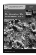 Anālayo The Genesis of the Bodhisattva Ideal 178 pp., 12 illustrations, hardcover, 22,80 EUR ISSN 2190-6769 ISBN 978-3-937816-62-3 (printed version) Band 2

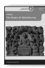 Anālayo The Dawn of Abhidharma 229 pp., 12 illustrations, hardcover, 25,80 EUR
ISSN 2190-6769 ISBN978-3-943423-15-0 (printed version)
Band 3

 Lin, Chen-kuo / Radich, Michael (eds.) A Distant Mirror Articulating Indic Ideas in Sixth and Seventh Century Chinese Buddhism 565 pp., hardcover; 39,80 EUR ISSN 2190-6769 ISBN 978-3-943423-19-8 (printed version)
Band 4

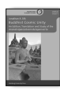 Silk, Jonathan A. Buddhist Cosmic Unity An Edition, Translation and Study of the "Anūnatvāpūrṇatvanirdeśaparivarta" 252 pp., hardcover, 28,80 EUR ISSN 2190-6769 ISBN978-3-943423-22-8 (printed version)
Band 5

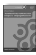

Radich, Michael The "Mahāparinirvāṇa-mahāsūtra" and the Emergence of "Tathāgatagarbha" Doctrine 266 pp., hardcover, 28,80 EUR ISSN 2190-6769 ISBN 978-3-943423-20-4 (printed version) Band 6

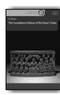

Anālayo The Foundation History of the Nun' Order 278 pp., hardcover, 29,80 EUR ISSN 2190-6769 ISBN 978-3-89733-387-1(printed version)
Band 7

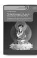 Jim Rheingans The Eighth Karmapa's Life and his Interpretation of the Great Seal A Religious Life and Instructional Texts in Historical and Doctrinal Contexts 243 pp., hardcover, 25,80 EUR ISSN 2190-6769 ISBN 978-3-89733-422-9(printed version)
Band 8

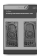

Anālayo Buddhapada and the Bodhisattva Path 180 pp., hardcover, 18,80 EUR ISSN 2190-6769 ISBN 978-3-89733-415-1(printed version)
Band 9

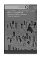

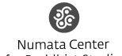 Susan Andrews/Jinhua Chen/Cuilan Liu (eds.) Rules of Engagement Medieval Traditions of Buddhist 522 pp., hardcover, 26,60 EUR ISSN 2190-6769 ISBN 978-3-89733-428-1 (printed version)
The five studies in this volume show unprecedented efforts by each individual contributor to engage in micro-historical research on categories and themes such as lineage, hagiography, and sacred texts in different historical contexts.

Jiang Wu, University of Arizona Communities of Memory and Interpretation is a fascinating collection of wellresearched essays that all feature important methodological reflections in addition to detailed and insightful textual analysis or fieldwork scholarship. The volume consistently highlights the theme of how the respective traditions developed a sense of legitimacy and legacy based on canonicity and the various repetitions and reversals of at times disturbing or perplexing paradigms and exegetical strategies to establish and maintain lineal identity and authority.

Steven Heine, Florida International University

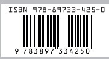

ISSN 2190-6769 ISBN 978-3-89733-425-0 EUR [D] 25,80