The rDzogs-chen master and scholar mKhan-po gZhan-dga' is perhaps best 

known for being unknown. Raised in the vast plains of northern Khams, he came to inherit the scholarly tradition of rDza dPal-sprul Rin-po-che and revitalize the college belonging to rDzogs-chen monastery, in the shadow of the snowcapped Ru-dam mountain range. In the spirit of the non-sectarian movement, students from all traditions of Khams came to learn from him, some following him as he moved on to teach near the capital sDe-dge dGon-chen, to become the tutor of the Tā'i Si-tu incarnation at dPal-spungs and to establish the college at mKhyen-brtse'i-dbang-po's estate near rDzong-gsar. In this way, this scion of nomad nobility eventually became a teacher at the most important centres of the settled communities, a rNying-ma-pa established and respected among the most exalted Sa-skya-pa scholars. gZhan-dga's specific curriculum led to a wave of colleges being founded by his disciples in the rNying-ma, bKa'-brgyud and Sa-skya traditions, effecting a leap in higher education all over the Tibetan plateau. 

The reason for gZhan-dga's fame was at the same time the reason for his invisibility: in order to provide a curriculum for students from all Tibetan Buddhist denominations, he had written his textbooks based on the explanations of Indian Buddhist masters exclusively, without mixing them with even a hair (*spu* 

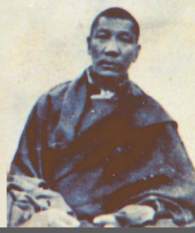

Achim Bayer The Life and Works of mKhan-po gZhan-dga' (1871–1927)
Hamburg Buddhist Studies  11 Series Editors: Steffen Döll | Michael Zimmermann

for Buddhist Studies Achim Bayer The Life and Works of mKhan-po gZhan-dga' (1871–1927)
rDzogs-chen Master and Educational Reformer of Eastern Tibet projektverlag.

Bibliographic information published by the Deutsche Nationalbibliothek The Deutsche Nationalbibliothek lists this publication in the Deutsche Nationalbibliografie; detailed bibliographic data are available in the Internet at http://dnb.d-nb.de.

ISSN 2190-6769 ISBN 978-3-89733-528-8 (E-Book)
ISBN 978-3-89733-495-3 (printed version)
© 2019 projekt verlag, Bochum/Freiburg www.projektverlag.de Cover original design by Benjamin Guzinski; Julia Wrage, Hamburg Cover image: mKhan-po gZhan-dga' (courtesy of mKhan-po Chos-dga')
Dedication Dedicated to Dr. Park Chang-hwan and his family.

| Outline of Contents                                                                                                                                                                                                                                                                                                                                                                                                                                                                                                                                                                                                                                                                                                                                                                                                                                                                                                                                                                                                                                                                                                                                                                                                                                                                                                                                    |
|--------------------------------------------------------------------------------------------------------------------------------------------------------------------------------------------------------------------------------------------------------------------------------------------------------------------------------------------------------------------------------------------------------------------------------------------------------------------------------------------------------------------------------------------------------------------------------------------------------------------------------------------------------------------------------------------------------------------------------------------------------------------------------------------------------------------------------------------------------------------------------------------------------------------------------------------------------------------------------------------------------------------------------------------------------------------------------------------------------------------------------------------------------------------------------------------------------------------------------------------------------------------------------------------------------------------------------------------------------|
| Dedication v List of Illustrations x Foreword by the Editors xi Illustrations xiii Introduction 1 mKhan-po gZhan-dga' and His Time 3 Aim and Method of this Study 8 Acknowledgements 11 Sigla and Technical Notes 12 Abbreviations 13 Part One The Life of mKhan-po gZhan-dga' 17 Chapter 1: Main Biographical Sources 3 Lost or Unavailable Sources 3 Tibetan Sources 4 Sources in Western Languages 16 Persons Interviewed 19 Chapter 2: An Inquiry into gZhan-dga's Life 25 1. Childhood and Youth 25 2. Activities as a Teacher 47 3. Final Retreat and Death 150 Chronological Table of gZhan-dga's Life 180 Part Two The Works of mKhan-po gZhan-dga' 181 Gloss Commentaries on the Thirteen Great Texts 183 How Impartial was gZhan-dga's Choice of Texts? 185 Which Texts Are Counted as the Thirteen Great Texts? 187 Which Texts are Contained in the Corpus Gloss Commentaries on the  Thirteen Great Texts? 190 A Descriptive Catalogue of the Gloss Commentaries on the Thirteen  Great Texts 210 Minor Works of mKhan-po gZhan-dga' 261 Works Published Separately 261 Collections of Minor Works by gZhan-dga' 264 Texts Contained in Zhal gdams 'bel gtam gyi skor according to IBL 268 Three Texts from the Zhal gdams 'bel gtam gyi skor in GNy 279 Texts Contained in the Nyams bzhes rtogs mgur 280 Texts Published Separately 284 |

| Works Wrongly Ascribed to gZhan-dga' 287                                                                                                                                                                                                                                                                                                                                                                                                                                                                                                                                                                                                                                                                                                                                                                                                                                                                                                                                                                                                                                                                                                                                                                                                                                                                                                                                                                                                                                                                                                                                                                                                                                                                                                                                                                                                  |
|-------------------------------------------------------------------------------------------------------------------------------------------------------------------------------------------------------------------------------------------------------------------------------------------------------------------------------------------------------------------------------------------------------------------------------------------------------------------------------------------------------------------------------------------------------------------------------------------------------------------------------------------------------------------------------------------------------------------------------------------------------------------------------------------------------------------------------------------------------------------------------------------------------------------------------------------------------------------------------------------------------------------------------------------------------------------------------------------------------------------------------------------------------------------------------------------------------------------------------------------------------------------------------------------------------------------------------------------------------------------------------------------------------------------------------------------------------------------------------------------------------------------------------------------------------------------------------------------------------------------------------------------------------------------------------------------------------------------------------------------------------------------------------------------------------------------------------------------|
| Part Three: Tibetan Sources 291 On the Lost Three-Volume History of rDzogs-chen Monastery 293 The Biography of gZhan-dga' from the rDzogs chen chos 'byung..293 The Biography of gZhan-dga' from the History of the Khams-bye  Seminary 299 The Biography of gZhan-dga' from the rDzogs chen lo rgyus 301 Coming to dGe-mang 302 Edition of the Collected Works of dPal-sprul 303 sGa Bla-ma 'Jam-dbyangs-rgyal-mtshan's Studies under gZhan-dga' 304 A-'jam's Acting as a Secondary Teacher in rDzogs-chen 306 A-'jam's Impure Vision regarding Blo-gter-dbang-po 307 From Dam-pa Rin-po-che's Biography 308 Acting as a skyor dpon under Blo-gter-dbang-po 310 Coming to dPal-spungs and Teaching 311 dPal-spungs Si-tu's Studies under gZhan-dga' 313 A Visionary Dream before the Departure to rDzong-gsar 313 gZhan-dga's Coming to rDzong-gsar 313 Controversy about gZhan-dga's Tradition in dPal-spungs 314 sGa-ston's Vision of Sa-skya Paṇḍita 314 The Meeting between gZhan-dga' and mDa'-dpon Khyung-ram-pa 315 Khu-nu bsTan-'dzin-rgyal-mtshan's Studies under gZhan-dga' 315 Colophon to the Biography of Blo-gter-dbang-po 315 Appendices 317 Appendix 1: gZhan-dga' on Pramāṇa and Debate 319 gZhan-dga' as a Teacher and Critic of Pramāṇa 319 Approaches to Pramāṇa Before gZhan-dga' 321 gZhan-dga's Own Position 323 gZhan-dga's Disciples: Sa-paṇ's Advice Revisited 325 Debate in gZhan-dga's Tradition 328 Appendix 2: Two Versions of a Fragment from the Divine Music [40]331 Appendix 3: Grong-nyin Bla-ma Tshe-dbang 331 Appendix 4: A Relic of mKhan-chen Padma-rnam-rgyal 332 Appendix 5: sPrul-sku Byang-chub-bzang-po of sKyo-brag 332 Appendix 6: Karma Gu-ru, a Disciple of dBon-stod mKhyen-rab 333 Appendix 7: Abbots of Nyi-ma-lcang-ra according to Nyi lcang 335 Appendix 8: mKhan-po Gang-shar 335 |

| Appendix 9: Zhe-chen mKhan-po Blo-gros-rab-gsal 336 Appendix 10: mKhan-po Ngag-dbang-rnam-rgyal 338 Appendix 11: gZhan-dga's Ordination Lineage 339 Appendix 12: Disciples of mKhan-po gZhan-dga' 340 Appendix 13: Alphabetical List of gZhan-dga's Works 358   |
|-----------------------------------------------------------------------------------------------------------------------------------------------------------------------------------------------------------------------------------------------------------------|
| Bibliography 361 Works in Tibetan 363 Editions of the bKa' 'gyur and bsTan 'gyur 372 Works in Other Languages 372 Index 383                                                                                                                                     |

# List Of Illustrations

Cover image: mKhan-po gZhan-dga' (courtesy of mKhan-po Chos-dga').

1. Main routes through Khams in 1918 (Teichman 1922). 2. Parts of sDe-dge and Nang-chen (map by Karl Ryavec, Treasury of Lives, creative commons).

3. Ser-shul and lDan-khog (Teichman 1922). 4. The Ru-dam range (Teichman 1922).

5. Ser-shul Monastery today (by kind permission of Jan Reurink). 6. Nomad tent below the Ru-dam range (by kind permission of Jan Reurink).

7. The two main *sprul sku*s of rDzogs-chen Monastery in 1947 (Migot 1954). 8. Dam-pa Rin-po-che (courtesy of sKye-dgu Don-grub-gling).

9. dPal-spungs Monastery in 1918 (Teichman 1922).

10. The *a-bra* (pika, mouse hare) in Eastern Tibet (by kind permission of Jan Reurink).

11. Monastic quarters in sKye-dgu Don-grub-gling today (by kind permission of Jan Reurink). 12. A high lama of Don-grub-gling (courtesy of sKye-dgu Don-grub-gling).

13. mKhyen-brtse Chos-kyi-blo-gros, the dPal-spungs Si-tu, gZhan-dga', 'Jam-dbyangs-rgyal-mtshan, probably around 1918 (courtesy of sKyobrag-dgon).

14. The fifth rDzogs-chen Grub-dbang Rin-po-che, the dPal-spungs Si-tu, Ngor Khang-gsar Zhabs-drung Dam-pa Rin-po-che, Ngag-dbang-bsam-gtanblo-gros and mKhyen-brtse Chos-kyi-dbang-phyug with the young prince of sDe-dge (courtesy of Enrico Dell'Angelo's family.)
15. Tibetan general (probably Khyung-ram-pa) in Western clothing. 

Photograph by Eric Teichman, Rong-pa-tsha, September 1918 (Teichman 1922).

16. The letter "e" in Gupta script (wikicommons, public domain).

# Foreword By The Editors

## About Hamburg Buddhist Studies

Ever since the birth of Buddhist Studies in Germany more than 100 years ago, Buddhism has enjoyed a prominent place in the study of Asian religions. The University of Hamburg continues this tradition by focusing research capacities on the religious dimensions of South, Central, and East Asia and making Buddhism a core subject for students of the Asien-Afrika-Institut. The Numata Center for Buddhist Studies is proud to have found a home at one of Europe's pioneering academic institutions. With its *Hamburg Buddhist* Studies book series it honours the University's longstanding commitment to research in the field of Buddhist Studies and aims to share its results with both the academic community and the wider public. Today, Buddhist Studies as an academic discipline makes use of a broad spectrum of approaches and methods. The field covers contemporary issues as much as it delves into the historical aspects of Buddhism. Similarly, the questions shaping the field of Buddhist Studies have broadened. Understanding present-day Buddhist phenomena - and how such phenomena are rooted in and informed by a distant past - is not at all an idle scholarly exercise. Rather, it has become clear that fostering the understanding of one of the world's major religious traditions is a crucial obligation for modern multicultural societies in a globalized world. Accordingly, *Hamburg Buddhist Studies* addresses Buddhism as one of the great humanistic traditions of philosophical thought, religious praxis, and social life. Its discussions will undoubtedly be of interest to scholars of religious studies and specialists of Buddhism, but also aim at confronting Buddhism's rich heritage with questions the answers to which might not easily be deduced by the exclusive use of historical and philological research methods. Such issues require the penetrating insight of scholars who approach Buddhism from a broad range of disciplines, building upon and yet going beyond the solid study of texts and historical evidence.

We are convinced that *Hamburg Buddhist Studies* will contribute to opening up the field to those who may have no training in the classical source languages of the Buddhist traditions but approach the topic against the background of their own disciplinary interests. With this book series, we would like to also encourage a wider audience to take an interest in the academic study of the Buddhist traditions.

## About This Volume

We are pleased to announce this new volume in our series, an in-depth study of a representative of the nonsectarian movement in that florished in Eastern Tibet from the nineteenth century onwards. There is probably no need to emphasize the importance of a nonsectarian approach to religion in the world of today, and there is much we can learn from both the successes and the pitfalls within this movement as traced in Dr. Bayer's research. Combining the results of field work and a thorough reading of the original sources, the author presents both the spiritual and the mundane in a vivid narrative, enriched by analyses ranging from ontological thought to its social conditions.

The subject of this study, rDzogs-chen mKhan-po gZhan-dga' (1871–
1927) gained his fame as the founding principal of institutes for Buddhist higher learning, eventually effecting the establishment of academies all over the Tibetan Buddhist world. Modern readers who follow this critical and intriguing study will find that many challenges mKhan-chen gZhan-dga' faced have lost none of their actuality. mKhan-chen gZhan-dga' spent his life in the disputed kingdoms between the Tibetan plateau and the Chinese lowlands, where Manchu and Chinese forces competed with Britain and Central Tibet for political influence. He was accused of dry intellectualism but remained an avid practitioner and teacher of meditation. His close reading of the original Indian texts resulted in a somewhat reformist view of emptiness, critical of more recent Tibetan interpretations. When this view was in turn criticized, he had to make a choice whether or not to respond in writing. Much like the modern Buddhist scholar, mKhan-chen gZhan-dga' had to deal with questions of intellectual freedom, anti-intellectualism, historicity, elitism, and polemics. With his own particular approach to these questions, mKhan-chen gZhan-dga' made a lasting impact on Tibetan Buddhist intellectual and spiritual life.

Michael Zimmermann and Steffen Döll Illustrations

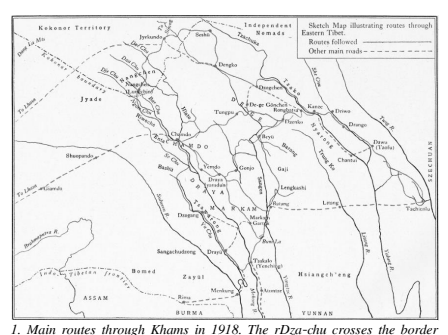

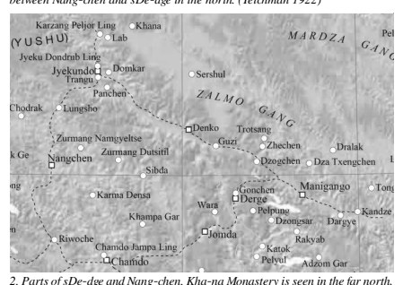

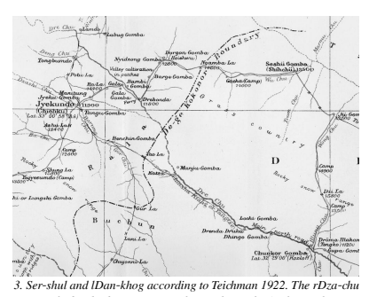

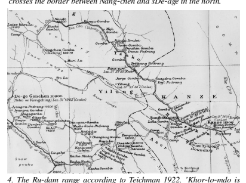

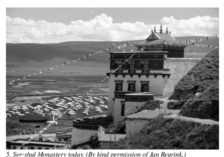

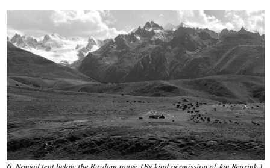

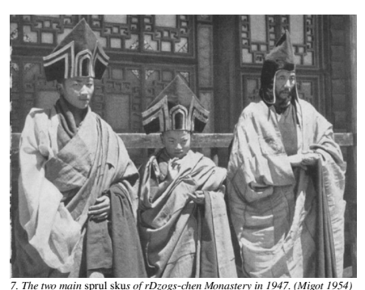

8. Dam-pa Rin-po-che. 

(Courtesy of sKye-dgu Dongrub-gling.)

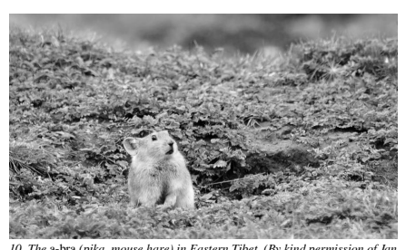

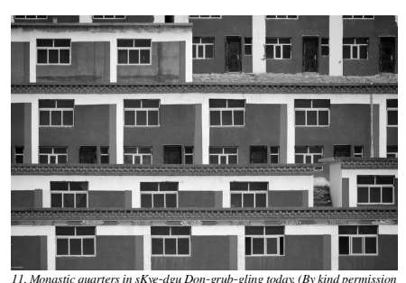

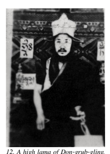

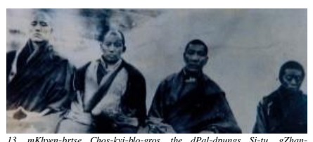

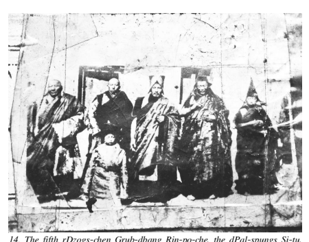

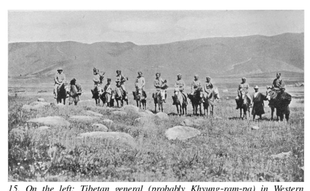

From mKhan-po gZhan-dga's Madhyamaka Prayer

རང་བཞིན་རྣམ་དག་དོན་དམ་ཆོས་ཀི་དབིངས།།
ཡོད་མེད་སོས་པའི་ཡུལ་ལས་རབ་འདས་པ།།
མ་རོགས་ལོག་པར་རོག་པའི་སོན་བསལ་ཏེ།།
ཆོས་ཉིད་བདེན་པ་མངོན་སུམ་མཐོང་བར་ཤོག།
The *dharmadhātu*, completely pure by nature, is entirely beyond the [conceptual] proliferations "existence" and "non-existence." May the fault of not realizing, of obverse concepts, be cleared away, and may I see the truth of the *dharmatā* directly.

ཡོད་དང་མེད་པར་ལྟ་བ་སོས་པའི་མཐའ།།
གཉིས་དང་གཉིས་མིན་འཛིན་པ་ལོག་པའི་བོ།།
མཐའ་བཞིའི་སོས་དང་བྲལ་བ་དབུ་མའི་ལམ།།
མཁས་པས་བསྟན་པའི་དེ་ཉིད་མཐོང་བར་ཤོག།
Viewing [things as] existing and non-existing is the extreme of proliferation. Grasping "both" and "neither" is obverse intellect. May I see the Middle Path, free from the proliferation of the four extremes, the suchness taught by the wise!

Introduction

# Mkhan-Po Gzhan-Dga' And His Time1

A shabbily dressed nomad lama had been wandering alone for some time when he arrived at the large encampment of a wealthy nomad family. He asked at the main tent if he might take shelter for a couple of days. The family said he was welcome to do so, as long as he knew how to read.2 The role that Buddhism played in promoting literacy and higher education in pre-modern Asia is still far from receiving appropriate recognition in modern research. At a time when Europe was still trudging through the Dark Ages, Buddhist higher education found its home in the Gandhāran *vihāra*, a rectangular structure in which the monks' cells formed an outer wall around a courtyard used for inspiration and deliberation. While the early Buddhist order had promoted the ideal of the wandering beggar (bhikṣu, bhik*ṣuṇī*), the vihāra became the home of endowed students, heirs to an ever-increasing number of manuscripts. Accomplished scholars wrote extended treatises on the nature (svabhāva) of mind and the specific natures of different phenomena. In this way, while pursuing the ultimate truth, they also contributed to the advancement of more mundane sciences, including grammar, medicine, architecture, calendrical calculation and statecraft.3 By the fifth century, the m*ahāvihāra*s of Nālandā, Vikramaśilā and elsewhere ranked among the foremost institutions for higher education worldwide, prompting the rulers of the Tang dynasty as well as the dynasties of Tibet, Java, Korea and Japan, to eventually support the importation of Mahāyāna Buddhism into their domains. An Indian script was adapted as a writing system for the Tibetan language, and after the construction of bSamyas Monastery in the eighth century, Buddhist monks helped spread literacy throughout Tibet.

4In a similar way, it was the Buddhist monastic order that brought literacy to Japan and (much later) to Mongolia.

Although the alphabetization of Tibet advanced greatly after the founding of bSam-yas, monastic Buddhism and literacy did not reach many remote areas for more than a thousand years. Remote villages and nomadic groups continued to organize their daily affairs and legal matters based on ancient tribal customs, 5far removed from literacy and, in many areas, from even the most basic teachings of Buddhism.

6 Monasteries often consisted of groups of tents, moving alongside their nomadic donors, with many of the monks somewhat involved in the everyday labour of their lay family members. Even in the greater monastic establishments, some of the lowranking monks could barely read enough to recite the daily rituals.7 After the establishment of dGe-lugs-pa domination over Central Tibet in 1642, the dGe-lugs-pa enlarged their famed colleges, first in the vicinity of lHa-sa, and in eighteenth century in far north-western Bla-brang, bordering the Mongolian cultural sphere. By the nineteenth century, thousands of adepts from all over the Tibetan Buddhist sphere were frequenting the colleges in or near lHa-sa, gZhis-ka-rtse and Bla-brang. The curriculum included an intense study of scholastic treatises but was strongly centred on monastic debate. This had the benefit that monks would challenge each other on memorized content and its understanding, and with this kind of peer learning, large groups of could be instructed simultaneously. In addition, due to the unique system of duplicate positions in the Central Tibetan administration, graduates often served in government positions.8In such contexts, a thorough education in logic and debate would be helpful, as playfully expressed in the Tibetan proverb, "Do not beat a pillar. Do not argue with a *dge bshes*."9 The non-dGe-lugs-pa traditions had their own scholarly traditions and famed scholastic centres, and after 1642, these mostly flourished in the kingdoms and tribal areas outside the reach of the Central Tibetan government, such as the kingdoms of Nang-chen and sDe-dge in Eastern Tibet. mKhan-po gZhan-dga' (1871–1927) was mostly active in the kingdom of sDe-dge, where the royal family supported monasteries of mainly the Saskya, rNying-ma and bKa'-brgyud traditions. There had been brilliant scholars in sDe-dge for centuries, most notably Si-tu Paṇ-chen Choskyi-'byung-gnas (ca. 1700–1774), head of dPal-spungs, the most important Karma bKa'-brgyud monastery outside Central Tibet. Of course, sDe-dge has had its own share of sectarian strife, most notably in 1798 when the Saskya-pa ousted a rNying-ma faction from the palace monastery at sDe-dge dGon-chen.

10 At the time, five monasteries were designated to provide the royal chaplain (*dbu bla*) for the House of sDe-dge. Four among those belonged to rNying-ma tradition, one (dPal-spungs) to the bKa'-brgyud-pa, while the palace monastery itself followed the Sa-skya tradition.11 In the latter half of the nineteenth century, the Sa-skya-pa dignitary mKhyen-brtse'i-dbang-po (1820–1892) contributed greatly to dialogue and exchange between various religious traditions of sDe-dge. Born into one of the most influential families of the kingdom, he was raised as a *sprul sku* of the Sa-skya-pa order but soon took an active interest in rNying-ma doctrines. 

Pursing his studies in the rNying-ma monastery Zhe-chen, he lived together with the rNying-ma reincarnation rDza dPal-sprul (1808–1887) as well as 'Jam-mgon Kong-sprul (1813–1899), who had come from a Bon-po background but was eventually recognised as a Karma bKa'-brgyud *sprul sku*. 

These three dorm mates later became known at the founders of the Ris-med movement, and together with the *gter ston* mChog-gyur-gling-pa (1829–
1870), they would greatly reinvigorate the religious traditions of Eastern Tibet.

12 Although the Ris-med founders had been outstanding scholars and visionaries, after their passing in the late nineteenth century, there was still a lack of institutions that systematically provided higher scholastic education. 

The monastery of dPal-spungs, for example, had been the seat of two brilliant and innovative authors, Si-tu Paṇ-chen and Kong-sprul. Nonetheless, even though Si-tu's writings were preserved there, they were taught to just a small circle of monks. As for Kong-sprul, he had mostly lived in a retreat house outside the main monastic building, and the number of his long-term disciples was limited. When he passed away in 1899, his disciple mKhan-chen bKrashis-'od-zer (1836–1910) found himself in charge of dPal-spungs Monastery and the upbringing of young *sprul sku*s, such as the eleventh Si-tu, leaving little time for teaching larger groups systematically.

13 Among the few monasteries that operated colleges for higher education, the rNying-ma monastery of rDzogs-chen maintained the Śrī-Siṃha college, founded in the mid-nineteenth century by rGyal-sras gZhan-phan-mtha'-yas
(ca. 1800 until ca. the 1860s), a teacher of rDza dPal-sprul. After its inauguration, Śrī-Siṃha had flourished for some time, and even dPal-sprul taught there for a while. Nonetheless, dPal-sprul was discontent with a lack of discipline at the monastery and left the college prematurely (probably in the early 1880s). Thus, the college did not always operate in the way envisioned by its founder.

It is said that a royal dynasty proves its stability in the third generation:
while an ambitious and able conqueror might set up a dynasty, and while his immediate offspring might easily persist in the shadow of his achievements, the third generation demonstrates whether or not a lasting administration has been established. We can also apply this pattern to the Ris-med movement.

The four charismatic founders had left a rich legacy, upheld by their disciples such as 'Ju Mi-pham (1846–1912) and mKhan-chen bKra-shis-'od-zer
(1836–1910).

Around the turn of the century, when mKhan-po gZhan-dga' (1871–
1927) began his teaching career, the first Ris-med generation had passed away, and the second generation was looking for successors. gZhan-dga' was, to be sure, an accomplished scholar and a charismatic teacher. His particular strength, though, lay in the organization and systematization of nonsectarian learning. The time had come to stabilize and preserve the Ris-med legacy.

Down to the present day, gZhan-dga' is most remembered for setting up highly organized colleges with a strict monastic discipline and for devising a systematic curriculum for Buddhist higher education. The textbooks for his new curriculum were collected as his *magnum opus*, the corpus Gloss Commentaries on the Thirteen Great Texts. The tradition that gZhan-dga' represented differed from the dGe-lugs-pa colleges not only in its nonsectarian approach but also in its approach to teaching and studying. dGelugs-pa establishments focused mostly on scholastic debate (*rtsod pa*) so that their respective textbooks (*yig cha*) were essentially debate manuals. They thus stood in the Tibetan tradition of "debating colleges" (rtsod *grwa*). In contrast, the tradition of "explanation colleges" (*bshad grwa*) focused on the explanation (*bshad pa*) of the original texts directly.

14 The terms *bshad grwa* and *rtsod grwa* are not necessarily antonymous,15 and elements of both traditions can be traced back to the highly influential bKa'-gdams-pa college of gSang-phu Ne'u-thog.

16 Nonetheless, the dGelugs-pa students devoted most of their time to debate, and by gZhan-dga's time, rDza dPal-sprul and others had witnessed and pointed out the pitfalls of misapplied debating.17 Thus, studies at gZhan-dga's "explanation-colleges" were markedly different from the "debating-college" tradition of the dGelugs-pa.

18 While in debate college, a student's knowledge was continually tested prolonged and vigorous debates, the atmosphere in a teaching college was more serene: in the morning class, the master teacher (*mkhan po*) would explain a certain passage of the text, while in the afternoon, students would repeat and discuss the passage with a tutor (*skyor dpon*, "revision master"), 
after which they would review the passage alone until they had a good command of the subject matter. In the main class of the following day, a student was chosen by lot who had to assume the role of the teacher and explain (*bshad*) the material to the whole class and the *mkhan po*. Only when this was accomplished would the *mkhan po*'s teachings on the new textual passage start.

Though aware of the above reservations against debate, many non-dGelugs-pa teachers, even in gZhan-dga's tradition, reserved some amount of time to debate and a number of scholars in sDe-dge emerged as strong debaters. For example, rDza dPal-sprul (1808–1887), after having received the training of a *sprul sku* for several years, famously won a court case for his estate (bla brang) while still a teenager. He disengaged from scholarly debate in his later years but retained his ability to defeat challengers when necessary.19 Since the debates about debate (and logic) are of crucial importance for Tibetan Buddhist education, gZhan-dga's views on these issues will be discussed separately in an appendix.

20 Debate aside, the real strength and lasting impact of gZhan-dga's method lay in the choice of texts for his curriculum: he included only Indian treatises 
(*śāstra*s) that were considered canonical by all traditions of Tibetan Buddhism. Since he avoided all autochthonous Tibetan commentaries (in the core curriculum), monks from all Tibetan denominations could study together in peace, leaving aside the many disputes occurring in Tibet about the interpretation of those *śāstr*as. This does not mean that gZhan-dga' did not have his own views on disputed issues (such as the tenets of Tsong-khapa and Dol-po-pa). In fact, his strong opinions did lead him at least once into trouble, as will be discussed in the section concerning his term in dPalspungs. Still, his basic approach as a writer of gloss-commentary textbooks allowed all students to gain a firm understanding of the Indian treatises, regardless of their own personal views or denomination. In his function as a nonsectarian author, teacher and founding principal, gZhan-dga' had an enormous impact on Tibetan intellectual life, first directly in Eastern Tibet and then indirectly through his students who went to teach in Central Tibet, throughout the Himālaya (including Bhutan, Ladakh and Mustang).

After 1959, it became clear that the immense knowledge of Tibetan scholars should be integrated into the framework of modern academia, and when the Central Institute for Higher Tibetan Studies was established in Sārnāth in the 1970s, there was a need for a curriculum that allowed students from all traditions to study together. Quite naturally, gZhan-dga's curriculum was taken into account and some of his gloss commentaries were used in class.

21 As it were, this approach has since allowed students to pursue comprehensive studies of Indian Buddhist thought in their first study years before proceeding to separate courses depending on their denomination, with their separate texts.

## Aim And Method Of This Study

Reliable accounts state that mKhan-po gZhan-dga' never wanted his biography to be written,22 which conforms to his approach as an authorinvisible behind the lines of the Indian commentaries he edited. It was mainly 
 
20 See "Appendix 1: gZhan-dga' on Pramāṇa and Debate." 21 brTson-'grus-seng-ge (interview, Bir 1997). 22 See *Saint in Seattle*, p. 584, n. 88.

due to this reason that in the first decades after 1959, no extensive biography of his was found or written, and it is not quite clear whether such a biography existed previously. Even though it is commonplace for a scholar in modern historiography to ignore such requests not to write, it may be worth recognizing that this research includes, to some extent, a breach of our protagonist's will and privacy.

With this in mind, we may also note that several accounts of gZhan-dga's life have already been written, of an increasing length as time progressed. While this does not settle the ethical issue conclusively, we might further consider that the present study is not a biography in the style of the 
"complete-liberation" (*rnam thar*) genre, presenting only the favourable sides of the protagonist. This study is therefore not the *rnam thar* that gZhan-dga' did not want to be written: in a work of modern critical scholarship, it is a priori assumed that agents are neither wholly "good" nor "evil" but acting on a variety of motives, many of which we cannot know. This approach necessitates the investigation of issues that might be considered "impure"
(*ma dag pa*) in the *rnam-thar* genre, and researchers in the field will know that this investigation is one of the most challenging aspects of writing Tibetan history. A *rnam thar* aims at reproducing a "pure appearance" (dag snang) of the protagonist, 23 and indeed, in many cases, it is probably wise to let the past be past. Nonetheless, modern historiography aims at a nonjudgmental understanding of motives and actions, in order to understand the real cause–effect relations of historical events.

Though conceived as a work of critical scholarship, this study might contain a certain imbalance, being primarily based on *rnam-thar* sources. In some episodes, it might appear as if the public *persona* was the "real" person, in accordance with the sources used. On the other hand, when there is reason to suspect that an inauspicious event might have been underrepresented in the traditional sources, the necessary search for truth might direct a disproportionate amount of attention to the event. In reality, the same event may have been somewhat displeasing but of no special import. For example, the relation between gZhan-dga' and the sKu-zhabs dGe-mang of Śrī-Siṃha might have been completely harmonious, or possibly, there might have been some frictions because both were considered reincarnations of rGyal-srasgzhan-phan-mtha'-yas. We simply do not know. In such cases, the available data will be evaluated in some detail, which may impede the readability and pacing of the narrative. It is hoped that such detailed assessments will serve as useful complements to the available overviews on gZhan-dga's life. 

In the case of less auspicious historical events, analysis is conducted aiming at understanding rather than moral judgment. It is sympathetically assumed that all historical agents acted in accordance to what seemed right to them in their particular place and time. This (ideally) non-judgmental approach acknowledges that actions which are rightly sanctioned among modern critical scholars might have been appropriate in their place and time. 

Some passages may suggest that agents did not always act out of pure altruism, but in the frame of this study, this is not necessarily seen as a personal shortcoming but as a legitimate part of human nature. It can have beneficial effects, even in cases when striving for mundane benefits is only thinly veiled as "skill in means" (*thabs la mkhas pa*).

The above is not to say that all traditional sources focus only on the positive. For example, although the first 'Jam-mgon Kong-sprul belongs to the dignitaries who wrote an autobiography, his style is rather factual without praising or denigrating himself.24 In a similar way, we find a commitment to factuality and completeness in the recent biography of mKhyen-brtse Choskyi-blo-gros, commissioned by the current rDzong-gsar 'Jam-dbyangsmkhyen-brtse (b. 1961) s.

25 In preparing the present study, these sources were an invaluable help for explaining otherwise inexplicable events. This biography is thus not meant as a mere collation of traditional sources, but as a critical in-depth assessment of the historical questions. Nowadays, readable overviews on gZhan-dga's life are readily available, and I have to ask the reader to follow me through the more complicated and ambiguous aspects of gZhan-dga's outstanding career.

## Acknowledgements

Work on this book was begun more than twenty years ago in preparation for a Magister thesis at the University of Hamburg. At the time, my advisor Professor David Jackson had already intensively researched the biography his teacher sDe-gzhung Rin-po-che (1906–1987),26 who had been a research informant at the University of Washington and in this way become a most influential figure (in the purely scholarly sense) in modern Tibetology. As a youth, sDe-gzhung Rin-po-che had studied with mKhan-po gZhan-dga' and gZhan-dga's disciples, so we decided upon gZhan-dga' as the focus of my research. From that time on, David Jackson accompanied with his expertise all the different stages of my research and generously provided me with his unpublished drafts and rare works from his private collection. This unsparing support went far beyond his official duties as an academic advisor, for which I am profoundly grateful. For many years, I have been unable to repay his kindness by a timely publication of this book, which he always eagerly hoped to see in print.

In the summer of 1997, I visited Dil-mgo mKhyen-brtse's seat in Bauddhanāth and was introduced to a friendly but little-known monk by the name of Matthieu Ricard. He presented me with as yet unpublished sources on the lives of Dil-mgo mKhyen-brtse and rDza dPal-sprul,27 and I can only express my sincere gratitude. Furthermore, the late mKha-'gro Tshe-ringchos-sgron gracefully answered my questions in the palace garden of Gangtok, and rDzogs-chen mKhan-po Chos-dga' of the rGya-kong family sent me a most encouraging and informative letter. The present publication will hardly be enough to express my appreciation for all the kindness and assistance I received.

Scholars from the Tibetan cultural sphere, many of them heirs to gZhan-dga's tradition, have enriched this work in a fundamental way through their comments and explanations, and I can only mention a few of them here: 
Khang-dkar Tshul-khrims-skal-bzang, rDo-rje-dbang-phyug, bKra-shistshe-ring, mKhan-chen Khra-'gu Rin-po-che, the late mKhan-po Kun-dga'-
dbang-phyug, Nub-pa Rin-po-che, the late Ban-chen bsTan-dga' Rin-po-che, rDzogs-chen dPon-slob Rin-po-che, bsTan-'dzin-shes-rab, Bla-ma bSodnams-'byor-'phel and Bla-ma bsTan-rgyal. Acknowledgements are also due to Douglas Duckworth, Franz-Karl Ehrhard, the late Felix Erb, Antonio Ferreira-Jardim, Ingo Hainke, Jörg Heimbel, Slava Komarowski, Ralf Kramer, Klaus-Dieter Mathes, Carmen Meinert, Katsumi Mimaki, Giacomella Orofino, Sigrid Pietsch, Burkhard Quessel, Lambert Schmithausen, Iain Sinclair, Jörg Sittig, Ye-shes-rgya-mtsho and many others.

In spite of this generous support, this book is not flawless, and all shortcomings are purely the author's responsibility. Finally, I would like to express my sincere gratitude for a publication subsidy received through the research institute of Kanazawa Seiryo University in the fiscal year 2019.

## Sigla And Technical Notes

When the date of a certain event is only known by its year in the Tibetan lunar calendar (not by month and day), the corresponding year in the Gregorian calendar can only be determined with an overlap of about two months. In line with common usage in our field, this overlap remains unmentioned, and only the Gregorian year in which the Tibetan year starts is referred. As different from common usage, terms of reign are marked with the letter "r." and otherwise, the dates of kings or regents refers to their years of birth and passing. 

Numbers in [brackets], usually placed after the title of a work by gZhan-dga', are the numbers assigned to that work in the descriptive catalogue. 

Numbers in {braces}, usually after a person's name, indicate the number in the list "Appendix 12: Disciples of mKhan-po gZhan-dga'." For editions and translations of the Indian *śāstra*s mentioned in the catalogue, kindly refer to Tsukamoto et al. (1990), Martin (2014) or Potter (2017).

The Tibetan *dbu can* and *dbu med* scripts have been transliterated mostly in accordance with the system for which Snellgrove (1957: 300) claims credit, basically corresponding to the well-known Wylie system. The prefix འ is rendered by an apostroph and appears before A in alphabetical lists, for technical reasons. In the bibliography, Tibetan terms have been rendered in the Snellgrove system even in cases where publishers provide the titles in another system, and errors in the publisher's data have been corrected without notice. Since some libraries have taken to transliterating these titles into their own in-house systems, a bit of morphological ingenuity may be needed in any case when searching for them in a catalogue.

Tibetan texts are edited in a rather "diplomatic" style, proposing emendations in the apparatus rather than in the main body of the text. The reason for this approach is to facilitate identifying a specific edition of gZhan-dga's works based on the exact (mis-)spellings of the colophon. In the editions, words that are not clearly legible appear underlined, and for illegible characters an asterisk (*) is inserted. The editorial notes found in the manuscript of *Nyi lcang* are shown in *italics*, words that have been crossed out by the editor in crossed out letters. Personal names and place names in Tibetan text are set off in **bold**. For reasons of space, *shad* is inserted directly after the Tibetan syllable, also after the graph nga, while a *shad* in square brackets is supplied after ga. When a double *shad* is divided by a page break or a graph in the original text, it is divided in the edition and otherwise treated as a unit.

## Abbreviations

| ACIP                        | Asian Classics Input Project                                                                        |                                  |    |     |         |         |    |     |
|-----------------------------|-----------------------------------------------------------------------------------------------------|----------------------------------|----|-----|---------|---------|----|-----|
| Brilliant Moon              | Dil-mgo mKhyen-brtse (2008).                                                                        |                                  |    |     |         |         |    |     |
| ChG-ChJ                     | mKhan-po Chos-dga', "Chos rje dam pa rdzogs  chen mkhan chen ..."                                   |                                  |    |     |         |         |    |     |
| CKh                         | Edition of gZhan-dga's main commentaries with a  colophon by bCo-brgyad Khri-chen Rin-po-che.       |                                  |    |     |         |         |    |     |
| D                           | Text                                                                                                | number                           | in | the | sDe-dge | edition | of | the |
| bKa' 'gyur and bsTan 'gyur. |                                                                                                     |                                  |    |     |         |         |    |     |
| DP                          | Edition of                                                                                          | gZhan-dga's main commentaries by |    |     |         |         |    |     |
| lDan-ma sPrul-sku           |                                                                                                     |                                  |    |     |         |         |    |     |
| Enlightened Vagabond        | Ricard (2017)                                                                                       |                                  |    |     |         |         |    |     |
| GNy                         | A collection of minor works by gZhan-dga' edited  by rGyal-dbang-nyi-ma.                            |                                  |    |     |         |         |    |     |
| IBL                         | Edition of gZhan-dga's Zhal dams 'bel gtam gyi skor in the Indo-Tibetan Buddhist Literature Series. |                                  |    |     |         |         |    |     |
| Khams bye                   | Blo-gros-phun-tshogs, Khams bye bshad grwa'i lo  rgyus mdo tsam brjod pa.                           |                                  |    |     |         |         |    |     |
| KH                          | dKon-mchog lHa-bris-pa's                                                                            | edition of gZhan-dga's           |    |     |         |         |    |     |
| main commentaries.          |                                                                                                     |                                  |    |     |         |         |    |     |
| KH-kośa                     | Separate edition of gZhan-dga's Chos mngon mdzod  kyi mchan 'grel, edited by dKon-mchog lHa-brispa.                                                                                                     |                                  |    |     |         |         |    |     |

| KhS                                                                                                     | Edition of gZhan-dga's main commentaries from  the Khrong-gsar-rdzong.                                   |                          |             |             |              |
|---------------------------------------------------------------------------------------------------------|----------------------------------------------------------------------------------------------------------|--------------------------|-------------|-------------|--------------|
| Man                                                                                                     | Edition                                                                                                  | of                       | gZhan-dga's | main        | commentaries |
| produced at the rGya-re House in Manālī.                                                                |                                                                                                          |                          |             |             |              |
| NyC-Kh                                                                                                  | Nyi-ma-lcang-ra                                                                                          | edition                  | of          | gZhan-dga's | main         |
| commentaries, reedited by mKho-chen sPrul-sku.                                                          |                                                                                                          |                          |             |             |              |
| Nor bu'i ljon bzang                                                                                     | Zur-mang bsTan-'dzin sPrul-sku and Ku-se gSerljongs mKhan-po 'Jam-dbyangs-dge-legs, Kun  gzigs rdo rje 'chang ….                                                                                                          |                          |             |             |              |
| NySKCh                                                                                                  | Thub-bstan-rgyal-mtshan, rNying ma gsung 'bum  dkar chag.                                                |                          |             |             |              |
| Nyi lcang                                                                                               | mKhan-po rTogs-grol, [dBur stod 'bri gung nyi  lcang bshad grwa'i lo rgyus rags bsdus dad pa'i sa  bon.] |                          |             |             |              |
| P                                                                                                       | Text number in the Peking edition of the bKa' 'gyur and bsTan 'gyur.                                     |                          |             |             |              |
| PJ-JCh                                                                                                  | Edition of gZhan-dga's sPyod 'jug mchan 'grel with  a colophon by 'Jam-dbyangs-chos-kyi-rgyalmtshan.                                                                                                          |                          |             |             |              |
| PP-Th                                                                                                   | Reprint of the Phar phyin 'grel mchan                                                                    | from the                 |             |             |              |
| dPal-spungs                                                                                             | edition,                                                                                                 | published                | from        | Thimphu,    |              |
| Bhutan.                                                                                                 |                                                                                                          |                          |             |             |              |
| rDzogs chen chos 'byung                                                                                 | sMyo-shul mKhan-po 'Jam-dbyangs-rdo                                                                                                          |                          |             |             |              |
| rje, Rang bzhin rdzogs pa chen po'i chos 'byung  rig 'dzin brgyud pa'i rnam thar...                     |                                                                                                          |                          |             |             |              |
| rDzogs chen lo rgyus                                                                                    | rGyal-dbang-chos-kyi-nyi-ma, mDo khams rdzogs  chen dgon gyi lo rgyus                                    |                          |             |             |              |
| Sa skya lo rgyus                                                                                        | gDong-thog                                                                                               | bsTan-pa'i-rgyal-mtshan, | Byang       |             |              |
| phyogs thub pa'i rgyal tshab dpal ldan sa skya pa'i  bstan pa rin po che ji ltar byung ba'i lo rgyus... |                                                                                                          |                          |             |             |              |
| Saint in Seattle                                                                                        | Jackson (2003).                                                                                          |                          |             |             |              |
| ShG                                                                                                     | Edition of gZhan-dga's dBu 'jug mchan 'grel by  Shes-rab-rgyal-mtshan.                                   |                          |             |             |              |
| ST                                                                                                      | Edition of gZhan-dga's main commentaries from  the Sems-rtogs-kha College, Bhutan.                       |                          |             |             |              |
| TBRC                                                                                                    | Resource code of the Tibetan Buddhist                                                                    | Resource                 |             |             |              |
| Center.                                                                                                 |                                                                                                          |                          |             |             |              |
| Tshig mdzod chen mo                                                                                     | Zhang Yisung (张怡荪) et al., eds., Bod rgya tshig  mdzod chen mo.                                       |                          |             |             |              |

Part One The Life of mKhan-po gZhan-dga'

## Chapter 1: Main Biographical Sources

As mentioned in the introduction, gZhan-dga' himself is reported to have ordered his students not to write his biography, 28 and in downplaying his own biography, he was not alone among Ris-med scholars. For example, rDza dPal-sprul and mKhyen-brtse'i-dbang-po did not comply with requests to write their autobiographies.

29 mKhyen-brtse'i-dbang-po once composed a biographical poem in reverence of dPal-sprul's achievements, but when the latter heard of it, he was so displeased that he walked out of his teaching session and disappeared for several days. Nonetheless, mKhyen-brtse'idbang-po's verses were of great benefit for Kun-dpal, gZhan-dga's teacher and companion, who used them as the base for his more extensive biography of dPal-sprul.30 There is, after all, value in recording these lives.

## Lost Or Unavailable Sources

Regardless of gZhan-dga's opposition, one of his most active students, dBonstod mKhyen-rab-chos-kyi-'od-zer (late 1800s–1958), 31 is said to have written such a detailed biography. Blo-gros-phun-tshogs refers to this work, saying:
An extensive biography of this master written by dBon-stod mKhyenrab exists, but due to the change in times I could not obtain any copy [of it]. That is why, although [gZhan-dga'] certainly had an inconceivably [great] spiritual career, I could not come up with more to write [about him] than just this. [The lost biography] is something that is worth looking for in the future by the scholars of his tradition.32 Jackson (2003: 584, n. 98) mentions that sDe-gzhung Rin-po-che, too, had heard of this biography but never seen it. My search for this text in India, Nepal, China and Tibet did not yield any clues as to its present whereabouts. 

Most enlightening were mKhan-po Kun-dga'-dbang-phyug's remarks about his own search for this text. After his release from prison in 1980, he had searched for it both in Tibet and later among the exile community. He finally approached Dil-mgo mKhyen-brtse Rin-po-che {33}, who told him: "I have looked for it everywhere and couldn't find it."33 This convinced me that any further search on my side was futile. Unfortunately, it cannot be affirmed with certainty that such a work ever existed. It is possible that mKhyen-rab-'odzer's praise to gZhan-dga' ("Rigs brgya'i khyab bdag...") might have been the basis for rumours about an extensive biography.

Still, it is not at all impossible that a work of Tibetan hagiography could have disappeared in the course of the destructions that PLA takeover and the Cultural Revolution brought about.

34 This is what happened to another potentially important source, the three-volume history of rDzogs-chen Monastery. Entitled Grub dbang rdzogs chen po'*i gdan rabs chen mo*, it had been composed by three *mkhan po*s of rDzogs-chen, gZhan-dga's disciples Thub-bstan-snyan-grags {23}, Padma-tshe-dbang {31} and Ngag-dbangnor-bu {30}. These details of the *gDan rabs chen mo* are narrated in the introduction to a recent history of that monastery, *rDzogs chen lo rgyus*,
35 and no amount of effort by the scholars of the rebuilt and thriving rDzogs-chen Monastery could retrace it. The last copies may well have vanished in the flames of rDzogs-chen Monastery, when it was burned down during the Cultural Revolution.

36 Furthermore, several of the extant sources such as the autobiography of mKhan-chen Padma-rnam-rgyal {13}, could not be accessed. sGa Karma Don-grub-phun-tshogs, a contemporary scholar from Zur-mang, used this source for writing his short biography of Padma-rnam-rgyal {13} (contained in id., *Khams sgom sde...*, pp. 642–645), but I could not gain access to it.

37 The present biography and bibliography of gZhan-dga' is thus by no means definitive and an invitation to later scholars for further research.

## Tibetan Sources

Since the most extensive sources on gZhan-dga's life have only appeared rather recently, over the last three decades, the sources below are listed with a chronological distinction between sources that had been composed before 1959 and were mainly first- or second-hand accounts, as different from those that were written in exile or after a hiatus of several decades. Many of the accounts used for this study are of the latter type. In the biographical part of this book, the reliability of the different sources cannot be discussed in every passage, so the reader is asked to kindly consider the differences in the date and background of the sources, as outlined below.

## Works Composed Before 1959

(1) bSam-gtan-blo-gros, gSang bdag rdo rje 'dzin pa 'jam dbyangs blo gter dbang po'i rnam par thar pa cha tsam brjod pa mchog sbyin sgo gsum rang grol dge legs nor bu'i *ljon bzang* skal bzang lha yi dga' ston.

A biography of Blo-gter-dbang-po (1847–1914) composed by bSam-gtanblo-gros (1868–1931) {62} in lHun-grub-steng and completed in August 1924. The author was urged to write this biography by mKhyen-brtse Choskyi-blo-gros (1893–1959), 'Jam-dbyangs-thub-bstan-dge-legs, 38 Rab-shis sPrul-sku 'Jam-dbyangs-skal-bzang-rnam-rgyal and 'Jam-dbyangs-lungrigs-sengge.

39 The Central Tibetan general bKras-mthong mDa'-dpon 'Gyurmed-rgya-mtsho (1890–1938) sponsored the carving of the xylographs,40 as he had been requested by 'Jam-dbyangs-chos-kyi-blo-gros.

41 bSam-gtan-blogros was a highly respected resident dignitary in sDe-dge dGon-chen at the time and in a way Blo-gter-dbang-po's successor. That both mKhyen-brtse Chos-kyi-blo-gros and a Central Tibetan general were involved in the production of this biography shows that it was a work of highest significance.

gZhan-dga' is mentioned in this text in connection with Blo-gter-dbang-po's teaching retreat in La-sye-sgang, above sDe-dge dGon-chen (1909–1910).

pa'i glegs bam rnams kyi dkar chag chos tshul rnam par 'byed pa'i zla snang.

The life of the Fifteenth Karma-pa mKha'-khyab-rdo-rje (ca. 1871–1922) is treated in the first half of this work, 42 while a catalogue of his collected works makes up the second half. About the process of composition, the colophon seems to suggest that Be-ri mKhyen-brtse (dPal-spungs mKhyen-brtse) 'Jam-dbyangs-mkhyen-brtse'i-'od-zer, also called Blo-gros-mi-zadbyams-pa'i-go-cha-'od-zer-dri-ma-med-pa'i-dpal (1896–1945) oversaw the production of printing blocks for the collected works in dPal-spungs. 43 It seems that the biography and catalogue (including the colophon) were then finalized by the son of the Fifteenth Karma-pa, Kar-sras Kong-sprul (1904–
1953), whose name mKhyen-brtse'i 'od-zer resembles that of Be-ri mKhyenbrtse.44 The question of authorship is thus complicated by the fact that both had partly the same name. Even if the ascription of the colophon to Kar-sras Kong-sprul is correct, both seem to have collaborated a great deal on the project. The work was completed it in 1933, that is, one year after a war about Be-ri mKhyen-brtse's monastery had brought sDe-dge under Chinese Republican control.

The biography contains an important letter, said to be of the the Fifteenth Karma-pa, to Be-ri mKhyen-brtse. This is one of the few pre-1959 texts that indicate the Karma-pa's disagreement with gZhan-dga's tradition in dPalspungs. I am grateful to mKhan-chen Khra-'gu Rin-po-che for pointing me to the letter and to the problems concerning the authorship of biography and catalogue. As will mentioned again in the section on gZhan-dga's teaching in dPal-spungs, Thub-bstan-phun-tshogs kindly informed me about doubts concerning the authorship of the letter.

(3) 'Jam-dbyangs-kun-dga'-bstan-pa'i-rgyal-mtshan [A-'jam Rin-po-che], *rJe bla ma rdo rje 'chang ngag dbang kun dga'* 
legs pa'i 'byung gnas ye shes dpal bzang po'i rnam par thar pa ngo mtshar n*or bu'i phreng ba*.

This biography of sGa-ston Ngag-dbang-legs-pa (1864–1941) was written in 1942 at rDzong-gsar bKra-shis-lha-rtse. The author, A-'jam Rin-po-che
(1885–1953),45 is counted as one of the foremost disciples of both sGa-ston and gZhan-dga'.46 The Indian edition of 1981 at my disposal is a photo-offset reproduction of a handwritten text in *dbu can*. This latter was prepared on the basis of a sDe-dge print.

The text was prepared for publication by A-'jam's disciple gDong-thog bsTan-pa'i-rgyal-mtshan from Tre-hor.

47 Living at the time in America, gDong-thog Rin-po-che had his attendant, mGon-po-rdo-rje, make the final arrangements in India wherefore mGon-po-rdo-rje is officially named as the publisher. gZhan-dga' is mentioned in this source in connection with two visionary dreams that sGa-ston had of him and with a subsequent meeting between the two.

(4) Zur-mang bsTan-'dzin sPrul-sku and Ku-se gSer-ljongs mKhan-po 'Jam-dbyangs-dge-legs, *Kun gzigs rdo rje 'chang* skyabs mgon tā'i si tu padma dbang mchog rgyal po'i rnam thar cha tsam *brjod pa ngo mtshar nor bu'i ljon bzang*. [Abbreviation: *Nor bu'i ljon bzang*.]
region even an interim regent for a short time. This part is a major source for gZhan-dga's invitation to dPal-spungs and his activity there. Zur-mang bsTansprul {70},
48 the author of this part, mainly based his record upon his own memory and, additionally, Grong-bsnyen 'Jam-dbyangs-chos-kyi-rgyalmtshan's oral accounts of several events.

49 It was written upon the request of the business manager (*phyag mdzod*) of Si-tu Rin-po-che, Bla-ma Co-ga (*Nor* bu'i ljon bzang, p. 158), who then oversaw the production of the printing blocks (*Nor bu'i ljon bzang*, p. 255). The Gangtok edition is a clear reproduction of a print from the dPal-spungs blocks.50 According to the short preface in English, it was obtained from the library of dPal-spungs dBonrgan sPrul-sku and had been printed shortly before dBon-rgan sPrul-sku left Tibet. 

The second part, beginning with fol. 80 (p. 159), relates Si-tu's life from 1940 on, up to his death and funeral in 1952. It was composed, based on thorough research, by 'Jam-dbyangs-dge-legs-dpal-bzang-po, a scholar 
(*mkhan po*) of the Ku-se gSer-ljongs Monastery.

51 Naturally the second part contains less information relevant to gZhan-dga'.52
(5) 'Phrin-las-chos-'phel, sKye-rgu mKhan-po, *rJe bla* ma 'jam dbyangs kun dga' bstan pa'i rgyal mtshan gyi rnam par thar pa byin rlabs rgya mtsho ngo mtshar gter mdzod.

'Phrin-las-chos-'phel completed this biography of A-'jam Rin-po-che in spring of 1955, about two years after A-'jam died.53 He describes at length the difficulties he had in obtaining information on his master's life since the modest A-'jam had discouraged his students from writing his biography. 

A-'jam was not in good health in his later years. When 'Phrin-las-chos-'phel started his research, A-'jam rather "focused on meditation practice and caring for his students," which is probably to say that he was not enthusiastic about 'Phrin-las-chos-'phel's project. Under such circumstances, 'Phrin-laschos-'phel began to question the usefulness of his efforts, so that mKhyenbrtse Chos-kyi-blo-gros and encouraged him to complete this project.54 As we find so often, the author did his best in collecting anecdotes and records of specific transmissions but could not always arrange them in a clear chronological order. At an early stage of this work, David Jackson kindly provided me with his draft translations of the pertinent passages, many of which were later included in *Saint in Seattle*.

## Works Composed After 1959

(1) gDong-thog bsTan-pa'i-rgyal-mtshan, *Byang phyogs thub* pa'i rgyal tshab dpal ldan sa skya pa'i bstan pa rin po che ji ltar byung ba'i lo rgyus rab 'byams zhing du snyan pa'i sgra dbyangs: A History of the Sa skya pa Sect of Tibetan Buddhism. 

[Published 1977, abbreviation: *Sa skya lo rgyus*, English translation: Dhongthog 2016.]
As a collection of condensed biographies without an interconnecting narrative, gDong-thog's modern work on the Sa-skya lineage follows a traditional scheme in Tibetan historiography, similar to the *gdan rabs*
(succession of abbots) or *mkhan rabs* (succession of abbots or chief scholars) 
genres. Most important for the biography of gZhan-dga' are the accounts of the lives of Blo-gter-dbang-po, sGa-ston Ngag-dbang-legs-pa, Dam-pa Rinpo-che {44} and A-'jam sPrul-sku. The author lists most of the sources he used in the colophon. Although I have also directly consulted those sources for gZhan-dga's period, this work by itself was very helpful for obtaining a general overview of a given life story before resorting to the more comprehensive biographical sources.

(2) gDong-thog bsTan-pa'i-rgyal-mtshan, "rJe btsun bla ma dpal e waṃ khang gsar mkhan chen ngag dbang blo gros gzhan phan snying po'i rnam thar mdor bsdus dad pa'i dbyangs snyan." [Composed in 1975.]
This more comprehensive biography (25 pages, pp. 389–414) of Dam-pa Rinpo-che {44} was produced following a request from the editors of the Indian edition of the Lam '*bras slob bshad* cycle (published in Dehra Dun, 1983–
1985). It was included in the eighth volume, which is dedicated to the history of the Lam '*bras slob bshad* transmission. The author, gDong-thog Rin-poche, had notes (*zin bris*) by a rTsed-gdong-pa Shrī-man-ma-ti (i.e. *dPal-ldanblo-gros, a direct disciple of Dam-pa Rin-po-che) at his disposal. According to the colophon (pp. 413f.), gDong-thog Rin-po-che added knowledge he had obtained from other sources to those notes.

(3) Kun-dga'-bstan-pa'i-nyi-ma, sDe-gzhung sPrul-sku, *rJe* btsun bla ma dam pa 'jam dbyangs rgyal mtshan gyi rnam thar mdor bsdus skal bzang rna rgyan: A Brief Biography of Bla ma 'Jam dbyangs rgyal mtshan of sGa. [Composed in 1980, published in 1983.]
This biography was written by gZhan-dga's disciple sDe-gzhung Rin-poche{58} (1906–1987) of sGa Thag-lung Monastery. The author's uncle sGa Bla-ma 'Jam-dbyangs-rgyal-mtshan {40} (1870–1940) was a close and highly active disciple of gZhan-dga'. gZhan-dga' is mentioned in several passages and the events which led to 'Jam-dbyangs-rgyal-mtshan's edition of Go-rams-pa's collected works (pp. 20f.) are treated in some detail.

(4) rGyal-dbang-chos-kyi-nyi-ma, *mDo khams rdzogs chen* dgon gyi *lo rgyus nor bu'i phreng ba*. [Composed 1985, abbreviation: *rDzogs chen lo rgyus*.]
This work represents one attempt to make up for the lost history of rDzogschen Monastery, Grub dbang rdzogs chen po'*i gdan rabs chen mo* (mentioned above). Among eleven short biographies of rDzogs-chen's most important dignitaries, the biography of gZhan-dga' spans five pages (pp. 162–166, corresponding to pp. 129–132 in the 1992 reprint). The author, rGyal-dbangnyi-ma was born in Mi-nyag in the 1910s (see *rDzogs chen lo rgyus*, p. 188) 
and received his education at rDzogs-chen. In exile, he served as the principal of the Sems-rtogs-kha School of Buddhist Studies near Thimphu, Bhutan for many years (see *rDzogs chen lo rgyus*, preface to the Indian edition). He published an edition of gZhan-dga's minor works from Dar-rtse-mdo in 1993 (called "Gyalwang-Nyima edition," GNy, in this book) and died in Eastern Tibet not long afterwards. A memorial stūpa for him is located directly at the hillside above the college of lHa-sgang in Mi-nyag.55
(5) sDe-gzhung Lung-rigs sPrul-sku Kun-dga'-bstan-pa'i-nyima, *rJe btsun bla ma rdo rje 'chang 'jam mgon ngag dbang legs* pa rin po che'i rnam thar ngo mtshar nor bu'i phreng ba'i zhal skong rin chen rgyan mdzes. [Composed in 1985, published in 1990.]
Although meant as a supplement (*zhal skong*) to the biography of sGa-ston written by A-'jam Rin-po-che (rJe bla ma rdo rje '*chang...*, discussed above), 
this work can stand by itself as a complete biography. The author relates more details of an encounter between gZhan-dga' and sGa-ston (p. 48f.), which he might possibly have witnessed personally. He also counts gZhan-dga' among the most important disciples of sGa-ston (p. 101).

(6) Blo-gros-phun-tshogs, *rDzong sar bkra shis lha rtse'i sngon* gyi lo rgyus gtam du gleng ba ngo mtshar dpyid kyi pad tshal. [Photocopy of an *dbu can* manuscript, composed in 1991].

This history of rDzong-gsar Monastery contains an extensive section on the Khams-bye college, including a five-page (pp. 183–188) biography of its first mKhan-po, gZhan-dga'. Written in a lucid, systematic style, the information mostly conforms with what can be verified in other sources. The section on the Khams-bye college has been reprinted in the magazines *Gangs dkar ri bo* (1992, nos. 1–2)
56 and Khrung go'i bod kyi shes rig (*China Tibetology*, 1992, no. 2).

(7) Thub-bstan-rgyal-mtshan, rNying ma gsung 'bum dkar chag. [Compiled in 1992, abbreviation: NySKCh.]
This catalogue of the collected works of rNying-ma-pa authors was compiled for internal (内部) use and printed in 1992 in lHa-sa. According to the introduction, the author was at that time employed in the library of the Potala palace. The catalogue provides a list of one edition of Gloss Commentaries on the Thirteen Great Texts (see the discussion on p. 208 of this study) along with a brief biography of gZhan-dga' (pp. 66f).

(8) sTobs-dga' g.Yul-rgyal (d.1997), *bKa' brgyud gser phreng* gi rnam thar rab 'byams zla ba chu shel gyi 'phreng ba'i kha skong. [Composed and published 1993.]
As the title suggests, this source was meant to be a supplement (*kha skong*) 
to the sGrub brgyud karma kaṃ tshang brgyud pa rin po che'i rnam par thar pa rab '*byams nor bu zla ba chu shel gyi phreng ba* by Si-tu Paṇ-chen Choskyi-'byung-gnas (1699/1700?–1774) and 'Be-lo Tshe-dbang-kun-khyab (fl. 

late 18th c.). The author, the late sTobs-dga' g.Yul-rgyal, provides biographies of some of the most important Kaṃ-tshang (i.e. Karma bKa'-brgyud) dignitaries, beginning with the Thirteenth Karma-pa, bDud-'dul-rdo-rje 
(1733–1797) and ending with the Sixteenth Karma-pa (1923–1981). This work was written in Rumtek in 1993 amidst a succession struggle within the Karma bKa'-brgyud tradition in which the author played a central role. Being in a way the bursar (*phyag mdzod*) of the Karma-pa's holdings, while opposing the policy of the dPal-spungs Si-tu, Kong-sprul and mTshur-phu rGyaltshab,57 he was banished from Rumtek Monastery in the same year. Given the partly political intent of this work and the short time during which it was composed,58 the author did not conduct a detailed investigation but rather produced summaries of the existing longer biographies.

For his biography of Si-tu Padma-dbang-mchog-rgyal-po {12}, sTobs-dga's main source is the Nor bu'*i ljon bzang*, which he often quotes. As for Si-tu's studies under gZhan-dga', the author merely lists some of the major Indian commentaries which gZhan-dga' taught (p. 277) and does not mention the second phase of Si-tu's studies after his return from mTshur-phu. For his biographical sketch of Kong-sprul mKhyen-brtse'i-'od-zer (1904–1953), the author relied on extensive biography, sNyan pa'*i ba dan*, written by Thangbla Tshe-dbang (ca. 1902–Sept. 1989), who had studied with gZhan-dga' in dPal-spungs.59 The sNyan pa'*i ba dan* was generally inaccessible and sTobs-dga' g.Yul-rgyal may have found a copy in Bhutan. Therefore, this work contains one a rare account of Kar-sras Kong-sprul's studies under gSermkhar Chos-grags {1} and allusions to the frictions about gZhan-dga's tradition in dPal-spungs.

(9) Dil-mgo mKhyen-brtse, "sKu tshe stod kyi rnam thar zhal gsungs ma." [Published 1994.]
This "Spoken Biography of the Early Years" was produced on the base of sound recordings made by Dil-mgo mKhyen-brtse's students, asking him to relate the events of his early years in Tibet. It will be discussed in the section on *Brilliant Moon* (2008), below.

(10) Mi-nyag mGon-po, Gangs can mkhas dbang rim byon gyi rnam thar mdor bsdus, vol. 1. [Published in 1996.]
In this collection of short biographies of Tibetan historical figures, we find one mention of gZhan-dga' as the editor of rDza dPal-sprul 's collected works 
(p. 693). The author Mi-nyag mGon-po, born in 1923, was ordained at the age of five by 'Bo-gangs-dkar sPrul-sku Karma-chos-kyi-sengge (1893–1957), who was considered gZhan-dga's foremost disciples among the Karma bKa'-
brgyud, and stayed with him for 28 years.60 On 'Bo-gangs-dkar sPrul-sku, see entry no. {3} in "Appendix 12: Disciples of mKhan-po gZhan-dga'."
(11) sMyo-shul mKhan-po 'Jam-dbyangs-rdo-rje, *Rang bzhin* rdzogs pa chen po'i chos 'byung rig 'dzin brgyud pa'i rnam thar ngo mtshar nor bu baidurya'i phreng ba.[Published in 1996, abbreviation: *rDzogs chen chos 'byung*, English translation:
Marvelous Garland.]
Beginning with the legendary roots of the rDzog-pa-chen-po tradition in India, this work provides biographies of rDzog-chen masters, especially those affiliated with rDzogs-chen Monastery. The author received his basic education at sMyo-shul Monastery, located to the south-west below the Rudam mountain range, 61 hence his title, sMyo-shul mKhan-po (c. 1932–
1999). 62 The name he used as an author, "sNyun-zhi mKhan-po 'Jamdbyangs-rdo-rje" (vol. 2, p. 572/6), is a playful allusion to his lengthy illness 
(*bsnyun gzhi*) of the throat.63 Along with gZhan-dga', sMyo-shul mKhan-po was one of the rare lineage holders of the *Hearing Tradition* of rDzog-pachen-po, which was only passed down orally to one student at a time. sPrulsku O-rgyan writes: "I also received parts of [the] hearing lineage from Nyoshul Khen. However by then his voice was so feeble and my hearing so weak that we couldn't communicate unless we used a hearing aid and a microphone! Also, I was afraid of disturbing his fragile health and didn't want to pursue any of the points too deeply."64 The biography of gZhan-dga' on ten folios (vol. 2, pp. 382–399) was by far the most comprehensive one until the final editor of the *rDzogs chen* chos 'byung, mKhan-po Chos-dga', published an extensive biography in 2006 
(abbr. ChG-ChJ).65 The *rDzogs chen chos 'byung* contains many details with regard to gZhan-dga's early years in dGe-mang and his activities in ŚrīSiṃha. Unfortunately, sMyo-shul mKhan does not point out the sources for these details, but they seem to be based on oral transmissions, memories of the lost Grub dbang rdzogs chen pa'*i gdan rabs chen mo* and gZhan-dga's biography of his teacher bsTan-'dzin-nor-bu. Since the *rDzogs chen* chos 'byung was published seventy years after gZhan-dga's passing only, it would be helpful to retrace and verify the sources for the information contained therein, which could only partly be achieved in this study.

(12) Karma-rgyal-mtshan, Kaṃ *tshang yab sras dang dpal* spungs dgon pa. [Composed in 1996, published in 1997.]
This is a second modern work on the history of the Karma bKa'-brgyud tradition. It completed three years after sTobs-dga' g.Yul-rgyal's *sGrub brgyud* karma kaṃ *tshang...* and can be considered a response to sTobs-dga' g.Yulrgyal's work in those politically troubled times. Karma-rgyal-mtshan's accounts start with the first Karma-pa, Dus-gsum-mkhyen-pa (1110–1193) and include the most recent information available in 1996. The author is connected with the Mi-rigs dGe-'os mTho-rim-ched-sbyong-slob-grwa in Dar-rtse-mdo and completed his work in a place called Gur-drags in rGyalrong. Although the biographies of earlier masters are clearly based on Si-tu Paṇ-chen's lineage history, the author unfortunately does not name his sources for the biographies of the more recent masters. The section on Si-tu Padma-dbang-mchog-rgyal-po {12} contains some information that stems from another, unidentified, source than the Nor bu'*i ljon bzang*.

(13) bsTan-dzin-lung-rtogs-nyi-ma, *sNga 'gyur rdzogs chen* chos 'byung chen mo (2004)
This comprehensive source constitutes another effort to make up for the lost Grub dbang rdzogs chen po'*i gdan rabs chen mo.* Given the vastness of this undertaking, nonetheless, some of the details in this work should be considered with appropriate care. gZhan-dga's biography on seven pages 
(445–551) is mostly based sMyo-shul mKhan's *rDzogs chen chos 'byung*. As different from the *rDzogs chen chos 'byung*, we find here the claims that gZhan-dga' received his ordination name gZhan-phan-chos-kyi-snang-ba upon arrival in dGe-mang (p. 445) and that he went to Central Tibet to act as the founding mKhan-po of the Nyi-ma-lcang-ra *bshad grwa* (p. 449). These inaccuracies probably result from a paraphrase of the *rDzogs chen* chos 'byung, where it is indeed reported that gZhan-dga' was invited to Nyima-lcang-ra but left unspecified whether he followed that invitation. 

Furthermore, it is reported the fifth rDzogs-chen Rin-po-che convinced gZhan-dga's father to let gZhan-dga' go with him, cut his hair on the spot and then brought him to dGe-mang (p. 445). This is improbable, however, given the rather reliable reports that gZhan-dga' came to dGe-mang alone and initially lacked financial support. The text served as the main source for Samten Chhosphel (2012), who has added a caveat alluding to sMyo-shul mKhan's account that gZhan-dga' left home alone. Again, given that a vast array of biographies had to be covered, these shortcomings are understandable.

(14) mKhan-po Chos-dga', "Chos rje dam pa rdzogs chen mkhan chen gzhan phan chos kyi snang ba'i rnam thar 'dzam gling phan bder byed pa'i 'od zer." [Published in 2006, abbreviation ChG-ChJ.]
This most comprehensive source on the life of mKhan-po gZhan-dga' was written by a grandnephew of gZhan-dga'. In the 1990s, as a young but fullytrained scholar, the author states (pp. 201–206), he met sMyo-shul mKhan Rin-po-che who asked him to finalize the edition of the rDzogs chen chos '*byung*. While complying to sMyo-shul mKhan's wish, mKhan-po Chos-dga' realized that the available information his great uncle gZhan-dga' was rather sparse and the biography by dBon-stod mKhyen-rab most probably lost. He had since then fostered the idea of compiling a biography of mKhanpo gZhan-dga', and when a new edition of gZhan-dga's collected works was prepared in rDzogs-chen years later, he agreed to write an extensive biography as an introduction. mKhan-po Chos-dga' drew on his intimate knowledge of the rDzogs chen chos '*byung* and collected further anecdotes transmitted orally both in his family and in the scholarly scene, most notably by a Bla-ma bDe-chen-rnam-grol (born about 1898) from rDzogs-chen.66 Additionally, he read over seventy biographies, including those of Dam-pa Rin-po-che, A-'jam Rin-po-che and the dPal-spungs Si-tu (used in this book). Remarkably, he had David Jackson's *Saint in Seattle* (2003) translated into Tibetan (p. 204), which brings to mind an ancient saying about Sa-skya Paṇḍita, "There are many who translate Indian Dharma into Tibetan, but those who translate Tibetan Dharma into Indian language are the Sa-skya-pa!"67 Long before this book was published in 2006, mKhan-po Chos-dga's oral accounts formed a central part of Jackson's research, which in turn I could use to finalize my Magister thesis in 1999. My own research is thus closely interwoven with the work done by mKhan-po Chos-dga' and David Jackson, and the *ordre du discours* is sometimes difficult to trace.

(15) mKhan-po rTogs-grol, [dBur stod 'bri gung nyi lcang bshad grwa'i lo rgyus rags bsdus dad pa'i sa bon, unpublished, date of composition unknown, title provisionally proposed by the editor. Abbreviation: *Nyi lcang*.]
A history of the Nyi-ma-lcang-ra *bshad grwa* near 'Bri-gung-mthil. I received a photocopy of the manuscript of this rare work from Nub-pa Rin-po-che in 1997. The text in *dbu med* script is interspersed with editorial marks by Nubpa Rin-po-che. It contains a short biography of gZhan-dga' (manuscript pages 1–4) with some anecdotes about his youth. mKhan-po rTogs-grol mentions oral accounts of lamas from rDzogs-chen as his main source for these. 68 The work also contains rare details about the founding of the Nyi-ma-lcang-ra bShad-grwa by gZhan-dga's students.

## Sources In Western Languages

E. Gene Smith, *University of Washington Tibetan Catalogue* (1969).

was working as a research associate at the University of Washington, who told Smith about gZhan-dga's names and year of birth, and unfortunately, I 
have not been able to trace this information in another source. Already in 1961, Smith and Leon Hurvitz, had studied gZhan-dga's gloss commentaries on the Abhidharma-*kośa* and the *Madhyamakāvatāra* with sDe-gzhung Rinpo-che, 69 and they might have spoken about the author at that time.

Deshung Rinpoche Kunga Tenpay Nyima, *The Three Levels of Spiritual* Perception (1995).

The introduction to this work contains a thirty-page biography of sDe-gzhung Kun-dga'-bstan-pa'i-nyi-ma {58} in which gZhan-dga' is mentioned briefly 
(p. xxxviii). We also find a valuable summary of sGa-ston Ngag-dbang-legspa's life.

Tulku Thondup Rinpoche, *Masters of Meditation and Miracles* (1996).

This work largely consists of rNying-ma-pa hagiographies, around five pages each, of masters such as bsTan-'dzin-nor-bu, rDzogs-chen Grub-dbang Thubbstan-chos-kyi-rdo-rje (1872–1935) and other dignitaries who cooperated with gZhan-dga's in one or the other way. Although there is no separate biography of gZhan-dga', gZhan-dga' is mentioned several times, most notably in an appendix listing the most important teachers for the transmission of the *Klong chen snying thig*. The author has included a valuable bibliographical section with reveals that he used several rare sources on Eastern Tibetan religious history.

## David P. Jackson, A Saint In Seattle (2003).

As already mentioned in the acknowledgements and in the above section on mKhan-pho Chos-dga's 2006 biography of gZhan-dga' (ChG-ChJ), this work is an extensive biography of David Jackson's teacher sDe-gzhung Kun-dga'- bstan-pa'i-nyi-ma {58}. In it, David Jackson devotes a chapter to sDe-gzhung Rin-po-che's studies under gZhan-dga' in sKye-dgu-mdo, providing a wealth of details from oral and unpublished written sources. In the years between sDe-gzhung Rin-po-che's passing in 1987 and the publication of this book in 2003, the author conducted interviews with informants such as the contemporary head of the rGya-kong family, rGya-kong-dpon Nyi-ma-dongrub mKhan-po Chos-dga', equally a descendant of the rGya-kong family. He could further draw on notes taken by E. Gene Smith during his studies with sDe-gzhung Rin-po-che in the early sixties. Although my Magister thesis on mKhan-po gZhan-dga', which I submitted to my advisor David Jackson in 1999, is mentioned as a source, 70 this does not imply a strict temporal sequence between these two works since I had access to draft passages of Saint in Seattle while preparing my thesis.

## Dil-Mgo Mkhyen-Brtse, Brilliant Moon (2008).

This life-story of Dil-mgo mKhyen-brtse {33} (1910–1991) is the outcome of another rather complex ordre du discours. Brilliant *Moon* includes separate accounts by Dil-mgo mKhyen-brtse's friends and relatives. 

At the core of this volume, nonetheless, stands the English version of Dil-mgo mKhyen-brtse's autobiography. In the latter part of his life, Dil-mgo mKhyen-brtse was asked by his students to relate memories of his life. These reminiscences were recorded on tape and later written down in Tibetan. 

Many of these notes were then arranged into the "Spoken Biography of the Early Years" ("sKu tshe stod kyi rnam thar zhal gsungs ma"), eventually published in The Collected Writings of sKyabs-rje Dil-mgo mKhyen-brtse Rinpo-che (1910–*1991)*, three years after the author's passing. Unfortunately, Dilmgo mKhyen-brtse did not have an opportunity to review the written version and could not authorize the chronological arrangement or spellings such as *'dan ma* for *ldan ma* (discussed in footnote 595, below). It seems that Tibetan autobiography basically follows the structure of a "record of teachings received" (*gsan yig*), primarily listing the transmission lineages and teachings given. In other words, the author is mainly concerned with the sacred transmissions and puts less emphasis on the locating actual historical event of transmission in space and time. 

Based on the available information, a summary of mKhyen-brtse's life was published in Ricard (1996), which was not yet intended as the English version of the autobiography. The final version, Brilliant *Moon* (2008) includes all memoirs contained in the printed Tibetan autobiography, along with fragments that had not been used for the Tibetan version.

The translator, Ani Jinba Palmo, presents some details of the production process in her introduction (pp. xlvii– xlix), and one cannot thank her enough for her enthusiastic work. In particular, she requests her readers to "exercise restraint in the knowledge that the translator takes full responsibility for the errors that inevitably exist" (p. xlix). Nonetheless, it would seem unfair to find fault with the translator in this arduous task. It is obviously impossible to fit the pieces of this puzzle into a definitive order, especially when it comes to mKhyen-brtse's childhood, even more so since in the Tibetan tradition, a linear chronological arrangement is not the only "right" way to go about. Dilmgo mKhyen-brtse was already of an advanced age when his reminiscences were recorded and could not oversee their chronological re-arrangement. In my own research, I could not realistically consider reviewing the sound recordings, and my own humble contribution does not go far beyond reminding readers that the chronology of the memoirs may contain some unsolved problems.

## Dil-Mgo Mkhyen-Brtse [Memoirs] (Unpublished)

In the process of preparing *Brilliant Moon*, the various recordings of Dil-mgo mKhyen-brtse's reminiscences were translated into English as fragments first. Draft translations of these fragments were kindly handed to me by Matthieu Ricard in Bauddhanāth 1997, some of them not included in *Brilliant* Moon.

## Persons Interviewed (1) Mkhan-Po Kun-Dga'-Dbang-Phyug

mKhan-po Kun-dga'-dbang-phyug (1921–2008), a nephew of the seventh abbot of the Khams-bye bShad-grwa, mDo-srib Thub-bstan {11} (1902–
1971), studied in rDzong-gsar Khams-bye for eight years (ca. 1932–1940). 

He then acted as a teacher, first in his home Monastery mDo-srib-dgon and later in Wa-ra-dgon.

71 In 1959, he was taken to prison where he remained for twenty-one years. After his eventual release, he walked to India, longing to meet the reincarnation of rDzong-gsar mKhyen-brtse, arriving in 1983. Upon request by the *bla brang* of rDzong-gsar mKhyen-brtse Rin-po-che, he revitalised the teaching tradition of Khams-bye, 72 in the Khams-pa refugee camp in Bir, Himachal Pradesh. In the mid-nineties, he retired from teaching and when I interviewed him in 1997, he mostly stayed in a retreat house in the mountains above Bir.73

## (2) Mkhan-Po Ye-Shes-Rgyal-Mtshan

A scholar at the flourishing Zhe-chen Monastery in Nepal, mKhan-po Yeshes-rgyal-mtshan had received many teachings from gZhan-dga's disciple Dil-mgo mKhyen-brtse Rin-po-che. On several occasions, mKhyen-brtse Rin-po-che had spoken about his teachers, including gZhan-dga'. mKhan-po Ye-shes-rgyal-mtshan, actively interested in history, was thus able to answer many questions I had on gZhan-dga's career.

## (3) Mkhan-Chen Khra-'Gu Rin-Po-Che

Although not directly from gZhan-dga's lineage (his teacher was Zhe-chen mKhan-po Blo-gros-rab-gsal),74 Khra-'gu Rin-po-che (born 1933), one of the most outstanding bKa'-brgyud-pa scholars of our time, is very well acquainted with the history of the Eastern Tibetan scholarly scene and possesses a lot of information connected with gZhan-dga' not set down in the written sources.75

## (5) Nub-Pa Rin-Po-Che

Nub-pa Rin-po-che is a reincarnation from 'Bri-gung-mthil.

76 He was born in 1942 and studied in Nyi-ma-lcang-ra (a *bshad grwa* founded by a disciple of gZhan-dga') for three years in the late 1950s.

## (6) Ri-Mgul Sprul-Sku

Ri-mgul sPrul-sku (b. 1952) is through his mother related to the rGya-kong family of gZhan-dga' and mKhan-po Chos-dga'. Raised as a bKa'-brgyud-pa sprul sku, received his traditional education from teachers such as Dil-mgo mKhyen-brtse {33}, and after graduating from the Central Institute of Higher Tibetan Studies in Vārāṇasī, published a systematic outline of Kong-sprul Blo-gros-mtha'-yas' philosophy for an international audience.

77

## (7) A-Khro Bstan-'Dzin Sprul-Sku

A-khro Rin-po-che (b. 1933) from gNas-bzang Monastery in sGa-stod is a nephew of Dil-mgo mKhyen-brtse Rin-po-che {33} and the Ninth Sangsrgyas-mnyan-pa.78 In his childhood and youth, he studied among others under Kar-sras Kong-sprul, Ban-chen mKhan-po Ya-dga' and Dar-rgyas mKhan-po 'Jam-blo {64}.79 He is also a disciple of Si-tu Padma-dbang-mchog-rgyalpo {12},80 and served as one of the tutors for the four main lineage holders of the Karma bKa'-brgyud lineage after 1950.

## (8) Bstan-Dga' Rin-Po-Che

A *sprul sku* from Ban-chen Monastery in sGa, Ban-sprul bsTan-'dzin Rin-poche (1932–2012) had studied with Karma Gu-ru, 81 gSal-byed Rin-po-che, 82 mKhan-po bZod-pa-mthar-phyin83 and others. 84 He was recognised as the reincarnation of Ban-chen Bla-ma bsTan-'dzin-chos-rgyal, who was a disciple of Kong-sprul Blo-gros-mtha'-yas and a teacher of both mKhan-po bZod-pamthar-phyin and Dil-mgo mKhyen-brtse's elder brother, the ninth Ban-chen Sangs-rgyas-mnyan-pa *sprul sku*.

85 In his youth, bsTan-dga' went through most of the Indian classics by means of gZhan-dga's gloss commentaries, with the exception of Five Dharmas of Maitreya, for which his teachers used the commentaries by 'Ju Mi-pham. In 1950s, he escaped from Khams together with the family of Dil-mgo mKhyen-brtse, arriving in Bhutan in 1959. In 1962, the passing of the Sangs-rgyas-mnyan-pa *sprul sku*, who had been 35 years his senior, left him and 'Chi-med Rin-po-che the most important representatives of Ban-chen Monastery.

86

## (9) Mkhan-Po Bshad-Sgrub-'Gyur-Med

mKhan-po bShad-sgrub-'gyur-med a native of sKyo-brag, received his education in the rebuilt Śrī-Siṃha college. When I met him in in 1998, he had taught at the newly founded *bshad grwa* belonging to the 'Ba'-rom bKa'-
brgyud monastery of sKyo-brag, Nang-chen.

## (10) Sa-Dpyad-Mkhan-Po Dga'-Dbang Rin-Po-Che

dGa'-dbang Rin-po-che February (1929–2014) was born in sKyo-brag in Nang-chen. He entered sKyo-brag Monastery in his childhood and received his education mainly from A-'gyur Rin-po-che, a disciple of Brag-g.yab Blogros {17}.

87 After several years in India, he was sent to Holland by the Sixteenth Karma-pa in 1977 where he led a Buddhist centre until his passing in 2014.

## (11) Nang-Chen Mkhan-Po Rdo-Rje

Born in 1972 in Nang-chen, mKhan-po rDo-rje88 studied in Khams-bye under mKhan-po Padma-dam-chos 89 from the age of fourteen until the age of nineteen. After his return to his home monastery of Tsong-mda' in Nangchen, he has been involved in the composition and publication of various historical works, most notably lDan-ma 'Jam-dbyangs-tshul-khrims, *Khams* stod lo rgyus thor bsdus kyi smad cha, and sGa Karma-don-grub-phun-tshogs et al., *Khams sgom sde nang chen...*.

## (12) Mkhan-Po Kun-Dga'-Bzang-Po

The Sa-skya-pa scholar Kun-dga'-bzang-po has been the head of the bshad grwa in sKye-dgu Don-grub-gling since 1993. A native of sGa-pa, he received his scholarly education in rDzogs-chen.

## Chapter 2: An Inquiry Into Gzhan-Dga'S Life

Our inquiry into gZhan-dga's life cannot be a simple linear narrative of the events as they unfolded. Almost all accounts at our disposal went either through a long phase being transmitted orally or, in the best case, through a long phase of being buried in the memory of eyewitnesses. The narrative episodes that form the basis for our inquiry are thus neither fully verifiable nor have they been preserved in a clear temporal sequence, let alone with a reliable dating. What we can present is thus a *possible* sequence of eventsor even just a collection of sources—that might serve as a basis for the reader's own reflections and inquiry. That said, the narrative should probably begin with the rather immovable facts, the geographical setting of gZhan-dga's early years.

## 1. Childhood And Youth

In the heart of Eastern Tibet, in the former kingdom of Nang-chen, lies the headland of the rDza river, 90 which is further downstream known as the Yalong (雅砻). At an altitude of more than four thousand metres, the plains remain frozen most of the year and turn into muddy grasslands for a few months in summer.91 There, gZhan-dga' was born in the "Rainbow Plain" ('Ja'-thang), near Yongs-gsar in 1871.

92 The 'Ja'-thang belonged to sGa-pa, 93 a district of Nangchen administrated from the city of sKye-dgu-mdo (now in Qinghai).

94 probably much of it stemmed from his connection to Ser-shul. rDza dPalsprul, too, had visited dGe-rtse Ser-shul in order to teach the Bodhicaryāvatāra.

98

## Birth Into The Rgya-Kong Family

In 1871,99 gZhan-dga' was born into the rGya-kong dPon-tshang,100 a wealthy family that supplied the local ruler (*dpon po*) over about seven hundred nomad families in Kha-na.

101 In this position, gZhan-dga's father rGya-kong dPon dKon-mchog-rnam-rgyal was deeply embedded in the religious life of the region. Similar to the religious policy of the Houses of Nang-chen and sDe-dge, he sponsored all four main traditions present in the area, Sa-skya, dGe-lugs, bKa'-brgyud and rNying-ma.

102 His brother was one of the highest reincarnations of rDzogs-chen Monastery, the fourth rDzogs-chen dPon-slob Rin-po-che, and his name "dKon-mchog" suggests that he received his name from a 'Bri-gung-pa dignitary, possibly of sGrub-brgyud-dgon, a monastery with ties to the family, located on the western side of the main road from sKye-dgu-mdo to Zi-ling. As sponsors of rDzogs-chen Monastery, his branch or the rGya-kong family was known as rDzogs-chen rGya-kong.103 gZhan-dga's original name was Phan-bde-rnam-rgyal, of which "rNam-rgyal" alluded to his father's name.104 His father wanted him to be the next chief, and he was not meant by his family to enter a religious career. His ear had been pierced at an early age to carry the customary heavy earring of a nobleman. Nonetheless, already as a youth, Phan-bde was reportedly not interested in founding a family.105 rGyal-kong Phan-bde had at least two younger brothers: rNam-grol, who would succeed his father as the head of the rGya-kong family in gZhan-dga's stead and become a bursar (*phyag mdzod*) at rDzogs-chen, and the fifth rDzogs-chen dPon-slob Rin-po-che, the reincarnation of his father's elder brother.106

## Leaving Home

This is the time to distance yourself from friends and enemies, to give up plans, to ignore everything that you were supposed to get done, unswayed by the opinions of your friends or partners. This is the time to turn a deaf ear to both your superiors and your subordinates. This is the time to decide, on your own, to take up the reins of your destiny and make your escape, like a wild animal caught in a trap, working to set itself free.

—rDza dPal-sprul107 Phan-bde thus grew up in one of the yak-herding nomadic tribes of northern Khams, where children learned to ride a horse almost as soon as they could walk. There was hardly any formal law for day-to-day matters except for tradition and the word of the tribal leaders. Alliances were mostly formed through marriage or a formal oath of allegiance, and crimes often had to be settled through retaliation. The customs of these regions are well-recorded in Nam-mkha'i-nor-bu's *Travelogue of the Northern Nomads*,
108 and they did not always conform to Buddhist rules that stemmed from post-tribal Mauryan India.

109 During his visit to Ser-shul in 1918, for example, the British consular officer Eric Teichman witnessed such a raid in broad daylight, immediately below Ser-shul monastery. Although Teichman and his guards fired at the fleeing raiders, they made off with a herd of ponies and rode northwards in order to crossing the rDza-chu back into mGo-log. The monks of Ser-shul, nonetheless, held that the raiders did not know the ponies belonged to the monastery and hoped to get them back after negotiations: even though the mGo-log lacked some respect for dGe-lugs-pa establishments, they would normally not steal from a monastery. "Incidents like this," wrote Teichman, "are of constant occurrence in the country which fringes the grass-lands of the Golok and other independent nomad tribes."110 According to mKhan-po Chos-dga', a similar incident became a turning point in gZhan-dga's life: when rGya-kong Phan-dbe was about sixteen years old, a gang of Chinese robbers from the highlands near Xining rode into the area of the rGya-kong family and stole a huge herd of horses. Under the leadership gZhan-dga's uncle rDzogs-chen rGya-kong dBang-chen-rnamrgyal, a group of about ten men, including Phan-bde, pursued the robbers for several days and, after a fierce fight, were able to gain control of the horses lead them back on the way to Kha-na. Nonetheless, a pregnant mare kept lagging behind and, after some deliberation (fearing the pursuers might see her roaming about),
111 they decided to kill her. Thus, Phan-bde took a sword and cut her belly, only to witness the foal fall out of the wound and onto the ground. Even though he had heavily injured the mare, when the foal looked at her helplessly, she turned her whole attention to lovingly care for the newborn foal. When gZhan-dga' saw this extraordinary display of selfless love, he developed an unbearable compassion and from that day on was said to shun unwholesome deeds and thoughts completely.112 Of course one may doubt whether this oral account is trustworthy, recorded more than a century after the fact, even more so since it is not mentioned in sMyo-shul mKhen's *Marvelous Garland* and other biographies. 

Still, the episode is to some extent inauspicious, suggesting that Phan-bde initially not always abide by the Buddhist lay vows. It is therefore an event that the later tradition would tend to discard rather then invent, which speaks in favour of its authenticity. Phan-bde had thus gained considerable distance from ordinary nomad life. According to mKhan-po Chos-dga', it was already at this point that he decided to become a monk, telling his family, "I leave it to you what to do with my property. I have decided never to return to this house, even at the cost of my life."113 However, since Phan-bde's religious inclinations did not meet with the consent of his family, it took another significant event to set things in motion. In David Jackson's words, These sentiments were reinforced by a meeting Phan-bde had with the Fifth rDzogs-chen Grub-dbang Rin-po-che, Thub-bstan-chos-kyi-rdorje (1872–1935). rDzogs-chen Rin-po-che presented him with an upper robe and told him, "You must become a monk!" This led some of the monks present to remark sarcastically, "My, my, the lama is paying such high regard to this son of a chieftain!"114 If it is true that Phan-bde already had religious ambitions at this age, the meeting must have been especially impressive since rDzogs-chen Rin-po-che was still a teenager like Phan-bde himself, about one year younger. rDzogschen Rin-po-che was probably living the life that Phan-bde dreamt of, and he was even in a position to support Phan-bde should he chose to seek ordination.

The exact year of the meeting between Phan-bde and rDzogs-chen Rinpo-che is not known. One journey of rDzogs-chen Rin-po-che to the higher regions of rDza-chu-kha in the summer of 1884 is recorded, but he was generally known to have travelled a lot.115 Since the rDzogs-chen rGya-kong family were important donors of rDzogs-chen and the family of the fourth rDzogs-chen dPon-slob, it was probably one of his preferred destinies. In any case, their meeting must have occurred between 1884 and 1887.

Even though the rGya-kong family were patrons of rDzogs-chen Monastery, the issue of a monk inviting the heir of a local leader to become ordained was problematic in many ways, as we will see below in the case of Dil-mgo mKhyen-brtse. On the downside, the present chieftain would lose an heir who could look after the affairs of the family, and he might even have to meet financial demands from the respective monastery. On the upside, there was enormous religious merit, an opportunity to control monastic estate and a general increase of the family's influence in the region. 

In gZhan-dga's case, neither his own effort nor the intervention of rDzogs-chen Rin-po-che was enough to convince his family. Finally, he ran away from home "like a wild animal freed from a snare," as the rDzogs chen log rgyus puts it, probably in allusion to dPal-sprul's above-quoted poem.116 Again, the exact year of his "going forth" is not known, but it was probably in 1886 or 1887.

## Meeting Rdza Dpal-Sprul Rin-Po-Che

Now, when would-be students approach, like demons that pop up out of thin air, I just scold them and chase them away. That is having to drive them off with stones.

—rDza dPal-sprul117 Short of provisions, rGya-kong Phan-bde went downstream the rDza-chu plain, crossing from Nang-chen into the kingdom of sDe-dge, and made his way to the dwelling of the Ris-med master rDza dPal-sprul (1808–1887). A scion of the local upper dGe-rtse clan, he had been recognised as the sprul sku of the dPal-dge Bla-ma from the same region, the Mamo Plain of rDzachu-kha.118 Now approaching the end of his life, he had returned to his home country in rDza Mamo-thang and seems to have lived near the encampment of his family in sKo-mo 'O-li.

119 His abilities and his extraordinary career had made him a living legend, and his lifestyle and teachings had made a profound impact on the Ris-med movement. In particular, rGya-kong Phan-bde's decision to leave his home without sufficient provisions was reminiscent of dPal-sprul, who had spent many years wandering incognito, begging for food from day to day.120 Given that the upper dGe-rtse family and the rGya-kong family were almost neighbours and that both traced their ancestry to the sMug-po clan, 121 Phan-bde was surely fully informed of dPal-sprul's lifestyle and might even have met him earlier.

 
116 *rDzogs chen lo rgyus*, p. 162: *ri dwags rnyi nas shor ba ltar*. 117 *Enlightened Vagabond*, p. 23f. 118 See *Enlightened Vagabond*, p. 2. Skt. *mamo* refers to a class of female tantric sprits 
(or, in other contexts, matrices of Abhidharma classification).

119 See *Enlightened Vagabond*, p. 156. 120 *Enlightened Vagabond*, p. 151. 121 See *Enlightened Vagabond*, p. 1: "the Upper Getse branch of the … Mukpo Dong clan …. [H]is mother was Drolma, daughter of the Je-Ngö family of Dromza." dPal-sprul's maternal grandfather was the head of Khrom-za (khrom za rje, *ibid.*, p. 174). The word sMug-po is explained as "Maroon-Faced" *ibid.*, p. 224, n. 10 

## Rdza Dpal-Sprul: Scholar, Mystic, Vagabond

Among the many legendary episodes of his life, dPal-sprul had received the possessions of the dPal-dge *bla brang* after the death of the former dPal-dge Bla-ma's brother,122 but rather than becoming involved with the properties, he decided to balance the assets and liabilities of the *bla brang* and dissolve it.123 As a poor begging monk, he had gone to study in the rNying-ma monastery of Zhe-chen where the wealthy mKhyen-brtse'i-dbang-po (1820–1892) as well as Kong-sprul (1813–1899) shared their rooms and food with him. Both discovered that dPal-sprul had a quasi-photographic memory of Buddhist teachings.124 dPal-sprul and mKhyen-brtse'i-dbang-po became known as the 
"sun and moon" disciples of rDza-khra-ma 'Jigs-med-rgyal-ba'i-myu-gu (ca. 

1765–1843),125 a relative of dPal-sprul from an influential branch of the dGertse families. 'Jigs-med-rgyal-ba'i-myu-gu had been the prospective chieftain of his family's branch in the rDza-rgyal area. Nonetheless, he left for Central Tibet and became a direct disciple of 'Jigs-med-gling-pa. He returned to rDza-rgyal only after becoming a lineage-holder of the *Klong chen snying* thig and became an outstanding religious representative of the area.

126 dPal-sprul, after completing his studies at Zhe-chen and elsewhere, became a teacher at the Śrī-Siṃha college of rDzogs-chen Monastery, founded by his teacher rGyal-sras gZhan-phan-mtha'-yas (ca. 1800 to ca. 

1865).127 Though the buildings of Śrī-Siṃha had rooms for the *mkhan po*s, he seems to have mostly lived in the caves of the Ru-dam mountain close to rDzogs-chen, where he often taught sitting on rock outside.

128. Still, at some point, he became discontent with the loose morals of the monks at rDzogschen and approached the rDzogs-chen dPon-slob Rin-po-che seeking to establish a stricter observance of the Vinaya. Unfortunately, a key figure in the abuses was the powerful bursar (*phyag mdzod*) of the rDzogs-chen dPonslob, to whom even the rDzogs-chen dPon-slob himself would not stand up. 

When this became evident, dPal-sprul, who could make his decisions without a *phyag mdzod*, decided to leave at once. At that time, his fellow teacher mKhan-chen Padma-rdo-rje got to know of his dPal-sprul's decision and admonished to stay within the rDza-chu-kha region.

129 Padma-rdo-rje invoked the tantric bond (*samaya*) they both had through their teacher gZhan-phan-mtha'-yas, 130 and besides the obvious religious 
(tantric) meaning, this was probably an allusion to gZhan-phan-mtha'-yas' vision for Śrī-Siṃha as a college with a strict observance of the Vinaya. Even though dPal-sprul had decided to leave rDzogs-chen and Śrī-Siṃha, it would help if he stayed nearby. Thereupon, dPal-sprul headed for the dGe-mang mountain retreat in upper rDza-chu-kha, close to his homeland sKo-mo 'Oli.

131 Before his term at Śrī-Siṃha, and probably even after, dPal-sprul spent much of his lifetime roaming about throughout Eastern Tibet. Although he was the most famous rNying-ma master of his time, he liked to travel incognito, dressed in a worn-out robe and a sheepskin, which made him look like any poor monk or religious layman on a pilgrimage. At times, some students followed him or lived with him in a tent encampment. During the periods that he lived with students and taught regularly, "it was said throughout Kham that his camp was like a den of snow lions, who later spread the roar of the sacred Dharma in all directions."132 He was particularly known for his admiration of the *Bodhicaryāvatāra*, which was among the few possessions he would carry on his journeys.

## Phan-Bde Follows Rdza Dpal-Sprul'S Example

It can be said that rDza dPal-sprul's life provides the key to Phan-bde's career thenceforth in many ways. In his later years, Phan-bde (gZhan-dga') would "return" to Śrī-Siṃha, help renovate the college and oversee a strict observance of the Vinaya, thus fulfilling gZhan-phan-mtha'-yas' vision that dPal-sprul could not fulfil. Like dPal-sprul, he would make the Bodhicaryāvatāra the core of his teaching and retire from teaching at a relatively early age in order to stay in a mountain retreat. It is obvious that dPal-sprul's life and teachings remained a constant inspiration for him.

Phan-bde's meeting with dPal-sprul was clearly a crucial point in his life, and he might indeed have been nervous about it. Since about 1883, dPal-sprul had refused to accept any but a few personal disciples, in order to concentrate fully on his meditation practice.

133 Gradually, he had taken to accepting none at all, even refusing personal audiences with most former disciples. He was known to act quite harshly in many such cases. The above-quoted poem was probably meant as a warning to those who wished to approach him, threatening to "drive them off with stones."134 For Phan-dbe, it was not quite clear what would happen. The venerated and feared dPal-sprul was known for his sonorous voice,135 and a contemporary observed in awe, "his head is broad like a parasol. His face is like a blossoming lotus and his sense faculties are very clear."136 According to one of the many legends, a group of young Khams-pa roughriders once made it a test of courage who could go into dPal-sprul's tent and address him without the use of extensive honorific formalities. 

A brave challenger was found and went in, but as a result of the encounter, he was seen "stepping out from the tent backward. His face was white as a ghost."137 In Phan-bde's case, however, nothing the like happened. Naturally, dPalsprul did not accept Phan-bde as his personal student, which is understandable given that the meeting probably happened within the final two years of dPal-sprul's life. Still, according to the *rDzogs chen lo rgyus*, he provided Phan-bde with a letter of recommendation and sent him to the nearby dGe-mang mountain retreat in order to meet O-rgyan-bstan-'dzin-norbu.138

## Arrival In Dge-Mang And Novice Ordination

The mountain hermitage of dGe-mang,139 in Khra-ma-lung, 140 had been dPalsprul's refuge after leaving the Śrī-Siṃha college in discontent. Now, years later, it was in this place that his scholarly tradition flourished, headed by one of his foremost disciples, bsTan-'dzin-nor-bu.

141 In dGe-mang, bsTan-'dzinnor-bu upheld the tradition of rNying-ma monastic scholasticism revived by his uncle and teacher rGyal-sras gZhan-phan-mtha'-yas. 142 O-rgyanbstan-'dzin-nor-bu was also known as dBon-po bsTan-dga', bsTan-li or bsTanlu, 143 with the title dBon-po (male patrilineal relative) probably alluding the fact that he was gZhan-phan-mtha'-yas' nephew.144 In the night before gZhan-dga's arrival, bsTan-lu reportedly dreamt that a protective deity of the Mantrayāna (*sngags srung ma*) handed him a golden vajra. bsTan-lu took this as a sign that a highly capable disciple would come to him.145 mKhan-po rTogs-grol describes gZhan-dga's arrival in dGe-mang:
quite far, they took a break at the wayside. At that time, they saw a small man coming,146 so O-rgyan-bstan-'dzin-nor-bu147 said, "Let's relax here until he has arrived." When he arrived, they recognised him to be Phanbde, the 16-year-old148 son of the sponsors of rDzogs-chen Monastery, the rGya-gong [sic] family. He had abandoned his home and come to this monastery. When [bsTan-'dzin-nor-bu] asked him where he was going, he replied, "I am going to meet dBon O-rgyan-bstan-'dzin-nor-bu." [bsTan-'dzin-nor-bu further] asked him what he wanted to do there, and he answered, "I want to become a monk." "Then we will lead you there. Please come with us," they replied, and departed.

He hoped to meet O-rgyan-bstan-'dzin-nor-bu there, and when he later had his first audience with the lama, he thought, "What is this? That old monk [whom I met before] is sitting there!" and a devotion which made him speechless arose in him. O-rgyan-bstan-'dzin-nor-bu gave him tea and strips of fried dough,149 and ordained him as a novice monk. Having been accepted and ordained by bsTan-lu, gZhan-dga' learned reading and received explanations on different Buddhist texts from an assistant teacher (*skyor dpon*).150 Although it is customary to receive a new name upon novice ordination, it is not recorded in gZhan-dga' biographies. Still, if it is correct that gZhan-phanchos-kyi-snang-ba was his *bhikṣu* name, 'Jigs-med-thub-bstan-dge-legs, recorded by sDe-gzhung Rin-po-che,151 could have been his novice name. It was undoubtedly an allusion to the 'Jigs-med-gling-pa and his famous disciples called 'Jigs-med. Assuming that Phan-bde received his novice ordination around the age of sixteen and his *bhikṣu* ordination around the age of nineteen (ca. 1890), he might have been addressed by his novice name for a couple of years. Nonetheless, it is possible that companions might have stuck with his catchy lay name Phan-bde before using the short form of his bhikṣu name, gZhan-dga'.

## Early Struggles

The first months in dGe-mang were full of hardship for the young gZhan-dga'. Not only did he lack the support of his family, he also lagged behind the other students of the same age, most of whom had been receiving religious instruction since their childhood. Lacking proper nutrition, he collected used hides in which butter had been stored, thrown away by the administration of the monastery,152 and scraped off the oily remains with his fingernails to eat. 

He was probably trembling in hunger, for the rDzogs chen chos '*byung* states that he had to "suppress his *prāṇ*a" by eating. He started to show signs of malnourishment and collapsed one day when fetching water.153 bsTan-'dzin-nor-bu, upon seeing this, put his palms together in respect and with tears in his eyes thought, "This is what one calls 'a disciple who has karman [from the past]'."154 He decided to go and supply gZhan-dga' with some food, but then he grabbed himself by his own hand and said, "Stay here, stay here, just keep still. The hardships that gZhan-dga' endures for the sake of the Dharma are [like] the religious career of the past saints, who engaged in the conduct of a Bodhisattva. Don't create any obstacles for this [religious career]." So he pretended not to have seen anything and stayed where he was.155 Some of the older monks had even started to call gZhan-dga' "Old Child" (*byis pa rgan po*), thinking, "This juvenile son of the rGya-kor [sic]
family is a little child starting to learn reading, [beginning] with the alphabet. 

Therefore, we should give him the name 'Old Child'."156 gZhan-dga' tried hard to catch up and started going out into the plains after class, where he would sit on a huge boulder, imagining the smaller rocks around to be his disciples. Then he would give the explanations aloud to these stones.157 If the account is true, this method of reviewing the texts in his own pace might have proved more beneficial for him than the stressful and often plainly insulting debates with his peers.

## Sarasvatī Retreat

As gZhan-dga' studied and contemplated step by step upon the main texts, bsTan-'dzin-nor-bu once told him, "Leave your studies aside. Now you should practise upon a deity," and gave him the instructions on the meditation ritual 
(Skt. *sādhana*, Tib. *sgrub thabs*) of the goddess Sarasvatī,158 along with the short empowerment (*rjes gnang*).159 For a young aspiring student, Sarasvatī is certainly a deity of choice, being of the consort of Mañjuśrī, the Bodhisattva of insight and learning, as well as the female Bodhisattva of the arts.

gZhan-dga' dug a hole in the middle of the plain and stayed in it, practising the meditation ritual. On the seventh day he had a vision of the deity. Limitless joy arose in his heart, and he yelled out the reverent affirmation "Sarasvatī, you know!"160 so loud that everybody could hear it. 

So, the people in dGe-mang said, "This morning rGya-gong [sic] Phan-bde seems to have gone mad." From that time on, gZhan dga' was said to be able to understand any explanations on the scriptures immediately.161 According to sDe-gzhung Rin-po-che, one of the names of gZhan-dga' was "Happy Varja, Endowed with Beautiful Sound" (dByangs-can-dgyes-pa'i-rdo-rje).162 "Endowed with Beautiful Sound" (**saras-vat*) is clearly an allusion to Sarasvatī. It is not recorded when and why he received that name, but it might well have been given to him in the course of his empowerment or the subsequent completion of the retreat. In *Marvelous Garland*,
163 this retreat appears as a breakthrough event from gZhan-dga's early hardships to his mastery, while *Nyi lcang* (p. 2) places it at a stage where he had already earned the praise of bsTan-'dzin-nor-bu. 

## Phan-Bde'S Senior Students Kun-Dpal And Yon-Dga'

By entering bsTan-'dzin-nor-bu's camp, Phan-bde had joined a circle of the most promising rNying-ma scholars of the time. There was, for example, Yon-tan-rgya-mtsho (mid 19th to early 20th century), a native of dGe-mang also called Yon-dga' in short, or Yon-'dris in the local dialect.164. It was Yon-dga' whom dPal-sprul had approached after his departure from rDzogs-chen. 

Since Yon-dga' was a native of the area, quite close to dPal-sprul's homeland, they might have had family ties, and dPal-sprul had asked him to stay in retreat in his place for a while. dPal-sprul stayed for a year with Yon-dga' acting as his retreat servant.

165 Seen as one of dPal-sprul's closest disciples, Yon-dga' was even consulted by bsTan-'dzin-nor-bu on points of doctrine.166 He would later be known as dGe-mang mKhan-chen and become the main teacher of lCang-ma Ba-thur mKhan-po Thub-bstan-chos-'phal {16} (1886–
1956),167 who in turn was the main teacher of mKhan-po 'Jigs-phun (1933– 2004).168 Kun-bzang-dpal-ldan (ca. 1862–1943) was, like Yon-dga', a native of northern rDza-chu-kha whose sister was married to dPal-sprul's paternal uncle.169 Nonetheless, Kun-dpal's parents were poor and as a child, he first acted as dPal-sprul's servant under harsh conditions, gradually fostering his knowledge.

170 Later on, he became the seminary master in Kaḥ-thog, devised a curriculum for rNying-ma-pa scholasticism (The Hundred Texts of Kaḥthog, Kaḥ *thog gzhung brgya ma*) and wrote biographies of rDza dPal-sprul and 'Ju Mi-pham, as well as a famous commentary on the Bodhicaryāvatāra.

171

## Gaining Mastery

In formal debate, gZhan-dga' soon gained the reputation of being invincible.

Still, when some of the senior students could score a point against him, they would put their hand on his head and circle their rosary above him, as it was customary in debate.172 bsTan-'dzin-nor-bu came back at them, saying, "Don't do that, don't do that! Don't put your hand upon gZhan-dga's head, but leave it where it is!"
One day, a senior student approached bsTan-lu, who otherwise had a reputation for scolding his disciples harshly,173 saying, "Lama Rin-po-che! 

You think you have no partiality, but actually you do. You are always supporting that new student, gZhan-dga', the son of a rich family. Isn't it incorrect for a lama to have preferences among his students?" bsTan-lu replied, "Well, it is not that I am supporting gZhan-dga'. It is just that your vision is impure and that you are foolish. This gZhan-dga' is a Bodhisattva who is just separated [from Buddhahood] by a single lifetime, the way it was taught in the *sūtra*s. If [they] do disrespectful things such as stepping over him or swinging [their rosary] with their hand on his head, it will harm the future ... activity of ... Kun-dpal, Yon-dga', and others. I am [in fact] 
supporting my old students."174 When gZhan-dga' received explanations on the ninth chapter of the Bodhicaryāvatāra, 175 he put some questions to his teacher that the latter could not answer. From that time on, whenever gZhan-dga' came to receive teachings from him, bsTan-lu would take off his hat and give the teachings in a very humble way. When some close disciples asked why he took off his hat when meeting gZhan-dga', O-rgyan-bstan-'dzin-nor-bu replied, "In my vision I see nothing else than that gZhan-phan-mtha'-yas has come."176 In this way, gZhan-dga' gained the respect of his fellow students and was soon regarded as a lama by everyone.177 According to sMyo-shul mKhan, gZhan-dga' is said to have studied the Bodhi*caryāvatāra*, the Mūlamadhyama*kakārikā*, the *Madhyamakāvatāra*, the Mahāyānasūtrālaṃkāra, the Abhi*samayālaṃkāra*, the *Uttaratantra*, the Madhyāntavibhāga and the Dharma*dharmatāvibhāga*, the *Vinayasūtra*, the Three Vows, the Abhidharma-*kośa*, Sa-skya Paṇḍita's *Treasury of Pramāṇ*a Reasoning (Tshad ma rigs gter), Relaxing in the Nature of Mind (Sems nyid ngal gso), the *Twenty [Bodhisattva] Vows*,
178 the Fivefold Mahāmudrā (Phyag chen lnga ldan) of the 'Bri-gung-pa, Tsong-kha-pa's *Three Principal Aspects* of the Path (*Lam gtso rnam gsum*), Sa-skya Gong-ma Grags-pa-rgyal-mtshan's Freedom from the Four Attachments (*Zhen pa bzhi bral*), Sanskrit grammar and poetics, the *Suhrlekha*, medicine, Indian and Chinese astrology and so on, which is to say, Sūtra and Mantra along with the other sciences. In particular, he studied the words of Klong-chen-pa and his spiritual son ('Jigsmed-gling-pa), such as the Seven Treatises (mDzod-bdun), the [commentary on] the *Guhyagarbha*, the Treasury of Qualities (Yon tan mdzod), Wisdom as the Highest Guide (*Ye shes bla* ma), the three cycles of the *Innermost Bindu*
(*Yang thig*) and so on.179 The list is impressive and suggest an intense course of studies between Phan-bde's arrival in dGe-mang around 1886 and bsTan-lu's passing in about 1900. However, even in fourteen years, it is hardly possible to study all these diverse topics in depth, especially specific fields such diverse as astrology, medicine and Sanskrit Sanskrit. If it is true, for example, that gZhan-dga' held Skt. *lokeśvarāya* to stand in the locative case (as will be discussed below), this could be an indication that he could not devote much time to the study of Sanskrit.

According to sMyo-shul mKhan, those instructions beginning with the Vinaya and Abhidharma and culminate in the essence of clear light (*'od gsal* snying po), suggesting that gZhan-dga' intended his *Thirteen Great Texts* to be studied beginning with the Vinaya and culminating in the *Guhyagarbha*.

gZhan-dga' followed the classical pattern of listening to these instructions, reflecting upon them and meditating, and ultimately gained a realisation 
(*rtogs pa*) born from meditation.180 The *rDzog chen lo rgyus* is more specific in this respect and relates that gZhan-dga' achieved a major breakthrough and attained of a high level of realization (rtogs pa'*i gdeng tshad mthon po*) 
through "an explanation that brings about ripening" (*smin khrid*, i.e. meditative instructions) on the *Ye shes bla ma*, which is a manual (*khrid yig*) 
by 'Jigs-med-gling-pa on *rdzogs-chen* practice.

181 His exceptional power of memory enabled him to quote the many texts he had studied by heart, and even to tell the page numbers and lines of the quotation. This ability was thought to be a result of his successful meditation practice.

182 During gZhan-dga's student years, dGe-mang was a hotspot of scholarly activity in Khams. Blessed with rDza dPal-sprul's fame (after the former had left rDzogs-chen in discontent), this small mountain retreat could in several ways match the major monastic centres of Zhe-chen and rDzogs-chen, while it was still at a reasonable distance from the two. Thus, during his years in dGe-mang, gZhan-dga' had the chance to receive teachings and transmissions from several luminaries of his time, such as mKhan-chen Padma-rdo-rje, mTshams-sprul Kun-bzang-bde-chen-rdo-rje, 183 Mu-ra sPrul-sku 184 and other reincarnations and lamas from Zhe-chen, rDzogs-chen and other monastic centres.

185 gZhan-dga' felt a strong inclination towards the Sa-skya teachings, and indeed had done so since his early youth. He once told his master about this. 

bsTan-lu said, "This is an indication that you are the reincarnation of a former Sa-skya-pa lama. Although you will not actually enter the Sa-skya-tradition, you should cultivate an earnest determination. Then you will be able to benefit the teachings of the Sa-skya-pa greatly."186 Some even considered him the reincarnation of the 74th Ngor abbot Thar-rtse Byams-pa-kun-dga'-bstan-pa'i-rgyal-mtshan (1829–1870), 187 Blo-gter-dbang-po's guru and his predecessor in the Lam-'bras lineage.188

## Rdza Dpal-Sprul'S Passing

One day in June 1887, a messenger arrived in dGe-mang in order to inform dBon-po bsTan-'dzin-nor-bu that dPal-sprul Rin-po-che had entered his final samādhi. dBon-po bsTan-dga' immediately set off for the camp of dPal-sprul's family in sKo-mo 'O-li, where dPal-sprul had been staying since 1886. 

mKhan-po Kun-dpal was already present, since he had been staying with his uncle dPal-sprul during his final days, along with the king of Gling, who had acted as dPal-sprul's physician, and another helper. For three days, only dPal-sprul's closest disciples were allowed nearby, including of course mKhan-po Yon-dga' and Mu-ra sPrul-sku. Although the accounts collected in Enlightened Vagabond make no mention of gZhan-dga', he was quite surely present at the scene in sKo-mo 'O-li. If he was already considered a reincarnation of rGyal-sras gZhan-phan-mtha'-yas at the time, his presence meant that together with rDza-khra-ma sPrul-sku, the reincarnation of rGyalba'i-myu-gu, the reincarnations of two of dPal-sprul's main teachers were present. 

Three days after his final breath, dPal-sprul was considered to have ended his *samādhi*, and more people were allowed into the presence of his remains. While dPal-sprul's students and their entourage prepared the funeral, more than two thousand mourners arrived. A week after his passing, the cremation ceremony was carried out, attended by dignitaries from all traditions. dBon-po bsTan-dga' put Kun-dpal and others in charge of collecting the belongings of dPal-sprul.189

## The Collected Works Of Dpal-Sprul Rin-Po-Che

In his short biography of dPal-sprul, Mi-nyag mGon-po relates, "After the passing away of dPal-sprul Rin-po-che, his various works were scattered in all directions. His disciple dGe-mang-dbon190 bsTan-'dzin-nor-bu collected everything he could get from various sides into six volumes.191 He corrected all the misspellings and, supplying funds, requested gZhan-phan-chos-kyisnang-ba, the reincarnation of gZhan-phan-mtha'-yas, to publish them. 192 This *sprul sku* supervised the carving of the blocks accordingly. Although these printing blocks do not exist anymore, photocopies of the prints of all six volumes are preserved in the Nationalities Library in Beijing."193 According to Matthieu Ricard's short biography of bTsan-lu, the latter 
"entrusted Khenpo Shenga to have [the six volumes] carved on woodblocks at Shri Singha […]. Khenpo Losel did the proofreading. Mipham Rinpoche wrote a detailed table of contents."194 bsTan-dga' Rin-po-che confirmed that gZhan-dga' oversaw the carving of the six volumes rDzogs-chen. One lineage of textual transmission (*lung*) was passed on from mKhan-po Yon-dga' through bZod-pa-mthar-phyin to bsTan-dga' Rin-po-che. In Nepal, bsTan-dga' transmitted it to Bya-bral Rin-po-che.

195 dPal-sprul's collected works are available in a 1970 reproduction of a print from bDud-'joms Rin-po-che's collection, but unfortunately, they contain no xylograph colophon, except for the *Sher phyin spyi don sgom rim*,
the last text in the third volume. It was quite surely not written by gZhan-dga' and contains the information that a custodian (*gnyer pa*) called Padma-legsgrub produced the blocks in sDe-dge lHun-grub-steng.

196 Possibly, a print of the *Sher phyin spyi don sgom rim* was made in sDe-dge before gZhan-dga' collected the texts for the gsung *'bum*. In that case, the xylograph colophon might stem from the earlier print.

Considering dPal-sprul's itinerant lifestyle, and the fact that he rarely carried any of his own writings with him, it can be assumed that he often wrote when requested or when a particular occasion presented itself, handed the text over and did not retain a copy. Thub-bstan-nyi-ma even suggests that the greater part of dPal-sprul's work was lost, because there had been no attempt to collect these writings during his lifetime.197

## Full Ordination And Receiving The Name "Gzhan-Dga'"

Having been ordained as a novice (*dge tshul*) upon arrival in dGe-mang, probably around the age of sixteen, gZhan-dga' still had to wait for his full monk's ordination. Although the exact date of this transition is not recorded, the ceremony is commonly held in the adept's twentieth year, which would be around 1890 in gZhan-dga's case. According to the *rDzogs chen lo rgyus*, when bsTan-'dzin-nor-bu conferred the full ordination (see also "Appendix 11: gZhan-dga's Ordination Lineage"), he gave him the *bhikṣu* name, rGyalsras gZhan-phan-chos-kyi-snang-ba.198 The syllables rGyal-sras gZhan-phan are quite clearly an allusion to rGyal-sras gZhan-phan-mtha'-yas, whom bsTan-'dzin-nor-bu considered gZhan-dga's previous incarnation. 199 At the same time, it includes the syllable *phan* (benefit) from gZhan-dga's lay name Phan-bde. Quite probably, his peers soon switched from calling him "rGyakong Phan-bde" to "gZhan-dga'."

## The Dge-Mang Tradition Of The Guhyagarbha: Meeting With 'Ju Mipham

The dGe-mang mountain retreat had a special significance for the disciples of rDza dPal-sprul for it was the place dPal-sprul had gone to after leaving rDzogs-chen. After arriving in Yon-dga' s place, he began a retreat immediately while Yon-dga' cared for his daily needs. During this retreat period of one year, dPal-sprul took care to instruct Yon-dga' on the Guhyagarbha and its main rNying-ma commentaries on a daily basis. He then authorized Yon-dga' as his personal heir in this tradition and urged him to pass it on.200 The account in *Enlightened Vagabond* (p. 113f.) continues:
Khenpo Yonga followed this command, but whenever he would teach the *Guhyagarbha*, he and many disciples would get sick, and many other obstacles would arise. At one point, Önpo Tendzin Norbu sent his three foremost disciples, Khenpo Yonga, Khenpo Kunpal, and Khenpo Shenga, to Mipham Rinpoche to clarify their questions about difficult points of the teachings. Khenpo Yonga told Mipham Rinpoche about the obstacles that had been arising whenever he taught this *tantra*.

201 In response, Mi-pham advised him to perform rituals for restoring the *samaya* bond once a day before the teachings are given and to recite and memorize Klong-chen-pa's *Guhyagarbha* commentary Dispelling Darkness in the Ten Directions (*Phyogs bcu mun sel*). It is said that Yon-dga' and all teachers of this particular tradition (including gZhan-dga') have accordingly memorized Klong-chen-pa's commentary,202 which has 313 folios in the A-'dzom-sgar edition. This tradition from dGe-mang was quite surely a major reason that the *Guhyagarbha* played such an outstanding role in gZhan-dga's career and became the only tantric text to be included in several editions of the *Thirteen* Great Texts. Another reason was quite surely that already Rong-zom had considered the *Guhyagarbha* philosophical tradition on its own, the highest siddhānta.

## 2. Activities As A Teacher

gZhan-dga' is said to have studied thirteen years (ca. 1886–1899) with bsTan-'dzin-nor-bu.

203 He was ultimately counted as his foremost disciple or 
"heart-son" (*thugs sras gtso bo*),204 invested by bsTan-lu to transmit all the lineages he had received from him.205 Then, around the turn of the century, bsTan-lu passed away.206 According to the biography ascribed to gZhan-dga', 
the Mu-ra sPrul-sku presided over the funeral, which was attended by several thousand mourners.207 At some point in his life, possibly shortly after bsTanlu's passing, gZhan-dga' was asked by 'Ju Mi-pham to write the biography of bsTan-lu [86].208

## Teaching In Dge-Mang

gZhan-dga' took care that bsTan-lu's intentions were heeded and became the head of the dGe-mang mountain retreat, acting as bsTan-lu's representative (*rgyal tshab*).

209 It seems that despite bsTan-lu's passing, dGe-mang lost none of its importance for the tradition of gZhan-phan-mtha'-yas and dPal-sprul.

According to the rDzogs chen chos 'b*yung*, gZhan-dga' taught Indian texts such as the *Vinayasūtra*, the Three Hundred *Verses on Vinaya* and their extensive commentary, 210 commentaries on the Laṅkāvatāra-*sūtra* and the Akṣayamati-*nirdeśa-sūtra* and so on. Furthermore Sa-skya Paṇḍita's *Treasury* of Pramāṇa Reasoning (*Tshad ma rigs gter*), the Mūlamadhyamaka*kārikā* (?), the Bodhi*caryāvatāra*, the Madhya*makāvatāra* and the Catu*ḥśata*ka, 211 the Five Dharmas of Maitreya, the Treasury of Qualities (*Yon tan mdzod*), the Three Vows, the Wish-Fulfilling Treasury (*Yid bzhin mdzod*), the Guhyagarbha, Tibetan grammar, the Clarifying Commentary on the S*ūtra of* Sanskrit *Grammar*,
212 Ratnākaraśānti's *Chandoratnākara* (on literary composition), the Four Medical Tantras, the Six Topics to be Known213 and so on.

214

## The Search For Dbon-Po Bstan-'Dzin-Nor-Bu'S Reincarnation

The head of the lDan Dil-mgo family had been a devout disciple of bsTan-lu and one of the wealthiest and most influential men in the kingdom of sDedge. His wife gave birth to a son soon after dBon-po bsTan-dga's death. The boy was recognised as bsTan-lu's reincarnation by the authorities in dGemang, which probably means a consensual decision by Kun-dpal, Yon-dga', 
and gZhan-dga'. Accordingly, Yon-dga' departed with a delegation from dGemang in order to see the young *sprul sku*. Following one of the major trade routes between China and India, they arrived close to the lDan Dil-mgo's house in the lDan valley (lDan-khog) but had to wait for the next morning in order to cross "a river nearby," which refers to the 'Bri-chu (Yangtze, 揚子).

215 That evening, an earthquake occurred which killed the infant and his 
(paternal?) grandparents. The funeral was conducted by the Fifteenth Karmapa who happened to be in the area, quite surely travelling between dPalspungs and mTshur-phu.

216 dBon-po bsTan-dga's disciples were frequent visitors in the residence of the lDan Dil-mgos, and gZhan-dga' might have been there several times.

## Excursus: Sga Bla-Ma 'Jam-Dbyangs-Rgyal-Mtshan'S Coming To Dge-Mang

sGa Bla-ma 'Jam-dbyangs-rgyal-mtshan was an enthusiastic Sa-skya-pa monk with a sense for justice. Born in sGa-stod 'Dzin-mda',217 he became ordained in Thag-lung (or "Thar-lam"), a few days' journey from dGe-mang towards central Tibet.

218 As a monk in Thag-lung, he had seen monks abusing their religious position for personal pleasure, which was in fact a far-spread problem all over Tibet: young men were given to the monasteries as a "monk tax" (grwa khral or *btsun khral*) and found themselves under restrictions that they had not freely chosen as a path towards spiritual growth. Drinking or the amassment of personal wealth were widespread, and attempts to enforce the Vinaya were often fervently opposed.

'Jam-dbyangs-rgyal-mtshan (or 'Jam-rgyal in short) tried to reform the Vinaya in Thag-lung Monastery but was expelled when local officials sided with his opponents.219 This unfortunate event turned out to be his fortune since it became the starting point for a remarkable career under gZhan-dga'. 

In about 1900, 220 'Jam-rgyal visited a venerated Jo-bo statue in Khri-'du, probably in search for guidance, now being, in a way, a homeless monk. His nephew and biographer sDe-gzhung Rin-po-che (who was equally from Thag-lung) relates,221 In the sKal-bzang Monastery of Khri-'du, 222 there was a very holy statue of the Jo-bo that had been given to sGa A-gnyan Dam-pa by Chos-rgyal 'Phags-pa and which was a bit bigger than the Jo-bo in lHa-sa.223 It was made of clay (?),224 and well known to be no different [from the Jo-bo in lHa-sa] in its blessing. ['Jam-rgyal] stayed there for some days doing circumambulations (*zhabs skor*). There was [also] an old monk (*ban rgan*) from rDza-chu-kha [there], accumulating circumambulations.225 When ['Jam-rgyal] asked him, "Where are you from?" he said, "I am from the dGe-mang mountain retreat in rDza-chu-kha."
['Jam-rgyal] asked, "Now that lama O-rgyan-bstan-'dzin-nor-bu has passed away, who is occupying his monastic seat?" [The old monk replied,] "Ha, ha! The golden sun has sunk, but the conch of the moon shines! That disciple of O-rgyan-bstan-nor, rGyal-khang [sic] gZhan-dga', whom the lama has enthroned at his seat, praising him [with the words] 'He is no different from me.' Since he is there (p. 17), showering down a rain of Dharma, this is a good aeon."226 When ['Jam-rgyal] further asked him, "How many students are there?" [he said,] "About sixty." However, when he later went there, there were only a bit fewer than twenty students, [but] apart from that what the old monk had spoken turned out to be the truth, ['Jam-rgyal] later said. Just by hearing the name of Bla-ma gZhan-dga', [he felt] a fierce faith and inclination arise, and so he decided that he should go [meet him].

['Jam-rgyal] thought he should meet the monk (*grwa rigs*) of Khri-'du dGon-gsar Monastery 227 called Byams-pa-bstan-'dzin, a disciple of Ngor Thar-rtse mKhan-po Byams-pa-kun-dga'-bstan-pa'irgyal-mtshan and 'Jam-dbyangs-mkhyen-brtse'i-dbang-po, who had attained supernatural powers (*siddhi*) through the practice of Vajrayoginī and who was famous everywhere as "the Siddha Byams-bstan."228 When ['Jam-rgyal] enquired as to his whereabouts, he heard that he was dwelling at the monastery Khams-'jo dGon, [which belonged to] the 'Bri-gung-pa tradition, 229 on the other side of a pass near there. He took 'Phags-mchog, the chant master (*dbu mdzad*) of sKal-bzang Monastery along to help him.230 When they were ascending the pass, (p. 18) they heard the herdsmen from the village saying "The Siddha Saraha knows!" at the moment their domestic cattle (*sgo zog*) crossed the mountain pass in the morning. Just then they suddenly met a man there who came walking down, wearing a *chupa*231 and carrying 
(*btsangs*) a knife [in his belt]. Because 'Phags-mchog had already met him before, he said, "This is the Siddha Byams-bstan." When ['Jamrgyal] prostrated immediately, the Siddha said, "Don't prostrate." When in turn (*slar*) he thought, "I should prostrate nine times," [Byams-bstan] 
said, "Or prostrate nine times." Thereafter, although the lama ('Jamrgyal) was the senior of the two, the Siddha said, "'Phags-mchog, because you are the older one, sit on the higher place (*ltag*)." [Byamsbstan] probably meant that this lord ('Jam-rgyal) would pass away earlier and that 'Phags-mchog would remain until old age.

Bla-ma ['Jam-rgyal] offered a few silver coins (*dngul sgor*) and when he requested, "I will go to rDza-chu-kha to study; please perform prayers and grant me protection," [the Siddha said] "Very well. I don't need money. As a student [in dGe-mang], you will have to buy firewood and so on." Speaking thus, he gave [the money] back.

['Jam-rgyal] offered a bead of agate (*mchong rdog*) from his rosary, and [Byams-bstan] accepted it, rubbing it with his hand again and took it, highly delighted. When ['Jam-rgyal] asked, "In the future, (p. 19) which will be of greater benefit for the teaching of the Sa-skya, if I teach or if I practise?" [The Siddha] spoke, "Oh, wage a hostile campaign, wage war against the enemy! Eat tasty food! Live happily!"232 This was symbolic speech. It was certainly a prophecy foreseeing the future occurrence of this lama's enormous activities in teaching, practising [meditation] and work, all three.233 Furthermore, when 'Jam-rgyal asked for a Dharma connection 
(*chos 'brel*), [Byams-bstan] said a few times, "Oh, space!" To this, the lama ('Jam-rgyal) was very attentive and [sat] as if meditating. Then, when the Siddha stood up and was about to go, 'Phags-mchog beseeched him, "We ask you, lama, for a Dharma connection." The lama ('Jamrgyal) said, "I have received a Dharma connection." Therefore it is certain that he had been introduced (ngo '*phrod*) to profound reality (*gnas lugs zab mo*).

Then ['Jam-rgyal] went back to his home country (*rang yul*) and asked his father [for permission to study with gZhan-dga']. With a large quantity of grain as provisions for his studies, he went to the rDza-chu dGe-mang mountain retreat.

## 'Jam-Dbyangs-Rgyal-Mtshan And The Edition Of The Collected Works Of Go-Rams-Pa

When 'Jam-dbyangs-rgyal-mtshan {40} arrived in dGe-mang, there were about twenty disciples studying under gZhan-dga'. He did not arrive as a young novice, for he was already around thirty, probably a year older than gZhan-dga'. When the two spoke for the first time, gZhan-dga' said, "I was told by Bla-ma bsTan-'dzin-nor-bu that there was a monk of good understanding from Thag-lung. That seems to be you."234 After this warm welcome to dGe-mang, sGa Bla-ma 'Jam-dbyangs-rgyal-mtshan began his studies and also received transmissions from dGe-mang mKhan-po Yon-dga'. As time went on, Yon-dga' wanted to interest 'Jam-rgyal more seriously in the rNying-ma tradition. 'Jam-rgyal pondered the matter for a while and learned some of the specific rNying-pa practices, but eventually, he decided to stick to the practices of the Sa-skya-pa, which he considered to be an endangered tradition.

Having made this decision, he turned towards gZhan-dga', who was known as an admirer of the Sa-skya-pa teachings, and asked him, "Nowadays this doctrine of the Sa-skya-pa is extremely feeble. What would be the best to do as a means to further that doctrine?" Bla-ma gZhan-dga' thought over the question for many days. Finally, he gave the following definite advice, "There are many outstanding commentaries on the *sūtra*s and *tantra*s by the Omniscient Go-rams-pa, [in which] he has with great virtue explained the point of view of the former Sa-skya masters. Therefore, if you can carve these onto printing blocks, the doctrine of the Sa-skya-pa will certainly increase."235 sGa Bla-ma 'Jam-dbyangs-rgyal-mtshan studied under gZhan-dga' for five years, after which he decided to follow gZhan-dga's advice and devote his time to new edition of the collected works of the Sa-skya-pa "omniscient" 
(*kun mkhyen*) authority Go-rams-pa bSod-nams-sengge (1429–1489). Surely, both gZhan-dga' as well as 'Jam-dbyangs-rgyal-mtshan were aware that this project had political implications. Go-rams-pa was known as an outspoken critic of Tsong-kha-pa, the unquestionable authority of the dGe-lugs tradition, and for that reason, Go-rams-pa's works were banned in Central Tibet. The dGa'-ldan Pho-brang had thus far tried to undermine efforts to reprint or circulate his writings.

Instead of the politics behind the project, gZhan-dga' was probably primarily interested in the doctrinal content of the writings, for he was known to hold Go-rams-pa in highest esteem, and it is reported that his own philosophical views were close to those of Go-rams-pa (as will be discussed below). On the other hand, it was clear that the project would send a strong signal to lHa-sa, demonstrating the limited influence of dGa'-ldan Pho-brang in sDe-dge. Quite surely aware of these implications, 'Jam-dbyangs-rgyalmtshan first gained the consent of the royal chaplain (*dbu bla*) Blo-gterdbang-po and then prepared the edition in sDe-dge dGon-chen.

236

## 'Jam-Rgyal'S Later Rnying-Ma Practice

'Jam-rgyal completed the edition of Go-rams-pa's works successfully, and with the experience thus gained, continued his activity as an editor of Saskya-pa literature, producing new editions of texts like the Sher-phyin commentaries by g.Yag-ston Sangs-rgyas-dpal.

237 From 1929 to 1930, he would also succeed gZhan-dga' and dBon-stod mKhyen-rab as the third head scholar of the Sa-skya *bshad grwa* in Khams-bye, thus benefitting the Sa-skya tradition as a teacher, too.238 Although he had thus become a major benefactor of the Sa-skya-pa, this still stood somewhat in contradiction with the wishes of his revered teacher Yon-dga's intention, who had already enthroned 'Jamrgyal as a "regent" (*rgyal tshab*) of the rNying-ma tradition. When 'Jam-rgyal pondered his discontinued rNying-ma career, gZhan-dga' encouraged him by saying that he did not have to act according to Yon-dga's wishes. If 'Jam-rgyal just kept up some amount of rNying-ma practice, the tantric bond (*samaya*) 
to Yon-dga' would not be broken.239

## Gzhan-Dga' As A Master Of Klong-Chen-Snying-Thig Meditation

Since gZhan-dga's accomplishments as a seminary master were so outstanding, it is at times forgotten that he occupies a central position in the lineage of 'Jigs-med-gling-pa's *Klong-chen-snying-thig* tradition of meditation practice. In an interview with David Jackson, sDe-gzhung Rinpoche recounted that gZhan-dga' always stuck to his rDzogs-chen meditative tradition and that "he loved to quote to his Sakyapa colleagues and students the spiritual songs of Tsharchen Losel Gyatsho (Tshar chen Blo gsal rgya mtsho) and the latter's disciple Khyentse'i Wangchuk (mKhyen brtse'i dbang phyug) to the effect that their innermost practices were also of the Nyingma."240 While he seems to have taught the *Klong chen snying thig* and other practices of the rNying-ma tradition throughout his career, the above example of 'Jam-rgyal suggests that he did not impose such practices upon students from other traditions. We find more of such examples among gZhan-dga's students: firstly, the uncle and tutor of sDe-gzhung Rin-po-che, the Yogin Ngag-dbang-nyi-ma {60}, came primarily from a Sa-skya-pa background, and although he received various teachings on the *Klong chen snying thig* from gZhan-dga', his main practice remained that of the Sa-skya tradition.241 Secondly, gZhan-dga's commentary on the *Guhyagarbha-tantra* was not included in the edition of his gloss-commentaries printed at rDzong-gsar. Since rDzong-gsar was at the time basically a Sa-skya-pa establishment, it seems there was much loyalty to his *śāstra* corpus but no obligation to include rNying-ma practices. In the same vein, mKhan-po Kun-dga'-dbang-phyug (interview Bir, August 1997), for example, reported that he had never received instructions on the *Klong chen snying thig* and that there was no rDzogs-chen tradition transmitted at Khams-bye bShad-grwa. The decision of the third head scholar ,'Jam-rgyal, to return to Sa-skya-pa practices (as mentioned above) quite surely played a role in this, and it was probably more than just a personal decision. This is explicitly recorded in the case of A-'jam who outwardly disengaged from the *Klong chen snying thig* because he 
 
239 Kun-dga'-bstan-pa'i-nyi-ma, *rJe btsun bla ma dam pa 'jam dbyangs rgyal mtshan* gyi rnam thar..., p. 21. See also *Saint in Seattle*, p. 57.

240 *Saint in Seattle*, p. 29f. 241 See *Saint in Seattle*, p. 5.

wanted his monastery to remain a Sa-skya establishment, keeping his enthusiasm a secret.242 In gZhan-dga's time, scholars in sDe-dge were surely aware that the Klong chen snying thig had political implications, just like the works of Gorams-pa. In the late 18th century, the king and queen of sDe-dge and visited the progenitor of the *Klong chen snying thig*, 'Jigs-med-gling-pa (ca. 1730– 1798), in Central Tibet and became his supporters.

243 When the king passed away and the queen acted as an interim ruler, a bloody feud between rNyingma and Sa-skya supporters in sDe-dge dGon-chen broke out in 1798, leading to the expulsion of the rNying-ma followers.

244 Through the activities of mKhyen-brtse'i-dbang-po (1820–1892), this rivalry was partly overcome. A Sa-skya-pa *sprul sku*, acknowledged by the authorities in Central Tibet, mKhyen-brtse'i-dbang-po took his *bhikṣu* ordination in the rNying-ma main seat in Central Tibet, 245 became a holder of the *Klong chen snying thig* lineage,246 and was considered by his friend dPal-sprul to be Klong-chen-pa in person. 247 His name mKhyen-brtse'i-dbang-po was surely chosen in allusion to the above-mentioned Zhwa-lu mKhan-chen mKhyen-brtse'idbang-phyug (b. 1524) who had transmitted both Sa-skya and rNying-ma traditions.248 As we will see below, an incarnation of mKhyen-brtse'i-dbang-po, mKhyen-brtse Chos-kyi-blo-gros, headed the mKhyen-brtse estate during the terms of gZhan-dga' and 'Jam-rgyal at Khams-bye. Nonetheless, although Chos-kyi-blo-gros came from a distinctly rNying-ma background, it seems that Chos-kyi-blo-gros did not try to promote gZhan-dga's *sNying-thig* lineage at Khams-bye bShad-grwa, and priority was given to the nonsectarian Mahāyāna *śāstra* tradition.

It is not recorded in detail how gZhan-dga's *sNying-thig* lineage was received by his various disciples and at the various colleges. An exception is the Nyi-ma-lcang-ra bshad *grwa* in Central Tibet, which was established in order to serve as a college for the main seat of the 'Bri-gung bKa'-brgyud tradition. There, the gZhan-dga's disciple 'Jam-dbyangs-dbang-rgyal, of the rNying-ma tradition, was invited as the founding *mkhan* po, and the college
 
242 See Dil-mgo mKhyen-brtse (2017: 116). 243 Gyatso (1997: 371).

244 See Smith (1970a: 24) and Hartley (1997: 40), mentioned above. 245 See van Schaik (2011: 164–167). 246 Kong-sprul Blo-gros-mtha'-yas (2012: 101). 247 *Enlightened Vagabond*, p. 103. 248 See 'Jigs-bral-ye-shes-rdo-rje (1991, vol. 2, p. 79, n. 1113).

became a hub for the transmission of the *Klong chen snying thig* to the 'Brigung bKa'-brgyud.

The Lineage sNying thig ya *bzhi* as Transmitted to the Nyi-ma-lcangra bshad *grwa* in 'Bri-gung The lists below name the two lineages of the *sNying thig ya bzhi* as transmitted to the Nyi-ma-lcang-ra *bshad grwa* by gZhan-dga's disciple and the seminary's founder 'Jam-dbyangs-dbang-rgyal {34}. The lists were kindly written down by Nub-pa Rin-po-che at the 'Bri-gung-pa main seat in Dehra Dun in 1997. Both a "long" and the "short" (or "close," Tib. nye) lineage are known, the latter only through an oral account of mKhan-po rTogs-grol. [A.] *The Long Transmission Lineage (ring brgyud)* The lineage of lamas of the sNying thig ya *bzhi*, [complete with] initiation, reading transmission and commentary, which exists in the 'Bri-gung Nyilcang *bshad grwa* as a commentarial tradition:
1. Rig-'dzin 'Jigs-med-gling-pa 2. Chos-bdag Byang-chub-rdo-rje 3. 'Jigs-med-rgyal-ba'i-myu-gu 4. [rDzogs-chen Grub-dbang IV] Mi-'gyur-nam-mkha'i-rdo-rje 5. rGyal-sras-gzhan-phan-mtha'-yas 6. [mDo] mKhyen-brtse ye-shes-rdo-rje 7. O-rgyan-'jigs-bral-chos-kyi-dbang-po (dPal-sprul) 8. O-rgyan-bstan-'dzin-nor-bu 9. gZhan-phan-chos-kyi-snang-ba (mKhan-chen gZhan-dga') 10. sPrul-sku 'Jam-dbyangs-dbang-rgyal {34}
From there, [the lineage was passed on] to the *mkhan po*s Nor-bu-rgyalmtshan, A-'bel,249 Nam-langs, [and] mTshan-ldan-bzang-po.

250
[B.] *The Short Transmission Lineage (nye brgyud)*
Furthermore, according to the close transmission linage [there were]:
1. Rig-'dzin 'Jigs-med-gling-pa 2. [rDo-grub-chen I] 'Jigs-med-'phrin-las-'od-zer [1745–1821] 3. [mDo] mKhyen-brtse ye-shes-rdo-rje 4. dPal-sprul Chos-kyi-dbang-po 5. O-rgyan-bstan-'dzin-nor-bu 6. mKhan-chen gZhan-dga'-rin-po-che 7. Nyag-rong sPrul-sku 'Jam-dbyangs-dbang-rgyal From there [the lineage was transmitted] to the precious *mkhan po*s of Nyima-lcang-ra.251

## The Lineage Of Textual Exposition From Dpal-Sprul Rin-Po-Che

gZhan-dga' was widely considered the heir of a "transmission of textual exposition" from dPal-sprul Rin-po-che.252 According to bsTan-dga' Rin-poche (interview, Bremen 1999), this was due to the fact that bsTan-'dzin-norbu was considered the most skilled scholastic teacher among dPal-sprul's disciples, while gZhan-dga' in turn gained that same reputation among the disciples of bsTan-dzin-nor-bu. Ban-sprul bsTan-dga' Rin-po-che told me of a classification of dPal-sprul's and bsTan-dzin-nor-bu's disciples, which I could later trace in the rDzogs chen chos '*byung*. Since the *rDzogs chen* chos 'byung was published around 1996 only, the classification is surely much older. Firstly, four main disciples of dPal-sprul Rin-po-che are complimented as being superior to dPal-sprul himself, an arrangement resembling the wellknown list of Vasubandhu's four disciples who were more learned than himself.253 As for the retinue of disciples of dPal-sprul, the Great Being, there came, in the first place, the 'four disciples [who were] more learned than [dPal-sprul] himself,'
254
[1.] The personal disciple of dPal-sprul who was superior to [dPal-sprul] himself in the **view** [was] sMyo-shul Lung-rtogs-bstan-pa'i-nyi-ma.

255
[2.] The one who was superior to [dPal-sprul] himself in *pramāṇ*a [was] the supreme scholar bsTan-'dzin-grags-pa.

256 According to bsTan-dga' Rin-po-che (interview, Bremen 1999), this person is rGyal-rong bsTan-'dzin-grags-pa (TBRC-P5232). He was a controversial figure, and sMyo-shul mKhan-po abstained from writing his biography.

257
[3.] The one who was superior to [dPal-sprul] himself in **conduct** [was] 
Mi-nyag Kun-bzang-bsod-nams.

258
[4.] The one who was superior to [dPal-sprul] himself in **exposition** [was] O-rgyan-bstan-'dzin-nor-bu.

259 Concerning the main disciples of bsTan-'dzin-nor-bu, sMyo-shul mKhan states: "In particular, [there was] the special inner (i.e. spiritual) son [of bsTan-'dzin-nor-bu], the Dharma King of the three spheres, gZhan-phanchos-kyi-snang-ba, who received the transmission of **exposition**, and Kun-dga'-dpal-ldan, 260 the lama from sDe-dge, who received the transmission of practice, and others [...]."261 Accordingly, the biographical sketch of gZhan-dga' begins with the words: "Second, as for gZhan-dga' rDo-rje-'chang, who 
[inherited] the transmission of **exposition**...."262

## The Hearing Transmission From Paltrul Rinpoche

In his memoirs, sPrul-sku O-rgyan Rin-po-che (1920–1996) draws attention to a particular Hearing Lineage of rDzogs-chen, in which gZhan-dga' was an important lineage holder:
The origin of this lineage is Jigmey Lingpa [...]. Since then the lineage has been passed on to only one disciple at a time. This lineage was unique in its profound and extensive nature. Jigmey Lingpa's chief disciples were Tradrub and Dodrub. The former of these was Paltrul's lineage master. Paltrul then passed it on to Khenpo Lungtok, whose disciple was Khenpo Ngakchung. Another lineage went through the great scholar Zhenga and this particular lineage comes through Khenpo Lungtok, who spent around fifteen years at Paltrul's feet. Both Mipham and Zhenga were students of Paltrul.263 The Hearing Lineage was eventually written down by mKhan-po Ngagchung (1879–1941), who relates in his autobiography, 264 The teacher (Nyoshul Lungtok) asked whether I had memorised the words. "For now," I said, "But I can't say whether I will forget them in future. Therefore, could I write down a lecture-notes commentary (zin bris)?265 "What are you saying?" he responded, "Don't you understand what is meant by 'The Hearing Lineage is not to be made into a book'?"266 Then, after a while, he said, "Well, if you're worried that you might forget things, there's no fault in writing notes on the root verses. The great Omniscient One (Longchenpa) wrote down secret, previously unwritten cycles, such as the *Trilogy of Oral Transmission* from the Lama Yangtik and Instruction on the Secret, Unwritten Oral Transmission of Zabmo Yangtik. The likes of you and I should not presume to imitate such acts, of course. Nonetheless, while it is regrettable to teach this Hearing Lineage based on a [lecture-notes] 
commentary,267 it would be equally regrettable were it to disappear.

From sPrul-sku O-rgyan's account, is not quite clear whether Zhenga received this transmission from Paltrul directly, or from one of his disciples, such as dBon-po bsTan-dga', sMyo-shul Lung-rtogs.

268 In any case, from mKhan-po Ngag-chung's biography, it seems that the hearing lineage was a different set of teachings than the sNying thig *ya bzhi*.

269 sMyo-shul mKhan records that dPal-sprul empowered sMyo-shul Lung-rtogs as his "regent,"270 while also bsTan-lu is said to have received the full transmissions of the Klong chen snying thig, including the oral transmissions.271 I have not been able to determine whether sMyo-shul Lung-rtogs' alleged role as a regent made him the exclusive holder of the "hearing transmission." Elsewhere, sMyo-shul mKhan emphasizes the role of bsTan-lu and gZhan-dga' in the oral transmission of 'Jigs-med-gling-pa's teachings, but again provides no details on the exclusiveness of that lineage.272 Furthermore, Ngag-chung and gZhan-dga' exchanged *sNying thig* instructions in rDzogs-chen in 1907.273 It should also be noted here that the collected works of rDza dPal-sprul are transmitted along with a lineage of reading-transmission (*lung*).

274 gZhan-dga' was widely considered one of the main lineage holders of the transmission through dPal-sprul Rin-po-che, especially as a master of textual exposition. Though dPal-sprul held a variety of tantric and non-tantric teachings in high esteem, the only text he carried with his few possessions was the *Bodhicaryāvatāra*. gZhan-dga' continued dPal-sprul's lineage through the specific Klong chen snying thig transmissions, the Guhyagarbha, but also through teaching the *Bodhicaryāvatāra* again and again. It would of course be helpful to ascertain gZhan-dga's importance for transmitting the *Klong chen* snying thig by a broad assessment of available "records of teachings received" (*gsan yig*) in future research.

275 For the time being, it can be ascertained that some of his *bshad grwa*s became important centres for the transmission of the *sNying thig* to students of non-rNying-ma traditions.

Although gZhan-dga' is mostly known as a *śāstra* teacher, the *sNying thig* remained a central part of his meditation practice, world-view and teaching activity throughout his life.

## Teaching At Rdzogs-Chen Śrī-Siṃha

Around 1902, after some years of teaching in dGe-mang , gZhan-dga' was invited by the fifth rDzogs-chen Grub-dbang Rin-po-che (1872–1935) to act as the head scholar of the college rDzogs-chen Śrī-Siṃha, more than one hundred kilometres south-east of dGe-mang. The monastery O-rgyan-bsamgtan-chos-gling, better known as rDzogs-chen Monastery, stands in southern rDza-chu-kha, in a high valley below the snow-capped Ru-dam range. It must have been a busy place in gZhan-dga's time, for it was situated on one of the main routes from China to lHa-sa. Caravans often camped there before crossing the pass of the rDza-chu-'Bri-chu divide on the road either sDe-dge dGon-chen or to lDan-khog, sKye-dgu-mdo and eventually Central Tibet or India. When gZhan-dga' came, he was in his early thirties, just like rDzogschen Monastery's main dignitary, rDzogs-chen Grub-dbang Rin-po-che. The young head lama was in the course of greatly in furthering rDzogs-chen Monastery, and ultimately, the number of branch monasteries would increase to more than two hundred during his career.

276 Although rDzogs-chen Monastery had been founded as a branch monastery of sMin-grol-gling in Central Tibet, it had come to house more than twice as many monks and was widely recognised as one of the six main seats of the rNying-ma lineage.277 Some sixty years earlier, in 1842, a heavy earthquake had shaken the whole region and done great damage to the monastery. Together with the fourth rDzogs-chen Rin-po-che (d. 1870), rGyal-sras gZhan-phan-mtha'-yas assumed the responsibility of rebuilding rDzogs-chen, counting the king of sDe-dge (Dam-tshig-rdo-rje, b. 1811) among his main sponsors.

278 When the monastery was restored, he went on to building a scholastic college. gZhanphan-mtha'-yas was considered an emanation of the translator Vairocana.

279 Now, he claimed, Vairocana's master Śrī Siṃha had appeared to him in a vision at a place near the monastery.280 Accordingly, the Śrī-Siṃha college was built on that spot following the classic vihāra pattern, in which the monks' cells form a square wall around an open courtyard. There were rooms for one hundred monks, a main temple (complete with statues), as well as the residence (*gzim khang*) and office (*bla brang*) for gZhan-phan-mtha'-yas.281 The founding of the college was in a way a response to the founding of Blabrang, which had boosted the education of dGe-lugs-pa monks in North-Eastern Tibet and elsewhere, and Śrī-Siṃha became a major study centre for the rNying-ma tradition. In his 1904 catalogue of Rong-zom-pa's works, 'Ju Mi-pham praises gZhan-phan-mtha'-yas' activities in the following words:
He took on the burden of [establishing] numerous scholastic colleges for [the study of] the sūtras, *tantras* and *śāstra*s, [ranging] from the Vinayakārikā to the Glorious *Guhyagarbha* and the Great Perfection (rDzogs-chen), and [of providing them with] the necessary resources, 
[by way of] printing texts and the like.282 This suggests that gZhan-phan-mtha'-yas' curriculum provided a prototype for gZhan-dga's own curriculum, starting with the Vinaya (the rules for living in the *bshad grwa*), ascending to the *Guhyagarbha*, followed by rDzogs-chen 
(quite surely in 'Jigs-med-gling-pa's tradition). The *bshad grwa* had its own printing house and from Mi-pham's verses, it seems that the students received a stipend, which means that the college followed the (originally Gandhāran) model of the *vihāra* not only in the building pattern but also in so far as the students received a stipend.

283 Another allusion to the original conception of Śrī-Siṃha is provided by sMyo-shul mKhan, who relates that accomplished and learned (*mkhas dang grub pa*) masters came forth from the *bshad grwa.* 
With the observances of the Vinaya as the foundation, "explaining and listening" ('chad nyan) of sūtra, *mantra* and the other sciences were continued by generations of *mkhan po*s in the tradition of Śāntarakṣita, Padmasaṃbhava and Khri-srong-lde-btsan, as well as Klong-chen-pa, Rong-zom-pa and others.

284 The location of rDzogs-chen Monastery and Śrī-Siṃha, in a vast valley below the snowy peaks of the Ru-dam mountains, was supportive of a specific combination of scholarship and reclusiveness, as well as of the nonsectarian approach looking down from far above on the buzzing monastic centre. The northern slopes of the Ru-dam mountains were famous for their caves and hermitages, looking down from far above on the buzzing monastic centre. 

Scholars such as dPal-sprul had frequently stayed there, and the sacred mountains attracted retreatants from other traditions, too.

285 With its population of several hundred monks, rDzogs-chen Monastery was the largest settlement in the region of rDza-chu-kha, and its growth can be seen as an urbanization of cultural life in the region. By emphasizing the Vinaya, rGyal-sras gZhan-phan-mtha'-yas seems to have played a major role in promoting monasticism in the rNying-ma tradition as a whole, which traditionally had a strong element of married rural lamas. Still, by the late nineteenth century, organized monasticism had not only become a dominating cultural factor in Central Tibet, it also became a strong force in the east, where the colleges of Bla-brang were now an option for young men in northern A-mdo, 286 while the Jo-nang-pa, too, were increasing their monastic presence in mGo-log.

## Demographics Of Monastic Population In Sde-Dge

While the "monk tax" (*btsun khral*) was partly an unwelcome duty to families, it had the welcome effect to avoid the splitting of heritage between several sons, as a time that the gradual spread of Buddhism reduced inter-tribal conflicts and juvenile male mortality rates. The splitting of heritage was partly prevented by widespread polyandry, but monasticism was another solution. In his 1891 travelogue, William W. Rockhill estimated the total monastic population of the kingdom of sDe-dge at 10 000, which he took to mean about one fourth of the total population.

287 Since "one fourth of the total population" would logically amount to half of the male population, there is reason to doubt this estimate. 

Firstly, Rockhill's estimate might include married clerics such as rural lamas as well as occasional participants in monastic assemblies who wore robes but mostly lived with their families, helping in the everyday work of herding or agriculture. Furthermore, it seems that Rockhill calculated the total lay population on the base of a census counting 8000 registered households. He seems to have presupposed five people per household, amounting to 40 000 laypeople. Still, five family members rather seems to reflect the core family of an industrialized urban society at the time, while in sDe-dge, a "household" might have included grandparents and possibly several core families, some polygamic or polyandric. While I am unaware of more recent research on the issue, I may suggest that, for example, assuming an average of seven household members would lead us to a total population of 66 000, among which less than one third of the males were ordained. Even a number of ten household members might be realistic, with each household supplying one or two monks.

According to Hartley (1997: 35) there were only few nunneries in sDedge, each affiliated to a monastery (such as dPal-spungs). The average age of nuns seems to have been about sixty, suggesting that the few nunneries may have had a primarily charitable function and that young women were not encouraged to embark on a monastic career, even as slow advances in medical care lowered maternal mortality rates.

## Gzhan-Dga'S Brother, The Fifth Rdzogs-Chen Dpon-Slob Rin-Po-Che

rDzogs-chen Monastery was home to several incarnation lineages, and its abbots were basically the rDzogs-chen Grub-dbang and rDzogs-chen dPonslob incarnations. A brother (or relative) of gZhan-dga' was at some point enthroned as the fifth rDzogs-chen dPon-slob Rin-po-che, but unfortunately, detailed information about him seems to have vanished in the along with the older history of rDzogs-chen Monastery. According to the new extensive history of the rDzogs-chen lineage, (published in 2004), dKon-mchog bsTanpa'i-nyi-ma (ca. 1896 to ca. 1923) was born in the "rGya-kong dPal-ldan Tshang," the household of gZhan-dga's father, rGya-kong dPal-ldan. He was recognised as the rDzogs-chen dPon-slob incarnation by the fifth rDzogschen, Thub-bstan-chos-kyi-rdo-rje. He seems to have mostly stayed in or near rDzogs-chen Monastery and died around the age of twenty-six. In 1924, the younger brother of the Sixteenth Karma-pa (from the A-thub family in lDanma) was born and subsequently recognised as the sixth rDzogs-chen dPonslob incarnation by the rDzogs-chen Grub-dbang.

288 If it is true the that fifth rDzogs-chen dPon-slob died at the age of twenty-six, shortly before 1924, he was about twenty-five years younger than gZhan-dga' and probably not his brother in the sense of "same father and mother" (*pha gcig ma gcig*). Since we know that gZhan-dga' came to rDzogs-
 
288 See bsTan-dzin-lung-rtogs-nyi-ma, sNga 'gyur rd*zogs chen*..., p. 381, Samten Chhosphel (2011). Cf. Douglas and White (1976: 173).

chen around 1902, the fifth rDzogs-chen dPon-slob *sprul sku* was probably about eight years old. In that case, gZhan-dga's installation as the head scholar was probably close to the enthronement of his brother as the dPon-slob sprul sku, or even simultaneous. Although it is somewhat unclear how influential the dPon-slob lineage was in rDzogs-chen at the time, the young *sprul sku* was undoubtedly revered as one of the most important dignitaries, which surely lent some support to gZhan-dga's insistence in the Vinaya.

Nonetheless, due to his untimely death his activities were limited, and no details of his relation to gZhan-dga' in rDzogs-chen are preserved.

## Was Gzhan-Dga' An Official Incarnation Of Rgyal-Sras Gzhan-Phan-Mtha'-Yas?

It has been mentioned in passing that bsTan-'dzin-nor-bu held gZhan-dga' to be the reincarnation of his uncle and main teacher, rGyal-sras gZhan-phanmtha'-yas, also known as sKu-zhabs dGe-mang.

289 In several ways, gZhan-dga's activities resembled or completed those of rGyal-sras gZhan-phan-mtha'-yas. While the rNying-ma tradition had a strong component of lay yogins and village priests, gZhan-phan-mtha'-yas emphasized organized monasticism and higher education, especially in the Indian scholastic treatises. Later, dPal-sprul left, having found no support for maintaining the Vinaya in Śrī-Siṃha. gZhan-dga' now continued dPal-sprul's efforts and brought them to fruition, having received gZhan-phan-mtha'-yas' transmission through dPal-sprul and bsTan-lu.

290 Thus, given his activities, there were good reasons to consider gZhan-dga' the reincarnation of gZhan-phan-mtha'-yas, and yet the sMyo-shul mKhan states, "Although he was never placed on the throne, the actual supreme incarnation in [gZhan-phan-mtha'-yas'] immediately following life was the great scholar, the king of the Dharma, gZhan-phan-chos-kyi-snang-ba came."291 The reason he was never enthroned as gZhan-phan-mtha'-yas' reincarnation in either dGe-mang or Śrī-Siṃha was probably that an official sKu-zhabs dGe-mang Rin-po-che had already been enthroned at Śrī-
Siṃha.

292 He is said to have been a disciple of dPal-sprul (probably during dPal-sprul's term at Śrī-Siṃha), mKhan-chen Padma-rdo-rje, 293 'Ju Mipham294 and the Fifth rDzogs-chen Rin-po-che.295 It is now commonly held that he decided to focus on meditation practice from the age of twenty-four,296 probably some years before gZhan-dga's arrival. While it is unclear whether the second sKu-zhabs dGe-mang used gZhan-phan-mtha'-yas' residence and office during gZhan-dga's term, his successor, the third incarnation, seems to have lived in the residence at Śrī-Siṃha and received his education from gZhan-dga's student Padma-chos-'phel {28}, after which he stayed there and performed his regular duties.

297 Several modern authors such as Thondub (1996: 199) mention gZhan-dga' alone as the reincarnation of rGyal-sras gZhan-phan-mtha'-yas. The reason is probably that he was more widely known due to his teaching activity. Having two reincarnations at once was not necessarily a problem:
various incarnations of mKhyen-brtse'i-dbang-po and Kong-sprul had been recognised, which was uncontroversial as long as no claims to specific property were made. However, in the case of mKhyen-brtse, it has been surmised that the plurality of *sprul sku*s, "was result of the master's leading students each identifying a tulku of their own,"298 and this may apply to gZhan-phan-mtha'-yas, too. There may have been some frictions, but from what the traditional biographies tell us, it seems that neither the second sKuzhabs dGe-mang nor gZhan-dga' struggled about possessions in dGe-mang or Śrī-Siṃha and that the sKu-zhabs dGe-mang's retreat was in fact voluntary. In any case, after gZhan-dga' left Śrī-Siṃha, the sKu-zhabs lineage remained, with the *bshad grwa* well functioning.

## Gzhan-Dga' Helps Rebuilding The Śrī-Siṃha College

As said above, dPal-sprul had left the *bshad grwa* in discontent, probably in the early 1880s, after he had found himself unable to implement the Vinaya as envisioned by gZhan-phan-mtha'-yas. While rDzogs-chen continued to function as a hub of rNying-ma transmission in the years thereafter, the exact situation is hard to access. When dPal-sprul left, mKhan-chen Padma-rdo-rje remained in rDzogs-chen, but the available biographies provide no details of his activities. In the later part of his life, he is said to have stayed not in the bshad grwa building but in Padma-thang, the plain in which rDzogs-chen Monastery is located.299 Nonetheless, this does not tell us all too much since Eastern Tibetan monasteries often consisted solely of tents, or, as in this case, monks often lived outside the main buildings.

mKhan-po Ngag-chung's autobiography, is more informative in this respect. In the summer of 1900, he came to rDzogs-chen (aged around 21)
and stayed until the autumn of 1902. He relates that he received a vast amount of initiations and scholarly transmissions in this rather short time span. 

Among his many teachers were the fifth rDzogs-chen as well as the acting head scholar of Śrī-Siṃha, mKhan-po bSod-nams-chos-'phel (bShad-sgrubchos-kyi-snang-ba), who stayed in retreat for six months during this time.300 The above description is somewhat difficult to reconcile with Blo-grosphun-tshogs' claim that, "the school Śrī-Siṃha had existed previously but dilapidated in between, so that [gZhan-dga'] restored it and acted as the mKhan-po." 301 Similar to Blo-gros-phun-tshogs, rGyal-dbang-chos-kyi-nyi ma holds that the fifth rDzogs-chen Rin-po-che, "in particular conferred with Vairocana in person, the great mKhan-po, Vajradhāra gZhan-phan-chos-kyisnang-ba […], and rebuilt the rDzogs-chen *bshad grwa* dPal-sengge-ri, which had until then existed as a seed only, [rebuilding] both the basis (i.e. the buildings and furniture) as well as what is based there (i.e. the sacred objects and texts)."302 Nonetheless, mKhan-po Ngag-chung's account suggests that there was indeed a competent resident mKhan-po at Śrī-Siṃha in 1902, that at least 
 
299 Pearcey (2005). 300 Nevin and Leschly (2013: 105f.). See also *Marvelous Garland*, p. 249. 301 Khams bye, p. 120: *rdzogs chen shrī seng gi slob grwa sngar yod kyang bar* skabs 'thor song ba skyar gso gnang ste mkhan po mdzad.

302 *rDzogs chen lo rgyus*, p. 160 (biography of fifth rDzogs-chen Rin-po-che): *lhag par* be ro dngos byon mkhan chen rdo rje 'chang gzhan phan chos kyi snang ba'am gzhan dga' rin po che dang bka' bgros kyis rdzogs chen bshad grwa dpal seng ge ri sngar nas sa bon tsam yod pa rten dang brten pa gsar bskrun dang|.

some the rooms of the building were in use and that the *bshad grwa* was well integrated into the activities of religious transmission in and around the monastery. mKhan-po Ngag-chung only records that quite late during his stay a mKhan-po dKon-mchog-nor-bu complained to him about a general lack of zeal at rDzogs-chen.

303 The above records seem partly contradictory and they may suggest that the building complex was functional but somewhat worn down, sixty years after its construction. The complex had originally been built to contain the trust (*bla brang*) of rGyal-sras-gzhan-phan-mtha'-yas, but since his reincarnation was basically uninvolved with the bshad *grwa*, there is reason to doubt whether the trust had the means to maintain the building appropriately. It might therefore be legitimate to assume that the building was torn down, rebuilt and refurnished using funds of the rDzogs-chen Rin-poche, and that gZhan-dga' in a way took the role that the sKu-zhabs dGe-mang was originally meant to fulfil.

## Gzhan-Dga' Starts Teaching At Rdzogs-Chen Śrī-Siṃha

When gZhan-dga' arrived in rDzogs-chen, one of his first tasks was to thus supervise the complete reconstruction of the buildings, in close cooperation with the rDzogs-chen Rin-po-che. From what was said above, we can conclude that the facilities comprised cells for one hundred students, a printing press, and an assembly hall, all built around a courtyard which could be used for studies in the open. Sixty years earlier, gZhan-phan-mtha'-yas had inaugurated a tradition of providing stipends for the students, a tradition that was now continued by the rDzogs-chen Grub-dbang Rin-po-che.304 gZhan-dga' was still a young scholar, hardly more than thirty years old. 

He quickly established his reputation, and students came to study under him from the whole Tibetan cultural sphere. "Like swans assembling at a lake in summer,"305 as the *rDzogs chen chos 'byung* puts it, they came from such farflung places as Khu-nu (Kinnaur), Bhutan, Mongolia and China. 306 The majority of the students naturally came from the rNying-ma tradition, but also students from the bKa'-brgyud, Sa-skya, and dGe-lugs arrived, some already advanced scholars.

307

## Gzhan-Dga'S Classes: The Union Of Rdzogs-Chen And Madhyamaka

In his classes at the rebuilt college, gZhan-dga' concentrated upon the main śāstras of the Indian Buddhist scholars.308 Among them, he especially valued the writings of Candrakīrti and Śāntideva, late Indian exponents of the Madhyamaka school, critical of their "Vijñānavāda" contemporaries. As one of the outstanding features of his teaching style, gZhan-dga' turned his Madhyamaka classes into meditation sessions and would sit quietly for a long time after teaching verses such as, When both, substantial existence and non-existence, do not abide before the intellect, at that time, because there are no other objects [for the intellect],
[one] is very calm in the absence of objectification.309 or:
When non-origination is suchness, and the intellect, too, is without origination….

310 This way of teaching was considered by some to equal the "introduction to the nature of mind" (*sems kyi ngo sprod*), a method that was especially widespread among the rNying-ma tradition. Many of gZhan-dga's students were said to have thus gained a contemplative understanding of the ontological view of Madhyamaka.

311 Śrī-Siṃha students who had mastered the *Thirteen Great Texts* could enter into the main practices of the *Klong chen* snying thig right away, without having to complete the usual set of preliminary exercises (sngon 'gro). 312 Having completed these scriptural studies was counted as a sufficient purification of obstructions (*sgrib sbyong*), 
and even as superior to the formal preliminary exercises.313 During gZhan-dga's term, it seems that neither debate classes were held, nor were the respective textbooks (*bsdus grwa*) studied.

314 Under gZhan-dga' as the seminary master and Thub-bstan-chos-kyi-rdorje as head of the whole rDzogs-chen complex, Śrī-Siṃha now came to be an active and growing centre of the exposition-seminary (*bshad grwa*) tradition. It was the starting point for a general revival of this tradition and for numerous foundations of new *bshad grwa*s by gZhan-dga' and his students. 

Besides teaching at the college, gZhan-dga' seems to have used much of his time for writing and editing. Although only his gloss commentary on the Guhyagarbha [6] is identified in the colophon as having been completed in rDzogs-chen, it is quite probable that he completed early versions of this famous gloss-commentaries on the central Indian Buddhist treatises (*śāstra*) 
in this time, either for his personal use when teaching or even putting them in circulation.

## The Śrī-Siṃha Edition Of The Collected Works Of Rong-Zom-Pa

In autumn 1904, Mi-pham completed his catalogue (*dkar chag*) for an edition of the collected works of Rong-zom-chos-kyi-bzang-po (11th c.), to be carved and printed at Śrī-Siṃha.

315 At the time he was staying in the "further solitary place of Ru-dam" (Ru-dam-yang-dben), high up the northern slopes of the Ru-dam mountains, in view of rDzogs-chen Monastery. Decades earlier, rGyal-sras gZhan-phan-mtha'-yas had begun collecting the works of Rongzom with the object of preparing such an edition. Nonetheless, but he could not complete the project. Mi-pham relates in his catalogue how he was asked 
 
311 As mentioned above, gZhan-dga' himself was said to have had a kind of spiritual breakthrough when listening to instructions, in his case on the *Ye shes bla ma.*
312 The *sNying-thig* preliminary practices are explained, for example, in dPal-sprul Rin-po-che's classic, " rDzogs pa chen po klong chen snying thig gi sngon 'gro'i khrid yig kun bzang bla ma'i zhal lung" (English translation in Paltrul Rinpoche 1994).

313 *rDzogs chen chos 'byung*, vol. 2, p. 392. 314 See the introduction to this book, p. 6. 315 See Almogi (1997: 19f.).

in the summer of 1904 by gZhan-phan-chos-kyi-snang-ba, the reincarnation of gZhan-phan-mtha'-yas, to prepare the catalogue and proofread the manuscript. "The venerable reincarnation," Mi-pham states, had already "at a young age" wished to do the editorial work, but could not do so because he had stayed in a strict retreat for many years.316 Since gZhan-dga' had been an active teacher for many years, Mi-pham's description cannot refer to him, while it perfectly fits the biography of sKuzhabs dGe-mang, the officially enthroned reincarnation at rDzogs-chen. That sprul sku would also naturally have inherited gZhan-phan-mtha'-yas' collection, which was most likely stored in his *bla brang* at Śrī-Siṃha and not at dGe-mang. Furthermore, none of the biographies of gZhan-dga' mentions his involvement with this project. Although it is surprising that the sKu-zhabs dGe-mang, too, was named gZhan-phan-chos-kyi-snang-ba, this seems to be confirmed in the autobiography of Dil-mgo mKhyen-brtse.317 The rDzogs chen lo rgyus hints that the name gZhan-phan-chos-kyi-snang ba was chosen in accordance with gZhan-phan-mtha'-yas' name, but it is not clear whether this refers to the whole name or merely the first part, gZhan-phan.318 Mi-pham excluded a commentary on the *Guhyagarbha-tantra* (which had been added by gZhan-phan-chos-kyi-snang-ba) from the collected works of Rong-zom-pa. The *sprul sku* gZhan-phan-chos-kyi-snang-ba then oversaw the actual printing of the blocks, 319 also in the same Tibetan year, wooddragon (1904–1905).320 gZhan-dga' is said to have later commissioned a print of minor works (*gsung thor bu*) by Rong-zom-pa at dPal-spungs.321 In an interview conducted by David Jackson, mKhan-po Chos-dga' affirmed that the sKu-zhabs dGe-mang, and not gZhan-dga', was involved with the rDzogschen edition of Rong-zom-pa's works.322

## Dam-Pa Rin-Po-Che'S Studies Under Gzhan-Dga'

Dam-pa Rin-po-che (1876–1953), a candidate for the abbacy of the Khanggsar palace in Ngor, was still quite young when he first met gZhan-dga'.323 The Khang-gsar *bla brang* was in financial straits, so he had been sent on a tour to collect offerings in Khams, where the Ngor-pa tradition had many sponsors.

324 During his initial meeting with gZhan-dga' (presumably in rDzogs-chen), they touched upon the subject of Sa-skya-pa philosophy. Dampa Rin-po-che had not had the chance to study systematically, so he could not answer any of gZhan-dga's questions. Saddened by his ignorance, he thought to himself that he should study with gZhan-dga', as a preparation for meditation practice, no matter whether he accomplished his service (of collecting offerings) for the Khang-gsar *bla brang* or not. With this in mind, he again went to gZhan-dga' and asked him to accept him as a student (rjes su '*dzin pa*). gZhan-dga' replied, "The Khang-gsar *bla brang* has sent you to collect offerings, so go and collect offerings! You won't be able to endure the strenuous hardships of study."325 gZhan-dga' surely knew that the abandoned fundraising tour might get the Khang-gsar *bla brang* into trouble, and still, when Dam-pa implored the him with great insistence, he finally gained his consent.

Afterward, Dam-pa Rin-po-che told his older brother, the elder 'Gu-zizhabs-drung at Gling, 326 and his relative Brag-ra rDo-rje-'chang of his desire to study.

327 His elder brother replied, "As you are young, it is very appropriate for you to study. I will provide you with any necessities. It will be enough if I 
send an annual offering from here, however much I can, to the Khang-gsar bla brang."328 Hearing this, his joy knew no bounds.

Then, after gathering the necessary provisions for the term of study, Dam-pa Rin-po-che set off with two or three horses and mules and a servant for rDzogs chen. At that time, the seminary master and his disciples were engaged in their studies in a rocky area high above rDzogs-chen.329 Dam-pa Rin-po-che's biography relates a prophetic dream that gZhan-dga' allegedly had on the night before Dam-pa Rin-po-che's arrival: five differently coloured women wearing jewel ornaments, each holding a vase, spoke a verse to him in unison:
The three vehicles, the four philosophical schools, and the four *tantra* classes along with their subsections,330 all objects which are the same as the dharmatā are the realm in which the great Noble Ones on the higher levels act.331 Then they offered him the vases.332 The next day gZhan-dga' said about his dream omen, "It does not refer to me. It is a prophecy that whatever new disciple may arrive today is a noble person dwelling on one of the higher levels." Dam-pa Rin-po-che arrived in rDzogs-chen that day and met gZhan-dga' Rin-po-che.333 The grasslands near rDzogs-chen were wet and swampy at this season, and Dam-pa's heavily loaded horse got stuck. He arranged for a guide and three local pack animals from the main monastery at rDzogs-chen and set out to meet gZhan-dga'. When he saw blue smoke rising above a very high rocky area in the distance, his guide said, "Lama gZhan dga' and his disciples are staying over there, in that rocky place."
When Dam-pa Rin-po-che went nearer, he heard a sound as if someone was blowing a thigh-bone trumpet. When he arrived, he found himself being received by the seminary master and his disciples—dressed in their formal upper robes and standing in a line of formal reception with incense in their hands. To mark the beginning of the teaching session, someone was blowing on the horn of a black antelope,334 instead of a conch.335 It was this sound, too, that had greeted his arrival. Immediately upon meeting him, the lama and his disciples felt great faith and joy.336 Dam-pa Rin-po-che studied with great vigour. He once related, "It happened to me many times that when I was studying my texts at night in the light of a butter lamp, the butter lamp became somewhat unclear. When I looked around, I found that the sun had already risen." When he was studying the *Tshad ma rigs gter* (Sa-skya Paṇḍita's classic on Buddhist epistemology), some people teased him, saying, "There is no need whatsoever for that investigation of that oxen of a Sa-skya-pa!" Hearing this, he became especially determined to study that very subject. He later related that he contemplated for seven days on each verse of the *Rigs gter*. Moreover, he saw to it that gZhan-dga's other main Sa-skya-pa disciples at the time, such as sDegzhung A-'jam {8}, Bla-ma 'Jam-rgyal {43} and the latter's brother Bla-ma dGe-'dun {59}, and Kun-dga'-blo-gros {48} all studied Buddhist epistemology (*tshad ma*) with great rigor and seriousness.337 Bla-ma gZhan-dga' possessed a small amulet box (ga'u) made of ivory. 

gZhan-dga's eminent disciple gSer-kha Chos-grags {1} once remarked to the master, "Rin-po-che, since so many people, from mNga'-ris in the highlands (sTod), all the way down to Dar-rtse-mdo in the lowlands (sMad), are gathering in your presence, could it be that you possess something like a powerful attracting maṇḍala (dbang sdud '*khor lo*) in that amulet box of yours?" Lama gZhan dga' replied, "You may say that I have achieved a powerful attracting maṇḍala for sKu-zhabs Rin-po-che (which was what he called Dam-pa Rin-po-che).338 But apart from that, I have not achieved any powerful attracting maṇḍala for their coming here.'"339

## A-'Jam Rin-Po-Che'S Studies Under Gzhan-Dga'

A-'jam Rin-po-che {8} was born in 1885 as the son of the local ruler of sDegzhung in Li-thang (south-eastern Tibet). His father had been a disciple of the gZim-'og *sprul sku* of the Sa-skya-pa monastery Nā-lendra in Central Tibet, and after the gZim-'og *sprul sku* passed away in 1884, he hoped that his son would be recognized as the next incarnation. Nonetheless, the Saskya-pa monastery Ngor in Central Tibet recognized the boy as a high sprul sku of their own monastery and requested that the boy be sent to Ngor for his education. The monks of sDe-gzhung Monastery objected to both suggestions and instead, the boy was sent to study with Blo-gter-dbang-po, Ngor's representative at the sDe-dge royal court. Furthermore, another candidate was enthroned as the gZim-'og *sprul sku* at Nā-lendra, so that A-'jam was regarded a somewhat unofficial speech emanation.340 Although his studies with Blo-gter-dbang-po seem to have proceeded quite well, the resident *sprul sku* in A-'jam's home monastery sDe-gzhung passed away when A-'jam was only thirteen years old, and he had to return to his home monastery.341 A-'jam fulfilled the monastery's demands for about five year and received sporadic teachings and instruction from various exalted masters. 

Nonetheless, he seems to have been discontent with his lack of formal education. At about the age of seventeen or eighteen, he finally ran away from sDe-gzhung Monastery in order to study with gZhan-dga' in rDzogs-chen.

342 A-'jam soon found that he had not come in vain. When he began taking part in gZhan dga's classes on the *Bodhicaryāvatāra*, he once entered the morning class when the snow outside was about 20 cm high. gZhan-dga' taught a long session, and when the students came out of the class, they recognized that the snow had melted and disappeared without a trace. All the while, gZhan-dga' had given such detailed explanations on the text that he had covered only two pages of his gloss-commentary. In the tradition of dPal-sprul's oral commentary on the text, gZhan-dga' had explained every single word and added various in-depth discussions on subjects such as the two truths or *bodhicitta*. A-'jam was deeply moved and felt an intense faith to gZhan-dga' and the Dharma in general. He was convinced that gZhan-dga' was a veritable Bodhisattva and that his teachings where such a Bodhisattva lama's Dharma that should be put into practise (*de'i nyams su bzhes rgyu'i* chos). "At that time," he later said, "the lama and the Dharma had stolen my mind–beyond control. Not a single day passed that I did not cry during the teachings." He later made the *Bodhicaryāvatāra* one of his main practices.343 From that time on, except for a few brief journeys, A-'jam hardly left gZhandga's presence for more than six years.344 Since had come without the permission of his home monastery, he had to make do with scanty food. This suggests that he had not become one of the endowed students supported by rDzogs-chen Rin-po-che either. Fortunately, it did not take long until his father arrived in rDzogs-chen and expressed his support by providing him lavishly with all necessities. At the time, A-'jam later reported, gZhan-dga' remarked, "My goodness, you certainly are what 
 
342 In general, the Buddhist monastic order is not supposed to ordain new members without the consent of their parents, in order to prevent conflicts. When *sprul sku*s were accepted into a college without the consent of their *bla brang* (a case for which there is naturally no regulation in the Vinaya), conflicts of a similar nature could arise: on the one hand, a *sprul sku* has to generate income for the estate, on the other hand, *sprul sku*s need to pursue career in study and meditation. This dilemma played a role for many of gZhan-dga a's discples, such as Dam-pa (see Saint in Seattle, p. 172f.), A-'jam, A-sDe-gzhung Rin-po-che (see *Saint in Seattle*, 
p. 61f.).

343'Phrin-las-chos-'phel, *rJe bla ma 'jam dbyangs...*, p. 72 (fol. 36b). Slightly revised adaptation from *Saint in Seattle*, p. 79.

344 'Phrin-las-chos-'phel, *rJe bla ma 'jam dbyangs...*, p. 71 (fol. 36a). Slightly revised adaptation from *Saint in Seattle*, p. 79.

is referred to by the phrase 'born as the son of parents endowed with the Dharma (*pha ma chos ldan*).' Such generous help!"345 Over the years, A-'jam received gZhan-dga's complete explanatory instructions on the *Thirteen Great Texts*, together with their ancillary works, scholarly traditions for which, as A-'jam's biographer notes in 1955, 
"expository lineages persist until now" (deng sang bshad pa*'i rgyun bzhugs*). gZhan-dga' taught him the gloss commentaries that he himself had written 
(*mkhan chen nyid kyis phyag mchan gnang ba*). A-'jam studied some of those works (with gZhan-dga') not only once but two or even three times. Among the numerous Sa-skya-pa works that he studied with gZhan-dga' were the rGyud sde spyi rnam of bSod-nams-rtse-mo, the *lJon shing* by Grags-pargyal-mtshan, the Hevajra *Mūlatantra* and the *sDom gsum rab dbye* of Sapaṇ.

346 Quite probably, he received a number of those Sa-skya-pa teachings not in rDzogs-chen but during a teaching retreat with Blo-gter-dbang-po in 1909/10 during which gZhan-dga' acted as a revision teacher (*skyor dpon*).

As far as rNying-ma teachings were concerned, A-'jam received from him initiations, such the Rig-pa-rtsal-dbang, and instructions, such as the *Ye shes* bla ma.

347 In this way, A-'jam gained the reputation of being one of gZhan-dga's foremost students, both for his memorization of the teachings as well as his analytical capabilities. He later stated:
Most of Lama gZhan-dga' Rin-po-che's students considered him learned but not accomplished. Nonetheless, from the very beginning, I felt a deep conviction that he was an inconceivably great scholar and adepta Mahāsattva who had appeared in this life according to his prior wishes. Not only that, but also as a human being he possessed the complete qualities of a noble-minded man, such as his command over wide knowledge, not being moved by trifles, having a mind like a [treasure] chest and a speech that was profound and keeping secrets (*thugs sgam la gsung gsang zab pa*). Whatever pleasure and pain, good and bad, I went through I would report at once to that lama, who for his part favoured me with nothing if not highly helpful and pertinent instructions, like a father instructing his son, even about my everyday behaviour, and in that way we became, as in the simile, 'two minds blended as one.'348 It is not quite clear whether all courses at rDzog-chen were strictly reserved for students in a specific study year, even though it can be assumed that the courses on Vinaya were held for first-year students every year. In any case, A-'jam Rin-po-che belonged to the same group of students as Dam-pa Rinpo-che and 'Jam-rgyal, which probably means those students who had attended gZhan-dga's classes from his first year of teaching in rDzogs-chen. Since A-'jam had studied with exalted masters such as Blo-gter-dbang-po from his childhood, he already had a solid background as a scholar. 

Eventually, he would make the step from being a mere student to an assistant teacher. At the time of A-'jam's arrival in rDzogs-chen, sDe-gzhung Zla-'od
{67} had acted as the assistant teacher (*skyor dpon*) for gZhan-dga's lessons, but when the course on the *Abhisamayālaṃkāra* started, sDe-gzhung A-'jam took over because he knew the doctrinal contents better.349 Bla-ma gZhan-dga' once told A'-jam, "Later in my life there will come a time when I will travel to 'Bo-gangs-dkar. At that time I will pass through sDe-gzhung, and I will let you know what help I need." A-'jam later related,
"I was overjoyed, and I begged him by all means to do that, telling him I 
would be delighted to help in whatever way I could. But he never made that journey, for reasons known only to him."350 Although gZhan-dga' went to Minyag once, following an invitation by his disciple gSer-kha Chos-grags, 351 he was probably headed for the gSer-chu, far north of 'Bo-gangs-dkar.

gZhan-dga' urged A-'jam to practise the rNying-ma teachings thoroughly, telling him, "I will teach you the rNying-ma doctrines completely. You certainly have a strong karmic connection with these teachings. Your previous incarnation, the gZim-'og Rin-po-che, went to rDzogs-chen in order to receive the complete rNying-ma bKa'-ma transmissions from the very old lama Mi-'gyur-nam-mkha'i-rdo-rje, 352 even going so far as to arrange someone to read the texts in the place of the old master (whose eyesight was too poor to read himself)." A-'jam had genuine faith in those teachings. Still, even though he just studied a limited amount of Sa-skya-pa teachings and would understand their greatness only later, rNying-ma teachings completely, since his monastery was a Sa-skya-pa establishment. A-'jam was aware of his responsibility as the leader of a Sa-skya-pa monastery. He explained this to gZhan-dga' that "where the head turns, the body turns" (*mgo 'gyur lus 'gyur*) 
and that it would not be beneficial if he somehow turned to both traditions (*lugs gnyis ka nas mi legs*). Due to his skilful explanation he seems to have gained his teacher's consent.

353 A-'jam's biographer cautiously remarks that the "heard" (*thos*) this episode about gZhan-dga's conversation with A-'jam, which suggests that the source of his knowledge was not A-'jam himself. As said in the introduction, the humble A-'jam was not enthusiastic about to the writing of his biography and did not collaborate much in the project.

A-'jam had received the instructions on the nature of mind (*sems ngo*) 
from two masters, A-'dzom 'Brug-pa (1842–1924) and gZhan-dga'. While A-'jam thought that both teachers were equal in realization, gZhan-dga' outwardly showed his students how to be an exemplary scholar while A-'dzom 'Brug-pa showed the ways of a Siddha (grub thob dang pa*ṇḍi ta'i* tshul ston yin) and bestowed intense blessings. Therefore, A-'jam felt that he had been introduced to the nature of mind during the session with A-'dzom 'Brug-pa.354 About A-'jam's qualities as a scholar, sGa-ston Ngag-dbang-legs-pa once reported, "When visiting eastern Khams for the first time, I reached rDzogs-chen and asked knowledgeable people many times, 'Who are the most learned among gZhan-dga's disciples?' There was universal agreement that the two most learned were A-'jam and gSer-kha Chos-grags. This sprul sku of ours is such a greatly learned scholar, even among the disciples of gZhan-dga'!"355 gSer-kha Chos-grags, gZhan-dga's main disciple, also gave some teachings on scholastic subjects to A-'jam, who honoured him as one of his teachers. The two of them got along well, and once Chos-grags told him of his belief that the Phyag-chen and rDzogs-chen traditions of practice were very profound while the Sa-skya-pa simply held some teachings on the generation and completion phases. At first A-'jam just murmured a polite "I 
see" (*legs so*) in reply. "But if it there is [such a profound teaching in the Saskya tradition], you must tell me!" insisted gSer-kha Chos-grags, to which A-'jam replied with a rough presentation of Sa-skya tantric practice, revealing how to apply the non-duality of profundity and clarity correspond to the basis to be purified and the act of purification in the generation stage 
(of the Sa-skya-pa). Those doctrines, he explained, were no different from the three, purity, completion and ripening (*dag rdzogs smin*) of the rNying-ma tradition. gSer-kha Chos-grags said, "My word, if it is not just because of your skill in expounding, this is extremely profound! There is nothing worse than my poverty of Dharma!"356 At some point A-'jam asked gZhan-dga' about a remark by sGa-ston Ngag-dbang-legs-pa. The latter had once told A-'jam that he would have to travel far in his forties. gZhan-dga' said that that was an unmistaken prophecy. 

In fact, A-'jam did not make a major journey at the predicted time, and he later wondered if something had gone wrong. When he was over fifty, he was invited to come to teach in Sa-skya, but he turned down the invitations.357 A-'jam studied with gZhan-dga' for his whole term in rDzogs-chen and the followed him to La-sye-sgang for a teaching retreat with A-'jam's former teacher Blo-gter-dbang-po (see below). Even though their ways parted during or after that teaching retreat, A-'jam always continued to visit gZhan-dga' and receive teachings from him, even after the latter entered his final retreat at the rGya-bo-phu hermitage.358

## Did Gzhan-Dga' And 'Ju Mi-Pham Live Close To Each Other?

Did gZhan-dga' and 'Ju Mi-pham work together, and if so, how close was their connection? In order to answer this question, it would be helpful to find out whether the two of them stayed in the same place for a longer time, especially during gZhan-dga's stay in rDzogs-chen between ca. 1902 and 1909. Still, as John Pettit has noticed, Kun-dpal (Kun-bzang-dpal-ldan) did not arrange Mi-pham's biography in a strictly temporal sequence, and it is of limited use for ascertaining his whereabouts at a specific time. 359 The available sources do not mention any bigger cooperation projects or events, with the possible exception of Mi-pham's outline for dPal-sprul's collected works. Mi-pham reportedly held gZhan-dga' in high esteem. The rDzogs chen chos '*byung* records the following words of praise:
I have composed so many commentaries, laid down as a heritage for the later generations of the Old Transmission School, so that the precious teaching of the Buddha may last for a long time. gZhan-dga' Rin-po-che holds the thought (*dgongs pa*) of Candrakīrti, Rong-zom-pa and Klongchen-pa as his own life force. He received this transmission (*bka' 'babs* pa, i.e. the thought of Candrakīrti and so on), so that he may spread the doctrine in all directions. [He received it] because of the former aspirations (*thugs smon*) of gZhan-phan-mtha'-yas, and because he is the reincarnation of gZhan-phan-mtha'-yas.

sMyo-shul mKhan states that although this praise for gZhan-dga' sounded like flattery ("throwing flowers over him") it was nonetheless no exaggeration.360 As for the places where Mi-pham stayed during the final twenty years of his live, sources mention a hermitage in his native 'Ju-nyung, a valley of the rDza-chu, about midway between rDzogs-chen and Ser-shul.

361 On the other hand, he seems to have spent a lot of time in retreat in mKhyen-brtse's dKar-mo-stag-tshang mountain retreat, near rDzong-gsar, from 1899 until his death in 1912.362 According to Duckworth (2011: 13), "Mipam spent much of his life in meditation retreat, as is evident from his life story and the numerous colophons of the texts he composed while on breaks from these retreats. He spent thirteen years in meditation retreat in a cave known as 'tiger den,' near the monastery of his teacher." 
The most thorough study of this issue to the present day remains Schuh's analysis of the colophons to Mi-pham's writings.363 It seems that Mi-pham between 1896 and his death in June 1912 partly followed the lifestyle of a recluse in steady retreat, partly that of a wandering Yogin, and partly that of a famous dignitary fulfilling his social obligations. According to mKhan-po Ngag-chung, Mi-pham returned to rDzogs-chen coming from lDan-khog in early summer 1901 and stayed in Śrī-Siṃha for a month, starting to write his introductory textbook, the Entrance to Knowledge (mKhas 'jug). He then moved uphill the Ru-dam to the "Small Forest" (Nags-chung) hermitage, finishing his book by about July and presenting the reading transmission to Ngag-chung.

364 He later taught the *Entrance to Knowledge* to the fourth Zhechen rGyal-tshab in Nags-chung, and he might have stayed there permanently or frequently until the edition of Rong-zom-pa's collected works was completed in 1905.

365 Between 1905 and 1908, he often stayed in the sGa district of Nang-chen.

366 Dil-mgo mKhyen-brtse (*Brilliant Moon*, p. 17f.) 
suggests that 'Ju Mi-pham quite regularly lived in a hermitage above the residence of the lDan Dil-mgo family. Since sGa is lDan-ma's neighbour upstream the 'Bri-chu, there is a faint possibility that Mi-pham's hermitage belonged to sGa. 

When gZhan-dga' arrived in rDzogs-chen in about 1902, Mi-pham might have stayed in the Nags-chung hermitage, but apart from the abovequoted praise and the possible cooperation on dPal-sprul's collected works, there is no record that they engaged in mutual transmissions or public events.

Mi-pham was more affirmative of gZhan-stong and Pramāṇa than gZhan-dga'.

367 Nonetheless, its is not clear whether this was ever an issue between the two.

## The War Of 1908 And 1909 And Its Aftermath

There was a terrible haunted fortress at Nyakrong […]. The sounds of the spirits wailing could be heard there even during the day […]. Patrul predicted that if someone could teach [the *Bodhicāryāvatāra* at this fortress], the evil spirits would fall silent and cause no further harm.368 After gZhan-dga' had set up the Śrī-Siṃha *bshad grwa* and its curriculum, he spent several years leading this new scholastic centre. While the stable curriculum brought a steady increase to the fame of Śrī-Siṃha, the political situation in the kingdom of sDe-dge was far from stabilizing. With the Younghusband expedition of 1904, the buffer zone between the British and Manchu empires had narrowed. This came at a point when the royal dynasty of sDe-dge, became enmeshed in a succession struggle that had been building up for over a longer time: after the Nyag-rong war (1863), King 'Chi-medrdo-rje had developed a close relation with the Central Tibetan authorities and married the daughter of a general from lHa-sa. As their two sons grew up, two camps formed supporting the succession of either of the two. 

When 'Chi-med-rdo-rje died around 1898, the elder son was enthroned. Still, his mother's mDo-mkhar family in lHa-sa wanted his younger brother to take the throne, and so did several influential families in the kingdom, such as the Bya-rgod family from the south-east of sDe-dge. The elder brother seems to have had the support of his father's family, the original royal family of sDedge.

369 Since the younger brother was officially the abbot of lHun-grub-steng, the monastic compound of sDe-dge dGon-chen, many monks supported him, too.370 The conflict escalated when the elder brother visited lHa-sa in 1906: 
the younger brother was declared ruler by his lay supporters in the royal Sogmo palace, close to rDzong-gsar, the former residence of mKhyen-brtse'idbang-po.

371 When this became known in lHa-sa, the government sided with the elder brother who returned to sDe-dge with Central Tibetan troops and defeated the supporters of his brother at the Sog-mo palace while sparing his younger brother's life. Nonetheless, hostilities did not cease. The younger brother's party made upper rDza-chu-kha their stronghold and fighting resumed. After two years of continued conflict, the elder brother called upon the Sichuan administration to intervene.372 In December 1908, General Zhao Erfeng (趙爾豐, 1845–1911), the brother of the viceroy of Sichuan, arrived in sDe-dge dGon-chen with about five hundred soldiers and camped there over the winter. Zhao was widely known for drastic actions against local Buddhist establishments during previous campaigns but showed himself more benevolent this time, acting as a companion of the king. After passing the winter in sDe-dge dGon-chen, he advanced north to rDza-chu-kha in spring 1909.

373 Kaḥ-thog *bshad grwa*.

375 As said above, Kun-dpal stemmed from the aristocracy of Upper rDza-chu-kha, and his uncle was married to rDza dPal-sprul's sister.376 Meanwhile, the younger contender to the throne and his followers had gradually retreated to upper rDza-chu-kha, pursued by 500 Chinese soldiers under the command of Zhao and more than 500 Khams-pa warriors under the king of sDe-dge. In or near Ser-shul, the retreating party had made a monastery their final stronghold which the Chinese sources call Zhamakhukang (扎麻朱康).377 In this context "Ser-shul" does not seem to signify the dGe-lugs-pa monastery in the area but rather, quite broadly for upper rDza-chu-kha, simply because Ser-shul Monastery was the biggest settlement the area. Although the Tibetan name of "Zhamakhukang" (扎麻朱 康) is difficult to identify, it is highly probable that "Zhama" here stands for 
"Khra-ma," the "Valley of Dry Twigs" close to dGe-mang. The monastery in question might have been rDza-rgyal-khra-ma-lung, which enshrined the remains of 'Jigs-med-gling-pa's disciple 'Jigs-med rGyal-ba'i-myu-gu, 378 under the watchful eyes of the local deity rDza-rgyal, the "King of rDza-chu-kha."379 It was probably in Khra-ma, or another place near Ser-shul, that the final battle took place in 1909. At the cost of up to 1000 lives, the troops of the younger brother were thoroughly defeated, and he escaped to mGo-log with a few followers (which again speaks for Khra-ma as the location of the battle, a valley which leads towards mGo-log in the north). He then met the 13th Dalai Lama in Bla-brang but could not be granted any assistance.380 Members of the Bya-rgod family went into exile in lHa-sa.381 Zhao took control of sDe-dge and later advanced towards Central Tibet, overrunning Chab-mdo as part of a Qing campaign that caused the Dalai Lama's flight to Mongolia in 1911. When even the steep ravines of the uncontrollable "Bad Place" (Sa-ngan, the homeland of mKhyen-brtse Choskyi-blo-gros) had finally been controlled, the whole of sDe-dge was administered by Chinese officials. Zhao returned to Chengdu in order to take up his new position as the viceroy of Sichuan. His triumph, however, did not last long, and with the Republican revolution, he was immediately executed in August 1911.

382 Although these political events are well documented, it is close to impossible to match them to the traditional biographies, which mostly remain in the purely religious sphere. In his biography of Mi-pham, Kun-dpal records that Mi-pham was staying "near upper sGa" when Chinese troops advanced, "but even though the Lama's place of residence was on the way, they were not able to go that way, and were forced to take a detour."383'Ju Mi-pham then reportedly had a dream of Ber-nag-can, the Karma bKa'-
brgyud protector after whom Sangs-rgyas-mnyan-pa's Ban-chen Monastery in sGa is named.384 After that, "a band of villains" is said to have left 'Junyung-ma.

385 This could allude to Zhao's army leaving the area, at a time when in many parts of Tibet, Chinese soldiers "mutinied and took to burning and looting" in 1912.

386 It seems that Kun-dpal and Mi-pham were not in favour of the elder brother, which is probably evinced by a much earlier treatise on statecraft in which Mi-pham advises the younger contender to employ swift military action when necessary.387 However, this is far from certain, and there was much fluctuation in the complex alliances as the limits of British and Manchu influence moved back and forth, and decisions made over a cup of tea in Downing Street could eventually topple a local clan and its associated Buddhist dignitaries in sDe-dge.

Kun-dpal mentions that shortly before Mi-pham's death in 1912, "there were some annoying visitors." 388 This is an exceptional remark for a traditional *rnam thar*, but again, the details are left to oral transmission. Mipham saw sDe-dge in peril shortly before his death, and in spring 1912 is said to have stated, "Now is critical moment in these final times; the barbarians and so forth are close to destroying the teaching, so there is no point whatsoever in my taking rebirth."389 Indeed, after the execution of Zhao in 1911, the situation in sDe-dge did not stabilize until in 1918, when a wellequipped Central Tibetan army brought a temporary defeat to Chinese troops in the area.

## Gzhan-Dga'S Retreat With Blo-Gter-Dbang-Po

Zhao's campaign from 1908 onwards naturally affected the foremost royal chaplain (*dbu bla*) of the House of sDe-dge, the Sa-skya-pa scholar Ngor dPon-slob Blo-gter-dbang-po (1847–1914). This particular royal chaplain was seen by many as the successor of his main teacher, 'Jam-dbyangsmkhyen-brtse'i-dbang-po. Both teachers officially belonged to the Sa-skyapa sub-school of Ngor Monastery in Central Tibet which has had longstanding ties with the House of sDe-dge.

390Before the war, Blo-gter-dbangpo had supervised the edition and printing of some central Sa-skya-pa compilations at the printing house in sDe-dge dGon-chen, the monastery and palace of the royal family.

391 He also collaborated in 'Jam-rgyal's re-edition Go-rams-pa's works (of an uncertain date), which had demonstrated sDe-dge's independence from lHa-sa.

In the turmoil of Zhao's campaign, Blo-gter-dbang-po left lHun-grubsteng, moved up to its mountain retreat, the "farther solitary place" (*yang* dben) La-sye-sgang, also known as Ser-sgang ("Golden Ridge"),392 and a number of the most important dignitaries of the kingdom followed him. Their retreat to La-sye-sgang might have been a mere refuge from a dangerous situation, or they might have assembled in support of the younger or older brother, or even involuntarily. Either way, for gZhan-dga', the retreat above sDe-dge dGon-chen meant the fulfilment of a long-fostered dream, namely to study the doctrines of the Sa-skya tradition in more depth, especially the writings of Sa-skya Paṇḍita and Go-rams-pa.393 At age 62, Blo-gter-dbang-po was a quite impressive presence, a heavy man, although the rumours that the was so fat that he could not cross bell and vajra before his chest are probably an outcome of Khams-pa humour. This is difficult to ascertain, though, since Blo-gter-dbang-po belonged to the many dignitaries of his generation who refused to be photographed, such as Mipham and others.394 When gZhan-dga' arrived in La-sye-sgang, Blo-gter-dbang-po gave the exclusive initiations and explanations of the Lam '*bras slob bshad* cycle,395 and after that, an initiation for Kālacakra, 396 quite a symbolic act in times of war. gZhan-dga' was considered to be the main recipient during these ceremonies.397 Blo-gter-dbang-po further gave explanations about the Seven Points of Mind-Training (Blo *sbyong don bdun ma*) and about the condensed Hevajra-tantra in two sections. 398 gZhan-dga' acted as a assistant teacher 
(*skyor dpon*) for all these teachings, which is quite remarkable considering that the came from the "ancient" rNying-ma tradition and probably had little experience with the "new" *tantra*s of the Sa-skya-pa. For the teachings on the rGyud sde spyi rnam399 and half of the *lJon shing*,
400 the young mKhyen-brtse Chos-kyi-blo-gros {32}, acted as the secondary assistant teacher (yang skyor).

401 Since Chos-kyi-blo-gros was probably only sixteen years old and came, like gZhan-dga', from a rNying-ma background, their teachings on these specific Sa-skya works might have been of a more symbolic nature. 

gZhan-dga' was then asked by Blo-gter-dbang-po to give teachings on some of the major Indian *śāstras*. In that way, he became gZhan-dga's disciple, so that both now stood in an auspicious mutual teacher–disciple relationship.402 During this period, gZhan-dga' composed some poems in praise, among them the *Divine Music*,
403 which includes the lines:
E ma! I entered into the Dharma of the Old-Translation [school], the Great Secret.

I studied the texts of the scholars from the Sublime Country (India) a little. When I analysed them with an impartial mind, belief in the teachings of the Glorious Sa-skya[-pa] arose [in me].404 Approximately twenty disciples received these teachings and initiations from Blo-gter-dbang-po, including many of gZhan-dga's most famous disciples, such as sGa Bla-ma 'Jam-dbyangs-rgyal-mtshan, Ngor Khang-gsar Zhabsdrung Dam-pa Rin-po-che and sDe-gzhung A-'jam sPrul-sku {8}.405 Down in sDe-dge dGon-chen, Zhao went about establishing Qing administration, and as a matter of course, the royal chaplain and the high dignitaries assembled in La-sye-sgang were to be dealt with. Chinese officers and common soldiers reached La-sye-sgang and, in the narrative of Blo-gterdbang-po's biographer bSam-gtan-blo-gros, became disciples of Blo-gterdbang-po.

406 Even though it is possible that they were indeed devout Buddhists, these or other visits were surely used to confirm that the high lamas would support the new administration.

## Gzhan-Dga' Teaches The Hevajra Tantra

For the rNying-ma master gZhan-dga', it was not easy to act as an assistant teacher for the *Hevajra-tantra*. According to A-'jam Rin-po-che's biographer Phrin-las-chos-'phel, the Sa-skya commentarial exposition of the *Hevajratantra* had faded before the time of mKhyen-brtse'i-dbang-po, who then revived this tradition. It was therefore the role of his disciple Blo-gter-dbangpo to spread the teaching tradition of mKhyen-brtse.407 Nonetheless, during the retreat in La-sye-sgang, the *Hevajra* teachings by Blo-gter-dbang-po were not very detailed, given his obviously "many outside responsibilities and activities."408 Neither was gZhan-dga's tutoring very profound because he had not been raised in the tradition of the new 
 
404 Translation according to the version in the *Zhal gdams 'bel gtam*, IBL fol. 16a. For the Tibetan text, see p. 331. See also *Saint in Seattle*, p. 585, n. 109.

405 bSam-gtan-blo-gros, "gSang bdag rdo rje 'dzin pa ...," fols. 41b–50a. Dam-pa and A-'jam had become close friends during their studies in rDzogs-chen ('Phrin-laschos-'phel, *rJe bla ma 'jam dbyangs...*, p. 61).

406 'Jam-dbyangs-mkhyen-brtse Chos-kyi-blo-gros, *mKhan chen rdo rje 'chang* ..., p. 

43.

407 'Phrin-las-chos-'phel, rJe bla ma 'ja*m dbyangs...*, p. 119. See also *Marvelous* Garland, p. 298.

408 'Phrin-las-chos-'phel, *rJe bla ma 'jam dbyangs...*, p. 120: *thugs khur che zhing* mdzad sgo ha cang mang.

tantras.409 Therefore, A-'jam Rin-po-che relied on sGa-ston (who was in his mid-forties at the time) for mastering the Sa-skya-pa commentarial literature and clarifying key points. A-'jam Rin-po-che "had his eyes opened" and so became able to teach the *Hevajra-tantra* himself.410

## A-'Jam Rin-Po-Che And Gzhan-Dga'S Pure Vision Of Blo-Gter-Dbangpo

Later, when A-'jam Rin-po-che was about to finish his studies under gZhan-dga', he mentioned to him his intention to invite sGa-ston for a visit. 411 gZhan-dga' asked him about his intention, now that he had Blo-gter-dbangpo as his lama. When A-'jam told him that he wanted to receive further teachings from sGa-ston, gZhan dga' asked him, "Do you view dPon-slob Rin-po-che (i.e. Blo-gter-dbang-po) as the Buddha himself?" A-'jam replied that although he held Blo-gter-dbang-po in highest esteem as a spiritual master, he could not see him as an actual Buddha. gZhan-dga' stated that when he received the Kālacakra initiation from Blo-gter-dbang-po, he actually saw him in the form of Kālacakra, from the moment the "wisdom deities" (*ye shes pa*) descended until the end of the initiation. From that time on, he had often met him as a blue man adorned with a snake—he was in fact Vajrapāṇi in person.412 He told A-'jam to go to Blo-gter-dbang-po (who at that time was visiting upper sGa) and confess this fault, so A-'jam went there accordingly.

413

## Invitation To Teach At Dpal-Spungs: Historical Background

gZhan-dga's next destination would be the Karma bKa'-brgyud monastery dPal-spungs Thub-bstan-chos-'khor-gling, located on a mountain slope about thirty kilometres to the south-east of sDe-dge dGon-chen.414 As the seat of the dPal-spungs Tā'i-si-tu incarnations, 415 it was one of the largest monasteries in the kingdom of sDe-dge and held huge estates.416 dPal-spungs Monastery had been (re-)founded in 1729 by the eighth Tā'i-si-tu-pa, Si-tu Paṇ-chen Chos-kyi-'byung-gnas.417 Since the traditional seat of the Tā'i-si-tu-pa, Karma-dgon, was on the west of the 'Bri-chu, Si-tu Paṇ-chen shifted his main seat to dPal-spungs, further east. There, he was safe from Central Tibetan interference and taxation, and dPal-spungs became the most important Karma bKa'-brgyud monastery outside Central Tibet. The traditional main seat of Karma bKa'-brgyud-pa, mTshur-phu Monastery, on the other hand, was subject to restrictions and taxation after the establishment of dGe-lugs-pa rule in 1642. Given the drastically increased importance of dPal-spungs, Si-tu factually became second only to the Karma-pa in this tradition.418

## Mkhan-Chen Bkra-Shis-'Od-Zer Invites Gzhan-Dga'

The head scholar of dPal-spungs, mKhan-chen bKra-shis-'od-zer (1836– 1910) was an outstanding figure of his generation. He had lived and studied for several years with each of the Ris-med luminaries mKhyen-brtse'i-dbangpo, Kong-sprul Blo-gros-mtha'-yas and rDza dPal-sprul. 419 In the 1890s, bKra-shis-'od-zer had been Kong-sprul's assistant as well as a teacher of the Fifteenth Karma-pa, 420 and it seems he was present when Kong-sprul met with his devoted disciple, the Fifteenth Karma-pa, for the last time. On that occasion, Kong-sprul reportedly hinted that he would be reborn as the Karma-pa's son. In the years after Kong-sprul's passing in 1899, bKrashis-'od-zer travelled to the Karma-pa's seat in Central Tibet and played a pivotal role in installing the Karma-pa's son (Tib. *kar sras*) as the second Kong-sprul incarnation in dPal-spungs.

421 Before Kar-sras Kong-sprul (1904–1953) could come to dPal-spungs, bKra-shis-'od-zer had to prepare the upbringing of this promising sPrul-sku.

Kar-sras Kong-sprul was not a son of Khams-pa aristocracy, 422 which meant that he would have less direct family support than other *sprul sku*s growing up in dPal-spungs. bKra-shis-'od-zer himself was already over seventy,423 so his time to teach and tutor Kong-sprul was limited.

The official head of dPal-spungs, the eleventh Si-tu, Padma-dbangmchog-rgyal-po (1886–1952), was still around twenty and in need of tutoring, too. Up to that point, he had studied under a variety of teachers, and in the years before gZhan-dga's coming (1910) received extensive initiations and teachings from mKhan-po Nyag-bla sTobs-ldan of Kaḥ-thog.

424 Nyag-bla sTobs-ldan expressed his veneration for the (partly controversial) 
commentary on the Abhisamayāla*ṃkāra* by the Eighth Karma-pa Mi-bskyodrdo-rje (1507–1554) and advised Si-tu to have printing blocks for this text carved, along with a supplement and catalogue to Kong-sprul's Rin chen gter mdzod, as well as other texts. Si-tu complied with this request as gift of 
 
419 See Schmidt and Schmidt (2005: 51f.). 420 See Schuh, 1976: XXIV and LXVI, lDan-ma 'Jam-dbyangs-tshul-khrims, *Karma* pa sku phreng..., p. 221, Schmidt and Schmidt 2005: 45, 51f.

421 For details of these proceedings, see Schmidt and Schmidt 2005: 57. 

422 Kar-sras Kong-sprul's mother, too, was from Central Tibet (Schmidt and Schmidt 2005, p. 273).

423 Schmidt and Schmidt 2005: 187.

424 For short biographies Nyag-bla sTobs-ldan (rDo-rje'i-rig-'dzin-chen-po Thubbstan-rgyal-mtshan-'od-zer), see 'Jam-dbyangs-rgyal-mtshan, rGyal ba kaḥ *thog* pa'i lo rgyus..., pp. 151–153, and *Marvelous Garland*, p. 508f.

gratitude (*btang rag*), showing his loyalty of the recipient of tantric initiation.

425 Si-tu's tutor, the aged mKhan-chen bKra-shis-'od-zer, then sent an invitation to Kun-dpal in Kaḥ-thog. Nonetheless, Zhao's campaign had started, and the fighting having reached rDza-chu-kha. Therefore, Kun-dpal returned to his homeland, upper dGe-mang in rDza-chu-kha, and could not comply with the invitation.

426 In Kun-dpal's stead, gZhan-dga' was invited to come to dPal-spungs from La-sye-sgang. gZhan-dga' accepted the invitation and wanted to set off for dPal-spungs in due time, but the extensive teachings and initiations by Blo-gter-dbang-po took longer than expected.

427 It seems that bKra-shis-'odzer sent him several insistent invitations to come to dPal-spungs, which gZhan-dga' could not follow right away. bKra-shis-'od-zer, by now seriously ill and clearly approaching the end of his life, asked Bla-ma O-rgyan, mKhanpo Tshe-dbang-dpal-'byor and others to invite gZhan-dga' Rin-po-che to come. 428 He stressed that Si-tu Padma-dbang-mchog-rgyal-po still had to finish his studies on Sūtra and Tantra, that a *bshad grwa* needed to be founded at dPal-spungs and that the printing blocks for the texts by the eighth Karmapa still had to be carved—as commanded by Nyag-bla sTobs-ldan.

429 Very soon, in the spring of 1910, mKhan-chen bKra-shis-'od-zer's illness became critical. 'Jam-dbyangs-chos-kyi-rgyal-mtshan, a bKa'-brgyudpa scholar who had already taught grammar and poetics to Si-tu in 1902,430 at that time acted as the assistant of the young Si-tu.431 He took over the responsibilities of bKra-shis-'od-zer to some extent. With the ailing mKhanchen in such a condition, 'Jam-dbyangs-chos-kyi-rgyal-mtshan had abstained from burdening him with a visit, so bKra-shis-'od-zer sent an attendant specifically to summon him. When he entered the room, mKhan-chen bKrashis-'od-zer impressed upon him the importance of bringing gZhan-dga' to dPal-spungs, founding the *bshad grwa* and carving the printing blocks. As his last will, he obliged 'Jam-dbyangs-chos-kyi-rgyal-mtshan to strive to accomplish these tasks with unwavering determination. Soon thereafter, mKhan-chen bKra-shis-'od-zer died.

432 After the extensive funeral ceremonies, mKhan-po Tshe-dbangdpal-'byor and the outstanding scholar Bla-ma Pad-rnam departed for Lasye-sgang in order to carry the invitation to gZhan-dga' as they had been instructed previously.

433 Upon receiving it, gZhan-dga' immediately left Lasye-sgang and set out for dPal-spungs.434 Around this time, Blo-gter-dbangpo related that he had a visionary encounter with the deceased bKra-shis-'odzer, who had appeared to him in his illusory body (*sgyu lus*) and talked with Blo-gter-dbang-po for a long time.435 The exact date of gZhan-dga's departure is not known. mKhyen-brtse Chos-kyi-blo-gros returned to rDzong-gsar from La-sye-sgang in the second half of the first Tibetan month of 1910,436 but gZhan-dga' might have stayed longer.

## Founding Dpal-Spungs Bshad-Grwa And Instructing Si-Tu

In the early summer of 1910, gZhan-dga' arrived at dPal-spungs with a great retinue of students. While the main building of dPal-spungs is a closed structure, a fortress-like multi-storied vihāra in which monk's cells face a courtyard, gZhan-dga' moved to a special temple for the summer retreat, about ten minutes walk from the main building.

437 Since the summer retreat usually contains expanded teaching sessions, the structure was probably quite suitable for a college, and soon more students gathered to take part in the classes. In continuation of dPal-sprul's tradition, he began with the Bodhicaryāvatāra, teaching the chapter on insight twice, with Si-tu Padmadbang-mchog-rgyal-po seated as the highest dignitary among the students.438 Everyone present was surely aware of Padma-dbang-mchog-rgyal-po's importance. Though still a young monk, he was destined to be one of the court chaplains (*dbu bla*) of the House of sDe-dge. In fact, long after having completed his studies with gZhan-dga', he was once appointed regent of sDedge after the death of the king in 1942, but he soon resigned when his nomination was opposed by Bya-rgod sTobs-ldan of the influential Bya-rgod family.

439 By teaching the *Bodhicaryāvatāra* in the beginning, gZhan-dga' had auspiciously continued dPal-sprul's tradition. He then returned to a sequence of teachings that we may call "historical," beginning with the Vinaya, through Abhidharma and the Madhyamaka treatises, up to the teaching of the Five Dharmas of Maitreya, a sequence which resembles the arrangement of the Thirteen Great Texts in the available editions. This took several years. Finally, he taught the three *Bhāvanākrama* of Kamalaśīla and the two *Bhāvanākrama* of Vimalamitra.440 At this point, in the year 1914, the Fifteenth Karma-pa, mKha'-khyabrdo-rje (1871–1922), insisted that the Si-tu come to Central Tibet. The latter accepted, staying for several months and receiving special transmissions of the Karma bKa'-brgyud tradition.441 Thereafter, the Si-tu returned to dPal-
 
437 Thub-bstan-phun-tshogs (interview, Beijing 2000). An inventory of the summer retreat temple (*dbyar gnas khang*) is found in Karma rGyal-mtshan, Kaṃ *tshang* yab sras, p. 249. The second part of *Nor bu'i ljon bzang* (p. 211) mentions a temple for the summer retreat school (*dbyar gnas slob gr[w]a'i lha khang*). Nonetheless this is not necessarily where gZhan-dga' stayed in 1910, since we also find mention of an old summer retreat house (dbyar gnas khang rnying pa, *ibid.*, p. 245). Possibly, a new summer-retreat temple was built after the old one had been converted into a college.

438 *Nyi lcang*, p. 56.

439 See Hartley (1997: 28): 夏克刀登 ("Xiake Daodeng"), which means Bya-rgod sTobs-ldan.

440 *Nyi lcang*, p. 56. 441 Si-tu arrived in mTshur-phu on 27 March1914 (29th day of the second month) and departed 11 July (19th day of the fifth month).

spungs and resumed his studies with gZhan-dga' in the winter of 1915. Since the Si-tu had by then completed his main studies of the non-tantric Indian topics, gZhan-dga' proceeded to instruct him on the *Guhyagarbha-tantra* and the writings of Rong-zom Chos-kyi-bzang-po, Klong-chen-pa and other Tibetan masters. 442 This order of proceeding suggests that gZhan-dga' followed at least partly Rong-zom-pa's view that the *Guhyagarbha* represented the pinnacle of all philosophical views.

More than a hundred students from all Buddhist denominations (and, we can assume, even Bon) assembled there and made the college a thriving place of study.443 gZhan-dga' did not confine himself to teaching scholastic treatises but conferred tantric initiations, such as transmission for 'Jigs-medgling-pa's *sNying-thig* revelations: at one point, he imparted the
"extraordinary profound initiation" of the deity Yum-ka bDe-chen-rgyal-mo to Si-tu.444 On this occasion, the Si-tu is said to have realized the insight of the Great Perfection.445 Throughout his later life, he would insist, "No matter what others say, that my own mind is liberated and that I have the ability to liberate others is due to the kindness of Lama gZhan-dga'."446

## The Dpal-Spungs Dkor-Bdag

mKhan-chen bKra-shis-'od-zer followed his venerated teacher dPal-sprul as a strict observer of the Vinaya. He had in fact once expressed his wish to become a wandering beggar like dPal-sprul. Nonetheless, he but did not obtain the consent of mKhyen-brtse'i-dbang-po who thought his abilities were more useful in an organized context.447 In 1910, when he felt his health was deteriorating, he bestowed the dGe-slong ordination upon Si-tu Rin-poche, who he was still well below nineteen. In the spirit of dPal-sprul's tradition, the mKhan-chen had advised the Si-tu to always remain a monk, although in the future much wealth and other blessings would come to him, since he was the incarnation of Guru Rin-po-che and Maitreya.

448 According to oral tradition, he also forbade Si-tu to make any offerings to the worldly deities, including the dPal-spungs dKor-bdag, a protective spirit of dPalspungs Monastery.

When gZhan-dga' was at dPal-spungs, he once told Si-tu Rin-po-che that the dKor-bdag had appeared to him in a dream to complain that the former Tā'i Si-tu incarnations had made lots of offerings to him, but he had not received even a sip of tea from the present incarnation, although he never did any harm, either to people or to the Dharma. From that time on, Padmadbang-mchog-rgyal-po made offerings to the dKor-bdag, but only once a year in order to obey both of his teachers.449 The dPal-spungs dKor-bdag is not a local deity (sa bdag or *gzhi bdag*) 
but the spirit of a former lama who was then converted to be a protector of the monastery during the lifetime of Si-tu Paṇ-chen.450 The cult of such "non-canonical" deities (i.e. deities not mentioned in the Indian *tantra*s) is often a cause of sectarian dispute. This was probably the reason that bKra-shis-'odzer, suffused with the spirit of the nonsectarian movement, was opposed to rituals for the dKor-bdag.

## Frictions At Dpal-Spungs: Gzhan-Dga'S Critique Of Gzhan-Stong

Philosophical tenets are like the traces of a bird in the sky.

—mKhan-po gZhan-dga'451 Due to gZhan-dga's activity, the college of dPal-spungs became one of the most outstanding academic institutions of sDe-dge and remained so for the eight years of his stay. The strength of gZhan-dga's approach was (to say it again) his focus on the Indian treatises that predated most of the philosophical disagreements in Tibet—where philosophical tenets were often linked to religious traditions and political power. Nonetheless, the cause of scholastic disagreements was not only "identity making" for political purposes: there were real questions to be answered. As loads of manuscripts were carried over the Himalayas, so were exalted explanations of the ultimate truth, along with unsolved disputes between scholastic groups.

Since insight into ultimate truth is the goal of Buddhist scholasticism, it seems necessary to outline the issues at stake at this point. In the context of this study, this outline must necessarily be strongly abbreviated and subjective. Therefore, I recommend comparing this section to more specialized publications on the broad issues treated here.452 The most central question in Mahāyāna philosophy is, to put it simply, the question of the ultimate "existence" of subjective experience. Among Mahāyāna traditions, there was common agreement that the "existence" of phenomena was merely an illusion, or a mental fabrication (in one way or the other). Still, if that is so, in what way can the mind itself (which generates this illusion) be considered to "exist"? The treatises on *tathāgatagarbha* focused on the pure absolute nature of mind, while the Prajñāpāramitā tradition emphasized that "existence" as such is a misguided concept and that this should apply to the ultimate nature of subjective experience, too.

By gZhan-dga's time, some scholars viewed the two above positions as the antagonism between an "Empty-of-Self" (Rang-stong) tradition, and an 
"Empty-of-Other" (gZhan-stong) tradition. The ultimate nature of mind, the former say, does not "exist" in an absolute, independent way; it is empty of an absolute self. The latter tradition holds that the absolute nature of mind is merely empty of "other" adventitious (*glo bur pa*) things that do not belong to it, such as unwholesome character traits or the illusion of an outside world being separate from the perceiver. The details of this debate, to say it again, cannot be traced here in detail and included centuries of mutual misunderstandings (some more intentional, some less), laid out on thousands of folios. In particular, I would like to outline four major factors that came to play a role during gZhan-dga's time at the dPal-spungs *bshad grwa*.

Firstly, the forefather of the rNying-ma tradition, Śāntarakṣita (8th c.), 
who inaugurated the first college in bSam-yas, brought to Tibet a tradition that was meant to integrate emptiness and the pure nature of mind. This tradition does not lend itself easily to the Rang-stong–gZhan-stong dichotomy, and 'Ju Mi-pham had been among its recent defenders.453 Secondly, in the eighteenth century, dPal-spungs became the centre of a strong revival of the gZhan-stong tradition under the eighth Tā'i-si-tu-pa, partly in response to the banishment of this tenet by the ruling dGe-lugs-pa order in Central Tibet. In the late nineteenth century, Kong-sprul emerged as a prolific and ingenious upholder of this tradition. 

Thirdly, the *Bodhicaryāvatāra*, promoted by dPal-sprul, contains a famous critique of the "existence" of mind and was less conciliatory in this respect than the works of Śāntarakṣita. Although the *Bodhicaryāvatāra* is held in high esteem by many gZhan-stong adherents, its most natural interpretation runs counter to the theory that mind ultimately less "empty" than anything else.

Fourthly, the establishment of dGe-lugs-pa rule in Central Tibet was the result of a war between Western Tibetan kings (associated with the Karma bKa'-brgyud-pa and the Jo-nang-pa) and the Khoshut Mongols (associated with the dGe-lugs-pa). When the victorious Khoshut transferred power to the Great Fifth Dalai Lama in 1642, the Karma bKa'-brgyud-pa were put under strict control and the Jo-nang-pa (the strongest proponents of the gZhanstong view) were exiled to mGo-log. The rNying-ma-pa, though, were treated favourably by the Great Fifth, partly because they were not a major political force at the time, and partly because the Madhyamaka doctrines of Śāntarakṣita were less confrontational. 

Where did gZhan-dga' stand and what happened in dPal-spungs? Since the classical *rnam-thar* genre tends to cover the less auspicious events in a dignitary's life with a gracious veil of silence, it might be wise to begin our inquiry with the sources that allude to the frictions before looking for more detailed evidence.

## Mention Of The Conflict By Stobs-Dga' G.Yul-Rgyal

As stated in the introduction, sTobs-dga' g.Yul-rgyal's history of the Karma bKa'-brgyud lineage was written in the midst of a leadership struggle within that very lineage, providing argumentative support for the Zhwa-dmar-pa's followers against the fraction of the current, twelfth Tā'i-si-tu-pa (b. 1954). 

This might explain the author's exceptional willingness to mention these lessthan-auspicious events. The section reads:
Byams-mgon Si-tu Padma-dbang-mchog-rgyal-po was [...] an extraordinarily great being. Because there was a broken tantric bond 
(*dam gyi sel*) between rDzogs-chen mKhan-po gZhan-dga' and 'Jammgon [Kong-sprul] Blo-gros-mtha'-yas, the mighty, highest [15th Karma-pa] mKha'-khyab-rdo-rje shunned the scholastic lineage (*slob* brgyud) of gZhan-dga' Rin-po-che. This became known to Padmadbang-mchog, too. Thus, because gZhan-dga' himself and his disciples had been the ones with whom Byams-mgon Si-tu studied the textual fields of knowledge (*gzhung rig*), he later disengaged from (btang snyoms su bzhag) the exposition and the spread of the textual fields of knowledge and focused upon looking after the long tradition of the practice lineage (i.e. the bKa'-brgyud-pa) exclusively.

454
'Jam-mgon Kong-sprul Blo-gros-mtha'-yas had died (after years of illness) 
in 1899,455 when gZhan-dga' was still in dGe-mang. It is unlikely that the two ever met and that gZhan-dga' received a tantric initiation including a *samaya* from Kong-sprul. There was probably no breach of a tantric bond (dam gyi sel) between them in the narrow sense. Nonetheless, sTobs-dga' g.Yul-rgyal is outspoken about the fact that something was wrong between the traditions of gZhan-dga' and Kong-sprul.

## A Letter By The Fifteenth Karma-Pa

An older source is a curious letter written by the Fifteenth Karma-pa mKha'- khyab-rdo-rje (ca. 1871–1922) to Be-ri mKhyen-brtse mKhyen-brtse'i-'od zer (1896–1945). Be-ri mKhyen-brtse reports:
Among the letters [mKha'-khyab-rdo-rje] wrote to Si-tu Rin-poche, 'Jam-mgon Kong-sprul Rin-po-che and myself on the 18th day of the tenth month, 456 I received a letter [containing] detailed and extensive information. At the end of it [the Karma-pa writes], "Please look well after my precious son! I humbly beseech you again and again [to see to it that] he not slip into a corrupt view and practice; that he not be a pika with a big mouth (*a ra kha che*) and that he be the pinnacle of the victory banner of [meditative] practice.

457 [...]" Thus he wrote, and in connection therewith he gave outer and inner advice458 to 'Jam-mgon sPrul-sku Rin-po-che."459

# The Metaphor Of The Hungry Abra

These are definitely strong words to come from somebody in the position of the Karma-pa. Let me first provide some cultural context for the metaphor of the pika (*a ra*) with a big mouth (*kha che*), which might otherwise be difficult to understand. Local distain for the *a ra* is expressed in the Eastern Tibetan saying:
The *a ra kha che* likes meat; it likes it when the meat has no bones. The a *ra kha che* likes *chang*;
it likes it when the *chang* has no dregs.460 For non-Tibetan readers, the a ra (or *a bra*, see illustration 10) will probably not evoke an emotionally charged image. What should be so bad about the small furry pika (or mouse hare), a relative of the rabbit? The reasons for the pika's unpopularity are that they "eat the grass needed by sheep and yaks," 
"cause erosion by digging burrows,"461 which becomes a problem especially for herds grazing upon grassy slopes. Furthermore, pikas "may cause a horse to break its leg in a pika hole."462 Although the pika may seem endearing to modern city dwellers, it was considered a pest by locals, especially when considering its high reproductive rate. When Rab-gsal-zla-ba (the future Dil-mgo mKhyen-brtse) came to study with gZhan-dga' at about the age of ten, gZhan-dga' entertained the boy by teaching him how to throw pebbles at *a-bra*s.463 On the other hand, a former student of the Nyi-ma-lcang-ra *bshad grwa*, the 7th Che-tshang Rinpo-che (b. 1946), reports how he was forced to participate in a large-scale pika poisoning programme that Chinese authorities implemented in the early sixties. While he was supposed to mix barley with poison and feed it to pikas, he managed keep the barley and poison apart and feed the unpoisoned barley instead.464 Despite local disdain for the pika, killing them on a large scale was not widely accepted.

The metaphor of being "big mouthed" (*kha che*) might allude to (gZhan-dga') using the monasteries' resources as well as pretension: pikas compete with the nomads' cattle for herbage and are naturally timid. Similar to marmots, pikas on watch issue a warning squeal in case of danger,465 which might give them the reputation of being big-mouthed, or to make much ado about nothing. Although the meat metaphor in the above verse might seem surprising, certain species of pika are known for dragging dead birds into their tunnels and keeping them as winter provision,466 which might earn them a reputation for liking soft meat. Essentially, the pika had a reputation not much better than a rat, and calling someone a pika had similar connotations.

The bKa'-brgyud-pa referred to themselves as the "practice lineage" 
(*sgrub brgyud*), and from this point of view, it would be all to easy to dismiss gZhan-dga's exposition lineage. Additionally, the gZhan-stong view in itself was associated with meditation practice, 467 and gZhan-dga's critique thereof could be misinterpreted as a lack of meditative experience, the view of a scholar without extensive retreats.

## Authenticity Of The Letter

Khra-'gu Rin-po-che, who told me of the Karma-pa's letter, had no doubts that it was directed at gZhan-dga's tradition in dPal-spungs. It is dated December 1920, two years after gZhan-dga' himself had left dPal-spungs. Beri mKhyen-brtse (1896–1945) was at that time still a student in dPal-spungs, but since he was significantly older than the Karma-pa's son Kar-sras Kongsprul (1904–1953), who was about sixteen, the Karma-pa asked mKhyenbrtse to look after his son.

Thang-bla Tshe-dbang (ca. 1902–Sept. 1989) of dPal-spungs was an attendant of Kar-sras Kong-sprul and later wrote his extensive biography, quoted by sTobs-dga' g.Yul-rgyal. Thang-bla Tshe-dbang once told his students that some doubted the authenticity of this letter, or at least some of its contents,468 since it had been written down by the secretary of the Karmapa (which was not uncommon). There were attempts to verify its accuracy of with the Karma-pa himself, but these did not succeed since the Karma-pa passed away in 1922.469

## Kar-Sras Kong-Sprul'S Studies Under Gser-Kha Chos-Grags

Kar-sras Kong-sprul had spent the first years of his life with his father in mTshur-phu. Reportedly, it was the first Kong-sprul's master disciple mKhanchen bKra-shis-'od-zer who had convinced the Karma-pa to let his son move to dPal-spungs.470 After their arrival, Kong-sprul first studied under mKhanchen bKra-shis-'od-zer himself, while bKra-shis-'od-zer tried with great zeal to bring gZhan-dga' to dPal-spungs, surely considering him a good teacher for his new protégé. Kar-sras Kong-sprul was only about six years old when bKra-shis-'od-zer passed away in 1910, and it seems that he did not take part in gZhan-dga's classes but was educated by a private tutor—Bla-ma A-tshang, a physician of the sDe-dge nobility. 

He later started to study with gZhan-dga's master disciple gSer-kha Chos-grags {1}, but was at that time, in the words of Thang-bla Tshe-dbang,
"weak in aspiration and zeal."471 Although the chronology of events is not quite certain, it seems that Kong-sprul began his studies with gSer-kha Chosgrags while gZhan-dga' was still in dPal-spungs (1910–1918). He continued these studies until the letter bearing the seal of his father arrived in 1920, when he was about sixteen years old. Notably, Thang-bla Tshe-dbang relates that Kar-sras Kong-sprul studied the Vinaya, Madhyamaka "and so on" with gSer-kha Chos-grags, leaving the Five Dharmas of Maitreya unmentioned.

## From Dil-Mgo Mkhyen-Brtse'S Memoirs

a first-hand account of gZhan-dga's ontological views, at least in the last years of his life:
Towards the end of his life, when mKhan-po gZhan-dga' stayed in rGyabo-phu, he never taught the "Empty-of-Other" [view]. He said that the bad karma of a hunter was less than that of someone who holds the "Empty-of-Other" view. It is said that whenever a lama has great faith and realizes the Great Perfection (*rdzogs pa chen po*) he becomes like that.472 It is for this reason that Dil-mgo mKhyen-brtse received a instructions on a wide range of Madhyamaka treatises from gZhan-dga' (beginning with the Bodhicaryāvatāra and *Madhyamakāvatāra*), while he had to rely on his later home teacher Ba-thur mKhan-po for the Five Dharmas of Maitreya. 473 gZhan-dga's stance was confirmed by Thub-bstan-phun-tshogs, who had heard people quoting gZhan-dga' to the effect that it was "better to hold a rifle than to hold the view of the Empty-of-Other."474 Such statements would have certainly met some opposition in dPal-spungs, a stronghold of the revived gZhan-stong doctrine since the times of Si-tu Paṇ-chen.475

## Instigating A Discussion

According to one informant, frictions may have been caused, or aggravated, by a misunderstanding in the classroom. In Tibetan traditional education, some teachers have the habit of taking a obviously extreme standpoint in order to challenge their disciples to disprove them in class. mKhan-po Yeshes-rgyal-mtshan once heard Dil-mgo mKhyen-brtse Rin-po-che speaking of an incident during which gZhan-dga' tried to provoke a discussion with his students in the *bshad grwa* at dPal-spungs. In front of his class, he said something to the effect that gZhan-stong was a bad view (*lta ba ngan pa*) and expecting his students to defend themselves.476 Instead of responding, some of his students were so offended that they left the room immediately, giving gZhan-dga' no chance to clear up the misunderstanding. So, the rumour spread that gZhan-dga' was an offensive adherent of Rang-stong. mKhan-po Ye-shes-rgyal-mtshan thinks that gZhan-dga' was, like most rNying-ma scholars, neither an explicit Rang-stong-pa nor an explicit gZhan-stong-pa.477

## Scolding A Statue: Oral Account By Mkhan-Po Chos-Dga'

Another account of this topic was given by mKhan-po Chos-dga'. Like Yeshes-rgyal-mtshan, he holds that the Rang-stong—gZhan-stong dichotomy does not apply to gZhan-dga'. Once, when gZhan dga' was at dPal-spungs, he had two monks debate before him. One was supposed to defend the Rangstong view, the other gZhan-stong. The Rang-stong propounder was defeated in the debate when his opponent came up with a quotation from Kong-sprul Blo-gros-mtha'-yas's writings. The defeated monk (said to have been a fellow bKa'-brgyud-pa) picked up a small clay image of Kong-sprul, wrapped in a silk scarf (*kha btags*) and scolded the image jokingly, saying, "Although you are my lama, you caused my defeat." This remark was passed on and exaggerated, until it reached the ears of the Fifteenth Karma-pa. The account had by then become so distorted that the Karma-pa was visibly shocked and displeased, and said, "If gZhan-dga's students show such disrespect to Kongsprul, then we won't have anything to do with him and his disciples."478 It is of course difficult to ascertain whether these event happened in exactly the same way, but surely, that the difference between the ontologies of Kong-sprul and gZhan-dga' were talked about in the *bshad grwa*, in the main monastic building, and in Kong-sprul's mountain retreat.

Wounds of the Past: The Great Fifth, dPal-spungs, and gTer-ston Nyi-ma-grags-pa Over the centuries, the traditional relationship between dPal-spungs and rDzogs-chen Monastery had at times been somewhat uneasy. Although mKhan-chen bKra-shis-'od-zer had probably hoped these animosities were overcome by the close friendship of his teachers Kong-sprul and dPal-sprul, the memories were still alive. 

After the Khoshut campaign against the Karma bKa'-brgyud in Central Tibet, the founder of rDzogs-chen Monastery, Padma-rig-'dzin (1625–1697) 
had developed close ties with the Great Fifth Dalai Lama (1617–1682).479 Padma-rig-'dzin's disciple gTer-ston Nyi-ma-grags-pa (1647–1710), too, became close to the Great Fifth and was quite influential with the Central Tibetan government, wherefore he was not well liked among the Karma bKa'-
brgyud-pa.480 A peculiar incident is said to have happened during a journey of the eleventh Karma-pa, Ye-shes-rdo-rje (1676–1702), from Central Tibet towards Khams. In Kong-po, they encountered the party of gTer-ston Nyima-grags-pa travelling in the opposite direction. The mountain road was narrow, and when neither of the two parties was willing to give way to the other, fighting ensued.481 Later on, the bKa'-brgyud-pa did not accept Nyima-grags-pa's *gter ma*s as authentic. For that reason, the *gter ma*s by Nyi-magrags-pa are not contained in Kong-sprul's *Rin chen gter mdzod*.

482 It seems that some monks in dPal-spungs clung to these old, pre-Ris-med animosities and regarded the monastery of rDzogs-chen as the centre of Nyi-ma-gragspa's religious tradition. For those who could not perceive gZhan-dga's coming to dPal-spungs as a chance for a better relationship, gZhan-dga's stance against gZhan-stong was possibly seen as evidence of (actually non-existent) 
dGe-lugs-pa leanings.

When Tā'i-si-tu got to know of the opposition of some monks to gZhan-dga', he did everything to convince them of gZhan-dga's qualities as a scholar. 

In order to demonstrate his devotion, he even ate a piece from the wadding of gZhan-dga's boots in front of his disciples.483

## Bstan-Dga' Rin-Po-Che On Views And Persons

Ban-sprul bsTan-'dzin Rin-po-che (1932–2012) cautioned against confusing gZhan-dga's critique of the gZhan-stong view with a personal critique of its proponents. To be sure, Kong-sprul Blo-gros-mtha'-yas was considered an emanation of Jo-nang Tāranātha (1575–1643), a most prominent advocate of the gZhan-stong view. Still, despite gZhan-dga's critique of gZhan-stong, he never said anything disrespectful about either Kong-sprul or Tāranātha. The rumours that circulated in this regard were, in bsTan-dga's view, just "talk of people" (mi'*i skad cha*).484

## Rgyal-Rong Bstan-'Dzin-Grags-Pa'S Critique Of Kong-Sprul

The tensions around gZhan-dga' might further have been aggravated by the activities of rGyal-rong bsTan-'dzin-grags-pa, one of dPal-sprul's four main disciples, mentioned above. A look at the titles of his works reveals that he was not only highly critical of Kong-sprul's including Bon-po *gter* mas in the Rin chen gter mdzod, but that, in addition, he saw no necessity to hold back in his phrasing.485 While his strong stance might seem irrational, it should be noted that rGyal-rong was a hotspot of Bon-po activity which history of interreligious conflict.486 He wrote on Sher-phyin and related issues, too,487 and he might have been no less polemical in such contexts. In this study, rGyal-rong bsTan-'dzingrags-pa cannot receive the attention he deserves. It can only be proposed that his critiques of Kong-sprul *possibly* fostered some resentments against dPal-sprul and rDzogs-chen Monastery.

The Rang-stong–gZhan-stong Debate and mKhan-po gZhan-dga's Standpoint Evidently, gZhan-dga' was critical of the philosophical tradition that identified itself as gZhan-stong. In in his *Mirror Illuminating the Objects of* Knowledge, gZhan-dga' quotes a "Later Omniscient One," saying, This [view] will be unmistakenly [established] as the higher one, when one has debated and examined all the manifestations of the lower [views].

The deceptive [truth] of the [Vijñānavāda] view488 which holds the dependent [nature] (i.e. consciousness) to be a thing and the [respective] philosophical tenet should not be accepted. That is the specialty of the Mighty Savant Candrakīrti, Who opened the tradition of the Thal-'gyur chariot.489 Various authors have received the title "Later Omniscient One" in the different traditions of Tibetan Buddhism. In the context of gZhan-dga's work, it probably refers to Klong-chen-pa (1308–1364), a "Later Omniscient One" of the rNying-ma lineage. It is also possible, but less likely, that gZhan-dga' here quotes Go-rams-pa bSod-nams-sengge (1429–1489), the "Later Omniscient One" of the Sa-skya lineage, an outstanding critic of both gZhanstong as well as the dGe-lugs-pa interpretation of Madhyamaka. As Pettit 
(1999b: 134) records, Kun-mkhyen Klong-chen-pa had studied in the Sa-skya tradition and expressed in his *Yid bzhin mdzod* basically the same interpretation of Madhyamaka as we find later on with Go-rams-pa. Gorams-pa's position, in turn, accords with the much earlier assertions by the first "omniscient" master of the rNying-ma tradition, Rong-zom-pa (1041– 1159), which also followed by the third "omniscient" rNying-ma master, 'Ju Mi-pham.

490 should notice in passing that *dngos po* is a Tibetan equivalent for Skt. bhāva, which can mean both "existence" and "existing thing." As different from Candrakīrti's original position, gZhan-stong scholars at times openly aligned themselves with the "Third Turning of the Wheel of Dharma," as in the following declaration by the Jo-nang-pa scholar Sa-bzang Ma-ti Paṇ-chen
(1294–1376):
The meaning of the Middle [Turning of the] Wheel is the manner in which the deceptive [truth] is empty (namely, of inherent existence). The meaning of the Final [Turning of the] Wheel is the manner in which the ultimate [truth] is empty (namely, of duality).

491 gZhan-dga' consistently pledges allegiance with Candrakīrti's tradition and defines Madhyamaka in the following way: 
The nature of conditioned [phenomena] is void, and determining the nature of the void as free from all [mental] proliferations is the highest meaning. Therefore, because suchness is free from extremes, it is called 
"the Middle."492 The gZhan-stong tradition does not accept it as an exhaustive explanation of the ultimate truth to say that emptiness is simply freedom from proliferation 
(spros pa, *prapañca*).493 For them, the Rang-stong traditions do not go beyond the stage of mere negation, 494 while the gZhan-stong tradition asserts an ultimate non-dual wisdom beyond proliferations.495 It seems that at this point, the case could be closed: gZhan-dga' followed Candrakīrti's critique of an inherently existent awareness and was thus opposed to the gZhan-stong view. A look at the choice of texts he included in his *Gloss Commentaries to the Thirteen Great Texts* seems to confirm this, for it can be interpreted as disadvantageous for students from a gZhan-stong-pa background.

496 Nonetheless, gZhan-dga's views were probably more intricate. As Sonam Thakchoe (2007: 118) has pointed out, Go-rams-pa accepts basic Yogācāra tenets such as the phenomenal world being a projection of the ālayavijñāna, and further accepts that the *ālayavijñāna* is the basis of sa*ṃsāra* and *nirvāṇ*a, of existence and non-existence. In a similar way, although Rongzom-pa basically assumes that the Yogācāra tradition held mind to be truly existent, he acknowledges a *Yogācāra-Madhyamaka tradition that agrees with other Madhyamaka traditions as far as their view (*lta ba*) of the ultimate truth is concerned.497 Although he does not name the proponents of either of these traditions, he further seems to argue that it is unreasonable for the 
"Sautrāntika" Madhyamaka (i.e. those who accept only six *vijñāna*s) to assume that phenomena, if they are illusory, are not mind-generated.498 This seems to be confirmed by Mi-pham's commentary on Candrakīrti's Madhyama*kāvatāra*, where he curiously quotes Asaṅga as an authority and affirms that phenomena do indeed arise from habitual tendencies. 499 Elsewhere, Mi-pham advocates that "self-radiance" (*rang gdang*) comprises both sa*ṃsāra* and *nirvāṇ*a, 500 and in still another text emphasizes that the ultimate views of Yogācāra and Madhyamaka are one—when rightly understood.

501 There is thus room for inquiry in how far these doctrines are different from Kong-sprul's gZhan-stong in *meaning* rather than wording. 

Unfortunately, in the context of the current study, the details of this debate cannot be pursued in any depth.

502 In my personal opinion, the issues at stake should be thoroughly re-evaluated beyond traditional entrenchments. As a key issue, already Asaṅga may have been aware that "emptiness" challenges the very concepts of "existence" and "non-existence," including the 
"existence" of mind itself.503 Antonio D'Amato has probably found the right words in his summary of section 3.B of the *Madhyānta-vibhāga*, saying that, When the perfected nature is properly understood—when one sees things in terms of the subject-object duality—then one will neither posit [nor] deny the existence or non-existence of anything at all: 
reality will no longer be interpreted in terms of the categories of existence and non-existence.504 One may ask whether this might not even serve as a summary for the ultimate ontological standpoint of Asaṅga and Vasubandhu. In any case, it is certainly a complex undertaking to pinpoint a philosophical tradition which asserts that the nonexistence of duality exists. As far as gZhan-dga's standpoint is concerned, he affirms his veneration for Candrakīrti's critiques again and again. Nonetheless, the goal of his endeavours is explicitly the *dharmakāya*, 
the exalted state from where teachings for all beings would shine forth.

505 In a poem following his reflections on the Rang-rgyud and Thal-'gyur traditions, 506 he praises Candrakīrti by saying, The Glorious Candrakīrti, realised the meaning of the supreme, secret *vajra* essence, and abandoned birth and death [with] the pure body of the great transformation.

How wonderful!507 This again raises the question in which concrete points gZhan-dga's understanding of emptiness and tathātā differs from that of Kong-sprul in final analysis. The above lines belong to the closing verses of a four-folio tractatus in which gZhan-dga' argues against Bu-ston's view that Rangbrgyud and Thal-'gyur were not different traditions in India.508 In opposition to Bu-ston, gZhan-dga' emphasizes that Candrakīrti's view is superior to that of Bhāvaviveka and others and that Klong-chen-pa and other rNying-ma forefathers accepted and followed Candrakīrti's interpretation.509 Still, even this claim does not necessarily contradict the views of Kong-sprul who held that Candrakīrti's analysis is superior to that of Bhāvaviveka.

510 In my humble opinion, even if we accept that emptiness does not "negate" phenomena by affirming an alternative reality that replaces phenomena, this "nonaffirming" character does not necessarily mean that emptiness *negates* the dharmatā as being beyond existence and non-existence. Emptiness might be better understood as a theory of how things exist, and not *what* exists.

gZhan-dga's above praise of Candrakīrti as having realised the meaning of the highest essence (*snying po*) should probably be seen against the backdrop of gZhan-dga's view that the *Uttaratantra* was written from the point of view of the Thal-'gyur tradition.511 This interpretative *tour de force* was widespread in Tibetan Buddhism, even implying that Asaṅga's (!) 
commentary on the *Uttaratantra* was equally a Thal-'gyur-pa treatise.

512 addressed here, there can be no doubt that the *Uttaratantra* abounds in affirmative statements such as, "[The *dharmatā*] is the highest *ātman* because 
[in it] mental proliferation about self and non-self have come to peace." 514 In a similar way, gZhan-dga's songs of realization (*rtogs mgur*) abound in praises of the ultimate such as, "The gross concepts of denying and affirming remain pure in their own place,"
515 or, E ma! The character (*gshis*) of mind, great joy, without grasping, The *dharmakāya* without conceptions and clear by itself. just where it happens to be, the natural state. Simultaneously born wisdom! A *la la*!

516 Were one to read only these passages from gZhan-dga's writings, it would be hard to believe that the author had any reservations against gZhan-stong. 

Completely in line with previous masters of the *Klong chen snying thig*, gZhan-dga's poetry is just as affirmative of the "*dharmakāya*, the expanse without birth"517 as the praises ascribed to Nāgārjuna had been. Although doubts have been raised about the authorship of Nāgārjuna's praises, 518 in gZhan-dga's case, there can be no doubt that he united mostly negative dialectics about emptiness with lavish praise for the *summum bonum*.

mKhan-po Chos-dga' records a short statement by gZhan-dga' in which he summarizes the problems he saw among his contemporaries, namely that, 
"Nowadays, some people confuse the *tathāgatagarb*ha and the *mahātman* of the outsiders, and some people confuse the view of emptiness with the view of annihilation."519 He was openly critical of the gZhan-stong tradition, while his own position might not lend itself easily to a Rang-stong—gZhan-stong classification, as it was rightly suggested by mKhan-po Chos-dga' and mKhan-po Ye-shes-rgyal-mtshan. Taking gZhan-dga's *Songs of Realization* into account, it seems he stayed close to the views of Rong-zom, who considered the *Guhyagarbha* the highest of five philosophical tenets (*grub* mtha' *lnga*),520 and to the views of Klong-chen-pa, who avoided Dol-po-pa's 
 
514 Schmithausen (1971: 145): *paramātmātmanairātmyaprapañcavyupaśāntitaḥ*.

515 Text [69], GNy, p. 80: *dgag sgrub kyi rnam rtog rang sa na dag 'dug*. 516 Text [70], GNy, p. 82: e ma bde chen sems kyi gshis|| rtog med *rang gsal chos kyi* sku|| 'dzin med rang bab gnyug ma'i ngang|| lhan skyes ye shes a la la||.

517 [Text [71], GNy, p. 83: *dbyings skye ba med pa chos kyi sku*.

518 See also Ruegg (1981: 35): "It has not so far proved possible to demonstrate that a hymn such as the Niraupamyastava with its more positive theory of reality was composed by a writer different from the author of the MMK."
519 See Wangchuk (2013: 1318). 520 ChG-ChJ, p. 143: *deng sang bde gshegs snying po snying po dang phyi rol pa'i bdag* chen po nor mkhan| *stong nyid lta ba dang chad par lta ba nor mkhan*. 

extreme positions but at the same time conceived of emptiness as, in the words of Matthew T. Kapstein (2014a: 70), "the unconditioned, primordially pure character of ultimate reality, wherein buddhahood is an ever-present possibility." In the context of the Ris-med movement, Mi-pham seems to have emphasized the potential of Klong-chen-pa's views to serve as a bridge between traditional Rang-stong and gZhan-stong quarters,521 whereas gZhan-dga' clearly put more emphasis on the differences between gZhan-stong and what he considered the right interpretation of Klong-chen-pa and the Guhyagarbha.

This leads us to the question whether students under gZhan-dga' were obliged to abandon the gZhan-stong view. There was clearly a tendency among his students and successors to be critical of gZhan-stong, and yet, others tended towards the gZhan-stong view. 522 Most notably, gZhan-dga's Karma bka'-brgyud-pa student Padma-rnam-rgyal {13} wrote a treatise on Rang-stong and gZhan-stong in which he tried to show that Si-tu Paṇ-chen's position was a rather moderate when compared to other gZhan-stong advocates and that there was no contradiction between Rang-stong and gZhan-stong on the ultimate level.523 The latter claim is normally made in defense of gZhan-stong positions, but in this case, it is probably meant as a defense of gZhan-dga's position when faced with gZhan-stong criticism. In any case, however outspoken against gZhan-stong gZhan-dga's may have been, it seems that he always stayed true to the ideal that his colleges were meant for students from all quarters.524 More needs to be said about this issue, but for the time being, it can only be observed that throughout history, mutual misunderstandings played a central role in the debates about mind, matter and emptiness and that they undoubtedly played a central role in gZhan-dga's troubles in dPal-spungs, too.

## Reunion With Mkhyen-Brtse Chos-Kyi-Blo-Gros At The Royal Palace

Returning to the more physical events in gZhan-dga's life, in about 1917, an important function happened at the royal palace in sDe-dge dGon-chen, and dignitaries from all over the kingdom were invited. In the memoirs of Orgyan-stobs-rgyal Rin-po-che, this is referred to as the wedding of the prince,525 which is remarkable considering that prince Tshe-dbang-bdud-'dul was born in 1915 or 1916 only.

526 More probably, the royal family had just returned from 'Ba'-thang where they had been forced to stay after Zhao's takeover in 1908. According to Teichman (1922: 26), they were only allowed to return in 1917, shortly before the Central Tibetan army advanced to Khams in 1918.

dPal-spungs Monastery naturally sent a delegation to the event in sDedge dGon-chen, of which gZhan-dga' was a member. It was an occasion for everybody present to show their loyalty to king rDo-rje-sengge, whose younger brother had many supporters among the clergy.

Here, gZhan-dga' met mKhyen-brtse Chos-kyi-blo-gros again. The two knew each other quite well, both having acted as Blo-gter-dbang-po's assistant teachers during the retreat in 1909. Since rDzong-gsar was less than a day's walk from dPal-spungs, this was probably not their first meeting since then. In any case, according to O-rgyan-stobs-rgyal, by 1917, it had become, 
"common knowledge that Khenpo wasn't on good terms with Pelpung Monastery's authorities."
mKhyen-brtse Chos-kyi-blo-gros seized the opportunity and invited gZhan-dga' to teach at his newly-founded *bshad grwa* near rDzong-gsar Monastery. gZhan-dga' accepted but said he would first have to return to dPalspungs and stay for one more year. Delighted, mKhyen-brtse would later say to his entourage, "When beggars fight, it's a boon for the dogs."527 In his biography of Chos-kyi-blo-gros, Dil-mgo mKhyen-brtse relates that it was in fact the Chos-kyi-blo-gros's mentor Kaḥ-thog Si-tu who had advised him to invite gZhan-dga'. Kaḥ-thog had already played an indirect role in gZhan-
 
525 See Dil-mgo mKhyen-brtse 2017: 51. 526 Date according to *Saint in Seattle*, p. 58, Namkhai Norbu (2012: 114), Hartley 
(1997: 97). He succeeded his father on the throne in 1926 (Hartley 1997: 97), at around the age of ten. He is probably the boy seen on the photograph of the royal family contained in Jackson (2003: 48), taken around 1917. A daughter of King rDo-rje-sengge was eventually married to the king of Nang-chen, while her sister, born ca. 1912, married the king of Gling (Hartley 1997: 42, 95). 

527 See Dil-mgo mKhyen-brtse (2017: 51) 
dga's life when its head scholar Kun-dpal was invited to teach in dPal-spungs, and gZhan-dga' took the position in his stead. Kaḥ-thog Si-tu's recommendation was remarkable in so far as a scholar from Kaḥ-thog, Tshedbang-nor-bu (1698–1755) had once been instrumental in convincing the eighth dPal-spungs Si-tu (Si-tu Paṇ-chen) of the gZhan-stong view, thus making dPal-spungs a gZhan-stong stronghold. In 1917, the Kaḥ-thog Si-tu must have known of the troubles in dPal-spungs and gZhan-dga's reservations against gZhan-stong, but if Dil-mgo mKhyen-brtse's account is accurate, they seem to have left him unimpressed.528

## Historical Background Of The Khams-Bye Bshad-Grwa

By going from dPal-spungs to rDzong-gsar, gZhan-dga' was moving from the seat of one Ris-med luminary, Kong-sprul Blo-gros-mtha'-yas (1813–1899), 
to the seat of another, mKhyen-brtse'i-dbang-po (1820–1892), whom Kongsprul had assisted for much of his life. The way from dPal-spungs to rDzonggsar took him about fifteen kilometres eastwards. Eric Teichman (1922: 160)
made the same passage in September 1918 and relates, "From Bagung Gomba the trail runs up a long wooded valley to a pass and descends the other side through a pine-clad ravine which suddenly debouches on to a cultivated valley at a big *Sajya* Monastery called Dzongsar Gompa [...]. The valley is one of the chief agricultural centres of De-ge."
The Sa-skya-pa Monastery rDzong-gsar ("New Fort"), an affiliate of Ngor Monastery in Central Tibet, was allegedly founded by Sa-skya Paṇḍita's nephew Chos-rgyal 'Phags-pa (13th c.), the regent of Tibet appointed by the Mongol court.

529 Although rDzong-gsar was not listed as one of the five monasteries that provided a royal chaplain (*dbu bla*) for the House of sDedge (such as rDzogs-chen and dPal-spungs), mKhyen-brtse'i-dbang-po became undoubtedly the most influential Buddhist dignitary in the kingdom, and he is usually listed among the royal chaplains.530 mKhyen-brtse'i-dbang-po was born in the influential gTer-lung Dil-mgo family, and when he grew up, his physical appearance was reportedly similar to several of his later relatives, most notably Dil-mgo mKhyen-brtse Rabgsal-zla-ba (1910–1991) of the lDan Dil-mgo family. Like Dil-mgo mKhyenbrtse, mKhyen-brtse'i-dbang-po is described as having been extraordinarily tall and with big eyes.531 He was identified as the reincarnation of an exalted mkhan chen of Ngor, 532 and at the age of twenty (in 1840), he went to Central Tibet in order to visit Ngor. Nonetheless, he took his dGe-slong ordination not at a Sa-skya monastery but at sMin-grol-gling, the "mother monastery"
(*ma dgon*) of rDzogs-chen. Back in sDe-dge, he became known as an accomplished scholar and published several compendia in which he preserved Tibetan autochthonous Buddhist texts, a task in which he was assisted by Kong-sprul, Mi-pham, and Blo-gter-dbang-po.533 During the Nyag-rong war (1862–1865), the Nyag-rong army faced strong resistance along the 'Bri-chu river, north-west of sDe-dge dGon-chen. It seems that gTer-lung, the homeland of mKhyen-brtse's family, was among the areas that resisted. After troops from lHa-sa had driven out and defeated the invaders, mKhyen-brtse, assisted by Kong-sprul, was soon regarded among lHa-sa's principal contacts in sDe-dge, if not an interim ruler.

534 In the years after the war, mKhyen-brtse established his authority by a number of treasure revelations, the most dramatic of which was watched by young sDe-dge king 'Chi-med-rdo-rje (d. 1898) and many other spectators in the winter of 1866/67: while rituals were performed at the lakeside, mKhyenbrtse walked out onto a frozen lake. Assisted by Kong-sprul, he went towards a hole in the ice and retrieved a golden casket from the water below. Pieces of gold were found at the lakeside, too, but they later disappeared as miraculously as they had appeared.535 In retrospect, sPrul-sku O-rgyan (1930–1996) surmised that is was mKhyen-brtse's position as "king of Dharma, ruling over a vast domain of spiritual activity" that ultimately prevented him from achieving the rainbow body,536 which is probably to say that his involvement in various worldly and religious projects bound him to this world. As a matter of course, he was not without enemies in his influential position, and there was even an attempt to poison him.537 During the Nyag-rong war, rDzong-gsar Monastery had been partly destroyed, so mKhyen-brtse used his funds for its renovation and devised an edict (*bca' yig*) of rules, backed by the sDe-dge and Manchu courts. Before the war, mKhyen-brtse claimed, the Vinaya at rDzong-gsar had famously been "tight in winter, loose in summer," with many registered monks on repeated leave. The *bca' yig* required the fulfilment of the "monk tax," which obliged families to send boys to the monastery, a strict observance of the Vinaya and the proper conduct of scriptural study. In his accompanying letter, mKhyen-brtse further insisted that the directives of Ngor Monastery be no longer ignored, and made it clear that he did not seek control of rDzong-gsar Monastery in any way,538 which implied that his own estate was separate from that of the monastery proper.

As a part of his own estate, he established a temple in the plain below the monastery which he named "The Garden where Teaching and Accomplishment Spread, The Temple of the Manifestations of the [Lords of] 
the Three Families in the Sandy Plain of Khams" (Khams-kyi-bye-ma-thanggi-rigs-gsum-sprul-pa'i-lha-khang-bshad-sgrub-dar-rgyas-gling), 539 or Khams-bye in its two-syllabic abbreviation. Here, "Sandy plain" (*bye ma* thang) seems to be the local appellation for the fertile plain along the rMeshod river,540 below rDzong-gsar and no more than 3km upstream from the Sog-mo palace. mKhyen-brtse held that the three defilements (*nyon mongs* gsum) were particularly rife in the area and chose the name Rigs-gsum-lhakhang, invoking the Lords of the Three Buddha Families, each of whom counteracted one of the three defilements.

541 Although "bShad-sgrub-darrgyas-gling" suggests that the temple was meant as a place for spreading teaching and meditation practice, its capacities were limited. Before his death, mKhyen-brtse'i-dbang-po reportedly expressed the wish that a real bshad grwa be established there one day.542 Now that gZhan-dga' was leaving his troublesome post in dPal-spungs, he came to a place with its own challenges: the mKhyen-brtse estate was undergoing its own succession struggle between two parties associated with young and innocent *sprul sku*s. The details of these events were long shrouded in history, but they have recently become accessible due to the efforts of the present rDzong-gsar mKhyen-brtse Rin-po-che (b. 1961) and Nam-mkha'i-nor-bu Rin-po-che (1938–2018). 

By way of a brief outline, after mKhyen-brtse'i-dbang-po's passing in 1892, several incarnations were recognised. While the number of reincarnations eventually grew to eight or more, most of them were only appointed long afterwards. One such *sprul sku* was appointed by Blo-gterdbang-po (who had originally come from Central Tibet) and the authorities in Ngor (Central Tibet). However, the mKhyen-brtse *bla brang* was mostly independent of the Sa-skya monastery rDzong-gsar and not necessarily obliged to follow directions from Ngor. The boy chosen received the name 'Jam-dbyangs-chos-kyi-dbang-po (1894–1908). According to his grandnephew Nam-mkha'i-nor-bu Rin-po-che, Chos-kyi-dbang-po took residence in the rDzong-gsar bKra-shis-lha-rtse Monastery, 543 but it is not clear whether he used the buildings of the mKhyen-brtse estate. At the time, the abbot, or throne holder (*khri pa*), of rDzogs-chen Monastery itself was mNga'-ris Chos-rje Kun-dga'-'jam-dbyangs, a Sa-skya-pa disciple of Blogter-dbang-po,544 seemingly appointed by Ngor.

All the while, the enormous wealth of the mKhyen-brtse estate seems to have remained the legal possession of the Dil-mgo family.545 The Dil-mgo family was represented from the religious side by mKhyen-brtse'i-dbang-po's nephew Kaḥ-thog Si-tu (ca. 1880 to ca. 1923/24/25), who had been only twelve years old when his uncle passed away, while on the more mundane side, the Si-tu's cousin sKal-bzang-rdo-rje acted as the bursar of mKhyen-brtse's estate.

546 Since the first mKhyen-brtse had in his been recognised as a *sprul sku* of Ngor Monastery, to which rDzong-gsar bKra-shis-lha-rtse is subordinate, it is only understandable that the Central Tibetan authorities in Ngor felt entitled to appoint the mKhyen-brtse *sprul sku* and to have this implemented by Ngor's representative Blo-gter-dbang-po. On the other hand, the first mKhyen-brtse'i-dbang-po had partly gone his own ways by taking ordination in a rNying-ma monastery and building up an estate independently of the monastery. The funds of his estate seem to have mostly come from the Dilmgo family and the bursar in charge of the funds was a member of the family, Kaḥ-thog Si-tu's cousin. Since the mKhyen-brtse estate had handled its assets independently of the monastery before and after mKhyen-brtse's passing in 1892, it is also understandable that his family wanted a say in the proceedings.

547 The *sprul sku* favoured by Ngor and Blo-gter-dbang-po was a native of lCags-ra, about 10 km south of sDe-dge dGon-chen. Even though he was somewhat accepted by the estate, his residence in bKra-shis-lha-rtse did not last long, possibly only from his enthronement in 1897 until he went to the encampment of A-'dzom 'Brug-pa in 1904. Thereafter, he undertook various retreats, as well as journeys to collect alms. At about the age of fifteen, he gained Blo-gter-dbang-po's consent to go to rDzogs-chen for studies. Unfortunately, we have no record whether he met gZhan-dga' or received any transmissions from him. After a very short time in rDzogs-chen, mKhyenbrtse suddenly fell ill and died in the presence of rDzogs-chen Rin-po-che, who was at the time transmitting Kong-sprul's Treasury of Precious Hidden Treasures.

548 According Nam-mkha'i-nor-bu, the mKhyen-brtse *sprul sku*
 
546 The phrasing in the introduction to Dil-mgo mKhyen-brtse (2017: x), is ambivalent and might be misunderstood to mean that sKal-bzang-rdo-rje was Chos-kyi-blo-gros' cousin. Dates of Kaḥ-thog Si-tu Chos-kyi-rgya-mtsho (1880–1925) 
according to Bradburn (1995: 365), while according to sMyo-shul mKhan (*Marvelous Garland*, p. 436), they are not definitely established. See also Tulku Thondup Rinpoche (1996: 273).

547 See Dil-mgo mKhyen-brtse (2017: 55): "When Khyentse Chökyi Lodrö first moved to Dzongsar, he lived in a house that had originally belonged to the Dilgo family." It seems that that the statues, books and ritual objects in the estate were only part of the possessions (cf. Dil-mgo mKhyen-brtse 2017: 110f.), and that the estate also leased herds and probably land to tenants.

548 Dil-mgo mKhyen-brtse (2017: x, 29). See also 'Jam-dbyangs-rgyal-mtshan, rGyal ba kaḥ *thog pa'i lo rgyus mdor bsdus*, p. 146f.), *Marvelous Garland*, p. 298. 'Jampassed away in April 1908,549 at a time when the succession struggle between the two sDe-dge princes was intense, but before Zhao's advance into sDe-dge dGon-chen and rDza-chu-kha.

Among the various mKhyen-brtse reincarnations, the *sprul sku* at dPalspungs, the aforementioned Be-ri mKhyen-brtse (1896–1945) the son of the Be-ri chieftain at Hor,550 had been appointed by Kong-sprul. The *sprul sku* at Kaḥ-thog (Chos-kyi-blo-gros, born ca. 1893) had been proposed by mKhyen-brtse'i-dbang-po's nephew, the Si-tu of Kaḥ-thog, for approval by Kongsprul.551 It seems that at that point, the *sprul sku* of rDzong-gsar had already been appointed by Ngor and that Kong-sprul was aware of the problem. 

Somewhat reluctantly, Kong-sprul approved of the *sprul sku* in Kaḥ-thog, but wrote a letter implying that he should not be placed in charge of the mKhyenbrtse *bla brang* and be raised in the Kaḥ-thog Si-tu's family home.552 The reincarnations of mKhyen-brtse were at some point classified as the emanations of his body, speech, mind, qualities and activity, among which, the *sprul sku* of rDzong-gsar was the "body emanation" (*sku sprul*).553 After the first "body emanation" had died in rDzogs-chen, his sister became pregnant and gave birth to a boy allegedly on March 17, 1909, in the lCags-ra district south of sDe-dge dGon-chen.

554 At the age of two (ca. 1911), he was officially recognised by Blo-gter-dbang-po and the authorities of Sa-skya and Ngor, and received the name mKhyen-brtse Chos-kyi-dbang-phyug. His position was later affirmed by the Kaḥ-thog Si-tu, 555 even though this implied that the mKhyen-brtse *sprul sku*s in control of the estate at rDzong-gsar had partly become a family affair—of another family than the Kaḥ-thog Si-tu's Dil-mgo family.

Nonetheless, back in about 1909, the bursar of the mKhyen-brtse estate had written a letter to his cousin Kaḥ-thog Si-tu, requesting that the mKhyenbrtse incarnation of Kaḥ-thog take up residence at the mKhyen-brtse estate, now that the previous incarnation had passed away. The bursar wrote this as a kind of testament, indicating that he was severely ill. He then died on the same day.

556 Thus, the young mKhyen-brtse Chos-kyi-blo-gros left Kaḥ-thog in about 1909,557 together with Kaḥ-thog Si-tu and a small entourage. When he arrived in rDzong-gsar, "the residents of the monastery didn't go out of their way to welcome him." 558 He moved into mKhyen-brtse's former residence, called 'Chi-med-grub-pa'i-dga'-tshal, which was one of several buildings belonging to the estate.559 A welcome ceremony for him was later arranged in the "empowerment hall" (probably in the monastery), but it was poorly attended.

560 This would set the tone for the often strained relations between mKhyen-brtse Chos-kyi-blo-gros and the monastery. 561 The possession of the estate aside, some Sa-skya-pa monks in the monastery had voiced strong objections when the previous "body emanation" 'Jamdbyangs-chos-kyi-dbang-po had gone to rDzogs-chen in order to receive rNying-ma transmissions.562 For them, the arrival of a rNying-ma *sprul sku* from Kaḥ-thog (holding the "lower" Vinaya) would add insult to injury.

In 1913, an enthronement ceremony for the four-year old "body-emanation" mKhyen-brtse from lCags-ra was held in the monastery, rDzonggsar bKra-shis-lha-rtse, 563 but it is not quite clear where he stayed thereafter. 

His biographer Nam-mkha'i-nor-bu only mentions that he received a thorough education from mKhyen-brtse Chos-kyi-blo-gros among others.

564 The "body emanation" mKhyen-brtse Chos-kyi-dbang-phyug will cross gZhan-dga's path later, and for now, it may suffice to know that there was possibly a nine-year old mKhyen-brtse *sprul sku* in or near rDzong-gsar in 1918 and that not all was well between the Sa-skya monastery rDzong-gsar and mKhyen-brtse Chos-kyi-blo-gros residing in the mKhyen-brtse estate.565

## Mkhyen-Brtse Chos-Kyi-Blo-Gros Founds The Bshad Grwa

When mKhyen-brtse Chos-kyi-blo-gros arrived, he was still a teenager. If it is correct that he was born in 1893, he was sixteen in 1909. Nonetheless, opinions vary as to his age. According to O-rgyan-stobs-rgyal, Chos-kyi-blogros himself emphasized that he was born only eight months after mKhyenbrtse'i-dbang-po's passing in 1892. Therefore, Chos-kyi-blo-gros himself claimed that he could not be the reincarnation of mKhyen-brtse since this would contradict the teaching of the Abhidharma (on the duration of pregnancy).

566 To this, of course, one could object that in the upper and lower Abhidharma traditions reserve a category of "inconceivable" (*bsam gyis mi* khyab pa) phenomena, a category which can surely be applied to such otherwise inexplicable Bodhisattva activity.

567 On the other hand, in a poem ascribed to Chos-kyi-blo-gros, it is stated that his parents did not record the circumstances of this birth.568 While one or the other story might have been propagated with political intent, in either case, we can be sure Chos-kyi-blogros had not reached the level of an accomplished *mkhan po* when he came to Khams-bye and was not fully qualified as the principal of a *bshad grwa*.

Still, as different from the infant "body emanation," Chos-kyi-blo-gros was already old enough to go on tour, collect alms and summon support for his position in rDzong-gsar. Although the chronology of events is not quite clear, it seems he soon travelled regularly throughout sDe-dge, exchanging teachings and transmissions with a variety of lineage holders.569 Before coming to rDzong-gsar, Chos-kyi-blo-gros had been living in the Kaḥ-thog Si-tu's family home. He had received an intensive education and taken part in Kun-dpal's classes, which he reviewed with a private tutor.570 This intense study had allowed him to act as a secondary assistant teacher under Blo-gter-dbang-po in 1909. While staying in La-sye-sgang, Chos-kyiblo-gros had continued his own studies with the excellent teachers assembled there, so that he could begin to teach on his own, partly fulfilling the will of the mKhyen-brtse'i-dbang-po for systematic studies in Khams-bye.

As said above, it had been mKhyen-brtse'i-dbang-po's vision to set up a real *bshad grwa* in Khams-bye, and Chos-kyi-blo-gros was making steps toward its realization all the while becoming accustomed to his new role.

571 The Rigs-gsum-lha-khang was a temple supported by nine beams, replete with manifold statues such as the Sixteen Arhats or a Chinese-style Guan-yin
(觀音).

572 Now, the structure was to be enlarged by building monk's quarters around the temple in a square *vihāra* pattern, roughly resembling the arrangement of present-day bSam-yas.

573

## Gzhan-Dga'S Arrival And Teaching In Rdzong-Gsar

When gZhan-dga' arrived from dPal-spungs in the spring of 1918, the construction of the seminary was still under way. He first stayed in a pavilion on top of the rTse'i-lha-khang, 574 a temple on the monastery premises, not far uphill from the main building. It had been founded by mKhyen-brtse'i-dbangpo and consisted of two buildings: one hall containing various statues and one for assemblies.575 In the first night of his stay, he allegedly dreamt of the Sixteen Elders along with a retinue of many Arhats going to rDzong-gsar. He took this as a sign that the college will certainly benefit the Buddhist doctrine.576 gZhan-dga's dream resembled a vision that mKhyen-brtse had spoken about when he established his new buildings above rDzong-gsar: after he saw the sixteen Arhats in the sky to the north-east of rDzong-gsar, he had a temple of the sixteen Arhats built and statues of the sixteen Arhats installed in his living quarters. gZhan-dga' began teaching his first classes, still held above rMe-shod on the premises of the monastery or estate, probably in the rTse'i-lha-khang.577 The construction of the *bshad grwa* was completed later in 1918, and gZhan-dga' moved down to Khams-bye. As part of the inauguration festivities, gZhan-dga' was formally installed as the first *mkhan po*. Chos-kyiblo-gros was already twenty-five at the time and looked back on at least nine years of teaching experience. He most probably did not take part regularly in gZhan-dga's classes, and gZhan-dga' is generally not counted as one of his teachers.

Although auspicious ceremonies had been held, there were difficult beginnings. Dam-pa Rin-po-che's biographer gDong-stong Rin-po-che relates that obstacles occurred which impeded the operation of the college but provides no details—true to the *rnam-thar* genre.

It may be worth considering that the same year 1918 saw heavy fighting between Chinese and Central Tibetan troops in Khams, with the fiercest battles recorded in Chab-mdo and Ri-bo-che. This led to a British-backed offensive which brought sDe-dge under Central Tibetan controlsimultaneously with the Hundred Days Offensive in Europe, which was probably not a mere coincidence.

When Teichman passed through the rMe-shod valley in September 1918, on his way to witness the peace treaty of Rong-pa-tsha, he noted neither damage to the buildings nor reports of recent fighting. Nonetheless, the frontline had just shifted, and the standoff was at Rong-pa-tsha. Hundreds of Tibetan soldiers had to be supplied with *rtsam pa* from rMe-shod, carried by yak from rMe-shod to Rong-pa-tsha, on a trail that was also followed by caravans coming from sDe-dge dGon-chen through lCags-ra and dPalspungs. Teichman himself, hurrying to the conference, had to burden the local populace of rMe-shod with "transport tax" (*'u lag*), something he was normally disinclined to do. Although it is not recorded in how far actual fighting took place in rMe-shod, the camp of the rNying-ma Yogin A-'dzom 'Brug-pa (1842–1924), about 50km south-east of rMe-shod, was 
 
576 Blo-gros-phun-tshogs, rDzong sar bkra shis lha rtse'i ..., fol. 93 (p. 185). For the edited text, see below, p. 313 577 Kong-sprul Blo-gros-mtha'-yas (2012: 226, n. 289).

destroyed in fighting and he had to flee to Zhe-chen, north-west of Rong-patsha.

578 Nonetheless, it is far from certain in how far these events affected the mKhyen-brtse estate and its college.

Another incident occurred in the early days of the *bshad grwa* when the dGe-lugs-pa Li-thang sKyabs-mgon came to the *bshad grwa* with an army of two or three hundred men, rode into the courtyard and then burst into the morning class in order to challenge the *mkhan po* for a debate. In the anecdotes collected by O-rgyan-stobs-rgyal, this class was called the "monk's revision class." It was probably the tutoring class under the revision master (*skyor dpon*) and not the daily examination in which a student had to repeat the teaching (*rgyugs*). Therefore, it was rather not gZhan-dga' who headed this class. Chos-kyi-blo-gros was present in the *bla brang*, too, and when heard of the incident, he fled the estate temporarily. According to O-rgyanstobs-rgyal, "in those days, Khamje Shedra was not politically strong and had yet to establish its scholarly reputation."
579 The above incidents were connected with the warfare in Khams and they might have been the "obstacles" to which gDong-stong Rin-po-che alludes. 

In either case, in response to the inauspicious events, Dam-pa Rin-po-che
{44} composed a supplication to the four-armed Dharma protector (Chosskyong Phyag-bzhi-pa), which was thereafter continuously recited in the bshad grwa. Some students reportedly had visions of the deity, among them sDe-gzhung Bla-ma Chos-'phel {56}. No further disturbances arose, and the classes in the college could proceed. Dam-pa Rin-po-che's supplication soon occupied a central position in the liturgy of all three Sa-skya sub-schools.580 Khams-bye was an endowed college, just like Śrī-Siṃha, and Chos-kyiblo-gros provided the fifty-three students and their teachers with food and financial support. 581 The more prosaic number of fifty-three was later abbreviated in the saying that, "the fifty students who studied with gZhan-dga' in rDzong-gsar became fifty seminary-masters later,"
582 alluding to the fact that a huge number of rDzong-gsar graduates acted as foundingprincipals for colleges all over the Tibetan Buddhist sphere. When the young Chos-rgyam Drung-pa Rin-po-che travelled to Khams-bye in the 1950s, he 
"found there were more visitors than residents; they had come from all the different Buddhist schools of Tibet, for the seminary specialized in a great variety of teachings."
583 Up to the present day, the rDzong-gsar *bshad grwa* enjoys the highest reputation for its scholarly standards, both in Khams and in India.

gZhan-dga' stayed at rDzong-gsar for about two years, which probably permitted him to go through the basic Indian texts rather quickly. It seems that he already delegated much of the in-depth teaching to the review classes with his advanced students who had come with him from dPal-spungs.

In his biography of Chos-kyi-blo-gros, Dil-mgo mKhyen-brtse claims that gZhan-dga' stayed for three years and taught Vinaya, Abhidharma, the Madhyamaka treatises of Nāgārjuna, the Catu*ḥśataka*, the Madhyamakāvatāra, the Five Dharmas of Maitreya and the *Bodhicaryāvatāra*. Furthermore, the Pramāṇa Treasury of Reasoning (*Tshad ma rigs gter*), the Pramāṇavārttika as well as works by Go-rams-pa, the latter possibly in cooperation with the editor of these works, 'Jam-rgyal.584 For the time being, it seems more than plausible to assume that he stayed for two years only, from 1918 to 1920, which is of course a span of three calendrical years.

## Blo-Gter-Dbang-Po'S Will: The Bshad Grwa In Skye-Dgu-Mdo

After the end to Zhao Erfeng's campaign and the retreat in La-sye-sgang, the royal chaplain Blo-gter-dbang-po had begun to travel again. It was probably in 1911 or 1912 that he paid a visit to the kingdom of Nang-chen, north-west of sDe-dge.585 Having reached the lDan valley (lDan-khog), Blo-gter-dbangpo stayed for a month in the home of the influential lDan Dil-mgo family and met their youngest son, the future Dil-mgo mKhyen-brtse (1910–1991),586 about whom more will be said below.

Further upstream the 'Bri-chu, he crossed the border into the kingdom of Nang-chen and reached the major city of sGa, sKye-dgu-mdo.587 The city is crowned by the white-red-and-grey walls of a Sa-skya-pa monastery, Dongrub-gling, founded in the 15th-century and situated on a hilltop directly north of the city centre.

588 sKye-dgu-mdo lies at the crossroads of a least two major routes, one from India and lHa-sa to rDzogs-chen or sDe-dge dGonchen (and eventually Sichuan), and one from the city of Nang-chen towards Zi-ling (and Mongolia).

During his stay in Don-grub-gling, Blo-gter-dbang-po had advised the monastic authorities to invite mKhan-po gZhan-dga' to come and stay for a while, and he instructed his disciple gZhan-dga' likewise.589 This obligation was surely on gZhan-dga's mind during his term in dPal-spungs, especially after Blo-gter-dbang-po passed away in 1914.

gZhan-dga' was now in his late forties, having set up or reshaped the most prestigious colleges of the kingdom. He might have come to consider a more contemplative life, following the example of dPal-sprul and others. In any case, he still had to fulfil the obligation towards Blo-gter-dbang-po, and he had kept Don-grub-gling waiting for almost ten years. Therefore, sKyedgu-mdo would be his next destination.

## Departure From Khams-Bye

Having stayed at Khams-bye for more than a year, from 1918 to 1920, gZhan-dga' entrusted his position as head scholar to one of his foremost disciples, dBon-stod mKhyen-rab 'Od-zer. As a Sa-skya-pa monk originally from nearby dBon-stod (between lCags-ra and Gling-tshang), mKhyen-rab was probably a person who would be accepted both by the mKhyen-brtse estate 
(with its non-local rNying-ma *sprul sku*) and the monastery (with its local Saskya-pa monks).

## Abbots Of Khams-Bye From 1918–1958

Not only dBon-stod mKhyen-rab but also the following abbots of Khams-bye were predominantly from the Sa-skya tradition, the first six of them direct disciples gZhan-dga' (see *Khams bye*, pp. 119–126):
1. rGyal-sras gZhan-phan-chos-kyi-snang-ba (abbot 1918–1920) 2. dBon-stod mKhyen-rab Chos-kyi-'od-zer {7}( abbot 1920–1929) 3. 'Jam-dbyangs-rgyal-mtshan {40} (abbot 1929–1930) 4. Brag-g.yab Blo-gros {17}
5. sDe-gzhung Chos-'phel {56} 6. Khang-dmar Rin-chen-rdo-rje {9} 7. mDo-srib Thub-bstan {11}
8. Mi-nyag Dam-chos590 9. Brag-g.yab mKhyen-rab-sengge

## Journey Towards Skye-Dgu-Mdo

In 1920, gZhan-dga left the flourishing Khams-bye college and set out for sKye-dgu-mdo, more than two hundred kilometres upstream the 'Bri-chu
(Yangtze) and one of the largest cities in the kingdom of Nang-chen. 

Whenever gZhan-dga' would move to a new post, he would take along with some senior students who could act as assistant teachers. Although it is not recorded for this journey, he probably did not travel alone. He might have used the occasion to visit several stations of his career on the way, such as dPal-spungs, on the way to sDe-dge dGon-chen, from where or road headed north towards 'Khor-lo-mdo and rDzogs-chen (see illustration 4). The more direct route would have taken him along the 'Bri-chu. In either case, he would eventually reach lDan-khog—the fertile valley where the main route from rDzogs-chen joined the 'Bri-chu and an important passage for trade caravans and would-be invaders.591 Two years before gZhan-dga's journey, on April 12 1918, the British commissioner Eric Teichman had reached lDan-khog on the main route from rDzogs-chen and as usual made notes in his diary. At the time, he found lDankhog under Chinese administration, once established by Zhao. Zhao had properly understood the strategic importance of the valley and had initially planned to make it the capital of a larger administrative unit. In 1918 though, the Chinese magistrate was rightly concerned about the recent Central Tibetan advances. 

Teichman notices a dGe-lugs-pa monastery called "Chunkor" 
(*Chos-'khor) on the other side of the 'Bri-chu, and tries to correct the report of an earlier traveller who had called this place "Chingo" (not "Chunkor").

Teichman's caravan then proceeded towards "the seat of the former native 
 
590 He was ordained in the Sa-skya-pa monastery lHa-sgang and later studied in rDzong-gsar under Khang-dmar Rin-chen and Brag-g.yab Blo-gros (*Khams bye*, p. 

125).

591 The northern route was taken by Teichman in 1918 (see Teichman 1922: 59, 81–
94.) and Jamyang Sakya in 1954 (see Jamyang Sakya 1990: 160–164). See also Kessler (1983: 44) and Ford (1957: 40f.). The southern route was followed by André Migot in 1947 (see Migot 1954: 149–180). See also *Saint in Seattle*, p. 597, n. 237, pp. 621f., n. 557.

official," […] "an old Tibetan fort called Adu Podrang," where he would spend the night. There, he learned that the disempowered Adu-Bön had been a hereditary official under the sDe-dge king and "controlled a number of scattered families here and there, in [rDza-khog], and even at distant Rongbatsa. His house is a fine example of the Tibetan *Podrang*, [...] a many-storied structure with a flat roof, built in a square round an open court in the middle."592 Possibly, the dGe-lugs-pa monastery was still smaller when Teichman's precursor passed through the valley. In any case, it did not catch his attention.593 Basically, the area is correctly identified as belonging to the Dilmgo ("Chingo") family: Teichman's hosts traced their family to the A-lo 
("Adu") Dil-mgo clan, of which they were a local branch, and on the foldable map contained in Teichman's book, the area is rightly identified as 
"Dingo."594 Teichman does not make it explicit whether he met their eightyear old son, who would (unbeknown to Teichman) become one of the foremost representatives of Tibetan Buddhism in the twentieth century.

## The Dil-Mgo Home In Ldan-Khog

Although the Dil-mgo family of lDan-khog (the lDan Dil-mgos), had lost much political power with Zhao's reforms, they still profited greatly from the trade and the natural wealth of their homeland. The word "lDan" ("endowed") is locally taken to point to the region's wealth in farming and probably even gold.

595 Whether or not this is the original meaning of the word, it illustrates the wealth of the lDan Dil-mgo family quite well. 

The lDan Dil-mgo's wealth and power was of rather recent origin and their palace might not have been as old as Teichman thought. In the late nineteenth century, a son of the powerful A-lo Dil-mgo family had owned a plot of land in lDan-khog. A son of the family, bKra-shis-tshe-dpal, moved there, and since he was not the oldest of the A-lo Dil-mgo's many sons, his estate would not be the seat of the main family lineage. Nonetheless, bKrashis-tshe-dpal obviously used the property wisely. While sDe-dge dGon-chen lies in a narrow, well protected valley, the palace of lDan-khog would see traders passing to and fro—by the time of Teichman's visit in 1918, one or several per day. 

In the late 19th century, bKra-shis-tshe-dpal became a minister at the sDe-dge court and eventually came to "own more land than all the other aristocratic families of Derge combined."596 Teichman's remark that the lDan Dil-mgo family (formerly) controlled land near Rong-pa-tsha is especially remarkable since Rong-pa-tsha was close to the territory of another influential family, the Bya-rgod-tshang (exiled to Lha-sa since Zhao's campaign). bKra-shis-tshe-dpal's powerful position earned him the appellation "Derge Governor,"
597 at a time when his relative mKhyen-brtse'idbang-po (1820–1892, of the gTer-lung Dil-mgo family) held sway in rMeshod (rDzong-gsar), further down the 'Bri-chu.

bKra-shis-tshe-dpal was a close disciple of mKhyen-brtse'i-dbang-po, and his palace in lDan-khog welcomed the highest dignitaries of the time, some travelling between Khams and lHa-sa. 'Ju Mi-pham often stayed in a hermitage above the palace, 598 and a son of the "Derge Governor" by the name of bKra-shis-bde-legs even married a daughter of Mi-pham's 'Ju family, whose domain lay on the same trade route, several days' walk towards rDzogs-chen. Nonetheless, the bride died soon after the wedding, when an epidemic swept the lDan valley. The heartbroken young man approached dPal-sprul, who was at the time staying in a cave in lDan-khog. Having heard the widowed groom's lament, dPal-sprul wrote a poem in order to console him.

599 Among the sons of the Derge Governor, the one who would continue the estate was named bKra-shis-tshe-ring. On the advice of Kong-sprul, bKrashis-tshe-ring had in his youth taken refuge and the lay vows from the Fifteenth Karma-pa, 600 who later reportedly considered the lDan Dil-mgo home as a place for his own rebirth. 601 bKra-shis-tshe-ring had known mKhyen-brtse'i-dbang-po and dPal-sprul from childhood, and after their passing, he had come to consider dPal-sprul's Dharma heir bsTan-'dzin-norbu as one of his two "root lamas," the other being Zhe-chen rGyal-tshab.

602 bsTan-lu, from his side, had devoted much attention to bKra-shis-tshe-ring.

603 Since gZhan-dga' became bsTan-lu's successor as the abbot of dGe-mang, it is quite probable that he had known bKra-shis-tshe-ring for a long time, even though this is not recorded.

bKra-shis-tshe-ring had four sons, and naturally, he was approached by various monasteries wishing to install them as *sprul sku*s. Nonetheless, since he needed one or several heirs to continue the family estate, he was disinclined. Still, the first-born son bShad-sgrub (also known as *A-pho bShad-sgrub) became a monk, for unknown reasons.

## The Second Son: Sangs-Rgyas-Mnyan-Pa

could even claim the heir of the largest estate in the kingdom for his order.605 The boy was thus enthroned as the Sangs-rgyas-mnyan-pa sPrul-sku of sGa Ban-chen Monastery, in the nearby kingdom of Nang-chen, about 10 km before reaching sKye-dgu-mdo on the "direct" road. One of the names he received was Karma-bshad-sgrub-bstan-pa'i-nyi-ma,606 and it seems for that reason that he is occasionally confused with his elder brother bShad-sgrub in secondary literature.607

## Final Hope: The Fourth Son Of The Ldan Dil-Mgo Family

A third son was born, and since bsTan-lu had passed away in about 1899, Yon-dga' and others from dGe-mang recognised him as bsTan-lu's reincarnation. 

bKra-shis-tshe-ring consented, but (as related above) when the search party arrived, an earthquake occurred, killing the *sprul sku* and his (paternal?) 
grandparents. 608 According to Dil-mgo mKhyen-brtse's account, it was rDzogs-chen Rin-po-che who predicted that the next son should be bsTan-lu's reincarnation, but during her next pregnancy, the mother reportedly had a miscarriage.609 The fourth son of lDan Dil-mgos was born in 1910. Since 'Ju Mi-pham was staying in his hermitage above the palace at the time, he performed extensive blessing rituals and gave him the name bKra-shis-dpal-'byor, which was auspicious in a double sense. Obviously, many male members of the lDan Dil-mgo family had a name beginning in "bKra-shis." In addition, bKra-shisdpal-'byor had been the name of the first Sangs-rgyas-mnyan-pa Rin-po-che
(even though it is not sure that this played a role). 

bKra-shis-dpal-'byor would be the last son of the family, born probably around fifteen years after his eldest brother *A-pho bShad-sgrub (whose year 
 
605 sPrul-sku O-rgyan relates how his high-born father was abducted as a *sprul sku* from his family by order of the Karma-pa. sPrul-sku O-rgyan's grandmother managed to bring the case before the dPal-spungs Si-tu {12}, who was still quite young at the time, and it was decided that the boy could stay with her (Schmidt and Schmidt 2005: 105). Unfortunately, the exact time of the event is unknown. Si-tu was only 24 years old when gZhan-dga' became his main teacher in 1910. He was probably consulted on one or the other matter, but it is not clear whether he played a role in this overturn of the Karma-pa's decision.

606 See TBRC-P934. Another of his names is Karma-dge-legs-grub-pa'i-nyi-ma-phrinlas-'od-zer-kun-khyab-dpal-bzang-po (1897–1962).

607 See for example Dil-mgo mKhyen-brtse (2017: 89). 608 *Brilliant Moon*, p. 13f. Cf. *ibid*., p. 15: "My eldest brother was relatively young when he died in the earthquake."
609 *Brilliant Moon*, p. 14.

of birth is unknown).610 This time, his father reportedly resisted attempts to install him as a *sprul sku*, arguing that "we have a large family, an estate, and a lot of land to look after,"611 or pointing to the fact that "nowadays tulkus are mostly into business, collecting offerings."612 Mi-pham had probably understood this constellation when the boy was born and told the family that it would bring bad luck if his hair was cutwhich implied that he could not become a monk. The toddler's hair was already quite long, so Mi-pham said, "There is a Chinese custom of tying children's hair into five knotted locks like Manjuśrī. That is what you should do."613 Since bKra-shis-tshe-ring had just been put under the control of a Chinese magistrate living nearby, and Zhao's army was still moving in the area, this was potentially life-saving advice. Thus, the fourth son grew up as the hopeful scion of a noble family, later wearing his long hair plaited around his head as it was common in sDe-dge.614 As years went by, many dignitaries told bKra-shis-tshe-ring of their visions in which they had seen the boy variously as a candidate for abbacy 
(*zhabs drung*) of Ngor Khang-gsar,615 as the reincarnation of another paternal uncle from the Dil-mgo family—the sKu-chen Rin-po-che at dPal-yul, 616 as an emanation of Zhe-chen Rab-'jams Rin-po-che, 617 among others.

Reportedly, the father refused every time.

This situation changed in an instant when the ten-year-old boy, playing in the kitchen with his brother bShad-sgrub, ran into a huge cauldron full of boiling soup. His right thigh was burned and became covered with blisters.618 There was not only the intense pain: his situation soon became critical and 
 
610 bShad-sgrub died in 1955 in mTshur-phu, some months after his sister. See Brilliant Moon, p. 151.

611 *Brilliant Moon*, p. 23. 612 *Brilliant Moon*, p. 19. 613 *Brilliant Moon*, p. 12. 614 *Brilliant Moon*, p. 25.

615 This was suggested by the incumbent Khang-gsar mKhan Rin-po-che when the family visited Ngor during on a pilgrimage to Central Tibet in 1916 (Brilliant Moon, p. 23). 

616 *Brilliant Moon*, p. 24. 617 *Brilliant Moon*, p. 19.

618 Dil-mgo mKhyen-brtse, "sKu tshe stod kyi rnam thar ...", p. 31: *rtsam thug tsha* mo'i nang lhung ste brla g.yas pa thams cad chu bur gyis gang ba. Cf. Brilliant Moon, p. 29: "My left thigh was completely covered with blisters." Nonetheless, ibid., p. 30: "I could only lie on my left side." The kitchen was probably used to cook not just for the Dil-mgo family but also for their employees in the palace and possibly for travellers on the trade route staying in over night.

the whole family feared he would die. The highest dignitaries in the area were asked for blessings and divinations,619 among them the Yogin Kun-dga'-dpalldan who was considered bsTan-lu's heir in spiritual realization. He performed a ritual ablution, gave the boy the up*āsaka* vows of a Buddhist layman and recited the longevity practice (?) for a month, probably in or near the palace. 620 Also the sKu-zhabs dGe-mang and mKhan-po Blo-gsal of rDzogs-chen were asked for longevity rites. Many of the dignitaries who came to see the boy proposed that he should take novice ordination. When he told his father that this was his own wish, his father finally agreed. The very next day, the late Mi-pham Rin-po-che's attendant and close disciple Blama 'Od-gsal cut his hair and presented him with a set of robes.621 This was probably a pre-novice ordination, a monastic ritual quite common in Tibet.622

## Brilliant Moon: Gzhan-Dga' Meets The Dil-Mgo'S Son

Painful months of recovery had passed when gZhan-dga' reached the home of the lDan Dil-mgo family.

623 gZhan-dga' comforted him in quite an unusual way, praising the positive long-term effects of his accident, and reminding him of a well-known proverb. He said, "The malady of this *sprul sku* is just what is meant [by the saying], 'a calamity is an incentive for virtue.'"624 He invoked an event from the life of mDo mKhyen-brtse Ye-shes-rdo-rje (1800– 1866),
625 rDza dPal-sprul's eccentric guru and a widely renowned Siddha, who once said that his homeland was the Copper Mountain, the Pure Land of Guru Padmasaṃbhava. By telling this story, gZhan-dga' probably meant to suggest that a religious career was the boy's real destiny. Then, gZhan-dga' told him:
offer you the complete explanations of the texts. When mDo mKhyenbrtse Ye-shes-rdo-rje was very young, living in 'Bri-gung, the protector of the Word, the Seer, the Great Rāhula came to him in person and told him that he must study the scriptures.626 In the same way, since you are a holder of the doctrine, you certainly need to listen and reflect extensively."627 In his memoirs, Dil-mgo mKhyen-brtse recalled that gZhan-dga' kept addressing him as a *sprul sku*, even though he had not yet been officially enthroned. gZhan-dga' clearly held him to be the incarnation of bsTan-'dzinnor-bu and in this respect, he had the backing of rDzogs-chen Monastery.

628 In any case, there was probably common agreement that the boy was the incarnation of a high dignitary. 

Having convinced the parents that the young *sprul sku* should come and study with him, gZhan-dga' left for sKye-dgu-mdo. Inspired by gZhan-dga's words, the *sprul sku* bKra-shis-dpal-'byor went to the late Mi-pham's hermitage with his brother bShad-sgrub, where they undertook a meditation retreat before they went to attend gZhan-dga's teachings in sKye-dgu Dongrub-gling.

629

## When Did Dil-Mgo Mkhyen-Brtse And Gzhan-Dga' Meet For The First Time?

It has already been said in the introduction that the chronological order of the memoirs collected in *Brilliant Moon* is far from definitive,630 and the same seems to apply to the episodes in the written Tibetan autobiography. 

Therefore, is not exactly clear when the first meeting between bKra-shisdpal-'byor and gZhan-dga' took place.

In his seventh year (in 1916), bKra-shis-dpal-'byor went with his family on a pilgrimage to Central Tibet.631 In the summer of 1919, they first visited Zhe-chen and then stayed in rDzogs-chen for ten days. Here, the written Tibetan autobiography first mentions a visit to the upper hermitage of rDzogs-chen for initiations from mKhan-chen Padma Blo-gsal.

632 The respective reading transmissions were given to him by mKhan-po Thubbstan-bsnyan-grags {23}. After this event, the Tibetan autobiography continues, "from the supreme incarnation (*mchog sprul*) of Gyalsey Shenpen Thaye, Shenpen Chökyi Nangwa, we received the reading transmission for the Amitā*yus Sūtra*."
633 This is followed by the remark, "When I met mKhan Rin-po-che gZhan-dga', who was residing there as the *mkhan po* of the ShrīSeng *bshad grwa*, he gave me a jade cup filled with while elixir (probably sweetened milk, yoghurt and butter?)."634 Thereafter, the memoirs record a visit to rDzogs-chen Monastery itself and a meeting with the fifth rDzogschen Rin-po-che, only after which we learn of the kitchen accident and gZhan-dga's visit to the lDan Dil-mgo's home.635 Since gZhan-dga' was at this time mostly staying in rDzong-gsar, it seems necessary to verify this remark. Various explanations are possible, and the anecdote might not have been included not by mKhyen-brtse himself but by an aide when his manuscript (or spoken remarks?) were edited. Possibly, the anecdote of gZhan-dga' was placed here because it was wrongly assumed that he was in rDzogs-chen at the time, even though this meeting happened somewhere else (?). Or, equally possible, it was not gZhan-dga' but the resident *mkhan po* who handed him the cup containing "white elixir," which might indicate a mix of "the three white and the three sweet" (*dkar gsum* mngar gsum) auspicious substances in tantric symbolism. Of course, gZhandga' may have been visiting rDzogs-chen on a special occasion such as a summer course (*dbyar chos*). Nonetheless, the grown-up Dil-mgo mKhyenbrtse may be expected to remark on such exceptional circumstances in his narrative.

As said above, the event is placed in the summer of 1919. Nonetheless, mKhyen-brtse states soon thereafter that gZhan-dga' might have given him the novice vows in the fourth Tibetan month of 1919. It therefore seems that the chronology and even the content of the memoirs are not always reliable, and for the time being, there is room for doubt whether gZhan-dga' was in rDzogs-chen during the family's visit in 1919.636 These chronological issues are further complicated by Dil-mgo mKhyen-brtse's assertion (2017: 418) 
that gZhan-dga' taught in Khams-bye for three years (not two), which would suggest 1921 as the year of his departure. Nonetheless, the date of gZhan-dga's departure from Khams-bye is supported by mKhan-po Chos-dga', who states that dBon-stod mKhyen-rab became the head scholar of Khams-bye in 1920 the year of gZhan-dga's departure. 637 Unfortunately, these questions have to be left to future research.

## Teaching In Zur-Mang And Khri-'Du

In the same year, 1920, gZhan-dga' followed an invitation by his master student mKhan-chen Padma-rnam-rgyal and others to teach at bKra-shis Zurmang, an important bKa'-brgyud-pa monastery in Nang-chen. He stayed there for sufficient time to present substantial teachings on Sūtra and Tantra, before continuing his way to Khri-'du sKal-bzang Monastery. He had been invited to sKal-bzang Monastery by 'Jam-rgyal and others, and the monastery had a special significance for the connection between gZhan-dga' and 'Jamrgyal: after 'Jam-rgyal's expulsion from Thag-lung Monastery, he had gone to see the famed Jo-bo statue in sKal-bzang-dgon. It was there that he had met the old monk from dGe-mang who had told him of bsTan-lu's passing and gZhan-dga's ascendancy. Now, about twenty years later, gZhan-dga' had been invited to inaugurate a teaching tradition of the *Thirteen Great Texts* in sKalbzang-dgon. At that time, sGa-ston Ngag-dbang-legs-pa told his students of a reoccurring dream in which he saw a statue of Sa-skya Paṇḍita in the sky above sKal-bzang Monastery. He took this to mean that either 'Jam-dbyangsrgyal-mtshan or gZhan-dga' was an emanation of Sa-skya Paṇḍita.

638 gZhan-dga' is said to have travelled gradually (*rim gyis*) from Zur-mang to Khri-'du, 639 probably making several stops on the way. It is not certain whether he came to the lDan Dil-mgo residence before or after teaching Zurmang and Khri-'du. Nonetheless, his visit to Khri-'du (and Zur-mang?) might explain a certain lacuna in Dil-mgo mKhyen-brtse's memoirs, namely that the young Dil-mgo mKhyen-brtse, inspired by gZhan-dga's visit, first went into a retreat with his brother and further recovered from his wounds before following gZhan-dga' to sKye-dgu-mdo. Although this obviously took several weeks or months, he seems to have arrived in time for the beginning of the teachings. According to mKhan-po Chos-dga', gZhan-dga' began his teachings in sKye-dgu-mdo in autumn 1920.640

## Teaching At Skye-Dgu Don-Grub-Gling

The Sa-skya-pa monastery sKye-dgu Don-grub-gling was a major establishment in the region. On a hilltop above sKye-dgu-mdo, it was said to house around eight hundred monks, now joined by fifty or sixty students in the *bshad grwa*. sKye-dgu-mdo was only two or three days walk from gZhan-dga's homeland, the "Rainbow Plain," which legally belonged to Nang-chen. 

Before travelling to Zur-mang, Don-grub-gling, and other places in the kingdom of Nang-chen, it seems that he had taught in sDe-dge exclusively.

His coming had been eagerly awaited in and around sKye-dgu-mdo, so young and old monks came walking or riding from all over sGa-pa to take part in his classes. When he arrived at the monastery, the groundwork for his term had already been accomplished by Blo-gter-dbang-po several years before. For this reason, Blo-gter-dbang-po is credited for having founded (*btsugs*) the college, while gZhan-dga' is counted its first head scholar (mkhan rabs dang po).641 Seated on the throne of the head scholar, gZhan-dga' taught to approximately sixty students, including the most promising young monks and *sprul-sku*s of the region. There were some of his senior students, such as Ngor Khang-gsar Zhabs-drung Dam-pa Rin-po-che, sDe-gzhung A-'jam Rin-po-che, as well as the lDan Dil-mgo sons bKra-shis-dpal-'byor and bShad-grub, the future "Bhutan Abbot" of Ngor Khang-gsar (Ngag-dbangyon-tan-rgya-mtsho), the sDe-gzhung Lung-rigs sPrul-sku and even gZhan-dga's brother rNam-grol, the paternal grandfather of gZhan-dga's biographer mKhan-po Chos-dga'.642 Being a lineage holder of dPal-sprul, gZhan-dga' auspiciously began his term by teaching the *Bodhicaryāvatāra*.

## Rab-Gsal-Zla-Ba'S Ordination And Studies

The ten-year old bKra-shis-dpal-'byor had left lDan-khog together with his brother and tutor bShad-sgrub, who was in probably in his mid-twenties at the time, and some helpers. Headed for sKye-dgu-mdo, just a few day's walk along the main road from lDan-khog, they might have visited Ban-chen Monastery on the way, where their brother had been recognized as the Sangsrgyas-mnyan-pa *sprul sku*. Even though bKra-shis-dpal-'byor was still waiting for his formal novice ordination, he might have been wearing the monk's ropes he had received from Mi-pham's well-respected attendant Bla-ma 'Od-gsal. After they reached Don-grub-gling, Dil-mgo mKhyen-brtse recounts:
When I arrived in the presence of Khenpo Shenga, whose qualities of knowledge, discipline, and goodness were peerless, he took care of me with immense affection, and I had the good fortune to hear and reflect on the impressive text of *Bodhicaryāvatāra*, an opportunity which was like a wish-fulfilling gem. When we started studying the Bodhicaryāvatāra from the beginning, he sent a student to me three times, asking "How is his comprehension?" On the next day, I took examination, and he was overly enjoyed. 

He said, "According to dPal-sprul Rin-po-che, when one studies the *Bodhicaryāvatāra*, one should content oneself with only one verse a day. Therefore I myself, too, do not teach more than one folio per day."643 Accordingly, I, too, was made to explain every day that which had been taught, namely the root text and the commentary, for a hundred times. At noon I was allowed to play for one hour. I don't know if it was due to this, but I never got weary of my studies.644 Every day, I had to present my knowledge to mKhan Rin-po-che (gZhan-dga'), and because I could read well, I never failed even once.645 Then, the moment of the real novice ordination came for the young monk. In front of the Jo-bo statue of the seminary, gZhan-dga' had assembled five monks, as the Vinaya required, among whom he acted at the preceptor. bKrashis-dpal-'byor came forth as the recipient, along with a young monk of about fourteen years called Byams-pa-rin-chen, a distant relative of 'Jam-rgyal, from Thag-lung Monastery in sGa.

646 gZhan-dga' gave bKra-shis-dpal-'byor the novice name 'Jigs-med-rabgsal-zla-ba, which later served as the inspiration for the English title of his autobiography *Brilliant Moon*. "'Jigs-med" possibly hints at the transmission lineage of 'Jigs-med-gling-pa, and gZhan-dga's own novice name probably began with "'Jigs-med."
647 Because of the word *gsal*, Dil-mgo mKhyen-brtse was as a young man commonly called sPrul-sku gSal-dga'.

648 gZhan-dga' presented him with a set of brocade robes and said,
"Because you have great wisdom, you will surely become very learned in the scriptures." In his autobiography, Dil-mgo mKhyen-brtse reflects, "Even though he praised me in that way directly and indirectly, when I analyse it now, I only studied the words, but as I was still young, I did not acquire a good understanding."649 Although Rab-gsal-zla-ba had mostly recovered from his burns, 650 pus kept coming from his itchy wounds, so gZhan-dga' proposed, "There is a spring which helps in such cases: the rDo-thi-gangs-dkar spring in rGya-ma is a special place, blessed by Gu-ru Rin-po-che. Therefore, it would be good if we complete the *Bodhicaryāvatāra* in front of it." Thus, they auspiciously finalized the teachings in rDo-thi-gangs-dkar.

651 Having finished the *Bodhicaryāvatāra*, Rab-gsal-zla-ba went to his home in lDan-khog. gZhan-dga' had advised him to teach (*bshad*) a traditional selection called the "Four Chapters of the Bodhicaryāvatāra" (spyod '*jug le* bzhi ma, chapters one, two, three and ten) to his mother, and Rab-gsal-zla-ba accordingly recited (*bton*) the series for her.652 gZhan-dga' had told Rab-gsalzla-ba jokingly that he could then boast of having taught the Bodhicaryāvatāra from the age his eighth year on (?).653 He continued his studies of the *Bodhicaryāvatāra* at home with Karma Tshul-khrims, a learned monk from dPal-spungs.654 When Rab-gsal-zla-ba came back to sKye-dgu Don-grub-gling, 655 gZhan-dga' started to give an explanation (*bshad khrid*) of the Madhyamakāvatāra, which includes Candrakīrti's classic critique of the 
"existence" of mind. Even though Dil-mgo-mkhyen-brtse relates in his autobiography that the audience consisted of more than three hundred monks, 656 this does probably not refer to a normal teaching session, which would hardly have been feasible without loudspeakers. The core group probably consisted of about sixty students, and larger audiences might have gathered on special occasions.

Rab-gsal-zla-ba was the only one who had to take an examination every single day, on three occasions even in the middle of the big assembly. gZhan-dga' praised him again by the words "It is good (Tib. *legs so*)." It is not recorded how detailed gZhan-dga's teaching sessions were, but Rab-gsal-zlaba received extensive explanations from his tutor Karma Tshul-khrims.

657 Interestingly, Rab-gsal-zla-ba reports that his brother bShad-sgrub wrote glosses (*mchan*) to the text but no details about these glosses are recorded. There is a faint possibility that there was an error in transcribing Dil-mgo mKhyen-brtse's memoirs. He might have meant that he got a copy of gZhan-dga's *mchan 'grel* due to the expressed wish of bShad-grub. More probably, though, bShad-grub might have written additional notes on the print that Rabgsal-zla-ba was using, either before gZhan-dga's class or afterwards, before the *skyor dpon*'s class. In any case, the glosses helped the ten-year-old boy a lot. Nonetheless, "apart from that I was definitely not able to comment on the texts extensively on my own accord, nor did I reach a profound understanding."
658 bShad-sgrub's insistence on glosses (*mchan*) may have already indicated that he was not content with gZhan-dga's brief gloss-commentaries, which were indeed not meant for ten-year-old students. bShad-sgrub also voiced some discontent with gZhan-dga's teaching method. He related how the students of dPal-sprul Rin-po-che studied the texts step-by-step, starting with a simple commentary supplying not more than clarifying grammatical particles, and then move on to a word-by-word commentary.659 "If beginners start by looking at a detailed commentary right away," he said, "their understanding will become scattered. Those, on the other hand, who memorize a general outline of the text comprehend its general sense, and will attain a definite understanding if they look at the commentaries after that. Nowadays there are too many gloss-commentaries without a general outline, and no good understanding will come from them." Again, Dil-mgo mKhyenbrtse relates, he benefitted greatly from his brother's remarks on the method of studying. So, his father sent a letter to dPal-spungs, requesting two volumes of commentaries ('*grel mchan*), and in response, Si-tu sent two volumes of high-quality prints, the auspicious first prints made with new printing blocks.

660 Although this is not made explicit, these were probably gZhan-dga's commentaries on the *Bodhicaryāvatā*ra and the *Madhyamakāvatāra*. In fact, it is even possible that gZhan-dga' composed his longer commentary on the Madhya*makāvatāra* (text no. [30]) as well as his commentary on the Bodhicaryāvatāra (text no. [31]) in response to bShad-sgrub's criticism and had them printed in dPal-spungs immediately.

Rab-gsal-zla-ba then accompanied gZhan-dga' to the "Chinese Maṇi Wall" (rGya-nag-maṇi) of sKye-dgu-mdo, just a few minutes walk downhill from Don-grub-gling, where gZhan-dga' gave a teaching-transmission 
(*bshad lung*) on the Kara*ṇḍavyūha-sūtra*.

661 During his term in Don-grubgling, gZhan-dga' gave a number of presents to Rab-gsal-zla-ba, among them texts about *rdzogs pa chen po* from the personal possession of bsTan-lu.

662 Although his is not made explicit in the memoirs, this present suggests that gZhan-dga' held Rab-gsal-zla-ba to be bsTan-lu's reincarnation already at that time. 

In the winter of that year, gZhan-dga' vowed to stay in retreat for the rest of his life, in a famous mountain retreat, high up a pass in the Ru-dam mountains. Although he meant to retire from teaching, he told his favoured sprul sku to come there in the first Tibetan month (of 1922?), on the anniversary of bsTan-lu's passing, and continue his studies.663

## Sde-Gzhung Rin-Po-Che'S Studies In Don-Grub-Gling

In 1920, the fourteen-year old Sa-skya-pa monk dKon-mchog-lhun-grub (later known as sDe-gzhung Rin-po-che) left his home monastery in a farming community of sGa and headed north on horseback. With his lessstudious cousin 'Jam-dpal-bstan-'dzin accompanying him on foot, they tried reach to reach the new college that was to be opened in Don-grub-gling but were delayed by 'Jam-dpal-bstan-'dzin's constant pranks.

664 The two young monks were relatives of 'Jam-rgyal and had far-reaching family ties in the Sa-skya establishment of sGa-pa. 665 dKon-mchog-lhun-grub's meeting with gZhan-dga' had a special significance considering that 'Jam-rgyal had formerly been expelled from their common home monastery Thag-lung. As a monk without a monastery, he had found a teacher who shared the same values about upholding the Vinaya and dedication to the Dharma. That teacher was gZhan-dga', and it could be hoped that gZhan-dga's teaching to the Thag-lung monks in 1920 would to some extent affect the monastery in the way 'Jam-rgyal had envisioned.

Having arrived in Don-grub-gling, dKon-mchog-lhun-grub {59} took part in gZhan-dga's *Bodhicaryāvatāra* classes and got used to the new *bshad* grwa's daily schedule: gZhan-dga' would give the reading transmission (*lung*) 
and detailed explanations. The revision masters (*skyor dpon*) would then lead classes in the evening and in the morning, devoting more time to tutoring on difficult points and students' questions.666 For the daily examination, gZhan-dga' had a set of rolled-up slips of paper on which the students' names were written. The student whose name was drawn would then repeat the teaching of the previous day. Naturally, dKon-mchog-lhun-grub's name was drawn several times, an important step to eventually becoming one of the most influential Sa-skya-pa scholars of the twentieth century. Although dKonmchog-lhun-grub's cousin Byams-pa-rin-chen received his novice ordination from gZhan-dga' (together with his friend Rab-gsal-zla-ba), dKon-mchoglhun-grub's own ordination ceremony would be held only later that year by sGa-ston Ngag-dbang-legs-pa in his home monastery Thag-lung. 

When the teachings on the *Bodhicaryāvatāra* were completed, the Madhyamakāvatāra followed, and several other texts, such as the Fifty Verses on Vinaya.

667 dKon-mchog-lhun-grub also received a reading-transmission on the gloss-commentary on the Abhidharma-*kośa* from gZhan-dga' himself,668 quite probably during his stay in 1920. There was not enough time to cover all the major subjects, and it seems for the Abhidharma-*kośa* and other texts, only reading-transmissions were given.

gZhan-dga' once told him, "I will be reborn in a barbarian land where the Dharma of the Buddha does not exist," which his student much later interpreted as America.669 It was about that time, too, that gZhan-dga's longtime student sDe-gzhung A-'jam Rin-po-che {8} came to visit and consulted him about the recognition of the *sprul sku* of sDe-gzhung Monastery.

670 Ultimately the choice fell upon dKon-mchog-lhun-grub, later known as sDegzhung Rin-po-che. 

dKon-mchog-lhun-grub was so impressed by gZhan-dga' that he wanted to become his personal disciple in terms of spiritual practice, too. Thus, he asked him for spiritual guidance (*rjes su gzung ba*) and further instructions on the Mantrayāna. gZhan-dga' agreed but advised him to study the Sūtrayāna, i.e. the Great Treatises, with other masters first. Later on, gZhandga' said, he could come back to him and receive instructions on the Mantrayāna. For the time being, gZhan-dga' wrote him a letter of personal advice, the *Instruction to the Youth dKon-mchog-lhun-grub*.

671 dKon-mchoglhun-grub is recorded to have received the instructions for the sGyu ma ngal gso (by Klong-chen-pa) from a *mkhan po* in sKye-dgu-mdo. Even though the name is not recorded, it was quite surely gZhan-dga'.672

## Invitation To Nyi-Ma-Lcang-Ra By The 'Bri-Gung Che-Tshang Rinpo-Che

At some point during gZhan-dga's sojourn in Nang-chen (probably during his term in Don-grub-gling), the 34th throne holder of 'Bri-gung, Che-tshang Rinpo-che dKon-mchog bsTan-'dzin-thub-bstan-zhi-ba'i-blo-gros (1886–1943) 
had planned to visit gZhan-dga' in person. Nonetheless, due to unspecified circumstances, could not go. He therefore sent his chamberlain (*gzims dpon*) sKal-bzang with his entourage in order to hand gZhan-dga' a letter and invite him to set up and inaugurate a *bshad grwa* near the main seat of the 'Brigung-pa lineage, 'Bri-gung-mthil. However, although gZhan-dga' was very pleased by the invitation and replied very affectionately, he explained, I have already vowed to spend this latter part of my life in retreat. Furthermore, I have a great many students in this region whom I have to help in keeping up listening, reflecting and meditating until completion. Therefore, it is very difficult [for me] to serve [the 'Brigung Che-tshang Rin-po-che] by meeting him directly. Nonetheless, it is very good that the 'Bri-gung sKyabs-dgon Rin-po-che intends to found a new bshad grwa. I will be very pleased to send good students who are both learned and virtuous [in upholding the Vinaya] and will certainly benefit the teaching of the victorious 'Bri-gung in the future.673 the *bshad grwa* financially (it was quite surely his initiative to found the *bshad* grwa), 'Jam-dbyangs-dbang-rgyal would officially serve as the first principal, produce an edition of the *Thirteen Great Texts* and transmit the Klong chen snying thig to his 'Bri-gung-pa students. In the 1950s, the 7 th 'Bri-gung Chetshang Rin-po-che would study at Nyi-ma-lcang-ra for some years before its closure.

## Meeting With Sga-Ston And Departure From Skye-Dgu-Mdo

During his term in sKye-dgu-mdo, gZhan-dga' took several breaks from teaching. One time, he took the young Dil-mgo mKhyen-brtse (Rab-gsal-zlaba) to the medical spring or rDo-thi-gangs-dkar, and between teaching the Bodhi*caryāvatāra* and the *Madhyamakāvatāra*, he sent Rab-gsal-zla-ba home in order to teach his mother.

In the autumn of 1921, he visited sGa-ston Ngag-dbang-legs-pa who was staying in a mountain retreat in 'Dzin-mda' for a couple of days and received an empowerment of Mahākāla. sGa-ston praised gZhan-dga' as dwelling on a high level of expertise and meditational realization (*mkhas grub*). Since gZhan-dga' was in particular a great upholder of the Madhyamaka teachings 
(dbu *ma'i bstan 'dzin*), he said, his connection to the Four-Faced Mahākāla was particularly auspicious: this particular form of Mahākāla was a protector of the profound Madhyamaka teachings of Nāgārjuna.

675 There can hardly be any doubt that this was a symbolic expression of support for gZhan-dga's role in the controversies about gZhan-stong and his upholding the tradition of Gorams-pa.

Of course, the upholders of gZhan-stong and Tsong-kha-pa's views were as numerous as before and gZhan-dga' continued to have his critics. In this situation, he was asked by some students whether he would not like to write a response to a reply to objections (*brgal lan*). Nonetheless, gZhan-dga' declined, saying that besides outlining the texts of the Indian savants and Siddhas the way they are, he himself had nothing to defend or reject.676 In fact, no treatises critiquing gZhan-dga's views in a scholarly way are known, so there was nothing to defend or reject in this way, too.

During his term in sKye-dgu, gZhan-dga' announced that he was now heading for retreat. Again, the exact duration of his term is again difficult to ascertain. sDe-gzhung Rin-po-che is said to have studied under gZhan-dga' for nine months.677 This might refer to the periods that gZhan-dga' taught in sKye-dgu-mdo, and he seems to have taken at least one longer break. 

According to mKhan-po Chos-dga', gZhan-dga' finally departed from sKyedgu-mdo in 1922.678 Dil-mgo mKhyen-brtse, on the other hand, seems to suggest that gZhan-dga' left sKye-dgu-mdo for rGya-bo-phu already in the winter of the monkey year, 1920.679 A possible explanation is that gZhan-dga' might have visited rGya-bo-phu for a short retreat and then returned to sKyedgu-mdo. Nonetheless, this important issue will have to be left for future research.

When gZhan-dga' ultimately decided to leave, he had fulfilled his promise to Blo-gter-dbang-po. The college was up and running, and one of gZhan-dga's revision teachers was to succeed him as the second principal: Bla-ma dGe-'dun-bzang-po, dKon-mchog-lhun-grub's uncle, host and tutor.

680 A brother of 'Jam-rgyal, Bla-ma dGe-'dun was a strict observer of the Vinaya, a headstrong man who would not shy away from defeating a local dGe-lugspa *dge bshes* in debate.

681

## Did Gzhan-Dga'S Teaching Method Change Over Time?

gZhan-dga's growing fame as a seminary master seems to have entailed a certain loss of leisure in the last years of his active teaching career. His terms in rDzogs-chen and dPal-spungs lasted for more than five years each, which would provide sufficient time to teach the whole five-year curriculum at least once. In dGe-mang, too, he probably began to teach his own classes some time before the passing of bsTan-lu, leaving enough time for teaching the same students over five or more years. Quite differently, he seems to have arrived in rDzong-gsar in 1918 and left in 1920, and probably taught sKyedgu Don-grub-gling for less than a year, after auspicious but short teaching sessions in Zur-mang and Khri-'du. His fame had spread, his name had become intimately linked with the Indian Great Texts, and having studied under gZhan-dga's could earn the recipient personal blessing and general prestige. In order to fulfil such needs, gZhan-dga' seems to have limited his instructions to a narrower choice of texts, with the *Bodhicaryāvatār*a at the core. While he continued to teach the *Bodhicaryāvatāra* in the slow pace prescribed by dPal-sprul, he gave short teaching transmissions (*bshad lung*) 
on other texts. and rather short presentations gained preference over detailed instructions. His teaching seems to have become, in a way, similar to the style of La-sye-sgang in 1909, where the time was limited and teachings primarily meant to create a bond between those assembled. In sKye-dgu-mdo, more detailed explanations were left to the revision teachers (*skyor dpon* ) or the private tutors of his disciples.

In his memoirs, Dil-mgo mKhyen-brtse mentions that gZhan-dga' gave a explanation transmission (*bshad lung*) for the Karaṇḍavyūha-*sūtra* at the Maṇi wall rGya-nag-ma-ṇi, which is located downhill from sKye-dgu Dongrub-gling, at walking distance. Different from the hilltop monastery, rGyanag-ma-ṇi is predominantly a meeting place for the laity. This place and gZhan-dga's choice of the less scholastic and more auspicious Sūtra, suggests that this event was mostly addressed to the laity. As a teaching method, a 
"explanation transmission" (*bshad lung*), allows the teacher to read through the text rather quickly with only few glosses. As a means of cultural transmission, the *lung* (Skt. *āgama*) is quite clearly a relic from the times before the widespread use of writing, when a text first had to be recited by a teacher and memorized by a student, normally in verse, before the text could be explained. It is something quite unheard of in modern educational institutions but has remained a central part of Tibetan Buddhist cultural life. 

gZhan-dga's "explanation transmission" probably meant a quick reading of the original text in combination with some explanations about its meaning. This suggests that the instructions of the famous mKhan-po were much sought after, even among the laity. While his reputation soared, he may have invested more time in reading transmissions and essential teachings for those who wanted an auspicious connection with him, leaving more detailed instructions to the revision classes taught by his students in the role of assistant teachers (*skyor dpon*).

## Journey Through Rdza-Chu-Kha Towards Ru-Dam

After his departure from sKye-dgu-mdo, gZhan-dga' first visited his family in nearby Kha-na, an auspicious visit during which he gave teachings and attended various ceremonies. Although family members tried to convince him to set up a monastery and an estate (*bla brang*) there, gZhan-dga' declined politely, holding that there was no scarcity of monasteries and estates these days. He then continued on his way to dGe-mang and from there to rDzogschen. Along the way, people tried to invite him to come to their monastery and teach for a short time, just as he had done in Zur-mang and Khri-'du. 

Nonetheless, it seems that gZhan-dga' had already made a firm decision for his final retreat while he was still in sKye-dgu or even earlier. He declined all invitations and sent accomplished students to the respective monasteries in his stead.682

## 3. Final Retreat And Death

Up to this point, the most important events in gZhan-dga's scholarly career had happened around the Ru-dam snow range, the highest peak of which soars 6138 metres above the kingdom of sDe-dge: rDzogs-chen Monastery lies in a valley on its northern slopes, sDe-dge dGon-chen and its retreat Lasye-sgang in the south-west, dPal-spungs and rDzong-gsar in the south. At about the age of fifty, gZhan-dga' had just fulfilled his promise to Blo-gterdbang-po to set up the college in Don-grub-gling. The colleges he had founded were in the hands of competent disciples, and further colleges were being founded near and far. In his role as a seminary master, he had continued the work of his previous incarnation, rGyal-sras-gzhan-phan-mtha'-yas. Now it was time to withdraw from the world, just as dPal-sprul had done when gZhan-dga' met him.

## The Rgya-Bo-Phu Retreat In The Ru-Dam Mountains

The place gZhan-dga' chose for his retreat lies below the highest peaks of the Ru-dam range, in a ravine near the mountain pass Khro-la (4,196m).683 On the western side of the pass, a tributary of the 'Bri-chu (Yangtze) is formed, flowing down to the south-west and passing through sDe-dge dGon-chen some forty kilometres downstream. On the eastern side of the pass, the Khrochu flows down towards the rDza-chu (Yalong). 

Although the ravine at this altitude was outlandish, it was one of the main roads towards sDe-dge dGon-chen when coming from the east (Yid lhung, Dar-rtse-mdo); a strenuous route, but not completely unused. In terms of geomancy, the capital sDe-dge dGon-chen lay in a safe place with steep mountains on either side and a big mountain in the north, the Ru-dam peak. 

Still, those who made it over the Khro-la could access the city from the north, just like those who took the western road from rDzogs-chen to 'Khor-lo-mdo.

rGya-bo-phu had a special significance for the sDe-dge royal family since a legendary member of the family called Kun-dga'-rgyal-mtshan became a disciple of Thang-stong-rgyal-po (14th–15th c.) and lived in rGyabo-phu as a recluse. 684 In gZhan-dga's time, many hermits lived there in retreat houses and caves.685 The rGya-bo mountain retreat proper contained two main caves, a larger one which could be used for gatherings and a smaller one for individual meditation.

686 gZhan-dga' took up his residence in a retreat house belonging to the nearby Sa-skya-pa monastery Maṇḍal-dgon.

687 For the years of his final retreat, rGya-bo-phu remained his main location. Still, according to sMyo-shul mKhan, he lived like Mi-la-ras-pa and, besides staying in rGya-bo [and] gNas-nang (?), frequented other retreat places such as such as the glaciers above rDzogs-chen, "raising the victory banner of accomplishment."
688 Although he was financially supported by Si-tu Padma-dbang-mchogrgyal-po, 689 the location he had chosen was just too cold and humid to consider building a college or larger monastery. Still, several of his disciples followed him, so the mountain retreat became in a way gZhan-dga's own monastery.690 In mKhan-po Chos-dga's estimate, there were "several tens" 
(*bcu phrag 'ga'*) of disciples around him, receiving guidance on the practices of rdzogs pa *chen* po and others.691

## General Khyung-Ram-Pa, Gzhan-Dga'S Influential Supporter

When Central Tibetan troops took control of sDe-dge in 1918, they were led by the minister (bka' *blon*) Byams-pa-bstan-dar and eight generals, among them General Khyung-ram-pa (b. 1887), a native of western Tibet,692 and bKras-mthong mDa'-dpon 'Gyur-med-rgya-mtsho (1890–1938) and six other generals (see illustration 15).

693 Equipped by the British government with modern rifles, the Central Tibetan troops advanced to the south-east of the Ru-dam mountains and forced the Chinese side to accept the truce of Rongpa-tsha, negotiated by a British consular mission. The truce brought several parts of Khams, including sDe-dge, under Central Tibetan control.

694 On October 10, 1918, Generals Khyung-ram-pa and 'Gyur-med-rgya-mtsho signed the supplementary agreement between China and Tibet on the withdrawal of Chinese troops.695 Eric Teichman, a member of the British consular mission, had just come from sDe-dge dGon-chen and passed through dPal-spungs and rDzong-gsar, on the fastest route from sDe-dge to Rong-pa-tsha (avoiding rGya-bo-phu and the Khro-la). Near Rong-pa-tsha, "We were met by the Tibetan General, the Chungrang Dabön, rather a startling figure in these out of the way parts, as he was dressed exactly like an Indian sportsman in riding breeches, tweed coat and sun hat." 696 This somewhat quirky image of Khyung-ram-pa is corrected by mKhan-po rTogs-grol, who simply describes him as a strong and intelligent man.697 Following the successful campaign, Khyung-ram-pa acted as the governor (*spyi khyab*) of Tre-hor Brag-'go district in the 1920s.698 After his return to lHa-sa, he played a crucial role in Central Tibetan politics and continued to support gZhan-dga's scholarly tradition.

699

## Gzhan-Dga'S First Meeting With General Khyung-Ram-Pa

Although the first meeting between gZhan-dga' and Khyung-ram-pa is said to have happened at a dramatic point in history, its exact time and place has not been recorded. mKhan-po rTogs-grol reports: 
When [Khyung-ram-pa] was just about to burn down rDzogs-chen Monastery, mKhan-chen gZhan-dga' Rin-po-che gave him advice on moral conduct (*blang dor gyi bslab bya*) for one day. At that time, when gZhan-dga' was giving instructions, overwhelming faith arose within Khyung-ram, which compelled him to prostrate three times and [show his devotion in various ways].700 It is not known just why Central Tibetan forces planned to burn down rDzogs-chen Monastery. rDzogs-chen Monastery might have sided with the Chinese, or Chinese troops might have taken over the monastery, making it their stronghold. Teichman reports that during this campaign, Tibetan commanders had often successfully followed the strategy of entangling the enemy in a stronghold, but it is not clear whether this was the case in rDzogschen.

701 Since gZhan-dga' was probably in rDzong-gsar before the truce of Rongpa-tsha was signed in October 1918, and since important supply routes for the Central Tibetan army went through rMe-shod (below rDzong-gsar), their first meeting might have happened there. On the other hand, the verses for Khyung-ram-pa on ethical conduct that gZhan-dga' wrote (see colophon to text no. [48]) were composed in rGya-bo-phu. This fits in well with mKhanpo rTogs-grol's assertion that gZhan-dga' gave Khyung-ram-pa teachings on moral conduct (which is in fact one of the common subjects in the meeting between a monk and a layman) during their first meeting. However, since it seems that Khyung-ram-pa had already assured financial support for gZhan-dga's hermitage before gZhan-dga's actual retreat (see *Brilliant Moon*, p. 36), 
their first meeting probably happened earlier. For example, gZhan-dga' might have briefly travelled to rDzogs-chen in order to negotiate during the advance of the Central Tibetan army in 1918.

gZhan-dga's association with Khyung-ram-pa had a manifold political significance. As we have seen above, during Zhao's campaign from 1908 to 1911, some of his officers became "followers," or supporters, of the chaplain 
(*dbu bla*) of the House of sDe-dge, Blo-gter-dbang-po. In a similar way, Khyung-ram surely benefitted from his association with gZhan-dga', since the Central Tibetan establishment of a "governor" in Tre-hor was not welcomed by everybody in sDe-dge.

In Central Tibet, too, Khyung-ram-pa's position was not all that settled. 

Many Tibetans clearly saw a need to modernize the country, especially the military, in order to keep up the rest of the world. Khyung-ram-pa was among them, and this would lead him to repeated conflict with the major dGe-lugspa monasteries around lHa-sa. Khyung-ram-pa was surely aware that gZhan-dga's model of systematic, nonsectarian higher education had a promising future, and he later supported the establishment of a *bshad grwa* near the main seat of the 'Bri-gung-pa in Central Tibet. From a contemporary perspective, it is remarkable that gZhan-dga's search for origins in the Indian treatises met with one of the most progressive politicians of his time, and it might make us reconsider whether the future is not most solidly built on a thorough, factoriented understanding of the past.

## Reunion With The Yogin Kun-Dga'-Dpal-Ldan

By retreating to the Ru-dam mountain range, gZhan-dga' came to live near another major disciple of bsTan-'dzin-nor-bu, the yogin Kun-dga'-dpal-ldan. 

Quite different from most of gZhan-dga's fellow students in dGe-mang, Kun-dga'-dpal-ldan was a Yogin who spent most of his life in retreat, and although he is hardly mentioned among the dynamic adepts of dGe-mang, sMyo-shul mKhan counts him as one of the two main students of bsTan-'dzin-nor-bu who respectively upheld bsTan-lu's activities of exposition (*bshad*) and meditational accomplishment (*sgrub*).702 gZhan-dga' became his main lineage holder for exposition, while his heir for meditation was Kun-dga'-bzang-po. Now, since the two came to live close to each other, this amounted to a reunion of bsTan-'dzin-nor-bu's lineages.703 gZhan-dga' left no written account why he chose rGya-bo-phu for his final retreat, so among his possible motives, Kun-dga'-dpal-ldan's presence might have been foremost. They might have even lived in neighbouring buildings in rGya-bo-phu and often used the opportunity to discuss the Dharma.704 Dil-mgo mKhyen-brtse saw Kun-dga'-dpal-ldan and gZhan-dga' as close friends (*mched grogs*). 705 As different from most of bsTan-lu's students, Kun-dga'-dpal-ldan did not have the reputation of being an accomplished scholar, so gZhan-dga' reportedly said, "I have studied and taught Sūtra and Tantra for my whole life, but still, whenever Kun-dga'-dpalldan comes and asks me profound questions about philosophical views or meditation, I cannot answer right away, but have to think them over carefully. 

His insight arisen from meditation is like a vast expanse."706

## Brilliant Moon: Rab-Gsal-Zla-Ba'S Coming To Rgya-Bo-Phu

Before gZhan-dga' left sKye-dgu-mdo, he had invited the young Rab-gsalzla-ba, saying, "Even though I have vowed to stay alone in solitary retreat for this life, it would be wrong if I didn't finish teaching this *sprul sku* the texts. 

So please, be there in the first month, at the memorial day of dBon Rin-poche [bsTan-'dzin-nor-bu]." 707 He had then advised Rab-gsal-zla-ba's "old father" (*pha rgan*) bKra-shis-tshe-ring, "Please build a retreat house in that solitary place, too."708 While gZhan-dga' had asked Rab-gsal-zla-ba to come to rGya-bo-phu in the first Tibetan month, the year remains unmentioned in Dil-mgo mKhyen-brtse's memoirs. According to his account, as said above, gZhan-dga' left sKye-dgu for rGya-bo-phu in the winter of the monkey year (1920/1921), which would mean that Rab-gsal-zla-ba came to rGya-bo-phu in the first Tibetan month of 1921. mKhan-po Chos-dga' on the other hand, reports that gZhan-dga' went to rDzogs-chen and rGya-bo-phu in 1922 only, in which case Rab-gsal-zla-ba would have arrived in 1923. As said above, the issue cannot be settled definitively here.

When Rab-gsal-zla-ba arrived in rGya-bo-phu on the memorial day of bsTan-lu's passing, he was welcomed by a honorary column of monks wearing their ceremonial upper yellow robes.709 All the students of rDzogs-chen Śrī-Siṃha had come, headed by rDzogs-chen mKhan-po dGe-legsrnam-rgyal. They led Rab-gsal-zla-ba to a hut where gZhan-dga' waited for him. He first performed a ritual washing ceremony (*khrus*), using ritual water of the sMe-tshegs practice. gZhan-dga' had been blessing the water with the sMe-tshegs practice over the whole winter for this occasion. After washing the whole body of Rab-gsal-zla-ba, he presented him with a complete set of new robes. Then, a communal feast, the extensive *gaṇacakra* of Vajrakīla, the 
"Assembly of Great Glory (dPal chen '*dus pa*) was held.710 gZhan-dga' made the *sprul sku* sit on a seat higher than his own. Then he told everybody, including the exalted scholars and respected monks, "Come, meet the *sprul* sku of my teacher," and Kun-dga'-dpal-ldan offered him a precious maṇḍala.

711 gZhan-dga' instructed him systematically, beginning with the *Kun bzang* bla ma'*i zhal lung* by dPal-sprul. Again, this was a respectful reference to dPal-sprul's tradition, after Rab-gsal-zla-ba had already received the Bodhicaryāvatāra in sKye-dgu-mdo. Since dPal-sprul had written the *Kun* bzang bla ma'*i zhal lung* (in English known as the *Words of My Perfect* Teacher) for a more general audience, it is also an appropriate text for an eleven-year old (?) adept. Dil-mgo mKhyen-brtse recalls:
In the morning I received teachings from him and then studied on my own. In the afternoon I answered his questions on the subjects he had taught that morning and repeated a few pages of the texts I was meant to have learned by heart. Some afternoons he would take me outdoors to play. Once he showed me how to lob little pebbles at a rock in front of his hut, making the [pika] that were bustling around it scurry away; he was very good at it. He wanted to keep me entertained so that I would not get bored with my studies.712 gZhan-dga' would not use the texts for mere scholastic instruction but combine the teachings with meditation practice. In their classes on the *Kun* bzang bla ma'*i zhal lung*, they eventually reached the section on ultimate bodhicitta, the nature of mind. gZhan-dga' instructed Rab-gsal-zla-ba, for his reflection and meditation upon the teachings, to observe the nature of his mind. When, Rab-gsal-zla-ba tried this in meditation practice and felt he had an insight that mind was both clear and empty *(sems gsal stong red*). When he told gZhan-dga' about it, he and Kun-dga'-dpal-ldan praised him highly, saying it was a sign of his practice in previous lives. Nonetheless, when the grown-up Dil-mgo mKhyen-brtse later reflected about it, he thought it was probably just an experience of the ground consciousness (*kun gzhi*). 713 Remarkably, even though gZhan-dga' was opposed to some gZhan-stong propositions, he had no reservations about the observation that mind is *both* clear and empty, which is of course completely in line with dPal-sprul's interpretation of the *Klong chen snying thig*.

The teachings then proceeded along the Kun bzang bla ma'*i zhal lung*. 

Since this text is a meditation manual teaching the preparations for the Klong chen snying thig, it included the six-fold refuge along with 100 000 prostrations, Vajrasattva meditation and so on. Unfortunately, there is no mention Dil-mgo mKhyen-brtse's account whether he practiced these meditations intensely at that time.

Once, gZhan-dga' told his disciple of an incident when he had been walking along with bsTan-lu on the circumambulation path of rDzogs-chen Monastery. where they saw a teacher harshly punishing a young monk. 

"When I die," said bsTan-lu, "they will say of some child that he is my *sprul* sku and give him my name. Then, a merciless teacher will make him suffer just like this." gZhan-dga' said he was delighted that he was not of a wild disposition, even though he was born in a high family, and that his elder brother was taking charge of him. He added, "If I were to act in rage towards you, there would be nothing I could ask from you."714 When the instructions for the Kun bzang bla ma'*i zhal lung* were completed, gZhan-dga' went on to teach the five Madhyamaka defences ascribed to Nāgārjuna (*dBu ma rigs tshogs lnga*) and the Catu*ḥśataka*, while bSod-nams-mgon-po {5} acted as his revision teacher. Then, five learned monks arrived who had been sent by the king of Bhutan in order to study with gZhan-dga'. Together with Rab-gsal-zla-ba, they received gZhan-dga's explanations on his commentary to dPal-sprul's *Thog mtha' bar gsum dge ba'i* 
 
713 Dil-mgo mKhyen-brtse, "sKu tshe stod kyi rnam thar...", p. 43. See also *Brilliant* Moon, p. 34.

714 Dil-mgo mKhyen-brtse, "sKu tshe stod kyi rnam thar...", p. 44: *ngas ni drag po byed* nas gang yang zhu rung med. See also *Brilliant Moon*, p. 35.

gtam.

715 Decades later, Dil-mgo mKhyen-brtse passed these teachings on to larger audiences, using gZhan-dga's gloss-commentary as his textual basis. 

The English translation (*The Heart Treasure of the Enlightened Ones*, 1992) was one of the first works that brought gZhan-dga' to the awareness of international readers.

Before his coming to rGya-bo-phu, gZhan-dga' had often said that he would stay in solitary retreat. Still, for several reasons, it did not quite turn out this way. As little as we know about his motives, he was now in charge of educating the son of bsTan-lu's donor and received funds from a Central Tibetan military governor, while the king of Bhutan was sending him students. General Khyung-ram-pa had a retreat house built for him, replete with offering implements (*mchod chas*)—quite surely of a substantial value. 

A wealthy and active monastic centre was building up in this harsh climate, and gZhan-dga' unmistakenly told Kun-dga'-dpal-ldan that the young sprul sku could be in charge of it once he grew up, unless he decided to lead the life of a renunciate, which would be fine, too.

716 After the teachings on dPal-sprul's *Thog mtha' bar gsum dge ba'i gtam* were completed, the young sprul sku went back to lDan-khog with his brother.717

## Rab-Gsal-Zla-Ba'S Studies Under Ba-Thul Mkhan-Po

Having returned to lDan-khog, Rab-gsal-zla-ba moved to the nearby Sa-skyapa monastery Sa-dkar with his brother, where he stayed in retreat for a month 
(again, the year is uncertain).718 Later on, they invited Ba-thur mKhan-po
{16}, a disciple of bsTan-'dzin-nor-bu, Yon-dga' and gZhan-dga', to come from the lCang-ma retreat to the lDan Dil-mgo palace. Ba-thur mKhan-po 
{16} acted as a home teacher and taught the Five Dharmas of Maitreya and the *Guhyagarbha-tantra* to Rab-gsal-zla-ba and, it seems, his two brothers.719 In total, Ba-thur mKhan-po stayed for one or two years as a home tutor for Sangs-rgyas-mnyan-pa and is considered his main teacher.

720 Rab-gsal-zla-ba's "old father" (*pha rgan*) bKra-shis-tshe-ring was a donor of Sa-dkar Monastery in lDan-khog, and when the time for the summer retreat came (in 1922/23/24?), Ba-thur mKhan-po was invited and acted as the preceptor. Soon thereafter, one of Rab-gsal-zla-ba's elder brothers became severely ill and Ba-thur mKhan-po performed the sMe-brtsegs ritual for him.

Unfortunately, Ba-thur mKhan-po's activities in lDan-khog have been erroneously ascribed to gZhan-dga'.

721 We will leave Rab-gsal-zla-ba's path for the time being and return to his relation to gZhan-dga' further below.

## The Khu-Nu Bla-Ma Becomes Gzhan-Dga'S Student

At another point during gZhan-dga's retreat, the scholar bsTan-'dzin-rgyalmtshan (1885–1977) {38} from Kinnaur, who had come to Khams and studied under many outstanding teachers, approached gZhan-dga' and asked him for instruction. The Khu-nu Bla-ma's later student *Lam-chen rGyal-po Rin-po-che recalls: 
I remember him saying as an aside, "Khenpo Künpel gave me the Yeshe Lama without my having to request it. When I came before [Khenpo] Zhenga in Satin Hollow, Khenpo Rinpoche Künpel had gone. I asked him, 'Please give me the Lama Yangthik.' His attendant Tenlo agreed."722 According to sMyo-shul mKhan, gZhan-dga' at first replied, "Many years have passed since I have abandoned teaching. I am waiting to die in my period of practice, and there will be no explanation of the Dharma." After the lama from Kinnaur explained his situation in detail, gZhan-dga' said, "You have come from a far-away place. If you will help the doctrine and the beings in future, the benefit will be great." So he completely explained all the major treatises and even handed his own books to bsTan-'dzin-rgyal-mtshan.

723 bsTan-'dzin-rgyal-mtshan would soon become one of the most influential students of gZhan-dga', having a firm understanding of both Tibetan scholasticism and Sanskrit. Widely known as the "Khu-nu Bla-ma," among his many exploits, he would become one of the main teachers of the Fourteenth Dalai Lama.724

## Gzhan-Dga' And The Study Of Sanskrit

Given gZhan dga's commitment to the Indian scholars and their treatises, one may wonder in how far this led him to indulge in the study of Sanskrit. Traditionally, after the major projects of "old" and "new" translations into Tibetan had been completed, Sanskrit studies remained formally part of a comprehensive scholarly education, Sanskrit grammar (*sgra*) being one of the customary five "Major Fields of Knowledge."725 Nonetheless, these studies normally remained on a most basic level and hardly enabled a scholar to read and understand a Sanskrit text. Their use mainly lay in a better understanding of Sanskrit book titles, mantras, names and technical terms.

By about the twelfth century CE, Buddhism had become mostly extinct in India, and few Tibetan scholars deeply engaged in the study of Sanskrit. 

After the turmoil of the Muslim conquests, it took a long time for the situation to stabilize, and Si-tu Paṇ-chen Chos-kyi-'byung-gnas (1699/1700–1774) of dPal-spungs was one of the few Buddhist monks who to travelled to India again. He studied Sanskrit intensely and gained such proficiency that he was able to prepare new translations of some works.726 Nonetheless, Si-tu Paṇ-chen's engagement did not lead to a spread of profound Sanskrit studies in Khams. 727 In the early twentieth century, British presence in Tibet led to increased cross-Himalayan exchanges, which enabled dGe-'dun-chos-'phel (1905–1951) from A-mdo to travel to India and Śrī Laṅka and produce new translations, such as a Tibetan version of the Pāli Dhammapada.728 gZhan-dga', nonetheless, was too engaged in his duties as a teacher to ever travel to India or focus intensely on Sanskrit. He had studied (and taught) 
Sanskrit grammar (*sgra*) in Khams as far as his circumstances allowed.

729 Still, for his study and teachings, he naturally relied upon Tibetan translations and openly acknowledged his indebtedness to the ancient Tibetan translators.730 In practice, he was far from being able to apply Sanskrit grammar with ease. When explaining the words *na mo lo ke shwa ra ya* [sic] at the beginning of dPal-sprul Rin-po-che's Thog mtha' *bar gsum dge ba'i gtam*,
731 gZhan-dga' holds that the syllable ya indicates the locative case. Morphologically there can be no doubt that Sanskrit *lokeśvarāya* stands in the dative case, and even from a semantical point of view, the explanation as locative is rather farfetched. Probably, gZhan-dga's interpretation is simply based on the fact that the Sanskrit dative is rendered into Tibetan by the particle la, which can also indicate the locative case (or the *de-nyid* accusative which had caused some adventurous theories traditional Tibetan grammar treatises). On the other hand, we might consider the possibility that the written commentary is based on lecture notes (*zin bris*) provided by a student. In this case, gZhan-dga' might have given an accurate oral explanation as *rnam dbye bzhi pa*, "the fourth case" (the dative case), which was mistaken by a student noting down his words as *gnas gzhi'i sgra* (locative case). This is, nonetheless, just a faint possibility.

gZhan-dga' tried to turn away from Tibetan-made controversies, and his approach was no doubt radical in his cultural environment. He was going "back to the roots" of Indian scholasticism, but still not so far as trying to study the treatises in their original language, which would have been unrealistic in his place and time.

Still, one episode suggests that gZhan-dga' did what he could in order to revive the study of Sanskrit. He once he sent two students to the dPal-yul Blama Shes-rab-'od-zer, who had in his youth gained a reputation for his knowledge of Sanskrit. The episode was recorded by sDe-gzhung Rin-po-che whom sGa-ston Ngag-dbang-legs-pa sent to the dPal-yul Bla-ma 1924 in order to study Sanskrit. At that time, the dPal-yul Bla-ma was living in rDzong-gsar, and when sDe-gzhung Rin-po-che approached him, he remembered: 
When I was young I made a good study of Tibetan grammar, poetical figures, Sanskrit grammar, and astrology/calculations. If I had been approached then, I would have been willing to teach. But at that time nobody was interested. Therefore I spent more than thirty years as simply a lama who performs rituals for householders in upper and lower [rMe-shod]. More recently, when I was nearly sixty, Khenpo Shenga sent two students—Thar lo and 'Gyur lo—and urged me to teach them the Candrapa grammar, which I did once.732 While I have not been able to identify Thar-lo (bSod-pa-mthar-phyin?) 
and 'Gyur-lo, the story is in fact remarkable, suggesting that the proper study of Sanskrit was virtually abandoned for decades until gZhan-dga' came and revived it. If the dPal-yul Bla-ma had already been living in rDzong-gsar when gZhan-dga' sent his students, the episode probably happened "more recently" during gZhan-dga's term in rDzong-gsar from 1918 to 1920. In fact, mKhyen-brtse Chos-kyi-blo-gros, too, is said to have studied Sanskrit with the dPal-yul Bla-ma.

733 Since the dPal-yul Bla-ma did not mention this to sDe-gzhung Rin-po-che in 1924, it was probably later.

In 1924, the dPal-yul Bla-ma reminisced about his time of thriving Sanskrit studies thirty years earlier. This points to the time when mKhyen-brtse'i-dbang-po's secretary Tshe-ring-bkra-shis was still alive. A famous grammarian, he had taught the Kālapa Sanskrit grammar to A-'jam and his companion sDe-gzhung Zla-'od {67}, who had both acted as revision teachers for gZhan-dga' at rDzogs-chen. According to A-'jam's biographer, they went to Tshe-ring-bkra-shis when A-'jam was around twenty years old, which would be 1905, in the middle of their studies in rDzogs-chen. As said above, the chronology of A-'jam's biography is not very reliable, but if the dating is correct, this strongly suggests that they had either been sent by gZhan-dga' or at least had gained his approval for their Sanskrit studies. Tshering-bkra-shis commended both students highly for their extraordinary understanding and urged them to come back to study under him the minor branches of knowledge the next year. Tshe-ring-bkra-shis felt this urgency because suspected that he might not live much longer (*rang 'chi e 'gro snyam*), 
and as it turned out, he did in fact die the following year.

734 About twenty years later, in 1924, sDe-gzhung Rin-po-che {58} began his studies in Sanskrit under the dPal-yul Bla-ma, but after trying his best for a long time, was not satisfied with his progress. It may be suspected that this was partly due to the traditional Tibetan study method which was highly theoretical and proceeded for a long time without reading an actual Sanskrit text. This could have been aggravated by mistakes in vowel length and other details on the printing blocks for the grammar books. sDe-gzhung Rin-po-che 
{58} thus parted from the dPal-yul Bla-ma and approached gZhan-dga's famous disciple Khu-nu Bla-ma bsTan-'dzin-rgyal-mtshan. The Khu-nu Blama had formerly received instructions in Si-tu Paṇ-chen's Tibetan tradition of Sanskrit grammar. He also wrote a gloss-commentary on Tibetan orthography, possibly inspired by gZhan-dga's commentaries. Even after sDegzhung Rin-po-che had studied with the Khu-nu Bla-ma for several years, his mentor sGa-ston Ngag-dbang-legs-pa was not satisfied and insisted that he bring those studies to mastery. After years of intense study, sDe-gzhung Rinpo-che became a much sought-after teacher of Sanskrit.

735

## Death And Funeral Rites

The great seminary master gZhan-dga' died in his mountain retreat at the age of 56, in early March 1927.

736 Although he is said to have died without prolonged illness or pain,737 he found time to entrust his testament to his disciple Padma-nor-bu {53} from rGya-ra-dgon.738 At the time of gZhan-dga's death, heavy snowfall occurred. gZhan-dga's devoted disciple, the dPalspungs Si-tu, sent a group of monks to the mountain retreat. In this altitude, they struggled hard to make their way through the deep snow. Felt mats were spread out before the yaks to tread upon so that they could advance.739 Having brought the mortal remains to dPal-spungs, the cremation took place in the presence of Si-tu Padma-dbang-mchog-rgyal-po, mKhan-po lHargyal {22}, rDzogs-chen Rin-po-che, mKhan-chen mGon-po {27} and others. 740 The body was placed on a pile of sandalwood, 741 and after the cremations, an abundance of relics (*ring bsrel*) were found among the ashes.

742 Many other wondrous signs are said to have appeared.743 The relics were enshrined in a three-storied reliquary stūpa made out of gold and silver, the largest *stūpa* the eleventh Si-tu ever commissioned.744 It stood in the Gyen-rtse chapel in dPal-spungs, along with the reliquary of mKhan-chen bKra-shis-'od-zer.745

## Sde-Gzhung Rin-Po-Che'S Dream

sDe-gzhung Rin-po-che (1906–1987) from sGa-pa had studied with gZhan-dga' during his term in sKye-dgu-mdo in 1920. At the time, he had still been a teenager of fourteen but mastered the Bod*hicaryāvatāra*, the Madhyamakāvatāra and the other scriptures skilfully. His teachers and relatives knew of his talents, and plans to recognise him as a *sprul sku* were discussed with gZhan-dga'. He was soon thereafter enthroned as a *sprul sku* of sDe-gzhung Monastery in Li-thang. gZhan-dga' left a lasting impression on the young man, and he had asked him to be his guide for Mantrayāna practice. gZhan-dga' had promised to do so, but advised him to study the great śāstras with other teachers first. gZhan-dga' considered those studies equivalent to the preliminary practices (*sngon 'gro*), and since he planned to go into solitary retreat soon thereafter, he could neither teach him the *śāstra*s nor supervise his meditation practice. Still, it seems he gave him at least the most central initiations and teachings for the *Klong chen snying thig*.

Six years after their meeting in sKye-dgu-mdo, sDe-gzhung Rin-po-che was a young man of twenty trying to bring his studies of Sanskrit to mastery, as he had been advised by sGa-ston Ngag-dbang-legs-pa. Having parted from the dPal-yul Bla-ma (see above), in March 1925, he attended 'Jam-rgyal's instructions on gZhan-dga's *Bodhicaryāvatāra* commentary and the two basic Vinaya texts in a mountain retreat near rDzong-gsar.746 He seems to have stayed in the rDzong-gsar area for a while, taking part in various teachings and transmissions. In 1926, he approached the Khu-nu Bla-ma who was on his way from sDe-dge dGon-chen to rDzogs-chen (probably taking the route through rMe-shod). The Khu-nu Bla-ma told him that a thorough mastery of Sanskrit would require five years of study, and sDe-gzhung Rin-po-che agreed to follow him.

747 At the time, gZhan-dga' was only around fifty-five, and sDe-gzhung Rin-po-che still fostered the dream to practice the Mantrayāna under his guidance one day. 

sDe-gzhung Rin-po-che and the Khu-nu Bla-ma stayed for several months in rDzogs-chen, in the shadow of the Ru-dam mountains, where a group of Bhutanese monks joined them for Sanskrit studies (possibly the same monks who had studied with gZhan-dga' in rGya-bo-phu). Then, the Khu-nu Bla-ma decided to move south to Kaḥ-thog, where they were staying when the news of gZhan-dga's sudden passing reached them. As a liturgy for the deceased master, sDe-gzhung Rin-po-che decided to recite (among others) the *Bodhicaryāvatāra*, rightly apprehending the importance of this text.748 In David Jackson's account, Hearing now of gZhan-dga's death, Dezhung Rinpoche made offerings, recited the *Bodhicaryāvatāra*, and made heartfelt prayers to his deceased master. That night, Shenga Rinpoche appeared in his dream. Shenga was standing, walking toward him. To the master's left, holding his hand, was Khenpo Khyenrab, one of Shenga's chief spiritual sons. Shenga was holding many raisins in his hand. These he gave to Khenpo Khyenrab, who passed many of the raisins to Dezhung Rinpoche. This dream Dezhung Rinpoche later interpreted as foreshadowing that he would receive many teachings directly from Khenpo Khyenrab, and thus indirectly from Shenga.749

## Open Questions: Did Rab-Gsal-Zla-Ba Return To Rgya-Bo-Phu?

In this study, we have so far been following the life of an outstanding scholar—from his remote nomadic home, through the centres of learning and political power, back to a remote mountain retreat. In an ideal world, we would be able to write the biography of such an eminent figure by delighting in his achievements and learning from his insights exclusively. Still, as it happens, we live in sa*ṃsāra*, and we find in gZhan-dga's life at least one disconcerting open question: what happened to Rab-gsal-zla-ba's career as the *sprul sku* of bsTan-'dzin-nor-bu? It is a historian's duty to consider the evidence and pursue such questions, even more so since the glossary to Brilliant Moon (p. 329) contains the curious remark, "People from Onpo Tenga's monastery still believe that Dilgo Khyentse is the reincarnation of Onpo Tenga and that he was taken by force to Shechen Monastery because he had the Khyentse name." The inquiry may be discomforting, and all we can do is trust that the truth, whatever it may be, is inherently good and *natura* naturans, in other words, *rang bzhin rdzogs pa chen po.*
The young Rab-gsal-zla-ba had come to rGya-bo-phu shortly after the Tibetan New Year (in 1921, 1922 or 1923?) and stayed there for several months. Then, gZhan-dga' sent him home (probably in autumn) and asked him to come back next spring. The winter passed and weather conditions on the high mountain pass Khro-la were improving. Still, we look in vain in Dilmgo mKhyen-brtse's autobiography for any mention of continuing his education under gZhan-dga's guidance. Dated to about 1924, we find the remark that "my father had decided that I should go and stay at Shechen Monastery with Gyaltsab Rinpoche." Accordingly, Rab-gsal-zla-ba went to Zhe-chen with his brothers in the summer of the wood-mouse year, 1924.

750 Further below, Dil-mgo mKhyen-brtse recounts a journey from Zhe-chen to nearby rDzogs-chen, and, "After Dzogchen I went to Karling Monastery where the famous hermit called Kunga Palden lived, and from him I received the longevity blessing from the Gathering of the Vidyadharas. After that I 
returned to Gyawopu and Khenpo Shenga gave me this teaching again."751 Although this suggests that Rab-gsal-zla-ba returned to rGya-bo-phu at some point, this is far from certain.

## The Sga-Len-Steng Mkhyen-Brtse'S Studies Under Gzhan-Dga'

It might at this point be appropriate to reconsider the relation between gZhan-dga' and the younger mKhyen-brtse incarnation, born in 1909 and recognized by Blo-gter-dbang-po. As stated above, after mKhyen-brtse'i-dbang-po's passing in 1892, a "body emanation" had been enthroned at his estate but died as a child in 1908. In about 1908 or 1909, the "activity emanation" mKhyen-brtse Chos-kyi-blo-gros was invited by the mKhyen-brtse estate's bursar (*phyag mdzod*) sKal-bzang-rdo-rje (who died after having written the invitation), while another boy was recognised by Blo-gter-dbang-po and others as the successive body emanation.752 This boy's whereabouts as a youth are somewhat uncertain, and recent research by his nephew Nam-mkha'i-norbu (2012) traced only fragmentary information.

We find some further details on this issue in the collection of memoirs on mKhyen-brtse Chos-kyi-blo-gros' life, published in 2017. The arrival of mKhyen-brtse Chos-kyi-blo-gros in rDzong-gsar opened the question who would inherit the estate (*bla brang*) of mKhyen-brtse'i-dbang-po, the main buildings of which were located on the premises of rDzong-gsar Monastery. 

This was particularly problematic since the bursar of the estate had passed away, leaving only the letter in which he asked Chos-kyi-blo-gros to act as its resident *sprul sku* but no detailed instructions how to handle the inheritance. At some point between 1910 and 1914, Blo-gter-dbang-po (who had recognised and enthroned the new body emanation) visited the mKhyen-brtse estate. The body emanation Chos-kyi-dbang-phyug remains unmentioned in the memoirs of this episode, and being less than five years old at the time, he was probably still living with his family in lCags-ra, about two days walk to the west of rDzong-gsar.

When Blo-gter-dbang-po was performing a ritual in the estate, he asked for a ritual implement, a ribbon that had belonged to mKhyen-brtse'i-dbangpo. The ribbon could not be found, and Blo-gter-dbang-po was infuriated by the seemingly careless handling of mKhyen-brtse-dbang-po's inheritance. Thus, we hear him "castigating Chökyi Lodrö mercilessly while hurling insults at Kalsang Dorje's memory," and "using the strongest profanities in Tsangpa dialect." His anger towards the former estate manager (*phyag* mdzod) sKal-bzang-rdo-rje might have been lingering for a while and was probably not only about this particular ribbon.

753 Obviously, there was a public narrative about the plurality of mKhyen-brtse's incarnations as well as a hidden conflict—which now found its way in Blo-gter-dbang-po's outburst and later jokes about his physical appearance. This conflict about the inheritance became a dominating theme in and around rDzong-gsar Monastery. Monks associated with the mKhyen-brtse estate tended to support the party of Chos-kyi-blo-gros and Kaḥ-thog Si-tu, while monks belonging to rDzong-gsar monastery proper tended to support the party of Chos-kyidbang-phyug and Ngor's representative Blo-gter-dbang-po. The conflict became so fierce that monks on both sides armed themselves with daggers, which caused another visit by the Kaḥ-thog Si-tu.

754 Still, the mKhyen-brtse estate would remain to be contested for quite a long time. During that time, rDzong-gsar monastery was surely not the safest place for the disputed candidate, the infant Chos-kyi-dbang-phyug, and while his nephew Nam-mkha'i-nor-bu records some enthusiastic meditation retreats of the boy near rDzong-gsar, this information was recorded much later.

It was only many years after mKhyen-brtse Chos-kyi-blo-gros' arrival that the possession of the estate was finally settled. Still, although there can be no doubt that the settlement was decisive and incontestable, accounts vary as to its date. Nam-mkha'i Nor-bu provides strong reasons that the negotiations were held in 1929 only,755 while according to bKra-shis-rnamrgyal,756 the settlement was reached shortly before Kaḥ-thog Situ passed away 
(between 1923 and 1925, exact date unknown), and there are several reasons in support of this date, too.

757 In either case, beginning with the truce of Rong-pa-tsha in 1918, Central Tibetan governors were controlling the kingdom of sDe-dge. This provided a new opportunity for the Bya-rgod family that had fled to lHa-sa in 1909 after supporting the younger contender for the throne. Now, in the 1920s, a son of the Bya-rgod family was dispatched to speak the final verdict on the possession of the mKhyen-brtse estate: Bya-rgod sTobs-ldan (1898–1960) 
had attended a secular school in lHa-sa and was to become the dominant figure in Khams-pa politics for the following decades.758 A skilful negotiator, he seemed to have the ability to please everybody.759 Bya-rgod sTobs-ldan was sent to rDzong-gsar in order to negotiate with the supporters of both mKhyen-brtse incarnations. At that point, he was very much in a position of power to decide whatever he wanted, and the party of Chos-kyi-blo-gros could have lost everything. While acknowledging that the intentions of Blo-gter-dbang-po (who had recognized mKhyen-brtse Choskyi-dbang-phyug) should not be ignored, Bya-rgod sTobs-ldan ultimately
 
754 Namkhai Norbu (2012: 26). 755 See Namkhai Norbu (2012: 22–28). 756 On bKra-shis-rnam-rgyal, see Dil-mgo mKhyen-brtse (2017: 8). 757 Dil-mgo mKhyen-brtse (2017: 38). On bKra-shis-rnam-rgyal, see *ibid*., p. 8. 758 See Namkhai Norbu (2012: 150–152, n. 5). Bya-rgod sTobs-ldan might be identical with the "Jagö Lama", the *rdzong dpon* of the district comprizing rDzong-gsar 
(Dil-mgo mKhyen-brtse 2017: 53). 

759 Though a skilled negotiator, Bya-rgod sTobs-ldan was believed to have rituals for the sectarian spirit Shugs-ldan performed in his family residence in Yid-lhungwhich caused some concerns when he later invited Chos-kyi-blo-gros to Yid-lhung (Dilgo Khyentse 2017: 87).

issued a verdict that would be acceptable for all sides: after finding the right words in ascertaining that "neither of the two tulkus can be blamed for the current impasse," he decreed that the body emanation Chos-kyi-dbang-phyug (represented by his father and bursar 'Jam-dbyangs-'phrin-las) would receive the funds that belonged to the mKhyen-brtse estate at that point. The party headed by the mind emanation Chos-kyi-blo-gros and his bursar would stay in control of the real estate and sacred objects, 760 which seems to have implied its fields and herds (except for one grazing nearby that was taken along).

761 According to bKra-shis-rnam-rgyal, this wise verdict had the delicate feature that Bya-rgod sTobs-ldan *himself* would manage the body emanation's funds.

Bya-rgod sTobs-ldan then used these funds to (re-)build a monastery for the body emanation in sGa-len (here called "Galing"),
762 next to 'Khor-lomdo, an important intersection about 20 km north of sDe-dge dGon-chen (see illustration 4). In 'Khor-lo-mdo, a major pathway led up to rGya-bo-phu and the mountain pass Khro-la, on the other side of which one would reach the Bya-rgod family's territory Yid-lhung (situated along the river Khro-chu). 

The pathway to the Khro-la was in 'Khor-lo-mdo joined by the path coming from rDza-chu-kha (rDzogs-chen) in the north, and travellers on the two days' journey from rDzogs-chen to sDe-dge dGon-chen would often stay in 'Khor-lo-mdo over night. It was a place where nomadic herdsmen from the north of the Ru-dam would meet the settled farmers of the south. According to bKra-shis-rnam-rgyal, Bya-rgod sTobs-ldan's "plan was to persuade the highland nomads and the lowland farmers to support the tulku."763 None of the sources mentions the amount of valuables that had to be carried away after Bya-rgod sTobs-ldan's verdict. Still, we may get a first impression of the mKhyen-brtse estate's wealth from the list of presents that were made after the passing of the first mKhyen-brtse in 1892. At the time, bursar sKal-bzang-rdo-rje (helped by two secretaries) distributed customary tokens of appreciation to religious and temporal dignitaries all over Tibet. A list of the precious gifts that the estate handed out was later included by Kongsprul in his biography of mKhyen-brtse'i-dbang-po. Judging from this long list, a yak would have collapsed under the load of gold and silver, let alone silk and brocade.

764 On another occasion, Dil-mgo mKhyen-brtse relates, Ngor Monastery in Central Tibet sent a caravan of gifts to Chos-kyi-blo-gros in order to affirm his position as a candidate for abbacy (*zhabs drung*) of Ngor, a position which he had inherited as a reincarnation of mKhyen-brtse'i-dbang-po. Chos-kyiblo-gros sent the caravan back, quite surely knowing that this would cost him much more than just one caravan of fine goods in the long run. This event probably happened after the final settlement, and it can be assumed that the mKhyen-brtse reincarnation favoured by Ngor's representative Blo-gterdbang-po would have been more likely to fulfil his role as Ngor *zhabs drung* if he had gained possession of the estate. Nonetheless, his separation from the estate left his party with only limited financial means.765 Still, since Nam-mkha'i-nor-bu places Bya-rgod sTobs-ldan's verdict in 1929, the above events do not tell us very much about the whereabouts of the body emanation Chos-kyi-dbang-phyug between the ages ten and twenty 
(when his education should have included advanced scholarly and spiritual training). Surprisingly, in Nam-mkha'i-nor-bu's narrative, it seems that after the settlement, the young body emanation, "journeyed to the hermitage of Gyawo, where he received deep teachings from Kunga Palden and others. In particular, he followed the omniscient Zhenga Rinpoche to the retreat place of [gNas-phu] and other sites," where he is said to have studied the Thirteen Great Texts and the *Guhyagarbha* tantra with gZhan-dga'.766 If this account is accurate, the body emanation Chos-kyi-dbang-phyug stayed with Kun-dga'-dpal-ldan and gZhan-dga' in rGya-bo-phu and went with gZhan-dga' to gNas-phu, a mountain retreat nearby.767 Zil-khrom gNasphu was known to Dil-mgo mKhyen-brtse as the residence of Kun-dga'-dpalldan.768 Located in the area around rGya-bo-phu and sGa-len-steng, and it was also called "gNas-nang."
769 sMyo-shul mKhan explicitly states that Kun-dga'-dpal-ldan's disciples were mostly gZhan-dga's disciples, too.770 As said above, even though Bya-rgod sTobs-ldan's verdict on the mKhyen-brtse estate is said to have been spoken in 1929 only, Nam-mkha'inor-bu places Chos-kyi-dbang-phyug's apprenticeship under gZhan-dga' *after* the verdict. This seems contradictory since gZhan-dga' had passed away in 1927 already. In search for a plausible explanation, we may consider that Chos-kyi-dbang-phyug had not stayed in rDzong-gsar for much of his youth and that his close connection to Kun-dga'-dpal-ldan had possibly started long before 1929. bKra-shis-rnam-rgyal's dating of the settlement to the time shortly before Kaḥ-thog Si-tu's passing would mean the verdict was spoken 1922, 1923 or 1924. The dating to 1929 in Nam-mkha'i-nor-bu's account might have been influenced by the fact that 'Jam-rgyal as a *mkhan po* of Khams-bye took part in the negations. Indeed, 'Jam-rgyal acted at the third principal of the *bshad grwa* from 1929 to 1930.771 Still, he might have been involved in the negotiations as a scholar (*mkhan po*) teaching at the *bshad* grwa, not as its principal (*mkhan po*), a post that was in 1922/23 still occupied by the second principal, dBon-stod mKhyen-rab.

Furthermore, one of the few available photos of the body emanation Chos-kyi-dbang-phyug suggests that he did not stay in rDzong-gsar permanently in his early teens. The said photo (illustration 14) shows him standing next to the prince of sDe-dge, rDzog-chen Rin-po-che, the dPalspungs Si-tu, Dam-pa Rin-po-che, and most notably bSam-gtan-blo-gros
{62}, the highly respected resident scholar of sDe-dge dGon-chen who completed his biography of Blo-gter-dbang-po in 1924. Judging from Choskyi-dbang-phyug's stature, he was probably in his mid-teens, and the photo is accurately dated to the early 1920s. 772 It is therefore possible (but by no means established), that the photo was taken shortly after the verdict (i.e. 

around 1924?), when Chos-kyi-dbang-phyug was residing in sDe-dge dGonchen, waiting for sGa-len-steng Monastery to be rebuilt.

More details about rGya-bo-phu and gNas-phu can be gathered from Dil-mgo mKhyen-brtse's short biography of Kun-dga'-dpal-ldan. Although we do not find Chos-kyi-dbang-phyug mentioned, there is at least find a passage in which Kun-dga'-dpal-ldan urges his disciples, committed practitioners in the mountain retreat, to base their meditation practice on proper studies. Without listening (to the teachings), he said, reflection and meditation will not be pure, and without studying the *Mūlamadhyamakakārikā*, one will not reach a proper understanding of *Khregs chod*.

773 This was probably a remark made in the presence of the young Rab-gsal-zla-ba, since the *Mūlamadhyamaka-kārikā* was the first treatise gZhan-dga' taught him in rGya-bo-phu after finishing the *Kun bzang bla ma's zhal lung*.

774 That is to say, Kun-dga'-dpal-ldan naturally encouraged his disciples to learn from gZhan-dga' after his arrival in rGya-bo-phu and showed support gZhan-dga's union of Madhyamaka and rDzogs-chen.

Kun-dga'-dpal-ldan is mostly known as a disciple of bsTan-'dzin-nor-bu who had taught in dGe-mang. However, his place of birth was not rDza-chukha: born in a poor family in sGe-len-steng, 775 he had accordingly been ordained in the monastery of sGa-len-steng,776 which became the main seat of Chos-kyi-dbang-phyug after the verdict. The accounts of the verdict suggest that Bya-rgod sTobs-ldan announced on the spot in rDzong-gsar to use the funds of the mKhyen-brtse estate for the renovation of sGa-len-steng. 

This makes it probable that Chos-kyi-dbang-phyug's association with Kun-dga'-dpal-ldan preceded Bya-rgod sTobs-ldan's verdict. In fact, it seems that Bya-rgod sTobs-ldan had reasonably worked out the details of the settlement, and discussed them with other parties involved, *before* coming to rDzonggsar. It further speaks in favour of Chos-kyi-dbang-phyug's apprenticeship under gZhan-dga' in gNas-phu (and rGya-bo-phu) that mKhyen-brtse Choskyi-dbang-phyug is said to have studied the *Guhyagarbha* with gZhan-dga'. 

When gZhan-dga' was in Khams-bye, Chos-kyi-dbang-phyug was still a boy of nine, and we have no record that gZhan-dga' taught the *Guhyagarbha* in Khams-bye.

## Open Questions: Rab-Gsal-Zla-Ba And Rgya-Bo-Phu

Although rGya-bo-phu appears to be an isolated mountain retreat, Rab-gsalzla-ba's apprenticeship did not happen in a social vacuum but in a tight network of social relations extending far into the past and future. As for the central question why Rab-gsal-zla-ba did not continue his education in rGyabo-phu (as gZhan-dga' had envisioned), the available sources do not allow a definitive answer. Still, we may be able to identify a number of open questions that could be addressed in further research. Of course, one could close the issue by simply assuming that the boy had been mKhyen-brtse rather than bsTan-lu in his last life. However, even the grown-up Dil-mgo mKhyen-brtse himself did not propose that things were so easy, recounting that, "They say that I am an emanation of many lamas."777 One of the reasons for discontinuing the education under gZhan-dga' might have been the misgivings of Rab-gsal-zla-ba's elder brother bShadsgrub, who had been somewhat critical about gZhan-dga's method and qualification from the very outset (in sKye-dgu-mdo). Although this is not mentioned explicitly in *Brilliant Moon*, gZhan-dga's straightforward critique of gZhan-stong might have been an issue here. bShad-sgrub was quite an advanced student when he met gZhan-dga', and he might have already formed his own opinion on this question. Whether or not that was so, we also have to consider the possibility that the letter carrying the seal of the Karmapa, indirectly condemning gZhan-dga's critique of gZhan-stong, 778 might have become known in lDan-khog around that time. When bShad-sgrub and Rab-gsal-zla-ba began studying with Ba-thur mKhan-po at home in lDankhog instead of returning to rGya-bo-phu, they first studied the Five Dharmas of Maitreya, one of the most important Indian *śāstra*s for the gZhan-stong tradition.

Another possible reason is that gZhan-dga' might (?) have tried to enthrone Rab-gsal-zla-ba without prior consent of his family. The account in Brilliant Moon suggests that Rab-gsal-zla-ba was taken by surprise when he was suddenly enthroned upon arriving in rGya-bo-phu. Nonetheless, several points speak against such a bold action on the part of gZhan-dga'. Firstly, it could be expected that this would provoke a strong reaction from sPrul-sku gSal-dga's father, who had been centrally involved in such questions so far. It is unlikely that gZhan-dga' was unaware of this. Furthermore, Rab-gsal-zla-ba's father had opposed recognizing his son as a *sprul sku* only *before* the 
 
777 *Brilliant Moon*, p. 13. 778 See above, p. 100.

accident in the kitchen and the subsequent ordination. Now that the son was ordained with the consent of his father, there would be no strong reason why he could not be a *sprul sku*, even more so since the father had previously agreed to enthrone his third son as bsTan-lu's reincarnation. After the boy's untimely death, the father seems to have agreed to enthrone his next son, who reportedly died in the womb. In a way, it was only natural that Rab-gsal-zlaba would be considered bsTan-lu's reincarnation.

One may wonder whether gZhan-dga' had the consent of Yon-dga' and Kun-dpal to enthrone the *sprul sku* not in dGe-mang but in rGya-bo-phu, which is not an easy place to live. Still, no discord about this question is recorded. Even in the unlikely case that Kun-dpal and Yon-dga' had objections, the father could simply have insisted on raising the son at home and placing him in charge of dGe-mang later. The rumours that Rab-gsal-zlaba was kidnapped to Zhe-chen appear equally improbable.779 It is unlikely that any such steps were taken without the family's consent, and there is no reason to doubt that it was the father's decision to send the boy to Zhe-chen in 1924.

780 It might therefore be legitimate to consider the possibility that the "body emanation" mKhyen-brtse Chos-kyi-dbang-phyug was present during the time Rab-gsal-zla-ba studied in rGya-bo-phu or in the following year. 

Nonetheless, Chos-kyi-dbang-phyug's whereabouts in the early 1920s are somewhat uncertain, and for the time being, it seems that the letter carrying the seal of the Karma-pa was the most likely cause for Rab-gsal-zla-ba's move to Zhe-chen.

## The Sga-Len-Steng Mkhyen-Brtse'S Later Years In Rgya-Bo-Phu

Since our sources are mostly quiet about the "body emanation," his relation to gZhan-dga' must remain an open question. Nam-mkha'i-nor-bu records that he travelled to the (relocated?) encampment of A-'dzom 'Brug-pa (1842–
1924) in 1922, staying for nineteen months, after which (in 1924) he went into a three-year retreat at the Padma-shel-phug, a mountain retreat belonging to the mKhyen-brtse estate and located about 5 km to the north-east of rDzong-gsar.

781 Nonetheless, the area near rDzong-gsar was at the time not a safe place for the young *sprul sku*, especially when considering that a retreatant at the dKar-mo-stag-tshang retreat (about 7 km north-east of rDzong-gsar) had been killed not too long ago.

782 Chos-kyi-dbang-phyug was allegedly poisoned during a retreat in Padma-shel-phug where after he moved to sDe-dge dGon-chen and from there to rGya-bo-phu.783 The date of this event may be crucial for discerning the year he came to rGya-bo-phu. 

Although Nam-mkha'i-nor-bu places these events after the verdict of 1929, the arrangement of the narrative is somewhat complex. After reporting the verdict, a new section in the narrative starts which describes how Chos-kyiblo-gros and Chos-kyi-dbang-phug maintained a good relation over the years, such as supplying him with assistance after the (alleged?) poisoning. This could mean that there was not a strict temporal sequence between the events placed in 1929 and the retreat in Padma-shel-phug. Nam-mkha'i-nor-bu's account seems to be partly based on direct conversations with his teacher Chos-kyi-dbang-phyug,784 and there is certainly a need for further inquiry.

What we know for sure is that Kun-dga'-dpal-ldan and gZhan-dga' worked closely together at rGya-bo-phu and that at some point, Kun-dga'-dpal-ldan became the body emanation's main tutor.

Although gZhan-dga' had enthroned the young Rab-gsal-zla-ba in rGyabo-phu and offered him to eventually take over his retreat house and belongings, it was Kun-dga'-dpal-ldan who stayed on after gZhan-dga's passing in 1927. Since the testament that gZhan-dga' is said to have handed to Padma-nor-bu is not preserved, it is not clear whether all of the sacred objects inside the retreat house became the possession of Kun-dga'-dpal-ldan. In either case, for the next twenty-four years, Kun-dga'-dpal-ldan seems to have overseen rGya-bo-phu, going back and forth between the mountain retreat and nearby sGa-len-steng Monastery, often together with his disciple mKhyen-brtse Chos-kyi-dbang-phyug. When Kun-dga'-dpal-ldan passed away in rGya-bo-phu in 1951, his remains were brought to sGe-len-steng. 

Thereafter, the "sGa-len-steng mKhyen-brtse" continued the work of his teacher, diverting his time between sGa-len-steng and rGya-bo-phu until his arrest in 1956.785 While gZhan-dga' had wanted Rab-gsal-zla-ba to remain in rGya-bo-phu and take over the hermitage and its ritual implements, it was in a way the sGa-len-steng mKhyen-brtse who ultimately fulfilled that role.

However, for the time being, the *sprul sku*'s presence in rGya-bo-phu or gNasphu in the first or second year of gZhan-dga's retreat is just a possibility, and more research will have to be done on the issue.

## Afterword: Was Gzhan-Dga' An Educational Reformer?

Although gZhan-dga' is nowadays remembered as the forefather of highly reputed colleges all over the Tibetan Buddhist sphere, his biography does not suggest that he had intended a broad-scale educational reform beyond the colleges he himself was heading. As much as the sources tell us, he appears to have been a focused, organized scholar, always going back to the basis of a solid and compact curriculum. Although his career in the most famous monasteries and colleges is undoubtedly outstanding, it might be appropriate to consider the less individualistic and more collectivistic or circumstantial aspects of it.

When gZhan-dga' left his home as a teenager, his wish was obviously to become a monk and follow dPal-sprul's example. We do not know whether he aimed for the life of a hermit, a scholar or a good monk in a monastery. He approached dPal-sprul Rin-po-che wishing to abandon worldly life and followed his advice to go to dGe-mang. There, he found himself in a place of concentrated study and strict maintenance of the Vinaya, far away from the big monastic centres with hundreds of involuntary "monk tax" youngsters. It was gZhan-dga's "luck," or circumstances, that this place happened to be near his home. He followed the education in this somewhat elitist place enthusiastically. One of the reasons that he was eventually charged with the project of revitalizing the Śrī-Siṃha college might have been that he was not from rDzogs-chen and could bring a new impetus from his less urban origins.

Once established in Śrī-Siṃha, gZhan-dga' might have stayed there for the rest of his life. Nonetheless, it is probably not a coincidence that he and his students left for La-sye-sgang during Zhao's campaign. The imminent advance of Zhao's army to rDza-chu-kha seem to have been the main cause that gZhan-dga' went into the proximity of sDe-dge's royal chaplain (*dbu bla*) Blo-gter-dbang-po, who put him in charge of gSar-ma teachings such as the Hevajra-tantra. This increased gZhan-dga's fame, again without gZhan-dga' actively searching for it. His subsequent move to the famous and influential dPal-spungs Monastery was not the result of gZhan-dga's own wish but mKhan-chen bKra-shis-'od-zer's repeated insistent request. The war of 1908/09 caused Kun-dpal to leave his post in Kaḥ-thog, decline the invitation to dPal-spungs and return to dGe-rtse. Kun-dpal's leaving the promising bshad grwa in Kaḥ-thog increased the relative importance of dPal-spungs, and none of this had ever been planned or intended by gZhan-dga'.

The *bshad grwa* that gZhan-dga' founded in dPal-spungs became famous instantly. Unfortunately, things turned sour by virtue of his emphasis on the texts of Candrakīrti and his actual or rumoured opposition to the views of the first Kong-sprul. In this point, he placed his personal convictions over the prestigious position as the tutor for the second Kong-sprul, which mKhanchen bKra-shis-'od-zer had envisioned for him or one of his students. gZhan-dga's stance also impeded the development of the *bshad grwa* under subsequent headmasters. Still, even when he faced opposition, gZhan-dga' did not leave dPal-spungs in the uncompromising manner in which dPalsprul had once left Śrī-Siṃha. gZhan-dga' stayed, running the *bshad grwa*, 
teaching those who were willing to listen and educating his loyal student Situ. At this point, it was not his personal decision to seek a career with the famous mKhyen-brtse estate. Quite the contrary, he continued his work in dPal-spungs until he was poached by mKhyen-brtse Chos-kyi-blo-gros in person. Thus, it was Chos-kyi-blo-gros' initiative that placed gZhan-dga' in a position where he would set up the most famous college in the non-dGe-lugspa scholarly sphere. In this way, a nomad from the northern borderlands to mGo-log became the most influential scholar in the agricultural rMe-shod valley, close to the royal Sog-mo palace and only two days walk from sDedge dGon-chen.

Spreading his tradition beyond the kingdom of sDe-dge, gZhan-dga' set up a *bshad grwa* in sKye-dgu Don-grub-gling. Not only was Don-grub-gling located in Nang-chen, it was also undisputedly a Sa-skya institution, while the mKhyen-brtse estate traditionally had a strong rNying-ma strand. It was by now undoubtedly clear that gZhan-dga' was a rNying-ma-pa reinvigorating the famed scholastic tradition of the Sa-skya-pa. Again, this new step was not gZhan-dga's own ambition but the fulfilment of a promise made to Blo-gter-dbang-po at some point before his passing in 1914. It had taken gZhan-dga' until 1920 to fulfil it, which can be seen as another sign that he was not on a mission to spread his curriculum. The house of the lDan Dilmgos and their heavily injured son simply happened to be his on the way from rDzong-gsar to sKye-dgu-mdo. Since all circumstances made the boy the most likely candidate for being the sought-after *sprul sku* of bsTan-'dzinnor-bu, gZhan-dga's attempt to raise the boy in this position was mostly a matter of course.

At the end of WWI, a Central Tibetan general with strong visions for Tibet's future became gZhan-dga's disciple and later brought his bshad grwa tradition to the 'Bri-gung-pa in Central Tibet. After 1922, when gZhan-dga' had already retreated in rGya-bo-phu, the king of Bhutan sent students to him, and other famous scholars such as the Khu-nu Bla-ma came. We may remember that gZhan-dga' was once asked by A-'jam whether he was carrying a powerful maṇḍala that attracted all these students, but, as a matter of fact, they simply came. gZhan-dga's tradition was mostly spread by his students, whose financial situation was somewhat bolstered by the stipends many had received. This was one of the reasons that they could go back to their home monasteries or elsewhere and set up colleges in his tradition.

Throughout his life, gZhan-dga' was in a way following dPal-sprul's example while displaying less of dPal-sprul's impulsiveness and originality. When gZhan-dga' reached his final retreat in rGya-bo-phu, and would-be students approached him, gZhan-dga' chose not to "drive them off with stones" as dPal-sprul had done and rather lobbed stones at pikas together with the young Rab-gsal-zla-ba. He might have chosen rGya-bo-phu for his final retreat because the location's altitude precludes setting up a regular bshad grwa. For his final years, gZhan-dga' might have wanted to share Kun-dga'-
dpal-ldan's peaceful life as a carefree renunciate and mystic. Still, in the long run, even Kun-dga'-dpal-ldan could not escape sa*ṃsāra* completely: his young apprentice mKhyen-brtse Chos-kyi-dbang-phyug had unwittingly found himself at the centre of a political affair with entanglements far beyond the kingdom.

gZhan-dga's curriculum was outstandingly systematic, and he was opposed physical violence against novices as well as (to some extent) to the lingual violence of the debate court. There can be no doubt that gZhan-dga's activity amounted to a fundamental reform in Tibetan Buddhist education, and still, this his own intentions might have been more modest. While the Tibetan historical tradition honours the outstanding individual, the individual is firstly honoured for following the example of the ancients and fulfilling his or her role in society. In so far as traditions and transmissions represent social circumstances, traditional hagiography might be more realistic than a modern, somewhat "Western," focus on the individual, ambition and free will. None of the sources suggests that gZhan-dga' ever set out on a mission to spread his systematic curriculum all over Tibet. At the core of his impact lay steady solid work and a focus on the essence of Mahāyāna Buddhism, which already dPal-sprul had seen in the *Bodhicaryāvatāra*. gZhan-dga' was never intent on amassing an impressive record of teachings received (*gsan* yig). After ambitious years as student, gZhan-dga' soon found that his outstanding strength was leading and organizing institutions of higher education. Having found his role as a founding principal and teacher, he simply did what he could do best. As a result of this continuous focused activity, sMyo-shul mKhan came to consider rGyal-sras-gzhan-phan-mtha'- yas and his reincarnation gZhan-dga' the "life tree," the su*ṣumnā* so to say, of the rNying-ma doctrine.786 Chronological Table of gZhan-dga's Life

| 1871                   | Birth in upper rDza-chu-kha.                            |
|------------------------|---------------------------------------------------------|
| between 1884 and  1887 | Meeting with rDzogs-chen Rin-po-che.                    |
| ca. 1887               | Meeting with dPal-sprul Rin-po-che, arrival in dGemang.                                                         |
| ca. 1887–1900          | Studies at dGe-mang, advancing to the rank of  teacher. |
| ca. 1900               | Death of bsTan-'dzin-nor-bu.                            |
| ca. 1900–ca. 1902      | Acting as the head scholar of dGe-mang.                 |
| ca. 1902–1909          | Teaching at rDzogs-chen.                                |
| ca. 1909–1910          | Teaching and studying with Blo-gter-dbang-po Lasye-sgang.                                                         |
| ca. 1910–1918          | Teaching at dPal-spungs.                                |
| ca. 1918–1920          | Teaching at rDzong-gsar.                                |
| ca. 1920               | Teaching at sKye-dgu Don-grub-gling.                    |
| ca. 1922?              | Retreat at rGya-bo-phu.                                 |
| ca. 1923?              | Teaching Rab-gsal-zla-ba at rGya-bo-phu.                |
| 1927                   | Death at rGya-bo-phu.                                   |

Part Two The Works of mKhan-po gZhan-dga'

# Gloss Commentaries On The Thirteen Great Texts

Among gZhan-dga's works, the corpus called Gloss Commentaries on the Thirteen Great Texts (gZhung chen bcu gsum gyi mchan '*grel*) has made by far the most profound impact on Tibetan Buddhist scholasticism, continuing to the present day. The corpus consists of gloss commentaries (mchan '*grel*) on nineteen major Indian Buddhist treatises along with some minor introductory pieces.

What makes these commentaries extraordinary in Tibetan literature is that they hardly contain any explanations written by gZhan-dga' himself. Rather, he extracted explanations from the Indian commentaries on the respective treatises and inserted them between the words of the "root" (rtsa ba) text to be explained. Even though this process included intermingling two texts, sometimes written by different authors, the commentarial glosses 
(*mchan*) were set in a smaller type and thus graphically distinguished from the "root" treatise. One might suspect some kind of plagiarism here, and H.V. Guenther indeed referred to one mchan '*grel* by gZhan-dga' as a "so-called commentary."787 Far from claiming originality, gZhan-dga' in fact emphasized that he had composed his commentaries "without making up anything by himself" (*rang bzo med par* ),788 or "without intermingling even a hair of the individual opinions of Tibetan scholars."789 gZhan-dga's set of purely Indian commentaries enabled students from various Tibetan Buddhist traditions to thoroughly study Indian Buddhist thought under the same teacher in the same class, regardless of the centuriesold disputes between Tibetan scholastic fractions. The original Ris-med movement saw itself rediscovering Buddhist truths beyond sectarian boundaries (ris). gZhan-dga' then supplied a corpus without (med) sectarian boundaries (ris), providing common ground for all who wanted to study Mahāyāna Buddhism and fostering their common identity as Buddhists. To some extent, already the Ris-med founders had engaged in similar projects such as the compendium of meditation rituals compiled by mKhyen-brtse'i-
 
787 In contrast to Guenther's (1984: 213) judgement of text no. [6], Gyurme Dorje 
(1987: 167) remarks that the same *mchan 'grel* was highly regarded in rDzogschen Monastery. See also Wayman (1984) on the genre *mchan 'grel*.

788 Colophon to rGyud bla *ma'i mchan 'grel* (NyC-Kh, Vol.2 , Text No. 5, fol. 53a , p. 

575).

789 Colophon to *dBu ma 'jug pa'i mchan 'grel* [20], fol. 64a, p. 265: *bod gyi slob dpon* so so'i 'dod pa dang spu tsam yang ma bsres par.

dbang-po and Blo-gter-dbang-po (*sGrub thabs kun btus*), or Kong-sprul Blogros-mtha'-yas' compilation of practice instructions (*gDams ngag mdzod*).

Both works united texts from various Tibetan denominations.

In his gloss commentaries, gZhan-dga' does not present himself as a particularly profound, witty or eloquent master, and thus one may come to doubt the value of his work or his qualities as a scholar. Still, his restraint led to a common corpus for Mahāyāna Buddhism, a compact corpus with a very practical purpose: colleges at rDzogs-chen and elsewhere were meant to provide education to a relatively large number of students from various social backgrounds. The textbooks used therefore had to be affordably brief. While traditional commentaries often have the tendency to explain (or interpret) every single word, even where the meaning is obvious, or to present extensive discussions of particular issues. gZhan-dga' inserted the glosses only where he thought them necessary–and left out many parts of the commentaries he drew on.

Even today, many traditional colleges do provide desks for their students. The latter study seated on the floor, keeping the loose-leaf blockprint on their lap—in a wooden text cover if they can afford one. Under these conditions, it is difficult for a student to consult more than one text at a time and to go back and forth between "root" (*rtsa ba*) text and commentary, especially in the cold of winter. Even for students who could afford two different texts, a gloss commentary is the most convenient recourse. gZhan-dga's gloss commentaries were not meant as brilliant or innovative treatises but practically served as the equivalent to the condensed scholastic textbooks 
(*yig cha*) of the dGe-lugs-pa colleges, where students spent much of their time debating without any books at hand.

As said above, the corpus, or "canon," produced by gZhan-dga' allowed students adhering to various (possibly opposing) Tibetan interpretations of the Indian material to follow the same curriculum up to a high level of proficiency, 790 a ground-breaking novelty in Ris-med scholasticism. 791 By comparison, the classes taught by Kun-dpal at Kaḥ-thog were specifically rNying-ma oriented and followed a corpus called *The Hundred Texts of Kaḥ-*
 
790 This does not mean that gZhan-dga's tradition was equally welcomed by all Tibetan scholars. For instance, it met the opposition of the dGe-lugs-pa master Pha-bongkha-pa (1878–1941), who was well known both for his scholarly proficiency and a hearty amount of fundamentalism. Pha-bong-kha-pa criticized the exposition of the *Thirteen Great Texts* in sDe-dge (Jackson 2001: 97). Nonetheless, his criticism may have rather been incited by the role of gZhan-dga' and 'Jam-rgyal in the edition of the collected works of Go-rams-pa. 

791 See also Karma Phuntsho (2005: 249, n. 116).

thog (Kaḥ *thog gzhung brgya ma*). It had been the wish of Kaḥ-thog Si-tu Chos-kyi-rgya-mtsho (1880–1923/25) that Kun-dpal teach those texts.792 It seems that in later on, in other *bshad grwa*s, some principals combined the curricula of Kaḥ-thog and rDzogs-chen and made their own alterations.793

## How Impartial Was Gzhan-Dga'S Choice Of Texts?

Although the basic texts presented by gZhan-dga' were exclusively of Indian origin, we should not neglect the fact that his *choice* of texts was not only a Tibetan one but also a personal one. First of all he stuck closely to the traditional scholastic corpus of the "Eighteen of Great Renown," a set which had been established by Tibetan rather than Indian scholars.794 That tradition neglected Yogācāra treatises that had played a major role in India, such as the Yogācāra-bhūmi (rNal *'byor spyod pa'i sa*, D4035/P5536),795 of which at least a part had been on the curriculum of the bKa'-gdams tradition.

796 Among gZhan-dga's *Thirteen Great Texts*, the thought of the Yogācāra, or "Vijñānavāda," traditions was thus represented solely by the pertinent texts among the Five Dharmas of Maitreya, a factor of utmost importance since Candrakīrti, in his critiques of "Vijñānavāda," focuses on the 
"existence" of mind, upheld in some passages of the Maitreya treatises, while he seems to ignore Yogācāra responses to criticism in Vasubandhu's Twenty Verses (Vi*ṃśikā*) and related works.

797 In contrast to gZhan-dga', Mi-pham wrote and compiled commentaries on Vasubandhu's Twenty Verses (Vi*ṃśikā*) 
and Thirty Verses (Tri*ṃśikā*). Also Red-mda'-ba (1349–1412), for example, seems to have written a commentary on Asaṅga's Mahāyānasaṃ*graha* as part of a curriculum consisting of ten treatises.798 Furthermore, in the latter part of his teaching career, gZhan-dga' seems to have preferred the Abhidharma-*kośa* over the *Abhidharma-samuccaya* as an introduction to Abhidharma. 

This had the side-effect that the views of the Yogācāra tradition were again underrepresented: while the commentaries on the *Abhidharma-samuccaya* lay out Yogācāra doctrines openly, Vasubandhu's commentary on the Abhidharma-*kośa* contains Yogācāra thought only in the guise of 
"Sautrāntika." In Red-mda'-ba's system, for example, the *Abhidharmasamuccaya* seems to have been the preferred treatise on Abhidharma.

799 This problem was aggravated by gZhan-dga' (unconventionally) 
excluding all four works on Pramāṇa (three Indian, one Tibetan) which had been part of the "Eighteen of Great Renown": quite clearly, the Pramāṇa treatises propound Yogācāra thought disguised as Sautrāntika.

800 As such, gZhan-dga's glosses on the Five Dharmas of Maitreya are impeccable since he used the standard commentaries by Vasubandhu and others, where we find no polemics against "Vijñānavāda." Thus, gZhan-dga's glosses were held in high esteem even by adherents to the gZhan-stong view. 

Still, the gZhan-stong doctrines of Dol-po-pa Shes-rab-rgyal-mtshan (1292–
1361) are strongly based on *sūtra*s such as the Saṃdhinirmocana-*sūtra*, the Kāla*cakra-tantra* or the Dharmadhātu*-stava* (a praise, *stava*, ascribed to Nāgārjuna). gZhan-dga's exclusive reliance on the *śāstra* genre was a disadvantage for students from traditional gZhan-stong centres such as dPalspungs, Kaḥ-thog or 'Dzam-thang, which raises the question whether a wholly nonsectarian corpus of Indian texts is achievable at all.

Furthermore, a mchan *'grel* normally includes brief glosses only, and this did not allow gZhan-dga' to represent (or discuss) conflicting interpretations of a certain "root" text. In such a case, he could chose only one interpretation of the text at the expense of the other. His glosses on the [18] were thus based on the so-called "Thal-'gyur-pa" interpretations by Buddhapālita and Candrakīrti, and not on the *Prajñāpradīpa* (D3853/P5253) by their "Rangrgyud-pa" opponent Bhāvaviveka.

801

## Which Texts Are Counted As The Thirteen Great Texts?

A striking feature of the corpus Gloss Commentaries on the Thirteen Great Texts is that the "thirteen" texts in fact add up to more than twenty. Which among those are then the *Thirteen Great Texts* mentioned in the title? Zurmang mKhan-chen Padma-rnam-rgyal {13} already saw a need to address that question in the very beginning of his teaching aid to the Thirteen Great Texts. He includes a few lines in verse that reflect the following arrangement:802
'Dul ba'i sde snod (Vinaya) 1. mDo (*Prātimokṣasūtra*)
2. mDo rtsa (*Vinayasūtra*)
mNgon pa'i sde snod (Abhidharma)
3. mDzod (*Abhidharmakośa*) 4. Kun btus (*Abhidharmasamuccaya*)
Zab mo lta ba'i gzhung803 (Madhyamaka)
5. rTsa (*Mūlamadhyamakakārikā*)
6. 'Jug (*Madhyamakāvatāra*) 7. bZhi (Catu*ḥśataka*)
8. sPyod (*Bodhicaryāvatāra*)
rGya chen mdo sde'i gzhung804 (The Five Dharmas of Maitreya)
(9. mNgon rtogs rgyan, *Abhisamayālaṃkāra*) (10. Theg pa chen po mdo sde'i rgyan, *Mahāyānasūtrālaṃkāra*)
(11. dBus mtha' rnam 'byed, *Madhyāntavibhā*ga)
(12. Chos dang chos nyid rnam 'byed, *Dharmadharmatāvibhāga*) (13. Theg pa chen po rgyud bla ma'i bstan bcos, *Mahāyānottaratantraśāstra*)
805 This choice of texts corresponds to a great extent to a Tibetan scholastic corpus called the Eighteen of Great Renown (*Grags chen bco brgyad*) as listed in the record of teachings received (*gsan yig*) of Zhu-chen Tshul-khrims-rinchen (1697–1774):806

| The "Eighteen of Great Renown" in Zhu-chen Tshul-khrimsrin-chen's gsan yig                                                                                                                                                                                                                   | Padma rnam-rgyal,  'chad thabs   |
|-------------------------------------------------------------------------------------------------------------------------------------------------------------------------------------------------------------------|----------------------------------|
| [Pramāṇa] 1. Tshad ma'i mdo (Pramāṇasamuccaya, D4203/P5700) 2. Tshad ma rnam 'grel (Pramāṇavārttika, D4210/P5709) 3. Tshad ma rnam nges (Pramāṇaviniścaya, D4211/P5710) [Vinaya] 4. 'Dul ba mdo (Prātimokṣasūtra) | (1)                              |
| 5. mDo rtsa (Vinayasūtra)                                                                                                                                                                                         | (2)                              |
| [Abhidharma] 6. mNgon pa kun las btus pa (Abhidharmasamuccaya)                                                                                                                                                    | (4)                              |
| 7. mNgon pa mdzod (Abhidharmakośa)                                                                                                                                                                                | (3)                              |
| [The Five Dharmas of Maitreya] 8. mNgon rtogs rgyan (Abhisamayālaṃkāra)                                                                                                                                           | ((9))                            |
| 9. Theg pa chen po mdo sde rgyan (Mahāyānasūtrālaṃkāra)                                                                                                                                                           | ((10))                           |
| 10. dBus mtha' rnam 'byed (Madhyāntavibhāga)                                                                                                                                                                      | ((11))                           |
| 11. Chos dang chos nyid rnam 'byed                                                                                                                                                                                | (Dharmadharmatā                                  |
| vibhāga)                                                                                                                                                                                                          | ((12))                           |
| 12. rGyud bla ma (Uttaratantraśāstra)                                                                                                                                                                             | ((13))                           |
| [Prajñāpāramitā (?)] 13. Phar phyin [Madhyamaka] 14. dBu ma rtsa ba shes rab (Mūlamadhyamakakārikā)                                                                                                               | (5)                              |
| 15. dBu ma la 'jug pa (Madhyamakāvatāra)                                                                                                                                                                          | (6)                              |
| 16. dBu ma bzhi brgya pa (Catuḥśataka)                                                                                                                                                                            | (7)                              |
| [Works of Sa-skya Paṇḍita] 17. Rigs gter                                                                                                                                                                          |                                  |

18. *sDom gsum rab dbye* According to Zhu-chen Tshul-khrims-rin-chen, this arrangement is of Tibetan origin, established at the time of g.Yag-ston Sangs-rgyas-dpal (1348–
1414) and Red-mda'-ba gZhon-nu-blo-gros (1349–1412).807 Thus we see that the arrangement laid out by Padma-rnam-rgyal in his teaching aid for the *Thirteen Great Texts* derives from this older eighteen-text corpus, and if we take into account that gZhan-dga' excluded works on Pramāṇa as well as those by Tibetan authors, only two works remain in question, namely the unspecified work on Phar-phyin (no. 13 in Zhu-chen's list), and the *Bodhicaryāvatāra*, (classified as a fourth Madhyamaka work in Padma-rnam-rgyal's teaching aid). While the term *phar phyin* is originally a Tibetan equivalent for prajñāpāramitā (shes rab kyi pha *rol tu phyin* pa),808 it became a technical term for studies of the *Abhisamayālaṃkāra*, wherefore Phar-phyin is capitalized in this book, being a scholarly tradition. However, since Zhu-chen lists *phar phyin* (no. 13) and the *Abhisamayālaṃkāra* (no. 9) separately in the "Eighteen of Great Renown," no. 13 seems to refer to the study of *prajñāpāramitā sūtra*s. We should note in this context that g.Yagston Sangs-rgyas-dpal (who seems to have been instrumental in the establishing of the eighteen-text corpus) was an important commentator upon the *sūtra*s of the p*rajñāpāramitā* genre.809 I found no explanation why the *Bodhicaryāvatāra* was not contained within the "Eighteen of Great Renown." It had long been a major text for the Tibetan Buddhist tradition, at least since the time it became part of the arrangement of the Six Texts of the bKa'-gdams *Tradition*810 and the subject of study among the early gSang-phu and Sa-skya-pa lamas.811 Still, the gloss commentary on the *Bodhicaryāvatāra* occupies a slightly irregular position within the *Gloss Commentaries on the Thirteen Great Texts*, too. It is not contained in the NyC-Kh edition and was written in dPal-spungs, relatively late in gZhan-dga's career (see below). In the colophon to his commentary on the Catu*ḥśataka* [21], gZhan-dga' also refers to a standard three-text corpus 
 
807 Jackson (1987: 158). 808 Other abbreviations of *shes rab kyi pha rol tu phyin pa* are *sher phyin* and shes phyin.

809 Jackson (1987: 135). The *sūtras* of the *prajñāpāramitā* class are contained in the phar phyin section of the bKa' 'gyur (D0008–0043/P0730–0746). g.Yag-ston wrote the famous *prajñāpāramitā* commentary Sher phyin g.yag ṭīk.

810 bKa' gdams *gzhung drug*, listed in Jackson (1987: 178f.) and *Tshig mdzod chen mo*, 
p. 73.

811 bSod-nams-rtse-mo (1142–1182), for example, studied the *Bodhicaryāvatāra* under Phya-pa-chos-kyi-sengge (1109–1169). See Jackson (1985: 22f).

of Madhyamaka texts, namely the Mūlamadhyamakakārikā, Madhya-*makāvatāra* and the Catu*ḥśataka*.

812 This group of three corresponds perfectly to the Madhyamaka section in Zhu-chen's *gsan yig*, and thus does not include the *Bodhicaryāvatāra*.

## Which Texts Are Contained In The Corpus Gloss Commentaries On The Thirteen Great Texts?

mKhan-chen Padma-rnam-rgyal, as we can see from his teaching aid, was well aware which thirteen Indian treatises were referred to as the *Thirteen* Great Texts. He also mentions in passing that there are some "branch texts" 
(*cha lag*) to the thirteen main commentaries.813 Though he does not specify those branch texts, we find teaching aids for nineteen texts in Padma-rnam-rgyal's work. These nineteen, with the six branch texts (nos. 3, 4, 8, 9, 10 and 11) indicated by bold ordinals, are:
A. 'Dul ba (fol. 1b, p. 2)
1. Sor mdo (*Prātimokṣasūtra*, fol. 2b, p. 4)
2. mDo rtsa (*Vinayasūtra*, fol. 3a, p. 5) 3. Kā ri kā rgyas pa (*Ārya-mūlasarvāstivāda-śramaṇerakārikā*,
814 fol. 3b, p. 6)
4. Kā ri kā bsdus pa (Ārya-*mūlasarvāstivāda-śrāmaṇerakārikā*,
815 fol. 4a, p. 

5)
B. mNgon pa (fol. 4a, p. 5)
5. mDzod (*Abhidharmakośa*, fol. 5a, p. 9)
6. Kun btus (*Abhidharmasamuccaya*, fol. 5b, p. 10)
C. dBu ma (fol. 6a, p. 10)
C.1. Rigs tshogs816 (fol. 7a, p. 13)
7. rTsa sher (*Mūlamadhyamakakārikā*, fol. 7b, p. 14)
8. rTsod zlog (*Vigrahavyāvartanīkārikā*, fol. 8a, p. 15) 9. sTong nyid bdun cu pa (*Śūnyatāsaptatikārikā*, fol. 8a, p. 15)
10. Rigs pa drug cu pa (Yukti*ṣaṣṭikākārikā*, fol. 8b, p. 16)
11. Zhib mo rnam 'thag (*Vaidalyasūtra*, fol. 8b, p. 16) C.2.

12. bZhi brgya pa (Catu*ḥśataka*, fol. 8b, p. 16)
13. sPyod 'jug (Bo*dhicaryāvatāra*, fol. 9a, p. 17) 14. 'Jug pa (*Madhyamakāvatāra*, fol. 9b, p. 18)
D. Byams chos (fol. 10a, p. 19)
D.1. 15. mNgon rtogs rgyan (*Abhisamayālaṃkāra*, fol. 10b, p. 22)
D.2. Byams chos bar pa gsum (fol. 12a, p. 23)
16. Chos nyid rnam 'byed (Dharmadh*armatāvibhāga*, fol. 12a, p. 23)
17. dBus mtha' rnam 'byed (*Madhyāntavibhāga*, fol. 12a, p. 23)
18. mDo rgyan (*Mahāyānasūtrālaṃkāra*, fol. 12a, p. 23)
D.3. 19. rGyud bla ma (*Ratnagotravibhāga*, fol. 12b, p. 24)
The same choice of nineteen texts is also found in a passage in *Nyi lcang* (p. 

4), where mKhan-po rTogs-grol presents the verses contained in Padmarnam-rgyal's teaching aid and then lists the six branch texts.817 Thus we see that, although the origin of this list of nineteen is unknown, at the time Padma-rnam-rgyal wrote his teaching aid, the term *gzhung chen bcu gsum* had come to be applied to a corpus containing more than thirteen texts. There is no other way to explain the discrepancy between the title Teaching Aid and Explanation of Titles for the Thirteen Great Texts [...] 818 and that work's factually containing teaching aids for nineteen texts, thirteen major and six minor.

While the number of Indian classics, with glosses by mKhan-po gZhan-dga', in the corpus called *Gloss Commentaries on the Thirteen Great Texts* has thus been determined as nineteen in theory,819 in actuality, we find that,
- the *Madhyamakāvatāra* is provided with a shorter and a longer commentary 
(the root text of the longer one is the autocommentary by Candrakīrti),820
- various brief works such as introductions, biographies of the Indian authors, outlines (*sa bcad*) and prayers have been included,
- at least one edition (NyC-Kh) contains a gloss commentary on the Guhyagarbha-tattva-*viniścaya*, a tantric work,
- the same edition (NyC-Kh) does not contain a commentary on the Bodhicaryāvatāra,
- one edition (described in NySKCh) is said to contain a mchan '*grel* on the Śikṣāsamuccaya-*kārikā*.

| No.                                                                                                                                       | Text Commented   | Place       | of                                                                   | Approximate   |            |     |
|-------------------------------------------------------------------------------------------------------------------------------------------|------------------|-------------|----------------------------------------------------------------------|---------------|------------|-----|
| Upon                                                                                                                                      | Composition      | Time        |                                                                      |               |            |     |
| [2]                                                                                                                                       | Vinaya-sūtra     | lHun-grubbde-chengling821             | [when gZhan-dga' was teaching  in dGe-mang, ca. 1900]                |               |            |     |
| [6]                                                                                                                                       | Guhyagarbhatattvaviniścaya822                  | rDzogs-chen | [between ca. 1902 and 1909]                                          |               |            |     |
| Shrī-seng                                                                                                                                 |                  |             |                                                                      |               |            |     |
| [15]                                                                                                                                      | Abhidharmasamuccaya                  | lHun-grubsteng             | while receiving initiations from  Blo-gter-dbang-po 823 [1909– 1910] |               |            |     |
| [11]                                                                                                                                      | Abhisamayaalaṃkāra                  | dPal-spungs | when                                                                 | teaching      | the        | Abhi     |
| samayālaṃkāra to Si-tu [between  1910 and 1914]824                                                                                        |                  |             |                                                                      |               |            |     |
| [31]                                                                                                                                      | Bodhicaryāvatāra | dPal-spungs | [between 1910 and 1918]                                              |               |            |     |
| [30]                                                                                                                                      | Madhyamakaavatāra-bhāṣya                  | [dPal-spungs or Don-grubgling?]             | "when                                                                | Si-tu         | Rin-po-che | was |
| sustaining the doctrine of the  Buddha through explanation and  practice" 825 [during gZhan–dga'  term in dPal-spungs or possibly  later] |                  |             |                                                                      |               |            |     |

One can partly explain these irregularities by the information contained in six of the colophons:
The colophons to the other sixteen gloss commentaries do not specify the time or location of composition. Nonetheless, the six colophons that provide such data (listed above) strongly suggest that the corpus of gloss commentaries was gradually enlarged in the course of gZhan-dga's teaching career. We see from the colophon to the gloss commentaries on the Bodhicaryāvatāra and the Abhi*samayālaṃkāra* that gZhan-dga' composed those texts *while* teaching, which leads to the conclusion that he had begun teaching them without having a written gloss commentary at hand. Thus we can assume that gZhan-dga' composed his famous gloss commentaries one by one in the course of his career as a teacher in dGe-mang, rDzogs-chen, La-sye-sgang, dPal-spungs, and possibly sKye-dgu Don-grub-gling. 

The *Madhyamakāvatāra* in particular was treated by both a shorter and a more extensive commentary. The more extensive commentary seems to be a later elaboration, and possibly the mention of dPal-spungs did not refer to gZhan-dga's term there but to a later time when the dPal-spungs Si-tu would sponsor the edition of the text. Although the date of composition is unclear, it might have been written in sKye-dgu Don-grub-gling in 1920 or 1921 as a response to bShad-sgrub's complaints that gZhan-dga's teaching method which did not provide enough explanations for his ten-year-old brother.

Among the three gloss commentaries with a colophon mentioning dPalspungs, another deals with the *Bodhicaryāvatāra.* In the colophon, gZhan-dga' praises his predecessors in the lineage of *Bodhicaryāvatāra* exposition. This alludes of course to O-rgyan-bstan-'dzin-nor-bu and his teacher, rDza dPalsprul, who was well known for his adoration of this masterpiece of Indian religious poetry and scholarship. He taught it time and again and would sometimes after completing the exposition start again with chapter one the very next day.

gZhan-dga' studied the *Bodhicaryāvatā*ra in dGe-mang at a time Kunbzang-dpal-ldan (who wrote a famous commentary on the *Bodhicaryāvatāra*) 
was acting as an assistant teacher (*skyor dpon*), so gZhan-dga' can possibly count one of the most well-known commentators among his teachers. When gZhan-dga' himself became a master of great renown, whenever he founded a new college, the *Bodhicaryāvatāra* was the auspicious first text he taught 
(this applies at least in all cases in which we have a record of his first text).

826 Thus, the relatively late composition of this particular gloss commentary 
(mchan '*grel*) need not surprise us, since gZhan-dga' was experienced in its oral exposition. In particular, Śāntideva's philosophical stance mostly agreed with that of Candrakīrti. This is probably why gZhan-dga' probably saw no need for additional notes for a long time. It still remains unclear why this gloss commentary was not included in the NyC-Kh edition.

Although the Guhyagarbha-tattva-*viniścaya* is certainly an Indian text, it is neither a scholastic treatise nor fundamental for all traditions. It is treated differently in the various catalogues and editions of gZhan-dga's works, for the following reasons: - The Tibetan tradition classifies Buddhist lore into a variety of categories, on the top level of which we find the distinction between *sūtra* and *tantra*. 

Whereas the *Guhyagarbha* is classified as *tantra*, all other works in the corpus fall under *sūtra*.

- An equally important distinction is that between the discourses spoken by the Buddhas (or, spoken due to their inspiration), as contained in the bKa' '*gyur*,
827 and the commentaries thereupon, as contained in the bsTan '*gyur*. The *Guhyagarbha* is contained in the bKa' '*gyur* whereas all other "root texts" in the corpus stem from the bsTan '*gyur*, with the sole exception of the Prātimokṣa-sūtra (*So sor thar pa'i mdo*).

- The *Guhyagarbha* is not among the nineteen Indian texts listed by mKhanchen Padma-rnam-rgyal or in *Nyi lcang* (see chart above).

- gZhan-dga' did not base his Guhyagarbha mchan '*grel* exclusively on Indian commentaries (as was imperative for him with the other texts), but exclusively on the commentary by Klong-chen-pa.

- The *Guhyagarbha* is not a central text for all Tibetan Buddhist traditions, but only the rNying-ma-pa and to a lesser extent for the bKa'-brgyud-pa.

There are thus reasons both for including and excluding this text. We should note that Sa-skya-pa students at rDzong-gsar had the choice to buy a set of the *Gloss Commentaries on the Thirteen Great Texts* from nearby dPal-spungs which did not include the mchan '*grel* on the *Guhyagarbha* [6].828 rNying-ma students or students from rDzogs-chen or dPal-spungs might have chosen to buy this text along with the set.

The mchan '*grel* on the Śikṣāsamuccaya-*kārikā* 829 (described in NySKCh) seems to have been added to the corpus relatively late, since it is contained in only one edition. It is not clear, which edition of the *Thirteen* Great Texts NySKCh is referring to, and without the commentary on the Śikṣāsamuccaya-kārikā at hand, I cannot determine its position among gZhan-dga's writings.

Another striking point of the *Gloss Commentaries on the Thirteen Great* Texts is the only partly systematic arrangement of the texts and the variations in arrangement among the different editions. In total we find 31 texts incorporated in the different editions of the *Thirteen Great Texts*, or 21 if we do not count short additional texts as separate works.

Some biographies of scholars within gZhan-dga's tradition mention that their respective subject studied "the *Thirteen Great Texts*." It should now be clear by now that one cannot be sure exactly which texts were studied in such a case. One should abstain from enumerating merely the set of thirteen given above or, on the other extreme, presupposing the whole corpus (nineteen treatises along with minor works) to have been the subject of study. It might be more accurate to assume that in such a case the basic texts on the five subjects were taught, along with the teacher's personal choice of other texts from the corpus.

## Editions Of The Thirteen Great Texts Before 1959

In the following pages I will describe the "classical" editions of gZhan-dga's magnum opus, namely those prepared before the Chinese takeover and the Cultural Revolution. Although I will mention five such editions (and one manuscript) below, the only one which is available in its entirety nowadays is the Nyi-ma-lcang-ra edition, reedited by mKho-chen sPrul-sku (NyC-Kh). 

Of the dPal-spungs edition, only the title leaves, as depicted in Kolmaš (1971: 569–572), and colophons in single works are accessible. Therefore, most of the information about the other three blockprint editions (and the manuscript) 
stems from based on oral accounts, and it is not quite sure whether a complete Zur-mang edition factually existed.

The term "edition" is, in this context, not unproblematic. It tends to describe prints from a certain set of printing blocks—basically the print which would be produced once the blocks were ready. Thereafter, reprints might be produced, even in a circulation of less than one hundred copies. When spelling mistakes were found, or blocks were damaged, certain alterations were made on the printing blocks of an "edition" in the above sense. Reprints from one edition could also vary in terms of the paper used. When prints were commissioned by somebody not belonging to the monastery (or administrative body) that owned the printing press. In such a case, the commissioner was usually asked to provide the paper.

The many reprints that have been made of the Gloss Commentaries on the Thirteen Great Texts bear witness to the importance of gZhan-dga's work for the Tibetan scholarly scene. Moreover, I am convinced that the list of editions provided below is by no means comprehensive. More editions have surely been made, at least of single texts. But since traditional collegesbshad grwa and *rtsod grwa* alike—often produce teaching material just for their own use, these have never been distributed widely.

## The Rdzogs-Chen Edition

Among the available texts, only the ShG edition of text [3] contains a xylograph colophon from rDzogs-chen Śrī-Siṃha.

830 Present-day scholars from Khams assert that there was a complete edition of the Gloss Commentaries on the Thirteen Great Texts.

831 Some of his gloss commentaries had surely been finished by the time of gZhan-dga's teaching in rDzogs-chen, at least those on the Vinaya-*sūtra* and the Guhyagarbha-tattva-*viniścaya*. A 
set could have been produced (or completed) *after* gZhan-dga's activity there. In any case, the printing blocks disappeared in the acts of destruction after 1959, like those of the three-volume history of the monastery and other important blocks at rDzogs-chen.

## The Dpal-Spungs Edition

The exact date of the editorial work and the first print of the dPal-spungs edition remains unknown, though one assumes that it dates from gZhan-dga's period of residence there (from 1910 until 1918). Among the texts available to me, two have a printing colophon from dPal-spungs: the Phar phyin '*grel* mchan [11] (PP-Th) and the sPyod 'jug mchan '*grel* [31] (in KH). The former existence of a full set is not in doubt: the title leaves are depicted in Kolmaš 
(1971: 569–572). 832 The original printing blocks for the extensive commentary on the dBu ma la '*jug pa* (text [30]) are said to be preserved in dPal-spungs. 833 As already stated above, students in Khams-bye had the choice (at least in the 1940s and 1950s) to purchase the set in dPal-spungs with or without the gloss commentary on the *Guhyagarbha* [6].834 Texts edited: The *Gloss Commentaries on the Thirteen Great Texts* including the *sPyod 'jug mchan 'grel* [31] and the *rGyud gsang snying mchan 'grel* [6], and an extra volume (short pages) of the root texts.

## The Nyi-Ma-Lcang-Ra Edition

The catalogue of Tibetan printeries Gangs can gyi ljongs su b*ka' dang bstan* bcos sogs kyi glegs bam spar gzhi ji ltar yod pa rnams nas dkar chag spar thor phyogs tsam du bkod pa phan bde'i pad tshal 'byed pa'i nyin byed describes the printing blocks of this edition as having been designed to produce six volumes of 1832 folios in total.835 gZhan-dga's disciple 'Jam-dbyangs-dbangrgyal {34} was the founding mkhan po of the Nyi-ma-lcang-ra college in 'Bri-gung, and taught there from 1933. In 1943, he returned to Eastern Tibet and stayed in the monastery Gu-ru-dgon in Nyag-rong. 836 'Jamdbyangs-dbang-rgyal's disciple Rong-mdo Chos-dbang sPrul-sku (a sprul sku of the Yang-ri-sgar bla brang) probably did most of the actual editorial work—he is mentioned in the xylograph colophons to texts [5], [7], [14], 
[21](?), [26] and [30].837 He did so under the supervision of his teacher.838 A 'Jam-dbyangs-chos-kyi-rgyal-mtshan wrote the xylograph colophons to texts [3], [12], [18] and probably [20]. These are quite clearly colophons written in 'Bri-gung. He is also the author of the xylograph colophons to the PJ-JCh edition of text [31] and to gZhan-dga's minor work Shes bya gsal ba'i me long [33].839 The last two mention General Khyung-ram-pa, but do not reveal the location. I assume that 'Jam-dbyangs-chos-kyi-rgyal-mtshan was another disciple of 'Jam-dbyangs-dbang-rgyal {34} in 'Bri-gung, and thus different from Grong-nyin Bla-ma Tshe-dbang, alias 'Jam-dbyangs-chos-kyirgyal-mtshan, who edited several texts in dPal-spungs in the 1920s.

The Nyi-ma-lcang-ra edition of gZhan-dga's works was reproduced in its entirety in the NyC-Kh reprint.

840 It also became the basis for most editions available nowadays. The original blocks were destroyed during the Cultural Revolution. In recent years, a Tshul-khrims-ye-shes had new blocks of this edition carved (in Yang-ri-sgar), seemingly on the basis of old Nyima-lcang-ra prints.841 Texts edited: The *Gloss Commentaries on the Thirteen Great Texts*, including the *rGyud gsang snying mchan 'grel* [6] and excluding the sPyod 'jug mchan 'grel [31].

## The Nyag-Rong Edition

According to mKhan-po Chos-dga', an edition of the *Gloss Commentaries on* the Thirteen Great Texts was prepared in Nyag-rong.842 These texts are widely circulating in Eastern Tibet nowadays. The original printing blocks are said to be preserved in the rNying-ma monastery Nyag-rong Gu-ru-dgon, where the print was made.843 The scholar sPrul-sku 'Jam-dbyangs-dbang-rgyal, who had acted as the founding *mkhan po* of Nyi-ma-lcang-ra, went to Nyag-rong Gu-ru-dgon in 1943.844 There he taught in the college for five years and engaged in manifold activities.

845 The Nyag-rong edition was possibly produced under his direction at that time.

## A Zur-Mang Edition?

Khra-'gu Rin-po-che mentioned to me the existence of an edition at Zurmang, but I was not able to confirm its existence.846 One of gZhan-dga's main students, Zur-mang mKhan-chen Padma-rnam-rgyal {13} founded a bshad grwa in Zur-mang**Error! Bookmark not defined.** rNam-rgyal-rtse, invited gZhan-dga' for an inaugural lecture and composed the teaching aid on the Thirteen Great Texts.

847 The Zur-mang rNam-rgyal-rtse possessed a huge printing house and library.848 It is thus very likely that blocks for the Thirteen Great Texts were carved there.

## A Manuscript From Tsong-Mda' Monastery

According to Nang-chen mKhan-po rDo-rje, a manuscript of the complete set is preserved in the monastery Tsong-mda' (in Nang-chen).849 It belongs to an aged monk called Don-grub, who received the texts from his maternal uncle. 

The latter was a disciple of a mKhan-po mKhyen-rab at the *bshad grwa* in sKye-dgu Don-grub-gling, some time after gZhan-dga' had left. About the latter, 'Chi-med Rin-po-che (interview, Leiden 2000) ruled out the possibility that he was identical with dBon-stod mKhyen-rab {7}. mKhan-po rDo-rje said that the texts seem to be complete, but that all printing colophons were left out by the scribe.850

## Post-1959 Editions Of The Gloss Commentaries On The Thirteen Great Texts

This is the second "generation" of editions of gZhan-dga's commentaries. 

Most of them were prepared in India, Nepal and Bhutan. Only a few editions were made by way of the traditional blockprint method, the tendency having naturally shifted towards automated book production.

## Accessible Editions Of The Whole Corpus

The Nyi-ma-lcang-ra Edition, *Reedited by mKho-chen sPrul-sku (NyCKh)*
This edition was published in Dehra Dun by mKho-chen sPrul-sku (D. G. 

Khochhen Tulku) in 1978. The publisher states on the title page that is was 
"reproduced from a set of the 'Bri-gung prints from the library of Nyi-malcang-ra Rin-po-che," i.e. from the Nyi-ma-lcang-ra edition, on which see above. On the covering boards, the corpus is designated as the "textbook of rDzong-sar" (*rdzong sar yig cha*). The method of pagination for all texts in NyC-Kh is: left margin Tibetan pagination in words, right margin: Western pagination in printed numbers.

Size of pages: 9cm x 45cm Texts edited: The *Gloss Commentaries on the Thirteen Great Texts*, including the *rGyud gsang snying mchan 'grel* [6] but excluding the *sPyod 'jug* mchan 'grel [31].

## The Dkon-Mchog Lha-Bris-Pa Edition (Kh)

This edition was published in Delhi by dKon-mchog lHa-bris-pa (Konchog Lhadrepa) in 1987. It is mainly based on the Nyi-ma-lcang-ra edition, seemingly through the NyC-Kh reprint. The sPyod *'jug mchan 'grel* [31], 
which is missing in NyC-Kh, corresponds to the dPal-spungs edition. The print was made on yellow paper.

Size of pages: 8cm x 44 cm Texts edited: The *Gloss Commentaries on the Thirteen Great Texts*, including the *sPyod 'jug mchan 'grel* [31] but excluding the *rGyud gsang snying* mchan 'grel [6].

## A Reprint Of Kh From Zung-Chu

Date and editor are unknown. The set is said to have been prepared in Zungchu county.851 It is a photomechanical reproduction (black ink on white paper) 
of the common KH edition. Title on the boards: gZhung chen bcu gsum rtsa ba dang| *mkhan po gzhan dga'i mchan 'grel*.

Size of pages: 8.5 cm x 35 cm Texts edited: The *Gloss Commentaries on the Thirteen Great Texts*, including the *sPyod 'jug mchan 'grel* [31] but excluding the *rGyud gsang snying* mchan '*grel* [6].

Inaccessible Editions of the Whole Corpus

## An Edition By Bla-Ma Ngos-Grub

This edition bears the title *The Thirteen Great Treatises of mKhan po gZhan* phan chos kyi snang ba Series. It was published by a Lama Ngodrub (*Blama Ngos-grub) in Kathmandu, and is claimed to be "complete in 7 vols." This edition is recorded in the list "Titles Available, December 1989" of the Library of Congress, New Delhi office, Tibetan Acquisitions Program.

Size of pages: 8cm x 44cm Texts edited: The *Gloss Commentaries on the Thirteen Great Texts*. The inclusion of the *rGyud gsang snying mchan 'grel* [6] and the *sPyod 'jug* mchan 'grel [31] is uncertain.

## An Edition By The Nyingma Institute, Kathmandu

This edition was published in Kathmandu by a Nyingma Institute. It is recorded in the list "Titles Available, December 1989" of the Library of Congress, New Delhi office, Tibetan Acquisitions Program. It could be the same as the one mentioned before.

Size of pages: 8cm x 44 cm Texts edited: The *Gloss Commentaries on the Thirteen Great Texts*, including the *rGyud gsang snying mchan 'grel* [6] and the *sPyod 'jug mchan 'grel* [31].

## The New Yang-Ri-Sgar Edition

A new set of blocks of the Nyi-ma-lcang-ra edition based on the old prints is nowadays available in Yang-ri-sgar, on the way to 'Bri-gung-mthil. A Tshulkhrims-ye-shes (also known as Tsha-rong Phu-lags) supervised this edition.852

## The New Rdzogs-Chen Edition

As stated above, a new set of blocks nowadays exists in rDzogs-chen Monastery. Its stemmatic position is unclear.

Accessible Editions of Single Texts An Edition (of text [3]) with a Colophon by bCo-brgyad Khri-chen Rin-po-che (CG)
The colophon for this further unidentified edition of the So sor thar pa'i mdo'i mchan 'grel (preserved in the library of the Institut für Indologie und Buddhismuskunde, Göttingen, shelf mark KA 234) was written by bCobrgyad Khri-chen Rin-po-che. 853 This edition could be the same as the inaccessible one by Sa-skya Khri-'dzin mentioned below. Text edited: *So sor thar pa'i mdo'i mchan 'grel* [3]

## An Edition (Of Text [15]) By Ldan-Ma Sprul-Sku (Dp)

The gloss commentary on the *Abhidharmasamuccaya* [15] was published in New Delhi by lDan-ma sPrul-sku in 1976.

Size of pages: 15 cm x 38 cm Text edited: Chos mngon pa kun btus kyi mcha*n 'grel* [15]
A Separate Edition of the Chos mngon mdzod kyi mchan 'grel [14]
Edited by dKon-mchog lHa-bris-pa (KH-*kośa)*
The gloss commentary on the *Abhidharmakośa* [14] was published, along with the biography of Vasubandhu, in Delhi by dKon-mchog lHa-bris-pa (Konchog Lhadrepa) in 1992. It is preserved in the library of the Institut für Kultur und Geschichte Indiens und Tibets, University of Hamburg, shelf number M II 1940/12.

Size of pages: 9cm x 44cm Texts edited:
- *Slob dpon dbyig gnyen gyi rnam thar* [13] - *Chos mngon pa mdzod kyi mchan 'grel* [14]
An Edition of Madhyamaka Commentaries from the Khrong-gsar-rdzong (KhS)
This xylographic print was made in 1976 from blocks preserved at the Tongsa Dzong (Krong-gsar-rdzong) in Bhutan. Two texts from this edition (the gloss commentaries on the *Mūlamadhyamakakārikā* [18] and on the Śūnyatāsaptatikārikā [24]) are not at my disposal (see below).

Size of pages: 10cm x 44cm Accessible texts:
- *sPyod 'jug gi mchan 'grel* [31] - rTsod pa zlog pa'i mchan *'grel* [23]
- *Rigs pa drug cu pa'i mchan 'grel* [25]
- *Zhib mo rnam 'thag gi mchan 'grel* [26]
An Edition of Several Commentaries Printed from Blocks at the rGya-re House in Manālī *(Man)*
In the colophon to the *Sher phyin mchan 'grel* [11] (fols. 144a–145a) of this edition, a dKon-mchog-bstan-'dzin-dpal-bzang-po is mentioned. According to this source, he was the first *mkhan po* of a "Ris-med *bshad grwa*" in Ladwags, as well as the *mkhan po* of the 'Bri-gung-pa monastery g.Yung-drungdgon.

854 He provided funds for the carving of six gloss commentaries, i.e., the gloss commentaries for the following texts: *Sor mdo* [3]*, sPyod 'jug* [31]*, dBu* ma 'jug pa [20] (or [30]?)*, rTsa ba shes rab* [18]*, mNgon rtogs rgyan* [11] and rGyud gsang snying [6].

dKon-mchog-bstan-'dzin is mentioned as the sponsor in the colophons to the following works: *So sor thar pa'i mdo'i mchan 'grel* [3], Shes phyin *gyi* mchan '*grel* [11], and sGyu '*phrul gsang snying gi mchan 'grel* [6]. Two of these texts, the So sor thar pa'i mdo'i mchan '*grel* [3] and the sGyu 'phrul gsang snying gi mchan 'grel [6], have been published on microfiche by the Institute for the Advanced Study of World Religions, along with the information that a) the So sor thar pa'*i mdo'i mchan 'grel* [3] was printed from blocks carved in Manālī in 1975 and that b) the sGyu 'phrul gsang snying gi mchan '*grel* [6] was printed from blocks preserved in the rGya-re House in Manālī in 1973. As both the author of the xylographic colophons and the circumstances surrounding the carving (as mentioned in these colophons) are the same in all four texts, I take them all to be prints from blocks carved in Manālī in the early 1970s and thus belonging to one edition. 

Of this edition, the texts [31] and [18] (which the colophon to the Sher phyin mchan 'grel [11] mentions) are not accessible.

Size of pages: 10cm x 46cm Accessible texts:
- *So sor thar pa'i mdo'i mchan 'grel* [3]
- *dBu 'jug mchan 'grel* [20] (or [30]?) - Phar phyin 'grel *mchan* [11]
- *Sher phyin 'grel mchan yan lag* [10] - *rGyud gsang snying* [6]

## An Edition (Of Texts [7] And [20]) From The Sems-Rtogs-Kha College, Bhutan (St)

This edition of the commentaries on the *Uttaratantra* [7] and the Madhyamakāvatāra [20] is a "xylographic print from blocks preserved at Simtokha (Sems-rtogs-kha) near Thimphu, Bhutan," prepared in 1976. It thus seems to be closely related to PP-Th, mentioned below. Another text of the ST edition is the inaccessible So sor thar pa'i mdo'i mchan '*grel* [3].

Size of pages: 10cm x 44cm Texts edited:
- *rGyud bla ma'i mchan 'grel* [7]
- *dBu 'jug mchan 'grel* [20]
A Reprint of Abhisamayālaṃkāra *Commentaries from the dPal-spungs* Edition, Published in *Thimphu (PP-Th)*
These two works by gZhan-dga' were published in Thimphu (Bhutan) by a Simtokha Lopon Gyatso [*Sems-rtogs-kha Slob-dpon-rgya-mtsho] in July 1978. The publisher states that they were "reproduced from a print from the dPal-spungs blocks prepared under the patronage of Si-tu Padma-dbangmchog-rgyal-po." They were printed in Delhi.

Size of pages: 10cm x 45cm Texts edited:
- *Phar phyin 'grel mchan gzhan phan snang ba* [11] - *Phar phyin 'grel mchan yan lag* [10]
An Edition of the dBu 'jug mchan 'grel by Shes*-rab-rgyal-mtshan (ShG)*
This text was published in Gangtok by a Sherab Gyaltsen Lama (Shes-rabrgyal-mtshan Bla-ma) in 1979. According to the editor, it was "carefully edited at the order of mKhan-po A-phe855 by 'Phrin-las-rnam-rgyal." The print (199 pages) was made from a handwritten copy of a rDzogs-chen ŚrīSiṃha print.

Size of pages: 9cm x 38cm.

Text edited: *dBu ma la 'jug pa'i mchan 'grel* [20]
An Edition of the sPyod 'jug mchan 'grel with a Colophon by
'Jam*-dbyangs-chos-kyi-rgyal-mtshan (PJ-JCh)*
'Jam-dbyangs-chos-kyi-rgyal-mtshan, see above (p. 199). This text is preserved in the library of the Afrika-Asien Institut, University of Hamburg, shelf number M II 1940/5. For more details, see the section on the Byang chub sems dpa'i spyod pa la 'jug pa'i mchan *'grel* [31] in the descriptive catalogue.

Size of pages: 9cm x 46cm Text edited: *Byang chub sems dpa'i spyod pa la 'jug pa'i mchan 'grel* [31].

Texts Not Currently Accessible Two Madhyamaka Texts from the Khrong-gsar-rdzong Edition (KhS)
Two further texts are mentioned in the list "Titles Available, December 1989" of the Library of Congress, New Delhi office, Tibetan Acquisitions Program. When these two texts are added, the commentaries on the five scholastic treatises of Nāgārjuna (texts [18], and [23] to [26]) are complete in the KhS 
edition. As stated above (p. 204), the Madhyamaka treatises of Nāgārjuna were published along with the commentary on the *Bodhicaryāvatāra* [31], 
thus providing a collection of Madhyamaka treatises. Inaccessible texts:
- *rTsa ba shes rab kyi mchan 'grel* [18] - *sTong nyid bdun cu pa'i mchan 'grel* [24]
Two Texts (nos. [18] and [31]) from the Edition Produced at the rGya-re House in Manālī *(Man)*
These texts (the commentary on the *Mūlamadhyamakakārikā* [18] and that on the *Bodhicaryāvatāra* [31]) are mentioned the colophon to the Sher phyin mchan 'grel [11] of Man. An entry for the *Bodhicaryāvatāra* commentary [31], also published in 1974, is found in the list "Titles Available, December 1989" of the Library of Congress, New Delhi office, Tibetan Acquisitions Program. According to this list, the size of the pages of [31] varies slightly from the texts at my disposal, it is 9 x 49 cm. For further details on the Manālī edition see above, p. 204.

Inaccessible texts:
- *sPyod 'jug mchan 'grel* [31]
- *rTsa ba shes rab mchan 'grel* [18]
The Sor mdo mchan 'grel from the Sems*-rtogs-kha Edition (ST)*
This text is listed in the online catalogue of the Library of Congress. For details on the ST edition see above, p. 205.

Text listed: *So sor thar pa'i mdo'i mchan 'grel* [3]
An Edition of the sPyod 'jug mchan 'grel from Delhi, 1967 This text was published in Delhi in 1967 and microfilmed by the Institute for the Advanced Study of World Religions (fiche no. LMpj-010.685).

Size of pages: 9cm x 39cm Inaccessible text: *Byang chub sems dpa'i spyod pa la 'jug pa'i mchan 'grel* [31]
An Edition of the So sor thar pa'i mdo'i mchan 'grel by Sa*-skya* Khri-*'dzin* This text was published in Mussoorie by Sa-skya Khri-'dzin in 1966(?).856 It has been mircofilmed by the Institute for the Advanced Study of World Religions (fiche no. LMpj-010.813). It is possibly the same text as the *So sor* thar pa'i mdo'i mchan '*grel* [3] with a colophon by bCo-brgyad Khri-chen Rin-po-che (CG), mentioned above.

Size of pages: 10cm x 46cm Inaccessible text: *So sor thar pa'i mdo'i mchan 'grel* [3]
An Edition of the sPyod 'jug mchan 'grel from Thar*-gling Monastery* This text was published in 1970. According to the editor, it is a "[x]ylographic print from blocks preserved at Thar-gling Monastery in Solu, Nepal."857 It has been mircofilmed by the Institute for the Advanced Study of World Religions 
(fiche no. LHpj-011.702).

Size of pages: 11cm x 54cm Inaccessible text: Byang chub sems dpa'i spyod pa la 'jug pa zhes bya ba'i mchan 'grel [31]
Editions of Uncertain Date (Inaccessible)
An Unspecified Edition Described in the rNying ma gsum 'bum dkar chag [NySKCh]
An unspecified edition comprising 1839 pages in four volumes is mentioned in NySKCh. For further details on this catalogue, see above, p. 11.

Texts listed: The *Gloss Commentaries on the Thirteen Great Texts*, including the *rGyud gsang snying mchan 'grel* [6], the *sPyod 'jug mchan 'grel* [31] and the bSlab pa ku*n btus mchan 'gr*el [32] but excluding the shorter *dBu ma 'jug* pa'i mchan 'grel [20].

## An Edition (Of Text [3]) From The Sna-Rtse Ri-Khrod

According to entry 80915659 in the Library of Congress catalogue, based on E.G. Smith's 1981 accession list, the print consists of "impressions from blocks preserved in the sNa-rtse Ri-khrod in Tibet, 858 and was published in India in 1950(?).

Size of pages: 8cm x 42cm Text listed: So so*r thar pa'i mdo yi mchan 'grel* [3]

## A Descriptive Catalogue Of The Gloss Commentaries On The Thirteen Great Texts

The Nyi-ma-lcang-ra edition is the only complete pre-1959 edition of *Gloss* Commentaries on the Thirteen Great Texts available to me. Therefore the arrangement of this catalogue follows that of the 1978 reproduction (NyCKh).859 Within the single entries, NyC-Kh is described first. When available, I will then note other editions of the respective text and describe features different from NyC-Kh. Because the sPyod '*jug mchan 'grel* and the bSlab pa kun btus kyi mchan '*grel* are not contained in NyC-Kh, descriptions are placed at the end (i.e. nos. [31], [32]), based on KH and the entry in NySKCh respectively.

## [1] Mdo Rtsa'I Yan Lag

NyC-Kh, vol. 1 (a), text 1a); pp. 1–3, ff. 1a-2a; on microfiche: LMpj 013,618, fiche 1/11.

Title in the dkar chag: *mDo rtsa'i yan lag*.

Formal Description: 2 fols., 3 pp. Photomechanical reproduction of a blockprint. Margin: (recto) *yan lag*; (verso) *mdo rtsa ba*.

860 Note: No frontispiece.

Incipit: (fol. 1a1, p. 1) gang gi phyir 'dir dgongs pa ni 'di yin te| rnam pa 'dis rab tu byung ba nyid dang bsnyen... Colophon: (fol. 2a4, p. 3) | gang du gang gi sbyor ba ni de nyid las nges par bsdus pa yin no|| || Subject: Introductory remarks on the subject of Vinaya in general as an introduction to the following commentary of the *Vinayasūtra*.

Other Editions:
KH - vol. 1, text 1a), 2 fols, pp. 1–4. The *mDo rtsa'i yan lag* in KH is a photomechanical reproduction of NyC, seemingly NyC-Kh. The Tibetan letter "a" 
(indicating volume 1) on top of fol. 1a is missing, while it is contained in NyC-Kh has,. Title in the dkar chag: 'dul ba'*i yan lag*. Method of pagination: 
Western pagination: 1A; 2A; 3A; 4.

Note: This text is not mentioned in NySKCh.

## [2] 'Dul Ba Mdo Rtsa Ba'I Mchan 'Grel

NyC-Kh, vol. 1 (a), text 1; pp. 5–507, ff. 1a–252a; on microfiche: LMpj 013,618, fiches 1/11–11/11. Title on the title page: *'Dul ba mdo rtsa ba'i mchan 'grel padma dkar po'i* ljon shing.

Title in the dkar chag: *'Dul ba'i mdo rtsa ba'i mchan 'grel*. Formal Description: 252 fols., 503 pp. Photomechanical reproduction of a blockprint.

Margin: (recto) '*dul ba*; (verso) *mdo rtsa ba*. Incipit: (fol. 1b1, p. 5) rgya gar skad du| bi na ya sū tra| bod skad du| 'dul ba'i mdo| bam po dang po| thams cad mkhyen pa la phyag 'tshal lo|| mdo brtsams pa nas yongs su rdzogs pa'i bar gyis phyir mi ldog pa 'khor ba las nges par 'byung ba... Colophons Author's colophon: **(fol. 250b5, p. 504)** || mchan 'di ni sangs rgyas kyi bstan pa dang| ston pa'i rgyal tshabs 861 gnyis ka dam chos 'dul ba'i sde snod du yid ches shing| tshe rabs thams cad du legs bshad 'di 'dra la thos bsam gyi goms pa lhur len pa'i phyir dang| gsung rab dri ma med pa 'di lta bu'i ming tsam re 'jig rten na gnas tshe 'dzam gling 'dir skyes pa'ang skal pa bzang po snyam du bsams nas|| bstan pa'i srog shing mkhas pa yon tan 'od 'di nyid kyis mdzad pa'i 'grel pa rang gi rnam bshad la gzhi byas|| de dang mi mthun pa'i cha rnams ni 'phags yul gyi 'dul ṭik862 gzhan na **(fol. 251a, p. 505)** zhal bsal ba re yod kyang btang snyoms su bzhag[|]| brjod bya mi 'gal ba rnams chos bshes dang bi ma la sogs kyi legs bshad las kyang bsnan te mdo khams kyi 'dul ba 'dzin pa rgyal sras gzhan phan mtha' **yas** kyi dbon po mkhas pa **o rgyan** 
bstan '**dzin nor bu**'i zhabs rdul spyi bor len pa'i btsun pa **gzhan phan pa**s lhun grub bde chen gling gi bas mtha' ru sbyar ba dge legs kyi snang ba yar ngo'i zla ba ltar 'phel ba'i rgyur gyur cig[|]| || mangga lam|| Place of composition: lHun-grub-bde-chen-gling, the dGe-mang retreat. Xylograph colophon: **(fol. 251a2, p. 505)** thar dang thams cad mkhyen pa'i go 'phang la|| sdug bsngal spangs nas nges par 'gro ba'i rgyu|| zhi bsil bdud rtsi'i mdzod gyur dam pa'i chos|| 'ba' zhig ma gtogs gzhan pa'i thabs yod min|| de las rin chen sgron me'i sprin bkod pa|| kun gyi rtsa bar legs gyur 'dul ba yi|| gzhung lugs nyid ni srid pa'i skyon ma lus|| za byed gtum chen nyi ma 'bar ba bzhin|| sangs rgyas bstan pa yod dang med pa yang|| 'di la rags las de phyir phan bde dang|| rjes su 'brel ba'i dge la dga' gang rnams|| lam 'di kho nar mig bzhin bsten par gces|| bka' yi bsdu ba las byung mdo rtsa ba|| rnam grol dbyig can nyid dang gsal byed gtam|| phan tshun 'gran pa bzhin du snang 'di ni|| rgya gar mkhas pa'i phyag rjes kho na'o|| nga khyod rtsod pa med pa'i grub mtha' ni|| 'phags yul legs bshad rnams grags tshad ma yi|| lung rigs stong ldan 'di ko spangs gyur na|| bstan la phyir phyogs lags te ci 'gyid yod863 || thub pa'i rjes 'brang srid pa phyis mi 'tshal|| thar 'dod rnams la nges par phan phyir dang|| skyed yum rnam rgyal sgrol ma mtshan gyi yi|| dge rtsa la yang dmigs pa'i dam bca' bcas| **(fol. 251b, p. 506)**|dam °**chos** 'dul gzhung rgya mtsho ma lus pa|| gcig tu 'khyil bas rnam dag tshul khrims °**kyi** dpyid|| phan bde'i °'byung °**gnas** phun tshogs dpal gyis 'byor|| bstan pa'i khur chen 'degs pa'i °skyabs °**mchog** gis|| dad gsum keng bur zugs bskyed bcud blugs nas|| legs byas nor bu'i sdong bur °**chos sbyin** gyi|| sgron me 'jig rten mig gcig ltar sar pa'i|| ngo mtshar snang ba 'dod 'jo'i dpal du byung|| 'di las byung ba'i dge tshogs gang mchis rnams|| srid pa'i khams mu bzhi'i dpal btsugs te|| gdul bya 'di rnams rab byung sha stag lam|| legs 'khod 'khor ba med pa'i rgyu ru bsngo|| bye brag tshe rabs nas goms sgrib gnyis cha|| yum rje thar lam gegs byed gang mchis rnams|| lhag med drung nas rab phyung rgyal ba'i zhing|| don kun grub pa'i dpal yon brnyes gyur cig[|]| phan bde'i 'byung gnas bstan pa 'phel zhing rgyas| **(fol. 252a,p. 507)**||°bangs °can °mgon °po zhabs pad skal brgyar brtan|| bsil ldan ljongs su srid dang zhi ba yi|| dga' ston rdzogs ldan dus ltar mchis gyur cig[|]| rnam dkar sgrub pa po yang tshe bsod dang|| dbang thang stobs 'phel 'gal rkyen nyer 'tshe zhi|| thugs bskyed sgo rnams lhun grub skye 'di'i 'og[|]| bde can zhing du bde blag bgrod gyur cig[|]| bkra shis legs byas cho ga bsgrags pa yis|| bkra shis phan bde'i 'byung gnas 'gro la snang|| bkra shis dngos grub gyang du 'khyil ba yi|| bkra shis dge legs rtag tu g.yo med shog[|]| ces pa'ang skyabs mchog **chos kyi 'byung gnas** nas par du sgrub skabs smon tshig su phul ba dge|| par 'di **'bri gung gzhung slob chos gra**r bzhugs su gsol|| || Patron of the original xylograph: sKyabs-mchog Chos-kyi-'byung-gnas, 'Brigung Chung-tshang Rin-po-che bsTan-'dzin-chos-kyi-'byung-gnas (1909–
1940, TBRC-P4581).864 Location of the printing blocks: Nyi-ma-lcang-ra bShad-grwa, the bshad grwa belonging to 'Bri-gung-mthil.

Subject: A gloss commentary on the 'Dul ba'i mdo (Vinaya-*sūtra*) (D4117/P5619) by Guṇaprabha. gZhan-dga' states in the colophon that he based his commentary on the *Vinayasūtra-vṛtti abhidhāna-svavyākhyāna* 
('Dul ba'i mdo'i '*grel pa mngon par brjod pa rang gi rnam par bshad pa*, 
D4119/P5621) by the same author.

Main sources according to mKhan-chen Padma-rnam-rgyal (fol. 3b, p. 6): •*'Dul ba'i mdo'i 'grel pa mngon par brjod pa rang gi rnam par bshad pa*
(D4119/P5621) by Guṇaprabha (same as above).

•'Dul ba'i mdo'i rgya cher 'grel pa (Vinayasūtra-*ṭīkā*, D4120/P5622) by Dharmamitra.865 Other Editions KH - vol. 1, text 1, 322 fols., pp. 1–643. Photomechanical reproduction of a dbu can manuscript.

Colophon: KH has no xylograph colophon. The author's colophon is identical with NyC-Kh.

Further References: NySKCh - vol. 1, text 1, 286 fols.

## [3] So Sor Thar Pa'I Mdo Yi Mchan 'Grel

NyC-Kh, vol. 2 (ra), text 1; pp. 1–115, ff. 1a–58a; on microfiche: LMpj 013,619, fiches 1/12–3/12. Title on the title page: *So sor thar pa'i mdo yi mchan 'grel*.

Title in the dkar chag: *Sor mdo'i mchan 'grel*.

Formal Description 58 fols., 115 pp. Photomechanical reproduction of a blockprint. Margin: (recto) *sor mdo*; (verso) *mchan 'grel.*
Incipit: (fol. 1b1) || rgya gar skad du| pra ti mo kṣa sū tra| bod skad du| so sor thar pa'i mdo'o|| 'di ni dang po thar pa'i mdo ste dang po sdom pa yang dag par len pa'i tshe na gsum la...

Colophons Author's colophon: **(fol. 57b6, p. 114)** || so sor thar pa 'di ni 'dul ba lung ste bzhi kun gyi rtsa ba'i lung du gyur pa dang|| sangs rgyas mya ngan las 'das pa'i866 'og tu bdag cag rnams la rdzogs pa'i sangs rgyas bzhin spang blang gi gnas legs par ston pa po yang med 'di nyid yin pas tshe rabs thams cad yang dag pa'i chos kyi snang **(fol. 58a, p. 115)** ba dang mi 'bral ba'i phyir paṇḍi ta bi ma la mi tra'**i bam po lnga bcu pa** gtso bor bzung ste 'phags yul gyi 'dul ba 'dzin pa rnams kyi rjes su 'brang nas **rgyal sras khu dbon gnyis** kyi bka' drin las dam chos 'dul ba pha nor du mthong ba sprang ban **gzhan phan** 
byams pa'**i go cha** zhes bya bas mchan du btab pa dge legs su gyur cig[|]| Xylograph colophon: **(fol. 58a2, p. 115)** || zhi bsil bdud rtsi'i dpal ldan pa yi|| so thar mdo yi snang ba rgyas pa ni|| yon tan kun gyi gzhi rten thub dbang gi|| chos kyi 'khor lo'i srog shing gcig pur grub|| dri med kun mkhyen ngag gi rang bzhin dang|| mtshungs par 'jug pa'i bshad pa 'di nyid kyang|| che ba'i bdag nyid dge legs gtam du ni|| byung ba'i shes bya yongs kyis bskrun du med|| chos sbyin phyi mo mgon po 'bri gung pa'i|| chos kyi khrir 'tsho dam pa'i tshul dgu yi|| yon tan srid mthor chos kyi '**byung gnas** des|| gzhan phan mtha' yas 'byung bar mthong nas bsgrubs|| rab dge gang yin des ni 'jig rten khams|| bslab pa gsum gyi snod du ma gyur med|| rnam dkar sgrub po'ang skye kun rgyal sras kyi|| spyod pa rgya mtsho 'phel zhing rdzogs par smon|| pad dkar 'chang dbang zhabs pad bskal brgyar brtan|| phan bde'i 'byung gnas thub bstan ring du gnas|| bod la rtag tu dga' ldan zhing khams kyi|| bde skyid longs spyod thob pa'i bkra shis shog|||||| ces pa'ang 'jam dbyangs chos kyi rgyal mtshan nas smras dang chabs cig '**bri gung gdan sa**r bzhugs su gsol ba grub pa dge zhing bkra shis|| ||867 Location of the printing blocks: 'Bri-gung-gdan-sa (i.e. 'Bri-gung-mthil).

Patron for carving: 'Bri-gung Chung-tshang Rin-po-che bsTan-'dzin-choskyi-'byung-gnas (same as above, text [2]).

Author of xylograph colophon: 'Jam-dbyangs-chos-kyi-rgyal-mtshan868 Subject: The So sor thar pa'i mdo (*Prātimokṣasūtra*) of the Mūlasarvāstivādins (D0002/P1031) explained by means of glosses. Main sources according to mKhan-chen Padma-rnam-rgyal (fol. 3a, p. 5):
- So sor thar pa'i mdo rgya cher 'grel pa 'dul ba kun las btus pa (Prātimokṣa-sūtra-ṭīkā*-vinaya-samuccaya*, D4106/P5607) by Vimalamitra.

- So sor thar pa'i mdo'i gzhung 'grel (Prātimokṣasūtra*-paddhati*, 
D4104/P5605) by dPa'-bo (*Śura, a common name for Aśvagoṣa).

Other Editions: CG - 54 fols. Photomechanical reproduction of a *dbu can* manuscript. On p. 

6 one sentence is added below by means of a svastika: "yang na dbyen gyi lhag ma la brten nas 'khor lo dbye ba'o||."
Xylograph colophon: **(fol. 54b1)** zhi bsil sman mchog bdud rtsi'i mdzod chen po|| yon tan kun gyi gzhi rten chos 'dul che|| ston pa'i rgyal tshab so sor thar pa'i mdo|| bstan pa'i srog shing gcig pu nyid du grub|| de nyid shes rab gsum gyis legs 'byed ched|| gcig las du mar 'char ba'i 'phrul spar sgo|| phyes pas 'phags pa dgyes pa'i tshul khrims kyis|| sa kun mdzes so de yi bdag rkyen mchog[|]| gangs can mgon po'i thugs bskyed lha'i rdzing ring|| pha mtha' bral ba'i yangs pa'i go skabs 'og[|]| bstan 'gro'i dge mtshan 'dod rgur bsgyur chog pa'i|| bka' drin thugs las brnag pas rgyu'i yon sbyor|| sa dkar bdag khri theg chen dpal '**bar** gyi|| thugs bskyed ji bzhin chos 'dul ma dros mtshor|| bstan mkhas gshog rlabs yangs pa'i ngag mo'i khyus|| yongs khyab thub bstan snying po rgyas gyur cig[|]| ces pa'i dpar byang smon tshig 'di yang bskul pa po'i ngor **bco brgyad khri ming pa**s bris| Author of printing colophon: bCo-brgyad-khri-chen Rin-po-che. Sponsor for printing: Sa-dkar bDag-khri Theg-chen-dpal-'bar, Sa-skya Khri-'dzin Ngag-dbang Theg-chen-dpal-'bar (b.1945, TBRC-P6063) of the sGrol-ma palace in Sa-skya.869 KH - vol. 2, text 1, pp. 1–140, 70 fols. Photomechanical reproduction of a dbu can manuscript.

Man - (LMpj 013,169) 60 fols.; blockprint.

Xylograph colophon: **(fol. 59b)** yon tan kun gyi gzhi rten chos 'dul zhes|| ston pa'i zhal tshab so sor thar pa'i mdo|| lha mi'i mchod gnas dam pa'i mdzes rgyan 'di|| la dwags mkhan chen dkon mchog bstan '**dzin** nas|| **(fol. 60a)**
|rang don rtog pa'i ra ris ma gos par|| lhag bsam zla ba'i zhun mas legs drangs te|| mi zad chos kyi sgo 'phar gsar bskrun pa'i|| legs byas 'di dang dus gsum bsags yod dges|| rgyal ba'i bstan dang de 'dzin mchog rnams sku tshe mdzad 'phrin rgyas|| dge 'dun sde dang ma lus 'gro rnams thugs mthun 'byor pa rgyas|| rgyu sbyor mdzad dang chos mthun 'brel rnams ci bsam don 'grub cing|| skye ba 'di dang tshe rabs gzhan rnams rgyal bas rjes 'dzin shog[|]| la dwags ris med bshad grwa'i mkhan thog dang po mnyam med dpal ldan 'bri gung pa'i le lag **g.yung drung dgon** gyi mkhan po dkon mchog bstan 'dzin dpal bzang po nas chos sbyin phyi mo'i par bskrun yon sbyor skabs| chos sbyin bskul ba po grub dbang shākya shri'i870 gdung rigs su skyes pa'i sprul ming pa **ngag dbang ye shes rang grol pa**s smon pa dge legs 'phel|| || Occasion for carving: an offering made by dKon-mchog-bstan-'dzin-dpalbzang-po, a *mkhan po* of the g.Yung-drung Monastery in La-dwags871 Author of printing colophon: Ngag-dbang-ye-shes-rang-grol-pa, A-pho Rinpo-che from Kulu-Manālī872 Further References
 
869 Cassinelli and Ekvall (1969: 334). 870 For *shri'i* read *shrī'i*. 871 On dKon-mchog-bstan-'dzin, see above, p. 204. 872 Same author as xylograph colophons to Man., rGyud gsa*ng snying mchan 'grel* [6] 
and *Phar phyin 'grel mchan* [11].

NySKCh - vol. 1, text 2, 65 fols.

ST - (LC Call No.: BQ2277.G94 1976) 63 fols., (125 pp.), blockprint Edition by Sa-skya Khri-'dzin - (LMpj 010813) 54 fols., 108 pp. Edition from the sNa-rtse-ri-khrod - (LC Call No.: BQ2337.G9 1950) 76 fols., 152 pp.

## [4] Dge Tshul Gyi Tshig Le'Ur Byas Pa Sum Brgya Pa'I Mchan 'Grel

NyC-Kh, vol. 2, text 2; pp. 117–187, ff. 1a–35b.

On microfiche: LMpj 013,619, fiches 3/12–4/12.

Title on the title page: dGe tshul gyi tshig le'ur byas pa sum brgya pa'i mchan 'grel. Title in the dkar chag: *dGe tshul gyi tshig le'ur byas pa sum brgya pa'i* mchan 'grel.

Formal Description: 35 fols., 71 pp. Photomechanical reproduction of manuscript Margin: (recto) *'dul ba*; (verso) *sum brgya pa'i mchan 'grel*.

Incipit: (fol. 1b1, p. 118) | rgya gar skad du| ārya mū la sarba asti bā dī shra ma ṇe ra kā ri kā| bod skad du| 'phags pa gzhi thams cad yod par smra pa'i dge tshul gyi tshig le'ur byas pa| thams cad mkhyen pa la phyag 'tshal lo|| slob dpon gzhi thams cad yod par smra ba'i dge tshul rnams kyi cho ga bsdu bar bzhed nas yang dag par rdzogs pa'i sangs rgyas bcom ldan 'das... Colophons Author's colophon: **(fol. 35a6, p. 185)** 'grel pa 'od ldan dang bstan873 pa'i mchan 'di yang sngon **(fol. 35b, p. 186)** gyi lo paṇ mkhyen rab kyi dbang phyug rnams kyi rjes su 'jug tu mos pa sbrang ban **gzhan phan snang ba**s drin can bla ma o rgyan bstan '**dzin nor bu**'i gsung gi sgron me la brten nas bris pa dge legs su 'gyur cig[|]| || Xylograph colophon: (fol. 35b2, p. 186) || 'phags yul pa las byung ba'i ngag | ma nyams mchan dang bcas pa'i gzhung|| 'di 'dra blang dor lam shes sla|| ston dang bstan pa gnyis kar snang|| de phyir chos sbyin phyi mo'i 'phrul|| dad ldan chos mdzad chos '**phel** nas|| 'bri874**gung gdan sa**r bsgrubs pa'i dges|| 'gro rnams kun mkhyen sar 'god shog[|]| **(fol. 36a, p. 187)** |khyad par kha ba can gyi ljongs|| 'di 'dra'i bshad sgrub la brten nas|| bslab gsum gtsang mas mdzes pa yi875|| rgyal ba'i bstan pa dar gyur cig[|]| bdag kyang skye ba thams cad du|| mang thos tshul khrims dang ldan zhing|| dri ma med pa'i bstan pa la|| 'di yis bya ba byed par shog[|]| || mangga laṃ|| || Responsible for block production: Chos-mdzad-chos-'phel (unidentified) Place of carving: 'Bri-gung-gdan-sa (i.e. 'Bri-gung-mthil).

Subject: The 'Phags pa gzhi thams cad yod par smra ba'i dge tshul gyi tshig le'ur byas pa (Ārya-[mūla-*]sarvāstivādaśramaṇerakārikā*, D4124/P5626) by Śākyaprabha explained by means of glosses. gZhan dga' states in the colophon that he based his commentary on the 'Phags pa gzhi thams cad yod par smra ba'i dge tshul gyi tshig le'ur byas pa'i 'grel pa 'od ldan (*Ārya*- [mūla-]sarvāstivādi-śramaṇerakārikāvṛtti-*prabhāvati*, D4125/P5627) by the same author. Main sources according to mKhan-chen Padma-rnam-rgyal (fols.3b–4a, pp. 6–7): - *'Phags pa gzhi thams cad yod par smra ba'i dge tshul gyi tshig le'ur byas* pa'i 'grel pa 'od ldan (D4125/P5627) by Śākyaprabha (same text as above.)
Other Editions KH - vol. 2, text 2, pp. 141–228, 44 fols. Photomechanical reproduction of a dbu can manuscript, title in the dkar chag: dGe tshul gyi tshig le'ur byas pa sum brgya pa'i mchan '*grel.* Further References: NySKCh - vol. 1, text 3, 35 fols.; title in the *dkar chag* same as KH.

## [5] Gzhi Thams Cad Yod Par Smra Ba'I Tshig Le'Ur Byas Pa'I Mchan 'Grel

NyC-Kh, vol. 3 (ra), text 3; pp. 189–210, ff. 1a–11b.

On microfiche: LMpj 013,619, fiches 4/12–5/12 Title on the title page: 'Phags pa gzhi thams cad yod par smra ba'i dge tshul gyi tshig le'ur byas pa.

Title in the dkar chag: gZhi thams cad yod par s*mra ba'i tshig le'ur byas pa*.

Formal Description: 11 fols., 22 pp. Photomechanical reproduction of a blockprint.

Margin: (recto) *kā ri kā*; (verso) none. Incipit: (fol. 1b1, p. 190) | rgya gar skad du| ārya mū la sarba asti bā dī shra ma ṇe ra kā ri kā| bod skad du| 'phags pa gzhi thams cad yod par smra ba'i dge tshul gyi tshig le'ur byas pa| thams cad mkhyen pa la phyag 'tshal lo|| bstan bcos 'di la don rnam par brgyad de| bstod cing phyag 'tshal bar bstan pa dang| bslab pa nyams su blang ba...

Colophons Author's colophon: **(fol. 11b1 , p. 210)** mchan 'di'ang mkhas pa o rgyan bstan '**dzin nor bu**'i gsung gi bdud rtsis bskyangs pa'i chos sras **gzhan phan** 
snang bas btab pa dge legs su gyur cig[|]| Xylograph colophon: **(fol. 11b1, p. 210)** || bstan rtsa so sor thar pa ris bdun gyi|| nang tshan dge tshul bslab bya lnga bcu pa'i| mchan 'grel spar gsar sgrubs dges yid can rnams| ston pa'i bcas khrims 'da' ba med par shog[|]| ces smon tshigs dang bcas **rong bla** nas sgrubs pa dge'o||876 Author of xylograph colophon: Rong-bla, Rong-mdo Chos-dbang sPrul-sku877 Subject: The 'Phags pa gzhi thams cad yod par smra ba'i dge tshul gyi tshig le'ur byas pa (*Āryamūlasarvāstivādaśrāmaṇerakārikā*, D4127/P5629) by Nāgārjuna explained by means of glosses. According to Martin (2006, s.v. *Saṅghabhadra), this work is ascribed to Saṅghabhadra in some sources.

Main sources according to mKhan-chen Padma-rnam-rgyal (fol. 4a, p. 7): - dGe slong gi kā ri kā lnga bcu pa'i tshig gi brjed byang du byas pa ("*'Grel* pa don brgyad ma," D4128/P5630) by Kamalaśīla.

Other Editions KH - vol. 2, text 3, 11 fols., pp. 229–250; title in the dkar chag: *dGe tshul gyi* tshig le'ur byas pa'i kā ri kā'i mchan 'grel.

Further References: **NySKCh -** vol. 1, text 4, 10 fols.; title in the *dkar chag*: dGe tshul gyi tshig le'ur byas pa lnga bcu pa'i mchan 'grel.

## [6] Sgyu 'Phrul Drwa Ba'I Rgyud Kyi Mchan 'Grel

NyC-Kh, vol.2 (ra), text 4; pp. 211–469, ff. 1a–130a.

On microfiche: LMpj 013,619, fiches 5/12–10/12. Title on the title page: *sGyu 'phrul drwa ba rtsa ba'i rgyud kyi mchan 'grel* nyi zla'i snying po.

Title in the dkar chag: *sGyu 'phrul drwa ba'i rgyud kyi mchan 'grel* Formal Description:130 fols., 259 pp. Photomechanical reproduction of a blockprint Margin: (recto) *gsang snying mchan 'grel*; (verso) none. Incipit: (fol. 1b, p. 2) (written above main body of text) sdeb sbyor rkang bzhi mnyam pa'i bṛtta las yi ge bcu gnyis pa skye 'gro la spyir rnam grangs... Colophons Author's colophon: **(fol. 129a4, p. 467)** |shin tu rtogs dka' rgyud don rdo rje'i tshig[|]| kun mkhyen bla ma snyan brgyud man ngag bzhin|| gsal bar bstan la nongs pa ci mchis pa|| dbyings phyug mkha' 'gros bzod pa zhes par mdzod||878 ces rgyud kyi rgyal po sgyu 'phrul drwa ba'i rgyud kyi mchan 'grel 'di ni kun mkhyen chos kyi rgyal po rgyal ba klong chen pa'i 'grel pa ji lta ba bzhin grub pa brnyes pa'i slob dpon o rgyan bstan '**dzin nor bu**'i thugs kyi cha shas las skyes pa sbrang879 ban gzhan phan snang bas mkhas pa'i 'byung gnas grub pa'i gdan sa **rdzogs chen shrī seng** gi880 chos sder sbyar bas 'od gsal snying po'i bstan pa la bya ba byed nus par shog cig[|]| || Place of composition: rDzogs-chen Shrī-seng.

Xylograph colophon: Part one: **(fol. 129b1, p. 468)** oṃ swa sti| rang snang mi 'gyur 'og min chen po ru|| sna tshogs zhi dang khro bo'i rol gar gyis|| nam mkha'i mtha' klas 'gro ba sgrol ba'i phyir|| gsang chen bla med chos kya881 'khor lo bskor|| rgyud dang theg pa'i rim pa grangs mang po|| kun gyi mthar thug 'od gsal rdzogs pa che'i|| gzhi dang lam dang mthar phyin 'bras bu'i don|| gtan la 'bebs pa sgyu 'phrul drwa ba'i rgyud|| rnam pa kun gyi mchog ldan stong pa nyid|| bde chen 'gyur med ye shes kyis rol pa'i|| gnas gsum dpa' bo mkha' 'gro'i tshogs rnams kyi|| thugs kyi thig le rgyud rgyal 'di kho na|| zab mo'i don 'dus yang zab phul du byung|| rgya mtsho'i rgyud lung rgya cher gtan la 'bebs|| rig dzin dgongs brgyud rig stong gsal ston pa'i|| rgyud rgyal 'di ni rgyal ba dngos dang 'dra|| kun khyab gdod ma'i gzhi la byang chub pa'i|| mi yi lus la sangs rgyas dgongs pa can|| **klong chen chos kyi rgyal po**'i legs bshad ni|| rig 'dzin snyan brgyud gdams ngag lugs su byas|| de phyir 'di ni kun mkhyen bla ma yi|| gzhung lugs ji bzhin snying po yongs bsdus shing|| blo mchog ldan pa'i 'jug ngogs zla med pa|| rgyud don gsal byed 'chad pa'i skyes bu bzhin|| 'di na tshig rgyud grangs med spel ba'i 'phrul|| gsang chen rgyal ba'i mchod sdong882 'di bsgrubs pas|| 'od gsal snying po'i bstan pa rgyas pa dang|| 'gro kun gdod ma'i gzhi ru **(fol. 130a, p. 469)** grol bar shog[|]| Author of xylograph colophon: [gZhan-phan-snang-ba, gZhan-dga']
Note: Part one is missing in Smith (1969a: 202).

Part two: **(fol. 130a1, p. 469)** | ces pa 'di'ang **dung dkar bla brang**s 883 nas lhag bsam gyis gsang ba'i snying po'i mchan 'grel spar du sgrub pa'i tshe| spar byang smon tshig tu **gzhan phan snang ba**s bris pa rgyal ba'i bstan pa rin po che phyogs dus gnas skabs thams cad du dar zhing rgyas la yun ring du gnas pa'i rgyur gyur cig[|]| sarba dā ka lyā ṇaṃ bha ba tu884|| || Patron for carving: Dung-dkar *bla brang* (?) Subject: The dPal gsang ba'i snying po de kho na nyid rnam par nges pa (*Śrī* Guhyagarbha-tattva-*viniścaya*, D832/P455) explained by means of glosses based on the *Phyogs bcu mun sel* by Klong-chen-pa.885 Other Editions Man- (LMpj 012,097, 6 fiches), 130 fols. (259 pages), blockprint, no Western pagination. Xylograph colophon: Part one: (same as NyC-Kh)
Part two: **(fol. 130a1) la dwags ris med bshad grwa**'i mkhan thog dang po dpal ldan 'bri gung pa'i le lag **g.yung drung dgon** gyi mkhan po dkon mchog bstan '**dzin dpal bzang po** nas chos sbyin phyi mo'i par skrun yon sbyor skabs smon tshig gsung sgyur kha phran bu chos bskul ba po ngag dbang ye shes rang grol pas bgyis pa dge legs 'phel|| || sarba mangga laṃ|| Occasion for carving: an offering made by dKon-mchog-bstan-'dzin-dpalbzang-po886 Sponsor for carving: dKon-mchog-bstan-'dzin-dpal-bzang-po Responsible for block production: Ngag-dbang Ye-shes-rang-grol-pa, A-pho Rin-po-che from Kulu-Manālī 887 Further References: An edition with the same number of pages, title and margin as NyC-Kh has been described in Smith (1969a: 202). The colophon as edited by Smith shows some variant readings and part one of the xylograph colophons does not appear in his edition. Unfortunately, I could not verify whether these deviations appear in the text he edited. Smith takes this print to be an edition from dPal-spungs. Therefore it seems that he held the Dungdkar *bla brang* to belong to dPal-spungs—possibly based on information from sDe-gzhung Lung-rigs sPrul-sku Kun-dga'-bstan-pa'i-nyi-ma {58}. I 
have been unable to locate a Dung-dkar *bla brang*, either in dPal-spungs or in rDzogs-chen. The title page of the dPal-spungs edition is contained in Kolmaš (1971: 580), no. 50.375 (5124).

NySKCh - vol. 3, text 12, 130 fols.

## [7] Rgyud Bla Ma'I Mchan 'Grel

NyC-Kh, vol. 2 (ra), text 5; pp. 471–575, ff. 1a–53a. On microfiche: LMpj 013,619, fiches 10/12–12/12.

Title on the title page: *Theg pa chen po rgyud bla ma'i bstan bcos zhes bya* ba'i mchan 'grel. Title in the dkar chag: *Theg pa chen po rgyud bla ma'i mchan 'grel*.

Formal Description: 53 fols., 104 pp. Photomechanical reproduction of mainly blockprint, partly (e.g. fol. 17b, p. 504 and fol. 23b, p. 516) manuscript. Margin: (recto) *rgyud bla*; (verso) *mchan 'grel*. Incipit: (fol. 1b1, p. 472) | rgya gar skad du|| ma hā yā na utta ra shā stra| bod skad du theg pa chen po rgyud bla ma'i bstan bcos| sangs rgyas dang byang chub sems dpa' la 'phyag 'tshal lo|| sangs rgyas dang chos dang tshogs 'phags pa'i dge 'dun...

Colophons Author's colophon: **(fol. 53a1, p. 575)** | 'phags pa'i 'grel pa dang mkhas pa'i zhal rgyun gynis la btugs te rang bzo med par sngon byon sprul pa'i lo paṇ rnams kyi rjes su zhugs pa sprang ban **gzhan phan pa**s mchan du btab pa 'dis kyang bstan pa la bya ba byed nus par shog cig[|]| Xylograph colophon: **(fol. 53a2, p. 575)** | rgyal gsung sde snod gsum pa'i dgongs888 'grel mchog[|]| bde gshegs snying po gzhi dang lam 'bras bu|| rtogs dka' rdo rje'i gnas bdun don ston pa'i|| 'chos skyob rgyud bla'i mchan 'grel spar sgrub dges|| 'gro khams rang bzhin gnas dag nam mkha' la|| glo bur dri ma'i sprin gyis ma gos par|| skye med chos sku nam mkha'i nor bu che|| 'bad med rtag khyab lhun grub dbang 'byor shog|| ces smon tshig dang bcas rong bla nas sgrubs pa dge'o| dge'o| dge'o|| Author of xylograph colophon: Rong-bla, Rong-mdo Chos-dbang sPrul-sku889 Subject: The Theg pa chen po rgyud bla ma'i bstan bcos (*Uttaratantraśāstra*, 
D4024/P5525) by Maitreya/Asaṅga explained by means of glosses. Main sources according to mKhan-chen Padma-rnam-rgyal (fols. 3b–4a, pp. 6–7):
- Theg pa chen po rgyud bla ma'i bstan bcos rnam par bshad pa (*Mahāyānottaratantraśāstravyākhā*, D4025/P5526) by Asaṅga Other Editions KH- vol. 2, text 5, pp. 477–582, 53fols. The print of KH is, besides being slightly less clear, graphically identical with NyC-Kh. It seems to be a reproduction of the latter. ST- (LMpj 013,077, 3 fiches) 53 fols., blockprint, no Western pagination.

Xylograph colophon: **(fol. 53a3)** oṃ swa sti| mtshungs med ston pa shākya'i sras mchog gis|| ye shes chos sku'i dgongs pa mi g.yo bzhin|| 'gro khams rgya mtsho'i rjes 'gro chos kyi char|| ci dgar stsol ba'i yang bcud 'di lta ste| 1 | bral smin yon tan 'bum gyi 'phro gzhi ru|| bzhugs pa'i chos nyid skye 'gag bral ba'i don|| lus can dman 'bring mchog gis bzung ba'i mthus|| bde gshegs snying po'i gzhi lam 'bras bur grags| 2 | de lta'i rdo rje'i gnas bdun ston pa'i gzhung|| yod med dgag sgrub mdzad pa mtha' yas kyang|| mtha' bral gnad la reg pa'i legs bshad ni|| 'jam mgon **gzhan phan chos rje**'i drin las byung| 3 | de phyir lho ljongs chos kyi rgyal po yis|| chos sbyin phyi mor bskrun pa'i ma ṇi ka[|]| phan bde'i 'dod dgu 'phel ba'i phun tshogs kyis|| srid gzhi'i phongs pa dpyis nas dbyung bar shog[|] 4 | dge'o|| Sponsor for carving: The king of Bhutan (*lho ljongs chos kyi rgyal po*). As this text is said to have been published in 1976 (see Catalogue of the Library of Congress), this should be 'Jigs-med Sengge-dbang-phyug, ruling since 1972 and enthroned in 1974.890 Further References: **NySKCh -** vol. 1, text 6, 54 fols.

## [8] Chos Nyid Rnam Par 'Byed Pa'I Mchan 'Grel

NyC-Kh, vol.3 (pa), text 1; pp. 1–18, ff. 1a–9b.

On microfiche: LMpj 013,620, fiche 1/12. Title on the title page: *Chos dang chos nyid rnam par 'byed pa'i tshig le'ur* byas pa'i mchan 'grel.

Title in the dkar chag: Chos nyid rnam par *'byed pa'i mchan 'grel*. Formal Description: 9 fols., 18 pp. Photomechanical reproduction of a blockprint (except for fol. 9b, p. 18).

Margin: (recto) *chos nyid rnam 'byed*; (verso) *mchan 'grel*. Incipit: rgya gar skad du| dha rmā dha rma tā bi bhaṃ ka kā ri kā| chos dang chos nyid rnam par 'byed pa'i tshig le'ur byas pa| mgon po byams pa la phyag 'tshal lo| shes nas kun nas nyon mongs pa'i phyogs...

Colophons Author's colophon: **(fol. 9a6, p. 17)** || mchan 'di sangs rgyas gnyis pa **dbyig** gnyen zhabs kyi 'grel pa la brten nas **gzhan phan snang ba**s bris pa dge legs su gyur cig[|]| Xylograph colophon: **(fol. 9a6, p. 17)** || sna tshogs spros pa'i chos kun dang|| chos nyid zab **(fol. 9b)** mo'i gzhis lugs gang|| tshul bzhin rnam par 'byed pa'i gzhung|| lha brgya'i mgon gyi gsung gsang 'di|| **dbyig gi gnyen** gyis bkral ba bzhin|| dri med legs par phye ba yi|| mchan 'grel 'di yang '**bri gung** du|| **rdo** 
rje rab brten dad pas bsgrubs|| legs byas 'di mthus byed po gang|| ma 'ongs rnam 'dren lnga pa yi|| 'khor gyi 'dus pa dang po ru|| chos kyi bdud rtsi'i snod gyur te|| mkha' mnyam yid can mtha' dag kyang|| zab zhi rdul bral yang dag mtha'|| byams chen rgyal ba'i go 'phang la|| myur du 'god pa'i byed por shog[|]| ces pa'ang **chos kyi seng ge**s so|| || Place of carving: 'Bri-gung[-mthil]
Responsible for block production: rDo-rje-rab-brten (unidentified)
Author of xylograph colophon: Chos-kyi-sengge891 Subject: The Chos dang chos nyid rnam par 'byed pa'i tshig le'ur byas pa (Dharmadhar*matā-vibhāga-kārikā*, D4023/P5524) explained by means of glosses. gZhan dga' states in the colophon that he based his commentary on the Chos dang chos nyid rnam par 'byed pa'i 'grel pa Dharmadharmatā-vibhāga*vṛtti*, D4028 /P5529) by Vasubandhu.

Main sources **according to mKhan-chen Padma-rnam-rgyal** (fol. 12a, p. 

23):
- *Chos dang chos nyid rnam par 'byed pa'i 'grel pa* (D4028/P5529) by Vasubandhu (same as above).

Other Editions KH - vol. 3, text 1, 11 fols., pp. 1–21. Title in the index: *Chos nyid rnam* par 'byed pa'i mchan *'grel*. Reproduction of a *dbu can* manuscript.

Further References: **NySKCh -** vol. 3, text 1, 9 fols. Translation in Maitreyanātha, gZhan-phan-chos-kyi-snang-ba and Mi-pham-rgya-mtsho, 2013.

## [9] Dbus Mtha' Rnam Par 'Byed Pa'I Mchan 'Grel

NyC-Kh, vol. 3 (pa), text 2; pp. 19–64, ff. 1a–23b.

On microfiche: LMpj 013,620, fiches 1/12–2/12. Title on the title page: *dBus mtha' rnam par 'byed pa'i tshig le'ur byas pa'i* mchan 'grel. Title in the dkar chag: *dBus mtha' rnam par 'byed pa'i mchan 'grel*.

Formal Description: 23 fols., 46 pp. Photomechanical reproduction of manuscript.

Margin: (recto) *dbus mtha' rnam 'byed*; (verso) *mchan 'grel*.

Incipit: (fol. 1b1, p. 20) | rgya gar skad du| ma dhyā nta vi bhaṃ ga kā ri kā| bod skad du| dbus dang mtha' rnam par 'byed pa'i tshig le'ur byas pa| 'jam dpal gzhon nur gyur pa la phyag 'tshal lo|| thog ma kho nar bstan bcos kyi lus rnam par bzhag pa ni mtshan nyid dang sgrib pa...

Colophons Author's colophon: **(fol. 23b1 , p. 64)** || mchan 'di yang sngon byon sprul pa'i lo paṇ rnams kyi gsung rab dri ma med pa dag las| slob dpon sangs rgyas gnyis pa **dbyig gnyen** gyi 'grel pa ltar **gzhan phan snang ba**s bris pa dge legs su 'gyur cig[|]| Xylograph colophon: **(fol. 23b2 , p. 64)** rmad byung chos kyi sprin chen las|| sa la bdud rtsi'i char 'bebs kyang|| byams chen nyi ma'i 'od snang gis|| lha brgya'i dga' tshal mdzes des skyongs|| gang gi legs bshad mtho ris klung|| sa gsum dri ma 'khrung ba'i gnyen|| thogs med skal ldan shing rta yis|| sa 'di'i dag byed tshad mar bskyil|| rnam dpyod lto ba ran yangs pa'i|| 'phags yul mkhas mang drang srong gi|| rnam bshad yan lag brgyad ldan las|| gang 'dir dbyig gnyen tshad mar 'os|| de phyir de yi zhal lung bzhin|| mchan gyis 'grel 'di '**bri gung** du|| **tshe rig** ming gis spar du bsgrubs|| dge bas 'gro rnams kun mkhyen shog[|]| ces pa'ang **chos kyi seng ge**s so|| || Responsible for block production: Tshe-rig892 Author of xylograph colophon: Chos-kyi-sengge893 Subject: The dBus mtha' rnam par 'byed pa'i tshig le'ur byas pa (Madhyānta-vibhāga*vṛtti*, D4021/P5522) by Maitreya/Asaṅga, explained by means of glosses. gZhan dga' states in the colophon that he based his commentary on the dBus dang mtha' rnam par 'byed pa'i 'grel pa (*Madhyāntavibhāgaṭīkā*, 
D4027/P5528) by Vasubandhu. Main sources according to mKhan-chen Padma-rnam-rgyal (fol. 12a, p. 

23):
- dBus dang mtha' *rnam par 'byed pa'i 'grel pa* (D4027/P5528) by Vasubandhu. (Same as above)
- "and others" Other Editions KH- vol. 3, text 2, 24 fols., pp. 23–70. Reproduction of a manuscript different to NyC-Kh. Title in the index: dBus mtha' rnam par 'byed pa'*i mchan 'grel*.

Further References: **NySKCh -** vol. 3, text 2, 25 fols. Translation in Maitreyanātha, gZhan-phan-chos-kyi-snang-ba and Mi-pham-rgya-mtsho
(2007).

## [10] Sher Phyin 'Grel Mchan Yan Lag

NyC-Kh, vol.3 (pa), text 3; pp. 65–69, ff. 1a–3a.

On microfiche: LMpj 013,620, fiche 2/12. Title in the dkar chag: Sher phyin 'grel mchan *yan lag* (no title page).

Formal Description: 3 fols., 5 pp Photomechanical reproduction of a blockprint Margin: (recto) *sher phyin*; (verso) *'grel mchan yan lag*. Incipit: (fol. 1b1, p. 65) chos rnams thams cad bka' dang bstan bcos te|| legs par gsungs dang de...

Colophon (the following seem to be closing remarks rather than a proper colophon): **(fol. 2b6, p. 68)** de'i skyo ba bsal ba'i phyir mngon par rtogs pa dang **(fol. 2b6, p. 68)** | bcas pa'i bcom ldan 'das ma yang bshad do|| de nas shes rab kyi pha rol tu phyin pa'i man ngag gi bstan bcos la yang 'phags pa byams pa'i zhal lung bzhin 'grel pa rtsom par mdzad ces 'byung bas slob dpon de nyid kyis byas pa'i 'grel pa don gsal nyid kyis 'chad pa la| thog mar 'grel pa'i mtshan gyi don ni|| Subject: Introductory notes on the following gloss commentary of the Abhi-*samayālaṃkāra* [11].

Other Editions KH - vol. 3, text 3, 3 fols., pp. 71–76, title in the dkar chag: *Sher phyin* mchan 'grel yan lag.

PP-Th - (LMpj 013,436, fiche 5), pp. 283–287, attached behind the Sher phyin *'grel mchan* [11]. Man - 3 fols., blockprint, attached behind the Sher phyin *'grel mchan.*
Further References: **NySKCh** - vol. 4, text 3, 3 fols.; attached behind the Sher phyin *'grel mchan* [11]. English translation: Pearcey (2015).

## [11] Sher Phyin 'Grel Mchan

NyC-Kh, vol. 3 (pa), text 3; pp. 71–349, ff. 1a–140a. On microfiche: LMpj 013,620, fiches 2/12–8/12.

Title on the title page: *Phar pyhin 'grel mchan gzhan phan snang ba*.

Title in the dkar chag: *Phar phyin mchan 'grel*. Formal Description: 140 fols., 278 pp. Photomechanical reproduction of partly blockprint partly manuscript Margin: (recto) *sher phyin*; (verso) '*grel mchan*.

Incipit: (fol. 1b1, p. 72) | rgya gar skad du| a bhi sa ma ya a laṃ kā ra nā ma pra dznyā pā ra mi ta u pa de sha sha stra bṛ tti| bod skad du| shes rab kyi pha rol tu phyin pa'i man ngag gi bstan bcos mngon par rtogs pa'i rgyan ces bya ba'i 'grel pa| bam po dang po| sangs rgyas dang byang chub sems dpa' thams cad la phyag 'tshal lo|| bcom ldan 'das shākya'i rgyal po thugs rje'i thugs brlan pa des 'gro ba thams cad mngon par mtho ba dang......

Colophons Author's colophon: **(fol. 139a4, p. 347) ||** 'grel bshad gnyis sogs 'phags yul gyi bstan bcos tshad ma rnams dang mthun par byas pa'i mchan 'di yang rje bla ma '**jam dbyangs blo gter dbang po**'i gsung gis bskul bas nye bar len pa'i rgyur byas| byams mgon **si tu rin po che**'i gsan sbyang skabs su babs pas lhan cig byed rkyen du mtshams sbyar nas mkhas pa o rgyan bstan 'dzin nor bu'i gsung las skyes pa sprang ban **gzhan phan snang ba**s bris pa 'dis kyang rgyal ba'i bstan pa rin po che la bya ba byed nus par shog cig[|]| sarba mangga laṃ| Place of composition: dPal spungs.

Occasion for composition: On teaching the Abhi*samayālaṃkāra* to Si-tu Padma-dbang-mchog-rgyal-po {12}, gZhan-dga' composed this text as he had been ppreviously requested by Blo-gter-dbang-po.

Xylograph colophon: **(fol. 139a6, p. 347)** || oṃ swa sti| rgyal mchog mnyam med bu ram shing pa des|| bstan bya'i 'khor lo rim pa gsum nyid las|| bar ba nges don yum sras bcu bdun gyi|| dngos su **(fol. 139b, p. 348)** bstan dang spas894 don rim gnyis las|| rgyal bas lung zin 'phags mchog klu dbang gis|| snga ma bkral la zab mo lta bar grags|| phyis su 'byung 'gyur dgongs nas phyi mo'i don|| re zhig brtags te btang snyom bzhag pa tsam|| nam zhig smon lam dus su smin pa dang|| dga' ba brgya ldan lha lam yangs pa nas|| ma pham mgon gyi nyi gzhon 'od rnon gyis|| thog med mtshan stong ge sar bzhad pa'i tshe|| gcig char kun tu gang bar 'gyur snyam shar|| de tsher kun tu gang bar 'gyur snam shar|| de tshe srid 'dir skal ldan bung ba'i tshogs|| mdun gros med pa dus gcig tshogs rnams kyis|| bya ba spangs nas ngal med sbrang rtsi yi|| ro ni gsar pa brgya phrag dus gcig byung|| so sos myong ba tsam gyi grub pa'i rtags|| nam mkha'i dbyings su 'khyil bzhin tha gru kun|| khyab par spel la rgya cher spyod pa grags|| rgyal ba'i yum gyis gsang mdzod rtogs bya'i phyir|| rgyal tshab mgon gi man ngag bstan bcos 'grel|| rgyal sras seng bzang don gsal sor bzhag la|| rgyal ba'i sras po **gzhan phan snang ba** yis|| rgya gar smrar895 can gyi 'grel bshad ltar|| ya yo can gyi thugs la cung gzan yang|| ji bzhin bkral ba'i 'grel mchan 'di nyid ni|| shes bya mkhyen pa gsum gyi gzhi ma la|| nyams len sbyor ba bzhi yi yi ger bkram|| 'bras bu chos kyi sku yi brjod bya bcas|| don rnam bdun cu lhan du dril ba 'di|| gcig las du mar 'char ba'i spar sgrub dges|| bstan pa'i nyin byed gling bzhir mtha' khyab ste|| phan bde'i 'od kyis dus gcig rab 'gengs pa bzhin|| rgyal bstan 'dzin rnams zhabs pad **(fol. 140a, p.** 349) brtan pa dang|| de 'dzin yongs kyis sa gsum khyab par shog[|]| ces pa'ang|| rnam dkar sgrub pa po mkhas btsun mngon mtho dkon mchog chos '**byor** 
nas spar du sgrub skabs|| skyabs gcig chos kyi rje **gzhan phan snang ba**'i zhabs rdul spyi bor len pa rmong ba **nyag gu ru** sprul ming '**jam dbyangs** 
dbang rgyal nas smras pa de de bzhin du 'grub par gyur cig[|]| || spar 'di 'bri gung slob gra khang du bzhugs|| Responsible for block production: dKon-mchog-chos-'byor.896 Author of xylograph colophon: 'Jam-dbyangs-dbang-rgyal {34}
Location of the printing blocks: Nyi-ma-lcang-ra Subject: The Shes rab kyi pha rol tu phyin pa'i man ngag gi bstan bcos mngon par rtogs pa'i rgyan ces bya ba'i 'grel pa (Abhisamayālaṃkāranāma-prajñāpāramitopadeśaśāstra*vṛtti*, D3793/P5191) by Haribhadra explained by means of glosses. gZhan-dga' in his colophon claims to have based this mchan 'grel on "the two commentaries" (*'grel bshad gnyis*) (?) and other Indian sources. Main sources according to mKhan-chen Padma-rnam-rgyal (fol. 12a, p. 

23): - Shes rab kyi pha rol tu phyin pa'i man n*gag gi bstan bcos mngon par rtogs* pa'i rgyan ces bya ba'i 'grel pa by Haribhadra (D3793/P5191, same as root text above) - "and others" Other Editions KH - vol. 3, text 4, 126 fols., pp. 77–394; title in the index: Phar phyin mngon rtogs rgyan gyi mchan '*grel.*
PP-Th - (LMpj 013,436, 5 fiches), 141 fols., 282 pp. Photomechanical reproduction of mostly a blockprint, some pages of manuscript (e.g. pp. 1, 2, 3, 47, 49–53, 63).

Margin: (recto) *sher phyin*; (verso) '*grel mchan.* Colophons Xylograph colophon: **(fol. 139a4)** || oṃ swa sti| yum gyi gzhung rnams bde blag rtogs bya'i phyir|| man ngag ngo bor dris nas sbas don kun|| mngon gsal tshul 'di rgyal tshab chen po ru|| dbang bskur dgos pa'i rgyan du 'khyil| 1 | dgongs pa sna tshogs len pa'i rnam bshad dang|| blo gros pa sa 'dir mang byung yang|| dbu ma nyid dang de yang rang rgyud ltar|| don la 'byor pa byams chen rang gi897 bzhed| 2 | des na rgyal tshab rang nyid bshes gnyen du|| 'gyur bzhin 'grel par gyis zhes bka'i gnang ba|| thob la brten nas zhal lung dri ma med|| brdal ba'i skal ba seng ge bzang por babs| 3 | nyid kyi lung bzhin rtsod med tshad ma'i phul|| 'phags yul gling du brim por byung ma zad|| brgya rtsa bton na'ang byin rlabs mthu yis 'di|| rtogs par 'gyur zhes grags snyan phyogs kun g.yos| 4 | nam kha'i mtha' tshul rtog ge'i gzebs chung rnams|| zab don mthong du med ces rgyal ba'i bka'|| de la ci byar 'tshal yang skal ldan 'dir|| zhugs na yum don ji bzhin rtogs la dbang| 5 | 'chad dang rtogs par nga zhes bsnyems rnams kyang|| don gsal min na gyi na'i gzugs su bas|| rgya gzhung 'dor dang lo paṇ rgya mtsho'i bzhed|| cung zad dkrugs pa'ang phyi dus bod kyi lugs| 6 | yang du dman la phan slad rgya gar gyi|| mkhas pa'i legs bshad rnams brten mchan 'di ltar|| smra ba'i seng ge mchog gi thugs bskyed stobs|| dbyangs can dgyes par rol pa'i thod nas spros| 7 | rnam bshad blos sbyar phal cher chu shing bzhin|| 'gyur yang snying pos lci ba'i legs bshad 'di|| tshad ma'i rigs par yid ches gzhan phan slad|| dpal spungs gdan sar chos sbyin gter du blangs| 8 | mtshan nyid rnam gzhag 'khrugs med don gnad ro|| myangs bzhin man ngag phags yul ltar 'chad nyan|| 'dod pa rnams la snying gi sman bdud rtsir|| **(fol. 140a)** | yang dag 'gyur bar nges 'di e ma mtshar| 9 | rab dkar dge ba'i rtsa ba ci mchis pa|| byang chub chen por yongs su bsngos pa'i mthus|| mtha' yas 'gro rnams rgyal yum don mthong nas|| kun mkhyen go 'phang myur du thob gyur cig[|] 10 | ces pa'ang mkhas blun gyi dbye ba 'byed pa'i sa'i thig le rgya gar 'phags pa'i yul du gnam la gsal ba'i nyi zla rnam gnyis| sa la gsal ba'i legs bshad rnam gnyis zhes rlung ltar du grags pa'i ya gyal don gsal ces bya ba mchan dang bcas pa 'di nyid la brten grub mtha' rgya mtsho'i pha rol tu son pa dge ba'**i bshes gnyen mchog** gi mdun nas sher phyin gyi gzhung zhal khrid kyi skal bzang thob pa dang lhan cig rnam dkar sgrub pa po **si tu padma dbang mchog rgyal po** zhes bgyi bas spar byang smon tshig tu zla ba gro bzhin gyi 'grub sbyor bzang por bris pa dza yantu||| | Place of carving: dPal-spungs.

Author of xylograph colophon: Si-tu Padma-dbang-mchog-rgyal-po {12}.

Time of composing the xylograph colophon: when Si-tu was receiving teachings on the Abhi*samayālaṃkāra* (between 1910 and 1914).

Reprint Colophon: **(fol. 281a1)** oṃ swa sti|| rgyal kun mkhyen rab rdzogs pa'i yon tan mchog[|]| ma lus thob par byed pa'i thabs tshul gang|| lam bzang shes rab pha rol phyin pa yi|| man ngag legs par bshad pa 'di rmad du byung|| skal bzang rnam par 'dren pa mchog de yis|| legs gsungs dam chos bdud rtsi mtha' las kyang|| chos dbyings zab don dngos dang sbas pa yis|| phar phyin theg pa'i rang bzhin gsal bar mdzad|| khyad par sbas don mngon par rtogs pa'i gzhung|| rgyal bas rgyal tshab mchog tu dbang bskur zhing|| bde gshegs nyid kyi ljags dang mi gnyis pa'i|| byams chen mgon gyis rdo rje'i tshig tu bkral|| nyes bshad dal 'gro rnyog mas ma gos shing|| 'phags bod mkhas dbang du mas mgrin gcig tu|| thugs kyi bdud rtsir bsngags pa'i legs bshad klung|| sa gsum blo ldan dga' ba'i dpal du 'khyil|| zab rgyas gzhung bzang ngo mtshar stong 'bar ba|| rab dkar zla ba gzhon nu'i zil dngar gyis|| blo gros kuṇḍa 898 sar pa'i skal bzang tshogs|| thos bsam sgom pa'i 'dab rgya bzhad gyur cig[|]| der yang rlabs chen rgyal sras spyod pa la|| zhum pa med pa'i snying stobs dang ldan pas|| mi pham 'jam dbyangs spyan ras gzigs dbang bzhin|| bstan 'gror phan bde'i bya ba byed gyur cig[|]| shes rab dri ma med pa'i ke la shar| **(fol. 282)** | shes rab rtsal gsum rdzogs pa gdong lnga'i bu|| shes rab gshis kyi rang 'gros la mkhas pas|| shes rab mchog gi rtse mor 'gying gyur cig[|]| gzhi dang lam gyi shes rab ji snyed pa|| ma lus mngon par rtogs pa'i ye shes dang|| 'bras yum chos sku'i shes rab ji lta ba'i|| rgyan de yid can yongs kyis dpal thob shog[|]| ces pa'ang mkhan chen **gzhan phan chos kyi snang ba**s mdzad pa'i mchan 'grel 'di nyid 'phags yul **di lli**r 'phrul par skrun skabs phrin las rgya mtshos smon tshig tu bris pa dge legs 'phel|| || Place of carving: Delhi Author of reprint colophon: Phrin-las-rgya-mtsho Man - 145 fols.; blockprint; no western pagination; title page printed in red colour.

Xylograph colophon: **(fol. 144a)** dga' ba brgya ldan899 lha lam bzang pa nas|| rgyal ba'i yum gyi gsang mdzod mngon rtogs bya'i phyir|| rgyal **(fol. 144b)** 
sras seng bzang don gsal sor bzhag la|| rgyal ba'i sras po gzhan phan snang ba yis|| shes bya mkhyen pa gsum gyi gzhi ma la|| nyams len sbyor ba bzhi yi yi ger bkram|| 'bras bu chos kyi sku yi brjod bya bcas|| don rnams bdun cu lhan du dril ba 'di|| de tshul tshegs med rtogs pa'i ā dar sha[|]| rang don rtog pa'i re ris ma gos par|| lhag bsam zla ba'i zhun mas legs drangs te|| mi zad chos kyi sgor 'phar gsar bskrun pa'i|| legs byas 'di dang dus gsum bsags yod dges|| rgyal ba'i bstan dang de 'dzin mchog rnams sku tshe mdzad phrin rgyas|| dge 'dun sde dang ma lus 'gro rnams thugs mthun 'byor pa rgyas|| rgyu sbyor mdzad dang chos mthun 'brel rnams ci bas don 'grub cing|| skye ba 'di dang 
 
898 For kuṇḍa, PP-Th: *kuṇṭa*.

899 As in the xylograph colophon to [30], Man. here alludes to the colophon of the Nyima-lcang-ra edition.

tshe rab900 gzhan rnams rgyal bas rjes 'dzin shog[|]| la dwags ris med bshad grwa'i mkhan thog dang po| mnyam med dpal ldan 'bri gung pa'i le lag g.yung drung dgon gyi mkhan po dkon mchog bstan 'dzin (fol. 145a) | **dpal bzang** po mchog la gzhung mchan| sor mdo| spyod 'jug[|]| dbu ma 'jug pa| rtsa ba shes rab| mngon rtogs rgyan| rgyud gsang snying bcas mchan 'grel par gyi yon sbyor bskul skabs| smon tshig rnying pa mkhas grub gong ma'i gsung byin can sor bzhag la sgyur kha phran ni| gangs can grub pa'i dbang phyug shākya shrī dznyā na'i rig901 dang chos kyi 'dzin a pho rin po che'am ngag dbang ye shes rang grol pas rang gnas **ku lu ma na li ci ṭa ri**r smon pa dge legs 'phel|| dge'o|| || Occasion for carving: dKon-mchog-bstan-'dzin902 provided funds to carve gZhan-dga's *Gloss Commentaries on the Thirteen Great Texts* including the commentaries on the rGyud gsang ba'*i snying po* [6] and the *sPyod 'jug* [31]. Sponsor for carving: dKon-mchog-bstan-'dzin Author of xylograph colophon: A-pho Rin-po-che (Ngag-dbang-ye-shesrang-grol) from Kulu-Manālī903 Further References: **NySKCh -** vol. 4, text 2, 140 fols.

## [12] Mdo Sde'I Rgyan Gyi Mchan 'Grel

NyC-Kh, vol.3 (pa), text 5; pp. 351–571, ff. 1a–111a. On microfiche: LMpj 013,620, fiches 8/12–12/12 Title on the title page: *Theg pa chen po mdo sde'i rgyan gyi mchan 'grel*.

Title in the dkar chag: Theg pa ch*en po mdo sde'i rgyan gyi mchan 'grel*.

Formal Description: 111 fols., 221 pp. Photomechanical reproduction of a dbu can manuscript.

Margin: (recto) *mdo rgyan*; (verso) mchan *'grel* Incipit: (fol. 1b1, p. 352) rgya gar skad du| ma hā yā na sūtra a laṃ kara nā ma kā ri kā|| bod skad du| theg pa chen po mdo sde rgyan zhes bya ba'i tshig le'ur byas pa| sangs rgyas dang byang chub sems dpa' thams cad la phyag 'tshal lo| su zhig gis brgyan par byed na... Colophons Author's colophon: **(fol. 110b3, p. 570)** | mchan 'di yang snga 'gyur chos kyi rgya mtsho las sangs rgyas gnyis pa **dbyig gnyen zhabs** kyi 'grel pa la gzhi byas te 'phags pa'i yul gyi legs bshad ltar mkhas pa o rgyan bstan '**dzin nor** 
bu'i gsung gi sgron me la brten nas sprang ban gzhan phan byams pa'i go cha zhes bya bas bris pa dge legs su gyur cig Xylograph colophon: **(fol. 110b4, p. 570)** | kun mkhyen ye shes phung pos mdzes byed pa|| zab dang rgya che'i bdag nyid °mdo sde'i dag[|]| kun gyi °rgyan gyur nyid ni byams mgon rje'i|| mkhyen dang brtse ba'i snying por phyung ba bzhin|| rnam 'byed dbyangs can ngag gi rnam 'gyur yang|| 'phags yul legs bshad nyid de ngo mtshar rmad|| kun la mdza' dang phan 'os tshul 'di lta|| rgyal ba'i ljags bzang dngos dang 'khrul snam byed|| gzhan phan blo dang lhan cig khyad par du|| gnyer zur dam pa dkon mchog legs grub kyi|| sgrib gnyis byang nas sku gnyis byang nas sku gnyis myur thob dang|| 'das rjes dngos rdzas chud mi za ba bcas|| gcig las du mar 'char ba'i spar grub dge'i|| dpal 'dir bdud rtsi'i bgo bsha' mthas yas phyir|| yang dag dge ba'i rtsa ba gang mchis rnams|| bla med byang chub snying por sngo bar bgyi|| khyad par mkha' mnyam sems can ma lus pa'i|| sgrib gnyis kun byang tshogs gnyis rab rdzogs nas|| ma 'bad gdod ma'i chos sku'i zhing snang ru|| rgyal ba sku bzhi'i go 'phang bsnyes par shog[|]| gangs ljongs lha mi'i gtsug rgyan mchog nyid kyi|| zhabs pad rtag brtan gyis mtshon lung rtogs bstan|| phyogs mthar dar rgyas rtag khyab nag phyogs phung|| ma lus ming yang med par zhi gyur cig[|]| rnam dkar sgrub po'ang chos srid 'byor ba kun|| 'phel brtan don gnyis lhun 'grub srid pa med|| mu med 'gro ba rnams kyang srid zhi yi|| dge legs rgya mtsho 'di dang rtag mdza' shog[|]| ces pa'i spar byang smon tshig 'di yang '**jam dbyangs chos kyi rgyal mtshan** nas bris pa dge zhing bkra shis|| spar 'di mgon po 'bri gung pa'i|| **slob gra**'i kun dga' ra bar bzhugs|| shu bhaṃ|||||| Location of the printing blocks: Nyi-ma-lcang-ra Author of xylograph colophon: 'Jam-dbyangs-chos-kyi-rgyal-mtshan904 Subject: The mDo sde rgyan (*Mahāyānasūtrālaṃkārakārikā*, D4020/P5521) 
by Maitreya/Asaṅga explained by means of glosses. gZhan dga' states in the colophon that he based his commentary on the *mDo sde'i rgyan gyi bshad pa*
(*Sūtrālaṃkāra-bhāṣ*ya, D4026/P5527) by Vasubandhu. Main sources according to mKhan-chen Padma-rnam-rgyal (fol. 12b, p. 

24):
- *mDo sde'i rgyan gyi bshad pa* (D4026/P5527) by Vasubandhu (same as above.)
Other Editions KH - vol. 3, text 5, pp. 395–645, 126 fols., reproduction of a *dbu can* manuscript different to NyC-Kh.

Further References: **NySKCh -** vol. 1, text 7, 132 fols.

## [13] Slob Dpon Dbyig Gnyen Gyi Rnam Thar

NyC-Kh, vol.4 (tsa), text 1a; pp. 1–6, fols. 1a–3b.

On microfiche: LMpj 013,621 fiche 1/13 Title on the title page: *sLob dpon sangs rgyas gnyis pa'i rnam thar thar lam* snang byed.

Title in the dkar chag: *mKhas mchog slob dpon dbyig gnyen gyi rnam thar*. Formal Description 3 fols., 6 pp. Photomechanical reproduction of a manuscript Margin: (recto) *dbyig gnyen*; (verso): *rnam thar.*
Incipit: (fol. 1b) | 'jam dpal rtsa ba'i rgyud las| de 'og rnam par gnas pa ni| ... Colophon: (fol. 3b4, p. 6) bstan pa rnying pa la thugs skyo ste gtsug tor rnam rgyal ma'i gzungs ldog te905 bton pas sku tshe'i 'du byed bsdus kyang .... mos ldan gyi skye bo rnams la dam chos mngon pa'i mdzod kyis slob dpon dngos su bzhugs pa'i bya ba byed pa yin no|| ||mangga laṃ|| Subject: A short biography of Vasubandhu as an introduction to the following gloss commentary on the *Abhidharmakośa-kārikā*.

906 Other Editions KH - vol. 4, text 1a), pp. 1–8, 4 fols.

KH-*kośa* - 9cm x 44cm; white paper; otherwise identical with KH.

Note: This text is not mentioned in NySKCh.

## [14] Chos Mngon Pa Mdzod Kyi Mchan 'Grel

NyC-Kh, vol.4 (tsa), text 1; pp. 7–257, ff. 1a–126a.

On microfiche: LMpj 013,621, fiches 1/13–6/13. Title on the title page: *Chos mngon pa mdzod kyi tshig le'ur byas pa'*i mchan 'grel shes bya'i me long. Title in the dkar chag: *Chos mngon pa mdzod kyi mchan 'grel*.

Formal Description: 126 fols., 251pp. Photomechanical reproduction of mostly manuscript folios. A few pages (fol. 120b, p. 246; fol. 121b, p. 248, fol. 123b, p. 252) are reproductions of a blockprint.

Margin: (recto) *mngon mdzod*; (verso) mchan '*grel.*
Method of pagination: (right) western pagination in hand-written numbers
 
905 For te read de? KH and KH-*kośa*: te. 906 On the historical Vasubandhu, see Bayer (2017).

Incipit: (fol. 1b, p. 8) | rgya gar skad du| a bhi dha rma ko ṣā kā ri kā|| bod skad du| chos mngon pa mdzod kyi tshig le'ur byas pa|| 'jam dpal gzhon nur gyur pa la phyag 'tshal lo|| slob dpon gyis bstan bcos byed par 'dod pas rang gi ston pa'i che ba'i bdag nyid shes par bya ba'i phyir de la yon tan brjod pa...

Colophons Author's Colophon: (fol. **125a4, p. 255)** | rang dang bskal pa mnyam pa dag 'phags yul gyi mdzod 'grel chen po rnams la 'jug pa'i sgo ru gyur pa'i phyir chos rje o rgyan bstan '**dzin nor bu**'i gsung las skyes pa sbrang ban gzhan phan snang bas mchan du btab pa dge legs su gyur cig[|]| Xylograph colophon: **(fol. 125a5, p. 255)** rgyal gsung mngon pa'i sde snod rta bdun dbang|| mu stegs nam mkha'i glang pos cung sgribs kyang|| nyes pa'i skyon sel zer brgya sgro mdzad pa|| sangs rgyas gnyis pa dbyig gnyen khyod las su|| gang gi legs bshad mngon pa mdzod ces pa|| gzugs nas rnam mkhyen bar gyi chos thams cad|| shes bya gzi lngar bsdus pa'i gzhung bgrang 'di|| rgyal bstan yongs kyi snying po mkhas rnams bzhed|| de phyir 'phags yul chos kyi 
(fol. 125b, p. 256) 'byung gnas dang|| bsil ldan kha ba can gyi rgyal khams 'dir|| legs byon paṇ grub nam mkha'i nor bu 'di|| gsung gi zer brgya zab cing rgya che ba'i|| sde snod gsum pa'i gzhung 'grel bgrang yas kyang|| tshig nyung don bzang go sla 'khyer bde ba'i| mchan 'grel shes bya'i me long zhes bya 'di|| 'phags yul paṇ chen tsa ndra ki907 **rti** nyid|| snyigs lnga'i mdangs kyis rgyal bstan tshul gzigs nas|| thugs bskyed dam bca'i re kha ma nyams par|| slar yang bsam bzhin bshes gnyen tshul bzung ba|| gdos bcas lus la rgyal ba'i dgongs pa can|| mi yi seng ge mtshungs med rje bla ma|| gzhan phan chos kyi snang ba'i gsung las 'khrungs|| bstan gror sman pa'i chos sbyin mi zad pa|| phyi mo'i 'phrul 'di gsar bskrun dge 'bras kyis|| rmad byung rgyal ba'i bstan pa dar zhing rgyas|| bstan 'dzin skyes bu'i bzhed don 'grub pa dang|| theg mchog 'dus sde thugs mthun khrims gtsang zhing|| 'khor lo gsum gyi mdzad pas dus 'da' shog|| rnam dkar byed pos thog drangs mkha' mnyam gyi|| lus can|
(fol. 126a, p. 257) | bde skyid padmo cher rgyas shing| chos mthun rdzogs ldan dpal la longs spyad nas|| skye nas skye bar dal rten rim brgyud shog[|]| de yang dge ba'i bshes kyis rjes su bzungs|| sdom pa gsuṃ gyi lam bzang der zhugs te|| bcas rang nyes pas nam yang mi gos shing|| dag pa gnyis ldan thams cad mkhyen thob shog|| ces sgra kha spyi khyab las thog 'bur sgog dang| a ban dbang rgyal| rgya dga' **ldan** bcas nas spar gsar bskrun bgyis te| '**bri gung** slob grwa khang du bzhugs su gsol skabs| sbrang ban **chos dbang pa**s snying nas yi rangs gi sgo nas smon lam btab pa'o|| dge'o| dge'o| dge'o|| Author: Chos-dbang-pa, Rong-mdo Chos-dbang sPrul-sku908 Responsible for block production: A-ban dBang-rgyal909 (and a rGya-dga'-
ldan?)
Subject: The Chos mngon pa mdzod kyi tshig le'ur byas pa (*Abhidharmakośakārikā*, D4089/P5590) by Vasubandhu explained by means of glosses.

Main sources according to mKhan-chen Padma-rnam-rgyal (fol. 5a–5b, pp. 9–10):
- Chos mngon pa mdzod kyi bshad pa (*Abhidharmakośa-bhāṣ*ya) by Vasubandhu (D4090/P5591) - Chos mngon pa mdzod kyi 'grel bshad (*Abhidharmakośa-vyākhyā*, 
D4092/P5593) by Yaśomitra
- Chos mngon pa mdzod kyi 'grel bshad nye bar 'kho ba (*Abhidharmakośaṭīkopāyikā*, D4094/P5595) by Śamathadeva Other Editions KH - vol. 4, text 1, 156 fols., pp. 7–322, reproduction of *dbu can* manuscript, graphically identical with NyC-Kh from fol. 146b, p. 300 (corresponds to NyC-Kh, fol. 116a, p. 237) on. Margin notation (verso): *mngon mdzod* mchan '*grel.*
KH-*kośa* - 156 fols., 319 pp., graphically identical with KH. Further References: NySKCh - vol. 2, text 1, 173 fols. This number of folios might include of the unmentioned biography of Vasubandhu [13] on about three folios.

## [15] Chos Mngon Pa Kun Btus Kyi Mchan 'Grel

NyC-Kh, vol.4 (tsa), text 2; pp. 259–593, ff. 1a–168a.

On microfiche: LMpj 013,621, fiches 6/13–13/13.

Title on the title page: *Theg pa chen po chos mngon pa kun las btus pa'i* mchan 'grel nor bu'i me long Title in the dkar chag: *Chos mngon pa kun btus kyi mchan 'grel*.

Formal Description: 168 fols., 335 pp. Photomechanical reproduction of partly manuscript, partly blockprint (e.g. fol. 4a, p. 265).

Margin: (recto) *kun btus*; (verso) mchan '*grel*. Incipit: (fol. 1b1) rgya gar skad du| a bhi dha rma sa mu tstsha ya| chos mngon pa kun las btus pa| bam po dang po| 'jam dpal gzhon nur gyur pa la phyag 'tshal lo|| slob ma rnams kyis rtogs sla ba'i phyir 'og nas 'byung ba'i tshig...

## Colophons

Author's colophon: **(fol. 167a6, p. 591)** | mchan 'di yang gangs ri'i khrod gyi910 mkhas pa snga ma dag gis911 'grel pa rnams kyang mthong nas legs par brtags te 'phags yul gyi slob dpon rgyal po'**i sras** kyi legs bshad ltar **(fol. 167b, p.** 
592) mkhas pa o rgyan pa bstan '**dzin nor bu**'i gsung gi bdud rtsis 'tsho ba sbrang ban gzhan phan snang bas **dpal lhun grub steng gi chos sde** dang 'brel ba'**i dben ri**r 912'**jam dbyangs blo gter dbang po**s smin grol gyi sgo 'phar brgya phrag cig car du 'byed pa'i gnas phun sum tshogs par bris pa bde legs su gyur cig[|]| Place of composition: La-sye-sgang, the mountain retreat belonging to lHungrub-steng913 Time of composition: while receiving initiations from Blo-gter-dbang-po Xylograph colophon: **(fol. 167b, p. 592)** || oṃ swa sti|| dus gsum rgyal ba'i phrin las gcig bsdus dpal|| byams dang snying rje'i dkyil 'khor yangs pa can|| bshad sgrub 'khor los bstan pa rgyas mdzad pa|| thub mchog nyi ma'i gnyen la yang yang gus|| sa bcu'i dbang phyug gsung gi bdud rtsi las|| chos sgo dpag med ji snyed spros pa rnams|| gcig tu 'khyil ba theg chen °mngon °pa'i chos|| °kun las btus pa ngo mtshar dpag bsam 'di|| gtsigs su nges pa'i sems can lugs ltar du|| sa gsum brnyes pa'i shing rta chen po las|| mkhas pa'i khyu tshogs mang du byon mod kyang|| dgongs pa'i mthar thug rtogs pa'i dben rir bsnyags|| de phyir slar yang gsal byed sgron me ru|| rgyal sras gang gi ma dros mtsho chen las|| dgongs pa'i 'bab stegs yid bzhin dbang rgyal ltar|| grub mtha'i914 ma slad bkral ba'i dpal mo yang|| sangs rgyas bstan la nyi ma gnyis pa bzhin|| sa gsum kun tu bsnyan pa'i ba dan gyis|| phyogs bcur dus gcig khyab pa'i mdzod chen 'di|| tshul gnas thos bsam bsgom pa'i ma mo ru|| legs bshad bdud rtsi'i snying po gcig bsdus bcud|| **chos rje gzhan phan** gang gi gsang gsum gyis|| bstan pa'i zhabs 'degs mchan 'grel nor bu'i phreng|| dpal gyi mgul nas sprin chen g.yos pa las|| thar 'dod skal bzang snying gi 'jug ngog tu915|| rgyal ba'i legs bshad nges don bstan pa'i srog[|]| theg chen chos kyi rnga chen gnyis pa ni|| gdul bya'i zhing 'dir dus gcig 'char ba'i dpyid|| rgyu sbyor **sbra kha sde** 
spyi 'khor bcas kyis| **(fol. 168a, p. 593)** | lhag bsam rab dkar chos pa'i 'od mdang gis916|| gcig las dpag med 'char ba'i par sgrubs dges|| 'gal rkyen kun zhi mthun rkyen legs tshogs dang|| bstan dang bstan 'dzin dbar mtsho ltar rgyas nas|| yangs pa'i rgyal khams chos bzhin spyod par shog[|]| bdag ni skyes sbyang shes rab zhan pas na|| mkhas pa'i mdun sar bri spobs med na yang|| mtshungs med **skyabs mchog drin chen bla ma** yi|| gsung gi bdud rtsi mi ldog tsam du ni|| thugs rjes 'tsho ba **sangs rgyas bzang** po nas|| bris pas nyes 'gal ci mchis bzod par mdzod|| legs cha cung zad mchis srid dge 'bras kyis|| don gnyis 'bad med ngang gi917'byung bar shog[|]| spar 'di tshul dgu'i yon tan 'byung ba'i gnas| '**bri gung slob grwa**'i kun dga' ra ba ru|| bzhugs pa'i dge mtshan nam mkha'i khyon ltar du|| mi nub srid mtha'i rgyan du 'bar bar shog[|]||| sarba mang ga laṃ|| Patron for carving: the head of the sBra-kha region (?) (*sbra kha sde spyi*)
918 Author of xylograph colophon: Sangs-rgyas-bzang-po, probably no. {52}.

Location of the printing blocks: 'Bri-gung-slob-grwa, the Nyi-ma-lcang-ra bshad *grwa* Subject: The Chos mngon pa kun las btus pa (*Abhidharmasamuccaya*, 
D4049/P5550) by Asaṅga explained by means of glosses. gZhan dga' states in the colophon that he based his commentary on the *Chos mngon pa kun las* btus pa'i bshad pa (Abhidharmasamuccaya-*bhāṣ*ya, D4053/P5554) by Asaṅga, and the mNgon pa chos kun las btus pa'i rnam par bshad pa (Abhidharmasamuccaya-*vyākhyā*, D4054/P5555).919 Main sources according to mKhan-chen Padma-rnam-rgyal (fol. 5b, p. 10): - *Chos mngon pa kun las btus pa'i bshad pa* (D4053/P5554, same as first one above).

Other Editions DP- (On microfiche: LMpj 013,076) Title in the beginning of the text: *Chos* mngon pa kun las btus pa zhes bya'i mchan '*grel*. Reproduction of a blockprint. No xylograph colophon. KH - vol. 4, text 2, pp. 323–734, 207 fols.

Further References: **NySKCh -** vol. 2, text 3, 194 fols.

[16] *Slob dpon klu sgrub kyi rnam thar* NyC-Kh, vol. V (na) , text 1a; pp. 1–5, ff. 1a–3a.

On microfiche: LMpj 013,622, fiche 1/11. Title on the title page: sLob dpon klu sgrub kyi rnam thar mdor bsdus su bkod pa.

Title in the dkar chag: *sLob dpon klu sgrub rnam thar*. Formal Description: 3 fols., 5 pp. Photomechanical reproduction of a dbu can manuscript.

Margin: (recto) *klu sgrub*; (verso) *rnam thar.* Incipit: (p. 2, fol. 1b) slob dpon bdag nyid chen po dpal mgon klu sgrub ni ... Colophon **(fol. 3a4, p. 5)** nam zhig dpal gyi ri la klu sgrub rje|| skal ldan 'dus pa'i tshogs kyis yongs bskor nas|| mtha' bral dbu ma'i lam bzang 'chad pa na|| bdag kyang 'khor gyi thog mar skye bar shog[|]| de tshe shes byas chos nyid nam mkha'i mtha'|| gzhal ba'i rnam dpyod mtshungs pa med pa yis|| chos ltar bcos pa thams cad sun phyung nas|| 'phags pa'i dgongs pa 'khrul med ston par shog[|]||||| Subject: A short biography of Nāgārjuna, author of the Prajñānāmamūlamadhya*makakārikā*, which follows after the praises to Candrakīrti.

Other Editions KH- vol. 5, text 1a), pp. 1–7, 5 fols. Title in the index: sLob dpon klu sgrub kyi rnam thar mdor bsdus.

Note: This text is not mentioned in NySKCh.

## [17] Slob Dpon Zla Ba Grags Pa'I Bstod Pa

NyC-Kh, vol.5 (na), text 1b; pp. 7–8, 1 fol.

Title in the dkar chag: *slob dpon zla ba grags pa'i bstod pa* (no title page).

Formal Description 1 fol., 2 pp. Photomechanical reproduction of a *dbu can* manuscript.

Margin: (recto) *dhīḥ*; (verso) none; Method of pagination: (left) *gcig pu*.

Incipit (fol. 1b6, p. 8) | 'jam dpal sku yi sprul pa 'khrungs|| klu sgrub dgongs pa thugs su chud|| zla ba grags pa zhes bya ba'i|| bla ma de la phyag 'tshal lo| Colophon: (fol. 1b6, p. 8) || oṃ a ra pa tsa na dhiḥ 'di shes rab 'phel ba'i thabs su gyur pa yin no|| (added by means of a svastika due to lack of space:) ces pa'ang **gzhan phan snang ba**s mdzad pa dge'o|| Subject: A praise to Candrakīrti (as a master of the Thal-'gyur-pa system and of Tantra) in verse.

Other Editions KH - vol. 5, text 1b)., pp. 8–10, 1 fol., not listed in the dkar chag.

Note: This text is not mentioned in NySKCh.

[18] *dBu ma rtsa ba shes rab kyi mchan 'grel* NyC-Kh, vol.5 (na), text 1; ff. 1a–63a, pp. 9–133. On microfiche: LMpj 013,622, fiches 1/11–3/11.

Title on the title page: dBu ma rtsa ba'i tshig le'ur byas pa shes rab ces bya ba'i mchan 'grel. Title in the dkar chag: *dBu ma rtsa ba shes rab kyi mchan 'grel*.

Formal Description: 63 fols., 125 pp. Photomechanical reproduction of a blockprint (except for title page). Margin: (recto) *dbu ma rtsa sher*; (verso) *mchan 'grel*.

Incipit: (fol. 1b2, p. 10) | rgya gar skad du| pra dznyā nā ma mū la ma dhyā920 ma ka kā ri ka| bod skad du| dbu ma rtsa ba'i tshig le'ur byas pa shes rab ces bya ba| bstan bcos 'di'i 'grel pa dang| brjod par bya ba dang|... Colophons Author's colophon: **(fol. 62b4, p. 132)** || 'di ltar rgyal ba'i dgongs pa rang stobs kyis 'grel nus pa ni 'phags pa'i yul gyi shing rta chen po rnams las gzhan mi srid cing| de las kyang nges don mthar thug pa'i dgongs pa bkral ba po ni 'phags pa yab sras las gzhan du mi dmigs pas rnam dpyod dang ldan pa dag gis 'phags pa'i dgongs pa tshol ba la 'bad par bya rigs so|| de yang dpal ldan **zla ba**'i legs bshad la ma bltos par 'phags pa'i bzhed pa ji lta ba bzhin 'chad nus pa ni rgya bod gnyis char na yang yod pa ma yin **(fol. 63a, p.** 
145) pas| de'i phyir mchan 'di yang rang dang skal ba mnyam pa dag la phan pa'i blos **mdo khams rdzogs chen pa yab sras** kyi bka' 'bangs spa921 shal pa btsun pa **gzhan phan pa**s dpal ldan **zla ba grags pa**'i rjes su 'brangs nas btab pa dge'o|| Xylograph colophon: || bde gshegs bstan pa'i snying po de kho na|| klu sgrub gzhung lugs gang na mchis rnams te|| de phyir rnam dag lta dang grub mtha' la|| med thabs med pa'i mchan 'grel 'di lta yang|| kun mkhyen bdud rtsir 'khrungs slad blo ngan dag[|]| spangs pa'i blo gros rab gsal 'phel don du|| dad gtong mdzod ldan **snang gsal mchog sprul** des|| thugs bskyed nam mkha' mdzod kyi sgo phye nas|| chos sbyin °spar mdzod '**bri gung °gdan °sa** °ru|| bsgrubs pa'i dge bas °yod med 'dzin stangs sogs|| drungs nas phyungs pa'i grub mthas mkha' khyab kyi|| 'gro kun 'phyugs pa med par bsdams gyur cig[|]| ces pa'ang '**jam dbyangs chos kyi rgyal mtshan** gyis smras pa dge shing922 bkra shis|| || Author of xylograph colophon: 'Jam-dbyangs-chos-kyi-rgyal-mtshan923 Place of carving: 'Bri-gung-mthil Subject: The dBu ma rtsa ba'i tshig le'ur byas pa shes rab ces bya ba (*Prajñānāma-mūlamadhyamaka-kārikā*, D3824/P5224) by Nāgārjuna explained by means of glosses. gZhan dga' states in his colophon that he based his commentary on the writings of Candrakīrti. This naturally suggests the Prasannapadā. When we consider the arrangement of *Thirteen Great Texts*, the position of this text at no. [18] suggests that either gZhan-dga' or a later editor considered it to be a work by Candrakīrti rather than Nāgārjuna. Main Sources according to mKhan chen Padma-rnam-rgyal (fol. 8a, p. 15)
- *dBu ma rtsa ba'i 'grel pa tshig gsal ba shes bya ba* (D3860/P5260, Mūlamadhyamakavṛtti-*prasannapadā-nāma*) by Candrakīrti.

- *dBu ma rtsa ba'i 'grel pa buddha pā li ta* (D3842/P5242, Buddhapālitamūlamadhyamaka*-vṛtti*) by Buddhapālita.

Other Editions KH - vol. 5, text 1, pp. 11–145, 68 fols, reproduction of a *dbu can* manuscript.

Further References: Jackson 1989: 155, no. 1248 (B. no. 430) xyl., 78 fols., margin: (verso) *dbu ma rtsa ba shes rab*.

KhS - 64 fols. (127pp.). NySKCh - vol. 3, text 8, 78 fols.

## [19] Dbu Ma 'Jug Pa 'Chad Thabs

NyC-Kh, vol.5 (na), text 2a; pp. 135–137, ff.1a–2a.

On microfiche: LMpj 013,622, fiche 3/11.

Title in the dkar chag: *dBu ma 'jug pa 'chad thabs* (no title page). Formal Description: 2 fols., 3 pp. Photomechanical reproduction of a blockprint.

Margin: (recto) *dbu 'jug*; (verso) '*chad thabs*. Incipit: (fol. 1a1, p. 135) dbu ma'i bstan bcos ni| gtso bo rtsa ba shes rab yin te| de ni rigs tshogs gzhan rnams kyi'ang phyi mo lta bu yin pa'i phyir ro|| ... Colophon: (fol. 2a2, p. 137) de lta bu'i dbu ma'i bstan bcos kyi gnad phyin ci ma log par gtan la 'bebs pa'i bstan bcos chen po dbu ma la 'jug pa 'di nyid rang gi 'grel pa dang mthun par 'chad par byed pa la thog mar mtshan gyi don ni sogs so|| || Subject: A teaching aid ('*chad thabs*) for teaching the *Madhyamakāvatāra* by Candrakīrti, the following text in the collection.

Other Editions KH - vol. 5, text 2a), pp. 147–150A, 2 fols.

Further References: NySKCh - This might be the text referred to as *dBu ma* la 'jug pa'*i mtshan don* in NySKCh (vol. 3, text 9, 2 fols).

## [20] Dbu Ma 'Jug Pa'I Mchan 'Grel

NyC-Kh, vol.5 (na), text 2; ff. 1a–64a, pp. 139–265.

On microfiche: LMpj 013,622 fiche 3/11–6/11. Title on the title page: *dBu ma la 'jug pa zhes bya ba'i mchan 'grel*. Title in the dkar chag: *dBu ma 'jug pa'i mchan 'grel*.

Formal Description: 64 fols., 127 pp. Photomechanical reproduction of partly manuscript, mainly blockprint. Margin: (recto) *dbu 'jug*; (verso) *mchan 'grel*.

Incipit: (fol. 1b1, p. 140) | rgya gar skad du| ma dhyā ma ka a ba tā ra nā ma|| bod skad du| dbu ma la 'jug pa zhes bya ba|| 'jam dpal gzhon nur 'gyur pa la phyag 'tshal lo|| 'dir rtogs pa dang ldan pa rnams kyi 'jug pa ni brjod bya dang| Colophons Author's colophon: **(fol. 63b1, p. 264)** || sngon gyi chos rgyal byang chub sems dpa' rnams kyis rgya gar mkhas pa'i legs bshad bod yul du dar ba'i phyir bod kyi longs spyod phal mo che gser du bsgyur te paṇḍi ta dang chos skyong ba'i rgyal po rnams la skyes su phul ba dang| lo tsā ba rnams kyang rgya gar tshad pa'i yul du lus srog ltos med du byon nas bstan pa'i khur chen po phrag par bzung ste| chu gter zab mo na yod pa'i nor bu rin po che las kyang rin thang che ba'i gzhung lugs dri ma med pa yang mang du bsgyur ba dang| bod kyi mkhas pa du mas kyang 'chad nyan gyis gtan la phab ste bstan pa'i rgyal mtshan legs par bzung ba'i bka' drin la bsam na bdag cag sngon gyi lo paṇ dam pa'i rjes 'jug tu mos pa rnams nas 'phags yul gyi slob dpon sangs rgyas dngos dang 'dra ba 'phags pa klu sgrub yab sras dang| dpal ldan **zla ba grags** pa la sogs pa'i mkhas grub rnams kyi legs par bshad pa'i gsung rab rnams la mi chos kyi bya ba rgyab tu bor te mi tshe ril po la brtson par 'os te ji snyed mkhyen pa'i ye shes kyi rgyu 'di las gzhan du mi dmigs pa'i phyir ro|| ji ltar mkhyen pa'i ye shes kyi dngos rgyu yang chos rnams rang bzhin med par rtogs pa nyid yin pas| de yang dbu ma'i gzhung lugs las byung ba kho na phyin ci ma log pa yin pa'i **(fol. 64a, p. 265)** phyir sems dang ldan pa su zhig 'di la spro bar byed| **bai ro**924 dang ska925 cog926 sogs sngon gyi lo tsā ba chen po rnams nas kyang rang nyid kyis bstan bcos rtsom pa la gtsigs su mi 'dzin par 'phags yul gyi legs bshad bod du dar bar mdzad pa la bsam na rgya bod kyi mkhas pa la khyad par gnam sa ltar yod pa yang go nus so|| de'i phyir blo dman rnams kyis gzhung bshad kyi skabs bla ma'i zhal rgyun yin zer spu zin du byas te 'brel med kyi ngag du ma yang mchan du btab pa mthong nas dman pas dman pa la yi mug skyes nas rang dang mnyam pa dang|| rang bas dman pa dag la phan pa'i blos || 'jig rten gyi mig gcig mkhas mchog dpal ldan **zla** 
ba rang nyid kyi 'grel pa la gzhi byas| go dka' ba rnams 'grel bshad la gtugs te bod gyi slob dpon so so'i 'dod pa dang spu tsam yang ma bsres par btab pa'i mchan 'di ni bstan pa'i nyi ma grub dbang rdzogs chen **yab sras** kyi bka' 'bang gi927 gral mthar gnas pa btsun chung **gzhan phan pa**s bgyis pa dge legs su gyur cig[|]| Xylograph colophon: **(fol. 64a5, p. 265)** | shin tu bdud rtsir mtshungs gang dpal dang yon tan rgya mtsho'i phyir|| mkhas btsun ldan mchod tshe dbang nor bu| nyid kyis '**bri gung** du| zab rgyas gnyis ldan gzhung bzang rin chen nyid ni spar du byas|| 'di yi dge bas 'gro kun rnam mkhyen °snang bas mdzad gyur cig[|]| ces pa'ang **dharma dhwa dzas** smras pa dge[|]| || Place of carving: 'Bri-gung-gdan-sa (i.e. 'Bri-gung-mthil).

Responsible for block production: Tshe-dbang-nor-bu.928 Author of xylograph colophon: Chos-kyi-rgyal-mtshan ("Dharma-dhwa-dza")929 Subject: The *dBu ma la 'jug pa* (Pa-tshab Nyi-ma grags-pa's translation of the Madhyamakāvatāra, D3862/P5262) by Candrakīrti, explained through glosses. gZhan dga' states in the colophon that based his commentary on the dBu ma la 'jug pa'i bshad pa (*Madhyamakāvatāra-bhāṣ*ya, D3863/P5263) by the same author and the dBu ma la 'jug pa'i 'grel bshad (*Madhyamakāvatāraṭīkā*, D3870/P5271) by Jayānanda.

Main Sources according to mKhan chen Padma-rnam-rgyal (fol. 10a, p. 19)
- *dBu ma la 'jug pa'i bshad pa* (D3863/P5263) by Candrakīrti (same as above).

- dBu ma la 'jug pa'i '*grel bshad* (D3870/P5271) by Jayānanda (same as above).

Other Editions Man - (Preserved in the library of the Seminar für Sprach- und Kulturwissenschaft Zentralasiens, Bonn; shelf number Y 7 23; on microfiche: 
LMpj-011.954), 63 folios, blockprint, no Western pagination, cover page in red print. Author's (?) co**lophon: (63a6)** 'dir 'grel pa'i mdzad byang dang 'gyur byang gi steng nas thun mong ba rnams bkod pa ni| rtsa ba logs su bsgyur ba dang 'grel pa'i nang gi rtsa ba gnyis sbyar nas zhus dag byas pa'i dbang du byas pa yin no|| (To this follows the author's colophon which is identical with NyC-Kh, fol. 

63b1-fol. 64a5, p. 264f. After that, the xylograph colophon follows.)
Xylograph colophon: **(fol. 64a5)** | shin tu bdud rtsir mtshungs gang dpal dang yon tan rgya mtsho'i phyir|| **la dwags g.yung drung dgon** gyi **mkhan** 
po dkon mchog bstan '**dzin** gyis|| zab rgyas gnyis ldan gzhung bzang rin chen nyid ni °spar du byas|| °'di yi dge bas 'gro kun rnam mkhyen °snang bas mdza930 'gyur cig931[|]| ces pa **ye shes rang grol pa**s smon pa dge|| || Responsible for block production: dKon-mchog bsTan-'dzin, the *mkhan po* of g.Yung-drung-dgon in La-dwags.

ST - (LMpj 012,907, 3 fiches), ff. 1a-65a; no western pagination. Xylograph colophon: **(fol. 64a5)** || oṃ swa sti| mnyam med ston pa shā kya'i rgyal po mchog[|]| ye sangs rgyas kyang rdul snyed zhing kun tu|| yang sangs rgyas pa'i bstan bya snying po'i bcud|| dbyings rig bden gnyis zung 'jug gcig pu lags| 1 | rgyal ba'i dgongs pa 'grol ba'i shing rta che|| 'phags yul gser gyi gzhi **(fol. 64b)** dngos stobs rigs pas skyed med bstan pa'i mthus|| gnyis med ye shes gsal mdzad klu sgrub rje| 2 | sa gsum nyi ma 'das pa'i lha lam nu|| mtha' bral smra ba'i gza' skar grangs med kyang|| kun rdzob tshad mar bzung ba'i mthar lta'i mun|| dpyis 'byin dpal ldan **zla ba** las gzhan su| 3 | shes bya'i snang tshul sgyu mar khas len bzhin|| 'khor 'das don chos grub par smra ba'i lce|| phyag rdzogs dbu ma'i chom rkun chen por zad|| rang gzhan sde tshogs gang du gnas kyang 'jigs| 4 | 'khrul snang chu zla'i mtshon byed kho na yis|| 'khrul med rgyal ba'i chos khams nam mkha'i zla|| ji bzhin mtshon pa'i 
 
930 For *mdza* read *mdzad*. 931 The first and the last sentences of the xylograph colophon of Man repeat the respective sentences of NyC-Kh. This leads to the conclusion that Man is a reproduction of NyC-Kh with the xylograph colophon replaced.

skal bzang 'bum phrag gis|| gtad pa'i gtad so can la khams 'di 'dus| 5 | de phyir 'jam mgon gzhan phan chos rje yis|| ye shes lha mchog thal 'gyur shing rta che'i|| dgongs don sngon goms 'phrul gyis legs drangs te|| 'dzam gling spyi nor bsgrubs la su zhig khro| 6|| de 'dra'i lung rigs bdud rtsi legs myangs na|| kun gyi 'jug yul blo 'das chos kyi mdzod|| gcig bu'i gzhi lam mthong snang sna tshogs pas|| brtags pa'i grub mtha' byis pa'i rtsed mor mgnon| 7 | de tshe rtsol med sku gsum 'dir mjal bas|| byar med mtha' bral dbu ma'i rnal 'byor pa|| phyag **(fol. 65a)** rdzogs don las rdul tsam mi 'da bas|| bsam bzhin skal bzang snyam mchi ma bku| 8 | mdo rgyud gsang mdzod stong gi sgo gcig pu|| 'byed byed ye shes 'phrul gyi lde mig 'di|| mnga' bdag **chos kyi rgyal po**'i dgongs pa bzhin|| **gsang rdzong bshad grwa** mdzes pa'i phyi mor bsgrubs| 9 | rnam dkar zab mos sman ljongs 'dis mtshon pa'i|| sa gsum kun tu thal 'gyur dbu ma yi|| lung rigs rnon pos mthar lha'i 'tshe ba kun|| drungs 'byin mtha' bral sku gsum mngon gyur cig[|] 10 | ces pa'ang mkhas shing grub pa'i dbang po dpal rwa hor chos kyi grags pa'i gsung gi bdud rtsis tsho ba rnam dkar bskul ma zhu ba pos byas pa'o|| || dge'o|[|]
Place of carving: gSang-rdzong bShad-grwa (?).

Author of xylograph colophon: a disciple of Ra-hor (Rwa-hor?) Chos-grags 
{2}.932 ShG - (LMpj 013.846) 199 pp. Photomechanical reproduction of *dbu can* handwriting. Margin: (recto) '*jug pa*; (verso) none; Pagination: (left:) Tibetan pagination in words; (right:) western pagination in printed numbers. Xylograph colophon: **(fol. 64a, p. 199)** spar 'di **rdzogs chen shrī seng** du bzhugs|| Location of the printing blocks: rDzogs-chen Śrī-Siṃha. Further References: Nor bu'*i ljon bzang*, fol. 28b, p. 56: *dBu ma 'jug pa'i* mchan 'grel chung ba.

Note: This text is not mentioned in NySKCh.

## [21] Dbu Ma Bzhi Brgya Pa'I Mchan 'Grel

NyC-Kh, vol.5 (na), text 6; pp. 267–409, ff. 1a–72a. On microfiche: LMpj 013,622, fiches 6/11–9/11.

Title on the title page: *dBu ma bzhi brgya pa zhes bya ba''i tshig le'ur byas* pa'i mchan 'grel bzhugs so. In the dkar chag: dBu ma bzhi brgya *pa'i mchan 'grel*.

Formal Description: 72 fols., 143 pp. Photomechanical reproduction of partly blockprint, partly manuscript.

Margin: (recto) *dbu ma bzhi brgya pa*; (verso) *mchan 'grel*. Incipit: (fol. 1b1, p. 268) rgya gar skad du| tsa tuḥ shā ta kā shā strā ka ri kā nā ma| bod skad du| bstan bcos bzhi brgya pa zhes bya ba'i tshig le'ur byas pa| bzhi sgra mi mngon byas pa dang| rtogs rnams sel bar byed pa'i phyir||. Colophons Author's colophon: **(fol. 72a1, p. 409)** || sngon gyi lo paṇ thugs rje chen po'i khur bsnams pa dag gis ni bka' ba du ma'i sgo nas 'phags yul gyi bka' dang bstan bcos mang po bod du bsgyur nas bstan pa mtha' rgyas su dgongs na'ang| da lta'i skye bo rnams ni legs bshad kyis chog shes pa las don du gnyer ba dkon pa dang| khyad par du dbu ma la yang rtsa 'jug bzhi gsum gyi bshad pa ma tshang na grub mtha' rkang tshugs pa zhig gtan nas mi 'ong med kyang| de 'dra thugs nyams su bzhes pa'ang srid mtha' tsam las ma mthong bas| da lta snyigs ma'i dus 'dir gzhung lugs dri ma med pa'i thos bsam gyi bya ba lhur len pa ni 'ga' dang 'ga' mi spyod yul tsam du bas so|| mchan 'di ni 'dzam gling na nyi zla ltar grags pa'i mkhas pa chen po **tsandra kī rti**'i rjes su 'brangs nas mdo khams **rdzogs chen pa yab sras** kyi bka' 'bangs su gtogs pa'i btsun chung **gzhan phan snang ba**s btab pa dge legs su gyur cig[|]| || Xylograph colophon: **(fol. 72a5, p. 409)** || 'khos chung dge slong dkon mchog tshul khrims pas|| dngos po'i bdog dgu ji snyed spugs933 nas su| gsung mchog yid bzhin nor bu spar du bsgrubs|| dge bas sems can sangs rgyas thob par shog[|]| ces pa bde gling ri khrod gzims '**gags dge slong tshul khrims** nas spar du bskrun skabs **rong mdo mkhan po**s smras pa dge[|]| || Place of carving: bDe-gling-ri-khrod, in 'Bri-gung Responsible for block production: dGe-slong Tshul-khrims, also known as La-dwags Sha-ra-pa dKon-mchog-tshul-khrims, a close disciple of 'Jamdbyangs-dbang-rgyal {34} and a warden (*gzims 'gag*) in bDe-gling-ri-khrod.

Sponsor for block production: dGe-slong dKon-mchog Tshul-khrims (same as above).

Author of xylograph colophon: Rong-mdo mKhan-po, i.e. Rong-mdo Chosdbang sPrul-sku.

934 Subject: A gloss commentary on the *dBu ma bzhi brgya pa zhes bya ba''i tshig* le'ur byas pa (Catu*ḥśataka-śāstra-kārikā*, D3846, P5246) by Āryadeva. gZhan-dga' states in the colophon that he based his commentary on writings of Candrakīrti.

Main sources according to mKhan-chen Padma-rnam-rgyal (fol. 9a, p. 17):
- (D3865/P5266) Byang chub sems dpa'i rnal 'byor spyod pa bzhi brgya pa'i rgya cher 'grel pa (Bodhisattva-yogācāra-catu*ḥśataka-ṭīkā*) by Candrakīrti. - "and others" Further References: NySKCh - vol. 3, text 10, 86 fols.

## [22] Dbu Ma Rtsod Zlog Gi Sa Bcad

NyC-Kh, vol.5 (na), text 4a; pp. 411–415, ff. 1a–3a.

On microfiche: LMpj 013,622, fiche 9/11.

Title in the dkar chag: *dBu ma rtsod zlog gi sa bcad* (no title page). Formal Description: 3 fols., 6 pp. Photomechanical reproduction of a blockprint.

Margin: (recto) *rtsod zlog*; (verso) *sa bcad*.

Incipit: (fol. 1a1, p. 411) | rtsa ba shes rab las| dngos po rnams kyi rang bzhin ni| rkyen la sogs la yod ma yin|| bdag gi dngos po yod min na|| ....

Colophon: (fol. 3a3, p. 415) smras pa| gang zhig 'phags yul mkhas pa'i legs bshad bzhin|| zab cing rgya che bla ma'i man ngag gis|| srid mtha'i bar du nub 'doms mdzad pa|| snga 'gyur brgyud pa'i bzhed srol dri ma med|| de phyir bdag kyang byang chub snying po'i bar|| snga 'gyur dam pa rnams kyi rjes slob ste rgyal sras spyod la bsam sbyor mi dman cing|| rgyal ba'i bstan la bya ba byed par shog[|]| shu bhaṃ||| Subject: Outline (*sa bcad*) for the rTsod pa zlog pa (Vigraha-*vyāvartanī*), the gloss commentary on which follows.

Other Editions KH - vol. 5, text 4a), pp. 443–448, 3 fols., reproduction of a *dbu can* manuscript KhS - (LMpj 013,168 1/1), ff. 1a–3a, no western pagination. The *sa bcad* is attached behind the main text (*rtsod zlog mchan 'grel*).

Further References: NySKCh - vol. 3, text 6, 3 fols., attached behind the main text.

## [23] Dbu Ma Rtsod Zlog Gi Mchan 'Grel

NyC-Kh, vol.5 (na) , text 4: pp. 417–436, ff. 1a– 10b. On microfiche: LMpj 013,622, fiche 9/11.

Title on the title page: *rTsod pa zlog pa'i tshig le'ur byas pa zhes bya ba'i* mchan 'grel. In the dkar chag: dBu ma rtsod zlog gi mchan 'grel.

Formal Description: 10 fols., 20 pp. Photomechanical reproduction of a blockprint.

Margin: (recto) *rtsod zlog*; (verso) *mchan 'grel*. Incipit: (fol. 1b1, p. 418) | rgya gar skad du| bi gra ha bya brta ni ka ri kā nā ma| bod skad du| rtsod pa bzlog pa'i tshig le'ur byas pa zhes bya ba| 'jam dpal gzhon nur 'gyur pa la phyag 'tshal lo|| dir smras pa| gal te dngos po thams cad kyi|| rang bzhin ni rgyu dang rkyen dang...

Colophon: (fol. 10b5 , p. 436) | rang 'grel dang bstun pa'i mchan 'di yang sbrang935 ban **gzhan phan snang ba**s bris pa yin no|| || dge'o||..|| Subject: A gloss commentary on the rTsod pa zlog pa'*i tshig le'ur byas pa* 
(Vigraha-vyāvartanī-*kārikā*, D3828/P5228) by Nāgārjuna. gZhan dga' states in the colophon that he based his commentary on the rTsod pa zlog pa'i 'grel pa (Vigraha-vyāvartanī-vṛtti, D3832/P5232) by the same author. Main Sources according to mKhan chen Padma-rnam-rgyal (fol. 8a, p. 15)
- rTsod pa zlog pa'i '*grel pa* (D3832/P5232) by Nāgārjuna (same as above).

Other Editions KhS - (LMpj 013,168, 1 fiche), fols.1a–10b.

Further References: NySKCh - vol. 3, text 5, 10 fols.

## [24] Dbu Ma Stong Nyid Bdun Cu Pa'I Mchan 'Grel

NyC-Kh, vol. 5 (na), text 5; pp. 437–457, ff. 1a–11a. On microfiche: LMpj 013,622, fiches 9/11–10/11.

Title on the title page: *sTong pa nyid bdun cu pa'i tshig le'ur byas pa zhes bya* ba'i mchan 'grel. Title in the dkar chag: dBu ma stong nyid bdun cu *pa'i mchan 'grel*.

Formal Description: 11 fols., 21 pp. Photomechanical reproduction of a blockprint. Margin: (recto) *dbu ma*; (verso) *stong nyid bdun cu*.

Incipit: (fol. 1b1, p. 438) |rgya gar skad du| shūnya tā sa pti936 kā ri kā nā ma| bod skad du| stong nyid bdun cu pa'i tshig le'ur byas pa zhes bya ba| 'jam dpal gzhon nur 'gyur pa la phyag 'tshal lo|| gnas pa'am skye ba'am 'jig pa'am med pa nyid dam|... Colophon: (fol. 11a5, p. 457) || snga 'gyur gyi lo tsā ba **ye shes sde** la sogs pas bsgyur ba'i rang 'grel ltar btab pa'i mchan 'di ni sngon gyi lo paṇ byang chub sems dpa' rnams kyis rjes 'jug tu mos pa sprang ban **gzhan phan snang ba**s bris pa dge legs su gyur cig[|]| || Subject: A gloss commentary on the *sTong pa nyid bdun cu pa'i tshig le*'ur byas pa (Śūnyatāsaptati*kārikā*, D3827/P5227) by Nāgārjuna. gZhan dga' states in the colophon that he based his commentary on the sTong pa nyid bdun cu pa'i 'grel pa (Śūnyatā*saptativṛtti*, D3831/P5231) by the same author.

Main Sources according to mKhan chen Padma-rnam-rgyal (fol. 8a, p. 15)
- *sTong pa nyid bdun cu pa'i 'grel pa* (D3831/P5231) by Nāgārjuna (same as above).

Other Editions KH - vol. 5, text 5, pp. 473–496, 12 fols. Further References: KhS - 11 fols., 21pp., **NySKCh -** vol. 3, text 3, 11 fols.

## [25] Dbu Ma Rigs Pa Drug Cu Pa'I Mchan 'Grel

NyC-Kh, vol.5 (na) text 6; p. 459–495, ff.1a–19a.

On microfiche: LMpj 013,622, fiches 10/11–11/11. Title on the title page: Rigs pa drug cu pa'i tshig le'ur byas pa zhes *bya ba'i* mchan 'grel.

In the dkar chag: *dBu ma rigs pa drug cu pa'i mchan 'grel*. Formal Description: 19 fols., 37 pp. Photomechanical reproduction of a blockprint (except for fol. 19a, p. 495: reproduction of a *dbu can* manuscript).

Margin: (recto) *dbu ma*; (verso) *rigs pa drug cu pa.*
Incipit: (fol. 1b1, p. 460) | rgya gar skad du| yu gti937 ṣa ṣṭha kā kā ri kā nā ma| bod skad du| rigs pa drug cu pa'i tshig le'ur byas pa zhes bya ba| 'jam dpal gzhon nur 'gyur pa la phyag 'tshal lo|| de la slob dpon 'di ni rten cing 'brel bar 'byung ba ji ltar gnas pa .... Colophon: (fol. 19a1, p. 495) || snga 'gyur chos kyi rgya mtsho chen po las 'jam pa'i dbyangs dngos dpal ldan **zla ba grags pa**'i legs bshad ltar btab pa'i mchan 'di yang sbrang ban **gzhan phan snang ba**s bris pa dge legs su gyur cig[|]||||| Subject: A gloss commentary on the Rigs pa drug cu pa'i tshig le'ur byas pa 
(Yuktiṣa*ṣṭikākārikā*, D3825/P5225) by Nāgārjuna. gZhan dga' states in the colophon that he based his commentary on the Rigs pa drug cu pa'i 'grel pa 
(Yuktiṣaṣṭikāvṛtti, D3864/P5265) by Candrakīrti. Other Editions KhS - (LMpj 013,167, 1 fiche), blockprint, no western pagination.

KH - vol. 5, text 6, pp. 497–536, 20 fols. Further References: NySKCh - vol. 3, text 7, 19 fols.

## [26] Zhib Mo Rnam Rtag Mchan 'Grel

NyC-Kh, vol.5 (na), text 7; pp. 497–511, ff. 1a–8a.

On microfiche: LMpj 013,622, fiche 11/11. Title on the title page: Zhib mo rnam par 'thag pa zhes bya ba'i mdo'i mchan 'grel.

Title in the dkar chag: *Zhib mo rnam rtag mchan 'grel*. Formal Description: 8 fols., 14 pp. Photomechanical reproduction of a blockprint.

Margin: (recto) zhib mo rnam '*thag* ; (verso) none. Incipit: (fol. 1b1, p. 498) | rgya gar skad du| bi da lyaṃ sū tra nā ma|| bod skad du| zhib mo rnam par 'thag pa zhes bya ba'i mdo| slob dpon 'phabs pa klu grub la phyag 'tshal lo|| rtog ge shes pa'i nga rgyal gyis|| gang zhig rtsod par mngon 'dod pa|| de yi nga rgyal spang ba'i phyir|| zhib mo rnam 'thag bshad par bya|| chos dbyings su lta ba'i klu las| rigs pa can don bcu drug 'dod|| ...

Colophons Author's colophon: **(fol. 8a , p. 511)** mchan 'di ni mkhas pa **o rgyan** 
bstan '**dzin nor bu**'i gsung gi snang ba la brten nas slob dpon rang gi 'grel pa bzhin sprang ban **gzhan phan snang ba**s bris pa dge legs su gyur cig[|]| Xylograph colophon: **(fol. 8a6, p. 511)** | rigs tshogs phyi ma bzhi'i mchan 'grel 'di **yang sgar rong bla** nas '**bri gung** du spar du bsgrub pas bstan pa rin chen yun ring du gnas pa'i rgyur gyur cig[|]| || Place of carving: 'Bri-gung Author of xylograph colophon: Yang-sgar Rong-bla, Rong-mdo Chos-dbang sPrul-sku938 Subject: A gloss commentary on the Zhib mo rnam par '*thag pa zhes bya ba*'i mdo (Vaida*lyasūtra*, D3826/P5226) by Nāgārjuna. gZhan dga' states in the colophon that he based his commentary on the Zhib mo rnam par 'thag pa zhes bya ba'i rab tu byed pa (*Vaidalya-prakaraṇa*, D3830/P5230) by the same author. Main Sources according to mKhan chen Padma-rnam-rgyal (fol. 8b, p. 16)
- *Zhib mo rnam par 'thag pa zhes bya ba'i rab tu byed pa* (D3830/P5230) by Nāgārjuna (same as above).

Other Editions KhS - (On microfiche: LMpj 013,172, 1 fiche), 8 fols., blockprint, no western pagination KH - vol. 5, text 7, pp. 537–552, 8 fols., reproduction of a *dbu can* manuscript. 

Margin: (verso) mchan '*grel*.

 
938 On Rong-mdo Chos-dbang sPrul-sku, see above, p. 198.

Further References: NySKCh - vol. 3, text 10, 8 fols.

[27] *Thal 'gyur gyi mtshan nyid* NyC-Kh, vol. 5 (na), text 8; pp. 513–526, ff.1a–7b. On microfiche: LMpj013,622, fiche 11/11.

Title in the dkar chag: *dBu ma'i mtshan nyid* (no title page).

Formal Description: 7 fols., 14 pp. Photomechanical reproduction of a blockprint.

Margin: (recto) none; (verso) *thal bzlog.*
Incipit: (fol. 1a1, p. 513) | 'dir thal 'gyur gyi mtshan nyid ni| gzhan gyis khas blangs pa'i sgo nas gzhan la mi 'dod pa ston pa gang yin pa ste| dper na gzhan gyis bdag las bdag skye ba'i mtshan nyid can gyi dngos po khas len na myu gu la sogs pa rnams mi skye bar 'gyur ro zhes mi 'dod pa rjod par byed pa gang yin pa lta bu'o| Colophon: (fol. 7a6, p. 525) 'di ltar lung gis gnod pa ni gnyi ga la grub pa'i lung kho na'i sgo nas ma yin te| 'o na ci zhe na| rang las grub pa'i sgo nas kyang yin no|| rang gi don gyi rjes su dpag pa ni thams cad du rang la grub pa nyid brling ba yin gyi| gnyi ga la grub pa ni ma yin no|| de nyid kyi phyir rtog ge'i mtshan nyid brjod pa ni dgos pa med pa yin te| sangs rgyas rnams kyi rang la ji ltar grags pa'i 'thad pas de kho na mi shes pa'i gdul bya'i skye bo la phan btags pa'i phyir ro|| shin tu spros pas chog go[|]| || Subject: A brief description and discussion of the analytical method of the Prāsaṇgika tradition.

Other Editions KH - vol. 5, text 8, pp. 553–568, 8 fols., title in the dkar chag: dBu ma'*i thal* bzlog, reproduction of a *dbu can* manuscript.

Further References: NySKCh - vol. 3, text 11, 7 fols., title in the *dkar chag*: Thal bzlog.

## [28] Dbu Ma'I Smon Lam

NyC-Kh, vol. 5 (na), text 9; pp. 527–531, ff. 1a–3a.

On microfiche: LMpj 013,622, fiche 11/11.

Title on the title page: *dBu ma'i smon lam.* Title in the dkar chag: dBu m*a'i smon lam*.

Formal Description: 3 fols., 5 pp. Photomechanical reproduction of mainly manuscript, partly (frontispiece and fol. 2a, p. 529) blockprint. Margin: (recto) dbu ma'*i smon lam*; (verso) none.

Incipit: (fol. 1b1, p. 528) mi mjed zhing gi 'dren pa shākya'i tog[|]| rgyal sras thu bo rje btsun mkhyen pa'i gter|| ...

Colophon: (fol. 3a4, p. 531) | ces '**phags pa klu sgrub yab sras** kyi gzhung lugs dri ma med pa skye ba 'di dang tshe rabs thams cad du ran gis 'dzin zhing gzhan la 'chad nus pa'i phyir dge rtsa dang 'brel ba'i smon lam sprang ban gzhan phan pas btab pa dge'o|| Subject: A supplication to the Indian exponents of the Madhyamaka school, requesting them to bestow the ability to comprehend and transmit the teachings of that school. Other Editions KH - vol. 5, text 9, pp. 569–574, 3 fols. GNy - pp. 56–59, fols. 21b–24a, 3 fols.

IBL - fols. 24b–25b, pp. 48–50, 2 fols., 3 pp. In IBL, the dBu ma'i smon lam bsdus pa [29] is left out, and the xylograph colophon (see below, [29]) follows directly.

Note: This text is not mentioned in NySKCh.

## [29] Dbu Ma'I Smon Lam Bsdus Pa

NyC-Kh, vol.5 (na), text 8b; p. 531, fol. 3a.939 On microfiche: LMpj 013,622, fiche 11/11. Title in the beginning of the text: *dBu ma'i smon lam bsdus pa*. Formal Description: 1 fols., 1 p. Photomechanical reproduction of a blockprint.

Margin: (recto) *dbu ma'i smon lam*. Incipit: (fol. 3a4, p. 531) |nam zhig dpal gyi ri la klu sgrub rjes|| skal ldan 'dus pa'i tshogs kyis...

Colophons Author's colophon: (fol. 3a6, p. 531) | ces pa'ang gzhan phan snang bas so| Xylograph colophon:940 **(fol. 3a6, p. 531)** spar gsar 'di nyag rong sprul ming pas bgyis pas 'gro kun smin grol rgyur gyur cig[|]| || dge'o|| || Responsible for block production: Nyag-rong sPrul-sku, 'Jam-dbyangsdbang-rgyal {34}.

Subject: A short prayer in eight lines to be reborn among the disciples of Nāgārjuna, who is believed to resurrect and teach again at the Śrī-parvāta mountain.

941 Other Editions KH - vol. 5, text 9b, p. 574, reproduction of a *dbu can* manuscript.

GNy - pp. 59–60, fols. 24a–24b, 1 fol. Note: This text is not mentioned in NySKCh.

[30] *dBu ma la 'jug pa'i 'grel mchan zla ba'i 'od zer* NyC-Kh, vol.6 (dhī), text 1; pp. 1–505, ff. 1a–253a. On microfiche: LMpj 013,623, 11 fiches.

Title on the title page: dBu ma la 'jug pa'i 'grel mchan legs par bshad pa zla ba'i 'od zer. In the dkar chag: *dBu ma la 'jug pa'i 'grel mchan zla ba'i 'od zer*. Formal Description: 253 fols., 505 pp. Photomechanical reproduction of a manuscript.

Margin: (recto) *dbu 'jug*; (verso) '*grel mchan*. Incipit: (fol. 1b1, p. 2) | rgya gar skad du| mā dhyā ma ka a ba tā ra bhā ṣu 942 nā ma| bod skad du| dbu ma la 'jug pa'i bshad pa| 'phags pa 'jam dpal gzhon nur gyur pa la phyag 'tshal lo|| 'dir rtogs pa dang ldan pa rnams kyi 'jug pa ni| brjod bya dang|...

Colophons Author's colophon: **(fol. 251b6, p. 502)** || rgya gar mkhas pa'i legs bshad dang bstun pa'i mchan943 'di ni **byams mgon si tu rin po che**s rgyal bstan bshad 
(fol. 252a, p. 503) sgrub gnyis kyis skyong ba'i tshe na rje de nyid kyi gsung gis bskul te| ris med kyi dam pa rnams kyi bka' 'bangs mkhas pa o rgyan bstan '**dzin nor bu**'i gsung sras sprang ban **gzhan phan snang ba**s bris pa dge legs su gyur cig[|]|.

Time of composition: "When Si-tu Rin-po-che was sustaining the doctrine of the Buddha by teaching and practice..." (most probably between 1910 and 1918).

Occasion for composition: Upon a request by Si-tu Padma-dbang-mchogrgyal-po {12}.

Xylograph colophon: **(fol. 252a, p. 503)** |||| oṃ swa sti|| mchan dpe yon tan brgya phrag ldan pa'i sku|| 'gags med tshangs dbyangs brgyad khri bzhi stong gsung|| stobs bcu mi 'jigs ma 'dres thugs mchog mnga'|| ston mchog bu ram shong par gus phyag 'tshal|| bar pa chos rnams mtshan nyid med pa yi|| 'khor lo'i dgongs 'grel zab mo dbu ma'i lam|| zla med shing rta chen po'i srol dbye ba'i|| 'phags pa yab sras bka' drin snying nas dran|| rmad byung ston pa'i bka' yis legs gdams shing|| ngo mtshar med bzang bdun sogs bstan 'gro yi|| bsod nams dpal gyur lhar bcas gtsug gi nor|| dpal ldan **zla ba** bdag snying pad mor bzhugs|| gang gi mkhyen zab chu gter chen po las|| legs 'khrungs mtha' bral °dbu °ma'i gzhung bzang la|| °'jug °pa'i bstan bcos yid bzhin nor bu zhes|| rgya bod mkhas grub kun gyi snying por mchog[|]| brjod bral zung 'jug gshis kyi gnas lugs mchog[|]| blo rmongs gdul byas rtogs par bya ba'i phyir|| tshig don zab cing °rgya °cher legs °grel pa'i|| mi shes mun sel srid pa'i mig gcig mdzes|| drug bral yon tan gsum ldan rta bdun dbang|| dbang phyogs **(fol.** 
252b, p. 504) sa 'dzin phrag tu gzhol nye skabs|| **gzhan phan byams pa**'i mkhyen zab shar ri nas 'grel mchan legs bshad °zla °ba'i °'od °zer tshes|| rgyal bas lung bstan **dbur stod zho lung** du|| gsum ldan rje btsun 'jam dbyangs dbang rgyal gyis|| theg gsum dam chos bdud rtsi'i char snyil ste|| skal ldan gdul bya'i pad mo rgyas mdzes skabs|| rgyal bstan mi nyams dar rgyas yun gnas dang|| thar 'dod rnams la nye bar mkho ba'i phyir|| 'gog med chu dang zla ba'i ngang tshul bzhin|| ngo mtshar chos sbyin spar gyi 'khrul 'khor bskrun|| gzhung 'dir brtson pas thos bsam sgom pa dang|| rnam dkar byed pos thog drangs bzang ngan gyis|| 'brel thog mkha' mnyam yid can thams cad la|| gcig tu dkar ba'i 'bras bu smin par shog[|]| rmad byung ston pa'i bstan pa rin po che|| mi nyams srid mtha'i bar du rtag khyab cing|| de dag 'dzin skyong spel ba'i skyes chen mchog[|]| sku tshe brtan cing bzhed don 'grub par shog[||] 'dus pa'i sde rnams bslab gsum **(fol. 253a, p. 505)** rgyan 'chang zhing|| tshul gnas thos bsam sgom pas rang rgyud phyug[|]| rgyal khams kun du nad mug 'khrug rtsod zhi|| 'gro rnams rdzogs ldan dpal la spyod par shog[|]| pha mas thog drangs mtha' klas sems can kun|| skye nas skye bar dal rten rims brgyud te|| bcas rang nyes pas nam yang ma gos par|| gnas lugs chos sku'i rang zhal mngon mthong shog[|]| ces 'grel mchan legs par bshad pa zla ba'i 'od zer 'di nyid rje bla ma '**jam dbyangs dbang rgyal** mchog gi zhabs rdul spyi bor len pa **yang sgar rong bla** dang sgo '**dzi tshe nor** zung nas spar du sgrub skabs smon tshig 'di yang **chos dbang sprul ming pa**s snying nas smon lam btab pa dge'o dge'o dge'o|| spar 'di nā ga rdzu na yi|| rgyun sgra dal med sgrogs der bzhugs|| bkra shis|| || Responsible for block production: Yang-sgar-rong-bla (Rong-mdo Chosdbang sPrul-sku)944 and sGo-'dzi Tshe-nor,945 Both were disciples of 'Jamdbyangs-dbang-rgyal {34}946 Author of the xylograph colophon: Chos-dbang sPrul-sku (Rong-mdo Chosdbang sPrul-sku)
Subject: The dBu ma la 'jug pa'i bshad pa (*Madhyamakāvatāra-bhāṣ*ya, D3862/P5263) by Candrakīrti explained by means of glosses.

Main Sources according to mKhan chen Padma-rnam-rgyal (fol. 10a, p. 

19) - dBu ma la 'jug pa'i 'grel bshad (*Madhyamakāvatāra-ṭīkā*, D3870/P5271) by Jayānanda Other Editions KH - vol. 6, text 1, 268 fols. Title in the dkar chag: *dBu ma la 'jug pa'i gzhung* rgya cher 'grel ba947 *legs par bshad pa zla ba'i 'od zer*.

## [31] The Byang Chub Sems Dpa'I Spyod Pa La 'Jug Pa'I Mchan 'Grel As Contained In Kh

KH, vol.2 , text 4; pp. 251–475,948 fols. 1a–113a Title on the title page: Byang chub sems dpa'i spyod pa la 'jug pa zhes bya ba'i mchan 'grel. Title in the dkar chag: Byang *chub sems dpa'i spyod pa la 'jug pa'i mchan 'grel*.

Formal Description: 113 fols., 225 pp. Photomechanical reproduction of a manuscript. Margin: (recto) *spyod 'jug*; (verso) *mchan 'grel*.

Incipit: (fol. 1b1, p. 252) rgya gar skad du| bo dhi sa twa tsarya a ba ta ra949| bod skad du| byang chub sems dpa'i spyod pa la 'jug pa| sangs rgyas dang byang chub sems dpa' la phyag 'tshal lo|| bde ba'i sgra ni... Colophons Author's colophon: **(fol. 112b5, p. 474)** 'phags pa'i yul gyi gnas lnga mthar son pa'i paṇḍi ta chen po rnams kyi legs par bshad pa la gzhi byas| sku tshe ril por byang chub sems **(fol. 113a, p. 475)** dpa'i spyod 'jug gi nyams len la brtson pas chos dang rang rgyud gcig tu 'dres pa'i dge ba'i bshes gnyen **dpal** 
sprul chos kyi dbang po'i zhal rgyun drin can bla ma las ji ltar thos pa rnams kyis zur brgyan pa'i mtshan950 'di ni mnyam med dwags po bka' brgyud kyi bstan pa'i srog shing du gyur pa dam pa'i tshul dgu'i yon tan zla ba tshes pa'i ngang tshul can skyabs mgon **si tu rin po che**'i thugs bzhed bzhin sprang ban 
 
947 For ba read pa.

948According to the index of KH, this text ends on p.476. It was probably in view of production cost (and Tibetan custom) that the page number 476 is printed onto p.475, while the back page is blank.

949 Tib. bo dhi sa twa tsarya a *ba ta ra* [sic]. 950For KH *mtshan* read KhS mchan.

gzhan phan byams pa'**i go cha** zhes bya bas rgyal951 bstan bshad sgrub gnyis kyis skyong ba'i gdan sa shar **dpal spungs** kyi chos sde chen por sbyar ba dge legs su gyur cig[|]| sarba mangga laṃ|| Place of composition: dPal-spungs.

Occasion for composition: The colophon was written according to the wishes of Si-tu Padma-dbang-mchog-rgyal-po, at the time of his studies (i.e. between 1910 and 1918).

Xylograph colophon: **(fol. 113a3, p. 475)** || oṃ swa sti| thams cad mkhyen pa'i dngos rgyu thun min lam|| gzhung bzang gang 'dir bod yul sa la yang|| don 'grel rdul ltar 'khrigs kyang gzhung don gyi|| gnad la reg pa'i gtam ni 'ga zhig tsam|| des na phyogs 'then dbyungs nas rtsod med par|| rgya gar mkhas pa'i legs bshad gtsang ma nyid|| drang por srong ba'i blo de smra ba'i dbang|| gzhan phan chos kyi snang ba'i spyod yul gyur|| drang por zhugs tshe ya yo can rnams kyi|| dngos la gzan kyang kun mkhyen gzhung shing ni|| gcig pur nges pa'i mchan 'grel 'di ltar la|| gzur gnas skyes rnams mi gus srid dam ci|| de phyir gzhan phan rgya mtsho 'byung ba'i blos|| **dpal spungs** gdan sar chos sbyin phyi mo'i 'phrul|| bsgrubs pa'i dge tshogs 'gro rnams kun mkhyen gyi|| go 'phang myur du thob pa'i rgyur gyur cig[|]| ces pa'ang rnam dkar sgrub pa po tā'**i si tu padma dbang mchog rgyal po**s smras pa sarba dā ka lyā ṇaṃ bha ba tu [sic]|| || Place of carving: dPal-spungs. Author of xylograph colophon: Si-tu Padma-dbang-mchog-rgyal-po.

Subject: The Byang chub sems dpa'i spyod pa la 'jug pa (*Bodhicaryāvatāra*, D3871/P5273) by Śāntideva explained by means of glosses.

Main Sources according to mKhan chen Padma-rnam-rgyal (fol. 9b, p. 18)
- *Byang chub kyi spyod pa la 'jug pa'i dka' 'grel* (D3872/P5273) by Prajñākaramati
- *Byang chub sems dpa'i spyod pa la 'jug pa'i dka' 'grel* (D3875B/P5277)952 by Vairocanarakṣita - "and others."
Other Editions KhS - (LMpj 012,930, fiches 1/4–4/4) xylograph, 113 fols.; no western pagination. The author's colophon is identical to TS and KH except for minor derivations (see edited text above). Xylograph colophon: **(fol. 112a3)** || oṃ swa sti| chos kun rang ngor cir yang ma grub bzhin|| gzhan ngor 'khor 'das cir yang snang ba'i mdzod|| bden gnyis zung 'jug chen po'i mtshan snyan po|| gzhan phan byang chub sems mchog kho na lags| 1 | de phyir rgyal kun rang don chos nyid las|| g.yos pa med bzhin mkhyen brtse ye shes kyis|| 'gro bsam rjes bstsal chos phung ji snyed kun|| byang chub sems las gzhan zhes yin re skan| 2 | rgyal sras 'phags pas cha grub rgya mtsho yis|| bshad sgrub 'khor lo bsgyur bzhin pa'i|| gzhi lam 'bras bu'i lung rtogs chos so cog[|]| rin chen byang chub sems kyi dbye bar zad| 3 | de bas rgyal kun dgongs bcud snying po'i don|| ston pa'i mdo rgyud dgongs 'grel mtha' yas kyang|| go sla gnad zab spyod 'jug gzhung 'dra ba|| rgya bod gnyis char med ces mkhas rnams sngags| 4 | ngo mtshar phan yon bsgrags pa'i rgyud mang snyan|| kun rdzob byang chub sems kyi mtshan dpe mdzes|| don dam byang chub sems **(fol. 112b)** kyi mkhyen brtse mtho|| gzhung bzang 'di 'dra rgyal yum lha mo dngos| 5 | snying rjes brlan pa'i gzhan phan byang chub sems|| srog tu bzhugs pa'i sar rtsin bcu mi tshogs|| rdzogs smin sbyangs gsum ci dkar stsol ba'i gzhung|| *an sa gtsug nor zhes kyang mtshon du med| 6 | khyad par sems dang sems byung rab zhi ba'i|| dmigs med chos sku rang byung ye shes su|| gsal bar ston pas gsang chen mig la'ang|| 'og min zhing nas 'khun sgra 'byin953 nam snyam| 7 | byis pa nas brtsams ** bsgrubs ** pa'i bar|| 'khor 'das snang brtags dbyer med 'khrul snang du|| ston pa'i gzhung 'dis phal cher 'dar byed kyang|| bder gshegs klu dbang zla grags dgyes par nges| 8 | de yi dgongs 'grel gangs ri ra ba'i dbus|| brtag 'dzin so sos * bzhag pa ces mang yang|| 'phags yul mkhas pa'i legs bshad gser zhun gyi|| rjes su phyin pa nyin skad tsam du gsungs| 9 | des na 'jam mgon gzhan phan chos rje yis|| 'phags pa'i zhal cha rnyog mas ma bslad par|| zab rgyas bcud phyung bdud rtsir bskyil ba'i gzhung|| phan grub yongs rdzogs bzhugs kyang bston954 du ci| 10 | legs bshad gcig gis bde gshegs sras bcas kyi|| dgongs bcud gsang mdzod mtha' dag legs bsdus nas|| gang 'dod gcig car stsol mkhan 'di 'dra ba|| mdun brtse thugs kyi me long phyis pa 'dra| 11 | gangs ljongs bstan pa yongs rdzogs tshad ma ru|| sgrub byed zla med 'phags pa'i legs bshad mchog[|]| pha mes nor du mjal ba'i skal bzang 'di|| lha dbang mig stong 'phrul yang rnyed mi 'gyur| [12] | de **(fol. 113a)** | lta'i gnas lugs dgongs pa'i mkhan chen mchog[|]| skyabs rje '**jam dbyangs ye shes sengge** nas|| slong yig gser gyi chab shog lhan gcig tu|| rin chen gnyis pa'i 'khor lo chig stong stsal| 13 | dbyings kyi lha mo mi yi brdzul955 zhugs pa|| rgyal yum mchog gyur **phun tshogs chos sgron**
nas|| bstan par thugs bskyed brling ba'i zhal bzhes thog[|]| rin 'khor nyis stong bdun brgya'i gnang956 skyes brtsegs| 14 | mkhan chen yon tan brtson '**grus** 
dgongs rdzogs slad|| **chos rtse**'i zhal slob bcu phrag bzhi tsam nas|| dngul sgor chig stong sum brgya'i zla tshes can|| rnam dkar dang po rtsom pa'i gzhi ru phul| 15 | gzhan yang dad gtong nor ldan du ma yis|| sgor mo lnga brgya'i mchod sprin 'gyed pa bcas|| yongs bsgril rgya sgor lnga stong lnga brgya'i lhun|| mngon mtho'i spo la chos sbyin ljon pa mdzes| 16 | zab rgyas tshogs gnyis 'bras bu g.yur za bas|| legs byas yon bdag sum rtsen lha yis mtshon|| sa gsum gzhan phan ro mchog rgyal ldan gyis|| rtag tu tshom pa'i phan bde myur 'grub shog[|] 17 | ces pa'i par byang smon tshig 'di nyid mkhas shing grub brnyes kyi skyes bu chen po dpal **rwa hor chos kyi grags pa** sogs dam pa du ma'i bka' drin gyis 'tsho ba **rnam dkar skul ba po**s gus pa chen pos bri so|| par 'di **chos rtse grwa tshang** du bzhugs| Occasion for carving: After the death of mKhan-po Yon-tan-brtson-'grus 
(1891–1956, TBRC-P762), the edition was made upon the request by Rwahor-chos-grags and others. mKhan-po Yon-tan-brtson-'grus was a disciple of Rwa-hor Chos-grags {2} and the 62nd *rje mkhan po* of Bhutan.

Sponsorship for carving: - 'Jam-dbyangs-ye-shes-sengge, the 65th *rje mkhan po* of Bhutan, (1906–
1966, TBRC-P766). - Phun-tshogs-chos-sgron, a lady from the royal family of Bhutan or the mother of a high *bla ma*. 

- about fourty disciples of mKhan-po Yon-tan-brtson-'grus from the Chosrtse college (or dormitory, *grwa tshang*)
- and other people (unspecified)
Location of the printing blocks: Chos-rtse-grwa-tshang (?) PJ-JCh - blockprint, no western pagination, rugged condition.

Xylograph colophon: **(fol. 112a2)** || oṃ swa sti|| rnam pa kun tu yon tan dang ldan pa'i|| dpal gyi mchog de gtan gyi bde ba ste|| gang du gshegs pa'i lam ni rgyal ba yis|| yang dag bstan pa'i chos las gzhan yod min|| gang gang 'dul byar 'tshams pa'i spyod yul du|| theg pa'i rnam gzhag mang mod mthar thug tu|| bgrod pa gcig pa'i dbyings ni theg chen gyi|| chos kyi 'khor lo'i rang bzhin nyag gcig yin|| kun gyi rtsa ba byang chub sems mchog ste|| 'di la me brten mngon 'tshan rgya min phyir|| snying rje'i gzhi la phyin drug tshogs pa ni|| rdzogs smin sbyangs pa rgya mtsho'i phyi mor bas|| de las zab rgyas snying po'i bcud ma lus|| gcig tu 'khyil ba lta sgom spyod pa'i gnad|| yong su rdzogs pa'i phung po byang sems kyi|| spyod la 'jug pa'i gzhung 'di gcig pur bsngags|| 'di ni so skye'i sa nas 'phags mchog bar|| nyams su len pa'i dgos don kun tshang bas|| bstan bcos kun gyi nang na ngo mtshar gyi|| che ba 'bum ldan rgyal ba'i bka' bzhin no|| srid pa'i mun pa dbyings su nub pa dang|| phan bde'i dge mtshan ci dgar snang ba'i phyir|| bstan pa kun gyi rang gzugs 'gro blo yi|
(fol. 112b) nang gi nyi mar byed nas rgyu ba bzhin|| rtsod dus nyam nga can gyi gdul bya la|| lhag par sman pas rgyal ba'i bka' las kyang|| deng sang zab zab 'dra bas zhi ba'i zhabs|| gang der **kun mkhyen gnyis pa**r ma grags ni| dgongs don rnam par 'grel ba'i spros pa kun|| shin tu mang yang kun la bdud rtsi bzhin|| rgyal ba mgu ba'i rig pa kho na ni|| 'jam mgon bla ma'i thugs rjer 'bab 'di yin|| de phyir **gzhan phan pha mtha' yas** pa la|| dmigs nas chos sbyin phyi mo'i 'phrul chen ni|| bstan pa'i zhabs 'degs snying stobs rdo rje yi|| gsos su langs pa gtsang mda' khyung ram pa|| **don grub rgyal po**r zhes grags snyigs dus na|| shin tu dkon pa'i mi rje tshangs chen dang|| 'dra ba gang des thugs bskyed phan bde yi|| 'khor lo rgyun chags 'khyil ba'i dbyings nas bsgrubs|| gtan bde 'dod pas sa lam bsgrub dgos shing|| de nyid dbang du 'byor la thos bsam sgom|| nges par tshang dgos de phyir 'di nyid ni|| dgos rgu tshang ba dkar po gcig thub yin|| rab dkar dge ba'i rtsa ba chos dbyung kyi|| rgyun dang 'dra ba gang mchis rnam pa ni|| thams cad mkhyen pa'i lam du 'khor gsum gyi|| dmigs mtha' bral ba nyid dang lhan cig bsngo|| 'gro ba 'di kun med snang 'khrul ba yis|| bslus pa'i gzeb las nyer grol tshogs gnyis po|| sgyu ma lta bur spyod pa'i ngang de nas|| kun mkhyen sa la bde blag gshegs gyur cig[|]| gnas skabs su yang mi dge med pa dang|| rnam smin bsil ba'i rgyu rnams kun gyis 'tsho|| de slad sdug bsngal phra mo'ang mchis min pa'i|| bde ba chen pos rtag tu mdzangs gyur cig[|]| **(fol. 113a)** | gzhan yang lung rtogs bstan pa shin tu dar|| de 'dzin skyes bu'i zhabs pad yun du brtan|| khyad par gong sa lha mi'i gtsug rgyan mchog[|]| 'tsho gzhes bskal pa rgya mtshor brling gyur cig[|]| rnam dkar byed po'ang thugs kyi bzhed don kun|| chos bzhin legs 'grub bdud ris 'tshe ba med|| deng nas bzung ste 'khor srid rang ga mar|| mi 'byams 'phags rnams rnam thar 'dzin gyur cig[|]| chos nyid bden pa'i chos mchog bla med dang|| lhan cig bdag gi lhag bsam rnam dag mthus|| ji ltar smras pa de bzhin gegs med par|| lhun gyis grub pa'i bkra shis 'bar gyur cig[|]| ces pa'i spar byang smon tshig dang bcas pa 'di nyid snyoms las pa '**jam dbyangs chos kyi rgyal** 
mtshan gyis shar mar bris pa dge shing957 bkra shis par gyur cig[|]|||.

Author of xylograph colophon: 'Jam-dbyangs-chos-kyi-rgyal-mtshan958 Patron for carving (?): gTsang-mda' Khyung-ram-pa, gZhan-dga's main sponsor.959 Further References: Edition from Delhi, 1967 - (LMpj-010.685) 299 pp.

Edition from Thar-gling Monastery: (LMpj-011.702) **xylograph colophon:**
spar 'di thar gling dgon du bzhugs so|. Catalogue to Khri-byang Rin-po-che'**s Private Library** - (Catalogue Number: KA 14), Blockprint, title in the catalogue: *mKhan po gzhan dga*'i spyod 'jug gi mchan 'grel. Jackson 1989b - p. 157: Blockprint, no western pagination. This text is found two times (nos. 1255-1, 1256-1) in the 'Miscellaneous Series.' Man - (LC Call No.BQ3147.G96 1974) Blockprint, 113 fols.

NySKCh - vol. 4, text 4, 113 fols. Note: The editions KhS, KH, and those described in NySKCh, Jackson 1989 and the catalogue to Khri-byang Rin-po-che's library are all identical in having 113 folios. As for KhS, the extensive xylograph-colophon starts on fol. 112a already. It is further striking, that the triad of texts mentioned in the catalogue of Khri-byang Rin-po-che's library (mKhan po gzhan dga'i spyod 'jug gi mchan 'grel, *De'i spyod 'jug gi brgyud 'debs*, 1fol., *mChan 'grel* yan lag, 3fols.) seems to be the same set as the texts 1255-1, 1255-2 and 12553 in the Patna 'Miscellaneous Series.' This triad is contained two times each in both collections.

[32] The *bSlab pa kun btus kyi mchan 'grel* According to NySKCh NySKCh: vol. 1, text 3 Title in the catalogue: bSlab pa kun las btus pa'i tshig le'ur byas pa'i mchan 'grel. Formal Description: 5 fols.

Subject: The bSlab pa kun las btus pa'i tshig le'ur byas pa (*Śikṣāsamuccayakārikā*, D3939/P5335 or D4549/P5464) by Śāntideva explained by means of glosses, seemingly based on the autocommentary *bSlab pa kun las btus pa* 
(*Śikṣāsamuccaya*, D3940/P5336). Note: NySKCh is the only reference to this text I could trace. The Śikṣā-samuccaya*kārikā* is not contained in Zhu-chen's list of the "Eighteen of Great Renown.

## Minor Works Of Mkhan-Po Gzhan-Dga'

Minor works of gZhan-dga' were at my disposal in four different publications. (1) The Shes bya gsal ba'*i me long* [33] was published in India as a single text, and also (2) the Thog mtha' bar gsum dge ba'i gtam gyi 'bru '*grel rgyal sras* lam bzang [34] came into my hands as a photocopy of a Central Tibetan print, which had probably never formed part of any collection. The remaining texts 
([35]-[85]) are all said to have at one time been published in two collections from dPal-spungs: the *Zhal gdams 'bel gtam gyi skor* (texts [35]-[67]) and the Nyams bzhes rtogs mgur (texts [68]-[85]). Unfortunately, only reproductions of the two title pages of these dPal-spungs editions are preserved (Kolmaš 1971: 588), without a table of contents. (3) In 1985, the Zhal gdams 'bel gtam gyi skor was published in the Indo-Tibetan Buddhist Literature Series (IBL). This is a photomechanic reproduction of, as the publisher states "Eastern Tibetan" blockprints. (4) Later, in 1993, both collections were published by rGyal-dbang-nyi-ma (GNy) (the author of the *rDzogs chen lo rgyus*) and a 'Jigs-med-shes-rab-'od-zer. For this edition, a manuscript in *dbu can* was produced (and then photomechanically reproduced), so that it is not possible to compare GNy's physical and graphical features with those of the blockprints of IBL or the dPal-spungs title leaves in Kolmaš (1971: 569–572). There are siginificant differences in contents between the IBL and the GNy editions of the *Zhal gdams 'bel gtam gyi skor*, which will be discussed below.

In the following pages, I would like to first present those two works which were published individually, and then describe the various collections of minor works. This is followed by the listing of the single texts—firstly those contained in the *Zhal gdams 'bel gtam gyi skor* and then those of the Nyams bzhes rtogs mgur.

## Works Published Separately

[33] S*hes bya gsal ba'i me long* Bir, H.P., India: D. Tsondu Senghe, 1985. "Reproduced from a print from the Eastern Tibetan blocks."
Title on the title page: *mKhas par bya ba'i gnas drug bstan pa shes bya gsal* ba'i me long: A Treatise on the Topics of Tibetan Buddhist Scholastic Learning.

Formal Description: 39 fols., 77 pp. Photomechanical reproduction of a blockprint; size of paper: 9 x 38 cm.

Margin: (recto) *gsung thor bu*; (verso) *mkhas bya'i gnas drug*. Method of pagination: (left:) Tibetan pagination in words; (right:) western pagination in printed numbers.

Special note: an error in pagination has occurred, so that there are two folios no. 29, the first one marked "*gong ma*," the second one "'*og ma*."
Incipit: (fol. 1b1, p. 2) || bla ma dang lhag pa'i lha la phyag 'tshal lo|| shes bya mtha' med ... Colophons Author's colophon: **(fol. 37b4, p. 76)** zhes pa 'di ni thos bsam la gsar du zhugs pa dag gi blo gros kyi sgo 'byed du mkhas pa chen po ༧ o rgyan bstan 'dzin nor bu'i zhabs rdul spyi bos reg pa'i btsun pa gzhan **phan snang ba**s sbyar ba dge legs su gyur cig[|]|.

Xylograph colophon: **(fol. 37b5, p. 76)** || rgyal bstan rin chen khrod nas legs blangs pa|| mkhas par bya ba'i gnas drug 'jig rten na | nyi ma bzhin du gsal ba'i legs bshad ni|| smra ba'i dbang phyug mchog gi zhal nas spros|| rmongs pa'i mun pa rab sel shes bya yi|| rang spyi'i mtshan nyid bde blag rtogs pa la|| khyad 'phags blo mig nyid du mthong 'di ko|| bden gsung rang gshis las ni| (fol. 38a) | gzhan yod min| shes bya shes nas chos nyid zab mo'i don|| nyams su myong dgos de phyir kun mkhyen lam|| 'di dang 'di 'dra'i dbyings nas ma tshol na|| thabs la mkhas pa gzhan gyis ci byar yod|| de phyir dri med blo gros blo gsal gyi|| skye bo'i tshogs la nges par gsal slad du|| chos sgo rgya mtsho 'phel ba'i 'phrul chen 'di|| snying po'i nyams len yar zla ltar 'phel ba'i|| khyung ram lcam chung rigs bzang ldan des bskrun|| nyung ngu'i ngag la brjod bya rgya che bas|| 'khor 'das chos la dbang bsgyur 'dod pa rnams|| gzhung 'dir thos dang bsam pas brten mdzod dang|| ring por mi thogs mkhas pa'i yang rtser 'gro|| 'dir 'bad dge tshogs gang mchis 'khor gsum ni|| dmigs mtha' bral ba'i rgyur bsngo 'gro 'di dag[|]| ji ltar ji snyed so sor rtog pa yi|| go 'phang la ni bde blag 'god 'gyur cig[|]| ces pa'ang '**jam dbyangs chos kyi**
rgyal mtshan nas shar mar smras pa dge zhing bkra shis|| || Author of xylograph colophon: 'Jam-dbyangs-chos-kyi-rgyal-mtshan960 Sponsor for carving: The wife (*lcam cung*) of mDa'-dpon Khyung-ram961 Subject: The *Shes bya gsal ba'i me long* systematically deals with the basic fields of knowledge for Buddhist studies. Similar to the *mKhas 'jug* of 'Ju Mi-pham, it is structured along the Six Topics to be Known (*mkhas par bya* ba'i gnas drug).

## [34] Thog Mtha' Bar Gsum Dge Ba'I Gtam Gyi 'Bru 'Grel Rgyal Sras Lam Bzang

Title on the title page: *Thog mtha' bar du dge ba'i gtam gyi 'bru 'grel rgyal* sras lam bzang. Formal Description: 31 fols. Xerographic reproduction of a blockprint. Size of paper: 8 cm x 42 cm.

Margin: (recto) *'bru 'grel*; (verso) *thog mtha' bar dge'i gta*m. Method of pagination: (left:) Tibetan pagination in words. Incipit: (fol. 1b1) | oṃ swa sti| rab 'byams rgyal ba'i ye shes phung po gcig bsdus....

Colophons Author's colophon: **(fol. 30b3)** | zhes thog mtha' bar du dge ba'i 'bel gtam gyi 'bru 'grel 'di ni **rdzogs chen nags khrod** nas dam pa'i rnam thar skyong ba **mkhan ye shes rgya mtsho** nas 'di 'dra zhig bris zhes phebs pa bzhin mkhas pa o rgyan bstan '**dzin nor bu**'i gsung las skyes pa'i sprang ban gzhan phan snang bas sug bris su gyis pa dge legs su gyur cig[|]|.

Requestor of composition: mKhan Ye-shes-rgya-mtsho962 from the rDzogschen-nags-khrod963 Xylograph colophon: **(fol. 30b3)** chos kyi snying po thar pa dam pa'i lam|| man ngag zab mo'i gter du spros pa ni|| chos dbyings ye shes sgyu 'phrul 'ba' zhig pa'i|| ngo mtshar kun tu bzang pos bskrun pa bzhin|| rgyal sras spyod pa'i lam bzang mtha' dag gi|| don ston rgyal kun gsung gi bcud dril 'di|| srid pa'i gdung ba ma lus 'joms byed phul|| sngon med bdud rtsi'i bcud len gcig pu yin|
(fol. 31a)|| mthong ba tsam gyis yid rab 'phrog byed cing|| nyams su blangs na gtan bde nges ster phyir|| byin rlabs bcud du 'od zer chen po yi|| dbang bskur yongs rdzogs brnyes pa min nam ci|| rnam dkar phyogs su snying stobs rdo rje ltar|| brtan pa'i sku zhabs gtsang mda' **khyung ram pa**|| gang gi thugs bskyed sa gzhir chos sbyin gyi|| phyi mo'i ljon shing bzang po 'di nyid 'khrungs|| rab dkar dge bas 'khor srid 'khrul ba'i chos|| rang bzhin ye shes ngo mtshar btsan thabs su|| bsgyur nas rgyal ba'i zhing khams 'ba' zhig pa'i|| dkyil 'khor mkha' khyab phyag rgyar zad gyur cig[|]| sarba dā ka lyā ṇaṃ bha ba tu [sic]|| || Sponsor for carving: gTsang-mda' Khyung-ram-pa964 Subject: A gloss commentary on the Thog mtha' bar gsum du dge ba'*i gtam* lta sgom spyod gsum nyams len dam pa'i snying nor by dPal-sprul Rin-po-che (translated into English in Patrul Rinpoche, 1992, briefly analyzed by Pathak 1974: 79). The root text is given in units of four lines, i.e. one *śloka*, and then repeated interspersed with glosses (*mchan*) elucidating the meaning and grammatical interconnections. The glosses are not graphically distinguished from the root text.

Note: This text was kindly made available to me by Matthieu Ricard. He had received the blockprint in Bhutan.

Collections of Minor Works by gZhan-dga' Collections Published before 1959 The Collection of Minor Works *Zhal gdams 'bel gtam gyi skor* The Zhal gdams '*bel gtam gyi skor* is a collection of short writings, mainly on the subject of Buddhist learning and ethics. Most texts are personal advices (*man ngag*) to individual disciples of the author. A dPal-spungs print of this collection existed previously. IBL contains a xylograph colophon after the *dBu ma'i smon lam* [28], in about the middle of the volume (fol. 25b, p. 

50). After the *dBu ma'i smon lam* the contents of GNy and IBL differ. The section up to that text (i.e. texts [35]-[45], [28]) was most probably printed earlier (in dPal-spungs?). The varying texts which follow in both editions are a later attachment. It is unknown to me which "Eastern Tibetan blocks" served as the base for IBL. The last sentence on the last page of IBL is interrupted right in the middle (see "colophon" of text [64] below). At least one folio (fol. *48) of the Eastern Tibetan print has thus not been reproduced. 

A tendency we can observe within the two editions is that the texts contained exclusively in IBL (i.e. [46]-[64]) contain a high proportion of prayers and advice (*gdams ngag*) to individual students. In contrast, all three texts contained exclusively in GNy [65]-[67]) are scholarly treatises, seemingly meant for a wider audience.

## The Dpal-Spungs Edition

The title page of the dPal-spungs print is reproduced in Kolmaš (1971: 588), 
No.50.516 (5163). For the contents of the dPal-spungs edition, see above.

## An Edition In The Indo-Tibetan Buddhist Literature Series (Ibl)

Indo-Tibetan Buddhist Literature Series, vol. 107. Rewalsar, H.P., India: 
Zigar Drukpa Kargyud Institute, 1985. "Reproduced from a clear print from the Eastern Tibetan blocks." (TBRC-W27519)
Title on the title page: Kun gzigs ma hā paṇḍ*i ṭa* 965 *rje bla ma gzhan phan* chos kyi snang ba'i gsung thor bu las zhal gdams 'bel gtam gyi skor rnams. Formal Description: 47 fols., 94 pp. Photomechanical reproduction of a blockprint; size of paper: 9 cm x 38 cm Margin: (recto) *gsung thor bu*; (verso) *zhal gdams 'bel gtam skor*. Method of pagination: (left:) Tibetan pagination in words; (right:) Western pagination in printed numbers Contents: Texts [35]–[45], [28], [46]–[64].

## The Collection Of Minor Works Nyams Bzhes Rtogs Mgur

Before 1959, gZhan-dga's Songs of Realization from Practice (*Nyams bzhes* rtogs mgur) were available in an edition from dPal-spungs. It is possible that other editions were made, but no record is found. Nowadays, the collection is only available in the GNy re-edition, described below.

## The Dpal-Spungs Edition

The title page to the dPal-spungs print of this text is to be found in Kolmaš 
(1971: 588), no. 50.415 (5164).

Collections Published after 1959

## A 1993 Collection Edited By Rgyal-Dbang-Nyi-Ma [Gny]

rGyal-dbang-nyi-ma and 'Jigs-med-shes-rab-'od-zer, ed. [An untitled collection containing the *Rigs brgya'i khyab bdag...* by mKhyen-rab-'od-zer 
{7}, the *Zhal-gdams-'bel-gtam* and the *Nyams-bzhes-rtogs-mgur* by gZhan-dga'.] Dar-rtse-mdo: 1993.

Formal Description: Photomechanical reproduction of a *dbu can* manuscript. Size of paper: 8,5 cm x 38,5 cm; margin: none Method of pagination: (left:) Tibetan pagination in words; right: Western pagination in printed numbers.

No title page exists for the collection GNy. The first page is the title page for the Rigs brgya'*i khyab bdag...* by mKhyen-rab-'od-zer {7}. Colophons Manuscript colophon: **(p. 113, fol. 19a3)** slar smras pa| oṃ swastibidzayantu
[sic]| bstan pa'i nyi ma **bai ro** nyid|| bod yul chos kyi shing sa ru|| bka' gter bstan pa'i gsal byed mchog[|]| dpag yas byon par mdzad nas kyang|| bstan dang 'gro la rjes brtse bas|| **rab byung bco lnga pa yi nang**|| grags pa'i gtam gyi dpal mnga' ba|| **gzhan phan chos kyi snang ba** ru|| 'di na byon pa don ldan nyid|| gang gi gsung rab zab rgyas chos|| 'di zhes brjod par nus min kyang|| 'gro ba'i khams dbang bsam pa bzhin|| gang la gang gis 'dul bar mdzad|| legs bshad tshig bcad gcig gis kyang|| 'phags bod grub mtha'i gnad **(p. 114, fol. 19b)** don kun|| gsal ston rmad byung gtam tshogs bcas|| zab rgyas bstan pa'i gzhi mar nges|| de phyir kun sman bsam bzang gis|| rab byung bcu bdun lo bdun pa|| chu bya zla ba'i tshes bzang por| ×
966 | yang slob **rgyal dbang nyi ma** nas|| bstan pa'i gsos su 'phrul par skron|| dge des rgyal bstan dar zhing rgyas|| bstan 'gror sman pa'i skyes bu yi|| thugs bzhed lhun gyis 'grub pa dang|| zhabs pad bskal brgyar brtan gyur cig[|]| bstan la dkar ba'i skye bo'i tshogs|| tshe dpal grags 'byor gong du 'phel|| kā la'i phyogs gyur log smon rigs|| de las ldog pa nyid gyur cig[|]| rgyal kun gsang ba zab mo'i mdzod|| bla med mchog gi bstan pa 'dis|| 'dzam gling yongs la khyab pa dang|| bstan la gus pa'i skye bo kun|| kun tu bzang po'i gnas thob shog[|]|.

Author of manuscript colophon: rGyal-dbang-nyi-ma, rGyal-dbang-choskyi-nyi-ma, a disciple in the second generation (*yang slob*) of gZhan-dga'.

Date of writing: 1993.

Printing colophon: **(p. 115)** | ces pa'ang 'dod rgu phun sum tshogs pa dkar mdzes bod rang skyong khul lam **dar rtse mdo don grub khang gsar** nas rgyal dbang nyi mas smras rim bzhin tsha bu 'jigs med shes rab '**od gsal** nas yi ger spel ba dge legs su gyur cig[|]| || dge'o|| || dge'o|| || dge'o|| ||.

Author of printing colophon: 'Jigs-med-shes-rab-'od-gsal, a nephew or grandson (*tsha bu*) of rGyal-dbang-chos-kyi-nyi-ma Contents: The Rigs brgya'i khyab bdag kun bzang bla ma gzhan phan chos kyi snang ba la cung zad bstod pa blo ldan dgyes pa'i mchod sprin by mKhyenrab-'od-zer (pp. 1–12), the collection Zhal gda*ms 'bel gtam gyi skor* (pp. 13–
76) in the arrangement discussed above and the *Nyams bzhes rtogs mgur* (pp. 

77–113) by gZhan-dga'.

## The Zhal Gdams 'Bel Gtam Gyi Skor In Gny

pp. 13–76, fols. 1a–32b.; 32 fols., 64 pp.

Title: (same as IBL). Contents: The *Zhal gdams 'bel gtam* section of GNy follows the order of IBL 
for the texts [36]–[44]. Then, text [44[ is followed by the *dBu ma'i smon lam*
[28] (pp. 56–59), the dBu ma'*i smon lam bsdus pa* [29] (pp. 59–60), prayers for dedication (*bsngo smon*) by gZhan-dga [65] (pp. 60–62), a '*chad thabs* for Klong-chen-pa's *Chos dbyings mdzod* [66] (pp. 63–65), a discourse of the subsections of Madhyamaka [67] (pp. 67–74), and the praise of Candrakīrti 
[17] (pp. 74–76). The xylograph colophon after the *dBu ma'i smon lam* is missing while it is contained in IBL. Since IBL is not a complete reproduction of the former prints (at least one folio in the end is missing), texts [65] to [67] 
might have been included in this collection before.

## The Nyams Bzhes Rtogs Mgur In Gny

In rGyal-dbang-nyi-ma and 'Jigs-med-shes-rab-'od-zer, ed. [An untitled collection containing the Rigs brgya'*i khyab bdag...* by mKhyen-rab-'od-zer, the *Zhal-gdams-'bel-gtam* and the *Nyams-bzhes-rtogs-mgur* by gZhan-dga'.], pp. 77–113, fols. 1a–19a (19 fols., 37 pp.).

Title: At the beginning of the text: *rJe btsun thams cad mkhyen gzigs gzhan* phan chos kyi snang ba'i nyams bzhes rtogs mgur skor bzhugs so.

Contents: Texts [68]–[85].

## A 2004 Collection Published In Khams-Bye

The collected works of gZhan-dga' were published in Khams-bye in 2004, the sixth and final volume containing both the *Zhal gdams 'bel gtam gyi skor* and the The *Nyams bzhes rtogs mgur* Bibliographical details: gZhan-phan-chos-kyi-snang-ba. *gZhan phan chos* kyi snang ba'i gsung 'bum. sDe-dge rDzong: rDzong sar khams bye'i slob gling, 2005 (TBRC- W1PD2074). Vol. 6 contains "rJe btsun bla ma thams cad mkhyen gzigs gzhan phan chos kyi snang ba'i nyams bzhes rtogs mgur skor" (pp. 235– 274) and "Kun gzigs ma hā paṇḍi ṭa rje bla ma gzhan phan chos kyi snang ba'i gsung thor bu las zhal gdams 'bel gtam gyi skor rnams" (pp. 275–376). 

Note: In the outline, titles have been added to the single pieces within his minor writings. Since this 2004 edition seems to be the first containing these titles, they were quite surely added by an editor and not by gZhan-dga' himself. 

Texts Contained in Zhal gdams '*bel gtam gyi skor* according to IBL

## [35] [A Condensed Lam-Rim Treatise]

fols. 1b–10a, pp. 2–19; 10 fols., 18 pp. Incipit: (fol. 1b1, p. 2) oṃ swasti|| bskal par brtson pa'i snying stobs rmad byung bas|| grangs med zhing du rgyal ba'i chos 'dzin cing|| yang dag lam bzang 'gro la snang mdzad pa|| rje btsun 'jam dpal dbyangs la gus phyag 'tshal|| mgon des rjes bzung zab mo lta ba'i srol|| ston mdzad klu sgrub zhabs dang 'phags pa lha|| dpa' bo sangs rgyas bskyangs dang zla ba grags|| zhi ba lha sogs mkhas pa'i tshogs la 'dud|.

Colophon: (fol. 9b6, p. 18) | ces chos dang mthun pa'i 'phel967 gtam nyung ngu zhig stong za968 sras **(fol. 10a, p. 19)** rnam969 nas bskul ngor| sprang btsun gzhan phan snang bas 'phral du bris pa dge legs su gyur cig[|]| dge'o||.

Subject: A short *lam rim* treatise on the mode of conduct of the three kinds of persons (*skyes bu gsum*).

Other Editions: **GNy -** pp. 14–33, fols., 1b–11a, 11 fols., 20 pp.

## [36] [Verses On Bodhicitta And Conduct]

fols. 10a–11b, pp. 19–22; 2 fols., 4 pp.

Incipit: (fol. 10a1, p. 19) || rje btsun bla ma rnams la gsol ba 'debs|| thar pa'i lam...

Colophon: (fol. 11b4, p. 22) | zhes pa 'di'ang khang sar zhabs drung rin po che dang| a mdo dhi phu sprul pa'i sku mchog dang| dge slong kun dga' blo gros bcas kyis chos dang bstun pa'i 'bel gtam zhig dgos zhes gsungs pa bzhin sprang ban gzhan phan snang bas shar dpal spungs kyi chos sde nas phul ba dge legs su gyur cig[|]| ||.

Petitors for composition: 1.) Khang-sar Zhabs-drung Rin-po-che, i.e., Dampa Rin-po-che {44}, 2.) A-mdo Dhi-phu sPrul-pa'i-sku, 970 3. ) dGe-sLong Kun-dga'-blo-gros (i.e. gTsang-sar Kun-dga'-blo-gros {48}?)
Subject: Instructions in verse on *bodhicitta* and the conduct of a Buddhist practitioner.

Other Edition: GNy - pp. 33–37, fols. 11a–13a, 3 fols., 5 pp.

## [37] [Verses On The Path Of Study And Meditation]

fols. 11b–13b, pp. 22–26; 3 fols., 5 pp.

Incipit: (fol. 11b6, p. 22) | ston pa mnyam med shākya'i rgyal po dang|| rgyal ba'i gdung... Colophon: (fol. 13b1, p. 26) | zhes li thang zla gzhung sprul pa'i sku mkhas btsun bzang po'i yon tan gyis mngon par mtho ba gzhon nu kun dga' rgyal mtshan la chos smra ba'i btsun pa gzhan phan snang bas bris pa'o||.

Subject: Instruction in verse on following the Buddhist path of study and meditation addressed to the young Kun-dga'-rgyal-mtshan, the Li-thang Zlagzhung sPrul-sku (alias sDe-gzhung A-'jam Rin-po-che {8}).

Other Edition: GNy - pp. 37–41, fols. 13a–15a, 2 fols., 5 pp.

## [38] [Praise To Go-Rams-Pa]

fols. 13b–14b, pp. 26–28; 2 fols., 3 pp. Incipit: (fol. 13b2, p. 26) | oṃ swasti|| yid 'ong nam mkha'i ngos na rgyu ba yi|| shin tu...

Colophon: (fol. 14b1, p. 28) | ces pa'ang rang slob '**brug bum thang pa tshul** khrims dpal bzang nas **kun mkhyen chos rje** la bstod pa zhig bri dgos zhes pa'i ngor|| gzhan phan snang bas smras pa'o||.

Petitor for composition:'Brug Bum-thang-pa Tshul-khrims-dpal-bzang.

Subject: A praise to Go-rams pa971 as an omnicient one (*kun mkhyen*) and commentator on the writings of Candrakīrti, written for Tshul-khrims-dpalbzang from Bum-thang in Bhutan (TBRC-P761).972 Other Edition: GNy - pp. 41–43, fols. 15a–16a, 2 fols., 4 pp.

## [39] Sa Skya Paṇḍi Ta'I Thugs Brgyud Bskul Ba'I Gsol 'Debs

fols. 14b–15b, pp. 28–30; 2 fols., 3 pp.

Title in the beginning of the text: 'Jam mgon sa skya paṇḍi ta'i thugs br*gyud* bskul b*a'i gsol 'debs* Incipit: (fol. 14b2, p. 28) | oṃ swasti|| mtha' yas sems can tshogs la phan dgongs pa'i|| rab 'byams...

Colophon: (fol. 15b2, p. 30) | ces 'jam mgon **sa skya paṇḍi ta**'i thugs rgyud bskul ba'i shlo ka 'di dag dpal **lhun grub steng** gi chos sde chen por 'phags yul mkhas pa'i lugs kyi gzhung bshad gsar 'dzugs skabs **dge slong kun dga**'
blo gros kyis bskul pa bzhan973|| sbrang ban **gzhan phan snang ba**s gsol rtse gcig tu btab pa dge legs su gyur cig[|]| || Subject: A prayer to Sa-skya Paṇḍita in verse. It was written according to the wishes of dGe-slong Kun-dga'-blo-gros (possibly gTsang-sar Kun-dga'-blogros {48}), in sDe-dge lHun-grub-steng "at the time of newly establishing the exposition of Indian Buddhist texts." This suggests that gZhan-dga' was once invited to the palace monastery of sDe-dge in order to establish a teaching tradition of his gloss-commentaries.

Other Edition: GNy - pp. 43–45, fols. 16a–17a, 2 fols., 4 pp.

## [40] Lha'I Rol Mo

fols. 15b–17a, pp. 30–33; 3 fols., 4 pp.

Title in the beginning of the text: *Yang dag lam la bskul ba'i gtam lha'i rol* mo.

Incipit: (fol. 15b3, p. 30) | rigs gsum sems dpa'i gdul zhing gangs ri'i ljongs|| skyong mdzad...

Colophon: (fol. 17a, p. 33) | ces rang gi bsam pa'i tshul rnams chos mthun gi974 grogs po dag la nang lugs su zhus pa 'di yang **gzhan phan snang ba**s bris pa dge legs su gyur cig[|]| || Subject: Verses praising the high value of the Buddhist teachings in general and in particular that of the Sa-skya-pa tradition. This text was written in Lasye-sgang in 1909 or 1910. As gZhan-dga' states in his colophon, it was meant for use among his Dharma-friends.

Notes: For a comparative critical edition of a fragment of this text, see p. 331.

Other Edition: GNy - pp. 45–48, fols. 17a–18b, 2 fols., 4 pp.

## [41] [Instructions On The Dam Pa Gsum]

fols. 17a–18a, pp. 33–35; 2 fols. , 3 pp.

Incipit: (fol. 17a, p. 33) | theg chen lam gyi rtsa ba dam pa gsum| zhes gsungs pas| sbyor ba... Colophon: (fol. 18a, p. 35) | zhes rgyal dbang **karma pa**'i bka' 'bangs grwa rigs shig gis bslab bya nyung ngu zhig bris zhes bskul bsam dor bsdus su bstan pa **gzhan phan snang ba**s so|| Subject: A brief instruction on the *dam pa gsum*, three essential aspects of Mahāyāna practice, i.e., *bodhicitta*, freedom from objectification and dedication [of merit]. It was written on request of a Karma bKa'-brgyud monk. Other Edition: GNy - pp. 48–50, fols. 18b–19b; 2 fols., 3 pp.

## [42] [Verses On Ethical Conduct]

fols. 18a–19b, pp. 35–38; 2 fols. , 4 pp. Incipit: **(fol. 18a, p. 35)** | swa sti| grangs med bskal par brtson pa'i stobs bskyed cing|| rmad byung...

Colophon: (fol. 19a, p. 37) | ces pa 'di ni snying ltar brtse ba'i chos sras **padma** 
lhun grub nas gnas mal ngan pa **(fol. 19b, p. 38)** pa975 yid dbyung tshe **dge** 
rgan gzhan pas chos dang mthun pa'i bslab bya bstan pa dge legs su gyur cig| Subject: Verses on ethical conduct written by gZhan-dga' at a time when he was acting as a teacher for his disciple Padma-lhun-grub {65}.

Other Edition: GNy - pp. 50–53, fols. 19b–21a, 3 fols., 4 pp.

[43] [Advice to Ngag-dbang-nor-bu]
fols. 19b–20b, pp. 38–40; 2 fols., 3 pp.

Incipit: (fol. 19b1, p. 38) | rje btsun bla ma rnams la phyag 'tshal lo|| sde snod...

Colophon: (fol. 20b, p. 40) | ces rang gi slob bu ngag dbang nor bu la gdams pa'o|| Subject: A religious discourse ('*bel gtam*) given by gZhan-dga' to his disciple Ngag-dbang-nor-bu, probably Yab-chen Ngag-dbang-nor-bu {30}, the father of the sixth rDzogs-chen Rin-po-che, mentioned in *rDzogs chen lo rgyus*, 
p.132.

Other Edition: GNy - pp. 53–56, fols. 21a–22b, 2 fols., 4 pp.

## [44] [Treatise On The Yogācāra School]

fols. 20b–21b, pp. 40–42; 2 fols. , 3 pp.

Incipit: (fol. 20b, p. 40) | rgyal tshab sa bcu'i dbang phyug chen pos|| brjod don... Colophon: **(fol. 21b, p. 42)** | zhes pa'ang gzhan phan pas gsung ngo | Subject: A short treatise on the literature and the ontological view of the Yogācāra-school. Note: This text is not contained in GNy.

## [45] [Teaching Aid For Indian Buddhist Treatises]

fols. 21b–24b, pp. 42–48; 4 fols. , 7 pp.

Incipit: (fol. 21b, p. 42) || bstan bcos gang 'chad kyang (fol. 22a, **p. 43)** | bshad bya'i yan lag bshad pa dang|| bshad bya...

Colophon: (fol. 24a, p. 47) de ma thob kyi bar du mtho ris kyi yon tan bdun dang ldan pa'i lus rten khyed par can rnyed de theg pa chen po'i chos la tshul bzhin du spyod pa'i skal ba dang ldan pa'i phyir rje btsun **(fol. 24b, p. 48)** 'jam pa'i dbyangs dang 'phags pa kun tu bzang po la sogs pas 'gro ba'i don du ji ltar bsngos pa bzhin du yongs su bsngo ba'i thugs 'dun gnang bar zhu|| Subject: A general teaching aid ('*chad thabs*) explaining the preliminary and concluding steps when teaching an Indian Buddhist treatise (*śāstra*). Note: This text is not contained in GNy.

## [28] Dbu Ma'I Smon Lam

fols. 24b–25b, pp. 48–50; 2 fols., 3 pp. Colophons Author's colophon: (Identical to NyC-Kh.)
Xylograph colophon: **(fol. 25b4, p. 50)** | thar dod snying gi bdud rtsi ru|| 'gyur ba yang dag bdud rtsi'i chos|| legs par smra ba 'di 'dra ni|| drang srong bka' dang khyad par ci|| dri med shes rab gzhan rgyud la|| bskyed byed zab don mdzod gyur te|| blang dor gnas ni ma tshang med|| ston la rgyal ba dngos dang 'dra|| 'phags yul rgyan drug mchog gnyis kyi|| gtam dang mtshungs pa'i legs bshad du|| lung dang rigs pas mthong ba yi|| ngo mtshar gyis gnon gang|| rab 'byams shes bya **kun mkhyen pa**'i|| chos kyi dbang phag976 'jam pa'i dbyangs|| dngos snang **gzhan phan snang ba** yi|| thugs rje'i mtsho las byung ba ste|| gzhan la phan pa dpag tu med|| 'byung slad gtsang mda' **khyung ram** 
pa|| don (fol. 29a, p. 51)|| '**grub rgyal po**r zhes grags pa'i|| mi rje mkhyen stobs can de yis|| chos sbyin phyi mor bskrun mdzad pa'i|| dge mtshan shar gyi nyi bzhin byung|| de yi dge ba rnam mkhyen gyi|| byang chub chen po'i rgyu ru bsngo|| rang gzhan 'gro rnams tshe rabs kun|| dam chos spyod pas dus 'da' zhing|| mthar thug tshogs gnyis rab rdzogs nas|| phyam gcig sangs rgyas sar 'god shog[|]| Sponsor for carving: gTsang-mda' Khyung-ram-pa Don-'grub-rgyal-po977 Note: Although the xylograph colophon was naturally prepared in the occasion of carving a new set of blocks, we find no explicit description which were the blocks in question. The occasion might have been the carving of text no. [28] (the IBL-Edition) exclusively, or, more probably carving some or all of the texts contained in the Zhal gdams '*bel gtam* before [28], namely [36]– [46].

Other Edition: See NyC-Kh, text no. [28].

## [46] [On Conduct And Motivation During The Teaching Of Buddhist Doctrine]

fols. 26a–28a, pp. 51–55; 3 fols. , 5 pp.

Incipit: (fol. 26a2, p. 51) || de yang rgyal ba'i sras po **zhi ba lha**s|| dal 'byor...

Colophon: (fol. 28a2, p. 55) | zhes pa la sogs pa'i tshul spang bar byas te spyod lam tshul bzhin du bsten zhing gsan 'tshal||.

Subject: A short exposition of the proper motivation and behaviour of teacher and student respectively during a teaching session. Note: This text is not contained in GNy.

## [47] [On Refuge And Bodhicitta]

fols. 28a–30a, pp. 55–59; 3 fols., 5 pp.

Incipit: (fol. 28a2, p. 55) || skyabs 'gro med na nang pa sangs rgyas ma min| sems bskyed...

 
976 For *phag* read *phyug*. 977 See the colophon to [31], PJ-JCh edition.

Colophon: (fol. 30a2, p. 59) | ces skyabs 'gro ba'i bslab bya nyung ngu zhig gzhan phan pas bris pa dge'o|| Subject: short instruction on the subjects of refuge and *bodhicitta*.

Note: Considering the arrangement of the first chapters of dPal-sprul Rinpo-che's classic "rDzogs pa chen po klong chen snying thig gi sngon 'gro'i khrid yig kun bzang bla ma'i zhal lung," one might consider [46] and [47] to be a single work, outlining 1.) listening to instructions [46], followed by 2.) 
refuge and 3.) *bodhicitta* [47]. Nonetheless, several subtopics are dealt with onece in [46] and once [47]. For example, the three kinds of *cittotpāda* are dealt with in [46] on fols. 27a–27b, and in [47] on fol. 29a.

Note: This text is not contained in GNy.

## [48] [Verses For Khyung-Ram-Pa On Ethical Conduct]

fols. 30a–32b, pp. 59–64; 3 fols., 6 pp. Incipit: (fol. 30a3, p. 59) | oṃ swa sti| grangs med rgyal ba'i mkhyen brtse dang|| nus mthu...

Colophon: (fol. 32b4, p. 64) | ces pa 'di ni **mda' dpon khyung ram pa don** grub rgyal po'i bskul ngor zil khroms rgya bo dben phug nas gzhan phan snang bas phul ba dge legs su 'gyur cig[|]| Requestor of composition: mDa'-dpon Khyung-ram-pa Don-grub-rgyal-po Place of composition: rGya-bo-phu, gZhan-dga's retreat from 1920 to 1927 Time of composition: probably 1926 (see p. 150)
Subject: Verses on ethical conduct, directed to mDa'-dpon Khyung-rampa.978 Note: This text is not contained in GNy.

## [49] [Advice To Zur-Mang Bstan-Sprul]

fols. 32b–34b, pp. 64–68; 3 fols., 5 pp. Incipit: (fol. 32b4, p. 64) || rgyal kun gsung gi dbang phyug spyan ras gzigs|| mtha yas... Colophon: **(fol. 34b2, p. 68)** | ces **zur mang bstan sprul rin po che**'i bzhed bskul bzhin gzhan phan snang bas bris pa dge legs su gyur cig[|]| Requestor of composition: Zur-mang bsTan-sprul (see no. {70} in the list of gZhan-dga's disciples).

Subject: Advice for the future activity of Zur-mang bsTan-'dzin sPrul-sku.

Note: This text is not contained in GNy.

[50] [Verses on the Experience of *rDzogs pa chen po*]
fols. 34b–36a, pp. 68–71; 3 fols. , 4 pp.

Incipit: (fol. 34b3, p. 68) || bla ma la 'phyag 'tshal lo|| ngo bo ka nas dag pa... Colophon: **(fol. 36a6, p. 70)** | zhes mdo sngags la phul ba dge'o|| Subject: Verses on the mystical experience of *rdzogs pa chen po*, written for a mDo-sngags. This was probably Bod-pa sPrul-sku, mDo-sngags-bstan-pa'inyi-ma (ca. 1900–1959), a disciple of Kun-dpal (Kun-bzang-dpal-ldan). A 
short biography of Bod-pa sPrul-sku is contained in the 1996 edition of his lTa grub shan 'byed gnad kyi sgron me'i rtsa 'grel. He was a teacher of Sangsrgyas-bstan-'dzin (Macdonald 1981: 66).

Note: This text is not contained in GNy.

## [51] [Verses To Be-Hu O-Rgyan-Mkhyen-Pa On The Buddhist Path Of Study And Meditation]

fols. 36a–37b, pp. 71–74; 2 fols. , 4 pp.

Incipit: (fol. 36a6, p. 71) || rje btsun bla ma thugs rje chen po dang ldan pa rnams... Colophon: (fol. 37b2, p. 74) | ces pa 'di ni **be hu o rgyan mkhyen pa**'i ngor chos smra ba'i btsun pa **gzhan phan pa**s bris pa dge zhing bkra shis par gyur cig[|]| Subject: Instructions in verse on pursuing the Buddhist path of study and meditation, written for a Be-hu O-rgyan-mkhyen-pa (unidentified). Be-hu was a Chinese title conferred on some of the more powerful lords who were subjects to the Nang-chen king (David Jackson, personal communication). Note: This text is not contained in GNy.

## [52] [Verses For A-Mye Yi-Dam On Religious Conduct]

fols. 37b–38a, pp. 74–75; 2 fols., 2 pp. Incipit: (fol. 37b, p. 74) | rje btsun bla ma mchog gi zhabs pad la|| sgo gsum...

Colophon: (fol. 38a, p. 75) | ces pa 'di ni a mye yi dam gyi ngor gzhan phan pas bris pa dge[|]| Subject: Advice on religious conduct in verse, directed to a A-mye[s?] Yidam (unidentified).

Note: This text is not contained in GNy.

[53] *gZhon nu dkon mchog lhun 'grub la gdams pa* fols. 38a–39b, pp. 75–78; 2 fols., 4 pp.

Title in the beginning of the text: gZhon nu dkon mchog lhun 'grub la gdams pa Incipit: (fol. 38b1, p. 76) sangs rgyas kun gyi ye shes sgyu ma'i gar|| gcig tu bsdus pa dpal ldan chos kyi rje|| Colophon: (fol. 39b, p. 78) zhes pa'ang| gzhan phan snang bas rmas pa dge|| Subject: Instructions on the study and viewpoint of Buddhism, given to the young sDe-gzhung Lung-rigs sPrul-sku Kun-dga'-bstan-pa'i-nyi-ma {58} (by that time known by the name dKon-mchog-lhun-grub)979 in ca. 1920.

Other Edition: A manuscript from the possession of sDe-gzhung Kun-dga'- bstan-pa'i-nyi-ma (unpublished). Photocopy furnished by David Jackson, from the files of Cyrus Stearns. Title in the beginning of the text: gZhon nu dkon mchog lhun grub la gdams pa 8 pp., xerographical reproduction of a manuscript Method of pagination: hand-written Arabic numbers Other remarks on physical appearance: Photocopy of pages from a notebook with Chinese-style natural designs. If the copies are to scale, the size of the original paper was 15 cm x 23 cm.

Note: This text is not contained in GNy.

## [54] Mtho Ris Kyi Rnga Sgra Lta Bu'I Gtam

fols. 39b–43a, pp. 78–85; 5 fols., 8 pp.

Title in the beginning of the text: 'Phags pa'i yul gyi legs bshad spyi dang bye brag gi rang bzhin brjod pa mtho ris kyi rnga sgra lta bu'i gtam. Incipit: (fol. 39b3, p. 78) | ngag gi dbang phyug lha mo dbyangs can ma la phyag 'tshal lo|| dri med rig pa'i...

Colophon: (fol. 43a6, p. 85) | ces pa'ang btsun pa **gzhan phan pa**s rang dang mdza' ba rnams la gtam du byas pa dge legs su gyur cig Subject: Verses about the mythical origins of various fields of Indian Buddhist literature. Note: This text is not contained in GNy.

[55] [Prayer for the Kong-sprul Reincarnation of dPal-spungs]
fols. 43a–44a, pp. 85–87; 2 fols., 3 pp.

Incipit: (fol. 43b6, p. 85) | rab 'byams phyogs bcu'i rgyal ba sras dang bcas|| khyad par...

Colophon: (fol. 44a2, p. 87) | ces sprul pa'**i sku mchog dam pa de nyid** rang dang chos mthun gyi 'brel ba sel med rdo rje'i chings su bcing ba rgyu mtshan du byas nas btsun pa **gzhan phan snang ba**s rtse gcig tu gsol ba btab pa dge legs su gyur cig[|]| Subject: A prayer for the well-being and long life of the second Kong-sprul Rin-po-che, mKhyen-brtse'i-od-zer, written in reply to a letter from him. Note: This text is not contained in GNy.

## [56] [Prayer For Recovery From A Disease]

fol. 44a, p. 87; 1 fol., 1 p.

Incipit: (fol. 44a2, p. 87) || chos nyid ngo bo gdod nas dag pa980 ngang| Colophon: (fol. 44a5, p. 87) | bshad sgrub bstan pa dar ba'i bkra shis shog[|]| Subject: A prayer in verse that an (unspecified) *bla ma* may overcome physical obstacles. Note: This text is not contained in GNy.

[57] [Instructions on the Vajrayāna View]
fol. 44a–44b, pp. 87–88; 1 fol. , 2 pp. Incipit: (fol. 44a5, p. 87) || res 'ga' snang srid chos sku'i zhing...

Colophon: (fol. 44b4, p. 88) | gzhan phan pas so|| Subject: Instructions on the attitude of a *vajrayāna* practitioner.

Note: This text is not contained in GNy. Translated in Pearcey (2013).

## [58] [Praise To Klong-Chen-Pa]

fols. 44b–46a, pp. 88–91; 3 fols., 4 pp.

Incipit: (fol. 44b4, p. 88) | bod gangs can gyi ljongs 'dir slob dpon... Colophon: (fol. 46a2, p. 91) | man ngag kun gyi thun mong yin|| ma sgom nyams rtogs skyes pa la|| ngo mtshar gnas su cis mi 'dzin|| ha ha|| Subject: Praises in Verse emphasizing the qualities of Klong-chen-pa. Note: This text is not contained in GNy.

[59] [Classification of Spiritual Songs]
fol. 46a, p. 91; 1 fol., 1 p.

Incipit: (fol. 46a2, p. 91) || lar mgur dbyangs 'di la rnam grangs du ma yod de| Colophon: (fol. 46a5, p. 91) | dge'o|| Subject: Classification of various kinds of spiritual songs (*mgur*).

 
980 For *dag pa* read *dag pa'i*.

Note: This text is not contained in GNy.

[60] [On a Controvery about Klong-chen-pa's Views]
fols. 46a–46b, pp. 91–92; 1 fol., 2 pp. Incipit: (fol. 46a6, p. 91) || rang cag rgyal ba klong chen pa'i rjes su 'jugs mchog dman kun nas...

Colophon: (fol. 46b1, p. 92) | dge'o|| Subject: One sentence alluding to a debate about Klong-chen-pa's views, inviting other scholars to state their opinion.

Note: This text is not contained in GNy.

[61] [On Phenomenal Appearances and *rDzogs pa chen po*]
fol. 46b, p. 92; 1 fol., 1 p.

Incipit: (fol. 46b1, **p. 92)** || spyir lhun grub kyi gzhi snang gcig pu Colophon: (fol. 46b5, p. 92) ... des snang ba lha sgrub la thun min gyi go ba chags byung bas drin che|| Subject: A brief discussion about the status of phenomenal appearances in rdzogs pa *chen po* practice. Note: This text is not contained in GNy.

## [62] [On The Vajrayāna View]

fols. 46b–47a, pp. 92–93; 2 fols., 2 pp.

Incipit: (fol. 46b5, p. 92) || pha drin can bla ma'i zhal rgyun dang| Colophon: (fol. 47a1, p. 93) ...|| ma mkha' 'gro yang thig de las go|| zhes so|| Subject: A very brief discussion of the attitude in *vajrayāna* practice.

Note: This text is not contained in GNy.

## [63] [On Khregs Chod And Thod Rgal]

fol. 47a–47b, pp. 93–94; 1 fol., 2 pp. Incipit: (fol. 47a1, p. 93) || 'od gsal snying po'i theg pa nas bar dor grol tshul gsungs skabs| ...

Colophon: (fol. 47b1, p. 94) grol tshul 'di dag la yang dpyad mdzod|| Subject: A discussion of on the difference between *khregs chod* and *thod rgal* in relation to the teachings of the *Bar do thos grol*.

Note: This text is not contained in GNy.

[64] [On Liberation in the *bar do*]
fol. 47b, p. 94; 1 fol., 1 p. (incomplete)
Incipit: (fol. 47b2, p. 94) || rdo rje'i tshig gi don gsal bar bstan pa 'di dag...

Colophon: (fol. 47b5, p. 94) ... ma dag sems can 'khrul mar chad de thugs rje'i 'brel ba yang med par 'gyur zhing| Subject: A discussion on liberation in the *chi kha'i bar do* or the *srid pa'i bar* do. Note: This text might also be a continuation of [63]. The "colophon" (or rather the last sentence of the available material) is not complete in this edition (i.e. IBL).

## Three Texts From The Zhal Gdams 'Bel Gtam Gyi Skor In Gny

[65] [Concluding Prayers for a Teaching Session]
pp. 60–62, fols. 24b–25b; 2 fols., 3 pp.

Incipit: (p. 60, fol. 24b4) chos 'chad nyan sogs byed pa'i mjug tu bsngo smon gyis mtshams sbyor byed par spro na| de ltar chos 'chad nyan byed pa'i dge ba'i rtsa ba... Colophon: **(p. 62, fol. 25b3)** | gzhan phan snang bas so|| Subject: Prayers for the dedication of merit after a teaching session.

## [66] [Teaching Aid For The Chos Dbyings Mdzod]

pp. 63–65, fols. 26a–27a; 2 fols., 3 pp. Incipit: (p. 63, fol. 26a1) | bla ma la phyag 'tshal lo| kun mkhyen chos kyi rgyal po...

Colophon: (p. 65, fol. 27a3) | ces pa'ang gzhan phan snang bas bris pa dge legs su gyur cig[|]| || Subject: A teaching aid ('*chad thabs*) for Klong-chen-pa's *Chos dbyings* mdzod.

981

## [67] [On The Supremacy Of The Thal-'Gyur Tradition]

pp. 67–74, fols. 28a–31b; 4 fols., 8 pp.

Incipit:(p. 67, fol. 28a1) bstan pa yongs rdzogs gangs ri'i spo la sgra tshad zung gi mche...

Colophon: (p. 74, fol. 31b5) | zhes mdo khams rdzogs chen gyi chos sde nas bslab grwa chen mo tshogs skabs btsun pa gzhan phan snang bas 'bel gtam byas pa dge'o|| Subject: A dialectical discourse on the relation between the Rang-rgyud and Thal-'gyur traditions of Madhyamaka, urging his fellow rNying-ma scholars to accept that Klong-chen-pa and others were followers of Candrakīrti. The text was composed on the occasion of an assembly at the Śrī-Siṃha bshad grwa in rDzogs-chen.

## Texts Contained In The Nyams Bzhes Rtogs Mgur

[68] [A Pledge in Verse to Stay in Retreat]
fols. 1b–2b, pp. 78–80; 2 fols., 3 pp.

Incipit: **(p. 78, fol. 1b1)** || rnga yab dpal ri dag pa gnyis ldan gyi zhing nas|| sku gsum...

Colophon: (p. 80, fol. 2b5) | ces smras nas dam bca' brtan par bya'o| Subject: Autobiographical reflections on gZhan-dga's scholarly career and his determination to stay in retreat.

## [69] [Verses On Nonconceptuality]

pp. 80–82, fols. 2b–3b; 2 fols., 3 pp.

Incipit: (p. 80, fol. 2b6) | bcas bcos ni mi dgos tha mal gyi shes pa|| dgag sgrub kyi...

Colophon: (p. 82, fol. 3b1) | ces kyang smras so| Subject: Verses on abandoning conceptual practices and resting in the natural state.

## [70] [Verses Beyond View, Meditation And Conduct]

pp. 82–84, fols. 3b–4b; 2 fols., 3 pp. Incipit: (p. 82, fol. 3b1) | tshur mthong dang po'i las can la|| lta sgom spyod pa...

Colophon: (p. 84, fol. 4b6) | ces bar skabs shig la mgur dbyangs 'dra yang 'then no| Subject: Verses on *sahaja* wisdom beyond view, meditation and conduct in the tradition of Klong-chen-pa and Padmasambhava, containing the phrase grub mtha' nam mkha'i bya rjes 'dra.

[71] [Praise to the Lineage of *rDzogs pa chen po*]
pp. 84–88, fols. 4b–6b; 3 fols., 5 pp.

Incipit: (p. 84, fol. 4b6) | a ho|| 'chi med rtag pa dam pa'i rang bzhin du bzhugs... Colophon: (p. 88, fol. 6b2) | 'di yang rig 'dzin brgyud pa snying dbus nas dran te dga' skyo 'dres ma'i ngang nas gang dran sug bris su byas so|| Subject: Verses prasing the mystical tradition of the rNying-ma-pa and its representatives from Padmasambhava to bsTan-'dzin-nor-bu.

## [72] [Mnemonic Verses In The Order Of The Tibetan Alphabet]

pp. 88–89, fols. 6b–7a; 2 fols., 2 pp. Incipit: (p. 88, fol. 6b3) | ka cha'i gsog rum tsam la snying po rang ma byas|| kha sems mthun...

Colophon: (p. 89, fol. 7a5) | zhes pa'i mgur ma zhig kyang gzhan phan snang bas so|| Subject: Mnemonic verses structured along the Tibetan alphabet.

## [73] Rdzogs Chen Rtogs Ldan Sprul Sku La Spring Ba

pp. 89–91, fols. 7a–8a; 2 fols., 3 pp. Title in the beginning of the text: *rDzogs chen rtogs ldan sprul sku la spring* ba. Incipit: (p. 89, fol. 7a6) ka dag dri med sems kyi gnas lugs mthong nas|| kha gsang med... Colophon: (p. 91, fol. 8a4) | zhes sprul pa'i sku mchog gang la snang lugs su phul ba lags so|| Subject: Mnemonic verses structured along the Tibetan alphabet, directed to a rDzogs-chen rTogs-ldan sPrul-sku (unidentified).

## [74] Rnal 'Byor Pa Kun Dga' Dpal Ldan La Phul Ba

pp. 91–93, fols. 8a–9a; 2 fols., 3 pp. Incipit: (p. 91, fol. 8a5) | khyed ri sul gyi rnal 'byor ku su lu|| brag skyib kyi...

Colophon: (p. 93, fol. 9a1) | ces kyang smras so|| || Subject: Verses on the practice of *rdzogs pa chen po* in retreat, directed to Kun-dga'-dpal-ldan, gZhan-dga's companion in his retreat in rGya-bo-phu 
(see the biographical part of this book).

## [75] [Verses On Suchness And The Path]

pp. 93–96, fols. 9a–10b; 2 fols., 4 pp.

Incipit: (p. 93, fol. 9a1) | sgrib bral rnyog pa med pa'i sku mchog la|| chos nyid don...

Colophon: (p. 96, fol. 10b2) | ces pa zhig kyang kha nas shor ba song|| || Subject: Verses on the highest truth (octosyllabic), followed by verses on the path of study and reflection, up to teaching activity (9 syllables).

## [76] [Supplication To The Lamas Of The Three Lineages]

pp. 96–97, fols. 10b–11a; 2 fols., 2 pp.

Incipit: (p. 96, fol. 10b1) blos byas 'khrul grol gyi 'dzin pa|| brgyud gsum bla mas... Colophon: (p. 97, fol. 11a4) | ces dga' skyo 'dres mar gyur pa'i ngang nas **gzhan** phan pas bris pa'o|| Subject: A supplication praising the highest truth and the lamas of the three lineages.

## [77] [Praise To The Ultimate Nature]

pp. 97–98, fol. 11a-11b; 1 fol., 2 pp.

Incipit: (p. 97, fol. 11a5) | blos byas 'khrul grol gyi 'dzin pa|| blo 'das chen... Colophon: (p. 98, fol. 11b3) | ces pa 'di yang gzhan phan snang bas so|| || Subject: Praise to the highest truth, the self-radiant, self-liberted state.

## [78] [On The Original Two Accumulations]

pp. 98–99, fols. 11b–12a; 2 fols., 2 pp. Incipit: (p. 98, fol. 11b4) pha bla ma'i zhabs la phyag 'tshal lo|| sems gzhi rtsa...

Colophon: (p. 99, fol. 12a1) | ces pa'ang byung rgyal du smras pa'o|| || Subject: Verses the two accumulations and the original highest truth in which they are inherently accumulated.

## [79] [Verses On The Natural State]

p. 99, fol. 12a; 1 fol., 1 p.

Incipit: (p. 99, fol. 12a1) | rig pa gzhi med rtsa bral la|| blang dor byed... Colophon: (p. 99, fol. 12a3) | ces pa'ang rang gis rang la smras pa'o|| || Subject: Verses on the natural state withough accepting or rejecting, beyond formal meditation practice.

[80] [Supplication to the Lama and the Liberated Expanse]
pp. 99–101, fols. 12a–13a 2 fols., 3 pp.

Incipit: (p. 99, fol. 12a3) | drin 'khor thabs med pa'i thugs rje can|| pha rje btsun...

Colophon: (p. 101, fol. 13a5) | ces rang gi yid la yod pa rnams mgur ma 'then pa 'dod pa zhig byung nas rig 'dzin brgyud pa rnams dang drin can gyi bla ma o rgyan bstan '**dzin nor bu**'i zhabs pad dran bzhin du sprang ban gzhan phan snang bas bris pa dge legs su gyur cig[|]| || Subject: Verses praising the lama and the transmissions of *ati-yoga* and the highest truth.

## [81] [Autobiographical Verses]

pp. 102–105, fols. 13b–15a; fols., 4 pp.

Incipit: (p. 102, fol. 13b1) pha gcig drin can ni bla ma|| o rgyan bstan 'dzin gyi nor bu|| ...

Colophon: (p. 105, fol. 15a3) | zhes pa'ang rang gzhan gyi bya spyod la bsams te sprang ban **gzhan phan snang ba**s smras so|| || Subject: Autobiographical verses mentioning the apprenticeship under bsTan-'dzin-nor-bu and the insights on the path.

## [82] [Praise To O-Rgyan Bstan-'Dzin-Nor-Bu]

pp. 105–107, fols. 15a–16a; 2 fols., 3 pp. Incipit: (p. 105, fol. 15a4) blos gzhal du med pa'i bka' drin can|| mgon **o rgyan** 
rje...

Colophon: (p. 107, fol. 16a1) | zhes mgur de 'dra zhig kyang kha nas shor song|||||| Subject: This supplication is quite clearly directed to O-rgyan bsTan-'dzinnor-bu, even though he is not mentioned by name.

## [83] [Instructions To Tshul-Khrims-Dpal-Bzang]

pp. 107–109, fols. 16a–17a; 2 fols., 3 pp. Incipit: (p. 107, fol. 16a1) dpal o rgyan chos kyi rgyal po dang|| bod gangs can...

Colophon: **(p. 109, fol. 17a6)** | zhes pa 'di'ang rang slob bum thang pa tshul khrims dpal bzang la bris te phul ba'o|| || Subject: Instructions on the Buddhist path of study and meditation, written by gZhan-dga' for his disciple Bum-thang-pa Tshul-khrims-dpal-bzang (TBRC-P761), who is also mentioned in the colophon to text [38]. He is quite probably identical to dGe-bshes Tshul-khrims-dpal-bzang {20}. gZhan-dga' wrote this text when he was already of an advanced age (see p. 107/3: *bdag* rgan pos bslab bya tshig gsum 'chad).

## [84] [Song On Rdzogs Pa Chen Po And Madhyamaka]

pp. 106–11, fols. 17a–18a; 2 fols., 3 pp.

Incipit: (p. 107, fol. 17a6) mtha' bral dbu ma yi gnas lugs ji bzhin|| dpal mgon klu sgrub...

Colophon: (p. 111, fol. 18a6) | zhes pa'ang gzhan phan snang bas so|| || Subject: Verses on the mystical viewpoint of *rdzogs pa chen po* in relation to the viewpoint of the Madhyamaka school.

## [85] [Praise To 'Jam-Dbyangs-Blo-Gter-Dbang-Po]

pp. 111–113, fols. 18a–19a; 2 fols., 3 pp.

Incipit: (p. 111, fol. 18a6) skye med kyi chos dbyings **(p. 112, fol. 18b)** gyi mkha' la|| 'gag med thugs rje...

Colophon: (p. 113, fol. 19a2) | ces rje bla ma '**jam dbyangs blo gter dbang po** 
la gsol ba 'debs pa'i mgur dbyangs don gnyer can gyi ngor **gzhan phan snang** bas bris pa dge legs su gyur cig[|]| Subject: A supplication to 'Jam-dbyangs-blo-gter-dbang-po.

## Texts Published Separately

To date, there seems to be only one text that has not been included in either of the two collections outlined above. Nonetheless, als the collection of minor works shows, gZhan-dga' seems to have written several short pieces of less than a folio on various occasions, and there were surely several writings that could not be found and included, such as the "testament" entrusted to Padmanor-bu.

## [86] Dpal Ldan Dam Pa'I Thun Mong Phyi'I Rnam Par Thar Pa Mdor Sdus Su Bkod Pa Dad Pa'I 'Jug Ngogs

Notes: A biography of dBon-po bsTan-'dzin-nor-bu, published by a mKhanpo Don-nyid in dGe-mang, 2007. It was used by Mathieu Ricard for the outline of dBon-po bTsan-'dzin-nor-bu's life (*Enlightened Vagabond*, pp. 215–
218). The passing of bsTan-'dzin-nor-bu seems to be wrongly dated to 1910 in this text, but this might be a simple misprint in *Enlightened Vagabond*.

mKhan-po Chos-dga' used the same source for his biography of gZhan-dga' and dates the passing of bsTan-lu to around 1900 (ChG-ChJ, pp. 38f., 203). I
could not examine a copy of this text.

## Works Wrongly Ascribed To Gzhan-Dga'

In pro-modern Tibetan Buddhism, we rarely find detailed records where and how minor works were found after an author's passing, and as a rule, we have to consider the possibility that one or the other piece of writing has been included by mistake (or even intent). Furthermore, it is as rule possible that students provided lecture notes (*zin bris*) and other assistance in the process of composition.982 The above concerns aside, at least two works have been wrongly ascribed to gZhan-dga' in recent catalogs. Since both works are of historical importance, they are described here in detail.

## (1) Rje Bla Ma'I Rnal 'Byor Byin Rlabs Bdud Rtsi'I Sprin Phung

Nepal: S.N., 1971 (LC Call No.: BQ972.I637G93 1971)
Title in the beginning of the text: *rje bla ma'i rnal 'byor byin rlabs bdud rtsi'i* sprin phung Formal description: 4 fols., 8 pp.; size of pages: 10 cm x 36 cm Colophon: (fol. 4a6) | zhes pa'ang rang gzhan mang po la sman pa'i bsam pas| mgon (fol. 4b) po gang gi zhabs rdul spyi bor reg pa'i **rgyal sras gzhan phan** 
chos kyi blo gros kyis brgyud pa'i man ngag gi gnad snying por dril nas bkod pa ste| 'dis kyang rang gzhan kun gyi rgyud la dpal ldan bla ma'i byin rlabs zhugs te snying pa'i983 bstan pa yun du gsal ba'i rgyur gyur cig[|]| || dge 'o|| || dge 'o|| dge 'o|| rig stong 'jam dpal gzhon nu'i byin rlabs las| dgongs pa'i klong nas spobs pa'i gter brgyad grol|| lung rtogs chos mdzad rgya mtsho'i mnga' bdag mchog|| **a dzi ta bi dza ya** la gsol ba 'debs|| mdo sngags rig gnas gzhung lugs rab 'byam984 la| 'chad rtsod rtsom pa'i shes rab thogs med suol985|| zhal gsung mar 'dod gsol **gang shar dbang po**s bsnan pa dge'o|| dge'o| Author of colophon: A disciple of rGyal-sras gZhan-phan-chos-kyi-blo-gros, the fourth Zhe-chen rGyal-tshab Padma-rnam-rgyal (1871–1926).986 Autor of concluding prayer: Gang-shar-dbang-po, alias mKhan-po Gangshar (TBRC-P9526)
Subject: Guruyoga focusing upon 'Ju Mi-pham, here called Ajita-vijaya, which is the Sanskritized version of Mi-pham-rnam-rgyal. According to the colophon, the text was written by a disciple of the fourth Zhe-chen rGyaltshab, Padma-rnam-rgyal. mKhan-po Gang-shar composed a prayer in addition to the author's colophon, which makes it unlikely that mKhan-po Gang-shar himself was the author. This work has been wronlgy ascribed to gZhan-dga' in the catalogue of the Library of Congress. Further References: A text by the name *Byin rlabs bdud rtsi'i sprin phung* has been photographed by the Nepal German Manuscript Preservation Project (shelf number L.180/14). The catalogues to Mi-pham's collected works (edited in Schuh 1973b) and the catalogue in Si-khron-mi-rigs-dpeskrun-khang, Shes bya'*i gter mdzod*, vol. 3, do not mention this text.

## (2) Gzhung Chen Bcu Gsum Gyi 'Chad Thabs Dang Mtshan Don 'Grel Pa

Author: Zur-mang mKhan-chen Padma-rnam-rgyal {13}.

Title on the title page and in the beginning of the text: *gZhung chen bcu gsum* gyi 'chad thabs dang mtshan don 'grel ba blo gsal ngag gi rgyan. Formal Description: 28 fols., 55 pp. Photomechanical reproduction of a *dbu* can manuscript Margin: (recto) none; (verso) *padma shāstraṃ*.

Method of pagination: (left:) Tibetan pagination in words, Western pagination in hand-written numbers.

Incipit: (fol. 1b1, p. 2) de la 'chad thabs dang mtshan don gnyis las| dang po la| Colophons Author's colophon: **(fol. 27b4, p. 54)** zhes gzhung chen bcu gsum cha lag dang bcas pa'i 'chad thabs mtshan don 'di'ang 'jam mgon bla ma rin po che gzhan phan chos kyi snang bas gzhung chen bcu gsum 'di la 'chad thabs dang mtshan don zhig bris zhes bka' 'phebs gtsug gi rgyan du gnang ba dang| dbon po a chos nas kyang gsung bskul nan gyis mdzad pa ltar| sdom987 bu pa padma bi jas bla ma brgyud pa'i gsung dang rgya gzhung gi dgongs don snying por bzung nas| rnam dpyod gzu bor gnas pa'i bstan 'dzin rnams kyis yid brten rung bar **bkra shis zur mang gi chos grwa**r bris pas bstan pa yun du dar ba'i dge legs 'phel|| Author of colophon: Padma-bi-ja (*Padma-vija, mKhan-chen Padma-rnamrgyal). Tib. *bi ja* stands for *vi ja*.

Place of composition: "The monastery bKra-shis-zur-mang." Although the other complex of Zur-mang, bDud-rtsi-mthil, was also known as "bKra-shiszur-mang-bdud-rtsi-mthil," "bKra-shis-zur-mang" in this case refers to the other, complex, rNam-rgyal-rtse (bsTan-dga' Rin-po-che, interview, Bremen 1999).

Occasion for composition: upon request by gZhan-dga' and dBon-po A-chos.

dBon-po A-chos (a monk from Zur-mang rNam-rgyal-rtse) was among those who received the *Rin chen gter mdzod* from Kar-sras Kong-sprul in rNamrgyal-rtse in the 1950s. When bsTan-dga' Rinpoche (interview, Bremen 1999) 
met A-chos there, he was already of an advanced age.

Xylograph colophon: (fol. 27b6, p. 54) || slar smras pa| cher snyigs lnga bdo'i bstan 'gro'i smag rum du|| bcu gsum gzhung gi rta bdun dbang po yis|| bstan pa'i pad tshal slar yang rgyas pa'i gnyen|| kun mkhyen gzhan la **phan** pa'i snang ba can| **(fol. 28a, p. 55)** | gang de'i legs gsung nam mkha'i nor gyi bu|| 'dren byed 'chad thabs mtshan don khyung sngon skyes|| ngo mtshar legs bshad gsar pa'i988 gter gyi sgo|| 'dren mchog **padma rnam** par **rgyal** bas skyes|| chos 'di dad ldan bkra shis tshe skyid nas|| don gnyer blo gros gsar pa'i zhing sa ru|| mkhas dang grub pa'i lo tog rgyas pa'i phyir|| gcig las mang 'phel spar gyi sa bon bskrun|| dge 'dis sbyin bdag des gtsos 'phos ma thag|| bde chen zhing gi padmor rdzus te skyes|| sa lam spangs rtogs phrin las mthar phyin te|| snang mtha' rgyal ba'i go 'phang thob par shog[|]| ces phran chung **mkhyen** rab mthar phyin gyis bris pa dge legs 'phel|| || Author of xylograph colophon: mKhyen-rab-mthar-phyin.

989 Subject: A teaching aid (*chad thabs*) for gZhan-dga's Gloss Commentaries on the Thirteen Great Texts.

Further References: According to the editorial information, the edition of 1976 is the reproduction of a print from the Zur-mang blocks, in the possession of a rGyal-dbang-nor-bu.

Part Three: Tibetan Sources

## On The Lost Three-Volume History Of Rdzogs-Chen Monastery

rDzogs chen lo rgyus, 1992 reprint, introduction, pp. 1–2.

(p. 1/12) cha tshang gsal rgyas su bkod pa ni| gdan sa de'i mkhan chen **thub** 
bstan snyan grags dang| mkhas mchog **padma tshe dbang**| yab rje **ngag** 
dbang nor bu bcas kyi ljags rtsom phyogs bsgrigs gnang ba'i <<grub dbang (p. 2) rdzogs chen pa'i gdan rabs chen mo|>> zhes grags pa chos srid gnyis ldan gyi deb ther pod gsum gyi bdag nyid can zhig sngar bzhugs pa| par gzhi dpe dang bcas pa spyi lo 1959 lo'i zing khrugs skabs brlags stabs deng gi dus su lo rgyus kyi dpyad gzhir 'tshams pa'i ma dpe tshad ldan cha tshang ba zhig ni nam mkha'i padmo'i mtshungs chos su gyur|

## The Biography Of Gzhan-Dga' From The Rdzogs Chen Chos 'Byung

rDzogs chen chos 'byung, vol. 2, pp. 382–399. (p. 382) gnyis pa bshad pa'i bka' 'babs gzhan dga' rdo rje '**chang** ni| byang rgyud rdza chu khar **rgya skor** tshang zhes pa'i mi khyim shin tu phyug po zhig gi khyim du khrungs| dgung lo nyi shu skor gyi bar khyim pa dkyus ma'i rnam pas 'jig rten gyi bya ba sna tshogs mdzad bzhin du bzhugs| de nas nges par byung ba'i rkyen 'ga' zhig gis thugs rgyud chos la 'khor nas khyim gzhis ci byed khyod rang rnams shes bdag ni 'chi srog la babs kyang khyim du gtan nas mi 'ong thag chod yin gsungs| 'khor bar nges 'byung gi blos chos bsgrub rgyu'i dam bca' mdzad de| tshe rabs las kyi bla ma o rgyan bstan '**dzin nor** 
bu'i mdun ri khrod du phebs| der khyim thag ring zhing chos rgyags ma 'byor bar rje mi la'i rnam thar dang mnyam pa'i dka' spyad dang du bzhes| nges 'byung drag pos 'dir snang thams cad mi gtsang **(p. 383)** ba'i lud phung bzhin snying po med par dgongs nas rtag gus kyi sbyor bas 'bri klog nas 'go btsugs te rim bzhin sbyang dgos pa byung bas 'o brgyal mang du byung| 'tsho ba shin tu bkren cing bla brang gi mar klog rnying pa bdag med du dor ba las sen mos mar snum bzhar te rlung non mdzad dgos pa dang chu len du phebs dus gcong rlung gis sku gzugs 'khyor 'gros mdzad dgos pa byung yang dam pa'i thugs stobs nags tshal la me dpung mched pa ltar slar che cher 'bar zhing gsan bsam gnang| chos grogs blo ma dul ba 'ga' res| 'o 'dir **rgya skor** tshang bu gzhon 'di| ka kha nas klog slob 'go 'dzugs pa'i byis pa chung chung red| 'di'i ming la byis pa rgan por 'dogs dgos zhes 'phya khrel byed mkhan yang byung| de ltar 'tsho bas 'o brgyal zhing chu len phebs dus sku gzugs 'khyor ba sogs bla mas gzigs pas phyag thal mo sbyar te spyan chab phyung| las can gyi slob ma bya ba 'di 'dra yin dgongs te khong la 'tsho mthun zhig gnang **(p. 384)** dgos dgongs par slar thugs bsam bzhes te rang gi phyag la rang gis bzung nas khyod sdod khyod sdod khyod kha rob 'dug[|]| **gzhan dga**' chos phyir dka' ba dang du bzhes pa'i byang sems kyi spyod pa mdzad pa'i sngon byon 'phags pa'i rnam thar la bar chad ma btang gsungs nas mi gzigs pa'i tshul bzhin mdzad de bzhugs| dus 'di tsam du bla mas da khyod kyis slob sbyong 'phro zhog la lhag pa'i lha **dbyangs can ma**'i bsnyen par zhugs gsungs nas de nyid bsgrubs pas grub pa'i mtshan ma mngon du gyur| lha mo **dbyangs can ma** mngon sum du zhal gzigs shes rab me ltar 'bar zhing sngon sbyangs kyi rigs sad bla mas gang gsungs pa'i gnad thams cad skad cig re la thugs su chud de 'chad rtsod rtsom gsum pa la thogs pa med pa 'i spobs pa rnyed de dbyangs can mar bstod pa'ang brtsams| der chos sgar du mched grogs mang por rtsod pa gnang bas sus kyang mi thub| skabs re zhal slob rnying pa 'ga' res 'khor gsum re bskor thub dus lag pa dbu thog tu gyug pas bla mas 'o de **(p. 385)** 'dra ma byed| de 'dra ma byed| **gzhan dga**'i mgor lag pa ma khyer bar rang gar zhog ces lan mang gsungs| nyin gcig slob ma rnying pa zhig gis bla ma rin po che khyod la nye ring med snyam yang khyod la nye ring 'dug rtag tu slob ma gsar pa phyug po'i bu **gzhan dga**' 'di'i rgyab gnyer gnang gi 'dug[|] bla mas slob ma thugs nye ring gnang ba 'di mi rigs pa 'dra bas ji ltar lags zhus par| 'o ngas **gzhan dga**'i rgyab byas pa min khyod tsho snang ba mi dag pa re blun| gzhan dga' 'di skye ba gcig gis thogs pa'i byang chub sems dpa' zhes mdo las byung ba de yin| 'di la 'gom yug dang mgo la lag pas bskor ba sogs ma gus pa byas na| **rdza rgyud** kyi 'brog skad du **kun dpal** dang **yon dga**'i gces ming du **kun dris** dang **yon dris** sogs kyis ma 'ongs par chos ston pa'i 'gro don dang phrin las la gnod 'ong| ngas slob ma rnying pa tsho'i rgyab gnyer byed kyi yod gsungs| de nas bzung chos grogs sgar bzhugs pa rnams kyis rje 'di la bla ma bzhin du **(p. 386)** bkur| de nas rim bzhin **rgyal sras gzhan phan pa**
dang **chos rje dpal sprul** sogs kyi gsung rgyun can kyi spyod 'jug[|] dbu ma rtsa sher| 'jug pa| mdo rgyan| sher phyin| rgyud bla| 'byeorned gnyis| 'dul ba mdo rtsa| sdom gsum| mngon pa mdzod| tshad ma rigs gter| sems nyid ngal bso| sdom pa nyi shu pa ༈ phyag chen lnga ldan| lam gtso rnam gsum| zhen pa bzhi bral| sgra snyan ngag[|] bshes springs| sman| rtsis dkar nag sogs mdo sngags rig gnas dang bcas pa dang lhag par kun mkhyen yab sras kyi gsung rab mdzod bdun| gsang snying| yon tan mdzod| ye bla| yang thig skor gsum sogs ma ki 990 'dul mngon nas ya gi theg rtse 'od gsal snying po'i bar snga 'gyur rang lugs kyi rgyud lung man ngag thams cad thun min rdzogs par gnang zhing gsan sgom mdzad pas sgom byung gi rtogs pa 'khrungs| mkhyen rab kyi padmo rab tu rgyas nas gzhung lugs rab 'byams la mi 'jigs pa'i spobs pa brnyes| 'chad rtsod rtsom **(p. 387)** la thogs pa med| sku rab tu byung zhing bsnyen par rdzogs pas 'phags pa'i gnas brten chen po'i rnam thar bdag gir mdzad| gsum ldan rdo rje 'dzin pa gser gyi ri bo ltar nyes ltung gi dri ma phra mo tsam gyis kyang ma gos par bzhugs pa sogs mkhas btsun bzang gsum gyi rtser son pas bla mas nang thugs kyi sras gcig pur mdzad| dbu phar 'dul mngon sogs rgya gar mkhas pa'i legs bshad bstan 'gyur nang bzhugs gzhung chen bcu gsum gtso bor byas pa'i mdo sngags kyi gzhung 'grel bla ma rang gi phyag dpe dang bcas gnang nas 'di dag la gtsor 'don gyi bshad pa gyis dang| brgyud 'dzin gyi slob ma nam mkha'i skar tshogs ltar byon nas rgyal bstan rin po che nyin mo bzhin gsal ba 'ong zhes lung bstan dang bcas bshad pa'i bka' babs kyi brgyud 'dzin du mnga' gsol te bstan pa gtad pa| ston pa'i gtad rabs bzhin mdzad nas thugs yid dbyer med du gyur| de ltar mi lo gsum gyi bar bla ma 'bral med du bsten **(p. 388)** pas thugs khengs pa'i gsung byon pa| yongs 'dzin bshes gnyen mang po bsten rung ma bsten rung| nga'i bla ma o rgyan bstan '**dzin nor bu** yin ces dang| o rgyan bstan '**dzin nor bu** rigs bdag tu thob pa| kho bo las 'phro mi dman skal ba re bzang ngo sogs gsungs byon| skabs su rtsa gsum lha'i bsnyen pa gnang bas de dag grub pa'i rtags mngon du gyur te zhal gzigs lung bstan dpag tu med| khyad par kun mkhyen chos kyi rgyal po la mi phyed pas dad gus kyis gsol ba btab pas zhal mngon sum du mjal zhing ye shes kyi skus rjes su bzung don brgyud kyi rtogs pa mngon du gyur nas kun mkhyen chen po'i bstod pa'ang mdzad| rjes thob shes rab rang byung gi sgron ma'i rtsal rgyas te mdo sngags bka' bstan sogs kyi skus rjes su bzung don brgyud kyi rtogs pa mngon du gyur nas phyag dpe gzigs pa sogs la mi ltos par bka' bstan gang dang gang yin de dang de'i thad kyi yig 'phreng gang yin tshun ma nor bar thugs thog nas shar gyis gnang ba sogs gzhung lugs rab 'byams thugs la mnga'| bla **(p. 389)** mas kyang zhal slob rnams la the tshom dang dpyod sogs gang dgos na'ang **gzhan dga**' la dris991 kho bo dang mnyam pa yin zhes gsungs| bla ma gshegs rjes dgongs rdzogs su dmigs te gdan sa der bzhugs nas| bla ma'i rgyal tshab mdzad de phyogs kyi slob tshogs rnams la 'dul ba mdo rtsa dang sum brgya pa| rgya cher 'grel| lang gshegs dang blo gros mi zad pa'i mdo 'grel sogs rgya gzhung mang po| tshad ma rigs gter| dbu ma spyod bzhi 'jug[|] byams chos sde lnga| yon tan mdzod| sdom gsum| yid bzhin mdzod| gsang snying| sum rtags sgra992 mdo'i 'grel pa gsal ldan| sdeb sbyor rin chen 'byung gnas| gso rig rgyud bzhi| mkhas bya'i gnas drug sogs chos 'khor mang du bskor| gzhan yang **mkhan chen padma rdo rje**
dang| mtshams sprul kun bzang bde chen rdo rje | **mu ra sprul sku** dang| zhe rdzogs sogs kyi bla sprul mang po las gsan sbyong sna tshogs gnang| de nas rdzogs chen sprul sku thub bstan **(p. 390) chos rdor** gyi bka' bzhin rdzogs chen shrī singha'i bshad grwa gdan zhus kyis mkhan rabs rim byon gyi gser khrir phebs| mdo dang mod rtsa 'dul ba'i sde snod| mdzod dang kun btus mngon pa'i sde snod| rtsa 'jug bzhi spyod zab mo lta ba'i gzhung| byams chos sde lnga rgya chen spyod pa'i gzhung ste 'phags yul mkhas pa'i legs bshad gzung chen bcu gsum gyi gtsos pa'i mchan 'grel dang gsang snying mchan 'grel| gtam tshogs| bstod tshogs| rtogs mgur 'bel gtam| rang gi bla ma o rgyan bstan nor gyi rnam thar la sogs pa'i mdo sngags rig gnas kyi skor gsung rtsom mtha' yas pa gnang| bshad grwa der grub dbang rdzogs chen po'i chos brgyud dgon ma lag dang bcas pa'i slob tshogs dpag tu med pa dbyar mtsho la ngang pa 'du ba bzhin byung ba de dag la gzhung chen bcu gsum gyi gtsos pa'i **rgyal sras gzhan phan pa** dang **a bu**'i gsung rgyun can gyi bshad pa spyi dang rgyud gsang snying| mdzod bdun sogs kun mkhyen yab sras kyi gsung rab gtsor **(p. 391)** 'don mdzad de chos 'khor rgya cher bskor bas| mdzod chen bdun la bshad pa dang| gzhung chen bcu gsum dang rgyal ba'i bka' 'gyur rin po che thugs la gsal ler mnga' zhes mkhas snyan gyi grags pas sa steng khyab| stod **rgya gar khu nu** dang lho '**brog** gi yul nas smad **rgya nag** dang sog yul yan gyi slob tshogs rgyu skar ltar phebs pa sogs bla ma'i lung gi bden don mngon du gyur| bshad pa rnams kyang kha phyir bltas kyi tshig khrid tsam du ma song bar nang bdag 'dzin dang dben 'dzin gyi thog tu dbu ma'i lung rigs rnams kyis thal gyur993 gyi lta ba zab mo dpal ldan zla ba'i dgongs pa bzhin gtan la phab pas slob ma rnams kyis chos thams cad sgyu ma'i dpe brgyad kyi nges pas khang khyim la sogs dngos snang gi bden 'dzin zhig ste snang srid thal du mthong ba dang| spyod 'jug dang 'jug pa sogs gnang dus| gang tshe dngos dang dngos med pa|| blo yi mdun na mi gnas pa|| de tshe rnam pa gzhan med pas|| dmigs pa med pa rab tu zhi|| zhes dang| **(p. 392)** gang tshe skye med de nyid zhing blo yang skye ba dang bral ba| sogs gsung skabs bla mas mnyam bzhag mdzad pas rdzogs chen ka dag gi dgongs pa thad kar rang ngo 'phrod mkhan mang po byung ba sogs ya mtshan brjod yul las 'das shing| thal gyur994 gyi dgongs pa gtan la 'bebs pa la zla ba grags pa gnyis pa lta bur byon pa yin zhes mkhas pa rnams kyis mgrin gcig tu bsngags| dkyil 'khor gyi gtso ba dang rnam dbyer med par bzhugs pas gzhan dga' rdo rje '**chang** zhes grags| gzhung chen bcu gsum po zhus tshar nas de las lhag pa'i sgrib sbyong med ces sngon 'gro ma gtang bar rdzogs chen dngos gzhi myong khrid gnang ba'i phyag srol kyang yod| '**jam dbyangs blo gter dbang po** las dpal sa skya'i lam 'bras kyi dbang khrid gdams pa thams cad rdzogs par gsan| de dus ye shes pa dngos su phebs pa sogs lam rtags mngon du gyur| rje de rigs bdag tu gsol 'debs bla ma rgyang 'bod kyang brtsams| rga995 **ston ngag dbang legs** 
pas kho bo'i rmi lam du (p. 393) 'jam mgon sa skya paṇ **chen** yul 'dir phebs par rmis pa **gzhan dga**' 'di yin zhes **sa skya paṇḍi ṭa**'i996 rnam 'phrul du yang yang bsngags| '**jam mgon mi pham rin po che**s kho bos gzhung 'grel 'di tsam brtsams pa rnams snga 'gyur pa'i bstan par phyi rabs rnams la rgyal bstan rin po che yun du gnas pa'i pha phog tu bzhag pa yin| **dpal ldan zla grags** dang rong klong rnam gnyis kyi dgongs pa srog tu bzung ste phyog kun tu bshad sgrub kyi rgyun spel ba la gzhan dga' **rin po che**r bka' 'babs pa 'di rgyal sras gzhan phan pa'i thugs smon dang skye sprul yin pa'i dbang gis yin zhes bsngags pa'i me tog 'thor ba bzhin don la gnas| thugs sras zhal slob kyi tshogs kyang bdag nyid chen po rang nyid kyi rtogs mgur nang gsungs pa bzhin sa thob kyi 'phags chen mi'i gzugs su byon pa'i zhal slob bsam gyis mi khyab pa rnams mtshan nas re re bzhin brjod par mi nus pas zur tsam zhu na| 'jam dpal dbyangs dngos chos kyi blo gros| **dpal spungs si tu (p. 394) rin po che** 
padma dbang mchog rgyal po| **skyabs rje dil mgo mkhyen brtse rin po che**| thugs sras ra hor chos grags| ser kha chos grags| **mkhan chen dbon** 
stod 'jam dbyangs mkhyen rab| **mkhan chen zur mang padma rnam rgyal**| mkhan chen thub bstan snyan grags| mkhan chen lha dgongs| **mkhan chen** 
yon tan mgon po| mkhan chen ngag dbang nor bu| mkhan chen padma tshe dbang| nyag rong gu ru sprul sku| 'bo gangs dkar sprul sku| dzi sgar997 kong sprul| aḥ **dbyangs thub bstan** nam **dge slong rin po che**| ri bo dge ldan pa'i mchog sprul bstan 'dzin snyan grags| rgya gar khu nu bstan '**dzin rgyal** mtshan| 'brug pa dge bshes bstan pa rin chen| dge bshes rin chen rdo rje| dge bshes padma tshe ring| dge bshes tshul khrims dpal bzang| **dge bshes** 
rnam rgyal dpal bzang| sgrub brgyud rin po che| lug ru mkhan chen| cab ra mkhan chen sogs bla sprul ston sgom| rab bsngags| btsun ma sogs slob tshogs| yang slob| nying **(p. 395)** slob dang bcas pas **smad rgya sog** nas **zi ling|** sog yul| sde dge| **rgya dkar nag**[|]| bal po sman ljongs '**brug yul** sogs 'dzam gling yangs pa'i khyon la ma khyab med do|| 'jam dpal dbyangs dngos chos kyi blo gros dang **si tu rin po che padma dbang mchog**[|]| 'bri gung skyabs mgon sogs kyis gdan zhus bzhin| khams bye bshad grwa| '**bri gung nyi ma** 
lcang ra'i bshad grwa| skye dgu mdo bshad grwa| me nyag998 **bshad grwa** 
sogs gzhung chen bcu gsum gyis gtsos mdo sngags rigs gnas dang bcas pa'i 'chad nyan gnang yul dngos brgyud kyis bshad grwa khag bco brgyad btsugs pa sogs rgyal bstan rin po che gzhir bzhengs su bslangs pas| snyigs dus 'dir rgyal ba'i bstan pa la ston pa gnyis pa lta bu sangs rgyas gzhan phan pa zhes mtshan du grags| sku tshe smad la rje bzhad pa rdo rje'i rnam thar bzhin **rdzogs chen gangs khrod** dang **rgya bo gnas nang** sogs dben pa'i ri khrod 'ba' zhig tu sgrub pa'i rgyal mtshan la rtse gcig tu **(p. 396)** gzhol bas rang bzhin rdzogs pa chen po'i byar med nam mkha'i rnal 'byor gyi ngang nyin mtshan kor yug tu nyams bzhes mdzad de bya bral kun spong gi rgyal por bzhugs| sku tshe dang sgrub pa mthar phyin pa'i mthar snyun gzhi sogs mi mnga' bar theg rtse 'od gsal snying po'i lam nas mchog gi dngos grub brnyes te gzhon nu bum skur phyi gsal gzugs sku'i rnam pa nang dbyings ka dag chen por bsus so| snyigs ma'i sku dgung khru gang tsam du yal ba| **si tu** 
rin po che padma dbang mchog[|]| mkhan chen lha rgyal| rdzogs sprul rin po che| **mkhan chen mgon po** sogs thugs sras zhal slob rnams kyis pur sbyangs mdzad pas nam mkha' mthing zhun gyi mdangs ltar dag pa'i ngos su 'ja' 'od sna tshogs kyi gur khyim 'khrigs| me tog gi char babs| mi thams cad rang bzhin gyi bsam gtan ngang gis shar| theg pa mchog gi lam nas sku lnga'i dbyings su sangs rgyas pa'i rtags| gdung sha rī ram| chu rī ram| nya rī ram| ba rī ram| bse ri rām ste 'byung ba'i gnod pa dang bral ba'i **(p. 397)** gdung chen rigs lnga dang ring bsrel phra mo grangs med pa phebs pa sogs skal ldan gyi gdul bya rnams dad pa'i sa la bkod pa'i ya mtshan pa'i rtags snang mtha' yas pa dang bcas gshegs so|| rgyal ba'i bstan la klu thogs rnam gynis srol|| 'chad rtsom spel bas sa gsum khyab par mdzad|| thub dbang bstan la thub pa'i mdzad pa can|| snyigs dus 'di na sangs rgyas gzhan phan pa|| zhes so|| bdag nyid chen po 'dis rgyal ba'i bstan pa rin po che la rtse gcig tu dgongs te phyogs kun tu lhag pa tshul khrims kyi bslab pa 'dul ba gzhi gsum gyi lag len gzhir bzhag gi steng mdo sngags rig gnas dang bcas pa'i 'chad nyan gyis bstan pa'i snying po yun du gnas pa'i dge 'dun 'dus pa'i sde'i bshad grwa khag btsugs te slob tshogs brgyud pa dang bcas da lta'i bar ji ltar 'phel zhing byon pa'i tshul mdo tsam smos na| **rdzogs chen shrī sing ha**'i las thog mkhan po grub pa'i rjes su '**jam mgon chos kyi blo gros** dang dpal spungs skyabs mgon si tu rin po che gnyis **(p. 398)** kyis rigs bdag tu bsnyen te so so'i gdan sar bshad grwa btsugs pa'i dang po rdzongs999 **sar khams bye ma gling** du bshad grwa sgo 'byed mdzad de de'i mkhan rabs dang po'i gser khrir zhabs bkod| phyogs kun gyi slob tshogs la mdo snags rig gnas dang bcas pa'i chos 'khor bskor bas mkhan chen dbon stod pa '**jam dbyangs mkhyen rab** dang| mkhan chen bla ma '**jam dbyangs thabs mkhas** sogs mkhas pa'i khyu mchog mang du byon nas khams kyi nā lendrar gyur| der mkhan rabs gnyis pa **mkhyen rab** 
rin po che| de nas rim par khang dmar rin chen| **sde gzhung mkhan chen** 
chos 'phel| brag yab1000 mkhan chen blo gros| **mi nyag mkhan chen dam** 
chos| mdo tshugs mkhan chen thub bstan| **mkhan chen mkhyen rab sengge** 
sogs byon| bshad grwa de las **khron rdo khol dgon bshad grwa** dang| **dbon** 
stod dgon bshad grwa sogs khams phyogs phan tshun thams cad du bshad grwa mang du btsugs shing bshad rgyun 'phel ba las da lta rgya gar du'ang sa skya'i mkhan chen **a pad rin** po che dang| (p. 399) mkhan rin chen| dbon stod mkhan mkhas grub| mkhan kun dga' dbang phyug rin po che| **mkhas** 
dbang gdong sprul bstan pa'**i rgyal mtshan** sogs byon cing de dag gis **rgya** gar du sa skya'**i bshad grwa** dang **sde dge gzhis chags rdzong sar bshad** 
grwa sogs phyag btab ste 'chad rtsod rtsom gsum yang dag par mdzad pa'i bdag rkyen las 'dzam gling nub phyogs **a ri** tshun 'chad nyan gyi srol dar te yod do| The Biography of gZhan-dga' from the History of the Khamsbye Seminary Khams bye, p. 119–121.

(p. 119) 'dir **khams bye**'i mkhan rabs ni| thog mar| **rgyal sras gzhan phan chos** 
kyi snang ba'am gzhan dga' **rin po che** zhu ba de nyid yin| rje de nyid kyi sku yul **rdza chu kha** la yin| dgung lo bcu gsum steng nas **dge mang ri khrod** du mkhas grub chen po o rgyan bstan '**dzin nor bu**'i mdun du bcar nas| rig pa'i gnas yan **(p. 120)** lag dang bcas pa gsan sbyang mthar phyin mdzad| gsang chen rdo rje theg pa'i smin grol rgya cher gsan pa dang| khyad par rdzogs chen khrid yig ye shes bla ma'i steng smin khrid gsan pas rtogs pa'i gdeng tshad mthon por slebs| sde dge **lhun grub steng** gi dben khrod **la sye sgang**
du **gsang bdag blo gter dbang po**'i mdun nas lam 'bras slob bshad dang| rgyud sde kun btus sogs gsan| rje de nyid kyi phyag rjes ni| bla ma **o rgyan** 
bstan '**dzin nor bu** gshegs 'phral| bla ma de nyid kyi gdan sa rza chu kha'i dge mang ri khrod du lo mang por 'khor slob bskyangs te gdan sa zin pa dang| **rdzogs chen shrī seng** gi slob grwa sngar yod kyang bar skabs 'thor song ba skyar gso gnang ste mkhan po mdzad pa dang| sgrub brgyud bstan pa'i 'byung gnas dpal spungs dgon du byams mgon si tu rin po che padma dbang mchog rgyal po la| gzhung bshad kyi sku yon phul ba dang| rdzogs chen gyi khrid gnang bas rig pa'i rang ngo gzigs| **byams mgon si tu rin po** ches thun min bla mar 'dzin| '**jam dbyangs chos kyi blo gros** kyis rdzong sar khams bye **bshad grwa** 'dzugs skabs mkhan chen de nyid du gdan zhu mdzad| khams bye **bshad grwa** khang pa ma thon sngon rdzong sar rtse'**i lha khang** gi yang thog gzims skyil du bzhugs su gsol te lo shas gzhung bshad kyi kyi slob khrid mdzad| de nas rab byung bco lnga pa'i sa rta'i lor khams bye bshad grwa rten dang brten pa bzhengs grub pa dang der phebs te slob grwa chen mo de nyid dbu 'dzugs sgo dbye mdzad nas gzhung bshad lo ngo gnyis tsam mdzad| de nas **dpal spungs** su gzhung bshad slob grwa gsar 'dzugs dang| skyer dgon don grub gling du slob grwa gsar 'dzugs dang gzhung bzhad gnang| sku tshe smad du khro khro khog maṇṭal1001 **dgon** gyi nye shol rgya bo phu sgrub gwar thugs dam nyams bzhes kho na gnang ste gtan bzhugs mdzad| mthar gnas der dgongs pa chos dbyings su bsdus| gdung ring bsrel rnam lnga byon| slob ma **rgya ra dgon** gyi **padma nor bu** la 'das rjes babs| rje de nyid kyi slob tshogs ni| dpal spungs si tu| bla ma 'jam dbyangs rgyal mtshan| **ngor khang sar mkhan chen ngag dbang blo gros gzhan phan** 
snying po| 1002 **ngor zhabs drung dam pa rin po che**| mkhas pa chen po dbon stod mkhyen rab| sde gzhung mchog sprul a 'jam| gser kha chos grags| **zur** 
mang pad rnam| **rta nag thub bstan gling** gi mkhan po gzhan phan legs grub| brag yab1003 blo gros| **sa skya**'i mkhan brag yab1004 thub bstan| gtsang sar mchog sprul| gtsang sar kun dga' blo gros| **brag g.yab byang chub**| mi nyag khams gsum grags gi mchog sprul kun bzang| '**bo gangs dkar sprul** 
sku| brag yab1005 sa dkar ri khrod mkhan karma rnam rgyal| **ra kho chos** 
grags sogs mkhas pa'i gral sar phebs mkhan mang| ljags rtsom skor la| byams chos sde lnga| dbu ma rigs tshogs lnga| dbu ma bzhi brgya pa dang 'jug pa| spyod 'jug mngon pa gong 'og rnam gnyis| mngon pa mdzod rang 'grel| dge tshul gyi kā ri kā che chung gnyis| sor mdo| mdo rtsa bcas rgya zhung nyer gcig la| rgya 'grel kho na dbang btsan byas pa'i mchan 'grel dang| gzhan yang gsung thor bu'i skor bcas mang ngo | rje 'di nyid kyi rnam thar rgyas pa dbon stod mkhyen rab kyis **(p. 121)** mdzad pa yod kyang dus 'gyur dbang gis dpe ma thob pas rnam thar bsam yul las 'das pa yod nges kyang de tsam las 'bri rgyu ma rnyed| slad nas slob brgyud rnams kyis 'tshol 'os pa lags|
 
1001 For *maṇṭal* read *maṇḍal*. 1002 The *bshad* should be omitted or replaced by 'am. 1003 For *brag yab* read *brag g.yab*. 1004 For *brag yab* read *brag g.yab*. 1005 For *brag yab* read brag g.yab.

## The Biography Of Gzhan-Dga' From The Rdzogs Chen Lo Rgyus

rDzogs chen lo rgyus, pp. 162–166. (p. 162) rdzogs chen mkhan rin po che gzhan phan chos kyi snang ba'am mkhan chen gzhan dga' rin po che ni| **rdzogs chen** rang gi lha sde **'brog ru** 
ma zhes pa'i nang du| **rgya sgong** zhes rigs rus phun sum tshogs par sku ltams| sku chung dus sbas tshul 'jig rten phal pa'i tshul gyis dgung lo sum cu bar bzhugs shing| nyin gcig glo bur 'grul lam nas rigs sad de| 'khor ba la snying po med cing| da bar dal 'byor chud zos su btang ba la thugs 'gyod tshad med skyes te| nyin zhag gcig gi lto chas dang tha na zhal phor tsam yang ma bsnums par ri dwags rnyi nas shor ba ltar| **rdza stod** du| **dpal sprul rin po** 
che'i mdun bcar| de nas brgyud phyag bris bcas **dbon bstan 'dzin nor bu**'i mdun brdzangs| **dbon rin po che** nas| rang gi zhang po rgyal sras pa'i **(p. 163)** sku skyes yin pa sngon gnas rjes dgongs kyis thugs dgyes brtse bcas rjes su bzung| 'bri klog nas bzung bslab sbyang mdzad zla shas song mtshams dbyangs can dkar mo'i rjes gnang sbyin te| dbyangs can ma bsgrubs pas bdun phrag gnyis tsam nas grub pa'i rtags thon te| chos grogs rnying pa mkhan yon tan rgya mtsho sogs mkhas chan rnams nas kyang bsgrun du med pa'i gzungs spobs blo gros gyi gter grol te mkhas pas1006 yang rtser son| rab tu byung ba'i mtshan| **gzhan phan chos kyi snang ba** zhes gong ma'i mtshan gsol dang sbrags| don gyi rgyal tshab tu mnga' gsol nas bstan pa'i gnyer kha gtad pas| rang gzhan grub mtha'i 'dod zhen gyi phyogs su ma ltung bar| mkhas pa kun gyi grub mtha'i gtad po rgya gar mkhas pa'i legs bshad kyi bcud phyung ste| gzhung chen bcu gsum cha lag bcas pa **(p. 164)** mchan gyis bkral nas bstan 'gro'i btsas su gsar bskrun mdzad de **rdzogs chen dpal seng ge ri**'i chos grwa gtso bor smos pa'i dgon sde dang sa gnas so sor bshad grwa'i rgyun mang po btsugs te rgyal bstan rin po che bla nas blar btegs pa'i zhal slob rags rim tsam smos na| mdo smad mi nyag pa gser kha chos kyi grags pa| ra hob1007 **chos kyi grags pa** ste chos grags rnam gnyis| **'bo gangs dkar sprul** 
sku| wa shul rme ba'i mkhan chen tshe dbang rig 'dzin| bsod nams mgon po| nor bu bstan 'dzin| sde dge dbon stod mkhyen rab chos kyi 'od zer| zla gzhung mchog sprul| khang dmar ba rin chen rdo rje| **'jigs med rdo rje**| mdo srib thub bstan| dpal spungs si tu rin po che| **zur mang padma rnam** 
rgyal| dkar mdzes bu ram sna ba blo bzang bstan 'dzin| **a lags rgu rong** 
mchog sprul| ba thur mkhan po thub bstan chos 'phel| gra yab1008 **blo gros**
(p. 165) bzang po| lho 'brug mkhan chen zhus dag pa bstan pa rin chen| **rin** 
 
1006 For pas read *pa'i*. 1007 For hob read hor. 1008 For *gra yab* read brag g.yab.

chen rdo rje| dge bshes tshul khrims dpal bzang| **rnam rgyal dpal bzang**
sogs dang| rang dgon gyi mkhan chen lha rgyal lam padma theg mchog blo ldan bka' drin can| mkhan chen thub bstan snyan grags| **'jigs med blo gros**| dkon mchog bzang po| 'chi med ye shes| yon tan mgon po| **padma** 
chos 'phel| skya mo chos kho| yab chen ngag dbang nor bu| mkhan chen padma tshe dbang sogs dngos slob dang| yang slob dang nying slob mkhas btsun bzang po'i dpal gyis mngon par mtho ba du mas gangs can gyi ljongs su khyab pas gzhung chen gyi 'chad spel mdo snags sgom sgrub rma med pas| rgyal bstan spyi dang lhag par gsang ba snying po rin po ches| smad rgya nag gi ljongs nas| stod rgya gar gyi bar du dkar 'byams kyis khyab par mdzad| gzhan **(p. 166)** yang gsung skor gtam tshogs bstod tshogs zhal gdams sogs kyang bzhugs| dgung grangs lnga bcu lhag nas gnas chen **rgya bo phug** tu re zhig dgongs pa chos dbyings su bsdu bar mdzad do||

## Coming To Dge-Mang

Nyi lcang, pp. 2–3.

(p. 2) nyin cig **dbon rin po che** khong nyid nye gnas grwa slob 'ga' shas phyag phyir khri nas phyi rol rgyang ring bar chag par phebs skabs| der lam zur zhig tu byon nas sku ngal bsos nas *bsos te* bzhugs tshe rgyang ma *ring* nas mi chung zhig yong bar gzigs nas| mi de ma sleb bar du ngal gsos gsung bzhugs yod 'dug[|] mi chung de **rdzogs chen dgon pa**'i dkor pa **rgya gong** tshang zer ba'i bu ming la **phan bde** zhes dgung lo bcu bdun lon pa khong khyim spangs shing byol nas der sleb pa yin 'dug[|] de la khyod gang du 'gro ba yin gsungs pa la| nga dbon o rgyan bstan '**dzin nor bu** mjal du 'gro ba yin zhus| der ci byed rgyu yin gsungs pa la| nga gra pa byed rgyu yin zhus| 'o na khong la nga mtshos *tshos* zhu sne khrid dgos *yong|* khyod rang ga ler shog 'ang gsungs nas byon song| der khong o rgyan bstan '**dzin nor bu** mjal ba la ris1009 bar te| rjes nas bla ma mjal ba na| da ci bla rgan de zhugs1010 'dug par mthong bas khong la smra mi shes pa'i mos gus 'khrungs| der gsol ja dang zhal gro1011 gnang nas dge tshul du sgrub| rim pas *gyis* skyor dpon zhig yod pa der yi ge klog pa dang dpe cha 'khrid1012 pa mnyam du byas| shes rab le'u'i skabs lan smra mi nus *btub* pa'i dri ba phul yod 'dug[|] dus rgyun khong bla ma'i drung du bka' 'khrid1013 zhu bar skyod dus bla ma dbu zhwa phud pa dang spyod lam 'dul1014 bar mdzad nas dpe khrid gnang gin yod 'dug[|] nye gnas kyis rgya gong phan bde mjal dus bla ma dbu zhwa phud 'dug pa zhus tshe| nga rang gi snang ba la gzhan phan mtha' yas phebs pa'i snang ba zhig las mi 'dug gsung1015| rim pas gzhung rnams thos bsam byed pa'i skabs shig la bla ma'i gsung las| da 'o na bu khyod yi dam gyi lha zhig sgrubs shig gsungs nas lha mo dbyangs can ma'i sgrub thabs gnang nas thang dkyil du sa sbug grus nas bsgrubs pa'i *pas* zhag bdun nang lha mo *dbyangs can ma*'i zhal dkyil 'khor mthong zhing dga' ba tshad las 'das pa byung nas kyed1016 dbyangs can ma khyed mkhyen zhes gsol ba 'debs pa'i skad 'bod kun gyi *gyis* go ba'i byung bas| da nang nangs*1017* rgya **gong phan bde** smyo 'gro ba **(p. 3)** 'dra zhes gleng yod 'dug[|] de nas bzung gzhung bshad gang la yang thogs pa med par spobs pa'i gter chen brnyed par gyur to| zhes sngon **rdzogs chen pa**'i bla ma 'ga' las thos pa'i gtam zhung1018 lags|

## Edition Of The Collected Works Of Dpal-Sprul

Mi-nyag mGon-po, *Gangs can mkhas dbang rim byon...*, p. 693. (p. 693) khong gi gsung chos rnams phyogs dang phyogs su thor| phyis su khong gi dngos slob dge mang dpon1019 o rgyan bstan '**dzin nor bu**s| phyogs mtha' dag nas ji ltar rnyed pa tshang ma gcig tu bsdus te glegs bam drug tu bkod| yig nor ji yod dag par bcos shing yon sbyor dang bcas rgyal sras sprul sku gzhan phan chos kyi snang ba la par du 'god pa'i mgo 'dren zhus pa bzhin| sprul pa'i sku de nyid kyis par du bsgrubs| par shing de dag da ltar bzhugs med par mngon yang par gzhi der ma phyi byas te glog par brgyab pa'i po ti drug mi rigs dpe mdzod khang du bzhugs so|| sGa Bla-ma 'Jam-dbyangs-rgyal-mtshan's Studies under gZhan-dga' Kun-dga'-bstan-pa'i-nyi-ma, rJe btsun bla ma dam pa *'jam dbyangs rgyal* mtshan gyi rnam thar..., p. 16.

(p. 16) de nas phyir phebs te khri '**du skal bzang dgon** du| 'gro mgon chos rgyal 'phags pas **sga a gnyan dam pa** la gnang ba'i jo bo'i sku rtsa chen lha sa'i jo bo las cung che la sku rgyu dzhai kṣiṃ grub pa gcig cing| byin rlabs khyad med du grags pa zhig bzhugs pa de la zhabs bskor mdzad nas nyin shas bzhugs| der **rdza chu kha**'i ban rgan zhig bskor ba gsog bzhin 'dug pa la| khyed ga nas yin ces dris mdzad par| nga **rdza chu kha dge mang ri khrod** nas yin zer| deng sang bla ma o rgyan bstan '**dzin nor bu** gshegs zin pas gdan sar su yod dris gnang bar| ha ha| gser gyi nyi ma nub kyang dung gi zla ba shar| bla ma **o rgyan bstan nor** gyi zhal slob **rgyal khang gzhan dga**' de bla (p. 17) mas nga dang khyed med ces bsngags brjod mdzad nas gdan sar bskos pa des chos kyi char pa 'bebs bzhin bskal pa bzang po tshes1020 yod zer| slob ma ga tshod 'dug dris gnang bar drug cu tsam 'dug zer yang rjes su der phebs dus slob ma nyi shu ma zin tsam 'dug pa 'di ma gtogs ban rgan gyis bshad pa bden byung gsungs| bla ma **gzhan dga**'i mtshan gsan tsam nas dad mos drag po 'khrungs te da yin na der 'gro dgongs pa'i thugs thag bcad mdzad| **khri** 'du dgon gsar dgon pa'i grwa rigs byams pa bstan '**dzin** zhes pa| **thar rtse** mkhan po byams pa kun dga' bstan pa'**i rgyal mtshan** dang| '**jam dbyangs** 
mkhyen brtse'**i dbang po**'i slob ma| rdo rje rnal 'byor ma'i sgrub pa mdzad de grub pa brnyes pa| **grub thob byams bstan** zhes snyan pa'i grags pa kun tu khyab pa de mjal snyams gar bzhugs rtsad dpyad mdzad pas| de phyogs dang nye ba'i la rgyab na 'bri gung pa'i ring lugs khams '**jo dgon pa**r bzhugs par gsan na| 1021 **skal bzang dgon pa**'i dbu mdzad '**phags mchog** rogs su 'khrid de la la yar byon skabs| **(p. 18)** grong gi rdzi bo rnams kyis snga dro sgo zog ri la brgyab nas grub chen sa ra ha mkhyen no zer ba gsan tsa na| glo bur du mi phyu pa gyon rked gri btsangs pa zhig mar byon 'ongs pa la der thug[|] '**phags mchog** gis sngon ma mjal myong bas grub thob byams bstan 'di red ces zhus| de ma thag phyag mdzad pas **grub thob** kyis phyag ma 'tshal gsungs| slar phyag dgu phrug1022 gcig 'tshal dgos dgongs pa na| yang na phyag dgu phrag 'tshol gsungs| de nas khong gnyis rgan pa bla ma yin kyang **grub thob** kyis '**phags mchog** khyed lo rgan pa yin pas ltag la sdod gsungs| de ni rje 'di nyid sngon du gshegs nas '**phags mchog** phyis dgung lo 
 
1020 For *tshes* read *tshe*? 1021 For na read nas (?). 1022 For *dgu phrug* read dgu phrugs.

mtho por1023 bzhugs par dgongs pa 'dra| bla mas dngul sgor kha shas phul nas rdza chu khar thos bsam byed par 'gro rgyu yin na 1024 thugs smon skyabs 'jug gnang rogs zhus pas| shin tu legs| nga la dngul mi dgos| khyed rang slob gnyer skabs 'bud shing sogs nyo byed mkho yong gsungs nas phyir stsal| phyag phreng nas mchong rdog gcig phul ba phyag gis yang yang phur dgyes dgyes mdzad de bzhes| ma 'ongs par bshad sgrub gang mdzad na **(p.** 19) sa skya'i bstan pa la phan thogs che zhus pas| 'o dgra sgar rgyob|| gyod sgar rgyob| zas zhim po zo| skyid por sdod gsungs| 'di ni brda tshig ste bla ma 'di nyid bshad sgrub las gsum gyi phrin las shin tu rgyas pa byung ba ma 'ongs mngon gzigs kyi lung bstan du nges| yang chos 'brel zhig gnang bar zhu zhus pas| kye nam mkha' shes1025 lan kha shas gsungs par bla mas gzab gzab mdzad de sgom pa'i tshul bstan| de mtshams nas 1026 **grub thob** yar bzhengs te byon grabs mdzad byung bar| '**phags mchog** gis bla mar chos 'brel zhus zhes gsal 'debs1027 zhus par| bla mas chos 'brel thob song gsungs pas gnas lugs zab mo ngo 'phrod1028 par nges so|| de rjes rang yul du phyir phebs nas yab la zhus te 'bru mang po chos rgyags su **rdza chu dge mang ri khrod** du byon| der bla ma gzhan dga' **rin po che** mjal dus gsung las| nga la bla ma o rgyan bstan 'dzin nor bus **thag lung** grwa go rig bzang zhig yod rabs gsungs yong ba khyed yin pa 'dra gsungs| der gzhung chen du ma lo lnga'i ring la slob gnyer **(p. 20)** mdzad | de skabs shig tu **dge mang mkhan po yon tan rgya** 
mtsho zhes bya ba bla ma mkhas btsun bzang po'i dpal mnga'| **rdzogs chen** phyogs su **yon dga**' dang **gzhan dga**' zhes kun gyis dad bkur khyad med zhu ba des snga 'gyur lugs kyi dbang chen zhig bskur nas rje 'di la khri gdugs sogs sgron nas snga 'gyur bstan pa'i rgyal tshab tu mnga' gsol ba yin gsungs pa thog mar rten 'brel la dgongs zhal bzhes kyang mdzad| 'on kyang zhib tu brtag dus rnying ma'i phyogs la bla ma mkhas grub mang pos bstan pa bshad sgrub gnyis kyis skyong mus su yod pa ni| g.yas rtsa bzang g.yon chu bzang gi dpe 'dra ba 'dug[|] sa skya pa'i bstan pa 'di nyag phra ba'i dus su 'dug pas 'di la zhabs 'degs shig zhu thub na ci ma rung dgongs pa'i thugs 'dun shin tu che ba zhig mnga' ba ltar| dus de dag tu bla ma **gzhan dga**' rin po che la deng sang sa skya pa'i bstan pa 'di ha cang nyag phra na bstan pa rgyas thabs su ci byas na drag ces yang nas yang du bka' slob zhus par| bla ma **gzhan dga**s nyin mang dgongs pa bzhes mthar| **kun mkhyen go rams pa**'i sa skya'i rje btsun 
 
1023 For *mtho por* read *mthon por*.

1024 For na read nas (?). 1025 For *shes* read *zhes*. 1026 For *de mtshams nas* read *de tsam na*. 1027 For *gsal 'debs* read *gsol 'debs*. 1028 For *'phrod* read *sprod*?

gong ma'i bzhed tshul rtsal du **(p. 21)** | bton nas bkral ba'i mdo sngags kyi gzhung 'grel phul du byung ba mang po yod pas de rnams par zhig brko thub na sa skya pa'i bstan pa nges par du rgyas yong zhes thag chod par bka' lung phebs| de ma thag rje 'dis rma byas dbyar rnga'i sgra thos pa ltar thugs rgyud la dga' ba tshad med pa 'khrungs pa dang chabs cig thugs bskyed kyi go cha btsan po bzhes| phyis dag tu **mkhan po yon dga**'i dgongs pa ji bzhin ma grub rung dam tshig bsrung ched rnying chos nyams len cung zad byed khul du yod gsungs| spyir mkhan chen **gzhan phan chos kyi snang ba** 'di nyid rnying ma ba yin kyang chung dus nas sa skya pa la thugs mos chen po rgyun chags su mnga'| khong gi bla ma **o rgyan bstan nor** la sa skya par zhugs 'dod 'dug tshul zhus par|| khyed sa skya pa bla rgan zhig gi skye ba yin pa'i rtags red| sa skya par dngos su ma zhugs kyang sems bskyed yag po gyis dang sa skya pa'i bstan pa la phan chen po thogs yong zhes gsungs pa bzhin| **mkhan chen** gzhan dga' **rin po che** 'di nyid thar rtse byams pa kun dga' bstan pa'i rgyal mtshan gyi de ma thag pa'i sku skyer grags shing| '**jam mgon legs (p. 22) pa** 
rin po ches gzim lam du khri '**du skal bzang dgon pa**'i steng gi nam mkhar '**jam dbyangs sa pa**ṇ gyi sku zhig bzhugs 'dug pa yang yang gzigs| de phyogs na la lta su 'dug ces dris pas| **bla ma gzhan dga**' dang| bla ma 'jam dbyangs rgyal mtshan gnyis bzhugs 'dug zhes zer ba thos| khong gnyis gang rung zhig **chos rje**'i sprul pa yin dgongs pa byung gsungs|| dus phyis khong '**dzi mda**' na bzhugs dus| nub gcig gzim lam du gzhan zhig gis 'jam dbyangs sa paṇ gyi sku zhig khur 'on nas khong gi phyag tu 'jog par rmis| de'i phyi nyin **bla ma gzhan dga**' der phebs byung bas| khong '**jam dbyangs** sa paṇ gyi sprul pa yin nges su 'dug gsungs pa bzhin| mkhan chen gzhan dga' **rin po che** 'di pa'i thugs sras gras nas rje bla ma 'di nyid dang| khang gsar mkhan chen ngag dbang blo gros gzhan phan snying po| **sde gzhung** mchog sprul a 'jam sogs sa skya pa'i bstan 'dzin skyes chen mang du byon pa ma zad| **rdzong gsar bshad grwa bshad sgrub dar rgyas gling** gi thog ma'i mkhan po dang| **skye rgu don grub gling** gi bshad grwa'i mkhan po mdzad pa sogs sa skya pa'i bstan pa la **(p. 23)** sa skya pa'i bstan 'dzin chen po zhig dang khyed med kyi bka' drin che| dgung lo so bdun me rta lor **rdzogs chen** phyogs nas **thag lung** du phyir phebs|

## A-'Jam'S Acting As A Secondary Teacher In Rdzogs-Chen

'Phrin-las-chos-'phel, *rJe bla ma 'jam dbyangs kun dga' bstan pa'i rgyal* mtshan..., fol.17b4, p. 34.

(fol.17b4, p. 34) khyad par du bka' las gong ma de spyir mdo sngags gnyis dang khyad par du sher phyin dang lam 'bras gnyis la shin tu mkhas pa la kho bo la'ang da lta de gnyis dran pa gsos pa lta bu'i las sla mo zhig 'dug **rdzogs** 
chen du dpe cha sbyangs dus kyang de'i sngar **bla ma zla** 'od skyor dpon yin pa la sher phyin la thug dus khong gis mi shes par 'dug gsungs nas nga rang gis skyor dpon byas pa yin zhes phebs pa dang| ...

## A-'Jam'S Impure Vision Regarding Blo-Gter-Dbang-Po

'Phrin-las-chos-'phel, *rJe bla ma 'jam dbyangs kun dga' bstan pa'i rgyal* mtshan..., fols. 26a2–26b3, p. 51f.

(fol. 26a2, p. 51) de yang rje 'di nyid **rdzogs chen** nas sku yon rdzogs la nye ba'i dus| **mkhan rin po che gzhan phan snang ba**'i drung du| sga ston 'jam mgon rin po che gdan 'dren zhu rtsis yin pa'i gsung 'phros shig phul bas ༑
zhal snga nas| rje 'di la khyed kyis '**jam dbyangs blo gter dbang po** de tsam bsten pa la| da bla ma gzhan drangs ci dgos zhes phebs par| rje 'dis thugs la gang dran drang zhus kyi tshul gyis| dbang lung gi thob rgya mi chung yang| da dung pha chos skor la sgro 'dogs chod nges kyi go ba zhig don du gnyer ba yin tshul zhus pas| khyod kyis **dpon slob rin po che** la sangs rgyas dngos kyi 'du shes yod dam gsungs par| rang gi mi yi bla ma zhig la bstan 'gror phan bzhed kyi lhag bsam| dbang khrid kyi phyag bzhes sogs gang thad nas 'gran zla dang bral ba zhig las| sangs rgyas dngos rang bsam ma shes zhus pas| de 'phral zhal nas| da khyod kyis go ma bcad| nga rang gis dus 'khor gyi dbang zhus dus ye shes la bab1029 nas bzung mjug ma rdzogs kyi bar du dus kyi 'khor lor dngos su mthong| de nas bzung rmi lam du nam du nam mjal na'ang mi sngon po sbrul gyi sha can **(fol. 26b, p. 52)** zhig tu mjal ba yin| khong gsang ba'i bdag po dngos yin| da khyod rang song la rdo rje '**chang sga stod** du bzhugs yod 'dug pas bshags pa gyis| phyin chad sangs rgyas dngos kyi 'du shes zungs zhes cung drag la gnad du smin pa zhig phebs pas| de 'phral| rje 'di nyid dpon g.yog bzhi la chibs pa gnyis las med pas cung 'o brgyal yang| lam bar gyi sku ngal khyad du bsad de byon pas skye dgu don gling du rdo rje '**chang**
bzhugs pa dang mjal| rje 'dis thugs yus dang bcas| bla ma **gzhan dga**s gsungs tshul rnams rgyas pa1030 snyan sbron du phul nas| nyid sangs rgyas dngos rang yin 'dug par| nga rang gis de ltar ma shes da bshags pa byed dgos zhes1031 drag tu bshums pas| rdo rje 'chang gi bka' las| de 'dra mi dgos| **gzhan dga**' kho rang gang 'dra gsungs pa yin na ma gtogs| 'u cag gi bar la dam tshig gi nyes pa phra mo'ang med| khyed 'dir phebs pa de shin tu legs zhes1032 gsungs kyang| de ltar byed chog pa'i gsol btab nas dgun grang ba'i dus gzims skar gyi thad kyi phyi rol bla gab med pa nas| [...]

## From Dam-Pa Rin-Po-Che'S Biography

gDong-thog bsTan-pa'i-rgyal-mtshan, *rJe btsun bla ma dpal...*, pp. 395–396.

(p. 393, **fol. 3a2)** sku na gzhon nu'i dus **khang gsar bla brang** 'byor pa shin tu phra bas khams phyogs su 'bul sdud la chibs bsgyur gnang dgos byung ste| de dus rdzogs chen mkhan po gzhan dga' **rin po che** dang mjal 'phrad skabs sa skya pa'i lta grub bskor la bgro gleng byung bar rje 'di nyid sku na phra zhing sngar phan gzhung lugs slob gnyer mdzad khoms byung med pas gsung lan ji bzhin phul ma thub pas thugs ma bde ba dang bcas| da ni **khang gsar** 
bla brang gi zhabs 'degs 'grub rung ma 'grub rung| rgyal ba'i bstan pa rin po1033 tshul bzhin nyams su len par sngon du thos bsam gal che bas| mkhas pa'i dbang po 'di nyid kyi drung du slob gnyer zhig bya dgos snyam du thugs dam bcas te| rjes su 'dzin par zhu zhus pas| khong gis khyed rang khang sar bla brang gis 'bul sdud la phebs| thos bsam gyi dka' spyad ngal dub bzod par mi nus gsungs kyang ༈ nan tan chen pos gsol ba btab pas mthar zhal bzhes thob| de nas rje 'di'i sku'i gcen po gling '**go rtse zhabs rgan ma** dang| sku tsha brag ra rdo rje '**chang** rnam gnyis la slob gnyer gnang rgyu'i thugs mos **(p.** 394, fol. 3b) yod lugs rgyu mtshan rnams zhus pas| **sku gcen rin po che**s| khyed lo na gzhon pas slob gnyer byas na shin tu 'thad| 'tsho chas ji dgos ngas bsgrub 'ong| khang gsang1034 **bla brang** la 'di nas lo 'bul chen chung1035 gang thub brdzong 'thus gsungs pas thugs la tshad med pa'i spro ba 'khrungs| de nas chos rgyags sogs grabs mdzad nas| rta drel gnyis gsum zhig dang| zhabs phyi bcas rdzogs chen du phebs| **rdzogs chen** gyi thod rdza khrod thon po zhig na **mkhan po gzhan dga**' bla slob rnams 'chad nyan mdzad bzhin bzhugs yod skabs| rje 'di nyid phebs pa'i snga nub tu| **mkhan po gzhan dga**'
rin po che'i mna' lam du| bud med rin po che'i rgyan can lag na bum pa thogs pa kha dog mi 'dra ba lngas mgrin gcig tu 'di ltar| theg pa gsum dang grub mtha' rnam pa bzhi|| rgyud sde bzhi dang so so'i dbye ba bcas|| chos nyid dang mnyam chos can ma lus pa|| sa chen gnas pa'i 'phags chen spyod yul yin|| ces brjod de bum pa phyul byung bar| phyi nyin khong gi1036 mnal ltas de nga la mi lta| de ring nga'i drung du slob ma gsar pa su slebs na de sa chen po la gnas pa'i 'phyags pa yin pa'i lung bstan red ces gsungs pa bzhin| de'i nyin rje 'di nyid **rdzogs chen** du phebs te mkhan po gzhan dga' **rin po che** dang mjal ba yin 'dug[|] mkha' 'gro'i lung bstan gyi rdo rje'i tshig bcad bcad 'di phyis e waṃ **(p. 395, fol. 4a) chos ldan** kyi mkhan khrir mnga' gsol skabs gzhan dga' **rin po che**'i ljags rtsom zhabs brtan gsol 'debs su'ang bkod gnang yod| de yang rje nyid kyi gsung las| rdza'i1037 rta mi thar bas **rdzogs chen dgon** 
nas khal ma gsum dang lam ston bcas gra sgrig gnang ba ltar phyin pas shin tu mtho ba'i rdza khrod nas du ba sngo bun ne byed pa mthong bas| lam ston gyis rdza gseb pa gir **bla ma gzhan dga**' bla slob rnams bzhugs yod pa red zer| de nas phar tsam phyin pas rkang gling gi sgra lta bu zhig thos pa na| bla ma grwa slob rnams chos gos snam sbyar gsol ste ser sbreng spos sne dang| chos thun tshogs dus ri dwags kṛṣṇa sa ra'i rwa zhig dung gi tshab mdzad kyin yod pa de'i sgra dang bcas bsu ba mdzad pa mjal ma thag bla slob rnams la mi phyed pa'i dad pa dang yid la dga' ba bsal gyis mi khyab pa skyes| zhes dang| ngas dpe cha blta dus brtson 'grus gang 'tshams byas yod| mtshan la mar me'i 'od du dpe cha lta bzhin pa'i ngang mar me mi gsal ba lta bu byung ste phyogs su bltas pa nam langs zin pa de 'dra lan mang po byung myong gsungs| tshad ma rigs gter zhu ba'i skabs kha gcig gis sa skya pa'i ba lang rtog dpyod pa de la dgos pa cang1038 mi mchis zer ba sogs rtsed mo zhu ba lta bu gsan pa dang| lhag par thugs stobs bskyed de| rje nyid nas tshad ma rigs gter sho lo ka **(p. 396, fol. 4b)** re rer nyin bdun re bsam blo btang nas sbyangs pa yin| ces gsungs| gzhan yang sde gzhung mchog sprul a '**jam rin po che** dang| sga bla ma '**jam dbyangs rgyal mtshan** dang| bla ma dge '**dun** mched zhal| kun dga' **blo gros** sogs la'ang tshad ma la nan tan chen po'i zha ta1039 mdzad| gzhan dga' **rin po che**r ba so las bzos pa'i ga'u chung ngu zhig yod par| **zhal** 
slob gser kha chos grags kyis khyed kyi drung du stod mnga' **ris** nas smad dar mdo yan gyi mi mang po 'dus pas rin po che'i ga'u nang dbang sdud 'khor lo 'dra yod dam zhus pas| bla ma gzhan dga' **rin po che**s rje 'di la **sku zhabs** 
rin po che zhes mtshan 'bod gnang bas| **sku zhabs rin po che** la dbang sdud 'khor lo bsgrubs zer yang chog[|] de min kho rang tsho yong ba las1040 ngas dbang sdud 'khor lo gang yang bsgrubs pa med gsungs| **khams bye**'i bshad sgrub dar rgyas gling **rdzong gsar slob grwa|** btsugs nas ring por ma 
 
1036 For gi read gis. 1037 For *rdza'i* read *rdzas*. 1038 For *cang* read *ci 'ang*. 1039 For *zha ta* read *zhal ta* (?). 1040 For las read la (?).

lon pa'i dus su slob gnyer ba rnams la bar chad kyi rnam pa ci rigs par byung skabs| chos skyong zhal bzhi pa'i phrin bcol rdo rje 'chang dbang ma ljags rtsom mdzad pa bshad grwar chag med gsungs pa nas bar chad kyi rigs kun zhi nas 'chad nyan shin tu 'phel bar gyur| skabs 'dir sde gzhung bla ma chos '**phel rin po che** sogs kha shas kyis chos skyong zhal gzigs skabs su mdzad par bzhed| gang ltar **(p. 397, fol. 5a)** deng sang sa ngor tshar gsum gyi dgon khag rnams tshad mar 'dzin cing phrin bcol 'di nyid rgyun du gsungs shing dar rgyas che bar yod| ma zad sku na chung ngu'i dus na chos skyong spyi dang khyed par dpal mgon zhal bzhi pa 'di nyid lus dang grib bzhin 'bral med du 'grogs te dngos su zhal gzigs yod pa the tshom ma dgos| yongs 'dzin dang zhabs 'bring ba gzhan gyis kyang skabs re la don med du zhed snang yong ba dang| byi'u phrug g.yer kha'i skad thos pa sogs chos skyong 'go ba'i rtags yig nas 'byung ba bzhin ngo mtshar ba'i rtags yang yang yong gi yod pas gang zag rab ma bsgrubs kyang 'grub pa'i gang zag yin pa la the tshom cung zad kyang ma dgos so|| yang khams bye'**i bshad grwa**r phebs bzhugs skabs bshad grwa'i logs bris nang bek brtse'i1041 sku chung ngu zhig yod pa de shin tu chen po zhig tu gyur te gyang logs cha tshang khyab pa'i gzigs snang ngo mtshar can byung ba de skabs bka' bsgo 'phrin bskul nan tu mdzad pa ltar| chos srung chen pos kyang chos grwa chen po'i phrin las tshul bzhin sgrub pa zhal gyis bzhes pa bzhin| rgyun dang dus su bek brtse'i gsol mchod mdzad dgos pa'i bka' khyab stsal ba ltar phyag bzhes mdzad bzhin de ltar lags pa [...]

## Acting As A Skyor Dpon Under Blo-Gter-Dbang-Po

Dil-mgo mKhyen-brtse, Rigs dkyil rgya mtsho'i khyab bdag rje btsun bla ma 'jam dbyangs chos kyi blo gros..., fol. 92a.

(fol. 92a) lā sye ri khrod du **khyab bdag blo gter yab sras** kyis rgyud sde'i dbang chen gnang skabs blo sbyong don bdun ma'i khrid dang| rtsa rgyud brtag gnyis kyi rgyud bshad la mkhan chen gzhan dga' **rin po che**s skyor dpon mdzad pa'i skabs rgyud sde'i spyi rnam(FN' For rgz) dang ljon shing phyed yan chad la yang skyor gnang| snga rjes sum rtags| dag yig[|] snyan ngag sogs rig gnas skor rnams kyang bar mtshams ci rigs su gsungs par mdzad|

## Coming To Dpal-Spungs And Teaching

Nor b*u'i ljon bzang*, fols. 27a–29a. (fol. 27a, p. 53) de'i sngon skor 'jam mgon kun gzigs gzhan phan snang ba| sde dge dgon chen phyogs nas rims 1042 par| mkhan chen bla ma dang mjal 'phrad du phebs rtsis kyang| ngor dpon slob rin po che'i mdun la se sgang du dbang lung gsan te thugs 'gor byung ba gyur pa la| mkhan chen bla mas dpal spungs su gdan zhus nan tan mdzad kyang| 'phrel phebs ma gru'i ngang yod par| 'di skabs mkhan chen rin po ches| yongs 'dzin bla ma o rgyan dang| mkhan po tshe dbang dpal 'byor sogs la bla ma gzhan dga' rin po che gdan 'dren zhu rgyu dang| sku zhabs rin po cher da dung gzhung mdo sngags rdzogs dgos tshul dang| bslab gra ched 'dzugs| rje brgyad pa'i 'dul ṭik1043 chen mo sogs spar gyi rten bzhengs gar gnad che tshul gyi zhal bsgos1044 nan tan gnang| grong nyin bla ma bka' 'drin can 'jam dbyangs chos kyi rgyal mtshan skyabs rje sku zhabs kyi sku 'khor du phebs yod rung| mkhan chen rin po che bsnyung bzhi'i1045 dbang gis mdun bcar zhus ma mdzad kyang| **(fol. 27b, p.** 
54) nye gnas ched gtong gis zhal bsgos gal chen yod pas sku mdun phebs shog gsungs te mjal 'phrad skabs| bla ma gzhan dga' rin po che'i mkhas btsun bzang po'i che brjod dang| slob ma bzang po mang rgyu 'du kho nas bla ma 'gran zla med par nges tshul gyis| sku zhabs rin po che la sku yon 'bul mkhan gdan ma drangs thabs med dang| dpal spungs dgon pa bka' brgyud kyi gdan sa chen por mdo sngags 'chad nyan gyi bslab gra shin tu ming don gnyis zhan gyi gnong chen por 'dug pas pyin chad bslab gra ma chad pa dang| 'dul 'grel spar brko rgyu'i zhal bzhes gnang song bar| rgyu mtshan mi shes pa rnams spar 'di rten bzhengs gras med kyang| 'di nas mgo bzung rten bzhengs spar gnad chen 'ga' re byung na shin tu gal che| de min rten bzhengs gzhan rigs ma mthon na'ang dgos pa mi che| bslab grwa dang spar gnyis bstan rtsa la thug pas khyod nas 'dzem med kyis thugs bskul dang| zhabs zhu hril bsgrims ma 'khyugs pa gyis zhes nan tan dgur gsungs pa zhal chems su gnang ba yin 'dug | de rjes zla ba gsum pa'i nang mkhan **(fol. 28a, p. 55)** chen rin po che dgongs pa zhi dbyings su gshegs pa'i tshul bstan| de skabs sku mdun nas zhabs brtan sman bla'i mdo chog 'tshogs| [...]1046 slar gdung rus la khrus chog sogs mtha' 'dus kyi brtse gzigs gnang ste slar **gdan sar** phebs| sngon gyi zhal chems ltar| **mkhan po bla ma tshe** 
dpal dang| mkhas dbang bla ma pad rnams**1047** dpon slob **gzhan dga**' rin po che gdan 'drangs ched btang gnang ltar phebs| (fol. 28b, p. 56) **dpal spungs**
nas gdan zhu 'byor ba dang| mkhan rin po cher **kong sprul rin po che** nas zhal gzigs bskul gdams cung yod bcas la brten| bla ma **gzhan dga**' 'khor slob byes pa mang tsam bcas lo de'i dbyar stod la **dpal spungs** so byon nas sgrub gling du bzhugs te gzhi byes bslab gra rnge rgyas 'tshogs shing| sku zhabs yid bzhin nor bus thog mar spyod 'jug gsan| sher le lan gnyis sbyang bar mdzad| de nas dge tshul kā ri kā rgyas bsdus dang| 'dul ba so sor thar pa'i mdo dang mdo rtsa ba'i mchan 'grel| chos mngon par1048 mdzod dang kun las btus pa'i mchan 'grel| dbu ma rtsa ba shes rab dang rigs tshogs gzhan dang bcas pa'i mchan 'grel| dbu ma bzhi brgya pa'i mchan 'grel| dbu ma 'jug pa'i mchan 'grel chung ba dang| 'jug pa 'grel mchan| byams chos sde lnga'i mchan 'grel rgya gzhung gi dgongs pa bcos slad med pa dang| slob dpon ka ma la shi**1049** la'i sgom rim thog mtha' bar gsum| **bi ma mi tra**'i sgom rim gnyis bcas gsan sbyong mdzad| de mtshams chu stag1050 lor **rgyal dbang** 
karma chen pos skyabs mchog rin po che **(fol. 29a, p. 57) bod** du byon 'ong dgos rgyu nan gsung la brten dbus phebs thog ma'i skabs der| rgyal dbang bco lnga pa chen po'i drung nas **nag rgya phag** gsum gyi gzhung bod dang| phyag chen rgya gzhung sogs kaṃ tshang gser chos thun mong ma yin pa thams cad gsan| slar **gdan sa**r phebs rjes su| **kong sprul** rin po che'i zhal slob rdza dge bla ma bkra tshe'i mdun nas sgyu 'phrul zhi khro'i dang rgyas pa dang| bka' dgongs gzhung pod yongs rdzogs kyi lung gsan| shing yos lo'i dgun ka nas bzung 'jam mgon bla ma **gzhan phan snang ba**'i mdun nas| rgyud gsang ba snying po'i mchan 'grel nyi zla'i snang ba dang| **klong chen pa**'i phyogs bcu mun sel nye brgyud bshad rgyun dang| **rong zom pa**'i man ngag lha 1051 phreng gi 'grel pa dang| snang ba lha sgrub| rang byung ye shes bcas| mkhyen brtse'**i dbang po** dang gzhan phan mtha' yas la1052 bshad rgyun babs pa'i khrid rgyun dang| kun mkhyen **klong chen pa**'i ngal gso skor gsum cha lag dang bcas pa| mkhyen brtse'**i dbang po** la1053 gnas lugs mdzod| rdzogs chen mi 'gyur nam mkha'**i rdo rje**'i nye brgyud chos dbyings **(fol. 29a, p. 58)**
mdzod kyi bshad khrid dag snang nye brgyud du byon pa'i rgyun dang| gzhan yang sngags kyi spyi don dang bcas pa dang| 'jam dpal mtshan brjod bi ma mi tra'i 'grel chung| mnyam med dwags po bka' brgyud kyi lam rim thar pa rin po che'i rgyun zhib khrid zang nan| mdo sde za ma tog dang| **rgyal bu** bsod nams stobs kyi rtogs brjod| **dpal sprul rin po che**'i shes rab bsdus pa'i sdom sbyang| **smin gling lo chen** gyi bzang spyod 'grel pa bcas gsan sbyong mthar phyin par mdzad| de nas sa rta zla ba gnyis pa'i nang| kun gzigs gzhan phan rin po che **rdzong sar bslab grwa** gsar 'dzugs kyi dbu 'dzin du phebs| thugs sras dge ba'i bshes gnyen 'gran zla dang bral ba mkhas dbang **stobs bcu** 
rang rgyas rgyal tshab tu **dpal spungs bslab grwa**'i mkhan por bkod de gzhi byas kyi bslab grwa ma nyams par bskyang ngo|

## Dpal-Spungs Si-Tu'S Studies Under Gzhan-Dga'

sTobs-dga' g.Yul-rgyal, bKa' *brgyud gser phreng*..., p. 277.

(p. 277/5) **mkhan po gzhan dga**'am| gzhan phan chos kyi snang ba **dpal** 
spungs su gdan drangs te| dus snga phyi ci rigs par| spyod 'jug[|] dge tshul[|]
kā ri kā[|] sor mdo[|] mngon pa mdzod dang[|] kun btus dbu ma rtsa ba shes rab[|] bzhi brgya pa[|] 'jug pa[|] byams chos sde lnga sogs mchan 'grel gyi thog nas gsan|| rab byung bco lnga pa'i shig stag lor| gdan sa mtshur phur phebs|

## A Visionary Dream Before The Departure To Rdzong-Gsar

Blo-gros-phun-tshogs, *rDzong sar bkra shis lha rtse...*, p. 185. rdzong sar du phebs pa'i zhag tshugs nya ltung du bzhugs skabs gzim lam du 'phags pa'i gnas brtan bcu drug 'khor dgra bcom dang bcas rdzong sar phebs pa gzigs pas slob grwas bstan par phan rgyu'i nges par go gsungs|

## Gzhan-Dga'S Coming To Rdzong-Gsar

Dil-mgo mKhyen-brtse, Rigs dkyil rgya mtsho'i khyab bdag rje btsun bla ma 'jam dbyangs chos kyi blo gros..., fol. 114a
(fol. 114a) mkhan thog dang po kun gzigs **si tu rin po che**'i bka' ltar mkhas btsun bzang po'i yon tan gyis mdzes pa'i **mkhan chen gzhan phan byams** 
pa'**i go cha** ched du gdan grangs nas lo gsum bzhugs ring 'dul mngon| dbu ma rigs tshogs| bzhi brgya pa dang 'jug pa| byams chos lnga dang spyod 'jug bcas gzhung chen rnams rgya 'grel ltar 'chad pa'i rgyun btsugs shing| mkhan chen bla ma mchog gi phrin las ches cher rgyas par gyur| rim gyis de dag gi steng du tshad ma rnam 'grel| rigs gter sogs dang| mkhan chen 'jam dbyangs rgyal mtshan dang lhan rgyas| kyis **kun mkhyen go rams pa bsod nams seng ge**'i gzhung bshad mkhas dbang de'i bzhed srol ltar 'chad par mdzad la| **dbus** 
gtsang| 'brug yul| **mdo khams** shar lho'i sa **(fol. 114b)** rnying bka' dge gtsor gyur ris med pa'i dge 'dun brgya phrag lhag bzhugs nang nas gzhung de dag 'chad spel nus pa'i sde snod 'dzin pa mang zhig thon pa sogs shin tu 'phel rgyas su gyur par brten| mdo khams stod smad kyi chos sde che phra mang por bshad grwa rgyun 'dzugs 'phel rgyas kyis khams dbus kun tu bshad pa'i sde rgya cher 'phel ba'i bdag rkyen du gyur|

## Controversy About Gzhan-Dga'S Tradition In Dpal-Spungs

sTobs-dga' g.Yul-rgyal, bKa' brgyu*d gser phreng gi rnam thar...*, pp. 388–389. (p. 388) byams mgon **si tu padma dbang mchog rgyal po** yang| mdo sngags gnyis kar gsang rgya che zhing| grub pa'i go 'phang mthon por **(p. 389)** gshegs pa'i skyes chen khyad par du 'phags pa zhig yin pa dang| **rdzogs chen mkhan** 
po gzhan dga' dang| 'jam mgon blo gros mtha' **yas** gnyis dbar dam gyi sel zhugs par brten| rgyal dbang mkha' **khyab rdo rje** mchog nas kyang gzhan dga' **rin po che**'i slob brgyud la thugs 'dzems gnang ba'ang **padma dbang** mchog gis mkhyen rtogs byung zhing| sngar **byams mgon si tu** nyid nas gzhung rig gsan sbyong mdzad yul **gzhan dga**' nyid dang khong gi slob brgyud yin pa'i stabs kyis| phyis gzhung rig 'chad spel mdzad rgyu btang snyoms su bzhag ste| gtso bor sgrub brgyud kyi ring lugs la gces spras 'ba' zhig mdzad pa'ang| bla ma'i sku gsung thugs kyi dam tshig tshul bzhin bsrung ba'i rim pa rnams mkhyen cing nyams bzhes gnang ba'i rtags bla na med pa zhig yin pa bcas|

## Sga-Ston'S Vision Of Sa-Skya Paṇḍita

'Jam-dbyangs-kun-dga'-bstan-pa'i-rgyal-mtshan, rJe bla ma rdo rje 'chang ngag dbang kun dga' legs pa'i 'byung gnas ye shes dpal bzang po'i rnam par thar pa ngo mtshar nor bu'i phreng ba, p. 48f.

(p. 48/5) yang gzim lam du khri '**du skal bzang dgon pa**'i steng gi nam mkhar '**jam dbyangs sa pa**ṇ gyi sku zhig bzhugs 'dug pa yang yang gzigs| de phyogs la da lta su 'dug ces dris pas| bla ma **gzhan dga**' dang| bla ma '**jam** 
dbyangs rgyal mtshan gnyis bzhugs **(p. 49)** 'dug zer ba thos| khong gnyis gang rung zhig **chos rje**'i sprul pa yin dgongs pa byung gsungs| The Meeting between gZhan-dga' and mDa'-dpon Khyung-ram-pa Nyi lcang, p. 17. (p. 17/8) de ni bshad grwa'i sbyin pa'i bdag po chen po gtsang mda' dpon khyung ram pa yi sgrib sbyong ched 'dzugs gnang mdzad pa red| de yang mda' **dpon khyung ram pa** dang dbus stod **nyi lcang bshad gra** 'di nyid las smon khyad par can dang 'brel tshul rna lam du gyur pa ltar na| mi yi rje bo 'di nyid blo stobs dang ya yu che ba zhig yin stabs khong mdo smad du bskyod skabs **sde dge rdzogs chen dgon** mer bsregs pa'i sbyor ba tsam skabs| mkhan chen **gzhan dga**' rin po ches blang dor gyi bslab bya nyin gcig gnang skabs bslab pa gnang bzhin pa'i skabs su **khyung ram** dad pa dbang med du skyes nas phyag theng gsum 'bul dgos 'byung ba sogs|

## Khu-Nu Bstan-'Dzin-Rgyal-Mtshan'S Studies Under Gzhan-Dga'

rDzogs ch*en chos 'byung*, vol. 2, p. 415.

(p. 415) **gzhan dga**' rin po che **rgya bo phu**r bzhugs pa'i mdun bcar gyis chos gnang bar zhus pas thog mar bshad pa thams cad bzhag nas lo mang phyin| sgrubs pa'i dus 'chi ba sgugs nas yod chos bshad mi yong gsungs| rim pas rang gi gnas tshul rgyas par zhus pas| khyod sa thag ring po zhig nas 'ongs 'dug ma 'ongs par bstan 'gro la phan pa zhig byung na phan pa che zhes gzhung chen bcu gsum gyis gtsos man ngag thams cad yongs su rdzogs par bstsal rang gi phyag dpe gzhung chen bcu gsum dang bcas don gyi bka' gtad kyi tshul du gnang|

## Colophon To The Biography Of Blo-Gter-Dbang-Po

bSam-gtan-blo-gros, Sang bdag rdo rje '*dzin pa...*, fols. 49a–50a.

Author's colophon: **(fol. 49a6, p. 333)** snyigs dus bstan 'gro'i mgon du rgyal kun phrin las yongs rdzogs mchog sprul rin po che 'jam dbyangs chos kyi blo gros pa'i zhal snga **(fol. 49b, p. 334)** nas bka' lung sa le sbram ltar lci ba dang| rin chen dang po'i gnang skyes bcas stsal shing| bslab gsum sde snod 'dzin pa'i chos smra ba chen po '**jam dbyangs thub bstan dge legs** dang| mdo sngags rig gzhung rgya mtshor chos spyan yangs pa **rab shis sprul** 
sku '**jam dbyangs skal bzang rnam rgyal** dang| mkhas btsun lang tsho bdo ba'i dam pa'i bcud kyis brtas pa rab shis dpon sras 'jam dbyangs lung rigs seng ge bcas kyi bka' bskul gnang bar bzlog tu ma bzod pa rang nyid kyang skal pa bzang por rlom ste| **bla ma rdo rje 'chang** gi bka' 'bangs kyi tha chung dhyā na ma tis rang gnas **lhun grub steng** du| ston mchog chos kyi nyin byed dbyings su gzhol nas bgrang gzhi bzhi stong lnga bdun brgal ba dang| byang phyogs cha bsags pho brang du rigs ldan stobs po rgyal sar phebs nas bgrang gzhi go bdun 'das pa dang| rje bla ma gsang chen chos kyi zla rgyas mi mngon dbyings su gshegs nas bgrang gzhi bcu phrag gcig song ba rab byung bco lnga ba'**i shing pho byi lo**r sa gzhi thams cad 'bras bu sna tshogs kyis gtams shing chu klung thams cad yan lag brgyad ldan gyi dag byed du 'gyur ba'i skabs ston zla ra ba'i dus tshes dge bar grub par bgyis pa 'dis kyang skye ba kun tu dpal ldan bla mas rjes su 'dzin nas bstan pa dang sems can thams cad la phan pa'i mthu chen po 'thob pa'i rgyur **(fol. 50a, p. 335)** gyur cig Xylograph colophon: **(fol. 50a1, p. 335) |** gsang bdag dngos byon **blo gter** dbang po'i rnam thar gi yi ge phyi mo 'di ni mkhas grub gnyis ldan gyi dge ba'i bshes gnyen dam pa **dharma ma ti**s gsung gis bskul nas|| mi rje gtsang mda' **bkras mthong pa**s spar du bsgrubs pa lags pas de'i dge bas bdag sogs yid can thams cad myur du gsang chen zab mo'i lam bde blag tu bgrod nas sku bzhi mnga' ba'i go 'phang thob pa'i rgyur gyur cig[|]| dge legs 'phel|| || Appendices

## Appendix 1: Gzhan-Dga' On Pramāṇa And Debate

The place of logic and reason in Buddhism has been judged quite differently over the last millennia, depending on cultural currents and individual attitudes. At the core, this question concerns the more or less harmonious relations between the rational and irrational parts of the human mind, both in subjective experience and in society as a whole. It concerns the question how 
"critical" Buddhism is (or should be), and it concerns its counterpart, the question of how harmonious, mystical or experiential Buddhism should be. These questions are in fact much older than the Buddhist Pramāṇa tradition and can be traced back to the Buddha's famed silence when asked questions of no immediate concern, to different accounts of the Buddha's awakening, discussions about the status of the Abhidharma-piṭaka or the rejection of Abhidharma categories in the Prajñāpāramitā tradition.1054

## Gzhan-Dga' As A Teacher And Critic Of Pramāṇa

If the information provided by the rDzogs chen chos '*byung* is correct, gZhan-dga' studied both debate and Pramāṇa during his early years in dGe-mang, the latter by means of Sa-skya Paṇḍita's Pramāṇ*a Treasury of Reasoning*
(*Tshad ma rigs gter*).

1055 Accordingly, he later the taught the *Rigs gter* after becoming a *mkhan po* in dGe-mang.

1056 Similarly, Dil-mgo mKhyen-brtse records that gZhan-dga' taught Pramāṇa in rDzong-gsar.

1057 The latter assertion is of course not Dil-mgo mKhyen-brtse's own eyewitness account. According to another oral account, going back to dBon-stod mKhyen-rab 
{7}, gZhan-dga' studied Sa-skya Paṇḍita's Pramāṇ*a Treasury of Reasoning*
(*Tshad ma rigs gter*) under Blo-gter-dbang-po in 1909/10.

1058 During that teaching retreat, gZhan-dga' wrote his well-known poem expressing his veneration for Sa-skya Paṇḍita.

1059 All the above points seem to document a close affinity to the Pramāṇa tradition, and still, this stands in contrast to the fact that he did not include a gloss-commentary on a Pramāṇa treatise in his collection *The Thirteen Great Texts*.

1060 This is remarkable considering that this collection was more or less identical to the curriculum of his *bshad grwa*s. While this fact alone need not raise doubts about gZhan-dga's attitude towards Pramāṇa, oral accounts (as different from the written sources) reliably record that gZhan-dga' actively disengaged from Pramāṇa and underscored this by quoting A-ti-sha's well-known verse, 1061 There is no need for direct or inferred [cognition].1062 They were taught by the learned in order to refute the opposing [non-Buddhist] heretics.1063 More prosaically, it is further recorded that gZhan-dga' bluntly said, "We don't need Pramāṇa."1064 This seems to be in line with Dil-mgo mKhyenbrtse's account of his studies in sKye-dgu-mdo and rGya-bo-phu where neither classes in Pramāṇa nor in formal debate were held. Still, did gZhan-dga' really go so far as to shun the Pramāṇa tradition as a whole?

## Approaches To Pramāṇa Before Gzhan-Dga'

A-ti-sha certainly had a point in his above-quoted verse about Pramāṇa. Since Pramāṇa was previously taught by "the learned," it obviously fulfilled a meaningful purpose, which A-ti-sha did not mean to deny. Nonetheless, he clearly saw that the situation in Tibet was fundamentally different from ancient India. In Tibet, there were simply no highly educated Brahmins or Jainas who would challenge Buddhist doctrine in a debate.

Furthermore, A-ti-sha was not the first scholar to question the Pramāṇa tradition: already Candrakīrti's approach differs fundamentally from the treatises of Dignāga and Dharmakīrti in several aspects. The classical Pramāṇa treatises are written on the basis of an apparent "external realism," 
which is to say that the phenomena are "external," in so far as they are not mere mental projections, and "real" in so far as they are not empty. In so far, Pramāṇa authors followed the "Sautrāntika" position outlined in Vasubandhu's Abhidharma-*kośa-bhāṣ*ya. Pramāṇa treatises enabled Mahāyāna Buddhists to debate with non-Buddhists on the basis of this ontology. In such contexts, it might be unwise to burden the debate with confusing theories such as the world being a mental projection or the world being ultimately empty. For example, when Jaina authors learned of the Buddhist doctrine that matter was a mental creation (only found in specialized Pramāṇa treatises), the Jaina responses seem to have been of no benefit to either the Buddhist or the Jaina side. The logical procedures of Dharmakīrti, on the other hand, were partly adopted by the Jaina tradition and thus helped to increase the reputation of Buddhist scholarship among its adversaries.

1065 In fact, certain versions of the Bodhisattva vows implicitly forbid debating Mahāyāna ontology with other traditions: according to the Bodhisattva-*bhūmi*, a Bodhisattva should not frighten beginners with the doctrine of emptiness.1066 Thus, the professed "external realist" treatises were meant for non-Buddhists while debates among Mahāyāna Buddhists were addressed in specific *streitschriften* such as Vasubandhu's Vi*ṃśikā*. In debates with outsiders, it was more promising to discuss the *ātman* or the omniscience of the Buddha rather than potentially misleading theories such as emptiness or the claim that the non-existence of duality exists. Those more intricate philosophical problems were partly a riddle even to the most advanced Buddhist scholars themselves and a debate on such abstract topics could easily go wrong when a king or his advisors had to judge who had won the debate.

Candrakīrti, on the other hand, was opposed to pretending to be an 
"external realist" in the way the "Sautrāntikas" debated with non-Buddhists. 

He held that this would reduce Madhyamaka, in the words of Jan Westerhoff (2018: 134), to "a kind of crypto-realism." Like Dharmakīrti, Candrakīrti dealt with non-Buddhist philosophical schools and included such critiques in his *Madhyamakāvatāra* and other works. Nonetheless, as different from the Indian Pramāṇa tradition, Candrakīrti was strongly engaged in disputations against fellow Buddhists such as Bhāvaviveka who had proposed a more affirmative outline of ultimate truth. More significantly (for gZhan-dga's rejection of gZhan-stong), Candrakīrti strongly opposed the "Vijñānavāda" tradition, a term which he seems to have used indiscriminately for all Yogācāra scholars. In continuation of this approach, the scholar Jayānanda, who played a pivotal role in popularizing Candrakīrti's tradition in Tibet, is said to have "once stuck a volume of Tshad-ma teachings under his knee" 
(probably while sitting cross-legged) and proclaimed, "This is not Dharma, it is Pramāṇa."1067 Candrakīrti's method has been both praised and blamed for being a kind of "negative dialectics," describing the ultimate truth in purely negative terms. Clearly, these intra-Buddhist disputations about mind, existence and emptiness were not over in Tibet, while A-ti-sha had rightly pointed out that debates with non-Buddhists had for the time being become obsolete. Thus, we can probably follow Kapstein's assessment that A-ti-sha "following Nāgārjuna's commentator Candrakīrti, held that although our everyday language adequately describes apparent reality, philosophical discourse nevertheless has a necessary role: not system-building but the criticism of our presuppositions, dismantling them until we arrive at the profound realization of emptiness and the opening that this entails."1068 Nonetheless, it may be held that in doing so, Candrakīrti was in a way building his own system, which is probably unavoidable for any meaningful transmission for philosophical content.

It might therefore be understandable that Tsong-kha-pa and others, in a somewhat paradoxical turn, combined the standpoint and method of Candrakīrti with the elevated logical analyses of the Pramāṇa tradition.

1069 As it was well known to Tsong-kha-pa, the gZhan-stong tradition nominally held Madhyamaka in high esteem but explicitly strove to state the summum bonum in positive terms. gZhan-stong views were factually close to the Yogācāra tradition that Vasubandhu, Dignāga and Dharmakīrti had followed.

1070 Unsurprisingly, the study of Pramāṇa is strongly advocated in one of the most important Indian *śāstra*s of the gZhan-stong tradition, the Mahāyāna-sūtrālaṃkāra, 1071 said to have once been transmitted to Vasubandhu by his elder (half-) brother Asaṅga. Thus, when Tsong-kha-pa adopted the study of Pramāṇa from a teacher of the then-flourishing Jo-nangpa tradition, 1072 his ability to use and discuss Pramāṇa undoubtedly bolstered his success as an author—well on his way to becoming one of the most profiled critics of the gZhan-stong view. Still, although the seminal college of gSang-phu Ne'u-thog transmitted Pramāṇa in combination with the so-called Rang-rgyud Madhyamaka, Tsong-kha-pa (1357–1419) was not the first Tibetan scholar to combine the study of Candrakīrti with that of Pramāṇa:
more than a century before Tsong-kha-pa, already Sa-skya Paṇḍita (1182–
1251) had accepted much of Candrakīrti's lore, all the while emphasizing the importance of Pramāṇa.

1073 Tsong-kha-pa's special achievement was to combine the study of Pramāṇa with a fervent propagation of Candrakīrti's socalled Thal-'gyur Madhyamaka and a pointed critique of Dol-po-pa's (1292–
1361) gZhan-stong. gZhan-dga', for his part, subscribed to the latter two agenda, propagating Thal-'gyur Madhyamaka and criticizing gZhan-stong. Nonetheless, his emphasis on the original Indian texts seems to have strengthened his sense that Candrakīrti and the Pramāṇa treatises do not necessarily belong together.

## Gzhan-Dga'S Own Position

As said above, gZhan-dga' did not write a commentary on the seminal Pramāṇa treatises by Dignāga or Dharmakīrti. Under these circumstances, it may seem surprising that he did in fact write a short tractatus on reasoning. 

In this tractatus, however, he does not address the logical procedures of Dignāga or Dharmakīrti but focuses exclusively on the dialectical (or rhetorical) method of Candrakīrti.

1074 In accordance with this approach, he wrote another tractatus in which he tries to convince his fellow rNying-ma scholars to accept Candrakīrti's interpretation of Madhyamaka. This tractatus is written in the classical Tibetan debate style, focusing on unwanted consequences in the opponent's position.1075 How can the gZhan-dga' who showed such disregard for Pramāṇa be the same person as the gZhan-dga' who studied and taught that very discipline? 

We might first consider the possibility that gZhan-dga's engagement with Pramāṇa had always been limited. Although Dil-mgo mKhyen-brtse records that gZhan-dga' taught the Pramāṇa-*vārttika* in rDzong-gsar, his source is unknown, and it is somewhat surprising since we have no record of gZhan-dga' studying the highly complex *Pramāṇa-vārttika* earlier in his career. 

Although he probably studied the *Tshad ma rigs gter* with Blo-gter-dbang-po in 1909/10, we may also remember the note by A-'jam's biographer that the teachings by Blo-gter-dbang-po in general were rather brief, given his position in those troubled times. On the other hand, gZhan-dga' is said to have studied and taught the *Rigs gter* already in dGe-mang, so that, in any case, he must have been at least familiar with Sa-skya Paṇḍita's view that Pramāṇa is important. Again, if that is so, why did he not write a Pramāṇa commentary? 

Several explanations are possible, and not all of them presuppose a disregard for Pramāṇa. For example, the *Rigs gter* might be a better starting point for all students than the writings of Dignāga and Dharmakīrti, given that those are highly complex and some passages are incomprehensible even to experts. This, in turn, makes it difficult to write complete and informed commentaries to these treatises. Although compiling a gloss-commentary seems easy, gZhan-dga' might have been honest enough to accept that he lacked the knowledge to do so. The *Rigs gter* can be considered a sufficient introduction for students in their first five years of advanced study, and by gZhan-dga's time, students could even find help in "Ris-med" gloss commentaries on the Rigs gter that had been written by 'Ju Mi-pham and Blo-gter-dbang-po.1076 For the time being, the most plausible explanation for the dissonance between gZhan-dga's acceptance and rejection of Pramāṇa seems to be that his view changed over time: as a student and active teacher, he seems to have devoted a modest but reasonable amount of time to the *Rigs gter* and possibly the *Pramāṇa-vārttika*. After ending his term in rDzong-gsar, his terms in sKye-dgu-mdo, Zur-mang and Khri-'du were short and meant as auspicious inaugurations of newly founded colleges. In those final years, gZhan-dga' had probably already set his mind on retreat and adopted a somewhat nonconformist attitude, focusing on the *Bodhicaryāvatāra* and the essential teachings on the ultimate truth. It is possible that gZhan-dga' was not particularly enthusiastic about teaching in sKye-dgu-mdo, fulfilling his promise to Blo-gter-dbang-po. We may consider, again just as a possibility, that he could have been asked to stay in sKye-dgu-mdo and teach Pramāṇa. In such a (hypothetical) context, a drastic statement such as, "We don't need Pramāṇa!" appears in a quite different light. As a matter of fact, we do not know the context.

## Gzhan-Dga'S Disciples: Sa-Paṇ'S Advice Revisited

As we have seen above, the available sources do not allow us to trace the development of gZhan-dga's attitude towards Pramāṇa in detail. Since gZhan-dga' made most impact as the founder of a scholastic tradition (next to his role as a *sNying thig* lineage holder), it might be worthwhile to consider later developments among his students. Most importantly, gZhan-dga had left a significant gap in his corpus by not providing a gloss-commentary on an Indian Pramāṇa treatise. This gap was soon filled when gZhan-dga's master disciple and successor in Khams-bye, dBon-stod mKhyen-rab, wrote a glosscommentary on the Pramāṇ*a-samuccaya,*
1077 following the style of gZhan-dga's gloss-commentaries. Subsequent abbots of Khams-bye produced further commentaries on Pramāṇa, 1078 evidence of a strong *Pramāṇ*a tradition at Khams-bye.

gZhan-dga' himself, by not settling the role of Pramāṇa in his curriculum, had maintained a marked difference from the flourishing dGelugs-pa colleges of his time and many earlier curricula.1079 Not all of his students considered the study of Pramāṇa optional, and it was Dam-pa Rinpo-che who emerged as an important actor, implementing Sa-skya Paṇḍita's emphasis on Pramāṇa among the Sa-skya-pa students of gZhan-dga'. As 
 
1077 See *Saint in Seattle*, p. 592, n. 193. 1078 See Jackson (1983: 12). 1079 See, for example, Jackson (2007: 347) on the "four scriptures " (*bka' bzhi*) and Kapstein (2014a: 64) on the gZhung chen lnga. 

described in the biographical part of this book, it was probably during Dampa Rin-po-che's first years of study in rDzogs-chen that some people 
(probably fellow students from the rNying-ma lineage) tried to discourage him from studying the *Rigs gter* by saying, "There is no need whatsoever for that investigation of that oxen of a Sa-skya-pa!" This, however, only strengthened his determination to study this text and to make sure that his fellow Sa-skya-pa students followed Sa-skya Paṇḍita's view that Pramāṇa was important. As a matter of course, young aspiring students should receive a comprehensive education in all fields of Buddhist learning. If it is true that gZhan-dga's dismissive remarks about Pramāṇa were made shortly before his retreat, his situation in life was fundamentally different from that of young students entering a college and their teachers.

The views of the hermit-to-be gZhan-dga' may in fact have differed from those of his students, many of whom were by then in charge of institutes of higher education. gZhan-dga's views may have differed from those of these students much in the way Sa-skya Paṇḍita's views on Pramāṇa had differed from those of his rival at the Mongol court, Karma Pakṣi. In his time, Sa-skya Paṇḍita found himself in a position of political responsibility, making decisions about higher education for the Tibetan people and Tibetan Buddhists all over the Mongol empire. Sa-skya Paṇḍita was probably more aware than Karma Pakṣi that neither relaxing in the nature of mind nor calculating the impossibility of causation alone would be sufficient to enable graduates to make a meaningful contribution to public life under Mongol rule. Although Sa-skya Paṇḍita did not make this explicit, it is quite obvious that the study of logical procedures and the "realistic" Abhidharma of the Pramāṇa treaties, though frowned upon as "worldly" by others, would be helpful for graduates to take both worldly and religious responsibility. At a point when much of East and Central Asia was unified under Mongol rule, Sa-skya Paṇḍita had to make a realistic choice about Pramāṇa in higher education, and I assume that in a similar way, the author of the *Mahāyānasūtrālaṃkāra* had to make a realistic choice about Pramāṇa in the emerging vihāra movement when much of India was unified under Gupta rule.1080 In the 1920s, gZhan-dga' was criticized for his dry scholasticism in a letter allegedly written by Karma Pakṣi's reincarnation, the Fifteenth Karma-pa. This came at a point when gZhan-dga' had already decided to retreat to the mountains, a choice that was not realistically available to his students—in charge of the finest academies in the region.

gZhan-dga' did not prescribe a decisive order in which his glosscommentaries were to be studied, and especially the place of Pramāṇa was not fixed. This can be seen in the case of sDe-gzhung Rin-po-che's studies of the *Tshad ma rigs gter*: at the age of 22, in 1928, sDe-gzhung Rin-po-che was already an advanced scholar who had studied Sanskrit with the Khu-nu Blama, first in rDzogs-chen and later in Kaḥ-thog. On the occasion of his *bhik*ṣu ordination, sGa-ston, dBon-stod mKhyen-rab and A-'jam Rin-po-che came to sDe-gzhung Monastery. sGa-ston advised that dBon-stod mKhyen-rab teach him the Abhi*samayālaṃkāra* in the morning and A-'jam Rin-po-che the Rigs gter in the afternoon. However, after sGa-ston departed, A-'jam Rin-poche soon found that his student could not follow the instructions on the Rigs gter too well and that the dual instruction schedule was too demanding. The instructions on the *Rigs gter* were suspended, and his teacher A-'jam told him, "It would be better if you first learned Abhidharma and then Pramāṇa." 
The advice to study Pramāṇa only after having learned the "Sautrāntika" guise of Yogācāra systematics in the Abhi*dharmakośa-bhāṣ*ya seems sensible, and it is probably one of the reasons that gZhan-dga' did not include a Pramāṇa treatise in his fundamental *Thirteen Great Texts*. Accordingly, sDegzhung Rin-po-che was taught the *Abhidharmakośa-bhāṣ*ya by bsTan-'dzinzla-'od {67}, gZhan-dga's former assistant teacher at rDzogs-chen.

1081 According to David Jackson, "Dezhung Rinpoche himself often stressed the importance of Abhidharma studies [...], saying they gave one an essential conceptual basis for understanding other doctrinal systems."1082

## Debate In Gzhan-Dga'S Tradition

Once, Paltrul's wanderings took him on a road that passed by Dargye Monastery, a Geluk monastery in the Trehor region of Kham. The monks of Dargye Monastery were notorious for their sectarianism. 

They used to harass all passing travelers [on the main route from sKyedgu-mdo to Chengdu], demanding to know which school they belonged to […]. When Patrul came walking near their monastery, three huge, fierce-looking monks approached him and demanded roughly, "Which school do you follow?" […] Paltrul replied tactfully and yet with prefect accuracy, "I follow the school of the Lord Buddha!"1083 The question of what role formal debate should play in Buddhist education is a related but not wholly identical question to the question of Pramāṇa, especially when we consider that in Tibet, a unique tradition of Buddhist debate has developed. This tradition unites the systematics of the "Sautrāntika" Pramāṇa treatises with the "unwanted consequences" rhetoric of Candrakīrti and dramatically enacts them with a set of ritualized intimidating gestures unknown in Theravāda or the Mahāyāna traditions of East and Southeast Asia. This way of studying allows a relatively large number of students to study under few teachers, mutually examining each other mercilessly in a heated debate, even in the colder parts of the Tibetan/Mongolian year. The logical procedures as such are of undeniable value, demanding that, similar to modern academia, every argument brought forth should be a *reasoned* argument, in other words that a reason (*rtags*) can be adduced for every statement. 

Among the downsides of this debate style, the physical enactment raises doubts as to whether a *bhik*ṣu should be allowed to ride on another *bhik*ṣu's back when the Vinaya forbids him to even sleep on an elevated bed. As for the verbal or mental aspects, Kapstein (2014a: 65) notes that, "Verbal tricks might be employed to trap an opponent." Basically, "The objective of a debate was to win, and few, even among the masters of the game, might aspire to win consistently on the merits of the argument alone. The training could be a painful and frustrating one." The idea that aggressive behaviour during scholastic debates may increase rather than decrease one's defilements (*kleśa*) 
 
1083 *Enlightened Vagabond*, p. 31. Dar-rgyas Monastery lies at a strategically important point where the rDza-chu (Nya-chu, Yalong) joins the main route from rDzogschen, Yid-lhung and Rong-pa-tsha. When fighting about the territory of Be-ri mKhyen-brtse's nearby monastery broke out in 1930, Chinese Republican troops eventually burned down Dar-rgyas Monastery and took control of sDe-dge in 1932, ending the Central Tibetan rule established by the truce of Rong-pa-tsha. See *Saint in Seattle*, pp. 92–96, 190f. 

is not unknown in Tibetan culture, and such reservations were voiced by several subjects (lay and monastic) during my field research. 

We may remember that gZhan-dga' himself experienced some amount of bullying when he was ordained as a teenager, lagging behind his peers who had entered monkhood as children. Since did not know how to read and write, he was called "old child" by his peers until bsTan-lu forbade any disrespectful behaviour towards him, including the intimidating gestures towards a loser in debate. bsTan-lu did so, he reportedly said, because by circling the *mālā* over the head of gZhan-phan-mtha'-yas' reincarnation, gZhan-dga' senior students would accumulate bad *karman* for themselves. If bsTan-lu's reasoning applies, would this not mean by consequence that this kind of behaviour generates bad *karman* not only when shown towards gZhan-dga' but also when shown towards others? Much speaks in favour of the assumption that gZhan-dga' himself eventually adopted such an attitude. Apart from the above-mentioned debates in dGe-mang, the written accounts of gZhan-dga's terms at various bshad grwas as a rule mention debate only in the standard formula of "the three: teaching, debating, composing" (*'chad rtsod rtsom gsum*). Although this does not mean that debates were not held at all, they certainly did not occupy a central positon in the daily schedule. gZhan-dga' arranged his argument following the traditional debate pattern in the above-mentioned tractatus [67], urging his fellow rNying-ma-pa scholars to accept Candrakīrti's views. Nonetheless, by his time in sKye-dgu-mdo and rGya-bophu (at the latest), he had completely given up debate and relied on daily random examination by the drawing of lots exclusively. Students had to repeat the material with a revision teacher and by themselves, much like gZhan-dga' had reportedly been sitting on a rock, teaching to the smaller rocks during his first years in dGe-mang. This accords with his aversion against corporal punishment for novices as told to Rab-gsal-zla-ba at rGya-bo-phu.

gZhan-dga' led his students directly into reading the original texts, without any additional materials except for the glosses he extracted from the Indian commentaries. The dGe-lugs-pa, in contrast, relied on manuals for debate classes (*bsdus grwa*), which provide a systematic introduction to debate and basic Abhidharma categories but provide no source reference to the original treatises. Some non-dGe-lugs-pa establishments took to using the dGe-lugs-pa manuals in order to introduce young monks to Buddhist thought and debate, thereby taking the risk of transporting specific dGe-lugs-pa positions into their own tradition.1084 These debate manuals were useful for producing strong debaters, but only as long as their opponent would not ask for the original source. In contrast, gZhan-dga's "manuals" were the Indian texts themselves. For beginners, this would often mean plunging right into a complex issue and into the unknown language of translated Indian treatises. 

This was a point in which the elder brother of Dil-mgo mKhyen-brtse, for example, criticized gZhan-dga's method. Nonetheless, in the long run, after diligently working through the texts, the results would show.

A graduate from the exiled rDzong-gsar bShad-grwa in Bir related an exemplary event that had happened in the late 1990s when a well-versed mKhan-po from the rebuilt Khams-bye bShad-grwa in Khams visited the exiled *bshad grwa* in Bir, Himachal Pradesh. When the students invited the venerated mKhan-po to a debate, they found to their amazement that he was completely unable to respond—to the extent that he eventually admitted a rabbit could have horns. The students in India were obviously unaware of this non*-rtsod-grwa* tradition, while the scholar from Khams humbly stated that they did not emphasize debate very much in his home college.1085 In recent decades, most colleges in gZhan-dga's tradition have introduced debate classes into their schedule. In fact, contemporary scholars in gZhan-dga's tradition claim that his *śāstra*-based approach proved highly efficient for training debaters, even though it was not primarily meant for this purpose. During field research, a young graduate from a bKa'-brgyud-pa bshad grwa in India told me, "We go to debate the dGe-lugs-pa once a year and we win every time because we know the original texts."1086 It is of course understandable that debate competitions between colleges can be a joyous event and a good occasion for an outing. On the other hand, at a time that Buddhist colleges are increasingly turning into modern universities, a fruitful academic debate should be aimed at mutual understanding rather than fending off objections for a short-lived victory. In so far, gZhan-dga's more thoughtful approach has its undeniable strong points.

Appendix 2: Two Versions of a Fragment from the *Divine Music* [40]
The following two versions of a well-known fragment from one of gZhan-dga's songs are here edited in order to demonstrate how variants can appear within a relatively short time (for Tibetological standards) of literal transmission. 1. The version contained in the Zhal gdams '*bel gtam gyi skor*. No variant readings between IBL (fol. 16a) and GNy (p. 46).

e ma gsang chen snga 'gyur chos la zhugs|| 'phags yul mkhas pa'i gzhung la cung zad sbyangs|| phyogs zhen med pa'i sems kyis brtags byas pas|| dpal ldan sa skya'i chos la yid ches skyes|| 2. The version contained in bSam-gtan-blo-gros, *gSang bdag rdo rje 'dzin* pa...', fol. 41b, p. 318.

e ma gsang chen snga 'gyur chos sgo zhugs|| 'phags yul mkhas pa'i gzhung la cung zad sbyangs|| phyogs lhung med pa'i sems kyis brtags byas pas|| dpal ldan sa skya'i chos la yid ches skyes||

## Appendix 3: Grong-Nyin Bla-Ma Tshe-Dbang

'Jam-dbyangs-chos-kyi-rgyal-mtshan (fl.1900s–1920s), who acted as mKhan-chen bKra-shis-'od-zer's successor, played a pivotal role in inviting gZhan-dga' to dPal-spungs.1087 He was variously called Grong-nyin Bla-ma Tshe-dbang, 1088 Ban-chen 'Brong-pa Bla-ma Tshe-dbang-rgyal-mtshan, 1089 or Grong-gnyis sPrul-sku Tshe-dbang.

1090 Also known as Grong-nyin Tshedbang Bla-ma, he was a nephew of lHag-bsam-rgyal-mtshan (a tutor of the Fifteenth Karma-pa). Like his nephew gSer-ljongs mKhan-po 'Jam-dbyangsdge-legs, he was a native of Ku-se in sDe-dge.

1091 He might have also been called "Drung-yig Tshe-chos."1092 As for the editor 'Jam-dbyangs-chos-kyirgyal-mtshan, see the discussion at p. 199.

## Appendix 4: A Relic Of Mkhan-Chen Padma-Rnam-Rgyal

Bla-ma dGa'-dbang Rin-po-che (interview, Hantum 2000) recounted a narrative in connection with a relic said to be the remains of mKhan-chen Padma-rnam-rgyal. Allegedly, Padma-rnam-rgyal's body dissolved upon his death, with only one big *ring-bsrel* relic remaining on his death bed. At one point, the relic began to move around on the bed quickly, and then rose higher and higher. A monk who was present threw his upper robe on the relic to prevent it from flying away. It was feared that the relic would be taken away by the *deva*s to their realm. dGa'-dbang Rin-po-che had heard this from a mkhan po from Zur-mang (name unknown), who, having fled from Tibet, stayed in retreat in a cave in Kulu-Manālī and later died in Gangtok. The whereabouts of the relic are unknown.

## Appendix 5: Sprul-Sku Byang-Chub-Bzang-Po Of Skyo-Brag

gZhan-dga's disciple Byang-chub-bzang-po was born into the Rag-shi lineage, an influential family in sKyo-brag, where an important 'Ba'-rom bKa'-brgyud monastery was located. The Rag-shi family was the also known as the "Phyag-mdzod" lineage because one of their members had served as a bursar (*phyag mdzod*) of the Chab-mdo Sa-dbang, probably in the late nineteenth century. A son of this family was recognised as the incarnation of Sangs-rgyas Ye-shes (a disciple of Padmasaṃbhava) and became known as Rab-bzang Rin-po-che. After the passing of Rab-bzang Rin-po-che his daughter A-zhe gave birth to his next incarnation, sPrul-sku Byang-chubbzang-po.

Byang-chub-bzang-po (affectionately called bZang-dga' by his relatives) studied with gZhan-dga' in rGya-bo-phu. Much later, he told his nephew dGa'-dbang that gZhan-dga' and his disciples at rGya-bo-phu were quite poor. 1093 gZhan-dga' would sometimes leave his students with their studies and go around in the mountains to collect a kind of leek (called rug pa, closely related to the common *sgog pa*) as food for them. 

Byang-chub-bzang-po completed a three-year retreat in the retreat centre belonging to dPal-spungs Monastery.

1094 When the retreat ended (in late 1928 or early 1929),1095 his family from sKyo-brag went to dPal-spungs to see him—a journey on foot that took about one week. The family there curiously watched many monks from 'Jang-yul playing in the snow, something they had never touched before.1096 The family returned to sKyobrag together with Byang-chub-bzang-po who became a famous scholar in the region and taught many disciples, especially at the time of the summer retreat. 

Byang-chub-bzang-po later married, and because sKyo-brag was a monastery where celibacy was observed strictly (*gtsang dgon*), he had a house built above sKyo-brag-dgon, the ruins of which could still be seen during my visit in 1998. In the early 1930s, when he was around fifty, he became ill with what was diagnosed as a Nāga disease (possibly leprosy). In order to rid himself of it, he undertook a pilgrimage to Central Tibet, where he died. When the news of his passing reached sKyo-brag, his sister Tshesgrol-ma cried a lot. This was witnessed by her son dGa'-dbang Rin-po-che 
(born 1929), who was around six or seven at the time.1097

## Appendix 6: Karma Gu-Ru, A Disciple Of Dbon-Stod Mkhyen-Rab

Karma Gu-ru (ca. 1895–1960), also known as Ban-chen mKhan-po, was born near Ban-chen Monastery in sGa-ba. 1098 His family was called Bon-po Tshang, although they did not adhere to the Bon-po faith. After the early death of his father, he entered Ban-chen Monastery in his childhood, where he received his basic monastic education. At some point in his youth, he went to dBon-stod to study with gZhan-dga's famous disciple dBon-stod mKhyenrab {7}. After six or seven years, he returned to Ban-chen. Around 1930, he received personal instructions on the Yon tan mdzod (Treasury *of Qualities*) 
from Dil-mgo mKhyen-brtse, who was at that time twenty years of age.1099 The Dil-mgo mKhyen-brtse's brother, the ninth Sangs-rgyas-mnyan-pa Rinpo-che, knowing Karma Gu-ru's artistic talent, sent him to the gNas-bzang Monastery in A-khro to study artwork with Karma 'Brug-sgra.

1100 Karma 'Brug-sgra (Kar-'brug for short) was an artist famed in metal and wood sculpture who accordingly taught mainly sculpture and carving to Karma Gu-ru. 1101 Later Si-tu Padma-dbang-mchog-rgyal-po {12} invited both teacher and disciple to dPal-spungs in order to carve a wooden arrangement of ritual daggers (*phur ba*), called *e sgrom*, in the triangular shape of the sacred graph (*bīja*) e (see illustration 16). Both stayed for three or four years.

After his return to Ban-chen, Karma Gu-ru became the vajra master of the retreat house belonging to Ban-chen Monastery, where he taught the Six Doctrines of Nāropa (Nā ro chos drug) to the participants in the three-year retreat. During that period, he himself practised the same exercises intensely and also taught the scholastic texts—which he had studied with dBon-stod mKhyen-rab—to a group of about ten monks from Ban-chen Monastery. The monks came walking up daily to receive teachings, and in the late 1950s, Sangs-rgyas-mnyan-pa Rin-po-che planned to found a real college (*bshad* grwa) with Karma Gu-ru as the head scholar (*mkhan po*). Due to the antireligious policy, which led to the destruction of Ban-chen Monastery in 1958, this could not be realized. Karma Gu-ru was brought to Gla-dro Monastery, and locked into a temple (*lha khang*) which served as a prison for monks. One day, in about 1960, he told his fellow inmates, "All appearances are impermanent by nature. Everything we experience is the result of our previous *karman*." The next day he died at the age of sixty-four or sixtyfive.1102 Appendix 7: Abbots of Nyi-ma-lcang-ra according to *Nyi* lcang Page numbers refer to the instalment of the respective scholar as the *mKhan* po of Nyi-ma-lcang-ra. The lists of the first four mkhan pos matches rDzogs chen chos 'byung (p. 404, *Marvelous Garland*, p. 501f.).

1. 'Jam-dbyangs-dbang-rgyal (p. 6)1103 2. Nor-bu-rgyal-mtshan (p. 7) 3. Nam-langs (p. 8) 4. mTshan-ldan-bzang-po (p. 9) 5. dKon-mchog Chos-grags (pp. 9–10)

## Appendix 8: Mkhan-Po Gang-Shar

mKhan-po Gang-shar from Zhe-chen Monastery is probably most widely known as one of the main teachers of Chos-rgyam Drung-pa Rin-po-che,1104 for his embodiment of "crazy wisdom," 1105 and his non-violent activism during the late 1950s.1106 He was born in about 1925 as a grand-nephew of the fourth Zhe-chen rGyal-tshab (1871–1926). 1107 His other names were Gang-shar-dbang-po and mKhan-po Byang-chub-rdo-rje.1108 After studying with his main teacher Kaḥ-thog mKhan-po Nus-ldan, 1109 he became the head scholar of the college in Zhe-chen. At that time, he had five assistant teachers 
(*skyor dpon*) under him.1110 He had to forego his duties for some time due to a heavy illness. 1111 After the young Drung-pa Rin-po-che had studied for some time in Shechen,1112 mKhan-po Gang-shar was invited to teach in Zurmang in the late 1950s, where the construction of a new college was completed in early 1958. 1113 He was also a teacher of Sangs-rgyasbstan-'dzin. 1114 The life dates of mKhan-po Gang-shar are somewhat uncertain. mKhan-chen Khra-'gu asserts that he was born in the wood-ox year (1925) and according to dNgul-chu mKhan-po (recorded by Matthew Kapstein) he was released from prison in 1978 and passed away in 1980 or 1981. 1115 According to mKhan-chen Khra-'gu Rin-po-che (2011: 11), it seems that mKhan-po Gang-shar was able to teach to his fellow inmates in prison and provide them with encouragement.

## Appendix 9: Zhe-Chen Mkhan-Po Blo-Gros-Rab-Gsal

Blo-gros-rab-gsal received his name from his paternal uncle Zhe-chen rGyaltshab Padma-rnam-rgyal (1871–1926).1116 He became a monk of Zhe-chenbstan-gnyis-dar-rgyal-gling,1117 and acted as an attendant for Zhe-chen Kongsprul Padma-dri-med (1902–1960).1118 In this position, he learned the basic rituals (including dance, the usage of musical instruments and the preparation of *gtor ma*). Zhe-chen Kong-sprul gave him many important instructions and initiations.

Dil-mgo mKhyen-brtse ("mKhas shing dngos grub...", p. 269b) states that Blo-gros-rab-gsal received the *gDams ngag mdzod* from his uncle, Zhechen rGyal-tshab. Still, in the biographical notes on mKhan-po Blo-gros-rab-gsal's brother, mKhan-po Gang-shar-dbang-po (Dil-mgo mKhyen-brtse, 
"mKhas shing dngos grub...", p. 270b) we find rather contradictory information: mKhan-po Gang-shar (in his youth known as Byang-chub-rdo-rje, or by his novice name 'Gyur-med-tshul-khrims), too, entered Zhe-chen Monastery as a child. Dil-mgo mKhyen-brtse mentions that he received basically the same set of instructions and initiations as mentioned above, i.e. the Five Treasuries (mDzod-lnga) by Kong-sprul Blo-gros-mtha'-yas, but he received them from Zhe-chen Kong-sprul. The rituals for the transmission of each of the Five Treasuries take several weeks, and it is therefore highly unlikely that those transmission were performed twice during the youth of Gang-shar and Blo-gros-rab-gsal. Rather, it was Zhe-chen Kong-sprul who was predestined to perform those transmissions, being considered the reincarnation of Kong-sprul Blo-gros-mtha'-yas.1119 As a youth, Blo-gros-rab-gsal he received the novice name 'Gyur-medbshad-sgrub-rgyal-mtshan. His main scholastic teachers were Kun-dpal, dGe-mang mKhan Rin-po-che sGra-dbyangs (unidentified), mKhan Rig-'dzin-'od-zer (unidentified) and Kaḥ-thog mKhan Nus-ldan.

1120 He studied the five major subjects of Buddhist scholasticism, along with the Guhyagarbha-tantra, under these four teachers, while Zhe-chen rGyal-tshab acted as his personal spiritual guide. Blo-gros-rab-gsal became a respected scholar. Under the guidance of his uncle, he applied himself to the practice of meditation and reportedly had a vision of Padmasambhava during a meditation session. After that experience, he was regarded a realized practitioner. Together with his uncle he received teachings and initiations from mKhyen-brtse Chos-kyi-blo-gros. When the latter came to Zhe-chen on a festive occasion, mKhan-po Blo-gros-rab-gsal debated (among others) with a "Brag-g.yab mKhan-po" (probably Brag-g.yab Blo-gros {17}), who afterwards praised his scholarly proficiency in the field of Sher-phyin (Prajñāpāramitā according to the Abhi*samayālaṃkāra*). He mainly taught in Zhe-chen, but also acted as the founding *mkhan po* for a college in the Karma bKa'-brgyud monastery Khra-'gu bShad-sgrub-chos-gling, where he stayed for five years. Among his many disciples there were mainly scholars and reincarnations of Zhe-chen and Khra-'gu (such as mKhan-chen Khra-'gu),1121 but also students from various unrelated places (such as Sangs-rgyasbstan-'dzin).1122 While mKhan-po Gang-shar seems to have survived about twenty years in prison (ca. 1958–1978, see above), the date of Blo-gros-rabgsal's passing is uncertain.

## Appendix 10: Mkhan-Po Ngag-Dbang-Rnam-Rgyal

The Sa-skya-pa scholar Ngag-dbang-rnam-rgyal (ca. 1890–1958) was a monk of Don-grub-gling in sKye-dgu-mdo from his childhood onwards. On the occasion of his full ordination, he received the name mKhyen-rab-blo-ldan, but people continued to call him Ngag-dga'. His main teachers were sDegzhung A-'jam Rin-po-che {8} and sGa-ston Ngag-dbang-legs-pa. Ngag-dga' became especially known as an expert in Phar phyin, the exposition of the Abhi*samayālaṃkāra*. Of his works, a commentary on the Seven Points of Mind Training (*Blo sbyong don bdun gyi 'grel ba*) and a collection of personal instructions (*gZhal gdams kyi skor*) are said to be preserved, whereas several treatises (including his commentaries on the Abhi*samayālaṃkāra*, the Bodhi-*caryāvatāra*, and on the *Prajñāpāramitā in One Hundred Thousand Verses*) 
are lost. 

From ca. 1926 until 1958 he acted as the resident scholar (gtan bzhugs mkhan po) at the college (*bshad grwa*) in Don-grub-gling. The college at that time regularly invited guest scholars (**lan tshan mkhan po*) to teach for a limited time in addition to the classes of the resident scholar. It is said in Dongrub-gling that this system was adopted according to the wishes of Blo-gterdbang-po, who played an important role in the founding of the college (see the section on gZhan-dga's teaching in sKye-dgu, above). Among the guest scholars were 'Phrin-las-chos-'phel (the author of A-'jam's biography), a rMe-shul (rMe-shod?) Ru-kho, and mKhan-po bKra-shis-bsam-grub (a monk of sKye-dgu Don-grub-gling itself, originally from dPal-thang). The college had about fifty students, including some famous students of gZhan-dga', but none of the later generations (i.e. those who had not studied with gZhan-dga') 
gained a wide reputation. In 1958, mKhan-po Ngag-dbang-rnam-rgyal fled towards lHa-sa but never arrived there. The exact time and place of his death remains unknown. Some say that he died in or near Nag-chu-kha.

mKhan-po Blo-gros-sengge, who belonged to the rGya-tshang family and had studied with mKhan-chen Thub-dga' {16} in lCang-ma began teaching in Don-grub-gling in 1981. In 1993, after his death, Klu-sdings mKhan-po came to the monastery and appointed mKhan-po Kun-dga'-bzangpo as the new seminary master.1123 The *bshad grwa* was rebuilt in the late 1990s.

## Appendix 11: Gzhan-Dga'S Ordination Lineage

The available biographies of gZhan-dga' do not mention his Vinaya lineage explicitly. It might therefore be worthwhile to consider Dil-mgo mKhyenbrtse's (*Brilliant Moon*, p. 51) remark that gZhan-dga' held the monastic vows of the "Upper" Vinaya, or, "Vinaya [Lineage] from sTod" (sTod-'dul). This probably refers to Vinaya tradition brought to Tibet by Sa-skya Paṇḍita's teacher Śākya Śrī, which is more accurately called the "Middle" Vinaya tradition.

1124 The actual sTod-'dul tradition that spread from Upper Ngari 
(sTod mNga-ris) during the reign of Ye-shes-'od (see *Tshig mdzod chen mo*, 
s.v. stod *'dul*) seems to be extinct. The rNying-ma school prefers the "lower" tradition (from bSam-yas). bsTan-'dzin-nor-bu seems to have received his novice vows from rGyal-sras-gzhan-phan-mtha'-yas (*Marvelous Garland*, p. 

482) before passing them on to gZhan-dga'. gZhan-dga' makes this quite explicit in the colophon to his *Prātimokṣasūtra* [3], where he calls himself "the begging monk who sees the Vinaya supreme Dharma as a heritage from the the, the uncle rGyal-sras [gZhan-phan-mtha'-yas] and his nephew 
[bsTan-'dzin-nor-bu]." 1125 Elsewhere, Dil-mgo mKhyen-brtse (2017: 307) 
clearly states that rGyal-sras gZhan-phan-mtha'-yas held the "lower" Vinaya. 

Still, when recalling how he became a disciple of Zhe-chen rGyal-tshab, Dilmgo mKhyen-brtse (*Brilliant Moon*, pp. 51f.) recalls that he took the "lower" novice vows from him in Zhe-chen because, he claims, gZhan-dga' had given him the novices vows according to the so-called "upper" tradition.

Although this might seem surprising at first sight, it may be remembered how Kong-sprul Blo-gros-mtha'-yas had once received his vows in Zhe-chen, but when he moved to dPal-spungs, was asked to become re-ordained. In retrospect, he considered this a rather petty political move (Smith 2001: 
247f.). There is so far no record that gZhan-dga' had to take Bar-'dul vows in dPal-spungs. 

Nonetheless, since Rab-gsal-zla-ba received his novice vows in the Saskya-pa monastery of sKye-dgu-mdo, together with a fourteen-year old Saskya-pa monk, this speaks in favour of the assumption that he had in fact received the vows in Śākya Śrī's Bar-'dul tradition. Nonetheless, it be worth investigating whether the ceremony was conducted in the Bar-'dul tradition upheld by other officiating monks but not gZhan-dga' himself, in other words, whether it is possible that gZhan-dga' presided over a Bar-'dul ceremony even though he held the sMad-'du vows (?). Sure enough, the Indian Mūlasarvāstivāda Vinaya texts do not contain a regulation for such a case, let alone that the fact the Buddha himself can be assumed to have held only one Vinaya lineage without devising any rules on how to handle different Vinaya traditions.

In this context, it should also be noted that many students came to gZhan-dga's *bshad grwa*s in their teens and reached their twentieth year while a student at the *bshad grwa*. Nonetheless, this did not necessarily mean that they received their *bhikṣu* ordination from gZhan-dga'. His outstanding disciple A-'jam (b. 1885), for example, studied in rDzogs-chen from 1902 to 1908/9 but received his *bhikṣu* vows in his home monastery sDe-gzhung in about 1917, at the age of 32 only (*Saint in Seattle*, p. 21).

## Appendix 12: Disciples Of Mkhan-Po Gzhan-Dga'

The main biographies of gZhan-dga' which exist in Tibetan each contain a list of his disciples, as customary in this genre. The three lists differ in content and arrangement. This is to be expected, since the biographies vary in length and were written by scholars educated in different places who received their information from different sources. For the ordering of students, various criteria seem to have been applied, such as 1. rank, 2. religious denomination, 3. importance in the later spreading of gZhan-dga's tradition, 4. scholarly proficiency, 5. age and 6. how close they were to gZhan-dga', which includes the question whether they regarded him as their primary spiritual guide (*rtsa* ba'i bla ma). Usually a mixture of criteria can be observed. As for criterion no. 6, we should note that none of the three lists mentions gZhan-dga's important sponsor, General Khyung-ram-pa. All three lists seem to be confined to people who studied under gZhan-dga' at the *bshad grwa*s he taught in.

The chart will first follow the arrangement of the *rDzogs chen lo rgyus*, 
which contains the most comprehensive list, and then follow the rDzogs chen chos '*byung* and finally *Khams bye*. All three sources explicitly disclaim any comprehensiveness. From no. 53 onward, I will list people who are referred to as disciples of gZhan-dga' only in other sources. Firstly, these are the students as they are listed in the three sources:
A. *rDzogs chen lo rgyus*, pp. 164–165
(p. 164) [...] zhal slob rags rim tsam na smos na| (1) mdo smad mi nyag pa gser kha chos kyi grags pa {1}| (2) ra hob1126 chos kyi grags pa {2} ste chos grags rnam gnyis| (3)' bo gangs dkar sprul sku {3}| (4) wa shul rme ba'i mkhan chen tshe dbang rig 'dzin {4}| (5) bsod nams mgon po {5}| (6) nor bu bstan 'dzin {6}| (7) sde dge dbon stod mkhyen rab chos kyi 'od zer {7}| (8) zla gzhung mchog sprul {8}| (9) khang dmar ba rin chen rdo rje {9}| (10) 'jigs med rdo rje {10}| (11) mdo srib thub bstan {11}| (12) dpal spungs si tu rin po che {12}| (13) zur mang padma rnam rgyal {13}| (14) dkar mdzes bu ram sna ba blo bzang bstan 'dzin {14}| (15) a lags rgu rong mchog sprul {15}| (16) ba thur mkhan po thub bstan chos 'phel {16}| (17) gra yab blo gros **(p. 165)** bzang po {17}| (18) lho 'brug mkhan chen zhus dag pa bstan pa rin chen {18}| (19) 
rin chen rdo rje {19}| (20) dge bshes tshul khrims dpal bzang {20}| (21) rnam rgyal dpal bzang {21} sogs dang| (22) rang dgon gyi mkhan chen lha rgyal lam padma theg mchog blo ldan bka' drin can {22}| (23) mkhan chen thub bstan snyan grags {23}| (24) 'jigs med blo gros {24}| (25) dkon mchog bzang po {25}| (26) 'chi med ye shes {26}| (27) yon tan mgon po {27}| (28) padma chos 'phel {28}| (29) skya mo chos kho {29}| (30) yab chen ngag dbang nor bu {30}| (31) mkhan chen padma tshe dbang {31} sogs dngos slob....

B. rDzogs chen chos '*byung*, vol. 2, pp. 393–394. [...] re re bzhin brjod par mi nus pas zur tsam zhu na| (1) 'jam dpal dbyangs dngos chos kyi blo gros {32}| (2) dpal spungs si tu **(p. 394)** rin po che padma dbang mchog rgyal po {12}| (3) skyabs rje dil mgo mkhyen brtse rin po che 
{33}| (4) thugs sras ra hor chos grags {2}| (5) ser kha chos grags {1}| (6) 
mkhan chen dbon stod 'jam dbyangs mkhyen rab {7}| (7) mkhan chen zur mang padma rnam rgyal {13}| (8) mkhan chen thub bstan snyan grags {23}|
(9) mkhan chen lha dgongs {22}| (10) mkhan chen yon tan mgon po {27}|
(11) mkhan chen ngag dbang nor bu {30}| (12) mkhan chen padma tshe dbang {31}| (13) nyag rong gu ru sprul sku {34}| (14) 'bo gangs dkar sprul sku {3}|
(15) dzi sgar1127 kong sprul {35}| (16) aḥ dbyangs thub bstan nam dge slong rin po che {36}| (17) ri bo dge ldan pa'i mchog sprul bstan 'dzin snyan grags 
{37}| (18) rgya gar khu nu bstan 'dzin rgyal mtshan {38}| (19) 'brug pa dge bshes bstan pa rin chen {18}| (20) dge bshes rin chen rdo rje {9}(?)| (21) dge bshes padma tshe ring {39}| (22) dge bshes tshul khrims dpal bzang {20}|
(23) dge bshes rnam rgyal dpal bzang {21}| (24) sgrub brgyud rin po che 
{40}| (25) lug ru mkhan chen {41}| (26) cab ra mkhan chen {42}| sogs [...]

## C. Khams Bye, P. 120

rje de nyid kyi slob tshogs ni| (1) dpal spungs si tu {12}| (2) bla ma 'jam dbyangs rgyal mtshan {43}| (3) ngor khang sar mkhan chen ngag dbang blo gros gzhan phan snying po| ngor zhabs drung| dam1128 pa rin po che {44}| (4) 
mkhas pa chen po dbon stod mkhyen rab{7}| (5) sde gzhung mchog sprul a 'jam {8}| (6) gser kha chos grags {1}| (7) zur mang pad rnam {13}| (8) rta nag thub bstan gling gi mkhan po gzhan phan legs grub {45}| (9) brag yab1129 blo gros {17}| (10) sa skya'i mkhan brag yab1130 thub bstan {46}| (11) gtsang sar mchog sprul {47}| (12) gtsang sar kun dga' blo gros {48}| (13) brag g.yab byang chub {49}| (14) mi nyag khams gsum grags gi mchog sprul kun bzang 
{50}| (15) 'bo gangs dkar sprul sku {3}| (16) brag yab1131 sa dkar ri khrod mkhan karma rnam rgyal {51}| (17) ra kho1132 chos grags {2}sogs [...]

## {1} Ser-Kha Chos-Grags

Student number in the arrangement of *rDzogs chen lo rgyus*: (1); in *rDzogs* chen chos 'byung: (5); in *Khams bye*: (6).

Notes: See rDzogs chen chos '*byung*, vol. 2, p. 409f. The spelling of Ser-kha varies in the sources. He is one of "the two Chos-grags" (chos grags rnam gnyis), the other one being Ra-hor Chos-grags {2}. See *rDzogs chen lo rgyus*, 
p. 164. (TBRC-P1540)

## {2} Ra-Hor Chos-Grags

Student no. in *rDzogs chen lo rgyus*: (2); *rDzogs chen chos 'byung* (4); *Khams* bye: (17).

Notes: See rDzogs chen chos '*byung*, vol. 2, p. 410ff. Ra-hor Chos-grags is counted as gZhan-dga's "heart son" (*thugs sras*) in *rDzogs chen lo rgyus*, p. 

394. He is one of "the two Chos grags" (*chos grags rnam gnyis*), the other one being gSer-kha Chos-grags {1}. See *rDzogs chen lo rguys*, p. 164. (TBRCP6954)

## {3} 'Bo-Gangs-Dkar Sprul-Sku

Student no. in *rDzogs chen lo rgyus*: (3); *rDzogs chen chos 'byung* (14); 
Khams bye: (15).

Notes: After a search party sent by the Karma-pa identified him, he came to dPal-spungs in 1910, the year of gZhan-dga's arrival (Mi-nyag mGon-po, 'Bo gangs dkar..., p. 35). gZhan-dga' and the Si-tu asked him to write the Khyed par 'phags stod kyi 'grel pa (*ibid*., p. 39). He is considered gZhan-dga's foremost disciple among the bKa'-brgyud-pa (*Saint in Seattle*, p. 585, n. 108). He travelled to China and became, in a way, Lama Nor-lha's successor. Some of the main sponsors of the rNying-ma and bKa'-brgyud traditions after 1959 were disciples of his in Taiwan, Hongkong and mainland China. For his biography, see Mi-nyag mGon-po, '*Bo gangs dkar...*, Meinert (2009) and rDzogs chen chos 'byung, vol. 2, pp. 402f. dkar In the footsteps of Lama Norlha, he mainly transmitted the *Klong chen snying thig* to numerous students in China. Surely, much of 'Bo-gangs-dkar sPrul-sku's knowledge, if not initiations, of the *Klong chen snying thig* stemmed from gZhan-dga's teachings in dPal-spungs and it would be worth invastigating in how far he emphasized this during the transmissions in China. (TBRC-P1445)

## {4} Wa-Shul Rme-Ba'I-Mkhan-Chen Tshe-Dbang-Rig-'Dzin

Student no. in *rDzogs chen lo rgyus*: (4).

Notes: He died in 1959 (Thondub 1996: 344). On rMe-ba (in A-mdo) see Gyurme Dorje (1996: 648–649) and Osoda (1998: 235). Wa-shul is the name of an ancient Tibetan family and also of one of the eighteen sections of the nomadic regions of A-mdo. On Wa-shul, see *Tshig mdzod chen mo*, s.v., and Smith (1969b: 16). (TBRC-P6306)

## {5} Bsod-Nams-Mgon-Po

Student no. in *rDzogs chen lo rgyus*: (5).

Notes: He is called sKyor-dpon rMe-ba bSod-nams-mgon-po in Dil-mgo mKhyen-brtse, *The Collected Writings ...*, vol. 23 ('a), fol. 45. See also Brilliant Moon, p. 36.

{6} Nor-bu-bstan-'dzin Student no. in *rDzogs chen lo rgyus*: (6).

Notes: Probably identical to rMe-ba mKhan-po Nor-bu-bstan-'dzin, mentioned at ChG-ChJ, p. 197. (TBRC-P6956?)

## {7} Dbon-Stod Mkhyen-Rab-Chos-Kyi-'Od-Zer

Student no. in *rDzogs chen lo rgyus*: (7); *rDzogs chen chos 'byung* (6); Khams bye: (4).

Notes: His native land dBon-stod (or dBon-po-stod) is a valley of the 'Brichu, about one third of the way from sDe-dge dGon-chen to lDan-khog (see also Hartley 1997: 25: "Dbon-po-stong" [sic.]). After gZhan-dga' became the second abbot of Khams-bye bShad-grwa. Thereafter, he taught for seven years in dPal-spungs. Returning to his home monastery dBon-stod-dgon, he founded the *bshad grwa* Lhun-po-rtse nearby and taught there for about 20 years. He died in prison near sDe-dge in about 1958. For a short biography, see *Khams bye*, p. 121, and *Gangs dkar ri bo*, "dBon stod mkhyen rab kyi ngo sprod bsdus pa." (TBRC-P5941)
{8} A-'jam Rin-po-che, "Zla-gzhung mChog-sprul," sDe-gzhung mChog-sprul 'Jam-dbyangs-kun-dga'-bstan-pa'i-rgyal-mtshan Student no. in *rDzogs chen lo rgyus*: (8); *Khams bye*: (5).

Notes: For his biography see Phrin-las-chos-'phel, *rJe bla ma 'jam dbyangs* kun dga' *bstan pa'i rgyal mtshan* ..., mKhas-btsun-bzang-po, Biographical Dictionary, vol. x, pp. and *Sa skya lo rgyus*, pp. 349–355. gZhan-dga's untitled work No. [37] is addressed to him as Kun-dga'-rgyal-mtshan, the Li-thang Zla-gzhung sPrul-sku in the colophon. (1885–1953, TBRC-P972)

## {9} Khang-Dmar Rin-Chen, Rin-Chen-Rdo-Rje

Student no. in *rDzogs chen lo rgyus*: (9). Notes: For a short biography see Khams bye, pp. 123–124. rDzogs chen lo rgyus mentions a second Rin-chen-rdo-rje {19} who is probably identical to dGe-bshes Rin-chen-rdo-rje mentioned in *rDzogs chen chos 'byung* (20).

## {10} 'Jigs-Med-Rdo-Rje

Student no. in *rDzogs chen lo rgyus*: (10). Notes: Unidentified. He is not mentioned in the list at ChG-ChJ, pp. 196–198.

{11} mDo-srib Thub-bstan-rgyal-mtshan Student no. in *rDzogs chen lo rgyus*: (11).

Notes: See *Khams bye*, pp. 124–125. (1902–1971)
{12} dPal-spungs Si-tu Padma-dbang-mchog-rgyal-po Student no. in *rDzogs chen lo rgyus*: (12); *rDzogs chen chos 'byung* (2); 
Khams bye: (1).

Notes: His extensive biography is *Nor bu'i ljon bzang*. (1886–1952, TBRCP925)

## {13} Zur-Mang Padma-Rnam-Rgyal

Student no. in *rDzogs chen lo rgyus*: (13); *rDzogs chen chos 'byung*: (7); Khams bye: (7).

Notes: Also known as Padma-vija (Padma-bi-dza) and Zur-mang mKhanchen Padma-rnam-rgyal. A scholar from the bKa'-brgyud-pa monastery Zurmang. See rDzogs chen chos '*byung*, vol. 2, p. 401f., *Marvelous Garland*, p. 

500. Among his main disciples were the Zur-mang bsTan-sprul {70} and bZod-pa-mThar-phyin (Marvelous Garland, *ibid*.). bZod-pa-mThar-phyin told bsTan-dga' Rin-po-che that Padma-rnam-rgyal, who was an extraordinary scholar, had died very young. Probably, in bsTan-dga's estimate, he lived to about thirty (bsTan-dga' Rin-po-che, interview, Bremen 1999). 

(TBRC-P5784).

{14} dKar-mdzes Bu-ram-sna-ba Blo-bzang-bstan-'dzin Student no. in *rDzogs chen lo rgyus*: (14).

Notes: Unidentified (TBRC-P 2JM339). Dil-mgo mKhyen-brtse received initiations for the deities Guhyasamāja and Cakrasaṃvara from a mDo-smad Pis-mdo mKhan-chen Blo-bzang-bstan-'dzin-rgyal-mtshan (Dil-mgo mKhyen-brtse, "Zhal gsungs rnam thar mdor bsdus...", p. 204f.). The name Blo-bzang-bstan-'dzin is widespread among dGe-lugs-pa scholars, such as, for example, the dKar-mdzes Be-ri dGe-rtag *sprul-sku*, Blo-bzangbstan-'dzin-grags-pa-mtha'-yas (1903–1950, TRBC-P 2592).

{15} A-lags rGu-rong mChog-sprul Student no. in *rDzogs chen lo rgyus*: (15).

Notes: His name indicates that he was from the Sa-skya rGu-rong Monastery situated in the area around rDzogs-chen and Zhe-chen (bsTan-dga' Rin-poche, interview, Bremen 1999).

{16} Ba-thur mKhan-po Thub-bstan-chos-'phel, mKhan-po Thub-dga', 
Thub-bstan-chos-'phel-dpal-bzang-po Student no. in *rDzogs chen lo rgyus*: (16). Notes: Even though he is listed among the disciples of gZhan-dga', it seems that he considered bsTan-lu and Yon-dga' his main teachers (Marvelous Garland, p. 471f., 475). "Ba-thur" is probably a family name of Mongolian origin (see mGo-log-khul-sgrig-sgyur-cus, ed., mKhas shing grub pa'i dbang phyug..., p. 1, where it is spelled "Pa-tur"; cf. *rDzogs chen chos 'byung*, vol. 1, p. 646: bā *thur*). The frequently-found spelling *ba thul* reflects the homophony of final l and final r in some Eastern Tibetan dialects. He was a teacher of the 16th lCags-mdud Rin-po-che, Thub-bstan-dge-legs-dpal-bzang 
(1930–2002), and information on him can be found in the latter's autobiography (Chagdud Tulku 1992). He also was a teacher of Sangs-rgyasbstan-'dzin (see Macdonald 1981: 66) and mKhan-po 'Jigs-phun (see Thubbstan-nor-bu, "mKhan chen 'jigs med phun tshogs ...", p. 2). He mostly taught in the lCang-ma Ri-khrod ("Willow-Shrub Mountain Retreat," see Enlightened Vagabond, p. 238, n. 159) in rDza-stod, but was also a home tutor in the lDan Dil-mgo palace. He taught the Five Dharmas of Maitreya and the Guhyagarbha-tantra to Dil-mgo mKhyen-brtse ("sKu tshe stod kyi rnam thar...", pp. 49f. and 201). See also Thondub (1996: 340, 344–346). (ca. 1886–1956, TBRC-P6957)

## {17} Brag-G.Yab Blo-Gros-Bzang-Po

Student no. in *rDzogs chen lo rgyus*: (17); *Khams bye*: (9). Notes: A native of Brag-g.yab, he became the fourth abbot of Khams-bye. For a short biography see *Khams bye*, p. 122f. (TBRC-P5942)
{18} lHo-'brug mKhan-chen Zhus-dag-pa bsTan-pa-rin-chen Student no. in *rDzogs chen lo rgyus*: (18); *rDzogs chen chos 'byung*: (19).

Notes: The Bhutanese 'Brug-pa dGe-bshes bsTan-pa-rin-chen later founded the *bshad grwa* in Thar-gling, Bhutan. See *rDzogs chen chos 'byung*, vol. 2, p. 404, *Marvelous Garland*, p. 502. (TBRC-P768)
{19} Rin-chen-rdo-rje Student no. in *rDzogs chen lo rgyus*: (19).

Notes: dGe-bshes Rin-chen-rdo-rje later taught extensively in the monasteries Chos-brag-dgon (?) and Thar-gling in Bhutan. See rDzogs chen chos '*byung*, vol. 2, p. 405, *Marvelous Garland*, p. 502.

## {20} Dge-Bshes Tshul-Khrims-Dpal-Bzang

Student no. in *rDzogs chen lo rgyus*: (20); *rDzogs chen chos 'byung*: (22).

Notes: See *rDzogs chen chos 'byung*, vol. 2, p. 405. He is possibly the Bumthang-pa Tshul-khrims-dpal-bzang (from Bhutan, TBRC-P761) mentioned in the colophons to texts [38] and [83]. A 'Jigs-med-tshul-khrims-dpal-bzang wrote a *sPyod 'jug brgyud pa'i gsol 'debs*, which is attached to the sPyod 'jug mchan 'grel [31] in some editions. See Jackson (1989b: 157).

## {21} Rnam-Rgyal-Dpal-Bzang

Student no. in *rDzogs chen lo rgyus*: (21); *rDzogs chen chos 'byung*: (23).

Notes: Unidentified. Although the fourth Zhe-chen rGyal-tshab, Padmarnam-rgyal-dpal-bzang-po (1871–1926, TBRC-P235), was a contemporary of gZhan-dga', he can be expected to be mentioned by his title, and not simply as "rNam-rgyal-dpal-bzang."

## {22} Mkhan-Chen Lha-Sgang Padma-Theg-Mchog-Blo-Ldan

Student no. in *rDzogs chen lo rgyus*: (22); *rDzogs chen chos 'byung*: (9).

Notes: A native of lHa-sgang (see Gyurme Dorje 1996: 501 and Tshig mdzod chen mo, p. 3080) who studied in under gZhan-dga' in rDzogs-chen (see rDzogs chen chos 'byung, vol. 2, p. 405). Also found are the misspellings lHadgongs (*rDzogs chen chos 'byung,* vol. 2, p. 394) and lHa-rgyal (rDzogs chen lo rgyus, p. 165). He is said to have been a direct disciple of bsTan-'dzin-norbu, too (Tulku Thondup Rinpoche 1996: 340). One of his main disciples is Mi-nyag mKhan-po Chos-grags, who headed the seminary near lHa-sgang in the year 2000 (Mi-nyag mKhan-po Chos-grags, interview, Mi-nyag 2000).

(TBRC-P6955)

## {23} Thub-Bstan-Snyan-Grags

Student no. in *rDzogs chen lo rgyus*: (23); rDzogs c*hen chos 'byung*: (8).

Notes: One of the authors of the lost, extensive history of rDzogs-chen Monastery, as explained the *rDzogs chen lo rgyus* (see the introduction to the 1992 reprint). A teacher of Sangs-rgyas-bstan-'dzin (Macdonald 1981: 66)
and Dil-mgo mKhyen-brtse (*Brilliant Moon*, p. 29). He died in 1959 (Tulku Thondup Rinpoche 1996: 344). (TBRC-P6958)

## {24} 'Jigs-Med-Blo-Gros

Student no. in *rDzogs chen lo rgyus*: (24).

Notes: According to entry TBRC-P6352, he was also called rGya-ra 'Jigsmed-blo-gros. The source for this reference (O-rgyan-brtson-'grus, dPal yul dar thang..., p. 399f.), however does not mention any studies under gZhan-dga', but specifies that rGya-ra 'Jigs-med-blo-gros was from the Khang-rgan area of mGo-log and mainly received his education in Dar-thang Monastery there.

{25} dKon-mchog-bzang-po Student no. in *rDzogs chen lo rgyus*: (25).

{26} 'Chi-med-ye-shes Student no. in *rDzogs chen lo rgyus*: (26). (TBRC-P6959).

{27} mKhan-chen Yon-tan-mgon-po Student no. in *rDzogs chen lo rgyus*: (27); *rDzogs chen chos 'byung*: (10).

Notes: He wrote a short prayer to gZhan-dga' and Lung-rtogs-bstan-pa'i-nyima, documented in *Nyi lcang*, p. 3. The *rDzogs chen lo rgyus* (p. 133 in the 1992 reprint) counts him as the main disciple (*thugs sras kyi gtso bo*) of gZhan-dga'. He was among the disciples who stayed with gZhan-dga' during his final retreat (1899–1959, TBRC-P6600)

## {28} Padma-Chos-'Phel

Student no. in *rDzogs chen lo rgyus*: (28). Notes: He became the teacher of the third sKu-zhabs dGe-mang incarnation at Śrī-Siṃha. See bsTan-dzin-lung-rtogs-nyi-ma, sNga 'g*yur rdzogs chen*..., p. 383 ("Padma chos-dpal").

{29} sKya-mo-chos-kho Student no. in *rDzogs chen lo rgyus*: (29).

{30} Yab-chen Ngag-dbang-nor-bu Student no. in *rDzogs chen lo rgyus*: (30); *rDzogs chen chos 'byung*: (11).

Notes: Father of the Sixth rDzogs-chen Rin-po-che. See *rDzogs chen lo rgyus*, 
p. 166. One of the authors of the lost extensive history of rDzogs-chen (*rDzogs chen lo rgyus*, Introduction to the 1992 reprint, p. 1). A teacher of Sangs-rgyas-bstan-'dzin. Macdonald (1981: 66). *rDzogs chen lo rgyus* (p. 166) 
describes him as a "heart son" (*thugs sras*) of gZhan-dga'.

## {31} Mkhan-Chen Padma-Tshe-Dbang

Student no. in *rDzogs chen lo rgyus*: (31); *rDzogs chen chos 'byung*: (12).

Notes: Not to be confused with Padma-tshe-dbang-lhun-grub, mKhan-po Pad-tshe (rDzogs chen chos '*byung,* vol. 2, p. 359f., *Marvelous Garland*, p. 481: 1931–2002). gZhan-dga's student was probably one of the authors of the lost extensive history of rDzogs-chen (*rDzogs chen lo rgyus*, introduction to the 1992 reprint, p. 1) and a teacher of Sangs-rgyas-bstan-'dzin (Macdonald 1981: 66). See also Tulku Thondup (1996: 344).

## {32} Mkhyen-Brtse Chos-Kyi-Blo-Gros

Student no. in *rDzogs chen chos 'byung*: (1). Notes: rDzong-gsar mKhyen-brtse Chos-kyi-blo-gros. His extensive biography is "Rigs dkyil rgya mtsho'i khyab bdag..." by Dil-mgo mKhyenbrtse {33}, translated in Dil-mgo-mkhyen-brtse (2017). The amount of his studies under gZhan-dga' is unknown. He possibly attended some of his classes at La-sye-sgang, but there is no record that he received teachings or transmissions from gZhan-dga' in rDzong-gsar. As a rule, his biographers do not count gZhan-dga' among his teachers. (ca. 1896–1958).

## {33} Dil-Mgo Mkhyen-Brtse

Student no. in *rDzogs chen chos 'byung*: (3).

Notes: For his biography see Ricard (1996) and *Brilliant Moon*. (TBRC-P625)
{34} Nyag-rong sPrul-sku 'Jam-dbyangs-dbang-rgyal, Nyag-rong Gu-ru sPrul-sku Student no. in *rDzogs chen chos 'byung*: (13).

Notes: A native of the 'Bri-gung area (date of birth unknown), he had been recognized as a reincarnation of Gu-ru-dgon (TBRC-G1593) in Nyag-rong (*Nyi lcang*, p. 7). He was the founding *mkhan po* at the Nyi-ma-lcang-ra college in near 'Bri-gung-mthil (rDzogs chen chos '*byung,* vol. 2, p. 404; Marvelous Garland, p. 501f.). Although he was invited to reside in Gu-rudgon, he did not go until another invitation by the bursar (*phyag mdzod*) of that monastery and the local ruler (*yul dpon*) arrived in 1943 (*Nyi lcang*, p. 

7).

## {35} 'Dzi-Sgar Kong-Sprul

Student no. in rDzogs chen chos 'b*yung*: (15).

Notes: Studied with gZhan-dga' in dPal-spungs. See *rDzogs chen chos 'byung,* vol. 2, p. 400. See also p. 402 (name misspelled as *dzi sgar*).

{36} A-dbyangs-thub-bstan, dGe-slong-rin-po-che Student no. in *rDzogs chen chos 'byung*: (16).

Notes: The spelling Aḥ-dbyangs-thub-bstan (*rDzogs chen chos 'byung*) seems to be incorrect. Either "Āḥ-dbyangs" or "A-dbyangs" seem to be more sensible from the point of view of tantric symbolism. He is surely identical to A-dbyangs-thub-bstan, a *sprul sku* of the 'Bri-gung-pa monastery sGrubbrgyud-dgon was a descendant of the rGya-kong family and a close relative of gZhan-dga'. Dil-mgo mKhyen-brtse Rin-po-che, information recorded by Matthieu Ricard (see Saint *in Seattle*, p. 584, n. 99).

## {37} Bstan-'Dzin-Snyan-Grags

Student no. in *rDzogs chen chos 'byung*: (17).

Notes: He is referred to as "a high *sprul sku* of those from Mount dGe-ldan"
(*rDzogs chen chos 'byung,* vol. 2, p. 394), which might either indicate that he came from the dGe-lugs-pa tradition, or that he was in fact a *sprul sku* of dGa'-ldan Monastery. Since his more complete name was surely Blo-bzangbstan-'dzin-snyan-grags, he might be identical with Blo-bzang-bstan-'dzin
{14}.

## {38} Khu-Nu Bstan-'Dzin-Rgyal-Mtshan

Student no. in *rDzogs chen chos 'byung*: (18).

Notes: The Khu-nu Bla-ma taught at the Kun-gzigs-slob-grwa in gZhis-kartse (Chos-'phel-rdo-rje, "De snga'i bod...", p. 37) and studied with gZhan-dga' in rGya-bo-phu. See also *rDzogs chen chos 'byung,* vol. 2, p. 414ff. 

(1885–1977, TBRC-P740).

{39} dGe-bshes Padma-tshe-ring Student no. in rDzogs chen chos 'byung: (21).

Notes: Later taught at various monasteries in eastern Bhutan. See *rDzogs* chen chos 'byung, vol. 2, p. 405, *Marvelous Garland*, p. 502.

{40} sGrub-brgyud Rin-po-che Student no. in rDzogs chen chos 'byung: (24).

Notes: He was from mGo-log and later went to Thar-gling, Bhutan. See rDzogs chen chos *'byung*, vol. 2, p. 405f., *Marvelous Garland*, p. 502.

## {41} Lug-Ru Mkhan-Chen

Student no. in *rDzogs chen chos 'byung*: (25). Notes: Studied with gZhan-dga' in dPal-spungs. See *rDzogs chen chos 'byung*, 
vol. 2, p. 400.

## {42} Cab-Ra Mkhan-Chen

Student no. in *rDzogs chen chos 'byung*: (26).

Notes: Studied with gZhan-dga' in dPal-spungs. See *rDzogs chen chos 'byung*, vol. 2, p. 400. "Cab-ra" (also found in ChG-ChJ, p. 198) might be a misspelling for lCang-ra or lCags-ra.

{43} sGa Bla-ma 'Jam-dbyangs-rgyal-mtshan, 'Jam-rgyal Rin-po-che Student no. in *Khams bye*: (2). Notes: For his extensive biography, see Kun-dga'-bstan-pa'i-nyi-ma, *rJe btsun* bla ma dam pa '*jam dbyangs rgyal mtshan...*. He started studying under gZhan-dga' already in dGe-mang and rDzogs-chen (*ibid*, p. 19ff.). A short biography is contained in *Khams bye,* pp. 121–122. (1870–1940, TBRC-P970. 

The entry TBRC-P5877 for 'Jam-rgyal is redundant.)
{44} Ngor Khang-sar Zhabs-drung Dam-pa Rin-po-che Student no. in *Khams bye*: (3).

Notes: For his biography, see gDong-thog bsTan-pa'i-rgyal-mtshan, *rJe btsun* bla ma dpal..., and *Sa skya lo rgyus*, pp. 340–349. He started studying under gZhan-dga' already in rDzogs-chen (Jackson 2001: 89). See also Jackson 
(1989a: 83) and bSam-gtan-blo-gros, "gSang bdag rdo rje 'dzin pa...", fol. 41b. (1876–1953, TBRC-P973).

{45} mKhan-po gZhan-phan-legs-grub Student no. in Khams bye: (8).

Notes: Active in rTa-nag Thub-bstan-gling (Jackson, 1997: 147, see also Khams bye, p. 120).

## {46} Brag-G.Yab Thub-Bstan

Student no. in *Khams bye*: (10).

Notes: For a biographical sketch of Thub-bstan-bzang-po (1891/2–ca.1930), 
see Jackson (1997,"A Reviver of Sa-skya-pa Scriptural Studies." Based on his studies with gZhan-dga', Brag-g.yab Thub-bstan furthered the studies of the main Indian treatises, first in Khams and then in Central Tibet.

## {47} Gtsang-Sar Mchog-Sprul

Student no. in *Khams bye*: (11). Notes: He is also mentioned in Dil-mgo mKhyen-brtse, "Rigs dkyil rgya mtsho'i khyab bdag...", as Brag-yab [sic] gTsang-sar mChog-sprul.

{48} gTsang-sar Kun-dga'-blo-gros Student no. in *Khams bye*: (12).

Notes: He is also mentioned in the colophons to texts [36] and [39], as well as on p. 126 of *Khams bye*.

{49} Brag-g.yab Byang-chub Student no. in *Khams bye*: (13).

Notes: Unmentioned in the list at ChG-ChJ, pp. 196–198.

{50} mChog-sprul Kun-bzang Student no. in *Khams bye*: (14).

Notes: A reincarnated *bla ma* of the monastery Mi-nyag Khams-gsum-grags 
(*Khams bye*, p. 120). Mi-nyag Khams-gsum-grags is mentioned in Mi-nyag mGon-po, '*Bo gangs dkar sprul sku'i rnam thar...*, p. 32f.

## {51} Karma Rnam-Rgyal

Student no. in *Khams bye*: (16).

Notes: According to *Khams bye*, p. 120, he was the *mkhan po* of Brag-g.yab Sa-dkar Ri-khrod. A Sa-dkar Ri-khrod, connected with Brag-g.yab is mentioned in sKyabs-rje Khri-byang Rin-po-che, dGa' *ldan khri chen...*, fol. 

151b. Nonetheless, this seems to be a dGe-lugs-pa establishment while the name Karma rNam-rgyal indicated a Karma bKa'-brgyud scholar or someone who had been ordained by a Karma bKa'-brgyud lama.

## {52} Sangs-Rgyas-Bzang-Po

Said to be gZhan-dga's student in Ehrhard (1996: 3)
Notes: Born in 1894, he studied with gZhan-dga' and his disciples from 1916 to 1927 (Ehrhard 1996: 3). He probably wrote the colophon to the Nyi-malcang-ra edition of the *Abhidharmasamuccaya* commentary [15] and is possibly identical with a Sangs-rgyas-bzang-po mentioned in the entry TBRC-P 6769 (1883–1954, active in Khri-'du dGon-sar Monastery).

## {53} Padma-Nor-Bu

Said to be gZhan-dga's student in *Khams bye*, p. 120 Notes: He was from a monastery called rGya-ra-dgon (*Khams bye*, p. 120). A 
monastery belonging to Zur-mang rNam-rgyal-rtse was called rGya-ba or rGya-ra. It was situated close to rNam-rgyal-rtse, across a pass to the east 
(bsTan-dga' Rin-po-che, interview, Bremen 1999). Another monastery called 
"rGya-ra" is located in Go-'jo (on Go-'jo see Kessler 1983: IX, no. 18.2, and Kessler 1984: 110) and a branch monastery of dPal-yul (Tsering Lama Jampal Zangpo 1988: 115, no. 118). Although the second Grub-dbang Padma-nor-bu Rinpoche of dPal-yul (Padma-kun-bzang-bstan-'dzin-nor-bu, 1887–1932) briefly visited the Go-'jo rGya-ra Monastery (*ibid*, p. 110), he is probably not the Padma-nor-bu mentioned here. Grub-dbang Padma-nor-bu studied in Kaḥ-thog with Kun-dpal and mKhan-po Ngag-chung and later invited mKhan-po Ngag-chung to found the *bshad grwa* in dPal-yul 
(*Marvelous Garland*, p. 261f.). Birthdate of the second Padma-nor-bu of dPalyul according to Thondup (1996: 273): 1882, cf. *Marvelous Garland*, p. 260:
1887 (TBRC-P370).

{54} sMyo-shul mKhan-chen Ngag-dbang-dpal-bzang, mKhan-po Ngagchung, mKhan-po Ngag-dga' Said to be gZhan-dga's student in *rDzogs chen chos 'byung*, vol. 2, p. 409.

Notes: He studied the *Madhyamakakārikā* and the *Rigs tshogs lnga* with gZhan-dga' (rDzogs chen chos '*byung*, vol. 2, p. 409). While he was studying Madhyamaka texts in rDzogs-chen with gZhan-dga', mKhan-po lHa-rgyal
(this is quite surely mKhan-chen lHa-sgang {22}) taught him the Pramāṇavārttika (Thondup 1996: 272). mKhan-po Ngag-chung became Kun-dpal's assistant teacher and successor at the *bshad grwa* in Kaḥ-thog. He returned to his family sMyo-shul, at the banks for the 'Bri-chu, not far from Kaḥ-thog (*Marvelous Garland*, p. 247). For his biography, see 'Jam-dbyangsrgyal-mtshan, rGyal ba kaḥ *thog pa'i lo rgyus...*, pp. 147–149, and *rDzogs chen* chos 'byung, vol. 1, pp. 517–536. Among his writings, commentaries on Madhyamaka and rDzogs-chen practice take an eminent position. Dates according to Thondup (1996: 266): 1879–1941. (TBRC-P724; the entry TBRC-P5 for "rDzogs-chen mKhan-po Ngag-chung" seems redundant).

## {55} Rdo-Ring Mchog-Sprul

Said to be gZhan-dga's student in *rDzogs chen chos 'byung*, vol. 2, p. 416. Notes: He was a disciple of gZhan-dga' and 'Jam-dbyangs-dbang-rgyal. Founded bShad-sgrub-dar-rgyas-gling in Bhutan. (see *rDzogs chen* chos *'byung*, vol. 2, pp. 416f., *Marvelous Garland*, p. 507).

## {56} Sde-Gzhung Chos-'Phel Kun-Dga'-Rnam-Rgyal

Said to be gZhan-dga's student in *Khams bye*, p. 123.

Notes: According to *Khams bye*, p. 123, he was a Sa-skya-pa scholar from sDe-gzhung Monastery near Li-thang. Fifth abbot of Khams-bye bShadgrwa. (TBRC-P968).

## {57} A-Lags Gzan-Dkar Padma-Dngos-Grub-Rol-Ba'I-Rdo-Rje

Said to be gZhan-dga's student in Tulku Thondup Rinpoche (1996: 276)
Notes: He studied the *Guhyagarbha-tantra* with gZhan-dga' at rDzogs-chen 
(*ibid*). Thondup (*ibid.*) states that he received teachings on the *Guhyagarbhatantra* from "Gyakong" mKhan-po in rDzogs-chen after Mi-pham's death (in 1912). That possibly refers to gZhan-dga' (of the rGya-kong family), who, nonetheless, was in dPal-spungs in 1912. Date according to Thondup (*ibid.*): 
1881–1943. (TBRC-P2360)
{58} sDe-gzhung Lung-rigs sPrul-sku Kun-dga'-bstan-pa'i-nyi-ma Said to be gZhan-dga's student in *Saint in Seattle*, pp. 25–33 Notes: For his extensive biography, see *Saint in Seattle*. He studied with gZhan-dga' in sKye-dgu Don-grub-gling in 1920. gZhan-dga' was instrumental in appointing him as a *sprul sku* in 1921 (*Saint in Seattle*, p. 35), 
and many of gZhan-dga's students had been disciples of the previous sDegzhung sPrul-sku. For a list, see *Saint in Seattle*, p. 88f. After emigrating to the USA, he became one of the most important upholders of gZhan-dga's scholarly tradition. (1906–1987, TBRC-P7679).

## {59} Dge-'Dun-Bzang-Po, Bla-Ma Dge-'Dun

Said to be gZhan-dga's student in Jackson (2001: 89)
Notes: One of 'Jam-rgyal Rin-po-che's {43} brothers and an uncle of sDegzhung Rin-po-che {58} (see Jackson 1997: 145, 148, and *Saint in Seattle*, p. 

9). He started studying under gZhan-dga' already in rDzogs-chen, acted as gZhan-dga's assistant in sKye-dgu-mdo and succeeded gZhan-dga' as the second *mkhan po* of Don-grub-gling (Jackson 2001: 89). (ca. 1880–ca. 1940)

## {60} Ngag-Dbang-Nyi-Ma

Said to be gZhan-dga's student in *Saint in Seattle*, p. 5 Notes: (1872/73–1951). He received teachings on the *Words of My Perfect* Teacher, *sGyu ma ngal gso* of Klong-chen-pa and the *Ye shes bla ma* from gZhan-dga'. A relative of 'Jam-rgyal. Uncle and first teacher of sDe-gzhung Kun-dga'-bstan-pa'i-nyi-ma {58}.

{61} Karma-sgrub-brgyud-bstan-pa'i-rgyal-mtshan, the eighth gSal-byed Rin-po-che of sKyo-brag Said to be gZhan-dga's student in sGa Karma-don-grub-phun-tshogs et al., Khams sgom sde nang chen..., p. 300 Notes: Karma-sgrub-brgyud-bstan-pa'i-rgyal-mtshan-dri-med-blo-gros-dpalbzang-po studied with gZhan-dga' in dPal-spungs and after returning to his seat sKyo-brag Monastery, established the "four bases" (*gzhi gsum*) of monastic observances following gZhan-dga's example. He died around 1930 at the age of thirty-six (sGa Karma-don-grub-phun-tshogs et al., Khams sgom sde nang chen...., p. 300). (ca.1894–1930)

## {62} Ngag-Dbang-Bsam-Gtan-Blo-Gros

Said to be gZhan-dga's student in 'Jam-dbyangs-mkhyen-brtse Chos-kyi-blogros, *mKhan chen rdo rje 'chang...*, p. 17 Notes: (1868–1931). Although about three years older than gZhan-dga', 
bSam-gtan-blo-gros is said to have received teachings on the main Madhyamaka treatises from him, namely on the *Bodhicaryāvatāra*, the *Rigs* tshogs lnga, and the Madhyamakāvatāra (*ibid.*). His extensive biography is the above-mentioned work by 'Jam-dbyangs-mkhyen-brtse Chos-kyi-blogros, *mKhan chen rdo rje 'chang...*. bSam-gtan-blo-gros is the author of the extensive biography of Blo-gter-dbang-po. (TBRC-P971). See also Jackson 
(2003: 598, n. 248). After his passing, a reincarnation was recognised (d. 1957). See Namkhai Norbu (2012: 97).

## {63} Ngag-Dbang-Yon-Tan-Rgya-Mtsho

Said to be gZhan-dga's student in Jackson (2001)
Notes: Also called 'Brug-pa mKhan-po, he was a nephew of 'Jam-rgyal {43} and Bla-ma dGe-'dun {59} and studied under gZhan-dga' in sKye-dgu-mdo 
(*Saint in Seattle*, p. 188). Acted as Ngor abbot ca. 1932–1935 (Jackson 1989a:
84). Not to be confused with Kong-sprul Yon-tan-rgya-mtsho (1813–1899) and dGe-mang mKhan-po Yon-tan-rgya-mtsho (Yon-dga'). His activity is described in detail in Jackson (1989a). Dates according to Jackson (1989a): 
1902–ca. 1963

## {64} 'Jam-Blo

Said to be gZhan-dga's student by A-khro bsTan-'dzin sPrul-sku (interview, Halscheid 1999).

Notes: Born about 1900, he studied in under gZhan-dga' in rDzong-gsar. Later, he became the *mkhan po* in Dar-rgyas Monastery in sGa, a monastery under Klu-sdings mKhan Rin-po-che. He was a teacher of A-khro bsTan-'dzin sPrul-sku. It is related that he later was killed by the PLA. Also known as sGa-pa Bla-ma 'Jam-blo, he is considered a disciple of Si-tu Padma-dbangmchog-rgyal-po {12}. See Nor bu'*i ljon bzang*, p. 150.

## {65} Padma-Lhun-Grub

Said to be gZhan-dga's student in Text [42]
{66} Byang-chub-bzang-po Said to be gZhan-dga's student by dGa'-dbang Rin-po-che (interview, Hantum 2000) Notes: Lived about 1885–1935. Studied with gZhan-dga' in rGya-bo-phu, probably until 1925. Later returned to his native sKyo-brag and passed away on pilgrimage to Central Tibet (see appendix 5).

{67} sDe-gzhung mKhan-po Byams-pa-bstan-'dzin-zla-'od Said to be gZhan-dga's student in *Saint in Seattle*, p. 83 Notes: Acted as gZhan-dga's *skyor dpon* in rDzogs chen (*idib.*). sDe-gzhung Rin-po-che's teacher for the Abhidharmakośa-bhāṣya (*Saint in Seattle*, p. 

609). See also 'Phrin-las-chos-'phel, *rJe bla ma 'jam dbyangs kun dga' bstan* pa'i rgyal mtshan..., fol.17b4, p. 34 (edited above).

{68} A-dpal Said to be gZhan-dga's student in Jackson (2001: 101)
Notes: A scholar from Mi-nyag. He gave teachings on the *Abhidharmakośa* to Si-tu Padma-dbang-mchog-rgyal-po (*Nor bu'i ljon bzang*, p. 45) and to the ninth Sangs-rgyas-mnyan-pa (Dil-mgo-mkhyen-brtse, "Sangs rgyas mnyan sprul...", p. 288,3). (TBRC-P5218).

{69} *'Jam-dpal-rdo-rje Said to be gZhan-dga's student in Tsering Lama Jampal Zangpo (1988: 143).

Notes: A scholar from dPal-yul (*ibid.*). (TBRC-P6176?)

## {70} Zur-Mang Bstan-Sprul

Said to be gZhan-dga's student in text [49], [*Advice to Zur-mang bsTan-sprul*]
Notes: Although counted as one of gZhan-dga's most important disciples in rDzogs chen chos *'byung*, p. 402 (*Marvelous Garland*, p. 500), and one of the most important authors on gZhan-dga's life (through his *Nor bu'i ljon bzang*), 
he seems to be either absent from the above three lists of gZhan-dga's disciples or referred to by another name. He was also known as Zur-mang bsTan-dzin-sprul-sku (Zur-mang bsTan-dga'-sprul-sku), Blo-gros-rgya-mtsho'i-sgra-dbyangs-dri-med-'od-kyi-snang-ba (see his *Nor bu'i ljon bzang*, 
p. 159). Near the end of his life, he served as a tutor of the Sixteenth Karmapa in dPal-spungs for a while, teaching Kong-sprul's *Shes bya kun khyab*
(Schmidt and Schmidt 2005: 190). Many episodes of Zur-mang bsTan-sprul's life are recounted in Schmidt and Schmidt 2005 and Choegyam Trungpa 1966.

## {71} Thang-Bla Tshe-Dbang

Said to be gZhan-dga's student by Thub-bstan-phun-tshogs (interview, Beijing 2000).

Notes: Thang-bla Tshe-dbang (ca. 1902–Sept. 1989) was still quite young when gZhan-dga' left dPal-spungs, so his main scholastic teacher was dBonstod mKhyen-rab. He later became a teacher of Thub-bstan-phun-tshogs (id.,
interview, Beijing 2000). He acted as a secretary first in dPal-spungs and later for the 16th Karma-pa in Central Tibet, probably during the turbulent 1950s.

See Jackson (1996: 327).

{72} A-zhang Byams-pa-rin-chen Said to be gZhan-dga's student in *Brilliant Moon*, p. 31.

Notes: A relative of sDe-gzhung Rin-po-che, 'Jam-rgyal and Bla-ma dGe-'dun. (*Saint in Seattle*, p. 520: b. 1906).

## {73} Sga-Len-Steng Mkhyen-Brtse Chos-Kyi-Dbang-Phyug

Said to be gZhan-dga's student in Namkhai Norbu (2012: 28)
Notes: Said to have studied with gZhan-dga' in gNas-phu (Namkhai Norbu 2012: 113–116). See the discussion above, p. 166. Dates according to Namkhai Norbu 2012: 1909–1960. 

## Appendix 13: Alphabetical List Of Gzhan-Dga'S Works

For untitled works, provisional titles are provided in square brackets. The numbers in square brackets refer to the descriptive catalogue.

| [A Condensed Lam-rim Treatise]                          | [35]   |
|---------------------------------------------------------|--------|
| [A Pledge in Verse to Stay in Retreat]                  | [68]   |
| [Advice to Ngag-dbang-nor-bu]                           | [43]   |
| [Advice to Zur-mang bsTan-sprul]                        | [49]   |
| [Autobiographical Verses]                               | [81]   |
| bSlab pa kun btus kyi mchan 'grel                       | [32]   |
| Byang chub sems dpa'i spyod pa la 'jug pa'i mchan 'grel | [31]   |
| Chos mngon pa kun btus kyi mchan 'grel                  | [15]   |
| Chos mngon pa mdzod kyi mchan 'grel                     | [14]   |
| Chos nyid rnam par 'byed pa'i mchan 'grel               | [8]    |
| [Classification of Spiritual Songs]                     | [59]   |
| [Concluding Prayers for a Teaching Session]             | [65]   |
| dBu ma bzhi brgya pa'i mchan 'grel                      | [21]   |
| dBu ma 'jug pa 'chad thabs                              | [19]   |
| dBu ma 'jug pa'i mchan 'grel                            | [20]   |
| dBu ma la 'jug pa'i 'grel mchan zla ba'i 'od zer        | [30]   |
| dBu ma rigs pa drug cu pa'i mchan 'grel                 | [25]   |
| dBu ma rtsa ba shes rab kyi mchan 'grel                 | [18]   |
| dBu ma rtsod zlog gi mchan 'grel                        | [23]   |
| dBu ma rtsod zlog gi sa bcad                            | [22]   |
| dBu ma stong nyid bdun cu pa'i mchan 'grel              | [24]   |
| dBu ma'i smon lam                                       | [28]   |
| dBu ma'i smon lam bsdus pa                              | [29]   |
| dBus mtha' rnam par 'byed pa'i mchan 'grel              | [9]    |

Appendices 359

| dPal ldan dam pa'i thun mong phyi'i rnam par thar pa mdor sdus su  bkod pa dad pa'i 'jug ngogs   | [86]   |
|--------------------------------------------------------------------------------------------------|--------|
| 'Dul ba mdo rtsa ba'i mchan 'grel                                                                | [2]    |
| [General Teaching Aid for Indian Buddhist Treatises]                                             | [45]   |
| dGe tshul gyi tshig le'ur byas pa sum brgya pa'i mchan 'grel                                     | [4]    |
| gZhi thams cad yod par smra ba'i tshig le'ur byas pa'i mchan 'grel                               | [5]    |
| gZhon nu dkon mchog lhun 'grub la gdams pa                                                       | [53]   |
| [Instructions on the Dam pa gsum]                                                                | [41]   |
| [Instructions on the Vajrayāna View]                                                             | [57]   |
| [Instructions to Tshul-khrims-dpal-bzang]                                                        | [83]   |
| lHa'i rol mo                                                                                     | [40]   |
| mDo rtsa'i yan lag                                                                               | [1]    |
| mDo sde'i rgyan gyi mchan 'grel                                                                  | [12]   |
| [Mnemonic Verses in the Order of the Tibetan Alphabet]                                           | [72]   |
| mTho ris kyi rnga sgra lta bu'i gtam                                                             | [54]   |
| [On a Controvery about Klong-chen-pa's Views]                                                    | [60]   |
| [On Conduct and Motivation During the Teaching of Buddhist  Doctrine]                            | [46]   |
| [On khregs chod and thod rgal]                                                                   | [63]   |
| [On Liberation in the bar do]                                                                    | [64]   |
| [On Phenomenal Appearances and rDzogs pa chen po]                                                | [61]   |
| [On the Original Two Accumulations]                                                              | [78]   |
| [On Refuge and Bodhicitta]                                                                       | [47]   |
| [On the Supremacy of the Thal-'gyur Tradition]                                                   | [67]   |
| [On the Vajrayāna View]                                                                          | [62]   |
| [Praise to 'Jam-dbyangs-blo-gter-dbang-po]                                                       | [85]   |
| [Praise to Go-rams-pa]                                                                           | [38]   |
| [Praise to Klong-chen-pa]                                                                        | [58]   |
| [Praise to O-rgyan bsTan-'dzin-nor-bu]                                                           | [82]   |
| [Praise to the Lineage of rDzogs pa chen po]                                                     | [71]   |
| [Praise to the Ultimate Nature]                                                                  | [77]   |
| [Prayer for Recovery from a Disease]                                                             | [56]   |
| [Prayer for the Kong-sprul Reincarnation of dPal-spungs]                                         | [55]   |
| rDzogs chen rtogs ldan sprul sku la spring ba                                                    | [73]   |
| rGyud bla ma'i mchan 'grel                                                                       | [7]    |
| rNal 'byor pa kun dga' dpal ldan la phul ba                                                      | [74]   |
| Sa skya paṇḍi ta'i thugs brgyud bskul ba'i gsol 'debs                                            | [39]   |
| sGyu 'phrul drwa ba'i rgyud kyi mchan 'grel                                                      | [6]    |
| Sher phyin 'grel mchan yan lag                                                                   | [10]   |

| Sher phyin 'grel mchan                                                             | [11]   |
|------------------------------------------------------------------------------------|--------|
| Shes bya gsal ba'i me long                                                         | [33]   |
| Slob dpon dbyig gnyen gyi rnam thar                                                | [13]   |
| Slob dpon klu sgrub kyi rnam thar                                                  | [16]   |
| Slob dpon zla ba grags pa'i bstod pa                                               | [17]   |
| So sor thar pa'i mdo yi mchan 'grel                                                | [3]    |
| [Song on rDzogs pa chen po and Madhyamaka]                                         | [84]   |
| [Supplication to the Lama and the Liberated Expanse]                               | [80]   |
| [Supplication to the Lamas of the Three Lineages]                                  | [76]   |
| [Teaching Aid for the Chos dbyings mdzod]                                          | [66]   |
| Thal 'gyur gyi mtshan nyid                                                         | [27]   |
| Thog mtha' bar gsum dge ba'i gtam gyi 'bru 'grel rgyal sras lam bzang              | [34]   |
| [Treatise on the Yogācāra School]                                                  | [44]   |
| [Verses Beyond View, Meditation and Conduct]                                       | [70]   |
| [Verses for A-mye Yi-dam on Religious Conduct]                                     | [52]   |
| [Verses for Be-hu O-rgyan-mkhyen-pa on the Buddhist Path of Study  and Meditation] | [51]   |
| [Verses for Khyung-ram-pa on Ethical Conduct]                                      | [48]   |
| [Verses on Suchness and the Path]                                                  | [75]   |
| [Verses on the Experience of rDzogs pa chen po]                                    | [50]   |
| [Verses on the Natural State]                                                      | [79]   |
| [Verses on the Path of Study and Meditation]                                       | [37]   |
| Zhib mo rnam rtag mchan 'grel                                                      | [26]   |

Bibliography

## Works In Tibetan

Kaḥ-thog mKhan-po Nus-ldan [Thub-bstan-mkhyen-brtse-blo-gros-thig-le-rdzogspa-rtsal]. dPal spyi mdo dgongs pa 'dus pa'i grel pa rnal 'byor nyi ma gsal *bar* byed pa'i legs bshad gzi ldan 'char kha'i 'od snang: A Detailed Commentary on the General Tantra of the Anuyoga Class, the mDo dgongs pa 'dus pa of the rNying-ma-pa tradition, Based upon the Ancient Exegesis, the Mun pa'i go cha of gNubs-chen Sangs-rgyas-ye-shes. Kalimpong: Dupjung Lama, 1983.

Kar-sras Kong-sprul mKhyen-brtse'i-'od-zer. 'Jig rten dbang p*hyug dpal karma pa* chen po bco lnga pa'i gsung gi gsang ba bsam gyis mi khyab pa las ngo mtshar spar du bzhugs pa'i glegs bam rnams kyi dkar chag chos tshul rnam par 'byed pa'i zla snang: A Short Biography of the XVth Karmapa Khakhyab Dorje (mKha'*-khyab rDo-rje) Followed by the List of Content of his Ten-Volume* Collected Writings by his Son, Karse Kongtrul Khyentse Öser (Kar sras Kong sprul mKhyen brtse'i 'od zer). Reproduced from a print of the xylographs carved at Palpung Monastery (dPal-spungs). Delhi: Konchhog Lhadrepa, 1993.

Karma-rgyal-mtshan. Kaṃ *tshang yab sras dang dpal spungs dgon pa.* Chengdu: Sikhron-mi-rigs-dpe-skrun-khang, 1997.

____. mDo khams chos rgyal sde dge'i rgyal rabs las 'phros pa'i chos kyi byung tshul mdo tsam brjod pa gzur gnas blo ldan dgyes pa'i tambu ra. Hong-kong: Hangkhong-ya-gling-dpe-skrun-khang, 1994.

Karma-'phrin-las [Lama Wangchin, Karma Thinley]. Important Events in the History of Nangchin Kham and Eastern Tibet: Gangs ljongs mdo smad nang chen rgyal rabs dang 'brel ba'i lo rgyus phyogs bsdus ya rabs rna rgyan. Delhi: [no publisher], 1968.

Karma-gling-pa. *Zab chos zhi khro dgongs pa rang grol las bar do thos grol gyi skor*. 

[Blockprint, no publishing data]
Kun-dga'-bstan-pa'i-nyi-ma, sDe-gzhung Lung-rigs sPrul-sku. *rJe btsun bla ma rdo* rje 'chang 'jam mgon ngag dbang legs pa rin po che'i rnam thar ngo mtshar nor bu'i phreng ba'i zhal skong rin chen rgyan mdzes. Delhi: T. G. Dhongthog, 1990.

____. *rJe btsun bla ma dam pa 'jam dbyangs rgyal mtshan gyi rnam thar mdor bsdus* skal bzang rna rgyan: A Brief Biography of Bla *ma 'Jam dbyangs rGyal mtshan* of sGa. New Delhi: Dhongthog Rinpoche, 1983.

Kun-dga'-dbang-phyug, mKhan-po. *rDzong sar khams bye'i bshad grwa chen mo'i lo* rgyus dang mkhan rabs kyi rtogs brjod bcas bzhugs so. Bir: rDzong-sar bShadgrwa, 1986.

Kun-bzang-dpal-ldan, mKhan-po. *O rgyan 'jigs med chos kyi dbang po'i rnam thar* dad pa'i gsos sman bdud rtsi bum bcud: A Short Biography of rDza dPal-sprul Rin-po-che, 1808-1887. Delhi: dKon-mchog-lha-bris, 1997.

Kong-sprul Blo-gros-mtha'-yas. gDams ngag mdzod: A Treasury of Precious Methods and Instructions of the Major and Minor Buddhist Traditions of Tibet, Brought together and Structured into *a Coherent System*. Edited from a set of the dPal spungs prints and published at the order of H. H. Dingo Chhentse Rimpoche. Paro: Lama Ngodrup and Sherab Drimey, 1979-81.

Klong-chen-pa Dri-med-'od-zer. Ngal gso skor gsum, Rang grol skor gsum *and* sNgags kyi spyi don: *Structured Presentations of Nyingmapa Dzogchen Theory* and Practice by Kun-mkhyen Klong-chen-pa Dri-med-'od*-zer.* Reproduced from a set of prints from A-'dzom 'Brug-pa Chos-sgar blocks. 4 vols. Gangtok: 
Dodrub Chen Rinpoche, 1973.

____. Theg mchog rdzogs chen bka' gter gyi bcud 'dus mdzod chen rnam bdun: *The* Famed Seven Treasuries of Vajrayāna Buddhist Philosophy by Kun-mkhyen Klong-chen-pa Dri-med-'od-zer. Reproduced from prints from the sDe-dge blocks belonging to Lopon Sonam Sangpo. 6 vols. Gangtok: Sherab Gyaltsen (Khyentse Labrang), 1983.

____. dPal gsang ba'i snying po de kho na nyid nges pa'i rgyud kyi 'grel pa phyogs bcu'i mun pa thams cad rnam par sel ba. Paro: Ngodup, 1975.

____. *sNying thig ya bzhi.* Reproduced from the original xylograph belonging to the late Kathok Ontrul. 11 vols. New Delhi: Trulku Tsewang, 1970–71.

sKyabs-rje Khri-byang Rin-po-che. *dGa' ldan khri chen byang chub chos 'phel gyi skye* gral du rlom pa'i phyin pa zhig gis rang gi ngang tshul ma bcos lhug par bkod pa 'khrul snang sgyu ma'i zlos gar. [Work No. 22, volume kha in the collected works of sKyabs-rje Khri-byang Rin-po-che, ACIP file s0296i.inc.]
mKha'-khyab-rdo-rje. rGyal dbang mkha' khyab rdo rje'i bka' 'bum, vols. I*-XV: The* Collected Works of H. H. the XVth Zhwa-nag Karma-*pa mKha' khyab rdo rje.* Reproduced from a set of prints from the dPal-spungs blocks from Rumtek. Delhi: Lama Ngodrup and Sherab Drimey, 1981.

mKhan-po Chos-dga'. "Chos rje dam pa rdzogs chen mkhan chen gzhan phan chos kyi snang ba'i rnam thar 'dzam gling phan bder byed pa'i 'od zer." In mKhanpo gZhan-dga', *rDzogs chen mkhan chen gzhan dga'i gsung 'bum*, vol. I, 
Chengdu: Si kron mi rigs dpe skrun khang, 2006: 1–206.

mKhan-po rTogs-grol. [*dBur stod 'bri gung nyi lcang bshad grwa'i lo rgyus rags bsdus* dad pa'i sa bon. Unpublished, title proposed by editor. Photocopy of an dbu med manuscript, 19 pp.]
mKhan-po Thub-bstan-brtson-'grus. "Shing rta'i srol 'byed bshad mdo 'grel tshul sogs sher phyin 'chad pa'i sngon 'gro." In Ngagyur Nyingma Institute, ed., Sher phyin 'ched pa'i sngon 'gro| sher phyin sgom rim| don bdun cu| *dge 'dun* nyi shu zur bkol bcas, pp. 1–15. [Bylakuppe:] Ngagyur Nyingma Institute, 1996.

mKhas-btsun-bzang-po [Khetsun Sangpo]. *Biographical Dictionary of Tibet and* Tibetan Buddhism. 11 vols. Dharamsala: Library of Tibetan Works and Archives, 1973-81.

mKhyen-rab-'od-zer, dBon-stod mKhyen-rab. "Rigs brgya'i khyab bdag kun bzang bla ma gzhan phan chos kyi snang ba la cung zad bstod pa blo ldan dgyes pa'i mchod sprin." In rGyal-dbang-nyi-ma and 'Jigs-med-shes-rab-'od-zer, eds., "An untitled collection...", pp. 1–12.

Gangs dkar ri bo [Editorial Committee]. "dBon stod mkhyen rab kyi ngo sprod bsdus pa." *Gangs dkar ri bo*, vol. 3 (1994): 50.

Gu-ru bKra-shis, sTag-sgang mKhas-mchog Ngag-dbang-blo-gros. *Gu bkra'i* chos 'byung. Edited by rDo-rje-rgyal-po. Zi-ling: Krung-go'i-bod-kyi-shesrig-dpe-skrun-khang, 1990.

Grags-pa-yongs-'dus, rJe-dbon. *Pha gcig bla ma dam pa'i rnam thar rjes su dran cing* gsol ba 'debs pa dang bshags *shing bsngo ba'i rim pa bcas mos gus yid kyi 'khri* shing. [Devotional verses recalling the life of the author's teacher, Zur-mang bsTan-'dzin sPrul-sku Tshul-khrims-gzhan-phan-chos-kyi-zla-ba.] Rumtek: 1972.

Gling Ge-sar. 'Dzam gling ge sar rgyal po'i rnam thar las sog stod rgyal blon dpung dang bcas pa btul zhing 'gros ldan rta'i rdzong g yang blangs pa'i le'u dbang bsgyur 'khor lo'i phyag rgya: An Episode from the Gesar Epic Recounting the Mighty King of Ling's Conquest of the Kingdom of Sog stod. Reproduced from a rare manuscript from the collection of Be-hu lHa-dge of 'Brong*-pa-stod,* Nang-chen, Khams. Dharamsala: Library of Tibetan Works and Archives, 1982.

mGo-log-khul-sgrig-sgyur-cus, ed. mKhas shing grub pa'i dbang phyug chen po khra dge slong tshul khrims dar rgyas kyi gsung rtsom gces bsgrigs ngag rig nor bu'i me long. mGo log sa khul gyi gna' rtsom dpe tshogs, vol. 3. Zi-ling: mTshosngon-mi-rigs-dpe-skrun-khang, 1997.

rGyal-dbang-chos-kyi-nyi-ma. *mDo khams rdzogs chen dgon gyi lo rgyus nor bu'i* phreng ba: A History of the Hierarchs of rDzogs-chen Monastery in Khams [Composed in 1985]. Delhi: Konchog Lhadrepa, 1986. [Reprinted under the title mDo khams rdzogs chen dgon gyi lo rgyus. Chengdu: Si-khron-mi-rigsdpe-skrun-khang, 1992.]
rGyal-dbang-nyi-ma, and 'Jigs-med-shes-rab-'od-zer, eds. [An untitled collection containing the Rigs brg*ya'i khyab bdag...* by mKhyen-rab-'od-zer, the Zhalgdams-'bel*-gtam* and the *Nyams-bzhes-rtogs-mgur* by gZhan-dga'.] Dar-rtsemdo: [ca. 1995].

sGa Karma-don-grub-phun-tshogs et al. *Khams sgom sde nang chen pa'i dgon khag* rnams kyi byung ba phyogs bsgrigs rin *chen sgron brgya 'byed pa'i deb ther* gser gyi lde mig zhes bya ba bi dza haa ra. [No publishing data.]
sGrub-brgyud-nyi-ma. *Kun dga' bstan 'dzin skyes rabs rnam thar: sKu thog gsum.* 
Biographies of the Predecessors in the Khams sprul Incarnation Lineage from the Great Yogis of India through the Fourth Khams sprul bsTan 'dzin chos kyi nyi ma. Reproduced from a new manuscript made from material brought from Tshogs-brgya Monastery in Brag-g.yab. Tashi Jongs Paprola, H.P., India: Sungrab Nyams-gso Gyunphel Parkhang: 1985.

Ngag-dbang-dge-legs De-mo [Ngawang Gelek Demo], ed. *Three Karchacks:* lHa ldan sprul pa'i gtsug lag khang gi dkar chag shel dkar me long (1645) by the Fifth Dalai Lama Ngag-dbang-blo-bzang-rgya-mtsho; Grwa sa chen po bzhi dang rgyad pa stod smad chags tshul pad dkar 'phreng ba (1744) by Phur-bu-lcog Ngag-dbang-byams-pa; and Gangs can gyi ljongs su bka' dang bstan bcos sogs kyi glegs bam spar gzhi ji ltar yod pa rnam nas dkar chag spar thor phyogs tsam du bkod pa phan bde'i pad tshal 'byed pa'i nyin byed. Edited and reproduced by Ngawang Gelek Demo. With an English introduction by E. Gene Smith. Gedan Sungrab Minyam Gyunphel Series, vol. 13. New Delhi: Ngawang Gelek Demo, 1970.

Ngag-dbang-kun-dga'-bsod-nams, A-myes-zhabs. ____. *Sa skya gdung rabs ngo mtshar bang mdzod*. Beijing: Mi-rigs-dpe-skrun-khang, 1986.

Ngag-dbang-blo-gros-grags-pa. *Jo nang chos 'byung zla ba'i sgron me.* Zi-ling: Krung-go'i-bod-kyi-shes-rig-dpe-skrun khang, 1992.

Ngawang Gelek Demo. See Ngag-dbang-dge-legs De-mo. Chos-'phel-rdo-rje. "De snga'i bod kyi slob grwa'i slob gso'i skor che long tsam gleng ba." *Bod ljongs zhib 'jug*, no. 15 (4),1985: 30–41.

'Jam-dbyangs-kun-dga'-bstan-pa'i-rgyal-mtshan, sDe-gzhung A-'jam sPrul-sku. *rJe* bla ma rdo rje 'chang ngag dbang kun dga' legs pa'i 'byung gnas ye shes dpal bzang po'i rnam par thar pa ngo mtshar nor bu'i phreng ba. New Delhi: Gonpo Dorje, 1981.

'Jam-dbyangs-mkhyen-brtse Chos-kyi-blo-gros. *mKhan chen rdo rje 'chang ngag* dbang bsam gtan blo gros kyi rnam par thar pa bkra shis 'dod 'jo. Dehradun: Sakya Centre, 1983.

'Jam-dbyangs-mkhyen-brtse'i-dbang-po, and Kong-sprul Blo-gros-mtha'-yas. *sGrub* pa'i thabs kun las btus pa dngos grub rin po che'i 'dod 'jo: A Collection of Sādhanas and Related Texts of the Vajrayāna Traditions of Tibet. Reproduced by photomechanical process from Klu-sdings Rin-po-che's example of the sDe*dge xylograph edition of 1902. 14 vols*. Dehradun: G. T. K. Lodoy, N. Gyaltsan and N. Lungtok, 1970.

'Jam-dbyangs-rgyal-mtshan. rGyal ba kaḥ *thog pa'i lo rgyus mdor bsdus*. Chengdu: 
Mi-rigs-dpe-skrun-khang, 1996.

'Jam-dbyangs-blo-gter-dbang-po. See Blo-gter-dbang-po. 'Jigs-bral-ye-shes-rdo-rje, Bdud-'joms Rin-po-che. *Gangs ljongs rgyal bstan yongs* rdzogs kyi phyi mo snga 'gyur rdo rje theg pa'i bstan pa rin po che'i ji ltar byung ba'i tshul dag cing gsal bar brjod pa lha dbang g.yul las rgyal ba'i rnga bo che'i sgra dbyangs. [Translated as The Nyingma School of Tibetan Buddhism.] Delhi: Konchhog Lhadrepa, 1993.

'Jigs-med-gling-pa. Klong chen snying thig: Treasured rNying ma-pa Precepts and Rituals Received in a Vision of Klong-chen-pa Dri-med-'od-zer by 'Jigs-medgling-pa Rang-byung-rdo-rje mKhyen-brtse'i-'od-zer. Reproduced from prints from the A-'dzom Chos*-sgar blocks carved at the beginning of the 20th century* through the efforts of A-'dzom 'Brug-pa Rin-po-che 'Gro-'dul-dpa'*-bo-rdo-rje.* 3 vols. New Delhi: Ngawang Sopa, 1973.

____. "rDzogs pa chen po klong chen snying thig gi gdod ma'i mgon po'i lam gyi rim pa'i khrid yig ye shes bla ma." 83 fols. In 'Jigs-med-gling-pa, Klong chen snying thig..., vol. 3, pp. 298–462.

Nyi-ma-grags-pa. The Collected Rediscovered Teachings of Rig-'dzin Nyi*-ma-gragspa with Rituals of the Char Nyi-grags Tradition*. Reproduced from rare manuscripts from the library of Padma blo gsal of Nang chen. 2 vols. Bir: Tulku Pema Lodoe, 1979.

[sNyun-zhi mKhan-po 'Jam-dbyangs-rdo-rje. See sMyo-shul mKhan-po 'Jamdbyangs-rdo-rje.]
sTobs-dga' g.Yul-rgyal. *bKa' brgyud gser phreng gi rnam thar rab 'byams zla ba chu* shel gyi 'phreng ba'i kha skong. Delhi: [no publisher], 1993.

bsTan-dzin-lung-rtogs-nyi-ma. *sNga 'gyur rdzogs chen chos 'byung chen mo*. Beijing: 
Krung go'i bod rig pa dpe skrun khang, 2004.

Thub-bstan-rgyal-mtshan. *rNying ma gsung 'bum dkar chag*. [lHa-sa, 1992]. Thub-bstan-nor-bu. "mKhan chen 'jigs med phun tshogs kyi ngo sprod bsdus pa." In mKhan-chen 'Jigs-med-phun-tshogs-'byung-gnas, Dus rabs nyer gcig pa'i gangs can pa rnams la phul ba'i snying gtam sprin gyi rol mo. [India: Byarung-theg-gsum-chos-gling, 1996]: 1–5.

Thu'u-bkwan Chos-kyi-nyi-ma. Thu'u bkwan grub mtha'. [Grub mtha' thams cad kyi khungs dang 'dod tshul ston pa legs bshad shel gyi me long]. Lanzhou: Kan-su'i-mi-rigs-dpe-skrun-khang, 1984.

Thub-bstan-'od-gsal-bstan-pa'i-nyi-ma. *bsTan pa'i snying po gsang chen snga 'gyur* nges don zab mo'i chos kyi byung ba gsal bar byed pa'i legs bshad mkhas pa dga' byed ngo mtshar gtam gyi rol mtsho. 2 vols. lHa-sa: Bod-ljongs-midmangs-dpe-skrun-khang, 1992 Dil-mgo mKhyen-brtse Rab-gsal-zla-ba. *The Collected Writings of sKyabs-rje Dilmgo mKhyen-brtse Rin-po-che (1910-1991).* Reproduced in Fulfilment of the Wishes of Khandro Lhamo and H. E. Shechen Rabjam Rinpoche. Delhi and Kathmandu: Shechen Publications, 1994.

____. "sKu tshe stod kyi rnam thar zhal gsungs ma." In *The Collected Writings*, vol. 

25 ('a), pp. 1–194.

____. "mKhas shing dngos grub brnyes pa'i rdo rje'i rig pa 'dzin dbang 'gyur med padma rnam rgyal dpal bzang po slob brgyud dang bcas pa'i rnam thar nyung ngur brjod pa ngo mtshar zla ba bdud rtsi'i 'dzum phreng." In *The Collected* Writings, vol. 1(ka), fols. 208–274.

____. "Theg pa mchog gi rnal 'byor pa bya bral kun dga' dpal ldan gyi rnam thar ngo mtshar bdud rtsi'i snang ba." In *The Collected Writings*, vol. 1 (ka), fols. 307– 314.

____. "Zhabs brtan bden smon 'chi med rtag pa'i dbyangs snyan." In *The Collected* Writings, vol. 3 (ga), fols. 158b–159a.

____. "Rigs dkyil rgya mtsho'i khyab bdag rje btsun bla ma 'jam dbyangs chos kyi blo gros ris med bstan pa'i rgyal mtshan gtsug lag lung rigs nyi ma smra ba'i seng ge dpal bzang po'i rnam thar cha shas tsam brjod pa ngo mtshar yongs 'dus dga' tshal." In *The Collected Writings*, vol. 1(ka), fols. 1–207.

____. "Rin chen gter mdzod zhal skong zhus pa rnams kyi brgyud yig yid ches dad pa'i gsos sman." In *The Collected Writings*, vol. 5 (nga), fols. 102–108.

____. "Sangs rgyas mnyan sprul dgu pa'i rnam thar mdor bsdus dad pa'i sa bon." In The Collected Writings, vol. 1 (ka), fols. 275–306.

gDong-thog bsTan-pa'i-rgyal-mtshan [Dhongthog, T. G.]. Byang phyogs thub pa'i rgyal tshab dpal ldan sa skya pa'i bstan pa rin po che ji ltar byung ba'i lo rgyus rab 'byams zhing du snyan pa'i sgra dbyangs: A History of the Sa skya pa Sect of Tibetan Buddhism. New Delhi: T. G. Dongthog, 1977.

____. "rJe btsun bla ma dpal e waṃ khang gsar mkhan chen ngag dbang blo gros gzhan phan snying po'i rnam thar mdor bsdus dad pa'i dbyangs snyan." In Blogter-dbang-po, ed., *Lam 'bras slob bshad*, vol.8 (nya), pp. 389–414.

mDo-sngags-bstan-pa'i-nyi-ma, Bod-pa sPrul-sku. lTa grub shan 'byed gnad kyi sgron me'i rtsa 'grel. Chengdu: Si-khron-mi-rigs-dpe-skrun-khang, 1996.

Don-rDor and bsTan-'dzin-chos-grags, eds. *Gangs ljongs lo rgyus thog gi grags can mi* sna. Bod-ljongs-mi-dmangs-dpe-skrun-khang, 1993.

lDan-ma 'Jam-dbyangs-tshul-khrims. *Karma pa sku phreng rim byon gyi mdzad rnam*. 

Kan-su'u-mi-rigs-dpe-skrun-khang, 1997.

lDan-ma 'Jam-dbyangs-tshul-khrims, and Nang-chen mKhan-po rDo-rje. *Khams stod* lo rgyus thor bsdus kyi smad cha. Kan-su'u-mi-rigs-dpe-skrun-khang, 1997.

sDe-gzhung sPrul-sku. See Kun-dga'-bstan-pa'i-nyi-ma. Nam-mkha'i-nor-bu. "Byang 'brog pa'i lam yig." In *Nam mkha'i nor bu'i gsung rtsom* phyogs bsgrigs, pp. 98–232. 1983. Reprint. Beijing: Krung-go'i-bod-kyi-shesrig-dpe-skrun-khang, 1994. [Translated as: Namkhai Norbu (1997)]
Padma-rnam-rgyal, Zhe-chen rGyal-tshab. The Collected Works *of Zhe-chen rGyaltshab Padma-rnam-rgyal.* Reproduced from xylograph prints and manuscripts available in India, Bhutan and Nepal at the order of the Ven. Dingo Chhentse Rimpoche. 18 vols. Paro, Bhutan: Lama Ngodrup and Sherab Drimey, 197487.

dPal-ldan-tshul-khrims. Chos 'byung kun gsal me long: The History of Buddhist Dharma Called "The Mirror Which Illuminates All Things": A Comprehensive Historical Study of the Various Religious Traditions of Tibet. New Delhi, 1971.

dPal-sprul O-rgyan 'Jigs-med-chos-kyi-dbang-po. The Collected Works of dPal-sprul O-rgyan 'Jigs*-med-chos-kyi-dbang-po.* Reproduced from Dudjom Rimpoche's Xylograph Collection by Sonam T. Kazi. Ngagyur Nyingmay Sungrab, vols. 38–43. Gangtok: 1970–1971.

____. "rDzogs pa chen po klong chen snying thig gi sngon 'gro'i khrid yig kun bzang bla ma'i zhal lung." In *The Collected Works*..., vol. 5 (ca), pp. 1–565. 

____. *Thog mtha' bar gsum du dge ba'i gtam lta sgom spyod gsum nyams len dam pa'i* snying nor: Patul Rinpoche's Instructions in the Triyana. Varanasi: Ven. Tarthang Tulku, 1963. [Translated into English in Patrul Rinpoche 1992.]
'Phrin-las-chos-'phel, sKye-rgu mKhan-po. *rJe bla ma 'jam dbyangs kun dga' bstan* pa'i rgyal mtshan gyi rnam par thar pa byin rlabs rgya mtsho ngo mtshar gter mdzod: The Biography of sDe-gzhung A-'jam sPrul-sku 'Jam-dbyangs-kun-dga'-bstan-pa'i-rgyal-mtshan. The Life of a Great Sa skya pa Master in 20th Century Khams. Reproduced from a Derge print. New Delhi: Ngawang Topgyal, 1993.

Bod-rang-skyong-ljongs-srid-gros-lo-rgyus-rig-gnas-dpyad-gzhi'i-rgyu-cha-u-yonlhankhang. *Bod kyi lo rgyus rig gnas dpyad gzhi'i rgyu cha bdams bsgrigs*. Vol. 7 (16). 

[Beijing:] Mi-rigs-dpe-skrun-khang, 1993.

____. *Bod kyi lo rgyus rig gnas dpyad gzhi'i rgyu cha bdams bsgrigs*. Vol. 10 (19). 

[Beijing:] Mi-rigs-dpe-skrun-khang, 1996.

Byams-pa mGon-po, rJe btsun, and rDza dPal-sprul. *Sher phyin mngon rtogs rgyan* rtsa 'grel. Chengdu: Si-khron-mi-rigs-dpe-skrun-khang, 1997.

Blo-gros-phun-tshogs. "Khams bye bshad grwa'i lo rgyus mdo tsam brjod pa" ("A 
Brief History of Kangxie Monastery"). *Krung go'i bod kyi shes rig*, vol. 18/1 (1992): 119–21.

____. *'Jam dbyangs mkhyen brtse sku phreng gong 'og gi rnam thar*. Sichuan: Mi-rigsdpe-skrun-khang, 1994.

____. rDzong sar bkra shis lha rtse'i sngon gyi lo rgyus gtam du gleng ba ngo mtshar dpyid kyi pad tshal. [Photocopy of a manuscript (*dbu can*), composed in 1991].

Blo-gter-dbang-po, Ngor dPon-slob, ed. *rGyud sde kun btus: Texts Explaining the* Significance, Techniques and Initiations of a Collection of One Hundred and Thirty-Two Maṇḍalas of the Sa-skya-pa Tradition. Edited by 'Jam-dbyangsblo-gter-dbang-po under the inspiration of his Guru 'Jam-dbyangs-mkhyen-brtse'i*-dbang-po. Reproduced photographically from the xylograph set of the* sDe-dge edition belonging to Thartse Rimpoche of Ngor. 30 vols. Delhi: N. Lungtok and N. Gyaltsan, 1971–72.

____. Lam 'bras slob bshad, Vols. I-XXI: The Sa skya pa Teachings of the Path and the Fruit according to the Tshar-pa Transmission as Arranged by 'Jam-dbyangsblo-gter-dbang-po [1847–*1914] and Supplemented by Texts Continuing the* Lineage through Khang-gsar Dam-pa and sGa-ston Ngag-dbang-legs-pa Rinpo-ches. Reproduced from prints from the sDe-dge redaction from the library of the Ven. Klu-sdings mKhan-po Rin-po-che of Ngor. Lam 'bras Literature Series, 1-21. Dehra Dun: Sakya Centre, 1983–85.

[dByang hphu hwa, Nor sde, and dBang stobs, eds.] *mGo log rig gnas lo rgyus*, vol. 1. 

[Photocopy, no title leaf or imprint. Publisher most probably: Srid gros mgo log khul u rig gnas lo rgyus rgyu cha zhib 'jug u yon lhan khang, 1991.]
Ma-ti Paṇ-chen 'Jam-dbyangs-blo-gros. "Chos rje thams cad mkhyen pa nyid kyi rgyud sde dang lag len gyi bka' babs pa sa bzang ma ti paṇḍi tas mdzad pa'i blo gros seng ge'i dris lan." In *The 'Dzam thang Edition of the Collected Works* 
(Gsung-'bum) of Kun*-mkhyen Dol-po-pa Shes-rab-rgyal-mtshan*, vol. 7, pt. 2, pp. 1075–85. Delhi: Shedrup Books, 1992.

Mi-nyag mGon-po. *Gangs can mkhas dbang rim byon gyi rnam thar mdor bsdus*. Vol.1. 

Beijing: Krung-go'i-bod-kyi-shes-rig-dpe-skrun-khang, 1996.

____. *'Bo gangs dkar sprul sku'i rnam thar dad pa'i pad dkar*. Beijing: Mi-rigs-dpeskrun-khang, 1997. Mi-pham-rgya-mtsho. "Rong zom gsung 'bum dkar chag me tog phreng ba." In Rongzom Chos-kyi-bzang-po, *bKa' 'bum*, vol. 1, text 1, fols. 1–20b. sMyo-shul mKhan-po 'Jam-dbyangs-rdo-rje [sNyun-zhi mKhan-po 'Jam-dbyangsrdo-rje]. *Rang bzhin rdzogs pa chen po'i chos 'byung rig 'dzin brgyud pa'i rnam* thar ngo tshar nor *bu baidurya'i phreng ba: Zokchen Chosjung*. 2 vols. Kathmandu: Samye Memorial Institute, 1996.

Tshal-pa Kun-dga'-rdo-rje and dGon-po-rgyal-mtshan. *Deb ther dmar po*. With a Commentary by Dung-dkar Blo-bzang-'phrin-las. Mi rigs-dpe-skrun-khang, 1981.

Tshe-ring, Bya. "Nyag rong zla bzang gi mdzad rnam mdor bsdus." *Mi rigs*, no. 2 
(1997): 29–34. Chengdu: 1997.

rDzong-sar bShad-grwa sKal-bzang-chos-kyi-dga'-tshal. *rDzong sar bshad grwa skal* bzang chos kyi dga' tshal: Dzongsar Institute for Advanced Buddhist Philosophy and Research. Bir, Himachal Pradesh: rDzong-sar bShad-grwa sKal-bzangchos-kyi-dga'-tshal, n.d. [Brochure presenting the rules and regulations and the study program of the rDzong-gsar bShad-grwa in India].

[Lama Wangchin. See Karma 'Phrin-las.] Zhwa-sgab-pa. [Shakabpa, Tsepon W. D.] *Bod kyi srid don rgyal rabs.* 2 vols. 

Kalimpong, W.B.: Shakabpa House, 1986. [Partly translated as Shakabpa (1967).]
gZhan-phan-mtha'-yas, rGyal-sras. *rGyal sras gzhan phan mtha' yas kyi bka' 'bum:* 
Collected Works of rDzogs-chen rGyal-sras gZhan-phan-mtha'*-yas*. 2 vols. Thimpu: National Library of Bhutan, 1984.

Zur-mang mKhan-chen Padma-rnam-rgyal. gZhung chen bcu gsum gyi 'chad thabs dang mtshan don 'grel ba blo gsal ngag gi rgyan. Gangtok: Dodrub Sangyey Lama, 1976.

Zur-mang bsTan-'dzin sPrul-sku, and Ku-se gSer-ljongs mKhan-po 'Jam-dbyangsdge-legs. *Kun gzigs rdo rje 'chang skyabs mgon tā yi si tu padma dbang mchog* rgyal po'i rnam thar cha *tsam brjod pa ngo mtshar nor bu'i ljon bzang*. Gangtok: Sherab Gyaltsen Lama, 1976.

Yongs-'dzin dKon-mchog-bsod-nams. *La dwags dgon pa rnams kyi lo rgyus padma'i* phreng ba: A History of the Various Religious Establishments of Ladakh Called "A Rosary of Lotuses". 3 vols. Bir: Tsondu Senghe, 1980–94.

Yongs-'dzin Ye-shes-rgyal-mtshan. *Lam rim bla ma brgyud pa'i rnam thar.* Zi-ling: 
Bod-ljongs-mi-dmangs-dpe-skrun-khang, 1990.

g.Yag-ston Sangs-rgyas-dpal. g.Yag ston sher phyin *ṭī ka glegs bam: The Complete Yigcha for the Study of the Prajñāpāramitā Literature*. Dehra Dun: Pal Ewam Chodan Ngorpa Centre, 1985.

Ri-mgul sPrul-sku. *Rimay Philosophy of Kongtrul: Kong sprul yon tan rgya mtsho'i* rnam thar. A Study on the Buddhist Sects of Tibet Based on the Works of Kongtrul Yontan Gyatso. Gangtok: Pema Thinley, 1985.

Rong-zom Chos-kyi-bzang-po. *bKa' 'bum.* 3 vols. [rDzogs-chen:] rDzogs-chen ŚrīSiṃha-chos-grwa. [Blockprint, photocopy preserved in the library of the Institut für Kultur und Geschichte Indiens und Tibets, University of Hamburg. Includes *dkar chag* by Mi-pham].

____. *Selected Writings (gSung thor bu) of Rong-zom Chos-kyi-bzang-po*. Leh: 'Khorgdong gTer-sprul 'Chi-med-rig-'dzin, 1974.

Si-khron-mi-rigs-dpe-skrun-khang. Shes bya'i gter mdzod: Mi rigs dpe mdzod khang gi dpe tho las gsung 'bum skor gyi dkar chag. Sechuan: Si-khron-mi-rigs-dpeskrun-khang, 1984–1997.

Si-tu Paṇ-chen Chos-kyi-'byung-gnas, and 'Be-lo Tshe-dbang-kun-khyab. sGrub brgyud karma kaṃ *tshang brgyud pa rin po che'i rnam par thar pa rab 'byams* nor bu zla ba chu shel gyi phreng ba. Reproduced from a print of the dPal spungs edition belonging to Nam mkha' rdo rje of Nang chen. New Delhi: D. Gyaltsan & Kesang Legshay, 1972.

bSam-gtan-blo-gros. "gSang bdag rdo rje 'dzin pa 'jam dbyangs blo gter dbang po'i rnam par thar pa cha tsam brjod pa mchog sbyin sgo gsum rang grol dge legs nor bu'i ljon bzang skal bzang lha yi dga' ston." In Blo-gter-dbang-po, ed., Lam 'bras slob bshad, vol.8 (nya). Dehra Dun: Sakya Centre, 1983–85: 237– 335.

bSod-nams-rdo-rje. "Khams stod kyi dgon pa 'gar mjal ba'i mthong thos." *Mang* tshogs rgyu tshal, no. 1 (1999): 43–50.

A-lags gZan-dkar thub-bstan-nyi-ma. "Jam dbyangs mkhyen brtse'i dbang po'i rnam thar mdor bsdus." In Jam-dbyangs-mkhyen-brtse'i-dbang-po, *'Jam dbyangs* mkhyen brtse'i dbang po'i gsung rtsom gces sgrig. Chengdu: Si-khron-mi-rigsdpe-skrun-khang, 1989.

O-rgyan-brtson-'grus. Khyab bdag dpal ldan bla ma mgar klong 'jam dpal chos kyi grags pa dpal bzang po'i rtogs pa mdo tsam brjod pa gdung sel mya ngan med pa'i 'khri shing. Dar thang bshad grwa'i gsar rtsom dpe tshogs, vol. 2. [No place, no publisher] 1997.

___. dPal *yul dar thang dgon pa'i gdan rabs*. Chengdu: Si-khron-mi-rigs-dpe-skrunkhang, 1999.

## Editions Of The Bka' 'Gyur And Bstan 'Gyur

[Dharma Mudrālaya]. *The Nyingma Edition of the sDe dge bKa' 'gyur and bsTan 'gyur.*
Published by Dharma Mudrālaya under the direction of Tarthang [Darthang] Tulku. Oakland: Dharma Press, 1981.

Takasaki, Jikidō, Zuihō Yamaguchi, and Noriaki Hakamaya, eds. *sDe dge Tibetan* Tripitaka: bsTan 'gyur. [dBu-ma Section: 17 vols., 1977–79, Sems-tsam Section: 16 vols., 1979-81]. Tōkyō: Sekai Seiten Kankō Kyōkai, 1977–1981.

Suzuki, Daisetz T., ed. *The Tibetan Tripitaka: Peking Edition.* Tōkyō, Kyōto: Tibetan Tripitaka Research Institute, 1955–1961.

## Works In Other Languages

D'Amato, Mario. 2012. Maitreya's Distinguishing the Middle from the Extremes 
(Madhyāntavibhāga): Along with Vasubandhu's Commentary (Madhyāntavibhāga-bhāṣya). New York: American Institute of Buddhist Studies.

Almogi, Orna. 1997. "The Life and Works of Rong-zom Paṇḍita." M.A. thesis.

University of Hamburg.

_____. 2009. *Rong-zom-pa's Discourses on Buddhology: A Study of Various* Conceptions of Buddhahood in Indian Sources with Special Reference to the Controversy Surrounding the Existence of Gnosis (ye shes: jñāna) as Presented by the Eleventh-Century Tibetan Scholar Rong-zom Chos-kyibzang-po. Tōkyō: International Institute for Buddhist Studies.

_____. 2013. "Yogācāra in the Writings of the Eleventh-Century Rnying ma Scholar Rong zom Chos kyi bzang po." In Ulrich Timme Kragh, ed., *The Foundation* for Yoga Practitioners: The Bud*dhist Yogācārabhūmi Treatise and Its* Adaptation in India, East Asia, and Tibet, Cambridge: Harvard University Press, pp. 1330–1361.

Asian Classics Input Project. 1998. *Release IV: A Thousand Books of Wisdom.*
Prerelease. CD-ROM. Gaithersburg, USA: Asian Classics Input Project.

Bayer, Achim. 2010. *The Theory of Karman in the Abhidharmasamuccaya*. Tōkyō: 
International Institute of Buddhist Studies.

______. 2012. *A Case for Celibacy: The Sudinna Story in the in the Pāli Vinaya and* Its Interpretation. Hamburg: Zentrum für Buddhismuskunde.

______. 2017. "Paving the Great Way: Vasubandhu's Unifying Buddhist Philosophy, by Jonathan C. Gold." Book review. *International Journal of Buddhist* Thought and Culture, vol. 27, no. 1, pp. 241–250.

______. 2019. "The World Arises from Mind Only: Candrakīrti's Affirmation of cittamātra at *Madhyamakāvatāra* 6.87." In Volker Caumans et al, eds., Unearthing Himalayan Treasures, Amöneburg: Indica et Tibetica Verlag.

Beckwith, Christopher I. 2012. Warriors of the Cloisters: The Central Asian Origins of Science in the Medieval World. Princeton: Princeton University Press.

Beyer, Stephen. 1992. *The Classical Tibetan Language*. Albany: SUNY Press. Blezer, Henk. 1997. *Kar gling zhi khro: A Tantric Buddhist Concept*. Leiden: Research School CNWS.

Bradburn, Leslie. 1995. *Masters of the Nyingma Lineage*. Crystal Mirror Series, vol.11. 

Berkeley: Dharma Publishing.

Brunnhölzl, Karl. 2007. *Straight from the Heart: Buddhist Pith Instructions*. Ithaca: 
Snow Lion.

Burchardi, Anne. 2007. "A Look at the Diversity of the Gzhan stong Tradition." 
Journal of the International Association of Tibetan Studies, no. 3, pp. 1–24.

Cabezón, José Ignacio. 1984. "A Lamp for the Path and Commentary, by Atīśa, translated and annotated by Richard Sherburne." Book review. Journal of the International Association of Tibetan Studies, vol. 7.2, pp. 224–226.

______. 1992. *A Dose of Emptiness: An Annotated Translation of the* sTong thun chen mo *of mKhas grub dGe legs dpal bzang*. Albany: SUNY Press.

Cassinelli, C.W., and Robert B. Ekvall. 1969. A Tibetan Principality: The Political System of Sa sKya. Ithaca: Cornell University Press.

Chagdud Tulku. 1992. *Lord of the Dance: The Autobiography of a Tibetan Lama*. 

Junction City: Padma Publishing.

Chandra Das, Sarat. 1902. *A Tibetan-English Dictionary With Synonyms*. Calcutta: 
The Bengal Secretariat Book Depot.

Chandra, Lokesh. 1961. "Les imprimeries tibétaines de Drepung, Derge and Pepung." 
Journal Asiatique, vol. 249, pp. 503–517.

Choegyam Trungpa. 1966. *Born in Tibet.* London: Allen and Unwin. Coleman, Graham, ed. 1993. A Handbook of Tibetan Culture: A Guide to Tibetan Centres and Resources throughout the World. Compiled by The Orient Foundation. London: Rider.

Conze, Edward. 1955. *The Buddha's Law Among the Birds*. Oxford: B. Cassirer Dave, K. N. 1985. *Birds in Sanskrit Literature*. Delhi: Motilal Banarsidass. de Jong, J. W. 1973. Review of "Walpola Rahula, Le compendium de la super-doctrine 
(philosophie) (Abhidharmasamuccaya) d'Asaṅga." *T'oung Pao*, vol. 59, p. 340f.

Deroche, Henri, and Akinori Yasuda. 2015. "The *rDzogs chen* Doctrine of the Three Gnoses (*ye shes gsum*): An Analysis of Klong chen pa's Exegesis and His Sources." *Revue d'Études Tibétaines*, no. 33, pp. 187–230.

Deshung Rinpoche Kunga Tenpay Nyima. 1995. *The Three Levels of Spiritual* Perception: An Oral Commentary on the Three Visions (Nang Sum) of Ngorchen Könchog Lhündrub by His Eminence Deshung Rinpoche, Kunga Tenpay Nyima. Translated by Jared Rhoton. Boston: Wisdom Publications.

Dil-mgo mKhyen-brtse Rab-gsal-zla ba [Dis-mgo mKhyen-brtse]. 2008. *Brilliant* Moon: The Autobiography of Dilgo Khyentse. Boston and London: Shambhala.

______. 2017. *The Life and Times of Jamyang Khyentse Chökyi Lodrö: The Great* Biography by Dilgo Khyentse Rinpoche and Other Stories. Boulder: Shambhala.

Dhongthog, T.G. 2016. *The Sakya School of Tibetan Buddhism: A History*. Translated by Sam Van Schaik. Somerville: Wisdom Publications Douglas, Nik, and Meryl White. 1976. *Karmapa: The Black Hat Lama of Tibet*. 

London: Luzac & Company.

Dungkar Lobzang Tinley. 1993. "Development of the Monastic Education System in Tibet." Translated by Sangye T. Naga. *The Tibet Journal*, vol. 18 (4), pp. 3– 48.

Ehrhard, Franz-Karl. 1996. "Glo dGe-dkar und Glo mGar-phug: ein Tempel und ein Kloster im nördlichen Mustang." [Unpublished Manuscript]
Ford, Robert. 1957. *Captured in Tibet*. London: Oxford University Press. Geshe Lhundup Sopa. 1987. *Lectures on Tibetan Religious Culture: An Intermediate* Textbook of Tibetan. Dharamsala: Library of Tibetan Works and Archives, 1987. 

Gold. Jonathan C. 2008. *The Dharma's Gatekeepers: Sakya Paṇḍita on Buddhist* Scholarship in Tibet. Albany: SUNY Press. 

Goldstein, Melvyn C. 1989. *A History of Modern Tibet 1913–1951: The Demise of the* Lamaist State. Written with the help of Gelek Rinpoche. Berkeley: University of California Press.

Golzio, Karl-Heinz. 1985. Regents in Central Asia Since the Mongol Empire: 
Chronological Tables. Arbeitsmaterialien zur Religionsgeschichte, vol.12. Cologne: E.J. Brill.

Gruber, Elmar. 2010. From the Heart of Tibet: The Biography of Drikung Chetsang Rinpoche, the holder of the Drikung Kagyu lineage. Boston and London: Shambhala.

Guenther, Herbert V. 1984. *Matrix of Mystery: Scientific and Humanistic Aspects of* rDzogs-chen Thought. Boulder, London: Shambhala.

Gyatso, Janet. 1997. "From the Autobiography of a Visionary." In Donald S. Lopez, Jr., ed., *Religions of Tibet in Practice*, Princeton: Princeton University Press, pp. 369–375.

Gyurme Dorje. 1987. "The *Guhyagarbhatattvaviniścayamahātantra* and its XIVth Century Tibetan Commentary *Phyogs bcu mun sel*." Ph.D. diss., School of Oriental and African Studies, University of London.

______. 1996. *Tibet Handbook with Bhutan.* Bath: Trade and Travel Handbooks. Halkias, Georgios. 2006. "Pure Lands and Other Visions in Seventeenth Century Tibet: A *Gnam chos Sādhana* for the Pure-land Sukhāvatī Revealed in 1658 by Gnam chos Mi 'gyur rdo rje (1645–1667)." In Bryan J. Cuevas and Kurtis R. Schaeffer, eds., Power, Politics, and the Reinvention of Tradition: Tibet in the Seventeenth Century, Leiden, Boston: Brill, pp. 103–128.

Hartley, Lauran Ruth. 1997. "A Socio-Historical Study of the Kingdom Of Sde Dge 
(Derge, Kham) In The Late Nineteenth Century: Ris Med Views Of Alliance And Authority." M.A. thesis, Indiana University.

Heimbel, Jörg. 2013. "The Jo gdan tshogs sde bzhi: an investigation into the history of the four monastic communities in Śāktaśrībhadra's Vinaya Tradition." In Franz-Karl Ehrhard and Petra Maurer, eds., *Nepalica-Tibetica: Festgabe für* Christoph Cüppers, vol. 1, Andiast: IITBS, pp. 187–241.

Higgins, David. 2013. The Philosophical Foundations of Classical rDzogs chen in Tibet: Investigating the Distinction Between Dualistic Mind (sems) and Primordial Knowledge (ye shes). Vienna: Arbeitskreis für tibetische und buddhistische Studien.

Hugon, Pascale. 2016. "Enclaves of Learning, Religious and Intellectual Communities in Tibet: The Monastery of gSang phu Ne'u thog in the Early Centuries of the Later Diffusion of Buddhism." In Eirik Hovden et al., eds., Meanings of Community Across Medieval Eurasia, Leiden, Boston: Brill, pp. 289–308.

Jackson, David Paul. 1985. "Commentaries on the Writings of Sa-skya Paṇḍita: A 
Bibliographical Sketch." *The Tibet Journal*, vol. 8 (3), pp. 3–23.

______. 1985. "Madhyamaka Studies among the early Sa-skya-pas." The Tibet Journal, vol. 10 (2), pp. 20–34.

______. 1987. The Entrance Gate for the Wise (Section III): Sa-skya Paṇḍ*ita on Indian* and Tibetan Traditions of Pramāṇ*a and Philosophical Debate*. 2 vols. Vienna: Arbeitskreis für tibetische und buddhistische Studien, Universität Wien.

______. 1989a. "Sources on the Chronology and Succession of the Abbots of Ngor Ewaṃ-chos-ldan." *Berliner Indologische Studien*, vol. 4/5, pp. 49–94.

______. 1989b. *The "Miscellaneous Series" of Tibetan Texts in the Bihar Research* Society, Patna: A Handlist. Tibetan and Indo-Tibetan Studies, vol. 2. Stuttgart: Franz Steiner Verlag Wiesbaden.

______. 1994. "The Status of Pramāṇa Doctrine according to Sa-skya Paṇḍita and Other Tibetan Masters: Theoretical Discipline or Doctrine of Liberation?" The Buddhist Forum, vol. 3, pp. 85–129.

______. 1996. *A History of Tibetan Painting: The Great Tibetan Painters and Their* Traditions. Vienna: Verlag der Österreichischen Akademie der Wissenschaften.

______. 1997. "A Reviver of Sa-skya-pa Scriptural Studies." In Samten Karmay and Philippe Sagant, eds., *Les habitants du Toit du Monde, Études receuilles en* Hommage à Alexander W. MacDonald, pp. 139–153. Nanterre: Société d'ethnologie.

______. 2001. "The 'Bhutan Abbot' of Ngor: Stubborn Idealist with a Grudge against Shugs-ldan." *Lungta*, no. 14, pp. 88–107.

______. 2003. *A Saint in Seattle: The Life of the Tibetan Mystic Dezhung Rinpoche*. 

Boston: Wisdom Publications.

______. 2007. "Rong ston bKa' bcu pa: Notes on the Title and Travels of a Great Tibetan Scholastic." In Birgit Kellner et al., eds., Pramāṇ*akīrtiḥ: Papers* Dedicated to Ernst Steinkellner on the Occasion of his 70th Birthday, part 1, Vienna: Arbeitskreis für tibetische und buddhistische Studien, Universität Wien, pp. 345–360.

Jamyang Sakya and Julie Emery. 1990. *Princess in the Land of Snows: The Life of* Jamyang Sakya in Tibet. Boston: Shambhala.

'Jigs-bral-ye-shes-rdo-rje, bDud-'joms Rin-po-che. 1991. *The Nyingma School of* Tibetan Buddhism: Its Fundamentals and History. Translated and edited by Gyurme Dorje with the collaboration of Matthew Kapstein. 2 vols. Boston: Wisdom Publications.

Kapstein, Matthew T. 1990. The Acquisition of Tibetan Books Published in the Peopl*e's* Republic of China: June 14–*August 11, 1990: A Report Submitted to the* Library of Congress. New York: Department of Religion, Columbia University.

______. 2006. *The Tibetans*. Malden: Blackwell Publishing. ______. 2014a. *Tibetan Buddhism: A Very Short Introduction*. New York: Oxford University Press.

______. 2014b. "Buddhist Idealists and Their Jain Critics On Our Knowledge of External Objects." *Royal Institute of Philosophy Supplements* 74, pp. 123– 147.

Karma Lingpa. 1975. The Tibetan Book of the Dead: The Great Liberation through Hearing in the Bardo. Berkeley: Shambhala.

Karma Phuntsho. 2005. Mipham's Dialectics and the D*ebates on Emptiness: To be, not* to be or neither. Oxon: RoutledgeCurzon.

Kessler, Peter. 1983. Laufende Arbeiten zu einem ethnohistorischen Atlas Tibets (EAT): 
Lieferung 40.1: Die historischen Königreiche Ling und Derge. Rikon: Tibet Institut.

Khenpo Könchog Gyaltsen. 1990. The Great Kagyu Masters: The Golden Lineage Treasury. Translated by Khenpo Könchog Gyaltsen, edited by Victoria Huckenpahler. Ithaca: Snow Lion Publications.

Klaus, Christa. 1982. *Der aus dem Lotos Entstandene: Ein Beitrag zur Ikonographie* und Ikonologie des Padmasambhava nach dem Rin chen gter mdzod. Asiatische Forschungen, vol. 85. Wiesbaden: Otto Harrassowitz.

Klein, Anne C. 1995. *Meeting the Great Bliss Queen: Buddhists, Feminists and the Art* of Self. Boston: Beacon Press.

Klong-chen-pa Dri-med-'od-zer, and Herbert V. Guenther. 1976. *Ngal gso skor gsum:* 
Kindly Bent to Ease Us. 3 vols. Berkeley: Dharma Publishing.

Kolmaš, Josef. 1971. *Prague Collection of Tibetan Prints from Derge: A Facsimile* Reproduction of 5,615 Book-Titles Printed at the dGon-chen and dPal-spungs Monasteries of Derge in Eastern Tibet. Vols.1, 2. Asiatische Forschungen, vol. 36. Wiesbaden: Otto Harrassowitz.

______. 1996. *Prague Collection of Tibetan Prints from Derge*. Vol. 3, *Index of Titles*. 

2 books. Dissertationes Orientales, vol. 48. Prague: Oriental Institute.

Kong-sprul Blo-gros-mtha'-yas. 1995. *The Light of Wisdom.* Translated by Eric Hein Schmidt. Boston: Shambhala.

______. 2003. *The Autobiography of Jamgön Kongtrul: A Gem of Many Colors*. 

Translated by Richard Barron. Ithaca: Snow Lion.

______. 2007. The Treasury of Knowledge: Book Six, Part Three, Frameworks of Buddhist Philosophy. Translated, introduced, and annotated by Elizabeth M. Callahan. Ithaca: Snow Lion.

______. 2012. *The Life of Jamyang Khyentse Wangpo*. Translated by Matthew Akester. 

New Delhi: Shechen Publications.

Kramer, Ralf. 2007. *The Great Tibetan Translator: Life and Works of rNgog Blo ldan* shes rab (1059–1109). Collectanea Himalayica, vol. 1. München: Indus Verlag.

Leininger, Charlene. 2018. "Ochotona collaris collared pika." Electronic text, retrieved 1 July 2018 from https://animaldiversity.org/accounts/Ochotona_collaris/.

Lhundrub Tso [Lhun grub mtsho]. 1993. A *Brief Biography of Adzam Drugpa.*
Translation from Tibetan to Italian by Adriano Clemente. Tibetan text in the calligraphy of Chögyal Namkhai Norbu from his manuscript of the writings of Lhundrub Tso. English translation by Nancy Simmons. Arcidosso: Shang Shung Edizioni. [Includes the Tibetan text called *Drin chen bla ma dam* pa 'brug chen 'gro 'dul dpa' bo rdo rje'i rnam par thar pa chung zad dran pa'i sgo nas gsol ba 'debs pa byin rlabs thugs rje'i lcags kyu.]
Macdonald, Alexander W. 1981. "The Autobiography of a 20th Century rNying-ma-pa Lama." *Journal of the International Association of Buddhist Studies*, vol 4 (2), pp. 63–75.

MacDonald, Ariane. 1962. Le maṇḍ*ala du Mañjusrīmūlakalpa*. Paris: Maisonneuve. Maitreyanātha, gZhan-phan-chos-kyi-snang-ba and Mi-pham-rgya-mtsho. 2007. 

Middle Beyond Extremes: Maitreya's Madhyā*ntavibhaṅga*. Ithaca: Snow Lion Publications.

______. 2013. *Distinguishing Phenomena from Their Intrinsic Nature: Maitreya's* Dharmadharmatāvibhaṅga. Translated by the Dharmachakra Translation Committee. Boston, London : Snow Lion.

Martin, Dan. 2014. *Tibskrit Philology: April 21, 2014*. Edited by Alexander Cherniak. 

Electronic text, retrieved 1 July 2018 from http://tibeto-logic.blogspot.com.

Meinert, Carmen. 2009. "Gangkar Rinpoche Between Tibet and China: A Tibetan Lama Among Ethnic Chinese in the 1930s to 1950s." In Matthew Kapstein, ed., *Buddhism Between Tibet and China*, Somervile: Simon and Schuster, pp. 215–238.

Mengele, Irmgard. 1996. "A Biography of the 20th-Century Tibetan Scholar dGe'-'dun-chos-'phel." M.A. thesis. University of Hamburg.

Migot, André. 1954. *Vor den Toren Tibets.* Stuttgart: Scherz & Goverts Verlag. Mi-pham rGya-mtsho ['Ju Mi-pham, Mipam Gyatso]. 2006. Fundamental Mind: The Nyingma View of the Great Completeness. Ithaca: Snow Lion.

Nakamura, Hajime. 1980. *Indian Buddhism: A Survey with Bibliographical Notes*. 

Osaka: Kansai University of Foreign Studies.

Namkhai Norbu. 1997. *Journey Among the Tibetan Nomads: An Account of a Remote* Civilization. Dharamsala: Library of Tibetan Works and Archives. [English translation of Nam-mkha'i-nor-bu *Byang 'brog lam yig.*]
___. 2012. *The Lamp That Enlightens Narrow Minds: The Life and Times of a Realized* Tibetan Master, Khyentse Chökyi Wangchug. Edited and annotated by Enrico Dell'Angelo. Berkeley: North Atlantic Books.

Nebesky-Wojkowitz, René de. 1956. *Oracles and Demons of Tibet*. The Hague: 
Mouton & Co.

Nevin, Heidi L., and J. Jakob Leschly. 2013. *Wondrous Dance of Illusion*. Snow Lion: 
Boston and London.

Ngorchen Konchog Lhundrup. 1991. *The Beautiful Ornament of the Three Visions :* 
An Exposition of the Preliminary Practices of the Path Which Extensively Explains the Instructions of the "Path Including its Results" in Accordance With the Root Treatise of the *Vajra Verses of Virūpa*. Translated by Lobsang Dagpa and Jay Goldberg. Ithaca: Snow Lion Publications.

Nguyen, Cuong Tu. 1990. *Sthiramati's Interpretation of Buddhology and Soteriology*. 

Ph.D. diss., Harvard University.

Nyoshul Khenpo Jamyang Dorje [sMyo-shul mKhan-po 'Jam-dbyangs-rdo-rje]. 2005. 

A Marvelous Garland of Rare Gems: Biographies of Masters of Awareness in the Dzogchen Lineage: a Spiritual History of the Teachings on Natural Great Perfection. Translated by Richard Barron. Junction City: Padma Publishing.

Onoda, Shunzo. 1992. Monastic Debate in Tibet: A Study on the History and Structures of bsDus Grwa Logic. Wiener Studien zur Tibetologie und Buddhismuskunde, vol. 27. Vienna: Arbeitskreis für tibetische und buddhistische Studien, Universität Wien.

Osoda, Yukiyasu. 1998. *Chibetto*. Ryokōjin nōto, vol. 1. Tokyo: Ryokōjin. Padmakara Translation Group (trans.). 1993. *Wisdom: Two Buddhist Commentaries* on the Ninth Chapter of Shantideva's Bodhicharyavatara. Peyzac-le-Moustier: Editions Padmakara.

______. 2004. Introduction to the Middl*e Way: Chandrakirti's Madhyamakavatara with* commentary by Jamgön Mipham. Boston and London: Shambhala.

______. 2017. The Wisdom Chapter*: Jamgön Mipham's Comentary on the Ninth* Chapter of The Way of the Bodhisattva. Boston: Shambhala.

Pathak, Suniti Kumar. 1974. *The Indian Nītiśāstras in Tibet*. Delhi: Motilal Barnasidass.

Patrul Rinpoche [dPal-sprul O-rgyan-'jigs-med-chos-kyi-dbang po]. 1992. *The Heart* Treasure of the Enlightened Ones: The Practice of View, Meditation, and Action: A Discourse Virtuous in the Beginning, Middle, and End by Patrul Rinpoche. With commentary by Dilgo Khyentse. Translated from the Tibetan by the Padmakara Translation Group. Boston and London: Shambhala.

______. 1994. *The Words of My Perfect Teacher.* San Francisco: HarperCollins Publishers.

Pearcey, Adam S. 2005. "The Life of Khenpo Pema Vajra." [Translation of dBangchen-dar-rgyas, *mKhan chen padma bazra'i rnam thar mdor bsdus*.]
Electronic text, retrieved 1 July 2018 from https://www.lotsawahouse.org/tibetan-masters/khenpo-pemavajra/biography.

______. 2013. "Advice on Yidam Practice" Electronic text, retrieved 1 July 2019 from https://www.lotsawahouse.org/tibetan-masters/khenpo-shenga/advice-onyidam.

______. 2015. "Prologue to Abhisamayālaṃkāra Commentary." Electronic text, retrieved 1 July 2019 from https://www.lotsawahouse.org/tibetanmasters/khenpo-shenga/prologue-abhisamayalankara-commentary. 

______. 2016. "For Your Ears Only." Electronic text, retrieved 1 July 2018 from https:// adamspearcey.com/2016/08/29/for-your-ears-only/.

______. 2017a. "More on the Dates of Orgyen Tendzin Norbu." Electronic text, retrieved 1 July 2018 from https://adamspearcey.com/2017/06/23/more-onthe-dates-of-orgyen-tendzin-norbu/.

______. 2017b. "Yet More on the Dates of Orgyen Tendzin Norbu." Electronic text, retrieved 1 July 2018 from https://adamspearcey.com/2017/07/14/yet-moreon-the-dates-of-orgyen-tendzin-norbu/.

Petech, Luciano. 1973. *Aristocracy and Government in Tibet 1728–1959*. Roma: 
Istituto italiano per il Medio ed Estremo Oriente.

Pettit, John. 1999b. *Mipham's Beacon of Certainty: Illuminating the View of Dzogchen,* 
the Great Perfection. Somerville: Wisdom Publications.

Potter, Karl. 2017. "Encyclopedia of Indian Philosophies: Bibliography." Update 8 July 2017. Electronic text, retrieved 1 July 2018 from http://faculty.washington.edu/ kpotter/.

Ricard, Matthieu. 1996. *Journey to Enlightenment: The Life and World of Khyentse* Rinpoche, Spiritual Teacher from Tibet. New York: Aperture Foundation.

______. 2017. *Enlightened Vagabond: The Life and Teachings of Patrul Rinpoche*. 

Collected and translated from the Tibetan by Matthieu Ricard, edited by Constance Wilkinson. Boulder: Shambhala.

Richardson, Hugh E. 1958. "The Karma-pa Sect: A Historical Note." *Journal of the* Royal Asiatic Society, pp. 139–164.

Rock, Joseph Francis Charles. 1963. *The Life and Culture of the Na-khi Tribe on the* China-Tibet Borderland. Verzeichnis der Orientalischen Handschriften in Deutschland, Supplementband 2. Wiesbaden: Franz Steiner.

Ruegg, David Seyfort. 1963. "The Jo nang pas: A School of Buddhist Ontologists according to the Grub mtha' shel gyi me long." Journal of the American Oriental Society, vol. 83, no. 1, pp. 73–91.

______. 1981. *The Literature of the Madhyamaka School of Philosophy in India.* A 
History of Indian Literature, vol. 7, fasc. 1. Wiesbaden: Harrassowitz.

______. 2000. *Three Studies in the History of Indian and Tibetan Madhyamaka* Philosophy. Studies in Indian and Tibetan Madhyamaka Thought, part 1. Wiener Studien zur Tibetologie und Buddhismuskunde, vol. 50. Vienna: Arbeitskreis für tibetische und buddhistische Studien, Universität Wien.

______. 2004. "The Indian and the Indic in Tibetan Cultural History, and Tsoṅ kha pa's Achievement as a Scholar and Thinker: An Essay on the Concepts of Buddhism in Tibet and Tibetan Buddhism." *Journal of Indian Philosophy*, no. 32: 321–343.

Samten Chhosphel. 2011. "The Fifth Dzogchen Ponlob, Konchok Tenpai Nyima." 
Electronic text, retrieved 1 July 2018 from https:/treasuryoflives.org/ biographies/view/ Konchok-Tenpai-Nyima/ 13151.

______. 2012. "Zhenpen Chokyi Nangwa." Electronic text, retrieved 1 July 2018 from https:/treasuryoflives.org/Khenpo-Zhenga,-Zhenpen-ChokyiNangwa/TBRC_ P699.

Schaller, George B. 2012. *Tibet Wild: A Naturalist's Journeys on the Roof of the World*.

Washington , DC: Island Press.

Schmidt, Erik Hein; and Marcia Binder Schmidt. 2005. *Blazing Splendor: The* Memoirs of the Dzogchen Yogi Tulku Urgyen Rinpoche. Kathmandu: Rangjung Yeshe Publications.

Schmithausen, Lambert. 1969. Der Nirvāṇa-Abschnitt in der Viniścayasaṃgrahaṇī der Yogācārabhūmiḥ. Veröffentlichungen der Kommision für Sprachen und Kulturen Süd- und Ostasiens, vol. 8. Vienna: Hermann Böhlaus Nachf.

______. 1971. "Philologische Bemerkungen zum Ratnagotravibhāga." WZKSO 15, pp. 123–177.

_____. 1987. Ālayavijñāna: The Origin and the Early Development of a Central Concept of Yogācāra Philosophy. Studia Philologica Buddhica Monograph Series, vol. IVa. Tokyo: The International Institute for Buddhist Studies, 1987.

Schuh, Dieter. 1973a. *Untersuchungen zur Geschichte der tibetischen* Kalenderrechnung. Verzeichnis der Orientalischen Handschriften in Deutschland, supplementary volume 16. Wiesbaden: Franz Steiner Verlag GmbH.

______. 1973b. *Tibetische Handschriften und Blockdrucke, Teil 5*. Verzeichnis der orientalischen Handschriften in Deutschland, vol. XI,5. Wiesbaden: Franz Steiner Verlag GmbH. [Biography of Mi-pham rGya-mtsho and bibliographical description of his *gsung 'bum*.]
______. 1976. *Tibetische Handschriften und Blockdrucke, Teil 6*. Verzeichnis der orientalischen Handschriften in Deutschland; Band XI,6. Wiesbaden: Franz Steiner Verlag GmbH. [Biography of Kong-sprul Blo-gros-mtha'-yas and bibliographical description of his *gsung 'bum*.]
Schwieger, Peter. 1990. *Tibetische Handschriften und Blockdrucke. Teil 10.*
Verzeichnis der orientalischen Handschriften in Deutschland; Band XI,11. Stuttgart: Franz Steiner Verlag. [Bibliographical description of the Rin chen gter mdzod, part one].

Shakabpa, Tsepon W. D. 1988. *Tibet: A Political History.* 1967. Reprint. New York: 
Potala.

Singh, Nagendra. 1985. *Bhutan: A Kingdom in the Himalayas. A Study of the Land, its* People and Their Government. 3rd. ed. New Delhi: S. Chand.

Smith, E. Gene. 1968. Introduction to Si-tu Paṇ-chen Chos-kyi-'byung-gnas, The Autobiography and Diaries of Si-tu Paṇ*-chen.* Edited by Dr. Lokesh Chandra. New Delhi: International Academy of Indian Culture.

______. 1969a. *University of Washington Tibetan Catalogue*. Two parts. Seattle: 
University of Washington.

______. 1969b. Introduction to The Autobiographical Reminiscences of Ngag dbang dpal bzang, Late Abbot of Kaḥ *thog Monastery*. Critically edited from three original Tibetan texts by Bya-bral Sangs-rgyas-rdo-rje. Ngagyur Nyingmay Sungrab, vol. 1. Gangtok, Sonam T. Kazi.

______. 1970a. Introduction to Kong sprul Blo gros mtha' yas, Kongtruls Encyclopedia of Indo-Tibetan Culture, Parts I-III. Edited by Lokesh Chandra. Shata Piṭaka Series, vol. 80. New Delhi: International Academy of Indian Culture.

______. 2001. *Among Tibetan Texts: History and Literature of the Himalayan Plateau*. 

Boston: Wisdom Publications.

Snellgrove, David L. 1957. *Buddhist Himālaya: Travels and Studies in Quest of the* Origins and Nature of Tibetan Religion. Oxford: Bruno Cassirer.

______. 1987. *Indo-Tibetan Buddhism: Indian Buddhists and their Tibetan Successors*. 

London: Serindia.

Snellgrove, David L., and Tadeusz Skorupski. 1977. *The Cultural Heritage of Ladakh*. 

Vol. 3, *Central Ladakh*. New Delhi: Vikas Publishing House. 

Sperling, Elliot. 1976.. "The Chinese Venture in K'am, 1904–1911, and the Role of Chao Erh-feng." *Tibet Journal*, vol. 1, no. 2, pp. 10–36.

Stearns, Cyrus. 1999. The Buddha from Dolpo: A Study of the Life and Thought of the Tibetan Master Dolpopa Sherab Gyaltsen. Albany: SUNY Press.

______. 2006. Taking the Result as the Path: Core Teachings of the Sakya Lamdré Tradion. Somerville: Wisdom Publications.

Śāntideva. 1981. Eintritt in das Leben zur Erleuchtung (Bodhicaryāvatāra): 
Lehrgedicht des Mahāyāna. Aus dem Sanskrit übersetzt von Ernst Steinkellner. Düsseldorf: E. Diederichs.

______. 1996. *The Bodhicaryāvatāra*. Translated with introduction and notes by Kate Crosby and Andrew Skilton; with a general introduction by Paul Williams. Oxford, New York: Oxford University Press.

Stein, R.A. 1961. Les Tribus anciennes des marches sino-tibétaines: Légendes, classifications et histoire. Bibliothèque de l'Institut des Haute Études Chinoises, vol.15. Paris: Presses Universitaires de France.

Talbott, Harold. 1990. "Introduction." In Tulku Thondup and Harold Talbott, Enlightened Living: Teachings of Tibetan Buddhist Masters. Boston: Shambhala, pp. 10–21.

Tatia, Nathmal, ed. 1976. Abhidharmasamuccaya-bhāṣ*yam.* Patna: K.P. Jayaswal Research Institute.

Tatz, Mark. 1987. Asanga's Chapter on Ethics with the Commentary of Tsong-Kha-Pa, The Basic Path to Awakening, The Complete Bodhisattva. Lewiston: Edwin Mellen Press.

Teichmann, Eric. 1922. *Travels of a Consular Officer in Eastern Tibet*. Cambridge: 
Cambridge University Press.

Thakchoe, Sonam. 2007. The Two Truths Debate: Tsongkhapa and Gorampa on the Middle Way. Somerville: Wisdom Publications.

Thrangu, Khenchen. 2011. *Vivid Awareness: The Mind Instructions of Khenpo* Gangshar. Translated and Edited by David Karma Choephel. Boston and London: Shambhala.

Todeschini, Alberto. 2011. "On the Ideal Debater: *Yogācārabhūmi*, 
Abhidharmasamuccaya and Abhidharmasamuccayabhāṣya." Journal of Indian and Tibetan Studies, vol. 15: 244–272.

Tsering Lama Jampal Zangpo. 1988. A Garland of Immortal Wish-Fulfilling Trees: 
The Astonishing Succession of Throne Holders of the Victorious and Powerful Palyul Tradition. Translated by Sangye Khandro. Ithaca: Snow Lion Publications.

Tsering Wangchuk. 2017. "The Uttaratantra in the Land of Snows: Tibetan Thinkers Debate the Centrality of the Buddha-Nature Treatise." Albany: SUNY Press. 

Tsonawa, Lobsang Norbu (trans.). 1985. *Indian Buddhist Pandits: From "The Jewel* Garland of Buddhist History". Translated from the Tibetan by Lobsang Norbu Tsonawa. [Dharamsala]: Library of Tibetan Works and Archives.

Tsukamoto, Keishō et al. 1990. *Bongo butten no kenkyū III: Ronshohen*. Kyōto: 
Heirakuji Shoten.

Tulku Thondup Rinpoche. 1987. *Buddhist Civilization in Tibet.* New York: Routledge 
& Kegan Paul.

______. 1996. *Masters of Meditation and Miracles: The Longchen Nyingthig Lineage* of Tibetan Buddhism. Edited by Harold Talbott. Boston: Shambhala.

Vaidya, P.L. 1960 Nāgārjuniyaṃ *Madhyamakaśāstram*. Darbhanga: Mithila Institute of Post-Graduate Studies and Research in Sanskrit Learning.

Verhagen, Pieter C. 1994. *A History of Sanskrit Grammatical Literature in Tibet*. Vol. 

1: *Transmission of the Canonical Literature*. Handbuch der Orientalistik, zweite Abteilung, Indien; achter Band, vol.1. Leiden, New York, Cologne: E.J. Brill.

van der Kuijp, Leonard W.J. 1998. Review of "José Ignacio Cabezón. Buddhism and Language: A Study of Indo-Tibetan Scholasticism." *Journal of the American* Oriental Society, vol.118, no.4, pp.563–567.

van Schaik, Sam. 2011. *Tibet: A History*. New Haven: Yale University Press. van Walt van Praag, Michael C. 1987. The Status of Tibet: History, Rights, and Prospects in International Law. London: Wisdom Publications.

Wangchuk, Dorji. 2007. *The Resolve to Become a Buddha: A Study of the Bodhicitta* Concept in Indo-Tibetan Buddhism. Tōkyō: International Institute for Buddhist Studies.

______. 2013. "On the Status of the Yogācāra School in Tibetan Buddhism." In Ulrich Timme Kragh, ed., *The Foundation for Yoga Practitioners: The Buddhist* Yogācārabhūmi Treatise and Its Adaptation in India, East Asia, and Tibet, Cambridge: Harvard University Press, pp. 1316–1328.

Wayman, Alex. 1984. "The Interlineary-Type Commentary in Tibetan." In *Tibetan* and Buddhist Studies Commemorating the 200th Anniversary of the Birth of Alexander Csoma De Korös, vol. 2, edited by Louis Ligeti, Budapest: Akademiai Kaido, pp. 367–379.

Westerhoff, Jan. 2018. *The Golden Age of Buddhist Philosophy*. Oxford: Oxford University Press.

Wilson, Joe Bransford. 1996. "Tibetan Commentaries on the Indian *Śāstras*." In Tibetan Literature: Studies in Genre, edited by José Ignacio Cabezón, pp. 125–137. Ithaca: Snow Lion Publications. 

## Index

This is a select index containing only the most significant of the numerous of persons, texts and locations mentioned in this book.

'Ba'-rom bKa'-brgyud, 22, 332 'Bo-gangs-dkar (location), 79 'Bo-gangs-dkar sPrul-sku, 13, 343; gZhan-dga's Klong chen snying thig transmission, 343
'Bri-chu (Yangtze, 揚子), 49, 83, 91, 117, 127, 129, 131, 150, 344, 354
'Bri-gung (location), 136, 198 'Bri-gung bKa'-brgyud, 27, 41, 51, 56, 146, 154, 177; *Klong chen snying* thig transmission, 55
'Bri-gung Che-tshang, 101, 146, 147 'Bri-gung Chung-tshang, 212, 214 'Bri-gung-mthil, 16, 20, 146, 349

| 'Brug-pa                  | mKhan-po.   | See   | Ngag   |
|---------------------------|-------------|-------|---|
| dbang-yon-tan-rgya-mtsho, |             |       |   |
| 'Chi-med-grub-pa'i-dga'-tshal, 122 'Chi-med-rdo-rje, 83, 117 'Chi-med-ye-shes, 348 'Dzam-thang, 186 'Dzi-sgar Kong-sprul, 350 'Gyur-lo, 162 'Ja'-thang, 26 'Jam-blo, 21, 356 'Jam-dbyangs-chos-kyi-dbang-po,  122 'Jam-dbyangs-chos-kyi-rgyalmtshan, 331; and Grong-nyin Blama Tshe-dbang, 199 'Jam-dbyangs-dbang-rgyal, 55, 56,  146, 194, 198, 244, 335, 349;  teaching in Nyag-rong, 200 'Jam-dbyangs-rgyal-mtshan, 138,  See 'Jam-rgyal. 'Jam-dpal-rdo-rje, 357 'Jam-rgyal (sGa Bla-ma 'Jamdbyangs-rgyal-mtshan), 10, 49,  144, 351, 355, 356, 358; brother of  Bla-ma dGe-'dun, 355; edition of  Go-rams-pa's works, 52; expulsion  from Thag-lung, 49; way to dGemang, 50–52 'Jigs-med-blo-gros, 348 'Jigs-med-gling-pa, 32, 54, 55, 96 'Jigs-med-rab-gsal-zla-ba. See Dilmgo mKhyen-brtse. 'Jigs-med-rdo-rje, 344 'Jigs-med-rgyal-ba'i-myu-gu, 32, 42 'Ju family, 131 'Ju Mi-pham, 6, 21, 46, 47, 62, 63, 67,  71, 81, 86, 108, 133, 324; biography  by Kun-dpal, 40; dGe-lugs-pa  studies in Ser-shul, 26; on gZhanstong, 114; residence in later years,  82, 83, 86 'Ju-nyung, 82, 86                           | 'Khor-lo-mdo, 129, 151, 169 'Phrin-las-chos-'phel, 8 a bra, 101 A-'dzom 'Brug-pa, 80, 120, 125, 174 A-'jam, 7, 8, 11, 78, 79, 81, 89, 90, 145,  344; Pramāṇa studies, 327; teacher  of Ngag-dbang-rnam-rgyal, 338 Abhidharma, 123, 186, 319, 326, 327 Abhidharma-kośa, 17, 26, 41, 145,  186; Vasubandhu's commentary,  186, 321 Abhidharma-samuccaya, 186; in Redmda'-ba's curriculum, 186; on  debate and logic, 326 Abhisamayālaṃkāra, 79 A-dbyangs-thub-bstan, 350 A-dpal, 357 A-khro, 334 A-khro bsTan-'dzin sPrul-sku, 21, 356 A-lags gZan-dkar, 354 A-lags rGu-rong mChog-sprul, 345 ālayavijñāna, 110 A-mye Yi-dam, 275 Asaṅga, 98, 111, 112, 185, 323; and  Nāgārjuna, 112; as Thal-'gyur  master, 112; in Mi-pham's  Madhyamakāvatāra commentary,  110; on existence and nonexistence, 110 A-thub, 65, 132 A-ti-sha, 322 autobiography (genre), 3 A-zhang Byams-pa-rin-chen, 357 Ban-chen, 133, 334; name, 86 Ban-chen Bla-ma bsTan-'dzin-chosrgyal, 21 Ban-chen mKhan-po. See Karma Guru. Ban-sprul bsTan-'dzin Rin-po-che.  See bsTan-dga'. bar 'dul kha che'i brgyud pa, 339             |       |   |

Ba-thur mKhan-po, 39, 104, 158, 159, 173, 346 bca' yig, 118 Be-ri, 6, 121, 345; war of 1932, 6, 328 Be-ri mKhyen-brtse, 6, 100, 102, 121 Ber-nag-can, 86 Bhāvanākrama, 95 Bhāvaviveka, 186, 191, 322 bhikṣu, *bhikṣu*ṇī, 3 Bhutan, 8, 10, 12, 21, 69, 139, 201, 204, 205, 206, 256, 264, 270, 346, 347, 351, 354; king of, 157, 158, 177, 222; *rje mkhan po*, 256; students in rDzogs-chen Monastery, 165 bKa'-gdams, 185, 189 bKra-shis-tshe-dpal, 131 bKras-mthong mDa'-dpon 'Gyurmed-rgya-mtsho, 5, 152 bla brang (estate), 7, 19, 32, 62, 69, 72, 73, 77, 126, 149, 167 Bla-brang (monastery), 4, 62, 64, 85 Bla-ma 'Od-gsal, 135 Bla-ma A-tshang, 103 Bla-ma bDe-chen-rnam-grol, 16 Bla-ma Co-ga, 8 Bla-ma dGe-'dun, 355 Blo sbyong don bdun ma, 88 Blo-bzang-bstan-'dzin, 350 Blo-gros-rab-gsal, 336 Blo-gter-dbang-po, 5, 43, 53, 87, 89, 90, 93, 94, 119, 121, 139, 148, 166, 177 Bodhicaryāvatāra, 33, 40, 77, 95, 99, 139, 140, 144, 149, 156, 164, 165, 178, 194, 325 Bodhisattva-*bhūmi*, 321 Bod-pa sPrul-sku, 275 Bon-po, 5, 96; *gter ma*s in Rin chen gter mdzod, 107 Bon-po Tshang, 333 Brag-g.yab Blo-gros, 22, 337, 346 Brag-g.yab Byang-chub, 352 Brag-g.yab mKhyen-rab-sengge, 22 Brag-g.yab Sa-dkar, 352 Brag-g.yab Thub-bstan, 352 bSam-gtan-blo-gros, 5, 89, 171, 355 bSam-yas, 3, 339 bsdus grwa, 329 bshad grwa, 7 bShad-sgrub (brother of Dil-mgo mKhyen-brtse), 132, 133, 134, 136, 140, 142, 143, 173, 194 bSod-nams-mgon-po, 343 bsTan-'dzin-grags-pa, 58 bsTan-'dzin-nor-bu. See bsTan-lu.

bsTan-'dzin-snyan-grags, 350 bsTan-dga' (Ban-sprul bsTan-'dzin Rinpo-che), 21, 107, 289, 345; lineage from gZhan-dga', 21; lineage of dPal-sprul's works, 45, 60 bsTan-lu (dBon-po bsTan-'dzin-norbu), 35, 36, 37, 40, 41, 43, 47, 48, 60, 66, 132, 133, 135, 136, 138, 144, 148, 154, 155, 157, 158, 165, 172, 173, 174, 177, 180, 194, 281, 283, 284, 329, 346, 347; about his reincarnation, 157; among dPal-sprul's disciples, 57; biography, 47, 284; date of passing, 47; dPal-sprul's collected works, 44; names, 35; Vinaya lineage, 339 Buddhapālita, 112, 186 Bya-bral Rin-po-che, 45 Byams-pa-bstan-'dzin-zla-'od, 356 Byang-chub-bzang-po, 356 Bya-rgod (family), 84, 131, 168, 169 Bya-rgod sTobs-ldan, 95, 168, 169, 170, 171, 172 Cab-ra mKhan-chen, 351 Candrakīrti, 70, 112, 177, 186, 322, 324, 329; and Klong-chen-pa, 112; and Kong-sprul, 112; and Mipham, 110; and Sa-skya Paṇḍita, 323; and Tsong-kha-pa, 323; critique of Yogācāra, 108, 323; no reponse to Vi*ṃśikā*, 185; opposed to crypto-realism, 322; promoted by gZhan-dga', 82, 109, 111, 280 Chab-mdo Sa-dbang, 332 chos grags rnam gnyis, 342, 343 Chos-rgyam Drung-pa, 126, 200, 335 Cultural Revolution, 4 curriculum, 63, 185, 323; by gZhan-dga', 6, 8, 83, 148, 176, 177, 178, 184, 185, 320, 325; by gZhan-phan-mtha'-yas, 63; by Red-mda'-ba, 186; dGe-lugs-pa, 4; in Kaḥ*-thog*, 39; in Sārnāth, 8 dag snang, 9 Dam-pa Rin-po-che, 9, 73, 89, 126, 351 Dam-tshig-rdo-rje, 62 Dar-rgyas: (monastery near Nyagrong), 328 Dar-rgyas (monastery in sGa), 356 Dar-rtse-mdo, 10 dBon-po A-chos, 289 dBon-stod, 333 dBon-stod mKhyen-rab, 53, 201, 327, 333, 344, 357; 2 nd Khams-bye principal, 128, 138, 171; biography of gZhan-dga', 3, 15 dbu bla, 5, 87, 95, 116, 153, 176 debate, 4, 6, 7, 71, 105, 328; gZhan-dga's views, 328 Derge Governor, 132, See bKra-shistshe-dpal.

dGa'-ldan Pho-brang, 53 dGe-'dun-chos-'phel, 160 dGe-bshes Padma-tshe-ring, 350 dGe-bshes Tshul-khrims-dpal-bzang, 347 dGe-lugs-pa, 4, 6, 7, 98, 325, 329 dGe-mang, 15, 33, 34, 46, 48, 50, 52, 93; gZhan-dga's studies and teaching, 35–48 dGe-rtse, 27, 31, 32 dGe-slong-rin-po-che, 350 Dharmadhātu*-stava*, 186 Dharmakīrti, 322 Dil-mgo (family), 117, 120; A-lo branch, 130, 131; gTer-lung branch, 116, 131; lDan-ma branch, 48, 49, 83, 117, 127, 130, 131, 132, 133, 135, 137, 138, 139, 158, 177, 346, *see also* Dil-mgo mKhyenbrtse; physical appearance of mKhyen-brtse'i-dbang-po and relatives, 117 Dil-mgo mKhyen-brtse, 4, 18, 20, 21, 30, 117, 127, 141, 349; autobiography, 12, 18, 19; name 'Jigs-med-rab-gsal-zla-ba, 141; name bKra-shis-dpal-'byor, 141; nickname sPrul-sku gSal-dga', 141 dKar-mdzes, 345 dKar-mdzes Bu-ram-sna-ba Blo-bzangbstan-'dzin, 345 dKar-mo-stag-tshang, 82 dKon-mchog-bstan-'dzin, 205 dKon-mchog-bzang-po, 348 dKon-mchog-lhun-grub. See sDegzhung Kun-dga'-bstan-pa'i-nyima.

Dol-po-pa, 8, 113, 186, 323 Don-grub-gling, 338 dPal-dge *bla brang*, 32 dPal-sprul, 5, 6, 13, 31, 39, 43, 57, 68, 96, 176, 178, 194; four main disciples, 57 dPal-sprul's collected works, 45 dPal-spungs, 5, 91, 92, 93, 94, 97, 102, 115, 116, 163, 177, 186 dPal-spungs dKor-bdag, 97 dPal-yul, 134, 353 dPal-yul Bla-ma, 161, 162, 163, 164 eleventh Si-tu sPrul-sku, 7 emptiness, 112; gZhan-dga's interpretation, 113 Fifth rDzogs-chen Grub-dbang Rinpo-che, Thub-bstan-chos-kyi-rdorje, 30 Five Dharmas of Maitreya, 103, 158, 173, 185, 186 g.Yag-ston Sangs-rgyas-dpal, 53, 189 g.Yung-drung-dgon, 204 Gandhāra, 3 Gang-shar-dbang-po, 335 gDams ngag mdzod, 184 gDong-sna Ri-khrod, 209 gDong-thog bsTan-pa'i-rgyal-mtshan, 7, 9 Gling, 73, 115 gNas-bzang, 334 gNas-nang, 170, 171 gNas-phu, 154, 170, 171, 172, 176, 358 Go-'jo, 353 Go-rams-pa, 10, 52, 108, 110, 184; collected works, 52 Grags chen bco brgyad, 188 Great Fifth, 99, 106 Grong-bsnyen 'Jam-dbyangs-choskyi-rgyal-mtshan. See Grong-nyin Bla-ma Tshe-dbang.

Grong-nyin Bla-ma Tshe-dbang, 8, 93, 94, 199, 331 Grub dbang rdzogs chen pa'*i gdan* rabs chen mo, 10, 14 Grub dbang rdzogs chen po'i gdan rabs chen mo, 4 Grub-dbang Padma-nor-bu, 353 gSal-byed Rin-po-che, 21, 355 gSang-phu, 7, 189, 323 gSer-kha, 80 gSer-kha Chos-grags, 76, 79, 80, 81, 103, 342; as Kar-sras Kong-sprul's teacher, 103 gSer-ljongs mKhan-po 'Jamdbyangs-dge-legs, 8, 331 gTer-lung, 117, 118 gTer-ston, 106 gTsang-sar Kun-dga'-blo-gros, 352 gTsang-sar mChog-sprul, 352 Guhyagarbha, 46, 54, 63, 71, 72, 96, 158, 195, 337; as the highest tenet, 113, 114 Gupta dynasty, 326 Gu-ru-dgon, 198, 200, 349 gZhan-dga': extensive biography by dBon-stod mKhyen-rab, 3; names, 17; year of birth, 16 gZhan-phan-mtha'-yas, 62, 69, 82 gZhan-stong, 98, 102, 104, 105, 107, 108, 109, 114, 186; Si-tu Paṇ-chen's position, 114; variety of positions, 110 gZim-'og Rin-po-che, 79 Hevajra, 78, 88, 89 Hurvitz, Leon, 17 Jayānanda: on Pramāṇa, 322 Jo-bo, 49, 50, 138, 140 Jo-nang, 107 Jo-nang-pa, 70, 99, 109, 323; and dPalspungs, 104; and Ru-dam, 64; monasticism, 64 Kaḥ-thog: *Hundred Texts of Kaḥ-thog*, 
185 Kaḥ-thog, 39, 84; Hundred Texts of Kaḥ-thog, 39 Kaḥ-thog, 186 Kaḥ-thog Si-tu, 84, 119, 120, 121, 122, 124, 185 Kālacakra, 88, 90, 186 Karma 'Brug-sgra, 334 Karma bKa'-brgyud, 5, 12, 13, 14, 21, 99 Karma Gu-ru, 21, 333 Karma Pakṣi. See Karma-pa, 2nd.

Karma rNam-rgyal, 352 karman, 329 Karma-pa: 13th, 12; 15th, 6, 49, 92, 95, 99, 100, 103, 105, 132, 173, 326, 331, 343; and gZhan-dga', 6; and sPrul-sku O-rgyan's grandfather., 133; 16th, 12, 22, 65, 357; 2 nd, 326; 8 th, 92, 93; and Si-tu lineage, 91 Kar-sras Kong-sprul, 5, 6, 12, 92, 102, 103 Khams-'jo, 50 Khams-bye, 126, 128, 129 Khams-bye bShad-grwa, 11, 19, 22, 53, 55; endowment system, 126; historical background, 116–24; in India, 19; name and location, 118; no rDzogs-chen tradition, 54 Khang-dmar Rin-chen, 129, 344 Khang-gsar *bla brang*, 73, 74 Khang-na, 26 Khoshut, 99 Khra-'gu bShad-sgrub-chos-gling, 337 Khra-'gu Rin-po-che, 20, 336 Khra-ma-lung, 35, 42 Khri-'du, 49, 50, 138, 148, 150, 325, 353 Khro-chu, 150 Khro-la, 150 Khu-nu Bla-ma, 159, 164, 327, 350 Khyung-ram-pa, 152, 154, 158, 199 Klong chen snying thig, 54, 56, 61, 71, 113, 164 Klong-chen-pa, 55, 82, 96, 108; on primordial purity, 113 Klu-sdings, 356 Klu-sdings mKhan-po, 338 Kong-po, 106 Kong-sprul Blo-gros-mtha'-yas, 5, 32, 92, 100, 105, 116; autobiography, 10; Bon-po background, 5; emanation of Tāranātha, 107 Kong-sprul II. See Kar-sras Kongsprul.

Kun bzang bla ma'*i zhal lung*, 156 Kun-bzang-bde-chen-rdo-rje, 42 Kun-bzang-dpal-ldan. See Kun-dpal. Kun-dga'-dpal-ldan, 58, 135, 154, 155, 156, 157, 158, 170, 171, 172, 175, 178, 281; passing, 175 Kun-dpal (mKhan-po Kun-bzangdpal-ldan), 39, 40, 44, 48, 84, 85, 86, 93, 116, 124, 174, 176, 194, 275; curriculum, 184; at dPal-sprul's passing, 43; biography of 'Ju Mipham, 81; biography of dPal-sprul, 3; curriculum, 185; teaching in Kaḥ-thog, 84 Kun-gzigs-slob-grwa, 350 Ku-se, 8, 331 La-dwags Sha-ra-pa dKon-mchogtshul-khrims, 244 Lam '*bras slob bshad*, 88 Lam-'bras: lineage, 43 La-sye-sgang, 5, 87, 93, 94, 124, 349 lCags-mdud Rin-po-che, 346 lCags-ra, 120, 121, 128, 167 lCang-ma, 158 lDan Dil-mgo. See Dil-mgo (family), 
lDan-ma branch.

lDan-khog, 48, 61, 82, 129, 130, 131, 140, 158, 159 lDan-ma, 65, 83; spelling, 130 lHa-dgongs, 347 lHa-sgang, 10 lHo-'brug mKhan-chen Zhus-dag-pa bsTan-pa-rin-chen, 208, 346 lHun-grub-steng, 5, 45, 84, 87, 193, 270, see also sDe-dge dGon-chen literacy, 4 Li-thang sKyabs-mgon, 126 logic, 4, 7, *see also* Pramāṇa Lug-ru mKhan-chen, 351 ma dgon, 117 Madhyamakāvatāra, 17, 145, 164, 190, 192, 

| mahātman, 113 Mahāyānasaṃgraha, 185 Mahāyāna-sūtrālaṃkāra, 326 Mamo Plain, 31 Maṇḍal-dgon, 151; relation to 'Khorlo-mdo, 151 mchan, 183 mchan 'grel, 183 mChog-gyur-gling-pa, 5 mChog-sprul Kun-bzang, 352 mDo mKhyen-brtse, 135 mDo-srib Thub-bstan, 19, 345 mDo-srib-dgon, 19 mGo-log, 99 Mi-'gyur-nam-mkha'i-rdo-rje, 79 Mi-nyag, 79, 352 Mi-nyag Kun-bzang-bsod-nams, 58 Mi-pham. See 'Ju Mi-pham. mKha'-khyab-rdo-rje, 99, 100 mKhan-chen bKra-shis-'od-zer, 5, 6,  92, 96, 106 mKhan-chen lHa-sgang, 347 mKhan-chen Padma Blo-gsal, 137 mKhan-chen Padma-rdo-rje, 33, 42,  67, 68 mKhan-chen Padma-rnam-rgyal, 4,  138, 187, 190, 213, 288, 332, 345;  on gZhan-stong, 114 mKhan-chen Padma-tshe-dbang, 349 mKhan-chen Yon-tan-mgon-po, 348 mKhan-po 'Jigs-phun, 39 mKhan-po Blo-gros-sengge, 338 mKhan-po bShad-sgrub-'gyur-med, 22 mKhan-po bSod-nams-chos-'phel, 68 mKhan-po bZod-pa-mthar-phyin, 21 mKhan-po Chos-dga', 11, 14, 15, 16;  biography of gZhan-dga', 15 mKhan-po dKon-mchog-nor-bu, 69 mKhan-po Don-nyid, 284 mKhan-po Gang-shar, 288, 335 mKhan-po gZhan-phan-legs-grub, 351    | mKhan-po   | Kun-dga'-dbang-phyug,   |
|----|------------|-------------------------|
| 19 |            |                         |
| mKhan-po lHa-rgyal, 353 mKhan-po Ngag-chung, 59, 68, 82,  353; Kun-dpal's successor, 84 mKhan-po Ngag-dga'. See mKhan-po  Ngag-chung. mKhan-po Nus-ldan, 335, 337 mKhan-po Rin-chen, 114, 320 mKhan-po rTogs-grol, 16 mKhan-po Thub-bstan-bsnyan-grags,  137 mKhan-po Yon-tan-rgya-mtsho. See Yon-dga'. mKhyen-brtse 'Jam-dbyangs-choskyi-dbang-po, 119 mKhyen-brtse bla brang, 55, 119, 121,  126, 167–70, 177 mKhyen-brtse Chos-kyi-blo-gros, 5,  9, 55, 85, 88, 94, 115, 121, 122, 123,  124, 125, 126, 166, 167, 168, 170,  175, 177, 337, 349; biography, 10;  current reincarnation, 10; date of  birth, 123; Sanskrit studies, 162 mKhyen-brtse Chos-kyi-dbangphyug, 123, 172, 178, 358, see also  mKhyen-brtse bla brang; and  rGya-bo-phu, 174–76;  enthronement, 121–23; studies  under gZhan-dga (?), 166–72 mKhyen-brtse'i-dbang-phyug, 55 mKhyen-brtse'i-dbang-po, 5, 3, 32,  50, 55, 84, 87, 89, 92, 96, 116, 119,  120, 121, 123, 124; reincarnations,  67, 119, 166 mKhyen-rab-mthar-phyin, 289 mNga'-ris Chos-rje Kun-dga'-'jamdbyangs, 119 monastic population, 64 monasticism, 64; nunneries in sDedge, 65 monk tax, 49, 64, 118, 176    |            |                         |

| mTshams-sprul    | Kun-bzang-bde   |
|------------------|---|
| chen-rdo-rje, 42 |   |
| mTshur-phu, 91, 103 mundane sciences, 3 Mu-ra sPrul-sku, 42, 47 Nāgārjuna, 112, 147, 157, 237, 250,  322; author of stavas, 113, 186 Nags-chung (hermitage), 82, 83 Nālandā, 3 Nam-mkha'i-nor-bu, 28, 119, 122, 167 Nang-chen, 4, 25 Nang-chen mKhan-po rDo-rje, 22 Ngag-dbang-nor-bu, 4 Ngag-dbang-nyi-ma, 355 Ngag-dbang-rnam-rgyal, 338 Ngag-dbang-yon-tan-rgya-mtsho,  139, 356 Ngag-dga'. See Ngag-dbang-rnamrgyal. Ngor, 73, 87, 118, 119, 120, 121, 134,  170; head monastery of rDzonggsar, 116; recognition of mKhyenbrtse'i-dbang-po, 117 Nor-bu-bstan-'dzin, 344 Nub-pa Rin-po-che, 16, 20 Nyag-bla sTobs-ldan, 92 Nyag-rong, 200 Nyag-rong war, 117, 118 Nyi-ma-grags-pa, 106 Nyi-ma-lcang-ra, 15, 16, 20, 55, 194,  198, 200, 201, 335, 349 O-rgyan-bstan-'dzin-nor-bu, 58, See bsTan-lu. Padma-chos-'phel, 348 Padma-dam-chos, 22 Padma-dbang-mchog-rgyal-po, 228 Padma-lhun-grub, 356 Padma-nor-bu, 163, 353 Padma-rig-'dzin, 106 Padma-tshe-dbang, 4 peace treaty of Rong-pa-tsha, 125 Pha-bong-kha-pa, 184                  | Phan bde pad tshal nyin byed, 198 Phan-bde, 27 Phar phyin, 189 pika, 100, 101, 102 political career of monks, 4 Pramāṇa, 185, 188, 320, 327, see also  logic; at gSang-phu, 323; A-ti-sha's  views, 320, 321; gZhan-dga's  studies, 41; gZhan-dga's teaching,  48, 127; gZhan-dga's views, 319– 27; in the Mahāyānasūtrālaṃkāra, 323; Jayānanda's  views, 322; Mi-pham's views, 83;  not Candrakīrti's approach, 321;  not in Thirteen Great Texts, 186,  189, 320, 323; Sa-skya Paṇḍita's  views, 324, 326; Sautrāntika tenets,  186, 321; Tsong-kha-pa's adoption,  323 Pramāṇa-samuccaya, 325 prapañca, 109 prāsaṅgika. See Thal-'gyur-pa. Rab-bzang Rin-po-che, 332 Rab-gsal-zla-ba. See Dil-mgo  mKhyen-brtse. Rag-shi, 332 Ra-hor Chos-grags, 146, 342 Rang-rgyud-pa, 111, 186, 323; gZhandga's interpretation, 280; origin of  the term, 111 Rang-stong, 98, 105, 109, 114 rDo-ring mChog-sprul, 354 rDo-rje-sengge, 115 rDo-thi-gangs-dkar, 141, 147 rDza-chu-kha, 26, 61, 84 rDza-khra-ma, 32, 42 rDza-khra-ma sPrul-sku, 43 rDza-rgyal, 32 rDzogs chen lo rgyus, 4 rdzogs pa chen po, 104 rDzogs-chen dPon-slob, 32, 65 rDzogs-chen Grub-dbang, 61, 65   |

rDzogs-chen Monastery, 6, 27, 32, 61, 64, 65, 106, 153; three-volume history of, 4 rDzogs-chen rTogs-ldan sPrul-sku, 281 rDzong-gsar, 7, 54, 84, 116, 118, 119 Red-mda'-ba, 185, 189 rGya-bo-phu, 81, 104, 151, 158, 173, 174–76, 177, 178, 180, 274, 332 rGya-kong family, 20, 28 rGya-kong-dpon Nyi-ma-don-grub, 17 rGyal-dbang-nyi-ma, 10 rGyal-rong bsTan-'dzin-grags-pa, 58, 107 rGyal-sras gZhan-phan-mtha'-yas, 6, 32 rGyal-tshab rJe: on the *Uttaratantra*, 
112 rGya-ma (location), 141 rGya-nag-maṇi, 143 rGya-ra-dgon, 353 rGyud sde spyi rnam, 88 rigs tshogs, 191 Rigs-gsum-lha-khang, 118, 124 Ri-mgul sPrul-sku, 20 Rin chen gter mdzod, 92, 106, 107 Rin-chen-rdo-rje, 346 Ris-med, 5, 6, 3, 31, 84, 92, 106, 116, 184, 204, 324; and gZhan-stong, 114; term, 183 rMe-shod, 125, 131 rNam-rgyal-dpal-bzang, 347 rnam-thar genre, 9, 99 Rong-mdo Chos-dbang sPrul-sku, 244 Rong-pa-tsha, 131, 152, 328 Rong-zom-pa, 62, 72, 82, 83, 96, 108; collected works, 71; five philosophical tenets, 113; on 
*Yogācāra-Madhyamaka, 110 rtsa ba, 183, 184 rTse'i-lha-khang, 124 rtsod grwa, 6 Ru-dam, 32, 61, 63, 71, 82, 144, 150, 165 Rumtek: spelling, 12 Rumtek Monastery, 12 Sa-bzang Ma-ti Paṇ-chen, 109 Sa-dpyad-mkhan-po dGa'-dbang Rinpo-che, 22 Śākya Śrī, 339 Saṃdhinirmocana-s*ūtra*, 186 Sangs-rgyas-bzang-po, 353 Sangs-rgyas-mnyan-pa, 86, 133, 140, 159, 334, 357 Sanskrit, 160, 161, 162; gZhan-dga's revival of, 161–62; gZhan-dga's study of, 41, 160–61; gZhan-dga's teaching of, 48; sDe-gzhung Rinpo-che's study of, 163, 164 Śāntarakṣita, 63, 98, 99; Madhyamaka tradition, 98 Śāntideva, 70 Sārnāth, 8 Sa-skya (monastery), 81, 121 Sa-skya Paṇḍita, 16, 320, 326; as a previous incarnation of gZhan-dga', 138 Sa-skya-pa, 87, 88, 90, 108, 116, 119, 122, 123, 126, 127, 128, 139, 144, 151, 158, 177, 189, 195, 271, 325, 326, 338, 339; Hevajra tradition, 89 Sautrāntika, 110, 186, 328; as Yogācāra in disguise, 186, 323, 327; in Pramāṇa treatises, 321, 327 sDe-dge, 4, 5, 48, 53, 83, 87, 95, 116, 118, 121, 125 sDe-dge dGon-chen, 5, 53, 55, 61, 84, 87, 89, 115, 121, 131, 150, see also lHun-grub-steng sDe-gzhung (location), 76, 79 sDe-gzhung Chos-'phel, 126, 129, 354 sDe-gzhung Kun-dga'-bstan-pa'i-nyima, 11, 3, 10, 11, 16, 17, 18, 36, 50, 54, 139, 148, 163, 164, 220, 276, 327, 354, 355, 356, 358; meeting the Khu-nu Bla-ma, 165; Pramāṇa studies, 327; studies under gZhan-dga', 144–46; study of Sanskrit, 161, 162, 164, 165 sDe-gzhung Monastery, 76, 145, 164, 327, 340, 354 sDe-gzhung Rin-po-che. See sDegzhung Kun-dga'-bstan-pa'i-nyima.

sDe-gzhung Zla-'od, 79 sDom gsum rab dbye, 78 sems kyi ngo sprod, 70, 80 sems ngo. See *sems kyi ngo sprod.* Sems-rtogs-kha, Bhutan, 10, 205 Ser-shul, 26, 29, 82, 85 sGa-len, 166, 169, 170, 171, 172, 175 sGa-len-steng mKhyen-brtse. See mKhyen-brtse Chos-kyi-dbangphyug.

sGa-pa, 26, 139, 144 sGa-ston Ngag-dbang-legs-pa, 7, 9, 11, 17, 80, 81, 90, 138, 145, 147, 161, 163, 164, 327; teacher of Ngag-dbang-rnam-rgyal, 338 sgrub brgyud, 102 sGrub thabs kun btus, 184 sGrub-brgyud Rin-po-che, 351 Śikṣāsamuccaya, 195 Si-tu Padma-dbang-mchog-rgyal-po, 12, 14, 21, 92, 93, 95, 99, 151, 163, 226, 251, 254, 334, 345, 356 Si-tu Paṇ-chen, 5, 12, 91, 114, 160 sKal-bzang (monastery), 50, 138, 209 sKal-bzang Monastery, 51 sKo-mo 'O-li, 31, 33, 43 sku sprul, 121 sKu-zhabs dGe-mang, 9, 67, 69, 72, 348 sKya-mo-chos-kho, 348 sKye-dgu Don-grub-gling, 23, 127, 128, 135, 136, 139, 140, 142, 143, 144, 146, 149 sKye-dgu-mdo, 26, 128 sKyo-brag, 22, 332, 333, 355 skyor dpon, 7, 36, 78, 79, 88, 126, 142, 145, 149, 194, 335, 356 sMin-grol-gling, 117 Smith, E. Gene, 17 sMyo-shul (location), 13, 354 sMyo-shul Lung-rtogs-bstan-pa'i-nyima, 60; dPal-sprul's rDzogs-chen lineage, 58, 60 sMyo-shul mKhan-chen Ngag-dbangdpal-bzang. See mKhan-po Ngagchung.

sMyo-shul mKhan-po 'Jam-dbyangsrdo-rje, 13, 15; name sNyun-zhi mKhan-po, 13 sNang-rtse Ri-khrod, 209, see also sNa-rtse Ri-khrod sNa-rtse Ri-khrod, 209, *see also* sNang-rtse Ri-khrod.

sngon 'gro, 71, 164 sNyun-zhi mKhan-po. See sMyo-shul mKhan-po 'Jam-dbyangs-rdo-rje.

Sog-mo palace, 84, 118 spros pa, 109 sPrul-sku bSam-gtan-rgya-mtsho, 263 sPrul-sku gSal-dga', 141, 173, *see also* Dil-mgo mKhyen-brtse Śrī Siṃha (lineage holder), 62 Śrī-Siṃha *bshad grwa*, 6, 32, 33, 61, 62, 68, 82, 126, 176 sTobs-dga' g.Yul-rgyal, 12, 14, 99 svabhāva, 3 svātantrika. See Rang-rgyud-pa Tāranātha, 107 tathāgatagarbha, 98, 113 Teichman, Eric, 125; in dPal-spungs, 116; in lDan-khog, 129, 130, 131; in rMe-shod, 125; in Rong-pa-tsha, 152; in Ser-shul, 29 Thag-lung (monastery), 10, 49, 138, 141, 144, 145 Thal-'gyur-pa, 108, 111, 186, 280, 323, see also Candrakīrti; origin of the term, 111 Thang-bla Tshe-dbang, 12, 102, 103, 357 Thar-gling, Bhutan, 346, 347, 351 Thar-lo, 162 Thar-rtse mKhan-po Byams-pa-kun-dga'-bstan-pa'i-rgyal-mtshan, 50; as a previous incarnation of gZhan-dga', 43 Third Turning of the Wheel of Dharma, 109 Thirteen Great Texts, 6, 71, 138, 183, 187; texts included, 187 Thirty Verses. See Tri*ṃśikā.* Thub-bstan-phun-tshogs, 357 Thub-bstan-snyan-grags, 4, 347 Tibetan script, 3 tribal customs, 4, 28 Tri*ṃśikā*, 185 Tshad ma rigs gter, 75, 319, 324, 327 Tshe-dbang-bdud-'dul, 115 Tshe-ring-bkra-shis, 162 Tsong-kha-pa, 8, 41, 147; adoption Candrakīrti's thought and Pramāṇa, 322; adoption of Pramāṇa, 323; critique by Gorams-pa, 53 Tsong-mda', 23, 200 Twenty Verses. See Vi*ṃśikā*. Uttaratantra: as a Thal-'gyur treatise, 112 Vasubandhu, 57, 111, 185; in gZhan-dga's commentaries, 186; life and views, 232; Vi*ṃśikā*, 185; Yogācāra as Sautrāntika among his followers, 321 vihāra, 3, 62, 95, 124, 326 Vijñānavāda, 70, 108, 185, 186, see also Yogācāra; Candrakīrti's term for Yogācāra, 322 Vi*ṃśikā*, 185, 321 Vinaya, 66, 140, *see also* monasticism; among gZhan-dga's students, 146, 148, 340; and debate, 328; Bar-'dul, 339; dPal-sprul and bKra-shis-'od-zer, 96; frequent transgressions, 49; gZhan-dga's emphasis, 66; gZhan-dga's lineage, 339; gZhan-phan-mtha'-yas' emphasis, 33, 34; in dGe-mang, 176; in gZhan-dga's curriculum, 41, 79, 95; mKhyen-brtse'i-dbang-po's emphasis, 118; problems in rDzogs-chen, 32, 68; problems in rDzong-gsar, 118; problems in Thag-lung, 49, 144; rGyal-sras gZhan-phan-mtha'-yas' emphasis, 64; sTod-'dul, 339; Tibetan lineages, 122 Wa-ra-dgon, 19 Wa-shul rMe-ba'i-mkhan-chen Tshedbang-rig-'dzin, 343 Yab-chen Ngag-dbang-nor-bu, 348 Yang-ri-sgar, 199, 203 Ye shes bla ma, 78 Ye-shes-rdo-rje, 106 Yid-lhung, 169, 328 yig cha, 6, 184, *see also bsdus grwa* Yogācāra, 110, 111, 327; and gZhanstong, 323; Go-rams-pa's views, 110; in gZhan-dga's classes, 186; in Pramāṇa treatises, 186; in the Thirteen Great Texts, 185; in the title of the Catu*ḥśataka*, 245; in Tibetan curricula, 185; Mi-pham's interpretation, 110; responses to criticism, 185; Rong-zom-pa's views, 110; short treatise by gZhan-dga', 272 Yogācāra-*bhūmi*, 111, 185; on debate and logic, 326 Yon tan mdzod, 333 Yon-dga' (mKhan-po Yon-tan-rgyamtsho), 39, 52, 133, 174, 356; lineage of dPal-sprul's works, 45 Yongs-gsar, 26 Yum-ka bDe-chen rGyal-mo, 96 Zhao Erfeng (趙爾豐), 87, 89, 93, 115, 121, 127, 129, 134, 153; arrival in sDe-dge dGon-chen 1908, 84 Zhe-chen, 5, 32, 42, 136, 174 Zhe-chen Kong-sprul, 336 Zhe-chen rGyal-tshab, 82, 132, 335, 336, 337, 339, 347 Zhu-chen Tshul-khrims-rin-chen, 188 zin bris, 10, 59, 161; genre (and authorship), 287 Zur-mang, 200, 289, 353; *bshad grwa* in, 138, 200 Zur-mang bsTan-'dzin sPrul-sku, 8, 274, 345, 357 Zur-mang bsTan-sprul. See Zur-mang bsTan-'dzin sPrul-sku.

## About The Author

Professor Achim Bayer studied Tibetan and Indian Buddhism at the University of Hamburg, Tribhuvan University, Kathmandu, and Kyoto University. His research covers Tibetan religious history and thought, Yogācāra Abhidharma, Buddhist ethics, as well as the adaption of Buddhism to modern society. After holding positions at Ludwig-MaximiliamsUniversity, Munich, Hamburg University, and Dongguk University, Seoul, he now teaches at Kanazawa Seiryo University.

Hamburg Buddhist Studies Series Editors: 
Steffen Döll | Michael Zimmermann Band 1

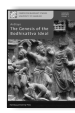 Anālayo The Genesis of the Bodhisattva Ideal 178 pp., 12 illustrations, hardcover, 22,80 EUR ISSN 2190-6769 ISBN 978-3-937816-62-3 (printed version) http://hup.sub.uni-hamburg.de/purl/HamburgUP_HBS01_Analayo Band 2

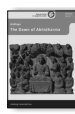 Anālayo The Dawn of Abhidharma 229 pp., 12 illustrations, hardcover, 25,80 EUR ISSN 2190-6769 ISBN978-3-943423-15-0 (printed version)
http://hup.sub.uni-hamburg.de/purl/HamburgUP_HBS02_Analayo Band 3

 Lin, Chen-kuo / Radich, Michael (eds.) A Distant Mirror Articulating Indic Ideas in Sixth and Seventh Century Chinese Buddhism 565 pp., hardcover; 39,80 EUR ISSN 2190-6769 ISBN 978-3-943423-19-8 (printed version) http://hup.sub.uni-hamburg.de/purl/HamburgUP_HBS03_LinRadich Band 4

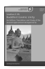 Silk, Jonathan A. Buddhist Cosmic Unity An Edition, Translation and Study of the "Anūnatvāpūrṇatvanirdeśaparivarta" 252 pp., hardcover, 28,80 EUR ISSN 2190-6769 ISBN978-3-943423-22-8 (printed version) http://hup.sub.uni-hamburg.de/purl/HamburgUP_HBS04_Silk Band 5

 Radich, Michael The "Mahāparinirvāṇa-mahāsūtra" and the Emergence of "Tathāgatagarbha" Doctrine 266 pp., hardcover, 28,80 EUR ISSN 2190-6769 ISBN 978-3-943423-20-4 (printed version) http://hup.sub.uni-hamburg.de/purl/HamburgUP_HBS05_Radich Band 6

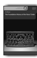 Anālayo The Foundation History of the Nun' Order 278 pp., hardcover, 29,80 EUR ISSN 2190-6769 ISBN 978-3-89733-387-1(printed version) https://www.buddhismuskunde.uni-hamburg.de/pdf/4-publikationen/ hamburg-buddhist-studies/hamburgup-hbs06-analayo.pdf Band 7

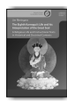 Jim Rheingans The Eighth Karmapa's Life and his Interpretation of the Great Seal A Religious Life and Instructional Texts in Historical and Doctrinal Contexts 243 pp., hardcover, 25,80 EUR ISSN 2190-6769 ISBN 978-3-89733-422-9(printed version) https://www.buddhismuskunde.uni-hamburg.de/pdf/4-publikationen/ hamburg-buddhist-studies/hamburgup-hbs07-rheingans.pdf Band 8

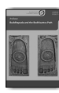 Anālayo Buddhapada and the Bodhisattva Path 180 pp., hardcover, 18,80 EUR ISSN 2190-6769 ISBN 978-3-89733-415-1(printed version) https://www.buddhismuskunde.uni-hamburg.de/pdf/4-publikationen/ hamburg-buddhist-studies/hamburgup-hbs08-analayo.pdf Band 9

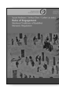 Susan Andrews/Jinhua Chen/Cuilan Liu (eds.) Rules of Engagement Medieval Traditions of Buddhist 522 pp., hardcover, 26,60 EUR ISSN 2190-6769 ISBN 978-3-89733-428-1 (printed version) https://www.buddhismuskunde.uni-hamburg.de/pdf/4-publikationen/ hamburg-buddhist-studies/hamburgup-hbs09-full.pdf Band 10

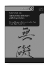

 Mario Poceski (ed.) Communities of Memory and Interpretation Reimagining and Reinventing the Past in East Asian Buddhism XIV; 217 pp., hardcover, 25,80 EUR ISSN 2190-6769 ISBN 978-3-89733-425-0 (printed version)
https://www.buddhismuskunde.uni-hamburg.de/pdf/4-publikationen/ hamburg-buddhist-studies/hamburgup-hbs10-poceski.pdf The rDzogs-chen master and scholar mKhan-po gZhan-dga' is perhaps best known for being unknown. Raised in the vast plains of northern Khams, he came to inherit the scholarly tradition of rDza dPal-sprul Rin-po-che and revitalize the college belonging to rDzogs-chen monastery, in the shadow of the snowcapped Ru-dam mountain range. In the spirit of the non-sectarian movement, students from all traditions of Khams came to learn from him, some following him as he moved on to teach near the capital sDe-dge dGon-chen, to become the tutor of the Tā'i Si-tu incarnation at dPal-spungs and to establish the college at mKhyen-brtse'i-dbang-po's estate near rDzong-gsar. In this way, this scion of nomad nobility eventually became a teacher at the most important centres of the settled communities, a rNying-ma-pa established and respected among the most exalted Sa-skya-pa scholars. gZhan-dga's specific curriculum led to a wave of colleges being founded by his disciples in the rNying-ma, bKa'-brgyud and Sa-skya traditions, effecting a leap in higher education all over the Tibetan plateau. 

The reason for gZhan-dga's fame was at the same time the reason for his invisibility: in order to provide a curriculum for students from all Tibetan Buddhist denominations, he had written his textbooks based on the explanations of Indian Buddhist masters exclusively, without mixing them with even a hair (*spu* tsam yang ma bsres par) of specific Tibetan opinions, including his own. 

gZhan-dga's activity unfolded in the network of social and spiritual issues of his time, issues as diverse as the relation between Pramāna and Madhyamaka, the royal succession of sDe-dge and the war of 1908/09, the debates about gZhan-stong and the interpretation of *cittamatra*, the succession of the mKhyenbrtse estate, the role of monasticism in Khams-pa society, the enthronement of Dil-mgo mKhyen-brtse Rin-po-che, the British-backed offensive in sDe-dge near the end of WWI, the ethical and political dimensions of debate, the rDzogs-chen lineage of 'Bo-gangs-dkar Rin-po-che, rDza dPal-sprul's *Klong chen snying thig* lineage(s), Sanskrit studies in Khams, the revival of Go-rams-pa studies, and, at the very peak, Klong-chen-pa's interpretation of Madhyamaka. Readers will find musings on these issues interwoven with gZhan-dga's biography and a catalogue of his works.

Numata Center for Buddhist Studies HAMBURG
BUDDHIST
STUDIES 11 Achim Bayer HAMBURG
BUDDHIST
STUDIES
The Life and Works of mKhan-po gZhan-dga' (1871–1927) 
rDzogs-chen Master and Educational Reformer of Eastern Tibet Achim BayerThe Life and Works of mKhan-po gZhan-dga' (1871–1927) 

11