Anālayo The Dawn of Abhidharma Hamburg Buddhist Studies 2

 Series editor: Michael Zimmermann Anālayo The Dawn of Abhidharma Hamburg University Press Publishing house of the Hamburg State and University Library Carl von Ossietzky Imprint Bibliographic information published by the *Deutsche Nationalbibliothek* (German National Library). The *Deutsche Nationalbibliothek* lists this publication in the Deutsche Nationalbibliografie; detailed bibliographic data are available in the internet at http://dnb.d-nb.de. The online version is available online for free on the website of Hamburg University Press (open access). The *Deutsche Nationalbibliothek* stores this online publication on its Archive Server. The Archive Server is part of the deposit system for long-term availability of digital publications. Available open access in the Internet at: Hamburg University Press - http://hup.sub.uni-hamburg.de PURL: http://hup.sub.uni-hamburg.de/purl/HamburgUP_HBS02_Analayo URN: http://nbn-resolving.de/urn/resolver.pl?urn:nbn:de:gbv:18-3-1450 Archive Server of the *Deutsche Nationalbibliothek* - http://dnb.d-nb.de ISBN 978-3-943423-15-0 (printed version) ISSN 2190-6769 (printed version)
© 2014 Hamburg University Press, Publishing house of the Hamburg State and University Library Carl von Ossietzky, Germany Printing house: Elbe-Werkstätten GmbH, Hamburg, Germany http://www.elbe-werkstaetten.de/ Cover design: Julia Wrage, Hamburg Figure: Gandhāra, courtesy Bildagentur für Kunst, Kultur und Geschichte, Berlin. Museum für Asiatische Kunst, Kunstsammlung Süd-, Südost- und Zentralasien, SMB / I 65 (picture: Georg Niedermeiser).

Contents

| List of Figures                                      | 7   |
|------------------------------------------------------|-----|
| Foreword                                             | 9   |
| Michael Zimmermann  Introduction                     | 11  |
| 1 Reciting the Dharma and the Functions of Lists     | 15  |
| 1.1 The First Saṅgīti at Rājagṛha                    | 15  |
| 1.2 Mātṛkā and Abhidharma                            | 21  |
| 1.3 Summaries of the Dharma                          | 29  |
| 1.4 The Seven Sets                                   | 49  |
| 2 Wisdom and Early Canonical Abhidharma              | 55  |
| 2.1 Wisdom and the Elements                          | 55  |
| 2.2 The Term Abhidharma                              | 69  |
| 2.3 Canonical Commentary                             | 79  |
| 2.4 Early Canonical Abhidharma                       | 86  |
| 3 Meditative Analysis and Omniscience                | 91  |
| 3.1 The Analysis of the Four Noble Truths            | 91  |
| 3.2 The Analysis of Absorption                       | 100 |
| 3.3 The Buddha's Awakening                           | 110 |
| 3.4 The Buddha and Omniscience                       | 117 |
| 4 Awakening and the Authentication of the Abhidharma | 129 |
| 4.1 The Supramundane Path                            | 129 |
| 4.2 The Path to Awakening                            | 142 |
| 4.3 The Need for Authentication                      | 148 |
| 4.4 The Buddha in the Heaven of the Thirty-three     | 156 |
| Conclusion                                           | 167 |
| Abbreviations                                        | 173 |
| References                                           | 175 |
| Index                                                | 219 |

| Figure 1.1: Siddhārtha Learns Writing                       | 25   |
|-------------------------------------------------------------|------|
| Figure 1.2: Saṅgīti-sūtra Fragment                          | 30   |
| Figure 1.3: The Buddha's Passing Away                       | 48   |
| Figure 2.1: The Twin Miracle                                | 57   |
| Figure 2.2: Mahāprajāpatī Requests Ordination               | 75   |
| Figure 2.3: Punishment in Hell                              | 85   |
| Figure 3.1: The Stūpa of Śāriputra                          | 108  |
| Figure 3.2: Turning the Wheel of Dharma                     | 115  |
| Figure 3.3: Jain Tīrthaṅkara                                | 124  |
| Figure 4.1: Sujātā's Offering                               | 145  |
| Figure 4.2: The Buddha's Descent from Heaven                | 159  |
| Figure 4.3: The Transmission of the Abhidhamma to Sāriputta | 162  |

# Foreword

## About Hamburg Buddhist Studies

Buddhism has enjoyed a prominent place in the study of Asian religious ideas at the University of Hamburg for almost 100 years, ever since the birth of Buddhist Studies in Germany. We are proud that our programme is housed in one of the pioneering academic institutions in Europe at which the study of Buddhism has become a core subject for students focusing on the religious dimensions of South and Central Asia. 

With this publication series, the Numata Center for Buddhist Studies at the University of Hamburg aims to honour this long-standing commitment to research and share the results of this tradition with the academic community and the wider public. Today, Buddhist Studies as an academic discipline makes use of a broad variety of approaches and methods. The field covers contemporary issues as much as it delves into the historic aspects of Buddhism. Similarly, the questions shaping the field of Buddhist Studies have broadened. Understanding present-day Buddhist phenomena, and how such phenomena are rooted in a distant past, is not a matter of indulgence. Rather, it has become clear that fostering such an understanding is one of the many crucial obligations of modern multicultural societies in a globalized world. 

Buddhism is one of the great human traditions of religious and philosophical thought. The *Hamburg Buddhist Studies* series aims to discuss aspects of the wide variety of Buddhist traditions that will be of interest to scholars and specialists of Buddhism, but it also wants to confront Buddhism's rich heritage with questions whose answers might not be easily deduced by the exclusive use of philological research methods. Such questions require the penetrating insight of scholars who approach Buddhism from a variety of disciplines building upon and yet going beyond the solid study of textual materials. We are convinced that the Hamburg Buddhist Studies series will contribute to opening up Buddhist Studies to those who are not necessarily trained in the classical languages of the Buddhist traditions but want to approach the field with their own disciplinary interests in mind. We very much hope that this series will encourage a wider audience to take interest in the academic study of the Buddhist traditions. 

## About This Publication

It is my great pleasure to introduce the second volume in the *Hamburg* Buddhist Studies series, a study by Bhikkhu Anālayo, professor at the Asien-Afrika-Institut of the University of Hamburg. This book is a companion to his previous study of the *Genesis of the Bodhisattva Ideal*, 
published in the same series. In the present book he turns to another important aspect in the development of Buddhist thought: the beginnings of the Abhidharma. 

Anālayo shows that the two main modes generally held in academic circles to explain the arising of the Abhidharma - the use of lists (*mātṛkā*) 
and the question-and-answer format - are formal elements that in themselves are not characteristic of Abhidharma thought. Going beyond the notion that the coming into being of the Abhidharma can be located in such formal aspects, he shows how the attempt to provide a comprehensive map of the teachings gradually led to the arising of new terminology and new ideas. He identifies the notion of the supramundane path as an instance where fully fledged Abhidharma thought manifests in the discourses, namely in the Mahācattārīsaka*-sutta* of the Theravāda tradition, as well as in otherwise unrelated discourses from the Dharmaguptaka and Mūlasarvāstivāda traditions, extant in Chinese translation. 

Anālayo concludes that what characterizes the Abhidharma is not the mere use of dry lists and summaries, but rather a mode of thought that has gone further (*abhi*-) than the Dharma taught in the early discourses in general. Such progression emerges out of an attempt to examine meticulously all the constituents of a particular transitory event. 

Michael Zimmermann 

# Introduction

The purpose of wisdom is disenchantment, dispassion, and seeing as it really is.1

## Theme

This book is a companion to my study of The Genesis of the *Bodhisattva* Ideal, in which I explored what the early discourses have to offer regarding the beginnings of the bodhisattva ideal. In The Dawn of Abhi-*dharma*, I similarly explore another development of comparable significance for Buddhist thought: the emergence of the Abhidharma. In the last chapter and the conclusions to the present study, I attempt to relate these two trajectories that have been of such central influence in the development of Buddhism. 

My approach is based on studying selected early discourses, without any pretence at offering a comprehensive coverage of all relevant material. The beginnings of the Abhidharma have of course already been studied by a number of scholars,2hence there will be little that is spectacular in the following pages. Yet I hope that what emerges through approaching this topic from the viewpoint of the early discourses will sustain the reader's interest. 

My exploration is divided into four chapters. In the first chapter I 
begin with the notion of communal recitation of the Dharma, sa*ṅgīti*, in particular taking up the Sa*ṅgīti-sūtra* as a discourse that exemplifies the creation of summary listings, *mātṛkā*. With the second chapter I turn to the cultivation of wisdom through knowledge of the elements as ex-
―――――― 1 MĀ 211 at T I 790c22.

2 My ignorance of Japanese has prevented me from benefiting from research published in that language.

pounded in the *Bahudhātuka-sūtra*, and then examine the commentarial nature of early Abhidharma works and the significance of the term abhidharma itself. The theme of the third chapter is meditative analysis, in particular the analysis of absorption attainment and of the four noble truths, based on a study of relevant sections from the *Anupada-sutta* and the Mahāsatipaṭṭhāna*-sutta*. In the same chapter I also turn to the relationship of the four noble truths to the Buddha's awakening and to the notion that the Buddha had attained omniscience. The path to awakening is then the topic of the fourth chapter, based on a study of the supramundane path described in the Mahācattārīsaka*-sutta*. I continue with the need in the Abhidharma and Mahāyāna traditions for authentication as being the word of the Buddha, and the narrative employed in the Theravāda tradition for this purpose, according to which the Buddha taught the Abhidharma to his mother during a sojourn in the Heaven of the Thirty-three. 

By covering topics such as the Buddha's omniscience and his supposed teaching of the Abhidharma in heaven, I intend to bring out that the beginnings of the Abhidharma would not be the product of dry scholasticism alone. As an additional reminder of the multiplicity of influences that would have shaped the emerging Abhidharma, I have interspersed my discussions with various pieces of Buddhist art, in the hope this will keep alive a sense of dimensions of the development under study that can easily be overlooked in an approach that relies solely on textual sources. 

## Sources

As with my previous study of the bodhisattva ideal, my main source materials are the early discourses in the four main Pāli *Nikāya*s and their parallels.3 Both studies are somewhat accidental results of my research into the early discourses, in that I did not originally intend to make a contribution to these two topics. Yet, the material that emerged in the course of my studies prompted me to explore these two trajectories of Buddhist thought from the viewpoint of what can be discerned about their beginnings in the textual corpus of the early discourses. 

Since the publication of The *Genesis of the Bodhisattva Ideal* in 2010, I have been able to clarify my methodological approach in more detail. 

My Comparative Study of the Majjhima-*nikāya* in the light of its parallels,4 published in 2011, shows that according to the evidence we have at our disposal the early discourses are the genuine product of a long period of oral transmission, rather than being material that for the most part is the product of later harmonization and levelling. In a paper published in 2012 I have contrasted this understanding with the propositions made by other scholars.5 In two papers published in 2013, I have provided evidence for my reasons for considering the Ekottarika-*āgama* collection as having incorporated later material than usually found in the Pāli *Nikāya*s and the other Chinese *Āgama*s, showing that material has been added to this collection in China.6 While the canonical Abhidharma texts in their finalized form show clear signs of being school specific, the early stages of development with which I am concerned in this study appear to have left their traces in similar ways in different traditions. Here I think it is opportune to keep in mind that the early discourse collections are not so much the product of a school, but rather the final result of oral transmission over long periods by successive generations of reciters, of whom only the last generations could be considered members of a particular school. Similarly, the beginnings of the development of the Abhidharma seem to go back to an early period before the formation of schools. 

The evolution of the bodhisattva ideal and the development of Abhidharma thought are of course multifaceted processes that can be studied from a variety of perspectives, beyond what can be found in the early discourses. Far from pretending to give an exhaustive account of the range of factors that led to the emergence of these two aspects of Buddhist thought, my contributions are just meant to present relevant material from the textual corpus of the early discourses, in the hope of thereby providing a point of reference for those who study the same topic based on other material. 

By way of example, my approach could be compared to discovering fossils of an archaeopteryx. The fossils found clearly show that there has been a development from reptile to bird, even though the particular animal whose remains have been discovered was of course not the first one to start jumping or gliding from one tree to the next. Comparable to the fossils of an archaeopteryx, some early discourses reflect particular stages in the development of Buddhist thought. 

## Acknowledgement

I am indebted to Adam Clarke, Lance Cousins, sāmaṇerī Dhammadinnā, Dhatvisvari, Richard Gombrich, Oskar von Hinüber, Petra Kieffer-Pülz, bhikṣu Kongmu, Michael Radich, Lambert Schmithausen, and Monika Zin for commenting on this work in the various stages of its evolution. I would like to dedicate this book in gratitude to Bhikkhu Bodhi for some twenty years ago having made me proceed from the Abhidharma studies I was doing then to studying the early discourses, which since then has become my main area of interest. 

# 1 Reciting The Dharma And The Functions Of Lists

In this chapter I explore the oral dimension of the transmission of the Dharma. I do so by studying the undertaking of communal recitation,1 sa*ṅgīti*, in its relationship to the Abhidharma. I begin with a survey of the different Vinaya accounts of what was believed to have been recited at the first sa*ṅgīti* held according to tradition at Rājagṛha. This then leads me to the topic of the *mātṛkā*s, succinct lists or summaries of the teachings. Among the early discourses, a prominent instance of such a summary list of the teachings is the Sa*ṅgīti-sūtra*. 

After surveying the Sa*ṅgīti-sūtra* and other similar discourses, I take up a succinct list found repeatedly in Buddhist texts: the "seven sets", 
comprising thirty-seven qualities or practices that are conducive to awakening (*bodhipākṣikā dharmāḥ*). The overall thrust of my exploration in this chapter is to investigate the significance of lists as aspects of oral transmission and to explore how certain lists relate to the formation of the Abhidharma. 

## 1.1 The First Saṅgīti At Rājagṛha

In the ancient Indian setting, access to the Dharma, its study, and its transmission were based on oral means. This makes the recital of the Dharma an activity whose importance can hardly be overestimated. The performance of communal recitation, sa*ṅgīti*, was and still is a regular feature of Buddhist monastic communities, which are to assemble every fortnight for the recitation of the code of rules, the *prātimokṣ*a. 

Besides its legal purposes, such *prātimokṣ*a recital functions as an expression of communal concord and harmony, which at the same time serves to strengthen a sense of identity in contrast with those who are not part of the community. The recitation of the *prātimokṣ*a in a united community stands in direct contrast to a schism, as a result of which the prātimokṣa will no longer be recited together by those who earlier formed a single community.2 A characteristic feature of the recital of the *prātimokṣ*a is that those who participate in its oral performance are expected to be familiar with the text. Thus the oral performance of such a recital is based on a text whose wording is necessarily fixed.3 The function of having a fixed text whose oral performance reaffirms harmony within the community is not confined to the rules of the Vinaya, but can similarly concern aspects of the teaching, the Dharma. 

The recitation of the Vinaya and the Dharma in the form of a sa*ṅgīti* held according to tradition at Rājagṛha soon after the Buddha's demise marks an event to which members of different Buddhist schools looked back as having established their own collection of canonical texts as authentic.4 The accounts of the first sa*ṅgīti* at Rājagṛha in different Vinayas vary in their description of what was recited at that time. Most importantly for my present purpose, they differ on whether the Abhidharma was part of the first sa*ṅgīti* or not. 

The Mahāsāṅghika Vinaya reports that Ānanda first recited the four Āgamas and the *Kṣudraka-piṭaka*,
5after which Upāli recited the Vinayapiṭaka.

6 The presentation in the Mahīśāsaka Vinaya is similar, with the 
―――――― 2 Bechert 1961/1982: 65; cf. also Tieken 2000. 

3 Allon 1997: 42 points out that "communal or group recitation or performance requires fixed wording." 
4 The notion of the Buddhist canon in general and the Pāli canon in particular has been discussed by a range of scholars; cf., e.g., Winternitz 1920/1968: 1–288, Renou 1953/ 2001: 327–351, Warder 1961b, Webb 1975, Dhirasekera 1977, Bechert 1979/1993: 66–79, Lancaster 1979, Bond 1982, Norman 1983, Ray 1985, Gómez 1987/2005, Hirakawa 1987, Lancaster 1987, Collins 1990, Hazra 1994, von Hinüber 1996/1997, Oberlies 2000, Freiberger 2004, Harrison 2004, Freiberger 2011, Kleine 2011, and Salomon 2011.

5 On the Kṣudraka-piṭ*aka* and the Khuddaka-*nikāya* cf. Lamotte 1956 and 1957. 6 T 1425 at T XXII 491c16. 

difference that here the recitation of the Vinaya by Upāli comes first,7a placing also found in other canonical accounts of the first sa*ṅgīti*. The Theravāda Vinaya reports that once Upāli had recited the twofold Vinaya - the texts that combine the *prātimokṣ*a for monks and for nuns with background narrations and explanations - Ānanda recited the five N*ikāya*s.8 None of these three Vinayas mentions the Abhidharma as a collection in its own right in their account of the first sa*ṅgīti*. Elsewhere, however, the Mahāsāṅghika Vinaya has numerous references to the term *abhidharma*, an expression that in this Vinaya stands for the nine aṅgas of texts,9 and thus not for a collection apart from the discourses. 

A reference to the Abhidharma can also be found in the Mahīśāsaka Vinaya. The relevant passage speaks of the ability to recite the discourses and well understand the Abhidharma.10 Unlike the usage in the Mahāsāṅghika Vinaya, here the term Abhidharma does stand for something apart from the discourses. 

The same holds for the Theravāda Vinaya, which speaks of the Abhidharma as something to be learned in addition to the discourses, the stanzas (*gāthā*), and the Vinaya.11Another reference mentions the texts were collected in the Abhidharma-piṭaka; in this way the *tripiṭaka* was collected.15 Closer inspection brings to light a problem with this description. 

Once the *Abhidharma-piṭaka* is mentioned as a *piṭaka* alongside the Vinaya-piṭaka and the Kṣudraka-piṭaka, 16 the *tripiṭaka* would correspond to these three. The four *Āgama*s are thus left without a proper placing in this *tripiṭaka*. This suggests that the reference to the Abhidhar-*ma-piṭaka* as the final step in the compilation of the *tripiṭaka* would be a later addition to the account of the first saṅgīti in the Dharmaguptaka Vinaya, done without properly adjusting the formulation. 

The Sarvāstivāda Vinaya goes further. Its account of the first sa*ṅgīti* not only mentions the Abhidharma, but even reports that Mahākāśyapa questioned Ānanda about the place where the Buddha had taught the Abhidharma. Ānanda replied that the Buddha taught the Abhidharma at Śrāvastī.

17 The teaching given at that time was that breaches of the five precepts are conducive to rebirth in hell,18 whereas keeping the five precepts leads to a heavenly rebirth. 

―――――― 15 T 1428 at T XXII 968b26: "they collected the *Abhidharma-piṭaka*; thus at that time they collected the *tripiṭaka*", 集為阿毘曇藏, 時即集為三藏. A comparable account can be found in the 毘尼母經 (Vinaya-*mātṛkā*), a Vinaya text perhaps representing the Haimavata tradition (cf. Anālayo 2012c: 450f note 6), which also mentions the collection of an *Abhidharma-piṭaka*, T 1463 at T XXIV 818a29.

16 T 1428 at T XXII 968b11: 毘尼藏 and 968b26: 雜藏.

17 T 1435 at T XXIII 449a19: "The elder Mahākāśyapa furthermore asked Ānanda: 'In what place did the Buddha first teach the Abhidharma?' Ānanda replied: 'Thus have I 
heard, at one time the Buddha was staying at Śrāvastī'", 長老摩訶迦葉復問阿難: 佛 何處始說阿毘曇? 阿難答言: 如是我聞, 一時佛在舍婆提. The providing of a location of course serves to authenticate the teaching, something which the Mahāsāṅghika Vinaya and the Mūlasarvāstivāda Vinaya encourage even if the actual location has been forgotten; cf. T 1425 at T XXII 497a6 and T 1451 at T XXIV 328c15 and 575b29, and for the corresponding passage in the Tibetan Mūlasarvāstivāda Vinaya, together with a discussion, Schopen 1997/2004 and 1998/2004: 283 note 59. A similar instruction occurs in the introduction to the Ekottarika-*āgama*, T II 550b13, and in a commentary that appears to have been compiled based on the already completed Ekottarika-*āgam*a translation (cf. Mori 1970 and Palumbo 2013: 163–265), T 1507 at T XXV 33b19.

18 T 1435 at T XXIII 449a22: "because of the five dangers, offenses, animosities, and destructions, after death one will fall into hell, just as quickly as a strong person might The Sarvāstivāda Vinaya's more detailed account of the recitation of the Abhidharma in this way explicitly records a question-and-answer exchange between Mahākāśyapa and Ānanda, which provides information about the location where the Abhidharma was spoken by the Buddha and what form this teaching had taken. Its presentation of a basic summary of the moral conduct incumbent on any disciple of the Buddha, however, is unexpected as a way of describing the first delivery of Abhidharma teachings by the Buddha. It seems that this passage was formulated at a time when the connotations of the term Abhidharma were still somewhat undetermined. 

With the Dharmaguptaka and Sarvāstivāda Vinaya accounts of the first sa*ṅgīti*, the notion of the Abhidharma as a collection in its own right emerges gradually, from a mere mention in the Dharmaguptaka Vinaya to a report of the Buddha's first preaching of the Abhidharma at a specific location in the Sarvāstivāda Vinaya. 

The account of the first sa*ṅgīti* in the Mūlasarvāstivāda Vinaya does not explicitly mention the Abhidharma, although it reports that on this occasion Mahākāśyapa recited the *mātṛkā*(s).19 The term *mātṛkā* derives from *mātṛ*, "mother",
20 and conveys the sense of a succinct list or summary which can be expanded and serve as the skeleton for a detailed exposition. A textual *mātṛkā* is thus comparable to a "mother" in the sense that it can give birth to a full exposition of a particular topic.21 In the context of a gradual evolution in the accounts of the first saṅ-*gīti* from a recitation of Dharma and Vinaya (Mahāsāṅghika, Mahīśāsaka, Theravāda) to a recitation that includes the Abhidharma (Dharma-guptaka, Sarvāstivāda), perhaps the Mūlasarvāstivāda Vinaya reflects an interim stage where what eventually came to be reckoned Abhidharma was referred to as *mātṛkā*.

## 1.2 Mātṛkā And Abhidharma

The Mahāgopālaka*-sutta* of the Majjhima-*nikāya* describes several detrimental qualities of a monk. One of them is that he fails to approach learned monks to improve his own understanding. These learned monks are qualified in the Mahāgopālaka*-sutta* as bearing in mind the Dharma, the Vinaya, and the *mātṛkā*(s).22 The corresponding passage in a Saṃyukta-*āgama* parallel, a collection probably transmitted by Mūlasarvāstivāda reciters, 23 similarly depicts a monk who does not approach learned monks. Here it is the monk's own ignorance that is described, which manifests in his lack of knowledge of the discourses, the Vinaya, and the Abhidharma.24 The basic implication of the two presentations is the same, in that a monk who does not know the discourses, etc., should approach learned monks who do know them in an effort to improve his learning. 

The fact that the mention of the *mātṛkā*(s) in the Mahāgopālaka*-sutta* has a counterpart in a reference to the "Abhidharma" in the Saṃyukta-*āgama* discourse mirrors the situation in the Vinayas, where the reference to the *mātṛkā* in the Mūlasarvāstivāda Vinaya has as its counterpart the Abhidharma mentioned in the Dharmaguptaka and Sarvāstivāda Vinayas. Similar to the situation in the Vinayas, where the Mahāsāṅghika, Mahīśāsaka, and Theravāda accounts of the first sa*ṅgīti* do not mention *mātṛkā*s or the Abhidharma, here, too, several parallels to the Mahāgopālaka*-sutta* mention neither *mātṛkā*s nor the Abhidharma.

25 time of the Pāli commentaries the existence of the *Abhidharma-piṭaka* was a matter of fact, the circumstance that they nevertheless associate the *mātṛkā*s with the Vinaya gives the impression that this association reflects an old tradition,28 and that the use of *mātṛkā*s also bears an important relation to Vinaya literature.29 A rationale for emphasizing the memorization of the *mātṛkā* qua prātimokṣa as something that is worth explicit mention could be found in the fortnightly observance which is to be carried out in any monastic dwelling that houses four or more fully ordained monastics. The performance of this observance requires that at least one of the monastics is able to recite the *prātimokṣ*a. 

In view of this requirement, it would indeed be meaningful to make a specific mention of the fact that someone who had not memorized the Vinaya was nevertheless able to recite its *mātṛkā*, or perhaps even both Vinaya *mātṛkā*s by learning the *prātimokṣ*a for *bhik*ṣus and the prāti-*mokṣa* for bhik*ṣuṇī*s. Such an ability would be an important asset for ritual purposes and thus would deserve mention on a par with the ability to expound the Dharma or the Vinaya. If references to those who bear in mind the *mātṛkā*(s) were originally about knowledge of the two prāti-*mokṣa*s, then this would indeed be a commendable quality of a monk and fit the context of the Mahāgopālaka*-sutta*. 

Given the relation of *mātṛkā*s to Vinaya literature, it would follow that, even though the *mātṛkā*s indubitably have played an important role in the formation of Abhidharma texts, the basic function of such summaries and lists is not characteristic of the Abhidharma alone. Such summary lists simply facilitate memorization and teaching as aspects of the oral performance of any text. That is, the employment of *mātṛkā*s is probably best understood as characteristic of oral Buddhist literature in general.30 Their use is independent of whether the text to be memorized, recited, or taught has features that reflect Abhidharma notions or not.

31 the drawing up of more complex lists. Although writing has certainly 

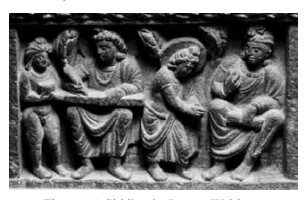

exerted an important influence on Abhidharma literature,34 the initial stages of development with which I am concerned here still take place within a predominantly oral culture.35 Figure 1.1 Siddhārtha Learns Writing The relief reflects the belief that in his youth the future Buddha learned writing. The right side of the sculpture shows the young Siddhārtha paying respect to his teacher who holds a manuscript in his hand; the left side shows Siddhārtha writing on a board with an assistant holding an inkpot. 

The use of lists is also not confined to the Buddhist tradition, but would have been known in the Jain tradition as well.37 The basic pattern of a summary statement that can easily be memorized and then be used as the basis for a more detailed explanation is similarly characteristic for the Brahminical *sūtra*s.38 Going beyond India, lists are of course known from other cultures as well. Examples dating as far back in human history as about two millennia before the Common Era are the Sumerian King List, which gives the names of kings and the duration of their reigns,39 and the Egyptian Execration Texts, which list those considered hostile to the ruler.40 Once the general function of lists is appreciated, it becomes fairly clear that the topic-wise division of the Saṃyukta-āgama/Saṃyutta-ni-*kāya* and the numerical arrangement of the Ekottarika-āgama/Aṅguttara-*nikāya* need not be seen as reflecting Abhidharma influence.

41 Instead, to arrange items by topic or in a numerical ascending order is simply a natural way of organizing orally transmitted texts.

The fact that several topics used for the divisions of the Saṃyukta-āgama/Saṃyutta-*nikāya* collections are prominent in Abhidharma texts –
such as the aggregates, the sense-spheres, etc. - simply reflects their importance as central aspects of Buddhist doctrine. Their occurrence does not have to reflect Abhidharma influence. 

An example would be the use of topic-wise divisions for grouping the stanzas of the *Dharmapada*. The fact that stanzas are grouped under the heading of, for example, citta or *mārga* need not be seen as a sign of Abhidharma influence, even though the mind (*citta*) and the path (*mārga*) 
are of course topics of central importance in Abhidharma texts.42 A numerical arrangement similar to that of the Ekottarika-*āgama/*
Aṅguttara-*nikāya* collection can also be seen in the *Parivāra* of the Theravāda Vinaya, where the sixth chapter similarly proceeds from Ones to Elevens.43 The same principle of numerical arrangement also underlies the Jain Ṭhāṇ*aṅga*.

44 Again, such texts do not come under the category of being Abhidharma. Thus Buddhist texts that adopt a topicwise or numerical arrangement are best reckoned as reflecting an organizing feature commonly used in oral traditions. Such arrangement could be, but certainly does not have to be related to the Abhidharma. 

The same holds for the question-and-answer format, which in spite of its formative influence on Abhidharma texts is not in itself a sign of Abhidharma influence. For example, the *Parivāra* of the Theravāda Vinaya also employs questions and answers.45 Nevertheless, the Pari-*vāra* is on Vinaya matters and none of its formal features make it an 
―――――― 42 These are the headings of chapters 3 and 20 in the Pāli *Dhammapada*, Dhp 33–43 and 273–289, corresponding to chapters 6 and 8 in the Gāndhārī *Dharmapada*, Brough 1962/2001: 133 and 139, chapters 19 and 20 in the Patna *Dharmapada*, Cone 1989: 194 and 198, and chapters 11 and 28 in the Chinese *Dharmapada*s, T 210 at T IV 563a1 and 569a16 as well as T 211 at T IV 584b10 and 597b20. 

43 Vin V 115,1 to 141,8. 

44 This has already been pointed out by Pande 1957: 26 note 44; for an edition of the text cf. Jambūvijaya 1985; for a study of its divisions cf. Krümpelmann 2006. The Ṭhāṇaṅga proceeds from Ones to Tens, which may have been the original conception of the *Ekottarika/Aṅguttara* collections as well; cf. in more detail Anālayo 2013f: 37f note 109. Winternitz 1920/1968: 49f note 2 mentions other examples for the adoption of a numerical principle, found in the *Mahābhārata* and in Christian literature. 

45 Vin V 180,1 to 206,25. Norman 1983: 28 explains that "the fifteenth chapter (Upāli-pañcaka) consists of a number of questions put by Upāli to the Buddha about the Vinaya, the answers to which were all in the form of sets of five. It is to be compared with … the section of the Aṅguttara-nikāya entitled Upālivagga, where, however, the Buddha's answers are all in sets of ten"; cf. AN 10.31–43 at AN V 70,3 to 79,3. 

Abhidharma text. The same is the case for many discourses, where the question-and-answer format frequently occurs. Even somewhat techni-cal discussions like those reported in the discourses known in the Pāli tradition as the Mahāvedalla*-sutta* and the Cūḷavedalla-*sutta* are not necessarily Abhidharma in content.46 A collection of poetic sayings like the Pārāyana*-vagga* of the Sutta-*nipāta* can also employ questions and answers. In the Pārāyana*-vagga*, 
the term *pucchā*, "question", functions as a header for the different subsections that come after its introductory narration, which clearly marks the catechetical style of the exposition.47 Yet the stanzas in this collection bear no sign of Abhidharma influence. Moving once again beyond the confines of the Buddhist tradition, any kind of interview from ancient to modern days would have to rely, in one way or another, on the question-and-answer format. 

In sum, then, it seems to me that the two main approaches that have been considered as explaining the coming into being of the Abhidharma –
the use of *mātṛkā*s and the question-and-answer format - are features that are not in themselves necessarily characteristic of Abhidharma thought, however much they may have contributed to its formulation.48 
―――――― 46 MN 43 at MN I 292,1 and its parallel MĀ 211 at T I 790b8, as well as MN 44 at MN I 
299,1 and its parallels MĀ 210 at T I 788a14 and a quotation in the Abhidharma-*kośopāyikā-ṭīkā*, D 4094 ju 6b2 or Q 5595 tu 7a7, translated in Anālayo 2012c: 40–55
(for a survey of shorter quotations from both discourses in D 4094 or Q 5595 cf. Anālayo 2011a: 1043f); for a detailed study of *vaidalya* cf. Skilling 2013.

47 Sn 1032–1123. 

48 Ronkin 2005: 27 sums up previous scholarship as follows: "the prevalent accounts of the historical origin and development of Abhidhamma literature proceed from two explanatory tendencies based on two distinctive characteristics of the genre. According to the first line of thought, there is a close relationship between the evolution of Abhidhamma treatises and an established feature they manifest, namely, the arrange-ment of major parts of the material around lists of various types … more literally, matrices (*mātikā/mātṛikā*) of doctrinal topics, which offer summaries or condensed shorthand accounts of the Buddha's *Dhamma*"; on which Ronkin 2005: 29 then comments: "I do not deny the relationship between the *mātikā*s and the evolution of the Abhidhamma, but find an oversimplification in equating the two"; in fact, as pointed out by Buswell and Lopez 2014b: 4, the *mātṛkā*s appear to be just "an inevitable byproduct of the oral quality of early Buddhist textual transmission." Ronkin 2005: 30 

## 1.3 Summaries Of The Dharma

A prominent instance of the use of *mātṛkā*s among the early discourses is the Sa*ṅgīti-sūtra*, a text that is basically an extended list of various aspects of the teachings. Versions of this discourse are extant as follows, here given according to their school affiliation: 
- Dharmaguptaka tradition: a *Dīrgha-āgama* discourse extant in Chinese translation;49
- Sarvāstivāda and/or Mūlasarvāstivāda tradition: a *Dīrgha-āgama* discourse preserved in Sanskrit fragments;50
- Theravāda tradition: a *Dīgha-nikāya* discourse in Pāli;51
- uncertain school affiliation: a discourse translated individually into Chinese.52 The parallel versions agree in introducing Śāriputra as the speaker of the discourse, who sets his presentation in contrast with the quarrelling that had reportedly broken out among the Jains after the death of their leader.53 
――――――
then continues that "another explanation of the origination of the Abhidhamma draws on a rather different feature of the Abhidhamma treatises, namely, their catechetical style … formulated as an exchange of questions and answers."
49 DĀ 9 at T I 49b26 to 52c11; translated and studied by Behrsing 1930. On the school affiliation of T 1 cf., e.g., Demiéville 1951: 252f, Brough 1962/2001: 50, Lü 1963: 242, Bareau 1966, Waldschmidt 1980: 136, Mayeda 1985: 97, Enomoto 1986: 25, Hirakawa 1987: 513, Schmithausen 1987: 318, Oberlies 2003: 44, Salomon 2007: 354 note 14, and Willemen 2008: 60. 

50 Stache-Rosen 1968. According to the reconstructed order of the Sarvāstivāda/Mūlasarvāstivāda *Dīrgha-āgama* in Hartmann 2004: 125, the Sa*ṅgīti-sūtra* stands in third position in the collection (preceded by the *Daśottara-sūtra* as the first and the Artha-vistara-*sūtra* as the second discourse).

51 DN 33 at DN III 207,1 to 271,22. 

52 T 12 at T I 226c3 to 233b19; for a more detailed survey of further parallels cf. An-ālayo 2013e: 1f note 5.

53 Quarrels apparently broke out in the Jain community already during the lifetime of Mahāvīra; cf. Deo 1956: 78f and von Glasenapp 1925/1999: 383. According to Jaini 1980: 84, during subsequent periods of Indian history "the divisiveness associated with sectarianism was much more severe among Jainas than among the Buddhists."

The issue of contention was about the correct teachings, about the Dharma and Vinaya taught by the leader of the Jains. The Sanskrit fragment version depicts the quarrelling factions speaking to each other as follows: "You do not know this Dharma and Vinaya, I know this Dharma and Vinaya."
54 Similar statements can be found in the Theravāda *Dīgha-nikāya* and Dharmaguptaka Dīrgha-*āgama* versions of the Sa*ṅgīti-sūtra*.

55 The formulation highlights a predicament that must have been acutely felt in an oral setting once a teacher had passed away: how to determine what he taught, if there are no written records? The need to arrive at an oral consensus on what the teacher had taught is precisely what informs the purpose of the Saṅgīti-*sūtra*. 

Figure 1.2 Saṅgīti-*sūtra* Fragment 

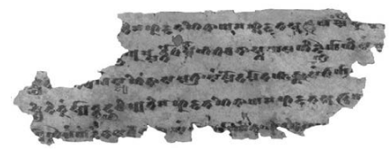

The fragment contains the beginning of the Saṅgīti-*sūtra*. 

Sanskrithandschriften aus den Turfanfunden (SHT I 594), 
courtesy Berlin-Brandenburgische Akademie der Wissenschaften. 

The fragment of the Sa*ṅgīti-sūtra* in figure 1.2 above reports that Śāriputra, after mentioning the first item in the list, instructs his listeners as follows: "Here being united, unanimous, and in unison we will not dispute due to uncertainty so that this holy life remains for a long time."
56 According to the Dharmaguptaka version of the Saṅgīti-*sūtra*, Śāriputra told the assembled monks that, in order to forestall any disputes, 
"we should collect the Dharma and Vinaya in order to prevent dispute, causing the holy life to remain for a long time."
57 The Theravāda versions record his words in similar ways: "here we should all recite together, we should not dispute, so that this holy life may endure and remain for a long time."
58 The beneficial effects of such communal recitation are repeated regularly in the body of the Saṅgīti-*sūtra*, continuously reaffirming the theme broached at the outset of the discourse. 

The main concern voiced in this way highlights how the performance of communal recitation - sa*ṅgīti* - functions to foster harmony and avoid dispute about the teachings. 

In this way the Sa*ṅgīti-sūtra* has a function similar to the recital of the *prātimokṣ*a for a monastic community. Just as the *prātimokṣ*a presents a summary of the essentials of the Vinaya in a form that can be memorized even by those who are not professional reciters, so the Saṅ-*gīti-sūtra* attempts to provide a summary of essential aspects of the Dharma in a form more easily memorized than a whole collection of discourses, not to mention all four collections.59 Both function as an expression of communal harmony. 

Adherence to these *mātṛkā*s, which have been publicly affirmed as correct through the sa*ṅgīti*, is seen as essential for the welfare of the community. In this way the Sa*ṅgīti-sūtra* takes its main thrust from anticipating a situation that has impacted on the early Buddhist community in various ways, namely the passing away of the Buddha. In order to forestall dispute about the teachings at a time when the teacher will no longer be there to clarify and settle disagreements, the Sa*ṅgīti-sūtra* sets out its summary of the Dharma. 

This function corresponds to what according to the traditional account took place at the first sa*ṅgīti* at Rājagṛha, where communal recitation –
this time of the whole of the Dharma and Vinaya, instead of only the respective *mātṛkā*s - served as a response to the gap left by the death of the teacher.60 The Gopakamoggallāna*-sutta* and its parallel confirm that the Buddha's role of providing guidance to his disciples was accorded to the Dharma taught by him, once he had passed away.61 For the Dharma to fulfil this role, discord about what actually constitutes the Dharma needs of course to be avoided. In the constantly fluctuating piecemeal oral reception of the Dharma by various reciters spread out over different regions of India,62 the notion of a sa*ṅgīti* held 
―――――― 59 Cousins 1983: 3f comments that "the Saṅgīti*-suttanta* of the *Dīgha-nikāya* … can be viewed as a mnemonic summary of the contents of the nikayas." 
60 Similarities between the Sa*ṅgīti-sūtra* and the first sa*ṅgīti* held according to tradition at Rājagṛha have recently been discussed by Peoples: 2012: 27–33 and Shravak 2012: 240f.

61 MN 108 at MN III 9,23 and its parallel MĀ 145 at T I 654b23. 62 Davidson 1990/1992: 293 depicts the situation as follows: "during the more than forty years of the Buddha's teaching career, there were many monks acting as authoritative teachers of the doctrine throughout the kingdom of Magadha and its border areas. They would cross paths with the master from time to time and receive new information as his doctrine and teaching style developed. They would also receive new information from one another during the fortnightly congregations, the summer rains retreats, and whenever they met as their mendicant paths crossed. After forty years of their obtaining new information through such contact, we may be certain that, by the death of the Buddha, the process of receiving new 'teachings of the teacher' (śāstuḥ *śāsanaṃ*) had become a well-accepted practice. The network of instruction was thus established, at Rājagṛha establishes a yardstick for deciding what Dharma the recently deceased Buddha had indeed taught. The same notion of a sa*ṅgīti* informs the Sa*ṅgīti-sūtra*, with the difference that here concord on the Dharma is established through the recitation of a *mātṛkā* of the teachings. 

In fulfilment of this aim, the Saṅgīti-*sūtra* provides an extended list of mostly doctrinal items, arranged in numerical order from Ones to Tens.

Although such formal presentation is a typical feature of Abhidharma texts, it needs to be kept in mind that this is simply a convenient manner of arrangement to facilitate ease of oral recall.63 The formalism of the Sa*ṅgīti-sūtra* in fact goes only that far, that is, by arranging matters under the numerical grid of Ones, Twos, etc., up to Tens. The number of doctrinal terms allotted to each of the resulting ten subsections of the discourse varies considerably in each category, the Ones and the Tens having much fewer entries than, for example, the Threes and the Fours. 

The number of doctrinal terms found in a subsection also tends to vary between the parallel versions of the discourse. This can be seen in the survey below, which lists the number of entries for each numerical category in the four parallel versions, proceeding from left to right listing the Sanskrit fragments of the Sarvāstivāda/Mūlasarvāstivāda Dīrgha-*āgama* (Skt. DĀ), the Theravāda *Dīgha-nikāya* version (DN 33), the version found in the Dharmaguptaka *Dīrgha-āgama* (DĀ 9), and the individual translation (T 12). This survey reflects only part of the differences, since besides variations in the overall count of items, the items found in each section are not necessarily the same. The versions of the Sa*ṅgīti-sūtra* clearly developed in different ways.

| Skt. DĀ   | DN 33   | DĀ 9   | T 12   |       |
|-----------|---------|--------|--------|-------|
| Ones:     | 3       | 2      | 2      | 1     |
| Twos:     | 27      | 33     | 12     | 1     |
| Threes:   | 50      | 60     | 37     | 34 64 |
| Fours:    | 50      | 50     | 36     | 39    |
| Fives:    | 24      | 26     | 15     | 14    |
| Sixes:    | 24      | 22     | 14     | 15    |
| Sevens:   | 13      | 14     | 7      | 6     |
| Eights:   | 10      | 11     | 4      | 4     |
| Nines:    | 2       | 6      | 1      | 1     |
| Tens:     | 2       | 6      | 1      | 1     |

A feature found similarly in the parallel versions points to an attempt to facilitate precise oral recall, in that the sequence in which items are placed in these discourses within the subsections from Ones to Tens at times shows the employment of concatenation.65 The use of concatenation in oral transmission ensures that items to be memorized remain in the proper order. This takes place through the help of some similarity in word form or meaning between a member of the list and what comes next. Such linkage by way of association makes it easier for the mind to connect the item being recited now with the next one and thus facilitates precise recall. Instances of concatenation need not be original to a particular text, but often appear to come into being through rearrangement during the period of oral transmission. 

In what follows I survey a few instances of concatenation that are found similarly in the Dharmaguptaka, Sarvāstivāda/Mūlasarvāstivāda, and Theravāda versions of the Saṅgīti-*sūtra*. 

―――――― 64 It would also be possible to consider the count of Threes in T 12 as amounting to thirty-five items, since the first member in the list, the three types of actions (bodily, verbal, and mental), is further subdivided into wholesome and unwholesome manifestations; cf. T 12 at T I 227c8. From the manner of presentation, however, it seems to me that this should be considered a gloss on what the discourse presents as a single set of Threes. 

65 For a discussion of concatenation in the *prātimokṣ*a cf. von Hinüber 1999: 20; on concatenation in the early discourses cf. Allon 2001: 18–22 and Anālayo 2011a: 11–13. 

Needless to say, the use of concatenation is not confined to the early Buddhist tradition, but is also found, e.g., in the Avesta; cf. Schwartz 2006. 

Among the Ones the fact that "all beings *persist* through nutriment" links to the next item in the list, according to which "*all beings persist* through formations."
66 Here the expression "*all beings persist*" provides a link between "nutriment" and "formations". 

The Twos continue from the couplet "lack of *shame* and absence of fear of wrongdoing" to the couplet "*shame* and *fear of wrongdoing*".

67 Here the association is by way of terminology and meaning, as the first couplet is the opposite of the second couplet. 

Similar groupings can be found among the Threes. After the "three roots of what is not *wholesome*" come the "three *roots* of what is whole-*some*";
68 the "three kinds of wrong *conduct*" lead to the "three kinds of right *conduct*";
69 and the "three *reappearances* in the sensual realm" are followed by the "three happy *reappearances*".

70 Among the Fours, the "four *yokings*" precede the "four un*yokings*";
71 and among the Sevens the "seven untrue *dharma*s" have their counterpart in the "seven true *dharma*s".

72 Thus alongside considerable variations, the parallel versions agree in employing concatenation in these instances. Even with such occasional aids to ensure maintenance of the proper sequence during oral transmission, however, to memorize the Sa*ṅgīti-sūtra* as a whole, with all of its items in the correct order, is still a demanding task. This is especially the case for disciples who are not part of the circle of reciters trained in memorizing the collections of the early discourses. So in order to be successful in fulfilling the purpose the discourse itself considers as crucial - facilitating recitation of a summary of the teachings to ensure the absence of strife among the Buddha's disciples - the Sa*ṅgīti-sūtra* is somewhat unwieldy. 

For promoting communal harmony through group recitation, the more disciples know the discourse by heart the better. All those who know the discourse will be able to participate in a group recitation, as active reciters or else as auditors who confirm the recitation through their silent presence or even may correct the reciter in case a mistake occurs. 

Judging from the large number of variations found between the parallel versions of the Sa*ṅgīti-sūtra*,
73 it seems probable that at an early time the actual list was considerably shorter. It would be quite natural for a shorter list to expand during oral transmission by incorporating items ――――――
tisraḥ kāmopapattayaḥ … *tisras sukhopapattiya*ḥ; DĀ 9 at T I 50b6 (3.27 and 3.28): 
三欲生本 … 三樂生. Both sets of Threes are also found in T 12 at T II 228a7.

71 DN 33 at DN III 230,13 (4.32 and 4.33): *cattāro yogā … cattāro visaṃyogā* (Be and C
e: *visaññogā*); Stache-Rosen 1968: 116 (4.36 and 4.37) catvāro yogāḥ *… catvāro* vi(sa*ṃ)yo(gāḥ*); cf. also fragment Pelliot bleu 381 Va, Hartmann 1991: 255 (§142); 
DĀ 9 at T I 51a22 (4.29 and 4.30): 四扼 … 四無扼. T 12 does not have these two items.

72 DN 33 at DN III 252,7 (7.4 and 7.5): *satta asaddhammā … satta saddhammā*; StacheRosen 1968: 179f (7.6 and 7.7): *saptāsaddh(armāḥ) … sa(pta saddharmāḥ*); DĀ 9 at T I 52a21 (7.1 and 7.2): 七非法 … 七正法. T 12 does not have these two items.

73 Cf. the comparative surveys in Behrsing 1930: 116–149 and Stache-Rosen 1968: 
213–217. 

that were considered to be of sufficient importance to merit inclusion in this summary of the teachings. Different transmission lineages of the discourse would have considered different items to be worthy of such inclusion, resulting in the differences found between the parallel versions that have come down to us. In addition, however, it seems also quite possible that at times a loss of text may have occurred, given the somewhat unwieldy nature of the presentation and the fact that, alongside occasional concatenation of the type described above, often items follow each other without any evident connection, apart from belonging to the same numerical category.

The need to facilitate the memorizing of a kind of *mātṛkā* of the teachings has led to another solution in the Daśottara-*sūtra*, a discourse also attributed to Śāriputra. Versions of this discourse are extant as follows, listed according to their school affiliation: 
- Dharmaguptaka tradition: a *Dīrgha-āgama* discourse extant in Chinese translation;74
- Sarvāstivāda and/or Mūlasarvāstivāda tradition: a *Dīrgha-āgama* discourse preserved in Sanskrit fragments;75
- Theravāda tradition: a *Dīgha-nikāya* discourse in Pāli;76
- uncertain school affiliation: a discourse translated individually into Chinese.77 Unlike the loose list of items in the Sa*ṅgīti-sūtra*, where the number of entries under a numerical category varies considerably, the *Daśottarasūtra* consistently has ten items under each numerical category.78 Moreover, these ten items follow a fixed sequence applied to each numerical category, from the Ones to the Tens. In the Sanskrit fragment version the sequence proceeds as follows: 
1) greatly helpful (*bahukara*ḥ), 2) to be cultivated (bh*āvayitavyaḥ*), 3) to be understood thoroughly (*parijñeya*ḥ),
4) to be abandoned (prah*ātavyaḥ*),
5) leading to diminution (*hānabhāgīyaḥ*), 6) leading to distinction (*viśeṣabhāgīyaḥ*), 7) difficult to penetrate (*duṣprativedha*ḥ),
8) to be aroused (*utpādayitavyaḥ*), 9) to be known directly (*abhijñeya*ḥ),
10) to be realized (*sākṣīkartavyaḥ*).79 The Sarvāstivāda/Mūlasarvāstivāda *Dīrgha-āgama* contains a discourse belonging to the same genre of summaries of the Dharma which has no parallel in the Theravāda canon or the Dharmaguptaka Dīrgha-*āgama*. This is the Arthavistara-*sūtra*, whose speaker is Śāriputra.81 Instead of adopting a numerical order in its presentation, like the Sa*ṅgītisūtra* and the *Daśottara-sūtra*, the items in its list proceed thematically, following a trajectory that builds up to the attainment of full liberation and freedom from rebirth.

Together with the Sa*ṅgīti-sūtra* and the *Daśottara-sūtra*, the Artha-vistara-*sūtra* is part of a group of six discourses, the *Ṣaṭsūtraka-nipāta*,
found at the beginning of the Sarvāstivāda/Mūlasarvāstivāda *Dīrghaāgama* collection. The Ṣa*ṭsūtraka-nipāta* was at times handed down independently of the whole collection.82 The importance accorded in this way to summaries or maps of the Dharma is also reflected in the circumstance that the Sa*ṅgīti-sūtra* and the *Daśottara-sūtra* are explicitly mentioned in the account of the first sa*ṅgīti* in the Dharmaguptaka and Mahīśāsaka Vinayas.

83 The Dharmaguptaka Dīrgha-*āgama* has another two discourses, attributed to the Buddha, which also belong to the genre of summaries of the Dharma. Both are without a parallel in the *Dīgha-nikāya* or the Sar-vāstivāda/Mūlasarvāstivāda *Dīrgha-āgama*.

84 Instead of the tenfold grid used in the *Daśottara-sūtra*, the first of these two discourses, called "Increasing by One", employs a fivefold scheme, whereas the second of these two discourses, entitled "On the Three Groups", makes use of a threefold scheme. 

The fivefold scheme in the "Discourse Increasing by One" works through Ones to Tens based on the first four and the tenth topics in the Daśottara-sūtra scheme, taking up items from the perspective of their being: 1) greatly helpful, 2) to be cultivated, 3) to be understood, 4) to be extinguished, 5) to be realized.85 This discourse appears to be a shortened version of the presentation found in the Daśottara-*sūtra*. Such an extract would be easier to memorize than the whole of the Daśottara-*sūtra*, thereby enlarging the circle of those able and willing to commit this particular summary of the teachings to memory. The "Discourse Increasing by One" concludes with an injunction by the Buddha that the monks should meditate without negligence,86 emphasizing that the purpose of the discourse is to provide an inspiration for actual meditation practice. 

The threefold scheme in the "Discourse on the Three Groups" works through Ones to Tens based on three topics: 1) what leads towards a bad destiny, 2) what leads towards a good destiny, 3) what leads towards Nirvāṇa.87 This discourse also appears to have taken its inspiration from the Dharmaguptaka version of the *Daśottara-sūtra*, as all the items listed under the heading of what "leads towards Nirvāṇa" (3) correspond to what should be "cultivated" according to the *Daśottara-sūtra*. In the case of the Twos, Threes, Sixes, Nines, and Tens what leads to either a bad destiny (1) or else a good destiny (2) corresponds to what leads to decline or else to increase according to the *Daśottara-sūtra*. In view of its brevity, it seems probable that the "Discourse on the Three Groups" came into being within an already existing Dīrgha-*āgama*, otherwise it would hardly have merited inclusion in a collection of "long discourses".

88 Summaries of the Dharma can also be found in the Madhyama-*āgama*, 
a collection probably transmitted by Sarvāstivāda reciters.

89 One such instance is the "Discourse on Explaining the Spheres", which reports the Buddha delineating topics that Ānanda should teach to junior monks, that is, to monks who have recently been ordained.90 In what follows I 
survey its list of thirty-one topics to be taught, which neatly exemplifies the way such lists can build up. The discourse begins with the five aggregates (1). Then it lists various aspects of sense-experience: 
2) the six senses, 3) the six sense-objects, 4) the six types of consciousness, 5) the six types of contact, 6) the six types of feeling, 7) the six types of perception, 8) the six types of intention, 9) the six types of craving. This thus offers a detailed breakdown of six sense-door experiences, a topic to which I will return when discussing the meditative analysis of the four noble truths in the third chapter of this book. After this group of Sixes related to sense-door experience come: 
10) the six elements, 11) the twelve links of dependent arising, expounded in both the arising and the cessation modes. 

In this way, from the five aggregates (1) as a basic mode of analysis the discourse proceeds by taking up another and similarly basic mode of analysis, the six senses (2), which may have been the original starting point of the discourse, judging from its title on explaining "the spheres", 
āyatana. The six senses then lead on to a detailed coverage of various components of experience through the six senses (3 to 9). The natural predominance of the number six that has resulted from this detailed breakdown of sense-experience then finds its continuation by way of the six elements (10), followed by yet another foundational teaching whose standard mode of presentation involves a doubling of six, namely the twelve links of dependent arising (11). Then the list continues instead with items that come in Fours: 12) the four establishments of mindfulness, 13) the four right efforts, 14) the four bases for supernormal ability, 15) the four absorptions, 16) the four noble truths, 17) the four perceptions, 18) the four boundless states (*apramāṇ*a), 19) the four immaterial attainments, 20) the four noble traditions (ā*ryavaṃśa*), 21) the four fruits of recluseship (śrāmaṇ*yaphala*). 

Here the first three items are meditative practices that form the beginning of a list of seven sets, known in the tradition as being bodhipākṣikā dharmāḥ, which I will discuss later on in this chapter. Other items are meditative attainments: the absorptions (15), the boundless states (18), 
the immaterial attainments (19), and the four fruits of recluseship (21), 
the last representing the four levels of awakening. Thus in this group meditative practices and attainments are a dominant theme, alongside the four noble truths (16) and the proper mode of conduct exemplified by the four noble traditions (20). Next comes a group of Fives: 22) the five perceptions ripening in liberation, 23) the five spheres of liberation, 24) the five faculties, 25) the five powers, 26) the five elements of release. 

The five faculties (24) and powers (25) are also part of the seven sets, which here come together with three items that similarly stand in close relation to progress on the path to awakening: five perceptions ripening in liberation (22), the five spheres of liberation (23), which are the occasions when the breakthrough to awakening can take place, and the five elements of release (26), which describe release from sensuality, ill will, harmfulness, bodily form, and the sense of identity (*satkāya*). 

Notably, even though this group consists of Fives, the five aggregates 
(1) are not part of it, but rather come at the beginning. This gives the impression of a gradual evolution of the whole list of thirty-one items, since otherwise the numerical principle evident in its later part would have been applied consistently by having the five aggregates as part of the present group, followed by the Sixes as the next group. Instead of Sixes, the list continues with Sevens: 27) the seven types of [spiritual] wealth, 28) the seven powers, 29) the seven awakening factors. 

The first two groups here cover the same qualities of faith, morality, conscience, shame, learning, generosity, and wisdom, mentioned under two different headings (27 and 28). The awakening factors are again part of the seven sets. The same holds for the next item in the list, which is the noble eightfold path (30). The list concludes with the summit of the Dharma (31), which stands for contemplation of impermanence, duḥkha, emptiness and not-self. 

The "Discourse on Explaining the Spheres" reports the Buddha making the following statement for each of these thirty-one topics: 
If you give this teaching to the junior monks ... they will obtain ease, they will obtain strength, they will obtain happiness, they will be untroubled in body and mind, and they will practise the holy life for their whole life.91 The concern expressed here is that newly ordained monks be taught in a way that ensures they will continue to live the holy life, *brahmacarya*, 
of a Buddhist monastic. This is reminiscent of the Sa*ṅgīti-sūtra*'s concern to ensure that the holy life will remain for a long time.

Notably, the majority of the discourse's topics recur as chapter headings in the *Dharmaskandha*.

92 Thus similar concerns and perhaps even some degree of direct influence appear to connect the list of topics that Ānanda should teach to young monks according to a Sarvāstivāda discourse and the basic thematic structure of an early work in the Sarvāstivāda Abhidharma collection. 

The last discourse in the Madhyama-*āgama* exemplifies another significant tendency, namely the combining of different lists.93 Whereas the "Discourse on Explaining the Spheres" shows the proliferation of a single list, this discourse exemplifies another way of using lists: by way of interrelation. The actual exposition in the discourse begins with the following indication: 
One who wishes to abandon ignorance should cultivate the four establishments of mindfulness. How should one who wishes to abandon ignorance cultivate the four establishments of mindfulness?94 In reply to this question, the discourse provides an account of the gradual path, given in abbreviation, from the arising of a Tathāgata to the removal of the five hindrances.95 Undertaking this gradual path provides the proper basis for cultivating the four establishments of mindfulness. 

This completes the first section of the exposition. 

Undertaking the gradual path is similarly necessary for a variety of activities in relation to ignorance which, including the already mentioned abandoning, are as follows: 
a) to abandon it, b) to abandon it repeatedly, c) to be liberated from it, d) to transcend it, e) to root it out, f) to extinguish it, g) to know it completely, h) to know it distinctly. 

In this way, the effect of the four establishments of mindfulness in relation to ignorance is presented in terms of eight types of activities (a to h).

96 This exposition - from abandoning to distinctly knowing - is then related to the fourright efforts (2)instead ofthe four establishments of mindfulness, and then to several other items. These items are as follows: 
1) the four establishments of mindfulness, 2) the four right efforts, 3) the four bases for supernormal ability, 4) the four absorptions, 5) the five faculties, 6) the five powers, 7) the seven awakening factors, 8) the noble eightfold path, 9) the ten totalities (kṛ*tsna*), 10) the ten factors of one beyond training (*aśaikṣ*a).

Once the discourse has worked through this list from (1) to (10), each time by way of the eight activities (a to h), it moves from ignorance (i) to the next of the twelve links of dependent arising, so that the entire exposition is executed for each of them: 
i) ignorance, ii) formations, iii) consciousness, iv) name-and-form, v) six senses, vi) contact, vii) feeling, viii) craving, ix) clinging, x) becoming, xi) birth, xii) old age and death. 

abbreviations already in place and it may well never have been recited or written in its fully expanded form. Such combining of different lists, with the resulting permutations usually given only in abbreviation, is a feature found regularly in Abhidharma works. Nevertheless, the actual contents of the discourse do not seem to reflect the influence of the Abhidharma. 

The same holds for the "Discourse on Explaining the Spheres". Even though its topics recur as chapter headings in the *Dharmaskandha*, the presentation of these topics in the "Discourse on Explaining the Spheres" does not appear to be an expression of Abhidharma thought. 

A relationship between a discourse that presents a summary of the Dharma and a canonical Abhidharma work becomes particularly evident with the Sa*ṅgīti-sūtra*, since a commentary on this discourse has become a canonical work of the Sarvāstivāda Abhidharma collection under the title Sa*ṅgītiparyāya*. 

The Sa*ṅgītiparyāya* not only closely follows the list of topics in the Sa*ṅgīti-sūtra*,
98 it even has a similar introductory narration which relates the exposition to the passing away of the Buddha. Similar to the Saṅgīti-*sūtra*, the Sa*ṅgītiparyāya* emphasizes that the function of its exposition is to ensure harmony through the undertaking of communal recitation: 
We should now listen, the Buddha being [still] alive, and in harmony collect the Dharma and Vinaya. Let there be no quarrel among the disciples of the Blessed One after the Tathāgata's final Nirvāṇa.99 In spite of the evidently close connection between these two works, the contents of the Sa*ṅgīti-sūtra* appear to be just culled from various discourses and in themselves do not seem to be Abhidharma, however much the formal aspects of the discourse parallel characteristics of Abhidharma texts. 

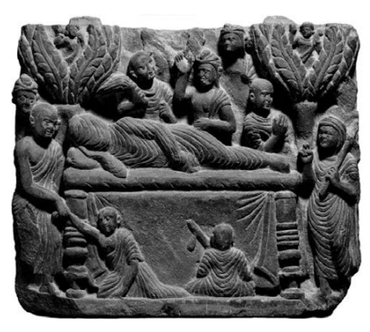

The relief vividly expresses the sense of loss that the Buddha's demise must have evoked among many of his disciples. The Buddha is shown with his face covered by his robes, conveying the fact that from now on his disciples will no longer be able to see him or be seen by him. Directly below the covered face his close attendant Ānanda is depicted overwhelmed by grief. The scene thus provides a telling contrast to the relief on the cover of the present book, which shows the Buddha alive and delivering a teaching, surrounded by listeners with devout attention. 

## 1.4 The Seven Sets

The need to ensure communal harmony, in the face of the apparent strife between Jain followers, is also taken up in the Pāsādika*-sutta* and the Sāmagāma*-sutta*, as well as in their parallels.

101 The parallel versions report that the Buddha taught a short *mātṛkā*, containing seven sets of mental qualities and practices known as the bodhipākṣikā *dharmāḥ*:
102 
- the four establishments of mindfulness (sm*ṛtyupasthāna*), 
- the four right efforts (*samyakprad*hāna), - the four bases for supernormal ability (*ṛddhipāda*), 
- the five faculties (*indriya*), - the five powers (*bala*), - the seven factors of awakening (*bodhyaṅga*), - the noble eightfold path (āryāṣṭāṅ*ga mārga*). 

The same seven sets of qualities and practices related to awakening also feature in most versions of the *Mahāparinirvāṇa-sūtra*, where they occur as a teaching given by the Buddha right after he had given up his will to live (*āyuḥsaṃskāra*).103 Other occurrences in Pāli discourses that have a parallel in the discourse collections of other schools indicate that these seven sets are gems of the Dharma,104 that they constitute the path to the destruction of the influxes,105 and that having successfully cultivated them is characteristic of arhats.106 This basic list thus covers the mental qualities that tradition considers crucial for progress to awakening;107 and it is this *mātṛkā* which according to the Mahāparinirvāṇa-*sūtra* was taught by the Buddha just before his passing away, and the *mātṛkā* that the Pāsādika*-sutta* and the Sāma-gāma*-sutta* as well as their parallels recommend for ensuring communal harmony. 

Even this rather short *mātṛkā* of seven sets already seems to be the outcome of some degree of growth beyond what is absolutely necessary from a practical perspective. Whereas the other sets take up what are distinct presentations, notwithstanding some overlap, the five faculties 
(*indriya*) are the same as the five powers (*bala*). Both cover the qualities of faith, energy, mindfulness, concentration, and wisdom, the only difference is the name given to these five: "faculties" or "powers".

108 When considered from a practical perspective, a list of qualities and practices that are essential for awakening covered under the seven sets could be arrived at by mentioning only six sets, leaving aside the five powers, once the five faculties have been mentioned.109 Although the distinction between faculties and powers might be pointing to each set performing different functions, in a bare list of qualities required for reaching awakening it would seem sufficient if the set of five qualities –
faith, energy, mindfulness, concentration, and wisdom - is mentioned just once.110 Be that as it may, the seven sets are found under the corresponding numerical sections in the Sa*ṅgīti-sūtra*. The Fours of all four versions of the Sa*ṅgīti-sūtra* list the establishments of mindfulness, the right efforts, and the bases for supernormal ability in precisely this sequence.111 The faculties and powers occur among the Fives of all versions, except for the Theravāda discourse, which only has the five faculties.112 The Sevens have the factors of awakening and the Eights the members of the noble eightfold path.113 This is a remarkable degree of correspondence among the otherwise quite divergent lists in the parallel versions of the Saṅgīti-*sūtra*. Such correspondence supports the impression that the thirty-seven qualities or practices assembled under the seven sets may have formed one or even the starting point from which the list in the Sa*ṅgīti-sūtra* developed; and the Sa*ṅgīti-sūtra* in turn is clearly the basis for the Saṅgīti-*paryāya* of the Sarvāstivāda Abhidharma collection.114 Although the Theravāda Abhidharma does not have a work corresponding to the Sa*ṅgītiparyāya*, the same tendency can be seen at work here as well. Thus, for example, a *mātṛkā* in the *Dhammasaṅga*ṇī matches closely the list of terms under the Twos in the Theravāda version of the Saṅgīti*-sutta*.

115 Again, the *Puggalapaññatti* adopts the same basic pattern of proceeding from Ones to Tens as the Sa*ṅgīti-sūtra* and the Saṅgīti-*paryāya*, here first presented in *mātṛkā* form, followed by working out the details of this *mātṛkā*.

116 The beginning parts of the Paṭisambhidā*magga*, a work of Abhidharma character found in the fifth *Nikāya* of the Pāli canon, appear to be based on extracts from the Theravāda version of the *Dasuttara-sutta*.

117 Nevertheless, the Abhidharma is not the mere product of the pro-liferation of lists. As the titles of the Sa*ṅgīti-sūtra* and of the Sa*ṅgītiparyāya* make clear, communal recitation is central to their purpose; and the basis for such communal recitation is a text that provides as comprehensive a summary of the teachings as possible. This is what informs the list of the seven sets, the list in the Sa*ṅgīti-sūtra*, as well as its exegesis in the Sa*ṅgītiparyāya*. 

The dynamic that stands behind this trajectory is the wish to summarize the teachings, to arrive at a succinct but still complete presentation of the essentials of the Dharma. The function of such a presentation lies in its providing a guide for practice and a basis for group recitation as a way of ensuring harmony among the disciples after the teacher's death. 

It is because of this thrust towards comprehensive summarizing that several of the lists surveyed in this chapter have had such an impact on the emergence of the Abhidharma. I will examine other related dynamics that contributed to the "dawn" of the Abhidharma in the next chapters. 

# 2 Wisdom And Early Canonical Abhidharma

In this chapter I study a list of elements found in the *Bahudhātuka-sūtra* and its parallels as part of a set of topics whose knowledge forms the basis for the cultivation of wisdom. Then I turn to the significance of references to the term *abhidharma* in the early discourses and to the nature of early canonical Abhidharma texts. My overall aim in the present chapter is to explore a few instances where passages in the early discourses have gone through a process of expansion, as well as to ascertain the basically commentarial nature of early canonical Abhidharma texts. 

## 2.1 Wisdom And The Elements

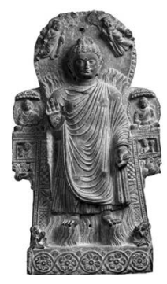

The stele shows the Buddha performing the twin miracle, which requires the simultaneous manifestation of fire and water emerging from different parts of one's own body,11 an expression of complete mastery over these material elements. 

In the above stele fire can be seen to emerge from the Buddha's shoulders whereas water flows from his lower body. 

Gandhāra, courtesy Musée Guimet. 

Less emphasis on the material aspect of existence is evident in another recurrent analysis of elements in relation to the senses, where the six senses, their objects, and the corresponding types of consciousness together make up a set of eighteen elements. The eighteen elements related to sense-experience and the six elements covering matter and consciousness appear at the outset of a detailed survey of various elements in the *Bahudhātuka-sūtra* and its parallels. This discourse is extant in the following versions, given according to their school affiliation: 
- Mūlasarvāstivāda tradition: a discourse preserved in Tibetan trans-lation;12 a discourse quotation in the *Abhidharmakośopāyikā-ṭīkā*, 
also extant in Tibetan translation;13 and a partial quotation that covers the exposition of the elements in the *Abhidharmakośavyākhyā*;
14 
- Sarvāstivāda tradition: a Madhyama-*āgama* discourse, preserved in Chinese translation;15 and a discourse found as a quotation in the Dharmaskandha, preserved in Chinese translation;16
- Theravāda tradition: a Majjhima-*nikāya* discourse, preserved in Pāli; 17
- uncertain school affiliation: a discourse translated individually into Chinese.18 The main topic of the *Bahudhātuka-sūtra* is wisdom, a topic broached by contrasting a fool or foolishness with a wise one or being wise. Most versions illustrate the predicament of foolishness with the example of a fire that starts from little, but which may eventually burn down a whole house.19 The opposite case of wisdom requires insight into the central categories of the Dharma, such as knowledge of the elements. 

In what follows, I translate the part of the discourse that surveys the elements whose knowledge leads to the gaining of wisdom. Since my interest in the present study is the trajectory from the early discourses to the early canonical Abhidharma, I base my study on the discourse quotation found in the twentieth chapter of the *Dharmaskandha*, which reads as follows: 
Ānanda said: "How is a wise one skilled in the elements?"
The Buddha said: (1) "A wise one who knows and sees as they really are eighteen elements is skilled in the elements: that is, one knows and sees as they really are the eye element, the form element, and the eye-consciousness element; the ear element, the sound element, and the ear-consciousness element; the nose element, the odour element, and the nose-consciousness element; the tongue element, the taste element, and the tongue-consciousness element; the body element, the tactile element, and the body-consciousness element; the mind element, the mind-object element, and the mind-consciousness element. 

(2) "Again, knowing and seeing as they really are six elements one is skilled in the elements: that is, one knows and sees as they really are the earth element, the water element, the fire element, the wind element, the space element, and the consciousness element. 

(3) "Again, knowing and seeing as they really are six elements one is skilled in the elements: that is, one knows and sees as they really are the element of sensual desire, the element of ill will, the element of harming, the element of dispassion, the element of nonill will, and the element of non-harming. 

(4) "Again, knowing and seeing as they really are six elements one is skilled in the elements: that is, one knows and sees as they really are the element of pleasure, the element of pain, the element of 
―――――― 19 T 776 at T XVII 712b26 only describes the making of a fire, without detailing its detrimental effects. I take this to be a textual loss, since a reference to a fire on its own does not illustrate the problem caused by a fool. 

joy, the element of sadness, the element of equanimity, and the element of ignorance. 

(5) "Again, knowing and seeing as they really are four elements one is skilled in the elements: that is, one knows and sees as they really are the element of feeling, the element of perception,20 the element of formations, and the element of consciousness. 

(6) "Again, knowing and seeing as they really are three elements one is skilled in the elements: that is, one knows and sees as they really are the sense-sphere element, the [fine-]material element, and the immaterial element. 

(7) "Again, knowing and seeing as they really are three elements one is skilled in the elements: that is, one knows and sees as they really are the material element, the immaterial element, and the element of cessation. 

(8) "Again, knowing and seeing as they really are three elements one is skilled in the elements: that is, one knows and sees as they really are the element of the past, the element of the future, and the element of the present. 

(9) "Again, knowing and seeing as they really are three elements one is skilled in the elements: that is, one knows and sees as they really are the inferior element, the middling element, and the sublime element. 

(10) "Again, knowing and seeing as they really are three elements one is skilled in the elements: that is, one knows and sees as they really are the wholesome element, the unwholesome element, and the undetermined element. 

(11) "Again, knowing and seeing as they really are three elements one is skilled in the elements: that is, one knows and sees as they really are the element of being in training (*śaikṣ*a), the element of no [longer] being in training, the element of being neither in training nor no [longer] in training. 

(12) "Again, knowing and seeing as they really are two elements one is skilled in the elements: that is, one knows and sees as they really are the element with influxes (*āsava*) and the element without influxes. 

(13) "Again, knowing and seeing as they really are two elements one is skilled in the elements: that is, one knows and sees as they really are the conditioned element and the unconditioned element. 

"This is called being a wise one who is skilled in the elements."
21 Before comparing the actual elements listed in the different versions of the *Bahudhātuka-sūtra*, I would like to note briefly a formal difference between the parallel versions. In the above passage from the Dharma-*skandha*, the Buddha expounds the whole list of elements without interruption. The same is the case for the other versions preserved in Chinese and Tibetan translation. In the Pāli version, however, each time one set of elements has been expounded, Ānanda intervenes with a question, asking if there could be yet another way in which a monk can be reckoned skilled in the elements.22 In this way, the Majjhima-*nikāya* discourse differs from its parallels by adopting a question-and-answer format. This formal difference does not make the Majjhima-*nikāya* presentation any more an expression of Abhidharma thought than its parallels. In fact, the Pāli version has the shortest list of elements, so that it exhibits the tendency to compile lists to a lesser degree than its parallels. 

This observation relates back to my discussion in the last chapter, in that the use of the question-and-answer format is simply a natural occurrence in an oral setting and need not in itself be seen as an expression of Abhidharma thought, however much this format may be prominent in Abhidharma texts. The same also holds for the use of lists, as in the present case. The mere fact of listing various elements does not necessarily mean that the *Bahudhātuka-sūtra* must be influenced by the Abhidharma. Nor does the fact that this list is quoted in a canonical Abhidharma text of the Sarvāstivāda tradition turn the *Bahudhātukasūtra* into an Abhidharma text itself. Nevertheless, the growth of the list of elements that can be discerned by comparing the parallel versions of the Bahudhātuka-*sūtra* does reflect a tendency that is of considerable relevance for the emergence of the Abhidharma. 

Regarding the actual list of elements, the above set of sixty-two elements recurs in the Mūlasarvāstivāda versions and in the Sarvāstivāda discourse found in the Madhyama-*āgama*. The same list also occurs in the Sa*ṅgītiparyāya*,
23 where it serves as a commentary on a reference to being "skilled in the elements", found in the Sarvāstivāda version of the Sa*ṅgīti-sūtra*.

24 The parallel to the *Bahudhātuka-sūtra* preserved as an individual translation in Chinese, however, lists only fifty-six elements. It lacks two sets of three: 
- group (7): material/immaterial/cessation, 
- group (8): past/future/present. 

The Theravāda version in the Majjhima-*nikāya* lists only forty-one elements. Besides groups (7) and (8), it also lacks the following sets: 
- group (5): feeling/perception/formations/consciousness, 
- group (9): inferior/middle/sublime, - group (10): wholesome/unwholesome/undetermined, 
- group (11): in training/no [longer] in training/neither, 
- group (12): with influxes/without influxes. 

Such variations could in principle be due to the following reasons: intentional omission, loss of text, or expansion of text. 

As regards the first possibility, intentional omission from the Thera-vāda discourse seems improbable, since other Pāli discourses list the elements that are not found in the Pāli version of the Bahudhātuka*-sutta*. The four elements (5) corresponding to the four immaterial aggregates, which anyway are part of the standard list of the five aggregates in various Pāli discourses, occur in the Mahāmāluṅ*kya-sutta*, where these four are employed as part of an analysis of concentration attainments.25 The groups of three elements (7 to 11) are all mentioned in the Saṅgīti*-sutta*.

26 The group of two elements (12) occurs, for example, in the Mahācattārī-*saka-sutta* in relation to the factors of the eightfold path,27 a topic to which I will return in a subsequent chapter. Given these occurrences, there would have been little reason for those responsible for the trans-mission of the Theravāda version to eliminate these groups from the discourse deliberately. 

The possibility of a loss of text is not particularly probable. Not only does the Theravāda version in the Majjhima-*nikāya* not show any evident sign of textual loss, but this explanation would also require two stages of accidental loss: a loss of the two groups (7 and 8) now absent from the Theravāda version and the version preserved as an individual Chinese translation; and then a separate loss of the other five groups (5 and 9 to 12). Although elsewhere in the same Majjhima-*nikāya* a substantial textual loss did occur,28 this left traces and moreover is a case of a single loss, not a double loss in stages as would be required in the present instance. 

The discourse versions of the *Bahudhātuka-sūtra* agree in covering four topics, of which the first is the elements and the last is a survey of impossibilities. The survey of impossibilities shows even more marked differences between the parallel versions than the section on the elements. 

As I have shown elsewhere, the variations found in this case make it safe to conclude that textual expansion must have been at work in this part of the discourse.29 In fact the 大智度論, whose title has been reconstructed as the **Mahāprajñāpāramitopadeśa*,
30 explicitly reports that the list of impossibilities in the *Bahudhātuka-sūtra* has been subsequently expanded.31 Once there is clear evidence for expansion in the last part of the discourse, it seems fair to conclude that variations in the first part of the discourse probably also result from the same tendency.

32 So out of the three explanations for the differences in the list of the elements, the third explanation is the most probable, in that the description of the elements in the passage translated above would be the result of a gradual expansion. During oral transmission such a gradual expansion would be a natural occurrence, where the topic of a wise one's skill in knowing the elements could easily have attracted additional sets of elements that the reciters considered as being relevant to the theme of wisdom. 

―――――― 29 Anālayo 2012c: 273–278. 

30 Cf. Demiéville 1950/1973: 470 note 1 and Lamotte 1970: viif. 31 T 1509 at T XXV 237a29 explains that "based on what the Buddha had said, the treatise masters further expanded by declaring [more] possibilities and impossibili-ties", 諸論議師輩, 依是佛語, 更廣說是處不是處. Lamotte 1970: 1525 note 1 suggests that this refers to the authors of the Abhidharma in particular, "le *Traité* a sans doute en vue les auteurs d'Abhidharma qui ont considérablement augmenté la liste des possibilités et impossibilités dressée par le Buddha."
32 This would be in line with a pattern described by Bodhi 2010: xii, where the "training in wisdom, as an intellectual discipline, gave rise to the first great wave of Buddhist philosophical thought in the period following the demise of the Buddha", which paid "increasing attention to the analysis and classification of the factors of experience that served as the objects of wisdom. Specialist monks would have compiled ever longer lists of elements, proposing various schemes of analysis and classification."
Given that the present state of the discourse appears to be the result of an expansion of the list of the elements, it would of course be possible that even the list of forty-one elements in the Theravāda version is already an expansion of an even shorter presentation. 

An indicator in support of such a hypothesis can be found in the case of the group of six elements (4): pleasure, pain, joy, sadness, equanimity, and ignorance. Once a list distinguishes between pleasure, pain, joy, and sadness, neutral or equanimous feeling would naturally fall into place as a fifth. The sixth item of ignorance, however, seems out of place in what otherwise is a list of different types of affective tones. Nevertheless, a firm conclusion does not seem possible, since the comparative study of the parallel versions has not brought to light an exposition of the elements that does not mention ignorance as part of this group of six elements. 

The full set of sixty-two elements found in the *Dharmaskandha*, however, clearly seems to be the result of amplification. The tendency towards expansion makes itself felt in the version of the discourse quoted in the *Dharmaskandha* in yet another way. Even though all versions, including the *Dharmaskandha*, agree on mentioning as one of several alternative titles for the discourse that it expounds four topics,33 the actual discourse quotation in the *Dharmaskandha* has a fifth topic: the five aggregates (*skandha*). The exposition of this fifth topic in the Dharma-*skandha* reads as follows: 
A wise one who knows and sees as they really are the five aggregates is skilled in the aggregates. That is, one knows and sees the aggregate of bodily form, the aggregate of feeling, the aggregate of perception, the aggregate of formations, and the aggregate of consciousness as they really are. This is called being a wise one who is skilled in the aggregates.34 The aggregates also occur in the quotation found in the Abhidharma-*kośopāyikā-ṭīkā*, where the *skandha*s are the first item in the exposition. 

The *Dharmaskandha* instead has the aggregates as its third topic. The discourse quotation in the *Abhidharmakośopāyikā-ṭīkā* merely mentions the "aggregates",
35 and thus does not have a detailed exposition of the type found in the *Dharmaskandha*. The fact that the other versions do not mention the aggregates at all, the different placing of the topic of the aggregates in these two versions, and the circumstance that the Abhidharmakośopāyikā-ṭīkā merely mentions the aggregates make it safe to conclude that this item must be a later addition. 

Here it is also noteworthy that this apparent addition occurs in discourse quotations. The present case thus illustrates a basic tendency where textual patterns that are already at work in some early discourses tend to evolve further when discourses are preserved as quotations in other texts.36 In the present case this further evolution creates to some degree a redundancy, as four of these five aggregates have already found inclusion as one of the groups of elements (5). 

Now an addition of the five aggregates is only natural in a context that describes the gaining of wisdom, given the eminent potential that insight into the nature of the five aggregates has according to the early discourses.37 Moreover, once the analyses into the elements and into the six internal and external sense-spheres are mentioned, it would be natural to add the five aggregates as another standard mode of analysis. The importance of these three sets can be seen, for example, in the Thera-vāda *Dhātukathā*, which employs the aggregates, the sense-spheres, and the elements as its basic scaffolding.38 The choice of the aggregates in a discussion of the topic of wisdom is thus not surprising. Their inclusion in the *Dharmaskandha*'s version of the *Bahudhātuka-sūtra* is significant in so far as it throws into relief a tendency at work also in the exposition of the elements. This is the attempt to make the presentation as comprehensive as possible, through the bringing together and assembling, saṃ*graha*, of all items that are in some way related to the main topic of wisdom.39 This is an important trajectory that from its roots in the early discourses becomes a central factor in the Abhidharma enterprise. 

The same tendency towards comprehensiveness can also be observed in relation to the five aggregates themselves. Once the number five is established, it is of course no longer possible to add further aggregates. Yet, the tendency to bring together and assemble various items in an attempt to be as comprehensive as possible can find its expression in the definition of what each aggregate is held to include. 

With the Abhidharma and later tradition, the fourth aggregate of formations becomes an umbrella category for assembling all those items that do not easily find an allocation under the other aggregates.40 This differs from the original import of the fourth aggregate, which stood mainly for volitional formations.41 In the early discourses the analysis of the five aggregates appears to have had predominantly the function of drawing attention to those aspects of subjective experience that are prone to be grasped at and clung to, hence the standard reference to five "aggregates of clinging", upā-*dānaskandha*. This perspective to some degree is lost from sight with the attempt to fit all and everything into this fivefold analysis.42 As a result, the fourth aggregate comes to stand for a broad variety of factors and thereby no longer functions as a pointer to the problem of identifying with and clinging to one's willpower and one's ability to take decisions and be in control.43 The tendency towards expansion of a topic appears to be in fact a general trait of the orally transmitted texts of early Buddhism. As part of this general tendency, the case of the *Bahudhātuka-sūtra* and its parallels reflects in particular an attempt to cover the topic of wisdom as comprehensively as possible by combining various teachings given on this topic into a single coherent whole. This appears to have led to an expansion of the list of elements in order to bring in as many different teachings on this subject as possible. 

The same tendency towards comprehensiveness in matters of wisdom is also evident in the addition of the topic of the five aggregates in quotations of the discourse, and in the fourth aggregate becoming an umbrella term for anything that does not easily find allocation among 
―――――― 42 Williams 2000: 89 explains that "in the immediate centuries after the death of the Buddha … even the five aggregates as simple unities were seen as obscuring a further dissolution, analysis into a plurality of further elements. This analysis rapidly came to embrace not just the psychophysical aggregates of a conscious being but also to in-clude all things in the universe."
43 Thus the *Dhammasaṅga*ṇī, for example, defines the fourth aggregate with the help of a long list of various mental factors and qualities, Dhs 17,32, after which it concludes by remarking that any other immaterial and conditioned qualities should be included except for the aggregates of feeling, perception and consciousness, y*e vā pana tasmiṃ* samaye aññe pi atthi paṭiccasamuppannā arūpino dhammā ṭhapetvā vedanākkhandhaṃ ṭhapetvā saññākkhandhaṃ ṭhapetvā viññāṇakkhandhaṃ, ayam tasmiṃ samaye saṅkhā-*rakkhandho hoti*. This clearly shows that the aggregate of formations has become an umbrella category for whatever does not neatly fit into the other aggregates. Definitions of the fourth aggregate in the *Dharmaskandha* and in the **Śāriputrābhidharma* introduce a distinction between formations that are conjoined with the mind, citta-saṃ*prayukta*, and those that are disjoined from the mind, *cittaviprayukta*; cf. T 1537 at T XXVI 501b16 and T 1548 at T XXVIII 547b13. This also reflects a rather evolved understanding of the fourth aggregate. 

the other aggregates. These instances point to a central task of the emerging Abhidharma: the providing of an ever more complete and precise map of the compass and significance of wisdom.44 

## 2.2 The Term Abhidharma

Before turning to the nature of early canonical Abhidharma texts, in what follows I examine references to the term *abhidharma* in the discourses. Surveying the various instances in which the expression occurs gives the impression of a gradual development from "*abhidharma*" as something that is related to the Dharma to "Abhidharma" as an independent mode of thought and eventually a textual collection in its own right. 

One type of occurrence in the early discourses involves the expression "*abhidharma* talk", *abhidharmakathā*. This expression occurs in the Mahāgosiṅ*ga-sutta*, which reads as follows: 
Two monks engage in *abhidharma* talk and ask each other questions. 

Asking each other questions, they answer without failing and their Dharma talk proceeds.45 The corresponding passage in a parallel to the Mahāgosiṅ*ga-sutta* found in the Madhyama-*āgama* reads as follows: 
Two monks who are teachers of the Dharma discuss the profound abhidharma with each other. They well comprehend and fully understand the matters they ask [each other] about. Answering without hesitation they teach the Dharma and discuss it with agility."
46 Another parallel preserved as an individual Chinese translation merely speaks of having a vision of the four truths without any doubt;47 thus in this version the term *abhidharma* does not occur at all.48 In the Mahāgosiṅ*ga-sutta* and its Madhyama-*āgama* parallel the reference to "*abhidharma* talk" or to discussing the "*abhidharma*" occurs alongside "Dharma talk" or "teaching the Dharma". This gives the impression that the two terms Dharma and *abhidharma* are here interchangeable. In the Mahāgosiṅ*ga-sutta*, the prefix *abhi-* would thus convey the sense of "about" or "concerning" the Dharma. The passage would then describe having a talk "about the Dharma" and discussing "about the Dharma", *abhidharma*.

49 The notion that the prefix *abhi-* conveys a sense of superiority appears to reflect a later understanding of the implications of the term. In line with later understanding, the commentary on the *Dhammasaṅga*ṇī, the *Atthasālinī*, refers to the present passage in support of the authenticity of the *Abhidharma-piṭaka* as the Buddha's word.50 A discourse in the Aṅguttara-*nikāya* describes a group of elder monks seated together "talking *abhidharma* talk".

51 In this case the Madhyama-*āgama* parallel does not employ the term *abhidharma* at all, but rather describes that these monks were "wanting to settle a matter of dispute, namely to discuss what is Dharma and Vinaya, what is the Buddha's teaching".

52 This case would be in line with the impression that *abhidharma* talk can simply stand for talk about the Dharma.53 Instead of the expression "*abhidharma* talk", the *Kinti-sutta*, of which no parallels seem to be known, speaks of a dispute about *abhidharma*.

54 The context shows that the reference here is to the seven sets, which in the *Kinti-sutta* have been listed just before,55 an understanding confirmed by the Pāli commentary.56 Another type of occurrence of the term *abhidharma* in the early discourses tends to come together with the term *abhivinaya*. Such usage makes it fairly clear that the prefix *abhi-* will have to be understood in a way that works for both terms, in the sense of some more detailed exposition or commentary "about", *abhi*-, the Dharma or the Vinaya.57 Here abhivinaya might stand for the commentary that grew around the prāti-mokṣa, the *vibhaṅga*, a feature common to the various Vinayas.58 The Tens of the *Dasuttara-sutta* in the *Dīgha-nikāya* describe having a desire for the Dharma, delighting in hearing it, and finding exceeding joy in the *abhidharma* and the *abhivinaya*.

59 The sense of the passage would be to find joy in what is "about" the Dharma and the Vinaya or what "concerns" them. The parallel versions in fact just speak of the Dharma.60 The Gulissāni*-sutta* recommends that a forest-dwelling monk should apply himself to *abhidharma* and *abhivinaya*, explaining that otherwise he might not be able to reply to questions regarding these two.61 Its Madh-yama-*āgama* parallel recommends that the monk should train in explaining and discussing the Vinaya and the *abhidharma*, otherwise he will not know how to reply about these two.62 In this way, what in the Pāli version is a reference to *abhivinaya*, in the Chinese parallel takes the form of the Vinaya. 

The same pattern recurs in relation to a set of discourses in the Aṅ-guttara-*nikāya*. Whereas these mention "questions regarding *abhidhar-*
ma and *abhivinaya*",
63 counterparts in the two Saṃyukta-*āgama*s speak of questions about *abhidharma* and Vinaya.64 When in these passages the term *abhidharma* occurs alongside the Vinaya, then this can easily give the impression that the term refers to a textual collection, the Abhidharma. In this way, a simple dropping of the prefix *abhi-* in the case of *abhivinaya* can substantially affect the meaning, as a discussion "about Dharma" and "about Vinaya" becomes a discussion of Abhidharma and Vinaya. 

This shift in a way reflects what would have been the actual development. Just as out of the *abhivinaya* the Vinaya as a canonical text would have come into being, so out of *abhidharma* in the sense of discussions "about the Dharma" the type of thought would have developed that eventually became the Abhidharma proper as a collection in its own right. 

The term Abhidharma in a developed sense occurs in several Chinese *Āgama* discourses, where the Pāli parallels do not have such a reference.65 One such instance is a discourse in the Ekottarika-*āgama* that describes four great standards (*mahāpadeśa*) to evaluate the authenticity of a text. Such evaluation should be based on whether the text conforms to the discourses, the Vinaya, and the Abhidharma.

66 According to the Pāli parallels, the evaluation should be based only on the discourses and the Vinaya, without any mention of the Abhidharma.67 A version of these four great standards preserved in Sanskrit fragments speaks of the discourses, the Vinaya, and the *dharmatā*;
68 and a Dīrgha-āgama version lists the discourses, the Vinaya, and the Dharma.69 While these versions do not mention the Abhidharma, it is easy to see how the last member of their threefold lists could turn into a reference to the Abhidharma. 

A reference to the Abhidharma can also be found in the Madhyama-*āgama* version of one of the eight principles to be respected (*gurudharma*) which according to the traditional account the Buddha presented as a precondition for granting the higher ordination to his foster mother Mahāprajāpatī Gautamī. According to this regulation, "if a monk does not give permission for a nun to ask questions, the nun cannot ask the monk questions about the discourses, the Vinaya, or the Abhidharma."
70 These principles to be respected vary considerably among the different accounts of this event.71 The listings of these eight in the Dharma-guptaka, Mahāsāṅghika, Mahīśāsaka, Mūlasarvāstivāda, and Theravāda Vinayas mention no prohibition on asking unauthorized questions.72 Only the Saṃmitīya Vinaya takes up a related case, prohibiting a nun 

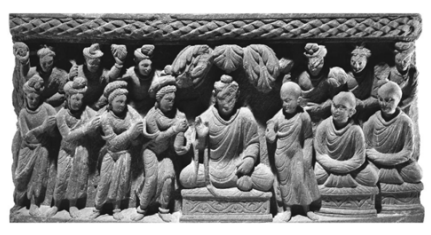

from asking a monk difficult questions.73 Thus the Abhidharma is not mentioned in any of the Vinaya versions of this particular principle to be respected. 

Figure 2.2 Mahāprajāpatī Requests Ordination The relief shows Mahāprajāpatī Gautamī requesting permission from the Buddha to go forth in his dispensation. 

Gandhāra, courtesy The Trustees of the British Museum. 

The same holds for a version of this list of eight principles which occurs in a biography of the Buddha preserved in Chinese;this text onlyenvisages that a nun could ask the community of monks about the discourses and the Vinaya.74 Another discourse in the Madhyama-*āgama* reports Śāriputra stating that it is possible to enter the attainment of cessation for those reborn in a particular heavenly realm,75 whereupon another monk repeatedly contradicts him. Eventually the matter comes before the Buddha, who rebukes the other monk for engaging in a "discussion on the profound Abhidharma".

76 The Pāli parallel in the Aṅguttara-*nikāya* similarly reports the Buddha's rebuke, without any reference to the subject matter of the discussion being Abhidharma.77 A Tibetan parallel preserved as a discourse quotation in the *Abhidharmakośopāyikā-ṭīkā* does have a reference to the Abhidharma, which in this case comes together with the Vinaya.78 The *Sappurisa-sutta* and its parallels list various qualities in relation to which one should avoid conceit. One such quality in a version of this discourse in the Madhyama-*āgama* is reciting the discourses, bearing in mind the Vinaya, and studying the Abhidharma.79 The Pāli discourse and a parallel preserved as an individual translation in Chinese mention being learned or knowing the discourses, knowing the Vinaya, and teaching the discourses or the Dharma.80 Neither has a reference to the Abhidharma. 

The same pattern recurs in relation to another Madhyama-*āgama* discourse, which reports the Buddha reflecting that he could give an exposition on the profound Abhidharma to a Brahmin visitor.81 A reference to the Abhidharma is not found in a Pāli parallel, nor in another parallel preserved as an individual translation in Chinese.82 The actual exposition given by the Buddha to his Brahmin visitor takes the form of a poem that describes an awakened one. Such a poetic exposition is not quite what one would associate with the term Abhidharma. 

The Buddha's reflection that he could give an exposition of the profound Abhidharma recurs in another Madhyama-*āgama* discourse.83 In this case, too, the parallel versions do not mention the Abhidharma.84 Another occurrence of the term Abhidharma can be found in the two Saṃyukta-*āgama* parallels to the Mahāvacchagotta*-sutta* of the Majjhi-ma-*nikāya*. The two discourses report the Buddha reflecting that he would rely on the Abhidharma and the Vinaya when replying to the question a wanderer was about to pose to him.85 The Buddha's reply then consists in a rather basic teaching on wholesome and unwholesome forms of conduct, again not quite what one would associate with the term Abhidharma. 

The Mahāvacchagotta*-sutta* does not mention any such reflection,86 only reporting that the Buddha announced that he could give teachings in brief or in detail. In its gloss on this passage in the Mahāvacchagotta*sutta*, the Pāli commentary devotes some space to discussing the nature of brief and detailed expositions, in the course of which it mentions the seven works of the canonical Abhidharma as an example of teachings that, from the commentarial viewpoint, should be considered as teachings given in brief.87 If a similar comment had been found in the commentarial tradition related to the Saṃyukta-*āgama* versions, such a remark might then have influenced the wording of the discourse itself. Of course, in the absence of access to such a commentary this remains hypothetical. Nevertheless, other passages in the Saṃyukta-*āgama* do at times show the influence of commentarial glosses that appear to have become part of the actual discourse,88 so it would not be surprising if the same should hold true for the present case as well. I will explore this topic in the next subsection of this chapter in more detail. 

In sum, the basic meaning of the term *abhidharma* in those early discourses where such a reference is also found in parallel versions seems to be intending simply what is "about" the Dharma. This sense is to some degree similar to the definition the term *abhidharma* carries in the Mahāsāṅghika Vinaya, where it stands for all of the nine *aṅga*s of the Buddha's teaching.89 Comparable to the development evident in the Vinaya accounts of the first sa*ṅgīti*, in some early discourses the Abhidharma begins to emerge as an entity in its own right. The instances surveyed above testify to an increasing use and popularity of the term, presumably reflecting the associations that the emerging Abhidharma evoked among the reciters. At times the use of the term is not yet well defined and seems somewhat accidental, such as when the Buddha delivers a poetic description of an awakened one to a Brahmin visitor, or when he decides to reply to questions by an inquisitive wanderer, a description that may have been influenced by a commentarial gloss. 

## 2.3 Canonical Commentary

The tradition of accompanying a discourse during oral performance with a commentary must hark back to very early stages in the development of the Buddhist tradition. Such commentaries provide the audience with additional information on the circumstances believed to have led to the delivery of a particular teaching or else offer an exegesis of this teaching. During oral transmission, the more "historically" oriented type of commentary that gives information about the circumstances of the delivery of a teaching will naturally remain closely connected to the discourse on which it comments. 

The same is not necessarily the case for an exegesis of a particular teaching. An explanation given in relation to one discourse on a certain topic can easily be used in the same way when another discourse on the same theme comes up for recitation. This would especially be the case for a commentary on recurrent topics of doctrinal importance. In this way, such a commentary can acquire a life of its own, in the sense of becoming increasingly independent from the discourse on which it originally commented. With the passage of time, it would not be sur-
―――――― 89 Cf. above page 17 note 9.

prising if out of a collection of more general commentaries an exegetical work in its own right came into being. This would explain the evolution of an exegetical tradition whose beginnings appear to be common to the different Abhidharma traditions.90 The basic tendency for early commentaries to acquire canonical status can be illustrated with examples from the *Sutta-piṭaka*. One such example would be the Aṭṭ*hakavagga* of the Sutta-*nipāta*. In the Pāli canon this text is basically a collection of stanzas, and the background narrations that describe the occasions believed to have led to the delivery of these stanzas are in the Pāli commentary on this work, the Pa-*ramatthajotikā*.

91 A Chinese translation of a parallel to the Aṭṭ*hakavagga*,
however, combines background narrations and stanzas into one.92 Here the prose narrations have the same "canonical" status as the stanzas. 

A commentary on the Aṭṭ*hakavagga* has also acquired canonical status in the Pāli canon. This is the *Mahāniddesa*, which is found in the Khuddaka-*nikāya*;
93 modern-day Theravāda traditions are still in disagreement about the precise contents of this *nikāya*.

94 The *Mahāniddesa* does not provide background narrations comparable to the Paramattha-*jotikā*, but instead offers an exegetical commentary on the significance of selected phrases found in the stanzas of the *Aṭṭhakavagga*. 

An example illustrating the canonization of commentarial material would be the tale of the murder of the female wanderer Sundarī. The story goes that, to discredit the Buddha and his disciples, other wander-ers had told Sundarī that she should visit Jeta's Grove frequently. Then the wanderers killed her and buried her in Jeta's Grove, accusing the Buddhist monks of having taken their pleasure with her and then killed her. 

This tale occurs in the *Paramatthajotikā* as a way of providing a background to the third discourse in the Aṭṭ*hakavagga*.

95 The relevant section in the *Mahāniddesa* only alludes to the story as part of its word commentary, without giving it in full.96 The third discourse in the Aṭṭha-*kavagga* has a parallel in the third discourse in the Chinese parallel. In the Chinese version, the discourse begins with the tale of her murder, followed by the corresponding stanzas which come interspersed with prose.97 Besides being mentioned in other Pāli commentaries, the Sundarī tale has also acquired canonical status in the Theravāda tradition, as it is found in a discourse in the *Udāna*.

98 In the case of the *Udāna* in general, the situation is the reverse of that of the Aṭṭ*hakavagga*. Whereas the Pāli Udāna collection combines its stanzas with prose that provides a narrative background, other *Udāna* collections consist for the most part only of stanzas.99 
―――――― 95 Pj II 518,15 to 523,16 (which also includes a word commentary, besides the narration of the tale), commenting on Sn 780 to 787. 

96 Cf. Nidd I 62,6 and Nidd I 64,1. 

97 T 198 at T IV 176b13. 98 Ud 4.8 at Ud 43,23; commentarial references to the tale are Jā II 415,12 and Dhp-a III 
474,5. 

99 The Sanskrit collection, attributed to Dharmatrāta, has been edited by Bernhard 1965 
(on which cf. esp. Schmithausen 1970); the Tibetan translation by Vidyaprabhākara has been edited by Beckh 1911 and Zongtse 1990; a Chinese translation of an *Udāna* collection can be found in T 213 at T IV 777a2 to 799c4. For Tocharian and Uighur fragments cf. Sieg and Siegling 1931, Lévi 1933: 41–56, von Gabain 1954: 23f and 38–44, and Thomas 1971 and 1979. Commentarial material on the *Udāna* has been preserved in the *Udānavargavivaraṇ*a by Prajñāvarman, which has been edited by Balk 1984. Parts of another commentary, the *Udānālaṃkāra* attributed to Dharmasoma, have been preserved in Tocharian fragments; cf. Lévi 1933: 72–77 and Sieg and Siegling 1933 and 1949.

An exception is an *Udāna* collection preserved in Chinese translation, which combines the stanzas with a word commentary comparable to the Mahāniddesa.

100 This *Udāna* collection does not report the story of Sun-darī, however. Among the different *Udāna* collections the Sundarī tale appears to be found only in the Pāli collection. 

In this way, the placing of the Sundarī tale in different texts illustrates how the same process of commentarial material acquiring a canonical status can occur in different ways in the Buddhist traditions. In the case of both the Aṭṭ*hakavagga* and the *Udāna*, during oral transmission a collection of stanzas would have been accompanied by a commentary that reported the circumstances of the delivery of the stanzas and explained their significance. 

At times, as in the case of the Chinese parallel to the Aṭṭ*hakavagga* or the Pāli version of the *Udāna*, in the course of transmission the relationship between commentary and text became so strong that eventually the commentary became part of the text on which it commented. 

The same is also evident in Vinaya literature, where the rules of the prātimokṣa are embedded in a prose commentary, *vibha*ṅga.

101 The prose commentary in the Theravāda Vinaya exhibits the same twofold features of providing a story, the *vatthu*, and an explanation of terminology, the *padabhājaniya*. The conjunction of text and commentary in this case has become so strong that the bare *prātimokṣ*a is not found sepa-rately in the canonical Vinaya of the Theravāda tradition.102 Other Vinayas similarly adopt the basic pattern of accompanying the individual rules with a commentary,103 in addition to which they have their *prātimokṣ*a also separately.104 In this way, a combination of the prātimokṣa as the basic *mātṛkā* with its "commentary" is a common feature in the development of Vinaya literature in different traditions. 

In view of this tendency of commentaries to acquire canonical status in the case of the Sūtra-piṭ*aka* and the *Vinaya-piṭaka*,
105 it would be only natural for the same tendency to influence the genesis of the Abhidhar-ma-piṭ*aka* as well. In other words, just as the combination of the prāti-*mokṣa* with its commentary was central for the development of the Vinaya, so too the combination of *mātṛkā*s with a commentary was instrumental in the development of the Abhidharma. Thus the use of a *mātṛkā* together with its exegesis is a characteristic common to the Abhidharma and the Vinaya, whose expositions often take the form of a commentary on a summary list. 

The part of the Vinaya that combines commentary with the prāti-mokṣa rules (the Vinaya *mātṛkā*) carries the title *vibha*ṅga. The same term *vibhaṅga* also serves as the title of a chapter (*varga*) in the Madh-yama-*āgama* and the Majjhima-*nikāya*. 

Although the discourses in this chapter in the two collections adopt an analytical mode of presentation that recurs in Abhidharma literature,106 this does not turn such discourses into Abhidharma texts themselves.107 Instead, they simply share with Abhidharma and Vinaya literature the basic procedure of combining a succinct statement of the mātṛkā type with its exegesis. 

The first four discourses in the chapter on *vibha*ṅga in the Majjhima-*nikāya* offer an explanation of a poem on how one should best spend one's time. This does not seem to be the type of text that one would naturally consider to be related to Abhidharma. 

The same holds for the next two discourses in the collection, which discuss karma and its fruit. The first of these two, the Cūlakammavi-bhaṅ*ga-sutta*, explains that killing others - provided one does not end up in hell for that - will make one become short-lived oneself. Hurting others leads to becoming sick, by being angry one will become ugly, by being stingy one will be poor oneself in the future, and so on (provided one is not reborn in hell instead). 

The popular appeal of this simple correlation of karma and its fruit can be seen in the vast number of parallel versions extant for this discourse,108 and in the fact that this description has inspired sculptural 
―――――― 106 Ronkin 2005: 30 notes that "the Vibhaṅ*ga-suttas* of the Majjhima-*nikāya* … are characterized by a catechetical style and are formulated as an exchange of questions and answers. An elaborate catechetical style is the hallmark of the *Kathāvatthu*, but a similar dialectical format also appears in several other Abhidhamma texts." Cox 1995: 10 points out that in the case of, e.g., the *Uddesavibhaṅga-sutta*, "the format closely resembles the method adopted by the Pa*ṭisambhidāmagga* and the *Vibhaṅga*, which are structured according to *uddesa*, or statements … and *niddesa*, or analytical exposition of those statements." 
107 Pace Buswell and Jaini 1996: 83, who refer to "the vibhaṅga-*sūtra*s, which constitute the second stage in the development of the Abhidharma"; cf. also Dessein in Willemen et al. 1998: 13: "the second phase in the development of *Abhidharma* literature are sūtras classified as '*vibhaṅga*'."
108 MN 135 at MN III 202,11 to 206,31 has the following parallels, listed according to the language in which they have been preserved: Chinese: MĀ 170 at T I 703c21 to 706b10, T 78 at T I 887b4 to 888b10, T 79 at T I 888b15 to 891a12, T 80 at T I 891a17 to 895b20, T 81 at T I 895b25 to 901b18, and T 755 at T XVII 588c8 to 590b6; Khotanese: Maggi 1995; Sanskrit: Kudo 2004 (cf. also Kudo 2006a, 2006b, and 2007, reliefs well beyond the Indian subcontinent, namely the panels of the 

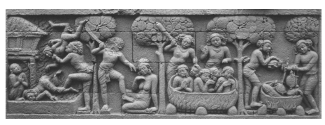

Borobudur *stūpa* in Java.109 Figure 2.3 Punishment in Hell The panel shows the terrible punishments in hell that await those who perform evil deeds. 

Borobudur, courtesy Volkenkunde Museum, Leiden. 

Whereas karma is of course a topic covered in the canonical Abhidharma, the basic exposition shared by the *Cūlakammavibhaṅ*ga and its parallels would not fall under this category. 

At the same time, however, some versions of the discourse build on this basic exposition in a way that would more easily fit the category of being an Abhidharma type of presentation. The case of the Cūlakamma-*vibha*ṅga thus neatly shows that it is not analysis in the *vibhaṅga* form itself, but how this at times proliferates which points to the emerging Abhidharma. 

The same is also evident in the exposition of the elements in the Ba-*hudhātuka-sūtra*, which shows that a basic driving force in the evolution of the Abhidharma proper is the wish to provide a complete map of all that is related to wisdom. I will return to the impact of the same tendency to expand lists in relation to the cultivation of meditation in the next chapter of my study. 

## 2.4 Early Canonical Abhidharma

The *Bahudhātuka-sūtra* is one of several discourses quoted in the Dhar-*maskandha*, which regularly presents excerpts from a canonical discourse, followed by an exegesis.110 The Sa*ṅgītiparyāya* shares this close relationship to the early discourses, differing from the *Dharmaskandha* in being based on a single discourse, the Saṅgīti-*sūtra*. 

The Sa*ṅgītiparyāya* also employs other discourse quotations in its exegesis of some of the doctrinal items that are listed in the Saṅgīti-*sūtra*.

111 This further underlines the close similarity between these two Abhidharma works, the *Dharmaskandha* and the Sa*ṅgītiparyāya*.

112 The same two works also share the feature of being attributed to chief disciples.113 The Sa*ṅgītiparyāya* on several occasions refers to the *Dharmaskan*-dha, which at first sight seems to indicate that it would be the later of the two works.114 However, it is also possible that these references only became part of the Sa*ṅgītiparyāya* during its translation into Chinese, as the *Dharmaskandha* was the first of the two works to be translated.115 That is, the Sa*ṅgītiparyāya* may only be "later" in terms of when it was translated into Chinese. 

These two works are generally reckoned to represent the earliest layer of the canonical Abhidharma literature of the Sarvāstivādins, 116 differing from later works of the same genre which no longer show such a close relationship to the discourses and which also do not place a comparable emphasis on originating from a chief disciple.117 The close relationship of the Sa*ṅgītiparyāya* and the *Dharmaskandha* to the early discourses and their involvement with them quite probably reflects the dynamics at work during an early stage in the formation of Abhidharma thought. 

A comparable pattern appears to be evident in the early Abhidharma literature of other schools. The *Vibhaṅga* of the Theravāda Abhidharma regularly expounds a particular topic first from the viewpoint of the discourses, the *suttantabhājaniya*, followed by tackling the same theme from the viewpoint of the Abhidharma, the *abhidhammabhājaniya*. It is remarkable that the *Vibha*ṅga in this way quite explicitly draws attention to the difference in perspective between the discourses and the early Abhidharma. 

The close similarity between the early Abhidharma works in their relationship to the early discourses can best be seen in the fact that the Vibhaṅga on several occasions draws for its expositions on the same type of discourse quotations as serve as the starting point for the exposition of these themes in the *Dharmaskandha*,
118 as well as in the corresponding section of the **Śāriputrābhidharma*, another early Abhidharma work that has been attributed to the Dharmaguptaka tradition.119 The similarity between these works in their relationship to the discourses extends to the following topics: 
- the four establishments of mindfulness (sm*ṛtyupasthāna*),120 - the four right efforts (*samyakprad*hāna),121 
- the four bases for supernormal ability (*ṛddhipāda*).122 In the case of the four absorptions (*dhyāna*) the same pattern holds, although here the length of the actual quotes differs. The *Dharmaskandha* begins directly with a discourse quotation that describes the four absorptions.123 The *Vibhaṅga* and the **Śāriputrābhidharma* quote an extract from the standard description of the gradual path first, before coming to the same standard description of the four absorptions.124 Even though the amount of text quoted from the discourses differs, the same basic pattern is at work here as well. 

In this way, these early Abhidharma works from three different traditions seem to have grown out of a common nucleus, which appears to have been mainly discourse quotations on central themes of the type listed above, combined with a commentarial exegesis. Thus the Abhidharma, considered by tradition to encapsulate the highest doctrine and to represent the acme of Buddhist wisdom, appears to have had its humble beginnings as a commentary on the discourses.125 What originally was merely "about", *abhi-*, the Dharma, eventually became the "superior" or "higher" Dharma, the Abhidharma,126 thereby overshadowing in importance the texts on which it originally commented. I will return to this sense of superiority in the fourth chapter of my study. 

 

# 3 Meditative Analysis And Omniscience

In this chapter I explore the theme of analysis in relation to meditation practice. The two meditation topics I take up are the analysis of the four noble truths, based on the relevant section in the Mahāsatipaṭṭhāna*-sutta* and not found in its Chinese parallels, and the analysis of absorption, based on a study of the *Anupada-sutta*, a discourse without parallels. 

Then I turn to the Buddha's awakening from the viewpoint of his cultivation of absorption and his realization of the four noble truths, and finally examine the notion that he was omniscient. My central interest in this chapter is the tendency of analysis to proliferate due to an attempt to provide a more comprehensive coverage, in the course of which new formulations and terms more typical of Abhidharma texts make their appearance in the early discourses. 

## 3.1 The Analysis Of The Four Noble Truths

The Smṛtyupasthāna-sūtra presents a series of exercises for the cultivation of mindfulness, covering the areas of contemplation of the body, feelings, mental states, and dharmas. The extant discourse versions are as follows, given according to their school affiliation: 
- Sarvāstivāda tradition: a discourse in the Madhyama-*āgama*, preserved in Chinese translation;1 - Theravāda: two discourses found in the Dīgha-*nikāya* and the Maj-jhima-*nikāya*, extant in Pāli;2
――――――
1 MĀ 98 at T I 582b7 to 584b28, entitled 念處經, "Discourse on the Establishments of Mindfulness"; MĀ 98 has been translated by Minh Chau 1964/1991: 87–95, Saddhāloka 1983, Nhat Hanh 1990: 151–167, Kuan 2008: 146–154, and Anālayo 2013d: 
269–286.

2 DN 22 at DN II 290,1 to 315,14 and MN 10 at MN I 55,27 to 63,21, entitled Mahāsati-paṭṭhāna*-sutta* and Satipaṭṭhāna*-sutta*, the "Greater Discourse on the Establishments of Mindfulness" and the "Discourse on the Establishments of Mindfulness".

- uncertain school affiliation: a discourse in the Ekottarika-*āgama*, 
preserved in Chinese translation.3 The discourse versions of the Sm*ṛtyupasthāna-sūtra* show considerable variations,4 especially in relation to the first and fourth areas of contemplation, concerning the body and dharmas. In the case of contemplation of dharmas, the Ekottarika-*āgama* version has two exercises, which are contemplation of the awakening factors and of the absorptions. The Madhyama-*āgama* version for this fourth sm*ṛtyupasthāna* lists three forms of cultivating mindfulness, which alongside the awakening factors cover the sense-spheres and the hindrances. These three are also found in the Dīgha-*nikāya* and Majjhima-*nikāya* versions, which include an additional two exercises: contemplation of the five aggregates and of the four noble truths. Listing the versions in order of increasing complexity, the topics of contemplation of dharmas described by them are as follows: 
Ekottarika-*āgama*: 1) awakening factors 2) absorptions Madhyama-*āgama*: 1) sense-spheres 2) hindrances 3) awakening factors Dīgha-nikāya/Majjhima-*nikāya*: 1) hindrances 2) aggregates 3) sense-spheres 4) awakening factors 5) noble truths Compared to their Chinese *Āgama* parallels, the *Dīgha-nikāya* and Maj-jhima-*nikāya* versions present the most extensive conception of the compass of contemplation of dharmas. Not only that, but the otherwise similar Pāli versions differ substantially in relation to the last of their exercises for contemplation of dharmas, contemplation of the four noble truths. In view of the importance accorded to the four noble truths in various Buddhist traditions, it can safely be assumed that a reference to them would not have been removed, had it been part of the original exposition.5 Thus contemplation of the four noble truths may well be an addition in the case of the *Dīgha-nikāya* and Majjhima-*nikāya* versions. 

In fact, not only the Chinese *Āgama* parallels, but even the Satipaṭṭhā-*na-vibha*ṅga in the *Vibha*ṅga of the same Theravāda tradition does not mention the four noble truths in its survey of sm*ṛtyupasthāna* meditation,6 as is also the case for the corresponding sections in the Dharma-*skandha* and *Jñānaprasthāna* of the Sarvāstivāda tradition.7 Only the 
*Śāriputrābhidharma has instructions on the four noble truths as part of its exposition of sm*ṛtyupasthāna*.

8 While probably a later addition, the four noble truths, being what according to tradition constituted the first teaching delivered by the recently awakened Buddha, would be a natural choice for inclusion in an exposition of mindful contemplation of dharmas. Such contemplation would inevitably have been influenced by the evolving significance of the term dharma in the Buddhist traditions, making it quite understandable if various doctrinal items of importance came to be included under this heading.9 The **Mahāvibhāṣā* quotes a statement from a discourse according to which all phenomena are included under the four sm*ṛtyupasthāna*s.10 The **Śāriputrābhidharma* formulates what would be the logical outcome of such an all-encompassing scope of the four sm*ṛtyupasthāna*s, namely that the fourth sm*ṛtyupasthāna* covers anything that has not been covered by the first three.11 In this way the evolution of the conception of the fourth sm*ṛtyupasthāna* exemplifies a drive towards a comprehensive coverage of all items perceived as relevant, a drive that appears to have had a decisive influence on the evolving Abhidharma traditions.12 The actual instructions given in the Satipaṭṭhāna*-sutta* of the Majjhi-ma-*nikāya* for contemplating the four noble truths are fairly brief, similar to the instructions given in the **Śāriputrābhidharma*. The Satipaṭṭhā-*na-sutta* enjoins that a practitioner should understand *duḥkha*, its arising, its cessation, and the path:13 Here, monks, a monk knows as it really is: "this is *dukkha*"; he knows as it really is: "this is the arising of *dukkha*"; he knows as it really is: 
"this is the cessation of *dukkha*"; he knows as it really is: "this is the path leading to the cessation of *dukkha*". 

The Mahāsatipaṭṭhāna*-sutta* found in the *Dīgha-nikāya*, however, gives a detailed exegesis of each of the four noble truths, so that four lines of text in the PTS edition of the Satipaṭṭhāna*-sutta* become nearly ten pages 
(with considerable abbreviations) in the same edition's version of the Mahāsatipaṭṭhāna*-sutta*.

14 This is in fact the main difference between the two versions found in the *Dīgha-nikāya* and the Majjhima-*nikāya*, 
namely the extent to which they describe contemplation of the four noble truths. 

The detailed exegesis in the Mahāsatipaṭṭhāna*-sutta* of the first and the fourth truths - *duḥkha* and the path to its cessation - can also be found in the *Saccavibhaṅga-sutta* of the Majjhima-*nikāya*.

15 This discourse and its parallels, attributed to Śāriputra, take as their theme the providing of an "analysis of the truths". The exposition of the first and fourth truths in the *Saccavibhaṅga-sutta* combines a short statement of each with a word-by-word explanation. 

Comparison of the Saccavibhaṅ*ga-sutta* with its parallels brings to light that a Madhyama-*āgama* parallel and an individually translated discourse provide a different word-by-word explanation,16 whereas an Ekottarika-*āgama* parallel has no such word-by-word explanation, but only the short statements of the first and fourth truths.17 This gives the impression that an early version of this discourse may have only had such short statements, a condition still reflected in the Ekottarika-*āgama*. 

In fact the early discourses generally tend to present the four noble truths and the noble eightfold path in a summary manner; detailed expositions of the type found in the present instance are relatively rare. 

In the present case, it seems that the commentarial type of explanation of the words used in these short statements came to be part of the exposition itself at some point during its transmission, resulting in different explanations found in the *Saccavibhaṅga-sutta* or else in the Madh-yama-*āgama* parallel and the individually translated discourse. In other words, comparative study suggests that the detailed exposition in the Sac-cavibhaṅ*ga-sutta* reflects later developments. 

When it comes to the second and third truths, however, the Saccavi-*bhaṅga-sutta* only gives the standard definition of craving and its cessation,18 without providing a more detailed commentary on these two. 

Whereas the Saccavibhaṅ*ga-sutta* only presents a detailed commentary on the first and fourth item, the Mahāsatipaṭṭhāna*-sutta* has such a presentation for all four. Here is the exposition of the second truth in the Mahāsatipaṭṭhāna*-sutta*: 
Monks, what is the noble truth of the arising of *dukkha*? It is this craving which leads to further existence and is accompanied by delight and lust, delighting here and there, namely craving for sensual pleasures, craving for existence, and craving for non-existence.19 Monks, when this craving arises, where does it arise; when it establishes itself, where does it establish itself? Whatever in the world is of a pleasing nature and an agreeable nature; when arising, it is there that this craving arises; when establishing itself, it is there that it establishes itself. What is of a pleasing nature and an agreeable nature in the world? 

(1) In the world the eye is of a pleasing nature and an agreeable nature; when arising, it is there that this craving arises; when establishing itself, it is there that it establishes itself. In the world the ear … in the world the nose … in the world the tongue … in the world the body … in the world the mind is of a pleasing nature and an
―――――― 18 MN 141 at MN III 250,32. 

19 The three types of craving - kāmataṇhā, bhavataṇhā, and vibhavataṇhā - are standard in expositions of the second truth in the Pāli discourses, but are not mentioned in Madhyama-*āgama* and Saṃyukta-*āgama* discourses, although the same is found in the *Dīrgha-āgama*; cf. the parallels to the Sa*ṅgīti*- and Daśottara-*sūtra*s, DĀ 9 at T I 
50a21 and DĀ 10 at T I 53a25 (= DĀ 11 at T I 57c15), and the parallel to the Mahāni-*dāna-sūtra*, DĀ 13 at T I 60c13. The three types of craving are also mentioned in an Ekottarika-*āgama* discourse, EĀ 49.5 at T II 797c8; cf. also Choong 2000: 166, Delhey 2009: 69 note 4, and Anālayo 2011a: 70 note 216.

agreeable nature; when arising, it is there that this craving arises; when establishing itself, it is there that it establishes itself. 

(2) In the world forms … in the world sounds … in the world odours … in the world tastes … in the world tangibles … in the world mental objects are of a pleasing nature and an agreeable nature; when arising, it is there that this craving arises; when establishing itself, it is there that it establishes itself. 

(3) In the world eye-consciousness … in the world ear-consciousness … in the world nose-consciousness … in the world tongue-consciousness … in the world body-consciousness … in the world mindconsciousness is of a pleasing nature and an agreeable nature; when arising, it is there that this craving arises; when establishing itself, it is there that it establishes itself. 

(4) In the world eye-contact … in the world ear-contact … in the world nose-contact … in the world tongue-contact … in the world body-contact … in the world mind-contact is of a pleasing nature and an agreeable nature; when arising, it is there that this craving arises; when establishing itself, it is there that it establishes itself. 

(5) In the world feeling arisen from eye-contact … in the world feeling arisen from ear-contact … in the world feeling arisen from nose-contact … in the world feeling arisen from tongue-contact … in the world feeling arisen from body-contact … in the world feeling arisen from mind-contact is of a pleasing nature and an agreeable nature; when arising, it is there that this craving arises; when establishing itself, it is there that it establishes itself. 

(6) In the world perception of forms … in the world perception of sounds … in the world perception of odours … in the world perception of tastes … in the world perception of tangibles … in the world perception of mental objects is of a pleasing nature and an agreeable nature; when arising, it is there that this craving arises; when establishing itself, it is there that it establishes itself. 

(7) In the world volition in regard to forms … in the world volition in regard to sounds … in the world volition in regard to odours …
in the world volition in regard to tastes … in the world volition in regard to tangibles … in the world volition in regard to mental objects is of a pleasing nature and an agreeable nature; when arising, it is there that this craving arises; when establishing itself, it is there that it establishes itself. 

(8) In the world craving for forms … in the world craving for sounds … in the world craving for odours … in the world craving for tastes … in the world craving for tangibles … in the world craving for mental objects is of a pleasing nature and an agreeable nature; when arising, it is there that this craving arises; when establishing itself, it is there that it establishes itself. 

(9) In the world thought of forms … in the world thought of sounds … in the world thought of odours … in the world thought of tastes … in the world thought of tangibles … in the world thought of mental objects is of a pleasing nature and an agreeable nature; when arising, it is there that this craving arises; when establishing itself, it is there that it establishes itself. 

(10) In the world pondering on forms … in the world pondering on sounds … in the world pondering on odours … in the world pondering on tastes … in the world pondering on tangibles … in the world pondering on mental objects is of a pleasing nature and an agreeable nature; when arising, it is there that this craving arises; when establishing itself, it is there that it establishes itself. 

Monks, this is called the noble truth of the arising of *dukkha*.

20 The Mahāsatipaṭṭhāna*-sutta* continues by applying the same procedure to the third truth, depicting the cessation of craving by working through the same set of details. The analysis of the second and third truths de-scribed here is unique in the Pāli discourses. A description of the arising and establishing of craving in the Saṃyutta-*nikāya* employs similar phrasing, but it applies this only to the six senses, corresponding to the exposition found above in section (1).21 The discourse does not take up the converse case of the cessation of craving (third truth) at all. 

―――――― 20 DN 22 at DN II 308,1 to 310,3 (for ease of reference, in my translation I number the subsections; the numbering is not found in the original). 

21 SN 12.66 at SN II 108,27 to109,5; the presentation in the parallel SĀ 291 at T II 
82b16 is even more brief. 

From the practical perspective of mindfulness training it makes sense to explain that craving for what is pleasing and agreeable can arise and establish itself in relation to each of the six senses (1) and the corresponding objects (2), or to consciousness (3) representing the mental experience of the sensory input. Once this much has been covered in mindfulness practice, however, it seems of less practical relevance to continue making the same point again and again as done in the Mahā-satipaṭṭhāna*-sutta*, directing mindfulness also to the fact that craving may arise in relation to the following aspects: 
4) contact, 5) feeling, 6) perception, 7) volition, 8) craving, 9) thought, 10) pondering. Stages (1) to (3) correspond to the standard presentation of the eighteen elements: the six senses, their six objects, and the six corresponding types of consciousness. Stages (4) to (7) appear to complement consciousness 
(3) with the remaining four aggregates, if contact (4) can be taken to represent the first aggregate of bodily form. Then follow craving (8), thought (9) and pondering (10). 

Particularly notable is that with stage (8) the exposition proposes that craving arises and becomes established in relation to craving. From a practical perspective, I find it difficult to conceive of a meaningful form of mindfulness practice that contemplates this particular mode of the arising of craving. 

Several scholars have already pointed out that the more detailed exposition of the four noble truths in the Mahāsatipaṭṭhāna*-sutta* appears to be an intrusion of commentarial exegesis into the discourse.22 This detailed exegesis recurs in the *Saccavibhaṅga* of the *Vibhaṅga*.

23 The driving force behind such a detailed analysis appears to be the attempt to cover the topic of craving in such a manner that any minor aspect whatsoever is included. In this way, the simple indication: "this is the arising of duḥkha" has evolved into a detailed breakdown of all possible ways in which one might conceive of the arising of craving. While such a detailed analysis in a canonical Abhidharma work is not surprising, to find the same in the discourses is unexpected. A case that is to some extent comparable can be found in the *Anupada-sutta*, to which I turn next. 

## 3.2 The Analysis Of Absorption

The *Anupada-sutta* is a discourse in the Majjhima-*nikāya* of the Thera-vāda tradition of which no parallel is known. The discourse begins with the Buddha praising Sāriputta's wisdom in detail,24 thereby broaching basically the same theme of wisdom as informs the *Bahudhātuka-sūtra* and its parallels. Following this praise comes a description of how Sāriputta contemplated various mental factors present in each of the four absorptions and in the first three of the immaterial spheres. 

The *Anupada-sutta*'s description not only takes into account the mental factors specific to each absorption, but also lists a set of mental factors that are invariably present during any absorption. Here is a translation of the relevant section on the first absorption, which offers a detailed analysis that is unique among the Pāli discourses:
Secluded from sensual pleasures and secluded from unwholesome states, with application and exploration, with rapture and happiness born of seclusion, Sāriputta dwelled having attained the first absorption. 

The states in the first absorption were determined by him one by one: application and exploration and rapture and happiness and mental unification and contact, feeling, perception, volition, mind,25 desire, determination, energy, mindfulness, equipoise, attention. Known these states arose, known they remained, known they disappeared. 

He understood thus: "Indeed, in this way these states, which have not been, come into being; having been, they disappear." Not being in favour of or against these states, he dwelled being independent, without being bound to them, being freed from them, being released from them, with a mind that is without confines. He understood: "There is an escape beyond this."
26 Reading the second paragraph can create a slight sense of awkwardness through the inconsistent use of the conjunction "and". This reflects an irregularity found in the original. The list of mental factors specific to each absorption in the *Anupada-sutta* employs the conjunction "and", 
ca, whereas the remainder of the list does not utilize any conjunction.27 Here is the relevant passage in Pāli:
vitakko ca vicāro ca pīti ca sukhañ ca cittekaggatā ca phasso vedanā saññā cetanā cittaṃ *chando adhimokkho viriyaṃ sati* upekkhā *manasikāro*. 

Thus while each of the first five factors comes with the conjunction ca, the rest come without it. Once a list of different items makes use of the conjunction "and", there would be no reason why it should suddenly stop using the same conjunction halfway through. This irregularity therefore suggests that the text combines two independent lists. 

The part of the list of mental factors that does not employ conjunctions is similar to an Abhidharma type of exposition, where the use of conjunctions is often dispensed with. Another pointer to later influence can be found in the expression "one by one determination", anupadava-*vatthita*, used in this part of the discourse. The term does not seem to occur elsewhere in the Pāli discourses, but only in later texts.28 The impression that the mental factors mentioned during the later part of the analysis of the first and other absorptions in the *Anupada-sutta* could be a later addition finds further support in an internal inconsistency, as occasionally factors are mentioned twice in the description of the same *dhyāna*. By way of illustration I translate the description of the third absorption: 
With the fading away of rapture, dwelling in equipoise with mindfulness and clear knowing, and feeling happiness with his whole being,29 Sāriputta dwelled having attained the third absorption, which noble ones declare to be one's happily dwelling with equipoise and mindfulness. 

The states in the third absorption were determined by him one by one: (equipoise)30 and happiness and *mindfulness* and clear knowing and mental unification and contact, feeling, perception, volition, mind, 31 desire, determination, energy, (mindfulness), 32 *equipoise*, 
attention. Known these states arose, known they remained, known they disappeared. 

He understood thus: "Indeed, in this way these states, which have not been, come into being; having been, they disappear." Not being in favour of or against these states, he dwelled being independent, without being bound to them, being freed from them, being released from them, with a mind that is without confines. He understood: 
"There is an escape beyond this."
33 In the second paragraph of the translation I have placed two terms in parentheses; these terms are not found in all of the editions I consulted. 

When they are found, they duplicate the terms I have put in italics. Thus in two editions equipoise is mentioned twice, in three editions mindfulness is mentioned twice. This refers only to duplications within the second paragraph, without taking into account the occurrence of these terms in the first paragraph, which corresponds to the standard description of the third absorption. 

The same type of redundancy is even more evident in relation to the fourth absorption, where in all editions consulted equipoise and mindfulness are listed twice in the analysis of mental factors present in this experience.34 For the purpose of analytical insight into the mental factors found in an absorption, there would be no need to list the same mental factor twice. 

In addition to this doubling, a partial redundancy can also be found in relation to the description of the third and fourth *dhyāna*, as the listing of each of these absorptions mentions a particular type of feeling –
pleasant feeling in the case of the third absorption and neutral feeling in the case of the fourth absorption - after which feeling in general is mentioned again.35 Since in the third absorption only pleasant feelings are experienced and in the fourth absorption only neutral feelings are found, from a practical perspective it seems redundant if the general category of feelings is mentioned again. 

These doublings further support the impression that the *Anupada-sut*-ta's description of the mental factors present in each absorption is a combination of what originally were different lists. The list apparently incorporated in the later part of the *Anupada-sutta*'s description seems to reflect an Abhidharma type of analysis.36 It is instructive to compare the description of the four absorptions in the *Anupada-sutta* with the degree of analysis provided in early canonical Abhidharma texts. The *suttantabhājaniya* of the *Vibhaṅga*, the Dhar-*maskandha*, and the **Śāriputrābhidharma* agree in taking their analysis only up to the level of detail reflected also elsewhere in the early discourses. Thus they are concerned with just those mental factors that are specific to a particular absorption. Here are the descriptions of the first and third absorptions from the *Vibhaṅga*:
Secluded from sensual pleasures and secluded from unwholesome states, with application and exploration, with rapture and happiness born of seclusion, he dwells having attained the first absorption …37 With the fading away of rapture dwelling in equipoise with mindfulness and clear knowing, and feeling happiness with his whole being, he dwells having attained the third absorption, which noble ones declare to be one's happily dwelling with equipoise and mindfulness.38 In the case of the first absorption, seclusion from sensual pleasures and unwholesome states points to the need to overcome the five hindrances, so that the practitioner can experience the inner rapture and happiness that are "born of seclusion". Besides this shift from sensual pleasure to inner pleasure, a characteristic of the first absorption is the presence of *vitarka* and *vicāra*. 

Although the term *vitarka* in general stands for "thought", in the context of absorption attainment I understand it to convey the sense of a directing of the mind that does not involve conceptual activity comparable to ordinary thinking and reflection.40 Hence I adopt the rendering of vitarka as "application", instead of its more usual sense as "thought", and vicāra as "exploration", instead of "pondering". 

In practical terms, a characteristic of the first absorption is the presence of some degree of mental application and its sustaining through exploration, which is needed to keep the mind in its concentrated condition. Once concentration deepens further, these will no longer be required. 

In the case of the third absorption, its defining characteristic vis-à-vis lower absorptions is the absence of rapture, which results in an equipoise in which mindfulness and clarity of knowing become prominent features of the mind, all the while being accompanied by a profound happiness that pervades the whole being of the meditator. 

Awareness of the central aspects that characterize these experiences serves a practical purpose, as it enables a clear recognition of the factors that are to be cultivated and of those that need to be left behind. 

Such a degree of analysis would also be sufficient for the development of insight, since to single out central mental components of an absorption experience suffices as a basis for developing insight into the conditioned, impermanent, unsatisfactory, and not-self nature of such experiences. Thus, from a practical perspective, awareness of the absorption factors specific to any absorption would be enough as a basis for the development of tranquillity and insight. 

The mental factors listed in what appears to be a later addition to the Anupada-sutta's treatment of the absorption factors - contact, feeling, perception, volition, mind, desire, decision, energy, mindfulness, equanimity, and attention - are invariably present in each of the four absorptions. By including these factors within the scope of Sāriputta's insight contemplation, the *Anupada-sutta*'s treatment shifts from what is of direct practical concern to what is of more general interest.41 Such a shift from immediate practical needs to a detailed description is symptomatic of the Abhidharma taxonomy, which attempts to give an account of mind and matter that is as exhaustive as possible.42 Comparable attempts to arrive at a more comprehensive list of the mental factors present in the first absorption can in fact be found in the Dhamma-*saṅga*ṇī, the *Dharmaskandha*, and the **Śāriputrābhidharma*.

43 The report in the *Anupada-sutta* that Sāriputta determined the mental 

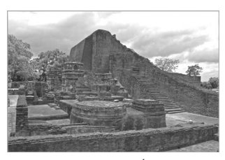

states of each absorption one by one endows the Abhidharma approach to analysis with the prestigious authority of having been the actual form of meditation practice undertaken by the disciple whom the early tradition reckoned as outstanding for his wisdom.44 The stūpa held to be of Śāriputra, a witness to the cult of this chief disciple and thus an expression of the high regard accorded to him by tradition. 

Nālandā, courtesy Namit Arora. 

In this way, the *Anupada-sutta* clearly reflects the type of presentation that became prominent with the Abhidharma and testifies to the tendency of analysis to be invested with a value of its own. To borrow an image from a discourse in the Saṃyutta-*nikāya* and its parallel in the Saṃyukta-*āgama*, the early teachings are like a handful of leaves.45 In contrast, the present instance reflects an effort to go beyond the mere handful in an attempt to collect as many leaves in the grove as possible. 

The *Atthasālinī* makes this point quite explicitly in its defence of the value and importance of the Abhidharma. According to its explanation, Abhidharma is what exceeds and is distinct from the Dharma taught in the discourses. In relation to a range of topics covering central early Buddhist doctrines or mental qualities, the *Atthasālinī* considers the analysis given in the discourses to be only partial, whereas the Abhidharma provides a full analysis.46 This succinctly describes a major trend in the Abhidharma enterprise towards exhaustiveness, towards giving a comprehensive inventory of all that there is.47 At the same time it reflects an attitude that came to the fore with the fully developed Abhidharma, by the time of which the instructions given in the discourses were perceived as somewhat lacking and insufficient. 

Similar to the instructions for contemplating the four noble truths in the Mahāsatipaṭṭhāna*-sutta*, the analysis of the absorptions in the An-*upada-sutta* reflects doctrinal concerns of the adherents of the emerging Abhidharma. Whereas both cases have grown out of an interest in meditative practice - the establishing of mindfulness and the attainment of absorption - the final results go beyond what other early discourses consider necessary for successful practice. 

## 3.3 The Buddha'S Awakening

According to the early discourses, the attainment of the absorptions and the gaining of insight into the four noble truths were central features of the path to awakening the Buddha himself followed. Independent of what historical value one wishes to assign to such descriptions, they do reflect the significance accorded by the early Buddhist tradition to the absorptions and the four noble truths. This can thus be used as a basis for comparison with the analysis of the absorptions and the four noble truths in the way this is depicted in the *Anupada-sutta* and the Mahā-satipaṭṭhāna*-sutta*. 

The Buddha's pre-awakening cultivation of absorption is recorded in the *Upakkilesa-sutta* and its parallel. After successfully overcoming various mental obstructions, he is described as cultivating concentration of the following types: 1) with application and exploration, 2) without application but with a remainder of exploration, 3) without application and without exploration.48 This presentation involves a basic form of analysis whose focus is on the role of *vitarka* and *vicāra* in particular. The three stages distinguished proceed from the presence of both through an intermediate stage, in which the former has disappeared and the latter still persists, to the absence of both. Whether the stage where *vitarka* has been overcome but vicāra still persists is taken into account explicitly or only covered implicitly depends on the perspective taken in regard to the development of absorption. 

The more common presentation by way of the four absorptions has a stronger emphasis on the affective tone that comes with deepening concentration and offers also a somewhat more detailed description of each level of absorption. The deepening of concentration described proceeds from the rapture and happiness of seclusion (first absorption), through the rapture and happiness of concentration (second absorption) and the happiness devoid of rapture (third absorption), to equanimity (fourth absorption). 

This more affectively oriented perspective does not need to take into account the stage when *vitarka* has been left behind but *vicāra* still persists, as this stage still falls under the category of rapture and happiness related to seclusion. Although this level of concentration is more refined than the rapture and happiness of seclusion experienced when *vitarka* is still present, it still falls short of being the rapture and happiness of concentration experienced with the second absorption. 

The above presentation in the *Upakkilesa-sutta* and its parallel instead focuses on the gradual appeasement of the need to apply the mind and sustain it on the object of concentration. Therefore the progressive deepening of absorption is formulated from the viewpoint of the presence or absence of *vitarka* and *vicāra*. 

These two modes of describing absorption experience do not entail a substantial difference in regard to actual experience, but are complementary analyses of the same process of deepening concentration. 

An account of the Buddha's cultivation of the absorptions that employs the more usual mode of presentation by way of the fourfold scheme can be found in a discourse in the Aṅguttara-*nikāya*. The discourse, which has no known parallel, depicts the Buddha's cultivation of the same nine successive concentration attainments as feature in the Anupada-sutta. The description makes it clear that this progression took place gradually and over an extended period of time.49 The same is also 
―――――― 49 The various attainments are preceded by the phrase *aparena samayena*; cf., e.g., for the second absorption AN 9.41 at AN IV 441,8. This makes it clear that each attainment should be understood to have taken place during successive time periods; for a discussion of AN 9.41 in relation to the Buddha's awakening (and his passing away) cf. also Anālayo 2014b.

evident in the Madhyama-*āgama* parallel to the *Upakkilesa-sutta*, which explicitly indicates that the Buddha cultivated each of the different concentrations for days and nights.50 According to the Aṅguttara-*nikāya* discourse, what enabled the Buddha to progress from the first absorption to the second was the overcoming of *vitarka* and *vicāra*, and further progress to the higher absorptions took place by leaving behind first rapture and then happiness. The description confirms that, even in the case of the Buddha himself, basic awareness of the factors specific to a particular absorption was considered a sufficient degree of analysis for practical purposes. This was enough to enable him to recognize clearly the factors that are to be cultivated and those that need to be left behind in order to attain a higher absorption. Such a relatively straightforward degree of analysis clearly differs from the detailed scrutiny of the absorptions described in the Anupada-sutta. 

Turning from absorption to the four noble truths, these feature prominently in what according to tradition was the Buddha's first teaching delivered after his awakening.51 Now according to the different versions of the first teaching, the Buddha announced to his first five disciples that what he had to convey was something new that had not been heard before in the contemporary setting. It follows that from the perspective of the early discourses the Buddha's realization could not simply be couched in standard formulations taken from the ancient Indian soteriological and philosophical background. It is against this context that the function of the basic teaching of the four noble truths as a form of analysis emerges most clearly. This mode of presentation corresponds to a scheme of medical diagnosis. Expressed in medical terms, the basic teaching of the four noble truths looks as follows: 
disease: duḥkha pathogen: craving health: Nirvāṇa cure: eightfold path There is no firm evidence for the existence in ancient India of such a scheme in medical literature that predates the time when the Buddha lived.52 This is not surprising, since extant Āyurvedic treatises stem from a later period. Some early discourses, however, explicitly compare the four noble truths to medical diagnosis.53 This makes it in my view fairly probable that some such diagnostic scheme was known, even though this may have been in use only at a popular level.54 The choice of an analytical scheme taken over from medical diagnosis would result in a mode of presentation that in the ancient setting could have been easily understood. 

The use of such an analytical scheme for conveying the Buddha's awakening needs to be understood for what it is: a conceptual tool. The awakening itself would of course have been his realization of Nirvāṇa, corresponding to the third of the four noble truths, the cessation of *duḥkha*. 

This is the one truth that according to the parallel versions of the first sermon needs to be "realized". 

With such attainment of Nirvāṇa, then, *duḥkha* would be fully understood (by having realized what goes beyond it), craving would be eradicated, the cessation of *duḥkha* would be realized, and the cultivation of the eightfold path would reach its consummation. 

The success of a medical analogy to convey the Buddha's realization is reflected in the narrative account of the first teaching in the different canonical versions.The parallels agree that, on being taught this analytical scheme, one ofthe five former companions oftheBuddha attained streamentry,55 whereby the Buddha had set in motion the wheel of Dharma. 

Elsewhere the discourses regularly report the attainment of streamentry taking place when the Buddha delivers a teaching on the four noble truths.56 These passages give the impression that this basic degree of analysis, based on a medical diagnostic scheme, was regarded as sufficient for practical purposes, without a need for a detailed breakdown ofthe arising and cessation of duḥ*kha* as described in the Mahāsatipaṭṭhā*na-sutta*. 

In sum, the depiction of the Buddha's own attainment of the absorptions and of his insight into the four noble truths provides a significant contrast to the degree of analysis of the absorptions and the four noble truths advocated in the *Anupada-sutta* and the Mahāsatipaṭṭhāna*-sutta*. 

When evaluating this contrast, it needs to be kept in mind that Buddhist traditions hold that the Buddha awakened to omniscient knowledge. 

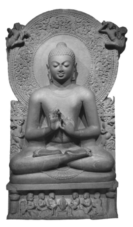

The relief shows the seated Buddha with his hands in the gesture of setting in motion the wheel of Dharma. Below the Buddha in the centre is the wheel of Dharma, with an antelope on each side, reflecting the location of the first sermon at the Mṛgadāva. The wheel is surrounded by the first five disciples, who listen with respectfully raised hands. 

Sārnāth, courtesy Eric R. and John C. Huntington, The Huntington Archive at The Ohio State University. 

In other words, even for reaching omniscience the relatively simple analysis of the absorptions and the four noble truths appears to have been considered sufficient, leaving little scope for arguing that more detailed analysis is needed for progress to awakening. 

Placing the descriptions of the Buddha's own progress to awakening alongside the *Anupada-sutta* and the Mahāsatipaṭṭhāna*-sutta* reveals a trajectory that leads from a relatively basic and straightforward approach to detailed analyses concerned with minute details. While the employment of analysis in itself is an integral part of early Buddhist thought, the tendency for analysis to expand its scope and proliferate points to the emerging Abhidharma. 

To be sure, the topics taken up in the *Anupada-sutta* and the Mahā-satipaṭṭhāna*-sutta* are rooted in meditation practice and experience. 

Their starting points are the attainment of absorption and insight into the four noble truths, central aspects of the path to awakening. Yet, with the detailed analyses presented in these two discourses, basic practical needs fade into the background. With this I am not intending to suggest that Abhidharma lists cannot become the basis of fruitful meditation practice.57 My point is only that the approach to meditation practice that emerges from the early discourses is considerably simpler. 

Although early Abhidharma analysis takes off from eminently practical concerns,58 in the course of its trajectory such concerns tend to lead to analysis undertaken for its own sake.59 One need not look far for the cause of this tendency: it lies in the attempt to be as detailed and comprehensive as possible. Once the task is no longer just to point out the way, but rather to provide a complete map of the whole territory to be traversed, there is inevitably a danger that the actual road to be taken might become buried under the amount of details provided. 

The tendency in the Abhidharma traditions to attempt a comprehensive coverage of all relevant items stands in a close relation to the belief, shared by different Buddhist traditions, that the Buddha's awakening involved his gain of omniscient knowledge,60 to which I turn next. 

## 3.4 The Buddha And Omniscience

The establishing of a relationship between knowing all and awakening in general can be seen in a passage in the *Itivuttaka* and its Chinese counterpart. The two versions state that it is not possible to attain awakening without understanding and fully knowing "all".

61 Since in early Buddhist thought the awakening of an arhat does not require the attain-
According to its Madhyama-*āgama* parallel, the Tathāgata had awakened to and attained all that is completely right.66 In these two cases the statement found in the Pāli versions is formulated in such a way that it could alternatively be interpreted as a claim to omniscience. While the original import of the passages in the Ariyapa-*riyesanā-sutta* and the Aṅguttara-*nikāya* discourse seems to be that the Buddha had acquired penetrative insight in relation to all aspects of experience, it is easy to see how such formulations could be understood differently. 

In fact the Pāli commentary on the Aṅguttara-*nikāya* takes the discourse to imply that there is nothing seen, heard, etc., by all beings that the Tathāgata has not seen, heard, etc.67 That is, the commentary takes the formulation in the discourse to refer to factual knowledge of all that is seen, heard, etc. 

According to another Pāli discourse, the Buddha explicitly denied having ever made a claim to omniscience, clarifying that to attribute such a claim to him amounts to misrepresentation.68 No parallel to this discourse appears to be known.69 Another Pāli discourse which does have parallels records the Buddha declaring that there is no recluse or Brahmin who has omniscient knowledge at once,70 apparently in the sense that with a single state of mind one cannot know everything.71 Counterparts to this statement in the Madhyama-*āgama* and in the *Bhaiṣajyavastu* of the Mūlasarvāstivāda Vinaya have the slightly different formulation that there is no *other* recluse or Brahmin who has omniscient knowledge at once.72 This slight difference in formulation leaves open the possibility of making such a claim for the Buddha. 

An Ekottarika-*āgama* discourse on Maitreya, which is without a parallel among the early discourses, reports that the Buddha understood all that is past, present, and future.73 An explicit claim to omniscience can then be found in a Madhyama-*āgama* discourse, according to which Urubilvā Kāśyapa proclaimed in front of King Bimbisāra that his teacher, the Buddha, was omniscient.74 A range of parallels to this episode do not record such a claim.75 The *Kathāvatthu* then states that the Buddha was omniscient,76 and the Pāli commentaries even go so far as to refer to the Buddha already before his awakening as the "omniscient bodhisattva".

77 In a similar vein, the *Mahāvastu*'s description of queen Māyā's delivery speaks of the birth of the "omniscient one".

78 Such knowledge of the future is difficult to reconcile with the early Buddhist doctrine of conditionality, according to which what will happen in the future is conditioned, but not determined. Omniscient knowledge of the future would require that the future be predetermined.82 Unlike knowledge of the past, knowledge of the future in its entirety would thus be impossible from the early Buddhist doctrinal viewpoint. 

That the Buddha was not originally believed to have been endowed with complete knowledge of the future can also be seen in the background narrations given in the different Vinayas to explain what led to the promulgation of various rules for the monastic community. Again and again these narrations report that the Buddha changed an earlier ruling because this had led to unforeseen problems.83 It clearly follows that, at the time these parts of the Vinaya came into being, the Buddha was not yet believed to have complete knowledge of the future. 

The same also holds for the *Sandaka-sutta* and its Sanskrit fragment parallel. The *Sandaka-sutta* highlights the difficulties that arise for a teacher who claims to be omniscient when he has to explain any kind of misfortune that may have happened to him. He might go begging without getting anything, or take a road that leads to his being attacked by a wild animal, or else have to enquire after the name of a particular village and the way to reach it. On being questioned how such a thing could have happened, an omniscient teacher will have to resort to evasive ar-
―――――― 81 T 1579 at T XXX 499a4: "time is of three types; one: the past, two: the future, and three: the present. Because of knowing as it really is in this way all elements, all mat-ters, all categories, at all times, omniscience is so called", 時有三種: 一過去, 二未來, 三現在. 即於如是一切界, 一切事, 一切品, 一切時, 如實知故, 名一切智.

82 Upadhyaya 1971: 276 notes that "the courses of future events … cannot be considered as wholly determined, and hence to speak of omniscience in relation to [the] 
future is to maintain an impossible position." Karunaratna 2004: 216 comments that "knowing everything in the future would admit of a doctrine that is pre-determinist in nature." 
83 Gombrich 2007: 206f points out that "the idea that the Buddha was omniscient is strikingly at odds with the picture of him presented in every *Vinaya* tradition". These "show that the Buddha … occasionally made a false start and found it necessary to reverse a decision. Since omniscience includes knowledge of the future, this is not omniscience"; cf. also the dilemma raised at Mil 272,18. 

guments, maintaining that he had to get no alms, had to take that road, had to ask for the way.84 The Sanskrit fragment parallel envisages that such an omniscient teacher may fall into a pond, a sewer, or a cesspool, or even bang his head on a door, thereby further enhancing the absurdity of such a teacher's claim to omniscience.85 The *Sandaka-sutta* concludes that to follow such a teacher is to embark on a spiritual life that brings no consolation.86 The criticism voiced in this discourse would be difficult to reconcile with events associated with the life of the Buddha, such as his ordaining of Devadatta,87 or even his going begging without receiving anything.88 Such events could only be explained by resorting to the type of evasive arguments criticized in the *Sandaka-sutta* and its parallel. So it seems that, similar to the Vinaya narrations, when the *Sandaka-sutta* and its parallel came into being, the Buddha was not yet considered omniscient. 

In the course of time, however, it was probably unavoidable that omniscient knowledge came to be attributed to the Buddha.89 In the ancient 
―――――― 84 MN 76 at MN I 519,22. 

85 SHT III 942 R3, Waldschmidt et al. 1971: 205: palvalaṃ prapā[ta]ṃ *syandanikāṃ* gūtho[ḍ*]igalla*ṃ, R4: kavātaṃ *vā [ma]r[date]*. 

86 MN 76 at MN I 519,32: anassāsikam idaṃ *brahmacariyan ti*. 87 This problem is taken up in Mil 108,11; for a discussion of the Buddha's omniscience in this work cf. Endo 1990: 163–166; on Devadatta cf. the detailed studies by Mukherjee 1966 and Bareau 1991.

88 SN 4.18 at SN I 114,9, SĀ 1095 at T II 288a15, and EĀ 45.4 at T II 772b2. 

89 Warder 1970/1991: 135 reasons that "since other *śramaṇ*as had made this claim, or had it made for them, it was perhaps natural that Buddhists should wish to set their teacher at least as high as anyone had suggested it was possible to get." According to Jaini 1974: 80, "in the face of the extraordinary claims of the Jains for their Tīrthaṅkaras, however, it is inconceivable that the eager followers of the Buddha could have long refrained from pressing similar claims for their 'enlightened' Master." Werner 1981/2013: 59 comments that since "claims of omniscience had been made in the time of the Buddha for other ascetic teachers … it is understandable that such a claim would eventually be made also for the Buddha." Naughton 1991: 37 suggests that probably 
"later statements attributed to him [the Buddha] where he appears to claim some form of omniscience for himself were interpolations created by disciples who felt uncom-fortable comparing their teacher with Mahāvīra, who had claimed a literal kind of omniscience all along."
Indian setting, a claim to omniscient knowledge was made by the leader

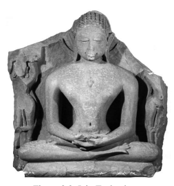

of the Jains.90 The Buddhist texts reflect awareness of such a claim.91 Figure 3.3. Jain Tīrthaṅkara The stele shows the first of the Jain Tīrthaṅkaras. 

All Tīrthaṅkaras are believed to have reached omniscience.92 Vidiśā Museum, courtesy John C. Huntington, The Huntington Archive at The Ohio State University. 

A commentary on the Ekottarika-*āgama*, preserved in Chinese translation, explains that the Abhidharma has in particular the function of defeating non-Buddhists.93 Similar indications can be found in the Vijñā-*nakāya* and the **Mahāvibhāṣā*, 94 as well as in the Mahāyānasutrālaṃ-*kāra*.

95 These explanations point to the use of the Abhidharma as a tool in competition and debate with other groups in the ancient Indian setting.96 The same is also evident in the introduction to the Sa*ṅgītiparyāya* (as well as the Sa*ṅgīti-sūtra*), discussed above,97 whose central purpose in leading to communal harmony is explicitly contrasted with quarrels that apparently broke out among the Jains after the death of their leader. 

The elevation of the Buddha's realization to omniscience appears to have similarly been influenced by the need to match contemporary rivals, especially those who, like the Jains, had a teacher believed to be omniscient. Besides this parallelism, the basic tendency behind the evolving Abhidharma and omniscience is similar, in that both are about a comprehensive knowledge of all facts and details. 

The *Atthasālinī* in its defence of the Abhidharma as the word of the Buddha states that one who refuses the Abhidharma thereby refuses the Buddha's omniscient knowledge. Such a person is engaging in one of the eighteen causes of a schism and should be chased away.98 This passage makes two significant points. One is the identification of the Abhidharma with omniscient knowledge. In other words, the attempt to provide a comprehensive coverage typical of the Abhidharma is seen as an expression of the comprehensive knowledge the Buddha was held to have gained through omniscience. The other point is the allusion to schism, the very opposite of the communal harmony that is the aim of sa*ṅgīti*, communal recitation. A person who questions the canonicity of the Abhidharma is such a threat to the community that his presence cannot be tolerated. 

When seen from this viewpoint, it becomes clear that the Abhidharma follows a current that also informs the notion of the Buddha's omniscience. Both provide a feeling of security through conveying a sense of completeness. The completeness of understanding that the Buddha was believed to have realized through his attainment of omniscience then finds its counterpart in the comprehensive coverage offered in Abhidharma treatises. 

The elevation of the Buddha to the position of an omniscient teacher and the attempt to develop a comprehensive map through the Abhidharma are interdependent. Both are to some degree a response to the emotional need of the disciples at a time when the teacher had passed away. 

They provide a sense of assurance direly needed in the struggle to ensure the survival of the fledgling community of Buddhist disciples in their competition with outsiders. 

Moreover, both are a move back to common Indian turf: the one by placing the Buddha's liberating insight on a par with the claims made by other contemporary teachers to have complete factual knowledge of all things; the other by presenting his teaching as a detailed inventory of all that is,99 instead of being about letting go of whatever it may be. 

 

# 4 Awakening And The Authentication Of The Abhidharma

My exploration in this chapter begins with the notion of the supramundane path in the Mahācattārīsaka*-sutta*, before turning to descriptions of the path in the early discourses in general. Then I take up parallelisms between the Abhidharma and the Mahāyāna in their attempt to be recognized as authentic records of the Buddha's word, and study the tale according to which the Abhidharma was taught by the Buddha to his mother during a sojourn in the Heaven of the Thirty-three. My main concern in what follows is the emergence in the early discourses of distinct Abhidharma thought. 

## 4.1 The Supramundane Path

In early Buddhist thought, the path to awakening is of course the noble eightfold path,1 which is considered an ancient path rediscovered by the Buddha.2 This eightfold path is the "stream" that is "entered" with stream-entry.3 Working out the precise relationship of the eightfold path to the attainment of stream-entry and higher stages of awakening is a topic dealt with only in the Abhidharma traditions, although such concerns are already reflected in the Mahācattārīsaka*-sutta*. The main versions of this discourse are as follows, given according to their school affiliation: 
- Mūlasarvāstivāda tradition: a discourse quotation in the Abhidharma-kośopāyikā-*ṭīkā* preserved in Tibetan translation;4 
- Sarvāstivāda tradition: a Madhyama-*āgama* discourse, preserved in Chinese translation;5 
- Theravāda tradition: a Majjhima-*nikāya* discourse, preserved in Pāli.6 The Mahācattārīsaka*-sutta* and its counterparts examine the noble eightfold path from the viewpoint of right concentration. The parallel versions define right concentration as one-pointedness of the mind that is supported by the other seven factors of the noble eightfold path. They then show how these factors interrelate, indicating that right view functions as a precursor for the other factors of the path. 

The particular function of right view here is to differentiate between right path-factors and their opposites, wrong path-factors. In this role, right view has the support of right effort and right mindfulness. Right effort stands for making an effort to overcome wrong path-factors and to cultivate right path-factors, whereas right mindfulness is the quality of awareness that is required to oversee this task. 

The Mahācattārīsaka*-sutta* and its parallels describe this cooperation of the path-factors right view, effort, and mindfulness in relation to other path-factors like intention, speech, action, and livelihood, including view itself. In each case, the parallel versions contrast wrong manifestations of the path-factors with their right counterparts. 

The Pāli version stands alone in working instead through three instances of the path-factors: wrong path-factor, mundane right path-factor, and supramundane right path-factor. Here is the threefold exposition in the case of the path-factor of intention in the Mahācattārīsaka*-sutta*: 
Monks, what is wrong intention? Intention of sensuality, intention of ill will, and intention of harming - monks, this is wrong intention. 

Monks, what is right intention? Monks, I say that right intention is of two types: monks, there is right intention that is with influxes, partaking of merit, and resulting in the acquisition [of future rebirth]. 

Monks, there is right intention that is noble, without influxes, supramundane, and a factor of the path. 

Monks, what is right intention that is with influxes, partaking of merit, and resulting in the acquisition [of future rebirth]? Intention of renunciation, intention of non-ill will, and intention of non-harming - monks this is right intention that is with influxes, partaking of merit, and resulting in the acquisition [of future rebirth]. 

Monks, what is right intention that is noble, without influxes, supramundane, and a factor of the path? Whatever reflection, thought, intention, mental absorbing, mental fixing, directing of the mind, and verbal formation there is in the noble mind, the mind without influxes of one who is endowed with the noble path and who is cultivating the noble path - monks, this is right intention that is noble, without influxes, supramundane, and a factor of the path.7 The most remarkable aspect of the Mahācattārīsaka*-sutta*'s threefold exposition of intention is the distinction it draws between mundane and supramundane instances of this path-factor. Such a distinction is not found at all in the parallel versions in the Madhyama-*āgama* or in the Abhidharmakośopāyikā-ṭīkā, nor does such a presentation recur else-where in the Pāli discourses.8 The same threefold exposition continues in the Mahācattārīsaka*sutta*'s descriptions of the supramundane path-factors of right speech, right action, and right livelihood.9 These are as follows, this time leaving aside the descriptions of the corresponding wrong and mundane right path-factors: 
Monks, what is right speech that is noble, without influxes, supramundane, and a factor of the path? Whatever avoiding, abstaining, desisting, and refraining from the four types of verbal misconduct there is in one of noble mind, whose mind is without influxes, who is endowed with the noble path and who is cultivating the noble path - monks, this is right speech that is noble, without influxes, supramundane, and a factor of the path …10 Monks, what is right action that is noble, without influxes, supramundane, and a factor of the path? Whatever avoiding, abstaining, desisting, and refraining from the three types of bodily misconduct there is in one of noble mind, whose mind is without influxes, who is endowed with the noble path and who is cultivating the noble path - monks, this is right action that is noble, without influxes, supramundane, and a factor of the path …11 Monks, what is right livelihood that is noble, without influxes, supramundane, and a factor of the path? Whatever avoiding, abstaining, desisting, and refraining from wrong livelihood there is in one of noble mind, whose mind is without influxes, who is endowed with the noble path and who is cultivating the noble path - monks, this is right livelihood that is noble, without influxes, supramundane, and a factor of the path.12 Closer scrutiny of the above passages brings to light that some of the Pāli terms used in the Mahācattārīsaka*-sutta*'s definition of supramundane path-factors do not appear elsewhere in the Pāli discourses.13 In the case of right intention, expressions like mental "absorbing", 
appanā, and "mental inclination", *cetaso abhiniropanā*, belong to the type of terminology used only in the Abhidharma and historically later Pāli texts.14 The string of terms "avoiding, abstaining, desisting, and refraining" also does not recur in this form in other discourses in the four Pāli Ni-*kāya*s, but is found in the same way in Abhidharma works like the Vi-*bhaṅga* and the *Dhammasaṅga*ṇī.

15 In the *Vibhaṅga* the above set of terms occurs as part of an exposition of the path-factors according to the specific method of the Abhidharma, the *abhidhammabhājaniya*, and is different from the terms the same work uses when it analyses these path-factors according to the method of the discourses, the suttantabhā-*janiya*. In this way, the *Vibhaṅga* confirms that this mode of presentation reflects Abhidharma thought, differing from the mode of exposition found in the discourses. 

Another noteworthy point is that the treatment of the path-factors from a supramundane viewpoint in the Mahācattārīsaka*-sutta* qualifies the mundane wholesome path-factors as "with influxes" and as "resulting in acquisition" (of future rebirth). Yet, the definitions given in the Mahācattārīsaka*-sutta* for the path-factors of mundane right intention, right speech, right action, and right livelihood recur in other Pāli discourses as part of the standard definition of the noble eightfold path that leads to the eradication of *dukkha*.

16 What according to other Pāli discourses leads to the eradication of *dukkha*, in the Mahācattārīsaka*-sutta* is merely something that results in the acquisition (of future rebirth) and that is associated with the influxes.

A different attitude towards the mundane wholesome path-factors can also be seen in the circumstance that the Mahācattārīsaka*-sutta* explicitly considers each of the supramundane path-factors as a "factor of 
―――――― 14 The whole list recurs verbatim in Dhs 10,17 and in Vibh 86,8: *takko vitakko saṅkappo* appanā vyappanā cetaso abhiniropanā. 

15 The string of terms ārati virati paṭivirati *verama*ṇī found in MN 117 at MN III 74,9+35 and 75,25 recurs in the definition of these path-factors from the viewpoint of the Abhidharma, the *abhidhammabhājaniya*, in Vibh 106,31+36 and 107,4; cf. also Dhs 63,35 and 64,2+7. 

16 MN 117 at MN III 73,9, 74,3+29 and 75,20, paralleling the definitions given for these path-factors, e.g., in MN 141 at MN III 251,16+19+23+26. 

the path", *maggaṅga*, a qualification it does not use in relation to their mundane counterparts. Yet the mundane wholesome path-factors would certainly also merit being reckoned as "factors of the path". 

The restriction of this qualification to the supramundane path-factors becomes understandable once it is recognized that this passage operates from a distinct Abhidharma viewpoint. The use of the qualification 
"factor of the path", *maggaṅga*, is based on the idea of the "path" as understood in the Abhidharma and the commentaries. Instead of covering a prolonged period of practice, here the "path" is understood to refer only to the moment when any of the four stages of awakening is attained. I will return to this topic below. So the reference to a "factor of the path" in the Mahācattārīsaka*-sutta* has in view only the mindmoment during which the supramundane path is experienced. From this viewpoint, the mundane path-factors are indeed not fit to be reckoned 
"factors of the path". 

Similarly, the qualification "without influxes" refers, in accordance with the use of the same term in the Dhammasa*ṅgaṇī*,
17 to the four paths and fruits. That is, the exposition of the supramundane path-factors in the Mahācattārīsaka*-sutta* does not refer to the path-factors with which an arhat is endowed, which is what the term "without influxes" usually implies in the discourses. Instead, it describes the path-factors present at the moment of attaining any of the four levels of awakening (or when these attainments are re-experienced in meditative practice). This is a significant shift in perspective, characteristic of the Abhidharma.18 The same focus on the mind-moment of awakening can be seen in the circumstance that, instead of expounding supramundane right intention in terms of its content, the Mahācattārīsaka*-sutta* describes the mental activities present in the state of mind of one who experiences any of the stages of awakening.19 In the case of the three path-factors of right speech, right action, and right livelihood, the Mahācattārīsaka*-sut*-ta refers to the mental act of restraint. Clearly, a distinct Abhidharma flavour pervades this presentation. 

The perceived importance of this description can be seen in a discussion on the nature of the supramundane path, recorded in the commentary on the *Vibhaṅga*, according to which a monk should ask another monk if he is a "reciter of the 'great forty'"(i.e., of the Mahācattā-*rīsaka*).20 This question reflects the significance that was attached to the present discourse, whose recall the commentaries apparently considered an indispensable requirement for being able to engage in a discussion on the supramundane path.21 At this point, the question could be posed to what extent the Mahā-cattārīsaka*-sutta*'s overall exposition requires a presentation of the supramundane path-factors. According to the preamble found similarly in the parallel versions of the discourse, the main intent of the exposition is to show the supportive function of the other seven path-factors for right concentration. That is, the point at stake does not seem to be an exposition of the path-factors individually. Instead, the intention of the discourse appears to be to disclose their interrelation as a basis for developing right concentration, and in particular to highlight the function of right view, right effort, and right mindfulness as means of correction and support for the other path-factors. Such an intent of the exposition would not require a description of supramundane path-factors.22 This becomes all the more evident with the parallel versions, where a description of supramundane path-factors is not found at all.23 Nevertheless, the main topic of the discourse - the development of right concentration based on the other path-factors and the cooperation of right view, right effort, and right mindfulness - is presented with similar, if not increased, clarity in these versions. In sum, it seems safe to conclude that the description of the supramundane path-factors must be a later addition to the Mahācattārīsaka*-sutta*. 

Whereas the Mahācattārīsaka*-sutta* is the only discourse in the four Pāli *Nikāya*s to present a supramundane version of the path, a similar presentation can also be found in the Saṃyukta-*āgama* preserved in Chinese translation, probably representing a Mūlasarvāstivāda line of transmission.24 Here is a translation of the exposition of the path-factor of intention from the Saṃyukta-*āgama*: 
What is right intention? Right intention is of two types: There is right intention that is mundane, with influxes, with grasping, [that turns] towards [rebirth in] a good destination; and there is right intention that is noble, supramundane, without influxes, without grasping, that rightly eradicates duḥkha and turns towards the transcendence of duḥkha. 

What is right intention that is mundane, with influxes, with grasping, [that turns] towards [rebirth in] a good destination? It is right intention [by way of] thoughts of renunciation, thoughts of non-ill will, and thoughts of non-harming - this is called right intention that is mundane, with influxes, with grasping, [that turns] towards [rebirth in] a good destination. 

What is right intention that is noble, supramundane, without influxes, without grasping, that rightly eradicates duḥkha and turns towards the end of *duḥkha*? It is [when] a noble disciple gives attention to duḥkha as *duḥkha*, gives attention to its arising … to its cessation … and to the path as path, [with a mind that] in the absence of influxes gives attention that is conjoined to mental states 
[by way of] discrimination, self-determination, understanding, repeated inclination, and resolution - this is called right intention that is noble, supramundane, without influxes, without grasping, that rightly eradicates duḥkha and turns towards the transcendence of duḥkha.

25 The description of the supramundane path-factor of right intention in this Saṃyukta-*āgama* discourse is similar to the corresponding part of the Mahācattārīsaka*-sutta*. Unlike the Mahācattārīsaka*-sutta*, however, the Saṃyukta-*āgama* discourse only covers right path-factors in their worldly and supramundane manifestations, without mentioning wrong manifestations of the path-factors. The Saṃyukta-*āgama* discourse also does not take up the role of right view, right effort, and right mindfulness in relation to other path-factors. These differences make it clear that the Saṃyukta-*āgama* discourse is not a parallel to the Mahācattārī-*saka-sutta*. Nor does this Saṃyukta-*āgama* discourse have a counterpart elsewhere among the Pāli discourses. Instead, this discourse is another instance of an exposition of the supramundane path-factors that would have come into being without standing in a direct relationship to the Ma-hācattārīsaka*-sutta*. 

The supramundane path-factors of right speech, right action, and right livelihood in the Saṃyukta-*āgama* discourse are as follows (leaving aside the descriptions of the corresponding mundane right path-factors): 
What is right speech that is noble, supramundane, without influxes, without grasping, that rightly eradicates duḥkha and turns towards the end of *duḥkha*? It is [when] a noble disciple gives attention to duḥkha as *duḥkha*, gives attention to its arising … to its cessation …
and to the path as path, [having] gotten rid of desire [related to] 
wrong livelihood,26 [with a mind that] in the absence of influxes abstains from the four evil verbal activities and from any other evil verbal activities, removes them and detaches from them, he strongly guards himself against them and keeps himself back so as not to transgress, does not go beyond the proper time, and bewares of not overstepping bounds - this is called right speech that is noble, supramundane, without influxes, without grasping, that rightly eradicates duḥkha and turns towards the transcendence of *duḥkha* …27 What is right action that is noble, supramundane, without influxes, without grasping, that rightly eradicates *duḥkha* and turns towards the end of duḥkha? It is [when] a noble disciple gives attention to duḥkha as duḥkha, gives attention to its arising … to its cessation … and to the path as path, [having] gotten rid of desire [related to] wrong livelihood, with a mind that in the absence of influxes does not delight in or attach to the three evil bodily activities or to any other of the number of evil bodily activities, he strongly guards himself against them and keeps himself back so as not to transgress, does not go beyond the proper time, and bewares of not overstepping bounds - this is called right action that is noble, supramundane, without influxes, without grasping, that rightly eradicates duḥkha and turns towards the transcendence of duḥkha …28 What is right livelihood that is noble, supramundane, without influxes, without grasping, that rightly eradicates duḥkha and turns towards the end of duḥkha? It is [when] a noble disciple gives attention to duḥkha as duḥkha, gives attention to its arising … to its cessation … and to the path as path, [with a mind that] in the absence of influxes does not delight in or attach to any wrong livelihood, he strongly guards himself against it and keeps himself back so as not to transgress, does not go beyond the proper time, and bewares of not overstepping bounds - this is called right livelihood that is noble, supramundane, without influxes, without grasping, that rightly eradicates duḥkha and turns towards the transcendence of *duḥkha*.

29 Besides some variation in formulation, a prominent difference between these descriptions and those offered in the Mahācattārīsaka*-sutta* is that the Saṃyukta-*āgama* throughout places emphasis on the perspective of the four noble truths. Each description of the supramundane path-factors mentions that the disciple gives attention to duḥkha, its arising, its cessation, and the path to its cessation.30Another noteworthy point is that the descriptions of supramundane right speech and action incorporate a cross-reference to livelihood, as both are undertaken when the disciple is free from the types of desire that are related to wrong livelihood. 

Aside from such differences, however, the basic thrust of the presentation is the same, in that the Mahācattārīsaka*-sutta* and the Saṃyuk-ta-*āgama* describe supramundane path-factors from what is clearly an Abhidharma viewpoint. 

Another passage testifying to the same distinction between the mundane and the supramundane path can be found in the Dīrgha-*āgama* extant in Chinese translation, probably stemming from a Dharmaguptaka line of transmission.31 The passage in question occurs as part of the "Discourse on the Three Groups",
32 which belongs to the same genre of summaries of the Dharma as the Sa*ṅgīti-sūtra* and the *Daśottara-sūtra*, but which unlike these two does not have a parallel in the Pāli *Nikāya*s or other Chinese *Āgama*s.33 The "Discourse on the Three Groups" distinguishes items arranged from Ones to Tens according to whether they lead towards a bad destiny, towards a good destiny, or towards Nirvāṇa. 

When coming to the Eights, it takes up the eight path-factors as follows: 
What eight states lead towards a bad destiny? They are the eight wrong practices: wrong view, wrong intention, wrong speech, wrong action, wrong livelihood, wrong effort, wrong mindfulness, and wrong concentration. 

What eight states lead towards a good destiny? They are worldly right view, right intention, right speech, right action, right livelihood, right effort, right mindfulness, and right concentration. 

What eight states lead towards Nirvāṇa? They are the noble eightfold path: right view, right intention, right speech, right action, right livelihood, right effort, right mindfulness, and right concentration.34 Although the "Discourse on the Three Groups" does not provide a detailed exposition of individual path-factors comparable to the Saṃyukta-*āgama* and the Mahācattārīsaka*-sutta*, its presentation builds on the same distinction that underlies these two discourses: the mundane path in contrast to the noble path. Moreover, in a manner similar to the Ma-hācattārīsaka*-sutta* it follows a three-part presentation, where wrong path-factors are followed by mundane right path-factors, and these in turn are followed by noble right path-factors, in which case the significance of the qualification "noble" emerges from these path-factors being juxtaposed to the same path-factors qualified as "mundane".

The concern in these different discourses with distinguishing between path-factors that are mundane and those that are noble or supramundane shows that the beginning stages of the type of thought typical of the Abhidharma found their expression similarly in the discourse collections of the Dharmaguptaka tradition, of the Mūlasarvāstivāda tradition, and of the Theravāda tradition.

Another indication to be gathered from these presentations is to confirm a point I made in the previous chapter. Early Abhidharma analysis clearly has its root in meditation practice and experience, even though its final results can at times be somewhat removed from average practical concerns. 

In the present case, the rationale behind this evident concern with the supramundane path is to shed light on what constitutes the essence of the practice of the Dharma: the culmination of the path in the experience of awakening.35 The concerns voiced in this way are the outgrowth of eminently practical questions like: how do the path-factors lead to the moment of awakening? How do they operate at the time this is realized?

36 Such questions are not born out of mere dry scholastic concerns, however much they in the course of time led to scholastic elaborations that are not always directly related to actual practice. 

## 4.2 The Path To Awakening

In what follows, I turn to the notion of the path in the early discourses, as a way to provide a contrast to the presentation in the Mahācattārīsa-*ka-sutta* as well as in the Saṃyukta-*āgama* and *Dīrgha-āgama* discourses. 

According to early Buddhist thought, the experience of awakening can take place at four successive levels:
- stream-entry, - once-return, - non-return, - arhatship. 

The distinction between these four levels relates to the fetters that are abandoned at each stage. Three out of the standard listing of ten fetters are abandoned at stream-entry: belief in a permanent self, doubt, and dogmatic clinging to particular rules and observances.37 Such abandonment takes place right at the moment of experiencing stream-entry itself.38 The fetters of sensual desire and aversion are weakened with once-return and completely abandoned with non-return. The remaining five fetters - craving for fine material existence, for immaterial existence, conceit, restlessness, and ignorance - are abandoned on becoming an arhat, with which all the influxes, *āsava*s, are eradicated. 

A recurrent formulation in the early discourses further distinguishes between those who are on the way to the realization of any of these four levels of awakening and those who have reached it. This results in a list of eight noble beings, regularly mentioned in the context of recollection of the community of noble ones.39 Such lists of eight noble beings appear to be common ground among the early discourses preserved in various traditions,40 where the notion of being on the way to the realization of any of the four levels of awakening has a prolonged period of progress in mind. Thus the path to awakening is compared to the path to a town.41 Another simile describes more specifically a path that leads to an ancient forgotten town in the jungle.42 Alternatively, the path to awakening could be compared to the path that leads from the gate of a town to its ruler.43 Another simile speaks instead of the path used by deer living in the wilds.44 There can be little doubt that these passages see the journey along the path as something that involves a more or less extended time period leading up to realization. 

With the developed Abhidharma and the commentarial tradition a shift in perspective occurs, and the path is seen as standing for a single moment only.45 An example that illustrates this shift of perspective would be the Dakkhiṇāvibhaṅ*ga-sutta* and its Pāli commentary. The parallel versions of this discourse list those who are on the way to the realization of any of the four levels of awakening among different recipients of gifts.46 In line with the developed notion of the path as standing for a single mind-moment on the brink of awakening, the Pāli commentary on this passage reasons that someone might attain the path just as he or she is about to receive offerings.47 Needless to say, the Dakkhiṇāvibhaṅ*ga-sutta* and its parallels would not have allotted a special place to those who are on the way to the realization of a particular level of awakening, alongside those who have reached the same level of awakening, if this were to refer only to those whose breakthrough to liberation takes place precisely at the moment they are receiving a gift.48

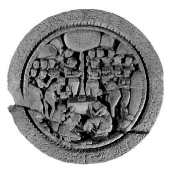

Figure 4.1 Sujātā's Offering The medallion shows Sujātā offering food to the bodhisattva Gautama, represented by his seat under the tree of awakening. 

Amarāvatī stūpa, courtesy The Trustees of the British Museum. 

acteristic of the Abhidharma.50 This makes it clear that the presentation in the Mahācattārīsaka*-sutta* is definitely an example of Abhidharma thought manifesting in the Pāli discourses, similar to the presentations of the supramundane path in the Saṃyukta-*āgama* and the reference to the same conception in the Dīrgha-*āgama*. Among the discourses surveyed in my study so far, such occurrences of the notion of the supramundane path appear to be the most prominent instances of Abhidharma influence. 

In contrast, although the Sa*ṅgīti-sūtra* and the *Daśottara-sūtra* testify to the development of summaries, *mātṛkā*s, this is in itself not purely an Abhidharma phenomenon, in spite of the undeniable importance of the mātṛkās for the formation of Abhidharma texts. The growth of the list of elements in the parallel versions of the *Bahudhātuka-sūtra* exemplifies a tendency towards comprehensiveness typical of the Abhidharma enterprise, yet the elements that appear to have been added are for the most part merely borrowings from other discourses. 

With the detailed analyses of the four noble truths and of absorption experience in the Mahāsatipaṭṭhāna*-sutta* and the *Anupada-sutta*, the Abhidharma flavour becomes stronger, evident in the occasional use of Abhidharma terminology and in the tendency for analysis to proliferate for its own sake. 

In the case of the Mahācattārīsaka*-sutta*, however, not only does distinct Abhidharma terminology emerge, but also distinct Abhidharma thought evident in the description of the supramundane path. Although 
――――――
Bronkhorst 2000: 598 notes that already the *Sūyagaḍ*a (I.1.1.17) shows awareness of the notion of momentariness as a Buddhist teaching; cf. Bollée 1977: 15. Bronkhorst 2000: 596 then comments that "the acquaintance of the Sūyagaḍa with the Buddhist theory of momentariness, well before the idea of moments had been introduced into Jainism", makes it "plausible to assume that Jainism borrowed this idea from Bud-dhist [thought]". On the evolution of the notion of momentariness in Buddhist texts cf. 

the study by von Rospatt 1995.

50 Cousins 1983: 7 explains that "the eightfold way is usually intended in the suttas to show the path or process leading to enlightenment … with the abhidhamma it is seen as existing as part of a single event on particular occasions e.g. at the moment of enlightenment … the early abhidhamma works are then an attempt to fix the structure of Buddhist thought in terms of momentary events."
positing a clear demarcation between what has had an influence on the development of Abhidharma and what should be considered Abhidharma proper is not easy,51 it seems to me that with the Mahācattārī*sakasutta* a mature stage of early Abhidharma thought is apparent. Depending on where one prefers to draw the demarcation line, the analysis of the four noble truths in the Mahāsatipaṭṭhāna*-sutta* and the analysis of the absorptions in the *Anupada-sutta* could also be considered as instances that show Abhidharma influence. 

In terms of the simile I used in the introduction to my study, like the fossils of an archaeopteryx these discourses testify to a gradual development that eventually was to find its consummation in the Abhidharma as a genre of its own.52 Early stages of this development naturally appear in the discourses, which in the beginning were the arena within which such new thought naturally could find an expression.53 While the stages of development that informed the early canonical Abhidharma are thus evident in the discourses, as time went on the Abhidharma eventually acquired such importance of its own that it gradually overshadowed the discourses and eventually stood in their place as the central point of reference for members of the tradition.54
―――――― 51 Cox in Willemen et al. 1998: 170 notes that "we can find many *sūtras* that exemplify the stylistic characteristics of Abhidharma texts. The transition to texts with a more pronounced taxonomic and expository character was certainly a gradual one. Indeed, the point of demarcation between *sūtra* and Abhidharma is very difficult to locate."
52 Thomas 1933/2004: 160 notes that "in the sense of a method … Abhidhamma is no doubt much older than the existing works of that name", as several discourses give the impression that "the method was already in existence when those suttas were re-vised." According to Horner 1942/1983: xi, "the term abhidhamma when found in the Vinayapiṭaka and Suttapiṭaka … should be taken as referring to some material or method in existence prior to the compilation of this Piṭaka [i.e. the third], and out of which it was gradually elaborated and eventually formed."
53 Skilling 2012: 429 queries "can we envisage a stage when the Abhidharma as a selfconscious enterprise had not yet arisen or gained canonical status? At this stage - the beginnings of Abhidharmic systematization - the natural format for reformulated material was that of the *sūtra*, and the natural place was the Sūtrapiṭaka - where else to place it?"
54 According to Hirakawa 1993/1998: 127,"even before the contents of the Sūtra*-piṭaka* had been finalized, the Buddha's disciples were analyzing his teachings with methods Subsequent developments in Abhidharma thought in fact are no longer seen in the early discourses,55 but appear only in the canonical Abhidharma collections, and then subsequently in the commentaries and expositions that in turn became the arena for new thought once the Abhidharma collections had reached a point of closure. 

The process of canonization of Abhidharma as a genre of texts on its own, apart from the discourses, inevitably led to the question of its authenticity. The same problem confronted the upholders of the Abhidharma and the followers of the Mahāyāna: How to establish that these texts should be recognized as the "word of the Buddha"? 

## 4.3 The Need For Authentication

The notion of the "word of the Buddha" appears to have been flexible right from the outset.56 Several discourses spoken by disciples conclude with an endorsement by the Buddha, who states that he would have explained the matter in the same way, so the monks should memorize the discourse as spoken by the disciple.57 In this way, such expositions received canonical status and became as much part of the "word of the Buddha" as if they had been spoken by the teacher himself.58 Even without explicit approval from the Buddha, explanations and comments made by disciples have become canonical discourses. 

A case that points to features that recur in later discussions of scriptural authenticity can be found in a discourse in the Aṅguttara-ni*kāya*. 

The discourse reports that Śakra, the ruler of the *deva*s in the Heaven of the Thirty-three, has descended to earth to find out if a teaching just delivered by the monk Uttara had originally been spoken by the Buddha.59 In reply to Śakra's query, Uttara states that "whatever is well said is all the word of that Blessed One, the arhat, the fully awakened one; I and others speak taking that as our basis."
60 Uttara illustrates this with the help of a simile that describes a large group of people who take grain from a great heap and carry it away in various containers. On being asked where they got the grain, they will answer that they got it from the great heap. The simile makes it clear that the dictum was meant to indicate that the Buddha was the real ――――――
discourse that is reckoned as the word of the Buddha even though it was spoken by a disciple; cf. As 5,1. 

58 Malalasekera 1928/1994: 88f explains that "during the Master's lifetime … discussions, friendly interviews, and analytical expositions used to take place … sometimes it happened that accounts of these discussions were duly reported to the Teacher, and some of them were approved by him, and he would then ask the monks to bear the particular expositions in mind as the best that could have been given. The utterances of the disciples that won such approbation were treasured by the members of the com-munity … and held in high esteem, honoured as much as the words of the Buddha himself." Mizuno 1982: 21 points out that discourses delivered "by authors both human and non-human were still regarded as the teaching of the Buddha because [these] 
were reported to the Buddha, who verified their accuracy"; cf. also MacQueen 1981 and Skilling 2010.

59 AN 8.8 at AN IV 163,6; Arunasiri 2006: 634 comments that here "Sakka is presented as supervising what the monks were preaching."
60 AN 8.8 at AN IV 164,7: yaṃ (Se: yaṅ) kiñci subhāsitaṃ, sabbaṃ taṃ tassa bhagavato vacanaṃ arahato sammāsambuddhassa, tato upādāy' upādāya mayañ (Se: *maya*ṃ) c' aññe (Se: dhaññaṃ) ca bha*ṇāmā ti*. This differs from the formulation in a rock edict by Aśoka, according to which all that the Buddha said was well said, Bloch 1950: 154: e keci bha*ṃte bhagavatā buddhena bhāsite savve se subhāsite vā*. 

source of anything Uttara had been teaching, even if Uttara had not been repeating something that in this exact manner had already been spoken by the Buddha. 

The discourse then takes an interesting turn, as Śakra informs Uttara that the Buddha had actually given this teaching earlier. However, memory of this teaching delivered by the Buddha had in the meantime been lost among the four assemblies of disciples (monks, nuns, male lay followers, and female lay followers). 

Two features of this discourse are worth noting. One is the statement made by Uttara, which taken out of its original context could be interpreted as implying that whatsoever is well said deserves for that reason to be reckoned the word of the Buddha. The other feature is the idea that memory of a teaching given by the Buddha had been lost among humans, but was still preserved in the Heaven of the Thirty-three. 

Although there seems to be no known parallel to this Aṅguttara-*nikāya* discourse, a counterpart to the first part of the statement attributed to Uttara occurs in the *Śikṣāsamuccaya*. The *Śikṣāsamuccaya* proclaims that "whatever is well said is all the Buddha's word", a statement that has played an important role in the authentication of Mahāyāna texts as the word of the Buddha.61 The *Śikṣāsamuccaya* continues by indicating that one who rejects as inauthentic what should be reckoned as the word of the Buddha will go to hell. 

Rebirth in hell is also to be expected for a schismatic.62 According to the *Atthasālinī*, one who refuses to recognize the Abhidharma as the word of the Buddha thereby engages in one of the eighteen causes for a schism.63 Combining the indications given in the *Śikṣāsamuccaya* and the *Atthasālinī*, it becomes clear that rejecting the Abhidharma was considered to have consequences as dire as rejecting the Mahāyāna. 

The need shared by upholders of the Abhidharma and of the Mahāyāna to establish the authenticity of their respective texts extends beyond the dismal prospects they predict for those who do not accept their texts as the Buddha's word. Both also share a sense of superiority vis-àvis the early teachings and those who confine their study of the Dharma to them. From a fully fledged Mahāyāna viewpoint, the early discourses are considered as teachings that are "inferior", *hīna*.

64 The teachings of the Abhidharma in turn are considered by their followers to be "superior", *abhi*-, in comparison to the early discourses.

65 In this way, the early teachings increasingly tend to fade in importance and are eventually superseded by the new texts,66 a development that in turn led to the formation of independent textual collections, the Abhidharma-piṭaka and the *Bodhisattva-piṭaka*, considered to be superior to the early discourses.67 The parallelism between the Abhidharma and the Mahāyāna extends beyond the formation of such collections, as both traditions have given rise to texts in the form of *dhāraṇī*s.68 While this feature is of course well known in the case of the Mahāyāna traditions, the beginnings of a concern with *dhāraṇī*s can be seen already in comparatively early texts not related to the Mahāyāna.69 The notion of superiority shared by the Abhidharma and the Mahāyāna has in the case of the former found expression in the belief that the teachings of the Buddha cannot be understood without relying on the Abhidharma. According to the Abhidhar*makośabhāṣ*ya, this had in fact been explicitly stated by the Buddha himself.70 The high regard for the Abhidharma and its teachers in the Thera-vāda tradition can be seen in the Mihintale Rock inscriptions from Sri Lanka. The inscriptions record that those who have mastered the Abhidharma should be given a higher share of the offerings received than those who have mastered the Vinaya or the discourses.71 The same high regard also finds expression in the fact that the commentary on the *Dīgha-nikāya*, the Suma*ṅgalavilāsinī* gives pride of place to the Abhidharma-piṭ*aka* in its description of the gradual decline of the Buddha's dispensation (*sāsana*) over a period of 5000 years. As things gradually become worse, the *Abhidharma-piṭaka* is the first of the three piṭakas to disappear, followed by the discourses and the Vinaya.72 In its description of the first sa*ṅgīti*, the same Sumaṅgalavi*lāsinī* then reports that the recitation of the Abhidharma-piṭaka was followed by an earthquake.73 In Buddhist thought the occurrence of earthquakes tends to mark a particular event as important.74 A parallelism between early Abhidharma and early Mahāyāna texts can also be found in the role played by chief disciples like Śāriputra, who serve to provide additional authentication to the respective teachings. Besides being depicted as a faithful disciple of the Mahāyāna, Śāriputra also plays a central role in early canonical Abhidharma texts.75 The Sa*ṅgītiparyāya* and the *Dharmaskandha* are reckoned by some strands of the Sarvāstivāda tradition to be the work of Śāriputra.

76 The 
**Śāriputrābhidharma*, as its name indicates, was also believed to stem from Śāriputra. The *Atthasālinī* reports that the textual order of the Theravāda Abhidharma was devised by the same eminent disciple.77
―――――― 73 Sv I 15,20; the earthquake marks the completion of the recitation of the *tipiṭaka*, of which the Abhidhammapiṭ*aka* was the last to be recited. 

74 The tendency to associate important events with earthquakes seems to have had its starting point in a set of three causes for an earthquake; cf. Przyluski 1918: 424, Waldschmidt 1944: 107, Frauwallner 1956: 158, Bareau 1979: 79, and Anālayo 2013a: 19. Two of these three causes are a commotion of the elements and an act of psychic power; the third is the only one where an earthquake marks an important event: the death of the Buddha. For a study of earthquakes in Buddhist literature in general cf. Ciurtin 2009 and 2012. 

75 In his detailed study of Śāriputra, Migot 1952 dedicates a whole chapter (8) to Śāriputra in Mahāyāna texts, and another whole chapter (11) to Śāriputra in relation to the Abhidharma. 

76 The Sa*ṅgītiparyāya* is prefaced by a remark that attributes the work to Śāriputra, T 
1536 at T XXVI T 367a5, and the work itself concludes with the Buddha praising Śāriputra for having expounded it, T 1536 at T XXVI 453b13; cf. also T 1821 at T XLI 8b26 and T 2154 at T LV 557a10. The *Abhidharmakośavyākhyā*, Wogihara 1932: 11,29, however, instead attributes the work to Mahākauṣṭhila: saṃgītiparyāyasya mahākauṣṭhilaḥ *[kartā]*. The *Dharmaskandha* presents itself as the work of Mahā-maudgalyāyana, T 1537 at T XXVI 453b25; cf. also the postscript to the work, T 
1537 at T XXVI 513c16, as well as T 1821 at T XLI 8b27 and T 2154 at T LV 557a8. In this case, the *Abhidharmakośavyākhyā*, Wogihara 1932: 11,27, attributes the work rather to Śāriputra: dharmaskandhasya ārya-śāriputraḥ *[kartā]*.

77 As 17,12: "the sequence of the Abhidharma texts was indeed devised by the Elder Sāriputta", *abhidhammo vācanāmaggo nāma sāriputtattherappabhavo*. The commentarial tradition also relates the Pa*ṭisambhidāmagga* to this eminent disciple; cf. Paṭis-a I 1,17 and Warder 1982: xlvi. 

The different Abhidharma traditions thus agree in according a central role to Śāriputra as the chief disciple active in the formation of the canonical Abhidharma. 

In the case of the *Kathāvatthu*, a work of the Theravāda Abhidharma canon, tradition reports that this treatise was delivered by a disciple named Moggaliputtatissa at the time of King Aśoka. The *Atthasālinī* nevertheless argues that all of the seven texts of the Theravāda Abhidharma collection should be considered the word of the Buddha. This also holds for the *Kathāvatthu*, because its *mātṛkā* had already been laid out by the Buddha in the wise foresight that a future disciple of his by the name of Moggaliputtatissa would expound the *Kathāvatthu* based on this outline.

78 The position that the Abhidharma is the word of the Buddha is also taken in the Sarvāstivāda tradition. Works like the Abhidharmakośa-*bhāṣ*ya and the **Mahāvibhāṣā* report that the Buddha had given Abhidharma teachings on various occasions.

79 Thus here, too, the contribution by chief disciples appears to be seen as mainly a matter of formal arrangement and working out details. The difference between the The-ravāda and Sarvāstivāda traditions in this respect is thus less pronounced than one might have thought at first, given the explicit authorship attributions of works like the Sa*ṅgītiparyāya* and the *Dharmaskandha* to chief disciples.80 A problem in attributing the texts of the Abhidharma and of the Ma-hāyāna to the Buddha or to chief disciples that lived at his time is of course the account of the first sa*ṅgīti* at Rājagṛha. As discussed in the first chapter of this study, several of the canonical Vinayas do not mention a recitation of an Abhidharma collection at this time. Nor do the different Vinayas report the recitation of Mahāyāna texts.

The *Tarkajvālā*, a sixth-century doxographical work that offers a detailed examination of Buddhist schools and their tenets, confronts the allegation that the Mahāyāna should not be reckoned the word of the Buddha because it is not included in the discourses.81 In reply to such allegations, the *Tarkajvālā* argues that the Mahāyāna is the word of the Buddha which had been collected by bodhisattvas like Samantabhadra, Mañjuśrī, Maitreya, etc. The teachings collected by them were not included in the canonical collections because they were beyond the ken of the *śrāvaka*s responsible for collecting the word of the Buddha.82 In this way, the idea that the Mahāyāna teachings are beyond the ken of ordinary disciples expresses a sense of superiority found among both fol-lowers of the Mahāyāna and adherents of the Abhidharma. 

Another similarity can be seen in the divine origins attributed to the disclosure of some of the texts. Tāranātha's *History of Buddhism*, just to mention one example, reports that Mahāyāna texts originated from the realm of the *nāga*s, as well as from devas, *gandharva*s, and rākṣasas.83 To be sure, the idea that canonical teachings may originate from celestial beings is not foreign to early Buddhism. Discourses in the Saṃ-yutta-*nikāya* and Saṃyukta-*āgama*, for example, report various conversations taking place between *deva*s and the Buddha or his disciples. 

At times, a *deva* may even give a teaching to a Buddhist monk, as in the case of the Lomasakaṅ*giyabhaddekaratta-sutta*. According to the Pāli version of this discourse the *deva* informed the monk of a poem, spoken by the Buddha in the Heaven of the Thirty-three, of which the monk was not aware.84 This brings to mind the discourse in the Aṅgutta-ra-*nikāya* on the visit paid by Śakra to the monk Uttara and the relation it establishes between a teaching given by the Buddha and the Heaven of the Thirty-three. Returning to the *Lomasakaṅgiyabhaddekaratta-sut*-ta, according to the two parallel versions the poem had been delivered by the Buddha when he was in the Bamboo Grove at Rājagṛha, instead of being spoken when he was in the Heaven of the Thirty-three.

85 The Heaven of the Thirty-three features again in the Theravāda tradition as the location for the delivery of the Abhidharma by the Buddha during a sojourn in that celestial realm to give teachings to his mother. 

In what follows I study some aspects of this tale. 

## 4.4 The Buddha In The Heaven Of The Thirty-Three

The tale of the Buddha's sojourn in the Heaven of the Thirty-three is found in a range of sources. The canonical versions are as follows: 
- Mūlasarvāstivāda tradition: a discourse in the Saṃyukta-*āgama*, preserved in Chinese translation, and a version of the tale found in the Mūlasarvāstivāda Vinaya, preserved in Chinese and Tibetan;86
- uncertain school affiliation: a discourse in the Ekottarika-*āgama* preserved in Chinese translation.87 
―――――― 84 MN 134 at MN III 200,12. 

85 MĀ 166 at T I 698c20 and T 77 at T I 886b12. 86 SĀ 506 at T II 134a7 to 134c23 and T 1451 at T XXIV 346a14 to 347a18 with its Tibetan counterpart in D 6 da 88a2 to 92a1 or Q 1035 ne 85a2 to 89a6. 

87 EĀ 36.5 at T II 705b23 to 707c4. 

In the Theravāda tradition, this tale is recorded only in commentarial literature.88 The Saṃyukta-*āgama* discourse reports that the Buddha had been spending the rains retreat in the Heaven of the Thirty-three, teaching the Dharma to his mother and the assembled *deva*s.89 The four assemblies on earth longed for his return and asked Mahāmaudgalyāyana to invite the Buddha to come back, pointing out that whereas *deva*s can easily visit the Buddha on earth, when he is in heaven human beings are unable to ascend to that realm to pay their respects to him.

90 The contrast made in this way between the abilities of *deva*s and those of humans sets a basic theme that forms the background of the whole tale, where the Buddha's superiority as a teacher of humans and devas is graphically depicted in his sojourn in heaven. 

Unlike those who petition him, Mahāmaudgalyāyana of course has the ability to fly up to heaven, so he obliges by ascending to the Heaven of the Thirty-three himself to convey the message to the Buddha. In reply, the Buddha announces that in one week's time he will return, indicating the precise location where this will take place. The discourse concludes by simply reporting that the Buddha indeed returned as predicted, without going into any further details as to how this took place. 

Whereas the Saṃyukta-*āgama* discourse does not describe in any detail the Buddha's descent to earth, this forms a central motif in most textual versions and artistic depictions of this tale.91 Iconographic presentations of this episode regularly portray the Buddha's descent from the Heaven of the Thirty-three with the help of a flight of stairs, often showing three flights to convey that the descending Buddha was flanked by Brahmā and Śakra, 92 acting as his attendants. 

In an aniconic portrayal of the Buddha's descent, a flight of stairs would be an obvious requirement for the whole image to work.93 Without some visible evidence of a path or a flight of stairs it would be difficult to express the idea of a descent if the one who descends cannot be portrayed. Thus at the outset the depiction of stairs would have had a symbolic function.94 Soon enough, however, the stairs appear to have been taken literally. 

In fact some iconographic presentations show footsteps on the stairs,95 giving the impression that the artist(s) intended to portray real stairs that the Buddha actually used to walk down. The Chinese pilgrims 

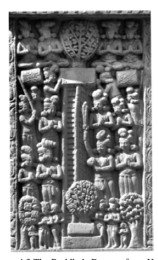

visiting India in fact describe the remains of the stairs that were believed to have been used by the Buddha on this occasion.96 Figure 4.2 The Buddha's Descent from Heaven The scene depicts the Buddha's descent from the Heaven of the Thirty-three with the help of a flight of stairs, surrounded above, on the sides and below by a multitude of *deva*s and humans in respectful attitude. 

Sāñcī stūpa, courtesy Eric R. and John C. Huntington, The Huntington Archive at The Ohio State University. 

The use of stairs also features in most textual versions of this tale. At times these textual accounts seem to struggle with the contrast between the ease with which the Buddha and Mahāmaudgalyāyana ascend to the Heaven of the Thirty-three and the circumstance that the Buddha does not use the same method on descending.97 The Ekottarika-*āgama* version explicitly tackles this issue, reporting Śakra's instruction that stairs should be constructed so that the Buddha does not need to employ supernormal powers to descend to Jambudvīpa.98 The Mūlasarvāstivāda Vinaya turns to this problem in an even more explicit manner. It reports Śakra asking the Buddha if he wishes to de-scend to Jambudvīpa using supernatural power or on foot.99 The Buddha opts for going on foot, whereupon Śakra has three flights of stairs made. 

The Mūlasarvāstivāda Vinaya continues with the Buddha reflecting that some non-Buddhists might misinterpret this, thinking that due to falling prey to attachment while being in the Heaven of the Thirty-three the Buddha has lost his ability to use his supernatural powers. In order to forestall such ideas, the Buddha then decides to descend halfway to Jambudvīpa using supernatural power and cover the other half of the journey on foot.100 Evidently tradition felt that the Buddha's descent from heaven by way of stairs required an explanation. 

Now the idea of employing stairs would have occurred originally when representing the Buddha's descent in art, where at least in aniconic depiction such a motif arises naturally. That is not the case for texts. 

The above passages make it clear that in textual accounts the motif of the stairs was felt as something of a misfit and requiring an explanation. 

―――――― 97 Strong 2010: 970 formulates the puzzling aspect of the textual accounts in this manner: "why does the Buddha … need (or appear to need) a set of stairs to come back down again to earth? Why does he not just fly or float down?"
98 EĀ 36.5 at T II 707a28; Bareau 1997: 23 note 19 comments that "apparemment, les dieux veulent épargner au Buddha la peine de se servir de ses propres moyens sur-humains. Ils veulent ainsi l'honorer et montrer qu'ils sont ses serviteurs, donc ses in-férieurs."
99 T 1451 at T XXIV 346c28 and D 6 da 91b1 or Q 1035 ne 88b4. 100 T 1451 at T XXIV 347a10 and D 6 da 91b6 or Q 1035 ne 89a2.

This makes it highly improbable that the idea of stairs originated from a textual source. Instead, it must have originally arisen as a symbol in an aniconic context and then subsequently have been taken literally. In other words, it seems to me that we have here an instance of cross-fertilization between text and art, where an already existing tale is concretized in art and this in turn influences textual accounts.101 Within this gradual evolution the Saṃyukta-*āgama* discourse appears to testify to an earlier stage in the narrative development of this episode, for it shows little interest in the details of the Buddha's descent. In contrast, the record of the Buddha's sojourn in the Pāli commentarial tradition belongs to the later versions that, apparently inspired by ancient Indian art, describe in detail the stairs used by the Buddha.102 In agreement with its canonical parallels, the Saṃyukta-*āgama* discourse reports that the Buddha had been teaching the Dharma to his mother and the *deva*s in the Heaven of the Thirty-three. According to the *Atthasālinī*, however, the Buddha had visited his mother in the Heaven of the Thirty-three in order to teach her the Abhidharma.

103 The *Atthasālinī* then explains the further transmission of the Abhidharma taught on this occasion as follows: the Buddha regularly came down from the Heaven of the Thirty-three to Lake Anavatapta to take his meal after having completed his almsround, and during these visits to earth he transmitted to Sāriputta the teachings he had just given in heaven. Sāriputta in turn passed these on to five hundred monk disciples of his, and in this way the transmission of the Abhidharma was ensured.104

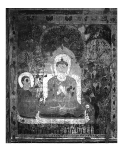

According to the inscription that accompanies the painting, the scene depicts the Buddha teaching the Abhidhamma to Sāriputta, passing on to his chief disciple what he had just taught to the *deva*s in the Heaven of the Thirty-three. 

Pagan, courtesy Lilian Handlin. 

That the Buddha taught the Abhidharma to his mother during his stay in the Heaven of the Thirty-three seems to be an idea found only in the Theravāda tradition.105 This brings to mind the case of the Lomasakaṅ-*giyabhaddekaratta-sutta*, where again only the Theravāda discourse locates the Buddha's delivery of a poem and its explanation in the Heaven 
――――――
their Abhidhamma-piṭaka. There was still the problem of the manner of its transmis-sion to one of the śrāvakas, since Mahāmāyā had remained in heaven." This was solved through the tale that during his sojourn in Trayastriṃśa the Buddha came regularly down to earth, "where he taught the entire *Abhidhamma* to Sāriputta."
105 Skilling 2008: 51 comments that "no other Buddhist school chose to locate the teaching of the *Abhidharma* in the Trayastriṃśa abode … there was no suggestion that the Abhidharma was taught anywhere but in Jambudvīpa." 
of the Thirty-three. According to the Theravāda commentaries, the Buddha spoke this poem during the same sojourn in the Heaven of the Thirtythree when he also delivered the Abhidharma.106 A problem with the Theravāda notion that the Buddha taught the Abhidharma to his mother during his stay in the Heaven of the Thirtythree is that the Pāli discourses report that his mother had been reborn in Tuṣita Heaven, not in the Heaven of the Thirty-three.107 According to early Buddhist cosmology, the *deva*s of the Tuṣita realm are long-lived and even a short fraction of time spent in Tuṣita Heaven equals a long time period on earth.108 Thus it would not be possible to assume that behind this inconsistency stands the idea that the bodhisattva's mother arose first in Tuṣita and then, still during the lifetime of the Buddha, passed away from there to arise in the Heaven of the Thirty-three. Once she was living in Tuṣita at the time the Buddha decided to visit her, however, it would certainly have been more natural for him to be depicted as going directly to that realm to give her teachings, instead of going to the Heaven of the Thirty-three. 

The Mahāpadāna*-sutta* of the Theravāda tradition indicates that it is a rule that the mother of a Buddha arises in Tuṣita after she dies. According to its Sanskrit counterpart, however, the mother of a Buddha will rather be reborn in the Heaven of the Thirty-three.109 The *Lalitavistara* similarly indicates that the mother of Gautama Buddha was reborn in the Heaven of the Thirty-three.110 Thus the problem with the Buddha's visit to his mother in the Heaven of the Thirty-three, although she had not been reborn in this realm, applies mainly to the Theravāda tradition.

The *Atthasālinī*'s attempt to authenticate the Abhidharma by presenting it as a teaching delivered by the Buddha to his mother may have been inspired by an Indian tradition according to which the Buddha's mother had been reborn in the Heaven of the Thirty-three.111 Otherwise there would be little reason for the *Atthasālinī* to locate the Buddha's mother in a realm where, according to the discourses of the Theravāda tradition, she had not been reborn. In other words, the tale of the Buddha's teaching of the Abhidharma to his mother in the Heaven of the Thirty-three appears to be a maladroit adaptation of an Indian tale to the needs of the Theravādins to authenticate their Abhidharma collection.112 Whatever its historical origins, the proposal that the Abhidharma was originally taught in the Heaven of the Thirty-three has become the accepted lore of the Theravāda tradition. This form of presentation quite vividly invests the Abhidharma with a celestial seal of approval and enhances the Abhidharma as something superior to other canonical teachings, which for the most part are delivered on earth. 

Another significant aspect of the story of this sojourn by the Buddha in a heavenly realm is that it shows him fulfilling his filial duty by teaching his mother the Abhidharma.113 In this way, he fulfilled his filial duty not merely by giving her an ordinary discourse, but by initiating her into the superior doctrine of the Abhidharma. This then established her in the fruit of stream-entry.114 The notion that the Buddha's teaching of the Abhidharma led his mother to attain stream-entry brings me back to the topic explored at the outset of this chapter, the supramundane path. From the Mahācattā-rīsaka*-sutta* to the commentarial tale of the Buddha's stay in the Heaven of the Thirty-three, the relationship between the Abhidharma and awakening appears to provide a continuous theme. The concerns behind these presentations clearly stand in close relation to the essence of the whole teaching, the experience of awakening. 

Instead of merely serving as a raft to be left behind once one has crossed over,115 however, the teachings on the path to awakening have given rise to analysis undertaken for its own sake, a trajectory that has led to the conceit of superiority and the need for authentication. 

# Conclusion

Approaching the evolution of the Abhidharma from the viewpoint of the early discourses puts into perspective the relationship between early canonical Abhidharma works and specific discourses. When considered from the viewpoint of the canonical Abhidharma collections, the fact that the Sa*ṅgītiparyāya* is a commentary on the Sa*ṅgīti-sūtra* makes it only natural that this discourse has been considered as being in some way proto-Abhidharma. Once the Sa*ṅgīti-sūtra* is examined within the context of other early discourses, however, this impression requires some qualification. The fact that a commentary on the Sa*ṅgīti-sūtra* has become a canonical Abhidharma work does not turn the Saṅgīti-*sūtra* itself automatically into proto-Abhidharma. If this were the case, other discourses quoted in the *Dharmaskandha*, **Śāriputrābhidharma*, or Vi-*bhaṅga* would also have to be considered proto-Abhidharma, even the first sermon by the Buddha, just because it is quoted in the Dharmaskan-dha.

The relationship of the Saṅgīti-*sūtra* to the Sa*ṅgītiparyāya* can rather be seen to put a spotlight on the essentially commentarial nature of early Abhidharma texts. What became the higher doctrine, considered by tradition to be more profound and superior compared to the expositions given in the discourses, appears to have had its humble beginnings as commentaries on these discourses. Such commentaries in the course of time would have become increasingly independent from the texts on which they commented. In this way what originally was merely "about", 
abhi-, the Dharma, eventually turned into the "superior" or "higher" Dharma, the Abhidharma. 

The canonical works that enshrine the Abhidharma clearly reflect the important influence of *mātṛkā*s in the form of summary listings and the recurrent use of question-and-answer catechisms. Without in any way intending to deny the formative influence of these central structural elements, when considered within the broader framework of Buddhist literature in general, or even non-Buddhist literature, it becomes clear that summary listings and the question-and-answer format cannot be considered as being themselves an expression of Abhidharma influence. Instead, these are simply tools of oral (and written) transmission that can occur in various types of texts that may bear no relationship whatsoever to the Abhidharma. The *mātṛkā* par excellence, the *prātimokṣ*a, is certainly not Abhidharma. 

The topic-wise and numerical arrangements of collections like the Saṃyukta-āgama/Saṃyutta-*nikāya* and the Ekottarika-āgama/Aṅgutta-ra-*nikāya* are a natural organizing structure for orally transmitted material and not the outcome of Abhidharma influence. The same holds for the employment of analysis, which does not automatically turn the text in question into Abhidharma; nor do discourses and chapters in canonical collections that carry the name *vibhaṅga* in their title necessarily reflect the influence of Abhidharma. Such texts may just as well pertain to the Vinaya or else be discourses that do not show any evident sign of the impact of Abhidharma thought. 

Instead of conceiving the evolution of the Abhidharma entirely in terms of such formal aspects, the dawn of the Abhidharma can be seen to have taken its main inspiration from a shift in perspective. Central here is the attempt to be as comprehensive as possible, to supplement the directives given in the early discourses for progress on the path with a full picture of all aspects of the path in an attempt to provide a complete map of everything in some way related to the path. 

This drive towards all-inclusive coverage mirrors the notion of the Buddha's omniscient knowledge. The sense of comprehensiveness that marks the Buddha's attainment of omniscience finds its expression in the comprehensive exposition of his wisdom in Abhidharma works. 

Equipped with a complete map of the doctrine, the disciples are fortified in their struggle for survival in competition with non-Buddhist teachers and groups and in their attempts to maintain harmony within the Buddhist fold. The completeness of the map ensures that, even though the teacher is no longer available for personal guidance and advice, all the information required for progress on the path is readily available. 

In this way, the elevation of the Buddha to the position of an omniscient teacher and the mapping of the doctrine in the Abhidharma appear to be interdependent processes. Both to some degree respond to the emotional need of the disciples at a time when the teacher had passed away. Both also bring the teachings more in line with contemporary ideas and notions in ancient India. Both in this way provide the raw material for the construction of a sense of institutional identity, something that becomes more clearly evident in the period that sets in after the initial development that I have attempted to trace in this study.

Within the context of analytical expositions, the drive towards a comprehensive coverage of all that there is makes itself clearly felt in the tendency to doctrinal and textual proliferation. The variations between the parallel versions of the Sa*ṅgīti-sūtra* clearly reflect the tendency to proliferate by adding items. Yet, just as in the case of the Bahudhātuka-*sūtra*, such proliferation still employs as its building blocks material found elsewhere in the early discourses. This in a way exemplifies the beginnings of a tendency more clearly evident in the early Abhidharma of attempting to combine different teachings into a unified coherent whole. 

In the case of the detailed analyses of the four noble truths and of the absorptions in the Mahāsatipaṭṭhāna*-sutta* and the *Anupada-sutta*, the tendency to proliferate for the sake of a comprehensive coverage emerges with increased clarity and begins to employ formulations and terms not found elsewhere in the early discourses. Here the Abhidharma begins to emerge as something of its own, evident in the use of specific terminology and expressions. So these two discourses could perhaps be considered as the first twilight of the dawn of Abhidharma. Aspects of this twilight are the Mahāsatipaṭṭhāna*-sutta*'s coverage of the second and third noble truths by breaking down craving into a multitude of minor aspects, and the *Anupada-sutta*'s complementary drive towards comprehensive coverage by listing all mental factors that could be found in a particular absorption. 

The attempt to give a complete list of all dharmas relevant to the precise definition of a particular event naturally tends to focus on a single instant, instead of trying to cover a whole process. It is already a rather demanding task to provide a complete map of the building blocks of what happens at one moment. It would be considerably more difficult to do so for a process changing over a prolonged time period. In this way, a focus on momentary events is a natural outcome of trying to provide a complete coverage.

The Mahācattārīsaka*-sutta* shows a more mature stage of beginning Abhidharma thought in its focus on a momentary event. In terms of the dawn of the Abhidharma, with this discourse the sun has begun to rise in the sky. The rays of light that shine forth in this way are not just the outcome of dry scholastic speculation, but rather serve to illuminate the most crucial concern of early Buddhist practice, awakening as the culmination of the path. The conception of a supramundane path is similarly reflected in the *Dīrgha-āgama* and the Saṃyukta-*āgama*, showing that the arising of this idea was not limited to a particular school, nor related to a specific discourse collection. The rather substantial contribution to Buddhist thought that appears in these discourses involves a shift from process to event, from concern with an ongoing process to focus on a momentary instant. Here we find not only new terminology, but also the appearance of new ideas. 

For the dawn of the Abhidharma the notion of the supramundane path, evident in the Mahācattārīsaka*-sutta* and the discourses from the Dīrgha-*āgama* and the Saṃyukta-*āgama*, is of considerable importance. Its importance is comparable to the notion that the bodhisattva Gautama already at birth is supreme in the world and that in a former life he decided to embark on the quest for Buddhahood, evident in the Acchari-*yabbhutadhamma-sutta* and its Madhyama-*āgama* parallel, discussed in my study of The *Genesis of the Bodhisattva Ideal*. 

The gradual apotheosis of the Buddha, leading to the emergence of the bodhisattva ideal, is also evident in the notion of his omniscience, which in turn mirrors the Abhidharma's drive for comprehensiveness. In this way, not only the first refuge (the Buddha), but also the second refuge (his teaching) evolved in a manner that effectively filled the vacuum created by the demise of the teacher, fortifying the disciples in their competition with non-Buddhist practitioners. 

The Theravāda tale of the Buddha's sojourn in the Heaven of the Thirty-three teaching his mother the Abhidharma, born out of a need to provide authentication to the Abhidharma as an independent set of scriptures, vividly expresses how the superiority of the Buddha informs the supremacy of the Abhidharma. 

So what, in sum, does the "Abhidharma" stand for? Clearly Abhidharma is not just to be found in the use of dry lists or summaries. Instead, born out of what originally was a commentary on the Dharma, Abhidharma has gone "further", *abhi-*, than the Dharma, something that is evident in the employment of new terminology and ideas. Arisen from the wish to clarify the teachings of the recently deceased Buddha, what is characteristic of the Abhidharma is a conception of wisdom that aims at a complete coverage by surveying all the constituents of a single moment in their interrelation, instead of merely monitoring a process of disenchantment, dispassion, and seeing as it really is.

 

## Abbreviations

| AN      | Aṅguttara-nikāya         |
|---------|--------------------------|
| As      | Atthasālinī              |
| B e     | Burmese edition          |
| C e     | Ceylonese edition        |
| D       | Derge edition            |
| DĀ      | Dirgha-āgama (T 1)       |
| Dhātuk  | Dhātukathā               |
| Dhp     | Dhammapada               |
| Dhp-a   | Dhammapada-aṭṭhakathā    |
| Dhs     | Dhammasaṅgaṇī            |
| DN      | Dīgha-nikāya             |
| EĀ      | Ekottarika-āgama (T 125) |
| E e     | PTS edition              |
| It      | Itivuttaka               |
| Jā      | Jātaka                   |
| Kv      | Kathāvatthu              |
| Kv-a    | Kathāvatthu-aṭṭhakathā   |
| MĀ      | Madhyama-āgama (T 26)    |
| Mhv     | Mahāvaṃsa                |
| Mil     | Milindapañha             |
| MN      | Majjhima-nikāya          |
| Mp      | Manorathapūraṇī          |
| Nett    | Nettipakaraṇa            |
| Nidd I  | Mahāniddesa              |
| Paṭis   | Paṭisambhidāmagga        |
| Paṭis-a | Saddhammappakāsinī       |
| Pj II   | Paramatthajotikā         |
| Ps      | Papañcasūdanī            |
| Q       | Peking edition           |
| SĀ      | Saṃyukta-āgama (T 99)    |
| SĀ2     | Saṃyukta-āgama (T 100)   |
| S e     | Siamese edition          |

| 174    | The Dawn of Abhidharma   |
|--------|--------------------------|
| SN     | Saṃyutta-nikāya          |
| Sn     | Sutta-nipāta             |
| Sp     | Samantapāsādikā          |
| Sv     | Sumaṅgalavilāsinī        |
| T      | Taishō edition           |
| Th     | Theragāthā               |
| Ud     | Udāna                    |
| Ud-a   | Paramatthadīpanī         |
| Uv     | Udānavarga               |
| Vibh   | Vibhaṅga                 |
| Vibh-a | Sammohavinodanī          |
| Vin    | Vinaya                   |
| Vism   | Visuddhimagga            |

## References

Abeynayake, Oliver 1984: *A Textual and Historical Analysis of the* Khud*daka Nikāya*, Colombo: Tisara. 

Adikaram, E.W. 1946/1994: *Early History of Buddhism in Ceylon, or* 
'State of Buddhism in Ceylon as Revealed by the Pāli Commentaries of the 5th *Century A.D.*', Dehiwala: Buddhist Cultural Centre. 

Agganyani 2013: "Abhidhamma, Southern", in *Encyclopedia of Sciences and Religions*, A.L.C. Runehov and L. Oviedo (ed.), 1–12, Dordrecht: Springer. 

Akanuma, Chizen 1929/1990: *The Comparative Catalogue of Chinese* Āgamas & Pāli Nikāyas, Delhi: Sri Satguru. 

Allinger, Eva 2010: "The Descent of the Buddha from the Heaven of the Trayastriṃśa Gods, One of the Eight Great Events in the Life of the Buddha", in From Turfan to Ajanta: Festschrift for Dieter *Schlingloff on the Occasion of His Eightieth Birthday,* E. Franco and M. Zin 
(ed.), 3–13, Lumbini: Lumbini International Research Institute. 

Allon, Mark 1997: "The Oral Composition and Transmission of Early Buddhist Texts", in Indian Insights: Buddhism, Brahmanism and Bhakti, Papers from the Annual Spalding Symposium on Indian Religions, P. Connolly and S. Hamilton (ed.), 39–61, London: Luzac Oriental. 

― 2001: Three Gāndhārī Ekottarikāgama-*Type Sūtras, British Library* Kharo*ṣṭhī Fragments 12 and 14*, Seattle: University of Washington Press. 

Anacker, Stefan 1975: "The Abhidhamma Piṭaka", in Buddhism, A 
Modern Perspective, C.S. Prebish (ed.), 59–64, Pennsylvania: Pennsylvania State University Press. 

Anālayo 2003: Satipaṭṭhāna, *The Direct Path to Realization*, Birming-ham: Windhorse. 

― 2006a: "The Buddha and Omniscience", *Indian International Journal of Buddhist Studies*, 7: 1–20.

― 2006b: "The Ekottarika-āgama Parallel to the Saccavibhaṅga-sutta and the Four (Noble) Truths", *Buddhist Studies Review*, 23 (2): 145– 153.

― 2006c: "Saṅkhāra", in *Encyclopaedia of Buddhism*, W.G. Weera-ratne (ed.), 7 (4): 732–737, Sri Lanka: Department of Buddhist Affairs.

― 2007: "Who Said It? Authorship Disagreements between Pāli and Chinese Discourses", in *Indica et Tibetica 65, Festschrift für* Michael Hahn zum 65. Geburtstag von Freunden und Schülern überreicht, K. Klaus and J.U. Hartmann (ed.), 25–38, Wien: Arbeitskreis für tibetische und buddhistische Studien, Universität Wien.

― 2009a: "The Development of the Pāli Udāna Collection", Bukkyō Kenkyū, 37: 39–72.

― 2009b: "Views and the Tathāgata - A Comparative Study and Translation of the Brahmajāla in the Chinese Dīrgha-āgama", in Buddhist and Pali Studies in Honour of the Venerable Professor Kakkapalliye Anuruddha, K.L. Dhammajoti et al. (ed.), 183–234, Hong Kong: University of Hong Kong, Centre of Buddhist Studies.

― 2009c: "Vimuttāyatana", in *Encyclopaedia of Buddhism*, W.G. 

Weeraratne (ed.), 8 (3): 613–615, Sri Lanka: Department of Bud-dhist Affairs.

― 2009d: "Viññāṇañcāyatana", in *Encyclopaedia of Buddhism*, W.G. 

Weeraratne (ed.), 8 (3): 667–668, Sri Lanka: Department of Bud-dhist Affairs.

― 2009e: "Writing", in *Encyclopaedia of Buddhism*, W.G. Weeraratne 
(ed.), 8 (3): 764–768, Sri Lanka: Department of Buddhist Affairs.

― 2009f: "Yamakapāṭihāriya", in *Encyclopaedia of Buddhism*, W.G. 

Weeraratne (ed.), 8 (3): 776–777, Sri Lanka: Department of Bud-dhist Affairs.

― 2010a: "Attitudes towards Nuns - A Case Study of the Nandakovā-da in the Light of Its Parallels", *Journal of Buddhist Ethics*, 17: 332–
400.

― 2010b: "Exemplary Qualities of a Monastic - The Saṃyukta-āgama Counterpart to the Mahāgopālaka-sutta and the Need of Balancing Inner Development with Concern for Others", *Sri Lanka International Journal of Buddhist Studies*, 1: 1–23. 

― 2010c: *The Genesis of the Bodhisattva Ideal*, Hamburg: Hamburg University Press.

― 2010d: "The Influence of Commentarial Exegesis on the Trans-mission of Āgama Literature", in *Translating Buddhist Chinese,* 
Problems and Prospects, 1–20, K. Meisig (ed.), Wiesbaden: 
Harrassowitz.

― 2010e: "Women's Renunciation in Early Buddhism - The Four Assemblies and the Foundation of the Order of Nuns", in *Dignity &* Discipline, The Evolving Role of Women in Buddhism, T. Mohr and J. Tsedroen (ed.), 65–97, Boston: Wisdom Publications. 

― 2011a: A Comparative Study of the Majjhima-*nikāya*, Taipei: Dharma Drum Publishing Corporation.

― 2011b: "Right View and the Scheme of the Four Truths in Early Buddhism, The Saṃyukta-āgama Parallel to the Sammādiṭṭhi-sutta and the Simile of the Four Skills of a Physician", *Canadian Journal* of Buddhist Studies, 7: 11–44.

― 2012a: "The Chinese Parallels to the Dhammacakkappavattana-sutta 
(1)", *Journal of the Oxford Centre for Buddhist Studies*, 3: 12–46.

― 2012b: "The Historical Value of the Pāli Discourses", *Indo-Iranian* Journal, 55: 223–253.

― 2012c: Madhyama-āgama *Studies*, Taipei: Dharma Drum Publishing Corporation. 

― 2012d: "Purification in Early Buddhist Discourse and Buddhist Ethics", *Bukkyō Kenkyū*, 40: 67–97. 

― 2012e: "Teaching the Abhidharma in the Heaven of the Thirty-three, The Buddha and His Mother", *Journal of the Oxford Centre for Buddhist Studies*, 2: 9–35.

― 2013a: "The Chinese Parallels to the Dhammacakkappavattana-sutta 
(2)", *Journal of the Oxford Centre for Buddhist Studies*, 5: 9–41. 

― 2013b: "The First Absorption (Dhyāna) in Early Indian Buddhism –
A Study of Source Material from the Madhyama-āgama", in *Cultural Histories of Meditation*, H. Eifring (ed.), 69–90, Oslo: 
University of Oslo. 

― 2013c: "Mahāyāna in the Ekottarika-āgama", Singaporean Journal of Buddhist Studies, 1: 5–43. 

― 2013d: Perspectives on Satipa*ṭṭhāna*, Cambridge: Windhorse. 

― 2013e: "Summaries of the Dharma, A Translation of Dīrgha-āgama Discourse no. 12", *Asian Literature and Translation: A Journal of* Religion and Culture, 1 (6): 1–14.

― 2013f: "Two Versions of the Mahādeva Tale in the Ekottarikaāgama, A Study in the Development of Taishō No. 125", in Research on the Ekottarika-āgama *(Taishō 125)*, Dhammadinnā (ed.), 
1–70, Taipei: Dharma Drum Publishing Corporation. 

― 2014a: "The Brahmajāla and the Early Buddhist Oral Tradition", 
Annual Report of the International Research Institute for Advanced Buddhology at Soka University, 17: 41–59. 

― 2014b: "The Buddha's Last Meditation in the Dīrgha-āgama", *Indian International Journal of Buddhist Studies* (forthcoming).

― 2014c: "The Hīnayāna Fallacy", *Journal of the Oxford Centre for* Buddhist Studies, 6: 9–31. 

― 2014d: "Three Chinese Dīrgha-āgama Discourses Without Parallels", 
in Research on the *Dīrgha-āgama*, Dhammadinnā (ed.), Taipei: Dharma Drum Publishing Corporation (forthcoming).

― 2015: "The Gradual Path of Training in the Dīrgha-āgama, from Sense-restraint to Imperturbability", Journal of the Dhammachai Institute, 1 (forthcoming). 

Anderson, Carol S. 1999/2001: *Pain and Its Ending, The Four Noble* Truths in the Theravāda Buddhist Canon, Delhi: Motilal Banarsidass. 

Arunasiri, K. 2006: "Sakka", in *Encyclopaedia of Buddhism*, W.G. 

Weeraratne (ed.), 7 (4): 628–640, Sri Lanka: Department of Bud-dhist Affairs. 

Aung, Shwe Zan 1910/1912: "Abhidhamma Literature in Burma", 
Journal of the Pali Text Society, 112–132.

Balk, Michael 1984: Prajñāvarman's Udānavargavivaraṇa, Transliteration of Its Tibetan Version (Based on the Xylographs of Chone/ 
Derge and Peking), Bonn: Indica et Tibetica. 

Banerjee, Anukul Chandra 1977: *Two Buddhist Vinaya Texts in Sanskrit,* 
Prātimokṣa Sūtra and Bhikṣukarmavākya, Calcutta: World Press. 

Bapat, P.V. 1926: "The Different Strata in the Literary Material of the Dīgha Nikāya", *Annals of the Bhandarkar Institute*, 8: 1–16.

― 1945: "The Arthapada-Sūtra Spoken by the Buddha, First Book 
(Fascicule)", *Visva-Bharati Annals*, 1: 135–227.

― 1950: "The Arthapada-Sūtra Spoken by the Buddha, Second Book 
(Fascicule)", *Visva-Bharati Annals*, 3: 1–109.

Bapat, P.V. and R.D. Vadekar 1942: Aṭṭhasālinī, Commentary on *[the]* 
Dhammasaṅgaṇī, The First Book of the Abhidhammapiṭ*aka of the* Buddhists of the Theravāda School, For the First Time Critically Edited in Devanāgarī Characters, Poona: Bhandarkar Oriental Research Institute. 

Bareau, André 1950: "Les origines du Śāriputrābhidharmaśāstra", 
Muséon, 43: 69–95.

― 1951: Dhammasaṅgaṇi, traduction annotée, thèse complémentaire présentée à la faculté des lettres de l'Université de Paris pour le doctorat es lettres, Paris: Centre de Documentation Universitaire. 

― 1963 (vol. 1): *Recherches sur la biographie du Buddha dans les* Sūtrapiṭ*aka et les Vinayapiṭaka anciens: de la quête de l'éveil à la* conversion de Śāriputra et de Maudgalyāyana, Paris: École Française d'Extrême-Orient. 

― 1966: "L'origine du Dīrgha-Āgama traduit en chinois par Buddha-yaśas", in Essays Offered to G.H. Luce by His Colleagues and *Friends* in Honour of His Seventy-fifth Birthday, B. Shin et al. (ed.), 49–58, Switzerland, Ascona: Artibus Asiae.

― 1974: "La jeunesse du Buddha dans les Sūtrapiṭaka et les Vinaya-piṭaka anciens", *Bulletin de l'École Française d'Extrême-Orient*, 61: 
199–274.

― 1979: "La composition et les étapes de la formation progressive du Mahāparinirvāṇasūtra ancien", Bulletin de l'École Française d'*Extrême-Orient*, 66: 45–103.

― 1991: "Les agissements de Devadatta selon les chapitres relatifs au schisme dans les divers Vinayapiṭaka", *Bulletin de l'École Française d'Extrême-Orient*, 78: 87–132. 

― 1997: "Le prodige accompli par le Buddha à Saṃkaśya selon l'Ekottara-Āgama", in Lex et Litterae, Studies in Honour of Professor Oscar Botto, S. Lienhard and I. Piovano (ed.), 17–30, Torino: Edizione dell'Orso. 

Barua, Dipak Kumara 1971/2003: *An Analytical Study of Four Nikāyas*, 
Delhi: Munshiram Manoharlal. 

Bechert, Heinz 1955: "Zur Geschichte der buddhistischen Sekten in Indien und Ceylon", *La Nouvelle Clio*, 7/9: 311–360.

― 1961/1982: "The Importance of Asoka's So-called Schism Edict", in Indological and Buddhist Studies, Volume in Honour of Professor J. W. de Jong on His Sixtieth Birthday, L.A. Hercus et al. (ed.), 61–68. 

Canberra: Faculty of Asian Studies.

― 1979/1993: *Einführung in die Indologie, Stand, Methoden, Aufgaben*, 
Darmstadt: Wissenschaftliche Buchgesellschaft. 

Bechert, Heinz and K. Wille 1989: *Sanskrithandschriften aus den Turfanfunden, Teil 6*, Stuttgart: Franz Steiner. 

― 2000: *Sanskrithandschriften aus den Turfanfunden, Teil 8*, Wies-baden: Franz Steiner. 

― 2004: *Sanskrithandschriften aus den Turfanfunden, Teil 9*, Wies-baden: Franz Steiner. 

Beckh, Hermann 1911: Udānavarga, Eine Sammlung *buddhistischer* Sprüche in tibetischer Sprache, Nach dem Kanjur und Tanjur mit Anmerkungen herausgegeben, Berlin: Georg Reimer. 

Behrsing, Siegfried 1930: *Das Chung-tsi-king des chinesischen* Dīrghāgama, Übersetzung und Anmerkungen, Leipzig: Asia Major. 

Bendall, Cecil 1902/1970: Çikshāsamuccaya: A Compendium of Bud-dhist Teaching Compiled by Çāntideva, Chiefly from Earlier Mahā-*yāna-Sūtras*, Osnabrück: Biblio Verlag. 

Bernhard, Franz 1965 (vol. 1): *Udānavarga*, Göttingen: Vandenhoeck 
& Ruprecht. 

― 1967: "Zur Entstehung einer Dhāraṇī", Zeitschrift der Deutschen Morgenländischen Gesellschaft, 117: 148–168.

Bhattacharyya, Narendra Nath 1969: "Brahmanical, Buddhist and Jain Cosmography", *Journal of Indian History*, 47: 43–64. 

Bloch, Jules 1950: *Les inscriptions d'Asoka, traduites et commentées*, 
Paris: Société d'Édition Les Belles Lettres. 

Bode, Mabel Haynes 1909: *The Pali Literature of Burma*, London: 
Royal Asiatic Society. 

Bodhi, Bhikkhu 2000: The Connected Discourses of the Buddha, A New Translation of the Sa*ṃyutta Nikāya*, Boston: Wisdom Publications. 

― 2010: "Foreword", to Y. Karunadasa: *The Theravāda Abhidhamma,* 
Its Inquiry into the Nature of Conditioned Reality, xi–xv, Hong Kong: University of Hong Kong, Centre of Buddhist Studies. 

― 2012: The Numerical Discourses of the Buddha, A Translation of the A*ṅguttara Nikāya*, Boston: Wisdom Publications. 

Bollée, Willem B. 1977 (vol. 1): Studien zum Sūyagaḍa, Die Jainas und die anderen Weltanschauungen vor der Zeitenwende, Textteile, Nijjutti, Übersetzung und Anmerkungen, Wiesbaden: Franz Steiner. 

Bond, George D. 1975: "Two Theravada Traditions of the Meaning of 
'The Word of the Buddha'", *Maha Bodhi Journal*, 83 (10): 402–413.

― 1982: The Word of the Buddha, The Tipiṭ*aka and Its Interpretation in* Theravada Buddhism, Colombo: Gunasena. 

Bongard-Levin, Gregory et al. 1996: "The Nagaropamasūtra: An Apo-tropaic Text from the Saṃyuktāgama, A Transliteration, Reconstruction, and Translation of the Central Asian Sanskrit Manuscripts", in *Sanskrit-Texte aus dem buddhistischen Kanon, Folge 3*, 
7–103, Göttingen: Vandenhoeck & Ruprecht. 

Braarvig, Jens 1985: "Dhāraṇī and Pratibhāna: Memory and Eloquence of the Bodhisattvas", Journal of the International Association of Buddhist Studies, 8 (1): 17–29.

Bronkhorst, Johannes 1985: "Dharma and Abhidharma", Bulletin of the School of Oriental and African Studies, 48: 305–320.

― 1993/2000: *The Two Traditions of Meditation in Ancient India*, Delhi: 
Motilal Banarsidass. 

― 2000: "Abhidharma and Jainism", in Abhidharma and Indian Thought, Essays in Honor of Professor Doctor Junsho Kato on His Sixtieth Birthday, Committee for the Felicitation of Professor Doctor Junsho Kato's Sixtieth Birthday (ed.), 598–581 [13–30], Tokyo: Shunju-sha. 

― 2006: "Systematic Philosophy between the Empires, Some Determining Features", in Between the Empires: Society in India 300 BCE 
to 400 CE, P. Olivelle (ed.), 287–313, New York: Oxford University Press. 

Brough, John 1962/2001: *The Gāndhārī Dharmapada, Edited with an* Introduction and Commentary, Delhi: Motilal Banarsidass. 

Brown, Robert L. 1984: "The Śrāvastī Miracle in the Art of India and Dvāravatī", *Archives of Asian Art*, 37: 79–95.

Bucknell, Roderick S. 1984: "The Buddhist Path to Liberation: An Analysis of the Listing of Stages", *Journal of the International Association of Buddhist Studies*, 7 (2): 7–40.

― 1993: "Reinterpreting the Jhānas", *Journal of the International* Association of Buddhist Studies, 16 (2): 375–409.

― 2006: "Samyukta-āgama", in *Encyclopaedia of Buddhism*, W.G. 

Weeraratne (ed.), 7 (4): 684–687, Sri Lanka: Department of Bud-dhist Affairs. 

Burnouf, E. 1844/1876*: Introduction a l'histoire du Buddhisme indien*, 
Paris: Libraires-Éditeurs. 

Buswell, R.E. Jr. and R.M. Gimello 1992/1994: "Introduction", to Paths to Liberation, The Mārga and Its *Transformations in Buddhist* Thought, R.E. Buswell Jr. and R.M. Gimello (ed.), 1–36, Delhi: Motilal Banarsidass. 

Buswell, R.E. Jr. and P.S. Jaini 1996: "The Development of Abhi-dharma Philosophy", in *Encyclopaedia of Indian Philosophies, Vol.* 
VII, Abhidharma Buddhism to 150 AD, K. Potter et al. (ed.), 73–119, Delhi: Motilal Banarsidass.

Buswell, R.E. Jr. and D.S. Lopez Jr. 2014a: "Abhidhammika", in *The* Princeton Dictionary of Buddhism, R.E. Buswell Jr. and D.S. Lopez Jr. (ed.), 3, Princeton: Princeton University Press. 

― 2014b: "Abhidharma", in *The Princeton Dictionary of Buddhism*, 
R.E. Buswell Jr. and D.S. Lopez Jr. (ed.), 4, Princeton: Princeton University Press. 

Catherine, Shaila 2011: Wisdom Wide and Deep, A Practical Handbook for Master*ing Jhāna and Vipassanā*, Boston: Wisdom Publications. 

Chakravarti, N.P. 1930: L'Udānavarga sanskrit, texte sanscrit en transcription, avec traduction et annotations, suivi d'une étude critique et de planches, Paris: Paul Geuthner. 

Chang, Kun 1957: A Comparative Study of the *Kaṭhinavastu*, 'S-Graven-hage: Mouton & Co. 

Charpentier, Jarl 1922: The Uttarādhyayanasūtra, Being the First Mūlasūtra of the Śvetāmbara Jains, Edited with an Introduction, Critical Notes and a Commentary, Uppsala: Appelbergs Boktryckeri Aktie-bolag. 

Cheng, Wei-Yi 2007: *Buddhist Nuns in Taiwan and Sri Lanka, A Critique of the Feminist Perspective*, London: Routledge. Choong, Mun-keat 2000: The Fundamental Teachings of Early Buddhism, A Comparative Study Based on the Sūtrāṅ*ga Portion of the* Pāli Saṃyutta-*Nikāya and the Chinese Saṃyuktāgama*, Wiesbaden: Otto Harrassowitz. 

― 2012: "A Comparison of the Chinese and Pāli Versions of the Bala Saṃyukta, A Collection of Early Buddhist Discourses on 'Powers'
(bala)", *Journal of the Oxford Centre for Buddhist Studies*, 2: 84–
103.

Chung, Jin-il 1999: "Gurudhamma und Aṣṭau Gurudharmāḥ", *IndoIranian Journal*, 42: 227–234.

― 2006: "Dharmacakrapravartana-dharmaparyāya of the Sarvāstivāda and Mūlasarvāstivāda tradition", in Jaina-Itihāsa*-Ratna, Festschrift* für Gustav Roth zum 90. Geburtstag, U. Hüsken et al. (ed.), 75–101. Marburg: Indica et Tibetica.

― 2008: A Survey of the Sanskrit Fragments Corresponding to the Chinese Sa*ṃyuktāgama*, Tokyo: Sankibo Press. 

Chung, Jin-il and T. Fukita 2011: *A Survey of the Sanskrit Fragments* Corresponding to the Chinese Madhyamāgama*, Including References to Sanskrit Parallels, Citations, Numerical Categories of* Doctrinal Concepts, and Stock Phrases, Tokyo: Sankibo Press. 

Ciurtin, Eugen 2009: "The Buddha's Earthquakes [I]. On Water: Earth-quakes and Seaquakes in Buddhist Cosmology and Meditation, With an Appendix on Buddhist Art", *Stvdia Asiatica*, 10 (1/2): 59–123.

― 2012: "'Thus Have I Quaked': The Tempo of the Buddha's Vita and the Earliest Buddhist Fabric of Timelessness [The Buddha's Earth-quakes II]", in *Figurations of Time in Asia*, D. Boschung and C. 

Wessels-Mevissen (ed.), 21–54, München: Wilhelm Fink. 

Clarke, Shayne 2004: "Vinaya Mātṛkā - Mother of the Monastic Codes, or Just Another Set of Lists? A Response to Frauwallner's Handling of the Mahāsāṃghika Vinaya", *Indo-Iranian Journal*, 47: 77–120.

Collins, Steven 1982: Selfless Persons, Imagery and Thought in Thera-*vāda Buddhism*, Cambridge: Cambridge University Press. 

― 1990: "On the Very Idea of the Pali Canon", *Journal of the Pali Text* Society, 15: 89–126.

Cone, Margaret 1989: "Patna Dharmapada", Journal of the Pali Text Society, 13: 101–217.

Coomaraswamy, Ananda K. 1936: "Rebirth and Omniscience in Pāli Buddhism", *Indian Culture*, 3: 19–33. 

― 1956: *La sculpture de Bharhut*, Paris: Vanoest. 

Cousins, L.S. 1983: "Pali Oral Literature", in *Buddhist Studies: Ancient* and Modern, P. Denwood (ed.), 1–11, London: Curzon. 

― 1991: "The 'Five Points' and the Origins of the Buddhist Schools", 
in The Buddhist Forum *Vol. II*, T. Skorupski (ed.), 27–60, London: University of London, School of Oriental and African Studies. 

― 1992: "Vitakka/vitarka and vicāra, Stages of samādhi in Buddhism and Yoga", *Indo-Iranian Journal*, 35: 137–157.

― 1996: "The Origins of Insight Meditation", *The Buddhist Forum*, 4: 
35–58. 

― 2005a: "Frauwallner's Classic Model of the Formation of the Canonical Abhidha(r)mma Literature", unpublished paper presented as a lecture at the SOAS on 16 February 2005. 

― 2005b: "A New Theory of the Development of the Pali Abhi-dha(r)mmapiṭaka", unpublished paper presented as a lecture at the SOAS on 16 February 2005. (Cousins 2005a and 2005b are being combined into a single forthcoming paper entitled "Abhidhamma Studies IV, Origins of the Canonical Abhidha(r)mma Literature").

Cowell, E.B., and R.A. Neil 1886: *The Divyāvadāna, a Collection of* Early Buddhist Legends, Now First Edited from the Nepalese Sanskrit Mss. in Cambridge and Paris, Cambridge: Cambridge University Press. 

Cox, Collett 1992/1993: "Mindfulness and Memory: The Scope of Smṛti from Early Buddhism to the Sarvāstivādin Abhidharma", in In the Mirror of Memory, Reflections on Mindfulness and Remembrance in Indian and Tibetan Buddhism, J. Gyatso (ed.), 67–108, Delhi: Sri Satiguru. 

― 1992/1994: "Attainment through Abandonment: The Sarvāstivādin Path of Removing Defilements", in *Paths to Liberation, The Mārga* and Its Transformations in Buddhist Thought, R.E. Buswell Jr. and R.M. Gimello (ed.), 63–105, Delhi: Motilal Banarsidass. 

― 1995: *Disputed Dharmas, Early Buddhist Theories on Existence, An* Annotated Translation of the Section on Factors Dissociated from Thought from Saṅghabhadra's Ny*āyānusār*a, Tokyo: International Institute for Buddhist Studies. 

― 2004: "Abhidharma", in *Encyclopedia of Buddhism*, R.E. Buswell 
(ed.), 1: 1–7, New York: Macmillan. 

Crosby, Kate 2008: "Gendered Symbols in Theravada Buddhism: 
Missed Positives in the Representation of the Female", Hsuan Chuang Journal of Buddhist Studies, 9: 31–47.

Cunningham, Alexander 1879: *The Stûpa of Bharhut: A Buddhist* Monument Ornamented with Numerous Sculptures Illustrative of Buddhist Legend and History in the Third Century B.C., London: 
Allen and Co. 

Davidson, Ronald M. 1990/1992: "An Introduction to the Standards of Scriptural Authenticity in Indian Buddhism", in *Chinese Buddhist* Apocrypha, R.E. Buswell Jr. (ed.), 291–325, Delhi: Sri Satguru. 

― 2009: "Studies in Dhāraṇī Literature I: Revisiting the Meaning of the Term Dhāraṇī", *Journal of Indian Philosophy*, 37: 97–147.

Davidson, T. 1917: "Numbers, Introductory", in *Encyclopædia of* Religion and Ethics, J. Hastings (ed.), 9: 406f, Edinburgh: T. & T. Clark. 

de Jong, Jan Willem 1966/1979: "The Daśottarasūtra", in Buddhist Studies (by J.W. de Jong), G. Schopen (ed.), 251–273, Berkeley: Asian Humanities Press. 

Deleanu, Florin 2006 (vol. 2): *The Chapter on the Mundane Path* 
(Laukikamārga) in the Śrāvakabhūmi, A Trilingual Edition (Sanskrit, Tibetan, Chinese), Annotated Translation, and Introductory Study, Tokyo: International Institute for Buddhist Studies. 

Delhey, Martin 2009: "Vakkali: A New Interpretation of His Suicide", 
Journal of the International College for Postgraduate Buddhist Studies, 13: 67–107.

Demiéville, Paul 1950/1973: "[Review of] Étienne Lamotte. Le traité de la grande vertu de sagesse de Nāgārjuna (Mahāprajñāpāramitāśāstra), 
tome II", Choix d'Études Bouddhiques (1929–1970) par Paul *Demiéville*, 470–490, Leiden: Brill. 

― 1951: "A propos du concile de Vaiśālī", T'*oung Pao*, 40: 239–296. Deo, Shantaram Bhalchandra 1956: History of Jaina Monachism, From Inscriptions and Literature, Poona: Deccan College, Postgraduate and Research Institute. 

Dessein, Bart 2007: "The First Turning of the Wheel of the Doctrine: 
Sarvāstivāda and Mahāsāṃghika Controversy", in *The Spread of* Buddhism, A. Heirman and S.P. Bumbacher (ed.), 15–48, Leiden: Brill.

― 2012: "'Thus Have I Heard' and Other Claims to Authenticity: Devel-opment of Rhetorical Devices in the Sarvāstivāda Ṣaṭpādābhi-dharma Texts", in *Zen Buddhist Rhetoric in China, Korea, and* Japan, C. Anderl (ed.), 121–162, Leiden: Brill. 

Deutsch, Eliot 1988: "Knowledge and the Tradition Text in Indian Philosophy", in *Interpreting across Boundaries, New Essays in Comparative Philosophy*, G.J. Larson and E. Deutsch (ed.), 165–173, Princeton: Princeton University Press. 

Dhammajoti, Bhikkhu K.L. 2002/2007: *Sarvāstivāda Abhidharma*, 
Hong Kong: University of Hong Kong, Centre of Buddhist Studies. 

― 2013: "Abhidhamma, Northern", Encyclopedia of Sciences and Religions, A.L.C. Runehov and L. Oviedo (ed.), 12–19, Dordrecht: Springer. 

Dhirasekera, Jotiya 1977: "Canon", in *Encyclopaedia of Buddhism*, G.P. 

Malalasekera (ed.), 3 (4): 664–665, Sri Lanka: Department of Bud-dhist Affairs. 

Dietz, Siglinde 1984: *Fragmente des Dharmaskandha, Ein AbhidharmaText in Sanskrit aus Gilgit*, Göttingen: Vandenhoeck & Ruprecht. 

Dumont, Louis 1962: "The Conception of Kingship in Ancient India", 
Contributions to Indian Sociology, 6: 48–77.

Dundas, Paul 1992: *The Jains*, London: Routledge. Duroiselle, Charles 1911: "Pali Literature of Burma", Journal of the Burma Research Society, 1: 119–121.

Dutt, Nalinaksha 1984a (vol. 1), 1984b (vol. 2), 1984c (vol. 3), 1984d 
(vol. 4): *Gilgit Manuscripts, Mūlasarvāstivāda Vinayavastu, vol. III* part 1–4, Delhi: Sri Satguru. 

Eckel, Malcolm David 2008: Bhāviveka and *His Buddhist Opponents*, 
Cambridge, Mass.: Harvard University Press. 

Eimer, H. 1976: Skizzen *des Erlösungsweges in buddhistischen Begriffsreihen*, Bonn: Religionswissenschaftliches Seminar der Universität Bonn. 

Endo, Toshiichi, 1990: "Some Significant Epithets and Qualities of the Buddha as Found in the Milindapañha", in *Ānanda: Papers on Buddhism and Indology, A Felicitation Volume Presented to Ānanda* Weihena Palliya Guruge on His Sixtieth Birthday, Y. Karunadasa 
(ed.), 160–171, Colombo: Felicitation Volume Editorial Committee. 

Enomoto, Fumio 1986: "On the Formation of the Original Texts of the Chinese Āgamas", *Buddhist Studies Review*, 3 (1): 19–30.

Fábri, C.L. 1930: "A Græco-Buddhist Sculpture Representing the Bud-dha's Descent from the Heaven of the Thirty-three Gods", *Acta* Orientalia, 8 (4): 287–293.

Faure, Bernard 1998: *The Red Thread, Buddhist Approaches to Sexuality*, Princeton: Princeton University Press. 

Filliozat, Jean 1934: "La médecine indienne et l'expansion bouddhique en Extrême-Orient", *Journal Asiatique*, 224: 301–307. 

Fiordalis, David V. 2010/2011: "Miracles in Indian Buddhist Narratives and Doctrine", *Journal of the International Association of Buddhist* Studies, 33 (1/2): 381–408.

Foucher, Alfred 1905 (vol. 1): L'art gréco-bouddhique du Gandhâra, étude sur les origines de l'influence classique dans l'art bouddhique de l'*Inde et de l'Extrême-Orient*, Paris: Ernest Leroux. 

― 1909: "Le 'grand miracle' du Buddha à Çrâvastî", *Journal Asiatique* 10 (13): 5–74. 

― 1949: *La vie du Bouddha, d'après les textes et les monuments de* l'Inde, Paris: Payot. 

Franco, Eli 2000: "The Spitzer Manuscript, Report on Work in Pro-gress", in *Abhidharma and Indian Thought, Essays in Honor of* Professor Doctor Junsho Kato on His Sixtieth Birthday, Committee for the Felicitation of Professor Doctor Junsho Kato's Sixtieth Birthday (ed.), 562–544 [49–67], Tokyo: Shunju-sha. 

Franke,Otto 1915 and 1917: "DieBuddhalehre in ihrer erreichbar-ältesten Gestalt (im Dīghanikāya)", *Zeitschrift der Deutschen Morgenländischen Gesellschaft*, 69: 455–490 and 71: 50–98. 

Frauwallner, Erich 1956: *The Earliest Vinaya and the Beginnings of* Buddhist Literature, Roma: Istituto Italiano per il Medio ed Estremo Oriente. 

― 1963: "Abhidharma Studien I. Pañcaskandhakam und Pañcavastu-kam", *Wiener Zeitschrift für die Kunde Süd-und Ostasiens*, 7: 20–36. 

― 1964: "Abhidharma Studien II. Die kanonischen AbhidharmaWerke", *Wiener Zeitschrift für die Kunde Süd-und Ostasiens*, 8: 59–
99.

― 1971: "Abhidharma Studien IV. Der Abhidharma der anderen Schulen", *Wiener Zeitschrift für die Kunde Süd-und Ostasiens*, 15: 
103–121. 

― 1972: "Abhidharma Studien IV. Der Abhidharma der anderen Schulen (Fortsetzung)", Wiener Zeitschrift für die Kunde Süd-und Ostasiens, 16: 95–152. 

Freiberger, Oliver 2000: Der Orden in der Lehre, Zur religiösen *Deutung* des Saṅ*gha im frühen Buddhismus*, Wiesbaden: Harrassowitz. 

― 2004: "The Buddhist Canon and the Canon of Buddhist Studies", 
Journal of the International Association of Buddhist Studies, 27 (2): 261–283.

― 2011: "Was ist das Kanonische am Pāli-Kanon?", in *Kanonisierung* und Kanonbildung in der asiatischen Religionsgeschichte, M. Deeg et al. (ed.), 209–232, Wien: Verlag der Österreichischen Akademie der Wissenschaften. 

Geiger, Magdalene and W. Geiger 1920: "Pāli Dhamma, vornehmlich in der kanonischen Literatur", in Abhandlungen der Bayerischen Akademie der Wissenschaften, Philosophisch-philologische und historische Klasse, XXXI. Band, 1. Abhandlung, München: Bayer-ische Akademie der Wissenschaften. 

Geng Shimin and H.-J. Klimkeit 1988: Das Zusammentreffen mit *Maitreya, Die ersten fünf Kapitel der Hami-Version der Maitrisimit*, Wies-baden: Otto Harrassowitz. 

Gethin, Rupert 1986: "The Five Khandhas: Their Treatment in the Nikāyas and Early Abhihamma", *Journal of Indian Philosophy*, 14: 35–53.

― 1992: The Buddhist Path to Awakening: A Study of the Bodhi-Pak-*khiyā Dhammā*, Leiden: Brill. 

― 1992/1993: "The Matikas: Memorization, Mindfulness, and the List", in *In the Mirror of Memory, Reflections on Mindfulness and* Remembrance in Indian and Tibetan Buddhism, J. Gyatso (ed.), 149–
172, Albany: State University of New York Press. 

― 1998: *The Foundations of Buddhism*, Oxford: Oxford University Press. 

― 2004: "He Who Sees Dhamma Sees Dhammas: Dhamma in Early Buddhism", *Journal of Indian Philosophy*, 32: 513–542.

― 2005: "Buddhist Books and Texts: Canon and Canonization - Abhi-dharma", in *Encyclopedia of Religion, Second Edition*, L. Jones (ed.), 
15: 10020–10023, Detroit: Macmillan. 

Glass, Andrew 2007: *Four Gāndhārī Saṃyuktāgama Sūtras: Senior* Kharo*ṣṭhī Fragment 5*, Seattle: University of Washington Press. 

― 2010: "Guṇabhadra, Bǎoyún, and the Saṃyuktāgama", Journal of the International Association of Buddhist Studies, 31 (1/2): 185–203.

Gnoli, Raniero 1977 (vol. 1): *The Gilgit Manuscript of the Saṅghabhedavastu, Being the 17th and Last Section of the Vinaya of the* Mūlasarvāstivādin, Rome: Istituto Italiano per il Medio ed Estremo Oriente. 

― 1978: The Gilgit *Manuscript of the Śayanāsanavastu and the* Adhikaraṇavastu, Being the 15th and 16th Section of the Vinaya of the Mūlasarvāstivādin, Rome: Istituto Italiano per il Medio ed Estremo Oriente. 

Gombrich, Richard F. 1975: "Ancient Indian Cosmology", in *Ancient* Cosmologies, C. Blacker et al ed., 110–142, London: George Allen and Unwin. 

― 1990: "How the Mahāyāna Began", *The Buddhist Forum*, 1: 21–30. ― 1996: *How Buddhism Began, The Conditioned Genesis of the Early* Teachings, London: Athlone. 

― 2007: "Popperian Vinaya: Conjecture and Refutation in Practice", in Pramāṇakīrtiḥ*, Papers Dedicated to Ernst Steinkellner on the Occasion of His 70th Birthday*, B. Kellner et al. (ed.), 203–211, Wien: 
Arbeitskreis für Tibetische und Buddhistische Studien, Universität Wien.

Gómez, Luis O. 1987/2005: "Buddhist Books and Texts: Exegesis and Hermeneutics", in Encyclopedia of Religion, *Second Edition*, L. 

Jones (ed.), 2: 1268–1278, Detroit: Macmillan. 

Goody, Jack 1977: *The Domestication of the Savage Mind*, Cambridge: 
Cambridge University Press. 

Goonesekere, Lakshmi R. 1961: "Abhidhammika", in Encyclopaedia of Buddhism, G.P. Malalasekera (ed.), 1 (1): 53f, Sri Lanka: Depart-ment of Buddhist Affairs. 

― 1967: "Aṭṭhakathā", in *Encyclopaedia of Buddhism*, G.P. Malala-sekera (ed.), 2 (2): 335–352, Sri Lanka: Department of Buddhist Affairs. 

― 1968: "Bhāṇaka", in *Encyclopaedia of Buddhism*, G.P. Malalasekera 
(ed.), 2 (4): 688–690, Sri Lanka: Department of Buddhist Affairs. 

Griffiths, Paul J. 1983: "Buddhist Jhāna: A Form-Critical Study", 
Religion, 13: 55–68.

― 1986/1991: *On Being Mindless: Buddhist Meditation and the MindBody Problem*, Illinois, La Salle: Open Court. 

Guang Xing 2005: "Filial Piety in Early Buddhism", *Journal of Buddhist Ethics*, 12: 81–106.

― 2011: "Rational Argumentation in Early Buddhism", in Buddhism as a Stronghold of Free Thinking? Social, Ethical and Philosophical Dimensions of Buddhism, S.C.A. Fay and I.M. Bruckner (ed.), 183–
202, Nuesttal: Edition Unbuntu. 

Guénon, René 1962: *Symboles fondamentaux de la science sacrée*, Paris: 
Gallimard. 

Guruge, Ananda W.P. 2005: "Shan-Jian-Lu-Piposha as an Authentic Source on the Early History of Buddhism and Asoka", in *DhammaVinaya, Essays in Honour of Venerable Professor Dhammavihari* 
(Jotiya Dhirasekera), A. Tilakaratne et al. (ed.), 91–110, Colombo: 
Sri Lanka Association for Buddhist Studies. 

Haldar, J.R. 1977: *Early Buddhist Mythology*, New Delhi: Manohar. Hamilton, Sue 1996: Identity and Experience, The Constitution of the Human Being according to Early Buddhism, London: Luzac Oriental.

Har Dayal 1932/1970: *The Bodhisattva Doctrine in Buddhist Sanskrit* Literature, Delhi: Motilal Banarsidass. 

Harrison, Paul 2003: "Mediums and Messages: Reflections on the Production of Mahāyāna Sūtras", *The Eastern Buddhist*, 35 (1/2): 
115–151.

― 2004: "Canon", in *Encyclopedia of Buddhism*, R.E. Buswell (ed.) 
111–115, New York: Macmillan. 

Hartmann, Jens-Uwe 1991: *Untersuchungen zum Dīrghāgama der* Sarvāstivādins, unpublished habilitation thesis, Göttingen: GeorgAugust-Universität. 

― 1994: "Der Ṣaṭsūtraka-Abschnitt des in Ostturkestan überlieferten Dīrghāgama", *Zeitschrift der Deutschen Morgenländischen Gesellschaft*, 25 (10): 324–334.

― 2004: "Contents and Structure of the Dīrghāgama of the (Mūla-)Sar-vāstivādins", Annual Report of the International Research Institute for Advanced Buddhology at Soka University, 7: 119–137.

Harvey, Peter 2009: "The Approach to Knowledge and Truth in the Theravāda Record of the Discourses of the Buddha", in Buddhist Philosophy, Essential Readings, W. Edelglass and J.L. Garfield (ed.), 
175–184, Oxford: Oxford University Press. 

― 2013: "The Saṅgha of Noble Sāvakas, With Particular Reference to their Trainee Member, the Person 'Practising for the Realization of the Stream-entry Fruit'", *Buddhist Studies Review*, 30.1: 3–70.

― 2014: "The Nature of the Eight-factored ariya, lokuttara magga in the Suttas Compared to the Pali Commentarial Idea of it as Momen-tary", *Religions of South Asia*, 8.1 (forthcoming). 

Hayashi, Takatsugu 1999: "On the Authorship of the Aṭṭhasālinī", 
Bukkyō Kenkyū, 28: 31–71. 

Hazra, Kanai Lal 1994: *Pāli Language and Literature, A Systematic* Survey and Historical Study, Delhi: D.K. Printworld. 

Heirman, Ann 1997: "Some Remarks on the Rise of the bhikṣuṇīsaṃgha and on the Ordination Ceremony for bhikṣuṇīs according to the Dharmaguptaka Vinaya", *Journal of the International Association of* Buddhist Studies, 20 (2): 33–85.

― 1998: "Gurudharma: An Important Vinaya Rule", Indian Journal of Buddhist Studies, 10 (1/2): 18–26.

― 2001: "Chinese Nuns and Their Ordination in Fifth Century China", 
Journal of the International Association of Buddhist Studies, 24 (2): 
275–304.

Hirakawa, Akira 1980: "The Meaning of 'Dharma' and 'Abhidharma'", 
in *Indianisme et bouddhisme, Mélanges offerts à Mgr. Étienne* Lamotte, 159–175, Louvain-la-Neuve: Institut Orientaliste. 

― 1982: Monastic Discipline for the Buddhist Nuns: An English Trans-lation of the Chinese Text of the Mahāsāṃghika-Bhikṣuṇī*-Vinaya*. 

Patna: Jayaswal Research Institute. 

― 1987: "Buddhist Literature: Survey of Texts", in *The Encyclopedia* of Religion, M. Eliade (ed.), 2: 509–529, New York: Macmillan Publishing Company. 

― 1993/1998: A History of Indian Buddhism, From Śākyamuni to Early Mahāyāna, P. Groner (trsl.), Delhi: Motilal Banarsidass. 

Hiraoka, Satoshi 2000: "The Sectarian Affiliation of Two Chinese Saṃ-yuktāgamas", *Journal of Indian and Buddhist Studies*, 49 (1): 506–
500.

Hoernle, A.F. Rudolf 1916/1970: Manuscript Remains of Buddhist Literature Found in Eastern Turkestan, Facsimiles of Manuscripts in Sanskrit, Khotanese, Kuchean, Tibetan and Chinese with Transcripts, Translations and Notes, Edited in Conjunction with other Scholars, with Critical Introduction and Vocabularies, Amsterdam: St. Leonards Ad Orientem. 

Hoffmann, Helmut 1939: Bruchstücke des Āṭānāṭikasūtra aus dem zen-tralasiatischen Sanskritkanon der Buddhisten, Herausgegeben und im Zusammenhang mit den Parallelversionen bearbeitet, Leipzig: F.A. Brockhaus. 

Hofinger, Marcel 1946: Étude sur le c*oncile de Vaiśālī*, Louvain: Bureaux du Muséon. Honjō, Yoshifumi 1984: *A Table of Āgama Citations in the Abhidharmakośa and the Abhidharmakośopāyikā*, Kyoto. 

Horner, I.B. 1930/1990: Women under Primitive Buddhism, Laywomen and Almswomen, Delhi: Motilal Banarsidass. 

― 1941: "Abhidhamma Abhivinaya", *Indian Historical Quarterly*, 17 
(3): 291–310.

― 1942/1983: The Book of the Discipline (Vinaya-Piṭaka), Vol. III, 
(Suttavibhaṅga), London: Pali Text Society.

Hüsken, Ute 1997: Die Vorschriften für die buddhistische Nonnengemeinde im Vinaya-Pi*ṭaka der Theravādin*, Berlin: Dietrich Reimer. 

― 2000: "The Legend of the Establishment of the Buddhist Order of Nuns in the Theravāda Vinaya-Piṭaka", Journal of the Pali Text Society, 26: 43–69.

― 2010: "The Eight Garudhammas", in Dignity & Discipline, The Evolving Role of Women in Buddhism, T. Mohr and J. Tsedroen (ed.), 143–148. Boston: Wisdom Publications. 

Huyen-Vi, Thích 1989: "Ekottarāgama (IX)", *Buddhist Studies Review*, 
6 (1): 39–46. 

Jacobi, Herman 1895/1996 (vol. 2): Jaina Sūtras, Translated from Pra*krit*, Delhi: Low Price Publications. 

Jacobson, Thorkild 1939: *The Sumerian King List*, Chicago: Oriental Institute of the University of Chicago. 

Jaini, Padmanabh S. 1974: "On the Sarvajñatva (Omniscience) of Mahāvīra and the Buddha", in *Buddhist Studies in Honour of I. B.* Horner, L. Cousins (ed.), 71–90, Dordrecht: Reidel. 

― 1977: Abhidharmadīpa with Vibhāṣā*prabhāvṛtti, Critically Edited* with Notes and Introduction, Patna: Kashi Prasad Jayaswal Research Institute. 

― 1980: "The Disappearance of Buddhism and the Survival of Jainism: 
A Study in Contrast", in Studies in the History of Buddhism, Papers Presented at the International Conference on the History of Buddhism at the University of Wisconsin, Madison, WIS, USA, August 19–*21, 1976*, A.K. Narain (ed.), 81–91, Delhi: B.R. Publishing Corporation. 

Jambūvijaya, Muni 1985: Ṭhānaṃgasuttaṃ and Samavāyāṃ*gasutta*ṃ, Bombay: Shrī Mahāvīra Jaina Vidyālaya.

Jayatilleke, K.N. 1963/1980: *Early Buddhist Theory of Knowledge*, 
Delhi: Motilal Banarsidass. 

Ji, Xianlin 1998: Fragments of the Tocharian A Maitreyasamiti-Nāṭaka of the Xinjiang Museum, China, Transliterated, Translated and Annotated, Berlin: Mouton de Gruyter. 

Kalupahana, David J. 1965: "Aṅga", in *Encyclopaedia of Buddhism*, 
G.P. Malalasekera (ed.), 1 (4): 616–619, Sri Lanka: Department of Buddhist Affairs. 

― 1992/1994: *A History of Buddhist Philosophy, Continuities and Discontinuities*, Delhi: Motilal Banarsidass. 

Karashima Seishi, Okayama H., Kamitsuka Y., Kanno H., Sueki F., 
Hikita H., and Matsumura T. 2000 (vol. 3): 現代語訳「阿含経典」, Tokyo: Hirakawa Shuppansha.

Karashima, Seishi and O. von Hinüber 2012: *Die Abhisamācārikā* Dharmāḥ, Verhaltensregeln für buddhistische Mönche der Mahāsāṃghika-*Lokottaravādins, herausgegeben, mit der chinesischen* Parallelversion verglichen, übersetzt und kommentiert, Tokyo: Inter-national Research Institute for Advanced Buddhology, Soka University. 

Karetzky, Patricia Eichenbaum 1990: "Post-Enlightenment Miracles of the Buddha", *Orientations*, 21 (1): 71–77.

Kariyawasam, A.G.S. 1989: "Dhāraṇī", in *Encyclopaedia of Buddhism*, 
W.G. Weeraratne (ed.), 4 (4): 515–520, Sri Lanka: Department of Buddhist Affairs. 

Kariyawasam, Tilak 1990: "The Development of the Concept of Omniscience in Buddhism", in Ānanda: Papers on Buddhism and Indology, A Felicitation Volume Presented to Ānanda Weihena Palliya Guruge on *His Sixtieth Birthday*, Y. Karunadasa (ed.), 223–
236, Colombo: Felicitation Volume Editorial Committee.

― 2002: "Some Aspects in the Development of [the] Early Buddhist Conception of Omniscience in Theravāda and in Early Mahāyāna Buddhism", in *Buddhist Studies, Essays in Honour of Professor Lily* de Silva, P.D. Premasiri (ed.), 135–151, Sri Lanka: University of Peradeniya, Department of Pali and Buddhist Studies. 

Karunadasa, Y. 2010: The Theravāda Abhidhamma, Its Inquiry *into the* Nature of Conditioned Reality, Hong Kong: University of Hong Kong, Centre of Buddhist Studies. 

Karunaratna, Suvimalee 2004: "Omniscience", in Encyclopaedia of Buddhism, W.G. Weeraratne (ed.), 7 (2): 214–219, Sri Lanka: 
Department of Buddhist Affairs. 

Karunaratna, W.S. 1979: "Cetasika", in *Encyclopaedia of Buddhism*, J. 

Dhirasekera (ed.), 4 (1): 97–104, Sri Lanka: Department of Buddhist Affairs. 

Katz, Nathan 1982/1989: *Buddhist Images of Human Perfection, The* Arahant of the Sutta Piṭaka Compared with the Bodhisattva and the Mahāsiddha, Delhi: Motilal Banarsidass. 

Keith, A.B. 1917: "Numbers (Aryan)", in Encyclopædia of Religion and Ethics, J. Hastings (ed.), 9: 407–413, Edinburgh: T. & T. Clark. 

Kern, Hendrik 1896: *Manual of Indian Buddhism*, Strassburg: Trübner. Kleine, Christoph 2011: "Kanonisierungsansätze im ostasiatischen Buddhismus, Von der Kanon-Bibliothek zur buddhistischen Bibel?", 
in *Kanonisierung und Kanonbildung in der asiatischen Religionsgeschichte*, M. Deeg et al. (ed.), 259–319, Wien: Verlag der Öster-reichischen Akademie der Wissenschaften. 

Krümpelmann, Kornelius 2006: "The Sthānāṅgasūtra, An Encyclo-paedic Text of the Śvetāmbara Canon", International Journal of Jaina Studies, 2 (2): 1–13.

Kuan, Tse-Fu 2008: Mindfulness in Early Buddhism, New Approaches through Psychology and Textual Analysis of Pali, Chinese and Sanskrit Sources, London: Routledge.

― 2014: "Abhidhamma Interpretations of 'Persons' (puggala): With Particular Reference to the Aṅguttara Nikāya", *Journal of Indian* Philosophy (forthcoming).

Kudara Kōgi and P. Zieme 1983: "Uigurische Āgama-Fragmente (1)", 
Altorientalische Forschungen, 10: 269–309.

― 1995: "Uigurische Āgama-Fragmente (3)", Bulletin of [the] Institute of Buddhist Cultural Studies Ryukoku University, 34: 23–84.

Kudo, Noriyuki 2004: The Karmavibhaṅ*ga, Transliterations and Annotations of the Original Sanskrit Manuscript from Nepal*, Tokyo: 
Soka University. 

― 2006a: "The First Three Folios of Manuscript B of the Karmavi-bhaṅga", Annual Report of the International Research Institute for Advanced Buddhology at Soka University, 9: 33–42.

― 2006b: "One More Manuscript of the Karmavibhaṅga in the National Archives of Nepal, Kathmandu: Transliteration of Manuscript E (1)", *Annual Report of the International Research Institute for* Advanced Buddhology at Soka University, 9: 43–60.

― 2007: "One More Manuscript of the Karmavibhaṅga in the National Archives of Nepal, Kathmandu: Transliteration of Manuscript E 
(2)", *Annual Report of the International Research Institute for* Advanced Buddhology at Soka University, 10: 93–116.

Kusuma, Bhikkhuni 1987/2010: *The Dasasil Nun, A Study of Women's* Buddhist Religious Movement in Sri Lanka, With an Outline of Its Historical Antecedents, Nedimala, Dehiwala: Buddhist Cultural Centre. 

Lamotte, Étienne 1944/1981 (vol. 1), 1970 (vol. 3), 1976 (vol. 4): Le traité de la grande vertu de sagesse de Nāgārjuna (Mahāprajñā-*pāramitāśāstra)*, Louvain-la-Neuve: Institut Orientaliste. 

― 1947: "La critique d'authenticité dans le bouddhisme", in *India* Antiqua, A Volume of Oriental Studies, Presented by His Friends and Pupils to Jean Philippe Vogel on the Occasion of the 50th Anniversary of *His Doctorate*, 213–222, Leyden: Brill.

― 1956: "Problèmes concernant les textes canoniques 'mineurs'", 
Journal Asiatique, 244 (3): 249–264.

― 1957: "Khuddakanikāya and Kṣudrakapiṭaka", *East and West*, 7 (4): 
341–348.

― 1958/1988: *History of Indian Buddhism, From the Origins to the* Śaka Era, S. Webb-Boin (trsl.), Louvain-la-Neuve: Institut Orientaliste. 

Lancaster, Lewis R. 1979: "Buddhist Literature: Its Canons, Scribes, and Editors", in *The Critical Study of Sacred Texts*, W.D. O'Flaherty 
(ed.), 215–229, Berkeley: Graduate Theological Union. 

― 1987: "Buddhist Literature: Canonization", in The Encyclopedia of Religion, M. Eliade (ed.), 2: 504–509. New York: Macmillan.

La Vallée Poussin, Louis de 1923/1971 (vol. 1): L*'Abhidharmakośa* de Vasubandhu, traduction et annotations, Bruxelles: Institut Belge des Hautes Études Chinoises. 

Law, Bimala Churn 1973: "Buddhaghosa", in *Encyclopaedia of Buddhism*, G.P. Malalasekera (ed.), 3 (3): 404–417, Sri Lanka: Department of Buddhist Affairs. 

Lefmann, S. 1902: Lalita Vistara, Leben und Lehre des Çâkya-Buddha, Textausgabe mit Varianten-, Metren- und Wörterverzeichnis, Halle: 
Verlag der Buchhandlung des Waisenhauses. 

Legittimo, Elsa 2010: "Reopening the Maitreya-files - Two Almost Identical Early Maitreya Sūtra Translations in the Chinese Canon: Wrong Attributions and Text-historical Entanglements", *Journal of* the International Association of Buddhist Studies, 31 (1/2): 251–294.

Lévi, Sylvain 1907: Mahāyāna-Sūtrālaṃkāra, exposé de la doctrine du grand v*éhicule selon le système Yogācāra*, Paris: Librairie Honoré Champion. 

― 1910: "Documents de l'Asie centrale, (Mission Pelliot), textes sanscrits de Touen-Houang", *Journal Asiatique*, 10 (16): 433–456.

― 1932: Mahākarmavibhaṅ*ga (la grande classification des actes) et* Karmavibhaṅgopadeśa (discussion sur le Mahā Karmavibhaṅga), textes sanscrits rapportés du Népal, édités et traduits avec les textes parallèles en sanscrit, en pali, en tibétain, en chinois et en koutchéen, Paris: Ernest Leroux. 

― 1933: Fragments de textes koutchéens, Udānavarga, Udānastotra, Udānālaṃkāra et Karmavibhaṅ*ga, publiés et traduits avec un vocabulaire et une introduction sur le 'Tokharien*', Paris: Imprimerie Nationale. 

― 1937/1996: "Le Karmavibhaṅga, illustré par les sculptures de la galerie souterraine au Boro-Budur", in *Mémorial Sylvain Lévi*, E. Franco (ed.), 427–433, Delhi: Motilal Banarsidass. 

Lévi, Sylvain and É. Chavannes 1916: "Les seize arhat protecteurs de la loi", *Journal Asiatique*, 11 (8): 5–50 and 189–304.

Lindtner, Christian 1996: "Saṅgītiparyāya", in Encyclopedia of Indian Philosophies, Volume VII, Abhidharma Buddhism to 150 A.D., K.H. Potter et al. (ed.), 203–216, Delhi: Motilal Banarsidass. 

Ling, T.O: 1970: "Abhidhamma", in *A Dictionary of Comparative Religion*, S.G.F. Brandon (ed.), 19, New York: Charles Scribner's Sons. 

Lopez, Donald S. Jr. 1995: "Authority and Orality in the Mahāyāna", 
Numen, 42: 21–47.

Lü, Cheng 1963: "Āgama", in *Encyclopaedia of Buddhism*, G.P. Mala-lasekera (ed.), 1 (2): 241–244, Sri Lanka: Department of Buddhist Affairs. 

Lüders, Heinrich 1941/1966: Bhārhut und die *buddhistische Literatur*, 
Nendeln, Liechtenstein: Kraus Reprint. 

MacQueen Graeme 1981: "Inspired Speech in Early Mahāyāna Bud-dhism I", *Religion*, 11: 303–319.

Maggi, Mauro 1995: *The Khotanese Karmavibhaṅga*, Roma: Istituto Italiano per il Medio ed Estremo Oriente. 

Malalasekera, G.P. 1928/1994: *The Pāli Literature of Ceylon*, Kandy: 
Buddhist Publication Society. 

Malalgoda, Kitsiri 1976: Buddhism in Sinhalese Society 1750–1900, A 
Study of Religious Revival and Change, Berkely: University of California Press. 

Manné, Joy, 1995: "Case Histories from the Pāli Canon, II: Sotāpanna, Sakadāgāmin, Anāgāmin, Arahat - The Four Stages Case History or Spiritual Materialism and the Need for Tangible Results", Journal of the Pali Text Society, 21: 35–128.

Martini, Giuliana 2010: "Appendix", to "Attitudes Towards Nuns - A 
Case Study of the Nandakovāda in the Light of its Parallels", *Journal of Buddhist Ethics*, 17: 378–394.

― 2011: "Mahāmaitrī in a Mahāyāna Sūtra in Khotanese", Chung-Hwa Buddhist Journal, 24: 121–193.

Masefield, Peter 1986/1987: *Divine Revelation in Pali Buddhism*, 
Colombo: Sri Lanka Institute of Traditional Studies. 

Matsumura, Hisashi 1989: "Āyuḥparyantasūtra, Das Sūtra von der Lebensdauer in den verschiedenen Welten, Text in Sanskrit und Tibetisch, Nach der Gilgit Handschrift herausgegeben", in *SanskritTexte aus dem buddhistischen Kanon: Neuentdeckungen und Neueditionen*, 1: 69–100. Göttingen: Vandenhoeck & Ruprecht. 

Mayeda [=Maeda], Egaku 1985: "Japanese Studies on the Schools of the Chinese Āgamas", in *Zur Schulzugehörigkeit von Werken der* Hīnayāna*-Literatur, Erster Teil*, H. Bechert (ed.), 1: 94–103, Göttingen: Vandenhoeck & Ruprecht.

McDaniel, Justin Thomas 2009: "Philosophical Embryology: Buddhist Texts and the Ritual Construction of a Fetus", in *Imagining the* Fetus: The Unborn in Myth, Ritual, Religion and Culture, V.R. Sasson and J.M. Law (ed.), 91–105, Oxford: Oxford University Press.

McDermott, James Paul 1984: "Scripture as the Word of the Buddha", 
Numen, 31 (1): 22–39.

McGovern, William Montgomery 1872/1979: A Manual of Buddhist Philosophy, Delhi: Nag Publishers. 

McMahan, David 1998/2013: "Orality, Writing and Authority in South Asian Buddhism: Visionary Literature and the Struggle for Legiti-macy in the Mahāyāna", in *The Bodhisattva Ideal, Essays on the* Emergence of Mahāyāna, Bhikkhu Ñāṇatusita (ed.), 209–239, Kandy: Buddhist Publication Society. 

Meisig, Konrad 1987a: "Sheng Tao King, die chinesische Fassung des Mahācattārīsaka Sutta", in Hinduismus und Buddhismus, Festschrift für Ulrich Schneider, H. Falk (ed.), 220–248, Freiburg: Falk. 

― 1987b: Das Śrāmaṇyaphala-Sūtra, Synoptische Übersetzung und Glossar der chinesischen Fassungen verglichen mit dem Sanskrit und Pāli, Wiesbaden: Otto Harrassowitz. 

― 1990: "Meditation (Dhyâna) in der ältesten buddhistischen Lehre", 
in Ihr Alle Seid aber Brüder, Festschrift für A. Th. Khoury zum 60. 

Geburtstag, L. Hagemann et al. (ed.), 541–554, Würzburg: Echter. 

Melzer, Gudrun 2006: *Ein Abschnitt aus dem Dīrghāgama*, PhD thesis, München: Ludwig-Maximilians-Universität.

Migot, André 1952: "Un grand disciple du Buddha, Śāriputra, Son rôle dans l'histoire du bouddhisme et dans le développement de l'Abhidharma", Bulletin de l'*École Française d'Extrême-Orient*, 46: 405–554.

Miller, George A. 1956: "The Magical Number Seven, Plus or Minus Two: Some Limits on Our Capacity for Processing Information", Psychological Review, 63: 81–97.

Ming Wei 2010: "The Development of Abhidharma Literature", *Sri* Lanka International Journal of Buddhist Studies, 1: 197–225. 

Minh Chau, Thich 1964/1991: *The Chinese Madhyama Āgama and the* Pāli Majjhima Nikāya, Delhi: Motilal Banarsidass. 

Misra, G.S.P. 1972: *The Age of Vinaya*, Delhi: Munshiram Manoharlal. 

Mittal, Kusum 1957: Dogmatische Begriffsreihen im Älteren Buddhis-mus, I, Fragmente des Daśottarasūtra aus zentralasiatischen Sans*krit-Handschriften*, Berlin: Akademie Verlag. 

Mizuno, Kōgen 1961a: "Abhidhamma: VI. The Characteristics of Abhidhamma", in *Encyclopaedia of Buddhism*, G.P. Malalasekera 
(ed.), 7 (4): 43–44, Sri Lanka: Department of Buddhist Affairs.

― 1961b: "Abhidhamma: XIII. The Value of the Abhidhamma", in Encyclopaedia of Buddhism, G.P. Malalasekera (ed.), 7 (4): 48, Sri Lanka: Department of Buddhist Affairs. 

―1969: Primitive *Buddhism*, K. Yamamoto (trsl.), Ōyama: Karinbunko. ― 1982: *Buddhist Sūtras, Origin, Development, Transmission*, Tokyo: 
Kōsei.

Mochizuki, Shinko 1940: "The Places of Varṣāvasāna during Forty-five Years of the Buddha's Career after His Enlightenment", Studies on Buddhism in Japan, 2: 29–44.

Mori, Sodō 1970: "On the Fēn-bié-gōng-dé-lùn (分別功德論)", *Journal* of Indian and Buddhist Studies, 19 (1): 458–452.

― 1990: "The Origin and the History of the Bhāṇaka Tradition", in Ānanda: Papers on Buddhism and Indology, A Felicitation Volume Presented to Ānanda Weihena Palliya Guruge on *His Sixtieth Birthday*, Y. Karunadasa (ed.), 123–129, Colombo: Felicitation Volume Editorial Committee. 

Morris, Richard 1883/1972: *The Puggala-paññatti*, London: Pali Text Society. 

Muck, Terry C. 1980: "The Meaning of 'Abhidhamma' in the Pali Canon", *Pali Buddhist Review*, 5 (1/2): 12–22.

Mukherjee, Biswadeb 1966: *Die Überlieferung von Devadatta dem* Widersacher des Buddha in den Kanonischen Schriften, München: Kitzinger. 

Müller, Max 1881: *The Dhammapada, A Collection of Verses, Being* One of the Canonical Books of the Buddhists, Translated from Pâli, Oxford: Clarendon Press Nāgapriya, Dharmacāri 2006: "Was the Buddha Omniscient?", Western Buddhist Review, 4, http://westernbuddhistreview.com/vol4. 

Nagata, Mizu 2002: "Transitions in Attitudes Towards Women in the Buddhist Canon: The Three Obligations, the Five Obstructions, and the Eight Rules of Reverence", P.B. Watt (trsl.), in Engendering Faith: Women and Buddhism in Premodern Japan, B. Ruch (ed.), 279–295, Ann Arbor: University of Michigan Press. 

Ñāṇamoli, Bhikkhu 1962: *The Guide (Netti-ppakaraṇaṃ), According to* Kaccāna Thera, Translated from the Pali, London: Pali Text Society. 

― 1995/2005: The Middle Length Discourses of the Buddha, A Trans-*lation of the Majjhima Nikāya*, Bhikku Bodhi (ed.), Boston: Wisdom Publications. 

Ñāṇananda, Bhikkhu 1974/1985: *The Magic of the Mind in Buddhist* Perspective, An Exposition of the Kālakārāma Sutta, Kandy: Bud-dhist Publication Society. 

Nattier, Jan 1991: Once upon a Future Time, Studies in a Buddhist Prophecy of Decline, Berkeley: Asian Humanities Press. 

― 2004: "The Twelve Divisions of Scriptures (十二部經) in the Earliest Chinese Buddhist Translations", Annual Report of the International Research Institute for Advanced Buddhology at Soka University, 7: 167–196.

Naughton, Alex 1991: "Buddhist Omniscience", *The Eastern Buddhist*, 
24 (1): 28–51.

Nhat Hanh, Thich 1990: *Transformation & Healing: The Sutra on the* Four Establishments of Mindfulness, Berkeley: Parallax Press.

Nolot, Édith 1991: Règles de discipline des nonnes bouddhistes, le Bhikṣuṇīvinaya de l'école Mahāsāṃghika-Lokottaravādin*, traduction annotée, commentaire, collation du manuscrit*, Paris: Édition-Diffusion de Boccard. 

Norman, K.R. 1978: "The Role of Pāli in Early Sinhalese Buddhism", 
in *Buddhism in Ceylon and Studies on Religious Syncretism in Buddhist Countries*, H. Bechert (ed.), 28–47, Göttingen: Vandenhoeck 
& Ruprecht. 

― 1983: *Pāli Literature, Including the Canonical Literature in Prakrit* and Sanskrit of A*ll the Hīnayāna Schools of Buddhism*, Wiesbaden: Otto Harrassowitz. 

― 1997: A Philological Approach to Buddhism, The Bukkyo Dendo Kyokai Lectures 1994, London: School of Oriental and African Studies. 

Norman, K.R. and W. Pruitt 2001: *The Pātimokkha*, Oxford: Pali Text Society. 

Nyanaponika Thera 1949/1985: *Abhidhamma Studies, Researches in* Buddhist Psychology, Kandy: Buddhist Publication Society.

Nyanatiloka Mahāthera 1938/1983: Guide through the AbhidhammaPitaka, Being a Synopsis of the Philosophical Collection Belonging to the Buddhist Pali Canon, Followed by an Essay on the Paticca-*Samuppāda*, Kandy: Buddhist Publication Society. 

Oberlies, Thomas 2000: "Heilige Schriften des Buddhismus", in *Heilige* Schriften, Eine Einführung, U. Tworuschka (ed.), 167–196, Darm-stadt: Wissenschaftliche Buchgesellschaft. 

― 2003: "Ein bibliographischer Überblick über die kanonischen Texte der Śrāvakayāna-Schulen des Buddhismus (ausgenommen der des Mahāvihāra-Theravāda)", *Wiener Zeitschrift für die Kunde Südasiens* 47: 37–84.

Ohnuma, Reiko 2012: Ties that Bind, Maternal Imagery and Discourse in Indian Buddhism, Oxford: Oxford University Press. 

Oldenberg, Hermann 1879/1997: The Vinaya Piṭakaṃ, One of the Principal Buddhist Holy Scriptures in the Pâli Language, Vol. I, The Mahâvagga, Oxford: Pali Text Society.

― 1881/1961: *Buddha, sein Leben, seine Lehre, seine Gemeinde*, 
München: Wilhelm Goldmann Verlag. 

― 1882: "Catalogue of the Pâli Manuscripts in the India Office Library", *Journal of the Pali Text Society*, 1: 59–128.

Ong, Walter J. 1982/1996: Orality & Literacy, The Technologizing of the Word, London: Routledge. 

Pagel, Ulrich 1995: *The Bodhisattvapitaka, Its Doctrines, Practices and* Their Position in Mahāyāna Literature, Tring, UK: Institute of Bud-dhist Studies. 

Palumbo, Antonello 2013: An Early Chinese Commentary on the Ekottarika-*āgama, The Fenbie gonde lu* 分別功德論 *and the History* of the Translation of the Zengyi ahan jing 增一阿含經, Taipei: Dharma Drum Publishing Corporation.

Pande, Govind Chandra 1957: *Studies in the Origins of Buddhism*, 
University of Allahabad: Department of Ancient History, Culture and Archeaology. 

Pāsādika, Bhikkhu 1998: "The Smṛtyupasthānasūtra of the Ekottarāgama
(EĀ), Translated from the Chinese Version", in Facets of Indian Culture, Gustav Roth Felicitation Volume, Published on the Occasion of His 82nd Birthday, C.P. Sinha (ed.), 494–502, Patna: Bihar Puravid Parishad. 

Peoples, Dion Oliver 2012: Chanting the Sa*ṅgīti Sutta*, Bangkok: Maha-chulalongkornrajavidyalaya University. 

Piatigorsky, Alexander 1984: *The Buddhist Philosophy of Thought, Essays in Interpretation*, London: Curzon. Pieris, Aloysius 2003: "What Happens to Viññāṇa in the Cessation Attainment? An Exegesis of M.I. 295-296", *Bukkyō Kenkyū*, 31: 43–68.

Pind, Ole Holten 1992: "Buddhaghosa - His Works and Scholarly Background", *Bukkyō Kenkyū*, 21: 135–156.

Pinte, Gudrun 2011/2012: Lost in Translation, A Case Study of Saṅ*ghabhadra's Shanjian Lü Piposha (T.1462)*, PhD thesis, Gent: University of Gent, Faculty of Arts and Philosophy. 

Potter, Karl H. 1996: "A Few Early Abhidharma Categories", in *Encyclopaedia of Indian Philosophies, Vol. VII, Abhidharma Buddhism to* 150 AD, K. Potter et al. (ed.), 121–133, Delhi: Motilal Banarsidass.

Pradhan, P. 1967: Abhidharmakośabhāṣ*ya of Vasubandhu*, Patna: K.P. 

Jayaswal Research Institute. 

Przyluski, Jean 1918: "Le parinirvāṇa et le funérailles du Buddha, II. Le dernier voyage du Buddha", *Journal Asiatique*, 11 (12): 401–456.

― 1926: *Le concile de Rājagṛha, introduction à l'histoire des canons et* des sectes bouddhiques, Paris: Paul Geuthner. 

Radich, Michael David 2007: The Somatics of Liberation: Ideas about Embodiment in Buddhism from Its Origins to the Fifth Century C.E., 
PhD thesis, Cambridge, Mass.: Harvard University, Department of East Asian Languages and Civilizations. 

Ramers, Peter 1996: Die 'drei Kapitel über die Sittlichkeit im Śrāmaṇyaphala-Sūtra'. Die Fassungen des Dīghanikāya und Saṃ*ghabhedavastu, verglichen mit dem Tibetischen und Mongolischen*, PhD thesis, Bonn: Rheinische Friedrich-Wilhelms-Universität. 

Ray, Reginald A. 1985: "Buddhism: Sacred Text Written and Realized", 
in *The Holy Book in Comparative Perspective*, F.M. Denny et al. 

(ed.), 148–180, Columbia: University of South Carolina.

― 1994: *Buddhist Saints in India, A Study in Buddhist Values & Orientations*, New York: Oxford University Press. 

Renou, Louis and J. Filliozat 1953/2001: L'Inde classique, manuel des études indiennes, tome II, Paris: Publications de l'École Française d'Extrême-Orient. 

Reynolds, Frank E., and M.B. Reynolds 1982: Three Worlds According to King Ruang, A Thai Buddhist Cosmology, Berkeley: University of California. 

Rhi, Ju-hyung 1991: Gandhāran Images of the 'Śrāvastī Miracle'*, An* Iconographic Reassessment, PhD thesis, Berkeley: University of California. 

Rhys Davids, C.A.F. 1900/1922: *A Buddhist Manual of Psychological* Ethics, Being a Translation, Now Made for the First Time, From the Original Pali of the First Book in the Abhidhamma Piṭaka, Entitled Dhamma-Sangaṇi (Compendium of States or Phenomena), With Introductory Essay and Notes, Hertford: Royal Asiatic Society. 

― 1908: "Abhidhamma", in *Encyclopedia of Religion and Ethics*, J. 

Hastings (ed.), 1: 19–20, Edinburgh: T. & T. Clark.

― 1935: "Curious Omissions in Pali Canonical Texts", *Journal of the* Royal Asiatic Society, 721–724.

― 1936/1978: The Birth of Indian Psychology and Its Development in Buddhism, Delhi: Oriental Books. 

Rhys Davids, T.W 1910/1911: "Abhidhamma", in *Encyclopædia Britannica, Eleventh Edition*, H. Chisholm (ed.), 1: 62, New York: Encyclopædia Britannica Inc. 

Rhys Davids, T.W and C.A.F. Rhys Davids 1921 (vol. 3): *Dialogues of* the Buddha, Translated from the Pali of the Dīgha Nikāya, London: Oxford University Press. 

Rhys Davids, T.W. and W. Stede 1921/1993: *Pali-English Dictionary*, 
Delhi: Motilal Banarsidass. 

Ritner, Robert Kriech 1993: *The Mechanics of Ancient Egyptian Magical Practice*, Chicago: Oriental Institute of the University of Chicago. 

Ronkin, Noa 2005: *Early Buddhist Metaphysics, The Making of a* Philosophical Tradition, London: Routledge Curzon. 

― 2014: "The Mother of All Dhammas: The Appropriation of a Femi-nist Symbol in Theravāda Thought and Practice", *The Journal of the* Sati Center for Buddhist Studies, 2: 55–84. 

Rosen, Valentina 1959: Der Vinayavibhaṅga zum Bhikṣuprātimokṣ*a der* Sarvāstivādins, *Sanskritfragmente nebst einer Analyse der chinesischen Übersetzung*, Berlin: Akademie Verlag. 

Rosenberg, Fr. 1920: "Deux fragments sogdien-bouddhiques du Ts'ienfo-tong de Touen-houang, II: fragment d'un sūtra", Известия Pοссийской Академии Наук [Bulletin de l'*Académie des Sciences* de Russie], 399–420.

Roth, Gustav 1970: Bhikṣuṇī-Vinaya, Including Bhikṣuṇī-Prakīrṇaka and a Summary of the Bhikṣu-Prakīrṇaka of the Ārya-Mahāsāṃghika-Lokottaravādin, Edited and Annotated for the First Time, With Introduction and Two Indexes, Patna: K.P. Jayaswal Research In-stitute. 

Ruegg, David Seyfort 1995: "Some Reflections on the Place of Philo-sophy in the Study of Buddhism", *Journal of the International Association of Buddhist Studies*, 18 (2): 145–181.

Saddhāloka, Bhikkhu 1983: "The Discourse on the Foundations of Mindfulness", Buddhist *Friendship*, 12/13: 9–22.

Sakurabe, Hajime 1993: "Abhidharma," in *Buddhist Spirituality, Indian,* 
Southeast Asian, Tibetan, and Early Chinese, T. Yoshinori et al. (ed.), 1: 67–78, New York: Crossroad. 

Salgado, Nirmala S. 2008: "Eight Revered Conditions: Ideological Complicity, Contemporary Reflections and Practical Realities", 
Journal of Buddhist Ethics, 15: 177–213.

Salomon, Richard 2007: "Recent Discoveries of Early Buddhist Manuscripts and Their Implications for the History of Buddhist Texts and Canons", in *Between the Empires: Society in India 300* BCE to 400 CE, P. Olivelle (ed.), 349–382, New York: Oxford University Press. 

― 2011: "An Unwieldy Canon: Observations on Some Distinctive Features of Canon Formation in Buddhism", in Kanonisierung und Kanonbildung in der Asiatischen Religionsgeschichte, M. Deeg et al. 

(ed.), 161–208, Wien: Verlag der Österreichischen Akademie der Wissenschaften. 

Samtani, N.H. 1971: The *Arthaviniścaya-Sūtra & Its Commentary* 
(Nibandhana), (Written by Bhikṣu Vīryaśrīdatta of Śrī-Nālandāvihāra), Critically Edited and Annotated *for the First Time with* Introduction and Several Indices, Patna: K.P. Jayaswal Research Institute. 

Sander, Lore 1987: Nachträge zu '*Kleinere Sanskrit-Texte Heft III-V*', 
Wiesbaden: Franz Steiner. 

Sander, Lore and E. Waldschmidt 1985: *Sanskrithandschriften aus den* Turfanfunden, Teil V, Wiesbaden: Franz Steiner. 

Schiefner, Antonius 1868: Târanâthae, de doctrinae buddhicae in India propagatione narratio, contextum tibeticum e codicibus petropolitanis edidit, Petropoli: Eggers. 

Schimmel, Annemarie 1987: "Numbers: An Overview", in *Encyclopedia of Religion*, M. Eliade (ed.), 11: 13–19, New York: Macmillan. 

Schlingloff, Dieter 1962: *Dogmatische Begriffsreihen im älteren* Buddhismus, Ia, Daśottarasūtra IX-X, Berlin: Akademie Verlag. 

― 1991: "Yamakaprātihārya und Buddhapiṇḍī in der altbuddhistischen Kunst", *Berliner Indologische Studien*, 6: 109–136.

― 2000: *Ajanta Handbook of Paintings, Narrative Wall-paintings, Vol.* 
I Interpretation, Wiesbaden: Harrassowitz. 

Schmidt, Michael 1993: "Bhikṣuṇī-Karmavācanā, Die Handschrift Sansk. c.25(R) der Bodleian Library Oxford", in *Studien zur Indologie und Buddhismuskunde, Festgabe des Seminars für Indologie* und Buddhismuskunde für Professor Dr. Heinz Bechert zum 60. Geburtstag am 26. Juni 1992, M. Hahn (ed.), 239–288, Bonn: Indica et Tibetica Verlag. 

Schmithausen, Lambert 1969: Der Nirvāṇa-Abschnitt in der Viniścayasaṃgraha*ṇī der Yogācārabhūmiḥ*, Wien: Hermann Böhlaus Nachf., 
Kommissionsverlag der Österreichische Akademie der Wissen-schaften. 

― 1970: "Zu den Rezensionen des Udānavargaḥ", Wiener Zeitschrift für die Kunde Südasiens, 14: 47–124.

― 1976: "Die Vier Konzentrationen der Aufmerksamkeit, Zur ge-schichtlichen Entwicklung einer spirituellen Praxis des Buddhis-mus", *Zeitschrift für Missionswissenschaft und Religionswissenschaft*, 60: 241–266.

― 1981: "On Some Aspects of Descriptions or Theories of 'Liberating Insight' and 'Enlightenment' in Early Buddhism", in Studien zum Jainismus und Buddhismus, Gedenkschrift für Ludwig Alsdorf, K. 

Bruhn and A. Wezler (ed.), 199–250, Wiesbaden: Franz Steiner. 

― 1987: "Beiträge zur Schulzugehörigkeit und Textgeschichte kano-nischer und postkanonischer buddhistischer Materialien", in *Zur* Schulzugehörigkeit von Werken der Hīnayāna*-Literatur, Zweiter Teil*, H. Bechert (ed.), 304–403, Göttingen: Vandenhoeck & Ruprecht. 

― 1997: Maitrī and Magic: Aspects of the B*uddhist Attitude towards* the Dangerous in Nature, Wien: Verlag der Österreichischen Aka-demie der Wissenschaft. 

Schopen, Gregory 1984/1997: "Filial Piety and the Monk in the Prac-tice of Indian Buddhism, A Question of 'Sinicization' Viewed from the Other Side", in Bones, Stones and Buddhist Monks, Collected Papers on the Archaeology, Epigraphy, and Texts of Monastic Buddhism in India, G. Schopen (ed.), 56–71, Honolulu: University of Hawai'i Press. 

― 1997/2004: "If You Can't Remember, How to Make it Up, Some Monastic Rules for Redacting Canonical Texts", in *Buddhist Monks* and Business Matters, Still More Papers on Monastic Buddhism in India, G. Schopen (ed.), 395–407, Honolulu: University of Hawai'i Press. 

― 1998/2004: "Marking Time in Buddhist Monasteries, On Calendars, Clocks, and Some Liturgical Practices", in *Buddhist Monks and* Business Matters, Still More Papers on Monastic Buddhism in India, G. Schopen (ed.), 260–284, Honolulu: University of Hawai'i Press. 

Schubring, Walther 1962/2000: The Doctrine of the Jainas, Described after the Old Sources, W. Beurlen (trsl.), Delhi: Motilal Banarsidass. 

Schwartz, Martin 2006: "How Zarathushtra Generated the Gathic Cor-pus: Inner-textual and Intertextual Composition", Bulletin of the Asia Institute, 16: 53–64.

Sen, Benoychandra 1974: *Studies in the Buddhist Jātakas (Tradition* and Polity), Calcutta: Saraswat Library. 

Senart, Émile 1882a: *Essai sur la légende du Buddha, son caractère et* ses origines, Paris: Ernest Leroux. 

― 1882b (vol. 1), 1890 (vol. 2), 1897 (vol. 3): Le Mahāvastu, *texte* sanscrit publié pour la première fois et accompagné d'introductions et d'un commentaire, Paris: Imprimerie Nationale. 

Sethe, Kurt 1926: *Die Ächtung feindlicher Fürsten, Völker und Dinge* auf altägyptischen Tongefäßscherben des Mittleren Reiches, nach denOriginalen imBerlinerMuseumherausgegeben und *erklärt*, Berlin: Verlag der Akademie der Wissenschaften. 

Shankman, Richard 2008: The Experience of samādhi, An In*-depth* Exploration of Buddhist Meditation, Boston: Shambala. 

Sharf, Robert H. 1995: "Buddhist Modernism and the Rhetoric of Meditative Experience", *Numen*, 42: 228–283.

― 2000: "The Rhetoric of Experience and the Study of Religion", 
Journal of Consciousness Studies, 7 (11/12): 267–287. 

Shravak, Lalji 2008: "Suttas Attributed to the Foremost Disciples of the Buddha and Their Contribution in the Development of Abhidhamma", 
Journal of the Centre for Buddhist Studies, Sri Lanka, 6: 203–218.

― 2012: "Saṅgīti Sutta, Recitation of Dhammas at the First Abhidham-ma Saṅgīti", in Dharmapravicaya, Aspects of Buddhist Studies, Essays in Honour of N.H. Samtani, L. Shravak and C. Willemen (ed.), 233–241, Delhi: Buddhist World Press. 

Sieg, E. 1938: "Die Kutschischen Karmavibhaṅga-Texte der Biblio-thèque Nationale in Paris (zu Prof. Sylvain Lévi's Ausgabe und Übersetzung)", *Zeitschrift für Vergleichende Sprachforschung auf* dem Gebiet der Indogermanischen Sprachen, 65: 165–172.

Sieg, E. and W. Siegling 1931: "Udānavarga-Uebersetzungen in 'Kuc-ischer Sprache'", *Bulletin of the School of Oriental Studies*, 6: 483–
499.

― 1933: "Bruchstück eines Udānavarga Kommentars (Udānālaṃkāra?) 
im Tocharischen", in Festschrift Moriz Winternitz: 1863 - 23. Dez. –
1933 [70. Geburtstag], O. Stein and W. Gambert (ed.), 167–173, Leipzig: Otto Harrassowitz. 

― 1949: Tocharische Sprachreste, Sprache B: Die Udānālaṅkāra*Fragmente*, Göttingen: Vandenhoeck & Ruprecht. 

Silk, Jonathan A. 2007: "Good and Evil in Indian Buddhism: The Five Sins of Immediate Retribution", *Journal of Indian Philosophy*, 35: 253–286.

― 2008: "Incestuous Ancestries: The Family Origins of Gautama Siddhārtha, Abraham and Sarah in Genesis 20:12, and the Status of Scripture in Buddhism", *History of Religions*, 47 (4): 253–281.

Simon, Walther 1970: "A Note on the Tibetan Version of the Karma-vibhaṅga Preserved in the MS Kanjur of the British Museum", 
Bulletin of the School of Oriental and African Studies, 33 (1): 161– 166.

Skilling, Peter 1980: "The Daśottara-sūtra, the Ṣaṭsūtraka-nipāta and the Śīlaskhandhikā", Linh-Son Publication d'*Études Bouddhologiques*, 10: 26–35.

― 1992: "The Rakṣā Literature of the Śrāvakayāna", *Journal of the* Pali Text Society, 16: 109–182.

― 1994 (vol. 1), 1997 (vol. 2): Mahāsūtras*, Great Discourses of the* Buddha, Oxford: Pali Text Society. 

― 2008: "Dharma, Dhāraṇī, Abhidharma, Avadāna: What Was Taught in Trayastriṃśa?", Annual Report of the International Research Institute for Advanced Buddhology at Soka University, 11: 37–60.

― 2009: "Redaction, Recitation, and Writing, Transmission of the Buddha's Teaching in India in the Early Period", in *Buddhist Manuscript Cultures, Knowledge, Ritual, and Art*, S.C. Berkwitz et al. 

(ed.), 53–75, London: Routledge. 

― 2010: "Scriptural Authenticity and the Śrāvaka Schools: An Essay Towards an Indian Perspective", *The Eastern Buddhist*, 41 (2): 1–47.

― 2012: "Discourse on the Twenty-two Faculties (Translated from Śamathadeva's Upāyikā-ṭīkā)", in *Dharmapravicaya, Aspects of* Buddhist Studies, Essays in Honour of N.H. Samtani, L. Shravak and C. Willemen (ed.), 423–458, Delhi: Buddhist World Press. 

― 2013: "Vaidalya, Mahāyāna, and Bodhisatva in India: An Essay towards Historical Understanding", in The Bodhisattva Ideal, Essays on the Emergence of Mahāyāna, Bhikkhu Ñāṇatusita (ed.), 69–162, Kandy: Buddhist Publication Society. 

Snellgrove, D.L. 1958: "Note on the Adhyāśayasaṃcodanasūtra", *Bulletin of the School of Oriental and African Studies*, 21 (3): 620–623 Somaratne, G.A. 2003: "The Sutta Pericope of 'the Cessation' and Its Interpretation", Journal of the Centre for Buddhist Studies, Sri Lanka, 1: 207–228.

― 2006: "Saññāvedayitanirodha", in *Encyclopaedia of Buddhism*, W.G. 

Weeraratne (ed.), 7 (4): 742–750, Sri Lanka: Department of Bud-dhist Affairs.

Speyer, J.S. 1909/1970 (vol. 2): Avadānaçataka, A Century of Edifying Tales Belonging to the Hīnayāna, Osnabrück: Biblio Verlag. 

Stache-Rosen, Valentina 1968 (vol. 1): Dogmatische Begriffsreihen im Älteren Buddhismus II, Das Sa*ṅgītisūtra und sein Kommentar Saṅgītiparyā*ya, Berlin: Akademie Verlag. 

Stcherbatsky, Theodor 1922: The Central Conception of Buddhism and the Meaning of the Word '*Dharma*', London: Royal Asiatic Society. 

Strauch, Ingo 2007: The Bajaur Collection: A New Collection of Kharoṣṭhī Manuscripts - *A Preliminary Catalogue and Survey*, online version 1.0, http://www.geschkult.fu-berlin.de/e/indologie/bajaur/ 
publication/index.html Strong, John 1983: "Filial Piety and Buddhism: The Indian Antecedents to a 'Chinese' Problem", in *Traditions in Contact and Change, Selected Proceedings of the XIVth Congress of the International Association for the History of Religions*, P. Slater and D. Wiebe (ed.), 
171–186, Calgary: Canadian Corporation for Studies in Religion. 

― 2010: "The Triple Ladder at Saṃkāśya, Traditions about the Buddha's Descent from the Trāyastriṃśa Heaven", in *From Turfan* to Ajanta: Festschrift for Dieter Schlingloff on the Occasion of His Eighteeth Birthday, E. Franco and M. Zin (ed.), 967–978, Lumbini: Lumbini International Research Institute. 

Stuart, Daniel M. 2013: Thinking about Cessation: The Pṛṣṭhapālasūtra of the Dīrghāgama in Context, Wien: Arbeitskreis für Tibetische und Buddhistische Studien, Universität Wien. 

Stuart-Fox, Martin 1989: "Jhāna and Buddhist Scholasticism", Journal of the International Association of Buddhist Studies, 12 (2): 79–110.

Sujato, Bhikkhu 2005: *A History of Mindfulness, How Insight Worsted* Tranquility in the Satipatthana Sutta, Taipei: Corporate Body of the Buddha Educational Foundation. 

― 2006: *Sects & Sectarianism, The Origins of Buddhist Schools*, Taipei: 
Corporate Body of the Buddha Educational Foundation. 

― 2009: *Bhikkhuni Vinaya Studies, Research and Reflections on Monastic Discipline for Buddhist Nuns*, Australia: Santipada Publica-tions. 

Sung, Shin-Je 1999: "A Search for the Disciplinary Topics (Vinaya Mātṛkā)", *Journal of the Postgraduate Institute of Pāli and Buddhist* Studies, 1: 173–192.

Swearer, Donald K. 1995: "A Summary of the Seven Books of the Abhidhamma", in *Buddhism in Practice*, D.S. Lopez (ed.), 336–342, Princeton: Princeton University Press. 

Takakusu, J. 1904/1905: "On the Abhidharma Literature of the Sar-vāstivādins", *Journal of the Pali Text Society*, 67–146.

― 1905: "The Abhidharma Literature, Pāli and Chinese", Journal of the Royal Asiatic Society of Great Britain and Ireland, 160–162.

Tatia, N. 1975: Prātimokṣasūtram of the Lokottaravādamahāsāṅ*ghika* School, Patna: Kashi Prasad Jayaswal Research Institute. 

Thiṭṭila,PaṭhamakyawAshin 1969: TheBook ofAnalysis *(Vibhaṅga), The* SecondBook oftheAbhidhammapiṭaka,Translated fromthePāḷ*i of the* Burmese Chaṭṭasa*ṅgīti Edition*, London: Pali Text Society. 

Thomas, E.J. 1927/2003: *The Life of Buddha as Legend and History*, 
Delhi: Munshiram Manoharlal. 

― 1933/2004: *The History of Buddhist Thought*, Delhi: Munshiram Manoharlal. 

Thomas, Werner 1971: Bilinguale Udānavarga-Texte der Sammlung Hoernle, Wiesbaden: Franz Steiner. 

― 1979: "Nachtrag zur Sanskrit-Udānavarga-Ausgabe", *Kuhns Zeitschrift für vergleichende Sprachforschung*, 93: 242–246.

Tieken, Herman 2000: "Aśoka and the Buddhist 'Saṃgha': A Study of Aśoka's Schism Edict and Minor Rock Edict I", Bulletin of the School of Oriental and African Studies, 63.1: 1–30.

Tilakaratne, Asaṅga 2000a: "Authentication of the Scripture: A Study in the Theravāda Hermeneutics", in *Wilhelm Geiger and the Study of* the History and Culture of Sri Lanka, U. Everding and A. Tilaka-ratne (ed.), 1–21, Colombo: Goethe Institute & Postgraduate In-stitute of Pali and Buddhist Studies.

― 2000b: "Saṅgīti and Sāmaggī: Communal Recitation and the Unity of the Saṅgha", *Buddhist Studies Review*, 17 (2): 175–197.

Tin, Pe Maung 1976: The Expositor (Atthasālinī), Buddhaghosa's Commentary on the Dhammasanga*ṇī, The First Book of the Abhidhamma* Piṭaka, London: Pali Text Society. 

Trenckner, V. 1888/1993: The Majjhima-*nikāya*, Oxford: Pali Text Society.

Tripāṭhī, Chandrabhāl 1962: Fünfundzwanzig Sūtras des Nidānasaṃ*yukta*, Berlin: Akademie Verlag. 

― 1985: "Sangīti Sūtra, Nipāta II und Ekottarāgama-Paralleln", in Zur Schulzugehörigkeit von Werken der Hīnayāna*-Literatur, Erster Teil*, 
H. Bechert (ed.), 191–199, Göttingen: Vandenhoeck & Ruprecht. 

Upadhyaya, Kashi Nath 1971: *Early Buddhism and the Bhagavadgītā*, 
Delhi: Motilal Banarsidass. 

van Zeyst, H.G.A. 1959: "Abhidhamma in Theravāda", *The Adyar* Library Bulletin, 23 (1/2): 63–70.

― 1961: "Abhidhamma: V. The Method of the Abhidhamma", in Encyclopaedia of Buddhism, G.P. Malalasekera (ed.), 1 (1): 42–43, Sri Lanka: Department of Buddhist Affairs. 

Verardi, Giovanni 1988: "Tematiche indiane di alcune iconografie gandhariche, il Buddha, Agni, i lakṣaṇa, il miracolo di Śrāvastī e altri problemi connessi", *Orientalia Iosephi Tucci memoriae dedicata*, G. Gnoli and L. Lanciotti (ed.), 1533–1549, Roma: Istituto Italiano per il Medio ed Estremo Oriente. 

Vetter, Tilmann 1988: *The Ideas and Meditative Practices of Early* Buddhism, Leiden: Brill. 

von Gabain, Annemarie 1954: *Türkische Turfan-Texte VIII*, Berlin: 
Akademie Verlag. 

von Glasenapp, Helmuth 1925/1999: *Jainism, An Indian Religion of* Salvation, S.B. Shrotri (trsl.), Delhi: Motilal Banarsidass. 

von Hinüber, Oskar 1994a: "Die Neun Aṅgas: Ein früher Versuch zur Einteilung buddhistischer Texte", *Wiener Zeitschrift für die Kunde* Süd- und Ostasiens, 38: 121–135.

― 1994b: "Vinaya and Abhidhamma", *Studien zur Indologie und* Iranistik, 19: 109–122.

― 1995: "Buddhist Law According to the Theravāda-Vinaya; A Sur-vey of Theory and Practice", *Journal of the International Association of Buddhist Studies*, 18 (1): 7–45. 

― 1996/1997: *A Handbook of Pāli Literature*, Delhi: Munshiram Manoharlal. 

― 1999: *Das Pātimokkhasutta der Theravādin, Seine Gestalt und seine* Entstehungsgeschichte, Studien zur Literatur des Theravāda*-Buddhismus II*, Stuttgart: Franz Steiner. 

von Rospatt, Alexander 1995: The Buddhist Doctrine of Momentariness: 
A Survey of the Origins and Early Phase of this Doctrine up to Vasubandhu, Stuttgart: Franz Steiner. 

von Simson, Georg 1986: *Prātimokṣasūtra der Sarvāstivādins Teil I*, 
Göttingen: Vandenhoeck & Ruprecht. 

― 2000: Prātimokṣasūtra der Sarvāstivādins Teil II, Kritische Textaus*gabe, Übersetzung, Wortindex sowie Nachträge zu Teil I*, Göttingen: 
Vandenhoeck & Ruprecht. 

Waddell, L.A. 1914: "Dhāraṇī or Indian Buddhist Protective Spells",
The Indian Antiquary, 43: 37–42, 49–54, and 92–95.

Waldschmidt, Ernst 1926: Bruchstücke des Bhikṣuṇī-Prātimokṣ*a der* Sarvāstivādins, mit einer Darstellung der Überlieferung des Bhikṣuṇī-Prātimokṣ*a in den verschiedenen Schulen*, Leipzig: F.A. 

Brockhaus. 

― 1932: Bruchstücke b*uddhistischer Sūtras aus dem zentralasiatischen* Sanskritkanon, herausgegeben und im Zusammenhang mit ihren Parallelversionen bearbeitet, Leipzig: F.A. Brockhaus. 

― 1944 (vol. 1): *Die Überlieferung vom Lebensende des Buddha, eine* vergleichende Analyse des Mahāparinirvāṇasūtra und seiner Text*entsprechungen*, Göttingen: Vandenhoeck & Ruprecht. 

― 1951 (vol. 2): Das Mahāparinirvāṇasūtra, Text in Sanskrit und Tibe-tisch, verglichen mit dem Pāli nebst einer Übersetzung der chinesischen *Entsprechung im Vinaya der Mūlasarvāstivādins, auf Grund* von Turfan-Handschriften herausgegeben *und bearbeitet*, Berlin: 
Akademie Verlag. 

― 1955: "Die Einleitung des Saṅgītisūtra", *Zeitschrift der Deutschen* Morgenländischen Gesellschaft, 105: 298–318.

― 1956 (vol. 2): *Das Mahāvadānasūtra, ein kanonischer Text über die* sieben letzten Buddhas, Sanskrit, v*erglichen mit dem Pāli nebst einer* Analyse der in chinesischer Übersetzung überlieferten *Parallelversionen, auf Grund von Turfan-Handschriften herausgegeben*, Berlin: 
Akademie Verlag. 

― 1957a (vol. 2), 1962 (vol. 3): DasCatuṣpariṣatsūtra, eine *kanonische* Lehrschrift über die Begründung der buddhistischen Gemeinde, *Text* in Sanskrit und Tibetisch, verglichen mit dem Pāli nebst einer Übersetzung der chinesischen Entsprechung im Vinaya der Mūlasarvāstivādins, auf Grund von Turfan-Handschriften herausgegeben *und* bearbeitet, Berlin: Akademie Verlag. 

― 1957b: "Das Upasenasūtra, ein Zauber gegen Schlangenbiss aus dem Saṃyuktāgama", *Nachrichten der Akademie der Wissenschaften in Göttingen*, 2: 27–46. 

― 1958: "Ein Zweites Daśabalasūtra", Mitteilungen des Institutes für Orientforschung, *Berlin: Deutsche Akademie der Wissenschaft*, 6: 382–405.

― 1967: "Zu einigen Bilinguen aus den Turfan-Funden", in Von *Ceylon* bis Turfan, Schriften zur Geschichte, Literatur, Religion und Kunst des indischen Kulturraums, Festgabe zum 70. Geburtstag am 15. Juli 1967 von Ernst Waldschmidt, 238–257, Göttingen: Vandenhoeck & 
Ruprecht. 

― 1980: "Central Asian Sūtra Fragments and Their Relation to the Chinese Āgamas", in The Language of the Earliest Buddhist Tradition, H. Bechert (ed.), 136–174, Göttingen: Vandenhoeck & Ruprecht. 

Waldschmidt, Ernst, W. Clawiter, and L. Holzmann 1965: *Sanskrithandschriften aus den Turfanfunden, Teil I*, Wiesbaden: Franz Steiner. 

Waldschmidt, Ernst, W. Clawiter, and L. Sander-Holzmann 1971: 
Sanskrithandschriften aus den Turfanfunden, Teil 3, Wiesbaden: 
Franz Steiner. 

Waldschmidt, Ernst and L. Sander 1980: *Sanskrithandschriften aus den* Turfanfunden, Teil IV, Wiesbaden: Franz Steiner. 

Warder, A.K. 1961a: "The Mātikā", in Mohavicchedanī Abhidhammamātikatthavaṇṇanā *by Kassapatthera of Co*ḷa, A.P. Buddhadatta and A.K. Warder (ed.), xix–xxvii , London: Pali Text Society. 

― 1961b: "The Pali Canon and Its Commentaries as an Historical Record", in *Historians of India, Pakistan and Ceylon*, C.H. Phillips 
(ed.), 44–56, London: Oxford University Press. 

― 1970/1991: *Indian Buddhism*, Delhi: Motilal Banarsidass. 

― 1982: "Introduction", in The Path of Discrimination (Paṭisambhidāmagga), Translated from the Pali by Bhikkhu Ñāṇ*amoli*, v–lxiv, London: Pali Text Society. 

Watanabe, Fumimaro 1983/1996: *Philosophy and Its Development in* the Nikāyas and Abhidhamma, Delhi: Motilal Banarsidass. 

Wayman, Alex 2000: "Considerations of the Causal and Noncausal Abhidharma Lists of Terms", in *Abhidharma and Indian Thought,* 
Essays in Honor of Professor Doctor Junsho Kato on His Sixtieth Birthday, Committee for the Felicitation of Professor Doctor Junsho Kato's Sixtieth Birthday (ed.), 608–599 [3–12], Tokyo: Shunju-sha. 

Webb, Russell 1975: *An Analysis of the Pali Canon*, Kandy: Buddhist Publication Society. 

Weller, Friedrich 1971: "Das Brahmajālasūtra des chinesischen Dīr-ghāgama", *Asiatische Studien*, 25: 202–264.

Werner, Karel 1981/2013: "Bodhi and Arahattaphala: From Early Buddhism to Early Mahāyāna", in *The Bodhisattva Ideal, Essays on* the Emergence of Mahāyāna, Bhikkhu Ñāṇatusita (ed.), 51–67, Kandy: Buddhist Publication Society. 

Wezler, A. 1984: "On the Quadruple Division of the Yogaśāstra, the Caturvyūhatva of the Cikitsāśāstra and the 'Four Noble Truths' of the Buddha", *Indologica Taurinensia*, 12: 289–337.

Wickramagamage, Chandra 2002: "Mātikā", in *Encyclopedia of* Buddhism, W.G. Weeraratne (ed.), 6 (4): 656–657, Sri Lanka: Department of Buddhist Affairs. 

Wickremasinghe, Don Martino de Zilva 1904/1994 (vol. 1): *Archaeological Survey of Ceylon, Epigraphia Zeylanica, Being Lithic and* Other Inscriptions of Ceylon, Edited and Translated, Delhi: Asian Educational Services. 

Wille, Klaus 2006: "The Sanskrit Fragments Or. 15003 in the Hoernle Collection", in *Buddhist Manuscripts from Central Asia, The British* Library Sanskrit Fragments, S. Karashima et al. (ed.), 1: 65–153, Tokyo: International Research Institute for Advanced Buddhology, Soka University. 

Willemen, Charles 2008: "Kumārajīva's 'Explanatory Discourse' about Abhidharmic Literature", *Journal of the International College for* Postgraduate Buddhist Studies, 12: 37–83 (156–110). 

Willemen, Charles et al. 1998: *Sarvāstivāda Buddhist Scholasticism*, 
Leiden: Brill Publishers. 

Williams, Paul 1991/2009: Mahāyāna Buddhism, The Doctrinal Foun*dations, 2nd Edition*, London: Routledge. 

― 2000: *Buddhist Thought, A Complete Introduction to the Indian* Tradition, London: Routledge.

Winternitz, Moriz 1912: "Beiträge zur buddhistischen Sanskritliteratur", 
Wiener Zeitschrift für die Kunde des Morgenlandes, 26: 237–252.

― 1920/1968: *Geschichte der indischen Literatur, Band 2, Die buddhistische Literatur und die heiligen Texte der Jainas*, Stuttgart: K.F. 

Koehler. 

Wogihara, Unrai 1932: Sphuṭârthā Abhidharmakośavyākhyā by Yaśo*mitra, Part I*, Tokyo: Publishing Association of Abhidharmakośa-vyākhyā.

― 1936: Sphu*ṭârthā Abhidharmakośavyākhyā by Yaśomitra, Part II*, 
Tokyo: Publishing Association of Abhidharmakośavyākhyā.

Wynne, Alexander 2004: "The Oral Transmission of Early Buddhist Literature", Journal of the International Association of Buddhist Studies, 27 (1): 97–127.

― 2007: *The Origin of Buddhist Meditation*, London: Routledge. Ye Shaoyong 2009: "The Sanskrit Fragments Or. 15009/1–50 in the Hoernle Collection", in *Buddhist Manuscripts from Central Asia,* 
The British Library Sanskrit Fragments, S. Karashima and K. Wille 
(ed.), 2: 105–127, Tokyo: International Research Institute for Advanced Buddhology, Soka University. 

Zhu, Tianshu 2006: "In the Thousand-fold World System, A Note on the Images of the Buddha's Multiplication", in Vanamālā, Fest*schrift A.J. Gail, serta Adalberto Joanni Gail LKV. diem natalem* celebranti ab amicis collegis discipulis dedicata, G.J.R. Mevissen and K. Bruhn (ed.) 253–264, Berlin: Weidler.

Zongtse, Champa Thupten 1990: *Udānavarga, Band III: Der tibetische* Text, unter Mitarbeit von Siglinde Dietz herausgegeben von Champa Thupten Zongtse, Göttingen: Vandenhoeck & Ruprecht. 

Zysk, Kenneth G. 1995: "New Approaches to the Study of Early Buddhist Medicine: Use of Technical Brāhmaṇic Sources in Sanskrit for the Interpretation of Pali Medical Texts", *Pacific World,* 
New Series, 11: 143–154. 

## Index

| A  abhidhammabhājaniya 88, 133  abhidharmakathā 69 Abhidharmakośabhāṣya 58, 152, 154  Abhidharmakośavyākhyā 58, 75, 113, 153f  Abhidharmakośopāyikā-ṭīkā (D 4094 or Q 5595) 28, 50, 56, 58, 65f, 75f,  113f, 130, 136, 144, 166  Abhidharma-piṭaka 18f, 23, 70, 83,  148, 151f  abhivinaya 18, 71–73 absorption 42, 45, 49, 56, 89, 92,  100–116, 146f, 169 Acchariyabbhutadhamma-sutta 170 Ānanda 16f, 19f, 41, 44f, 49, 59, 61  Anavatapta 161 aṅgas 17 Aṅguttara-nikāya: AN 2.7 63 AN 3.70 163 AN 3.137 73 AN 3.138 73 AN 3.139 73 AN 4.23 118f  AN 4.24 119 AN 4.180 73 AN 5.79 71 AN 5.129 150  AN 5.166 76 AN 5.173 20 AN 5.174 20   |
|--------------------------------------------------------------------------------------------------------------------------------------------------------------------------------------------------------------------------------------------------------------------------------------------------------------------------------------------------------------------------------------------------------------------------------------------------------------------------------------------------------------------------------------------------------------------------------------------------------------------------------------------|

| AN 6.60 71 AN 7.63 56 AN 7.67 50 AN 8.8 149 AN 8.19 49 AN 8.28 50 AN 8.51 75 AN 9.22 73 AN 9.41 111 AN 10.17 72 AN 10.18 72 AN 10.50 72 AN 10.98 72 AN 10.133 63 AN 11.15 72                                                                                                                                                                                           |
|------------------------------------------------------------------------------------------------------------------------------------------------------------------------------------------------------------------------------------------------------------------------------------------------------------------------------------------------------------------------|
| Anupada-sutta 100–112, 114, 116,  146f, 169  anupadavavatthita 102  anupūrvābhisamaya 139 appanā 132f  apramāṇa 42 apraśnaka 88f archaeopteryx 14, 147  arhat 18, 50, 117, 134, 142f, 149  Ariyapariyesanā-sutta 118f  Arthaviniścaya-sūtra 113 Arthavistara-sūtra 29, 39  āryavaṃśa 42 āsavas (influxes)...50, 61f, 66, 93, 131f,  133f, 137–139, 143  Aśoka 149, 154 |

| 154, 161, 164                                                                                          |
|--------------------------------------------------------------------------------------------------------|
| Avadānaśataka 157  Avesta 35 āyatana 42, 66f, 141  Āyuḥparyanta-sūtra 163 āyuḥsaṃskāra 49 āyurveda 113 |

Aṭṭhakavagga ..................... 80–82, 157 Atthasālinī (As) ..... 70, 109, 126, 148–

B 

Bahudhātuka-*sūtra* ..... 55–68, 86, 100, 

146, 169 

bala.......................................... 43, 50f Bala-saṃyukta/Bala-saṃ*yutta* ......... 51 Bhaiṣajyavastu ............................... 120 Bimbisāra....................................... 120 bodhipākṣikā *dharmāḥ* ......... 42, 49–52 Bodhisattva-piṭaka ......................... 151 bodhyaṅga........................................ 49 Borobudur ........................................ 85 Brahmā .................................. 118, 158 Brahminical *sūtra*s ........................... 26 Buddha's awakening.............. 110–119 Buddha, apotheosis of .................... 170 Buddha, passing away of ... 32f, 47, 50, 

111, 171 

Buddhaghosa............................ 18, 164 Buddhist canon ................................ 16

cittasaṃprayukta/cittaviprayukta ..... 68 D 
Dakkhiṇāvibhaṅ*ga-sutta* ................ 144 Daśottara-sūtra/*Dasuttara-sutta* ..... 29, 33, 37–41, 53, 72, 96, 140, 146 deer in the wilds, simile of ............. 144 D 4094......... 28, 50, 56, 58, 65f, 75f, 113f, 130, 136, 144, 166 

| Derge edition:  D 1 120  D 3 55, 83  D 4 83 D 5 83 D 6 20, 75, 156, 160  D 31 114 D 297 58, 65  D 318 39 D 337 114 D 339 85 D 4094 28, 50, 56, 58, 65f, 75f,   |
|----------------------------------------------------------------------------------------------------------------------------------------------------------------|

desire, simile of cutting bondage of . 55

| concatenation 34–37 craving, three types of 96 Cūlakammavibhaṅga-sutta 84f  Cūḷavedalla-sutta 28   |
|----------------------------------------------------------------------------------------------------|

Devadatta ....................................... 123 Dhammapada (Dhp) ................ 27, 142 Dhammasaṅgaṇī (Dhs) ... 52f, 68, 107f, 

| Catuṣpariṣat-sūtra 114 cessation attainment 76 cetaso abhiniropanā 132f  Chabbisodhana-sutta 63   |
|---------------------------------------------------------------------------------------------------|

133f dhāraṇīs ......................................... 151 Dharmaguptaka Vinaya ....... 18–22, 39, 74, 83, 88, 114, 121 dharmas, contemplation of ............ 92f Dharmaskandha..44, 47, 50, 58–68, 86–
89, 93, 104f, 107, 114, 153, 155, 167 Index 221

| Dharmasoma 81 Dharmatrāta 81 Dhātukathā (Dhātuk) 66 Dhātuvibhaṅga-sūtra 56 dhyāna 42, 45, 49, 56, 89, 92, 100– 116, 146f, 169 Dīgha-nikāya discourses: DN 14 164 DN 16 49, 73  DN 21 77 DN 22 56, 91–99, 109f, 114,  116, 146f, 169  DN 24 120f  DN 28 63 DN 29 49f  DN 33 29–36, 51–53, 56, 62f, 72,  143 DN 34 33, 37f, 72  Dīrgha-āgama discourses: DĀ 2 49, 74  DĀ 9 29–36, 51–53, 62, 96, 143  DĀ 10 37f, 72, 96  DĀ 11 39–41, 96  DĀ 12 40f, 140f  DĀ 13 96 DĀ 14 77 DĀ 17 49 DĀ 21 88 Dīrgha-āgama, school affiliation of . 29   |
|-----------------------------------------------------------------------------------------------------------------------------------------------------------------------------------------------------------------------------------------------------------------------------------------------------------------------------------------------------------------------------------------------------------------------------------------------------------------------------------------------------------------------------------------|

Divyāvadāna.....................................20

| E  earthquakes 153  Egyptian Execration Texts 26 ekābhisamaya 139 ekaṃ samayaṃ 134f  Ekottarika-āgama/Aṅguttara-nikāya 26, 168  Ekottarika-āgama discourses: EĀ 12.1 56, 92  EĀ 13.5 143 EĀ 24.5 114, 118  EĀ 27.1 95 EĀ 28.5 73 EĀ 36.5 156, 160  EĀ 37.3 70 EĀ 38.4 129  EĀ 39.9 55 EĀ 40.10 148 EĀ 42.4 49 EĀ 43.5 166 EĀ 45.4 123  EĀ 48.3 120  EĀ 49.1 22 EĀ 49.5 96 Ekottarika-āgama, later elements 13 experience, notion of 141   |
|-------------------------------------------------------------------------------------------------------------------------------------------------------------------------------------------------------------------------------------------------------------------------------------------------------------------------------------------------------------------------------------------------------------------------------------------|

| Fǎxiǎn 159  fetters and awakening 142f  filial piety 165 fire, simile of 58f  formations, as umbrella category ... 67f  four elements 56, 60, 62   |
|----------------------------------------------------------------------------------------------------------------------------------------------------|

| Gaṇakamoggallāna-sutta 32 Gāndhārī Dharmapada 27, 142  gradual path 45f, 89 Gulissāni-sutta 72 gurudharma 74f   |
|-----------------------------------------------------------------------------------------------------------------|

four noble truths ......... 42f, 56, 92–100, 

| I  ignorance, smile of digging up 55 indriya (5 faculties) 43–45, 49–52 island, simile of 51 Itivuttaka (It) 117f   |
|---------------------------------------------------------------------------------------------------------------------|

| J  Jains 26f, 29f, 49, 123–125, 145f Jambudvīpa 157, 160, 162  Jātaka (Jā) 81, 157  Java 85 Jñānaprasthāna 93   |
|-----------------------------------------------------------------------------------------------------------------|

| K  Kathāvatthu (Kv) 84, 121, 154  Kaṭhinavastu 20 kāyena 102 Khuddaka-nikāya 16, 18, 80  Kinti-sutta 71 knife, simile of 55 Kośambakavastu 20   |
|-------------------------------------------------------------------------------------------------------------------------------------------------|

109f, 112–116, 139, 146f, 169 H 
Haimavata ........................................ 19 Heaven of the Thirty-three ........... 149f, 156–165, 171 hīnayāna ........................................ 151 L 
Lalitavistara .................................. 164 liberation, occasions for attaining .. 114 light, simile of ................................. 56 Lomasakaṅgiyabhaddekaratta-sutta ....

......................................... 156, 162f 

| kṛtsna 46, 56  Kṣudraka-piṭaka 16–19 Kṣudrakavastu 114   |
|----------------------------------------------------------|

| Madhyama-āgama discourses: MĀ 3 56 MĀ 22 76 MĀ 26 72 MĀ 27 100  MĀ 28 100  MĀ 31 95, 100  MĀ 35 49 MĀ 62 120  MĀ 72 110, 112  MĀ 82 71 MĀ 85 76 MĀ 86 41–44, 47 MĀ 95 72 MĀ 98 56, 91  MĀ 102 144 MĀ 115 148 MĀ 116 74 MĀ 121 100  MĀ 134 77 MĀ 137 119 MĀ 144 143 MĀ 145 32 MĀ 146 46   |
|------------------------------------------------------------------------------------------------------------------------------------------------------------------------------------------------------------------------------------------------------------------------------------------|

| MĀ 161 77 MĀ 162 56 MĀ 166 156  MĀ 170 84 MĀ 180 144 MĀ 181 58 MĀ 184 70 MĀ 187 47, 63  MĀ 189 130, 136  MĀ 196 49 MĀ 200 166 MĀ 202 163 MĀ 204 118 MĀ 208 124  MĀ 210 28 MĀ 211 11, 28, 55  MĀ 212 120  MĀ 222 41, 44–47                                                                                                                                                                           |
|-----------------------------------------------------------------------------------------------------------------------------------------------------------------------------------------------------------------------------------------------------------------------------------------------------------------------------------------------------------------------------------------------------|
| Madhyama-āgama, length of 46  Madhyama-āgama, school affiliation  of 41 maggaṅga 134 Mahābhārata 27, 57  mahācattārīsakabhāṇaka 135 Mahācattārīsaka-sutta ... 63, 129–141,  146f, 170 Mahāgopālaka-sutta 21f, 24  Mahāgosiṅga-sutta 69f  Mahākāśyapa 19f  Mahākauṣṭhila 153  Mahāmāluṅkya-sutta 63 Mahāmaudgalyāyana 153, 157, 160  Mahāniddesa (Nidd I) 80–83,  Mahāpadāna-sutta 164 mahāpadeśa 73 |

Index 223

| Mahāparinirvāṇa-sūtra 49f  Mahāprajāpatī Gautamī 74f, 165  Mahāprajñāpāramitopadeśa 64 Mahāsāṅghika Vinaya 16f, 19, 21f,  74f, 79, 83  Mahāsatipaṭṭhāna-sutta 56, 91–99,  109f, 114, 116, 146f, 169  Mahāvacchagotta-sutta 77f  Mahāvaṃsa (Mhv) 164 Mahāvastu 114, 118, 121, 142  Mahāvedalla-sutta 28 Mahāvibhāṣā 93, 125, 151, 154  Mahāvīra 29, 123f Mahāyāna 150–155  Mahāyānasutrālaṃkāra 125  Mahīśāsaka Vinaya ... 16f, 21f, 39, 74f,  83, 114  Maitreya 120, 155  Majjhima-nikāya discourses: MN 7 143 MN 10 56, 91–95 MN 18 148 MN 19 144 MN 22 166 MN 23 55 MN 26 118f  MN 27 131 MN 32 69f  MN 33 21f, 24  MN 43 28, 55  MN 44 28 MN 64 63 MN 69 72 MN 71 119 MN 73 77f   |
|--------------------------------------------------------------------------------------------------------------------------------------------------------------------------------------------------------------------------------------------------------------------------------------------------------------------------------------------------------------------------------------------------------------------------------------------------------------------------------------------------------------------------------------------------------------------------------------------------------------------------------------------------------------------------------------|

| MN 76 122f MN 79 124  MN 90 120  MN 91 77 MN 103 71 MN 104 49f  MN 107 143 MN 108 32 MN 111 ... 100–112, 114, 116, 146f,  169 MN 112 63 MN 113 76 MN 115 58, 61, 65  MN 117 63, 129–141, 146f, 170  MN 123 163 MN 128 110–112 MN 134 156, 162f  MN 135 84 MN 140 56 MN 141 95f, 133  MN 142 144 MN 146 55 MN 149 50   |
|-----------------------------------------------------------------------------------------------------------------------------------------------------------------------------------------------------------------------------------------------------------------------------------------------------------------------|
| Mañjuśrī 155  Manorathapūraṇī (Mp) 22, 119  mātikādharā 21f  mātṛkā/mātikā 20–24, 28f, 32f, 37,  47, 49f, 52f, 83f, 146, 154, 167f  Māyā 121, 163  Mihintale Rock inscriptions 152  Milindapañha (Mil) 122f, 152  Moggaliputtatissa 154  momentariness 145f  momentary event, focus on 170                            |

Mūlasarvāstivāda Vinaya .... 19–22, 50, 55, 74f, 83, 114, 120, 156, 160, 172 N 
Nettipakaraṇa (Nett) ................ 74, 80 Nirvāṇa ..... 40, 47, 113f, 117, 140, 165 noble eightfold path . 43, 45, 49, 52, 63, 95, 109, 113f, 129f, 133, 140, 146 non-return ..................................... 142f O 
omniscience ............115–126, 168–170 once-return .................................. 142f 

| P  padabhājaniya 82 Pāli canon 16 Papañcasūdanī (Ps) 22, 63, 71,  78, 120f, 144, 163  Paramatthajotikā (Pj II) 80f, 157  Pārāyana-vagga 28 Parivāra 27, 83  Pāsādika-sutta 49f  path to a town, simile of 143 Paṭisambhidā-magga (Paṭis) 53, 84,  100, 102, 121, 153  Patna Dharmapada 27, 142  peak of a roof, simile of 56 Peking edition:  Q 747 114 Q 963 58, 65  Q 984 39 Q 1003 114 Q 1006 85 Q 1030 120   |
|------------------------------------------------------------------------------------------------------------------------------------------------------------------------------------------------------------------------------------------------------------------------------------------------------------------------------------------------------------------------------------------------------------------|

Index

| Q 1032                                                       | samjñā , translation of ....................... 60    |
|--------------------------------------------------------------|-------------------------------------------------------|
| Q 1033  .........................................83          | Samkhya                                               |
| Q 1034  ...........................................83        | Sammitīya Vinaya  ............................. 75    |
| Q 1035                                                       | samyakpradhāna (right effort) .. 42, 45,              |
| Q 5595  ..... 28, 50, 56, 58, 65f, 75f,                      | 49, 51, 88, 109, 130, 136, 140                        |
| Samyukta-āgama , discourses:                                 |                                                       |
| 13f, 130, 136, 144, 166                                      |                                                       |
| Posadhavastu .                                               | S 57 .                                                |
| SÃ 263                                                       |                                                       |
| Prajñāvarman  .................................... 81        |                                                       |
| prātimokṣa… 15–17, 22–24, 31, 34, 72,                        | SÃ 276 .                                              |
| SA 287 .                                                     |                                                       |
| 82f, 168                                                     |                                                       |
| pucchā .................................................. 28 | SÃ 291 .                                              |
| S 305                                                        |                                                       |
| Puggalapaññatti  .............................  52f          | SÃ 319 ......................................... 118  |
| Q                                                            | SÃ 379 .                                              |
| question-and-answer …. 20, 27–29, 61,                        | SÃ 389 ...................................... 113     |
| 167f                                                         | SÃ 404 .......................................... 109 |
| SÃ 506 .                                                     |                                                       |
| R                                                            | SÃ 654 .                                              |
| raft, simile of  .                                           | SÃ 694 .                                              |
| rafters, simile of  ..............................  55f      | SÃ 695 .                                              |
| Rajagrha .                                                   | SÃ 696 .                                              |
| rampart of a border town, simile of . 56                     | SÃ 785 .                                              |
| ṛddhipāda ...................................... 49, 88      | S  136f                                               |
| river, simile of ..................................... 51    | SÃ 843                                                |
| roof, simile of peak ........................... 56          | SA 861 .                                              |
| ruler of town, simile of  .................  144             | SÃ 917 .                                              |
| S                                                            | SÃ 918 .                                              |
| Saccavibhanga ................................ 100           | SÃ 919 .                                              |
| Saccavibhanga-sutta ...................... 95f               | SÃ 964 ........................................... 77 |
| śaikṣa ………………………….. 46, 60                                   | SÃ 1006                                               |
| Śakra                                                        | SÃ 1079 ...................................... 55     |
| Samagama-sutta .................................. 49f        | SÃ 1095 ................................. 123         |
| Samantabhadra  .................................  155        | SÃ 1175 ................................. 144         |
| Samantapāṣādikā (Sp)  ...................  154               | SÃ 1249                                               |
| samgraha .                                                   | Sò 18 .                                               |

225 226 The Dawn of Abhidharma 

| SĀ² 143 73 SĀ² 144 73 SĀ² 145 73 SĀ² 198 77 SĀ² 232 56 SĀ² 254 113                                                                                                                                                                                                                                                                                                                                                                                                                                                                                                                                                    |
|-----------------------------------------------------------------------------------------------------------------------------------------------------------------------------------------------------------------------------------------------------------------------------------------------------------------------------------------------------------------------------------------------------------------------------------------------------------------------------------------------------------------------------------------------------------------------------------------------------------------------|
| Saṃyukta-āgama/Saṃyutta-nikāya . 26,  168 Saṃyukta-āgama, school of 2 1  Saṃyutta-nikāya discourses: SN 1.13 56 SN 4.18 123  SN 12.65 129  SN 12.66 98 SN 22.81 50 SN 22.101 50  SN 35.23 118 SN 35.204 144 SN 45.8 95 SN 48.43 50  SN 48.52 56 SN 55.5 129  SN 56.11 114 SN 56.31 109  Sandaka-sutta 122f Saṅghabhedavastu 114, 121  saṅgīti 15–22, 31–33, 39, 79, 95,  126, 152, 154f  Saṅgītiparyāya ... 47, 52f, 62, 86f, 125,  143, 153, 155, 167  Saṅgīti-sūtra/Saṅgīti-sutta ... 29–39, 44,  47, 51–53, 62f, 72, 86, 96, 125, 140,  143, 146, 167, 169  saṅkhāra, as umbrella category 67f Sanskrit fragments: |

| Or 15003/131 52 Or 15009/49 157  Pelliot bleu 381 36 SHT I 594 30f SHT I 649 142f  SHT III 835 157  SHT III 942 123  SHT IV 412 31, 35  SHT V 1145 157  SHT V 1146 157  SHT V 1421 77 SHT VI 1210 85 SHT VIII 1922 51  SHT IX 2214 51  SHT IX 2273 31 SHT IX 2772 71   |
|------------------------------------------------------------------------------------------------------------------------------------------------------------------------------------------------------------------------------------------------------------------------|
| Sappurisa-sutta 76 Śāriputrābhidharma 68, 88f, 93f,  104f, 107, 153, 167  Śāriputra/Sāriputta 29, 31, 37, 39,  76, 95, 100–102, 107f, 153f, 161f  Sarvāstivāda Vinaya 19–22, 71, 74,  83, 114  Satipaṭṭhāna-vibhaṅga 93 satkāya 43, 142  Ṣaṭpādābhidharma 87 Ṣaṭsūtraka-nipāta 39 Śayanāsanavastu 20 seven, symbolic sense of 51  Śikṣāsamuccaya 150  smṛtyupasthāna 49, 56, 88, 92–94 Smṛtyupasthāna-sūtra/Satipaṭṭhānasutta 56, 91–95 Sogdian fragments 144 Spitzer manuscript 125                                                                                                                                                                                                                                                                        |

| Index                                                            | 227                                                       |
|------------------------------------------------------------------|-----------------------------------------------------------|
| śrāmanyaphala  ................................42                | T 84                                                      |
| Śrāvastī/Sāvatthī ........................ 19, 163               | T 87                                                      |
| stream-entry ... 114, 129, 139, 142, 165                         | T 95                                                      |
| subhāsita .............................................149       | T 97                                                      |
| Sujātā ......................................................145 | T 98                                                      |
| Sumangalavilasini (Sv) .. 18, 121, 152f,                         | T 110 .......................................... 114      |
| 163                                                              | T 123                                                     |
| Sumerian King List ........................... 26                | T 154                                                     |
| summit of the Dharma...................... 43                    | T 156                                                     |
| Sundar                                                           | T 196                                                     |
| supramundane path ....... 129-141, 144,                          | T 198                                                     |
| 146, 165, 170                                                    | T 200                                                     |
| T 203 ............................................... 77         |                                                           |
| Sutta-nipāta (Sn)  ............ 28, 80f, 142                     |                                                           |
| suttantabhājaniya ............. 88, 104, 133                     | T 212 .......................................... 82, 121  |
| Siiyagada                                                        | T 213                                                     |
| T 219 ........................................... 113            |                                                           |
| T                                                                | T 453 .......................................... 120      |
| Taishō edition (except for Āgamas):                              | T 511                                                     |
| T 5                                                              | T 694                                                     |
| T 6                                                              | T 713 ........................................... 129     |
| T 7                                                              | T 714                                                     |
| T 12 ………………. 29–36, 51f, 62                                      | T 715                                                     |
| T 13 .                                                           | T 755                                                     |
| T 15 ................................................... 77      | T 759                                                     |
| T 32 .                                                           | T 765 .......................................... 117      |
| T 41 .                                                           | T 776                                                     |
| T 48 .................................................... 77     | T 1421 ....  16f, 21f, 39, 74f, 83, 114                   |
| T 60 .                                                           | T 1422 ............................................... 83 |
| T 70 .                                                           | T 1423 .............................................. 83  |
| T 76 .................................................. 77       | T 1425 ..................  16f, 19, 21f, 74f              |
| T 77 .                                                           | T 1426 .............................................. 83  |
| T 78 .                                                           | T 1427 .............................................. 83  |
| T 79 .                                                           | T 1428 … 18–22, 39, 74, 83, 88, 114,                      |
| T 80 .                                                           | 121                                                       |
| T 81 .                                                           | T 1429 .                                                  |

| T 1431 83 T 1435 19–22, 71, 74, 83, 114  T 1442 55 T 1448 51 T 1451 19–22, 114, 156, 160  T 1461 75 T 1462 154  T 1463 19, 75 T 1478 76 T 1481 71 T 1507 19, 125  T 1509 20, 22, 64, 166 T 1536 .. 47, 52f, 62, 86f, 125, 143,  153, 155, 167  T 1537 44, 50, 58–68, 86–89, 93,  104f, 107, 114, 153, 155, 167  T 1539 125  T 1544 93 T 1545 93f, 125, 151, 154  T 1548 68, 88f, 93f, 105, 107  T 1562 154  T 1563 154  T 1579 55, 121f T 1821 153  T 2085 159  T 2087 108, 159  T 2145 76 T 2154 153   |
|---------------------------------------------------------------------------------------------------------------------------------------------------------------------------------------------------------------------------------------------------------------------------------------------------------------------------------------------------------------------------------------------------------------------------------------------------------------------------------------------------------|
| Tāranātha 155  Tarkajvālā 155  tasmiṃ samaye 134f tena samayena 134f Ṭhāṇaṅga 27 Theragāthā (Th) 120                                                                                                                                                                                                                                                                                                                                                                                                    |

| Theravāda Vinaya (Vin) .. 17f, 21f, 27f,  49, 74f, 82, 114, 121  Tīrthaṅkara 124  Tocharian fragments .. 81, 85, 118, 144  town in the jungle, simile of 143 town, simile of rampart 55f Tuṣita 163–165 twin miracle 57, 163   |
|--------------------------------------------------------------------------------------------------------------------------------------------------------------------------------------------------------------------------------|

| U  ubhatovibhaṅge/ubhatovinaye 17 Udāna (Ud) 49, 81f, 163  Udānālaṃkāra 81 Udānavarga 118, 142  Udānavargavivaraṇa 81 Uddesavibhaṅga-sutta 84 Uighur fragments 81, 113, 136, 144  Upakkilesa-sutta 110–112 Upāli 16f, 27  Upālipañcaka 27  Upālivagga 27  Urubilvā Kāśyapa 120  Uttara 149f, 156  Uttarajjhayaṇa 26 V  vaidalya 28 Vaiśeṣika 67, 125  Vibhaṅga (Vibh) 88f, 93, 100, 102,  104f, 133, 135, 167  vibhavataṇhā 96 vicāra 106, 110–112 Vidyaprabhākara 81 Vijñānakāya 125  Vinaya-mātṛkā 19   |
|-----------------------------------------------------------------------------------------------------------------------------------------------------------------------------------------------------------------------------------------------------------------------------------------------------------------------------------------------------------------------------------------------------------------------------------------------------------------------------------------------------------|

Index 229 Visuddhimagga (Vism) .......... 102, 157 vitarka .......................... 106, 110–112 X 
Xuánzàng ............................... 108, 159 Y 
Yogācārabhūmi ....................... 55, 121f

| W  wheel of Dharma 114f  writing 24f   |
|----------------------------------------|
