STUDIES 13 Oren Hanner (ed.)
Buddhism and Scepticism Historical, Philosophical, and Comparative Perspectives

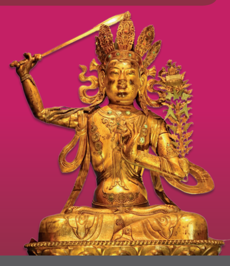

Oren Hanner (ed.)
Buddhism and Scepticism Hamburg Buddhist Studies 13 Series Editors:
Steffen Döll | Michael Zimmermann

for Buddhist Studies Oren Hanner (ed.)
Buddhism and Scepticism Historical, Philosophical, and Comparative Perspectives projektverlag.

Bibliographic information published by the Deutsche Nationalbibliothek The Deutsche Nationalbibliothek lists this publication in the Deutsche Nationalbibliografie; detailed bibliographic data are available in the Internet at http://dnb.d-nb.de.

ISSN 2190-6769 ISBN 978-3-89733-558-5 (E-Book)
ISBN 978-3-89733-518-9 (printed version) © 2020 projekt verlag, Bochum/Freiburg www.projektverlag.de Cover original design by Benjamin Guzinski; Julia Wrage, Hamburg Cover image: Manjushri from Rig Sum Gonpo (Lords of the Three Families) https://commons.wikimedia.org/wiki/

## Contents

Foreword by the Editors 7 Contributors 9 Acknowledgements 13 Introduction 15 Oren Hanner Some Sceptical Doubts about "Buddhist Scepticism" 21 Mark Siderits Beyond Reasonable Doubt? A Note on Dharmakīrti and Scepticism 37 Vincent Eltschinger Nāgārjuna's Scepticism about Philosophy 55 Ethan Mills Yavanayāna: Buddhist Soteriology in the Aristocles Passage 83 Georgios T. Halkias The Evident and the Non-Evident: Buddhism through the Lens of Pyrrhonism 109 Adrian Kuzminski Scripture and Scepticism in Vasubandhu's Exegetical Method 131 Oren Hanner Sceptical Buddhism as Provenance and Project 161 James Mark Shields Index 179

## About Hamburg Buddhist Studies

Ever since the birth of Buddhist Studies in Germany more than 100 years ago, Buddhism has enjoyed a prominent place in the study of Asian religions. 

The University of Hamburg continues this tradition by focusing research capacities on the religious dimensions of South, Central, and East Asia and making Buddhism a core subject for students of the Asia Africa Institute. The Numata Center for Buddhist Studies is proud to have found a home at one of Europe's pioneering academic institutions. With its Hamburg *Buddhist Studies* book series it honors the University's long-standing commitment to research in the field of Buddhist Studies and aims to share its results with both the academic community and the wider public.

Today, Buddhist Studies as an academic discipline makes use of a broad spectrum of approaches and methods. The field covers contemporary issues as much as it delves into the historical aspects of Buddhism. Similarly, the questions shaping the field of Buddhist Studies have broadened. Understanding present-day Buddhist phenomena—and how such phenomena are rooted in and informed by a distant past—is not at all an idle scholarly exercise. 

Rather, it has become clear that fostering the understanding of one of the world's major religious traditions is a crucial obligation for modern multicultural societies in a globalized world.

Accordingly, *Hamburg Buddhist Studies* addresses Buddhism as one of the great humanistic traditions of philosophical thought, religious praxis, and social life. Its discussions will undoubtedly be of interest to scholars of religious studies and specialists of Buddhism, but also aim at confronting Bud-dhism's rich heritage with questions the answers to which might not easily be deduced by the exclusive use of historical and philological research methods. Such issues require the penetrating insight of scholars who approach Buddhism from a broad range of disciplines, building upon and yet going beyond the solid study of texts and historical evidence.

We are convinced that *Hamburg Buddhist Studies* will contribute to opening up the field to those who may have no training in the classical source languages of the Buddhist traditions but approach the topic against the background of their own disciplinary interests. With this book series, we would like to also encourage a wider audience to take an interest in the academic study of the Buddhist traditions.

## About This Volume

Based on the papers presented and discussed during a conference convened by the editor at Hamburg University in 2017 and jointly supported by the Maimonides Centre for Advanced Studies and the Numata Center for Buddhist Studies, this collection brings together examinations of types of systematic doubt in the traditions of Buddhism from a variety of perspectives. 

Outlooks from comparative philosophy are naturally present, and the ques-tion "May Buddhism's attitude towards accepted knowledge accurately be described sceptical?" is addressed both affirmatively and pessimistically. 

Possible interdependencies between Pyrrhonism and classical Buddhist scholasticism as well as the sceptical nature of New and Critical Buddhism are explored. What results from the perceptive observations and profound analytical insights of the seven essays collected here is a rich and multi-faceted picture of two philosophical systems that seem both akin and at odds, both related and distant at the same time. 

Michael Zimmermann and Steffen Döll

# Contributors

Vincent Eltschinger is Professor for Indian Buddhism at the École Pratique des Hautes Études, PSL Research University, Paris. His research work focuses on the religious background, the apologetic dimensions and the intellectual genealogy of late Indian Buddhist philosophy. His publications include numerous books and articles dedicated to various aspects of the Indian Buddhists' polemical interaction with orthodox Brahmanism, from Aśvaghoṣa to late Indian Buddhist epistemologists such as Śaṅkaranandana. Mention can be made of *Penser l'autorité des Écritures* (2007), *Caste and Buddhist Philosophy* (2012), *Buddhist Epistemology as Apologetics* (2014), *Self,* 
No-Self and Salvation (2013, with I. Ratié), and Dharmakīrti's Theory of Ex-*clusion* (2018, with J. Taber, M. T. Much and I. Ratié). Vincent Eltschinger, one of the editors of *Brill's Encyclopedia of Buddhism*, has been teaching at various universities, including in Budapest, Lausanne, Leiden, Leipzig, Tokyo, Venice, Vienna, and Zurich.

Georgios T. Halkias is Associate Professor for Tibetan and Himalayan Buddhism at the Centre of Buddhist Studies, The University of Hong Kong. His current research work focuses on the transmission of Buddhism from India and Central Asia to Tibet and on the materialities of religious exchange in the north-eastern and north-western Himalayas as part of a Collaborative Research project titled Infrastructures of Faith: Religious Mobility on the Belt and Road funded by the Hong Kong Research Grants Council. His publications include *Pure Lands in Asian Texts and Contexts: An Anthology* (2019),
Luminous Bliss: A Religious History of Pure Land Literature in Tibet. With an Annotated English Translation and Critical Analysis of the Orgyan-gling Gold Manuscript of the Short Sukhāvatīvȳuha-Sūtra (2013), and numerous articles dedicated to Tibetan and Himalayan Studies, and Indo-Greek Buddhism. He is the co-editor-in-chief for the *Oxford Encyclopedia of Buddhism*.

Oren Hanner is a research fellow at the Numata Center for Buddhist Studies, Hamburg University. He studied philosophy at the Hebrew University of Jerusalem and Tel-Aviv University and holds a PhD in Buddhist Studies from Hamburg University. His research focuses on Indian and Buddhist thought, with particular interest in ethics and cross-cultural dialogue between Asian and Western analytic philosophy. He is currently working on a book dedi-cated to moral agency in Vasubandhu's thought.

Adrian Kuzminski is an independent scholar and the author of Pyrrhonism: 
How the Ancient Greeks Reinvented Buddhism (Lexington, 2008) and the forthcoming book *Pyrrhonian Buddhism* (Routledge). He has also written books on populism and the history of money and credit. Adrian Kuzminski has been a newspaper columnist and online political commentator; he is the founder of *Sustainable Otsego*, a social network promoting environmental practices in the Cooperstown, New York, area, where he lives with his family. Ethan Mills is Assistant Professor of Philosophy at the University of Tennessee at Chattanooga, USA. He is the author of several articles on Indian scepticism as well as the book *Three Pillars of Skepticism in Classical India:* 
Nāgārjuna, Jayarāśi, and Śrī Harṣa (Lexington, 2018). He is co-editing a volume titled *Skepticism in India*, forthcoming from Brill. Aside from his philosophical interests, he is a cat lover and avid science fiction fan. In the online realm, Ethan Mills is a co-runner of the group blog The Indian Philosophy Blog, and he also maintains a personal blog Examined Worlds: Philosophy and Science Fiction.

James Mark Shields is Professor of Comparative Humanities and Asian Thought and was Inaugural Director of the Humanities Center at Bucknell University (Lewisburg, PA). Educated at McGill University (Canada), the University of Cambridge (UK), and Kyoto University (Japan), he conducts research on modern Buddhist thought, Japanese philosophy, comparative ethics, and philosophy of religion. He is author of *Critical Buddhism: Engaging with Modern Japanese Buddhist Thought* (Ashgate, 2011), *Against Harmony: Progressive and Radical Buddhism in Modern Japan* (Oxford, 2017), 
and co-editor of *Teaching Buddhism in the West: From the Wheel to the Web* (Routledge, 2003), *Buddhist Responses to Globalization* (Lexington, 2014), 
and *The Oxford Handbook of Buddhist Ethics* (Oxford, 2018).

Mark Siderits works primarily in analytic Asian philosophy. He did his BA 
at the University of Hawai'i; his PhD is from Yale. He retired from Seoul National University in 2012, having previously taught at Illinois State University (1980–2008). His current research interests lie in the intersection between classical Indian philosophy on the one hand, and analytic metaphysics and philosophy of language on the other. Among his more recent publications are *Personal Identity and Buddhist Philosophy: Empty Persons*, 2nd edition
(Ashgate, 2015) and, together with Shōryū Katsura, Nāgārjuna's Middle Way: Mūlamadhyamaka*kārikā* (Wisdom, 2013). A collection of his papers on Buddhist philosophy, *Studies in Buddhist Philosophy*, was published by Oxford in 2016.

# Acknowledgements

The studies presented in this book stem from a symposium of the same name, which was held at the University of Hamburg in November 2017 and was generously sponsored by the University's Numata Center for Buddhist Studies, the Maimonides Centre for Advanced Studies (MCAS), and the AsienAfrika-Institut. The editor would like to convey his deep gratitude to Michael Zimmermann and Steffen Döll, co-chairs of the Numata Center for Buddhist Studies, Giuseppe Veltri, the director of MCAS, and Racheli Haliva and Stephan Schmid, MCAS co-directors, for their extremely kind support. Acknowledgements are similarly due to Maria Wazinski, who masterfully tended to all the administrative needs of the symposium, and Silke Schaeper, who provided essential library assistance. The editor would also like to thank the symposium's participants: Amber Carpenter, Gordon F. Davis, Dong Xiuyuan, Vincent Eltschinger, Eli Franco, Georgios T. Halkias, Jowita Kramer, Adrian Kuzminski, Ethan Mills, Serena Saccone, James Mark Shields, Mark Siderits, and Sergiu Spătan. Finally, on behalf of the authors, sincere thanks go to the copy editor, Katharine Handel, for her careful reading of the manuscripts and her valuable comments, and to Sun Hao for his meticulous proofreading of the source language segments.

# Introduction

Oren Hanner Philosophical curiosity, as some have argued, begins when we first call into question things that we ordinarily take to be self-evident. It is when doubts regarding the nature of reality, ourselves, or our beliefs arise that we start to ponder philosophical questions, specifically questions about the limits of our knowledge. The articles collected in the present volume seek to improve our understanding of the role that sceptical questions of this sort have played in the formation and development of Buddhist thought. While in everyday parlance scepticism is oftentimes equated with sheer doubt, the focus of this collection is its philosophical sense and usages. John Greco (2008: 4–5) recognizes three historical implementations of philosophical scepticism in Western philosophy: scepticism as a way of life, scepticism as a practical problem, and scepticism as a theoretical problem. In the Greek and Hellenistic worlds, scepticism was prescribed as a way of life leading to well-being (*eudaimonia*). A sceptical life was, therefore, considered to be ethically superior to a dogmatic one. Pyrrhonism, for instance, aimed at a tranquil state of mind 
(*ataraxia*) through the suspension of judgement on all matters. Early modern philosophy, on the other hand, considered scepticism to be a practical problem. Philosophers have attempted to overcome it using a variety of strategies in order to arrive at certain knowledge. Thus, René Descartes, in a wellknown array of sceptical arguments, sought to surmount various kinds of epistemological obstacles to certain knowledge. Nowadays, contemporary philosophy treats scepticism as a theoretical problem. Present-day thinkers are interested in what counts as a good argument or reason for thinking that scepticism may be valid. Each of these implementations may find parallels in Buddhist philosophy, and the studies presented here make various use of them in order to examine the issue at the heart of the volume.

Manifestations of scepticism in Buddhist philosophy can be investigated from a variety of disciplinary perspectives. Thus, in addition to taking the different senses of scepticism into account, the questions guiding the contributions focus on the historical and philosophical dimensions of scepticism in Buddhist thought, as well as on a comparative inquiry into their meaning in light of other philosophical traditions. Some of the papers seek to examine whether and in what ways Buddhist works and thinkers display sceptical attitudes. This dimension of inquiry refers to instances in which Buddhist sources question different forms of knowledge or prescribe the suspension of judgement towards beliefs. Another question that has been considered centres on the history of Buddhist thought. Granting that there are expressions of scepticism in Buddhist philosophy, what are their origins? Can we identify historical influences on Buddhist sceptical thought, or, vice versa, influences that Buddhist sceptical arguments had on contemporaneous and later philosophical developments? Finally, a third line of investigation that has been pursued in this volume is comparative in nature. How do sceptical arguments and strategies employed in Buddhist philosophy differ from or resemble their counterparts in non-Buddhist traditions? Although this question is broad enough to subsume systems from any geographical area and tradition, the discussion that evolves in the following chapters centres solely on comparisons with Western philosophy. The mirror images come from the Greek and Hellenistic landscape, as well as from modern Western theories about knowledge and doubt.

One question that may arise very early in view of these lines of inquiry concerns the rationale for examining Buddhist philosophy through the prism of scepticism and its manifestations. In what ways could relying on ideas developed by sceptical philosophical systems contribute to our understanding of Buddhist thought? One plane on which having recourse to scepticism as understood in Western philosophy is useful is that of the history of philosophy. The employment of a single term may lead us to insights into the intellectual relationships and exchanges between the Indian philosophical environment and that of Greek and Hellenistic philosophy. This principle has guided a number of past studies which explore the historical connections between Buddhist and ancient Western philosophy. In this volume, Adrian Kuzminski refines his historical narrative of how Indian sources actively shaped Pyrrho's sceptical thought, while Georgios Halkias examines indications of historical relations of this kind in Aristocles's *History of Philosophy*.

The use of a uniform terminology is also instrumental in revealing theoretical commonalities and differences between Buddhism and other systems of thought. Vincent Eltschinger, for example, points to the stark contrast be-tween the New Academy's and Dharmakīrti's approaches to knowledge, while noting that they nevertheless tackle practical matters in a similar way, and my paper suggests that different ethical evaluations of a doubtful mental state, as Vasubandhu's treatment of this issue shows, may result in different degrees of commitment to a sceptical endeavour. But before that, turning our gaze to the family of sceptical thought systems known from Western philosophy allows us to consider the preliminary question of whether Buddhism exhibits sceptical inclinations at all. This is the route taken by Mark Siderits, who largely answers the question in the negative, and Ethan Mills, who does choose to characterize Nāgārjuna as a sceptical thinker. And finally, relying on Western notions of scepticism proves particularly useful when studying modern trends in Buddhism which explicitly connect Buddhist doctrines to sceptical or critical principles. This is the use that James Mark Shields makes of the term in his contribution. Naturally, in this collection, the historical, philosophical, and comparative perspectives complement each other and are oftentimes inseparable.

The volume opens with Mark Siderits's assertion that Buddhist philoso-phy cannot usefully be seen as employing any sceptical strategies. Siderits looks at Buddhist arguments through the lens of both Pyrrhonian scepticism and radical scepticism. By examining the ways in which Buddhist thinkersfrom Abhidharma authors to Nāgārjuna (c. 200 CE) and Vasubandhu (fourth to fifth centuries CE)—have treated issues that have become the object of sceptical doubt in Western philosophy—the nature of the self, the existence of a mind-independent world, and metaphysical certainty—this chapter shows that in most of these cases, Buddhism is better understood as arguing for a determinate view. In like manner, the formal parallels between Madhyamaka philosophy and ancient forms of scepticism, which have often served to defend a sceptical reading of Buddhism in modern scholarship, do not overcome the many differences that a comparison of these philosophical currents reveals. Lastly, when Buddhist arguments may nevertheless be interpreted as sceptical, such as in Vasubandhu's defence of the representation only (*vijñaptimātra*) position, these arguments inevitably lead to logical difficulties.

In the second chapter, Vincent Eltschinger turns to the epistemological strand of Buddhism and examines the strategies that its members employed when dealing with instances of doubt. Comparing Dharmakīrti (around 600 CE), a prominent logician and thinker of that tradition, to equivalent Hellen-istic schools of thought, Eltschinger opines that Dharmakīrti's attitude to-wards knowledge should be seen as closer to the epistemological optimism of the Stoics rather than the pessimistic view of Academic scepticism. Essen-tially, both the Stoics and Dharmakīrti believed that knowledge of reality is, in principle, possible. Like the thinkers of the New Academy, however, Dharmakīrti faced difficulties related to practical uncertainty, such as estimating the possibility of a successful life and spiritual practice when the results of action cannot be fully foreseen. In order to deal with such circum-stances, Dharmakīrti and the Academics both had recourse to forms of prob-abilism, which provide a weaker substitute for objective knowledge and certainty.

The Buddhist philosopher who has most often been identified with scep-ticism is Nāgārjuna, the founder of the Madhyamaka (Middle Way) school. 

In the third chapter, Ethan Mills defends his two-phase reading of Nāgārjuna as a sceptic about philosophy. According to this reading, Nāgārjuna displays two seemingly incompatible tendencies: first, he argues in favour of a positive view—namely, the theory of emptiness (*śūnyatā*)—and against the idea of essence (*svabhāva*); second, he encourages the negative abandonment of all views. These tendencies can be reconciled if Nāgārjuna's philosophical procedure is to be taken as a gradual move towards scepticism about all forms of philosophy and their content. Nāgārjuna first argues for the thesis of emptiness as a philosophical stance and consequently demonstrates that the idea of emptiness undermines all philosophical views, including the theory of emptiness itself. Mills shows that this interpretation is supported by several Buddhist thinkers, including Candrakīrti (c. 570–650 CE), Kumārajīva (c. 

343–413 CE), and mKhas-grub Dge-legs-dpal-bzang-po (1385–1438 CE).

Indeed, comparisons between Madhyamaka philosophy and Pyrrhonism have been drawn by a number of modern studies. In chapter 4, Georgios Halkias opens with a short survey of these works and the principal milestones in the discourse regarding the affinities between the two philosophical systems. From this point, the chapter argues for a historical link between Madhyamaka philosophy and Pyrrho's scepticism by presenting a Buddhist reading of the Aristocles Passage. This passage, which provides a summary of Pyrrho's ideas, is attributed to his student Timon (c. 320–230 BCE) and pre-served in Aristocles's (first to second centuries CE) *History of Philosophy*; 
since Pyrrho himself did not leave any philosophical writings and evidence of his life and philosophy is found in only a limited number of other sources, the Aristocles Passage is considered to be the most essential source for Pyr-rho's teachings. Seen through a Buddhist lens, the passage displays corre-spondences between the two systems of thought in various dimensions, from the goal of employing their ideas to the fruits obtained thereby. According to Halkias, these similarities point to the existence of intellectual ideas common to both the Buddhist and Sceptic traditions throughout recorded and unrecorded history.

Adrian Kuzminski's inquiry in the fifth chapter of this volume is guided by a similar rationale: revealing crucial analogies between Pyrrho's ideas and early Buddhist thought, he proposes that it is very likely that Pyrrho obtained some of the fundamental principles of his philosophy from Indian Buddhism during his stay in the subcontinent, reconciling them with his Greek mindset. 

In particular, Pyrrho's sceptical approach to knowledge, as preserved in Sex-tus Empiricus's classification of facts (*pragmata*) into evident and non-evident, exhibits an epistemological approach that is comparable to that of the Buddha. Although some argue that it is more reasonable to believe that Pyrrho drew this perspective from his immediate surroundings—from the Democriteans, Cyrenaics, or Megarians—the chapter goes on to show that Pyrrho's thinking integrated various elements, the specific combination of which would have been unobtainable in Greece, but could have been found in India. The result is a Pyrrhonian phenomenological atomism akin to that of the Abhidharma *dharma* theory.

While it is arguably classical scepticism and Madhyamaka philosophy that have attracted the most scholarly attention, sceptical threads can also be found outside Madhyamaka thought. Similarly, Buddhism may be examined in light of a variety of sceptical ideas formed in later periods. As I show in chapter 6, Vasubandhu, the author of many Yogācāra and non-Mahāyāna works, sought to accommodate instances of religious scepticism—expressions of doubt that challenge or dispute the credibility of scriptural knowledge claims—in both his theory of exegesis and his commentarial work. This form of scepticism is reminiscent of certain critical attitudes to religion expressed by early modern thinkers. Vasubandhu himself is far from being a sceptic: unlike the Pyrrhonists and in keeping with the Buddhist tradition, doubt for him is an unwelcome state of mind; an attitude that produces confusion and is associated with ignorance rather than instilling peace of mind. At the same time, rationally justified objections to Buddhist teachings ought to be considered and resolved. In either case, Vasubandhu demonstrates that scepticism should be directed at human understanding instead of at Buddhist scriptures, thereby transforming religious scepticism into epistemological scepticism. Similarly, the desired end of entertaining sceptical doubt or objections is not the suspension of judgement, but the achievement of certainty. 

Finally, in the concluding contribution to the volume, James Mark Shields explores modern projects which bring Buddhist thought into dialogue with classical and early modern forms of scepticism, as well as modern and contemporary forms of progressive and radical philosophy. Belonging to this circle of reformers are Stephen Batchelor, whose idea of a secular Buddhism defines a middle way between dogmatic faith and unreflective atheism that is suited to 21st-century Buddhist practitioners; the Japanese scholarly movement of Critical Buddhism, which sought to reintroduce a critical element into contemporary Asian Buddhism that they considered to be an essential aspect of early Buddhism; and the radical Japanese New Buddhist movements of the mid to late Meiji period (1868–1912), which unanimously believed that Buddhism needed to re-establish itself as a "this-worldly," en-gaged religion. In his study, Shields evaluates the degree to which these efforts have succeeded in integrating scepticism and criticism in their vision of Buddhism, while maintaining the vital Buddhist praxis of responding to the suffering of the world.

## References

Greco, John (2008). "Introduction." *The Oxford Handbook of Skepticism*, edited by John Greco. New York: Oxford University Press, 3–6.

# Some Sceptical Doubts About "Buddhist Scepticism"

Mark Siderits For my own part, I am sceptical that there is much in Indian Buddhist philosophy that may usefully be seen as scepticism. Moreover, I think that on those occasions where they do employ strategies borrowed from the sceptical toolkit, Buddhist philosophers run into difficulties. I shall be examining pos-sible roles for scepticism in Yogācāra and Madhyamaka, and my conclusions will be mostly negative. But I know that some will disagree. I see my role here to be one of laying out some broad themes in the topic; I shall be provocative in some of my remarks, but I shall do this mostly as an attempt to stimulate discussion.

Ordinarily, "I am sceptical about x" can mean any number of things depending on context. In a society where belief in ghosts is common, "I am sceptical about ghosts" can be used to assert that ghosts do not exist. The sceptic about anthropogenic global warming typically believes that we simply do not know whether global warming is caused by human activity. 

Philosophical uses of scepticism display the same ambiguity between the ontological and the epistemological. The professed moral sceptic may be a polite moral anti-realist. But strictly speaking, the philosophical sceptic should confine their claim to the epistemic realm and leave ontological questions to metaphysicians. Those are the rules I shall abide by here: by "sceptic," I shall mean someone who withholds judgement about matters in a certain domain. But there is a further distinction to be drawn. A sceptic might hold that we cannot have knowledge of matters in that domain, or they might instead withhold judgement as to whether or not we can have knowledge of matters in that domain. In Hellenistic thought, the first kind of sceptic was called an Academic, while the second was called a Pyrrhonian. The form of scepticism that has loomed large in modern philosophy from Descartes on, a form often called "radical scepticism," is of the first kind. I shall be using the term "radical scepticism" for the first sort of scepticism and "Pyrrhonian" for the second, even though the latter may in fact be more thoroughgoingly disruptive than the former.

There are a number of claims about which Buddhists may be described as being sceptical, such as the claim that there is an Īśvara. They are not, though, sceptical about the existence of a self: they say that we can know that there is no such thing. But neither is any Indian Buddhist sceptical about another matter that many would say is beyond the capacities of human knowledge: 
that there is karma and rebirth. This should, I think, give us pause when considering whether any Buddhists endorse the sort of scepticism practised by Pyrrhonians. Surely Sextus Empiricus would see belief in the karma–rebirth ideology as an obstacle to tranquillity. I shall return to this question later.

For now, I want to say some things about radical scepticism and the uses to which it may be put. The radical sceptic typically denies that we have knowledge about matters in a strictly limited domain, a situation which is then contrasted with what holds elsewhere in the epistemic landscape. Thus, one might be a radical sceptic with respect to the existence of an external world, or of other minds; one might deny that one can ever have knowledge with respect to future states of affairs, or to normative claims; and so on. The radical sceptic generally arrives at this result by employing evidence about matters that we supposedly do know, so that the result is not epistemic annihilation. Thus, Descartes says that his method of doubt would, if unchecked by the *cogito*, still leave in place at least one item of knowledge: that nothing is known. (This is why a Pyrrhonian calls the radical sceptic a "dogmatist.") 
But once the radical sceptic's work is done (say, with respect to our knowledge of the external world), the metaphysician may enter. And it is common to suppose that once we have been shown that there is reason to doubt whether we are in epistemically significant contact with the physical objects that we ordinarily believe populate our world, it is but a short step to subjective idealism. But how exactly is that step taken? It would seem that if I do not know that there is an external world, I equally do not know that there is not. Let us look briefly at how Berkeley, that stock Western idealist, manages the transition from "for all I know there is no external world" to "there is no external world."
The crucial link is to be found in the epistemological internalism that mo-tivates Descartes' method of doubt: the thesis that in order to know that p, one must know that one knows that p (the KK thesis). This thesis is called "internalist" because it makes knowledge conditional on justification being internal to the cognizing subject in some sense. If we accept the analysis of knowledge as justified true belief, then the KK thesis claims that in order for one to be justified in believing that p, one must have direct access to the con-ditions that constitute one's being justified in believing that p. And a representationalist account of perception—the view that what one is directly aware of in sense perception is not a physical object but a mental representationmakes it the case that all one's directly accessible evidence for the existence of an external world consists of states of the subject. This does not itself rule out the possibility that these states result from interaction with an external world. Radical scepticism can, once again, only bring us to the result that for all we know, there may be no external world. But epistemological internalism has another consequence that has been crucial to the argument for idealism. 

This is the semantic internalist claim that since we must know what we mean by the words we use in articulating knowledge claims, and knowing the meaning of a word involves knowing what entity it refers to, the meaningfulness of any claim about external objects must depend on our having direct access to things external to the mind. Since this is ruled out by a representationalist account of perception, it follows that all talk of an external world is devoid of meaning. Realism about the external world turns out not to be false but, rather, meaningless. 

This was Berkeley's master argument for subjective idealism. It proceeds in two stages. First, radical scepticism yields the disjunction: the intentional object of sensory experience is either an external object or an inner mental state, and we cannot say which. Semantic internalism is then deployed in order to show that the first disjunct is meaningless.1 But now, when we consider Vasubandhu's argument for *vijñaptimātra*, we see something quite different. 

Like Berkeley (and Dignāga), he first uses representationalism to set up the disjunction. But his rejection of the external-world realist disjunct does not rely on semantic internalism. Instead, he gives two straightforwardly metaphysical arguments: one aimed at problems that arise in trying to explain how the atoms that are the ultimate reals of the external-world realist ontology could bring about sense perceptions; the other appealing to the principle of lightness (parsimony) to show that the karmic seeds hypothesis yields a better explanation of the genesis of sense perceptions.2 Yogācārins are not semantic internalists.

The alternative to semantic internalism is, naturally enough, semantic externalism. This is the view that meanings "ain't in the head"; that the meaning of a term is established through causal connections with states of affairs that are distinct from the inner states of individual language-users. The key result of this anti-individualist stance is that a speaker may meaningfully use a term without themselves knowing the referent. In the case of terms used to express sense experience, the referent will be whatever regularly causes the sensory states that speakers are trained to use as criteria of application. Hilary Putnam
(1975) used Twin Earth thought experiments to motivate this view of meaning. He later, in the first chapter of his 1981 *Reason, Truth and History*, deployed it in his famous (or, in some quarters, infamous) BIV argument that is meant to serve as a *reductio* on radical sceptical hypotheses.

"BIV" stands for "brains in a vat," which is what we are invited to suppose we might all be. This is another way, in addition to the "I might be dreaming" scenario, of fleshing out the sceptical hypothesis that the world that is presented to us through our sense perception is radically different from how we take it to be. Imagine, then, that we might be bodiless brains in a vat of nutrients, being fed sensory input through brain implants connected to a supercomputer. The programming run by this computer is so sophisticatedly interactive as to be undetectable. Since it is undetectable, when we have the experience as of seeing and touching a pot, the cause of this experience might be a feature of the program (if we are BIVs), or it might be a pot (if we are human beings walking around in the open air). The BIV sceptic will claim that we cannot know which it is. But now the semantic externalist intervenes. 

Either we are flesh-and-blood humans, or else we are BIVs. Consider the sentence "there is a pot." The meaning of the word "pot" is whatever reliably causes the sensory stimulation that we have learned to express using "pot" utterances. It follows that the meaning will differ depending on whether we are flesh-and-blood humans or BIVs. If the former, then the reference will be pots; if the latter, then it will be some feature of the computer's program-ming. The same will hold for all other terms used to express the content of our sensory experience. Because of this systematic difference in reference across most terms in our language, we are actually looking at two distinct languages. Let us call the first language "English" and the second "Vat-English." Given the sceptical hypothesis that for all we know, we might be BIVs, we cannot know which language we are speaking. But if we are speaking English, and we are therefore not BIVs, the sentence "I am a BIV" will be false. And likewise, if we are BIVs and are speaking Vat-English, then the sentence "I am a BIV" will express something false, for the feature of the program that figures in speaker self-reference is not the feature that would normally be expressed in Vat-English by "brain in a vat." The upshot is that if the sceptical hypothesis were true, it would be false: whichever language we happened to be speaking, it would be false to say "I am a brain in a vat."
The sceptical hypothesis is shown by semantic externalism to be self-refuting.

Now change the sceptical hypothesis to the claim that for all I know, I 
might be a causal series of *ālaya* consciousnesses. In that case, the word ghaṭa would refer to the development of a certain sort of *vāsanā*. Given the shift in reference for this and most other terms, we must then distinguish between Sanskrit and *Ālaya*-Sanskrit. And once again, the result will be that the sceptical hypothesis is self-refuting. While Yogācāra does not employ anything like Berkeley's scepticism-fuelled argument, Vasubandhu's buoy-ancy argument does rely on the hypothesis that we cannot tell from the content of our sensory experience alone whether it originates from interaction with an external world or from the ripening of karmic seeds. As such, it is vulnerable to the charge that it relies on a questionable account of meaning. 

(The other argument is, as Graham Priest has said, valid by the terms of fifthcentury mathematics, but not by those of 21st-century mathematics.) 
One might wonder whether a Buddhist would wish to embrace semantic externalism. But the thought that meanings are established through convention, something that is widely shared among Buddhist schools, suggests an implicit endorsement of the externalist's anti-individualist stance. Conventions are forged by groups of people in interaction with their environment. It is not up to the individual to change the convention by fiat. As Putnam said, meanings ain't in the head: they exist in the interactions between groups of people and conditions in the world.

Reflection on this result will take us in the direction of Madhyamaka, which is where I think we should go if we want to examine the case for reading Pyrrhonian scepticism into any part of the Buddhist tradition. The externalist refutation of radical sceptical hypotheses suggests that using the scep-tic's disjunction—that for all we know, things might be as we ordinarily think, or they might be completely different way—for revisionary metaphysical purposes is a mistake. That may in turn suggest that metaphysics is generally a hopeless enterprise: that trying to work out how things are *anyway* is a fool's errand. This conclusion is certainly one way of understanding what Madhyamaka is up to. But before we get to Madhyamaka, we need to go back in time to early Buddhism and look at the treatment of the *avyākṛ*ta or indeterminate questions in the *Nikāya*s, for this treatment is sometimes cited as evidence of sceptical tendencies in the very inception of the Buddhist tradition (and thus as evidence supporting a sceptical reading of Madhyamaka).

The *avyākṛ*ta are questions that the Buddha refused to answer. Since sages were expected to have knowledge about all soteric matters, and the questions that the Buddha chose not to answer were on topics deemed to be related to liberation, this refusal was considered noteworthy. One interpretation of his silence is that since answering these questions is not in fact relevant to attaining liberation, not answering them is consistent with the limited omniscience 
(viz. what might be called Dharmic omniscience) expected of a sage. And while this interpretation is compatible with the possibility of the Buddha simply not knowing the answers to these questions, some take it further and see a certain sort of principled scepticism in his stance. The idea here is that such questions are to be rejected on the grounds that answering them would require engaging in the epistemologically dubious enterprise of "speculative metaphysics." The Buddha is here seen as a proto-positivist, someone who rejects all attempts to extend knowledge beyond what is subject to empirical confirmation.

While it is clear that the Buddha does reject some of the *avyākṛ*ta on straightforwardly pragmatic grounds, 3I am not sure that the Buddha's si-lence is best seen as stemming from scepticism regarding their domain. There is, I think, an account of his rejection of all alternative answers to the questions that better accords with later treatments of the issue. Take the questions about the post-mortem status of the enlightened person.4 The Buddha's re-sponse is an early instance of a negative catu*ṣkoṭ*i: it is not to be said that after death the enlightened person exists, does not exist, both exists and does not exist, or neither exists nor is non-existent (i.e., attains some inexpressible state). One wonders how all four options can be rejected, but later exegetes uniformly explain this as having been made possible by the use of the commitmentless prasajya pratiṣ*edha* negation. That in turn tells us that the question involves a false presupposition: in this case, the assumption that there is such a thing as a person. Given that persons are mereological sums, and thus are no more than conceptual constructions, it is strictly speaking false that there are persons, and so it is false that there are liberated persons. Statements with false presuppositions lack truth-conditions, and so lack meaning. Their shared presupposition being false, all four possible answers to the question turn out to be meaningless. The Buddha's rejection of all four is tantamount to the injunction "Don't say *gobbledygook*."
This is the first use of what I call a presupposition failure filter, which filters those seemingly meaningful utterances that actually lack semantic significance due to presupposition failure out of the discourse. It is put to great use in Abhidharma articulations of what I call Buddhist Reductionism. There, it serves as a kind of semantic insulation between the two truths, preventing contradictions from arising in the domain of the ultimate truth by confining statements using what are called mere convenient designators to the realm of conventional truth. The mesh of this filter grows ever finer as we move from the earliest Abhidharma texts to the much later work of Dignāga and Dhar-makīrti (where all discourse is screened out). But it is in Madhyamaka that the presupposition failure filter does its most radical work. It was agreed by all that the test of an entity's being ultimately real is whether it bears its nature intrinsically—whether it may bear that nature in the unaccompanied state. Mādhyamikas develop a battery of arguments meant to reduce to ab-surdity various views about what sorts of things might have intrinsic natures and how they might function. If these arguments were to succeed, they would show that there are no ultimately real entities or ultimate truths. And this is so not because the ultimate nature of reality is inexpressible (the Yogācāra view), but rather because the very idea of the ultimate nature of reality is incoherent. Madhyamaka is a particular sort of non-dualism, namely, semantic non-dualism: there are not two kinds of truth, there is just one, the conventional.

Madhyamaka is often taken for a kind of scepticism, specifically Pyrrhonian scepticism (or perhaps that of Jayarāśi's Lokāyata).5It is not hard to see why. Mādhyamikas seek to banish the search for the ultimate truth by showing that there is nothing that such statements could be about. Pyrrhonians likewise try to bring about an end to inquiry into matters that are not imme-diately evident from our experience. Mādhyamikas are routinely accused of moral nihilism, as are Pyrrhonians. Madhyamaka is confronted with the charge of being self-refuting: in purporting to show that there can be no reliable means of belief formation, it is said to render itself unable to support its own claim that all things are empty or devoid of intrinsic natures. Pyrrhonism likewise faces a self-refutation objection. Nāgārjuna claims that he has no thesis, and so does Sextus. Both systems struggle to devise a method that will allow them to achieve their aim of quieting certain sorts of conceptual activity without committing to substantive claims about the nature of the world or our knowledge. And so on.

I am not persuaded by all these parallels. But before saying why, I should mention one additional point that I think does carry some weight. One inter-esting feature of Sextus' work is the wide variety of topics he addresses. He seems to have something to say against every learned view of his day. This prolixity is a function of the task he set himself: to help his reader attain a state of tranquillity by revealing the absence of conclusive reasons in support of the views held by learned inquirers. And this must be accomplished without suggesting that there is some general recipe for demonstrating the lack of decisive reasons, for to do so would be to lapse into dogmatism, to exempt his own methods from the Pyrrhonian stricture against holding beliefs. All he can do is respond to the views of others, setting out countervailing reasons that might serve as effective antidotes to the particular belief in question. But this appears to have been Nāgārjuna's strategy as well. Each of the 27 chap-ters of the Mūlamadhyamakakārikā (MMK) takes up a different topic, and one has the sense that the work could have been indefinitely extended. This is, I think, because there can be no master argument for the conclusion that all things lack an intrinsic nature. A master argument would require there to be some feature common to all ultimate reals whereby they could be shown to lack intrinsic natures, which would defeat the purpose of showing that all things lack an intrinsic nature; namely, to show that there can be no such thing as how the world is *anyway*. Thus, Mādhyamikas must confine them-selves to pointing out absurdities that follow from the views of their realist opponents.6 Since such opponents and their realist views are many, there may be no end to the task. What the Mādhyamika must count on is that sooner or later, their interlocutor will get the point and desist from propounding new metaphysical theories.

The prolixities of the two systems do, then, provide some support for calling Madhyamaka a kind of scepticism. But I do not think that this is enough to overcome the differences. Take, for instance, their respective aims. For Sextus, the aim is the tranquillity that comes from no longer forming beliefs through reasoned inquiry. One learns, for instance, to avoid forming a belief about questions such as whether tattooing is good or bad. Instead, one con-ducts one's life by acting in accordance with how things appear to one prior to inquiry. Jayarāśi describes the state resulting from this suspension of judgement as one in which "all worldly activities are engaged in with the delight of non-analysis (*avicāritaramaṇīya*)" (Franco, 1987, p. 44). Perhaps this state is one of delight, but Mādhyamikas are Buddhists, and this is not what Buddhist practice aims at. The Buddhist goal is the cessation of existential suffering; it is to be attained by extirpating all forms of an "I"-sense. 

It is difficult to see how the Pyrrhonian practice of acquiescing in how things appear to the uninquisitive could lead to such extirpation. Most people have the intuition that they are persisting agents and subjects of awareness. This intuition is what Buddhists have in mind when they speak of *moha* or delusion. How could merely acquiescing in delusion lead to liberation?

Kuzminski (2008) has recently argued for the view that Madhyamaka may usefully be thought of as like Pyrrhonism in important ways. Aware that the acceptance of the doctrine of karma and rebirth is just the sort of belief in a "non-evident" matter that Pyrrhonians would condemn as dogmatic, he asserts (pp. 60–61) that Mādhyamikas do not take the doctrine at all seri-ously. This is difficult to reconcile with the thrust of MMK 26, which concerns precisely how karmic causation generates future births. Perhaps Kuzminski might turn to his claim that for Madhyamaka, *nirvāṇ*a is not distinct from sa*ṃsāra* for support (p. 84), since he equates sa*ṃsāra* with the Pyrrhonian notion of the "evident"—that is, how things appear to ordinary people—and rebirth is not "evident" in this sense. But for Buddhists, sa*ṃsāra* is first and foremost a matter of beginningless rebirth, hardly something that ordinary people find themselves compelled to accept given their sensory experience. Moreover, the view that Madhyamaka equates *nirvāṇ*a and sa*ṃsāra* is based on a misreading of MMK 25.19. All Nāgārjuna actually says there is that *nirvāṇ*a and sa*ṃsāra* are alike in both being empty; that is, not ultimately real. To say this is not to say that *nirvāṇ*a and sa*ṃsāra* are not conventionally distinct; indeed, Buddhist practice would be pointless otherwise. In support of this claim that the goal of Madhyamaka*, nirvāṇ*a, is Pyrrhonian tranquillity, he quotes Candrakīrti to the effect that "the absence of anxiety [i.e., tranquillity] is the distinguishing characteristic of morality"
(MAV 6.205b). However, the passage he quotes, *śīlaṃ cādāhalakṣ*aṇaṃ,* actually means that the precepts of the Path are by nature devoid of passion, the point being that since the passions reinforce the "I"-sense, the path to the cessation of suffering involves practices (such as the cultivation of universal compassion) that work to counter the passions. Given Kuzminski's descrip-tion of the Pyrrhonian attitude towards the acquisition of knowledge (p. 39), 
a much better candidate for an Indian parallel to Pyrrhonism would be Jayarāśi's Lokāyata. This school is, however, the target of sustained Madhyamaka attack (as at MAV 6.99–102).

Here is one final reason to be sceptical about the attempt to assimilate Madhyamaka into the Pyrrhonian brand. One matter about which the Pyrrhonian must be indifferent is the question of whether or not there is anything behind the appearances in which one acquiesces. When it directly appears to the Pyrrhonian sage that they are hungry, they simply eat. They do not engage in inquiry as to whether it is best that one eats, or how one would best go about eating. Their sceptical practice has trained them not to engage in such inquiry by showing that for any question about the matter, there are good reasons supporting each of the different possible answers. However, this still leaves open the possibility that there are determinate answers to such questions—answers that may be beyond the scope of human knowledge, but determinate answers for all that. Metaphysical realism, the view that there is such a thing as how the world is *anyway*, is not ruled out for the Pyrrhonian. It is, however, for the Mādhyamika. This is precisely the point of the doctrine of emptiness. Indeed, it is the point of the doctrine of the emptiness of emptiness. As Nāgārjuna makes clear in MMK 13.8cd, the mistake of taking emptiness to be a feature of ultimate reality lies in supposing that there could be such a thing as ultimate reality. The Madhyamaka middle path between realism and nihilism lies in letting the presupposition-failure filter screen out all thought of there being a way that things exist independently of our concepts, which reflect interests and cognitive limitations.

I said above that there can be no master argument for the claim that all things are empty. However, some think that the appeal to dependent origination can be used to fashion such an argument. For my own part, I am sceptical that such an argument could succeed. As usually formulated, it depends on mistaking the bhāva of *svabhāva* for "existence" instead of "nature." When Ābhidharmikas say that only things with *svabhāva* can be ultimately real, what they mean is not that only things that are not dependent on other things for their coming into existence can be ultimately real. (Such entities would be eternal, and most if not all *dharma*s are thought to be momentary.) What they mean is that only things that can be the way they are without reliance on other simultaneously existing things can be ultimately real. The nature of an ultimately real entity must be something that that entity could have in the unaccompanied or "lonely" state. Moreover, to say that an entity originates in dependence on cause and conditions is not to say that its nature is extrinsic or "borrowed" from some other simultaneously existing entity. So I don't think that such an argument could be made to work. But if I am wrong about this, that would yield an additional reason to deny that Madhyamaka is Pyrrhonian. Sextus would surely see the deployment of such an argument as evidence of "dogmatism."
In *Vigrahavyāvartanī* (VV), Nāgārjuna develops a strategy that may be used to argue against the possibility of establishing the number and nature of the *pramāṇ*as; that is, against the very possibility of epistemology. The basic idea is that any attempt to show that a particular cognition resulted from the exercise of a *pramāṇ*a or epistemic instrument will incur one of three faults: question-begging, infinite regress, or mutual dependence. (The five "modes" or *prayoga*s that Sextus uses for the same purpose include these three.) If, for instance, I claimed that my seeing a pot was veridical on the grounds that it results from perception, and in response to the question of how I know perception to be a *pramāṇ*a I were to simply assert that it is, I would be guilty of question-begging. Now, at one time, I took the use of this strategy to amount to an argument against the possibility of there being *pramāṇ*as. But in that case, Sextus could accuse Nāgārjuna of dogmatism. Sextus is himself careful to deploy his version of the strategy in carefully delimited contexts so as to make it clear that the opponent's own views are being used against them. So perhaps the more charitable reading of the discussion in VV is that Nāgārjuna is merely replying to an objection and not developing an argument for a substantive thesis. In either case, Nāgārjuna, like Vasubandhu, is making use of a sceptical stance. Are there difficulties in that? 

The opponent here is a metaphysical realist who also thinks that the philosophical enterprise begins with the establishment of the *pramāṇ*as.7 Vācaspati replies, on Nyāya's behalf, that while the regress that results from seeking to validate a cognition by validating the instrument of that cognition can in principle continue indefinitely, in practice it stops after at most two or three iterations. While this may at first seem to completely miss the point of the argument, on reflection, it turns out to carry some weight.

The first thing to notice here is that Nāgārjuna's strategy might illicitly presuppose epistemological internalism. This presupposition would be illicit because those who are in the business of seeking to determine the number and nature of the *pramāṇ*as are externalists: for them, a given cognition counts as an instance of *pramā* or knowledge just in case it is the product of a reliable cause. One need not know that it was so produced in order for it to count as *pramā*; it simply has to be the case that its cause possessed the relevant epistemic virtues. Likewise, one need not know all the evidence that would show a given epistemic procedure to be of the right sort in order to know that that procedure is a *pramāṇ*a; all that is required is that the cognition whereby one apprehended the procedure as a *pramāṇ*a was produced in the right way. One can look into the pedigree of the cognition; one can look into the pedigree of the procedure that produced the cognition; one can even take the further step of checking up on the procedure one uses to make sure the original procedure is indeed reliable. But one need not do any of these things provided that the cognition is in fact veridical and that it was in fact produced by means of a truth-conducive procedure. 

To this, it will be objected that cognizers will not employ an epistemic procedure unless they have some reason to believe that it is trustworthy or truth-conducive. A mere lucky guess does not count as knowledge, and mere lucky guesses are the best we could hope for if we did not seek to discover which are the procedures that cause true beliefs. The question then returns: 
What epistemic procedures are we to employ in seeking to determine the number and nature of the *pramāṇ*as? To this, however, a champion of pramāṇa epistemology would respond that we should not expect to completely eliminate the role of luck in our epistemic achievements. A theory of the *pramāṇ*as is developed over time, through the method of reflective equilibrium. The point of the method is precisely to lessen the role of luck in our epistemic achievements. As a universal fallibilist, the causal-theroretic epistemologist concedes that we may never know that we have actually arrived at the ideal solution to the challenges we face in our quest for accurate information about the world. However, this is not to say that an ideal solution does not exist. And, more importantly, it is not to say that we are irrational if we continue to seek an ideal solution. What would be irrational would be to heed these sceptical doubts about the epistemological enterprise.

It is at this point that we should come back to the question of what Nāgār-juna is doing in his critique of *pramāṇ*a epistemology in VV. Is he merely replying to an objection from a metaphysical realist, someone who is a realist about the *pramāṇ*as, or does he intend his argument to have wider conse-quences? We know that later Mādhyamikas found room for a theory of the pramāṇas at the conventional level. So, in their eyes at least, one can do epistemology while acknowledging that all things—including *pramāṇ*as—are empty. The question is whether the critique in VV is meant to extend to everyone who denies that all things are empty. Buddhist Reductionists like Vasubandhu, Buddhaghosa, and Dharmakīrti also tried their hand at developing a theory of the *pramāṇ*as, but as Reductionists, they must hold that there are entities with intrinsic natures. Are they tarred with the same brush that Nāgārjuna might use against a realism like Nyāya's?

Navya-Naiyāyikas were aware of the problem of epistemic luck and tried to develop ways of eliminating all reference to luck in their theory of the pramāṇas. The 12th-century Advaitin Śrīharṣa argued that their attempts actually established that "*pramāṇ*a" is a cluster concept, that *prāmāṇ*ya is not a jāti or natural kind, but instead a mere *upādhi*.

8If this is correct, does it help support the Madhyamaka doctrine of emptiness against the metaphysical realism of the Abhidharma enterprise? Here again, I think the answer must be no. One can, I think, acknowledge that "*pramāṇ*a" does not pick out a natural kind and still hold that the world we seek to know through the exercise of pramāṇas comes pre-sorted into determinate kinds of individual entities. If Śrīharṣa is right, then *pramāṇ*a is a human conceptual construction. But for the Buddhist Reductionist, the same is true of *human*. The fact that a theory of *pramāṇ*as must take into account the interests and cognitive limitations of humans is perfectly explicable on the basis of the facts about those *dharma*s to which the existence of humans is reducible. Thus, the result is a standoff between the metaphysical realism of Buddhist Reductionism and the global anti-realism of Madhyamaka. The Mādhyamika can support their anti-realism using *pramāṇ*as that are merely conventionally real. But they cannot turn around and deny the coherence of the Buddhist Reductionist employment of pramāṇas understood to have the same ontological status. Once again, strategies based on sceptical premises take Buddhist philosophers only so far.

I think it is safe to say that most philosophers reject scepticism, in all its varieties. It has, though, become something of a cliché that scepticism plays an important role in the development of philosophy. Sceptical challenges motivate realist philosophers to forge new conceptual tools for defending what the sceptic calls into question. Scepticism also triggers new agendas in ontology, such as reductionisms and eliminativisms in various domains. The chief focus of the papers collected here is the role that scepticism has played in the development of Buddhist philosophy. But perhaps we should think of Buddhist philosophy as something that continues to develop today. If this makes sense, then we should also be considering what sorts of new sceptical challenges it confronts, and how it might respond. This is what living philosophical traditions do.

Berkeley, George (1998). *Three Dialogues Between Hylas and Philonous*, edited by Jonathan Dancy. New York: Oxford University Press (Oxford Philosophical Texts). (Original work published 1713.)
M = *Majjhima Nikāya.* Trenckner, V. (ed. 1948–1960). Majjhima Nikāya (Vols. 1-4). 

Reprint edition. London: Pali Text Society; Ñāṇamoli, Bhikkhu, and Bhikkhu Bodhi (trans. 1995). *The Middle Length Discourses of the Buddha: A New Translation* of the Majjhima Nikāya. Somerville, MA: Wisdom Publications (Teachings of the Buddha).

MAV = *Madhyamakāvatāra.* Candrakīrti (1907–1911). "*Madhyamakāvatāra.* Introduction au *Traité du milieu* de l'Ācārya Candrakīrti, avec le commentaire de l'auteur, traduit d'après la version tibétaine," translated by Louis de la Vallée Poussin. Le Muséon 8/3–4, 249–317; 11/3–4, 271–558; 12/4, 236–328.

MMK = *Mūlamadhyamakakārikā.* Nāgārjuna (1988–1989). Madhyamakaśāstram of Nāgārjuna (Vols. 1–2), edited by Raghunath Pandeya. Delhi: Motilal Banarsidass; Nāgārjuna (t2013). *Nāgārjuna's Middle Way: Mūlamadhyamakakārikā*, translated by Mark Siderits and Shōryū Katsura. Somerville, MA: Wisdom Publications.

VV = *Vigrahavyāvartanī.* Nāgārjuna (2002). *The Dialectical Method of Nāgārjuna:* 
Vigrahavyāvartinī, edited by E. H. Johnston and Arnold Kunst, translated by Kamaleswar Bhattacharya. Reprint edition. Delhi: Motilal Banarsidass; Nāgārjuna (2010). *The Dispeller of Disputes: Nāgārjuna's Vigrahavyāvartanī*, translated by Jan Westerhoff. New York: Oxford University Press.

Dreyfus, Georges, and Jay L. Garfield (2011). "Madhyamaka and Classical Greek Skepticism." *Moonshadows: Conventional Truth in Buddhist Philosophy*, edited by The Cowherds. Oxford: Oxford University Press, 115–30.

Franco, Eli (1987). Perception, Knowledge, and Disbelief: A Study of Jayarāśi's Skepticism. Stuttgart: F. Steiner Verlag Wiesbaden (Alt- und neu-indische Studien 35).

Granoff, Phyllis (2018). "Chance and Causality: Of Crows, Palm Trees, God and Salvation." *Journal of Indian Philosophy* 46/3, 399–418.

Kellner, Birgit, and John Taber (2014). "Studies in Yogācāra-Vijñānavāda Idealism I: The Interpretation of Vasubandhu's Viṃśikā." Asiatische Studien/Études Asiatiques 68/3, 709–756.

Kuzminski, Adrian (2008). Pyrrhonism: How the Ancient Greeks Reinvented Buddhism. Lanham, MD: Lexington Books (Studies in Comparative Philosophy and Religion).

Putnam, Hilary (1975). "The Meaning of 'Meaning.'" Minnesota Studies in the Philosophy of Science 7, 131–193.

Putnam, Hilary (1981). *Reason, Truth and History*. Cambridge: Cambridge University Press.

# Beyond Reasonable Doubt? A Note On Dharmakīrti And Scepticism*

Vincent Eltschinger Madhyamaka, to which several papers of the present volume are dedicated, is arguably the Indian tradition that is most relevant to a discussion of the theoretical and practical connections between Buddhism and scepticism: 
Nāgārjuna offers a striking counterpart to Pyrrho's (365–275 BCE?) tetralemma; 1 he refuses to endorse any philosophical position or to commit himself to any metaphysical framework, almost exclusively resorts to *reductio* ad absurdum, 2 and severely criticizes traditional Buddhist dogmatics and rival epistemologies; and his attack on key notions such as causality, production, motion, and sensation provides a striking parallel to Aenesidemus's 
(first century BCE) critique in his Pyrrhonian *Discourses*.

3 There is little doubt that Candrakīrti (c. 600 CE) and Mādhyamikas of the so-called 
*Prāsaṅgika trend would have recognized themselves in scepticism under-stood as "an attempt to base its rejection of all doctrines on a methodical critique of all sources of knowledge allegedly available" (Brunschwig, 1997, p. 460). The present paper does not address Madhyamaka, however, but another major component of Indian Buddhist philosophy, the so-called episte-mological tradition and its most prominent personality, Dharmakīrti (c. 600 CE). In spite of later attempts to interpret him as a Mādhyamika,4and irre-spective of the abundant use later Mādhyamikas made of his epistemological principles (some major "epistemologists" were actually Mādhyamikas), Dharmakīrti has hardly anything to do with Madhyamaka, a tradition towards which he was, if not entirely hostile, at least (ironically?) indifferent.5 Given the obvious (though sometimes perhaps superficial) similarities between Madhyamaka and scepticism, it is thus not entirely surprising that Dhar-makīrti's thought has only a little to offer in this connection. At least as far as his epistemology is concerned, the great Buddhist logician can even be said to stand much closer to ancient scepticism's obsessional target, Stoicism, with which he shares several basic assumptions and attitudes regarding knowledge and its possibility. Without pushing the comparison too far, Stoicism and scepticism can be said to have the same kind of relationship as the Buddhist epistemologists and the Madhyamaka, with the first of each pair adopting a decidedly "dogmatic" and optimistic attitude towards knowledge, truth, and certainty.

## Contrasting Epistemologies

To characterize it very briefly, Dharmakīrti's philosophy is a practice-oriented epistemological system acknowledging two (and only two) reliable sources of knowledge (*pramāṇ*a): perception (*pratyakṣa*, bare sensation) and inference (*anumāna*). Perception grasps bare uninterpreted particulars (svalakṣaṇa), which are the only things that can be said to exist according to Dharmakīrti's strictly nominalistic account of reality (which states that universals are nothing more than useful intellectual constructs referring to shared functional differences). Perception is non-erroneous (*abhrānta*) and free from conceptual construction (*kalpanāpoḍ*ha) and thus provides an unbiased, unmediated, and positive access to (and image of) reality. Contrary to other types of awarenesses (conceptual, mnesic, etc.), it displays a vivid 
(spaṣṭa, *sphuṭa*) image of its object. All cognitive events ultimately go back to perceptual awarenesses, and hence to the causality of real entities, including the conceptual traces subsisting in the mind in the form of latent tenden-cies imprinted by earlier experiences. Inasmuch as it "awakens" or actualizes one of these conceptual traces, perception triggers a judgement or ascertainment (*niścaya*) in which raw perceptual data are interpreted in the form "this is X." However, due to ignorance (a kind of counter-science possessed by all ordinary humans), causes of error, and obstacles to the identification process, ascertainment can fail to occur, thus leaving room for errors and false superimpositions. The role of inference is to eliminate these errors and, as it were, to (re)establish the truth. This is why inference allows the wise to penetrate the true nature of reality (*tattvāvatāra*) and thus has a decisive role to play in the salvational process. Although concrete particulars are inexpressible, reality can be adequately described in its most general features: momentariness, selflessness, painfulness, and so on. According to Dharmakīrti, then, reality can be known and adequately described, and all of our reliable cognitions are causally related to it in a direct/positive or in an indirect/negative manner. Needless to say, most if not all of these points are challenged by the Mādhyamikas.

The "sceptic"6 philosophies of Arcesilaus (316–241 BCE) and Carneades
(214–129 BCE), both of whom were scholarchs of the New (or Middle) 
Academy, developed in reaction to Stoicism and its optimistic account of human knowledge (which they regarded as arrogant and breaking with the traditional humility of Greek epistemologies7), notably at the level of the socalled cognitive impression (*katalêptikê phantasia*).8 This epistemological optimism was based on the identity between *logos* as human reason and *logos* as the underlying principle of the universe, an identity which warranted the world's basic rationality and intelligibility, and on the fact that *epistêmê* and truth were regarded as being ultimately grounded in reality. A key Stoic concept in this connection was *sunkatathesis*, a word with marked political over-tones pointing to the mind's capacity to judge or to assent to a certain im-pression or representation (*phantasia*) left by an object of the senses and hence to distinguish a true proposition from a false one. As allegedly reflected in the word's etymology, this *phantasia* was believed to project light 
(*phôs*) onto a certain aspect of reality and to be so irresistible as to lead the knowing subject to give his assent to it as though it were dragging him/her by the hair, according to Chrysippus (279–206 BCE). Once it has been legit-imated by this active approval in the form "this is X," the once-passive rep-resentation becomes "cognitive," truly manifests the object's intrinsic char-acter, and serves as a criterion of truth. In addition, this representation possesses a vividness that our representations of unreal objects in dreams, hallucinations, and so on, do not have, and according to Zeno (334–262 BCE?), it entails three basic elements: it "arises from that which is; is stamped and impressed in accordance with that very thing; and of such a kind as could not arise from what is not" (Sextus Empiricus in Long & Sedley, 1987, vol. 1,
§40E; translated in Baltzly, 2018). There is much in Stoic epistemology, logic, and physics that can be compared with Dharmakīrti's system, even though, as is most often the case in such comparative ventures, not much would withstand a closer and *contextual* analysis.

In order to justify the key concern of his philosophy, the universal suspension of judgement/assent (*epochê peri pantôn*), the Sceptic Arcesilaus fiercely attacked the Stoics' cataleptic impression, arguing that "no impres-sion arising from something true is such that an impression arising from something false could not also be just like it" (Cicero in Long & Sedley, 1987, vol. 1, §40D; translated in Baltzly, 2018). In other words, the only legitimate consequence to be drawn from the unknowability of things 
(*akatalêpsia*) was that one should refrain from any assent. Arcesilaus's argu-ments are not well documented, but there are some reasons to believe that he was referring to cases of sensory errors, oniric or hallucinatory illusions, and so on. In any event, his point was apparently not that the Stoics misrepresented what legitimate assent or the criterion of truth was or should be, but rather that there was nothing in human experience to meet the necessary conditions. In parallel to his attack on representations, he claimed that every statement could be opposed with a contrary statement of equal force (*isotheneia*). Arcesilaus apparently laid emphasis on the pessimistic tendencies which the New Academy thought could be identified in some passages of Phaedo (for example, 66B): those in which Plato made the body responsible for the soul's incapacity to achieve knowledge, or where he emphasized the intrinsic weakness of the sensory faculties and human understanding. More generally, Arcesilaus regarded the world as being shrouded in a profound obscurity where nothing could be discerned or understood. In sharp contra-distinction to this, the Stoics and Dharmakīrti made frequent use of photic metaphors when analysing cognition and representation.

## Life And Action

One of the main objections that the Stoics levelled against scepticism was that the universal suspension of judgement made action impossible insofar as action requires an impression, the soul's assent, and an impulsion (*hormê*). 

According to Plutarch (46–120 CE), Arcesilaus (at least dialectically) admitted that sensory impressions could not be avoided, but denied that assent was a necessary element in the causal chain leading to action, arguing that having an opinion or hurriedly assenting to an impression could only result in falsity and error and thus had to be dispensed with (*Against Colotes*, 1122A–F, in Long & Sedley, 1987, vol. 1, §69A). Arcesilaus contended that the impression left by appropriate objects had a *natural* capacity to trigger an impulsion towards them by weighing upon or bending the soul's central commanding faculty (*hêgemonikon*). But on which basis is one to decide about the proper course of action in the absence of any certainty? If Sextus Empiricus (160–
210 CE?) is correct, then Arcesilaus appointed *reasonability* as the criterion of right action: (s)he who suspends her/his judgement on everything still can make what is reasonable, or what can be given a reasonable justification (*eulogon*),9the guiding principle of her/his actions (choosing, avoiding, etc.). As Carlos Lévy puts it, being fully conscious of the fallibility of one's representations and judgements does not prevent one, according to him [sc. Arcesilaus], from acting in the best possible way by resorting to a type of rationality capable of accounting for all of one's choices. (Lévy, 2008, p. 38; translation mine)
One of Arcesilaus's successors at the head of the Academy, Carneades, pro-posed a more sophisticated alternative to the Stoics' assent in order to make decisions in life and practice possible.10 He appointed as a (purely subjective) 
criterion what he termed "convincing impressions"; namely, impressions that 
"strongly appear to be true" (but can turn out to be false) and their increas-ingly refined developments in the form of impressions that are "shaken by nothing" and "analysed in detail." Carneades's criterion remained entirely fallible, and hence allegedly true to the spirit of scepticism, in that it was not able to distinguish what is apparently true and is genuinely true from what is apparently true and is actually false. This doctrine has often been regarded as "probabilistic," even if this designation owes more to Cicero's Latin ren-dering (*probabile*) of the Greek word *pithanon* ("convincing") than to the doctrine itself.11 Whatever the case may be, Carneades's project consisted, according to Carlos Lévy again, in "defining a purely relative cognition that made action possible without ever turning the bases of this action into dog-mas" (Lévy, 2008, p. 44). 

Dharmakīrti was by no means a Sceptic, as we have seen, but like all of his Hellenistic homologues, including the Sceptics, he had to account for the very possibility of successful life and practice. The problem he was facing, of course, differed both in terms and in scope from the one facing the Sceptics, for unlike them, he admitted the possibility of a true knowledge of empirical reality. His problem was quite clearly circumscribed: whereas action in general is by definition connected with *future* (and hence situationally imperceptible) results, religious practice understood as a kind of interaction with the invisible (by means of rites, formulas, etc.) is connected with transempirical (and hence intrinsically imperceptible) states of affairs. In other words, people engaging in action are not in a position to *ascertain* whether their endeavours will be successful and what types of consequences the said endeavours will have. Their decisions can thus be expected to rely on an epistemologically weaker criterion than the one(s) used in order to cognize empirical reality. When coping with this problem, Dharmakīrti was led to conclusions that are to some extent analogous to the New Academy's in that they mobilize reasonable justification and a form of "probabilism" rather than objective knowledge and certainty.

Let us first consider everyday activities such as farming.12 Since all the undertakings of so-called rational or judicious (prek*ṣāvat*) persons imply a goal, these persons are justified in attempting to determine the results that they can reasonably expect from the use of a certain means. Repeated practice and observation has taught farmers that seeds of a given kind are capable of yielding the result they expect from them; that is, a good crop. Though their work (ploughing, sowing, etc.) and its expedients (seeds, etc.) generally brings about the desired result, agriculturists are not unaware of the fact that the ultimate occurrence of this result might well be impeded by unfortunate events such as drought or storms. In other words, they can at best infer their work's *fitness* for bringing about the expected results, or equivalently, the possibility that these results may occur, because to infer the actual occurrence of the results themselves would be to suppose that they can ascertain the absence of any impediment.

Agriculturists, then, act with uncertainty or doubt (sa*ṃśaya*) regarding the future and hence imperceptible results of their endeavours. In other words, they find themselves in a situation in which they do not perceive things or states of affairs that are inaccessible with respect to space, time, and/or mode of being (svabhāva, *dravya*), which Dharmakīrti refers to as adṛśyānupalab-dhi, the "non-perception of something imperceptible." Since this does not allow for any certainty regarding the existence or non-existence of a given state of affairs, Dharmakīrti explicitly describes this kind of non-perception as a dubious cognition, which *should* compel our farmers not to cognize, describe, or treat this state of affairs as existent (*sajjñānaśabdavyavahāra*) and hence entice them to inactivity or abstaining from action (*apravṛtti*, 
pravṛttiniṣedha). However, one observes that they do not refrain from action; that is, they engage in action in spite of this uncertainty. Now, what can be said about that rationality of these persons, if uncertainty as to the existence of the desired result does not prevent them from engaging in action? Can they be described as rational at all? Here, Śākyabuddhi (660–720 CE?), one of Dharmakīrti's early commentators, provides us with an important statement: 
If one is acting out of doubt, how is it correct to say that people who do so are "rational"?—What is the contradiction here? It is the [person] who would act out of certainty [alone] that is irrational. There are indeed two causes that compel one to act: doubt about an object(/profit) and certainty about an object(/profit). Inactivity also has two causes: doubt about [something possibly] 
unprofitable and certainty about [something] unprofitable. A person who acts out of the first two causes and a person who does not act out of the second two is what the world means by a rational person. If acting without certainty is so unusual, then it would be contradictory for farmers, etc., to work in the fields and so on, for they have no means of valid cognition that can ascertain that their future wheat and such will grow. (PVṬ ñe D72b2–5/P87b4–88a1, translated in Dunne, 2004, p. 291 n. 126, partly modified)
Śākyabuddhi's opponent contends that rationality entails acting out of cer-tainty alone. Śākyabuddhi quite strikingly replies that it is just the opposite; that is, that one who only acts out of certainty is behaving in an irrational way, thus clearly implying that rational persons *also* act out of uncertainty, just as farmers do.

Now, what about the religious practice of judicious persons? To put it in a nutshell, Dharmakīrti acknowledges three types of objects: perceptible objects (*pratyakṣa*, such as a table), imperceptible *hic and nunc* objects 
(*parokṣa*, such as a fire on a hill), and intrinsically or radically imperceptible objects (*atyantaparokṣa*, such as the details of the law of karmic retribution). Whereas the first type of objects can be grasped by perception, the second falls within the jurisdiction of inference (i.e., from perceiving smoke, I can infer the existence of a fire on the hill). As for the third type of objects, they can be apprehended neither by perception nor by inference. It should be em-phasized, however, that it is by no means the case that in Dharmakīrti's eyes, the transempirical realm cannot be known at all, for it can be apprehended by various types of personalities, from omniscient buddhas to much lower types of mystics and spirituals, thanks to their extraordinary perceptual, "prophetic" abilities.13 Rather, Dharmakīrti's claim is that *ordinary* human cognition, which is limited to sense perception and inference, and hence to the empirical realm, has no access to supersensuous states of affairs. Given that a significant part of religious practice pertains to the latter, these gnoseological limitations put human beings with religious expectations in a fairly difficult situation. Those who wish to improve their condition (e.g., by obtaining a better existential status after death) or to reach salvation therefore have no other possibility than to rely on religious revelation, because the supersensible realm is the jurisdiction of scriptures (*āgama*) or the "prophets" alone.14 This is what Dharmakīrti says in an important statement: 
The person [who wishes to engage in religious practice] cannot live without resorting to scriptural authority. [This for two reasons: first,] because [it is only in scripture that (s)he] learns the great benefits and evils [that are to be expected from] engaging in and refraining from certain [actions] whose results 
[remain entirely] imperceptible [to her/him; and second,] because [this person] does not see [anything] contradictory to the existence of these [desirable or undesirable results]. (*PVSV* 108.2–5) 
There is thus no other reason to resort to scripture than the inability of ordi-nary human beings to perceive supernatural things. Therefore, Dharmakīrti says, it is [only] the ignorant person who looks at scripture as a means of valid cognition in order to put into practice its teachings, because [those] who have thoroughly understood the truth do not [need to] resort to the instruction [of others any longer]. (*PVSV* 175.27–28, translated in Eltschinger, Krasser, & Taber, 2012, 75) 
However, this outlines what could be described as a religious anthropology from an epistemological point of view, but it does not solve the problem, all the more so since ancient India's marked religious pluralism presupposed numerous and often mutually contradictory scriptures. For which scripture should one opt, then? And how can we evaluate its reliability? For, bearing as they do on invisible things, scriptural statements are *ipso facto* unverifiable and unfalsifiable for ordinary human beings, and since they have no invariable connection with any meaning, they cannot be expected to express their invisible object in a "natural" and unbiased way. What to choose, then, and on what basis?

Dharmakīrti credits Dignāga (480–540 CE?), the "founding father" of Buddhist epistemology, with an original approach to the problem: 
If [a person] is [necessarily] to act [on a scriptural basis], it is better that (s)he act in this way [i.e., after evaluating scripture, and] this is the reason why [Dignāga recommends that scriptural] authority [be decided] through [critical] examination. (*PVSV* 108.5–6)
To explain, although religious scriptures deal with supersensible states of affairs, they generally also contain numerous statements that bear on empirical reality and are therefore in principle verifiable or falsifiable. Assessing the truth or falsity of these statements is the core of Dharmakīrti's method of critical evaluation: a scripture can be said to be reliable as regards the supersensible realm if (1) whatever it says about empirical facts is true and (2) it does not entail internal contradictions. A given scripture's reliability in transempirical matters is thus *inferred* from its reliability in the empirical ones. This is the method outlined in *PVSV* 108.20–109.3, which Dharmakīrti adapts from Vasubandhu's (350–430?) *Vyākhyāyukti* (VY)
15 and ascribes to Dignāga: 
[A treatise's] not being invalidated by perception consists [first] in the fact that the things it holds to be perceptible are indeed such [i.e., perceptible], as [the five *skandhas*, i.e., colours] such as blue, [affective sensations such as] pleas-ure and pain, [ideation consisting in one's] grasping the characteristics [of things, conditioning factors] such as desire, and cognitions [which are all perceived by sensory perception and self-awareness. Second, a treatise's not be-ing invalidated by perception consists] in the fact that the [things] it does not hold to be such [i.e., perceptible] are [indeed] imperceptible, as [pseudo-con-stituents] such as pleasure, which [the Sāṅkhya erroneously takes to] combine in the form of sounds, etc., and [categories] such as substances, motions, universals, and connections [which the Vaiśeṣika erroneously takes to be percep-tible]. Similarly, [a treatise's not being invalidated by inference] consists 
[first] in the fact that the [things] it holds to be the objects of an inference that does not depend on scripture are really such [i.e., inferable], as the four nobles' truths, [and second] in the fact that the [things it holds to be] non-inferable are really such [i.e., noninferable], like the self, [God,] etc. [And this type of invalidation is] also [relevant] concerning an inference that depends on scripture
[which consists in identifying internal contradictions within a treatise]. For example, once it is admitted that demerit has the nature of [defilements] such as desire and the [corporeal and verbal acts] that originate from them, one does not prescribe [things] such as ablutions and fire oblation in order to remove it [i.e., demerit, because they cannot annihilate its cause].

Dharmakīrti presents this method as being of universal application, but it is quite clear that in actual practice, he limited its use to the critical evaluation of non-Buddhist scriptures and made it a tool of interreligious polemics and apologetics. PV 1.332–334 provides a memorable application of its principles to the Veda: 
[The Veda] says that a permanent soul is the agent [of action], [indeed] that there are permanent entities, [and] that supersensible [things] are sensible. [It declares] a wrong cause, a wrong duration as well as a [wrong] cessation of entities, or [puts forward yet] other [things] whose possibility is excluded by the two means of valid cognition or contradicted by inference based on scripture. He who would pretend that [such a treatise] is veracious without having set aside [its] contradictions and without exhibiting the purpose of the treatise, would surpass an unchaste woman in audacity. (PV 1.332–334, translated in Eltschinger, Krasser, & Taber, 2012, p. 65)

## Here Is Dharmakīrti'S Autocommentary Thereon:

The Veda declares that a soul, which neither loses its former nature nor assumes a new one, [i.e., which is permanent] is successively the agent of [good and bad] deeds and the experiencer of the fruits of [those] deeds. [It is supposedly the experiencer] due to being the inherence cause [of pleasant and unpleasant sensations,] and [the agent] due to assuming the supervision [of bodily actions], etc. And this has repeatedly been shown to be incorrect. And [the Veda also states] the permanence of certain entities, [which] is incorrect, because a non-momentary [entity] violates the criterion of something real. 

[Moreover, the Veda says that things which are] indeed strictly imperceptible, such as universals, are perceptible, and [declares] a wrong origination, duration, and cessation of entities: [Indeed, it proclaims that something] which initially is not an agent [and which, being permanent,] cannot receive [any] new property, can generate [an effect] through dependence on [something] else; [that something] whose nature is no [longer] to be brought about since it has [already] been completed [by its own causes can] last by virtue of a substratum [upon which it depends]; and [that entities] perish due to a cause, etc. [The Veda states] yet other [things] which are contrary to what is established by perception and inference and are negated by inference based on scripture, such as the capacity of the Agnihotra and [ablutions] to purify one of sin, etc. [He who,] failing to set aside the contradictions of the *pramāṇ*as in the entire body of the treatise [and] failing to exhibit [that it has] the properties of a [sound] treatise, viz., [its] expressing [internal] consistency, appropriate means, and a human purpose, [and even] wishing to prove, just by [resorting to] the [occasional] truthful indication of something trivial, that the Veda which says these things is equally faultless when it comes to [those] profundities which can scarcely be penetrated by great insight—he surpasses the unchaste woman in audacity. (*PVSV* 174.14–28, translated in Eltschinger, Krasser, & Taber, 2012, pp. 65–71)
Dharmakīrti devised a second method, which he presented as an alternative, but which is the one he operated with while evaluating the reliability of the four Buddhist truths in the second chapter of his *Pramāṇavārttika* (PV 2.146 ff.). This method, which goes back to Āryadeva (third century CE?) and Dharmapāla (530–561 CE?),16 is presented as follows in PV 1.217 and *PVSV*
115.15–19 thereon: 
Or [scripture] is inference with regard to the other [domain] due to its being not belying with regard to the principal points [i.e., the Four Noble Truths], 
because the nature of what is to be abandoned and what is to be realized together with their means is well established [by it]. Reliability consists in the fact that what is to be obtained and what is to be avoided [together with] their means, which has been taught by that [credible person], corresponds to reality (*avaiparītya*); like the Four Noble Truths in the way it will be explained [in the Pramāṇ*asiddhi* chapter]. Because that very [thing that has been taught], 
which serves the human goal, [and hence] is suitable to be practised, is reliable, the assumption that this is so also in the case of the other, transcendent realm may not lead to one's deception. [And this is for two reasons:] (1) be-cause there is no counter-evidence (*anuparodha*), and (2) because it is pointless for a speaker to make false statements without a purpose.

This second method is less systematic and significantly more economical, for instead of checking each and every point of the treatise under consideration, one focuses on the central doctrinal points: the Four Noble Truths, emptiness, etc. Nevertheless, the overall strategy remains that of an inferential transference of authority from one type of statement to another.

However, far from simply adopting it from Dignāga, Dharmakīrti prob-lematized this strategy by questioning its formal and epistemic aspects and concluding quite unambiguously that the inference at stake was formally flawed: 
Thus, this scripture has been explained in both ways to be inference for want of [any other] possibility (*agatyā*), [having in mind:] 'Given that one has to proceed on account of scripture it is still better to proceed in such a way.' However, inference in such a way indeed is not without problems (na […] anapāyam), for words are not invariably concomitant with [their] objects. (*PVSV* 109.19–22, translated in Krasser, 2012, p. 101)
Claiming that such an inference is unsatisfactory is tantamount to saying that scripture is not a full-fledged means of valid cognition, a consequence that Dharmakīrti actually draws in the fourth chapter of his *Pramāṇavārttika* when referring to some of the passages just considered: "Now, it had already been refuted earlier that scriptures were *pramāṇ*as" (PV 4.101ab, translated in Dharmakīrti, 2000, p. 141). In these and other passages, Dharmakīrti thus relativizes the epistemic status of scripture qua inference and at least provisionally17 denies it any reliability in supersensible matters—a rather surprising and provocative position for someone who was likely a Buddhist monk in a Buddhist institution of learning. One of Dharmakīrti's clearest state-ments concerning the deceptive character of such an inference is the following: 
Objection: Isn't it the case that such a thing as the arrangement of the world, even though it is not an object [accessible] to reason,18 is known [by you Buddhists] from the statement of a person which must be assumed [to be true, on the basis of his reliability in regard to other things]? [Answer:] No, because 
[we have] no confidence [in such a person]. It is indeed not the case that, since 
[a person has been observed] not to err with respect to a certain [matter], everything [that person says] is like that [i.e., true, and this for two reasons: first], 
because one observes that [people who are known to be reliable in regard to a certain thing do in fact] err [in regard to other things]; and [second,] because a concomitance between the [verbal] activity of this [allegedly superior person] and reliability is not established. Beyond that, the [aforementioned] definition of scripture has been accepted for lack of [any other] recourse. There is 
[indeed] no ascertainment [of supersensible things] from [scripture thus defined, and] this is the reason why [we have] also stated [above] that scripture is not a means of valid cognition. (*PVSV* 167.23–168.3, translated in Eltschinger, Krasser, & Taber, 2012, pp. 42–44)
Dharmakīrti remains true to his position even when he is asked about the reliability of the Buddha's (rather than Vasubandhu's) statements about things that are beyond the grasp of reason, such as cosmology: it is not because this eminent person is seen not to speak falsely about certain empirical things that he can be ascertained to always speak the truth. In other words, no invariable correlation can be established between his statements and reli-ability (in the form "whatever this person says is true"), because one cannot rule out the possibility that some of his statements, notably those that pertain to the supersensible, are unreliable. This fallacious type of inference is generally referred to as being "with a remainder" (śeṣ*avat*): it is an inference in which the absence of logical reason (being this person's statement) from the counter-instances (unreliable statements) of the property to be proven (being reliable) is doubtful (*sandigdha*).

Dharmakīrti makes this explicit in the framework of his controversy against a Brahmanical opponent (Naiyāyika or "vetero-Mīmāṃsaka") who wishes to prove the authority of the Veda by resorting to the following strat-egy: "[Those] Vedic sentences for which there is no cognition [on the part of Buddhists as being true] are [in fact] true, because they are part of the [same] Veda, just like the sentence 'Fire is the remedy for cold,' etc." (*PVSV* 173.17–
19, translated in Eltschinger, Krasser, & Taber, 2012, p. 62). Even if the opponent infers the reliability of the entire Veda (including those of its statements that relate to the supersensible) on the rather weak basis of a single trivial statement, his strategy is structurally similar to the one ascribed to Dignāga. According to Dharmakīrti, the [argument] of this [adversary] is [an inference of the type known as] 
śeṣ*avat*, like [the inference that something has a certain] taste [as other fruits] from having the same color and like [the inference that something is] cooked 
[from being] in one [and the same] pot. This type of [inference] has been rejected by the Logician19 because it deviates [from the property-to-be-proved]. 

(*PVSV* 173.19 and PV 1.331, translated in Eltschinger, Krasser, & Taber, 2012, p. 62)20 Now, of course, the opponent is well aware of the structural similarity be-tween the two approaches and criticizes Dharmakīrti for adopting the very same strategy. In his reply, Dharmakīrti has to concede that Dignāga's method also amounts to a śeṣ*avat* inference and thus does not dispel doubt, but he recommends that all scriptural statements be checked, not just one, as his Brahmanical opponent claims. This, he says, is the only way in which one can hope to maximize the chances of being successful and avoiding deception: 
And [true,] we have stated this definition of scripture [too]. However, this [is justified only] if, for every object capable of being examined, there is correctness of positive and negative assertions by appropriate means of valid cognition. [And] even if there is no necessary relation between words and [their] 
meanings [which would ensure the validity of scripture], it is better that a [person] act in [a state of] doubt [when it comes to matters relating to worldly prosperity and salvation]; for [scripture] may occasionally be reliable in this case. (*PVSV* 173.26–174.1, translated in Eltschinger, Krasser, & Taber, 2012, pp. 63–64) 
Dharmakīrti fully admits that the criterion to which he resorts for deciding on a certain scripture, an inferential transfer of authority, is formally flawed and thus epistemologically unsatisfactory. However, he says, it is the least unsatisfactory or best possible strategy in that it significantly increases the probability that the treatise under consideration is reliable and allows a successful interaction with the transempirical realm. In other words, it is reasonable for judicious persons to use this criterion when it comes to making decisions about things that are beyond the scope of reason and empirical knowledge; that is, in situations that are essentially characterized by doubt and uncertainty. Dharmakīrti is not a sceptic, not even a "local" sceptic, but his way of dealing with the unknowability of the supersensible is similar to that of the Sceptics in that it appeals, albeit on a much narrower scale, to reasonability and rational justification.

D = *sDe dge Tibetan Tripiṭaka*. Takasaki, Jikido, Zuiho Yamaguchi, and Noriaki Hakamaya (eds. 1977–1981). sDe dge Tibetan Tripi*ṭaka bsTan 'gyur preserved at* the Faculty of Letters, University of Tokyo. Tokyo: University of Tokyo.

Dharmakīrti (2000). Dharmakīrti's Pramāṇavārttika: *An Annotated Translation of the* Fourth Chapter (parārthānumāna), Volume 1 *(kk. 1–148)*, translated by Tom J. F. Tillemans. Vienna: Austrian Academy of Sciences Press (Veröffentlichungen zu den Sprachen und Kulturen Südasiens 32).

P = Peking Tibetan Tripiṭaka. Suzuki, Daisetz T. (ed. 1957). *The Tibetan Tripitaka,* 
Peking Edition, Kept in the Library of the Otani University, Kyoto. Tokyo and Kyoto: Tibetan Tripitaka Research Institute.

PV 1 = *Pramāṇavārttika,* chapter 1. Dharmakīrti. See *PVSV*. PV 2–4 = *Pramāṇavārttika,* chapters 2–4. Dharmakīrti (1971–1972). "Pramāṇavārttika-kārikā (Sanskrit and Tibetan)," edited by Yusho Miyasaka. *Acta Indologica* 2, 1–206.

PVSV = Pramāṇavārttikasvavṛ*tti.* Dharmakīrti (1960). The Pramāṇavārttika of Dharmakīrti. The First Chapter with the Autocommentary, edited by Raniero Gnoli. Rome: Istituto Italiano per il Medio ed Estremo Oriente (Serie Orientale Roma 23). 

PVṬ = *Pramāṇavārttikaṭīkā*. Śākyabuddhi. D 4220, je 1b1–ñe 282a7/P 5718, je 1b1–
ñe 348a8.

VY = *Vyākhyāyukti*. Vasubandhu (2001). The Tibetan Text o*f the Vyākhyāyukti of* Vasubandhu, edited by Jong Cheol Lee. Tokyo: Sankibo Press (Bibliotheca Indologica et Buddhologica 8).

Baltzly, Dirk (2018). "Stoicism." *The Stanford Encyclopedia of Philosophy* (Summer 2018 Edition) (Edward N. Zalta, ed.). Retrieved from https://plato.stanford.edu/archives/sum2018/entries/stoicism.

Brunschwig, Jacques (1997). "La philosophie à l'époque hellénistique." Philosophie grecque, edited by Monique Canto-Sperber. Paris: Presses universitaires de France, 457–591 (Quadrige Manuels).

Dunne, John D. (2004). Foundations of Dharmakīrti'*s Philosophy*. Somerville, MA: 
Wisdom Publications (Studies in Indian and Tibetan Buddhism).

Eltschinger, Vincent (2007). "On 7th and 8th Century Buddhist Accounts of Human Action, Practical Rationality and Soteriology." In Pramāṇakīrtiḥ: Papers Dedicated to Ernst Steinkellner on the Occasion of His 70th Birthday. Part I, edited by Birgit Kellner, Helmut Krasser, Horst Lasic, Michael Torsten Much, and Helmut Tauscher. Vienna: Arbeitskreis für tibetische und buddhistische Studien, Universität Wien, 135–162 (Wiener Studien zur Tibetologie und Buddhismuskunde 70/1).

Eltschinger, Vincent, Helmut Krasser, and John Taber (eds. 2012). *Can the Veda* Speak? Dharmakīrti Against Mīmāṃsā Ex*egetics and Vedic Authority. Annotated* Translation of PVSV 164, 24–*176,* 16. Vienna: Austrian Academy of Sciences Press (Beiträge zur Kultur- und Geistesgeschichte Asiens 74).

Franco, Eli (1997). *Dharmakīrti on Compassion and Rebirth*. Vienna: Arbeitskreis für tibetische und buddhistische Studien, Universität Wien (Wiener Studien zur Tibetologie und Buddhismuskunde 38).

Franco, Eli, and Miyako Notake (ed. and trans. 2014). *Dharmakīrti on the Duality of* the Object. *Pramāṇavārttika III 1–*63. Vienna: LIT Verlag (Leipziger Studien zur Kultur und Geschichte Süd- und Zentralasiens 5).

Ildefonse, Frédérique (2004). *Les stoïciens I: Zénon, Cléanthe, Chrysippe*. Second edition. Paris: Les Belles Lettres. (Figures du savoir).

Krasser, Helmut (2001). "On Dharmakīrti's Understanding of *pramāṇabhūta* and His Definition of pramāṇa." *Wiener Zeitschrift für die Kunde Südasiens* 45, 173–199.

Krasser, Helmut (2012). "Logic in a Religious Context: Dharmakīrti in Defence of āgama." Can the Veda Speak? Dharmakīrti Against Mīmāṃsā Exegetics and Vedic Authority. Annotated Translation of PVSV 164, 24–*176,* 16, edited by Vincent Eltschinger, Helmut Krasser, and John Taber. Vienna: Austrian Academy of Sciences Press, 83–118 (Beiträge zur Kultur- und Geistesgeschichte Asiens 74).

Lévy, Carlos (2008). *Les scepticismes*. Paris: Presses universitaires de France (Que sais-je?).

Long, A. A., and D. N. Sedley (1987). *The Hellenistic Philosophers* (2 vols). Cambridge: Cambridge University Press.

Long, A. A., and D. N. Sedley (2001a). Les Philosophies hellénistiques II, Les stoïciens, translated by Jacques Brunschwig and Pierre Pellegrin. Paris: GF Flammarion.

Long, A. A., and D. N. Sedley (2001b). Les Philosophes hellénistiques III, Les académiciens; La retour du pyrrhonisme, translated by Jacques Brunschwig and Pierre Pellegrin. Paris: GF Flammarion.

Muller, Robert (2006). Les stoïciens : *la liberté et l'ordre du monde*. Paris: Vrin (Bibliothèque des philosophies).

Steinkellner, Ernst (1990). "Is Dharmakīrti a Mādhyamika?" *Earliest Buddhism and* Madhyamaka, edited by David Seyfort Ruegg and Lambert Schmithausen. Leiden: Brill, 72–90 (Panels of the VIIth World Sanskrit Conference 2).

Tillemans, Tom J. F. (1986). "Dharmakīrti, Āryadeva and Dharmapāla on Scriptural Authority." *Tetsugaku* 38, 31–47.

Tillemans, Tom J. F. (1990). *Materials for the Study of Āryadeva, Dharmapāla and* Candrakīrti. The Catuḥśataka of Āryadeva, Chapters XII and XIII, with the Commentaries of Dharmapāla and Candrakīrti (2 vols.). Vienna: Arbeitskreis für tibetische und buddhistische Studien, Universität Wien (Wiener Studien zur Tibetologie und Buddhismuskunde 37).

# Nāgārjuna'S Scepticism About Philosophy

Ethan Mills The pacification of all cognitive grasping and the pacification of conceptual proliferation *are peace.* Nowhere, to no one has any dharma *at all been* taught by the Buddha. - *Nāgārjuna,* Mūlamadhyamakakārikā, 25.24 Nāgārjuna (c. 200 CE) is usually regarded as the founder of the Madhyamaka school of Mahāyāna Buddhist philosophy, and he has likely been one of the most variably interpreted philosophers in history. In the hands of interpreters in India, Tibet, East Asia, and the West, Nāgārjuna has been read as a nihilist, a mystic, an anti-realist, a transcendental metaphysician, a deconstructionist, an irrationalist, an empiricist, a philosophical deflationist, a philosopher of openness, and a sceptic.1 The root of much of these interpretive disputes is the fact that Nāgārjuna's texts appear to contain two mutually incompatible tendencies. Let us call these positive and negative tendencies. On one hand, Nāgārjuna seems to be presenting positive philosophical arguments in favour of the thesis that all things are empty of essence, the thesis of universal emptiness. Consider, for instance, this frequently discussed verse from the *Mūlamadhyamakakārikā* 
(hereafter MMK): "That which is dependent origination, and that which is designated based on having grasped something, that we call emptiness and the middle path itself" (MMK 24.18).2 On the other hand, there are negative passages in which Nāgārjuna seems to encourage readers to eschew *any* thesis whatsoever, perhaps even a thesis of universal emptiness. For example, the MMK ends with this famous yet puzzling verse: "I bow to him, Gautama, who, by means of compassion, taught the true *dharma* for the purpose of abandoning all views" (MMK 27.30).3 How can Nāgārjuna simultaneously argue in favour of a positive view that all things are empty while also encouraging the negative abandonment of all views? Does one of these tendencies take priority over the other? Does Nāgārjuna contradict himself, and if so, does he do so intentionally? Does Nāgārjuna mean just what he says, or should some of his statements be taken non-literally? What is the point of his philosophical procedure?

My goal is to offer a sceptical interpretation that offers coherent answers to these questions. My thesis is that Nāgārjuna is best seen as a sceptic about philosophy. Rather than seeking to put forward a philosophical view about the nature of reality or knowledge, Nāgārjuna uses arguments for emptiness to purge Madhyamaka Buddhists of any view, thesis, or theory whatsoever, even views about emptiness itself.

Elsewhere, I have defended this interpretation against others, especially mystical and anti-realist interpretations.4 Here, I shall instead argue in favour of my sceptical interpretation by illustrating its hermeneutic virtues, particu-larly how it makes sense of the fact that Nāgārjuna employs two seemingly incompatible tendencies. I will make a case study of Nāgārjuna's discussion of causation in chapter 1 of the MMK. Lastly, I will turn to historical issues: 
first, Nāgārjuna develops the quietist strands of Early Buddhism while incorporating elements of analysis-insight strands, and second, there are historical precedents for sceptical interpretations of Nāgārjuna in India, Tibet, and China. Inquiry into Nāgārjuna's historical and religious context shows that for him, Buddhism and scepticism are not merely compatible in the way that Sextus Empiricus claims Pyrrhonism is compatible with religious practice. 

Buddhist practice of at least one type actually *constitutes* a type of scepticism, a point that can contribute to larger conversations about scepticism and religious practice.

## Scepticism About Philosophy

As I use it, "scepticism about philosophy" constitutes a diverse cross-cultural club of philosophers who use philosophical methods against philosophy itself, which distinguishes them from sceptics whose objects are domains such as knowledge of the external world, other minds, induction, and so on. Scepticism about philosophy is most fully exemplified in Western philosophy by Sextus Empiricus, in China by Zhuangzi, and perhaps in Abrahamic traditions by al-Ghazali, Maimonides, and Montaigne. The Indian tradition contains hints of such scepticism in the Ṛg Veda, *Upaniṣads*, and Early Buddhism, but scepticism about philosophy reached its peak in the "three pillars" of Nāgārjuna, Jayarāśi, and Śrīharṣa.

1 While this rather motley cross-cultural crew of sceptics operates within different intellectual contexts and often engages in scepticism for different reasons, I think there is enough similarity in their sceptical attitude about philosophy to warrant gathering them together into a loosely affiliated philosophical coalition.

Since I am claiming that Nāgārjuna is sceptical about philosophy, it is natural to wonder what, exactly, I am claiming he is sceptical about. The difficulty in answering this question comes from the fact that sceptics about philosophy tend to define "philosophy" dialectically based on their opponents' views. Sceptics about philosophy neither need nor desire to put forward a theory about what philosophy really is. 

As an example of this parasitic method of defining the target of scepticism about philosophy, consider Sextus Empiricus. Sextus tells us that he relies on the Stoics' idea that philosophy consists of three parts:
The Stoics and some others say that there are three parts of philosophy—logic, physics, ethics—and they begin their exposition with logic […]. We follow them without holding an opinion on the matter. (*Outlines of Scepticism* [PH] 
2.2)
Sextus says that Pyrrhonists do not have their own opinions about what philosophy is for the simple reason that Pyrrhonism is not about putting forward and defending positions on philosophical matters such as the true nature of philosophy; rather, Pyrrhonism is an ability to reach equipollence between opposing views, which leads to the suspension of judgement and a feeling of tranquillity (PH 1.4).2 Similarly, Nāgārjuna is working purely dialectically with metaphysical and epistemological definitions from opponents such as Ābhidharmikas and Naiyāyikas, because his ultimate goal is not the elucidation of another philo-sophical doctrine, but rather the "pacification of conceptual proliferation" 
(*prapañcopaśama*). Thus, the target of Nāgārjuna's scepticism is defined by his opponents.

## Nāgārjuna'S Two Phases

According to my interpretation, Nāgārjuna has two general phases in his phil-osophical procedure, corresponding to the positive and negative kinds of statements I identified earlier. The first phase is that of offering arguments for emptiness and against essence (*svabhāva*). The second phase is that of demonstrating that this idea of emptiness has the peculiar property of undermining not only all other philosophical views, but even itself, thus leaving a thorough Mādhyamika without any views, theses, or positions whatsoever. 

This second phase is the purging of philosophical impulses, the end of phi-losophy itself. In other words, Nāgārjuna is a sceptic about philosophy.

Nāgārjuna's texts are not a steady march from phase one to phase two. 

His texts are complex and move freely between these phases. Still, a general tendency to move towards the second phase can be detected in the MMK from the fact that the verses most amenable to phase two are found in the dedication (*mangala*ṃ), at the end of several chapters, and especially at the end of the text.3 This interpretation opens Nāgārjuna up to the objection that it is self-refuting or at least logically inconsistent to claim that one is making no claim. 

This is a time-honoured objection that goes as far back as the Nyāya *Sūtra*
(probably roughly contemporaneous with Nāgārjuna himself). 4Is such a claim self-refuting? How can one have a claim and a non-claim at the same time without violating the Law of Non-Contradiction? Here, an analogy with Pyrrhonism can help. According to Harald Thorsrud, the charge of incon-sistency is a category mistake: "Just as it is neither consistent nor inconsistent to ride a bicycle, the practice of scepticism, in so far as it is something the sceptic *does*, can be neither consistent nor inconsistent" (Thorsrud, 2009, p. 146). Likewise, Nāgārjuna's texts are part of a philosophical practice with a therapeutic rather than theoretical goal. While phase one looks like a philosophical language game of giving reasons for positions, in phase two, Nāgār-juna is simply playing a different game.

The most obvious advantage of my interpretation is that it can account for the presence of both positive and negative kinds of statements. It sometimes seems as if Nāgārjuna is offering straightforward arguments for emptiness because he is giving straightforward arguments for emptiness, and it some-times seems as if Nāgārjuna is rejecting all philosophical views because he is rejecting all philosophical views. Granted, my interpretation places a greater emphasis on phase two, but this phase is reached through arguments for emptiness. In other words, phase one is the medicine one must take in order to reach phase two, as suggested by MMK 13.8: "The antidote to all views is proclaimed by the conquerors to be emptiness. Those who have a view of emptiness the conquerors called incurable." To insist on taking emp-tiness as a view is to remain in phase one. In his commentary on this verse, Candrakīrti quotes a *sūtra* in which emptiness is compared to a medicine that must purge itself from the body once it has cured the intended illness (*Prasannapadā* [PP], pp. 208–209). MMK 13.8 and its commentary should be taken to mean that even though one might vigorously argue for emptiness in phase one, in phase two, emptiness, like a purgative drug, should remove itself along with all other philosophical views.5 Most philosophers are accustomed to residency in something like phase one. We put forward arguments, refute other arguments, and so forth. But what is it like to inhabit phase two? This phase is described beautifully by MMK 25.24: "The pacification of all cognitive grasping and the pacification of conceptual proliferation are peace. Nowhere, to no one has any *dharma* at all been taught by the Buddha."6 Candrakīrti's commentary explains that that which is the pacification, or cessation, of all bases of conceptual proliferation, that is *nirvāṇ*a. […] Also, pacification of conceptual proliferation, be-cause there is non-activity of words, is peace, because of the non-functioning of thought. (PP, p. 236)7 This pacification of grasping and "conceptual proliferation" (*prapañca*) is about as extreme an end to philosophical speculation as I can imagine; it is hard to imagine that any philosophical theory could be an option for a person in this state. It may seem odd to claim that the pacification of conceptual proliferation constitutes *nirvāṇ*a, but notice that Candrakīrti says that it is only when all bases of conceptual proliferation have ceased that *nirvāṇ*a is reached. In the meantime, lessening one's attachments to views, concepts, and thoughts is a good thing for a Buddhist to do.8 The notion of the "pacification of conceptual proliferation" 
(*prapañcopaśama*) is vital to my interpretation. *Prapañca* comes from the root √pac or √*pañc* and has the primary meanings of "expansion, develop-ment, manifestation." In philosophy, it is said to mean "the expansion of the universe, the visible world." In other contexts, it could even mean "deceit, trick, fraud, error" (Monier-Williams, 1995, p. 681). In Nāgārjuna's context, however, we need to take into account the specific Buddhist history of this word: *prapañca* comes from the Pāli *papañca*, which is "very hard to define." 
It has been rendered into Tibetan as a word that means "spreading out, enlargement" and "activity" and into Chinese as a word meaning "frivolous talk" or "falsehood. […] The freedom from prapañca is always praised" and the word is "closely associated with vikalpa, and the contexts suggest *vain* fancy, false imagining" (Edgerton, 2004, pp. 380–381). In discussing the Nikāyas, Steven Collins points out that "*papañcā* are said to have ideas (or perception) as their cause; the 'root of imaginings and estimations' is said to be the idea 'I am the thinker' […] an idea described as an 'internal craving'" 
(Collins, 1982, p. 141). For Madhyamaka, this idea came to be closely associated with language. According to Paul Williams, "'*prapañca*' in the Madh-yamaka seems to indicate firstly the utterance itself, secondly the process of reasoning and entertaining involved in any articulation, and thirdly further utterances which result from this process" (Williams, 1980, p. 32).

The pacification (*upaśama*)
9 of *prapañca* is the goal of phase two. However radical phase two might be, it seems unlikely that a person in this phase would be worried about philosophical theories, which rely a great deal on prapañca: the expansion of concepts and language. *Prapañca* also has a negative affective dimension involving unnecessary and harmful attachments to concepts and utterances. In this sense, the Buddha did not teach any *dharma*, because he did not mean to put forward a theory; he meant to cure us of the disease of wanting to put forward theories. In phase one, a person might be convinced that all beings really are empty; in phase two, one ceases to even ask the question of whether beings are empty, much less to grasp at one an-swer. Interpretations that depict Nāgārjuna as implying or making claims that there either is or is not some ultimate reality entirely miss the point. The point is to stop longing for either non-conceptual or conceptual access to ultimate reality or even for conceptual construction of theories that claim that there are no absolutes. The point is to stop trying to give a general theory of anything, even a theory of universal emptiness. The point is to stop philosophizing. Thus, when Nāgārjuna denies having a view (dṛṣṭi) or thesis (*pratijñā*), 
he does not intend us to qualify these statements. He has no views. Full stop.

What is the link between these two phases? The clue comes in the penultimate verse of the MMK: "And thus, due to the emptiness of all beings, in regard to what, for whom, of what things at all, will views, concerning eter-nality and so forth, be possible?" (MMK 27.29).10 This expresses the emptiness of emptiness. The idea is that if emptiness is accepted as a philosophical theory in phase one, then there ceases to be anything for a philosophical theory about emptiness to be about, a need for a person to have such a theory, or any basis for such a theory.11 One might object that the "and so forth" (*ādayaḥ*) after "eternality" 
(śāś*vata*) is meant only to add "nihilism" (*ucchedavāda*) to the list of views that emptiness makes impossible; perhaps a view of the middle way is safe. However, this route is blocked by the last verse: "I bow to him, Gautama, who, by means of compassion, taught the true *dharma* for the purpose of abandoning all views" (MMK 27.30).12 Here, *dharma* should be taken in the sense of teaching a sceptical technique rather than in the sense of a philosophical view or truth-claim as in 25.24. 

There is, of course, a long-standing debate about whether "all views" (*sarvadṛṣṭi*) here means all views whatsoever, or all *false* views, as is commonly interpreted by many Indian, Tibetan, and Western commentators.13 I think we should take Nāgārjuna at his word.14 While I cannot resolve this centuries-long dispute here, I will say that a strength of my interpretation is that we can take Nāgārjuna seriously in both phases; we need not ignore or down-play the significance of either. By taking Nāgārjuna as a sceptic about philosophy, we can see a certain unity in his philosophy while taking both positive and negative statements seriously.

## The Cause Of Scepticism: The Critique Of Causation

Let me turn to one specific area: the critique of theories of causation. My interpretation can make sense of why Nāgārjuna offered such deep criticisms of this area of central philosophical concern. His intention is not to offer some alternative to other philosophers' theories about causation, but rather to up-root the impulse to engage in any such theorization at all.

I will concentrate on the first chapter of the MMK. This chapter begins with one of the most famous verses of the text:
Not from itself, nor even from another, nor from both, nor even from no cause, are any arisen beings found anywhere at all. (MMK 1.1)15 The first thing to notice is that this is an example of a *catuṣkoṭi* or tetralemma in which four options are given; in this *catuṣkoṭi*, all four options are denied. 

There is extensive contemporary scholarship on the logical issues of the tetralemma,16 but these issues are beyond my concerns here.17 16 Some contemporary sources that discuss logical aspects of the *catuṣkoṭi* are Chakravarti 
(1980), Galloway (1989), Garfield and Priest (2002), Robinson (1957), Ruegg (1977), and Westerhoff (2006, 2009, chapter 4). Ruegg (1977, pp. 39–52) gives a summary of work on the issue from the 1930s until the early 1970s.

17 The logical issues arise when one understands a negative *catuṣkoṭi* as follows:
~P
~~P
~ (P & ~P)
~~(P v ~P) (In MMK 1.1, "P" would be "the cause arises from itself.") If this is interpreted according to straightforward propositional logic, it would seem that denying both option one and option two at the same time violates the Law of Non-Contradiction, since "~~P" is (by the rule of Double Negation Elimination) equivalent to "P" and then you would have "~P & P." There are also positive versions of the catu*ṣkoṭ*i (e.g., MMK 18.8) in which option four is "~(P v ~P)," which violates the Law of Excluded Middle. A third major issue is that the third and fourth options are not logically distinct: applying De Morgan's Theorem to option four of the positive *catuṣko*ṭi ("~[P v ~P]") turns it into "~P & ~~P," which (via Double Negation Elimination) is logically equivalent to the third option ("[P & ~P]"). Chakravarti (1980), Ruegg (1977), and Westerhoff (2006) bring in the prasajya-*paryudāsa* distinction. They take the negations of each option of the negative catuṣkoṭi as *prasajya* negations that do not accept the opponents' presup-positions (such as the existence of *svabhāva*). Westerhoff also points out that Nāgārjuna means to use a *prasajya* negation of both a proposition and its *paryudāsa* negation, which means that there is no violation of the Principles of Non-Contradiction or Excluded Middle any more than there is in saying "the number seven is neither green nor not green" or "unicorns are neither brown nor not brown." Westerhoff and Chakravarti also bring in the idea of "illocutionary negation" in which the negation has a performative aspect of refusing to engage in a practice such as promising or asserting (Chakravarti, 1980, p. 305; Westerhoff, 2006, p. 379). Westerhoff sees this as a "more general notion" than *prasajya* negation, since it also includes cases such as recognition of a lack of evidence to either assert or deny a statement; he then interprets the fourth option of the catu*ṣkoṭ*i to mean that Nāgārjuna does not assert either P or ~P, which makes it logically distinct from the third option (Westerhoff, 2006, pp. 379–380). I am more sympathetic to Chakravarti, who sees all four negations as illocutionary negations. This may make options three and four logically equivalent at the end of the day, but only if illocutionary negations are within the purview of Double Negation Elimination, which they may not be. In any case, Nāgārjuna's point seems to be more that his opponents might *think* they are separate options. Westerhoff raises the concern that illocutionary negations make it seem that Nāgārjuna The second option is clearly the view held by the Abhidharma schools.18 According to Abhidharma, there are four *pratyaya*s, or "conditions." This includes aspects of what Aristotle would call an "efficient cause," but also other factors that are conditions for something taking place. Nāgārjuna lists them as follows: 
There are thus only four kinds of conditions (*pratyaya*s): material cause (*hetu*), 
object of a cognition (*ālambana*), immediately preceding cause (*anantara*), and dominant cause (ā*dhipateya*). There is no fifth kind of condition. (MMK
1.2)19 The *pratyaya*s can be explained through examples. The material cause (*hetu*) of a sprout is a seed. The sprout would in turn be a cause of, say, a mango tree, which is a material cause of a mango. An object of a cognition (ālam-*bana*) would be the taste that one might cognize when biting into a piece of mango. An immediately preceding cause (*anantara*) is the state of affairs right before an event, such as a piece of mango reaching one's tongue. A 
dominant cause (ā*dhipateya*) is what gets the whole process going and gives it its purpose, such as one's decision to eat a mango in order to enjoy its tastiness.20 Nāgārjuna argues against each of these *pratyaya*s.

Garfield and Priest (2002) claim that some of Nāgārjuna's statements should be interpreted as embracing true contradictions and that Nāgārjuna is therefore hinting at a type of non-classical, paraconsistent logic called dialetheism. Irrationalist interpretations such as Huntington (2007) 
take Nāgārjuna to be purposefully denying logical principles. Concerning Garfield and Priest, we simply do not need anything as exotic as dialetheism to make sense of the *catuṣkoṭi*; a bit of care with the type of negation involved will do. I am not denying dialetheic logic, just that we need it to interpret Nāgārjuna's catu*ṣkoṭ*is.

18 The Vaiśeṣikas and Naiyāyikas also held a version of this view.

19 catvāraḥ pratyayā hetuś cālambanam [hetur ārambaṇ*am] anantaraṃ* /
There is disagreement among both classical and contemporary commen-tators concerning the details of Nāgārjuna's argument, 21 but here is how I 
characterize it:
Option One: Suppose an arisen being were to arise from itself (in Indian philosophy, this view, which was held by the Sāṃkya school, is called *satkāryavāda*, the view that the effect is pre-existent in the cause).22 However, this cannot work, because the essence (svabhāva) 
of the effect is not found in its conditions (*pratyaya*) (verse 1.3ab). For instance, the light and heat of fire is not found in firewood, nor is the consistency of yoghurt found in fresh milk.

Option Two: Suppose an arisen being were to arise from something else (this view is called *asatkāryavāda*, the view that the effect is not present in the cause, which was the view of Nyāya, Vaiśeṣika, and Abhidharma Buddhists). There are several arguments against this option:
 First, "if its own essence (*svabhāva*) is not found, then the essence of the other (*parabhāva*) is not found" (verse 1.3cd).23 That 21 Siderits notes at least one difference in Buddhapālita's and Candrakīrti's interpretations of MMK 1.3cd in that Candrakīrti sees it as linked to verse 4 (Siderits, 2004, p. 404). Some differ-ing contemporary summaries of the argument can be found in Garfield (1995, pp. 103–123), 
Hayes (1994, pp. 308–310), Siderits (2004, pp. 401–408), Taber (1998, pp. 213–222), and Westerhoff (2009, pp. 99–113). One major difference is that Garfield, unlike most other com-mentators, claims that Nāgārjuna draws a distinction between cause (*hetu*) and condition 
(*pratyaya*) and seeks to demonstrate the incoherence of causes, which have essences, while showing that conditions, which are empty, are philosophically acceptable as part of "Nāgārjuna's conventionalist regularism" (Garfield, 2002, p. 72; see also Garfield, 1995, pp. 103–
105). Siderits points out that the claim that Nāgārjuna makes such a distinction "leads to a strained reading of MMK 1.4–1.5, as well as to the acute problem that he must then make MMK
1.11–1.13 objections" (Siderits, 2004, p. 415 n. 18). I agree with Siderits here and would also point out that *hetus* are listed as one kind of *pratyaya* and that Nāgārjuna argues against each of the four pratyayas in MMK 1.7–10. I see no evidence in the text of chapter 1 for the distinction between *hetus* and *pratyaya*s. As Garfield admits, however, one of his reasons for drawing this distinction is to reconcile chapter 1 with the seemingly constructive view implied by the discussion of emptiness, dependent origination, and the two truths in MMK 24 (Garfield, 2002, p. 

41).

22 Westerhoff points out that there are actually two versions of option one: the first is that "cause and effect are *the very same object*" and the second, which was the Sāṃkhya theory, is that "the effect is *contained in*, and forms a part of, the cause" (Westerhoff, 2009, pp. 100, 103).

23 avidyamāne svabhāve parabhāvo na vidyate (MMK 1.3cd). Garfield glosses this argument as follows: "The view is in fact internally contradictory. Given that things have no intrinsic nature, they are not essentially different. Given that they lack difference, they are interdependent. But given that interdependence, there cannot be the otherness needed to build otherness-essence out of dependence" (Garfield, 1995, p. 112). Siderits (2004, p. 416 n. 20) argues that this reading of the argument leaves it open to Hayes's charge that it commits the fallacy of equivocation on the words *svabhāva* and *parabhāva* such that they can mean either identity and difference or causal independence and causal dependence (Hayes, 1994, pp. 312–315). To avoid attributing this fallacy to Nāgārjuna, Siderits follows Candrakīrti in seeing verse 3cd as a set up for the is, once you rule out the first option that the essence of the effect is found in the conditions (which means that the cause and effect have the same essence), it is not clear how the two separate essences required by the second option—the essence of the cause and that of the effect—are to be related. In the absence of any way to identify that *this* effect is an effect of *that* cause and *vice* versa, Nāgārjuna concludes that the "essence of the other" 
(*parabhāva*), meaning the essence of the cause given the essence of the effect and *vice versa*, is not found. 

 Second, Nāgārjuna considers a possible answer to the problem raised in the previous argument: perhaps the two essences are related by a causal power (*kriyā*). "A causal power (*kriyā*) has no condition (*pratyaya*), nor does it occur without conditions" 
(1.4ab).24 That is, the idea of a causal power is contradictory, for if you assert a causal power to explain the relation between cause and effect, you need another relation to explain the relation between the causal power and the cause itself, and so forth, and so an infinite regress ensues. Thus, there *cannot* be any such relation relating cause to effect, but there *has* to be such a relation if option two is to work.25 The same problem arises if you try to say that the conditions possess a causal power (1.4cd).

introduction of the idea of *kriyā* (activity, causal power) in verse 4 (Siderits, 2004, p. 404; 2007, p. 194). Siderits then glosses the argument of 3cd as follows: "Since the intrinsic nature of the effect is not in the conditions, it will not do to say that the effect arises from something with a distinct nature (that the cause is *parabhāva* to the effect)" (Siderits, 2004, p. 404). Siderits's linking of 3cd to verse 4 gives Nāgārjuna a way to avoid equivocating on identity and inde-pendence, since it shows how the two senses of *svabhāva* and *parabhāva* are in fact related: 
these terms consistently refer to the identity of the causes and effects (however, I do not think that Siderits is correct that the argument needs to show that causation is conceptually constructed to accomplish this). Rather than relying on an equivocal conceptual link between svabhāva and *parabhāva*, Siderits construes the argument as raising the issue of how the cause and effect are to be related if they are separate. If the first option (the effect arises from itself) were correct, it would be easy to see how causes cause their particular effects, since the cause and effect have the same essence; however, the second option cannot answer this question unless you bring in some sort of causal connection or causal power (*kriyā*). Of course, verse 4 argues against the concept of *kriyā* as well. For an alternative attempt to avoid Hayesian fallacies, see Taber (1998).

24 kriyā na pratyayavatī nāpratyayavatī kriyā (MMK 1.4ab).

 Third, Nāgārjuna uses a version of the argument from the three times in wondering *when* the effect produces the cause.26 This cannot happen *before* the effect exists, because it does not make sense to call something a cause when its effect does not yet exist:
you might as well call it a non-cause (5cd) and non-existent objects cannot have *any* sort of cause (6c). The effect cannot produce the cause *after* the effect exists, because there is no point in causing something that already exists (6d). Perhaps there is a third time during which the effect is coming into being and thus both exists and does not exist simultaneously. But this cannot work (7ab): how can something both exist and not exist at the same time, especially if the Abhidharma theory of radical momentariness were true? If ultimately existing things (*dharma*s 27) 
are fully existent in one moment and non-existent the next, then this third time simply cannot work.

Option Three: Perhaps an arisen being could arise through a combination of self-causation and from something else.28 While Nāgārjuna does not deal with this option explicitly, he probably expects his audience to see that given his arguments against options one and two, a combination of the two could not possibly work either.

Option Four: Perhaps an arisen being arises from no cause at all.29 Again, Nāgārjuna does not explicitly discuss this option, but we are presumably supposed to grasp for ourselves that this option is either absurd because it contradicts our experience or at the very least that it will not work for any would-be causal theorist, since it gives no explanation at all for causes and conditions.

Nāgārjuna uses these arguments against the material cause (*hetu*), the object of a cognition (*ālambana*), the immediately preceding cause (*anantara*), and the dominant cause (ā*dhipateya*) in verses 7, 8, 9, and 10 respectively. Verses 11 to 14 focus on similar issues concerning the effect (*phala*).

The key here is that these are all negative arguments against the causal theories of various opponents. While some contemporary scholars take Nāgārjuna's text to contain or imply a positive causal theory, particularly in light of what he later says about emptiness (e.g., in MMK 24), such a move is blocked by phase two. In the last two verses of the MMK (27.29–30), Nāgārjuna demonstrates that emptiness leads to the abandoning of all views. 

If Nāgārjuna means what he says, then we should take everything he says that looks like a view about emptiness as a provisional view that ought to be abandoned later.30 I see the shape of Nāgārjuna's argument on causation and emptiness as follows: MMK 1 undermines other views about causation, MMK
24.18–19 develops a provisional view of emptiness, and MMK 27.29–30 demonstrates that this provisional view undermines itself.

I have not attempted to evaluate these arguments (which is a worthwhile task that has been taken up elsewhere31), but rather to engage with the ques-tion of what Nāgārjuna intends his arguments to do: Nāgārjuna's intention is to guide readers from the emptiness of phase one to the mental peace of phase two—the cessation of conceptual proliferation and the relinquishment of all views.32

## Buddhist Scepticism: Religiosity Without Belief

An incredulous reader may wonder how Nāgārjuna could possibly be a *Buddhist* philosopher if he is also a sceptic. It may seem that no interpretation of Nāgārjuna that has little relation to Buddhist soteriological goals of gaining knowledge of the true nature of reality could be correct. More generally, one may also wonder how he could be religious in any meaningful sense if his goal is to eschew all beliefs of a philosophical or religious nature. These are worthwhile objections, and I will respond to them in turn.

The first objection is that my interpretation, in which Nāgārjuna's goal is to pacify our tendency to engage in conceptualization, neglects other Buddhist goals of insight into the true nature of reality, knowledge of things as they are, and the notion of right view as one of the elements of the Eightfold Path. It might be thought that no Buddhist can be a sceptic of this sort since a Buddhist must aim at liberating knowledge. It is probably the persistence of objections such as this that makes it so difficult for many interpreters to take phase two seriously, leading such interpreters to posit various truthclaims (e.g., anti-realist conclusions, mystical apprehension, etc.) as what it is that liberated Buddhists come to know.

My response is that the two phases of Nāgārjuna's philosophical practice are representations of two tendencies that have been present in Buddhist philosophy from the beginning. As Steven Collins points out, one approach to the attainment of the "emptiness" of *nibbāna*, naturally, was a direct assault on any form of conceptualization, any view whatsoever. […] The other approach […] was to proceed through an analysis of what does have conceptual content, in order to classify it into known categories; the ability to classify any experience or concept into a known, non-valued impersonal category was held to be a technique for avoiding desire for the object thus classified. (Collins, 1982, p. 113)33 This second tendency is the more popular one in which the purpose of Buddhism is to decrease desire through insight into the true nature of reality. This tendency was developed to an unparalleled degree in the Abhidharma traditions, but its seeds are present in early Buddhism. The other tendency is what Collins calls "quietism," which is "an attitude which emphasizes passivity in religious practice, and which seeks to attain as its final goal a state of beatific 'inner quiet'" (Collins, 1982, p. 139). Similarly, Paul Fuller suggests that there are two main ways of understanding the role of views (*diṭṭhi*) in early Buddhism: the opposition understanding, in which right views are opposed to wrong views, and the no-view understanding, in which the goal is to avoid all views whatsoever (Fuller, 2005, p. 1).

A clear example of early Buddhist quietism can be found in the following line from the *Sutta Nipāta*: "(Only) when a man renounces all opinions, does he make no quarrel with the world" (Collins, 1982, p. 130). Consider also the famous Ten Unanswered Questions in the Cuḷamāluṅ*kya Sutta* or the parables of the water snake and the raft in the *Alagaddūpama Sutta.*34 In the *Aggivacchagotta Sutta*, the Buddha describes the cessation of conceptualization and "I-making" in terms strikingly similar to MMK 27.30:
Therefore, I say that because of the destruction, fading away, cessation, abandoning, and relinquishing of all conceptions, all cogitations, all predispositions of I-making, mine-making, and conceit, the *Tathāgata* is without attachment. (MN 1.485–86; trans. Holder, 2006, pp. 119–20)
My sceptical interpretation shows Nāgārjuna's innovation in bringing the analysis-insight and quietest strands together. Nāgārjuna transforms this un-easy dichotomy into a single dialectical practice: he aims to show that the practice of analysis, when pursued to the emptiness of emptiness, can be used as a means to the practice of pacifying conceptualization. On my interpreta-tion, Nāgārjuna, while a reformer and innovator, is working entirely within Buddhist parameters by synchronizing two seemingly disparate strands of Buddhist philosophy. 

The second objection is more general: how could a sceptic possibly be religious in any meaningful sense? Nāgārjuna is a Buddhist philosopher and as such, one would expect his text to serve some religious purpose, such as the philosophical elucidation of religious beliefs or a defence of religious practices. A sceptical interpretation of Nāgārjuna shows that the radical pro-gramme of purging oneself of philosophical views is an interpretation of the Buddhist goal of non-attachment, perhaps just the remedy needed for intel-lectuals prone to grasping at theories. Nāgārjuna's philosophy is, in other words, a quietist Buddhist practice that does not rely on the ultimate acceptance of any beliefs. A quietist, sceptical Mādhyamika might even participate in Buddhist religious rituals without affirming any real beliefs about merit, karma, and so forth. This attitude would be like that of Sextus Empiricus, who says that Pyrrhonian sceptics can engage in religious rituals and be pious towards the gods without having any religious beliefs.35 Many religious people would find it odd, if not offensive, to engage in a religious practice without *believing* in the tenets of that religion, but as Harald Thorsrud suggests, for Pyrrhonian sceptics, "piety is […] reduced to certain kinds of con-ventional behaviour along with the relevant dispositions. Belief or lack of belief is no longer essential" (Thorsrud, 2009, p. 190).

Religious philosophers generally see scepticism about religion as a threat; if we are unable to know anything about topics such as whether God exists or whether there is an afterlife, this is seen as a problem. Rather than arguing against scepticism about religion, Nāgārjuna might say that a good Buddhist could embrace scepticism insofar as it can destroy dogmatic attachment. 

Contemporary philosophers such as William Alston have maintained that externalist, reliabilist accounts of knowledge answer religious scepticism by showing that theology can be an autonomous, reliable belief-forming mech-anism that gives us genuine knowledge of God (Alston, 1992). Nāgārjuna, on the other hand, does not need to engage in such philosophical enterprises because his practice does not rest on knowledge claims or beliefs, but rather on the elimination of the sorts of beliefs that provide the foundation for most religions, including most forms of Buddhism.

Nāgārjuna's religiosity without belief may not work for other religions, especially those that are explicitly tied to the acceptance of a creed, but it could work for Buddhism of a sceptical, quietist variety. Unlike fideists such as Montaigne, 36 Nāgārjuna has no interest in "annihilating his intellect to make room for faith" (Montaigne, 1580/1987, p. 74). Rather, he engages in philosophical destruction in order to bring about mental quietude, the absence of any faith or belief.37

## Historical Precedents

There may be historical precedents for my sort of sceptical interpretation. While agreement with some historical commentator is neither a necessary nor a sufficient condition for a good *philosophical* interpretation of a Buddhist text, the fact that there are some precedents for sceptical interpretations is *historically* interesting in that it demonstrates continuity with Buddhist traditions. Contemporary sceptical interpreters such as myself may be wrong, but we are not alone. Such historical precedents also help respond to the ear-lier objection that my interpretation of Nāgārjuna is insufficiently Buddhist.

My first example is Candrakīrti.

38 Recall his commentary on verse 25.24 of Nāgārjuna's MMK:
39 That which is the pacification, or cessation, of all bases of conceptual proliferation, that is *nirvāṇ*a. […] Also, pacification of conceptual proliferation, because there is non-activity of words, is peace, because of the non-functioning of thought. (PP, p. 236)40 This passage is an obvious example of what I am calling phase two, because it concerns the "pacification of conceptual proliferation" (*prapañcopaśama*), 
which is the freedom from philosophical speculation.

When Madhyamaka was transmitted to China by Kumārajīva in the late fourth and early fifth centuries, he may have brought with him a sceptical understanding of Nāgārjuna. According to Richard Robinson, Kumārajīva "rejected all notions of existent and nonexistent, while maintaining that the negation of these notions was simply a therapeutic device" (Robinson, 1967, p. 95). His student, Sengzhao, says that "the Holy Mind is void and still" and that "*Prajñā* is devoid of the marks of arising and ceasing, devoid of all marks of existing things. It has no thing that is known and no thing that it sees" 
(Robinson, 1967, pp. 126, 124).41 Kevin Sullivan calls Kumārajīva's attitude
"religious pragmatism" because the role of emptiness is purely soteriological rather than descriptive (Sullivan, 1988, pp. 98–100). Although Kumārajīva and Sengzhao may ultimately be mystics rather than sceptics, there is at least some affinity with my sceptical interpretation in their use of philosophical negation to cultivate stillness of mind.

Perhaps the clearest historical precedents for sceptical interpretations are found in the Tibetan tradition. The *Great Digest* of the 15th-century philosopher Khedrupjey contains a section refuting an opponent who claims that
"the Prāsaṅgika Mādhyamikas have no system of their own, no belief, and nothing at all that they accept" (mKhas-grub dge-legs-dpal-bzang-po, 1992, p. 257). The opponent here is a radical sceptic, or perhaps a mystic, and Khedrupjey does a thorough, Geluk job of attempting to demolish this interpretation (mKhas-grub dge-legs-dpal-bzang-po, 1992, pp. 256–272).

The clearest sceptical precedent of them all, however, is the 12th-century Prāsaṅgika-Madhyamaka philosopher Patsab Nyimadrak. Patsab, according to Dreyfus, has the following attitude: 
Mādhyamikas do not have any thesis to establish, view to defend, or position to eliminate about how things really are. They merely proceed by consequences exposing the contradictions to which the views of their adversaries lead. Mādhyamikas are not in the game of demonstrating the truth or falsity of claims about how things are. (Dreyfus, 2011, p. 99)
Like Sextus, Patsab sees his philosophical practice as therapy for those under the sway of dogmatic views and aims for a tranquil mental state. As a Prāsaṅgika-Mādhyamika, however, Patsab's method is not the Pyrrhonian method of demonstrating that two opposing theses are equal in their convincingness and unconvincingness. Rather, he uses the Prasaṅga method, which Tibetan philosophers identified with Candrakīrti in opposition to Bhāvi-veka's Svātantra method. In this method, Mādhyamikas demonstrate the incoherence, and hence unconvincingness, of all views on a subject. 

Patsab interprets such seemingly positive Madhyamaka notions as the two truths as therapeutic devices to be used in a sceptical practice of undermining views (Dreyfus, 2011, p. 104). Unlike a mystic, he refuses to accept that emptiness itself can be an object of inference or perception, even of the "yogic" variety, because to do any of those things would be to make emptiness into an object, and this alleged "object" always disappears under analysis (Drey-fus, 2011, pp. 98–99, 104–105). Patsab is pointing out that all the Madhyamaka tropes of phase one—the two truths, dependent origination, and even emptiness itself—lead in the final analysis to what Nāgārjuna claims is the goal of Madhyamaka all along: "the abandoning of all views" (MMK 27.30). 

Patsab describes this as a state of "wisdom." However, as Dreyfus points out, 
"this wisdom is not a cognitively active state engaged in figuring particular objects but, rather, is the cessation of any attempt to cognize reality" (Drey-fus, 2011, p. 105). Having this complete cessation of any attempt to know or apprehend reality as his goal makes Patsab a genuine sceptic about philosophy. 

This historical interlude shows that sceptical readings of Nāgārjuna may be unpopular, but they are not without basis in Buddhist traditions. This has been an uncommon reading because of the two main tendencies in the history of Buddhist philosophy, the analysis-insight tendency has been more pervasive than the sceptical, quietist tendency. Nonetheless, the sceptical, quietist tendency is a legitimate interpretation of Buddhist philosophy with a long historical pedigree.

## Conclusion

In this chapter, I have defended my interpretation of Nāgārjuna as a sceptic about philosophy. On this interpretation, Nāgārjuna's philosophical activity takes place in two phases: phase one, in which he seeks to support a thesis of universal emptiness and to criticize alternative views, and phase two, in which he demonstrates that the thesis of emptiness undermines itself along with all competing philosophical theories, leaving a thorough Mādhyamika in a state of the pacification of conceptual proliferation with no view, thesis, or theory at all. I then demonstrated how this interpretation can make sense of Nāgārjuna's critiques of causation and defended the prospects for Buddhist scepticism. I discussed a few Buddhist philosophers (such as Can-drakīrti, Kumārajīva, and Patsab) who developed interpretations of Nāgār-juna that are similar to mine, although this in itself does not give a sufficient reason to accept my interpretation: they could all be wrong, but at least I am in interesting company.

Nonetheless, some contemporary philosophers may feel that my interpretation has the unforgivable defect of not being philosophically interesting, since the way I paint him, Nāgārjuna turns out to be uninterested in construc-tive philosophy. I would point out that the label "philosophically interesting" is largely applied in line with one's personal intellectual taste. I do think, however, that my interpretation renders Nāgārjuna philosophically interesting in at least three senses. First, it allows Nāgārjuna to take his place, along with Jayarāśi and Śrīharṣa, in the Indian chapter of the history of philosophical scepticism.

42 This is of interest for those who would like to expand the history of philosophy to include classical Indian philosophy. Second, as a Buddhist sceptic, Nāgārjuna gives us interesting material for further inquiries into questions of the relation between scepticism and religion and whether sceptical religiosity is a viable option for people in the 21st century. Lastly, a sceptical Nāgārjuna prompts serious metaphilosophical reflections on the uses (and abuses) of philosophical practice, including, of course, interpreta-tions of Nāgārjuna's texts themselves. What would Nāgārjuna think of contemporary scholars' vociferous debates about his work? In a Nāgārjunian spirit, I will end here lest I extend my own conceptual proliferation too far.

Bhāvaviveka (1993). "Bhāvaviveka's Prajñāpradīpa—A Translation of Chapter One: 
'Examination of Causal Conditions' (*pratyaya*)," translated by William L. Ames. Journal of Indian Philosophy 21/3, 209–259.

Gautama (1999). The Nyāya-Sūtras of Gautama: *With the Bhāṣya of Vātsyāyana and* the Vārṭ*ika of Uddyotakara* (Vols. 1–4), translated by Gaṅgānātha Jhā. Delhi: Mo-tilal Banarsidass.

mKhas-grub dge-legs-dpal-bzang-po (1992). *A Dose of Emptiness: An Annotated* Translation of the sTong thun chen mo of mKhas grub dGe legs dpal bzang, translated by José Ignacio Cabezón. Albany, NY: SUNY Press (SUNY Series in Buddhist Studies).

MMK = *Mūlamadhyamakakārikā.* Nāgārjuna (1997). *Nāgārjuna and the Philosophy* of Openness, edited and translated by Nancy McGagney. Lanham, MD: Rowman 
& Littlefield.

MN = *Majjhima Nikāya*. Holder, John J. (ed. and trans. 2006). Early Buddhist Discourses. Indianapolis: Hackett.

PH = *Pyrrhōneioi hypotypōseis*. Empiricus, Sextus (2000). *Outlines of Scepticism*, 
edited and translated by Julia Annas and Jonathan Barnes. Cambridge: Cambridge University Press (Cambridge Texts in the History of Philosophy).

PP = *Prasannapadā*. Candrakīrti (1960). *Madhyamakaśāstra of Nāgārjuna with the* Commentary: Prasannapadā by Candrakīrti, edited by P. L. Vaidya. Darbhanga: Mithila Institute (Buddhist Sanskrit Texts 10); Candrakīrti (1979). Lucid Exposition of the Middle Way: The Essential Chapters from the Prasannapadā of Candrakīrti, translated by Mervyn Sprung in collaboration with T. R. V. Murti and U. S. Vyas. Boulder: Prajñā Press.

SDS = Sarvadarśanasaṃ*graha.* Mādhava (1978). Sarvadarśanasaṃ*graha; or, Review* of the Different Systems of Hindu Philosophy, translated by Edward B. Cowell and Archibald E. Gough. Varanasi: Chowkhamba Sanskrit Series Office.

Abe, Masao (1983). "God, Emptiness and Ethics." *Buddhist-Christian Studies* 3, 53–
60.

Alston, William P. (1992). "Knowledge of God." *Faith, Reason, and Skepticism*, edited by Marcus Hester. Philadelphia: Temple University Press, 6–49.

Annas, Julia (2011). "Ancient Scepticism and Ancient Religion." Episteme, etc.: Essays in Honour of Jonathan Barnes, edited by Benjamin Morison and Katerina Ierodiakonou. New York: Oxford University Press, 74–89.

Arnold, Dan (2005). *Buddhists, Brahmins and Belief: Epistemology in South Asian* Philosophy of Religion. Delhi: Motilal Banarsidass.

Beckwith, Christopher I. (2015). Greek Buddha: Pyrrho's Encounter with Early Buddhism in Central Asia. Princeton: Princeton University Press.

Berger, Douglas L. (2010). "Acquiring Emptiness: Interpreting Nāgārjuna's MMK
24.18." *Philosophy East and West* 40/1, 40–64.

Bhattacharya, Ramkrishna (2002). "Cārvāka Fragments: A New Collection." *Journal* of Indian Philosophy 30/6, 597–640.

Buddhadāsa, Bhikkhu (1988). *Key to Natural Truth.* Bangkok: The Dhamma Study and Practice Group.

Burton, David (2002). Emptiness Appraised: A Critical Study of Nāgārjuna's Philosophy. Delhi: Motilal Banarsidass.

Chakravarti, Sitansu S. (1980). "The Mādhyamika Catu*ṣkoṭ*i or Tetralemma." Journal of Indian Philosophy 8/3, 303–306.

Collins, Steven (1982). *Selfless Persons: Imagery and Thought in* Theravāda Buddhism. Cambridge: Cambridge University Press.

Dreyfus, Georges (2011). "Can a Mādhyamika be a Skeptic? The Case of Patsab Nyimadrak." *Moonshadows: Conventional Truth in Buddhist Philosophy*, edited by The Cowherds. Oxford: Oxford University Press, 89–113.

Dreyfus, Georges, and Jay L. Garfield (2011). "Madhyamaka and Classical Greek Skepticism." *Moonshadows: Conventional Truth in Buddhist Philosophy*, edited by The Cowherds. Oxford: Oxford University Press, 115–130. 

Edgerton, Franklin (2004). Buddhist Hybrid Sanskrit Grammar and Dictionary. Volume II: Dictionary. Reprint edition. Delhi: Munshiram Manoharlal.

Franco, Eli (1994). Perception, Knowledge and Disbelief: A Study of Jayarāśi's Scepticism. Second edition. Delhi: Motilal Banarsidass.

Frauwallner, Erich (2010). The Philosophy of Buddhism (Die Philosophie des Buddhismus), translated by Gelong Lodrö Sangpo with the assistance of Jigme Sheldrön under the supervision of Prof. Ernst Steinkellner. Delhi: Motilal Banarsidass. (Original work published 1958.)
Fuller, Paul (2005). The Notion of Diṭṭhi *in Theravāda Buddhism: The Point of View*. 

New York: Routledge Curzon.

Galloway, Brian (1989). "Some Logical Issues in Madhyamaka Thought." *Journal of* Indian Philosophy 17/1, 1–35.

Gandolfo, Stefano (2016). "The Positionless Middle Way: Weak Philosophical Deflationism in Madhyamaka." *Journal of Indian Philosophy* 44/2, 207–28.

Garfield, Jay L. (1995). *The Fundamental Wisdom of the Middle Way: Nāgārjuna's* Mūlamadhyamakakārikā. New York: Oxford University Press.

Garfield, Jay L. (2002). Empty Words: Buddhist Philosophy and Cross-Cultural Interpretation. New York: Oxford University Press.

Garfield, Jay L., and Graham Priest (2002). "Nāgārjuna and the Limits of Thought." 
Jay L. Garfield, Empty Words: Buddhist Philosophy and Cross-Cultural Interpretation. New York: Oxford University Press, 86–105.

Goodman, Charles (2004). "The *Treasury of Metaphysics* and the Physical World." 
The Philosophical Quarterly 54/216, 389–401.

Hartle, Ann (2005). "Montaigne and Skepticism." *The Cambridge Companion to* Montaigne, edited by Ullrich Langer. Cambridge: Cambridge University Press, 183–206. 

Hayes, Richard P. (1988). *Dignāga on the Interpretation of Signs*. Boston, MA: 
Kluwer (Studies of Classical India 9).

Hayes, Richard P. (1994). "Nāgārjuna's Appeal." *Journal of Indian Philosophy* 22/4, 299–378.

Huntington, C. W. (2007). "The Nature of the Mādhyamika Trick." *Journal of Indian* Philosophy 35/2, 103–131.

Kalupahana, David J. (trans. 1986). *Nāgārjuna: The Philosophy of the Middle Way*. 

Albany, NY: SUNY Press (SUNY Series in Buddhist Studies).

Kuzminski, Adrian (2008). Pyrrhonism: How the Ancient Greeks Reinvented Buddhism. Lanham, MD: Lexington Books (Studies in Comparative Philosophy and Religion).

Magliola, Robert (1984). *Derrida on the Mend*. West Lafayette, IN: Purdue University Press.

Matilal, Bimal Krishna (1986). Perception: An Essay on Classical Indian Theories of Knowledge. Reprint edition. Oxford: Clarendon Press.

McEvilley, Thomas (2002). The Shape of Ancient Thought: Comparative Studies in Greek and Indian Philosophies. New York: Allworth Press.

McGagney, Nancy (1997). *Nāgārjuna and the Philosophy of Openness*. Lanham, MD: 
Rowman & Littlefield.

Mills, Ethan (2013). The Dependent Origination of Skepticism in Classical India: An Experiment in Cross-Cultural Philosophy (PhD dissertation). University of New Mexico, Albuquerque.

Mills, Ethan (2015a). "Jayarāśi's Delightful Destruction of Epistemology." Philosophy East and *West* 65/2, 498–541. 

Mills, Ethan (2015b). "On the Coherence of Dignāga's Epistemology: Evaluating the Critiques of Candrakīrti and Jayarāśi." *Asian Philosophy* 25/4, 339–357.

Mills, Ethan (2016). "Nāgārjuna's Pañcakoṭi, Agrippa's Trilemma, and the Uses of Skepticism." *Comparative Philosophy* 7/2, 44–66.

Mills, Ethan (2018a). "Skepticism and Religious Practice in Sextus and Nāgārjuna." 
Ethics Without Self, Dharma Without Atman: Western and Buddhist Philosophical Traditions in Dialogue, edited by Gordon David. Cham: Springer, 91–106 (Sophia Studies in Cross-Cultural Philosophy of Traditions and Cultures 24.

Mills, Ethan (2018b). Three Pillars of Skepticism in Classical India: Nāgārjuna, Jayarāśi, and Śrī Harṣa. Lanham, MD: Lexington Books (Studies in Comparative Philosophy and Religion).

Monier-Williams, Monier (1995). English–Sanskrit *Dictionary*. New edition. New Delhi: Munshiram Manoharlal. 

Montaigne, Michel de (1987). An *Apology for Raymond Sebond*, edited and translated by M. A. Screech. New York: Penguin Books. (Original work published 1580.)
Murti, Tiruppattur R. V. (1955). *The Central Philosophy of Buddhism: A Study of the* Mādhyamika System. London: Allen & Unwin.

Oetke, Claus (1991). Zur Methode der Analyse philosophischer Sūtratexte: Die Pramāṇa Passagen der Nyāyasūtren. Reinbek: Dr. Inge Wezler Verlag für Orientalische Fachpublikationen (Studien zur Indologie und Iranistik. Monographie 11).

Robinson, Richard H. (1957). "Some Logical Aspects of Nāgārjuna's System." Philosophy East and West 6/4, 291–308.

Robinson, Richard H. (1967). *Early Mādhyamika in India and China.* Madison: University of Wisconsin Press.

Ruegg, D. Seyfort (1977). "The Uses of the Four Positions of the *Catuṣko*ṭi and the Problem of the Description of Reality in Mahāyāna Buddhism." *Journal of Indian* Philosophy 5/1–2, 1–71.

Ruegg, D. Seyfort (1981). The Literature of the Madhyamaka School of Philosophy in India. Wiesbaden: Otto Harrassowitz (History of Indian Literature 7).

Siderits, Mark (2000). "Nāgārjuna as Anti-Realist." *Indian Philosophy: A Collection* of Readings. 1: Epistemology, edited by Roy Perrett. New York: Garland, 11–25. 

Siderits, Mark (2004). "Causation and Emptiness in Early Madhyamaka." *Journal of* Indian Philosophy 32/4, 393–419.

Siderits, Mark (2007). *Buddhism as Philosophy: An Introduction*. Indianapolis: Hackett (Ashgate World Philosophy Series).

Siderits, Mark, and Shoryu Katsura (2006). "*Mūlamadhyamakakārikā* I–X." *Journal* of Indian and Tibetan Studies (Indogakuchibettogaku Kenk*yū)* 9/10, 129–85.

Sullivan, Kevin (1988). "Nāgārjuna's Critique of Metaphysics." *De Philosophia* 7, 88–104.

Taber, John A. (1998). "On Nāgārjuna's So-Called Fallacies: A Comparative Approach." *Indo-Iranian Journal* 41/3, 213–44.

Thorsrud, Harald (2009). *Ancient Scepticism*. Berkeley: University of California Press (Ancient Philosophies 5). 

Tillemans, Tom J. F. (2007). "Trying to Be Fair to Mādhyamika Buddhism." Expanding and Merging Horizons: Contributions to South Asian and Cross-Cultural Studies in Commemoration of Wilhelm Halbfass, edited by Karin Preisendanz. Vienna: 
Austrian Academy of Sciences Press, 507–23 (Denkschriften (Österreichische Akademie der Wissenschaften. Philosophisch-historische Klasse) 351; Beiträge zur Kultur und Geistesgeschichte Asiens 53). 

Westerhoff, Jan (2006). "Nāgārjuna's Catuṣkoṭi." *Journal of Indian Philosophy* 34/4, 367–95.

Westerhoff, Jan (2009). *Nāgārjuna's Madhyamaka: A Philosophical Introduction.*
Oxford: Oxford University Press.

Westerhoff, Jan (trans. 2010). The Dispelle*r of Disputes: Nāgārjuna's* Vigrahavyāvartanī. Oxford: Oxford University Press.

Williams, Paul (1980). "Some Aspects of Language and Construction in the Madhyamaka." *Journal of Indian Philosophy* 8/1, 1–45.

Williams, Paul (1989). Mahāyāna Buddhism: The *Doctrinal Foundations*. New York: 
Routledge (Library of Religious Bliefs and Practices).

Wood, Thomas E. (1994). *Nāgārjunian Disputations: A Philosophical Journey* Through an Indian Looking-Glass. Honolulu: University of Hawai'i Press (Monographs of the Society for Asian and Comparative Philosophy 11).

Yavanayāna: Buddhist Soteriology in the Aristocles Passage Georgios T. Halkias We are all serving a life sentence in the dungeon of self. - *Cyril Connolly* The German savant Nietzsche (1844–1900) characterized Pyrrho of Elis 
(Πύρρων ὁ Ἠλεῖος, c. 365–275 BCE) as a Buddhist for Greece, a weary latecomer, and the very expression of a protest of weariness against the zeal of the dialecticians.1 Nietzsche is not remembered for his astute reading of Buddhism, but his characterization foreshadows a theme taken up by generations of readers who recognized a striking affinity with Buddhism in Pyrrho's life and thought. Not long after Nietzsche, the classicist Burnet (1921, p. 229) stated that without any doubt, we should regard Pyrrho as a sort of a Buddhist saint, an *arhat*. However, it was not until the work of the Buddhist scholar Conze (1963) that revealing correspondences between Pyrrhonism and one of the principal schools of Indian Mahāyāna, the Madhyamaka, began to emerge. In time, more nuanced comparisons between Pyrrhonism and the Middle Way school surfaced in ground-breaking studies by the classicist and critic McEvilley (1982, 2002) and in Kuzminski's seminal work Pyrrhonism: How the *Ancient Greeks Re-Invented Buddhism* (2008). Kuzminski's monograph stands out as the first thorough comparison between the liberat-ing exercise of abandoning all views expounded by Nāgārjuna and com-mented on by Candrakīrti and the works of a Pyrrhonian sceptic, the Greek physician Sextus Empiricus (c. second to third century CE). While Kuzminski acknowledged that the Indian philosophers lived hundreds of years after Pyrrho and the Buddha, he reasonably argued that they were incorporating and commenting on earlier material. 

In 2015, Beckwith published a controversial study entitled Greek Buddha: 
Pyrrho's Encounter with Ea*rly Buddhism in Central Asia*, where he reassessed epigraphical, textual, and archaeological evidence from a staggering variety of sources and offered a number of radical points of departure from established interpretations. He aligned the "three marks of existence" (Skt. 

trilakṣaṇa) with Pyrrho's assertion that "things" (Grk. *πράγματα*) are by their nature "indifferent, unmeasurable and unarbitrable" and argued that Pyrrho adopted a form of Early Buddhism during his years in Bactria and Gandhāra. The similarities between Pyrrhonian and Buddhist scepticism have also not gone unnoticed by Dreyfus and Garfield (2011), who commented that it is fruitful to study Madhyamaka in the context of Western scepticism in order to gain a better understanding not just of the Middle Way school, but also of the tensions between the Academics and other Pyrrhonian schools of scepticism. 

The most meticulous and systematic comparison between Sextus and Madhyamaka to date has been the doctoral dissertation by Matthew Neale, Madhyamaka and Pyrrhonism: Doctrinal, Linguistic and Historical Parallels and Interactions between Madhyamaka Buddhism and Hellenic Pyrrhonism
(2014). Neale methodically assessed the criteria of identification laid out by later Pyrrhonists and Mādhyamikas and revisited some of the historical evi-dence in support of their interactions. Inspired by Walser's (2005) study, he considered the "skilful diplomat" Nāgārjuna to be presenting his unique insights in the guise of acceptable Buddhist discourses drawn from the mythology of the *Perfection of Wisdom* sutras and suggested that these resonated with wisdom traditions also known in Greece.

This brief overview of publications is not exhaustive, but it is indicative of the attention that this topic has received from scholars from various disciplines, vindicating an observation made by Flintoff some time ago in his in-fluential article "Pyrrho and India" (1980). He argued that in light of the phil-osophical and historical evidence, there is no justification for not engaging in an appraisal of Pyrrho and Indian religions given that Pyrrho's style of sceptical argumentation is "a recurrent hallmark of Buddhist thought" (91). He proposed that we examine Pyrrho's philosophy not as a series of separate positions taken from equally detached positions in early Greek philosophy, but as a combination of similarities which, as a whole, bear remarkable affinities with one or more of the Indian philosophical schools. 

In 2015, I explored evidence for a horizontal transmission of Buddhist ideas to Greece resulting from the encounters of Alexandrian philosophers with both the Indian ascetics at Taxila and the Indian gymnosophist Kalanos, who took up residence in Alexander's mobile court.2I still regard the evidence discussed there to be suggestive that Kalanos was not affiliated with a Brahmanical or Jain order, but rather with an early Buddhist ascetic orientation. It is true that to date, there is no epigraphic or archaeological evidence to support the hypothesis that mendicant Buddhism was established in Gandhāra during Alexander's campaigns. However, an absence of material evidence is not evidence of absence, and it is probable that wandering Buddhist ascetics had already settled in Taxila during Pyrrho's visits to these areas.

Since then, I have come to doubt the overall simplicity of a linear diffusion of soteriological principles from India to Greece, to which I will allude at the end of this chapter. While it is possible that similar ideas can arise independently in separate cultures without a direct line of transmission, I am not convinced that this was the case with the soteriological methods advanced by Pyrrho and the Buddha. The intricacy and subtlety of their views and arguments, aimed at challenging our most basic belief structures and assumptions about reality, could hardly have been self-evident to anyone back then any more than they are obvious to us nowadays. In fact, they are counterintuitive and go against common convictions of certitude about the nature of our experiences that seem to describe a world that is independent of our sense faculties and reasoning. 

This essay will not be exploring the complex issue of transcultural interactions,3 but will entertain, for what it is worth, the development of two comparable philosophical enterprises that share a common teleology. The underlying hypothesis is that similarities between religious formations are not, for the most part, accidental or typological, but rather the outcome of synchronic entanglements and diachronic exchanges between wisdom traditions (i.e., 
Hellenistic, Egyptian, Indian, Central Asian) throughout recorded and unrecorded history. It will consider the Buddhist critiques of the constructed nature of self-identity and reality not as philosophical discoveries fixed at a particular time and place or belonging to a specific Buddhist school, but as a continuum of ideas developed in different geographical and historical settings and cultural idioms of articulation. With these parameters in mind, I 
propose to trace the roots of compatibility between Madhyamaka and later Pyrrhonism back to the father of Pyrrhonism, Pyrrho of Elis. Specifically, I 
will examine how a contemplative method (Grk. *σκεπτική ἀγωγή*) formulated in a Hellenistic idiom matches the liberational goals of Buddhism—a yāna (Pāli & Skt.) or soteriological vehicle (Grk. *ὄχημα*) propagated by the Greeks for the Greeks (Skt. *yavana*)
4 whose aim is to transpose us beyond recurring states of mental and emotional disturbance (Pāli *dukkha*; Grk. 

ταραχή) to a place of lasting peace and tranquillity (*ἀταραξία*).

Yavanayāna is a neologism not attested in ancient Greek or Indian literature.5It is arguably an apt designation for exploring how the philosophical insights of early and later Pyrrhonism formulated in the West chart an edifying system that is intriguingly akin in its View (sceptical outlook), Path 
(course of mental training), and Fruit (result) to early and later Buddhist conceptions modelled in the East. As we will see, they both defend basic elements and the interpretation of the relations between these elements in order to advance a way of life guided by a nondogmatic approach towards phenomena and by the underlying proposition that our emotional and mental ailments are caused by our desire to uphold and defend beliefs which, when pacified, lead to a condition of inner serenity and contentment. 

## A Man Of Windless Calm

στρεπτὴ δὲ γλῶσσ᾽ ἐστὶ βροτῶν, πολέες δ᾽ *ἔνι μῦθοι* (2.20.248–250)
In a well-known chapter of Hellenistic history, Alexander marched from the Macedonian capital of Pella with an army of around 36,000 men in 334 BCE and reached the far eastern borders of the Achaemenid empire after a series of successful military campaigns against the Persians. After the conquest of Bactria, Sogdiana, and western Gandhāra, he crossed the Hindu Kush into eastern Gandhāra, the northwesternmost part of India. Pyrrho accompanied his teacher, the philosopher Anaxarchus of Abdera, during Alexander's Asian campaigns. Teacher and pupil spent a total of three years in Bactria 
(330–327 BCE) and nearly two in north-west India: sufficient time in which to fraternize (*συμμῖξαι*) with Iranian Zoroastrian priests (*Μάγοι*) and Indian recluses called gymnosophists (*γυμνοσοφισταῖ*) or naked masters.6 According to Diogenes (Diog. Laert. 9.11), Pyrrho's encounters with the Indian ascetics led him to philosophize in a most radical way promoting the notion of "ineffability" (*ἀκαταληψία*) and the "suspension of assertions" 
(*ἐποχῆς εἶδος εἰσαγαγών*) concerning what is honourable or dishonourable, just or unjust, "for the same holds for all things nothing is in truth" (ὁμοίως ἐπὶ πάντων μηδὲν εἶναι τῇ *ἀλῃθείᾳ*), "but laws and conventions" (*νόμῳ* δὲ καὶ *ἔθει*) that motivate human actions. On one recorded occasion, Pyrrho and his mentor Anaxarchus exchanged philosophical observations with the gymnosophists, who were known for rejecting the world of human conventions and displaying a self-assured "indifference" (*ἀπάθεια*) towards death. 

In his prologue, Diogenes Laertius reports that the gymnosophists "repudiated death" (*θανάτου καταφρονεῖν*), an observation affirmed by Kleitarchos in his twelfth book. 7 Similarly, for Pyrrho, there was no difference 
(*μηδὲν διαϕὲρειν*) between life and death (Stob. *Anth*. 4.53.28): a statement we would expect from an ascetic who attained liberation in this life and who is neither attached to this life nor frightened of death.8 Timon's *Silloi*, our earliest source of information on Pyrrho's Greek teacher, refers to the Abderite as an unconventional man who espoused "an infinity of worlds." He likened all existent things to a painting and supposed them to resemble the impressions experienced during sleep or delusions (M
7.88). In anecdotal citations, Anaxarchus is portrayed as a valiant adept who faced a gruesome death with tenacity. Pounded by iron pestles, his last words to his vengeful executioner were also his most striking testament: "Pound, pound the bag of Anaxarchus's flesh, you are not pounding Anaxarchus him-self." Moreover, when Nicocreon, annoyed, ordered Anaxarchus's tongue to be cut out, he bit it off and spat it at him (Diog. Laert. 9.59). His death alludes to shared themes in Indian and Greek asceticism, such as corporeal transcendence and freedom from physical and mental processes. They are reiter-ated in the circumstances surrounding Socrates's death and in the remarkable accomplishments of Buddhist meditators who are said to have "touched the deathless dimension of the body."9 We do not know for how long Pyrrho resided in India and whether he returned to Greece with Alexander's army; he is certainly not accounted for among those who witnessed the self-immolation of Kalanos at Susa.10 During his time in Alexander's mobile court, Pyrrho mingled with prominent phi-losophers from different Greek schools, including the Indian ascetic Kalanos, who joined Alexander and acquired a good number of students among the Hellenes for the last two years of their fellowship. While fraternizing with the Indian gurus, Pyrrho heard Anaxarchus being reproached by one of them for pandering behaviour in royal courts and for failing to uphold his role as a teacher of that which is "beneficially good" (*ἀγαθόν*): a reprimand one would expect a disappointed master to give his pupil. Diogenes Laertius 
(9.66) reports that Pyrrho was greatly moved by the instructions of this anonymous Indian master and renounced the world (*ἐρημάζειν*), attending to his basic needs with equanimity and, like a *yogin*, ever aspiring to "strip away what is human" (*ἐκδῦναι τόν ἄνθρωπον*).

Pyrrho's moral authority stemmed from his teachings and exemplary life-style, which attracted a good number of disciples to the Olympian city of Elis.11 He taught them "antinomial methods of contemplation' (τῆς παντὶ λόγῳ *λόγος ἀντίκειται*), "equanimity towards all assertions" (*ἰσοσθένεια*), "indifference towards their differentiation" (*ἀδιαφορία*), and 
"moderation towards desires and wants" (*μετριοπάθεια*) (Diog. Laert. 9.74). 

He also expounded on the suspension of prejudice and judgement, the cultivation of verbal abstinence (*ἀφασία*), and the desired goal of *ataraxia*, a state unburdened by mental and emotional turmoil. Sextus Empiricus (PH 1.192), 
the last in a line of Pyrrhonian philosophers and our most detailed source on Greek scepticism, echoes the same concerns, declaring that non-assertion 
(*ἀφασία*) is our decision to avoid becoming entangled in a web of affirmations and rejections since each argument raised for or against a given interpretation has equal force with any other (*ἰσοσθένεια*). He explains that no-where in "our future statements do we positively affirm that fact is exactly as we state it, but we simply narrate each fact, like a chronicler, as phenomena experienced by us at the moment" (PH 1.4). 

It is said that Pyrrho was a painter when he joined Alexander's expedition, and also a poet: his one mentioned written work was a poem, which is unfortunately lost. It is indeed remarkable and telling that after his sojourns in the far East, Pyrrho transformed from an unknown student of philosophy into a luminous guide of men likened to the sun, illuminating like the "orb of a burning sphere" (*σφαὶρας πυρικαὺτορα κὺκλον*), a teacher who singlehandedly steered others towards the recognition of their divinity (*μοῦνος ἐν* ἀνθρὼποισι θεοῦ *τρὸπον ἡγεμονεὺεις*) (Diog. Laert. 9.65). The Greeks passed on endearing anecdotes about his renunciant lifestyle, portraying him as a master who was faithful to his doctrines (ἀκόλουθος δ᾽ ἦν καὶ τῷ βίῳ) 
and who personified a cure for the illness of dogmatism. Sextus (PH 1.7) 
shares a striking memory of Pyrrho as someone who embodied his philosophy in ways that were more physically manifest (*σωματικὼτερον*) and visible (*ἐπιφανὲστερον*) than those Pyrrhonians who came after him: "a man of windless calm" (M 2.141).

## The Aristocles Passage

The classical scholar Bett (2000, pp. 169–177)—a prominent authority on Pyrrho who is unduly dismissive of the possibility of Indo-Greek exchanges ever having transpired on a philosophical level—unequivocally admits that the most distinctive element of Pyrrho's thought is the way in which it combined *ataraxia* and the indeterminacy thesis, for "neither Plato and the Eleatics nor Anaxarchus furnish a parallel here, and nor, with the possible exception of the Indian sages, does anyone else."12 There is no doubt that Pyrrho was drawing from a Greek philosophical milieu to formulate his teachings and that he was familiar with the theories of Democritus of Abdera (c. 

460–370 BCE). Nevertheless, he did not advance a thesis of epistemic indeterminacy for the purpose of self-promotion in order to defeat others in public debates,13 nor was he pursuing the materialist teleology of Democritus. 

Kuzminski (2008, pp. 42–43) seriously doubted that Democritus, who may also have fraternized with Indian renunciants during his travels to Asia, employed the term *ataraxia* in any way that is identical to the way in which Pyrrho used it, and Flintoff (1980, pp. 94–96) could not ascertain fruitful correspondences between the Democritean conception of *euthemia* and Pyr-rho's *ataraxia*.

14 Sextus states in no uncertain terms that Democritus's phi-losophy is essentially different from scepticism, which he defines as the ability to set in opposition appearances and ideas in any manner whatsoever, the result of which is first that, because of the equal force of the opposed objects and arguments (*ἰσοσθένεια*), final suspension of judgment is achieved (*ἐποχή*), and then freedom from disturbance (*ἀταραξὶα*) (PH 30.213–15).

Pyrrho did not write any books on philosophy. Our knowledge of his life and works comes from passing observations and testimonies preserved by Diogenes Laertius, Sextus Empiricus, and a few others. The single most important source is a summary of his teachings attributed to his student Timon of Phlius 
(c. 320–230 BCE), which is preserved in the eighth book of the *History of* Philosophy (*Περί Φιλοσοφίας*) written by the Peripatetic Aristocles of Messene (Ἀριστοκλῆς ὁ Μεσσήνιος, end of the first century BCE/early first cen-tury CE).15 It is quoted *ipsissima verba* in the *Praeparatio evangelica* by the fourth-century bishop of Caesarea Eusebius and is commonly known as the Aristocles Passage (hereafter AP). 

The long line of transmission from Pyrrho to Timon to Aristocles and then to Eusebius raises the question of whether it faithfully represents Pyrrho's own thought.16 Bett (2018, sect. 3, para. 3) opines:
There is no reason, first, to doubt Eusebius' explicit claim to be quoting Aris-tocles verbatim. Aristocles is not quoting Timon verbatim; some of the vocabulary in this passage is clearly reminiscent of Aristocles' own vocabulary in other chapters. However, other terms in the passage are quite distinct both from Aristocles' own normal usage and from any of the terminology familiar to us from later Pyrrhonism, yet were in use prior to Timon's day; it seems easiest to account for these as authentic reproductions of Timon's own lan-guage. In addition, the frequent mention of Timon either by name or by the word *phêsi*, "he says," suggests that Aristocles is taking pains to reproduce the essentials of his account as faithfully as possible. And finally, Aristocles' other chapters, where we are in a position to check his summaries against other evidence of the views being summarized, suggest that he is in general a reliable reporter of other people's views, even views to which he himself is strongly opposed. 

He concludes on a sceptical note that while we cannot be certain that every detail of the AP accurately reflects Pyrrho's own thought, "it appears to be based on a systematic account of the central points of Pyrrho's outlook." 
Aristocles appears to be well versed on the subject of early Pyrrhonism, 17 and it seems reasonable to side with Bett's assessment that "all the indica-tions are that the passage deserves to be taken seriously as evidence for Pyr-rho's philosophy." 
The title of the relevant chapter reads Against the Pyrrhonian Sceptics, or Ephectics, Who Assert That Nothing Can Be Apprehended. What follows is a translation of the passage, with sections in square brackets for ease of reference in the analysis that follows.

It is important to inquire about our knowledge, for if by nature we cannot know anything, then there is no necessity to keep looking. There were some people who voiced [this argument] in the past, but they have been repudiated by Aristotle. Pyrrho of Elis prevailed by arguing thus, and while he left nothing in writing, his student Timon says that anyone who wants to live a life of wellbeing (*εὐδαιμονήσειν*) must contemplate these three [questions]: [Q1] First, what is the nature of things (*πράγματα*)? [Q2] Second, what disposition should we adopt when dealing with them? [Q3] Third, what will the outcome be if we adopt this disposition? [R1a] According to Timon, Pyrrho says that things are equally without distinction (*ἀδιάφορα*), without measure (*ἀστάθμητα*), and without judgment (*ἀνεπίκριτα*). [R1b] In this respect (διά τοῦτο), neither our sense perceptions (*αἰσθήσεις*) nor our views (*δόξας*) tell us the truth or lie; therefore, [R2a] it follows that it is necessary not to have faith in them. [R2b] Rather, we should be "without views" (ἀδόξαστους), "uninclined towards taking sides" (*ἀκλινεῖς*), and "unwavering" [towards our dealings with phenomena] (*ἀκραδάντους*), [R2c] saying of every single thing that it is [no more in a certain way] than it is not, or that it both is and is not, or that it neither is nor is not. [R3a] Timon says that the result for those so disposed will lead to verbal abstinence (*ἀφασία*ν) [R3b] and then to tranquil-lity (*ἀταραξὶαν*), [R3c] and Ainisidimos says [that it will lead] to bliss 
(*ἡδονή*). Those are the main points of what they have said, so let us examine whether they are correct.18 Aristocles's bias towards Pyrrho's project is apparent in the opening lines of the AP and there seems to be no compelling reason why he would deliberately distort his position, which in any case he dismisses as a case of epistemological nihilism repudiated by Aristotle. The density of this passage has led to it being the subject of strenuous debate, and there is no consensus among scholars as to its meaning and overall bearing on later traditions of scepticism. 

There are some who continue to read a metaphysical argument about the nature of reality in Pyrrho (Bett 2000, p. 68), others who read a combined epistemological and metaphysical argument for the sake of an ethical conclusion, and yet others who read a strictly ethical or phenomenological stance.19 We may avoid these hermeneutical difficulties if we accept Aristocles's claim in the opening passage that it is necessary to investigate our capacity for knowledge and not our capacity to know the nature of things, citing Pyrrho as a proponent of the view that we know nothing. Save for an inflexible on-tology that is not tenable in Pyrrho's agenda and in later Pyrrhonism, it appears to me that many of these interpretations are partial approximations in the service of a personal soteriological exercise, whose aim is to overcome dogmas about what is and what is not. The suspension of contradictory decisions about the world facilitates the kind of preparation that results in liberation from emotional and mental restlessness and release from the compulsive need to defend, impose, and perpetuate our beliefs for posterity. It is true that Pyrrho may not stand as a champion of the more refined elements of scepticism propagated by his successors. Based on testimonies of his life, he was more of a quiet thinker whose training led him to the professed goal of liberation from perturbation than a proponent of intellectual vistas detached from practical aims. Whichever way we see it, the avowed goal of *ataraxia* cannot be attained by holding on to any dogmatic convictions about the nature of reality, since our attachment to such views is the very cause of our discontent. 

In the next section, I want to propose a Buddhist reading of the AP drawing on a juxtaposition of some critical characteristics that define Buddhism and Pyrrhonism as two congruent soteriological enterprises. Though some readers may object to my forcing a Buddhist reading on non-Buddhist material, I hope that this comparison will provide much-needed clarity on Pyr-rho's philosophy, which has divided scholars in their attempt to reconcile the sceptical Pyrrho as portrayed by Sextus and the former's assertions about the subjective nature of the world. It will be shown that Timon outlines a coherent system that relies upon three interrelated topics formulated as questions Q1, Q2, and Q3. They can be structured in a tripartite fashion as the "base, position, or view" [Q1], the "path, practice, or training" [Q2], and the "fruit or benefits of the training" [Q3].20 The responses to these questions are given as R1a and R1b corresponding to Q1, R2a corresponding to Q2, and so on.

## The View: [Q1] What Is The Nature Of "Things" (Πράγματα)?

Pyrrho intentionally uses the term *pragmata* (the plural form of *pragma*), 
which generically translates "things"; a vague designation encompassing a range of elements, not just material, but also abstract and mental.21 In the reading below, I will take *pragmata* to mean both phenomena and noumena and therefore to be translatable as those elements subsumed under appearances.

22 Pyrrho's response to Q1 is that the sense-derived conceptions and beliefs we hold about phenomena do not support any rigid outlook or dogma
(*δόξα*) concerning their nature.

R1a. All things are equally of the same nature, undifferentiable (*ἀδιάφορα*), without measurement or fixed essence (*ἀστάθμητα*), and beyond (the range of) prejudice and judgement (*ἀνεπίκριτα*). Per-plexing as Pyrrho's use of the term "nature" may appear, he does not seem to be saying that reality is inherently indeterminate, but rather that phenomena appear to us to be variable, indeterminate, and unqualifiable. This statement harmonizes with a Buddhist formulation that the nature of all experiences is empty, which is to say that they are dependently arising events without a fixed essence. Insofar as no phenomenon perceived by us has an inherent essence lending itself to a universal interpretation on that basis, it cannot be differentiated from any other, nor can our value judgements be in any way definitive and superior to any others.23 R1b. It follows that neither our sense perceptions nor the views we hold about things are essentially true or false (*μήτε τὰς αἰσθήσεις* ἡμῶν μήτε τὰς δόξας ἀληθεύειν ἢ *ψεύδεσθαι*). Pyrrho is not claiming that there is something intrinsically wrong with our sense perceptions (for after all, that is all we have), nor is he questioning the appearance of phenomena.24 Instead, he seems to be saying that what we understand to be the nature of the world is not independent of how we perceive and think about it and that therefore, unable to claim a vantage point, we cannot assert that our views are either true or false. This reading finds support not only in Sextus, but also in Timon, who re-portedly said: "There is nothing really (*φύσει*) good or bad, but 
'among men these things are judged according to mind' (νόω)" (T 64, Decleva Caizzi, 1981). For, Sextus explains (PH 1.27):
For those who hold the opinion that things are good and bad by nature are perpetually troubled. When they lack what they believe to be good, they take themselves to be persecuted by natural evils and they pursue what (so they think) is good. And when they have acquired these things, they experience more troubles; for they are elated beyond reason and measure, and in fear of change they do anything so as not to lose what they believe to be good. But those who make no determination about what is good and bad by nature neither avoid nor pursue anything with intensity; and hence they are tranquil.

It therefore seems sensible that we should forsake our views about how things are by nature. The Buddha similarly challenged our ability to make any definitive pronouncements about the nature of the world given that our sense faculties are conditioned and what appears to us as reality arises in dependence on our sense faculties and mind. The same holds true for our belief systems, which are equally subjective and conditioned by a variety of factors such as our culture, language, understanding, and so forth. The Madhupiṇḍ*ika Sutta* (MN 18) reads: 
Bhikkhu, as to the source through which perceptions and notions [born of] mental proliferation beset a man: if nothing is found there to delight in, welcome and hold to, this is the end of the underlying tendency to lust, of the underlying tendency to aversion, of the underlying tendency to views, of the underlying tendency to doubt, of the underlying tendency to conceit, of the underlying tendency to desire for being, of the underlying tendency to ignorance; this is the end of resorting to rods and weapons, of quarrels, brawls, disputes, recrimination, malicious words, and false speech; here these evil unwholesome states cease without remainder.

Holding an undistorted vision of the nature of reality is the basis or support for entering the Buddhist path of training and for overcoming the disturbances that ensue from clinging onto our views as dogmas. And while right view (*sammā-diṭṭ*hi) is communicated in various ways in the Pāli sources and often in terms of abandoning wrong views (*micchā-diṭṭ*hi), Fuller (2005, p. 

41) explains that the aim of the Buddhist path is often formulated as "seeing things as they are" (*yathābhūtadassana*). In fact, the commentaries often gloss sammā-diṭṭhi as yāthāva*-diṭṭhika*, "the view of things as they are." And seeing the nature of things "as they are" anticipates the Mādhyamikan for-mulation25 in that it entails the abandoning of all viewpoints, even right view, according to some traditions of early Buddhist thought.26

## The Path: [Q2] What Disposition Ought We To Cultivate In Order To Relate To Pragmata?

The next question addresses the mental dispositions we ought to cultivate after having ascertained the epistemological unreliability of sense data and reasoning. Pyrrho's answer is that we should not cling to any interpretations and that we should remain impartial and unpersuaded by the modalities of phenomenal appearance. Specifically, we should not believe that anything is any more [x] than it is not, that it both is and is not, or that it neither is nor is not. 

R2a. It follows [from R1a and R1b] that it is necessary not to have blind faith in our sense perceptions and cultures of belief, since there is no reality independent from the subjective processes of perception and cognition. Therefore, there is no external criterion to employ in order to judge the truth or falsity of what we perceive as real in any particular way. Similarly, the Buddha reportedly said (MN 18): 
Dependent on the eye and forms, eye-consciousness arises. The meeting of the three is contact. With contact as condition there is feeling. 

What one feels, that one perceives. What one perceives, that one thinks about. What one thinks about, that one mentally proliferates. With what one has mentally proliferated as the source, perceptions and notions [born of] mental proliferation beset a man with respect to past, future, and present forms cognizable through the eye.

R2b. Pyrrho recommends that we remain without stubborn beliefs, impartial, and unwavering. This triadic scheme relates to the triad introduced earlier. We can draw correspondences between *pragmata*, 
which are without differentiation with respect to their mode of arising (*ἀδιάφορα*), leading us to abandon dogmas concerning their nature being one way or another. They are without inherent criteria of measure (*ἀστάθμητα*), predisposing us to stay impartial, not favouring some and avoiding others. And they are without inherent characteristics to support a particular assessment (*ἀνεπίκριτα*), so we ought to remain free of conclusions. 

Among the earliest extant Buddhist literature, the Aṭṭ*hakavagga* denies the epistemological value of any particular conviction. Hence, a (true) brahmin is one who does not grasp any view as supreme (Bodhi 2017, p. 795), who does not posit even a subtle notion about what is seen, heard, or sensed, and who does not cling to any view (p. 802). A brahmin does not indulge in mental constructs; he is not a pursuer of views; he maintains equanimity while others grasp (p. 911). He has relinquished everything and is called peaceful (p. 946).27 In *The Book of* Fours (AN 4.24), we read that the Tathāgatas [Buddhas] cling to noth-ing, for they do not "posit as categorically true or false anything seen, heard, or sensed, clung to and considered truth by others." 
R2c. Evidently, the education of the contemplative who aims for a life devoid of strife is to neither support nor discard any conviction. For this reason, Pyrrho instructs us not to make any of the four possible claims concerning the nature of *pragmata*: A, ~A, A & ~A, ~A & not 
~A (οὐ μᾶλλον ἔστιν ἢ οὐκ ἔστιν ἢ και ̀ἔστι και οὐκ ἔστιν ἢ *οὔτε* ἔστιν οὔτε οὐκ ἔστιν). The stratagem of four options was a common Indian and particularly Buddhist form of argumentation known in Sanskrit as the catu*ṣkoṭ*i and in Greek as the tetralemma (*τετράλημμα*).28 For the Nāgārjuna of the MMK (18), the *catuṣkoṭi* exemplifies the Bud-dha's stance in that "everything is real and is not real, both real and not real, neither real nor not real" (Garfield 1995, p. 250).

## The Fruit: [Q3] What Is The Outcome If We Adopt This Path Of Training?

The application of these instructions leads one to experience verbal absti-nence followed by inner serenity and also bliss. "This is the teaching of the skepsis: it aims to secure a happy life, since happy (*εὐδαίμων*) is the man who lives without perturbations (*ἀταράχως*), and as Timon said, remaining in peace (*ἡσυχία*) and calm (*γαλήνη*)" (T 64; Decleva Caizzi, 1981). The states facilitated by sceptical training are given as R3a–c.

R3a. The condition of speechlessness, dwelling in silence (*ἀφασία*), 
ensues from R2c. Non-assertion is perhaps a more illustrative translation, as Sextus suggests (PH 1.192) when he says that aphasia is neither affirmation (*κατάφασις*) nor negation (*ἀπόφασις*). Elsewhere, it seems that Timon is using the word apatheia, or emancipation from passions (Chiesara 2001, p. 107).

R3b. Attaining a state unhampered by perturbations, dwelling in tranquillity (*ἀταραξὶα*). 

R3c. According to Aenesidemus, one experiences pleasure (*ἡδονή*). The use of this term has been the cause of some bafflement among scholars given that elsewhere (Phot. *Bibliotheca*, 212.170b31), Aene-sidemus is reported to have declared that "neither happiness 
(*εὐδαιμονία*), nor pleasure (*ἡδονή*), nor prudence (*φρόνησιν*) are the goal of life."29 In this context, we may understand pleasure not as the goal of life, but as the by-product of an introspective practice, similar to the psychophysical bliss induced by meditation during release from the defilements that have been eradicated on the Buddhist path 
(*mārga*).30 These forms of well-being (R3a–c) are facilitated by sceptical practice. A 
Pyrrhonist trains in order to maintain awareness of how things are in their subjective mode of appearance, only to discover that diverse events are experienced as a continuum of sense data that are indistinguishable in their mode of appearing (*ἀδιάφορα*), without rest (*ἀστάθμητα*), and unqualifiable (*ἀνεπίκριτα*). Like the Buddhist, he suspends convictions and neither avoids nor intensely pursues anything (PH 1.28). This direction is intimately connected with the development of discriminating insight, or wisdom (Skt. 

prajñā; Pāli *paññā*). Happiness (*pīti*) and its coeval pleasure, bliss, is described in terms of five factors of meditation (Skt. *dhyāna*; Pāli *jhāna*) in early canonical scriptures, such as the Samādhaṅ*ga Sutta* (AN 5.28). The goal of the Buddhist path, *nibbāna*, is attained by one "who is not overwhelmed when in contact with worldly phenomena," "freed from sorrow, taintless and secure."31 Bliss (*ἡδονή*) and tranquillity (*ἀταραξὶα*) are here given as the side-effects of such contemplative schooling and not as causal results. Arguably, for both Buddhism and Pyrrhonism, a state that is free of agitation is the natural condition of a mind unoccupied by dogmatic assertions and preoccupations with beliefs, attachments, and verdicts. It is not the outcome of any particular cause such as *nibbāna*, which is unconditioned, and as an uncompounded phenomenon, it is not the effect of any cause. In the writings of Sextus (PH
1.25–26), *ataraxia*, "the undisturbance and calmness of soul" (PH 1.10), is fortuitous. Sextus explains:
We assert still that the Sceptic's outcome is unperturbedness in matters of opinion and moderation of feelings towards things unavoidable. For having begun to philosophize with the aim of deciding among the sense-impressions and apprehending which are true, and which are false, so as to become unperturbed, he encountered an equipollent disagreement; being unable to decide it, he suspended judgment. And while he was suspending judgment, unperturbedness in matters of opinion closely followed him by chance (*τυχικώς* παρακολούθησεν). (PH 1.10, italics mine)
For Sextus, *ataraxia* is not the result of suspending judgement (*ἐποχή*), though it is clear that holding onto fixed ideas prevents one from attaining tranquillity and well-being (*εὐδαιμονία*). The desired goal of a sceptical life follows by "chance, as it were" (οἷον τυχικώς), as a shadow [follows] a body 
(PH 1.29).32 The example he gives is that of the painter Apelles, who wanted to paint a horse's foam, but was so unsuccessful that he gave up the attempt and flung the sponge that he was using to wipe the paint off his brush at his painting. The mark of the sponge produced the effect of a horse's foam. So too, Sextus explains, the Sceptics were in hopes of gaining *ataraxia* by means of a decision regarding the disparity of the objects of sense and of thought, and being unable to effect this they suspended judgement; and they found that ataraxia, as if by chance, followed upon their suspense, even as a shadow follows its body. (PH 1.29) italics mine)

## On Divinity And Goodness

Given Pyrrho's sceptical legacy, a fragment where he reportedly discoursed on truthful speech (*μῦθον ἀληθείς*), correct standard (*ὀρθὸν κανὸνα*), and the nature of the divine and goodness (*θείου τε φύσις καί τἀγαθοῦ*) has led many perplexed philologists to squabble over punctuation.33 It is quoted in Sextus (M 11.20) and comes from Timon's *Indalmoi*. 

ἦ γάρ ἐγών ἐρέω ὥς μοι καταφαίνεται εἶναι, μῦθον ἀληθείς ὀρθόν ἔχων κανόνα, ὡς ἡ τοῦ θείου τε φύσις καί τἀγαθοῦ αἰεί, ἐξ ὦν ἰσότατος γίνεται ἀνδρί βίος. 

I will tell you a truthful saying as it appears to me, to hold a standard of measurement that takes, at any time, the nature of divinity and goodness through which a man's life becomes most equable.34 This seems to have been Pyrrho's response when asked how he managed to be so serene and without agitation when he was merely a man. He answered that it appeared to him (*καταφαὶνεται*) to be a proverbial truth to take on the qualities (*φύσις*) of spiritual excellence (*θείου*) and benevolence 
(*ἀγαθοῦ*) as the conventional standards for living a life that would be equal in relation to all others.35 This is in agreement with Antigonus's claim that Pyrrho's end (*τέλος*) was virtue (*ἀρετή*), for once, when he was discovered talking to himself and was asked the reason for this, he replied that he was practising in order to be useful (*χρηστός εἶναι*) (Diog. Laert. 9.64). It is unclear how talking to himself would constitute training in usefulness 
(*χρηστός*), and the only thing that readily comes to mind is that he may have been reciting some prayers or passages of texts as a means of mental cultivation. 

It would be erroneous to attribute the dogma that anything is essentially good or bad to Pyrrho, for we are only in the habit of conventionally labelling things with such designations.36 Sextus (PH 3.14) asserts that there are two criteria (*κριτήρια*), one to judge "reality and non-reality" and one to use "as the guide of life," for he writes: "Holding then to appearances, we live undogmatically (*ἀδόξαστος*) in accordance with the ordinary regiment of life since we cannot remain entirely inactive" (PH 1.23–24). Not unlike the distinction drawn between ultimate (*paramārtha*) and conventional (*saṃvṛti*) 
truth in Madhyamaka, Sextus allows for conventional practices without committing to a thesis about the ultimate reality of things.

It seems fair to read Pyrrho along these lines, since the so-called nature of the divine and goodness is a guide for leading an equable life in relation to others. There is no denying that Pyrrho, like the Buddha, may very well have trusted in an ultimate truth that is not accessible through our conventional, language-bound interpretive structures. In the absence of Pyrrho's complete teachings, it is impossible to provide a conclusive reading, but a passing mention by Diogenes Laertius (9.64) may shed some additional light on this passage. He reports that Pyrrho was made chief priest (*ἀρχιερεύς*) of the town of Elis, perhaps presiding over the rites of Apollo Akesios, the healer and averter of evil, whose temple and image were located in the open part of the market place (Paus. 6.24.6). As chief minister presiding over religious ceremonies at Elis, Pyrrho would have not divulged the sacred truths 
(*ἱεροί λόγοι*) to anyone except those who had been admitted and initiated into the rites, lest he be accused of impiety. While the above-cited passage may have been uttered in relation to his public duties as a priest, it may also be a sober affirmation that many of his disciples were not able to transcend the equipollence of all views concerning good and evil and resorted to moral relativism as a justification for engaging in destructive behaviour. For those who have yet to reach the unperturbed goal of *ataraxia*, it would be advisable to abide by conventional morality concerning the nature of divinity and goodness as a guiding principle for maintaining a harmonious life in relation to others.37 There is yet another side to this argument that recognizes people's differ-ent dispositions and, by extension, different approaches to cure them of their dogmas. In the *Outlines* (PH 3.280–81), Sextus writes that sceptics, like physicians, skilfully promote diverse methods of contemplation for the love of human beings (*φιλανθρωπία*):
The sceptic, because he loves humanity, wishes to cure dogmatists of their opinions and rashness, with reasoning, so far as possible. So, just as doctors have remedies of different strengths for bodily ailments and for those suffering excessively employs the strong ones and for those suffering mildly the mild one, so the sceptic puts forth arguments that differ in strength; he employs those which are weighty and able to destroy forcefully the dogmatist's ailment, viz. opinion, in those cases where the disease is caused by excessive rashness, and those which are less weighty in the cases where the ailment, viz. opinion, is superficial and easy to cure and for those who are able to be healed by less weighty persuasions. For this reason, one inspired by scepticism does not hesitate to employ on some occasions arguments that are strongly persuasive, and apparently weaker ones on other occasions. He uses the latter on purpose, since they are frequently sufficient to accomplish his objective.38 The analogy of the teacher-physician is reminiscent of the reference to the Buddha as an unsurpassed physician and surgeon (*anuttaro bhisakko sallakatto*; It 101; SN 560). The Buddha, not unlike the sceptic described by Sextus, is stirred by the suffering of sentient beings and, motivated by compassion, he administers the Dharma as a remedy according to the nature of the ailment:
Monks, doctors give a purgative for warding off diseases caused by bile, diseases caused by phlegm, diseases caused by the internal wind property. There is a purging there; I don't say that there's not, but it sometimes succeeds and sometimes fails. So I will teach you the noble purgative that always succeeds and never fails, a purgative whereby beings subject to birth are freed from birth; beings subject to aging are freed from aging; beings subject to death are freed from death; beings subject to sorrow, lamentation, pain, distress and despair are freed from sorrow, lamentation, pain, distress and despair. Listen and pay close attention. I will speak. (AN 10.108)
Motivated by compassion, the Buddha taught the Dharma in "order for us to abandon beliefs," Nāgārjuna says (MMK 27.30). The parallel use of altruistic motives and expedient means (Skt. *upāya*) is indeed striking, for just as the Pyrrhonist resorts to sceptical discourse out of love for others in order to cure the dogmatists (*δογματικοί*) of their self-conceit (*οἴησις*) and haste (*προπέτεια*) and lead them to a state of lasting well-being, the Buddha taught the dhamma to Indian heretics (Skt. *tīrthika*) out of similar concerns, in order to liberate them from clinging to opinionated disputations that result in conflict, tension, and suffering. 

It is fitting and worthwhile to read Pyrrho's extraordinary vision tailored to our human predicament through a Buddhist lens and to outline a common philosophical ground for the emergence of two orientations that matured in ways that are remarkably similar in their methods and teleology and also in their relations between critical aspects that give coherence to the purpose of their enterprise. We would be amiss not to find divergences between Bud-dhism and Pyrrho's teachings, not least because there are a vast number of scriptures inspired by the former and only a few extant sayings attributed to the latter. Nevertheless, the foreseeable differences have been defensibly relaxed and relativized in light of a shared practical task at hand: the development of an altruistic anthropocentric soteriology that prescribes a course for the pacification of suffering and its causes and leads to a blissful state of serenity (nibbāna; *ἀταραξὶα*). 

AL = *Against the Logicians.* Empiricus, Sextus (1935). *Against the Logicians*, translated by Robert Gregg Bury. Cambridge, MA: Harvard University Press (Loeb Classical Library 291).

AN = A*ṅguttara Nikāya*. Bodhi, Bhikkhu (trans. 2012). The Numerical Discourses of the Buddha: A Translation of the A*ṅguttara Nikāya*. Somerville, MA: Wisdom Publications.

AP = *The Aristocles Passage.* Eusebius of Caesaria (1956). *Eusebius: Werke. Vol. 8:* 
Praeparatio Evangelica. Teil 2: Die Bücher XI bis XV. Register, edited by Karl Mras. Berlin: Akademie-Verlag (Die griechischen christlichen Schriftsteller der ersten drei Jahrhunderte 27). 

Collected Tantras of the Ancients. "Sangs rgyas kyi chos tshig" (1982). Rnying ma rgyud *'bum (mtshams brag dgon pa'i bris ma*). Thimphu: National Library. Retrieved from http://tbrc.org/link?RID=O1CT1003|O1CT100301CT11216$W21521.

Laertius, Diogenes (1925). Lives of Eminent Philosophers, *Volume II: Books 6–10.*, 
translated by R. D. Hicks. Cambridge, MA: Harvard University Press (Loeb Classical Library 185).

M = *Against the Professors.* Empiricus, Sextus (1949). *Against the Logicians*, translated by Robert Gregg Bury. Cambridge, MA: Harvard University Press (Loeb Classical Library 382.).

MMK = Mū*lamadhyamakakārik*ā (Tibetan edition). Nāgārjuna (2016). *The Root Stanzas of the Middle Way*, translated by the Padmakara Translation Group. New edition. Boulder, CO: Shambhala.

MN = *Majjhima Nikāya*. Ñāṇamoli, Bhikkhu and Bhikkhu Bodhi (trans. 2015). *The* Middle Length Discourses of the Buddha: A Translation of the Majjhima Nikaya. Fourth edition. Somerville, MA: Wisdom Publications (Teachings of the Buddha).

Paus. = Pausanias (1933). Description of Greece, *Volume III: Books 6–8.21*, translated by W. H. S. Jones. Cambridge, MA: Harvard University Press (Loeb Classical Library 272).

PH = *Outlines of Pyrrhonism.* Empiricus, Sextus (1933). *Outlines of Pyrrhonism* translated by Robert Gregg Bury. Cambridge, MA: Harvard University Press (Loeb Classical Library 273).

Philostratus (2006). *Apollonius of Tyana, Volume III*, edited and translated by Christopher P. Jones. Cambridge, MA: Harvard University Press (Loeb Classical Library 458).

Phot*. Bibliotheca =* Photius (1824). *Photii Bibliotheca; Tomus Prior*, edited by Immanuel Bekker. Berlin: Reimer.

SN = Sa*ṃyutta Nikāya*. Bodhi, Bhikkhu (trans. 2000). *The Connected Discourses of* the Buddha: A Translation of the Sa*ṃyutta Nikāya*. Somerville, MA: Wisdom Publications.

Stob. *Anth*. = Stobaeus (1823). Anthology. *Joannis Stobaei Florilegium* (Vol. 2), edited and translated by Thomas Gaisford. Leipzig: Bibliopolio Keuhnuano.

T = *Pirrone, Testimonianze.* Decleva Caizzi, Fernanda (1981). Pirrone, Testimonianze. Naples: Bibliopolis (Elenchos 5).

Beckwith, Christopher I. (2011). "Pyrrho's Logic: A Re-Examination of Aristocles' Record of Timon's Account." *Elenchos* 32, 287–327.

Beckwith, Christopher I. (2015). Greek Buddha: Pyrrho's Encounter with Early Buddhism in Central Asia. Princeton: Princeton University Press.

Bett, Richard (1994). "What Did Pyrrho Think about 'The Nature of the Divine and the Good?'" *Phronesis* 39/3, 303–337.

Bett, Richard (2000). *Pyrrho, His Antecedents, and His Legacy*. Oxford: Oxford University Press.

Bett, Richard (2018). "Pyrrho." *The Stanford Encyclopedia of Philosophy* (Winter 2018 edition), edited by Edward N. Zalta. Retrieved from https://plato.stanford.edu/archives/win2018/entries/pyrrho.

Bodhi, Bhikkhu (trans. 2017). *The Suttanipāta: An Ancient Collection of the Buddha'*s Discourses; Together with Its Commentaries, Paramatthajotikā II and Excerpts from the Nidessa. Somerville, MA: Wisdom Publications.

Brunschwig, Jacques (1994). *Papers in Hellenistic Philosophy*, translated by Janet Lloyd. Cambridge: Cambridge University Press.

Burnet, John (1921). "Sceptics." *Encyclopedia of Religions and Ethics*, edited by James Hastings. New York: Charles Scribner's Sons, Vol. 11, 228–231.

Chiesara, Maria Lorenza (ed. and trans. 2001). Aristocles of Messene: Testimonia and Fragments. Oxford: Oxford University Press.

Conze, Edward (1963). "Buddhist Philosophy and Its European Parallels." Philosophy East and West 13/1, 9–23. 

Dreyfus, Georges, and Jay L. Garfield (2011). "Madhyamaka and Classical Greek Skepticism." *Moonshadows: Conventional Truth in Buddhist Philosophy*, edited by The Cowherds. Oxford: Oxford University Press, 115–130.

Flintoff, Everard (1980). "Pyrrho and India." *Phronesis* 25/1, 88–108. Fuller, Paul (2005). The Notion of Diṭṭhi *in Theravāda Buddhism: The Point of View*. 

New York: Routledge Curzon.

Garfield, Jay L. (1995). *The Fundamental Wisdom of the Middle Way: Nāgārjuna's* Mūlamadhyamakakārikā. New York: Oxford University Press.

Halkias, Georgios T. (2015). "The Self-Immolation of Kalanos and Other Luminous Encounters among Greeks and Indian Buddhists in the Hellenistic World." Journal of the Oxford Centre for Buddhist Studies 8, 163–186.

Halkias, Georgios T. (2014). "When the Greeks Converted the Buddha: Asymmetrical Transfers of Knowledge in Indo-Greek Cultures." Religions and Trade: Religious Formation, Transformation and Cross-Cultural Exchange between East and West, edited by Peter Wick and Volker Rabens. Leiden: Brill, 65–115 (Dynamics in the History of Religions 5).

Inwood, Brad, and Lloyd Gerson (1988). Hellenistic Philosophy: Introductory Readings. Indianapolis: Hackett.

Kalupahana, David J. (trans. 1986). *Nāgārjuna: The Philosophy of the Middle Way*. 

Albany, NY: SUNY Press (SUNY Series in Buddhist Studies).

Kuzminski, Adrian (2008). Pyrrhonism: How the Ancient Greeks Reinvented Buddhism. Lanham, MD: Lexington Books (Studies in Comparative Philosophy and Religion).

Lele, Amod (2009, July 16). Yavanayāna Buddhism: a defence. Retrieved from http://loveofallwisdom.com/blog/2009/07/yavanayana-buddhism-a-defence. 

Lele, Amod (2017, Jan 22). Farewell to "Yavanayāna." Retrieved from http://loveofallwisdom.com/blog/2017/01/farewell-to-yavanayana. 

Liddell, Henry G., and Robert Scott (1968). *A Greek–English Lexicon*. Ninth edition. 

Oxford: Oxford University Press.

Machuca, Diego E. (2006). "The Pyrrhonist's ἀταραξία and φιλανθρωπία." Ancient Philosophy 26/1, 111–139.

McEvilley, Thomas (2002). *The Shape of Ancient Thought: Comparative Studies in* Greek and Indian Philosophies. New York: Allworth Press.

McEvilley, Thomas (1982). "Pyrrhonism and Mādhyamika." *Philosophy East and* West 32/1, 3–35. 

Neale, Matthew (2014). Madhyamaka and Pyrrhonism: Doctrinal, Linguistic and Historical Parallels and Interactions between Madhyamaka Buddhism and Hellenic Pyrrhonism (PhD Dissertation). University of Oxford, Oxford.

Nietzsche, Friedrich (2009–). NF-1888, 14[99]. *Digitale Kritische Gesamtausgabe* Werke und Briefe (eKGWB), edited by Paolo D'Iorio. Retrieved from www.nietzschesource.org/eKWGB/index\#eKWGB/NF-1888,14[99]. (Based on Nietzsche, Friedrich [1967–]. *Kritische Gesamtausgabe*, edited by Giorgio Colli and Mazzino Montinari. Berlin: De Gruyter. Original work written 1888.)
Polito, Robert (ed. and trans. 2014). *Aenesidemus of Cnossus: Testimonia*. Cambridge: Cambridge University Press (Cambridge Classical Texts and Commentaries 52).

Striker, Gisela. (1996). "Kριτήριον τῆς ἀληθείας." Gisela Striker, Essays on Hellenistic Epistemology and Ethics. Cambridge: Cambridge University Press, 22–76.

Suzuki, Daisetz Teitaro (2000). The La*ṅkāvatāra Sūtra: A Mahāyāna Text*. London: 
Kegan Paul (The Kegan Paul Library of Religion and Mysticism 1).

Svavarsson, Svavar Hrafn (2002). "Pyrrho's Dogmatic Nature." *Classical Quarterly* 52/1, 248–256.

Vélez de Cea, Abraham (2005). "Emptiness in the Pāli *Suttas* and the Question of Nāgārjuna's Orthodoxy." *Philosophy East and West* 55/4, 507–28.

Walser, Joseph (2005). *Nāgārjuna in Context: Mahāyāna Buddhism and Early Indian* Culture. New York: Columbia University Press.

Warren, James (2002). *Epicurus and Democritean Ethics: An Archaeology of* Ataraxia. Cambridge: Cambridge University Press (Cambridge Classical Studies).

The Evident and the Non-Evident: Buddhism through the Lens of Pyrrhonism Adrian Kuzminski This paper offers a short synopsis of Pyrrhonism, a proposed solution to the issue of Pyrrho's connection with Indian thought, and a brief comparison of some elements of Pyrrhonism and Buddhism.1

Pyrrhonism is an unusual ancient Greek therapeutic philosophy. Pyrrho of Elis, generally recognized as its founder, was part of the entourage of philosophers who accompanied Alexander the Great on his Asian conquests, all the way to India. According to Diogenes Laertius, writing in the third century of the Common Era, Pyrrho foregathered with the Indian Gymnosophists and with the Magi. This led him to adopt a most noble philosophy […] taking the form of agnosticism and sus-pension of judgment. He denied that anything was honorable or dishonourable, just or unjust. And so, universally, he held that there is nothing really existent, but custom and convention govern human action; for no single thing is in itself any more this than that. (Diogenes Laertius, 1925, 9.61)2 As this passage and other sources suggest, Pyrrho suspended judgement, or interpretation, about the nature of our immediate experience; that is, our sensations and thoughts as they directly appear to us. Pyrrho found that the ability to suspend judgement led to *ataraxia*; namely, peace, or stillness of mind. 

Stripped of the interpretations that we usually give our sensations and thoughts, they turn out to have no fixed meaning, no independent existence; instead, they continuously fluctuate, appearing not in isolation, but variously together in one context or another.

The historical record of Pyrrhonism is a spotty one. Pyrrho himself wrote little or nothing, and the only comprehensive texts to have come down to us were written by Sextus Empiricus nearly half a millennium later. Diogenes Laertius, writing after Sextus, offers, aside from his intriguing biography of Pyrrho, a genealogy of Pyrrhonian philosophers, including Timon and Aenesidemus, among others, who, he claims, fill in the long line between Pyrrho and Sextus (Diogenes Laertius, 1925, 9.115–116). However, the paucity of surviving texts has left this tradition little more than a skeleton, a bare outline of names, subject to challenge and controversy.

It has even been argued that Pyrrho himself was not a Pyrrhonist.3 Nonetheless, his successors seemed to think otherwise. They found enough in him to acknowledge him as their founder, and thereby distinguished themselves as members of a coherent tradition in its own right. My purpose here is not to rehearse scholarly controversies, but instead to propose a reconstruction of some of the main points of Pyrrhonism, particularly as found in the texts of Sextus Empiricus, to see how Pyrrho might most plausibly have reconciled his Greek mindset with what he encountered among holy men in India, and to bring all this to bear on some basic points of Buddhism.

First, we must resolve the confusion between Pyrrhonism and scepticism as we know it today. The Pyrrhonists were the only ancient philosophers who described themselves as sceptics, to be sure, but only in the original Greek sense of the term, as seekers or inquirers, not as doubters. For better or worse, the term "scepticism" in modern times has come to mean something quite different from inquiry; it now means doubting that any sort of knowledge at all is possible and believing that all inquiry is doomed to fail. Thanks to David Hume and others (even Nietzsche), the term "Pyrrhonism" has confusingly come to be used for this kind of radical scepticism, or nihilism.

4 The ancient Pyrrhonists were not nihilists. They distinguished between things evident—our immediate thoughts and sensations, about which they had no doubt—and things non-evident, or absent, about which doubt is possible. The Pyrrhonists scorned those who denied the possibility of any knowledge at all, such as Arcesilaus and Carneades of the Old Academy, who, like modern sceptics, believed that nothing was evident or could be known with certainty, as negative dogmatists. The Pyrrhonists also rejected the positive dogmatism of the major schools—Platonists, Aristotelians, Epicureans, Stoics, and others—all of whom believed that recalcitrant non-evident things could in fact be made evident and known. The Pyrrhonists avoided both of these extremes: they did not accept dogmatic beliefs, either positive or negative, but they did count our immediate experiences as evident.

Pyrrhonists observe that our immediate and evident objects of experience, our thoughts and sensations, are phenomena that are continuously in flux, and that—apparently without exception—they variously combine and recombine with one another into facts, or what Sextus calls *pragmata*. Appearances mean different things depending on the context—the facts—in which they appear. "Each thing," Sextus tells us, "appears relative to a given admixture and a given composition and quantity and position." And, "since everything is relative," he says, "we shall suspend judgment as to what things are independently and in their nature" (Sextus Empiricus, 2000, 1.135–136). 

So, the significance of appearances—of what they mean to us—depends wholly on the shifting factual contexts in which they appear and disappear, along with other appearances. Therefore, nothing in itself, they say, is "any more this than that."
Sextus, our principal source for Pyrrhonism, insists that we cannot deny the immediate objects of our experience—that is, our immediate thoughts and sensations—and that we cannot be in error about what they are. In his Outlines of Scepticism, Sextus writes: 
Those who say that the sceptics [Pyrrhonists] reject what is apparent have not, I think, listened to what we say. […] When we investigate whether existing things are such as they appear, we grant that they appear, and what we investigate is not what is apparent, but what is said about what is apparent—and this is different from investigating what is apparent itself. For example, it appears to us that honey sweetens […]; but whether […] it is actually sweet is something we investigate—and this is not what is apparent but something said about what is apparent. (Sextus Empiricus, 2000, 1.19)
Sextus points out that we accept appearances involuntarily. Think of it this way: if it is a sunny day and I go outside, and if my eyes are normal and I look up, I cannot help but see the sunny blue sky. Or this: if my hearing is normal and I stand next to a piano that has been tuned to concert pitch, I 
cannot help but hear middle C if a certain key is struck. And so on for the gardenia that I smell, or the fur that I touch. And similarly, if someone says "think of your mother," I cannot help but think of my mother, or if they say 
"think of the Mona Lisa," I cannot help thinking of—either imagining or recollecting—the Mona Lisa; that is, some mental image that I have of the Mona Lisa. Appearances, which come packaged as *pragmata*, are evident, or apparent, because they are as involuntary as they are direct and immediate. 

They are literally forced upon us. We have no choice, Pyrrhonists say, but to suffer and endure them. We cannot help having them when we have them.

What is not apparent, by contrast, is what we can say about these experiences; that is, how we interpret *pragmata*. To interpret an experience is to imagine something about it, to take it as a sign of another experience, one which is not currently present. I might see a shimmering blur ahead in the desert. When I do, there is no mistaking the immediate visual experience of the shimmering blur that I see in the distance; only when I interpret the blur, when I take it for something else—say, for a body of water—can I make a mistake. Appearances, for the Pyrrhonists, cannot in themselves be in error; error arises only when we interpret these appearances. For any interpretation takes us from something evident to something non-evident, to something we could be wrong about.

This does not mean that our interpretations are necessarily wrong; there might in fact be water ahead in the desert. But interpretation necessarily involves a degree of uncertainty. Many signs prove to be reliable enough: Sextus gives the stock examples of smoke as a sign of fire and a scar as a sign of a wound, though, of course, even these might be wrong in some circumstances. However, for Pyrrhonists, it is never the experience itself that is wrong, but only our interpretation of it.

We not only experience things evident—that is, our *pragmata*, our immediately manifest, involuntary, fluctuating sensations and thoughts—but according to Sextus, we also experience previously evident things as non-evident. 

We are able to notice the absence as well as the presence of appearances. I 
notice, for example, the absence of a student who one day fails to come to class. Presence and absence seem to be mutually defining aspects of the immediate objects of our experience, which come and go. It seems doubtful that we can have either presence or absence without the other.

Interestingly, in *Against the Logicians*, Sextus offers us an intriguing fourfold classification of *pragmata*;
5that is, the facts of immediate experience 
(the combinations of phenomena we actually perceive). First, he tells us, we have facts which are manifestly evident: these are our immediate, involuntary thoughts and sensations, as already noted, like the blue sky we see on a sunny day. Second, we have facts which are non-evident, but only temporarily so 
(like the student who does not come to class). Sextus's examples of tempo-rarily non-evident facts include thinking about the city of Athens when we are in Rome, or a fire that we cannot see, but which we imagine to exist because of smoke that we can see. Third, Sextus notes facts which he calls absolutely or, we might say, practically non-evident; that is, things which we have no way of determining, even though we can see that they could in principle be determined. Here, he gives the examples of whether the stars in the heavens and the grains of sand in the Libyan desert are odd or even in number.

Fourth and finally, and most relevant to our purposes, Sextus notes certain facts which he says are naturally or inherently non-evident; these, he describes as absences that are "everlastingly hidden away." They include notions such as God, Nature, the Void, and the Soul. Unlike facts practically or temporarily non-evident, facts inherently non-evident are things we can imagine, or think we can imagine, but which appear to have no realization as sensations. We somehow never find the Soul or the Self appearing among our sensations, as David Hume famously argued, nor do we find the Void, God, or Nature suddenly appearing among the things we sensibly experience as manifestly evident. These absences cannot be found in immediate sensory experience; they are non-facts which we project, but which remain stubbornly absent. Though we can imagine naturally non-evident things in thought, or at least imagine that we can imagine them, we find, so far, no realization of them in sensation. They are, we might say, evidently non-evident, in spite of our belief that they may or could be evident.

The student's absence is evident to me because the student had previously come to class; similarly, the absence of an even or odd number for the stars is evident to me because I can see both how to start counting the stars and how it is that I cannot finish the job. But the Soul and other inherently nonevident things, according to Sextus, are experienced only as imaginings, never (yet) as sensations. My Soul consistently fails to appear to me, as Hume pointed out; it is not present to me in the way that my sensations are present to me. All we can experience of the Soul, the Pyrrhonists observe, is its absence.

Even though there is no sensible appearance of the Soul, I can nonetheless try to fill in the absence I recognize. So argues the dogmatist. Since I can recall things temporarily absent, like the student who did not come to class, why, the dogmatist asks, can I not believe that the inherently non-evident things I imagine nonetheless exist somewhere "outside" or "inside" of myself? Why not posit an actually existing Soul for myself, a kind of shadow of myself within my body, which survives my body's death? If I can use words to signify something temporarily or practically absent—the student not in class, or the exact number of the stars—why can I not use words—such as 
"Soul"—to express something that is inherently non-evident, or entirely absent, but which I can nevertheless imagine, or imagine that I can imagine, existing?

Nothing prevents anyone from asserting that there is a Soul, that it is immortal, that it currently coexists with the living body, that it has certain powers, that it has a conscience, that it can do good or evil, that it was created by God, and so on, as anyone may please. And anyone can just as freely deny all that. What we cannot do, however, is verify the Soul empirically, as an actual sensation corresponding to the thought of it that I can imagine. We can only *believe* it exists, or not—either choice being an act of faith. However, the Pyrrhonists hold no such beliefs and make no such acts of faith. That my Soul might or might not exist, they neither affirm nor deny. They note only that we have not been able to experience it as an appearance in sensation.

All we can know about the Soul—or about similar things widely believed to exist, such as Nature, Beauty, Justice, or Art, among many others—is no more or less than that if they exist, they are inherently non-evident to us. All we can know about them, the Pyrrhonists maintain, is that as sensations, they remain absent and therefore indeterminate. It is *pragmata*, for the Pyrrhonists, which provide the only standard, or criterion, of determination; things inherently non-evident, which do not appear in sensation, remain indeterminate. This does not mean that the inherently non-evident is nothing. We cannot say that it does not exist; we can only say that it does not appear. The inherently non-evident is an absence which is not realized by any sensible appearance we have. It is, we might say, absence itself, evident only by its contrast with such facts, or *pragmata*, as are evident to us.

The inherently non-evident, the Pyrrhonists suggest, can be understood as pure absence. Temporarily or practically non-evident things, by comparison, shape the absences they leave behind, as light shapes the shadows it casts. 

The student not in class is a shadow of that student, so to speak, just as a footprint in the sand is a shadow of one who has passed by. Such absences are shaped by prior *pragmata*. Insofar as they can be redeemed by later reappearing, they remain temporary (or practical) absences. However, the inherently non-evident is a wholly indeterminate absence that is not shaped by any prior presence we can find.

Our signs for the inherently non-evident lack any determinate referent. 

We can imagine God, or infinity, or try to do so, and we can use words and pictures to represent such imaginings, to be sure, but insofar as no independent appearances corresponding to these signs can be found, insofar as they remain unconfirmed by any referent, they remain empty of any real content to us. The only reality they can be given is a fictional one, potential at best, something that can only be believed, but not known, to be true.

Since anyone is free to believe in whatever they think is signified by their signs for inherently non-evident things, and since no one can prove that anything corresponds to those signs, conflicts and opposing views inevitably arise. With the more important beliefs—the Soul, God, History, Race, Nation, Fascism, Liberalism, Capitalism, Justice, Virtue, Christianity, Islam, Atheism, Equality, Gender, and many others—controversy and contradiction have routinely led to desperate clashes between groups of believers.

By suspending judgement about all such beliefs, about all things inherently non-evident, the Pyrrhonists reported that they found relief from conflict and thereby peace of mind, or *ataraxia*. This allowed them to follow a way of life rooted in the acceptance of uninterpreted appearances on the one hand and the indeterminate absence, or emptiness, which seems to accompany these appearances on the other.

The evident and the non-evident, as presented above, can fruitfully be understood, I suggest, as a reworking in a Greek idiom of discoveries made by Pyrrho in his contacts with Indian gymnosophists and elaborated by the subsequent tradition he inspired. Diogenes is quite emphatic in stating, as we have seen, that it was those contacts which "led him [Pyrrho] to adopt a most noble philosophy." Diogenes is hardly a perfect doxographer, but his *Lives* overall remains a reasonably reliable source, especially if we recall that he had access to numerous texts which are no longer extant. It might also be noted that Pyrrho remained in India with Alexander, mainly in Bactria and Gandhāra, for perhaps a year, if not longer, enjoying sustained contact with indigenous wise men, such as Kalanos, and others (Halkias, 2014, pp. 65–
115; 2015, pp. 163–186).

There is no particular reason to doubt this strong claim, but, since it stands alone in the literature, Western classicists and other scholars have been left free to downplay if not ignore it. They have sought, not unreasonably, to find the antecedents of Pyrrho's thinking in his immediate Greek background, es-pecially in his connection with the Democritean, Megarian, and Cyrenaic tra-ditions. Pyrrho's mentor, after all, as Diogenes also tells us, was Anaxarchus, a Democritean philosopher, while Megarian philosophers were known to be active in Pyrrho's hometown, Elis.

A reviewer of my earlier work on this subject, Kristian Urstad, writes that Kuzminski attributes Pyrrho's embrace of the phenomenal world—this notion of living in the involuntary world of appearances, free to experience their natural flow, using them as guides to action—to Indian or Buddhist influences; but […] it seems to me that there was some precedent for this sort of view native to his own philosophical climate. (Urstad, 2010, p. 65)
Urstad invokes the Cyrenaics, particularly Aristippus, as a plausible source of Pyrrho's philosophy. The Cyrenaics are said to have made phenomena, including the dynamic of pleasure and pain that our phenomena present, the standard for conduct before the Pyrrhonists, who could have adopted it from them. Urstad puts it this way: 
Both Pyrrhonists and Cyrenaics did not distrust, but accepted and embraced, our immediately evident sensations and thoughts. And both took appearances as their criteria for action, reacting spontaneously and appropriately to the stimulus offered by them. (Urstad, 2010, p. 65)
The Cyrenaic and Megarian focus on dialectical argumentation may be noted as another anticipation of Pyrrhonian practice.

The most popular Greek candidate as a precedent for Pyrrho, however, is Democritus. Indeed, the attempt to derive Pyrrhonism from Democritus has been a common theme among Western scholars. Perhaps the most emphatic assertion of Democritean sources for Pyrrhonism comes from Thomas McEvilley. There is a certain irony here, given that McEvilley's monumental 731-page inquiry, *The Shape of Ancient Thought* (2002)—which exhaustively documents a wealth of interactions and parallels between ancient Greeks and Asians before and after Pyrrho—nonetheless insists that there is no serious link between Pyrrhonism and Buddhist thought: "It is clear, then," McEvilley writes assertively, that the essentials of Pyrrhonism were already to be found among the followers of Socrates and Democritus in the late fifth and early fourth centuries B.C., 
well before Alexander's visit to India. If Pyrrhon encountered such doctrines in India, they must simply have reminded him of doctrines that had been common in Greece for a hundred and fifty years and which his own teachers had taught him. Thus the dialectical, ethical, psychological, and language-critical levels of Pyrrhonism may be said to have been Greek before Alexander. Still, it is possible that Pyrrhon brought back from India some bits or pieces of thought or formulation which seemed useful in terms of attitudes he himself already held. (McEvilley, 2002, p. 495)
And which doctrines "common in Greece for a hundred and fifty years" before Pyrrho does McEvilley have in mind? Democritus, he tells us, had taught the nondifference of phenomena and the eudaimonistic approach to philosophy—philosophy as a path to a tranquil attitude beyond the effect of phenomenal change—which Pyrrhon is sometimes regarded as having received from an Indian teacher. (McEvilley, 2002, p. 493)
A more recent expression of this pro-Democritean view of Pyrrho's inspira-tion can be found in a joint essay by Monte Ransome Johnson and Brett Shults: "Altogether," they write, "there is much stronger evidence for an influence of Democritus on Pyrrho than there is for any influence of Buddhists on Pyrrho" (Johnson & Shults, 2018, p. 32).

What is that evidence? It can be found, Johnson and Shults say, in Democritus's early use of what became the Pyrrhonian mantra of "no more," 
in the sense of everything being "no more this than that." This was, they point out, a principle of Democritean understanding of phenomena, illustrated in his observation (repeated by Pyrrhonists) that honey seems sweet to some and bitter to others, and so on, or what McEvilley calls the nondifference of phenomena. Democritus seems to have anticipated the relativistic scepticism that Pyrrhonists applied to *pragmata*. Furthermore, Democritus uses a number of terms (as McEvilley also points out) such as euthymia, *athambia*, and even *ataraxia* (Johnson & Shults, 2018, p. 34)—all more or less indicating some form of tranquillity or freedom from fear, long before the Pyrrhonists 
(and other Hellenistic schools) took it up.

These are impressive precedents, to be sure. They help to explain why Pyrrho is reported by Diogenes to have admired Democritus more than any other Greek philosopher. However, these and similar precedents have to be set against the clear repudiation of Democritus by Sextus, who writes: 
The philosophy of Democritus is also said to have something in common with Scepticism [Pyrrhonism], since it is thought to make use of the same materials as we do. For from the fact that honey appears sweet to some and bitter to others, they say that Democritus deduces that it is neither sweet nor bitter, and for this reason utters the phrase "No more," which is Sceptical. But the Sceptics and Democriteans use the phrase "No more" in different senses. The latter assign it the sense that neither is the case, we the sense that we do not know whether some apparent things is both or neither. […] But the clearest distinction is made when Democritus says "In verity there are atoms and void." For by "In verity" he means "In truth"—and I think it is superfluous to remark that he differs from us in saying that atoms and void in truth subsist, even if he does begin from the anomaly in what is apparent. (Sextus Empiricus, 2000, 1.213)
Democritus, in other words, is clearly labelled a dogmatist by Sextus, no doubt reflecting the Pyrrhonian attitude towards him.

In practically the same breath, Sextus goes on to make an equally sharp distinction between the Cyrenaics and the Pyrrhonists: 
Some say that the Cyrenaic persuasion is the same as Scepticism [Pyrrhonism], since it too says that we only apprehend feelings. But it differs from Scepticism since it states that the aim is pleasure and a smooth motion of the flesh, while we say that it is tranquillity, which is contrary to the aim they propose—for whether pleasure is present or absent, anyone who affirms that pleasure is the aim submits to troubles […]. Further, we suspend judgment (as far as the argument goes) about external existing things, while the Cyrenaics assert that they have an inapprehensible nature. (Sextus Empiricus, 2000, 1.215)
Their recognition of the importance of phenomena is vitiated, according to Sextus, by such dogmatic conclusions.

Finally, Democritus's own words can be cited to disabuse anyone of any confusion between his views and the Pyrrhonian understanding of experience: "There are two sorts of knowledge," he tells us, one genuine, one bastard (or "*obscure*"). To the latter belong all the following: sight, hearing, smell, taste, touch. The real is separated from this. When the bastard can do no more—neither see more minutely, nor hear, nor smell, nor taste, nor perceive by touch—and a finer investigation is needed, then the genuine comes in as having a tool for distinguishing more finely. (Fragment 11 in Freeman, 1966, p. 93)
No Pyrrhonian would make such a dogmatic distinction.

It would be cavalier, however, to dismiss these important Greek seeds of Pyrrhonism as being of no consequence. Although there is no space here to show in detail how these precedents were integrated into Pyrrhonian thinking, let me offer a preliminary account of how that may have happened. I 
suggest an alternate reading of Pyrrhonism, one which accepts the atomistic insight of Leucippus and Democritus, but radically transforms it. The Pyrrhonists, as Sextus makes plain, rejected the dogmatic physical atomism of Democritus, in which atoms were believed to be invisible, impenetrable particles moving through the void. They substituted instead, I suggest, a phenomenalistic atomism in which atoms are the thoughts and sensations moving through the stream of consciousness, endlessly combining and recombining as *pragmata*. This primacy of *pragmata* is not just to be found in Sextus and later Pyrrhonism, but is also clearly indicated by Pyrrho's immediate disciple, Timon, presumably reflecting Pyrrho himself: "But the apparent is omnipotent wherever it goes" (Diogenes Laertius, 1925, 9.105, p. 517).

Atomism can be illustrated by the model of the alphabet, which was used by Sextus, and which, since it is traceable back to Democritus (Berryman, 2016), was no doubt available to Pyrrho as well. In the alphabet model, individual letters have no meaning in themselves, but only gain meaning when they are combined together into words. Insofar as phenomena are similarly recognized as elements, they too are observed to have no meaning in themselves, but only gaining meaning when combined with other phenomena to make *pragmata*. Like the letters of the alphabet, our phenomenal elements do not normally appear in isolation, but rather in combination. A phenomenal element is like a pixel on a computer screen; it lights up, as it were, only in relation to other pixels. If we try to disassociate a phenomenal element from any other phenomenal element, it disappears, becoming imperceptible.

We can nonetheless perceive phenomenal elements, albeit only in combination with other phenomenal elements. We cannot isolate a phenomenal element in itself; we can only approximate it by taking it as it appears in its simplest and most reliable *pragma* (where it remains in conjunction with at least one other element). We can then use that approximation as a placeholder for the element itself. Similarly, any visual mark we make for a letter of the alphabet, or any sound we make for that same letter, is also an approximation, subject to variations of context. There is no pure and absolute written or spoken letter, as is evident from the plethora of fonts from which we draw to indicate any individual visible letter, as well as from the plethora of sounds from which we similarly draw to indicate any individual audible letter.

No other Greek school advanced a phenomenalistic atomism; this, I suggest, is what distinguishes Pyrrhonism from its predecessors (and contemporaries). The Democriteans were atomists without being phenomenalists, and the Cyrenaics were phenomenalists without being atomists. All the other Greek schools remained bound by an implicit—if not explicit—dogmatic metaphysics which distinguished between appearances (thoughts and sensations) and the imagined realities which were presumed to inform those appearances, whether or not they could be observed. The Pyrrhonists stood this dogmatic metaphysics on its head, taking appearances as inescapable facts while suspending judgement on any possible reality underlying those appearances.

This, I suggest, is the insight that Pyrrho could have found in his sustained encounters with the gymnosophists in India. It is perhaps a distinguishing feature of some Indian schools (including Buddhists) to begin with the flow of experience in consciousness as opposed to another starting point, such as the motion of objects in space. No contemporary Greek school took the flow of experience as a point of departure. It would have been natural for the young Pyrrho to have translated this approach, if he encountered it among the gymnosophists, into the atomistic thinking that he likely brought with him to India. And among the gymnosophists, only Buddhists could have presented him with a non-dogmatic phenomenalism that was congenial to atomism. It was the Buddhists who most likely could have presented him with an opportunity to recast dependent origination into atomistic terms: hence what I have called the Greek reinvention of Buddhism. Pyrrho's atomism, like the Buddha's, is phenomenalistic, not dogmatic. The elements of the Pyrrhonian–Buddhist phenomenalistic atomism are the immediate thoughts and sensations we directly experience, and it is the combination of these thoughts and sensations which produce the *pragmata*, or facts, of our experience.

A reviewer of my earlier work, M. Jason Reddoch, captures the point I 
have been trying to make, both then and now: "The key issue," he writes, "is that Pyrrhonism differs from the traditional perspective of Western philosophy in that it does not assume that the physical world requires *some intellectual organizing power* in order to explain it" (Reddoch, 2010, p. 425; my emphasis). Pyrrho found this insight, I suggest, not among Democriteans or Cyrenaics or anywhere else in Greece, but among the gymnosophists in India. Moreover, he would not have found it in most of the philosophical schools of India either, which were almost all variously dogmatic. The one place where he could have found it, where the idea of an "intellectual organizing power" to explain the world is clearly absent, is in the Buddhist principle of dependent origination. This is distinguished from all other understandings of experience by its explicit denial of any claim of understanding the phenomena of experience except in their own terms, as being dependently (not independently) arisen.

The whole point of dependent origination is the recognition that the phenomenal elements of our experience are not to be explained by reference to entities or forces existing separately and independently of those elements. The word for these elements, or phenomenal atoms, in Buddhism is *dharma*s: a notoriously elusive term. The commentaries on the Pāli Canon, we are told on good authority, "ascribe at least ten different contextual meanings to the word [*dharma*] as it occurs in the Canon" (Bodhi, 2005, p. 54). Normative Buddhism exemplifies this uncertainty with its well-known lists of 75 *dharma*s developed by the Sarvāstivādins and 82 *dharma*s developed by the Theravāda, among others (Ronkin, 2018). These *dharma*s are variously understood as contributing to, diminishing, or overcoming the saṃ*sāric* process generated out of their mutual dependency. What normative Buddhism seems to have done to come up with scores of *dharma*s is to consider sensations and thoughts in a number of different relations or roles with one another (whether they are inflows or outflows, internal or external, past, present, or future, etc.). Most of the 75 (or 82, etc.) *dharma*s are elements of thought, not sensation. However, in all these variations, *dharma*s always remain the immediate objects of perception present to consciousness, either sensations or thoughts.6 Theodore Stcherbatsky's Buddhist scholarship is a century old, but his summary account of Buddhist *dharma*s as phenomenalistic elements is worth recalling:
The elements of existence [in Buddhism] are momentary appearances, momentary flashings into the phenomenal world out of an unknown source. Just as they are disconnected, so to say, in breadth, not being linked together by any pervading substance, just so they are disconnected in depth or in duration since they last only one single moment (*kṣaṇa*). They disappear as soon as they appear, in order to be followed the next moment by another momentary existence. Thus a moment becomes a synonym of an element (*dharma*), two moments are two different elements. An element becomes something like a point in time-space. […] The idea that two moments make two different elements remains. Consequently, the elements do not change, but disappear, the world becomes a cinema. Disappearance is the very essence of existence; what does not disappear does not exist. A cause for the Buddhist was not a real cause but a preceding moment, which likewise arose out of nothing in order to disappear into nothing. (Stcherbatsky, 1923/2001, pp. 37–38)
Stcherbatsky argued for the significance of *dharma*s in early Buddhism as qualities—as sensations and thoughts—more vigorously than most later scholars. It is these *dharma*s, he insisted, these qualities without substances, that constitute the uninterpreted and involuntary flow of experience. Rupert Gethin offers support for Stcherbatsky's approach when he concludes that dhammas [*dharma*s] are the basic qualities, both mental and physical, that in some sense constitute experience or reality in its entirety. What I think is undeniable is that, whether or not one accepts this as something the Buddha himself taught, this sense and basic understanding of *dhamma* is firmly established and imbedded in the Nikāyas. Indeed I think it is not unreasonable to suggest that it is the prevalent usage of the word *dhamma* in the Nikāyas. (Gethin, 2004, p. 521)
Another recent Buddhist scholar, Robin Brons, in a lucid comparison of Madhyamaka and Pyrrhonism, nicely delineates the role of elementary *dharma*s (appearances) in the parallelism he draws between the Buddhist conventional and ultimate truth and the Pyrrhonian distinction between what is evident and what is not. Brons notes that according to Madhyamaka, the ultimate truth (what is found by rigorous investigation) is *śūnyatā*. Nothing can withstand such analysis, and thus there are no ultimate truths. Inherent existence (*svabhāva*) and how things are by nature simply cannot be found. Mādhyamikas do, however, assent to the conventional truth, which parallels Sextus' notion of appearances: "[the conventional truth] corresponds to appearances, so it must not be analysed" […]. 

Hence Sextus' involuntary assent to the appearances can be seen as assent to the conventional, and assent to the non-evident can be seen as assent to the ultimate. Since no ultimately true things are to be found, the latter assent is misguided. It is a fundamental error to take the conventional truth to be inherently existent. (Brons, 2018, pp. 334–335)7 The Buddhist classifications of various groups of *dharma*s—including the skandhas and others—can be understood, following Brons, to correspond to various instances of what the Pyrrhonians called *pragmata*, or facts. Just as the elementary *dharmic* qualities inform the broader *dharma*s and the karmic flow itself, so do appearances—our involuntary, immediate sensations and thoughts—inform the facts of human experience.

The recognition that Democritean atomism could be shorn of its dogmatism and repurposed to accommodate Buddhist phenomenalism was, I suggest, Pyrrho's defining achievement. In his day, the detailed superstructure later established in the Pāli Canon, the Abhidharma, and other Buddhist commentaries was almost certainly not as fully articulated as it later became. In those early circumstances, it may have been less important which classifications of *dharma*s, or *pragmata*, were the most correct, or the most helpful. 

What may have mattered more was the basic insight of the richness and complexity of the flow of all phenomena—however variously displayed as skandhas/*pragmata*—understood as the product of their mutual dependence and as constituting the actual nature of our experience. The appearing and disappearing world of phenomenal atomism is the world of things evident; the absence which seems to accompany all phenomena is perhaps where consciousness is hidden, in that which is stubbornly non-evident.

Early Buddhism, as perhaps reflected in Pyrrhonism, may have been a simpler, more direct, more accessible practice of liberation from beliefs than later Buddhism. The beliefs and attachments that both Buddhists and Pyrrhonists exhort us to suspend, we might note, include not only the desires we can recognize as problematic, but also those widely acclaimed as virtuous. A life of pleasure, greed, or narcissism is something we can understand as harmful and self-defeating, but marriage, patriotism, and justice are perhaps not so easily dismissed, though they are equally dogmatic beliefs.

It might be noted as well that the *ataraxia* the Pyrrhonists discovered through their phenomenalistic atomism (revealed by the suspension of judgement) is arguably very different from what other Greek philosophers meant by their use of *ataraxia* and related terms such as *euthymia* and *athambia*. Pyrrho is never described as cheerful, like Democritus, nor as a laughing philosopher, like Anaxarchus, nor as a man focused on pleasure and pain, like Epicurus—from which contrast Epicurus claimed to derive his own version of *ataraxia*. Our impression of Pyrrho is rather that of a serene, remarkably self-contained man, indifferent to pleasure and pain, not a figure out to lead people or make a name for himself as most of the others were. The Buddha's initial impulse after enlightenment was a similar sense of reticence. His first notion was not to teach his insight, and Pyrrho, perhaps out of the same impulse, was content to live quietly in a repose and tranquillity born out of a steady concentration on *pragmata* and to let others make of his example what they would.

Having come full circle, let me close by suggesting some parallels between the features of Pyrrhonism that I have just outlined and some common features of Buddhism, using Pyrrhonism as a lens to focus the vague cloud of early Buddhism. Putting aside the later differences among Buddhist schools, it turns out that some of the more common features of Buddhism as we know it—what Beckwith calls "normative" Buddhism (Beckwith, 2015, p. 8 *et passim*)—can be expressed in Pyrrhonian language. These features are encapsulated in a series of general Buddhist terms, such as dependent origination, attachment, eternalism and annihilationism, the Middle Path, and so on. There is no space in this short exposition to explore the nuances of Buddhist terminology. I will rely instead on the approximate popular understandings that they currently enjoy.

I suggest a series of parallels. First: Pyrrhonian talk about mutually defining, fluctuating evident and non-evident appearances is matched by Buddhist talk about the dependent origination of our impermanent phenomenal states. 

Second, the Pyrrhonian rejection of dogmatic beliefs—beliefs about things inherently non-evident—is matched by the Buddhist rejection of clinging, or attachment to such things. Third, the Pyrrhonist rejection of positive and negative dogmatisms is matched by the Buddhist rejection of eternalism and annihilationism. Fourth, the open, evidence-based inquiry advanced by the Pyrrhonists is matched by the Buddhist Middle Path; both share a practical, phenomena-based empiricism. Fifth, the Pyrrhonian suspension of judgement regarding dogmatic belief is matched by the "unanswered questions" of the Buddhists. Sixth, the Pyrrhonian rejection of the interpretation of facts is matched by the Buddhist assertion of the "emptiness" of experience. And seventh, the imperturbability, or *ataraxia*, of the Pyrrhonists is matched by the Buddhist enlightenment or liberation.

Let me take these parallels in order. First, consider appearances, both present and absent. Pyrrhonian appearances are entirely conditioned by one another, and not, as far as we can tell, by anything outside of them. Thoughts and sensations are variously and continuously being recombined into different sets, facts, or *pragmata*—the ever-changing but recurring and often reliable arrangements of appearances. No appearance in itself is good or bad, beautiful or ugly, and so on; what it turns out to be depends entirely on the context in which it appears.

Dependent origination similarly holds that nothing in our experience is permanent or independently existing. Buddhists speak of appearances somewhat differently from Pyrrhonists, as we have seen, but in both cases, appearances are transient and mutually defining. The Buddhists' fluctuating skandhas and the Pyrrhonists' presences and absences of *pragmata* both have an intermediate existence: neither permanent and independent on the one hand, nor illusory and non-existent on the other.

Both Buddhists and Pyrrhonists understand appearances to be the elements or atoms which constitute our experience. Both understand these elements to be wholly dependent on one another and experienced by us as bundles of involuntarily evident thoughts and sensations. Dependent origination is the sum of the experiences we necessarily suffer, according to the Buddhists, and the Pyrrhonists also posit our suffering them. Here, we might keep in mind the root meaning of suffering as involuntary experience, as necessarily enduring something, whether pleasurable or painful, as being tied to it. 

This is perhaps what the Buddha meant all along by suffering, or *dukkha*.

Second, consider our beliefs. The essence of dogmatism, according to the Pyrrhonists, is belief, and beliefs are claims about what is (or seems to be) 
inherently non-evident (and so empirically unverifiable). We do not have to believe anything about our appearances. However, we cannot help but know them, and we can only affirm what we do not know by believing in it.

Our most important beliefs are not claims about what is temporarily or practically non-evident; in those cases, as we have seen, what counts to resolve such claims must be evident, whether practically possible or not. Our most important beliefs, by contrast, are about things inherently non-evident, which, it seems, cannot be resolved.

The Buddhist equivalent of belief is attachment, or clinging, which, I suggest, is indistinguishable from belief. To believe something is to be attached to it. In both traditions, the linguistic mechanism of attachment is a sign of some kind, such as a name—or what the Buddhists call *nāma-rūpa*, or nameand-form. It might also be a performative act—such as a wedding vow, or a declaration of war—a sign which is believed to create an intangible reality with tangible consequences. There are many forms of attachment, but they all seem to presuppose a language of belief in the existence of things inherently non-evident. Beliefs, or attachments, for Pyrrhonists and Buddhists alike, are intentional human activities; they are the conscious creation of fictional entities deemed to be permanent.

Third, consider the Pyrrhonist rejection of positive and negative dogmatisms compared with the Buddhist rejection of eternalism on the one hand and annihilationism on the other. Eternalists, for Buddhists, correspond to the Pyrrhonists' positive dogmatists, those who postulate some kind of permanent, independent entity or concept, such as God, the Soul, or Substance, not to mention Race, History, Nature, Gender, or almost anything said to underlie all or part of our experience. Similarly, the Buddhists' annihilationists correspond to the negative dogmatists, total sceptics, or nihilists spurned by the Pyrrhonists. To these ancient annihilationists, we might add today's relativists or deconstructionists, insofar as no interpretation of experience can be any better or worse than any other.

Fourth, the Buddhist "middle path" accepts appearances in their mutual dependency; that is, as neither existing absolutely (as permanent, independent essences) nor failing to exist at all (as pure illusions). Similarly, the Pyrrhonists' acceptance of continued inquiry—necessitated by ever-changing experience—is their version of the middle path between positive and negative dogmatisms, where appearances have an intermediate, contingent, contextual status, existing neither absolutely nor not at all. Both Pyrrhonism and Buddhism, I suggest, make appearances, not concepts or ideas, the criterion of experience. Both of them are compatible with and even promote phenomena-based scientific inquiry.

Fifth, the Pyrrhonists talk of the suspension of judgement: a conclusion they draw from the incompatible interpretations of what is inherently nonevident. This is paralleled by the Buddha's famously "unanswered questions" regarding the nature of the world, the nature of the self, existence after death, and other non-evident things. Both Pyrrhonists and Buddhists find it impossible to arrive at a determination of things inherently non-evident. Like the Pyrrhonists, the Buddha refused to speculate on such matters; he confined himself to what is evident, to appearances on the one hand and their absence on the other. Both Pyrrhonists and Buddhists maintain that interpretations postulate permanent, fictional entities which, if we embrace them, interrupt and block the natural flow of experience, leaving us trapped, snagged by some form of attachment, or bondage.

Sixth, consider the Pyrrhonists' refusal to interpret appearances. To take appearances at face value is to make them their own criterion. Once we do this, there is nothing apart from appearances by which they can be judged; there is no available essence or form somehow within or behind them by which they can be explained and made permanent. The Buddhists advance a similar view of appearances when they insist that appearances are "empty." The emptiness of our experience, of our phenomenal life, is the absence of any hidden content which can organize and explain our immediate thoughts and sensations. Our direct experience is simply what it is, as it comes and goes. If appearances are their own criterion, if they are dependently originated yet practically reliable, then the fictional entities we can imagine are unnecessary in order to understand those appearances. The fictions are a distraction at best and a virtual prison at worst. Our appearances should rather be left "empty" of interpretation if they are to be appreciated for what they are.

As a seventh and final point of comparison, let me suggest that the Pyrrhonist *ataraxia*, or imperturbability, that follows the suspension of judgement can be understood as the equivalent of the liberation or enlightenment proclaimed to be the result of Buddhist practices. The peace we gain is liberation from the anxiety of belief, from its uncertainty and its vulnerability to endless controversy. Once we deconstruct our beliefs and distinguish interpretations from appearances, we can see the dependent origination of appearances as the involuntary experiences that they are, free of interpretation; we can also see the indeterminate nature of the inherently non-evident, including any self we may have, and the futility of trying to explain (or deny) the unexplainable.

In sum, Pyrrhonists and Buddhists both live "by what is apparent," as Sextus puts it, and "in accordance with everyday observances": what the Buddhists call right conduct and the Pyrrhonists call piety. To do this is to follow evident experience without belief or interpretation, to accept what that experience (or its absence) offers without qualification, and to act accordingly.

Right conduct, or piety, includes the recognition and respect—call it compassion—due to all these real-life experiences and practices, even those of believers. According to both Pyrrhonists and Buddhists, it is only by ultimately trusting what is evident and cannot be evaded that the errors of belief can be recognized, and thereby avoided, and peace of mind be made possible.

## References Primary Sources

Empiricus, Sextus (1935). *Against the Logicians*, translated by R. G. Bury. Cambridge, MA: Harvard University Press (Loeb Classical Library 291).

Empiricus, Sextus (2000). *Outlines of Scepticism*, edited by Julia Annas and Jonathan Barnes. Cambridge: Cambridge University Press (Cambridge Texts in the History of Philosophy).

Freeman, Kathleen (trans. 1966). Ancilla to the Pre-Socratic Philosophers: A Complete Translation of the Fragments in Diels, Fragmente der Vorsokratiker. Second edition. Cambridge, MA: Harvard University Press.

Hume, David (1993). An Enquiry Concerning Human Understanding: With Hume's Abstract of A Treatise of Human Nature and A Letter from a Gentleman to His Friend in Edinburgh, edited by Eric Steinburg. Second edition. Indianapolis: Hackett. (Original work published 1748.)
Laertius, Diogenes (1925). *Lives of Eminent Philosophers, Volume II: Books 6–10*, 
translated by R. D. Hicks. Cambridge, MA: Harvard University Press (Loeb Classical Library 185).

Laertius, Diogenes (2018). *Lives of Eminent Philosophers*, edited by James Miller, translated by Pamela Mensch. Oxford: Oxford University Press.

Nietzsche, Friedrich (2009–). NF-1888, 14[100]. Digitale Kritische Gesamtausgabe Werke und Briefe (eKGWB), edited by Paolo D'Iorio. Retrieved from www.nietzschesource.org/eKWGB/index\#eKWGB/NF-1888,14[99]. (Based on Nietzsche, Friedrich [1967–]. *Kritische Gesamtausgabe*, edited by Giorgio Colli and Mazzino Montinari. Berlin: De Gruyter. Original work written 1888.)

Berryman, Sylvia (2016). "Democritus." *The Stanford Encyclopedia of Philosophy*
(Winter 2016 Edition), edited by Edward N. Zalta. Retrieved from https://plato. stanford.edu/entries/democritus.

Bett, Richard (2000). Pyrrho, His Antecedents, *and His Legacy*. Oxford: Oxford University Press.

Bodhi, Bhikkhu (2005). "Introduction." *The Middle Length Discourses of the Buddha:* 
A Translation of the Majjhima Nikāya, translated by Bhikkhu Ñāṇamoli and Bhikkhu Bodhi. Fourth edition. Somerville, MA: Wisdom Publications, 19–60.

Brons, Robin (2018). "Life Without Belief: A Madhyamaka Defense of the Livability of Pyrrhonism." *Philosophy East and West* 68/2, 329–351.

Dreyfus, Georges, and Jay L. Garfield (2011). "Madhyamaka and Classical Greek Skepticism." *Moonshadows: Conventional Truth in Buddhist Philosophy*, edited by The Cowherds. Oxford: Oxford University Press, 115–130.

Garfield, Jay L. (1990). "Epoche and *Śūnyatā*: Skepticism East and West." Philosophy East and West 40/3, 285–307.

Gethin, Rupert (2004). "He Who Sees Dhamma Sees Dhammas: Dhamma in Early Buddhism." *Journal of Indian Philosophy* 32/5–6, 513–542.

Halkias, Georgios T. (2014). "When the Greeks Converted the Buddha: Asymmetrical Transfers of Knowledge in Indo-Greek Cultures." Religions and Trade: Religious Formation, Transformation and Cross-Cultural Exchange between East and West, edited by Peter Wick and Volker Rabens. Leiden: Brill, 65–115 (Dynamics in the History of Religions 5).

Halkias, Georgios T. (2015). "The Self-Immolation of Kalanos and Other Luminous Encounters Among Greeks and Indian Buddhists in the Hellenistic World." Journal of the Oxford Centre for Buddhist Studies 8, 163–186.

Johnson, Monte Ransome, and Brett Shults (2018). "Early Pyrrhonism as a Sect of Buddhism? A Case Study in the Methodology of Comparative Philosophy." Comparative Philosophy 9/2, 1–40.

Kuzminski, Adrian (2008). Pyrrhonism: How the Ancient Greeks Reinvented Buddhism. Lanham, MD: Lexington Books (Studies in Comparative Philosophy and Religion).

McEvilley, Thomas (2002). The Shape of Ancient Thought: Comparative Studies in Greek and Indian Philosophies. New York: Allworth Press.

Reddoch, M. Jason (2010). "Review of Pyrrhonism: How the Ancient Greeks Reinvented Buddhism." *Philosophy East and West* 60/3, 424–427.

Ronkin, Noa (2018). "Abhidharma." *The Stanford Encyclopedia of Philosophy* (Summer 2018 Edition), edited by Edward N. Zalta. Retrieved from https://plato.stanford.edu/entries/abhidharma.

Stcherbatsky, Theodore (2001). The Central Conception of Buddhism and the Meaning of the Word "Dharma." Delhi: Motilal Banarsidass. (Original work published 1923.)
Urstad, Kristian (2010). "Review of Pyrrhonism: How *the Ancient Greeks Reinvented* Buddhism." *Journal of Buddhist Ethics* 17, 56–65.

Scripture and Scepticism in Vasubandhu's Exegetical Method* Oren Hanner In this chapter, I wish to explore philosophical responses to scepticism concerning Buddhist scriptural knowledge. My main focus will be on forms of scepticism that appear within scriptural exegesis, and I will limit the scope of the discussion to responses formulated by the Indian Buddhist thinker Vasubandhu. To this end, I will ask the following question: Is there a place, according to Vasubandhu, for scepticism in scriptural interpretation made by the religious tradition itself, and if so, what role does this scepticism play in the exegetical act? Accordingly, the particular form of scepticism on which I will aim to shed light is religious scepticism—in this context, any expression of doubt that challenges or disputes the credibility of scriptural knowledge claims. 

This sense of scepticism is closely related to the approach taken by early modern thinkers such as René Descartes and Baruch Spinoza, who questioned the epistemological validity of religious scriptures in search of a firm criterion of knowledge. Descartes famously finds it logically unsatisfactory that "we must believe that there is a God, because we are so taught in the Holy Scriptures, and, on the other hand, that we must believe the Holy Scrip-tures because they come from God" (Descartes, 1641/1993, p. 34) and seeks a rational means of establishing God's existence, while Spinoza postulates that "the universal rule […] in interpreting Scripture is to accept nothing as an authoritative Scriptural statement which we do not perceive very clearly when we examine it in the light of its history" (Spinoza, 1670/2004, p. 101).

Vasubandhu also recognizes that philosophical difficulties of various kinds arise when one subjects Buddhist scriptures to critical interrogation and that such difficulties can lead to doubt. He allows for scepticism of this kind, and at times even encourages it. However, given that he was writing in a milieu that revered the Buddha's words, he also seeks to preserve the authority of Buddhist scriptures. As a way of coping with this twofold demand, I will suggest, Vasubandhu's exegetical method converts religious scepti-cism into epistemological scepticism, a form of scepticism which does not deny that scriptures may convey truths about reality, but which doubts that we can accurately access these truths. In other words, Vasubandhu shifts the focus of doubt from the texts to the fallibility of human understanding. 

In this framework, scepticism about scriptural knowledge claims can target two closely related but distinct objects: scriptural doctrines on the one hand, and the reader's understanding of them on the other. Scepticism of the former kind (religious scepticism) is depicted as misguided and as being rooted in cognitive or affective error. Scepticism of the latter type (epistemological scepticism) naturally has only an indirect bearing on the words of the scriptures, as it concerns the way in which they are interpreted and apprehended. In this way, Vasubandhu allows for scepticism about scriptural testimony while vindicating the scriptures from any intrinsic error.

This exegetical strategy aptly serves a tradition which valorizes its scriptures and at the same time purports to assess their credibility by submitting them to rational inquiry. It goes hand in hand with other, more familiar hermeneutical tools that Buddhist exegetics employed in order to resolve contradictions between different textual sources and to determine the intention of particular texts. What is important here is the distinction between explicit meaning (Skt. *nītārtha*) and implicit meaning (*neyārtha*), which rationalizes the hermeneutics of various Buddhist commentary traditions, including the Abhidharma, the Theravāda, the Madhyamaka, and the Yogācāra (Lamotte, 1949/1988, pp. 16–21; Thurman, 1978, pp. 25–34). The category of explicit meaning denotes propositions that are to be accepted as literally expressed, while the category of implicit meaning denotes propositions that require further interpretation. Other strategies, such as the four special intentions (ab-*hiprāya*) and the four hidden ornaments (ala*ṃkāra*), are used for a similar purpose (Lopez, 1988, p. 7). The main assumption justifying these strategies is that in addressing himself to disciples of different spiritual capacities, the Buddha modified his teachings to suit their particular needs. Nevertheless, in spite of the contradictions that ensue from this pedagogical method and de-spite the interpretation they require, all of the Buddha's teachings are understood to provide a true description of reality. Vasubandhu's treatment of scepticism regarding scriptural testimony should be understood in the light of these hermeneutical assumptions.

I will discuss the place of scepticism in scriptural exegesis from three perspectives. The first centres on methodological or meta-philosophical remarks that Vasubandhu made in some of his works. These remarks clarify the epistemological status of scriptures and the way in which one ought to approach them. I will then concentrate on the theory of exegesis and examine instances of scepticism in Vasubandhu's exegetical method in the *Vyākhyāyukti* (hereafter VY),1 a work which lays out a set of principles for the adequate construction of commentarial treatises. Finally, I will turn to the ways in which these ideas are applied in Vasubandhu's commentary work. As scriptural in-terpretation takes place in various intellectual settings, I will first consider the pedagogical context, in which a teacher elucidates the meaning of scriptures in order (among other things) to resolve sceptical objections raised by an audience of disciples. Then, I will consider the context of philosophical debate, in which scriptures are adduced in support of the proponent's philosophical stance or in order to weaken that of an opponent. In this second context, I will show that the disagreements that ensue from Vasubandhu's transition to epistemological scepticism in polemical exegesis brings him up against the Pyrrhonian problematic, understood according to the dialectical interpretation (Lammenranta, 2008, 2012; Wieland, 2013). According to this interpretation, the problem that leads Pyrrhonian thinkers to adopt scepticism is their inability to resolve disagreements about the nature of reality without begging the question; that is, without making the partial judgement that their own doxastic appearances are true while those of others are not. It is this inability to escape our fundamental presuppositions, rather than the equal force of opposing opinions, that leads the sceptic to suspend judgement about them.

## Meta-Theory: Between Devotion And Doubt

Vasubandhu's reflections on the epistemological validity of scriptures are expressed in a number of meta-philosophical remarks. Some of these remarks exhibit sceptical and critical attitudes towards Buddhist scriptures, while others lean towards a devotional outlook, reaffirming the authority of scriptures and the knowledge they convey. One may wonder whether these different approaches can be reconciled. In other words, is Vasubandhu's po-sition coherent, and if so, in what way precisely? According to my reading, devotion, doubt, and criticism blend harmoniously into a coherent hermeneutical view if devotion is seen as the appropriate attitude towards scriptures and doubt as the appropriate attitude towards human understanding of scriptures.

In a well-known passage of the Abhidharmakośabhāṣya (*AKBh*), 2 Vasubandhu laments the misunderstanding of Buddhist scriptures that has taken root among the dialecticians of his time. This misunderstanding, he adds, has come about because the Buddha and other realized beings are not present in the world anymore—a situation which means that readers with poor judgement misunderstand the true meaning of the Buddha's teachings. 

He sums up his presentation of Abhidharma thought in the following words:
The True Dharma of the Teacher is twofold, consisting of scriptures (āgama) and attainment (adhigama). In that case, scriptures are the discourses (*sūtra*), moral code (*vinaya*), and metaphysics (*abhidharma*); attainment is the [factors] conducive to awakening (bodhipakṣyā)—this is the twofold True Dharma. […] 
For the most part, the metaphysics I have described is established in the man-ner of the Vaibhāṣika *school of Kashmir. That which is understood inappropriately here is my fault; the reliable means of knowledge* (pramāṇa) *for the* manner of the True Dharma are the Silent Ones [i.e., the buddhas]. As a general rule, this metaphysics I have made known is established in the manner of the Vaibhāṣikas of Kashmir. In this respect, what I have misunderstood is my mistake. The buddhas and the sons of the buddhas, however, are the reliable means of knowledge for the manner of the True Dharma. 

When the Teacher, the eye of the world, has closed his eyes, and beings who see with their eyes have mostly perished, these teachings are thrown into disorder by poor, careless dialecticians, who have not had experience of reality.3 This passage contains the principles which rationalize the hermeneutical strategy that Vasubandhu follows in dealing with doubts about scriptural testimony. Richard Hayes suggests that Vasubandhu reconciles two potentially incompatible views in this passage: 
On the one hand, [Vasubandhu] has denied that the scriptures *as we now understand them* are fully authoritative; that is to say, we cannot place full confidence in the scriptural tradition anymore, because the scriptures require interpretation and hardly anyone still exists who is competent to provide the requisite interpretation. But, on the other hand, by placing the blame for the current nonauthority of scriptures on the imperfections of teachers like himself, Vasubandhu salvages the view that the Buddha himself was a source of knowledge. (Hayes, 1984, p. 654, emphasis in original)
The Buddha's words are therefore reliable, but human understanding may fail to penetrate their true meaning. Moreover, Vasubandhu admits—perhaps as a mere expression of modesty, perhaps out of a genuine awareness of his epistemological limitations—that he himself may be guilty of misreading the scriptures. While he denounces those who misunderstand the teachings, it is noteworthy that he does not question the teachings themselves or the epistemic authority of the scriptures. If there is something we should be sceptical about, it is our reception of the scriptures, not the texts themselves. Furthermore, the sort of scepticism expressed here is not a general claim about our inability to arrive at true knowledge. It encompasses only our capacity to clearly discern the meaning of scriptural knowledge, and moreover suggests that by following appropriate logical and cognitive procedures, we may be able to read them properly. The dialectical setting examined below indeed seems to suggest that Vasubandhu held such a reliabilist attitude towards scriptural exegesis.

In another meta-theoretical remark that considers doubts about Buddhist teachings, Vasubandhu clarifies the role of scepticism in a pedagogical setting. At the beginning of the fifth chapter of the VY, which concludes the work and retrospectively clarifies its purpose, he explains the reasons why objections should be raised and why scriptures ought to be scrutinized. One reason is primarily rhetorical: when a commentator expounds the scriptures and raises objections, the audience develops curiosity and becomes more attentive, expecting the replies that follow.4 Beyond this rhetorical effect, objections to the doctrines transmitted in scriptures have a pedagogical and theological function. They lead to a greater understanding of the teachings, from which devotion arises. In Vasubandhu's words:
If it is asked: What is the purpose of an objection if one has [raised] objections and scrutinized [the matter]? [It is] because the replies are easier to understand after an objection. If one has previously heard of the greatness of the sūtras, the listener will act respectfully towards what he hears and remembers. Therefore, first express the purpose [for the teachings].

5 According to this passage, then, sceptical objections do not undermine or refute scriptural knowledge claims. What Vasubandhu suggests instead is that doubts and objections are only provisional. Eventually, they are resolved in harmony with the scriptures, instilling faith in the heart of the listener or reader. The intended goal of this form of scepticism is thus to create conviction and deeper understanding, which are assumed to be available to the teacher and disciples. Rather than clear-cut scepticism, this attitude can be defined as "devoted criticism" (Nance, 2012, pp. 120–121): criticism whose purpose is restoring faith through a rational inquiry into the scriptures. From this point of view, the critical scrutiny of scriptural testimony is a means of acquiring a pure understanding of the Buddha's words in a devotional man-ner. Accordingly, the final book of the VY stresses the importance of devotedly listening (*gus par mnyan* pa) to the teachings.

There is another exposition in the VY which displays this approach, in which Vasubandhu enumerates five benefits that come about from devotedly listening to the Buddha's teachings. These are: (1) hearing the unheard, (2) 
purifying that which has already been heard, (3) dispelling doubts, (4) bringing about right view, (4) realizing by means of wisdom profound word and meaning.6 Hence, two of the main consequences of listening to the teachings are that those teachings that have already been heard by the listener become purified and clarified and that doubts in his mind are dispelled.7 All this suggests that for Vasubandhu, one of the main motivations for questioning scriptural testimony in the exegetical project is generating faith, enhancing the understanding of the teachings, and establishing their authoritativeness. As scriptures are principally authoritative, scepticism about scriptures in the pedagogical context is seen as being rooted in the audience's misapprehension (whether actual or rhetorically induced by the teacher), which teaching attempts to correct.

Finally, another meta-theoretical comment on the question of scepticism and scriptures appears in a polemical context. A central theme of the VY is the authenticity and authority of Mahāyāna scriptures (Cabezón, 1992, pp. 

224–225). As was often the case with later strata of the Buddhist textual corpus composed after the formation of the early canon, proponents of the Mahāyāna scriptures had to protect their claims of authenticity from criticism from non-Mahāyānist sectarians (Davidson, 1990, pp. 305–312). Accordingly, in the VY, Vasubandhu seeks to rebut arguments which aim to under-mine the Mahāyāna doctrines by casting doubt on the authenticity of their authoritative textual sources. The purpose of Vasubandhu's arguments, in other words, is to defend the status of Mahāyāna scriptures as the words of the Buddha against claims that they are apocryphal. One statement in partic-ular indicates that this motivation lies behind Vasubandhu's exegetical en-deavour. At the end of his discussion about objections, Vasubandhu con-cludes that "therefore, the claim that the Mahāyāna is the word of the Buddha is not contradictory. For that reason, the claim that the *vaipulya* [sūtras of the Mahāyāna] are the Mahāyāna is without contradiction."
8 The charge that a given scripture is apocryphal is perhaps the most severe sceptical accusation, as it undermines that scripture's value altogether. In the VY, Vasubandhu addresses various objections that dispute the authenticity of the Mahāyāna scriptures based on the structure of the Buddhist canon, the doctrinal content of the Mahāyāna sūtras, and inter-canonical criteria (Cabezón, 1992, pp. 225). Scepticism in philosophical debates, however, employs other, less extreme measures. For example, philosophical rivals may question the accuracy or veracity of particular teachings or the way in which the scriptures are commonly understood. Sceptical objections in polemics pose a threat which must be warded off apologetically. The advocate of the scripture aims to defend its reliability by refuting arguments designed to undermine it, as Vasubandhu indeed does in the VY and elsewhere. The role of exegesis in these moderate cases is firstly to demonstrate that scriptural statements are authentic and accurate, or alternatively to show that they have been misinterpreted and ought to be read in another way. Additionally, its role is to clarify those scriptural statements in keeping with the philosophical thesis that the author is seeking to establish. 

A distinction must be drawn between Buddhist and non-Buddhist scriptures. According to the VY, a Buddhist exegete comments on the words of the Buddha. Moreover, as non-Buddhist scriptures often lay out philosophical views that are dismissed by Buddhists, these scriptures are normally rejected from the outset. Therefore, the method of scriptural interpretation outlined above naturally does not pertain to works of non-Buddhist authors. With Buddhist scriptures, the case is different. Vasubandhu once more seeks to accommodate a wide range of sources and to associate any sceptical objection to scriptures with misjudgement on the part of the sceptic. Misjudgements of this kind occur in different ways: one might follow non-literal utterances literally, or vice versa; fixate on the words rather than on their meaning; fail to acknowledge widely recognized sūtras; not recognize the interpretive context provided by multiple scriptural sources; or stumble into other hermeneutical fallacies (Cabezón, 1992, pp. 225–233; Gold, 2014, pp. 116–
118).

Thus, Vasubandhu's meta-philosophical remarks indicate that scepticism concerning the credibility of scriptural testimony can be directed either at the scriptures themselves or at the ways in which they are understood by readers. 

Buddhist scriptures are essentially unerring. For this reason, questioning the doctrines they teach, exhibiting doubt, and raising critical objections all signify a state of misapprehension. Given that human understanding may be flawed, it is justified and even philosophically healthy to maintain a sceptical attitude towards scriptural knowledge claims as we understand them.

## Theory: Doubts And Objections In The Vyākhyāyukti

What happens, however, when someone *does* directly call the content of scriptures into question? Vasubandhu addresses this issue in the VY. The commentarial project, as presented in this work, aims to elucidate different aspects of the primary scripture. Some of the methods used have little to do with the epistemological status of the scriptures. For example, the explanation of obscure phrases (tshig don; *padārtha*) seeks to clarify unfamiliar expressions. The purpose of the text (dgos pa; *prayojana*) provides an exposé of sorts of the work discussed. In themselves, these two methods neither cast doubt nor validate the truthfulness of scriptural testimony. Other aspects of the commentarial enterprise are more closely concerned with manifestations of scepticism. Vasubandhu does not seem to uphold a single concept of scepticism equivalent to those theorized in Western thought, but he does employ a few key terms which carry similar meanings. Two particularly relevant concepts that appear frequently in the VY are doubt (the tshom; *vicikitsā*), 
which is also referred to as uncertainty (som nyi; sa*ṃśaya*), and objection
(brgal ba; *codya*), which is conceptually interchangeable with inquiry (brtag pa; *parīkṣā*). Another concept which bears on the topic is reasoning (*rigs pa*; yukti or *nyāya*). 

In the VY, the two terms "doubt" and "uncertainty" appear side by side, although the former is used much more frequently. Vasubandhu does not define them or elaborate on the function of doubt. Nevertheless, it is evident from his use of the terms that doubt is not considered to be a positive attitude for the study of scriptures; it is rather an unwholesome state of mind to be abandoned. First, doubt arises from ignorance (ma rig pa; *avidyā*)
9 and is one of the properties of thorough obscuration (kun tu rmongs pa; *sammoha*).10 According to one sūtra cited by Vasubandhu, it is also one of three states of mind, alongside non-knowledge (mi shes pa; *ajñāna*) and wrong views (log par shes pa; mithyā-dṛṣṭi), that are associated with having a childish nature, being deluded, and being deficient in wisdom.11 Vasubandhu substantiates this statement, glossing the term "childish" as being associated with igno-rance, doubt, and wrong views.

12 Likewise, not being able to cut off all doubt with respect to the Buddha is one of four faults that Vasubandhu enumerates.13 Doubt is hence a mindset to be counteracted: one of the five benefits of listening to the Dharma is that uncertainty is dispelled, and one of the five qualities of listening to the True Dharma is that those who have doubt, or are consumed by doubt (*the tshom zos pa*), arrive at certainty.14 By contrast, the views of non-Buddhists, which disagree with the Buddha's teachings, cannot serve as an antidote either to ill view with respect to truths or to ignorance and doubt.15 Unlike the Pyrrhonians, who maintain that suspending judgement, or questioning truths by producing doubt, can lead to peace of mind, Vasubandhu believes that generating a doubtful mood is not the path that leads to a life of happiness and well-being. Quite the contrary: it is the removal of doubt which is linked to happiness. Vasubandhu mentions cutting off doubt as one of three kinds of bliss (mchog tu dga' ba; *prāmodya*),16 and claims that forsaking doubt satisfies the heart.17 As this treatment of doubt indicates, Vasubandhu does not consider this state of mind to be a useful approach in the assessment of scriptural knowledge claims, or indeed any kind of knowledge at all. Doubt cannot fulfil this function precisely because in cognitive terms, it stands in contrast to knowledge and reasoning. Doubt is here associated with uncertainty, the inability to arrive at a clear decision concerning truths—not in a positive, liberating sense, but rather in a sense of confusion that results in unhappiness. Scriptures which hand down the Buddha's teachings are therefore superior to the state of doubt, and of the two, they are the only source of reliable knowledge.

The case is different, however, with objections or inquiry. These are incorporated as an indispensable element of teaching the Dharma and are listed as one of the five aspects of scriptural commentary. In the VY, the term "objections" almost invariably appears adjacent to "replies" (lan), thus creating the compound "objections and replies" (brgal lan or *brgal pa dang lan*; 
codyaparihāra). This recurring conjunction implies, once again, that Vasubandhu considers that objections are intended to serve as a springboard for their own resolution. In the first appearance of the term in the VY, 
Vasubandhu explains that objections and replies are "non-contradiction with respect to reasoning (rigs pa; nyāya or *yukti*) and with respect to coherence (*snga phyi*, literally 'previous and next')."
18 Reasoning, as defined in the VY, 
consists of the three means of knowledge: direct perception (*mngon sum*; 
pratyakṣa), inference (rjes su dpag pa; *anumāna*), and authoritative speech 
(yid ches pa'i gsung; *ā*ptavacana*).19 On this conception, reasoning encompasses not only logical inference and unmediated experience, but also other Buddhist scriptures subsumed under authoritative speech. Any objection which points at a contradiction between the primary scripture in question and one of those three aspects of reasoning is considered as an objection from reasoning.

20 The term "coherence" is left undefined, though various instances of objections belonging to this class clarify its meaning. Later in the work, Vasubandhu elaborates on the subject and recognizes three types of objection. In addition to the first two, which are classified as objections concerned with meaning (*don la brgal ba*), he lists the category of objections concerning words (*sgra la brgal ba*).21 Arguments in this category are directed at irregularities in the grammatical structure of the text.

For each of the three types of objections, Vasubandhu provides a set of examples.22 One example of an objection concerned with words given here is based on a paragraph in which the present tense is used in order to refer to an action in the past—"Where are you coming from?"—when in fact the person had already arrived. According to this objection, the present tense cannot be used for the past in such a way.23 An example of an objection with respect to reasoning arises in response to a paragraph whose subject matter is the result of giving. This paragraph states the maxim according to which giving leads to great wealth, which rests on one principle of the theory of *karman*. 

A sceptic, however, raises the objection that this assertion contradicts reason, since a logical inference shows that even those who are miserly achieve wealth, while those who give may also suffer poverty. 24 Finally, one of Vasubandhu's examples of an objection concerning coherence deals with two passages from Buddhist scriptures. According to the first passage, human beings perform meritorious and non-meritorious actions, by virtue of which they are reborn. The second passage, however, suggests that while actions and their retribution exist, those agents who perform the actions do not exist. 

The sceptic interlocutor claims that such an intrinsic nature—of being existent and non-existent at the same time—is logically incoherent.

25 As indicated earlier, although objections dispute the authority of the scriptures and the validity of their knowledge claims, Vasubandhu's attitude to-wards them is consistently positive. Objections bring benefit in the rhetorical, pedagogical, and theological effects they have on those learning the scrip-tures. Their final purpose and result is the interiorization of the Buddha's teachings. What is the difference, then, between doubt and objections which renders the former unacceptable but the latter a desirable form of inquiry? 

The difference, it seems to me, lies in the relation of the two to reasoning. 

Doubt is portrayed as a prejudiced and rationally unjustifiable form of scepticism. Hence, it cannot be altered through reasoning (although it can be dispelled by listening to the Dharma). Objections, on the other hand, are grounded in logical claims and rational thinking and constitute a form of scepticism which can be rationally defended or responded to. Both types of sceptical attitude mentioned in the VY call attention to the cognitive vulnerability of human understanding, without claiming any fault on the part of scriptures. Doubt is a flaw in the listener's judgement, devoid of any capacity to assess knowledge claims. Objections serve to validate the knowledge claims presented by Buddhist scripture because they are ultimately overcome, demonstrating that this form of scepticism rests on a misunderstanding that must eventually be corrected. Therefore, according to the VY, scepticism is warranted when one assesses scriptural claims, but any doubt is eventually misguided, one way or another.

## Pedagogical Applications: Sceptical Arguments In The Dharmadhar-Matāvibhāgavṛtti

On the theoretical and meta-theoretical levels, then, scepticism directed at scriptures is deemed an expression of misunderstanding. This is also the case on the level of application. One work that amply illustrates how the strategy is used in the pedagogical context is Vasubandhu's Dharmadharma-tāvibhāgavṛtti (*Commentary on "Distinguishing Between Phenomena and* Their Essence," hereafter *DhDhVV*). 26 The primary text on which Vasubandhu is commenting in this work is one of the works attributed to Maitreya.27 Both the primary text and the commentary give voice to doctrines articulated in the Mahāyāna tradition of Buddhism. They delineate the theory of emptiness the way it has been developed by the Madhyamaka school, yet describe it as having a close affinity to practice and the transformation of consciousness, a hallmark of the Yogācāra school (Anacker, 1992). Maitreya makes a dichotomous distinction between *dharma*s (phenomena) and dhar-*matā* (the true essence of phenomena). *Dharma*s are the manifold entities conceived by ordinary minds. They are accompanied by mental confusion, since they are appearances of what ultimately does not exist, and therefore do not accord with the ultimate nature of reality. By contrast, *dharmatā* signifies the true, unified reality which the myriad appearances conceal. This ultimately existing reality is undifferentiated, without distinctions between perceiving subjects and perceived objects, devoid of entities to be designated and devoid of designations. 

The discrepancy between that which appears but does not exist and that which exists but does not appear is the source of the illusion which leads to mental afflictions and suffering. Accordingly, the soteriological goal of Mahāyāna Buddhist practice, as explained in the *DhDhV*, is liberation from this illusion, achieved by developing non-conceptual wisdom and by trans-forming the "basis" (*āśraya*); namely, the storehouse consciousness (*ālayavijñāna*).28 In his commentary, Vasubandhu clarifies these principles, while considering various objections directed at Maitreya's work. As in the VY, 
Vasubandhu utilizes these objections to clarify Maitreya's teachings further and to advance his exegesis.

In the *DhDhVV*, Vasubandhu consistently rebuts sceptical criticism of Maitreya's work. The distribution of roles usually follows the one described in the VY: a hypothetical listener raises various objections to the doctrines, and Vasubandhu assumes the role of the commentator and resolves them. Thus, it is never the case that the listener's misgivings motivate a rejection of the primary text as unreliable or mistaken. In its critical scrutiny, the DhDhVV employs some of the key ideas conceptualized in the VY, such as objections, reasoning, and especially contradiction with respect to reasoning. 

The philosophical discussion, however, does not involve doubt and uncertainty, objections to words, or contradiction with respect to coherence. Many of the critical questions directed at Maitreya's doctrine concern the nature of the two categories of *dharma* and *dharmatā*. The listener interrogates their extension, their relation to each other, their ontological status, and so on. 

One objection Vasubandhu addresses over the course of this exchange concerns the defining characteristics of *dharma*s. The listener poses the following question: would it not be more reasonable to maintain that *dharma*s lack one of their two properties—either their non-existence or their appearance?29 Vasubandhu examines the two possibilities and presents an argument that dismisses them one at a time, with the underlying premise that both properties are required in order for the misperception of reality to be possible:
[Maitreya] says: If one of the two, non-existence and appearance, did not exist, then confusion and non-confusion, and affliction and purification, would not be feasible (mi '*thad*). 

If non-existence existed, but not appearance, then there would not be confusion [caused] by that non-existence, because there [can] be no confusion with respect to non-existence being non-existent. If confusion did not exist, then non-confusion would also not exist, because non-confusion has [confusion] as its antecedent. Therefore, affliction would not exist, because that has confusion as its cause. If that did not exist, purification would also not exist, because purification has affliction as its antecedent. Therefore, if that [purification] did not exist, since liberation would be effortless, that would contradict direct perception (*mngon sum*).

On the other hand, if appearance existed, but not non-existence, in that way too, since non-existence would not exist, there would not be confusion, since if appearance were established according to its nature, confusion [would] not [exist]. If confusion did not exist, the rest would also not exist, in the same way as [explained] above. Therefore, since human action would be meaningless, this would contradict reasoning (*rigs pa*).30 This passage from the *DhDhVV* presents two arguments from contradiction with reasoning (direct perception being subsumed under reasoning) and employs them in order to resolve the objection and validate Maitreya's doctrine.

Stylistically, the *DhDhVV* embodies Vasubandhu's sceptical strategy by in-terweaving many of the commentarial responses to the objections with the primary text (a stylistic device used in other Buddhist commentaries as well). In other words, replies to the doubts directed at the primary text rely on claims from the primary text itself. This has a rhetorical effect: the primary text is portrayed as if it had anticipated the sceptical criticism to which the commentary responds. Furthermore, this argumentative style has a philo-sophical significance. Since the scripture "anticipates" the criticism and the commentarial response, it is accorded logical precedence over the commentary and the objections. 

An objection addressed in this way concerns the reduction of all reality into the two categories of *dharma* and *dharmatā*. Before he clarifies the defining characteristics of these categories, Maitreya proclaims that the two ought to be distinguished according to their defining characteristics. The hypothetical listener in the commentary then critically interrogates the philosophical distinction: 
[As for the meaning of the quote] "to distinguish these two due to their defining characteristics"—first, is it that only phenomena and the true nature are distinguished, but another [category] is not? Or else is it that [everything] 
amounts to nothing more than these two?31 In other words, the question is whether there are other ontological categories whose recognition is unnecessary for liberation or whether the two categories completely encompass everything that exists. Responding to this question, Vasubandhu "invokes" Maitreya (emphasized), who provides the core of the reply:
To answer, it is not the case that the distinction between the two is made after setting them aside from many [categories].

- How then? - That which the Buddha presented—the aggregates (phung po; *skandha*), 
the elements (khams; *dhātu*), the sense spheres (skye mched; *āyatana*), and so on—in short, *all this is two*.

- Why [is it so]?

- Because [the categories of] dharma and dharmatā comprise [*everything]*.

32 Vasubandhu then clarifies: "If the aggregates, the elements, the sense fields, and so on are abridged, they become two kinds; that is, phenomena and the true nature."
33 A similar passage employs this device and begins with Maitreya's char-acterization of phenomena and their true nature. *Dharma*s, Maitreya says, appear but do not exist, while *dharmatā* exists but does not appear. According to the primary scripture, this is the source of the confusion, delusion, and false imagination (yang dag pa ma yin pa'i kun tu rtog pa; *abhūtaparikalpa*) 
afflicting sentient beings. Regarding this claim, the listener inquires how something which does not exist can nevertheless appear.34 Vasubandhu explains in response:
[Maitreya] says that [it appears] in the way that illusory elephants and so on appear. For instance, just as an elephant produced by a magician and so on, or the spell for restraining magical weapons and so on, do not exist as they appear, although there is an appearance, in the same way, false imagination, too, appears but does not exist.35 In other words, the appearance of phenomena which do not actually exist is no different from other mundane illusions, which appear to us even though they do not really exist. 

Finally, another objection centres on the ontological relation between the two categories. Vasubandhu raises the hypothetical question of whether dharma and *dharmatā* are the same or different from each other36 and re-sponds, once again, by relying on Maitreya's original claims: 
[Maitreya] says: These two are neither the same nor different, because existence and non-existence [are with] difference and without difference.

37 Vasubandhu then elaborates on the reply that he extracted from the primary scripture with an argument from contradiction with reasoning:
It is unacceptable (*mi 'dod*) that the two mentioned above, *dharma*s and dhar-*matā*, are one and [it is unacceptable that they are] different. 

- Why is that?

- Because existence and non-existence are distinct and not distinct. First, it is unreasonable (*thad pa ma yin*) that *dharma*s and *dharmatā* are one.

- Why [is it so]? - Because existence and non-existence are distinct. Since *dharmatā* exists and *dharma*s do not exist, how can [things] which are distinct in existence and non-existence be one? They are also not different.

- Why [is it so]? - Because existence and non-existence are not distinct. - How are they not distinct?

- Because *dharmatā* is thoroughly distinguished by the mere non-existence of *dharma*s, due to the non-distinction [between the two] in the perceived object [that they constitute]. It is demonstrated that *dharma*s and dharmatā are neither the same nor different.38 The claim is that it does not stand to reason that *dharma*s and *dharmatā* are the same, since they differ in their ontological status (the latter exists while the former do not); however, they are also not different, since the two constitute different facets of one object of perception (the existence of dharmatā is founded on the non-existence of *dharma*s). To put it another way, their epistemological extension is identical, and in this regard, they are mutually dependent. As these examples show, for Vasubandhu, objections directed at scriptural testimony in the pedagogical context involve some misunderstanding. When such objections are vocalized, they are immediately addressed and a deeper understanding of the scriptures and doctrines evolves. Hence, when the credibility of scriptures is at stake, it is human understanding that ought to be questioned.

## Argumentative Applications: Contested Scriptures In The Abhidhar-Makośabhāṣya

Whereas the pedagogical setting is generally tolerant towards expressions of doubt about scriptural testimony, from the outset, the polemical setting focuses on doubts directed at scriptural understanding. Such is the case in the AKBh, one of Vasubandhu's major polemical works. In this text, the exeget-ical component permeates the discussion and manifests itself on various levels. First, the prose portion, which constitutes the majority of the work, comprises an overarching commentary (bhāṣya; *bshad pa*) on the verse section. 

Second, within the prose commentary, Vasubandhu engages in a hermeneutical analysis of numerous sūtra fragments. Often, it is expressions of doubt towards the interpretation of scriptural testimony that trigger exegesis. Given the breadth and wide-ranging nature of the *AKBh*, I will only concentrate here on several representative sūtra fragments that give rise to disagreements or philosophical objections and show how Vasubandhu deals with them. 

Some fragments stir exegetical polemics. Many others, however, are adduced by Vasubandhu or his philosophical opponents without being called into question. Additionally, at least in one place, the authority of a sūtra is disputed altogether, with the effect that the debate reaches an impasse. In this case, and contrary to his approach in the VY, Vausbandhu does not respond apologetically, but terminates the debate with a hopeless shrug and a sceptical remark reminiscent of the one discussed above: 
Now, if they do not recite these sūtras, what can we do in this case? The Buddha has gone to parin*irvāṇ*a, the teachings are without a leader, they are being shattered into many parts, and are even separated from word and meaning at will. However, for those who do [accept] this scripture [as] a means of knowledge (pramāṇa; *tshad ma*), the scripture also establishes [the teaching of] the intermediate state.39 This response, just like the meta-philosophical comment above concerning the widespread misinterpretation of scriptures, can be seen as an acknowledgement of our inability to fully resolve exegetical disagreements when absolute certainty about the meaning of scriptures is precluded. In this, Vasubandhu exhibits an intuition similar to that of the classical sceptics. For the latter thinkers, particularly adherents of Pyrrhonism, disagreements served as an important sceptical weapon, and—as some interpreters of Pyrrhonism argue—constituted the core justification for suspending belief (Fogelin, 1994; Lammenranta, 2008, 2012; Machuca, 2011, 2015). In the five modes of Agrippa documented by Sextus Empiricus in the *Outlines of Pyrrhonism*, disagreement is one form of argumentation leading to the suspension of belief, alongside relativity, infinite regress, circularity, and arbitrary hypothesis. This set of sceptical devices challenges epistemic justification to this day.

According to the dialectical interpretation of the Pyrrhonian problem, the suspension of judgement is based on our inability to resolve disagreements among different doxastic appearances without begging the question at issue; in other words, without partially judging that our own doxastic appearances are true while those of others are not, thereby assuming what we are supposed to prove (Lammenranta, 2008, p. 16). When we take a stance in disagreements, it is not the case that we consider all competing views to be equally persuasive. Rather, each side in the disagreement takes the other party's argument to be unsound and finds one position more compelling than the other. 

The five modes of Agrippa are designed to show truth-seekers that justifying this belief in a satisfactory way without begging the question (i.e., on impartial grounds) is a logically impossible task. Someone who attempts to do so will eventually run into one of three difficulties: infinite regress, in which her belief is justified by a further belief that needs to be justified in turn; circularity, in which her belief is supported by another belief which is justified by the first one; or arbitrary hypothesis, in which her belief rests on a belief that is arbitrarily postulated, without being further justified.

In the exegetical framework of the *AKBh*, then, non-Buddhist scriptures are cast aside, sweeping disagreements about the authority of Buddhist scriptures are tolerated, and the meaning of certain Buddhist scriptures is left undisputed. Therefore, debates that necessitate elaboration involve those Buddhist scriptures whose canonicity is granted by the disputing sides, but whose meaning is understood in contrary ways. These debates instantiate the Pyrrhonian problematic as understood according to the dialectical reading, and in what follows, I wish to explore Vasubandhu's treatment of this issue.

Objections against the interpretation of sūtra passages are raised by Vasubandhu and his opponents alike. Thus, for example, sūtras are critically scrutinized in a debate between Vasubandhu and a follower of the Pudgala-vāda school on the question of whether the Buddha taught the existence of persons.40 Vasubandhu seeks to demonstrate that persons do not ultimately exist, but are merely conventional designations for ever-changing streams of aggregates. In support of this position, he cites a stanza which, to his mind, establishes that the name "Buddha" stands for a stream of aggregates (*yā hy* asau buddhākhyā saṃtatis; *sangs rgyas zhes bya ba'i rgyud gang yin pa*). The Pudgalavādins object to this reading of the quoted passage, questioning Vasubandhu's understanding of it (katham idaṃ gamyate; *'di ji ltar khong du* chud ce na). Immediately thereafter, they introduce a sūtra fragment of their own, which they believe corroborates their view that a person is an entity that is distinct from the aggregates. In this passage, the Buddha is said to explain that a person is the bearer (bhārahāra; *khur khyer ba*) of the burden (*bhāra*;
khur); namely, aggregates. Vasubandhu disputes their understanding, sug-gesting that the Buddha's use of the term "person" in that particular sense does not contradict his own theory of persons. Vasubandhu and his interlocutors, then, question each other's interpretation of scriptures. These expres-sions of doubt—including Vasubandhu's readings, when rebutted by his op-ponents—target not the scriptures and the truths they convey, but the oppo-nent's understanding of them. What follows from this scholastic choice, it seems, is that errors, when they occur, are the lot of human (mis)understanding and not that of scriptures.

The polemical context invites the exegete himself to question scriptures presented by his interlocutor. In these cases, it is noteworthy that from the outset, Vasubandhu's scepticism is directed at the interlocutor's understanding of the scripture, with the tacit assumption that scriptures transmit true knowledge. In several places, Vasubandhu specifically calls attention to the cognitive biases involved in his philosophical opponents' misreading of scriptures. For example, they fail to understand the meaning of the Buddha's teaching, being fixated on the literal meaning of the words. This is the case in a discussion about the four characteristics of conditioned *dharma*s (arising, duration, passing away, and impermanence); Vasubandhu's Sarvāstivāda interlocutor holds that each of the characteristics is a *dharma* in itself. To demonstrate that this position was proclaimed by the Buddha, the Sarvāstivādin cites a sūtra which states that the characteristics can be discerned.41 Vasubandhu dismisses this evidence as a misunderstanding rooted in over-literal reading.42 Similarly, in the course of a debate about the nature of moral downfall, the Sarvāstivādin argues that monks who have committed one downfall do not lose their moral restraint altogether. Vasubandhu disagrees with this and references a sūtra passage which testifies to the contrary view; namely, that a monk who commits a downfall ceases to be a monastic.43 The Sarvāstivādin objects to the ascribed meaning and interprets the passage to fit with his position. At this point, Vasubandhu criticizes his interlocutor for committing another hermeneutical fault: reinterpreting an explicit statement which ought to be understood literally. 44 Here, the Sarvāstivādin reads the Buddha's teaching as implicit and elucidates it on a parallel, allegorical level, thereby misconstruing its original meaning. 

However, the *AKBh* recognizes an even more fundamental issue, which casts gloom over the exegetical enterprise and seems to provoke unsettling scepticism at a deeper level. This issue concerns the very criterion of knowledge; in this case, the standards for determining the circumstances under which scriptures ought to be interpreted instead of taken literally. It concerns, in other words, the hermeneutical dichotomy of explicit and implicit meaning. At stake is our capacity to apply this method properly, and consequently the possibility of reaching a well-founded understanding of scriptures. This issue comes up in a debate about the nature of dependent origination. Vasubandhu criticizes the Vaibhāṣika's understanding of this doctrine, which he sees as being removed from the words and meaning of the sūtra. Specifically, he is disturbed by their inclination towards reifying the various states in the process of dependent arising. To this end, he cites a sūtra in which ignorance—the first link in the chain of dependent origination—is de-fined as "non-knowledge related to the past" (yat tat pūrvānte 'jñānam; sngon gyi mtha' mi shes pa gang yin pa), meaning that ignorance is not deemed to be a distinct entity (*dharma*), but is only a term which designates an already known entity: the *dharma* of non-knowledge (ajñāna; *mi shes pa*). 

Vasubandhu further claims that the aforementioned sūtra is of explicit meaning.45 The Vaibhāṣika claims in response that the sūtra defines ignorance as a *dharma* in an implicit manner.

Vasubandhu's assumption, which animates the whole debate, is that expositions (nirdeśa; *bstan pa*) such as the one given for ignorance indicate that the sūtras containing them are necessarily of explicit meaning. At this point, the Vaibhāṣika questions not only the classification of the sūtra according to the explicit/implicit dichotomy, but also Vasubandhu's aforementioned cri-terion for determining that a sūtra is explicit. The Vaibhāṣika claims that the fact that it employs an exposition does not indicate in and of itself that the sūtra is explicit. At times, the Buddha defines concepts by enumerating their most essential aspects—an exposition which requires further explication.46 For example, Vasubandhu's interlocuter mentions a commentary in which the internal earth element (pṛthivī-dhātu; *sa'i khams*) is defined by a list of material body parts (the hair on the head, the hair on the body, etc.). In this line of argument, one can detect a movement towards undermining the foun-dations of Vasubandhu's hermeneutical system, an agreement about the standards of explicit and implicit meaning.47 Vasubandhu makes an attempt to address this attack on his paradigm by demonstrating that his interlocutor has failed to understand the exposition itself and has consequently perceived this exposition as incomplete, even though it proves to be complete when understood correctly (and this, in turn, shows that the sūtra is explicit, as Vasubandhu argued before).48 In this case, then, the misunderstanding ascribed to the sceptic afflicts three orders of in-terpretation: the meaning of the scripture ("ignorance is a *dharma*"); the ap-plication of hermeneutical tools (interpreting a literal scripture as if it were implicit); and the meta-procedure for determining how hermeneutical tools are to be applied (failing to accept the elements which distinguish an implicit scripture from an explicit one). Vasubandhu and his Vaibhāṣika interlocutor find themselves in a vicious circle in which each of them seeks to validate his criterion of truth by appealing to the epistemic source, while the epistemic validity of the source of knowledge is measured by the criterion of truth. Their disagreement ends, as a Pyrrhonian would undoubtedly anticipate, with one of the five modes of Agrippa; namely, circular reasoning.

Vasubandhu, however, does not draw the normative conclusion that the sceptic draws—that one should suspend judgement with respect to scriptural knowledge claims. He does not terminate his exegetical debates with doubt, nor does he prescribe this as a desirable dialectical state. In light of his characterization of doubt in the VY, it seems safe to say that Vasubandhu differs from the sceptic in this regard because he does not believe that the suspension of judgement is the way to attain tranquillity, still less higher spiritual insights. For him, radical doubt does not defeat the authority of Buddhist teachings. Unlike the sceptic, Vasubandhu seems to hold a form of external coherentism or reliabilism whereby the true meaning of scriptures can be revealed when the correct exegetical procedure is followed. Even though only Buddhas have direct experience of the truths transmitted in scriptures, by relying on a proper method of scriptural interpretation, unawakened beings can approach the profundity of the Buddha's knowledge.

## Conclusion

As a philosopher and exegete, Vasubandhu is far from being an adherent of an all-embracing sceptical worldview. Knowledge of reality with the aid of scriptures is possible, at least to a substantial degree. Nevertheless, in his exegetical system, scepticism in the sense adopted here is an essential aspect of scriptural commentary. This is true for both the teacher who sheds light on the message of sūtras before his disciples and the philosopher who engages in dialectical argumentation based on scriptural sources. To preserve the authority of the Buddha's words, Vasubandhu channels all sceptical in-clinations towards a separate object: our understanding of Buddhist teachings, or misunderstanding thereof. This is the standard object of doubt in these philosophical debates, as demonstrated in different places in the *AKBh*. 

It also stands at the heart of Vasubandhu's explanation of disagreements re-garding the authority of scriptures and their content. As far as scriptural learning is concerned, both the teacher and his disciples may raise sceptical objections regarding the credibility of the teachings. In such cases, sceptical expressions are either conceived as unwarranted due to their prejudiced standpoint and should be rectified by means of further learning, or they are seen as a means of grounding and interiorizing knowledge claims stated by the scriptures.

In this understanding of doubt and authority, we detect a complex view of the relation between scripture and reasoning as sources of knowledge. In Buddhist thought, and in the Indian philosophical tradition more broadly, scriptures and reasoning are considered to be two important factors in the acquisition of liberating knowledge. Traditionally, Indian epistemology maintains that inference is more reliable than scriptural testimony and that in the event of contradiction between them, the former should triumph. 

Vasubandhu's treatment of scepticism, however, provides an additional perspective. True, reasoning is the tool which enables us to determine the true meaning of scriptures; but at the same time, reasoning may err. Scriptures, on the other hand, are intrinsically a source of true knowledge, whether they are correctly understood or not.

AKBh = Abhidharmakośabhāṣ*ya.* Vasubandhu (1975). Abhidharma-kośabhāṣya of Vasubandhu, edited by Prahlad Pradhan, revised by A. Haldar. Revised second edition. Patna: K. P. Jayaswal Research Institute.

Descartes, René (1993). *Meditations on First Philosophy: In Focus*, edited by Stanley Tweyman. London and New York: Routledge (Routledge Philosophers in Focus). (Original work published 1641.)
DhDhVV = Dharmadharmatāvibhāgavṛtti. Vasubandhu (1955). "The Dharmadharmatāvibhaṅga and the Dharmadharmatāvibhaṅga-vṛtti, Tibetan Texts, Edited and Collated, Based upon the Peking and Derge Editions," edited by Jōshō Nozawa. Studies in Indology and Buddhology Presented in Honour of Professor Susumu Yamaguchi on the Occasion of his Sixtieth Birthday, edited by Gajin Nagao and Jōshō Nozawa. Kyoto: Hozokan, 9–49.

Spinoza, Baruch (2004). *A Theologico-Political Treatise and A Political Treatise*, 
translated by R. H. M. Elwes. Reprint edition. Mineola, NY: Dover Publications. (Original work published 1670.)
VY = *Vyākhyāyukti*. Vasubandhu (2001). The Tibetan Text of the *Vyākhyāyukti* of Vasubandhu: Critically Edited from the Cone, Derge, Narthang and Peking Editions, edited by Jong Cheol Lee. Tokyo: Sankibo Press (Bibliotheca Indologica Et Buddhologica).

Zhu-chen Tshul-khrims-rin-chen (ed. 1985). *sDe-dge Bstan-'gyur*. Vols. 124, 136, 140 & 141. Delhi: Delhi Karmapae Choedhey, Gyalwae Sungrab Partun Khang.

Anacker, Stefan (1992). "An Unravelling of the Dharma-dharmatā-vibhāga-vṛtti of Vasubandhu." *Asiatische Studien/Études Asiatiques* 46/1, 26–36.

Brunnhölzl, Karl (trans. 2012). Mining for Wisdom within Delusion: Maitreya's Distinction between Phenomena and the Nature of Phenomena and Its Indian and Tibetan Commentaries. Boston, MA: Snow Lion Publications.

Cabezón, José Ignacio (1992). "Vasubandhu's *Vyākhyāyukti* on the Authenticity of the Mahāyāna Sūtras." Texts in *Context: Traditional Hermeneutics in South Asia*, 
edited by Jeffrey R. Timm. Albany, NY: State University of New York Press, 221–243.

Davidson, Ronald M. (1990). "An Introduction to the Standards of Scriptural Authenticity in Indian Buddhism." *Chinese Buddhist Apocrypha*, edited by Robert E. Buswell, Jr. Honolulu: University of Hawai'i Press, 291–325 (Studies in East Asian Buddhism 7).

Dharmachakra Translation Committee (2013). "Introduction." Distinguishing Phenomena from Their Intrinsic Nature: Maitreya's Dharmadharmatāvibhaṅ*ga with* Commentaries by Khenpo Shenga and Ju Mipham. Boston, MA: Snow Lion Publications, ix–xiii.

Fogelin, Robert J. (1994). *Pyrrhonian Reflections on Knowledge and Justification*. 

New York: Oxford University Press.

Gold, Jonathan (2014). Paving the Great Way: Vasubandhu's Unifying Buddhist Philosophy. New York: Columbia University Press.

Hayes, Richard P. (1984). "The Question of Doctrinalism in the Buddhist Epistemologists." *Journal of the American Academy of Religion* 52/4, 645–670.

Lammenranta, Markus (2008). "The Pyrrhonian Problematic." The Oxford Handbook of Skepticism, edited by John Greco. New York: Oxford University Press, 9–33.

Lammenranta, Markus (2012). "The Role of Disagreement in Pyrrhonian and Cartesian Skepticism." *Disagreement and Skepticism*, edited by Diego E. Machuca. New York: Routledge, 46–65 (Routledge Studies in Contemporary Philosophy 46).

Lamotte, Étienne (1988). "Assessment of Textual Interpretation in Buddhism." Buddhist Hermeneutics, edited by Donald S. Lopez, Jr. Honolulu: University of Hawaiʻi Press, 11–28 (Studies in East Asian Buddhism 6). (Original work published 1949.)
ment." Lopez, Donald S., Jr. (1988). "Introduction." *Buddhist Hermeneutics*, edited by Donald S. Lopez, Jr. Honolulu: University of Hawaiʻi Press, 1–10 (Studies in East Asian Buddhism 6). (Original work published 1949.)
Machuca, Diego E. (2011). "The Pyrrhonian Argument from Possible Disagreement." 
Archiv für Geschichte der Philosophie 93/2, 148–161.

Machuca, Diego E. (2015). "Agrippan Pyrrhonism and the Challenge of Disagree-
Journal of Philosophical Research 40, 23–39.

Mathes, Klaus-Dieter (1996). *Unterscheidung der Gegebenheiten von ihrem wahren* Wesen (Dharmadharmatāvibhāga): Eine Lehrschrift der Yogācāra-Schule in tibetischer Überlieferung. Swisstal-Odendorf: Indica et Tibetica Verlag (Indica et Tibetica 26).

Nance, Richard (2007). "On What Do We Rely When We Rely on Reasoning?" Journal of Indian Philosophy 35/2, 149–167.

Nance, Richard (2012). Speaking for Buddhas: Scriptural Commentary in Indian Buddhism. New York: Columbia University Press.

Robertson, Raymond E. (2008). A Study of the Dharmadharmatāvibhaṅ*ga (Volume* One): The Root Text and Its Scriptural Source. Beijing: China Tibetology Publishing House (Han Zang fo xue yan jiu cong shu 4).

Skilling, Peter (2000). "Vasubandhu and the *Vyākhyāyukti* Literature." *Journal of the* International Association of Buddhist Studies 23/2, 297–350.

Thurman, Robert A. F. (1978). "Buddhist Hermeneutics." Journal of the American Academy of Religion 46/1, 19–39.

Tucci, Giuseppe. (1930). *On Some of the Aspects of the Doctrines of Maitreya[nātha]* 
and Asaṅga: Being a Course of Five Lectures Delivered at the University of Calcutta. Calcutta: University of Calcutta.

Tzohar, Roy (2017). "Thoughts on the Early Indian Yogācāra Understanding of Āgama- Pramāṇa." *Kervan—International Journal of Afro-Asiatic Studies* 21, 261–277.

Verhagen, Peter C. (2005). "Studies in Indo-Tibetan Buddhist Hermeneutics (4): The Vyākhyāyukti of Vasubandhu." *Journal Asiatique* 293/2, 559–602.

Verhagen, Peter C. (2008). "Studies in Indo-Tibetan Buddhist Hermeneutics (6): Validity and Valid Interpretation of Scripture according to Vasubandhu's Vyākhyāyukti." In Buddhist Studies: Papers of the 12th *World Sanskrit Conference* Held in Helsinki, Finland, 13–18 July 2003, edited by Richard Gombrich and Cristina Scherrer-Schaub. Delhi: Motilal Banarsidass, 233–252.

Wieland, Jan Willem (2013). "Is Justification Dialectical?" *International Journal for* the Study of Skepticism 3/3, 182–201.

# Sceptical Buddhism As Provenance And Project*

James Mark Shields Scepticism is accordingly a form of belief. Dogma cannot be abandoned; it can only be revised in view of some more elementary dogma which it has not yet occurred to the sceptic to doubt; and he may be right in every point of his criticism, except in fancying that his criticism is radical and that he is altogether a sceptic. - *George Santayana,* Skepticism and Animal Faith*, 1923* The past century and a half has seen various attempts in both Asia and the West to reform or re-conceptualize Buddhism by adding a simple, often provocative, qualifier. This paper examines some of the links between "secular," "critical," "sceptical," and "radical" Buddhism in order to ascertain possibilities in thinking Buddhism anew as a 21st-century "project" with philosophical, ethical, and political resonance. In particular, I am motivated by the question of whether "sceptical" Buddhism can coexist with Buddhist *praxis*, conceived as an engaged response to the suffering of sentient beings in a globalized and neoliberal industrial capitalist world order. Let me state from the start that my attempt to make sense of these terms and to draw connections between them is very much in *nuce*; that is, a work in progress that might serve as a kind of meta-analysis of the research I have undertaken over the past decade and continue to pursue in my various projects. As a result, this chapter is also autobiographical in the sense that it is rooted in my own ways of thinking, including my biases, about the ideas, movements, and persons I have chosen to study. 

## Sceptical Buddhism?

Many introductions to philosophical scepticism in the West begin by commenting on the deep and significant relation between scepticism and epistemology. Since the classical period, but perhaps even more so after René Descartes (1596–1650), Western theories of knowledge have developed in response to (either in defense of or in opposition to) various forms of scepticism (see, e.g., the entry on "skepticism" in the Stanford Encyclopedia of Philosophy). Often, this amounts to a particular philosophical programme engaging in a limited scepticism about particular sources of or avenues for knowledge (e.g., empiricists about *a priori* knowledge). And of course, religions also develop on the basis of (perhaps more) limited forms of scepticism: towards prevailing ritual practices, institutions, dogmas, cultural values, and so on. In this sense, all of the world's major religious traditions emerged as "reform" movements, breaking away from or seeking out new permutations within existing religious and social practices. But there are also important distinctions to be made between simple doubt, the impulse for religious reform, and *philosophical* scepticism as generally understood. Most importantly, as Wittgenstein has shown, the former two instances *imply* a ground of belief about the way things *really are*; that is, doubt in the ordinary sense requires the possibility of its removal ("A doubt without an end is not even a doubt" 1). Another way to say this is that ordinary doubt or incredulity—and, I would add, the "doubt" that normally undergirds the impulse to religious reform—is part and parcel of holding things to be true; that is, having at least a minimal commitment to metaphysics, ontology, and/or cosmology. 

Philosophical scepticism is decidedly more thoroughgoing in its critique of all forms of knowledge, rather than an exchange of true certainty for falsehood or delusion. Indeed, philosophical scepticism would seem to be a stance that is incompatible with metaphysical belief—or at least, one that must be held in significant tension with even a minimal commitment to metaphysics. Pyrrho of Elis (c. 365–275 BCE) is often considered the founder of philosophical scepticism in the West, though his works are mainly known through the writings of Sextus Empiricus, who lived some four centuries later. Pyrrhonian sceptics "withhold assent to every non-evident proposition" (Klein, 2015)—though to be clear, this also includes the metaproposition that *we cannot have knowledge of any sort*. Here, we begin to see both an opening, but also, perhaps, a lacuna in this form of thoroughgoing scepticism: sceptics of the Pyrrhonian variety are resolute anti-dogmatists, but (and by virtue of such) they are not in fact committed to the positive rejection of epistemology. Rather, they are, in a sense, setting aside the question, or perhaps changing the subject away from epistemology. We will return to this below.

The tradition of scepticism in the West has largely not followed Pyrrho and Sextus, however. Rather, Descartes's writings engage and expand upon what the Pyrrhonians derided as Academic scepticism (dating back to Carneades [214–129 BCE]), which, for all its insistence on "radical doubt," ultimately relies on a process of argument and reasoning to reach conclusions such as the famous *cogito*. Interestingly—as we will see below—one of the claims of the Japanese Critical Buddhists was that Descartes was, in several respects, a model or paradigm for contemporary Buddhism, because of his insistence on radical (methodological) doubt and his commitment to a kind of intellectual integrity and personal autonomy of belief. Sextus outlines the distinction between the Pyrrhonian and Academic sceptics in terms of a subtle but significant difference in their understanding of "belief"—here used in the context of "assent to propositions." Whereas the Academics believe with "strong impulse or inclination," Pyrrhonian "belief" is a form of nonresistance: "simply to follow without any strong impulse or inclination" 
(Sextus Empiricus, 1933, 1.230). This last description sounds remarkably akin to the way certain forms of Asian philosophical and religious traditions are interpreted in the modern West, not least Daoism and Buddhism, though it is an interpretation that has been challenged in the past century by Asian Buddhists who claim that such "topical" or "ataraxic" Buddhism relinquishes its foundational commitment to ethics; namely, to liberating all beings from the round of suffering. In what follows, I will trace a brief history of such challenges, beginning with the most recent one offered by Stephen Batchelor. 

## Batchelor'S Secular Buddhism

For the past several decades, the British Buddhist activist and scholar Stephen Batchelor has pushed the edges of the Dharma by proposing a demythologized approach to Buddhism—a view that, on one hand, has clear roots in the "modern" or "modernist" forms of Buddhism that have flourished in Europe and the United States since the 1920s (if not a few decades before in Japan), but which also presents itself as a radically "contemporary" form of practice, best suited for Buddhists of the early 21st century. One of Batchelor's early works, *Buddhism without Beliefs* (1998), was instrumental in shaping my own interests in Buddhism in relation to Western philosophy and ethics. In 2015, Batchelor published a book that summarizes his thinking over this two-decade span. Invoking both the work of the post-theist Christian theologian Don Cupitt and the meta-cultural analysis of Charles Taylor, the book is entitled After Buddhism: Rethinking the Dharma for a Secular Age.

2 In introducing the concept of "secular Buddhism," Batchelor insists that he does not envision a Buddhism that seeks to discard all traces of religiosity, that seeks to arrive at a dharma that is little more than a set of self-help techniques that enable us to operate more calmly and effectively as agents or clients, or both, of capitalist consumerism. (Batchelor, 2015, p. 17)

## Indeed, He Argues,

we could make the case that the practice of mindfulness, taken out of its original context, reinforces the solipsistic isolation of the self by immunizing practitioners against the unsettling emotions, impulses, anxieties, and doubts that assail our fragile egos. (Batchelor, 2015, p. 17)
While this revolt against excessive inwardness may seem to point Batchelor towards a more "engaged" position, he shifts rather towards an aesthetic or even pantheistic perspective: 
Instead of imagining a dharma that erects even firmer barriers around the alienated self, let us imagine one that works toward a re-enchantment of the world. Doing so will require the cultivation of a sensibility to what might be called the "everyday sublime." (Batchelor, 2015, p. 17)
We will return to this idea of Buddhism as a *cultivation of sensibility* later on. 

For now, I would like to highlight Batchelor's attempt to carve out a "middle way" (to invoke a classical Buddhist trope) between the kind of religiosity that is rooted in dogmatic faith and the sort of unreflective atheism— "materialism"?—that denies not only the possibility of God and the realm of transcendence, but with it all that is not logical or subject to empirical verification, including, importantly, the feeling of humility and awe in the face of nature. "Secular" is clearly not simply a synonym for "non-religious."
Betraying his modernist assumptions, Batchelor seeks an essence (and justification) for secular Buddhism in the early texts, arguing for the presence of an unmistakably "skeptical voice" in the Pāli Canon, one that refuses to be drawn into affirming or negating an opinion, into making ontological assertions, or into asserting anything as ultimately true or real. The sage chooses to suspend judgment rather than get involved in disputes […]. The point is to gain practical knowledge that leads to changes in behavior that affect the quality of your life: theoretical knowledge, in contrast, may have little, if any, impact on how you live in the world from day to day. (Batchelor, 2015, p. 22)
Beyond the appeal to an "ideality of origins," here we see Batchelor make an explicit connection between secular Buddhism and what we might call a 
"realist" or even "pragmatist" approach to knowledge.3 He goes on to cite Trevor Ling's observation that "what we now know as Buddhism started life as an embryonic civilization or culture that mutated into an organized religion"—seeing this as an insight on which to construct a modern, secular Buddhism (Batchelor, 2015, p. 28). Later in the book, it becomes clear that what Batchelor means to suggest here is that Buddhism was (and can be) a comprehensive way of being in the world, unrestricted by the limits of 
"religion" as conceived in the contexts of (Western) modernity, as well as by more traditional criteria of family, status, and so on (Batchelor, 2015, p. 48). 

So this is, one might say, a vision of post-Enlightenment humanist universalism combined with a Romantic rejection of the lines between religion and the secular realms. Here, "secular" comes into clearer focus as a kind of "this-worldly" attention to the ordinary world, including both nature and social existence.

One of Batchelor's most insightful suggestions—and one that draws his work into conversation with the Critical Buddhist movement, addressed below—is his discussion of the "critical" aspect of Buddhist teachings, which he introduces by suggesting that what makes following the Buddhadharma so difficult for most people is that it "goes against the stream" (Pāli pa*ṭisotagāmi*) (Batchelor, 2015, p. 45). For Batchelor, to enter the stream of the eightfold path means to go against the stream of one's reactivity, be that of one's instinctual drives, social conditioning, or psychological inclinations. By choosing to think, speak, and act otherwise than as prompted by those habits requires considerable resolve and commitment. (Batchelor, 2015, p. 45)
Nirvana then becomes an "opening of a space" for true freedom, as one moves beyond inclinations, conditioning, and "reactivity" (Batchelor, 2015, p. 60).4 Notice here how Batchelor frames his argument along lines that are readily familiar, not only to traditional orthodox religionists (i.e., religious transformation as a breaking out of conventional modes and habits into a "new life"), but also to secular liberals of the Kantian persuasion: freedom and salvation are premised on breaking away from our "natural" state; having the courage and aspiration to transcend the limitations of our "ordinary" (i.e., "unenlightened") ways of being. Batchelor goes on to render this process in more resolutely anti-Darwinian terms: 
Mythically, this force is described as the "army of Mara," which is composed of "sensual desire; discontent; hunger and thirst; craving; sloth and torpor; fear; doubt; hypocrisy and obstinacy; gain, renown, honour and ill-gotten fame; and the extolling of oneself and disparaging of others." Today we would understand these forces as part of the legacy of biological evolution, the embedded instincts and drives that enabled our ancestors to succeed in the competition for scarce resources and survive. (Batchelor, 2015, p. 63)
At first glance, this sounds plausible, but by associating all of these negative traits with "the legacy of biological evolution," Batchelor may here be replacing one set of "myths" with another. Yes, human beings need to eat, and surely there are evolutionary aspects to common responses (e.g., fight or flight) when faced with threatening situations. But sloth? Hypocrisy? 

Honour? The desire for fame? Selfishness? To assume that these are somehow "instinctual"—even as a foundation for criticism—seems to me to give up the game to the discourse of contemporary neo-liberal "realism" and associated neo-Freudian psychology, buttressed by Hobbesian assumptions about human nature and lingering Christian–Idealist suspicions about all things carnal. What if the "three fires" of greed, hatred, and delusion (or 
"confusion") are partly or wholly a product of social and economic 
(ideological) conditioning? Would that make a difference to Batchelor's Gospel of Secular Buddhism?

5 While Batchelor elsewhere alludes to the inescapable nature of social conditioning (Batchelor, 2015, pp. 293–294), towards the end of the book, he reiterates his conviction that contemporary secular Buddhism can and must resist our evolutionary heritage: 
From the perspective of modern biology, greed and hatred are a legacy of our evolutionary past. They are physical drives rooted in our limbic system, which still possess such potency because of the exceptional survival advantages the drives conferred on humans as a species. (Batchelor, 2015, p. 208)
There is much of value here, but there are also, I suggest, problems with Batchelor's project. Perhaps there are inevitable tensions between a 
"sceptical" and a "secular" Buddhism—while Batchelor employs both terms, he relies more heavily on the latter as a descriptor of his project for Buddhist reform (even though, as noted above, his understanding of the "secular" is nuanced in an interesting and fruitful way). Can a truly "sceptical" Buddhism keep to the ethical—some would argue *political*—imperative of the Buddhist path; namely, the commitment to the liberation of all beings from suffering? 

Near the end of the book, Batchelor hints at a broader, more explicitly political vision of Buddhist practice when he stipulates that *dukkha* is not simply an outflow of the greed and hatred that emerge from our "habitual reactivity," but rather "whatever impedes human flourishing […] [such as] a patriarchal culture, a despotic government, an oppressive religion, grinding poverty: these can prevent our flourishing just as effectively as our own greed and hatred" (Batchelor, 2015, p. 310). This brings him closer to the arguments of Critical Buddhism, to which I shall now turn.

## Critical Buddhism: "Buddhism Is Criticism"

Like Stephen Batchelor, Matsumoto Shirō 松本史郎 and Hakamaya Noriaki 袴 谷 憲 明 , the primary figures behind the late 20th-century Japanese scholarly movement known as Critical Buddhism (*hihan bukkyō* 批判仏教), 
recognized serious problems with the way Buddhism has been both understood and practised in the modern period, if not before.6 They argued that: a) the early Buddhist tradition was established on premises that can be considered rational, sceptical, and broadly humanistic in their ethical force; b) over time, due to various factors, these "critical" aspects had withered if not disappeared in most branches of the Asian Buddhist tradition, but particularly the Chan and Zen traditions of East Asia; c) as a result, contemporary Asian Buddhism—and particularly Japanese Buddhism—was in need of a "critical" reformation, which might be brought about through a combination of textual scholarship and comparative analysis, utilizing critical resources from Western thought traditions such as the work of René Descartes—that most unlikely of Buddhists. More specifically, the Critical Buddhists founded their arguments on a clear distinction between ways of thinking and valuing they called *critical* and those they referred to as *topical*, 
contrasting terms associated with the methodological analysis of Descartes on the one hand and his presumed foil and foe, the Italian thinker Giambattista Vico (1668–1744), on the other. 

So, if Buddhism must be critical, then what, exactly, does it mean to be critical, or to practice—and embody—*criticism*? For Hakamaya, being critical implies, first and foremost, the ability and willingness (perhaps, to invoke Kant again, *courage*) to make clear distinctions. He argues that it is in fact only critical thinking that can combat worldly discrimination (in the socio-political sense), which results precisely from a lack of logical/ethical discrimination, often in the name of some greater unity or harmony (e.g., 
racism, ethno-chauvinism, religious exclusivism, nationalism). Topicalism, a Latinate term back-translated by Matsumoto into Sanskrit as *dhātu-vāda*—
implying something like the "way of locus," or simply, essentialism—stands as the *bête noire* of Critical Buddhism. Defined by Matsumoto as "a substantialist monism in which the Buddha-nature is the sole foundational reality out of which apparent reality is produced" (Matsumoto, 1997, p. 171) 
and by Jamie Hubbard as "an aesthetic mysticism unconcerned with critical differentiation between truth and falsity and not in need of rational demonstration" (Hubbard, 1997, p. vii), topicalism is a way of thinking about Buddhism, scholarship, religion, and, one might add, life more generally which is based on the notion of "a singular, real locus (*dhātu*) that gives rise to a plurality of phenomena […] a 'generative monism' or a 'transcendental realism'" (Matsumoto, 1997, p. 171).

It is important to note here that Critical Buddhism is not understood by Hakamaya and Matsumoto as merely Cartesian rationalism or Enlightenment humanism in Buddhist guise, but is rather as being ostensibly founded on certain inviolable Buddhist doctrines or principles against which everything else—even other doctrines and forms of belief held sacrosanct in some Buddhist quarters—must be judged. Thus, while heavily indebted to rationalist (and, to some extent, pragmatist) philosophical methods, criticalism is founded on (Buddhist) *faith*, where faith is not to be understood as "the unity of the object of belief and believer," but rather as believing inholding true and abiding by—certain key doctrines such as *pratītyasamutpāda* (dependent origination), while using one's intellect and language to judge and elaborate the meaning and practical application of these principles in relation to nature and contemporary social forms. Thus, as with Descartes, there is a limited form of scepticism at work, but one that is always secondary to the primary, ethical *telos* of Buddhist practice.

Along these lines, the proper question to ask from the perspective of Critical Buddhism is not "What is Buddhism?" but rather "What is the purpose of Buddhism?" Hakamaya, in his attack on so-called topical thinking, criticizes the notion that *satori* or awakening is the goal of Buddhism; rather, he argues, the goal is *dharma-pravicaya*—"the clear discrimination of phenomena" (Hakamaya, 1997, p. 74). But even this is not really the end or *telos* of Critical Buddhism; it is rather the mode or method of it. The *goal* of Critical Buddhism is instead "the realization of 'wisdom' 
(*bodhi*) for the practice of 'great compassion' (*mahākaruṇā*)" (Yamaguchi Zuiho, quoted in Hubbard, 1997, p. xvi). Here, we shift from a primarily ontological or objective inquiry to a more explicitly constructive, ethical, soteriological, or perhaps even theological one. Again, as with the Cartesian project of radical doubt, here scepticism must give way to a measure of certainty, in order to give teeth to criticism as a firm basis for ethics.

## Radical Buddhism

While intrigued by the forthright tone of the Critical Buddhists Matsumoto Shirō and Hakamaya Noriaki, and by their insistence that Buddhism was, or rather *should be*, founded on premises that are rational, sceptical, and broadly humanistic, in my 2011 book *Critical Buddhism*, I was critical of what I saw as the often uncritical liberalism of the Critical Buddhist perspective. This concern led me to my next project on precedents for thinking about and practising Buddhism in conversation with more explicitly politicalprogressive, even radical—forms of thought in the Japanese tradition. 7In Against Harmony: Progressive and Radical Buddhism in Modern Japan, I 
provided an intellectual genealogy and analysis of progressive and radical Buddhism in Japan since the Meiji Restoration of 1868, with particular focus on the first three decades of the 20th century, during which Japan saw the growth of nationalism and imperialism, both in discourse and practice.8 Despite the variations in the "New Buddhist" movements arising in Japan in the mid to late Meiji period (1868–1912), there was a general consensus that a) Buddhist institutions had lost their way and needed to be replaced or supplemented by a vigorous "lay Buddhism"; b) Buddhism was and had to re-establish itself as "this-worldly" (*genseshugi* 現世主義 ); 9 and c) 
Buddhism was and should be engaged with social, economic, and political issues—particularly when social, economic, and political systems were the primary cause of much modern "suffering." That said, like their Critical Buddhist descendants, most of these New Buddhists remained politically within the realm of progressive liberalism or social democracy; that is, they were convinced that modern democratic principles and structures were a necessary if not sufficient foundation for the New Buddhism they sought to establish. And yet, contacts with secular anarchists and Christian socialists led some of these New Buddhists into more radical terrain, leading to the emergence of groups such as the Youth League for Revitalizing Buddhism 
(Shinkō Bukkyō Seinen Dōmei 新興仏教青年同盟), a Marxist–Buddhist organization that flourished in the early 1930s before being forcibly suppressed in 1936. 

One of the more striking elements of New Buddhism was a general lack of concern with metaphysics, cosmology, and even doctrine. Although many of those involved were scholars or scholar-priests—mainly associated with the Jōdo Shin 浄土真 (True Pure Land) and Nichiren 日蓮 sects—they did not spend much time justifying or arguing for their New Buddhism on philosophical, textual, or doctrinal grounds. Partly, this comes from the commitment to "this-worldliness," which supported a pragmatic, and, I suggest, "phenomenological" understanding of Buddhist truth. But it also emerges from an encounter with pantheist/immanentist and materialist thought traditions, culminating in the work of Marx and Russian anarchists such as Mikhail Bakunin (1814–1876) and Peter Kropotkin (1842–1921). I 
have written about the problems and possibilities of Buddhist materialism elsewhere, but will simply point out here that scepticism and materialism have obvious points of contact; not least the radical critique of claims to transcendence, whether religious or philosophical. In the West, this goes all the way back to Epicurus (341–270 BCE), but also can be seen in the Cārvāka school of ancient India.10 Here, let me cite Matthew Stewart's summary of Epicurus's thought, which, I believe, transposes perfectly—however surprisingly—onto the work of the Japanese New Buddhists: 
Happiness in this life […] is everything. The highest form of happiness is freedom from pain in the body and tranquility of mind. The surest path to happiness is a life of ordinary virtue. The greatest sources of needless unhappiness are the misunderstandings that give rise to unquenchable desires and baseless fears. The worst of our misunderstandings involve the fear of inscrutable deities and the fear of death. Religion exploits these fears for the benefit of priests and kings. Calm attention to the true nature of things allows us to cast aside harmful fears and superstitions and thereby to achieve happiness. Science—by which is meant the quiet pursuit of the understanding that brings happiness—is the only form of piety worth the name. (Stewart, 2014, p. 87) 
Indeed, the guiding principle of the Epicurean tradition can be found in Lucretius's assertion that "nothing is ever produced supernaturally out of nothing" (Lucretius, 1951, I. 82–83), and that nothing, in turn, is ever completely destroyed. As with classical Buddhism in all its forms, in the Epicurean universe, "there is change—indeed, things never cease coming to be and perishing—but all change is transformation" (Stewart, 2014, p. 88). 

Thus, the foundation for this Epicurean, materialist form of scepticism is an acceptance of the "truth" of ceaseless change, as well as a commitment to "science" understood as a recognition and use of principles of naturalistic causality. But where is the political element to this? Indeed, Epicureans—as with their rivals, the Stoics, and sceptics of the Pyrrhonian sort—are often considered to be apolitical. Here, though, I suggest that the rejection of 
"politics" one finds in these classical Western schools is similar to their rejections of "religion"; that is, it is fundamentally a criticism of *unreflective*, dogmatic forms of political and religious belief and practices. In particular, when it comes to politics as normally understood, the sceptic would have serious doubts, as she should, about the effectiveness of both "the institution of government and the use of coercion as a social tool" (Fagin, 1997, p. 41). 

It may be that we are confronted here with a different conception of 
"politics," one that aligns with some of the ideas of the contemporary progressive thinker Murray Bookchin, who argues that politics has its origins in local communities rather than the large administrative bodies and top-down hierarchies we associate with the modern (or ancient) "state."11 Let us return to the issue of pragmatism. For Epicurus and Lucretius, as for Pyrrho and other classical sceptics, philosophy was first and foremost a practice. It was only by applying such ideas in one's life that their value was realized. The aim was not intellectual knowledge but a radical transformation of one's entire outlook on oneself and the world. (Batchelor,2015, p. 254) 
This, of course, is also at the very core of the religious impulse. And yet, for Pyrrho, at least, since things are equally in-different, un-measurable and un-decidable […] neither our sensations nor our opinions tell us truths or falsehoods. Therefore, we should not put the slightest trust in them, but be without judgement, without preference, and unwavering, saying about each thing that it no more is than is not, or both is and is not, or neither is or is not. The result for those who adopt this attitude […] will first be speechlessness (*aphatos*), then untroubledness (*ataraxia*). (Batchelor, 2015, p. 254) 
Though Batchelor tries to draw links between Pyrrhonian scepticism and the Buddha (even suggesting a direct influence via Anaxarchus, a mentor of Alexander the Great) (Batchelor, 2015, p. 330), the New (and especially radical) Buddhists edge more closely towards direct engagement with the causes of suffering than "untroubledness"—taking seriously, once again, the developments of 19th-century radical thought as it emerged from materialist and other traditions. The concern here is that "untroubledness" may be rooted in a too-ready acceptance of "conventional" modes of awareness and understanding—a conforming to "common sense" that is in fact delusory and/or ideologically constructed. 

## Buddhist Phenomenology

Here, Jay Garfield's work elaborating the "phenomenological" aspects of Mahāyāna—and particularly Madhyamaka thought—is of use. This is how Garfield sums up Buddhist pragmatic conventionalism: 
Phenomena thus depend upon conceptual imputation—a dependence with social, cognitive and sensory dimensions. This may be one of the most radical attacks on one aspect of the Myth of the Given to have ever been advanced in world philosophy. It is not simply an argument that reality—whatever it may be—is not given to us as it is; rather, it is the claim that we can make no sense whatsoever of the very notion of reality that is presupposed by any form of that myth. The dependence, however, is not absolute, and does not yield an idealism; it is rather causal, involving an interplay between the subjective and objective aspects of the reality we enact. (Garfield, 2015, p. 35) 
At this point, Garfield asks: Is this still *metaphysics*, or is it *phenomenology*; 
that is, investigating *the world as we know it* rather than *the world as it is*? He suggests that the Madhyamakan stance points to a phenomenological perspective that sets aside ontology, and thus metaphysics, entirely. Though this seems to align with certain features of the principle Western sceptical traditions (both Pyrrhonian and Academic), which resisted to varying degrees making statements about the world *as it is*, it differs from these in the following ways: 
In providing an account of the world, the ontology of which is determined by imputation, Buddhist philosophers, partly for soteriological reasons, partly for metaphysical reasons, are emphasizing that the entities and properties with which we interact are those that have significance for us, those about which we care, that stand out from and are framed by backgrounds, or that constitute the backgrounds that give significance to that which stands out […] Buddhist philosophy […] is aimed at solving a particular problem, that of the omnipresence of suffering […]. The choice of the *lebenswelt* as the site of metaphysics is thus not a retreat from reality, but a focus on the reality that matters to us. Its metaphysics is the metaphysics that can make a difference. (Garfield, 2015, p. 39) 
In short, "phenomenology is central to Buddhist thought, because in the end, Buddhism is about the transformation of the way we experience the world" 
(Garfield, 2015, p. 179). Again, it is hard to miss a strong resonance here with the line of Western thought that runs from Epicurus and Lucretius through Bruno, Spinoza, and Marx. The *lebenswelt* in this phenomenological turn is "a world in which conventions can be constituted"; it is a world that is inescapably social—and even *political*—all the way down.12 From a Buddhist perspective, the trick, of course, is to distinguish—or, as the Critical Buddhists would have it, "discriminate"—between those conventions that cause suffering and those that relieve it. One of the potential dangers of Buddhism—noted in particular by the Critical Buddhists, but also by New Buddhists of an earlier era—is the tendency to promote "harmony" with the status quo: economic, cultural, political, cosmological, or even metaphysical. This is where the sceptical aspect of phenomenology comes into focus. 

Arguing against Mark Siderits that the Mādhyamika are not, in fact, "antirealists" but rather that they extend anti-realism to such a degree that it explodes the very premise on which it (and by extension, "realism") rests, Garfield concludes that like his rough contemporary Sextus Empiricus, Nāgārjuna navigates between the extremes of the realism/anti-realism dichotomy by suspending the debate at issue; and by doing so he rejects the very presuppositions of the debatethat to be real is to be ultimately real, to have *svabhāva*. […] To be real on this understanding is hence not to *possess*, but to lack, *ultimate reality*. (Garfield, 2015, p. 65)13 Although phenomenology directly points to lived experience—and thus aligns with a naturalistic and even materialistic perspective—it also allows for a sustained critique of the "natural attitude," characterized by "a kind of unreflecting 'positing' of the world as something existing 'out there' more or less independently of us" (Evan Thompson, cited in Garfield, 2015, p. 

175). Thus, like Buddhism at its best, phenomenology is rooted in a sceptical, and deeply critical, approach to the world and self. But also, like Buddhism at its best, the phenomenological method ideally goes beyond mere 
"introspection"—since introspection may be just as deluded as external observation via the senses (Garfield, 2015, pp. 177–178). 

## Conclusion

While there is clearly more work to be done, in this chapter, I have raised some intriguing possibilities that emerge from bringing Buddhist thought into conversation not only with classical Western scepticism, but also with modern and contemporary forms of progressive and radical philosophyparticularly those emerging out of the materialist, Epicurean, Marxist, and anarchist streams. Epicurus, like Spinoza and Marx, for that matter, is much better described as a proponent of *radical immanence* than as a "materialist." 
By this, I mean that they preferred to move *away* from metaphysics altogether rather than to oppose one set of ontological assumptions (idealism) with another (which is what "materialism" ostensibly does). At the same time, the "immanentist" line of thought eschews the sort of "weak nihilism" that might emerge from a scepticism that refuses to "take sides" on an issue. In a move that at least superficially resembles that of the existentialists, the very lack of a firm ontological ground is a call to greater *responsibility*—a push towards rather than away from the "meaningless" world. While Pyrrhonian scepticism may seem correlative with classical Buddhism, as well as the "secular" Buddhism promoted by modernists such as Batchelor, it is actually the residual scepticism of the Epicurean tradition that provides a better match with at least a progressively inclined contemporary Buddhism. 

This sort of scepticism requires a measure of "faith" in specific moral (and even political) claims about the value of human flourishing, the inevitability of change—but also the possibility of transformation—while also remaining mindful of the deleterious affects of much of what passes for "common sense" realism. As Wittgenstein would have it, "if I want the door to turn, the hinges must stay put" (Wittgenstein, 1969/1972, §343).

References

## Primary Sources

Empiricus, Sextus (1933). *Outlines of Pyrrhonism*, translated by R. G. Bury. 

Cambridge, MA: Harvard University Press (Loeb Classical Library 273).

Lucretius Carus, Titus (1951). *On the Nature of the Universe*, translated by Ronald Latham. Harmondsworth: Penguin.

Batchelor, Stephen (2015). *After Buddhism: Rethinking the Dharma for a Secular Age*. 

New Haven: Yale University Press.

Bookchin, Murray (2015). The Next Revolution: Popular Assemblies and the Promise of Direct Democracy, edited by Debbie Bookchin and Blair Taylor. London: Verso Books. 

Fagin, Barry (1997). "Skepticism and Politics." *Skeptical Inquirer* 21/3 (1997): 40–
43. Retrieved from https://skepticalinquirer.org/1997/05/skepticism_and_ politics.

Garfield, Jay L. (2015). *Engaging Buddhism: Why It Matters to Philosophy*. New York: Oxford University Press.

Hakamaya, Noriaki (1997). "Critical Philosophy versus Topical Philosophy." 
Pruning the Bodhi Tree: The Storm over Critical Buddhism, edited by Jamie Hubbard and Paul L. Swanson. Honolulu: University of Hawai'i Press, 56–80 (Nanzan Library of Asian Religion and Culture).

Hubbard, Jamie (1997). "Introduction." *Pruning the Bodhi Tree: The Storm over* Critical Buddhism, edited by Jamie Hubbard and Paul L. Swanson. Honolulu: University of Hawai'i Press, vii–xxii (Nanzan Library of Asian Religion and Culture).

Klein, Peter (2015). "Skepticism." *The Stanford Encyclopedia of Philosophy*
(Summer 2015 Edition), edited by Edward N. Zalta. Retrieved from https://plato.stanford.edu/archives/sum2015/entries/skepticism.

Matsumoto, Shirō (1997). "The Doctrine of Tathāgatha*-garbha* is Not Buddhist." 
Pruning the Bodhi Tree: The Storm over Critical Buddhism, edited by Jamie Hubbard and Paul L. Swanson. Honolulu: University of Hawai'i Press, 165–173 (Nanzan Library of Asian Religion and Culture).

Shields, James Mark (2011). *Critical Buddhism: Engaging with Modern Japanese* Buddhist Thought. Farnham: Ashgate.

Shields, James Mark (2017). *Against Harmony: Progressive and Radical Buddhism* in Modern Japan. New York: Oxford University Press.

Stewart, Matthew (2014). Nature'*s God: The Heretical Origins of the American* Republic. New York: W. W. Norton.

Wittgenstein, Ludwig (1972). On *Certainty*, edited by G. E. M. Anscombe and G. H. 

von Wright, translated by Denis Paul and G. E. M. Anscombe. New edition. New York: Harper & Row. (Original work published 1969.) 
Abhidharma 27, 33, 65, 66, 68, 71, 123, 132, 134, 174 Abhidharmakośabhāṣya 
(Vasubandhu) 68, 134–135, 150– 157 Academy 39, 41; New 39, 40, 42; Old 111 Aenesidemus 37, 91, 92, 99, 110 Against the Logicians (Sextus Empiricus) 113 Agrippa, five modes of 31, 151, 152, 156 Alexander the Great 85, 87, 88, 89, 90, 109, 116, 117, 173 Alston, William 72 Anaxarchus of Abdera 87–89, 90, 116, 123, 173 Aṅguttar*a Nikāya* 98, 100, 104 anti-realism 21, 34, 55, 56, 60, 70, 73, 174 appearances 30, 91, 94, 95, 102, 111–116, 120, 121–123, 124–127, 133, 145, 151 Arcesilaus 37, 39–41, 111 Aristocles of Messene 91, 92, 93 Aristocles Passage 90, 91–94, 95 ataraxia 22, 28, 29–30, 58, 86, 89, 90–91, 93, 99–101, 103, 109, 115, 117, 118, 123, 124, 127, 156, 173 atomism: Democritean 119, 123; phenomenalistic 119–121, 123 Aṭṭ*hakavagga* 98 Bactria 84, 87, 116 Batchelor, Stephen 163–167, 170, 172, 173, 175 Beckwith, Christopher 58, 84, 93, 124 Berkeley, George 22–23, 25 Bett, Richard 90, 91–93, 101, 110 Bhāviveka 73, 75 Bookchin, Murray 172 brains in a vat (BIV) 24–25 Brons, Robin 122–123 Buddhism: Critical 163, 165, 167–
171, 174; lay 170; New 170– 171, 173, 174; progressive 169– 171, 175; Radical 169–173; secular 163–165, 167, 170 Buddhist modernism 86, 163, 165, 170, 175 Burnet, John 83 Candrakīrti 30, 37, 55, 59–61, 66, 68, 73, 75, 76, 83 Carneades 39, 41, 42, 111, 163 Cārvāka 28, 68, 171 Chakravarti, Sitansu S. 64 Chrysippus 40 Cicero 37, 39, 40, 42 Collins, Steven 61, 70–71 Conze, Edward 83 criterion of truth 40, 156 Cyrenaics 116, 118, 120 De Finibus (Cicero) 37 Democriteans 118, 120 Democritus of Abdera 90, 91, 101, 116–119, 123 dependent origination (*pratītyasamutpāda*) 30, 56, 66, 69, 75, 120, 121, 124–125, 127, 154, 169 Descartes, René 21–22, 131, 162, 163, 168–169 Dharmadharmatāvibhāgavṛtti
(Vasubandhu) 144–150 Dharmakīrti 27, 33; and Stoicism 37, 40, 41; epistemological system 38–39; on scriptural authority 45–51; on the problem of successful life and practice 42–43; perceptible, imperceptible, and intrinsically imperceptible objects 44 Dharmapāla 47 dharmas 31, 33, 68, 95, 145, 146, 149, 150, 153; as phenomenalistic elements 121–123 dharmatā 145–150 dialetheism 65 Dignāga 23, 27, 45, 46, 48, 50, 70, 73 Diogenes Laertius 87, 89, 90, 91, 102, 103, 109, 110, 115, 116, 117, 119 dogmatism 28, 29, 31, 38, 71, 72, 74, 90, 93, 95, 98, 100, 101, 102, 111, 118, 119, 120, 121, 123, 161, 164, 172; positive and negative 124–126 doubt (vicikitsā, sa*ṃśaya*) 43, 139, 140–141, 144, 156 Dreyfus, Georges 73, 74, 75, 84 Dzogchen 94, 95 emptiness 30, 33, 48, 56, 62, 65, 66, 69, 70, 71, 75, 95, 103, 115, 122, 124, 127, 145; emptiness of emptiness 30, 62, 71; Kumārajīva's interpretation 74; Patsab Nyimadrak's interpretation 75; two phases 58–60 Epicureans 111, 172, 175 Epicurus 91, 123, 171–172, 174, 175 equipollence 58, 100, 103 essence (*svabhāva*) 30, 31, 33, 43, 56, 58, 62, 64, 65, 95, 122, 126, 127, 143, 174; Madhyamaka arguments against 27–28; of causes and effects 66–68 Eusebius 91, 92 external world 22, 23, 25, 55, 57 externalism 25, 32, 72; semantic 24–25 fallibilism 33, 41 Flintoff, Everard 84, 90 Franco, Eli 57 Frauwallner, Erich 60, 69 Fuller, Paul 71, 97 Gandhāra 84, 85, 95, 116 Garfield, Jay 62, 63, 65, 66, 73, 84, 173–175 Gethin, Rupert 121, 122

| 120                                                                                                                                                                                                                                                                                                                                                                                                                                                                                                                                                                                                                                                                                                                                                                                                                                                                                                                                                                                                                                                                                    |
|----------------------------------------------------------------------------------------------------------------------------------------------------------------------------------------------------------------------------------------------------------------------------------------------------------------------------------------------------------------------------------------------------------------------------------------------------------------------------------------------------------------------------------------------------------------------------------------------------------------------------------------------------------------------------------------------------------------------------------------------------------------------------------------------------------------------------------------------------------------------------------------------------------------------------------------------------------------------------------------------------------------------------------------------------------------------------------------|
| Hakamaya Noriaki 袴谷憲明 167– 169 Hayes, Richard 66, 70, 135 History of Philosophy (Aristocles of  Messene) 91 Hubbard, Jamie 168 Hume, David 110, 113, 114 idealism 22–23, 23, 28, 60, 173, 175 inference 38, 44, 75, 142, 143, 157;  in Dharmakīrti's method of  evaluating a scripture's reliability  46–50 internalism 22, 23; epistemological  22–23; semantic 23–24 Jayarāśi 27, 29, 30, 57, 76 Johnson, Monte Ransome 117 Kalanos 85, 88, 116 Kant, Immanuel 166, 168 karman 22, 25, 29, 44, 72, 123, 143,  170; karmic seeds 23, 24 Kellner, Birgit 23 Khedrupjey 59, 63, 74 KK thesis 22 Kumārajīva 74, 76 Kuzminski, Adrian 29–30, 83, 90,  91 Lele, Amod 86 Lokāyata 27, 30, 171 Lucretius 172, 174 Madhyamaka 21, 25–34, 55, 56, 58,  59, 61, 72, 73, 74, 75, 91, 132,  145; and Dharmakīrti 37–39;  comparisons with Pyrrhonism  83–84, 86, 102, 122;  phenomenological aspects 173– 174 Mahāmudra 95 Majjhima Nikāya 26, 71, 96, 97 Marx, Karl 171, 174, 175 Marxism 171, 175 Matsumoto Shirō 松本史郎 167–169 McEvilley, Thomas 58, 83, 88, 91,  116–117 Megarians 116 |

metaphysics 26, 134, 162, 170, 171, 173, 174, 175; dogmatic 120; speculative 26 Metaphysics (Aristotle) 99 Montaigne, Michel de 57, 73 Mūlamadhyamakakārikā (Nāgārjuna) 
28–30, 56, 57, 58, 59, 60, 62, 63, 64, 65, 66, 67, 69, 71, 73, 75, 97, 99, 104 Myriobiblion (Photius) 37 Nāgārjuna 28–33, 37, 83, 84, 99, 104; anti-realist interpretation 34, 55, 56, 60, 70, 174; critique of causation 37, 57, 63–69, 76; positive and negative philosophical tendencies 56, 58, 59, 63; scepticism about philosophy 56–58, 63, 75; twophase philosophical procedure 58–63, 65, 69, 70, 74, 75 Navya-Nyāya 33 Neale, Matthew 84 Nietzsche, Friedrich 83, 110 nihilism 28, 30, 55, 60, 62, 93, 110, 126, 174, 175 Nyāya 31, 32, 33, 49, 59, 66 objections and replies 
(*codyaparihār*a) 139, 141–144 objects: evident and non-evident 29, 110–115, 116, 122–127; external 22–23; perceptible (*pratyakṣa*), imperceptible (*parokṣa*), and intrinsically imperceptible (*atyantaparok*ṣa) 42–47 Outlines of Pyrrhonism (Sextus Empiricus) 58, 72, 89, 90, 91, 96, 99–101, 102, 103, 151 parsimony, principle of 23 Patsab Nyimadrak 63, 74–75 perception 23–24, 31, 38, 43, 44, 46, 47, 49, 60, 61, 75, 88, 97, 121, 142, 146, 147, 150, 170 phenomenology 93, 171, 173–175 Plato 39, 40, 86, 88, 90, 99 Platonistm 39, 111 Plutarch 41 Praeparatio evangelica (Eusebius) 
91 pragmata 84, 94, 97–99, 111–113, 114, 115, 117, 119, 120, 123, 124, 125 pramāṇa 31–34, 38, 47, 48, 59, 134, 151 Pramāṇavārttika (Dharmakīrti) 46–
50 prasaṅga 62, 69, 75 presupposition failure filter 27 Priest, Graham 25, 62, 65 probabilism 42, 43 proliferation (*prapañca*) 55, 58, 60–
62, 69, 70, 73, 74, 75, 76 Pudgalavāda 152 purgative drug: emptiness as 56, 58, 59–60, 72; the Buddha's teachings as 104 Putnam, Hilary 24, 25 Pyrrho of Elis 37, 83, 84, 85, 86, 101–104, 109–110, 119, 120, 123–124, 162, 163, 172; antecedents in Greek philosophy 116–117; encounters with Indian ascetics 87–90, 115, 116, 120; in the Aristocles Passage 90–94; on mental dispositions to be clutivated 97–98; on the nature of pragmata 94–96 Pyrrhonian Discourses 
(Aenesidemus) 37 Pyrrhonian problematic 133, 152 Pyrrhonism 22, 25, 31, 37, 39, 58, 59, 73, 74, 89, 90, 91, 92, 93, 109–110, 111, 120, 122, 123, 133, 141, 151, 152, 156, 163, 172; and modern notions of scepticism 21, 110; and religious practice 57, 72; comparisons with Buddhism 27–30, 83–86, 94, 100, 124–127, 173, 175; Greek sources 116–120 quietism 57, 71–73, 75 rationality 33, 39, 41–44, 51, 131, 132, 136, 144, 168, 169 Ratnāvalī (Nāgārjuna) 69 realism 30, 33, 174; about the external world 23, 28; metaphysical 28, 30, 31, 32, 33, 55; neo-liberal 166; transcendental 169 reality: conventional 27, 30, 33, 34, 102, 122, 152, 174; ultimate 23, 27, 28, 29, 30, 31, 62, 68, 102, 122, 145, 152, 165, 174 reasoning (*yukti*) 139, 141–144, 157; contradiction with 142, 146–147, 149 Reddoch, M. Jason 120 reductio ad absurdum 37, 74, 75 reductionism, Buddhist 27, 33, 34 reliabilism 72, 136, 156 representationalism 23 Robinson, Richard 74 Śākyabuddhi 38, 43, 44 Sāṃkhya 66 Sa*ṃyutta Nikāya* 97, 104 scepticism: about philosophy 56–58, 63, 75; as a therapeutic practice 30, 59, 74–75, 100, 109; epistemological 132, 133; moral 21; philosophical 76, 110; radical 21–24, 74, 110, 163, 169; religious 72, 131–132 scriptures: authenticity 137–138; authority 45–51, 132, 134–135, 144, 151–152, 156–157; exegesis and hermeneutics 131–139, 145, 150–56; explicit (*nītārtha*) and implicit (*neyārtha*) 132, 154–156; Mahāyāna 97, 137–138; nonBuddhist 46, 138, 152; pedagogy 132, 133, 136–137, 144, 150; polemics about 46, 133, 137, 138, 150, 153 self 126, 127, 152, 164, 175; nonexistence of 22, 27, 70, 85, 113 Sengzhao 74 Sextus Empiricus 22, 28–29, 31, 39, 40, 41, 57–58, 72, 73, 74, 83, 84, 89, 91, 96, 98, 99, 101–104, 119, 122, 127, 151, 163, 174; on ataraxia 100–101; on dogmatic thought systems 118; Pyrrhonism according to 110–114; testimony about Pyrrho 90, 91, 94, 162 Shults, Brett 117 Siderits, Mark 66, 68, 174 skandhas 46, 123, 125, 148 Spinoza, Baruch 131, 174, 175 Śrīharṣa 33, 57, 76 Stcherbatsky, Theodore 121, 122 Stoicism 38, 58, 111, 172; compared with Dharmakīrti's philosophy 39–41 suffering (*dukkha*) 29, 30, 61, 86, 145, 161, 163, 167, 174; as Buddhism's and Pyrrhonism's shared concern 103–105, 125; modern 170, 173 Sullivan, Kevin 68, 74 suspension of judgement 29, 40, 41, 58, 87, 89, 91, 93, 101, 109, 123, 124, 126, 127, 151, 156 Sutta Nipāta 71, 97, 99 Taber, John 23, 37 Taxila 85 tetralemma 26, 37, 64, 65, 98, 99 Timon of Phlius 37, 88, 89, 91, 92, 93, 94, 96, 99, 101, 102, 110, 119 topicalism 163, 168–169 unanswered questions 26, 71, 124, 126 Urstad, Kristian 116 Vācaspati Miśra 32 Vaibhāṣika 134, 154–156 Vaiśeṣika 46, 66 Vasubandhu 23, 25, 31, 33, 46, 49, 68, 133, 145, 154, 157; characterization of doubt and objections 139–144; exegetical method 131–139, 145, 150–156; objections and replies in the DhDhVV 144–150 Vedas 46, 47, 49, 50, 57 views (dṛṣṭi) 62–63, 71, 97, 140 Vigrahavyāvartanī (Nāgārjuna) 31–
33, 59, 69 Vyākhyāyukti (Vasubandhu) 46, 133, 136–146, 151, 156

| Westerhoff, Jan 64, 66, 67, 68 Williams, Paul 61 Wittgenstein, Ludwig 162, 175   |
|----------------------------------------------------------------------------------|

| Yogācāra 21, 23, 25, 27, 28, 132,  145 Zeno 40   |
|--------------------------------------------------|

Hamburg Buddhist Studies (ISSN 2190-6769)
Series Editors: 
Steffen Döll | Michael Zimmermann Band 1

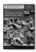 Anālayo The Genesis of the Bodhisattva Ideal 178 pp., 12 illustrations, hardcover, 22,80 EUR ISBN 978-3-937816-62-3 (printed version)
http://hup.sub.uni-hamburg.de/purl/HamburgUP_HBS01_Analayo Band 2

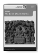 Anālayo The Dawn of Abhidharma 229 pp., 12 illustrations, hardcover, 25,80 EUR ISBN978-3-943423-15-0 (printed version) http://hup.sub.uni-hamburg.de/purl/HamburgUP_HBS02_Analayo Band 3

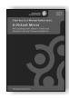 Lin, Chen-kuo / Radich, Michael (eds.) A Distant Mirror Articulating Indic Ideas in Sixth and Seventh Century Chinese Buddhism 565 pp., hardcover; 39,80 EUR ISBN 978-3-943423-19-8 (printed version)
http://hup.sub.uni-hamburg.de/purl/HamburgUP_HBS03_LinRadich Band 4

 Silk, Jonathan A. Buddhist Cosmic Unity An Edition, Translation and Study of the "Anūnatvāpūrṇatvanirdeśaparivarta" 252 pp., hardcover, 28,80 EUR ISBN978-3-943423-22-8 (printed version)
http://hup.sub.uni-hamburg.de/purl/HamburgUP_HBS04_Silk Band 5

 Radich, Michael The "Mahāparinirvāṇa-mahāsūtra" and the Emergence of "Tathāgatagarbha" Doctrine 266 pp., hardcover, 28,80 EUR ISBN 978-3-943423-20-4 (printed version)
http://hup.sub.uni-hamburg.de/purl/HamburgUP_HBS05_Radich Band 6

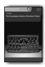 Anālayo The Foundation History of the Nuns' Order 278 pp., hardcover, 29,80 EUR ISBN 978-3-89733-387-1 (printed version)
https://www.buddhismuskunde.uni-hamburg.de/pdf/4-publikationen/ hamburgbuddhist-studies/hamburgup-hbs06-analayo.pdf Band 7

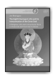 Jim Rheingans The Eighth Karmapa's Life and his Interpretation of the Great Seal A Religious Life and Instructional Texts in Historical and Doctrinal Contexts 243 pp., hardcover, 25,80 EUR ISBN 978-3-89733-422-9 (printed version)
https://www.buddhismuskunde.uni-hamburg.de/pdf/4-publikationen/ hamburg-buddhist-studies/hamburgup-hbs07-rheingans.pdf Band 8

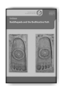 Anālayo Buddhapada and the Bodhisattva Path 180 pp., hardcover, 18,80 EUR ISBN 978-3-89733-415-1 (printed version)
https://www.buddhismuskunde.uni-hamburg.de/pdf/4-publikationen/ hamburg-buddhist-studies/hamburgup-hbs08-analayo.pdf Band 9

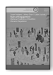 Susan Andrews/Jinhua Chen/Cuilan Liu (eds.)
Rules of Engagement Medieval Traditions of Buddhist Monastic Regulation 522 pp., hardcover, 26,60 EUR ISBN 978-3-89733-428-1 (printed version)
https://www.buddhismuskunde.uni-hamburg.de/pdf/4-publikationen/ hamburg-buddhist-studies/hamburgup-hbs09-full.pdf Band 10

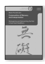 Mario Poceski (ed.) Communities of Memory and Interpretation Reimagining and Reinventing the Past in East Asian Buddhism XIV; 217 pp., hardcover, 25,80 EUR ISBN 978-3-89733-425-0 (printed version)
https://www.buddhismuskunde.uni-hamburg.de/pdf/4-publikationen/ hamburg-buddhist-studies/hamburgup-hbs10-poceski.pdf Band 11

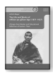 Achim Bayer The Life and Works of mKhan-po gZhan-dga' (1871–1927) rDzogs-chen Master and Educational Reformer of Eastern Tibet XXI; 435 pp., hardcover, 32,80 EUR ISBN 978-3-89733-495-3 (printed version)
Band 12 | Teil 1

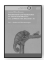

Lambert Schmithausen Fleischverzehr und Vegetarismus im indischen Buddhismus bis ca. zur Mitte des ersten Jahrtausends n. Chr. Teil 1 · Studie und Übersetzungen 381 pp., hardcover, 27,80 EUR ISBN 978-3-89733-503-5 (printed version)
Band 12 | Teil 2

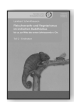

Lambert Schmithausen Fleischverzehr und Vegetarismus im indischen Buddhismus bis ca. zur Mitte des ersten Jahrtausends n. Chr. Teil 2 · Endnoten 606 pp., hardcover, 34,80 EUR ISBN 978-3-89733-504-2 (printed version)
Band 12 | Teil 3

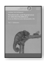

Lambert Schmithausen Fleischverzehr und Vegetarismus im indischen Buddhismus bis ca. zur Mitte des ersten Jahrtausends n. Chr. Teil 3 · Editionen 226 pp., hardcover, 24,80 EUR ISBN 978-3-89733-505-9 (printed version)
Is Buddhism's attitude towards accepted forms of knowledge sceptical? Are Pyrrhonian scepticism and classical Buddhist scholasticism related in their respective applications and expressions of doubt? In what way and to what degree is Critical Buddhism an offshoot of modern scepticism? Questions such as these as well as related issues are explored in the present collection, which brings together examinations of systematic doubt in the traditions of Buddhism from a variety of perspectives. What results from the perceptive observations and profound analytical insights of the seven essays is a rich and multi-faceted picture of two families of philosophical systems—scepticism and Buddhismthat seem both akin and at odds, both related and distant at the same time.

ISSN 2190-6769 ISBN 978-3-89733-518-9 EUR [D] 25,80