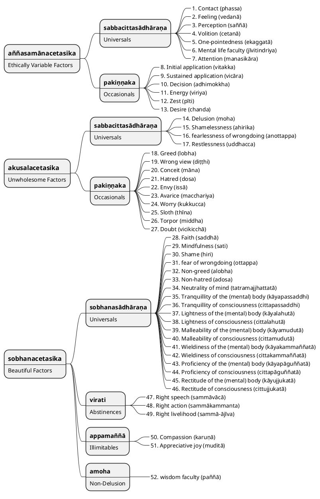
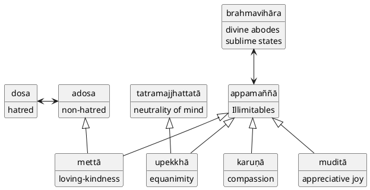
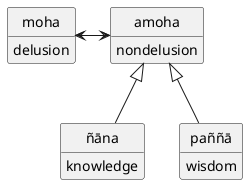
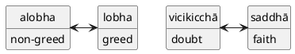
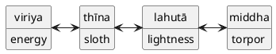
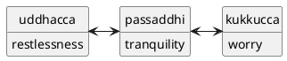
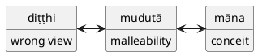
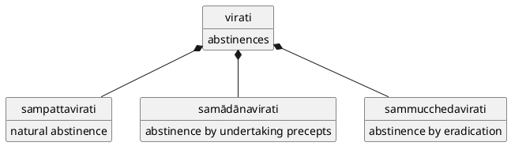

Ekuppāda-nirodhā ca ekālambana-vatthukā  
Cetoyuttā dvipaññāsa dhammā cetasikā matā.

```plantuml
@startmindmap
*:==aññasamānacetasika
----
Ethically Variable Factors;
**:===sabbacittasādhāraṇa
----
Universals;
***_ 1. Contact (phassa)
***_ 2. Feeling (vedanā)
***_ 3. Perception (saññā)
***_ 4. Volition (cetanā)
***_ 5. One-pointedness (ekaggatā)
***_ 6. Mental life faculty (jīvitindriya)
***_ 7. Attention (manasikāra)
**:===pakiṇṇaka
----
Occasionals;
***_ 8. Initial application (vitakka)
***_ 9. Sustained application (vicāra)
***_ 10. Decision (adhimokkha)
***_ 11. Energy (viriya)
***_ 12. Zest (pīti)
***_ 13. Desire (chanda)
*:==akusalacetasika
----
Unwholesome Factors;
**:===sabbacittasādhāraṇa
----
Universals;
***_ 14. Delusion (moha)
***_ 15. Shamelessness (ahirika)
***_ 16. fearlessness of wrongdoing (anottappa)
***_ 17. Restlessness (uddhacca)
**:===pakiṇṇaka
----
Occasionals;
***_ 18. Greed (lobha)
***_ 19. Wrong view (diṭṭhi)
***_ 20. Conceit (māna)
***_ 21. Hatred (dosa)
***_ 22. Envy (issā)
***_ 23. Avarice (macchariya)
***_ 24. Worry (kukkucca)
***_ 25. Sloth (thīna)
***_ 26. Torpor (middha)
***_ 27. Doubt (vicikicchā)
*:==sobhanacetasika
----
Beautiful Factors;
**:===sobhanasādhāraṇa
----
Universals;
***_ 28. Faith (saddhā)
***_ 29. Mindfulness (sati)
***_ 30. Shame (hiri)
***_ 31. fear of wrongdoing (ottappa)
***_ 32. Non-greed (alobha)
***_ 33. Non-hatred (adosa)
***_ 34. Neutrality of mind (tatramajjhattatā)
***_ 35. Tranquillity of the (mental) body (kāyapassaddhi)
***_ 36. Tranquillity of consciousness (cittapassaddhi)
***_ 37. Lightness of the (mental) body (kāyalahutā)
***_ 38. Lightness of consciousness (cittalahutā)
***_ 39. Malleability of the (mental) body (kāyamudutā)
***_ 40. Malleability of consciousness (cittamudutā)
***_ 41. Wieldiness of the (mental) body (kāyakammaññatā)
***_ 42. Wieldiness of consciousness (cittakammaññatā)
***_ 43. Proficiency of the (mental) body (kāyapāguññatā)
***_ 44. Proficiency of consciousness (cittapāguññatā)
***_ 45. Rectitude of the (mental) body (kāyujjukatā)
***_ 46. Rectitude of consciousness (cittujjukatā)
**:===virati
----
Abstinences;
***_ 47. Right speech (sammāvācā)
***_ 48. Right action (sammākammanta)
***_ 49. Right livelihood (sammā-ājīva)
**:===appamaññā
----
Illimitables;
***_ 50. Compassion (karuṇā)
***_ 51. Appreciative joy (muditā)
**:===amoha
----
Non-Delusion;
***_ 52. wisdom faculty (paññā)
@endmindmap
```

```plantuml
@startuml
hide circle
hide empty members

class appamaññā {
  Illimitables
}
class brahmavihāra {
  divine abodes
  sublime states
}
class tatramajjhattatā {
  neutrality of mind
}
class upekkhā {
  equanimity
}
adosa <|-- mettā
tatramajjhattatā <|-- upekkhā
appamaññā <|-- upekkhā
appamaññā <|-- mettā
appamaññā <|-- karuṇā
appamaññā <|-- muditā
brahmavihāra <--> appamaññā

class mettā {
  loving-kindness
}
class karuṇā {
  compassion
}
class muditā {
  appreciative joy
}

class dosa {
  hatred
}
class adosa {
  non-hatred
}
dosa <-> adosa
@endmindmap
```

```plantuml
@startuml
hide circle
hide empty members
class moha {
  delusion
}
class amoha {
  nondelusion
}
class ñāna {
  knowledge
}
class paññā {
  wisdom
}
moha <-> amoha
amoha <|-- ñāna
amoha <|-- paññā
@endmindmap
```

```plantuml
@startuml
hide circle
hide empty members

class ahiri {
  shamelessness
}
class hiri {
  shame
}
ahiri <-> hiri

class anottappa {
  fearlessness of wrongdoing
}
class ottappa {
  fear of wrongdoing
}
anottappa <-> ottappa
@endmindmap
```

```plantuml
@startuml
hide circle
hide empty members
class lobha {
  greed
}
class alobha {
  non-greed
}
alobha <-> lobha

class vicikicchā {
  doubt
}
class saddhā {
  faith
}
vicikicchā <-> saddhā
@endmindmap
```

```plantuml
@startuml
hide circle
hide empty members
class viriya {
  energy
}
class lahutā {
  lightness
}
class thīna {
  sloth
}
class middha {
  torpor
}
viriya <-> thīna
thīna <-> lahutā
lahutā <-> middha
@endmindmap
```

```plantuml
@startuml
hide circle
hide empty members
class uddhacca {
  restlessness
}
class kukkucca {
  worry
}
class passaddhi {
  tranquility
}
uddhacca <-> passaddhi
passaddhi <-> kukkucca
@endmindmap
```

```plantuml
@startuml
hide circle
hide empty members
class diṭṭhi {
  wrong view
}
class māna {
  conceit
}
class mudutā {
  malleability
}
diṭṭhi <-> mudutā
mudutā <-> māna
@endmindmap
```

```plantuml
@startuml
hide circle
hide empty members
class virati {
  abstinences
}
class sampattavirati {
  natural abstinence
}
class samādānavirati {
  abstinence by undertaking precepts
}
class sammucchedavirati {
  abstinence by eradication
}
virati *-- sampattavirati
virati *-- samādānavirati
virati *-- sammucchedavirati
@enduml
```
