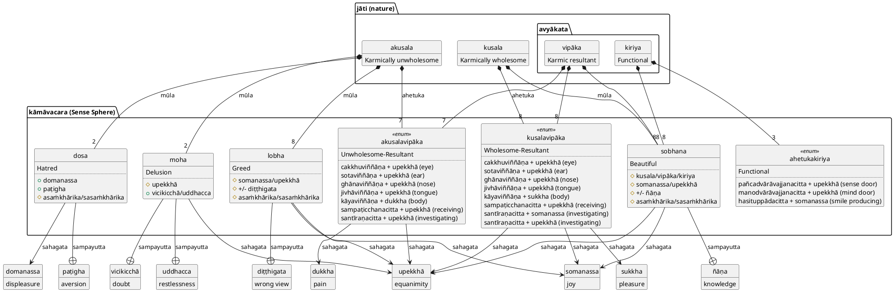
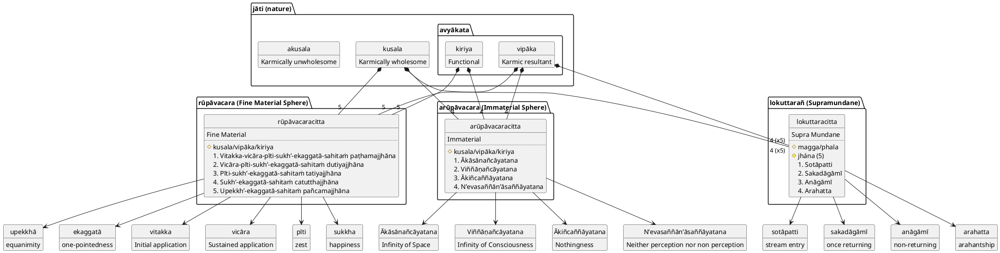
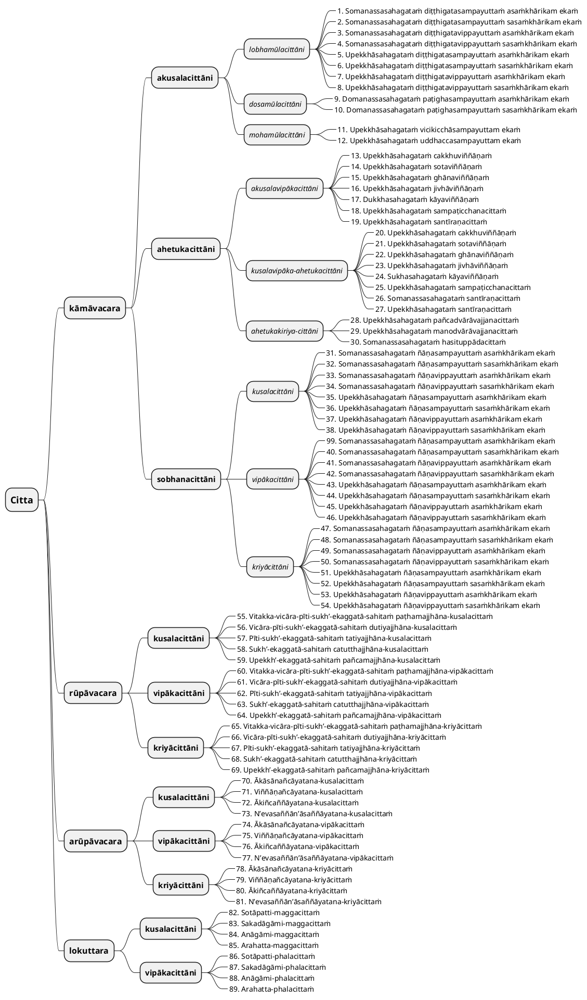

Tattha cittaṁ tāva catubbidhaṁ hoti:

1. kāmāvacaraṁ;
2. rūpā-vacaraṁ;
3. arūpāvacaraṁ;
4. lokuttarañ cā ti.

lakkhaṇa (salient quality)
: vijānana (knowing of an object)

rasa (function), kicca (performance of a concrete task), sampatti (achievement of a goal)
: pubbangama (forerunner of mental factors)

paccupaṭṭhāna (manifestation)
: sandhāna (continuity of process)

padaṭṭhāna (proximate cause)
: nāmarūpa (mind and matter)

