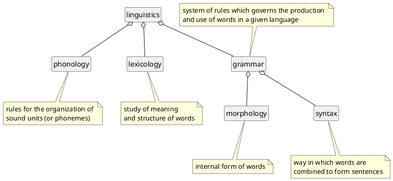

This section contains various English language resources, including descriptions of various English grammars.

## Linguistics

grammatical units
: units smaller than the sentence itself, eg. CLAUSE, PHRASE, WORD, and MORPHEME.

constituency
: relation between one unit and another unit of which it is a part.

syntagmatic
: chain relationship among linguistic constituents

paradigmatic
: choice relationship among linguistic constituents

unitary constituents
: there is nothing contradictory in describing the same linguistic item on one occasion as a unit of one kind, and on another occasion as a unit of a different kind.

grammatical hierarchy
: hierarchical ranking of units in terms of their POTENTIAL size

embedding
: occurrence of one unit as a constituent of another unit at the same rank in the grammatical hierarchy

subordination
:  one clause is made a constituent of another clause

coordination
: two or more units of the same status on the grammatical hierarchy may constitute a single unit of the same kind

sentence
: the highest-ranking unit of grammar, and hence that the purpose of agrammatical description of English is to define, by means of whatever descriptive apparatus may be necessary (rules, categories, etc), what counts as a grammatical sentence in English.

mobility
: whether a constituent may vary its position

optionality
: whether a constituent can be omitted

form
: its internal structure, as a noun phrase, or as a verb phrase

function
: as a subject or an object of a clause

functionally equivalent
: two units which have the same privilege of occurrence

Elements Of Structure
: Subject (S), Verb (V), Object (O), Complement (C), and Adverbial (A).

