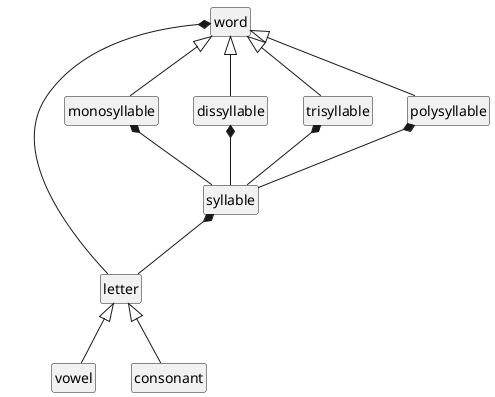
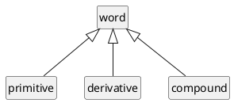
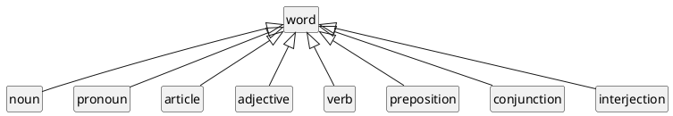
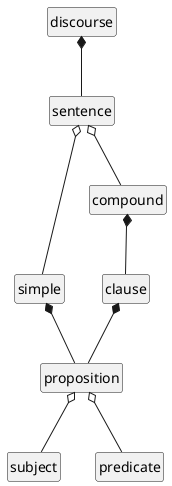
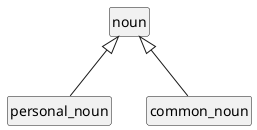
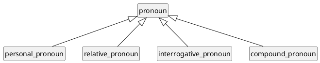
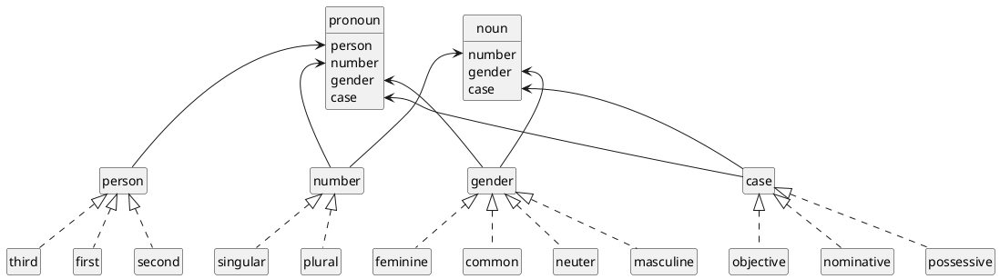
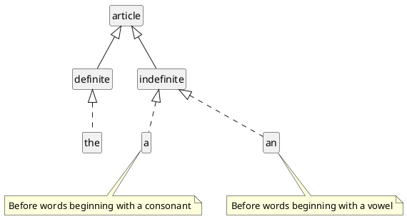
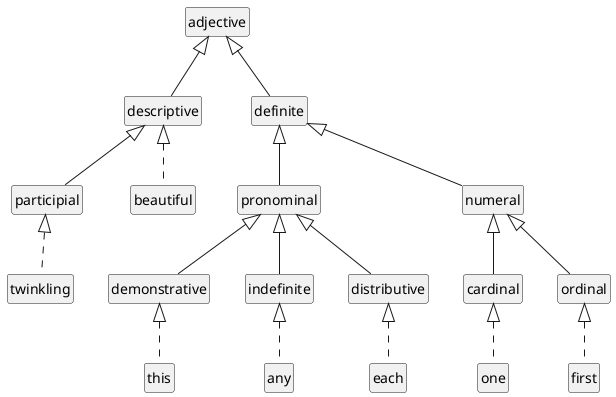

Traditional English grammar, described using UML class diagrams.

pg. 59:

>The Grammar of a language shows how its words are formed, modilied, and arranged, to express thoughts, either in speaking or in writing, according to established usage.

## Words

letter
: a character that denotes one or more of the elementary sounds of language.

syllable
: a letter, or two or more combined, pronounced as one unbroken sound.

word
: a syllable, or two or more combined, used as the sign of some idea.

## Word formation

Words classified according as they are formed, or not formed, from one another:

primitive word
: not formed from another

derivative word
: formed from another

compound word
: composed of two or more others

## Parts of speech

noun
: denote name of object

pronoun
: a word that supplies the place of a noun.

article
: a word placed before a noun to show how it is applied.

adjective
: to express the quality, condition, or circumstance of object

verb
: to express action, or state of existence

adverbs
: to describe their actions, or to show the nature or degree of their qualities

prepositions
: to express their positions or relations to one another

conjunctions
: to continue the discourse, or to connect its parts

interjections
: to give vent to any feeling or emotion springing up suddenly within me.

## Sentence formation

subject
: denotes that of which something is said or affirmed.

predicate
: denotes what is said or affirmed.

A simple subject has but one nominative to which the predicate refers ; a compound subject has more than one.

A simple predicate has but one finite verb referring to the subject ; a compound predicate has more than one.

phrase
: two or more words rightly put together, but not making a proposition.

proposition
: a subject combined with its predicate.

clause
: any one of two or more propositions which together make a sentence.

sentence
: a thought expressed by words.

A simple sentence contains but one proposition.

A compound sentence contains two or more clauses.

discourse
: any series of properly related sentences, expressing continuous thought.

## Noun / Pronoun

proper noun
: an individual name.

common noun
:  a generic name.

pronoun
: a word that supplies the place of a noun.

personal pronoun
: one of a class of pronouns whose chief use is, to distinguish the different persons.

relative pronoun
: one that makes its clause dependent on another clause.

interrogative pronoun
: one used to ask a question.

compound pronoun
: a simple pronoun with `self`, `selves`, `ever`, `so`, or `soever`, annexed to it ; or it is a pronoun consisting of two words.

## Properties of nouns and pronouns

masculine gender
: denotes males.

feminine gender
: denotes females.

common gender
: denotes either males or females, or both.

neuter gender
: denotes neither males nor females.

first person
: denotes the speaker.

second person
: represents an object as spoken to.

third person
: represents an object as spoken of.

singular number
: denotes but one.

plural number
: denotes more than one.

collective noun
: a noun denoting, in the singular form, more than one object of the same kind.

nominative case
: the case of a noun or pronoun to which a predicate directly refers, or used independently or absolutely.

possessive case
: denotes possession.

objective case
: the case of a noun or pronoun used as the object of a verb or preposition.

## Article

definite article
: shows that some particular object or objects are meant.

indefinite article
: shows that no particular one of the kind is meant.

## Adjective

### Degrees of comparison
