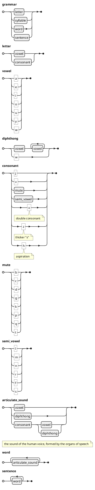
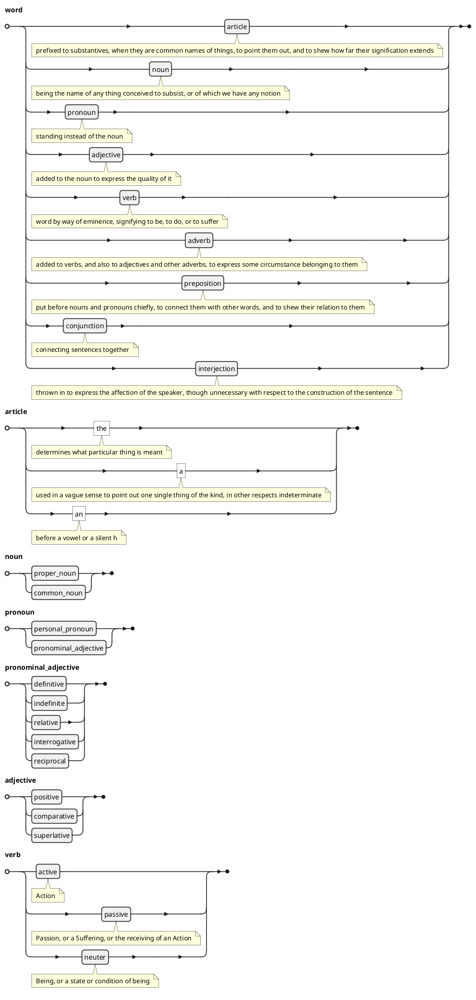
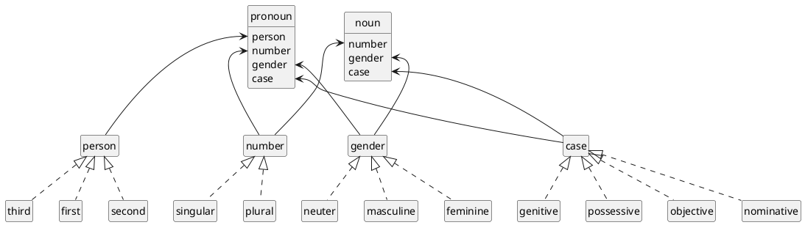
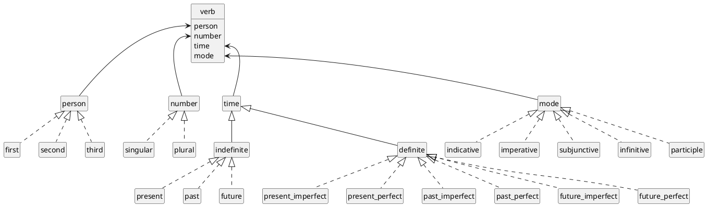
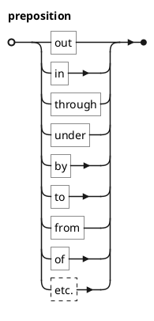
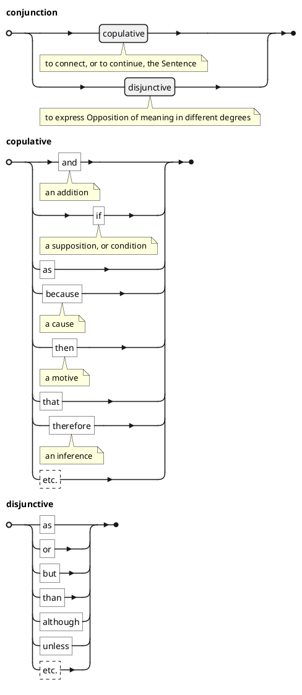
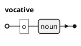

## Grammar

>Grammar is the Art of rightly expressing our thoughts by Words.

## Sorts of words, or parts of speech

### Noun / Pronoun

### Verb

### Preposition

### Conjunction

### Interjection

