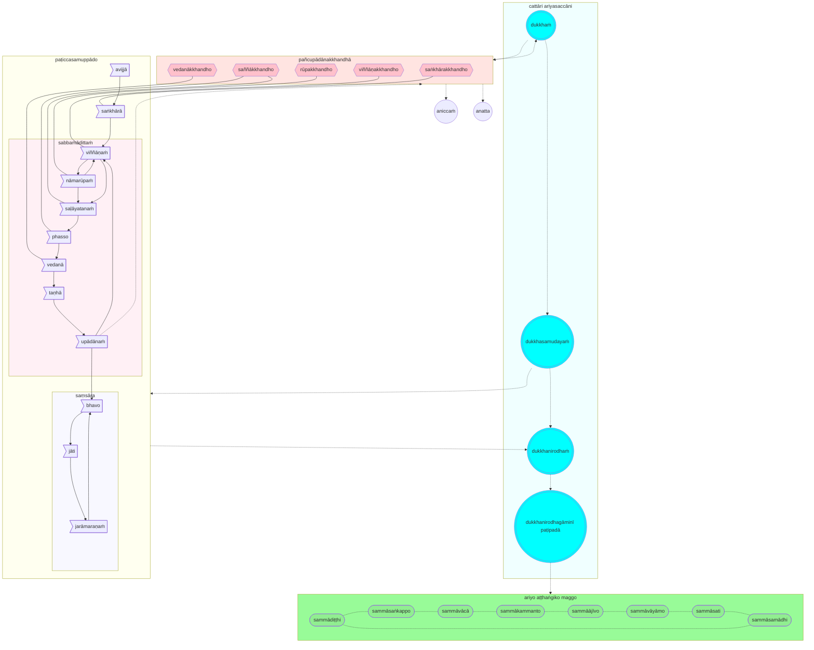

## Introduction

This is my current approach to studying the core teachings of the Buddha (`buddhavacana`). I do not vouch for the truth of the contents or that I have accurately represented the Buddha's intention or the meaning of what he taught. I may revise the content from time to time as my understanding improves.

It is created out of a need to document my learning progress, that I can reference from time to time to refresh my understanding.

Specifically, this is not an article intended to guide or teach others. In reading this article, you acknowledge that you are interested in understanding my current perspective, and it is not a recommendation or an exhortation for you.

Translations from Pali quoted in this article are either from the original author that I have sourced the citation from, or my own translation. Over time, I intend to replace all translations so that they are my own.

## Sources

My current understanding is based on reading the Tipiṭaka (the Three Baskets of the Buddhist canon) as published in various translations and in Pāli on [SuttaCentral](https://suttacentral.net) and by reading the following books (not necessarily in this order):

* [What Buddhists Believe](http://www.buddhanet.net/pdf_file/whatbelieve.pdf), Expanded 4th Edition, K Sri Dhammananda, Buddhist Missionary Society Malaysia
* [The Word of the Buddha](https://www.bps.lk/library-search-select.php?id=bp201s): An Outline of the Teachings of the Buddha in the Words of the Pāli Canon, Compiled, translated, and explained by Nyanatiloka Mahāthera, Buddhist Publication Society Kandy, Sri Lanka, Reprinted 2019 (ISBN 978-955–24–0364–4)
* [Buddhism in a Nutshell](https://www.bps.lk/library-search-select.php?id=bp106s), Venerable Nārada Mahāthera, Buddha Dharma Education Association Inc. (1982)
* [The Buddha And His Teachings](https://www.buddhanet.net/pdf_file/buddha-teachingsurw6.pdf), Venerable Nārada Mahāthera, Buddha Dharma Education Association Inc. (1998)
* [A History of Mindfulness](http://santifm.org/santipada/wp-content/uploads/2012/08/A_History_of_Mindfulness_Bhikkhu_Sujato.pdf): How insight worsted tranquillity in the Satipaṭṭhāna Sutta, Bhikkhu Sujato, Santipada (2012)
* [The Authenticity of the Early Buddhist Texts](https://wiswo.org/books/auth/), Bhikkhu Sujato & Bhikkhu Brahmāli, Buddhist Publication Society (2014)
* [Theravāda Buddhism: A social history from ancient Benares to modern Colombo](https://www.academia.edu/4482905/Theravada_Buddhism_by_Richard_Gombrich), Richard F. Gombrich, Routledge (2006), 2nd edition
* [How Buddhism Began: The Conditioned Genesis of the Early Teachings](https://ahandfulofleaves.files.wordpress.com/2012/02/how-buddhism-began_gombrich.pdf), Richard F. Gombrich, Routledge (2006), 2nd edition
* [What the Buddha Thought](https://archive.org/details/WhatTheBuddhaThought), Richard F. Gombrich, Equinox (2009)
* [Buddhism and society : a great tradition and its Burmese vicissitudes](https://archive.org/details/buddhismsocietyg0000spir), Spiro, Melford E, University of California Press (1982), 2nd edition
* [The Genesis of the Bodhisattva Ideal](https://www.buddhismuskunde.uni-hamburg.de/pdf/4-publikationen/hamburg-buddhist-studies/hamburgup-hbs01-analayo.pdf), Anālayo, Hamburg Buddhist Studies 1, Hamburg: Hamburg University Press 2010
* [The Dawn of Abhidharma](https://www.buddhismuskunde.uni-hamburg.de/pdf/4-publikationen/hamburg-buddhist-studies/hamburgup-hbs2-analayo-abhidharma.pdf), Anālayo, Hamburg Buddhist Studies 2, Hamburg: Hamburg University Press 2014
* [Buddhapada and the Bodhisattva Path](https://www.buddhismuskunde.uni-hamburg.de/pdf/4-publikationen/hamburg-buddhist-studies/hamburgup-hbs08-analayo.pdf), Anālayo, Hamburg Buddhist Studies 8, Bochum/Freiburg: Projektverlag 2017.
* [The Composition and Transmission of Early Buddhist Texts with Specific Reference to Sutras](https://www.buddhismuskunde.uni-hamburg.de/pdf/4-publikationen/hamburg-buddhist-studies/17-allon.pdf), Mark Allon, Hamburg Buddhist Studies 17, Bochum/Freiburg: projektverlag 2021.
* [The Connected Discourses of the Buddha](https://wisdomexperience.org/wp-content/uploads/2018/06/Three-Turnings-Lesson-2-Reading-2.pdf), Bhikkhu Bodhi, Wisdom Publications, Boston (2000)
* [The Fundamental Teachings of Early Buddhism: A Comparative Study Based on the Sūtrāṅga portion of the Pāli Saṃyutta-Nikāya and the Chinese Saṃyuktāgama](https://www.academia.edu/12359515/The_Fundamental_Teachings_of_Early_Buddhism_A_comparative_study_based_on_the_Sutra_anga_portion_of_the_Pali_Samyutta_Nikaya_and_the_Chinese_Samyukta_agama), Mun-Keat Choong, Series: Beitrage zur Indologie Band 32; Harrassowitz Verlag, Wiesbaden, (2000)
* [The Origin Of Buddhist Meditation](https://archive.org/details/originofbuddhistmeditationalexanderwynneroutledge_202002), Alexander Wynne, Routledge, London, Routledge Critical Studies In Buddhism (2007)
* [The Two Traditions Of Meditation In Ancient India](https://archive.org/details/TheTwoTraditionsOfMeditationInAncientIndia), Johannes Bronkhorst, Second edition: Delhi: Motilal Banarsidass. 1993. (Reprint: 2000.)
* [Buddhist Teaching in India](https://www.academia.edu/3288020/Buddhist_Teaching_in_India), Johannes Bronkhorst, Wisdom Publications, Boston (2009)
* [Buddhism in the Shadow of Brahmanism](https://ia802903.us.archive.org/8/items/profsaraobooks/KTS.Bronkhorst.Buddhism%20in%20the%20Shadow%20of%20Brahmanism.pdf), Johannes Bronkhorst, Brill, Handbook of Oriental Studies. Section 2, South Asia (2011)
* [Absorption: Human Nature And Buddhist Liberation](https://ahandfulofleaves.files.wordpress.com/2013/02/absorption-two-studies-of-human-nature_bronkhorst.pdf), Johannes Bronkhorst, UniversityMedia (2012)
* [Reexamining Jhana Towards a Critical Reconstruction of Early Buddhist Soteriology](https://www.academia.edu/34093551/Reexamining_Jhana_Towards_a_Critical_Reconstruction_of_Early_Buddhist_Soteriology), Grzegorz Polak, Wydawnictwo Uniwersytetu Marii Curie-Skłodowskiej, Lublin (2011)
* [How Was Liberating Insight Related to the Development of the Four Jhānas](https://www.academia.edu/34093627/How_Was_Liberating_Insight_Related_to_the_Development_of_the_Four_Jhānas_pdf), Grzegorz Polak, JOCBS. 2016(5): 85–112.

I do not completely agree with the contents of the above books, since they represent different opinions and views of the respective authors. However, I do recommend reading them and each of them have influenced me in some way.

## The Buddha and Buddhism

I believe the Buddha was a real person (even though his social background and life details are hard to prove). He was born in [Lumbini](https://whc.unesco.org/en/list/666/) sometime in the 5th century BCE from the Gotama clan of the Shakya tribe, in present-day Nepal, and spent his life living and travelling around the Ganges Plain, near the modern Nepal–India border.

According to [**Pāsarāsisutta** MN 26 PTS 1.161–1.175](https://suttacentral.net/mn26/pli/ms), as a young man he started to question the nature of existence, of being born and subject to the negative consequences of life such as growing old, falling sick, dying, sorrow. He started to search for a path out of these consequences. He renounced and became an ascetic and followed the practices of various teachers. He eventually concluded these teachings did not lead to satisfactory answers.

He ultimately discovered the answers himself and attained Perfect Enlightenment (`sammāsambodhi`).

Out of compassion for other living beings, he taught a way for others to achieve enlightenment. This is classified as a soteriology, or a "doctrine of salvation" so that others can follow in his footsteps and free themselves from the burden of "suffering" and "rebirth."

It would appear the Buddha's teachings were successful - thousands of people became enlightened as a result of his teachings and became `arahant` (enlightened beings) in his lifetime.

The Buddha's teachings spread throughout much of Asia along trading routes. Even today the Buddha's teachings is highly appealing to many people, and there has been a surge of interest in the last century or so from industrialised and developed countries.

Although it originated as a philosophy and soteriology, today Buddhism is regarded as a religion (the fourth most popular in the world[^1], with approximately 500 million adherents).

However, as a percentage of the world population, Buddhism is a declining religion, with the number of adherents expect to reduce from 7.1% of the world population in 2010 to 5.2% by 2050.

Buddhism is a rapidly growing religion in Australia since the 1980s and now represents about 2.4% of Australia's population[^2] based on the 2021 census but the growth has been primarily due to immigration.

[^1]: [The Future of World Religions: Population Growth Projections, 2010-2050](https://www.pewresearch.org/religion/2015/04/02/religious-projections-2010-2050/) Pew Research Center's Religion & Public Life Project.

[^2]: [Religious affiliation in Australia](https://www.abs.gov.au/articles/religious-affiliation-australia)

## What language did the Buddha teach in?

The Buddha probably taught in a variety of languages common in the Indian subcontinent at the time (both Indo-Aryan and indigeneous). These languages may or may not have included Pāli.

It is unclear whether Pāli is an actual language or whether it is an amalgamation or synthesis of various dialects and languages, or even whether it is a "constructed" language (like Esperanto) designed to represent his teachings and has never been spoken as an actual language of his times. Pali appears to be heavily based upon and is a simplified version of Sanskrit, and it is generally classified as a "Prakrit" (a language originally derived from Sanskrit).

The earliest versions of his teachings have been preserved in the Pāli language in the Tipiṭaka. It is possible that only some teachings have been preserved, and perhaps only those that were originally taught in Pāli or have been translated into Pāli.

For the rest of this article, Pāli words are highlighted using a monospaced font (as an example `buddho` meaning "the one who understood" but also "The Buddha" expressed in nominative form). In rare occasions, Sanskrit words are used, these are highlighted with a '[S]' suffix (for example `Ṛg Veda`[S]).

To truly understand Buddhism, it is best to read the Tipiṭaka in Pāli. Although there are many good translations to English of most of the contents of the Tipiṭaka (with the exception of parts of the Abhidhamma), Bhikkhu Bodhi notes in the Preface to [**The Connected Discourses of the Buddha**](https://wisdomexperience.org/wp-content/uploads/2018/06/Three-Turnings-Lesson-2-Reading-2.pdf) p. 12:

> To attempt to translate Pāli into a modern Western language rooted in a conceptual framework far removed from the “thought world” of the ancient suttas is also bound to involve some degree of distortion. The only remedy against this, perhaps, is to recommend to the reader the study of Pāli and the reading of the material in the original. Unlike English, or even Sanskrit, Pāli is a highly specialized language with only one major sphere of application — the Buddha’s teachings — and thus its terminology is extremely precise, free from intrusive echoes from other domains of discourse. It is also rich in nuances, undertones, and conceptual interconnections that no translation can ever succeed in replicating.

## What did the Buddha teach?

When printed, the Pali Tipiṭaka usually takes up about 45 volumes, so clearly it will be almost impossible to condense the entirety of the Buddha's teachings into a few paragraphs.

Most introductory books on Buddhism tend to focus on the earliest discourses, which are typically:

* [**Paṭhamabodhisutta** Ud 1.1 PTS 1 Verse 1](https://suttacentral.net/ud1.1): which describes Buddha's thoughts as he 'awakened' (achieved enlightenment). This covers an important aspect of Buddhist philosophy known as Dependent Origination. This topic is covered in further detail in:
  * [**Dutiyabodhisutta** Ud 1.2 PTS 2 Verse 2](https://suttacentral.net/ud1.2)
  * [**Tatiyabodhisutta** Ud 1.3 PTS 3 Verse 3](https://suttacentral.net/ud1.3)
  * [**Paṭiccasamuppādasutta** SN 12.1 PTS 2.1–2.2](https://suttacentral.net/sn12.1)
  * [**Vibhaṅgasutta** SN 12.2 PTS 2.3–2.4](https://suttacentral.net/sn12.2)
  * [**Nagarasutta** SN 12.65 PTS 2.105–2.107](https://suttacentral.net/sn12.65)
  * [**Mahānidānasutta** DN 15 PTS 2.55–2.71](https://suttacentral.net/dn15)
* [**Paṭhamauruvelasutta** AN 4.21 PTS 2.20–2.21](https://suttacentral.net/an4.21): describes the Buddha's decision to teach what he has learnt at the request of Brahmā Sahampati.
* [**Dhammacakkappavattanasutta** SN 56.11 PTS 5.421–5.424](https://suttacentral.net/sn56.11): supposedly Buddha's first discourse, given to a group of five ascetics who were formerly his companions. This covers the middle way, the four pure truths and the eightfold path. The 4 pure truths are further explained in [**Saccavibhaṅgasutta** MN 141 PTS 3.248–3.252](https://suttacentral.net/mn141)
* [**Anattalakkhaṇasutta** SN 22.59 PTS 3.67–3.68](https://suttacentral.net/sn22.59): Buddha's second discourse where he teaches the concept of no Eternal Self (`anatta`) with regards to the 5 masses of fuel (`pañcupādānakkhandhā`).
* [**Ādittapariyāyasutta** SN 35.235 PTS 4.169–4.171](https://suttacentral.net/sn35.235): Buddha's third discourse, also called the Fire Sermon, where the Buddha reflects on the inefficacy of ascetic practices and focusing on freeing from desire of the senses. This discourse is meant to be a contrast to the fire-related ritual practices stipulated by the Vedic hymns and Upaniṣads, which were the dominant religious beliefs in Buddha's time.

Some people also like the following later discourses:

* [**Mahākhandhaka** Kd 1 PTS 1.1–1.100](https://suttacentral.net/pli-tv-kd1/pli/ms): summarises events following the Buddha's awakening, leading up to the formation of the sangha, the first monastery and the ordination of the two famous disciples Sāriputta and Moggallāna. The first three discourses of the Buddha are also embedded in this long sutta.
* [**Mettasutta** Snp 1.8 PTS 26 PTS 26 Verse 143–152](https://suttacentral.net/snp1.8): popularly known the Discourse on Love, which focuses on universal goodwill.
* [**Mahāsatipaṭṭhānasutta** MN 10 PTS 1.56–1.63](https://suttacentral.net/mn10): where the Buddha teaches the fundamentals of mindful meditation.
* [**Mahāparinibbānasutta** DN 16 PTS 2.72–2.168](https://suttacentral.net/dn16): supposedly the longest discourse in the Tipiṭaka, describes the events surrounding the Buddha's final passing away. This discourse contains a summary of many of his core teachings.

Some of you may have noticed I have excluded the [**Dhammapada**](https://suttacentral.net/pitaka/sutta/minor/dharmapadas), a very popular collection of inspirational verses, from the above list. Since I am interested in getting as close as possible to understand what the Buddha actually taught, I find the Dhammapada problematic. First of all, it is a late collection, and almost certainly composed after the Buddha died. It can also be ambiguous in meaning and intent and difficult to parse in parts. There are significant variations in the various versions of Dhammapada or it's equivalents across the canonical collections. And finally, not all of the Dhammapada may have been Buddhist in intent, as some contents appear to be aligned with non-Buddhist text, eg. the Mahabharatha, so it seems likely the Dhammapada is a collection of verse sourced from many places, and may not always reflect the Buddha's teachings. Von Wilhelm Rau has done an analysis of parallels between the Dhammapada and other texts, including non-Buddhist texts, in **Bemerkungenund Nicht-Buddhisti-Schesanskrit-Parallelenzum
Pāli-Dhammapada**, from **Jñānamuktāvalī**, International Academy of Indian Culture, New Dehli (1963).

The awakening of the Buddha, plus the first three discourses, can be summarised into a single diagram:



A rather freeform interpretation of the above diagram follows:

We are ignorant (`avijjā`). Ignorant of Life, The Universe, and Everything. We start out life as new born babies, unconscious, unaware, barely perceiving our surroundings.

Because, or as a result of, our ignorance, we make non optimal decisions and choices (`saṅkhārā`). The accumulation of these decisions and choices result in an emerging consciousness (`viññāṇaṁ`).

Our consciousness is "constructed" - it is created by the results of all the previous choices, decisions, intentions that we've made in the past.

Let's examine how this consciousness has been constructed by exploring a cycle or chain of processes. Just like new born babies, all living things start with no awareness and no consciousness.

But we react to our surroundings. Even single celled organisms have receptors that are sensitive to their environment, and can detect changes in temperature, light and nutrient availability. These receptors trigger a series of signalling pathways that can cause the cell to move towards or away from certain stimuli, or change shape or behaviour.

In the same way, we have sense organs that perceive the environment. Gradually we are aware of forms, the form of our own body, and other forms external to the body. We build a virtual representation of forms in our mind, and name them (`nāmarūpaṁ`). By "naming" forms, we conceptualise them and develop symbolic "tokens" of them (and through this, our grasp of language develops). Awareness of our own form give rise to consciousness, and similarly consciousness makes us aware of that which is us, and that which is not us. Hence viññāṇaṁ and nāmarūpaṁ are mutually dependent on each other.

We perceive forms through our senses (`saḷāyatanaṁ`) and through our senses we experience the world around us (`phasso`). From this experience, we start developing feelings (`vedanā`) - we like some experiences or forms, and we dislike or are indifferent to other experiences or forms. We develop cravings (`taṇhā`) for experiences and forms that we like, and aversions to experiences and forms we don't like, and these cravings and aversions influence or "fuel" future decisions or choices (`upādānaṁ`), that ultimately the "fuel" feed into our consciousness, and so the cycle repeats.

It is a vicious cycle that feeds on itself and will not end unless there is a way to break out of the cycle. The driving forces fueling the cycle are referred to as the Five Masses of Fuel (`pañcupādānakkhandhā`). These five masses are directly related to the vicious cycle of existence:

1. Our conceptualisation of forms is a fuel (`rūpakkhandho`) and drives how we perceive and name forms (`nāmarūpaṁ`). 'Forms' consume us and drive our desire and cravings - our desire to look beautiful and attractive for example drives a multi-billion dollar beauty industry. We also desire to "own" forms, to possess them, to make them part of us and to give us satisfaction.
2. Similar, our feelings act as fuel (`vedanākkhandho`) - we desire more of what we like and avoid what we don't like (`vedanā`)
3. Our perceptions (interpretations of what we experience) also act as a fuel (`saññākkhandho`) - for example we want to be popular and liked by others, and we in turn judge others through our senses (`saḷāyatanaṁ`) and our contact with others (`phasso`).
4. Based on our desire and craving for various forms, feelings, and perceptions, we make choices and decisions (`saṅkhārakkhandho`) which directly impact the results or implications of those intentions (`saṅkhārā`). For example, our like and dislike for others influence how we behave with them.
5. And finally our consciousness itself is a fuel (`viññāṇakkhandho`). Our awareness of our existence leads to our primary craving - a desire to survive and to continue existence, to maintain our form and our consciousness (`viññāṇaṁ`)

Together these Five Masses of Fuel feed a massive and intense fire (caused by desire) that consumes us, every moment of our lives (`sabbaṁādittaṁ`). It drives not only our present existence (`bhavo`), but leads to birth and rebirth (`jāti`) and eventually to old age and death (`jarāmaraṇaṁ`), and so the cycle of existence (`saṃsāra`) ever revolves.

This is clearly unsatisfactory (`dukkhaṁ`). Not only unsatisfactory, but the burning of the five fuels ultimately results in pain and suffering, that lasts throughout the entire cycle of saṃsāra.

Why suffering? Surely there are moments of pleasure, moments of happiness? Maybe, if we indulge in our senses and revel in pleasure and happiness, we can forget about the pain and suffering. But deep inside, we know nothing lasts forever. We cannot sustain happiness and pleasure indefinitely, we all eventually grow old and die.

We eventually realise: nothing we experience is permanent (`aniccaṁ`), and therefore everything is ultimately unsatisfactory. Fundamentally, even our consciousness is impermanent (as it is continuously affected by what we have previously experienced), so there no sense of "self" that is permanent or unchanging (`anatta`).

Is there a way out of these vicious cycles (both the vicious cycle caused by the five masses of fuel, and the vicious cycle of saṃsāra)?

Fortunately, the Buddha found a way (`dukkhanirodhagāminīpaṭipadā`), that does not require either indulgence of senses or extreme practices. The way is practical, achievable within one lifetime, and consists of the following eight components (`ariyo aṭṭhaṅgiko maggo`):

1. `sammādiṭṭhi`: The first step is of course to understand what we have just discussed (`cattāri ariyasaccāni`): that everything is unsatisfactory (`dukkhaṁ`), and impermanent, including our sense of self. The origin of this suffering (`dukkhasamudayaṁ`) is our craving which drives the five masses of fuel. In order to end the vicious cycle of suffering, we need to stop fueling the fire (`dukkhanirodhaṁ`). And to stop fueling the fire, we need to engage in the following components of the way.
2. `sammāsaṅkappo`: Ultimately, we need to abandon our dependence on sensual pleasures (which are impermanent) and focus on ethical and moral conduct, such as good will and well being towards everything. Unwholesome and unskilled actions are sub-optimal and stem from  bad intentions, resulting in harm to ourselves and others. Good intentions and optimal behaviour lead to wholesome actions and a detachment from sensual pleasures.
3. `sammāvācā`: We should also avoid speech that is false, divisive, harsh or nonsensical.
4. `sammākammanto`: We should also refrain from unethical and immoral actions, such as killing or harming other living beings, stealing and ultimately even sexual activity (for this propagates the vicious cycle). It may seem strange that we want to deny our fundamental biological imperative, but our desire for procreation overrides rationality and fuels our craving and leads us to uncontrollable behaviour.
5. `sammāājīvo`: We should lead an exemplary life, avoiding activities and even thoughts that are unethical or result in further craving and unwholesome thoughts.
6. `sammāvāyāmo`: We should make all effort to eradicate even the arising of bad or unwholesome thoughts and desires, ensure any bad or unwholesome thoughts that we already harbour are dissipated, and instead promote and maintain wholesome and ethical thoughts.
7. `sammāsati`: We should be hyper-aware of ourselves, by observing our bodies, our feelings, how we think, our value systems. We are constantly mindful to ensure we are stopping all thoughts and activities leading to fueling our cravings.
8. `sammāsamādhi`: Finally, we will recognise that once we have successfully abandoned our dependence on sensual cravings, removed unwholesome or unskilled qualities, we will gradually realise our entire disposition and mindset have progressed, over a set of four stages.
   1. In the first stage, we finally realise the joy and bliss of a calm mind that is free of delusions, cravings, and bad intentions.
   2. In the second stage, we gain internal clarity as our mind becomes focus and concentrated as it is no longer distracted.
   3. In the third stage, we become tranquil as we let go even of joy and bliss and become dispassionate and possess equanimity.
   4. In the fourth stage, we completely let go and realise we are no longer tied to the vicious cycle of saṃsāra. With this realisation, we are finally free, we have broken out of the vicious cycle. Thus we have attained enlightenment or "perfect awakening."

The above represents the "core" of what the Buddha taught, everything else is arguably elaboration and further clarification. The teaching is not only practical but also effective, anecdotally, many individuals attained enlightenment during the Buddha's lifetime and presumably more even after his death. Many people try to follow that teaching today, including myself.

## How do we know the Buddha existed and his teachings are authentic?

According to the book [**The Authenticity of the Early Buddhist Texts**](https://wiswo.org/books/auth/):

>1. there is a body of Early Buddhist Texts (EBTs), which is clearly distinguishable from all other Buddhist scripture;
>2. these texts originated from a single historical personality, the Buddha

The book's main conclusion is:

>... that the Early Buddhist Texts originated in the lifetime of the Buddha or a little later, because they were, in the main, spoken by the Buddha and his contemporary disciples. This is the most simple, natural, and reasonable explanation for the evidence.
>
>Our argument covers two main areas:
>
>* The grounds for distinguishing the Early Buddhist Texts (EBTs) from later Buddhist literature;
>* The evidence that the EBTs stem from close to the Buddha’s lifetime, and that they were generally spoken by the historical Buddha.

However, it is also true (from the book) that:

>... the texts bear all the marks of redaction and editing, and that they have been optimised for the oral tradition. There are even a few cases where the editorial hand seems to have added interpretations to existing ideas. But to assume from this that the literature as a whole has not conserved the central ideas propounded by its founder, or even that it was invented ad hoc by redactors, is to lose sight of the distinction between editing and composing. So when we say that the texts were “spoken by the Buddha”, we mean it in this non-literal sense.

My view is probably less optimistic than that stated in the book. I do believe that (some, perhaps most) the Buddha's actual teachings *are* contained in the Tipiṭaka, but perhaps not the actual words he used and also potentially his teachings have been enhanced with additional material that he never taught. There may be material taught in other languages that were not translated into Pali and hence not included, I would like to think these have equivalents that were included. More serious are suggestions that some of Buddha's teachings may have been omitted (or perhaps actively censored) because of the schisms between the various sects that developed in the years following the Buddha's death. These omissions can be partially compensated by comparing his teachings across the major sects, which have been done by several scholars, notably Anālayo, Sujato, Allon amongst others.

As an alternative view, David Drewes in [**The Idea Of The Historical Buddha**](https://www.academia.edu/36121418/The_Idea_of_the_Historical_Buddha_JIABS_2017_), Journal of the International Association of Buddhist Studies
Volume 40 • 2017 • 1–25, argues against regarding the Buddha as a historical figure:

> ... nothing about him has ever been established as fact, and the standard position in scholarship has long been that he is a figure about whom we know nothing. My only real suggestion is that we make the small shift from speaking of an unknown, contentless Buddha to accepting that we do not have grounds for speaking of a historical Buddha at all. of course, it is possible that there was some single, actual person behind the nebulous “śramaṇa Gautama” of the early texts, but this is very far from necessarily the case, and even if such a person did exist, we have no idea who he was.

## The evolution (and devolution) of Buddha's teachings

We cannot be assured that the Tipiṭaka contains the exact words of his teachings, nor can we be assured it only contains his teachings and not additional material added after he has died.

Although all efforts have been made to preserve the accuracy of the teachings, errors and omissions may have crept in over the years.
In particular, the words have been rearranged so that his teachings are suitable for oral recitation and memorisation. Sentences may have been altered, rearranged, and added to.
Additional content may have been added (potentially from disciples, or imported from other teachers and philosophies such as Jainism, Brahmanism or Hinduism).

Therefore, every sentence in the Tipiṭaka needs to be carefully considered and evaluated before we accept it as something he actually taught.

This applies even to (supposedly) his earliest discourses. According to [**Mahākhandhaka** Kd 1 PTS 1.1–1.100](https://suttacentral.net/pli-tv-kd1), the five monks that Buddha taught the first and second discourses to all attained enlightenment (presumably immediately afterwards):

>`Imasmiñca pana veyyākaraṇasmiṁ bhaññamāne pañcavaggiyānaṁ bhikkhūnaṁ anupādāya āsavehi cittāni vimucciṁsu.`  
>And while this exposition was being spoken to the monks from the group of five, their minds were freed from the corruptions through letting go.

And yet, in [**Pāsarāsisutta** MN 26 PTS 1.161–1.175](https://suttacentral.net/mn26):

>`Asakkhiṁ kho ahaṁ, bhikkhave, pañcavaggiye bhikkhū saññāpetuṁ.`  
>I was able to persuade the group of five bhikkhus.  
>`Dvepi sudaṁ, bhikkhave, bhikkhū ovadāmi, tayo bhikkhū piṇḍāya caranti.`  
>Then sometimes I advised two bhikkhus, while the other three went for alms.  
>`Yaṁ tayo bhikkhū piṇḍāya caritvā āharanti tena chabbaggiyā yāpema.`  
>Then those three would feed all six of us with what they brought back.  
>`Tayopi sudaṁ, bhikkhave, bhikkhū ovadāmi, dve bhikkhū piṇḍāya caranti.`  
>Sometimes I advised three bhikkhus, while the other two went for alms.  
>`Yaṁ dve bhikkhū piṇḍāya caritvā āharanti tena chabbaggiyā yāpema.`  
>Then those two would feed all six of us with what they brought back.

So it would seem the 5 monks were not enlightened immediately, but it was a process that took some time. Johannes Bronkhorst argues in [**The Two Traditions Of Meditation In Ancient India**](https://archive.org/details/TheTwoTraditionsOfMeditationInAncientIndia) p. 84 that the Buddha's early teachings were probably "personal advice, adjusted to the needs of each person." Both Bronkhorst and Gombrich argues that the Four Pure Truths (`cattāri ariyasaccāni`) are unlikely to constitute "liberating insight" as they do not really describe the specific process of attaining liberation and specific requirements, such as the elimination of effluents or intoxicants. Therefore, it seems likely the exact formulation of the truths are a later synthesis. Similar arguments can be made for the contents of the Second and Third Discourses, and even the formulation of the links to Dependent Origination may have been adjusted and amended over time, given the variance in the number of items in the chain in various suttas.

### Turning `buddhavacana` into `abhidhamma` and `Mahāyāna`

According to Jayarava in [**Why Did Buddhists Abandon Buddhavacana?**](https://jayarava.blogspot.com/2023/11/why-did-buddhists-abandon-buddhavana.html):

>There is no general agreement, whether historically or presently, on what constitutes buddhavacana. The concept is also contested in the sense that Buddhists found the buddhavacana they inherited unconvincing or otherwise unsatisfactory and replaced it with other words that they labelled buddhavacana, a practice that is arguably still current.

Why would anyone do this, ie. deliberately replace or augment the Buddha's teachings with related and similar teachings? One answer may lie in the [**Uttaravipattisutta** AN 8.8 PTS 4.162–4.166](https://suttacentral.net/an8.8), where Utarra delivered a seemingly "original" discourse to some monks (presumably sometime after the Buddha had passed away). King Vessavaṇa overheard the discourse, and went to the gods of the Thirty-Three to ask Sakka, lord of the gods, whether this was an "authentic" teaching, one that the Buddha might have taught. Sakka was so concerned by this he appeared in front of Uttara and asked:

>`“Kiṁ panidaṁ, bhante, āyasmato uttarassa sakaṁ paṭibhānaṁ, udāhu tassa bhagavato vacanaṁ arahato sammāsambuddhassā”ti?`  
>“Sir, did this teaching come to you from your own inspiration, or was it spoken by the Blessed One, the perfected one, the fully awakened Buddha?”

Uttara's reply is interesting. According to Anālayo in [**The Dawn of Abhidharma**](https://www.buddhismuskunde.uni-hamburg.de/pdf/4-publikationen/hamburg-buddhist-studies/hamburgup-hbs2-analayo-abhidharma.pdf) p. 149:

>Uttara illustrates this with the help of using a simile that describes a large group of people who take grain from a great heap and carry it away in various containers. On being asked where they got the grain, they will answer that they got it from the great heap. The simile makes it clear that the dictum was meant to indicate that the Buddha was the real source of anything Uttara had been teaching, even if Uttara had not been repeating something that in this exact manner had already been spoken by the Buddha.
>
> The discourse then takes an interesting turn, as Śakra informs Uttara that the Buddha had actually given this teaching earlier. However, memory of this teaching delivered by the Buddha had in the meantime been lost among the four assemblies of disciples (monks, nuns, male lay followers, and female lay followers).

This illustrates that some of Buddha's disciples felt confident enough they fully understood Budhha's teachings that they could craft original discourses in the belief the Buddha would have spoken them if he had still been alive. Moreover, it implies that some of Buddha's teachings have indeed been "lost" but it is acceptable for enlightened monks to resuscitate them, thus paving the way for some sects to claim that they have additional suttas that potentially supersede Buddha's teachings because these "extra" suttas were previously "lost" or "hidden." For example, the Mahayanists claim the Lotus Sutra was Buddha's last sermon, even though the style and character of the sutra is very different from those in the Tipiṭaka.

Once the first step has been established, it seemed logical to continue and create additional original discourses. For example, the [**Anupadasutta** MN 111 PTS 3.25–3.29](https://suttacentral.net/dn26) is a discourse in the Majjhima-nikāya of the Theravāda tradition of which no parallel is known, hence likely to be pure invention of the Theravādans. There are also discourses in the other canonical collections that are not present in the Tipiṭika.

According to Anālayo in [**The Dawn of Abhidharma**], the Abhidhamma in the Tipiṭaka, which is also unique to Theravāda although other sects have their own versions, evolved from lists of discourse topics (such as the ones found in [**Saṅgītisutta** DN 33 PTS 3.207–3.271](https://suttacentral.net/dn33) and [**Dasuttarasutta** DN 34 PTS 3.272–3.293](https://suttacentral.net/dn34)), central themes, and potentially commentaries on the discourses into the voluminous collection it is today. The Abhidhamma takes an abstract or conceptual perspective on the core teachings and then exhaustively analyses them by attempting to provide a comprehensive inventory of everything connected to these teachings. Presumably at this time the instructions given in the discourses were perceived as somewhat lacking and insufficient - the final results go beyond what early discourses consider necessary for successful practice. Eventually the Abhidhamma, which started out as a commentary "about" the dhamma, became the “superior” or “higher” dhamma, thereby overshadowing in importance the texts on which it originally commented.

Anālayo further points out that from a Mahāyāna viewpoint, "the early discourses are considered as teachings that are “inferior” (`hīna`). The teachings of the Abhidharma in turn are considered by their followers to be “superior” (`abhi-`) in comparison to the early discourses. In this way, the early teachings increasingly tend to fade in importance and are eventually superseded by the new texts, a development that in turn led to the formation of independent textual collections, the **Abhidharma-piṭaka** and the **Bodhisattva-piṭaka**, considered to be superior to the early discourses." The Mahayanists then further argue that Mahāyāna is the word of the Buddha which had been collected by bodhisattvas like Samantabhadra, Mañjuśrī, Maitreya, etc. or originated from the realm of the nāgas, as well as from devas, gandharvas, and rākṣasas. They were not included in the canonical collections because they were beyond the ken of the `śrāvaka`[S]s responsible for collecting the word of the Buddha.

For the Theravādans, the **Atthasālinī** argues that all of the seven texts of the Abhidhamma collection should be considered the word of the Buddha. This would then imply even the texts criticising beliefs of other sects are also the word of the Buddha.

### Standardisation and Creation

Mark Allon in his interesting book [**The Composition and Transmission of Early Buddhist Texts with Specific Reference to Sutras**](https://www.buddhismuskunde.uni-hamburg.de/pdf/4-publikationen/hamburg-buddhist-studies/17-allon.pdf) gives "... an overview of the main stylistic features of early Buddhist sutras and the organizational principles employed in the formation of textual collections of sutras that support the idea of these texts and collections being transmitted as fixed entities, and then examine the ways in which such texts changed and were changed over time, attempt to identify the reasons why this occurred, and give an account of the challenge this represents to the idea of oral transmission requiring fixity." In doing so, he compares the same passages across different canonical collections in various languages such as Gandhari, Buddhist Hybrid Sanskrit, Sanskrit, Chinese, Tibetan.

According to Mark on p. 10:

>These texts, both prose and verse, are very much textual or literary artifices. They are not verbatim, or tape-recorder, records of the sayings and discourses of the individuals concerned nor casual descriptions of their actions or of related events. They are highly structured and stylized, extremely formulaic and repetitive, carefully crafted constructs, at least as we have them. And this is so at all levels. Further, the wording used to describe or depict a given event, concept, teaching, or practice is highly standardized across the corpus of such texts transmitted by a given monastic community. As such they do not reflect how a person would normally speak, preach, debate, and interact, or describe an event.

Many discourses start with:

>`evaṃ me sutaṃ ekaṃ samayaṃ bhagavā ... viharati.`  
>Thus heard by me, at one time the Blessed One dwells in ....

and often end with:

>`idam avoca bhagavā. attamanā te bhikkhū bhagavato bhāsitaṃ abhinandun ti.`  
>The Blessed One said this. Pleased, those bhikkhus (monks) rejoiced in the words of the Blessed One.

The text of most suttas seem to be "highly structured, carefully crafted" and therefore unlikely to be the actual words that the Buddha would have used, but a homogenisation or distillation of them into a standardised format (presumably useful for memorization).

Even the grammar, choice and ordering of words are standardised. As Mark describes in p. 14:

>For example, a characteristic feature of canonical prose are strings of grammatically parallel units, such as nouns, adjectives, verbs, and adverbs, that express the same or similar general idea, with each subsequent unit nuancing or expanding the meaning of the preceding ones, presenting further qualities of the thing described, or presenting a similar category of item.  
>...  
>Further, the component units of these structures or strings are normally arranged according to a waxing number of syllables, that is, the first unit has fewer syllables than the last (or at least their count does not decrease)  

An example is this phrase (in **bold**) from [**Ānandabhaddekarattasutta** MN 132 PTS 3.190–3.191](https://suttacentral.net/mn132):

>`Tena kho pana samayena āyasmā ānando upaṭṭhānasālāyaṁ bhikkhūnaṁ dhammiyā kathāya `**`sandasseti samādapeti samuttejeti sampahaṁseti`**`, bhaddekarattassa uddesañca vibhaṅgañca bhāsati.`  
>Now at that time Venerable Ānanda was **educating, encouraging, firing up, and inspiring** the mendicants in the assembly hall with a Dhamma talk on the topic of the recitation passage and analysis of One Fine Night.

Note the use of the four semi-synonymous verbs all starting with `sa` with a syllable pattern of 4+5+5+5. Its unlikely this sort of pattern, with shared sound and metrical similarities, would have occured in "normal" speech.

>Another dominant stylistic characteristic of early Buddhist sutra prose is the use of formulas, that is, the wording used to depict a given concept, action, or event is highly standardized and predictable.

The use of formulas can be extended to entire suttas, allowing a number of "artificial" suttas to be created using just one formula. For example, SN 12.4-12.10, "... the Buddha gives an account of the realization of paṭiccasamuppāda by the seven buddhas, beginning with the past buddha Vipassī and ending with himself. Each account is identical except for the change of the name of the buddha. As Allon notes on p. 36:

>It is hard to imagine the scenario presented here in which a teacher, in this case the Buddha, gives separate discourses on individual buddha’s on different occasions. A more likely scenario is that such a teacher would give an account of his own realization of paṭiccasamuppāda, as we find presented for the Buddha elsewhere in the canon, possibly then followed by a brief statement that the same occurred for the six past buddhas, or more likely, that the Buddha’s account of his own realization was applied to the past buddhas by those who composed these texts to form six additional suttas.

There are many other instances in SN and AN where such artificially generated suttas can be found. Why create all these repetitive pseudo-suttas? There are many possible answers, including a "who has more suttas" competition with other religious groups, aids to memorisation, mental training, or a desire to be comprehensive. My personal interpretation is that these variants of suttas form a useful collection of building blocks to choose from, by individual monks or groups, for use when giving public talks to assemblies, choosing a specific sutta at the request of a layperson (perhaps as part of a ceremony or rite of passage), or as a gift or blessing to a patron. Just like a church minister may choose a topic for a Sunday sermon, "building block" suttas can be chosen and either assembled to form a longer discourse, or dissected and explained.

### Differences, Simplification and Elaboration

When we compare suttas with their equivalents or "parallels" in other canonical collections, we often find similarities, but in some cases radical differences across the collections.

Allon notes in [**The Composition and Transmission of Early Buddhist Texts with Specific Reference to Sutras**](https://www.buddhismuskunde.uni-hamburg.de/pdf/4-publikationen/hamburg-buddhist-studies/17-allon.pdf) on p. 47:

>The main differences encountered between parallel versions of early Buddhist texts preserved in Pali, Gandhari, or other Prakrit, in Buddhist Hybrid Sanskrit, Sanskrit, Chinese, and/or Tibetan are, apart from language and language related phenomena, the following:
>
>* whole episodes or descriptions of events, practices, teachings, and so on, found in one version are missing in one or more of the parallels;
>* differences in the sequence of events and order in which teachings are given;
>* differences in the arrangement of information within the description of an event, concept or practice;
>* differences in the information given within the description of an event, concept or practice;
>* different order of items in a list and differences in the number of items listed;
>* differences in the names of people and places in the description of what is essentially the same event;
>* differences in the wording used to portray a given event, concept or practice, including the use of different synonyms, differences in word order, and differences in the complexity of descriptions; differences in the use of markers such as indeclinables and vocatives of address;
>* differences in grammar, e.g. verbal tense, grammatical number, etc.

Where do these differences come from, and which one represents the "authentic" words of the Buddha?

It is very likely that none of them are truly authentic, but which one best represents the Buddha's original intent?

Again, there are many theories, and debates across scholars. I won't try and summarise these, but the issue rages on even today, with many conflicting opinions. For example, some scholars (eg. Gombrich, Wynne, Anālayo) argue the more closely aligned a sutta is with it's parallels, the more likely a sutta is "authentic" since it must have been composed early enough to predate the schisms and the emergence of the various sects. On the other hand, some scholars (eg. Schopen) have also argued the homogeneity may have come from cross-sharing across communities, and "superior" versions of a sutta may be adopted by other sects. This is not as unlikely as it may first appear. We do know monks travelled widely and often stay with foreign communities, so it is not unusual for knowledge sharing to occur.

One theory is that some suttas may have been "simplified" by particular communities to aid memorization, or as part of a standardisation process. They may also have been simplified as part of the process of transposing or translating from a different dialect or language.

There is also the theory, based on the use of formulas and building blocks, that the longer suttas may well be composed by taking one or more formula, and then elaborating it with a story. Different communities may have different elaborations, and cross sharing may propagate a specific elaboration across more than one community, but with stylistic and textual differences depending on the scribe or preferences of the oral listener.

### Inconsistencies

The Tipiṭaka is not internally consistent. These inconsistencies have been documented by many scholars including Polak, Gombrich, et al. For example, the chains of Dependent Origination sometimes number 6, 10 or 12. There are 4, sometimes 5, sometimes 6 elements, 12 or 36 sense-fields etc. The Buddha also acknowledges these inconsistencies and explains he has explained the teachings in different ways (`Evaṁ pariyāyadesito kho, ānanda, mayā dhammo.`) and his disciples could either "deal with it" or start arguing. [**Bahuvedanīyasutta** MN 59 PTS 1.397–1.400](https://suttacentral.net/mn59)

Even when it is consistent, we cannot be assured of authenticity or accuracy. Through a mechanism known as "pericope" many of his teachings have been altered to insert "stock phrases", often to "pad" out a relatively short discourse into a more substantial discourse - these phrases may or may not represent his true intention or meaning and their insertion into the text may change the meaning or nuance of the text to something radically different.

For example, the first Discourse [**Dhammacakkappavattanasutta** SN 56.11 PTS 5.421–5.424](https://suttacentral.net/sn56.11) shows evidence that it was originally shorter, and over time has been expanded (because texts from other sects omit some of the material). Also, the texts errorneously has the Buddha referring to his five former ascetic companions as `bhikkhave` - a term used for a group of ordained Buddhist monks, and at that time the 5 ascetics have not yet been ordained, for the `saṅgha` did not exist (yet).

A good example of the inclusion of a pericope creating a problem in the meaning of a phrase in the sutta is in [**Cakkavattisutta** DN 26 PTS 3.58–3.79](https://suttacentral.net/dn26). This problem is extensively documented and analysed by Richard Gombrich in [**Three Souls, One Or None: The Vagaries Of A Pali Pericope**](https://palitextsociety.org/wp-content/uploads/2022/01/JPTS_1987_XI.pdf), Journal of the Pali Text Society XI (1987) pp. 73 – 78.

Much more seriously, it seems some pericopes may not even represent the original teachings of the Buddha, but may have been imported from non-Buddhist practices. Bronkhorst, Polak and Wynne all argue the four `arūpa` meditative states may have been non-Buddhist practices that were known before the Buddha attained enlightenment:

1. the Stage of Infinity of Space (`ākāsānañcāyatana`);
2. the Stage of Infinity of Perception (`viññāṇañcāyatana`);
3. the Stage of Nothingness (`ākiñcaññāyatana`);
4. the Stage of Neither Ideation nor Non-Ideation (`nevasaññānāsaññāyatana`).

The last two of the above were dismissed by the Buddha as being non-conducive nor leading to enlightenment, and he identified them as specifically the teachings of Āḷāra Kālāma and Rāma in [**Pāsarāsisutta** MN 26 PTS 1.161–1.175](https://suttacentral.net/mn26).

>`‘nāyaṁ dhammo nibbidāya na virāgāya na nirodhāya na upasamāya na abhiññāya na sambodhāya na nibbānāya saṁvattati, yāvadeva ākiñcaññāyatanūpapattiyā’ti.`  
>‘This teaching doesn’t lead to disillusionment, dispassion, cessation, peace, insight, awakening, and extinguishment. It only leads as far as rebirth in the dimension of nothingness.’  
>... `yāvadeva nevasaññānāsaññāyatanūpapattiyā’ti`  
>It only leads as far as rebirth in the dimension of neither perception nor non-perception.’

Yet, inexplicably, these methods were subsequently inserted into various suttas (for example [**Cūḷasuññatasutta** MN 121 PTS 3.104–3.109](https://suttacentral.net/mn121)), presumably by later disciples.

### Misinterpretations

Even if his teaching is authentic and accurately preserved, there is a possibility that we (including scholars, practitioners and translators) may misinterpret it.

Gombrich stated in [**What the Buddha Thought**](https://archive.org/details/WhatTheBuddhaThought) p.2  that the Buddha was "startlingly original". He questioned and refuted his ideological opponents, he often has a different perspective and does not follow the same philosophical path as others. His way of thinking is also very different from orthodox traditions. Even today, the Buddha's teachings are strikingly different from other major religions.

Therefore it is not surprising that some followers and practitioners of Buddhism may not have interpreted his teachings in the way he intended. It is possible to derive realist, idealist, mystical, nihilist and other interpretations, by emphasing some teachings and deemphasising others. Some ignore the historical context of his teachings and may not realise that some teachings are refutations of braministic and Jainistic beliefs, and instead interpret the Buddha as endorsing or even promoting these beliefs. It is the human tendency to see what we want to see, and to filter ideas through our own biases and prejudices.

The Buddha himself warns against the danger of misinterpreting the texts by people who only memorise the words but don't grasp the meaning in [**Alagaddūpamasutta** MN 22 PTS 1.130–1.142](https://suttacentral.net/mn22).

> Idha, bhikkhave, ekacce moghapurisā dhammaṁ pariyāpuṇanti— suttaṁ, geyyaṁ, veyyākaraṇaṁ, gāthaṁ, udānaṁ, itivuttakaṁ, jātakaṁ, abbhutadhammaṁ, vedallaṁ. Te taṁ dhammaṁ pariyāpuṇitvā tesaṁ dhammānaṁ paññāya atthaṁ na upaparikkhanti. Tesaṁ te dhammā paññāya atthaṁ anupaparikkhataṁ na nijjhānaṁ khamanti. Te upārambhānisaṁsā ceva dhammaṁ pariyāpuṇanti itivādappamokkhānisaṁsā ca. Yassa catthāya dhammaṁ pariyāpuṇanti tañcassa atthaṁ nānubhonti. Tesaṁ te dhammā duggahitā dīgharattaṁ ahitāya dukkhāya saṁvattanti. Taṁ kissa hetu? Duggahitattā, bhikkhave, dhammānaṁ.

According to Gombrich's translation in [**How Buddhism Began**](https://ahandfulofleaves.files.wordpress.com/2012/02/how-buddhism-began_gombrich.pdf) p. 23:

> ...some foolish people memorise his teachings but do not use their intelligence to work out what they mean, so that the teachings afford them no insight. The advantages they derive from their learning are being able to criticise others and to quote; but they do not get what should be the real benefit of such learning. Because they have misunderstood the teaching, it only does them harm.

Some people believe that the Buddha's teachings are esoteric and difficult to understand, that they transcend rationality and ultimately describe supramundane ideas that is inexpressible in language. I used to think this too, but now I believe the core teachings of the Buddha are simple and understandable as long as one is willing to set aside preconceptions and pay attention to what he is truly trying to say.

### Lack of context

Many people today experience the Buddha's teachings by reading translated texts, or following the teachings of a Buddhist teacher in their native language, or English. This is understandable, as Pāli is a "dead" language, so it is no one's native language. I believe that to truly understand the Buddha's teaching, one needs to read the "original" Pāli texts. No matter how good the translation may be, few words have precise equivalents across languages, and in particular abstract or technical terms are very difficult to translate and prone to misinterpretations and ambiguities. ([**What the Buddha Thought**](https://archive.org/details/WhatTheBuddhaThought) p. 5)

In addition, some of his teachings reference Vedic or Brahman philosophy and sometimes cannot be properly understood without knowledge of the these philosophies.

A good example is the doctrine of `anattā` which is widely translated as "no self", but the word `attā` in Pali (`ātman`[S]) refers to the Vedic notion of an "eternal self" that was originally linked to the universal principle of `brahman`[S] and the Supreme Being and Creator God `Brahmā`[S]. According to Vedic literature, one who is freed from desire becomes immortal and joins with the brahman and the Brahmā (or sometimes described as "union with the Godhead"). The ātman, brahman and Brahmā are all manifestations of the the same concept but across the microscopic, macroscopic and cosmic realms. The Buddha's anattā doctrine is a refutal of this and so translating it as "no self" is inadequate and can lead to a common misinterpretation that the Buddha was promoting the concept of nihilism. ([**What the Buddha Thought**](https://archive.org/details/WhatTheBuddhaThought) pp. 36-43)

Sometimes, the lack of context can can have humourous consequences. The well-known story of the notorious murderer Aṅgulimāla in [**Aṅgulimālasutta** MN 86 PTS 2.98–2.105](https://suttacentral.net/mn86) creates a problem where we don't really know why Aṅgulimāla was wearing a garland of fingers and apparently murdering people. The *Papañca-sudani* commentary on this sutta (ascribed to Buddhaghosa) invents a complete backstory for Aṅgulimāla but it is incoherent. The verse associated with the sutta is also difficult to parse and doesn't scan properly, which means it is corrupted. Gombrich convincingly argues in [**How Buddhism Began**](https://ahandfulofleaves.files.wordpress.com/2012/02/how-buddhism-began_gombrich.pdf) Chapter V, that Aṅgulimāla must have been a Śaiva/Śākta believer who worshipped Śiva, a goddess that takes limbs from corpses and wears a garland and Aṅgulimāla was trying to adopt the deity’s iconic appearance and emulating the goddess' behaviour.

In some places, the Buddha even adopts a satirical tone by making fun at accepted Brahman philosophy and beliefs. The [**Aggaññasutta** DN 27 PTS 3.80–3.98](https://suttacentral.net/dn27) clearly is a parody of brahminical cosmogony. As Gombrich notes on HBB81:

>The whole story of the origin of society, which forms the bulk of the text, is a parody of brahminical texts, especially the  Ṛg Vedic ‘Hymn of Creation’ (RV X, 129) and the cosmogony at BAU 1, 2. The formation of the earth at the beginning of a world-cycle, its population by beings, their gradual social differentiation, the origins of sex and property, and finally the invention of kingship and the creation of the four brahminical varja (social classes) – all are a parodistic re-working of brahminical speculations, and at the same time an allegory of the malign workings of desire.

Buddhists should know the Buddha has already proclaimed the universe as having no absolute beginning, it's just the cycle of existence. As per [**Tiṇakaṭṭhasutta** SN 15.1 PTS 2.178](https://suttacentral.net/sn15.1):

>`Anamataggoyaṁ, bhikkhave, saṁsāro.`  
>Transmigration has no known beginning.  
>`Pubbā koṭi na paññāyati avijjānīvaraṇānaṁ sattānaṁ taṇhāsaṁyojanānaṁ sandhāvataṁ saṁsarataṁ.`  
>No first point is found of sentient beings roaming and transmigrating, shrouded by ignorance and fettered by craving.

Despite that, according to Gombrich on p. 82:

>Buddhists have since the earliest times taken it seriously as an account of the origins of society and kingship, and even traced the Buddha’s own royal origins back to Maha-sammata, the person chosen to be the first king; they have interpreted the word as a proper name, though it originally meant ‘agreed to be great’. But now we see that the Buddha never intended to propound a cosmogony.

Many of the Buddha's teachings are delivered in a style known as `pariyāya` ("roundabout" or "indirect"), which employs metaphors, allegories, parables which are not meant to be interpreted literally. These metaphors are based on the social and historical context of Buddha's time, and may not be easily grasped in the absence of that context. ([**What the Buddha Thought**](https://archive.org/details/WhatTheBuddhaThought) p. 6)

Gombrich further argues in HBB75:

>... much of the narrative telling what the Buddha did in the days and weeks following his Enlightenment is allegorical in origin; and I suspect that one could push this argument even further. The same goes for his biography up to the Enlightenment. Others have noticed this before me, so I shall not dwell on it. The stress on the luxury in which the future Buddha was brought up serves to emphasise his mature rejection of worldly goods. His being shielded from all knowledge of old age, sickness and death symbolises the way in which we turn a blind eye to the unpleasant facts of existence, and heightens the impact of the prince’s encounter with the four "signs" or omens (`pubba nimitta`): the story of how on his way to the pleasure grounds he successively encounters an aged man, an ill man, a corpse, and a tranquil ascetic who seems to offer the solution.

Of course Māra, the personification of Death, appears in Buddhist literature in several places, and usually signifies desire, or craving. Even then, different authors and compilers had different opinions and attitudes.

Furthermore, the Buddha often employs a method known as `upāya-kauśalya`[S] ("skill in means") where he responds to an opponent not by disagreeing with them, but by appearing to agree but then take their words and reinterpret them to give them quite different meanings that demonstrate the Buddha's perspective. An example is `kamma` which means "act, action, deed" and in brahmanism signifies ritualistic practice, ie. one acquires merit by performing rituals correctly. The Buddha redefines `kamma` to mean "intention" so he took a word that was meant literally into a metaphor. All these subtleties are often lost in translation, and sometimes can be interpreted as the Buddha agreeing with a position when he was actually trying to refute it. (Gombrich, [**How Buddhism Began**](https://ahandfulofleaves.files.wordpress.com/2012/02/how-buddhism-began_gombrich.pdf) pp. 17-18, also [**What the Buddha Thought**](https://archive.org/details/WhatTheBuddhaThought) p. 7)

## Was the Buddha omniscient and was he able to predict the future?

Bhikkhu Anālayo states in [**The Genesis of the Bodhisattva Ideal**](https://www.buddhismuskunde.uni-hamburg.de/pdf/4-publikationen/hamburg-buddhist-studies/hamburgup-hbs01-analayo.pdf), Hamburg University Press 2010 p. 51 that

> Gautama’s decease must have created a vacuum that needed to be filled. Bereft of the possibility of having a personal encounter with the living Buddha, for disciples in need of some form of emotional contact with the object of their first refuge, recollecting his marvellous qualities would have been of considerable importance.  
> ...  
>The vacuum created by the teacher’s demise would have had its effect not only on the internal level – within the community of disciples – but also on the external level, namely in relation to other contemporary religious groups and practitioners.

Hence there is a need to "authenticate" the Buddha as an eminent spiritual teacher by referencing his noble and spiritual lineage, his mastery of supernatural powers, his omniscience, and ultimately the ability for a devotee to "take refuge" and "receive blessings" from one long departed.

Let's examine the Buddha's supposed prediction of the advent of the "next" Buddha. This is mainly described in the *Madhyama-āgama* in the Discourse on an Explanation about the Past ([說本 MA 66 T i 508c09](https://suttacentral.net/ma66)). According to Anālayo in [**The Genesis of the Bodhisattva Ideal**](https://www.buddhismuskunde.uni-hamburg.de/pdf/4-publikationen/hamburg-buddhist-studies/hamburgup-hbs01-analayo.pdf) p. 113:

>The Buddha thereupon narrates in detail how in a future time, when human lifespan will reach up to eighty thousand years, a wheel-turning king by the name of Śaṅkha will arise, who eventually will go forth and reach liberation. On hearing this description, a monk by the name of Ajita stands up and, with hands held in respectful gesture towards the Buddha, aspires to become the wheel-turning King Śaṅkha at that future time. The Buddha rebukes Ajita for postponing what could already be accomplished now – namely attaining liberation – after which he nevertheless predicts that Ajita will indeed become the wheel-turning King Śaṅkha.
>
>The Buddha continues by describing the Buddha Maitreya under whom Śaṅkha will go forth. Another monk by the same name of Maitreya stands up and, with hands held in respectful gesture towards the Buddha, formulates the aspiration of becoming the future Buddha Maitreya. The Buddha praises him for making such an aspiration, predicts that he will indeed become the future Buddha Maitreya, and bestows a golden coloured robe on him.

It seems odd that the Buddha rebukes Ajita for deferring his liberation and yet praises Maitreya for his aspiration to become the next Buddha. It would have made more sense for Maitreya to become the next Buddha whilst the current Buddha was still alive, allowing for a smooth transition and a succession plan.

In the Tipiṭaka, Maitreya is also stated as the next Buddha in [**Cakkavattisutta** DN 26 PTS 3.58–3.79](https://suttacentral.net/dn26). The placing of the occurrence of the Maitreya episode in parallels of this sutta across the canons of the three major sects show the following variations:

* after the description of the wheel-turning king Saṅkha (Cakkavattisutta in the Dīgha Nikāya);
* before the description of the wheel-turning king Saṅkha (轉輪聖王修行經 in the Dīrgha Āgama);
* not found at all (轉輪王經 in the Madhyama Āgama).

Anālayo theorises that the inclusion of Maitreya seems to be a late addition, as there would be no reason to exclude it. Furthermore, the corresponding paragraph in **Cakkavattisutta** following where the Maitreya episode has been inserted seems a bit clumsy, and would have been a better transition if it immediately followed the description of King Saṅkha. Therefore:

> Compared to these two versions, the Madhyama-āgama discourse appears to testify to a state of the discourse when this addition had not yet happened.

The real issue here is that this presumes the Buddha is able to predict the future, to the precise names and actions of individuals, which presupposes a "deterministic" universe and contradicts the supposed "free will" embodied in Dependent Origination (ie. one has the ability to consciously choose to cease and fade away the links in the chain). According to Anālayo in p. 108:

>A problem with the present passage in all versions is that, if taken literally, it presents a precise prediction of the names and actions of individuals at a rather distant time in the future. In the Pāli discourses, the present passage is thus not only the sole reference to the Buddha Maitreya, but also the sole instance where such a type of prediction is given.
>
>From the perspective of the early Buddhist conception of causality, to make precise predictions that at some remote time in the future someone named so-and-so will do such-and-such a thing to some degree conflicts with the notion of dependent arising (pratītya-samutpāda), according to which things are conditioned but not wholly determined. To predict the far away future in such detail would require a strong form of predeterminism. There should not be any free will or choice operating in the lives of the people concerned – in particular in the lives of the two individuals that will become the wheel-turning king and the Buddha in the future – otherwise they might end up doing something that differs from what has been predicted.

In fact, Upāli even questions the Buddha's prediction in T 452 at T XIV 418c7, and according to Anālayo on p. 127:

>Upāli questions the Buddha about the monk who has been predicted as the future Buddha Maitreya. In his query, Upāli expresses his puzzlement about the fact that this monk neither engages in the development of concentration nor eradicates his defilements.

Anālayo then further theorises on p. 125 that the primary purpose for introducing Maitreya as the next Buddha seems to be to address:

>... the needs of the faithful in search of a way of compensating for the loss of leadership and inspiration after the demise of the teacher.
>...
>The Discourse on an Explanation about the Past more directly addresses the dilemma of the teacher’s disappearance by providing a substitute for the deceased Gautama: the bodhisattva Maitreya who will continue the lineage of Buddhas by becoming the next fully-awakened Buddha.

This tendency to exalt the Buddha as a consequence of the vacuum created by his decease, initiated by an increasing concern with his marvels and with his predecessors and successor(s), eventually blossomed into a claim that the Buddha was in fact omniscient.

In [**Pāsarāsisutta** MN 26 PTS 1.161–1.175](https://suttacentral.net/mn26) we find lo and behold the Buddha indeed claimed to know "all":

>`‘Sabbābhibhū sabbavidūhamasmi,`  
>‘I am the champion, the knower of all,  
>`Sabbesu dhammesu anūpalitto;`  
>unsullied in the midst of all things.

Furthermore, this was subsequently expanded to anyone who wishes to reach enlightenment, and in fact it is not possible to attain awakening without understanding and fully knowing “all” in [**Sabbapariññāsutta** Iti 7 PTS 4 PTS 4 Verse 7](https://suttacentral.net/iti7):

>`“Sabbaṁ, bhikkhave, anabhijānaṁ aparijānaṁ tattha cittaṁ avirājayaṁ appajahaṁ abhabbo dukkhakkhayāya."`  
>“Mendicants, without directly knowing and completely understanding the all, without dispassion for it and giving it up, you can’t end suffering.

However, these two passages presumably had an original meaning not of omniscience but that an enlightened person truly "saw things as they are". In [**Kāḷakārāmasutta** AN 4.24 PTS 2.25–2.26](https://suttacentral.net/an4.24) this was clarified to:

>`Yaṁ, bhikkhave, sadevakassa lokassa samārakassa sabrahmakassa sassamaṇabrāhmaṇiyā pajāya sadevamanussāya diṭṭhaṁ sutaṁ mutaṁ viññātaṁ pattaṁ pariyesitaṁ anuvicaritaṁ manasā, tamahaṁ jānāmi.`  
>“In this world—with its gods, Māras and Brahmās, this population with its ascetics and brahmins, its gods and humans—whatever is seen, heard, thought, known, attained, sought, and explored by the mind: that I know.

In fact the Buddha explicitly denied having ever made a claim to omniscience in [**Tevijjavacchasutta** MN 71 PTS 1.482–1.483](https://suttacentral.net/mn71), but this sutta seems to have been omitted in other canons, possibly a sign of censorship.

>`“sutaṁ metaṁ, bhante:`  
>“Sir, I have heard this:  
>`‘samaṇo gotamo sabbaññū sabbadassāvī, aparisesaṁ ñāṇadassanaṁ paṭijānāti,`  
>‘The ascetic Gotama claims to be all-knowing and all-seeing, to know and see everything without exception, thus:  
>`carato ca me tiṭṭhato ca suttassa ca jāgarassa ca satataṁ samitaṁ ñāṇadassanaṁ paccupaṭṭhitan’ti.`  
>“Knowledge and vision are constantly and continually present to me, while walking, standing, sleeping, and waking.”’  
>`Ye te, bhante, evamāhaṁsu: ‘samaṇo gotamo sabbaññū sabbadassāvī, aparisesaṁ ñāṇadassanaṁ paṭijānāti, carato ca me tiṭṭhato ca suttassa ca jāgarassa ca satataṁ samitaṁ ñāṇadassanaṁ paccupaṭṭhitan’ti, kacci te, bhante, bhagavato vuttavādino, na ca bhagavantaṁ abhūtena abbhācikkhanti, dhammassa cānudhammaṁ byākaronti, na ca koci sahadhammiko vādānuvādo gārayhaṁ ṭhānaṁ āgacchatī”ti?`  
>I trust that those who say this repeat what the Buddha has said, and do not misrepresent him with an untruth? Is their explanation in line with the teaching? Are there any legitimate grounds for rebuke and criticism?”  
>`“Ye te, vaccha, evamāhaṁsu: ‘samaṇo gotamo sabbaññū sabbadassāvī, aparisesaṁ ñāṇadassanaṁ paṭijānāti, carato ca me tiṭṭhato ca suttassa ca jāgarassa ca satataṁ samitaṁ ñāṇadassanaṁ paccupaṭṭhitan’ti, na me te vuttavādino, abbhācikkhanti ca pana maṁ asatā abhūtenā”ti.`  
>“Vaccha, those who say this do not repeat what I have said. They misrepresent me with what is false and untrue.”

[**Kaṇṇakatthalasutta** MN 90 PTS 2.126–2.133](https://suttacentral.net/mn90) then seems to soften this:

>`‘natthi so samaṇo vā brāhmaṇo vā yo sakideva sabbaṁ ñassati, sabbaṁ dakkhiti, netaṁ ṭhānaṁ vijjatī’”ti.`  
>‘There is no ascetic or brahmin who will know all and see all simultaneously: that is not possible.’”

So apparently it may be possible to know and see all, just not at once. This paves the way to declare the Buddha as "serially omniscient" in [Sabbaññubhāvapañha Mil 5.1.2 PTS 103–107](https://suttacentral.net/mil5.1.2):

>`“Bhante nāgasena, buddho sabbaññū”ti?`  
>‘Venerable Nāgasena, was the Buddha omniscient?’  
>`“Āma, mahārāja, bhagavā sabbaññū, na ca bhagavato satataṁ samitaṁ ñāṇadassanaṁ paccupaṭṭhitaṁ, āvajjanapaṭibaddhaṁ bhagavato sabbaññutañāṇaṁ, āvajjitvā yadicchakaṁ jānātī”ti.`  
>‘Yes, O king, he was. But the insight of knowledge was not always and continually (consciously) present with him. The omniscience of the Blessed One was dependent on reflection.’ But if he did reflect he knew whatever he wanted to know.

But wait, according to Anālayo in [**The Dawn of Abhidharma**](https://www.buddhismuskunde.uni-hamburg.de/pdf/4-publikationen/hamburg-buddhist-studies/hamburgup-hbs2-analayo-abhidharma.pdf) p. 120, [一切智 MA 212](https://suttacentral.net/ma212) at T i 793c6 states: "Counterparts to this statement in the Madhyama-āgama and in the Bhaiṣajyavastu of the Mūlasarvāstivāda Vinaya have the slightly different formulation that there is no *other* recluse or Brahmin who has omniscient knowledge at once." So, others are not omniscient, but the Buddha can be.

According to Sujato, this paves the way for Buddha's omniscience to be the standard view in later books:

* [**Upasīvamāṇavapucchāniddesa** Cnd 10](https://suttacentral.net/cnd10) 5.2,
* [**Sumedhapatthanākathā** Bv 2 PTS (2nd ed) 1.9–1.21](https://suttacentral.net/bv2) 55.3,
* [**Chakkauddesa** Pp 1.6](https://suttacentral.net/pp1.6) 2.1,
* [**Balakathā** Kv 3.1 PTS 228–232](https://suttacentral.net/kv3.1) 5.3, etc.

Anālayo then points out that in [**Ekottarāgama** 48.3](https://suttacentral.net/ea48.3) at T II 787c4: “the Tathāgata ... thoroughly understands all in the three times: future, past, and present”, 如來 ... 當來, 過去, 現在, 三世皆悉明了; the same statement recurs in T 453 (佛說彌勒下生經) at T XIV 421a8.

Gombrich states in **Popperian Vinaya: Conjecture and Refutation in Practice**, in Pramāṇakīrtiḥ, Papers Dedicated to Ernst Steinkellner on the Occasion of His 70th Birthday (2007): "... the idea that the Buddha was omniscient is strikingly at odds with the picture of him presented in every Vinaya tradition". These "show that the Buddha ... occasionally made a false start and found it necessary to reverse a decision. Since omniscience includes knowledge of the future, this is not omniscience."

Also, one would imagine that the Buddha, if he had been omniscient and could predict the future, would have been able to prevent many things, including the uprising of Devadatta.

## Buddhist sociology

The Buddha lived in a period of urbanisation in India, transitioning from villages to towns and cities, together with the rise of trade (across cities and towns). The population was divided into 4 castes (`varṇa`[S]) (as well as "outcastes" or those outside the social hierarchy). There was an established or "mainstream" religious and cultural system that I will call "brahmanism" administered by the religious caste (`brāhmaṇa`[S]).[^3]
[^3]: [**Theravāda Buddhism**](https://www.academia.edu/4482905/Theravada_Buddhism_by_Richard_Gombrich) The Social Conditions Of His Day pp. 49-56. Interestingly, Johannes Bronkhorst in [**Buddhism in the Shadow of Brahmanism**](https://ia802903.us.archive.org/8/items/profsaraobooks/KTS.Bronkhorst.Buddhism%20in%20the%20Shadow%20of%20Brahmanism.pdf) presents a counter-opinion, that "the Brahmins, did not occupy a dominant position in the area in which the Buddha preached his message" and that Brahmanism didn't really spread until after the reign of Asoka. This would imply all the brahmanical references found in the Tipiṭaka must be from a later period when Buddhism found itself in competition with Brahmanism.

However, with the rise of trade, members of the merchant and farming caste (`vaiśya`[S]), together with the political caste (`kṣatriya`[S]), were becoming more affluent and powerful and were open to new religious ideas. These represent the primary audience that was drawn to the Buddha's teachings, although the Buddha also won converts from brahmanism and welcomed followers from the artisan and worker caste (`śūdra`[S]).

One would expect the sort of person who would be drawn to Buddha's teachings would typically be wealthy and educated, with leisure time and experienced in various sensual pleasures, who would grow to be disenchanted with what life has to offer and gradually question whether there were alternative answers outside of brahmanism.[^4]
[^4]: [**Theravāda Buddhism**](https://www.academia.edu/4482905/Theravada_Buddhism_by_Richard_Gombrich) To whom did the Buddha’s message appeal? pp. 56-60

There were already other alternatives to brahmanism, including Jainism, and those practising alternate religious practices were generally classified as ascetics.

The Buddha himself was initially an ascetic when he renounced and left the worldly life and for a time practised asceticism. Later on he would denounce many aspects of ascetic practice (although he conceded some ascetic practices are beneficial), but he also understood the general population would consider him an ascetic and he encouraged his followers to refer to themselves as "ascetics who are followers of the Sakyan" (`samaṇā sakyaputtiyāmhā`, [**Aggaññasutta** DN 27 9.2](https://suttacentral.net/dn27/pli/ms#9.2)), evidently to distinguish themselves from other kinds of ascetics.

A unique community developed around Buddhism during Buddha's time, and still survives today (albeit with modifications) in Buddhist dominated countries such as Sri Lanka, Myanmar, Thailand and even in countries where Buddhism isn't the dominant religion.

This community started when the Buddha invited those he felt understood his teachings to "join" him. Others asked Buddha to accept them as disciples and followers. Some are renunciants like him and adopted his simple lifestyle of wearing a robe and dependent on householders for food and other necessities. Others continued in their worldly lives but came to hear his sermons and to provide alms and other donations to him.

This community became known as the `saṅgha`. Anyone who joined the `saṅgha` left their caste behind, so the Buddha promoted the intermingling of castes within the community. Instead of the 4 castes separated by profession or birth, the `saṅgha` consisted of four types of followers:

* `bhikkhu`: male renunciants
* `bhikkhuni`: female renunciants
* `upāsaka`: male lay devotees
* `upāsikā`: female lay devotees

The "fourfold assembly" would often meet together for events (such as during `uposatha` days when monastic confess their faults to each other and recite the monastic rules communally, and followers intensify their practices), or to hear a public sermon or lecture, often given by the Buddha or one of his senior disciples. The saṅgha also had a missionary purpose, monastics were sent out to spread the word and encourage people to join.

Also, anyone who is enlightened is part of the "pure saṅgha" or `āryasaṅgha`, whether they were formerly part of any saṅghas or not. This is a sort of uber-saṅgha, or an Enlightened Society, of `arahant`s. Today there is no formal āryasaṅgha as it is believed there are no known arahants (more on this in the next section).

Initially the saṅgha was a loose, informal community, but as Buddha's followers grew into thousands spread across multiple cities, some degree of control was required. The Buddha was reluctant to impose a command and control hierarchy, so to a large extent the community governed itself, with seniority (and gender) used as a basis for relative relationships within the community. However, a set of rules was established for this Utopian society, primarily to ensure there were norms for acceptable and unacceptable behaviour.

The rules started out few and straightforward, but over time grew into a complex set. New rules were added by necessity, and each rule was accompanied by a clear case study justifying its inclusion. Rules were sometimes changed or rescinded due to unexpected and unforeseen circumstances. Throughout this process, we become acutely aware that the Buddha was a human being after all, he made mistakes and had to rectify them. Despite the Buddha saying before he passed away that the minor rules can be abolished after his death[^5], the First Council after the Buddha's death couldn't decide which rules were minor and which were major. Indeed, scholars believe the rules continued to be expanded for several centuries after and the current version may date to 3 BCE.[^6]
[^5]: [**Mahāparinibbānasutta** DN 16 PTS 2.72–2.168](https://suttacentral.net/dn16) 35. Tathāgatapacchimavācā: `Ākaṅkhamāno, ānanda, saṅgho mamaccayena khuddānukhuddakāni sikkhāpadāni samūhanatu.` (If it wishes, after my passing the Saṅgha may abolish the lesser and minor training rules.)
[^6]: Frauwallner, Erich (1956), The Earliest Vinaya and the Beginnings of Buddhist Literature, Rome., p. 3 and chap. 4.

The Buddha consistently showed us that he was fair, but also practical. When King Bimbisāra, a very important benefactor, complained that soldiers were deserting his army to become monks, the Buddha then forbade soldiers from being ordained.[^7] Similar, slaves were not allowed to be ordained, lest they desert their masters.[^8] In one year the King requested the rainy season retreat (`vassa`) be delayed, and the Buddha advised his disciples to comply.[^9] Rather than being the omniscient being that was revered by the gods, the Buddha was in fact the loyal vassal of a human king. But he was also a practical man adapting to social expectations. He did not reject the social conventions of his day: the caste system, inequality between the genders, the principles of trade and commerce, or the rules by which society was governed. Revolutionary anarchist he was not.
[^7]: [**Mahākhandhaka** Kd 1 PTS 1.1–1.100](https://suttacentral.net/pli-tv-kd1) 27. Rājabhaṭavatthu
[^8]: [**Mahākhandhaka** Kd 1 PTS 1.1–1.100](https://suttacentral.net/pli-tv-kd1) 34. Dāsavatthu
[^9]: [**Vassūpanāyikakkhandhaka** Kd 3 PTS 1.137–1.156](https://suttacentral.net/pli-tv-kd3) 2. Vassānecārikāpaṭikkhepādi: `Tena kho pana samayena rājā māgadho seniyo bimbisāro vassaṁ ukkaḍḍhitukāmo bhikkhūnaṁ santike dūtaṁ pāhesi — “yadi panāyyā āgame juṇhe vassaṁ upagaccheyyun”ti.` (At one time King Seniya Bimbisāra of Magadha wanted to postpone the rains residence. He sent a message to the monks: “Would the venerables please enter the rains residence during the next waxing phase of the moon?”)

Over time, lay disciples became progressively excluded from the saṅgha. It was embarrassing for monastics to have the laity listening in on the monastics confessing their transgressions, and eventually it was too much even for the whole monastic community to hear each other's confessions. So confessions became a private affair between pairs or small groups of monastics. Gradually, the saṅgha transformed from a Utopian Society into an exclusive club for mostly male monastics, who by and large were not answerable to anyone but themselves.

Some parts of the teachings were not allowed to be disclosed to the laity, for various reasons. Benefactors and donators were very important - thousands of monastics need to be fed daily and provided with necessities. So any teaching that might jeopardise this precarious balance must be handled with care. The Buddha's core teachings with a soteriological goal which is dependent on renouncing oneself from worldly life, may not appeal to everyone. Indeed, some of the teachings, such as those articulating meditation techniques focusing on rotting corpses (to cultivate a distaste for the pleasures of the flesh and to remind the listener of the impermanence of life) may not even be palatable to ordinary people. So eventually the core teachings were only disclosed to the monastics, people who were serious enough to pursue the soteriological goal, and the teachings to lay people focused on virtue, morality, the importance of giving alms, generosity and respect for monastics. The Buddha became a person to be venerated, and what he actually taught was glossed over.

The Buddha's greatest lay benefactor was Anāthapiṇḍika, the wealthy banker. Indeed, many of the Buddha's discourses were given at Anāthapiṇḍika's park (donated to the saṅgha) located at Jeta's Grove (a famous monastery) in Sāvatthī. There are special sermons composed especially for his benefit. When Anāthapiṇḍika was dying, he summoned the Buddha for the last time, and Sāriputta was sent to visit him. Out of compassion, and wishing Anāthapiṇḍika to be reborn in a higher place, Sāriputta revealed a teaching not normally taught to lay people, and Anāthapiṇḍika exclaimed in surprise in [**Anāthapiṇḍikovādasutta** MN 143 PTS 3.258–3.263](https://suttacentral.net/mn143):

> ... `api ca me dīgharattaṁ satthā payirupāsito manobhāvanīyā ca bhikkhū;`  
>But for a long time I have paid homage to the Buddha and the esteemed bhikkhus.  
>`na ca me evarūpī dhammī kathā sutapubbā”ti.`  
>Yet I have never before heard such a Dhamma talk.”

Buddhism spread rapidly across India during Asoka's reign, to Sri Lanka, Burma and eventually to South East Asia. It is remarkable that the structure and lineage of the saṅgha was mostly preserved throughout this process. However, Buddhism also forked into various "sects" and the saṅgha was no longer a unified community. Today, the differences between the sects are such that a reconciliation seems unlikely. Whole books have been written on the reasons and the history of divisions in the way Buddhism is interpreted or practiced that I will not summarise here. Recently, "modern", "humanistic" and "protestant" versions of Buddhism have surfaced, each with their own adherents.

However, cracks began to appear even during the Buddha's lifetime. Although the ordaining as a monastic was meant to be a process supporting those who have renounced from worldly life, it became a career option for those who have no soteriological intentions but simply wished to have an "easy" life where they do not need to work, or have any responsibilities, and will be looked after as part of a community.

As we saw, monastic life will seem attractive compared to the life of a soldier, or a slave, and no doubt to others wishing to escape or be relieved of ordinary commitments.

Although technically, monastics are not supposed to handle money, earn a living, or own property, the temptation became too much and ways were found circumventing these rules. Generous donations from benefactors include luxury items and property that were granted in perpetuity, so individual monastics had all the benefits of ownership without any of the drawbacks. Even "servants" were "gifted" to monastics, and technically these were slaves. The Buddha himself received the "gift" of hundreds of "servants" from King Bimbisāra - that amounts to an entire village.

The benefactor gains merit from the "donation", the monastic gets free labour - everyone benefits except the poor slave. Even if the monastic then "frees" the slave, both the benefactor and the monastic benefit further from the "merit" of having freed a human being. All the slave got out of that was their freedom, which was their right in the first place.

Periodically, there were cries of "corruption" in the saṅgha from these "fake monastics" and ownership of property and human beings. Notably Asoka did a "cleansing purge" of a monastery, and there have been records of periodic cleanses or "purifications" in Sri Lanka, Burma, Thailand etc. but the problems continue to the present time. The history of Buddhism in Sri Lanka and Burma in particular appear to be one of decline, revival, amd state control, along with the fortunes of those countries. Even today, genocide and civil wars dominate the recent history of many so called "Buddhist" countries.

Gombrich describes the various issues related to the above in [**Theravāda Buddhism**](https://www.academia.edu/4482905/Theravada_Buddhism_by_Richard_Gombrich) in chapters 6-8. Similar issues are described for Buddhism in Myanmar by Spiro in [**Buddhism and society**](https://archive.org/details/buddhismsocietyg0000spir).

Today the saṅgha survives but is mainly regarded as monastic communities of (primarily) bhikkhus, at least in the Theravadin tradition. The various groups of Theravadan bhikkhunis disappeared and although there are women today who regard themselves as bhikkhunis, wear ochre robes, and adhere to monastic rules (`patimokkha`), they are not necessarily formally recognised, as a bhikkhuni has to be ordained by other bhikkhus and bhikkhunis, and since there are no surviving properly ordained bhikhhunis, no bhikkhuni can be legally ordained, a view that is often criticised and widely debated. Bhikkhunis of other sects still exist, and are formally recognised as such.

It is unfortunate that Buddhism died out in India and today is a minority religion in that country, and usually portrayed as a variant of Hinduism.  Johannes Bronkhorst in [**Buddhism in the Shadow of Brahmanism**](https://ia802903.us.archive.org/8/items/profsaraobooks/KTS.Bronkhorst.Buddhism%20in%20the%20Shadow%20of%20Brahmanism.pdf) Chapter 3 suggests that Buddhism lost political support compared to brahmanism and over time adopted or adapted to brahmanism practices. I venture to suppose that a desire to portray Buddhism in a favourable light compared to brahmanism potentially was one of the main reasons why the texts were altered and expanded as we saw earlier in the article. The main soteriological basis of Buddha's teachings became obscured by passages extolling and exalting the Buddha, emphasising his supernatural skills and powers, and brahmanism practices were incorporated in the texts to demonstrate the Buddhism was at least comparable in stature. The volume of material expanded considerably to demonstrate the depth of Buddha's teachings, even though the core messages were actually relatively concise. Increasinglly, verse was used to convey abstract concepts, again possibly to convey depth and mysticism, even though the Buddha himself advised against using verse. In [**Khuddakavatthukkhandhaka** Kd 15 PTS 2.105–2.145](https://suttacentral.net/pli-tv-kd15/pli/ms#33.1.13) 33.1.13 the Buddha states:

>`“na, bhikkhave, buddhavacanaṁ chandaso āropetabbaṁ.`  
>“You shouldn’t give metrical form to the word of the Buddha.  
>`Yo āropeyya, āpatti dukkaṭassa.`  
>If you do, you commit an offense of wrong conduct.  
>`Anujānāmi, bhikkhave, sakāya niruttiyā buddhavacanaṁ pariyāpuṇitun”ti.`  
>You should learn the word of the Buddha using its own expressions.”

[**Dhammapada**](https://suttacentral.net/pitaka/sutta/minor/dharmapadas) became a popular text, as people are drawn by the inherent beauty of the verse and the metaphors, even though the actual content can be rather opaque (and, I mentioned earlier, can reflect non-Buddhist origins). And thus we come full circle: the very practices and beliefs that the Buddha would have refuted have gradually seeped into and have become part of buddhavacana.

## The failure of Buddishm

Some Buddhist practitioners and scholars believe that sometime after the 1st century CE the Buddha's teachings became no longer effective and practitioners were no longer able to achieve enlightenment. The last known arahant (enlightened being) lived around that time.

According to Gombrich in p. 168n of [**Theravāda Buddhism**](https://www.academia.edu/4482905/Theravada_Buddhism_by_Richard_Gombrich):

>In Sinhalese public opinion there seem always to have been two conflicting views about the state of the Sāsana. The view that it is in decline goes back, we saw, to the Buddha himself. There is a popular tradition in Sri Lanka that the last Enlightened person in the country died in the first century BCE. On the other hand, the Pali commentaries and chronicles both state and imply that ancient Ceylon was full of Enlightened monks. There are even anecdotes about how people tested or contested claims to sainthood. Curious laymen devised little ruses to see whether an alleged saint took fright easily or salivated at the sight of food. A major component of the popular image of the saint was that he controlled his body and always preserved decorum. Rahula sums up his fascinating chapter on this topic by saying that saints ‘were evidently not expected to be entirely free from . . . minor blemishes, such as pride and love of display’, but ‘should have a reputation for deep piety and scrupulousness in observing the precepts’ – and miraculous powers were a bonus. I doubt whether expectations are very different today.

According to Jayarava in [**Why Did Buddhists Abandon Buddhavacana?**](https://jayarava.blogspot.com/2023/11/why-did-buddhists-abandon-buddhavana.html):

>As far as I can see, all Buddhist sects gradually moved away from buddhavacana and adopted novel doctrines over time. Even the venerable Theravāda tradition — whose own mythology includes the claim to have preserved the entire oeuvre of the Buddha in the very language that he spoke — moved substantially away from those texts. Modern Theravāda is actually based on the writings of Buddhaghosa, a fifth century commentator, and on medieval sub-commentaries on Abhidhamma, such as the Abhidhammattha Saṅgaha. The practice of meditation died out in Theravāda sects and had to be reinvented in the eighteenth century. Indeed, some Theravādins have argued that liberation from rebirth is impossible in the absence of a living Buddha.

Today there are no known living arahants, or even known arahants in recent memory. Some have claimed they are arahants but not generally accepted, others have been suspected or assumed to be arahants, and there may be arahants who have not declared themselves and are therefore unknown.

Buddhism as a religion includes beliefs, customs and practices that were not taught or endorsed by the Buddha. These are documented by Gombrich in [**Theravāda Buddhism: A social history from ancient Benares to modern Colombo**](https://www.academia.edu/4482905/Theravada_Buddhism_by_Richard_Gombrich) and Spiro in [**Buddhism and society : a great tradition and its Burmese vicissitudes**](https://archive.org/details/buddhismsocietyg0000spir).

Buddhism today is divided into various sects, and the beliefs of the sects do not always overlap. There are also modern forms of Buddhism which may or may not incorporate all the "original" teachings of the Buddha. Some have replaced Buddha's teachings, and sometimes even the Buddha himself, with "newer" and "improved" teachings.

Buddhism is primarily practised by the various sects and groups of monastics (who do not always agree with each other), or by "lay disciples." The major sects all have their own version of the Buddhist teachings, with some considerable differences between them.

There were issues with quarrels and bad behaviour even during Buddha's lifetime. Take, for example [**Ovādasutta** SN 16.6 PTS 2.204–2.205](https://suttacentral.net/sn16.6), where Kassapa complains to the Buddha that lately monks have become hard to admonish, impatient, and don't take instruction respectfully, requiring an intervention by the Buddha:

>`“Dubbacā kho, bhante, etarahi bhikkhū, dovacassakaraṇehi dhammehi samannāgatā, akkhamā, appadakkhiṇaggāhino anusāsaniṁ.`  
>"Sir, the mendicants these days are hard to admonish, having qualities that make them hard to admonish. They’re impatient, and don’t take instruction respectfully."  
>`Idhāhaṁ, bhante, addasaṁ bhaṇḍañca nāma bhikkhuṁ ānandassa saddhivihāriṁ abhijikañca nāma bhikkhuṁ anuruddhassa saddhivihāriṁ aññamaññaṁ sutena accāvadante:  ‘ehi, bhikkhu, ko bahutaraṁ bhāsissati, ko sundarataraṁ bhāsissati, ko cirataraṁ bhāsissatī’”ti.`  
>"Come on, monk, who can recite more? Who can recite better? Who can recite longer?"

Even the Buddha noticed that his teachings became less effective over time, due to internal corruption within the Saṅgha. Kassapa asked the Buddha why there are now fewer enlightened beings, but more disciplinary rules. The Buddha replied that the overall quality of members of the community have declined and some don't respect the teachings or the teacher ([**Saddhammappatirūpakasutta** SN 16.13 PTS 2.224–2.225](https://suttacentral.net/sn16.13)):

>`Idha, kassapa, bhikkhū bhikkhuniyo upāsakā upāsikāyo satthari agāravā viharanti appatissā, dhamme agāravā viharanti appatissā, saṅghe agāravā viharanti appatissā, sikkhāya agāravā viharanti appatissā, samādhismiṁ agāravā viharanti appatissā`  
> It’s when the monks, nuns, laymen, and laywomen lack respect and reverence for the Teacher, the teaching, the Saṅgha, the training, and immersion.

The arch-nemesis during Buddha's lifetime was no doubt Devadatta, who tried to take over the community, caused a formal schism in the Saṅgha, and even tried unsuccessfully to kill the Buddha in [**Saṁghabhedakakkhandhaka** Kd 17 PTS 2.180–2.206](https://suttacentral.net/pli-tv-kd17)

Given the "schism" of Buddhism into various sects, the potential "corruption" in the Buddha's teachings, and the fact that there are no known living arahants, I have to reluctantly conclude Buddhism is a failed religion, since it is no longer effective by the very standards it sets.

## A New Approach

So, what is the path forward? Is there a way to "rediscover" the original intent and teachings of the Buddha, or are we doomed to wait for the "next" Buddha, who may not appear for thousands of years?

In the pages of this website, I hope to document my journey towards my quest to truly understand what the Buddha really taught, and use that as a basis for my own "salvation", or freedom from suffering and craving.

## Why not just read existing translations and interpretations of Buddhists texts

At this point, a question could reasonably be asked: Isn't this a "scorched earth" approach, and ignores all the effort made by others to date? Surely I am not conceited enough to believe I am superior to all present and past teachers, that I am going to discover something that existing research have not already uncovered?

Indeed, it is a good question and one I have asked myself many times. I don't believe I am superior to others, and acknowledge many seem to have far more knowledge and experience than myself. There is an extensive amount of research and translations available today, and yes I have read some of them. Indeed, in preparing this article, I feel I am "standing on the shoulders of giants" and very much relying on the expertise of many people: Walpoul Rahula, Richard Gombrich, Grzegorz Polak, Mark Allon, Johannes Bronkhorst, Bhikkhu Anālayo, Bhikkhu Bodhi, Bhante Sujato amongst others to name a few.

However, I believe it is still valuable to go through this process of rediscovery, mainly because for me to truly realise what the Buddha taught, I need to be able to conceptualise and synthesise what I have read in my own terms.

An excerpt from the Foreword of Sujato's book [**A History of Mindfulness**](http://santifm.org/santipada/wp-content/uploads/2012/08/A_History_of_Mindfulness_Bhikkhu_Sujato.pdf) may help clarify my motivation. Note, I have paraphrased the excerpt to make it more applicable to my situation, my replacements are in parentheses:

>An aspiring (student) first learns from the lips of a teacher whose words as they utter them must be the very latest formulation of the topic. Then they might go back to read some of the works of well-known contemporary teachers. Since devotees usually have faith that their teacher (or the teacher’s teacher) was enlightened, they assume, often without reflection, that the teachings must be in accord with the Buddha. Finally, if they are really dedicated, they may go back to read (the actual teachings). Once they come to the text itself, they are already pre-programmed to read the text in a certain way. It takes guts to question one’s teachers; and it takes not just guts, but time and effort to question intelligently.

And therefore the approach:

>Our first step must be to forget all we’ve learnt about (the Buddha's teachings), and to start again from the bottom up. A basic principle of the historical method is that simpler teachings tend to be earlier and hence are likely to be more authentic​ - w​e must start with the bricks before we can build a house. It is the shorter, more basic, passages that are the most fundamental presentation of (the Buddha's teachings). The longer texts are an elaboration. We do not assume that shorter is always earlier, but we take this as a guiding principle whose implications we can follow through.

THe Buddha himself advocated that his disciples should not to accept any teaching merely on a teacher’s authority, but to work things out for themselves and use common sense in [**Kesamuttisutta** AN 3.65 PTS 1.189–1.193](https://suttacentral.net/an3.65):

> ... `mā anussavena, mā paramparāya, mā itikirāya, mā piṭakasampadānena, mā takkahetu,　mā nayahetu, mā ākāraparivitakkena, mā diṭṭhinijjhānakkhantiyā, mā bhabbarūpatāya, mā samaṇo no garūti.`  
> ... don’t go by oral transmission, don’t go by lineage, don’t go by testament, don’t go by canonical authority, don’t rely on logic, don’t rely on inference, don’t go by reasoned contemplation, don’t go by the acceptance of a view after consideration, don’t go by the appearance of competence, and don’t think ‘The ascetic is our respected teacher.’

## Assumptions

* First of all, I assume that at least *some* of Buddha's teachings have been accurately preserved in the Tipiṭaka, otherwise there is no hope of rediscovering what they were. This is in accordance with the main conclusions from the book [**The Authenticity of the Early Buddhist Texts**](https://wiswo.org/books/auth/).
* I also have to assume that at one stage the teachings must have been effective, otherwise Buddhism as a religion would have failed a long time ago and we will not know of it today.
* The Buddha was not omniscient, even after enlightenment. Although he no doubt had a penetrating intellect and a compassionate personality, he is not able to foretell the future, read people's minds (although he shown to be a good judge of character and understands people well). He does occasionally make mistakes, so we should not assume that he is always correct or his teaching is necessarily the absolute truth.
* Therefore, I assume that Buddhism is no longer effective because the teachings have been corrupted and misinterpreted, but if we can rediscover what the original teachings may have been, then they will be effective.
* I also believe that the original teachings are completely integrated and self-consistent, so the key to rediscovering Buddha's teachings is to find an internally coherent and interlocking subset.
* The core teachings of Buddhism should not require a belief in supernatural powers, the different planes of existence, various deities, etc. I am not saying that these do not exist, but the Buddha made it clear that his teachings were sufficient and don't require speculation on concepts or entities that are unknowable. We also don't really need to know the details of Buddha's life, or past lives, entertaining though they may be. So we can set aside any elements from teachings that reference these, and save them for bedtime reading.

## Principles

* Question and evaluate everything: do not assume a teaching is correct unless it appears to make sense, or can be directly experienced, and is consistent with other teachings that have been previously validated as true.
* It is possible to apply rational or logical thinking to evaluate the suttas. It does not necessarily require leaps of faith.
* The simplest possible version of a teaching is likely to be the correct one, or at least the least corrupted. It appears that the tendency is for the suttas to be added to rather than redacted, since the monks that preserved them were keen not to eliminate any of Buddha's teachings, but apparently believe enhancing them through pericopes (filling out a teaching with stock phrases) is acceptable. If two teachings differ because one appears to be a superset of the other, accept the smaller teaching as a hypothesis for the correct set. The larger set is assumed to be due to a later addition.
* Minimum viable proposition: the teachings of the Buddha should be distilled to a core, internally consistent, set which is deemed to be just sufficient to achieve enlightenment. The Tipiṭaka has a lot of repetitions and redundancy, these can be simplified.
* All teachings must be evaluated. Do not selectively cherry pick some teachings and disregard others. It is tempting to focus only on the well known and popular suttas, but it is possible some of the more esoteric or difficult to interpret suttas may be more accurate.
* Where possible, evaluate the teaching based on the Pāli text and not an English translation. In particular, retain the Pāli words for any technical terms.
* Reject any teachings not related to the core soteriology. In particular, anything to do with the various heavens and hells, deities, supernatural powers or attainments, etc. This is a fairly innocuous principle to follow regardless whether one believes in supernatural powers or not, since if one manages to achieve enlightenment, then any supernatural powers that may be gained are irrelevant anyway. In [**Susimaparibbājakasutta** SN 12.70 PTS 2.120–2.128](https://suttacentral.net/sn12.70) reaching enlightenment is described as being possible without the acquisition of psychic powers (`anekavihitaṁ iddhividhaṁ`), divine clairaudience (`dibbāya sotadhātuyā visuddhāya`), read minds, recall past lives (`anekavihitaṁ pubbenivāsaṁ anussaratha`), claivoyance (`dibbena cakkhunā visuddhena`), or even the formless meditative practices.
* Set aside any teachings relating to Buddhism as a religion - rules and prohibitions, customs, sociology etc. Many of these are probably late additions or irrelevant to soteriology.

In addition, Johannes Bronkhorst proposes a method to arrive at the teaching of the Buddha on the basis of the early canonical texts in **Early Buddhist Meditation**, a paper presented at the conference “Buddhist Meditation from Ancient India to Modern Asia”, Jogye Order International Conference Hall, Seoul, 29 November 2012:

>Put very briefly, the teaching of the Buddha as presented in the early canon contains a number of contradictions. There are views and practices that are sometimes accepted and sometimes rejected. The method I have proposed is based on a study of other religious movements that are known to have existed at the time of the Buddha in the same region of India. It turns out that among the views and practices that are sometimes accepted and sometimes rejected in the Buddhist canon many are also found in those other religious movements. We are therefore entitled to suspect that Buddhism, in the course of its development but before the final redaction of its early canon, underwent the influence of those movements and borrowed some of their views and practices. My proposal is to consider views and practices in the Buddhist canon as borrowings, and therefore as non-authentic, if two criteria are met: (1) they are sometimes accepted and sometimes rejected in the Buddhist canon, and (2) they have their place in the other religious movements of the time. I also submit that the original teaching of the Buddha may have to be looked for among the views and practices that remain after deduction of the borrowings.

## Process

How to begin?

Sujato created a hypothesis on the origin and development of the Buddhist texts called *‘General Integrated Sutta Theory’* (GIST) in the book [**A History of Mindfulness**](http://santifm.org/santipada/wp-content/uploads/2012/08/A_History_of_Mindfulness_Bhikkhu_Sujato.pdf) p. 19. It "... encompasses the entire gamut of extant early scriptures, that is, the Suttas, Vinayas, and Abhidhammas of all the schools preserved in Pali, Chinese, and various Indic dialects" and presents essential relations between these texts. According to this, the following constitute the earliest strata of Buddhist texts:

* Earliest Discourses: Dhammacakkappavattana, Anattalakkhaṇa, and Ādittapariyāya Suttas, and the Request of Brahmā.
* Earliest Collection: Congruent sections of Saṁyutta Nikāya/Saṁyukta Āgama.
* Earliest Abhidhamma: Congruent sections of Vibhaṅga/Dharmaskandha/Śāriputrābhidharma.

According this, we should start by examining the earliest discourses as well as the Saṁyutta Nikāya. I will only examine the Pali version, since I can read Pali but not Chinese. Sujato suggests that the topics in the Saṁyutta Nikāya are fairly congruent across the various schools and are expositions of the Four Noble Truths, with the following relationships between the topics, the collection in the [**Saṁyuttanikāya**
SN](https://suttacentral.net/pitaka/sutta/linked/sn), the section in the [**Abhidhamma Vibhaṅga** Vb](https://suttacentral.net/vb), and finally individual suttas:

```markmap
# Discourses
## Truths
### [Saccasaṁyutta SN 56](https://suttacentral.net/pitaka/sutta/linked/sn/sn-mahavaggasamyutta/sn56)
#### [Saccavibhaṅga Vb 4 PTS 99–121](https://suttacentral.net/vb4)
- MN 141
- MA 31
- EA 27.1
## Aggregates
### [Khandhasaṁyutta SN 22](https://suttacentral.net/pitaka/sutta/linked/sn/sn-khandhavaggasamyutta/sn22)
#### [Khandhavibhaṅga Vb 1 PTS 1–69](https://suttacentral.net/vb1)
- SN 22.59
- SA 34)
## Sense bases
### [Saḷāyatanasaṁyutta SN 35](https://suttacentral.net/pitaka/sutta/linked/sn/sn-nidanavaggasamyutta/sn35)
#### [Āyatanavibhaṅga Vb 2 PTS 70–81](https://suttacentral.net/vb2)
### [Dhātusaṁyutta SN 14](https://suttacentral.net/pitaka/sutta/linked/sn/sn-nidanavaggasamyutta/sn14)
#### [Dhātuvibhaṅga Vb 3 PTS 82–98](https://suttacentral.net/vb3)
- MN 115
- MA 181
- MN 141
- MA 162
### [Vedanāsaṁyutta SN 36](https://suttacentral.net/pitaka/sutta/linked/sn/sn-nidanavaggasamyutta/sn36)
## Origin
### [Nidānasaṁyutta SN 12](https://suttacentral.net/pitaka/sutta/linked/sn/sn-nidanavaggasamyutta/sn12)
#### [Paṭiccasamuppādavibhaṅga Vb 6 PTS 135–192](https://suttacentral.net/vb6)
- SN 12.2
- SA 298
## Defilements
### [Diṭṭhisaṁyutta SN 24](https://suttacentral.net/pitaka/sutta/linked/sn/sn-mahavaggasamyutta/sn45)
#### [Khuddakavatthuvibhaṅga Vb 17 PTS 345–400](https://suttacentral.net/vb17)
- SA 4
### (Kamma)
#### (Kamma)
- SA 41
## Cessation
### [Asaṅkhatasaṁyutta SN 43](https://suttacentral.net/pitaka/sutta/linked/sn/sn-mahavaggasamyutta/sn43)
#### (Nibbāna)
### [Sotāpattisaṁyutta SN 55](https://suttacentral.net/pitaka/sutta/linked/sn/sn-mahavaggasamyutta/sn55)
- SA 30
## 8-fold path
### [Maggasaṁyutta SN 45](https://suttacentral.net/pitaka/sutta/linked/sn/sn-mahavaggasamyutta/sn45)
#### [Maggaṅgavibhaṅga Vb 11 PTS 235–243](https://suttacentral.net/vb11)
- SN 45.8
- SA 783
### [Satipaṭṭhānasaṁyutta SN 47](https://suttacentral.net/pitaka/sutta/linked/sn/sn-mahavaggasamyutta/sn47)
#### [Satipaṭṭhānavibhaṅga Vb 7 PTS 193–207](https://suttacentral.net/vb7)
- MN 10
- MA 98
- EA 12.1
### [Sammappadhānasaṁyutta SN 49](https://suttacentral.net/pitaka/sutta/linked/sn/sn-nidanavaggasamyutta/sn49)
#### [Sammappadhānavibhaṅga Vb 8 PTS 208–215](https://suttacentral.net/vb8)
- SN 49
### [Iddhipādasaṁyutta SN 51](https://suttacentral.net/pitaka/sutta/linked/sn/sn-nidanavaggasamyutta/sn51)
#### [Iddhipādavibhaṅga Vb 9 PTS 216–226](https://suttacentral.net/vb9)
- SN 51.13
### [Indriyasaṁyutta SN 48](https://suttacentral.net/pitaka/sutta/linked/sn/sn-nidanavaggasamyutta/sn48)
#### [Indriyavibhaṅga Vb 5 PTS 122–134](https://suttacentral.net/vb5)
### [Balasaṁyutta SN 50](https://suttacentral.net/pitaka/sutta/linked/sn/sn-nidanavaggasamyutta/sn50)
### [Bojjhaṅgasaṁyutta SN 46](https://suttacentral.net/pitaka/sutta/linked/sn/sn-nidanavaggasamyutta/sn46)
- AN 5.14
- AN 5.15
- SA 675
#### [Bojjhaṅgavibhaṅga Vb 10 PTS 227–234](https://suttacentral.net/vb10)
- SN 46.3
- SA 736
- SA 740
- SA 724
- SN 46.5
- SA 733
### [Jhānasaṁyutta SN 34](https://suttacentral.net/pitaka/sutta/linked/sn/sn-nidanavaggasamyutta/sn34)
#### [Jhānavibhaṅga Vb 12 PTS 244–271](https://suttacentral.net/vb12)
- SA 29
#### [Appamaññāvibhaṅga Vb 13 PTS 272–284](https://suttacentral.net/vb13)
#### [Sikkhāpadavibhaṅga Vb 14 PTS 285–292](https://suttacentral.net/vb14)
```

There is also a classification of the Buddha's teachings into 9 sections (`navaṅga`). These nine categories are based on content, structure or literary style:

1. `Sutta` (`Sūtra`[S]): prose discourses, especially short declarative discourses. Refers primarily to the early portions of the Thera/Therīgāthā and the Sutta Nipāta
2. `Geyya` (`Geya`[S]): mixed prose and verse discourse. Identified with the Sagāthāvagga of the Saṁyutta Nikāya
3. `Veyyakarana` (`Vyākarana`[S]): explanation, analysis. Discourses in question and answer format.
4. `Gāthā`: verse
5. `Udāna`: inspired speech. Eg, Dhammapāda and the Udāna
6. `Itivuttaka` (`Ityukta`[S]): fables, eg. Itivuttaka
7. `Jātaka`: story of a previous life of the Buddha
8. `Abbhutadhamma` (`Abhutadharma`[S]): concerning wonders and miraculous events, eg. Acchariya-abbhūta Sutta (MN 123/MA 32), the Bakkula Sutta (MN 124/MA 34)
9. `Vedalla` (`Vaipulya`[S]) either 'extended discourses' or 'those giving joy' (cf Mahayana Texts) eg. MN 43/MA 211, MN 44/MA 44

According to this classification, the suttas in the four Nikāyas can usually be classified into the top 3:

| | Sutta | Vyākaraṇa | Geyya |
| --- | :-- | :-- | :-- |
| Content | Basic doctrinal statements | Detailed exposition | Inspirational/devotional |
| Style | Declarative prose | Interrogative prose | Mixed prose and verse |
| Speaker | The Buddha only | The Buddha and/or disciples | The Buddha, disciples, and others |
| Context | Always monastic | Usually monastic | Usually with lay people or deities, often Brahmanical |
| Paradigm | Dhammacakkappavattana | Anattalakkhaṇa | Request of Brahmā |

Based on the above, we will focus on `Sutta` and `Vyākaraṇa` discourses in the Nikāyas
in the following order:

1. [Saṁyutta Nikāya](https://suttacentral.net/pitaka/sutta/linked) (SN)
2. [Majjhima Nikāya](https://suttacentral.net/pitaka/sutta/middle) (MN)
3. [Dīgha Nikāya](https://suttacentral.net/pitaka/sutta/long) (DN)
4. [Aṅguttara Nikāya](https://suttacentral.net/pitaka/sutta/numbered) (AN)

We will set aside the discourses outside the four main collections for the time being. Joy Manné proposes in [**Categories Of Sutta In The Pali Nikayas And Their Implications For Our Appreciation Of The Buddhist Teaching And Literature**](https://palitextsociety.org/wp-content/uploads/2022/01/JPTS_1990_XV.pdf), Journal of the Pali Text Society, XV, 29-87, that “each of the first four Nikāyas came about in order to serve a distinct need and purpose in the growing and developing Buddhist community” (p. 73).
> DN was primarily intended for the purpose of propaganda, to attract converts to the new religion, and thus is aimed mainly at non-Buddhists favourably disposed to Buddhism; MN, in contrast, was directed inwards towards the Buddhist community and its purpose was to extol the Master (both as a real person and as an archetype) and to integrate monks into the community and the practice.

Bhikkhu Bodhi hypothesises in [**The Connected Discourses of the Buddha**](https://wisdomexperience.org/wp-content/uploads/2018/06/Three-Turnings-Lesson-2-Reading-2.pdf) p. 32 that:

> ... the suttas in SN (as also in AN) were, as a general rule, not targetted at outsiders or even at the newly converted, but were intended principally for those who had already turned for refuge to the Dhamma and were deeply immersed in its study and practice.
> ...
> SN was compiled to serve as the repository for the many short but pithy suttas disclosing the Buddha’s radical insights into the nature of reality and his unique path to spiritual emancipation.

We notice, particularly in [SN](https://suttacentral.net/pitaka/sutta/linked) but generally across all the collections, is there is a pattern in the way suttas are organised in a collection. As noticed by Mark Allon in p. 27, suttas in a collection are grouped:

>... on the basis of genre, size, purpose, a numerical principle, subject matter, and so on. The textual units within these larger collections were further organized into more manageable sub-divisions, such as vagga/vargas, saṃyutta/saṃyuktas, and nipātas, and then, in the case of sutra collections, into the most basic grouping of the vagga/varga that consists ideally of ten sutras, the number ten perhaps being influenced by the fact that we have ten fingers. The larger collection was also sometimes divided into bhāṇavāras, or recitation sections, where a bhāṇavāra is said to consist of 8,000 akṣaras or syllables.47 Yet another system of organization occasionally used for large collections was to arrange the member sutras into groups of 50, or paññāsakas, a system used to group the 152 suttas of the Majjhima- nikāya into three paññāsakas48 and for structuring the suttas of the large Khandha- and Saḷāyatana-saṃyuttas of the Saṃyutta-nikāya and those in Books 2 to 10 (Duka- to Dasaka-nipāta) of the Aṅguttara-nikāya. A further set of organizational principles was then used to guide the inclusion and arrangement of textual units within these secondary and tertiary divisions. This included genre, size, whether verse was included and how many verses were involved, subject matter, a numerical feature, a connection based on a key word or words, or key concepts, the manner of treating a topic, including its treatment in brief and in expanded form, the individuals involved, such as who delivered the discourse or spoke the verses or the one to whom they were addressed, the location of events depicted, and figures of speech such as a simile or metaphor, to mention only the main ones.

In SN, suttas are often arranged by:

* topic (subject matter or keyword),
* groups of individuals, eg. deities, kings, monks, ascetics,
* a shared literary feature or figure of speech,
* pairs of textual units or occasionally longer runs


Finally, after reading and the suttas, one should internally understanding the true meaning and underlying key concepts, after which the suttas themselves do not need to be memorised or even retained in their current form. I try to summarise `buddhavacana` on this website through diagrams and tables, and very rarely translate or quote entire suttas. This is based on advice from the Buddha himself in the Simile of the Raft, contained in [**Alagaddūpamasutta** MN 22](https://suttacentral.net/mn22)

## In Conclusion

Some of you may have noticed the structure of this article somewhat mirrors the Buddha's Four Pure Truths:

1. I started by describing who the Buddha was and summarising what he taught.
2. I then described how his teachings have transformed over the years, to the point where I believe they are no longer effective.
3. I describe the need to rediscover what his teachings were, so that they can be effective.
4. Finally, I outline an approach by which the Buddha's teachings can be rediscovered.

This article and this website will continually evolve as I progress along on my journey of rediscovery and ultimately awakening.

## Afterword

The Buddha, whether he truly existed or was a composite of various people, revolutionalised soteriology, by removing the necessity for elements such as gods, heavens, souls, supernatural powers, cosmology, omniscience, or any other thing that cannot be directly experienced, although he never explicitly denied any of the above.

Instead, he blended the Vedic concepts of rebirth, cycle of existence, and cessation of desire as the key to liberation, together with the Jain concepts of the sanctity of all life and self control. He crafted a "middle" path that avoided extremities of belief or actions. His key innovations were the ethicisation of kamma and linking it to suffering and the cycle of existence, showing us our "consciousness" is nothing more than the results of our desires and cravings, and recognising that ultimately everything we experience is impermanent, unsatisfactory, and does not support the concept of an eternal soul. His most misunderstood concepts are his descriptions of enlightenment and meditation, which confuses people even today.

Ultimately, his teachings can be distilled to very simple ideas: eliminate craving and desire and other unwholesome or unskillful thoughts, be the best person one can possibly be, have a calm and dispassionate disposition, have a positive attitude towards life and other living beings, and you will be forever be rid of sufffering and dissatisfaction. Even if one does not believe in anything he taught, is there nothing better than to follow that path?
