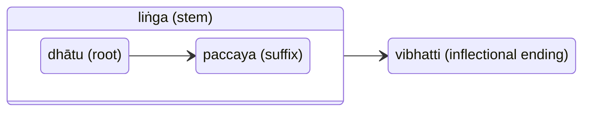
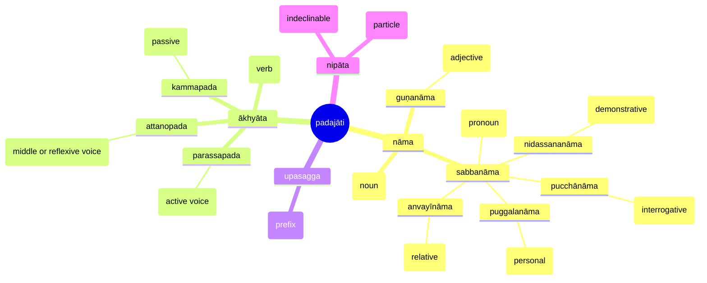
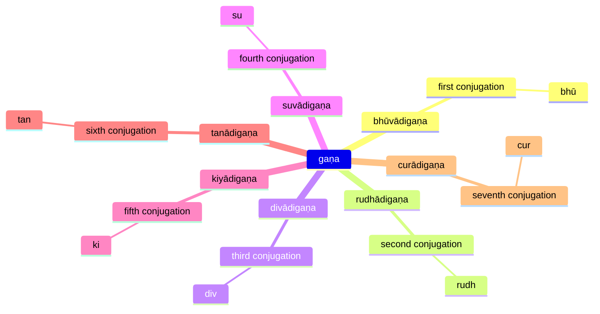
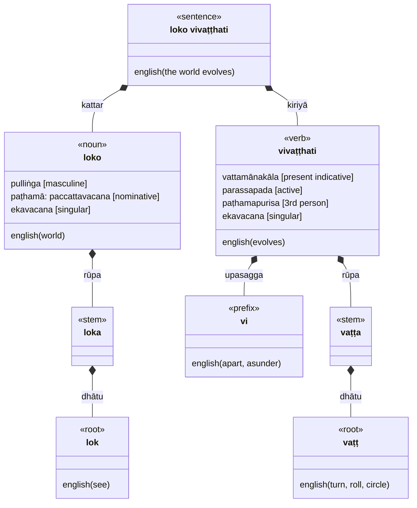

## pada

Word



## padajāti

The four parts of speech



## nāma

Noun

```markmap
---
markmap:
  zoom: false
  pan: false
---
# nāma
## saṅkhyā (number)
### ekavacana (singular)
### bahuvacana (plural)
## liṅga (gender)
### pulliṅga (masculine)
### itthiliṅga (feminine)
### napuṁsakaliṅga (neuter)
## kāraka (case)
### paccattavacana – nominative case (paṭhamā: first)
### upayogavacana – accusative (dutiyā: second)
### karaṇavacana – instrumental (tatiyā: third)
### sampadānavacana – dative (catutthī: fourth) - 
### apādānavacana, avadhi – ablative (pañcamī: fifth)
### sāmivacana, sambandha – genitive (chaṭṭhī: sixth)
### bhummavacana, okāsa, ādhāra, sambodhana – locative case (sattamī: seventh)
### āmantaṇavacana, ālapanavacana – vocative
```

### 1. paccattavacana

Nominative:

```markmap
---
markmap:
  zoom: false
  pan: false
---
# paccattavacana
- `kattar` or agent ("subject" of an active sentence or verb)
  - brāhmaṇo passati
- attribute of an agent in the nominative
  - "predicated" by means of a verb meaning "to be"
    - usually follows the agent
    - brāhmaṇo mahāmatto hoti
  - eso samaṇo
  - brāhmaṇo mahāmatto passati
- used with certain indeclinables relating it to the action
  - yena gāmo … upasaṃkamati
- when a word is quoted or cited
  - kāyo ti
```

### 2. upayogavacana

Accusative:

```markmap
---
markmap:
  zoom: false
  pan: false
---
# upayogavacana
- "patient" (kamma) which undergoes the action of an active verb (the "direct object")
  - purisaṃ bandhati
  - samaṇaṃ vadati
- express the goal of motion
  - gāmaṃ pavisati
- express the (extent of) space traversed
  - maggaṃ paṭipajjati
- used for an attribute of another accusative
  - khattiyo brahmaṅaṃ mahāmattaṃ passati
- used to express the pure duration of time
  - aḍḍhamāsaṃ āgacchati
  - ekaṃ samayaṃ
- singular neuter form of some adjectives is used as an "adverb"
  - rassaṃ passasāmi
```

### 3. karaṇavacana

Instrumental:

- instrument by means of which an action is done
  - kāyena phusati
  - tuṇhī bhāvena
- accompaniment
  - brāhmaṇena saddhim
  - "Talking”, “discussing” (`mant`) with a person need not take saddhim
- possession (endowment)
  - sīlehi samannāgato
- "filled" ("with water/happiness/noise/...”)
  - saddena
- cause
  - but in scientific/philosophical discourse the ablative case is used to express causal connections
  - bhagavatā vādena kupito
    - “angry at (with) the fortunate one’s statement ”
  - cīvarena santuṭṭho
    - "satisfied with the robe ”
  - atthena
    - "because of that business/matter"
  - karaniyena
    - “(engaged in some) business”
  - iminā p' aṅgena
    - "(you shouldn’t go) for this reason”
    - aṅgaṃ = "limb”, "characteristic”, ”factor”
      - used in “because of this” (”endowment”)
- equality
  - samasamo vannena
    - "quite equal in beauty”
- comparison
  - generally and indefinitely
    - purisena purisam
      - “(comparing) a man with a man”
  - for a specific, conclusive comparison, “this is better than that" the ablative case is used
  - price
    - sahassena
      - “for a thousand”
      - (i.e. sell for 1,000 kahāpaṇas, the standard silver coin)
- way (which way, direction)
  - “by one way”
  - “by another way“
  - dvārena
    - “by the gate” (entering, leaving)
- direction, orientation
  - “from West to East“ (both in instrumental) and each followed by the indeclinable ca
  - from North to South
- manner
  - iminā
    - “in this way”
  - iminā pariyāyena
    - “through this course (procedure)"
    - “in this manner”
  - kāyena paṭisaṃvedeti
    - “he experiences through his body”
  - santena
    - “calmly“ (used like “adverbs of manner”)
  - “ on his right side ” (manner of lying)
  - kicchena adhigntaṃ
    - “understood with difficulty”
  - “he sat practising a certain kind of meditation“
  - (instrumental, as if “ manner ” of sitting)
  - adjacent to the ordinary “instrument” sense
    - serving with actions (kammena), whether physical or mental, or with speech
    - honouring, entertaining, etc., with music, dancing, garlands, etc.
- means of livelihood, means of explanation or description (cf. instrument)
  - means of acquiring goodness, puññaṃ
    - dānena
      - “by giving”
    - expiating past deeds (kammaṃ)
- vehicle
  - yānena gacchati
    - “he goes in (by) a carriage”
  - nāgena
    - “by elephant”
- motive
  - gāravena
    - “through respect” (he did not speak)
- time
  - by means of which (at the end of which)
    - aparena samayena
      - “after some time”
      - “in due course”
  - particular time at which
    - tena samayena
      - “at that time”
  - accayena
    - “through (after) the passage/passing away”
    - (of time or of a person: specified in the genitive case)
- age at which
- measure (cf. the ablative case)
  - dvādasayojanāni ahosi āyāmena
    - “it (a city) was twelve leagues in length”
  - sattayojanāni vitthārena
    - “seven leagues in breadth”
  - compounds ending in the word matta meaning “ measure ”
    - jannumattena
      - ”knee deep”
- classification
  - birth, clan, family, kind, and similar relations
    - Gotamo gottena
      - "a Gotama by clan”
  - jalivadena
    - "in respect of class (station by birth)”
- dissociation (cf. accompaniment)
  - adaṇḍena
    - “without force” (negative prefix a-)
  - instrumental used with the indeclinable aññatra
    - "except for”
    - aññatra brahmanena
      - “ except for the priest"
    - “apart from”
- other idioms with the instrumental
  - āsanena nimanteti
    - "he invites to sit down”
    - "he offers a seat”
  - kalena kālaṃ
    - "from time to time”
    - ”regularly”
  - lābhena lābhaṃ
    - “from gain to gain”
    - (wishing always for more gain, with one gain on to another)
  - aññena aññnaṃ
    - ”one with another”
      - literally “other with other”
    - "irrelevantly”
  - sabbena sabbaṃ
    - “all with all", i.e. "completely”
    - "absolutely thoroughly” (as in knowing some doctrine)

### 4. sampadānavacana

Dative case:

- the purpose for which an action is done
  - gāmaṃ piṇḍāya pāvisi
- the person to whom something is given ("indirect object")
- "dative of advantage"
  - the person for whom something is done or to whom something which happens is advantageous
- used with verbs
  - (k)kham
    - "to please" (someone = dative)
    - "to forgive" (someone = dative, something = accusative)
  - (p)paṭi-(s)su
    - "to assent to (someone = dative)"
  - upa-(ṭ)ṭhā
    - to serve, attend on/to someone or something (dative)
  - dhar
    - "hold for/over" person sheltered (dative)
    - "owe" person (dative)
  - ā-ruc
    - "to inform" person informed (dative)
  - to be angry at
    - (kup, etc.)
  - sap
    - to curse
  - pih
    - to long for
  - (p)pa-(k)khā: visible, apparent
    - to be clear to  
  - pātu(r)-bhū: manifest
    - to appear to
- adjective (of verbal import) piya, "dear", takes the dative of the person to whom.
- "For the sake of" ( = dative of purpose, above)
  - atthāya preceded by the genitive of the person or object of the endeavour.
- indeclinable alaṃ ("sufficient", "enough", "adequate", "perfected") takes the dative.
  - the idiomatic meaning of a refusal or objection
    - ("enough!" = "stop!", "I won't!", etc.)
    - with dative of the person for whom it is sufficient or superfluous
      - "I won't" = alaṃ me
      - "it is sufficient for you" = alaṃ vo
- The negative participle abhabba
  - adjective meaning "unable", "incapable"
  - dative of the action which cannot be done, if the latter is expressed by a noun ("action noun").
- When wishes (good wishes) are expressed
- dative is used for the person for whom they are expressed
  - "may there be (hotu) long life for him"
  - "good luck to you"
    - bhaddaṃ bhavato hotu
- "welcome to you"
  - svāgataṃ bhavato hotu
  - svāgataṃ ("welcome!")
- indeclinables sotthi "safety", "safely" and namo ("hail!")
- infinitive of verbs overlaps in meaning with the dative of purpose.
- idiomatic construction: proper time for something, the opportunity for something
  - etassa kālo
    - "it is the time for this", "it is the right time for this"
- akālo … yācanāya
  - "it is not the right time for asking"
- yassa dāni kālaṃ maññasi
  - "for which you think it is now (dāni) the right time"
  - extremely common in saying (formally) goodbye (spoken by the host, not the guest - who for his part has made the excuse of pressure of work), being roughly equivalent to "well, if you really must go … "
  - used also by servants reporting to their master that preparations are completed, implying "you can start whenever you wish", etc

### 6. sāmivacana

Genitive case:

- may often be translated by "of", and serves as a "possessive" case
- denoting the "possessor" (sāmin)
- the whole of which the related word denotes a part (avayava)
- immediately precedes the word to which it relates
  - rañño thūpo
- A construction with a possessive genitive is very often equivalent to an English construction with the verb "to have"
  - idaṃ assa hoti
- "of him thus it is ..." (or was, etc.), "he has this thought ...", "he thinks thus ..."
  - tassa evaṃ hoti
- an idiom consisting of the genitive of the word denoting the period + accayena expresses the time after which (or through the passage of which) something is done:
  - sattāhassa accayena … pabbajissāma
- "after I have passed away", "after my death/parinibbāna"
  - mama + accayena = "after me"
- agent-genitive ("subjective genitive"):
  - brāhmaṇassa pūjito (Soṇadaṇḍo)
  - "(Soṇadaṇḍo was) honoured of (= by) the priest"
  - yesaṃ ... devā ...adiṭṭhā
  - "those ... who have not seen ... the gods (negative participle: a-)"
  - ("of (= by) whom the gods are unseen"; Commentary explains yesaṃ by yehi)
- patient-genitive ("objective genitive"):
  - ahaṃ … tassa yaññassa yājetā
  - "I ... (was) the performer of that sacrifice"
- substitute for the instrumental
  - kumbhiṃ ... pūraṃ ... suvaṇṇassa
  - "pot ... full ... of gold"
- used with certain indeclinables, such as:
  - piṭṭhito - "behind"
   purato - "before", "in front of"
   antarena - "between"
   me purato - "in front of me"
   kāyānam antarena - "between the bodies"
  - uttaraṃ nagarassa - "north of the city"
- The "genitive absolute" consists of a noun (or pronoun) followed by a participle, both inflected in the genitive. This nexus stands apart from the other words of the sentence and means "while (the noun was doing the participle)"
  - special sense of disregarding: "despite (the noun doing the participle)", "under their very noses," as when the participle means "seeing", "looking on"
  - telassa jhāyamānassa "as (while) the oil is burning"
  - mātāpitunnaṃ … rudantānaṃ … pabbajito "though his parents were weeping, he went forth" (i.e. "despite their weeping")
- useful for constructing a sentence with two agents, but the similarly constructed locative absolute (Lesson 16) is much more frequently used

### 8. āmantaṇavacana, ālapanavacana

Vocative:

- used "enclitically", i.e. it does not stand at the beginning of a sentence

## guṇanāma

Adjective:

- When an adjective is common to two or more nouns it may agree with the sum of these (and be plural) or with the nearest. Thirdly the qualified words may be taken as collective and singular and the adjective be singular. Where the genders conflict, the masculine takes precedence over the feminine, the neuter over both.
- An adjective usually precedes the noun it qualifies, but when there are several adjectives with one noun very often only one adjective precedes and the rest follow the noun.
- A demonstrative pronoun relating to the same noun will precede the whole group.
- When an adjective, or (all the) adjectives, follows its noun this usually indicates that it is being "predicated" of the noun, or in other words that the attribute in question is being emphasized.

## sabbanāma

Pronouns

### niyamita

Personal and Demonstrative (incomplete TBD)

- Although the person is expressed by the inflection of the verb, the pronouns of the first and second persons are frequently used, giving a slight emphasis to the subject. The third person pronoun is less often used in this way.
- The third personal pronoun is used also as a demonstrative, meaning "that", "it", in three genders.
- It is generally used as what is known as an "anaphoric " pronoun, that is to say it refers back to someone or something previously mentioned in a narrative.
- As opposed to the use in conversation and other direct speech of "pronouns of presence" referring to someone or something present ("this man", "that jar"), these pronouns are called "pronouns of absence" because it is most often used to speak of someone or something in a story and therefore not present to the listeners.
- It may serve to connect the sentences of a narrative into a continuous paragraph or longer section. It is used also as an emphatic pronoun (in combination with another pronoun or occasionally with 1st person, for example in the expression so 'haṃ "I" (literally "that I").
- In combination with a noun it is again emphatic and may sometimes be translated "the"
- There being no "definite article" in Pali the demonstrative pronouns are sometimes used where English would use the definite article, and may sometimes be translated "the" rather than "he", "that", "this", etc.
- Demonstrative pronouns must agree in number and gender (and case) with the nouns to which they refer.

## ākhyāta

Verb

```markmap
---
markmap:
  zoom: false
  pan: false
---
# ākhyāta
## lakāra (tense)
### vattamāna (present indicative)
### pañcamī (imperative) [mood]
### ajjatanī (aorist) [past]
### sattamī (optative) [mood]
### anāgatakāla (future)
### kālātipatti (conditional)
### kārita (causative)
## purisa (person)
### paṭhamapurisa (third person)
### majjhimapurisa (second person)
### uttamapurisa (first person)
## saṅkhyā (number)
### ekavacana (singular)
### bahuvacana (plural)
```

### kammaka

Transitivity:

```markmap
---
markmap:
  zoom: false
  pan: false
---
# kammaka
- akammaka
  – intransitive
- sakammaka
  – transitive
- dvikammaka
  – bitransitive
  - verbs
    - to call
    - to tell
    - to ask (someone something)
    - to take or bring (something somewhere)
  - samaṅaṃ atthaṃ pucchāmi
```

### kammapada

Passive sentence:

```markmap
---
markmap:
  zoom: false
  pan: false
---
# kammapada
- agent is expressed by the instrumental case
- past participle used as an impersonal (bhāva) passive verb
  - inflected in the nominative singular neuter as sentence-verb
  - evaṃ me sutaṃ 
- If there is a patient, and the action is expressed by a past participle
  - patient will be in the nominative case
  - the participle will agree with it in gender, case, and number
    (as if it were an adjective)
  - mayā ime sattā nimmitā
- Passive verbs are not very common in Pali
- aorist passive
  - add the aorist inflections to the passive stem
  - haññiṃsu, "they were killed."
- A present participle passive
  - adding suffix māna to the passive stem
  - inflecting as a participle
  - kayiramāna, "being done."
```

### gaṇa

Verb conjugation groups



### vattamāna

Present tense

```markmap
---
markmap:
  zoom: false
  pan: false
---
# vattamāna
- present (paccuppanna) time (kāla)
- indefinite time
  - timeless statements such as "eternal truths"
- immediate future
  - may include a shade of "imperative" sense
  - cf.English "I'm going"
- past
  - "historic present"
- duration of an action "until" a fixed future time
  - (a vivid future visualized as present)
  - "when"
```

### pañcamī

Imperative:

```markmap
---
markmap:
  zoom: false
  pan: false
---
# pañcamī
- expresses commands and prohibitions, but also invitations and wishes
- (majjhimapurisa)
  - the sense is usually that of a command
- (paṭhamapurisa)
  - used with the title or name of the person addressed, or the polite pronoun
  - expresses a polite invitation
- ettha tiṭṭha
  - "wait here"
  - ("let it be", "never mind", "let him not", "don't trouble")
- tiṭṭhatha tumhe
  - "don't you bother"
```

### ajjatanī

"Aorist" (past tense), used for all kinds of past actions:

```markmap
---
markmap:
  zoom: false
  pan: false
---
# ajjatanī
- "historical" or "narrative" past
- (present-) perfect
  - desesiṃ (I have taught)
```

### atītakiriya

Past Participle:

```markmap
---
markmap:
  zoom: false
  pan: false
---
# atītakiriya
- normally passive (kammapada) in meaning
- past participles of intransitive verbs sometimes active
  - including some transitive verbs used intransitively
  - "go"
  - "move"
  - "go forth"
- equivalent to a (normally passive) finite verb in the past tense
- indicates the "present-perfect", as in conversation
  - mayaṃ ... upasaṃkantā
- may be accompanied (usually followed) by the present tense of verbs meaning "to be"
  - stressing the "present-perfect" sense
- some used as nouns
  - bhāsitaṃ may mean 
  - "what was spoken", "speech", "saying"
- may be used as "adjectives"
  - kupita
    - "angry")
```

### missakiriya

Present participle:

```markmap
---
markmap:
  zoom: false
  pan: false
---
# missakiriya
- indicate an action which takes place simultaneously with (missa) the main action of the sentence
- used like "adjectives" (as past participles may be) "qualifying" nouns, with which they agree in gender, case, and number.
```

### pubbakiriyā

Gerund (Absolutive):

```markmap
---
markmap:
  zoom: false
  pan: false
---
# pubbakiriyā
- indeclinable participle
- used to express an action preceding (pubba) the action of the main verb of a sentence
- conclude a subordinate clause
- agent of the gerund is the same as that of the main action
```

### bhavissanti

Future Tense:

```markmap
---
markmap:
  zoom: false
  pan: false
---
# bhavissanti
- expression of the probable (bhavissati in particular often has this sense) 
- hypothetical future
- certainty
- (in the 1st person) determination or decision
  - sace ahaṃ … labhissāmi, saṃvibhajissāmi…
- Obedience to a law of nature
  - … nikkhipissanti
    - literally "will throw down, put down" (the body).
    - all living beings (must/will) die
- habit (innate or acquired) may also be expressed by the future
- more emphatic than the use of the present tense to express an "eternal truth"
  - they will do this
- express the emotional colour of regret or disapproval
- Indignation (or disapproval)
  - kathaṃ hi nāma …,"for how could ('will') he …"
- perplexity, surprise, and wonder
  - kim ev' idaṃ bhavissati, "what can this be?", "what is this (stuff)?"
```

## upasagga

Prefixes:

- ati – on, further, towards, over, beyond, past, intensifier
- adhi – on, towards, by, up to, here, intensifier
- anu – along, after, towards, on, at, to, according to, second, low, each, every
- apa – off, away from
- api – on, to, towards
- abhi – towards, against, over, on, intensifier
- ava, o – low, down, away, negative
- ā – nearness, out, forth, to, at, on
- u – up, put, forth, onto
- upa – on, up, by, diminutive
- du – difficult, hard, bad, poor
- ni, nī – down, into, back, out, away, without
- pa – out, on, before, intensifier
- paṭi, pati – back, against, again away, to
- parā – onto, over, through
- pari – around, completely, too much, away, off
- vi – over, about, away, down, reverses meaning, intensifier
- saṁ – near, together
- su – well, happily, thoroughly, intensifier

## vākya

sentence

```markmap
---
markmap:
  zoom: false
  pan: false
---
# vākya
## kiriyā
- action
- verb
## kattar
- agent
- noun
## kamma
- patient
- noun
```


