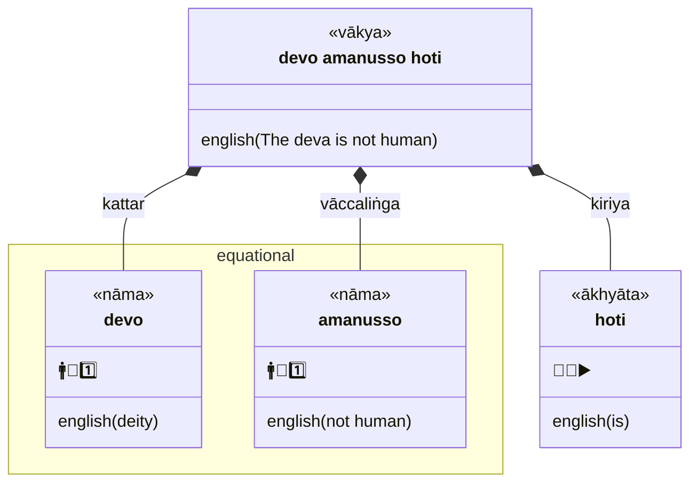
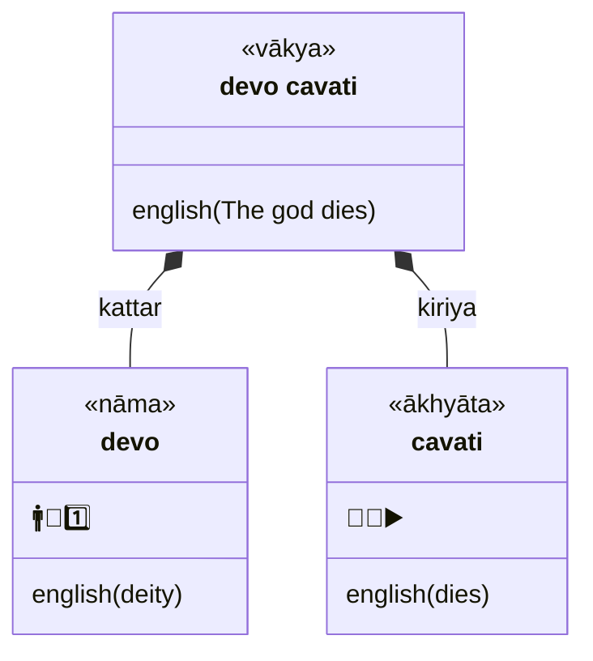
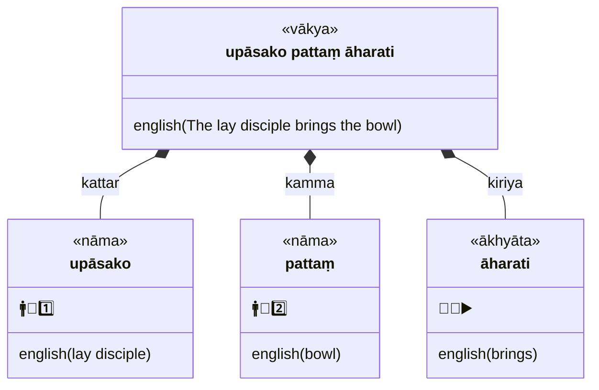
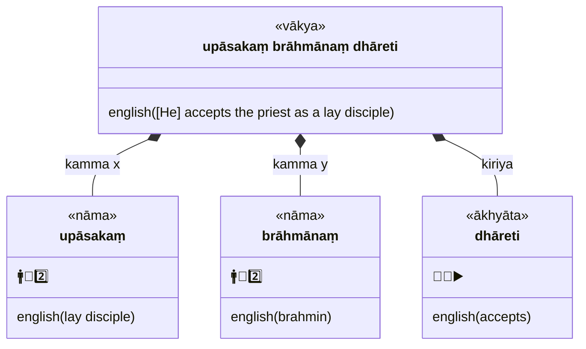
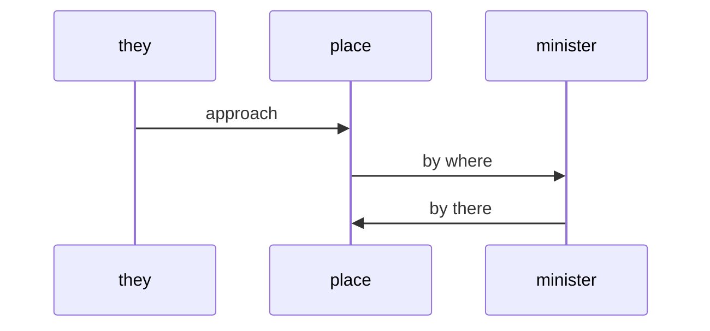

## Legend

| symbol | meaning | explanation |
| --- | --- | --- |
|  | `vākya` | sentence |
|  | `pada`, `vacana` | word |
|  | `nāma` | noun |
|  | `ākhyāta` | verb |
| 🚹 | `pulliṅga` | major (masculine) gender |
| 🚻 | `napuṁsakaliṅga` | special (neuter) gender |
| 🚺 | `itthiliṅga` | minor (feminine) gender |
| 👤 | `ekavacana` | singular |
| 👥 | `bahuvacana` | plural |
| 🟢 | `parassapada` | active voice
| 🔵 | `attanopada` | middle voice - impersonal |
| 🔴 | `kammapada` | passive
| 👤 | `ekavacana` | singular |
| 👥 | `bahuvacana` | plural |
| 🤟 | `paṭhama purisa` | first person, equivalent to 'third person' in English |
| 🤘 | `majjima purisa` | middle person, equivalent to 'second person' in English |
| 👆 | `uttama purisa` | primary person, equivalent to 'first person' in English |
| 0️⃣ | `ālapana` | vocative |
| 1️⃣ | `paṭhamā` | first case (nominative) |
| 2️⃣ | `dutiyā` | second case (accusative) |
| 3️⃣ | `tatiyā` | third case (instrumental) |
| 4️⃣ | `catutthī` | fourth case (dative) |
| 5️⃣ | `pañcamī` | fifth case (ablative) |
| 6️⃣ | `chaṭṭhī` | sixth case (genitive) |
| 7️⃣ | `sattamī` | seventh case (locative) |
| ⏏️ | `nipāta` | particle |
| 🔼 | `upasagga` |prefix |
| 🆎 | `samāsa` | compound noun |
| 🔽 | `taddhita` | affix |
| ▶️ | `vattamāna` | present |
| ⏹ | `piñcamī` | imperative |
| ⏯ | `sattamī` | potential |
| 🔄 | `parokkhā` | perfect |
| ↩️ | `hiyyattanī` | imperfect |
| ⏮ | `ajjatanī`| aorist |
| ⏭ | `bhavissanti` | future |
| 🔀 | `kālātipatti` | conditional |

### Equational

### Intransitive (agent-action)

### Transitive (agent-patient-action)

### Bi-transitive (patient x-patient y-action)

### `yena` ... `tena`

