## Legend

| symbol | meaning | explanation |
| --- | --- | --- |
|  | `vākya` | sentence |
|  | `pada`, `vacana` | word |
|  | `nāma` | noun |
|  | `ākhyāta` | verb |
| 🚹 | `pulliṅga` | major (masculine) gender |
| 🚻 | `napuṁsakaliṅga` | special (neuter) gender |
| 🚺 | `itthiliṅga` | minor (feminine) gender |
| ⚧ | `sabbaliṅga` | all genders |
| ⨀ | `ekavacana` | singular |
| ⨂ | `bahuvacana` | plural |
| 🟢 | `parassapada` | active voice
| 🔵 | `attanopada` | middle voice - impersonal |
| 🔴 | `kammapada` | passive
| ⨀ | `ekavacana` | singular |
| ⨂ | `bahuvacana` | plural |
| 🤟 | `paṭhama purisa` | first person, equivalent to 'third person' in English |
| 🤘 | `majjima purisa` | middle person, equivalent to 'second person' in English |
| 👆 | `uttama purisa` | primary person, equivalent to 'first person' in English |
| ⓪ | `ālapana` | vocative |
| ① | `paṭhamā` | first case (nominative) |
| ② | `dutiyā` | second case (accusative) |
| ③ | `tatiyā` | third case (instrumental) |
| ④ | `catutthī` | fourth case (dative) |
| ⑤ | `pañcamī` | fifth case (ablative) |
| ⑥ | `chaṭṭhī` | sixth case (genitive) |
| ⑦ | `sattamī` | seventh case (locative) |
| ⏏️ | `nipāta` | particle |
| 🔼 | `upasagga` |prefix |
| 🆎 | `samāsa` | compound noun |
| 🔽 | `taddhita` | affix |
| ▶️ | `vattamāna` | present |
| ⏹ | `piñcamī` | imperative |
| ⏯ | `sattamī` | potential |
| 🔄 | `parokkhā` | perfect |
| ↩️ | `hiyyattanī` | imperfect |
| ⏮ | `ajjatanī`| aorist |
| ⏭ | `bhavissanti` | future |
| 🔀 | `kālātipatti` | conditional |
| ⏪ | `atītakiriyā` | past participle |
| ⏬ | `missakiriyā` | present participle |
| ⏩ | `kicca` | future participle |
| ⏫ | `pubbakiriyā` | gerund (absolutive) |

### Equational

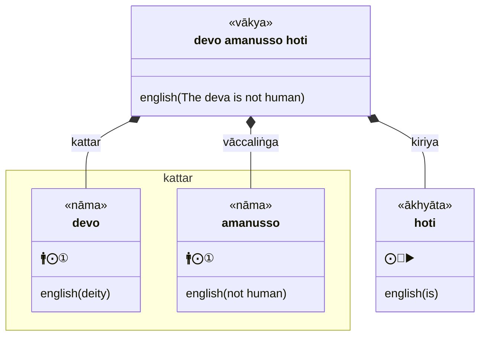
```mermaid
classDiagram
  class sentence["devo amanusso hoti"] {
    <<vākya>>
    english(The deva is not human)
  }
  namespace kattar {
    class devo {
      <<nāma>>
      🚹⨀①
      english(deity)
    }
    class amanusso {
      <<nāma>>
      🚹⨀①
      english(not human)
    }
  }
  class hoti {
    <<ākhyāta>>
     ⨀🤟▶️
    english(is)
  }
  sentence *-- devo : kattar
  sentence *-- amanusso : vāccaliṅga
  sentence *-- hoti: kiriya
```

### Intransitive (agent-action)

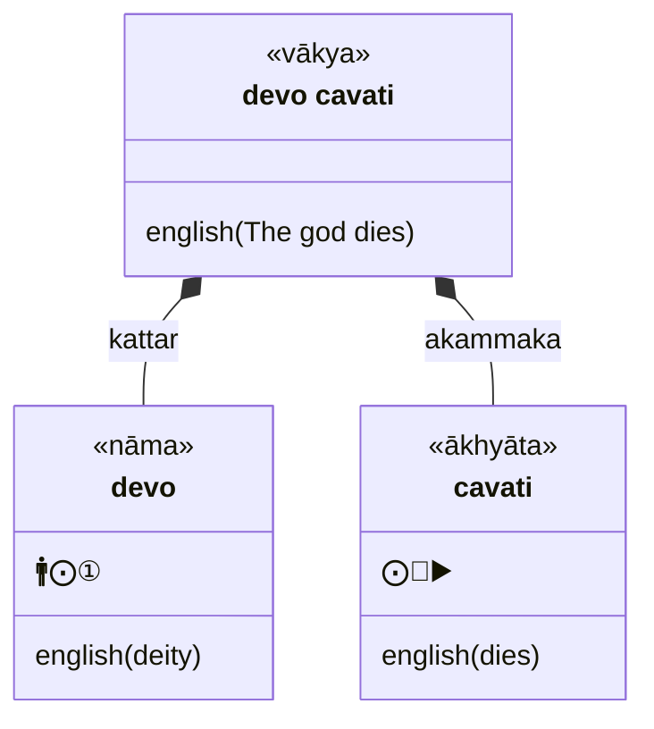
```mermaid
classDiagram
  class sentence["devo cavati"] {
    <<vākya>>
    english(The god dies)
  }
  class devo {
    <<nāma>>
    🚹⨀①
    english(deity)
  }
  class cavati {
    <<ākhyāta>>
     ⨀🤟▶️
    english(dies)
  }
  sentence *-- devo : kattar
  sentence *-- cavati: akammaka
```

### Transitive (agent-patient-action)

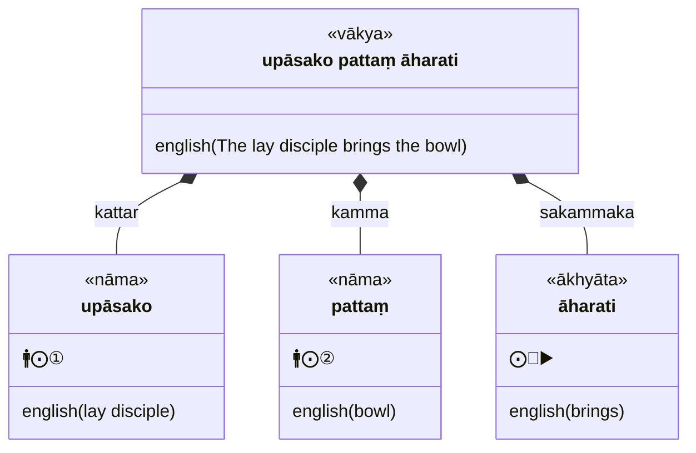
```mermaid
classDiagram
  class sentence["upāsako pattaṃ āharati"] {
    <<vākya>>
    english(The lay disciple brings the bowl)
  }
  class upāsako {
    <<nāma>>
    🚹⨀①
    english(lay disciple)
  }
  class pattaṃ {
    <<nāma>>
    🚹⨀②
    english(bowl)
  }
  class āharati {
    <<ākhyāta>>
     ⨀🤟▶️
    english(brings)
  }
  sentence *-- upāsako : kattar
  sentence *-- pattaṃ : kamma
  sentence *-- āharati: sakammaka
```

### Bi-transitive (patient y-patient x-action)

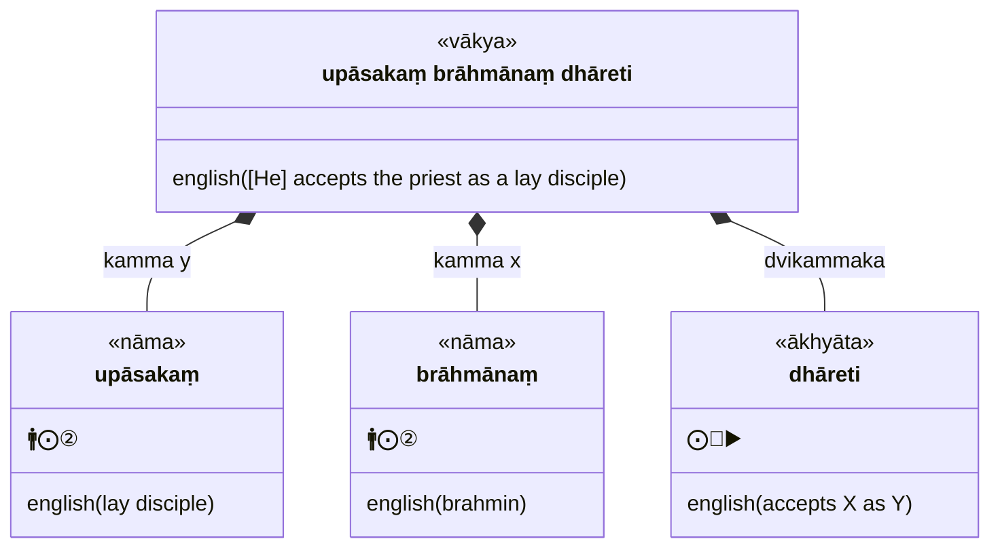
```mermaid
classDiagram
  class sentence["upāsakaṃ brāhmānaṃ dhāreti"] {
    <<vākya>>
    english([He] accepts the priest as a lay disciple)
  }
  class upāsakaṃ {
    <<nāma>>
    🚹⨀②
    english(lay disciple)
  }
  class brāhmānaṃ {
    <<nāma>>
    🚹⨀②
    english(brahmin)
  }
  class dhāreti {
    <<ākhyāta>>
     ⨀🤟▶️
    english(accepts X as Y)
  }
  sentence *-- upāsakaṃ : kamma y
  sentence *-- brāhmānaṃ : kamma x
  sentence *-- dhāreti: dvikammaka
```

### `yena` ... `tena`

```mermaid
classDiagram
  class sentence["yena mahāmatto tena upasaṃkamanti"] {
    <<vākya>>
    english(By where the minister [is], by there [they] approach)
  }
  namespace yenatena {
    class yena {
      <<nipāta>>
      ③
      english(by where)
    }
    class mahāmatto {
      <<nāma>>
      🚹⨀①
      english(minister)
    }
    class tena {
      <<nipāta>>
      ③
      english(by there)
    }
  }
  class upasaṃkamanti {
    <<ākhyāta>>
     ⨂🤟▶️
    english(approach)
  }
  sentence *-- yena
  sentence *-- mahāmatto
  yena <-- mahāmatto : kattar
  yena --> tena
  sentence *-- tena : kamma
  sentence *-- upasaṃkamanti: kiriya
```

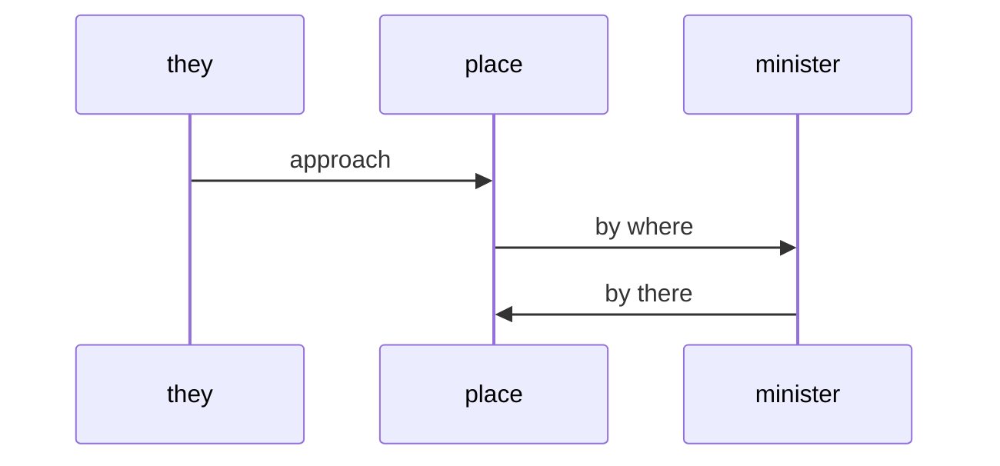
```mermaid
sequenceDiagram
  they ->> place : approach
  place ->> minister : by where
  minister ->> place : by there
```

### Past (Aorist)

Historical or "narrative" past

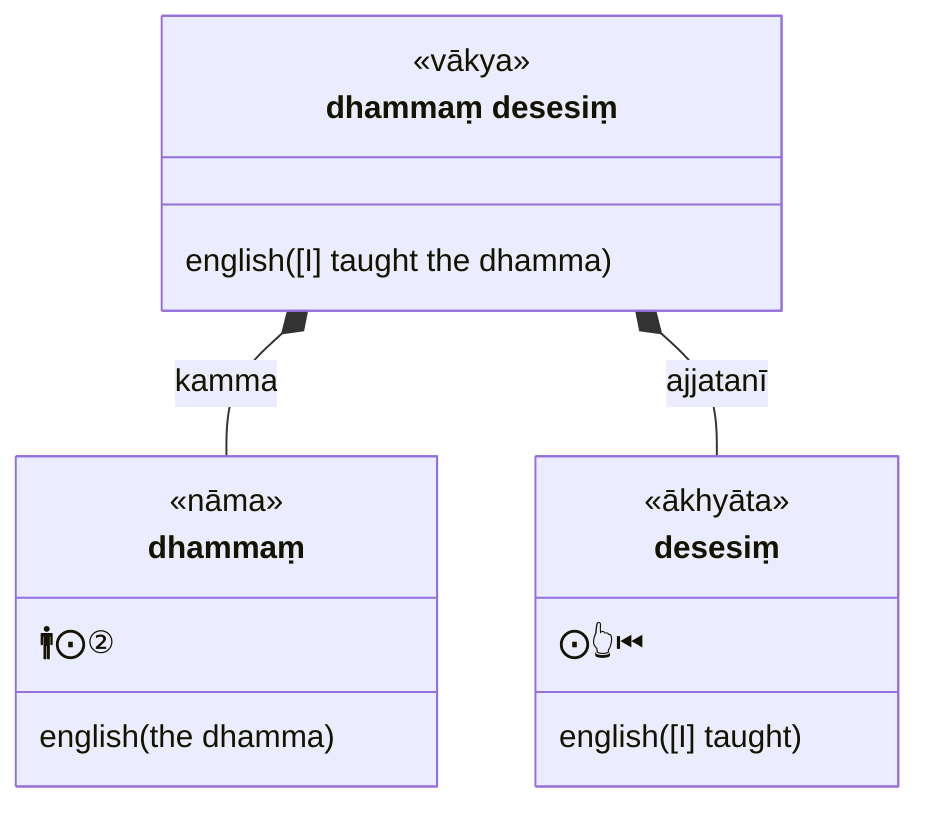
```mermaid
classDiagram
  class sentence["dhammaṃ desesiṃ"] {
    <<vākya>>
    english([I] taught the dhamma)
  }
  class dhammaṃ {
    <<nāma>>
    🚹⨀②
    english(the dhamma)
  }
  class desesiṃ {
    <<ākhyāta>>
     ⨀👆⏮
    english([I] taught)
  }
  sentence *-- dhammaṃ : kamma
  sentence *-- desesiṃ: ajjatanī
```

### Personal Names

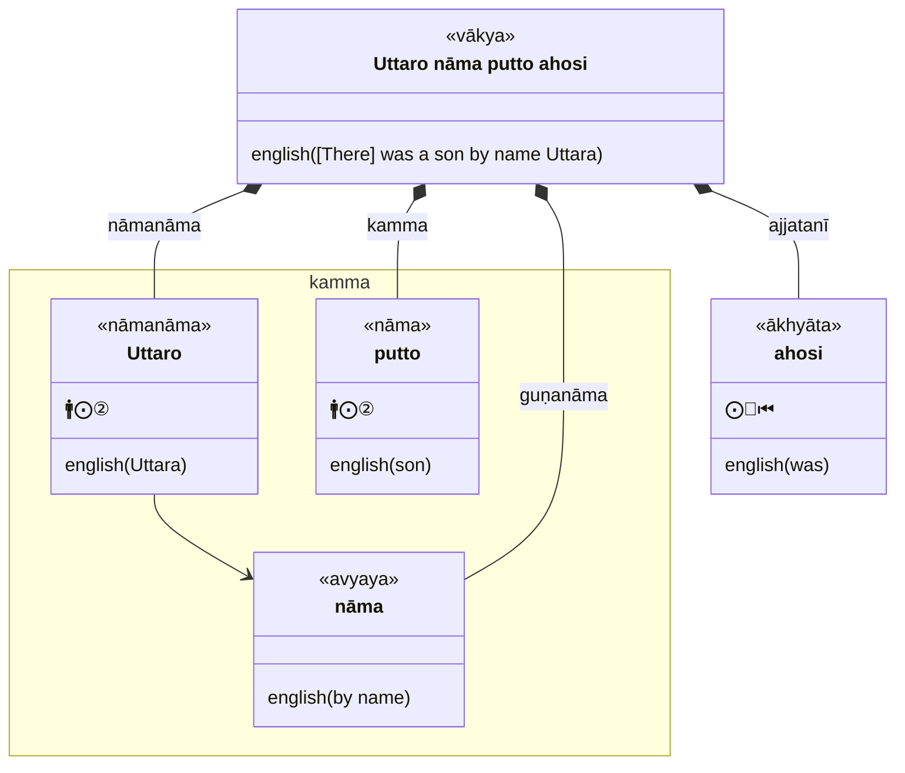
```mermaid
classDiagram
  class sentence["Uttaro nāma putto ahosi"] {
    <<vākya>>
    english([There] was a son by name Uttara)
  }
  namespace kamma {
    class Uttaro {
      <<nāmanāma>>
      🚹⨀②
      english(Uttara)
    }
    class nāma {
      <<avyaya>>
      english(by name)
    }
    class putto {
      <<nāma>>
      🚹⨀②
      english(son)
    }
  }
  class ahosi {
    <<ākhyāta>>
     ⨀🤟⏮
    english(was)
  }
  Uttaro --> nāma
  sentence *-- Uttaro : nāmanāma
  sentence *-- nāma : guṇanāma
  sentence *-- putto : kamma
  sentence *-- ahosi: ajjatanī
```

### Agreement of Verb and Agent

When a verb has two or more agents, it usually agrees with the sum of the agents
and is plural.

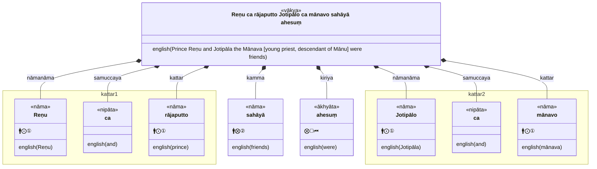
```mermaid
classDiagram
  class sentence["Reṇu ca rājaputto Jotipālo ca mānavo sahāyā ahesuṃ"] {
    <<vākya>>
    english(Prince Reṇu and Jotipāla the Mānava [young priest, descendant of Mānu] were friends)
  }
  namespace kattar1 {
    class Reṇu {
      <<nāma>>
      🚹⨀①
      english(Reṇu)
    }
    class ca1["ca"] {
      <<nipāta>>
      english(and)
    }
    class rājaputto {
      <<nāma>>
      🚹⨀①
      english(prince)
    }
  }
  namespace kattar2 {
    class Jotipālo {
      <<nāma>>
      🚹⨀①
      english(Jotipāla)
    }
    class ca2["ca"] {
      <<nipāta>>
      english(and)
    }
    class mānavo {
      <<nāma>>
      🚹⨀①
      english(mānava)
    }
  }
  class sahāyā {
    <<nāma>>
    🚹⨂②
    english(friends)
  }
  class ahesuṃ {
    <<ākhyāta>>
     ⨂🤟⏮
    english(were)
  }
  sentence *-- Reṇu : nāmanāma
  sentence *-- ca1 : samuccaya
  sentence *-- rājaputto : kattar
  sentence *-- Jotipālo : nāmanāma
  sentence *-- ca2 : samuccaya
  sentence *-- mānavo : kattar
  sentence *-- sahāyā : kamma
  sentence *-- ahesuṃ: kiriya
```

### Personal pronouns

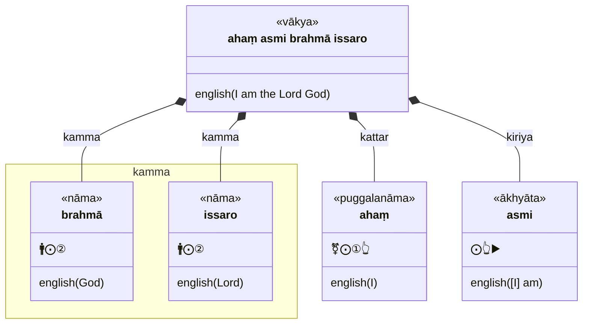
```mermaid
classDiagram
  class sentence["ahaṃ asmi brahmā issaro"] {
    <<vākya>>
    english(I am the Lord God)
  }
  class ahaṃ {
    <<puggalanāma>>
    ⚧⨀①👆
    english(I)
  }
  class asmi {
    <<ākhyāta>>
     ⨀👆▶️
    english([I] am)
  }
  namespace kamma {
    class brahmā {
      <<nāma>>
      🚹⨀②
      english(God)
    }
    class issaro {
      <<nāma>>
      🚹⨀②
      english(Lord)
    }
  }
  sentence *-- ahaṃ : kattar
  sentence *-- asmi: kiriya
  sentence *-- brahmā : kamma
  sentence *-- issaro : kamma
```

### "Anaphoric" demonstrative pronoun

"that", "it": Refers back to someone or something previously mentioned in a
narrative.

Pronoun of absence: speak of someone or something in a story and therefore not
present to the listeners.

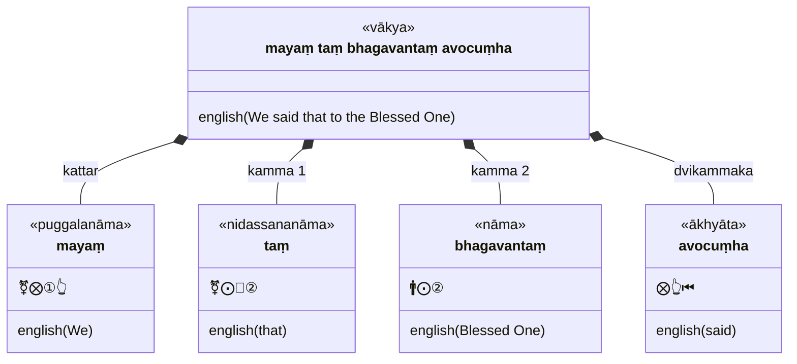
```mermaid
classDiagram
  class sentence["mayaṃ taṃ bhagavantaṃ avocuṃha"] {
    <<vākya>>
    english(We said that to the Blessed One)
  }
  class mayaṃ {
    <<puggalanāma>>
    ⚧⨂①👆
    english(We)
  }
  class taṃ {
    <<nidassananāma>>
    ⚧⨀🤟②
    english(that)
  }
  class bhagavantaṃ {
    <<nāma>>
    🚹⨀②
    english(Blessed One)
  }
  class avocuṃha {
    <<ākhyāta>>
     ⨂👆⏮
    english(said)
  }
  sentence *-- mayaṃ : kattar
  sentence *-- taṃ : kamma 1
  sentence *-- bhagavantaṃ : kamma 2
  sentence *-- avocuṃha: dvikammaka
```

### "Diectic" demonstrative pronoun

"this", "it": Refers to present object or person.

Pronoun of presence: referring to someone or something present

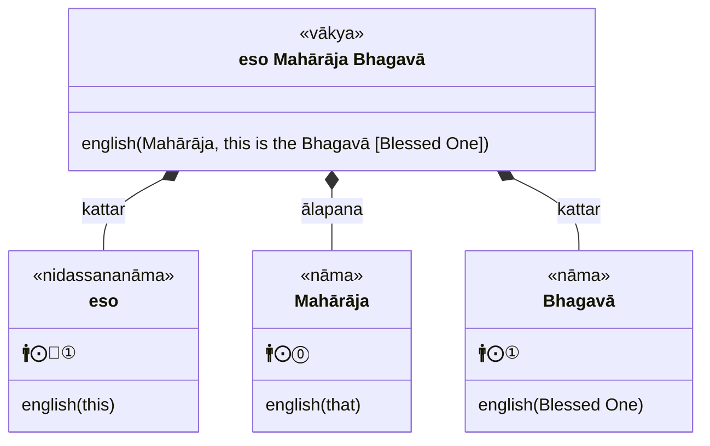
```mermaid
classDiagram
  class sentence["eso Mahārāja Bhagavā"] {
    <<vākya>>
    english(Mahārāja, this is the Bhagavā [Blessed One])
  }
  class eso {
    <<nidassananāma>>
    🚹⨀🤟①
    english(this)
  }
  class Mahārāja {
    <<nāma>>
    🚹⨀⓪
    english(that)
  }
  class Bhagavā {
    <<nāma>>
    🚹⨀①
    english(Blessed One)
  }
  sentence *-- eso : kattar
  sentence *-- Mahārāja : ālapana
  sentence *-- Bhagavā : kattar
```

Emphasise a nearer object

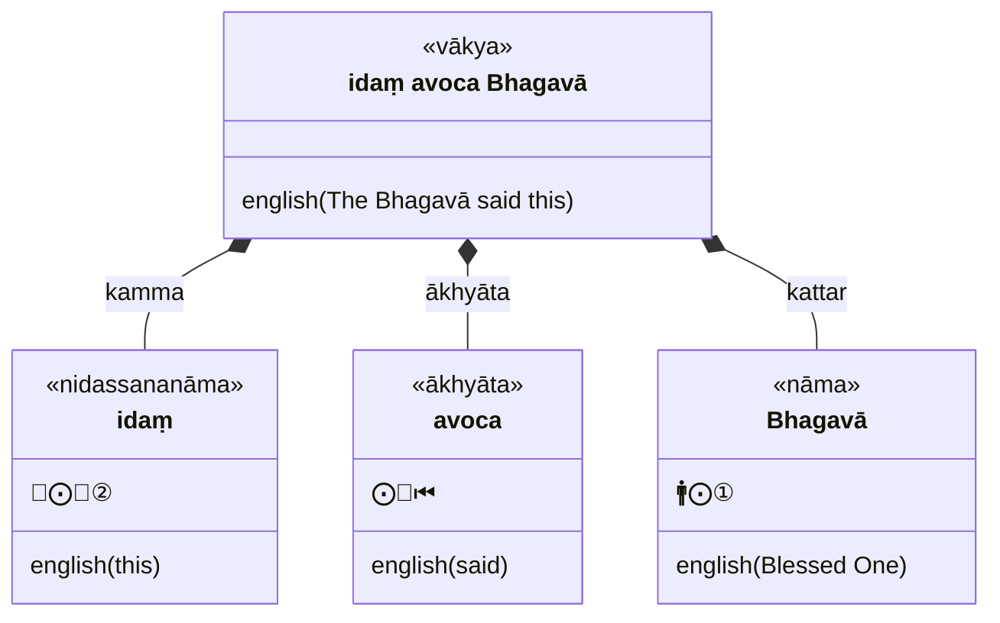
```mermaid
classDiagram
  class sentence["idaṃ avoca Bhagavā"] {
    <<vākya>>
    english(The Bhagavā said this)
  }
  class idaṃ {
    <<nidassananāma>>
    🚻⨀🤟②
    english(this)
  }
  class avoca {
    <<ākhyāta>>
    ⨀🤟⏮
    english(said)
  }
  class Bhagavā {
    <<nāma>>
    🚹⨀①
    english(Blessed One)
  }
  sentence *-- idaṃ : kamma
  sentence *-- avoca : ākhyāta
  sentence *-- Bhagavā : kattar
```

### Emphatic assertion

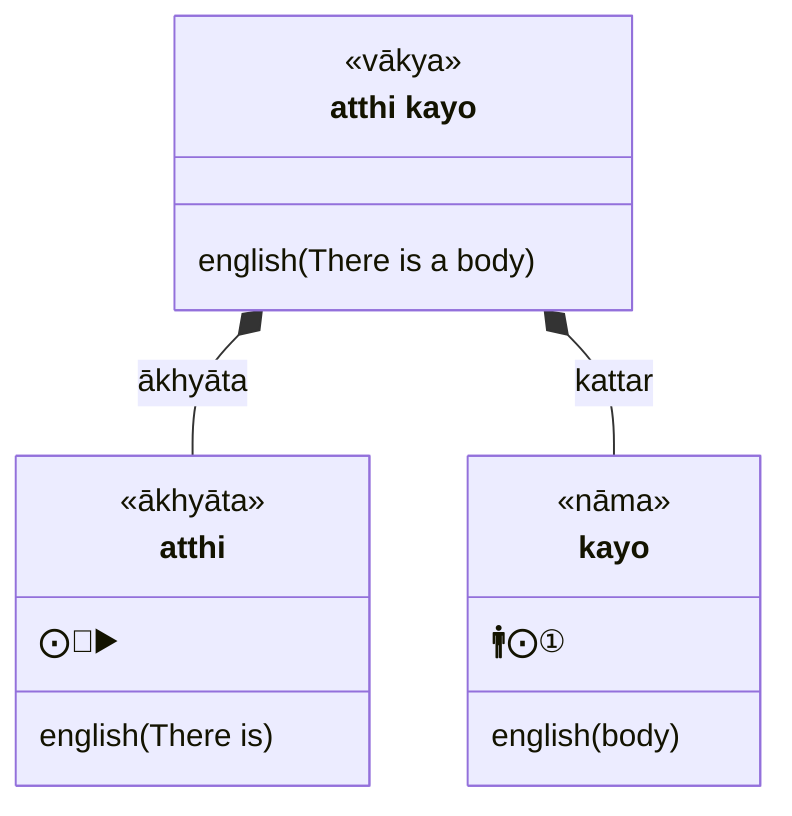
```mermaid
classDiagram
  class sentence["atthi kayo"] {
    <<vākya>>
    english(There is a body)
  }
  class atthi {
    <<ākhyāta>>
     ⨀🤟▶️
    english(There is)
  }
  class kayo {
    <<nāma>>
    🚹⨀①
    english(body)
  }
  sentence *-- atthi: ākhyāta
  sentence *-- kayo : kattar
```

### Negation

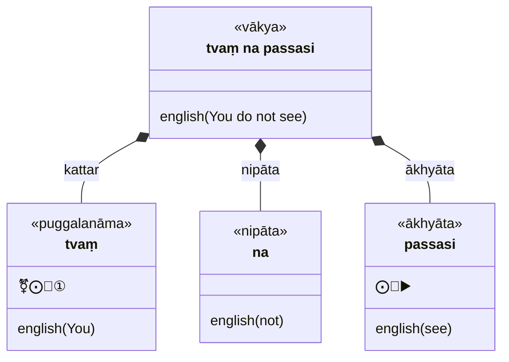
```mermaid
classDiagram
  class sentence["tvaṃ na passasi"] {
    <<vākya>>
    english(You do not see)
  }
  class tvaṃ {
    <<puggalanāma>>
    ⚧⨀🤘①
    english(You)
  }
  class na {
    <<nipāta>>
    english(not)
  }
  class passasi {
    <<ākhyāta>>
     ⨀🤘▶️
    english(see)
  }
  sentence *-- tvaṃ : kattar
  sentence *-- na : nipāta
  sentence *-- passasi: ākhyāta
```

### Prohibition or negative injunction

Used with second person in aorist tense (but loses time reference and can apply
to present or future)

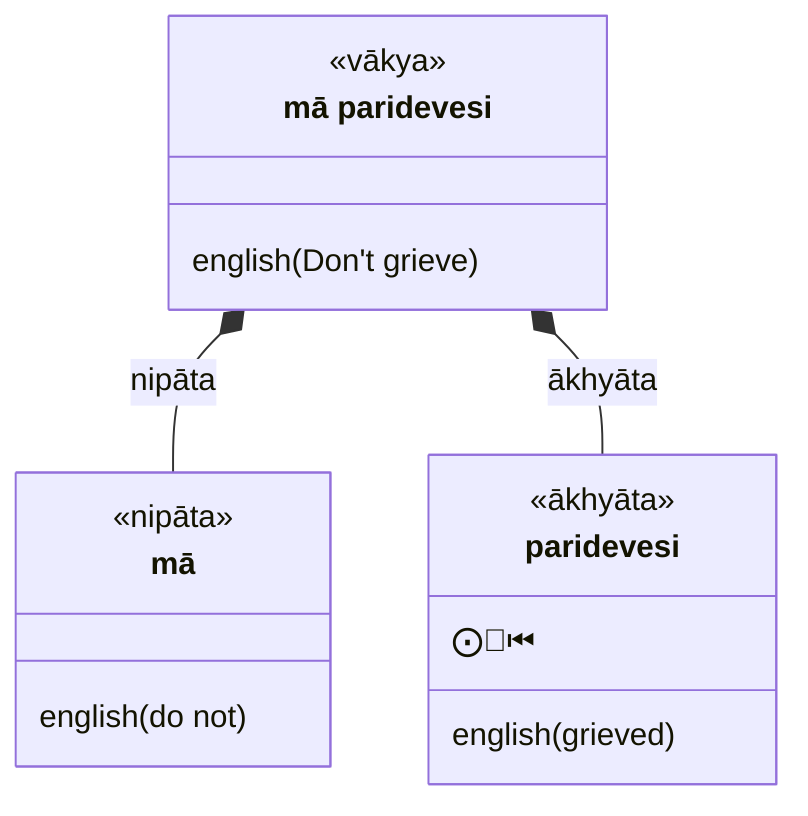
```mermaid
classDiagram
  class sentence["mā paridevesi"] {
    <<vākya>>
    english(Don't grieve)
  }
  class mā {
    <<nipāta>>
    english(do not)
  }
  class paridevesi {
    <<ākhyāta>>
     ⨀🤘⏮
    english(grieved)
  }
  sentence *-- mā : nipāta
  sentence *-- paridevesi: ākhyāta
```

### Wish

Used with third person in aorist tense - appears regularly in polite address

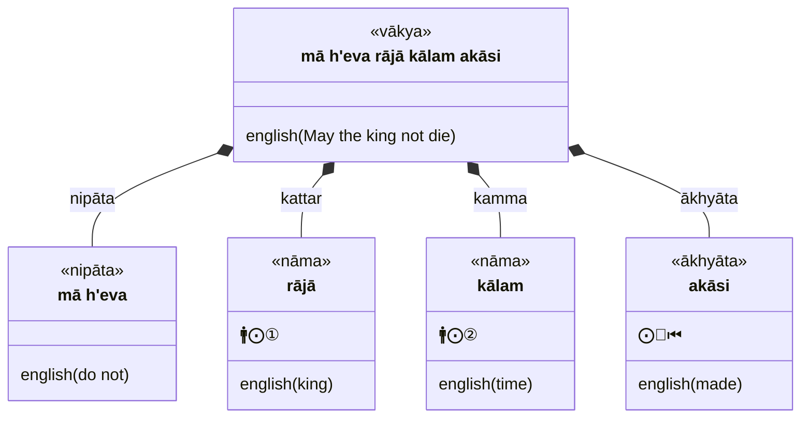
```mermaid
classDiagram
  class sentence["mā h'eva rājā kālam akāsi"] {
    <<vākya>>
    english(May the king not die)
  }
  class mā["mā h'eva"] {
    <<nipāta>>
    english(do not)
  }
  class rājā {
    <<nāma>>
    🚹⨀①
    english(king)
  }
  class kālam {
    <<nāma>>
    🚹⨀② 
    english(time)
  }
  class akāsi {
    <<ākhyāta>>
     ⨀🤟⏮
    english(made)
  }
  sentence *-- mā : nipāta
  sentence *-- rājā : kattar
  sentence *-- kālam : kamma
  sentence *-- akāsi: ākhyāta
```

### Double Negation

Equivalent to a strong affirmation

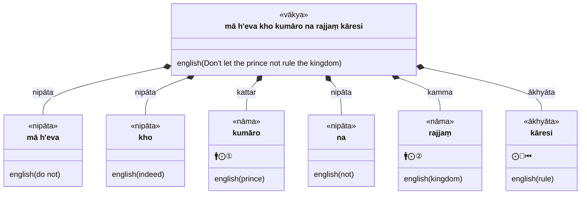
```mermaid
classDiagram
  class sentence["mā h'eva kho kumāro na rajjaṃ kāresi"] {
    <<vākya>>
    english(Don't let the prince not rule the kingdom)
  }
  class mā["mā h'eva"] {
    <<nipāta>>
    english(do not)
  }
  class kho {
    <<nipāta>>
    english(indeed)
  }
  class kumāro {
    <<nāma>>
    🚹⨀①
    english(prince)
  }
  class na {
    <<nipāta>>
    english(not)
  }
  class rajjaṃ {
    <<nāma>>
    🚹⨀② 
    english(kingdom)
  }
  class kāresi {
    <<ākhyāta>>
     ⨀🤟⏮
    english(rule)
  }
  sentence *-- mā : nipāta
  sentence *-- kho : nipāta
  sentence *-- kumāro : kattar
  sentence *-- na : nipāta
  sentence *-- rajjaṃ : kamma
  sentence *-- kāresi: ākhyāta
```

### Vocative

Nominative of address, used enclitically

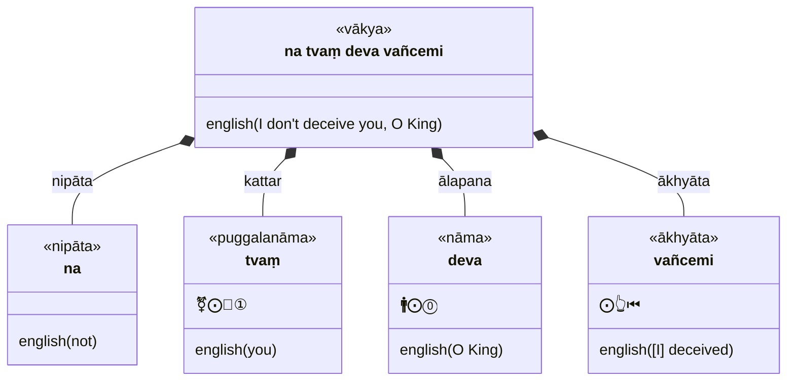
```mermaid
classDiagram
  class sentence["na tvaṃ deva vañcemi"] {
    <<vākya>>
    english(I don't deceive you, O King)
  }
  class na {
    <<nipāta>>
    english(not)
  }
  class tvaṃ {
    <<puggalanāma>>
    ⚧⨀🤘①
    english(you)
  }
  class deva {
    <<nāma>>
    🚹⨀⓪
    english(O King)
  }
  class vañcemi {
    <<ākhyāta>>
     ⨀👆⏮
    english([I] deceived)
  }
  sentence *-- na : nipāta
  sentence *-- tvaṃ : kattar
  sentence *-- deva : ālapana
  sentence *-- vañcemi: ākhyāta
```

### Imperative (command)

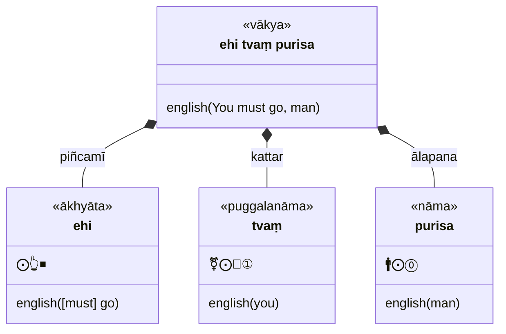
```mermaid
classDiagram
  class sentence["ehi tvaṃ purisa"] {
    <<vākya>>
    english(You must go, man)
  }
  class ehi {
    <<ākhyāta>>
     ⨀👆⏹
    english([must] go)
  }
  class tvaṃ {
    <<puggalanāma>>
    ⚧⨀🤘①
    english(you)
  }
  class purisa {
    <<nāma>>
    🚹⨀⓪
    english(man)
  }
  sentence *-- ehi: piñcamī
  sentence *-- tvaṃ : kattar
  sentence *-- purisa : ālapana
```

### Imperative (invitation or wish)

```mermaid
classDiagram
  class sentence["etu bhagavā"] {
    <<vākya>>
    english(Let the Blessed One come)
  }
  class etu {
    <<ākhyāta>>
     ⨀👆⏹
    english([must] come)
  }
  class bhagavā {
    <<nāma>>
    🚹⨀①
    english(Blessed One)
  }
  sentence *-- etu: piñcamī
  sentence *-- bhagavā : kattar
```

### Imperative (don't bother)

Let it be, never mind, let him not, don't trouble

```mermaid
classDiagram
  class sentence["tiṭṭhatha tumhe"] {
    <<vākya>>
    english(Don't you bother)
  }
  class tiṭṭhatha {
    <<ākhyāta>>
     ⨂🤟⏹
    english(wait/remain)
  }
  class tumhe {
    <<sabbanāma>>
    ⚧⨂🤟①
    english(you)
  }
  sentence *-- tiṭṭhatha: piñcamī
  sentence *-- tumhe : kattar
```

### Respectful address

```mermaid
classDiagram
  class sentence["nisidatu bhagavā"] {
    <<vākya>>
    english(Let the Fortunate One sit down)
  }
  class nisidatu {
    <<ākhyāta>>
     ⨀👆⏹
    english([must] sit)
  }
  class bhagavā {
    <<nāma>>
    🚹⨀①
    english(Blessed One)
  }
  sentence *-- nisidatu: piñcamī
  sentence *-- bhagavā : kattar
```

### Quotation

Short vowel preceeding `ti` is lengthened, and `ṃ` changed to `n`

```mermaid
classDiagram
  class sentence["evaṃ devā ti"] {
    <<vākya>>
    english('[It is] so, O King')
  }
  namespace quotation {
    class evaṃ {
      <<nipāta>>
      english(thus)
    }
    class deva {
      <<nāma>>
      🚹⨀⓪
      english(O King)
    }
  }
  class ti {
    <<nipāta>>
    marker(quotation)
  }
  sentence *-- evaṃ: nipāta
  sentence *-- deva : ālapana
  sentence *-- ti: nipāta
```

```mermaid
classDiagram
  class sentence["n'eso n'atthi ti vadāmi"] {
    <<vākya>>
    english(I don't say "This doesn't exist")
  }
  class na1["na"] {
    <<nipāta>>
    english(not)
  }
  namespace quotation {
    class eso {
      <<sabbanāma>>
      🚻⨀🤟①
      english(this)
    }
    class na2["na"] {
      <<nipāta>>
      english(not)
    }
    class atthi {
      <<ākhyāta>>
      ⨀🤟▶️
      english(exist)
    }
  }
  class ti {
    <<nipāta>>
    marker(quotation)
  }
  class vadāmi {
    <<ākhyāta>>
     ⚧👆▶️
    english([I] say)
  }
  sentence *-- na1: nipāta
  sentence *-- eso: kattar
  sentence *-- na2: nipāta
  sentence *-- atthi : kiriya
  sentence *-- ti: nipāta
  sentence *-- vadāmi : kiriya
```

### Past participle (present perfect)

periphrastic: past participle followed by "to be" verb

```mermaid
classDiagram
  class sentence["paribbājako santuṭṭho hoti"] {
    <<vākya>>
    english(The wanderer is contented)
  }
  class paribbājako {
    <<nāma>>
    🚹⨀①
    english(wanderer)
  }
  class santuṭṭho {
    <<past participle>>
    ⏪🚹⨀①
    english(contented)
  }
  class hoti {
    <<ākhyāta>>
     ⨀🤟▶️
    english(is)
  }
  sentence *-- paribbājako : kattar
  sentence *-- santuṭṭho : past participle
  sentence *-- hoti: kiriya
```

### Instrumental case

```mermaid
classDiagram
  class sentence["kāyena phusati"] {
    <<vākya>>
    english([He] touches with body)
  }
  class kāyena {
    <<nāma>>
    🚹⨀③
    english([with] body)
  }
  class phusati {
    <<ākhyāta>>
     ⨀🤟▶️
    english(touch)
  }
  sentence *-- kāyena : karaṇa
  sentence *-- phusati: kiriya
```

### Impersonal (`bhāva`) Past Participle 

```mermaid
classDiagram
  class sentence["evaṃ me sutaṃ"] {
    <<vākya>>
    english(Thus [it] was heard by me)
  }
  class evaṃ {
    <<nipāta>>
    english(thus)
  }
  class me {
    <<sabbanāma>>
    ⚧⨀👆③
    english([by] me)
  }
  class sutaṃ {
    <<past participle>>
    🔵⏪🚹⨀①
    english(heard)
  }
  sentence *-- evaṃ : nipāta
  sentence *-- me : karaṇa
  sentence *-- sutaṃ: past participle
```

### Passive (`kammapada`) Past Participle

```mermaid
classDiagram
  class sentence["mayā ime sattā nimmitā"] {
    <<vākya>>
    english(By me these beings [were/have been] created)
  }
  class mayā {
    <<sabbanāma>>
    ⚧⨀👆③
    english([by] me)
  }
  class ime {
    <<sabbanāma>>
    🚹⨂①
    english(these)
  }
  class sattā {
    <<sabbanāma>>
    🚹⨂①
    english(beings)
  }
  class nimmitā {
    <<past participle>>
    🔴⏪🚹⨂①
    english(created)
  }
  sentence *-- mayā : karaṇa
  sentence *-- ime : kamma
  sentence *-- sattā : kamma
  sentence *-- nimmitā: past participle
```

### Active Past Participle

```mermaid
classDiagram
  class sentence["sujātā nāma bhante upāsikā kālakatā"] {
    <<vākya>>
    english(Venerable Sir, the female lay disciple named Sujātā has died)
  }
  namespace kattar {
    class sujātā {
      <<nāmanāma>>
      🚺⨀①
      english(Sujātā)
    }
    class nāma {
      <<avyaya>>
      english(named)
    }
    class upāsikā {
      <<nāma>>
      🚺⨀①
      english(food)
    }
  }
  class bhante {
    <<nāma>>
    🚹⨀⓪
    english(Venerable Sir)
  }
  class kālakatā {
    <<past participle>>
    🟢⏪🚺⨀①
    english(created)
  }
  sujātā --> nāma
  sentence *-- sujātā : kattar
  sentence *-- nāma : guṇanāma
  sentence *-- bhante : ālapana
  sentence *-- upāsikā : kattar
  sentence *-- kālakatā: past participle
```

### Time by means of which

`aparena samayena`
: after some time, in due course

`tena samayena`
: at that time

`accayena`
: through (after) the passage/passing away [of time/person]

```mermaid
classDiagram
  class sentence["ahaṃ tena samayena rājā Mahāsudassano ahosiṃ"] {
    <<vākya>>
    english(At that time I was King Mahāsudassana)
  }
  class tena {
    <<nidassananāma>>
    ⚧⨀🤟③
    english(that)
  }
  class samayena {
    <<nāma>>
    🚹⨀③
    english(at time)
  }
  namespace kattar {
    class ahaṃ {
      <<sabbanāma>>
      ⚧⨀👆①
      english([by] me)
    }
    class rājā {
      <<nāma>>
      🚹⨀①
      english(king)
    }
    class Mahāsudassano {
      <<nāmanāma>>
      🚹⨀①
      english(Mahāsudassana)
    }
  }
  class ahosiṃ {
    <<ākhyāta>>
    ⨀👆⏮
    english(was)
  }
  sentence *-- ahaṃ : kattar
  sentence *-- tena : karaṇa
  sentence *-- samayena : karaṇa
  sentence *-- rājā : kattar
  sentence *-- Mahāsudassano : kattar
  sentence *-- ahosiṃ: ajjatanī
```

### Present participle

```mermaid
classDiagram
  class sentence["gacchaṃ passati"] {
    <<vākya>>
    english(As [he] is going [he] sees)
  }
  class gacchaṃ {
    <<missakiriyā>>
    ⏬🚹⨀①
    english(created)
  }
  class passati {
    <<ākhyāta>>
     ⨀🤟▶️
    english(touch)
  }
  sentence *-- gacchaṃ : missakiriyā
  sentence *-- passati: kiriya
```

### Gerund (absolutive)

```mermaid
classDiagram
  class sentence["disvā evaṃ avocumha"] {
    <<vākya>>
    english(Having seen, [we] said thus)
  }
  class disvā {
    <<pubbakiriyā>>
    ⏫
    english(having seen)
  }
  class evaṃ {
    <<nipāta>>
    english(thus)
  }
  class avocumha {
    <<ākhyāta>>
     ⨂👆⏮
    english([We] said)
  }
  sentence *-- disvā : pubbakiriyā
  sentence *-- evaṃ : nipāta
  sentence *-- avocumha: kiriya
```

### Passive (`kammapada`)

```mermaid
classDiagram
  class sentence["bhojanaṃ diyati"] {
    <<vākya>>
    english(Food is given)
  }
  class bhojanaṃ {
    <<nāma>>
    🚹⨀①
    english(food)
  }
  class diyati {
    <<ākhyāta>>
     🔴⨀🤟▶️
    english(is given)
  }
  sentence *-- bhojanaṃ : kamma
  sentence *-- diyati: kammapada
```

### Interrogative (`saccaṃ`)

```mermaid
classDiagram
  class sentence["saccaṃ Nigrodha bhāsitā te esā vācā"] {
    <<vākya>>
    english(Is it true, Nigrodha, [that] this speech has been spoken by you?)
  }
  class saccaṃ {
    <<nipāta>>
    english(is it true that ...)
  }
  class Nigrodha {
    <<nāmanāma>>
    🚹⨀⓪
    english(Nigrodha)
  }
  class bhāsitā {
    <<past participle>>
    🔴⏪🚺⨀①
    english(is spoken)
  }
  class esā {
    <<sabbanāma>>
    🚺⨀🤟①
    english(this)
  }
  class vācā {
    <<nāma>>
    🚺⨀①
    english(speech)
  }
  class te {
    <<sabbanāma>>
    ⚧⨀🤘③
    english(by you)
  }
  sentence *-- saccaṃ : nipāta
  sentence *-- Nigrodha : ālapana
  sentence *-- bhāsitā : past participle
  sentence *-- te : kattar
  sentence *-- esā : kamma
  sentence *-- vācā : kamma
```

```mermaid
classDiagram
  class sentence["saccaṃ bhante bhāsitā me esā vācā"] {
    <<vākya>>
    english(It is true, Venerable Sir, (that) this speech has been spoken by me)
  }
  class saccaṃ {
    <<nipāta>>
    english(it is true that ...)
  }
  class bhante {
    <<nāma>>
    🚹⨀⓪
    english(Venerable Sir)
  }
  class bhāsitā {
    <<past participle>>
    🔴⏪🚺⨀①
    english(is spoken)
  }
  class esā {
    <<sabbanāma>>
    🚺⨀🤟①
    english(this)
  }
  class vācā {
    <<nāma>>
    🚺⨀①
    english(speech)
  }
  class me {
    <<sabbanāma>>
    ⚧⨀👆③
    english(by me)
  }
  sentence *-- saccaṃ : nipāta
  sentence *-- bhante : ālapana
  sentence *-- bhāsitā : past participle
  sentence *-- me : kattar
  sentence *-- esā : kamma
  sentence *-- vācā : kamma
```

### Or, either (`vā`)

```mermaid
classDiagram
  class sentence["idaṃ vuccati cittan ti vā viññāṇan ti vā"] {
    <<vākya>>
    english(This is called 'mind' or 'consciousness')
  }
  class idaṃ {
    <<sabbanāma>>
    🚺⨀🤟①
    english(this)
  }
  class vuccati {
    <<ākhyāta>>
     🔴⨀🤟▶️
    english(is called)
  }
  namespace kamma1 {
    class cittaṃ {
      <<nāma>>
      🚻⨀①
      english(mind)
    }
    class ti1["ti"] {
      <<nipāta>>
      marker(quotation)
    }
    class vā1["vā"] {
      <<nipāta>>
      english(or)
    }
  }
  namespace kamma2 {
    class viññāṇaṃ {
      <<nāma>>
      🚻⨀①
      english(consciousness)
    }
    class ti2["ti"] {
      <<nipāta>>
      marker(quotation)
    }
    class vā2["vā"] {
      <<nipāta>>
      english(or)
    }
  }
  sentence *-- idaṃ : kamma
  sentence *-- vuccati : kammapada
  sentence *-- cittaṃ: kattar
  sentence *-- ti1: nipāta
  sentence *-- vā1: nipāta
  sentence *-- viññāṇaṃ: kattar
  sentence *-- ti2: nipāta
  sentence *-- vā2: nipāta
```

### Future tense

```mermaid
classDiagram
  class sentence["na ciraṃ tathāgatassa parinibbānaṃ bhavissati"] {
    <<vākya>>
    english(The extinction of the Tathāgata will be soon)
  }
  class na {
    <<nipāta>>
    english(not)
  }
  class ciraṃ {
    <<nipāta>>
    english(for a long time, after a long time)
  }
  namespace kattar {
    class tathāgatassa {
      <<nāma>>
      🚹⨀⑥
      english(Tathāgata's)
    }
    class parinibbānaṃ {
      <<nāma>>
      🚻⨀①
      english(extinction)
    }
  }
  class bhavissati {
    <<ākhyāta>>
     ⨀🤟⏭
    english(will be)
  }
  tathāgatassa <-- parinibbānaṃ
  sentence *-- na : nipāta
  sentence *-- ciraṃ : nipāta
  sentence *-- tathāgatassa : chaṭṭhī
  sentence *-- parinibbānaṃ : kattar
  sentence *-- bhavissati: bhavissanti
```

```mermaid
classDiagram
  class sentence["imassa jayo bhavissati"] {
    <<vākya>>
    english(Victory will be his)
  }
  namespace kattar {
    class imassa {
      <<sabbanāma>>
      ⚧⨀🤟⑥
      english(his)
    }
    class jayo {
      <<nāma>>
      🚹⨀①
      english(victory)
    }
  }
  class bhavissati {
    <<ākhyāta>>
     ⨀🤟⏭
    english(will be)
  }
  imassa <-- jayo
  sentence *-- imassa : chaṭṭhī
  sentence *-- jayo : kattar
  sentence *-- bhavissati: bhavissanti
```

### Genitive

```mermaid
classDiagram
  class sentence["ayaṃ imassa bhāsitassa attho"] {
    <<vākya>>
    english(This is the meaning of this saying)
  }
  namespace kattar {
    class ayaṃ {
      <<nidassananāma>>
      ⚧⨀🤟①
      english(this)
    }
    class imassa {
      <<nidassananāma>>
      ⚧⨀🤟⑥
      english(of this)
    }
    class bhāsitassa {
      <<nāma>>
      🚹⨀⑥
      english(of speech)
    }
    class attho {
      <<nāma>>
      🚹⨀①
      english(meaning)
    }
  }
  imassa <-- bhāsitassa
  bhāsitassa <-- attho
  sentence *-- ayaṃ : kattar
  sentence *-- imassa : chaṭṭhī
  sentence *-- bhāsitassa : chaṭṭhī
  sentence *-- attho : kattar
```

### Agent-Genitive ("Subjective Genitive")

```mermaid
classDiagram
  class sentence["brāhmaṇassa pūjito (Soṇadaṇḍo)"] {
    <<vākya>>
    english([Soṇadaṇḍo was] honoured of [by] the priest)
  }
  namespace kattar {
    class s["Soṇadaṇḍo"] {
      <<nāmanāma>>
      🚹⨀①
      english(Soṇadaṇḍa)
    }
    class brāhmaṇassa {
      <<nāma>>
      🚹⨀⑥
      english(of the brāhmaṇ)
    }
    class pūjito {
      <<past participle>>
      ⏪🚹⨀①
      english(honoured)
    }
  }
  brāhmaṇassa <-- pūjito
  sentence *-- s : kattar
  sentence *-- brāhmaṇassa : chaṭṭhī
  sentence *-- pūjito : kattar
```

### Patient-Genitive ("Objective Genitive")

```mermaid
classDiagram
  class sentence["ahaṃ … tassa yaññassa yājetā"] {
    <<vākya>>
    english(I ... (was) the performer of that sacrifice)
  }
  namespace kattar {
    class ahaṃ {
      <<puggalanāma>>
      ⚧⨀👆①
      english(I)
    }
    class tassa {
      <<nidassananāma>>
      🚹⨀🤟⑥
      english(of that)
    }
    class yaññassa {
      <<nāma>>
      🚹⨀⑥
      english(of sacrifice)
    }
    class yājetā {
      <<past participle>>
      ⏪🚹⨀①
      english(sacrificer (performer))
    }
  }
  tassa <-- yaññassa
  yaññassa <-- yājetā
  sentence *-- ahaṃ : kattar
  sentence *-- tassa : chaṭṭhī
  sentence *-- yaññassa : chaṭṭhī
  sentence *-- yājetā : kattar
```

### Genitive Absolute

The "genitive absolute" consists of a noun (or pronoun) followed by a participle, both inflected in the genitive. This nexus stands apart from the other words of the sentence and means "while (the noun was doing the participle)". Often the genitive absolute has the special sense of disregarding: "despite (the noun doing the participle)", "under their very noses," as when the participle means "seeing", "looking on". The genitive absolute is useful for constructing a sentence with two agents,

```mermaid
classDiagram
  class sentence["kammaṃ kho pana me karontassa kāyo kilamissati"] {
    <<vākya>>
    english(However, while I am doing the work, (my) body will become tired)
  }
  namespace genitive_absolute {
    class kammaṃ {
      <<nāma>>
      🚹⨀②
      english(work)
    }
    class kho {
      <<nipāta>>
      english(indeed)
    }
    class pana {
      <<nipāta>>
      english(however)
    }
    class me {
      <<puggalanāma>>
      ⚧⨀👆⑥
      english(of I)
    }
    class karontassa {
      <<past participle>>
      ⏪🚹⨀⑥
      english(of doing)
    }
  }
  class kāyo {
    <<nāma>>
    🚹⨀①
    english(body)
  }
  class kilamissati {
    <<ākhyāta>>
     ⨀🤟⏭
    english(will be tired)
  }
  kammaṃ --> karontassa : kamma
  me <-- karontassa : chaṭṭhī
  sentence *-- kammaṃ
  sentence *-- kho
  sentence *-- pana
  sentence *-- me : genitive absolute
  sentence *-- karontassa : genitive absolute
  sentence *-- kāyo : katar
  sentence *-- kilamissati : bhavissanti
```

### Adjective (junction)

```mermaid
classDiagram
  class sentence["sassato loko"] {
    <<vākya>>
    english(The world [is] eternal)
  }
  class sassato {
    <<guṇanāma>>
    🚹⨀①
    english(eternal)
  }
  class loko {
    <<nāma>>
    🚹⨀①
    english(world)
  }
  sentence *-- sassato : guṇanāma
  sentence *-- loko: kattar
```

### Adjective (nexus)

"who is/which is"

```mermaid
classDiagram
  class sentence["vācā kantā"] {
    <<vākya>>
    english(The speech [which is] agreeable)
  }
  class vācā {
    <<nāma>>
    🚹⨀①
    english(speech)
  }
  class kantā {
    <<guṇanāma>>
    🚹⨀①
    english(agreeable)
  }
  sentence *-- vācā: kattar
  sentence *-- kantā : guṇanāma
```

### Possibility of an event (or inference)

```mermaid
classDiagram
  class sentence["ṭhānaṃ etaṃ vijjati ..."] {
    <<vākya>>
    english(this/it is possible ...)
  }
  class ṭhānaṃ {
    <<nipāta>>
    english(it is possible)
  }
  class etaṃ {
    <<nidassananāma>>
    ⚧⨀🤟①
    english(this)
  }
  class vijjati {
    <<ākhyāta>>
     ⨀🤟▶️
    english(it occurs)
  }
  sentence *-- ṭhānaṃ: nipāta
  sentence *-- etaṃ: kattar
  sentence *-- vijjati : ākhyāta
```

```mermaid
classDiagram
  class sentence["n' etaṃ ṭhānaṃ vijjati ..."] {
    <<vākya>>
    english(this is impossible .../It is not the case ...)
  }
  class na {
    <<nipāta>>
    english(not)
  }
  class etaṃ {
    <<nidassananāma>>
    ⚧⨀🤟①
    english(this)
  }
  class ṭhānaṃ {
    <<nipāta>>
    english(it is possible)
  }
  class vijjati {
    <<ākhyāta>>
     ⨀🤟▶️
    english(it occurs)
  }
  sentence *-- na: nipāta
  sentence *-- etaṃ: kattar
  sentence *-- ṭhānaṃ: nipāta
  sentence *-- vijjati : ākhyāta
```

### Dative (purpose)

```mermaid
classDiagram
  class sentence["gāmaṃ piṇḍāya pāvisi"] {
    <<vākya>>
    english(He entered the village for alms)
  }
  class gāmaṃ {
    <<nāma>>
    🚹⨀①
    english(village)
  }
  class piṇḍāya {
    <<nāma>>
    🚹⨀④
    english(alms)
  }
  class pāvisi {
    <<ākhyāta>>
     ⨀🤟⏮
    english([he] entered)
  }
  sentence *-- gāmaṃ: kattar
  sentence *-- piṇḍāya: sampadāna
  sentence *-- pāvisi : ākhyāta
```

### proper time for something, the opportunity for something

```mermaid
classDiagram
  class sentence["etassa kālo ..."] {
    <<vākya>>
    english(it is the time for this / it is the right time for this)
  }
  class etassa {
    <<nidassananāma>>
    ⚧⨀④
    english(for this)
  }
  class kālo {
    <<nāma>>
    🚹⨀①
    english(time)
  }
  sentence *-- etassa: sampadāna
  sentence *-- kālo: kattar
```

### not the right time

```mermaid
classDiagram
  class sentence["akālo … yācanāya"] {
    <<vākya>>
    english(it is not the right time for asking)
  }
  class akālo {
    <<nāma>>
    🚹⨀①
    english(not the time for)
  }
  class yācanāya {
    <<nidassananāma>>
    🚻⨀④
    english(asking)
  }
  sentence *-- akālo: kattar
  sentence *-- yācanāya: sampadāna
```

### for which you think it is now the right time

The last expression is extremely common in saying (formally) goodbye (spoken by
the host, not the guest - who for his part has made the excuse of pressure of
work). It is used also by servants reporting to their master that preparations
are completed, implying "you can start whenever you wish", etc.

```mermaid
classDiagram
  class sentence["yassa dāni kālaṃ maññasi"] {
    <<vākya>>
    english(for which you think it is now the right time)
  }
  class yassa {
    <<anvayīnāma>>
    ⚧⨀④
    english(for which)
  }
  class dāni {
    <<nipāta>>
    english(now)
  }
  class kālaṃ {
    <<nāma>>
    🚹⨀①
    english(time)
  }
  class maññasi {
    <<ākhyāta>>
     ⨀🤘▶️
    english([you] think)
  }
  sentence *-- yassa: sampadāna
  sentence *-- dāni: nipāta
  sentence *-- kālaṃ: kattar
  sentence *-- maññasi: ākhyāta
```

### relative clause

```mermaid
classDiagram
  class sentence["atha kho ye icchiṃsu te akaṃsu"] {
    <<vākya>>
    english(then [indeed] those who wished, they worked)
  }
  class atha {
    <<nipāta>>
    english(then)
  }
  class kho {
    <<nipāta>>
    english(now)
  }
  namespace relative {
    class ye {
      <<anvayīnāma>>
      ⚧⨂①
      english(those who)
    }
    class icchiṃsu {
      <<ākhyāta>>
      ⨂🤟⏮
      english([they] wished)
    }
  }
  namespace main {
    class te {
      <<puggalanāma>>
      ⚧⨂①
      english(they)
    }
    class akaṃsu {
      <<ākhyāta>>
      ⨂🤟⏮
      english([they] worked)
    }
  }
  sentence *-- atha: nipāta
  sentence *-- kho: nipāta
  sentence *-- ye: aniyamuddesa
  sentence *-- icchiṃsu: ajjatanī
  sentence *-- te: kattar
  sentence *-- akaṃsu: ajjatanī
```

```mermaid
classDiagram
  class sentence["yena dvārena nikkhami taṃ Gotamadvāraṃ nāma ahosi"] {
    <<vākya>>
    english(the gate by which he left was called Gotama Gate)
  }
  namespace relative {
    class yena {
      <<anvayīnāma>>
      ⚧⨀④
      english(by which)
    }
    class dvārena {
      <<nāma>>
      🚹⨀④
      english(by gate)
    }
    class nikkhami {
      <<ākhyāta>>
      ⨀🤟⏮
      english([he] left)
    }
  }
  namespace main {
    class taṃ {
      <<puggalanāma>>
      ⚧⨀①
      english(that)
    }
    class Gotamadvāraṃ {
      <<nāmanāma>>
      🚹⨀②
      english(Gotamadvāro)
    }
    class nāma {
      <<avyaya>>
      english(name)
    }
    class ahosi {
      <<ākhyāta>>
      ⨀🤟⏮
      english([it] was)
    }
  }
  sentence *-- yena: aniyamuddesa
  sentence *-- dvārena: karaṇa
  sentence *-- nikkhami: ajjatanī
  sentence *-- taṃ: kattar
  sentence *-- Gotamadvāraṃ: kattar
  sentence *-- nāma: avyaya
  sentence *-- ahosi: ajjatanī
```

### pronominal adjective

```mermaid
classDiagram
  class sentence["ye … ahesuṃ, … sabbe … bhakkhesi"] {
    <<vākya>>
    english(those … who were there, … he devoured (bhakkh) them all)
  }
  namespace relative {
    class ye {
      <<anvayīnāma>>
      ⚧⨂①
      english(those who)
    }
    class ahesuṃ {
      <<ākhyāta>>
      ⨂🤟⏮
      english([they] were)
    }
  }
  namespace main {
    class sabbe {
      <<sabbanāma>>
      ⚧⨂②
      english(them all)
    }
    class bhakkhesi {
      <<ākhyāta>>
      ⨀🤟▶️
      english(devour)
    }
  }
  sentence *-- ye: aniyamuddesa
  sentence *-- ahesuṃ: ajjatanī
  sentence *-- sabbe: kamma
  sentence *-- bhakkhesi: ākhyāta
```

### universal relative pronoun

```mermaid
classDiagram
  class sentence["yo yo … ādiyissati tassa tassa … anuppadassāmi"] {
    <<vākya>>
    english(whoever will take … to him I will grant …)
  }
  namespace relative {
    class yo["yo yo"] {
      <<anīyamanāma>>
      ⚧⨀①
      english(whoever)
    }
    class ādiyissati {
      <<ākhyāta>>
      ⨀🤟⏭
      english(will take)
    }
  }
  namespace main {
    class tassa["tassa tassa"] {
      <<puggalanāma>>
      ⚧⨀④
      english(to him)
    }
    class anuppadassāmi {
      <<ākhyāta>>
      ⨀🤟⏭
      english([I] will grant)
    }
  }
  sentence *-- yo: aniyamuddesa
  sentence *-- ādiyissati: bhavissanti
  sentence *-- tassa: sampadāna
  sentence *-- anuppadassāmi: bhavissanti
```

```mermaid
classDiagram
  class sentence["yena yena gacchati"] {
    <<vākya>>
    english(wherever he goes)
  }
  class yena["yena yena"] {
    <<anīyamanāma>>
    ⚧⨀⑥
    english(wherever)
  }
  class gacchati {
    <<ākhyāta>>
    ⨀🤟▶️
    english([he] goes)
  }
  sentence *-- yena: anīyamanāma
  sentence *-- gacchati : ākhyāta
```

### emphatic demonstrative pronoun

```mermaid
classDiagram
  class sentence["yo so satto paṭhamaṃ upapanno, tassa evaṃ hoti: ahaṃ asmi brahmā"] {
    <<vākya>>
    english(that being who has come into existence first (in the evolution of the universe) thinks he is God)
  }
  namespace relative {
    class yoso["yo so"] {
      <<anvayīnāma>>
      ⚧⨀①
      english(he who)
    }
    class satto {
      <<nāma>>
      🚹⨀①
      english(being)
    }
    class paṭhamaṃ {
      <<nipāta>>
      english(firstly)
    }
    class upapanno {
      <<past participle>>
      ⏪🚹⨀①
      english(arose)
    }
  }
  namespace idiom {
    class tassa {
      <<puggalanāma>>
      ⚧⨂④
      english(to him)
    }
    class evaṃ {
      <<nipāta>>
      english(thus)
    }
    class hoti {
      <<ākhyāta>>
      ⨀🤟▶️
      english(is)
    }
  }
  namespace thought {
    class ahaṃ {
      <<puggalanāma>>
      ⚧⨀①👆
      english(I)
    }
    class asmi {
      <<ākhyāta>>
      ⨀🤟▶️
      english([I] am)
    }
    class brahmā {
      <<nāma>>
      🚹⨀②
      english(God)
    }
  }
  sentence *-- yoso: nidassananāma
  sentence *-- satto: kattar
  sentence *-- paṭhamaṃ: nipāta
  sentence *-- upapanno: kattar
  sentence *-- tassa: sampadāna
  sentence *-- evaṃ: nipāta
  sentence *-- hoti: ākhyāta
  sentence *-- ahaṃ: kattar
  sentence *-- asmi: ākhyāta
  sentence *-- brahmā: kattar
```

### Relative Indeclinable

relative clause follows main clause = elevated speech emphasising main clause

```mermaid
classDiagram
  class sentence["hoti kho so samayo yaṃ … ayaṃ loko vivaṭṭati"] {
    <<vākya>>
    english(there is indeed the (so) time that (i.e. when) ... this world evolves)
  }
  namespace main {
    class hoti {
      <<ākhyāta>>
      ⨀🤟▶️
      english(is)
    }
    class kho {
      <<nipāta>>
      english(indeed)
    }
    class so {
      <<pucchānāma>>
      🚹⨀🤟
      english(that)
    }
    class samayo {
      <<nāma>>
      🚹⨀①
      english(time)
    }
  }
  namespace relative {
    class yaṃ {
      <<anvayīnāma>>
      ⚧⨀①
      english(when)
    }
    class ayaṃ {
      <<nidassananāma>>
      ⚧⨀🤟①
      english(this)
    }
    class loko {
      <<nāma>>
      🚹⨀①
      english(world)
    }
    class vivaṭṭati {
      <<ākhyāta>>
      ⨀🤘▶️
      english(revolves)
    }
  }
  sentence *-- hoti : ākhyāta
  sentence *-- kho: nipāta
  sentence *-- so: kattar
  sentence *-- samayo: kattar
  sentence *-- yaṃ: aniyamuddesa
  sentence *-- ayaṃ: nidassananāma
  sentence *-- loko: kattar
  sentence *-- vivaṭṭati: ākhyāta
```

### Interrogative

```mermaid
classDiagram
  class sentence["ko 'si tvaṃ āvuso"] {
    <<vākya>>
    english(Who are you, friend?)
  }
  class ko {
    <<pucchānāma>>
    🚹⨀🤟
    english(who?)
  }
  class asi {
    <<ākhyāta>>
     ⨀🤘▶️
    english([you] are)
  }
  class tvaṃ {
    <<puggalanāma>>
    ⚧⨀🤘①
    english(you)
  }
  class āvuso {
    <<nāma>>
    🚹⨀①
    english(friend)
  }
  sentence *-- ko: pucchānāma
  sentence *-- asi : ākhyāta
  sentence *-- tvaṃ: kattar
  sentence *-- āvuso: kattar
```

### Interrogative (indeclinable)

```mermaid
classDiagram
  class sentence["kiṃ saddaṃ assosi"] {
    <<vākya>>
    english(Did he hear the noise?)
  }
  class kiṃ {
    <<nipāta>>
    english(who?)
  }
  class saddaṃ {
    <<nāma>>
    🚹⨀①
    english(noise)
  }
  class assosi {
    <<ākhyāta>>
     ⨀🤟⏮
    english([he] heard)
  }
  sentence *-- kiṃ: nipāta
  sentence *-- saddaṃ: kattar
  sentence *-- assosi : ākhyāta
```
