## Legend

```mermaid
mindmap
  id((padajāti))
    nāma
      id(noun)
        saṅkhyā: number
          ekavacana: singular
            id(👤)
          bahuvacana: plural
            id(👥)
          liṅga: gender
            pulliṅga: masculine
              id(🚹)
            itthiliṅga: feminine
              id(🚺)
            napuṁsakaliṅga: neuter
              id(🚻)
            kāraka: case
              paccattavacana: nominative
                id(1️⃣)
              upayogavacana: accusative
                id(2️⃣)
              karaṇavacana: instrumental
                id(3️⃣)
              sampadānavacana: dative
                id(4️⃣)
              apādānavacana: ablative
                id(5️⃣)
              sāmivacana: genitive
                id(6️⃣)
              bhummavacana: locative case
                id(7️⃣)
              āmantaṇavacana: vocative
                id(0️⃣)
    ākhyāta
      id(verb)
        purisa (person)
          paṭhamapurisa: third person
            id(🤟)
          majjhimapurisa: second person
            id(🤘)
          uttamapurisa: first person
            id(👆)
        saṅkhyā: number
          ekavacana: singular
            id(👤)
          bahuvacana: plural
            id(👥)
    upasagga
      id(prefix)
    nipāta
      id(particle)
```



### Equational

```mermaid
classDiagram
  class sentence["devo amanusso hoti"] {
    <<vākya>>
    english(The deva is not human)
  }
  class devo {
    <<nāma>>
    🚹👤1️⃣
    english(deity)
  }
  class amanusso {
    <<nāma>>
     🚹👤1️⃣
    english(not human)
  }
  class hoti {
    <<ākhyāta>>
     👤🤟vattamāna
    english(is)
  }
  sentence *-- devo : kattar
  sentence *-- amanusso : vāccaliṅga
  sentence *-- hoti: kiriya
```



### Intransitive (agent-action)

```mermaid
classDiagram
  class sentence["devo cavati"] {
    <<vākya>>
    english(The god dies)
  }
  class devo {
    <<nāma>>
    🚹👤1️⃣
    english(deity)
  }
  class cavati {
    <<ākhyāta>>
     👤🤟vattamāna
    english(dies)
  }
  sentence *-- devo : kattar
  sentence *-- cavati: kiriya
```



### Transitive (agent-patient-action)

```mermaid
classDiagram
  class sentence["upāsako pattaṃ āharati"] {
    <<vākya>>
    english(The lay disciple brings the bowl)
  }
  class upāsako {
    <<nāma>>
    🚹👤1️⃣
    english(lay disciple)
  }
  class pattaṃ {
    <<nāma>>
    🚹👤2️⃣
    english(bowl)
  }
  class āharati {
    <<ākhyāta>>
     👤🤟vattamāna
    english(brings)
  }
  sentence *-- upāsako : kattar
  sentence *-- pattaṃ : kamma
  sentence *-- āharati: kiriya
```

### `yena` ... `tena`

```mermaid
classDiagram
  class sentence["yena mahāmatto tena upasaṃkamanti"] {
    <<vākya>>
    english(By where the minister [is], by there [they] approach)
  }
  namespace yenatena {
    class yena {
      <<nipāta>>
      3️⃣
      english(by where)
    }
    class mahāmatto {
      <<nāma>>
      🚹👤1️⃣
      english(minister)
    }
    class tena {
      <<nipāta>>
      3️⃣
      english(by there)
    }
  }
  class upasaṃkamanti {
    <<ākhyāta>>
     👥🤟vattamāna
    english(approach)
  }
  sentence *-- yena
  sentence *-- mahāmatto
  yena <-- mahāmatto : kattar
  yena --> tena
  sentence *-- tena : kamma
  sentence *-- upasaṃkamanti: kiriya
```


