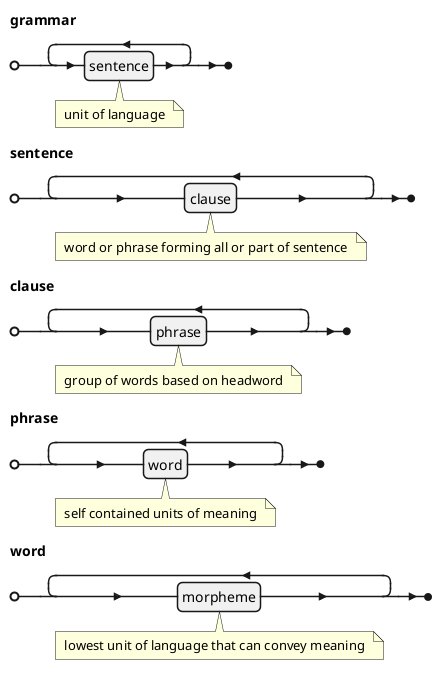
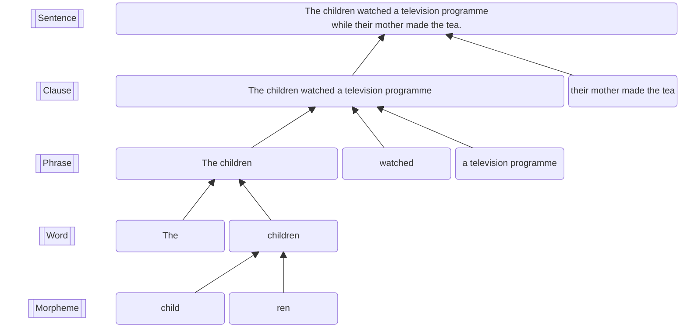
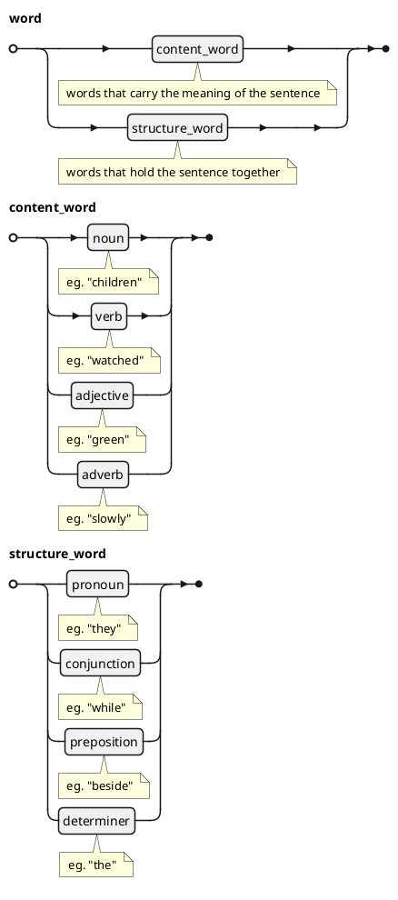
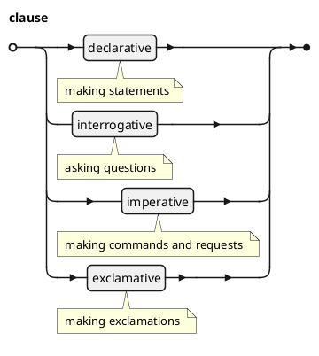
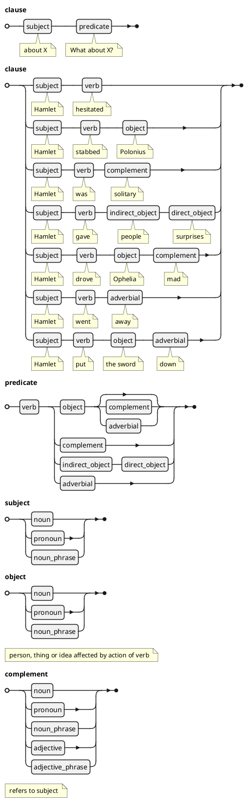
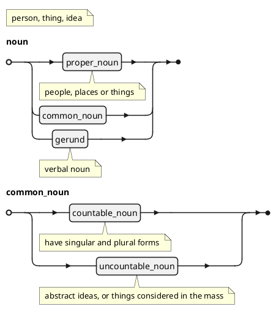
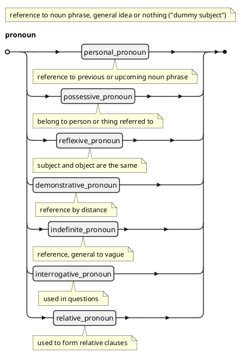
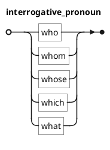
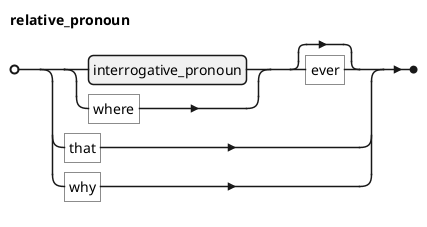
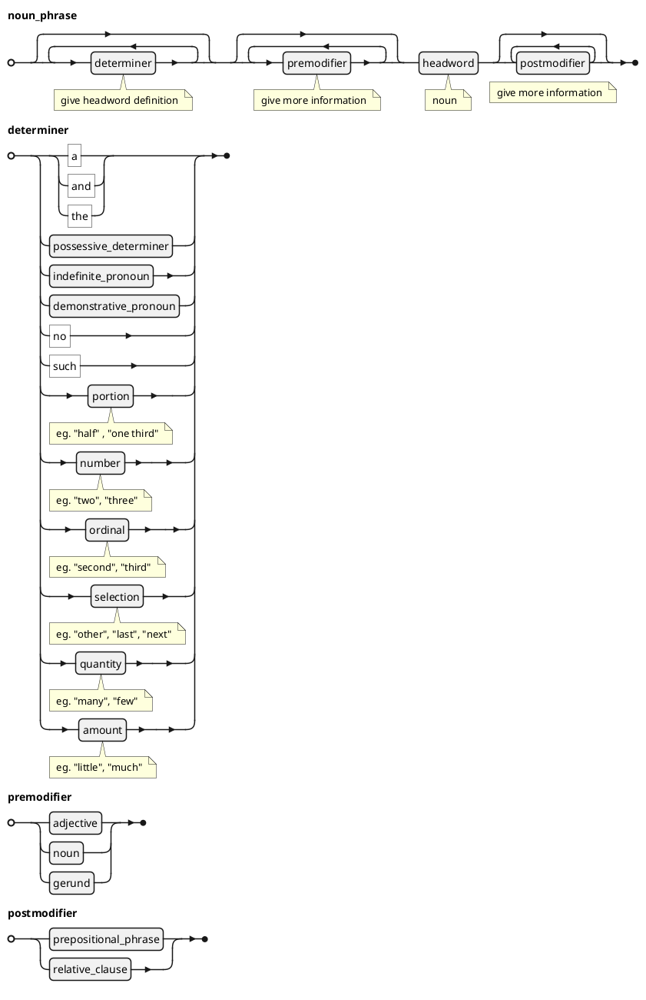

## Grammatical levels

## Words

## Types of Clauses

## Clause patterns

## Nouns

## Pronouns

### Personal and Possessive pronouns

| person | number | gender | subjective | objective | possessive | possessive determiner |
| :-: | :-: | :-: | :-: | :-: | :-: | :-: |
| 1st | singular | all | I | me | mine | my |
| 1st | plural | all | we | us | ours | our |
| 2nd | all | all | you | you | yours | your |
| 3rd | singular | female | she | her | hers | her |
| 3rd | singular | male | he | him | his | his |
| 3rd | singular | neuter | it | it | its | its |
| 3rd | plural | all | they | them | theirs | their |

### Reflexive Pronouns

| person | gender | singular | plural |
| :-: | :-: | :-: | :-: |
| 1st | all | myself | ourselves |
| 2nd | all | yourself | yourselves |
| 3rd | female | herself | themselves |
| 3rd | male | himself | themselves |
| 3rd | neuter | itself | themselves |

## Demonstrative Pronouns

| distance | singular | plural |
| :-: | :-: | :-: |
| near | this | these |
| far | that | those |

## Indefinite Pronouns

| specificity | one | body | thing | choice | iteration |
| :-: | :-: | :-: | :-: | :-: | :-: |
| some | someone | somebody | something | | |
| any | anyone | anybody | anything | either | |
| none | no one | nobody | nothing | neither | |
| all | everyone | everybody | everything | both | each |

## Interrogative Pronouns

### Relative Pronouns

### Noun phrases

## References

Seely, 2001
: John Seely, Oxford Everyday Grammar, Oxford University Press (2001)
