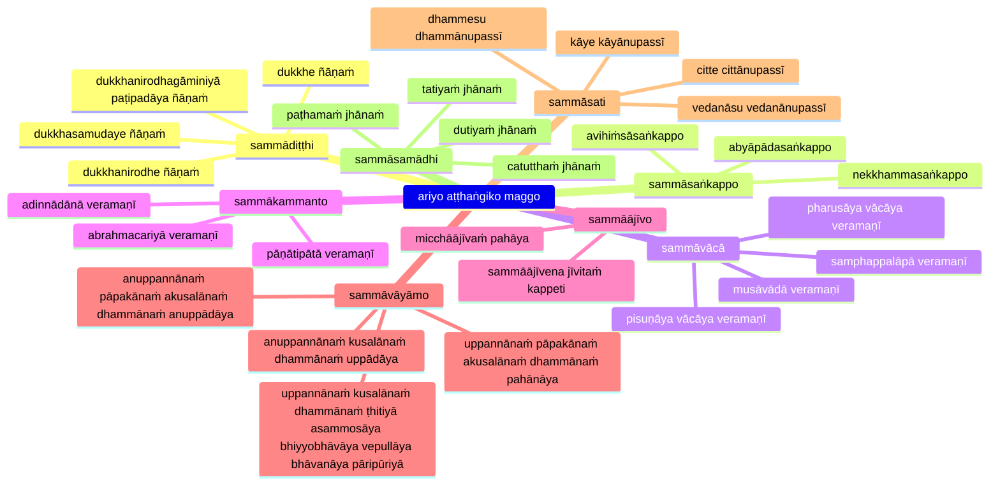

## ariyo aṭṭhaṅgiko maggo (noble eightfold path)

```markmap
# ariyo aṭṭhaṅgiko maggo
## sammādiṭṭhi
- right belief
## sammāsaṅkappo
- right intention
## sammāvācā
- right speech
## sammākammanto
- right conduct
## sammāājīvo
- right livelihood
## sammāvāyāmo
- right effort
## sammāsati
- right mindfulness
## sammāsamādhi
- right concentration
```


## Reference

- [Mahāsatipaṭṭhānasutta DN 22 PTS 2.290–2.315 PT](https://suttacentral.net/dn22)
- [Saccavibhaṅgasutta MN 141 PTS 3.248–3.252](https://suttacentral.net/mn141)
- [Mahākhandhaka Pli Tv Kd 1 PTS 1.1–1.100 P](https://suttacentral.net/pli-tv-kd1)
- [Vibhaṅgasutta SN 45.8 PTS 5.9–5.10](https://suttacentral.net/sn45.8)