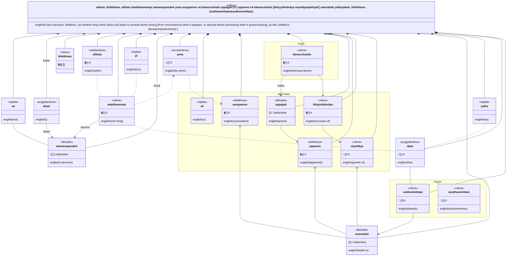
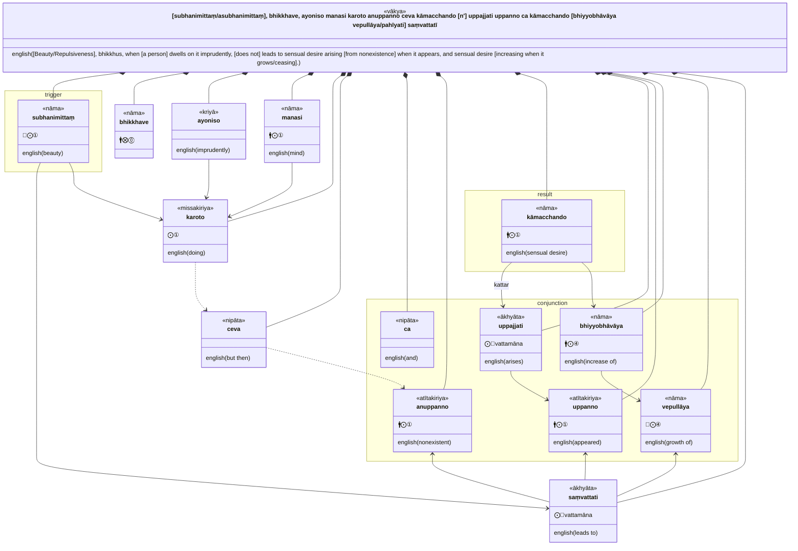
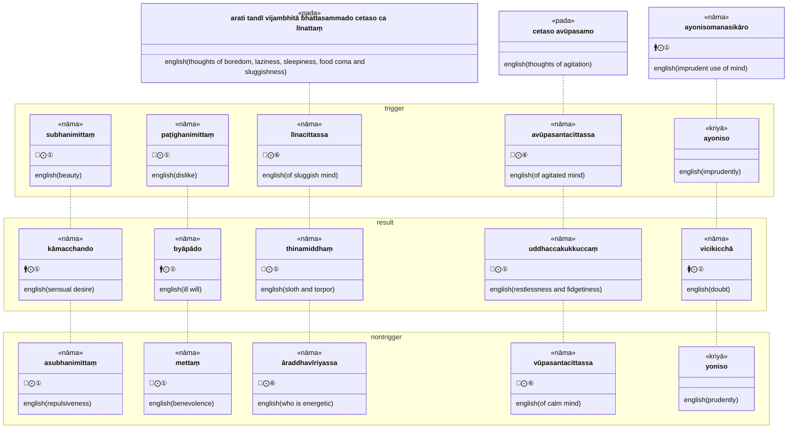

AN 1.2 11-20:

>11. "nāhaṃ, bhikkhave, aññaṃ ekadhammampi samanupassāmi yena anuppanno vā kāmacchando uppajjati uppanno vā kāmacchando bhiyyobhāvāya vepullāya saṃvattati yathayidaṃ, bhikkhave, subhanimittaṃ. subhanimittaṃ, bhikkhave, ayoniso manasi karoto anuppanno ceva kāmacchando uppajjati uppanno ca kāmacchando bhiyyobhāvāya vepullāya saṃvattatī"ti.  
>12. "nāhaṃ, bhikkhave, aññaṃ ekadhammampi samanupassāmi yena anuppanno vā byāpādo uppajjati uppanno vā byāpādo bhiyyobhāvāya vepullāya saṃvattati yathayidaṃ, bhikkhave, paṭighanimittaṃ. paṭighanimittaṃ, bhikkhave, ayoniso manasi karoto anuppanno ceva byāpādo uppajjati uppanno ca byāpādo bhiyyobhāvāya vepullāya saṃvattatī"ti.  
>13. "nāhaṃ, bhikkhave, aññaṃ ekadhammampi samanupassāmi yena anuppannaṃ vā thinamiddhaṃ uppajjati uppannaṃ vā thinamiddhaṃ bhiyyobhāvāya vepullāya saṃvattati yathayidaṃ, bhikkhave, arati tandī vijambhitā bhattasammado cetaso ca līnattaṃ. līnacittassa, bhikkhave, anuppannañceva thinamiddhaṃ uppajjati uppannañca thinamiddhaṃ bhiyyobhāvāya vepullāya saṃvattatī"ti.  
>14. "nāhaṃ, bhikkhave, aññaṃ ekadhammampi samanupassāmi yena anuppannaṃ vā uddhaccakukkuccaṃ uppajjati uppannaṃ vā uddhaccakukkuccaṃ bhiyyobhāvāya vepullāya saṃvattati yathayidaṃ, bhikkhave, cetaso avūpasamo. avūpasantacittassa, bhikkhave, anuppannañceva uddhaccakukkuccaṃ uppajjati uppannañca uddhaccakukkuccaṃ bhiyyobhāvāya vepullāya saṃvattatī"ti.  
>15. "nāhaṃ, bhikkhave, aññaṃ ekadhammampi samanupassāmi yena anuppannā vā vicikicchā uppajjati uppannā vā vicikicchā bhiyyobhāvāya vepullāya saṃvattati yathayidaṃ, bhikkhave, ayonisomanasikāro. ayoniso, bhikkhave, manasi karoto anuppannā ceva vicikicchā uppajjati uppannā ca vicikicchā bhiyyobhāvāya vepullāya saṃvattatī"ti.  
>16. "nāhaṃ, bhikkhave, aññaṃ ekadhammampi samanupassāmi yena anuppanno vā kāmacchando nuppajjati uppanno vā kāmacchando pahīyati yathayidaṃ, bhikkhave, asubhanimittaṃ. asubhanimittaṃ, bhikkhave, yoniso manasi karoto anuppanno ceva kāmacchando nuppajjati uppanno ca kāmacchando pahīyatī"ti.  
>17. "nāhaṃ, bhikkhave, aññaṃ ekadhammampi samanupassāmi yena anuppanno vā byāpādo nuppajjati uppanno vā byāpādo pahīyati yathayidaṃ, bhikkhave, mettā cetovimutti. mettaṃ, bhikkhave, cetovimuttiṃ yoniso manasi karoto anuppanno ceva byāpādo nuppajjati uppanno ca byāpādo pahīyatī"ti.  
>18. "nāhaṃ, bhikkhave, aññaṃ ekadhammampi samanupassāmi yena anuppannaṃ vā thinamiddhaṃ nuppajjati uppannaṃ vā thinamiddhaṃ pahīyati yathayidaṃ, bhikkhave, ārambhadhātu nikkamadhātu parakkamadhātu. āraddhavīriyassa, bhikkhave, anuppannañceva thinamiddhaṃ nuppajjati uppannañca thinamiddhaṃ pahīyatī"ti.  
>19. "nāhaṃ, bhikkhave, aññaṃ ekadhammampi samanupassāmi yena anuppannaṃ vā uddhaccakukkuccaṃ nuppajjati uppannaṃ vā uddhaccakukkuccaṃ pahīyati yathayidaṃ, bhikkhave, cetaso vūpasamo. vūpasantacittassa, bhikkhave, anuppannañceva uddhaccakukkuccaṃ nuppajjati uppannañca uddhaccakukkuccaṃ pahīyatī"ti.  
>20. "nāhaṃ, bhikkhave, aññaṃ ekadhammampi samanupassāmi yena anuppannā vā vicikicchā nuppajjati uppannā vā vicikicchā pahīyati yathayidaṃ, bhikkhave, yonisomanasikāro. yoniso, bhikkhave, manasi karoto anuppannā ceva vicikicchā nuppajjati uppannā ca vicikicchā pahīyatī"ti.

