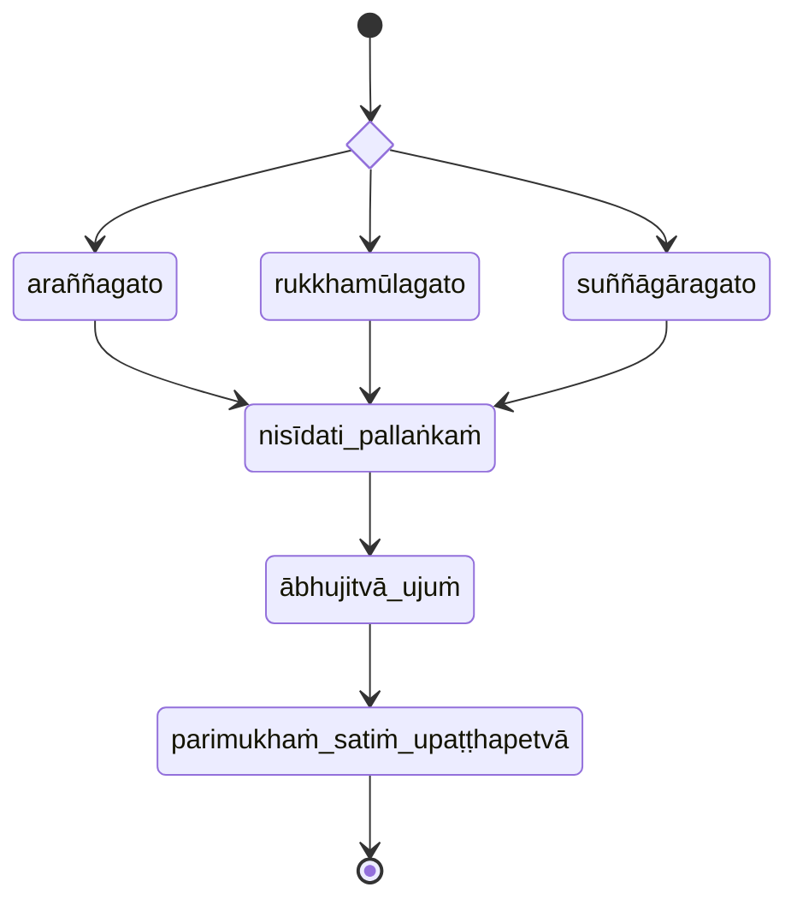

## cattāri ariyasaccāni

viharati ātāpī sampajāno satimā vineyya loke abhijjhādomanassaṁ (keen, aware, and mindful, rid of desire and aversion for the world)

```markmap
# cattāri ariyasaccāni
## kāye kāyānupassī
- body
## vedanāsu vedanānupassī
- feelings
## citte cittānupassī
- mind
## dhammesu dhammānupassī
- principles
```

### Kāyānupassanā

```markmap
# kāyānupassanā
## Kāyānupassanāānāpānapabba
- Mindfulness of Breathing
## Kāyānupassanāiriyāpathapabba
- The Postures
## Kāyānupassanāsampajānapabba
- Situational Awareness
## Kāyānupassanāpaṭikūlamanasikārapabba
- Focusing on the Repulsive
## Kāyānupassanādhātumanasikārapabba
- Focusing on the Elements
## Kāyānupassanānavasivathikapabba
- The Charnel Ground Contemplations
```

#### Kāyānupassanāānāpānapabba



## Reference

- [Mahāsatipaṭṭhānasutta DN 22 PTS 2.290–2.315 PT SC](https://suttacentral.net/dn22)
- [Mahāsatipaṭṭhānasuttaṁ (DN 22) ABT](https://www.ancient-buddhist-texts.net/Buddhist-Texts/D22-Mahasatipatthana/index.htm)
- [Saccavibhaṅgasutta MN 141 PTS 3.248–3.252](https://suttacentral.net/mn141)
- [Mahākhandhaka Pli Tv Kd 1 PTS 1.1–1.100 P](https://suttacentral.net/pli-tv-kd1)