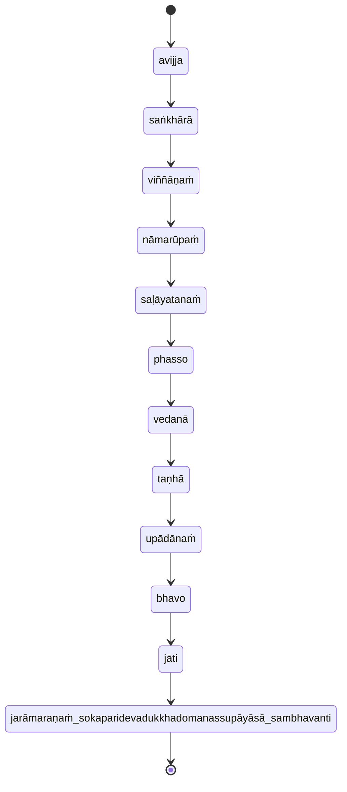

## Reference

- [Mahāsatipaṭṭhānasutta DN 22 PTS 2.290–2.315 PT](https://suttacentral.net/dn22)
- [Saccavibhaṅgasutta MN 141 PTS 3.248–3.252](https://suttacentral.net/mn141)
- [Mahākhandhaka Pli Tv Kd 1 PTS 1.1–1.100 P](https://suttacentral.net/pli-tv-kd1)