
Part of "A Beginner (Non-Linguist) Guide to Learning Pali"



In this book, references to Kaccāyana are denoted by eg. {8} (8th `sutta` or
"grammatical rule"). Altogether there are 675 suttas, which shows how compact
Kaccāyana is.


Pali, like most other Indo-Aryan languages, is an oral language spoken as
`vākya` (sentences) made up of `vacana` (words) which are a combination of
`akkhara` ("sounds", or "letters from an "alphabet"). {1}

There are debates about the origin of Pali, whether it was in fact a real language
actually spoken by people, as opposed to an "invented" language specifically
for the purposes of recording Buddhist doctrine. The term "Pali" actually
just means "text", and today "Pali" is used primarily for Buddhist literature.

## Pali Alphabet and pronunciation {2}-{9}

The Buddha may have spoken a language similar to Pali, and when he died his
sayings were collected and systematised so they can be transmitted orally
generation to generation using memorisation techniques such as chanting. The
Pali canon was not written down until hundreds of years after the Buddha has
passed away.

As such, there is no "official" Pali alphabet or writing. Pali can be transcribed
fairly faithfully in a number of alphabets, including Roman letters (with the
addition of a few diacritical marks or accented characters similar to other
European languages).

For this textbook, I will use Roman letters as the basis for the Pali alphabet
since I am used to that.

Of course, no one knows for sure how Pali words would have been pronounced,
and how Pali sentences would have been spoken, particularly with regards to
tonality. Modern day Pali pronunciation is based on how the Buddhist Pali canon
is chanted in various countries including Sri Lanka, Myanmar and Thailand.


[**B: The Pāli Alphabet**]()


## Pali sentence structure

A Pali sentence (`vākya`) or Pali text (`pali`) is generally composed of
multiple words (`pada` or `vacana`). Since Pali was an oral language,
punctuation mark and upper/lower case conventions are typically not used,
although modern editors have sometimes added these to aid reading.

Words also do not need to be separated by spaces, although modern Pali editions
of text do add spaces, to aid reading. Later on, we will find out Pali
has compound words, which consist of multiple words joined together to create a
composite word.

To be able to distinguish words in a sentence, Pali relies
heavily on `paccaya` (affixes to roots or word stems) to create distinctive
word endings. Fluent Pali listeners will no doubt listen to the sound of these
endings to distinguish the words. These endings also give additional meaning
to the words and indicate how the words are used in a sentence.

Because of this, the word order in a Pali sentence is less important than many
other languages, however there are conventions for how to arrange words in a
typical sentence. Speakers can unconventionally reorder words, typically to
give emphasis to certain words or to augment or add nuance to a sentence's
emotional meaning.

This is similar to our reaction when we hear "Yoda" speak in the "Star Wars"
series of films. We appreciate who Yoda is as a personality, and we pay more
attention to his words simply because of the different order.

## `dhātu` (roots)

Fundamentally, all words in Pali are said to be derived from one or more `dhātu`
(roots). These roots are similar to Sanskrit roots. Pali can be regarded as
a simplified version of Sanskrit, however some of the roots may have different
meanings, or nuances. There are some that say Sanskrit was a "holy" language
reserved for priests and members of the holy caste, whereas Pali, along with
many other Indian languages, was spoken by the common people. The Buddha may
have spoken in Pali because he wanted to convey his teachings to ordinary
people, not just privileged members of a particular caste.

`dhātu` can have 1-3 syllables:

| type | example | meaning |
| --- | --- | --- |
| single stem or one-syllable roots | `vā` | to move |
|| `yā` | to go |
|| `pā` | to drink
|| `ji` | to conquer |
|| `nī` | to carry |
|| `su` |to flow |
|| `bhū` | to be |
| dual-word roots | `gamu` | to go |
|| `paca` | to cook |
|| `vada` |to speak |
| multiple-stem or three syllable roots | `vāyama` | to attempt |
|| `araha` | to deserve|
|| `kilisa` | to torment |

A series
of transformations convert a root into a word by adding `paccaya` (affixes).
Words can also be formed by combining a root with one or more `upasagga`
(prefixes). Multiple `upasagga` and different forms of `paccaya` can be applied
to a root before it becomes a word, thus creating multi-syllabic
words. The result is a word that can be used in a sentence.

Altogether there are around 1700 roots in Pali. However, many many words can
be made from them by attaching `upasagga` (prefixes) and various affixes
(`paccaya`). In theory, fresh words can be formed by new combinations of roots
with different prefixes so the adventurous Pali student can attempt to create
Pali words for "modern" terms such as "computer" or "phone".

It is not really necessary to memorise the 1700 roots, although it will be
very useful if the reader chooses to do so. Knowing all the roots and the
various prefixes and affixes will allow the reader to sometimes (not always)
"guess" the meaning of a word not previously encountered, and will also help
when applying the various transformation rules (see below).

## `sandhi` (word transformations)

As Pali is a spoken language, when words are combined to form a sentence,
changes may occur between words (or sometimes even within a word) to make
the sentence "flow" or "sound" better.

In English, we often shorten words like "can not" to "can't", or "I will" to
"I'll". This happens very frequently in Pali, especially when two vowels become
adjacent to each other from two words next to each other, and there are complex
rules governing how such transformations occur.

As a example {10} (don't worry about the meaning of the words for now):

> `tatra` + `ayaṁ` + `ādi`  
> = tatr~~a~~ + ~~a~~ā ya~~ṁ~~m + ādi  
> = `tatrā’ya’mādi`  
> = `tatrāyamādi`

As you can see, when there are two adjacent vowels when we join two or more
words together, `sandhi` typically involves deleting one of the vowels, and
then either retaining, lengthening or changing the remaining vowel. Sometimes
the consonant next to the vowel may also be changed.

The overall effect is to make the words easier to say as a group. Although
`tatrāyamādi` may seem like a single word because of `sandhi`, a listener
should still regard them as separate words when trying to understand a
sentence. However, some `sandhi` combinations of common words are so often
encountered they have acquired distinctive meaning as combined words.

Another example {11}

> `tatra` + `abhiratiṁ` + `iccheyya`  
> = tatr~~a~~ + ~~a~~ā bhirati~~ṁ~~m + iccheyya  
> = `tatrā’bhirati’miccheyya`  
> = `tatrābhiratimiccheyya`  
> "... should prefer enjoying at that ..."

For the time being, we are not going to go into detail on these rules but
be aware that words may change in a sentence. Eventually, as you read more
and more sentences in Pali, these changes will become easier to recognise.


For a summary of the rules, please refer to 
[**E: `sandhi` Rules**]()
{12}-{51}


## `nāmā` (nouns) {52}

`nāmā` are the most common type of words in Pali, and roughly (but not exactly)
correspond to the term "noun" in English. `nāmā` also means "name", so these
words represent things that we can "name" - including people, places, things,
numbers, feelings and many other objects or concepts.

### Example {53}

Here is a simple sentence, consisting of 3 `nāma`:

> **eso no satthā**

which translates as:

> that person/being / our / teacher  
> *That person [is] our teacher.*

Instead of `satthā` other examples may be:

* `brahmā` (God)
* `attā` (self)
* `sakhā` (friend)
* `rājā` (King)

### `liṅga` (gender) {53}

`nāma` can be classified into 3 different types or `liṅga`. The word `liṅga`
actually means "gender", and traditionally each `nāma` is assigned a gender. The
`liṅga` represents an "intrinsic property" of the `nāma`.

The notion of a Pali gender is similar to (but not quite the same as) genders
in some European languages. However, there are differences that it's best to
regard `liṅga` as a classification scheme or grammatical construct rather than
what we may think of as "gender". I like to think of it this way:

* `pulliṅga` - the "major" or "default" type. Most nouns fall into this category.
  Generally associated with masculinity or masculine persons (but not always)
* `napuṁsakaliṅga` - the "special" type. Tend to be used for nouns that don't
  quite fit with the notions of masculinity or feminity, or represent abstract
  concepts.
* `itthiliṅga` - the "minor" type, comparatively rare with respect to the
  other two types. Generally associated with feminity or feminine persons.

Note that for the remainder of this book, we may refer to the above `liṅga`
by the following symbols for brevity:

* 🚹 = `pulliṅga`
* 🚻 = `napuṁsakaliṅga`
* 🚺 = `itthiliṅga`

Ancient India was a patriachal society, and men were regarded as the "major"
component of society, doing activities considered important, hence the
tendency is to associate important words to `pulliṅga`.

### Number

Like in English, Pali words are slightly different depending on whether they are
used to refer to one thing vs many things.

* 👤 = `ekavacana` (singular)
* 👥 = `bahuvacana` (plural)

There used to be also a "dual" form but that is now largely obsolete and
encountered in very rare instances.

### `vibhatti` (case endings) {54}

Unlike English, words need to be "transformed" before they are used in a
sentence. This is done by adding endings or "suffixes" to the word (`vibhatti`).

Altogether there are seven types of `vibhatti`, and they are
conveniently numbered 1 to 7 {55}:

| symbol | 👤 | 👥 | vibhatti |
| :-: | :-: | :-: | --- |
| 1️⃣ | `si` | `yo` | `paṭhamā` ("first") |
| 2️⃣ | `aṁ` | `yo` | `dutiyā` ("second") |
| 3️⃣ | `nā` | `hi` | `tatiyā` ("third") |
| 4️⃣ | `sa` | `naṁ` | `catutthī` ("fourth") |
| 5️⃣ | `smā` | `hi` | `pañcamī` ("fifth") |
| 6️⃣ | `sa` | `naṁ` | `chaṭṭhī` ("sixth") |
| 7️⃣ | `smiṁ` | `su` | `sattamī` ("seventh") |

You may note the 4th and 6th case endings are the same, which means in practice
we can only tell which case is being used by context (more later). Notice also
the plural endings for some of the cases are the same. Again, which case is
being used can only be determined by context.

Let's start with an example. Suppose we have the word 🚹`purisa` ("man") and we
want to use it in a sentence in singular form, and we wish to transform it using
the 1st case ending (`paṭhamāvibhatti`). If we look up the above table, we
should add the `si` ending:

> `purisa` + `si` = `puriso`

Wait, what happened? Why does the transformation not result in `purisasi`?

This is where additional rules comes into play. By rule of {104}, any
word ending in `a` will be transformed into the 1st case by deleting
the `a` and replacing the `si` with `o`. Kaccāyana has a whole chapter of such
rules.

So the transformation becomes:

> `purisa` + `si` = puris~~a~~ + ~~si~~o = `puriso`

This does make things interesting, because the transformation result for every
word then depends on:

* `kāra’nta` (word ending)
* `liṅga` (gender)
* `ekavacana` (singular) vs. `bahuvacana` (plural)
* `vibhatti` (desired case ending)

Here is a table of `purisa` transformed in all the 7 cases and
singular vs plural.

| number | vibhatti | ending | transformation | sutta | result |
| :-: | :-: | :-: | --- | --- | --- |
| 👤 | 1️⃣ | `si` | puris~~a~~ + ~~si~~o | {104} | `puriso` |
| 👥 | 1️⃣ | `yo` | puris~~a~~ + ~~yo~~ā | {107} | `purisā` |
| 👤 | 2️⃣ | `aṁ` | puris~~a~~ + aṁ | | `purisaṁ` |
| 👥 | 2️⃣ | `yo` | puris~~a~~ + ~~yo~~e | {107} | `purise` |
| 👤 | 3️⃣ | `nā` | puris~~a~~ + ena | {103} | `purisena` |
| 👥 | 3️⃣ | `hi` | puris~~a~~e + hi | {101} | `purisehi` |
| 👥 | 3️⃣ | `hi` | puris~~a~~e + bhi | {99}-{101} | `purisebhi` |
| 👤 | 4️⃣ | `sa` | purisa + ssa | {61} | `purisassa` |
| 👥 | 4️⃣ | `naṁ` | puris~~a~~ā + naṁ | {89} | `purisānaṁ` |
| 👤 | 5️⃣ | `smā` | purisa + smā | | `purisasmā` |
| 👤 | 5️⃣ | `smā` | purisa + mhā | {99} | `purisamhā` |
| 👤 | 5️⃣ | `smā` | puris~~a~~ā | {108} | `purisā` |
| 👥 | 5️⃣ | `hi` | puris~~a~~e + hi | {101} | `purisehi` |
| 👥 | 5️⃣ | `hi` | puris~~a~~e + bhi | {99}-{101} | `purisebhi` |
| 👤 | 6️⃣ | `sa` | puris~~a~~ + ssa | {61} | `purisassa` |
| 👥 | 6️⃣ | `naṁ` | puris~~a~~ā + naṁ | {89} | `purisānaṁ` |
| 👤 | 7️⃣ | `smiṁ` | purisa + smiṁ | | `purisasmiṁ` |
| 👤 | 7️⃣ | `smiṁ` | purisa + mhi | {99} | `purisamhi` |
| 👤 | 7️⃣ | `smiṁ` | puris~~a~~e | {108} | `purise` |
| 👥 | 7️⃣ | `su` | puris~~a~~e + su | {101} | `purisesu` |

You will note that in some of the cases, there are multiple ways the word can
be transformed. For example, singular `purisa` can be transformed in the 3rd
case into either `purisehi` or `purisebhi`. Both are acceptable. Which should we
use for a given sentence? It depends on the "sound" - a native speaker would
have chosen the version that sounded the most pleasing, depending on surrounding
words.

The rules can be quite complicated, so let's not worry about them for now.
In practice, you can rely on looking up a relevant table to determine the
appropriate transformation (TBD). If you are just reading Pali, then with
practice you will learn to recognise the various endings which will become
familiar to you. A summary of the rules is provided in (TBD) {58}-{270}

A much more important question to answer at this point is ...

### Why do we need `vibhatti` endings and what is their purpose?

In English, when we see a sentence like

> The quick brown fox jumped over the lazy dog.

We know that words "quick" and "brown" refers to the "fox", which is the
"subject" of the sentence, and "lazy" refers to the dog, which is the "object"
of the sentence. The verb "jumped over" separates the subject and the object.
Our brain automatically "collects" and "groups" the words, so we read the
sentence as:

> (The quick brown fox) jumped over (the lazy dog).

In English, as we can see, word order is important. If we mixed the words up,
the sentence becomes far harder to read:

> Over the quick lazy brown fox the dog jumped.

This sentence would imply quite a different meaning.

In Pali, all words with the same gender and the same case ending should be
grouped together, and that's how we distinguish which words belong to which
entity. So the word order becomes far less important, we could mix the words
up and the sentence would still have the same meaning!

In practice, the 1st case is usually reserved for the "most important" entity
in a sentence, the 2nd for the "second most important" and so on.

So, in the above English sentence, were it to be translated the Pali, "the
quick brown fox" would all be in the 1st case, and "the lazy dog" would all be
in the 2nd case. If there are more entities, they would take the 3rd, 4th
cases and so on.

In many sentences, the 1st case would usually refer to the entity or actor
"performing" or "doing" the action (or, the "subject" of the sentence), and
the 2nd case refers to the entity being impacted by the action  (the "object")
of the sentence. Although this is a very common pattern, it is by no means
rigid, and in theory any case ending can be used for any purpose. There are
many examples in the Pali canon where the cases are used in unconventional
ways. (TBD: need to include examples)

### Vibhatti usage typical meanings {271}-{315}

The following meanings are usually associated with each
case. However, as noted above, these are conventions only, and the author of a
sentence may choose to adopt an unconventional approach of assigning words to
cases (perhaps for emphatic or stylistic reasons).

| vibhatti | number | role | usage | Pali term | sutta |
| :-: | :-: | --- | --- | --- | :-: |
| 1️⃣ | 👤/👥 | subject (active) | subject, doer | `kattu`/`kattā` | {284} |
| 1️⃣ | 👤/👥 | address | to address, to call | `ālapana` | {285} |
| 2️⃣ | 👤 | to (object) | object | `kamma` | {297} |
| 2️⃣ | 👥 | till | continuity for a certain period or distance | `accantasaṁyoga` | {298} |
| 3️⃣ | 👤 | by (subject) (passive) | subject | `kattu`/`kattā` | {288} |
| 3️⃣ | 👥 | by/with | supporting cause | `karaṇa` | {286} |
| 3️⃣ | 👥 | with/together | company | `sahayoga` | {287} |
| 3️⃣ | 👥 | by means of/in regard of | aspect or adjective | `visesana` | {292} |
| 3️⃣ | 👥 | due to/for | reason | `kāraṇa` | {289} |
| 4️⃣ | 👤/👥 | receivership/purpose | recipient of action | `sampadāna` | {293} |
| 5️⃣ | 👤 | from | source from which it occurs | `apādāna` | {295} |
| 5️⃣ | 👥 | for/due to | reason | `kāraṇa` | {296} |
| 6️⃣ | 👤 | (possessive) of | owner | `sāmi` | {301} |
| 6️⃣ | 👥 | among/out of | selection for comparison | `niddhāraṇa` | {304} |
| 6️⃣ | 👥 | while/despite | two concurrent actions | `anādara` | {305} |
| 7️⃣ | 👤 | at, in, on | location/position | `adhikaraṇa`/`okāsa` | {302} |
| 7️⃣ | 👥 | among/out of | selection for comparison | `niddhāraṇa` | {304} |
| 7️⃣ | 👥 | for/due to | cause | `nimitta` | {310} |
| 7️⃣ | 👥 | while/when | two concurrent actions | `lakkhaṇa` | {313} |
| 7️⃣ | 👥 | despite/while | two concurrent actions | `anādara` | {305} |


For a detailed explanation of the various meanings associated with each case
ending, please refer to the next chapter:

[**2: `kāraka` (word ending) meanings**]()
{271}-{315}



You may find in Pali grammar books written in English the following nomenclature
for the cases:

* 1️⃣ = "nominative"
* 2️⃣ = "accusative"
* 3️⃣ = "instrumental"
* 4️⃣ = "dative"
* 5️⃣ = "ablative"
* 6️⃣ = "genitive"
* 7️⃣ = "locative"

Note that these terms only partially reflect the possible meanings and roles
associated with each case, so I would discourage using these terms. They can
lead to confusion. However, these terms are common in Pali-English dictionaries
so I encourage you to substitute the case number when you see these terms.


### 0️⃣ `ālapana` (vocative) {57}

English Pali textbooks often refer to a "vocative" case, but this is not
recognised as a separate case but a variant of the 1st case. The usual case
ending `si` (for 1st case singular) is instead called `ga` but the
transformation rules are similar to `si`.

Examples:

> `bhoti ayye`! (Oh madam!)  
> `bhoti kaññe`! (Oh girl!)  
> `bhoti kharādiye`!  (Oh the girl named Kharādiya!)

Contrast this to the normal 1st case form of `ayyā` (🚺👤1️⃣):

> `sā ayyā` (that lady)

In plural:

> `bhotiyo ayyāyo` (Oh Madams!)

## ⏏️ `nipāta` (particles)

`nipāta` means "to fall. i.e. to be placed anywhere", and refer to words
that can be found placed in the beginning, in the middle or at the end of
sentences and words, but not usually regarded as prefixes (see below).

Generally, the `vibhatti` endings of `nipāta` words are elided as these words
are not related to other words in the sentence and therefore do not need to
be matched with them. {221}

However, in some instances, the `vibhatti` endings may be retained, if the
`nipāta` word play a role in the sentence meaning.

### Examples

> tvaṁ **panā’vuso**! tumhe **panā’vuso**!

you / (no specific meaning) / friend  
you (plural) / (no specific meaning) / friend  
*How about you, my friend? And the rest of you (plural)?*

> **padaso** dhammaṁ vāceyya

by word / dhamma / teach (causative, optative)  
*(He) should teach and say Dhamma word by word.*

> vihāraṁ • **sve** upagaccheyya

to temple / tomorrow / should approach (optative)  
*(He) should come to the temple tomorrow.*

The following is a brief descriptive list of some nipāta words. Some are plain
nipātas without any affix, while some are with indeclinable affixes. Some may
even have a sort of vibhatti-ending in them or may still have traces of
vibhattis. Please note that the implied meaning of elided vibhatti still remains
in effect for some nipāta words such as `yathā`, `tathā` and `evaṁ` etc.

| `nipāta` | meaning | note |
| --- | --- | --- |
| `yathā`, `tathā` | in a manner that, in such a way as | combination of `sabbanāma` `ya` `ta` with indeclinable affix `thā`. The affix itself is ex- pressive of manner or mood. |
| `evaṁ` | thus, in this way, true as it is said, yes (many meanings) | dutiyāvibhatti, very frequently used in Pāli texts |
| khalu | used mostly in a reported narrative | |
| `kho` | mostly meaningless, but sometimes it may mean “only, really” | a plain nipāta, found often in main Buddhist texts. Used together with `atha` `evaṁ` `taṁ` etc. |
| `tatra` | there | a combination of `sabbanāma` `ta` with indeclinable affix `tra` |
| `atho` | in addition, besides | |
| `atha` | now, then, later on, if | Sometimes used in the beginning of a chapter or an episode, as an introductory or initiating word |
| `hi` | really, for, only | Sometimes a meaningless particle |
| `tu` | in addition, only | Also an expletive without meaning, sometimes added to be more emphatic in a statement |
| `ca` | also, too | It is used to express some additional meaning in grammatical texts. Sometimes meaningless. Sometimes it has a lot of meanings when used after other nipāta particles |
| `vā` | similar to either or, in other ways | In grammatical texts, sometimes it is used to express other option or method or inconsistency of a function. Sometimes with no particular meaning |
| `vo` | you | It is sometimes a meaningless expletive |
| `haṁ`, `ahaṁ` | I | the use of these two nipāta are seldom found in texts unless it means “I” |
| `alaṁ` | (a) enough, (b) suitable, (c) worthiness, (d) appropriateness, (e) ability | Also, (f) sometimes used as a prohibition or rejection, usually used in combination with (1) a noun in instrumental case, or (2) tuṁ-infinitive Kita verbs or (3) an āya-infinitive in dative case nouns |
| `eva` | equal to “only” | used next to the word it want to modify or restrict or confirm in its implied meaning. A plain nipāta. |
| `ho!`, `aho!` | | these are expression of interjection or surprise. No vibhatti |
| `he!`, `ahe!`, `re!`, `are!` | “hey” | Vocative nipāta particles, similar to “hey” in English. Usually vocative case vibhatti is applicable, but to be elided |


### `nipāta` as prefixes

However, there are quite a few `nipāta` that can be placed before some verbs or
`kita`-affixed nouns and used in a way resembling prefixes.

| combined | `nipāta` | word | combined meaning |
| --- | --- | --- | --- |
| `antaradhāyati` | `antara` | `dhāyati` | (he) disappears |
| `āvikaroti` | `āvi` | `karoti` | (he) makes it openly, displays clearly |
| `pātubhavati` | `pātu` | `bhavati` | (it) arises visibly, i.e. appears |
| `sacchikaroti` | `sacchi` | `karoti` | (he) realizes, i.e. attains |
| `vinābhāvo` | `vinā` | `bhāvo` | separation, being apart |
| `sahacārī` | `saha` | `cārī` | the one who used be together, a friend |
| `punabbhavo` | `puna` | `bhavo` | being born again, rebirth |

## 🔼 `upasagga` (prefixes)

There are 20 `upasagga` words which are usually applied as prefixes to
`ākhyāta` (verbs) and `kita`-affixed nouns (see below). Like `nipāta`,
`upasagga` words also have their `vibhatti` endings elided, but in some cases
where they are functioning as independent words (not attached to a verb or
noun), they may retain their `vibhatti` endings.

There are three kinds of `upasagga`:

1. `dhātva’tthā’nuvattaka` - those that follow the meaning of the root, without affecting its original meaning.
2. `dhātva’tthabādhaka` - those that absolutely mean opposite of the root. These categorically change the original meaning of the root.
3. `dhātva’tthavisesaka` - those that enhance the original meaning of the root by adding more specific meaning and flavour to it.

Example:

> parābhavo

🔼(parā) 🚹👤1️⃣(bhava)  
opposite / to be, being
*loss, ruin*

Here are various words that can be formed from the word `hara` ("carrying")
together with various `upasagga` prefixes and the `ṇa`-suffix:

| example | `upasagga` | meaning | combined meaning |
| --- | --- | --- | --- |
| `pahāro` | `pa` | specially | carrying (instruments of harm) specially, i.e. beating, striking |
| `nihāro` | `ni` | out | taking out, evicting |
| `nīhāro` | `nī` | out | taking out, evicting (same as above) |
| `uhāro` | `u` | up | carrying up |
| `duhāro` | `du` | bad | carrying badly |
| `saṁhāro` | `saṁ` | well | carrying well |
| `vihāro` | `vi` | specially | carrying one’s body specially, staying, i.e. act of staying at a place using alternating bodily modes |
| `avahāro` | `ava` | lowly,contemptuous, mean | carrying in a mean manner, i.e. stealing |
| `anuhāro` | `anu` | following, subsequent | carrying accordingly |
| `parihāro` | `pari` | all around | carrying from all around |
| `adhihāro` | `adhi` | specially, nicely | carrying nicely |
| `abhihāro` | `abhi` | toward | carrying toward |
| `patihāro` | `pati` | again | carrying again |
| `suhāro` | `su` | well | carrying well |
| `āhāro` | `ā` | toward | carrying toward, food or meal |
| `atihāro` | `ati` | beyond, excessive | carrying beyond or excessively |
| `apihāro` | `api` | downward | carrying down |
| `apahāro` | `api` | out | carrying outward, i.e. removing |
| `upahāro` | `upa` | near, close to | carrying toward proximity, bringing up closer, carrying complementary gift etc. |


For a listing of the detailed meanings that are associated with `upasagga`,
please refer to
[**F: `upasagga ` meanings**]()


## 🆎 `samāsa` (compound nouns) {316}-{343}

Like German, Pali often combines many nouns to form a compound noun. (TBD)

## 🔽`taddhita` (affixes) {344}-{405}

Various affixes can be added to a noun to alter the meaning of words. These
affixes typically start with `ṇ` and can be `ṇa`, `ṇāyana`, `ṇāna`, `ṇeyya`,
`ṇi`, `ṇava`, `ṇera`, `ṇika` etc. However, during the transformation, the `ṇ`
is typically elided so what's left are the remainder of the letters, and after
that the typical noun `vibhatti` endings are applied.

Compare and contrast with English use of affixes such as "-al", "-ly", "-er",
"-or" etc. For example, "topic" vs "topical", "true" vs "truly".

In English, "navigate" is a verb, whereas "navigator" (with an "-or" affix) is
a profession. Similarly, in Pali, `nāvā` is "boat", `nāvā` with `ṇika` as an
affix becomes `nāviko` ("traveller by boat", or "sailor").

Words with `taddhita` affixes are sometimes not recognised by Pali-English
dictionaries, since most Pali textbooks do not teach them, and most Pali
grammars written in English neglect to mention them as well. So it is probably
worthwhile learning how to recognise `taddhita` affixed words and the associated
meanings.


For a summary of the `taddhita` affixes and associated meanings, please refer to
[**H: `taddhita` (affixes)**]()
{344}-{405}


## `ākhyāta` (verbs) {406}-{523}

Like nouns, verbs also have `vibhatti` endings affixed to them when used in
sentences, but the endings are different from those of nouns. These endings
depend on:

* voice {406}-{407}
  * 🟢 = `parassapada` (active)
  * 🔵 = `attanopada` (middle) - impersonal
* number
  * 👤 = `ekavacana` (singular)
  * 👥 = `bahuvacana` (plural)
* person {408}-{412} (if more than one, the last applies)
  * 🤟 = `paṭhama purisa` (first person, equivalent to 'third person' in English)
  * 🤘 = `majjima purisa` (middle person, equivalent to 'second person' in English)
  * 👆 = `uttama purisa` (primary person, equivalent to 'first person' in English)
* tense/mood {413}-{422}
  * ▶️ = `vattamāna` (present)*
  * ⏹ = `piñcamī` (imperative) - (used to express) āṇatti (command), āsīsa (wish) at a non-specific time-frame mode (anuttakāla)*
  * ⏯ = `sattamī` (potential/optative)*
  * 🔄 = `parokkhā` (past perfect)
  * ↩️ = `hiyyattanī` (past imperfect)*
  * ⏮ = `ajjatanī`(aorist)
  * ⏭ = `bhavissanti` (future)
  * 🔀 = `kālātipatti` (conditional)

\* collectively referred to as `sabbadhātuka vibhatti`

### verb terminations {423}-{430}

| | 🟢 | 🟢 | 🟢 | 🟢 | 🟢 | 🟢 | 🔵 | 🔵 | 🔵 | 🔵 | 🔵 | 🔵 |
| :-: | :-: | :-: | :-: | :-: | :-: | :-: | :-: | :-: | :-: | :-: | :-: | :-: |
| | 🤟 | 🤟 | 🤘 | 🤘 | 👆 | 👆 | 🤟 | 🤟 | 🤘 | 🤘 | 👆 | 👆 |
| | 👤 | 👥 | 👤 | 👥 | 👤 | 👥 | 👤 | 👥 | 👤 | 👥 | 👤 | 👥 |
| ▶️ | `ti` | `anti` | `si` | `tha` | `mi` | `ma` | `te` | `ante` | `se` | `vhe` | `e` | `mhe` |
| ⏹ | `tu` | `antu` | `hi` | `tha` | `mi` | `ma` | `taṁ` | `antaṁ` | `ssu` | `vho` | `e` | `āmase` |
| ⏯ | `eyya` | `eyyuṁ` | `eyyāsi` | `eyyātha` | `eyyāmi` | `eyyāma` | `etha` | `eraṁ` | `etho` | `eyyāvho` | `eyaṁ` | `eyaṁhe` |
| 🔄 | `a` | `u` | `e` | `ttha` | `aṁ` | `mha` | `ttha` | `re` | `ttho` | `vho` | `iṁ` | `mhe` |
| ↩️ | `ā` | `ū` | `o` | `ttha` | `aṁ` | `mhā` | `ttha` | `tthuṁ` | `se` | `vhaṁ` | `iṁ` | `mhase` |
| ⏮ | `ī` | `uṁ` | `o` | `ttha` | `iṁ` | `mhā` | `ā` | `ū` | `se` | `vhaṁ` | `aṁ` | `mhe` |
| ⏭ | `ssati` | `ssanti` | `ssasi` | `ssatha` | `ssaṁi` | `ssāma` | `ssate` | `ssante` | `ssase` | `ssavhe` | `ssaṁ` | `ssāmhe` |
| 🔀 | `ssā` | `ssaṁsu` | `sse` | `ssatha` | `ssaṁ` | `ssāmha` | `ssatha` | `ssiṁsu` | `ssase` | `ssavhe` | `ssaṁ` | `ssāmhase` |

Here is an example of the root `gamu` (to go) with all the verb endings applied.
A number of transformations need to happen prior to affixing the `vibhatti`:

gamu  
=> gam~~u~~ (elision of final vowel per rule {521})  
=> gam~~m~~(cch) (m-->cch per rule {476})  
= gacch

| voice | number | person | tense | ending | transformation | rule | result | irregulars |
| :-: | :-: | :-: | :-: | :-: | --- | :-: | --- | --- |
| 🟢 | 🤟 | 👤 | ▶️ | `ti` | gacch + a + ti | {445} | `gacchati` | `gacche` |
| 🟢 | 🤟 | 👥 | ▶️ | `anti` | gacch + anti |  | `gacchanti` | `gacchare` |
| 🟢 | 🤘 | 👤 | ▶️ | `si` | gacch + a + si | {445} | `gacchasi` | |
| 🟢 | 🤘 | 👥 | ▶️ | `tha` | gacch + a + tha | {445} | `gacchatha` | |
| 🟢 | 👆 | 👤 | ▶️ | `mi` | gacch + ā + mi | {478} | `gacchāmi` | `gacche` |
| 🟢 | 👆 | 👥 | ▶️ | `ma` | gacch + ā + ma | {478} | `gacchāma` | |
| 🔵 | 🤟 | 👤 | ▶️ | `te` | gacch + a + te | {445} | `gacchate` | |
| 🔵 | 🤟 | 👥 | ▶️ | `ante` | gacch + ante |  | `gacchante` | `gacchare` |
| 🔵 | 🤘 | 👤 | ▶️ | `se` | gacch + a + se | {445} | `gacchase` | |
| 🔵 | 🤘 | 👥 | ▶️ | `vhe` | gacch + a + vhe | {445} | `gacchavhe` | |
| 🔵 | 👆 | 👤 | ▶️ | `e` | gacch + e |  | `gacche` | |
| 🔵 | 👆 | 👥 | ▶️ | `mhe` | gacch + ā + mhe | {478} | `gacchāmhe` | |
| 🟢 | 🤟 | 👤 | ⏹ | `tu` | gacch + a + tu | {445} | `gacchatu` | `gacche` |
| 🟢 | 🤟 | 👥 | ⏹ | `antu` | gacch + antu |  | `gacchantu` | |
| 🟢 | 🤘 | 👤 | ⏹ | `hi` | gacch + ā + hi | {478} | `gacchāhi` | `gaccha` {479}, `gacchassu` {571} |
| 🟢 | 🤘 | 👥 | ⏹ | `tha` | gacch + a + tha | {445} | `gacchatha` | |
| 🟢 | 👆 | 👤 | ⏹ | `mi` | gacch + ā + mi | {478} | `gacchāmi` | `gacche` |
| 🟢 | 👆 | 👥 | ⏹ | `ma` | gacch + ā + ma | {478} | `gacchāma` | |
| 🔵 | 🤟 | 👤 | ⏹ | `taṁ` | gacch + a + taṁ | {445} | `gacchataṁ` | |
| 🔵 | 🤟 | 👥 | ⏹ | `antaṁ` | gacch + antaṁ |  | `gacchantaṁ` | |
| 🔵 | 🤘 | 👤 | ⏹ | `etha` | gacch + a + ssu | {445} | `gacchassu` | |
| 🔵 | 🤘 | 👥 | ⏹ | `vho` | gacch + a + vho | {445} | `gacchavho` | |
| 🔵 | 👆 | 👤 | ⏹ | `e` | gacch + e |  | `gacche` | |
| 🔵 | 👆 | 👥 | ⏹ | `āmase` | gacch + āmase |  | `gacchāmase` | |
| 🟢 | 🤟 | 👤 | ⏯ | `eyya` | gacch + eyya |  | `gaccheyya` | `gacche` |
| 🟢 | 🤟 | 👥 | ⏯ | `eyyuṁ` | gacch + eyyuṁ |  | `gaccheyyuṁ` | |
| 🟢 | 🤘 | 👤 | ⏯ | `eyyāsi` | gacch + eyyāsi |  | `gaccheyyāsi` | `gacche` |
| 🟢 | 🤘 | 👥 | ⏯ | `eyyātha` | gacch + eyyātha |  | `gaccheyyātha` | |
| 🟢 | 👆 | 👤 | ⏯ | `eyyāmi` | gacch + eyyāmi |  | `gaccheyyāmi` | `gacche` |
| 🟢 | 👆 | 👥 | ⏯ | `eyyāma` | gacch + eyyāma |  | `gaccheyyāma` | |
| 🔵 | 🤟 | 👤 | ⏯ | `etha` | gacch + etha |  | `gacchetha` | |
| 🔵 | 🤟 | 👥 | ⏯ | `eraṁ` | gacch + eraṁ |  | `gaccheraṁ` | |
| 🔵 | 🤘 | 👤 | ⏯ | `etho` | gacch + etho |  | `gacchetho` | |
| 🔵 | 🤘 | 👥 | ⏯ | `eyyāvho` | gacch + eyyāvho |  | `gaccheyyāvho` | |
| 🔵 | 👆 | 👤 | ⏯ | `eyaṁ` | gacch + eyaṁ |  | `gaccheyaṁ` | `gacche` |
| 🔵 | 👆 | 👥 | ⏯ | `eyaṁhe` | gacch + eyaṁhe |  | `gaccheyaṁhe` | |
| 🟢 | 🤟 | 👤 | 🔄 | `a` | gacch + a | | `gaccha` |
| 🟢 | 🤟 | 👥 | 🔄 | `u` | gacch + u |  | `gacchu` |
| 🟢 | 🤘 | 👤 | 🔄 | `e` | gacch + e |  | `gacche` |
| 🟢 | 🤘 | 👥 | 🔄 | `ttha` | gacch + a + ttha | {445} | `gacchattha` |
| 🟢 | 👆 | 👤 | 🔄 | `aṁ` | gacch + aṁ | | `gacchaṁ` |
| 🟢 | 👆 | 👥 | 🔄 | `mha` | gacch + ā + mha | {478} | `gacchāmha` |
| 🔵 | 🤟 | 👤 | 🔄 | `ttha` | gacch + a + ttha | {445} | `gacchattha` |
| 🔵 | 🤟 | 👥 | 🔄 | `re` | gacch + a + re | {445} | `gacchare` |
| 🔵 | 🤘 | 👤 | 🔄 | `ttho` | gacch + a + ttho | {445} | `gacchattho` |
| 🔵 | 🤘 | 👥 | 🔄 | `vho` | gacch + a + vho | {445} | `gacchavho` |
| 🔵 | 👆 | 👤 | 🔄 | `iṁ` | gacch + iṁ |  | `gacchiṁ` |
| 🔵 | 👆 | 👥 | 🔄 | `mhe` | gacch + ā + mhe | {478} | `gacchāmhe` |
| 🟢 | 🤟 | 👤 | ↩️ | `ā` | a + gacch + ā | {519} | `agacchā` |
| 🟢 | 🤟 | 👥 | ↩️ | `ū` | a + gacch + ū | {519} | `agacchū` |
| 🟢 | 🤘 | 👤 | ↩️ | `o` | gacch + o |  | `gaccho` |
| 🟢 | 🤘 | 👥 | ↩️ | `ttha` | gacch + a + ttha | {445} | `gacchattha` |
| 🟢 | 👆 | 👤 | ↩️ | `iṁ` | gacch + iṁ | | `gacchiṁ` | `agacchiṁ` |
| 🟢 | 👆 | 👥 | ↩️ | `mhā` | gacch + ā + mhā | {478} | `gacchāmhā` |
| 🔵 | 🤟 | 👤 | ↩️ | `ttha` | gacch + a + ttha | {445} | `gacchattha` |
| 🔵 | 🤟 | 👥 | ↩️ | `tthuṁ` | gacch + a + tthuṁ | {445} | `gacchatthuṁ` |
| 🔵 | 🤘 | 👤 | ↩️ | `se` | gacch + a + se | {445} | `gacchase` |
| 🔵 | 🤘 | 👥 | ↩️ | `vhaṁ` | gacch + a + vhaṁ | {445} | `gacchavhaṁ` |
| 🔵 | 👆 | 👤 | ↩️ | `iṁ` | gacch + iṁ |  | `gacchiṁ` |
| 🔵 | 👆 | 👥 | ↩️ | `mhase` | gacch + ā + mhase | {478} | `gacchāmhase` |
| 🟢 | 🤟 | 👤 | ⏮ | `ī` | a + gacch + ī | {519} | `agacchī` | `gacchī`, `agacchi`, `gacchi` |
| 🟢 | 🤟 | 👥 | ⏮ | `uṁ` | gacch + uṁ | | `agacchuṁ` | `gacchuṁ`, `agacchiṁsu`, `gacchiṁsu` |
| 🟢 | 🤘 | 👤 | ⏮ | `o` | gacch + o |  | `gaccho` | `agaccho`, `agaccha`, `gaccha`, `agacchi`, `gacchi` |
| 🟢 | 🤘 | 👥 | ⏮ | `ttha` | gacch + a + ttha | {445} | `gacchattha` | `agacchattha` |
| 🟢 | 👆 | 👤 | ⏮ | `iṁ` | gacch + iṁ |  | `gacchiṁ` | `agacchiṁ` |
| 🟢 | 👆 | 👥 | ⏮ | `mhā` | gacch + ā + mhā | {478} | `gacchāmhā` |
| 🔵 | 🤟 | 👤 | ⏮ | `ā` | a + gacch + ā | {519} | `agacchā` |
| 🔵 | 🤟 | 👥 | ⏮ | `ū` | a + gacch + ū | {519} | `agacchū` |
| 🔵 | 🤘 | 👤 | ⏮ | `se` | gacch + a + se | {445} | `gacchase` |
| 🔵 | 🤘 | 👥 | ⏮ | `vhaṁ` | gacch + a + vhaṁ | {445} | `gacchavhaṁ` |
| 🔵 | 👆 | 👤 | ⏮ | `aṁ` | gacch + aṁ | | `gacchaṁ` |
| 🔵 | 👆 | 👥 | ⏮ | `mhe` | gacch + ā + mhe | {478} | `gacchāmhe` |
| 🟢 | 🤟 | 👤 | ⏭ | `ssati` | gacch + a + ssati | {445} | `gacchassati` |
| 🟢 | 🤟 | 👥 | ⏭ | `ssanti` | gacch + a + ssanti | {445} | `gacchassanti` |
| 🟢 | 🤘 | 👤 | ⏭ | `ssasi` | gacch + a + ssasi | {445} | `gacchassasi` |
| 🟢 | 🤘 | 👥 | ⏭ | `ssatha` | gacch + a + ssatha | {445} | `gacchassatha` |
| 🟢 | 👆 | 👤 | ⏭ | `ssāmi` | gacch + a + ssāmi | {445} | `gacchassāmi` |
| 🟢 | 👆 | 👥 | ⏭ | `ssāma` | gacch + a + ssāma | {445} | `gacchassāma` |
| 🔵 | 🤟 | 👤 | ⏭ | `ssate` | gacch + a + ssate | {445} | `gacchassate` |
| 🔵 | 🤟 | 👥 | ⏭ | `ssante` | gacch + a + ssante | {445} | `gacchassante` |
| 🔵 | 🤘 | 👤 | ⏭ | `ssase` | gacch + a + ssase | {445} | `gacchassase` |
| 🔵 | 🤘 | 👥 | ⏭ | `ssavhe` | gacch + a + ssavhe | {445} | `gacchassavhe` |
| 🔵 | 👆 | 👤 | ⏭ | `ssaṁ` | gacch + a + ssaṁ | {445} | `gacchassaṁ` |
| 🔵 | 👆 | 👥 | ⏭ | `ssāmhe` | gacch + a + ssāmhe | {445} | `gacchassāmhe` |
| 🟢 | 🤟 | 👤 | ⏭ | `ssā` | gacch + a + ssā | {445} | `gacchassā` |
| 🟢 | 🤟 | 👥 | ⏭ | `ssaṁsu` | gacch + a + ssaṁsu | {445} | `gacchassaṁsu` |
| 🟢 | 🤘 | 👤 | ⏭ | `sse` | gacch + a + ssase | {445} | `gacchassase` |
| 🟢 | 🤘 | 👥 | ⏭ | `ssatha` | gacch + a + ssatha | {445} | `gacchassatha` |
| 🟢 | 👆 | 👤 | ⏭ | `ssaṁ` | gacch + a + ssaṁ | {445} | `gacchassaṁ` |
| 🟢 | 👆 | 👥 | ⏭ | `ssāmhā` | gacch + a + ssāmhā | {445} | `gacchassāmhā` |
| 🔵 | 🤟 | 👤 | ⏭ | `ssata` | gacch + a + ssata | {445} | `gacchassata` |
| 🔵 | 🤟 | 👥 | ⏭ | `ssiṁsu` | gacch + a + ssiṁsu | {445} | `gacchassiṁsu` |
| 🔵 | 🤘 | 👤 | ⏭ | `ssase` | gacch + a + ssase | {445} | `gacchassase` |
| 🔵 | 🤘 | 👥 | ⏭ | `ssavhe` | gacch + a + ssavhe | {445} | `gacchassavhe` |
| 🔵 | 👆 | 👤 | ⏭ | `ssaṁ` | gacch + a + ssaṁ | {445} | `gacchassaṁ` |
| 🔵 | 👆 | 👥 | ⏭ | `ssāmhase` | gacch + a + ssāmhase | {445} | `gacchassāmhase` |

Note that some of the terminations are the same so in practice we will need
to distinguish which tense is being used from context. Note also the irregular
forms, particularly the aorist ones. The irregular aorists tend to be more
commonly used than the regular forms.

### Voices

Like Sanskrit, Pali supports 3 different ways of expressing sentences, based on
the "voice":

1. the active voice (`kattu`)
2. the passive voice (`kamma`)
3. the impersonal voice (`bhāva`)

However, in Pali literature, `bhāva` (middle, or impersonal, voice) is seldom
used, probably because most of the literature is based on the Buddha (or a
disciple) "speaking" to a group of monks, which has then been transformed into
a structure suitable for memorisation and chanting.

### `ākhyāta` examples

#### ▶️ `vattamāna` {414}

(used to express actions or events which occur) at the present

> `pāṭaliputtaṁ gacchati`

Pāṭaliputta (city) / he goes  
*He goes to Pāṭaliputta.**

> `sāvatthiṁ pavisati`

Sāvatthi (city) / he enters  
*He enters Sāvatthi.*

#### ⏹ `piñcamī` {415}

(used to express)

* `āṇatti` (command)
* `āsīsa` (wish)

at a non-specific time-frame mode (`anuttakāla`)

> `karotu kusalaṁ`

do / meritorious deed  
*(Please) do meritorious deed.*

> `sukhaṁ te hotu`

happiness / for you / be  
*May you be happy.*

#### ⏯ `sattamī` {416}

(to express)

* `anumati` (permission)
* `parikappa` (thought)

at a non-specific time (`anuttakāla`).

> `tvaṁ gaccheyyāsi`
you / can go
*You can go.*

> `kima’haṁ kareyyāmi`  
what I (`kiṁ` + `ahaṁ`) / shoud do  
*What should I do?*

#### 🔄 `parokkhā` {417}


`paro’kkhā` = `para` + `akkha`  
beyond (ie. past) / physical senses


(to be applied to express things happened in one’s absence, in a situation where
the speaker is not a witness to) at a past time-frame mode (`atīta` - past).

> `supine kila’māha`

in the dream / apparently / (he) said (`kila` + `āha`)  
*(He is supposed to have) said.*

> `evaṁ kila porāṇā’hu`

thus / apparently / ancient sages / said (`porāṇā` + `āhu`)   
*Ancient sages are supposed to have said thus.*


`kila` is a `nipāta` (particle) used in indirect hearsay where the speaker is
uncertain of the truthfulness of what he heard or not a witness to the actual
event occurred. Sometimes it means an asseveration or an emphasis.


#### ↩️ `hiyyattanī` {418}

(used to express events that took place) in past time (yesterday or before),
either being witnessed or not witnessed (by the speaker)

> `so agamā maggaṁ`

he / went / road  
*He went along the road.*

> `te agamū maggaṁ`

they / went / road  
*They went along the road.*


`mā` is a `nipāta` (particle) used to indicate negation, and is typically
associated with verbs with `hiyyattanī` endings, but the verb is not associated
with the past (or any other) tense. {420}

> mā gamā

do not / gone  
*Do not go.*

> mā vacā

do not / said  
*Do not say.*


#### ⏮ `ajjatanī` {419}

(used to express things happened) in the near past starting from today, either
being witnessed or not witnessed (by the speaker)

> so maggaṁ agamī

he / road / gone  
*He has (just) gone along the road.*

> te maggaṁ agamuṁ
they / road / gone  
*They have (just) gone along the road.*

#### ⏭ `bhavissanti` {421}

(to be used) in the (ex- pression of) future

> so gacchissati, karissati

he / will go / will do  
*He will go, will do.*

> te gacchissanti, karissanti

they / will go / will do  
*They will go, will do.*

#### 🔀 `kālātipatti` {422}

(to be used) in (the expression of) an action that was past (without being
materialised due to adverse conditions or lack of the supporting causes)

> so ce taṁ yānaṁ alabhissā, agacchissā

he / if / that / vehicle / should have got / might have gone already  
*If he had gotten that vehicle, he might have gone already.*

> te ce taṁ yānaṁ alabhissaṁsu, agacchissaṁsu

they / if / that / vehicle / should have got / might have gone already  
*If they had gotten that vehicle, they might have gone already.*

TBD

## 🔽 `kibbidhāna` (`kita`-affixed nouns) {524}-{623}

This is a class of words which are verbs transformed into nouns through the
addition of suffixes and typically
used as adjectives of the preceeding noun (called the `saddūpapada` and usually
in the 2nd case).

These "verb nouns" are nouns, and have noun `vibhatti` endings applied to them,
but can function like verbs in a sentence, or as auxiliary verbs such as the
absolutive (also called gerund), the present participle and past participle.

TBD

## 🔽 `uṇādi` (`uṇādi`-affixed nouns) {624}-{673}

These are also "verb nouns" that can behave like verbs or auxiliary verbs or
future participles.

TBD

## Exercise

Our first exercise, and also a celebration for finishing this chapter, is to
translate the [**Saraṇattaya** Kp 1 PTS 1](https://suttacentral.net/kp1/pli).
This is a very well known `sutta` commonly referred to as the **Three Jewels**
(also known as the **Triple Gem** or **Three Refuges**) and traditionally
recited by disciples of the Buddha as part of a ceremony by which one
formally declares oneself a Buddhist.

> Buddhaṁ saraṇaṁ gacchāmi  
> Dhammaṁ saraṇaṁ gacchāmi  
> Saṅghaṁ saraṇaṁ gacchāmi  
> Dutiyampi buddhaṁ saraṇaṁ gacchāmi  
> Dutiyampi dhammaṁ saraṇaṁ gacchāmi  
> Dutiyampi saṅghaṁ saraṇaṁ gacchāmi  
> Tatiyampi buddhaṁ saraṇaṁ gacchāmi  
> Tatiyampi dhammaṁ saraṇaṁ gacchāmi  
> Tatiyampi saṅghaṁ saraṇaṁ gacchāmi

Let's start by examining only the first line. Analysing each word by
identifying the form of the `vibhatti` ending yields:

> 🚹👤2️⃣(buddhaṁ saraṇaṁ) 🟢👤🤟▶️(gacchāmi)


The notation used here is inspired by functional programming conventions.
In mathematics, we refer to \\(f(x)\\) as the function \\(f\\) applying on the
variable \\(x\\), so 🚹👤2️⃣(`x`) means all words in `x` are in the 2nd
case, singular (`ekavacana`) and `pulliṅga` in gender.
Similarly, 🟢👤🤟▶️(`y`) means all
words in `y` are present indicative (`vattamāna`) active (`parassapada`) verbs
in the singular (`ekavacana`), "first person" (in English, "third person")
form (`paṭhama purisa`).


Translating each word into English yields:

> Buddha / refuge / (I) go

Note that in Pali, all words in the same case refer to the same entity, so
both "Buddha" and "refuge" refer to the same entity. In other words, the Buddha
is the refuge and the refuge is the Buddha. In English, we can regard the
equality as "Buddha as refuge".

So, rearranging the words into a more idiomatic English sentence, we get:

> *I go to the Buddha as refuge.*

For the exercise, translate the remainder of the `sutta`. It's okay to leave
words like "dhamma" and "sangha" untranslated (and use non-accented characters)
as these are well known terms to Buddhists.

## Answer

> *I go to the Buddha as refuge.  
> I go to the Dhamma as refuge.  
> I go to the Sangha as refuge.  
> For the second time too, I go to the Buddha as refuge.  
> For the second time too, I go to the Dhamma as refuge.  
> For the second time too, I go to the Sangha as refuge.  
> For the third time too, I go to the Buddha as refuge.  
> For the third time too, I go to the Dhamma as refuge.  
> For the third time too, I go to the Sangha as refuge.*

Note that `dutiyaṃ` and `tatiyaṃ` are being used as `nipāta`. `pi`is a `nipāta`
meaning "too" or "also".

The sentence structure of this `sutta` can also be represented as a pseudo
UML class diagram:

```mermaid
classDiagram
  class sentence["dutiyampi/tatiyampi buddhaṃ/dhammaṃ/saṅghaṃ saraṇaṃ gacchāmi"] {
    <<vākya>>
    english((For the second/third time) I go to the Buddha/Dhamma/Sangha as refuge)
  }
  namespace saṅkhyāpūraṇa {
    class dutiyaṃ {
      <<nāma>>
      2️⃣
      english(second time)
    }
    class tatiyaṃ {
      <<nāma>>
      2️⃣
      english(third time)
    }
  }
  class pi {
    <<nipāta>>
    english(too)
  }
  namespace saraṇa {
    class buddhaṃ {
      <<nāma>>
      🚹👤2️⃣
    }
    class dhammaṃ {
      <<nāma>>
      🚹👤2️⃣
    }
    class saṅghaṃ {
      <<nāma>>
      🚹👤2️⃣
    }
  }
  class saraṇaṃ {
    <<nāma>>
     🚹👤2️⃣
    english(as refuge)
  }
  class gacchāmi {
    <<ākhyāta>>
     🟢👤🤟▶️
    english(I go)
  }
  sentence *-- dutiyaṃ
  sentence *-- tatiyaṃ
  sentence *-- pi
  sentence *-- buddhaṃ : kamma
  sentence *-- dhammaṃ : kamma
  sentence *-- saṅghaṃ : kamma
  sentence *-- saraṇaṃ : kamma
  sentence *-- gacchāmi: kiriya
  buddhaṃ .. saraṇaṃ
  dhammaṃ .. saraṇaṃ
  saṅghaṃ .. saraṇaṃ
```

We can also model the successive actions as a pseudo UML sequence diagram:

```mermaid
sequenceDiagram
participant ahaṃ as (ahaṃ)
participant buddhaṃ
participant dhammaṃ
participant saṅghaṃ
  loop (paá¹­hama), dutiyampi, tatiyampi
    ahaṃ ->> buddhaṃ : gacchÄmi
    buddhaṃ ->> saraṇaṃ : (hoti)
    ahaṃ ->> dhammaṃ : gacchÄmi
    dhammaṃ ->> saraṇaṃ : (hoti)
    ahaṃ ->> saá¹…ghaṃ : gacchÄmi
    saṅghaṃ ->> saraṇaṃ : (hoti)
  end
```



Finally, the different states of the refuges can be modelled as a pseudo
UML state diagram:

```mermaid
stateDiagram-v2
  state fork_state <<fork>>
  state join_state <<join>>
  [*] --> fork_state : gacchÄmi
  fork_state --> buddhaṃ
  fork_state --> dhammaṃ
  fork_state --> saṅghaṃ
  buddhaṃ --> join_state
  dhammaṃ --> join_state
  saṅghaṃ --> join_state
  join_state --> saraṇaṃ
  saraṇaṃ --> fork_state : dutiyampi, tatiyampi
```



## Conclusion

Congratulations on finishing this chapter! It is compact and dense, and not
every feature of Pali explained here will sink in initially. It may be
worthwhile revisiting this chapter from time to time to check your understanding
as you progress in your journey in learning Pali.

The good news is you now know enough of the basics of Pali to start reading
the `Tipiṭaka` with the aid of a good dictionary, and looking up every word
as you go along. You may encounter sentences that you can't interpret very
well, but that's okay. Leave it for now, and study the next chapters, which
will help you build confidence and skill in your ability to analyse sentences
and deduce the correct meaning.

Remember, the sentences in the `Tipiṭaka` are often repetitive and used in
similar forms again and again. They are intentionally structured this way
to assist in memorisation and chanting. So, once you have learnt how to
correctly interpret a complex sentence, you may encounter it again and again
and reading will become easier and easier over time.


[**2: `kāraka` (word ending) meanings**]()
