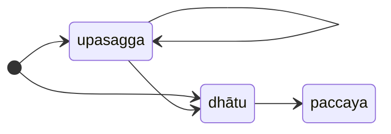


Part of "A Beginner (Non-Linguist) Guide to Learning Pali"


```mermaid
stateDiagram-v2
  direction LR
  [*] --> upasagga
  [*] --> dhātu
  upasagga --> upasagga
  upasagga --> dhātu
  dhātu --> paccaya
```
