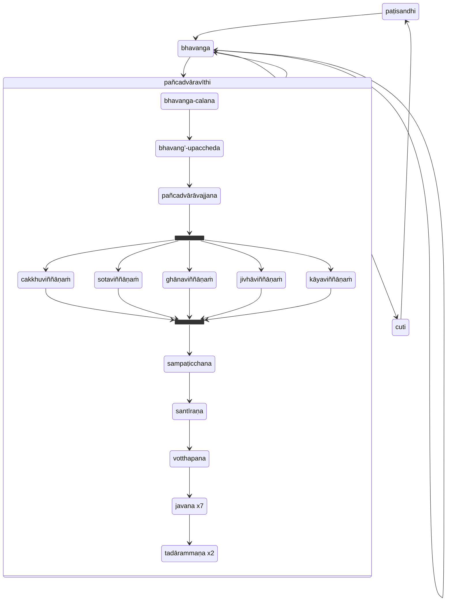

```mermaid
stateDiagram-v2
   direction TB

   classDef notMoving fill:white
   classDef movement font-style:italic
   classDef badBadEvent fill:#f00,color:white,font-weight:bold,stroke-width:2px,stroke:yellow


   paṭisandhi --> bhavanga
   bhavanga --> bhavanga
   bhavanga --> pañcadvāravīthi
   State pañcadvāravīthi {
    bhavangacalana: bhavanga-calana
    bhavangupaccheda: bhavang’-upaccheda
    javana: javana x7
    tadārammaṇa: tadārammaṇa x2
    bhavangacalana --> bhavangupaccheda
    bhavangupaccheda --> pañcadvārāvajjana
    state fork_state <<fork>>
    pañcadvārāvajjana --> fork_state
    fork_state --> cakkhuviññāṇaṁ
    fork_state --> sotaviññāṇaṁ
    fork_state --> ghānaviññāṇaṁ
    fork_state --> jivhāviññāṇaṁ
    fork_state --> kāyaviññāṇaṁ
    state join_state <<join>>
    cakkhuviññāṇaṁ --> join_state
    sotaviññāṇaṁ --> join_state
    ghānaviññāṇaṁ --> join_state
    jivhāviññāṇaṁ --> join_state
    kāyaviññāṇaṁ --> join_state
    join_state --> sampaṭicchana
    sampaṭicchana --> santīraṇa
    santīraṇa --> votthapana
    votthapana --> javana
    javana --> tadārammaṇa
   }
   pañcadvāravīthi --> bhavanga
   bhavanga--> cuti
   cuti --> paṭisandhi
```
