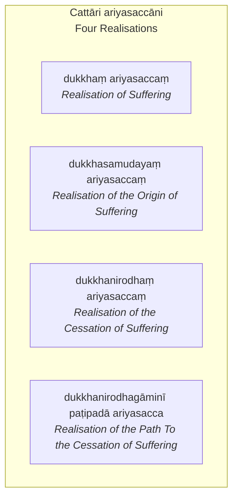

[30Vbh/4 Saccavibhaṅga](https://tipitaka2500.github.io/tipitaka/30Vbh/4.html)

## According to the Suttas

### dukkhaṃ ariyasaccaṃ

* `dukkhaṃ ariyasaccaṃ` (Realisation of Suffering)
  * `jāti` (birth)
    * `jāti` (birth)
    * `sañjāti` (beneration)
    * `okkanti` (descent)
    * `abhinibbatti` (production)
    * `khandhānaṃ pātubhāvo` (appearance of the collections)
    * `āyatanānaṃ paṭilābho` (acquisition of the senses)
  * `jarā` (aging)
    * `jarā` (aging)
    * `jīraṇatā` (decrepitude)
    * `khaṇḍiccaṃ` (brokenness of teeth)
    * `pāliccaṃ` (greyness of hair)
    * `valittacatā` (wrinkledness of skin)
    * `āyuno saṃhāni` (decline of life-force)
    * `indriyānaṃ paripāko` (decay of the faculties)
  * `maraṇaṃ` (death)
    * `cuti` (passing away)
    * `cavanatā` (falling away)
    * `bhedo` (breaking up)
    * `antaradhānaṃ` (disappearance)
    * `maccu` (dying)
    * `maraṇaṃ` (death)
    * `kālakiriyā` (making an end of time)
    * `khandhānaṃ bhedo` (the breaking up of the collections)
    * `kaḷevarassa nikkhepo` (the casting off of the body)
    * "`jīvitindriyassupacchedo` (the cutting off of the life faculty)
  * `sokaparidevadukkhadomanassupāyāsā` (sorrow, lamentation, pain, grief, despair)
    * `soko` (sorrow)
      * `Ñātibyasanena phuṭṭhassa` (afflicted by loss of relatives)
      * `bhogabyasanena phuṭṭhassa` (afflicted by loss of wealth)
      * `rogabyasanena phuṭṭhassa` (afflicted by loss of health)
      * `sīlabyasanena phuṭṭhassa` (afflicted by loss of virtue)
      * `diṭṭhibyasanena phuṭṭhassa` (afflicted by loss of right view)
      * `aññataraññatarena byasanena samannāgatassa` (endowed with some other loss)
      * `aññataraññatarena dukkhadhammena phuṭṭhassa` (afflicted by some other painful state)
      * `soko` (sorrow)
      * `socanā` (sorrowing)
      * `socitattaṃ` (state of sorrow)
      * `antosoko` (inward sorrow)
      * `antoparisoko` (inward deep sorrow)
      * `cetaso parijjhāyanā` (burning of the mind)
      * `domanassaṃ` (grief)
      * `sokasallaṃ` (dart of sorrow)
    * `paridevo` (lamentation)
      * `Ñātibyasanena phuṭṭhassa` (afflicted by loss of relatives)
      * `bhogabyasanena phuṭṭhassa` (afflicted by loss of wealth)
      * `rogabyasanena phuṭṭhassa` (afflicted by loss of health)
      * `sīlabyasanena phuṭṭhassa` (afflicted by loss of virtue)
      * `diṭṭhibyasanena phuṭṭhassa` (afflicted by loss of right view)
      * `aññataraññatarena byasanena samannāgatassa` (endowed with some other loss)
      * `aññataraññatarena dukkhadhammena phuṭṭhassa` (afflicted by some other painful state)
      * `ādevo` (wailing)
      * `paridevo` (lamenting)
      * `ādevanā` (state of wailing)
      * `paridevanā` (state of lamenting)
      * `ādevitattaṃ` (utterance of wailing)
      * `paridevitattaṃ` (utterance of lamenting)
      * `vācā palāpo` (verbal babbling)
      * `vippalāpo` (incoherent speech)
      * `lālappo` (moaning)
      * `lālappanā` (state of moaning)
      * `lālappitattaṃ` (state of being given to moaning)
    * `dukkha` (pain)
      * `kāyikaṃ asātaṃ` (bodily displeasure)
      * `kāyikaṃ dukkhaṃ` (bodily pain)
      * `kāyasamphassajaṃ asātaṃ dukkhaṃ vedayitaṃ` (unpleasurable painful feeling born of bodily contact)
      * `kāyasamphassajā asātā dukkhā vedanā` (unpleasurable painful feelings born of bodily contact)
    * `domanassaṃ` (grief)
      * `cetasikaṃ asātaṃ` (mental unpleasure)
      * `cetasikaṃ dukkhaṃ` (mental pain)
      * `cetosamphassajaṃ asātaṃ dukkhaṃ vedayitaṃ` (unpleasurable painful feeling born of mental contact)
      * `cetosamphassajā asātā dukkhā vedanā` (unpleasurable painful feelings born of mental contact)
    * `upāyāso` (despair)
      * `Ñātibyasanena phuṭṭhassa` (afflicted by loss of relatives)
      * `bhogabyasanena phuṭṭhassa` (afflicted by loss of wealth)
      * `rogabyasanena phuṭṭhassa` (afflicted by loss of health)
      * `sīlabyasanena phuṭṭhassa` (afflicted by loss of virtue)
      * `diṭṭhibyasanena phuṭṭhassa` (afflicted by loss of right view)
      * `aññataraññatarena byasanena samannāgatassa` (endowed with some other loss)
      * `aññataraññatarena dukkhadhammena phuṭṭhassa` (afflicted by some other painful state)
      * `āyāso` (trouble)
      * `upāyāso` (despair)
      * `āyāsitattaṃ` (state of trouble)
      * `upāyāsitattaṃ` (state of despair)
  * `appiyehi sampayogo` (association with the unloved)
    * `yassa te honti aniṭṭhā akantā amanāpā rūpā saddā gandhā rasā phoṭṭhabbā` (for someone, those forms, sounds, smells, tastes, tangibles that are unwished for, unliked, unpleasing)
    * `ye panassa te honti anatthakāmā ahitakāmā aphāsukakāmā ayogakkhemakāmā` (those who wish him non-benefit, wish him harm, wish him discomfort, wish him no security from bondage)
    * `yā tehi saṅgati samāgamo samodhānaṃ missībhāvo` (whatever meeting, coming together, conjoining, mixing with them)
  * `piyehi vippayogo` (separation from the loved)
    * `yassa te honti iṭṭhā kantā manāpā rūpā saddā gandhā rasā phoṭṭhabbā` (for someone, those forms, sounds, smells, tastes, tangibles that are wished for, liked, pleasing)
    * `ye panassa te honti atthakāmā hitakāmā phāsukakāmā yogakkhemakāmā mātā vā pitā vā bhātā vā bhaginī vā mittā vā amaccā vā ñātī vā sālohitā vā` (those who wish him benefit, wish him welfare, wish him comfort, wish him security from bondage: mother or father or brother or sister or friends or colleagues or relatives or kinsmen)
    * `yā tehi asaṅgati asamāgamo asamodhānaṃ amissībhāvo` (whatever non-meeting, non-coming together, non-conjoining, non-mixing with them)
  * `yampicchaṃ na labhati taṃ` (not getting what one wishes)
    * `Jātidhammānaṃ sattānaṃ evaṃ icchā uppajjati—  “aho vata, mayaṃ na jātidhammā assāma; na ca, vata, no jāti āgaccheyyā”ti. Na kho panetaṃ icchāya pattabbaṃ. Idampi “yampicchaṃ na labhati tampi dukkhaṃ”` (For beings subject to birth, such a wish arises: “Oh, may we not be subject to birth; and may birth not come to us!” But this is indeed not to be obtained by wishing. This too is “not getting what one wishes is also dukkha (suffering)”)
    * `Jarādhammānaṃ sattānaṃ…pe…` (For beings subject to aging etc.)
    * `byādhidhammānaṃ sattānaṃ…pe…` (For beings subject to sickness etc.)
    * `maraṇadhammānaṃ sattānaṃ…pe…` (For beings subject to death etc.)
    * `sokaparidevadukkhadomanassupāyāsadhammānaṃ sattānaṃ…pe…` (For beings subject to sorrow, lamentation, pain, grief, despair etc.)
  * `pañcupādānakkhandhā` (the Five Collections of Fuel)
    * `rūpupādānakkhandho` (forms)
    * `vedanupādānakkhandho` (feelings)
    * `saññupādānakkhandho` (apperceptions)
    * `saṅkhārupādānakkhandho` (mental constructions)
    * `viññāṇupādānakkhandho` (consciousness)

### dukkhasamudayaṃ ariyasaccaṃ

*taṇhā* (craving) which leads to:

* renewed existence
* accompanied by delight and lust
* delighting in this and that

Types of *taṇhā*:

* *kāmataṇhā* (craving for sensual pleasures),
* *bhavataṇhā* (craving for existence),
* *vibhavataṇhā* (craving for non-existence).

*taṇhā* (craving):

* where, when arising, does it arise?
* Where, when settling, does it settle?

Whatever in the world is likable and pleasant

* eye in the world
* ear in the world
* nose in the world
* tongue in the world
* body in the world
* mind in the world

* Forms in the world
* Sounds in the world
* Odours in the world
* Tastes in the world
* Tangibles in the world
* Mental objects in the world

* Eye-consciousness in the world
* Ear-consciousness in the world
* Nose-consciousness in the world
* Tongue-consciousness in the world
* Body-consciousness in the world
* Mind-consciousness in the world

* Eye-contact in the world
* Ear-contact in the world
* Nose-contact in the world
* Tongue-contact in the world
* Body-contact in the world
* Mind-contact in the world

* *Vedanā* (feeling) born of Eye-contact in the world
* *Vedanā* (feeling) born of Ear-contact in the world
* *Vedanā* (feeling) born of Nose-contact in the world
* *Vedanā* (feeling) born of Tongue-contact in the world
* *Vedanā* (feeling) born of Body-contact in the world
* *Vedanā* (feeling) born of Mind-contact in the world

* *Saññā* (perception) of Forms in the world
* *Saññā* (perception) of Sounds in the world
* *Saññā* (perception) of Odours in the world
* *Saññā* (perception) of Tastes in the world
* *Saññā* (perception) of Tangibles in the world
* *Saññā* (perception) of Mental objects in the world

* *Sañcetanā* (volition) regarding Forms in the world
* *Sañcetanā* (volition) regarding Sounds in the world
* *Sañcetanā* (volition) regarding Odours in the world
* *Sañcetanā* (volition) regarding Tastes in the world
* *Sañcetanā* (volition) regarding Tangibles in the world
* *Sañcetanā* (volition) regarding Mental objects in the world

* *Taṇhā* (craving) for Forms in the world
* *Taṇhā* (craving) for Sounds in the world
* *Taṇhā* (craving) for Odours in the world
* *Taṇhā* (craving) for Tastes in the world
* *Taṇhā* (craving) for Tangibles in the world
* *Taṇhā* (craving) for Mental objects in the world

* *Vitakka* (thought) concerning Forms in the world
* *Vitakka* (thought) concerning Sounds in the world
* *Vitakka* (thought) concerning Odours in the world
* *Vitakka* (thought) concerning Tastes in the world
* *Vitakka* (thought) concerning Tangibles in the world
* *Vitakka* (thought) concerning Mental objects in the world

* *Vicāra* (examination) of Forms in the world
* *Vicāra* (examination) of Sounds in the world
* *Vicāra* (examination) of Odours in the world
* *Vicāra* (examination) of Tastes in the world
* *Vicāra* (examination) of Tangibles in the world
* *Vicāra* (examination) of Mental objects in the world

### dukkhanirodhaṃ ariyasaccaṃ

*taṇhā* (craving):

* `asesavirāganirodho` (remainderless fading away and cessation),
* `cāgo` (relinquishing),
* `paṭinissaggo` (renunciation),
* `mutti` (release),
* `anālayo` (non-attachment).

*taṇhā* (craving):

* where, when being abandoned, is it abandoned? 
* where, when ceasing, does it cease?

Whatever in the world is pleasant and agreeable.

### dukkhanirodhagāminī paṭipadā ariyasacca

* `sammādiṭṭhi` (Right View)
  * Knowledge of dukkha (suffering),
  * knowledge of the origin of dukkha (suffering),
  * knowledge of the cessation of dukkha (suffering),
  * knowledge of the path leading to the cessation of dukkha (suffering)
* `sammāsaṅkappo` (Right Intention)
  * Intention for nekkhamma (renunciation),
  * Intention for abyāpāda (non-ill will),
  * Intention for avihiṃsā (non-harming)
* `sammāvācā` (Right Speech)
  * Veramaṇī (abstinence) from false speech,
  * veramaṇī (abstinence) from slanderous speech,
  * veramaṇī (abstinence) from harsh speech,
  * veramaṇī (abstinence) from idle chatter
* `sammākammanto` (Right Action)
  * Veramaṇī (abstinence) from pāṇātipātā (taking life),
  * veramaṇī (abstinence) from adinnādāna (taking what is not given),
  * veramaṇī (abstinence) from kāmesumicchācāra (sexual misconduct)
* `sammāājīvo` (Right Way of Living)
  * an ariyasāvako (noble disciple), having abandoned micchāājīvaṃ (wrong way of living), maintains his life by sammāājīvena (right way of living)
* `sammāvāyāmo` (Right Effort)
  * For the non-arising of unarisen evil, akusalānaṃ dhammānaṃ (unwholesome states)
    * generates chandaṃ (desire),
    * strives,
    * initiates vīriyaṃ (energy),
    * exerts his cittaṃ (mind), and
    * makes an effort.
  * For the abandoning of arisen evil, akusalānaṃ dhammānaṃ (unwholesome states)
    * ...
  * For the arising of unarisen kusalānaṃ dhammānaṃ (wholesome states),
    * ...
  * For the maintenance of arisen kusalānaṃ dhammānaṃ (wholesome states), for their non-confusion, for their increase, for their abundance, for their development, for their completion,
    * ...
* `sammāsati` (Right Awareness)
  * In kāye kāyānupassī (contemplating the body in the body) he dwells:
    * ātāpī (ardent),
    * sampajāno (clearly comprehending),
    * satimā (mindful),
    * having removed abhijjhādomanassaṃ (covetousness and displeasure) in the world.
  * In vedanāsu (feelings)… (etc.)… 
    * ...
  * in citte (mind)… (etc.)…
    * ...
  * in dhammesu dhammānupassī (contemplating mental phenomena in dhammas)… (etc.)…
    * ...
* `sammāsamādhi` (Right Focus)
  * Quite secluded from sensual pleasures, secluded from akusalehi dhammehi (unwholesome states), enters and dwells in the first jhāna (meditative absorption), which is accompanied by:
    * vitakka (initial application of mind) and
    * vicāra (sustained application of mind),
    * with pīti (rapture) and
    * with sukha (happiness) born of seclusion.
  * With the stilling of vitakka (initial application of mind) and vicāra (sustained application of mind), by gaining internal confidence and unification of mind, he enters and dwells in the second jhāna (meditative absorption), which is
    * without vitakka (initial application of mind) and
    * without vicāra (sustained application of mind),
    * with pīti (rapture) and
    * with sukha (happiness) born of samādhi (concentration).
  * With the fading away of pīti (rapture), he dwells in upekkhā (equanimity), and is sato (mindful) and sampajāno (clearly comprehending), and experiences sukha (happiness) with the body; he enters and dwells in the third jhāna (meditative absorption), of which the noble ones declare:
    * 'upekkhako satimā sukhavihārī (Equanimous and mindful, he has a pleasant abiding)'.
  * With the abandoning of sukha (happiness) and dukkha (pain), and with the previous disappearance of somanassa (joy) and domanassa (displeasure), he enters and dwells in the fourth jhāna (meditative absorption), which is
    * without sukha (happiness) and
    * without dukkha (pain),
    * a purity of mindfulness due to upekkhā (equanimity).
