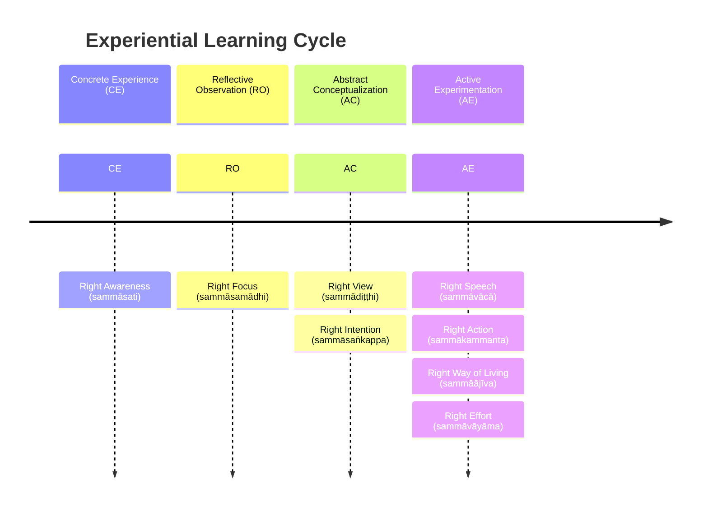

The eightfold path can be regarded as a guide towards reflective thinking, and consciously revisiting past actions and mental constructs in order to perform "memory reconsolidation" with a view towards future optimal mental constructs and actions.

As such, the eightfold path can be compared to Kolb's Experiential Learning Theory [^Kolb1984].

Kolb & Kolb in **The Kolb Learning Style Inventory 4.0 - A Comprehensive Guide to the Theory, Psychometrics, Research on Validity and Educational Applications**[^Kolb2013] states:

> The ELT model portrays two dialectically related modes of grasping experience — Concrete Experience (CE) and Abstract Conceptualization (AC) — and two dialectically related modes of transforming experience — Reflective Observation (RO) and Active Experimentation (AE). Learning arises from the resolution of creative tension among these four learning modes. This process is portrayed as an idealized learning cycle or spiral where the learner “touches all the bases” — experiencing (CE), reflecting (RO), thinking (AC), and acting (AE)—in a recursive process that is sensitive to the learning situation and what is being learned. Immediate or concrete experiences are the basis for observations and reflections. These reflections are assimilated and distilled into abstract concepts from which new implications for action can be drawn. These implications can be actively tested and serve as guides in creating new experiences.

[^Kolb1984]: Kolb, D. A. (1984). Experiential learning: experience as the source of learning and development. Prentice Hall.
[^Kolb2013]: Kolb, D. A., Alice Y. &. Kolb. (2013). The Kolb Learning Style Inventory 4.0 - A Comprehensive Guide to the Theory, Psychometrics, Research on Validity and Educational Applications. Experience Based Learning Systems. www.learningfromexperience.com

The following diagram maps the constituents of the eightfold path into the four modes of the Experiential Learning Cycle:

