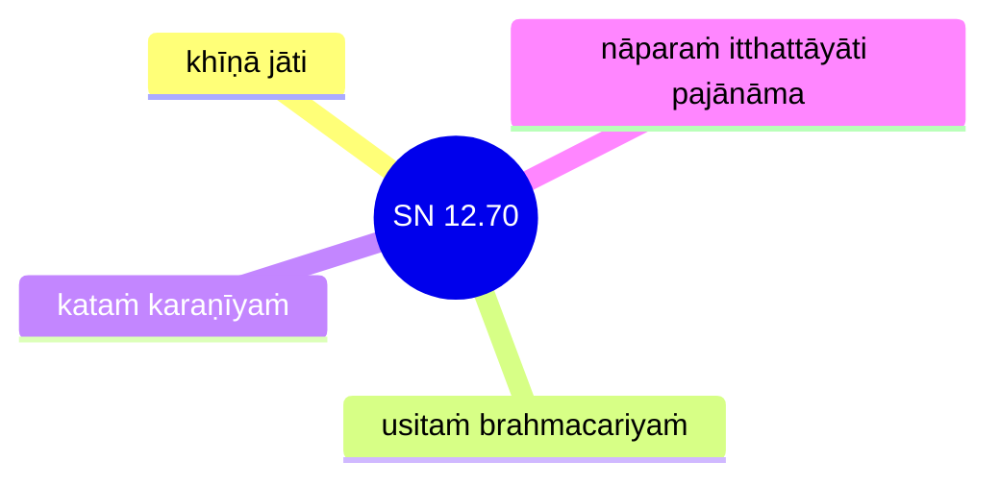

## Introduction

"Awakening", "Liberation", or the attainment `nibbāna` is regarded as the soteriological goal of Buddhism.

## The Buddha's description of awakening in the Mahākhandhaka

[3V/1 Mahākhandhaka](https://tipitaka2500.github.io/tipitaka/3V/1.html) contains a biography of the Buddha post awakening, so it is a good place to start in order to understand how the Buddha described the awakening process as well as the soteriological outcome.

In the Buddha's awakening process, described in [3V/1.1 Bodhikathā](https://tipitaka2500.github.io/tipitaka/3V/1/1.1.html), the Buddha's liberation is simply described as simply being free from doubts due to the elimination of the conditions leading to suffering:

> “𑀬𑀤𑀸 𑀳𑀯𑁂 𑀧𑀸𑀢𑀼𑀪𑀯𑀦𑁆𑀢𑀺 𑀥𑀫𑁆𑀫𑀸, \
> 𑀆𑀢𑀸𑀧𑀺𑀦𑁄 𑀛𑀸𑀬𑀢𑁄 𑀩𑁆𑀭𑀸𑀳𑁆𑀫𑀡𑀲𑁆𑀲; \
> 𑀅𑀣𑀲𑁆𑀲 𑀓𑀗𑁆𑀔𑀸 𑀯𑀧𑀬𑀦𑁆𑀢𑀺 𑀲𑀩𑁆𑀩𑀸, \
> 𑀬𑀢𑁄 𑀧𑀚𑀸𑀦𑀸𑀢𑀺 𑀲𑀳𑁂𑀢𑀼𑀥𑀫𑁆𑀫𑀦𑁆”𑀢𑀺𑁇
> 
> 6  “Yadā have pātubhavanti dhammā,  \
> Ātāpino jhāyato brāhmaṇassa; \
> Athassa kaṅkhā vapayanti sabbā, \
> Yato pajānāti sahetudhamman”ti.
>
> “When indeed dhammā (phenomena) become manifest \
> To the ardent, contemplating brāhmaṇa; \
> Then all his doubts disappear, \
> Since he understands the dependent nature of phenomena.”

...

> “𑀬𑀤𑀸 𑀳𑀯𑁂 𑀧𑀸𑀢𑀼𑀪𑀯𑀦𑁆𑀢𑀺 𑀥𑀫𑁆𑀫𑀸, \
> 𑀆𑀢𑀸𑀧𑀺𑀦𑁄 𑀛𑀸𑀬𑀢𑁄 𑀩𑁆𑀭𑀸𑀳𑁆𑀫𑀡𑀲𑁆𑀲; \
> 𑀅𑀣𑀲𑁆𑀲 𑀓𑀗𑁆𑀔𑀸 𑀯𑀧𑀬𑀦𑁆𑀢𑀺 𑀲𑀩𑁆𑀩𑀸, \
> 𑀬𑀢𑁄 𑀔𑀬𑀁 𑀧𑀘𑁆𑀘𑀬𑀸𑀦𑀁 𑀅𑀯𑁂𑀤𑀻”𑀢𑀺𑁇
> 
> 9  “Yadā have pātubhavanti dhammā, \
> Ātāpino jhāyato brāhmaṇassa; \
> Athassa kaṅkhā vapayanti sabbā, \
> Yato khayaṃ paccayānaṃ avedī”ti.
> 
> “When indeed phenomena become manifest \
> To the ardent, contemplating brāhmaṇa; \
> Then all his doubts disappear, \
> Since he has understood the destruction of conditions.”

...

> “𑀬𑀤𑀸 𑀳𑀯𑁂 𑀧𑀸𑀢𑀼𑀪𑀯𑀦𑁆𑀢𑀺 𑀥𑀫𑁆𑀫𑀸, \
> 𑀆𑀢𑀸𑀧𑀺𑀦𑁄 𑀛𑀸𑀬𑀢𑁄 𑀩𑁆𑀭𑀸𑀳𑁆𑀫𑀡𑀲𑁆𑀲; \
> 𑀯𑀺𑀥𑀽𑀧𑀬𑀁 𑀢𑀺𑀝𑁆𑀞𑀢𑀺 𑀫𑀸𑀭𑀲𑁂𑀦𑀁, \
> 𑀲𑀽𑀭𑀺𑀬𑁄𑀯 𑀑𑀪𑀸𑀲𑀬𑀫𑀦𑁆𑀢𑀮𑀺𑀓𑁆𑀔𑀦𑁆”𑀢𑀺𑁇
> 
> 12  “Yadā have pātubhavanti dhammā, \
> Ātāpino jhāyato brāhmaṇassa; \
> Vidhūpayaṃ tiṭṭhati mārasenaṃ, \
> Sūriyova obhāsayamantalikkhan”ti.
> 
> “When indeed phenomena become manifest \
> To the ardent, contemplating brāhmaṇa; \
> He stands dispelling Māra’s army, \
> Like the sun illuminating the sky.”

Later on in [3V/1.2 Ajapālakathā](https://tipitaka2500.github.io/tipitaka/3V/1/1.2.html), in response to an arrogant brahmin's questionn "To what extent is one a brāhmaṇa and what are the qualities that make a brāhmaṇa?", he replied:

> “𑀬𑁄 𑀩𑁆𑀭𑀸𑀳𑁆𑀫𑀡𑁄 𑀩𑀸𑀳𑀺𑀢𑀧𑀸𑀧𑀥𑀫𑁆𑀫𑁄, \
> 𑀦𑀺𑀳𑀼𑀁𑀳𑀼𑀗𑁆𑀓𑁄 𑀦𑀺𑀓𑁆𑀓𑀲𑀸𑀯𑁄 𑀬𑀢𑀢𑁆𑀢𑁄; \
> 𑀯𑁂𑀤𑀦𑁆𑀢𑀕𑀽 𑀯𑀼𑀲𑀺𑀢𑀩𑁆𑀭𑀳𑁆𑀫𑀘𑀭𑀺𑀬𑁄, \
> 𑀥𑀫𑁆𑀫𑁂𑀦 𑀲𑁄 𑀩𑁆𑀭𑀳𑁆𑀫𑀯𑀸𑀤𑀁 𑀯𑀤𑁂𑀬𑁆𑀬; \
> 𑀬𑀲𑁆𑀲𑀼𑀲𑁆𑀲𑀤𑀸 𑀦𑀢𑁆𑀣𑀺 𑀓𑀼𑀳𑀺𑀜𑁆𑀘𑀺 𑀮𑁄𑀓𑁂”𑀢𑀺𑁇
> 
> 15  “Yo brāhmaṇo bāhitapāpadhammo, \
> Nihuṃhuṅko nikkasāvo yatatto; \
> Vedantagū vusitabrahmacariyo, \
> Dhammena so brahmavādaṃ vadeyya; \
> Yassussadā natthi kuhiñci loke”ti.
> 
> “The brāhmaṇa who has discarded evil qualities, \
> Free from disgruntlement, free from non-optimal flows, self-controlled; \
> Perfected in knowledge, who has lived the optimal life, \
> He might rightly speak ‘I am a brāhmaṇa’; \
> For whom there are no excess anywhere in the world.”

To Mucalinda the `nāga` (serpent) king in [3V/1.3 Mucalindakathā](https://tipitaka2500.github.io/tipitaka/3V/1/1.3.html), the Buddha added that awakening is the "supreme happiness" for him:

> “𑀲𑀼𑀔𑁄 𑀯𑀺𑀯𑁂𑀓𑁄 𑀢𑀼𑀝𑁆𑀞𑀲𑁆𑀲, \
> 𑀲𑀼𑀢𑀥𑀫𑁆𑀫𑀲𑁆𑀲 𑀧𑀲𑁆𑀲𑀢𑁄; \
> 𑀅𑀩𑁆𑀬𑀸𑀧𑀚𑁆𑀚𑀁 𑀲𑀼𑀔𑀁 𑀮𑁄𑀓𑁂, \
> 𑀧𑀸𑀡𑀪𑀽𑀢𑁂𑀲𑀼 𑀲𑀁𑀬𑀫𑁄𑁇
> 
> 𑀲𑀼𑀔𑀸 𑀯𑀺𑀭𑀸𑀕𑀢𑀸 𑀮𑁄𑀓𑁂, \
> 𑀓𑀸𑀫𑀸𑀦𑀁 𑀲𑀫𑀢𑀺𑀓𑁆𑀓𑀫𑁄; \
> 𑀅𑀲𑁆𑀫𑀺𑀫𑀸𑀦𑀲𑁆𑀲 𑀬𑁄 𑀯𑀺𑀦𑀬𑁄, \
> 𑀏𑀢𑀁 𑀯𑁂 𑀧𑀭𑀫𑀁 𑀲𑀼𑀔𑀦𑁆”𑀢𑀺𑁇
> 
> 18  “Sukho viveko tuṭṭhassa, \
> sutadhammassa passato; \
> Abyāpajjaṃ sukhaṃ loke, \
> pāṇabhūtesu saṃyamo.
> 
> 19  Sukhā virāgatā loke, \
> kāmānaṃ samatikkamo; \
> Asmimānassa yo vinayo, \
> etaṃ ve paramaṃ sukhan”ti.
> 
> “Happy is solitude for one who is content, \
> who has heard the Dhamma and sees; \
> Happy is non-affliction in the world, \
> restraint towards living beings.
> 
> Happy is dispassion in the world, \
> the overcoming of sensual pleasures; \
> The dispelling of the conceit ‘I am’, \
> this indeed is the supreme happiness.”

In the above inspired verses (`udāna`), it seems awakening is mainly described as understanding the nature of phenomena, dispassion, the overcoming of sensual pleasures, the dispelling of the conceited ego, the living of an optimal life, resulting in the removal of doubts, the elimination of the origination and conditions for suffering, and finally "supreme happiness."

However, by the time the Buddha decided to teach and set forth towards Bārāṇasī, he encountered Upaka the Ājīvaka in [3V/1.6 Pañcavaggiyakathā](https://tipitaka2500.github.io/tipitaka/3V/1/1.6.html). Upaka was so impressed by the Buddha that he asked:

> “Your faculties, āvuso, are very clear, your skin-complexion is pure and bright. For whose sake, āvuso, have you gone forth? Or who is your teacher? Or whose dhamma do you profess?” 

The Buddha replied:

> 𑁫𑁭  “𑀲𑀩𑁆𑀩𑀸𑀪𑀺𑀪𑀽 𑀲𑀩𑁆𑀩𑀯𑀺𑀤𑀽𑀳𑀫𑀲𑁆𑀫𑀺, \
> 𑀲𑀩𑁆𑀩𑁂𑀲𑀼 𑀥𑀫𑁆𑀫𑁂𑀲𑀼 𑀅𑀦𑀽𑀧𑀮𑀺𑀢𑁆𑀢𑁄; \
> 𑀲𑀩𑁆𑀩𑀜𑁆𑀚𑀳𑁄 𑀢𑀡𑁆𑀳𑀸𑀓𑁆𑀔𑀬𑁂 𑀯𑀺𑀫𑀼𑀢𑁆𑀢𑁄, \
> 𑀲𑀬𑀁 𑀅𑀪𑀺𑀜𑁆𑀜𑀸𑀬 𑀓𑀫𑀼𑀤𑁆𑀤𑀺𑀲𑁂𑀬𑁆𑀬𑀁𑁇
> 
> 𑁫𑁮  𑀦 𑀫𑁂 𑀆𑀘𑀭𑀺𑀬𑁄 𑀅𑀢𑁆𑀣𑀺, \
> 𑀲𑀤𑀺𑀲𑁄 𑀫𑁂 𑀦 𑀯𑀺𑀚𑁆𑀚𑀢𑀺; \
> 𑀲𑀤𑁂𑀯𑀓𑀲𑁆𑀫𑀺𑀁 𑀮𑁄𑀓𑀲𑁆𑀫𑀺𑀁, \
> 𑀦𑀢𑁆𑀣𑀺 𑀫𑁂 𑀧𑀝𑀺𑀧𑀼𑀕𑁆𑀕𑀮𑁄𑁇
> 
> 𑁫𑁯  𑀅𑀳𑀜𑁆𑀳𑀺 𑀅𑀭𑀳𑀸 𑀮𑁄𑀓𑁂, \
> 𑀅𑀳𑀁 𑀲𑀢𑁆𑀣𑀸 𑀅𑀦𑀼𑀢𑁆𑀢𑀭𑁄; \
> 𑀏𑀓𑁄𑀫𑁆𑀳𑀺 𑀲𑀫𑁆𑀫𑀸𑀲𑀫𑁆𑀩𑀼𑀤𑁆𑀥𑁄, \
> 𑀲𑀻𑀢𑀺𑀪𑀽𑀢𑁄𑀲𑁆𑀫𑀺 𑀦𑀺𑀩𑁆𑀩𑀼𑀢𑁄𑁇
> 
> 𑁬𑁦  𑀥𑀫𑁆𑀫𑀘𑀓𑁆𑀓𑀁 𑀧𑀯𑀢𑁆𑀢𑁂𑀢𑀼𑀁, \
> 𑀕𑀘𑁆𑀙𑀸𑀫𑀺 𑀓𑀸𑀲𑀺𑀦𑀁 𑀧𑀼𑀭𑀁; \
> 𑀅𑀦𑁆𑀥𑀻𑀪𑀽𑀢𑀲𑁆𑀫𑀺𑀁 𑀮𑁄𑀓𑀲𑁆𑀫𑀺𑀁, \
> 𑀆𑀳𑀜𑁆𑀙𑀁 𑀅𑀫𑀢𑀤𑀼𑀦𑁆𑀤𑀼𑀪𑀺𑀦𑁆”𑀢𑀺𑁇
> 
> 57  “Sabbābhibhū sabbavidūhamasmi, \
> Sabbesu dhammesu anūpalitto; \
> Sabbañjaho taṇhākkhaye vimutto, \
> Sayaṃ abhiññāya kamuddiseyyaṃ.
> 
> 58  Na me ācariyo atthi, \
> sadiso me na vijjati; \
> Sadevakasmiṃ lokasmiṃ, \
> natthi me paṭipuggalo.
> 
> 59  Ahañhi arahā loke, \
> ahaṃ satthā anuttaro; \
> Ekomhi sammāsambuddho, \
> sītibhūtosmi nibbuto.
> 
> 60  Dhammacakkaṃ pavattetuṃ, \
> Gacchāmi kāsinaṃ puraṃ; \
> Andhībhūtasmiṃ lokasmiṃ, \
> Āhañchaṃ amatadundubhin”ti.
> 
> “All-conquering, all-knowing am I, \
> In all dhammas (phenomena) undefiled; \
> All-abandoning, liberated in the destruction of taṇhā (craving), \
> Having known for myself, whom should I point to?
> 
> No teacher have I, \
> One like me is not found; \
> In the world with its devas, \
> There is no one to rival me.
> 
> For I am an arahant (worthy one) in the world, \
> I am the teacher unexcelled; \
> Alone I am a sammāsambuddha (perfectly self-awakened one), \
> Cooled am I, nibbuto (extinguished).
> 
> To set the Dhammacakka (Wheel of Dhamma) in motion, \
> I go to the city of Kāsī; \
> In a world become blind, \
> I shall beat the drum of the amata (deathless).”

This is the first time in the [3V/1 Mahākhandhaka](https://tipitaka2500.github.io/tipitaka/3V/1.html) that the Buddha has used the word `sammāsambuddha` (perfectly self-awakened one), `nibbuto` (extinguished), `amata` (deathless).

These words have caused generations of Buddhists to speculate whether there was something more to awakening than just understanding and cessation. `sammāsambuddha` may suggest an exalted, sublime state surpassing mundane existence, and `amata` literally means immortality.

The Buddha then continued to explain to the first five disciples:

> 𑀬𑀢𑁄 𑀘 𑀔𑁄 𑀫𑁂, 𑀪𑀺𑀓𑁆𑀔𑀯𑁂, 𑀇𑀫𑁂𑀲𑀼 𑀘𑀢𑀽𑀲𑀼 𑀅𑀭𑀺𑀬𑀲𑀘𑁆𑀘𑁂𑀲𑀼 𑀏𑀯𑀁 𑀢𑀺𑀧𑀭𑀺𑀯𑀝𑁆𑀝𑀁 𑀤𑁆𑀯𑀸𑀤𑀲𑀸𑀓𑀸𑀭𑀁 𑀬𑀣𑀸𑀪𑀽𑀢𑀁 𑀜𑀸𑀡𑀤𑀲𑁆𑀲𑀦𑀁 𑀲𑀼𑀯𑀺𑀲𑀼𑀤𑁆𑀥𑀁 𑀅𑀳𑁄𑀲𑀺, 𑀅𑀣𑀸𑀳𑀁, 𑀪𑀺𑀓𑁆𑀔𑀯𑁂, 𑀲𑀤𑁂𑀯𑀓𑁂 𑀮𑁄𑀓𑁂 𑀲𑀫𑀸𑀭𑀓𑁂 𑀲𑀩𑁆𑀭𑀳𑁆𑀫𑀓𑁂 𑀲𑀲𑁆𑀲𑀫𑀡𑀩𑁆𑀭𑀸𑀳𑁆𑀫𑀡𑀺𑀬𑀸 𑀧𑀚𑀸𑀬 𑀲𑀤𑁂𑀯𑀫𑀦𑀼𑀲𑁆𑀲𑀸𑀬 𑀅𑀦𑀼𑀢𑁆𑀢𑀭𑀁 𑀲𑀫𑁆𑀫𑀸𑀲𑀫𑁆𑀩𑁄𑀥𑀺𑀁 𑀅𑀪𑀺𑀲𑀫𑁆𑀩𑀼𑀤𑁆𑀥𑁄𑀢𑀺 𑀧𑀘𑁆𑀘𑀜𑁆𑀜𑀸𑀲𑀺𑀁𑁇 𑀜𑀸𑀡𑀜𑁆𑀘 𑀧𑀦 𑀫𑁂 𑀤𑀲𑁆𑀲𑀦𑀁 𑀉𑀤𑀧𑀸𑀤𑀺—  𑀅𑀓𑀼𑀧𑁆𑀧𑀸 𑀫𑁂 𑀯𑀺𑀫𑀼𑀢𑁆𑀢𑀺, 𑀅𑀬𑀫𑀦𑁆𑀢𑀺𑀫𑀸 𑀚𑀸𑀢𑀺, 𑀦𑀢𑁆𑀣𑀺 𑀤𑀸𑀦𑀺 𑀧𑀼𑀦𑀩𑁆𑀪𑀯𑁄”𑀢𑀺𑁇 𑀇𑀤𑀫𑀯𑁄𑀘 𑀪𑀕𑀯𑀸 𑀅𑀢𑁆𑀢𑀫𑀦𑀸 𑀧𑀜𑁆𑀘𑀯𑀕𑁆𑀕𑀺𑀬𑀸 𑀪𑀺𑀓𑁆𑀔𑀽 𑀪𑀕𑀯𑀢𑁄 𑀪𑀸𑀲𑀺𑀢𑀁 𑀅𑀪𑀺𑀦𑀦𑁆𑀤𑀼𑀦𑁆𑀢𑀺𑁇
> 
> 80  Yato ca kho me, bhikkhave, imesu catūsu ariyasaccesu evaṃ tiparivaṭṭaṃ dvādasākāraṃ yathābhūtaṃ ñāṇadassanaṃ suvisuddhaṃ ahosi, athāhaṃ, bhikkhave, sadevake loke samārake sabrahmake sassamaṇabrāhmaṇiyā pajāya sadevamanussāya anuttaraṃ sammāsambodhiṃ abhisambuddhoti paccaññāsiṃ. Ñāṇañca pana me dassanaṃ udapādi—  akuppā me vimutti, ayamantimā jāti, natthi dāni punabbhavo”ti. Idamavoca bhagavā attamanā pañcavaggiyā bhikkhū bhagavato bhāsitaṃ abhinandunti.
>
> “When, bhikkhave, these three phases and twelve aspects of the four realisations became in reality total understanding and purification, then bhikkhave, I declared to the world with its devas, Māra, Brahmā, with its ascetics and brahmins, with its devas and humans, that I had woken up to perfect understanding unsurpassed by anything. And from my knowledge, the insight arose: “Unshakeable is my liberation, this is the final birth, there is now no more future existences.” This the Bhagavā said, and the group of five bhikkhū, delighted, rejoiced in the Bhagavā’s words.

With these words, the Buddha is saying `abhisambuddha anuttara sammāsambodhi` (perfect understanding unsurpassed by anything) "lead to no more future existences." This, together with `amata` certainly seems to imply some sort of eternal state of grace beyond mere mundane existence.

Or so it would seem. A rational explanation is that the Buddha simply was being metaphorical, what he truly meant was that with the elimination of non-optimal mental processes and the cessation of suffering, an awakened person need no longer be concerned about death or future existences. But perhaps some disciples hoped for something more.

## Where does the word `nibbāna` come from?

As we can see, the word `nibbāna` is never used in [3V/1 Mahākhandhaka](https://tipitaka2500.github.io/tipitaka/3V/1.html), and indeed is seldom used in the Pāḷi Tipiṭaka, appearing less than 20 times. So clearly it is a word introduced by later generations of Buddhists and potentially not used by the Buddha himself.

According to [13S4/4.1.1 Nibbānapañhāsutta](https://tipitaka2500.github.io/tipitaka/13S4/4/4.1/4.1.1.html), `nibbāna` is merely an epithet for the (mundane) outcome of awakening:

> “‘𑀦𑀺𑀩𑁆𑀩𑀸𑀦𑀁, 𑀦𑀺𑀩𑁆𑀩𑀸𑀦𑀦𑁆’𑀢𑀺, 𑀆𑀯𑀼𑀲𑁄 𑀲𑀸𑀭𑀺𑀧𑀼𑀢𑁆𑀢, 𑀯𑀼𑀘𑁆𑀘𑀢𑀺𑁇 𑀓𑀢𑀫𑀁 𑀦𑀼 𑀔𑁄, 𑀆𑀯𑀼𑀲𑁄, 𑀦𑀺𑀩𑁆𑀩𑀸𑀦𑀦𑁆”𑀢𑀺? “𑀬𑁄 𑀔𑁄, 𑀆𑀯𑀼𑀲𑁄, 𑀭𑀸𑀕𑀓𑁆𑀔𑀬𑁄 𑀤𑁄𑀲𑀓𑁆𑀔𑀬𑁄 𑀫𑁄𑀳𑀓𑁆𑀔𑀬𑁄—  𑀇𑀤𑀁 𑀯𑀼𑀘𑁆𑀘𑀢𑀺 𑀦𑀺𑀩𑁆𑀩𑀸𑀦𑀦𑁆”𑀢𑀺𑁇 “𑀅𑀢𑁆𑀣𑀺 𑀧𑀦𑀸𑀯𑀼𑀲𑁄, 𑀫𑀕𑁆𑀕𑁄 𑀅𑀢𑁆𑀣𑀺 𑀧𑀝𑀺𑀧𑀤𑀸 𑀏𑀢𑀲𑁆𑀲 𑀦𑀺𑀩𑁆𑀩𑀸𑀦𑀲𑁆𑀲 𑀲𑀘𑁆𑀙𑀺𑀓𑀺𑀭𑀺𑀬𑀸𑀬𑀸”𑀢𑀺? “𑀅𑀢𑁆𑀣𑀺 𑀔𑁄, 𑀆𑀯𑀼𑀲𑁄, 𑀫𑀕𑁆𑀕𑁄 𑀅𑀢𑁆𑀣𑀺 𑀧𑀝𑀺𑀧𑀤𑀸 𑀏𑀢𑀲𑁆𑀲 𑀦𑀺𑀩𑁆𑀩𑀸𑀦𑀲𑁆𑀲 𑀲𑀘𑁆𑀙𑀺𑀓𑀺𑀭𑀺𑀬𑀸𑀬𑀸”𑀢𑀺𑁇 “𑀓𑀢𑀫𑁄 𑀧𑀦𑀸𑀯𑀼𑀲𑁄, 𑀫𑀕𑁆𑀕𑁄 𑀓𑀢𑀫𑀸 𑀧𑀝𑀺𑀧𑀤𑀸 𑀏𑀢𑀲𑁆𑀲 𑀦𑀺𑀩𑁆𑀩𑀸𑀦𑀲𑁆𑀲 𑀲𑀘𑁆𑀙𑀺𑀓𑀺𑀭𑀺𑀬𑀸𑀬𑀸”𑀢𑀺? “𑀅𑀬𑀫𑁂𑀯 𑀔𑁄, 𑀆𑀯𑀼𑀲𑁄, 𑀅𑀭𑀺𑀬𑁄 𑀅𑀝𑁆𑀞𑀗𑁆𑀕𑀺𑀓𑁄 𑀫𑀕𑁆𑀕𑁄 𑀏𑀢𑀲𑁆𑀲 𑀦𑀺𑀩𑁆𑀩𑀸𑀦𑀲𑁆𑀲 𑀲𑀘𑁆𑀙𑀺𑀓𑀺𑀭𑀺𑀬𑀸𑀬, 𑀲𑁂𑀬𑁆𑀬𑀣𑀺𑀤𑀁—  𑀲𑀫𑁆𑀫𑀸𑀤𑀺𑀝𑁆𑀞𑀺 𑀲𑀫𑁆𑀫𑀸𑀲𑀗𑁆𑀓𑀧𑁆𑀧𑁄 𑀲𑀫𑁆𑀫𑀸𑀯𑀸𑀘𑀸 𑀲𑀫𑁆𑀫𑀸𑀓𑀫𑁆𑀫𑀦𑁆𑀢𑁄 𑀲𑀫𑁆𑀫𑀸𑀆𑀚𑀻𑀯𑁄 𑀲𑀫𑁆𑀫𑀸𑀯𑀸𑀬𑀸𑀫𑁄 𑀲𑀫𑁆𑀫𑀸𑀲𑀢𑀺 𑀲𑀫𑁆𑀫𑀸𑀲𑀫𑀸𑀥𑀺𑁇 𑀅𑀬𑀁 𑀔𑁄, 𑀆𑀯𑀼𑀲𑁄, 𑀫𑀕𑁆𑀕𑁄 𑀅𑀬𑀁 𑀧𑀝𑀺𑀧𑀤𑀸 𑀏𑀢𑀲𑁆𑀲 𑀦𑀺𑀩𑁆𑀩𑀸𑀦𑀲𑁆𑀲 𑀲𑀘𑁆𑀙𑀺𑀓𑀺𑀭𑀺𑀬𑀸𑀬𑀸”𑀢𑀺𑁇 “𑀪𑀤𑁆𑀤𑀓𑁄, 𑀆𑀯𑀼𑀲𑁄, 𑀫𑀕𑁆𑀕𑁄 𑀪𑀤𑁆𑀤𑀺𑀓𑀸 𑀧𑀝𑀺𑀧𑀤𑀸 𑀏𑀢𑀲𑁆𑀲 𑀦𑀺𑀩𑁆𑀩𑀸𑀦𑀲𑁆𑀲 𑀲𑀘𑁆𑀙𑀺𑀓𑀺𑀭𑀺𑀬𑀸𑀬𑁇 𑀅𑀮𑀜𑁆𑀘 𑀧𑀦𑀸𑀯𑀼𑀲𑁄 𑀲𑀸𑀭𑀺𑀧𑀼𑀢𑁆𑀢, 𑀅𑀧𑁆𑀧𑀫𑀸𑀤𑀸𑀬𑀸”𑀢𑀺𑁇
> 
> 1326  “‘Nibbānaṃ, nibbānan’ti, āvuso sāriputta, vuccati. Katamaṃ nu kho, āvuso, nibbānan”ti? “Yo kho, āvuso, rāgakkhayo dosakkhayo mohakkhayo—  idaṃ vuccati nibbānan”ti. “Atthi panāvuso, maggo atthi paṭipadā etassa nibbānassa sacchikiriyāyā”ti? “Atthi kho, āvuso, maggo atthi paṭipadā etassa nibbānassa sacchikiriyāyā”ti. “Katamo panāvuso, maggo katamā paṭipadā etassa nibbānassa sacchikiriyāyā”ti? “Ayameva kho, āvuso, ariyo aṭṭhaṅgiko maggo etassa nibbānassa sacchikiriyāya, seyyathidaṃ—  sammādiṭṭhi sammāsaṅkappo sammāvācā sammākammanto sammāājīvo sammāvāyāmo sammāsati sammāsamādhi. Ayaṃ kho, āvuso, maggo ayaṃ paṭipadā etassa nibbānassa sacchikiriyāyā”ti. “Bhaddako, āvuso, maggo bhaddikā paṭipadā etassa nibbānassa sacchikiriyāya. Alañca panāvuso sāriputta, appamādāyā”ti.
> 
> “‘Nibbāna, nibbāna’ it is said, friend Sāriputta. What, friend, is nibbāna?”
> 
> “The destruction of greed, the destruction of hatred, the destruction of delusion — this, friend, is called nibbāna.”
> 
> “Is there, friend, a path, a practice for the realization of this nibbāna?”
> 
> “There is, friend, a path, a practice for the realization of this nibbāna.”
> 
> “What, friend, is that path, what is that practice for the realization of this nibbāna?”
> 
> “It is, friend, this Eightfold Path for the realisation of this nibbāna, namely — right view, right resolve, right speech, right action, right way of living, right effort, right awareness, right focus. This, friend, is the path, this is the practice for the realisation of this nibbāna.”
> 
> “Excellent, friend, is the path, excellent is the practice for the realization of this nibbāna. And it is enough, friend Sāriputta, for diligence.”

[17A9/1.4.3 Nibbānasukhasutta](https://tipitaka2500.github.io/tipitaka/17A9/1/1.4/1.4.3.html) explains that `nibbāna` is the "supreme happiness" that the Buddha referred to.

> 𑀏𑀓𑀁 𑀲𑀫𑀬𑀁 𑀆𑀬𑀲𑁆𑀫𑀸 𑀲𑀸𑀭𑀺𑀧𑀼𑀢𑁆𑀢𑁄 𑀭𑀸𑀚𑀕𑀳𑁂 𑀯𑀺𑀳𑀭𑀢𑀺 𑀯𑁂𑀴𑀼𑀯𑀦𑁂 𑀓𑀮𑀦𑁆𑀤𑀓𑀦𑀺𑀯𑀸𑀧𑁂𑁇 𑀢𑀢𑁆𑀭 𑀔𑁄 𑀆𑀬𑀲𑁆𑀫𑀸 𑀲𑀸𑀭𑀺𑀧𑀼𑀢𑁆𑀢𑁄 𑀪𑀺𑀓𑁆𑀔𑀽 𑀆𑀫𑀦𑁆𑀢𑁂𑀲𑀺—  “𑀲𑀼𑀔𑀫𑀺𑀤𑀁, 𑀆𑀯𑀼𑀲𑁄, 𑀦𑀺𑀩𑁆𑀩𑀸𑀦𑀁𑁇 𑀲𑀼𑀔𑀫𑀺𑀤𑀁, 𑀆𑀯𑀼𑀲𑁄, 𑀦𑀺𑀩𑁆𑀩𑀸𑀦𑀦𑁆”𑀢𑀺𑁇 𑀏𑀯𑀁 𑀯𑀼𑀢𑁆𑀢𑁂, 𑀆𑀬𑀲𑁆𑀫𑀸 𑀉𑀤𑀸𑀬𑀻 𑀆𑀬𑀲𑁆𑀫𑀦𑁆𑀢𑀁 𑀲𑀸𑀭𑀺𑀧𑀼𑀢𑁆𑀢𑀁 𑀏𑀢𑀤𑀯𑁄𑀘—  “𑀓𑀺𑀁 𑀧𑀦𑁂𑀢𑁆𑀣, 𑀆𑀯𑀼𑀲𑁄 𑀲𑀸𑀭𑀺𑀧𑀼𑀢𑁆𑀢, 𑀲𑀼𑀔𑀁 𑀬𑀤𑁂𑀢𑁆𑀣 𑀦𑀢𑁆𑀣𑀺 𑀯𑁂𑀤𑀬𑀺𑀢𑀦𑁆”𑀢𑀺? “𑀏𑀢𑀤𑁂𑀯 𑀔𑁆𑀯𑁂𑀢𑁆𑀣, 𑀆𑀯𑀼𑀲𑁄, 𑀲𑀼𑀔𑀁 𑀬𑀤𑁂𑀢𑁆𑀣 𑀦𑀢𑁆𑀣𑀺 𑀯𑁂𑀤𑀬𑀺𑀢𑀁𑁇 𑀧𑀜𑁆𑀘𑀺𑀫𑁂
> 
> 259  Ekaṃ samayaṃ āyasmā sāriputto rājagahe viharati veḷuvane kalandakanivāpe. Tatra kho āyasmā sāriputto bhikkhū āmantesi—  “sukhamidaṃ, āvuso, nibbānaṃ. Sukhamidaṃ, āvuso, nibbānan”ti. Evaṃ vutte, āyasmā udāyī āyasmantaṃ sāriputtaṃ etadavoca—  “kiṃ panettha, āvuso sāriputta, sukhaṃ yadettha natthi vedayitan”ti? “Etadeva khvettha, āvuso, sukhaṃ yadettha natthi vedayitaṃ.
> 
> Once, the āyasmā Sāriputta was staying at Rājagaha, in the Bamboo Grove, at the Squirrels’ Feeding Place. There, the venerable Sāriputta addressed the bhikkhus:
> 
> “This, friends, is happiness, nibbāna. This, friends, is happiness, nibbāna.”
> 
> When this was said, the āyasmā Udāyī said to the āyasmā Sāriputta:
> 
> “What, friend Sāriputta, is the happiness here, where there is no feeling?”
> 
> “This, friend, is indeed the happiness here, that there is no feeling. ”

## Dictionary definitions

According to the [PTS Pali-English Dictionary (PED)](https://dsal.uchicago.edu/cgi-bin/app/pali_query.py?qs=nibbāna&searchhws=yes&matchtype=exact), `nibbāna` is commonly regarded as "extinguishment" or "going out of a lamp or fire". The PED describes the Buddhist use of the word as "... an ethical state, to be reached in this birth by ethical practices, contemplation and insight. It is therefore not transcendental."

However, over time the interpretation of the word became more and more complex. The following are excerpts from the PED (some text have been elided for simplicity):

* `nibbāna` is the untranslatable expression of the Unspeakable, of that for which in the Buddha’s own saying there is no word, which cannot be grasped in terms of reasoning and cool logic, the Nameless Undefinable (cp. the simile of extinction of the flame) which may be said to pass from a visible state into a state which cannot be defined. Thus the Saint (Arahant) passes into that same state, for which there is “no measure” (i.e. no dimension) [...]. Yet, it is a reality, and its characteristic features may be described, may be grasped in terms of earthly language, in terms of space (as this is the only means at our disposal to describe abstract notions of time and mentality) [...]
* It is the speculative, scholastic view and the dogmatising trend of later times, beginning with the Abhidhamma period which has more and more developed the simple, spontaneous idea into an exaggerated form either to the positive (i.e. seeing in `nibbāna` a definite; state or sphere of existence) or the negative side (i.e. seeing in it a condition of utter annihilation).
* Yet its sentimental value to the (exuberant optimism of the) early Buddhists (Rh. Davids, Early Buddhism, p. 73) is one of peace and rest, perfect passionlessness, and thus supreme happiness.

According to the New Concise Pali-English dictionary, `nibbāna` is:

>1. the ceasing to burn, going out.
>2. freedom from care or passion, a sense of bodily well-being; ease, happiness.
>3. the ceasing to burn, going out (of the fires of passion etc); the ceasing, coming to an end, of all that furnishes fuel for rebirth; the end of the possibility of rebirth; freedom from all concerns and passions; the sense of well-being, ease, happiness, experienced through the knowledge of this freedom in oneself.

Margaret Cone's Dictionary of Pali reverts to a more mundane, "rational" explanation:

> 1. the ceasing to burn, going out;
> 2. freedom from care or passion, a sense of bodily well-being; ease, happiness;
> 3. the ceasing to burn, going out (of the fires of passion etc); the ceasing, coming to an end, of all that furnishes fuel for rebirth; the end of the possibility of rebirth; freedom from all concerns and passions; the sense of well-being, ease, happiness, experienced through the knowledge of this freedom in oneself;
> 4. death (without the possibility of rebirth); 

## How did the Buddha use the term `nibbāna`

I searched for the term in the Tripiṭaka, and I found the following suttas either directly or indirectly describing `nibbāna`:

* [**Nibbānasutta** AN 6.101 PTS 3.443](https://suttacentral.net/an6.101) defines `nibbāna` as neither `dukkhato` (pain) nor `sukhato` (pleasure)
* [**Nibbānasutta** AN 7.19 PTS 4.15](https://suttacentral.net/an7.19) describes the "happiness" observed, perceived and experienced by one who is enlightened (`Nibbāne sukhānupassī viharati sukhasaññī sukhapaṭisaṁvedī`) Note that in here "happiness" (`sukhaṁ`) is not necessarily an emotion but can be satisfaction with having achieved something (`api ca, āvuso, yattha yattha sukhaṁ upalabbhati yahiṁ yahiṁ taṁ taṁ tathāgato sukhasmiṁ paññapetī`) [**Bahuvedanīyasutta** MN 59 PTS 1.397–1.400](https://suttacentral.net/mn59)
* [**Nibbānasukhasutta** AN 9.34 PTS 4.415–4.418](https://suttacentral.net/an9.34)  explains `nibbāna` can also be considered to be "bliss" (`sukhamidaṁ`) in the same manner.
* [**Nirāmisasutta** SN 36.31 PTS 4.236–4.238](https://suttacentral.net/sn36.31)  additional terms that can be used, including "joy" (`pīti`), "equanimity" (`upekkhā`) and release (`vimokkho`) that can be "more spiritual" than the ones "of the flesh" (`nirāmisā nirāmisatarā`)
* [**Nibbānasutta** AN 9.48 PTS 4.454](https://suttacentral.net/an9.48) says that `nibbāna` is achievable in the current life (`Sandiṭṭhikaṁ nibbānaṁ`)
* [**Paṭhamanibbānapaṭisaṁyuttasutta** Ud 8.1 PTS 80](https://suttacentral.net/ud8.1) describes `nibbāna` as a string of negatives: not of the earth, water, fire or wind (`neva pathavī, na āpo, na tejo, na vāyo`), nor in the infinity of space, consciousness, nothingness or neither perception or non perception (`na ākāsānañcāyatanaṁ, na viññāṇañcāyatanaṁ, na ākiñcaññāyatanaṁ, na nevasaññānāsaññāyatanaṁ`), not the world, the world beyond, the sun or the moon (`nāyaṁ loko, na paraloko, na ubho candimasūriyā`). Furthermore, it does not come, or go, or stay still, or die, or come into existence, or rest, or fall, or has a basis (`neva āgatiṁ vadāmi, na gatiṁ, na ṭhitiṁ, na cutiṁ, na upapattiṁ; appatiṭṭhaṁ, appavattaṁ, anārammaṇamevetaṁ`).
* [**Dutiyanibbānapaṭisaṁyuttasutta** Ud 8.2 PTS Ud 80 PTS Ud 80 Verse 86](https://suttacentral.net/ud8.2) says it is hard to comprehend `anataṁ` (endless and boundless) but for those that have comprehended and understood craving, nothing can be seen (`passato natthi kiñcanaṁ`).
* [**Tatiyanibbānapaṭisaṁyuttasutta** Ud 8.3 PTS 81](https://suttacentral.net/ud8.3) says "not-born, non-existing, not made, not caused" (`atthi ajātaṁ abhūtaṁ akataṁ asaṅkhataṁ`). This phrase also crops up in other places, such as [Iti43](https://suttacentral.net/iti43).
* [**Nibbānadhātusutta** Iti 44 PTS 39 PTS 39 Verse 83–84](https://suttacentral.net/iti44) states there are two "facets" or types of `nibbāna`: after achieving it and is still living (`saupādisesā nibbānadhātu`), and after one passes away (`anupādisesā nibbānadhātu`)
* [**Catutthanibbānapaṭisaṁyuttasutta** Ud 8.4 PTS Ud 81](https://suttacentral.net/ud8.4) expresses the "end of suffering" (`esevanto dukkhassa`) as the lack of attachment to agitation (`calitaṁ`). When there is no agitation, there is tranquility (`passaddhi`), no inclination (`nati`), no coming and coming (`āgatigati`), no dying and rebirth (`cutūpapāto`), not in here, another world, or in between.

From this, one can surmise `nibbāna` is neither pleasurable nor painful (although one can observe, perceive and experience "bliss", "happiness", "joy", "equanimity" or "release" in the knowledge that one has attained enlightenment), and it not material, or immaterial, or various states of existence, or endless/boundless, does not get made, or born, or caused, and is not of this world or any other.

And yet `nibbāna` as a "concept" (`nibbānadhātu`) remains even after an enlightened one dies (`anupādisesā nibbānadhātu`). This is difficult to reconcile with the above view, and raises the troublesome question of "what exists after the death of an enlightened being" which Buddha has refused to answer.

[**Samādhisutta** AN 10.6 PTS 5.8](https://suttacentral.net/an10.6) (as well as similar wordings in AN3.32, AN10.7, AN10.60 etc.) describes "the stilling of all activities, the relinquishing of all acquisitions, the destruction of craving, dispassion, cessation" as "peaceful, and sublime" (`etaṁ santaṁ etaṁ paṇītaṁ yadidaṁ sabbasaṅkhārasamatho sabbūpadhipaṭinissaggo taṇhākkhayo virāgo nirodho nibbānan`). So it seems this is a "stock phrase" or pericope, possibly inserted at a later stage.

The Buddha warned in [**Mūlapariyāyasutta** MN 1 PTS 1.1–1.6](https://suttacentral.net/mn1) that those who have not "directly experienced" `nibbāna` may not understand it completely and hence develop wrong views:

>‘Apariññātaṁ tassā’ti vadāmi. Nibbānaṁ nibbānato sañjānāti; nibbānaṁ nibbānato saññatvā nibbānaṁ maññati, nibbānasmiṁ maññati, nibbānato maññati, nibbānaṁ meti maññati, nibbānaṁ abhinandati.`

## What is process of enlightenment

The moment of enlightenment is a liberating insight from someone who is conscious and aware, not someone in a deep meditative state, absorption or altered state of consciousness. This is evidenced by the Buddha's early disciples. This includes the five ascetics (Kondañña, Bhaddiya, Vappa, Mahānāma, and Assaji), Yasa and his 54 friends, the 30 men on the way to Uruvelā, the Kassapa brothers and their 1000 disciples, and eventually Sāriputta and Moggallāna, the two famous disciples. From the stories of these early converts and their attainment of enlightenment, it seems all of them did so relatively quickly, after hearing and understanding the Buddha's teachings, and apparently without practising or entering in any of the jhāna states.

From this we can conclude enlightenment is something that is achievable in one lifetime (provided one is receptive and ready), and apparently after hearing the Buddha speak just once or soon thereafter, and does not require supernormal powers or deep meditation skills.

The simplest possible explanation of nibbāna is that it is the satisfaction and sense of achievement that comes from understanding the Buddha's teachings, successfully conquering and controlling the khandhas resulting in the extinction of unwholesome intentions and thoughts. Therefore kamma will gradually subside and death will no longer result in rebirth.

There is no requirement to believe that it is some sort of other-worldly or supramundane state, or that the achiever will develop supernatural powers or become omniscient, although those attainments are not ruled out, if they exist.

the depiction of the Buddha’s own attainment of the absorp- tions and of his insight into the four noble truths 114

According to the Aṅguttara-nikāya discourse, what enabled the Buddha to progress from the first absorption to the second was the overcoming of vitarka and vicāra, and further progress to the higher absorp- tions took place by leaving behind first rapture and then happiness. The description confirms that, even in the case of the Buddha himself, basic awareness of the factors specific to a particular absorption was consid- ered a sufficient degree of analysis for practical purposes. This was enough to enable him to recognize clearly the factors that are to be cul- tivated and those that need to be left behind in order to attain a higher absorption. Analayo 112 

Placing the descriptions of the Buddha’s own progress to awakening alongside the Anupada-sutta and the Mahāsatipaṭṭhāna-sutta reveals a trajectory that leads from a relatively basic and straightforward ap- proach to detailed analyses concerned with minute details. While the employment of analysis in itself is an integral part of early Buddhist thought, the tendency for analysis to expand its scope and proliferate points to the emerging Abhidharma. 116

it lies in the attempt to be as detailed and com- prehensive as possible. Once the task is no longer just to point out the way, but rather to provide a complete map of the whole territory to be traversed, there is inevitably a danger that the actual road to be taken might become buried under the amount of details provided. p117

Nibbāna is achievable to anyone who is willing to detach from and renounce the sensory world and cravings, who has the capacity to understand Buddha's teachings, and has the mental strength and focus to manage the khandhas. It does not require taking vows, joining the sangha and being ordained, wearing robes and receiving alms, practising deep meditative states or any of the other customs, rituals and practices associated with Buddhism as a religion. It does require wisdom, compassion, and other positive attributes and a sense of calmness, equanimity and focus.

After attaining enlightenment, arahants continued their existence and live out the remainder of their natural lives as mendicants engaging in daily activities.

## How do we know when someone has reached Nibbāna

According to [Chabbisodhanasutta MN 112 PTS 3.30–3.37](https://suttacentral.net/mn112). If someone claims to be awakened, their claim should be interrogated with a series of questions. Only if they can answer them clearly should the claim be accepted.

The questions and accepted answers are merely going through a list of the Buddha's core teachings and finally declaring that one has lived in accordance to those teachings:

* catūsu vohāresu (four kinds of expressions)
* pañcupādānakkhandhā (five aggregates)
* cha dhātuyo (6 elements)
* cha ajjhattikabāhirāni āyatanāni (6 interior and exterior sense fields)
* saviññāṇake kāye bahiddhā ca sabbanimittesu ahaṅkāramamaṅkāramānānusayā samūhatā (eradicated ego, possessiveness, and underlying tendency to conceit for this conscious body and all external stimuli)

If the response is as expected, then that person is declared to be enlightened!

So apparently it's quite "simple" - all one has to do is to memorise these core teachings and recite them in accordance to a formula!

Of course, it's not quite so simple. In addition to knowing all the core teachings, the person has to truthfully declare they are practising them perfectly and hence have achieved true liberation.

I find the list interesting because it includes the four noble truths but not dependent origination, and it seems to require renouncing and becoming ordained as a mandatory prerequisite. Given that this sutta is meant for monks confirming each other's enlightenment, this is not surprising. Presumably laypeople have no need to declare themselves - they can just reach enlightenment and ride off into the sunset.

## The loss of Nibbāna

So how do we explain why there are no known arahants today, and apparently there hasn't been any potentially for thousands of years? Perhaps it's because in the years after the Buddha's death, his teachings became corrupted and less well understood. The concept of enlightenment evolved from a relatively straightforward and achievable state to a mystical, unknowable state that no one will recognise nibbana even if they have attained it, or the concept evolved into something entirely different and hence unattainable.

A possible explanation is that in the years following the Buddha's death, it became harder and harder to attract people to the religion without the charismatic personality of the founder. Buddhism was in competition with other religious beliefs of the day, including Jainism and Brahmanism.

The concept of nibbāna as being something prosaic and relatively attainable, that requires renunciation from the world and yet promises seemingly very little in return (apart, of course, from everlasting relief from suffering) would make Buddhism less attractive compared to other religions that promises union with the Godhead, or supernatural powers.

So the disciples of the Buddha decided to engage in some "marketing". The Buddha was no longer an ordinary human being, he was omniscient and has supernatural powers, including the ability to delve into past lives (and according to some future lives as well), read the minds of other people, levitate, and ascend into the heavens to converse with deities.

Nibbāna became an esoteric state that was not attainable without years of study, secret knowledge and altered states of consciousness.

The monks that made these embellishments did so with the best intentions. The idea was to have enough "pizzaz" added to the suttas to make Buddhism attractive to ordinary people in comparison with other religions. But those in know would be able to distinguish between the true teachings and these embellishments.

Unfortunately, centuries past by and new generations of monks no longer had the inside knowledge about what was true and what was added. So they started believing that everything was true. When that happened, arahants became fewer and fewer and eventually extinct.

The response it seems was to make everything even more complex. Clearly, the teachings were not enough, and additional material was developed, ostensibly because the teachings have become too obscure and explanations and commentaries were needed. These commentaries drew from other religions, including meditation techniques and practices. And thus Buddha's teachings became overcomplicated, corrupt, and no longer easy to understand or digest.

On top of everything, the practice of Buddhist meditation gradually disappeared and was lost, so monks no longer even knew how to meditate. Today's Buddhist meditation practice is a relatively modern invention, and can be traced to a handful of monks who developed these techniques from studying the commentaries in the 19th and 20th centuries. Did they "rediscover" meditation, or a completely new set of techniques? We may never know.

Buddhism devolved in a religion where the some of its practitioners no longer believe it is possible to attain enlightenment in the current lifetime, and therefore the best possible alternative is to meditate, gain merit and hopefully get reborn in a heaven where they can await the appearance of the next Buddha.
