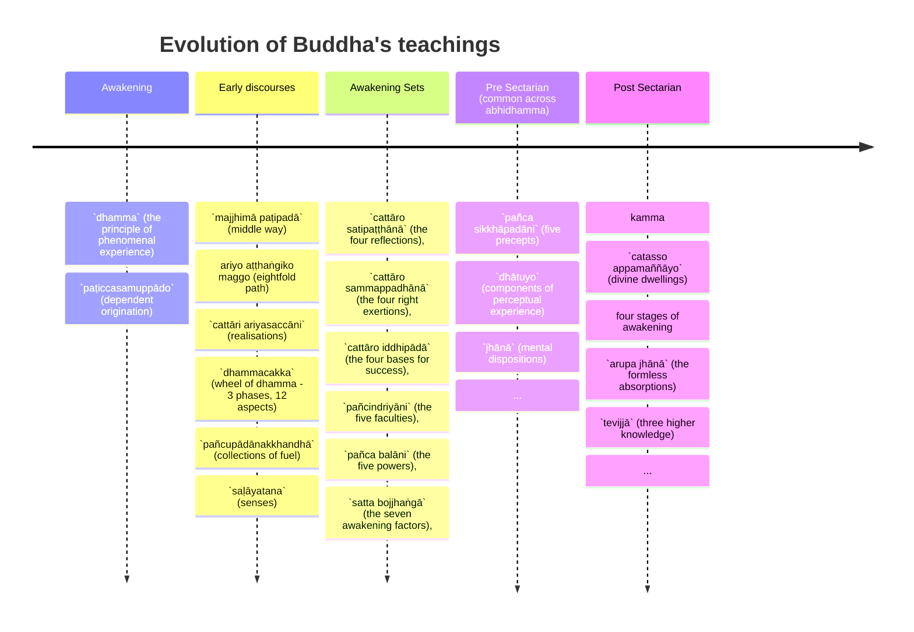

import { Tabs, TabItem } from '@astrojs/starlight/components';

We can never be entirely sure what the Buddha taught, let alone how his teachings may have evolved over his lifetime, and after his death.

However, various scholars (for example, Analayo, Bronkhorst, Buckness, Polak, Sujato, Wynne, to name a few) have pointed out there seems to be a progressive evolution of the Buddha's teachings over a long period, by examining the structure of the various Buddhist canons, and in particular how the canons of various sects align (or don't align) with other.

The Buddha lived and died before the introduction of writing in ancient India (although some Buddhists claim he learnt Brahmi as a child). His teachings would have been preserved through word of mouth by various disciples, and after his death there were probably many attempts to collect and systematise his teachings. His teachings were preserved through an oral tradition of chanting for centuries before being written down, so classifying and grouping the teachings into chunks that could be memorised was important early on.

These attempts resulted in various "strata" or layers of the Buddha's teachings, starting with the core concepts and gradually expanding by incorporating additions. The additional material may have originated with the Buddha over his lifetime of teaching but could also represent concepts created by disciples after his death.

## Hypothesis

The Buddha's awakening process is described as dependent origination (`paṭiccasamuppādo`). It was through formulating the sequence of causes that the Buddha gained realisation and elimination of suffering. So when he started teaching others, it would be natural to assume he simply described his own process of realisation. Indeed, there are many suttas where he states exactly this (see for example [12S2/1 Nidānasaṃyutta](https://tipitaka2500.github.io/tipitaka/12S2/1.html)), that all he ever taught and all that his followers should remember is dependent origination.

All that was required for someone to gain realisation was right understanding (of dependent origination), followed by the successful cessation and extinguishment of the causes (the chain links in the chain) leading to dukkha. This was the core soteriology.

Presumably, this was successful initially. There were people, similar to himself, that understood what he said, were able to achieve cessation, and gained realisation themselves.

However, it became apparent dependent origination is too difficult a concept for some to grasp (including, apparently, Ānanda in [7D/2 Mahānidānasutta](https://tipitaka2500.github.io/tipitaka/7D/2.html)).

So he began to create simplified concepts for teaching purposes. He initially tried by dropping some of the less important causes in dependent origination, but this was not enough. He then introduced the concept of "nutrients" to further simplify the chain. But even this wasn't enough.

He then came up with an alternate model to represent our constructed selves - the five collections (`khandhā`), and illustrated them with the metaphor of a burning platform.

This helped a lot, and the five `khandhā` gradually supplanted dependent origination as the primary way to explain his teachings.

But then the 5 `khandhā` were too abstract and conceptual for some to grasp. He may have decided to augment them with a discussion of the six (gradually 12, 18) senses (`saḷāyatana`) and the components of perceptual experience (`dhātuyo`), to help people understand how our perceived world is constructed out of what we sense.

The final iteration of the Buddha's teachings were the 4 realisations (`ariyasaccāni`), which further simplified the concept via a medical diagnostic framework:

* disease: `dukkha` (suffering)
* pathogen: `taṇhā` (desire)
* health: `nibbāna` (extinguishment)
* cure: eightfold path

The four realisations can also be expressed in terms of the well known consulting framework SCQA (Situation - Complication - Question - Answer)

* Situation: life is `dukkha` (suffering)
* Complication: suffering is caused by `taṇhā` (desire)
* Question: how to achieve `nibbāna` (extinguishment) of suffering?
* Answer: follow the eightfold path

The eightfold path describes an experiential learning cycle through active observation and reflection, followed by modified behaviour and actions.

This evolution of his teaching is the same order that the concepts are presented in Samyutta Nikāya (SN) (ignoring [12S1/Sagāthāvaggasaṃyuttapāḷi](https://tipitaka2500.github.io/tipitaka/12S1.html) which is out of order and anachronistic as it is a collection of verses):

* [12S2/Nidānavaggasaṃyuttapāḷi](https://tipitaka2500.github.io/tipitaka/12S2.html) - dependent origination
* [12S3/Khandhavaggasaṃyuttapāḷi](https://tipitaka2500.github.io/tipitaka/13S3.html) - `khandhā`
* [12S4/Saḷāyatanavaggasaṃyuttapāḷi](https://tipitaka2500.github.io/tipitaka/13S4.html) - senses
* [12S5/Mahāvaggasaṃyuttapāḷi](https://tipitaka2500.github.io/tipitaka/14S5.html) - four realisations and eightfold path

Over time, I believe his teachings were systematised into the Early Discourses, which combines the above concepts into the narrative in the Mahākhandhaka.

## The first layer - the Early Discourses

The Buddha's first discourse is supposedly the setting forth of the Wheel of Dhamma (the rolling of the perceptual experience of phenomena). This is universally agreed by all Buddhists and all sects as the core of his teachings, but the various sects have captured different variations of it. The Pāḷi version in the Suttapiṭaka is the [14S5/12.2.1 Dhammacakkappavattanasutta](https://tipitaka2500.github.io/tipitaka/14S5/12/12.2/12.2.1.html)

As Sujato notes in [**A History of Mindfulness**](http://santifm.org/santipada/wp-content/uploads/2012/08/A_History_of_Mindfulness_Bhikkhu_Sujato.pdf):

> The Dhammacakkappavattana Sutta is available in at least five Vinayas, as well as in the Nikāyas and Āgamas. It is, in fact, by far the most widespread of all the discourses, with no less than 17 existing versions, and is one of only a few discourses that survives in the four main Buddhist languages of Pali, Sanskrit, Chinese, and Tibetan.

Regardless, some scholars believe the Dhammacakkappavattana may not have been historically accurate, and may reflect a later restructure of what is regarded as his core teachings into a context of him giving his first discourse to his five former companions, leading to all five becoming the first awakened disciples under his guidance.

The first three discourses are fully embedded within the Mahākhandhaka, which is part of the Vinaya, and Frauwallner argues represent an early presectarian view of what the Buddha would have taught in the early days after awakening. Together, these discourses represent a universally agreed view across all Buddhist sects of the Buddha's key teachings.

The first three discourses are included as individual suttas in the Saṃyutta Nikāya in the Pāḷi canon (with corresponding parallels in the other canons):

* [14S5/12.2.1 Dhammacakkappavattanasutta](https://tipitaka2500.github.io/tipitaka/14S5/12/12.2/12.2.1.html) - initiating the rolling of the wheel of `dhamma` (phenomena)
* [13S3/1.2.1.7 Anattalakkhaṇasutta](https://tipitaka2500.github.io/tipitaka/13S3/1/1.2/1.2.1/1.2.1.7.html) - the characteristic of not-self
* [13S4/1.4.3.8 Ādittapariyāyasutta](https://tipitaka2500.github.io/tipitaka/13S4/1/1.4/1.4.3/1.4.3.8.html) - the parable on burning

## Numbers

From a "numerology" perspective, the Dhammacakkappavattanasutta features the numbers 1, 2, 3, 4, 5, 8, 12 - which is probably not accidental:

* 1 `dhamma` (the principle of phenomenal experience)
* 2 `antā` (extremes)
* 3 `parivaṭṭa` (phases of turning of the Wheel)
* 4 `ariyasaccāni` (realisations)
* 5 `khandhā` (collections)
* 8 parts in the `maggo` (path)
* 12 `ākāra` (aspects of realisation)

The Second Discourse is an exposition of the five `khandhā` and how they are impermanent, create the mistaken perception of a self, which end up in suffering.

The Third Discourse introduces the concept of the six senses and how they fuel the five collections and cause them to "burn".

Thus from a numerology perspective the first three discourses feature the numbers 1, 2, 3, 4, 5, 6, 8, 12. This arrangement is not just superstition regarding numbers, it is a convenient way of arranging the concepts in a numerically ascending order for easy memorisation.

Later on the sequence was expanded to included the number 7 (Seven sets of factors related to awakening or `bodhipakkhiyā dhammā`), and 9 `aṅgā` (limbs). Over time even more numbers were added, creating what would become the Aṅguttara Nikāya in the Pāḷi Tipiṭaka (and similar collections in the other canons).

## Elaboration of the Wheel of Dhamma

The concepts underneath the Wheel of Dhamma discourse were also gradually elaborated, through the

* [11M/4.11 Saccavibhaṅgasutta](https://tipitaka2500.github.io/tipitaka/11M/4/4.11.html) (explains more of the terminology)
* [7D/9 Mahāsatipaṭṭhānasutta](https://tipitaka2500.github.io/tipitaka/7D/9.html) (adds more material - this is Theravādin specific)
* [30Vbh/Vibhaṅgapāḷi](https://tipitaka2500.github.io/tipitaka/30Vbh.html) (adds more analysis - also Theravādin specific).

Arguably the entire Pāḷi Tipiṭaka can be regarded as a massive elaboration of the Wheel of Dhamma, and almost all the content can be related back to these core concepts.

## Factors related to awakening (`bodhipakkhiyā dhammā`)

According to Analayo[^Analayo2014], another important doctrinal list which appears in the early texts is the "thirty seven qualities that are conducive to awakening" (`bodhipākṣikā dharmāḥ`).[^Analayo2014] This mātṛkā appears in various sūtras, like the Pāsādika-sutta, the Sāmagāma-sutta (and their parallels), and in the Mahāparinirvāṇa-sūtra, where it is said to have been taught by the Buddha just before passing away. These seven sets are mentioned in multiple versions of the Abhidharma on the various sects, so therefore the set is probably pre-sectarian.

[^Analayo2014]: Anālayo (2014) "The Dawn of Abhidharma," p. 48. Hamburg University Press.

Here is an example from [7D/3.20 Ānandayācanakathā](https://tipitaka2500.github.io/tipitaka/7D/3/3.20.html):

<Tabs syncKey="paliquote">
<TabItem label="My Translation">
> 403\. Then the Bhagavā approached the assembly hall; having approached, he sat down on the seat prepared for him. Having sat down, the Bhagavā addressed the bhikkhū —
>
> > “Therefore, bhikkhave, those teachings that I have taught after direct knowledge, you should carefully learn them, practice them, and cultivate them extensively, so that this optimal life may endure for a long time, for the benefit of many, for the happiness of many, out of compassion for the world, for the good, welfare, and happiness of gods and humans. And what are those teachings, bhikkhave, that I have taught after direct knowledge, which you should carefully learn, practice, and cultivate extensively, so that this holy life may endure for a long time, for the benefit of many, for the happiness of many, out of compassion for the world, for the good, welfare, and happiness of gods and humans? Namely—
> >
> > * `cattāro satipaṭṭhānā` (the four reflections),
> > * `cattāro sammappadhānā` (the four right exertions),
> > * `cattāro iddhipādā` (the four bases for success),
> > * `pañcindriyāni` (the five faculties),
> > * `pañca balāni` (the five powers),
> > * `satta bojjhaṅgā` (the seven awakening factors),
> > * `ariyo aṭṭhaṅgiko maggo` (the eightfold path).
> >
> > These, bhikkhave, are the teachings that I have taught after direct knowledge, which you should carefully learn, practice, and cultivate extensively, so that this optimal life may endure for a long time, for the benefit of many, for the happiness of many, out of compassion for the world, for the good, welfare, and happiness of gods and mankind.
</TabItem>

<TabItem label="Pāḷi (Roman IAST)">
> 403\. Atha kho bhagavā yenupaṭṭhānasālā tenupasaṅkami; upasaṅkamitvā paññatte āsane nisīdi. Nisajja kho bhagavā bhikkhū āmantesi—  “tasmātiha, bhikkhave, ye te mayā dhammā abhiññā desitā, te vo sādhukaṃ uggahetvā āsevitabbā bhāvetabbā bahulīkātabbā, yathayidaṃ brahmacariyaṃ addhaniyaṃ assa ciraṭṭhitikaṃ, tadassa bahujanahitāya bahujanasukhāya lokānukampāya atthāya hitāya sukhāya devamanussānaṃ. Katame ca te, bhikkhave, dhammā mayā abhiññā desitā, ye vo sādhukaṃ uggahetvā āsevitabbā bhāvetabbā bahulīkātabbā, yathayidaṃ brahmacariyaṃ addhaniyaṃ assa ciraṭṭhitikaṃ, tadassa bahujanahitāya bahujanasukhāya lokānukampāya atthāya hitāya sukhāya devamanussānaṃ. Seyyathidaṃ—  cattāro satipaṭṭhānā, cattāro sammappadhānā, cattāro iddhipādā, pañcindriyāni, pañca balāni, satta bojjhaṅgā, ariyo aṭṭhaṅgiko maggo. Ime kho te, bhikkhave, dhammā mayā abhiññā desitā, ye vo sādhukaṃ uggahetvā āsevitabbā bhāvetabbā bahulīkātabbā, yathayidaṃ brahmacariyaṃ addhaniyaṃ assa ciraṭṭhitikaṃ, tadassa bahujanahitāya bahujanasukhāya lokānukampāya atthāya hitāya sukhāya devamanussānan”ti.
</TabItem>

<TabItem label="Pāḷi (Brahmi)">
> 403\. 𑀅𑀣 𑀔𑁄 𑀪𑀕𑀯𑀸 𑀬𑁂𑀦𑀼𑀧𑀝𑁆𑀞𑀸𑀦𑀲𑀸𑀮𑀸 𑀢𑁂𑀦𑀼𑀧𑀲𑀗𑁆𑀓𑀫𑀺; 𑀉𑀧𑀲𑀗𑁆𑀓𑀫𑀺𑀢𑁆𑀯𑀸 𑀧𑀜𑁆𑀜𑀢𑁆𑀢𑁂 𑀆𑀲𑀦𑁂 𑀦𑀺𑀲𑀻𑀤𑀺. 𑀦𑀺𑀲𑀚𑁆𑀚 𑀔𑁄 𑀪𑀕𑀯𑀸 𑀪𑀺𑀓𑁆𑀔𑀽 𑀆𑀫𑀦𑁆𑀢𑁂𑀲𑀺—  “𑀢𑀲𑁆𑀫𑀸𑀢𑀺𑀳, 𑀪𑀺𑀓𑁆𑀔𑀯𑁂, 𑀬𑁂 𑀢𑁂 𑀫𑀬𑀸 𑀥𑀫𑁆𑀫𑀸 𑀅𑀪𑀺𑀜𑁆𑀜𑀸 𑀤𑁂𑀲𑀺𑀢𑀸, 𑀢𑁂 𑀯𑁄 𑀲𑀸𑀥𑀼𑀓𑀁 𑀉𑀕𑁆𑀕𑀳𑁂𑀢𑁆𑀯𑀸 𑀆𑀲𑁂𑀯𑀺𑀢𑀩𑁆𑀩𑀸 𑀪𑀸𑀯𑁂𑀢𑀩𑁆𑀩𑀸 𑀩𑀳𑀼𑀮𑀻𑀓𑀸𑀢𑀩𑁆𑀩𑀸, 𑀬𑀣𑀬𑀺𑀤𑀁 𑀩𑁆𑀭𑀳𑁆𑀫𑀘𑀭𑀺𑀬𑀁 𑀅𑀤𑁆𑀥𑀦𑀺𑀬𑀁 𑀅𑀲𑁆𑀲 𑀘𑀺𑀭𑀝𑁆𑀞𑀺𑀢𑀺𑀓𑀁, 𑀢𑀤𑀲𑁆𑀲 𑀩𑀳𑀼𑀚𑀦𑀳𑀺𑀢𑀸𑀬 𑀩𑀳𑀼𑀚𑀦𑀲𑀼𑀔𑀸𑀬 𑀮𑁄𑀓𑀸𑀦𑀼𑀓𑀫𑁆𑀧𑀸𑀬 𑀅𑀢𑁆𑀣𑀸𑀬 𑀳𑀺𑀢𑀸𑀬 𑀲𑀼𑀔𑀸𑀬 𑀤𑁂𑀯𑀫𑀦𑀼𑀲𑁆𑀲𑀸𑀦𑀁. 𑀓𑀢𑀫𑁂 𑀘 𑀢𑁂, 𑀪𑀺𑀓𑁆𑀔𑀯𑁂, 𑀥𑀫𑁆𑀫𑀸 𑀫𑀬𑀸 𑀅𑀪𑀺𑀜𑁆𑀜𑀸 𑀤𑁂𑀲𑀺𑀢𑀸, 𑀬𑁂 𑀯𑁄 𑀲𑀸𑀥𑀼𑀓𑀁 𑀉𑀕𑁆𑀕𑀳𑁂𑀢𑁆𑀯𑀸 𑀆𑀲𑁂𑀯𑀺𑀢𑀩𑁆𑀩𑀸 𑀪𑀸𑀯𑁂𑀢𑀩𑁆𑀩𑀸 𑀩𑀳𑀼𑀮𑀻𑀓𑀸𑀢𑀩𑁆𑀩𑀸, 𑀬𑀣𑀬𑀺𑀤𑀁 𑀩𑁆𑀭𑀳𑁆𑀫𑀘𑀭𑀺𑀬𑀁 𑀅𑀤𑁆𑀥𑀦𑀺𑀬𑀁 𑀅𑀲𑁆𑀲 𑀘𑀺𑀭𑀝𑁆𑀞𑀺𑀢𑀺𑀓𑀁, 𑀢𑀤𑀲𑁆𑀲 𑀩𑀳𑀼𑀚𑀦𑀳𑀺𑀢𑀸𑀬 𑀩𑀳𑀼𑀚𑀦𑀲𑀼𑀔𑀸𑀬 𑀮𑁄𑀓𑀸𑀦𑀼𑀓𑀫𑁆𑀧𑀸𑀬 𑀅𑀢𑁆𑀣𑀸𑀬 𑀳𑀺𑀢𑀸𑀬 𑀲𑀼𑀔𑀸𑀬 𑀤𑁂𑀯𑀫𑀦𑀼𑀲𑁆𑀲𑀸𑀦𑀁. 𑀲𑁂𑀬𑁆𑀬𑀣𑀺𑀤𑀁—  𑀘𑀢𑁆𑀢𑀸𑀭𑁄 𑀲𑀢𑀺𑀧𑀝𑁆𑀞𑀸𑀦𑀸, 𑀘𑀢𑁆𑀢𑀸𑀭𑁄 𑀲𑀫𑁆𑀫𑀧𑁆𑀧𑀥𑀸𑀦𑀸, 𑀘𑀢𑁆𑀢𑀸𑀭𑁄 𑀇𑀤𑁆𑀥𑀺𑀧𑀸𑀤𑀸, 𑀧𑀜𑁆𑀘𑀺𑀦𑁆𑀤𑁆𑀭𑀺𑀬𑀸𑀦𑀺, 𑀧𑀜𑁆𑀘 𑀩𑀮𑀸𑀦𑀺, 𑀲𑀢𑁆𑀢 𑀩𑁄𑀚𑁆𑀛𑀗𑁆𑀕𑀸, 𑀅𑀭𑀺𑀬𑁄 𑀅𑀝𑁆𑀞𑀗𑁆𑀕𑀺𑀓𑁄 𑀫𑀕𑁆𑀕𑁄. 𑀇𑀫𑁂 𑀔𑁄 𑀢𑁂, 𑀪𑀺𑀓𑁆𑀔𑀯𑁂, 𑀥𑀫𑁆𑀫𑀸 𑀫𑀬𑀸 𑀅𑀪𑀺𑀜𑁆𑀜𑀸 𑀤𑁂𑀲𑀺𑀢𑀸, 𑀬𑁂 𑀯𑁄 𑀲𑀸𑀥𑀼𑀓𑀁 𑀉𑀕𑁆𑀕𑀳𑁂𑀢𑁆𑀯𑀸 𑀆𑀲𑁂𑀯𑀺𑀢𑀩𑁆𑀩𑀸 𑀪𑀸𑀯𑁂𑀢𑀩𑁆𑀩𑀸 𑀩𑀳𑀼𑀮𑀻𑀓𑀸𑀢𑀩𑁆𑀩𑀸, 𑀬𑀣𑀬𑀺𑀤𑀁 𑀩𑁆𑀭𑀳𑁆𑀫𑀘𑀭𑀺𑀬𑀁 𑀅𑀤𑁆𑀥𑀦𑀺𑀬𑀁 𑀅𑀲𑁆𑀲 𑀘𑀺𑀭𑀝𑁆𑀞𑀺𑀢𑀺𑀓𑀁, 𑀢𑀤𑀲𑁆𑀲 𑀩𑀳𑀼𑀚𑀦𑀳𑀺𑀢𑀸𑀬 𑀩𑀳𑀼𑀚𑀦𑀲𑀼𑀔𑀸𑀬 𑀮𑁄𑀓𑀸𑀦𑀼𑀓𑀫𑁆𑀧𑀸𑀬 𑀅𑀢𑁆𑀣𑀸𑀬 𑀳𑀺𑀢𑀸𑀬 𑀲𑀼𑀔𑀸𑀬 𑀤𑁂𑀯𑀫𑀦𑀼𑀲𑁆𑀲𑀸𑀦𑀦𑁆”𑀢𑀺.
</TabItem>
</Tabs>

The sets are also mentioned in several other places:

* [8D/6.6 Saṅgāyitabbadhamma](https://tipitaka2500.github.io/tipitaka/8D/6/6.6.html)
* [8D/5.1.1 Kusaladhammadesanā](https://tipitaka2500.github.io/tipitaka/8D/5/5.1/5.1.1.html)
* [17A8/1.2.9 Pahārādasutta #196](https://tipitaka2500.github.io/tipitaka/17A8/1/1.2/1.2.9.html#196)
* [11M/1.3 Kintisutta #74](https://tipitaka2500.github.io/tipitaka/11M/1/1.3.html#74)
* [11M/1.4 Sāmagāmasutta #91](https://tipitaka2500.github.io/tipitaka/11M/1/1.4.html#91)

## `Aṅgā` (or "limbs")

An early method of classification divided the Buddha's teachings into 3 categories (`Sutta`, `Geyya`, and `Veyyakarana`). This classification can still be observed in the various Nikāyas and Āgamas of the various canons, where suttas of similar classifications are often grouped together.

According to Sujato, the 3-aṅgā have roughly the following characteristics:

| | Sutta | Vyākaraṇa | Geyya |
| --- | :-- | :-- | :-- |
| Content | Basic doctrinal statements | Detailed exposition | Inspirational/devotional |
| Style | Declarative prose | Interrogative prose | Mixed prose and verse |
| Speaker | The Buddha only | The Buddha and/or disciples | The Buddha, disciples, and others |
| Context | Always monastic | Usually monastic | Usually with lay people or deities, often Brahmanical |
| Paradigm | Dhammacakkappavattana | Anattalakkhaṇa | Request of Brahmā |

Over time the classifications extended into 9 categories (`navaṅga`). These nine categories are based on content, structure or literary style:

1. `Sutta` (`Sūtra`[S]): prose discourses, especially short declarative discourses, attributed to the Buddha himself. Also refers to the early portions of the Thera/Therīgāthā and the Sutta Nipāta
2. `Geyya` (`Geya`[S]): mixed prose and verse discourse. Identified with the Sagāthāvagga of the Saṁyutta Nikāya
3. `Veyyakarana` (`Vyākarana`[S]): explanation, analysis, often by disciples. Discourses in question and answer format.
4. `Gāthā`: verse
5. `Udāna`: inspired speech. Eg, Dhammapāda and the Udāna
6. `Itivuttaka` (`Ityukta`[S]): fables, eg. Itivuttaka
7. `Jātaka`: story of a previous life of the Buddha
8. `Abbhutadhamma` (`Abhutadharma`[S]): concerning wonders and miraculous events, eg. Acchariya-abbhūta Sutta (MN 123/MA 32), the Bakkula Sutta (MN 124/MA 34)
9. `Vedalla` (`Vaipulya`[S]) either 'extended discourses' or 'those giving joy' (cf Mahayana Texts) eg. MN 43/MA 211, MN 44/MA 44

Even later still, Nagarjuna expanded this to 12 `aṅgā` in the `Maha Prajnaparamita Sastra`, a commentary on the Mahāyāna text `Pancavimsatisahasrika Prajnaparamita` (“the perfection of wisdom in five thousand lines”):

* `Sūtra` (discourses)
* `Geya` (mixed prose and verse)
* `Vyākaraṇa` (explanations)
* `Gāthā` (verses)
* `Udāna` (exclamations)
* `Nidāna` (causes or origins)
* `Avadāna` (heroic deeds)
* `Itivṛttaka` (stories)
* `Jātaka` (birth stories)
* `Vaipulya` (expansions)
* `Adbhuta-dharma` (miracles)
* `Upadeśa` (instructions) 

These 12 `aṅgā` parallel the Jain 12 `aṅgā` that symbolise foundational teachings comprising sacred principles, texts, and practices that guide ethical and spiritual conduct, reflecting a structured approach to spiritual awakening. The 12 limbs are also a reference to the 12 set of linked causes in the dependent origination chain, and the 12 aspects of the wheel of dhamma.

The 3-aṅgā categories are almost certainly pre-sectarian. The 9-aṅgā categories are possibly pre-sectarian and occasionally quoted, such as in [9M/3.2 Alagaddūpamasutta](https://tipitaka2500.github.io/tipitaka/9M/3/3.2.html#786). The 12-aṅgā additions are probably late.

It is debatable whether the suttas were ever strictly organised by `aṅga`, as some suttas seem to have a combination of multiple characteristics.

## The Nikāyas and Āgamas

Sometime after the Buddha's death but before the division into sects - potentially during the First Council itself - a decision was made to organise the suttas not by `aṅgā` but by up to four[^five] Nikāyas/Āgamas. Only some of these collections have survived:

| Theravāda Nikāyas | Sarvāstivāda Āgamas | Other Āgamas (in Chinese) |
| :-- | :-- | :-- |
| Dīgha (Pāḷi) | Dīrgha (Sanskrit) | Dīrgha (Dharmaguptaka) |
| Majjhima (Pāḷi) | Madhyama (Chinese) |  |
| Samyutta (Pāḷi) | Samyukta (Chinese) | Two 'other' Samyuktas (unknown schools) |
| Aṅguttara (Pāḷi) |  | Ekottara (Mahāsanghika?), Añguttara (unknown school) |

[^five]: I am not including the Khuddaka Nikāya (Minor Discourses) in the Pāḷi Tipiṭaka as it is not usually accepted by the other sects.

The rough meaning of these collections (using the Pāḷi as an example):

- `Dīgha` - "long" discourses (DN)
- `Majjhima` - "middle length" discourses (MN)
- `Samyutta` - "linked" discourses (usually by topic or theme) (SN)
- `Aṅguttara` - "numerically ascending" discourses (AN)

This may seem a strange and arbitrary way to divide the suttas, but the intention was probably to create four more or less equal sized collections for memorisation by different groups of monastics. It is possible there was initially just one collection (possibly the Samyutta - see below) which over time was split into other collections.

All the above were collected over a period of hundreds of years, so reflect a diversity of styles of teachings, and evolution in the material. Not all are consistent, and some may be fabrications.

Anālayo explains in "Dīrgha-āgama Studies"[^Anālayo2017]:

> Accounts of the first saṅgīti in the Dharmaguptaka, Haimavata (?), Mahāsāṅghika, Mahīśāsaka, and Mūlasarvāstivāda Vinayas employ the plural form āgamas in their description of the compilation of the teachings that according to tradition took place under the leadership of Mahākassapa soon after the Buddha's demise. The different Vinayas reporting this event agree that the Buddha's attendant Ānanda recited the discourses on this occasion. They further report that the resultant textual material was divided into groups, presumably to facilitate oral transmission, by collecting long discourses and discourses of middle-length into corresponding āgamas; and short discourses were further separated into those assembled according to topic and those assembled according to a numerical principle (a discourse can discuss one or more items and can accordingly be allocated to the Ones, the Twos, the Threes etc.).
>
> This division corresponds to the four Āgamas, which comprise a Dīrgha-āgama containing mostly long discourses, a Madhyama-āgama that assembles predominantly middle-length discourses, a Saṃyukta-āgama with discourses that tend to share a common topic, and an Ekottarika-āgama that follows an incremental numerical principle from Ones to Elevens (earlier perhaps only up to Tens).
>
> The accounts of the first saṅgīti in the Mahāsāṅghika and Mahīśāsaka Vinayas adopt the above sequence of dīrgha, madhyama, saṃyukta, and ekottarika, which corresponds to the order of the corresponding four collections adopted in the Theravāda canon. The Dharmaguptaka Vinaya is closely similar, in so far as it adopts the sequence dīrgha, madhyama, ekottarika, and saṃyukta, thereby having only the last two in the opposite order. These four traditions thus agree on beginning with the long discourses, followed by those of middle-length and then the shorter discourses.
>
> The Haimavata (?) Vinaya instead adopts the sequence ekottarika, madhyama, dīrgha, and saṃyukta, and the Mūlasarvāsti-vāda Vinaya has the exact opposite by listing the four collections as saṃyukta, dīrgha, madhyama, and ekottarika. These two versions thereby do not follow the pattern observed in the other versions of proceeding from long to short discourses, nor do they adopt the opposite pattern of moving from short to long discourses.
>
> The central point conveyed by the account of the first saṅgīti in the different Vinayas is that the distinction into four āgamas was considered a creation by the reciting elders soon after the Buddha's demise, a shared division whose sequential order underwent some independent evolution in the different traditions. The discourse passages mentioned earlier that use the term āgama in the singular as a referent to what appears to be the whole body of discourses might then reflect a stage preceding this basic structural division into four collections, a time when the body of orally transmitted texts had not yet been systematically structured in the way reported in the accounts of the first saṅgīti.
>
> The Theravāda Vinaya account of this first saṅgīti differs in so far as it does not use the expression āgama, but instead refers to the same type of collections of discourses as nikāyas. Another difference is that the Theravāda Vinaya speaks of five nikāyas. In addition to the four nikāyas that correspond to the four āgamas, this expression includes the Khuddaka-nikāya, a miscellany of texts also known in other traditions, where this fifth grouping is at times rather considered to be a piṭaka.

[^Anālayo2017]: Anālayo, Dīrgha-āgama Studies, Dharma Drum Publishing Corporation, 2017, pp. 453-455.

Joy Manné proposes in [**Categories Of Sutta In The Pali Nikayas And Their Implications For Our Appreciation Of The Buddhist Teaching And Literature**](https://palitextsociety.org/wp-content/uploads/2022/01/JPTS_1990_XV.pdf), Journal of the Pali Text Society, XV, 29-87, that “each of the first four Nikāyas came about in order to serve a distinct need and purpose in the growing and developing Buddhist community” (p. 73).

> DN was primarily intended for the purpose of propaganda, to attract converts to the new religion, and thus is aimed mainly at non-Buddhists favourably disposed to Buddhism; MN, in contrast, was directed inwards towards the Buddhist community and its purpose was to extol the Master (both as a real person and as an archetype) and to integrate monks into the community and the practice.

In summary:

- DN (lengthy or extended suttas) - propaganda intended to win debates at royal courts, or to attract new recruits. May be frozen versions of relatively improvised discourses during a period of "free transmission" (see Wynne, Cousins, Gethin et al)
- MN (middle length suttas) - practitioner guides or manuals on specific topics, extended analysis, detailed expositions
- SN (linked discourses) - recollected fragments and variations of the Buddha's teachings
- AN - an attempt to classify and organise the Buddha's teaching by number - possibly postdating the Abhidhamma
- KN - miscellaneous collection of late material that does not fit elsewhere

Bhikkhu Bodhi hypothesises in [**The Connected Discourses of the Buddha**](https://wisdomexperience.org/wp-content/uploads/2018/06/Three-Turnings-Lesson-2-Reading-2.pdf) p. 32 that:

> ... the suttas in SN (as also in AN) were, as a general rule, not targetted at outsiders or even at the newly converted, but were intended principally for those who had already turned for refuge to the Dhamma and were deeply immersed in its study and practice.
> ...
> SN was compiled to serve as the repository for the many short but pithy suttas disclosing the Buddha’s radical insights into the nature of reality and his unique path to spiritual emancipation.

We notice, particularly in [SN](https://suttacentral.net/pitaka/sutta/linked) but generally across all the collections, that there is a pattern in the way suttas are organised in a collection. As noticed by Mark Allon in p. 27, suttas in a collection are grouped:

>... on the basis of genre, size, purpose, a numerical principle, subject matter, and so on. The textual units within these larger collections were further organized into more manageable sub-divisions, such as vagga/vargas, saṃyutta/saṃyuktas, and nipātas, and then, in the case of sutra collections, into the most basic grouping of the vagga/varga that consists ideally of ten sutras, the number ten perhaps being influenced by the fact that we have ten fingers. The larger collection was also sometimes divided into bhāṇavāras, or recitation sections, where a bhāṇavāra is said to consist of 8,000 akṣaras or syllables. Yet another system of organization occasionally used for large collections was to arrange the member sutras into groups of 50, or paññāsakas, a system used to group the 152 suttas of the Majjhima-nikāya into three paññāsakas and for structuring the suttas of the large Khandha- and Saḷāyatana-saṃyuttas of the Saṃyutta-nikāya and those in Books 2 to 10 (Duka- to Dasaka-nipāta) of the Aṅguttara-nikāya. A further set of organizational principles was then used to guide the inclusion and arrangement of textual units within these secondary and tertiary divisions. This included genre, size, whether verse was included and how many verses were involved, subject matter, a numerical feature, a connection based on a key word or words, or key concepts, the manner of treating a topic, including its treatment in brief and in expanded form, the individuals involved, such as who delivered the discourse or spoke the verses or the one to whom they were addressed, the location of events depicted, and figures of speech such as a simile or metaphor, to mention only the main ones.

In SN, suttas are often arranged by:

* topic (subject matter or keyword),
* groups of individuals, eg. deities, kings, monks, ascetics,
* a shared literary feature or figure of speech,
* pairs of textual units or occasionally longer runs

Sujato suggests that SN/SA may be earlier than DN/MN etc. and AN is largely post sectarian:

> The three Dīghas share many discourses in common, but the sequence and organization of the discourses are widely divergent. This is particularly the case when the Sarvāstivāda Dīrgha is compared with the two Vibhajjavāda Dīghas. Similarly, the two Majjhimas share much content but little structure in common. Almost all the chapter titles and divisions are completely different, with a few exceptions discussed further below. (Anticipating the argument, the occasional structural congruencies between the two Majjhimas and the three Dīghas may be derived from the Saṁyutta and are therefore not necessarily evidence of pre-sectarian struc- tures in the Majjhimas and Dīghas). When we come to the two Saṁyuttas, however, the picture is radically different. They share all the same major divisions into subjects, etc., with some variations in the minor chapters and some reshuffling. So we can say with some certainty that not only the content but also the structure of the Saṁyuttas were largely settled in the pre-sectarian period, whereas the structures of the Majjhimas and the Dīghas are largely sectarian. Thus, relying primarily on this very clear structural picture, we conclude that the concordance of the texts suggests that the Saṁyutta is earlier than the Majjhima and the Dīgha.

Furthermore, the Sarvāstivāda Saṁyukta Āgama is probably an earlier version compared to the Pāḷi SN (which has been reorganised and contain many additions by the Theravādins):

> The Chinese and Tibetan canons contain a monumental treatise called the Yogacārabhūmiśāstra, written by Asaṅga around 400 CE. This was a fundamental and authoritative work for the Yogacāra school of Mahāyāna. A section of this work called the Vastusaṅgrāhinī is devoted to an extensive commentary on the Saṁyukta Āgama. This shows how the classical Mahāyāna heavily relied on the early discourses, something that is too often overlooked. Yin Shun has shown that the Saṁyukta Āgama discussed in the Yogacārabhūmiśāstra is very close to the Saṁyukta now preserved in the Chinese canon, and has used the Yogacārabhūmiśāstra to reconstruct the earlier sequence of the Saṁyukta Āgama, which had become disordered over time. His reconstruction is considered so authoritative that it has been adopted in the Foguang edition of the Āgamas published in 1983. The Yogacārabhūmiśāstra suggests that the Saṁyukta Āgama was the foundation for the four Āgamas. Yin Shun believes that this statement can be taken literally as affirming the historical priority of the Saṁyutta among the Āgamas. There does not seem to be any direct statement to this effect in the Theravāda tradition; however there are, we shall see, a few hints. The Sarvāstivādin tradition, however, regularly lists the Saṁyutta as the first of the Āgamas. 

## Abhidharma parallels

Various scholars such as André Migot, Edward J. Thomas, Erich Frauwallner, Rupert Gethin, and Johannes Bronkhorst have speculated that the Abhidharma of various sects were based on early and ancient lists of doctrinal terms which are called `mātikā` ([S]`mātṛkā`).

According Frauwallner[^Frauwallner1996] in pg. 3:

> The oldest Buddhist tradition has no Abhidharmapitaka but only mātṛkā. What this means is that besides the small number of fundamental doctrinal statements, the Buddha's sermons also contain a quantity of doctrinal concepts. The most suitable form for collecting and preserving these concepts would have been comprehensive lists. Lists of this kind were called mātṛkā, and it was from these lists that the Abhidharma later developed.

[^Frauwallner1996]: Frauwallner, Erich. Kidd, Sophie Francis (translator). Steinkellner, Ernst (editor) 1996. Studies in Abhidharma Literature and the Origins of Buddhist Philosophical Systems. SUNY Press. pp. 18, 100.

The following diagram shows the relationship between the various topics across the mātikās of the Abhidhamma texts of three schools (Theravāda Vibhaṅga, Sarvāstivāda Dharmaskandha, Dharmagupta Śāriputrābhidharma), originally identified by Frauwallner[^Frauwallner1996] and subsequently summarised by Sujato. The terms in **bold** are common across the mātikās and hence assumed to be pre-sectarian.

```mermaid
graph LR
  subgraph T["Theravāda Vibhaṅga"]
  direction TB
    T1["`5 **collections**
    (pañcakkhandhā)`"]
    T2["`12 **sense bases**
    (dvādasāyatanāni)`"]
    T3["`36 **components**
    (dhātuyo)`"]
    T4["`4 **realisations**
    (cattāri ariyasaccāni)`"]
    T5["`22 **mental faculties**
    (bāvīsatindriyāni)`"]
    T6["`**Dependent origination**
    (paṭiccasamuppādo)`"]
    T7["`4 **reflections**
    (cattāro satipaṭṭhānā)`"]
    T8["`4 **right exertions**
    (cattāro sammappadhānā)`"]
    T9["`4 **bases for success**
    (cattāro iddhipādā)`"]
    T10["`7 **awakening factors**
    (satta bojjhaṅgā)`"]
    T11["`**8-fold path**
    (ariyo aṭṭhaṅgiko maggo)`"]
    T12["`4 **mental dispositions**
    (jhānā)`"]
    T13["`4 states of mind
    (catasso appamaññāyo)`"]
    T14["`5 **precepts**
    (pañca sikkhāpadāni)`"]
    T15["`4 analytical knowledges
    (catasso paṭisambhidā)`"]
    T16["`minor topics
    (khuddakavatthu)`"]
    T17["`knowledges
    (ñāṇa)`"]
    T18["`core dhammas
    (dhammahadaya)`"]
  end
  subgraph S["Sarvāstivāda Dharmaskandha"]
    direction TB
    S1["`5 **precepts**`"]
    S2["`4 stream-entry factors`"]
    S3["`4 confirmed faiths`"]
    S4["`4 fruits of asceticism`"]
    S5["`4 ways of practice`"]
    S6["`4 noble lineages`"]
    S7["`4 **right exertions**`"]
    S8["`4 **bases for success**`"]
    S9["`4 **reflections**`"]
    S10["`4 **realisations**`"]
    S11["`4 **mental dispositions**`"]
    S12["`4 states of mind`"]
    S13["`4 formless`"]
    S14["`4 focus factors (samādhi)`"]
    S15["`7 **awakening factors**`"]
    S16["`minor topics`"]
    S17["`22 **mental faculties**`"]
    S18["`12 **sense bases**`"]
    S19["`5 **collections**`"]
    S20["`62 **components**`"]
    S21["`**dependent origination**`"]
  end
  subgraph D["Dharmagupta Śāriputrābhidharma"]
    direction TB
    D1["`12 **sense bases**`"]
    D2["`18 **components**`"]
    D3["`5 **collections**`"]
    D4["`4 **realisations**`"]
    D5["`22 **mental faculties**`"]
    D6["`7 **awakening factors**`"]
    D7["`3 unskilful roots`"]
    D8["`3 skilful roots`"]
    D9["`4 great elements`"]
    D10["`5 **precepts**`"]
    D11["`Elements`"]
    D12["`Kamma`"]
    D13["`Persons`"]
    D14["`Knowledge`"]
    D15["`Dependent origination`"]
    D16["`4 **reflections**`"]
    D17["`4 **right exertions**`"]
    D18["`4 **bases for success**`"]
    D19["`4 **mental dispositions**`"]
    D20["`**8-fold path**`"]
    D21["`Unskilful dhammas`"]
    D22["`Saṅgraha`"]
    D23["`Sampayoga`"]
    D24["`Prasthāna`"]
  end
  T1 <--> S19
  T2 <--> S18
  T3 <--> S20
  T4 <--> S10
  T5 <--> S17
  T6 <--> S21
  T7 <--> S9
  T8 <--> S7
  T9 <--> S8
  T10 <--> S15
  T11 <--> D20
  T12 <--> S11
  T13 <--> S12
  T14 <--> S1
  T16 <--> S16
  S1 <--> D10
  S7 <--> D17
  S8 <--> D18
  S9 <--> D16
  S10 <--> D4
  S11 <--> D19
  S15 <--> D6
  S17 <--> D5
  S18 <--> D1
  S19 <--> D3
  S20 <--> D2
  S21 <--> D15
```

## Case Studies: the gradual path or training towards awakening

Joy Manné identifies a common hypothetical case study of a typical disciple will attain awakening by living the optimal life in "Case Histories From The Pāli Canon I: The Sāmaññaphala Sutta Hypothetical Case History Or How To Be Sure To Win A Debate" (JPTS XXI(2) pp. 1-34 (1995)). There are different versions of this case study across both MN and DN suttas and their parallels in other canons.

As Joy explains:

> A hypothetical case history is a standard account of what the Buddha predicts will happen to somebody who follows his method. It describes the developmental process through which the serious practitioner who follows the method is likely to go. It describes how he is expected to develop in terms of cognitive and affective factors, particular experiences and insights, the acquisition of new abilities and the attainment of the Altered States of Consciousness whose sequential attainment is predicted upon the practice of the Buddha's method. It presents the general case, and provides the theoretical basis for a diagnosis.

The full version of this case study covers the following concepts (information adapted from Manné's article):

* STAGE I - The Pre-requisites, called `sila` ("code of morality"):
  * Hearing the Dhamma from a Tathāgata, acquiring faith, and going forth
  * Practising the code of morality, silas (MN has an abbreviated set)
* STAGE II - The cultivation of the mind, variously named `carana` (DN 3), `paññā` (DN 4), `citta` (DN 8), `samādhī` (DN 10)
  * Guarding the door of the senses, `indriyā` (MN only has this, not the rest)
  * Becoming endowed with `sati` and `sampajañña`
  * Contentment - `santuṭṭha`
  * Appropriate nourishment; seeking isolation
  * Abandoning the five hindrances - `nīvaranā`.
* STAGE III - Transcending the mind, or beginning a section called `sikkhā` (DN I 182).
  * The `jhānā`
* STAGE IV - Developing the transpersonal Powers, variously named `vijjā` (DN 3) or `paññā` (DN 4,8,10)
  * The development of the following sequence of extraordinary abilities:
    * Knowing and seeing, viz. awareness of the material nature of the body
    * The capacity to manifest a body through the power of mental intention
  * Various `iddhī` (psychic powers)
  * Clair-audience (or divine ear)
  * The capacity to deeply understand the heart and mind of others in a defined way
  * Knowing the details of one's former lives
  * Awareness of the transmigrational future of others, including the development of the dhamma-cakkhu
* STAGE V - Liberation
  * Knowledge of the destruction of the `āsavā`, in terms of the existence of, the rising of, the ceasing of, and the path to the cessation of both suffering (`dukkha`) and the `āsavā`.
  * Knowledge that the mind is released from the `āsavā`.
  * Knowing that, according to precisely defined criteria, he has succeeded, viz. `Khinā jāti vasitam brahmacariyam katam karaniyam nāparam itthattāya`.

This case history occurs in these 12 DN suttas:

* [6D/2 Sāmaññaphalasutta](https://tipitaka2500.github.io/tipitaka/6D/2.html)
* [6D/3 Ambaṭṭhasutta](https://tipitaka2500.github.io/tipitaka/6D/3.html)
* [6D/4 Soṇadaṇḍasutta](https://tipitaka2500.github.io/tipitaka/6D/4.html)
* [6D/5 Kūṭadantasutta](https://tipitaka2500.github.io/tipitaka/6D/5.html)
* [6D/6 Mahālisutta](https://tipitaka2500.github.io/tipitaka/6D/6.html)
* [6D/7 Jāliyasutta](https://tipitaka2500.github.io/tipitaka/6D/7.html)
* [6D/8 Mahāsīhanādasutta](https://tipitaka2500.github.io/tipitaka/6D/8.html)
* [6D/9 Poṭṭhapādasutta](https://tipitaka2500.github.io/tipitaka/6D/9.html)
* [6D/10 Subhasutta](https://tipitaka2500.github.io/tipitaka/6D/10.html)
* [6D/11 Kevaṭṭasutta](https://tipitaka2500.github.io/tipitaka/6D/11.html)
* [6D/12 Lohiccasutta](https://tipitaka2500.github.io/tipitaka/6D/12.html)
* [6D/13 Tevijjasutta](https://tipitaka2500.github.io/tipitaka/6D/13.html) - also introduces the `brahmavihārā` (divine dwellings)

MN suttas present a simpler version which I have translated in [The Gradual Path to Awakening](/buddhavacana/sutta/gradual).

* [9M/3.7 Cūḷahatthipadopamasutta](https://tipitaka2500.github.io/tipitaka/9M/3/3.7.html)
* [9M/4.8 Mahātaṇhāsaṅkhayasutta](https://tipitaka2500.github.io/tipitaka/9M/4/4.8.html) - deviates post jhānā with a different practice or process which leads to release through the destruction of craving, `tanhāsankhayavimutti`
* [10M/1.1 Kandarakasutta](https://tipitaka2500.github.io/tipitaka/10M/1/1.1.html)
* [10M/3.6 Sandakasutta](https://tipitaka2500.github.io/tipitaka/10M/3/3.6.html)
* [10M/3.9 Cūḷasakuludāyisutta](https://tipitaka2500.github.io/tipitaka/10M/3/3.9.html)
* [11M/1.1 Devadahasutta](https://tipitaka2500.github.io/tipitaka/11M/1/1.1.html)
* [11M/2.2 Chabbisodhanasutta](https://tipitaka2500.github.io/tipitaka/11M/2/2.2.html)
* [11M/3.5 Dantabhūmisutta](https://tipitaka2500.github.io/tipitaka/11M/3/3.5.html)

These are clearly a later development of the Buddha's teachings (due to the inclusion of post-sectarian concepts), and probably compiled by a disciple rather than the Buddha himself, although the Buddha may have articulated a simpler version, based only on the wheel of dhamma.

## Post sectarian lists

[8D/10 Saṅgītisutta](https://tipitaka2500.github.io/tipitaka/8D/10.html) and [8D/11 Dasuttarasutta](https://tipitaka2500.github.io/tipitaka/8D/11.html) collect a wide range of teachings from the suttas and arrange them in an Aṅguttara-style numerical format. According to Sujato, these two discourses anticipate some of the methods of the Abhidhamma.

The equivalents in the Dīrgha-āgama have very different lists (indicating the versions in the Pāḷi canon have been vastly elaborated):

* Saṅgīti-sūtra (DĀ 9)
* Daśottara-sūtra (DĀ 10).
* The Discourse Increasing by One (DĀ 11) - no equivalent in the Pāḷi canon)

## The structure of the `Tipiṭaka`

Today, we primary see the Buddha's teachings organised into three "baskets" (`piṭaka`) or "collections of texts" separated by intent (I will use the Theravādin terminology here in Pāḷi for convenience):

- `Vinaya` - required reading and memorisation for members of the community living the disciplined life. For those who have gained the `dhammacakkhu` or insight into the dhamma (ie. understood the Buddha's soteriology and phenomenological framework), who intend to live the optimal life and realise cessation, and wishes to be part of the community. In the Pāḷi Tipiṭaka, the Vinaya contains the Buddha's core teachings plus rules for disciplined behaviour within the community, and rules for admitting new members into the community. One could say "Vinaya is all you need."
- `Sutta` - a reference library of recollected fragments of Buddha's teachings. Note the use of "evaṃ me suttaṃ" (Thus heard by me). This is optional reading, and not meant to be cohesive, comprehensive or consistent. In theory, a disciple should be able to be accept and discard at will depending on relevance in accordance to the "Simile of the raft" in [9M/3.2 Alagaddūpamasutta](https://tipitaka2500.github.io/tipitaka/9M/3/3.2.html) and also the Buddha's advice in [7D/3.22 Catumahāpadesakathā](https://tipitaka2500.github.io/tipitaka/7D/3/3.22.html)
- `Abhidhamma` - an attempt to systematise and categorise the Buddha's core teachings, and exhaustively enumerate all the possible phenomenological states. Again, optional reading.

Note it is possible to be a "solitary wanderer" who eventually becomes a `paccekabuddha` - ie. someone who have achieved the awakening and cessation/liberation alone, living the optimal life apart from any community,. Alternately, it is possible to establish a separate community (as described in [9. Pabbajjūpasampadākathā (The Account of the Going Forth and Undertaking)](https://tidipa.github.io/Khandhaka/1.9)). Note that the existence of separate communities do not necessarily imply different sects - communities would have naturally been geographically dispersed due to missionary activities during and after the Buddha's time and the teachings and beliefs of the community only started to drift much later.

This is presumably what happened to the five ascetics  in [6. Pañcavaggiyakathā (The Account of the Group of Five)](https://tidipa.github.io/Khandhaka/1.6), Yasa and his friends in [7. Pabbajjākathā (The Account of the Going Forth)](https://tidipa.github.io/Khandhaka/1.7), and the Bhaddavaggiya group in [11. Bhaddavaggiyavatthu (The Story of the Bhaddavaggiya Group)](https://tidipa.github.io/Khandhaka/1.11). Since the number of Buddha's disciples (ie the population of the community) is regarded as 1250 in many accounts - this would seem to be consist on only the Kassapa brothers and their followers plus Sancaya and his followers, plus a few more mentioned in the Mahākhandhaka.

Also, in the First Council in [4V/11 Pañcasatikakkhandhaka](https://tipitaka2500.github.io/tipitaka/4V/11.html) āyasmā Purāṇa did not accept the communal recitation, preferring to remember the Buddha's teaching the way he has received them directly from the Buddha. This indicates that he did not entirely agree with the way the community has organised the teachings, and possibly have his own version of the teachings.

In particular, the 5 ascetics are relatively old compared to the Buddha, and would have led their own communities or continued as solitary wanderers. According to Wynne in **Did the Buddha exist?**[^Wynne2019], Koṇḍañña returned much later to venerate the Buddha in [12S1/8.1.9 Koṇḍaññasutta](https://tipitaka2500.github.io/tipitaka/12S1/8/8.1/8.1.9.html), indicating he has been separate from the Buddha for many years. Ajassi was described as a solitary ascetic when he encountered Mogallana and towards the end in [13S3/1.2.4.6 Assajisutta](https://tipitaka2500.github.io/tipitaka/13S3/1/1.2/1.2.4/1.2.4.6.html), and wanted to see the Buddha again before he died because he had lost the ability to cease non optimal mental constructions and was worried he was regressing and no longer liberated.

[^Wynne2019]: Alexander Wynne, Did the Buddha exist?, JOCBS. 2019(16): 98–148

Not withstanding new recruits and attrition (by choice or expulsion), the implication is that the community is relatively stable for an extended period of time, living under royal patronage (as implied by [13. Bimbisārasamāgamakathā (The Account of the Meeting with Bimbisāra)](https://tidipa.github.io/Khandhaka/1.13)]) and the Buddha was no longer actively recruiting new disciples (possibly due to old age, or the challenges in managing a large community).

With that, I will end my analysis of the evolution of the Buddha's teachings and skip the sectarian divisions. For an account of the Mahāyāna changes to the Buddha's teachings, please refer to [Mahāyāna - Reconstructing the Buddha and his teachings](/buddhavacana/articles/mahayana).

## Summary - Timeline

The following is a rough approximation of the evolution of concepts in Buddha's teachings from his awakening to post-sectarian additions. It is non-exhaustive and incomplete, as it currently excludes some Theravādin concepts, Mahāyāna concepts, esoteric Buddhism such as tantric practices etc.

I am also excluding the three refuges and the Vinaya rules even though many of them are common across sects. A full analysis of Buddhist practices and Vinaya rules are out of scope of this website (for now).

