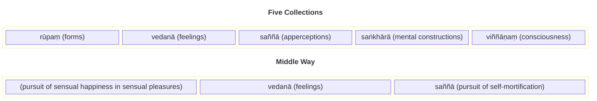

The following is a summary of some of the core concepts taught by the Buddha, taken from his first three discourses as documented in the [3V/1 Mahākhandhaka](https://tipitaka2500.github.io/tipitaka/3V/1.html). These discourses are common across all versions of the Vinaya, and therefore represent a pre-sectarian agreement and the most widely accepted teachings of the Buddha.

## The Middle Way (`majjhimā paṭipadā`)

The Middle Way is the primary feature of the Buddha's teaching, a moderate soteriological approach avoiding the extremes of sensual gratification and austerity practices such as self-mortification.

## The Four Realisations (`cattāri ariyasaccāni`)

The Four Realisations form the core of Buddha's soteriology, and framework for the rest of his teachings. The framework states that life itself is suffering, provides the cause and the way out of suffering through the Eightfold Path.

