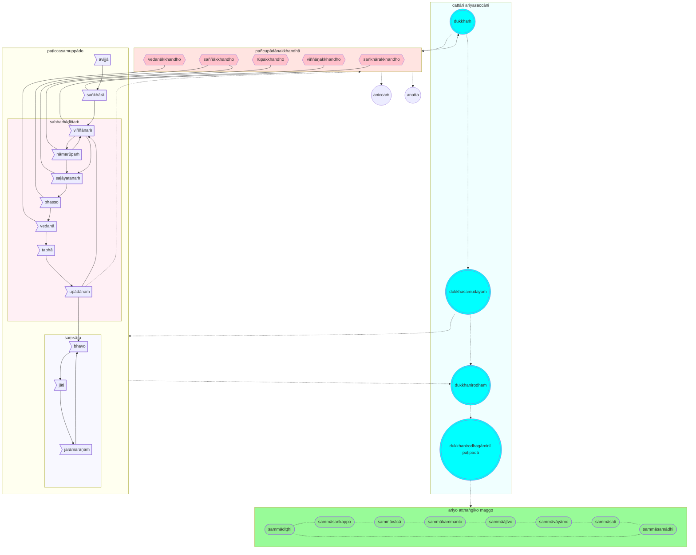
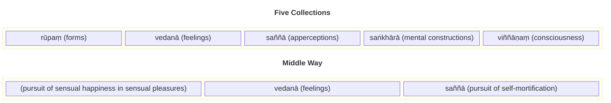

The awakening of the Buddha, plus the first three discourses, can be summarised into a single diagram:

A rather freeform interpretation of the above diagram follows:

We are ignorant (`avijjā`). Ignorant of Life, The Universe, and Everything. We start out life as new born babies, unconscious, unaware, barely perceiving our surroundings.

Because, or as a result of, our ignorance, we make non optimal decisions and choices (`saṅkhārā`). The accumulation of these decisions and choices result in an emerging consciousness (`viññāṇaṁ`).

Our consciousness is "constructed" - it is created (or "caused") by the results of all the previous choices, decisions, intentions that we've made in the past.

Let's examine how this consciousness has been constructed by exploring a cycle or chain of processes. Just like new born babies, all living things start with no awareness and no consciousness.

But we react to our surroundings. Even single celled organisms have receptors that are sensitive to their environment, and can detect changes in temperature, light and nutrient availability. These receptors trigger a series of signalling pathways that can cause the cell to move towards or away from certain stimuli, or change shape or behaviour.

In the same way, we have sense organs that perceive the environment. Gradually we are aware of forms, the form of our own body, and other forms external to the body. We build a virtual representation of forms in our mind (`saññā`), and name them (`nāmarūpaṁ`). By "naming" forms, we conceptualise them and develop symbolic "tokens" of them (and through this, our grasp of language develops). Awareness of our own form give rise to consciousness, and similarly consciousness makes us aware of that which is us, and that which is not us. Hence viññāṇaṁ and nāmarūpaṁ are mutually dependent on each other.

We perceive forms through our senses (`saḷāyatanaṁ`) and through our senses we experience the world around us (`phasso`). From this experience, we start developing feelings (`vedanā`) - we like some experiences or forms, and we dislike or are indifferent to other experiences or forms. We develop cravings (`taṇhā`) for experiences and forms that we like, and aversions to experiences and forms we don't like, and these cravings and aversions influence or "fuel" future decisions or choices (`upādānaṁ`), that ultimately the "fuel" feed into our consciousness, and so the cycle repeats.

It is a vicious cycle that feeds on itself and will not end unless there is a way to break out of the cycle. The driving forces fueling the cycle are referred to as the Five Masses of Fuel (`pañcupādānakkhandhā`). These five masses are directly related to the vicious cycle of existence:

1. Our conceptualisation of forms is a fuel (`rūpakkhandho`) and drives how we perceive and name forms (`nāmarūpaṁ`). 'Forms' consume us and drive our desire and cravings - our desire to look beautiful and attractive for example drives a multi-billion dollar beauty industry. We also desire to "own" forms, to possess them, to make them part of us and to give us satisfaction.
2. Similar, our feelings act as fuel (`vedanākkhandho`) - we desire more of what we like and avoid what we don't like (`vedanā`)
3. Our perceptions (interpretations and conceptualisations of what we experience, such as the ability to recognise colours) also act as a fuel (`saññākkhandho`) - for example we want to be popular and liked by others, and we in turn judge others through our senses (`saḷāyatanaṁ`) and our contact with others (`phasso`).
4. Based on our desire and craving for various forms, feelings, and perceptions, we make choices and decisions (`saṅkhārakkhandho`) which directly impact the results or implications of those intentions (`saṅkhārā`). For example, our like and dislike for others influence how we behave with them.
5. And finally our consciousness itself is a fuel (`viññāṇakkhandho`). Our awareness of our existence leads to our primary craving - a desire to survive and to continue existence, to maintain our form and our consciousness (`viññāṇaṁ`)

Together these Five Masses of Fuel feed a massive and intense fire (caused by desire) that consumes us, every moment of our lives (`sabbaṁādittaṁ`). It enflames not only our present existence (`bhavo`), but leads to birth and rebirth (`jāti`) and eventually to old age and death (`jarāmaraṇaṁ`), and so the cycle of existence (`saṃsāra`) ever revolves.

This is clearly unsatisfactory (`dukkhaṁ`). Not only unsatisfactory, but the burning of the five fuels ultimately results in pain and suffering, that lasts throughout the entire cycle of saṃsāra.

Why suffering? Surely there are moments of pleasure, moments of happiness? Maybe, if we indulge in our senses and revel in pleasure and happiness, we can forget about the pain and suffering. But deep inside, we know nothing lasts forever. We cannot sustain happiness and pleasure indefinitely, we all eventually grow old and die.

We come to the realisation: nothing we experience is permanent (`aniccaṁ`), and therefore everything is ultimately unsatisfactory. Fundamentally, even our consciousness is impermanent (as it is continuously affected by what we have previously experienced), so there no sense of "self" that is permanent or unchanging (`anatta`).

Is there a way out of these vicious cycles (both the vicious cycle caused by the five masses of fuel, and the vicious cycle of saṃsāra)?

Fortunately, the Buddha found a way (`dukkhanirodhagāminīpaṭipadā`, or the Path of progress towards the End of Suffering), that does not require either indulgence of senses or extreme practices. The way is practical, achievable within one lifetime, and consists of the following eight components (`ariyo aṭṭhaṅgiko maggo`, the Pure Path in eight parts):

1. `sammādiṭṭhi`: The first step is of course to understand what we have just discussed (`cattāri ariyasaccāni`): that everything is unsatisfactory (`dukkhaṁ`), and impermanent, including our sense of self. The origin of this suffering (`dukkhasamudayaṁ`) is our craving which drives the five masses of fuel. In order to end the vicious cycle of suffering, we need to stop fueling the fire (`dukkhanirodhaṁ`). And to stop fueling the fire, we need to engage in the following components of the way.
2. `sammāsaṅkappo`: Ultimately, we need to abandon our dependence on sensual pleasures (which are impermanent) and focus on ethical and moral conduct, such as good will and well being towards everything. Unwholesome and unskilled actions are sub-optimal and stem from  bad intentions, resulting in harm to ourselves and others. Good intentions and optimal behaviour lead to wholesome actions and a detachment from sensual pleasures.
3. `sammāvācā`: We should also avoid speech that is false, divisive, harsh or nonsensical.
4. `sammākammanto`: We should also refrain from unethical and immoral actions, such as killing or harming other living beings, stealing and ultimately even sexual activity (for this propagates the vicious cycle). It may seem strange that we want to deny our fundamental biological imperative, but our desire for procreation overrides rationality and fuels our craving and leads us to uncontrollable behaviour.
5. `sammāājīvo`: We should lead an exemplary life, avoiding activities and even thoughts that are unethical or result in further craving and unwholesome thoughts.
6. `sammāvāyāmo`: We should make all effort to eradicate even the arising of bad or unwholesome thoughts and desires, ensure any bad or unwholesome thoughts that we already harbour are dissipated, and instead promote and maintain wholesome and ethical thoughts.
7. `sammāsati`: We should be hyper-aware of ourselves, by observing our bodies, our feelings, how we think, our value systems. We are constantly mindful to ensure we are stopping all thoughts and activities leading to fueling our cravings.
8. `sammāsamādhi`: Finally, we will recognise that once we have successfully abandoned our dependence on sensual cravings, removed unwholesome or unskilled qualities, we will gradually realise our entire outlook, disposition and mindset have progressed, over a set of four stages.
   1. In the first stage, we finally realise the joy and bliss of a calm mind that is free of delusions, cravings, and bad intentions.
   2. In the second stage, we gain internal clarity as our mind becomes focused and concentrated as it is no longer distracted.
   3. In the third stage, we become tranquil as we let go even of joy and bliss and become dispassionate and embrace equanimity.
   4. In the fourth stage, we completely let go and realise we are no longer tied to the vicious cycle of saṃsāra. With this realisation, we are finally free, we have broken out of the vicious cycle. Thus we have attained enlightenment or "perfect awakening."

The above represents the "core" of what the Buddha taught, everything else is arguably elaboration and further clarification. The teaching is not only practical but also effective. Anecdotally, many individuals attained enlightenment during the Buddha's lifetime and presumably more even after his death. Many people try to follow that teaching today, including myself.

The following is a summary of some of the core concepts taught by the Buddha, taken from his first three discourses as documented in the [3V/1 Mahākhandhaka](https://tipitaka2500.github.io/tipitaka/3V/1.html). These discourses are common across all versions of the Vinaya, and therefore represent a pre-sectarian agreement and the most widely accepted teachings of the Buddha.

## The Middle Way (`majjhimā paṭipadā`)

The Middle Way is the primary feature of the Buddha's teaching, a moderate soteriological approach avoiding the extremes of sensual gratification and austerity practices such as self-mortification.

## The Four Realisations (`cattāri ariyasaccāni`)

The Four Realisations form the core of Buddha's soteriology, and framework for the rest of his teachings. The framework states that life itself is suffering, provides the cause and the way out of suffering through the Eightfold Path.

