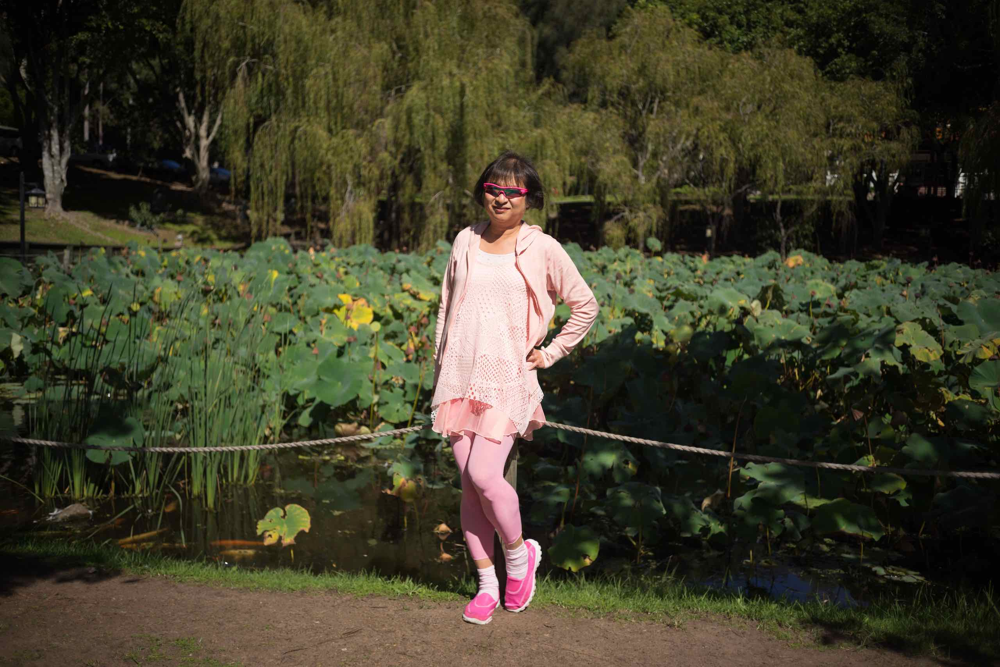
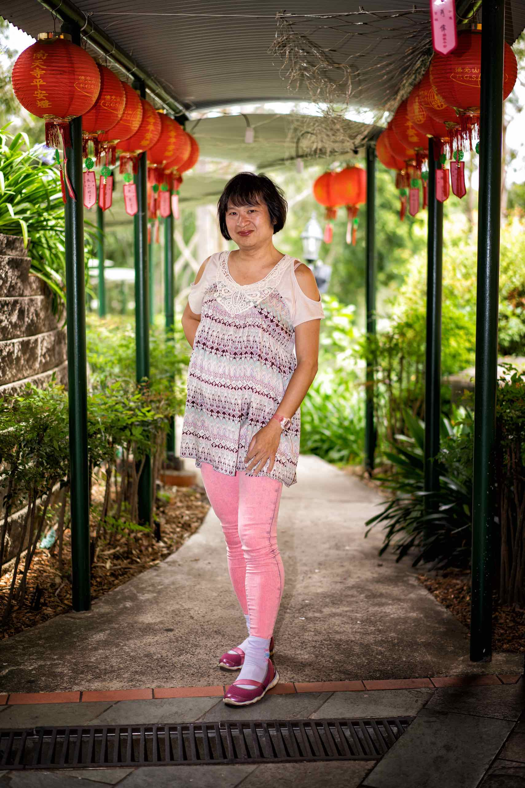

## Early Childhood

My childhood is not important so I will mostly skip the details. Some have remarked to my parents that they sense an aura of spirituality in me even when I was young,
that I had what some called "an old soul." I was not aware that I was different in any way, except I had a very strong sense of curiosity and loved learning new things and exploring places.

My parents were agnostic, so I was not brought up with a strong sense or awareness of religion. My mother said (many years later) she avoided taking me to visit places of worship or participate in religious ceremonies as she said someone (a monk? a soothsayer?) once told her I had a strong mind and may anger gods and deities with my presence.

## Discovery of Buddhism

When I was in my early teens, we visited Singapore and an uncle took us to a Buddhist temple. I can't remember any details about the temple or any religious ceremony we may have attended, but my uncle gave me a book called **"What Buddhists Believe"** by *Dr K Sri Dhammananda*. Out of curiosity, I started reading the book that night and could not put it down until I finished.

Suddenly, everything made sense to me. I had previously been exposed to Christianity and Islam, but didn't understand why there was so much suffering and inequality in the world if there was a Creator. It did not seem fair to me that some are born rich and privileged but others seem to suffer their entire lives.

I was also curious that often events and circumstances seemed to favour me naturally. I did well in school without trying very hard. I was popular and got along well with people. Things seem to fall into place that benefit me or propel me forward in life, and reflecting back I seem to have been gifted with good fortune for most of my life. Even setbacks often turn out to be beneficial in hindsight, painful though they may be at the time. It almost seemed unfair, as if I was somehow "cheating" and would need to pay back for it eventually.

At the same time, there were quite a few occasions that broke the pattern, when I did not not get what I wanted no matter how hard I wished for it. And it seemed the more I crave for it, the less likely it would occur. Over time, I've learnt to contain these intense disappointments, and to accept that I should not wish or desire too hard or it may never happen.

I was already starting to ponder mortality, my own and others around me, and whether there was existence or continuation of life beyond death. I started craving and half wishing for an eternal soul, and worried that people I love will one day no longer be here, and things I love will be taken away from me. I started developing a sense of detachment and refrained from being too closely connected and perhaps loving too much.

So, the core concepts of Buddhism appealed greatly to me. They seemed to naturally answer all the questions I had, and the book did a great job explaining these concepts in a clear and easy to understand manner.

By the end of the book, I had convinced myself that I want to be a Buddhist. I remember having a long conversation with my father the day after sharing my joy and enthusiasm. I must have been quite evangelical, because I convinced him to read the book, and he also agreed with me that it made a lot of sense and we should both be Buddhists.

Sometime later, I also convinced my best friend in school, so I had a core set of people around me that were interested in Buddhism, gaining wisdom, and following the Noble Eightfold Path. However, I had no desire to join the Sangha and devote the rest of my life towards attaining nibbāna. I was not ready to renounce a normal life, and from the perspective of a teenager still in school, it did not seem like a practical choice and certainly not one that I thought my parents would approve or support.

## Adulthood

My interest in Buddhism faded as I continued my life journey, and other things took priority. Finishing school, then university, getting married, working, enjoying life and sensual pleasures, doing what people normally do and what society expects me to do just seemed like the path of least resistance.

Although I still remembered my interest in Buddhism, and had a desire to one day study the dhamma, and perhaps even learning Pali, I just did not have the time. Furthermore, it was difficult getting access to the Tipiṭaka, and many sections (including the Abhidhamma) have not been translated to English, and certainly not in book form.

For years, I would pester anyone I know visiting India or Sri Lanka to purchase Buddhism books for me, so I ended up amassing a collection that I have never read (until recently).

More recently, however, modern technology platforms and social media have reminded me that the Buddhist concepts of dukkha and tanhā are more relevant than ever. We are encouraged to become addicted to mindlessly consuming content that never truly satisfies, and develop wrong views about ourselves and others that result in more suffering. I became aware, with increasing dismay and horror, that technology panders to and amplifies our lowest desires and cravings. We have become obsessed with body image, what others think, giving ourselves to hedonistic pleasures, and not caring about anything other than instant gratification.

## Retirement

In the last few years, I have gradually pulled myself from an active working life. I stopped working just before the COVID19 pandemic started in 2020. My original intention was to enjoy the rest of my life pursuing the things and activities that interested me, such as traveling, eating good food, watching movies, listening to music, and also indulging in my hobbies such as photography, music, art. My focus was to live each day of my life in happiness, doing the things I enjoy.

At the same time, I was also harbouring an ambition to make something that was meaningful. I was initially thinking of perhaps building and selling an app, and I had spent some time learning how to code and design web sites and apps.

I was also making sure I was financially secure and able to live the rest of our lives without worrying about money or covering our living expenses. I had gradually stopped being interested in accumulating wealth or assets. In hindsight, I was slowly renouncing from worldly pleasures and cares without even realising it.

It occurred to me recently that perhaps it was an opportune time to resume my journey in studying dhamma. To my surprise, recent years have made core Buddhist texts much more accessible and the resources for studying them are easily obtainable.

Both my parents died, within months of each other, in 2021. Both of them died at peace, calm, and accepting, and without any suffering. In the last few years of their lives, they certainly seem to have progressed in their own journeys towards nibbāna and realisation. They seem more contented, happy with each other, and ridding themselves of the craving and suffering of their younger days. I like to think that perhaps both of them became Arahats moments before they died, and that they have finally unbound themselves from the endless cycle of sāmsara and reached the ultimate destination. I can only hope that I, too, can reach there before I die, and this website documents the remainder of my progress in that journey.

