:::tip[Info]
Part of "A Beginner (Non-Linguist) Guide to Learning Pali"
:::

:::note
In this book, references to Kaccāyana are denoted by eg. {8} (8th `sutta` or
"grammatical rule"). Altogether there are 675 suttas, which shows how compact
Kaccāyana is.
:::

## Background

According to K. R. Norman in **The origin of Pāli and its position among the Indo-European languages**[^Norman1988]:

[^Norman1988]: Norman, K. R. (1988). The origin of Pāli and its position among the Indo-European languages. Journal of Pali and Buddhist Studies, 1, 1–27. https://doi.org/https://doi.org/10.20769/jpbs.1.0_1

> Pāli is a dialect of Middle Indo-Aryan (MIA), i.e. one of the dialects which lie chronologically between Old Indo-Aryan (=Sanskrit) and New Indo-Aryan (=the modern languages of North India and Sinhalese). The Indo-Aryan languages of India belong to the Indo-European family of languages, and the name Indo-Aryan stands for "the Indo-European languages of India".

Norman further explains that the multiple dialects of MIA are due to successive migrations of Indo-Aryans into India. This occurred over several waves and multiple generations. They met with the indigenous inhabitants of North India, and in particular the inhabitants of the Indus Valley, and over time assimilated part of their culture and languages, such as Dravidian and other languages. Each migration wave would have resulted in a different MIA dialect resulting from different amounts of Dravidian loanwords mixed in with them and also a different mix of cultural and religious backgrounds between the invaders and the indigenous inhabitants. Over time these MIA dialects also evolved away from Sanskrit, developed unique morphological and phonological characteristics and became referred to as "Prakrit" languages.

By the time of the Buddha, there were at least three MIA dialects in use in the Greater Magadha region and beyond: a "Western" dialect, an "Eastern" dialect and a "North Western" dialect (Gāndhārī). The Buddha may have known all three dialects, and they were very similar to each other. Stefan Karpik[^Karpik2019b] regards them as "mutually intelligible" by native speakers of any of the dialects, although this is contested by Bryan Levman[^Levman2019b].

[^Karpik2019b]: Karpik, S. (2019). The Buddha taught in Pali: A working hypothesis. Journal of the Oxford Centre for Buddhist Studies, 16, 80–86.
[^Levman2019b]: Levman, B. (2019). The language the Buddha spoke. Journal of the Oxford Centre for Buddhist Studies, 17, 63–105.

Bryan Levman in **Cultural Remnants of the Indigenous Peoples in the Buddhist Scriptures**[^Levman2014] points out the Shakya tribe which the Buddha belonged in had a separate socio-political organisation, religious and cultural values from the Indo-Aryans, so it is unclear what language the Buddha would have spoken or taught in. It is also unclear to what extent the Buddha was exposed to Brahmanism and therefore his knowledge of Sanskrit would have been questionable. He may have used a mixture of MIA dialects and indigenous languages, depending on his audience.

[^Levman2014]: Levman, B. (2014). Cultural Remnants of the Indigenous Peoples in the Buddhist Scriptures. Buddhist Studies Review, 30(2), 145–180. https://doi.org/10.1558/bsrv.v30i2.145

However, given the Khandhaka shows the Buddha interacting with royal and wealthy converts and benefactors, the Buddha may probably have spoken in the Western MIA dialect, which is regarded as more prestigious.[^Karpik2019a] In any case, what we know of as `Pāḷi` today would seem to be closest to the Western dialect, but mixed in with words and inflection forms from the other dialects.

[^Karpik2019a]: Karpik, S. (2019a). A Reply to Bryan Levman’s “The Language the Buddha Spoke.” Journal of the Oxford Centre for Buddhist Studies, 17, 106–116.

There are debates about the origin of Pāḷi, whether it was in fact a real language
actually spoken by people, as opposed to an "invented" or "ecclesiastical" language specifically
for the purposes of recording Buddhist doctrine. Bryan Levman in **The language of early Buddhism**[^Levman2016] wrote:

[^Levman2016]: Levman, B. (2016). The language of early Buddhism. Journal of South Asian Languages and Linguistics, 3(1), 1--41.

> As is well known, Buddhaghosa equated Pāli (P) with Māgadhī but we know that Pāli is a composite dialect, and although it contains elements of what is probably an eastern dialect that the Buddha may have spoken, it is nevertheless not an “original language of Buddhism” but a translation of something earlier. It is usually characterized as a western dialect, but in fact, if closely analysed, it contains elements of both eastern, western, and northwestern dialects – it is a mixed language created by monks, normalized for religious purposes.

Pāḷi also contains a broad spectrum of loanwords from autochthonous languages such as Dravidian and Munda. This is especially evident with respect to plants, animals, customs and practices, slang words, and proper names which were foreign to the IA immigrants. Even some inflection forms (such as the absolutive or `-tvā` suffix) have been considered to be Dravidian in origin and imported into Sanskrit and MIA dialects.[^Levman2014]

Levman[^Levman2014] adds that many grammatical features of Pāḷi and MIA dialects reflect conventions from autochthonous languages:

> The above is only a sampling of some of the more conspicuous features of the Indic linguistic area; there are many others: causative verb structure, basic subject-object-verb word order; postpositions; goals of verb of motion, adverbial and infinitive complements which go in the object position; adjectives, genitive phrases, demonstratives and numerals which precede the noun they modify; qualifiers which precede adjectives; use of genitive for the verb ‘to have’; use of dative to express internal states of mind; caste system terminology similarities, and more.

Although Pāḷi is most similar to the "Western" MIA dialect, there are signs that it has been transformed and "Sanskritised" over the years (by well meaning Sanskrit-trained editors and scribes no doubt trying to "correct" what they perceived to be spelling and grammatical "mistakes") so it is no longer a pure version of the dialect that the Buddha would have spoken, and it is at least partially an "artificial" language. The morphology and grammar of Pāḷi was formalised by various grammarians in the 6th-12th centuries (with Kaccāyana being the first such work) and it is likely the texts were altered to conform to the "normative" grammar as described by grammarians.

As K. R. Norman[^Norman1997] points out in **A Philological Approach To Buddhism**:

[^Norman1997]: Norman, K. R. (1997). A Philological Approach To Buddhism: The Bukkyō Dendō Kyōkai Lectures 1994: Vol. V.

> ... if we set out to understand what the earliest texts say, i.e. those ascribed to the Buddha himself, or his followers during his lifetime, we have to consider the fact that the language which we find in such texts is not necessarily, and almost certainly is not, the language of the Buddha himself, i.e. the language has been changed both synchronically - it has been translated or transformed into other languages as the need arose, perhaps as Buddhism spread into neighbouring areas - and also diachronically, i.e. as the language of the readers or recensionists developed in the course of time, this had an effect upon the language of the texts.

Norman[^Norman1988] adds:

> The early works of Buddhism had been written in various Prakrits, but the growing prestige of Sanskrit led to an attempt to re-write these texts in Sanskrit. The success of such a translation process varied from sect to sect, and we find a variety of Sanskritised Prakrits which are generally referred to as Buddhist Hybrid Sanskrit, although it must be made clear that there is no one form of that language. The writing down of the Pāli canon in the first century B.C. probably put an end to the wholesale restoration of Sanskrit forms into the language of the Theravādin canon.

More recently, Richard Gombrich in **Buddhism and Pali**[^Gombrich2018] suggests "Pāli reflects the idiosyncratic language used by the Buddha as he toured northeast India". Karpik[^Karpik2019a] offers a similar hypothesis that Pāḷi was in fact originally the Western MIA dialect, which was actually spoken by the Buddha. Levman[^Levman2019b] disagrees, and argues what the Buddha spoke may have been a "koine", or an inter-dialect "lingua franca" that was commonly used for administration, trade and commerce.[^Levman2016] This view has also been previously articulated by Lance Cousins[^Cousins2013]. Oscar von Hinüber[^Hinüber1996] raises the interesting possibility that the "lingua franca" may have been created after the Buddha died, by compilers of his teachings in order to standardise the texts. Regardless, Pāḷi texts probably represent the closest we will get to what might have been the Buddha's original words.

[^Gombrich2018]: Gombrich, R. F. (2018). Buddhism and Pali. Mud Pie Slices.
[^Cousins2013]: Cousins, L. S. (2013). The Early Development of Buddhist Literature and Language in India. Journal of the Oxford Centre for Buddhist Studies, 5, 89–135.
[^Hinüber1996]: Hinüber, O. von. (1996). A Handbook of Pāli Literature (M. Wezler Albrecht;Witzel, Ed.). Walter de Gruyter.

The term "Pāḷi" actually just means "text", and today "Pāḷi" is used primarily for Buddhist literature.

Pāḷi, like most other Indo-Aryan languages, is an oral language spoken as
`vākya` (sentences) made up of `vacana` (words) which are a combination of
`akkhara` ("sounds", or "units from a writing system"). {1}

## Pāḷi Writing System and pronunciation {2}-{9}

The Buddha may have spoken a language similar to Pāḷi, and when he died his
sayings were collected and systematised so they can be transmitted orally
generation to generation using memorisation techniques such as chanting. The
Pāḷi canon was not written down until hundreds of years after the Buddha has
passed away.

As such, there is no "official" Pāḷi writing system. Pāḷi can be transcribed
fairly faithfully in a number of scripts, including Roman letters (with the
addition of a few diacritical marks or accented characters similar to other
European languages).

### The Pāḷi Abugida

Strictly speaking, Pāḷi does not use an "alphabet", it uses an "abugida".

> [!INFO]
> An "abugida" is a segmental writing system in which consonant–vowel sequences are written as units; each unit is based on a consonant letter, and vowel notation is secondary, similar to a diacritical mark. This contrasts with a full alphabet, in which vowels have status equal to consonants.
> 
> Pāḷi is generally written in various Brahmic scripts (also known as Indic scripts), which are abugida writing systems. Brahmic scripts are used throughout the Indian subcontinent, Southeast Asia and parts of East Asia. They are descended from the Brahmi script of ancient India. Brahmi is clearly attested from the 3rd century BCE during the reign of Áshoka, who used the script for imperial edicts.

In Roman script, Pali consists of 8 vowels (`sara`) and 33 consonants (`vyañjana`), arranged in the following order (the letters in round brackets are not commonly encountered):

>sara: a, ā, i, ī, u, ū  \
>kaṇṭhatāluja: e  \
>kaṇṭhoṭṭhaja: o  \
>niggahīta: (ṃ[^1])  \
>kavagga: k, kh, g, gh, (ṅ)  \
>cavagga: c, ch, j, jh, ñ  \
>ṭavagga: ṭ, ṭh, ḍ, (ḍh), (ṇ)  \
>tavagga: t, th, d, dh, n  \
>pavagga: p, ph, b, bh, m  \
>antaṭṭha: y, r, l, (ḷ), (ḷh)  \
>dantoṭṭhaja: v  \
>sakāra: s  \
>hakāra: h \

[^1]: ṃ (niggahīta) can be written η, ṁ or ṃ

### Groups

|Articulation Place|rassa|dīgha|kaṇṭhatāluja kaṇṭhoṭṭhaja|anunāsika|aghosa sithila|aghosa dhanita|ghosa sithila|ghosa dhanita|nāsika|antaṭṭha|hakāra|sakāra|
|---------|:---:|:--:|:-------:|:-------:|:---------:|:------:|:---------:|:------:|:---:|:-----:|:-----:|:------:|
|kaṇṭhaja |  a  |  ā |         |         |     k     |   kh   |     g     |    gh  |  ṅ  |       |    h  |        |
|tāluja   |  i  |  ī |    e    |         |     c     |   ch   |     j     |    jh  |  ñ  |   y   |       |        |
|muḍḍhaja |     |    |    o    |    ṃ    |     ṭ     |   ṭh   |     ḍ     |    ḍh  |  ṇ  |  r ḷ  |       |        |
|dantaja  |     |    |         |         |     t     |   th   |     d     |    dh  |  n  |  v l  |       |    s   |
|oṭṭhaja  |  u  |  ū |         |         |     p     |   ph   |     b     |    bh  |  m  |       |       |        |

### How to form sounds

|vagga|Group|Sound|
|-----|-----|-----|
|kaṇṭhaja|Gutturals|pronounced in the throat|
|tāluja|Palatals|pressing the tongue on the front-palate|
|muḍḍhaja|Linguals (Cerebrals, Retroflex)|bringing the up-turned tip of the tongue in contact with the back of the palate|
|dantaja|Dentals|pronounced with the aid of the teeth|
|oṭṭhaja|Labials|formed by means of the lips|
|hakāra|Spirant|a strong aspirated breathing|
|sakāra|Sibilant|has a hissing sound|
|anunāsika|Nasal|nasal breathing found only after the short vowels: aṃ, iṃ, uṃ|
|aghosa|Voiceless (Surds, stops)|hard, flat, and toneless|
|ghosa|Voiced (Sonants)|soft and uttered with a checked tone|
|dhanita|Aspirates|pronounced with a strong breathing or h sound added to them|
|sithila|Nonaspirates|pronounced naturally, without effort and without the h sound|
|nāsika|Nasals|sounded through the nose|
|antaṭṭha|Liquids (Resonants, semi-vowels)|readily combine with other consonants: (except, perhaps, ḷ)|
|-|Mutes (Nonsurds)|not being readily pronounced without the aid of a vowel|

### Pronunciation

No one knows for sure how Pāḷi words would have been pronounced,
and how Pāḷi sentences would have been spoken, particularly with regards to
tonality. Modern day Pāḷi pronunciation is based on how the Buddhist Pāḷi canon
is chanted in various countries including Sri Lanka, Myanmar and Thailand.

|Letter|Pronunciation|
|:----:|:-----------:|
|a|b<u>u</u>t, c<u>u</u>t|
|ā|<u>a</u>rt, f<u>a</u>ther|
|i|m<u>i</u>ll, p<u>i</u>n|
|ī|b<u>ee</u>, mach<u>i</u>ne|
|u|p<u>u</u>t|
|ū|c<u>oo</u>l, r<u>u</u>le|
|e|t<u>e</u>n, f<u>a</u>te|
|o|h<u>o</u>t, n<u>o</u>te|  
|k|<u>k</u>ey, <u>k</u>ite|
|g|<u>g</u>et, <u>g</u>ood|
|ṅ|ri<u>ng</u>, si<u>ng</u>er|
|c|<u>ch</u>urch, ri<u>ch</u>|
|j|<u>j</u>am, <u>j</u>ug|
|ñ|si<u>gn</u>or|
|ṭ|ha<u>t</u>, no<u>t</u>|
|ḍ|goo<u>d</u>, hi<u>d</u>|  
|ṇ|hi<u>n</u>t, <u>n</u>ow|
|t|<u>th</u>umb|
|d|<u>th</u>ey|
|n|<u>n</u>ow|
|p|li<u>p</u>, <u>p</u>ut|
|b|<u>b</u>ut, ri<u>b</u>|
|m|hi<u>m</u>, <u>m</u>ind|
|y|<u>y</u>ard, <u>y</u>es|  
|r|<u>r</u>at, <u>r</u>ight|
|l|<u>l</u>ight, se<u>ll</u>|
|v|<u>v</u>ile, <u>v</u>ine|
|s|<u>s</u>ing, <u>s</u>it|
|h|<u>h</u>ot, <u>h</u>ut|
|ḷ|fe<u>l</u>t, <u>l</u>ight|
|ṃ|si<u>ng</u>|

## Roman Script Transliteration vs IPA Transcription

The International Phonetic Alphabet for Pāḷi (IPA Pāḷi) 2008
has been proposed by Emeritus Professor Vichin Phanupong, which is
used for audio versions of the World Tipiṭaka Edition 2009.

| **Manner of Articulation** (Karaṇa) |  **Voiceless Stop** (Aghosa) **Unaspirated** (Sithila) |  **Voiceless Stop** (Aghosa)**Aspirated** (Dhanita) | **Voiced Stop** (Ghosa) **Unaspirated** (Sithila) | **Voiced Stop** (Ghosa) **Aspirated** (Dhanita) | **Nasal Stop** | **Approximant** **Non-lateral** | **Approximant** **Lateral** | **Fricative** |
| :--- | :--- | :--- | :--- | :--- | :--- | :--- | :--- | :--- |
| **Place of Articulation** (Ṭhāna) | | | | | | | | |
| **Glottal** (Kaṇṭhaja) | | | | | | | | h [h] |
| **Velar** (Kaṇṭhaja) | k [k] | kh [kʰ] | g [g] | gh [gʰ] | ṅ [ŋ] | | | |
| **Palatal** (Tāluja) | c [c] | ch [cʰ] | j [j] | jh [jʰ] | ñ [ɲ] | y [j] | | |
| **Retroflex** (Muddhajā) | ṭ [ṭ] | ṭh [tʰ] | ḍ [ḍ] | ḍh [dʰ] | ṇ [ṇ] | r [r] | ḷ [ḷ] | |
| **Dental** (Dantaja) | t [t] | th [tʰ] | d [d] | dh [dʰ] | n [n] | | l [l] | s [s] |
| **Bilabial** (Oṭṭhaja) | p [p] | ph [pʰ] | b [b] | bh [bʰ] | m [m] | | | |
| **Labio-dental** (Dantoṭṭhaja) | | | | | | | v  [v] | | |
| **Nasal Cavity** (Nāsikā) | | | | | (a)ṃ [ā] | | | |
| | | | | | (i)ṃ [ī] | | | |
| | | | | | (u)ṃ  [ū] | | | |

## Pāḷi sentence structure

A Pāḷi sentence (`vākya`) or Pāḷi text (`Pāḷi`) is generally composed of
multiple words (`pada` or `vacana`). Since Pāḷi was an oral language,
punctuation mark and upper/lower case conventions are typically not used,
although modern editors have sometimes added these to aid reading.

Words also do not need to be separated by spaces, although modern Pāḷi editions
of text do add spaces, to aid reading. Pāḷi also
has compound words, which consist of multiple words joined together to create a
composite word.

To be able to distinguish the role of words in a sentence, Pāḷi relies
heavily on `vibhatti` (inflection forms which are affixes to lemmas) to create distinctive
word endings. Fluent Pāḷi listeners will no doubt listen to the sound of these
endings to distinguish the words. These endings also give additional meaning
to the lemmas and indicate how the words are used in a sentence.

Because of this, the word order in a Pāḷi sentence is less important than many
other languages, however there are conventions for how to arrange words in a
typical sentence. Speakers can unconventionally reorder words, typically to
give emphasis to certain words or to augment or add nuance to a sentence's
emotional meaning.

:::note
This is similar to our reaction when we hear "Yoda" speak in the "Star Wars"
series of films. We appreciate who Yoda is as a personality, and we pay more
attention to his words simply because of the different order.
:::

## `dhātu` (roots)

Fundamentally, most lemmas in Pāḷi are said to be derived from one or more `dhātu`
(roots). These roots are similar to Sanskrit roots. Pāḷi can be regarded as
a simplified version of Sanskrit, however some of the roots may have different
meanings, or nuances. There are some that say Sanskrit was a "sacred" or "divine" language
reserved for priests and members of the holy caste, whereas Pāḷi, along with
many other Indian languages, was spoken by the common people.

Some lemmas, however, are words borrowed from other languages, possibly indigenous to the region the Buddha grew up or taught in. These lemmas are obviously not derived from Sanskrit roots. Examples include names of villages, people names, animal names, farming words and slang words, etc. [@Levman2014]

`dhātu` can have 1-3 syllables:

| type | example | meaning |
| --- | --- | --- |
| single stem or one-syllable roots | `vā` | to move |
|| `yā` | to go |
|| `pā` | to drink
|| `ji` | to conquer |
|| `nī` | to carry |
|| `su` |to flow |
|| `bhū` | to be |
| dual-syllable roots | `gamu` | to go |
|| `paca` | to cook |
|| `vada` |to speak |
| multiple-stem or three syllable roots | `vāyama` | to attempt |
|| `araha` | to deserve|
|| `kilisa` | to torment |

A series
of transformations convert a root into a lemma by adding `paccaya` (affixes).
Lemmas can also be formed by combining a root with one or more `upasagga`
(prefixes). Multiple `upasagga` and different forms of `paccaya` can be applied
to a root before it becomes a lemma, thus creating multi-syllabic
lemmas. The result is a lemma that can be transformed into a word
(through inflection forms - more later) used in a sentence.

Altogether there are around 1700 roots in Pāḷi. However, many many lemmas can
be made from them by attaching `upasagga` (prefixes) and various affixes
(`paccaya`). In theory, fresh lemmas can be formed by new combinations of roots
with different prefixes so the adventurous Pāḷi student can attempt to create
Pāḷi lemmas for "modern" terms such as "computer" or "phone".

It is not really necessary to memorise the 1700 roots, although it will be
very useful if the reader chooses to do so. Knowing all the roots and the
various prefixes and affixes will allow the reader to sometimes (not always)
"guess" the meaning of a lemma not previously encountered, and will also help
when applying the various transformation rules (see below).

## `nāmā` (nouns) {52}

`nāmā` are the most common type of words in Pāḷi, and roughly (but not exactly)
correspond to the term "noun" in English. `nāmā` also means "name", so these
words represent things that we can "name" - including people, places, things,
numbers, feelings and many other objects or concepts.

### Example {53}

Here is a simple sentence, consisting of 3 `nāma`:

> **eso no satthā**

which translates as:

> that person/being / our / teacher  
> *That person [is] our teacher.*

Instead of `satthā` other examples may be:

* `brahmā` (God)
* `attā` (self)
* `sakhā` (friend)
* `rājā` (King)

### `liṅga` (gender) {53}

`nāma` can be classified into 3 different types or `liṅga`. The word `liṅga`
actually means "gender", and traditionally each `nāma` is assigned a gender. The
`liṅga` represents an "intrinsic property" of the `nāma`.

The notion of a Pāḷi gender is similar to (but not quite the same as) genders
in some European languages. However, there are differences that it's best to
regard `liṅga` as a classification scheme or grammatical construct rather than
what traditional definitions of "gender":

* `pulliṅga` - the "major" or "default" type. Most nouns fall into this category.
  Generally associated with masculinity or masculine persons (but not always)
* `napuṁsakaliṅga` - the "special" type. Tend to be used for nouns that don't
  quite fit with the notions of masculinity or feminity, or to represent abstract
  concepts.
* `itthiliṅga` - the "minor" type, comparatively rare with respect to the
  other two types. Generally associated with feminity or feminine persons.

Note that for the remainder of this introduction, `liṅga` will be represented
by the following symbols for brevity:

* 🚹 = `pulliṅga`
* 🚻 = `napuṁsakaliṅga`
* 🚺 = `itthiliṅga`

Ancient India was a patriarchal society, and men were regarded as the "major"
component of society, doing activities considered important, hence the
tendency is to associate important words to `pulliṅga`.

### Multiplicity

Like in English, Pāḷi words are slightly different depending on whether they are
used to refer to one thing vs many things.

* ⨀ = `ekavacana` (singular)
* ⨂ = `bahuvacana` (plural)

There used to be also a "dual" form but that is now largely obsolete and
encountered in very rare instances. Examples include:

* `to idh’āgato` (these two having come)
* `ubho` (both)
* `mātāpitu` (father and mother)

### `vibhatti` (inflection forms) {54}

Unlike English, words need to be "transformed" before they are used in a
sentence. This is done by adding inflection forms or "suffixes" to the word (`vibhatti`).

Altogether there are seven types of `vibhatti`, and they are
conveniently numbered 1 to 7 {55}:

| symbol | ⨀ | ⨂ | vibhatti |
| :-: | :-: | :-: | --- |
| ① | `si` | `yo` | `paṭhamā` ("first") |
| ② | `aṁ` | `yo` | `dutiyā` ("second") |
| ③ | `nā` | `hi` | `tatiyā` ("third") |
| ④ | `sa` | `naṁ` | `catutthī` ("fourth") |
| ⑤ | `smā` | `hi` | `pañcamī` ("fifth") |
| ⑥ | `sa` | `naṁ` | `chaṭṭhī` ("sixth") |
| ⑦ | `smiṁ` | `su` | `sattamī` ("seventh") |

Note the 4th and 6th vibhatti endings are the same, which means in practice
which vibhatti is being used can only be determined by context (more later). Notice also
the plural endings for some of the vibhattis are the same. Again, which vibhatti is
being used is determined by context.

Let's start with an example. Consider the lemma `purisa` ("man", in the masculine gender or 🚹)
and it needs to be inserted in a sentence in singular form representing itself.
The 1st vibhatti (`paṭhamāvibhatti`) is used to represent the underlying meaning of nouns.
By looking up the above table, the `si` ending is added (using rule of {55}):

> `purisa` + `si` → `puriso`

Wait, what happened? Why does the transformation not result in `purisasi`?

This is where additional rules comes into play. By rule of {83}, any
lemma ending in `a` will be transformed into the 1st vibhatti by deleting
the `a` and by rule of {104} replacing the `si` with `o`. Kaccāyana has a whole
chapter of such rules.

So the transformation becomes:

`purisa` + `si`  
→ `puris`~~`a`~~ + `si` {83}  
→ `puris` + ~~`si`~~(`o`) {104}  
→ `puriso`

The plural form undergoes a similar transformation:

`purisa` + `yo`  
→ `puris`~~`a`~~ + `si` {83}  
→ `puris` + ~~`yo`~~(`ā`) {107}  
→ `purisā`

This does make things interesting, because the transformation result for every
word then depends on:

* `kāra’nta` (word ending)
* `liṅga` (gender)
* `ekavacana` (singular) vs. `bahuvacana` (plural)
* `vibhatti` (desired inflection form)

Here is a table of `purisa` transformed in all the 7 vibhattis and
singular vs plural.

| number | vibhatti | ending | transformation | sutta | result |
| :-: | :-: | :-: | --- | --- | --- |
| ⨀ | ① | `si` | puris~~a~~ + ~~si~~o | {104} | `puriso` |
| ⨂ | ① | `yo` | puris~~a~~ + ~~yo~~ā | {107} | `purisā` |
| ⨀ | ② | `aṁ` | puris~~a~~ + aṁ | | `purisaṁ` |
| ⨂ | ② | `yo` | puris~~a~~ + ~~yo~~e | {107} | `purise` |
| ⨀ | ③ | `nā` | puris~~a~~ + ena | {103} | `purisena` |
| ⨂ | ③ | `hi` | puris~~a~~e + hi | {101} | `purisehi` |
| ⨂ | ③ | `hi` | puris~~a~~e + bhi | {99}-{101} | `purisebhi` |
| ⨀ | ④ | `sa` | purisa + ssa | {61} | `purisassa` |
| ⨂ | ④ | `naṁ` | puris~~a~~ā + naṁ | {89} | `purisānaṁ` |
| ⨀ | ⑤ | `smā` | purisa + smā | | `purisasmā` |
| ⨀ | ⑤ | `smā` | purisa + mhā | {99} | `purisamhā` |
| ⨀ | ⑤ | `smā` | puris~~a~~ā | {108} | `purisā` |
| ⨂ | ⑤ | `hi` | puris~~a~~e + hi | {101} | `purisehi` |
| ⨂ | ⑤ | `hi` | puris~~a~~e + bhi | {99}-{101} | `purisebhi` |
| ⨀ | ⑥ | `sa` | puris~~a~~ + ssa | {61} | `purisassa` |
| ⨂ | ⑥ | `naṁ` | puris~~a~~ā + naṁ | {89} | `purisānaṁ` |
| ⨀ | ⑦ | `smiṁ` | purisa + smiṁ | | `purisasmiṁ` |
| ⨀ | ⑦ | `smiṁ` | purisa + mhi | {99} | `purisamhi` |
| ⨀ | ⑦ | `smiṁ` | puris~~a~~e | {108} | `purise` |
| ⨂ | ⑦ | `su` | puris~~a~~e + su | {101} | `purisesu` |

You will note that in some of the forms, there are multiple ways the lemma can
be transformed. For example, singular `purisa` can be transformed in the 3rd
vibhatti into either `purisehi` or `purisebhi`. Both are acceptable. Which should we
use for a given sentence? It depends on the "sound" - a "native" Pāḷi speaker would
have chosen the version that sounded the most pleasing, depending on surrounding
words.

The multiple different variants of inflection forms can also be due to Pāḷi being an
amalgamation of different Middle Indo Aryan dialects. As [@Norman1997] explains:

> It is, for example, not always understood by non-specialists that an early Pāli canonical sutta is itself a translation, and forms which were left untranslated when the Pāli recension was made from some earlier version can sometimes be identified.

The rules can be quite complicated, so this introduction will not enumerate them.
In practice, one can rely on looking up a relevant table to determine the
appropriate transformation. For reading Pāḷi, with practice the various endings will
quickly become familiar.

A much more important question to answer at this point is ...

### What is the purpose of `vibhatti` (inflection forms)?

In English, consider the following sentence:

> The quick brown fox jumped over the lazy dog.

Words "quick" and "brown" refers to the "fox", which is the
"subject" of the sentence, and "lazy" refers to the dog, which is the "object"
of the sentence. The verb "jumped over" separates the subject and the object.
The brain automatically "collects" and "groups" the words, so the
sentence can be read as:

> (The quick brown fox) jumped over (the lazy dog).

In English, word order is important. If the words are "mixed",
the sentence becomes far harder to read:

> Over the quick lazy brown fox the dog jumped.

This sentence would imply quite a different meaning.

In Pāḷi, all words with the same gender and the same vibhatti should be
grouped together, and that's how words belonging to
entities can be distinguished. So the word order becomes far less important - the words
can be "mixed" and the sentence would still have the same meaning!

In practice, the 1st vibhatti is usually reserved for the "most important" entity
in a sentence, the 2nd for the "second most important" and so on.

So, in the above English sentence, were it to be translated the Pāḷi, "the
quick brown fox" would all be in the 1st vibhatti, and "the lazy dog" would all be
in the 2nd vibhatti. If there are more entities, they would take the 3rd, 4th
vibhatti and so on.

In many sentences, the 1st vibhatti would usually refer to the entity or actor
"performing" or "doing" the action (or, the "subject" of the sentence), and
the 2nd vibhatti refers to the entity being impacted by the action  (the "object")
of the sentence. Although this is a very common pattern, it is by no means
rigid, and in theory (almopst) any vibhatti ending can be used for any purpose. There are
many examples in the Pāḷi canon where the vibhatti are used in unconventional
ways.

It is also possible that a word in an inflection form from a different
Middle Indo Aryan dialect can be mistaken as a different inflection form in
Pāḷi. For example, in what Norman calls the "Eastern" dialect the first vibhatti form
for nouns often end in `-e` whereas in the "Western" dialect they end with `-o`.
As an example,. The vocative `bhikkhave` typically encountered in Pāḷi texts should probably be `bhikkhavo`, although [@Pind2021] disputes this and argues `bhikkhavo` represents an emphatic usage compared to `bhikkhave`.

### Vibhatti usage typical meanings {271}-{315}

The following meanings are usually associated with each
vibhatti. However, as noted above, these are conventions only, and the author of a
sentence may choose to associate an unconventional vibhatti ending to a word to
(perhaps for emphatic or stylistic reasons).

| vibhatti | number | role | usage | Pāḷi term | sutta |
| :-: | :-: | --- | --- | --- | :-: |
| ① | ⨀/⨂ | subject (active) | subject, doer | `kattu`/`kattā` | {284} |
| ① | ⨀/⨂ | address | to address, to call | `ālapana` | {285} |
| ② | ⨀ | to (object) | object | `kamma` | {297} |
| ② | ⨂ | till | continuity for a certain period or distance | `accantasaṁyoga` | {298} |
| ③ | ⨀ | by (subject) (passive) | subject | `kattu`/`kattā` | {288} |
| ③ | ⨂ | by/with | supporting cause | `karaṇa` | {286} |
| ③ | ⨂ | with/together | company | `sahayoga` | {287} |
| ③ | ⨂ | by means of/in regard of | aspect or adjective | `visesana` | {292} |
| ③ | ⨂ | due to/for | reason | `kāraṇa` | {289} |
| ④ | ⨀/⨂ | receivership/purpose | recipient of action | `sampadāna` | {293} |
| ⑤ | ⨀ | from | source from which it occurs | `apādāna` | {295} |
| ⑤ | ⨂ | for/due to | reason | `kāraṇa` | {296} |
| ⑥ | ⨀ | (possessive) of | owner | `sāmi` | {301} |
| ⑥ | ⨂ | among/out of | selection for comparison | `niddhāraṇa` | {304} |
| ⑥ | ⨂ | while/despite | two concurrent actions | `anādara` | {305} |
| ⑦ | ⨀ | at, in, on | location/position | `adhikaraṇa`/`okāsa` | {302} |
| ⑦ | ⨂ | among/out of | selection for comparison | `niddhāraṇa` | {304} |
| ⑦ | ⨂ | for/due to | cause | `nimitta` | {310} |
| ⑦ | ⨂ | while/when | two concurrent actions | `lakkhaṇa` | {313} |
| ⑦ | ⨂ | despite/while | two concurrent actions | `anādara` | {305} |

:::note
In Pāḷi grammar books written in English the following nomenclature
for the vibhatti types are often used (which these books will refer to as "cases"):

* ① = "nominative"
* ② = "accusative"
* ③ = "instrumental"
* ④ = "dative"
* ⑤ = "ablative"
* ⑥ = "genitive"
* ⑦ = "locative"

Note that these terms only partially reflect the possible meanings and roles
associated with each vibhatti, so I would discourage using these terms. They can
lead to confusion. However, these terms are common in Pāḷi-English dictionaries
so I encourage you to substitute the vibhatti number when you see these terms.
:::

### ⓪ `ālapana` (vocative) {57}

English Pāḷi textbooks often refer to a "vocative" "case", but this is not
recognised as a separate inflection form but a variant of the 1st vibhatti. The usual vibhatti
ending `si` (for 1st case singular) is instead called `ga` but the
transformation rules are similar to `si`.

Examples:

> `bhoti ayye`! (Oh madam!)  
> `bhoti kaññe`! (Oh girl!)  
> `bhoti kharādiye`!  (Oh the girl named Kharādiya!)

Contrast this to the normal 1st case form of `ayyā` (🚺⨀①):

> `sā ayyā` (that lady)

In plural:

> `bhotiyo ayyāyo` (Oh Madams!)

### *️⃣ `sabbanāma` (pronouns)

`sabba` means "all" so `sabbanāma` are "common" or "generic" nouns that can
apply in "all' situations.

Examples of `sabbanāma` include the different `vibhatti` forms of `ya`
("who, what"), `ta` ("he/she/it", "that"), `eta` ("this"), `ima` ("this"),
`amu` ("that"), `kiṁ` ("what?"). One of the common usage of `sabbanāma` is as
"pronouns", where they can assume all genders to represent
all things and persons of the different genders. But they can also function
as adjectives, adverbs, honorifics and interrogatives.

Examples:

| Sabbanāma | meaning | ④ | ⑥ |
| :-: | :-: | :-: | :-: |
| `sabba` | all | `sabbesaṁ` | `sabbesānaṁ` |
| `ya` | which | `yesaṁ` | `yesānaṁ` |
| `ta` | that | `tesaṁ` | `tesānaṁ` |
| `ima` | this | `imesaṁ` | `imesānaṁ` |
| `ka` | who | `kesaṁ` | `kesānaṁ` |
| `itara` | other | `itaresaṁ` (others) | `itaresānaṁ` (others) |
| `katama` | what | `katamesaṁ` (of which ones) | `katamesānaṁ` (of which ones) |

## ⏏️ `nipāta` (particles)

`nipāta` means "to fall. i.e. to be placed anywhere", and refer to words
that can be found placed in the beginning, in the middle or at the end of
sentences and words, but not usually regarded as prefixes (see below).

Generally, the `vibhatti` endings of `nipāta` words are elided as these words
are not related to other words in the sentence and therefore do not need to
be matched with them. {221}

However, in some instances, the `vibhatti` endings may be retained, if the
`nipāta` word play a role in the sentence meaning.

### Examples

> tvaṁ **panā’vuso**! tumhe **panā’vuso**!

you / (no specific meaning) / friend  
you (plural) / (no specific meaning) / friend  
*How about you, my friend? And the rest of you (plural)?*

> **padaso** dhammaṁ vāceyya

by word / dhamma / teach (causative, optative)  
*(He) should teach and say Dhamma word by word.*

> vihāraṁ • **sve** upagaccheyya

to temple / tomorrow / should approach (optative)  
*(He) should come to the temple tomorrow.*

The following is a brief descriptive list of some nipāta words. Some are plain
nipātas without any affix, while some are with indeclinable affixes. Some may
even have a sort of vibhatti-ending in them or may still have traces of
vibhattis. Please note that the implied meaning of elided vibhatti still remains
in effect for some nipāta words such as `yathā`, `tathā` and `evaṁ` etc.

| `nipāta` | meaning | note |
| --- | --- | --- |
| `yathā`, `tathā` | in a manner that, in such a way as | combination of `sabbanāma` `ya` `ta` with indeclinable affix `thā`. The affix itself is ex- pressive of manner or mood. |
| `evaṁ` | thus, in this way, true as it is said, yes (many meanings) | dutiyāvibhatti, very frequently used in Pāli texts |
| khalu | used mostly in a reported narrative | |
| `kho` | mostly meaningless, but sometimes it may mean “only, really” | a plain nipāta, found often in main Buddhist texts. Used together with `atha` `evaṁ` `taṁ` etc. |
| `tatra` | there | a combination of `sabbanāma` `ta` with indeclinable affix `tra` |
| `atho` | in addition, besides | |
| `atha` | now, then, later on, if | Sometimes used in the beginning of a chapter or an episode, as an introductory or initiating word |
| `hi` | really, for, only | Sometimes a meaningless particle |
| `tu` | in addition, only | Also an expletive without meaning, sometimes added to be more emphatic in a statement |
| `ca` | also, too | It is used to express some additional meaning in grammatical texts. Sometimes meaningless. Sometimes it has a lot of meanings when used after other nipāta particles |
| `vā` | similar to either or, in other ways | In grammatical texts, sometimes it is used to express other option or method or inconsistency of a function. Sometimes with no particular meaning |
| `vo` | you | It is sometimes a meaningless expletive |
| `haṁ`, `ahaṁ` | I | the use of these two nipāta are seldom found in texts unless it means “I” |
| `alaṁ` | (a) enough, (b) suitable, (c) worthiness, (d) appropriateness, (e) ability | Also, (f) sometimes used as a prohibition or rejection, usually used in combination with (1) a noun in instrumental case, or (2) tuṁ-infinitive Kita verbs or (3) an āya-infinitive in dative case nouns |
| `eva` | equal to “only” | used next to the word it want to modify or restrict or confirm in its implied meaning. A plain nipāta. |
| `ho!`, `aho!` | | these are expression of interjection or surprise. No vibhatti |
| `he!`, `ahe!`, `re!`, `are!` | “hey” | Vocative nipāta particles, similar to “hey” in English. Usually vocative case vibhatti is applicable, but to be elided |

### `nipāta` as prefixes

However, there are quite a few `nipāta` that can be placed before some verbs or
`kita`-affixed nouns and used in a way resembling prefixes.

| combined | `nipāta` | word | combined meaning |
| --- | --- | --- | --- |
| `antaradhāyati` | `antara` | `dhāyati` | (he) disappears |
| `āvikaroti` | `āvi` | `karoti` | (he) makes it openly, displays clearly |
| `pātubhavati` | `pātu` | `bhavati` | (it) arises visibly, i.e. appears |
| `sacchikaroti` | `sacchi` | `karoti` | (he) realizes, i.e. attains |
| `vinābhāvo` | `vinā` | `bhāvo` | separation, being apart |
| `sahacārī` | `saha` | `cārī` | the one who used be together, a friend |
| `punabbhavo` | `puna` | `bhavo` | being born again, rebirth |

## 🔼 `upasagga` (prefixes)

There are 20 `upasagga` which are usually applied as prefixes to
`ākhyāta` (verbs) and `kita`-affixed nouns (see below). Like `nipāta`,
`upasagga` also have their `vibhatti` endings elided, but in some cases
where they are functioning as independent words (not attached to a verb or
noun), they may retain their `vibhatti` endings.

There are three kinds of `upasagga`:

1. `dhātva’tthā’nuvattaka` - those that follow the meaning of the root, without affecting its original meaning.
2. `dhātva’tthabādhaka` - those that absolutely mean opposite of the root. These categorically change the original meaning of the root.
3. `dhātva’tthavisesaka` - those that enhance the original meaning of the root by adding more specific meaning and flavour to it.

Example:

> parābhavo

🔼(parā) 🚹⨀①(bhava)  
opposite / to be, being
*loss, ruin*

Here are various words that can be formed from the word `hara` ("carrying")
together with various `upasagga` prefixes and the `ṇa`-suffix:

| example | `upasagga` | meaning | combined meaning |
| --- | --- | --- | --- |
| `pahāro` | `pa` | specially | carrying (instruments of harm) specially, i.e. beating, striking |
| `nihāro` | `ni` | out | taking out, evicting |
| `nīhāro` | `nī` | out | taking out, evicting (same as above) |
| `uhāro` | `u` | up | carrying up |
| `duhāro` | `du` | bad | carrying badly |
| `saṁhāro` | `saṁ` | well | carrying well |
| `vihāro` | `vi` | specially | carrying one’s body specially, staying, i.e. act of staying at a place using alternating bodily modes |
| `avahāro` | `ava` | lowly,contemptuous, mean | carrying in a mean manner, i.e. stealing |
| `anuhāro` | `anu` | following, subsequent | carrying accordingly |
| `parihāro` | `pari` | all around | carrying from all around |
| `adhihāro` | `adhi` | specially, nicely | carrying nicely |
| `abhihāro` | `abhi` | toward | carrying toward |
| `patihāro` | `pati` | again | carrying again |
| `suhāro` | `su` | well | carrying well |
| `āhāro` | `ā` | toward | carrying toward, food or meal |
| `atihāro` | `ati` | beyond, excessive | carrying beyond or excessively |
| `apihāro` | `api` | downward | carrying down |
| `apahāro` | `api` | out | carrying outward, i.e. removing |
| `upahāro` | `upa` | near, close to | carrying toward proximity, bringing up closer, carrying complementary gift etc. |

## 🆎 `samāsa` (compound nouns) {316}-{343}

Like German, Pāḷi often combines many nouns to form a compound noun.

The following table summarises the major types of compound nouns, typical
`liṅga` (gender) and examples:

| type | name | `liṅga` | example | rule |
| :-: | :-: | :-: | --- | :-: |
| `abyayībhāva` | Adverbial | 🚻 | `so napuṁsakaliṅgo` | {320} |
| `kammadhāraya` | Appositional | variable, or follow last component | `abhidheyavacano, paraliṅgo ca` | {341} |
| `digu` | Numeral Appositional | 🚻 (usually ⨀ but can be ⨂) | `digusseʼkattaṁ` | {321} |
| `tappurisa` | Determinative | variable | `ayañʼca tappuriso abhidheyavacanaliṅgo` | Rūpasiddhi {351} |
| `dvanda` | Copulative | Mostly 🚻 but variable in some instances per last component | `samāhāre napuṁsakaṁ` | Moggalāna {20} Chapter 3 |
| `bahubbīhi` | Attributive | variable per the contextual meaning of the aññapada (the external word of attributive meaning) | `bahubbīhi cāʼyaṁ abhidheyaliṅgavacano` | Rūpasiddhi {352} |

The rules for constructing a `samāsa` can be complex:

`rāja` + `putta` (the King's son)  
→ `rāja` + `sa` + `putta` (⨀⑥)  
→ `rāja` + `sa` + `putta` + `si` (⨀①)  
→ `rā`~~`ja`~~(`ññ`) + ~~`sa`~~(`o`) + `putta` + `si` {135}  
→ `rāñño` + `putt`~~`a`~~ + ~~`si`~~(`o`) {83}  
→ `rāñño` + `putto`  
→ `rā`~~`ñño`~~(`ja`) + `putt`~~`o`~~(`a`) {317}  
→ `rājaputta` {318}  
→ `rājaputta` + `si` (⨀①)  
→ `rājaputta` + ~~`si`~~(`o`) {104}  
→ `rājaputt`~~`a`~~ + `o` {83}  
→ `rājaputto`

:::note
Fortunately, resources such as the
[Digital Pāḷi Dictionary](https://digitalpalidictionary.github.io/) can
deconstruct compound words into their individual words, which helps the
beginner to understand such words encountered. So there is less of a need to
learn the complex rules associated with them.
:::

## ➡️ `taddhita` (affixes) {344}-{405}

Various affixes can be added to a noun to create derived nouns and adjectives.

Compare and contrast with English use of affixes such as "-al", "-ly", "-er",
"-or" etc. For example, "topic" vs "topical", "true" vs "truly".

In English, "navigate" is a verb, whereas "navigator" (with an "-or" affix) is
a profession. Similarly, in Pāḷi, `nāvā` is "boat", `nāvā` with `ṇika` as an
affix becomes `nāviko` ("traveller by boat", or "sailor"). Note that the last
vowel of the root and the `ṇ` are both elided, and then the noun is given the
🚹⨀① vibhatti ending.

The rules for constructing a `tadhitta` affixed noun can be rather daunting:

`vasiṭṭha` + `apacca` (Vasiṭṭha’s son)  
→ `vasiṭṭha` + `sa` (⨀⑥) + `apacca`  
→ `vasiṭṭha` + `s` + `sa` + `apacca` {61}  
→ `vasiṭṭhassa` + `apacca` + `si` (⨀①)  
→ `vasiṭṭhassa` + `apacca` + ~~`si`~~(`aṁ`) {219}  
→ `vasiṭṭhassa` + `apacc`~~`a`~~ + `aṁ` {83}  
→ `vasiṭṭhassa` + `apaccaṁ` (of Vasiṭṭha / son)  
→ `vasiṭṭhassa` + `ṇa` + `apaccaṁ` {344}  
→ `vasiṭṭha`~~`ssa`~~ + `ṇa` + ~~`apaccaṁ`~~ {317}  
→ `vasiṭṭha` + ~~`ṇ`~~`a` {396}  
→ `vasiṭṭha` + `a` {318}  
→ `v`~~`a`~~(`ā`)`siṭṭha` + `a` {400}  
→ `vāsiṭṭha` + ~~`a`~~ {83}  
→ `vāsiṭṭha` {601}  
→ `vāsiṭṭha` + `si` (⨀①)  
→ `vāsiṭṭha` + ~~`si`~~(`o`) {104}  
→ `vāsiṭṭh`~~`a`~~ + `o` {83}  
→ `vāsiṭṭho`

| type | meaning | affix | rule | `liṅga` |
| :-: | :-: | :-: | :-: | :-: |
| `apacca` | patronymic | `ṇa` | {344} | 🚹 (but can be variable) |
| | | `ṇāyana`, `ṇāna` | {345} | 🚹 (but can be variable) |
| | | `ṇeya` | {346} | 🚹 (but can be variable) |
| | | `ṇi` | {347} | 🚹 |
| | | `ṇika` | by `vā` of {347} | 🚹 (but can be variable) |
| | | `ṇava` | {348} | 🚹 (but can be variable) |
| | | `ṇera` | {349} | 🚹 (but can be variable) |
| `Aneʼkattha` | various meanings | `ṇika` | {350}-{351} | 🚹 (but can be variable) |
| | | `ṇa` | {352} | 🚹 (but can be variable) |
| | | `ima`, `iya` | {353} | 🚹 (but can be variable) |
| | | `ima`, `iya`, `ika` | by `ādi` of {353} | 🚹 (but can be variable) |
| | | `kiya` | by `ca` of {353} | 🚹 (but can be variable) |
| `samūha` | collective grouping | `kaṇ`, `ṇa` | {354} | 🚹 |
| | | `tā` | {355} | 🚺 |
| `taʼdassathāna` | the source or the cause | `iya` | {356} | 🚻 (but can be variable) |
| `upamā` | analogous similitude | `āyitatta` | {357} | 🚻 |
| `tanʼnissitattha` | dependent nature and source | `la` | {358} | 🚻 (mostly) |
| `bahula` | prominent nature | `ālu`* | {359} | variable |
| `bhāva` | abstract conditions | `ṇya`, `tta` | {360} | 🚻 |
| | | `ttana` | by `tu` of {340} | 🚻 |
| | | `tā` | {360} | 🚺 |
| | | `ṇa` | {361} | 🚻 |
| `visesa` | comparisons | `tara`, `tama`, `isika`, `iya`, `iṭṭha` | {363} | variable |
| `taʼdassaʼtthi` | possessed quality or inherent nature | `vī` | {364} | 🚹 (but can be variable) |
| | | `so` | by `ca` of {364} | 🚹 (but can be variable) |
| | | `sī` | {365} | 🚹 (but can be variable) |
| | | `ika`, `ī` | {366} | 🚹 (but can be variable) |
| | | `ra` | {367} | 🚹 (but can be variable) |
| | | `vantu` | {368} | 🚹 (but can be variable) |
| | | `mantu` | {369} | 🚹 (but can be variable) |
| | | `ṇa` | {370} | 🚹 (but can be variable) |
| `tappakati` | made up of something | `maya` | {372} | variable |

*`ka` is added sometimes. eg. `dayāluko`

Lemmas with `taddhita` affixes are sometimes not recognised by Pāḷi-English
dictionaries, since these dictionaries may not cover the full range of possible
affixes and their meanings. So it is probably
worthwhile learning how to recognise `taddhita` affixed lemmas and the associated
meanings.

### Numbers

Pāḷi numbers have their own set of `tadhikka` affixes (to denote "first",
"second", "third" etc.)

| type | name | affix | rule | `liṅga` | notes |
| :-: | :-: | :-: | :-: | :-: | --- |
| `Saṅkhyā Taddhita` | Numbers | `ma` | {373} | variable | |
| | | `ī` | {375} | 🚺 | |
| | | `ti` | {378},{389} | 🚺 | derivative morpheme |
| | | `tiya` | {385} | variable | |
| | | `ka` | {392} | 🚻 | |

| no | Cardinals | Ordinals |
| --: | --: | --: |
 1 | `eka` | `paṭhama` |
 2 | `dvi`, `di`, `du`, `dve` | `dutiya` |
 3 | `ti` or `tri` | `tatiya` |
 4 | `catu` or `catur` (before a vowel) | `catuttha`, `turīya` |
 5 | `pañca` | `pañcatha`, `pañcama` |
 6 | `cha` | `chaṭṭha`, `chatthama` |
 7 | `satta` | `sattha`, `sattama`|
 8 | `aṭṭha` | `aṭṭhama` |
 9 | `nava` | `navama` |
 10 | `dasa`, `rasa`, `lasa`, `ḷasa` | `dasama`, `dasī` |

### `Abyaya` (indeclinable affixes)

These are undeclinable (and no `liṅga`), and often used as adverbs or
adjectives.

| affix | rule |
| :-: | :-: |
| `dhā` | {397} |
| `so` | by `ca` of {397} |
| `thā` | {398} |
| `thattā` | by `tu` of {398} |
| `thaṁ` | {398} |
| `khattuṁ` | `Uṇādisutta` {646} |

### Abyaya affixes applied after Sabbanāma-nouns

These are often used as a substitute or replacement for case endings
(particularly ⑤ and ⑦), since they are indeclinable. They also have no
`liṅga` (gender).

| use | affix | rule |
| --- | :-: | :-: |
| To express reason or time | `to` | {248} |
| To express position or place | `to` | {248} |
| | `tra`, `tha` | {249} |
| | `dhi` | {250} |
| | `va` | {251} |
| | `hiṁ`, `haṁ`, `haṁ` | {252} |
| | `ha`, `dha` | {254} |
| To express time | `dā`, `dācanaṁ` | {254} |
| | `hiṁ`, `haṁ`, `haṁ` | {252} |
| To express day | `jja`, `jju` | {571} |

## `ākhyāta` (verbs) {406}-{523}

Like nouns, verbs also have `vibhatti` endings affixed to them when used in
sentences, but the endings are different from those of nouns. These endings
depend on:

* voice {406}-{407}
  * 🟢 = `parassapada` (active)
  * 🔵 = `attanopada` (middle) - impersonal
* number
  * ⨀ = `ekavacana` (singular)
  * ⨂ = `bahuvacana` (plural)
* person {408}-{412} (if more than one, the last applies)
  * 🤟 = `paṭhama purisa` (first person, equivalent to 'third person' in English)
  * 🤘 = `majjima purisa` (middle person, equivalent to 'second person' in English)
  * 👆 = `uttama purisa` (primary person, equivalent to 'first person' in English)
* tense/mood {413}-{422}
  * ▶️ = `vattamāna` (present)*
  * ⏹ = `piñcamī` (imperative) - (used to express) āṇatti (command), āsīsa (wish) at a non-specific time-frame mode (anuttakāla)*
  * ⏯ = `sattamī` (potential/optative)*
  * 🔄 = `parokkhā` (past perfect)
  * ↩️ = `hiyyattanī` (past imperfect)*
  * ⏮ = `ajjatanī`(aorist)
  * ⏭ = `bhavissanti` (future)
  * 🔀 = `kālātipatti` (conditional)

\* collectively referred to as `sabbadhātuka vibhatti`

:::note
The above tense/mood categories have been labelled with the nearest
linguistic term (eg. "present", "past perfect", "aorist" etc.) these
categories do not align precisely to those terms. I discourage the use of
these terms and rely on the Pāḷi terms instead and the usage of each category
will be described later in this chapter.
:::

### verb terminations {423}-{430}

| | 🟢 | 🟢 | 🟢 | 🟢 | 🟢 | 🟢 | 🔵 | 🔵 | 🔵 | 🔵 | 🔵 | 🔵 |
| :-: | :-: | :-: | :-: | :-: | :-: | :-: | :-: | :-: | :-: | :-: | :-: | :-: |
| | 🤟 | 🤟 | 🤘 | 🤘 | 👆 | 👆 | 🤟 | 🤟 | 🤘 | 🤘 | 👆 | 👆 |
| | ⨀ | ⨂ | ⨀ | ⨂ | ⨀ | ⨂ | ⨀ | ⨂ | ⨀ | ⨂ | ⨀ | ⨂ |
| ▶️ | `ti` | `anti` | `si` | `tha` | `mi` | `ma` | `te` | `ante` | `se` | `vhe` | `e` | `mhe` |
| ⏹ | `tu` | `antu` | `hi` | `tha` | `mi` | `ma` | `taṁ` | `antaṁ` | `ssu` | `vho` | `e` | `āmase` |
| ⏯ | `eyya` | `eyyuṁ` | `eyyāsi` | `eyyātha` | `eyyāmi` | `eyyāma` | `etha` | `eraṁ` | `etho` | `eyyāvho` | `eyaṁ` | `eyaṁhe` |
| 🔄 | `a` | `u` | `e` | `ttha` | `aṁ` | `mha` | `ttha` | `re` | `ttho` | `vho` | `iṁ` | `mhe` |
| ↩️ | `ā` | `ū` | `o` | `ttha` | `aṁ` | `mhā` | `ttha` | `tthuṁ` | `se` | `vhaṁ` | `iṁ` | `mhase` |
| ⏮ | `ī` | `uṁ` | `o` | `ttha` | `iṁ` | `mhā` | `ā` | `ū` | `se` | `vhaṁ` | `aṁ` | `mhe` |
| ⏭ | `ssati` | `ssanti` | `ssasi` | `ssatha` | `ssaṁi` | `ssāma` | `ssate` | `ssante` | `ssase` | `ssavhe` | `ssaṁ` | `ssāmhe` |
| 🔀 | `ssā` | `ssaṁsu` | `sse` | `ssatha` | `ssaṁ` | `ssāmha` | `ssatha` | `ssiṁsu` | `ssase` | `ssavhe` | `ssaṁ` | `ssāmhase` |

Here is an example of the root `gamu` (to go) with all the verb endings applied.
A number of transformations need to happen prior to affixing the `vibhatti`:

`gamu`  
→ `gam`~~`u`~~ (elision of final vowel per rule {521})  
→ `gam`~~`m`~~(`cch`) (m→cch per rule {476})  
→ `gacch`

Here is an example for transforming into the `parassapada` (🟢), `ekavacana`
(⨀), `paṭhama purisa` (🤟), `vattamāna` (▶️) form:

`gamu` + `ti` {414}  
→ `gam`~~`u`~~ + `ti` {521}  
→ `gam` + `a` + `ti` {445}  
→ `ga`~~`m`~~(`cch`) + `a` + `ti` {476}  
→ `gacchati`

The plural form `bahuvacana` (⨂) undergoes a similar transformation:

`gamu` + `anti` {414}  
→ `gam`~~`u`~~ + `anti` {521}  
→ `gam` + a + `anti` {445}  
→ `ga`~~`m`~~(`cch`) + `a` + `anti` {476}  
→ `gacch` + `a` + ~~`a`~~`nti` {510}  
→ `gacchanti`

| voice | number | person | tense | ending | transformation | rule | result | irregular forms |
| :-: | :-: | :-: | :-: | :-: | --- | :-: | --- | --- |
| 🟢 | 🤟 | ⨀ | ▶️ | `ti` | gacch + a + ti | {445} | `gacchati` | `gacche` |
| 🟢 | 🤟 | ⨂ | ▶️ | `anti` | gacch + anti |  | `gacchanti` | `gacchare` |
| 🟢 | 🤘 | ⨀ | ▶️ | `si` | gacch + a + si | {445} | `gacchasi` | |
| 🟢 | 🤘 | ⨂ | ▶️ | `tha` | gacch + a + tha | {445} | `gacchatha` | |
| 🟢 | 👆 | ⨀ | ▶️ | `mi` | gacch + ā + mi | {478} | `gacchāmi` | `gacche` |
| 🟢 | 👆 | ⨂ | ▶️ | `ma` | gacch + ā + ma | {478} | `gacchāma` | |
| 🔵 | 🤟 | ⨀ | ▶️ | `te` | gacch + a + te | {445} | `gacchate` | |
| 🔵 | 🤟 | ⨂ | ▶️ | `ante` | gacch + ante |  | `gacchante` | `gacchare` |
| 🔵 | 🤘 | ⨀ | ▶️ | `se` | gacch + a + se | {445} | `gacchase` | |
| 🔵 | 🤘 | ⨂ | ▶️ | `vhe` | gacch + a + vhe | {445} | `gacchavhe` | |
| 🔵 | 👆 | ⨀ | ▶️ | `e` | gacch + e |  | `gacche` | |
| 🔵 | 👆 | ⨂ | ▶️ | `mhe` | gacch + ā + mhe | {478} | `gacchāmhe` | |
| 🟢 | 🤟 | ⨀ | ⏹ | `tu` | gacch + a + tu | {445} | `gacchatu` | `gacche` |
| 🟢 | 🤟 | ⨂ | ⏹ | `antu` | gacch + antu |  | `gacchantu` | |
| 🟢 | 🤘 | ⨀ | ⏹ | `hi` | gacch + ā + hi | {478} | `gacchāhi` | `gaccha` {479}, `gacchassu` {571} |
| 🟢 | 🤘 | ⨂ | ⏹ | `tha` | gacch + a + tha | {445} | `gacchatha` | |
| 🟢 | 👆 | ⨀ | ⏹ | `mi` | gacch + ā + mi | {478} | `gacchāmi` | `gacche` |
| 🟢 | 👆 | ⨂ | ⏹ | `ma` | gacch + ā + ma | {478} | `gacchāma` | |
| 🔵 | 🤟 | ⨀ | ⏹ | `taṁ` | gacch + a + taṁ | {445} | `gacchataṁ` | |
| 🔵 | 🤟 | ⨂ | ⏹ | `antaṁ` | gacch + antaṁ |  | `gacchantaṁ` | |
| 🔵 | 🤘 | ⨀ | ⏹ | `etha` | gacch + a + ssu | {445} | `gacchassu` | |
| 🔵 | 🤘 | ⨂ | ⏹ | `vho` | gacch + a + vho | {445} | `gacchavho` | |
| 🔵 | 👆 | ⨀ | ⏹ | `e` | gacch + e |  | `gacche` | |
| 🔵 | 👆 | ⨂ | ⏹ | `āmase` | gacch + āmase |  | `gacchāmase` | |
| 🟢 | 🤟 | ⨀ | ⏯ | `eyya` | gacch + eyya |  | `gaccheyya` | `gacche` |
| 🟢 | 🤟 | ⨂ | ⏯ | `eyyuṁ` | gacch + eyyuṁ |  | `gaccheyyuṁ` | |
| 🟢 | 🤘 | ⨀ | ⏯ | `eyyāsi` | gacch + eyyāsi |  | `gaccheyyāsi` | `gacche` |
| 🟢 | 🤘 | ⨂ | ⏯ | `eyyātha` | gacch + eyyātha |  | `gaccheyyātha` | |
| 🟢 | 👆 | ⨀ | ⏯ | `eyyāmi` | gacch + eyyāmi |  | `gaccheyyāmi` | `gacche` |
| 🟢 | 👆 | ⨂ | ⏯ | `eyyāma` | gacch + eyyāma |  | `gaccheyyāma` | |
| 🔵 | 🤟 | ⨀ | ⏯ | `etha` | gacch + etha |  | `gacchetha` | |
| 🔵 | 🤟 | ⨂ | ⏯ | `eraṁ` | gacch + eraṁ |  | `gaccheraṁ` | |
| 🔵 | 🤘 | ⨀ | ⏯ | `etho` | gacch + etho |  | `gacchetho` | |
| 🔵 | 🤘 | ⨂ | ⏯ | `eyyāvho` | gacch + eyyāvho |  | `gaccheyyāvho` | |
| 🔵 | 👆 | ⨀ | ⏯ | `eyaṁ` | gacch + eyaṁ |  | `gaccheyaṁ` | `gacche` |
| 🔵 | 👆 | ⨂ | ⏯ | `eyaṁhe` | gacch + eyaṁhe |  | `gaccheyaṁhe` | |
| 🟢 | 🤟 | ⨀ | 🔄 | `a` | jagam~~u~~ + a | {458} | `jagama` | `jagāma` |
| 🟢 | 🤟 | ⨂ | 🔄 | `u` | jagam~~u~~ + u | {458} | `jagamu` | |
| 🟢 | 🤘 | ⨀ | 🔄 | `e` | jagam~~u~~ + e | {458} | `jagame` | |
| 🟢 | 🤘 | ⨂ | 🔄 | `ttha` | jagam~~u~~ + i + ttha | {458},{516}  | `jagamittha` | |
| 🟢 | 👆 | ⨀ | 🔄 | `aṁ` | jagam~~u~~ + aṁ | {458} | `jagamaṁ` | |
| 🟢 | 👆 | ⨂ | 🔄 | `mha` | jagam~~u~~ + ā + mha | {458} | `jagamimha` | |
| 🔵 | 🤟 | ⨀ | 🔄 | `ttha` | jagam~~u~~ + i + ttha | {458},{516} | `jagamittha` |
| 🔵 | 🤟 | ⨂ | 🔄 | `re` | jagam~~u~~ + i + re | {458},{516} | `jagamire` | |
| 🔵 | 🤘 | ⨀ | 🔄 | `ttho` | jagam~~u~~ + i + ttho | {458},{516} | `jagamittho` | |
| 🔵 | 🤘 | ⨂ | 🔄 | `vho` | jagam~~u~~ + i + vho | {458},{516} | `jagamivho` | |
| 🔵 | 👆 | ⨀ | 🔄 | `iṁ` | jagam~~u~~  + iṁ | {458} | `jagamiṁ` | |
| 🔵 | 👆 | ⨂ | 🔄 | `mhe` | jagam~~u~~ + i + mhe | {458},{516} | `jagamimhe` | |
| 🟢 | 🤟 | ⨀ | ↩️ | `ā` | a + gacch + ā | {519} | `agacchā` | `gacchā`, `agaccha`, `gaccha` |
| 🟢 | 🤟 | ⨂ | ↩️ | `ū` | a + gacch + ū | {519} | `agacchū` | `gacchū`, `agacchu`, `gacchu` |
| 🟢 | 🤘 | ⨀ | ↩️ | `o` | gacch + o |  | `gaccho` | `agaccho`, `agaccha`, `gaccha`, `agacchi`, `gacchi` |
| 🟢 | 🤘 | ⨂ | ↩️ | `ttha` | gacch + a + ttha | {445} | `gacchattha` | `agacchattha`, `agacchatha`, `gacchatha` |
| 🟢 | 👆 | ⨀ | ↩️ | `aṁ` | gacch + aṁ | | `gacchaṁ` | `agacchaṁ` |
| 🟢 | 👆 | ⨂ | ↩️ | `mhā` | gacch + ā + mhā | {478} | `gacchāmhā` | `agacchamhā` |
| 🔵 | 🤟 | ⨀ | ↩️ | `ttha` | gacch + a + ttha | {445} | `gacchattha` | `agacchattha` |
| 🔵 | 🤟 | ⨂ | ↩️ | `tthuṁ` | gacch + a + tthuṁ | {445} | `gacchatthuṁ` | `agacchatthuṁ` |
| 🔵 | 🤘 | ⨀ | ↩️ | `se` | gacch + a + se | {445} | `gacchase` | `agacchase` |
| 🔵 | 🤘 | ⨂ | ↩️ | `vhaṁ` | gacch + a + vhaṁ | {445} | `gacchavhaṁ` | `agacchavhaṁ` |
| 🔵 | 👆 | ⨀ | ↩️ | `iṁ` | gacch + iṁ |  | `gacchiṁ` | `agacchiṁ` |
| 🔵 | 👆 | ⨂ | ↩️ | `mhase` | gacch + ā + mhase | {478} | `gacchāmhase` | `agacchamhase` |
| 🟢 | 🤟 | ⨀ | ⏮ | `ī` | a + gacch + ī | {519} | `agacchī` | `gacchī`, `agacchi`, `gacchi` |
| 🟢 | 🤟 | ⨂ | ⏮ | `uṁ` | gacch + uṁ | | `agacchuṁ` | `gacchuṁ`, `agacchiṁsu`, `gacchiṁsu` |
| 🟢 | 🤘 | ⨀ | ⏮ | `o` | gacch + o |  | `gaccho` | `agaccho`, `agaccha`, `gaccha`, `agacchi`, `gacchi` |
| 🟢 | 🤘 | ⨂ | ⏮ | `ttha` | gacch + i + ttha | {445} | `gacchittha` | `agacchittha` |
| 🟢 | 👆 | ⨀ | ⏮ | `iṁ` | gacch + iṁ |  | `gacchiṁ` | `agacchiṁ` |
| 🟢 | 👆 | ⨂ | ⏮ | `mhā` | gacch + i + mhā | {516} | `gacchimhā` | `agacchimhā`, `gacchimha`, `agacchimha` |
| 🔵 | 🤟 | ⨀ | ⏮ | `ā` | a + gacch + ā | {519} | `agacchā` | `gacchā`, `agacchittha`, `gacchittha` |
| 🔵 | 🤟 | ⨂ | ⏮ | `ū` | a + gacch + ū | {519} | `agacchū` | `gacchū` |
| 🔵 | 🤘 | ⨀ | ⏮ | `se` | gacch + i + se | {516} | `gacchise` | `agacchise` |
| 🔵 | 🤘 | ⨂ | ⏮ | `vhaṁ` | gacch + i + vhaṁ | {516} | `gacchivhaṁ` | `agacchivhaṁ` |
| 🔵 | 👆 | ⨀ | ⏮ | `aṁ` | gacch + aṁ | | `gacchaṁ` | `agacchaṁ`, `agaccha`, `gaccha` |
| 🔵 | 👆 | ⨂ | ⏮ | `mhe` | gacch + i + mhe | {516} | `gacchimhe` | `agacchimhe` |
| 🟢 | 🤟 | ⨀ | ⏭ | `ssati` | gacch + i + ssati | {516} | `gacchissati` | |
| 🟢 | 🤟 | ⨂ | ⏭ | `ssanti` | gacch + i + ssanti | {516} | `gacchissanti` | `gacchissare` |
| 🟢 | 🤘 | ⨀ | ⏭ | `ssasi` | gacch + i + ssasi | {516} | `gacchissasi` | |
| 🟢 | 🤘 | ⨂ | ⏭ | `ssatha` | gacch + i + ssatha | {516} | `gacchissatha` | |
| 🟢 | 👆 | ⨀ | ⏭ | `ssāmi` | gacch + i + ssāmi | {516} | `gacchissāmi` | |
| 🟢 | 👆 | ⨂ | ⏭ | `ssāma` | gacch + i + ssāma | {516} | `gacchissāma` | |
| 🔵 | 🤟 | ⨀ | ⏭ | `ssate` | gacch + i + ssate | {516} | `gacchissate` | `gacchissare` |
| 🔵 | 🤟 | ⨂ | ⏭ | `ssante` | gacch + i + ssante | {516} | `gacchissante` | |
| 🔵 | 🤘 | ⨀ | ⏭ | `ssase` | gacch + i + ssase | {516} | `gacchissase` | |
| 🔵 | 🤘 | ⨂ | ⏭ | `ssavhe` | gacch + i + ssavhe | {516} | `gacchissavhe` | |
| 🔵 | 👆 | ⨀ | ⏭ | `ssaṁ` | gacch + i + ssaṁ | {516} | `gacchissaṁ` | |
| 🔵 | 👆 | ⨂ | ⏭ | `ssāmhe` | gacch + i + ssāmhe | {516} | `gacchissāmhe` | |
| 🟢 | 🤟 | ⨀ | ⏭ | `ssā` | gacch + i + ssā | {516} | `gacchissā` | `agacchissā`, `agacchissa`, `gacchissa` |
| 🟢 | 🤟 | ⨂ | ⏭ | `ssaṁsu` | gacch + i + ssaṁsu | {516} | `gacchissaṁsu` | `agacchissaṁsu` |
| 🟢 | 🤘 | ⨀ | ⏭ | `sse` | gacch + i + ssase | {516} | `gacchissase` | `agacchissase`, `agacchissasa`, `gacchissasa` {517} |
| 🟢 | 🤘 | ⨂ | ⏭ | `ssatha` | gacch + i + ssatha | {516} | `gacchissatha` | `agacchissatha` |
| 🟢 | 👆 | ⨀ | ⏭ | `ssaṁ` | gacch + i + ssaṁ | {516} | `gacchissaṁ` | `agacchissaṁ` |
| 🟢 | 👆 | ⨂ | ⏭ | `ssāmhā` | gacch + i + ssāmhā | {516} | `gacchissāmhā` | `agacchissāmhā`, `agacchissāmha`, `gacchissāmha` |
| 🔵 | 🤟 | ⨀ | ⏭ | `ssata` | gacch + i + ssata | {516} | `gacchissata` | `agacchissata` |
| 🔵 | 🤟 | ⨂ | ⏭ | `ssiṁsu` | gacch + i + ssiṁsu | {516} | `gacchissiṁsu` | `agacchissiṁsu` |
| 🔵 | 🤘 | ⨀ | ⏭ | `ssase` | gacch + i + ssase | {516} | `gacchissase` | `agacchissase` |
| 🔵 | 🤘 | ⨂ | ⏭ | `ssavhe` | gacch + i + ssavhe | {516} | `gacchissavhe` | `agacchissavhe` |
| 🔵 | 👆 | ⨀ | ⏭ | `ssaṁ` | gacch + i + ssaṁ | {516} | `gacchissaṁ` | `agacchissaṁ` |
| 🔵 | 👆 | ⨂ | ⏭ | `ssāmhase` | gacch + i + ssāmhase | {516} | `gacchissāmhase` | `agacchissāmhase` |

Note that some of the terminations are the same so in practice we will need
to distinguish which tense is being used from context. Note also the irregular
forms, particularly the aorist ones. The irregular aorists tend to be more
commonly used than the regular forms. This is so prevalent other grammar books
such as **Moggalāṇa Vyākaraṇa** and **Rūpasiddhi** created rules to accomodate
them.

### Voices

Like Sanskrit, Pāḷi supports 3 different ways of expressing sentences, based on
the "voice":

1. the active voice (`kattu`) {444}-{452}
2. the passive voice (`kamma`)
3. the impersonal voice (`bhāva`)

However, in Pāḷi literature, `bhāva` (middle, or impersonal, voice) is seldom
used, probably because most of the literature is based on the Buddha (or a
disciple) "speaking" to a group of monks, which has then been transformed into
a structure suitable for memorisation and chanting.

### 🔴 Passive verb endings `Vattamānā Vibhatti` {440}-{443}

A passive verb is created by using the `attanopada` (🔵) endings together
with an infix of `ya` in between the root and the ending.

Note that passive verbs can only be formed based on roots that can be expressed
in a "passive" (`kamma`) sense - some roots can only result into "active" verbs
and cannot be transformed this way.

Example transformation (based on the root `paca` (to cook)):

`paca` + `ya` + `te` {440}  
→ `pa`~~`ca`~~  + ~~`y`~~(`cc`)`a` + `te` {441}  
→ `paccate` ("is cooked")

The full set of `attanopada` (🔵) endings of in the present tense `vattamāna`
(▶️) across the 3 persons and plurality:

| voice | number | person | tense | ending | transformation | result |
| :-: | :-: | :-: | :-: | :-: | --- | --- |
| 🔴 | 🤟 | ⨀ | ▶️ | `te` | pa~~ca~~  + ~~y~~(cc)a + te | `paccate` |
| 🔴 | 🤟 | ⨂ | ▶️ | `ante` | pa~~ca~~  + ~~y~~(cc)a + ante | `paccante` |
| 🔴 | 🤘 | ⨀ | ▶️ | `se` | pa~~ca~~  + ~~y~~(cc)a + se | `paccase` |
| 🔴 | 🤘 | ⨂ | ▶️ | `vhe` | pa~~ca~~  + ~~y~~(cc)a + vhe | `paccavhe` |
| 🔴 | 👆 | ⨀ | ▶️ | `e` | pac~~ca~~  + ~~y~~(cc)~~a~~ + e | `pacce` |
| 🔴 | 👆 | ⨂ | ▶️ | `mhe` | pacc~~ca~~  + ~~y~~(cc)~~a~~ + ā + mhe | `paccāmhe` |

Because the middle voice is seldom used, rule {518} allows these verbs to be
retransformed into "reversed" `parassapada` (🟢) endings:

| voice | number | person | tense | ending | transformation | result |
| :-: | :-: | :-: | :-: | :-: | --- | --- |
| 🔴 | 🤟 | ⨀ | ▶️ | `ti` | pacca~~te~~ + ti | `paccati` |
| 🔴 | 🤟 | ⨂ | ▶️ | `anti` | pacc~~ante~~ + anti | `paccanti` |
| 🔴 | 🤘 | ⨀ | ▶️ | `si` | pacca~~se~~ + si | `paccasi` |
| 🔴 | 🤘 | ⨂ | ▶️ | `tha` | pacca~~vhe~~ + tha | `paccatha` |
| 🔴 | 👆 | ⨀ | ▶️ | `mi` | pacc~~e~~ + ā + mi | `paccāmi` |
| 🔴 | 👆 | ⨂ | ▶️ | `ma` | pacc~~āmhe~~ + ā + ma | `paccāma` |

Typically we would use the `parassapada` (🟢) endings for passive verbs.

Other examples (using different rules):

`kara` ("to do")  
→ `kara` + `ya` + `te` {440}  
→ `kara` + `ī` + `ya` + `te` {442}  
→ `kar`~~`a`~~ + `ī` + `ya` + `te` {521}  
→ `karīyate` ("is done")

`vaḍha` ("to grow")  
→ `vaḍha` + `ya` + `te` {440}  
→ `va`~~`ḍha`~~ + ~~`ya`~~(`ḍḍha`) + `te` {443}  
→ `vuḍḍhate` ("is grown")

### 🟠 Causative verbs

There are two types of causative verbs:

1. Causative verb in the active voice
2. Causative verb in the passive voice

There 4 typical causative affixes (`kārita`) used to construct causative verbs
{438}:

* `ṇe`
* `ṇaya`
* `ṇāpe`
* `ṇāpaya`

Just like for `tadhikka` noun affixes, the `ṇ` is typically elided when joined
to a root, leaving the remaining letters. {523}

Various vowel gradation transformations may also take place when joining the
affix to the noun as per rule {483}.

Example transformation (based on the root `paca` (to cook)) and the causative
affix `ṇe`:

`paca` + `ṇe` + `ti` {438}  
`pac`~~`a`~~ + `ṇe` + `ti` {521}  
→ `pac` + ~~`ṇ`~~`e` + `ti` {523}  
→ `p`~~`a`~~(`ā`)`c` + `e` + `ti` {483}  
→ `pāceti` ("(he) causes to cook")

### 🟠 Causative (active) verbs {438}

The full set of causative versions of the `vattamāna` (▶️) forms of
the root `paca` (to cook) using `parassapada` (🟢) endings:

| voice | number | person | tense | ending | causative | transformation | result | irregular forms |
| :-: | :-: | :-: | :-: | :-: | :-: | --- | --- | --- |
| 🟠 | 🤟 | ⨀ | ▶️ | `ti` | `ṇe` | p~~a~~(ā)c~~a~~ + ~~ṇ~~e + ti | `pāceti` | |
| 🟠 | 🤟 | ⨀ | ▶️ | `ti` | `ṇaya` | p~~a~~(ā)c~~a~~ + ~~ṇ~~aya + ti | `pācayati` | |
| 🟠 | 🤟 | ⨀ | ▶️ | `ti` | `ṇāpe` | p~~a~~(ā)c~~a~~ + ~~ṇ~~āpe + ti | `pācāpeti` | `pacāpeti` |
| 🟠 | 🤟 | ⨀ | ▶️ | `ti` | `ṇāpaya` | p~~a~~(ā)c~~a~~ + ~~ṇ~~āpaya + ti | `pācāpayati` | `pacāpayati` |
| 🟠 | 🤟 | ⨂ | ▶️ | `anti` | `ṇe` | p~~a~~(ā)c~~a~~ + ~~ṇ~~e + ~~a~~nti | `pācenti` | |
| 🟠 | 🤟 | ⨂ | ▶️ | `anti` | `ṇaya` | p~~a~~(ā)c~~a~~ + ~~ṇ~~aya + ~~a~~nti | `pācayanti` | |
| 🟠 | 🤟 | ⨂ | ▶️ | `anti` | `ṇāpe` | p~~a~~(ā)c~~a~~ + ~~ṇ~~āpe + ~~a~~nti | `pācāpenti` | `pacāpenti` |
| 🟠 | 🤟 | ⨂ | ▶️ | `anti` | `ṇāpaya` | p~~a~~(ā)c~~a~~ + ~~ṇ~~āpaya + ~~a~~nti | `pācāpayanti` | `pacāpayanti` |
| 🟠 | 🤘 | ⨀ | ▶️ | `si` | `ṇe` | p~~a~~(ā)c~~a~~ + ~~ṇ~~e + si | `pācesi` | |
| 🟠 | 🤘 | ⨀ | ▶️ | `si` | `ṇaya` | p~~a~~(ā)c~~a~~ + ~~ṇ~~aya + si | `pācayasi` | |
| 🟠 | 🤘 | ⨀ | ▶️ | `si` | `ṇāpe` | p~~a~~(ā)c~~a~~ + ~~ṇ~~āpe + si | `pācāpesi` | `pacāpesi` |
| 🟠 | 🤘 | ⨀ | ▶️ | `si` | `ṇāpaya` | p~~a~~(ā)c~~a~~ + ~~ṇ~~āpaya + si | `pācāpayasi` | `pacāpayasi` |
| 🟠 | 🤘 | ⨂ | ▶️ | `tha` | `ṇe` | p~~a~~(ā)c~~a~~ + ~~ṇ~~e + tha | `pācetha` | |
| 🟠 | 🤘 | ⨂ | ▶️ | `tha` | `ṇaya` | p~~a~~(ā)c~~a~~ + ~~ṇ~~aya + tha | `pācayatha` | |
| 🟠 | 🤘 | ⨂ | ▶️ | `tha` | `ṇāpe` | p~~a~~(ā)c~~a~~ + ~~ṇ~~āpe + tha | `pācāpetha` | `pacāpetha` |
| 🟠 | 🤘 | ⨂ | ▶️ | `tha` | `ṇāpaya` | p~~a~~(ā)c~~a~~ + ~~ṇ~~āpaya + tha | `pācāpayatha` | `pacāpayatha` |
| 🟠 | 👆 | ⨀ | ▶️ | `mi` | `ṇe` | p~~a~~(ā)c~~a~~ + ~~ṇ~~e + mi | `pācemi` | |
| 🟠 | 👆 | ⨀ | ▶️ | `mi` | `ṇaya` | p~~a~~(ā)c~~a~~ + ~~ṇ~~aya + mi | `pācayami` | |
| 🟠 | 👆 | ⨀ | ▶️ | `mi` | `ṇāpe` | p~~a~~(ā)c~~a~~ + ~~ṇ~~āpe + mi | `pācāpemi` | `pacāpemi` |
| 🟠 | 👆 | ⨀ | ▶️ | `mi` | `ṇāpaya` | p~~a~~(ā)c~~a~~ + ~~ṇ~~āpaya + mi | `pācāpayami` | `pacāpayāmi` |
| 🟠 | 👆 | ⨂ | ▶️ | `ma` | `ṇe` | p~~a~~(ā)c~~a~~ + ~~ṇ~~e + ma | `pācema` | |
| 🟠 | 👆 | ⨂ | ▶️ | `ma` | `ṇaya` | p~~a~~(ā)c~~a~~ + ~~ṇ~~aya + ma | `pācayama` | |
| 🟠 | 👆 | ⨂ | ▶️ | `ma` | `ṇāpe` | p~~a~~(ā)c~~a~~ + ~~ṇ~~āpe + ma | `pācāpema` | `pacāpema` |
| 🟠 | 👆 | ⨂ | ▶️ | `ma` | `ṇāpaya` | p~~a~~(ā)c~~a~~ + ~~ṇ~~āpaya + ma | `pācāpayama` | `pacāpayāma` |

Note: not all forms of the above are encountered in Pāḷi literature - they
represent the full theoretical set of causative forms that can be generated.

### 🟠🔴 Causative passive verbs

It is also possible to construct causative verbs in the passive voice, just by
adding the passive `ya` affix after the causative
affix. The `ṇaya` and `ṇāpaya` causative affixes are rarely used in the passive
voice.

Example transformation (based on the root `paca` (to cook)) and the causative
affix `ṇe` and the passive affix `ya`:

`paca` + `ṇe` + `ya` + `ti` {438,440}  
`pac`~~`a`~~ + `ṇe` + `ya` + `ti` {521}  
→ `pac` + ~~`ṇe`~~ + `ya` + `ti` {523}  
→ `p`~~`a`~~(`ā`)`c` + `ya` + `ti` {483}  
→ `pāciyati` ("is caused to be cooked")

| voice | number | person | tense | ending | causative | transformation | result |
| :-: | :-: | :-: | :-: | :-: | :-: | --- | --- |
| 🟠🔴 | 🤟 | ⨀ | ▶️ | `ti` | `ṇe` | p~~a~~(ā)c~~a~~ + ~~ṇe~~ + i + ya + ti | `pāciyati` |
| 🟠🔴 | 🤟 | ⨀ | ▶️ | `ti` | `ṇāpe` | p~~a~~(ā)c~~a~~ + ~~ṇ~~āp~~e~~ + i + ya + ti | `pācāpiyati` |
| 🟠🔴 | 🤟 | ⨂ | ▶️ | `anti` | `ṇe` | p~~a~~(ā)c~~a~~ + ~~ṇe~~ + i + ya + ~~a~~nti | `pāciyanti` |
| 🟠🔴 | 🤟 | ⨂ | ▶️ | `anti` | `ṇāpe` | p~~a~~(ā)c~~a~~ + ~~ṇ~~āp~~e~~ + i + ya + ~~a~~nti | `pācāpiyanti` |
| 🟠🔴 | 🤘 | ⨀ | ▶️ | `si` | `ṇe` | p~~a~~(ā)c~~a~~ + ~~ṇe~~ + i + ya + si | `pāciyasi` |
| 🟠🔴 | 🤘 | ⨀ | ▶️ | `si` | `ṇāpe` | p~~a~~(ā)c~~a~~ + ~~ṇ~~āp~~e~~ + i + ya + si | `pācāpiyasi` |
| 🟠🔴 | 🤘 | ⨂ | ▶️ | `tha` | `ṇe` | p~~a~~(ā)c~~a~~ + ~~ṇe~~ + i + ya + tha | `pāciyatha` |
| 🟠🔴 | 🤘 | ⨂ | ▶️ | `tha` | `ṇāpe` | p~~a~~(ā)c~~a~~ + ~~ṇ~~āp~~e~~ + i + ya + tha | `pācāpiyatha` |
| 🟠🔴 | 👆 | ⨀ | ▶️ | `mi` | `ṇe` | p~~a~~(ā)c~~a~~ + ~~ṇe~~ + i + ya + mi | `pāciyāmi` |
| 🟠🔴 | 👆 | ⨀ | ▶️ | `mi` | `ṇāpe` | p~~a~~(ā)c~~a~~ + ~~ṇ~~āp~~e~~ + i + ya + mi | `Pācāpiyāmi` |
| 🟠🔴 | 👆 | ⨂ | ▶️ | `ma` | `ṇe` | p~~a~~(ā)c~~a~~ + ~~ṇe~~ + i + ya + ma | `pāciyāma` |
| 🟠🔴 | 👆 | ⨂ | ▶️ | `ma` | `ṇāpe` | p~~a~~(ā)c~~a~~ + ~~ṇ~~āp~~e~~ + i + ya + ma | `pācāpiyāma` |

### `ākhyāta` examples

#### ▶️ `vattamāna` {414}

(used to express actions or events which occur) at the present

> `pāṭaliputtaṁ gacchati`

Pāṭaliputta (city) / he goes  
*He goes to Pāṭaliputta.**

> `sāvatthiṁ pavisati`

Sāvatthi (city) / he enters  
*He enters Sāvatthi.*

#### ⏹ `piñcamī` {415}

(used to express)

* `āṇatti` (command)
* `āsīsa` (wish)

at a non-specific time-frame mode (`anuttakāla`)

> `karotu kusalaṁ`

do / meritorious deed  
*(Please) do meritorious deed.*

> `sukhaṁ te hotu`

happiness / for you / be  
*May you be happy.*

#### ⏯ `sattamī` {416}

(to express)

* `anumati` (permission)
* `parikappa` (thought)

at a non-specific time (`anuttakāla`).

> `tvaṁ gaccheyyāsi`
you / can go
*You can go.*

> `kima’haṁ kareyyāmi`  
what I (`kiṁ` + `ahaṁ`) / shoud do  
*What should I do?*

#### 🔄 `parokkhā` {417}

:::note
> `paro’kkhā` = `para` + `akkha`  
beyond (ie. past) / physical senses
:::

(to be applied to express things happened in one’s absence, in a situation where
the speaker is not a witness to) at a past time-frame mode (`atīta` - past).

> `supine kila’māha`

in the dream / apparently / (he) said (`kila` + `āha`)  
*(He is supposed to have) said.*

> `evaṁ kila porāṇā’hu`

thus / apparently / ancient sages / said (`porāṇā` + `āhu`)  
*Ancient sages are supposed to have said thus.*

:::note
`kila` is a `nipāta` (particle) used in indirect hearsay where the speaker is
uncertain of the truthfulness of what he heard or not a witness to the actual
event occurred. Sometimes it means an asseveration or an emphasis.
:::

#### ↩️ `hiyyattanī` {418}

(used to express events that took place) in past time (yesterday or before),
either being witnessed or not witnessed (by the speaker)

> `so agamā maggaṁ`

he / went / road  
*He went along the road.*

> `te agamū maggaṁ`

they / went / road  
*They went along the road.*

:::note
`mā` is a `nipāta` (particle) used to indicate negation, and is typically
associated with verbs with `hiyyattanī` endings, but the verb is not associated
with the past (or any other) tense. {420}

> mā gamā

do not / gone  
*Do not go.*

> mā vacā

do not / said  
*Do not say.*
:::

#### ⏮ `ajjatanī` {419}

(used to express things happened) in the near past starting from today, either
being witnessed or not witnessed (by the speaker)

> so maggaṁ agamī

he / road / gone  
*He has (just) gone along the road.*

> te maggaṁ agamuṁ
they / road / gone  
*They have (just) gone along the road.*

#### ⏭ `bhavissanti` {421}

(to be used) in the (expression of) future

> so gacchissati, karissati

he / will go / will do  
*He will go, will do.*

> te gacchissanti, karissanti

they / will go / will do  
*They will go, will do.*

#### 🔀 `kālātipatti` {422}

(to be used) in (the expression of) an action that was past (without being
materialised due to adverse conditions or lack of the supporting causes)

> so ce taṁ yānaṁ alabhissā, agacchissā

he / if / that / vehicle / should have got / might have gone already  
*If he had gotten that vehicle, he might have gone already.*

> te ce taṁ yānaṁ alabhissaṁsu, agacchissaṁsu

they / if / that / vehicle / should have got / might have gone already  
*If they had gotten that vehicle, they might have gone already.*

## Example sentence constructions

### `kattu-vācaka vākya` (active voice sentences)

An active voice sentence is a subject-principal sentence where Kattā (the agent,
doer subject) is much more dominant.

1. `kattu` (subject) - `Kathita Kattā` or `Vutta-kattā`` (predominant-subject) must be in 1st case (①)
2. `kamma` (object) - `Akathita-kamma` or `Avutta-kamma` (non-principal object)  must be in 2nd case (②)
3. The verb must be either in the `parassapada` termination (🟢) in most cases or in the `attanopada` termination (🔵) with or without an affix of `kattu` sense. [Affixes of `kamma` sense such as `ya`, or `kita` affixes eg. `tabba`, `ta`, etc. cannot be used]
4. The persons (subjects) and verbs should be concordant.

| Subject (①) | Object (②) | Verb | Meaning |
| :-: | :-: | :-: | --- |
| `Puriso` | `odanaṁ` | `pacati` | Man cooks the rice |
| `Purisā` | `odanaṁ` | `pacanti` | Men cook the rice |
| `Buddhā` | `dhammaṁ` | `desenti` | Buddha teach the Dhamma |
| `Tvaṁ` | `odanaṁ` | `pacasi` | You cook the rice |
| `Tumhe` | `odanaṁ` | `pacatha` | You (plural) cook the rice |
| `Ahaṁ` | `odanaṁ` | `pacāmi` | I cook the rice |
| `Mayaṁ` | `odanaṁ` | `pacāma` | We cook the rice |

### `Kamma-vācaka Vākya` (passive voice sentences)

A passive voice sentence is a object-principal sentence where the Kamma (the
thing being done, the object) is more visibly dominant by being in the 1st case
(①).

The rules in a passive voice sentence are:

1. `kamma` (object) - `Kathita Kamma` or `Vutta-kamma` (predominant-object) must be in 1st case (①)
2. `kattā` (subject) - `Akathita-kattā` or an `Avutta-kattā` (non-principal subject)  must be in 3nd case (③)
3. The verb should be mainly in the `attanopada` termination (🔵) or it can be in a reversed `parassapada` form (🟢) with an affix which has a Kamma-sense only. {440}-{443}.
4. The object (not the subject!) and verb should be in agreement.

| Subject (③) | Object (①) | Verb | Meaning |
| :-: | :-: | :-: | --- |
| `Purisena` | `odano` | `pacīyate` | The rice is cooked by man |
| `Purisehi` | `odano` | `pacīyate` | The rice is cooked by men |
| `Buddhena` | `dhammo` | `desīyate` | The Dhamma is taught by Buddha |
| `Rājena` | `tvaṁ` | `dīyase` | By king, you are given |
| `Rājena` | `tumhe` | `dīyavhe` | By king, you (plural) are given |
| `Raññā` | `ahaṁ` | `dīye` | By king, I am given |
| `Raññā` | `mayaṁ` | `dīyāmhe` | By king, we are given |

### `bhāva` (impersonal) middle voice sentences

It's like a passive voice sentence except the focus is purely on the action
and does not focus on either the subject or object. Therefore the verb tends to
be in ⨀ (`ekavacana`) 🤟 (`paṭhama purisa`) form. If there is a subject, it can
be (but not always) be in 3rd (③) or 6th case (⑥).

| Subject (③) | Verb | Meaning |
| :-: | :-: | --- |
| `Devadattena` | `bhūyate` | Devadatta’s being |
| `Pabbatena` | `ṭhīyate` | The mountain’s standing |
| `Purisena` | `kathīyate` | The man's speaking |

### Causative sentences

There are four integral parts in a causative sentence:

1. Causative subject - `Hetu-kattā` (the prompter), or `Payojaka-kattā` (the mover)
2. Subordinate Object - `Kārita-kamma` (causative object)
3. Root-object - `dhātu-kamma`, the object of the root which has direct connection/meaning to the root
4. Causative verb

If the root is a dual-kamma-indicative root (`dvikammaka`) such as `nī` (to
carry), `duha` (to milk), then there can be three objects.

| Causative Subject (①) | Subordinate Object (②) | The root-object (②) | Causative Verb | Meaning |
| :-: | :-: | :-: | :-: | --- |
| `Puriso` | `purisaṁ` | `odanaṁ` | `pāceti` | Man causes the other man to cook the rice |
| `Purisā` | `purise` | `odanaṁ` | `pācenti` | Men cause the other men to cook the rice |

## 🔽 `kibbidhāna` (`kita`-affixed nouns) {524}-{623}

These are derivative nouns which are verbs transformed into "verb nouns" through
the addition of suffixes.

These "verb nouns" are nouns, and have noun `vibhatti` endings applied to them,
but can function like verbs in a sentence, or as auxiliary verbs such as the
absolutive (also called gerund), the present participle and past participle.

### verbal affixes

| use | affix | rule | voice | `liṅga` |
| --- | :-: | :-: | --- | :-: |
| Verb or adjective | `tabba` | {540} | 🔴 (sometimes 🔵) | variable |
| | `anīya` | {540} | 🔴 (sometimes 🔵) | variable |
| | `ṇya` | {541} | 🔴 (sometimes 🔵) | 🚻 (sometimes variable) |
| | `teya` | by `ca` of {541} | 🔴 (sometimes 🔵) | 🚻 (sometimes variable) |
| | `kha` | {560} | 🔴 (sometimes 🔵) | 🚻 (sometimes variable) |
| | `ta` | {555} , {556}, {557} |🟢🔴🔵 | variable |

### gerund or auxiliary verbs

| use | affix | rule | voice | `liṅga` |
| --- | :-: | :-: | --- | :-: |
| to-infinitive | `tave` | {561} | - | - |
| | `tuṁ` | {561}, {562}, {563} | - | - |
| gerund | `tuna`, `tvāna`, `tvā` | {564} | no voice, but sense of "active" | - |
| Present participle or adjective or adverb | `māna`, `anta` | {565} | 🟢 (or 🔴 with `ya` affix) | variable |

### Individual noun affixes

All of these can be variable gender, even when a gender is specified in the
following table.

| no | affix | rule | gender |
| --: | :-: | :-: | :-: |
| 1 | `ṇa` | { 524, 528, 529} | variable |
| 2 | `a` | {525, 526, 527, 553} | variable |
| 3 | `ṇvu`, `tu`, `āvī`| {527} | 🚹 |
| 4 | `kvi` | {530} | 🚹 |
| 5 | `ramma` | {531} | 🚻🚹 |
| 6 | `ṇī`, `tu`, `āvī`| {532} | 🚹 |
| 7 | `yu` | {533, 553} | variable |
| 8 | `rū` | {534, 535} | 🚹 |
| 9 | `ṇuka` | {536} | 🚹 |
| 10 | `ra` | {538} | variable |
| 11 | `ricca` | {542} | 🚻 |
| 12 | `i` | {551} | variable |
| 13 | `ti` | {552, 553} | 🚺 |
| 14 | `ririya` | {554} | 🚺 |
| 15 | `tavantu`, `tāvī` | {555} | 🚹 |
| 16 | `ina` | {558, 559} | 🚻🚹 |
| 17 | `ratthu` | {566} | 🚹 |
| 18 | `ritu` | {567} | 🚹 |
| 19 | `rātu` | {567} | 🚺 |
| 20 | `tuka` | {569} | 🚹 |
| 21 | `ika` | {570} | 🚹 |

### Example

Here is a worked through example of how a root transforms into a `kita`-affixed
noun (from `caja`, using the `ṇa` affix):

`caja` "to share generously"  
→ `caj`~~`a`~~ {521}  
→ `caj` + `ṇa` {529}  
→ `cajṇa` (`kārita`) {621}  
→ `caj`~~`ṇ`~~`a` {523}  
→ `c`~~`a`~~(`ā`)`ja` (`vuddhi`) {483}  
→ `cā`~~`j`~~(`g`)`a` {623}  
→ `cāga` (noun) {601}  
→ `cāga` + `si` (⨀①)  
→ `cāga` + ~~`si`~~(`o`) {104}  
→ `cāg`~~`a`~~ + `o` {83}  
→ `cāgo` ("charitable giving, sharing")

Here is another example based on `budha` (to know):

`budha` "to know"  
→ `budh`~~`a`~~ {521}  
→ `budh` + `ta` {557}  
→ `budh` + ~~`ta`~~(`dha`) {576}  
→ `bu`~~`dh`~~(`d`) + `dha` {611}  
→ `buddha` (noun) {601}  
→ `buddha` + `si` (⨀①)  
→ `buddha` + ~~`si`~~(`o`) {104}  
→ `buddh`~~`a`~~ + `o` {83}  
→ `buddho` ("The one who knows truth, who awakened")

:::note
Given the complexity of the above rules, it's probably better just to
recognise the completed forms whenever you come across them, but try and
recognise the affix and associated meaning if you can.
:::

## ⏬ `uṇādi` (`uṇādi`-affixed nouns) {624}-{673}

These are also derivative nouns that can behave like verbs or auxiliary verbs or
future participles.

The majority of `uṇādi`-affixes, except some verbal affixes, are used mainly in
the formation of individual nouns of varying genders.

Examples:

`sama` "to calm"  
→ `sama` + `tha` {628}  
→ `samatha` {601}  
→ `samatha` + `si` (⨀①)  
→ `samatha` + ~~`si`~~(`o`) {104}  
→ `samath`~~`a`~~ + `o` {83}  
→ `samatho` ("that which calms the mind, Samatha meditation")

`gaha` "to take"  
→ `gah`~~`a`~~ {521}  
→ `g`~~`a`~~(`e`)`ha` {629}  
→ `geha` {601}  
→ `geha` + ~~`si`~~(`aṁ`) {104}  
→ `geh`~~`a`~~ + `aṁ` {219}  
→ `gehaṁ` ("home")

## `sādhana`

The process of attaching either `kita` or `uṇādi` affixes to create new words
is called `sādhana`. Like `kāraka` (the syntax of case or `vibhatti` endings),
`sādhana` affixed words can be associated with specific usage meanings.

`sādhana`-affixed words can be associated with a voice (`kattu`, `kamma`,
`bhāva`), in which case their usage can affect the "voice" of a sentence. This
is especially true when `sādhana`-affixed word is used as a verb-noun, ie. it
carries the "action" of a sentence.

### Example sentences of `kattu` `sādhana`-affixed words

> dānaṁ dinno devadatto

🚻⨀②(dānaṁ) 🚹⨀①(⏬(ta)(dinno) devadatto)  
alms / gave (past participle) / Devadatta  
*Devadatta gave alms.*

>kumaro antepuraṁ gato

🚻⨀②(antepuraṁ) 🚹⨀①(kumaro ⏬(ta)(gato))  
King's palace / prince / went (past participle)  
*The prince went into the King's palace.*

> so bhagavā sayam’pi cattāri saccāni buddho

🚹⨀①(so bhagavā ⏬(ta)(buddho)) ⏏️(sayam api) 🚻⨂②(cattāri saccāni)  
that / Bhagavā  / understood (past participle) / by oneself / just / four / truths  
*That Bhagavā (Buddha) understood the four truths just by himself.*

### Example sentences of `kamma` `sādhana`-affixed words

> buddhena dhammo desito

🚹⨀③(buddhena) 🚹⨀①(dhammo ⏬(ta)(desito))  
by Buddha / dhamma / taught (past participle)  
*The Dhamma is taught by the Buddha.*

> bhotabbo odano bhavatā

🚹⨀①(⏬(tabba)(bhotabbo) odano) 🚹⨀③(bhavatā)  
eaten (future passive participle) / rice / Your Honourable  
*That rice is to be eaten by Your Honourable.*

### Example sentences of `bhāva` `sādhana`-affixed words

> tassa gītaṁ

🚻⨀⑥(tassa) 🚻⨀①(🔽(ta)(gītaṁ))  
of that person / sung (past participle)  
*Sung of that person.*

> sayitabbaṁ bhavatā

🚻⨀①(⏬(tabba)(sayitabbaṁ)) 🚹⨀③(bhavatā)  
eating (future passive particle) / by Your Honourable  
*Eating by Your Honourable.*

### `sādhana` associated meanings and usage

The associated meanings are rather weak compared to case endings (`vibhatti`)
and can sometimes have no significant role.

| association | example | meaning | rule | usage |
| :-: | :-: | --- | :-: | --- |
| `kattu` | `nāyako` | the leader (**who** leads) | {527} | `netī’ti nāyako` |
| `kamma` | `kammaṁ` | work (**which is being done**) | {531} | `karīyate tan’ti kammaṁ` |
| `bhāva` | `cāgo` | generosity (**act of** giving, sharing) | {529} | `cajate, cajanaṁ vā cāgo` |
| `karaṇa` | `vinayo` | the discipline (**by which** one is trained) | {527} | `vineti etenā’ti vinayo` |
| `sampadāna` | `dānīyo` | the recipient monk (**to which** alms should be given) | | `databbo assā’ti dānīyo` |
| `apādāna` | `bhemo` | the fearsome object (**from which** people fear) | {627} | `bhāyanti etasmā’ti bhemo` |
| `adhikaraṇa` | `ṭhānaṁ` | the place (**where** people stand) | {548} | `tiṭṭhanti tasmin’ti` |

## `sandhi` (word transformations)

As Pāḷi is a spoken language, when words are combined to form a sentence,
changes may occur between words (or sometimes even within a word) to make
the sentence "flow" or "sound" better.

In English, words are often shorted ie. "can not" to "can't", or "I will" to
"I'll". This happens very frequently in Pāḷi, especially when two vowels become
adjacent to each other from two words next to each other, and there are complex
rules governing how such transformations occur.

As a example {10}:

> `tatra` + `ayaṁ` + `ādi`  
> = tatr~~a~~ + ~~a~~ā ya~~ṁ~~m + ādi  
> = `tatrā’ya’mādi`  
> = `tatrāyamādi`

When there are two adjacent vowels from joining two or more
words together, `sandhi` typically involves deleting one of the vowels, and
then either retaining, lengthening or changing the remaining vowel. Sometimes
the consonant next to the vowel may also be changed.

The overall effect is to make the words easier to say as a group. Although
`tatrāyamādi` may seem like a single word because of `sandhi`, a listener
should still regard them as separate words when trying to understand a
sentence. However, some `sandhi` combinations of common words are so often
encountered they have acquired distinctive meaning as combined words.

Another example {11}

> `tatra` + `abhiratiṁ` + `iccheyya`  
> = tatr~~a~~ + ~~a~~ā bhirati~~ṁ~~m + iccheyya  
> = `tatrā’bhirati’miccheyya`  
> = `tatrābhiratimiccheyya`  
> "... should prefer enjoying at that ..."

This introduction will not go into detail on these rules but the reader should
be aware that endings and beginning letters in words may change in a sentence.
Eventually, as reading proficiency increases, these changes will become easier to recognise.

## Exercise

Our first exercise, and also a celebration for finishing this chapter, is to
translate the [**Saraṇattaya** Kp 1 PTS 1](https://suttacentral.net/kp1/pli).
This is a very well known `sutta` commonly referred to as the **Three Jewels**
(also known as the **Triple Gem** or **Three Refuges**) and traditionally
recited by disciples of the Buddha as part of a ceremony by which one
formally declares oneself a Buddhist.

> Buddhaṁ saraṇaṁ gacchāmi
> Dhammaṁ saraṇaṁ gacchāmi
> Saṅghaṁ saraṇaṁ gacchāmi
> Dutiyampi buddhaṁ saraṇaṁ gacchāmi
> Dutiyampi dhammaṁ saraṇaṁ gacchāmi
> Dutiyampi saṅghaṁ saraṇaṁ gacchāmi
> Tatiyampi buddhaṁ saraṇaṁ gacchāmi
> Tatiyampi dhammaṁ saraṇaṁ gacchāmi
> Tatiyampi saṅghaṁ saraṇaṁ gacchāmi

Let's start by examining only the first line. Analysing each word by
identifying the form of the `vibhatti` ending yields:

> 🚹⨀②(buddhaṁ saraṇaṁ) 🟢⨀🤟▶️(gacchāmi)


The notation used here is inspired by functional programming conventions.
In mathematics, we refer to \\(f(x)\\) as the function \\(f\\) applying on the
variable \\(x\\), so 🚹⨀②(`x`) means all words in `x` are in the 2nd
case, singular (`ekavacana`) and `pulliṅga` in gender.
Similarly, 🟢⨀🤟▶️(`y`) means all
words in `y` are present indicative (`vattamāna`) active (`parassapada`) verbs
in the singular (`ekavacana`), "first person" (in English, "third person")
form (`paṭhama purisa`).


Translating each word into English yields:

> Buddha / refuge / (I) go

Note that in Pali, all words in the same case refer to the same entity, so
both "Buddha" and "refuge" refer to the same entity. In other words, the Buddha
is the refuge and the refuge is the Buddha. In English, we can regard the
equality as "Buddha as refuge".

So, rearranging the words into a more idiomatic English sentence, we get:

> *I go to the Buddha as refuge.*

For the exercise, translate the remainder of the `sutta`. It's okay to leave
words like "dhamma" and "sangha" untranslated (and use non-accented characters)
as these are well known terms to Buddhists.

## Answer

> *I go to the Buddha as refuge.
> I go to the Dhamma as refuge.
> I go to the Sangha as refuge.
> For the second time too, I go to the Buddha as refuge.
> For the second time too, I go to the Dhamma as refuge.
> For the second time too, I go to the Sangha as refuge.
> For the third time too, I go to the Buddha as refuge.
> For the third time too, I go to the Dhamma as refuge.
> For the third time too, I go to the Sangha as refuge.*

Note that `dutiyaṃ` and `tatiyaṃ` are being used as `nipāta`. `pi`is a `nipāta`
meaning "too" or "also".

The sentence structure of this `sutta` can also be represented as a pseudo
UML class diagram:

```mermaid
classDiagram
  class sentence["dutiyampi/tatiyampi buddhaṃ/dhammaṃ/saṅghaṃ saraṇaṃ gacchāmi"] {
    <<vākya>>
    english((For the second/third time) I go to the Buddha/Dhamma/Sangha as refuge)
  }
  namespace saṅkhyāpūraṇa {
    class dutiyaṃ {
      <<nāma>>
      ②
      english(second time)
    }
    class tatiyaṃ {
      <<nāma>>
      ②
      english(third time)
    }
  }
  class pi {
    <<nipāta>>
    english(too)
  }
  namespace saraṇa {
    class buddhaṃ {
      <<nāma>>
      🚹⨀②
    }
    class dhammaṃ {
      <<nāma>>
      🚹⨀②
    }
    class saṅghaṃ {
      <<nāma>>
      🚹⨀②
    }
  }
  class saraṇaṃ {
    <<nāma>>
     🚹⨀②
    english(as refuge)
  }
  class gacchāmi {
    <<ākhyāta>>
     🟢⨀🤟▶️
    english(I go)
  }
  sentence *-- dutiyaṃ
  sentence *-- tatiyaṃ
  sentence *-- pi
  sentence *-- buddhaṃ : kamma
  sentence *-- dhammaṃ : kamma
  sentence *-- saṅghaṃ : kamma
  sentence *-- saraṇaṃ : kamma
  sentence *-- gacchāmi: kiriya
  buddhaṃ .. saraṇaṃ
  dhammaṃ .. saraṇaṃ
  saṅghaṃ .. saraṇaṃ
```

We can also model the successive actions as a pseudo UML sequence diagram:

```mermaid
sequenceDiagram
participant ahaṃ as (ahaṃ)
participant buddhaṃ
participant dhammaṃ
participant saṅghaṃ
  loop (paṭhama), dutiyampi, tatiyampi
    ahaṃ ->> buddhaṃ : gacchāmi
    buddhaṃ ->> saraṇaṃ : (hoti)
    ahaṃ ->> dhammaṃ : gacchāmi
    dhammaṃ ->> saraṇaṃ : (hoti)
    ahaṃ ->> saṅghaṃ : gacchāmi
    saṅghaṃ ->> saraṇaṃ : (hoti)
  end
```



Finally, the different states of the refuges can be modelled as a pseudo
UML state diagram:

```mermaid
stateDiagram-v2
  state fork_state <<fork>>
  state join_state <<join>>
  [*] --> fork_state : gacchāmi
  fork_state --> buddhaṃ
  fork_state --> dhammaṃ
  fork_state --> saṅghaṃ
  buddhaṃ --> join_state
  dhammaṃ --> join_state
  saṅghaṃ --> join_state
  join_state --> saraṇaṃ
  saraṇaṃ --> fork_state : dutiyampi, tatiyampi
```



## Conclusion

Congratulations on finishing this chapter! It is compact and dense, and not
every feature of Pali explained here will sink in initially. It may be
worthwhile revisiting this chapter from time to time to check your understanding
as you progress in your journey in learning Pali.

The good news is you now know enough of the basics of Pali to start reading
the `Tipiṭaka` with the aid of a good dictionary, and looking up every word
as you go along. You may encounter sentences that you can't interpret very
well, but that's okay. Leave it for now, and study the next chapters, which
will help you build confidence and skill in your ability to analyse sentences
and deduce the correct meaning.

Remember, the sentences in the `Tipiṭaka` are often repetitive and used in
similar forms again and again. They are intentionally structured this way
to assist in memorisation and chanting. So, once you have learnt how to
correctly interpret a complex sentence, you may encounter it again and again
and reading will become easier and easier over time.
