:::tip[Info]
Part of "A Beginner (Non-Linguist) Guide to Learning Pali"
:::

This chapter presents a concise summary of the structure of Pali grammar
and the technical terms used in Kaccāyana. It is structured using EBNF notation and presented as Syntax Diagrams (also known as "Railroad" diagrams).

## The Pali Alphabet or Orthography (saññā)

### Phonemes {2}

Pali is an oral language consisting of sounds, but can be transcribed in written form using a combination of phonemes. Overall, there are 41 phonemes, which are grouped as consonants and vowels. These phonemes can be rendered in various scripts, or using Roman letters.

```plantuml
@startebnf
title Phonemes (akkharā)
phoneme = 33 * consonant (* byañjanā *) | 8 * vowel (* sarā *);
@endebnf
```

### Vowels {3}-{5}

The vowels can be short (1 mora in length) or long (2 morae). Some vowels can be short or long depending of circumstances.

```plantuml
@startebnf
title Vowels (sarā)
vowel =
  short (* rassaṃ, light (lahu), one mora (mattā) in length  *) |
  long (* dīghaṃ, heavy (garu), two mattā in length *) |
  variable (* can be long or short *);
short = "a" | "i" | "u";
long = "ā" | "ī" | "ū";
variable = "e" | "o";
@endebnf
```

### Consonants {6}-{9}

Consonants can be grouped.

```plantuml
@startebnf
Title Consonants (byañjanā)
consonant =
  25 * grouped (* vagga *) |
  7 * ungrouped (* avaggā *) |
  1 * niggahita (* niggahita *) ;
grouped =
  5 * ka_group (* kavagga, velar (guttural) *) |
  5 * ca_group (* cavagga, palatal *) |
  5 * dot_ta_group (* ṭavagga, retroflex *) |
  5 * ta_group (* tavagga, dental *) |
  5 * pa_group (* pavagga, labial *) ;
ka_group = "ka" | "kha" | "ga" | "gha" | "ṅa" ;
ca_group = "ca" | "cha" | "ja" | "jha" | "ña" ;
dot_ta_group = "ṭa" | "ṭha" | "ḍa" | "ḍha" | "ṇa" ;
ta_group = "ta" | "tha" | "da" | "dha" | "na" ;
pa_group = "pa" | "pha" | "ba" | "bha" | "ma" ;
ungrouped = "ya" | "ra" | "la" | "va" | "sa" | "ha" | "ḷa" ;
niggahita = "aṃ" ;
@endebnf
```

### Voicing

The grouped consonants can be either voiced or unvoiced.

```plantuml
@startebnf
Title Voicing
grouped =
  7 * voiceless (* aghosā *) |
  25 * voiced (* ghosā *) ;
voiceless = "ka" | "kha" | "ca" | "cha" | "ṭa" | "ṭha" | "ta" | "tha" | "pa" | "pha" ;
voiced = "ga" | "gha" | "ṅa" | "ja" | "jha" | "ña" | "ḍa" | "ḍha" | "ṇa" | "da" | "dha" | "na" | "ba" | "bha" | "ma" ;
@endebnf
```

## Sentence structure

Pali text consist of sentences which contain one or more words. Words can be nouns, verbs, prefixes and particles. There is no strictly defined word order in sentences, but is proto-typically subject-object-verb.

```plantuml
@startebnf
title Sentence Structure
text = {sentence (* vakyā *)};
sentence = {word (* padajāti *)}- ;
sentence = ?subject?, ?object?, ?verb? ;
word =
  noun (* nāma *) |
  verb (* ākhyāta *) |
  prefix (* upasagga *) |
  particle (* nipāta *) ;
@endebnf
```

## Nouns

```plantuml
@startebnf
title Noun types
noun =
  substantive (* nāmanāma *) |
  adjective (* guṇanāma, visesana *) |
  pronoun (* sabbanāma *) |
  numeral (* saṅkhyā *) |
  complex_noun (* vutti *) ;
substantive =
  common (* sādhārananāma *) |
  proper (* asādhārananāma *) ;
@endebnf
```

Nouns are constructed from a base, or stem. Kaccāyana refers to the nominal base as the `liṅga`, but this word is also used to refer to the grammatical gender of nouns. `liṅga` technically means defining "characteristic" or "attribute" and hence the term is appropriate for both, as the defining characteristic of a noun is the base together with the gender. Other words that can be used to represent the base are `pāṭipadika` or `sadda`.

A fully formed noun-word is constructed by combining the base with optional prefixes, infixes, affixes and suffixes. The final suffix is the inflectional-ending and expresses the syntactic case (relationship of the noun to other parts of a sentence), number (singular or plural) and gender (masculine, feminine, or neuter).

```plantuml
@startebnf
title Noun formation
noun =
  {prefix (* upasagga *)},
  {root (* dhātu *)}-,
  [infix (* āgama *)],
  {affixes}- (* paccaya *) ;
affixes =
  (primary_affix (* kitapaccaya *) |
  secondary_affix (* taddhitapaccaya *)),
  noun_ending (* vibhatti *) ;
noun_ending =
  gender (* liṅga*),
  multiplicity (* vacana *),
  syntactic_case (* vibhatti *) ;
gender =
  ?🚹 masculine (pulliṅga)? |
  ?🚺 feminine (itthiliṅga)? |
  ?🚻 neuter (napuṃsakaliṅga)? ;
multiplicity =
  ?⨀ singular (ekavacana)? |
  ?⨂ plural (bahuvacana)? ;
syntactic_case = case0 | case1 | case2 | case3 | case4 | case5 | case6 | case7 ;
@endebnf
```

### Semantic cases

Semantic cases (kāraka) represent the relationship between words in a sentence (representing various participants) in the context of an action (verb). Pali has 7 different semantic cases, in addition to a vocative case which is sometimes denoted as an 8th case.

There is a strong association between semantic cases and syntactic cases, but the association is not an equivalance as a semantic case can be represented by more than one syntactic case, and a syntactic case can be used to represent more than one semantic case.

```plantuml
@startebnf
semantic_case =
  vocative (* ālapana *) |
  nominative (* kattar, agent or "doer" of action *) |
  accussative (* kamma, object or "deed" of action *) |
  instrumental (* karaṇa, means or implement of agent *) |
  dative (* sampadāna, beneficiary of action *) |
  ablative (* apādāna, source or cause of action *) |
  genitive (* sāmi, owner of object *) |
  locative (* okāsa, place of action *) ;
@endebnf
```

## Verbs

Technically, verbs in Pali are finite verbs, conjugated by applying verb endings which represent the perspective and voice of the actor, multiplicity, and the mood/tense of the action.

Infinitives, participles (past, present, future), absolutives and other forms of words considered as verbs in other languages are technically nouns in Pali - they are created by combining a verbal stem (root) with an affix (`kita` or `kicca`) and then inflected/declined by adding a noun ending.

### Complex nouns

Complex nouns include compounds, verbal derivatives (primary) and nominal derivatives (secondary).

Derivatives are nouns formed by combining either a verbal or nominal stem with an affix, and then inflected/declined by applying noun endings.

```plantuml
@startebnf
complex_noun =
  compound (* samāsanāma *) |
  noun_derivative (* taddhitanāma *) |
  verb_derivative (* kitanāma *) ;
compound =
  ?avyayībhāva : Adverbial? |
  ?kammadhāraya : Apposidonal? |
  ?digu : Numerical? |
  ?tappurisa : Determinative? |
  ?bahubbīhi : Relative? |
  ?dvandva : Copulative? ;
verb_derivative = verb_stem (* liṅga *), primary_affix, noun_ending ;
noun_derivative = noun_stem (* liṅga *), secondary_affix (* taddhita *), noun_ending ;
primary_affix = kita | kicca | unadi;
@endebnf
```

## Prefixes

Prefixes can be used as words in a sentence (in which case they are indeclinable), or embedded in another word (in which case they act as prepositions and form part of the word).

## Particles

## References

This appendix is drawn upon information provided in the following sources

* *Kaccāyana Pāli Vyākaraṇaṁ (Kaccāyana Pāli Grammar)*, Vols I and II, A. Thitzana, Pariyatti Press (2018)
* *Technical Terms and Technique of the Pali and the Sanskrit Grammars*, Mahesh A Deokar, Central Institute of Higher Tibetan Studies (2008)
* *RŪPASIDDHI: A study of some aspects*, Phramaha Sriporn Rachiwong, Department Of Sanskrit And Prakrit Languages, University Of Pune (1995)
* *Pāli Grammar and Grammarians from Buddhaghosa to Vajirabuddhi: A Survey*, O.H. Pind, The Journal of the Pali Text Society, Vol. XXXI (2012), pp. 57–124
* *MĀGADHABHĀSĀ (PĀḶI): A Compendious Grammar on the Language of Pāḷi Buddhism*, A. Bhikkhu, Sāsanārakkha Buddhist Sanctuary (SBS), Revised 2nd Edition (2023)
