:::tip[Info]
Part of "A Beginner (Non-Linguist) Guide to Learning Pali"
:::

The material in this appendix is mostly drawn from a class called
[**A Short Introduction to the Kaccāyana Pali Grammar: Its Background, Techniques and Terminology**](https://theravadastudies.org/rainy-season-research-series/#Classanchor)
taught by Aleix Ruiz-Falqués, Shan State Buddhist University, Taunggyi, Myanmar in 2020.

## Genesis of Kaccāyana
There are actually two components of Kaccāyana:

* *Kaccāyana-byājkarana* (circa 6th century CE) and the author is not known
  (but ascribed to Mahā Kaccāyana Thera) -
  this contains the concisely stated rules (called `sutta`) that form the
  basis of Pali grammar; and
* *Kaccāyana-vutti* (circa 8th centure CE) by Saṅghanandin, which represents a
  commentary and explanation of the rules together with examples.

Kaccāyana itself draws from multiple earlier sources such as:

* Prātiśākya treatises, Vedic phonetics (various authors)
* Pānini's Aṣṭādhyāyī ("Eight Lessons")
* Kātantravyākarana by Šarvavarman

So, Kaccāyana draws and inherits from a long tradition of Sanskrit grammar
and technical terms. According to Pind (2012) approximately 215 `sutta` from
Kaccāyana are based on Kātantravyākarana, and approximately 300 `sutta` are
modifications from Panini. However, more than half the `sutta`
in Kaccāyana are not derived from Sanskrit, so the grammar as a whole does
not reflect Sanskrit usage and vocabulary.

## Kaccāyana structure

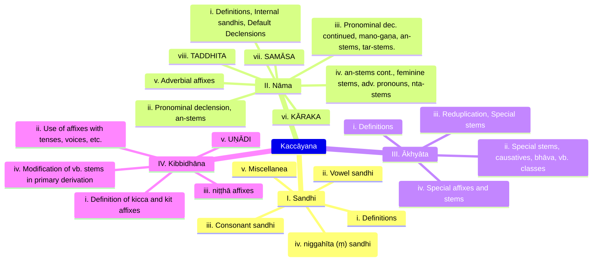

### Types of rules in Kaccāyana

Several saññā “technical terms”, within an adhikāra “domain”, following
paribhāsā “metarules”, will be subject to vidhi “operations” in order to
derive words or sentences.

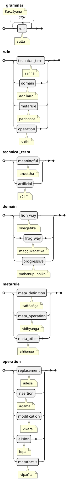

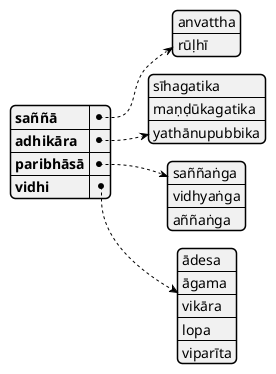

### How does a `vidhi` (operation) work

Most vidhi “operational” rules teach paccaya “affixation” or ādesa “replacement” using previous definitions (saññā-s). It is all about adding particles to a base, and then replacing them if/when needed.

To understand vidhi-s, we should keep in mind the following code of case endings:

* ABL. = “after X”
* GEN. = “instead of X”
* NOM., ACC. = “X”, ādesa ("replacement")
* LOCATIVE1: “before X”
* LOCATIVE2: “in the sense of X”

#### Affixation (`paccaya`)

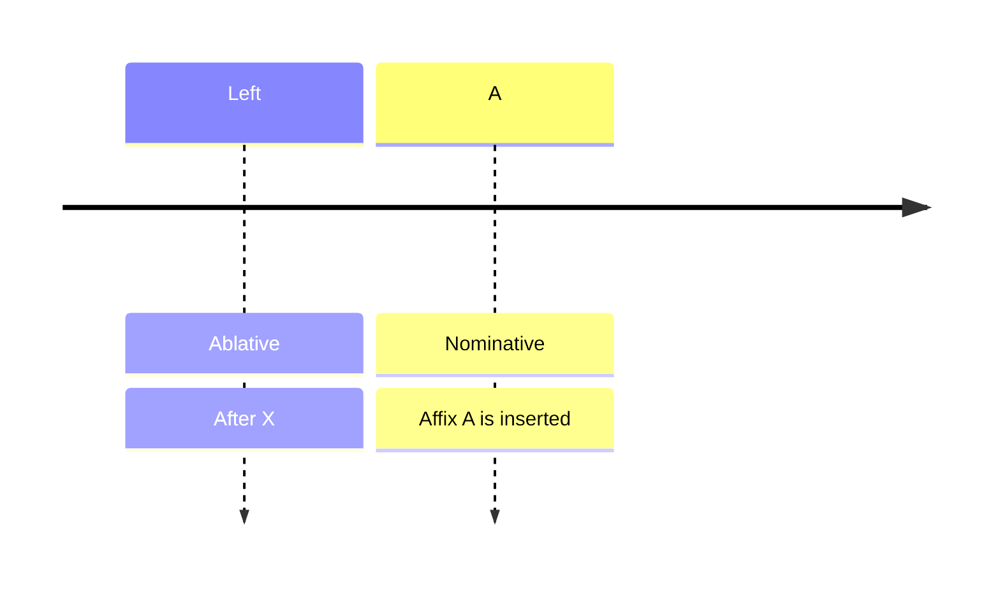

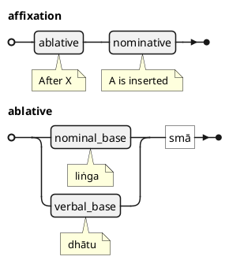

#### Replacement (`ādesa`)

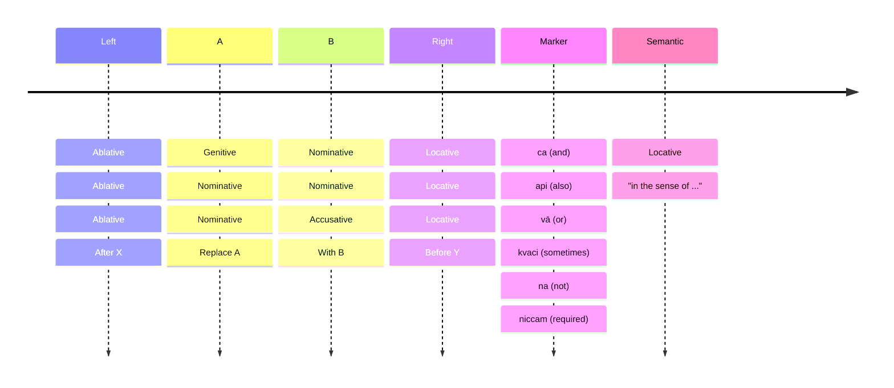

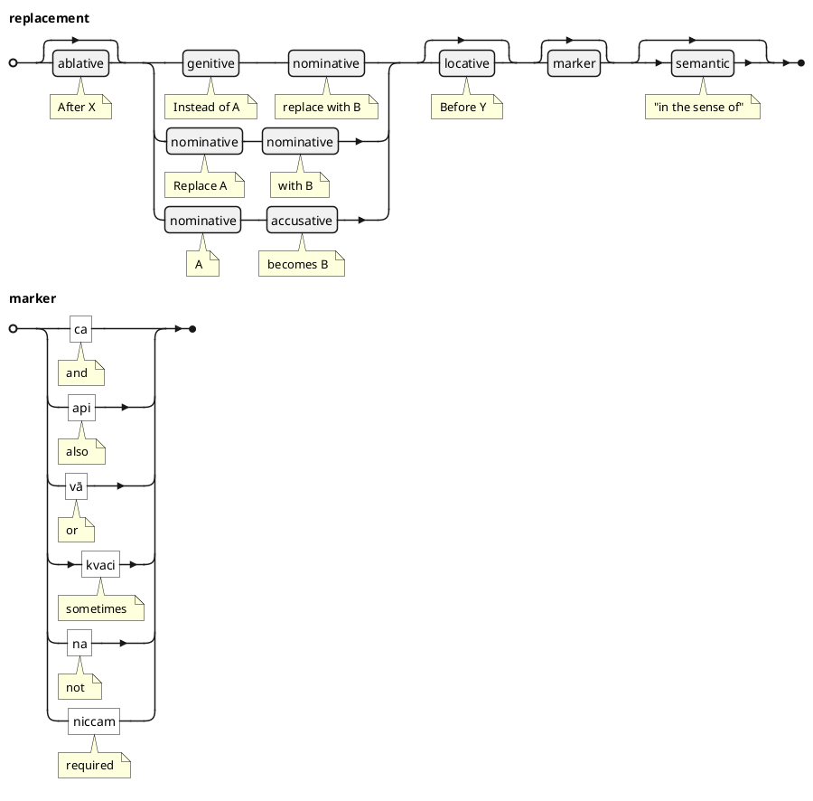

#### Elision (`lopaṃ`)

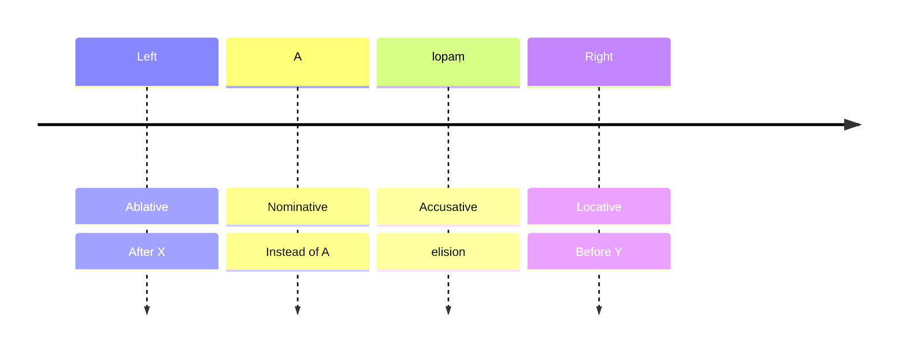

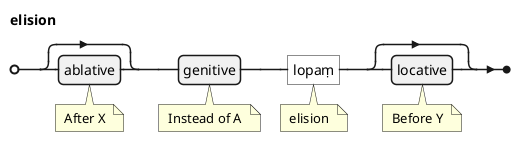

### Structure of a rule (`sutta`)

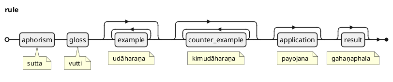

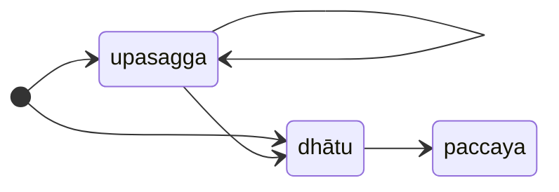
