```plantuml
@startebnf
(*
  Extended Backus-Naur form (EBNF)
  ================================

  EBNF is a code that expresses the grammar of a formal language.
*)

grammar = { rule } ;
rule = lhs , "=" , rhs , ";" ;

lhs = identifier ;
rhs = identifier
     | terminal
     | "[" , rhs , "]" (* optional *)
     | "{" , rhs , "}" (* repetition *)
     | "(" , rhs , ")" (* group *)
     | rhs , "|" , rhs (* choice *)
     | rhs , "," , rhs (* sequence *);

identifier = letter , { letter | digit | " " } ;
terminal = "'" , character , { character } , "'"
         | '"' , character , { character } , '"' ;

character = letter | digit | symbol | " " ;

(*
  Basic components
  ----------------

  These are low level components, the small building blocks.
*)

letter = "A" | "B" | "C" | "D" | "E" | "F" | "G"
       | "H" | "I" | "J" | "K" | "L" | "M" | "N"
       | "O" | "P" | "Q" | "R" | "S" | "T" | "U"
       | "V" | "W" | "X" | "Y" | "Z" | "a" | "b"
       | "c" | "d" | "e" | "f" | "g" | "h" | "i"
       | "j" | "k" | "l" | "m" | "n" | "o" | "p"
       | "q" | "r" | "s" | "t" | "u" | "v" | "w"
       | "x" | "y" | "z" ;

digit = "0" | "1" | "2" | "3" | "4" | "5" | "6" | "7" | "8" | "9" ;

symbol = "[" | "]" | "{" | "}" | "(" | ")" | "<" | ">"
       | "'" | '"' | "=" | "|" | "." | "," | ";" ;


@endebnf
```

EBNF Overview
: [Wikipedia](https://en.wikipedia.org/wiki/Extended_Backus–Naur_form)

EBNF 2 Railroad
: [Webpage](https://matthijsgroen.github.io/ebnf2railroad/)

EBNF Parser & Syntax Diagram Renderer
: [Webpage](https://karmin.ch/ebnf/index)

RR - Railroad Diagram Generator
: [Github repo](https://github.com/GuntherRademacher/rr)

PlantUML integration
: [PlantUML](https://plantuml.com/ebnf)
