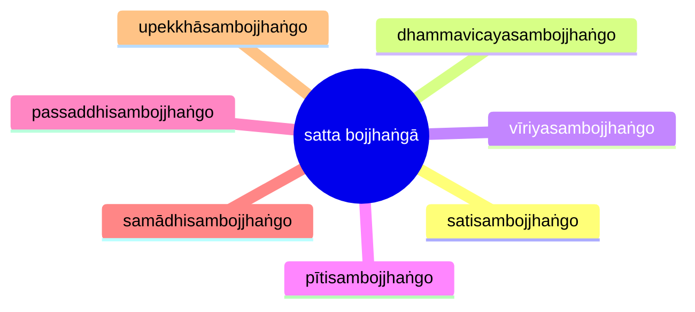

import { Tabs, TabItem } from '@astrojs/starlight/components';

[14S5/2.1.1 Himavantasutta](https://tipitaka2500.github.io/tipitaka/14S5/2/2.1/2.1.1.html)

<Tabs syncKey="paliquote">
<TabItem label="My Translation">
364\. [The Bhagavā] was staying at Sāvatthī.

> “Just as, bhikkhave, relying on the Himālaya, the king of mountains,
> * elephants grow in body and gain strength;
> * having grown in body and gained strength there, they descend into small pools,
> * having descended into small pools, they descend into large pools,
> * having descended into large pools, they descend into small rivers,
> * having descended into small rivers, they descend into great rivers,
> * having descended into great rivers, they descend into the great ocean;
> * there they attain great bulk and vastness of body;
>
> in the same way, bhikkhave, a bhikkhu, relying on virtue, established in virtue, developing the seven factors of awakening, cultivating the seven factors of awakening, attains greatness and full development in the Dhamma.
>
> And how, bhikkhave, does a bhikkhu, relying on virtue, established in virtue, developing the seven factors of awakening, cultivating the seven factors of awakening, attain greatness and full development in the Dhamma? Here, bhikkhave, a bhikkhu
>
> * develops the factor of awakening of `sati` (awareness), which is based on seclusion, dispassion, cessation, and culminates in relinquishment;
> * develops the factor of awakening of `dhammavicaya` (investigation of phenomena) ... ;
> * develops the factor of awakening of `vīriya` (energy) ... ;
> * develops the factor of awakening of `pīti` (joy) ... ;
> * develops the factor of awakening of `passaddhi` (tranquility) ... ;
> * develops the factor of awakening of `samādhi` (focus) ... ;
> * develops the factor of awakening of `upekkhā` (equanimity) ...
>
> It is in this way, bhikkhave, that a bhikkhu, relying on virtue, established in virtue, developing the seven factors of awakening, cultivating the seven factors of awakening, attains greatness and full development in the Dhamma.”
</TabItem>

<TabItem label="Pāḷi (Roman IAST)">
364\. Sāvatthinidānaṃ. “Seyyathāpi, bhikkhave, himavantaṃ pabbatarājānaṃ nissāya nāgā kāyaṃ vaḍḍhenti, balaṃ gāhenti; te tattha kāyaṃ vaḍḍhetvā balaṃ gāhetvā kusobbhe otaranti, kusobbhe otaritvā mahāsobbhe otaranti, mahāsobbhe otaritvā kunnadiyo otaranti, kunnadiyo otaritvā mahānadiyo otaranti, mahānadiyo otaritvā mahāsamuddasāgaraṃ otaranti; te tattha mahantattaṃ vepullattaṃ āpajjanti kāyena; evameva kho, bhikkhave, bhikkhu sīlaṃ nissāya sīle patiṭṭhāya satta bojjhaṅge bhāvento satta bojjhaṅge bahulīkaronto mahantattaṃ vepullattaṃ pāpuṇāti dhammesu. Kathañca, bhikkhave, bhikkhu sīlaṃ nissāya sīle patiṭṭhāya satta bojjhaṅge bhāvento satta bojjhaṅge bahulīkaronto mahantattaṃ vepullattaṃ pāpuṇāti dhammesūti? Idha, bhikkhave, bhikkhu satisambojjhaṅgaṃ bhāveti vivekanissitaṃ virāganissitaṃ nirodhanissitaṃ vossaggapariṇāmiṃ; dhammavicayasambojjhaṅgaṃ bhāveti…pe…  vīriyasambojjhaṅgaṃ bhāveti…pe…  pītisambojjhaṅgaṃ bhāveti…pe…  passaddhisambojjhaṅgaṃ bhāveti…pe…  samādhisambojjhaṅgaṃ bhāveti…pe…  upekkhāsambojjhaṅgaṃ bhāveti vivekanissitaṃ virāganissitaṃ nirodhanissitaṃ vossaggapariṇāmiṃ. Evaṃ kho, bhikkhave, bhikkhu sīlaṃ nissāya sīle patiṭṭhāya satta bojjhaṅge bhāvento satta bojjhaṅge bahulīkaronto mahantattaṃ vepullattaṃ pāpuṇāti dhammesū”ti.
</TabItem>

<TabItem label="Pāḷi (Brahmi)">
364\. 𑀲𑀸𑀯𑀢𑁆𑀣𑀺𑀦𑀺𑀤𑀸𑀦𑀁. “𑀲𑁂𑀬𑁆𑀬𑀣𑀸𑀧𑀺, 𑀪𑀺𑀓𑁆𑀔𑀯𑁂, 𑀳𑀺𑀫𑀯𑀦𑁆𑀢𑀁 𑀧𑀩𑁆𑀩𑀢𑀭𑀸𑀚𑀸𑀦𑀁 𑀦𑀺𑀲𑁆𑀲𑀸𑀬 𑀦𑀸𑀕𑀸 𑀓𑀸𑀬𑀁 𑀯𑀟𑁆𑀠𑁂𑀦𑁆𑀢𑀺, 𑀩𑀮𑀁 𑀕𑀸𑀳𑁂𑀦𑁆𑀢𑀺; 𑀢𑁂 𑀢𑀢𑁆𑀣 𑀓𑀸𑀬𑀁 𑀯𑀟𑁆𑀠𑁂𑀢𑁆𑀯𑀸 𑀩𑀮𑀁 𑀕𑀸𑀳𑁂𑀢𑁆𑀯𑀸 𑀓𑀼𑀲𑁄𑀩𑁆𑀪𑁂 𑀑𑀢𑀭𑀦𑁆𑀢𑀺, 𑀓𑀼𑀲𑁄𑀩𑁆𑀪𑁂 𑀑𑀢𑀭𑀺𑀢𑁆𑀯𑀸 𑀫𑀳𑀸𑀲𑁄𑀩𑁆𑀪𑁂 𑀑𑀢𑀭𑀦𑁆𑀢𑀺, 𑀫𑀳𑀸𑀲𑁄𑀩𑁆𑀪𑁂 𑀑𑀢𑀭𑀺𑀢𑁆𑀯𑀸 𑀓𑀼𑀦𑁆𑀦𑀤𑀺𑀬𑁄 𑀑𑀢𑀭𑀦𑁆𑀢𑀺, 𑀓𑀼𑀦𑁆𑀦𑀤𑀺𑀬𑁄 𑀑𑀢𑀭𑀺𑀢𑁆𑀯𑀸 𑀫𑀳𑀸𑀦𑀤𑀺𑀬𑁄 𑀑𑀢𑀭𑀦𑁆𑀢𑀺, 𑀫𑀳𑀸𑀦𑀤𑀺𑀬𑁄 𑀑𑀢𑀭𑀺𑀢𑁆𑀯𑀸 𑀫𑀳𑀸𑀲𑀫𑀼𑀤𑁆𑀤𑀲𑀸𑀕𑀭𑀁 𑀑𑀢𑀭𑀦𑁆𑀢𑀺; 𑀢𑁂 𑀢𑀢𑁆𑀣 𑀫𑀳𑀦𑁆𑀢𑀢𑁆𑀢𑀁 𑀯𑁂𑀧𑀼𑀮𑁆𑀮𑀢𑁆𑀢𑀁 𑀆𑀧𑀚𑁆𑀚𑀦𑁆𑀢𑀺 𑀓𑀸𑀬𑁂𑀦; 𑀏𑀯𑀫𑁂𑀯 𑀔𑁄, 𑀪𑀺𑀓𑁆𑀔𑀯𑁂, 𑀪𑀺𑀓𑁆𑀔𑀼 𑀲𑀻𑀮𑀁 𑀦𑀺𑀲𑁆𑀲𑀸𑀬 𑀲𑀻𑀮𑁂 𑀧𑀢𑀺𑀝𑁆𑀞𑀸𑀬 𑀲𑀢𑁆𑀢 𑀩𑁄𑀚𑁆𑀛𑀗𑁆𑀕𑁂 𑀪𑀸𑀯𑁂𑀦𑁆𑀢𑁄 𑀲𑀢𑁆𑀢 𑀩𑁄𑀚𑁆𑀛𑀗𑁆𑀕𑁂 𑀩𑀳𑀼𑀮𑀻𑀓𑀭𑁄𑀦𑁆𑀢𑁄 𑀫𑀳𑀦𑁆𑀢𑀢𑁆𑀢𑀁 𑀯𑁂𑀧𑀼𑀮𑁆𑀮𑀢𑁆𑀢𑀁 𑀧𑀸𑀧𑀼𑀡𑀸𑀢𑀺 𑀥𑀫𑁆𑀫𑁂𑀲𑀼. 𑀓𑀣𑀜𑁆𑀘, 𑀪𑀺𑀓𑁆𑀔𑀯𑁂, 𑀪𑀺𑀓𑁆𑀔𑀼 𑀲𑀻𑀮𑀁 𑀦𑀺𑀲𑁆𑀲𑀸𑀬 𑀲𑀻𑀮𑁂 𑀧𑀢𑀺𑀝𑁆𑀞𑀸𑀬 𑀲𑀢𑁆𑀢 𑀩𑁄𑀚𑁆𑀛𑀗𑁆𑀕𑁂 𑀪𑀸𑀯𑁂𑀦𑁆𑀢𑁄 𑀲𑀢𑁆𑀢 𑀩𑁄𑀚𑁆𑀛𑀗𑁆𑀕𑁂 𑀩𑀳𑀼𑀮𑀻𑀓𑀭𑁄𑀦𑁆𑀢𑁄 𑀫𑀳𑀦𑁆𑀢𑀢𑁆𑀢𑀁 𑀯𑁂𑀧𑀼𑀮𑁆𑀮𑀢𑁆𑀢𑀁 𑀧𑀸𑀧𑀼𑀡𑀸𑀢𑀺 𑀥𑀫𑁆𑀫𑁂𑀲𑀽𑀢𑀺? 𑀇𑀥, 𑀪𑀺𑀓𑁆𑀔𑀯𑁂, 𑀪𑀺𑀓𑁆𑀔𑀼 𑀲𑀢𑀺𑀲𑀫𑁆𑀩𑁄𑀚𑁆𑀛𑀗𑁆𑀕𑀁 𑀪𑀸𑀯𑁂𑀢𑀺 𑀯𑀺𑀯𑁂𑀓𑀦𑀺𑀲𑁆𑀲𑀺𑀢𑀁 𑀯𑀺𑀭𑀸𑀕𑀦𑀺𑀲𑁆𑀲𑀺𑀢𑀁 𑀦𑀺𑀭𑁄𑀥𑀦𑀺𑀲𑁆𑀲𑀺𑀢𑀁 𑀯𑁄𑀲𑁆𑀲𑀕𑁆𑀕𑀧𑀭𑀺𑀡𑀸𑀫𑀺𑀁; 𑀥𑀫𑁆𑀫𑀯𑀺𑀘𑀬𑀲𑀫𑁆𑀩𑁄𑀚𑁆𑀛𑀗𑁆𑀕𑀁 𑀪𑀸𑀯𑁂𑀢𑀺…𑀧𑁂…  𑀯𑀻𑀭𑀺𑀬𑀲𑀫𑁆𑀩𑁄𑀚𑁆𑀛𑀗𑁆𑀕𑀁 𑀪𑀸𑀯𑁂𑀢𑀺…𑀧𑁂…  𑀧𑀻𑀢𑀺𑀲𑀫𑁆𑀩𑁄𑀚𑁆𑀛𑀗𑁆𑀕𑀁 𑀪𑀸𑀯𑁂𑀢𑀺…𑀧𑁂…  𑀧𑀲𑁆𑀲𑀤𑁆𑀥𑀺𑀲𑀫𑁆𑀩𑁄𑀚𑁆𑀛𑀗𑁆𑀕𑀁 𑀪𑀸𑀯𑁂𑀢𑀺…𑀧𑁂…  𑀲𑀫𑀸𑀥𑀺𑀲𑀫𑁆𑀩𑁄𑀚𑁆𑀛𑀗𑁆𑀕𑀁 𑀪𑀸𑀯𑁂𑀢𑀺…𑀧𑁂…  𑀉𑀧𑁂𑀓𑁆𑀔𑀸𑀲𑀫𑁆𑀩𑁄𑀚𑁆𑀛𑀗𑁆𑀕𑀁 𑀪𑀸𑀯𑁂𑀢𑀺 𑀯𑀺𑀯𑁂𑀓𑀦𑀺𑀲𑁆𑀲𑀺𑀢𑀁 𑀯𑀺𑀭𑀸𑀕𑀦𑀺𑀲𑁆𑀲𑀺𑀢𑀁 𑀦𑀺𑀭𑁄𑀥𑀦𑀺𑀲𑁆𑀲𑀺𑀢𑀁 𑀯𑁄𑀲𑁆𑀲𑀕𑁆𑀕𑀧𑀭𑀺𑀡𑀸𑀫𑀺𑀁. 𑀏𑀯𑀁 𑀔𑁄, 𑀪𑀺𑀓𑁆𑀔𑀯𑁂, 𑀪𑀺𑀓𑁆𑀔𑀼 𑀲𑀻𑀮𑀁 𑀦𑀺𑀲𑁆𑀲𑀸𑀬 𑀲𑀻𑀮𑁂 𑀧𑀢𑀺𑀝𑁆𑀞𑀸𑀬 𑀲𑀢𑁆𑀢 𑀩𑁄𑀚𑁆𑀛𑀗𑁆𑀕𑁂 𑀪𑀸𑀯𑁂𑀦𑁆𑀢𑁄 𑀲𑀢𑁆𑀢 𑀩𑁄𑀚𑁆𑀛𑀗𑁆𑀕𑁂 𑀩𑀳𑀼𑀮𑀻𑀓𑀭𑁄𑀦𑁆𑀢𑁄 𑀫𑀳𑀦𑁆𑀢𑀢𑁆𑀢𑀁 𑀯𑁂𑀧𑀼𑀮𑁆𑀮𑀢𑁆𑀢𑀁 𑀧𑀸𑀧𑀼𑀡𑀸𑀢𑀺 𑀥𑀫𑁆𑀫𑁂𑀲𑀽”𑀢𑀺.
</TabItem>
</Tabs>

