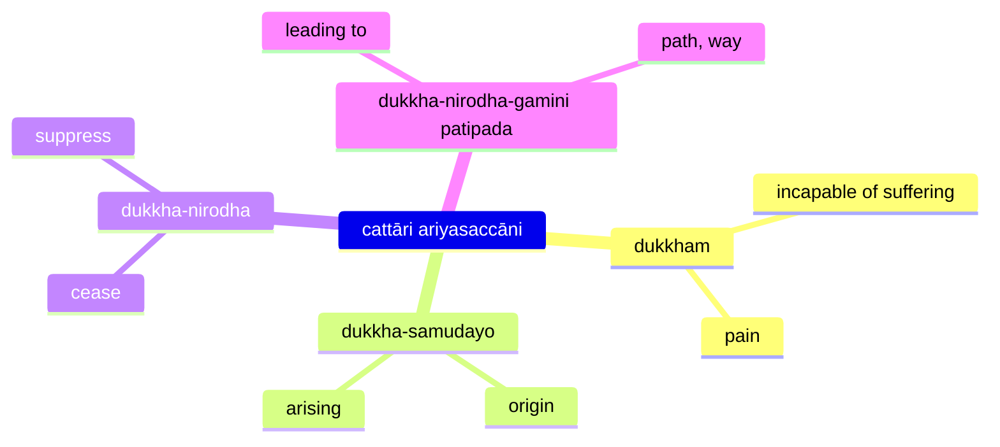

The basic teaching of the four realisations (`dukkham samudayo nirodho magga`) can be expressed as a medical diagnosis ([The Dawn of Abhidharma](https://www.buddhismuskunde.uni-hamburg.de/pdf/4-publikationen/hamburg-buddhist-studies/hamburgup-hbs2-analayo-abhidharma.pdf) p. 113):

* disease: duḥkha
* pathogen: craving
* health: nirvāṇa
* cure: eightfold path

## cattāri ariyasaccāni

## This is not mine, I am not this, this is not my essence.

netaṁ mama, nesohamasmi, na meso attāti— \
evametaṁ yathābhūtaṁ sammappaññāya daṭṭhabbaṁ.

## Reference

- [Mahāsatipaṭṭhānasutta DN 22 PTS 2.290–2.315 PT](https://suttacentral.net/dn22)
- [Saccavibhaṅgasutta MN 141 PTS 3.248–3.252](https://suttacentral.net/mn141)
- [Mahākhandhaka Pli Tv Kd 1 PTS 1.1–1.100 P](https://suttacentral.net/pli-tv-kd1)
