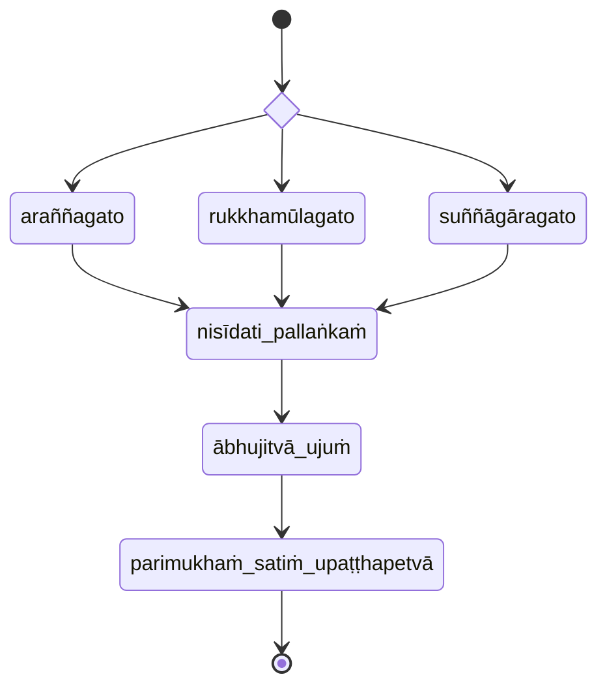

#### Kāyānupassanāānāpānapabba

## Reference

- [Mahāsatipaṭṭhānasutta DN 22 PTS 2.290–2.315 PT SC](https://suttacentral.net/dn22)
- [Mahāsatipaṭṭhānasuttaṁ (DN 22) ABT](https://www.ancient-buddhist-texts.net/Buddhist-Texts/D22-Mahasatipatthana/index.htm)
- [Saccavibhaṅgasutta MN 141 PTS 3.248–3.252](https://suttacentral.net/mn141)
- [Mahākhandhaka Pli Tv Kd 1 PTS 1.1–1.100 P](https://suttacentral.net/pli-tv-kd1)