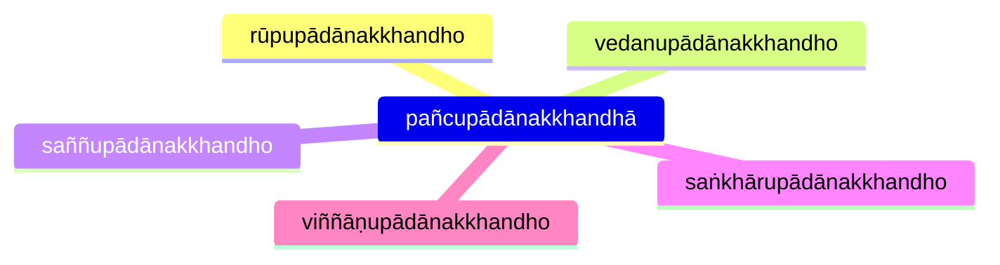
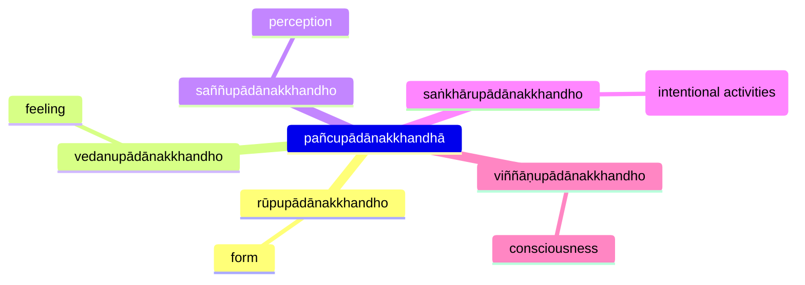

## Reference

* [3V/1.6 Pañcavaggiyakathā #89-104](https://tipitaka2500.github.io/tipitaka/3V/1/1.6.html#89)
* [7D/9.4.2 Dhammānupassanākhandhapabba](https://tipitaka2500.github.io/tipitaka/7D/9/9.4/9.4.2.html)
