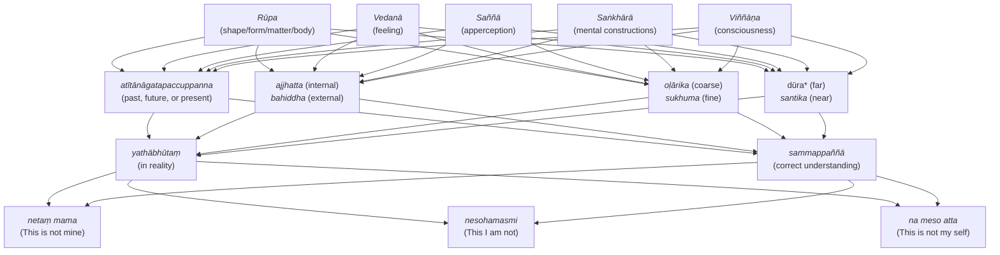
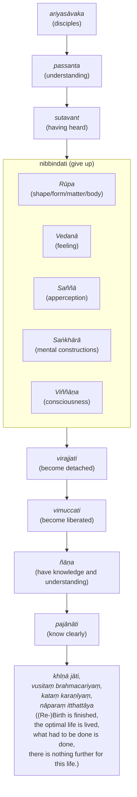

import { Tabs, TabItem } from '@astrojs/starlight/components';

The Five Collections acting as fuel (`pañcupādānakkhandhā`) breaks our sense of identity down into components, and show that the sum total of who we believe we are are nothing more than a impermanent and ever shifting collection of processed phenomena experienced through our senses. It is clearly a refinement of the dependent origination framework. The Buddha uses it to disprove prevailing Brahmanical and Jain ideas of an eternal self that can be "purified" in order to attain "enlightenment".

## The collections are not an "eternal self"

<Tabs syncKey="paliquote">
<TabItem label="My Translation">
298\.
>
> * “`Rūpaṃ` (shape/form/matter/body), bhikkhave, is not `atta` (the Bramanical concept of an eternal self, not necessarily our identity as a "self").
> * If form, bhikkhave, were self, it would not lead to affliction, and one could say of form: ‘Let my form be thus, let my form not be thus.’
> * But because form, bhikkhave, is not self, therefore form leads to affliction, and one cannot say of form: ‘Let my form be thus, let my form not be thus.’

299\. `Vedanā` (feelings) is not self ...

300\. `Saññā` (apperceptions) is not self ...

`Saṅkhārā` (mental constructions) are not self ...

301\. `Viññāṇaṃ` (consciousness) is not self ...
</TabItem>

<TabItem label="Pāḷi (Roman IAST)">
298\. “Rūpaṃ, bhikkhave, anattā. Rūpañca hidaṃ, bhikkhave, attā abhavissa, nayidaṃ rūpaṃ ābādhāya saṃvatteyya, labbhetha ca rūpe—  ‘evaṃ me rūpaṃ hotu, evaṃ me rūpaṃ mā ahosī’ti. Yasmā ca kho, bhikkhave, rūpaṃ anattā, tasmā rūpaṃ ābādhāya saṃvattati, na ca labbhati rūpe—  ‘evaṃ me rūpaṃ hotu, evaṃ me rūpaṃ mā ahosī’ti.

299\. Vedanā anattā. Vedanā ca hidaṃ, bhikkhave, attā abhavissa, nayidaṃ vedanā ābādhāya saṃvatteyya, labbhetha ca vedanāya—  ‘evaṃ me vedanā hotu, evaṃ me vedanā mā ahosī’ti. Yasmā ca kho, bhikkhave, vedanā anattā, tasmā vedanā ābādhāya saṃvattati, na ca labbhati vedanāya—  ‘evaṃ me vedanā hotu, evaṃ me vedanā mā ahosī’ti.

300\. Saññā anattā…pe…  saṅkhārā anattā. Saṅkhārā ca hidaṃ, bhikkhave, attā abhavissaṃsu, nayidaṃ saṅkhārā ābādhāya saṃvatteyyuṃ, labbhetha ca saṅkhāresu—  ‘evaṃ me saṅkhārā hontu, evaṃ me saṅkhārā mā ahesun’ti. Yasmā ca kho, bhikkhave, saṅkhārā anattā, tasmā saṅkhārā ābādhāya saṃvattanti, na ca labbhati saṅkhāresu—  ‘evaṃ me saṅkhārā hontu, evaṃ me saṅkhārā mā ahesun’ti.

301\. Viññāṇaṃ anattā. Viññāṇañca hidaṃ, bhikkhave, attā abhavissa, nayidaṃ viññāṇaṃ ābādhāya saṃvatteyya, labbhetha ca viññāṇe—  ‘evaṃ me viññāṇaṃ hotu, evaṃ me viññāṇaṃ mā ahosī’ti. Yasmā ca kho, bhikkhave, viññāṇaṃ anattā, tasmā viññāṇaṃ ābādhāya saṃvattati, na ca labbhati viññāṇe—  ‘evaṃ me viññāṇaṃ hotu, evaṃ me viññāṇaṃ mā ahosī’ti.
</TabItem>

<TabItem label="Pāḷi (Brahmi)">
298\. “𑀭𑀽𑀧𑀁, 𑀪𑀺𑀓𑁆𑀔𑀯𑁂, 𑀅𑀦𑀢𑁆𑀢𑀸. 𑀭𑀽𑀧𑀜𑁆𑀘 𑀳𑀺𑀤𑀁, 𑀪𑀺𑀓𑁆𑀔𑀯𑁂, 𑀅𑀢𑁆𑀢𑀸 𑀅𑀪𑀯𑀺𑀲𑁆𑀲, 𑀦𑀬𑀺𑀤𑀁 𑀭𑀽𑀧𑀁 𑀆𑀩𑀸𑀥𑀸𑀬 𑀲𑀁𑀯𑀢𑁆𑀢𑁂𑀬𑁆𑀬, 𑀮𑀩𑁆𑀪𑁂𑀣 𑀘 𑀭𑀽𑀧𑁂—  ‘𑀏𑀯𑀁 𑀫𑁂 𑀭𑀽𑀧𑀁 𑀳𑁄𑀢𑀼, 𑀏𑀯𑀁 𑀫𑁂 𑀭𑀽𑀧𑀁 𑀫𑀸 𑀅𑀳𑁄𑀲𑀻’𑀢𑀺. 𑀬𑀲𑁆𑀫𑀸 𑀘 𑀔𑁄, 𑀪𑀺𑀓𑁆𑀔𑀯𑁂, 𑀭𑀽𑀧𑀁 𑀅𑀦𑀢𑁆𑀢𑀸, 𑀢𑀲𑁆𑀫𑀸 𑀭𑀽𑀧𑀁 𑀆𑀩𑀸𑀥𑀸𑀬 𑀲𑀁𑀯𑀢𑁆𑀢𑀢𑀺, 𑀦 𑀘 𑀮𑀩𑁆𑀪𑀢𑀺 𑀭𑀽𑀧𑁂—  ‘𑀏𑀯𑀁 𑀫𑁂 𑀭𑀽𑀧𑀁 𑀳𑁄𑀢𑀼, 𑀏𑀯𑀁 𑀫𑁂 𑀭𑀽𑀧𑀁 𑀫𑀸 𑀅𑀳𑁄𑀲𑀻’𑀢𑀺.

299\. 𑀯𑁂𑀤𑀦𑀸 𑀅𑀦𑀢𑁆𑀢𑀸. 𑀯𑁂𑀤𑀦𑀸 𑀘 𑀳𑀺𑀤𑀁, 𑀪𑀺𑀓𑁆𑀔𑀯𑁂, 𑀅𑀢𑁆𑀢𑀸 𑀅𑀪𑀯𑀺𑀲𑁆𑀲, 𑀦𑀬𑀺𑀤𑀁 𑀯𑁂𑀤𑀦𑀸 𑀆𑀩𑀸𑀥𑀸𑀬 𑀲𑀁𑀯𑀢𑁆𑀢𑁂𑀬𑁆𑀬, 𑀮𑀩𑁆𑀪𑁂𑀣 𑀘 𑀯𑁂𑀤𑀦𑀸𑀬—  ‘𑀏𑀯𑀁 𑀫𑁂 𑀯𑁂𑀤𑀦𑀸 𑀳𑁄𑀢𑀼, 𑀏𑀯𑀁 𑀫𑁂 𑀯𑁂𑀤𑀦𑀸 𑀫𑀸 𑀅𑀳𑁄𑀲𑀻’𑀢𑀺. 𑀬𑀲𑁆𑀫𑀸 𑀘 𑀔𑁄, 𑀪𑀺𑀓𑁆𑀔𑀯𑁂, 𑀯𑁂𑀤𑀦𑀸 𑀅𑀦𑀢𑁆𑀢𑀸, 𑀢𑀲𑁆𑀫𑀸 𑀯𑁂𑀤𑀦𑀸 𑀆𑀩𑀸𑀥𑀸𑀬 𑀲𑀁𑀯𑀢𑁆𑀢𑀢𑀺, 𑀦 𑀘 𑀮𑀩𑁆𑀪𑀢𑀺 𑀯𑁂𑀤𑀦𑀸𑀬—  ‘𑀏𑀯𑀁 𑀫𑁂 𑀯𑁂𑀤𑀦𑀸 𑀳𑁄𑀢𑀼, 𑀏𑀯𑀁 𑀫𑁂 𑀯𑁂𑀤𑀦𑀸 𑀫𑀸 𑀅𑀳𑁄𑀲𑀻’𑀢𑀺.

300\. 𑀲𑀜𑁆𑀜𑀸 𑀅𑀦𑀢𑁆𑀢𑀸…𑀧𑁂…  𑀲𑀗𑁆𑀔𑀸𑀭𑀸 𑀅𑀦𑀢𑁆𑀢𑀸. 𑀲𑀗𑁆𑀔𑀸𑀭𑀸 𑀘 𑀳𑀺𑀤𑀁, 𑀪𑀺𑀓𑁆𑀔𑀯𑁂, 𑀅𑀢𑁆𑀢𑀸 𑀅𑀪𑀯𑀺𑀲𑁆𑀲𑀁𑀲𑀼, 𑀦𑀬𑀺𑀤𑀁 𑀲𑀗𑁆𑀔𑀸𑀭𑀸 𑀆𑀩𑀸𑀥𑀸𑀬 𑀲𑀁𑀯𑀢𑁆𑀢𑁂𑀬𑁆𑀬𑀼𑀁, 𑀮𑀩𑁆𑀪𑁂𑀣 𑀘 𑀲𑀗𑁆𑀔𑀸𑀭𑁂𑀲𑀼—  ‘𑀏𑀯𑀁 𑀫𑁂 𑀲𑀗𑁆𑀔𑀸𑀭𑀸 𑀳𑁄𑀦𑁆𑀢𑀼, 𑀏𑀯𑀁 𑀫𑁂 𑀲𑀗𑁆𑀔𑀸𑀭𑀸 𑀫𑀸 𑀅𑀳𑁂𑀲𑀼𑀦𑁆’𑀢𑀺. 𑀬𑀲𑁆𑀫𑀸 𑀘 𑀔𑁄, 𑀪𑀺𑀓𑁆𑀔𑀯𑁂, 𑀲𑀗𑁆𑀔𑀸𑀭𑀸 𑀅𑀦𑀢𑁆𑀢𑀸, 𑀢𑀲𑁆𑀫𑀸 𑀲𑀗𑁆𑀔𑀸𑀭𑀸 𑀆𑀩𑀸𑀥𑀸𑀬 𑀲𑀁𑀯𑀢𑁆𑀢𑀦𑁆𑀢𑀺, 𑀦 𑀘 𑀮𑀩𑁆𑀪𑀢𑀺 𑀲𑀗𑁆𑀔𑀸𑀭𑁂𑀲𑀼—  ‘𑀏𑀯𑀁 𑀫𑁂 𑀲𑀗𑁆𑀔𑀸𑀭𑀸 𑀳𑁄𑀦𑁆𑀢𑀼, 𑀏𑀯𑀁 𑀫𑁂 𑀲𑀗𑁆𑀔𑀸𑀭𑀸 𑀫𑀸 𑀅𑀳𑁂𑀲𑀼𑀦𑁆’𑀢𑀺.

301\. 𑀯𑀺𑀜𑁆𑀜𑀸𑀡𑀁 𑀅𑀦𑀢𑁆𑀢𑀸. 𑀯𑀺𑀜𑁆𑀜𑀸𑀡𑀜𑁆𑀘 𑀳𑀺𑀤𑀁, 𑀪𑀺𑀓𑁆𑀔𑀯𑁂, 𑀅𑀢𑁆𑀢𑀸 𑀅𑀪𑀯𑀺𑀲𑁆𑀲, 𑀦𑀬𑀺𑀤𑀁 𑀯𑀺𑀜𑁆𑀜𑀸𑀡𑀁 𑀆𑀩𑀸𑀥𑀸𑀬 𑀲𑀁𑀯𑀢𑁆𑀢𑁂𑀬𑁆𑀬, 𑀮𑀩𑁆𑀪𑁂𑀣 𑀘 𑀯𑀺𑀜𑁆𑀜𑀸𑀡𑁂—  ‘𑀏𑀯𑀁 𑀫𑁂 𑀯𑀺𑀜𑁆𑀜𑀸𑀡𑀁 𑀳𑁄𑀢𑀼, 𑀏𑀯𑀁 𑀫𑁂 𑀯𑀺𑀜𑁆𑀜𑀸𑀡𑀁 𑀫𑀸 𑀅𑀳𑁄𑀲𑀻’𑀢𑀺. 𑀬𑀲𑁆𑀫𑀸 𑀘 𑀔𑁄, 𑀪𑀺𑀓𑁆𑀔𑀯𑁂, 𑀯𑀺𑀜𑁆𑀜𑀸𑀡𑀁 𑀅𑀦𑀢𑁆𑀢𑀸, 𑀢𑀲𑁆𑀫𑀸 𑀯𑀺𑀜𑁆𑀜𑀸𑀡𑀁 𑀆𑀩𑀸𑀥𑀸𑀬 𑀲𑀁𑀯𑀢𑁆𑀢𑀢𑀺, 𑀦 𑀘 𑀮𑀩𑁆𑀪𑀢𑀺 𑀯𑀺𑀜𑁆𑀜𑀸𑀡𑁂—  ‘𑀏𑀯𑀁 𑀫𑁂 𑀯𑀺𑀜𑁆𑀜𑀸𑀡𑀁 𑀳𑁄𑀢𑀼, 𑀏𑀯𑀁 𑀫𑁂 𑀯𑀺𑀜𑁆𑀜𑀸𑀡𑀁 𑀫𑀸 𑀅𑀳𑁄𑀲𑀻’𑀢𑀺.
</TabItem>
</Tabs>

## The collections are impermanent

<Tabs syncKey="paliquote">
<TabItem label="My Translation">
302\.
>
> “What do you think, bhikkhave, is form permanent or impermanent?”
>
> “`Aniccaṃ` (impermanent), Bhante.”
>
> “Now, what is impermanent, is it suffering or happiness?”
>
> “Suffering, Bhante.”
>
> “Now, what is impermanent, suffering, and subject to change, is it fit to regard as: `etaṃ mama, esohamasmi, eso me attā` (This is mine, this I am, this is my self)?”
>
> “No, Bhante.”
>
> “Feelings ...
> * apperceptions ...
> * mental constructions ...
> * consciousness ...

303\. “Therefore, bhikkhave, whatever form:
>
> * whether past, present, or future,
> * internal or external,
> * gross or subtle,
> * inferior or superior,
> * far or near
>
> * — all form should be `yathābhūtaṃ` (seen as it actually is) with `sammappaññā` (correct understanding): ‘This is not mine, this I am not, this is not my self.’

304\. Whatever feelings ...

305\. Whatever apperceptions ...

Whatever mental constructions ....

306\. Whatever consciousness ...
</TabItem>

<TabItem label="Pāḷi (Roman IAST)">
302\. Taṃ kiṃ maññatha, bhikkhave, rūpaṃ niccaṃ vā aniccaṃ vā”ti? “Aniccaṃ, bhante”. “Yaṃ panāniccaṃ dukkhaṃ vā taṃ sukhaṃ vā”ti? “Dukkhaṃ, bhante”. “Yaṃ panāniccaṃ dukkhaṃ vipariṇāmadhammaṃ, kallaṃ nu taṃ samanupassituṃ—  ‘etaṃ mama, esohamasmi, eso me attā’”ti? “No hetaṃ, bhante”. “Vedanā…  saññā…  saṅkhārā…  viññāṇaṃ niccaṃ vā aniccaṃ vā”ti? “Aniccaṃ, bhante”. “Yaṃ panāniccaṃ dukkhaṃ vā taṃ sukhaṃ vā”ti? “Dukkhaṃ, bhante”. “Yaṃ panāniccaṃ dukkhaṃ vipariṇāmadhammaṃ, kallaṃ nu taṃ samanupassituṃ—  ‘etaṃ mama, esohamasmi, eso me attā’”ti? “No hetaṃ, bhante”.

303\. “Tasmātiha, bhikkhave, yaṃ kiñci rūpaṃ atītānāgatapaccuppannaṃ ajjhattaṃ vā bahiddhā vā oḷārikaṃ vā sukhumaṃ vā hīnaṃ vā paṇītaṃ vā yaṃ dūre santike vā, sabbaṃ rūpaṃ—  ‘netaṃ mama, nesohamasmi, na meso attā’ti evametaṃ yathābhūtaṃ sammappaññāya daṭṭhabbaṃ.

304\. Yā kāci vedanā atītānāgatapaccuppannā ajjhattā vā bahiddhā vā…pe…  yā dūre santike vā, sabbā vedanā—  ‘netaṃ mama, nesohamasmi, na meso attā’ti evametaṃ yathābhūtaṃ sammappaññāya daṭṭhabbaṃ.

305\. Yā kāci saññā…pe…  ye keci saṅkhārā atītānāgatapaccuppannā ajjhattaṃ vā bahiddhā vā…pe…  ye dūre santike vā, sabbe saṅkhārā—  ‘netaṃ mama, nesohamasmi, na meso attā’ti evametaṃ yathābhūtaṃ sammappaññāya daṭṭhabbaṃ.

306\. Yaṃ kiñci viññāṇaṃ atītānāgatapaccuppannaṃ ajjhattaṃ vā bahiddhā vā oḷārikaṃ vā sukhumaṃ vā hīnaṃ vā paṇītaṃ vā yaṃ dūre santike vā, sabbaṃ viññāṇaṃ—  ‘netaṃ mama, nesohamasmi, na meso attā’ti evametaṃ yathābhūtaṃ sammappaññāya daṭṭhabbaṃ.
</TabItem>

<TabItem label="Pāḷi (Brahmi)">
    302\. 𑀢𑀁 𑀓𑀺𑀁 𑀫𑀜𑁆𑀜𑀣, 𑀪𑀺𑀓𑁆𑀔𑀯𑁂, 𑀭𑀽𑀧𑀁 𑀦𑀺𑀘𑁆𑀘𑀁 𑀯𑀸 𑀅𑀦𑀺𑀘𑁆𑀘𑀁 𑀯𑀸”𑀢𑀺? “𑀅𑀦𑀺𑀘𑁆𑀘𑀁, 𑀪𑀦𑁆𑀢𑁂”. “𑀬𑀁 𑀧𑀦𑀸𑀦𑀺𑀘𑁆𑀘𑀁 𑀤𑀼𑀓𑁆𑀔𑀁 𑀯𑀸 𑀢𑀁 𑀲𑀼𑀔𑀁 𑀯𑀸”𑀢𑀺? “𑀤𑀼𑀓𑁆𑀔𑀁, 𑀪𑀦𑁆𑀢𑁂”. “𑀬𑀁 𑀧𑀦𑀸𑀦𑀺𑀘𑁆𑀘𑀁 𑀤𑀼𑀓𑁆𑀔𑀁 𑀯𑀺𑀧𑀭𑀺𑀡𑀸𑀫𑀥𑀫𑁆𑀫𑀁, 𑀓𑀮𑁆𑀮𑀁 𑀦𑀼 𑀢𑀁 𑀲𑀫𑀦𑀼𑀧𑀲𑁆𑀲𑀺𑀢𑀼𑀁—  ‘𑀏𑀢𑀁 𑀫𑀫, 𑀏𑀲𑁄𑀳𑀫𑀲𑁆𑀫𑀺, 𑀏𑀲𑁄 𑀫𑁂 𑀅𑀢𑁆𑀢𑀸’”𑀢𑀺? “𑀦𑁄 𑀳𑁂𑀢𑀁, 𑀪𑀦𑁆𑀢𑁂”. “𑀯𑁂𑀤𑀦𑀸…  𑀲𑀜𑁆𑀜𑀸…  𑀲𑀗𑁆𑀔𑀸𑀭𑀸…  𑀯𑀺𑀜𑁆𑀜𑀸𑀡𑀁 𑀦𑀺𑀘𑁆𑀘𑀁 𑀯𑀸 𑀅𑀦𑀺𑀘𑁆𑀘𑀁 𑀯𑀸”𑀢𑀺? “𑀅𑀦𑀺𑀘𑁆𑀘𑀁, 𑀪𑀦𑁆𑀢𑁂”. “𑀬𑀁 𑀧𑀦𑀸𑀦𑀺𑀘𑁆𑀘𑀁 𑀤𑀼𑀓𑁆𑀔𑀁 𑀯𑀸 𑀢𑀁 𑀲𑀼𑀔𑀁 𑀯𑀸”𑀢𑀺? “𑀤𑀼𑀓𑁆𑀔𑀁, 𑀪𑀦𑁆𑀢𑁂”. “𑀬𑀁 𑀧𑀦𑀸𑀦𑀺𑀘𑁆𑀘𑀁 𑀤𑀼𑀓𑁆𑀔𑀁 𑀯𑀺𑀧𑀭𑀺𑀡𑀸𑀫𑀥𑀫𑁆𑀫𑀁, 𑀓𑀮𑁆𑀮𑀁 𑀦𑀼 𑀢𑀁 𑀲𑀫𑀦𑀼𑀧𑀲𑁆𑀲𑀺𑀢𑀼𑀁—  ‘𑀏𑀢𑀁 𑀫𑀫, 𑀏𑀲𑁄𑀳𑀫𑀲𑁆𑀫𑀺, 𑀏𑀲𑁄 𑀫𑁂 𑀅𑀢𑁆𑀢𑀸’”𑀢𑀺? “𑀦𑁄 𑀳𑁂𑀢𑀁, 𑀪𑀦𑁆𑀢𑁂”.

    303\. “𑀢𑀲𑁆𑀫𑀸𑀢𑀺𑀳, 𑀪𑀺𑀓𑁆𑀔𑀯𑁂, 𑀬𑀁 𑀓𑀺𑀜𑁆𑀘𑀺 𑀭𑀽𑀧𑀁 𑀅𑀢𑀻𑀢𑀸𑀦𑀸𑀕𑀢𑀧𑀘𑁆𑀘𑀼𑀧𑁆𑀧𑀦𑁆𑀦𑀁 𑀅𑀚𑁆𑀛𑀢𑁆𑀢𑀁 𑀯𑀸 𑀩𑀳𑀺𑀤𑁆𑀥𑀸 𑀯𑀸 𑀑𑀍𑀆𑀭𑀺𑀓𑀁 𑀯𑀸 𑀲𑀼𑀔𑀼𑀫𑀁 𑀯𑀸 𑀳𑀻𑀦𑀁 𑀯𑀸 𑀧𑀡𑀻𑀢𑀁 𑀯𑀸 𑀬𑀁 𑀤𑀽𑀭𑁂 𑀲𑀦𑁆𑀢𑀺𑀓𑁂 𑀯𑀸, 𑀲𑀩𑁆𑀩𑀁 𑀭𑀽𑀧𑀁—  ‘𑀦𑁂𑀢𑀁 𑀫𑀫, 𑀦𑁂𑀲𑁄𑀳𑀫𑀲𑁆𑀫𑀺, 𑀦 𑀫𑁂𑀲𑁄 𑀅𑀢𑁆𑀢𑀸’𑀢𑀺 𑀏𑀯𑀫𑁂𑀢𑀁 𑀬𑀣𑀸𑀪𑀽𑀢𑀁 𑀲𑀫𑁆𑀫𑀧𑁆𑀧𑀜𑁆𑀜𑀸𑀬 𑀤𑀝𑁆𑀞𑀩𑁆𑀩𑀁.

    304\. 𑀬𑀸 𑀓𑀸𑀘𑀺 𑀯𑁂𑀤𑀦𑀸 𑀅𑀢𑀻𑀢𑀸𑀦𑀸𑀕𑀢𑀧𑀘𑁆𑀘𑀼𑀧𑁆𑀧𑀦𑁆𑀦𑀸 𑀅𑀚𑁆𑀛𑀢𑁆𑀢𑀸 𑀯𑀸 𑀩𑀳𑀺𑀤𑁆𑀥𑀸 𑀯𑀸…𑀧𑁂…  𑀬𑀸 𑀤𑀽𑀭𑁂 𑀲𑀦𑁆𑀢𑀺𑀓𑁂 𑀯𑀸, 𑀲𑀩𑁆𑀩𑀸 𑀯𑁂𑀤𑀦𑀸—  ‘𑀦𑁂𑀢𑀁 𑀫𑀫, 𑀦𑁂𑀲𑁄𑀳𑀫𑀲𑁆𑀫𑀺, 𑀦 𑀫𑁂𑀲𑁄 𑀅𑀢𑁆𑀢𑀸’𑀢𑀺 𑀏𑀯𑀫𑁂𑀢𑀁 𑀬𑀣𑀸𑀪𑀽𑀢𑀁 𑀲𑀫𑁆𑀫𑀧𑁆𑀧𑀜𑁆𑀜𑀸𑀬 𑀤𑀝𑁆𑀞𑀩𑁆𑀩𑀁.

    305\. 𑀬𑀸 𑀓𑀸𑀘𑀺 𑀲𑀜𑁆𑀜𑀸…𑀧𑁂…  𑀬𑁂 𑀓𑁂𑀘𑀺 𑀲𑀗𑁆𑀔𑀸𑀭𑀸 𑀅𑀢𑀻𑀢𑀸𑀦𑀸𑀕𑀢𑀧𑀘𑁆𑀘𑀼𑀧𑁆𑀧𑀦𑁆𑀦𑀸 𑀅𑀚𑁆𑀛𑀢𑁆𑀢𑀁 𑀯𑀸 𑀩𑀳𑀺𑀤𑁆𑀥𑀸 𑀯𑀸…𑀧𑁂…  𑀬𑁂 𑀤𑀽𑀭𑁂 𑀲𑀦𑁆𑀢𑀺𑀓𑁂 𑀯𑀸, 𑀲𑀩𑁆𑀩𑁂 𑀲𑀗𑁆𑀔𑀸𑀭𑀸—  ‘𑀦𑁂𑀢𑀁 𑀫𑀫, 𑀦𑁂𑀲𑁄𑀳𑀫𑀲𑁆𑀫𑀺, 𑀦 𑀫𑁂𑀲𑁄 𑀅𑀢𑁆𑀢𑀸’𑀢𑀺 𑀏𑀯𑀫𑁂𑀢𑀁 𑀬𑀣𑀸𑀪𑀽𑀢𑀁 𑀲𑀫𑁆𑀫𑀧𑁆𑀧𑀜𑁆𑀜𑀸𑀬 𑀤𑀝𑁆𑀞𑀩𑁆𑀩𑀁.

    306\. 𑀬𑀁 𑀓𑀺𑀜𑁆𑀘𑀺 𑀯𑀺𑀜𑁆𑀜𑀸𑀡𑀁 𑀅𑀢𑀻𑀢𑀸𑀦𑀸𑀕𑀢𑀧𑀘𑁆𑀘𑀼𑀧𑁆𑀧𑀦𑁆𑀦𑀁 𑀅𑀚𑁆𑀛𑀢𑁆𑀢𑀁 𑀯𑀸 𑀩𑀳𑀺𑀤𑁆𑀥𑀸 𑀯𑀸 𑀑𑀍𑀆𑀭𑀺𑀓𑀁 𑀯𑀸 𑀲𑀼𑀔𑀼𑀫𑀁 𑀯𑀸 𑀳𑀻𑀦𑀁 𑀯𑀸 𑀧𑀡𑀻𑀢𑀁 𑀯𑀸 𑀬𑀁 𑀤𑀽𑀭𑁂 𑀲𑀦𑁆𑀢𑀺𑀓𑁂 𑀯𑀸, 𑀲𑀩𑁆𑀩𑀁 𑀯𑀺𑀜𑁆𑀜𑀸𑀡𑀁—  ‘𑀦𑁂𑀢𑀁 𑀫𑀫, 𑀦𑁂𑀲𑁄𑀳𑀫𑀲𑁆𑀫𑀺, 𑀦 𑀫𑁂𑀲𑁄 𑀅𑀢𑁆𑀢𑀸’𑀢𑀺 𑀏𑀯𑀫𑁂𑀢𑀁 𑀬𑀣𑀸𑀪𑀽𑀢𑀁 𑀲𑀫𑁆𑀫𑀧𑁆𑀧𑀜𑁆𑀜𑀸𑀬 𑀤𑀝𑁆𑀞𑀩𑁆𑀩𑀁.
</TabItem>
</Tabs>

## Letting go of the collections is the key to liberation

<Tabs syncKey="paliquote">
<TabItem label="My Translation">
307\. “Seeing thus, bhikkhave, the well-instructed ariyasāvako becomes disenchanted with
>
> * form,
> * feeling,
> * apperception,
> * mental constructions,
> * consciousness.
>
> Being disenchanted, he becomes dispassionate. \
> Through dispassion, he is liberated. \
> When liberated, there is the knowledge: ‘Liberated!’ \
> He understands: ‘Birth is destroyed, the optimal life has been lived, what was to be done has been done, there is no more for this state of being.’”

308\. This is what the Bhagavā said. Glad at heart, the group of five bhikkhū delighted in the Bhagavā’s words. And while this explanation was being delivered, the minds of the group of five bhikkhū were liberated from the `āsavā` (non optimal mental flows), without clinging.
</TabItem>

<TabItem label="Pāḷi (Roman IAST)">
307\. Evaṃ passaṃ, bhikkhave, sutavā ariyasāvako rūpasmimpi nibbindati, vedanāyapi nibbindati, saññāyapi nibbindati, saṅkhāresupi nibbindati, viññāṇasmimpi nibbindati. Nibbindaṃ virajjati; virāgā vimuccati. Vimuttasmiṃ vimuttamiti ñāṇaṃ hoti. ‘Khīṇā jāti, vusitaṃ brahmacariyaṃ, kataṃ karaṇīyaṃ, nāparaṃ itthattāyā’ti pajānātī”ti.

308\. Idamavoca bhagavā. Attamanā pañcavaggiyā bhikkhū bhagavato bhāsitaṃ abhinanduṃ. Imasmiñca pana veyyākaraṇasmiṃ bhaññamāne pañcavaggiyānaṃ bhikkhūnaṃ anupādāya āsavehi cittāni vimucciṃsūti.
</TabItem>

<TabItem label="Pāḷi (Brahmi)">
307\. 𑀏𑀯𑀁 𑀧𑀲𑁆𑀲𑀁, 𑀪𑀺𑀓𑁆𑀔𑀯𑁂, 𑀲𑀼𑀢𑀯𑀸 𑀅𑀭𑀺𑀬𑀲𑀸𑀯𑀓𑁄 𑀭𑀽𑀧𑀲𑁆𑀫𑀺𑀫𑁆𑀧𑀺 𑀦𑀺𑀩𑁆𑀩𑀺𑀦𑁆𑀤𑀢𑀺, 𑀯𑁂𑀤𑀦𑀸𑀬𑀧𑀺 𑀦𑀺𑀩𑁆𑀩𑀺𑀦𑁆𑀤𑀢𑀺, 𑀲𑀜𑁆𑀜𑀸𑀬𑀧𑀺 𑀦𑀺𑀩𑁆𑀩𑀺𑀦𑁆𑀤𑀢𑀺, 𑀲𑀗𑁆𑀔𑀸𑀭𑁂𑀲𑀼𑀧𑀺 𑀦𑀺𑀩𑁆𑀩𑀺𑀦𑁆𑀤𑀢𑀺, 𑀯𑀺𑀜𑁆𑀜𑀸𑀡𑀲𑁆𑀫𑀺𑀫𑁆𑀧𑀺 𑀦𑀺𑀩𑁆𑀩𑀺𑀦𑁆𑀤𑀢𑀺. 𑀦𑀺𑀩𑁆𑀩𑀺𑀦𑁆𑀤𑀁 𑀯𑀺𑀭𑀚𑁆𑀚𑀢𑀺; 𑀯𑀺𑀭𑀸𑀕𑀸 𑀯𑀺𑀫𑀼𑀘𑁆𑀘𑀢𑀺. 𑀯𑀺𑀫𑀼𑀢𑁆𑀢𑀲𑁆𑀫𑀺𑀁 𑀯𑀺𑀫𑀼𑀢𑁆𑀢𑀫𑀺𑀢𑀺 𑀜𑀸𑀡𑀁 𑀳𑁄𑀢𑀺. ‘𑀔𑀻𑀡𑀸 𑀚𑀸𑀢𑀺, 𑀯𑀼𑀲𑀺𑀢𑀁 𑀩𑁆𑀭𑀳𑁆𑀫𑀘𑀭𑀺𑀬𑀁, 𑀓𑀢𑀁 𑀓𑀭𑀡𑀻𑀬𑀁, 𑀦𑀸𑀧𑀭𑀁 𑀇𑀢𑁆𑀣𑀢𑁆𑀢𑀸𑀬𑀸’𑀢𑀺 𑀧𑀚𑀸𑀦𑀸𑀢𑀻”𑀢𑀺.

308\. 𑀇𑀤𑀫𑀯𑁄𑀘 𑀪𑀕𑀯𑀸. 𑀅𑀢𑁆𑀢𑀫𑀦𑀸 𑀧𑀜𑁆𑀘𑀯𑀕𑁆𑀕𑀺𑀬𑀸 𑀪𑀺𑀓𑁆𑀔𑀽 𑀪𑀕𑀯𑀢𑁄 𑀪𑀸𑀲𑀺𑀢𑀁 𑀅𑀪𑀺𑀦𑀦𑁆𑀤𑀼𑀁. 𑀇𑀫𑀲𑁆𑀫𑀺𑀜𑁆𑀘 𑀧𑀦 𑀯𑁂𑀬𑁆𑀬𑀸𑀓𑀭𑀡𑀲𑁆𑀫𑀺𑀁 𑀪𑀜𑁆𑀜𑀫𑀸𑀦𑁂 𑀧𑀜𑁆𑀘𑀯𑀕𑁆𑀕𑀺𑀬𑀸𑀦𑀁 𑀪𑀺𑀓𑁆𑀔𑀽𑀦𑀁 𑀅𑀦𑀼𑀧𑀸𑀤𑀸𑀬 𑀆𑀲𑀯𑁂𑀳𑀺 𑀘𑀺𑀢𑁆𑀢𑀸𑀦𑀺 𑀯𑀺𑀫𑀼𑀘𑁆𑀘𑀺𑀁𑀲𑀽𑀢𑀺.
</TabItem>
</Tabs>

## Diagrams

## References

* [13S3/1.2.1.7 Anattalakkhaṇasutta](https://tipitaka2500.github.io/tipitaka/13S3/1/1.2/1.2.1/1.2.1.7.html)
* [3V/1.6 Pañcavaggiyakathā #89-104](https://tipitaka2500.github.io/tipitaka/3V/1/1.6.html#89)
* [7D/9.4.2 Dhammānupassanākhandhapabba](https://tipitaka2500.github.io/tipitaka/7D/9/9.4/9.4.2.html)

### `anattā` (not-self)

The teaching on `anattā` (not-self) is a detailed phenomenological deconstruction of the conventional notion of a permanent, independent self. By examining the five collections (`rūpa`, `vedanā`, `saññā`, `saṅkhārā`, `viññāṇa`) as they appear in direct experience, their impermanent, conditioned, and uncontrollable nature is revealed. The conclusion that "this is not mine, this I am not, this is not my `attā`" arises from this direct observation. This insight leads to disenchantment with the components of experience previously identified with a "self", followed by dispassion, and ultimately, a liberation from the suffering caused by clinging to these transient phenomena. This liberation is an experiential state, a fundamental alteration in one's relationship to one's own conscious experience.

`anattā` can be a difficult word to translate. Many take it as meaning "no self" (including, apparently, Buddhaghosa). However, Norman in **A Philological Approach To Buddhism**[^Norman1997] writes:

[^Norman1997]: Norman, K. R. (1997). A Philological Approach To Buddhism: The Bukkyō Dendō Kyōkai Lectures 1994: Vol. V.

> When the Buddha stated that everything was *anattā* "not self", we should expect that the view of *attā* "self" which he was denying was that held by other teachers at that time. We can, in fact, deduce, from what the Buddha rejected, the doctrine which the other teachers upheld. Once we know that the Buddha was using words in this way, then we are aided in our attempt to understand them and translate them.
>
> The Buddha vigorously denied the brahmanical idea of the existence of the *ātman*, the idea that there is no difference between us and a world spirit, the standard *advaitavāda* "non-dual" doctrine, which is expressed in the Upaniṣads with the words *tat tvam asi* "You are that". You are that. You are identical with that world spirit - the view that we all have a portion of that spirit in us and when everything which hides that identity is removed then we can be absorbed into *ātman*/brahman.
>
> The Buddha, on the other hand, specifically condemned the view that the world and the self were the same thing, and that after death one might become permanent, lasting, eternal and not liable to change, and he rejected the idea that one could look at the various aspects of the world and say "that is mine, I am that, that is my self', which is a clear echo of *tat tvam asi*, expressed from a different point of view. When the Buddha said: "*rūpa* 'form', etc., are not mine", he was denying the view that there is no distinction between knower and known.
>
> The Buddha's rejection of the existence of the *attā*, i.e. his view that everything was "not self" (*anattā*), was based upon the brahmanical belief that the *ātman* was nitya "permanent" and sukha "happiness". Hence the Buddha could refute this by pointing out that the world, which was supposed to be part of *ātman*, was in fact anicca "impermanent" and dukkha "misery" - his belief that the world was dukkha was, of course, the first noble truth.
>
> The Buddha's teaching about this is, however, not always understood. The word *anattā* is sometimes translated "having no soul", and various things which are specified to be *anattā* are thought of as having no soul. We can see the need for better understanding of this vital concept of Buddhism when we survey the range of translations given for the phrase *sabbe dhammā anattā* which occurs in the Dhammapada and elsewhere: "All forms are unreal" (Max Mūller); "All the elements of being are non-self" (Radhakrishnan); "All things are not self" (Acharya Buddharakkhita); "All phenomena are nonsubstantial" (Kalupahana); "All things are ego-less" (Jayasekera); "All dhammas are without self", says a very recent translation (Carter and Palihawadana).
>
> Translations such as "without self" and "having no soul" cannot be correct, because the grammar and syntax show that *anattā* is not a possessive adjective, which it would need to be to have such a meaning. It is a descriptive compound, and if the correct translation for *attā* is "soul", then the word would mean that these various things are "not soul". This, however, cannot be correct, because the Buddha sometimes exhorted his followers to regard these things as *parato*, i.e. "as other". We cannot, however, co-relate "as other" and "not soul". It is clear that the only translation which it is possible to co-relate to "as other" is "not self". We are not to regard these things as part of the self, and to clarify the point the Buddha asked his followers whether, when they saw wood being burned, they felt any pain. The answer was "No", and the explanation given was that they did not feel any pain because the wood was not part of the self. It was other than the self. We might regard the Buddha's refutation of the *ātman*/*brahman* idea as being somewhat empirical - as was Dr Johnson's refutation of Bishop Berkeley's theory of the non-existence of matter - but it was no less effective for all that.

Wynne in **The ātman and its negation**[^Wynne2010] also does an extensive analysis of "no self" vs "not self" and concludes the explicit "No Self" interpretation developed later, as seen in texts like the *Vajirā Sutta* and the Abhidharma, when this subtle philosophy gave way to a "reductionistic realism" that analyzes the person as a collection of essenceless components within an objectively real world, thus shifting the focus from a radical critique of conceptuality to the denial of a specific entity.

[^Wynne2010]: Wynne, A. (2010). The ātman and its negation - A conceptual and chronological analysis of early Buddhist thought. Journal of the International Association of Buddhist Studies, 33(1–2), 103–171.
