* [7D/2.1 Paṭiccasamuppāda](https://tipitaka2500.github.io/tipitaka/7D/2/2.1.html)

* `hetu` (root, cause, reason, condition)
* `nidānaṁ` (cause, ground, underlying and determining factor)
* `samudayo` (rise, origin)
* `paccayo` (support, requirement, reason, cause, ground, motive, means, condition)

`kevalassa dukkhakkhandhassa samudayo` (origin of the entire mass of suffering)

## dvādasaṅga

12 link dependent origination

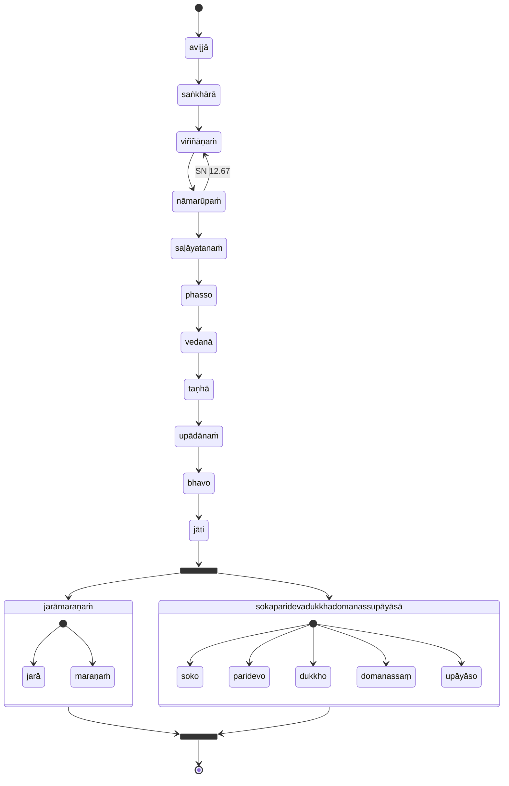

## Transcendental Dependent Origination

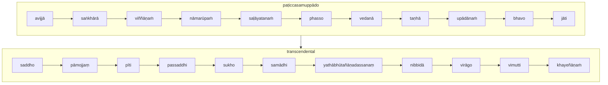

## Wrong vs Right practice

* [12S2/1.1.3 Paṭipadāsutta](https://tipitaka2500.github.io/tipitaka/12S2/1/1.1/1.1.3.html)

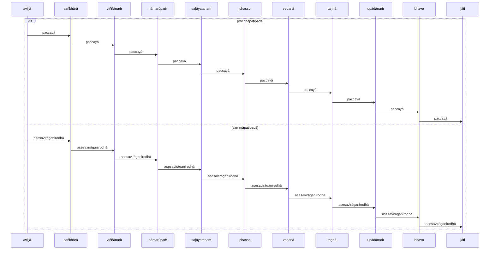

## Analysis

* [12S2/1.1.2 Vibhaṅgasutta](https://tipitaka2500.github.io/tipitaka/12S2/1/1.1/1.1.2.html)

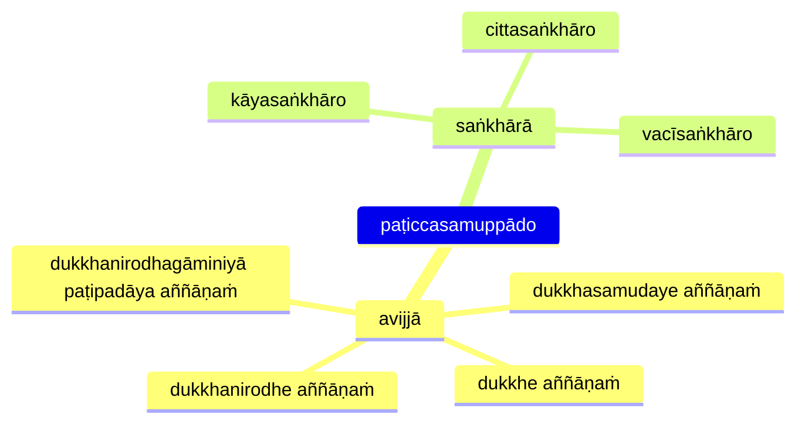

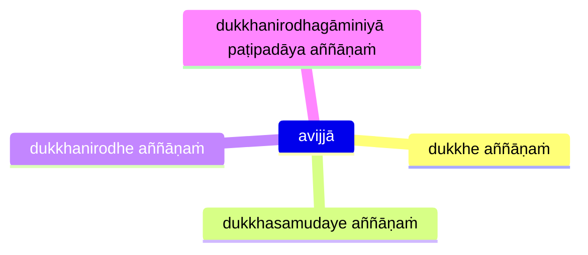

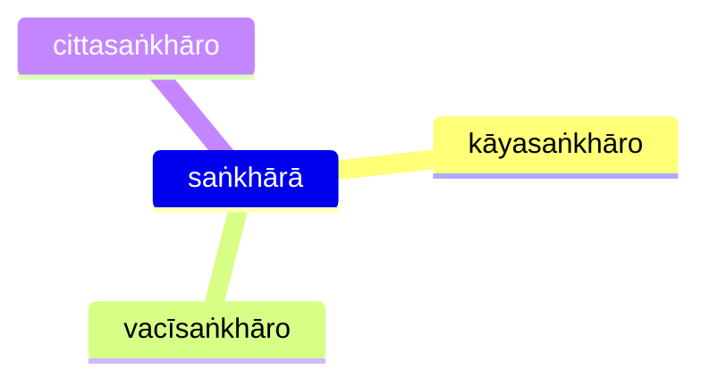

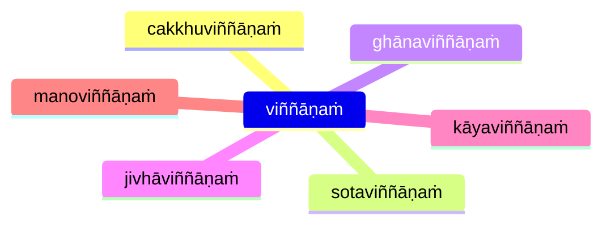

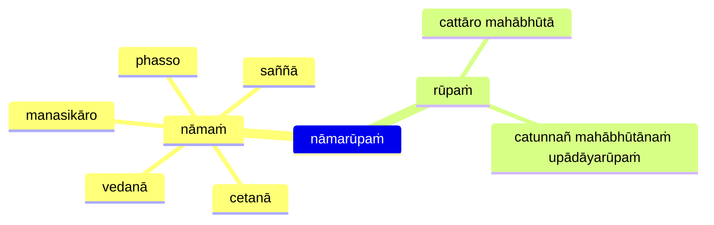

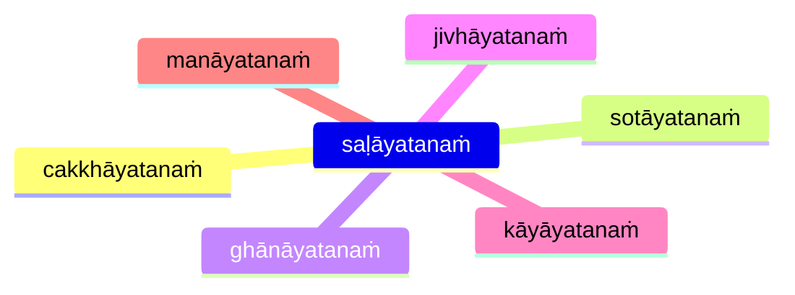

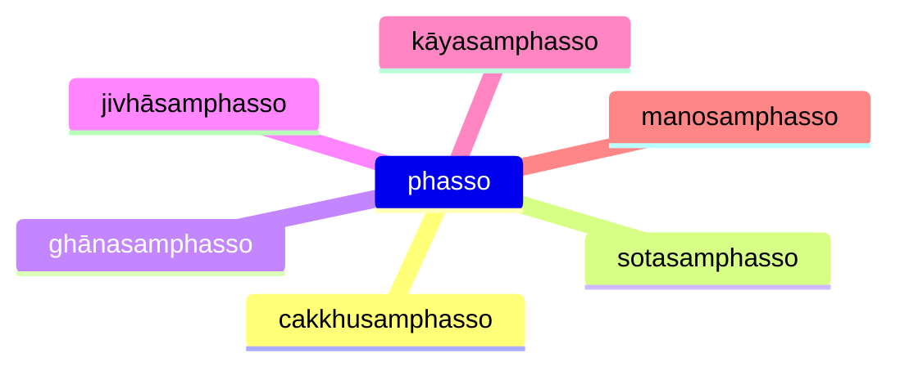

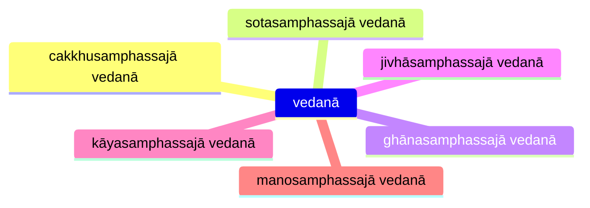

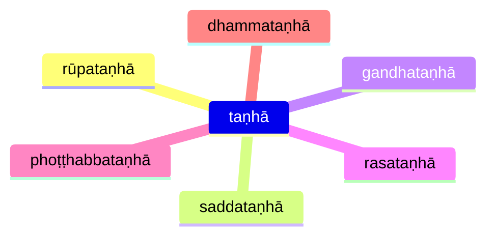

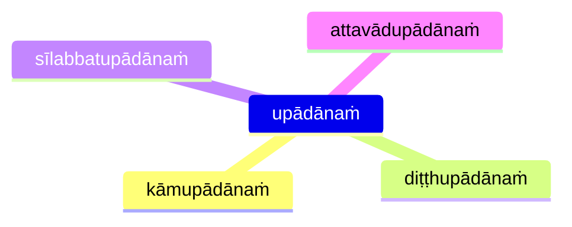

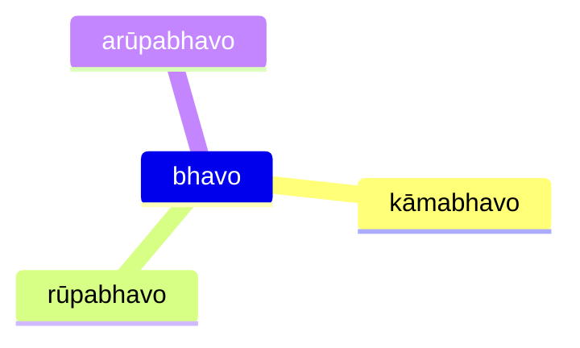


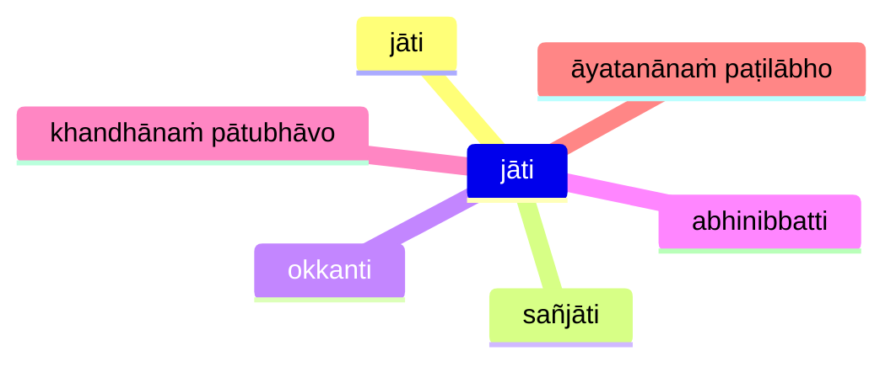

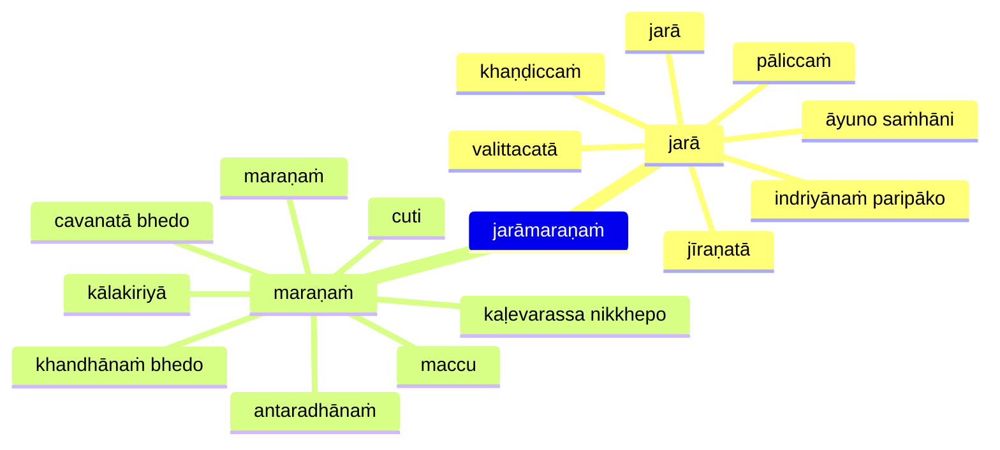

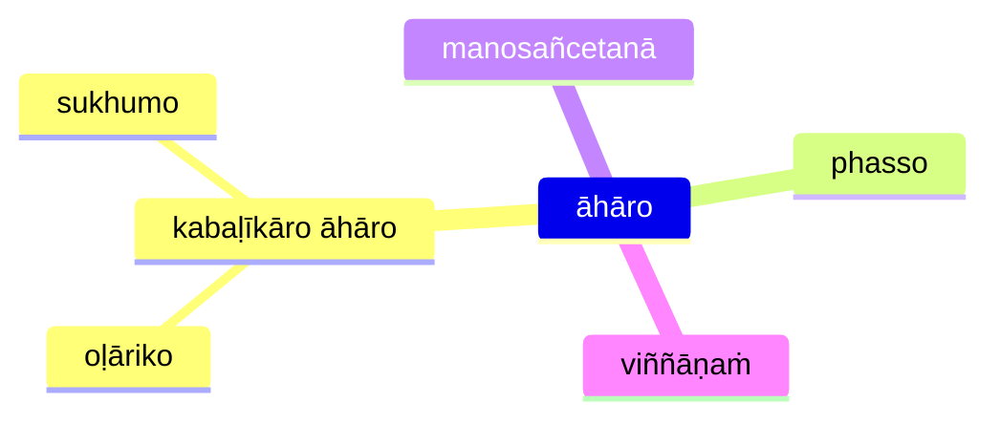

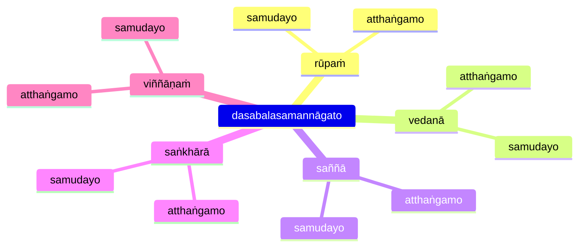

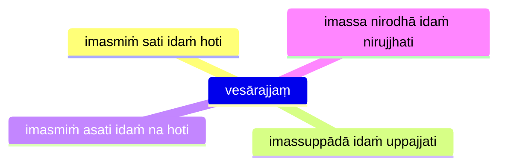

## paṭiccasamuppannā dhammā (Dependent origination characteristics)

* [12S2/1.2.10 Paccayasutta](https://tipitaka2500.github.io/tipitaka/12S2/1/1.2/1.2.10.html)

This sutta is written in a satirical style (similar to that in AN 3.136) where the Buddha uses the formula for dependent origination to refute core Vedic beliefs, including the Vedic creation myth. The satirical text plays on the Vedic preoccupation with `dhamma` as regular, invariant natural principles.

The parallels between the Dependent Origination links and core Vedic beliefs are explored by Joanna Jurewicz in **Playing with Fire: The pratītyasamutpāda from the perspective of Vedic thought**, Journal of the Pali Text Society 26 (2000) pp. 77 – 103.

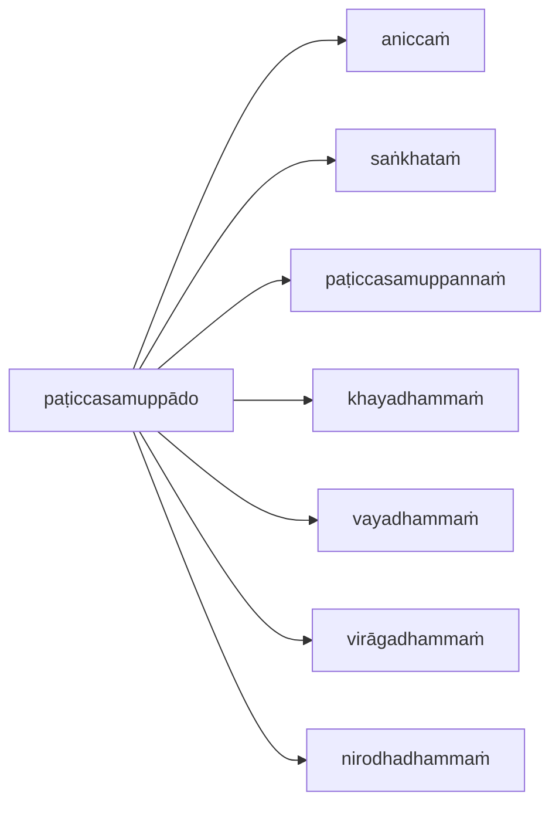

## Naḷakalāpīsutta

* [12S2/1.7.7 Naḷakalāpīsutta](https://tipitaka2500.github.io/tipitaka/12S2/1/1.7/1.7.7.html)

```mermaid
flowchart LR
  c1>na sayaṅkataṁ]
  c2>na paraṅkataṁ]
  c3>na sayaṅkatañca paraṅkatañca]
  c4>nāpi asayaṅkāraṁ aparaṅkāraṁ adhiccasamuppannaṁ]
  subgraph paṭiccasamuppādo
    direction TB
    viññāṇaṁ --> nāmarūpaṁ
    nāmarūpaṁ --> saḷāyatanaṁ
    saḷāyatanaṁ --> phasso
    phasso --> vedanā
    vedanā --> taṇhā
    taṇhā --> upādānaṁ
    upādānaṁ --> bhavo
    bhavo --> jāti
    jāti --> jarāmaraṇaṁ
  end
  c1 --> paṭiccasamuppādo
  c2 --> paṭiccasamuppādo
  c3 --> paṭiccasamuppādo
  c4 --> paṭiccasamuppādo
  paṭiccasamuppādo --> bhikkhu
  subgraph bhikkhu
    direction LR
    nibbidāya --> dhammaṁ
    nibbidāya --> paṭipanno
    nibbidāya --> vimutto
    virāgāya --> dhammaṁ
    virāgāya --> paṭipanno
    virāgāya --> vimutto
    nirodhāya --> dhammaṁ
    nirodhāya --> paṭipanno
    nirodhāya --> vimutto
  end
```

## Training

* [12S2/1.9.2 Sikkhāsuttādipeyyālaekādasaka](https://tipitaka2500.github.io/tipitaka/12S2/1/1.9/1.9.2.html)

```mermaid
mindmap
  jarāmaraṇe yathābhūtaṁ ñāṇāya
    sikkhā karaṇīyā
    yogo karaṇīyo
    chando karaṇīyo
    ussoḷhī karaṇīyā
    appaṭivānī karaṇīyā
    ātappaṁ karaṇīyaṁ
    vīriyaṁ karaṇīyaṁ
    sātaccaṁ karaṇīyaṁ
    sati karaṇīyā
    sampajaññaṁ karaṇīyaṁ
    appamādo karaṇīyo
```

## References

* [7D/2.1 Paṭiccasamuppāda](https://tipitaka2500.github.io/tipitaka/7D/2/2.1.html)
* [12S2/1.1.1 Paṭiccasamuppādasutta](https://tipitaka2500.github.io/tipitaka/12S2/1/1.1/1.1.1.html)
* [12S2/1.1.2 Vibhaṅgasutta](https://tipitaka2500.github.io/tipitaka/12S2/1/1.1/1.1.2.html)
* [12S2/1.1.3 Paṭipadāsutta](https://tipitaka2500.github.io/tipitaka/12S2/1/1.1/1.1.3.html)
* [12S2/1.2.1 Āhārasutta](https://tipitaka2500.github.io/tipitaka/12S2/1/1.2/1.2.1.html)
* [12S2/1.3.1 Dasabalasutta](https://tipitaka2500.github.io/tipitaka/12S2/1/1.3/1.3.1.html)
* [12S2/1.3.3 Upanisasutta](https://tipitaka2500.github.io/tipitaka/12S2/1/1.3/1.3.3.html)
* [12S2/1.7.7 Naḷakalāpīsutta](https://tipitaka2500.github.io/tipitaka/12S2/1/1.7/1.7.7.html)
* [12S2/1.9.2 Sikkhāsuttādipeyyālaekādasaka](https://tipitaka2500.github.io/tipitaka/12S2/1/1.9/1.9.2.html)
