import { Tabs, TabItem } from '@astrojs/starlight/components';

## Dependent Origination (`paṭiccasamuppādo`)

<Tabs syncKey="paliquote">
<TabItem label="My Translation">
3\. “And what, bhikkhave, is dependent origination?

* Caused by ignorance, bhikkhave, mental constructions arise;
* caused by mental constructions, consciousness;
* caused by consciousness, phenomenal objects (having shape and given a name);
* caused by phenomenal objects, the six sense bases;
* caused by the six sense bases, contact;
* caused by contact, feeling;
* caused by feeling, craving;
* caused by craving, clinging;
* caused by clinging, existence;
* caused by existence, birth;
* caused by birth, old age and death, sorrow, lamentation, pain, displeasure, and despair arise.

Thus is the origin of this entire mass of suffering. This, bhikkhave, is called dependent origination.

4\. But

* with the complete fading away and cessation of ignorance, there is the cessation of mental constructions;
* with the cessation of mental constructions, the cessation of consciousness;
* with the cessation of consciousness, the cessation of phenomenal objects;
* with the cessation of phenomenal objects, the cessation of the six sense bases;
* with the cessation of the six sense bases, the cessation of contact;
* with the cessation of contact, the cessation of feeling;
* with the cessation of feeling, the cessation of craving;
* with the cessation of craving, the cessation of clinging;
* with the cessation of clinging, the cessation of existence;
* with the cessation of existence, the cessation of birth;
* with the cessation of birth, old age and death, sorrow, lamentation, pain, displeasure, and despair cease.

Thus is the cessation of this entire mass of suffering.” This is what the Bhagavā said. The bhikkhū were delighted and rejoiced in the Bhagavā’s words.
</TabItem>

<TabItem label="Pāḷi (Roman IAST)">
3\. “Katamo ca, bhikkhave, paṭiccasamuppādo? Avijjāpaccayā, bhikkhave, saṅkhārā; saṅkhārapaccayā viññāṇaṃ; viññāṇapaccayā nāmarūpaṃ; nāmarūpapaccayā saḷāyatanaṃ; saḷāyatanapaccayā phasso; phassapaccayā vedanā; vedanāpaccayā taṇhā; taṇhāpaccayā upādānaṃ; upādānapaccayā bhavo; bhavapaccayā jāti; jātipaccayā jarāmaraṇaṃ sokaparidevadukkhadomanassupāyāsā sambhavanti. Evametassa kevalassa dukkhakkhandhassa samudayo hoti. Ayaṃ vuccati, bhikkhave, paṭiccasamuppādo.

4\. Avijjāya tveva asesavirāganirodhā saṅkhāranirodho; saṅkhāranirodhā viññāṇanirodho; viññāṇanirodhā nāmarūpanirodho; nāmarūpanirodhā saḷāyatananirodho; saḷāyatananirodhā phassanirodho; phassanirodhā vedanānirodho; vedanānirodhā taṇhānirodho; taṇhānirodhā upādānanirodho; upādānanirodhā bhavanirodho; bhavanirodhā jātinirodho; jātinirodhā jarāmaraṇaṃ sokaparidevadukkhadomanassupāyāsā nirujjhanti. Evametassa kevalassa dukkhakkhandhassa nirodho hotī”ti. Idamavoca bhagavā. Attamanā te bhikkhū bhagavato bhāsitaṃ abhinandunti.
</TabItem>

<TabItem label="Pāḷi (Brahmi)">
3\. “𑀓𑀢𑀫𑁄 𑀘, 𑀪𑀺𑀓𑁆𑀔𑀯𑁂, 𑀧𑀝𑀺𑀘𑁆𑀘𑀲𑀫𑀼𑀧𑁆𑀧𑀸𑀤𑁄? 𑀅𑀯𑀺𑀚𑁆𑀚𑀸𑀧𑀘𑁆𑀘𑀬𑀸, 𑀪𑀺𑀓𑁆𑀔𑀯𑁂, 𑀲𑀗𑁆𑀔𑀸𑀭𑀸; 𑀲𑀗𑁆𑀔𑀸𑀭𑀧𑀘𑁆𑀘𑀬𑀸 𑀯𑀺𑀜𑁆𑀜𑀸𑀡𑀁; 𑀯𑀺𑀜𑁆𑀜𑀸𑀡𑀧𑀘𑁆𑀘𑀬𑀸 𑀦𑀸𑀫𑀭𑀽𑀧𑀁; 𑀦𑀸𑀫𑀭𑀽𑀧𑀧𑀘𑁆𑀘𑀬𑀸 𑀲𑀍𑀆𑀬𑀢𑀦𑀁; 𑀲𑀍𑀆𑀬𑀢𑀦𑀧𑀘𑁆𑀘𑀬𑀸 𑀨𑀲𑁆𑀲𑁄; 𑀨𑀲𑁆𑀲𑀧𑀘𑁆𑀘𑀬𑀸 𑀯𑁂𑀤𑀦𑀸; 𑀯𑁂𑀤𑀦𑀸𑀧𑀘𑁆𑀘𑀬𑀸 𑀢𑀡𑁆𑀳𑀸; 𑀢𑀡𑁆𑀳𑀸𑀧𑀘𑁆𑀘𑀬𑀸 𑀉𑀧𑀸𑀤𑀸𑀦𑀁; 𑀉𑀧𑀸𑀤𑀸𑀦𑀧𑀘𑁆𑀘𑀬𑀸 𑀪𑀯𑁄; 𑀪𑀯𑀧𑀘𑁆𑀘𑀬𑀸 𑀚𑀸𑀢𑀺; 𑀚𑀸𑀢𑀺𑀧𑀘𑁆𑀘𑀬𑀸 𑀚𑀭𑀸𑀫𑀭𑀡𑀁 𑀲𑁄𑀓𑀧𑀭𑀺𑀤𑁂𑀯𑀤𑀼𑀓𑁆𑀔𑀤𑁄𑀫𑀦𑀲𑁆𑀲𑀼𑀧𑀸𑀬𑀸𑀲𑀸 𑀲𑀫𑁆𑀪𑀯𑀦𑁆𑀢𑀺. 𑀏𑀯𑀫𑁂𑀢𑀲𑁆𑀲 𑀓𑁂𑀯𑀮𑀲𑁆𑀲 𑀤𑀼𑀓𑁆𑀔𑀓𑁆𑀔𑀦𑁆𑀥𑀲𑁆𑀲 𑀲𑀫𑀼𑀤𑀬𑁄 𑀳𑁄𑀢𑀺. 𑀅𑀬𑀁 𑀯𑀼𑀘𑁆𑀘𑀢𑀺, 𑀪𑀺𑀓𑁆𑀔𑀯𑁂, 𑀧𑀝𑀺𑀘𑁆𑀘𑀲𑀫𑀼𑀧𑁆𑀧𑀸𑀤𑁄.

4\. 𑀅𑀯𑀺𑀚𑁆𑀚𑀸𑀬 𑀢𑁆𑀯𑁂𑀯 𑀅𑀲𑁂𑀲𑀯𑀺𑀭𑀸𑀕𑀦𑀺𑀭𑁄𑀥𑀸 𑀲𑀗𑁆𑀔𑀸𑀭𑀦𑀺𑀭𑁄𑀥𑁄; 𑀲𑀗𑁆𑀔𑀸𑀭𑀦𑀺𑀭𑁄𑀥𑀸 𑀯𑀺𑀜𑁆𑀜𑀸𑀡𑀦𑀺𑀭𑁄𑀥𑁄; 𑀯𑀺𑀜𑁆𑀜𑀸𑀡𑀦𑀺𑀭𑁄𑀥𑀸 𑀦𑀸𑀫𑀭𑀽𑀧𑀦𑀺𑀭𑁄𑀥𑁄; 𑀦𑀸𑀫𑀭𑀽𑀧𑀦𑀺𑀭𑁄𑀥𑀸 𑀲𑀍𑀆𑀬𑀢𑀦𑀦𑀺𑀭𑁄𑀥𑁄; 𑀲𑀍𑀆𑀬𑀢𑀦𑀦𑀺𑀭𑁄𑀥𑀸 𑀨𑀲𑁆𑀲𑀦𑀺𑀭𑁄𑀥𑁄; 𑀨𑀲𑁆𑀲𑀦𑀺𑀭𑁄𑀥𑀸 𑀯𑁂𑀤𑀦𑀸𑀦𑀺𑀭𑁄𑀥𑁄; 𑀯𑁂𑀤𑀦𑀸𑀦𑀺𑀭𑁄𑀥𑀸 𑀢𑀡𑁆𑀳𑀸𑀦𑀺𑀭𑁄𑀥𑁄; 𑀢𑀡𑁆𑀳𑀸𑀦𑀺𑀭𑁄𑀥𑀸 𑀉𑀧𑀸𑀤𑀸𑀦𑀦𑀺𑀭𑁄𑀥𑁄; 𑀉𑀧𑀸𑀤𑀸𑀦𑀦𑀺𑀭𑁄𑀥𑀸 𑀪𑀯𑀦𑀺𑀭𑁄𑀥𑁄; 𑀪𑀯𑀦𑀺𑀭𑁄𑀥𑀸 𑀚𑀸𑀢𑀺𑀦𑀺𑀭𑁄𑀥𑁄; 𑀚𑀸𑀢𑀺𑀦𑀺𑀭𑁄𑀥𑀸 𑀚𑀭𑀸𑀫𑀭𑀡𑀁 𑀲𑁄𑀓𑀧𑀭𑀺𑀤𑁂𑀯𑀤𑀼𑀓𑁆𑀔𑀤𑁄𑀫𑀦𑀲𑁆𑀲𑀼𑀧𑀸𑀬𑀸𑀲𑀸 𑀦𑀺𑀭𑀼𑀚𑁆𑀛𑀦𑁆𑀢𑀺. 𑀏𑀯𑀫𑁂𑀢𑀲𑁆𑀲 𑀓𑁂𑀯𑀮𑀲𑁆𑀲 𑀤𑀼𑀓𑁆𑀔𑀓𑁆𑀔𑀦𑁆𑀥𑀲𑁆𑀲 𑀦𑀺𑀭𑁄𑀥𑁄 𑀳𑁄𑀢𑀻”𑀢𑀺. 𑀇𑀤𑀫𑀯𑁄𑀘 𑀪𑀕𑀯𑀸. 𑀅𑀢𑁆𑀢𑀫𑀦𑀸 𑀢𑁂 𑀪𑀺𑀓𑁆𑀔𑀽 𑀪𑀕𑀯𑀢𑁄 𑀪𑀸𑀲𑀺𑀢𑀁 𑀅𑀪𑀺𑀦𑀦𑁆𑀤𑀼𑀦𑁆𑀢𑀺.
</TabItem>
</Tabs>

[7D/2.1 Paṭiccasamuppāda](https://tipitaka2500.github.io/tipitaka/7D/2/2.1.html):

* `hetu` (root, cause, reason, condition)
* `nidānaṁ` (cause, ground, underlying and determining factor)
* `samudayo` (rise, origin)
* `paccayo` (support, requirement, reason, cause, ground, motive, means, condition)

## dvādasaṅga

12 link dependent origination

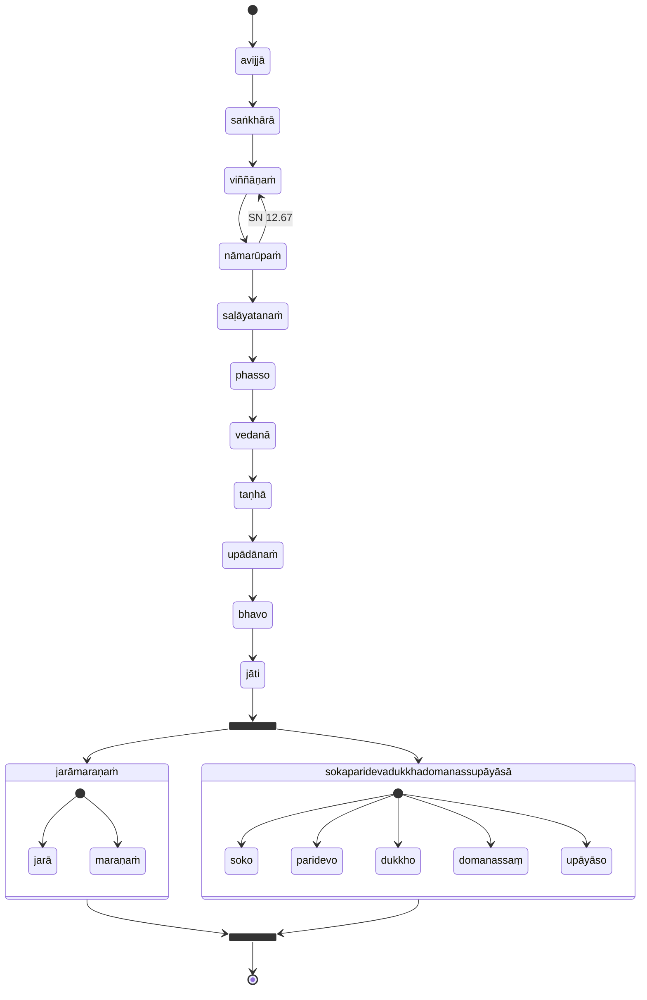

## Transcendental Dependent Origination

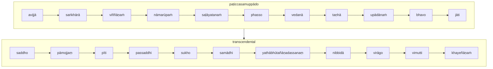

## Wrong vs Right practice

* [12S2/1.1.3 Paṭipadāsutta](https://tipitaka2500.github.io/tipitaka/12S2/1/1.1/1.1.3.html)

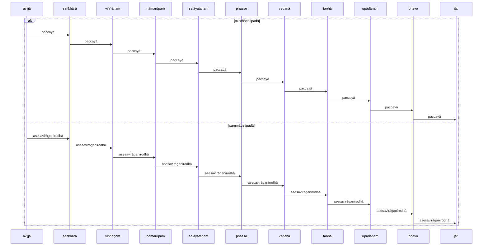

## Analysis

* [12S2/1.1.2 Vibhaṅgasutta](https://tipitaka2500.github.io/tipitaka/12S2/1/1.1/1.1.2.html)

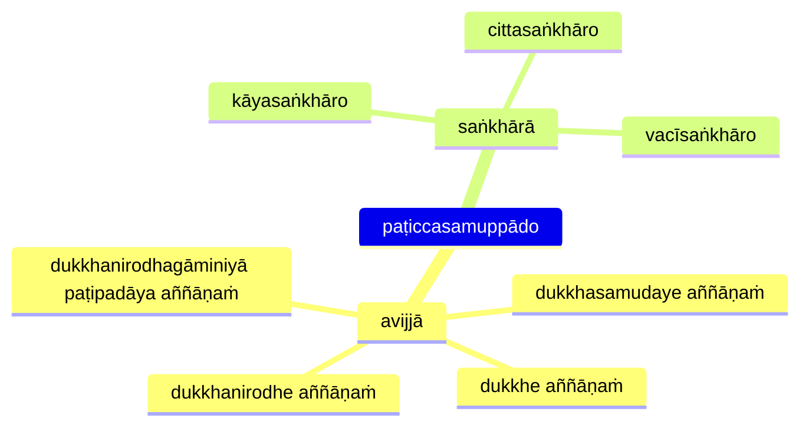

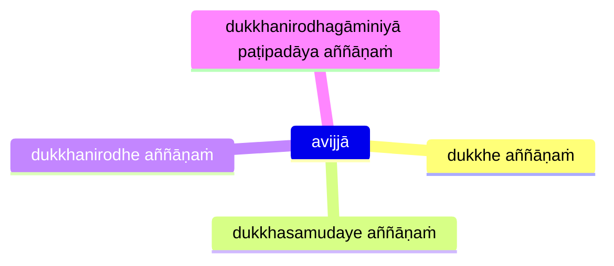

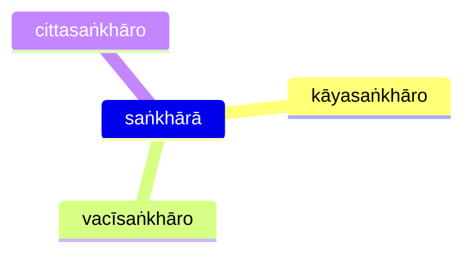

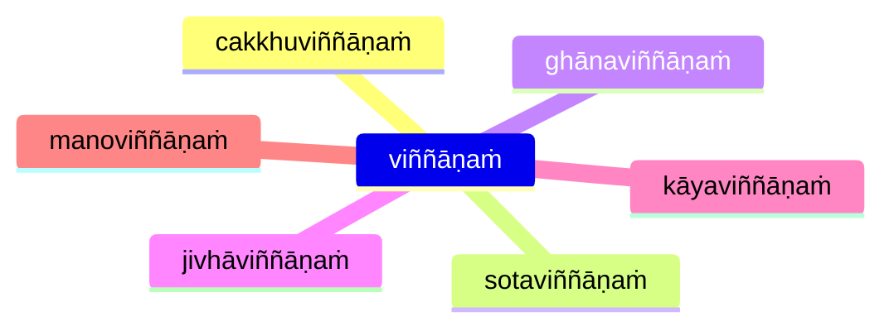

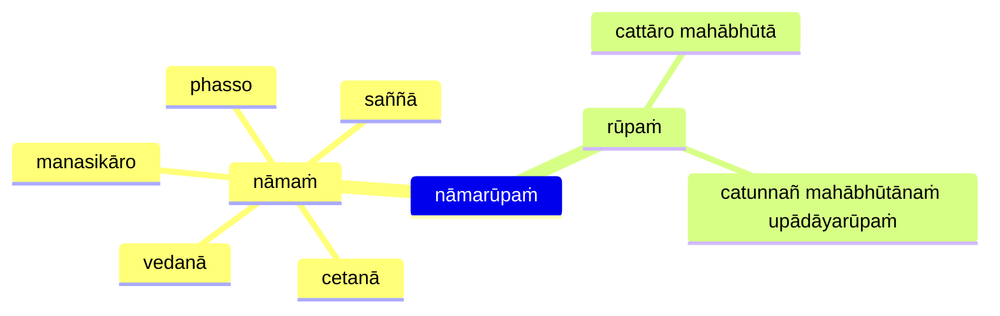

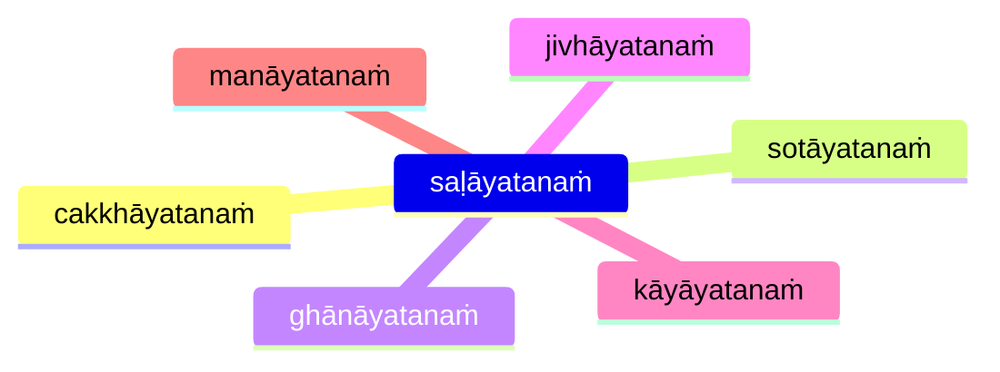

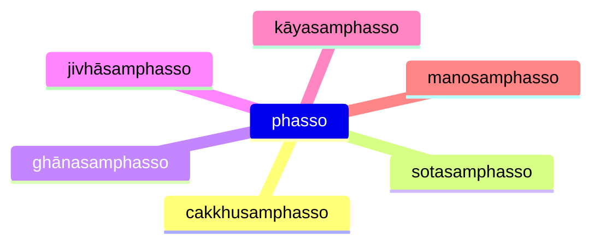

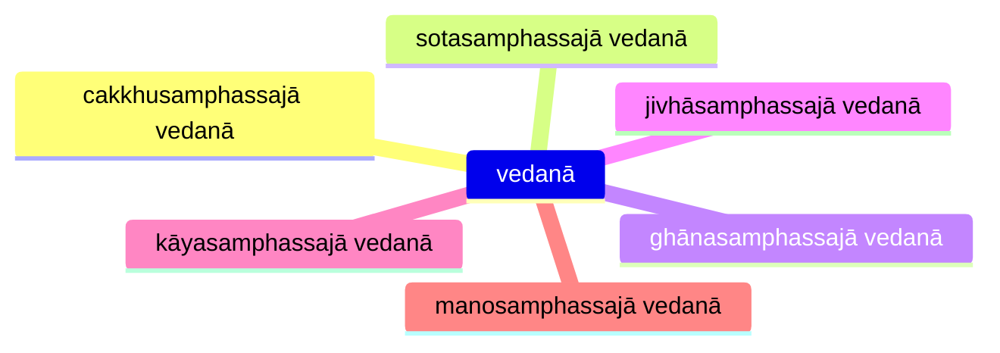

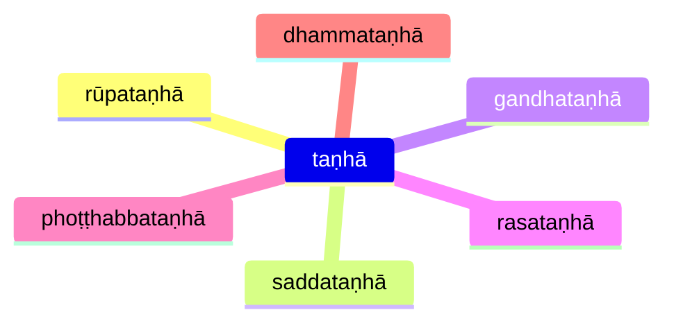

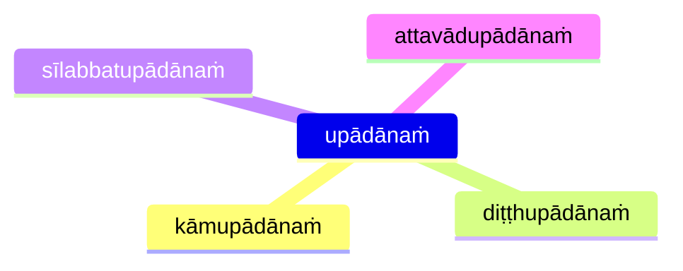

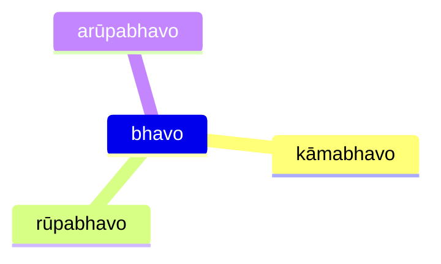


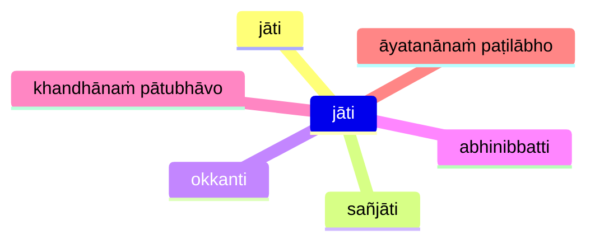

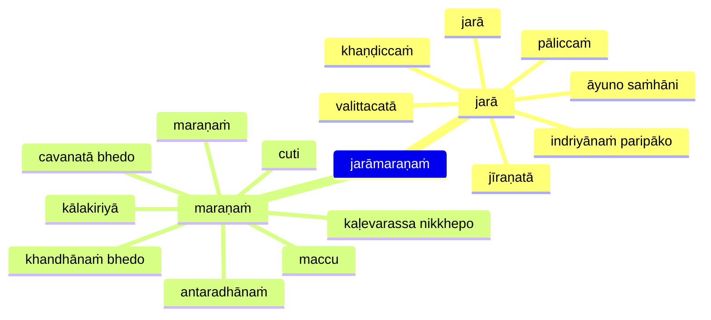

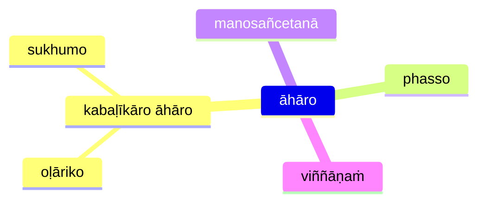

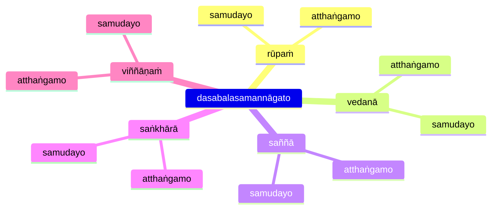

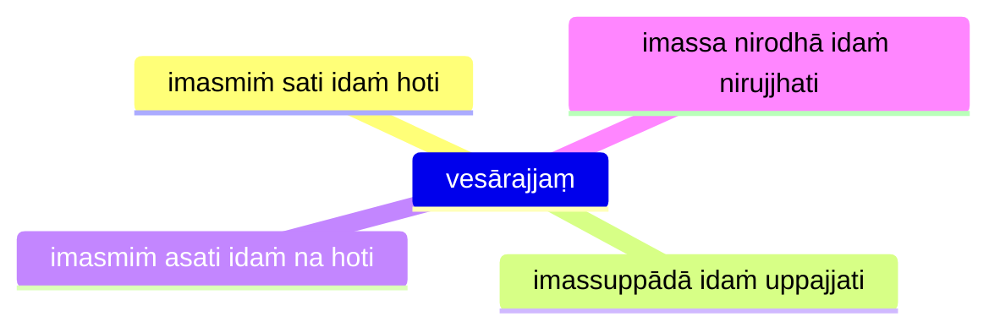

## paṭiccasamuppannā dhammā (Dependent origination characteristics)

* [12S2/1.2.10 Paccayasutta](https://tipitaka2500.github.io/tipitaka/12S2/1/1.2/1.2.10.html)

This sutta is written in a satirical style (similar to that in AN 3.136) where the Buddha uses the formula for dependent origination to refute core Vedic beliefs, including the Vedic creation myth. The satirical text plays on the Vedic preoccupation with `dhamma` as regular, invariant natural principles.

The parallels between the Dependent Origination links and core Vedic beliefs are explored by Joanna Jurewicz in **Playing with Fire: The pratītyasamutpāda from the perspective of Vedic thought**, Journal of the Pali Text Society 26 (2000) pp. 77 – 103.

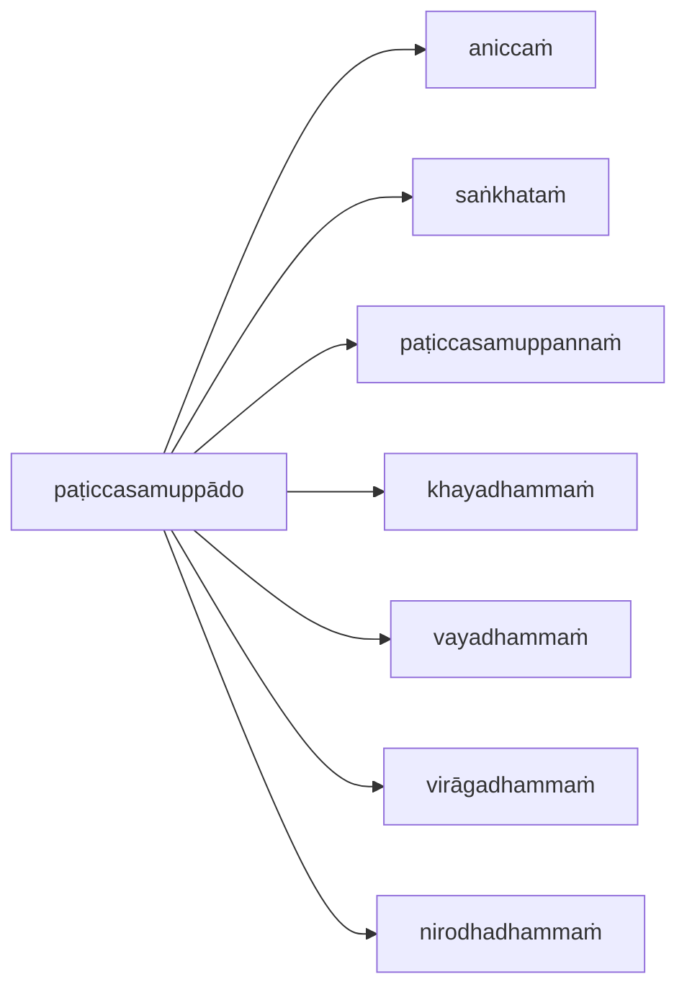

## Naḷakalāpīsutta

* [12S2/1.7.7 Naḷakalāpīsutta](https://tipitaka2500.github.io/tipitaka/12S2/1/1.7/1.7.7.html)

```mermaid
flowchart LR
  c1>na sayaṅkataṁ]
  c2>na paraṅkataṁ]
  c3>na sayaṅkatañca paraṅkatañca]
  c4>nāpi asayaṅkāraṁ aparaṅkāraṁ adhiccasamuppannaṁ]
  subgraph paṭiccasamuppādo
    direction TB
    viññāṇaṁ --> nāmarūpaṁ
    nāmarūpaṁ --> saḷāyatanaṁ
    saḷāyatanaṁ --> phasso
    phasso --> vedanā
    vedanā --> taṇhā
    taṇhā --> upādānaṁ
    upādānaṁ --> bhavo
    bhavo --> jāti
    jāti --> jarāmaraṇaṁ
  end
  c1 --> paṭiccasamuppādo
  c2 --> paṭiccasamuppādo
  c3 --> paṭiccasamuppādo
  c4 --> paṭiccasamuppādo
  paṭiccasamuppādo --> bhikkhu
  subgraph bhikkhu
    direction LR
    nibbidāya --> dhammaṁ
    nibbidāya --> paṭipanno
    nibbidāya --> vimutto
    virāgāya --> dhammaṁ
    virāgāya --> paṭipanno
    virāgāya --> vimutto
    nirodhāya --> dhammaṁ
    nirodhāya --> paṭipanno
    nirodhāya --> vimutto
  end
```

## Training

* [12S2/1.9.2 Sikkhāsuttādipeyyālaekādasaka](https://tipitaka2500.github.io/tipitaka/12S2/1/1.9/1.9.2.html)

```mermaid
mindmap
  jarāmaraṇe yathābhūtaṁ ñāṇāya
    sikkhā karaṇīyā
    yogo karaṇīyo
    chando karaṇīyo
    ussoḷhī karaṇīyā
    appaṭivānī karaṇīyā
    ātappaṁ karaṇīyaṁ
    vīriyaṁ karaṇīyaṁ
    sātaccaṁ karaṇīyaṁ
    sati karaṇīyā
    sampajaññaṁ karaṇīyaṁ
    appamādo karaṇīyo
```

## References

* [7D/2.1 Paṭiccasamuppāda](https://tipitaka2500.github.io/tipitaka/7D/2/2.1.html)
* [12S2/1.1.1 Paṭiccasamuppādasutta](https://tipitaka2500.github.io/tipitaka/12S2/1/1.1/1.1.1.html)
* [12S2/1.1.2 Vibhaṅgasutta](https://tipitaka2500.github.io/tipitaka/12S2/1/1.1/1.1.2.html)
* [12S2/1.1.3 Paṭipadāsutta](https://tipitaka2500.github.io/tipitaka/12S2/1/1.1/1.1.3.html)
* [12S2/1.2.1 Āhārasutta](https://tipitaka2500.github.io/tipitaka/12S2/1/1.2/1.2.1.html)
* [12S2/1.3.1 Dasabalasutta](https://tipitaka2500.github.io/tipitaka/12S2/1/1.3/1.3.1.html)
* [12S2/1.3.3 Upanisasutta](https://tipitaka2500.github.io/tipitaka/12S2/1/1.3/1.3.3.html)
* [12S2/1.7.7 Naḷakalāpīsutta](https://tipitaka2500.github.io/tipitaka/12S2/1/1.7/1.7.7.html)
* [12S2/1.9.2 Sikkhāsuttādipeyyālaekādasaka](https://tipitaka2500.github.io/tipitaka/12S2/1/1.9/1.9.2.html)


<Tabs syncKey="paliquote">
<TabItem label="My Translation">
</TabItem>

<TabItem label="Pāḷi (Roman IAST)">
</TabItem>

<TabItem label="Pāḷi (Brahmi)">
</TabItem>
</Tabs>
