import { Tabs, TabItem } from '@astrojs/starlight/components';

`paṭiccasamuppādaṃ` (dependent origination, or the chain of causes, or causal co-arising) is allegedly the thought process that led to the Buddha's liberation, 'awakening', or 'enlightenment'. The concept is the central thesis and core of the Buddha's teachings and basis for the soteriology.

## Dependent Origination (`paṭiccasamuppādo`)

<Tabs syncKey="paliquote">
<TabItem label="My Translation">
3\. “And what, bhikkhave, is `paṭiccasamuppādo` (dependent origination)?

* Caused by `avijjā` (ignorance), bhikkhave, `saṅkhārā` (mental constructions) arise;
* caused by mental constructions, `viññāṇaṃ` (consciousness);
* caused by consciousness, `nāmarūpaṃ` (phenomenal objects - having physical form and given names);
* caused by phenomenal objects, `saḷāyatanaṃ` (the six sense bases);
* caused by the six sense bases, `phasso` (contact - or interfaces between the six senses and our minds, referring to the sensing and cognitive process);
* caused by contact, `vedanā` (feeling);
* caused by feeling, `taṇhā` (craving, or desire);
* caused by craving, `upādānaṃ` (fuel, representing clinging);
* caused by clinging, `bhavo` (existence);
* caused by existence, `jāti` (birth);
* caused by birth, old age and death, sorrow, lamentation, pain, displeasure, and despair arise.

Thus is the origin of this entire mass of `dukkha` (suffering). This, bhikkhave, is called dependent origination.

4\. But

* with the complete fading away and cessation of ignorance, there is the cessation of mental constructions;
* with the cessation of mental constructions, the cessation of consciousness;
* with the cessation of consciousness, the cessation of phenomenal objects;
* with the cessation of phenomenal objects, the cessation of the six sense bases;
* with the cessation of the six sense bases, the cessation of contact;
* with the cessation of contact, the cessation of feeling;
* with the cessation of feeling, the cessation of craving;
* with the cessation of craving, the cessation of clinging;
* with the cessation of clinging, the cessation of existence;
* with the cessation of existence, the cessation of birth;
* with the cessation of birth, old age and death, sorrow, lamentation, pain, displeasure, and despair cease.

Thus is the cessation of this entire mass of suffering.” This is what the Bhagavā said. The bhikkhū were delighted and rejoiced in the Bhagavā’s words.
</TabItem>

<TabItem label="Pāḷi (Roman IAST)">
3\. “Katamo ca, bhikkhave, paṭiccasamuppādo? Avijjāpaccayā, bhikkhave, saṅkhārā; saṅkhārapaccayā viññāṇaṃ; viññāṇapaccayā nāmarūpaṃ; nāmarūpapaccayā saḷāyatanaṃ; saḷāyatanapaccayā phasso; phassapaccayā vedanā; vedanāpaccayā taṇhā; taṇhāpaccayā upādānaṃ; upādānapaccayā bhavo; bhavapaccayā jāti; jātipaccayā jarāmaraṇaṃ sokaparidevadukkhadomanassupāyāsā sambhavanti. Evametassa kevalassa dukkhakkhandhassa samudayo hoti. Ayaṃ vuccati, bhikkhave, paṭiccasamuppādo.

4\. Avijjāya tveva asesavirāganirodhā saṅkhāranirodho; saṅkhāranirodhā viññāṇanirodho; viññāṇanirodhā nāmarūpanirodho; nāmarūpanirodhā saḷāyatananirodho; saḷāyatananirodhā phassanirodho; phassanirodhā vedanānirodho; vedanānirodhā taṇhānirodho; taṇhānirodhā upādānanirodho; upādānanirodhā bhavanirodho; bhavanirodhā jātinirodho; jātinirodhā jarāmaraṇaṃ sokaparidevadukkhadomanassupāyāsā nirujjhanti. Evametassa kevalassa dukkhakkhandhassa nirodho hotī”ti. Idamavoca bhagavā. Attamanā te bhikkhū bhagavato bhāsitaṃ abhinandunti.
</TabItem>

<TabItem label="Pāḷi (Brahmi)">
3\. “𑀓𑀢𑀫𑁄 𑀘, 𑀪𑀺𑀓𑁆𑀔𑀯𑁂, 𑀧𑀝𑀺𑀘𑁆𑀘𑀲𑀫𑀼𑀧𑁆𑀧𑀸𑀤𑁄? 𑀅𑀯𑀺𑀚𑁆𑀚𑀸𑀧𑀘𑁆𑀘𑀬𑀸, 𑀪𑀺𑀓𑁆𑀔𑀯𑁂, 𑀲𑀗𑁆𑀔𑀸𑀭𑀸; 𑀲𑀗𑁆𑀔𑀸𑀭𑀧𑀘𑁆𑀘𑀬𑀸 𑀯𑀺𑀜𑁆𑀜𑀸𑀡𑀁; 𑀯𑀺𑀜𑁆𑀜𑀸𑀡𑀧𑀘𑁆𑀘𑀬𑀸 𑀦𑀸𑀫𑀭𑀽𑀧𑀁; 𑀦𑀸𑀫𑀭𑀽𑀧𑀧𑀘𑁆𑀘𑀬𑀸 𑀲𑀍𑀆𑀬𑀢𑀦𑀁; 𑀲𑀍𑀆𑀬𑀢𑀦𑀧𑀘𑁆𑀘𑀬𑀸 𑀨𑀲𑁆𑀲𑁄; 𑀨𑀲𑁆𑀲𑀧𑀘𑁆𑀘𑀬𑀸 𑀯𑁂𑀤𑀦𑀸; 𑀯𑁂𑀤𑀦𑀸𑀧𑀘𑁆𑀘𑀬𑀸 𑀢𑀡𑁆𑀳𑀸; 𑀢𑀡𑁆𑀳𑀸𑀧𑀘𑁆𑀘𑀬𑀸 𑀉𑀧𑀸𑀤𑀸𑀦𑀁; 𑀉𑀧𑀸𑀤𑀸𑀦𑀧𑀘𑁆𑀘𑀬𑀸 𑀪𑀯𑁄; 𑀪𑀯𑀧𑀘𑁆𑀘𑀬𑀸 𑀚𑀸𑀢𑀺; 𑀚𑀸𑀢𑀺𑀧𑀘𑁆𑀘𑀬𑀸 𑀚𑀭𑀸𑀫𑀭𑀡𑀁 𑀲𑁄𑀓𑀧𑀭𑀺𑀤𑁂𑀯𑀤𑀼𑀓𑁆𑀔𑀤𑁄𑀫𑀦𑀲𑁆𑀲𑀼𑀧𑀸𑀬𑀸𑀲𑀸 𑀲𑀫𑁆𑀪𑀯𑀦𑁆𑀢𑀺. 𑀏𑀯𑀫𑁂𑀢𑀲𑁆𑀲 𑀓𑁂𑀯𑀮𑀲𑁆𑀲 𑀤𑀼𑀓𑁆𑀔𑀓𑁆𑀔𑀦𑁆𑀥𑀲𑁆𑀲 𑀲𑀫𑀼𑀤𑀬𑁄 𑀳𑁄𑀢𑀺. 𑀅𑀬𑀁 𑀯𑀼𑀘𑁆𑀘𑀢𑀺, 𑀪𑀺𑀓𑁆𑀔𑀯𑁂, 𑀧𑀝𑀺𑀘𑁆𑀘𑀲𑀫𑀼𑀧𑁆𑀧𑀸𑀤𑁄.

4\. 𑀅𑀯𑀺𑀚𑁆𑀚𑀸𑀬 𑀢𑁆𑀯𑁂𑀯 𑀅𑀲𑁂𑀲𑀯𑀺𑀭𑀸𑀕𑀦𑀺𑀭𑁄𑀥𑀸 𑀲𑀗𑁆𑀔𑀸𑀭𑀦𑀺𑀭𑁄𑀥𑁄; 𑀲𑀗𑁆𑀔𑀸𑀭𑀦𑀺𑀭𑁄𑀥𑀸 𑀯𑀺𑀜𑁆𑀜𑀸𑀡𑀦𑀺𑀭𑁄𑀥𑁄; 𑀯𑀺𑀜𑁆𑀜𑀸𑀡𑀦𑀺𑀭𑁄𑀥𑀸 𑀦𑀸𑀫𑀭𑀽𑀧𑀦𑀺𑀭𑁄𑀥𑁄; 𑀦𑀸𑀫𑀭𑀽𑀧𑀦𑀺𑀭𑁄𑀥𑀸 𑀲𑀍𑀆𑀬𑀢𑀦𑀦𑀺𑀭𑁄𑀥𑁄; 𑀲𑀍𑀆𑀬𑀢𑀦𑀦𑀺𑀭𑁄𑀥𑀸 𑀨𑀲𑁆𑀲𑀦𑀺𑀭𑁄𑀥𑁄; 𑀨𑀲𑁆𑀲𑀦𑀺𑀭𑁄𑀥𑀸 𑀯𑁂𑀤𑀦𑀸𑀦𑀺𑀭𑁄𑀥𑁄; 𑀯𑁂𑀤𑀦𑀸𑀦𑀺𑀭𑁄𑀥𑀸 𑀢𑀡𑁆𑀳𑀸𑀦𑀺𑀭𑁄𑀥𑁄; 𑀢𑀡𑁆𑀳𑀸𑀦𑀺𑀭𑁄𑀥𑀸 𑀉𑀧𑀸𑀤𑀸𑀦𑀦𑀺𑀭𑁄𑀥𑁄; 𑀉𑀧𑀸𑀤𑀸𑀦𑀦𑀺𑀭𑁄𑀥𑀸 𑀪𑀯𑀦𑀺𑀭𑁄𑀥𑁄; 𑀪𑀯𑀦𑀺𑀭𑁄𑀥𑀸 𑀚𑀸𑀢𑀺𑀦𑀺𑀭𑁄𑀥𑁄; 𑀚𑀸𑀢𑀺𑀦𑀺𑀭𑁄𑀥𑀸 𑀚𑀭𑀸𑀫𑀭𑀡𑀁 𑀲𑁄𑀓𑀧𑀭𑀺𑀤𑁂𑀯𑀤𑀼𑀓𑁆𑀔𑀤𑁄𑀫𑀦𑀲𑁆𑀲𑀼𑀧𑀸𑀬𑀸𑀲𑀸 𑀦𑀺𑀭𑀼𑀚𑁆𑀛𑀦𑁆𑀢𑀺. 𑀏𑀯𑀫𑁂𑀢𑀲𑁆𑀲 𑀓𑁂𑀯𑀮𑀲𑁆𑀲 𑀤𑀼𑀓𑁆𑀔𑀓𑁆𑀔𑀦𑁆𑀥𑀲𑁆𑀲 𑀦𑀺𑀭𑁄𑀥𑁄 𑀳𑁄𑀢𑀻”𑀢𑀺. 𑀇𑀤𑀫𑀯𑁄𑀘 𑀪𑀕𑀯𑀸. 𑀅𑀢𑁆𑀢𑀫𑀦𑀸 𑀢𑁂 𑀪𑀺𑀓𑁆𑀔𑀽 𑀪𑀕𑀯𑀢𑁄 𑀪𑀸𑀲𑀺𑀢𑀁 𑀅𑀪𑀺𑀦𑀦𑁆𑀤𑀼𑀦𑁆𑀢𑀺.
</TabItem>
</Tabs>

[7D/2.1 Paṭiccasamuppāda](https://tipitaka2500.github.io/tipitaka/7D/2/2.1.html):

* `hetu` (root, cause, reason, condition)
* `nidānaṁ` (cause, ground, underlying and determining factor)
* `samudayo` (rise, origin)
* `paccayo` (support, requirement, reason, cause, ground, motive, means, condition)

## The phenomenological framework of dependent origination

At it's heart `paṭiccasamuppādaṃ` is a phenomenological framework. Our perception of the world around us (and our concept of "reality") is formed from our experiences and our perception of "phenomena" through our senses (and also imagined by our minds).

Therefore our `viññāṇaṁ` (consciousness and sense of "identity" or "self") is "constructed" and ephemeral, and based on the aggregation of `saṅkhārā` (mental constructions). Furthermore, we are unaware or ignorant of the "constructed" or transient nature of our consciousness, and hence `avijjā` (ignorance) is the starting point of this chain of dependencies.

| Condition | Description |
| :-: | --- |
| `avijjā` | a lack of clarity regarding the nature of one's own experience and nature of "reality" |
| `saṅkhārā` | mental constructs, conditioned patterns of thought and volition, past experiences, mental states, ideas, thoughts, perceptions, biases, prejudices. |
| `viññāṇa` | moment-to-moment consciousness, that result in our "personality" and sense of identity |
| `nāmarūpa` | a collection of sensed "forms" that can be "named", leading to a "subject-object duality" - separation between ourselves and the external world |
| `saḷāyatana` | our experience of these forms through the six sense bases – the faculties of seeing, hearing, smelling, tasting, touching, and thinking |
| `phassa` | "contact" or "interface" between sense base, object, and consciousness |
| `vedanā` | our resultant reaction or feeling to that contact – pleasant, unpleasant, or neutral |
| `taṇhā` | craving or aversion – a reactive desire for pleasant feelings to continue or unpleasant ones to cease |
| `upādāna` | our attachment to craving acts as a source or "fuel" to a survival instinct or "will to live" |
| `bhava` | our "will to live" - the process of perpetuating these patterns and the sense of an ongoing self caught within them |
| `jāti` | the "birth" or arising of a new cycle of identification and experience |
| `jarāmaraṇa` | (aging and death), understood here as the decay and cessation inherent in all conditioned phenomena |
| `dukkha` | the associated emotional and psychological dissatisfaction and suffering: sorrow, lamentation, pain, grief, and despair |

From the above analysis, our ignorance of the ephemeral and conditioned nature of our consciousness is what ultimately leads to `dukkha`, which is a general dissatisfaction and unease regarding the nature of our existence. We crave for what we cannot have, permanence, comfort and stability but our sense of "self" is impermanent, perennially uncomfortable and unstable.

Therefore, armed with the knowledge of the above, we can dispel our ignorance, cease production of non-optimal mental formations, the entire phenomenological structure collapses and in this way we will no longer experience `dukkha`.

This was what the Buddha experienced, which led to "the bliss of liberation" which allowed him to dispel "Mara's army" (Mara is the personification of all the accumulated sub-optimal factors that have clouded his consciousness and created craving, attachment and ultimately suffering).

## The relationship between ignorance, our constructed sense of self, and existence

Some have been perplexed by the specific ordering of the chain of causes in the dependent origination links. Why is `avijjā` (ignorance) the start of the chain? Why does `bhava` (existence) come before `jāti` (birth). Others have speculated that the 12 links correspond to three "lives" (our previous life, our current life, and our next life).

A simpler explanation, aligned to the Buddha's concept of the constructed or generated sense of "self" is to understand that the specific sequence or order of "cessations" is crucial in order to achieve "liberation" from `dukkha` (suffering).

In order to eliminate suffering, we don't deconstruct our sense of self, or stop generating the illusion that we have a permanent self. Rather, we dispel or eliminate our ignorance that our sense of self is constructed.

Hence ignorance has to be the start of the chain of causes. By truly understanding the constructed and ephemeral nature of our sense of self, we avoid generating `saṅkhārā` (mental constructs) [that ultimately lead to suffering], and following down the chain, we no longer generate `bhava` (existence), and therefore we are "unborn" and do not "suffer".

This does not imply a nihilistic interpretation or non-existence. Working backwards from suffering, we do not suffer because in a sense we have never been "born" - what we imagine to be a permanent or eternal self was never present, hence "we" never truly "existed." What existed was a constructed and generated sense of self that is impermanent. By being impermanent, it was never a "self."

It is important to understand that the Buddha is effectively denying the conventional concept of "existence", which implies a stable entity that persists over time. Because the Buddha is recognising our sense of "self" is ephemeral and non permanent, we are effectively not stable entities. The "self" that "exists" today is not the "self" that "existed" yesterday, but preserves the "memories" of that "other" "self". The concept of "existence" is not applicable to an ever changing construct.

## Implications on "meditation" and "kamma"

It is extremely unlikely that the Buddha would have advocated "meditation". Meditation is a solution to the wrong problem, based on a misunderstanding of dependent origination. Meditation is an attempt to quell the sense of self, in effect to stop the generation of "self" or to "deconstruct" it. But the key to unravelling the dependent origination chain is not deconstruction of the "self" but simply the deconstruction of ignorance. The Buddha clearly retained a strong sense of "self" throughout his life, he was not permanently in a state of meditative stupor. For more information refer to [Did the Buddha teach meditation?](/buddhavacana/articles/meditation).

Similarly, the Buddha would not have advocated the concept of "kamma" in the sense that most Buddhists understand it today. As detailed in [Kamma and Rebirth](/buddhavacana/articles/kamma), the concept that our actions result in "kamma" which affects our future is a Jainistic concept, and incompatible with dependent origination. If our sense of "self" is constructed and ephemeral, then the "person" who committed an act in the past is a different "person" today, and will be another "person" in the future. The future person carries the memories of past "selves" and therefore "suffer" the consequences of their past actions, but "kamma" is not some universal law of justice that follows a person's existence, because there is no permanent "self" that carries the "burden" of "kamma", rather the constructed "self" evolves because of the consequences of past actions.

Again, dispelling the "ignorance" of the constructed nature of the "self" is the only effective way of getting rid of "kamma", because by understanding the "self" is not permanent, we can avoid creating mental constructs based on previous actions that ultimately lead to suffering.

## Concentric cycles

`paṭiccasamuppādaṃ` can represent a chain of causes that form a cycle, although it is not explicitly stated as a cycle here. The last component of the chain leads back to the first, and hence the cycle repeats itself ad infinitum.

The concentric set of cycles represent processes. The processes have increased span and duration as we move outwards from the innermost cycle to the outermost cycle. In theory there are an infinite number of these cycles, but in practice we only need to detail the most significant ones, that can be easily analysed.

The innermost cycle is the span of a single thought process, from it's arising to it's cessation. The next cycle of importance is the span of a single day, representing the arising and cessation of consciousness. After that is the cycle of a single lifetime, and beyond that is the cycle of multiple lifetimes and ultimately the cycle of the universe itself (in terms of the birth and death of stars and galaxies). In between are many other cycles (months, seasons, years etc.) but for the purposes of understanding we are less concerned with those.

The following table illustrates how `paṭiccasamuppādaṃ` works across the different cycles:

| Cause | Thought | Day | Lifetime | Multiple Lifetimes |
| --- | --- | --- | --- | --- |
| `avijjā` | pre thought "blankness"| awake from sleep | our birth, with no recollection of previous lives | ignorance of previous lives |
| `saṅkhārā` | previous thoughts | reflections from previous days | mental constructions for this lifetime | constructions are per life |
| `viññāṇaṁ` | "environment" or context of thought | disposition for the day | consciousness for this lifetime | multiple consciousness, no permanent self |
| `nāmarūpaṁ` | stimuli or trigger to a thought | daily stimuli | lifetime stimuli | each lifetime has unique identities and forms |
| `saḷāyatanaṁ` | perception of stimuli | perception of stimuli | lifetime perceptions | consciousness in each lifetime shaped by unique stimuli |
| `phasso` | cognisance of stimuli | recognition of experiences | lifetime experiences | symbolic representations or processing of perceptions |
| `vedanā` | reaction to perception | reaction to experiences| reaction to experiences | transformation of symbolic representations |
| `taṇhā` | desire, or intention | our wants and needs for the day | lifetime goals and objectives | each lifetime has unique desires |
| `upādānaṃ` | willpower to execute desire | attachment to wants and needs | survival instinct | each lifetime has it's own "fuel" |
| `bhavo` | plan of execution | action plan for the day | lifetime path | each lifetime is a unique path or existence |
| `jāti` | action out of thought process | actions during the day | this existence | rebirth of beings |
| `dukkha` | results of action, termination of thought | results of actions, followed by sleep | dissatisfaction and death | saṃsāra, or the cycle of rebirths |

## Considerations and Interpretation

Points to note:

- It would have made more sense for the Buddha to reference dependent origination in the first discourse to the ascetics, as that was the process that led to his own liberation.
- It would seem at this stage that it is possible to gain almost instantaneous understanding upon hearing the Buddha teach, which is exemplified by Koṇḍañña. Yet, presumably it took some time (days and possibly weeks) for the rest of the group of five to be liberated, as the text refers to part of the group seeking alms while the others were taught by the Buddha. Even so, it is clear that liberation is achievable within a short period of time for those who are in the right frame of mind and disposition, and certainly achievable within a single lifetime. Contrast this with later teachings which seem to imply it is almost impossible to gain realisation in one lifetime and multiple stages are required (stream enterer etc.)
- More importantly, this discourse predates the development of the "four stages of awakening" (`sotāpanna` (stream-enterer), `sakadāgāmī` (once-returner), `anāgāmī` (non-returner), `arahant` (worthy one)) that would come to dominate Theravāda thinking.
- The expansion of the four realisations into three phases and 12 aspects seem overly pedantic and does not really add much to the context. It would seem this may be yet another late addition to align with the notion of rolling out the Dhamma wheel.

In Bronkhorst **The Buddhist four realisations: Are They True?[^Bronkhorst2023], Bronkhorst questions if the four realisations are true, using recent neuroscience (Mark Solms' theory) [^Solms2021] and psychology. As the truths are presented as verifiable psychological statements, Bronkhorst uses various tools to evaluate their truth claims as scientific hypotheses. Bronkhorst offers a hypothesis that dukkha can be interpreted as unresolved needs arising from perceived threats to an idealised homeostasis. Individual sensitivity to these unresolved needs varies, and it may be possible meditative or absorptive states can suspend awareness of these needs but don't solve underlying issues. Bronkhorst proposes a potential solution: memory reconsolidation allows consolidated emotional memories to be updated or erased if reactivated and met with a "prediction error" (mismatch) within a specific time window. Therefore, erasing the emotional charge of memories underlying conflicting needs could lead to suffering cessation. Desire or 'wanting' (motivation/desire) may create "mini-addictions" (habits/personality traits). Resolving these traits via memory reconsolidation reduces both suffering and 'wanting' (desire/thirst). Bronkhorst theorises that accessing these consolidated, often non-declarative, memories is a key challenge as they may reside in the domain of the sub-conscious. Bronkhorst then speculates that deep absorption might allow focus on normally unconscious memories by suspending competing needs/associations. Other elements of the eightfold path may facilitate deep absorption and the necessary mismatch (e.g., equanimity).

[^Bronkhorst2023]: Bronkhorst, J. (2023). The Buddhist Noble Truths: Are They True? Religions, 14, 82. https://doi.org/https:// doi.org/10.3390/rel14010082

[^Solms2021]: Solms, M. (2021). The hidden spring: A journey to the source of consciousness. Profile books.

I find Bronkhorst's theory plausible, but question whether absorption allow access to unconscious memories. To me, the key question is how does one rewire and reduce innermost desires and needs embedded in the subconscious? Here the Theory of Planned Behaviour (TPB) in **Pessoa - The Entangled Brain: How Perception, Cognition, and Emotion Are Woven Together (2022)** [^EntangledBrain] may prove useful, as discussed in [The Buddha's liberation as an case study of Theory of Planned Behaviour (TPB)](/buddhavacana/articles/tpb)

However, in Polak's **Language, Conscious Experience and the Self in Early Buddhism; A Cross-cultural Interdisciplinary Study**[^Polak2018], Polak explores how language and concepts shape conscious experience and influence human functioning, particularly the arising of the self (`attā`). It uses a cross-cultural, interdisciplinary approach, drawing parallels with Western philosophy and cognitive science to reconstruct Buddha's teachings, and examines the relationship between the five collections (`khandha`s) and the individual, discussing agency and subjectivity. These ideas form a framework for understanding the Buddha's second discourse.

[^Polak2018]: Polak, G. (2018). Language, Conscious Experience and the Self in Early Buddhism A Cross-cultural Interdisciplinary Study. Journal of the Oxford Centre for Buddhist Studies, 14, 37–76.

In subsequent discourses, the Buddha defines the "world" (`loko`) not just externally, but primarily in terms of the human cognitive apparatus and experience: the six senses, their objects, consciousness, contact, feeling, and the five strands of sensuality. Apperception (`saññā`) is a complex mental process involving labelling, categorizing, recognizing based on features (`nimitta`), interpreting sensory input, and conceptualizing abstract ideas. The common answer that a person is merely the five collections (`khandha`s) is likely a reductionist interpretation, not the original intent. `Khandha`s represent aspects of phenomenal experience used for contemplation (understanding `anicca`, `dukkha`, `anattā`), not a complete objective analysis of a human being. [^Hamilton2000], [^Gethin1986], [^Wynne2009]

[^Hamilton2000]: Hamilton, S. (2000). Early Buddhism: A New Approach : the I of the Beholder. Curzon. https://books.google.com.au/books?id=ji9EvkprnPsC
[^Gethin1986]: Gethin, R. (1986). The five khandhas: Their theatment in the nikāyas and early abhidhamma. Journal of Indian Philosophy, 14(1), 35–53.
[^Wynne2009]: Wynne, A. (2009). Early Evidence for the “no self” doctrine? A note on the second anātman teaching of the Second Sermon. Thai International Journal for Buddhist Studies, 1, 64–84.

`Khandha`s represent subjective, conscious experience. Identifying them as `attā` reflects the common-sense view that consciousness is the locus of agency and subjectivity. Cognitive science challenges this: most information processing is unconscious, parallel, and modular; consciousness has limited capacity (cf. Global Workspace Theory) [^Baars2003]. Thoughts, decisions, and acts of will largely originate non-consciously; conscious awareness often follows the neural readiness potential [^Libet1999], [^Wegner2017]. Consciousness serves more for global broadcast and integration into a narrative. The Buddha's critique of `attā` aligns with this: the "self" as speaker (`vado`) and feeler (`vedeyyo`) arises from misinterpreting the nature and content of conscious experience (`khandha`s), facilitated by language (`saññā`, `papañca`). The actual locus of agency and subjectivity may reside more holistically in the sentient body (`saviññāṇaka kāya`), not reducible to the `khandha`s. Concepts like `citta` and practices like `kāyānupassana` might point towards this.

[^Baars2003]: Baars, B. J. (2003). The global brainweb: An update on global workspace theory. Science and Consciousness Review, 2, 1–16.
[^Libet1999]: Libet, B. (1999). Do we have free will? Journal of Consciousness Studies, 6(8–9), 47–57. http://pacherie.free.fr/COURS/MSC/Libet-JCS1999.pdf
[^Wegner2017]: Wegner, D. M. (2017). The illusion of conscious will. MIT press.

Self-delusion isn't just theoretical; identifying with the narrative self maintained by inner speech causes suffering (`dukkha`). There's a correlation between self-reflexive consciousness, the subjective experience of psychological time, and suffering [^Zahavi2011], [^Thompson2011]. Increased Self-awareness often coincides with time dragging and unhappiness. Moments of happiness or "flow" [^Csikszentmihalyi1990] often involve reduced Self-awareness and distorted time perception (absorption). Misunderstanding this, people pursue external objects/activities associated with past pleasure, failing to see pleasure often lies in the temporary absence of Self-consciousness. This pursuit is doomed to fail. Absorption states might not leave declarative memory traces because they lack the self-reflexive conscious experience needed for such encoding [^Bronkhorst2012]. Self-delusion can be seen as a "virus" or harmful "software" running on the "hardware" of the sentient body, possibly an evolutionary adaptation for competitiveness but inherently causing suffering. The Buddha's soteriology aims to remove this "virus".

[^Zahavi2011]: Zahavi, D. (2011). The Experiential Self: Objections and Clarifications. In Siderits (Ed.), Self, No Self: Perspectives from Analytical, Phenomenological, and Indian Traditions. Oxford University Press.
[^Thompson2011]: Thompson, E. (2011). Self-No-Self? Memory and Reflexive Awareness. In Siderits (Ed.), Self, No Self: Perspectives from Analytical, Phenomenological, and Indian Traditions. Oxford University Press.
[^Csikszentmihalyi1990]: Csikszentmihalyi, M. (1990). Flow: The Psychology of Optimal Experience. Harper Collins.
[^Bronkhorst2012]: Bronkhorst, J. (2012). Absorption: Human Nature and Buddhist Liberation. University Media.

## dvādasaṅga

12 link dependent origination

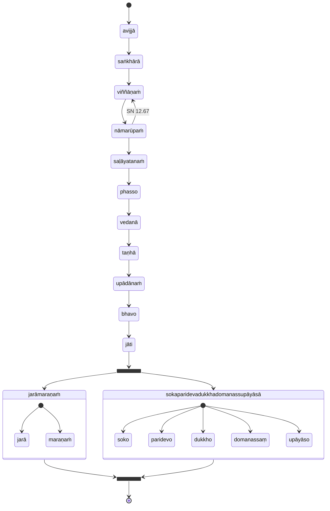
```mermaid
stateDiagram-v2
  [*] --> avijjā
  state fork_state <<fork>>
  state join_state <<join>>
  avijjā --> saṅkhārā
  saṅkhārā --> viññāṇaṁ
  viññāṇaṁ --> nāmarūpaṁ
  nāmarūpaṁ --> viññāṇaṁ : SN 12.67
  nāmarūpaṁ --> saḷāyatanaṁ
  saḷāyatanaṁ --> phasso
  phasso --> vedanā
  vedanā --> taṇhā
  taṇhā --> upādānaṁ
  upādānaṁ --> bhavo
  bhavo --> jāti
  jāti --> fork_state
  fork_state --> jarāmaraṇaṁ
  fork_state --> sokaparidevadukkhadomanassupāyāsā
  jarāmaraṇaṁ --> join_state
  sokaparidevadukkhadomanassupāyāsā --> join_state
  state jarāmaraṇaṁ {
    [*] --> jarā
    [*] --> maraṇaṁ
  }
  state sokaparidevadukkhadomanassupāyāsā {
    [*] --> soko
    [*] --> paridevo
    [*] --> dukkho
    [*] --> domanassaṃ
    [*] --> upāyāso
  }
  join_state --> [*]
```

## Transcendental Dependent Origination

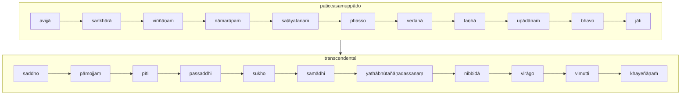
```mermaid
flowchart TB
  subgraph paṭiccasamuppādo
    direction LR
    avijjā --> saṅkhārā
    saṅkhārā --> viññāṇaṁ
    viññāṇaṁ --> nāmarūpaṁ
    nāmarūpaṁ --> saḷāyatanaṁ
    saḷāyatanaṁ --> phasso
    phasso --> vedanā
    vedanā --> taṇhā
    taṇhā --> upādānaṁ
    upādānaṁ --> bhavo
    bhavo --> jāti
  end
  subgraph transcendental
    direction LR
    saddho --> pāmojjaṃ
    pāmojjaṃ --> pīti
    pīti --> passaddhi
    passaddhi --> sukho
    sukho --> samādhi
    samādhi --> yathābhūtañāṇadassanaṃ
    yathābhūtañāṇadassanaṃ --> nibbidā
    nibbidā --> virāgo
    virāgo --> vimutti
    vimutti --> khayeñāṇaṁ
  end
  paṭiccasamuppādo --> transcendental
```

## Wrong vs Right practice

* [12S2/1.1.3 Paṭipadāsutta](https://tipitaka2500.github.io/tipitaka/12S2/1/1.1/1.1.3.html)

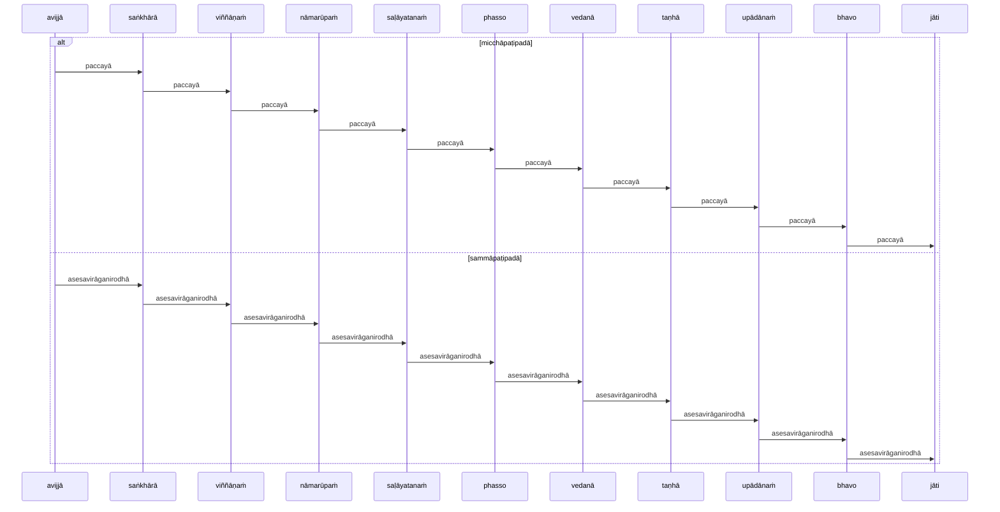
```mermaid
sequenceDiagram
  alt micchāpaṭipadā
    avijjā->>saṅkhārā: paccayā
    saṅkhārā ->> viññāṇaṁ: paccayā
    viññāṇaṁ ->> nāmarūpaṁ: paccayā
    nāmarūpaṁ ->> saḷāyatanaṁ: paccayā
    saḷāyatanaṁ ->> phasso: paccayā
    phasso ->> vedanā: paccayā
    vedanā ->> taṇhā: paccayā
    taṇhā ->> upādānaṁ: paccayā
    upādānaṁ ->> bhavo: paccayā
    bhavo ->> jāti: paccayā
  else sammāpaṭipadā
    avijjā->>saṅkhārā: asesavirāganirodhā
    saṅkhārā ->> viññāṇaṁ: asesavirāganirodhā
    viññāṇaṁ ->> nāmarūpaṁ: asesavirāganirodhā
    nāmarūpaṁ ->> saḷāyatanaṁ: asesavirāganirodhā
    saḷāyatanaṁ ->> phasso: asesavirāganirodhā
    phasso ->> vedanā: asesavirāganirodhā
    vedanā ->> taṇhā: asesavirāganirodhā
    taṇhā ->> upādānaṁ: asesavirāganirodhā
    upādānaṁ ->> bhavo: asesavirāganirodhā
    bhavo ->> jāti: asesavirāganirodhā
  end

```

## Analysis

* [12S2/1.1.2 Vibhaṅgasutta](https://tipitaka2500.github.io/tipitaka/12S2/1/1.1/1.1.2.html)

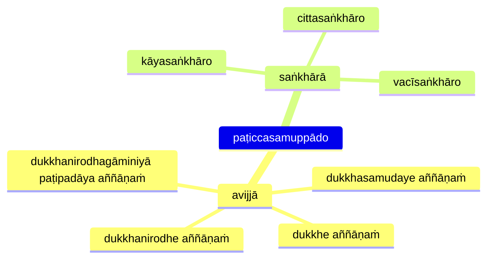
```mermaid
mindmap
  paṭiccasamuppādo
    avijjā
      dukkhe aññāṇaṁ
      dukkhasamudaye aññāṇaṁ
      dukkhanirodhe aññāṇaṁ
      dukkhanirodhagāminiyā paṭipadāya aññāṇaṁ
    saṅkhārā
      kāyasaṅkhāro
      vacīsaṅkhāro
      cittasaṅkhāro
```

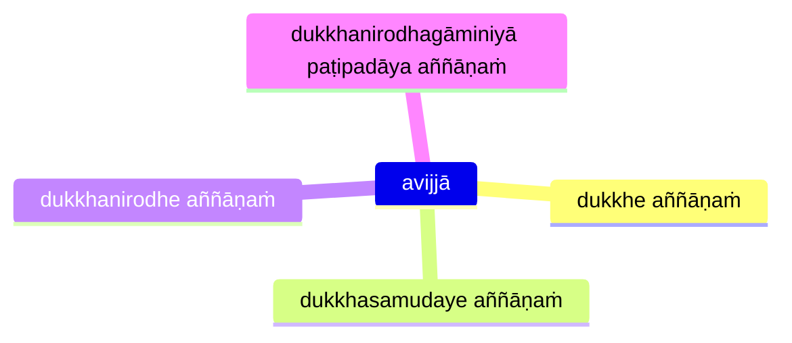
```mermaid
mindmap
avijjā
  dukkhe aññāṇaṁ
  dukkhasamudaye aññāṇaṁ
  dukkhanirodhe aññāṇaṁ
  dukkhanirodhagāminiyā paṭipadāya aññāṇaṁ
```

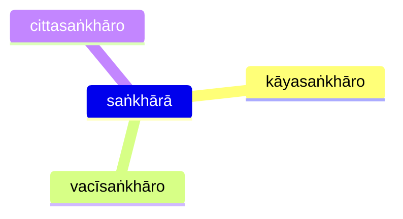
```mermaid
mindmap
saṅkhārā
  kāyasaṅkhāro
  vacīsaṅkhāro
  cittasaṅkhāro
```

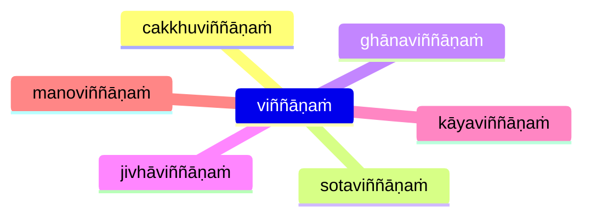
```mermaid
mindmap
viññāṇaṁ
  cakkhuviññāṇaṁ
  sotaviññāṇaṁ
  ghānaviññāṇaṁ
  jivhāviññāṇaṁ
  kāyaviññāṇaṁ
  manoviññāṇaṁ
```

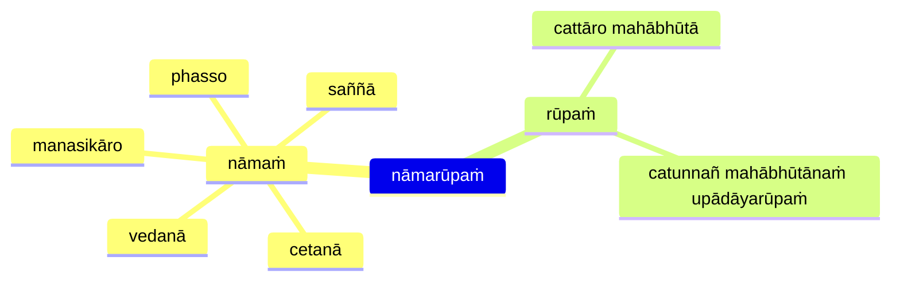
```mermaid
mindmap
nāmarūpaṁ
  nāmaṁ
    vedanā
    saññā
    cetanā
    phasso
    manasikāro
  rūpaṁ
    cattāro mahābhūtā
    catunnañ mahābhūtānaṁ upādāyarūpaṁ
```

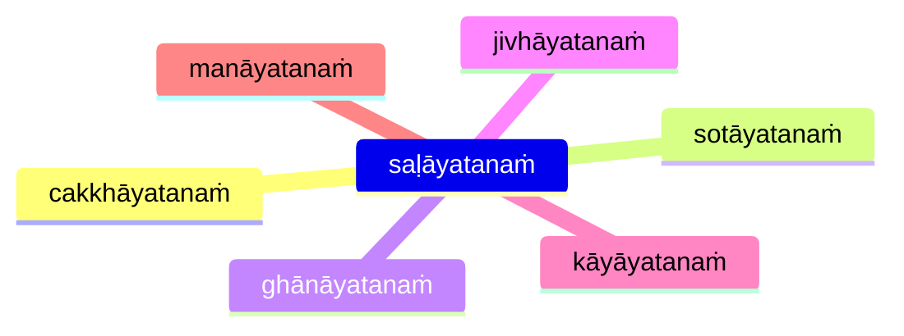
```mermaid
mindmap
saḷāyatanaṁ
  cakkhāyatanaṁ
  sotāyatanaṁ
  ghānāyatanaṁ
  jivhāyatanaṁ
  kāyāyatanaṁ
  manāyatanaṁ
```

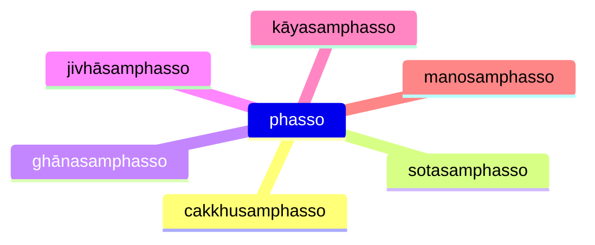
```mermaid
mindmap
phasso
  cakkhusamphasso
  sotasamphasso
  ghānasamphasso
  jivhāsamphasso
  kāyasamphasso
  manosamphasso
```

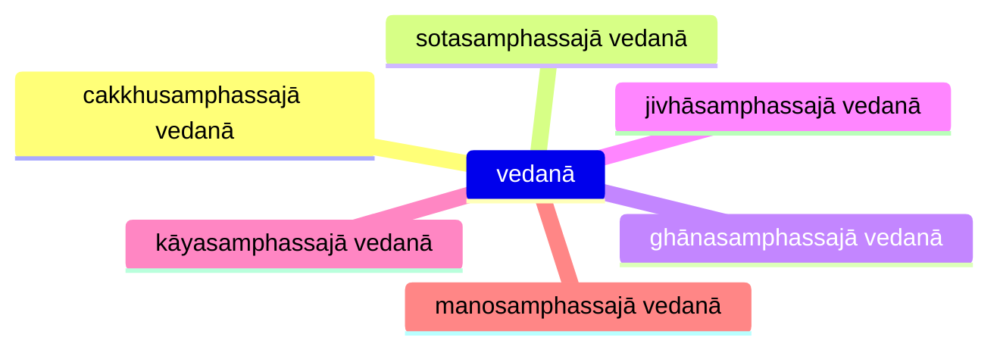
```mermaid
mindmap
vedanā
  cakkhusamphassajā vedanā
  sotasamphassajā vedanā
  ghānasamphassajā vedanā
  jivhāsamphassajā vedanā
  kāyasamphassajā vedanā
  manosamphassajā vedanā
```

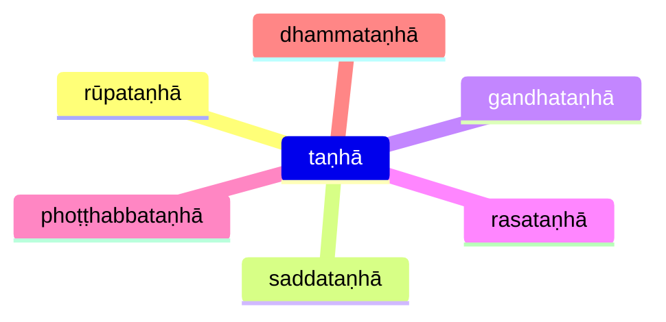
```mermaid
mindmap
taṇhā
  rūpataṇhā
  saddataṇhā
  gandhataṇhā
  rasataṇhā
  phoṭṭhabbataṇhā
  dhammataṇhā
```

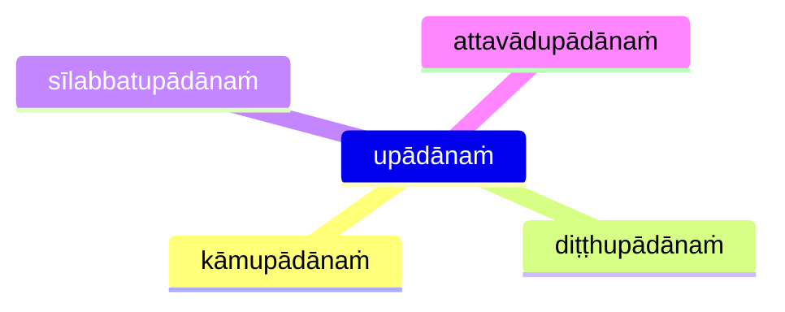
```mermaid
mindmap
upādānaṁ
  kāmupādānaṁ
  diṭṭhupādānaṁ
  sīlabbatupādānaṁ
  attavādupādānaṁ
```

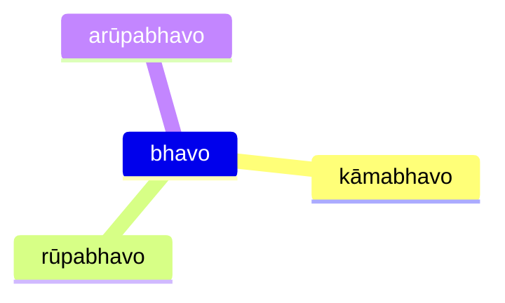
```mermaid
mindmap
bhavo
  kāmabhavo
  rūpabhavo
  arūpabhavo
```

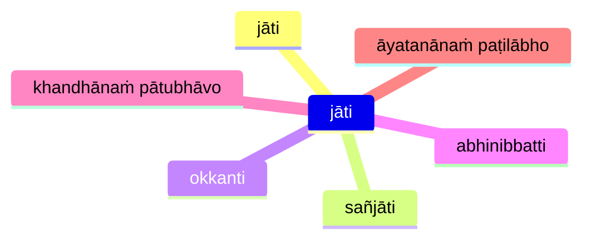
```mermaid
mindmap
jāti
  jāti
  sañjāti
  okkanti
  abhinibbatti
  khandhānaṁ pātubhāvo
  āyatanānaṁ paṭilābho
```

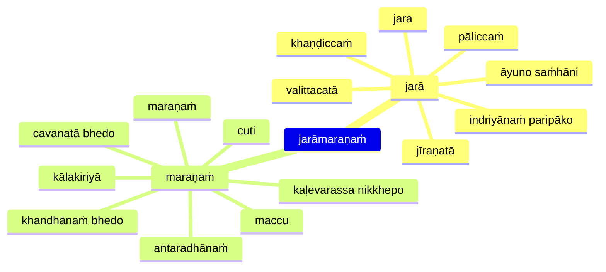
```mermaid
mindmap
jarāmaraṇaṁ
  jarā
    jarā
    jīraṇatā
    khaṇḍiccaṁ
    pāliccaṁ
    valittacatā
    āyuno saṁhāni
    indriyānaṁ paripāko
  maraṇaṁ
    cuti
    cavanatā bhedo
    antaradhānaṁ
    maccu
    maraṇaṁ
    kālakiriyā
    khandhānaṁ bhedo
    kaḷevarassa nikkhepo
```

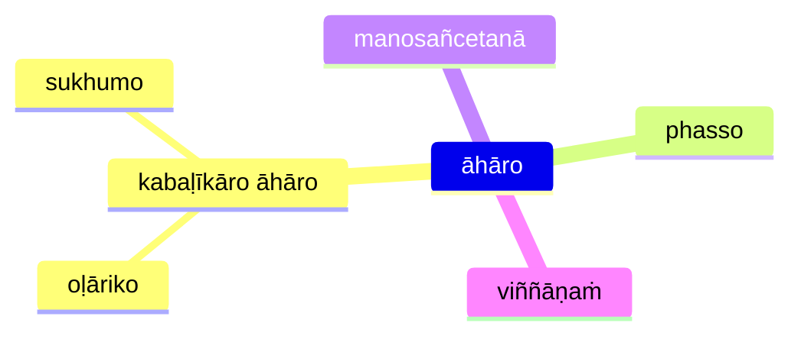
```mermaid
mindmap
āhāro
  kabaḷīkāro āhāro
    oḷāriko
    sukhumo
  phasso
  manosañcetanā
  viññāṇaṁ
```

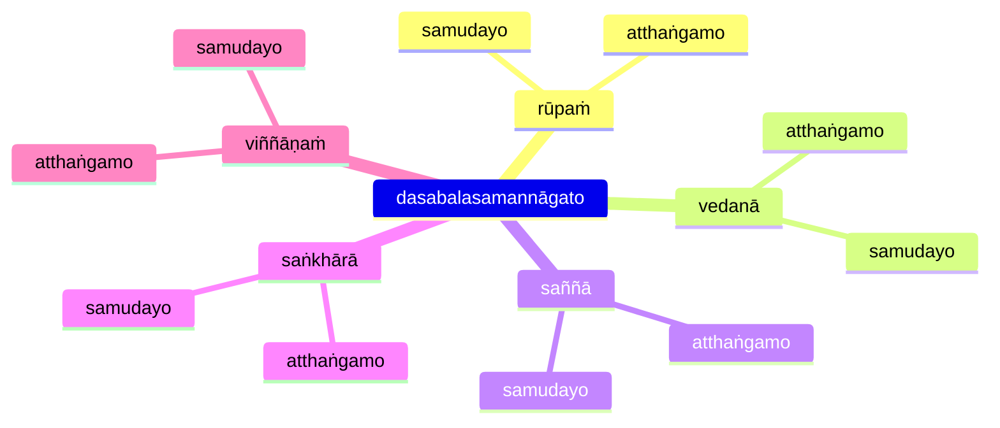
```mermaid
mindmap
dasabalasamannāgato
  rūpaṁ
    samudayo
    atthaṅgamo
  vedanā
    samudayo
    atthaṅgamo
  saññā
    samudayo
    atthaṅgamo
  saṅkhārā
    samudayo
    atthaṅgamo
  viññāṇaṁ
    samudayo
    atthaṅgamo
```

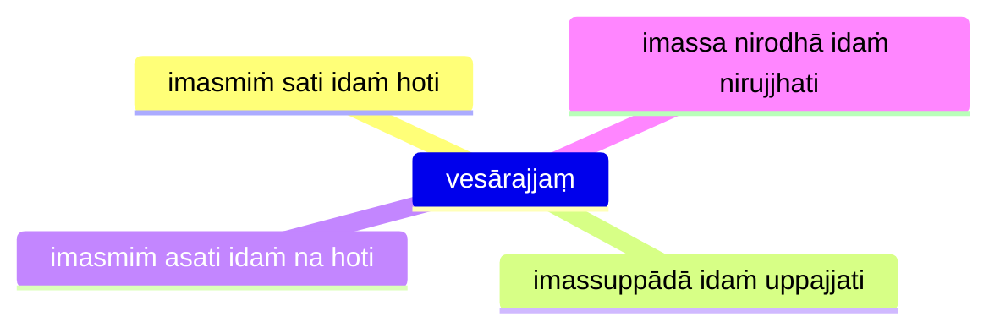
```mermaid
mindmap
vesārajjaṃ
  imasmiṁ sati idaṁ hoti
  imassuppādā idaṁ uppajjati
  imasmiṁ asati idaṁ na hoti
  imassa nirodhā idaṁ nirujjhati
```

## paṭiccasamuppannā dhammā (Dependent origination characteristics)

* [12S2/1.2.10 Paccayasutta](https://tipitaka2500.github.io/tipitaka/12S2/1/1.2/1.2.10.html)

This sutta is written in a satirical style (similar to that in AN 3.136) where the Buddha uses the formula for dependent origination to refute core Vedic beliefs, including the Vedic creation myth. The satirical text plays on the Vedic preoccupation with `dhamma` as regular, invariant natural principles.

The parallels between the Dependent Origination links and core Vedic beliefs are explored by Joanna Jurewicz in **Playing with Fire: The pratītyasamutpāda from the perspective of Vedic thought**, Journal of the Pali Text Society 26 (2000) pp. 77 – 103.

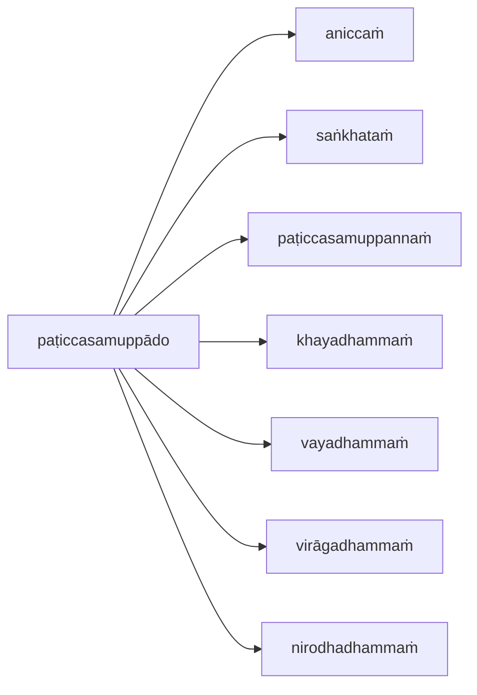
```mermaid
flowchart LR
  paṭiccasamuppādo --> aniccaṁ
  paṭiccasamuppādo --> saṅkhataṁ
  paṭiccasamuppādo --> paṭiccasamuppannaṁ
  paṭiccasamuppādo --> khayadhammaṁ
  paṭiccasamuppādo --> vayadhammaṁ
  paṭiccasamuppādo --> virāgadhammaṁ
  paṭiccasamuppādo --> nirodhadhammaṁ
```

## Naḷakalāpīsutta

* [12S2/1.7.7 Naḷakalāpīsutta](https://tipitaka2500.github.io/tipitaka/12S2/1/1.7/1.7.7.html)

```mermaid
flowchart LR
  c1>na sayaṅkataṁ]
  c2>na paraṅkataṁ]
  c3>na sayaṅkatañca paraṅkatañca]
  c4>nāpi asayaṅkāraṁ aparaṅkāraṁ adhiccasamuppannaṁ]
  subgraph paṭiccasamuppādo
    direction TB
    viññāṇaṁ --> nāmarūpaṁ
    nāmarūpaṁ --> saḷāyatanaṁ
    saḷāyatanaṁ --> phasso
    phasso --> vedanā
    vedanā --> taṇhā
    taṇhā --> upādānaṁ
    upādānaṁ --> bhavo
    bhavo --> jāti
    jāti --> jarāmaraṇaṁ
  end
  c1 --> paṭiccasamuppādo
  c2 --> paṭiccasamuppādo
  c3 --> paṭiccasamuppādo
  c4 --> paṭiccasamuppādo
  paṭiccasamuppādo --> bhikkhu
  subgraph bhikkhu
    direction LR
    nibbidāya --> dhammaṁ
    nibbidāya --> paṭipanno
    nibbidāya --> vimutto
    virāgāya --> dhammaṁ
    virāgāya --> paṭipanno
    virāgāya --> vimutto
    nirodhāya --> dhammaṁ
    nirodhāya --> paṭipanno
    nirodhāya --> vimutto
  end
```

## Training

* [12S2/1.9.2 Sikkhāsuttādipeyyālaekādasaka](https://tipitaka2500.github.io/tipitaka/12S2/1/1.9/1.9.2.html)

```mermaid
mindmap
  jarāmaraṇe yathābhūtaṁ ñāṇāya
    sikkhā karaṇīyā
    yogo karaṇīyo
    chando karaṇīyo
    ussoḷhī karaṇīyā
    appaṭivānī karaṇīyā
    ātappaṁ karaṇīyaṁ
    vīriyaṁ karaṇīyaṁ
    sātaccaṁ karaṇīyaṁ
    sati karaṇīyā
    sampajaññaṁ karaṇīyaṁ
    appamādo karaṇīyo
```

## References

* [7D/2.1 Paṭiccasamuppāda](https://tipitaka2500.github.io/tipitaka/7D/2/2.1.html)
* [12S2/1.1.1 Paṭiccasamuppādasutta](https://tipitaka2500.github.io/tipitaka/12S2/1/1.1/1.1.1.html)
* [12S2/1.1.2 Vibhaṅgasutta](https://tipitaka2500.github.io/tipitaka/12S2/1/1.1/1.1.2.html)
* [12S2/1.1.3 Paṭipadāsutta](https://tipitaka2500.github.io/tipitaka/12S2/1/1.1/1.1.3.html)
* [12S2/1.2.1 Āhārasutta](https://tipitaka2500.github.io/tipitaka/12S2/1/1.2/1.2.1.html)
* [12S2/1.3.1 Dasabalasutta](https://tipitaka2500.github.io/tipitaka/12S2/1/1.3/1.3.1.html)
* [12S2/1.3.3 Upanisasutta](https://tipitaka2500.github.io/tipitaka/12S2/1/1.3/1.3.3.html)
* [12S2/1.7.7 Naḷakalāpīsutta](https://tipitaka2500.github.io/tipitaka/12S2/1/1.7/1.7.7.html)
* [12S2/1.9.2 Sikkhāsuttādipeyyālaekādasaka](https://tipitaka2500.github.io/tipitaka/12S2/1/1.9/1.9.2.html)
