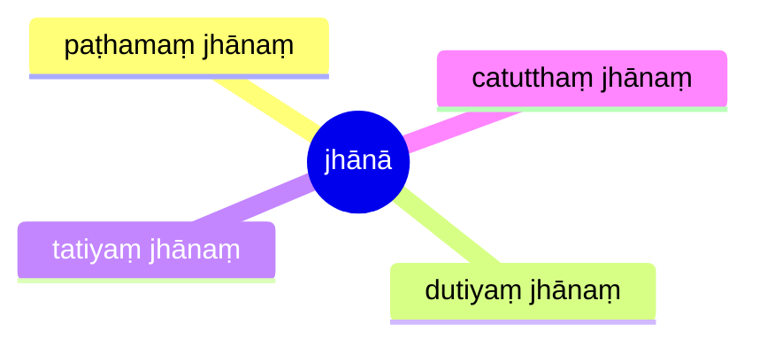

import { Tabs, TabItem } from '@astrojs/starlight/components';

[14S5/9.1.1--12 Jhānādisutta](https://tipitaka2500.github.io/tipitaka/14S5/9/9.1/9.1.1--12.html)

<Tabs syncKey="paliquote">
<TabItem label="My Translation">
1625\. [The Bhagavā] was staying at Sāvatthī.

There, the Bhagavā said this:

> Bhikkhave, there are these four jhānā. Which four?
>
> * Here, bhikkhave, a bhikkhu, quite secluded from sensual pleasures, secluded from unskillful qualities, enters and remains in the first jhāna, which is `savitakkaṃ` (accompanied by reflection), `savicāraṃ` (with consideration), `vivekajaṃ` (born from seclusion), `pītisukhaṃ` (filled with joy and pleasure).
> * `Vitakkavicārānaṃ` (reflecting and considering), `vūpasamā` (calmed down), With the subsiding of reflection and consideration, `ajjhattaṃ sampasādanaṃ` (personally confident), `cetaso` (having a purposeful mind), he enters and remains in the second jhāna, `ekodibhāvaṃ` (single minded), `avitakkaṃ`(without reflection), `avicāraṃ` (without consideration), `samādhijaṃ` (born from composure), filled with joy and pleasure.
> * `Pītiyā ca virāgā` (Dispassionate from joy etc.), he remains `upekkhako` (equanimous), `sato` (aware), `sampajāno` (thoughtful) and clearly comprehending; and he personally experiences comfort with the body, of which the noble ones declare —‘Equanimous, `satimā` (attentive), `sukhavihārī` (at ease)’ — he enters and remains in the third jhāna.
> * With the letting go of previous pleasure or pain, subsiding of satisfaction and dissatisfaction, `adukkhamasukhaṃ upekkhāsatipārisuddhiṃ` (possessing purification of awareness by equanimity that is neither pleasant nor unpleasant) he enters and remains in the fourth jhāna.
>
> These, bhikkhave, are the four jhānā.
</TabItem>

<TabItem label="Pāḷi (Roman IAST)">
1625\. Sāvatthinidānaṃ. Tatra kho…pe…  “cattārome, bhikkhave, jhānā. Katame cattāro? Idha, bhikkhave, bhikkhu vivicceva kāmehi vivicca akusalehi dhammehi savitakkaṃ savicāraṃ vivekajaṃ pītisukhaṃ paṭhamaṃ jhānaṃ upasampajja viharati. Vitakkavicārānaṃ vūpasamā ajjhattaṃ sampasādanaṃ cetaso ekodibhāvaṃ avitakkaṃ avicāraṃ samādhijaṃ pītisukhaṃ dutiyaṃ jhānaṃ upasampajja viharati. Pītiyā ca virāgā upekkhako ca viharati sato ca sampajāno sukhañca kāyena paṭisaṃvedeti, yaṃ taṃ ariyā ācikkhanti—  ‘upekkhako satimā sukhavihārī’ti tatiyaṃ jhānaṃ upasampajja viharati. Sukhassa ca pahānā dukkhassa ca pahānā pubbeva somanassadomanassānaṃ atthaṅgamā adukkhamasukhaṃ upekkhāsatipārisuddhiṃ catutthaṃ jhānaṃ upasampajja viharati. Ime kho, bhikkhave, cattāro jhānāti.
</TabItem>

<TabItem label="Pāḷi (Brahmi)">
1625\. 𑀲𑀸𑀯𑀢𑁆𑀣𑀺𑀦𑀺𑀤𑀸𑀦𑀁. 𑀢𑀢𑁆𑀭 𑀔𑁄…𑀧𑁂…  “𑀘𑀢𑁆𑀢𑀸𑀭𑁄𑀫𑁂, 𑀪𑀺𑀓𑁆𑀔𑀯𑁂, 𑀛𑀸𑀦𑀸. 𑀓𑀢𑀫𑁂 𑀘𑀢𑁆𑀢𑀸𑀭𑁄? 𑀇𑀥, 𑀪𑀺𑀓𑁆𑀔𑀯𑁂, 𑀪𑀺𑀓𑁆𑀔𑀼 𑀯𑀺𑀯𑀺𑀘𑁆𑀘𑁂𑀯 𑀓𑀸𑀫𑁂𑀳𑀺 𑀯𑀺𑀯𑀺𑀘𑁆𑀘 𑀅𑀓𑀼𑀲𑀮𑁂𑀳𑀺 𑀥𑀫𑁆𑀫𑁂𑀳𑀺 𑀲𑀯𑀺𑀢𑀓𑁆𑀓𑀁 𑀲𑀯𑀺𑀘𑀸𑀭𑀁 𑀯𑀺𑀯𑁂𑀓𑀚𑀁 𑀧𑀻𑀢𑀺𑀲𑀼𑀔𑀁 𑀧𑀞𑀫𑀁 𑀛𑀸𑀦𑀁 𑀉𑀧𑀲𑀫𑁆𑀧𑀚𑁆𑀚 𑀯𑀺𑀳𑀭𑀢𑀺. 𑀯𑀺𑀢𑀓𑁆𑀓𑀯𑀺𑀘𑀸𑀭𑀸𑀦𑀁 𑀯𑀽𑀧𑀲𑀫𑀸 𑀅𑀚𑁆𑀛𑀢𑁆𑀢𑀁 𑀲𑀫𑁆𑀧𑀲𑀸𑀤𑀦𑀁 𑀘𑁂𑀢𑀲𑁄 𑀏𑀓𑁄𑀤𑀺𑀪𑀸𑀯𑀁 𑀅𑀯𑀺𑀢𑀓𑁆𑀓𑀁 𑀅𑀯𑀺𑀘𑀸𑀭𑀁 𑀲𑀫𑀸𑀥𑀺𑀚𑀁 𑀧𑀻𑀢𑀺𑀲𑀼𑀔𑀁 𑀤𑀼𑀢𑀺𑀬𑀁 𑀛𑀸𑀦𑀁 𑀉𑀧𑀲𑀫𑁆𑀧𑀚𑁆𑀚 𑀯𑀺𑀳𑀭𑀢𑀺. 𑀧𑀻𑀢𑀺𑀬𑀸 𑀘 𑀯𑀺𑀭𑀸𑀕𑀸 𑀉𑀧𑁂𑀓𑁆𑀔𑀓𑁄 𑀘 𑀯𑀺𑀳𑀭𑀢𑀺 𑀲𑀢𑁄 𑀘 𑀲𑀫𑁆𑀧𑀚𑀸𑀦𑁄 𑀲𑀼𑀔𑀜𑁆𑀘 𑀓𑀸𑀬𑁂𑀦 𑀧𑀝𑀺𑀲𑀁𑀯𑁂𑀤𑁂𑀢𑀺, 𑀬𑀁 𑀢𑀁 𑀅𑀭𑀺𑀬𑀸 𑀆𑀘𑀺𑀓𑁆𑀔𑀦𑁆𑀢𑀺—  ‘𑀉𑀧𑁂𑀓𑁆𑀔𑀓𑁄 𑀲𑀢𑀺𑀫𑀸 𑀲𑀼𑀔𑀯𑀺𑀳𑀸𑀭𑀻’𑀢𑀺 𑀢𑀢𑀺𑀬𑀁 𑀛𑀸𑀦𑀁 𑀉𑀧𑀲𑀫𑁆𑀧𑀚𑁆𑀚 𑀯𑀺𑀳𑀭𑀢𑀺. 𑀲𑀼𑀔𑀲𑁆𑀲 𑀘 𑀧𑀳𑀸𑀦𑀸 𑀤𑀼𑀓𑁆𑀔𑀲𑁆𑀲 𑀘 𑀧𑀳𑀸𑀦𑀸 𑀧𑀼𑀩𑁆𑀩𑁂𑀯 𑀲𑁄𑀫𑀦𑀲𑁆𑀲𑀤𑁄𑀫𑀦𑀲𑁆𑀲𑀸𑀦𑀁 𑀅𑀢𑁆𑀣𑀗𑁆𑀕𑀫𑀸 𑀅𑀤𑀼𑀓𑁆𑀔𑀫𑀲𑀼𑀔𑀁 𑀉𑀧𑁂𑀓𑁆𑀔𑀸𑀲𑀢𑀺𑀧𑀸𑀭𑀺𑀲𑀼𑀤𑁆𑀥𑀺𑀁 𑀘𑀢𑀼𑀢𑁆𑀣𑀁 𑀛𑀸𑀦𑀁 𑀉𑀧𑀲𑀫𑁆𑀧𑀚𑁆𑀚 𑀯𑀺𑀳𑀭𑀢𑀺. 𑀇𑀫𑁂 𑀔𑁄, 𑀪𑀺𑀓𑁆𑀔𑀯𑁂, 𑀘𑀢𑁆𑀢𑀸𑀭𑁄 𑀛𑀸𑀦𑀸𑀢𑀺.
</TabItem>
</Tabs>

